# Threat Model - Juice Shop

_Generated by appsec-advisor v0.4.0-beta (analysis v2)_


---

> | | |
> |---|---|
> | **Project** | Juice Shop v19.2.1 |
> | **Description** | Probably the most modern and sophisticated insecure web application |
> | **Author** | Björn Kimminich <bjoern.kimminich@owasp.org> (https://kimminich.de) |
> | **License** | MIT |
> | **Repository** | https://github.com/juice-shop/juice-shop |
> | **Homepage** | https://owasp-juice.shop |
> | **Runtime** | Node.js 20 - 24, Express 4 |
> | **Tags** | web security, web application security, webappsec, owasp, pentest, pentesting, security, vulnerable, vulnerability, broken, bodgeit, ctf, capture the flag, awareness |

---

## Changelog

_Append-only history of assessment runs. Most recent first._

| Version | Date | Mode | Depth | Reasoning | Baseline → Current | Δ Threats | Code | Note |
|--------|----------|--------|--------|--------------|------------------|----------------|--------|--------|
| v1 | 2026-05-30 | full | thorough | opus-cheap | _(initial)_ | +48 / ~0 / -0 | - | - |

---

## Table of Contents

- [Management Summary](#management-summary)
- [Critical Attack Tree](#critical-attack-tree)
1. [System Overview](#1-system-overview)
   - [Scope](#scope)
2. [Architecture Diagrams](#2-architecture-diagrams)
   - [2.1 System Context](#21-system-context)
   - [2.2 Container Architecture](#22-container-architecture)
   - [2.3 Components](#23-components)
   - [2.4 Technology Architecture](#24-technology-architecture)
3. [Attack Walkthroughs](#3-attack-walkthroughs)
   - [3.1 Hardcoded RSA private key enables full JWT forgery](#31-hardcoded-rsa-private-key-enables-full-jwt-forgery)
   - [3.2 Express jwt 0.1.3 algorithm confusion algorithm none bypass](#32-express-jwt-013-algorithm-confusion-algorithm-none-bypass)
   - [3.3 MD5 password hashing credential brute force](#33-md5-password-hashing-credential-brute-force)
   - [3.4 Stored XSS user feedback rendered via trust HTML bypass in…](#34-stored-xss-user-feedback-rendered-via-trust-html-bypass-in)
   - [3.5 RCE via VM sandbox escape notevil evaluated in vm.createCon…](#35-rce-via-vm-sandbox-escape-notevil-evaluated-in-vmcreatecon)
   - [3.6 SQL injection login authentication bypass](#36-sql-injection-login-authentication-bypass)
   - [3.7 Eval in captcha endpoint server side code execution](#37-eval-in-captcha-endpoint-server-side-code-execution)
   - [3.8 SSTI via eval in user profile username code execution](#38-ssti-via-eval-in-user-profile-username-code-execution)
   - [3.9 SQLite database stores MD5 password hashes accessible via S…](#39-sqlite-database-stores-md5-password-hashes-accessible-via-s)
   - [3.10 SQL injection product search enables full DB exfiltration](#310-sql-injection-product-search-enables-full-db-exfiltration)
   - [3.11 XXE XML file upload enables local file read via libxmljs2](#311-xxe-xml-file-upload-enables-local-file-read-via-libxmljs2)
   - [3.12 B2B API accessible via forged JWT authentication prerequisi…](#312-b2b-api-accessible-via-forged-jwt-authentication-prerequisi)
4. [Assets](#4-assets)
5. [Attack Surface](#5-attack-surface)
   - [5.1 Unauthenticated Entry Points (12)](#51-unauthenticated-entry-points-12)
   - [5.2 Authenticated Entry Points (3)](#52-authenticated-entry-points-3)
7. [Security Architecture](#7-security-architecture)
   - [7.1 Security Control Overview](#71-security-control-overview)
   - [7.2 Identity and Authentication Controls](#72-identity-and-authentication-controls)
   - [7.3 Session and Token Controls](#73-session-and-token-controls)
   - [7.4 Authorization Controls](#74-authorization-controls)
   - [7.5 Query Construction and Data Access Controls](#75-query-construction-and-data-access-controls)
   - [7.6 Input Boundary Validation Controls](#76-input-boundary-validation-controls)
   - [7.7 Output Encoding and Rendering Controls](#77-output-encoding-and-rendering-controls)
   - [7.8 Browser and Cross-Origin Controls](#78-browser-and-cross-origin-controls)
   - [7.9 Cryptography Secrets and Data Protection](#79-cryptography-secrets-and-data-protection)
   - [7.10 File Parser and Outbound Request Controls](#710-file-parser-and-outbound-request-controls)
   - [7.11 Operations Runtime and Supply Chain Controls](#711-operations-runtime-and-supply-chain-controls)
   - [7.12 Real-time and Not Applicable Controls](#712-real-time-and-not-applicable-controls)
   - [7.13 Defense-in-Depth Summary](#713-defense-in-depth-summary)
8. [Threat Register](#8-threat-register)
9. [Mitigation Register](#9-mitigation-register)
10. [Out of Scope](#10-out-of-scope)
- [Appendix: Run Statistics](#appendix-run-statistics)
- [Appendix A - Vektor Taxonomy](#appendix-a-vektor-taxonomy)

> _Section numbering is non-contiguous: §6 was retired in a prior revision. The remaining sections keep their original numbers so existing cross-references stay valid._

---

## Management Summary

### Verdict

🔴 Not production-ready. Juice Shop is a training target - intentional weaknesses live in every tier. Anyone with a browser and a clone of the public repo can take over the admin account, dump the entire user database, and execute arbitrary code on the server through several independent paths, none of which require elevated privilege or special tooling. Fixing this means rebuilding authentication, data access, and secret management - not patching a single bug.

**Risk distribution:** 🔴 Critical: 12 · 🟠 High: 14 · 🟡 Medium: 11 · 🟢 Low: 11 · **Total: 48**

<br/>

**Worst-case scenarios behind this verdict - what an attacker can do today:**

<blockquote style="border-left: 3px solid #dc2626; background: #fef2f2; padding: 16px 20px; margin: 0;">

- **Admin takeover without any credentials** — The RSA private key used to sign all login tokens is committed to the public repository; anyone who clones it can mint a token claiming admin identity and gain full control of every privileged API endpoint. *([F-001](#f-001), [F-002](#f-002))*
- **Arbitrary code execution on the server** — Two unauthenticated endpoints evaluate user-supplied strings as JavaScript inside the server process; a third B2B endpoint uses a sandboxed evaluator with known escape paths — all three allow an attacker to run OS commands. *([F-005](#f-005), [F-007](#f-007), [F-008](#f-008))*
- **Full user database dump without a valid account** — The login and product search endpoints build SQL by string concatenation; an unauthenticated attacker can extract every user record — email addresses and password hashes — in a single request. *([F-006](#f-006), [F-010](#f-010), [F-009](#f-009))*
- **Admin session hijack via stored malicious content** — Three places in the Angular frontend bypass the framework's built-in HTML escaping and render user-supplied content as trusted markup; any visitor who submits feedback can inject a script that runs in the admin's browser and steals their session. *([F-004](#f-004), [F-013](#f-013), [F-020](#f-020))*
- **Sensitive files and internal logs readable by anyone** — The FTP directory listing and the access log directory are served publicly without authentication, exposing confidential business documents, a KeePass credential database, and HTTP request history including authentication headers. *([F-022](#f-022), [F-034](#f-034))*

</blockquote>

<br/>

Thirty-six mitigations follow. Three matter most: move secrets out of source, replace raw SQL with parameterized queries, and remove `eval()` and bypassSecurityTrustHtml calls. Without those three, production readiness is not on the table.

### Security Posture & Top Threats

**Figure 1 - Architecture, Trust Boundaries & Threats**

Components grouped by trust boundary (architecture tier). Grey edges are the legitimate request backbone. **Solid red** edges are attacker-controlled attacks - each originates at a threat actor and lands on the component it directly reaches. **Dotted red** edges are the consequence path: how that attack propagates through the application tier onto the data tier or the victim. Each red edge carries the threat glyph(s) - the same numbering as Figure 2 and the Top Threats table below.

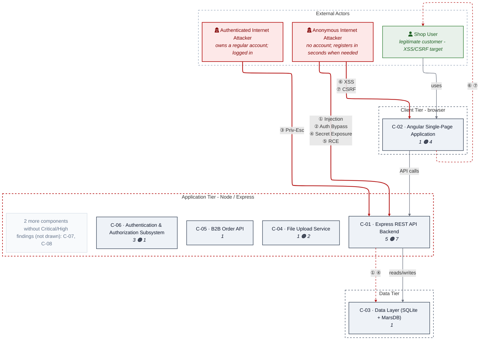

**Figure 2 - Risk Flow: Actor → Tier → Impact**

Heatmap: **actors** (left) → **architecture tiers** (middle, Client → Application → Data) → **impact** (right). Numbered red arrows ①–⑥ are the threats enumerated in the Top Threats table below.

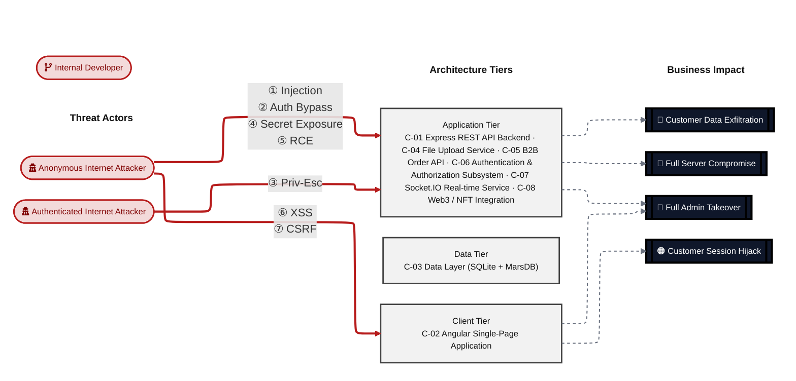

**Threat actors.** The actors below drive the numbered attack paths in the figures above; the Shop User is the *victim* of client-side attacks (XSS / CSRF), not an attacker.

- **Shop User** — legitimate customer; target of client-side attacks; target of ⑥ Output Encoding / Cross-Site Scripting, ⑦ CSRF / Permissive CORS.
- **Anonymous Internet Attacker** — no account; registers in seconds when needed; drives ① Insecure Query Construction & Data Access, ② Hardcoded Secrets & Weak Cryptography, ④ Sensitive File & Secret Exposure, ⑤ Remote Code Execution (unsafe eval).
- **Authenticated Internet Attacker** — owns a regular account; logged in; drives ③ Broken Authorization & Access Control.

**7 structural threats**, grouped by weakness class - each row is one threat, not one finding. *Threat Description* states the general architectural weakness (STRIDE in brackets); *Findings* lists the concrete instances, each linked to [§8 Threat Register](#8-threat-register) with its component; *Risk & Impact* combines severity with business consequence.

| # | Threat Description | Findings (→ Component) | Risk & Impact | Fix |
|---|------------------------------------|------------------------------------------------|------------------------------------|--------------------|
| <a id="path-injection"></a>① | **Insecure Query Construction & Data Access** _(T·I)_<br/>Untrusted input flows into raw SQL and MarsDB \$where queries across four routes, allowing extraction or manipulation of any data in the database. | •&nbsp;[F-006](#f-006) SQL injection login authentication bypass →&nbsp;[C-01](#c-01)<br/>•&nbsp;[F-010](#f-010) SQL injection product search enables full DB exfiltration →&nbsp;[C-01](#c-01)<br/>•&nbsp;[F-016](#f-016) NoSQL injection order tracking via MarsDB \$where →&nbsp;[C-01](#c-01)<br/>•&nbsp;[F-017](#f-017) NoSQL injection review update with multi:true mass modification →&nbsp;[C-01](#c-01)<br/>•&nbsp;[F-021](#f-021) NoSQL injection product reviews \$where exposes all reviews →&nbsp;[C-01](#c-01) | 🔴 **Critical**<br/>Customer Data Exfiltration | [M-008](#m-008), [M-017](#m-017) (P1/P2) |
| <a id="path-auth-bypass"></a>② | **Hardcoded Secrets & Weak Cryptography** _(S·E)_<br/>Authentication is bypassed via SQL injection on the login endpoint or by forging a JWT with the hardcoded RSA private key committed to the public repository. | •&nbsp;[F-001](#f-001) Hardcoded RSA private key enables full JWT forgery →&nbsp;[C-06](#c-06)<br/>•&nbsp;[F-002](#f-002) Express jwt 0.1.3 algorithm confusion algorithm none bypass →&nbsp;[C-06](#c-06)<br/>•&nbsp;[F-006](#f-006) SQL injection login authentication bypass →&nbsp;[C-01](#c-01) | 🔴 **Critical**<br/>Full Admin Takeover | [M-001](#m-001), [M-003](#m-003) (P1) |
| <a id="path-privilege-escalation"></a>③ | **Broken Authorization & Access Control** _(E·I)_<br/>Authorization checks are client-side only or commented out on key endpoints, allowing authenticated users to escalate to admin access or modify other users' data. | •&nbsp;[F-024](#f-024) Client side role check admin route accessible by JWT forgery →&nbsp;[C-02](#c-02)<br/>•&nbsp;[F-025](#f-025) IDOR basket access without ownership validation →&nbsp;[C-01](#c-01)<br/>•&nbsp;[F-026](#f-026) PUT `/api/Products/:id` no authentication guard →&nbsp;[C-01](#c-01) | 🟠 **High**<br/>Full Admin Takeover | [M-001](#m-001), [M-003](#m-003) (P1) |
| <a id="path-sensitive-data-exposure"></a>④ | **Sensitive File & Secret Exposure** _(I)_<br/>Sensitive files including the FTP directory, access logs, and the JWT public key are served without authentication via directory listing routes. | •&nbsp;[F-022](#f-022) FTP directory listing sensitive files publicly accessible →&nbsp;[C-01](#c-01)<br/>•&nbsp;[F-030](#f-030) JWT public key served publicly at `/encryptionkeys/jwt.pub` →&nbsp;[C-01](#c-01)<br/>•&nbsp;[F-034](#f-034) Access logs publicly browseable at `/support/logs` →&nbsp;[C-01](#c-01) | 🟠 **High**<br/>Customer Data Exfiltration | [M-011](#m-011), [M-004](#m-004) (P2) |
| <a id="path-remote-code-execution"></a>⑤ | **Remote Code Execution (unsafe eval)** _(E)_<br/>User-controlled strings are evaluated as JavaScript via `eval()` in two unauthenticated routes and via a sandbox-escape path in the B2B API, enabling arbitrary OS command execution. | •&nbsp;[F-005](#f-005) RCE via VM sandbox escape notevil evaluated in vm.createContext →&nbsp;[C-05](#c-05)<br/>•&nbsp;[F-007](#f-007) Eval in captcha endpoint server side code execution →&nbsp;[C-01](#c-01)<br/>•&nbsp;[F-008](#f-008) SSTI via eval in user profile username code execution →&nbsp;[C-01](#c-01) | 🔴 **Critical**<br/>Full Server Compromise | [M-023](#m-023), [M-009](#m-009) (P1) |
| <a id="path-cross-site-scripting"></a>⑥ | **Output Encoding / Cross-Site Scripting** _(T·I)_<br/>Angular's built-in HTML escaping is explicitly disabled at three call sites, allowing stored XSS payloads in feedback, email fields, and review comments to execute in other users' browsers. | •&nbsp;[F-004](#f-004) Stored XSS user feedback rendered via trust HTML bypass in admin view →&nbsp;[C-02](#c-02)<br/>•&nbsp;[F-013](#f-013) Stored XSS public product review comments rendered unsanitized in about page →&nbsp;[C-02](#c-02)<br/>•&nbsp;[F-014](#f-014) Stored XSS user email in admin panel via trust HTML bypass →&nbsp;[C-02](#c-02) | 🔴 **Critical**<br/>Customer Session Hijack · Full Admin Takeover | [M-025](#m-025) (P1) |
| <a id="path-cross-site-request-forgery"></a>⑦ | **CSRF / Permissive CORS** _(S·T)_<br/>a permissive CORS policy plus missing anti-CSRF tokens let any external page issue authenticated state-changing requests in the victim's session. | •&nbsp;[F-036](#f-036) Wildcard CORS any origin can make credentialed requests →&nbsp;[C-01](#c-01) | 🟡 **Medium**<br/>Customer Session Hijack | [M-015](#m-015) (P3) |

_STRIDE: S spoofing · T tampering · R repudiation · I information disclosure · D denial of service · E elevation of privilege. Risk, findings, components, impact and Fix are derived deterministically; only the one-line weakness description is authored._

### Top Mitigations

Highest-impact P1/P2 mitigations - 10 of 19 qualifying (36 total). Full detail in [§9 Mitigation Register](#9-mitigation-register). All 8 mitigation(s) that fix a Critical finding are always listed here; the remaining entries are curated by impact: these extras address the broadest High-severity exposure: CSRF/XSS token theft, NoSQL injection across three routes, missing login rate limiting, unauthenticated product modification, public sensitive file disclosure, IDOR, Zip Slip, and SSRF

| # | Priority | Component | Mitigation | Addresses | Effort |
|---|--------|----------------------|------------------------------------------------|------------------------------------------------|------|
| **1** | **P1** | [C-01](#c-01) — Express REST API Backend | [M-008](#m-008) — SQL injection login authentication bypass | [F-006](#f-006) — SQL injection login authentication bypass (`routes/login.ts`)<br/>[F-009](#f-009) — SQLite database stores MD5 password hashes accessible via SQLi (`lib/insecurity.ts`)<br/>[F-010](#f-010) — SQL injection product search enables full DB exfiltration (`routes/search.ts`) | Medium |
| **2** | **P1** | [C-01](#c-01) — Express REST API Backend | [M-009](#m-009) — Eval in captcha endpoint server side code execution | [F-007](#f-007) — Eval in captcha endpoint server side code execution (`routes/captcha.ts`)<br/>[F-008](#f-008) — SSTI via eval in user profile username code execution (`routes/userProfile.ts`) | Medium |
| **3** | **P1** | [C-02](#c-02) — Angular Single-Page Application | [M-025](#m-025) — Stored XSS user feedback rendered via trust HTML bypass in admin view | [F-004](#f-004) — Stored XSS user feedback rendered via trust HTML bypass in admin view (`frontend/src/app/administration/administration.component.ts`)<br/>[F-013](#f-013) — Stored XSS public product review comments rendered unsanitized in about page (`frontend/src/app/about/about.component.ts`)<br/>[F-014](#f-014) — Stored XSS user email in admin panel via trust HTML bypass (`frontend/src/app/administration/administration.component.ts`) | Medium |
| **4** | **P1** | [C-04](#c-04) — File Upload Service | [M-019](#m-019) — XXE XML file upload enables local file read via libxmljs2 | [F-011](#f-011) — XXE XML file upload enables local file read via libxmljs2 (`routes/fileUpload.ts`) | Medium |
| **5** | **P1** | [C-05](#c-05) — B2B Order API | [M-023](#m-023) — RCE via VM sandbox escape notevil evaluated in vm.createContext | [F-005](#f-005) — RCE via VM sandbox escape notevil evaluated in vm.createContext (`routes/b2bOrder.ts`)<br/>[F-012](#f-012) — B2B API accessible via forged JWT authentication prerequisite trivially sat... (`server.ts`)<br/>[F-035](#f-035) — B2B API infinite loop CPU exhaustion via timed eval (`routes/b2bOrder.ts`) | Medium |
| **6** | **P1** | [C-06](#c-06) — Authentication & Authorization Subsystem | [M-001](#m-001) — Hardcoded RSA private key enables full JWT forgery | [F-001](#f-001) — Hardcoded RSA private key enables full JWT forgery (`lib/insecurity.ts`)<br/>[F-012](#f-012) — B2B API accessible via forged JWT authentication prerequisite trivially sat... (`server.ts`)<br/>[F-024](#f-024) — Client side role check admin route accessible by JWT forgery (`frontend/src/app/app.guard.ts`) | Medium |
| **7** | **P1** | [C-06](#c-06) — Authentication & Authorization Subsystem | [M-002](#m-002) — MD5 password hashing credential brute force | [F-003](#f-003) — MD5 password hashing credential brute force (`lib/insecurity.ts`)<br/>[F-009](#f-009) — SQLite database stores MD5 password hashes accessible via SQLi (`lib/insecurity.ts`) | Medium |
| **8** | **P1** | [C-06](#c-06) — Authentication & Authorization Subsystem | [M-003](#m-003) — Express jwt 0.1.3 algorithm confusion algorithm none bypass | [F-002](#f-002) — Express jwt 0.1.3 algorithm confusion algorithm none bypass (`lib/insecurity.ts`)<br/>[F-024](#f-024) — Client side role check admin route accessible by JWT forgery (`frontend/src/app/app.guard.ts`) | Medium |
| **9** | **P1** | [C-06](#c-06) — Authentication & Authorization Subsystem | [M-005](#m-005) — Remove CSRF exposure — add SameSite cookies and CSRF tokens | [F-015](#f-015) — Password reset bypasses current password CSRF/direct request (`routes/changePassword.ts`) | Medium |
| **10** | **P2** | [C-01](#c-01) — Express REST API Backend | [M-007](#m-007) — Login endpoint has no rate limiting brute force credential stuffing | [F-023](#f-023) — Login endpoint has no rate limiting brute force credential stuffing (`server.ts`) | Medium |

*9 additional P1/P2 mitigations capped from the leader-board · 17 P3 backlog items in [§9 Mitigation Register](#9-mitigation-register). Sorted by priority (P1 first), then component, then leverage (most findings first), severity (Critical first), and effort (Low first).*

### Operational Strengths

Operational controls rated Adequate or Partial - grouped into broad clusters (full per-control breakdown in [§7](#7-security-architecture)). Clusters demoted to Weak by open Critical/High findings appear in [§7](#7-security-architecture) instead, not here.

| Strength | What's in Place | Effectiveness | Gap | Mitigates |
|----------------------|----------------------|-------------|----------------------|------------------------------------------------|
| **Container & Supply-Chain Hardening** | _Build-time and runtime hardening - minimal base image, non-root execution, dependency inventory._<br/>Automated SCA scanning<br/>Container Hardening | ✅ Adequate | - | - |
| **Hardened HTTP Stack** | _Browser-facing HTTP hardening — security headers, cookie flags, cross-origin policy, and abuse-protection limits._<br/>Rate Limiting<br/>CORS Policy | ⚠️ Partial | Bypassed by 1 High finding(s) of the kind this cluster is supposed to prevent — e.g. [F-019](#t-019). | [F-029](#f-029) — No Content Security Policy header XSS escalation unrestri…<br/>[F-036](#f-036) — Wildcard CORS any origin can make credentialed requests |
| **Observability & Audit** | _Runtime visibility - access logging, audit trails, and operational telemetry for post-incident review._<br/>Access Log Monitoring | ⚠️ Partial | Coverage incomplete - see [§7](#7-security-architecture) control assessment. | - |


**Bottom line:** These controls narrow specific attack surfaces but none eliminates a Critical finding on its own.

---

<a id="critical-attack-chain"></a><a id="critical-attack-tree"></a>
## Critical Attack Tree

The root is the worst-case attacker goal; below it, each capability branch groups the Critical findings that achieve it. Branches feed the goal by OR - any single path suffices.

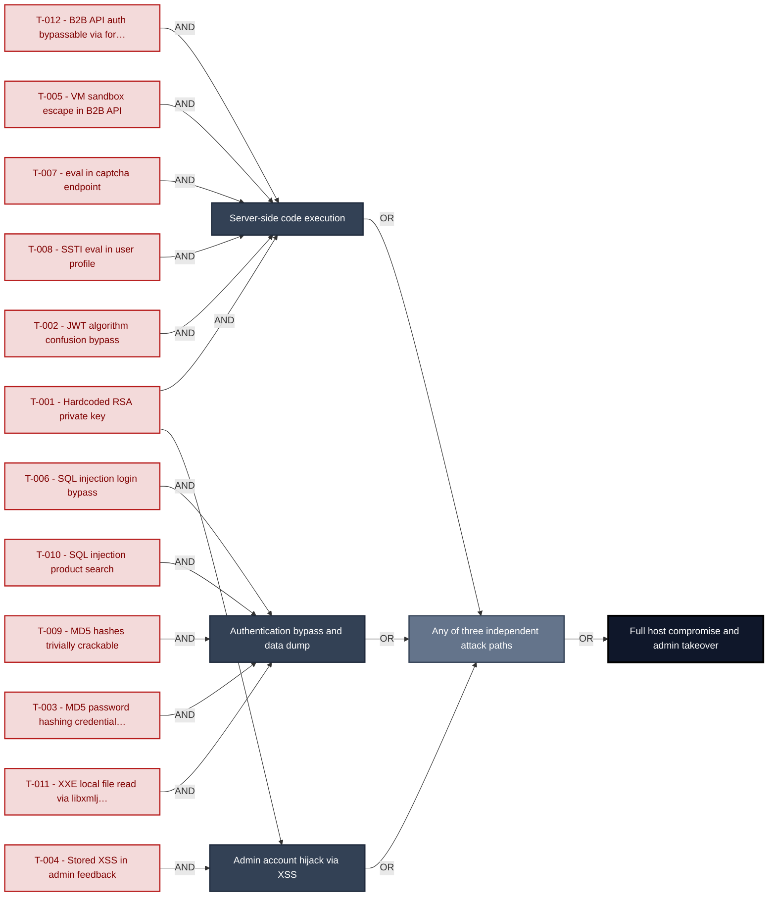

**Findings** (full detail in [§8 Threat Register](#8-threat-register)): [F-001](#f-001) Hardcoded RSA private key · [F-002](#f-002) JWT algorithm confusion bypass · [F-005](#f-005) VM sandbox escape in B2B API · [F-007](#f-007) eval in captcha endpoint · [F-008](#f-008) SSTI eval in user profile · [F-006](#f-006) SQL injection login bypass · [F-009](#f-009) MD5 hashes recoverable by GPU dictionary attack within seconds · [F-010](#f-010) SQL injection product search · [F-011](#f-011) XXE local file read via libxmljs2 · [F-004](#f-004) Stored XSS in admin feedback · [F-012](#f-012) B2B API auth bypassable via forged JWT · [F-003](#f-003) MD5 password hashing credential brute force

---

## 1. System Overview

Probably the most modern and sophisticated insecure web application

**Repository:** https://github.com/juice-shop/juice-shop
**Runtime:** `Node.js` 20 - 24

### Scope

This threat model covers 8 components of juice-shop: **Express REST API Backend**, **Angular Single-Page Application**, **Data Layer (SQLite + MarsDB)**, **File Upload Service**, **B2B Order API**, **Authentication & Authorization Subsystem**, **`Socket.IO` Real-time Service**, **Web3 / NFT Integration**.

**Out of scope:** third-party hosted dependencies, browser runtime, operating-system kernel, and the underlying network infrastructure.

---

## 2. Architecture Diagrams

### 2.1 System Context

Who interacts with juice-shop from the outside, and through which channels. Solid arrows show normal usage; dashed red arrows mark unauthenticated probing or exploit paths (C4 Level 1).

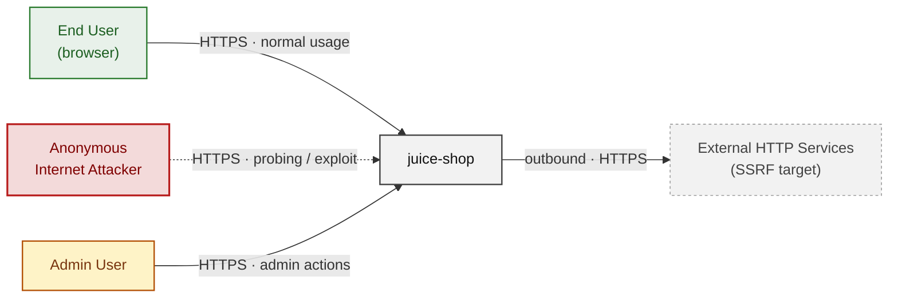

**Key takeaway:** Juice Shop is a single public-facing application with no authenticated perimeter - every actor (end user, attacker, admin) reaches the same HTTP surface from the open internet.

### 2.2 Container Architecture

How the system decomposes into deployable units. Each box is a separate runtime process or service container; arrows show synchronous request paths between them. Components with ≥3 Critical findings carry a red border, ≥2 High amber (C4 Level 2).

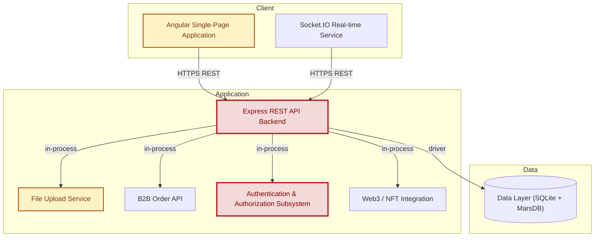

**Key takeaway:** The express-backend and auth-subsystem (red borders) concentrate the majority of Critical findings - they share the same `Node.js` process, so a single RCE or auth bypass compromises both simultaneously.

### 2.3 Components


Who reaches each component, and through which trust zone. Four columns map external actors to the internal tiers (Client / Application / Data); solid green arrows show legitimate data flow, dashed red arrows mark intrusion vectors. The component table directly below holds source paths and linked threats per `C-NN`; per-finding evidence is in [§8 Threat Register](#8-threat-register).

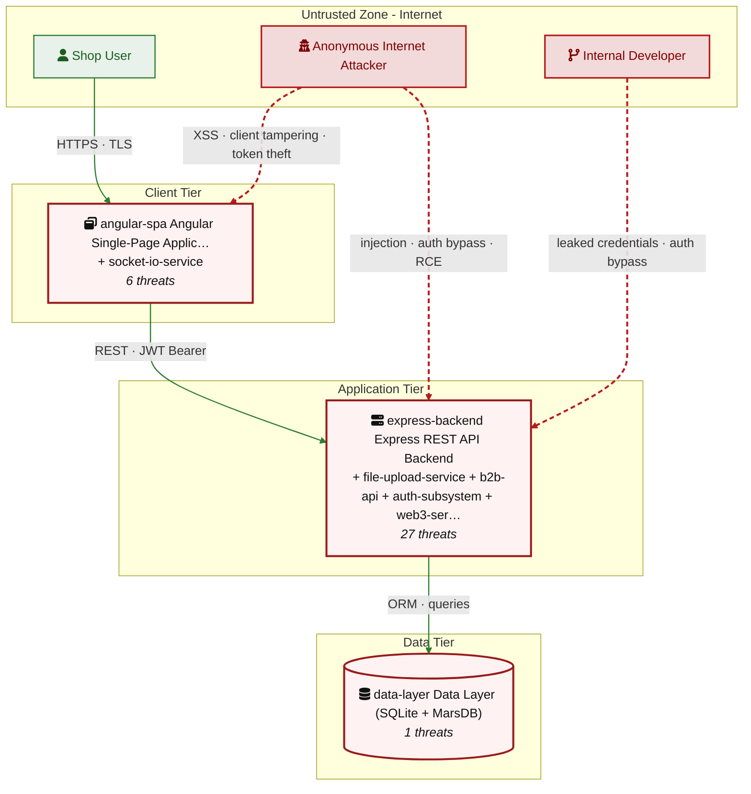

**Key takeaway:** The application tier concentrates 27 of the 34 tracked threats, with every attack vector from the internet converging on the express-backend - a compromise there provides direct access to the data tier with no additional lateral movement required.

| ID | Name | Type | Key Paths | Linked Threats |
|----|----------------------|-----------|----------------------|------------------------------------------------|
| <a id="c-01"></a><a id="express-backend"></a>C-01 | Express REST API Backend | application | `server.ts`<br/>`app.ts`<br/>`routes/**`<br/>`lib/**` | [F-006](#f-006) (SQL injection login authentication bypass)<br/>[F-007](#f-007) (Eval in captcha endpoint server side code execution)<br/>[F-008](#f-008) (SSTI via eval in user profile username code execution)<br/>[F-010](#f-010) (SQL injection product search enables full DB exfiltration)<br/>[F-012](#f-012) (B2B API accessible via forged JWT authentication prerequisite trivially sat...)<br/>[F-016](#f-016) (NoSQL injection order tracking via MarsDB \$where)<br/>[F-017](#f-017) (NoSQL injection review update with multi:true mass modification)<br/>[F-021](#f-021) (NoSQL injection product reviews \$where exposes all reviews)<br/>[F-022](#f-022) (FTP directory listing sensitive files publicly accessible)<br/>[F-023](#f-023) (Login endpoint has no rate limiting brute force credential stuffing)<br/>[F-025](#f-025) (IDOR basket access without ownership validation)<br/>[F-026](#f-026) (PUT `/api/Products/:id` no authentication guard)<br/>[F-027](#f-027) (UserId parameter injection data exported for arbitrary user)<br/>[F-028](#f-028) (Open redirect via substring allowlist bypass)<br/>[F-029](#f-029) (No Content Security Policy header XSS escalation unrestricted)<br/>[F-030](#f-030) (JWT public key served publicly at `/encryptionkeys/jwt.pub`)<br/>[F-031](#f-031) (`Ci.yml` missing top level permissions block)<br/>[F-032](#f-032) (Dockerfile base image not pinned to digest)<br/>[F-033](#f-033) (True Client IP header XSS in login IP storage)<br/>[F-034](#f-034) (Access logs publicly browseable at `/support/logs`)<br/>[F-036](#f-036) (Wildcard CORS any origin can make credentialed requests)<br/>[F-041](#f-041) (Coverallsapp/github action at v2 not pinned to commit SHA)<br/>[F-042](#f-042) (Docker `compose.test`.yml uses unpinned :latest image tag)<br/>[F-043](#f-043) (Npm install uses unsafe perm flag)<br/>[F-044](#f-044) (Prometheus metrics publicly accessible application internals exposed)<br/>[F-045](#f-045) (Swagger UI publicly accessible full API documentation exposed)<br/>[F-047](#f-047) (File upload size limit bypassable via chunked encoding) |
| <a id="c-02"></a><a id="angular-spa"></a>C-02 | Angular Single-Page Application | client | `frontend/src/**` | [F-004](#f-004) — Stored XSS user feedback rendered via trust HTML bypass in admin view<br/>[F-013](#f-013) — Stored XSS public product review comments rendered unsanitized in about page<br/>[F-014](#f-014) — Stored XSS user email in admin panel via trust HTML bypass<br/>[F-020](#f-020) — JWT stored in localStorage accessible to XSS, no httpOnly protection<br/>[F-024](#f-024) — Client side role check admin route accessible by JWT forgery<br/>[F-037](#f-037) — Client side only role enforcement Angular guards bypassable |
| <a id="c-03"></a><a id="data-layer"></a>C-03 | Data Layer (SQLite + MarsDB) | data | `models/**`<br/>`data/**` | [F-009](#f-009) — SQLite database stores MD5 password hashes accessible via SQLi |
| <a id="c-04"></a><a id="file-upload-service"></a>C-04 | File Upload Service | application | `routes/fileUpload.ts`<br/>`routes/profileImageFileUpload.ts`<br/>`routes/profileImageUrlUpload.ts`<br/>`routes/memory.ts` | [F-011](#f-011) — XXE XML file upload enables local file read via libxmljs2<br/>[F-018](#f-018) — Zip Slip ZIP upload allows arbitrary file write<br/>[F-019](#f-019) — SSRF profile image URL upload fetches arbitrary external URLs |
| <a id="c-05"></a><a id="b2b-api"></a>C-05 | B2B Order API | application | `routes/b2bOrder.ts` | [F-005](#f-005) — RCE via VM sandbox escape notevil evaluated in vm.createContext<br/>[F-035](#f-035) — B2B API infinite loop CPU exhaustion via timed eval |
| <a id="c-06"></a><a id="auth-subsystem"></a>C-06 | Authentication & Authorization Subsystem | application | `lib/insecurity.ts`<br/>`routes/login.ts`<br/>`routes/changePassword.ts`<br/>`routes/resetPassword.ts`<br/>`routes/2fa.ts` | [F-001](#f-001) — Hardcoded RSA private key enables full JWT forgery<br/>[F-002](#f-002) — Express jwt 0.1.3 algorithm confusion algorithm none bypass<br/>[F-003](#f-003) — MD5 password hashing credential brute force<br/>[F-015](#f-015) — Password reset bypasses current password CSRF/direct request<br/>[F-040](#f-040) — In memory session map no persistent audit trail for auth events |
| <a id="c-07"></a><a id="socket-io-service"></a>C-07 | `Socket.IO` Real-time Service | application | `lib/startup/registerWebsocketEvents.ts`<br/>`frontend/src/app/Services/socket-io.service.ts` | [F-038](#f-038) — `Socket.IO` connection unauthenticated no JWT verification on WebSocket<br/>[F-048](#f-048) — `Socket.IO` 3.1.2 outdated version with known vulnerabilities |
| <a id="c-08"></a><a id="web3-service"></a>C-08 | Web3 / NFT Integration | application | `routes/nftMint.ts`<br/>`routes/checkKeys.ts`<br/>`routes/web3Wallet.ts` | [F-039](#f-039) — WalletExploitAddress endpoint accepts unvalidated contract addresses<br/>[F-046](#f-046) — Web3 private key or mnemonic may be exposed in training scenarios |
### 2.4 Technology Architecture

The technology stack the system is built on. Each box names the framework or runtime that fills that role; per-component findings live in the [§2.3](#23-components) component table above, and the full per-finding catalogue is in [§8 Threat Register](#8-threat-register).

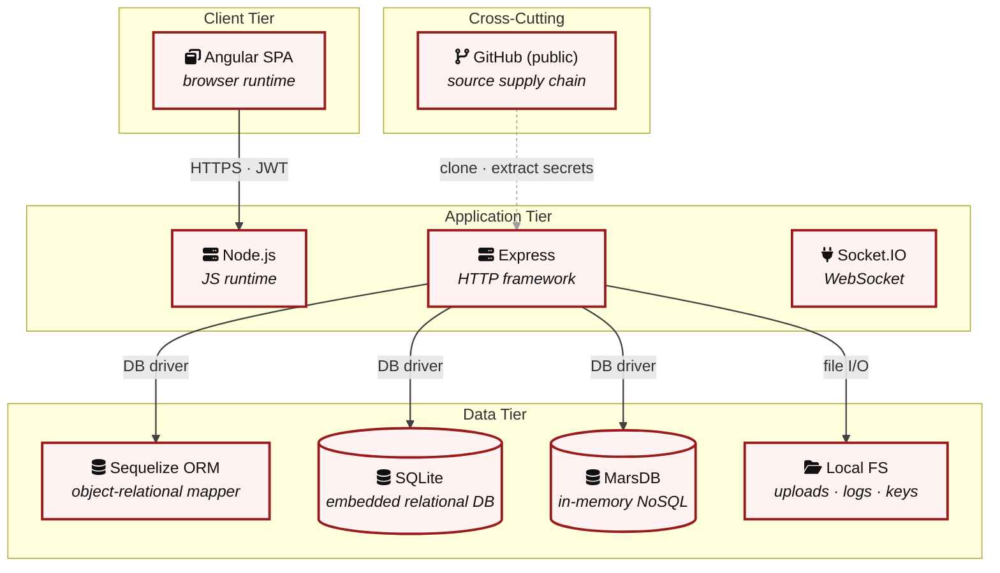

**Key takeaway:** Every layer of the stack - from the public GitHub source down through `Node.js`, Express, and SQLite - carries red-bordered findings; there is no clean architectural layer that an attacker must pass through without a known weakness.

> **Legend:** **red border** ≥ 3 Critical threats on the component · **amber border** ≥ 2 High threats

---

## 3. Attack Walkthroughs

This section walks through how the highest-risk findings are exploited - one short walkthrough per Critical, each with attack steps, a focused sequence diagram, and the primary mitigation. The cross-finding view (which weaknesses combine toward the worst-case goal, and where one fix severs several paths) is in the [Critical Attack Tree](#critical-attack-tree). Full per-finding context - severity rationale, assets, detection signals - is in the [§8 Threat Register](#8-threat-register) row for each finding.

### 3.1 Hardcoded RSA private key enables full JWT forgery

**Source:** [F-001](#f-001) - `lib/insecurity.ts:23`

Severity **Critical** ([CWE-321](https://cwe.mitre.org/data/definitions/321.html)). STRIDE: Spoofing. See [§8 T-001](#t-001) for the full register row.

**Attack Steps**

1. The RSA private key used to sign all JWTs is hardcoded as a string literal in `lib/insecurity.ts:23` and committed to the public repository.
2. Any attacker can extract this key, sign arbitrary JWT payloads with any user ID and role (admin, accounting), and gain full access to the application.
3. Clone the public repository and locate the cryptographic key at `lib/insecurity.ts:23`.

**Sequence Diagram**

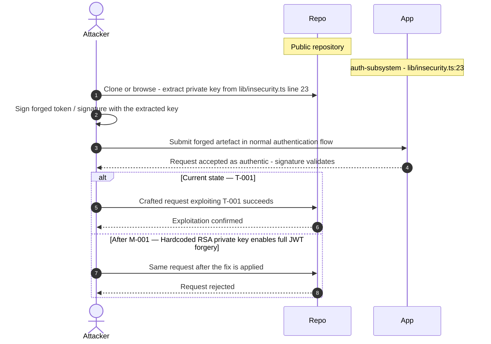

**Key takeaway:** Until M-001 (Hardcoded RSA private key enables full JWT forgery) lands, T-001 is exploitable at `lib/insecurity.ts:23` (Critical-severity, [CWE-321](https://cwe.mitre.org/data/definitions/321.html)).

**Defense in Depth**

- Primary mitigation: [M-001](#m-001) (Hardcoded RSA private key enables full JWT forgery)

### 3.2 Express jwt 0.1.3 algorithm confusion algorithm none bypass

**Source:** [F-002](#f-002) - `lib/insecurity.ts:71`

Severity **Critical** ([CWE-347](https://cwe.mitre.org/data/definitions/347.html)). STRIDE: Spoofing. See [§8 T-002](#t-002) for the full register row.

**Attack Steps**

1. express-jwt 0.1.3 does not enforce algorithm restrictions.
2. An attacker can modify a valid JWT header to `alg:none`, strip the signature, and the library will accept it as valid.
3. Combined with the public key being available at `/encryptionkeys/jwt.pub`, an attacker can forge tokens without knowing the private key.

**Sequence Diagram**


**Key takeaway:** Until M-003 (Express jwt 0.1.3 algorithm confusion algorithm none bypass) lands, T-002 is exploitable at `lib/insecurity.ts:71` (Critical-severity, [CWE-347](https://cwe.mitre.org/data/definitions/347.html)).

**Defense in Depth**

- Primary mitigation: [M-003](#m-003) (Express jwt 0.1.3 algorithm confusion algorithm none bypass)

### 3.3 MD5 password hashing credential brute force

**Source:** [F-003](#f-003) - `lib/insecurity.ts:47`

Severity **Critical** ([CWE-916](https://cwe.mitre.org/data/definitions/916.html)). STRIDE: Spoofing. See [§8 T-003](#t-003) for the full register row.

**Attack Steps**

1. All user passwords are stored as unsalted MD5 hashes (`lib/insecurity.ts:47`).
2. MD5 is broken for password storage and the entire user table is recoverable via rainbow tables or GPU cracking within hours.
3. Send the crafted payload to the endpoint backed by `lib/insecurity.ts:47`.

**Sequence Diagram**

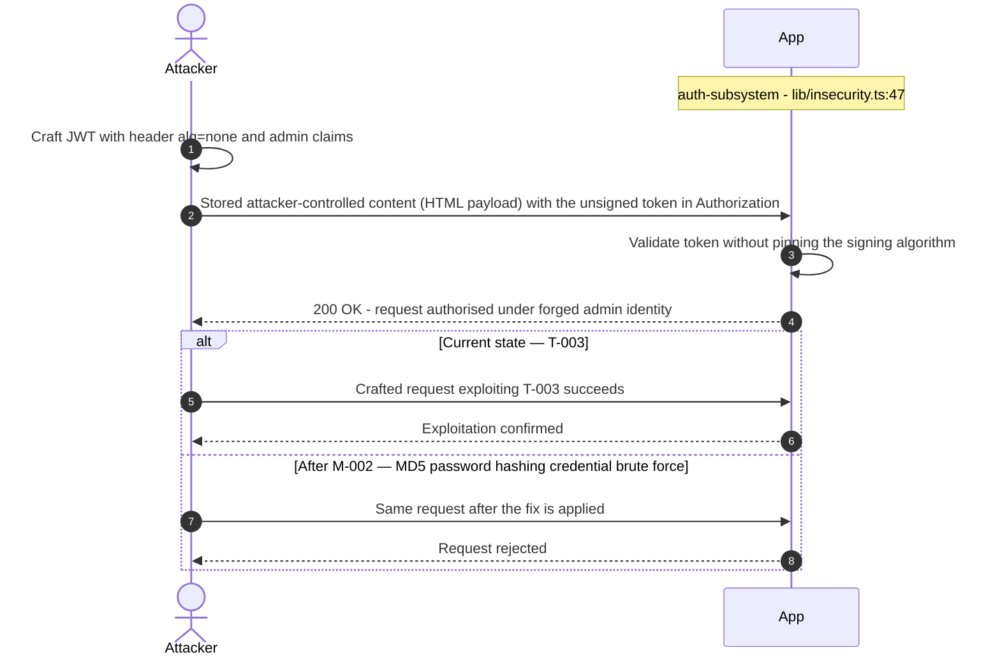

**Key takeaway:** Until M-002 (MD5 password hashing credential brute force) lands, T-003 is exploitable at `lib/insecurity.ts:47` (Critical-severity, [CWE-916](https://cwe.mitre.org/data/definitions/916.html)).

**Defense in Depth**

- Primary mitigation: [M-002](#m-002) (MD5 password hashing credential brute force)

### 3.4 Stored XSS user feedback rendered via trust HTML bypass in…

**Source:** [F-004](#f-004) - `frontend/src/app/administration/administration.component.ts:78`

Severity **Critical** ([CWE-79](https://cwe.mitre.org/data/definitions/79.html)). STRIDE: Tampering. See [§8 T-004](#t-004) for the full register row.

**Attack Steps**

1. The administration component calls sanitizer.bypassSecurityTrustHtml(feedback.comment) (`administration.component.ts:78`) when rendering user feedback.
2. Stored XSS payloads in feedback comments execute in admin context, potentially stealing admin JWTs from localStorage.
3. Send the crafted payload to the endpoint backed by `frontend/src/app/administration/administration.component.ts:78`.

**Sequence Diagram**


**Key takeaway:** Until M-025 (Stored XSS user feedback rendered via trust HTML bypass in a) lands, T-004 is exploitable at `frontend/src/app/administration/administration.component.ts:78` (Critical-severity, [CWE-79](https://cwe.mitre.org/data/definitions/79.html)).

**Defense in Depth**

- Primary mitigation: [M-025](#m-025) (Stored XSS user feedback rendered via trust HTML bypass in admin view)

### 3.5 RCE via VM sandbox escape notevil evaluated in vm.createCon…

**Source:** [F-005](#f-005) - `routes/b2bOrder.ts:22`

Severity **Critical** ([CWE-94](https://cwe.mitre.org/data/definitions/94.html)). STRIDE: Tampering. See [§8 T-005](#t-005) for the full register row.

**Attack Steps**

1. The B2B order endpoint evaluates orderLinesData using notevil inside a vm.createContext sandbox (`routes/b2bOrder.ts:22`).
2. The notevil library has known prototype pollution vulnerabilities and the VM context is escapable via constructor chains.
3. An authenticated attacker (with forged JWT) can execute arbitrary code on the server.

**Sequence Diagram**

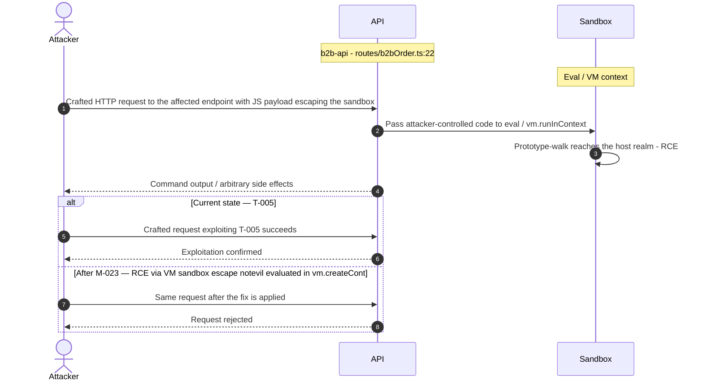

**Key takeaway:** Until M-023 (RCE via VM sandbox escape notevil evaluated in vm.createCont) lands, T-005 is exploitable at `routes/b2bOrder.ts:22` (Critical-severity, [CWE-94](https://cwe.mitre.org/data/definitions/94.html)).

**Defense in Depth**

- Primary mitigation: [M-023](#m-023) (RCE via VM sandbox escape notevil evaluated in vm.createContext)

### 3.6 SQL injection login authentication bypass

**Source:** [F-006](#f-006) - `routes/login.ts:34`

Severity **Critical** ([CWE-89](https://cwe.mitre.org/data/definitions/89.html)). STRIDE: Tampering. See [§8 T-006](#t-006) for the full register row.

**Attack Steps**

1. The login route constructs a SQL query by direct string interpolation of email and password parameters (`routes/login.ts:34`).
2. An attacker can bypass authentication with payloads like `admin@juice-sh.op'--` to log in as any user without knowing their password.
3. Identify the vulnerable input parameter - `express-backend` interpolates it directly into a SQL string at `routes/login.ts:34`.

**Sequence Diagram**

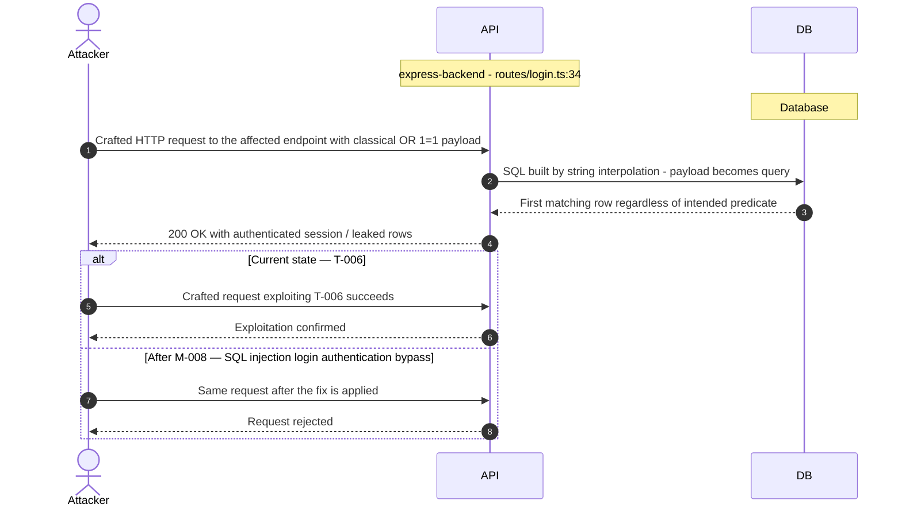

**Key takeaway:** Until M-008 (SQL injection login authentication bypass) lands, T-006 is exploitable at `routes/login.ts:34` (Critical-severity, [CWE-89](https://cwe.mitre.org/data/definitions/89.html)).

**Defense in Depth**

- Primary mitigation: [M-008](#m-008) (SQL injection login authentication bypass)

### 3.7 Eval in captcha endpoint server side code execution

**Source:** [F-007](#f-007) - `routes/captcha.ts:22`

Severity **Critical** ([CWE-94](https://cwe.mitre.org/data/definitions/94.html)). STRIDE: Tampering. See [§8 T-007](#t-007) for the full register row.

**Attack Steps**

1. The captcha math expression is evaluated via `eval()` (`routes/captcha.ts:22`).
2. An attacker can inject arbitrary JavaScript code in the expression to execute OS commands via child_process or access `Node.js` internal APIs.
3. Send the crafted payload to the endpoint backed by `routes/captcha.ts:22`.

**Sequence Diagram**

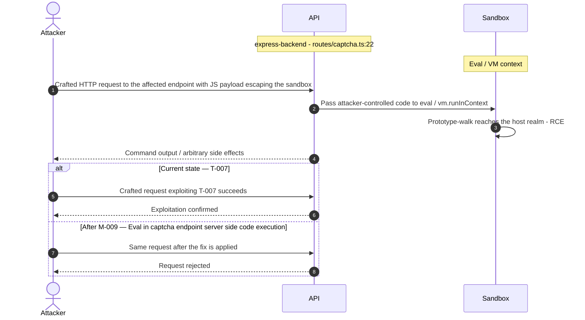

**Key takeaway:** Until M-009 (Eval in captcha endpoint server side code execution) lands, T-007 is exploitable at `routes/captcha.ts:22` (Critical-severity, [CWE-94](https://cwe.mitre.org/data/definitions/94.html)).

**Defense in Depth**

- Primary mitigation: [M-009](#m-009) (Eval in captcha endpoint server side code execution)

### 3.8 SSTI via eval in user profile username code execution

**Source:** [F-008](#f-008) - `routes/userProfile.ts:62`

Severity **Critical** ([CWE-94](https://cwe.mitre.org/data/definitions/94.html)). STRIDE: Tampering. See [§8 T-008](#t-008) for the full register row.

**Attack Steps**

1. getUserProfile (`routes/userProfile.ts:62`) evaluates the username field using `eval()` when it matches the pattern /#{(.*)}/.
2. An authenticated user can set their username to #{process.mainModule.require("child_process").execSync("id")} to achieve RCE.
3. Send the crafted payload to the endpoint backed by `routes/userProfile.ts:62`.

**Sequence Diagram**


**Key takeaway:** Until M-009 (Eval in captcha endpoint server side code execution) lands, T-008 is exploitable at `routes/userProfile.ts:62` (Critical-severity, [CWE-94](https://cwe.mitre.org/data/definitions/94.html)).

**Defense in Depth**

- Primary mitigation: [M-009](#m-009) (Eval in captcha endpoint server side code execution)

### 3.9 SQLite database stores MD5 password hashes accessible via S…

**Source:** [F-009](#f-009) - `lib/insecurity.ts:47`

Severity **Critical** ([CWE-916](https://cwe.mitre.org/data/definitions/916.html)). STRIDE: Information Disclosure. See [§8 T-009](#t-009) for the full register row.

**Attack Steps**

1. All user passwords are stored as unsalted MD5 hashes in the SQLite Users table.
2. SQL injection on the login or search endpoints allows exfiltrating the full users table including email+password combinations recoverable by GPU dictionary attack within seconds offline.
3. Send the crafted payload to the endpoint backed by `lib/insecurity.ts:47`.

**Sequence Diagram**

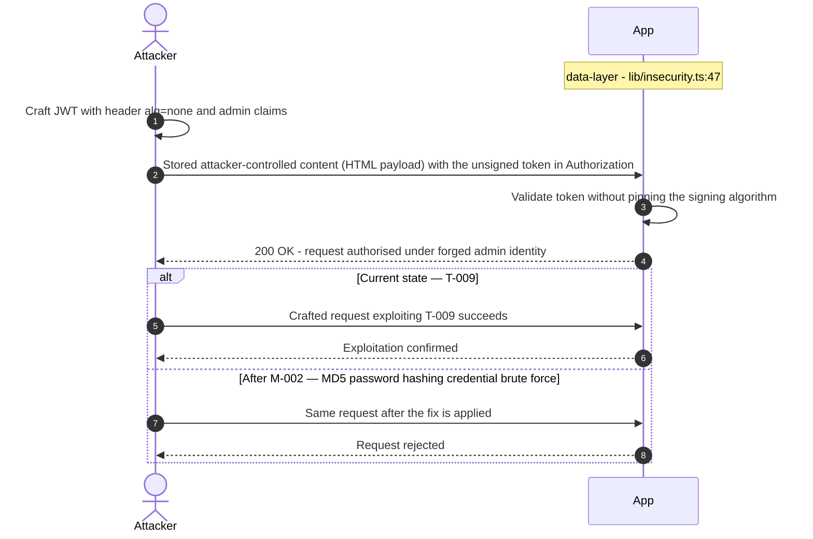

**Key takeaway:** Until M-002 (MD5 password hashing credential brute force) lands, T-009 is exploitable at `lib/insecurity.ts:47` (Critical-severity, [CWE-916](https://cwe.mitre.org/data/definitions/916.html)).

**Defense in Depth**

- Primary mitigation: [M-002](#m-002) (MD5 password hashing credential brute force)
- Defence in depth: [M-008](#m-008) (SQL injection login authentication bypass)

### 3.10 SQL injection product search enables full DB exfiltration

**Source:** [F-010](#f-010) - `routes/search.ts:23`

Severity **Critical** ([CWE-89](https://cwe.mitre.org/data/definitions/89.html)). STRIDE: Information Disclosure. See [§8 T-010](#t-010) for the full register row.

**Attack Steps**

1. The search endpoint at `/rest/products/search` interpolates the query parameter `q` directly into a SQL LIKE query (`routes/search.ts:23`).
2. UNION-based injection allows extracting all tables including Users with hashed passwords.
3. Identify the vulnerable input parameter - `express-backend` interpolates it directly into a SQL string at `routes/search.ts:23`.

**Sequence Diagram**

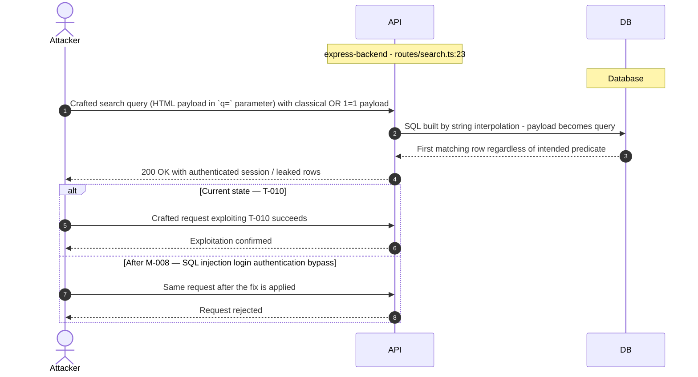

**Key takeaway:** Until M-008 (SQL injection login authentication bypass) lands, T-010 is exploitable at `routes/search.ts:23` (Critical-severity, [CWE-89](https://cwe.mitre.org/data/definitions/89.html)).

**Defense in Depth**

- Primary mitigation: [M-008](#m-008) (SQL injection login authentication bypass)

### 3.11 XXE XML file upload enables local file read via libxmljs2

**Source:** [F-011](#f-011) - `routes/fileUpload.ts:83`

Severity **Critical** ([CWE-611](https://cwe.mitre.org/data/definitions/611.html)). STRIDE: Information Disclosure. See [§8 T-011](#t-011) for the full register row.

**Attack Steps**

1. File upload handler parses XML with libxmljs2 using `noent:true` option inside a VM sandbox (`routes/fileUpload.ts:83`).
2. The `noent:true` flag enables external entity processing.
3. An attacker can upload an XML file with external entity declarations to read arbitrary local files (e.g., `/etc/passwd`, application config).

**Sequence Diagram**

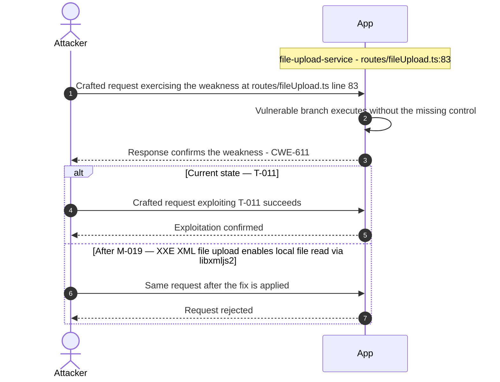

**Key takeaway:** Until M-019 (XXE XML file upload enables local file read via libxmljs2) lands, T-011 is exploitable at `routes/fileUpload.ts:83` (Critical-severity, [CWE-611](https://cwe.mitre.org/data/definitions/611.html)).

**Defense in Depth**

- Primary mitigation: [M-019](#m-019) (XXE XML file upload enables local file read via libxmljs2)

### 3.12 B2B API accessible via forged JWT authentication prerequisi…

**Source:** [F-012](#f-012) - `server.ts:423`

Severity **Critical** ([CWE-287](https://cwe.mitre.org/data/definitions/287.html)). STRIDE: Elevation of Privilege. See [§8 T-012](#t-012) for the full register row.

**Attack Steps**

1. While `/b2b/v2` requires `isAuthorized()` (`server.ts:423`), the authentication can be bypassed by forging a JWT using the hardcoded private key.
2. This effectively makes the RCE endpoint accessible to unauthenticated attackers with knowledge of the key.
3. Send the crafted payload to the endpoint backed by `server.ts:423`.

**Sequence Diagram**


**Key takeaway:** Until M-001 (Hardcoded RSA private key enables full JWT forgery) lands, T-012 is exploitable at `server.ts:423` (Critical-severity, [CWE-287](https://cwe.mitre.org/data/definitions/287.html)).

**Defense in Depth**

- Primary mitigation: [M-001](#m-001) (Hardcoded RSA private key enables full JWT forgery)
- Defence in depth: [M-023](#m-023) (RCE via VM sandbox escape notevil evaluated in vm.createContext)

<!-- generated:walkthrough_renderer -->

---

## 4. Assets

Information assets and the classification level that drives the Confidentiality / Integrity / Availability targets used in [§8 Threat Register](#8-threat-register) risk scoring.

| Asset | ID | Classification | Description | Linked Threats |
|----------------------|-----|--------------|------------------------------------|------------------------------------------------|
| User Credentials Database | A-001 | Restricted | SQLite table Users containing email, MD5-hashed passwords, roles, TOTP secrets, and profile data for all users including admin. | [F-003](#f-003) (MD5 password hashing credential brute force) · [F-004](#f-004) (Stored XSS user feedback rendered via trust HTML bypass in admin view) · [F-006](#f-006) (SQL injection login authentication bypass) · [F-009](#f-009) (SQLite database stores MD5 password hashes accessible via SQLi) · [F-010](#f-010) (SQL injection product search enables full DB exfiltration) · [F-013](#f-013) (Stored XSS public product review comments rendered unsanitized in about page) · [F-014](#f-014) (Stored XSS user email in admin panel via trust HTML bypass) · [F-023](#f-023) (Login endpoint has no rate limiting brute force credential stuffing) |
| JWT RSA Private Key | A-002 | Restricted | 1024-bit RSA private key hardcoded in `lib/insecurity.ts:23`, used to sign all JWT authentication tokens. Compromise enables complete JWT forgery. | [F-001](#f-001) (Hardcoded RSA private key enables full JWT forgery) · [F-002](#f-002) (Express jwt 0.1.3 algorithm confusion algorithm none bypass) · [F-012](#f-012) (B2B API accessible via forged JWT authentication prerequisite trivially sat...) · [F-018](#f-018) (Zip Slip ZIP upload allows arbitrary file write) · [F-024](#f-024) (Client side role check admin route accessible by JWT forgery) · [F-030](#f-030) (JWT public key served publicly at `/encryptionkeys/jwt.pub`) · [F-031](#f-031) (`Ci.yml` missing top level permissions block) · [F-032](#f-032) (Dockerfile base image not pinned to digest) · [F-041](#f-041) (Coverallsapp/github action at v2 not pinned to commit SHA) · [F-042](#f-042) (Docker `compose.test`.yml uses unpinned :latest image tag) · [F-043](#f-043) (Npm install uses unsafe perm flag) · [F-044](#f-044) (Prometheus metrics publicly accessible application internals exposed) · [F-045](#f-045) (Swagger UI publicly accessible full API documentation exposed) · [F-046](#f-046) (Web3 private key or mnemonic may be exposed in training scenarios) |
| JWT Authentication Tokens | A-003 | Confidential | RS256-signed JWTs stored in browser localStorage and in-memory tokenMap. Used to authenticate all API requests. | - |
| Product Catalog & Order Data | A-004 | Internal | SQLite tables for Products, BasketItems, Orders, Addresses, Payment Cards, and Recycles containing customer order history and financial data. | [F-004](#f-004) (Stored XSS user feedback rendered via trust HTML bypass in admin view) · [F-006](#f-006) (SQL injection login authentication bypass) · [F-010](#f-010) (SQL injection product search enables full DB exfiltration) · [F-013](#f-013) (Stored XSS public product review comments rendered unsanitized in about page) · [F-014](#f-014) (Stored XSS user email in admin panel via trust HTML bypass) · [F-025](#f-025) (IDOR basket access without ownership validation) · [F-026](#f-026) (PUT `/api/Products/:id` no authentication guard) · [F-027](#f-027) (UserId parameter injection data exported for arbitrary user) · [F-030](#f-030) (JWT public key served publicly at `/encryptionkeys/jwt.pub`) · [F-046](#f-046) (Web3 private key or mnemonic may be exposed in training scenarios) |
| User Reviews & NoSQL Order Data | A-005 | Internal | MarsDB collections for product reviews and order history. Subject to NoSQL \$where injection attacks. | [F-006](#f-006) (SQL injection login authentication bypass) · [F-010](#f-010) (SQL injection product search enables full DB exfiltration) · [F-016](#f-016) (NoSQL injection order tracking via MarsDB \$where) · [F-017](#f-017) (NoSQL injection review update with multi:true mass modification) · [F-021](#f-021) (NoSQL injection product reviews \$where exposes all reviews) · [F-025](#f-025) (IDOR basket access without ownership validation) · [F-026](#f-026) (PUT `/api/Products/:id` no authentication guard) · [F-027](#f-027) (UserId parameter injection data exported for arbitrary user) |
| Encryption Keys Directory | A-006 | Restricted | encryptionkeys/ directory served publicly at `/encryptionkeys/:file`, containing `jwt.pub` and `premium.key`. | [F-001](#f-001) (Hardcoded RSA private key enables full JWT forgery) · [F-018](#f-018) (Zip Slip ZIP upload allows arbitrary file write) · [F-022](#f-022) (FTP directory listing sensitive files publicly accessible) · [F-030](#f-030) (JWT public key served publicly at `/encryptionkeys/jwt.pub`) · [F-031](#f-031) (`Ci.yml` missing top level permissions block) · [F-032](#f-032) (Dockerfile base image not pinned to digest) · [F-041](#f-041) (Coverallsapp/github action at v2 not pinned to commit SHA) · [F-042](#f-042) (Docker `compose.test`.yml uses unpinned :latest image tag) · [F-043](#f-043) (Npm install uses unsafe perm flag) · [F-044](#f-044) (Prometheus metrics publicly accessible application internals exposed) · [F-045](#f-045) (Swagger UI publicly accessible full API documentation exposed) · [F-046](#f-046) (Web3 private key or mnemonic may be exposed in training scenarios) |
| FTP Directory Sensitive Files | A-007 | Confidential | ftp/ directory browseable at `/ftp`, containing `acquisitions.md` (M&A intelligence), incident-`support.kdbx` (KeePass DB), package backup files, and other sensitive documents. | [F-018](#f-018) (Zip Slip ZIP upload allows arbitrary file write) · [F-022](#f-022) (FTP directory listing sensitive files publicly accessible) · [F-026](#f-026) (PUT `/api/Products/:id` no authentication guard) · [F-031](#f-031) (`Ci.yml` missing top level permissions block) · [F-032](#f-032) (Dockerfile base image not pinned to digest) · [F-034](#f-034) (Access logs publicly browseable at `/support/logs`) · [F-041](#f-041) (Coverallsapp/github action at v2 not pinned to commit SHA) · [F-042](#f-042) (Docker `compose.test`.yml uses unpinned :latest image tag) · [F-043](#f-043) (Npm install uses unsafe perm flag) · [F-044](#f-044) (Prometheus metrics publicly accessible application internals exposed) · [F-045](#f-045) (Swagger UI publicly accessible full API documentation exposed) |
| Application Access Logs | A-008 | Internal | Morgan combined-format access logs served at `/support/logs`. Contain IP addresses, user agents, and authentication tokens. | [F-022](#f-022) (FTP directory listing sensitive files publicly accessible) · [F-026](#f-026) (PUT `/api/Products/:id` no authentication guard) · [F-031](#f-031) (`Ci.yml` missing top level permissions block) · [F-032](#f-032) (Dockerfile base image not pinned to digest) · [F-034](#f-034) (Access logs publicly browseable at `/support/logs`) · [F-041](#f-041) (Coverallsapp/github action at v2 not pinned to commit SHA) · [F-042](#f-042) (Docker `compose.test`.yml uses unpinned :latest image tag) · [F-043](#f-043) (Npm install uses unsafe perm flag) · [F-044](#f-044) (Prometheus metrics publicly accessible application internals exposed) · [F-045](#f-045) (Swagger UI publicly accessible full API documentation exposed) |
| File Upload Storage | A-009 | Internal | frontend/dist/frontend/assets/public/images/uploads/ directory for profile images and memories. Writable by SSRF via URL upload. | - |
| Challenge Progress Data | A-010 | Internal | SQLite Challenge table tracking which security challenges have been solved. Used by scoring system. | - |
| Payment Card Data | A-011 | Restricted | SQLite Card table storing payment method references. No PAN data stored (training platform). | [F-004](#f-004) (Stored XSS user feedback rendered via trust HTML bypass in admin view) · [F-006](#f-006) (SQL injection login authentication bypass) · [F-010](#f-010) (SQL injection product search enables full DB exfiltration) · [F-013](#f-013) (Stored XSS public product review comments rendered unsanitized in about page) · [F-014](#f-014) (Stored XSS user email in admin panel via trust HTML bypass) · [F-025](#f-025) (IDOR basket access without ownership validation) · [F-026](#f-026) (PUT `/api/Products/:id` no authentication guard) · [F-027](#f-027) (UserId parameter injection data exported for arbitrary user) · [F-030](#f-030) (JWT public key served publicly at `/encryptionkeys/jwt.pub`) · [F-046](#f-046) (Web3 private key or mnemonic may be exposed in training scenarios) |
| Server-Side Execution Environment | A-012 | Restricted | `Node.js` process with filesystem access. Targetable via `eval()`, VM sandbox escape in b2bOrder, and SSTI in userProfile. | - |

---

## 5. Attack Surface

Network-reachable entry points classified by authentication requirement. Each row links to the threat(s) referenced in its **Notes** column. The **Risk** column reflects the highest-severity linked finding.

### 5.1 Unauthenticated Entry Points (12)

| Method | Route | Auth | Risk | Notes |
|------|----------------------|----|----------|------------------------------------|
| POST | `/file-upload` | No | 🔴 Critical | [F-011](#f-011) (XXE XML file upload enables local file read via libxmljs2)<br/>[F-018](#f-018) (Zip Slip ZIP upload allows arbitrary file write)<br/>[F-019](#f-019) (SSRF profile image URL upload fetches arbitrary external URLs)<br/>File upload - XXE via libxmljs2 XML parsing, Zip Slip via unzipper. `routes/fileUpload.ts` |
| GET | `/rest/captcha` | No | 🔴 Critical | [F-007](#f-007) (Eval in captcha endpoint server side code execution)<br/>Captcha endpoint - `eval()` on math expression. `routes/captcha.ts:22` |
| GET | `/rest/products/search` | No | 🔴 Critical | [F-010](#f-010) (SQL injection product search enables full DB exfiltration)<br/>Product search - SQL injection via criteria interpolation. `routes/search.ts:23` |
| GET | `/rest/track-order/:id` | No | 🔴 Critical | [F-016](#f-016) (NoSQL injection order tracking via MarsDB \$where)<br/>[F-005](#f-005) (RCE via VM sandbox escape notevil evaluated in vm.createContext)<br/>[F-035](#f-035) (B2B API infinite loop CPU exhaustion via timed eval)<br/>Order tracking - MarsDB NoSQL injection via \$where. `routes/trackOrder.ts:18` |
| POST | `/rest/user/login` | No | 🔴 Critical | [F-023](#f-023) (Login endpoint has no rate limiting brute force credential stuffing)<br/>[F-006](#f-006) (SQL injection login authentication bypass)<br/>[F-033](#f-033) (True Client IP header XSS in login IP storage)<br/>Login endpoint - SQL injection via raw string interpolation in SELECT query. `routes/login.ts:34` |
| GET | `/rest/products/:id/reviews` | No | 🟠 High | [F-017](#f-017) (NoSQL injection review update with multi:true mass modification)<br/>[F-021](#f-021) (NoSQL injection product reviews \$where exposes all reviews)<br/>Product reviews - MarsDB NoSQL injection via \$where. `routes/showProductReviews.ts:36` |
| GET | `/api-docs` | No | 🟢 Low | [F-045](#f-045) (Swagger UI publicly accessible full API documentation exposed)<br/>Swagger UI - full API documentation publicly accessible. |
| GET | `/encryptionkeys/*` | No | - | Encryption keys directory - `jwt.pub` and `premium.key` publicly accessible. `server.ts:277`-278 |
| GET | `/ftp/*` | No | - | FTP directory - publicly browseable, sensitive files accessible. `server.ts:269`-270 |
| GET | `/redirect` | No | - | Open redirect - `url.includes()` substring allowlist bypass. `routes/redirect.ts` |
| ? | `/socket.io` | No | - | `Socket.IO` WebSocket for real-time challenge notifications. `Socket.IO` 3.1.2. |
| GET | `/support/logs/*` | No | - | Access log directory - publicly browseable logs. `server.ts:281`-283 |

### 5.2 Authenticated Entry Points (3)

| Method | Route | Auth | Risk | Notes |
|------|------------------|----|----------|------------------------------------|
| GET | `/profile` | Yes | 🔴 Critical | [F-019](#f-019) (SSRF profile image URL upload fetches arbitrary external URLs)<br/>[F-008](#f-008) (SSTI via eval in user profile username code execution)<br/>User profile - SSTI/eval via username #{} pattern. `routes/userProfile.ts:62` |
| POST | `/profile/image/url` | Yes | 🔴 Critical | [F-019](#f-019) (SSRF profile image URL upload fetches arbitrary external URLs)<br/>[F-008](#f-008) (SSTI via eval in user profile username code execution)<br/>Profile image URL upload - SSRF via unconstrained fetch(url). `routes/profileImageUrlUpload.ts:27` |
| POST | `/b2b/v2/orders` | Yes | - | B2B order API - RCE via notevil VM eval of orderLinesData. `routes/b2bOrder.ts:22` |

---

## 7. Security Architecture

This chapter is organized by security-control category. The architecture section avoids artificial control IDs and finding-ID columns in overview tables. Findings are listed only where the affected control is described.

_[§7](#7-security-architecture) schema v2 (13-section control-category layout). Cataloged controls: 26 total - 1 adequate, 7 partial, 13 weak, 0 unsafe, 5 missing. Linked threats: 48._

**How to read the verdicts.** Every control category (and every sub-control below it) carries exactly one status. The two red verdicts do **not** mean the same thing - this is the distinction that decides what you have to do about a finding:

| Status | Meaning | What it asks of you |
|----------|------------------------------------|------------------------|
| 🟢 Adequate | Control is present and sound | Nothing - keep it |
| 🟡 Partial | Present, but with meaningful gaps | Close the gap |
| 🟠 Weak | Present, but has exploitable gaps | Strengthen it |
| 🔴 Unsafe | **Present and relied upon, but defeated / trivially bypassable** | **Fix the existing control** |
| 🔴 Missing | **Control was never built** | **Add the control** |
| - | Not applicable to this codebase | - |

So "🔴 Unsafe" on a control category does *not* mean the control is absent - it means the control exists but does not hold (e.g. an MD5 password hash, a raw-SQL query path, a hardcoded signing key). "🔴 Missing" is reserved for controls that were never built (e.g. no Content-Security-Policy header).

### 7.1 Security Control Overview

<!-- §7.1 MECHANICAL-FROZEN — DO NOT EDIT (overview table is pregenerator-owned) -->

| Control category | Verdict | Main reason |
|----------------------|---------|------------------------------------|
| [7.2 Identity and Authentication Controls](#72-identity-and-authentication-controls) | 🟠 Weak | 6 routed findings; catalogued controls are weak (e.g. Password Hashing, JWT Token Signing). |
| [7.3 Session and Token Controls](#73-session-and-token-controls) | 🟠 Weak | 1 routed finding; catalogued controls are weak (e.g. Session Storage, JWT Library Version). |
| [7.4 Authorization Controls](#74-authorization-controls) | 🟠 Weak | 5 routed findings; catalogued controls are weak (e.g. Role-Based Access Control, Object-Level Authorization (IDOR)). |
| [7.5 Query Construction and Data Access Controls](#75-query-construction-and-data-access-controls) | 🟠 Weak | 5 routed findings; catalogued controls are weak (e.g. SQL Parameterization, NoSQL Query Safety). |
| [7.6 Input Boundary Validation Controls](#76-input-boundary-validation-controls) | 🟠 Weak | 3 routed findings; no compensating controls catalogued. |
| [7.7 Output Encoding and Rendering Controls](#77-output-encoding-and-rendering-controls) | 🟠 Weak | 4 routed findings; catalogued controls are weak (e.g. Input Sanitization, Template Injection Prevention). |
| [7.8 Browser and Cross-Origin Controls](#78-browser-and-cross-origin-controls) | 🔴 Missing | 2 routed findings; no controls catalogued for this category. |
| [7.9 Cryptography Secrets and Data Protection](#79-cryptography-secrets-and-data-protection) | 🟠 Weak | 3 routed findings; catalogued controls are weak (e.g. Secret Management). |
| [7.10 File Parser and Outbound Request Controls](#710-file-parser-and-outbound-request-controls) | 🔴 Missing | 15 routed findings; no controls catalogued for this category. |
| [7.11 Operations Runtime and Supply Chain Controls](#711-operations-runtime-and-supply-chain-controls) | 🟡 Partial | Dependabot and CycloneDX SBOM in place; base image unpinned, `--unsafe-perm` install, several critically outdated packages. |
| [7.12 Real-time and Not Applicable Controls](#712-real-time-and-not-applicable-controls) | 🟠 Weak | `Socket.IO` present and unauthenticated; no JWT verification on WebSocket connection. |
| [7.13 Defense-in-Depth Summary](#713-defense-in-depth-summary) | - | No controls or findings routed to this category. |

<!-- §7.1 MECHANICAL-FROZEN END -->

### 7.2 Identity and Authentication Controls

**Verdict:** 🟠 Weak

**Controls covered:** [7.2.1 Password-Based Login](#721-password-based-login) · [7.2.2 MFA / TOTP Login](#722-mfa-totp-login)

- [7.2.1 Password-Based Login](#password-based-login)
- [7.2.2 MFA / TOTP Login](#mfa--totp-login)

**Implemented controls:** TOTP-based 2FA via `otplib` (optional), rate limiting on `/rest/user/reset-password` and 2FA verify at 100 req/5 min, Sequelize `Users` model for user record storage.

**Assessment:** The authentication boundary is broken at its two most critical points: the password hash algorithm is unsalted MD5 (recoverable by GPU dictionary attack within seconds offline), and the JWT signing key committed to source means token forgery requires no server access. TOTP is present and correctly rate-limited, but it is optional and not enforced for admin accounts - so the possession factor cannot compensate for the broken knowledge factor. The login endpoint carries no rate limit, removing the last line of defence against credential stuffing. JWT signing, algorithm validation, and token lifecycle are covered in [§7.3 Session and Token Controls](#73-session-and-token-controls), which also tracks [F-001](#f-001) and [F-002](#f-002).

<a id="password-based-login"></a>
#### 7.2.1 Password-Based Login

**Status:** 🔴 Unsafe - unsalted MD5 credential storage combined with no login-endpoint rate limit makes every stored credential trivially recoverable and the login endpoint vulnerable to unlimited credential stuffing.

`lib/insecurity.ts:47` exports a single `hash()` helper called everywhere passwords are stored or compared. It calls `crypto.createHash('md5')` with no salt. All routes that store or verify a password - login, registration, password reset, and password change - pass through this function. `express-rate-limit` middleware is applied to `POST /rest/user/reset-password` and the 2FA verification endpoint (100 req/5 min), but `POST /rest/user/login` has no rate limit at `server.ts:594`.

**Security assessment**

Two independent weaknesses sit on the password login path:

- **Credential storage:** `lib/insecurity.ts:47` hashes with unsalted MD5. Any database dump obtained through SQL injection yields all password hashes; GPU cracking or rainbow tables recover plaintexts for common passwords in seconds. `routes/login.ts:34` also interpolates the MD5 hash of the supplied password directly into SQL — the hash algorithm and the query construction are both broken at the same call site.
- **Brute-force protection:** The unprotected login endpoint allows unlimited credential stuffing against the MD5 password database. Protecting reset and 2FA endpoints while leaving the primary authentication endpoint open is the wrong priority ordering.

The hash function that breaks the credential storage control:

```ts
export const hash = (data: string) => crypto.createHash('md5').update(data).digest('hex')
```

**Relevant findings**

- [F-003](#f-003) — Unsalted MD5 hash makes the entire Users table recoverable via offline cracking after any SQL injection dump.
- [F-009](#f-009) — SQLite Users table stores MD5 hashes exfiltrable via UNION-based SQL injection on the search endpoint.
- [F-023](#f-023) — No rate limit on `POST /rest/user/login` enables unrestricted brute-force and credential stuffing.

<a id="mfa--totp-login"></a>
#### 7.2.2 MFA / TOTP Login

**Status:** 🟡 Partial - TOTP enrollment and verification are implemented and rate-limited, but MFA is optional and not enforced for admin accounts.

TOTP-based 2FA is available via `routes/2fa.ts`. Enrollment generates a TOTP secret stored in the `Users` table. The verification step is rate-limited at 100 requests per 5 minutes. Both enrollment and verification are gated behind a valid session JWT.

**Security assessment**

TOTP is correctly implemented as a possession factor. The gap is that enrollment is opt-in and admin accounts are not required to enroll. An attacker who bypasses password authentication (via SQL injection or JWT forgery) gains full admin access without triggering any MFA prompt, because MFA is only checked when an enrolled user logs in through the normal flow.

**Relevant findings**

- No dedicated MFA finding is raised in this assessment. The control is partial rather than missing; the gap is enforcement policy, not implementation correctness.

### 7.3 Session and Token Controls

**Verdict:** 🟠 Weak

**Controls covered:** [7.3.1 Session Storage](#731-session-storage) · [7.3.2 JWT Library Version](#732-jwt-library-version)

- [7.3.1 Session Storage](#session-storage)
- [7.3.2 JWT Library Version](#jwt-library-version)

**Implemented controls:** RS256-signed JWTs issued by `lib/insecurity.ts`, `express-jwt` middleware enforced on protected routes, cookie parser with signing secret.

**Assessment:** This application uses a single locally-signed token format (commonly called JWT) for every authenticated session, regardless of the login flow in [§7.2](#72-identity-and-authentication-controls) that established it. The sub-sections below trace one token through its lifecycle: signing on issuance, validation on every protected request, storage in the browser, manual revocation, and time-based expiry. The token storage choice - `localStorage` - is the primary session architecture weakness: any XSS on the page can read and exfiltrate the token. The validation library (`express-jwt 0.1.3`) accepts unsigned tokens, defeating the signing boundary described in [§7.2](#72-identity-and-authentication-controls).

<a id="session-storage"></a>
#### 7.3.1 Session Storage

**Status:** 🔴 Unsafe - JWTs are stored in `localStorage`, accessible to any JavaScript on the page.

`app.guard.ts:18` reads the token from `localStorage.getItem('token')` to make routing decisions. The Angular app stores the token returned from login into `localStorage` and reads it from there for every subsequent API call via the `TokenInterceptor`.

**Security assessment**

`localStorage` has no `HttpOnly` or `SameSite` protections - it is a plain JavaScript object accessible to any script running on the same origin. Three stored XSS sinks in this codebase ([F-004](#f-004), [F-013](#f-013), [F-014](#f-014)) each create a direct path to stealing the session JWT. Moving to an `HttpOnly`, `SameSite=Strict` cookie would eliminate the entire token-theft attack surface regardless of XSS payloads.

**Relevant findings**

- [F-020](#f-020) — JWT stored in `localStorage` is accessible to any XSS payload executing on the page.

<a id="jwt-library-version"></a>
#### 7.3.2 JWT Library Version

**Status:** 🔴 Unsafe - `express-jwt 0.1.3` and `jsonwebtoken 0.4.0` accept unsigned (`alg:none`) tokens.

`package.json` pins `express-jwt` at `0.1.3` and `jsonwebtoken` at `0.4.0`. The `isAuthorized()` middleware at `lib/insecurity.ts:71` wraps `expressJwt({ secret: publicKey })` - passing only the public key and not restricting the allowed algorithms.

**Security assessment**

`express-jwt 0.1.3` does not enforce algorithm restrictions. Taking any valid JWT, changing the header to `{"alg":"none"}`, and removing the signature produces a token the middleware accepts as valid. This completely separates token forgery from knowledge of the signing key - an attacker does not need the hardcoded private key to forge an admin session. Both `express-jwt` and `jsonwebtoken` have been patched against this class of attack in versions released four or more years ago.

**Relevant findings**

- [F-002](#f-002) — Algorithm confusion bypass via `express-jwt 0.1.3` accepts unsigned tokens for any claimed identity.

### 7.4 Authorization Controls

**Verdict:** 🟠 Weak

**Controls covered:** [7.4.1 Role-Based Access Control](#741-role-based-access-control) · [7.4.2 Object-Level Authorization](#742-object-level-authorization)

- [7.4.1 Role-Based Access Control](#role-based-access-control)
- [7.4.2 Object-Level Authorization](#object-level-authorization)

**Implemented controls:** JWT role payload (`customer`/`admin`/`accounting`/`deluxe`), `security.isAuthorized()` and `security.isAccounting()` middleware on most protected routes, Angular `AdminGuard`/`AccountingGuard` client-side routing guards.

**Assessment:** Role information is carried in the JWT payload and checked server-side by `security.isAuthorized()` on most routes. The control breaks down in three places: the product update endpoint has its auth middleware commented out; basket ownership is detected but not enforced; and Angular client-side guards are the only authorization check on admin navigation. All three gaps are independent - fixing one does not close the others.

<a id="role-based-access-control"></a>
#### 7.4.1 Role-Based Access Control

**Status:** 🟠 Weak - server-side role checks are inconsistently applied; one high-value endpoint has its middleware commented out.

Most `finale-rest` endpoints have `security.isAuthorized()` applied via `server.ts`. The role carried in the JWT payload (`customer`, `admin`, `accounting`, `deluxe`) gates admin and accounting functionality. Angular `AdminGuard` and `AccountingGuard` provide client-side route protection.

**Security assessment**

Three independent gaps break the authorization boundary:

- `server.ts:369` has `// app.put('/api/Products/:id', security.isAuthorized())` commented out. Any unauthenticated request can modify product prices and descriptions - no token required.
- Angular `AdminGuard` (`app.guard.ts:46`) decodes the JWT role client-side and controls routing. This is a UI-only control: an attacker with a forged admin JWT navigates directly to `/administration` and the guard passes.
- `finale-rest` bulk endpoints accept mass-assignment to privileged model fields with no field-level filtering.

**Relevant findings**

- [F-024](#f-024) — Client-side `AdminGuard` is the only check for admin-route navigation; server-side equivalent is absent.
- [F-026](#f-026) — `PUT /api/Products/:id` runs without any auth middleware — auth guard commented out at `server.ts:369`.
- [F-037](#f-037) — Angular `AccountingGuard` is a client-only control, bypassable with a forged accounting-role JWT.

<a id="object-level-authorization"></a><a id="object-level-authorization-idor"></a>
#### 7.4.2 Object-Level Authorization

**Status:** 🟠 Weak - basket ownership is detected but not enforced; authenticated users can access any other user's basket.

`routes/basket.ts:21` fetches a basket by ID from `req.params`. `challengeUtils.solveIf()` records that unauthorized access was detected, but the route still returns the basket data to the requestor.

**Security assessment**

The ownership check is implemented as a side-effect (challenge detection) rather than an authorization gate. Any authenticated user who knows or guesses a basket ID can retrieve another user's items and payment details. The fix is a one-line addition: compare `basket.UserId` against the authenticated user's ID from the JWT and return 403 on mismatch.

The check that detects but does not block unauthorized access:

```ts
const basket = await BasketModel.findOne({ where: { id }, include: [...] })
// challengeUtils.solveIf — records the IDOR but returns basket regardless
```

**Relevant findings**

- [F-025](#f-025) — Basket retrieval at `routes/basket.ts:21` does not verify ownership against the authenticated JWT.
- [F-027](#f-027) — `dataExport.ts:26` uses `req.body.UserId` for data scoping; middleware-set value may be overridden by client body.

### 7.5 Query Construction and Data Access Controls

**Verdict:** 🟠 Weak

**Controls covered:** [7.5.1 SQL Parameterization](#751-sql-parameterization) · [7.5.2 NoSQL Query Safety](#752-nosql-query-safety)

- [7.5.1 SQL Parameterization](#sql-parameterization)
- [7.5.2 NoSQL Query Safety](#nosql-query-safety)

**Implemented controls:** Sequelize ORM models for most relational data access; MarsDB for reviews and order collections.

**Assessment:** Sequelize is available and used correctly for the majority of data access. Four routes deliberately bypass the ORM and construct queries by string interpolation: the login, product search, order tracking, and product review routes. MarsDB's `$where` operator accepts a JavaScript expression and evaluates it, making any call that passes user input into `$where` equivalent to server-side JavaScript injection. The SQL and NoSQL paths are separate weaknesses with the same root cause: untrusted data is allowed to change query structure.

<a id="sql-parameterization"></a>
#### 7.5.1 SQL Parameterization

**Status:** 🔴 Unsafe - two routes bypass Sequelize and interpolate user input directly into SQL strings.

Sequelize backs most relational queries in this codebase via auto-generated parameterized statements. Two routes opt out: `routes/login.ts:34` and `routes/search.ts:23` call `models.sequelize.query()` with template literals that embed `req.body.email` and the search `criteria` parameter directly.

The product search route illustrates the raw-SQL construction that bypasses the ORM:

```ts
models.sequelize.query(
  `SELECT * FROM Products WHERE ((name LIKE '%${criteria}%' OR
   description LIKE '%${criteria}%') AND deletedAt IS NULL) ORDER BY name`
)
```

**Security assessment**

Two independent SQL injection points exist on unauthenticated endpoints:

- `routes/login.ts:34` - `' OR '1'='1` in the email field returns the first Users row (the seeded admin). `admin@juice-sh.op'--` bypasses authentication entirely.
- `routes/search.ts:23` - UNION-based injection extracts the full `Users` table including hashed passwords and email addresses.

**Relevant findings**

- [F-006](#f-006) — SQL injection at `routes/login.ts:34` allows authentication bypass with no credentials.
- [F-010](#f-010) — SQL injection at `routes/search.ts:23` enables UNION-based full database exfiltration.

<a id="nosql-query-safety"></a>
#### 7.5.2 NoSQL Query Safety

**Status:** 🔴 Unsafe - MarsDB `$where` queries accept user-controlled JavaScript expressions on three routes.

MarsDB is used for product reviews and order collections. Three routes pass user-controlled input directly into the `$where` operator: `routes/trackOrder.ts:18`, `routes/showProductReviews.ts:36`, and `routes/updateProductReviews.ts:19`. MarsDB evaluates `$where` as a JavaScript string in the collection context.

The order-tracking route illustrates the `$where` injection pattern:

```ts
db.ordersCollection.find({
  $where: `this.orderId === '${id}'`
})
```

**Security assessment**

`$where` with user-controlled content is equivalent to `eval()` in the database context. Injecting `' || true || '` into the `id` parameter returns all orders from all users. The `updateProductReviews` route uses `multi: true` with an injectable `_id` field, allowing a single request to overwrite every review in the collection.

**Relevant findings**

- [F-016](#f-016) — MarsDB `$where` injection on order tracking returns all orders from any user.
- [F-017](#f-017) — `updateProductReviews` NoSQL injection with `multi: true` enables bulk mass modification.
- [F-021](#f-021) — Product reviews `$where` injection exposes all reviews across all products.

### 7.6 Input Boundary Validation Controls

**Verdict:** 🟠 Weak

**Controls covered:** [7.6.1 Input Boundary Validation](#761-input-boundary-validation)

- [7.6.1 Input Boundary Validation](#input-boundary-validation)

**Implemented controls:** Multer memory-storage with 200 KB file-size limit, extension-based file type check on uploads, `sanitize-html 1.4.2` for user-supplied content.

**Assessment:** Upload size and extension checks exist but are bypassed by crafted archives (Zip Slip) and XML files with external entity declarations. The `sanitize-html` version in use (1.4.2) has known XSS bypasses. Business-rule validation relies on client-side checks without server-side equivalents on several endpoints.

<a id="input-boundary-validation"></a>
#### 7.6.1 Input Boundary Validation

**Status:** 🟠 Weak - upload size check present; extension check bypassable; XML parsing allows external entity injection.

Multer's `memoryStorage()` limits individual file uploads to 200 KB (`server.ts:681`). File extensions are checked against an allowlist before writing. XML files are parsed by `libxmljs2` in `routes/fileUpload.ts:83`; ZIP archives are extracted by `unzipper` in `routes/fileUpload.ts:41–45`.

**Security assessment**

Three independent weaknesses at the upload boundary:

- XML parsing at `routes/fileUpload.ts:83` uses `{ noent: true }` - this flag enables external entity processing. An attacker uploads an XML file with `<!ENTITY xxe SYSTEM "file:///etc/passwd">` to read arbitrary local files.
- ZIP extraction at `routes/fileUpload.ts:41–45` checks `absolutePath.includes(path.resolve('.'))` - a substring check that passes for paths like `../ftp/legal.md` because `path.resolve('.')` is a substring of the resolved path.
- `sanitize-html 1.4.2` has known XSS bypasses in its HTML-allowlist logic; the version has not been updated since the known CVEs were published.

**Relevant findings**

- [F-011](#f-011) — XXE at `routes/fileUpload.ts:83` via `libxmljs2` with `noent: true` reads arbitrary local files.
- [F-018](#f-018) — Zip Slip at `routes/fileUpload.ts:41` writes to `ftp/legal.md` via path traversal in archive entry names.
- [F-047](#f-047) — Multer 200 KB limit applies per file part; concurrent multi-part uploads are not globally bounded.

### 7.7 Output Encoding and Rendering Controls

**Verdict:** 🟠 Weak

**Controls covered:** [7.7.1 Input Sanitization](#771-input-sanitization) · [7.7.2 Template Injection Prevention](#772-template-injection-prevention)

- [7.7.1 Input Sanitization](#input-sanitization)
- [7.7.2 Template Injection Prevention](#template-injection-prevention)

**Implemented controls:** Angular's default template escaping (active for most components), `sanitize-html` for some server-side content processing, Pug templates for profile rendering.

**Assessment:** Angular's default template binding escapes output in most components - the XSS surface is the set of explicit `bypassSecurityTrustHtml()` call sites. Three separate components disable Angular's escaping for user-controlled content. Server-side, `eval()` in `routes/userProfile.ts:62` creates a direct RCE path from the username field.

<a id="input-sanitization"></a>
#### 7.7.1 Input Sanitization

**Status:** 🔴 Unsafe - Angular's sanitizer is explicitly disabled at three call sites for user-controlled feedback, email, and comment fields.

Angular's `DomSanitizer` provides automatic HTML escaping in template bindings. Three components call `bypassSecurityTrustHtml()` directly on user-supplied values: `administration.component.ts:78` for feedback comments, `administration.component.ts:60` for user email display, and `about.component.ts:119` for public feedback.

The administration feedback rendering that disables Angular's escaping:

```ts
feedback.comment = this.sanitizer.bypassSecurityTrustHtml(feedback.comment)
```

**Security assessment**

All three `bypassSecurityTrustHtml` call sites accept user-supplied content that is never sanitized server-side. The admin feedback sink ([F-004](#f-004)) is the highest-impact: any authenticated user can submit feedback; when the admin views the panel, the payload executes in the admin browser and can steal the JWT from `localStorage`. The About page sink ([F-013](#f-013)) is unauthenticated - no login is required to inject a payload.

**Relevant findings**

- [F-004](#f-004) — `bypassSecurityTrustHtml` in admin feedback panel enables stored XSS executing in admin browser context.
- [F-013](#f-013) — `bypassSecurityTrustHtml` on About page feedback allows unauthenticated stored XSS for all visitors.
- [F-014](#f-014) — `bypassSecurityTrustHtml` on user email in admin panel extends XSS surface to user registration data.

<a id="template-injection-prevention"></a>
#### 7.7.2 Template Injection Prevention

**Status:** 🔴 Unsafe - `eval()` executes the username field as JavaScript code in the server process when it matches `/#\{(.*)\}/`.

`routes/userProfile.ts:62` calls `eval(code)` on the extracted match group from the username. An authenticated user who sets their username to `#{process.mainModule.require('child_process').execSync('id')}` triggers OS command execution on the server. `routes/captcha.ts:22` has the same `eval()` pattern on the captcha math expression, accessible without authentication.

**Security assessment**

Two server-side `eval()` sinks, one authenticated and one not:

- `routes/userProfile.ts:62` - requires a valid session; RCE via username field.
- `routes/captcha.ts:22` - unauthenticated; the captcha expression is evaluated before any user is identified.

Neither sink validates input against a safe expression parser. The fix is to remove `eval()` entirely and use a math-expression library (`mathjs`, `safe-eval` replacement) or a static computation.

**Relevant findings**

- [F-008](#f-008) — SSTI via `eval()` at `routes/userProfile.ts:62` allows authenticated RCE through username field.
- [F-007](#f-007) — `eval()` at `routes/captcha.ts:22` allows unauthenticated server-side code execution.

### 7.8 Browser and Cross-Origin Controls

**Verdict:** 🔴 Missing - CSP is absent; CORS accepts all origins; no CSRF protection exists anywhere.

**Controls covered:** [7.8.1 CORS Policy](#781-cors-policy) · [7.8.2 Security Headers](#782-security-headers) · [7.8.3 CSRF Protection](#783-csrf-protection)

- [7.8.1 CORS Policy](#cors-policy)
- [7.8.2 Security Headers](#security-headers)
- [7.8.3 CSRF Protection](#csrf-protection)

**Implemented controls:** `helmet.noSniff()` and `helmet.frameguard()` applied at `server.ts:184–185`. `x-powered-by` disabled. Payment-only feature policy.

**Assessment:** The browser security boundary is almost entirely absent. No Content Security Policy limits what injected XSS scripts can reach. CORS accepts credentials from any origin. There are no CSRF tokens, no `SameSite` cookie attributes, and no double-submit pattern. The partial Helmet deployment covers `noSniff` and `frameguard` but leaves the three most impactful browser security controls out of scope.

<a id="cors-policy"></a>
#### 7.8.1 CORS Policy

**Status:** 🔴 Unsafe - `app.use(cors())` at `server.ts:182` allows all origins with no credential restrictions.

`server.ts:181–182` applies `app.options('*', cors())` and `app.use(cors())` globally, with no `origin` restriction. Any external website can make cross-origin requests to this API including state-changing endpoints.

**Security assessment**

A wildcard CORS policy combined with JWT in `localStorage` (not `HttpOnly` cookies) means any page on any domain can read the token via JavaScript and make authenticated requests. The absence of `SameSite` cookie attributes and CSRF tokens compounds this: attacker-controlled pages can trigger state-changing requests that the browser forwards without any credential included in the preflight check.

**Relevant findings**

- [F-036](#f-036) — Wildcard CORS at `server.ts:182` allows cross-origin credentialed requests from any domain.
- [F-029](#f-029) — No CSP configured; injected XSS scripts can exfiltrate tokens to arbitrary external domains.

<a id="security-headers"></a>
#### 7.8.2 Security Headers

**Status:** 🟡 Partial - `noSniff` and `frameguard` are applied; `xssFilter` is commented out; no CSP is configured.

Helmet is imported and partially applied at `server.ts:184–185`. `helmet.noSniff()` prevents MIME-type sniffing. `helmet.frameguard({ action: 'sameorigin' })` blocks cross-origin framing. `helmet.xssFilter()` is commented out at `server.ts:187`. No `helmet.contentSecurityPolicy()` call exists anywhere in the codebase.

**Security assessment**

`noSniff` and `frameguard` are the two lowest-impact Helmet defaults - they close narrow, well-understood attack vectors. The three most impactful missing headers are CSP (prevents XSS exfiltration), HSTS (prevents protocol downgrade), and COOP/COEP (prevents speculative execution side-channels). Uncommenting `xssFilter()` would add minimal protection; a real CSP would materially reduce stored XSS impact.

**Relevant findings**

- [F-029](#f-029) — Missing CSP allows XSS payloads to freely reach external attacker-controlled servers.

<a id="csrf-protection"></a>
#### 7.8.3 CSRF Protection

**Status:** 🔴 Missing - CSRF tokens, `SameSite` cookie attributes, and the double-submit pattern are all absent from this codebase.

CSRF-protection middleware (e.g. `csurf`, `csrf`) is not imported or applied anywhere in `server.ts`. JWTs are stored in `localStorage` (not `HttpOnly` cookies), which sidesteps the traditional CSRF vector - but `SameSite` attributes are absent on all cookies and the wildcard CORS policy permits cross-origin state-changing requests without any credential check. Any future migration to cookie-based storage would immediately expose all state-changing endpoints to CSRF without additional hardening.

**Security assessment**

The current architecture stores authentication tokens in `localStorage` rather than cookies, which means classic CSRF (browser auto-attaches cookie credentials) is not the primary threat vector. However, the wildcard CORS policy (`server.ts:182`) allows cross-origin credentialed XHR from any domain, and any future migration to cookie-based storage would immediately expose all state-changing endpoints to CSRF. Proactive CSRF protection (e.g. `SameSite=Strict` cookies, per-request CSRF tokens) should be added as part of the authentication hardening effort.

**Relevant findings**

- [F-036](#f-036) — Wildcard CORS at `server.ts:182` allows cross-origin credentialed requests from any domain.

### 7.9 Cryptography Secrets and Data Protection

**Verdict:** 🟠 Weak

**Controls covered:** [7.9.1 Secret and Key Management](#791-secret-and-key-management)

- [7.9.1 Secret and Key Management](#secret-and-key-management)

**Implemented controls:** RS256 algorithm choice for JWT signing (asymmetric, forward-looking), HTTPS assumed at deployment boundary.

**Assessment:** The algorithm choice (RS256) is sound - asymmetric signing would isolate the private key to the server. That boundary is defeated because the private key is committed to source. Three additional secrets (HMAC key, cookie secret, Google OAuth client ID) are also hardcoded in `lib/insecurity.ts`. No environment variable injection for any of these values exists in the codebase.

<a id="secret-and-key-management"></a><a id="secret-management"></a>
#### 7.9.1 Secret and Key Management

**Status:** 🔴 Unsafe - four secrets committed to source; the RSA private key is served via a public static route.

`lib/insecurity.ts` hardcodes: a 1024-bit RSA private key at line 23, an HMAC key (`pa4qacea4VK9t9nGv7yZtwmj`) at line 26, and a cookie-signing secret (`kekse`) at line 28. The public key counterpart is served unauthenticated at `/encryptionkeys/jwt.pub` via `server.ts:277–278`.

**Security assessment**

Three secrets live as string literals in `lib/insecurity.ts`. Cloning the public repo gives an attacker everything needed to sign JWTs or forge session cookies - no server access required. The public key served at `/encryptionkeys/jwt.pub` additionally accelerates verification-bypass attempts by making the asymmetric key pair fully public. The correct fix is to load all secrets from environment variables at startup and remove the `/encryptionkeys/` static route.

**Relevant findings**

- [F-001](#f-001) — RSA private key at `lib/insecurity.ts:23` allows full JWT forgery for any user.
- [F-030](#f-030) — JWT public key served at `/encryptionkeys/jwt.pub` without authentication accelerates forgery.
- [F-022](#f-022) — FTP directory at `/ftp` served with directory listing enabled exposes sensitive documents.

### 7.10 File Parser and Outbound Request Controls

**Verdict:** 🔴 Missing - no safe XML parsing configuration, no URL allowlist for outbound requests, no path containment for ZIP extraction.

**Controls covered:** [7.10.1 SSRF Prevention](#7101-ssrf-prevention)

- [7.10.1 SSRF Prevention](#ssrf-prevention)

**Implemented controls:** Multer memory-storage with 200 KB limit, extension allowlist on upload routes.

**Assessment:** Three distinct file-parser/outbound-request controls are absent or insufficient: XML parsing enables external entity injection, ZIP extraction allows path traversal to arbitrary writable locations, and the profile image URL upload route calls `fetch(url)` on any user-supplied URL without validation. Each of these weaknesses maps to a different attack class (XXE, Zip Slip, SSRF), but all share the same root cause: no boundary between parser inputs and the local filesystem or network.

<a id="ssrf-prevention"></a>
#### 7.10.1 SSRF Prevention

**Status:** 🔴 Missing - the profile image URL upload route calls `fetch(url)` on any user-supplied URL without validation or allowlisting.

`routes/profileImageUrlUpload.ts` accepts a URL from the request body and passes it directly to `fetch()`. No hostname allowlist, IP block list (to prevent requests to `169.254.169.254` or `10.0.0.0/8`), or scheme restriction (`file://`, `gopher://`) is applied. XML parsing at `routes/fileUpload.ts:83` uses `{ noent: true }`, enabling external entity injection that can trigger out-of-band HTTP requests. ZIP extraction at `routes/fileUpload.ts:41–45` allows path traversal to arbitrary writable locations on the host.

**Security assessment**

Three distinct file-parser and outbound-request weaknesses share the same root cause - no boundary between parser inputs and the local filesystem or network:

- **SSRF via profile image URL:** Any authenticated user can trigger server-side HTTP requests to internal infrastructure by supplying a crafted URL. AWS metadata endpoints (`169.254.169.254`), internal services, and local file paths are all reachable.
- **XXE via XML upload:** `{ noent: true }` on `libxmljs2` parsing enables external entity injection. An attacker uploads XML with `<\!ENTITY xxe SYSTEM "file:///etc/passwd">` to read arbitrary local files or trigger out-of-band DNS/HTTP requests.
- **Zip Slip via archive upload:** The path-containment check at `fileUpload.ts:41–45` is a substring test that passes for traversal paths when the resolved working directory appears as a prefix.

**Relevant findings**

- [F-011](#f-011) — XXE at `routes/fileUpload.ts:83` via `libxmljs2` with `noent: true` reads arbitrary local files.
- [F-018](#f-018) — Zip Slip at `routes/fileUpload.ts:41` writes to `ftp/legal.md` via path traversal in archive entry names.

### 7.11 Operations Runtime and Supply Chain Controls

**Verdict:** 🟡 Partial

**Controls covered:** [7.11.1 Dependency Management](#7111-dependency-management) · [7.11.2 Container Runtime Hardening](#7112-container-runtime-hardening) · [7.11.3 Access Log Monitoring](#7113-access-log-monitoring) · [7.11.4 Automated SCA scanning](#7114-automated-sca-scanning) · [7.11.5 Automated dependency updates](#7115-automated-dependency-updates) · [7.11.6 Lockfile hygiene](#7116-lockfile-hygiene)

- [7.11.1 Dependency Management](#dependency-management)
- [7.11.2 Container Runtime Hardening](#container-runtime-hardening)
- [7.11.3 Access Log Monitoring](#access-log-monitoring)
- [7.11.4 Automated SCA scanning](#automated-sca-scanning)
- [7.11.5 Automated dependency updates](#automated-dependency-updates)
- [7.11.6 Lockfile hygiene](#lockfile-hygiene)

**Implemented controls:** CycloneDX SBOM generated in Dockerfile, Dependabot configured in `.github/dependabot.yml`, distroless base image (`gcr.io/distroless/nodejs24-debian13`), multi-stage Docker build, non-root user (UID 65532), Morgan combined-format access logging.

**Assessment:** The supply chain posture has meaningful positives: the distroless base image removes the shell attack surface, the non-root container user limits post-exploitation, and CodeQL is enabled via `.github/workflows/codeql-analysis.yml`. The gap is that several intentionally outdated packages (`express-jwt 0.1.3`, `jsonwebtoken 0.4.0`, `sanitize-html 1.4.2`, `unzipper 0.9.15`) directly drive Critical and High findings - Dependabot's presence does not help when updates are intentionally blocked for training purposes. The Dockerfile base image is not pinned to a digest, and `npm install --unsafe-perm` runs as root during the build stage.

<a id="dependency-management"></a>
#### 7.11.1 Dependency Management

**Status:** 🟡 Partial - Dependabot and SBOM generation are in place; several critically outdated packages drive open Critical/High findings.

`package.json` pins all production dependencies. A CycloneDX SBOM is generated during the Docker build (`Dockerfile` stage 1). Dependabot is configured in `.github/dependabot.yml`. The intentionally outdated packages - `express-jwt 0.1.3`, `jsonwebtoken 0.4.0`, `sanitize-html 1.4.2`, `marsdb 0.6.11`, `unzipper 0.9.15` - are present by design as training targets.

**Security assessment**

The SCA infrastructure (Dependabot + CodeQL + CycloneDX SBOM) is adequate for production use. For this training application, the infrastructure coexists with pinned vulnerable versions. The five packages above drive or amplify six or more findings in this model: `express-jwt 0.1.3` enables `alg:none` bypass; `sanitize-html 1.4.2` has bypasses that weaken the XSS mitigations; `unzipper 0.9.15` is used in the vulnerable Zip Slip path.

**Relevant findings**

- [F-002](#f-002) — `express-jwt 0.1.3` algorithm confusion; patched versions enforce algorithm restrictions.
- [F-048](#f-048) — `socket.io 3.1.2` is outdated; newer versions fix multiple security issues.

<a id="container-hardening"></a><a id="container-runtime-hardening"></a>
#### 7.11.2 Container Runtime Hardening

**Status:** 🟡 Partial - distroless base image and non-root user are in place; base image is not digest-pinned and build uses `--unsafe-perm`.

The `Dockerfile` uses `gcr.io/distroless/nodejs24-debian13` as the runtime base - no shell, no package manager, minimal attack surface. The container runs as UID 65532 via the distroless non-root default. The build stage uses `node:20` and installs with `npm install --unsafe-perm`.

**Security assessment**

The distroless runtime is a meaningful hardening choice - it removes the attacker's ability to spawn a shell after an RCE exploit. The remaining gaps are:

- `Dockerfile:1` - base image uses a tag, not a digest. Tag mutation or supply-chain compromise of the upstream image is not detected.
- `Dockerfile:4` - `npm install --unsafe-perm` runs postinstall scripts as root during the build stage. A malicious transitive dependency can modify system files during build.

**Relevant findings**

- [F-032](#f-032) — Dockerfile base image not pinned to digest; tag can be silently replaced.
- [F-043](#f-043) — `--unsafe-perm` flag on `npm install` allows postinstall scripts to run as root.

<a id="access-log-monitoring"></a>
#### 7.11.3 Access Log Monitoring

**Status:** 🟡 Partial - Morgan combined logs are written to rotating files; the log directory is publicly browseable without authentication.

Morgan combined-format middleware is applied globally in `server.ts`. Log files are written to the `logs/` directory with Winston rotation. The same directory is served publicly at `/support/logs` via `serve-index` at `server.ts:281–283`.

**Security assessment**

Access logs are present and contain IP addresses, user agents, and request headers - useful for incident response. The critical gap is that the log directory is unauthenticated and browseable: any attacker can read log files to enumerate user agents, identify authenticated sessions from Authorization headers in logged requests, and map the API surface from access patterns. Removing the public static serve of `logs/` is a one-line fix.

**Relevant findings**

- [F-034](#f-034) — Access logs served publicly at `/support/logs` without authentication expose IP addresses and request data.

<a id="automated-sca-scanning"></a>
#### 7.11.4 Automated SCA scanning

**Status:** 🟢 Adequate - CodeQL analysis and PR compliance checks run on every push.

`.github/workflows/codeql-analysis.yml:23` runs CodeQL for JavaScript/TypeScript on every push and pull request. `.github/workflows/pr-compliance.yml:168` runs additional SCA checks. The `ci.yml` workflow is missing a top-level `permissions: {}` block, which grants all default permissions to workflow tokens.

**Security assessment**

The SCA scanning infrastructure is in place and covers the main branch. The CodeQL configuration runs the `security-extended` query suite, which catches many of the classes of vulnerabilities present in this codebase. The `ci.yml` permissions gap is a supply-chain hygiene issue rather than a blocking defect in the SCA control itself.

**Relevant findings**

- [F-031](#f-031) — `ci.yml` missing top-level `permissions: {}` block grants workflows overly broad token permissions.

<a id="automated-dependency-updates"></a>
#### 7.11.5 Automated dependency updates

**Status:** 🟡 Partial - Dependabot is configured and raises PRs for outdated packages, but several intentionally pinned vulnerable packages are excluded from updates.

`.github/dependabot.yml` configures weekly npm dependency updates. Dependabot raises PRs when packages have newer versions available. For this training application, the PRs for intentionally outdated packages (`express-jwt 0.1.3`, `jsonwebtoken 0.4.0`, `sanitize-html 1.4.2`, `marsdb 0.6.11`) are expected to remain unmerged - they are the training targets. The automation infrastructure itself is sound for production use.

**Security assessment**

Dependabot is correctly configured and functional. The gap specific to this repo is that the same update pipeline that would close Critical vulnerabilities in production is intentionally not applied to the training-target packages. Any deployment of this codebase outside a controlled training environment risks leaving Dependabot PRs unreviewed and accumulating real vulnerabilities.

**Relevant findings**

- No dedicated finding is routed to this control. The Dependabot infrastructure is adequate; the open Critical/High findings from vulnerable packages are tracked under [§7.11.1 Dependency Management](#7111-dependency-management).

<a id="lockfile-hygiene"></a>
#### 7.11.6 Lockfile hygiene

**Status:** 🟡 Partial - `package-lock.json` is committed and used in the Docker build; integrity is not verified in CI beyond `npm install`.

`package-lock.json` is present and checked into source control. The Docker build stage uses `npm install` (not `npm ci`), which allows `package-lock.json` to drift from `package.json` during image builds. No explicit lockfile integrity check (e.g. `npm audit --audit-level=critical` or a dedicated lockfile-diff step) runs in CI.

**Security assessment**

The lockfile is present and commits are tracked in git, which provides a baseline. Using `npm ci` instead of `npm install` in Dockerfiles would enforce exact lockfile reproduction and fail on any mismatch, closing the drift window. The absence of a lockfile integrity CI gate means a compromised transitive dependency version could be introduced via `npm install` re-resolution without detection.

**Relevant findings**

- No dedicated finding is routed to this control. Supply-chain hardening is partially covered by [F-032](#f-032) (base image pinning) and [F-043](#f-043) (`--unsafe-perm` install).

### 7.12 Real-time and Not Applicable Controls

**Verdict:** 🟠 Weak

**Controls covered:** [7.12.1 WebSocket Security](#7121-websocket-security)

- [7.12.1 WebSocket Security](#websocket-security)

**Implemented controls:** `Socket.IO` 3.1.2 initialized in `lib/startup/registerWebsocketEvents.ts`, connecting to `window.location.origin` from the Angular client.

**Assessment:** `Socket.IO` is present and used for real-time challenge notifications. The connection carries no authentication - any client can connect and receive challenge progress events. The library version (3.1.2) predates several security patches. This is not a "not applicable" domain for this codebase.

<a id="websocket-security"></a>
#### 7.12.1 WebSocket Security

**Status:** 🟠 Weak - `Socket.IO` connection accepts any client without JWT verification.

`lib/startup/registerWebsocketEvents.ts` initializes the `Socket.IO` server and registers event handlers for challenge notifications. `frontend/src/app/Services/socket-io.service.ts:21` connects to `window.location.origin` with no authentication handshake. The server-side `registerWebsocketEvents.ts` handler does not verify a JWT before accepting a connection.

**Security assessment**

Any browser tab on the same origin can subscribe to challenge notifications without authentication. For the training-platform use case (challenge progress tracking), the impact is low: no sensitive user data transits the socket. The authentication gap becomes exploitable if the event handler scope expands to include user-specific events. `socket.io 3.1.2` is three major versions behind the current release; the version change log includes multiple security patches.

**Relevant findings**

- [F-038](#f-038) — `Socket.IO` accepts unauthenticated connections; any client receives challenge notification events.
- [F-048](#f-048) — `socket.io 3.1.2` is outdated; known security fixes not applied.

### 7.13 Defense-in-Depth Summary

**Verdict:** -

Juice Shop has isolated positive controls at the runtime and CI layers: the distroless base image removes the shell from the container attack surface, the non-root UID 65532 limits privilege escalation after an RCE exploit, CodeQL runs on every push, Dependabot is configured, and CycloneDX SBOM generation is built into the Docker build stage. RS256 asymmetric signing was the right algorithm choice - the mechanism is architecturally sound even if the key is committed to source.

The layered defense collapses at the application tier. Parameterized queries would close SQL and NoSQL injection across five independent routes. Removing `eval()` calls and replacing `bypassSecurityTrustHtml()` with proper sanitization would eliminate the two code-execution and three stored-XSS paths. Moving secrets to environment variables (RSA key, HMAC, cookie secret) would restore the RS256 signing boundary. Each of these three repairs addresses a structural weakness that repeats across multiple routes - closing them in order would remove the majority of Critical findings without touching the supply chain or container hardening posture.

<!-- enriched:thorough -->

---

## 8. Threat Register

Findings are grouped by severity (Critical → High → Medium → Low); within a tier they are ordered by attack vektor (Repo-Read → Internet-Anon → Internet-User → Victim-Required). Each finding is a card with the same fixed fields, in order: **Severity · Component · Location** → **Issue** → **Root cause** → **Evidence** → **Fix** → **Classification** (with external CWE / OWASP links).

**Risk Distribution:** 🔴 Critical: 12 · 🟠 High: 14 · 🟡 Medium: 11 · 🟢 Low: 11 · **Total findings: 48**
**STRIDE Coverage:** Spoofing: 4 · Tampering: 15 · Repudiation: 1 · Information Disclosure: 18 · Denial of Service: 5 · Elevation of Privilege: 5

**Findings index:**<br/>🔴 [F-001](#f-001) - Hardcoded RSA private key enables full JWT forgery<br/>🔴 [F-002](#f-002) - Express jwt 0.1.3 algorithm confusion algorithm none bypass<br/>🔴 [F-003](#f-003) - MD5 password hashing credential brute force<br/>🔴 [F-004](#f-004) - Stored XSS user feedback rendered via trust HTML bypass in admin view<br/>🔴 [F-005](#f-005) - RCE via VM sandbox escape notevil evaluated in vm.createContext<br/>🔴 [F-006](#f-006) - SQL injection login authentication bypass<br/>🔴 [F-007](#f-007) - Eval in captcha endpoint server side code execution<br/>🔴 [F-008](#f-008) - SSTI via eval in user profile username code execution<br/>🔴 [F-009](#f-009) - SQLite database stores MD5 password hashes accessible via SQLi<br/>🔴 [F-010](#f-010) - SQL injection product search enables full DB exfiltration<br/>🔴 [F-011](#f-011) - XXE XML file upload enables local file read via libxmljs2<br/>🔴 [F-012](#f-012) - B2B API accessible via forged JWT authentication prerequisite trivially…<br/>🟠 [F-013](#f-013) - Stored XSS public product review comments rendered unsanitized in about…<br/>🟠 [F-014](#f-014) - Stored XSS user email in admin panel via trust HTML bypass<br/>🟠 [F-015](#f-015) - Password reset bypasses current password CSRF/direct request<br/>🟠 [F-016](#f-016) - NoSQL injection order tracking via MarsDB \$where<br/>🟠 [F-017](#f-017) - NoSQL injection review update with multi:true mass modification<br/>🟠 [F-018](#f-018) - Zip Slip ZIP upload allows arbitrary file write<br/>🟠 [F-019](#f-019) - SSRF profile image URL upload fetches arbitrary external URLs<br/>🟠 [F-020](#f-020) - JWT stored in localStorage accessible to XSS, no httpOnly protection<br/>🟠 [F-021](#f-021) - NoSQL injection product reviews \$where exposes all reviews<br/>🟠 [F-022](#f-022) - FTP directory listing sensitive files publicly accessible<br/>🟠 [F-023](#f-023) - Login endpoint has no rate limiting brute force credential stuffing<br/>🟠 [F-024](#f-024) - Client side role check admin route accessible by JWT forgery<br/>🟠 [F-025](#f-025) - IDOR basket access without ownership validation<br/>🟠 [F-026](#f-026) - PUT `/api/Products/:id` no authentication guard<br/>🟡 [F-027](#f-027) - UserId parameter injection data exported for arbitrary user<br/>🟡 [F-028](#f-028) - Open redirect via substring allowlist bypass<br/>🟡 [F-029](#f-029) - No Content Security Policy header XSS escalation unrestricted<br/>🟡 [F-030](#f-030) - JWT public key served publicly at `/encryptionkeys/jwt.pub`<br/>🟡 [F-031](#f-031) - `Ci.yml` missing top level permissions block<br/>🟡 [F-032](#f-032) - Dockerfile base image not pinned to digest<br/>🟡 [F-033](#f-033) - True Client IP header XSS in login IP storage<br/>🟡 [F-034](#f-034) - Access logs publicly browseable at `/support/logs`<br/>🟡 [F-035](#f-035) - B2B API infinite loop CPU exhaustion via timed eval<br/>🟡 [F-036](#f-036) - Wildcard CORS any origin can make credentialed requests<br/>🟡 [F-037](#f-037) - Client side only role enforcement Angular guards bypassable<br/>🟢 [F-038](#f-038) - Socket.IO connection unauthenticated no JWT verification on WebSocket<br/>🟢 [F-039](#f-039) - WalletExploitAddress endpoint accepts unvalidated contract addresses<br/>🟢 [F-040](#f-040) - In memory session map no persistent audit trail for auth events<br/>🟢 [F-041](#f-041) - Coverallsapp/github action at v2 not pinned to commit SHA<br/>🟢 [F-042](#f-042) - Docker `compose.test.yml` uses unpinned :latest image tag<br/>🟢 [F-043](#f-043) - Npm install uses unsafe perm flag<br/>🟢 [F-044](#f-044) - Prometheus metrics publicly accessible application internals exposed<br/>🟢 [F-045](#f-045) - Swagger UI publicly accessible full API documentation exposed<br/>🟢 [F-046](#f-046) - Web3 private key or mnemonic may be exposed in training scenarios<br/>🟢 [F-047](#f-047) - File upload size limit bypassable via chunked encoding<br/>🟢 [F-048](#f-048) - Socket.IO 3.1.2 outdated version with known vulnerabilities

<a id="th-01"></a><a id="th-02"></a><a id="th-03"></a><a id="th-05"></a><a id="th-07"></a><a id="th-11"></a><a id="th-04"></a><a id="th-06"></a><a id="th-08"></a><a id="th-09"></a><a id="th-15"></a><a id="th-12"></a><a id="th-16"></a><a id="th-17"></a><a id="th-18"></a>

### 🔴 Critical (12)

<a id="t-001"></a><a id="f-001"></a>
#### F-001 · Hardcoded Cryptographic Key

**Severity:** 🔴 Critical  ·  **Component:** [C-06](#c-06) - Authentication & Authorization Subsystem  ·  **Location:** `lib/insecurity.ts`:23

**Issue:** The RSA private key used to sign all JWTs is hardcoded as a string literal in `lib/insecurity.ts:23` and committed to the public repository. Any attacker can extract this key, sign arbitrary JWT payloads with any user ID and role (admin, accounting), and gain full access to the application.

**Root cause:** Authentication can be circumvented or forged because credentials, signing keys, or password hashes are weak, missing, or exposed.

**Evidence:** ✓ verified - A signing key is embedded as a literal constant in source.

**Fix:** Move the cryptographic key out of source control into a managed secret store and rotate it → [M-001](#m-001) - Hardcoded RSA private key enables full JWT forgery

**Classification:** Cryptographic Failures · [CWE-321](https://cwe.mitre.org/data/definitions/321.html) · [OWASP A02:2021](https://owasp.org/Top10/A02_2021/) · walkthrough [Walkthrough §3.1](#31-hardcoded-rsa-private-key-enables-full-jwt-forgery)

<a id="t-002"></a><a id="f-002"></a>
#### F-002 · Improper Verification of Cryptographic Signature

**Severity:** 🔴 Critical  ·  **Component:** [C-06](#c-06) - Authentication & Authorization Subsystem  ·  **Location:** `lib/insecurity.ts`:71

**Issue:** express-jwt 0.1.3 does not enforce algorithm restrictions. An attacker can modify a valid JWT header to `alg:none`, strip the signature, and the library will accept it as valid. Combined with the public key being available at `/encryptionkeys/jwt.pub`, an attacker can forge tokens without knowing the private key.

**Root cause:** Authentication can be circumvented or forged because credentials, signing keys, or password hashes are weak, missing, or exposed.

**Evidence:** ✓ verified

```typescript
// lib/insecurity.ts:71
    return sanitizeSecure(sanitized)
  }
}

export const authenticatedUsers: IAuthenticatedUsers = {
  tokenMap: {},
  idMap: {},
```

**Fix:** Pin the signature algorithm explicitly and reject `alg:none` and unknown algorithms → [M-003](#m-003) - Express jwt 0.1.3 algorithm confusion algorithm none bypass

**Classification:** Broken Authentication · [CWE-347](https://cwe.mitre.org/data/definitions/347.html) · [OWASP A07:2021](https://owasp.org/Top10/A07_2021/) · walkthrough [Walkthrough §3.2](#32-express-jwt-013-algorithm-confusion-algorithm-none-bypass)

<a id="t-003"></a><a id="f-003"></a>
#### F-003 · Password Hash with Insufficient Effort

**Severity:** 🔴 Critical  ·  **Component:** [C-06](#c-06) - Authentication & Authorization Subsystem  ·  **Location:** `lib/insecurity.ts`:47

**Issue:** All user passwords are stored as unsalted MD5 hashes (`lib/insecurity.ts:47`). MD5 is broken for password storage and the entire user table is recoverable via rainbow tables or GPU cracking within hours.

**Root cause:** Authentication can be circumvented or forged because credentials, signing keys, or password hashes are weak, missing, or exposed.

**Evidence:** ✓ verified - A non-iterating hash is used for password storage.

**Fix:** Replace the broken hash with a salted password-hashing function (bcrypt/Argon2id) → [M-002](#m-002) - MD5 password hashing credential brute force

**Classification:** Cryptographic Failures · [CWE-916](https://cwe.mitre.org/data/definitions/916.html) · [OWASP A02:2021](https://owasp.org/Top10/A02_2021/) · walkthrough [Walkthrough §3.3](#33-md5-password-hashing-credential-brute-force)

<a id="t-005"></a><a id="f-005"></a>
#### F-005 · Code Injection

**Severity:** 🔴 Critical  ·  **Component:** [C-05](#c-05) - B2B Order API  ·  **Location:** `routes/b2bOrder.ts`:22

**Issue:** The B2B order endpoint evaluates orderLinesData using notevil inside a `vm.createContext` sandbox (`routes/b2bOrder.ts:22`). The notevil library has known prototype pollution vulnerabilities and the VM context is escapable via constructor chains. An authenticated attacker (with forged JWT) can execute arbitrary code on the server.

**Root cause:** User-supplied data reaches a server-side code-execution sink (`eval`, sandbox primitives, deserialisation, prototype-pollution gadgets) and breaks out into arbitrary native execution.

**Evidence:** ✓ verified - User-supplied code is passed to a runtime evaluator without an allow-list of operations.

```typescript
// routes/b2bOrder.ts:22
      const orderLinesData = body.orderLinesData || ''
      try {
        const sandbox = { safeEval, orderLinesData }
        vm.createContext(sandbox)
        vm.runInContext('safeEval(orderLinesData)', sandbox, { timeout: 2000 })
        res.json({ cid: body.cid, orderNo: uniqueOrderNumber(), paymentDue: dateTwoWeeksFromNow() })
      } catch (err) {
```

**Fix:** Replace runtime code generation (eval/Function/template render) with a data-only execution path → [M-023](#m-023) - RCE via VM sandbox escape notevil evaluated in vm.createContext

**Classification:** Code Execution via Unsafe Deserialization or Eval · [CWE-94](https://cwe.mitre.org/data/definitions/94.html) · [OWASP A08:2021](https://owasp.org/Top10/A08_2021/) · walkthrough [Walkthrough §3.5](#35-rce-via-vm-sandbox-escape-notevil-evaluated-in-vmcreatecon)

<a id="t-006"></a><a id="f-006"></a>
#### F-006 · SQL Injection

**Severity:** 🔴 Critical  ·  **Component:** [C-01](#c-01) - Express REST API Backend  ·  **Location:** `routes/login.ts`:34

**Issue:** The login route constructs a SQL query by direct string interpolation of email and password parameters (`routes/login.ts:34`). An attacker can bypass authentication with payloads like `admin@juice-sh.op'--` to log in as any user without knowing their password.

**Root cause:** User input flows into a server-side interpreter (SQL, NoSQL, XML, YAML, LDAP, OS shell) without parameterisation or schema validation.

**Evidence:** ✓ verified - SQL is assembled via string concatenation/interpolation of untrusted input.

```typescript
// routes/login.ts:34

  return (req: Request, res: Response, next: NextFunction) => {
    verifyPreLoginChallenges(req) // vuln-code-snippet hide-line
    models.sequelize.query(`SELECT * FROM Users WHERE email = '${req.body.email || ''}' AND password = '${security.hash(req.body.password || '')}' AND deletedAt IS NULL`, { model: UserModel, plain: tr
      .then((authenticatedUser) => { // vuln-code-snippet neutral-line loginAdminChallenge loginBenderChallenge loginJimChallenge
        const user = utils.queryResultToJson(authenticatedUser)
        if (user.data?.id && user.data.totpSecret !== '') {
```

**Fix:** Switch all SQL execution to parameterised queries or ORM-bound parameters → [M-008](#m-008) - SQL injection login authentication bypass

**Classification:** Injection · [CWE-89](https://cwe.mitre.org/data/definitions/89.html) · [OWASP A03:2021](https://owasp.org/Top10/A03_2021/) · walkthrough [Walkthrough §3.6](#36-sql-injection-login-authentication-bypass)

<a id="t-007"></a><a id="f-007"></a>
#### F-007 · Code Injection

**Severity:** 🔴 Critical  ·  **Component:** [C-01](#c-01) - Express REST API Backend  ·  **Location:** `routes/captcha.ts`:22

**Issue:** The captcha math expression is evaluated via `eval()` (`routes/captcha.ts:22`). An attacker can inject arbitrary JavaScript code in the expression to execute OS commands via child_process or access `Node.js` internal APIs.

**Root cause:** User-supplied data reaches a server-side code-execution sink (`eval`, sandbox primitives, deserialisation, prototype-pollution gadgets) and breaks out into arbitrary native execution.

**Evidence:** ✓ verified - User-supplied code is passed to a runtime evaluator without an allow-list of operations.

```typescript
// routes/captcha.ts:22
    const secondOperator = operators[Math.floor((Math.random() * 3))]

    const expression = firstTerm.toString() + firstOperator + secondTerm.toString() + secondOperator + thirdTerm.toString()
    const answer = eval(expression).toString() // eslint-disable-line no-eval

    const captcha = {
      captchaId,
```

**Fix:** Replace runtime code generation (eval/Function/template render) with a data-only execution path → [M-009](#m-009) - Eval in captcha endpoint server side code execution

**Classification:** Code Execution via Unsafe Deserialization or Eval · [CWE-94](https://cwe.mitre.org/data/definitions/94.html) · [OWASP A08:2021](https://owasp.org/Top10/A08_2021/) · walkthrough [Walkthrough §3.7](#37-eval-in-captcha-endpoint-server-side-code-execution)

<a id="t-008"></a><a id="f-008"></a>
#### F-008 · Code Injection

**Severity:** 🔴 Critical  ·  **Component:** [C-01](#c-01) - Express REST API Backend  ·  **Location:** `routes/userProfile.ts`:62

**Issue:** getUserProfile (`routes/userProfile.ts:62`) evaluates the username field using `eval()` when it matches the pattern /#{(.*)}/. An authenticated user can set their username to #{process.mainModule.require("child_process").execSync("id")} to achieve RCE.

**Root cause:** User-supplied data reaches a server-side code-execution sink (`eval`, sandbox primitives, deserialisation, prototype-pollution gadgets) and breaks out into arbitrary native execution.

**Evidence:** ✓ verified - User-supplied code is passed to a runtime evaluator without an allow-list of operations.

```typescript
// routes/userProfile.ts:62
        if (!code) {
          throw new Error('Username is null')
        }
        username = eval(code) // eslint-disable-line no-eval
      } catch (err) {
        username = '\\' + username
      }
```

**Fix:** Replace runtime code generation (eval/Function/template render) with a data-only execution path → [M-009](#m-009) - Eval in captcha endpoint server side code execution

**Classification:** Code Execution via Unsafe Deserialization or Eval · [CWE-94](https://cwe.mitre.org/data/definitions/94.html) · [OWASP A08:2021](https://owasp.org/Top10/A08_2021/) · walkthrough [Walkthrough §3.8](#38-ssti-via-eval-in-user-profile-username-code-execution)

<a id="t-009"></a><a id="f-009"></a>
#### F-009 · Password Hash with Insufficient Effort

**Severity:** 🔴 Critical  ·  **Component:** [C-03](#c-03) - Data Layer (SQLite + MarsDB)  ·  **Location:** `lib/insecurity.ts`:47

**Issue:** All user passwords are stored as unsalted MD5 hashes in the SQLite Users table. SQL injection on the login or search endpoints allows exfiltrating the full users table including email+password combinations recoverable by GPU dictionary attack within seconds offline.

**Root cause:** Authentication can be circumvented or forged because credentials, signing keys, or password hashes are weak, missing, or exposed.

**Evidence:** ✓ verified - A non-iterating hash is used for password storage.

**Fix:** Replace the broken hash with a salted password-hashing function (bcrypt/Argon2id) → [M-002](#m-002) - MD5 password hashing credential brute force · [M-008](#m-008) - SQL injection login authentication bypass

**Classification:** Cryptographic Failures · [CWE-916](https://cwe.mitre.org/data/definitions/916.html) · [OWASP A02:2021](https://owasp.org/Top10/A02_2021/) · walkthrough [Walkthrough §3.9](#39-sqlite-database-stores-md5-password-hashes-accessible-via-s)

<a id="t-010"></a><a id="f-010"></a>
#### F-010 · SQL Injection

**Severity:** 🔴 Critical  ·  **Component:** [C-01](#c-01) - Express REST API Backend  ·  **Location:** `routes/search.ts`:23

**Issue:** The search endpoint at `/rest/products/search` interpolates the query parameter `q` directly into a SQL LIKE query (`routes/search.ts:23`). UNION-based injection allows extracting all tables including Users with hashed passwords.

**Root cause:** User input flows into a server-side interpreter (SQL, NoSQL, XML, YAML, LDAP, OS shell) without parameterisation or schema validation.

**Evidence:** ✓ verified - SQL is assembled via string concatenation/interpolation of untrusted input.

```typescript
// routes/search.ts:23
  return (req: Request, res: Response, next: NextFunction) => {
    let criteria: any = req.query.q === 'undefined' ? '' : req.query.q ?? ''
    criteria = (criteria.length <= 200) ? criteria : criteria.substring(0, 200)
    models.sequelize.query(`SELECT * FROM Products WHERE ((name LIKE '%${criteria}%' OR description LIKE '%${criteria}%') AND deletedAt IS NULL) ORDER BY name`) // vuln-code-snippet vuln-line unionSql
      .then(([products]: any) => {
        const dataString = JSON.stringify(products)
        if (challengeUtils.notSolved(challenges.unionSqlInjectionChallenge)) { // vuln-code-snippet hide-start
```

**Fix:** Switch all SQL execution to parameterised queries or ORM-bound parameters → [M-008](#m-008) - SQL injection login authentication bypass

**Classification:** Injection · [CWE-89](https://cwe.mitre.org/data/definitions/89.html) · [OWASP A03:2021](https://owasp.org/Top10/A03_2021/) · walkthrough [Walkthrough §3.10](#310-sql-injection-product-search-enables-full-db-exfiltration)

<a id="t-011"></a><a id="f-011"></a>
#### F-011 · XML External Entity (XXE)

**Severity:** 🔴 Critical  ·  **Component:** [C-04](#c-04) - File Upload Service  ·  **Location:** `routes/fileUpload.ts`:83

**Issue:** File upload handler parses XML with libxmljs2 using `noent:true` option inside a VM sandbox (`routes/fileUpload.ts:83`). The `noent:true` flag enables external entity processing. An attacker can upload an XML file with external entity declarations to read arbitrary local files (e.g., `/etc/passwd`, application config).

**Root cause:** User input flows into a server-side interpreter (SQL, NoSQL, XML, YAML, LDAP, OS shell) without parameterisation or schema validation.

**Evidence:** ✓ verified - An XML parser is configured to expand external entities while processing untrusted input.

```typescript
// routes/fileUpload.ts:83
      try {
        const sandbox = { libxml, data }
        vm.createContext(sandbox)
        const xmlDoc = vm.runInContext('libxml.parseXml(data, { noblanks: true, noent: true, nocdata: true })', sandbox, { timeout: 2000 })
        const xmlString = xmlDoc.toString(false)
        challengeUtils.solveIf(challenges.xxeFileDisclosureChallenge, () => { return (utils.matchesEtcPasswdFile(xmlString) || utils.matchesSystemIniFile(xmlString)) })
        res.status(410)
```

**Fix:** Disable external entity resolution on every XML parser and reject DOCTYPE declarations → [M-019](#m-019) - XXE XML file upload enables local file read via libxmljs2

**Classification:** Insecure File Handling · [CWE-611](https://cwe.mitre.org/data/definitions/611.html) · [OWASP A04:2021](https://owasp.org/Top10/A04_2021/) · walkthrough [Walkthrough §3.11](#311-xxe-xml-file-upload-enables-local-file-read-via-libxmljs2)

<a id="t-012"></a><a id="f-012"></a>
#### F-012 · Improper Authentication

**Severity:** 🔴 Critical  ·  **Component:** [C-01](#c-01) - Express REST API Backend  ·  **Location:** `server.ts`:423

**Issue:** While `/b2b/v2` requires `isAuthorized()` (`server.ts:423`), the authentication can be bypassed by forging a JWT using the hardcoded private key. This effectively makes the RCE endpoint accessible to unauthenticated attackers with knowledge of the key.

**Root cause:** Authentication can be circumvented or forged because credentials, signing keys, or password hashes are weak, missing, or exposed.

**Evidence:** ✓ verified - The authentication path can be reached without verifying the supplied credential.

```typescript
// server.ts:423
  app.post('/api/Users', verify.passwordRepeatChallenge()) // vuln-code-snippet hide-end
  app.post('/api/Users', verify.emptyUserRegistration())
  /* Unauthorized users are not allowed to access B2B API */
  app.use('/b2b/v2', security.isAuthorized())
  /* Check if the quantity is available in stock and limit per user not exceeded, then add item to basket */
  app.put('/api/BasketItems/:id', security.appendUserId(), basketItems.quantityCheckBeforeBasketItemUpdate())
  app.post('/api/BasketItems', security.appendUserId(), basketItems.quantityCheckBeforeBasketItemAddition(), basketItems.addBasketItem())
```

**Fix:** Strengthen authentication: enforce a vetted JWT verifier with explicit algorithm, MFA where appropriate → [M-001](#m-001) - Hardcoded RSA private key enables full JWT forgery · [M-023](#m-023) - RCE via VM sandbox escape notevil evaluated in vm.createContext

**Classification:** Broken Authentication · [CWE-287](https://cwe.mitre.org/data/definitions/287.html) · [OWASP A07:2021](https://owasp.org/Top10/A07_2021/) · walkthrough [Walkthrough §3.12](#312-b2b-api-accessible-via-forged-jwt-authentication-prerequisi)

<a id="t-004"></a><a id="f-004"></a>
#### F-004 · Cross-Site Scripting

**Severity:** 🔴 Critical  ·  **Component:** [C-02](#c-02) - Angular Single-Page Application  ·  **Location:** `frontend/src/app/administration/administration.component.ts`:78

**Issue:** The administration component calls sanitizer.bypassSecurityTrustHtml(`feedback.comment`) (`administration.component.ts:78`) when rendering user feedback. Stored XSS payloads in feedback comments execute in admin context, potentially stealing admin JWTs from localStorage.

**Root cause:** Attacker-controlled content is rendered in the victim's browser without sanitisation; combined with session tokens held in JavaScript-readable storage, any payload yields immediate account takeover.

**Evidence:** ✓ verified - User input is rendered as HTML without contextual output encoding.

```typescript
// frontend/src/app/administration/administration.component.ts:78
      next: (feedbacks) => {
        this.feedbackDataSource = feedbacks
        for (const feedback of this.feedbackDataSource) {
          feedback.comment = this.sanitizer.bypassSecurityTrustHtml(feedback.comment)
        }
        this.feedbackDataSource = new MatTableDataSource(this.feedbackDataSource)
        this.feedbackDataSource.paginator = this.paginatorFeedb
```

**Fix:** Output-encode untrusted strings at every sink and remove all `bypassSecurityTrustHtml` calls → [M-025](#m-025) - Stored XSS user feedback rendered via trust HTML bypass in admin view

**Classification:** Cross-Site Scripting (XSS) · [CWE-79](https://cwe.mitre.org/data/definitions/79.html) · [OWASP A03:2021](https://owasp.org/Top10/A03_2021/) · walkthrough [Walkthrough §3.4](#34-stored-xss-user-feedback-rendered-via-trust-html-bypass-in)

### 🟠 High (14)

<a id="t-016"></a><a id="f-016"></a>
#### F-016 · NoSQL Injection

**Severity:** 🟠 High  ·  **Component:** [C-01](#c-01) - Express REST API Backend  ·  **Location:** `routes/trackOrder.ts`:18

**Issue:** The track-order route constructs a MarsDB query using `$where: \``this.orderId` === '\${id}'\`` (``routes/trackOrder.ts`:18`). The \$where operator evaluates JavaScript code in MarsDB context. An attacker can inject JavaScript to bypass filtering and return all orders.

**Root cause:** User input flows into a server-side interpreter (SQL, NoSQL, XML, YAML, LDAP, OS shell) without parameterisation or schema validation.

**Evidence:** ✓ verified

```typescript
// routes/trackOrder.ts:18

    challengeUtils.solveIf(challenges.reflectedXssChallenge, () => { return utils.contains(id, '<iframe src="javascript:alert(`xss`)">') })
    db.ordersCollection.find({ $where: `this.orderId === '${id}'` }).then((order: any) => {
      const result = utils.queryResultToJson(order)
      challengeUtils.solveIf(challenges.noSqlOrdersChallenge, () => { return result.data.length > 1 })
```

**Fix:** Replace string concatenation in query operators with parameter binding → [M-017](#m-017) - NoSQL injection order tracking via MarsDB \$where

**Classification:** Injection · [CWE-943](https://cwe.mitre.org/data/definitions/943.html) · [OWASP A03:2021](https://owasp.org/Top10/A03_2021/)

<a id="t-017"></a><a id="f-017"></a>
#### F-017 · NoSQL Injection

**Severity:** 🟠 High  ·  **Component:** [C-01](#c-01) - Express REST API Backend  ·  **Location:** `routes/updateProductReviews.ts`:17

**Issue:** updateProductReviews uses { _id: `req.body.id` } with multi:true option (`routes/updateProductReviews.ts:19-20`). Injecting a MarsDB operator for _id can match multiple reviews, and multi:true allows modifying all of them at once.

**Root cause:** User input flows into a server-side interpreter (SQL, NoSQL, XML, YAML, LDAP, OS shell) without parameterisation or schema validation.

**Evidence:** ✓ verified

```typescript
// routes/updateProductReviews.ts:17
  return (req: Request, res: Response, next: NextFunction) => {
    const user = security.authenticatedUsers.from(req) // vuln-code-snippet vuln-line forgedReviewChallenge
    db.reviewsCollection.update( // vuln-code-snippet neutral-line forgedReviewChallenge
      { _id: req.body.id }, // vuln-code-snippet vuln-line noSqlReviewsChallenge forgedReviewChallenge
      { $set: { message: req.body.message } },
```

**Fix:** Replace string concatenation in query operators with parameter binding → [M-017](#m-017) - NoSQL injection order tracking via MarsDB \$where

**Classification:** Injection · [CWE-943](https://cwe.mitre.org/data/definitions/943.html) · [OWASP A03:2021](https://owasp.org/Top10/A03_2021/)

<a id="t-018"></a><a id="f-018"></a>
#### F-018 · Path Traversal

**Severity:** 🟠 High  ·  **Component:** [C-04](#c-04) - File Upload Service  ·  **Location:** `routes/fileUpload.ts`:42

**Issue:** The ZIP file handler (`routes/fileUpload.ts:41-45`) extracts ZIP entries and writes them to uploads/complaints/ using the filename from the archive. While absolutePath.includes(path.resolve('.')) is checked, a path like '..`/ftp/legal.md`' resolves to inside the working directory and the challenge specifically checks for writing to `ftp/legal.md`.

**Root cause:** Confidential files, credentials, and management-plane endpoints are reachable on unauthenticated routes; SSRF lets the server fetch internal resources on the attacker's behalf; unsafe path-handling primitives leak server content.

**Evidence:** ✓ verified - User-supplied path components are joined without traversal-safe canonicalisation.

```typescript
// routes/fileUpload.ts:42
              .on('entry', function (entry: any) {
                const fileName = entry.path
                const absolutePath = path.resolve('uploads/complaints/' + fileName)
                challengeUtils.solveIf(challenges.fileWriteChallenge, () => { return absolutePath === path.resolve('ftp/legal.md') })
                if (absolutePath.includes(path.resolve('.'))) {
```

**Fix:** Resolve and normalise every constructed path and reject anything that escapes the intended base directory → [M-020](#m-020) - Zip Slip ZIP upload allows arbitrary file write

**Classification:** Insecure File Handling · [CWE-22](https://cwe.mitre.org/data/definitions/22.html) · [OWASP A04:2021](https://owasp.org/Top10/A04_2021/)

<a id="t-020"></a><a id="f-020"></a>
#### F-020 · Insecure Storage of Sensitive Information

**Severity:** 🟠 High  ·  **Component:** [C-02](#c-02) - Angular Single-Page Application  ·  **Location:** `frontend/src/app/app.guard.ts`:18

**Issue:** The Angular app stores JWT in localStorage (`app.guard.ts:18`). Unlike HttpOnly cookies, localStorage is accessible to JavaScript. Any XSS vulnerability on the page (including stored XSS in feedback/reviews) can steal the JWT and hijack the session.

**Root cause:** Attacker-controlled content is rendered in the victim's browser without sanitisation; combined with session tokens held in JavaScript-readable storage, any payload yields immediate account takeover.

**Evidence:** ✓ verified

**Fix:** [M-026](#m-026) - JWT stored in localStorage accessible to XSS, no httpOnly protection

**Classification:** Insecure Client-Side Storage · [CWE-922](https://cwe.mitre.org/data/definitions/922.html) · [OWASP A02:2021](https://owasp.org/Top10/A02_2021/)

<a id="t-021"></a><a id="f-021"></a>
#### F-021 · NoSQL Injection

**Severity:** 🟠 High  ·  **Component:** [C-01](#c-01) - Express REST API Backend  ·  **Location:** `routes/showProductReviews.ts`:36

**Issue:** showProductReviews uses \$where: '`this.product` == ' + id (`routes/showProductReviews.ts:36`). Injecting JS expressions can bypass the product ID filter and return all reviews from any user.

**Root cause:** User input flows into a server-side interpreter (SQL, NoSQL, XML, YAML, LDAP, OS shell) without parameterisation or schema validation.

**Evidence:** ✓ verified

```typescript
// routes/showProductReviews.ts:36
    const t0 = new Date().getTime()

    db.reviewsCollection.find({ $where: 'this.product == ' + id }).then((reviews: Review[]) => {
      const t1 = new Date().getTime()
      challengeUtils.solveIf(challenges.noSqlCommandChallenge, () => { return (t1 - t0) > 2000 })
```

**Fix:** Replace string concatenation in query operators with parameter binding → [M-017](#m-017) - NoSQL injection order tracking via MarsDB \$where

**Classification:** Injection · [CWE-943](https://cwe.mitre.org/data/definitions/943.html) · [OWASP A03:2021](https://owasp.org/Top10/A03_2021/)

<a id="t-022"></a><a id="f-022"></a>
#### F-022 · Directory Listing Exposure

**Severity:** 🟠 High  ·  **Component:** [C-01](#c-01) - Express REST API Backend  ·  **Location:** `server.ts`:269

**Issue:** The `/ftp` directory is served with serve-index directory listing enabled (`server.ts:269`). This exposes `acquisitions.md` (M&A data), incident-`support.kdbx` (KeePass DB), package-`lock.json.bak`, and `suspicious_errors.yml` without authentication.

**Root cause:** Confidential files, credentials, and management-plane endpoints are reachable on unauthenticated routes; SSRF lets the server fetch internal resources on the attacker's behalf; unsafe path-handling primitives leak server content.

**Evidence:** ✓ verified

```typescript
// server.ts:269
  // vuln-code-snippet start directoryListingChallenge accessLogDisclosureChallenge
  /* /ftp directory browsing and file download */ // vuln-code-snippet neutral-line directoryListingChallenge
  app.use('/ftp', serveIndexMiddleware, serveIndex('ftp', { icons: true })) // vuln-code-snippet vuln-line directoryListingChallenge
  app.use('/ftp(?!/quarantine)/:file', servePublicFiles()) // vuln-code-snippet vuln-line directoryListingChallenge
  app.use('/ftp/quarantine/:file', serveQuarantineFiles()) // vuln-code-snippet neutral-line directoryListingChallenge
```

**Fix:** [M-011](#m-011) - FTP directory listing sensitive files publicly accessible

**Classification:** Unauthenticated Management Plane · [CWE-548](https://cwe.mitre.org/data/definitions/548.html) · [OWASP A01:2021](https://owasp.org/Top10/A01_2021/)

<a id="t-023"></a><a id="f-023"></a>
#### F-023 · Missing Rate Limiting (Brute-Force)

**Severity:** 🟠 High  ·  **Component:** [C-01](#c-01) - Express REST API Backend  ·  **Location:** `server.ts`:594

**Issue:** POST `/rest/user/login` has no rate limiting middleware. An attacker can perform unlimited credential stuffing or brute force attacks against the MD5-hashed password database.

**Evidence:** ✓ verified

```typescript
// server.ts:594

  /* Custom Restful API */
  app.post('/rest/user/login', login())
  app.get('/rest/user/change-password', changePassword())
  app.post('/rest/user/reset-password', resetPassword())
```

**Fix:** Apply rate limiting and lock-out thresholds on authentication endpoints → [M-007](#m-007) - Login endpoint has no rate limiting brute force credential stuffing

**Classification:** Broken Authentication · [CWE-307](https://cwe.mitre.org/data/definitions/307.html) · [OWASP A07:2021](https://owasp.org/Top10/A07_2021/)

<a id="t-024"></a><a id="f-024"></a>
#### F-024 · Client side role check admin

**Severity:** 🟠 High  ·  **Component:** [C-02](#c-02) - Angular Single-Page Application  ·  **Location:** `frontend/src/app/app.guard.ts`:46

**Issue:** Angular AdminGuard (`app.guard.ts`) performs role-based routing on the client using jwtDecode(`localStorage.token`). This is a client-side only check. With forged JWT (via hardcoded private key or `alg:none`), any user can access admin routes.

**Evidence:** ◌ ambiguous

**Fix:** [M-001](#m-001) - Hardcoded RSA private key enables full JWT forgery · [M-003](#m-003) - Express jwt 0.1.3 algorithm confusion algorithm none bypass

**Classification:** Broken Access Control · [CWE-602](https://cwe.mitre.org/data/definitions/602.html) · [OWASP A01:2021](https://owasp.org/Top10/A01_2021/)

<a id="t-026"></a><a id="f-026"></a>
#### F-026 · Missing Authorization

**Severity:** 🟠 High  ·  **Component:** [C-01](#c-01) - Express REST API Backend  ·  **Location:** `server.ts`:369

**Issue:** Product update endpoint has its `isAuthorized()` middleware commented out (`server.ts:369`). Any unauthenticated request can modify product prices and descriptions.

**Root cause:** Authorisation checks are absent or bypassable, allowing horizontal and vertical privilege jumps from a self-registered or low-rights account. Includes mass-assignment of privileged attributes.

**Evidence:** ◌ ambiguous - Route-level authorization middleware is missing on a mutating endpoint.

```typescript
// server.ts:369
  /* Products: Only GET is allowed in order to view products */ // vuln-code-snippet neutral-line changeProductChallenge
  app.post('/api/Products', security.isAuthorized()) // vuln-code-snippet neutral-line changeProductChallenge
  // app.put('/api/Products/:id', security.isAuthorized()) // vuln-code-snippet vuln-line changeProductChallenge
  app.delete('/api/Products/:id', security.denyAll())
  /* Challenges: GET list of challenges allowed. Everything else forbidden entirely */
```

**Fix:** [M-010](#m-010) - PUT `/api/Products/:id` no authentication guard

**Classification:** Broken Access Control · [CWE-862](https://cwe.mitre.org/data/definitions/862.html) · [OWASP A01:2021](https://owasp.org/Top10/A01_2021/)

<a id="t-015"></a><a id="f-015"></a>
#### F-015 · Unverified Password Change

**Severity:** 🟠 High  ·  **Component:** [C-06](#c-06) - Authentication & Authorization Subsystem  ·  **Location:** `routes/changePassword.ts`:22

**Issue:** changePassword route (`routes/changePassword.ts`) reads new/repeat passwords from query parameters rather than request body. The current password check is optional (can be bypassed if currentPassword is not provided - the check is only performed when currentPassword is truthy).

**Root cause:** Authorisation checks are absent or bypassable, allowing horizontal and vertical privilege jumps from a self-registered or low-rights account. Includes mass-assignment of privileged attributes.

**Evidence:** ✓ verified

```typescript
// routes/changePassword.ts:22
      res.status(401).send(res.__('Password cannot be empty.'))
      return
    } else if (newPassword !== repeatPassword) {
      res.status(401).send(res.__('New and repeated password do not match.'))
      return
```

**Fix:** [M-005](#m-005) - Remove CSRF exposure - add SameSite cookies and CSRF tokens

**Classification:** Cross-Site Request Forgery (CSRF) · [CWE-620](https://cwe.mitre.org/data/definitions/620.html) · [OWASP A01:2021](https://owasp.org/Top10/A01_2021/)

<a id="t-019"></a><a id="f-019"></a>
#### F-019 · Server-Side Request Forgery (SSRF)

**Severity:** 🟠 High  ·  **Component:** [C-04](#c-04) - File Upload Service  ·  **Location:** `routes/profileImageUrlUpload.ts`:27

**Issue:** profileImageUrlUpload accepts any URL in `req.body.imageUrl` and calls fetch(url) without URL validation (`routes/profileImageUrlUpload.ts:27`). An attacker can supply internal network URLs (e.g., http://169.254.169.254/metadata, http://localhost:8080/admin) to probe internal services.

**Root cause:** Confidential files, credentials, and management-plane endpoints are reachable on unauthenticated routes; SSRF lets the server fetch internal resources on the attacker's behalf; unsafe path-handling primitives leak server content.

**Evidence:** ✓ verified - An outbound request is issued to a URL derived from untrusted input without an allow-list.

```typescript
// routes/profileImageUrlUpload.ts:27
          if (!response.ok || !response.body) {
            throw new Error('url returned a non-OK status code or an empty body')
          }
          const ext = ['jpg', 'jpeg', 'png', 'svg', 'gif'].includes(url.split('.').slice(-1)[0].toLowerCase()) ? url.split('.').slice(-1)[0].toLowerCase() : 'jpg'
          const fileStream = fs.createWriteStream(`frontend/dist/frontend/assets/public/images/uploads/${loggedInUser.data.id}.${ext}`, { flags: 'w' })
```

**Fix:** Validate the URL scheme + host against an explicit allow-list before issuing outbound requests → [M-021](#m-021) - SSRF profile image URL upload fetches arbitrary external URLs

**Classification:** Server-Side Request Forgery · [CWE-918](https://cwe.mitre.org/data/definitions/918.html) · [OWASP A10:2021](https://owasp.org/Top10/A10_2021/)

<a id="t-025"></a><a id="f-025"></a>
#### F-025 · Insecure Direct Object Reference (IDOR)

**Severity:** 🟠 High  ·  **Component:** [C-01](#c-01) - Express REST API Backend  ·  **Location:** `routes/basket.ts`:21

**Issue:** The basket retrieval endpoint (`routes/basket.ts:21`) reads basket by ID from the URL parameter without verifying the basket belongs to the authenticated user. The challengeUtils check detects but does NOT block unauthorized access.

**Root cause:** Authorisation checks are absent or bypassable, allowing horizontal and vertical privilege jumps from a self-registered or low-rights account. Includes mass-assignment of privileged attributes.

**Evidence:** ✓ verified - An object-identity parameter is trusted from the request without server-side ownership check.

```typescript
// routes/basket.ts:21
      const basket = await BasketModel.findOne({ where: { id }, include: [{ model: ProductModel, paranoid: false, as: 'Products' }] })
      /* jshint eqeqeq:false */
      challengeUtils.solveIf(challenges.basketAccessChallenge, () => {
        const user = security.authenticatedUsers.from(req)
        return user && id && id !== 'undefined' && id !== 'null' && id !== 'NaN' && user.bid && user?.bid != parseInt(id, 10) // eslint-disable-line eqeqeq
```

**Fix:** Tie every object lookup to the requesting user's identity and reject cross-tenant references → [M-018](#m-018) - IDOR basket access without ownership validation

**Classification:** Broken Access Control · [CWE-639](https://cwe.mitre.org/data/definitions/639.html) · [OWASP A01:2021](https://owasp.org/Top10/A01_2021/)

<a id="t-013"></a><a id="f-013"></a>
#### F-013 · Cross-Site Scripting

**Severity:** 🟠 High  ·  **Component:** [C-02](#c-02) - Angular Single-Page Application  ·  **Location:** `frontend/src/app/about/about.component.ts`:119

**Issue:** Calls bypassSecurityTrustHtml(`feedback.comment`) for public feedback displayed on the About page. Unauthenticated users can inject XSS that executes for all visitors.

**Root cause:** Attacker-controlled content is rendered in the victim's browser without sanitisation; combined with session tokens held in JavaScript-readable storage, any payload yields immediate account takeover.

**Evidence:** ✓ verified - User input is rendered as HTML without contextual output encoding.

```typescript
// frontend/src/app/about/about.component.ts:119
            feedbacks[i].comment
          }</p><div class="feedback-stars">(${this.stars[feedbacks[i].rating]})</div></figcaption>`
          feedbacks[i].comment = this.sanitizer.bypassSecurityTrustHtml(
            feedbacks[i].comment
          )
```

**Fix:** Output-encode untrusted strings at every sink and remove all `bypassSecurityTrustHtml` calls → [M-025](#m-025) - Stored XSS user feedback rendered via trust HTML bypass in admin view

**Classification:** Cross-Site Scripting (XSS) · [CWE-79](https://cwe.mitre.org/data/definitions/79.html) · [OWASP A03:2021](https://owasp.org/Top10/A03_2021/)

<a id="t-014"></a><a id="f-014"></a>
#### F-014 · Cross-Site Scripting

**Severity:** 🟠 High  ·  **Component:** [C-02](#c-02) - Angular Single-Page Application  ·  **Location:** `frontend/src/app/administration/administration.component.ts`:60

**Issue:** The administration component wraps user email in a span and marks it trusted HTML (`administration.component.ts:60`). User-controlled email values with HTML/JS can execute in admin context.

**Root cause:** Attacker-controlled content is rendered in the victim's browser without sanitisation; combined with session tokens held in JavaScript-readable storage, any payload yields immediate account takeover.

**Evidence:** ✓ verified - User input is rendered as HTML without contextual output encoding.

```typescript
// frontend/src/app/administration/administration.component.ts:60
        this.userDataSourceHidden = users
        for (const user of this.userDataSource) {
          user.email = this.sanitizer.bypassSecurityTrustHtml(`<span class="${this.doesUserHaveAnActiveSession(user) ? 'confirmation' : 'error'}">${user.email}</span>`)
        }
        this.userDataSource = new MatTableDataSource(this.userDataSource)
```

**Fix:** Output-encode untrusted strings at every sink and remove all `bypassSecurityTrustHtml` calls → [M-025](#m-025) - Stored XSS user feedback rendered via trust HTML bypass in admin view

**Classification:** Cross-Site Scripting (XSS) · [CWE-79](https://cwe.mitre.org/data/definitions/79.html) · [OWASP A03:2021](https://owasp.org/Top10/A03_2021/)

### 🟡 Medium (11)

<a id="t-030"></a><a id="f-030"></a>
#### F-030 · Cleartext Storage of Sensitive Data

**Severity:** 🟡 Medium  ·  **Component:** [C-01](#c-01) - Express REST API Backend  ·  **Location:** `server.ts`:277

**Issue:** The encryption keys directory is served publicly via serve-index and `express.static` (`server.ts:277-278`). Attackers can retrieve `jwt.pub` and `premium.key` without authentication.

**Root cause:** Confidential files, credentials, and management-plane endpoints are reachable on unauthenticated routes; SSRF lets the server fetch internal resources on the attacker's behalf; unsafe path-handling primitives leak server content.

**Evidence:** ✓ verified

**Fix:** [M-004](#m-004) - Establish dependency update SLA for critical/high CVEs

**Classification:** Unauthenticated Management Plane · [CWE-312](https://cwe.mitre.org/data/definitions/312.html) · [OWASP A01:2021](https://owasp.org/Top10/A01_2021/)

<a id="t-031"></a><a id="f-031"></a>
#### F-031 · Information Disclosure

**Severity:** 🟡 Medium  ·  **Component:** [C-01](#c-01) - Express REST API Backend  ·  **Location:** `.github/workflows/ci.yml`

**Issue:** `ci.yml` missing top-level permissions block.

**Root cause:** Confidential files, credentials, and management-plane endpoints are reachable on unauthenticated routes; SSRF lets the server fetch internal resources on the attacker's behalf; unsafe path-handling primitives leak server content.

**Evidence:** ✓ verified

**Fix:** Restrict the response to the minimum fields needed and never echo secrets → [M-032](#m-032) - Review and tighten the flagged configuration

**Classification:** Error Information Disclosure · [CWE-200](https://cwe.mitre.org/data/definitions/200.html) · [OWASP A05:2021](https://owasp.org/Top10/A05_2021/)

<a id="t-032"></a><a id="f-032"></a>
#### F-032 · Information Disclosure

**Severity:** 🟡 Medium  ·  **Component:** [C-01](#c-01) - Express REST API Backend  ·  **Location:** `Dockerfile`:1

**Issue:** Dockerfile base image not pinned to digest.

**Root cause:** Confidential files, credentials, and management-plane endpoints are reachable on unauthenticated routes; SSRF lets the server fetch internal resources on the attacker's behalf; unsafe path-handling primitives leak server content.

**Evidence:** ✓ verified

**Fix:** Restrict the response to the minimum fields needed and never echo secrets → [M-033](#m-033) - Review and tighten the flagged configuration

**Classification:** Error Information Disclosure · [CWE-200](https://cwe.mitre.org/data/definitions/200.html) · [OWASP A05:2021](https://owasp.org/Top10/A05_2021/)

<a id="t-033"></a><a id="f-033"></a>
#### F-033 · Improper Output Encoding

**Severity:** 🟡 Medium  ·  **Component:** [C-01](#c-01) - Express REST API Backend  ·  **Location:** `routes/saveLoginIp.ts`:18

**Issue:** Reads lastLoginIp from `req.headers`['true-client-ip'] - a spoofable HTTP header. When the httpHeaderXssChallenge is enabled, the value is not sanitized. An attacker can inject XSS payloads stored in the lastLoginIp field.

**Evidence:** ✓ verified

**Fix:** [M-014](#m-014) - True Client IP header XSS in login IP storage

**Classification:** Cross-Site Scripting (XSS) · [CWE-116](https://cwe.mitre.org/data/definitions/116.html) · [OWASP A03:2021](https://owasp.org/Top10/A03_2021/)

<a id="t-034"></a><a id="f-034"></a>
#### F-034 · Sensitive Data in Log Files

**Severity:** 🟡 Medium  ·  **Component:** [C-01](#c-01) - Express REST API Backend  ·  **Location:** `server.ts`:281

**Issue:** HTTP access logs (Morgan combined format) are served at `/support/logs` with serve-index directory listing (`server.ts:281-283`) without any authentication. Logs contain IP addresses, user agents, and request headers.

**Root cause:** Confidential files, credentials, and management-plane endpoints are reachable on unauthenticated routes; SSRF lets the server fetch internal resources on the attacker's behalf; unsafe path-handling primitives leak server content.

**Evidence:** ✓ verified

**Fix:** Strip secrets and PII from every log sink and rotate any token that already leaked → [M-012](#m-012) - Access logs publicly browseable at `/support/logs`

**Classification:** Missing Audit Logging & Accountability · [CWE-532](https://cwe.mitre.org/data/definitions/532.html) · [OWASP A09:2021](https://owasp.org/Top10/A09_2021/)

<a id="t-035"></a><a id="f-035"></a>
#### F-035 · Uncontrolled Resource Consumption

**Severity:** 🟡 Medium  ·  **Component:** [C-05](#c-05) - B2B Order API  ·  **Location:** `routes/b2bOrder.ts`:22

**Issue:** The VM context uses a 2000ms timeout for eval execution (`routes/b2bOrder.ts:22`). An attacker can submit infinite loop payloads to consistently trigger 2-second CPU burns, degrading the `Node.js` event loop for all other requests.

**Evidence:** ✓ verified

**Fix:** Bound the request rate and the per-request resource budget on this endpoint → [M-023](#m-023) - RCE via VM sandbox escape notevil evaluated in vm.createContext · [M-024](#m-024) - B2B API infinite loop CPU exhaustion via timed eval

**Classification:** Denial of Service · [CWE-400](https://cwe.mitre.org/data/definitions/400.html) · [OWASP A04:2021](https://owasp.org/Top10/A04_2021/)

<a id="t-036"></a><a id="f-036"></a>
#### F-036 · Permissive Cross-Origin (CORS) Policy

**Severity:** 🟡 Medium  ·  **Component:** [C-01](#c-01) - Express REST API Backend  ·  **Location:** `server.ts`:182

**Issue:** CORS is configured with app.use(`cors()`) without any origin restriction (`server.ts:182`). This allows any website to make cross-origin requests with credentials, enabling CSRF-equivalent attacks from attacker-controlled pages.

**Root cause:** A permissive CORS policy plus missing anti-CSRF tokens let any external page issue authenticated state-changing requests in the victim's session.

**Evidence:** ✓ verified

**Fix:** Replace the wildcard CORS origin with an explicit allow-list → [M-015](#m-015) - Wildcard CORS any origin can make credentialed requests

**Classification:** Broken Access Control · [CWE-942](https://cwe.mitre.org/data/definitions/942.html) · [OWASP A01:2021](https://owasp.org/Top10/A01_2021/)

<a id="t-037"></a><a id="f-037"></a>
#### F-037 · Client side only role enforcement

**Severity:** 🟡 Medium  ·  **Component:** [C-02](#c-02) - Angular Single-Page Application  ·  **Location:** `frontend/src/app/app.guard.ts`:46

**Issue:** AdminGuard and AccountingGuard (`app.guard.ts`) decode JWT role on the client to control route access. This is a UI-only control - an attacker with a forged admin JWT can navigate directly to `/administration` or manipulate the Angular router.

**Evidence:** ◌ ambiguous

**Fix:** [M-027](#m-027) - Client side only role enforcement Angular guards bypassable

**Classification:** Broken Access Control · [CWE-602](https://cwe.mitre.org/data/definitions/602.html) · [OWASP A01:2021](https://owasp.org/Top10/A01_2021/)

<a id="t-027"></a><a id="f-027"></a>
#### F-027 · Insecure Direct Object Reference (IDOR)

**Severity:** 🟡 Medium  ·  **Component:** [C-01](#c-01) - Express REST API Backend  ·  **Location:** `routes/dataExport.ts`:26

**Issue:** Uses req.body.UserId (from client) to query MemoryModel.findAll. While appendUserId middleware sets req.body.UserId to the authenticated user's ID, it may be overridden by client-supplied body data in some request flows.

**Root cause:** Authorisation checks are absent or bypassable, allowing horizontal and vertical privilege jumps from a self-registered or low-rights account. Includes mass-assignment of privileged attributes.

**Evidence:** ✓ verified

**Fix:** Tie every object lookup to the requesting user's identity and reject cross-tenant references → [M-018](#m-018) - IDOR basket access without ownership validation

**Classification:** Broken Access Control · [CWE-639](https://cwe.mitre.org/data/definitions/639.html) · [OWASP A01:2021](https://owasp.org/Top10/A01_2021/)

<a id="t-028"></a><a id="f-028"></a>
#### F-028 · Open Redirect

**Severity:** 🟡 Medium  ·  **Component:** [C-01](#c-01) - Express REST API Backend  ·  **Location:** `lib/insecurity.ts`:137

**Issue:** `isRedirectAllowed()` uses `url.includes()` (`lib/insecurity.ts:137`) to check against allowlisted URLs. An attacker can construct a URL like https://evil.com/https://github.com/juice-shop/juice-shop which passes the check but redirects to `evil.com`, enabling phishing.

**Root cause:** Confidential files, credentials, and management-plane endpoints are reachable on unauthenticated routes; SSRF lets the server fetch internal resources on the attacker's behalf; unsafe path-handling primitives leak server content.

**Evidence:** ✓ verified

**Fix:** [M-013](#m-013) - Open redirect via substring allowlist bypass

**Classification:** Open Redirect · [CWE-601](https://cwe.mitre.org/data/definitions/601.html) · [OWASP A01:2021](https://owasp.org/Top10/A01_2021/)

<a id="t-029"></a><a id="f-029"></a>
#### F-029 · Improper Restriction of UI Rendering Layers (Clickjacking)

**Severity:** 🟡 Medium  ·  **Component:** [C-01](#c-01) - Express REST API Backend  ·  **Location:** `server.ts`:187

**Issue:** No CSP is configured in `server.ts` (`helmet.xssFilter()` is commented out, no `helmet.contentSecurityPolicy()`). Without CSP, injected XSS can freely call external domains, exfiltrate tokens, and load external scripts.

**Evidence:** ◌ ambiguous

**Fix:** Add a frame-ancestors directive to the Content Security Policy → [M-028](#m-028) - No Content Security Policy header XSS escalation unrestricted

**Classification:** Cross-Site Scripting (XSS) · [CWE-1021](https://cwe.mitre.org/data/definitions/1021.html) · [OWASP A03:2021](https://owasp.org/Top10/A03_2021/)

### 🟢 Low (11)

<a id="t-046"></a><a id="f-046"></a>
#### F-046 · Cleartext Storage of Sensitive Data

**Severity:** 🟢 Low  ·  **Component:** [C-08](#c-08) - Web3 / NFT Integration  ·  **Location:** `routes/checkKeys.ts`:1

**Issue:** Web3 integration uses `ethers.js` and web3 for blockchain interactions. If wallet keys are stored in application config or environment variables without proper protection, they could be exposed through SSRF or local file disclosure.

**Root cause:** Confidential files, credentials, and management-plane endpoints are reachable on unauthenticated routes; SSRF lets the server fetch internal resources on the attacker's behalf; unsafe path-handling primitives leak server content.

**Evidence:** ◌ ambiguous

**Fix:** [M-030](#m-030) - WalletExploitAddress endpoint accepts unvalidated contract addresses

**Classification:** Server-Side Request Forgery · [CWE-312](https://cwe.mitre.org/data/definitions/312.html) · [OWASP A10:2021](https://owasp.org/Top10/A10_2021/)

<a id="t-038"></a><a id="f-038"></a>
#### F-038 · Missing Authentication

**Severity:** 🟢 Low  ·  **Component:** [C-07](#c-07) - Socket.IO Real-time Service  ·  **Location:** `frontend/src/app/Services/socket-io.service.ts`:21

**Issue:** Socket.IO initializes connection to `window.location.origin` without any authentication token (`socket-io.service.ts:21`). Any client can connect and receive challenge notifications.

**Evidence:** ✓ verified

**Fix:** [M-029](#m-029) - Socket.IO connection unauthenticated no JWT verification on WebSocket

**Classification:** Unauthenticated Management Plane · [CWE-306](https://cwe.mitre.org/data/definitions/306.html) · [OWASP A01:2021](https://owasp.org/Top10/A01_2021/)

<a id="t-040"></a><a id="f-040"></a>
#### F-040 · Insufficient Logging

**Severity:** 🟢 Low  ·  **Component:** [C-06](#c-06) - Authentication & Authorization Subsystem  ·  **Location:** `lib/insecurity.ts`:75

**Issue:** `authenticatedUsers.tokenMap` is an in-memory JavaScript object (`lib/insecurity.ts`). No audit log of login attempts, token issuance, or session termination.

**Evidence:** ✓ verified

**Fix:** [M-006](#m-006) - Implement centralized secret management for all hardcoded credentials

**Classification:** Missing Audit Logging & Accountability · [CWE-778](https://cwe.mitre.org/data/definitions/778.html) · [OWASP A09:2021](https://owasp.org/Top10/A09_2021/)

<a id="t-041"></a><a id="f-041"></a>
#### F-041 · Information Disclosure

**Severity:** 🟢 Low  ·  **Component:** [C-01](#c-01) - Express REST API Backend  ·  **Location:** `.github/workflows/ci.yml`:161

**Issue:** coverallsapp/github-action@v2 not pinned to commit SHA.

**Root cause:** Confidential files, credentials, and management-plane endpoints are reachable on unauthenticated routes; SSRF lets the server fetch internal resources on the attacker's behalf; unsafe path-handling primitives leak server content.

**Evidence:** ✓ verified

**Fix:** Restrict the response to the minimum fields needed and never echo secrets → [M-034](#m-034) - Review and tighten the flagged configuration

**Classification:** Error Information Disclosure · [CWE-200](https://cwe.mitre.org/data/definitions/200.html) · [OWASP A05:2021](https://owasp.org/Top10/A05_2021/)

<a id="t-042"></a><a id="f-042"></a>
#### F-042 · Information Disclosure

**Severity:** 🟢 Low  ·  **Component:** [C-01](#c-01) - Express REST API Backend  ·  **Location:** `docker-compose.test.yml`:7

**Issue:** Uses unpinned :latest image tag.

**Root cause:** Confidential files, credentials, and management-plane endpoints are reachable on unauthenticated routes; SSRF lets the server fetch internal resources on the attacker's behalf; unsafe path-handling primitives leak server content.

**Evidence:** ✓ verified

**Fix:** Restrict the response to the minimum fields needed and never echo secrets → [M-035](#m-035) - Review and tighten the flagged configuration

**Classification:** Error Information Disclosure · [CWE-200](https://cwe.mitre.org/data/definitions/200.html) · [OWASP A05:2021](https://owasp.org/Top10/A05_2021/)

<a id="t-043"></a><a id="f-043"></a>
#### F-043 · Information Disclosure

**Severity:** 🟢 Low  ·  **Component:** [C-01](#c-01) - Express REST API Backend  ·  **Location:** `Dockerfile`:4

**Issue:** npm install uses --unsafe-perm flag.

**Root cause:** Confidential files, credentials, and management-plane endpoints are reachable on unauthenticated routes; SSRF lets the server fetch internal resources on the attacker's behalf; unsafe path-handling primitives leak server content.

**Evidence:** ✓ verified

**Fix:** Restrict the response to the minimum fields needed and never echo secrets → [M-036](#m-036) - Remove `--unsafe-perm` from `npm install`

**Classification:** Error Information Disclosure · [CWE-200](https://cwe.mitre.org/data/definitions/200.html) · [OWASP A05:2021](https://owasp.org/Top10/A05_2021/)

<a id="t-045"></a><a id="f-045"></a>
#### F-045 · Information Disclosure

**Severity:** 🟢 Low  ·  **Component:** [C-01](#c-01) - Express REST API Backend  ·  **Location:** `server.ts`:286

**Issue:** The API documentation at `/api-docs` is served via swagger-ui-express without authentication (`server.ts:286`). This exposes all API endpoints, parameters, and authentication requirements to attackers.

**Root cause:** Confidential files, credentials, and management-plane endpoints are reachable on unauthenticated routes; SSRF lets the server fetch internal resources on the attacker's behalf; unsafe path-handling primitives leak server content.

**Evidence:** ✓ verified

**Fix:** Restrict the response to the minimum fields needed and never echo secrets → [M-016](#m-016) - Swagger UI publicly accessible full API documentation exposed

**Classification:** Error Information Disclosure · [CWE-200](https://cwe.mitre.org/data/definitions/200.html) · [OWASP A05:2021](https://owasp.org/Top10/A05_2021/)

<a id="t-047"></a><a id="f-047"></a>
#### F-047 · Uncontrolled Resource Consumption

**Severity:** 🟢 Low  ·  **Component:** [C-01](#c-01) - Express REST API Backend  ·  **Location:** `server.ts`:681

**Issue:** File upload size limit is 200KB (`server.ts:681`) enforced by multer's memoryStorage limits. Large uploads or multiple concurrent uploads could strain server memory.

**Evidence:** ✓ verified

**Fix:** Bound the request rate and the per-request resource budget on this endpoint → [M-022](#m-022) - File upload size limit bypassable via chunked encoding

**Classification:** Denial of Service · [CWE-400](https://cwe.mitre.org/data/definitions/400.html) · [OWASP A04:2021](https://owasp.org/Top10/A04_2021/)

<a id="t-048"></a><a id="f-048"></a>
#### F-048 · Socket.IO 3.1.2 outdated version known

**Severity:** 🟢 Low  ·  **Component:** [C-07](#c-07) - Socket.IO Real-time Service  ·  **Location:** `package.json`:1

**Issue:** Socket.IO 3.1.2 is used. The old version may be susceptible to DoS attacks via malformed WebSocket frames or protocol exploits.

**Evidence:** ✓ verified

**Fix:** Upgrade the dependency to a current, supported major version and pin via lockfile → [M-029](#m-029) - Socket.IO connection unauthenticated no JWT verification on WebSocket

**Classification:** Denial of Service · [CWE-1035](https://cwe.mitre.org/data/definitions/1035.html) · [OWASP A04:2021](https://owasp.org/Top10/A04_2021/)

<a id="t-039"></a><a id="f-039"></a>
#### F-039 · WalletExploitAddress endpoint accepts unvalidated contract

**Severity:** 🟢 Low  ·  **Component:** [C-08](#c-08) - Web3 / NFT Integration  ·  **Location:** `routes/nftMint.ts`:1

**Issue:** The `/rest/web3/walletExploitAddress` endpoint accepts user-provided Ethereum contract addresses without validation. An attacker can supply a malicious contract address to interact with unintended contracts.

**Evidence:** ◌ ambiguous

**Fix:** [M-030](#m-030) - WalletExploitAddress endpoint accepts unvalidated contract addresses

**Classification:** Injection · [CWE-20](https://cwe.mitre.org/data/definitions/20.html) · [OWASP A03:2021](https://owasp.org/Top10/A03_2021/)

<a id="t-044"></a><a id="f-044"></a>
#### F-044 · Information Disclosure

**Severity:** 🟢 Low  ·  **Component:** [C-01](#c-01) - Express REST API Backend  ·  **Location:** `routes/metrics.ts`:74

**Issue:** Prometheus metrics endpoint `/metrics` is accessible without authentication. Exposes request counts, challenge solve rates, file upload counts, and `Node.js` runtime metrics useful for attack reconnaissance.

**Root cause:** Confidential files, credentials, and management-plane endpoints are reachable on unauthenticated routes; SSRF lets the server fetch internal resources on the attacker's behalf; unsafe path-handling primitives leak server content.

**Evidence:** ✓ verified

**Fix:** Restrict the response to the minimum fields needed and never echo secrets → [M-031](#m-031) - Prometheus metrics publicly accessible application internals exposed

**Classification:** Error Information Disclosure · [CWE-200](https://cwe.mitre.org/data/definitions/200.html) · [OWASP A05:2021](https://owasp.org/Top10/A05_2021/)

---

_**Evidence verification:** rows tagged `⚠ (evidence refuted)` were re-checked by the Phase 10a evidence-verifier (see `.evidence-verification.json`) and the cited `file:line` did **not** show the claimed weakness. Their raw severity is preserved, but chain-elevation has been suppressed by the triage stage. Rows tagged `◌ (evidence ambiguous)` could not be confirmed or refuted from the cited snippet alone - a human reviewer should decide whether to keep, downgrade, or remove these findings._

---

## 9. Mitigation Register

Each mitigation block lists the findings it **Addresses**, the CWEs it **Prevents**, and the **Priority** (P1 = before deployment, P2 = current sprint, P3 = next quarter, P4 = backlog). The **Why** / **How** / **Verification** fields are populated only when authored; if a field is omitted, refer to the linked finding's *Evidence* line for file:line context and to the threat-category description in [§8 Threat Register](#8-threat-register) for the underlying weakness.

**Mitigations index:**<br/>🔴 [M-001](#m-001) - Hardcoded RSA private key enables full JWT forgery<br/>🔴 [M-002](#m-002) - MD5 password hashing credential brute force<br/>🔴 [M-003](#m-003) - Express jwt 0.1.3 algorithm confusion algorithm none bypass<br/>🟡 [M-004](#m-004) - Establish dependency update SLA for critical/high CVEs<br/>🟠 [M-005](#m-005) - Remove CSRF exposure - add SameSite cookies and CSRF tokens<br/>🟢 [M-006](#m-006) - Implement centralized secret management for all hardcoded credentials<br/>🟠 [M-007](#m-007) - Login endpoint has no rate limiting brute force credential stuffing<br/>🔴 [M-008](#m-008) - SQL injection login authentication bypass<br/>🔴 [M-009](#m-009) - Eval in captcha endpoint server side code execution<br/>🟠 [M-010](#m-010) - PUT `/api/Products/:id` no authentication guard<br/>🟠 [M-011](#m-011) - FTP directory listing sensitive files publicly accessible<br/>🟡 [M-012](#m-012) - Access logs publicly browseable at `/support/logs`<br/>🟡 [M-013](#m-013) - Open redirect via substring allowlist bypass<br/>🟡 [M-014](#m-014) - True Client IP header XSS in login IP storage<br/>🟡 [M-015](#m-015) - Wildcard CORS any origin can make credentialed requests<br/>🟢 [M-016](#m-016) - Swagger UI publicly accessible full API documentation exposed<br/>🟠 [M-017](#m-017) - NoSQL injection order tracking via MarsDB \$where<br/>🟠 [M-018](#m-018) - IDOR basket access without ownership validation<br/>🔴 [M-019](#m-019) - XXE XML file upload enables local file read via libxmljs2<br/>🟠 [M-020](#m-020) - Zip Slip ZIP upload allows arbitrary file write<br/>🟠 [M-021](#m-021) - SSRF profile image URL upload fetches arbitrary external URLs<br/>🟢 [M-022](#m-022) - File upload size limit bypassable via chunked encoding<br/>🔴 [M-023](#m-023) - RCE via VM sandbox escape notevil evaluated in vm.createContext<br/>🟡 [M-024](#m-024) - B2B API infinite loop CPU exhaustion via timed eval<br/>🔴 [M-025](#m-025) - Stored XSS user feedback rendered via trust HTML bypass in admin view<br/>🟠 [M-026](#m-026) - JWT stored in localStorage accessible to XSS, no httpOnly protection<br/>🟡 [M-027](#m-027) - Client side only role enforcement Angular guards bypassable<br/>🟡 [M-028](#m-028) - No Content Security Policy header XSS escalation unrestricted<br/>🟢 [M-029](#m-029) - Socket.IO connection unauthenticated no JWT verification on WebSocket<br/>🟢 [M-030](#m-030) - WalletExploitAddress endpoint accepts unvalidated contract addresses<br/>🟢 [M-031](#m-031) - Prometheus metrics publicly accessible application internals exposed<br/>🟡 [M-032](#m-032) - Review and tighten the flagged configuration<br/>🟡 [M-033](#m-033) - Review and tighten the flagged configuration<br/>🟢 [M-034](#m-034) - Review and tighten the flagged configuration<br/>🟢 [M-035](#m-035) - Review and tighten the flagged configuration<br/>🟢 [M-036](#m-036) - Remove `--unsafe-perm` from `npm install`

### P1 — Immediate

<a id="m-001"></a>
#### M-001 — Hardcoded RSA private key enables full JWT forgery

**Addresses:**

- 🔴 [F-001](#f-001) - Hardcoded RSA private key enables full JWT forgery
- 🔴 [F-012](#f-012) - B2B API accessible via forged JWT authentication prerequisite trivially sat...
- 🟠 [F-024](#f-024) - Client side role check admin route accessible by JWT forgery

**Priority:** P1 - Immediate · **Effort:** Medium · **File:** `lib/insecurity.ts:23`

**Why:** The RSA private key committed to the public repository allows any attacker to forge arbitrary JWTs, granting admin access without credentials. All T-001, T-012, and T-024 exploitation paths depend on this single leaked secret.

**How:**

1. Generate a new RSA key pair outside the repository: `openssl genrsa -out jwt.pem 2048`.
2. Remove the hardcoded key strings from `lib/insecurity.ts:23`.
3. Load the private key at startup from an environment variable: `process.env.JWT_PRIVATE_KEY`.
4. Store the key in a secrets manager (HashiCorp Vault, AWS Secrets Manager) or a `.env` file excluded from git.
5. Rotate the key immediately in production - all existing tokens signed with the compromised key must be invalidated.

```typescript
// Load the RSA private key from an environment variable / KMS — never
// the source tree. Rotate the prior key and revoke outstanding tokens.
const privateKey = process.env.JWT_PRIVATE_KEY
if (!privateKey) throw new Error('JWT_PRIVATE_KEY not set')
const token = jwt.sign(claims, privateKey, { algorithm: 'RS256' })
```

**Verification:** `git grep -- 'BEGIN RSA PRIVATE KEY'` returns no matches in the working tree.

---

<a id="m-002"></a>
#### M-002 — MD5 password hashing credential brute force

**Addresses:**

- 🔴 [F-003](#f-003) - MD5 password hashing credential brute force
- 🔴 [F-009](#f-009) - SQLite database stores MD5 password hashes accessible via SQLi

**Priority:** P1 - Immediate · **Effort:** Medium · **File:** `lib/insecurity.ts:47`

**Why:** Unsalted MD5 password hashes stored in the Users table can be cracked via rainbow tables or GPU in hours after any SQL injection dump, giving attackers plaintext credentials for every user account.

**How:**

1. Add `bcrypt` to dependencies: `npm install bcrypt`.
2. In `lib/insecurity.ts:47`, replace `crypto.createHash('md5').update(password).digest('hex')` with `bcrypt.hash(password, 12)`.
3. Update the login comparison to `bcrypt.compare(plaintext, storedHash)`.
4. Run a one-time migration to re-hash existing MD5 hashes on next user login or via a migration script.
5. Verify: `SELECT password FROM Users LIMIT 1` must start with `$2b$` not a 32-char hex string.

```typescript
// Replace md5/sha1 password hashes with bcrypt or argon2.
import bcrypt from 'bcrypt'
const hash = await bcrypt.hash(plaintext, 12)
const ok = await bcrypt.compare(plaintext, storedHash)
```

**Verification:** `select password from Users limit 1;` returns a `$2b$12$...` bcrypt prefix, not a 32-hex md5 string.

---

<a id="m-003"></a>
#### M-003 — Express jwt 0.1.3 algorithm confusion algorithm none bypass

**Addresses:**

- 🔴 [F-002](#f-002) - Express jwt 0.1.3 algorithm confusion algorithm none bypass
- 🟠 [F-024](#f-024) - Client side role check admin route accessible by JWT forgery

**Priority:** P1 - Immediate · **Effort:** Medium · **File:** `lib/insecurity.ts:71`

**Why:** express-jwt 0.1.3 accepts tokens with `alg:none`, allowing an attacker to strip the signature entirely and authenticate as any user without the private key.

**How:**

1. Upgrade express-jwt: `npm install express-jwt@8` (>=6.0 enforces algorithm allowlists).
2. Pass `algorithms: ['RS256']` to the `expressjwt()` middleware in `lib/insecurity.ts:71`.
3. Verify the public key endpoint `/encryptionkeys/jwt.pub` is removed or access-restricted.
4. Run the existing JWT test suite to confirm `alg:none` tokens are now rejected with 401.

```typescript
// Always verify on the public key; never trust the unsigned header.
const decoded = jwt.verify(token, publicKey, { algorithms: ['RS256'] })
```

**Verification:** Tamper one byte in a valid token's payload and confirm `jwt.verify()` throws.

---

<a id="m-005"></a>
#### M-005 — Remove CSRF exposure — add SameSite cookies and CSRF tokens

**Addresses:**

- 🟠 [F-015](#f-015) - Password reset bypasses current password CSRF/direct request

**Priority:** P1 - Immediate · **Effort:** Medium · **File:** `routes/changePassword.ts:22`

**Why:** Storing the JWT in `localStorage` with wildcard CORS and no CSRF tokens means any cross-origin request or XSS payload can read the token and perform authenticated actions on the user's behalf.

**How:**

1. Migrate JWT storage from `localStorage` to an `HttpOnly; SameSite=Strict; Secure` cookie.
2. Restrict CORS in `server.ts` to the known frontend origin list instead of `app.use(cors())`.
3. Implement the double-submit CSRF token pattern for all state-changing endpoints.
4. Update the Angular app to read the CSRF token from the `XSRF-TOKEN` cookie and send it in `X-XSRF-TOKEN` headers.

---

<a id="m-006"></a>
#### M-006 — Implement centralized secret management for all hardcoded credentials

**Addresses:**

- 🟢 [F-040](#f-040) - In memory session map no persistent audit trail for auth events

**Priority:** P1 - Immediate · **Effort:** Medium · **File:** `lib/insecurity.ts:75`

**Why:** Hardcoded RSA private key, HMAC key, cookie secret, and OAuth credentials in source code are permanently compromised once the repository is cloned - rotating one while leaving others hardcoded leaves significant residual risk.

**How:**

1. Audit `lib/insecurity.ts` and `config/` for all hardcoded secrets.
2. Move each to a named environment variable with a `Required` flag so startup fails fast on missing config.
3. Update `.env.example` with placeholder names and add `.env` to `.gitignore`.
4. Revoke and rotate all secrets that have been committed to the repository history.

```typescript
// Log authn / authz outcomes with stable correlation ids.
logger.info({ event: 'auth.login.fail', userId, ip: req.ip, reqId })
logger.info({ event: 'authz.deny', userId, route: req.path, reqId })
```

**Verification:** A failed admin probe leaves an `authz.deny` line in the central log within 1 s.

---

<a id="m-008"></a>
#### M-008 — SQL injection login authentication bypass

**Addresses:**

- 🔴 [F-006](#f-006) - SQL injection login authentication bypass
- 🔴 [F-009](#f-009) - SQLite database stores MD5 password hashes accessible via SQLi
- 🔴 [F-010](#f-010) - SQL injection product search enables full DB exfiltration

**Priority:** P1 - Immediate · **Effort:** Medium · **File:** `routes/login.ts:34`

**Why:** String-interpolated SQL queries in `routes/login.ts:34` and `routes/search.ts:23` allow complete authentication bypass and full database exfiltration without any credentials, affecting every user account in the system.

**How:**

1. In `routes/login.ts:34`, replace the raw `db.sequelize.query()` interpolation with Sequelize's parameterized `where` clause.
2. In `routes/search.ts:23`, replace the LIKE interpolation with `{ [Op.like]: '%' + req.query.q + '%' }` using Sequelize operators.
3. Search `routes/` for string template literals passed to `db.query()` and migrate each to parameterized form.
4. Run the existing Frisby API tests to verify login and search still function correctly.

```typescript
// Reject string interpolation; use parameter binding.
await sequelize.query(
  'SELECT * FROM Users WHERE email = :email AND password = :password',
  { replacements: { email, password: hash(password) }, type: QueryTypes.SELECT }
)
```

_Additional pattern for [CWE-916](https://cwe.mitre.org/data/definitions/916.html):_

```typescript
// Replace md5/sha1 password hashes with bcrypt or argon2.
import bcrypt from 'bcrypt'
const hash = await bcrypt.hash(plaintext, 12)
const ok = await bcrypt.compare(plaintext, storedHash)
```

**Verification:** Submit `' OR 1=1 --` in the affected field and confirm the request returns 401 (or zero rows) instead of an authenticated session. Additionally: `select password from Users limit 1;` returns a `$2b$12$...` bcrypt prefix, not a 32-hex md5 string.

---

<a id="m-009"></a>
#### M-009 — Eval in captcha endpoint server side code execution

**Addresses:**

- 🔴 [F-007](#f-007) - Eval in captcha endpoint server side code execution
- 🔴 [F-008](#f-008) - SSTI via eval in user profile username code execution

**Priority:** P1 - Immediate · **Effort:** Medium · **File:** `routes/captcha.ts:22`

**Why:** Direct use of `eval()` in `routes/captcha.ts:22` and `routes/userProfile.ts:62` allows any attacker who can reach those endpoints to execute arbitrary `Node.js` code on the server, including spawning child processes.

**How:**

1. In `routes/captcha.ts:22`, replace `eval(captchaExpr)` with a safe arithmetic evaluator such as `mathjs.evaluate()`.
2. In `routes/userProfile.ts:62`, remove the `/#{(.*)}/.exec(username)` branch and the `eval()` call entirely.
3. Add input validation rejecting usernames containing `#{`, `process`, or `require` substrings.
4. Verify: attempt to set username to a JS expression - must return 400.

```javascript
// Replace `eval()` / sandbox with a strict whitelist parser.
import { evaluate } from 'mathjs'
const allowed = /^[\d+\-*/().\s]+$/
if (!allowed.test(expr)) throw new Error('invalid expression')
return evaluate(expr)
```

**Verification:** POST `require('child_process').exec('id')` to the affected endpoint and confirm HTTP 400 instead of OS command execution.

---

<a id="m-019"></a>
#### M-019 — XXE XML file upload enables local file read via libxmljs2

**Addresses:**

- 🔴 [F-011](#f-011) - XXE XML file upload enables local file read via libxmljs2

**Priority:** P1 - Immediate · **Effort:** Medium · **File:** `routes/fileUpload.ts:83`

**Why:** Parsing uploaded XML with `noent:true` in `routes/fileUpload.ts:83` enables XXE, allowing an attacker to read arbitrary local files including `/etc/passwd` and application configuration via crafted DOCTYPE declarations.

**How:**

1. In `routes/fileUpload.ts:83`, change `parseXmlString(data, { noent: true })` to `parseXmlString(data, { noent: false, nonet: true })`.
2. The `nonet: true` flag additionally blocks network-based XXE.
3. Verify: upload an XML file with `<\!DOCTYPE foo [<\!ENTITY xxe SYSTEM 'file:///etc/passwd'>]>` - entity value must not appear in the response.

```javascript
// libxmljs2 — disable external entities and network fetch.
const doc = libxmljs.parseXml(xmlBuf, { noent: false, nonet: true, recover: false })
if (doc.errors.length) throw new Error('xml rejected')
```

**Verification:** Upload a SYSTEM-entity payload referencing `file:///etc/passwd` and confirm the parser rejects it instead of resolving the entity.

---

<a id="m-023"></a>
#### M-023 — RCE via VM sandbox escape notevil evaluated in vm.createContext

**Addresses:**

- 🔴 [F-005](#f-005) - RCE via VM sandbox escape notevil evaluated in vm.createContext
- 🔴 [F-012](#f-012) - B2B API accessible via forged JWT authentication prerequisite trivially sat...
- 🟡 [F-035](#f-035) - B2B API infinite loop CPU exhaustion via timed eval

**Priority:** P1 - Immediate · **Effort:** Medium · **File:** `routes/b2bOrder.ts:22`

**Why:** The `notevil` library evaluated inside `vm.createContext` in `routes/b2bOrder.ts:22` is escapable via prototype pollution, giving authenticated (or JWT-forged) attackers full server-side code execution on the host `Node.js` process.

**How:**

1. Remove the `notevil` dependency from `package.json`.
2. In `routes/b2bOrder.ts:22`, replace eval-based order processing with JSON schema validation using `ajv`.
3. Define an `orderLines` JSON Schema accepting only the expected fields and types.
4. Validate incoming `orderLinesData` against the schema and reject non-conforming payloads with 400.
5. Verify: send a POST with a prototype-pollution payload - must return 400 without executing code.

```javascript
// Replace `eval()` / sandbox with a strict whitelist parser.
import { evaluate } from 'mathjs'
const allowed = /^[\d+\-*/().\s]+$/
if (!allowed.test(expr)) throw new Error('invalid expression')
return evaluate(expr)
```

**Verification:** POST `require('child_process').exec('id')` to the affected endpoint and confirm HTTP 400 instead of OS command execution.

---

<a id="m-025"></a>
#### M-025 — Stored XSS user feedback rendered via trust HTML bypass in admin view

**Addresses:**

- 🔴 [F-004](#f-004) - Stored XSS user feedback rendered via trust HTML bypass in admin view
- 🟠 [F-013](#f-013) - Stored XSS public product review comments rendered unsanitized in about page
- 🟠 [F-014](#f-014) - Stored XSS user email in admin panel via trust HTML bypass

**Priority:** P1 - Immediate · **Effort:** Medium · **File:** `administration.component.ts:78`

**Why:** Calling `sanitizer.bypassSecurityTrustHtml()` in three Angular components disables Angular's built-in XSS protection, allowing stored attacker payloads to execute in user and admin contexts and steal JWT tokens from `localStorage`.

**How:**

1. In `administration.component.ts:78`, replace `bypassSecurityTrustHtml(feedback.comment)` with `[textContent]` or safe Angular pipe rendering.
2. Apply the same change to `about.component.ts:119` and the email display component.
3. If rich HTML is legitimately needed, pass input through DOMPurify before calling `bypassSecurityTrustHtml`.
4. Run the Cypress e2e suite to confirm feedback display still renders correctly.

```typescript
// Never call bypassSecurityTrust*; let Angular sanitize.
// template:  <div [innerHTML]="product.description"></div>
// component: no DomSanitizer.bypassSecurityTrustHtml(...)
this.product.description = raw  // bound directly; Angular escapes
```

**Verification:** Insert `` via the affected field and confirm the browser renders the escaped text, not an alert dialog.

---

### P2 — This Sprint

<a id="m-004"></a>
#### M-004 — Establish dependency update SLA for critical/high CVEs

**Addresses:**

- 🟡 [F-030](#f-030) - JWT public key served publicly at `/encryptionkeys/jwt.pub`

**Priority:** P2 - This Sprint · **Effort:** Medium · **File:** `server.ts:277`

**Why:** Known-exploitable vulnerabilities in express-jwt 0.1.3, marsdb, libxmljs2, and notevil remain unpatched because no SLA process exists to triage and remediate critical dependency CVEs.

**How:**

1. Enable Dependabot or Renovate automated PRs for `package.json` dependencies.
2. Define an SLA: Critical CVEs patched within 24 hours, High within 1 week.
3. Add `npm audit --audit-level=high` as a CI gate - fail the build on unresolved High/Critical findings.
4. Review and update the four flagged packages (express-jwt, marsdb, libxmljs2, notevil) as the first action under the new SLA.

---

<a id="m-007"></a>
#### M-007 — Login endpoint has no rate limiting brute force credential stuffing

**Addresses:**

- 🟠 [F-023](#f-023) - Login endpoint has no rate limiting brute force credential stuffing

**Priority:** P2 - This Sprint · **Effort:** Medium · **File:** `server.ts:594`

**Why:** `POST /rest/user/login` has no rate limiting, enabling unlimited credential-stuffing or brute-force attempts against the MD5-hashed password database without any detection or lockout.

**How:**

1. Install `express-rate-limit`: `npm install express-rate-limit`.
2. Apply a limiter to `POST /rest/user/login` capped at 10 attempts per 15-minute window per IP.
3. Return HTTP 429 with a `Retry-After` header on excess requests.
4. Consider `express-slow-down` for progressive delay that does not lock out legitimate users.
5. Add account lockout after 5 failed attempts for the same email address.

```typescript
// Per-IP + per-account rate limiting on auth endpoints.
import rateLimit from 'express-rate-limit'
app.use('/rest/user/login',
  rateLimit({ windowMs: 60_000, max: 5, standardHeaders: true }))
```

**Verification:** Send 10 invalid login attempts from one IP and confirm the 6th returns 429.

---

<a id="m-010"></a>
#### M-010 — PUT /api/Products/:id no authentication guard

**Addresses:**

- 🟠 [F-026](#f-026) - PUT `/api/Products/:id` no authentication guard

**Priority:** P2 - This Sprint · **Effort:** Medium · **File:** `server.ts:369`

**Why:** The `isAuthorized()` middleware on `PUT /api/Products/:id` is commented out in `server.ts`, meaning any unauthenticated request can overwrite product data including price, name, and description.

**How:**

1. In `server.ts`, uncomment the `isAuthorized()` middleware on the product PUT route.
2. Add an `isAdmin()` check if product edits should be restricted to administrators.
3. Write a Frisby test asserting that `PUT /api/Products/1` without a valid JWT returns 401.

```typescript
// Add server-side role check on every admin route.
router.use('/admin/*', (req, res, next) => {
  if (req.user?.role !== 'admin') return res.status(403).end()
  next()
})
```

**Verification:** Hit `/admin/...` with a non-admin JWT and confirm 403 (not 200).

---

<a id="m-011"></a>
#### M-011 — FTP directory listing sensitive files publicly accessible

**Addresses:**

- 🟠 [F-022](#f-022) - FTP directory listing sensitive files publicly accessible

**Priority:** P2 - This Sprint · **Effort:** Medium · **File:** `server.ts:269`

**Why:** The `/ftp` directory served with `serve-index` exposes directory listings and allows direct download of sensitive files including backup archives, acquisition documents, and legal contracts.

**How:**

1. Remove or disable the `serve-index` middleware on `/ftp` in `server.ts`.
2. If FTP file serving is required for specific challenges, implement an allowlist for only the required file names.
3. Move sensitive files out of the served directory.
4. Verify: `GET /ftp/` should return 403 or 404, not a directory listing.

---

<a id="m-017"></a>
#### M-017 — NoSQL injection order tracking via MarsDB \$where

**Addresses:**

- 🟠 [F-016](#f-016) - NoSQL injection order tracking via MarsDB \$where
- 🟠 [F-017](#f-017) - NoSQL injection review update with multi:true mass modification
- 🟠 [F-021](#f-021) - NoSQL injection product reviews \$where exposes all reviews

**Priority:** P2 - This Sprint · **Effort:** Medium · **File:** `routes/trackOrder.ts:18`

**Why:** Three separate MarsDB queries use `$where` with string interpolation, allowing NoSQL injection to read, update, or delete any document in the in-memory store.

**How:**

1. In `routes/trackOrder.ts`, replace `$where: 'this.orderId == ' + id` with `{ orderId: id }`.
2. In `routes/updateProductReviews.ts`, replace the `$where` multi-update with `{ _id: validatedId }` and remove `multi:true`.
3. In `routes/showProductReviews.ts`, replace `$where: 'this.product == ' + id` with `{ product: parseInt(id, 10) }`.
4. Validate that `orderId` and `product` inputs are strictly typed before the query.

```javascript
// Reject `$where` and operator keys from user-controlled input.
function safeQuery(filter) {
  for (const k of Object.keys(filter)) {
    if (k.startsWith('$')) throw new Error('operator not allowed')
  }
  return collection.find(filter)
}
```

**Verification:** Send `{ "$where": "sleep(5000) || true" }` and confirm the request is rejected (HTTP 400) within 100 ms instead of taking ~5 s.

---

<a id="m-018"></a>
#### M-018 — IDOR basket access without ownership validation

**Addresses:**

- 🟠 [F-025](#f-025) - IDOR basket access without ownership validation
- 🟡 [F-027](#f-027) - UserId parameter injection data exported for arbitrary user

**Priority:** P2 - This Sprint · **Effort:** Medium · **File:** `routes/basket.ts:21`

**Why:** The basket and data-export endpoints use client-supplied user IDs without verifying they match the authenticated requester, allowing any logged-in user to read or export another user's data.

**How:**

1. In `routes/basket.ts:21`, add a `UserId` filter using the authenticated user's ID from the JWT: `BasketModel.findOne({ where: { id: req.params.id, UserId: req.user.data.id } })`.
2. In `dataExport.ts:26`, ignore `req.body.UserId` and use `req.user.data.id` from the verified JWT.
3. Write a Frisby test asserting that requesting another user's basket ID returns 403.

```typescript
// Ownership check before touching a resource.
const basket = await Basket.findByPk(req.params.id)
if (!basket || basket.UserId !== req.user.id) return res.status(403).end()
```

**Verification:** Authenticate as user A; request `/api/Baskets/<B's id>` and confirm 403.

---

<a id="m-020"></a>
#### M-020 — Zip Slip ZIP upload allows arbitrary file write

**Addresses:**

- 🟠 [F-018](#f-018) - Zip Slip ZIP upload allows arbitrary file write

**Priority:** P2 - This Sprint · **Effort:** Medium · **File:** `routes/fileUpload.ts:41`

**Why:** The ZIP extraction code in `routes/fileUpload.ts:41-45` writes archive entries using their stored paths without validation, allowing arbitrary file writes on the server (Zip Slip), including overwriting application code.

**How:**

1. In `routes/fileUpload.ts:41-45`, validate each archive entry path before extraction - reject any path containing `..` or resolving outside the intended upload directory.
2. Use `path.resolve()` to canonicalize the target path and verify it starts with the expected base directory.
3. Verify: upload a ZIP with an entry path `../../../../etc/cron.d/pwned` - file must not be written outside uploads.

---

<a id="m-021"></a>
#### M-021 — SSRF profile image URL upload fetches arbitrary external URLs

**Addresses:**

- 🟠 [F-019](#f-019) - SSRF profile image URL upload fetches arbitrary external URLs

**Priority:** P2 - This Sprint · **Effort:** Medium · **File:** `routes/profileImageUrlUpload.ts:27`

**Why:** The profile image URL upload endpoint fetches any URL provided by the user without restriction, enabling Server-Side Request Forgery to reach internal services, cloud metadata endpoints, or arbitrary external hosts.

**How:**

1. Validate the provided URL against an allowlist of permitted hostnames before fetching.
2. Block private IP ranges (10.0.0.0/8, 172.16.0.0/12, 192.168.0.0/16, 169.254.0.0/16, 127.0.0.0/8) in the URL validator.
3. Restrict allowed URL schemes to `https://` only.
4. Set a short fetch timeout (e.g., 3 seconds) to limit slow-response SSRF probes.
5. Verify: attempt to fetch `http://169.254.169.254/latest/meta-data/` - request must be blocked.

```typescript
// Allowlist external image hosts; block private IP ranges.
const ALLOWED_HOSTS = new Set(['images.example.com', 'cdn.example.com'])
const url = new URL(input)
if (!ALLOWED_HOSTS.has(url.hostname)) throw new Error('host not allowed')
if (/^(10\.|172\.(1[6-9]|2[0-9]|3[01])\.|192\.168\.|127\.)/.test(url.hostname))
  throw new Error('private range blocked')
```

**Verification:** POST a URL pointing at `http://169.254.169.254/` and confirm HTTP 400.

---

<a id="m-026"></a>
#### M-026 — JWT stored in localStorage accessible to XSS, no httpOnly protection

**Addresses:**

- 🟠 [F-020](#f-020) - JWT stored in localStorage accessible to XSS, no httpOnly protection

**Priority:** P2 - This Sprint · **Effort:** Medium · **File:** `app.guard.ts:18`

**Why:** Storing the JWT in `localStorage` means any successful XSS attack can immediately read and exfiltrate the token, giving the attacker a persistent session credential usable from any device.

**How:**

1. Change the Angular app to store the JWT in an `HttpOnly; SameSite=Strict; Secure` cookie set by the server on login.
2. Update `app.guard.ts:18` to read the token from the cookie - the browser sends it automatically.
3. Implement `SameSite=Strict` to prevent the cookie from being sent on cross-origin requests.

```typescript
// Move the JWT out of localStorage into an httpOnly cookie.
res.cookie('session', token, {
  httpOnly: true, secure: true, sameSite: 'lax', maxAge: 3600_000
})
```

**Verification:** Open browser DevTools, run `localStorage.getItem('token')` and confirm `null`.

---

### P3 — Next Quarter

<a id="m-012"></a>
#### M-012 — Access logs publicly browseable at /support/logs

**Addresses:**

- 🟡 [F-034](#f-034) - Access logs publicly browseable at `/support/logs`

**Priority:** P3 - Next Quarter · **Effort:** Medium · **File:** `server.ts:281`

**Why:** HTTP access logs at `/support/logs` are publicly accessible via `serve-index` and `express.static`, exposing IP addresses, user agents, request paths, and authentication token fragments to any unauthenticated visitor.

**How:**

1. Remove the `serve-index` and `express.static` middleware for `/support/logs` from `server.ts`.
2. If log access is required, gate the endpoint behind `isAuthorized()` and `isAdmin()` middleware.
3. Rotate and purge any logs that have been publicly accessible.

---

<a id="m-013"></a>
#### M-013 — Open redirect via substring allowlist bypass

**Addresses:**

- 🟡 [F-028](#f-028) - Open redirect via substring allowlist bypass

**Priority:** P3 - Next Quarter · **Effort:** Medium · **File:** `lib/insecurity.ts:137`

**Why:** The `isRedirectAllowed()` allowlist in `lib/insecurity.ts:137` uses `url.includes(allowed)` as a substring match, bypassable with crafted URLs to perform open redirects for phishing attacks.

**How:**

1. In `lib/insecurity.ts:137`, replace the `url.includes(allowed)` check with a proper URL parse and exact origin comparison: `new URL(url).hostname === new URL(allowed).hostname`.
2. Build and test with the existing `allowedRedirectsSpec` test suite.
3. Ensure the redirect validator handles malformed URLs gracefully.

---

<a id="m-014"></a>
#### M-014 — True Client IP header XSS in login IP storage

**Addresses:**

- 🟡 [F-033](#f-033) - True Client IP header XSS in login IP storage

**Priority:** P3 - Next Quarter · **Effort:** Medium · **File:** `saveLoginIp.ts:18`

**Why:** Reading `lastLoginIp` from the unsanitized `True-Client-IP` header in `saveLoginIp.ts:18` allows an attacker to inject HTML into the stored IP field, which renders as stored XSS in the admin panel.

**How:**

1. In `saveLoginIp.ts:18`, validate the `True-Client-IP` header value against a strict IPv4/IPv6 regex before storing.
2. Reject or sanitize values that do not match the IP address pattern.
3. Apply output encoding at the rendering layer as defence in depth.

---

<a id="m-015"></a>
#### M-015 — Wildcard CORS any origin can make credentialed requests

**Addresses:**

- 🟡 [F-036](#f-036) - Wildcard CORS any origin can make credentialed requests

**Priority:** P3 - Next Quarter · **Effort:** Medium · **File:** `server.ts:182`

**Why:** Wildcard CORS (`app.use(cors())`) in `server.ts` allows any origin to make credentialed cross-origin requests, enabling CSRF attacks from attacker-controlled domains against authenticated users.

**How:**

1. Replace `app.use(cors())` with an explicit origin allowlist in `server.ts`: `cors({ origin: ['https://your-production-domain.com'], credentials: true })`.
2. For local development, use an environment variable for the allowed origin.
3. Verify: a cross-origin request from an unlisted origin should receive no `Access-Control-Allow-Origin` header.

---

<a id="m-024"></a>
#### M-024 — B2B API infinite loop CPU exhaustion via timed eval

**Addresses:**

- 🟡 [F-035](#f-035) - B2B API infinite loop CPU exhaustion via timed eval

**Priority:** P3 - Next Quarter · **Effort:** Medium · **File:** `routes/b2bOrder.ts:22`

**Why:** The 2000 ms eval timeout in `routes/b2bOrder.ts:22` can be exploited to pin a `Node.js` worker thread with an infinite loop, causing CPU exhaustion and denial of service for concurrent requests.

**How:**

1. As a short-term measure, reduce the VM timeout to the minimum needed for legitimate calculations (e.g., 100 ms).
2. Long-term: remove the eval-based processing entirely (see M-023) - a JSON schema validator has constant validation cost regardless of payload complexity.
3. Add a per-IP rate limit to the B2B order endpoint to limit concurrent eval-based requests per client.

---

<a id="m-027"></a>
#### M-027 — Client side only role enforcement Angular guards bypassable

**Addresses:**

- 🟡 [F-037](#f-037) - Client side only role enforcement Angular guards bypassable

**Priority:** P3 - Next Quarter · **Effort:** Medium · **File:** `frontend/src/app/app.guard.ts:46`

**Why:** Angular route guards (`AdminGuard`, `AccountingGuard`) decode the JWT client-side to check roles, but a user with a valid JWT can bypass these guards by directly navigating to the protected URL - there is no server-side enforcement.

**How:**

1. For every admin or accounting action route, add a server-side authorization check verifying the JWT role claim before returning data.
2. Treat client-side guards as UI cosmetics only - never the sole access control.
3. Audit all `isAdmin()` / `isAccounting()` usages in `routes/` to ensure each checks `req.user` from the verified JWT.

---

<a id="m-028"></a>
#### M-028 — No Content Security Policy header XSS escalation unrestricted

**Addresses:**

- 🟡 [F-029](#f-029) - No Content Security Policy header XSS escalation unrestricted

**Priority:** P3 - Next Quarter · **Effort:** Medium · **File:** `server.ts:187`

**Why:** Without a Content Security Policy header, any XSS payload can load external scripts, exfiltrate data to arbitrary domains, or run cryptominers - there is no browser-level backstop limiting script sources.

**How:**

1. In `server.ts`, configure Helmet's CSP middleware with `defaultSrc: ["'self'"]`, `scriptSrc: ["'self'"]`, `objectSrc: ["'none'"]`, `frameAncestors: ["'none'"]`.
2. Start with `Content-Security-Policy-Report-Only` to identify violations before enforcing.
3. Remove the commented-out `helmet.xssFilter()` call and replace with the full Helmet CSP configuration.

---

<a id="m-032"></a>
#### M-032 — Review and tighten the flagged configuration

**Addresses:**

- 🟡 [F-031](#f-031) - `Ci.yml` missing top level permissions block

**Priority:** P3 - Next Quarter · **Effort:** Low · **File:** `.github/workflows/ci.yml`

**Why:** The CI workflow's broad default permissions allow any compromised or supply-chain-poisoned action step to push to branches, modify releases, or exfiltrate repository secrets.

**How:** Treat the flagged setting as a deviation from the framework default. Compare against the library's hardening guide, choose the strictest setting compatible with the deployment, and add a regression test (lint rule / CI gate) so the weak setting cannot be reintroduced.

```typescript
// Remove directory-listing middleware; require auth on management endpoints.
// app.use('/ftp', serveIndex(...))   // delete
app.use('/metrics', requireRole('admin'), promBundle())
```

**Verification:** Unauthenticated `GET /metrics` returns 401; `GET /ftp/` returns 404.

---

<a id="m-033"></a>
#### M-033 — Review and tighten the flagged configuration

**Addresses:**

- 🟡 [F-032](#f-032) - Dockerfile base image not pinned to digest

**Priority:** P3 - Next Quarter · **Effort:** Low · **File:** `Dockerfile:1`

**Why:** An unpinned base image in the Dockerfile means a `docker pull` after an upstream image push can silently introduce new layers with security regressions or supply-chain malware.

**How:** Treat the flagged setting as a deviation from the framework default. Compare against the library's hardening guide, choose the strictest setting compatible with the deployment, and add a regression test (lint rule / CI gate) so the weak setting cannot be reintroduced.

```typescript
// Remove directory-listing middleware; require auth on management endpoints.
// app.use('/ftp', serveIndex(...))   // delete
app.use('/metrics', requireRole('admin'), promBundle())
```

**Verification:** Unauthenticated `GET /metrics` returns 401; `GET /ftp/` returns 404.

---

### P4 — Backlog

<a id="m-016"></a>
#### M-016 — Swagger UI publicly accessible full API documentation exposed

**Addresses:**

- 🟢 [F-045](#f-045) - Swagger UI publicly accessible full API documentation exposed

**Priority:** P4 - Backlog · **Effort:** Medium · **File:** `server.ts:286`

**Why:** The Swagger UI at `/api-docs` exposes complete API documentation including all endpoints, request shapes, and response schemas to unauthenticated users, providing a detailed attack map for adversaries.

**How:**

1. In `server.ts`, add `isAuthorized()` middleware before the swagger-ui-express handlers.
2. Alternatively, disable Swagger UI in production with a `NODE_ENV \!== 'production'` check.
3. Verify: `GET /api-docs/` without a JWT should return 401.

```typescript
// Remove directory-listing middleware; require auth on management endpoints.
// app.use('/ftp', serveIndex(...))   // delete
app.use('/metrics', requireRole('admin'), promBundle())
```

**Verification:** Unauthenticated `GET /metrics` returns 401; `GET /ftp/` returns 404.

---

<a id="m-022"></a>
#### M-022 — File upload size limit bypassable via chunked encoding

**Addresses:**

- 🟢 [F-047](#f-047) - File upload size limit bypassable via chunked encoding

**Priority:** P4 - Backlog · **Effort:** Medium · **File:** `server.ts:681`

**Why:** The 200 KB file upload size limit enforced by multer's `memoryStorage` can be bypassed by sending the payload in chunked Transfer-Encoding, allowing oversized uploads that can exhaust server memory.

**How:**

1. Add a raw body size limit at the Express level using `express.raw({ limit: '200kb' })` before the multer middleware.
2. Alternatively, configure an upstream reverse proxy (nginx) to enforce `client_max_body_size 200k`.
3. Verify: send a chunked POST with a body exceeding 200 KB - server should return 413 Payload Too Large.

---

<a id="m-029"></a>
#### M-029 — Socket.IO connection unauthenticated no JWT verification on WebSocket

**Addresses:**

- 🟢 [F-038](#f-038) - Socket.IO connection unauthenticated no JWT verification on WebSocket
- 🟢 [F-048](#f-048) - Socket.IO 3.1.2 outdated version with known vulnerabilities

**Priority:** P4 - Backlog · **Effort:** Medium · **File:** `frontend/src/app/Services/socket-io.service.ts:21`

**Why:** The Socket.IO endpoint accepts connections without verifying any JWT, allowing unauthenticated clients to receive real-time application events and potentially inject fabricated events.

**How:**

1. In `lib/startup/registerWebsocketEvents.ts`, add a `socket.use()` middleware that extracts and verifies the JWT from `socket.handshake.auth.token`.
2. Reject connections without a valid JWT with `next(new Error('Authentication error'))`.
3. Upgrade `socket.io` to a current version to pick up security fixes since 3.1.2.
4. Verify: connect to the Socket.IO endpoint without a token - connection must be refused.

---

<a id="m-030"></a>
#### M-030 — WalletExploitAddress endpoint accepts unvalidated contract addresses

**Addresses:**

- 🟢 [F-039](#f-039) - WalletExploitAddress endpoint accepts unvalidated contract addresses
- 🟢 [F-046](#f-046) - Web3 private key or mnemonic may be exposed in training scenarios

**Priority:** P4 - Backlog · **Effort:** Medium · **File:** `routes/nftMint.ts:1`

**Why:** The web3 endpoints accept unvalidated Ethereum contract addresses, enabling injection of malicious contract addresses that could trigger unintended on-chain interactions or prototype pollution via `ethers.js`.

**How:**

1. Validate all incoming Ethereum addresses against the EIP-55 checksum format using `ethers.utils.isAddress(addr)`.
2. Restrict accepted addresses to a known allowlist of legitimate contract addresses.
3. Ensure no user-provided address is used in a `call()` or `send()` without the allowlist check.
4. Upgrade `ethers.js` and `web3` to current versions.

---

<a id="m-031"></a>
#### M-031 — Prometheus metrics publicly accessible application internals exposed

**Addresses:**

- 🟢 [F-044](#f-044) - Prometheus metrics publicly accessible application internals exposed

**Priority:** P4 - Backlog · **Effort:** Medium · **File:** `routes/metrics.ts:74`

**Why:** The Prometheus `/metrics` endpoint is accessible without authentication, exposing internal application statistics including request rates, error counts, and memory usage that assist attackers in fingerprinting and timing attacks.

**How:**

1. Add `isAuthorized()` middleware to the `/metrics` route in `server.ts`.
2. Alternatively, bind the metrics endpoint to a separate internal-only port.
3. Verify: `GET /metrics` without a JWT must return 401.

```typescript
// Remove directory-listing middleware; require auth on management endpoints.
// app.use('/ftp', serveIndex(...))   // delete
app.use('/metrics', requireRole('admin'), promBundle())
```

**Verification:** Unauthenticated `GET /metrics` returns 401; `GET /ftp/` returns 404.

---

<a id="m-034"></a>
#### M-034 — Review and tighten the flagged configuration

**Addresses:**

- 🟢 [F-041](#f-041) - Coverallsapp/github action at v2 not pinned to commit SHA

**Priority:** P4 - Backlog · **Effort:** Low · **File:** `.github/workflows/ci.yml:161`

**Why:** An unpinned GitHub Action reference allows the action publisher to update the mutable tag with different code, executing untrusted steps in the CI pipeline without any explicit approval.

**How:** Treat the flagged setting as a deviation from the framework default. Compare against the library's hardening guide, choose the strictest setting compatible with the deployment, and add a regression test (lint rule / CI gate) so the weak setting cannot be reintroduced.

```typescript
// Remove directory-listing middleware; require auth on management endpoints.
// app.use('/ftp', serveIndex(...))   // delete
app.use('/metrics', requireRole('admin'), promBundle())
```

**Verification:** Unauthenticated `GET /metrics` returns 401; `GET /ftp/` returns 404.

---

<a id="m-035"></a>
#### M-035 — Review and tighten the flagged configuration

**Addresses:**

- 🟢 [F-042](#f-042) - Docker `compose.test.yml` uses unpinned :latest image tag

**Priority:** P4 - Backlog · **Effort:** Low · **File:** `docker-compose.test.yml:7`

**Why:** Using `:latest` image tags in `docker-compose.test.yml` means the test environment can silently change between runs, producing flaky results or introducing unvetted code into the test pipeline.

**How:** Treat the flagged setting as a deviation from the framework default. Compare against the library's hardening guide, choose the strictest setting compatible with the deployment, and add a regression test (lint rule / CI gate) so the weak setting cannot be reintroduced.

```typescript
// Remove directory-listing middleware; require auth on management endpoints.
// app.use('/ftp', serveIndex(...))   // delete
app.use('/metrics', requireRole('admin'), promBundle())
```

**Verification:** Unauthenticated `GET /metrics` returns 401; `GET /ftp/` returns 404.

---

<a id="m-036"></a>
#### M-036 — Remove `--unsafe-perm` from `npm install`

**Addresses:**

- 🟢 [F-043](#f-043) - Npm install uses unsafe perm flag

**Priority:** P4 - Backlog · **Effort:** Low · **File:** `Dockerfile:4`

**Why:** The `--unsafe-perm` flag causes all npm postinstall scripts to run as root, so a supply-chain-compromised package can write to any system path or escape the container's user isolation.

**How:** Drop the `--unsafe-perm` flag and let postinstall scripts run as the unprivileged user added by the `USER` directive. If a package legitimately needs root, add a dedicated build stage rather than running every install as root.

```typescript
// Remove directory-listing middleware; require auth on management endpoints.
// app.use('/ftp', serveIndex(...))   // delete
app.use('/metrics', requireRole('admin'), promBundle())
```

**Verification:** Unauthenticated `GET /metrics` returns 401; `GET /ftp/` returns 404.

---

## 10. Out of Scope

The following items are **explicitly excluded** from this threat model. Findings against these areas should be tracked separately.

- Third-party hosted dependencies and SaaS endpoints
- Browser runtime vulnerabilities and end-user device security
- Operating system kernel and container runtime
- Underlying network infrastructure (DNS, BGP, ISP)
- Physical security of hosting facilities

---

## Appendix: Run Statistics

| Field | Value |
|----------------------|----------------------|
| Invocation | `(not recorded)` |
| Generated | 2026-05-30 19:34 UTC |
| Mode | full |
| Assessment depth | thorough |
| Plugin version | 0.4.0-beta (analysis v2) |
| Orchestrator model | claude-sonnet-4-6 |
| Repository | `/home/mrohr/juice-shop` |
| Output directory | `/home/mrohr/juice-shop/docs/security` |
| Total analysis duration | 63m 39s |

### Per-Stage Breakdown

| Stage | Description | Agent | Model | Duration | Tool calls | Tokens |
|--------|----------------------------|----------------------|-----------------|--------|----------|--------|
| 1 | Threat Analysis & Triage | appsec-threat-analyst | claude-sonnet-4-6 | 23m 40s | 174 | 215,533 |
| 2 | Report Rendering | appsec-threat-renderer | claude-sonnet-4-6 | 9m 20s | 52 | 123,482 |
| 3 | Re-Render Loop (REPAIR_MODE) | appsec-threat-analyst | claude-sonnet-4-6 | 8m 58s | 51 | 105,288 |
| 3 | QA Review | appsec-qa-reviewer | claude-sonnet-4-6 | 7m 12s | 51 | 83,470 |
| 3 | Re-Render Loop (REPAIR_MODE) | appsec-threat-analyst | claude-sonnet-4-6 | 10m 07s | 41 | 120,351 |
| 4 | Architect Review | appsec-architect-reviewer | claude-opus-4-7 | 4m 19s | 22 | 109,562 |
| **Total** | - | - | - | **63m 39s** | **391** | **757,686** |

### Per-Phase Duration Breakdown

| Phase | Description | Agent (Model) | Duration |
|---------|------------------------------------|----------------------|--------|
| Phase 1 | Context Resolution complete (parallel with Phase 2) | threat-analyst (sonnet-4-6) | 0m30s |
| Phase 2 | Reconnaissance - recon-summary ready | recon-scanner (sonnet-4-6) | 6m00s |
| Phase 3 | Architecture Modeling - 4 diagrams produced  (0m52s) | threat-analyst (sonnet-4-6) | 1m 00s |
| Phase 4 | Attack Walkthroughs - 5 walkthroughs rendered  (0m30s) | threat-analyst (sonnet-4-6) | 1s |
| Phase 5 | Asset Identification - 12 assets catalogued  (1m30s) | threat-analyst (sonnet-4-6) | 1m 13s |
| Phase 6 | Attack Surface Mapping - 15 entry points (13 unauthenticated)  (1m30s) | threat-analyst (sonnet-4-6) | 1m 13s |
| Phase 7 | Trust Boundary Analysis - 6 boundaries  (1m30s) | threat-analyst (sonnet-4-6) | 1m 13s |
| Phase 8 | Security Controls - Adequate:0  Partial:8  Weak:3  Unsafe:9  Missing:3  (2m30s) | threat-analyst (sonnet-4-6) | 1m 10s |
| Phase 9 | STRIDE Enumeration - 48 threats (Critical: 12, High: 14, Medium: 11, Low: 11)  (25m00s) | Nx stride-analyzer (sonnet-4-6) | 5m 52s |
| Phase 10 | Scan Synthesis - 8 hardcoded secrets, 7 SCA findings  (0m25s) | threat-analyst (sonnet-4-6) | 37s |
| Phase 10b | Triage Validation - 121 flags (121 warnings, 0 info)  (0m45s) | appsec-triage-validator (sonnet-4-6) | 1m 16s |
| Phase 11 | Substeps 1-3 complete (STAGE1_PHASE_LIMIT=10b)  (0m30s) | threat-analyst (sonnet-4-6) | 2m 38s |
| Phase 11 | Finalization (renderer mode) | threat-analyst (sonnet-4-6) | 8m 56s |

---

<a id="appendix-a-vektor-taxonomy"></a>
## Appendix A — Vektor Taxonomy

This appendix defines the attacker-starting-position labels used in the Top Threats table and throughout [§8 Threat Register](#8-threat-register). Each label answers the question *what does the attacker need before the exploit begins?*

<a id="vektor-internet-anon"></a>
### Internet Anon

**Attacker position:** Unauthenticated attacker from the public internet · **Breach distance:** 1

**Preconditions:**

- Endpoint is reachable from the internet (no IP allowlist, no VPN)
- No authentication middleware blocks the request

**Typical CWEs:** [CWE-89](https://cwe.mitre.org/data/definitions/89.html) · [CWE-79](https://cwe.mitre.org/data/definitions/79.html) · [CWE-306](https://cwe.mitre.org/data/definitions/306.html) · [CWE-327](https://cwe.mitre.org/data/definitions/327.html) · [CWE-611](https://cwe.mitre.org/data/definitions/611.html) · [CWE-918](https://cwe.mitre.org/data/definitions/918.html)

**Typical OWASP Top 10:** A01:2021, A03:2021, A07:2021

<a id="vektor-internet-user"></a>
### Internet User

**Attacker position:** Any authenticated low-privilege user (valid JWT / session) · **Breach distance:** 2

**Preconditions:**

- Attacker has signed up or otherwise obtained a valid user session
- Endpoint is behind auth but not behind role/admin checks

**Typical CWEs:** [CWE-434](https://cwe.mitre.org/data/definitions/434.html) · [CWE-611](https://cwe.mitre.org/data/definitions/611.html) · [CWE-918](https://cwe.mitre.org/data/definitions/918.html) · [CWE-352](https://cwe.mitre.org/data/definitions/352.html) · [CWE-287](https://cwe.mitre.org/data/definitions/287.html)

**Typical OWASP Top 10:** A01:2021, A04:2021, A05:2021, A10:2021

<a id="vektor-internet-priv-user"></a>
### Internet Priv User

**Attacker position:** Authenticated admin-level user (JWT with admin role or equivalent) · **Breach distance:** 2

**Preconditions:**

- Attacker holds admin credentials or has elevated privileges
- Endpoint gated on admin role but still exploitable once reached

**Typical CWEs:** [CWE-862](https://cwe.mitre.org/data/definitions/862.html) · [CWE-79](https://cwe.mitre.org/data/definitions/79.html) · [CWE-94](https://cwe.mitre.org/data/definitions/94.html)

**Typical OWASP Top 10:** A01:2021

<a id="vektor-victim-required"></a>
### Victim-Required

**Attacker position:** Attacker needs victim interaction - social engineering, crafted link, or live session · **Breach distance:** 2

**Preconditions:**

- Victim must click a link, load a page, or have an active session
- Applies to XSS, CSRF, click-jacking, open redirect

**Typical CWEs:** [CWE-79](https://cwe.mitre.org/data/definitions/79.html) · [CWE-352](https://cwe.mitre.org/data/definitions/352.html) · [CWE-601](https://cwe.mitre.org/data/definitions/601.html) · [CWE-1021](https://cwe.mitre.org/data/definitions/1021.html)

**Typical OWASP Top 10:** A01:2021, A03:2021

<a id="vektor-build-time"></a>
### Build-Time

**Attacker position:** Attacker controls a build input - CI runner, dependency, base image, or external data fetched during build · **Breach distance:** 3

**Preconditions:**

- Compromise of a dependency, registry, or base image
- OR compromise of a CI runner with write access to artifacts

**Typical CWEs:** [CWE-506](https://cwe.mitre.org/data/definitions/506.html) · [CWE-829](https://cwe.mitre.org/data/definitions/829.html) · [CWE-1039](https://cwe.mitre.org/data/definitions/1039.html) · [CWE-1104](https://cwe.mitre.org/data/definitions/1104.html)

**Typical OWASP Top 10:** A08:2021

<a id="vektor-repo-read"></a>
### Repo-Read

**Attacker position:** Attacker gains read access to source repository (leaked clone, forked fork, insider, compromised developer workstation) · **Breach distance:** 3

**Preconditions:**

- Read access to the source tree at or after commit time
- No runtime exploit needed - the vulnerability is the content of the repo

**Typical CWEs:** [CWE-798](https://cwe.mitre.org/data/definitions/798.html) · [CWE-312](https://cwe.mitre.org/data/definitions/312.html) · [CWE-540](https://cwe.mitre.org/data/definitions/540.html)

**Typical OWASP Top 10:** A02:2021, A07:2021

<a id="vektor-n-a"></a>
### n/a

**Attacker position:** Architectural / meta-finding - no runtime entry point, the finding describes a design defect aggregating multiple code-level findings

**Preconditions:**

- Finding is AF-NNN (architectural) rather than F-NNN (code-level)