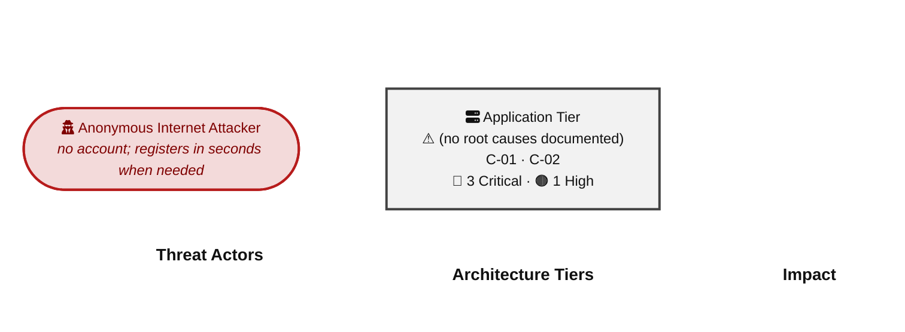
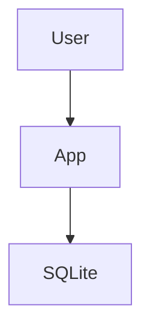
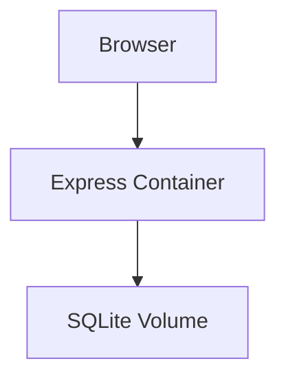
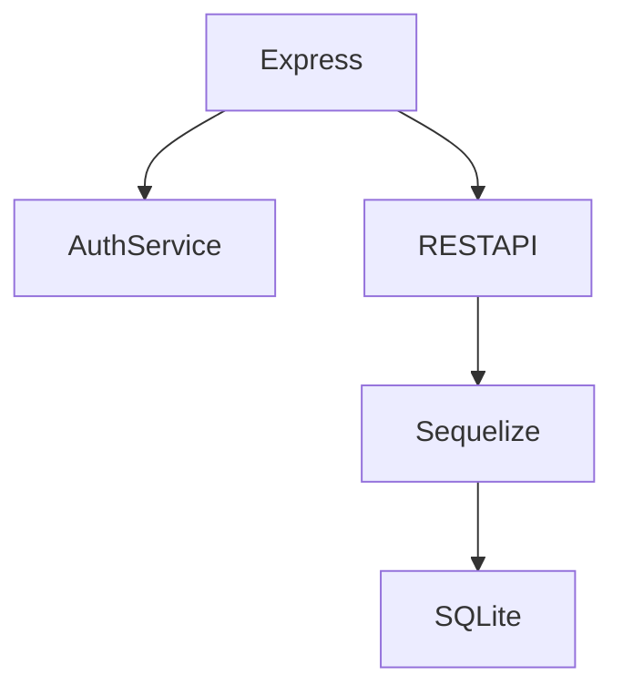
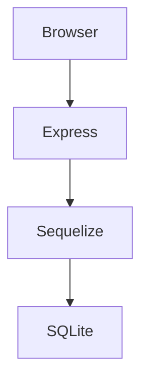
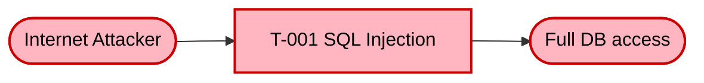
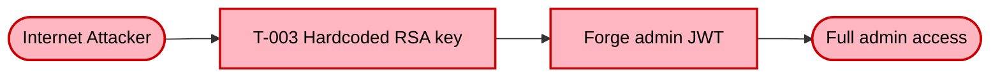
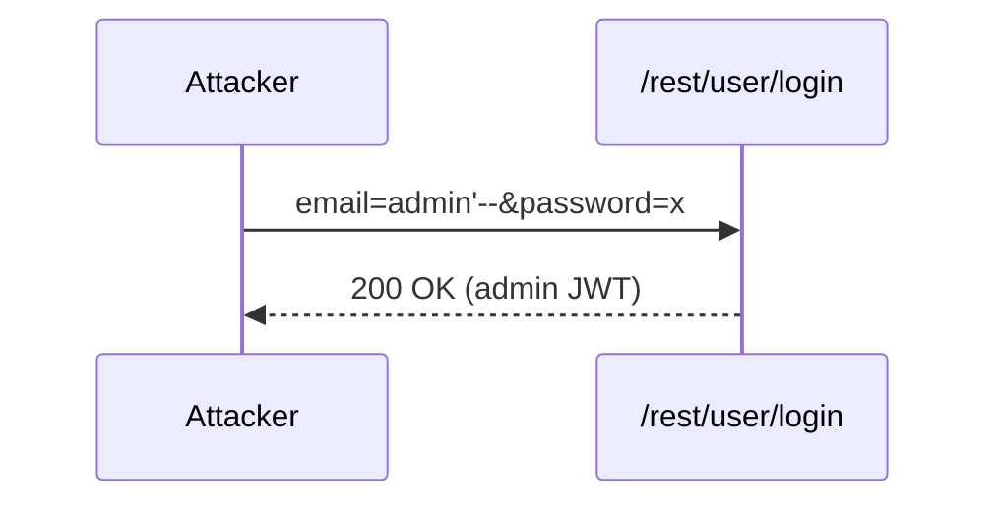
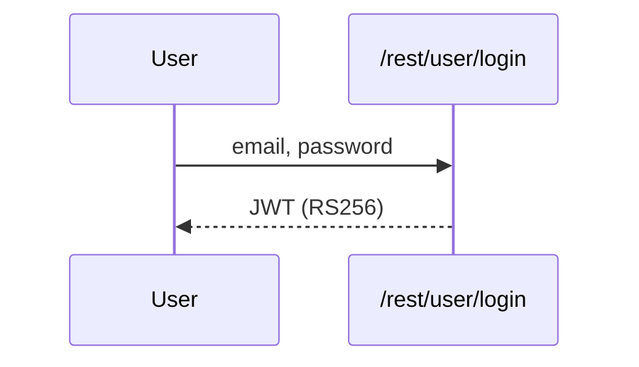
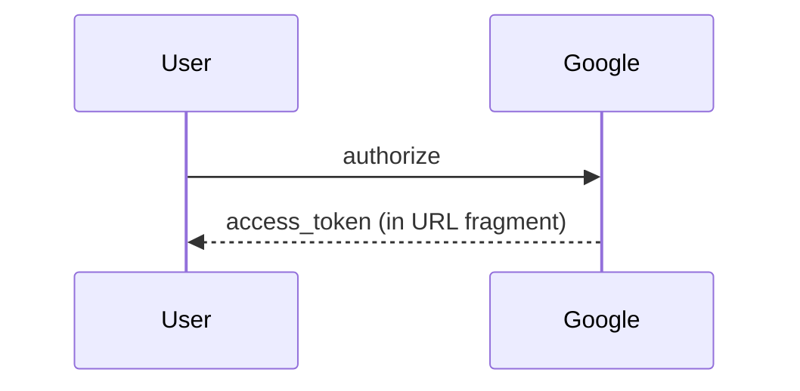

# Threat Model — Juice Shop (fixture)

---

> | | |
> |---|---|
> | **Project** | Juice Shop (fixture) v19.2.1 |
> | **Description** | Fixture project for compose_threat_model deterministic tests |
> | **Author** | Test Fixture |
> | **License** | MIT |
> | **Repository** | https://github.com/example/fixture |
> | **Homepage** | https://github.com/juice-shop/juice-shop |

---

## Changelog

_Append-only history of assessment runs. Most recent first._

| Version | Date | Mode | Depth | Reasoning | Baseline → Current | Δ Threats | Code | Note |
|---------|------|------|-------|-----------|--------------------|-----------|------|------|
| v1 | 2026-04-19 | full | — | — | _(initial)_ | +0 / ~0 / -0 | — | Initial assessment |

---

## Table of Contents

- [Management Summary](#management-summary)
1. [System Overview](#1-system-overview)
2. [Architecture Diagrams](#2-architecture-diagrams)
   - [2.1 System Context](#21-system-context)
   - [2.2 Container Architecture](#22-container-architecture)
   - [2.3 Components](#23-components)
   - [2.4 Technology Architecture](#24-technology-architecture)
3. [Attack Walkthroughs](#3-attack-walkthroughs)
   - [3.1 Attack Chain Overview](#31-attack-chain-overview)
   - [3.2 SQL Injection Authentication Bypass](#32-sql-injection-authentication-bypass)
4. [Assets](#4-assets)
5. [Attack Surface](#5-attack-surface)
   - [5.1 Unauthenticated Entry Points](#51-unauthenticated-entry-points)
   - [5.2 Authenticated Entry Points](#52-authenticated-entry-points)
7. [Security Architecture](#7-security-architecture)
   - [7.1 Overview](#71-overview)
   - [7.2 Key Architectural Risks](#72-key-architectural-risks)
   - [7.3 Identity & Access Management](#73-identity-access-management)
   - [7.4 Authorization](#74-authorization)
   - [7.5 Input Validation & Output Encoding](#75-input-validation-output-encoding)
   - [7.6 Data Protection & Session Management](#76-data-protection-session-management)
   - [7.7 Frontend Security](#77-frontend-security)
   - [7.8 Real-time / WebSocket](#78-real-time-websocket)
   - [7.9 AI / LLM](#79-ai-llm)
   - [7.10 Audit & Logging](#710-audit-logging)
   - [7.11 Container & Runtime Security](#711-container-runtime-security)
   - [7.12 Dependency & Supply Chain](#712-dependency-supply-chain)
   - [7.13 Secret Management   _(cross-cutting)_](#713-secret-management-_cross-cutting_)
   - [7.14 Defense-in-Depth Assessment   _(cross-cutting)_](#714-defense-in-depth-assessment-_cross-cutting_)
8. [Threat Register](#8-threat-register)
9. [Mitigation Register](#9-mitigation-register)
10. [Out of Scope](#10-out-of-scope)
- [Appendix: Run Statistics](#appendix-run-statistics)
- [Appendix A — Vektor Taxonomy](#appendix-a-vektor-taxonomy)

---

## Management Summary

### Verdict

🔴 **CRITICAL SECURITY POSTURE** — the fixture project has severe exploitable vulnerabilities across authentication, injection, and access control. The assessment identified **3 Critical** and **1 High** findings.

 

<blockquote style="border-left: 3px solid #dc2626; background: #fef2f2; padding: 16px 20px; margin: 0;">

- **Admin login without a password** — SQL injection in the login endpoint lets any internet user log in as any account, including administrators, with no credentials. *([F-002](#f-002) — SQL injection in login)*
- **Full database theft without login** — SQL injection in product search returns the full Users and Orders tables in a single web request. *([F-001](#f-001) — SQL injection in product search)*
- **Admin impersonation via a leaked source-code secret** — The RSA private key used to sign session tokens is committed to the public repository; an attacker issues valid admin tokens offline. *([F-003](#f-003) — Hardcoded RSA private key)*

</blockquote>

 

No meaningful security boundary exists between the internet-facing attack surface and complete administrative control. The deployment is not production-ready.

### Security Posture at a Glance

One-glance heatmap: **threat actors** on the left, **architectural tiers** stacked in the middle (Client → Application → Data), **impact** on the right. Each tier shows its missing controls, components, and severity counts (🔴 Critical · 🟠 High · 🟡 Medium · ⚠ architectural — Low-severity findings are tracked in §8 but omitted here). Numbered red arrows ① are resolved in the *Attack paths* list below.

**Threat actors.** Two entities sit on the left of the diagram — one attacker who initiates every direct attack class, and one victim who is the target of the browser-side attacks (XSS / CSRF).

- **Anonymous Internet Attacker** — no account, no foothold; reaches every unauthenticated route, registers a throw-away account in seconds when needed, and can clone the public repository to obtain any committed secret offline. Initiates the outgoing attack arrows.

**Attack paths (numbered arrows in the diagram):**

### Top Findings

The **4 highest-risk items**, sorted by impact-weighted score. The **Pfad** column links each finding to the matching ①–⑦ attack path in [Security Posture at a Glance](#security-posture-at-a-glance); mitigation IDs jump to [§9 Mitigation Register](#9-mitigation-register).

| # | Criticality | Pfad | Finding | Component | Primary Mitigations |
|---|-------------|------|---------|-----------|---------------------|
| 1 | 🔴 Critical | — | [F-001](#f-001) — SQL injection in product search | [C-01](#c-01) — REST API | [M-001](#m-001) — Parameterize SQL queries (P1) |
| 2 | 🔴 Critical | — | [F-002](#f-002) — SQL injection in login | [C-01](#c-01) — REST API | [M-001](#m-001) — Parameterize SQL queries (P1) |
| 3 | 🔴 Critical | — | [F-003](#f-003) — Hardcoded RSA private key | [C-02](#c-02) — Auth Service | [M-002](#m-002) — Externalize RSA key (P1) |
| 4 | 🟠 High | — | [F-010](#f-010) — Persistent XSS via bypassSecurityTrustHtml | [C-01](#c-01) — REST API | [M-003](#m-003) — Remove DomSanitizer bypasses (P2) |

_Legend: 🔴 Critical (directly exploitable, major impact) · 🟠 High. **Pfad** glyphs ①–⑦ link back to the matching bullet in [Security Posture at a Glance](#security-posture-at-a-glance)._

### Architecture Assessment

🔴 **Verdict — the architecture has no effective security boundary at any layer.** Every cross-cutting security pattern that would normally catch a control failure is absent or deliberately disabled.

Three cross-cutting defects drive the majority of findings:

| Defect | Description | Key Findings |
|--------|-------------|--------------|
| **Secrets in source code** | The RSA private key used to sign session tokens is committed to the public repository; every authentication control is undermined from the moment the repo is cloned. | [F-003](#f-003) — Hardcoded RSA private key |
| **Injection everywhere** | SQL construction uses raw string interpolation in login and search; there is no central input validator. | [F-001](#f-001) — SQL injection in search [F-002](#f-002) — SQL injection in login |
| **Unsanitized Angular templates** | bypassSecurityTrustHtml is used in six Angular components, disabling DOM sanitization wholesale. | [F-010](#f-010) — Persistent XSS via DomSanitizer bypass |

See **[§7 Security Architecture](#7-security-architecture)** for the full per-domain breakdown and control catalog.

### Mitigations

Mitigations below cover all open findings, **grouped by component** and sorted by priority (P1 first). Cross-component mitigations are listed once in a separate table — they affect more than one component, so duplicating them per-component would create redundant rows. Sort within each table: priority ascending, effort ascending, findings-addressed descending.

#### REST API (2)

| ID | Mitigation | Priority | Addresses | Effort |
|----|------------|----------|-----------|--------|
| [M-001](#m-001) — Parameterize SQL queries | Parameterize SQL queries | **P1** | [F-001](#f-001) — SQL injection in product search [F-002](#f-002) — SQL injection in login | Medium |
| [M-003](#m-003) — Remove DomSanitizer bypasses | Remove DomSanitizer bypasses | **P2** | [F-010](#f-010) — Persistent XSS via bypassSecurityTrustHtml | Medium |

#### Auth Service (1)

| ID | Mitigation | Priority | Addresses | Effort |
|----|------------|----------|-----------|--------|
| [M-002](#m-002) — Externalize RSA key | Externalize RSA key | **P1** | [F-003](#f-003) — Hardcoded RSA private key | Medium |

### Operational Strengths

Despite the structurally deficient design, the project implements several security-relevant controls. None fully mitigate a Critical finding, but each narrows part of the attack surface. This table is a filtered view of [Section 7](#7-security-architecture) — rows with effectiveness ≥ Weak. The full catalog, including ❌ Missing controls, lives in Section 7.

| Architectural Control | Implementation | Effectiveness | Gap | Mitigates |
|-----------------------|----------------|---------------|-----|-----------|
| Container Base Image | Distroless nodejs24-debian13. | ✅ Adequate | None identified | — |
| Parameterized Database Access | Sequelize ORM used for most CRUD queries. | ⚠️ Partial | Raw string interpolation in login.ts and search.ts. | [F-001](#f-001) — SQL injection in product search [F-002](#f-002) — SQL injection in login |
| TOTP Two-Factor Authentication | otplib on standard login path. | ⚠️ Partial | Not enforced on OAuth. | — |
| JWT-based Authentication | RS256 JWT issued on login. | 🔶 Weak | No algorithm restriction on verify; 1024-bit key; key is public. | [F-003](#f-003) — Hardcoded RSA private key |
| Output Encoding | Angular template auto-escape. | 🔶 Weak | bypassSecurityTrustHtml used in 6 components. | [F-010](#f-010) — Persistent XSS via bypassSecurityTrustHtml |

**Bottom line:** These controls narrow specific attack surfaces but none eliminates a Critical finding on its own — every remaining Critical path bypasses them.

---

## 1. System Overview

The fixture project is a small Express/Angular monolith used in the compose_threat_model determinism tests. It intentionally implements every injection pattern that the contract must render correctly.

---

## 2. Architecture Diagrams

### 2.1 System Context

### 2.2 Container Architecture

### 2.3 Components

| ID | Name | Type | Key Paths | Linked Threats |
|----|------|------|-----------|----------------|
| C-01 | REST API | service | `routes/` | [F-001](#f-001) — SQL injection in product search [F-002](#f-002) — SQL injection in login |
| C-02 | Auth Service | library | `lib/insecurity.ts` | [F-003](#f-003) — Hardcoded RSA private key |
### 2.4 Technology Architecture

---

## 3. Attack Walkthroughs

### 3.1 Attack Chain Overview

The diagrams below show how Critical findings combine into distinct attacker workflows.

#### Chain 1 — DB Compromise

**Key takeaway:** SQL injection on the login endpoint gives the attacker direct read access to the full user database.

#### Chain 2 — Admin Takeover

**Key takeaway:** A single fix does not break the chain — parameterized queries plus secret rotation must both land simultaneously.

### 3.2 SQL Injection Authentication Bypass

---

## 4. Assets

| Asset | Classification | Linked Threats |
|-------|----------------|----------------|
| User Credentials | Restricted | [T-001](#t-001) — SQL injection in product search |
| RSA Private Key | Restricted | [T-003](#t-003) — Hardcoded RSA private key |

---

## 5. Attack Surface

### 5.1 Unauthenticated Entry Points

| Entry Point | Protocol | Notes |
|-------------|----------|-------|
| POST /rest/user/login | HTTP | SQLi |

### 5.2 Authenticated Entry Points

| Entry Point | Protocol | Notes |
|-------------|----------|-------|
| GET /api/Users | HTTP | Broken access |

---

## 7. Security Architecture

### 7.1 Overview

Juice Shop fixture runs as a single Express process; all auth + data access is co-located.

### 7.2 Key Architectural Risks

| Risk | Description | Linked |
|------|-------------|--------|
| 🔴 Secrets in source | RSA key committed | [T-003](#t-003) — Hardcoded RSA private key |

### 7.3 Identity & Access Management

Juice Shop uses two authentication methods: password login and OAuth implicit flow.

#### Password Login

**Current state:** RS256 JWT signed with hardcoded RSA-1024 key.
**Linked threats:** [F-003](#f-003) — Hardcoded RSA private key

#### OAuth Implicit Flow

**Current state:** Legacy implicit flow, token leaked via Referer header.
**Linked threats:** [F-001](#f-001) — SQL injection in product search

### 7.4 Authorization

- **Current state:** Client-side Angular route guard only.

### 7.5 Input Validation & Output Encoding

- **Current state:** Sequelize ORM used for most queries; raw SQL in login + search.

### 7.6 Data Protection & Session Management

- **Current state:** JWT stored in localStorage.

### 7.7 Frontend Security

- **Current state:** bypassSecurityTrustHtml used in 6 components.

### 7.8 Real-time / WebSocket

- **Current state:** Not used in this fixture.

### 7.9 AI / LLM

- **Current state:** Not used in this fixture.

### 7.10 Audit & Logging

- **Current state:** Winston logger; no security event audit trail.

### 7.11 Container & Runtime Security

- **Current state:** Single Node process; SQLite co-located.

### 7.12 Dependency & Supply Chain

- **Current state:** Dependabot enabled; critically outdated deps remain.

### 7.13 Secret Management   _(cross-cutting)_

- **Current state:** All secrets hardcoded in source.

### 7.14 Defense-in-Depth Assessment   _(cross-cutting)_

- **Current state:** Single layer of control — no backstops.

---

## 8. Threat Register

All findings sorted by criticality. The **Threat Category** column maps each finding to its architectural threat class (TH-NN) from the OWASP / CWE taxonomy.

**Risk Distribution:** 🔴 Critical: 3 · 🟠 High: 1 · 🟡 Medium: 0 · 🟢 Low: 0 · **Total findings: 4**
**STRIDE Coverage:** Spoofing: 1 · Tampering: 3 · Repudiation: 0 · Information Disclosure: 0 · Denial of Service: 0 · Elevation of Privilege: 0

| ID | Finding | Threat Category | Component | Criticality | CVSS | Vektor | Mitigation | References |
|----|---------|-----------------|-----------|-------------|------|--------|------------|------------|
| F-001 | SQL injection in product search | TH-01 — Injection | [C-01](#c-01) — REST API | 🔴 Critical | — | [Internet Anon](#vektor-internet-anon) | [M-001](#m-001) — Parameterize SQL queries | [A03:2021](https://owasp.org/Top10/A03_2021/) |
| F-002 | SQL injection in login | TH-01 — Injection | [C-01](#c-01) — REST API | 🔴 Critical | — | [Internet Anon](#vektor-internet-anon) | [M-001](#m-001) — Parameterize SQL queries | [A03:2021](https://owasp.org/Top10/A03_2021/) |
| F-003 | Hardcoded RSA private key | TH-03 — Cryptographic Failures | [C-02](#c-02) — Auth Service | 🔴 Critical | — | [Repo-Read](#vektor-repo-read) | [M-002](#m-002) — Externalize RSA key | [A02:2021](https://owasp.org/Top10/A02_2021/) |
| F-010 | Persistent XSS via bypassSecurityTrustHtml | TH-11 — Cross-Site Scripting (XSS) | [C-01](#c-01) — REST API | 🟠 High | — | [Victim-Required](#vektor-victim-required) | [M-003](#m-003) — Remove DomSanitizer bypasses | [A03:2021](https://owasp.org/Top10/A03_2021/) |

---

## 9. Mitigation Register

Each mitigation block lists the findings it **Addresses**, the CWEs it **Prevents**, and the **Priority** (P1 = before deployment, P2 = current sprint, P3 = next quarter, P4 = backlog). The **Why** / **How** / **Verification** fields are populated only when authored; if a field is omitted, refer to the linked finding's *Evidence* line for file:line context and to the threat-category description in §8 for the underlying weakness.

### P1 — Immediate

#### M-001 — Parameterize SQL queries

**Addresses:**

- [F-001](#f-001) — SQL injection in product search
- [F-002](#f-002) — SQL injection in login

**Priority:** **P1 — Immediate**
**Severity:** 🔴 Critical
**Effort:** Medium

**Why:** Raw SQL enables injection.

**How:** Use Sequelize replacements.

**Verification:** sqlmap shows no injectable params.

---

#### M-002 — Externalize RSA key

**Addresses:**

- [F-003](#f-003) — Hardcoded RSA private key

**Priority:** **P1 — Immediate**
**Severity:** 🔴 Critical
**Effort:** Medium

**Why:** Key is committed to public repo.

**How:** Load from env var at startup.

**Verification:** Repo contains no BEGIN RSA PRIVATE KEY.

---

### P2 — This Sprint

#### M-003 — Remove DomSanitizer bypasses

**Addresses:**

- [F-010](#f-010) — Persistent XSS via bypassSecurityTrustHtml

**Priority:** **P2 — This Sprint**
**Severity:** 🟠 High
**Effort:** Medium

**Why:** Unsanitized HTML enables XSS.

**How:** Use `DomSanitizer.sanitize()`.

**Verification:** No bypassSecurityTrustHtml in codebase.

---

### P3 — Next Quarter

_No P3 mitigations._

### P4 — Backlog

_No P4 mitigations._

---

## 10. Out of Scope

- Physical security
- Social engineering

---

## Appendix: Run Statistics

| Field | Value |
|-------|-------|
| Invocation | `(not recorded)` |
| Generated | 2026-04-19T13:06:37Z |
| Mode | — |
| Assessment depth | standard |
| Plugin version | 0.9.0-beta (analysis v2) |
| Orchestrator model | claude-sonnet-4-6 |
| Repository | — |
| Output directory | — |
| Total analysis duration | — |

### Per-Phase Duration Breakdown

_No per-phase timing captured — `.agent-run.log` missing or unparseable._

### Coverage Summary

| Metric | Value |
|--------|-------|
| Components analyzed | 2 |
| Threats identified | 4 (🔴 3 · 🟠 1 · 🟡 0 · 🟢 0) |
| Mitigations prioritized | 3 |
| Security controls cataloged | 5 (✅ 1 · ⚠️ 2 · 🔶 2 · ❌ 0) |

### Agent Dispatch Log

_No agent dispatch log available._

---

## Appendix A — Vektor Taxonomy

This appendix defines the attacker-starting-position labels used in the Top Findings table and throughout §8 Threat Register. Each label answers the question *what does the attacker need before the exploit begins?*

### Internet Anon

**Attacker position:** Unauthenticated attacker from the public internet · **Breach distance:** 1

**Preconditions:**

- Endpoint is reachable from the internet (no IP allowlist, no VPN)
- No authentication middleware blocks the request

**Typical CWEs:** [CWE-89](https://cwe.mitre.org/data/definitions/89.html) · [CWE-79](https://cwe.mitre.org/data/definitions/79.html) · [CWE-306](https://cwe.mitre.org/data/definitions/306.html) · [CWE-327](https://cwe.mitre.org/data/definitions/327.html) · [CWE-611](https://cwe.mitre.org/data/definitions/611.html) · [CWE-918](https://cwe.mitre.org/data/definitions/918.html)

**Typical OWASP Top 10:** A01:2021, A03:2021, A07:2021

### Internet User

**Attacker position:** Any authenticated low-privilege user (valid JWT / session) · **Breach distance:** 2

**Preconditions:**

- Attacker has signed up or otherwise obtained a valid user session
- Endpoint is behind auth but not behind role/admin checks

**Typical CWEs:** [CWE-434](https://cwe.mitre.org/data/definitions/434.html) · [CWE-611](https://cwe.mitre.org/data/definitions/611.html) · [CWE-918](https://cwe.mitre.org/data/definitions/918.html) · [CWE-352](https://cwe.mitre.org/data/definitions/352.html) · [CWE-287](https://cwe.mitre.org/data/definitions/287.html)

**Typical OWASP Top 10:** A01:2021, A04:2021, A05:2021, A10:2021

### Internet Priv User

**Attacker position:** Authenticated admin-level user (JWT with admin role or equivalent) · **Breach distance:** 2

**Preconditions:**

- Attacker holds admin credentials or has elevated privileges
- Endpoint gated on admin role but still exploitable once reached

**Typical CWEs:** [CWE-862](https://cwe.mitre.org/data/definitions/862.html) · [CWE-79](https://cwe.mitre.org/data/definitions/79.html) · [CWE-94](https://cwe.mitre.org/data/definitions/94.html)

**Typical OWASP Top 10:** A01:2021

### Victim-Required

**Attacker position:** Attacker needs victim interaction — social engineering, crafted link, or live session · **Breach distance:** 2

**Preconditions:**

- Victim must click a link, load a page, or have an active session
- Applies to XSS, CSRF, click-jacking, open redirect

**Typical CWEs:** [CWE-79](https://cwe.mitre.org/data/definitions/79.html) · [CWE-352](https://cwe.mitre.org/data/definitions/352.html) · [CWE-601](https://cwe.mitre.org/data/definitions/601.html) · [CWE-1021](https://cwe.mitre.org/data/definitions/1021.html)

**Typical OWASP Top 10:** A01:2021, A03:2021

### Build-Time

**Attacker position:** Attacker controls a build input — CI runner, dependency, base image, or external data fetched during build · **Breach distance:** 3

**Preconditions:**

- Compromise of a dependency, registry, or base image
- OR compromise of a CI runner with write access to artifacts

**Typical CWEs:** [CWE-506](https://cwe.mitre.org/data/definitions/506.html) · [CWE-829](https://cwe.mitre.org/data/definitions/829.html) · [CWE-1039](https://cwe.mitre.org/data/definitions/1039.html) · [CWE-1104](https://cwe.mitre.org/data/definitions/1104.html)

**Typical OWASP Top 10:** A08:2021

### Repo-Read

**Attacker position:** Attacker gains read access to source repository (leaked clone, forked fork, insider, compromised developer workstation) · **Breach distance:** 3

**Preconditions:**

- Read access to the source tree at or after commit time
- No runtime exploit needed — the vulnerability is the content of the repo

**Typical CWEs:** [CWE-798](https://cwe.mitre.org/data/definitions/798.html) · [CWE-312](https://cwe.mitre.org/data/definitions/312.html) · [CWE-540](https://cwe.mitre.org/data/definitions/540.html)

**Typical OWASP Top 10:** A02:2021, A07:2021

### n/a

**Attacker position:** Architectural / meta-finding — no runtime entry point, the finding describes a design defect aggregating multiple code-level findings

**Preconditions:**

- Finding is AF-NNN (architectural) rather than F-NNN (code-level)