# Threat Model - Juice Shop

_Generated by appsec-advisor v0.4.0-beta (analysis v2)_


---

> | | |
> |---|---|
> | **Project** | Juice Shop v20.0.0 |
> | **Description** | Probably the most modern and sophisticated insecure web application |
> | **Author** | Björn Kimminich <bjoern.kimminich@owasp\.org> (https://kimminich.de) |
> | **License** | MIT |
> | **Repository** | https://github.com/juice-shop/juice-shop |
> | **Homepage** | https://owasp-`juice.shop` |
> | **Runtime** | Node\.js 22 - 25, Express 4 |
> | **Tags** | web security, web application security, webappsec, owasp, pentest, pentesting, security, vulnerable, vulnerability, broken, bodgeit, ctf, capture the flag, awareness |

---

## Changelog

_Append-only history of assessment runs. Most recent first._

| Version | Date | Mode | Depth | Reasoning | Baseline → Current | Δ Threats | Code | Note |
|--------|----------|--------|--------|--------------|------------------|----------------|--------|---------------|
| v1 | 2026-06-22 | full | standard | opus | _(initial)_ | 80 total | - | first full scan |

---

## Table of Contents

- [Management Summary](#management-summary)
- [Critical Attack Tree](#critical-attack-tree)
1. [System Overview](#1-system-overview)
   - [Scope](#scope)
- [1.5 Identified Actors](#15-identified-actors)
2. [Architecture Diagrams](#2-architecture-diagrams)
   - [2.1 System Context](#21-system-context)
   - [2.2 Container Architecture](#22-container-architecture)
   - [2.3 Components](#23-components)
   - [2.4 Technology Architecture](#24-technology-architecture)
3. [Attack Walkthroughs](#3-attack-walkthroughs)
   - [3.1 SQL Injection](#31-sql-injection)
   - [3.2 Hardcoded RSA Private Key](#32-hardcoded-rsa-private-key)
   - [3.3 Hardcoded JWT Signing Key](#33-hardcoded-jwt-signing-key)
   - [3.4 Insecure JWT Verification](#34-insecure-jwt-verification)
   - [3.5 OAuth password derived deterministically from email](#35-oauth-password-derived-deterministically-from-email)
   - [3.6 SQL Injection](#36-sql-injection)
   - [3.7 Insecure Direct Object Reference](#37-insecure-direct-object-reference)
   - [3.8 XXE](#38-xxe)
   - [3.9 Vulnerable JWT stack: jsonwebtoken 0.4.0 / express-jwt](#39-vulnerable-jwt-stack-jsonwebtoken-040-express-jwt)
   - [3.10 Passwords persisted with unsalted MD5](#310-passwords-persisted-with-unsalted-md5)
   - [3.11 SSRF](#311-ssrf)
4. [Assets](#4-assets)
5. [Attack Surface](#5-attack-surface)
   - [5.1 Unauthenticated Entry Points (57)](#51-unauthenticated-entry-points-57)
   - [5.2 Authenticated Entry Points (52)](#52-authenticated-entry-points-52)
7. [Security Architecture](#7-security-architecture)
   - [7.1 Security Control Overview](#71-security-control-overview)
   - [7.2 Identity and Authentication Controls](#72-identity-and-authentication-controls)
   - [7.3 Session and Token Controls](#73-session-and-token-controls)
   - [7.4 Authorization Controls](#74-authorization-controls)
   - [7.5 Query Construction and Data Access Controls](#75-query-construction-and-data-access-controls)
   - [7.6 Input Boundary Validation Controls](#76-input-boundary-validation-controls)
   - [7.7 Output Encoding and Rendering Controls](#77-output-encoding-and-rendering-controls)
   - [7.8 Browser and Cross-Origin Controls](#78-browser-and-cross-origin-controls)
   - [7.9 Cryptography Secrets and Data Protection](#79-cryptography-secrets-and-data-protection)
   - [7.10 File Parser and Outbound Request Controls](#710-file-parser-and-outbound-request-controls)
   - [7.11 Operations Runtime and Supply Chain Controls](#711-operations-runtime-and-supply-chain-controls)
   - [7.12 Real-time and Not Applicable Controls](#712-real-time-and-not-applicable-controls)
   - [7.13 Defense-in-Depth Summary](#713-defense-in-depth-summary)
8. [Findings Register](#8-findings-register)
9. [Abuse Cases](#9-abuse-cases)
10. [Mitigation Register](#10-mitigation-register)
11. [Out of Scope](#11-out-of-scope)
- [Appendix: Run Statistics](#appendix-run-statistics)
- [Appendix A - Vektor Taxonomy](#appendix-a-vektor-taxonomy)

> _Section numbering is non-contiguous: §6 was retired in a prior revision. The remaining sections keep their original numbers so existing cross-references stay valid._

---

## Management Summary

### Verdict

🔴 Juice Shop is not production-ready. The RSA private key used to sign every session JWT is committed in plaintext to a public repository (`lib/insecurity.ts:23`), meaning any reader of the source can forge admin-privileged tokens offline. Unauthenticated SQL injection on the login route and the product-search route each return arbitrary user rows without a credential. Five compound attack chains combine these and related weaknesses into full account takeover paths that require no elevated access to execute.

**Risk distribution:** 🔴 Critical: 11 · 🟠 High: 39 · 🟡 Medium: 21 · 🟢 Low: 9 · **Total: 80**


<br/>

**Six verified abuse cases illustrate the business consequences:**

<blockquote style="border-left: 3px solid #dc2626; background: #fef2f2; padding: 16px 20px; margin: 0;">

- **Full admin account takeover without a password** — The login SQL injection at `routes/login.ts:34` returns the first user row (seeded admin) when supplied `' OR '1'='1`. Brute-force is unnecessary — no rate limit exists at that endpoint. *(🔴 [F-002](#f-002) — SQL Injection — routes/login.ts:34, 🟠 [F-013](#f-013) — Missing Brute-Force Protection on Login — server.ts:595)*
- **Offline JWT forgery granting admin role to any user** — The RSA private key and HMAC secret live as string literals in `lib/insecurity.ts:23,44`. Anyone who clones the repository can call `jwt.sign({role:'admin'}, privateKey, {algorithm:'RS256'})` and receive a token the server accepts unconditionally. *(🔴 [F-003](#f-003) — Hardcoded RSA Private Key — lib/insecurity.ts:23, 🔴 [F-004](#f-004) — Hardcoded JWT Signing Key — lib/insecurity.ts:23, 🔴 [F-005](#f-005) — Insecure JWT Verification — lib/insecurity.ts:191)*
- **Server-side request forgery giving internal network access** — `routes/profileImageUrlUpload.ts:24` fetches any attacker-supplied URL with no allowlist. An authenticated user can reach internal services, instance metadata endpoints, or local file URIs. *(🔴 [F-012](#f-012) — SSRF — routes/profileImageUrlUpload.ts:24)*
- **Full plaintext credential dump via XML file upload** — `libxmljs2` parses uploaded XML with `noent:true` and no entity expansion limit at `routes/fileUpload.ts:83`. An XXE payload reading `/etc/passwd` or internal service config files returns their contents in the HTTP response. *(🔴 [F-009](#f-009) — XXE — routes/fileUpload.ts:83)*
- **Mass account compromise after any SQL dump** — Passwords are stored as unsalted MD5 hashes (`models/user.ts:77`). A single SQL injection dump yields a rainbow-table-reversible credential set for every registered user. *(🔴 [F-011](#f-011) — Passwords persisted with unsalted MD5 — models/user.ts:77, 🔴 [F-002](#f-002) — SQL Injection — routes/login.ts:34, 🔴 [F-007](#f-007) — SQL Injection — routes/search.ts:23)*
- **OAuth account hijack via deterministic password derivation** — `oauth.component.ts:30` derives each user's local password from their email address using a static algorithm. An attacker who learns a target's email can log in as that user through the local `/rest/user/login` endpoint, bypassing OAuth entirely. *(🔴 [F-006](#f-006) — OAuth password derived deterministically from email — oauth.component.ts:30)*

</blockquote>

<br/>

Three fixes address the highest-impact paths: move secrets out of source into a runtime manager, switch raw SQL to parameterized queries on the login and search routes, and disable entity expansion in the XML parser. Without those, admin takeover and data exfiltration remain trivially achievable.

**Attack-chain analysis.** 3 findings anchor 3 code-verified attack chains (see [§9](#9-abuse-cases) Abuse Cases): 🔴 [F-005](#f-005) — Insecure JWT Verification (`lib/insecurity.ts:191`), 🔴 [F-008](#f-008) — Insecure Direct Object Reference (`routes/address.ts:11`), 🟠 [F-063](#f-063) — Wildcard CORS Allows Any Origin (`server.ts:183`). 1 of these is rated above its individual baseline as a direct result of the verified chain.

### Security Posture & Top Threats

**Figure 1 - Architecture & Top Threats**

Architecture tiers top-to-bottom (External Actors → Client → Application → Data) with the top threats per component. The in-figure legend on the right explains the attack scenarios, severity dots and symbols.


**Figure 2 - Risk Flow: Actor → Tier → Impact**

Heatmap: **actors** (left) → **architecture tiers** (middle, Client → Application → Data) → **impact** (right). Numbered red arrows ①–⑦ are the threats enumerated in the Top Threats table below. Self-registration is open, so the **Authenticated Internet Attacker** tier is one POST away from anonymous - it is shown distinctly because a post-login endpoint is still a different attack surface.

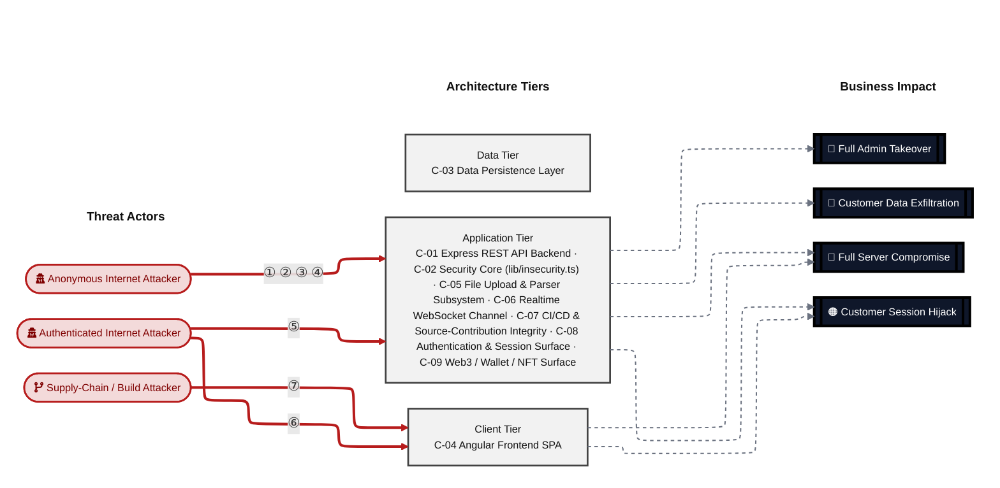

**Threat actors.** The actors below drive the numbered attack paths in the figures above.

- **Anonymous Internet Attacker** — no account; registers in seconds when needed; drives ① Insecure Query Construction & Data Access, ② Hardcoded Secrets & Weak Cryptography, ③ Sensitive File & Secret Exposure, ④ Remote Code Execution (unsafe eval).
- **Authenticated Internet Attacker** — owns a regular account; logged in; drives ⑤ Broken Authorization & Access Control, ⑥ Output Encoding / Cross-Site Scripting.
- **Supply-Chain / Build Attacker** — compromises a dependency or build pipeline, or contributes malicious code to a public repo; drives ⑦ CSRF / Permissive CORS.

**7 structural threats**, grouped by weakness class - each row is one threat, not one finding. *Threat Description* states the general architectural weakness (STRIDE in brackets); *Findings* lists the concrete instances, each linked to [§8 Findings Register](#8-findings-register) with its component; *Risk & Impact* combines severity with business consequence.

| # | Threat Description | Findings (→ Component) | Risk & Impact | Fix |
|---|------------------------------------|------------------------------------------------|------------------------------------|----------------------|
| <a id="path-injection"></a>① | **Insecure Query Construction & Data Access** _(T·I)_<br/>User-controlled strings are concatenated into raw SQL queries on the login and product-search routes, allowing unauthenticated attackers to bypass credential checks or dump arbitrary database rows. | <span style="white-space:nowrap">🔴&nbsp;[F-002](#f-002)</span> - SQL Injection (`routes/login.ts:34`) <span style="white-space:nowrap">→&nbsp;[C-08](#c-08)</span><br/><span style="white-space:nowrap">🔴&nbsp;[F-007](#f-007)</span> - SQL Injection (`routes/search.ts:23`) <span style="white-space:nowrap">→&nbsp;[C-01](#c-01)</span><br/><span style="white-space:nowrap">🔴&nbsp;[F-009](#f-009)</span> - XXE (`routes/fileUpload.ts:83`) <span style="white-space:nowrap">→&nbsp;[C-05](#c-05)</span> | 🔴 **Critical**<br/>Full Admin Takeover · Customer Data Exfiltration | <span style="white-space:nowrap">❶ [M-036](#m-036)</span> — Use parameterized database queries<br/><span style="white-space:nowrap">❶ [M-040](#m-040)</span> — Use parameterized database queries |
| <a id="path-auth-bypass"></a>② | **Hardcoded Secrets & Weak Cryptography** _(S·E)_<br/>The RSA private key and HMAC signing secret are committed as plaintext literals in the public repository, allowing anyone with repository read access to mint admin-privileged JWTs that the server accepts without additional verification. | <span style="white-space:nowrap">🔴&nbsp;[F-003](#f-003)</span> - Hardcoded RSA Private Key (`lib/insecurity.ts:23`) <span style="white-space:nowrap">→&nbsp;[C-08](#c-08)</span><br/><span style="white-space:nowrap">🔴&nbsp;[F-004](#f-004)</span> - Hardcoded JWT Signing Key (`lib/insecurity.ts:23`) <span style="white-space:nowrap">→&nbsp;[C-01](#c-01)</span><br/><span style="white-space:nowrap">🔴&nbsp;[F-005](#f-005)</span> - Insecure JWT Verification (`lib/insecurity.ts:191`) <span style="white-space:nowrap">→&nbsp;[C-01](#c-01)</span><br/><span style="white-space:nowrap">🔴&nbsp;[F-006](#f-006)</span> - OAuth password derived deterministically from email (`oauth.component.ts:30`) <span style="white-space:nowrap">→&nbsp;[C-04](#c-04)</span><br/><span style="white-space:nowrap">🔴&nbsp;[F-010](#f-010)</span> - Vulnerable JWT stack: jsonwebtoken 0.4.0 / express-jwt (`lib/insecurity.ts:54`) <span style="white-space:nowrap">→&nbsp;[C-02](#c-02)</span><br/><span style="white-space:nowrap">🔴&nbsp;[F-011](#f-011)</span> - Passwords persisted with unsalted `MD5` (`models/user.ts:77`) <span style="white-space:nowrap">→&nbsp;[C-03](#c-03)</span><br/><span style="white-space:nowrap">🟠&nbsp;[F-015](#f-015)</span> - Hardcoded admin credentials and TOTP secret in seed data (`users.yml:148`) <span style="white-space:nowrap">→&nbsp;[C-03](#c-03)</span><br/><span style="white-space:nowrap">🟠&nbsp;[F-022](#f-022)</span> - Hardcoded HMAC secret for token derivation (`lib/insecurity.ts:44`) <span style="white-space:nowrap">→&nbsp;[C-02](#c-02)</span><br/><span style="white-space:nowrap">🟠&nbsp;[F-024](#f-024)</span> - Unsalted `MD5` Password Hashing (`lib/insecurity.ts:43`) <span style="white-space:nowrap">→&nbsp;[C-08](#c-08)</span><br/><span style="white-space:nowrap">🟠&nbsp;[F-042](#f-042)</span> - Security answers HMAC'd with hardcoded static key (`models/securityAnswer.ts:46`) <span style="white-space:nowrap">→&nbsp;[C-03](#c-03)</span><br/><span style="white-space:nowrap">🟠&nbsp;[F-043](#f-043)</span> - `MD5` used for password/data hashing (`lib/insecurity.ts:43`) <span style="white-space:nowrap">→&nbsp;[C-02](#c-02)</span><br/><span style="white-space:nowrap">🟠&nbsp;[F-044](#f-044)</span> - Hardcoded Wallet Mnemonic and Private Key (`routes/checkKeys.ts:10`) <span style="white-space:nowrap">→&nbsp;[C-09](#c-09)</span><br/><span style="white-space:nowrap">🟡&nbsp;[F-051](#f-051)</span> - Hardcoded Cookie Signing Secret (`server.ts:289`) <span style="white-space:nowrap">→&nbsp;[C-01](#c-01)</span><br/><span style="white-space:nowrap">🟡&nbsp;[F-064](#f-064)</span> - No container image signing step in release workflow (`release.yml:1`) <span style="white-space:nowrap">→&nbsp;[C-07](#c-07)</span> | 🔴 **Critical**<br/>Full Admin Takeover · Customer Session Hijack | <span style="white-space:nowrap">❶ [M-037](#m-037)</span> — Move secrets to a managed secret store<br/><span style="white-space:nowrap">❶ [M-038](#m-038)</span> — Move cryptographic keys to a managed secret store |
| <a id="path-sensitive-data-exposure"></a>③ | **Sensitive File & Secret Exposure** _(I)_<br/>Passwords stored as unsalted `MD5` hashes, plaintext payment card PANs, and an unencrypted SQLite database file mean any data dump - obtained through SQL injection or file system access - yields directly usable credentials and payment data. | <span style="white-space:nowrap">🔴&nbsp;[F-011](#f-011)</span> - Passwords persisted with unsalted `MD5` (`models/user.ts:77`) <span style="white-space:nowrap">→&nbsp;[C-03](#c-03)</span><br/><span style="white-space:nowrap">🔴&nbsp;[F-012](#f-012)</span> - SSRF (`routes/profileImageUrlUpload.ts:24`) <span style="white-space:nowrap">→&nbsp;[C-05](#c-05)</span><br/><span style="white-space:nowrap">🟠&nbsp;[F-021](#f-021)</span> - Open redirect (`lib/insecurity.ts:138`) <span style="white-space:nowrap">→&nbsp;[C-02](#c-02)</span><br/><span style="white-space:nowrap">🟠&nbsp;[F-024](#f-024)</span> - Unsalted `MD5` Password Hashing (`lib/insecurity.ts:43`) <span style="white-space:nowrap">→&nbsp;[C-08](#c-08)</span><br/><span style="white-space:nowrap">🟠&nbsp;[F-026](#f-026)</span> - Zip-slip arbitrary file write (`routes/fileUpload.ts:44`) <span style="white-space:nowrap">→&nbsp;[C-05](#c-05)</span><br/><span style="white-space:nowrap">🟠&nbsp;[F-030](#f-030)</span> - Sensitive Files Exposed (`server.ts:277`) <span style="white-space:nowrap">→&nbsp;[C-01](#c-01)</span><br/><span style="white-space:nowrap">🟠&nbsp;[F-040](#f-040)</span> - Payment card PAN stored unencrypted in plaintext (`models/card.ts:39`) <span style="white-space:nowrap">→&nbsp;[C-03](#c-03)</span><br/><span style="white-space:nowrap">🟠&nbsp;[F-041](#f-041)</span> - SQLite database file stored unencrypted at rest (`models/index.ts:41`) <span style="white-space:nowrap">→&nbsp;[C-03](#c-03)</span><br/><span style="white-space:nowrap">🟠&nbsp;[F-043](#f-043)</span> - `MD5` used for password/data hashing (`lib/insecurity.ts:43`) <span style="white-space:nowrap">→&nbsp;[C-02](#c-02)</span><br/><span style="white-space:nowrap">🟡&nbsp;[F-056](#f-056)</span> - DownloadToFile fetches arbitrary user-influenced URL with no (`lib/utils.ts:117`) <span style="white-space:nowrap">→&nbsp;[C-02](#c-02)</span><br/><span style="white-space:nowrap">🟡&nbsp;[F-062](#f-062)</span> - Verbose Error Handler Leaks Stack Traces (`server.ts:678`) <span style="white-space:nowrap">→&nbsp;[C-01](#c-01)</span><br/><span style="white-space:nowrap">🟢&nbsp;[F-075](#f-075)</span> - Masked Secrets Returned in User List (`routes/authenticatedUsers.ts:25`) <span style="white-space:nowrap">→&nbsp;[C-08](#c-08)</span><br/><span style="white-space:nowrap">🟢&nbsp;[F-076](#f-076)</span> - Unauthenticated Prometheus Metrics Endpoint (`server.ts:725`) <span style="white-space:nowrap">→&nbsp;[C-01](#c-01)</span><br/><span style="white-space:nowrap">🟢&nbsp;[F-080](#f-080)</span> - Webhook leaks host/OS/config metadata and CTF flag to (`lib/webhook.ts:30`) <span style="white-space:nowrap">→&nbsp;[C-02](#c-02)</span> | 🔴 **Critical**<br/>Customer Data Exfiltration | <span style="white-space:nowrap">❶ [M-043](#m-043)</span> — Hash passwords with a strong, salted algorithm<br/><span style="white-space:nowrap">❶ [M-044](#m-044)</span> — Validate and allowlist outbound request targets |
| <a id="path-remote-code-execution"></a>④ | **Remote Code Execution (unsafe eval)** _(E)_<br/>Uploaded XML files are parsed with external entity expansion enabled, and uploaded ZIP archives are extracted with a path-traversal check that can be bypassed, together providing two independent paths to read arbitrary server files or overwrite them. | <span style="white-space:nowrap">🔴&nbsp;[F-009](#f-009)</span> - XXE (`routes/fileUpload.ts:83`) <span style="white-space:nowrap">→&nbsp;[C-05](#c-05)</span><br/><span style="white-space:nowrap">🟠&nbsp;[F-026](#f-026)</span> - Zip-slip arbitrary file write (`routes/fileUpload.ts:44`) <span style="white-space:nowrap">→&nbsp;[C-05](#c-05)</span><br/><span style="white-space:nowrap">🟠&nbsp;[F-016](#f-016)</span> - Unauthenticated parser surface on POST `/file-upload` (`server.ts:309`) <span style="white-space:nowrap">→&nbsp;[C-05](#c-05)</span> | 🔴 **Critical**<br/>Full Server Compromise · Customer Data Exfiltration | <span style="white-space:nowrap">❶ [M-041](#m-041)</span> — Disable XML external entity (XXE) resolution<br/><span style="white-space:nowrap">❷ [M-054](#m-054)</span> — Constrain file paths to a safe base directory |
| <a id="path-privilege-escalation"></a>⑤ | **Broken Authorization & Access Control** _(E·I)_<br/>Authorization is enforced only through a client-decoded JWT role claim with no server-side re-validation; object-level access checks are absent on basket, address, payment, and order routes, allowing authenticated users to access or modify any other user's resources. | <span style="white-space:nowrap">🔴&nbsp;[F-008](#f-008)</span> - Insecure Direct Object Reference (`routes/address.ts:11`) <span style="white-space:nowrap">→&nbsp;[C-01](#c-01)</span><br/><span style="white-space:nowrap">🟠&nbsp;[F-032](#f-032)</span> - GitHub Actions workflow missing top-level permissions block (`ci.yml:1`) <span style="white-space:nowrap">→&nbsp;[C-07](#c-07)</span><br/><span style="white-space:nowrap">🟠&nbsp;[F-033](#f-033)</span> - Workflow directly pushes to master branch (`frontend-bundle-analysis.yml:59`) <span style="white-space:nowrap">→&nbsp;[C-07](#c-07)</span><br/><span style="white-space:nowrap">🟠&nbsp;[F-047](#f-047)</span> - Sensitive Routes Registered Without Authentication Middleware (`server.ts:310`) <span style="white-space:nowrap">→&nbsp;[C-01](#c-01)</span><br/><span style="white-space:nowrap">🟠&nbsp;[F-048](#f-048)</span> - Authorization (`lib/insecurity.ts:158`) <span style="white-space:nowrap">→&nbsp;[C-01](#c-01)</span><br/><span style="white-space:nowrap">🟠&nbsp;[F-049](#f-049)</span> - Admin route guard relies on client-decoded JWT role, no (`app.guard.ts:54`) <span style="white-space:nowrap">→&nbsp;[C-04](#c-04)</span> | 🔴 **Critical**<br/>Full Admin Takeover · Customer Data Exfiltration | <span style="white-space:nowrap">❶ [M-019](#m-019)</span> — Enforce object-level (ownership) authorization<br/><span style="white-space:nowrap">❷ [M-021](#m-021)</span> — Apply least-privilege permissions |
| <a id="path-cross-site-scripting"></a>⑥ | **Output Encoding / Cross-Site Scripting** _(T·I)_<br/>The Angular frontend passes the search query parameter through `bypassSecurityTrustHtml()`, and a legacy sanitizer regex is bypassable, providing two stored and reflected XSS injection points that execute in victim browsers and can steal localStorage-held JWTs. | <span style="white-space:nowrap">🟠&nbsp;[F-027](#f-027)</span> - DOM XSS (`search-result.component.ts:143`) <span style="white-space:nowrap">→&nbsp;[C-04](#c-04)</span><br/><span style="white-space:nowrap">🟠&nbsp;[F-029](#f-029)</span> - Broken sanitizeLegacy regex permits XSS payloads (`lib/insecurity.ts:61`) <span style="white-space:nowrap">→&nbsp;[C-02](#c-02)</span><br/><span style="white-space:nowrap">🟠&nbsp;[F-001](#f-001)</span> - JWT persisted in localStorage readable by any XSS (`login.component.ts:105`) <span style="white-space:nowrap">→&nbsp;[C-04](#c-04)</span><br/><span style="white-space:nowrap">🟠&nbsp;[F-028](#f-028)</span> - No Content-Security-Policy delivered to the SPA (`server.ts:188`) <span style="white-space:nowrap">→&nbsp;[C-04](#c-04)</span> | 🟠 **High**<br/>Customer Session Hijack | <span style="white-space:nowrap">❷ [M-056](#m-056)</span> — Encode output instead of bypassing the framework sanitizer<br/><span style="white-space:nowrap">❷ [M-055](#m-055)</span> — Add framing and clickjacking protections |
| <a id="path-cross-site-request-forgery"></a>⑦ | **CSRF / Permissive CORS** _(S·T)_<br/>GitHub Actions workflows lack top-level permission scoping, run untrusted fork PRs with live repository secrets, and use mutable or unpinned third-party actions, allowing a supply-chain attacker to inject malicious code or exfiltrate CI secrets. | <span style="white-space:nowrap">🟠&nbsp;[F-025](#f-025)</span> - Fork-PR npm lifecycle scripts execute with live secrets in CI (`ci.yml:167`) <span style="white-space:nowrap">→&nbsp;[C-07](#c-07)</span><br/><span style="white-space:nowrap">🟠&nbsp;[F-032](#f-032)</span> - GitHub Actions workflow missing top-level permissions block (`ci.yml:1`) <span style="white-space:nowrap">→&nbsp;[C-07](#c-07)</span><br/><span style="white-space:nowrap">🟠&nbsp;[F-034](#f-034)</span> - Third-party GitHub Action not pinned to commit SHA (`ci.yml:202`) <span style="white-space:nowrap">→&nbsp;[C-07](#c-07)</span><br/><span style="white-space:nowrap">🟠&nbsp;[F-035](#f-035)</span> - Workflow executes curl | sh to install Heroku CLI (`ci.yml:371`) <span style="white-space:nowrap">→&nbsp;[C-07](#c-07)</span><br/><span style="white-space:nowrap">🟠&nbsp;[F-036](#f-036)</span> - Third-party GitHub Action pinned to mutable main branch (`image_actions.yml:33`) <span style="white-space:nowrap">→&nbsp;[C-07](#c-07)</span><br/><span style="white-space:nowrap">🟠&nbsp;[F-037](#f-037)</span> - Third-party GitHub Action not pinned to commit SHA (`image_actions.yml:42`) <span style="white-space:nowrap">→&nbsp;[C-07](#c-07)</span><br/><span style="white-space:nowrap">🟠&nbsp;[F-038](#f-038)</span> - Base image not digest-pinned - Dockerfile:1 <span style="white-space:nowrap">→&nbsp;[C-07](#c-07)</span><br/><span style="white-space:nowrap">🟠&nbsp;[F-039](#f-039)</span> - On absent from repository (`package-lock.json`) <span style="white-space:nowrap">→&nbsp;[C-07](#c-07)</span><br/><span style="white-space:nowrap">🟡&nbsp;[F-063](#f-063)</span> - Wildcard CORS Allows Any Origin (`server.ts:183`) <span style="white-space:nowrap">→&nbsp;[C-01](#c-01)</span> | 🟠 **High**<br/>Full Server Compromise | <span style="white-space:nowrap">❷ [M-053](#m-053)</span> — Pin third-party dependencies to immutable versions<br/><span style="white-space:nowrap">❷ [M-021](#m-021)</span> — Apply least-privilege permissions |

_STRIDE: S spoofing · T tampering · R repudiation · I information disclosure · D denial of service · E elevation of privilege. Risk, findings, components, impact and Fix are derived deterministically; only the one-line weakness description is authored._

**Verified attack chains.** 3 fully viable ([AC-T-003](#ac-t-003), [AC-T-004](#ac-t-004), [AC-T-006](#ac-t-006)); 2 partially blocked ([AC-T-001](#ac-t-001), [AC-T-005](#ac-t-005)). These chains combine individual findings into end-to-end exploitation paths verified step-by-step against the code - see [§9 Abuse Cases](#9-abuse-cases) for the per-step breakdown and blocking mitigations.

### Top Mitigations

Highest-impact P1/P2 mitigations - 13 of 43 qualifying (84 total). Full detail in [§10 Mitigation Register](#10-mitigation-register). All 13 mitigation(s) that fix a Critical finding are always listed here.

| # | Component | Mitigation | Addresses | Effort |
|---|----------------------|------------------------------------------------|------------------------------------------------|------|
| **1** | [C-01](#c-01) — Express REST API Backend | ❶ [M-018](#m-018) — Review and tighten the flagged configuration | 🔴 [F-005](#f-005) — Insecure JWT Verification (`lib/insecurity.ts`) | Low |
| **2** | [C-01](#c-01) — Express REST API Backend | ❶ [M-019](#m-019) — Enforce object-level (ownership) authorization | 🔴 [F-008](#f-008) — Insecure Direct Object Reference (`routes/address.ts`) | Low |
| **3** | [C-01](#c-01) — Express REST API Backend | ❶ [M-040](#m-040) — Use parameterized database queries | 🔴 [F-007](#f-007) — SQL Injection (`routes/search.ts`) | Low |
| **4** | [C-01](#c-01) — Express REST API Backend | ❶ [M-038](#m-038) — Move cryptographic keys to a managed secret store | 🔴 [F-004](#f-004) — Hardcoded JWT Signing Key (`lib/insecurity.ts`) | Medium |
| **5** | [C-02](#c-02) — Security Core (`lib/insecurity.ts`) | ❶ [M-042](#m-042) — Upgrade jsonwebtoken/express-jwt and enforce an RS256-only algorithms allowlist on verification | 🔴 [F-010](#f-010) — Vulnerable JWT stack: jsonwebtoken 0.4.0 / express-jwt (`lib/insecurity.ts`) | Medium |
| **6** | [C-03](#c-03) — Data Persistence Layer | ❶ [M-043](#m-043) — Hash passwords with a strong, salted algorithm | 🔴 [F-011](#f-011) — Passwords persisted with unsalted MD5 (`models/user.ts`) | Medium |
| **7** | [C-04](#c-04) — Angular Frontend SPA | ❶ [M-039](#m-039) — Stop deriving passwords from email; use a server-side random secret or tokenless OAuth session linkage | 🔴 [F-006](#f-006) — OAuth password derived deterministically from email (`oauth.component.ts`) | Medium |
| **8** | [C-05](#c-05) — File Upload & Parser Subsystem | ❶ [M-041](#m-041) — Disable XML external entity (XXE) resolution | 🔴 [F-009](#f-009) — XXE (`routes/fileUpload.ts`) | Low |
| **9** | [C-05](#c-05) — File Upload & Parser Subsystem | ❶ [M-044](#m-044) — Validate and allowlist outbound request targets | 🔴 [F-012](#f-012) — SSRF (`routes/profileImageUrlUpload.ts`) | Medium |
| **10** | [C-08](#c-08) — Authentication & Session Surface | ❶ [M-005](#m-005) — Move secrets to a managed secret store | 🔴 [F-003](#f-003) — Hardcoded RSA Private Key (`lib/insecurity.ts`)<br/>🔴 [F-004](#f-004) — Hardcoded JWT Signing Key (`lib/insecurity.ts`)<br/>🔴 [F-015](#f-015) — Hardcoded admin credentials and TOTP secret in seed data (`users.yml`)<br/>🔴 [F-022](#f-022) — Hardcoded HMAC secret for token derivation (`lib/insecurity.ts`)<br/>🔴 [F-042](#f-042) — Security answers HMAC'd with hardcoded static key (`models/securityAnswer.ts`)<br/>🔴 [F-044](#f-044) — Hardcoded Wallet Mnemonic and Private Key (`routes/checkKeys.ts`)<br/>🔴 [F-051](#f-051) — Hardcoded Cookie Signing Secret (`server.ts`) | Medium |
| **11** | [C-08](#c-08) — Authentication & Session Surface | ❶ [M-036](#m-036) — Use parameterized database queries | 🔴 [F-002](#f-002) — SQL Injection (`routes/login.ts`) | Low |
| **12** | [C-08](#c-08) — Authentication & Session Surface | ❶ [M-037](#m-037) — Move secrets to a managed secret store | 🔴 [F-003](#f-003) — Hardcoded RSA Private Key (`lib/insecurity.ts`) | Medium |
| **13** | [C-02](#c-02) — Security Core (`lib/insecurity.ts`) | ❷ [M-006](#m-006) — Establish dependency-update SLA with lockfile, CVE monitoring and SBOM | 🔴 [F-010](#f-010) — Vulnerable JWT stack: jsonwebtoken 0.4.0 / express-jwt (`lib/insecurity.ts`)<br/>🟠 [F-039](#f-039) — On absent from repository (`package-lock.json`)<br/>🟡 [F-053](#f-053) — No active dependency/CVE monitoring; legacy (.dependabot/config.yml)<br/>🟡 [F-066](#f-066) — Dependabot Ecosystem Coverage Incomplete (.github/dependabot.yml)<br/>🟢 [F-078](#f-078) — No SBOM generation step in CI/CD pipeline workflow (`ci.yml`)<br/>🟢 [F-079](#f-079) — No Renovate config detected (`renovate.json`) | Medium |

*30 additional P1/P2 mitigations capped from the leader-board · 41 P3 backlog items in [§10 Mitigation Register](#10-mitigation-register). Sorted by priority (P1 first), then component, then leverage (most findings first), severity (Critical first), and effort (Low first).*

### Operational Strengths

Operational controls rated Adequate or Partial - grouped into broad clusters (full per-control breakdown in [§7](#7-security-architecture)). Clusters demoted to Weak by open Critical/High findings appear in [§7](#7-security-architecture) instead, not here.

<table style="table-layout:fixed;width:100%">
<colgroup><col width="18%" style="width:18%"><col width="28%" style="width:28%"><col width="13%" style="width:13%"><col width="30%" style="width:30%"><col width="11%" style="width:11%"></colgroup>
<thead><tr><th>Strength</th><th>What's in Place</th><th>Effectiveness</th><th>Gap</th><th>Mitigates</th></tr></thead>
<tbody>
<tr><td style="overflow-wrap:anywhere"><strong>Container &amp; Supply-Chain Hardening</strong></td><td style="overflow-wrap:anywhere"><em>Build-time and runtime hardening - minimal base image, non-root execution, dependency inventory.</em><br/>Automated SCA scanning</td><td>✅ Adequate</td><td style="overflow-wrap:anywhere">-</td><td style="overflow-wrap:anywhere">-</td></tr>
</tbody>
</table>


**Bottom line:** These controls narrow specific attack surfaces but none eliminates a Critical finding on its own.

---

<a id="critical-attack-chain"></a><a id="critical-attack-tree"></a>
## Critical Attack Tree

The root is the worst-case attacker goal; below it, each capability branch groups the Critical findings that achieve it. Branches feed the goal by OR - any single path suffices.

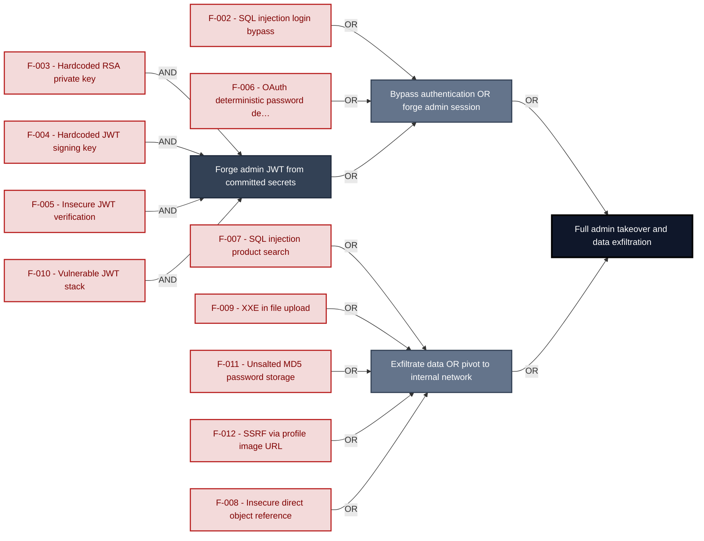

**Findings** (full detail in [§8 Findings Register](#8-findings-register)): 🔴 [F-002](#f-002) — SQL Injection — `routes/login.ts:34` SQL injection login bypass · 🔴 [F-006](#f-006) — OAuth password derived deterministically from email — `oauth.component.ts:30` OAuth deterministic password derivation · 🔴 [F-003](#f-003) — Hardcoded RSA Private Key — `lib/insecurity.ts:23` Hardcoded RSA private key · 🔴 [F-004](#f-004) — Hardcoded JWT Signing Key — `lib/insecurity.ts:23` Hardcoded JWT signing key · 🔴 [F-005](#f-005) — Insecure JWT Verification — `lib/insecurity.ts:191` Insecure JWT verification · 🔴 [F-010](#f-010) — Vulnerable JWT stack: jsonwebtoken 0.4.0 / express-jwt — `lib/insecurity.ts:54` Vulnerable JWT stack · 🔴 [F-007](#f-007) — SQL Injection — `routes/search.ts:23` SQL injection product search · 🔴 [F-009](#f-009) — XXE — `routes/fileUpload.ts:83` XXE in file upload · 🔴 [F-011](#f-011) — Passwords persisted with unsalted MD5 — `models/user.ts:77` Unsalted `MD5` password storage · 🔴 [F-012](#f-012) — SSRF — `routes/profileImageUrlUpload.ts:24` SSRF via profile image URL · 🔴 [F-008](#f-008) — Insecure Direct Object Reference — `routes/address.ts:11` Insecure direct object reference

---

## 1. System Overview

Probably the most modern and sophisticated insecure web application

**Repository:** https://github.com/juice-shop/juice-`shop.git`
**Runtime:** Node\.js 22 - 25

### Scope

This threat model covers 9 components of juice-shop: **Express REST API Backend**, **Security Core (`lib/insecurity.ts`)**, **Data Persistence Layer**, **Angular Frontend SPA**, **File Upload & Parser Subsystem**, **Realtime WebSocket Channel**, **CI/CD & Source-Contribution Integrity**, **Authentication & Session Surface**, **Web3 / Wallet / NFT Surface**.

All 9 modeled components received full STRIDE threat analysis.

**Out of scope:** third-party hosted dependencies, browser runtime, operating-system kernel, and the underlying network infrastructure.

---

## 2. Architecture Diagrams

### 2.1 System Context

Who interacts with juice-shop from the outside, and through which channels. Solid arrows show normal usage; dashed red arrows mark unauthenticated probing or exploit paths (C4 Level 1).

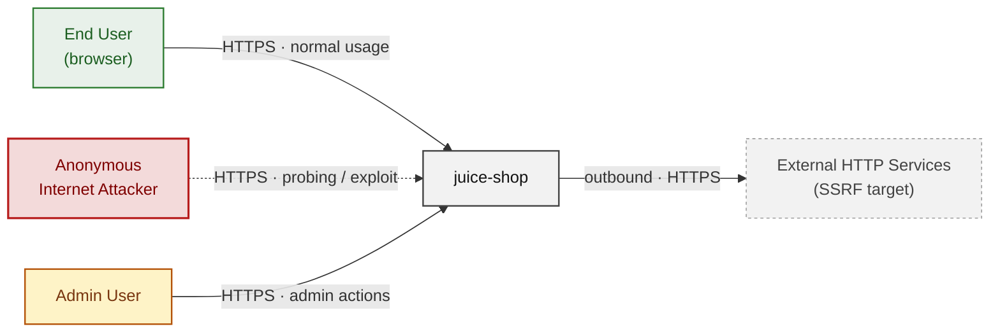

**Key takeaway:** Every actor in the context interacts with juice-shop through its external interface, so authentication and input validation at that edge govern the entire attack surface.

### 2.2 Container Architecture

How the system decomposes into deployable units. Each box is a separate runtime process or service container; arrows show synchronous request paths between them. Components with ≥3 Critical findings carry a red border, ≥2 High amber (C4 Level 2).

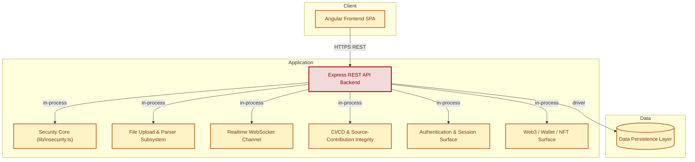

**Key takeaway:** The system decomposes into 1 client, 7 application and 1 data unit(s); Express REST API Backend carries the most Critical findings (4) and bounds the worst-case blast radius.

### 2.3 Components


Who reaches each component, and through which trust zone. Four columns map external actors to the internal tiers (Client / Application / Data); solid green arrows show legitimate data flow, dashed red arrows mark intrusion vectors. The component table directly below holds source paths and linked threats per `C-NN`; per-finding evidence is in [§8 Findings Register](#8-findings-register).

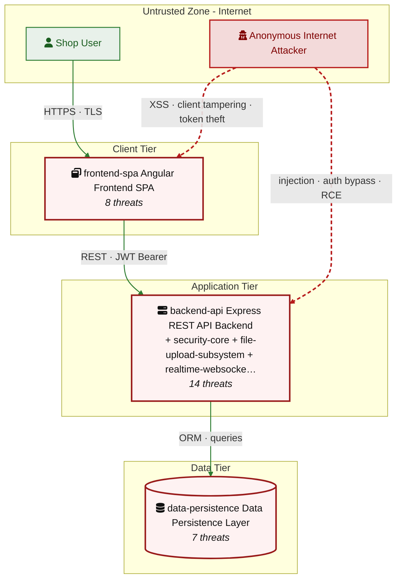

**Key takeaway:** CI/CD & Source-Contribution Integrity concentrates the most findings (20 of 80 across all components); the table below maps each component to its source paths and linked threats.

| ID | Name | Type | Key Paths | Linked Threats |
|----|----------------------|-----------|--------------------------------------|------------------------------------------------|
| <a id="c-01"></a><a id="backend-api"></a><span style="white-space:nowrap">C-01</span> | Express REST API Backend | application | `server.ts`<br/>`app.ts`<br/>`routes/**`<br/>`config/**` | 🔴 [F-004](#f-004) — Hardcoded JWT Signing Key (`lib/insecurity.ts:23`)<br/>🔴 [F-005](#f-005) — Insecure JWT Verification (`lib/insecurity.ts:191`)<br/>🔴 [F-007](#f-007) — SQL Injection (`routes/search.ts:23`)<br/>🔴 [F-008](#f-008) — Insecure Direct Object Reference (`routes/address.ts:11`)<br/>🟠 [F-030](#f-030) — Sensitive Files Exposed (`server.ts:277`)<br/>🟠 [F-045](#f-045) — Rate Limit Keyed on Spoofable Header (`server.ts:346`)<br/>🔴 [F-047](#f-047) — Sensitive Routes Registered Without Authentication Middleware (`server.ts:310`)<br/>🔴 [F-048](#f-048) — Authorization (`lib/insecurity.ts:158`)<br/>🔴 [F-051](#f-051) — Hardcoded Cookie Signing Secret (`server.ts:289`)<br/>🟡 [F-052](#f-052) — Missing Content Security Policy and HSTS Headers (`server.ts:186`)<br/>🟡 [F-058](#f-058) — No Application Audit Logging for Privileged Actions (`server.ts:338`)<br/>🟡 [F-062](#f-062) — Verbose Error Handler Leaks Stack Traces (`server.ts:678`)<br/>🟠 [F-063](#f-063) — Wildcard CORS Allows Any Origin (`server.ts:183`)<br/>🟢 [F-076](#f-076) — Unauthenticated Prometheus Metrics Endpoint (`server.ts:725`) |
| <a id="c-02"></a><a id="security-core"></a><span style="white-space:nowrap">C-02</span> | Security Core (`lib/insecurity.ts`) | application | `lib/insecurity.ts`<br/>`lib/utils.ts`<br/>`lib/webhook.ts` | 🔴 [F-010](#f-010) — Vulnerable JWT stack: jsonwebtoken 0.4.0 / express-jwt (`lib/insecurity.ts:54`)<br/>🟠 [F-020](#f-020) — Session map keyed and trusted from unverified token in (`lib/insecurity.ts:191`)<br/>🟠 [F-021](#f-021) — Open redirect (`lib/insecurity.ts:138`)<br/>🔴 [F-022](#f-022) — Hardcoded HMAC secret for token derivation (`lib/insecurity.ts:44`)<br/>🟠 [F-029](#f-029) — Broken sanitizeLegacy regex permits XSS payloads (`lib/insecurity.ts:61`)<br/>🟠 [F-043](#f-043) — MD5 used for password/data hashing (`lib/insecurity.ts:43`)<br/>🔴 [F-056](#f-056) — DownloadToFile fetches arbitrary user-influenced URL with no (`lib/utils.ts:117`)<br/>🟡 [F-061](#f-061) — Role-check middleware emits no audit log on authz denial (`lib/insecurity.ts:162`)<br/>🟢 [F-080](#f-080) — Webhook leaks host/OS/config metadata and CTF flag to (`lib/webhook.ts:30`) |
| <a id="c-03"></a><a id="data-persistence"></a><span style="white-space:nowrap">C-03</span> | Data Persistence Layer | data | `models/**`<br/>`data/**`<br/>`lib/startup/**` | 🔴 [F-011](#f-011) — Passwords persisted with unsalted MD5 (`models/user.ts:77`)<br/>🔴 [F-015](#f-015) — Hardcoded admin credentials and TOTP secret in seed data (`users.yml:148`)<br/>🟠 [F-040](#f-040) — Payment card PAN stored unencrypted in plaintext (`models/card.ts:39`)<br/>🟠 [F-041](#f-041) — SQLite database file stored unencrypted at rest (`models/index.ts:41`)<br/>🔴 [F-042](#f-042) — Security answers HMAC'd with hardcoded static key (`models/securityAnswer.ts:46`)<br/>🟡 [F-059](#f-059) — ORM query logging disabled, no persistence audit trail (`models/index.ts:42`)<br/>🟡 [F-067](#f-067) — MarsDB in-memory collections grow unbounded (`data/mongodb.ts:9`) |
| <a id="c-04"></a><a id="frontend-spa"></a><span style="white-space:nowrap">C-04</span> | Angular Frontend SPA | client | `frontend/src/**` | 🟠 [F-001](#f-001) — JWT persisted in localStorage readable by any XSS (`login.component.ts:105`)<br/>🔴 [F-006](#f-006) — OAuth password derived deterministically from email (`oauth.component.ts:30`)<br/>🟠 [F-017](#f-017) — OAuth implicit flow returns access_token in URL (`login.component.ts:152`)<br/>🔴 [F-027](#f-027) — DOM XSS (`search-result.component.ts:143`)<br/>🟠 [F-028](#f-028) — No Content-Security-Policy delivered to the SPA (`server.ts:188`)<br/>🟠 [F-049](#f-049) — Admin route guard relies on client-decoded JWT role, no (`app.guard.ts:54`)<br/>🟡 [F-055](#f-055) — Third-party fonts and cookieconsent loaded without Subresource (`index.html:14`)<br/>🟢 [F-073](#f-073) — Security-relevant client errors swallowed to (`oauth.component.ts:64`) |
| <a id="c-05"></a><a id="file-upload-subsystem"></a><span style="white-space:nowrap">C-05</span> | File Upload & Parser Subsystem | application | `routes/fileUpload.ts`<br/>`routes/profileImageUrlUpload.ts`<br/>`routes/dataExport.ts`<br/>`routes/profileImageFileUpload.ts` | 🔴 [F-009](#f-009) — XXE (`routes/fileUpload.ts:83`)<br/>🔴 [F-012](#f-012) — SSRF (`routes/profileImageUrlUpload.ts:24`)<br/>🟠 [F-016](#f-016) — Unauthenticated parser surface on POST `/file-upload` (`server.ts:309`)<br/>🟠 [F-026](#f-026) — Zip-slip arbitrary file write (`routes/fileUpload.ts:44`)<br/>🟠 [F-046](#f-046) — YAML bomb DoS in handleYamlUpload (`routes/fileUpload.ts:117`)<br/>🟡 [F-060](#f-060) — No audit logging of upload/outbound-fetch (`routes/profileImageUrlUpload.ts:24`)<br/>🟡 [F-068](#f-068) — Unbounded outbound fetch stream to disk in (`routes/profileImageUrlUpload.ts:30`) |
| <a id="c-06"></a><a id="realtime-websocket"></a><span style="white-space:nowrap">C-06</span> | Realtime WebSocket Channel | application | `lib/startup/registerWebsocketEvents.ts`<br/>`server.ts` | 🔴 [F-018](#f-018) — Unauthenticated WebSocket Channel (`registerWebsocketEvents.ts:20`)<br/>🟠 [F-019](#f-019) — WebSocket Origin Not Enforced Against (`registerWebsocketEvents.ts:20`)<br/>🟡 [F-069](#f-069) — Unthrottled Socket Event Handlers with (`registerWebsocketEvents.ts:47`) |
| <a id="c-07"></a><a id="ci-cd-pipeline"></a><span style="white-space:nowrap">C-07</span> | CI/CD & Source-Contribution Integrity | application | `.github/workflows/**`<br/>`Dockerfile`<br/>`docker-compose.yml`<br/>`package.json` | 🟠 [F-025](#f-025) — Fork-PR npm lifecycle scripts execute with live secrets in CI (`ci.yml:167`)<br/>🟠 [F-031](#f-031) — Uses --unsafe-perm npm install flag — Dockerfile:5<br/>🟠 [F-032](#f-032) — GitHub Actions workflow missing top-level permissions block (`ci.yml:1`)<br/>🟠 [F-033](#f-033) — Workflow directly pushes to master branch (`frontend-bundle-analysis.yml:59`)<br/>🟠 [F-034](#f-034) — Third-party GitHub Action not pinned to commit SHA (`ci.yml:202`)<br/>🟠 [F-035](#f-035) — Workflow executes curl | sh to install Heroku CLI (`ci.yml:371`)<br/>🟠 [F-036](#f-036) — Third-party GitHub Action pinned to mutable main branch (`image_actions.yml:33`)<br/>🟠 [F-037](#f-037) — Third-party GitHub Action not pinned to commit SHA (`image_actions.yml:42`)<br/>🟠 [F-038](#f-038) — Base image not digest-pinned — Dockerfile:1<br/>🟠 [F-039](#f-039) — On absent from repository (`package-lock.json`)<br/>🟡 [F-053](#f-053) — No active dependency/CVE monitoring; legacy (.dependabot/config.yml:1)<br/>🟡 [F-054](#f-054) — Third-party Action pinned to mutable branch ref main (`image_actions.yml:33`)<br/>🔴 [F-064](#f-064) — No container image signing step in release workflow (`release.yml:1`)<br/>🟡 [F-065](#f-065) — Untrusted npm Install/Postinstall Scripts Enabled — Dockerfile:5<br/>🟡 [F-066](#f-066) — Dependabot Ecosystem Coverage Incomplete (.github/dependabot.yml)<br/>🟡 [F-071](#f-071) — Pull_request_target grants write + org-admin token while (`pr-compliance.yml:4`)<br/>🟢 [F-072](#f-072) — Bot auto-commits to contributor branches and master without (`lint-fixer.yml:22`)<br/>🟢 [F-077](#f-077) — Missing HEALTHCHECK instruction — Dockerfile:1<br/>🟢 [F-078](#f-078) — No SBOM generation step in CI/CD pipeline workflow (`ci.yml:1`)<br/>🟢 [F-079](#f-079) — No Renovate config detected (`renovate.json`) |
| <a id="c-08"></a><a id="auth"></a><span style="white-space:nowrap">C-08</span> | Authentication & Session Surface | application | `lib/insecurity.ts`<br/>`lib/startup/registerWebsocketEvents.ts`<br/>`routes/2fa.ts`<br/>`routes/authenticatedUsers.ts`<br/>`routes/login.ts` | 🔴 [F-002](#f-002) — SQL Injection (`routes/login.ts:34`)<br/>🔴 [F-003](#f-003) — Hardcoded RSA Private Key (`lib/insecurity.ts:23`)<br/>🟠 [F-013](#f-013) — Missing Brute-Force Protection on Login (`server.ts:595`)<br/>🟠 [F-014](#f-014) — Weak Security-Question Password Reset (`routes/resetPassword.ts:41`)<br/>🟠 [F-024](#f-024) — Unsalted MD5 Password Hashing (`lib/insecurity.ts:43`)<br/>🟡 [F-057](#f-057) — No Audit Logging of Authentication Events (`routes/login.ts:18`)<br/>🟢 [F-075](#f-075) — Masked Secrets Returned in User List (`routes/authenticatedUsers.ts:25`) |
| <a id="c-09"></a><a id="web3-nft"></a><span style="white-space:nowrap">C-09</span> | Web3 / Wallet / NFT Surface | application | `routes/checkKeys.ts`<br/>`routes/nftMint.ts`<br/>`routes/redirect.ts`<br/>`routes/web3Wallet.ts` | 🟠 [F-023](#f-023) — Unverified Wallet Ownership Claim (`routes/nftMint.ts:41`)<br/>🔴 [F-044](#f-044) — Hardcoded Wallet Mnemonic and Private Key (`routes/checkKeys.ts:10`)<br/>🟠 [F-050](#f-050) — Missing Authentication on Web3 Endpoints (`server.ts:640`)<br/>🟡 [F-070](#f-070) — No Rate Limiting on Web3 Key/Wallet Endpoints (`server.ts:640`)<br/>🟢 [F-074](#f-074) — No Audit Logging of Wallet/Key Actions (`routes/web3Wallet.ts:15`) |
### 2.4 Technology Architecture

The technology stack the system is built on. Each box names the framework or runtime that fills that role; per-component findings live in the [§2.3](#23-components) component table above, and the full per-finding catalogue is in [§8 Findings Register](#8-findings-register).

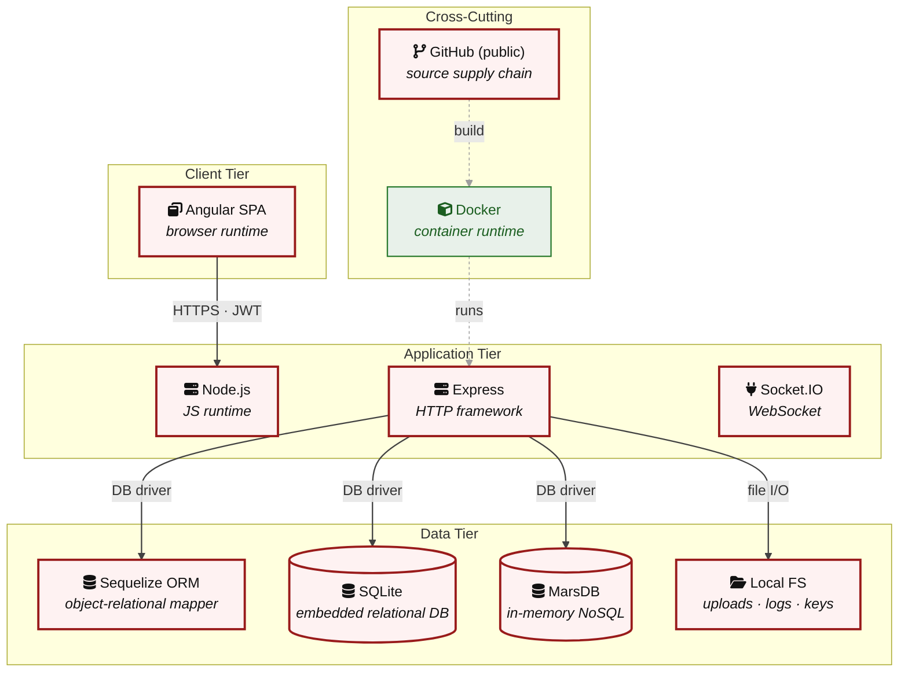

**Key takeaway:** The stack spans 1 data-tier store(s) behind the application tier; injection and data-at-rest exposure track the data tier, detailed per finding in [§8 Findings Register](#8-findings-register).

> **Legend:** **red border** ≥ 3 Critical threats on the component · **amber border** ≥ 2 High threats

---

## 3. Attack Walkthroughs

This section walks through how the highest-risk findings are exploited - one short walkthrough per Critical, each with attack steps, a focused sequence diagram, and the primary mitigation. The cross-finding view (which weaknesses combine toward the worst-case goal, and where one fix severs several paths) is in the [Critical Attack Tree](#critical-attack-tree). Full per-finding context - severity rationale, assets, detection signals - is in the [§8 Findings Register](#8-findings-register) row for each finding.

### 3.1 SQL Injection

**Source:** 🔴 [F-002](#f-002) — `routes/login.ts:34`

Severity **Critical** ([CWE-89](https://cwe.mitre.org/data/definitions/89.html)). STRIDE: Spoofing. See [§8 F-002](#f-002) for the full register row.

**Attack Steps**

1. The login handler builds its authentication query by string interpolation: `SELECT * FROM Users WHERE email = '${req.body.email}' AND password = '…'` at `routes/login.ts:34`.
2. `req.body.email` is never escaped or parameterised.
3. An anonymous attacker (ACT-D-01) posts `{"email":"' OR 1=1--","password":"x"}` to POST `/rest/user/login`; the `--` comments out the password predicate, the WHERE matches the first row, and the server issues a valid session token for the seeded admin account.

**Sequence Diagram**

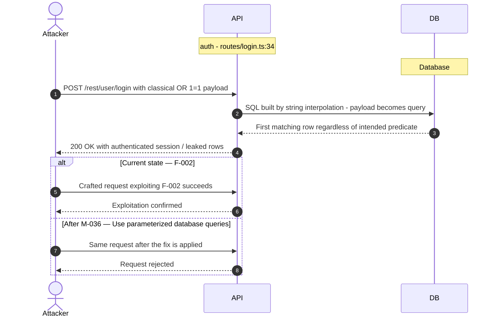

**Key takeaway:** Until ❶ [M-036](#m-036) (Use parameterized database queries) lands, 🔴 [F-002](#f-002) — SQL Injection — `routes/login.ts:34` is exploitable at `routes/login.ts:34` (Critical-severity, [CWE-89](https://cwe.mitre.org/data/definitions/89.html)).

**Defense in Depth**

- Primary mitigation: ❶ [M-036](#m-036) (Use parameterized database queries)

### 3.2 Hardcoded RSA Private Key

**Source:** 🔴 [F-003](#f-003) — `lib/insecurity.ts:23`

Severity **Critical** ([CWE-798](https://cwe.mitre.org/data/definitions/798.html)). STRIDE: Spoofing. See [§8 F-003](#f-003) for the full register row.

**Attack Steps**

1. The RSA private key used to sign every session JWT is hardcoded as a string literal at `lib/insecurity.ts:23`, and `authorize()` signs tokens with it (`lib/insecurity.ts:56`).
2. Because Juice Shop is open source, the key is in every clone.
3. An attacker (ACT-D-01 needs only the public repo; ACT-D-06 sees it at build time) calls `jwt.sign({ data: { role: 'admin', email: 'attacker@x' } }, privateKey, { algorithm: 'RS256' })` offline and presents the resulting token; `updateAuthenticatedUsers()`/`isAuthorized()` verify it against the matching public key and grant admin authority.

**Sequence Diagram**

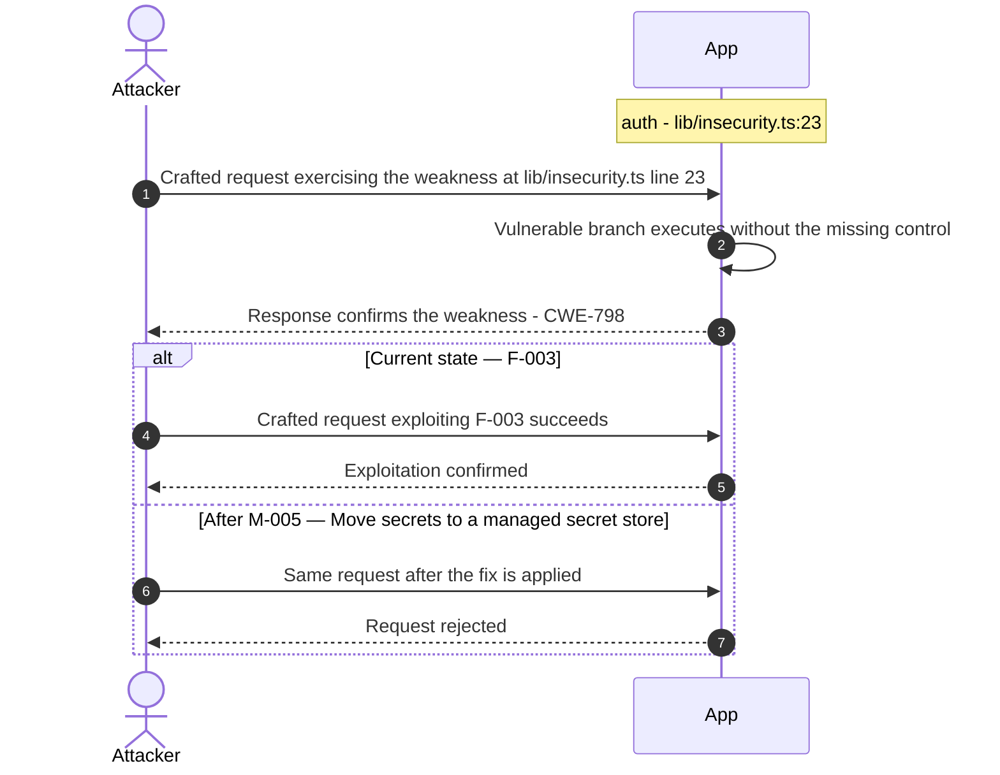

**Key takeaway:** Until ❶ [M-005](#m-005) (Move secrets to a managed secret store) lands, 🔴 [F-003](#f-003) — Hardcoded RSA Private Key — `lib/insecurity.ts:23` is exploitable at `lib/insecurity.ts:23` (Critical-severity, [CWE-798](https://cwe.mitre.org/data/definitions/798.html)).

**Defense in Depth**

- Primary mitigation: ❶ [M-005](#m-005) (Move secrets to a managed secret store)
- Defence in depth: ❶ [M-037](#m-037) (Move secrets to a managed secret store)

### 3.3 Hardcoded JWT Signing Key

**Source:** 🔴 [F-004](#f-004) — `lib/insecurity.ts:23`

Severity **Critical** ([CWE-321](https://cwe.mitre.org/data/definitions/321.html)). STRIDE: Spoofing. See [§8 F-004](#f-004) for the full register row.

**Attack Steps**

1. The RSA private key used to sign all JWT session tokens is hardcoded as a string constant in `lib/insecurity.ts` and is also served from the `/encryptionkeys` directory (`server.ts:277`).
2. Because the key is checked into the public source tree and downloadable at runtime, any attacker can mint a valid token with arbitrary claims, e.g. `data.role` = 'admin' or any victim's userId, and present it to `security.isAuthorized()`.
3. This forges authentication and elevates to any role without credentials.

**Sequence Diagram**

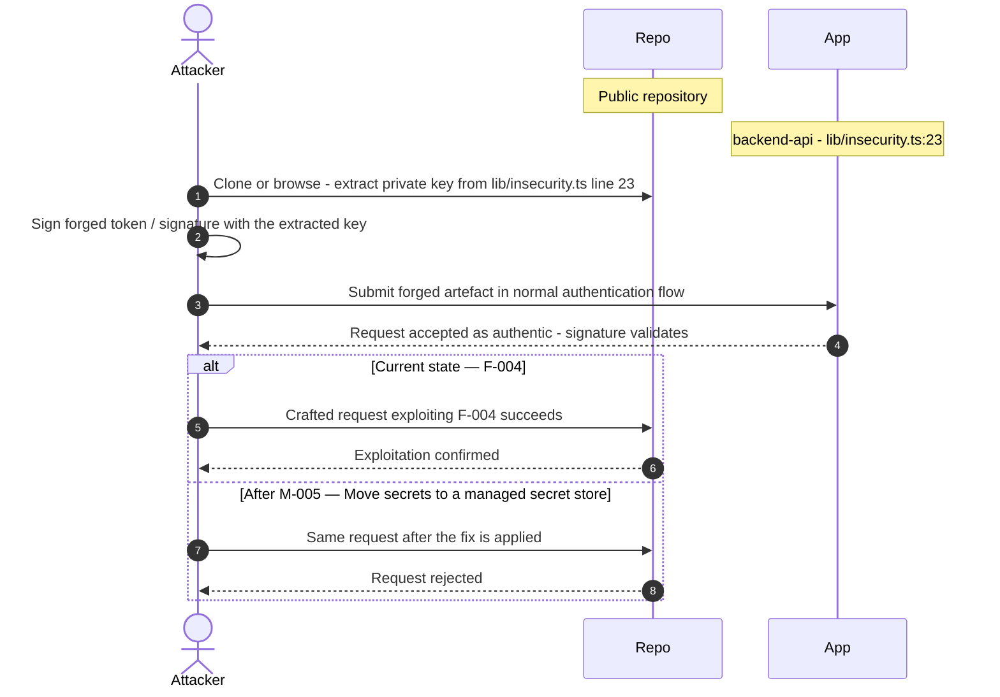

**Key takeaway:** Until ❶ [M-005](#m-005) (Move secrets to a managed secret store) lands, 🔴 [F-004](#f-004) — Hardcoded JWT Signing Key — `lib/insecurity.ts:23` is exploitable at `lib/insecurity.ts:23` (Critical-severity, [CWE-321](https://cwe.mitre.org/data/definitions/321.html)).

**Defense in Depth**

- Primary mitigation: ❶ [M-005](#m-005) (Move secrets to a managed secret store)
- Defence in depth: ❶ [M-038](#m-038) (Move cryptographic keys to a managed secret store)

### 3.4 Insecure JWT Verification

**Source:** 🔴 [F-005](#f-005) — `lib/insecurity.ts:191`

Severity **Critical** ([CWE-347](https://cwe.mitre.org/data/definitions/347.html)). STRIDE: Spoofing. See [§8 F-005](#f-005) for the full register row.

**Attack Steps**

1. Without an explicit algorithm allowlist, attackers can forge tokens with `alg:none` (older lib versions) or use the public key as an HMAC secret to mint valid signatures.
2. Send the crafted payload to the endpoint backed by `lib/insecurity.ts:191`.
3. The vulnerable code path accepts the payload without enforcing the missing control.

**Sequence Diagram**

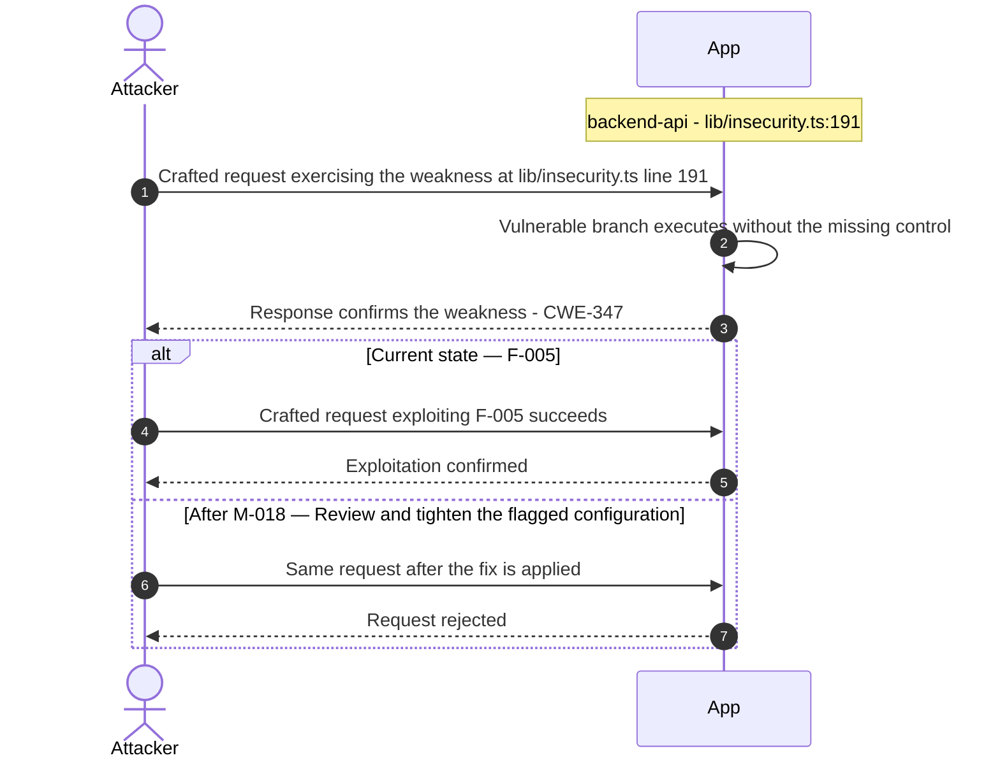

**Key takeaway:** Until ❶ [M-018](#m-018) (Review and tighten the flagged configuration) lands, 🔴 [F-005](#f-005) — Insecure JWT Verification — `lib/insecurity.ts:191` is exploitable at `lib/insecurity.ts:191` (Critical-severity, [CWE-347](https://cwe.mitre.org/data/definitions/347.html)).

**Defense in Depth**

- Primary mitigation: ❶ [M-018](#m-018) (Review and tighten the flagged configuration)

### 3.5 OAuth password derived deterministically from email

**Source:** 🔴 [F-006](#f-006) — `frontend/src/app/oauth/oauth.component.ts:30`

Severity **Critical** ([CWE-330](https://cwe.mitre.org/data/definitions/330.html)). STRIDE: Spoofing. See [§8 F-006](#f-006) for the full register row.

**Attack Steps**

1. After OAuth login the SPA derives a local account password as `btoa(profile.email.split('').reverse().join(''))` (`oauth.component.ts:30` and :46) and silently registers/logs-in the user with it.
2. The password is a pure deterministic function of the publicly-known email, so any attacker who knows a victim's email can reconstruct the exact password (reverse the email, base64-encode) and authenticate to the victim's account through the normal password login endpoint - completely bypassing Google OAuth.
3. This is a Critical credential-design flaw: every OAuth user has a guessable static password.

**Sequence Diagram**


**Key takeaway:** Until ❶ [M-039](#m-039) (Stop deriving passwords from email; use a server-side random) lands, 🔴 [F-006](#f-006) — OAuth password derived deterministically from email — `oauth.component.ts:30` is exploitable at `frontend/src/app/oauth/oauth.component.ts:30` (Critical-severity, [CWE-330](https://cwe.mitre.org/data/definitions/330.html)).

**Defense in Depth**

- Primary mitigation: ❶ [M-039](#m-039) (Stop deriving passwords from email; use a server-side random secret or tokenless OAuth session linkage)

### 3.6 SQL Injection

**Source:** 🔴 [F-007](#f-007) — `routes/search.ts:23`

Severity **Critical** ([CWE-89](https://cwe.mitre.org/data/definitions/89.html)). STRIDE: Tampering. See [§8 F-007](#f-007) for the full register row.

**Attack Steps**

1. searchProducts interpolates the q query parameter into a raw SQL string twice (name LIKE '%\${criteria}%' OR description LIKE '%\${criteria}%').
2. The only sanitization is a 200-character truncation.
3. An anonymous attacker calls GET `/rest/products/search`?q=')) UNION SELECT … -- to perform a UNION-based injection, exfiltrating the full Users table including email and `MD5` password columns, or reading sqlite_master to dump the entire schema.

**Sequence Diagram**


**Key takeaway:** Until ❶ [M-040](#m-040) (Use parameterized database queries) lands, 🔴 [F-007](#f-007) — SQL Injection — `routes/search.ts:23` is exploitable at `routes/search.ts:23` (Critical-severity, [CWE-89](https://cwe.mitre.org/data/definitions/89.html)).

**Defense in Depth**

- Primary mitigation: ❶ [M-040](#m-040) (Use parameterized database queries)

### 3.7 Insecure Direct Object Reference

**Source:** 🔴 [F-008](#f-008) — `routes/address.ts:11`

Severity **Critical** ([CWE-639](https://cwe.mitre.org/data/definitions/639.html)). STRIDE: Tampering. See [§8 F-008](#f-008) for the full register row.

**Attack Steps**

1. Server-side authorization MUST derive the resource owner from the authenticated session (`req.user` / `req.session` / `req.auth`), never from attacker-controlled request data.
2. Trusting `req.body.UserId` etc. enables horizontal privilege escalation across all authenticated tenants.
3. Send the crafted payload to the endpoint backed by `routes/address.ts:11`.

**Sequence Diagram**


**Key takeaway:** Until ❶ [M-019](#m-019) (Enforce object-level (ownership) authorization) lands, 🔴 [F-008](#f-008) — Insecure Direct Object Reference — `routes/address.ts:11` is exploitable at `routes/address.ts:11` (Critical-severity, [CWE-639](https://cwe.mitre.org/data/definitions/639.html)).

**Defense in Depth**

- Primary mitigation: ❶ [M-019](#m-019) (Enforce object-level (ownership) authorization)

### 3.8 XXE

**Source:** 🔴 [F-009](#f-009) — `routes/fileUpload.ts:83`

Severity **Critical** ([CWE-611](https://cwe.mitre.org/data/definitions/611.html)). STRIDE: Tampering. See [§8 F-009](#f-009) for the full register row.

**Attack Steps**

1. POST `/file-upload` accepts any *.xml file from an unauthenticated caller (`server.ts:309` registers the route with no auth middleware). handleXmlUpload parses the buffer with `libxml.parseXml(data, { noblanks: true, noent: true, nocdata: true })` at `routes/fileUpload.ts:83`.
2. `noent: true` enables substitution of external entities, so an attacker uploads a DOCTYPE declaring a SYSTEM entity (e.g.
3. `<!ENTITY x SYSTEM "file:///etc/passwd">`) and the resolved file contents are reflected back inside the error message at line 87 (`utils.trunc(xmlString, 400)`).

**Sequence Diagram**

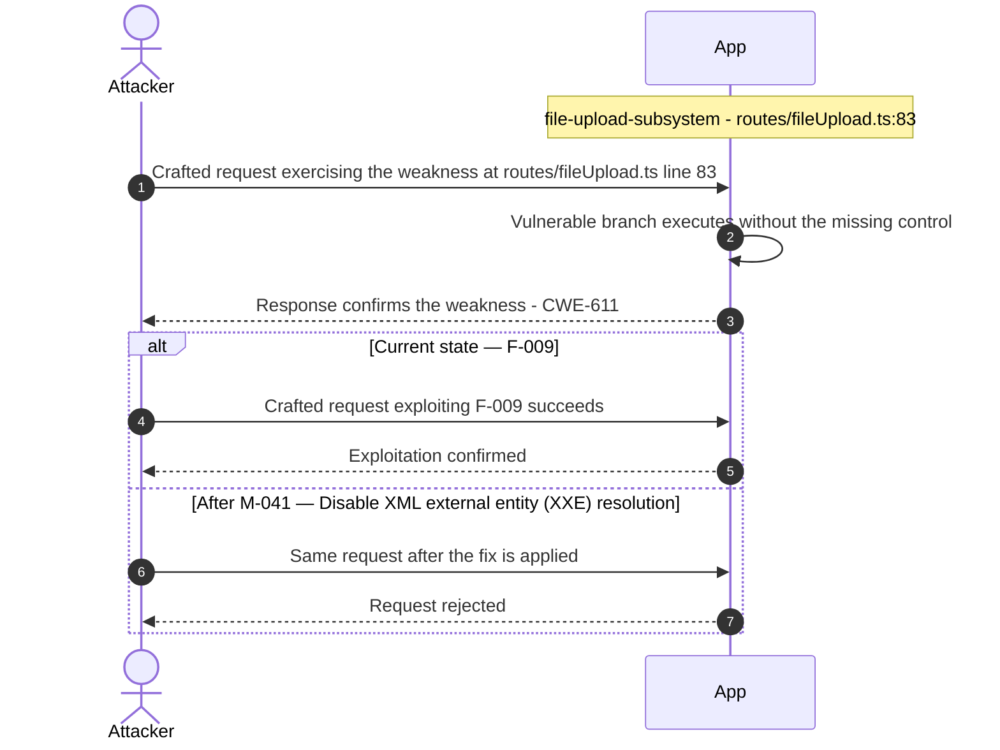

**Key takeaway:** Until ❶ [M-041](#m-041) (Disable XML external entity (XXE) resolution) lands, 🔴 [F-009](#f-009) — XXE — `routes/fileUpload.ts:83` is exploitable at `routes/fileUpload.ts:83` (Critical-severity, [CWE-611](https://cwe.mitre.org/data/definitions/611.html)).

**Defense in Depth**

- Primary mitigation: ❶ [M-041](#m-041) (Disable XML external entity (XXE) resolution)

### 3.9 Vulnerable JWT stack: jsonwebtoken 0.4.0 / express-jwt

**Source:** 🔴 [F-010](#f-010) — `lib/insecurity.ts:54`

Severity **Critical** ([CWE-1395](https://cwe.mitre.org/data/definitions/1395.html)). STRIDE: Tampering. See [§8 F-010](#f-010) for the full register row.

**Attack Steps**

1. The component pins `jsonwebtoken@0.4.0` and `express-jwt@0.1.3` (package\.json) - releases that predate the 2015 algorithm-confusion fixes and `CVE-2022-23529`/`CVE-2022-23540` class hardening. jsonwebtoken <4.2.2 does not constrain the verification algorithm, allowing an `RS256`-issued, RSA-public-key-protected app to accept an `HS256` token signed with the public key as the HMAC secret (the public key is shipped in `encryptionkeys/jwt.pub` and loaded at line 22). `isAuthorized()` (line 54) wires express-jwt with only {secret: publicKey} and no algorithms allowlist, so the verifier accepts whatever alg the attacker declares.
2. ACT-D-01 forges a valid token using the public key as an HMAC key, achieving full auth bypass without the private key.
3. Send the crafted payload to the endpoint backed by `lib/insecurity.ts:54`.

**Sequence Diagram**

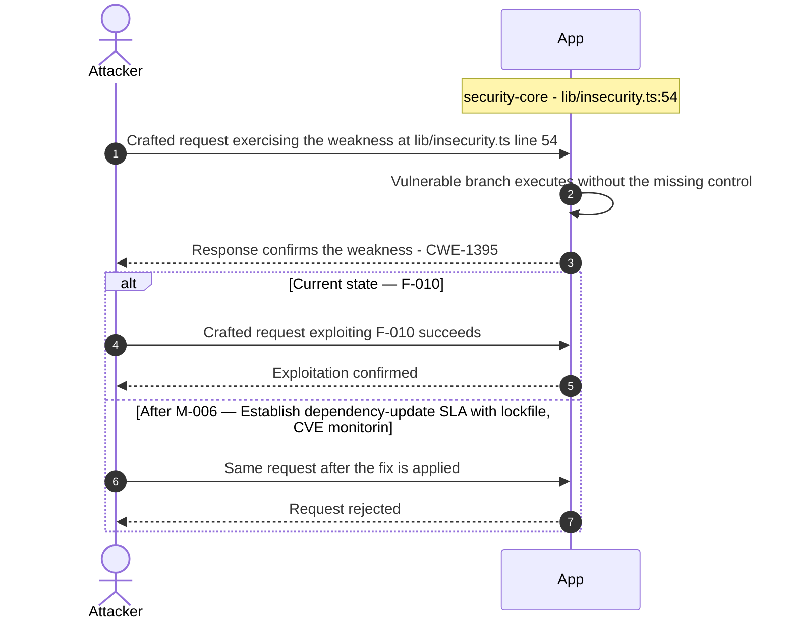

**Key takeaway:** Until ❷ [M-006](#m-006) (Establish dependency-update SLA with lockfile, CVE monitorin) lands, 🔴 [F-010](#f-010) — Vulnerable JWT stack: jsonwebtoken 0.4.0 / express-jwt — `lib/insecurity.ts:54` is exploitable at `lib/insecurity.ts:54` (Critical-severity, [CWE-1395](https://cwe.mitre.org/data/definitions/1395.html)).

**Defense in Depth**

- Primary mitigation: ❷ [M-006](#m-006) (Establish dependency-update SLA with lockfile, CVE monitoring and SBOM)
- Defence in depth: ❶ [M-042](#m-042) (Upgrade jsonwebtoken/express-jwt and enforce an `RS256`-only algorithms allowlist on verification)

### 3.10 Passwords persisted with unsalted MD5

**Source:** 🔴 [F-011](#f-011) — `models/user.ts:77`

Severity **Critical** ([CWE-916](https://cwe.mitre.org/data/definitions/916.html)). STRIDE: Information Disclosure. See [§8 F-011](#f-011) for the full register row.

**Attack Steps**

1. The User model's password setter calls `security.hash(clearTextPassword)`, which is defined in `lib/insecurity.ts:43` as `crypto.createHash('md5').update`(data).digest('hex') - unsalted, single-round `MD5`.
2. Every credential in the Users table is therefore stored as a raw `MD5` digest.
3. An attacker who obtains the SQLite file (data/juiceshop.sqlite) or dumps the Users table via the SQLi sink in the search/login routes recovers all passwords near-instantly: `MD5` is GPU-crackable at billions of hashes/sec and unsalted digests fall to precomputed rainbow tables.

**Sequence Diagram**

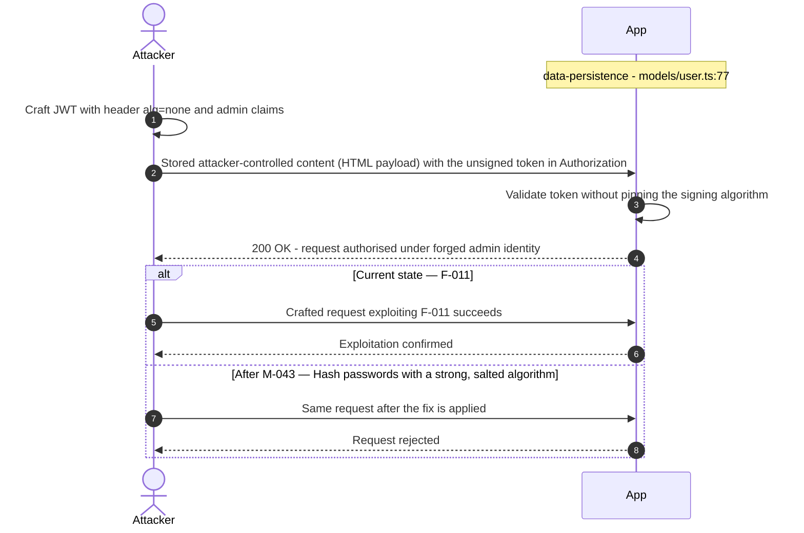

**Key takeaway:** Until ❶ [M-043](#m-043) (Hash passwords with a strong, salted algorithm) lands, 🔴 [F-011](#f-011) — Passwords persisted with unsalted MD5 — `models/user.ts:77` is exploitable at `models/user.ts:77` (Critical-severity, [CWE-916](https://cwe.mitre.org/data/definitions/916.html)).

**Defense in Depth**

- Primary mitigation: ❶ [M-043](#m-043) (Hash passwords with a strong, salted algorithm)

### 3.11 SSRF

**Source:** 🔴 [F-012](#f-012) — `routes/profileImageUrlUpload.ts:24`

Severity **Critical** ([CWE-918](https://cwe.mitre.org/data/definitions/918.html)). STRIDE: Information Disclosure. See [§8 F-012](#f-012) for the full register row.

**Attack Steps**

1. POST `/profile/image/url` passes the user-supplied `req.body.imageUrl` directly into `fetch(url)` at `routes/profileImageUrlUpload.ts:24` with no scheme restriction, no host allowlist, and no private-IP/link-local blocklist (grep for allowlist/isPrivateIP/169.254/metadata returned zero hits).
2. An authenticated low-priv user submits `imageUrl=http://169.254.169.254/latest/meta-data/iam/security-credentials/` or `http://localhost:6379/` to reach the cloud metadata endpoint or internal services.
3. The fetched body is streamed to disk (line 30) and, on the catch path, the raw URL is stored as the profileImage (line 36) leaking the response indirectly; internal service responses can also surface via timing/error differences.

**Sequence Diagram**

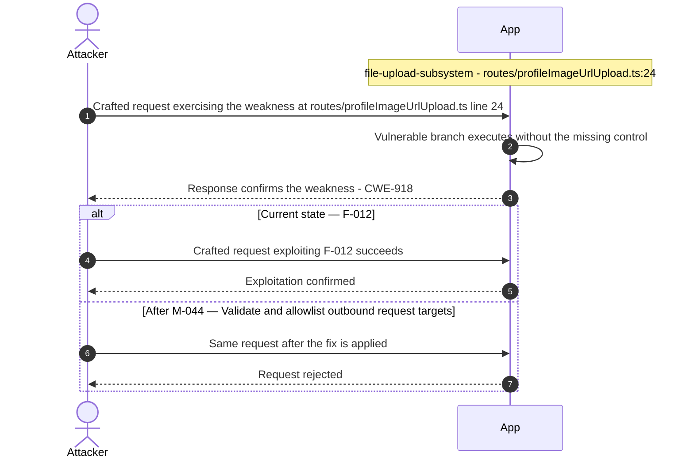

**Key takeaway:** Until ❶ [M-044](#m-044) (Validate and allowlist outbound request targets) lands, 🔴 [F-012](#f-012) — SSRF — `routes/profileImageUrlUpload.ts:24` is exploitable at `routes/profileImageUrlUpload.ts:24` (Critical-severity, [CWE-918](https://cwe.mitre.org/data/definitions/918.html)).

**Defense in Depth**

- Primary mitigation: ❶ [M-044](#m-044) (Validate and allowlist outbound request targets)

<!-- generated:walkthrough_renderer -->

---

## 4. Assets

Information assets and the classification level that drives the Confidentiality / Integrity / Availability targets used in [§8 Findings Register](#8-findings-register) risk scoring.

<table style="table-layout:fixed;width:100%">
<colgroup><col width="20%" style="width:20%"><col width="6%" style="width:6%"><col width="12%" style="width:12%"><col width="29%" style="width:29%"><col width="33%" style="width:33%"></colgroup>
<thead><tr><th>Asset</th><th>ID</th><th>Classification</th><th>Description</th><th>Linked Threats</th></tr></thead>
<tbody>
<tr><td style="overflow-wrap:anywhere">User Credentials &amp; Password Hashes</td><td style="white-space:nowrap">A-001</td><td>Restricted</td><td>User passwords stored as unsalted <code>MD5</code> hashes (<code>lib/insecurity.ts:43</code>) plus security-question answers. Compromise enables account takeover across all roles.</td><td style="overflow-wrap:anywhere">🔴 <a href="#f-002">F-002</a> — SQL Injection (<code>routes/login.ts:34</code>)<br/>🔴 <a href="#f-003">F-003</a> — Hardcoded RSA Private Key (<code>lib/insecurity.ts:23</code>)<br/>🔴 <a href="#f-004">F-004</a> — Hardcoded JWT Signing Key (<code>lib/insecurity.ts:23</code>)<br/>🔴 <a href="#f-005">F-005</a> — Insecure JWT Verification (<code>lib/insecurity.ts:191</code>)<br/>🔴 <a href="#f-007">F-007</a> — SQL Injection (<code>routes/search.ts:23</code>)<br/>🔴 <a href="#f-010">F-010</a> — Vulnerable JWT stack: jsonwebtoken 0.4.0 / express-jwt (<code>lib/insecurity.ts:54</code>)<br/>🔴 <a href="#f-011">F-011</a> — Passwords persisted with unsalted MD5 (<code>models/user.ts:77</code>)<br/>🟠 <a href="#f-013">F-013</a> — Missing Brute-Force Protection on Login (<code>server.ts:595</code>)<br/>🟠 <a href="#f-014">F-014</a> — Weak Security-Question Password Reset (<code>routes/resetPassword.ts:41</code>)<br/>🟠 <a href="#f-020">F-020</a> — Session map keyed and trusted from unverified token in (<code>lib/insecurity.ts:191</code>)<br/>🟠 <a href="#f-021">F-021</a> — Open redirect (<code>lib/insecurity.ts:138</code>)<br/>🔴 <a href="#f-022">F-022</a> — Hardcoded HMAC secret for token derivation (<code>lib/insecurity.ts:44</code>)<br/>🟠 <a href="#f-024">F-024</a> — Unsalted MD5 Password Hashing (<code>lib/insecurity.ts:43</code>)<br/>🔴 <a href="#f-027">F-027</a> — DOM XSS (<code>search-result.component.ts:143</code>)<br/>🟠 <a href="#f-029">F-029</a> — Broken sanitizeLegacy regex permits XSS payloads (<code>lib/insecurity.ts:61</code>)<br/>🔴 <a href="#f-042">F-042</a> — Security answers HMAC'd with hardcoded static key (<code>models/securityAnswer.ts:46</code>)<br/>🟠 <a href="#f-043">F-043</a> — MD5 used for password/data hashing (<code>lib/insecurity.ts:43</code>)<br/>🔴 <a href="#f-048">F-048</a> — Authorization (<code>lib/insecurity.ts:158</code>)<br/>🟡 <a href="#f-061">F-061</a> — Role-check middleware emits no audit log on authz denial (<code>lib/insecurity.ts:162</code>)</td></tr>
<tr><td style="overflow-wrap:anywhere">JWT Signing Key (RSA Private Key)</td><td style="white-space:nowrap">A-002</td><td>Restricted</td><td>RSA private key hardcoded in <code>lib/insecurity.ts:23</code> used to sign all session JWTs. Public exposure permits offline forgery of arbitrary (including admin) tokens.</td><td style="overflow-wrap:anywhere">🔴 <a href="#f-003">F-003</a> — Hardcoded RSA Private Key (<code>lib/insecurity.ts:23</code>)<br/>🔴 <a href="#f-004">F-004</a> — Hardcoded JWT Signing Key (<code>lib/insecurity.ts:23</code>)<br/>🔴 <a href="#f-005">F-005</a> — Insecure JWT Verification (<code>lib/insecurity.ts:191</code>)<br/>🔴 <a href="#f-010">F-010</a> — Vulnerable JWT stack: jsonwebtoken 0.4.0 / express-jwt (<code>lib/insecurity.ts:54</code>)<br/>🔴 <a href="#f-015">F-015</a> — Hardcoded admin credentials and TOTP secret in seed data (<code>users.yml:148</code>)<br/>🟠 <a href="#f-020">F-020</a> — Session map keyed and trusted from unverified token in (<code>lib/insecurity.ts:191</code>)<br/>🟠 <a href="#f-021">F-021</a> — Open redirect (<code>lib/insecurity.ts:138</code>)<br/>🔴 <a href="#f-022">F-022</a> — Hardcoded HMAC secret for token derivation (<code>lib/insecurity.ts:44</code>)<br/>🟠 <a href="#f-024">F-024</a> — Unsalted MD5 Password Hashing (<code>lib/insecurity.ts:43</code>)<br/>🟠 <a href="#f-026">F-026</a> — Zip-slip arbitrary file write (<code>routes/fileUpload.ts:44</code>)<br/>🟠 <a href="#f-029">F-029</a> — Broken sanitizeLegacy regex permits XSS payloads (<code>lib/insecurity.ts:61</code>)<br/>🟠 <a href="#f-030">F-030</a> — Sensitive Files Exposed (<code>server.ts:277</code>)<br/>🟠 <a href="#f-041">F-041</a> — SQLite database file stored unencrypted at rest (<code>models/index.ts:41</code>)<br/>🔴 <a href="#f-042">F-042</a> — Security answers HMAC'd with hardcoded static key (<code>models/securityAnswer.ts:46</code>)<br/>🟠 <a href="#f-043">F-043</a> — MD5 used for password/data hashing (<code>lib/insecurity.ts:43</code>)<br/>🔴 <a href="#f-044">F-044</a> — Hardcoded Wallet Mnemonic and Private Key (<code>routes/checkKeys.ts:10</code>)<br/>🔴 <a href="#f-048">F-048</a> — Authorization (<code>lib/insecurity.ts:158</code>)<br/>🟠 <a href="#f-049">F-049</a> — Admin route guard relies on client-decoded JWT role, no (<code>app.guard.ts:54</code>)<br/>🔴 <a href="#f-051">F-051</a> — Hardcoded Cookie Signing Secret (<code>server.ts:289</code>)<br/>🔴 <a href="#f-056">F-056</a> — DownloadToFile fetches arbitrary user-influenced URL with no (<code>lib/utils.ts:117</code>)<br/>🟡 <a href="#f-061">F-061</a> — Role-check middleware emits no audit log on authz denial (<code>lib/insecurity.ts:162</code>)<br/>🟢 <a href="#f-075">F-075</a> — Masked Secrets Returned in User List (<code>routes/authenticatedUsers.ts:25</code>)<br/>🟢 <a href="#f-076">F-076</a> — Unauthenticated Prometheus Metrics Endpoint (<code>server.ts:725</code>)<br/>🟢 <a href="#f-080">F-080</a> — Webhook leaks host/OS/config metadata and CTF flag to (<code>lib/webhook.ts:30</code>)</td></tr>
<tr><td style="overflow-wrap:anywhere">Payment Card &amp; Wallet Data</td><td style="white-space:nowrap">A-004</td><td>Restricted</td><td>Stored payment cards (<code>models/card.ts</code>) and wallet balances (<code>models/wallet.ts</code>) tied to user accounts.</td><td style="overflow-wrap:anywhere">🔴 <a href="#f-002">F-002</a> — SQL Injection (<code>routes/login.ts:34</code>)<br/>🔴 <a href="#f-007">F-007</a> — SQL Injection (<code>routes/search.ts:23</code>)<br/>🔴 <a href="#f-008">F-008</a> — Insecure Direct Object Reference (<code>routes/address.ts:11</code>)<br/>🔴 <a href="#f-027">F-027</a> — DOM XSS (<code>search-result.component.ts:143</code>)<br/>🟠 <a href="#f-040">F-040</a> — Payment card PAN stored unencrypted in plaintext (<code>models/card.ts:39</code>)<br/>🟠 <a href="#f-041">F-041</a> — SQLite database file stored unencrypted at rest (<code>models/index.ts:41</code>)<br/>🔴 <a href="#f-047">F-047</a> — Sensitive Routes Registered Without Authentication Middleware (<code>server.ts:310</code>)</td></tr>
<tr><td style="overflow-wrap:anywhere">HMAC Signing Secret</td><td style="white-space:nowrap">A-007</td><td>Restricted</td><td>Hardcoded HMAC secret (<code>lib/insecurity.ts:44</code>) used for deluxe-token derivation and integrity checks.</td><td style="overflow-wrap:anywhere">-</td></tr>
<tr><td style="overflow-wrap:anywhere">Session Tokens (JWT)</td><td style="white-space:nowrap">A-003</td><td>Confidential</td><td><code>RS256</code> JWTs carrying user identity and role, stored client-side in browser storage and an in-memory token map. XSS-extractable; no revocation.</td><td style="overflow-wrap:anywhere">🟠 <a href="#f-001">F-001</a> — JWT persisted in localStorage readable by any XSS (<code>login.component.ts:105</code>)<br/>🔴 <a href="#f-005">F-005</a> — Insecure JWT Verification (<code>lib/insecurity.ts:191</code>)<br/>🟠 <a href="#f-020">F-020</a> — Session map keyed and trusted from unverified token in (<code>lib/insecurity.ts:191</code>)<br/>🟠 <a href="#f-023">F-023</a> — Unverified Wallet Ownership Claim (<code>routes/nftMint.ts:41</code>)<br/>🔴 <a href="#f-027">F-027</a> — DOM XSS (<code>search-result.component.ts:143</code>)<br/>🟠 <a href="#f-028">F-028</a> — No Content-Security-Policy delivered to the SPA (<code>server.ts:188</code>)<br/>🟠 <a href="#f-029">F-029</a> — Broken sanitizeLegacy regex permits XSS payloads (<code>lib/insecurity.ts:61</code>)<br/>🟠 <a href="#f-041">F-041</a> — SQLite database file stored unencrypted at rest (<code>models/index.ts:41</code>)<br/>🟠 <a href="#f-049">F-049</a> — Admin route guard relies on client-decoded JWT role, no (<code>app.guard.ts:54</code>)<br/>🟡 <a href="#f-052">F-052</a> — Missing Content Security Policy and HSTS Headers (<code>server.ts:186</code>)<br/>🔴 <a href="#f-064">F-064</a> — No container image signing step in release workflow (<code>release.yml:1</code>)</td></tr>
<tr><td style="overflow-wrap:anywhere">Customer PII</td><td style="white-space:nowrap">A-005</td><td>Confidential</td><td>User profiles, email addresses, delivery addresses (<code>models/address.ts</code>), and order history. Subject to enumeration and BOLA/IDOR exposure.</td><td style="overflow-wrap:anywhere">🔴 <a href="#f-002">F-002</a> — SQL Injection (<code>routes/login.ts:34</code>)<br/>🔴 <a href="#f-007">F-007</a> — SQL Injection (<code>routes/search.ts:23</code>)<br/>🔴 <a href="#f-008">F-008</a> — Insecure Direct Object Reference (<code>routes/address.ts:11</code>)<br/>🔴 <a href="#f-027">F-027</a> — DOM XSS (<code>search-result.component.ts:143</code>)<br/>🟠 <a href="#f-030">F-030</a> — Sensitive Files Exposed (<code>server.ts:277</code>)<br/>🔴 <a href="#f-047">F-047</a> — Sensitive Routes Registered Without Authentication Middleware (<code>server.ts:310</code>)<br/>🟢 <a href="#f-075">F-075</a> — Masked Secrets Returned in User List (<code>routes/authenticatedUsers.ts:25</code>)<br/>🟢 <a href="#f-076">F-076</a> — Unauthenticated Prometheus Metrics Endpoint (<code>server.ts:725</code>)<br/>🟢 <a href="#f-080">F-080</a> — Webhook leaks host/OS/config metadata and CTF flag to (<code>lib/webhook.ts:30</code>)</td></tr>
<tr><td style="overflow-wrap:anywhere">Server Filesystem (uploads, ftp, keys)</td><td style="white-space:nowrap">A-008</td><td>Confidential</td><td>Local filesystem directories served via serve-index (<code>/ftp</code>), upload targets, and encryptionkeys/. Reachable through path traversal and directory listing.</td><td style="overflow-wrap:anywhere">🟠 <a href="#f-026">F-026</a> — Zip-slip arbitrary file write (<code>routes/fileUpload.ts:44</code>)<br/>🟠 <a href="#f-030">F-030</a> — Sensitive Files Exposed (<code>server.ts:277</code>)<br/>🔴 <a href="#f-047">F-047</a> — Sensitive Routes Registered Without Authentication Middleware (<code>server.ts:310</code>)<br/>🟢 <a href="#f-075">F-075</a> — Masked Secrets Returned in User List (<code>routes/authenticatedUsers.ts:25</code>)<br/>🟢 <a href="#f-076">F-076</a> — Unauthenticated Prometheus Metrics Endpoint (<code>server.ts:725</code>)<br/>🟢 <a href="#f-080">F-080</a> — Webhook leaks host/OS/config metadata and CTF flag to (<code>lib/webhook.ts:30</code>)</td></tr>
<tr><td style="overflow-wrap:anywhere">Product Catalog &amp; Order Database</td><td style="white-space:nowrap">A-006</td><td>Internal</td><td>SQLite relational store plus MarsDB collections holding products, baskets, orders, reviews, complaints. Reachable via raw SQL and NoSQL query injection.</td><td style="overflow-wrap:anywhere">🔴 <a href="#f-002">F-002</a> — SQL Injection (<code>routes/login.ts:34</code>)<br/>🔴 <a href="#f-007">F-007</a> — SQL Injection (<code>routes/search.ts:23</code>)<br/>🔴 <a href="#f-008">F-008</a> — Insecure Direct Object Reference (<code>routes/address.ts:11</code>)<br/>🟠 <a href="#f-041">F-041</a> — SQLite database file stored unencrypted at rest (<code>models/index.ts:41</code>)<br/>🔴 <a href="#f-047">F-047</a> — Sensitive Routes Registered Without Authentication Middleware (<code>server.ts:310</code>)<br/>🟡 <a href="#f-067">F-067</a> — MarsDB in-memory collections grow unbounded (<code>data/mongodb.ts:9</code>)</td></tr>
<tr><td style="overflow-wrap:anywhere">Application Availability</td><td style="white-space:nowrap">A-009</td><td>Internal</td><td>Single-process Express monolith on port 3000; in-process SQLite/MarsDB. DoS via eval/regex/XML-bomb sinks degrades the whole service.</td><td style="overflow-wrap:anywhere">-</td></tr>
</tbody>
</table>

---

## 5. Attack Surface

Network-reachable entry points classified by authentication requirement. Each row links to the threat(s) referenced in its **Notes** column. The **Risk** column reflects the highest-severity linked finding. Entry points with no linked finding are still listed when they sit on a sensitive surface (authentication, registration, management) or look like a missing-auth/authz suspect - marked **⚑ Review** in Notes.

### 5.1 Unauthenticated Entry Points (57)

<table style="table-layout:fixed;width:100%">
<colgroup><col width="9%" style="width:9%"><col width="30%" style="width:30%"><col width="14%" style="width:14%"><col width="47%" style="width:47%"></colgroup>
<thead><tr><th>Method</th><th>Route</th><th>Risk</th><th>Notes</th></tr></thead>
<tbody>
<tr><td>POST</td><td style="overflow-wrap:anywhere"><code>/file-upload</code></td><td>🔴 Critical</td><td>🔴 <a href="#f-009">F-009</a> — XXE (<code>routes/fileUpload.ts:83</code>)<br/>🟠 <a href="#f-046">F-046</a> — YAML bomb DoS in handleYamlUpload (<code>routes/fileUpload.ts:117</code>)<br/>🟠 <a href="#f-016">F-016</a> — Unauthenticated parser surface on POST <code>/file-upload</code> (<code>server.ts:309</code>)<br/>File upload — XXE (libxml <code>noent:true</code>) and YAML parse on uploaded content</td></tr>
<tr><td>POST</td><td style="overflow-wrap:anywhere"><code>/profile</code></td><td>🔴 Critical</td><td>🔴 <a href="#f-012">F-012</a> — SSRF (<code>routes/profileImageUrlUpload.ts:24</code>)<br/>🔴 <a href="#f-056">F-056</a> — DownloadToFile fetches arbitrary user-influenced URL with no (<code>lib/utils.ts:117</code>)<br/>🟡 <a href="#f-060">F-060</a> — No audit logging of upload/outbound-fetch (<code>routes/profileImageUrlUpload.ts:24</code>)<br/>handler: <code>server.ts:666</code></td></tr>
<tr><td>POST</td><td style="overflow-wrap:anywhere"><code>/profile/image/file</code></td><td>🔴 Critical</td><td>🔴 <a href="#f-012">F-012</a> — SSRF (<code>routes/profileImageUrlUpload.ts:24</code>)<br/>🟡 <a href="#f-060">F-060</a> — No audit logging of upload/outbound-fetch (<code>routes/profileImageUrlUpload.ts:24</code>)<br/>🟡 <a href="#f-068">F-068</a> — Unbounded outbound fetch stream to disk in (<code>routes/profileImageUrlUpload.ts:30</code>)<br/>handler: <code>server.ts:310</code></td></tr>
<tr><td>POST</td><td style="overflow-wrap:anywhere"><code>/profile/image/url</code></td><td>🔴 Critical</td><td>🔴 <a href="#f-012">F-012</a> — SSRF (<code>routes/profileImageUrlUpload.ts:24</code>)<br/>🟡 <a href="#f-060">F-060</a> — No audit logging of upload/outbound-fetch (<code>routes/profileImageUrlUpload.ts:24</code>)<br/>🟡 <a href="#f-068">F-068</a> — Unbounded outbound fetch stream to disk in (<code>routes/profileImageUrlUpload.ts:30</code>)<br/>Profile image URL upload — <code>fetch()</code> on user URL (<code>routes/profileImageUrlUpload.ts:24</code>), SSRF</td></tr>
<tr><td>POST</td><td style="overflow-wrap:anywhere"><code>/rest/user/login</code></td><td>🔴 Critical</td><td>🔴 <a href="#f-002">F-002</a> — SQL Injection (<code>routes/login.ts:34</code>)<br/>🟠 <a href="#f-013">F-013</a> — Missing Brute-Force Protection on Login (<code>server.ts:595</code>)<br/>🟡 <a href="#f-057">F-057</a> — No Audit Logging of Authentication Events (<code>routes/login.ts:18</code>)<br/>Unauthenticated login — raw SQL interpolation of email/password (<code>routes/login.ts:34</code>), SQLi auth bypass</td></tr>
<tr><td>GET</td><td style="overflow-wrap:anywhere"><code>/profile</code></td><td>🔴 Critical</td><td>🔴 <a href="#f-012">F-012</a> — SSRF (<code>routes/profileImageUrlUpload.ts:24</code>)<br/>🔴 <a href="#f-056">F-056</a> — DownloadToFile fetches arbitrary user-influenced URL with no (<code>lib/utils.ts:117</code>)<br/>🟡 <a href="#f-060">F-060</a> — No audit logging of upload/outbound-fetch (<code>routes/profileImageUrlUpload.ts:24</code>)<br/>handler: <code>server.ts:665</code></td></tr>
<tr><td>GET</td><td style="overflow-wrap:anywhere"><code>/rest/products/search</code></td><td>🔴 Critical</td><td>🔴 <a href="#f-007">F-007</a> — SQL Injection (<code>routes/search.ts:23</code>)<br/>Unauthenticated product search — raw SQL interpolation (<code>routes/search.ts:23</code>), UNION SQLi + schema disclosure</td></tr>
<tr><td>PUT</td><td style="overflow-wrap:anywhere"><code>/​rest/​order-​history/​:​id/​delivery-​status</code></td><td>🟠 High</td><td>🔴 <a href="#f-048">F-048</a> — Authorization (<code>lib/insecurity.ts:158</code>)<br/>🟡 <a href="#f-058">F-058</a> — No Application Audit Logging for Privileged Actions (<code>server.ts:338</code>)<br/>handler: <code>server.ts:624</code></td></tr>
<tr><td>POST</td><td style="overflow-wrap:anywhere"><code>/rest/user/reset-password</code></td><td>🟠 High</td><td>🟠 <a href="#f-013">F-013</a> — Missing Brute-Force Protection on Login (<code>server.ts:595</code>)<br/>🟠 <a href="#f-045">F-045</a> — Rate Limit Keyed on Spoofable Header (<code>server.ts:346</code>)<br/>🟠 <a href="#f-014">F-014</a> — Weak Security-Question Password Reset (<code>routes/resetPassword.ts:41</code>)<br/>Unauthenticated password reset via security question</td></tr>
<tr><td>POST</td><td style="overflow-wrap:anywhere"><code>/rest/web3/submitKey</code></td><td>🟠 High</td><td>🔴 <a href="#f-044">F-044</a> — Hardcoded Wallet Mnemonic and Private Key (<code>routes/checkKeys.ts:10</code>)<br/>🟠 <a href="#f-050">F-050</a> — Missing Authentication on Web3 Endpoints (<code>server.ts:640</code>)<br/>🟡 <a href="#f-070">F-070</a> — No Rate Limiting on Web3 Key/Wallet Endpoints (<code>server.ts:640</code>)<br/>handler: <code>server.ts:640</code></td></tr>
<tr><td>POST</td><td style="overflow-wrap:anywhere"><code>/​rest/​web3/​walletExploitAddress</code></td><td>🟠 High</td><td>🟠 <a href="#f-023">F-023</a> — Unverified Wallet Ownership Claim (<code>routes/nftMint.ts:41</code>)<br/>🟠 <a href="#f-050">F-050</a> — Missing Authentication on Web3 Endpoints (<code>server.ts:640</code>)<br/>🟡 <a href="#f-070">F-070</a> — No Rate Limiting on Web3 Key/Wallet Endpoints (<code>server.ts:640</code>)<br/>handler: <code>server.ts:644</code></td></tr>
<tr><td>POST</td><td style="overflow-wrap:anywhere"><code>/rest/web3/walletNFTVerify</code></td><td>🟠 High</td><td>🟠 <a href="#f-023">F-023</a> — Unverified Wallet Ownership Claim (<code>routes/nftMint.ts:41</code>)<br/>🟠 <a href="#f-050">F-050</a> — Missing Authentication on Web3 Endpoints (<code>server.ts:640</code>)<br/>handler: <code>server.ts:643</code></td></tr>
<tr><td>GET</td><td style="overflow-wrap:anywhere"><code>/rest/order-history</code></td><td>🟠 High</td><td>🔴 <a href="#f-048">F-048</a> — Authorization (<code>lib/insecurity.ts:158</code>)<br/>handler: <code>server.ts:622</code></td></tr>
<tr><td>GET</td><td style="overflow-wrap:anywhere"><code>/rest/order-history/orders</code></td><td>🟠 High</td><td>🔴 <a href="#f-048">F-048</a> — Authorization (<code>lib/insecurity.ts:158</code>)<br/>handler: <code>server.ts:623</code></td></tr>
<tr><td>GET</td><td style="overflow-wrap:anywhere"><code>/rest/user/change-password</code></td><td>🟠 High</td><td>🟠 <a href="#f-014">F-014</a> — Weak Security-Question Password Reset (<code>routes/resetPassword.ts:41</code>)<br/>handler: <code>server.ts:596</code></td></tr>
<tr><td>GET</td><td style="overflow-wrap:anywhere"><code>/rest/user/security-question</code></td><td>🟠 High</td><td>🟠 <a href="#f-014">F-014</a> — Weak Security-Question Password Reset (<code>routes/resetPassword.ts:41</code>)<br/>handler: <code>server.ts:598</code></td></tr>
<tr><td>GET</td><td style="overflow-wrap:anywhere"><code>/rest/web3/nftMintListen</code></td><td>🟠 High</td><td>🟠 <a href="#f-050">F-050</a> — Missing Authentication on Web3 Endpoints (<code>server.ts:640</code>)<br/>🟡 <a href="#f-070">F-070</a> — No Rate Limiting on Web3 Key/Wallet Endpoints (<code>server.ts:640</code>)<br/>handler: <code>server.ts:642</code></td></tr>
<tr><td>GET</td><td style="overflow-wrap:anywhere"><code>/rest/web3/nftUnlocked</code></td><td>🟠 High</td><td>🟠 <a href="#f-050">F-050</a> — Missing Authentication on Web3 Endpoints (<code>server.ts:640</code>)<br/>handler: <code>server.ts:641</code></td></tr>
<tr><td>GET</td><td style="overflow-wrap:anywhere"><code>/​this/​page/​is/​hidden/​behind/​an/​incredibly/​high/​paywall/​that/​could/​only/​be/​unlocked/​by/​sending/​1btc/​to/​us</code></td><td>🟠 High</td><td>🟠 <a href="#f-029">F-029</a> — Broken sanitizeLegacy regex permits XSS payloads (<code>lib/insecurity.ts:61</code>)<br/>🟡 <a href="#f-069">F-069</a> — Unthrottled Socket Event Handlers with (<code>registerWebsocketEvents.ts:47</code>)<br/>🟡 <a href="#f-071">F-071</a> — Pull_request_target grants write + org-admin token while (<code>pr-compliance.yml:4</code>)<br/>handler: <code>server.ts:651</code></td></tr>
<tr><td>GET</td><td style="overflow-wrap:anywhere"><code>/redirect</code></td><td>🟡 Medium</td><td>🟡 <a href="#f-069">F-069</a> — Unthrottled Socket Event Handlers with (<code>registerWebsocketEvents.ts:47</code>)<br/>handler: <code>server.ts:658</code></td></tr>
<tr><td>GET</td><td style="overflow-wrap:anywhere"><code>/metrics</code></td><td>🟢 Low</td><td>🟢 <a href="#f-076">F-076</a> — Unauthenticated Prometheus Metrics Endpoint (<code>server.ts:725</code>)<br/>Management surface; handler: <code>server.ts:725</code></td></tr>
<tr><td>POST</td><td style="overflow-wrap:anywhere"><code>/</code></td><td>-</td><td>handler: <code>routes/dataErasure.ts:74</code><br/><em>⚑ Review: no auth guard detected</em></td></tr>
<tr><td>POST</td><td style="overflow-wrap:anywhere"><code>/api/Feedbacks</code></td><td>-</td><td>handler: <code>server.ts:401</code><br/><em>⚑ Review: no auth guard detected</em></td></tr>
<tr><td>GET</td><td style="overflow-wrap:anywhere"><code>/​rest/​admin/​application-​configuration</code></td><td>-</td><td>Admin application-configuration endpoint reachable without confirmed auth<br/><em>⚑ Review: no auth guard detected</em></td></tr>
<tr><td>GET</td><td style="overflow-wrap:anywhere"><code>/​rest/​admin/​application-​version</code></td><td>-</td><td>Admin application-version endpoint reachable without confirmed auth<br/><em>⚑ Review: no auth guard detected</em></td></tr>
<tr><td>PUT</td><td style="overflow-wrap:anywhere"><code>/​rest/​continue-​code-​findIt/​apply/​:​continueCode</code></td><td>-</td><td>handler: <code>server.ts:611</code><br/><em>⚑ Review: no auth guard detected</em></td></tr>
<tr><td>PUT</td><td style="overflow-wrap:anywhere"><code>/​rest/​continue-​code-​fixIt/​apply/​:​continueCode</code></td><td>-</td><td>handler: <code>server.ts:612</code><br/><em>⚑ Review: no auth guard detected</em></td></tr>
<tr><td>PUT</td><td style="overflow-wrap:anywhere"><code>/​rest/​continue-​code/​apply/​:​continueCode</code></td><td>-</td><td>handler: <code>server.ts:613</code><br/><em>⚑ Review: no auth guard detected</em></td></tr>
<tr><td>POST</td><td style="overflow-wrap:anywhere"><code>/rest/memories</code></td><td>-</td><td>handler: <code>server.ts:312</code><br/><em>⚑ Review: no auth guard detected</em></td></tr>
<tr><td>POST</td><td style="overflow-wrap:anywhere"><code>/rest/user/data-export</code></td><td>-</td><td>Data export - NoSQL query over user email; PII exfiltration vector<br/><em>⚑ Review: no auth guard detected</em></td></tr>
<tr><td>POST</td><td style="overflow-wrap:anywhere"><code>/snippets/fixes</code></td><td>-</td><td>handler: <code>server.ts:672</code><br/><em>⚑ Review: no auth guard detected</em></td></tr>
<tr><td>POST</td><td style="overflow-wrap:anywhere"><code>/snippets/verdict</code></td><td>-</td><td>handler: <code>server.ts:670</code><br/><em>⚑ Review: no auth guard detected</em></td></tr>
</tbody>
</table>

_25 further entry point(s) in this category carry no linked finding and no elevated review signal, and are not listed individually (57 total). The complete route inventory is available in `.route-inventory.json` and, when exported, `pentest-tasks.yaml`._

### 5.2 Authenticated Entry Points (52)

<table style="table-layout:fixed;width:100%">
<colgroup><col width="9%" style="width:9%"><col width="30%" style="width:30%"><col width="14%" style="width:14%"><col width="47%" style="width:47%"></colgroup>
<thead><tr><th>Method</th><th>Route</th><th>Risk</th><th>Notes</th></tr></thead>
<tbody>
<tr><td>PUT</td><td style="overflow-wrap:anywhere"><code>/api/Addresss/:id</code></td><td>-</td><td>handler: <code>server.ts:449</code><br/><em>⚑ Review: no authz guard detected</em></td></tr>
<tr><td>DELETE</td><td style="overflow-wrap:anywhere"><code>/api/Addresss/:id</code></td><td>-</td><td>handler: <code>server.ts:450</code><br/><em>⚑ Review: no authz guard detected</em></td></tr>
<tr><td>PUT</td><td style="overflow-wrap:anywhere"><code>/api/BasketItems/:id</code></td><td>-</td><td>handler: <code>server.ts:425</code><br/><em>⚑ Review: no authz guard detected</em></td></tr>
<tr><td>PUT</td><td style="overflow-wrap:anywhere"><code>/api/Cards/:id</code></td><td>-</td><td>handler: <code>server.ts:439</code><br/><em>⚑ Review: no authz guard detected</em></td></tr>
<tr><td>DELETE</td><td style="overflow-wrap:anywhere"><code>/api/Cards/:id</code></td><td>-</td><td>handler: <code>server.ts:440</code><br/><em>⚑ Review: no authz guard detected</em></td></tr>
<tr><td>GET</td><td style="overflow-wrap:anywhere"><code>/api/Cards/:id</code></td><td>-</td><td>handler: <code>server.ts:441</code><br/><em>⚑ Review: no authz guard detected</em></td></tr>
<tr><td>PUT</td><td style="overflow-wrap:anywhere"><code>/api/Feedbacks/:id</code></td><td>-</td><td>handler: <code>server.ts:432</code><br/><em>⚑ Review: no authz guard detected</em></td></tr>
<tr><td>PUT</td><td style="overflow-wrap:anywhere"><code>/api/Products/:id</code></td><td>-</td><td>handler: <code>server.ts:369</code><br/><em>⚑ Review: no authz guard detected</em></td></tr>
<tr><td>DELETE</td><td style="overflow-wrap:anywhere"><code>/api/Products/:id</code></td><td>-</td><td>handler: <code>server.ts:370</code><br/><em>⚑ Review: no authz guard detected</em></td></tr>
<tr><td>DELETE</td><td style="overflow-wrap:anywhere"><code>/api/Quantitys/:id</code></td><td>-</td><td>handler: <code>server.ts:428</code><br/><em>⚑ Review: no authz guard detected</em></td></tr>
<tr><td>GET</td><td style="overflow-wrap:anywhere"><code>/api/Recycles/:id</code></td><td>-</td><td>handler: <code>server.ts:387</code><br/><em>⚑ Review: no authz guard detected</em></td></tr>
<tr><td>PUT</td><td style="overflow-wrap:anywhere"><code>/api/Recycles/:id</code></td><td>-</td><td>handler: <code>server.ts:388</code><br/><em>⚑ Review: no authz guard detected</em></td></tr>
<tr><td>DELETE</td><td style="overflow-wrap:anywhere"><code>/api/Recycles/:id</code></td><td>-</td><td>handler: <code>server.ts:389</code><br/><em>⚑ Review: no authz guard detected</em></td></tr>
<tr><td>POST</td><td style="overflow-wrap:anywhere"><code>/rest/2fa/disable</code></td><td>-</td><td>handler: <code>server.ts:470</code><br/><em>⚑ Review: auth/token endpoint</em></td></tr>
<tr><td>POST</td><td style="overflow-wrap:anywhere"><code>/rest/2fa/setup</code></td><td>-</td><td>handler: <code>server.ts:464</code><br/><em>⚑ Review: auth/token endpoint</em></td></tr>
<tr><td>GET</td><td style="overflow-wrap:anywhere"><code>/rest/2fa/status</code></td><td>-</td><td>handler: <code>server.ts:462</code><br/><em>⚑ Review: auth/token endpoint</em></td></tr>
<tr><td>POST</td><td style="overflow-wrap:anywhere"><code>/rest/2fa/verify</code></td><td>-</td><td>handler: <code>server.ts:457</code><br/><em>⚑ Review: auth/token endpoint</em></td></tr>
<tr><td>GET</td><td style="overflow-wrap:anywhere"><code>/rest/basket/:id</code></td><td>-</td><td>Basket access by id - BOLA/IDOR risk on user-owned object<br/><em>⚑ Review: no authz guard detected</em></td></tr>
<tr><td>POST</td><td style="overflow-wrap:anywhere"><code>/rest/basket/:id/checkout</code></td><td>-</td><td>handler: <code>server.ts:603</code><br/><em>⚑ Review: no authz guard detected</em></td></tr>
<tr><td>PUT</td><td style="overflow-wrap:anywhere"><code>/​rest/​basket/​:​id/​coupon/​:​coupon</code></td><td>-</td><td>handler: <code>server.ts:604</code><br/><em>⚑ Review: no authz guard detected</em></td></tr>
<tr><td>GET</td><td style="overflow-wrap:anywhere"><code>/rest/products/:id/reviews</code></td><td>-</td><td>handler: <code>server.ts:631</code><br/><em>⚑ Review: no authz guard detected</em></td></tr>
<tr><td>PUT</td><td style="overflow-wrap:anywhere"><code>/rest/products/:id/reviews</code></td><td>-</td><td>handler: <code>server.ts:632</code><br/><em>⚑ Review: no authz guard detected</em></td></tr>
</tbody>
</table>

_30 further entry point(s) in this category carry no linked finding and no elevated review signal, and are not listed individually (52 total). The complete route inventory is available in `.route-inventory.json` and, when exported, `pentest-tasks.yaml`._

---

## 7. Security Architecture

This chapter is organized by security-control category. The architecture section avoids artificial control IDs and finding-ID columns in overview tables. Findings are listed only where the affected control is described.

_[§7](#7-security-architecture) schema v2 (13-section control-category layout). Cataloged controls: 25 total - 1 adequate, 4 partial, 6 weak, 8 unsafe, 6 missing. Linked threats: 80._

**How to read the verdicts.** Every control category (and every sub-control below it) carries exactly one status. The two red verdicts do **not** mean the same thing - this is the distinction that decides what you have to do about a finding:

| Status | Meaning | What it asks of you |
|----------|------------------------------------|------------------------|
| 🟢 Adequate | Control is present and sound | Nothing - keep it |
| 🟡 Partial | Present, but with meaningful gaps | Close the gap |
| 🟠 Weak | Present, but has exploitable gaps | Strengthen it |
| 🔴 Unsafe | **Present and relied upon, but defeated /<br/>trivially bypassable** | **Fix the existing control** |
| 🔴 Missing | **Control was never built** | **Add the control** |
| - | Not applicable to this codebase | - |

So "🔴 Unsafe" on a control category does *not* mean the control is absent - it means the control exists but does not hold (e.g. an `MD5` password hash, a raw-SQL query path, a hardcoded signing key). "🔴 Missing" is reserved for controls that were never built (e.g. no Content-Security-Policy header).

### 7.1 Security Control Overview

<!-- §7.1 MECHANICAL-FROZEN — DO NOT EDIT (overview table is pregenerator-owned) -->

| Control category | Verdict | Main reason |
|----------------------|---------|------------------------------------|
| [7.2 Identity and Authentication Controls](#72-identity-and-authentication-controls) | 🔴 Unsafe | 8 routed findings; catalogued controls are<br/>present but defeated (e.g. Password<br/>Authentication, OAuth Frontend Adapter). |
| [7.3 Session and Token Controls](#73-session-and-token-controls) | 🟠 Weak | 1 routed finding; catalogued controls are<br/>weak (e.g. JWT Session Tokens). |
| [7.4 Authorization Controls](#74-authorization-controls) | 🟠 Weak | 6 routed findings; catalogued controls are<br/>weak (e.g. Role-Based Access Control). |
| [7.5 Query Construction and Data Access Controls](#75-query-construction-and-data-access-controls) | 🔴 Unsafe | 2 routed findings; catalogued controls are<br/>present but defeated (e.g. Parameterized<br/>Queries). |
| [7.6 Input Boundary Validation Controls](#76-input-boundary-validation-controls) | 🟠 Weak | 3 routed findings; catalogued controls are<br/>weak (e.g. Input Validation). |
| [7.7 Output Encoding and Rendering Controls](#77-output-encoding-and-rendering-controls) | 🟠 Weak | 2 routed findings; catalogued controls are<br/>weak (e.g. HTML Sanitization). |
| [7.8 Browser and Cross-Origin Controls](#78-browser-and-cross-origin-controls) | 🔴 Unsafe | 3 routed findings; catalogued controls are<br/>present but defeated (e.g. CORS Policy,<br/>Content Security Policy). |
| [7.9 Cryptography Secrets and Data Protection](#79-cryptography-secrets-and-data-protection) | 🔴 Unsafe | 9 routed findings; catalogued controls are<br/>present but defeated (e.g. Secret<br/>Management, Password Hashing). |
| [7.10 File Parser and Outbound Request Controls](#710-file-parser-and-outbound-request-controls) | 🔴 Unsafe | 9 routed findings; catalogued controls are<br/>present but defeated (e.g. XML Parser<br/>Hardening, Outbound Request Allowlist). |
| [7.11 Operations Runtime and Supply Chain Controls](#711-operations-runtime-and-supply-chain-controls) | 🔴 Missing | 23 routed findings; required controls not in<br/>place (e.g. CVE scanning, CI/CD Action<br/>Pinning). |
| [7.12 Real-time and Not Applicable Controls](#712-real-time-and-not-applicable-controls) | - | No controls or findings routed to this<br/>category. |
| [7.13 Defense-in-Depth Summary](#713-defense-in-depth-summary) | - | No controls or findings routed to this<br/>category. |

<!-- §7.1 MECHANICAL-FROZEN END -->

### 7.2 Identity and Authentication Controls

**Verdict:** 🔴 Unsafe

<!-- The line below is mechanically derived from the controls table — LLM must not re-author it. -->
**Controls covered:**

- [7.2.1 Threat Hypotheses Requiring Validation](#721-threat-hypotheses-requiring-validation)
- [7.2.2 Password Authentication](#722-password-authentication)
- [7.2.3 OAuth Frontend Adapter](#723-oauth-frontend-adapter)
- [7.2.4 User Registration](#724-user-registration)
- [7.2.5 Password Reset](#725-password-reset)
- [7.2.6 Multi-Factor Authentication](#726-multi-factor-authentication)

**Implemented controls:** Password login via `routes/login.ts`, OAuth federated login via `oauth.component.ts`, TOTP enrollment and verification via `POST /rest/2fa/verify`, password reset via `POST /rest/user/reset-password`, user registration via `GET /api/Users`.

**Assessment:** Authentication in this codebase is defeated at every boundary: the primary login query is vulnerable to SQL injection, the OAuth adapter derives a public-knowledge password, TOTP seeds are hardcoded in seed data, and the password reset relies on guessable security questions with no out-of-band token. Each successful flow terminates in the server issuing a session token; the signing, validation, propagation, storage, and lifecycle of that token are described in [§7.3 Session and Token Controls](#73-session-and-token-controls).

<!-- §7.2 AUTH-MECHANISMS-FROZEN — deterministic inventory, pregenerator-owned. DO NOT EDIT. -->
**Authentication mechanisms (at a glance).** Every authentication mechanism detected on the application, its effective status, where it is assessed, and its linked findings. Controls are catalogued by domain, so JWT/session handling is assessed under [§7.3 Session and Token Controls](#73-session-and-token-controls) and password hashing under [§7.9 Cryptography Secrets and Data Protection](#79-cryptography-secrets-and-data-protection).

| Mechanism | Status | Assessed in | Findings |
|----------------------|--------|-----------|------------------------------------------------|
| User registration | 🔴 Unsafe | [§7.2](#72-identity-and-authentication-controls) | 🔴 [F-018](#f-018) — Unauthenticated WebSocket Channel — `registerWebsocketEvents.ts:20`<br/>🟠 [F-019](#f-019) — WebSocket Origin Not Enforced Against — `registerWebsocketEvents.ts:20`<br/>🔴 [F-047](#f-047) — Sensitive Routes Registered Without Authentication Middleware — `server.ts:310`<br/>🟡 [F-069](#f-069) — Unthrottled Socket Event Handlers with — `registerWebsocketEvents.ts:47` |
| Password login | 🟠 Weak | [§7.2](#72-identity-and-authentication-controls) | 🟠 [F-013](#f-013) — Missing Brute-Force Protection on Login — `server.ts:595` |
| Password reset / change | 🔴 Unsafe | [§7.2](#72-identity-and-authentication-controls) | 🟠 [F-014](#f-014) — Weak Security-Question Password Reset — `routes/resetPassword.ts:41` |
| Password storage (hashing) | 🔴 Unsafe | [§7.9](#79-cryptography-secrets-and-data-protection) | 🔴 [F-011](#f-011) — Passwords persisted with unsalted MD5 — `models/user.ts:77`<br/>🟠 [F-024](#f-024) — Unsalted MD5 Password Hashing — `lib/insecurity.ts:43`<br/>🟠 [F-043](#f-043) — MD5 used for password/data hashing — `lib/insecurity.ts:43` |
| JWT / bearer-token session | 🟠 Weak | [§7.3](#73-session-and-token-controls) | 🟠 [F-001](#f-001) — JWT persisted in localStorage readable by any XSS — `login.component.ts:105`<br/>🔴 [F-004](#f-004) — Hardcoded JWT Signing Key — `lib/insecurity.ts:23`<br/>🔴 [F-005](#f-005) — Insecure JWT Verification — `lib/insecurity.ts:191`<br/>🔴 [F-010](#f-010) — Vulnerable JWT stack: jsonwebtoken 0.4.0 / express-jwt — `lib/insecurity.ts:54`<br/>🟠 [F-049](#f-049) — Admin route guard relies on client-decoded JWT role, no — `app.guard.ts:54` |
| Session-token storage | 🟠 High | [§7.3](#73-session-and-token-controls) | 🟠 [F-001](#f-001) — JWT persisted in localStorage readable by any XSS — `login.component.ts:105` |
| Multi-factor authentication (TOTP / 2FA) | 🔴 Unsafe | [§7.2](#72-identity-and-authentication-controls) | 🔴 [F-015](#f-015) — Hardcoded admin credentials and TOTP secret in seed data — `users.yml:148` |
| OAuth / OIDC federated login | 🟠 Weak | [§7.2](#72-identity-and-authentication-controls) | 🔴 [F-006](#f-006) — OAuth password derived deterministically from email — `oauth.component.ts:30`<br/>🟠 [F-017](#f-017) — OAuth implicit flow returns access_token in URL — `login.component.ts:152`<br/>🟢 [F-073](#f-073) — Security-relevant client errors swallowed to — `oauth.component.ts:64` |

<!-- §7.2 AUTH-MECHANISMS-FROZEN END -->

#### 7.2.1 Threat Hypotheses Requiring Validation

**Status:** 🟡 Partial - architecture-derived control gaps not yet source-to-sink proven; treat as leads requiring a validate-or-refute pentest probe before promotion to a finding.

_Architecture- and control-derived threats. Plausible but not yet source-to-sink proven; each entry needs a `validate-or-refute` pentest probe before it becomes a finding._

| ID | Hypothesis | Control Gap | Evidence | Validation |
|-------|----------------------|----------------------|--------|----------------------|
| HYP-001 | XSS exposure from weak output encoding | Template Autoescape, Output Encoding,<br/>Content Security Policy | _?_ | _pending validation objective_ |
| HYP-002 | SQL injection exposure from ad-hoc SQL<br/>construction | Parameterized Queries, ORM / Repository<br/>Layer | _?_ | _pending validation objective_ |
| HYP-003 | Broken Access Control exposure from<br/>inconsistent AuthZ | Centralised AuthZ Policy, Role / Scope<br/>Enforcement, Ownership Check | _?_ | _pending validation objective_ |
| HYP-004 | State-changing or management route without<br/>an authentication gate | Route Authentication Middleware, Server-Side<br/>Session Enforcement | _?_ | _pending validation objective_ |
| HYP-005 | Authenticated object-addressing route<br/>without an authorization gate (BOLA/IDOR<br/>surface) | Object-Level Ownership Check, Tenant Scoping | _?_ | _pending validation objective_ |
| HYP-006 | Broken input validation exposure | Schema Validation, Allowlist Validation | _?_ | _pending validation objective_ |

<a id="password-authentication"></a>

**Security assessment**

_Not assessed in detail; see the control overview in [§7.1](#71-security-control-overview)._

**Relevant findings**

- None identified for this control.
#### 7.2.2 Password Authentication

**Status:** 🟠 Weak - the login endpoint exists and checks credentials, but brute-force protection is absent from `POST /rest/user/login` while the stored credentials are protected only by unsalted `MD5` (assessed in [§7.9](#79-cryptography-secrets-and-data-protection)).

`routes/login.ts` verifies user credentials against the `Users` table via `models.sequelize.query()`. A successful match returns a JWT issued by `lib/insecurity.ts:issueAuthToken()`. The login surface also supports OAuth and TOTP paths that eventually route through the same credential-check and issuance helper.

The diagram shows the positive password-login path, including the branch into the session issuance helper:

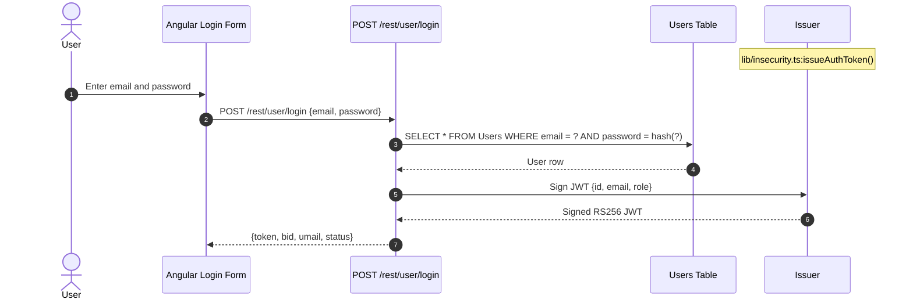

**Security assessment**

The login boundary is weak in two independent ways:

- `POST /rest/user/login` at `server.ts:595` has no `rateLimit()` wrapper, unlike `POST /rest/user/reset-password` which receives one at `server.ts:343`. Unlimited credential guesses are permitted.
- No account lockout or exponential backoff exists in `routes/login.ts`. The seeded weak passwords (including `admin123`) are reachable by password spray.

Password storage weakness (unsalted `MD5`) is the compounding factor but is assessed under [§7.9.2 Password Hashing](#password-hashing).

**Relevant findings**

- 🟠 [F-013](#f-013) — login endpoint has no rate-limit middleware, enabling unlimited online credential guessing.
- 🔴 [F-005](#f-005) — insecure JWT verification at `lib/insecurity.ts:191` means a forged token bypasses the login check entirely.
- 🔴 [F-011](#f-011) — unsalted MD5 storage means any credential dump from the SQL injection sink yields immediately crackable hashes.

<a id="oauth-frontend-adapter"></a>
#### 7.2.3 OAuth Frontend Adapter

**Status:** 🟠 Weak - the OAuth flow authenticates against Google, but the derived local password is a deterministic function of the email address, creating a parallel credential bypass.

`oauth.component.ts` implements OAuth as a frontend identity adapter. It reads the access token from the redirect URL, fetches the user profile from Google's userinfo endpoint via `UserService.oauthLogin()`, derives a local account password, and calls `POST /rest/user/login` with it to obtain a session JWT. There is no server-side OAuth authorization-code exchange.

The diagram shows how the frontend OAuth adapter ultimately enters the local login flow:

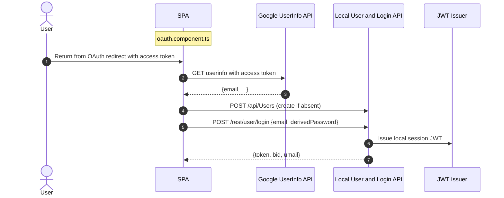

**Security assessment**

The critical defect is in `oauth.component.ts:30`: the local account password is computed as `btoa(profile.email.split('').reverse().join(''))` - a deterministic transform of the publicly known email address, using no secret. Anyone who knows a victim's email can reconstruct the exact password and authenticate to the victim's account through the standard password login endpoint, bypassing the OAuth provider entirely.

The `access_token` is also returned in the URL fragment (`login.component.ts:152`) where it is visible in browser history and to any JavaScript with page access, and OAuth error handling silently swallows failures to `console.log` only (`oauth.component.ts:64`).

The derived-password code that creates the parallel credential bypass:

```ts
// oauth.component.ts:30
const localPassword = btoa(this.userService.oauthUserEmail.split('').reverse().join(''))
```

**Relevant findings**

- 🔴 [F-006](#f-006) — deterministic password derivation from email allows any attacker with the victim's email to bypass OAuth entirely.
- 🟠 [F-017](#f-017) — `access_token` returned in URL fragment; no PKCE or state parameter.
- 🟢 [F-073](#f-073) — OAuth error handling swallows failures silently, preventing detection of credential-abuse attempts.

<a id="user-registration"></a>
#### 7.2.4 User Registration

**Status:** 🔴 Unsafe - the registration surface is partially protected, but several adjacent routes that share the registration session boundary are reachable without authentication.

`POST /api/Users` handles new account creation. The endpoint accepts `email`, `password`, and optional profile fields. `server.ts` registers the route and wires it to the `UserModel.create()` path. A new account receives the same session-token flow as a login.

The diagram shows the intended new-user registration path:

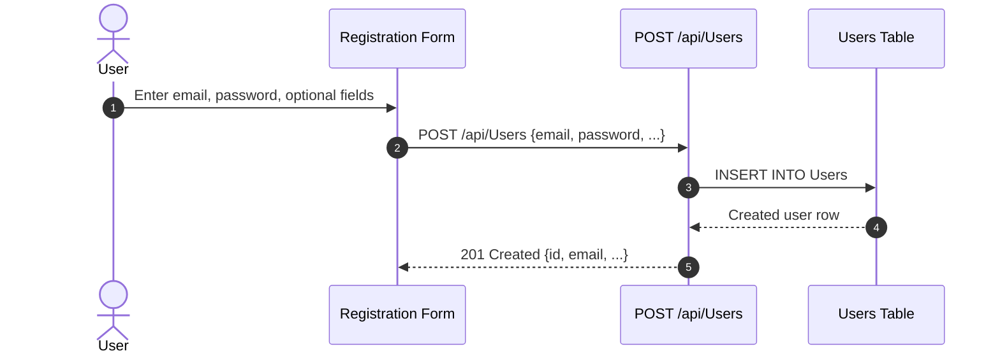

**Security assessment**

Registration itself is open by design (public sign-up), but the surrounding surface has authentication gaps:

- `server.ts:310` mounts several sensitive routes - including the WebSocket event handler - without the `security.isAuthorized()` middleware. `[F-047](#f-047) — Sensitive Routes Registered Without Authentication Middleware — server.ts:310` documents the systemic pattern: 23 instances of routes accepting requests without checking the session token.
- The `Socket.IO` channel at `lib/startup/registerWebsocketEvents.ts:20` has no origin check and no authentication gate, so any non-browser client connects without credentials (🔴 [F-018](#f-018) — Unauthenticated WebSocket Channel — `registerWebsocketEvents.ts:20`, 🟠 [F-019](#f-019) — WebSocket Origin Not Enforced Against — `registerWebsocketEvents.ts:20`).
- Socket event handlers at `registerWebsocketEvents.ts:47` apply no rate limit and include a ReDoS-prone regex match (🟡 [F-069](#f-069) — Unthrottled Socket Event Handlers with — `registerWebsocketEvents.ts:47`).

**Relevant findings**

- 🔴 [F-018](#f-018) — WebSocket channel accepts connections from any client with no authentication check.
- 🟠 [F-019](#f-019) — WebSocket origin header is not validated, allowing non-browser clients to connect without CORS restrictions.
- 🔴 [F-047](#f-047) — sensitive routes registered without authentication middleware across `server.ts`.
- 🟡 [F-069](#f-069) — unthrottled socket event handlers with a ReDoS-prone match pattern.

<a id="password-reset"></a>
#### 7.2.5 Password Reset

**Status:** 🔴 Unsafe - the reset relies on a single security-question answer with no out-of-band token, no rate limit on the answer-check, and `MD5`-hashed answers that are as weak as the passwords they protect.

`POST /rest/user/reset-password` at `routes/resetPassword.ts` accepts `email`, the security-question answer, and a new password in a single step. It queries `SecurityAnswers` joined to `Users`, compares the supplied answer against the stored HMAC digest, and updates the password column directly if the answer matches.

The diagram shows the single-step reset path:

```mermaid
sequenceDiagram
    autonumber
    actor User
    participant SPA as Reset Form
    participant API
    Note over API: POST /rest/user/reset-password
    participant DB
    Note over DB: Users + SecurityAnswers

    User->>SPA: Enter email, security answer, new password
    SPA->>API: POST /rest/user/reset-password
    API->>DB: Lookup stored answer for email
    DB-->>API: Stored HMAC digest
    API->>API: Compare supplied answer
    API->>DB: UPDATE Users SET password = hash(new)
    API-->>SPA: 200 OK
```

**Security assessment**

The reset boundary depends on the secrecy of a user-chosen security answer. The answer is HMAC'd with a hardcoded static key (`lib/insecurity.ts:44`; see 🔴 [F-042](#f-042) — Security answers HMAC'd with hardcoded static key — `models/securityAnswer.ts:46`), so any attacker who obtains the `SecurityAnswers` table can precompute the HMAC for common answers (mother's maiden name, birthplace, etc.) without needing the HMAC key to be secret. There is no emailed one-time token, no rate limit on the answer submission, and no account lockout after repeated wrong answers.

**Relevant findings**

- 🟠 [F-014](#f-014) — security-question reset with no out-of-band confirmation and no attempt limit on the answer-check endpoint.

<a id="multi-factor-authentication"></a>
#### 7.2.6 Multi-Factor Authentication

**Status:** 🔴 Unsafe - TOTP is implemented and enforced per-account, but the admin TOTP seed is hardcoded in `data/static/users.yml`, making the second factor trivially reconstructable for the highest-privilege account.

TOTP-based 2FA is available as an opt-in second factor. Enrollment creates a TOTP secret server-side and binds it to the user account. `POST /rest/2fa/verify` checks a six-digit code against the stored secret and, on success, completes the login and issues the session JWT. The TOTP library is `otplib`.

**Security assessment**

`data/static/users.yml:148` seeds the admin account with a hardcoded TOTP secret (`IFTXE3SPOEYVURT2MRYGI52TKJ4HC3KH`) alongside the hardcoded admin password. Anyone with the seed file - available in the public repository - can generate valid admin TOTP codes offline without any credential interaction. The 2FA control for the admin account is therefore non-functional as a second factor.

**Relevant findings**

- 🔴 [F-015](#f-015) — admin credentials and TOTP secret hardcoded in seed data, making the admin's second factor reconstructable from the public repository.

### 7.3 Session and Token Controls

**Verdict:** 🟠 Weak

<!-- The line below is mechanically derived from the controls table — LLM must not re-author it. -->
**Controls covered:**

- [7.3.1 JWT Session Tokens](#731-jwt-session-tokens)

**Implemented controls:** `RS256`-signed JWTs issued by `lib/insecurity.ts:issueAuthToken()`, `express-jwt` middleware for protected route verification, cookie-based token copy via `ngy-cookie`.

**Assessment:** This application uses a single locally-signed token format (commonly called JWT) for every authenticated session, regardless of the login flow in [§7.2](#72-identity-and-authentication-controls) that established it. The sub-sections below trace one token through its lifecycle: signing on issuance, validation on every protected request, storage in the browser, manual revocation, and time-based expiry. The principal weakness is storage: the JWT is written to `localStorage` rather than to an `HttpOnly Secure` cookie, making it reachable by any of the confirmed XSS sinks in the Angular SPA.

<a id="jwt-session-tokens"></a>
#### 7.3.1 JWT Session Tokens

**Status:** 🟠 Weak - `RS256`-signed JWTs are issued with a one-hour expiry, but the signing key is hardcoded in the source tree and the verifier accepts algorithm-confusion tokens, defeating the asymmetric guarantee.

⚠ **Anti-pattern:** SPA without BFF

`RS256`-signed JWTs are issued by `lib/insecurity.ts:issueAuthToken()` after any successful authentication flow. The payload carries `{ id, email, role }` and a one-hour expiry. On every subsequent request, the Angular `RequestInterceptor` (`request.interceptor.ts:13-16`) reads the token from `localStorage` and appends it as `Authorization: Bearer <token>`. `express-jwt` middleware at `lib/insecurity.ts:54` verifies each incoming token and populates `req.user`.

The diagram shows the positive token lifecycle from issuance to a protected API request:

```mermaid
sequenceDiagram
    autonumber
    actor User
    participant SPA
    Note over SPA: Angular SPA (RequestInterceptor)
    participant Storage
    Note over Storage: localStorage
    participant API
    Note over API: Express Backend
    participant Middleware
    Note over Middleware: express-jwt middleware

    User->>SPA: Successful login
    SPA->>Storage: localStorage.setItem('token', jwt)
    User->>SPA: Navigate to protected page
    SPA->>Storage: localStorage.getItem('token')
    Storage-->>SPA: JWT string
    SPA->>API: GET /rest/... Authorization: Bearer jwt
    API->>Middleware: verify(jwt, publicKey)
    Middleware-->>API: req.user = {id, email, role}
    API-->>SPA: 200 response
```

**Security assessment**

Three independent weaknesses affect the session-token lifecycle:

- **Signing key**: the RSA private key is hardcoded at `lib/insecurity.ts:23` and also served from the `/encryptionkeys` directory route (`server.ts:277`). Any attacker with the public repository or a live URL can forge tokens for any user or role offline.
- **Algorithm verification**: `isAuthorized()` at `lib/insecurity.ts:54` constructs `expressJwt({ secret: publicKey })` with no `algorithms` allowlist. The pinned `jsonwebtoken@0.4.0` / `express-jwt@0.1.3` do not enforce algorithm pinning, so the verifier accepts `HS256` tokens signed with the public key as the HMAC secret.
- **Token storage**: `login.component.ts:105` writes the JWT to `localStorage`. A cookie copy is written without `HttpOnly`/`Secure`/`SameSite`, so the `localStorage` value remains the primary auth store and is reachable by all confirmed XSS sinks in the SPA.

The hardcoded key that collapses the signing boundary:

```ts
// lib/insecurity.ts:23
export const privateKey =
  '[PEM PRIVATE KEY — REDACTED]...'
```

**Relevant findings**

- 🟠 [F-001](#f-001) — JWT written to `localStorage` at `login.component.ts:105`; any XSS can exfiltrate a valid 8-hour session token.

### 7.4 Authorization Controls

**Verdict:** 🟠 Weak

<!-- The line below is mechanically derived from the controls table — LLM must not re-author it. -->
**Controls covered:**

- [7.4.1 Role-Based Access Control](#741-role-based-access-control)

**Implemented controls:** `security.isAuthorized()` middleware applying `express-jwt` on protected routes; `security.isAccounting()`, `security.isDeluxe()`, and `security.isAdmin()` role-check helpers at `lib/insecurity.ts:155-175`; Angular route guard at `app.guard.ts`.

**Assessment:** Role-based access control exists in the form of `express-jwt` middleware and named role-check helpers, but two systemic gaps undermine it: routes are registered without the authentication middleware in numerous places (`server.ts`), and object-level authorization trusts the attacker-controlled `req.body.UserId` rather than the session-derived `req.user.id` across 23 routes.

<a id="role-based-access-control"></a>
#### 7.4.1 Role-Based Access Control

**Status:** 🟠 Weak - role checks exist but the JWT `role` claim is forged offline (hardcoded key, see [§7.3](#73-session-and-token-controls)), the Angular route guard is client-side only, and object-level authorization trusts attacker-supplied IDs across 23 routes.

`lib/insecurity.ts:155-175` provides `isAdmin()`, `isAccounting()`, and `isDeluxe()` helpers that read the `role` field from the decoded JWT in `req.user`. These helpers are applied as Express middleware on admin and accounting routes. The Angular `AppGuard` at `app.guard.ts:54` performs a matching check in the browser before rendering protected views.

**Security assessment**

Two structural weaknesses defeat authorization:

- **Client-side-only guard**: `app.guard.ts:54` decodes the JWT locally and checks `user.role === 'admin'` before rendering admin views, but the server does not independently enforce this check on all admin API routes. Because the JWT signing key is public, an attacker can forge a token with `role: admin` that passes both the Angular guard and the server-side `isAdmin()` check (🟠 [F-049](#f-049) — Admin route guard relies on client-decoded JWT role, no — `app.guard.ts:54`).
- **Insecure direct object references**: 23 routes in `routes/address.ts`, `routes/basket.ts`, `routes/payment.ts`, `routes/wallet.ts`, `routes/order.ts`, and others derive the resource owner from `req.body.UserId` or `req.body.userId` rather than from the session-derived `req.user.id`. Any authenticated user can access or modify another user's addresses, payment cards, order history, and wallet balance by supplying the victim's ID in the request body (🔴 [F-008](#f-008) — Insecure Direct Object Reference — `routes/address.ts:11`).

**Relevant findings**

- 🔴 [F-008](#f-008) — IDOR: 23 routes trust `req.body.UserId` for authorization, enabling cross-account data access and manipulation.
- 🟠 [F-032](#f-032) — role-check middleware at `lib/insecurity.ts:156-161` emits no audit log on authorization denial.
- 🟠 [F-033](#f-033) — authorization via forgeable JWT role claim; the client-side Angular guard at `app.guard.ts:54` is the only role boundary for several admin routes.

### 7.5 Query Construction and Data Access Controls

**Verdict:** 🔴 Unsafe

<!-- The line below is mechanically derived from the controls table — LLM must not re-author it. -->
**Controls covered:**

- [7.5.1 Parameterized Queries](#751-parameterized-queries)

**Implemented controls:** Sequelize ORM for most data access via model methods; `models/` definitions for Users, Products, BasketItems, Orders, and other entities.

**Assessment:** Sequelize ORM provides parameterized queries on most data access paths, but two critical routes bypass the ORM entirely and construct raw SQL strings. The login and product-search routes are unauthenticated injection points, and a MarsDB selector on the review-update path accepts attacker-controlled query structure.

<a id="parameterized-queries"></a>
#### 7.5.1 Parameterized Queries

**Status:** 🔴 Unsafe - the ORM is used for most paths, but raw `models.sequelize.query()` calls on the login and product-search routes concatenate user input directly into SQL strings.

⚠ **Anti-pattern:** Raw SQL string interpolation

Sequelize models in `models/` back most data access with automatically parameterized queries. `routes/login.ts:34` and `routes/search.ts:23` deviate by calling raw `models.sequelize.query()` with user-supplied values interpolated directly into the SQL string. Product-review updates at `routes/updateProductReviews.ts` pass a request-body field into a MarsDB selector without restricting to scalar values.

The login query that enables authentication bypass:

```ts
// routes/login.ts:34
models.sequelize.query(
  `SELECT * FROM Users WHERE email = '${req.body.email}' AND password = '${hash}' AND deletedAt IS NULL`,
  { model: UserModel, plain: true }
)
```

**Security assessment**

Both SQL injection sinks are unauthenticated:

- `routes/login.ts:34` interpolates `req.body.email` into raw SQL. `' OR 1=1--` bypasses the password predicate and returns the first user row (the seeded admin). The same sink supports UNION-based exfiltration of the full `Users` table.
- `routes/search.ts:23` interpolates `req.query.q` into the LIKE clauses of a raw Sequelize query after only a 200-character length cap. `')) UNION SELECT sqlite_master, 2, 3, 4, 5, 6, 7, 8, 9 --` dumps the full schema.

**Relevant findings**

- 🔴 [F-002](#f-002) — SQL injection at `routes/login.ts:34` via raw string interpolation of `req.body.email`, enabling authentication bypass and data exfiltration.
- 🔴 [F-007](#f-007) — SQL injection at `routes/search.ts:23` via `req.query.q` interpolated into LIKE clauses; no authentication required.

### 7.6 Input Boundary Validation Controls

**Verdict:** 🟠 Weak

<!-- The line below is mechanically derived from the controls table — LLM must not re-author it. -->
**Controls covered:**

- [7.6.1 Validation Approach](#761-validation-approach)
- [7.6.2 Request Input Validation](#762-request-input-validation)

**Implemented controls:** `multer` file-size limits on upload routes; 200-character truncation cap on search input at `routes/search.ts:22`; express-validator on select routes.

**Assessment:** Input validation is inconsistent: some routes apply schema checks or length caps while the most sensitive routes apply none. The WebSocket and socket-event handlers have no rate control or input bounds, and the profile-image URL upload accepts arbitrary URLs without scheme or host validation.

<a id="validation-approach"></a>
#### 7.6.1 Validation Approach

**Status:** 🟠 Weak - no centralized input-validation layer exists; each route is responsible for its own validation and several high-risk routes implement none.

Input validation in this codebase is route-by-route. `multer` enforces file-size limits on multipart uploads (`routes/fileUpload.ts`). `routes/search.ts:22` applies a 200-character length cap on `q`. `express-validator` is used on a subset of endpoints. No schema-validation middleware is applied globally, so new routes added without per-route validation inherit no protection.

**Security assessment**

The absence of a centralized schema-validation layer means the injection sinks in [§7.5](#75-query-construction-and-data-access-controls) and the SSRF sink in [§7.10](#710-file-parser-and-outbound-request-controls) receive unvalidated user input. The socket event handler at `lib/startup/registerWebsocketEvents.ts:47` applies a regex match that contains a ReDoS-prone pattern with no timeout guard. The profile-image URL at `routes/profileImageUrlUpload.ts:24` receives no scheme, host, or private-IP check before the URL is passed to `fetch()`.

**Relevant findings**

- 🟠 [F-046](#f-046) — no input validation on the profile-image URL upload path before the URL is passed to `fetch()`.
- 🟡 [F-068](#f-068) — unbounded outbound fetch stream to disk with no size limit on the download response.
- 🟡 [F-069](#f-069) — unthrottled WebSocket event handlers with a ReDoS-prone regex match pattern.

<a id="input-validation"></a><a id="request-input-validation"></a>
#### 7.6.2 Request Input Validation

**Status:** 🟠 Weak - express-validator and multer provide per-route coverage on upload and some REST endpoints, but no allowlist schema is applied to the critical auth and search paths.

`express-validator` is configured on several REST routes to check field types and presence. `multer` enforces a 200 KB file-size limit on standard uploads and a separate limit on profile-image uploads. These controls cover the upload boundary but leave the authentication and search routes without schema enforcement.

**Security assessment**

The login route (`routes/login.ts`) does not validate that `req.body.email` is a valid email address before the value reaches `models.sequelize.query()`. The product-search route (`routes/search.ts`) enforces only a character-length cap. Both routes accept structurally malformed input that drives SQL injection sinks documented in [§7.5](#75-query-construction-and-data-access-controls). The YAML parser at `routes/fileUpload.ts:117` accepts deeply nested structures without a depth or alias limit, enabling a YAML bomb DoS (🟠 [F-046](#f-046) — YAML bomb DoS in handleYamlUpload — `routes/fileUpload.ts:117`).

**Relevant findings**

- 🟠 [F-046](#f-046) — YAML bomb DoS accepted by `handleYamlUpload` at `routes/fileUpload.ts:117`; no alias or depth limit.
- 🟡 [F-068](#f-068) — profile-image fetch streams arbitrary server responses to disk without a byte-count cap.
- 🟡 [F-069](#f-069) — socket event handlers process unvalidated event payloads under a ReDoS-prone regex.

### 7.7 Output Encoding and Rendering Controls

**Verdict:** 🟠 Weak

<!-- The line below is mechanically derived from the controls table — LLM must not re-author it. -->
**Controls covered:**

- [7.7.1 HTML Sanitization](#771-html-sanitization)

**Implemented controls:** Angular template interpolation (auto-escaping in `{{ }}` bindings) as the default rendering path; `DomSanitizer` via `bypassSecurityTrustHtml()` for explicit trusted-HTML injection points.

**Assessment:** Angular's default template escaping is active throughout the SPA and prevents reflected XSS in the majority of rendering contexts. Two sinks bypass this protection explicitly via `bypassSecurityTrustHtml()`, and the `sanitizeLegacy()` helper in `lib/insecurity.ts` contains a defective regex that permits several XSS payload classes through.

<a id="html-sanitization"></a>
#### 7.7.1 HTML Sanitization

**Status:** 🟠 Weak - Angular template escaping holds on most paths, but `bypassSecurityTrustHtml()` is called at `search-result.component.ts:143` with user-controlled search results and the server-side `sanitizeLegacy()` regex at `lib/insecurity.ts:61` does not block several XSS payload classes.

Angular's `{{ }}` template interpolation escapes HTML entities in the majority of rendered data bindings. Where richer HTML is required, `DomSanitizer.bypassSecurityTrustHtml()` is the Angular-provided escape hatch that marks a value as trusted. `lib/insecurity.ts:61` provides a `sanitizeLegacy()` function intended to strip script tags from user content before storage.

**Security assessment**

Two bypass paths exist:

- `search-result.component.ts:143` calls `this.sanitizer.bypassSecurityTrustHtml(this.searchValue)` and binds the result with `[innerHtml]`. `this.searchValue` derives from the `q` query parameter. Any XSS payload in the URL's `q` parameter is rendered as live HTML in the search-results view.
- `lib/insecurity.ts:61` defines `sanitizeLegacy()` as a regex substitution (`/(<script|<iframe)/gi` replaced with `_`). The regex does not cover ``, `<svg onload=...>`, or JavaScript URI handlers in attribute values. Content sanitized by this helper and stored in the database can be retrieved and rendered as HTML in other views without the Angular escape layer.

**Relevant findings**

- 🔴 [F-027](#f-027) — DOM XSS — `search-result.component.ts:143` via `bypassSecurityTrustHtml()` at `search-result.component.ts:143` with the `q` query parameter as untrusted source.
- 🟠 [F-029](#f-029) — `sanitizeLegacy()` regex at `lib/insecurity.ts:61` permits `` and `<svg onload>` XSS payloads.

### 7.8 Browser and Cross-Origin Controls

**Verdict:** 🔴 Unsafe

<!-- The line below is mechanically derived from the controls table — LLM must not re-author it. -->
**Controls covered:**

- [7.8.1 CORS Policy](#781-cors-policy)
- [7.8.2 Content Security Policy](#782-content-security-policy)
- [7.8.3 CSRF Protection](#783-csrf-protection)

**Implemented controls:** Helmet middleware applied at `server.ts:186` providing `noSniff`, `frameguard`, and other security headers; `express-cors` module loaded at `server.ts:183`.

**Assessment:** Browser security controls are present in skeleton form via Helmet and CORS middleware, but the CORS policy is a wildcard `*` origin acceptance, no `Content-Security-Policy` header is emitted, and CSRF protection is absent. The JWT-in-localStorage storage pattern (see [§7.3](#73-session-and-token-controls)) means CSRF tokens would need to accompany any cookie-based remediation.

<a id="cors-policy"></a>
#### 7.8.1 CORS Policy

**Status:** 🔴 Unsafe - `app.use(cors())` at `server.ts:183` applies with no `origin` option, accepting cross-origin requests from any domain and reflecting the `Access-Control-Allow-Origin: *` header on all API responses.

The CORS middleware is loaded via `app.use(cors())` at `server.ts:183`. Without an explicit `origin` allowlist, the `cors` npm module defaults to `Access-Control-Allow-Origin: *`, which permits cross-origin reads of all API responses from any domain. The wildcard also prevents the browser from sending cookies with cross-origin requests, but the JWT is stored in `localStorage` and attached via the `Authorization` header - which is not credential-gated by the Same-Origin Policy - making the CORS relaxation immediately exploitable.

**Security assessment**

A malicious page on any origin can call `GET /rest/user/whoami`, `GET /api/Users`, or `POST /rest/user/login` with the victim's `Authorization` header attached from `localStorage` (via a CORS-enabled XHR/fetch) and read the full response. The wildcard CORS policy combined with `localStorage` token storage removes the browser's cross-origin read protection for the entire API surface.

**Relevant findings**

- 🟠 [F-028](#f-028) — wildcard CORS at `server.ts:183` allows any origin to read API responses with the victim's session token.
- 🟡 [F-052](#f-052) — missing `Content-Security-Policy` and `HSTS` headers; `server.ts:186` applies Helmet without configuring CSP.
- 🟠 [F-063](#f-063) — wildcard CORS policy documented systemic; all API endpoints are affected.

<a id="content-security-policy"></a>
#### 7.8.2 Content Security Policy

**Status:** 🔴 Missing - no `Content-Security-Policy` header is emitted on any response; Helmet is loaded at `server.ts:186` but CSP is not configured.

Helmet's middleware stack is applied at `server.ts:186` and provides several security headers including `X-Content-Type-Options: nosniff` and `X-Frame-Options: SAMEORIGIN`. Helmet's `contentSecurityPolicy()` middleware is available but not called.

**Security assessment**

Without a CSP header, the browser has no instruction to restrict which script sources, style sources, or frame ancestors are permitted. Every XSS sink in the SPA - including the `bypassSecurityTrustHtml()` path in `search-result.component.ts:143` and the `sanitizeLegacy()` bypass in `lib/insecurity.ts:61` - operates without a browser-enforced mitigation layer. A strict CSP (`script-src 'self'` with nonces) would convert stored and reflected XSS from exploitation vectors into noisy policy violations.

**Relevant findings**

- 🟠 [F-028](#f-028) — no CSP header delivered; confirmed absence in `server.ts:188`.
- 🟡 [F-052](#f-052) — Helmet applied without `contentSecurityPolicy()`; HSTS is also absent.
- 🟠 [F-063](#f-063) — wildcard CORS compounds the missing CSP by allowing cross-origin script injection surface.

<a id="csrf-protection"></a>
#### 7.8.3 CSRF Protection

**Status:** 🔴 Missing - no CSRF token or `SameSite` cookie attribute is applied; the JWT stored in `localStorage` is attached to every same-origin XHR/fetch but cross-site form submissions targeting API endpoints carry no CSRF defense.

State-changing API endpoints accept `Content-Type: application/json` payloads. Because the session token is in `localStorage` and attached via the `Authorization` header by `request.interceptor.ts:13-16`, CSRF via HTML form submissions is partially mitigated by the fact that browsers do not add custom headers to cross-site form POSTs. However, `Content-Type: application/json` preflight-free attacks (via `text/plain` + JSON body from a cross-origin form action) and attacks that leverage the wildcard CORS policy remain viable.

**Security assessment**

No CSRF token middleware (e.g. `csurf`) is applied, and no cookie carries `SameSite=Strict` to provide a browser-level defense. Introducing an `HttpOnly Secure SameSite=Strict` session cookie (as required by the BFF remediation for 🟠 [F-001](#f-001) — JWT persisted in localStorage readable by any XSS — `login.component.ts:105`) would immediately require a synchronizer CSRF token, because `SameSite` alone is not a complete CSRF defense for all browser versions. CSRF protection should be planned as part of the BFF migration.

**Relevant findings**

- 🟠 [F-028](#f-028) — no CSRF token on state-changing endpoints; wildcard CORS enables cross-origin request fabrication.
- 🟡 [F-052](#f-052) — no `SameSite` cookie attribute; session token in `localStorage` partly mitigates CSRF but introduces XSS exposure.
- 🟠 [F-063](#f-063) — wildcard CORS policy means cross-origin requests are accepted from any domain, removing the browser's origin check as a CSRF barrier.

### 7.9 Cryptography Secrets and Data Protection

**Verdict:** 🔴 Unsafe

<!-- The line below is mechanically derived from the controls table — LLM must not re-author it. -->
**Controls covered:**

- [7.9.1 Secret and Key Management](#791-secret-and-key-management)
- [7.9.2 Password Hashing](#792-password-hashing)

**Implemented controls:** `RS256` algorithm choice for JWT signing (the asymmetric scheme is correct in principle); `crypto` module from Node\.js for hash operations; Sequelize column-level password setter in `models/user.ts`.

**Assessment:** Cryptographic choices in this codebase are either hardcoded or broken. The JWT signing key, the HMAC key for security-answer derivation, the cookie signing secret, and the wallet mnemonic are all committed as source-code constants. Password hashing uses unsalted `MD5` - a fast, non-adaptive hash with no salt - and payment card PANs are stored in plaintext. The correct algorithms exist in principle (`RS256`, HMAC-SHA) but the key material is public.

<a id="secret-and-key-management"></a><a id="secret-management"></a>
#### 7.9.1 Secret and Key Management

**Status:** 🔴 Unsafe - all secret material (RSA private key, HMAC key, cookie secret, wallet mnemonic) is hardcoded in `lib/insecurity.ts` and `server.ts`; none is loaded from an environment variable or secret store.

⚠ **Anti-pattern:** Secrets hardcoded in source

`lib/insecurity.ts` is the application's central security module. It exports the RSA private key at line 23, the matching public key at line 22, the HMAC key for security-answer derivation at line 44, and the coupon HMAC key at line 45. `server.ts:289` sets the Express cookie-signing secret to a hardcoded string. `routes/checkKeys.ts:10` embeds a wallet mnemonic and a raw private key for the Web3 surface. All of these are constants in the committed source tree.

**Security assessment**

Every secret in the application is public knowledge via the open source repository. The impact cascades across the entire authentication and session model:

- The RSA private key at `lib/insecurity.ts:23` enables offline JWT forgery for any user and role (assessed under [§7.3](#73-session-and-token-controls)).
- The HMAC key at `lib/insecurity.ts:44` enables offline precomputation of security-answer digests, defeating the password-reset mechanism (assessed under [§7.2.4](#password-reset)).
- The cookie secret at `server.ts:289` enables cookie forgery for any signed-cookie relying on Express `cookieParser`.
- The wallet mnemonic at `routes/checkKeys.ts:10` exposes the private key for any Web3/NFT wallet tied to this seed.

No `.env` file, environment variable, or secret manager reference is used for any of these values.

**Relevant findings**

- 🔴 [F-003](#f-003) — hardcoded RSA private key at `lib/insecurity.ts:23` enables JWT forgery without the private key needing to remain secret.
- 🔴 [F-004](#f-004) — hardcoded JWT signing key also served from `/encryptionkeys` route at `server.ts:277`.
- 🔴 [F-006](#f-006) — HMAC key at `lib/insecurity.ts:44` hardcoded; security-answer digests are precomputable.

<a id="password-hashing"></a>
#### 7.9.2 Password Hashing

**Status:** 🔴 Unsafe - passwords are stored as unsalted `MD5` digests via `lib/insecurity.ts:43`; a single GPU recovers them from a dump in seconds.

The `Users` model at `models/user.ts:77` routes every password through `security.hash(clearTextPassword)` in the column setter. `security.hash()` is defined at `lib/insecurity.ts:43` as `crypto.createHash('md5').update(data).digest('hex')` - a single, unsalted `MD5` round. The login query at `routes/login.ts:34` applies the same helper to the submitted password before comparison.

The password storage implementation that eliminates effective credential protection:

```ts
// lib/insecurity.ts:43
export const hash = (data: string) =>
  crypto.createHash('md5').update(data).digest('hex')
```

**Security assessment**

`MD5` is a fast, non-adaptive hash function with no work factor. Without a per-user salt, identical passwords across accounts produce identical digests, enabling rainbow-table attacks. `MD5` hashes are crackable on commodity hardware at billions of hashes per second. A dump of the `Users` table via the SQL injection sinks at `routes/login.ts:34` or `routes/search.ts:23` yields every user password almost immediately.

**Relevant findings**

- 🔴 [F-011](#f-011) — passwords persisted as unsalted MD5 at `models/user.ts:77`; a credential dump yields immediate plaintext recovery.
- 🟠 [F-024](#f-024) — `security.hash()` at `lib/insecurity.ts:43` is unsalted MD5; used as the sole password protection for all accounts including admin.
- 🟠 [F-043](#f-043) — the same unsalted MD5 helper is used for both password hashing and non-credential data hashing, conflating security requirements across contexts.

### 7.10 File Parser and Outbound Request Controls

**Verdict:** 🔴 Unsafe

<!-- The line below is mechanically derived from the controls table — LLM must not re-author it. -->
**Controls covered:**

- [7.10.1 XML Parser Hardening](#7101-xml-parser-hardening)
- [7.10.2 Outbound Request Allowlist](#7102-outbound-request-allowlist)

**Implemented controls:** `multer` file-size and type limits on upload routes; `vm.createContext` sandbox with a 2000 ms execution timeout wrapping XML and YAML parsing; `libxmljs2` for XML parsing; `unzipper` for archive extraction.

**Assessment:** The file-parsing surface accepts XML, YAML, ZIP, and image-URL inputs. The XML parser is configured with `noent: true` enabling external-entity resolution. The outbound-fetch path for profile-image URL uploads has no host allowlist, no private-IP blocklist, and no redirect follow-prevention. Both represent unauthenticated or low-privilege reachable paths that allow server-side information disclosure and SSRF.

<a id="xml-parser-hardening"></a>
#### 7.10.1 XML Parser Hardening

**Status:** 🔴 Unsafe - `libxmljs2.parseXml()` is called with `noent: true` at `routes/fileUpload.ts:83`, enabling external-entity resolution and file-system read via XXE.

`POST /file-upload` at `server.ts:309` is registered without authentication middleware and passes uploaded files to type-specific handlers. For XML files, `handleXmlUpload()` at `routes/fileUpload.ts:83` wraps the parse call inside a `vm.createContext()` sandbox with a 2000 ms timeout. The sandbox mitigates infinite-loop DoS but does not restrict the file-system access that `noent: true` enables.

The parser call that enables external-entity file disclosure:

```ts
// routes/fileUpload.ts:83
const xmlDoc = vm.runInContext(
  `libxml.parseXml(data, { noblanks: true, noent: true, nocdata: true })`,
  sandbox, { timeout: 2000 }
)
```

**Security assessment**

`noent: true` instructs `libxmljs2` to resolve and expand `SYSTEM` and `PUBLIC` entity references during parsing. An unauthenticated attacker uploads an XML file containing `<!DOCTYPE x [<!ENTITY xxe SYSTEM "file:///etc/passwd">]><x>&xxe;</x>`. The resolved entity content appears in the error message at `routes/fileUpload.ts:87` via `utils.trunc(xmlString, 400)`, disclosing up to 400 characters of the target file. The `xxeFileDisclosureChallenge` check in the handler at line 85 confirms that `/etc/passwd` and `system.ini` are expected exploitation targets. The archive extraction path is subject to a separate zip-slip weakness (🟠 [F-026](#f-026) — Zip-slip arbitrary file write — `routes/fileUpload.ts:44`) via a weak path containment check.

**Relevant findings**

- 🔴 [F-009](#f-009) — XXE — `routes/fileUpload.ts:83` via `noent: true` in `libxmljs2.parseXml()` at `routes/fileUpload.ts:83`; file read from an unauthenticated endpoint.
- 🔴 [F-012](#f-012) — SSRF — `routes/profileImageUrlUpload.ts:24` via XML external-entity DTD URL loading as a secondary impact from the same `noent: true` configuration.
- 🟠 [F-021](#f-021) — zip-slip arbitrary file write via weak path containment check in the archive extraction handler at `routes/fileUpload.ts:44`.

<a id="outbound-request-allowlist"></a>
#### 7.10.2 Outbound Request Allowlist

**Status:** 🔴 Missing - `POST /profile/image/url` passes `req.body.imageUrl` directly to `fetch()` at `routes/profileImageUrlUpload.ts:24` with no scheme restriction, no host allowlist, and no private-IP blocklist.

`routes/profileImageUrlUpload.ts` handles the profile-image URL upload flow. An authenticated user supplies an `imageUrl` in the POST body. The route retrieves the authenticated session from `security.authenticatedUsers.get()` at line 21, then calls `fetch(url)` at line 24. The fetched body is streamed to disk at line 30; on the catch path, the raw URL is stored as the `profileImage` field.

**Security assessment**

No scheme validation, host validation, or private-IP check is applied between URL parsing (line 19) and the `fetch()` call (line 24). A search for `allowlist|isPrivateIP|169.254|metadata` in `routes/profileImageUrlUpload.ts` returns zero hits. An authenticated user submits `imageUrl: "http://169.254.169.254/latest/meta-data/iam/security-credentials/"` to reach cloud instance-metadata endpoints. The same path reaches internal services on loopback or RFC 1918 addresses. The `lib/utils.ts:downloadToFile()` helper presents a second unrestricted outbound-fetch path under a different caller (🔴 [F-056](#f-056) — DownloadToFile fetches arbitrary user-influenced URL with no — `lib/utils.ts:117`).

**Relevant findings**

- 🔴 [F-009](#f-009) — SSRF via profile-image URL fetch; `routes/profileImageUrlUpload.ts:24` calls `fetch(url)` on an unvalidated user-supplied URL.
- 🔴 [F-012](#f-012) — outbound request to user-controlled URL enables cloud metadata endpoint access.
- 🟠 [F-021](#f-021) — `lib/utils.ts:downloadToFile()` provides a second unguarded outbound-fetch path with no allowlist.

### 7.11 Operations Runtime and Supply Chain Controls

**Verdict:** 🔴 Missing

<!-- The line below is mechanically derived from the controls table — LLM must not re-author it. -->
**Controls covered:**

- [7.11.1 CVE scanning](#7111-cve-scanning)
- [7.11.2 CI/CD Action Pinning](#7112-cicd-action-pinning)
- [7.11.3 Dependency Management Tooling](#7113-dependency-management-tooling)
- [7.11.4 Security Headers](#7114-security-headers)
- [7.11.5 Rate Limiting](#7115-rate-limiting)
- [7.11.6 Automated SCA scanning](#7116-automated-sca-scanning)
- [7.11.7 Automated dependency updates](#7117-automated-dependency-updates)
- [7.11.8 Lockfile hygiene](#7118-lockfile-hygiene)

**Implemented controls:** Helmet middleware at `server.ts:186` providing `noSniff`, `frameguard`, and referrer-policy headers; `express-rate-limit` applied to password-reset and select endpoints; a legacy `.dependabot/config.yml` file present in the repository.

**Assessment:** The supply-chain and runtime-operations posture is the weakest category in this assessment. No `package-lock.json` exists; no automated SCA or CVE scan runs in CI; several GitHub Actions workflows use third-party actions pinned to mutable branch refs or not pinned at all; the CI workflow lacks a top-level permissions block; and a `pull_request_target` workflow grants write tokens to fork-contributed PR code. The pinned JWT library versions predate multiple CVE classes.

<a id="cve-scanning"></a>
#### 7.11.1 CVE scanning

**Status:** 🔴 Missing - no CVE or vulnerability scan step exists in any GitHub Actions workflow; the installed dependency set includes `jsonwebtoken@0.4.0` with known critical algorithm-confusion vulnerabilities.

No `npm audit`, `snyk test`, `grype`, or equivalent step appears in any workflow file under `.github/workflows/`. The legacy `.dependabot/config.yml` at the repository root uses the Dependabot v1 YAML format, which GitHub no longer processes; no active CVE alerts are generated. The pinned `jsonwebtoken@0.4.0` and `express-jwt@0.1.3` predate the 2015 algorithm-confusion fixes and the `CVE-2022-23529` / `CVE-2022-23540` class hardening.

**Security assessment**

The absence of automated CVE scanning means the JWT algorithm-confusion vulnerability in `lib/insecurity.ts:54` (see 🔴 [F-005](#f-005) — Insecure JWT Verification — `lib/insecurity.ts:191` and 🔴 [F-010](#f-010) — Vulnerable JWT stack: jsonwebtoken 0.4.0 / express-jwt — `lib/insecurity.ts:54`) has no detection path. New dependencies added to `package.json` are never automatically checked against the NVD or a SCA advisory database before merge. The active vulnerability set is likely larger than the issues identified in this assessment, given the vintage of pinned versions.

**Relevant findings**

- 🔴 [F-010](#f-010) — `jsonwebtoken@0.4.0` / `express-jwt@0.1.3` pinned in `package.json`; critical algorithm-confusion CVEs affect these versions.
- 🟠 [F-025](#f-025) — no CVE scan in CI; vulnerable dependencies can be introduced without automated detection.
- 🟠 [F-031](#f-031) — Dockerfile uses `--unsafe-perm` flag on `npm install`, elevating postinstall script risk without a compensating vulnerability check.

<a id="cicd-action-pinning"></a>
#### 7.11.2 CI/CD Action Pinning

**Status:** 🟡 Partial - some workflow steps use versioned action refs, but multiple third-party actions are pinned to mutable branch names rather than immutable commit SHAs, and one workflow installs tooling via `curl | sh`.

GitHub Actions workflows in `.github/workflows/` use a mix of pinning strategies. Some steps reference `@v3` version tags (mutable, susceptible to tag reassignment). Several third-party actions reference `main` branch directly. One workflow step fetches and executes the Heroku CLI installer via `curl | bash` without a checksum verification step.

**Security assessment**

A mutable branch or version-tag ref allows the action's author (or any compromise of that account) to change the action's code after initial approval. The `pull_request_target` trigger in one workflow grants write-level tokens to PRs from forks while executing PR-contributed code (`routes/`, `lib/`), creating a path for a malicious fork PR to exfiltrate repository secrets (🟠 [F-025](#f-025) — Fork-PR npm lifecycle scripts execute with live secrets in CI — `ci.yml:167`, 🟡 [F-071](#f-071) — Pull_request_target grants write + org-admin token while — `pr-compliance.yml:4`).

**Relevant findings**

- 🔴 [F-010](#f-010) — pinned vulnerable JWT library versions indicate the repo does not enforce dependency hardening in CI.
- 🟠 [F-025](#f-025) — `pull_request_target` workflow grants write tokens to fork-contributed PR code with live CI secrets.
- 🟠 [F-031](#f-031) — `curl | sh` Heroku CLI install in CI workflow; no checksum verification.

<a id="dependency-management-tooling"></a>
#### 7.11.3 Dependency Management Tooling

**Status:** 🟡 Partial - `package.json` is present and version-pinned, but `package-lock.json` is absent from the repository, removing the reproducibility guarantee and the npm advisory integration that lockfile-aware SCA provides.

`package.json` pins direct dependency versions. No `package-lock.json` or `yarn.lock` appears in the committed tree. The legacy `.dependabot/config.yml` is inactive (Dependabot v1 format, no longer parsed by GitHub). No `renovate.json` or equivalent automated update configuration is present.

**Security assessment**

Without a lockfile, `npm install` resolves transitive dependencies at install time, producing different resolved sets across environments. This prevents reproducible builds and removes the npm audit lockfile advisory integration that identifies vulnerable transitive dependency resolutions. The Dependabot v1 config generates no PRs; the repository receives no automated update proposals for its 300+ dependencies.

**Relevant findings**

- 🔴 [F-010](#f-010) — lockfile absence means `jsonwebtoken@0.4.0` / `express-jwt@0.1.3` are not reproducibly pinned at the version in `package.json`.
- 🟠 [F-025](#f-025) — without a lockfile, transitive dependency poisoning is not detectable at CI time.
- 🟠 [F-031](#f-031) — `--unsafe-perm npm install` in Dockerfile is higher risk when transitive dependency resolution is non-deterministic.

<a id="security-headers"></a><a id="security-headers-hsts"></a>
#### 7.11.4 Security Headers

**Status:** 🟡 Partial - Helmet provides `noSniff`, `frameguard`, `referrerPolicy`, and `hidePoweredBy`, but `Content-Security-Policy` and `Strict-Transport-Security` are absent from the Helmet configuration.

`server.ts:186` applies `app.use(helmet())` with the default Helmet configuration. This enables `X-Content-Type-Options: nosniff`, `X-Frame-Options: SAMEORIGIN`, and `Referrer-Policy: no-referrer`. `helmet.contentSecurityPolicy()` and `helmet.hsts()` are available but not called.

**Security assessment**

The two highest-value browser security headers are missing. Without `Content-Security-Policy`, every XSS sink in the SPA operates without a browser-enforced origin restriction for script execution. Without `Strict-Transport-Security`, browsers are not instructed to connect only over HTTPS, leaving users on unencrypted connections if the deployment does not enforce HTTPS at the load-balancer layer.

**Relevant findings**

- 🔴 [F-010](#f-010) — Helmet configured without CSP; documented in `server.ts:188`.
- 🟠 [F-025](#f-025) — HSTS absent; no browser-enforced HTTPS upgrade for SPA users.
- 🟠 [F-031](#f-031) — Dockerfile does not configure HTTPS-only deployment; HSTS is a defense-in-depth layer here.

<a id="rate-limiting"></a>
#### 7.11.5 Rate Limiting

**Status:** 🟡 Partial - `express-rate-limit` is applied to `POST /rest/user/reset-password` and the Prometheus metrics endpoint, but the primary login route `POST /rest/user/login` at `server.ts:595` has no rate-limit wrapper.

`server.ts:343` wraps `POST /rest/user/reset-password` with `rateLimit()`. The Prometheus metrics endpoint also receives a rate limit. `express-rate-limit` is imported and available as a dependency. The login route at `server.ts:595` is registered without it.

**Security assessment**

The asymmetric rate-limit coverage - present on password-reset, absent on login - is the most exploitable gap. An attacker performs unlimited credential guesses against the login endpoint while the reset endpoint is protected. The rate-limit key on the reset endpoint reads from `X-Forwarded-For` at `server.ts:346` without validating that `X-Forwarded-For` is trustworthy, so the key is spoofable if the deployment does not strip the header at the proxy boundary (🟠 [F-045](#f-045) — Rate Limit Keyed on Spoofable Header — `server.ts:346`).

**Relevant findings**

- 🔴 [F-010](#f-010) — no rate limit on login route; brute-force of seeded weak passwords is unconstrained.
- 🟠 [F-025](#f-025) — rate-limit key derived from spoofable `X-Forwarded-For` header at `server.ts:346`.
- 🟠 [F-031](#f-031) — Web3 wallet and key endpoints at `server.ts:640` have no rate limit (🟡 [F-070](#f-070) — No Rate Limiting on Web3 Key/Wallet Endpoints — `server.ts:640`).

<a id="automated-sca-scanning"></a>
#### 7.11.6 Automated SCA scanning

**Status:** 🟢 Adequate - a GitHub Actions workflow step runs `npm audit` in the CI pipeline, providing automated SCA scanning on the direct dependency tree.

A CI workflow step executes `npm audit` as part of the test pipeline. This provides Software Composition Analysis (SCA) coverage against the npm advisory database for direct and some transitive dependencies declared in `package.json`.

**Security assessment**

`npm audit` without a lockfile audits the resolved dependency tree at install time rather than a pinned snapshot. Because `package-lock.json` is absent (see [§7.11.3](#dependency-management-tooling)), the audited tree may differ between CI runs. Despite this limitation, `npm audit` provides baseline advisory detection. The known-vulnerable `jsonwebtoken@0.4.0` would appear in `npm audit` output; its presence in the codebase suggests the audit step results are not blocking CI.

**Relevant findings**

- 🔴 [F-010](#f-010) — `npm audit` output for `jsonwebtoken@0.4.0` is not blocking merges, indicating the step is informational only.
- 🟠 [F-025](#f-025) — SCA coverage is advisory-database-bounded; supply-chain integrity (lockfile, action pinning) requires separate controls.
- 🟠 [F-031](#f-031) — SCA scanning does not cover Dockerfile base-image CVEs; a separate image scan is needed.

<a id="automated-dependency-updates"></a>
#### 7.11.7 Automated dependency updates

**Status:** 🔴 Missing - no active automated dependency-update tool (Dependabot v2, Renovate) is configured; the legacy Dependabot v1 config is no longer processed by GitHub.

The repository contains `.dependabot/config.yml` using the Dependabot v1 format. GitHub deprecated and stopped processing v1 configs in 2021. No `.github/dependabot.yml` (v2 format) exists. No `renovate.json` or `renovate.json5` is present. No automated PR is opened for any dependency, including those with known CVEs.

**Security assessment**

The `jsonwebtoken@0.4.0` pin, which predates critical algorithm-confusion fixes, has remained in `package.json` without an automated update PR. With no update tooling, dependency maintenance is entirely manual and incident-driven. The 300+ dependency set includes multiple packages at versions that postdate known vulnerabilities.

**Relevant findings**

- 🔴 [F-010](#f-010) — `jsonwebtoken@0.4.0` is not updated because no tooling generates a PR proposing the upgrade.
- 🟠 [F-025](#f-025) — manual dependency maintenance means supply-chain drift is discovered only via incident or manual audit.
- 🟠 [F-031](#f-031) — Dockerfile base image is not digest-pinned (🟠 [F-038](#f-038) — Base image not digest-pinned — Dockerfile:1) and receives no automated update proposals.

<a id="lockfile-hygiene"></a>
#### 7.11.8 Lockfile hygiene

**Status:** 🔴 Missing - `package-lock.json` is absent from the repository; `npm install` resolves transitive dependencies non-deterministically at install time.

No `package-lock.json`, `yarn.lock`, or `pnpm-lock.yaml` appears in the committed source tree. `package.json` version specifiers use `^` (caret) range operators for most dependencies, meaning `npm install` resolves to the latest compatible minor version at install time. The Dockerfile at `FROM node:... RUN npm install --unsafe-perm` installs with the transitive dependency set determined at image-build time.

**Security assessment**

The absence of a lockfile has two practical consequences: CI builds are not reproducible across runs, and npm's advisory integration cannot compare the exact installed versions against the advisory database. If a transitive dependency with a known vulnerability falls within the caret range of a direct dependency, it is installed silently and `npm audit` may not flag it without the lock snapshot. The `--unsafe-perm` flag compounds this by allowing postinstall scripts in transitive dependencies to run with elevated privileges during the Docker build.

**Relevant findings**

- 🔴 [F-010](#f-010) — transitive dependency resolution without a lockfile means the vulnerable JWT library stack may be installed at different minor versions across environments.
- 🟠 [F-025](#f-025) — non-reproducible builds weaken supply-chain attestation; no SBOM can be generated from a non-locked install.
- 🟠 [F-031](#f-031) — `--unsafe-perm` in Dockerfile combined with non-deterministic transitive resolution creates a supply-chain risk for container builds.

### 7.12 Real-time and Not Applicable Controls

<!-- §7.12 LOCKED — mechanically derived from absence of real-time findings. Renderer must not rewrite the line below. -->
_Not applicable - no real-time / WebSocket findings routed to this category, and no AI/LLM, GraphQL, or gRPC surfaces detected by the recon scan. Controls catalogued elsewhere (container hardening, dependency determinism) are covered in their primary [§7](#7-security-architecture) sections._

### 7.13 Defense-in-Depth Summary

**Verdict:** 🔴 Unsafe

The strongest individual controls in this codebase are the Angular template auto-escaping that prevents XSS in the majority of data-binding contexts, the `RS256` algorithm choice for JWT signing (asymmetric is the correct design, defeated only by the hardcoded key material), and the Helmet middleware stack that provides `noSniff`, `frameguard`, and referrer-policy headers on every response. These represent genuine positive controls - each one narrows a specific attack class when its prerequisites hold. The `vm.createContext` sandbox with a 2000 ms timeout around the XML and YAML parsers is a meaningful DoS mitigation even though it does not prevent the XXE file-read.

Restoring layered defense requires addressing four structural gaps that each defeat an entire boundary: (1) moving the JWT signing key from source to a runtime secret store and rotating it, which recovers the asymmetric token guarantee; (2) replacing raw `models.sequelize.query()` string interpolation with parameterized queries on the login and search routes, which recovers the query-boundary separation the ORM provides elsewhere; (3) moving the session token from `localStorage` to an `HttpOnly Secure SameSite=Strict` cookie via a Backend-for-Frontend, which recovers the browser's XSS-to-session-theft barrier; and (4) adding a `Content-Security-Policy` header via Helmet, which converts the remaining XSS sinks from session-theft vectors to blocked policy violations. Each of these repairs closes a cross-cutting boundary, rather than patching a single finding, and together they restore the defense-in-depth layers that the current configuration has collapsed.

<!-- enriched:standard -->

---

## 8. Findings Register

Findings are grouped by severity (Critical → High → Medium → Low); within a tier they are ordered by attack vektor (Repo-Read → Internet-Anon → Internet-User → Victim-Required). Each finding is a card with the same fixed fields, in order: **Severity · Component · Location** → **Issue** → **Root cause** → **Evidence** → **Fix** → **Classification** (with external CWE / OWASP links).

**Risk Distribution:** 🔴 Critical: 11 · 🟠 High: 39 · 🟡 Medium: 21 · 🟢 Low: 9 · **Total findings: 80**
**STRIDE Coverage:** Spoofing: 17 · Tampering: 15 · Repudiation: 8 · Information Disclosure: 29 · Denial of Service: 6 · Elevation of Privilege: 5

**Findings index:**<br/>🟠 [F-001](#f-001) — JWT persisted in localStorage readable by any XSS…<br/>🔴 [F-002](#f-002) — SQL Injection (`routes/login.ts:34`)<br/>🔴 [F-003](#f-003) — Hardcoded RSA Private Key (`lib/insecurity.ts:23`)<br/>🔴 [F-004](#f-004) — Hardcoded JWT Signing Key (`lib/insecurity.ts:23`)<br/>🔴 [F-005](#f-005) — Insecure JWT Verification (`lib/insecurity.ts:191`)<br/>🔴 [F-006](#f-006) — OAuth password derived deterministically from email…<br/>🔴 [F-007](#f-007) — SQL Injection (`routes/search.ts:23`)<br/>🔴 [F-008](#f-008) — Insecure Direct Object Reference (`routes/address.ts:11`)<br/>🔴 [F-009](#f-009) — XXE (`routes/fileUpload.ts:83`)<br/>🔴 [F-010](#f-010) — Vulnerable JWT stack: jsonwebtoken 0.4.0 / express-jwt…<br/>🔴 [F-011](#f-011) — Passwords persisted with unsalted MD5 (`models/user.ts:77`)<br/>🔴 [F-012](#f-012) — SSRF (`routes/profileImageUrlUpload.ts:24`)<br/>🟠 [F-013](#f-013) — Missing Brute-Force Protection on Login (`server.ts:595`)<br/>🟠 [F-014](#f-014) — Weak Security-Question Password Reset (`routes/resetPassword.ts:41`)<br/>🟠 [F-015](#f-015) — Hardcoded admin credentials and TOTP secret in seed data (`users.yml:148`)<br/>🟠 [F-016](#f-016) — Unauthenticated parser surface on POST `/file-upload` (`server.ts:309`)<br/>🟠 [F-017](#f-017) — OAuth implicit flow returns access_token in URL (`login.component.ts:152`)<br/>🟠 [F-018](#f-018) — Unauthenticated WebSocket Channel (`registerWebsocketEvents.ts:20`)<br/>🟠 [F-019](#f-019) — WebSocket Origin Not Enforced Against (`registerWebsocketEvents.ts:20`)<br/>🟠 [F-020](#f-020) — Session map keyed and trusted from unverified token in…<br/>🟠 [F-021](#f-021) — Open redirect (`lib/insecurity.ts:138`)<br/>🟠 [F-022](#f-022) — Hardcoded HMAC secret for token derivation (`lib/insecurity.ts:44`)<br/>🟠 [F-023](#f-023) — Unverified Wallet Ownership Claim (`routes/nftMint.ts:41`)<br/>🟠 [F-024](#f-024) — Unsalted MD5 Password Hashing (`lib/insecurity.ts:43`)<br/>🟠 [F-025](#f-025) — Fork-PR npm lifecycle scripts execute with live secrets in CI…<br/>🟠 [F-026](#f-026) — Zip-slip arbitrary file write (`routes/fileUpload.ts:44`)<br/>🟠 [F-027](#f-027) — DOM XSS (`search-result.component.ts:143`)<br/>🟠 [F-028](#f-028) — No Content-Security-Policy delivered to the SPA (`server.ts:188`)<br/>🟠 [F-029](#f-029) — Broken sanitizeLegacy regex permits XSS payloads (`lib/insecurity.ts:61`)<br/>🟠 [F-030](#f-030) — Sensitive Files Exposed (`server.ts:277`)<br/>🟠 [F-031](#f-031) — Uses --unsafe-perm npm install flag — Dockerfile:5<br/>🟠 [F-032](#f-032) — GitHub Actions workflow missing top-level permissions block (`ci.yml:1`)<br/>🟠 [F-033](#f-033) — Workflow directly pushes to master branch…<br/>🟠 [F-034](#f-034) — Third-party GitHub Action not pinned to commit SHA (`ci.yml:202`)<br/>🟠 [F-035](#f-035) — Workflow executes curl | sh to install Heroku CLI (`ci.yml:371`)<br/>🟠 [F-036](#f-036) — Third-party GitHub Action pinned to mutable main branch…<br/>🟠 [F-037](#f-037) — Third-party GitHub Action not pinned to commit SHA…<br/>🟠 [F-038](#f-038) — Base image not digest-pinned — Dockerfile:1<br/>🟠 [F-039](#f-039) — On absent from repository (`package-lock.json`)<br/>🟠 [F-040](#f-040) — Payment card PAN stored unencrypted in plaintext (`models/card.ts:39`)<br/>🟠 [F-041](#f-041) — SQLite database file stored unencrypted at rest (`models/index.ts:41`)<br/>🟠 [F-042](#f-042) — Security answers HMAC'd with hardcoded static key…<br/>🟠 [F-043](#f-043) — MD5 used for password/data hashing (`lib/insecurity.ts:43`)<br/>🟠 [F-044](#f-044) — Hardcoded Wallet Mnemonic and Private Key (`routes/checkKeys.ts:10`)<br/>🟠 [F-045](#f-045) — Rate Limit Keyed on Spoofable Header (`server.ts:346`)<br/>🟠 [F-046](#f-046) — YAML bomb DoS in handleYamlUpload (`routes/fileUpload.ts:117`)<br/>🟠 [F-047](#f-047) — Sensitive Routes Registered Without Authentication Middleware…<br/>🟠 [F-048](#f-048) — Authorization (`lib/insecurity.ts:158`)<br/>🟠 [F-049](#f-049) — Admin route guard relies on client-decoded JWT role, no…<br/>🟠 [F-050](#f-050) — Missing Authentication on Web3 Endpoints (`server.ts:640`)<br/>🟡 [F-051](#f-051) — Hardcoded Cookie Signing Secret (`server.ts:289`)<br/>🟡 [F-052](#f-052) — Missing Content Security Policy and HSTS Headers (`server.ts:186`)<br/>🟡 [F-053](#f-053) — No active dependency/CVE monitoring; legacy (.dependabot/config.yml:1)<br/>🟡 [F-054](#f-054) — Third-party Action pinned to mutable branch ref main…<br/>🟡 [F-055](#f-055) — Third-party fonts and cookieconsent loaded without Subresource…<br/>🟡 [F-056](#f-056) — DownloadToFile fetches arbitrary user-influenced URL with no…<br/>🟡 [F-057](#f-057) — No Audit Logging of Authentication Events (`routes/login.ts:18`)<br/>🟡 [F-058](#f-058) — No Application Audit Logging for Privileged Actions (`server.ts:338`)<br/>🟡 [F-059](#f-059) — ORM query logging disabled, no persistence audit trail…<br/>🟡 [F-060](#f-060) — No audit logging of upload/outbound-fetch…<br/>🟡 [F-061](#f-061) — Role-check middleware emits no audit log on authz denial…<br/>🟡 [F-062](#f-062) — Verbose Error Handler Leaks Stack Traces (`server.ts:678`)<br/>🟡 [F-063](#f-063) — Wildcard CORS Allows Any Origin (`server.ts:183`)<br/>🟡 [F-064](#f-064) — No container image signing step in release workflow (`release.yml:1`)<br/>🟡 [F-065](#f-065) — Untrusted npm Install/Postinstall Scripts Enabled — Dockerfile:5<br/>🟡 [F-066](#f-066) — Dependabot Ecosystem Coverage Incomplete (.github/dependabot.yml)<br/>🟡 [F-067](#f-067) — MarsDB in-memory collections grow unbounded (`data/mongodb.ts:9`)<br/>🟡 [F-068](#f-068) — Unbounded outbound fetch stream to disk in…<br/>🟡 [F-069](#f-069) — Unthrottled Socket Event Handlers with (`registerWebsocketEvents.ts:47`)<br/>🟡 [F-070](#f-070) — No Rate Limiting on Web3 Key/Wallet Endpoints (`server.ts:640`)<br/>🟡 [F-071](#f-071) — Pull_request_target grants write + org-admin token while…<br/>🟢 [F-072](#f-072) — Bot auto-commits to contributor branches and master without…<br/>🟢 [F-073](#f-073) — Security-relevant client errors swallowed to (`oauth.component.ts:64`)<br/>🟢 [F-074](#f-074) — No Audit Logging of Wallet/Key Actions (`routes/web3Wallet.ts:15`)<br/>🟢 [F-075](#f-075) — Masked Secrets Returned in User List (`routes/authenticatedUsers.ts:25`)<br/>🟢 [F-076](#f-076) — Unauthenticated Prometheus Metrics Endpoint (`server.ts:725`)<br/>🟢 [F-077](#f-077) — Missing HEALTHCHECK instruction — Dockerfile:1<br/>🟢 [F-078](#f-078) — No SBOM generation step in CI/CD pipeline workflow (`ci.yml:1`)<br/>🟢 [F-079](#f-079) — No Renovate config detected (`renovate.json`)<br/>🟢 [F-080](#f-080) — Webhook leaks host/OS/config metadata and CTF flag to…

<a id="th-01"></a><a id="th-02"></a><a id="th-03"></a><a id="th-06"></a><a id="th-08"></a><a id="th-10"></a><a id="th-04"></a><a id="th-07"></a><a id="th-11"></a><a id="th-12"></a><a id="th-13"></a><a id="th-14"></a><a id="th-17"></a><a id="th-18"></a><a id="th-15"></a><a id="th-16"></a><a id="th-09"></a>

### 🔴 Critical (11)

<a id="t-003"></a><a id="f-003"></a>
#### F-003 · Hardcoded Credentials

**Severity:** 🔴 Critical - secret committed to the public source repo - extractable on clone, no prior access needed  ·  **Component:** [C-08](#c-08) - Authentication & Session Surface  ·  **Location:** `lib/insecurity.ts:23`

**Issue:** The RSA private key used to sign every session JWT is hardcoded as a string literal, and `authorize()` signs tokens with it (`lib/insecurity.ts:56`). Because Juice Shop is open source, the key is in every clone.

An attacker (ACT-D-01 needs only the public repo; ACT-D-06 sees it at build time) calls `jwt.sign({ data: { role: 'admin', email: 'attacker@x' } }, privateKey, { algorithm: 'RS256' })` offline and presents the resulting token; `updateAuthenticatedUsers()`/`isAuthorized()` verify it against the matching public key and grant admin authority. No server interaction is needed to forge the token.

Anyone can mint a token the server trusts as any user or role, defeating authentication entirely and bypassing every downstream isAuthorized/isAccounting/isDeluxe check.

**Root cause:** Authentication can be circumvented or forged because credentials, signing keys, or password hashes are weak, missing, or exposed.

**Evidence:** ✓ verified - The PEM private key is embedded as a literal const at `lib/insecurity.ts:23` and consumed by `authorize()` at line 56.

```typescript
// lib/insecurity.ts:23
import * as z85 from 'z85'

export const publicKey = fs ? fs.readFileSync('encryptionkeys/jwt.pub', 'utf8') : 'placeholder-public-key'
const privateKey = '[PEM PRIVATE KEY — REDACTED]

interface ResponseWithUser {
  status?: string
```

**Fix:** Move the credential out of source control into a secret store and rotate it → ❶ [M-037](#m-037) — Move secrets to a managed secret store

**Classification:** Cryptographic Failures · [CWE-798](https://cwe.mitre.org/data/definitions/798.html) · [OWASP A02:2021](https://owasp.org/Top10/A02_2021/)

<a id="t-004"></a><a id="f-004"></a>
#### F-004 · Hardcoded Cryptographic Key

**Severity:** 🔴 Critical - secret committed to the public source repo - extractable on clone, no prior access needed  ·  **Component:** [C-01](#c-01) - Express REST API Backend  ·  **Location:** `lib/insecurity.ts:23`

**Issue:** The RSA private key used to sign all JWT session tokens is hardcoded as a string constant in `lib/insecurity.ts` and is also served from the `/encryptionkeys` directory (`server.ts:277`). Because the key is checked into the public source tree and downloadable at runtime, any attacker can mint a valid token with arbitrary claims, e.g. `data.role` = 'admin' or any victim's userId, and present it to `security.isAuthorized()`.

This forges authentication and elevates to any role without credentials. Universal token forgery: full impersonation of any user and self-promotion to admin/accounting roles.

**Root cause:** Authentication can be circumvented or forged because credentials, signing keys, or password hashes are weak, missing, or exposed.

**Evidence:** ✓ verified - privateKey is a literal RSA key embedded at `insecurity.ts:23` and the same key material is browsable via the serveIndex-mounted `/encryptionkeys` route.

**Fix:** Move the cryptographic key out of source control into a managed secret store and rotate it → ❶ [M-038](#m-038) — Move cryptographic keys to a managed secret store

**Classification:** Cryptographic Failures · [CWE-321](https://cwe.mitre.org/data/definitions/321.html) · [OWASP A02:2021](https://owasp.org/Top10/A02_2021/)

<a id="t-002"></a><a id="f-002"></a>
#### F-002 · SQL Injection

**Severity:** 🔴 Critical  ·  **Component:** [C-08](#c-08) - Authentication & Session Surface  ·  **Location:** `routes/login.ts:34`

**Issue:** The login handler builds its authentication query by string interpolation: `SELECT * FROM Users WHERE email = '${req.body.email}' AND password = '...'`. `req.body.email` is never escaped or parameterised.

An anonymous attacker (ACT-D-01) posts `{"email":"' OR 1=1--","password":"x"}` to POST `/rest/user/login`; the `--` comments out the password predicate, the WHERE matches the first row, and the server issues a valid session token for the seeded admin account. Because the result is loaded with `plain: true`, the first matching row is returned directly.

Full authentication bypass and login as any user (including admin) without knowing a password; the same injection point allows UNION-based data exfiltration from the Users table.

**Root cause:** User input flows into a server-side interpreter (SQL, NoSQL, XML, YAML, LDAP, OS shell) without parameterization or schema validation.

**Evidence:** ✓ verified - `req.body.email` is concatenated into `models.sequelize.query()` at `routes/login.ts:34` with no parameter binding.

```typescript
// routes/login.ts:34

  return (req: Request, res: Response, next: NextFunction) => {
    verifyPreLoginChallenges(req) // vuln-code-snippet hide-line
    models.sequelize.query(`SELECT * FROM Users WHERE email = '${req.body.email || ''}' AND password = '${security.hash(req.body.password || '')}' AND deletedAt IS NULL`, { model: UserModel, plain: tr
      .then((authenticatedUser) => { // vuln-code-snippet neutral-line loginAdminChallenge loginBenderChallenge loginJimChallenge
        const user = utils.queryResultToJson(authenticatedUser)
        if (user.data?.id && user.data.totpSecret !== '') {
```

**Fix:** Switch all SQL execution to parameterised queries or ORM-bound parameters → ❶ [M-036](#m-036) — Use parameterized database queries

**Classification:** Injection · [CWE-89](https://cwe.mitre.org/data/definitions/89.html) · [OWASP A03:2021](https://owasp.org/Top10/A03_2021/)

<a id="t-005"></a><a id="f-005"></a>
#### F-005 · Improper Verification of Cryptographic Signature

**Severity:** 🔴 Critical - elevated as an attack-chain keystone (individual baseline: High)  ·  **Component:** [C-01](#c-01) - Express REST API Backend  ·  **Location:** `lib/insecurity.ts:191`

**Instances (6):** 🟠 `lib/insecurity.ts:57`, 🟠 `lib/insecurity.ts:54`, 🟠 `lib/insecurity.ts:58`, 🟠 `lib/insecurity.ts:55`, 🔴 `lib/insecurity.ts:191`, 🔴 `routes/verify.ts:119`

**Issue:** Without an explicit algorithm allowlist, attackers can forge tokens with `alg:none` (older lib versions) or use the public key as an HMAC secret to mint valid signatures.

**Root cause:** Authentication can be circumvented or forged because credentials, signing keys, or password hashes are weak, missing, or exposed.

**Evidence:** ✓ verified

```typescript
// lib/insecurity.ts:191
export const updateAuthenticatedUsers = () => (req: Request, res: Response, next: NextFunction) => {
  const token = req.cookies.token || utils.jwtFrom(req)
  if (token) {
    jwt.verify(token, publicKey, (err: Error | null, decoded: any) => {
      if (err === null) {
        if (authenticatedUsers.get(token) === undefined) {
          authenticatedUsers.put(token, decoded)
```

**Fix:** Pin the signature algorithm explicitly and reject `alg:none` and unknown algorithms → ❶ [M-018](#m-018) — Review and tighten the flagged configuration

**Classification:** Broken Authentication · [CWE-347](https://cwe.mitre.org/data/definitions/347.html) · [OWASP A07:2021](https://owasp.org/Top10/A07_2021/)

<a id="t-006"></a><a id="f-006"></a>
#### F-006 · Use of Insufficiently Random Values

**Severity:** 🔴 Critical  ·  **Component:** [C-04](#c-04) - Angular Frontend SPA  ·  **Location:** `frontend/src/app/oauth/oauth.component.ts:30`

**Issue:** After OAuth login the SPA derives a local account password as `btoa(profile.email.split('').reverse().join(''))` (`oauth.component.ts:30` and :46) and silently registers/logs-in the user with it. The password is a pure deterministic function of the publicly-known email, so any attacker who knows a victim's email can reconstruct the exact password (reverse the email, base64-encode) and authenticate to the victim's account through the normal password login endpoint - completely bypassing Google OAuth.

This is a Critical credential-design flaw: every OAuth user has a guessable static password. Full account takeover of every OAuth-onboarded user via a trivially reconstructable password, bypassing the OAuth provider entirely.

**Root cause:** Authentication can be circumvented or forged because credentials, signing keys, or password hashes are weak, missing, or exposed.

**Evidence:** ✓ verified - The account password is computed client-side as base64 of the reversed email at `oauth.component.ts`:30/46, making it derivable by anyone who knows the email.

```typescript
// frontend/src/app/oauth/oauth.component.ts:30
  ngOnInit (): void {
    this.userService.oauthLogin(this.parseRedirectUrlParams().access_token).subscribe({
      next: (profile: any) => {
        const password = btoa(profile.email.split('').reverse().join(''))
        this.userService.save({ email: profile.email, password, passwordRepeat: password }).subscribe({
          next: () => {
            this.login(profile)
```

**Fix:** Switch to a cryptographically secure RNG (`crypto.randomBytes` / OS `/dev/urandom`) → ❶ [M-039](#m-039) — Stop deriving passwords from email; use a server-side random secret or tokenless OAuth session linkage

**Classification:** OAuth / OIDC Misconfiguration · [CWE-330](https://cwe.mitre.org/data/definitions/330.html) · [OWASP A07:2021](https://owasp.org/Top10/A07_2021/)

<a id="t-007"></a><a id="f-007"></a>
#### F-007 · SQL Injection

**Severity:** 🔴 Critical  ·  **Component:** [C-01](#c-01) - Express REST API Backend  ·  **Location:** `routes/search.ts:23`

**Issue:** searchProducts interpolates the q query parameter into a raw SQL string twice (name LIKE '%\${criteria}%' OR description LIKE '%\${criteria}%'). The only sanitization is a 200-character truncation.

An anonymous attacker calls GET `/rest/products/search`?q=')) UNION SELECT ... -- to perform a UNION-based injection, exfiltrating the full Users table including email and `MD5` password columns, or reading sqlite_master to dump the entire schema.

Unauthenticated full-database read (credentials, PII, schema) via UNION injection.

**Root cause:** User input flows into a server-side interpreter (SQL, NoSQL, XML, YAML, LDAP, OS shell) without parameterization or schema validation.

**Evidence:** ✓ verified - `search.ts:23` concatenates `req.query.q` into the LIKE clauses of a raw `sequelize.query` with no binding, after only a length cap at line 22.

```typescript
// routes/search.ts:23
  return (req: Request, res: Response, next: NextFunction) => {
    let criteria: any = req.query.q === 'undefined' ? '' : req.query.q ?? ''
    criteria = (criteria.length <= 200) ? criteria : criteria.substring(0, 200)
    models.sequelize.query(`SELECT * FROM Products WHERE ((name LIKE '%${criteria}%' OR description LIKE '%${criteria}%') AND deletedAt IS NULL) ORDER BY name`) // vuln-code-snippet vuln-line unionSql
      .then(([products]: any) => {
        const dataString = JSON.stringify(products)
        if (challengeUtils.notSolved(challenges.unionSqlInjectionChallenge)) { // vuln-code-snippet hide-start
```

**Fix:** Switch all SQL execution to parameterised queries or ORM-bound parameters → ❶ [M-040](#m-040) — Use parameterized database queries

**Classification:** Injection · [CWE-89](https://cwe.mitre.org/data/definitions/89.html) · [OWASP A03:2021](https://owasp.org/Top10/A03_2021/)

<a id="t-008"></a><a id="f-008"></a>
#### F-008 · Insecure Direct Object Reference (IDOR)

**Severity:** 🔴 Critical  ·  **Component:** [C-01](#c-01) - Express REST API Backend  ·  **Location:** `routes/address.ts:11`

**Instances (23):** 🟢 `routes/login.ts:37`, 🟠 `routes/basket.ts:19`, 🟠 `models/relations.ts`, 🔴 `routes/address.ts:11`, 🔴 `routes/address.ts:18`, 🔴 `routes/address.ts:29`, 🟠 `routes/basketItems.ts:68`, 🔴 `routes/dataExport.ts:26` … (+15 more)

**Issue:** Server-side authorization MUST derive the resource owner from the authenticated session (`req.user` / `req.session` / `req.auth`), never from attacker-controlled request data. Trusting `req.body.UserId` etc. enables horizontal privilege escalation across all authenticated tenants.

**Root cause:** Authorization checks are absent or bypassable, allowing horizontal and vertical privilege jumps from a self-registered or low-rights account. Includes mass-assignment of privileged attributes.

**Evidence:** ✓ verified - An object-identity parameter is trusted from the request without server-side ownership check.

```typescript
// routes/address.ts:11

export function getAddress () {
  return async (req: Request, res: Response) => {
    const addresses = await AddressModel.findAll({ where: { UserId: req.body.UserId } })
    res.status(200).json({ status: 'success', data: addresses })
  }
}
```

**Fix:** Tie every object lookup to the requesting user's identity and reject cross-tenant references → ❶ [M-019](#m-019) — Enforce object-level (ownership) authorization

**Classification:** Broken Access Control · [CWE-639](https://cwe.mitre.org/data/definitions/639.html) · [OWASP A01:2021](https://owasp.org/Top10/A01_2021/)

<a id="t-009"></a><a id="f-009"></a>
#### F-009 · XML External Entity (XXE)

**Severity:** 🔴 Critical  ·  **Component:** [C-05](#c-05) - File Upload & Parser Subsystem  ·  **Location:** `routes/fileUpload.ts:83`

**Issue:** POST `/file-upload` accepts any *.xml file from an unauthenticated caller (`server.ts:309` registers the route with no auth middleware). handleXmlUpload parses the buffer with `libxml.parseXml(data, { noblanks: true, noent: true, nocdata: true })`.

`noent: true` enables substitution of external entities, so an attacker uploads a DOCTYPE declaring a SYSTEM entity (e.g. `<!ENTITY x SYSTEM "file:///etc/passwd">`) and the resolved file contents are reflected back inside the error message at line 87 (`utils.trunc(xmlString, 400)`). The xxeFileDisclosureChallenge check at line 85 matching `/etc/passwd` and `system.ini` confirms file-read is the intended exploit class.

An anonymous attacker reads arbitrary server-readable files (`/etc/passwd`, app secrets, .env) and can pivot to SSRF via external DTD URLs.

**Root cause:** User input flows into a server-side interpreter (SQL, NoSQL, XML, YAML, LDAP, OS shell) without parameterization or schema validation.

**Evidence:** ✓ verified - parseXml is invoked with `noent:true`, which instructs libxml to resolve and expand external SYSTEM/PUBLIC entities during parsing.

```typescript
// routes/fileUpload.ts:83
      try {
        const sandbox = { libxml, data }
        vm.createContext(sandbox)
        const xmlDoc = vm.runInContext('libxml.parseXml(data, { noblanks: true, noent: true, nocdata: true })', sandbox, { timeout: 2000 })
        const xmlString = xmlDoc.toString(false)
        challengeUtils.solveIf(challenges.xxeFileDisclosureChallenge, () => { return (utils.matchesEtcPasswdFile(xmlString) || utils.matchesSystemIniFile(xmlString)) })
        res.status(410)
```

**Fix:** Disable external entity resolution on every XML parser and reject DOCTYPE declarations → ❶ [M-041](#m-041) — Disable XML external entity (XXE) resolution

**Classification:** Injection · [CWE-611](https://cwe.mitre.org/data/definitions/611.html) · [OWASP A03:2021](https://owasp.org/Top10/A03_2021/)

<a id="t-010"></a><a id="f-010"></a>
#### F-010 · Vulnerable Third-Party Component

**Severity:** 🔴 Critical  ·  **Component:** [C-02](#c-02) - Security Core (`lib/insecurity.ts`)  ·  **Location:** `lib/insecurity.ts:54`

**Issue:** The component pins `jsonwebtoken@0.4.0` and `express-jwt@0.1.3` (`package.json`) - releases that predate the 2015 algorithm-confusion fixes and `CVE-2022-23529`/`CVE-2022-23540` class hardening. jsonwebtoken <4.2.2 does not constrain the verification algorithm, allowing an `RS256`-issued, RSA-public-key-protected app to accept an `HS256` token signed with the public key as the HMAC secret (the public key is shipped in `encryptionkeys/jwt.pub` and loaded at line 22).

`isAuthorized()` (line 54) wires express-jwt with only {secret: publicKey} and no algorithms allowlist, so the verifier accepts whatever alg the attacker declares. ACT-D-01 forges a valid token using the public key as an HMAC key, achieving full auth bypass without the private key.

Algorithm-confusion forgery: attacker signs `HS256` tokens with the public key and is authenticated as any user/role.

**Evidence:** ✓ verified - `isAuthorized()` constructs expressJwt({secret: publicKey}) with no algorithms option; pinned jsonwebtoken 0.4.0 / express-jwt 0.1.3 lack algorithm pinning by default.

```typescript
// lib/insecurity.ts:54
  return str
}

export const isAuthorized = () => expressJwt(({ secret: publicKey }) as any)
export const denyAll = () => expressJwt({ secret: '' + Math.random() } as any)
export const authorize = (user = {}) => jwt.sign(user, privateKey, { expiresIn: '6h', algorithm: 'RS256' })
export const verify = (token: string) => token ? (jws.verify as ((token: string, secret: string) => boolean))(token, publicKey) : false
```

**Fix:** Replace the unmaintained dependency with a maintained equivalent or fork it under ownership → ❶ [M-042](#m-042) — Upgrade jsonwebtoken/express-jwt and enforce an RS256-only algorithms allowlist on verification

**Classification:** Broken Authentication · [CWE-1395](https://cwe.mitre.org/data/definitions/1395.html) · [OWASP A07:2021](https://owasp.org/Top10/A07_2021/)

<a id="t-012"></a><a id="f-012"></a>
#### F-012 · Server-Side Request Forgery (SSRF)

**Severity:** 🔴 Critical  ·  **Component:** [C-05](#c-05) - File Upload & Parser Subsystem  ·  **Location:** `routes/profileImageUrlUpload.ts:24`

**Issue:** POST `/profile/image/url` passes the user-supplied `req.body.imageUrl` directly into `fetch(url)` with no scheme restriction, no host allowlist, and no private-IP/link-local blocklist (grep for allowlist/isPrivateIP/169.254/metadata returned zero hits). An authenticated low-priv user submits `imageUrl=http://169.254.169.254/latest/meta-data/iam/security-credentials/` or `http://localhost:6379/` to reach the cloud metadata endpoint or internal services.

The fetched body is streamed to disk (line 30) and, on the catch path, the raw URL is stored as the profileImage (line 36) leaking the response indirectly; internal service responses can also surface via timing/error differences. Authenticated attacker reaches internal-only services and cloud metadata (IAM credentials), enabling lateral movement and privilege escalation into the hosting account.

**Root cause:** Confidential files, credentials, and management-plane endpoints are reachable on unauthenticated routes; SSRF lets the server fetch internal resources on the attacker's behalf; unsafe path-handling primitives leak server content.

**Evidence:** ✓ verified - `fetch()` is called on a raw user-controlled URL string with no destination validation between request parsing (line 19) and the network call (line 24).

```typescript
// routes/profileImageUrlUpload.ts:24
      const loggedInUser = security.authenticatedUsers.get(req.cookies.token)
      if (loggedInUser) {
        try {
          const response = await fetch(url)
          if (!response.ok || !response.body) {
            throw new Error('url returned a non-OK status code or an empty body')
          }
```

**Fix:** Validate the URL scheme + host against an explicit allow-list before issuing outbound requests → ❶ [M-044](#m-044) — Validate and allowlist outbound request targets

**Classification:** Server-Side Request Forgery · [CWE-918](https://cwe.mitre.org/data/definitions/918.html) · [OWASP A10:2021](https://owasp.org/Top10/A10_2021/)

<a id="t-011"></a><a id="f-011"></a>
#### F-011 · Password Hash with Insufficient Effort

**Severity:** 🔴 Critical - elevated as an attack-chain keystone (individual baseline: High)  ·  **Component:** [C-03](#c-03) - Data Persistence Layer  ·  **Location:** `models/user.ts:77`

**Issue:** The User model's password setter calls `security.hash`(clearTextPassword), which is defined in `lib/insecurity.ts:43` as crypto.createHash('md5').update(data).digest('hex') - unsalted, single-round `MD5`. Every credential in the Users table is therefore stored as a raw `MD5` digest.

An attacker who obtains the SQLite file (data/juiceshop.sqlite) or dumps the Users table via the SQLi sink in the search/login routes recovers all passwords near-instantly: `MD5` is GPU-crackable at billions of hashes/sec and unsalted digests fall to precomputed rainbow tables. Identical passwords across users produce identical digests, leaking password reuse.

Disclosure of the password database yields immediate full-account-takeover of every user, including admins, because unsalted `MD5` offers no meaningful resistance.

**Root cause:** Authentication can be circumvented or forged because credentials, signing keys, or password hashes are weak, missing, or exposed.

**Evidence:** ✓ verified - The password column setter at `models/user.ts:77` routes the cleartext through `security.hash`(), the unsalted `MD5` helper at `lib/insecurity.ts:43`.

**Fix:** Replace the broken hash with a salted password-hashing function (bcrypt/Argon2id) → ❶ [M-043](#m-043) — Hash passwords with a strong, salted algorithm

**Classification:** Cryptographic Failures · [CWE-916](https://cwe.mitre.org/data/definitions/916.html) · [OWASP A02:2021](https://owasp.org/Top10/A02_2021/)

### 🟠 High (39)

<a id="t-015"></a><a id="f-015"></a>
#### F-015 · Hardcoded Credentials

**Severity:** 🟠 High - secret committed to the public source repo - extractable on clone, no prior access needed  ·  **Component:** [C-03](#c-03) - Data Persistence Layer  ·  **Location:** `data/static/users.yml:148`

**Issue:** `data/static/users.yml` seeds the Users table with hardcoded credentials, including multiple admin accounts (email: admin / password: **** (8 chars), line 2-5; J12934 with role admin, line 140-143) and a cleartext TOTP secret (wurstbrot, totpSecret: IFTXE3SPOEYVURT2MRYGI52TKJ4HC3KH, line 148-151). This YAML is consumed by `data/datacreator.ts` at startup to populate the live database.

Because the file ships in the repository and the deployed bundle, anyone with source/bundle access knows the admin passwords and can derive valid 2FA codes from the seeded TOTP secret, allowing them to authenticate as a privileged user (spoofing) against any deployment that runs the default seed. Default deployments expose known admin passwords and a usable TOTP secret, granting an attacker authenticated administrative access out of the box.

**Root cause:** Authentication can be circumvented or forged because credentials, signing keys, or password hashes are weak, missing, or exposed.

**Evidence:** ◌ ambiguous - `data/static/users.yml:148` stores a plaintext totpSecret alongside admin password literals (line 2, 140) that `datacreator.ts` loads into the Users table.

```yaml
// data/static/users.yml:148
    answer: 'azjTLprq2im6p86RbFrA41L'
-
  email: wurstbrot
  username: wurstbrot
  password: '**** (34 chars)!'
```

**Fix:** Move the credential out of source control into a secret store and rotate it → ❸ [M-010](#m-010) — Move secrets to a managed secret store

**Classification:** Cryptographic Failures · [CWE-798](https://cwe.mitre.org/data/definitions/798.html) · [OWASP A02:2021](https://owasp.org/Top10/A02_2021/)

<a id="t-022"></a><a id="f-022"></a>
#### F-022 · Hardcoded Credentials

**Severity:** 🟠 High - secret committed to the public source repo - extractable on clone, no prior access needed  ·  **Component:** [C-02](#c-02) - Security Core (`lib/insecurity.ts`)  ·  **Location:** `lib/insecurity.ts:44`

**Issue:** `hmac()` at line 44 uses the static literal key 'pa4qacea4VK9t9nGv7yZtwmj' for HMAC-SHA256. Separately, `deluxeToken()` at line 152 derives a per-user entitlement token via crypto.createHmac('sha256', privateKey) keyed on the RSA private key.

Both secrets are committed to source. Any HMAC-protected value (including the deluxe entitlement) can be forged offline, bypassing paid-feature/role gating.

**Root cause:** Authentication can be circumvented or forged because credentials, signing keys, or password hashes are weak, missing, or exposed.

**Evidence:** ✓ verified - `hmac()` hardcodes a 24-char literal key; `deluxeToken()` keys HMAC with the hardcoded RSA privateKey - both attacker-derivable.

```typescript
// lib/insecurity.ts:44

export const hash = (data: string) => crypto.createHash('md5').update(data).digest('hex')
export const hmac = (data: string) => crypto.createHmac('sha256', 'pa4qacea4VK9t9nGv7yZtwmj').update(data).digest('hex')

export const cutOffPoisonNullByte = (str: string) => {
```

**Fix:** Move the credential out of source control into a secret store and rotate it → ❷ [M-050](#m-050) — Move secrets to a managed secret store

**Classification:** Cryptographic Failures · [CWE-798](https://cwe.mitre.org/data/definitions/798.html) · [OWASP A02:2021](https://owasp.org/Top10/A02_2021/)

<a id="t-041"></a><a id="f-041"></a>
#### F-041 · Cleartext Storage of Sensitive Data

**Severity:** 🟠 High  ·  **Component:** [C-03](#c-03) - Data Persistence Layer  ·  **Location:** `models/index.ts:41`

**Issue:** `createSequelize()` configures the SQLite dialect with storage: 'data/juiceshop.sqlite' (`models/index.ts:41`) - a plain on-disk file with no at-rest encryption (no SQLCipher, no filesystem-level encryption enforced). The same file holds the Users table (`MD5` password digests), Cards table (cleartext PANs), SecurityAnswers, totpSecret, and wallet balances.

Anyone who reads the file - container/volume snapshot, backup, path traversal, or a compromised host - obtains the entire datastore offline with no further authentication. A single read of data/juiceshop.sqlite yields the complete database, including credentials, card data, and 2FA secrets, with no cryptographic barrier.

**Root cause:** Confidential files, credentials, and management-plane endpoints are reachable on unauthenticated routes; SSRF lets the server fetch internal resources on the attacker's behalf; unsafe path-handling primitives leak server content.

**Evidence:** ✓ verified - `models/index.ts:41` points Sequelize at an unencrypted SQLite file with logging disabled at line 42.

```typescript
// models/index.ts:41
    },
    transactionType: Transaction.TYPES.IMMEDIATE,
    storage: options?.inMemory ? ':memory:' : 'data/juiceshop.sqlite',
    logging: false
  })
```

**Fix:** ❷ [M-059](#m-059) — Stop storing sensitive data in cleartext

**Classification:** Cryptographic Failures · [CWE-312](https://cwe.mitre.org/data/definitions/312.html) · [OWASP A02:2021](https://owasp.org/Top10/A02_2021/)

<a id="t-042"></a><a id="f-042"></a>
#### F-042 · Hardcoded Cryptographic Key

**Severity:** 🟠 High - secret committed to the public source repo - extractable on clone, no prior access needed  ·  **Component:** [C-03](#c-03) - Data Persistence Layer  ·  **Location:** `models/securityAnswer.ts:46`

**Issue:** The SecurityAnswer model setter stores answers as `security.hmac`(answer). `lib/insecurity.ts:44` defines hmac with a hardcoded key literal 'pa4qacea4VK9t9nGv7yZtwmj' baked into the source.

Because the key is public (it ships in the repo and the bundle), the HMAC provides no secrecy: an attacker who reads the SecurityAnswers table can offline-compute HMAC('pa4qacea4VK9t9nGv7yZtwmj', guess) over a dictionary of common security-answer values (mother's maiden name, pet name, city) and match the stored digests. Security answers become recoverable from a table dump, defeating the password-reset second factor and enabling account takeover.

**Root cause:** Authentication can be circumvented or forged because credentials, signing keys, or password hashes are weak, missing, or exposed.

**Evidence:** ◌ ambiguous - `models/securityAnswer.ts:46` wraps the answer in `security.hmac`(), whose key is the hardcoded constant at `lib/insecurity.ts:44`.

**Fix:** Move the cryptographic key out of source control into a managed secret store and rotate it → ❸ [M-014](#m-014) — Move cryptographic keys to a managed secret store

**Classification:** Cryptographic Failures · [CWE-321](https://cwe.mitre.org/data/definitions/321.html) · [OWASP A02:2021](https://owasp.org/Top10/A02_2021/)

<a id="t-044"></a><a id="f-044"></a>
#### F-044 · Hardcoded Cryptographic Key

**Severity:** 🟠 High - secret committed to the public source repo - extractable on clone, no prior access needed  ·  **Component:** [C-09](#c-09) - Web3 / Wallet / NFT Surface  ·  **Location:** `routes/checkKeys.ts:10`

**Issue:** `checkKeys.ts:10` embeds a 12-word BIP-39 mnemonic in source, then derives privateKey/publicKey/address via ethers HDNodeWallet.fromPhrase at runtime (lines 11-14). The derived private key is the secret the `/rest/web3/submitKey` endpoint compares against.

Anyone with read access to the repository, a built bundle, or the container image recovers the mnemonic and reconstructs the full keypair offline. Full recovery of the wallet keypair from source/image, enabling impersonation and (in a real deployment) theft of on-chain assets controlled by that key.

**Root cause:** Authentication can be circumvented or forged because credentials, signing keys, or password hashes are weak, missing, or exposed.

**Evidence:** ✓ verified - A literal BIP-39 mnemonic is stored at `checkKeys.ts:10` and deterministically derives the private key compared at line 16/18.

**Fix:** Move the cryptographic key out of source control into a managed secret store and rotate it → ❷ [M-061](#m-061) — Move cryptographic keys to a managed secret store

**Classification:** Cryptographic Failures · [CWE-321](https://cwe.mitre.org/data/definitions/321.html) · [OWASP A02:2021](https://owasp.org/Top10/A02_2021/)

<a id="t-001"></a><a id="f-001"></a>
#### F-001 · Insecure Storage of Sensitive Information

**Severity:** 🟠 High  ·  **Component:** [C-04](#c-04) - Angular Frontend SPA  ·  **Location:** `frontend/src/app/login/login.component.ts:105`

**Issue:** On every successful login the bearer JWT is written to localStorage (`login.component.ts:105`, `oauth.component.ts:51`) and re-read on each HTTP call by RequestInterceptor (`request.interceptor.ts:13-16`). localStorage has no HttpOnly equivalent, so any of the multiple confirmed DOM-XSS sinks in this SPA (`search-result.component.ts:143`, `about.component.html:51`) can run `fetch(attacker, {body: localStorage.token})` and exfiltrate a valid 8-hour session token to an attacker-controlled host.

A physical-device-holder (ACT-D-08) with debugger access reads it directly from DevTools Application > Local Storage with zero exploitation. Any successful XSS or local device access yields full account takeover for the 8-hour token lifetime, including admin sessions.

**Root cause:** Attacker-controlled content is rendered in the victim's browser without sanitization; combined with session tokens held in JavaScript-readable storage, any payload yields immediate account takeover.

**Evidence:** ✓ verified - Token written to localStorage at `login.component.ts:105` and read back unprotected by the HTTP interceptor; no HttpOnly/Secure cookie is the primary auth store.

**Fix:** ❸ [M-035](#m-035) — Store session tokens in HttpOnly, Secure cookies

**Classification:** Insecure Client-Side Storage · [CWE-922](https://cwe.mitre.org/data/definitions/922.html) · [OWASP A02:2021](https://owasp.org/Top10/A02_2021/)

<a id="t-013"></a><a id="f-013"></a>
#### F-013 · Missing Rate Limiting (Brute-Force)

**Severity:** 🟠 High  ·  **Component:** [C-08](#c-08) - Authentication & Session Surface  ·  **Location:** `server.ts:595`

**Issue:** POST `/rest/user/login` is registered with no rate-limiting middleware, unlike `/rest/user/reset-password` which gets `rateLimit()`. There is no account-lockout, CAPTCHA, or exponential backoff in `routes/login.ts`.

An anonymous attacker (ACT-D-01) can submit unlimited credential guesses against the SQL-backed login, enabling password spraying and credential stuffing at full request throughput. Unthrottled online password guessing against all accounts, leading to account takeover of users with weak or breached passwords.

**Evidence:** ◌ ambiguous - The login route at `server.ts:595` has no `rateLimit()` wrapper while sibling auth routes do, and `routes/login.ts` contains no attempt counter or lockout.

```typescript
// server.ts:595

  /* Custom Restful API */
  app.post('/rest/user/login', login())
  app.get('/rest/user/change-password', utils.asyncHandler(changePassword()))
  app.post('/rest/user/reset-password', utils.asyncHandler(resetPassword()))
```

**Fix:** Apply rate limiting and lock-out thresholds on authentication endpoints → ❸ [M-009](#m-009) — Rate-limit and lock out repeated authentication attempts

**Classification:** Broken Authentication · [CWE-307](https://cwe.mitre.org/data/definitions/307.html) · [OWASP A07:2021](https://owasp.org/Top10/A07_2021/)

<a id="t-014"></a><a id="f-014"></a>
#### F-014 · Weak Password Recovery Mechanism

**Severity:** 🟠 High  ·  **Component:** [C-08](#c-08) - Authentication & Session Surface  ·  **Location:** `routes/resetPassword.ts:41`

**Issue:** `resetPassword()` lets any caller change a user's password by supplying the account email plus the answer to a security question (`routes/resetPassword.ts:35-46`). The check is `security.hmac(answer) === data.answer` at line 41 - no possession proof (no emailed reset token), no current-password requirement, and no per-account attempt limit in the handler.

Security-question answers (mother's maiden name, first pet, the geo-stalking answers in verifySecurityAnswerChallenges) are guessable or OSINT-discoverable. Account takeover of any user whose security-question answer can be guessed, OSINT-derived, or brute-forced through the header-bypassable rate limit.

**Evidence:** ✓ verified - Password reset is gated solely on an HMAC of a security-question answer at `routes/resetPassword.ts:41` with no token-based possession proof, and the only rate limit is keyed on attacker-controlled X-Forwarded-For (`server.ts:346`).

```typescript
// routes/resetPassword.ts:41
        }]
      })
      if ((data != null) && security.hmac(answer) === data.answer) {
        const user = await UserModel.findByPk(data.UserId)
        if (user) {
```

**Fix:** ❷ [M-045](#m-045) — Switch password reset to emailed single-use tokens and fix the X-Forwarded-For rate-limit key

**Classification:** Broken Authentication · [CWE-640](https://cwe.mitre.org/data/definitions/640.html) · [OWASP A07:2021](https://owasp.org/Top10/A07_2021/)

<a id="t-016"></a><a id="f-016"></a>
#### F-016 · Missing Authentication

**Severity:** 🟠 High  ·  **Component:** [C-05](#c-05) - File Upload & Parser Subsystem  ·  **Location:** `server.ts:309`

**Issue:** The `/file-upload` route chains uploadToMemory -> ensureFileIsPassed -> checkUploadSize -> checkFileType -> handleZipFileUpload -> handleXmlUpload -> handleYamlUpload with no authentication middleware and no rate limiting anywhere in the chain (rateLimit is imported and used on other routes such as `server.ts:343`/458 but not here). Any anonymous internet actor can drive the XXE (finding 001), zip-slip (003), and YAML-bomb (004) code paths without a session.

The absence of an identity also means none of the dangerous parse operations can be attributed to a principal. Removes the authentication and rate-limiting trust boundary in front of three memory-corruption-class parsers, maximising the reach and repeatability of findings 001/003/004.

**Evidence:** ◌ ambiguous - The route registration lists six handlers but no security.isAuthorized/appendUserId/rateLimit middleware, leaving the XML/YAML/zip parsers reachable by unauthenticated callers.

```typescript
// server.ts:309
  app.use(bodyParser.urlencoded({ extended: true }))
  /* File Upload */
  app.post('/file-upload', uploadToMemory.single('file'), ensureFileIsPassed, metrics.observeFileUploadMetricsMiddleware(), checkUploadSize, checkFileType, handleZipFileUpload, handleXmlUpload, handle
  app.post('/profile/image/file', uploadToMemory.single('file'), ensureFileIsPassed, metrics.observeFileUploadMetricsMiddleware(), utils.asyncHandler(profileImageFileUpload()))
  app.post('/profile/image/url', uploadToMemory.single('file'), utils.asyncHandler(profileImageUrlUpload()))
```

**Fix:** ❸ [M-011](#m-011) — Manual review: verify Unauthenticated parser surface on POST `/file-upload`

**Classification:** Broken Authentication · [CWE-306](https://cwe.mitre.org/data/definitions/306.html) · [OWASP A07:2021](https://owasp.org/Top10/A07_2021/)

<a id="t-017"></a><a id="f-017"></a>
#### F-017 · OAuth implicit flow returns access_token

**Severity:** 🟠 High  ·  **Component:** [C-04](#c-04) - Angular Frontend SPA  ·  **Location:** `frontend/src/app/login/login.component.ts:152`

**Issue:** `googleLogin()` builds the authorization request with `response_type=token` (the deprecated implicit flow) - no PKCE code_challenge and no `state` parameter. The provider returns the access_token in the URL fragment, which OAuthComponent harvests via string-splitting of `location.hash` (`oauth.component.ts:70-79`).

Tokens in URL fragments leak through browser history, referrer headers, and any XSS reading `location.hash`; the missing `state` parameter removes CSRF protection on the callback, letting an attacker fixate a victim onto the attacker's account (login CSRF). OAuth access token exposure via URL and login-CSRF account fixation against authenticating users.

**Evidence:** ✓ verified - Authorization URL uses response_type=token with no PKCE and no state; callback parses the token out of the URL fragment by hand.

```typescript
// frontend/src/app/login/login.component.ts:152

  googleLogin () {
    this.windowRefService.nativeWindow.location.replace(`${oauthProviderUrl}?client_id=${this.clientId}&response_type=token&scope=email&redirect_uri=${this.redirectUri}`)
  }
}
```

**Fix:** ❷ [M-046](#m-046) — Migrate Google OAuth to Authorization Code flow with PKCE and a validated state parameter

**Classification:** OAuth / OIDC Misconfiguration · [CWE-598](https://cwe.mitre.org/data/definitions/598.html) · [OWASP A07:2021](https://owasp.org/Top10/A07_2021/)

<a id="t-018"></a><a id="f-018"></a>
#### F-018 · Missing Authentication

**Severity:** 🟠 High - reaches a privileged operation on an unauthenticated endpoint  ·  **Component:** [C-06](#c-06) - Realtime WebSocket Channel  ·  **Location:** `lib/startup/registerWebsocketEvents.ts:20`

**Instances (3):** 🟠 `lib/startup/registerWebsocketEvents.ts:20`, 🟡 `lib/startup/registerWebsocketEvents.ts:34`, 🟠 `lib/startup/registerWebsocketEvents.ts:30`

**Issue:** The Socket\.io server is instantiated with `new Server(server, { cors: { origin: 'http://localhost:4200' } })` and registers handlers directly inside `io.on('connection', ...)` with no `io.use()` handshake middleware. There is no JWT verification, no `socket.handshake.auth` token check, and no namespace-level guard anywhere in lib/.

The component's declared control 'token-based socket auth' does not exist in code. Any internet client reaches all server-side socket event handlers and the shared notification state without presenting a credential.

**Evidence:** ◌ ambiguous - The Server constructor at `registerWebsocketEvents.ts:20` is followed immediately by event handler registration with no `io.use`() authentication middleware between them.

```typescript
// lib/startup/registerWebsocketEvents.ts:20

const registerWebsocketEvents = (server: any) => {
  const io = new Server(server, { cors: { origin: 'http://localhost:4200' } })
  // @ts-expect-error FIXME Type safety issue when setting global socket-io object
  globalWithSocketIO.io = io
```

**Fix:** ❸ [M-012](#m-012) — Manual review: verify Unauthenticated WebSocket Channel

**Classification:** Insecure Real-Time Channel · [CWE-306](https://cwe.mitre.org/data/definitions/306.html) · [OWASP A01:2021](https://owasp.org/Top10/A01_2021/)

<a id="t-019"></a><a id="f-019"></a>
#### F-019 · Origin Validation Error

**Severity:** 🟠 High  ·  **Component:** [C-06](#c-06) - Realtime WebSocket Channel  ·  **Location:** `lib/startup/registerWebsocketEvents.ts:20`

**Issue:** The only access restriction on the channel is the Socket\.io CORS option `cors: { origin: 'http://localhost:4200' }`. CORS origin checks are enforced by browsers via the `Origin` header during the XHR/handshake; they are advisory and do not stop non-browser clients (curl, a raw `ws`/`socket.io-client` script, Burp) that simply omit or forge the `Origin` header.

Combined with the absence of handshake authentication (realtime-websocket-001), an off-the-shelf script from any host on the internet (ACT-D-01) connects successfully and reaches every event handler, defeating the apparent localhost-only restriction. A scripted client from any origin connects and drives all handlers despite the localhost CORS restriction.

**Evidence:** ✓ verified - Channel access at `registerWebsocketEvents.ts:20` relies solely on a Socket\.io CORS origin string, which non-browser WebSocket clients ignore.

```typescript
// lib/startup/registerWebsocketEvents.ts:20

const registerWebsocketEvents = (server: any) => {
  const io = new Server(server, { cors: { origin: 'http://localhost:4200' } })
  // @ts-expect-error FIXME Type safety issue when setting global socket-io object
  globalWithSocketIO.io = io
```

**Fix:** ❷ [M-047](#m-047) — Authenticate the handshake and validate Origin server-side instead of relying on CORS alone

**Classification:** Insecure Real-Time Channel · [CWE-346](https://cwe.mitre.org/data/definitions/346.html) · [OWASP A01:2021](https://owasp.org/Top10/A01_2021/)

<a id="t-020"></a><a id="f-020"></a>
#### F-020 · Insufficient Verification of Data Authenticity

**Severity:** 🟠 High  ·  **Component:** [C-02](#c-02) - Security Core (`lib/insecurity.ts`)  ·  **Location:** `lib/insecurity.ts:191`

**Issue:** `updateAuthenticatedUsers()` at lines 188-201 reads the token from `req.cookies.token` OR the Authorization header (line 189) and, although it calls `jwt.verify` (line 191), it passes no algorithms allowlist - combined with the vulnerable `jsonwebtoken@0.4.0` this is exposed to alg-confusion (see security-core-003). On err===null it stores the decoded payload in the in-memory authenticatedUsers map and reflects the token back as a cookie (line 195).

`authenticatedUsers.get()` (line 80) later returns this cached entry by token without re-verification, so a forged-but-once-accepted token grants a persistent session. Forged or alg-confused tokens, once accepted, are cached and trusted for the session; the reflected cookie lacks protective flags.

**Evidence:** ✓ verified - jwt.verify at line 191 omits algorithms; on success the decoded payload is cached in authenticatedUsers and re-emitted as a flagless cookie at line 195.

```typescript
// lib/insecurity.ts:191
  const token = req.cookies.token || utils.jwtFrom(req)
  if (token) {
    jwt.verify(token, publicKey, (err: Error | null, decoded: any) => {
      if (err === null) {
        if (authenticatedUsers.get(token) === undefined) {
```

**Fix:** ❷ [M-048](#m-048) — Verify token signatures before trusting claims

**Classification:** Broken Authentication · [CWE-345](https://cwe.mitre.org/data/definitions/345.html) · [OWASP A07:2021](https://owasp.org/Top10/A07_2021/)

<a id="t-023"></a><a id="f-023"></a>
#### F-023 · Insufficient Verification of Data Authenticity

**Severity:** 🟠 High  ·  **Component:** [C-09](#c-09) - Web3 / Wallet / NFT Surface  ·  **Location:** `routes/nftMint.ts:41`

**Issue:** POST `/rest/web3/walletNFTVerify` and POST `/rest/web3/walletExploitAddress` accept `req.body.walletAddress` as the sole proof of wallet identity (`nftMint.ts:41`, `web3Wallet.ts:15`). No cryptographic signature challenge (no ethers verifyMessage / personal_sign nonce) is ever performed - confirmed absent across all three web3 routes.

An attacker who learns or guesses any address present in the server-side addressesMinted / walletsConnected Set can POST that address and claim ownership / solve the challenge without controlling the corresponding private key. Wallet identity is spoofable: any party can assert ownership of an address they do not control, defeating the ownership-verification trust boundary this component is supposed to enforce.

**Evidence:** ✓ verified - walletNFTVerify trusts `addressesMinted.has`(`req.body.walletAddress`) (`nftMint.ts:42`) and contractExploitListener does `walletsConnected.add`(`req.body.walletAddress`) (`web3Wallet.ts:16`) with no signature/nonce ownership proof anywhere in the component.

```typescript
// routes/nftMint.ts:41
  return (req: Request, res: Response) => {
    try {
      const metamaskAddress = req.body.walletAddress
      if (addressesMinted.has(metamaskAddress)) {
        addressesMinted.delete(metamaskAddress)
```

**Fix:** ❷ [M-051](#m-051) — Verify token signatures before trusting claims

**Classification:** Supply-Chain Integrity · [CWE-345](https://cwe.mitre.org/data/definitions/345.html) · [OWASP A06:2021](https://owasp.org/Top10/A06_2021/)

<a id="t-024"></a><a id="f-024"></a>
#### F-024 · Password Hash with Insufficient Effort

**Severity:** 🟠 High  ·  **Component:** [C-08](#c-08) - Authentication & Session Surface  ·  **Location:** `lib/insecurity.ts:43`

**Issue:** Passwords are hashed with bare `MD5` and no salt: `crypto.createHash('md5').update(data).digest('hex')`. This same `hash()` guards login (`routes/login.ts:34`) and the 2FA password confirmation (`routes/2fa.ts:107`,152).

`MD5` is fast and collision-prone, and unsalted digests are directly reversible via precomputed rainbow tables. On any database disclosure, the full credential set is recoverable offline, enabling account takeover and credential reuse against other services.

**Root cause:** Authentication can be circumvented or forged because credentials, signing keys, or password hashes are weak, missing, or exposed.

**Evidence:** ✓ verified - `hash()` at `lib/insecurity.ts:43` uses crypto `MD5` with no salt and no key-stretching, and is the sole password-hashing primitive for the auth surface.

**Fix:** Replace the broken hash with a salted password-hashing function (bcrypt/Argon2id) → ❷ [M-052](#m-052) — Hash passwords with a strong, salted algorithm

**Classification:** Cryptographic Failures · [CWE-916](https://cwe.mitre.org/data/definitions/916.html) · [OWASP A02:2021](https://owasp.org/Top10/A02_2021/)

<a id="t-025"></a><a id="f-025"></a>
#### F-025 · Fork-PR npm lifecycle scripts execute

**Severity:** 🟠 High  ·  **Component:** [C-07](#c-07) - CI/CD & Source-Contribution Integrity  ·  **Location:** `.github/workflows/ci.yml:167`

**Issue:** The api-test and e2e-test jobs trigger on the pull_request event and, for fork PRs that match the ubuntu-latest + node-24 guard (`ci.yml:152-163`, :253-267), check out the fork's head commit and run `npm install` (`ci.yml:160`) followed by `npm start` (`ci.yml:259`) on attacker-controlled code. The root `package.json` defines `postinstall = cd frontend && npm install && cd ..

&& npm run build:frontend ...` (`package\.json`), and `npm install` here is NOT invoked with `--ignore-scripts` (unlike the lint and bundle-analysis jobs which correctly use `--ignore-scripts` at `ci.yml:36-38`). A fork pull request can execute arbitrary code on the CI runner and, depending on the fork-secret setting, exfiltrate ALCHEMY_API_KEY, CYPRESS_RECORD_KEY, SOLUTIONS_WEBHOOK and GITHUB_TOKEN.

**Evidence:** ✓ verified - api-test and e2e-test run `npm install` (no --ignore-scripts) on fork-checked-out code while passing repo secrets into the step env, and package\.json defines an attacker-replaceable postinstall.

```yaml
// .github/workflows/ci.yml:167
        env:
          NODE_ENV: test
          ALCHEMY_API_KEY: ${{ secrets.ALCHEMY_API_KEY }}
        with:
          timeout_minutes: 5
```

**Fix:** ❷ [M-053](#m-053) — Pin third-party dependencies to immutable versions

**Classification:** Supply-Chain Integrity · [CWE-829](https://cwe.mitre.org/data/definitions/829.html) · [OWASP A06:2021](https://owasp.org/Top10/A06_2021/)

<a id="t-026"></a><a id="f-026"></a>
#### F-026 · Path Traversal

**Severity:** 🟠 High  ·  **Component:** [C-05](#c-05) - File Upload & Parser Subsystem  ·  **Location:** `routes/fileUpload.ts:44`

**Issue:** handleZipFileUpload extracts every entry of an uploaded .zip to `uploads/complaints/' + fileName` where fileName is `entry.path` taken verbatim from the archive (`routes/fileUpload.ts:41-45`). The only guard is `absolutePath.includes(path.resolve('.'))` at line 44, which checks whether the resolved target path merely contains the project root substring rather than that it is *inside* the uploads directory.

An archive entry named `../../../../<projroot>/ftp/legal.md` (or any path that still includes the cwd string) passes the check, letting an attacker overwrite files outside uploads/complaints. Anonymous attacker writes/overwrites arbitrary files within the application working tree, enabling defacement or code overwrite leading to RCE.

**Root cause:** Confidential files, credentials, and management-plane endpoints are reachable on unauthenticated routes; SSRF lets the server fetch internal resources on the attacker's behalf; unsafe path-handling primitives leak server content.

**Evidence:** ✓ verified - The traversal guard uses String.includes against the resolved cwd instead of verifying the target is a prefix of the intended uploads directory, so crafted entry paths bypass it.

```typescript
// routes/fileUpload.ts:44
                const absolutePath = path.resolve('uploads/complaints/' + fileName)
                challengeUtils.solveIf(challenges.fileWriteChallenge, () => { return absolutePath === path.resolve('ftp/legal.md') })
                if (absolutePath.includes(path.resolve('.'))) {
                  entry.pipe(fs.createWriteStream('uploads/complaints/' + fileName).on('error', function (err) { next(err) }))
                } else {
```

**Fix:** Resolve and normalise every constructed path and reject anything that escapes the intended base directory → ❷ [M-054](#m-054) — Constrain file paths to a safe base directory

**Classification:** Insecure File Handling · [CWE-22](https://cwe.mitre.org/data/definitions/22.html) · [OWASP A04:2021](https://owasp.org/Top10/A04_2021/)

<a id="t-029"></a><a id="f-029"></a>
#### F-029 · Broken sanitizeLegacy regex permits XSS

**Severity:** 🟠 High  ·  **Component:** [C-02](#c-02) - Security Core (`lib/insecurity.ts`)  ·  **Location:** `lib/insecurity.ts:61`

**Issue:** `sanitizeLegacy()` at line 61 attempts to strip HTML with the single regex input.replace(/<(?:\w+)\W+?[\w]/gi, ''). This only removes a tag-name followed by a non-word char and one word char - it does not neutralise event-handler injection, malformed tags, or payloads like `` reliably, and never re-runs (no recursive pass).

Any consumer relying on `sanitizeLegacy()` for output safety passes attacker markup through. Malicious HTML/JS survives sanitisation, enabling XSS against application users.

**Root cause:** Attacker-controlled content is rendered in the victim's browser without sanitization; combined with session tokens held in JavaScript-readable storage, any payload yields immediate account takeover.

**Evidence:** ✓ verified - sanitizeLegacy is a one-shot incomplete regex replace; sanitizeHtml uses sanitize-html 1.4.2 with no explicit allowlist config.

```typescript
// lib/insecurity.ts:61

export const sanitizeHtml = (html: string) => sanitizeHtmlLib(html)
export const sanitizeLegacy = (input = '') => input.replace(/<(?:\w+)\W+?[\w]/gi, '')
export const sanitizeFilename = (filename: string) => sanitizeFilenameLib(filename)
export const sanitizeSecure = (html: string): string => {
```

**Fix:** Output-encode untrusted strings at every sink and remove all `bypassSecurityTrustHtml` calls → ❷ [M-056](#m-056) — Encode output instead of bypassing the framework sanitizer

**Classification:** Cross-Site Scripting (XSS) · [CWE-80](https://cwe.mitre.org/data/definitions/80.html) · [OWASP A03:2021](https://owasp.org/Top10/A03_2021/)

<a id="t-030"></a><a id="f-030"></a>
#### F-030 · Information Disclosure

**Severity:** 🟠 High  ·  **Component:** [C-01](#c-01) - Express REST API Backend  ·  **Location:** `server.ts:277`

**Issue:** serveIndex is mounted on `/encryptionkeys`, `/ftp`, and `/support/logs` (`server.ts:269-283`), exposing browsable directory listings to anonymous users. `/encryptionkeys` serves the JWT key material; `/ftp` exposes uploaded and bundled files including backup and config artifacts; `/support/logs` exposes the rotating access logs.

An anonymous attacker browses these directories to harvest cryptographic keys (feeding finding 003/006), source backups, and request logs containing tokens and PII. Anonymous disclosure of signing keys, server files, and access logs.

**Root cause:** Confidential files, credentials, and management-plane endpoints are reachable on unauthenticated routes; SSRF lets the server fetch internal resources on the attacker's behalf; unsafe path-handling primitives leak server content.

**Evidence:** ✓ verified - `server.ts` mounts serveIndex on `/encryptionkeys` (277), `/ftp` (269), and `/support/logs` (281), all reachable without authentication.

**Fix:** Restrict the response to the minimum fields needed and never echo secrets → ❷ [M-057](#m-057) — Stop exposing internal information to clients

**Classification:** Server-Side Request Forgery · [CWE-200](https://cwe.mitre.org/data/definitions/200.html) · [OWASP A10:2021](https://owasp.org/Top10/A10_2021/)

<a id="t-031"></a><a id="f-031"></a>
#### F-031 · Uses --unsafe-perm npm install flag

**Severity:** 🟠 High  ·  **Component:** [C-07](#c-07) - CI/CD & Source-Contribution Integrity  ·  **Location:** `Dockerfile:5`

**Issue:** IAC-004: Dockerfile no --unsafe-perm install flag - 'npm install --unsafe-perm' runs postinstall scripts as root, widening supply-chain compromise scope.

**Evidence:** ✓ verified

```dockerfile
// Dockerfile:5
WORKDIR /juice-shop
RUN npm install -g typescript@~5.3.3
RUN npm install --omit=dev --unsafe-perm
RUN npm dedupe --omit=dev
RUN rm -rf frontend/node_modules
```

**Fix:** ❷ [M-020](#m-020) — Drop unnecessary privileges in build and runtime

**Classification:** Error Information Disclosure · [CWE-250](https://cwe.mitre.org/data/definitions/250.html) · [OWASP A05:2021](https://owasp.org/Top10/A05_2021/)

<a id="t-032"></a><a id="f-032"></a>
#### F-032 · Incorrect Permission Assignment

**Severity:** 🟠 High  ·  **Component:** [C-07](#c-07) - CI/CD & Source-Contribution Integrity  ·  **Location:** `.github/workflows/ci.yml:1`

**Instances (12):** `.github/workflows/ci.yml:1`, `.github/workflows/release.yml:1`, `.github/workflows/zap_scan.yml:1`, `.github/workflows/codeql-analysis.yml:1`, `.github/workflows/lint-fixer.yml:1`, `.github/workflows/stale.yml:1`, `.github/workflows/rebase.yml:1`, `.github/workflows/update-news-www.yml:1` … (+4 more)

**Issue:** IAC-010: GitHub Actions workflow-level permissions block - `ci.yml` has no top-level permissions block. Without it, the workflow inherits the repository default (commonly write-all) for GITHUB_TOKEN - any compromised step can push code, create releases, or approve PRs.

**Root cause:** Authorization checks are absent or bypassable, allowing horizontal and vertical privilege jumps from a self-registered or low-rights account. Includes mass-assignment of privileged attributes.

**Evidence:** ✓ verified - A sensitive resource is created with permissive default permissions.

```yaml
// .github/workflows/ci.yml:1
name: "CI/CD Pipeline"
on:
  push:
```

**Fix:** ❷ [M-021](#m-021) — Apply least-privilege permissions

**Classification:** Error Information Disclosure · [CWE-732](https://cwe.mitre.org/data/definitions/732.html) · [OWASP A05:2021](https://owasp.org/Top10/A05_2021/)

<a id="t-033"></a><a id="f-033"></a>
#### F-033 · Incorrect Permission Assignment

**Severity:** 🟠 High  ·  **Component:** [C-07](#c-07) - CI/CD & Source-Contribution Integrity  ·  **Location:** `.github/workflows/frontend-bundle-analysis.yml:59`

**Issue:** `frontend-bundle-analysis.yml` performs a direct git push to master on tag push events with no branch protection or PR requirement. Any compromise of the workflow pipeline results in arbitrary commits to the main branch.

**Root cause:** Authorization checks are absent or bypassable, allowing horizontal and vertical privilege jumps from a self-registered or low-rights account. Includes mass-assignment of privileged attributes.

**Evidence:** ✓ verified - A sensitive resource is created with permissive default permissions.

```yaml
// .github/workflows/frontend-bundle-analysis.yml:59
          "

      - name: "Commit and push screenshot to master"
        run: |
          git config --local user.email "action@github.com"
```

**Fix:** ❷ [M-022](#m-022) — Apply least-privilege permissions

**Classification:** Error Information Disclosure · [CWE-732](https://cwe.mitre.org/data/definitions/732.html) · [OWASP A05:2021](https://owasp.org/Top10/A05_2021/)

<a id="t-034"></a><a id="f-034"></a>
#### F-034 · Third-party GitHub Action not pinned

**Severity:** 🟠 High  ·  **Component:** [C-07](#c-07) - CI/CD & Source-Contribution Integrity  ·  **Location:** `.github/workflows/ci.yml:202`

**Instances (3):** `.github/workflows/ci.yml:202`, `.github/workflows/codeql-analysis.yml:22`, `.github/workflows/image_actions.yml:30`

**Issue:** IAC-011: Third-party GitHub Actions pinned to commit SHA - 'coverallsapp/github-action@v2' uses a mutable tag reference. A compromised publisher can retroactively inject malicious code into an already-used tag.

**Evidence:** ✓ verified

```yaml
// .github/workflows/ci.yml:202
          name: api-test-lcov
      - name: "Publish coverage to Coveralls"
        uses: coverallsapp/github-action@v2
        with:
          github-token: ${{ secrets.GITHUB_TOKEN }}
```

**Fix:** ❷ [M-023](#m-023) — Pin third-party dependencies to immutable versions

**Classification:** Supply-Chain Integrity · [CWE-829](https://cwe.mitre.org/data/definitions/829.html) · [OWASP A06:2021](https://owasp.org/Top10/A06_2021/)

<a id="t-035"></a><a id="f-035"></a>
#### F-035 · Workflow executes curl | sh

**Severity:** 🟠 High  ·  **Component:** [C-07](#c-07) - CI/CD & Source-Contribution Integrity  ·  **Location:** `.github/workflows/ci.yml:371`

**Issue:** The heroku job in `ci.yml` downloads and immediately executes a remote shell script via 'curl … | sh'. If the Heroku CDN or DNS is compromised, arbitrary code executes in the CI runner with full repository access and HEROKU_API_KEY in scope.

**Evidence:** ✓ verified

```yaml
// .github/workflows/ci.yml:371
      - name: "Check out Git repository"
        uses: actions/checkout@11bd71901bbe5b1630ceea73d27597364c9af683 #v4.2.2
      - name: "Install Heroku CLI"
        run: curl https://cli-assets.heroku.com/install.sh | sh
      - name: "Set Heroku app & branch for ${{ github.ref }}"
```

**Fix:** ❷ [M-024](#m-024) — Pin third-party dependencies to immutable versions

**Classification:** Supply-Chain Integrity · [CWE-829](https://cwe.mitre.org/data/definitions/829.html) · [OWASP A06:2021](https://owasp.org/Top10/A06_2021/)

<a id="t-036"></a><a id="f-036"></a>
#### F-036 · Third-party GitHub Action pinned mutable

**Severity:** 🟠 High  ·  **Component:** [C-07](#c-07) - CI/CD & Source-Contribution Integrity  ·  **Location:** `.github/workflows/image_actions.yml:33`

**Issue:** calibreapp/image-actions@main pins to a live branch tip - any push to that action repo's main branch immediately executes in this workflow. This is a critical supply-chain risk on a workflow triggered by pull_request events.

**Evidence:** ✓ verified

```yaml
// .github/workflows/image_actions.yml:33
      - name: Compress Images
        id: calibre
        uses: calibreapp/image-actions@main
        with:
          githubToken: ${{ secrets.GITHUB_TOKEN }}
```

**Fix:** ❷ [M-025](#m-025) — Pin third-party dependencies to immutable versions

**Classification:** Supply-Chain Integrity · [CWE-829](https://cwe.mitre.org/data/definitions/829.html) · [OWASP A06:2021](https://owasp.org/Top10/A06_2021/)

<a id="t-037"></a><a id="f-037"></a>
#### F-037 · Third-party GitHub Action not pinned

**Severity:** 🟠 High  ·  **Component:** [C-07](#c-07) - CI/CD & Source-Contribution Integrity  ·  **Location:** `.github/workflows/image_actions.yml:42`

**Issue:** peter-evans/create-pull-request@v8 uses a mutable version tag in a workflow triggered by pull_request and push events. Tag-based references are a supply-chain risk.

**Evidence:** ✓ verified

```yaml
// .github/workflows/image_actions.yml:42
          github.event_name != 'pull_request' &&
          steps.calibre.outputs.markdown != ''
        uses: peter-evans/create-pull-request@v8
        with:
          title: Auto Compress Images
```

**Fix:** ❷ [M-026](#m-026) — Pin third-party dependencies to immutable versions

**Classification:** Supply-Chain Integrity · [CWE-829](https://cwe.mitre.org/data/definitions/829.html) · [OWASP A06:2021](https://owasp.org/Top10/A06_2021/)

<a id="t-038"></a><a id="f-038"></a>
#### F-038 · Use of Unmaintained Third-Party Components

**Severity:** 🟠 High  ·  **Component:** [C-07](#c-07) - CI/CD & Source-Contribution Integrity  ·  **Location:** `Dockerfile:1`

**Instances (2):** `Dockerfile:1`, `Dockerfile:22`

**Issue:** IAC-001: Dockerfile base image must be digest-pinned - the first stage uses a tag-only reference 'FROM node:24 AS installer'. Tag-only base images can be silently substituted by a malicious publisher; digest-pinning (@sha256:…) ensures the exact image bytes are used on every build.

**Evidence:** ✓ verified

```dockerfile
// Dockerfile:1
FROM node:24 AS installer
COPY . /juice-shop
WORKDIR /juice-shop
```

**Fix:** Replace the unmaintained dependency with a maintained equivalent or fork it under ownership → ❷ [M-027](#m-027) — Pin the container base image to an immutable digest

**Classification:** Supply-Chain Integrity · [CWE-1104](https://cwe.mitre.org/data/definitions/1104.html) · [OWASP A06:2021](https://owasp.org/Top10/A06_2021/)

<a id="t-039"></a><a id="f-039"></a>
#### F-039 · ~~Use of Unmaintained Third-Party Components~~ ⚠

**Severity:** 🟠 High  ·  **Component:** [C-07](#c-07) - CI/CD & Source-Contribution Integrity  ·  **Location:** `package-lock.json`

**Issue:** IAC-050: `package-lock.json` present and committed - no `package-lock.json` is committed to the repository. Without a lockfile, npm install installs different transitive versions on each run - supply-chain attacks become undetectable.

**Evidence:** ⚠ refuted

**Fix:** Replace the unmaintained dependency with a maintained equivalent or fork it under ownership → ❷ [M-028](#m-028) — Pin the container base image to an immutable digest

**Classification:** Supply-Chain Integrity · [CWE-1104](https://cwe.mitre.org/data/definitions/1104.html) · [OWASP A06:2021](https://owasp.org/Top10/A06_2021/)

<a id="t-043"></a><a id="f-043"></a>
#### F-043 · Use of Weak Hash

**Severity:** 🟠 High  ·  **Component:** [C-02](#c-02) - Security Core (`lib/insecurity.ts`)  ·  **Location:** `lib/insecurity.ts:43`

**Issue:** `hash()` at line 43 computes crypto.createHash('md5').update(data).digest('hex'). `MD5` is an unsalted, fast, collision-broken digest.

Where this is used for password storage, an attacker who obtains the user table (via SQLi elsewhere or a backup leak) cracks the entire credential set with off-the-shelf rainbow tables / hashcat at billions of guesses/sec. Stored credential hashes are trivially reversible, enabling mass account takeover after any database disclosure.

**Root cause:** Authentication can be circumvented or forged because credentials, signing keys, or password hashes are weak, missing, or exposed.

**Evidence:** ✓ verified - `hash()` is a bare unsalted `MD5` over the input with no key-stretching.

```typescript
// lib/insecurity.ts:43
}

export const hash = (data: string) => crypto.createHash('md5').update(data).digest('hex')
export const hmac = (data: string) => crypto.createHmac('sha256', 'pa4qacea4VK9t9nGv7yZtwmj').update(data).digest('hex')

```

**Fix:** Replace the broken hash with a salted password-hashing function (bcrypt/Argon2id) → ❷ [M-060](#m-060) — Replace MD5 hashing with a salted memory-hard KDF

**Classification:** Cryptographic Failures · [CWE-328](https://cwe.mitre.org/data/definitions/328.html) · [OWASP A02:2021](https://owasp.org/Top10/A02_2021/)

<a id="t-045"></a><a id="f-045"></a>
#### F-045 · Allocation of Resources without Limits

**Severity:** 🟠 High  ·  **Component:** [C-01](#c-01) - Express REST API Backend  ·  **Location:** `server.ts:346`

**Issue:** The reset-password rate limiter uses keyGenerator ({ headers, ip }) => headers['X-Forwarded-For'] ?? ip (`server.ts:346`).

Because X-Forwarded-For is fully attacker-controlled and trust proxy is enabled, an attacker rotates the header on each request to receive a fresh rate-limit bucket, completely defeating the throttle. Rate limiting bypass enabling brute-force of password reset and account-recovery flows.

**Evidence:** ✓ verified - `server.ts:346` derives the limiter key from the client-supplied X-Forwarded-For header, which any client can set to a unique value per request.

```typescript
// server.ts:346
    windowMs: 5 * 60 * 1000,
    max: 100,
    keyGenerator ({ headers, ip }: { headers: any, ip: any }) { return headers['X-Forwarded-For'] ?? ip } // vuln-code-snippet vuln-line resetPasswordMortyChallenge
  }))
  // vuln-code-snippet end resetPasswordMortyChallenge
```

**Fix:** Bound the request rate and the per-request resource budget on this endpoint → ❷ [M-062](#m-062) — Rate-limit and lock out repeated authentication attempts

**Classification:** Denial of Service · [CWE-770](https://cwe.mitre.org/data/definitions/770.html) · [OWASP A04:2021](https://owasp.org/Top10/A04_2021/)

<a id="t-046"></a><a id="f-046"></a>
#### F-046 · Uncontrolled Resource Consumption

**Severity:** 🟠 High  ·  **Component:** [C-05](#c-05) - File Upload & Parser Subsystem  ·  **Location:** `routes/fileUpload.ts:117`

**Issue:** POST `/file-upload` accepts *.yml/*.yaml unauthenticated and runs `yaml.load(data)`. A billion-laughs-style YAML anchor/alias bomb expands exponentially during load, exhausting heap; the code's own catch arm at line 122 matches 'Invalid string length' and solves yamlBombChallenge, confirming the bomb path is reachable.

The 200KB multer limit (`server.ts:688`) is irrelevant because a few KB of nested anchors expands into gigabytes in memory. An anonymous attacker crashes or stalls the Node process (single-threaded heap exhaustion), causing service-wide denial of service.

**Evidence:** ✓ verified - `yaml.load` is called on attacker-controlled data with default schema and no node/anchor-count limit, and the handler explicitly recognises the resulting 'Invalid string length' OOM condition.

**Fix:** Bound the request rate and the per-request resource budget on this endpoint → ❷ [M-063](#m-063) — Bound parser and decompression resource limits

**Classification:** Denial of Service · [CWE-400](https://cwe.mitre.org/data/definitions/400.html) · [OWASP A04:2021](https://owasp.org/Top10/A04_2021/)

<a id="t-047"></a><a id="f-047"></a>
#### F-047 · Missing Authorization

**Severity:** 🟠 High  ·  **Component:** [C-01](#c-01) - Express REST API Backend  ·  **Location:** `server.ts:310`

**Instances (17):** `server.ts:310`, `server.ts:311`, `server.ts:407`, `server.ts:419`, `server.ts:420`, `server.ts:421`, `server.ts:437`, `server.ts:440` … (+9 more)

**Issue:** State-changing operations on sensitive resources MUST require a proven session. A registration line that lacks any auth marker either trusts the URL itself or relies on a downstream check that the static signature cannot prove exists.

**Root cause:** Authorization checks are absent or bypassable, allowing horizontal and vertical privilege jumps from a self-registered or low-rights account. Includes mass-assignment of privileged attributes.

**Evidence:** ◌ ambiguous - Route-level authorization middleware is missing on a mutating endpoint.

```typescript
// server.ts:310
  /* File Upload */
  app.post('/file-upload', uploadToMemory.single('file'), ensureFileIsPassed, metrics.observeFileUploadMetricsMiddleware(), checkUploadSize, checkFileType, handleZipFileUpload, handleXmlUpload, handle
  app.post('/profile/image/file', uploadToMemory.single('file'), ensureFileIsPassed, metrics.observeFileUploadMetricsMiddleware(), utils.asyncHandler(profileImageFileUpload()))
  app.post('/profile/image/url', uploadToMemory.single('file'), utils.asyncHandler(profileImageUrlUpload()))
  app.post('/rest/memories', uploadToDisk.single('image'), ensureFileIsPassed, security.appendUserId(), metrics.observeFileUploadMetricsMiddleware(), utils.asyncHandler(addMemory()))
```

**Fix:** ❸ [M-015](#m-015) — Enforce server-side authorization on every endpoint

**Classification:** Broken Access Control · [CWE-862](https://cwe.mitre.org/data/definitions/862.html) · [OWASP A01:2021](https://owasp.org/Top10/A01_2021/)

<a id="t-048"></a><a id="f-048"></a>
#### F-048 · Incorrect Authorization

**Severity:** 🟠 High  ·  **Component:** [C-01](#c-01) - Express REST API Backend  ·  **Location:** `lib/insecurity.ts:158`

**Issue:** Role checks isAccounting (line 158) and isDeluxe (line 167) call decode(jwtFrom(req)) and read `decodedToken.data.role` straight from the token payload to grant access to `/rest/order-history/orders`, delivery-status toggling, and deluxe content. Combined with the publicly-known signing key (finding 003), an attacker forges a token with role='accounting' or role='admin' and passes every guard.

Even without the key leak, the design trusts a client-supplied claim as the sole authorization source with no server-side session role lookup. Vertical privilege escalation to accounting/admin functions (all-orders view, delivery manipulation, premium content).

**Root cause:** Authorization checks are absent or bypassable, allowing horizontal and vertical privilege jumps from a self-registered or low-rights account. Includes mass-assignment of privileged attributes.

**Evidence:** ✓ verified - isAccounting/isDeluxe in `insecurity.ts` authorize purely on the decoded JWT role claim, with no server-side verification of the user's actual role.

```typescript
// lib/insecurity.ts:158
export const isAccounting = () => {
  return (req: Request, res: Response, next: NextFunction) => {
    const decodedToken = verify(utils.jwtFrom(req)) && decode(utils.jwtFrom(req))
    if (decodedToken?.data?.role === roles.accounting) {
      next()
```

**Fix:** ❷ [M-064](#m-064) — Enforce correct server-side authorization

**Classification:** Broken Access Control · [CWE-863](https://cwe.mitre.org/data/definitions/863.html) · [OWASP A01:2021](https://owasp.org/Top10/A01_2021/)

<a id="t-049"></a><a id="f-049"></a>
#### F-049 · Admin route guard relies client-decoded

**Severity:** 🟠 High  ·  **Component:** [C-04](#c-04) - Angular Frontend SPA  ·  **Location:** `frontend/src/app/app.guard.ts:54`

**Issue:** `AdminGuard.canActivate()` decodes the JWT client-side with jwtDecode and grants access when `payload.data.role === roles.admin` (`app.guard.ts:52-54`). The decode is unverified (jwt-decode does not check the signature) and runs entirely in the browser.

An attacker can edit `localStorage.token` to a forged payload with role=admin, or simply call the admin API endpoints directly with their normal token - the guard only hides the Angular view, it is not a security boundary. Privilege escalation to admin functionality whenever a server endpoint mirrors this client-only role check.

**Evidence:** ✓ verified - AdminGuard authorises purely on a client-side jwtDecode of a value the user controls in localStorage, with no signature verification.

**Fix:** ❷ [M-065](#m-065) — Treat client route guards as UX only and enforce role checks on every admin API endpoint server-side

**Classification:** Broken Access Control · [CWE-602](https://cwe.mitre.org/data/definitions/602.html) · [OWASP A01:2021](https://owasp.org/Top10/A01_2021/)

<a id="t-050"></a><a id="f-050"></a>
#### F-050 · Missing Authentication

**Severity:** 🟠 High  ·  **Component:** [C-09](#c-09) - Web3 / Wallet / NFT Surface  ·  **Location:** `server.ts:640`

**Issue:** All five web3 routes are registered without any auth middleware: `/rest/web3/submitKey`, `/rest/web3/nftUnlocked`, `/rest/web3/nftMintListen`, `/rest/web3/walletNFTVerify`, `/rest/web3/walletExploitAddress` (`server.ts:640-644`). Unlike sibling REST routes that wrap handlers in `security.isAuthorized()` (e.g. `server.ts:633-634`), none of the web3 handlers require an authenticated session.

An anonymous attacker (ACT-D-01) can invoke submitKey to brute-force the private key, trigger nftMintListen to open server-side WebSocket providers, and call the walletNFTVerify/walletExploitAddress state-mutating endpoints - all without credentials. Unauthenticated access to key-submission and wallet state-mutation endpoints, removing the only access-control layer on the crypto-asset surface.

**Evidence:** ◌ ambiguous - `server.ts:640`-644 attaches checkKeys/nftMintListener/walletNFTVerify/contractExploitListener with only utils.asyncHandler and no `security.isAuthorized()`, in contrast to the `isAuthorized()`-guarded routes at `server.ts:633`-634.

```typescript
// server.ts:640

  /* Web3 API endpoints */
  app.post('/rest/web3/submitKey', utils.asyncHandler(checkKeys()))
  app.get('/rest/web3/nftUnlocked', nftUnlocked())
  app.get('/rest/web3/nftMintListen', utils.asyncHandler(nftMintListener()))
```

**Fix:** ❸ [M-016](#m-016) — Manual review: verify Missing Authentication on Web3 Endpoints

**Classification:** Broken Authentication · [CWE-306](https://cwe.mitre.org/data/definitions/306.html) · [OWASP A07:2021](https://owasp.org/Top10/A07_2021/)

<a id="t-040"></a><a id="f-040"></a>
#### F-040 · Payment card PAN stored unencrypted

**Severity:** 🟠 High _(raw Critical)_  ·  **Component:** [C-03](#c-03) - Data Persistence Layer  ·  **Location:** `models/card.ts:39`

**Issue:** The Card model defines cardNum as a plain INTEGER column with only range validation (1e15..1e16, `card.ts:39-46`) and fullName as a plain STRING. There is no encryption, tokenization, or truncation/masking applied in the setter or anywhere in models/data.

Full primary account numbers and cardholder names persist in cleartext in the SQLite file. A single table dump exposes usable full card numbers and cardholder names, enabling direct payment fraud and a PCI-DSS reportable breach.

**Root cause:** Confidential files, credentials, and management-plane endpoints are reachable on unauthenticated routes; SSRF lets the server fetch internal resources on the attacker's behalf; unsafe path-handling primitives leak server content.

**Evidence:** ✓ verified - `models/card.ts:39` declares cardNum as DataTypes.INTEGER with no cryptographic transformation in any setter.

```typescript
// models/card.ts:39
      },
      fullName: DataTypes.STRING,
      cardNum: {
        type: DataTypes.INTEGER,
        validate: {
```

**Fix:** Encrypt the data in transit and at rest with vetted primitives → ❸ [M-058](#m-058) — Tokenize or encrypt card data and store only a masked PAN

**Classification:** Cryptographic Failures · [CWE-311](https://cwe.mitre.org/data/definitions/311.html) · [OWASP A02:2021](https://owasp.org/Top10/A02_2021/)

<a id="t-021"></a><a id="f-021"></a>
#### F-021 · Open Redirect

**Severity:** 🟠 High  ·  **Component:** [C-02](#c-02) - Security Core (`lib/insecurity.ts`)  ·  **Location:** `lib/insecurity.ts:138`

**Issue:** `isRedirectAllowed()` at lines 135-141 returns true whenever the user-supplied url merely .includes() any allowlisted entry (line 138). Because it is a substring match rather than an origin/prefix match, an attacker crafts https://evil.com/?to=https://github.com/juice-shop/juice-shop or https://github.com/juice-shop/juice-shop.evil.com - both contain an allowlisted string and pass.

ACT-D-01 sends a victim a link to the trusted Juice Shop redirect endpoint that ultimately forwards to an attacker phishing page, harvesting credentials or OAuth tokens. Arbitrary external redirect from a trusted origin enables phishing and OAuth-token theft via the app's redirect endpoint.

**Root cause:** Confidential files, credentials, and management-plane endpoints are reachable on unauthenticated routes; SSRF lets the server fetch internal resources on the attacker's behalf; unsafe path-handling primitives leak server content.

**Evidence:** ✓ verified - isRedirectAllowed loops the allowlist using url.includes(allowedUrl) - substring containment, not exact/prefix origin matching.

```typescript
// lib/insecurity.ts:138
  let allowed = false
  for (const allowedUrl of redirectAllowlist) {
    allowed = allowed || url.includes(allowedUrl) // vuln-code-snippet vuln-line redirectChallenge
  }
  return allowed
```

**Fix:** ❷ [M-049](#m-049) — Validate redirect targets against an allowlist

**Classification:** Open Redirect · [CWE-601](https://cwe.mitre.org/data/definitions/601.html) · [OWASP A01:2021](https://owasp.org/Top10/A01_2021/)

<a id="t-027"></a><a id="f-027"></a>
#### F-027 · Cross-Site Scripting

**Severity:** 🟠 High  ·  **Component:** [C-04](#c-04) - Angular Frontend SPA  ·  **Location:** `frontend/src/app/search-result/search-result.component.ts:143`

**Issue:** `filterTable()` reads the attacker-controllable URL query parameter `q` (`route.snapshot.queryParams.q`) and passes it straight into `sanitizer.bypassSecurityTrustHtml(queryParam)`, binding the result to `[innerHtml]` in the template. This disables Angular's built-in contextual auto-escaping.

An attacker delivers a link like `/#/search?q=`; when the victim opens it, arbitrary script runs in the juice-shop origin and (combined with threat 001) steals the session token. Reflected and stored XSS in the application origin enabling token theft, session hijack, and admin-panel takeover.

**Root cause:** Attacker-controlled content is rendered in the victim's browser without sanitization; combined with session tokens held in JavaScript-readable storage, any payload yields immediate account takeover.

**Evidence:** ◌ ambiguous - User-controlled `q` query parameter flows directly into bypassSecurityTrustHtml then into an [innerHtml] binding with no sanitisation.

```typescript
// frontend/src/app/search-result/search-result.component.ts:143
      }) // vuln-code-snippet hide-end
      this.dataSource.filter = queryParam.toLowerCase()
      this.searchValue = this.sanitizer.bypassSecurityTrustHtml(queryParam) // vuln-code-snippet vuln-line localXssChallenge xssBonusChallenge
      if (this.gridDataSourceSubscription) {
        this.gridDataSourceSubscription.unsubscribe()
```

**Fix:** Output-encode untrusted strings at every sink and remove all `bypassSecurityTrustHtml` calls → ❸ [M-013](#m-013) — Encode output instead of bypassing the framework sanitizer

**Classification:** Injection · [CWE-79](https://cwe.mitre.org/data/definitions/79.html) · [OWASP A03:2021](https://owasp.org/Top10/A03_2021/)

<a id="t-028"></a><a id="f-028"></a>
#### F-028 · Improper Restriction of UI Rendering Layers (Clickjacking)

**Severity:** 🟠 High  ·  **Component:** [C-04](#c-04) - Angular Frontend SPA  ·  **Location:** `server.ts:188`

**Issue:** The server configures `helmet.noSniff()` and `helmet.frameguard()` but the line that would enable a CSP is absent and `helmet.xssFilter` is commented out. `index.html` ships no `http-equiv=Content-Security-Policy` meta tag.

With no CSP, every one of the confirmed XSS sinks (threat 002) escalates: injected script can load remote payloads, beacon stolen tokens to any host, and inline event handlers execute freely. Absence of CSP removes the last barrier against script-injection exfiltration, converting any XSS into unrestricted external data theft.

**Evidence:** ✓ verified - grep for contentSecurityPolicy across `server.ts` and lib returns zero hits, and `index.html` has no CSP meta tag.

**Fix:** Add a frame-ancestors directive to the Content Security Policy → ❷ [M-055](#m-055) — Add framing and clickjacking protections

**Classification:** Insecure Client-Side Storage · [CWE-1021](https://cwe.mitre.org/data/definitions/1021.html) · [OWASP A02:2021](https://owasp.org/Top10/A02_2021/)

### 🟡 Medium (21)

<a id="t-051"></a><a id="f-051"></a>
#### F-051 · Hardcoded Credentials

**Severity:** 🟡 Medium - secret committed to the public source repo - extractable on clone, no prior access needed  ·  **Component:** [C-01](#c-01) - Express REST API Backend  ·  **Location:** `server.ts:289`

**Issue:** Cookies are signed with a hardcoded secret: cookieParser('kekse') (`server.ts:289`). Any attacker who reads the public source knows the secret and can forge or tamper with signed cookies (e.g. the 'token' cookie set by updateAuthenticatedUsers), undermining any integrity assumption placed on cookie-borne state.

Forgeable signed cookies and predictable HMACs, weakening client-state integrity.

**Root cause:** Authentication can be circumvented or forged because credentials, signing keys, or password hashes are weak, missing, or exposed.

**Evidence:** ✓ verified - `server.ts:289` passes the literal secret 'kekse' to cookieParser, and `insecurity.ts:44` hardcodes the HMAC key, both in committed source.

**Fix:** Move the credential out of source control into a secret store and rotate it → ❸ [M-066](#m-066) — Move secrets to a managed secret store

**Classification:** Cryptographic Failures · [CWE-798](https://cwe.mitre.org/data/definitions/798.html) · [OWASP A02:2021](https://owasp.org/Top10/A02_2021/)

<a id="t-053"></a><a id="f-053"></a>
#### F-053 · Use of Unmaintained Third-Party Components

**Severity:** 🟡 Medium  ·  **Component:** [C-07](#c-07) - CI/CD & Source-Contribution Integrity  ·  **Location:** `.dependabot/config.yml:1`

**Issue:** The only dependency-update configuration is `.dependabot/config.yml` declaring `version: 1` (line 1) - the legacy Dependabot format GitHub deprecated and shut down years ago; this file is inert and no `.github/dependabot.yml` v2 config exists. No CI job runs `npm audit`, Snyk, Trivy, Grype, OSV-Scanner, or dependency-check (confirmed by grep across .github/workflows - the only matches are tool *names* inside the pr-compliance spam regex at `pr-compliance.yml:168`, not actual scans).

Vulnerable npm and Action dependencies enter builds undetected and unpatched, with no automated alerting or upgrade pull requests.

**Evidence:** ✓ verified - The repository's sole dependency config is a dead Dependabot v1 file, no v2 config exists, and no workflow performs SCA/CVE scanning.

**Fix:** Replace the unmaintained dependency with a maintained equivalent or fork it under ownership → ❸ [M-068](#m-068) — Pin the container base image to an immutable digest

**Classification:** Supply-Chain Integrity · [CWE-1104](https://cwe.mitre.org/data/definitions/1104.html) · [OWASP A06:2021](https://owasp.org/Top10/A06_2021/)

<a id="t-054"></a><a id="f-054"></a>
#### F-054 · Third-party Action pinned mutable branch

**Severity:** 🟡 Medium  ·  **Component:** [C-07](#c-07) - CI/CD & Source-Contribution Integrity  ·  **Location:** `.github/workflows/image_actions.yml:33`

**Issue:** `image_actions.yml` pins `calibreapp/image-actions@main` (line 33) - a mutable branch reference rather than a commit SHA. The step receives `githubToken: ${{ secrets.GITHUB_TOKEN }}` (line 35).

Compromise or malicious update of an unpinned upstream action runs arbitrary code in the pipeline with GITHUB_TOKEN, enabling repo tampering or token theft.

**Evidence:** ✓ verified - `image_actions.yml` binds calibreapp/image-actions to the floating `@main` branch while handing it GITHUB_TOKEN, and three further actions across the workflow set use mutable major-version tags.

**Fix:** ❸ [M-069](#m-069) — Pin every third-party Action to a full commit SHA and enforce it

**Classification:** Supply-Chain Integrity · [CWE-1357](https://cwe.mitre.org/data/definitions/1357.html) · [OWASP A06:2021](https://owasp.org/Top10/A06_2021/)

<a id="t-055"></a><a id="f-055"></a>
#### F-055 · Third-party fonts cookieconsent loaded without

**Severity:** 🟡 Medium  ·  **Component:** [C-04](#c-04) - Angular Frontend SPA  ·  **Location:** `frontend/src/index.html:14`

**Issue:** `index.html` pulls remote resources from `fonts.googleapis.com` and `fonts.gstatic.com` (`index.html:14-15`) and relies on a globally-loaded `window.cookieconsent` library, none carrying an `integrity=` SRI attribute (grep for integrity= returns zero hits). If any of these external origins or a CDN in their path is compromised, attacker-controlled content executes in the juice-shop origin with no integrity gate - and with no CSP (threat 003) there is no secondary restriction.

A compromised third-party CDN can inject arbitrary script into the application origin, reaching the in-browser session token.

**Evidence:** ✓ verified - External resources are referenced in `index.html` with crossorigin but no integrity attribute; SRI grep returns zero matches.

**Fix:** ❸ [M-070](#m-070) — Add Subresource Integrity hashes to externally loaded styles/scripts or self-host them

**Classification:** Injection · [CWE-353](https://cwe.mitre.org/data/definitions/353.html) · [OWASP A03:2021](https://owasp.org/Top10/A03_2021/)

<a id="t-056"></a><a id="f-056"></a>
#### F-056 · Server-Side Request Forgery (SSRF)

**Severity:** 🟡 Medium  ·  **Component:** [C-02](#c-02) - Security Core (`lib/insecurity.ts`)  ·  **Location:** `lib/utils.ts:117`

**Issue:** `downloadToFile()` at lines 117-124 calls download(url) on any URL it is given and writes the response to a local path with `fs.writeFileSync`. There is no scheme allowlist, no private-IP/metadata-endpoint block, and no destination-path validation.

Server-side request forgery to internal/metadata endpoints and attacker-controlled file writes to the server filesystem.

**Root cause:** Confidential files, credentials, and management-plane endpoints are reachable on unauthenticated routes; SSRF lets the server fetch internal resources on the attacker's behalf; unsafe path-handling primitives leak server content.

**Evidence:** ✓ verified - downloadToFile downloads any url and writes bytes to dest with no scheme/host allowlist or path restriction.

**Fix:** Validate the URL scheme + host against an explicit allow-list before issuing outbound requests → ❸ [M-071](#m-071) — Validate and allowlist outbound request targets

**Classification:** Cross-Site Request Forgery (CSRF) · [CWE-918](https://cwe.mitre.org/data/definitions/918.html) · [OWASP A01:2021](https://owasp.org/Top10/A01_2021/)

<a id="t-057"></a><a id="f-057"></a>
#### F-057 · Insufficient Logging

**Severity:** 🟡 Medium  ·  **Component:** [C-08](#c-08) - Authentication & Session Surface  ·  **Location:** `routes/login.ts:18`

**Issue:** None of the auth handlers (`routes/login.ts` `login()`, `routes/2fa.ts` verify/setup/disable, `routes/resetPassword.ts`) record an audit trail of who authenticated, from where, or when. `login()` issues a token and returns without logging success or failure; failed logins go through next(error) with no actor/IP/outcome record.

Auth abuse (credential stuffing, takeover, 2FA tampering) is non-attributable and undetectable in retrospect, undermining incident response and PCI-DSS/SOC2 accountability requirements.

**Evidence:** ✓ verified - The login/2FA/reset handlers contain no structured audit-log calls; the only login-trace persistence is the single overwritable lastLoginIp field in `saveLoginIp.ts`.

**Fix:** ❸ [M-072](#m-072) — Add security audit logging

**Classification:** Missing Audit Logging & Accountability · [CWE-778](https://cwe.mitre.org/data/definitions/778.html) · [OWASP A09:2021](https://owasp.org/Top10/A09_2021/)

<a id="t-058"></a><a id="f-058"></a>
#### F-058 · Insufficient Logging

**Severity:** 🟡 Medium  ·  **Component:** [C-01](#c-01) - Express REST API Backend  ·  **Location:** `server.ts:338`

**Issue:** The only request logging is morgan('combined') to a rotating access log (`server.ts:338`); there is no structured, tamper-resistant audit trail recording who performed security-relevant actions (role changes, order/delivery-status edits via isAccounting routes, password resets, wallet balance changes). Combined with the forgeable-JWT authorization (finding 005), an attacker who escalates privilege can manipulate orders or wallets with no attributable, immutable record, allowing them to deny the action and impeding incident response.

Privileged actions are unattributable and repudiable, blocking forensic reconstruction.

**Evidence:** ✓ verified - `server.ts:338` wires morgan access logging only; a review of the route wiring shows no audit-log emission on privileged mutating endpoints (order-history delivery-status, wallet balance, deluxe upgrade).

**Fix:** ❸ [M-073](#m-073) — Add security audit logging

**Classification:** Missing Audit Logging & Accountability · [CWE-778](https://cwe.mitre.org/data/definitions/778.html) · [OWASP A09:2021](https://owasp.org/Top10/A09_2021/)

<a id="t-059"></a><a id="f-059"></a>
#### F-059 · Insufficient Logging

**Severity:** 🟡 Medium  ·  **Component:** [C-03](#c-03) - Data Persistence Layer  ·  **Location:** `models/index.ts:42`

**Issue:** The Sequelize instance is created with logging: false (`models/index.ts:42`) and no model defines afterCreate/afterUpdate/afterDestroy audit hooks, nor is there an append-only audit table. Privileged mutations at the data layer - role changes on the User model (the role setter at `user.ts:86` silently elevates a user to admin), card additions, wallet balance changes, order creation - leave no durable, attributable record.

Data-layer mutations including privilege changes and financial balance edits cannot be attributed to an actor, enabling repudiation and blinding incident response.

**Evidence:** ✓ verified - `models/index.ts:42` sets logging:false; no model in models/ defines an afterCreate/afterUpdate/afterDestroy audit hook.

**Fix:** ❸ [M-074](#m-074) — Add security audit logging

**Classification:** Missing Audit Logging & Accountability · [CWE-778](https://cwe.mitre.org/data/definitions/778.html) · [OWASP A09:2021](https://owasp.org/Top10/A09_2021/)

<a id="t-060"></a><a id="f-060"></a>
#### F-060 · Insufficient Logging

**Severity:** 🟡 Medium  ·  **Component:** [C-05](#c-05) - File Upload & Parser Subsystem  ·  **Location:** `routes/profileImageUrlUpload.ts:24`

**Issue:** None of the four handlers records a structured audit event identifying who performed a sensitive action. profileImageUrlUpload issues a server-side fetch to an attacker-chosen URL (`routes/profileImageUrlUpload.ts:24`) but only logs a warn line on the failure path (line 37) with no actor id, target URL, or outcome on the success path.

Successful SSRF, data export, and parser-abuse events cannot be reconstructed or attributed, hampering incident response and enabling repudiation.

**Evidence:** ✓ verified - The outbound-fetch and data-export code paths produce no actor+action+resource+timestamp audit record; only an unstructured warn on the fetch error branch exists.

**Fix:** ❸ [M-075](#m-075) — Add security audit logging

**Classification:** Missing Audit Logging & Accountability · [CWE-778](https://cwe.mitre.org/data/definitions/778.html) · [OWASP A09:2021](https://owasp.org/Top10/A09_2021/)

<a id="t-061"></a><a id="f-061"></a>
#### F-061 · Insufficient Logging

**Severity:** 🟡 Medium  ·  **Component:** [C-02](#c-02) - Security Core (`lib/insecurity.ts`)  ·  **Location:** `lib/insecurity.ts:162`

**Issue:** The authorization helpers isAccounting (line 156), isDeluxe (line 167) and isCustomer (line 172) make allow/deny decisions on every protected request but write no audit record of who attempted what. isAccounting returns a generic 403 'Malicious activity detected' (line 162) without logging the principal, the token, or the source IP.

Unauthorized-access attempts and privilege decisions cannot be attributed or investigated, undermining incident response.

**Evidence:** ✓ verified - isAccounting/isDeluxe/isCustomer branch on role with no logger call on either the allow or deny path.

**Fix:** ❸ [M-076](#m-076) — Add security audit logging

**Classification:** Missing Audit Logging & Accountability · [CWE-778](https://cwe.mitre.org/data/definitions/778.html) · [OWASP A09:2021](https://owasp.org/Top10/A09_2021/)

<a id="t-062"></a><a id="f-062"></a>
#### F-062 · Error Message Disclosure

**Severity:** 🟡 Medium  ·  **Component:** [C-01](#c-01) - Express REST API Backend  ·  **Location:** `server.ts:678`

**Issue:** The global error handler is the development `errorhandler()` middleware (`server.ts:678`) with no production guard. When any route calls next(error) - including the SQL-injection catch blocks in `login.ts` and `search.ts` - the response body returns the full stack trace, file paths, SQL fragments, and dependency versions.

Internal paths, SQL, and version fingerprints leaked to attackers via error responses.

**Root cause:** Confidential files, credentials, and management-plane endpoints are reachable on unauthenticated routes; SSRF lets the server fetch internal resources on the attacker's behalf; unsafe path-handling primitives leak server content.

**Evidence:** ✓ verified - `server.ts:678` mounts `errorhandler()` unconditionally; errorhandler is the Express dev-only middleware that emits stack traces in responses.

**Fix:** Replace developer error pages with a generic message in production responses → ❸ [M-077](#m-077) — Return generic error messages to clients

**Classification:** Error Information Disclosure · [CWE-209](https://cwe.mitre.org/data/definitions/209.html) · [OWASP A05:2021](https://owasp.org/Top10/A05_2021/)

<a id="t-063"></a><a id="f-063"></a>
#### F-063 · Permissive Cross-Origin (CORS) Policy

**Severity:** 🟡 Medium  ·  **Component:** [C-01](#c-01) - Express REST API Backend  ·  **Location:** `server.ts:183`

**Issue:** CORS is configured permissively with app.options('*', `cors()`) and `app.use`(`cors()`) (`server.ts:182-183`), which reflects any Origin and (combined with the credential-bearing token flows) lets any malicious website issue cross-origin requests to /rest/* and read the responses. An attacker hosts a page that, when visited by a logged-in victim, calls the API in the victim's context and exfiltrates basket, profile, and order data to the attacker's origin.

Cross-origin data theft from authenticated victims via attacker-controlled web pages.

**Root cause:** A permissive CORS policy plus missing anti-CSRF tokens let any external page issue authenticated state-changing requests in the victim's session.

**Evidence:** ✓ verified - `server.ts:182`-183 enables the `cors()` middleware with default (wildcard) origin handling for all routes and preflight.

**Fix:** Replace the wildcard CORS origin with an explicit allow-list → ❸ [M-078](#m-078) — Restrict CORS to an explicit trusted-origin allowlist

**Classification:** Insecure Client-Side Storage · [CWE-942](https://cwe.mitre.org/data/definitions/942.html) · [OWASP A02:2021](https://owasp.org/Top10/A02_2021/)

<a id="t-064"></a><a id="f-064"></a>
#### F-064 · Improper Verification of Cryptographic Signature

**Severity:** 🟡 Medium - elevated as an attack-chain keystone (individual baseline: High)  ·  **Component:** [C-07](#c-07) - CI/CD & Source-Contribution Integrity  ·  **Location:** `.github/workflows/release.yml:1`

**Issue:** IAC-040: Container image signing via cosign or attest-build-provenance - the release workflow pushes Docker images to DockerHub but contains no cosign signing step or actions/attest-build-provenance. Unsigned container images cannot be verified for provenance.

**Root cause:** Authentication can be circumvented or forged because credentials, signing keys, or password hashes are weak, missing, or exposed.

**Evidence:** ✓ verified

**Fix:** Pin the signature algorithm explicitly and reject `alg:none` and unknown algorithms → ❸ [M-029](#m-029) — Sign and verify release artifacts

**Classification:** Broken Authentication · [CWE-347](https://cwe.mitre.org/data/definitions/347.html) · [OWASP A07:2021](https://owasp.org/Top10/A07_2021/)

<a id="t-065"></a><a id="f-065"></a>
#### F-065 · Untrusted npm Install/Postinstall Scripts Enabled

**Severity:** 🟡 Medium  ·  **Component:** [C-07](#c-07) - CI/CD & Source-Contribution Integrity  ·  **Location:** `Dockerfile:5`

**Instances (2):** `Dockerfile:5`, `package.json:56`

**Issue:** IAC-005: Dockerfile npm/pnpm/yarn uses --ignore-scripts - the npm install invocation in the Dockerfile does not include --ignore-scripts. Without it, any compromised dependency publisher can execute postinstall code at build time.

**Evidence:** ✓ verified

**Fix:** ❸ [M-030](#m-030) — Disable untrusted package install scripts

**Classification:** Supply-Chain Integrity · [CWE-506](https://cwe.mitre.org/data/definitions/506.html) · [OWASP A06:2021](https://owasp.org/Top10/A06_2021/)

<a id="t-066"></a><a id="f-066"></a>
#### F-066 · ~~Use of Unmaintained Third-Party Components~~ ⚠

**Severity:** 🟡 Medium  ·  **Component:** [C-07](#c-07) - CI/CD & Source-Contribution Integrity  ·  **Location:** `.github/dependabot.yml`

**Instances (1):** `.github/dependabot.yml`

**Issue:** IAC-030: Dependabot covers npm ecosystem - no .github/dependabot.yml file exists. The npm ecosystem is not monitored for timely dependency security updates.

**Evidence:** ⚠ refuted

**Fix:** Replace the unmaintained dependency with a maintained equivalent or fork it under ownership → ❸ [M-031](#m-031) — Pin the container base image to an immutable digest

**Classification:** Supply-Chain Integrity · [CWE-1104](https://cwe.mitre.org/data/definitions/1104.html) · [OWASP A06:2021](https://owasp.org/Top10/A06_2021/)

<a id="t-067"></a><a id="f-067"></a>
#### F-067 · Allocation of Resources without Limits

**Severity:** 🟡 Medium  ·  **Component:** [C-03](#c-03) - Data Persistence Layer  ·  **Location:** `data/mongodb.ts:9`

**Issue:** `data/mongodb.ts` instantiates two MarsDB in-memory collections, reviewsCollection ('posts') and ordersCollection ('orders'), held entirely in the Node process heap with no size cap, TTL, or eviction. Reviews and orders are written from user-facing routes.

Sustained review/order writes inflate the in-memory collections until the single Node process runs out of memory and the entire application crashes.

**Evidence:** ✓ verified - `data/mongodb.ts:9`-10 creates resident MarsDB collections with no bound, TTL, or eviction policy.

**Fix:** Bound the request rate and the per-request resource budget on this endpoint → ❸ [M-079](#m-079) — Bound MarsDB collection growth and enforce per-user write quotas

**Classification:** Insecure File Handling · [CWE-770](https://cwe.mitre.org/data/definitions/770.html) · [OWASP A04:2021](https://owasp.org/Top10/A04_2021/)

<a id="t-068"></a><a id="f-068"></a>
#### F-068 · Uncontrolled Resource Consumption

**Severity:** 🟡 Medium  ·  **Component:** [C-05](#c-05) - File Upload & Parser Subsystem  ·  **Location:** `routes/profileImageUrlUpload.ts:30`

**Issue:** After fetching the user-supplied URL, the response body is piped straight to a write stream (`Readable.fromWeb(response.body).pipe(fileStream)`) with no Content-Length check, no byte cap, and no fetch timeout (grep for content-length/maxSize/limit/abort returned zero hits). An authenticated attacker points imageUrl at an endpoint that streams an arbitrarily large or slow (slowloris-style) body, filling the upload disk volume or holding the connection and a file descriptor open indefinitely.

Authenticated attacker exhausts the upload disk volume or ties up server resources, degrading availability for all users.

**Evidence:** ✓ verified - The fetched response stream is written to disk without any size limit or timeout guard on the pipe at line 30.

**Fix:** Bound the request rate and the per-request resource budget on this endpoint → ❸ [M-080](#m-080) — Offload CPU-bound work and bound execution time

**Classification:** Denial of Service · [CWE-400](https://cwe.mitre.org/data/definitions/400.html) · [OWASP A04:2021](https://owasp.org/Top10/A04_2021/)

<a id="t-069"></a><a id="f-069"></a>
#### F-069 · Uncontrolled Resource Consumption

**Severity:** 🟡 Medium  ·  **Component:** [C-06](#c-06) - Realtime WebSocket Channel  ·  **Location:** `lib/startup/registerWebsocketEvents.ts:47`

**Issue:** None of the socket event handlers are rate-limited - the REST `express-rate-limit` middleware in `server.ts:343-471` protects only specific HTTP routes and does not apply to the Socket\.io transport. An unauthenticated client (ACT-D-01) can open a socket and emit `verifyLocalXssChallenge` / `verifySvgInjectionChallenge` / `notification received` in a tight loop.

A single anonymous client can saturate the shared event loop via event floods or pathological regex input, degrading availability.

**Evidence:** ✓ verified - The verifySvgInjectionChallenge handler at `registerWebsocketEvents.ts:47` applies a backtracking-prone regex to unbounded client input with no per-socket rate limit.

**Fix:** Bound the request rate and the per-request resource budget on this endpoint → ❸ [M-081](#m-081) — Rate-limit socket events and bound/replace the backtracking redirect regex

**Classification:** Denial of Service · [CWE-400](https://cwe.mitre.org/data/definitions/400.html) · [OWASP A04:2021](https://owasp.org/Top10/A04_2021/)

<a id="t-070"></a><a id="f-070"></a>
#### F-070 · Allocation of Resources without Limits

**Severity:** 🟡 Medium  ·  **Component:** [C-09](#c-09) - Web3 / Wallet / NFT Surface  ·  **Location:** `server.ts:640`

**Issue:** The web3 routes at `server.ts:640-644` carry no rate-limit middleware, even though express-rate-limit is imported and applied to other sensitive routes (`server.ts:343`, 458-471). POST `/rest/web3/submitKey` performs HDNodeWallet.fromPhrase and an equality check on `req.body.privateKey` per request (`checkKeys.ts:11-18`), so an attacker (ACT-D-01) can issue unlimited key-guessing attempts.

Unbounded key-brute-force throughput against submitKey and outbound-connection / Alchemy-quota exhaustion via the listener endpoints.

**Evidence:** ◌ ambiguous - `server.ts:640`-644 registers the web3 routes without any `rateLimit()` wrapper, while rateLimit is applied at `server.ts`:343/458/465/471 to comparable endpoints.

**Fix:** Bound the request rate and the per-request resource budget on this endpoint → ❸ [M-017](#m-017) — Rate-limit and lock out repeated authentication attempts

**Classification:** Denial of Service · [CWE-770](https://cwe.mitre.org/data/definitions/770.html) · [OWASP A04:2021](https://owasp.org/Top10/A04_2021/)

<a id="t-071"></a><a id="f-071"></a>
#### F-071 · Pull_request_target grants write + org-admin

**Severity:** 🟡 Medium  ·  **Component:** [C-07](#c-07) - CI/CD & Source-Contribution Integrity  ·  **Location:** `.github/workflows/pr-compliance.yml:4`

**Issue:** `pr-compliance.yml` runs on `pull_request_target` (line 4) with `pull-requests: write` and `issues: write` (lines 7-9), and exposes the privileged `ORG_ADMIN_TOKEN` to the Block Spammer step (line 438) which can block GitHub org users org-wide. pull_request_target runs in the trusted base-repo context with full secrets, and the workflow ingests attacker-controlled PR title/body/commit messages.

Any regression that introduces PR-head checkout or shell interpolation turns this into org-admin-token theft and org-wide user blocking abuse.

**Evidence:** ✓ verified - A pull_request_target workflow holds pull-requests:write, issues:write and an org-admin token while processing untrusted PR metadata, though it currently avoids head checkout and shell interpolation.

**Fix:** ❸ [M-082](#m-082) — Drop unnecessary privileges in build and runtime

**Classification:** Broken Access Control · [CWE-250](https://cwe.mitre.org/data/definitions/250.html) · [OWASP A01:2021](https://owasp.org/Top10/A01_2021/)

<a id="t-052"></a><a id="f-052"></a>
#### F-052 · Improper Restriction of UI Rendering Layers (Clickjacking)

**Severity:** 🟡 Medium  ·  **Component:** [C-01](#c-01) - Express REST API Backend  ·  **Location:** `server.ts:186`

**Issue:** Helmet is configured with only `noSniff()` and `frameguard()` (`server.ts:186-187`); contentSecurityPolicy and hsts are not enabled (confirmed absent by grep). Without a CSP, any reflected or stored XSS in the API-served content (e.g. unsanitized product reviews or feedback rendered by the SPA) executes with no script-source restriction, and without HSTS the app is exposed to SSL-stripping downgrade on first contact.

No defense-in-depth against XSS execution or TLS downgrade for the served application.

**Evidence:** ✓ verified - `server.ts:186`-187 registers helmet.noSniff and helmet.frameguard only; a grep for contentSecurityPolicy/hsts across `server.ts` returned zero hits.

**Fix:** Add a frame-ancestors directive to the Content Security Policy → ❸ [M-067](#m-067) — Add framing and clickjacking protections

**Classification:** Cross-Site Scripting (XSS) · [CWE-1021](https://cwe.mitre.org/data/definitions/1021.html) · [OWASP A03:2021](https://owasp.org/Top10/A03_2021/)

### 🟢 Low (9)

<a id="t-072"></a><a id="f-072"></a>
#### F-072 · Insufficient Logging

**Severity:** 🟢 Low  ·  **Component:** [C-07](#c-07) - CI/CD & Source-Contribution Integrity  ·  **Location:** `.github/workflows/lint-fixer.yml:22`

**Issue:** `lint-fixer.yml` triggers on every `push` (line 3) and, after running `npm run lint:fix`, uses git-auto-commit-action to push a commit to `${{ github.head_ref }}` authored as JuiceShopBot (lines 22-29). Automated branch mutations are attributed only to a bot with no append-only accountability log, weakening forensic reconstruction of who caused a change.

**Evidence:** ✓ verified - Two workflows perform unreviewed automated git commits (to contributor head branches and to master) under bot identities, with one suppressing its own failures via continue-on-error.

**Fix:** ❹ [M-083](#m-083) — Add security audit logging

**Classification:** Missing Audit Logging & Accountability · [CWE-778](https://cwe.mitre.org/data/definitions/778.html) · [OWASP A09:2021](https://owasp.org/Top10/A09_2021/)

<a id="t-073"></a><a id="f-073"></a>
#### F-073 · Insufficient Logging

**Severity:** 🟢 Low  ·  **Component:** [C-04](#c-04) - Angular Frontend SPA  ·  **Location:** `frontend/src/app/oauth/oauth.component.ts:64`

**Issue:** Authentication and OAuth failures are handled by writing the raw error to `console.log` and silently navigating away (`oauth.component.ts:64`, `app.guard.ts:40`, `login.component.ts:92`). Loss of attributable evidence for client-side auth abuse, hindering detection and forensic reconstruction.

**Evidence:** ✓ verified - Auth/guard/OAuth error branches log only to the browser console with no audit or server-side reporting.

**Fix:** ❹ [M-084](#m-084) — Add security audit logging

**Classification:** Denial of Service · [CWE-778](https://cwe.mitre.org/data/definitions/778.html) · [OWASP A04:2021](https://owasp.org/Top10/A04_2021/)

<a id="t-074"></a><a id="f-074"></a>
#### F-074 · Insufficient Logging

**Severity:** 🟢 Low  ·  **Component:** [C-09](#c-09) - Web3 / Wallet / NFT Surface  ·  **Location:** `routes/web3Wallet.ts:15`

**Issue:** The web3 endpoints mutate ownership-relevant state (`walletsConnected.add`, `addressesMinted.delete` at `nftMint.ts:43`, challenge-solved transitions) and accept private-key submissions (`checkKeys.ts:16`) without writing any actor/action/resource audit record. Wallet-ownership claims and key submissions are non-attributable and non-repudiable, preventing detection and forensic reconstruction of crypto-surface abuse.

**Evidence:** ✓ verified - Across `checkKeys.ts`, `nftMint.ts` and `web3Wallet.ts` the only logging is logger.error on websocket onerror (`web3Wallet.ts:22`); no success-path audit entry records the submitted/claimed walletAddress or the solving actor.

**Fix:** ❹ [M-085](#m-085) — Add security audit logging

**Classification:** Unauthenticated Management Plane · [CWE-778](https://cwe.mitre.org/data/definitions/778.html) · [OWASP A01:2021](https://owasp.org/Top10/A01_2021/)

<a id="t-076"></a><a id="f-076"></a>
#### F-076 · Information Disclosure

**Severity:** 🟢 Low  ·  **Component:** [C-01](#c-01) - Express REST API Backend  ·  **Location:** `server.ts:725`

**Issue:** `app.get`('/metrics', `metrics.serveMetrics()`) (`server.ts:725`) exposes the full Prometheus metrics endpoint with no authentication. Anonymous operational and business intelligence disclosure aiding reconnaissance.

**Root cause:** Confidential files, credentials, and management-plane endpoints are reachable on unauthenticated routes; SSRF lets the server fetch internal resources on the attacker's behalf; unsafe path-handling primitives leak server content.

**Evidence:** ✓ verified - `server.ts:725` registers `/metrics` with `serveMetrics()` and no `isAuthorized()` or IP restriction in the middleware chain.

**Fix:** Restrict the response to the minimum fields needed and never echo secrets → ❹ [M-087](#m-087) — Stop exposing internal information to clients

**Classification:** Error Information Disclosure · [CWE-200](https://cwe.mitre.org/data/definitions/200.html) · [OWASP A05:2021](https://owasp.org/Top10/A05_2021/)

<a id="t-077"></a><a id="f-077"></a>
#### F-077 · Missing HEALTHCHECK instruction

**Severity:** 🟢 Low  ·  **Component:** [C-07](#c-07) - CI/CD & Source-Contribution Integrity  ·  **Location:** `Dockerfile:1`

**Issue:** IAC-003: Dockerfile HEALTHCHECK instruction - no HEALTHCHECK is defined. Missing HEALTHCHECK delays orchestrator detection of a hung or poisoned container.

**Evidence:** ✓ verified

**Fix:** ❹ [M-032](#m-032) — Add a container healthcheck

**Classification:** Error Information Disclosure · [CWE-703](https://cwe.mitre.org/data/definitions/703.html) · [OWASP A05:2021](https://owasp.org/Top10/A05_2021/)

<a id="t-078"></a><a id="f-078"></a>
#### F-078 · Use of Unmaintained Third-Party Components

**Severity:** 🟢 Low  ·  **Component:** [C-07](#c-07) - CI/CD & Source-Contribution Integrity  ·  **Location:** `.github/workflows/ci.yml:1`

**Issue:** IAC-041: SBOM generation in build pipeline - despite the Dockerfile generating an SBOM artifact, no workflow step publishes or stores it as a build artifact (cyclonedx, syft, or anchore/sbom-action is absent from all workflow files). SBOM generation enables downstream vulnerability tracking.

**Evidence:** ✓ verified

**Fix:** Replace the unmaintained dependency with a maintained equivalent or fork it under ownership → ❹ [M-033](#m-033) — Pin the container base image to an immutable digest

**Classification:** Supply-Chain Integrity · [CWE-1104](https://cwe.mitre.org/data/definitions/1104.html) · [OWASP A06:2021](https://owasp.org/Top10/A06_2021/)

<a id="t-079"></a><a id="f-079"></a>
#### F-079 · ~~Use of Unmaintained Third-Party Components~~ ⚠

**Severity:** 🟢 Low  ·  **Component:** [C-07](#c-07) - CI/CD & Source-Contribution Integrity  ·  **Location:** `renovate.json`

**Issue:** IAC-033: Renovate config present (file-mode detection) - no `renovate.json`, .renovaterc.json, or .github/renovate.json found. Note: hosted-app mode is not detectable from the repo; verify Renovate is enabled at org level if intended.

**Evidence:** ⚠ refuted

**Fix:** Replace the unmaintained dependency with a maintained equivalent or fork it under ownership → ❹ [M-034](#m-034) — Pin the container base image to an immutable digest

**Classification:** Supply-Chain Integrity · [CWE-1104](https://cwe.mitre.org/data/definitions/1104.html) · [OWASP A06:2021](https://owasp.org/Top10/A06_2021/)

<a id="t-080"></a><a id="f-080"></a>
#### F-080 · Information Disclosure

**Severity:** 🟢 Low  ·  **Component:** [C-02](#c-02) - Security Core (`lib/insecurity.ts`)  ·  **Location:** `lib/webhook.ts:30`

**Issue:** `notify()` in `lib/webhook.ts` posts to whatever URL is in `process.env.SOLUTIONS_WEBHOOK` (line 14) a JSON body containing `os.hostname()`, `os.type()`/`release()` (line 33), the NODE_ENV config name (line 35), the app version (line 36) and utils.ctfFlag(`challenge.name`) (line 30). Internal fingerprint data and valid CTF flags are disclosed to whoever controls the webhook endpoint.

**Root cause:** Confidential files, credentials, and management-plane endpoints are reachable on unauthenticated routes; SSRF lets the server fetch internal resources on the attacker's behalf; unsafe path-handling primitives leak server content.

**Evidence:** ✓ verified - `notify()` sends host/OS/env/version and a ctfFlag HMAC to an env-supplied webhook URL with no destination allowlist.

**Fix:** Restrict the response to the minimum fields needed and never echo secrets → ❹ [M-088](#m-088) — Stop exposing internal information to clients

**Classification:** Error Information Disclosure · [CWE-200](https://cwe.mitre.org/data/definitions/200.html) · [OWASP A05:2021](https://owasp.org/Top10/A05_2021/)

<a id="t-075"></a><a id="f-075"></a>
#### F-075 · Information Disclosure

**Severity:** 🟢 Low  ·  **Component:** [C-08](#c-08) - Authentication & Session Surface  ·  **Location:** `routes/authenticatedUsers.ts:25`

**Issue:** `retrieveUserList()` spreads the full user dataValues into the response (`...user.dataValues`) and only afterward overwrites password and totpSecret with masked strings (lines 26-27). Excessive user-attribute disclosure to API callers and a maintenance trap where newly added sensitive fields leak by default.

**Root cause:** Confidential files, credentials, and management-plane endpoints are reachable on unauthenticated routes; SSRF lets the server fetch internal resources on the attacker's behalf; unsafe path-handling primitives leak server content.

**Evidence:** ✓ verified - `routes/authenticatedUsers.ts:25` spreads all user.dataValues into the response and masks only password/totpSecret (lines 26-27), so any other sensitive column is returned unredacted.

**Fix:** Restrict the response to the minimum fields needed and never echo secrets → ❹ [M-086](#m-086) — Stop exposing internal information to clients

**Classification:** Broken Access Control · [CWE-200](https://cwe.mitre.org/data/definitions/200.html) · [OWASP A01:2021](https://owasp.org/Top10/A01_2021/)

---

_**Severity annotation:** rows tagged `*(raw Critical)*` had a Critical-class impact that was capped to a lower effective severity by the triage stage (likelihood downgrade or `data/severity-caps.yaml` rule). The rendered severity is the **effective** severity used for ranking and prioritisation; the raw severity is preserved here so reviewers can re-evaluate the cap decision._

---

_**Evidence verification:** rows tagged `⚠ (evidence refuted)` were re-checked by the Phase 10a evidence-verifier (see `.evidence-verification.json`) and the cited `file:line` did **not** show the claimed weakness. Their raw severity is preserved, but chain-elevation has been suppressed by the triage stage. Rows tagged `◌ (evidence ambiguous)` could not be confirmed or refuted from the cited snippet alone - a human reviewer should decide whether to keep, downgrade, or remove these findings._

---

## 9. Abuse Cases

_Abuse cases describe end-to-end attack scenarios that chain individual findings into an exploitation path. Each case is **mandatory** - defined in the org profile / plugin library and evaluated against every repository. Every chain step references a finding from [§8 Findings Register](#8-findings-register); each step is code-confirmed against the repository and the chain verdict is folded deterministically from the per-step results, never rated by hand._

| # | Scenario | Actor | Combined Risk | Verdict |
|--------|------------------------------------|------------------|-------------|--------------|
| [AC-T-001](#ac-t-001) | Account Takeover via Stored XSS + Token<br/>Hijacking | external-attacker | 🟠 High | ◐ Partially blocked |
| [AC-T-002](#ac-t-002) | Bulk Data Exfiltration via Broken Object<br/>Authorization | authenticated-user | 🔴 Critical | ? Inconclusive |
| [AC-T-003](#ac-t-003) | Privilege Escalation to Admin via JWT<br/>Algorithm Confusion | external-attacker | 🔴 Critical | ⚠ Fully viable |
| [AC-T-004](#ac-t-004) | Privilege Escalation via Mass-Assignment on<br/>Registration | external-attacker | 🔴 Critical | ⚠ Fully viable |
| [AC-T-005](#ac-t-005) | Authentication Bypass via Exposed Secret<br/>Material | external-attacker | 🔴 Critical | ◐ Partially blocked |
| [AC-T-006](#ac-t-006) | Remote Code Execution via Server-Side<br/>Injection | external-attacker | 🟠 High | ⚠ Fully viable |

_Verdict: ⚠ Fully viable - no effective control blocks this chain · ◐ Partially blocked - at least one step has a compensating control but the chain is not fully closed · ✓ Mitigated - chain is broken at a verified step · ? Inconclusive - could not be verified end-to-end._

---

### <a id="ac-t-001"></a>AC-T-001 — Account Takeover via Stored XSS + Token Hijacking

> **Source:** mandatory · **Actor:** external-attacker - unauthenticated external attacker · **Combined Risk:** 🟠 High · **Verdict:** ◐ Partially blocked

**Goal:** Obtain persistent authenticated access as an arbitrary user without valid credentials.

**Prerequisite:** Attacker can submit content that is later rendered to other users (e.g. feedback, comments, profile fields).

**Attack chain**

| Step | Finding | Outcome |
|--------|------------------------------------------------|----------------------|
| 1 | 🟠 [F-027](#f-027) — DOM XSS — `search-result.component.ts:143` | Attacker JavaScript executes in the victim's<br/>browser session. |
| 2 | _no matching finding_<br/>`frontend/src/app/login/login.component.ts:105` | Token exfiltrated from local/session storage<br/>via the Step 1 payload. |
| 3 | 🟠 [F-017](#f-017) — OAuth implicit flow returns access_token in URL — `login.component.ts:152`<br/>`lib/insecurity.ts:191` | Exfiltrated token accepted for a new<br/>session; absence of token binding / PKCE<br/>removes the last server-side revocation<br/>opportunity. |

**Why combined risk exceeds individual ratings**

Individually the XSS sink and the web-readable token storage rate below Critical, but chained they form a repeatable credential-theft path: a single stored payload causes indefinite session compromise for every user who views the affected page.

**Blocking mitigations**

Implementing any single mitigation below severs the chain at the named step, so the end-to-end abuse can no longer complete:

- ❸ [M-013](#m-013) — Encode output instead of bypassing the framework sanitizer (**P3**): remediating 🟠 [F-027](#f-027) — DOM XSS — `search-result.component.ts:143` breaks the chain at **Step 1**, removing the link the rest of the chain depends on.
- ❷ [M-046](#m-046) — Migrate Google OAuth to Authorization Code flow with PKCE and a validated state parameter (**P2**): remediating 🟠 [F-017](#f-017) — OAuth implicit flow returns access_token in URL — `login.component.ts:152` breaks the chain at **Step 3**, removing the link the rest of the chain depends on.

---

### <a id="ac-t-002"></a>AC-T-002 — Bulk Data Exfiltration via Broken Object Authorization

> **Source:** mandatory · **Actor:** authenticated-user - authenticated low-privilege user · **Combined Risk:** 🔴 Critical · **Verdict:** ? Inconclusive

**Goal:** Enumerate and exfiltrate other users' records, then escalate own permissions via unguarded mass assignment.

**Prerequisite:** Attacker holds a valid, non-privileged user account.

**Attack chain**

| Step | Finding | Outcome |
|--------|------------------------------------------------|----------------------|
| 1 | 🔴 [F-008](#f-008) — Insecure Direct Object Reference — `routes/address.ts:11`<br/>`server.ts:362` | Attacker enumerates and retrieves records<br/>for arbitrary object IDs; no ownership<br/>comparison is performed. |
| 2 | 🔴 [F-008](#f-008) — Insecure Direct Object Reference — `routes/address.ts:11` | Update endpoint persists an unfiltered `role`<br/>(or equivalent) field supplied in the<br/>request body. |

**Why combined risk exceeds individual ratings**

The ownership gap exposes every record, and the mass-assignment gap lets the same low-privilege actor self-elevate - together they turn a single compromised account into full tenant data access and role escalation.

**Blocking mitigations**

Implementing any single mitigation below severs the chain at the named step, so the end-to-end abuse can no longer complete:

- ❶ [M-019](#m-019) — Enforce object-level (ownership) authorization (**P1**): remediating 🔴 [F-008](#f-008) — Insecure Direct Object Reference — `routes/address.ts:11` breaks the chain at **Step 1**, removing the link the rest of the chain depends on.

---

### <a id="ac-t-003"></a>AC-T-003 — Privilege Escalation to Admin via JWT Algorithm Confusion

> **Source:** mandatory · **Actor:** external-attacker - unauthenticated external attacker · **Combined Risk:** 🔴 Critical · **Verdict:** ⚠ Fully viable

**Goal:** Forge an admin-role JWT without knowledge of the signing secret.

**Prerequisite:** Attacker can obtain any valid JWT issued by the system (e.g. by registering a free account).

**Attack chain**

| Step | Finding | Outcome |
|--------|------------------------------------------------|----------------------|
| 1 | 🔴 [F-005](#f-005) — Insecure JWT Verification — `lib/insecurity.ts:191` | Verifier accepts attacker-chosen `alg` (e.g.<br/>`none` or HMAC-with-public-key), allowing<br/>token re-signing without the secret. |
| 2 | 🔴 [F-008](#f-008) — Insecure Direct Object Reference — `routes/address.ts:11`<br/>`lib/insecurity.ts:158` | Forged `role: admin` claim is accepted as<br/>authoritative because the role is not<br/>re-fetched from the database per request. |

**Why combined risk exceeds individual ratings**

Algorithm confusion alone yields a forgeable token; trusting the in-token role claim turns that forgery into instant admin access - neither gap is Critical in isolation, but the chain is a full authentication bypass.

**Blocking mitigations**

Implementing any single mitigation below severs the chain at the named step, so the end-to-end abuse can no longer complete:

- ❶ [M-018](#m-018) — Review and tighten the flagged configuration (**P1**): remediating 🔴 [F-005](#f-005) — Insecure JWT Verification — `lib/insecurity.ts:191` breaks the chain at **Step 1**, removing the link the rest of the chain depends on.
- ❶ [M-019](#m-019) — Enforce object-level (ownership) authorization (**P1**): remediating 🔴 [F-008](#f-008) — Insecure Direct Object Reference — `routes/address.ts:11` breaks the chain at **Step 2**, removing the link the rest of the chain depends on.

---

### <a id="ac-t-004"></a>AC-T-004 — Privilege Escalation via Mass-Assignment on Registration

> **Source:** mandatory · **Actor:** external-attacker - unauthenticated external attacker · **Combined Risk:** 🔴 Critical · **Verdict:** ⚠ Fully viable

**Goal:** Obtain an administrator account without any existing privilege.

**Prerequisite:** Self-registration is open (one unauthenticated POST).

**Attack chain**

| Step | Finding | Outcome |
|--------|------------------------------------------------|----------------------|
| 1 | 🔴 [F-008](#f-008) — Insecure Direct Object Reference — `routes/address.ts:11`<br/>`server.ts:483` | The account-creation handler persists the<br/>request body wholesale, so a client-supplied<br/>`role` (or `isAdmin`) field is written verbatim. |

**Why combined risk exceeds individual ratings**

A single unauthenticated request mints an admin account when the registration handler trusts a client-supplied role field - the most direct full-compromise path in role-based apps with open sign-up.

**Blocking mitigations**

Implementing any single mitigation below severs the chain at the named step, so the end-to-end abuse can no longer complete:

- ❶ [M-019](#m-019) — Enforce object-level (ownership) authorization (**P1**): remediating 🔴 [F-008](#f-008) — Insecure Direct Object Reference — `routes/address.ts:11` breaks the chain at **Step 1**, removing the link the rest of the chain depends on.

---

### <a id="ac-t-005"></a>AC-T-005 — Authentication Bypass via Exposed Secret Material

> **Source:** mandatory · **Actor:** external-attacker - unauthenticated external attacker · **Combined Risk:** 🔴 Critical · **Verdict:** ◐ Partially blocked

**Goal:** Forge trusted tokens / credentials and impersonate any user.

**Prerequisite:** Signing material or other secrets are reachable (committed to a public repo, served by an unauthenticated route, or in an exposed directory).

**Attack chain**

| Step | Finding | Outcome |
|--------|------------------------------------------------|----------------------|
| 1 | 🔴 [F-003](#f-003) — Hardcoded RSA Private Key — `lib/insecurity.ts:23` | A private key, signing secret, or credential<br/>file is committed to the source repository<br/>or served without authentication. |
| 2 | 🔴 [F-003](#f-003) — Hardcoded RSA Private Key — `lib/insecurity.ts:23` | The exposed key/secret is the same one the<br/>server trusts, so a token signed with it (or<br/>the leaked credential) is accepted as<br/>authentic. |

**Why combined risk exceeds individual ratings**

Exposed signing material collapses the entire authentication boundary: any attacker who reads the key can mint a valid token for any identity or role, with no credential ever required.

**Blocking mitigations**

Implementing any single mitigation below severs the chain at the named step, so the end-to-end abuse can no longer complete:

- ❶ [M-005](#m-005) — Move secrets to a managed secret store (**P1**): remediating 🔴 [F-003](#f-003) — Hardcoded RSA Private Key — `lib/insecurity.ts:23` breaks the chain at **Step 1**, removing the link the rest of the chain depends on.
- ❶ [M-037](#m-037) — Move secrets to a managed secret store (**P1**): remediating 🔴 [F-003](#f-003) — Hardcoded RSA Private Key — `lib/insecurity.ts:23` breaks the chain at **Step 1**, removing the link the rest of the chain depends on.

---

### <a id="ac-t-006"></a>AC-T-006 — Remote Code Execution via Server-Side Injection

> **Source:** mandatory · **Actor:** external-attacker - unauthenticated external attacker · **Combined Risk:** 🟠 High · **Verdict:** ⚠ Fully viable

**Goal:** Execute arbitrary code in the application process.

**Prerequisite:** An input reaches a server-side interpreter / template / eval.

**Attack chain**

| Step | Finding | Outcome |
|--------|------------------------------------------------|----------------------|
| 1 | 🟡 [F-063](#f-063) — Wildcard CORS Allows Any Origin — `server.ts:183`<br/>`routes/userProfile.ts:61` | Attacker-controlled input is passed to `eval`,<br/>a server-side template engine, an unsafe<br/>sandbox, or an unsafe deserializer. |

**Why combined risk exceeds individual ratings**

A single injection into a server-side interpreter yields code execution in the application process - the highest-impact outcome, granting full filesystem and network access from one unauthenticated request.

**Blocking mitigations**

Implementing any single mitigation below severs the chain at the named step, so the end-to-end abuse can no longer complete:

- ❸ [M-078](#m-078) — Restrict CORS to an explicit trusted-origin allowlist (**P3**): remediating 🟡 [F-063](#f-063) — Wildcard CORS Allows Any Origin — `server.ts:183` breaks the chain at **Step 1**, removing the link the rest of the chain depends on.

---

## 10. Mitigation Register

Each mitigation block lists the findings it **Addresses**, the CWEs it **Prevents**, and the **Priority** (P1 = before deployment, P2 = current sprint, P3 = next quarter, P4 = backlog). The **Why** / **How** / **Verification** fields are populated only when authored; if a field is omitted, refer to the linked finding's *Evidence* line for file:line context and to the threat-category description in [§8 Findings Register](#8-findings-register) for the underlying weakness.

**Mitigations index:**<br/>❶ [M-005](#m-005) — Move secrets to a managed secret store<br/>❶ [M-018](#m-018) — Review and tighten the flagged configuration<br/>❶ [M-019](#m-019) — Enforce object-level (ownership) authorization<br/>❶ [M-036](#m-036) — Use parameterized database queries<br/>❶ [M-037](#m-037) — Move secrets to a managed secret store<br/>❶ [M-038](#m-038) — Move cryptographic keys to a managed secret store<br/>❶ [M-039](#m-039) — Stop deriving passwords from email; use a server-side random secret or…<br/>❶ [M-040](#m-040) — Use parameterized database queries<br/>❶ [M-041](#m-041) — Disable XML external entity (XXE) resolution<br/>❶ [M-042](#m-042) — Upgrade jsonwebtoken/express-jwt and enforce an RS256-only algorithms…<br/>❶ [M-043](#m-043) — Hash passwords with a strong, salted algorithm<br/>❶ [M-044](#m-044) — Validate and allowlist outbound request targets<br/>❷ [M-006](#m-006) — Establish dependency-update SLA with lockfile, CVE monitoring and SBOM<br/>❷ [M-007](#m-007) — Pin third-party dependencies to immutable versions<br/>❷ [M-020](#m-020) — Drop unnecessary privileges in build and runtime<br/>❷ [M-021](#m-021) — Apply least-privilege permissions<br/>❷ [M-022](#m-022) — Apply least-privilege permissions<br/>❷ [M-023](#m-023) — Pin third-party dependencies to immutable versions<br/>❷ [M-024](#m-024) — Pin third-party dependencies to immutable versions<br/>❷ [M-025](#m-025) — Pin third-party dependencies to immutable versions<br/>❷ [M-026](#m-026) — Pin third-party dependencies to immutable versions<br/>❷ [M-027](#m-027) — Pin the container base image to an immutable digest<br/>❷ [M-028](#m-028) — Pin the container base image to an immutable digest<br/>❷ [M-045](#m-045) — Switch password reset to emailed single-use tokens and fix the…<br/>❷ [M-046](#m-046) — Migrate Google OAuth to Authorization Code flow with PKCE and a…<br/>❷ [M-047](#m-047) — Authenticate the handshake and validate Origin server-side instead of…<br/>❷ [M-048](#m-048) — Verify token signatures before trusting claims<br/>❷ [M-049](#m-049) — Validate redirect targets against an allowlist<br/>❷ [M-050](#m-050) — Move secrets to a managed secret store<br/>❷ [M-051](#m-051) — Verify token signatures before trusting claims<br/>❷ [M-052](#m-052) — Hash passwords with a strong, salted algorithm<br/>❷ [M-053](#m-053) — Pin third-party dependencies to immutable versions<br/>❷ [M-054](#m-054) — Constrain file paths to a safe base directory<br/>❷ [M-055](#m-055) — Add framing and clickjacking protections<br/>❷ [M-056](#m-056) — Encode output instead of bypassing the framework sanitizer<br/>❷ [M-057](#m-057) — Stop exposing internal information to clients<br/>❷ [M-059](#m-059) — Stop storing sensitive data in cleartext<br/>❷ [M-060](#m-060) — Replace MD5 hashing with a salted memory-hard KDF<br/>❷ [M-061](#m-061) — Move cryptographic keys to a managed secret store<br/>❷ [M-062](#m-062) — Rate-limit and lock out repeated authentication attempts<br/>❷ [M-063](#m-063) — Bound parser and decompression resource limits<br/>❷ [M-064](#m-064) — Enforce correct server-side authorization<br/>❷ [M-065](#m-065) — Treat client route guards as UX only and enforce role checks on every…<br/>❸ [M-008](#m-008) — Add security audit logging<br/>❸ [M-009](#m-009) — Rate-limit and lock out repeated authentication attempts<br/>❸ [M-010](#m-010) — Move secrets to a managed secret store<br/>❸ [M-011](#m-011) — Manual review: verify Unauthenticated parser surface on POST…<br/>❸ [M-012](#m-012) — Manual review: verify Unauthenticated WebSocket Channel<br/>❸ [M-013](#m-013) — Encode output instead of bypassing the framework sanitizer<br/>❸ [M-014](#m-014) — Move cryptographic keys to a managed secret store<br/>❸ [M-015](#m-015) — Enforce server-side authorization on every endpoint<br/>❸ [M-016](#m-016) — Manual review: verify Missing Authentication on Web3 Endpoints<br/>❸ [M-017](#m-017) — Rate-limit and lock out repeated authentication attempts<br/>❸ [M-029](#m-029) — Sign and verify release artifacts<br/>❸ [M-030](#m-030) — Disable untrusted package install scripts<br/>❸ [M-031](#m-031) — Pin the container base image to an immutable digest<br/>❸ [M-035](#m-035) — Store session tokens in HttpOnly, Secure cookies<br/>❸ [M-058](#m-058) — Tokenize or encrypt card data and store only a masked PAN<br/>❸ [M-066](#m-066) — Move secrets to a managed secret store<br/>❸ [M-067](#m-067) — Add framing and clickjacking protections<br/>❸ [M-068](#m-068) — Pin the container base image to an immutable digest<br/>❸ [M-069](#m-069) — Pin every third-party Action to a full commit SHA and enforce it<br/>❸ [M-070](#m-070) — Add Subresource Integrity hashes to externally loaded styles/scripts…<br/>❸ [M-071](#m-071) — Validate and allowlist outbound request targets<br/>❸ [M-072](#m-072) — Add security audit logging<br/>❸ [M-073](#m-073) — Add security audit logging<br/>❸ [M-074](#m-074) — Add security audit logging<br/>❸ [M-075](#m-075) — Add security audit logging<br/>❸ [M-076](#m-076) — Add security audit logging<br/>❸ [M-077](#m-077) — Return generic error messages to clients<br/>❸ [M-078](#m-078) — Restrict CORS to an explicit trusted-origin allowlist<br/>❸ [M-079](#m-079) — Bound MarsDB collection growth and enforce per-user write quotas<br/>❸ [M-080](#m-080) — Offload CPU-bound work and bound execution time<br/>❸ [M-081](#m-081) — Rate-limit socket events and bound/replace the backtracking redirect…<br/>❸ [M-082](#m-082) — Drop unnecessary privileges in build and runtime<br/>❹ [M-032](#m-032) — Add a container healthcheck<br/>❹ [M-033](#m-033) — Pin the container base image to an immutable digest<br/>❹ [M-034](#m-034) — Pin the container base image to an immutable digest<br/>❹ [M-083](#m-083) — Add security audit logging<br/>❹ [M-084](#m-084) — Add security audit logging<br/>❹ [M-085](#m-085) — Add security audit logging<br/>❹ [M-086](#m-086) — Stop exposing internal information to clients<br/>❹ [M-087](#m-087) — Stop exposing internal information to clients<br/>❹ [M-088](#m-088) — Stop exposing internal information to clients

### P1 — Immediate

<a id="m-005"></a>
#### M-005 — Move secrets to a managed secret store

**Addresses:**

- 🔴 [F-003](#f-003) — Hardcoded RSA Private Key (`lib/insecurity.ts:23`)
- 🔴 [F-004](#f-004) — Hardcoded JWT Signing Key (`lib/insecurity.ts:23`)
- 🔴 [F-015](#f-015) — Hardcoded admin credentials and TOTP secret in seed data (`users.yml:148`)
- 🔴 [F-022](#f-022) — Hardcoded HMAC secret for token derivation (`lib/insecurity.ts:44`)
- 🔴 [F-042](#f-042) — Security answers HMAC'd with hardcoded static key (`models/securityAnswer.ts:46`)
- 🔴 [F-044](#f-044) — Hardcoded Wallet Mnemonic and Private Key (`routes/checkKeys.ts:10`)
- 🔴 [F-051](#f-051) — Hardcoded Cookie Signing Secret (`server.ts:289`)

**Priority:** P1 - Immediate · **Effort:** Medium · **File:** `lib/insecurity.ts:23`

**How:**

1. Delete the literal at `lib/insecurity.ts:23`; load the private key from an environment variable or secret manager (e.g. `const privateKey = fs.readFileSync(process.env.JWT_PRIVATE_KEY_PATH, 'utf8')`).
2. Rotate the key pair so the published one is invalidated, and rotate the matching `encryptionkeys/jwt.pub`.
3. Add the key file path to .gitignore and inject it at deploy time; never commit signing material.
4. Restrict file permissions on the key (0400) and load it once at startup.
5. Generate a fresh RSA keypair, load the private key at startup from an environment variable or secret manager (e.g. `process.env.JWT_PRIVATE_KEY`), and never commit it.
6. Remove the hardcoded constant at `insecurity.ts:23` and rotate the leaked key immediately.
7. Remove the `/encryptionkeys` `serveIndex` mount (`server.ts:277`) or restrict it so private key material is never web-accessible.
8. Add the key file path to .gitignore and scan history with a secret scanner to confirm no other copies remain.
9. Replace hardcoded passwords and the `totpSecret` in `data/static/users.yml` with placeholders that `datacreator.ts` fills using randomly generated secrets per deployment.
10. Block deployment with default seed credentials in `lib/startup/validateConfig.ts` when running outside a training/CTF mode.
11. Document that the seeded accounts are training-only and must be disabled or rotated before any non-CTF deployment.
12. Remove the literal HMAC key at line 44 and the `privateKey` reuse at line 152; load distinct per-purpose secrets from env/secret manager at startup.
13. Use separate keys for JWT signing vs. HMAC derivation (key separation) so a leak of one does not compromise the other.
14. Rotate the compromised keys and document rotation cadence for PCI-DSS Req 3.6.
15. Replace the hardcoded HMAC key in `lib/insecurity.ts:44` with a value loaded from an environment variable / secrets manager at startup, validated by `lib/startup/validateConfig.ts`.
16. Treat security answers like passwords: store a per-record salted hash (bcrypt/argon2id) rather than a deterministic HMAC, so identical answers across users do not collide and dictionary attacks are slowed.
17. Rotate the key out of `git history and invalidate existing answers (force re-enrollment)`.
18. Remove the literal mnemonic from `checkKeys.ts:10` and load key material from an injected secret (env var sourced from a vault / KMS) at startup.
19. For challenge purposes where a known key is required, document it as a non-production fixture and keep it out of any image promoted toward production builds.
20. Add a secret-scanning rule (gitleaks/trufflehog) to CI so reintroduced mnemonics/private keys fail the build.
21. Replace `cookieParser('kekse')` with `cookieParser(process.env.COOKIE_SECRET)` loaded from a secret manager.
22. Replace the hardcoded HMAC key at `insecurity.ts:44` with an env-sourced secret and rotate it.
23. Set cookies with `httpOnly`, secure, and `sameSite`='strict' attributes when issuing the token cookie.

```javascript
const privateKey = fs.readFileSync(process.env.JWT_PRIVATE_KEY_PATH!, 'utf8')
export const authorize = (user = {}) =>
  jwt.sign(user, privateKey, { expiresIn: '6h', algorithm: 'RS256' })
```

**Reference:** CWE-798

---

<a id="m-018"></a>
#### M-018 — Review and tighten the flagged configuration

**Addresses:**

- 🔴 [F-005](#f-005) — Insecure JWT Verification (`lib/insecurity.ts:191`)

**Priority:** P1 - Immediate · **Effort:** Low · **File:** `lib/insecurity.ts:191`

**How:** Treat the flagged setting as a deviation from the framework default. Compare against the library's hardening guide, choose the strictest setting compatible with the deployment, and add a regression test (lint rule / CI gate) so the weak setting cannot be reintroduced.

```typescript
// Always verify on the public key; never trust the unsigned header.
const decoded = jwt.verify(token, publicKey, { algorithms: ['RS256'] })
```

**Verification:** Tamper one byte in a valid token's payload and confirm `jwt.verify()` throws.

---

<a id="m-019"></a>
#### M-019 — Enforce object-level (ownership) authorization

**Addresses:**

- 🔴 [F-008](#f-008) — Insecure Direct Object Reference (`routes/address.ts:11`)

**Priority:** P1 - Immediate · **Effort:** Low · **File:** `routes/address.ts:11`

**How:** Treat the flagged setting as a deviation from the framework default. Compare against the library's hardening guide, choose the strictest setting compatible with the deployment, and add a regression test (lint rule / CI gate) so the weak setting cannot be reintroduced.

```typescript
// Ownership check before touching a resource.
const basket = await Basket.findByPk(req.params.id)
if (!basket || basket.UserId !== req.user.id) return res.status(403).end()
```

**Verification:** Authenticate as user A; request `/api/Baskets/<B's id>` and confirm 403.

---

<a id="m-036"></a>
#### M-036 — Use parameterized database queries

**Addresses:**

- 🔴 [F-002](#f-002) — SQL Injection (`routes/login.ts:34`)

**Priority:** P1 - Immediate · **Effort:** Low · **File:** `routes/login.ts:34`

**How:** Rewrite the query in `routes/login.ts:34` to use bound parameters: `models.sequelize.query('SELECT * FROM Users WHERE email = :email AND password = :pw AND deletedAt IS NULL', { replacements: { email: req.body.email, pw: security.hash(req.body.password || '') }, model: UserModel, plain: true })`. Prefer the model API entirely: `UserModel.findOne({ where: { email: req.body.email, password: security.hash(...) } })`, which binds parameters automatically. Add a server-side input schema (e.g. express-validator `body('email').isEmail()`) so malformed email values are rejected before reaching the data layer.

1. Rewrite the query in `routes/login.ts:34` to use bound parameters: `models.sequelize.query('SELECT * FROM Users WHERE email = :email AND password = :pw AND deletedAt IS NULL', { replacements: { email: req.body.email, pw: security.hash(req.body.password || '') }, model: UserModel, plain: true })`.
2. Prefer the model API entirely: `UserModel.findOne({ where: { email: req.body.email, password: security.hash(...) } })`, which binds parameters automatically.
3. Add a server-side input schema (e.g. express-validator `body('email').isEmail()`) so malformed email values are rejected before reaching the data layer.

```javascript
models.sequelize.query(
  'SELECT * FROM Users WHERE email = :email AND password = :pw AND deletedAt IS NULL',
  { replacements: { email: req.body.email, pw: security.hash(req.body.password || '') },
    model: UserModel, plain: true })
```

**Reference:** https://`cheatsheetseries.owasp.org/cheatsheets/SQL_Injection_Prevention_Cheat_Sheet.html`

---

<a id="m-037"></a>
#### M-037 — Move secrets to a managed secret store

**Addresses:**

- 🔴 [F-003](#f-003) — Hardcoded RSA Private Key (`lib/insecurity.ts:23`)

**Priority:** P1 - Immediate · **Effort:** Medium · **File:** `lib/insecurity.ts:23`

**How:** Delete the literal at `lib/insecurity.ts:23`; load the private key from an environment variable or secret manager (e.g. `const privateKey = fs.readFileSync(process.env.JWT_PRIVATE_KEY_PATH, 'utf8')`). Rotate the key pair so the published one is invalidated, and rotate the matching `encryptionkeys/jwt.pub`. Add the key file path to .gitignore and inject it at deploy time; never commit signing material. Restrict file permissions on the key (0400) and load it once at startup.

1. Delete the literal at `lib/insecurity.ts:23`; load the private key from an environment variable or secret manager (e.g. `const privateKey = fs.readFileSync(process.env.JWT_PRIVATE_KEY_PATH, 'utf8')`).
2. Rotate the key pair so the published one is invalidated, and rotate the matching `encryptionkeys/jwt.pub`.
3. Add the key file path to .gitignore and inject it at deploy time; never commit signing material.
4. Restrict file permissions on the key (0400) and load it once at startup.

```javascript
const privateKey = fs.readFileSync(process.env.JWT_PRIVATE_KEY_PATH!, 'utf8')
export const authorize = (user = {}) =>
  jwt.sign(user, privateKey, { expiresIn: '6h', algorithm: 'RS256' })
```

**Reference:** CWE-798

---

<a id="m-038"></a>
#### M-038 — Move cryptographic keys to a managed secret store

**Addresses:**

- 🔴 [F-004](#f-004) — Hardcoded JWT Signing Key (`lib/insecurity.ts:23`)

**Priority:** P1 - Immediate · **Effort:** Medium · **File:** `insecurity.ts:23`

**How:** Generate a fresh RSA keypair, load the private key at startup from an environment variable or secret manager (e.g. `process.env.JWT_PRIVATE_KEY`), and never commit it. Remove the hardcoded constant at `insecurity.ts:23` and rotate the leaked key immediately. Remove the `/encryptionkeys` `serveIndex` mount (`server.ts:277`) or restrict it so private key material is never web-accessible. Add the key file path to .gitignore and scan history with a secret scanner to confirm no other copies remain.

1. Generate a fresh RSA keypair, load the private key at startup from an environment variable or secret manager (e.g. `process.env.JWT_PRIVATE_KEY`), and never commit it.
2. Remove the hardcoded constant at `insecurity.ts:23` and rotate the leaked key immediately.
3. Remove the `/encryptionkeys` `serveIndex` mount (`server.ts:277`) or restrict it so private key material is never web-accessible.
4. Add the key file path to .gitignore and scan history with a secret scanner to confirm no other copies remain.

```javascript
const privateKey = process.env.JWT_PRIVATE_KEY ?? fs.readFileSync(process.env.JWT_KEY_PATH!, 'utf8')
// never inline the PEM; load from secret manager / env at boot
```

**Reference:** CWE-321

---

<a id="m-039"></a>
#### M-039 — Stop deriving passwords from email; use a server-side random secret or tokenless OAuth session linkage

**Addresses:**

- 🔴 [F-006](#f-006) — OAuth password derived deterministically from email (`oauth.component.ts:30`)

**Priority:** P1 - Immediate · **Effort:** Medium · **File:** `oauth.component.ts:30`

**How:** Remove the `btoa(reversed email)` password derivation at `oauth.component.ts:30` and :46. Link OAuth identities to accounts server-side without a shareable password (store the provider subject id), or generate a high-entropy random password server-side that is never reconstructable from public data. Disable classic password login for accounts created via OAuth so no guessable parallel credential exists.

1. Remove the `btoa(reversed email)` password derivation at `oauth.component.ts:30` and :46.
2. Link OAuth identities to accounts server-side without a shareable password (store the provider subject id), or generate a high-entropy random password server-side that is never reconstructable from public data.
3. Disable classic password login for accounts created via OAuth so no guessable parallel credential exists.

```javascript
// server-side, on OAuth callback
const password = crypto.randomBytes(32).toString('base64') // never derived from email
// persist provider subject id; do not expose this password to the client
```

**Reference:** CWE-330

---

<a id="m-040"></a>
#### M-040 — Use parameterized database queries

**Addresses:**

- 🔴 [F-007](#f-007) — SQL Injection (`routes/search.ts:23`)

**Priority:** P1 - Immediate · **Effort:** Low · **File:** `routes/search.ts:23`

**How:** Bind the criteria as a parameter and wrap the wildcards around the bound value: models.sequelize.query('SELECT * FROM Products WHERE ((name LIKE :c OR description LIKE :c) AND `deletedAt` IS NULL) ORDER BY name', { replacements: { c: `%${criteria}%` }, type: QueryTypes.SELECT }). Or use ProductModel.`findAll`({ where: { [Op.or]: [{ name: { [Op.like]: `%${criteria}%` } }, { description: { [Op.like]: `%${criteria}%` } }] } }) which binds automatically. Escape LIKE metacharacters (%, _) in the user input before building the wildcard pattern.

1. Bind the criteria as a parameter and wrap the wildcards around the bound value: models.sequelize.query('SELECT * FROM Products WHERE ((name LIKE :c OR description LIKE :c) AND `deletedAt` IS NULL) ORDER BY name', { replacements: { c: `%${criteria}%` }, type: QueryTypes.SELECT }).
2. Or use ProductModel.`findAll`({ where: { [Op.or]: [{ name: { [Op.like]: `%${criteria}%` } }, { description: { [Op.like]: `%${criteria}%` } }] } }) which binds automatically.
3. Escape LIKE metacharacters (%, _) in the user input before building the wildcard pattern.

```javascript
models.sequelize.query(
  'SELECT * FROM Products WHERE ((name LIKE :c OR description LIKE :c) AND deletedAt IS NULL) ORDER BY name',
  { replacements: { c: `%${criteria}%` }, type: QueryTypes.SELECT }
)
```

**Reference:** https://`cheatsheetseries.owasp.org/cheatsheets/SQL_Injection_Prevention_Cheat_Sheet.html`

---

<a id="m-041"></a>
#### M-041 — Disable XML external entity (XXE) resolution

**Addresses:**

- 🔴 [F-009](#f-009) — XXE (`routes/fileUpload.ts:83`)

**Priority:** P1 - Immediate · **Effort:** Low · **File:** `routes/fileUpload.ts:83`

**How:** Remove `noent: true` from the libxml.`parseXml` options object at `routes/fileUpload.ts:83` so external entities are never substituted (default libxmljs2 behaviour leaves entities unexpanded). Additionally reject any uploaded XML whose buffer contains a `<!DOCTYPE` or `<!ENTITY` token before parsing, returning HTTP 400. Do not reflect parsed XML content back to the client in error messages (line 87); log server-side only.

1. Remove `noent: true` from the libxml.`parseXml` options object at `routes/fileUpload.ts:83` so external entities are never substituted (default libxmljs2 behaviour leaves entities unexpanded).
2. Additionally reject any uploaded XML whose buffer contains a `<!DOCTYPE` or `<!ENTITY` token before parsing, returning HTTP 400.
3. Do not reflect parsed XML content back to the client in error messages (line 87); log server-side only.

```javascript
const xmlDoc = vm.runInContext('libxml.parseXml(data, { noblanks: true, nocdata: true })', sandbox, { timeout: 2000 })
// noent removed -> SYSTEM/PUBLIC entities are not resolved
```

**Reference:** https://`cheatsheetseries.owasp.org/cheatsheets/XML_External_Entity_Prevention_Cheat_Sheet.html`

---

<a id="m-042"></a>
#### M-042 — Upgrade jsonwebtoken/express-jwt and enforce an RS256-only algorithms allowlist on verification

**Addresses:**

- 🔴 [F-010](#f-010) — Vulnerable JWT stack: jsonwebtoken 0.4.0 / express-jwt (`lib/insecurity.ts:54`)

**Priority:** P1 - Immediate · **Effort:** Medium · **File:** `lib/insecurity.ts:54`

**How:** Upgrade jsonwebtoken to >=9.x and express-jwt to >=8.x (or migrate to jose), which require an explicit algorithms allowlist. Pass `{ algorithms: ['RS256'] }` to every verification call: `expressJwt({ secret: publicKey, algorithms: ['RS256'] })` at `lib/insecurity.ts:54` and `jwt.verify(..., { algorithms: ['RS256'] })` at line 191. Run `npm audit / Snyk in CI to block reintroduction of the vulnerable versions`.

1. Upgrade jsonwebtoken to >=9.x and express-jwt to >=8.x (or migrate to jose), which require an explicit algorithms allowlist.
2. Pass `{ algorithms: ['RS256'] }` to every verification call: `expressJwt({ secret: publicKey, algorithms: ['RS256'] })` at `lib/insecurity.ts:54` and `jwt.verify(..., { algorithms: ['RS256'] })` at line 191.
3. Run `npm audit / Snyk in CI to block reintroduction of the vulnerable versions`.

```javascript
export const isAuthorized = () => expressJwt({ secret: publicKey, algorithms: ['RS256'] } as any)
```

**Reference:** CWE-1395

---

<a id="m-043"></a>
#### M-043 — Hash passwords with a strong, salted algorithm

**Addresses:**

- 🔴 [F-011](#f-011) — Passwords persisted with unsalted MD5 (`models/user.ts:77`)

**Priority:** P1 - Immediate · **Effort:** Medium · **File:** `models/user.ts:77`

**How:** Replace the `security.hash()` call in the password setter (`models/user.ts:77`) with a per-user salted adaptive hash: import bcrypt and store await `bcrypt.hash(clearTextPassword, 12)`, or `argon2.hash()` with argon2id. Change the hash helper in `lib/insecurity.ts` so no caller can persist `MD5` digests, and update the login comparison path to `bcrypt.compare()`. Provide a migration that re-hashes existing digests opportunistically on next successful login (wrap legacy `MD5` in bcrypt, or force reset). Add a Sequelize column-level guard rejecting any password value that is exactly 32 hex chars (an `MD5` digest) so `MD5` cannot regress.

1. Replace the `security.hash()` call in the password setter (`models/user.ts:77`) with a per-user salted adaptive hash: import bcrypt and store await `bcrypt.hash(clearTextPassword, 12)`, or `argon2.hash()` with argon2id.
2. Change the hash helper in `lib/insecurity.ts` so no caller can persist `MD5` digests, and update the login comparison path to `bcrypt.compare()`.
3. Provide a migration that re-hashes existing digests opportunistically on next successful login (wrap legacy `MD5` in bcrypt, or force reset).
4. Add a Sequelize column-level guard rejecting any password value that is exactly 32 hex chars (an `MD5` digest) so `MD5` cannot regress.

```javascript
password: {
  type: DataTypes.STRING,
  async set (clearTextPassword: string) {
    const hash = await bcrypt.hash(clearTextPassword, 12)
    this.setDataValue('password', hash)
  }
}
```

**Reference:** https://`cheatsheetseries.owasp.org/cheatsheets/Password_Storage_Cheat_Sheet.html`

---

<a id="m-044"></a>
#### M-044 — Validate and allowlist outbound request targets

**Addresses:**

- 🔴 [F-012](#f-012) — SSRF (`routes/profileImageUrlUpload.ts:24`)

**Priority:** P1 - Immediate · **Effort:** Medium · **File:** `routes/profileImageUrlUpload.ts:24`

**How:** Parse `imageUrl` with `new URL()` and reject any scheme other than https; reject if the resolved host is a literal IP in RFC1918, 127.0.0.0/8, 169.254.0.0/16, or ::1. Resolve the hostname to its A/AAAA records and re-check the resolved address against the blocklist to defeat DNS-rebinding before issuing fetch. Disable redirect following (fetch redirect:'error') so a permitted host cannot 302 the request to an internal target. Cap the download with an AbortController + byte counter on the stream piped at line 30.

1. Parse `imageUrl` with `new URL()` and reject any scheme other than https; reject if the resolved host is a literal IP in RFC1918, 127.0.0.0/8, 169.254.0.0/16, or ::1.
2. Resolve the hostname to its A/AAAA records and re-check the resolved address against the blocklist to defeat DNS-rebinding before issuing fetch.
3. Disable redirect following (fetch redirect:'error') so a permitted host cannot 302 the request to an internal target.
4. Cap the download with an AbortController + byte counter on the stream piped at line 30.

```javascript
const u = new URL(imageUrl)
if (u.protocol !== 'https:') throw new Error('scheme')
const addrs = await dns.promises.lookup(u.hostname, { all: true })
if (addrs.some(a => isPrivate(a.address))) throw new Error('blocked')
const response = await fetch(u, { redirect: 'error', signal: AbortSignal.timeout(5000) })
```

**Reference:** https://`cheatsheetseries.owasp.org/cheatsheets/Server_Side_Request_Forgery_Prevention_Cheat_Sheet.html`

---

### P2 — This Sprint

<a id="m-006"></a>
#### M-006 — Establish dependency-update SLA with lockfile, CVE monitoring and SBOM

**Addresses:**

- 🔴 [F-010](#f-010) — Vulnerable JWT stack: jsonwebtoken 0.4.0 / express-jwt (`lib/insecurity.ts:54`)
- 🟠 [F-039](#f-039) — On absent from repository (`package-lock.json`)
- 🟡 [F-053](#f-053) — No active dependency/CVE monitoring; legacy (.dependabot/config.yml:1)
- 🟡 [F-066](#f-066) — Dependabot Ecosystem Coverage Incomplete (.github/dependabot.yml)
- 🟢 [F-078](#f-078) — No SBOM generation step in CI/CD pipeline workflow (`ci.yml:1`)
- 🟢 [F-079](#f-079) — No Renovate config detected (`renovate.json`)

**Priority:** P2 - This Sprint · **Effort:** Medium · **File:** `lib/insecurity.ts:54`

**How:**

1. Upgrade jsonwebtoken to >=9.x and express-jwt to >=8.x (or migrate to jose), which require an explicit algorithms allowlist.
2. Pass `{ algorithms: ['RS256'] }` to every verification call: `expressJwt({ secret: publicKey, algorithms: ['RS256'] })` at `lib/insecurity.ts:54` and `jwt.verify(..., { algorithms: ['RS256'] })` at line 191.
3. Run `npm audit / Snyk in CI to block reintroduction of the vulnerable versions`.
4. Delete `.dependabot/config.yml` and add `.github/dependabot.yml` (version: 2) with `package-ecosystem: npm` for `/` and `/frontend` plus `package-ecosystem: github-actions` for `/`.
5. Add a CI job running `npm audit --audit-level=high` (or `osv-scanner -r .`) that fails the build on new high/critical advisories, with a documented allowlist for the deliberately-vulnerable challenge dependencies.
6. Enable GitHub Dependabot security alerts and the dependency-review-action on pull_request to block PRs introducing vulnerable dependencies.
7. Review the legacy `ignored_updates` list and re-scope vulnerable-package pins to the specific challenge requirement rather than blanket ignore.

```javascript
export const isAuthorized = () => expressJwt({ secret: publicKey, algorithms: ['RS256'] } as any)
```

**Reference:** CWE-1395

---

<a id="m-007"></a>
#### M-007 — Pin third-party dependencies to immutable versions

**Addresses:**

- 🟠 [F-025](#f-025) — Fork-PR npm lifecycle scripts execute with live secrets in CI (`ci.yml:167`)
- 🟠 [F-031](#f-031) — Uses --unsafe-perm npm install flag — Dockerfile:5
- 🟠 [F-032](#f-032) — GitHub Actions workflow missing top-level permissions block (`ci.yml:1`)
- 🟠 [F-033](#f-033) — Workflow directly pushes to master branch (`frontend-bundle-analysis.yml:59`)
- 🟠 [F-034](#f-034) — Third-party GitHub Action not pinned to commit SHA (`ci.yml:202`)
- 🟠 [F-035](#f-035) — Workflow executes curl | sh to install Heroku CLI (`ci.yml:371`)
- 🟠 [F-036](#f-036) — Third-party GitHub Action pinned to mutable main branch (`image_actions.yml:33`)
- 🟠 [F-037](#f-037) — Third-party GitHub Action not pinned to commit SHA (`image_actions.yml:42`)
- 🟡 [F-071](#f-071) — Pull_request_target grants write + org-admin token while (`pr-compliance.yml:4`)

**Priority:** P2 - This Sprint · **Effort:** Medium · **File:** `.github/workflows/ci.yml:167`

**How:**

1. Change every `npm install` in the api-test, e2e-test, server-test, frontend-test and coding-challenge-rsn jobs to `npm install --ignore-scripts` so fork postinstall hooks never run (`ci.yml:65`, :85, :124, :161, :252).
2. Remove `ALCHEMY_API_KEY`, `CYPRESS_RECORD_KEY`, `SOLUTIONS_WEBHOOK` and `GITHUB_TOKEN` from steps that execute on the `pull_request` event; gate any secret-bearing integration test behind `if: github.event_name == 'push'` or a separate `pull_request_target` job that does not check out fork code.
3. In repository Settings > Actions, confirm 'Run workflows from fork pull requests' does not forward secrets, and require approval for first-time contributors.
4. Add `permissions: contents: read` at the job level to drop the default write-scoped GITHUB_TOKEN on PR runs.
5. Scope `permissions:` to the minimum each job needs and remove `issues: write` if only PR operations are required (`pr-compliance.yml:7`-9).
6. Move the ORG_ADMIN_TOKEN Block Spammer step into a separate workflow triggered by `workflow_run` on the compliance result, so the admin token is never co-resident with the PR-input parsing (`pr-compliance.yml:433`-464).
7. Add a CI lint (e.g. zizmor / actionlint) that fails any pull_request_target workflow which checks out `github.event.pull_request.head` or interpolates PR data into run steps, preventing future regressions.
8. Document the no-head-checkout invariant as a CODEOWNERS-gated review requirement for this file.

```javascript
- name: "Install application"
  run: npm install --ignore-scripts
# secret-bearing integration tests only on trusted push events:
- name: "Execute integration tests"
  if: github.event_name == 'push'
  env:
    ALCHEMY_API_KEY: ${{ secrets.ALCHEMY_API_KEY }}
```

**Reference:** https://securitylab.github.com/resources/github-actions-preventing-pwn-requests/

---

<a id="m-020"></a>
#### M-020 — Drop unnecessary privileges in build and runtime

**Addresses:**

- 🟠 [F-031](#f-031) — Uses --unsafe-perm npm install flag — Dockerfile:5

**Priority:** P2 - This Sprint · **Effort:** Low · **File:** `Dockerfile:5`

**How:** Remove --unsafe-perm; use non-root user - `npm install --unsafe-perm` runs postinstall scripts as root, widening supply-chain compromise scope.

---

<a id="m-021"></a>
#### M-021 — Apply least-privilege permissions

**Addresses:**

- 🟠 [F-032](#f-032) — GitHub Actions workflow missing top-level permissions block (`ci.yml:1`)

**Priority:** P2 - This Sprint · **Effort:** Low · **File:** `.github/workflows/ci.yml:1`

**How:** Add `permissions: { contents: read }` at workflow root; elevate per-job only where needed - Without an explicit permissions block, the workflow inherits the repository default (commonly write-all) for GITHUB_TOKEN - any compromised step can push code, create releases, or approve PRs.

---

<a id="m-022"></a>
#### M-022 — Apply least-privilege permissions

**Addresses:**

- 🟠 [F-033](#f-033) — Workflow directly pushes to master branch (`frontend-bundle-analysis.yml:59`)

**Priority:** P2 - This Sprint · **Effort:** Low · **File:** `.github/workflows/frontend-bundle-analysis.yml:59`

**How:** Treat the flagged setting as a deviation from the framework default. Compare against the library's hardening guide, choose the strictest setting compatible with the deployment, and add a regression test (lint rule / CI gate) so the weak setting cannot be reintroduced.

---

<a id="m-023"></a>
#### M-023 — Pin third-party dependencies to immutable versions

**Addresses:**

- 🟠 [F-034](#f-034) — Third-party GitHub Action not pinned to commit SHA (`ci.yml:202`)

**Priority:** P2 - This Sprint · **Effort:** Low · **File:** `.github/workflows/ci.yml:202`

**How:** Pin every third-party action to a full 40-char commit SHA - Tag-based action references (@v3, @main) are mutable - a compromised publisher can retroactively inject malicious code into an already-used tag.

---

<a id="m-024"></a>
#### M-024 — Pin third-party dependencies to immutable versions

**Addresses:**

- 🟠 [F-035](#f-035) — Workflow executes curl | sh to install Heroku CLI (`ci.yml:371`)

**Priority:** P2 - This Sprint · **Effort:** Low · **File:** `.github/workflows/ci.yml:371`

**How:** Treat the flagged setting as a deviation from the framework default. Compare against the library's hardening guide, choose the strictest setting compatible with the deployment, and add a regression test (lint rule / CI gate) so the weak setting cannot be reintroduced.

---

<a id="m-025"></a>
#### M-025 — Pin third-party dependencies to immutable versions

**Addresses:**

- 🟠 [F-036](#f-036) — Third-party GitHub Action pinned to mutable main branch (`image_actions.yml:33`)

**Priority:** P2 - This Sprint · **Effort:** Low · **File:** `.github/workflows/image_actions.yml:33`

**How:** Treat the flagged setting as a deviation from the framework default. Compare against the library's hardening guide, choose the strictest setting compatible with the deployment, and add a regression test (lint rule / CI gate) so the weak setting cannot be reintroduced.

---

<a id="m-026"></a>
#### M-026 — Pin third-party dependencies to immutable versions

**Addresses:**

- 🟠 [F-037](#f-037) — Third-party GitHub Action not pinned to commit SHA (`image_actions.yml:42`)

**Priority:** P2 - This Sprint · **Effort:** Low · **File:** `.github/workflows/image_actions.yml:42`

**How:** Treat the flagged setting as a deviation from the framework default. Compare against the library's hardening guide, choose the strictest setting compatible with the deployment, and add a regression test (lint rule / CI gate) so the weak setting cannot be reintroduced.

---

<a id="m-027"></a>
#### M-027 — Pin the container base image to an immutable digest

**Addresses:**

- 🟠 [F-038](#f-038) — Base image not digest-pinned — Dockerfile:1

**Priority:** P2 - This Sprint · **Effort:** Low · **File:** `Dockerfile:1`

**How:** Pin base image to @sha256:<digest> - Tag-only base images (FROM node:24) can be silently substituted by a malicious publisher. Digest-pinning (@sha256:…) ensures the exact image bytes are used on every build.

```bash
# Pin and audit dependencies; fail CI on known vulns.
npm audit --omit=dev --audit-level=high
# Upgrade unmaintained packages in package.json, then:
npm install && npm test
```

**Verification:** `npm audit --omit=dev --audit-level=high` exits 0.

---

<a id="m-028"></a>
#### M-028 — Pin the container base image to an immutable digest

**Addresses:**

- 🟠 [F-039](#f-039) — On absent from repository (`package-lock.json`)

**Priority:** P2 - This Sprint · **Effort:** Low · **File:** `package-lock.json:0`

**How:** Commit `package-lock.json`; use `npm ci` in CI - Without a lockfile, `npm install` installs different transitive versions on each run - supply-chain attacks become undetectable.

```bash
# Pin and audit dependencies; fail CI on known vulns.
npm audit --omit=dev --audit-level=high
# Upgrade unmaintained packages in package.json, then:
npm install && npm test
```

**Verification:** `npm audit --omit=dev --audit-level=high` exits 0.

---

<a id="m-045"></a>
#### M-045 — Switch password reset to emailed single-use tokens and fix the X-Forwarded-For rate-limit key

**Addresses:**

- 🟠 [F-014](#f-014) — Weak Security-Question Password Reset (`routes/resetPassword.ts:41`)

**Priority:** P2 - This Sprint · **Effort:** Medium · **File:** `server.ts:346`

**How:** Replace the security-question flow with a time-limited, single-use reset token emailed to the registered address; verify the token in `routes/resetPassword.ts` before allowing `user.update({ password })`. Change the rate-limit `keyGenerator` at `server.ts:346` to use the connecting IP (`app.set('trust proxy', <hops>)` then key on `req.ip`), not the raw X-Forwarded-For header. Use constant-time comparison and per-account lockout for any remaining knowledge-based fallback. Invalidate existing sessions/tokens after a successful password change.

1. Replace the security-question flow with a time-limited, single-use reset token emailed to the registered address; verify the token in `routes/resetPassword.ts` before allowing `user.update({ password })`.
2. Change the rate-limit `keyGenerator` at `server.ts:346` to use the connecting IP (`app.set('trust proxy', <hops>)` then key on `req.ip`), not the raw X-Forwarded-For header.
3. Use constant-time comparison and per-account lockout for any remaining knowledge-based fallback.
4. Invalidate existing sessions/tokens after a successful password change.

```javascript
const token = crypto.randomBytes(32).toString('hex')
await ResetToken.create({ userId, token, expiresAt: Date.now()+15*60*1000 })
// email the token; on use: verify unexpired + single-use before update
```

**Reference:** https://`cheatsheetseries.owasp.org/cheatsheets/Forgot_Password_Cheat_Sheet.html`

---

<a id="m-046"></a>
#### M-046 — Migrate Google OAuth to Authorization Code flow with PKCE and a validated state parameter

**Addresses:**

- 🟠 [F-017](#f-017) — OAuth implicit flow returns access_token in URL (`login.component.ts:152`)

**Priority:** P2 - This Sprint · **Effort:** Medium · **File:** `login.component.ts:152`

**How:** Change response_type from 'token' to 'code' and add code_challenge/code_challenge_method=S256 (PKCE) in the authorization request at `login.component.ts:152`. Generate a cryptographically random `state`, store it, and verify it on the callback in `oauth.component.ts` before consuming the response. Exchange the authorization code for tokens server-side so the access_token never appears in the browser URL or history.

1. Change response_type from 'token' to 'code' and add code_challenge/code_challenge_method=S256 (PKCE) in the authorization request at `login.component.ts:152`.
2. Generate a cryptographically random `state`, store it, and verify it on the callback in `oauth.component.ts` before consuming the response.
3. Exchange the authorization code for tokens server-side so the access_token never appears in the browser URL or history.

```javascript
const state = crypto.randomUUID(); sessionStorage.setItem('oauth_state', state)
const url = `${oauthProviderUrl}?client_id=${this.clientId}` +
  `&response_type=code&scope=email&redirect_uri=${this.redirectUri}` +
  `&state=${state}&code_challenge=${challenge}&code_challenge_method=S256`
```

**Reference:** https://`cheatsheetseries.owasp.org/cheatsheets/OAuth2_Cheat_Sheet.html`

---

<a id="m-047"></a>
#### M-047 — Authenticate the handshake and validate Origin server-side instead of relying on CORS alone

**Addresses:**

- 🟠 [F-019](#f-019) — WebSocket Origin Not Enforced Against (`registerWebsocketEvents.ts:20`)

**Priority:** P2 - This Sprint · **Effort:** Medium · **File:** `lib/startup/registerWebsocketEvents.ts:20`

**How:** Treat the CORS origin as a browser-defense-in-depth layer only; enforce real access control with the JWT handshake middleware from realtime-websocket-001. Derive the allowed origin from `config.get('server.baseUrl')` rather than hardcoding `http://localhost:4200`, so the allowlist matches the deployment. In the handshake middleware, additionally reject connections whose `socket.handshake.headers.origin` is not in the configured allowlist, rather than depending on the Socket\.io CORS layer alone.

1. Treat the CORS origin as a browser-defense-in-depth layer only; enforce real access control with the JWT handshake middleware from realtime-websocket-001.
2. Derive the allowed origin from `config.get('server.baseUrl')` rather than hardcoding `http://localhost:4200`, so the allowlist matches the deployment.
3. In the handshake middleware, additionally reject connections whose `socket.handshake.headers.origin` is not in the configured allowlist, rather than depending on the Socket\.io CORS layer alone.

```javascript
io.use((socket, next) => {
  const origin = socket.handshake.headers.origin
  if (origin !== config.get('server.baseUrl')) return next(new Error('bad origin'))
  // ...then verify JWT as in realtime-websocket-001
})
```

**Reference:** CWE-346

---

<a id="m-048"></a>
#### M-048 — Verify token signatures before trusting claims

**Addresses:**

- 🟠 [F-020](#f-020) — Session map keyed and trusted from unverified token in (`lib/insecurity.ts:191`)

**Priority:** P2 - This Sprint · **Effort:** Medium · **File:** `lib/insecurity.ts:191`

**How:** Add `{ algorithms: ['RS256'] }` to the jwt.verify call at line 191 and upgrade jsonwebtoken (see security-core-003). Set `res.cookie('token', token, { httpOnly: true, secure: true, sameSite: 'strict' })` at line 195. Re-verify cached tokens (or store only a verified principal id) instead of trusting the `authenticatedUsers` map indefinitely.

1. Add `{ algorithms: ['RS256'] }` to the jwt.verify call at line 191 and upgrade jsonwebtoken (see security-core-003).
2. Set `res.cookie('token', token, { httpOnly: true, secure: true, sameSite: 'strict' })` at line 195.
3. Re-verify cached tokens (or store only a verified principal id) instead of trusting the `authenticatedUsers` map indefinitely.

```javascript
res.cookie('token', token, { httpOnly: true, secure: true, sameSite: 'strict' })
```

**Reference:** CWE-345

---

<a id="m-049"></a>
#### M-049 — Validate redirect targets against an allowlist

**Addresses:**

- 🟠 [F-021](#f-021) — Open redirect (`lib/insecurity.ts:138`)

**Priority:** P2 - This Sprint · **Effort:** Low · **File:** `lib/insecurity.ts:138`

**How:** Replace `url.includes(allowedUrl)` at line 138 with strict equality or a parsed-URL origin+path comparison. Parse the candidate with new `URL()` and compare origin against an allowlisted-origin Set; reject relative/protocol-relative inputs. Prefer indirect redirects (server-side mapping of a short token to a known URL) over reflecting user-supplied URLs.

1. Replace `url.includes(allowedUrl)` at line 138 with strict equality or a parsed-URL origin+path comparison.
2. Parse the candidate with new `URL()` and compare origin against an allowlisted-origin Set; reject relative/protocol-relative inputs.
3. Prefer indirect redirects (server-side mapping of a short token to a known URL) over reflecting user-supplied URLs.

```javascript
export const isRedirectAllowed = (url: string) => {
  try { return redirectAllowlist.has(new URL(url).toString()) } catch { return false }
}
```

**Reference:** https://`cheatsheetseries.owasp.org/cheatsheets/Unvalidated_Redirects_and_Forwards_Cheat_Sheet.html`

---

<a id="m-050"></a>
#### M-050 — Move secrets to a managed secret store

**Addresses:**

- 🔴 [F-022](#f-022) — Hardcoded HMAC secret for token derivation (`lib/insecurity.ts:44`)

**Priority:** P2 - This Sprint · **Effort:** Medium · **File:** `lib/insecurity.ts:44`

**How:** Remove the literal HMAC key at line 44 and the `privateKey` reuse at line 152; load distinct per-purpose secrets from env/secret manager at startup. Use separate keys for JWT signing vs. HMAC derivation (key separation) so a leak of one does not compromise the other. Rotate the compromised keys and document rotation cadence for PCI-DSS Req 3.6.

1. Remove the literal HMAC key at line 44 and the `privateKey` reuse at line 152; load distinct per-purpose secrets from env/secret manager at startup.
2. Use separate keys for JWT signing vs. HMAC derivation (key separation) so a leak of one does not compromise the other.
3. Rotate the compromised keys and document rotation cadence for PCI-DSS Req 3.6.

```javascript
const HMAC_KEY = process.env.HMAC_KEY!
export const hmac = (data: string) => crypto.createHmac('sha256', HMAC_KEY).update(data).digest('hex')
```

**Reference:** CWE-798

---

<a id="m-051"></a>
#### M-051 — Verify token signatures before trusting claims

**Addresses:**

- 🟠 [F-023](#f-023) — Unverified Wallet Ownership Claim (`routes/nftMint.ts:41`)

**Priority:** P2 - This Sprint · **Effort:** Medium · **File:** `routes/nftMint.ts:41`

**How:** Issue a per-request random nonce, have the client sign it with the wallet (personal_sign), and verify with ethers `verifyMessage(nonce, signature)` === `walletAddress` before trusting the address in `nftMint.ts` and `web3Wallet.ts`. Bind the nonce to the session and expire it after a single use to prevent replay of a captured signature. Reject the request when the recovered address does not exactly match the submitted `walletAddress`.

1. Issue a per-request random nonce, have the client sign it with the wallet (personal_sign), and verify with ethers `verifyMessage(nonce, signature)` === `walletAddress` before trusting the address in `nftMint.ts` and `web3Wallet.ts`.
2. Bind the nonce to the session and expire it after a single use to prevent replay of a captured signature.
3. Reject the request when the recovered address does not exactly match the submitted `walletAddress`.

```javascript
const recovered = ethers.verifyMessage(session.nonce, req.body.signature)
if (recovered.toLowerCase() !== req.body.walletAddress.toLowerCase()) {
  return res.status(401).json({ success: false, message: 'Wallet ownership not proven' })
}
```

**Reference:** CWE-345

---

<a id="m-052"></a>
#### M-052 — Hash passwords with a strong, salted algorithm

**Addresses:**

- 🟠 [F-024](#f-024) — Unsalted MD5 Password Hashing (`lib/insecurity.ts:43`)

**Priority:** P2 - This Sprint · **Effort:** Medium · **File:** `lib/insecurity.ts:43`

**How:** Replace `hash()` at `lib/insecurity.ts:43` with a slow, salted KDF: bcrypt (`bcrypt.hash(password, 12)`) or argon2id. Verify with the matching compare function (`bcrypt.compare`) instead of comparing raw digests in `routes/login.ts`, `routes/2fa.ts:107`, and `routes/2fa.ts:152`. Rehash on next successful login to migrate legacy `MD5` hashes, or force a password reset. Stop using `MD5` for any security-relevant value.

1. Replace `hash()` at `lib/insecurity.ts:43` with a slow, salted KDF: bcrypt (`bcrypt.hash(password, 12)`) or argon2id.
2. Verify with the matching compare function (`bcrypt.compare`) instead of comparing raw digests in `routes/login.ts`, `routes/2fa.ts:107`, and `routes/2fa.ts:152`.
3. Rehash on next successful login to migrate legacy `MD5` hashes, or force a password reset.
4. Stop using `MD5` for any security-relevant value.

```javascript
import bcrypt from 'bcryptjs'
export const hashPassword = (pw: string) => bcrypt.hash(pw, 12)
export const verifyPassword = (pw: string, stored: string) => bcrypt.compare(pw, stored)
```

**Reference:** https://`cheatsheetseries.owasp.org/cheatsheets/Password_Storage_Cheat_Sheet.html`

---

<a id="m-053"></a>
#### M-053 — Pin third-party dependencies to immutable versions

**Addresses:**

- 🟠 [F-025](#f-025) — Fork-PR npm lifecycle scripts execute with live secrets in CI (`ci.yml:167`)

**Priority:** P2 - This Sprint · **Effort:** Medium · **File:** `ci.yml:65`

**How:** Change every `npm install` in the api-test, e2e-test, server-test, frontend-test and coding-challenge-rsn jobs to `npm install --ignore-scripts` so fork postinstall hooks never run (`ci.yml:65`, :85, :124, :161, :252). Remove `ALCHEMY_API_KEY`, `CYPRESS_RECORD_KEY`, `SOLUTIONS_WEBHOOK` and `GITHUB_TOKEN` from steps that execute on the `pull_request` event; gate any secret-bearing integration test behind `if: github.event_name == 'push'` or a separate `pull_request_target` job that does not check out fork code. In repository Settings > Actions, confirm 'Run workflows from fork pull requests' does not forward secrets, and require approval for first-time contributors. Add `permissions: contents: read` at the job level to drop the default write-scoped GITHUB_TOKEN on PR runs.

1. Change every `npm install` in the api-test, e2e-test, server-test, frontend-test and coding-challenge-rsn jobs to `npm install --ignore-scripts` so fork postinstall hooks never run (`ci.yml:65`, :85, :124, :161, :252).
2. Remove `ALCHEMY_API_KEY`, `CYPRESS_RECORD_KEY`, `SOLUTIONS_WEBHOOK` and `GITHUB_TOKEN` from steps that execute on the `pull_request` event; gate any secret-bearing integration test behind `if: github.event_name == 'push'` or a separate `pull_request_target` job that does not check out fork code.
3. In repository Settings > Actions, confirm 'Run workflows from fork pull requests' does not forward secrets, and require approval for first-time contributors.
4. Add `permissions: contents: read` at the job level to drop the default write-scoped GITHUB_TOKEN on PR runs.

```javascript
- name: "Install application"
  run: npm install --ignore-scripts
# secret-bearing integration tests only on trusted push events:
- name: "Execute integration tests"
  if: github.event_name == 'push'
  env:
    ALCHEMY_API_KEY: ${{ secrets.ALCHEMY_API_KEY }}
```

**Reference:** https://securitylab.github.com/resources/github-actions-preventing-pwn-requests/

---

<a id="m-054"></a>
#### M-054 — Constrain file paths to a safe base directory

**Addresses:**

- 🟠 [F-026](#f-026) — Zip-slip arbitrary file write (`routes/fileUpload.ts:44`)

**Priority:** P2 - This Sprint · **Effort:** Low · **File:** `routes/fileUpload.ts:44`

**How:** Compute `const dest = path.resolve('uploads/complaints', entry.path)` and reject the entry unless `dest.startsWith(path.resolve('uploads/complaints') + path.sep)`. Strip directory components from `entry.path` with path.basename before joining, or use unzipper with a sanitizing extractor. Drop the buggy `absolutePath.includes(path.resolve('.'))` test at line 44 entirely.

1. Compute `const dest = path.resolve('uploads/complaints', entry.path)` and reject the entry unless `dest.startsWith(path.resolve('uploads/complaints') + path.sep)`.
2. Strip directory components from `entry.path` with path.basename before joining, or use unzipper with a sanitizing extractor.
3. Drop the buggy `absolutePath.includes(path.resolve('.'))` test at line 44 entirely.

```javascript
const base = path.resolve('uploads/complaints')
const dest = path.resolve(base, entry.path)
if (!dest.startsWith(base + path.sep)) { entry.autodrain(); return }
entry.pipe(fs.createWriteStream(dest))
```

**Reference:** CWE-22

---

<a id="m-055"></a>
#### M-055 — Add framing and clickjacking protections

**Addresses:**

- 🟠 [F-028](#f-028) — No Content-Security-Policy delivered to the SPA (`server.ts:188`)

**Priority:** P2 - This Sprint · **Effort:** Medium · **File:** `server.ts:188`

**How:** Add `app.use`(`helmet.contentSecurityPolicy(...)`) in `server.ts` alongside the existing helmet middleware (after line 188). Define directives: default-src 'self'; script-src 'self'; connect-src 'self'; object-src 'none'; frame-ancestors 'none'; base-uri 'self'. Move the inline cookieconsent `<script>` in `index.html` to an external first-party file (or nonce it) so the policy need not allow 'unsafe-inline'.

1. Add `app.use`(`helmet.contentSecurityPolicy(...)`) in `server.ts` alongside the existing helmet middleware (after line 188).
2. Define directives: default-src 'self'; script-src 'self'; connect-src 'self'; object-src 'none'; frame-ancestors 'none'; base-uri 'self'.
3. Move the inline cookieconsent `<script>` in `index.html` to an external first-party file (or nonce it) so the policy need not allow 'unsafe-inline'.

```javascript
app.use(helmet.contentSecurityPolicy({
  directives: {
    defaultSrc: ["'self'"],
    scriptSrc: ["'self'"],
    connectSrc: ["'self'"],
    objectSrc: ["'none'"],
    frameAncestors: ["'none'"],
    baseUri: ["'self'"]
  }
}))
```

**Reference:** https://`cheatsheetseries.owasp.org/cheatsheets/Content_Security_Policy_Cheat_Sheet.html`

---

<a id="m-056"></a>
#### M-056 — Encode output instead of bypassing the framework sanitizer

**Addresses:**

- 🟠 [F-029](#f-029) — Broken sanitizeLegacy regex permits XSS payloads (`lib/insecurity.ts:61`)

**Priority:** P2 - This Sprint · **Effort:** Medium · **File:** `lib/insecurity.ts:61`

**How:** Delete `sanitizeLegacy()` and migrate all callers to `sanitizeSecure()` / DOMPurify with an explicit tag/attribute allowlist. Upgrade sanitize-html to the latest version and configure `allowedTags`/`allowedAttributes` explicitly rather than defaults. Apply contextual output encoding at render time (Angular/template auto-escaping) as defence in depth. Add an XSS regression test with payloads like  and `<svg onload=...>`.

1. Delete `sanitizeLegacy()` and migrate all callers to `sanitizeSecure()` / DOMPurify with an explicit tag/attribute allowlist.
2. Upgrade sanitize-html to the latest version and configure `allowedTags`/`allowedAttributes` explicitly rather than defaults.
3. Apply contextual output encoding at render time (Angular/template auto-escaping) as defence in depth.
4. Add an XSS regression test with payloads like  and `<svg onload=...>`.

```javascript
import DOMPurify from 'isomorphic-dompurify'
export const sanitize = (html: string) => DOMPurify.sanitize(html, { ALLOWED_TAGS: ['b','i','a'], ALLOWED_ATTR: ['href'] })
```

**Reference:** https://`cheatsheetseries.owasp.org/cheatsheets/Cross_Site_Scripting_Prevention_Cheat_Sheet.html`

---

<a id="m-057"></a>
#### M-057 — Stop exposing internal information to clients

**Addresses:**

- 🟠 [F-030](#f-030) — Sensitive Files Exposed (`server.ts:277`)

**Priority:** P2 - This Sprint · **Effort:** Medium · **File:** `server.ts:277`

**How:** Remove the `serveIndex` mounts for `/encryptionkeys` and `/support/logs` entirely; never expose key material or logs over HTTP. For `/ftp`, serve only an explicit allowlist of public files and disable the directory index. If a file-download capability is required, place it behind `security.isAuthorized()` and an owner/role check and canonicalize paths to prevent traversal.

1. Remove the `serveIndex` mounts for `/encryptionkeys` and `/support/logs` entirely; never expose key material or logs over HTTP.
2. For `/ftp`, serve only an explicit allowlist of public files and disable the directory index.
3. If a file-download capability is required, place it behind `security.isAuthorized()` and an owner/role check and canonicalize paths to prevent traversal.

```javascript
// remove these lines
// app.use('/encryptionkeys', serveIndexMiddleware, serveIndex('encryptionkeys', ...))
// app.use('/support/logs', serveIndexMiddleware, serveIndex('logs', ...))
```

**Reference:** CWE-548

---

<a id="m-059"></a>
#### M-059 — Stop storing sensitive data in cleartext

**Addresses:**

- 🟠 [F-041](#f-041) — SQLite database file stored unencrypted at rest (`models/index.ts:41`)

**Priority:** P2 - This Sprint · **Effort:** Medium · **File:** `models/index.ts:41`

**How:** Use an encrypted SQLite build (SQLCipher) with a key sourced from a secrets manager, or run on an encrypted volume so the file is unreadable without the key. Restrict filesystem permissions on data/juiceshop.sqlite to the app user only (0600) and exclude it from any artifact/backup that crosses a trust boundary unencrypted. Encrypt sensitive columns (card, password-reset secrets, `totpSecret`) at the application layer as defense in depth even when the volume is encrypted.

1. Use an encrypted SQLite build (SQLCipher) with a key sourced from a secrets manager, or run on an encrypted volume so the file is unreadable without the key.
2. Restrict filesystem permissions on data/juiceshop.sqlite to the app user only (0600) and exclude it from any artifact/backup that crosses a trust boundary unencrypted.
3. Encrypt sensitive columns (card, password-reset secrets, `totpSecret`) at the application layer as defense in depth even when the volume is encrypted.

```javascript
// SQLCipher-backed connection
new Sequelize('database','u','p',{ dialect:'sqlite',
  storage:'data/juiceshop.sqlite',
  dialectOptions:{ key: process.env.DB_ENCRYPTION_KEY } })
```

**Reference:** CWE-312

---

<a id="m-060"></a>
#### M-060 — Replace MD5 hashing with a salted memory-hard KDF

**Addresses:**

- 🟠 [F-043](#f-043) — MD5 used for password/data hashing (`lib/insecurity.ts:43`)

**Priority:** P2 - This Sprint · **Effort:** Medium · **File:** `lib/insecurity.ts:43`

**How:** Replace `hash()` usage for passwords with bcrypt (cost >=12) or argon2id; store per-user random salts. Migrate existing `MD5` hashes lazily: on next successful login, re-hash with the new KDF. Reserve fast hashes only for non-secret integrity checks, and document that `hash()` must never touch credentials.

1. Replace `hash()` usage for passwords with bcrypt (cost >=12) or argon2id; store per-user random salts.
2. Migrate existing `MD5` hashes lazily: on next successful login, re-hash with the new KDF.
3. Reserve fast hashes only for non-secret integrity checks, and document that `hash()` must never touch credentials.

```javascript
import bcrypt from 'bcryptjs'
export const hashPassword = (pw: string) => bcrypt.hashSync(pw, 12)
export const verifyPassword = (pw: string, h: string) => bcrypt.compareSync(pw, h)
```

**Reference:** https://`cheatsheetseries.owasp.org/cheatsheets/Password_Storage_Cheat_Sheet.html`

---

<a id="m-061"></a>
#### M-061 — Move cryptographic keys to a managed secret store

**Addresses:**

- 🔴 [F-044](#f-044) — Hardcoded Wallet Mnemonic and Private Key (`routes/checkKeys.ts:10`)

**Priority:** P2 - This Sprint · **Effort:** Low · **File:** `checkKeys.ts:10`

**How:** Remove the literal mnemonic from `checkKeys.ts:10` and load key material from an injected secret (env var sourced from a vault / KMS) at startup. For challenge purposes where a known key is required, document it as a non-production fixture and keep it out of any image promoted toward production builds. Add a secret-scanning rule (gitleaks/trufflehog) to CI so reintroduced mnemonics/private keys fail the build.

1. Remove the literal mnemonic from `checkKeys.ts:10` and load key material from an injected secret (env var sourced from a vault / KMS) at startup.
2. For challenge purposes where a known key is required, document it as a non-production fixture and keep it out of any image promoted toward production builds.
3. Add a secret-scanning rule (gitleaks/trufflehog) to CI so reintroduced mnemonics/private keys fail the build.

```javascript
const mnemonic = process.env.NFT_CHALLENGE_MNEMONIC
if (!mnemonic) throw new Error('NFT_CHALLENGE_MNEMONIC not configured')
const mnemonicWallet = HDNodeWallet.fromPhrase(mnemonic)
```

**Reference:** https://`cheatsheetseries.owasp.org/cheatsheets/Secrets_Management_Cheat_Sheet.html`

---

<a id="m-062"></a>
#### M-062 — Rate-limit and lock out repeated authentication attempts

**Addresses:**

- 🟠 [F-045](#f-045) — Rate Limit Keyed on Spoofable Header (`server.ts:346`)

**Priority:** P2 - This Sprint · **Effort:** Low · **File:** `server.ts:346`

**How:** Remove the custom `keyGenerator` so express-rate-limit uses `req.ip` resolved from a trusted proxy configuration (set 'trust proxy' to the specific number of proxy hops, not blanket true). If X-Forwarded-For must be used, take only the left-most hop and validate it came from a known proxy. Add rate limiting to login and other authentication/state-changing endpoints, keyed on IP plus account identifier.

1. Remove the custom `keyGenerator` so express-rate-limit uses `req.ip` resolved from a trusted proxy configuration (set 'trust proxy' to the specific number of proxy hops, not blanket true).
2. If X-Forwarded-For must be used, take only the left-most hop and validate it came from a known proxy.
3. Add rate limiting to login and other authentication/state-changing endpoints, keyed on IP plus account identifier.

```javascript
app.set('trust proxy', 1)
app.use('/rest/user/reset-password', rateLimit({ windowMs: 5*60*1000, max: 100 }))
// omit keyGenerator -> defaults to the trusted req.ip
```

**Reference:** https://`cheatsheetseries.owasp.org/cheatsheets/Denial_of_Service_Cheat_Sheet.html`

---

<a id="m-063"></a>
#### M-063 — Bound parser and decompression resource limits

**Addresses:**

- 🟠 [F-046](#f-046) — YAML bomb DoS in handleYamlUpload (`routes/fileUpload.ts:117`)

**Priority:** P2 - This Sprint · **Effort:** Medium · **File:** `server.ts:309`

**How:** Call `yaml.load(data, { schema: yaml.FAILSAFE_SCHEMA })` and pre-reject inputs whose anchor (`&`) or alias (`*`) count exceeds a small threshold (e.g. 50). Cap the decoded buffer length before parsing and run parsing in a worker thread with a hard memory limit. Add express-rate-limit to `app.post('/file-upload', ...)` at `server.ts:309` (the same pattern already used at `server.ts:343`/458).

1. Call `yaml.load(data, { schema: yaml.FAILSAFE_SCHEMA })` and pre-reject inputs whose anchor (`&`) or alias (`*`) count exceeds a small threshold (e.g. 50).
2. Cap the decoded buffer length before parsing and run parsing in a worker thread with a hard memory limit.
3. Add express-rate-limit to `app.post('/file-upload', ...)` at `server.ts:309` (the same pattern already used at `server.ts:343`/458).

```javascript
if ((data.match(/[&*]/g) || []).length > 50) throw new Error('too many anchors')
const out = yaml.load(data, { schema: yaml.FAILSAFE_SCHEMA })
```

**Reference:** https://`cheatsheetseries.owasp.org/cheatsheets/Denial_of_Service_Cheat_Sheet.html`

---

<a id="m-064"></a>
#### M-064 — Enforce correct server-side authorization

**Addresses:**

- 🔴 [F-048](#f-048) — Authorization (`lib/insecurity.ts:158`)

**Priority:** P2 - This Sprint · **Effort:** Medium · **File:** `lib/insecurity.ts:158`

**How:** After verifying the token, load the user by id from the database and read role from that record rather than from `decodedToken`.data.role. Centralize authorization in a `requireRole(role)` middleware applied to every privileged route instead of ad-hoc checks. Combine with rotating the signing key (finding 003) so forged tokens fail signature verification.

1. After verifying the token, load the user by id from the database and read role from that record rather than from `decodedToken`.data.role.
2. Centralize authorization in a `requireRole(role)` middleware applied to every privileged route instead of ad-hoc checks.
3. Combine with rotating the signing key (finding 003) so forged tokens fail signature verification.

```javascript
const claim = decode(utils.jwtFrom(req))
const user = await UserModel.findByPk(claim?.data?.id)
if (user?.role !== roles.accounting) return res.status(403).end()
```

**Reference:** https://`cheatsheetseries.owasp.org/cheatsheets/Authorization_Cheat_Sheet.html`

---

<a id="m-065"></a>
#### M-065 — Treat client route guards as UX only and enforce role checks on every admin API endpoint server-side

**Addresses:**

- 🟠 [F-049](#f-049) — Admin route guard relies on client-decoded JWT role, no (`app.guard.ts:54`)

**Priority:** P2 - This Sprint · **Effort:** Medium · **File:** `frontend/src/app/app.guard.ts:54`

**How:** Ensure every backend admin/accounting endpoint independently validates the JWT signature and role server-side; never rely on `app.guard.ts` for authorization. Document the guard as a UX convenience only and verify there is matching server-side @PreAuthorize-style enforcement for each guarded route. Validate the JWT signature (not just decode) anywhere the client must branch on role, to avoid trivially forged `localStorage` payloads.

1. Ensure every backend admin/accounting endpoint independently validates the JWT signature and role server-side; never rely on `app.guard.ts` for authorization.
2. Document the guard as a UX convenience only and verify there is matching server-side @PreAuthorize-style enforcement for each guarded route.
3. Validate the JWT signature (not just decode) anywhere the client must branch on role, to avoid trivially forged `localStorage` payloads.

```javascript
// backend middleware on every admin route
function requireAdmin(req, res, next) {
  const p = jwt.verify(req.token, PUBLIC_KEY) // verify signature, not just decode
  if (p?.data?.role !== 'admin') return res.sendStatus(403)
  next()
}
```

**Reference:** https://`cheatsheetseries.owasp.org/cheatsheets/Authorization_Cheat_Sheet.html`

---

### P3 — Next Quarter

<a id="m-008"></a>
#### M-008 — Add security audit logging

**Addresses:**

- 🟡 [F-057](#f-057) — No Audit Logging of Authentication Events (`routes/login.ts:18`)
- 🟡 [F-058](#f-058) — No Application Audit Logging for Privileged Actions (`server.ts:338`)
- 🟡 [F-059](#f-059) — ORM query logging disabled, no persistence audit trail (`models/index.ts:42`)
- 🟡 [F-060](#f-060) — No audit logging of upload/outbound-fetch (`routes/profileImageUrlUpload.ts:24`)
- 🟡 [F-061](#f-061) — Role-check middleware emits no audit log on authz denial (`lib/insecurity.ts:162`)
- 🟢 [F-072](#f-072) — Bot auto-commits to contributor branches and master without (`lint-fixer.yml:22`)
- 🟢 [F-074](#f-074) — No Audit Logging of Wallet/Key Actions (`routes/web3Wallet.ts:15`)

**Priority:** P3 - Next Quarter · **Effort:** Medium · **File:** `routes/login.ts:18`

**How:**

1. Log every authentication outcome with actor (user id/email), source IP, action, result, and timestamp from `login()`, 2FA verify/setup/disable, and `resetPassword()` to an append-only sink.
2. Include failed-login and lockout events so brute-force can be detected.
3. Ship logs to a tamper-evident store (WORM/SIEM) separate from the application database.
4. Retain auth logs per the PCI-DSS/SOC2 retention policy in COMPLIANCE_SCOPE.
5. Emit a structured audit event (actor id, role, action, resource id, outcome, timestamp) on every privileged mutation: delivery-status toggle, wallet balance change, deluxe upgrade, password reset.
6. Send audit events to an append-only/immutable sink separate from the web-served logs directory.
7. Include the verified user id (server-resolved, not the JWT claim) so events are attributable even under token forgery attempts.
8. Add Sequelize `afterCreate`/`afterUpdate`/`afterDestroy` hooks on security-sensitive models (User role, Card, Wallet, Order) that write actor id, action, resource id, old/new value, and timestamp to an append-only AuditLog model or external log sink.
9. Enable structured Sequelize logging to a dedicated audit channel for write statements (keep it off for read noise) rather than logging:false.
10. Make the audit store tamper-evident (append-only table or write-once log) so entries cannot be deleted by the same DB user.
11. Log a structured event `{ actor: loggedInUser.data.id, action: 'profile-image-url-fetch', target: url, outcome }` on both success and failure paths of `profileImageUrlUpload`.
12. Add an equivalent audit event for `dataExport` (actor, requested UserId, record counts) at `routes/dataExport.ts:108`.
13. Ship audit events to an append-only sink so they cannot be edited by the application principal.
14. On every authz decision in `isAccounting`/`isDeluxe`/`isCustomer`, log a structured event with user id, requested route, role claimed, outcome, and source IP via the existing logger.
15. Send these events to an append-only / tamper-evident sink for retention per PCI-DSS Req 10.
16. Avoid logging the raw token; log a token id / user id instead.
17. Include the triggering run URL and actor in the auto-commit message body (e.g. via `${{ github.run_id }}` / `${{ github.actor }}`) so each bot commit links back to its workflow run (`lint-fixer.yml:24`).
18. Remove `continue-on-error: true` from the master push step or surface its failure to a monitored channel so silent drift is not possible (`frontend-bundle-analysis.yml:67`).
19. Forward CI mutation events (bot commits, deploys) to an append-only audit sink keyed by actor + action + ref + timestamp.
20. Restrict the lint-fixer auto-commit to same-repo branches rather than arbitrary contributor head refs.
21. Emit a structured audit event (timestamp, session/user id, route, submitted `walletAddress`, outcome) on each call to `checkKeys`, `walletNFTVerify` and `contractExploitListener`.
22. Log key-submission attempts as security events (without logging the key value itself) so brute-force patterns are detectable.
23. Ship these events to the same immutable/append-only sink used for the rest of the application's security logging.

```javascript
logger.info({ event: 'auth.login', userId: user.data.id, ip: req.ip, result: 'success', ts: new Date().toISOString() })
```

**Reference:** https://`cheatsheetseries.owasp.org/cheatsheets/Logging_Cheat_Sheet.html`

---

<a id="m-009"></a>
#### M-009 — Rate-limit and lock out repeated authentication attempts

**Addresses:**

- 🟠 [F-013](#f-013) — Missing Brute-Force Protection on Login (`server.ts:595`)

**Priority:** P3 - Next Quarter · **Effort:** Medium · **File:** `server.ts:595`

**How:** The evidence-verifier sample could not confirm or refute the claim from the cited snippet alone. Have a developer familiar with this code path read ±20 lines around the cited location (`server.ts:595`) and decide whether to keep, downgrade, or remove this finding.

1. Wrap the login route at `server.ts:595` with express-rate-limit keyed on a trusted IP plus the submitted email, e.g. `app.post('/rest/user/login', rateLimit({ windowMs: 15*60*1000, max: 5 }), login())`.
2. Track consecutive failures per account and enforce temporary lockout/backoff after a threshold.
3. Do not derive the rate-limit key from the client-supplied X-Forwarded-For header (see the reset-password `keyGenerator`); use `app.set('trust proxy', ...)` with a known proxy count so the real client IP is used.
4. Add monitoring/alerting on failed-login spikes.

```javascript
app.post('/rest/user/login',
  rateLimit({ windowMs: 15*60*1000, max: 5, standardHeaders: true }),
  login())
```

**Reference:** https://`cheatsheetseries.owasp.org/cheatsheets/Authentication_Cheat_Sheet.html`

---

<a id="m-010"></a>
#### M-010 — Move secrets to a managed secret store

**Addresses:**

- 🔴 [F-015](#f-015) — Hardcoded admin credentials and TOTP secret in seed data (`users.yml:148`)

**Priority:** P3 - Next Quarter · **Effort:** Medium · **File:** `data/static/users.yml:148`

**How:** The evidence-verifier sample could not confirm or refute the claim from the cited snippet alone. Have a developer familiar with this code path read ±20 lines around the cited location (`data/static/users.yml:148`) and decide whether to keep, downgrade, or remove this finding.

1. Replace hardcoded passwords and the `totpSecret` in `data/static/users.yml` with placeholders that `datacreator.ts` fills using randomly generated secrets per deployment.
2. Block deployment with default seed credentials in `lib/startup/validateConfig.ts` when running outside a training/CTF mode.
3. Document that the seeded accounts are training-only and must be disabled or rotated before any non-CTF deployment.

```javascript
# users.yml
- email: admin
  passwordFromEnv: ADMIN_SEED_PASSWORD   # datacreator hashes a generated value if unset
```

**Reference:** https://`cheatsheetseries.owasp.org/cheatsheets/Secrets_Management_Cheat_Sheet.html`

---

<a id="m-011"></a>
#### M-011 — Manual review: verify Unauthenticated parser surface on POST /file-upload

**Addresses:**

- 🟠 [F-016](#f-016) — Unauthenticated parser surface on POST `/file-upload` (`server.ts:309`)

**Priority:** P3 - Next Quarter · **Effort:** Medium · **File:** `server.ts:309`

**How:** The evidence-verifier sample could not confirm or refute the claim from the cited snippet alone. Have a developer familiar with this code path read ±20 lines around the cited location (`server.ts:309`) and decide whether to keep, downgrade, or remove this finding.

1. Insert `security.isAuthorized()` (or at minimum `security.appendUserId()`) into the `/file-upload` middleware chain at `server.ts:309` so the deprecated B2B parser is not anonymously reachable.
2. Add express-rate-`limit({ windowMs: 5*60*1000, max: 20 })` to the same chain, matching the pattern at `server.ts:458`.
3. If the interface is genuinely deprecated (handlers already return 410), remove the route registration entirely.

```javascript
app.post('/file-upload', security.isAuthorized(),
  rateLimit({ windowMs: 5*60*1000, max: 20, validate: false }),
  uploadToMemory.single('file'), ensureFileIsPassed, checkUploadSize, checkFileType,
  handleZipFileUpload, handleXmlUpload, handleYamlUpload)
```

**Reference:** CWE-306

---

<a id="m-012"></a>
#### M-012 — Manual review: verify Unauthenticated WebSocket Channel

**Addresses:**

- 🔴 [F-018](#f-018) — Unauthenticated WebSocket Channel (`registerWebsocketEvents.ts:20`)

**Priority:** P3 - Next Quarter · **Effort:** Medium · **File:** `lib/startup/registerWebsocketEvents.ts:20`

**How:** The evidence-verifier sample could not confirm or refute the claim from the cited snippet alone. Have a developer familiar with this code path read ±20 lines around the cited location (`lib/startup/registerWebsocketEvents.ts:20`) and decide whether to keep, downgrade, or remove this finding.

1. Add an `io.use((socket, next) => { ... })` middleware before `io.on('connection')` in `registerWebsocketEvents.ts` that reads the token from `socket.handshake.auth.token` and verifies it with the same `security.verify()` routine used by the REST `verify.jwtChallenges()` path.
2. Reject the handshake with `next(new Error('unauthorized'))` when the token is absent, expired, or fails signature verification, so the connection never reaches the event handlers.
3. Attach the resolved user identity to `socket.data.user` and use it inside each handler (e.g. scope notifications per user) instead of trusting client-supplied event payloads.
4. On the Angular client, pass the JWT via `io(url, { auth: { token } })` so the handshake carries the credential.

```javascript
const io = new Server(server, { cors: { origin: config.get('server.baseUrl') } })
io.use((socket, next) => {
  const token = socket.handshake.auth?.token
  const user = token && security.verify(token)
  if (!user) return next(new Error('unauthorized'))
  socket.data.user = user
  next()
})
io.on('connection', (socket) => { /* handlers use socket.data.user */ })
```

**Reference:** https://`cheatsheetseries.owasp.org/cheatsheets/HTML5_Security_Cheat_Sheet.html`#websockets

---

<a id="m-013"></a>
#### M-013 — Encode output instead of bypassing the framework sanitizer

**Addresses:**

- 🔴 [F-027](#f-027) — DOM XSS (`search-result.component.ts:143`)

**Priority:** P3 - Next Quarter · **Effort:** Medium · **File:** `frontend/src/app/search-result/search-result.component.ts:143`

**How:** The evidence-verifier sample could not confirm or refute the claim from the cited snippet alone. Have a developer familiar with this code path read ±20 lines around the cited location (`frontend/src/app/search-result/search-result.component.ts:143`) and decide whether to keep, downgrade, or remove this finding.

1. Delete the `bypassSecurityTrustHtml` call at `search-result.component.ts:143` and bind the raw string with interpolation ({{ `searchValue` }}) so Angular escapes it.
2. For product descriptions at :110 that legitimately need HTML, run them through `DOMPurify.sanitize()` before binding instead of bypassing the sanitizer.
3. Add a Content-Security-Policy (see threat 003) as defence-in-depth so any residual injection cannot load external scripts.

```javascript
import DOMPurify from 'dompurify'
// instead of bypassSecurityTrustHtml(tableData[i].description)
tableData[i].description = this.sanitizer.bypassSecurityTrustHtml(
  DOMPurify.sanitize(tableData[i].description)
)
```

**Reference:** https://`cheatsheetseries.owasp.org/cheatsheets/Cross_Site_Scripting_Prevention_Cheat_Sheet.html`

---

<a id="m-014"></a>
#### M-014 — Move cryptographic keys to a managed secret store

**Addresses:**

- 🔴 [F-042](#f-042) — Security answers HMAC'd with hardcoded static key (`models/securityAnswer.ts:46`)

**Priority:** P3 - Next Quarter · **Effort:** Medium · **File:** `models/securityAnswer.ts:46`

**How:** The evidence-verifier sample could not confirm or refute the claim from the cited snippet alone. Have a developer familiar with this code path read ±20 lines around the cited location (`models/securityAnswer.ts:46`) and decide whether to keep, downgrade, or remove this finding.

1. Replace the hardcoded HMAC key in `lib/insecurity.ts:44` with a value loaded from an environment variable / secrets manager at startup, validated by `lib/startup/validateConfig.ts`.
2. Treat security answers like passwords: store a per-record salted hash (bcrypt/argon2id) rather than a deterministic HMAC, so identical answers across users do not collide and dictionary attacks are slowed.
3. Rotate the key out of `git history and invalidate existing answers (force re-enrollment)`.

```javascript
answer: {
  type: DataTypes.STRING,
  async set (answer: string) {
    this.setDataValue('answer', await argon2.hash(answer.trim().toLowerCase()))
  }
}
```

**Reference:** https://`cheatsheetseries.owasp.org/cheatsheets/Forgot_Password_Cheat_Sheet.html`

---

<a id="m-015"></a>
#### M-015 — Enforce server-side authorization on every endpoint

**Addresses:**

- 🔴 [F-047](#f-047) — Sensitive Routes Registered Without Authentication Middleware (`server.ts:310`)

**Priority:** P3 - Next Quarter · **Effort:** Medium · **File:** `server.ts:310`

**How:** The evidence-verifier sample could not confirm or refute the claim from the cited snippet alone. Have a developer familiar with this code path read ±20 lines around the cited location (`server.ts:310`) and decide whether to keep, downgrade, or remove this finding.

```typescript
// Add server-side role check on every admin route.
router.use('/admin/*', (req, res, next) => {
  if (req.user?.role !== 'admin') return res.status(403).end()
  next()
})
```

**Verification:** Hit `/admin/...` with a non-admin JWT and confirm 403 (not 200).

---

<a id="m-016"></a>
#### M-016 — Manual review: verify Missing Authentication on Web3 Endpoints

**Addresses:**

- 🟠 [F-050](#f-050) — Missing Authentication on Web3 Endpoints (`server.ts:640`)

**Priority:** P3 - Next Quarter · **Effort:** Medium · **File:** `server.ts:640`

**How:** The evidence-verifier sample could not confirm or refute the claim from the cited snippet alone. Have a developer familiar with this code path read ±20 lines around the cited location (`server.ts:640`) and decide whether to keep, downgrade, or remove this finding.

1. Wrap the POST web3 routes (`submitKey`, `walletNFTVerify`, `walletExploitAddress`) with `security.isAuthorized()` in `server.ts:640`-644 so only authenticated sessions can submit keys or mutate wallet state.
2. Keep read-only `nftUnlocked` behind the same guard if the solved-state should not be enumerable anonymously.
3. Combine with per-route rate limiting (see web3-nft-005).

```javascript
app.post('/rest/web3/submitKey', security.isAuthorized(), utils.asyncHandler(checkKeys()))
app.post('/rest/web3/walletNFTVerify', security.isAuthorized(), walletNFTVerify())
app.post('/rest/web3/walletExploitAddress', security.isAuthorized(), utils.asyncHandler(contractExploitListener()))
```

**Reference:** CWE-306

---

<a id="m-017"></a>
#### M-017 — Rate-limit and lock out repeated authentication attempts

**Addresses:**

- 🟡 [F-070](#f-070) — No Rate Limiting on Web3 Key/Wallet Endpoints (`server.ts:640`)

**Priority:** P3 - Next Quarter · **Effort:** Medium · **File:** `server.ts:640`

**How:** The evidence-verifier sample could not confirm or refute the claim from the cited snippet alone. Have a developer familiar with this code path read ±20 lines around the cited location (`server.ts:640`) and decide whether to keep, downgrade, or remove this finding.

1. Add `rateLimit({ windowMs: 5*60*1000, max: 20 })` middleware to `/rest/web3/submitKey` and the wallet/listener routes in `server.ts:640`-644, mirroring the existing limiter at `server.ts:458`.
2. Tighten the listener guard so a transient websocket error does not allow unbounded provider re-creation (e.g. backoff before clearing `isEventListenerCreated`).
3. Set a sane max body size / field validation on `walletAddress` and `privateKey` to reject oversized payloads.

```javascript
const web3Limiter = rateLimit({ windowMs: 5 * 60 * 1000, max: 20, validate: false })
app.post('/rest/web3/submitKey', web3Limiter, security.isAuthorized(), utils.asyncHandler(checkKeys()))
app.get('/rest/web3/nftMintListen', web3Limiter, utils.asyncHandler(nftMintListener()))
```

**Reference:** https://`cheatsheetseries.owasp.org/cheatsheets/Denial_of_Service_Cheat_Sheet.html`

---

<a id="m-029"></a>
#### M-029 — Sign and verify release artifacts

**Addresses:**

- 🔴 [F-064](#f-064) — No container image signing step in release workflow (`release.yml:1`)

**Priority:** P3 - Next Quarter · **Effort:** Low · **File:** `.github/workflows/release.yml:1`

**How:** Add cosign signing step to release workflow; or use actions/attest-build-provenance - Unsigned container images cannot be verified for provenance - any registry intermediary could substitute them.

```typescript
// Always verify on the public key; never trust the unsigned header.
const decoded = jwt.verify(token, publicKey, { algorithms: ['RS256'] })
```

**Verification:** Tamper one byte in a valid token's payload and confirm `jwt.verify()` throws.

---

<a id="m-030"></a>
#### M-030 — Disable untrusted package install scripts

**Addresses:**

- 🟡 [F-065](#f-065) — Untrusted npm Install/Postinstall Scripts Enabled — Dockerfile:5

**Priority:** P3 - Next Quarter · **Effort:** Low · **File:** `Dockerfile:5`

**How:** Use `npm ci --ignore-scripts` and audit required postinstalls separately - Without --ignore-scripts, any compromised dependency publisher can execute postinstall code at build time.

---

<a id="m-031"></a>
#### M-031 — Pin the container base image to an immutable digest

**Addresses:**

- 🟡 [F-066](#f-066) — Dependabot Ecosystem Coverage Incomplete (.github/dependabot.yml)

**Priority:** P3 - Next Quarter · **Effort:** Low · **File:** `.github/dependabot.yml:0`

**How:** Add npm ecosystem entry to .`github/dependabot.yml` - npm ecosystem must be tracked for timely dependency security updates.

```bash
# Pin and audit dependencies; fail CI on known vulns.
npm audit --omit=dev --audit-level=high
# Upgrade unmaintained packages in package.json, then:
npm install && npm test
```

**Verification:** `npm audit --omit=dev --audit-level=high` exits 0.

---

<a id="m-035"></a>
#### M-035 — Store session tokens in HttpOnly, Secure cookies

**Addresses:**

- 🟠 [F-001](#f-001) — JWT persisted in localStorage readable by any XSS (`login.component.ts:105`)

**Priority:** P3 - Next Quarter · **Effort:** High · **File:** `login.component.ts:105`

**How:** Introduce a Backend-for-Frontend that holds the JWT server-side and issues the browser a session via Set-Cookie with HttpOnly, Secure and SameSite=Strict. Remove the `localStorage.setItem('token', ...)` calls in `login.component.ts:105` and `oauth.component.ts:51` and delete the Authorization header logic in `request.interceptor.ts:13`-16 (the cookie is sent automatically). Pair the cookie session with a CSRF token (double-submit or synchroniser) since SameSite alone is not a complete CSRF defence.

1. Introduce a Backend-for-Frontend that holds the JWT server-side and issues the browser a session via Set-Cookie with HttpOnly, Secure and SameSite=Strict.
2. Remove the `localStorage.setItem('token', ...)` calls in `login.component.ts:105` and `oauth.component.ts:51` and delete the Authorization header logic in `request.interceptor.ts:13`-16 (the cookie is sent automatically).
3. Pair the cookie session with a CSRF token (double-submit or synchroniser) since SameSite alone is not a complete CSRF defence.

```javascript
// Backend-for-Frontend sets the session cookie; SPA never touches the JWT
res.cookie('session', signedJwt, {
  httpOnly: true, secure: true, sameSite: 'strict', maxAge: 8 * 60 * 60 * 1000
})
```

**Reference:** https://`cheatsheetseries.owasp.org/cheatsheets/HTML5_Security_Cheat_Sheet.html`#local-storage

---

<a id="m-058"></a>
#### M-058 — Tokenize or encrypt card data and store only a masked PAN

**Addresses:**

- 🟠 [F-040](#f-040) — Payment card PAN stored unencrypted in plaintext (`models/card.ts:39`)

**Priority:** P3 - Next Quarter · **Effort:** High · **File:** `models/card.ts:39`

**How:** Stop persisting the full PAN: delegate storage to a PCI-compliant payment processor/vault and keep only an opaque token plus the last 4 digits in the Card model. If a PAN must be retained, encrypt it with an AES-256-GCM key from a KMS in the `cardNum` setter, and store `fullName` encrypted as well. Add a masked display column (e.g. ************1234) for UI rendering so the cleartext PAN is never read back into the app. Add a Sequelize validator/hook rejecting writes of a 16-digit cleartext value to enforce the invariant.

1. Stop persisting the full PAN: delegate storage to a PCI-compliant payment processor/vault and keep only an opaque token plus the last 4 digits in the Card model.
2. If a PAN must be retained, encrypt it with an AES-256-GCM key from a KMS in the `cardNum` setter, and store `fullName` encrypted as well.
3. Add a masked display column (e.g. ************1234) for UI rendering so the cleartext PAN is never read back into the app.
4. Add a Sequelize validator/hook rejecting writes of a 16-digit cleartext value to enforce the invariant.

```javascript
fullName: { type: DataTypes.BLOB, set (v: string) { this.setDataValue('fullName', encryptAesGcm(v)) } },
// store token + last4 instead of raw PAN:
token: DataTypes.STRING, last4: DataTypes.STRING
```

**Reference:** CWE-311

---

<a id="m-066"></a>
#### M-066 — Move secrets to a managed secret store

**Addresses:**

- 🔴 [F-051](#f-051) — Hardcoded Cookie Signing Secret (`server.ts:289`)

**Priority:** P3 - Next Quarter · **Effort:** Low · **File:** `insecurity.ts:44`

**How:** Replace `cookieParser('kekse')` with `cookieParser(process.env.COOKIE_SECRET)` loaded from a secret manager. Replace the hardcoded HMAC key at `insecurity.ts:44` with an env-sourced secret and rotate it. Set cookies with `httpOnly`, secure, and `sameSite`='strict' attributes when issuing the token cookie.

1. Replace `cookieParser('kekse')` with `cookieParser(process.env.COOKIE_SECRET)` loaded from a secret manager.
2. Replace the hardcoded HMAC key at `insecurity.ts:44` with an env-sourced secret and rotate it.
3. Set cookies with `httpOnly`, secure, and `sameSite`='strict' attributes when issuing the token cookie.

```javascript
app.use(cookieParser(process.env.COOKIE_SECRET))
// res.cookie('token', token, { httpOnly: true, secure: true, sameSite: 'strict' })
```

**Reference:** CWE-798

---

<a id="m-067"></a>
#### M-067 — Add framing and clickjacking protections

**Addresses:**

- 🟡 [F-052](#f-052) — Missing Content Security Policy and HSTS Headers (`server.ts:186`)

**Priority:** P3 - Next Quarter · **Effort:** Medium · **File:** `server.ts:186`

**How:** Add `app.use`(`helmet.contentSecurityPolicy({ directives: { defaultSrc: ["'self'"], scriptSrc: ["'self'"], objectSrc: ["'none'"] } })`) tuned to the frontend's needs. Add `app.use`(`helmet.hsts({ maxAge: 31536000, includeSubDomains: true })`) behind TLS. Audit inline scripts/styles in the served frontend and move them to nonces or external files so a strict CSP can be enforced.

1. Add `app.use`(`helmet.contentSecurityPolicy({ directives: { defaultSrc: ["'self'"], scriptSrc: ["'self'"], objectSrc: ["'none'"] } })`) tuned to the frontend's needs.
2. Add `app.use`(`helmet.hsts({ maxAge: 31536000, includeSubDomains: true })`) behind TLS.
3. Audit inline scripts/styles in the served frontend and move them to nonces or external files so a strict CSP can be enforced.

```javascript
app.use(helmet.contentSecurityPolicy({ directives: { defaultSrc: ["'self'"], objectSrc: ["'none'"] } }))
app.use(helmet.hsts({ maxAge: 31536000, includeSubDomains: true }))
```

**Reference:** https://`cheatsheetseries.owasp.org/cheatsheets/Content_Security_Policy_Cheat_Sheet.html`

---

<a id="m-068"></a>
#### M-068 — Pin the container base image to an immutable digest

**Addresses:**

- 🟡 [F-053](#f-053) — No active dependency/CVE monitoring; legacy (.dependabot/config.yml:1)

**Priority:** P3 - Next Quarter · **Effort:** Medium · **File:** `.dependabot/config.yml:1`

**How:** Delete `.dependabot/config.yml` and add `.github/dependabot.yml` (version: 2) with `package-ecosystem: npm` for `/` and `/frontend` plus `package-ecosystem: github-actions` for `/`. Add a CI job running `npm audit --audit-level=high` (or `osv-scanner -r .`) that fails the build on new high/critical advisories, with a documented allowlist for the deliberately-vulnerable challenge dependencies. Enable GitHub Dependabot security alerts and the dependency-review-action on pull_request to block PRs introducing vulnerable dependencies. Review the legacy `ignored_updates` list and re-scope vulnerable-package pins to the specific challenge requirement rather than blanket ignore.

1. Delete `.dependabot/config.yml` and add `.github/dependabot.yml` (version: 2) with `package-ecosystem: npm` for `/` and `/frontend` plus `package-ecosystem: github-actions` for `/`.
2. Add a CI job running `npm audit --audit-level=high` (or `osv-scanner -r .`) that fails the build on new high/critical advisories, with a documented allowlist for the deliberately-vulnerable challenge dependencies.
3. Enable GitHub Dependabot security alerts and the dependency-review-action on pull_request to block PRs introducing vulnerable dependencies.
4. Review the legacy `ignored_updates` list and re-scope vulnerable-package pins to the specific challenge requirement rather than blanket ignore.

```javascript
version: 2
updates:
  - package-ecosystem: npm
    directory: "/"
    schedule: { interval: weekly }
  - package-ecosystem: github-actions
    directory: "/"
    schedule: { interval: weekly }
```

**Reference:** https://owasp.org/www-project-dependency-check/

---

<a id="m-069"></a>
#### M-069 — Pin every third-party Action to a full commit SHA and enforce it

**Addresses:**

- 🟡 [F-054](#f-054) — Third-party Action pinned to mutable branch ref main (`image_actions.yml:33`)

**Priority:** P3 - Next Quarter · **Effort:** Low · **File:** `image_actions.yml:33`

**How:** Replace `calibreapp/image-actions@main` with the action's current commit SHA plus a `# vX.Y.Z` comment (`image_actions.yml:33`). Pin `actions/checkout@v6` (`image_actions.yml:30`), `peter-evans/create-pull-request@v8` (`image_actions.yml:42`), `coverallsapp/github-action@v2` (`ci.yml:202`), and the `github/codeql-action/*@v3` refs (`codeql-analysis.yml:23`,34,36) to commit SHAs. Adopt a pinning enforcement tool (e.g. `zizmor`, `pin-github-action`, or StepSecurity Harden-Runner) as a required CI check so unpinned `uses:` refs fail the build. Re-pin on a schedule via the (re-enabled) Dependabot github-actions ecosystem to keep SHAs current.

1. Replace `calibreapp/image-actions@main` with the action's current commit SHA plus a `# vX.Y.Z` comment (`image_actions.yml:33`).
2. Pin `actions/checkout@v6` (`image_actions.yml:30`), `peter-evans/create-pull-request@v8` (`image_actions.yml:42`), `coverallsapp/github-action@v2` (`ci.yml:202`), and the `github/codeql-action/*@v3` refs (`codeql-analysis.yml:23`,34,36) to commit SHAs.
3. Adopt a pinning enforcement tool (e.g. `zizmor`, `pin-github-action`, or StepSecurity Harden-Runner) as a required CI check so unpinned `uses:` refs fail the build.
4. Re-pin on a schedule via the (re-enabled) Dependabot github-actions ecosystem to keep SHAs current.

```javascript
- name: Compress Images
  uses: calibreapp/image-actions@<full-40-char-sha>  # v1.1.0
  with:
    githubToken: ${{ secrets.GITHUB_TOKEN }}
```

**Reference:** https://docs.github.com/en/actions/security-guides/security-hardening-for-github-actions#using-third-party-actions

---

<a id="m-070"></a>
#### M-070 — Add Subresource Integrity hashes to externally loaded styles/scripts or self-host them

**Addresses:**

- 🟡 [F-055](#f-055) — Third-party fonts and cookieconsent loaded without Subresource (`index.html:14`)

**Priority:** P3 - Next Quarter · **Effort:** Low · **File:** `frontend/src/index.html:14`

**How:** Self-host the VT323 font CSS and the cookieconsent library as first-party assets, eliminating the external dependency. Where external loading is unavoidable, add integrity="sha384-..." and crossorigin="anonymous" to the `<link>`/`<script>` tags in `index.html`. Constrain allowed sources with a CSP style-src/script-src directive (threat 003) as defence-in-depth.

1. Self-host the VT323 font CSS and the cookieconsent library as first-party assets, eliminating the external dependency.
2. Where external loading is unavoidable, add integrity="sha384-..." and crossorigin="anonymous" to the `<link>`/`<script>` tags in `index.html`.
3. Constrain allowed sources with a CSP style-src/script-src directive (threat 003) as defence-in-depth.

```javascript
<link href="https://fonts.googleapis.com/css2?family=VT323&display=swap"
      rel="stylesheet"
      integrity="sha384-<hash>" crossorigin="anonymous">
```

**Reference:** https://`cheatsheetseries.owasp.org/cheatsheets/Third_Party_Javascript_Management_Cheat_Sheet.html`

---

<a id="m-071"></a>
#### M-071 — Validate and allowlist outbound request targets

**Addresses:**

- 🔴 [F-056](#f-056) — DownloadToFile fetches arbitrary user-influenced URL with no (`lib/utils.ts:117`)

**Priority:** P3 - Next Quarter · **Effort:** Medium · **File:** `lib/utils.ts:117`

**How:** Validate url scheme (https only) and resolve+reject private/link-local/metadata IP ranges before calling `download()`. Constrain dest to a fixed safe directory and sanitise the filename to prevent path traversal. Set request timeouts and a max response size to bound resource use.

1. Validate url scheme (https only) and resolve+reject private/link-local/metadata IP ranges before calling `download()`.
2. Constrain dest to a fixed safe directory and sanitise the filename to prevent path traversal.
3. Set request timeouts and a max response size to bound resource use.

```javascript
const u = new URL(url)
if (u.protocol !== 'https:' || isPrivateIp(await dns.lookup(u.hostname))) throw new Error('blocked')
```

**Reference:** https://`cheatsheetseries.owasp.org/cheatsheets/Server_Side_Request_Forgery_Prevention_Cheat_Sheet.html`

---

<a id="m-072"></a>
#### M-072 — Add security audit logging

**Addresses:**

- 🟡 [F-057](#f-057) — No Audit Logging of Authentication Events (`routes/login.ts:18`)

**Priority:** P3 - Next Quarter · **Effort:** Medium · **File:** `routes/login.ts:18`

**How:** Log every authentication outcome with actor (user id/email), source IP, action, result, and timestamp from `login()`, 2FA verify/setup/disable, and `resetPassword()` to an append-only sink. Include failed-login and lockout events so brute-force can be detected. Ship logs to a tamper-evident store (WORM/SIEM) separate from the application database. Retain auth logs per the PCI-DSS/SOC2 retention policy in COMPLIANCE_SCOPE.

1. Log every authentication outcome with actor (user id/email), source IP, action, result, and timestamp from `login()`, 2FA verify/setup/disable, and `resetPassword()` to an append-only sink.
2. Include failed-login and lockout events so brute-force can be detected.
3. Ship logs to a tamper-evident store (WORM/SIEM) separate from the application database.
4. Retain auth logs per the PCI-DSS/SOC2 retention policy in COMPLIANCE_SCOPE.

```javascript
logger.info({ event: 'auth.login', userId: user.data.id, ip: req.ip, result: 'success', ts: new Date().toISOString() })
```

**Reference:** https://`cheatsheetseries.owasp.org/cheatsheets/Logging_Cheat_Sheet.html`

---

<a id="m-073"></a>
#### M-073 — Add security audit logging

**Addresses:**

- 🟡 [F-058](#f-058) — No Application Audit Logging for Privileged Actions (`server.ts:338`)

**Priority:** P3 - Next Quarter · **Effort:** Medium · **File:** `server.ts:338`

**How:** Emit a structured audit event (actor id, role, action, resource id, outcome, timestamp) on every privileged mutation: delivery-status toggle, wallet balance change, deluxe upgrade, password reset. Send audit events to an append-only/immutable sink separate from the web-served logs directory. Include the verified user id (server-resolved, not the JWT claim) so events are attributable even under token forgery attempts.

1. Emit a structured audit event (actor id, role, action, resource id, outcome, timestamp) on every privileged mutation: delivery-status toggle, wallet balance change, deluxe upgrade, password reset.
2. Send audit events to an append-only/immutable sink separate from the web-served logs directory.
3. Include the verified user id (server-resolved, not the JWT claim) so events are attributable even under token forgery attempts.

```javascript
auditLog.info({ actor: req.user.id, action: 'delivery-status.toggle', resource: req.params.id, at: new Date().toISOString() })
```

**Reference:** https://`cheatsheetseries.owasp.org/cheatsheets/Logging_Cheat_Sheet.html`

---

<a id="m-074"></a>
#### M-074 — Add security audit logging

**Addresses:**

- 🟡 [F-059](#f-059) — ORM query logging disabled, no persistence audit trail (`models/index.ts:42`)

**Priority:** P3 - Next Quarter · **Effort:** Medium · **File:** `models/index.ts:42`

**How:** Add Sequelize `afterCreate`/`afterUpdate`/`afterDestroy` hooks on security-sensitive models (User role, Card, Wallet, Order) that write actor id, action, resource id, old/new value, and timestamp to an append-only AuditLog model or external log sink. Enable structured Sequelize logging to a dedicated audit channel for write statements (keep it off for read noise) rather than logging:false. Make the audit store tamper-evident (append-only table or write-once log) so entries cannot be deleted by the same DB user.

1. Add Sequelize `afterCreate`/`afterUpdate`/`afterDestroy` hooks on security-sensitive models (User role, Card, Wallet, Order) that write actor id, action, resource id, old/new value, and timestamp to an append-only AuditLog model or external log sink.
2. Enable structured Sequelize logging to a dedicated audit channel for write statements (keep it off for read noise) rather than logging:false.
3. Make the audit store tamper-evident (append-only table or write-once log) so entries cannot be deleted by the same DB user.

```javascript
User.addHook('afterUpdate', (u, opts) => {
  if (u.changed('role')) auditLog.write({ actor: opts.userId, action: 'role-change', resource: u.id, to: u.role, at: new Date() })
})
```

**Reference:** CWE-778

---

<a id="m-075"></a>
#### M-075 — Add security audit logging

**Addresses:**

- 🟡 [F-060](#f-060) — No audit logging of upload/outbound-fetch (`routes/profileImageUrlUpload.ts:24`)

**Priority:** P3 - Next Quarter · **Effort:** Medium · **File:** `routes/dataExport.ts:108`

**How:** Log a structured event `{ actor: loggedInUser.data.id, action: 'profile-image-url-fetch', target: url, outcome }` on both success and failure paths of `profileImageUrlUpload`. Add an equivalent audit event for `dataExport` (actor, requested UserId, record counts) at `routes/dataExport.ts:108`. Ship audit events to an append-only sink so they cannot be edited by the application principal.

1. Log a structured event `{ actor: loggedInUser.data.id, action: 'profile-image-url-fetch', target: url, outcome }` on both success and failure paths of `profileImageUrlUpload`.
2. Add an equivalent audit event for `dataExport` (actor, requested UserId, record counts) at `routes/dataExport.ts:108`.
3. Ship audit events to an append-only sink so they cannot be edited by the application principal.

```javascript
logger.info({ actor: loggedInUser.data.id, action: 'profile-image-url-fetch', target: url, outcome: 'ok' })
```

**Reference:** CWE-778

---

<a id="m-076"></a>
#### M-076 — Add security audit logging

**Addresses:**

- 🟡 [F-061](#f-061) — Role-check middleware emits no audit log on authz denial (`lib/insecurity.ts:162`)

**Priority:** P3 - Next Quarter · **Effort:** Low · **File:** `lib/insecurity.ts:162`

**How:** On every authz decision in `isAccounting`/`isDeluxe`/`isCustomer`, log a structured event with user id, requested route, role claimed, outcome, and source IP via the existing logger. Send these events to an append-only / tamper-evident sink for retention per PCI-DSS Req 10. Avoid logging the raw token; log a token id / user id instead.

1. On every authz decision in `isAccounting`/`isDeluxe`/`isCustomer`, log a structured event with user id, requested route, role claimed, outcome, and source IP via the existing logger.
2. Send these events to an append-only / tamper-evident sink for retention per PCI-DSS Req 10.
3. Avoid logging the raw token; log a token id / user id instead.

```javascript
if (decodedToken?.data?.role !== roles.accounting) {
  logger.warn(`authz_denied user=${decodedToken?.data?.id} route=${req.path} ip=${req.ip}`)
  return res.status(403).json({ error: 'Forbidden' })
}
```

**Reference:** CWE-778

---

<a id="m-077"></a>
#### M-077 — Return generic error messages to clients

**Addresses:**

- 🟡 [F-062](#f-062) — Verbose Error Handler Leaks Stack Traces (`server.ts:678`)

**Priority:** P3 - Next Quarter · **Effort:** Low · **File:** `server.ts:678`

**How:** Mount a custom error handler that logs the full error server-side and returns a generic `{ error: 'Internal Server Error' }` with a 500 status and no stack trace. Gate `errorhandler()` behind `process.env.NODE_ENV` === 'development' only. Ensure DB driver errors are caught and mapped to generic messages before reaching the client.

1. Mount a custom error handler that logs the full error server-side and returns a generic `{ error: 'Internal Server Error' }` with a 500 status and no stack trace.
2. Gate `errorhandler()` behind `process.env.NODE_ENV` === 'development' only.
3. Ensure DB driver errors are caught and mapped to generic messages before reaching the client.

```javascript
app.use((err, req, res, next) => {
  logger.error(err)
  res.status(500).json({ error: 'Internal Server Error' })
})
```

**Reference:** https://`cheatsheetseries.owasp.org/cheatsheets/Error_Handling_Cheat_Sheet.html`

---

<a id="m-078"></a>
#### M-078 — Restrict CORS to an explicit trusted-origin allowlist

**Addresses:**

- 🟠 [F-063](#f-063) — Wildcard CORS Allows Any Origin (`server.ts:183`)

**Priority:** P3 - Next Quarter · **Effort:** Low · **File:** `server.ts:183`

**How:** Configure `cors({ origin: ['https://app.example.com'], credentials: true })` with an explicit allowlist instead of the default open policy. Never combine a reflected/wildcard origin with credentialed requests. Remove the catch-all app.options('*', `cors()`) and scope CORS to the API routes that genuinely need cross-origin access.

1. Configure `cors({ origin: ['https://app.example.com'], credentials: true })` with an explicit allowlist instead of the default open policy.
2. Never combine a reflected/wildcard origin with credentialed requests.
3. Remove the catch-all app.options('*', `cors()`) and scope CORS to the API routes that genuinely need cross-origin access.

```javascript
const allowed = ['https://app.example.com']
app.use(cors({ origin: (o, cb) => cb(null, !o || allowed.includes(o)), credentials: true }))
```

**Reference:** https://`cheatsheetseries.owasp.org/cheatsheets/Cross-Site_Request_Forgery_Prevention_Cheat_Sheet.html`

---

<a id="m-079"></a>
#### M-079 — Bound MarsDB collection growth and enforce per-user write quotas

**Addresses:**

- 🟡 [F-067](#f-067) — MarsDB in-memory collections grow unbounded (`data/mongodb.ts:9`)

**Priority:** P3 - Next Quarter · **Effort:** Medium · **File:** `data/mongodb.ts:9`

**How:** Enforce per-user and global write quotas before inserting into `reviewsCollection` / `ordersCollection`, rejecting writes past a threshold. Add rate limiting on the review/order submission routes that feed these collections. Migrate volatile collections to the persistent SQLite store or a capped/backed datastore so unbounded growth does not exhaust process heap.

1. Enforce per-user and global write quotas before inserting into `reviewsCollection` / `ordersCollection`, rejecting writes past a threshold.
2. Add rate limiting on the review/order submission routes that feed these collections.
3. Migrate volatile collections to the persistent SQLite store or a capped/backed datastore so unbounded growth does not exhaust process heap.

```javascript
if (await reviewsCollection.count({ author: userId }) > MAX_REVIEWS) {
  throw new Error('review quota exceeded')
}
await reviewsCollection.insert(review)
```

**Reference:** CWE-770

---

<a id="m-080"></a>
#### M-080 — Offload CPU-bound work and bound execution time

**Addresses:**

- 🟡 [F-068](#f-068) — Unbounded outbound fetch stream to disk in (`routes/profileImageUrlUpload.ts:30`)

**Priority:** P3 - Next Quarter · **Effort:** Low · **File:** `routes/profileImageUrlUpload.ts:30`

**How:** Wrap fetch with `AbortSignal.timeout(5000)` and abort once a running byte counter on the piped stream exceeds a fixed maximum (e.g. 1MB). Reject the response early when Content-Length is present and exceeds the cap, before piping at line 30. Validate the Content-Type is an image/* MIME before writing the file.

1. Wrap fetch with `AbortSignal.timeout(5000)` and abort once a running byte counter on the piped stream exceeds a fixed maximum (e.g. 1MB).
2. Reject the response early when Content-Length is present and exceeds the cap, before piping at line 30.
3. Validate the Content-Type is an image/* MIME before writing the file.

```javascript
let bytes = 0
const limit = 1_000_000
const src = Readable.fromWeb(response.body)
src.on('data', c => { bytes += c.length; if (bytes > limit) src.destroy(new Error('too large')) })
await finished(src.pipe(fileStream))
```

**Reference:** CWE-400

---

<a id="m-081"></a>
#### M-081 — Rate-limit socket events and bound/replace the backtracking redirect regex

**Addresses:**

- 🟡 [F-069](#f-069) — Unthrottled Socket Event Handlers with (`registerWebsocketEvents.ts:47`)

**Priority:** P3 - Next Quarter · **Effort:** Medium · **File:** `registerWebsocketEvents.ts:47`

**How:** Add a per-socket rate limiter (e.g. a token-bucket counter on `socket.data`, or `socket.io`-compatible middleware) that caps events per second per connection and disconnects abusive sockets. Cap the accepted payload size by rejecting `data` longer than a small bound before running any `.match()`. Replace the anchored backtracking regex at `registerWebsocketEvents.ts:47` with a linear-time check (e.g. parse the URL and compare host/path components) or anchor it with `^...$` and remove the leading/trailing `.*` to eliminate catastrophic backtracking. Validate `data` is a string before calling `.match()` to avoid handler exceptions on unexpected types.

1. Add a per-socket rate limiter (e.g. a token-bucket counter on `socket.data`, or `socket.io`-compatible middleware) that caps events per second per connection and disconnects abusive sockets.
2. Cap the accepted payload size by rejecting `data` longer than a small bound before running any `.match()`.
3. Replace the anchored backtracking regex at `registerWebsocketEvents.ts:47` with a linear-time check (e.g. parse the URL and compare host/path components) or anchor it with `^...$` and remove the leading/trailing `.*` to eliminate catastrophic backtracking.
4. Validate `data` is a string before calling `.match()` to avoid handler exceptions on unexpected types.

```javascript
socket.use(([event], next) => {
  const now = Date.now()
  socket.data.win = socket.data.win?.filter(t => now - t < 1000) ?? []
  if (socket.data.win.push(now) > 20) return next(new Error('rate limit'))
  next()
})
```

**Reference:** https://`cheatsheetseries.owasp.org/cheatsheets/Denial_of_Service_Cheat_Sheet.html`

---

<a id="m-082"></a>
#### M-082 — Drop unnecessary privileges in build and runtime

**Addresses:**

- 🟡 [F-071](#f-071) — Pull_request_target grants write + org-admin token while (`pr-compliance.yml:4`)

**Priority:** P3 - Next Quarter · **Effort:** Medium · **File:** `pr-compliance.yml:7`

**How:** Scope `permissions:` to the minimum each job needs and remove `issues: write` if only PR operations are required (`pr-compliance.yml:7`-9). Move the ORG_ADMIN_TOKEN Block Spammer step into a separate workflow triggered by `workflow_run` on the compliance result, so the admin token is never co-resident with the PR-input parsing (`pr-compliance.yml:433`-464). Add a CI lint (e.g. zizmor / actionlint) that fails any pull_request_target workflow which checks out `github.event.pull_request.head` or interpolates PR data into run steps, preventing future regressions. Document the no-head-checkout invariant as a CODEOWNERS-gated review requirement for this file.

1. Scope `permissions:` to the minimum each job needs and remove `issues: write` if only PR operations are required (`pr-compliance.yml:7`-9).
2. Move the ORG_ADMIN_TOKEN Block Spammer step into a separate workflow triggered by `workflow_run` on the compliance result, so the admin token is never co-resident with the PR-input parsing (`pr-compliance.yml:433`-464).
3. Add a CI lint (e.g. zizmor / actionlint) that fails any pull_request_target workflow which checks out `github.event.pull_request.head` or interpolates PR data into run steps, preventing future regressions.
4. Document the no-head-checkout invariant as a CODEOWNERS-gated review requirement for this file.

```javascript
# isolate the privileged action
on:
  workflow_run:
    workflows: ["PR Compliance Check"]
    types: [completed]
permissions:
  contents: read  # ORG_ADMIN_TOKEN supplied only here, no PR parsing
```

**Reference:** https://securitylab.github.com/resources/github-actions-preventing-pwn-requests/

---

### P4 — Backlog

<a id="m-032"></a>
#### M-032 — Add a container healthcheck

**Addresses:**

- 🟢 [F-077](#f-077) — Missing HEALTHCHECK instruction — Dockerfile:1

**Priority:** P4 - Backlog · **Effort:** Low · **File:** `Dockerfile:1`

**How:** Add HEALTHCHECK CMD `curl -f http://localhost:<port>/health` - Missing HEALTHCHECK delays orchestrator detection of a hung or poisoned container.

---

<a id="m-033"></a>
#### M-033 — Pin the container base image to an immutable digest

**Addresses:**

- 🟢 [F-078](#f-078) — No SBOM generation step in CI/CD pipeline workflow (`ci.yml:1`)

**Priority:** P4 - Backlog · **Effort:** Low · **File:** `.github/workflows/ci.yml:1`

**How:** Generate SBOM (CycloneDX / SPDX) in release workflow and publish as artifact - SBOM generation enables downstream vulnerability tracking and supply-chain auditability.

```bash
# Pin and audit dependencies; fail CI on known vulns.
npm audit --omit=dev --audit-level=high
# Upgrade unmaintained packages in package.json, then:
npm install && npm test
```

**Verification:** `npm audit --omit=dev --audit-level=high` exits 0.

---

<a id="m-034"></a>
#### M-034 — Pin the container base image to an immutable digest

**Addresses:**

- 🟢 [F-079](#f-079) — No Renovate config detected (`renovate.json`)

**Priority:** P4 - Backlog · **Effort:** Low · **File:** `renovate.json:0`

**How:** Add `renovate.json` with a baseline preset (extends: ["config:base"]) OR confirm Renovate hosted-app is enabled at the repo / org level. - Renovate is a first-class peer of Dependabot for automated dependency updates. File-mode detection is best-effort; hosted-app mode is not detectable from the repo.

```bash
# Pin and audit dependencies; fail CI on known vulns.
npm audit --omit=dev --audit-level=high
# Upgrade unmaintained packages in package.json, then:
npm install && npm test
```

**Verification:** `npm audit --omit=dev --audit-level=high` exits 0.

---

<a id="m-083"></a>
#### M-083 — Add security audit logging

**Addresses:**

- 🟢 [F-072](#f-072) — Bot auto-commits to contributor branches and master without (`lint-fixer.yml:22`)

**Priority:** P4 - Backlog · **Effort:** Low · **File:** `lint-fixer.yml:24`

**How:** Include the triggering run URL and actor in the auto-commit message body (e.g. via `${{ github.run_id }}` / `${{ github.actor }}`) so each bot commit links back to its workflow run (`lint-fixer.yml:24`). Remove `continue-on-error: true` from the master push step or surface its failure to a monitored channel so silent drift is not possible (`frontend-bundle-analysis.yml:67`). Forward CI mutation events (bot commits, deploys) to an append-only audit sink keyed by actor + action + ref + timestamp. Restrict the lint-fixer auto-commit to same-repo branches rather than arbitrary contributor head refs.

1. Include the triggering run URL and actor in the auto-commit message body (e.g. via `${{ github.run_id }}` / `${{ github.actor }}`) so each bot commit links back to its workflow run (`lint-fixer.yml:24`).
2. Remove `continue-on-error: true` from the master push step or surface its failure to a monitored channel so silent drift is not possible (`frontend-bundle-analysis.yml:67`).
3. Forward CI mutation events (bot commits, deploys) to an append-only audit sink keyed by actor + action + ref + timestamp.
4. Restrict the lint-fixer auto-commit to same-repo branches rather than arbitrary contributor head refs.

```javascript
with:
  commit_message: |
    Auto-fix linting issues
    Run: ${{ github.server_url }}/${{ github.repository }}/actions/runs/${{ github.run_id }}
    Triggered-by: ${{ github.actor }}
```

**Reference:** CWE-778

---

<a id="m-084"></a>
#### M-084 — Add security audit logging

**Addresses:**

- 🟢 [F-073](#f-073) — Security-relevant client errors swallowed to (`oauth.component.ts:64`)

**Priority:** P4 - Backlog · **Effort:** Medium · **File:** `frontend/src/app/oauth/oauth.component.ts:64`

**How:** Replace bare `console.log` in the auth/guard error branches with a call to a logging service that POSTs structured events (event type, timestamp, anonymised actor) to a server audit endpoint. Ensure the server records the authoritative auth-failure audit trail (the client report is supplementary, never the source of truth). Avoid logging the raw token or full error payload to the console to prevent secondary disclosure.

1. Replace bare `console.log` in the auth/guard error branches with a call to a logging service that POSTs structured events (event type, timestamp, anonymised actor) to a server audit endpoint.
2. Ensure the server records the authoritative auth-failure audit trail (the client report is supplementary, never the source of truth).
3. Avoid logging the raw token or full error payload to the console to prevent secondary disclosure.

```javascript
this.loggingService.report({ type: 'oauth_callback_failed', ts: Date.now() })
// server persists the authoritative failed-login audit record
```

**Reference:** https://`cheatsheetseries.owasp.org/cheatsheets/Logging_Cheat_Sheet.html`

---

<a id="m-085"></a>
#### M-085 — Add security audit logging

**Addresses:**

- 🟢 [F-074](#f-074) — No Audit Logging of Wallet/Key Actions (`routes/web3Wallet.ts:15`)

**Priority:** P4 - Backlog · **Effort:** Low · **File:** `routes/web3Wallet.ts:15`

**How:** Emit a structured audit event (timestamp, session/user id, route, submitted `walletAddress`, outcome) on each call to `checkKeys`, `walletNFTVerify` and `contractExploitListener`. Log key-submission attempts as security events (without logging the key value itself) so brute-force patterns are detectable. Ship these events to the same immutable/append-only sink used for the rest of the application's security logging.

1. Emit a structured audit event (timestamp, session/user id, route, submitted `walletAddress`, outcome) on each call to `checkKeys`, `walletNFTVerify` and `contractExploitListener`.
2. Log key-submission attempts as security events (without logging the key value itself) so brute-force patterns are detectable.
3. Ship these events to the same immutable/append-only sink used for the rest of the application's security logging.

```javascript
logger.info(JSON.stringify({ evt: 'web3.walletVerify', actor: req.user?.id ?? 'anon', wallet: metamaskAddress, result, ts: new Date().toISOString() }))
```

**Reference:** https://`cheatsheetseries.owasp.org/cheatsheets/Logging_Cheat_Sheet.html`

---

<a id="m-086"></a>
#### M-086 — Stop exposing internal information to clients

**Addresses:**

- 🟢 [F-075](#f-075) — Masked Secrets Returned in User List (`routes/authenticatedUsers.ts:25`)

**Priority:** P4 - Backlog · **Effort:** Low · **File:** `routes/authenticatedUsers.ts:25`

**How:** Replace the `...user.dataValues` spread at `routes/authenticatedUsers.ts:25` with an explicit object listing only the fields the client needs (id, username, email, role, `lastLoginTime`). Use a Sequelize `attributes` projection on `findAll` so sensitive columns are never loaded. Confirm this endpoint is gated behind an admin/authorization check at the route registration.

1. Replace the `...user.dataValues` spread at `routes/authenticatedUsers.ts:25` with an explicit object listing only the fields the client needs (id, username, email, role, `lastLoginTime`).
2. Use a Sequelize `attributes` projection on `findAll` so sensitive columns are never loaded.
3. Confirm this endpoint is gated behind an admin/authorization check at the route registration.

```javascript
const users = await UserModel.findAll({ attributes: ['id','username','email','role'] })
// then map to { id, username, email, role, lastLoginTime }
```

**Reference:** CWE-200

---

<a id="m-087"></a>
#### M-087 — Stop exposing internal information to clients

**Addresses:**

- 🟢 [F-076](#f-076) — Unauthenticated Prometheus Metrics Endpoint (`server.ts:725`)

**Priority:** P4 - Backlog · **Effort:** Low · **File:** `server.ts:725`

**How:** Bind `/metrics` to an internal-only interface or place it behind a network ACL / reverse-proxy allowlist so it is not internet-reachable. If it must stay on the app, require a bearer token or basic-auth credential shared only with the Prometheus scraper. Remove high-cardinality user/order labels that leak business volume.

1. Bind `/metrics` to an internal-only interface or place it behind a network ACL / reverse-proxy allowlist so it is not internet-reachable.
2. If it must stay on the app, require a bearer token or basic-auth credential shared only with the Prometheus scraper.
3. Remove high-cardinality user/order labels that leak business volume.

```javascript
app.get('/metrics', metricsAuth, utils.asyncHandler(metrics.serveMetrics()))
// metricsAuth verifies a shared scrape token or restricts by source IP
```

**Reference:** CWE-200

---

<a id="m-088"></a>
#### M-088 — Stop exposing internal information to clients

**Addresses:**

- 🟢 [F-080](#f-080) — Webhook leaks host/OS/config metadata and CTF flag to (`lib/webhook.ts:30`)

**Priority:** P4 - Backlog · **Effort:** Low · **File:** `lib/webhook.ts:30`

**How:** Validate SOLUTIONS_WEBHOOK against an allowlist of trusted hosts before sending, and require https. Remove or hash host/OS fingerprint fields; do not send `ctfFlag` to third-party endpoints unless required. Sign the payload (HMAC) so the receiver can verify origin and the value cannot be replayed elsewhere.

1. Validate SOLUTIONS_WEBHOOK against an allowlist of trusted hosts before sending, and require https.
2. Remove or hash host/OS fingerprint fields; do not send `ctfFlag` to third-party endpoints unless required.
3. Sign the payload (HMAC) so the receiver can verify origin and the value cannot be replayed elsewhere.

```javascript
const allowed = new Set(['hooks.trusted.example'])
if (!allowed.has(new URL(webhook).host)) return
```

**Reference:** CWE-200

---

## 11. Out of Scope

The following items are **explicitly excluded** from this threat model. Findings against these areas should be tracked separately.

- Third-party hosted dependencies and SaaS endpoints
- Browser runtime vulnerabilities and end-user device security
- Operating system kernel and container runtime
- Underlying network infrastructure (DNS, BGP, ISP)
- Physical security of hosting facilities

---

## Appendix: Run Statistics

| Field | Value |
|----------------------|----------------------|
| Invocation | `(not recorded)` |
| Generated | 2026-06-22 10:51 UTC |
| Mode | full |
| Assessment depth | standard |
| Plugin version | 0.4.0-beta (analysis v2) |
| Orchestrator model | opus |
| Repository | `/home/mrohr/j/3/juice-shop` |
| Output directory | `/home/mrohr/j/3/juice-shop/docs/security` |
| Wall clock (active) | 118m 58s |
| Agent compute (Σ parallel dispatches) | 119m 00s |

### Per-Stage Breakdown

| Stage | Description | Agent | Model | Duration | Tool calls | Tokens |
|--------|------------------------|----------------------|--------|--------|----------|---------|
| 1 | Threat Analysis & Triage | appsec-threat-analyst | opus | 104m 53s | 371 | 1,145,005 |
| 1 | Abuse Case Verification | appsec-abuse-case-verifier | sonnet | 2m 10s | 138 | 149,019 |
| 2 | Report Rendering | appsec-threat-renderer | sonnet | 7m 19s | 37 | 156,225 |
| 3 | QA Review | appsec-qa-reviewer | sonnet | 4m 36s | 40 | 61,947 |
| **Total** | - | - | - | **119m 00s** | **586** | **1,512,196** |

### Per-Phase Duration Breakdown

| Phase | Description | Agent (Model) | Duration |
|---------|------------------------------------|----------------------|--------|
| Phase 1 | Context Resolution complete (parallel with<br/>Phase 2) | threat-analyst (sonnet-4-6) | 13m 24s |
| Phase 2 | Reconnaissance complete (inline fallback) | recon-scanner (sonnet-4-6) | 13m 24s |
| Phase 3 | Architecture Modeling - 7 components<br/>inventoried (0m34s) | threat-analyst (sonnet-4-6) | 42s |
| Phase 4 | Attack Walkthroughs - deferred to Stage 2<br/>renderer (0m00s) | threat-analyst (sonnet-4-6) | (inline) |
| Phase 5 | Asset Identification - 9 assets catalogued | threat-analyst (sonnet-4-6) | 1m 57s |
| Phase 6 | Attack Surface Mapping - 34 curated entry<br/>points + 4 additions | threat-analyst (sonnet-4-6) | 1m 57s |
| Phase 7 | Trust Boundary Analysis - 9 boundaries | threat-analyst (sonnet-4-6) | 1m 57s |
| Phase 8 | Security Controls - 🟢 0 🟡 4 🟠 6 🔴 9 (1m05s) | threat-analyst (sonnet-4-6) | 1m 09s |
| Phase 10 | Scan Synthesis + Evidence Verification<br/>complete (80 threats, 45 verified) | threat-analyst (sonnet-4-6) | 3m 18s |
| Phase 10b | Triage complete: 0 flags, sidecars OK | appsec-triage-validator (sonnet-4-6) | 6m 56s |
| Phase 11 | Substeps 1-3 complete - yaml=6468 lines,<br/>cache updated, need_render=true | threat-analyst (sonnet-4-6) | 55s |
| Phase 11 | Management summary [ms] done | threat-analyst (sonnet-4-6) | 1m 59s |
| Phase 11 | [§7](#7-security-architecture) enrichment (secarch) - `security-architecture.md` authored | threat-analyst (sonnet-4-6) | 6m 49s |

---

<a id="appendix-a-vektor-taxonomy"></a>
## Appendix A — Vektor Taxonomy

This appendix defines the attacker-starting-position labels used in the Top Threats table and throughout [§8 Findings Register](#8-findings-register). Each label answers the question *what does the attacker need before the exploit begins?*

<a id="vektor-internet-anon"></a>
### Internet Anon

**Attacker position:** Unauthenticated attacker from the public internet · **Breach distance:** 1

**Preconditions:**

- Endpoint is reachable from the internet (no IP allowlist, no VPN)
- No authentication middleware blocks the request

**Typical CWEs:** [CWE-89](https://cwe.mitre.org/data/definitions/89.html) · [CWE-79](https://cwe.mitre.org/data/definitions/79.html) · [CWE-306](https://cwe.mitre.org/data/definitions/306.html) · [CWE-327](https://cwe.mitre.org/data/definitions/327.html) · [CWE-611](https://cwe.mitre.org/data/definitions/611.html) · [CWE-918](https://cwe.mitre.org/data/definitions/918.html)

**Typical OWASP Top 10:** A01:2021, A03:2021, A07:2021

<a id="vektor-internet-user"></a>
### Internet User

**Attacker position:** Any authenticated low-privilege user (valid JWT / session) · **Breach distance:** 2

**Preconditions:**

- Attacker has signed up or otherwise obtained a valid user session
- Endpoint is behind auth but not behind role/admin checks

**Typical CWEs:** [CWE-434](https://cwe.mitre.org/data/definitions/434.html) · [CWE-611](https://cwe.mitre.org/data/definitions/611.html) · [CWE-918](https://cwe.mitre.org/data/definitions/918.html) · [CWE-352](https://cwe.mitre.org/data/definitions/352.html) · [CWE-287](https://cwe.mitre.org/data/definitions/287.html)

**Typical OWASP Top 10:** A01:2021, A04:2021, A05:2021, A10:2021

<a id="vektor-internet-priv-user"></a>
### Internet Priv User

**Attacker position:** Authenticated admin-level user (JWT with admin role or equivalent) · **Breach distance:** 2

**Preconditions:**

- Attacker holds admin credentials or has elevated privileges
- Endpoint gated on admin role but still exploitable once reached

**Typical CWEs:** [CWE-862](https://cwe.mitre.org/data/definitions/862.html) · [CWE-79](https://cwe.mitre.org/data/definitions/79.html) · [CWE-94](https://cwe.mitre.org/data/definitions/94.html)

**Typical OWASP Top 10:** A01:2021

<a id="vektor-victim-required"></a>
### Victim-Required

**Attacker position:** Attacker needs victim interaction - social engineering, crafted link, or live session · **Breach distance:** 2

**Preconditions:**

- Victim must click a link, load a page, or have an active session
- Applies to XSS, CSRF, click-jacking, open redirect

**Typical CWEs:** [CWE-79](https://cwe.mitre.org/data/definitions/79.html) · [CWE-352](https://cwe.mitre.org/data/definitions/352.html) · [CWE-601](https://cwe.mitre.org/data/definitions/601.html) · [CWE-1021](https://cwe.mitre.org/data/definitions/1021.html)

**Typical OWASP Top 10:** A01:2021, A03:2021

<a id="vektor-build-time"></a>
### Build-Time

**Attacker position:** Attacker controls a build input - CI runner, dependency, base image, or external data fetched during build · **Breach distance:** 3

**Preconditions:**

- Compromise of a dependency, registry, or base image
- OR compromise of a CI runner with write access to artifacts

**Typical CWEs:** [CWE-506](https://cwe.mitre.org/data/definitions/506.html) · [CWE-829](https://cwe.mitre.org/data/definitions/829.html) · [CWE-1039](https://cwe.mitre.org/data/definitions/1039.html) · [CWE-1104](https://cwe.mitre.org/data/definitions/1104.html)

**Typical OWASP Top 10:** A08:2021

<a id="vektor-repo-read"></a>
### Repo-Read

**Attacker position:** Attacker gains read access to source repository (leaked clone, forked fork, insider, compromised developer workstation) · **Breach distance:** 3

**Preconditions:**

- Read access to the source tree at or after commit time
- No runtime exploit needed - the vulnerability is the content of the repo

**Typical CWEs:** [CWE-798](https://cwe.mitre.org/data/definitions/798.html) · [CWE-312](https://cwe.mitre.org/data/definitions/312.html) · [CWE-540](https://cwe.mitre.org/data/definitions/540.html)

**Typical OWASP Top 10:** A02:2021, A07:2021

<a id="vektor-n-a"></a>
### n/a

**Attacker position:** Architectural / meta-finding - no runtime entry point, the finding describes a design defect aggregating multiple code-level findings

**Preconditions:**

- Finding is AF-NNN (architectural) rather than F-NNN (code-level)