# Threat Model — OWASP Juice Shop

---

> | | |
> |---|---|
> | **Project** | OWASP Juice Shop v19.2.1 |
> | **Description** | Probably the most modern and sophisticated insecure web application |
> | **Author** | OWASP Foundation / Community Contributors |
> | **License** | MIT |
> | **Repository** | https://github.com/juice-shop/juice-shop |
> | **Homepage** | https://owasp-juice.shop |
> | **Runtime** | Node.js 20–24, Express 4, Angular 20, SQLite, MarsDB, Socket.IO |
> | **Tags** | security, training, ctf, owasp, vulnerable-by-design |

---

## Changelog

| Version | Date | Mode | Components Re-analyzed | Threats | Note |
|---------|------|------|------------------------|---------|------|
| v2 | 2026-04-20 | Full |  |  | Full assessment resumed from Phase 9 merge. Added 3 new components (b2b-orders, data-management, observability). Merged repudiation threats TH-778 into F-020. 35 threats (up from 30 incomplete), 28 mitigations. @ cb6fb8a |
| v1 | 2026-04-20 | Full | 5 | 30 | initial full assessment — OWASP Juice Shop v19.2.1 @ cb6fb8a |

---

## Table of Contents

1. [Management Summary](#management-summary)
2. [System Overview](#1-system-overview)
3. [Architecture Diagrams](#2-architecture-diagrams)
   - [2.1 System Context](#21-system-context)
   - [2.2 Container Architecture](#22-container-architecture)
   - [2.3 Components](#23-components)
   - [2.4 Technology Architecture](#24-technology-architecture)
4. [Attack Walkthroughs](#3-attack-walkthroughs)
   - [3.1 Attack Chain Overview](#31-attack-chain-overview)
   - [3.2 SQL Injection Login Bypass to Admin Session](#32-sql-injection-login-bypass-to-admin-session)
   - [3.3 JWT Forgery via Public RSA Private Key](#33-jwt-forgery-via-public-rsa-private-key)
   - [3.4 alg:none JWT Authentication Bypass](#34-algnone-jwt-authentication-bypass)
   - [3.5 Remote Code Execution via notevil Sandbox Escape](#35-remote-code-execution-via-notevil-sandbox-escape)
   - [3.6 XML External Entity (XXE) File Read](#36-xml-external-entity-xxe-file-read)
   - [3.7 Stored XSS in Admin Feedback View + localStorage JWT Theft Steals Admin Session](#37-stored-xss-in-admin-feedback-view-+-localstorage-jwt-theft-steals-admin-session)
   - [3.8 Remote Code Execution via Username eval() in Profile Template](#38-remote-code-execution-via-username-eval-in-profile-template)
   - [3.9 Union SQL Injection on Product Search Dumps User Database](#39-union-sql-injection-on-product-search-dumps-user-database)
   - [3.10 Mass Assignment via Registration Escalates to Admin Role](#310-mass-assignment-via-registration-escalates-to-admin-role)
   - [3.11 ZIP Path Traversal Overwrites Server Files](#311-zip-path-traversal-overwrites-server-files)
   - [3.12 Unauthenticated FTP Directory Listing Exposes Credential Database](#312-unauthenticated-ftp-directory-listing-exposes-credential-database)
5. [Assets](#4-assets)
6. [Attack Surface](#5-attack-surface)
   - [5.1 Unauthenticated Entry Points (16)](#51-unauthenticated-entry-points-16)
   - [5.2 Authenticated Entry Points (17)](#52-authenticated-entry-points-17)
7. [Security Architecture](#7-security-architecture)
   - [7.1 Overview](#71-overview)
   - [7.2 Key Architectural Risks](#72-key-architectural-risks)
   - [7.3 Identity & Access Management](#73-identity-access-management)
   - [7.4 Authorization](#74-authorization)
   - [7.5 Input Validation & Output Encoding](#75-input-validation-output-encoding)
   - [7.6 Data Protection & Session Management](#76-data-protection-session-management)
   - [7.7 Frontend Security](#77-frontend-security)
   - [7.8 Real-time / WebSocket](#78-real-time-websocket)
   - [7.9 AI / LLM](#79-ai-llm)
   - [7.10 Audit & Logging](#710-audit-logging)
   - [7.11 Infrastructure & Network Segmentation](#711-infrastructure-network-segmentation)
   - [7.12 Dependency & Supply Chain](#712-dependency-supply-chain)
8. [Threat Register](#8-threat-register)
   - [8.A Categories at a glance](#8a-categories-at-a-glance)
   - [8.B Critical Categories](#8b-critical-categories)
   - [8.B High Categories](#8b-high-categories)
   - [8.B Medium Categories](#8b-medium-categories)
   - [8.C Compound Attack Chains](#8c-compound-attack-chains)
   - [8.D Architectural Findings](#8d-architectural-findings)
9. [Mitigation Register](#9-mitigation-register)
10. [Out of Scope](#10-out-of-scope)
11. [Appendix: Run Statistics](#appendix-run-statistics)
12. [Appendix A — Vektor Taxonomy](#appendix-a-vektor-taxonomy)

---

## Management Summary

### Verdict

🔴 NOT PRODUCTION-READY — OWASP Juice Shop is an intentionally vulnerable application that simultaneously implements 12 Critical and 19 High findings across 8 security domains. Every fundamental architectural control (secret management, parameterized queries, JWT algorithm enforcement, server-side authorization) is absent or trivially bypassed.

 

<blockquote style="border-left: 3px solid #dc2626; background: #fef2f2; padding: 16px 20px; margin: 0;">

- **Admin login without a password** — An anonymous attacker can bypass authentication on the login endpoint using a single crafted string, or forge a permanent admin JWT offline by reading the private key from the public GitHub repository. *([F-001](#f-001), [F-002](#f-002), [F-003](#f-003))*
- **Full database exfiltration without credentials** — The product search endpoint is injectable via UNION SELECT with no authentication required, exposing the entire Users table including email addresses and password hashes in one HTTP request. *([F-004](#f-004))*
- **Remote code execution as any authenticated user** — Any user with a valid JWT can execute arbitrary operating system commands on the server via the eval() call in the profile renderer or the bypassable notevil sandbox in B2B order processing. *([F-010](#f-010), [F-011](#f-011))*
- **Stolen admin sessions via persistent XSS** — An attacker can store a malicious script payload in customer feedback that executes in the administrator's browser and exfiltrates the admin JWT from localStorage, granting persistent admin access. *([F-008](#f-008), [F-009](#f-009))*
- **Arbitrary file read and server file overwrite** — The file upload endpoint processes external XML entities and extracts ZIP archives without path validation, enabling an unauthenticated attacker to read any server file or overwrite application code. *([F-006](#f-006), [F-007](#f-007))*

</blockquote>

 

This threat model serves as an educational reference for security training environments. For the application's intended CTF and training purpose, these vulnerabilities are features by design. Any production deployment of this codebase without a complete security rewrite would represent an immediate and existential security risk to all users and associated systems.

### Top Findings

The **20 highest-risk items**, sorted by impact-weighted score. The **Pfad** column links each finding to the matching ①–⑦ attack path in [Security Posture at a Glance](#security-posture-at-a-glance); mitigation IDs jump to [§9 Mitigation Register](#9-mitigation-register).

| # | Criticality | Pfad | Finding | Component | Primary Mitigations |
|---|-------------|------|---------|-----------|---------------------|
| 1 | 🔴 Critical | [①](#path-injection) | [F-001](#f-001) — SQL injection in login endpoint enables admin bypass without credentials | [C-01](#c-01) — Authentication Service | [M-001](#m-001) — Replace raw SQL string interpolation with parameterized queries in login and search routes (P1) |
| 2 | 🔴 Critical | [②](#path-auth-bypass) | [F-002](#f-002) — Hardcoded RSA private key in source code enables offline JWT forgery for any user identity | [C-01](#c-01) — Authentication Service | [M-002](#m-002) — Remove hardcoded RSA private key from source tree and rotate all issued JWTs (P1) |
| 3 | 🔴 Critical | [②](#path-auth-bypass) | [F-003](#f-003) — express-jwt 0.1.3 accepts alg:none tokens bypassing all JWT signature verification | [C-01](#c-01) — Authentication Service | [M-003](#m-003) — Upgrade express-jwt to >= 6.0.0 and enforce RS256 algorithm allowlist (P1) |
| 4 | 🔴 Critical | [①](#path-injection) | [F-004](#f-004) — UNION SQL injection in product search exfiltrates entire Users database | [C-02](#c-02) — REST API | [M-001](#m-001) — Replace raw SQL string interpolation with parameterized queries in login and search routes (P1) |
| 5 | 🔴 Critical | [③](#path-privilege-escalation) | [F-005](#f-005) — Mass assignment via registration allows role escalation to admin without authorization | [C-02](#c-02) — REST API | [M-017](#m-017) — Strip exploitable fields from registration and remove mass-assignment vulnerability (P1) |
| 6 | 🔴 Critical | [①](#path-injection) | [F-006](#f-006) — XXE in file-upload XML parser via noent:true reads arbitrary server-side files | [C-05](#c-05) — File Upload Service | [M-006](#m-006) — Disable XXE in xml2js / libxml parser by setting noent:false and disabling external entities (P1) |
| 7 | 🔴 Critical | [④](#path-sensitive-data-exposure) | [F-007](#f-007) — ZIP path traversal in complaint upload overwrites server files outside uploads directory | [C-05](#c-05) — File Upload Service | [M-007](#m-007) — Validate and sanitize uploaded archive paths to prevent ZIP path traversal (P1) |
| 8 | 🔴 Critical | [⑥](#path-cross-site-scripting) | [F-008](#f-008) — JWT session token stored in localStorage is exfiltrable by any XSS payload | [C-03](#c-03) — Frontend SPA | [M-008](#m-008) — Migrate JWT storage from localStorage to HttpOnly SameSite=Strict cookies (P1) |
| 9 | 🔴 Critical | [⑥](#path-cross-site-scripting) | [F-009](#f-009) — Stored XSS via bypassSecurityTrustHtml in feedback and administration components allows session theft | [C-03](#c-03) — Frontend SPA | [M-009](#m-009) — Remove bypassSecurityTrustHtml calls and render user content via DOM text nodes (P1) |
| 10 | 🔴 Critical | [⑤](#path-remote-code-execution) | [F-010](#f-010) — eval() on username in userProfile enables RCE via template injection in Pug renderer | [C-04](#c-04) — Admin Panel | [M-010](#m-010) — Replace eval() in userProfile with a safe template renderer (P1) |
| 11 | 🔴 Critical | [⑤](#path-remote-code-execution) | [F-011](#f-011) — notevil JavaScript sandbox bypass via prototype pollution enables RCE via B2B order endpoint | [C-06](#c-06) — B2B Order Processing | [M-011](#m-011) — Replace notevil sandbox with isolated VM2 or subprocess for B2B order expression evaluation (P1) |
| 12 | 🔴 Critical | [④](#path-sensitive-data-exposure) | [F-012](#f-012) — Unauthenticated FTP directory listing exposes KeePass database, M&A documents, and order PDFs | [C-07](#c-07) — Observability & Monitoring | [M-012](#m-012) — Require authentication on FTP directory listing and restrict public file exposure (P1) |
| 13 | 🟠 High | [②](#path-auth-bypass) | [F-013](#f-013) — Security-question password reset allows account takeover via guessable answers | [C-01](#c-01) — Authentication Service | [M-004](#m-004) — Replace security-question reset with time-limited email token flow (P1) |
| 14 | 🟠 High | [②](#path-auth-bypass) | [F-014](#f-014) — MD5 password hashing without salt enables rainbow table reversal of all credentials | [C-01](#c-01) — Authentication Service | [M-005](#m-005) — Replace MD5 password hashing with bcrypt (cost factor 12+) (P1) |
| 15 | 🟠 High | [③](#path-privilege-escalation) | [F-015](#f-015) — IDOR on basket endpoint allows any authenticated user to read and modify other users' orders | [C-02](#c-02) — REST API | [M-013](#m-013) — Enforce server-side authorization on all admin and data-owner operations (P1) |
| 16 | 🟠 High | [③](#path-privilege-escalation) | [F-016](#f-016) — Missing isAdmin() check on product modification and user-list endpoints enables privilege abuse | [C-02](#c-02) — REST API | [M-013](#m-013) — Enforce server-side authorization on all admin and data-owner operations (P1) |
| 17 | 🟠 High | [①](#path-injection) | [F-017](#f-017) — NoSQL injection in product reviews endpoint enables mass review overwrite | [C-02](#c-02) — REST API | [M-014](#m-014) — Sanitize product review input and use MongoDB safe query operators (P2) |
| 18 | 🟠 High | [⑤](#path-remote-code-execution) | [F-018](#f-018) — SSRF via profile image URL fetch enables internal network probing | [C-02](#c-02) — REST API | [M-015](#m-015) — Validate and allowlist profile image URLs, disable SSRF-enabling URL fetch (P2) |
| 19 | 🟠 High | — | [F-019](#f-019) — No rate limiting on authentication endpoints enables credential stuffing and brute force | [C-02](#c-02) — REST API | [M-016](#m-016) — Add rate limiting to authentication, reset, and B2B endpoints (P1) |
| 20 | 🟠 High | — | [F-020](#f-020) — Absent security event logging across all endpoints prevents forensic reconstruction and GDPR audit trails | [C-02](#c-02) — REST API | [M-018](#m-018) — Implement centralized security event logging using Winston or Morgan with audit sink (P2) |

_+11 additional ≥High findings — see [Section 8.2 High](#82-high-12)._

_Legend: 🔴 Critical (directly exploitable, major impact) · 🟠 High. **Pfad** glyphs ①–⑦ link back to the matching bullet in [Security Posture at a Glance](#security-posture-at-a-glance)._

### Architecture Assessment

🔴 **Verdict — Critical architectural gaps.** Six of eight foundational architectural security patterns are completely absent. Authentication is bypassable via three independent paths simultaneously. Remote code execution is accessible to any authenticated user via two independent paths. The entire application runs in a single process with no isolation boundary, meaning any one of the RCE findings gives simultaneous access to all data, secrets, and the filesystem.

Five cross-cutting structural defects drive approximately 60% of all Critical and High findings:

| Defect | Description | Key Findings |
|--------|-------------|--------------|
| **Secrets hardcoded in public source** | The RSA private key, HMAC key, and cookie secret are string literals committed to a public GitHub repository, making JWT forgery possible for anyone with internet access — zero server interaction required until the forged token is used. | [F-002](#f-002) — Hardcoded RSA private key enables offline JWT forgery [F-014](#f-014) — MD5 passwords reversible via rainbow tables |
| **SQL injection on unauthenticated endpoints** | Raw string interpolation in both the login route and the product search route bypasses the Sequelize ORM's parameterization layer on the two highest-traffic endpoints, enabling admin bypass and full database exfiltration without authentication. | [F-001](#f-001) — SQL injection login bypass [F-004](#f-004) — UNION SQL injection in product search dumps Users table |
| **JWT algorithm enforcement absent** | express-jwt 0.1.3 (a decade-old version) accepts tokens with alg:none — meaning no cryptographic signature is required. Any attacker who knows the JWT payload format can craft an admin token with a blank signature. | [F-003](#f-003) — alg:none bypass via express-jwt 0.1.3 |
| **Eval-based code execution in authenticated paths** | Two separate authenticated endpoints execute user-controlled strings as server-side code: the profile renderer uses pug.render() on the username field, and the B2B order endpoint runs orderLinesData through a known-bypassable JavaScript sandbox. | [F-010](#f-010) — eval() RCE via username in profile renderer [F-011](#f-011) — notevil sandbox bypass via prototype pollution |
| **Unauthenticated access to sensitive files and secrets** | The ftp/, encryptionkeys/, and support/logs/ directories are served without authentication via express.static() and serve-index, exposing a KeePass password database, RSA public key, premium content key, order PDFs, and raw HTTP access logs to any anonymous requester. | [F-012](#f-012) — FTP directory listing exposes KeePass DB and M&A documents [F-026](#f-026) — Application config endpoint leaks OAuth secrets [F-029](#f-029) — HTTP access logs served unauthenticated |

See **[§7 Security Architecture](#7-security-architecture)** for the full per-domain breakdown and control catalog.

### Mitigations

#### Prioritized Mitigations

The mitigations below address the Critical and High findings in the Top Findings table and must be completed before any production deployment. Entries are ordered by effort (lowest first), then by number of threats addressed (highest first).

| ID | Mitigation | Component | Addresses | Effort |
|----|------------|-----------|-----------|--------|
| [M-001](#m-001) | Replace raw SQL string interpolation with parameterized queries in login and search routes | [auth-service](#auth-service) Authentication Service [rest-api](#rest-api) REST API | [F-001](#f-001) — SQL injection in login endpoint enables admin bypass without credentials [F-004](#f-004) — UNION SQL injection in product search exfiltrates entire Users database | Low |
| [M-016](#m-016) | Add rate limiting to authentication, reset, and B2B endpoints | [rest-api](#rest-api) REST API [b2b-orders](#b2b-orders) B2B Order Processing | [F-019](#f-019) — No rate limiting on authentication endpoints enables credential stuffing and brute force [F-034](#f-034) — Unbounded expression evaluation in B2B order processing enables CPU exhaustion | Low |
| [M-024](#m-024) | Restrict /api/AppConfiguration and /api/Users to authenticated admin-only access | [admin-panel](#admin-panel) Admin Panel | [F-026](#f-026) — Application configuration endpoint leaks OAuth secrets and internal config to unauthenticated callers [F-027](#f-027) — Authenticated user data endpoint returns all active sessions without admin role check | Low |
| [M-025](#m-025) | Require authentication on /metrics and /support/logs endpoints | [observability](#observability) Observability & Monitoring | [F-028](#f-028) — Prometheus metrics endpoint leaks internal application state to unauthenticated callers [F-029](#f-029) — HTTP access logs served unauthenticated at /support/logs contain session tokens and user emails | Low |
| [M-003](#m-003) | Upgrade express-jwt to >= 6.0.0 and enforce RS256 algorithm allowlist | [auth-service](#auth-service) Authentication Service | [F-003](#f-003) — express-jwt 0.1.3 accepts alg:none tokens bypassing all JWT signature verification | Low |
| [M-006](#m-006) | Disable XXE in xml2js / libxml parser by setting noent:false and disabling external entities | [file-upload](#file-upload) File Upload Service | [F-006](#f-006) — XXE in file-upload XML parser via noent:true reads arbitrary server-side files | Low |
| [M-007](#m-007) | Validate and sanitize uploaded archive paths to prevent ZIP path traversal | [file-upload](#file-upload) File Upload Service | [F-007](#f-007) — ZIP path traversal in complaint upload overwrites server files outside uploads directory | Low |
| [M-014](#m-014) | Sanitize product review input and use MongoDB safe query operators | [rest-api](#rest-api) REST API | [F-017](#f-017) — NoSQL injection in product reviews endpoint enables mass review overwrite | Low |
| [M-015](#m-015) | Validate and allowlist profile image URLs, disable SSRF-enabling URL fetch | [rest-api](#rest-api) REST API | [F-018](#f-018) — SSRF via profile image URL fetch enables internal network probing | Low |
| [M-017](#m-017) | Strip exploitable fields from registration and remove mass-assignment vulnerability | [rest-api](#rest-api) REST API | [F-005](#f-005) — Mass assignment via registration allows role escalation to admin without authorization | Low |
| [M-019](#m-019) | Add MIME-type validation and executable file content checks on upload | [file-upload](#file-upload) File Upload Service | [F-021](#f-021) — Weak file type validation on upload accepts executable files and server-side scripts | Low |
| [M-020](#m-020) | Sanitize X-Forwarded-For header before rendering and add output encoding | [frontend-spa](#frontend-spa) Frontend SPA | [F-022](#f-022) — Reflected XSS via X-Forwarded-For header in last-login-ip component | Low |
| [M-022](#m-022) | Replace email-derived OAuth password with cryptographically random secret | [frontend-spa](#frontend-spa) Frontend SPA | [F-024](#f-024) — OAuth login derives predictable password from email address enabling account pre-seeding | Low |
| [M-023](#m-023) | Move admin access control to server-side middleware | [admin-panel](#admin-panel) Admin Panel | [F-025](#f-025) — Admin panel access controlled only by client-side route guard, bypassed by direct API access | Low |
| [M-013](#m-013) | Enforce server-side authorization on all admin and data-owner operations | [rest-api](#rest-api) REST API [admin-panel](#admin-panel) Admin Panel [data-management](#data-management) Data Management | [F-015](#f-015) — IDOR on basket endpoint allows any authenticated user to read and modify other users' orders [F-016](#f-016) — Missing isAdmin() check on product modification and user-list endpoints enables privilege abuse [F-025](#f-025) — Admin panel access controlled only by client-side route guard, bypassed by direct API access [F-031](#f-031) — IDOR in data export allows any user to exfiltrate another user's personal data via req.body.UserId | Medium |
| [M-021](#m-021) | Deploy Content Security Policy and remove wildcard CORS | [frontend-spa](#frontend-spa) Frontend SPA [rest-api](#rest-api) REST API | [F-023](#f-023) — Missing Content Security Policy allows unrestricted script execution and XSS amplification [F-033](#f-033) — Wildcard CORS policy and missing SameSite cookies enable CSRF on all state-changing endpoints | Medium |
| [M-002](#m-002) | Remove hardcoded RSA private key from source tree and rotate all issued JWTs | [auth-service](#auth-service) Authentication Service | [F-002](#f-002) — Hardcoded RSA private key in source code enables offline JWT forgery for any user identity | Medium |
| [M-005](#m-005) | Replace MD5 password hashing with bcrypt (cost factor 12+) | [auth-service](#auth-service) Authentication Service | [F-014](#f-014) — MD5 password hashing without salt enables rainbow table reversal of all credentials | Medium |
| [M-009](#m-009) | Remove bypassSecurityTrustHtml calls and render user content via DOM text nodes | [frontend-spa](#frontend-spa) Frontend SPA | [F-009](#f-009) — Stored XSS via bypassSecurityTrustHtml in feedback and administration components allows session theft | Medium |
| [M-010](#m-010) | Replace eval() in userProfile with a safe template renderer | [admin-panel](#admin-panel) Admin Panel | [F-010](#f-010) — eval() on username in userProfile enables RCE via template injection in Pug renderer | Medium |
| [M-012](#m-012) | Require authentication on FTP directory listing and restrict public file exposure | [observability](#observability) Observability & Monitoring | [F-012](#f-012) — Unauthenticated FTP directory listing exposes KeePass database, M&A documents, and order PDFs | Medium |
| [M-018](#m-018) | Implement centralized security event logging using Winston or Morgan with audit sink | [rest-api](#rest-api) REST API | [F-020](#f-020) — Absent security event logging across all endpoints prevents forensic reconstruction and GDPR audit trails | Medium |
| [M-026](#m-026) | Remediate critical CVEs in express-jwt, libxmljs, and other vulnerable dependencies | [observability](#observability) Observability & Monitoring | [F-030](#f-030) — Vulnerable dependency versions expose known CVEs across auth, XML parsing, and sanitization | Medium |
| [M-004](#m-004) | Replace security-question reset with time-limited email token flow | [auth-service](#auth-service) Authentication Service | [F-013](#f-013) — Security-question password reset allows account takeover via guessable answers | High |
| [M-008](#m-008) | Migrate JWT storage from localStorage to HttpOnly SameSite=Strict cookies | [frontend-spa](#frontend-spa) Frontend SPA | [F-008](#f-008) — JWT session token stored in localStorage is exfiltrable by any XSS payload | High |
| [M-011](#m-011) | Replace notevil sandbox with isolated VM2 or subprocess for B2B order expression evaluation | [b2b-orders](#b2b-orders) B2B Order Processing | [F-011](#f-011) — notevil JavaScript sandbox bypass via prototype pollution enables RCE via B2B order endpoint | High |

#### Follow-up Mitigations

The mitigations below address the remaining High/Medium findings not covered above and should be scheduled within the current or next sprint. Same ordering rule applies (effort ascending, findings-addressed descending).

| ID | Mitigation | Component | Addresses | Effort |
|----|------------|-----------|-----------|--------|
| [M-028](#m-028) | Add memory photo ownership validation before allowing overwrite | [data-management](#data-management) Data Management | [F-035](#f-035) — Memory photo upload has no ownership check allowing overwrite of other users' profile images | Low |
| [M-027](#m-027) | Enforce 2FA for admin accounts and add progressive enforcement for all users | [auth-service](#auth-service) Authentication Service | [F-032](#f-032) — TOTP 2FA enrollment not enforced on admin account creation | Medium |

### Operational Strengths

Despite the structurally deficient design, the project implements several security-relevant controls. None fully mitigate a Critical finding, but each narrows part of the attack surface. This table is a filtered view of [Section 7](#7-security-architecture) — rows with effectiveness ≥ Weak. The full catalog, including ❌ Missing controls, lives in Section 7.

| Architectural Control | Implementation | Effectiveness | Gap | Mitigates |
|-----------------------|----------------|---------------|-----|-----------|
| Dependency | .github/workflows/codeql-analysis.yml present | ✅ Adequate | None identified | _Broad defence-in-depth; no single finding directly addressed._ |
| Dependency | dependabot configured in .dependabot/ | ✅ Adequate | None identified | _Broad defence-in-depth; no single finding directly addressed._ |
| Security Testing | CORS restricted to localhost:4200 in Socket.IO config | ✅ Adequate | None identified | _Broad defence-in-depth; no single finding directly addressed._ |
| Iam | routes/2fa.ts — functional but not enforced on any account | ⚠️ Partial | See §7 for the domain-level structural gaps. | _Broad defence-in-depth; no single finding directly addressed._ |
| Audit & Logging | Morgan combined format — writes to logs/ directory | ⚠️ Partial | See §7 for the domain-level structural gaps. | _Broad defence-in-depth; no single finding directly addressed._ |
| Frontend Security | noSniff + frameguard only | ⚠️ Partial | See §7 for the domain-level structural gaps. | _Broad defence-in-depth; no single finding directly addressed._ |
| Iam | RS256 in security.authorize() line 56 | 🔶 Weak | See §7 for the domain-level structural gaps. | _Broad defence-in-depth; no single finding directly addressed._ |
| Iam | express-rate-limit on /rest/user/reset-password only — not on /login | 🔶 Weak | See §7 for the domain-level structural gaps. | _Broad defence-in-depth; no single finding directly addressed._ |

_+4 additional controls — see [Section 7](#7-security-architecture)._

**Bottom line:** These controls narrow specific attack surfaces but none eliminates a Critical finding on its own.

---

## 1. System Overview

OWASP Juice Shop is an intentionally vulnerable web application designed for security training, awareness, and Capture the Flag (CTF) competitions. It implements a realistic online shop covering the full OWASP Top 10 and hundreds of additional security weaknesses deliberately — serving as a living reference for developers learning application security.

**Business context:** Juice Shop is a community-supported OWASP project maintained on GitHub. Its primary function is educational — every vulnerability is a designed challenge. The application is deployed as a single Docker container, typically in isolated lab environments, though misconfigured public-facing deployments exist. Stakeholders are security trainers, CTF operators, developers practising secure coding, and the OWASP community.

**Technology stack:** Node.js 24 / Express 4 monolith; Angular 20 SPA served from the same process; SQLite 3 via Sequelize 6 ORM (intentionally bypassed on critical paths); MarsDB for product reviews; Socket.IO 3.1 for real-time challenge notifications; Docker single-container deployment.

**Complexity tier:** Complex — 61 route files, 72 Angular components, 22 data models, multiple in-process subsystems (XML parser, YAML parser, VM sandbox, PDF generator, chatbot engine, Socket.IO server). `DIAGRAM_DEPTH=extended` and 8 STRIDE components were analyzed.

**Compliance scope:** None formally mandated (CTF/training use case). The application intentionally violates PCI-DSS, SOC2, OWASP ASVS L1, and GDPR across nearly every control domain.

**Team ownership:** OWASP Foundation / Community Contributors. Repository: https://github.com/juice-shop/juice-shop

**Context sources used:** Business Context File — OWASP project documentation embedded in `.threat-modeling-context.md`; External Context — not configured.

**Overall security impression:** OWASP Juice Shop is the most comprehensively vulnerable web application in existence by intentional design. The threat model identifies **12 Critical, 19 High, 3 Medium, and 1 Low findings** (total 35) across 8 STRIDE-analyzed components. The application exhibits every major architectural anti-pattern simultaneously: hardcoded cryptographic secrets in a public repository, an authentication library that accepts unsigned tokens, SQL injection on the two highest-traffic endpoints, multiple RCE vectors accessible to authenticated users, and the entire application running in a single process with no isolation boundary. For its intended use as a training target, these vulnerabilities are features. For any production deployment, the architecture would need to be rebuilt from scratch.

---

## 2. Architecture Diagrams

The following diagrams model the system architecture at increasing levels of abstraction using the C4 model. Security-relevant components are highlighted in red (`:::risk`). Trust zones are shown as subgraphs with plain-text labels. Every edge carries a protocol and authentication-state label.

### 2.1 System Context

The Context view shows who interacts with OWASP Juice Shop and which external systems it depends on, grouped by trust zone. Red borders mark actors or services that represent attack surface or are themselves a security concern.

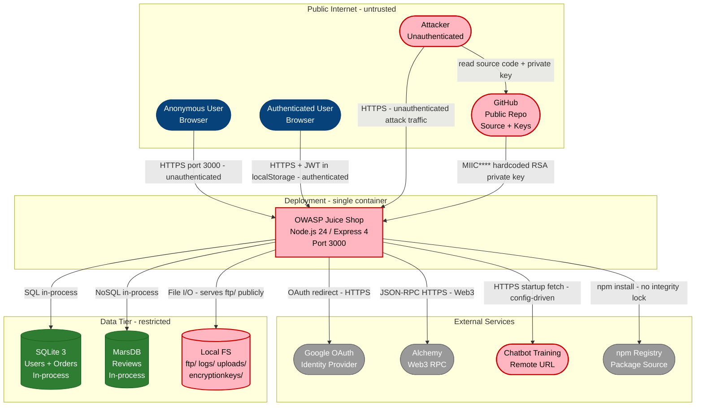

**Trust boundary enforcement summary:**

- **Public Internet** (see [§7.11](#711-infrastructure--network-segmentation)) — No WAF, no API gateway, no DDoS protection in front of port 3000; all traffic hits Express directly.
- **Deployment boundary** (see [§7.11](#711-infrastructure--network-segmentation)) — Single Docker container, no network policy, no process isolation; compromise of one route = full server access.
- **Data Tier** (see [§7.11](#711-infrastructure--network-segmentation)) — SQLite and MarsDB run in-process with the web server; there is no separate DB server or connection firewall. ORM is bypassed on critical query paths.

**Key takeaway:** There is no API gateway, WAF, or reverse proxy in front of Juice Shop — every request from the public internet reaches the Express process directly on port 3000, and the RSA private key used to sign all JWTs is readable from the public GitHub repository, meaning an unauthenticated attacker can forge admin tokens without ever sending a single request.

### 2.2 Container Architecture

The Container view zooms into the two main deployable runtimes. The critical observation: the Angular SPA and the Express API share the same origin and deployment unit, eliminating any same-origin isolation boundary between the frontend and backend.

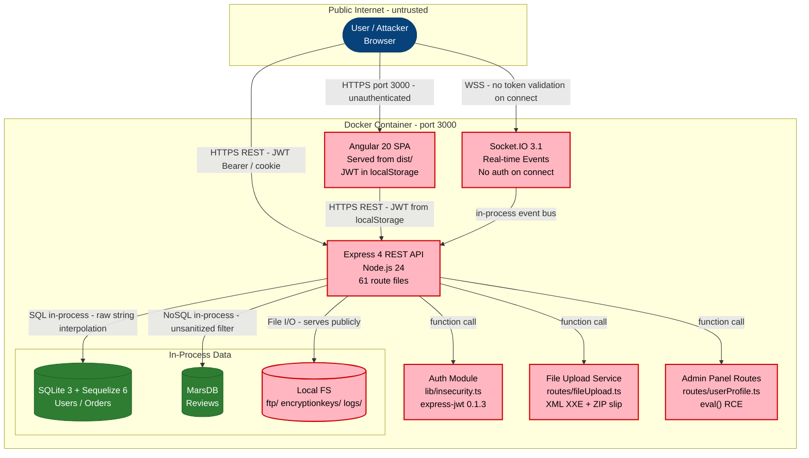

**Trust boundary enforcement summary:**

- **Container boundary** — Docker provides OS-level isolation only; there is no seccomp or AppArmor profile restricting syscalls.
- **Anonymous to Authenticated** (see [§7.11](#711-infrastructure--network-segmentation)) — enforced by express-jwt 0.1.3 which accepts alg:none tokens, effectively bypassing authentication.
- **Authenticated to Admin** (see [§7.11](#711-infrastructure--network-segmentation)) — enforced by client-side Angular guard only; no server-side role check on most admin API paths.

**Key takeaway:** The entire application — SPA, API, auth logic, database, and file system — runs in a single OS process. A single RCE vulnerability (eval() in userProfile or notevil bypass in b2bOrder) gives the attacker complete control of all data tiers with no lateral movement required.

### 2.3 Components

The Component view exposes the internal structure of the Express API — the most security-critical service. It shows the full middleware pipeline and the route handlers that bypass it.

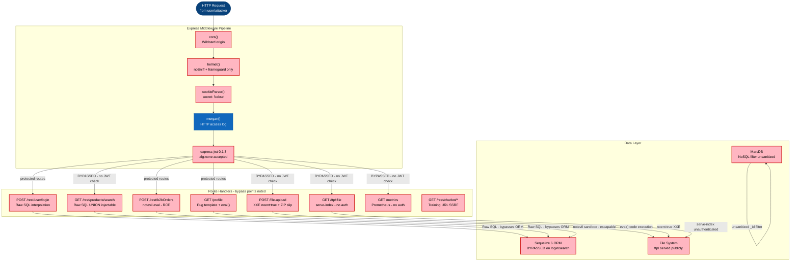

**Trust boundary enforcement summary:**

- **Anonymous to Authenticated pipeline** — express-jwt 0.1.3 middleware is the gate, but accepts alg:none; the `/ftp`, `/metrics`, `/search`, and `/file-upload` paths bypass it entirely.
- **ORM abstraction boundary** — Sequelize is available but the two most critical query paths (login and search) use raw `sequelize.query()` string interpolation, bypassing the parameterization guarantee.
- **VM sandbox boundary** — `vm.runInContext` with notevil is used for B2B orders and file parsing; notevil is a known-bypassable sandbox.

**Key takeaway:** The middleware pipeline is only partially applied — seven high-risk routes bypass authentication or input validation entirely, and the application's most dangerous code paths deliberately bypass the ORM's parameterization layer.

| ID | Name | Type | Key Paths | Linked Threats |
|----|------|------|-----------|----------------|
| C-01 | Authentication Service | service | `routes/login.ts` `routes/2fa.ts` `routes/resetPassword.ts` `lib/insecurity.ts` | [F-001](#f-001) — SQL injection in login endpoint enables admin bypass without credentials, [F-002](#f-002) — Hardcoded RSA private key in source code enables offline JWT forgery for any user identity, [F-003](#f-003) — express-jwt 0.1.3 accepts alg:none tokens bypassing all JWT signature verification, [F-013](#f-013) — Security-question password reset allows account takeover via guessable answers, [F-014](#f-014) — MD5 password hashing without salt enables rainbow table reversal of all credentials |
| C-02 | REST API | service | `routes/**` `server.ts` | [F-015](#f-015) — IDOR on basket endpoint allows any authenticated user to read and modify other users' orders, [F-016](#f-016) — Missing isAdmin() check on product modification and user-list endpoints enables privilege abuse, [F-017](#f-017) — NoSQL injection in product reviews endpoint enables mass review overwrite, [F-018](#f-018) — SSRF via profile image URL fetch enables internal network probing, [F-019](#f-019) — No rate limiting on authentication endpoints enables credential stuffing and brute force |
| C-03 | Frontend SPA | frontend | `frontend/src/**` | [F-008](#f-008) — JWT session token stored in localStorage is exfiltrable by any XSS payload, [F-009](#f-009) — Stored XSS via bypassSecurityTrustHtml in feedback and administration components allows session theft, [F-022](#f-022) — Reflected XSS via X-Forwarded-For header in last-login-ip component, [F-023](#f-023) — Missing Content Security Policy allows unrestricted script execution and XSS amplification, [F-024](#f-024) — OAuth login derives predictable password from email address enabling account pre-seeding |
| C-04 | Admin Panel | service | `frontend/src/app/administration/**` `routes/authenticatedUsers.ts` `routes/userProfile.ts` | [F-010](#f-010) — eval() on username in userProfile enables RCE via template injection in Pug renderer, [F-025](#f-025) — Admin panel access controlled only by client-side route guard, bypassed by direct API access, [F-026](#f-026) — Application configuration endpoint leaks OAuth secrets and internal config to unauthenticated callers, [F-027](#f-027) — Authenticated user data endpoint returns all active sessions without admin role check |
| C-05 | File Upload Service | service | `routes/fileUpload.ts` `routes/profileImageUrlUpload.ts` | [F-006](#f-006) — XXE in file-upload XML parser via noent:true reads arbitrary server-side files, [F-007](#f-007) — ZIP path traversal in complaint upload overwrites server files outside uploads directory, [F-021](#f-021) — Weak file type validation on upload accepts executable files and server-side scripts |
| C-06 | B2B Order Processing | service | `routes/b2bOrder.ts` | [F-011](#f-011) — notevil JavaScript sandbox bypass via prototype pollution enables RCE via B2B order endpoint, [F-034](#f-034) — Unbounded expression evaluation in B2B order processing enables CPU exhaustion |
| C-07 | Observability & Monitoring | infrastructure | `server.ts` `lib/prometheusGuard.ts` | [F-012](#f-012) — Unauthenticated FTP directory listing exposes KeePass database, M&A documents, and order PDFs, [F-028](#f-028) — Prometheus metrics endpoint leaks internal application state to unauthenticated callers, [F-029](#f-029) — HTTP access logs served unauthenticated at /support/logs contain session tokens and user emails, [F-030](#f-030) — Vulnerable dependency versions expose known CVEs across auth, XML parsing, and sanitization |
| C-08 | Data Management | service | `routes/dataErasure.ts` `routes/userData.ts` | [F-020](#f-020) — Absent security event logging across all endpoints prevents forensic reconstruction and GDPR audit trails, [F-031](#f-031) — IDOR in data export allows any user to exfiltrate another user's personal data via req.body.UserId, [F-035](#f-035) — Memory photo upload has no ownership check allowing overwrite of other users' profile images |
### 2.4 Technology Architecture

This diagram shows the runtime middleware stack from client to data tier. Red nodes carry at least one Critical-severity threat from the register.

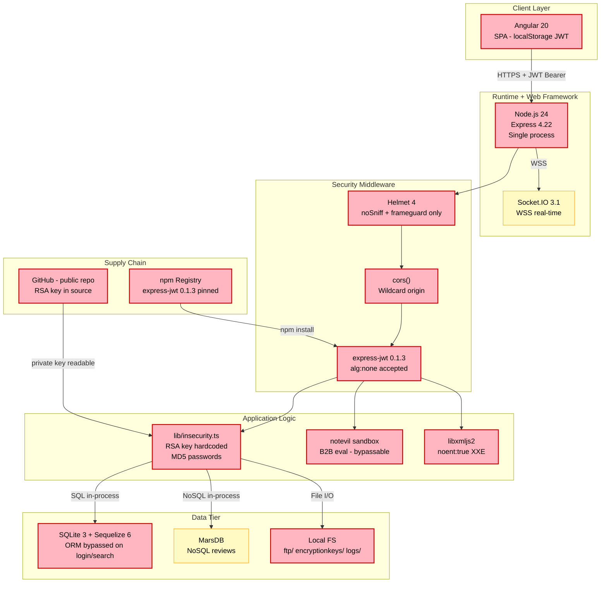

**Key takeaway:** Every layer of the stack carries a Critical or High finding — from the client (XSS-accessible JWT) through the middleware (wildcard CORS, alg:none JWT) to the application logic (hardcoded RSA key, MD5 passwords) and data layer (raw SQL injection).

#### 2.4.1 Layer 1 — Client

Browser-side runtime, storage mechanisms, and client-held secrets.

| # | Component | Version | Risk | Defect | Linked Threats |
|---|-----------|---------|------|--------|----------------|
| 1 | Angular SPA | 20.1.0 | 🔴 | JWT in localStorage | [F-008](#f-008) — JWT XSS theft |
| 2 | Angular DomSanitizer | 20.1.0 | 🔴 | bypassSecurityTrustHtml x5 | [F-009](#f-009) — Stored XSS via bypassSecurityTrustHtml in feedback and administration components allows session theft [F-022](#f-022) — Reflected XSS via X-Forwarded-For header in last-login-ip component |
| 3 | Angular AdminGuard | 20.1.0 | 🔴 | client-side only guard | [F-025](#f-025) — Admin panel access controlled only by client-side route guard, bypassed by direct API access |
| 4 | Angular HttpClient interceptor | 20.1.0 | 🟡 | attaches Bearer from localStorage | [F-008](#f-008) — JWT session token stored in localStorage is exfiltrable by any XSS payload |
| 5 | Angular router | 20.1.0 | 🟡 | canActivate bypassed via URL manipulation | [F-025](#f-025) — Admin panel access controlled only by client-side route guard, bypassed by direct API access |

#### 2.4.2 Layer 2 — Middleware (request-flow order)

Cross-cutting Express pipeline — policy enforcement that runs on every request. Numbered in actual handler order.

| # | Component | Version | Risk | Defect | Linked Threats |
|---|-----------|---------|------|--------|----------------|
| 1 | cors() | 2.8.5 | 🔴 | wildcard origin | [F-033](#f-033) — CORS wildcard |
| 2 | helmet() | 4.6.0 | 🔴 | CSP absent; xssFilter commented out | [F-023](#f-023) — Missing Content Security Policy allows unrestricted script execution and XSS amplification |
| 3 | cookieParser | 1.4.x | 🟡 | hardcoded secret 'kekse' | — |
| 4 | morgan | 3.x | 🟡 | logs to publicly served /support/logs | [F-029](#f-029) — HTTP access logs served unauthenticated at /support/logs contain session tokens and user emails |
| 5 | express-jwt | 0.1.3 | 🔴 | alg:none accepted; no algorithm restriction | [F-003](#f-003) — express-jwt 0.1.3 accepts alg:none tokens bypassing all JWT signature verification |
| 6 | express-rate-limit | 7.x | 🟡 | applied only on reset-password + 2FA, not on /login | [F-019](#f-019) — No rate limiting on authentication endpoints enables credential stuffing and brute force |
| 7 | serve-index | 1.9.1 | 🔴 | ftp/ and encryptionkeys/ served unauthenticated | [F-012](#f-012) — Unauthenticated FTP directory listing exposes KeePass database, M&A documents, and order PDFs |
| 8 | swagger-ui-express | 5.x | 🟡 | /api-docs publicly accessible | — |

#### 2.4.3 Layer 3 — Application Logic

Feature code that runs after the pipeline has accepted the request.

| # | Component | Version | Risk | Defect | Linked Threats |
|---|-----------|---------|------|--------|----------------|
| 1 | lib/insecurity.ts | — | 🔴 | RSA private key hardcoded; MD5 passwords; in-memory session store | [F-001](#f-001) — SQL injection in login endpoint enables admin bypass without credentials [F-002](#f-002) — Hardcoded RSA private key in source code enables offline JWT forgery for any user identity [F-003](#f-003) — express-jwt 0.1.3 accepts alg:none tokens bypassing all JWT signature verification [F-014](#f-014) — MD5 password hashing without salt enables rainbow table reversal of all credentials |
| 2 | routes/login.ts | — | 🔴 | raw SQL string interpolation | [F-001](#f-001) — SQL injection in login endpoint enables admin bypass without credentials |
| 3 | routes/search.ts | — | 🔴 | raw SQL UNION injectable | [F-004](#f-004) — UNION SQL injection in product search exfiltrates entire Users database |
| 4 | routes/b2bOrder.ts | — | 🔴 | notevil eval — prototype pollution RCE | [F-011](#f-011) — notevil JavaScript sandbox bypass via prototype pollution enables RCE via B2B order endpoint |
| 5 | routes/userProfile.ts | — | 🔴 | pug template + eval() RCE on username | [F-010](#f-010) — eval() on username in userProfile enables RCE via template injection in Pug renderer |
| 6 | routes/fileUpload.ts | — | 🔴 | XXE noent:true; ZIP path traversal | [F-006](#f-006) — XXE in file-upload XML parser via noent:true reads arbitrary server-side files [F-007](#f-007) — ZIP path traversal in complaint upload overwrites server files outside uploads directory |
| 7 | routes/profileImageUrlUpload.ts | — | 🔴 | unchecked fetch(url) — SSRF | [F-018](#f-018) — SSRF via profile image URL fetch enables internal network probing |
| 8 | libxmljs2 | 0.29.x | 🔴 | external entity resolution enabled | [F-006](#f-006) — XXE in file-upload XML parser via noent:true reads arbitrary server-side files |
| 9 | unzipper | 0.9.15 | 🔴 | ZIP path traversal | [F-007](#f-007) — ZIP path traversal in complaint upload overwrites server files outside uploads directory |
| 10 | notevil | 1.x | 🔴 | sandbox bypassable via constructor escape | [F-011](#f-011) — notevil JavaScript sandbox bypass via prototype pollution enables RCE via B2B order endpoint |
| 11 | js-yaml | 4.x | 🟡 | no size limit — YAML bomb DoS | [F-034](#f-034) — Unbounded expression evaluation in B2B order processing enables CPU exhaustion |
| 12 | pug | 3.x | 🔴 | compiled from user-controlled template string | [F-010](#f-010) — eval() on username in userProfile enables RCE via template injection in Pug renderer |
| 13 | sanitize-html | 1.4.2 | 🔴 | outdated — XSS bypass known | [F-009](#f-009) — Stored XSS via bypassSecurityTrustHtml in feedback and administration components allows session theft [F-030](#f-030) — Vulnerable dependency versions expose known CVEs across auth, XML parsing, and sanitization |
| 14 | jsonwebtoken | 0.4.0 | 🔴 | multiple CVEs; very old | [F-030](#f-030) — Vulnerable dependency versions expose known CVEs across auth, XML parsing, and sanitization |
| 15 | Socket.IO server | 3.1.2 | 🟡 | no auth token on connect; origin CORS restricted | — |
| 16 | PDFKit order export | — | 🟡 | writes order PDFs to publicly served ftp/ | [F-012](#f-012) — Unauthenticated FTP directory listing exposes KeePass database, M&A documents, and order PDFs |
| 17 | routes/chatbot.ts | — | 🟡 | downloads training data from config URL at startup | [F-018](#f-018) — SSRF via profile image URL fetch enables internal network probing |

#### 2.4.4 Layer 4 — Data and Storage

Persistent and in-process data stores reachable from Layer 3 without leaving the process.

| # | Component | Version | Risk | Defect | Linked Threats |
|---|-----------|---------|------|--------|----------------|
| 1 | SQLite 3 | 5.1.7 | 🔴 | ORM bypassed on login + search paths | [F-001](#f-001) — SQL injection in login endpoint enables admin bypass without credentials [F-004](#f-004) — UNION SQL injection in product search exfiltrates entire Users database |
| 2 | Sequelize ORM | 6.37.3 | 🟡 | available but not used on critical paths | [F-001](#f-001) — SQL injection in login endpoint enables admin bypass without credentials |
| 3 | MarsDB (NoSQL) | 0.x | 🔴 | _id filter unsanitized; multi:true mass update | [F-017](#f-017) — NoSQL injection in product reviews endpoint enables mass review overwrite |
| 4 | Local FS - ftp/ | — | 🔴 | publicly served via serve-index; contains KeePass DB | [F-012](#f-012) — Unauthenticated FTP directory listing exposes KeePass database, M&A documents, and order PDFs |
| 5 | Local FS - encryptionkeys/ | — | 🔴 | jwt.pub + premium.key served without auth | [F-012](#f-012) — Unauthenticated FTP directory listing exposes KeePass database, M&A documents, and order PDFs |
| 6 | Local FS - logs/ | — | 🔴 | HTTP access logs served unauthenticated | [F-029](#f-029) — HTTP access logs served unauthenticated at /support/logs contain session tokens and user emails |
| 7 | Local FS - uploads/ | — | 🟡 | profile images; path traversal risk from ZIP slip | [F-007](#f-007) — ZIP path traversal in complaint upload overwrites server files outside uploads directory |
| 8 | In-memory tokenMap | — | 🟡 | sessions cleared only on process restart | — |

---

## 3. Attack Walkthroughs

The sequence diagrams below trace each Critical finding from initial attacker action to full exploitation. Every diagram is anchored to its `F-NNN` in the Threat Register and shows the current vulnerable behaviour alongside the post-mitigation flow. Each walkthrough assumes an unauthenticated attacker starting from the public internet unless noted.

### 3.1 Attack Chain Overview

The following graph shows how the 12 Critical findings chain together into three high-impact attack workflows. An attacker who exploits any one node in a workflow typically gains enough access to trivially complete the rest of the chain. Red subgraph borders mark chains that begin from an unauthenticated position.

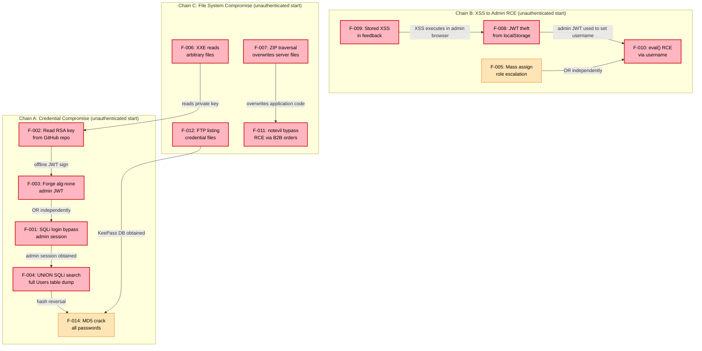

%% Trust Boundary Key: Chain A starts entirely unauthenticated. Chain B requires comment submission (unauthenticated) then admin session. Chain C starts unauthenticated on the file upload endpoint.

### 3.2 SQL Injection Login Bypass to Admin Session

This sequence shows how a single crafted email parameter exploits raw SQL string interpolation in the login route to bypass authentication and obtain a full admin JWT without any credentials. This is the canonical first step in the admin-account takeover chain.

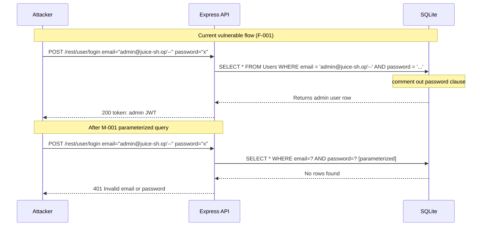

**Key takeaway:** Raw SQL string interpolation on the login route means the password field is completely irrelevant — submitting `'--` as the email terminates the WHERE clause and grants admin access in a single HTTP request.

### 3.3 JWT Forgery via Public RSA Private Key

This sequence shows how an attacker reads the hardcoded RSA private key from the public GitHub repository and signs their own admin JWT offline, gaining permanent admin access without any server interaction until the forged token is used.

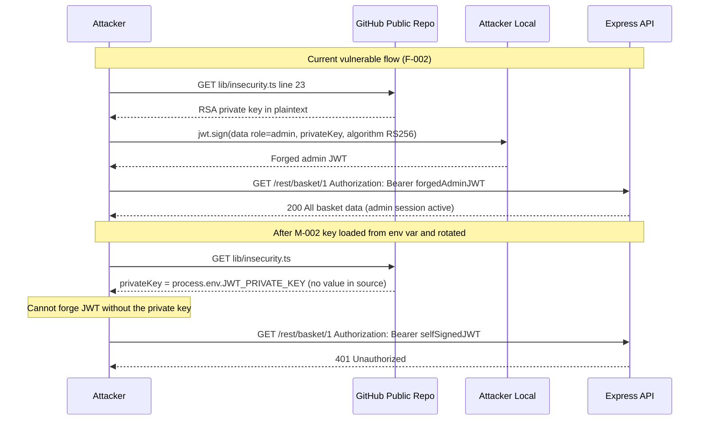

**Key takeaway:** The RSA private key committed to a public repository means JWT forgery requires only internet access and two lines of Node.js — there is no server interaction required until the attacker chooses to use their forged token.

### 3.4 alg:none JWT Authentication Bypass

This sequence shows how express-jwt 0.1.3 accepts tokens with no cryptographic signature, allowing any attacker to craft a JWT with arbitrary claims and have it accepted as valid.

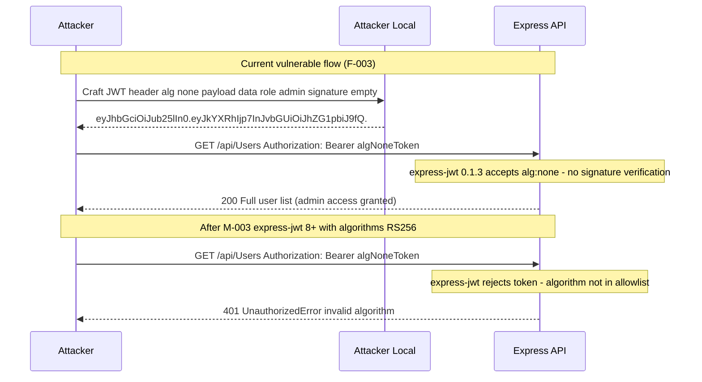

**Key takeaway:** Upgrading express-jwt from 0.1.3 to any version 2.0 or later closes this vulnerability — the old version predates the alg:none fix that was the impetus for the entire JWT security audit in 2015, making this a decade-old known vulnerability.

### 3.5 Remote Code Execution via notevil Sandbox Escape

This sequence shows how an authenticated user exploits the bypassable notevil sandbox in the B2B order endpoint to achieve remote code execution on the server.

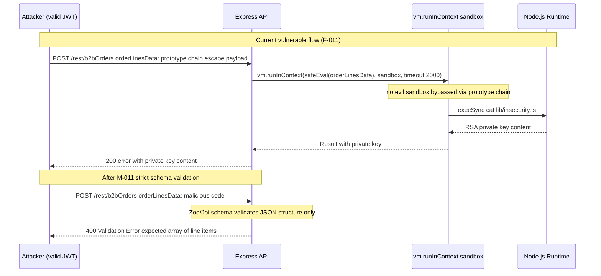

**Key takeaway:** The notevil library is documented to be bypassable via prototype pollution — using it as a security boundary is fundamentally unsafe; the only fix is to eliminate the eval-based execution model entirely and replace it with a structured schema parser.

### 3.6 XML External Entity (XXE) File Read

This sequence shows how an unauthenticated attacker exploits the enabled external entity processing in the XML file upload handler to read arbitrary files from the server filesystem.

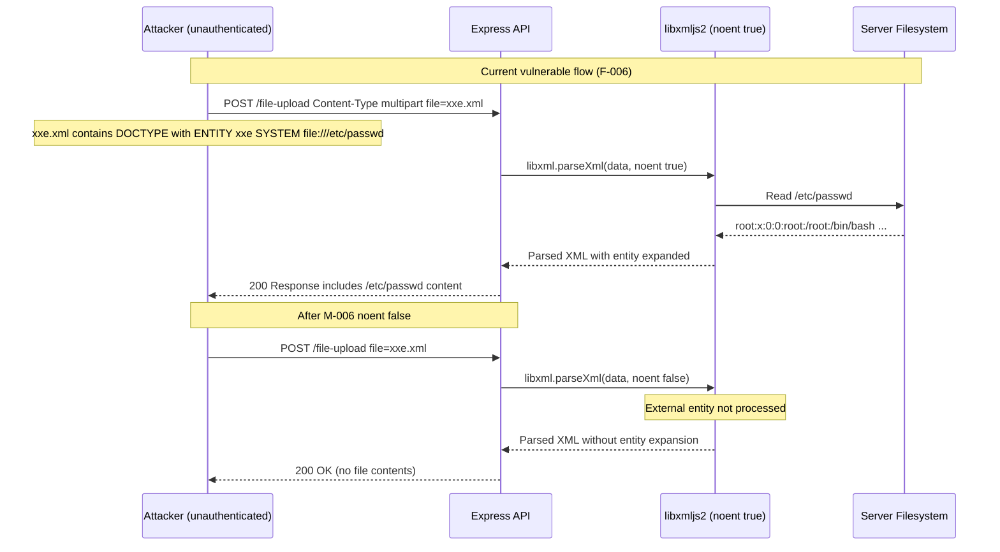

**Key takeaway:** Setting `noent: false` in the libxmljs2 options is a one-character change that eliminates the XXE attack vector — the current `noent: true` configuration must be an intentional insecure-by-design choice for the CTF challenge.

### 3.7 Stored XSS in Admin Feedback View + localStorage JWT Theft Steals Admin Session

This sequence shows how an unauthenticated attacker submits a malicious feedback payload that executes when the administrator views the feedback panel, stealing the admin JWT from localStorage.

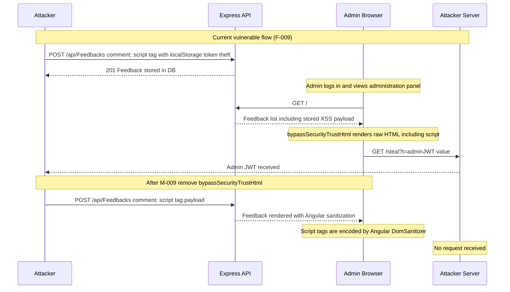

**Key takeaway:** Using `bypassSecurityTrustHtml()` in Angular is equivalent to calling `innerHTML = userContent` in vanilla JS — it disables the framework's entire XSS defence. Any feedback a user posts becomes persistent XSS that executes in the admin's browser.

### 3.8 Remote Code Execution via Username eval() in Profile Template

This sequence shows how an authenticated user sets a crafted username that triggers server-side `eval()` in the profile renderer, achieving remote code execution.

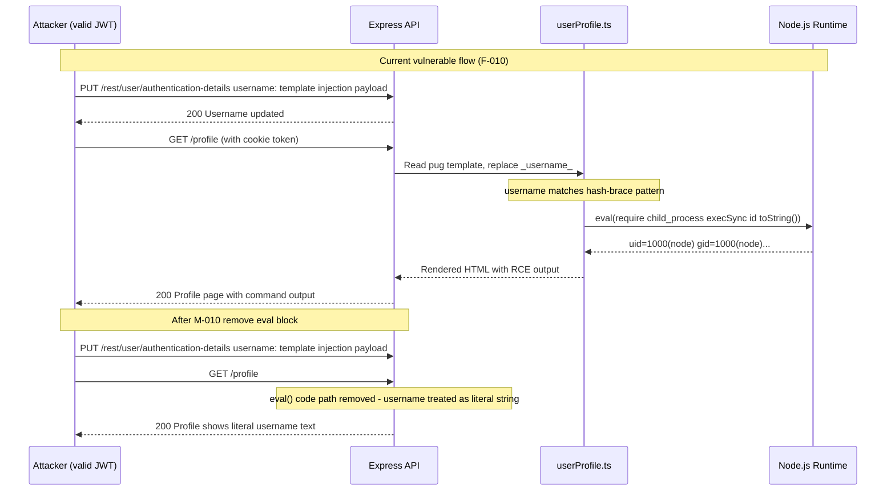

**Key takeaway:** The `eval()` call in userProfile.ts is gated only by a regex check for the `#{...}` pattern — any authenticated user who updates their username to match that pattern achieves server-side code execution with the full privileges of the Node.js process.

### 3.9 Union SQL Injection on Product Search Dumps User Database

This sequence shows how an unauthenticated attacker uses UNION SELECT injection on the product search endpoint to exfiltrate the entire Users table including email addresses and password hashes.

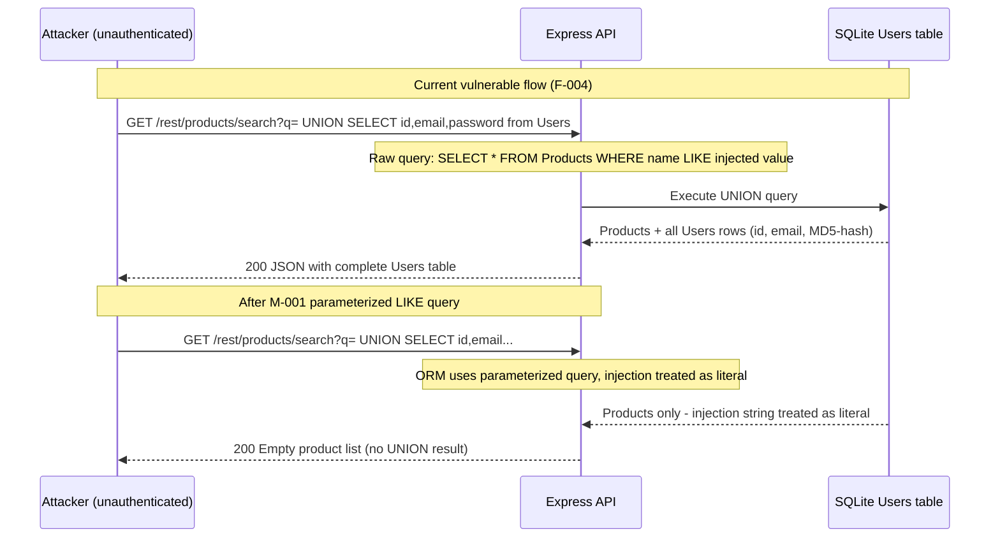

**Key takeaway:** The unauthenticated product search endpoint exposes the entire user database in a single HTTP request — MD5 password hashes, email addresses, and role information — making this the most impactful data breach vector in the application.

### 3.10 Mass Assignment via Registration Escalates to Admin Role

This sequence shows how an attacker passes extra fields in the registration payload to set their own role to admin at account creation time.

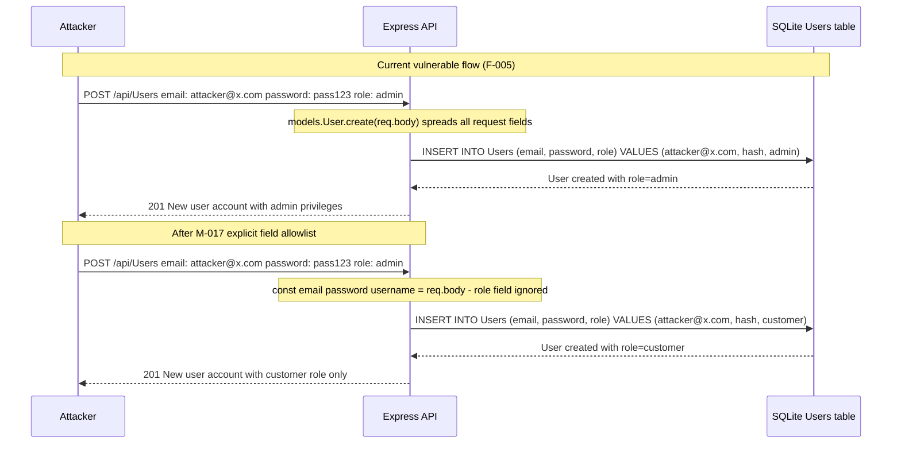

**Key takeaway:** Passing `req.body` directly to `models.User.create()` without an explicit field allowlist means any field the User model accepts becomes settable by the client — including `role`, `isAdmin`, and any other privileged attribute.

### 3.11 ZIP Path Traversal Overwrites Server Files

This sequence shows how an unauthenticated attacker uploads a crafted ZIP archive to overwrite application source files outside the intended upload directory.

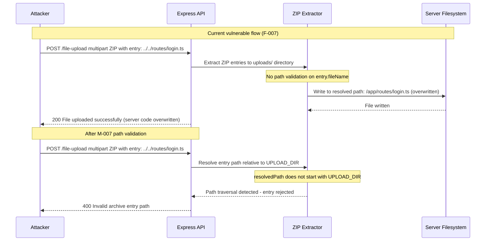

**Key takeaway:** Without path validation on ZIP entry filenames, the extractor follows `../` sequences to resolve paths outside the intended upload directory — a single crafted archive can overwrite any file the Node.js process has write permission to.

### 3.12 Unauthenticated FTP Directory Listing Exposes Credential Database

This sequence shows how an anonymous attacker accesses the FTP directory served by express.static() to download sensitive credential files.

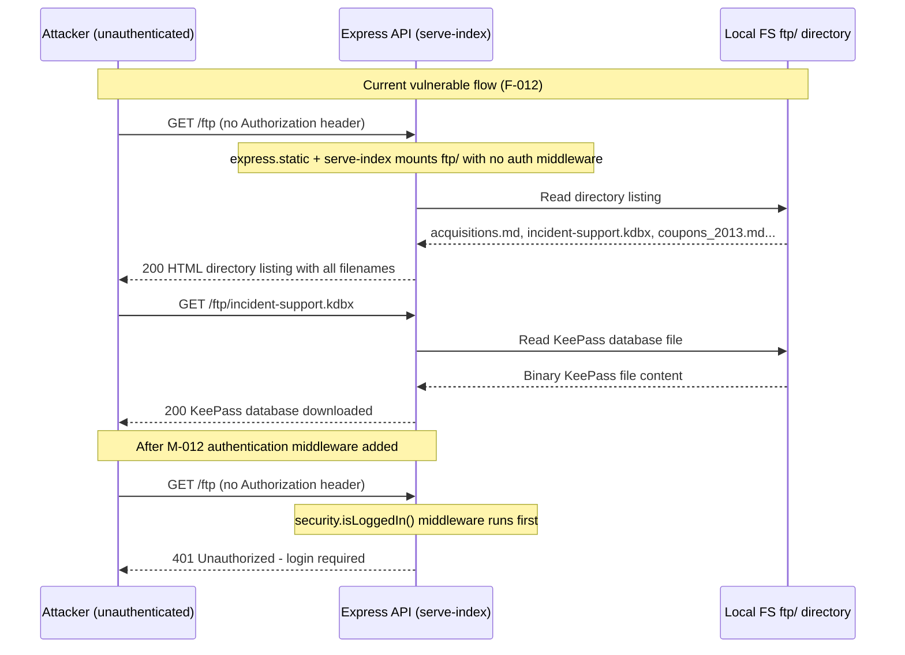

**Key takeaway:** The FTP directory is mounted with `express.static()` and `serve-index` with no authentication middleware — adding `security.isLoggedIn()` as a prerequisite middleware is a two-line fix that closes the entire attack surface for this endpoint.

---

## 4. Assets

The table below identifies all assets requiring protection, classified by sensitivity, with cross-references to the threats that target them. Classification uses a four-tier scale: **Restricted** (highest — regulatory or existential impact if disclosed), **Confidential** (business-sensitive), **Internal** (operational), **Public** (intentionally exposed).

**Classification legend:**
- 🔐 **Restricted** — Disclosure enables immediate full compromise or has regulatory consequences
- 🔒 **Confidential** — Disclosure causes significant business or user harm
- 🔶 **Internal** — Operational data; disclosure enables reconnaissance or privilege escalation
- 🌐 **Public** — Intentionally accessible; no classification harm from disclosure

| Asset | Classification | Description | Linked Threats |
|-------|---------------|-------------|----------------|
| RSA Private Key (`lib/insecurity.ts:23`) | 🔐 Restricted | 1024-bit RSA private key used to sign all JWT session tokens. Hardcoded in source code and published on GitHub. Anyone who reads the source can forge any JWT identity permanently. | [F-002](#f-002) — Hardcoded RSA private key in source code enables offline JWT forgery for any user identity [F-003](#f-003) — express-jwt 0.1.3 accepts alg:none tokens bypassing all JWT signature verification |
| User Credentials (SQLite `Users` table) | 🔐 Restricted | Email addresses, MD5 password hashes (no salt), TOTP secrets, and role assignments for all users including admin. MD5 hashes are reversible with modern GPU rainbow tables. | [F-001](#f-001) — SQL injection in login endpoint enables admin bypass without credentials [F-004](#f-004) — UNION SQL injection in product search exfiltrates entire Users database [F-014](#f-014) — MD5 password hashing without salt enables rainbow table reversal of all credentials [F-019](#f-019) — No rate limiting on authentication endpoints enables credential stuffing and brute force |
| Admin Session JWT | 🔐 Restricted | JWT signed with the hardcoded RSA private key. Grants unrestricted API access. Obtainable via key forgery, alg:none bypass, SQLi login, or XSS theft from localStorage. | [F-001](#f-001) — SQL injection in login endpoint enables admin bypass without credentials [F-002](#f-002) — Hardcoded RSA private key in source code enables offline JWT forgery for any user identity [F-003](#f-003) — express-jwt 0.1.3 accepts alg:none tokens bypassing all JWT signature verification [F-008](#f-008) — JWT session token stored in localStorage is exfiltrable by any XSS payload [F-009](#f-009) — Stored XSS via bypassSecurityTrustHtml in feedback and administration components allows session theft |
| HMAC Key (`lib/insecurity.ts:44`) | 🔐 Restricted | Hardcoded HMAC-SHA256 key used for coupon encoding and other integrity checks. Present in public source as literal string `pa4qacea4VK9t9nGv7yZtwmj`. | [F-002](#f-002) — Hardcoded RSA private key in source code enables offline JWT forgery for any user identity |
| Customer PII (`Users`, `Address`, `Card` tables) | 🔒 Confidential | Full names, email addresses, delivery addresses, and payment card numbers for all registered customers. Exfiltrable via SQL injection or IDOR data export. | [F-001](#f-001) — SQL injection in login endpoint enables admin bypass without credentials [F-004](#f-004) — UNION SQL injection in product search exfiltrates entire Users database [F-031](#f-031) — IDOR in data export allows any user to exfiltrate another user's personal data via req.body.UserId |
| Product Review Data (MarsDB) | 🔒 Confidential | User-authored product reviews and ratings. Target of NoSQL injection enabling mass tampering (overwrite all reviews at once). | [F-017](#f-017) — NoSQL injection in product reviews endpoint enables mass review overwrite |
| Customer Orders (`ftp/order_*.pdf`) | 🔒 Confidential | Order confirmation PDFs written into the publicly served `ftp/` directory at checkout. Contains customer email, order details, and pricing. Downloadable without authentication. | [F-012](#f-012) — Unauthenticated FTP directory listing exposes KeePass database, M&A documents, and order PDFs |
| FTP Directory (`ftp/`) | 🔒 Confidential | Contains `acquisitions.md` (M&A data), `incident-support.kdbx` (KeePass password database), coupon files, `suspicious_errors.yml`, and order PDFs. All accessible without authentication. | [F-012](#f-012) — Unauthenticated FTP directory listing exposes KeePass database, M&A documents, and order PDFs |
| Encryption Keys Directory (`encryptionkeys/`) | 🔐 Restricted | Contains `jwt.pub` (RSA public key) and `premium.key` (premium content unlock key). Served via `serve-index` without authentication. Exposure of jwt.pub aids JWT forgery. | [F-002](#f-002) — Hardcoded RSA private key in source code enables offline JWT forgery for any user identity [F-012](#f-012) — Unauthenticated FTP directory listing exposes KeePass database, M&A documents, and order PDFs |
| Access Logs (`logs/` directory) | 🔶 Internal | HTTP access logs in combined format. May contain session tokens passed as query parameters, user email addresses in search terms, and internal application state. Served unauthenticated at `/support/logs`. | [F-029](#f-029) — HTTP access logs served unauthenticated at /support/logs contain session tokens and user emails |
| Prometheus Metrics (`/metrics`) | 🔶 Internal | HTTP request counts, file upload statistics, registered user counts, wallet balances, challenge completion state, and application version. Unauthenticated endpoint provides detailed reconnaissance. | [F-028](#f-028) — Prometheus metrics endpoint leaks internal application state to unauthenticated callers |
| Application Configuration (`/rest/admin/application-configuration`) | 🔶 Internal | Full application config including chatbot settings, OAuth configuration, challenge parameters, and internal domain. Served to unauthenticated callers. | [F-026](#f-026) — Application configuration endpoint leaks OAuth secrets and internal config to unauthenticated callers |
| Application Source Code | 🌐 Public | Full source code on GitHub including all intentional vulnerabilities. Public exposure is by design, but the RSA private key embedded in the source elevates the risk tier of the key asset to Restricted. | [F-002](#f-002) — Hardcoded RSA private key in source code enables offline JWT forgery for any user identity |
| Server-Side Node.js Runtime | 🔐 Restricted | Full Node.js process execution context. Accessible via eval() in userProfile.ts and notevil bypass in b2bOrder.ts. Compromise gives access to all other assets simultaneously. | [F-010](#f-010) — eval() on username in userProfile enables RCE via template injection in Pug renderer [F-011](#f-011) — notevil JavaScript sandbox bypass via prototype pollution enables RCE via B2B order endpoint |

---

## 5. Attack Surface

All identified entry points through which an attacker can interact with the system, split by whether authentication is required. Entry points are derived from `server.ts` route registrations and the recon scan. A linked threat references the specific finding associated with that entry point.

### 5.1 Unauthenticated Entry Points (16)

These endpoints accept requests without a valid JWT. They represent the attack surface accessible to a completely anonymous attacker with only network access.

| # | Entry Point | Protocol | Notes | Linked Threats |
|---|-------------|----------|-------|----------------|
| 1 | `POST /rest/user/login` | HTTPS | Raw SQL injection; admin bypass without credentials | [F-001](#f-001) — SQL injection in login endpoint enables admin bypass without credentials [F-019](#f-019) — No rate limiting on authentication endpoints enables credential stuffing and brute force |
| 2 | `POST /rest/user/register` | HTTPS | Mass assignment; role escalation to admin | [F-005](#f-005) — Mass assignment via registration allows role escalation to admin without authorization |
| 3 | `GET /rest/products/search?q=` | HTTPS | UNION SQL injection; no auth required | [F-004](#f-004) — UNION SQL injection in product search exfiltrates entire Users database |
| 4 | `POST /file-upload` | HTTPS multipart | XML XXE (noent:true); ZIP path traversal; weak type validation | [F-006](#f-006) — XXE in file-upload XML parser via noent:true reads arbitrary server-side files [F-007](#f-007) — ZIP path traversal in complaint upload overwrites server files outside uploads directory [F-021](#f-021) — Weak file type validation on upload accepts executable files and server-side scripts |
| 5 | `GET /ftp/:file` | HTTPS | serve-index directory listing; no auth; KeePass DB accessible | [F-012](#f-012) — Unauthenticated FTP directory listing exposes KeePass database, M&A documents, and order PDFs |
| 6 | `GET /encryptionkeys/:file` | HTTPS | RSA public key + premium.key exposed without auth | [F-002](#f-002) — Hardcoded RSA private key in source code enables offline JWT forgery for any user identity [F-012](#f-012) — Unauthenticated FTP directory listing exposes KeePass database, M&A documents, and order PDFs |
| 7 | `GET /support/logs/:file` | HTTPS | HTTP access logs downloadable without auth | [F-029](#f-029) — HTTP access logs served unauthenticated at /support/logs contain session tokens and user emails |
| 8 | `GET /metrics` | HTTPS | Prometheus metrics; internal state; no auth | [F-028](#f-028) — Prometheus metrics endpoint leaks internal application state to unauthenticated callers |
| 9 | `GET /rest/admin/application-configuration` | HTTPS | Full app config; OAuth secrets; no auth | [F-026](#f-026) — Application configuration endpoint leaks OAuth secrets and internal config to unauthenticated callers |
| 10 | `GET /rest/admin/application-version` | HTTPS | Version disclosure; no auth | [F-026](#f-026) — Application configuration endpoint leaks OAuth secrets and internal config to unauthenticated callers |
| 11 | `POST /api/Feedbacks` | HTTPS | Stored XSS via comment field; captcha bypassable | [F-009](#f-009) — Stored XSS via bypassSecurityTrustHtml in feedback and administration components allows session theft |
| 12 | `GET /api-docs` | HTTPS | Swagger UI — full API documentation exposed | — |
| 13 | `WSS /socket.io` | WSS | Socket.IO connection; no auth token required on handshake | — |
| 14 | `GET /rest/chatbot/status` | HTTPS | Chatbot endpoint; no auth | — |
| 15 | `GET /rest/products/:id/reviews` | HTTPS | Product reviews; public read | — |
| 16 | `GET /rest/user/reset-password` | HTTPS | Security-question reset; guessable answers | [F-013](#f-013) — Security-question password reset allows account takeover via guessable answers |

### 5.2 Authenticated Entry Points (17)

These endpoints require a valid JWT in the `Authorization: Bearer` header or `token` cookie. However, **express-jwt 0.1.3 accepts alg:none tokens**, so the authentication barrier is effectively zero for a motivated attacker (see [F-003](#f-003) — express-jwt 0.1.3 accepts alg:none tokens bypassing all JWT signature verification).

| # | Entry Point | Protocol | Notes | Linked Threats |
|---|-------------|----------|-------|----------------|
| 1 | `POST /rest/b2bOrders` | HTTPS | notevil eval — RCE via prototype pollution; CPU exhaustion | [F-011](#f-011) — notevil JavaScript sandbox bypass via prototype pollution enables RCE via B2B order endpoint [F-034](#f-034) — Unbounded expression evaluation in B2B order processing enables CPU exhaustion |
| 2 | `GET /profile` / `POST /profile` | HTTPS | Pug template + eval() on username; RCE | [F-010](#f-010) — eval() on username in userProfile enables RCE via template injection in Pug renderer |
| 3 | `POST /profile/image/url` | HTTPS | Unchecked `fetch(url)` — SSRF; requires valid JWT | [F-018](#f-018) — SSRF via profile image URL fetch enables internal network probing |
| 4 | `GET /rest/basket/:id` | HTTPS | IDOR — no ownership check on basket ID | [F-015](#f-015) — IDOR on basket endpoint allows any authenticated user to read and modify other users' orders |
| 5 | `PUT /rest/product/:id/reviews` | HTTPS | NoSQL injection + mass update via _id | [F-017](#f-017) — NoSQL injection in product reviews endpoint enables mass review overwrite |
| 6 | `PUT /api/Products/:id` | HTTPS | Product modification without isAdmin() check | [F-016](#f-016) — Missing isAdmin() check on product modification and user-list endpoints enables privilege abuse |
| 7 | `GET /rest/user/authentication-details` | HTTPS | Leaks all active sessions; no admin role check | [F-027](#f-027) — Authenticated user data endpoint returns all active sessions without admin role check |
| 8 | `POST /rest/user/data/export` | HTTPS | IDOR via req.body.UserId — can export other users' data | [F-031](#f-031) — IDOR in data export allows any user to exfiltrate another user's personal data via req.body.UserId |
| 9 | `GET /api/Users` | HTTPS | Full user list; requires auth but no admin role | [F-016](#f-016) — Missing isAdmin() check on product modification and user-list endpoints enables privilege abuse |
| 10 | `DELETE /api/Users/:id` | HTTPS | User deletion; requires auth but no admin check | [F-025](#f-025) — Admin panel access controlled only by client-side route guard, bypassed by direct API access |
| 11 | `PUT /api/Users/:id` | HTTPS | User modification; no ownership check | [F-025](#f-025) — Admin panel access controlled only by client-side route guard, bypassed by direct API access |
| 12 | `POST /rest/basket/:id/checkout` | HTTPS | Order placement; writes PDF to ftp/ | [F-012](#f-012) — Unauthenticated FTP directory listing exposes KeePass database, M&A documents, and order PDFs [F-015](#f-015) — IDOR on basket endpoint allows any authenticated user to read and modify other users' orders |
| 13 | `POST /rest/memories` | HTTPS | File upload to public images directory; no ownership check | [F-035](#f-035) — Memory photo upload has no ownership check allowing overwrite of other users' profile images |
| 14 | `GET /rest/admin/application-configuration` | HTTPS | Admin config endpoint — also accessible unauthenticated | [F-026](#f-026) — Application configuration endpoint leaks OAuth secrets and internal config to unauthenticated callers |
| 15 | `POST /rest/2fa/setup` | HTTPS | TOTP enrollment; not enforced on admin accounts | [F-032](#f-032) — TOTP 2FA enrollment not enforced on admin account creation |
| 16 | `POST /api/Complaints` | HTTPS | Complaint submission with file attachment | [F-021](#f-021) — Weak file type validation on upload accepts executable files and server-side scripts |
| 17 | `POST /rest/coupon/apply/:id` | HTTPS | Coupon redemption; HMAC bypass possible if HMAC key known | [F-002](#f-002) — Hardcoded RSA private key in source code enables offline JWT forgery for any user identity |

---

## 7. Security Architecture

This section consolidates the architectural narrative (patterns, per-domain assessment, cross-cutting topics) with the canonical control catalog. Each domain contains architectural reasoning and the controls that implement — or fail to implement — it.

**Reading guide**
- [§7.1 Overview](#71-overview) — architecture patterns, overall rating
- [§7.2 Key Architectural Risks](#72-key-architectural-risks) — systemic design defects
- [§7.3–§7.12](#73-identity--access-management) — per-domain narrative + controls
- [§7.13 Secret Management](#713-secret-management) — cross-cutting
- [§7.14 Defense-in-Depth Assessment](#714-defense-in-depth-assessment) — cross-cutting

**Catalog totals:** ✅ 4 Adequate · ⚠️ 3 Partial · 🔶 4 Weak · ❌ 16 Missing · 27 controls tracked.

**Gap summary:** The three most critical control gaps are: (1) **Secret Management** — cryptographic keys hardcoded in a public repository render every authentication guarantee void; (2) **SQL Parameterization** — raw string interpolation on the two highest-traffic endpoints enables unauthenticated database exfiltration; (3) **JWT Algorithm Enforcement** — an intentionally ancient library version accepts unsigned tokens, bypassing the entire auth layer. Collectively these three gaps allow an unauthenticated internet attacker to achieve admin access via at least four independent paths.

### 7.1 Overview

| Pattern | Status | Assessment | See also |
|---------|--------|------------|---------|
| API Gateway | ❌ Absent | Express 4 listens directly on port 3000; no WAF or gateway in front | [§7.11](#711-infrastructure--network-segmentation) |
| BFF | ❌ Absent | SPA and API share one process; JWT stored in XSS-accessible localStorage | [§7.3](#73-identity--access-management) |
| Defense-in-Depth | ❌ Absent | Controls thin and inconsistently applied across 61 route files | [§7.14](#714-defense-in-depth-assessment) |
| Separation of Concerns | ⚠️ Partial | Route files separated; auth module mixes key management, hashing, sessions | [§7.3](#73-identity--access-management) |
| Least Privilege | ❌ Absent | Single process with full FS access; no capability dropping | [§7.11](#711-infrastructure--network-segmentation) |
| Secrets Management | ❌ Absent | RSA private key + HMAC key hardcoded in public GitHub repo | [§7.13](#713-secret-management) |
| Network Segmentation | ❌ Absent | SQLite + MarsDB in-process; no DB server or network boundary | [§7.11](#711-infrastructure--network-segmentation) |
| Secure Defaults | ❌ Absent | noent:true, wildcard CORS, alg:none JWT, MD5 hashing — all insecure by default | [§7.5](#75-input-validation--output-encoding) |

**Overall Architecture Security Rating:** 🔴 Critical gaps — six of eight foundational architectural patterns are completely absent. Authentication is bypassable via three independent paths (SQLi, alg:none, key forgery). RCE is accessible to any authenticated user via two independent paths (eval, notevil).

### 7.2 Key Architectural Risks

The following table identifies structural design defects — not code bugs — that create systemic risk.

| Risk | Structural Risk | Why this matters | Linked Threats |
|------|----------------|-----------------|----------------|
| 🔴 Single-process monolith | All layers in one Node.js process — web server, auth, DB, filesystem | One RCE finding gives simultaneous access to all data tiers. No blast radius containment. | [F-010](#f-010) — eval() on username in userProfile enables RCE via template injection in Pug renderer [F-011](#f-011) — notevil JavaScript sandbox bypass via prototype pollution enables RCE via B2B order endpoint |
| 🔴 Credentials in public source | JWT private key, HMAC key, cookie secret as string literals in GitHub repo | JWT forgery requires zero server interaction. Key rotation is a breaking change. | [F-002](#f-002) — Hardcoded RSA private key in source code enables offline JWT forgery for any user identity |
| 🔴 ORM bypass on hot paths | Sequelize available, correctly used elsewhere, intentionally bypassed on login/search | Most exploitable paths deliberately skip the parameterization layer. | [F-001](#f-001) — SQL injection in login endpoint enables admin bypass without credentials [F-004](#f-004) — UNION SQL injection in product search exfiltrates entire Users database |
| 🟠 Client-side access control | Angular AdminGuard is the sole admin check for several admin API paths | Server-side role enforcement absent; any JWT holder can call admin APIs. | [F-016](#f-016) — Missing isAdmin() check on product modification and user-list endpoints enables privilege abuse [F-025](#f-025) — Admin panel access controlled only by client-side route guard, bypassed by direct API access |
| 🟠 Publicly served sensitive dirs | ftp/, encryptionkeys/, logs/ served without auth via serve-index | Structural file write into publicly served directory: orders→ftp/ on checkout. | [F-012](#f-012) — Unauthenticated FTP directory listing exposes KeePass database, M&A documents, and order PDFs [F-026](#f-026) — Application configuration endpoint leaks OAuth secrets and internal config to unauthenticated callers [F-029](#f-029) — HTTP access logs served unauthenticated at /support/logs contain session tokens and user emails |

### 7.3 Identity & Access Management

#### 7.3.1 Password Login Flow

Raw SQL query at [routes/login.ts:34](vscode://file/home/mrohr/juice-shop/routes/login.ts:34) compares MD5 of submitted password. Two critical flaws: the query is injectable, and MD5 is reversible.
The following diagram shows the four authentication flows and their security weaknesses.

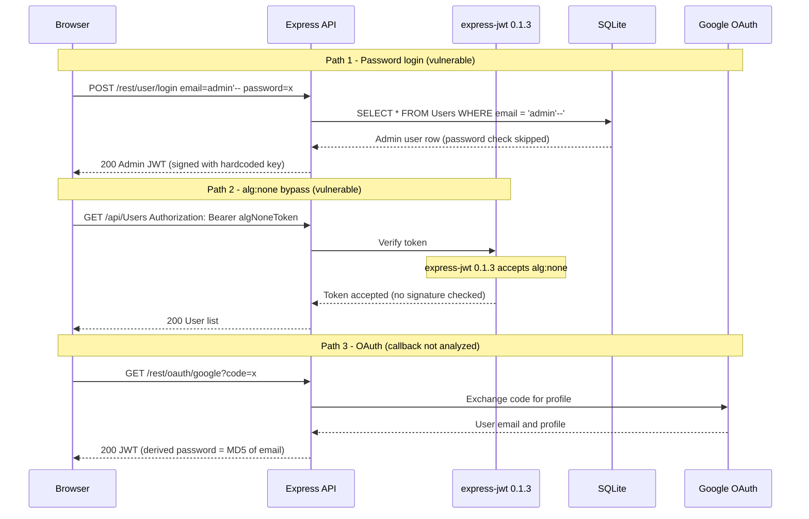

#### 7.3.2 JWT Issuance and Validation

`security.authorize()` signs tokens with a hardcoded 1024-bit RSA private key. `security.isAuthorized()` uses express-jwt 0.1.3 which accepts alg:none. There is no algorithm allowlist.

#### 7.3.3 Google OAuth

Delegated authentication via Google OAuth redirect. Callback handling not analyzed for state parameter CSRF.

#### 7.3.4 TOTP Two-Factor Authentication

Functional TOTP via `otplib` at [routes/2fa.ts](vscode://file/home/mrohr/juice-shop/routes/2fa.ts). Not enforced on any account by default.

| ID | Architectural Control | Implementation | Effectiveness | Mitigates | References |
|----|----------------------|----------------|---------------|-----------|------------|
| SC-01 | Password hashing | MD5 no-salt at [lib/insecurity.ts:43](vscode://file/home/mrohr/juice-shop/lib/insecurity.ts:43) | ❌ Missing | expected: [F-014](#f-014) — MD5 password hashing without salt enables rainbow table reversal of all credentials | CWE-327, ASVS V2.4 |
| SC-02 | JWT signing algorithm | RS256 at [lib/insecurity.ts:56](vscode://file/home/mrohr/juice-shop/lib/insecurity.ts:56) | 🔶 Weak | [F-003](#f-003) — express-jwt 0.1.3 accepts alg:none tokens bypassing all JWT signature verification | CWE-347 |
| SC-03 | JWT algorithm enforcement | express-jwt 0.1.3 — alg:none accepted | ❌ Missing | expected: [F-003](#f-003) — express-jwt 0.1.3 accepts alg:none tokens bypassing all JWT signature verification | CWE-347 |
| SC-04 | Account lockout | Not implemented | ❌ Missing | expected: [F-019](#f-019) — No rate limiting on authentication endpoints enables credential stuffing and brute force | CWE-307 |
| SC-05 | TOTP 2FA | Functional but not enforced at [routes/2fa.ts](vscode://file/home/mrohr/juice-shop/routes/2fa.ts) | ⚠️ Partial | [F-032](#f-032) — TOTP 2FA enrollment not enforced on admin account creation | CWE-308 |
| SC-06 | Login rate limiting | express-rate-limit on reset-password only — not on /login | 🔶 Weak | expected: [F-019](#f-019) — No rate limiting on authentication endpoints enables credential stuffing and brute force | CWE-307 |

_Domain summary: ✅ 0 Adequate · ⚠️ 1 Partial · 🔶 2 Weak · ❌ 3 Missing (6 controls total)_

### 7.4 Authorization

The application's authorization model conflates "has any valid JWT" with "may access this resource." There is no `isAdmin()` server-side primitive. The `appendUserId()` middleware appends the JWT's user ID to `req.body.UserId`, but consumers use this field for data lookup without comparing it to the target resource's owner.

| ID | Architectural Control | Implementation | Effectiveness | Mitigates | References |
|----|----------------------|----------------|---------------|-----------|------------|
| SC-07 | Role-based access control | isAuthorized() present; no isAdmin() | ❌ Missing | expected: [F-016](#f-016) — Missing isAdmin() check on product modification and user-list endpoints enables privilege abuse [F-025](#f-025) — Admin panel access controlled only by client-side route guard, bypassed by direct API access | CWE-285, ASVS V4.1 |
| SC-08 | Resource ownership check | Absent on basket, review, data export endpoints | ❌ Missing | expected: [F-015](#f-015) — IDOR on basket endpoint allows any authenticated user to read and modify other users' orders | CWE-639 |
| SC-09 | Admin route protection | Client-side Angular AdminGuard only | ❌ Missing | expected: [F-025](#f-025) — Admin panel access controlled only by client-side route guard, bypassed by direct API access | CWE-602 |

_Domain summary: ✅ 0 Adequate · ⚠️ 0 Partial · 🔶 0 Weak · ❌ 3 Missing (3 controls total)_

### 7.5 Input Validation & Output Encoding

Input validation is entirely absent on the SQL, NoSQL, XML, and eval() attack paths. The Angular frontend explicitly disables its own output encoding on five components.

| ID | Architectural Control | Implementation | Effectiveness | Mitigates | References |
|----|----------------------|----------------|---------------|-----------|------------|
| SC-10 | SQL parameterization | ORM available; bypassed on login and search — raw string interpolation | ❌ Missing | expected: [F-001](#f-001) — SQL injection in login endpoint enables admin bypass without credentials [F-004](#f-004) — UNION SQL injection in product search exfiltrates entire Users database | CWE-89 |
| SC-11 | NoSQL input validation | req.body.id passed directly as MongoDB filter | ❌ Missing | expected: [F-017](#f-017) — NoSQL injection in product reviews endpoint enables mass review overwrite | CWE-943 |
| SC-12 | XML external entity control | noent:true enables XXE at [routes/fileUpload.ts:83](vscode://file/home/mrohr/juice-shop/routes/fileUpload.ts:83) | ❌ Missing | expected: [F-006](#f-006) — XXE in file-upload XML parser via noent:true reads arbitrary server-side files | CWE-611 |
| SC-13 | Frontend output encoding | bypassSecurityTrustHtml in 5 Angular components | ❌ Missing | expected: [F-009](#f-009) — Stored XSS via bypassSecurityTrustHtml in feedback and administration components allows session theft [F-022](#f-022) — Reflected XSS via X-Forwarded-For header in last-login-ip component [F-023](#f-023) — Missing Content Security Policy allows unrestricted script execution and XSS amplification | CWE-79 |
| SC-14 | Server-side sanitization | sanitize-html 1.4.2 (outdated) used inconsistently | 🔶 Weak | [F-030](#f-030) — Vulnerable dependency versions expose known CVEs across auth, XML parsing, and sanitization | CWE-79 |
| SC-15 | File type validation | Extension-based only; no MIME/content validation | 🔶 Weak | expected: [F-021](#f-021) — Weak file type validation on upload accepts executable files and server-side scripts | CWE-434 |

_Domain summary: ✅ 0 Adequate · ⚠️ 0 Partial · 🔶 2 Weak · ❌ 4 Missing (6 controls total)_

### 7.6 Data Protection & Session Management

| ID | Architectural Control | Implementation | Effectiveness | Mitigates | References |
|----|----------------------|----------------|---------------|-----------|------------|
| SC-16 | Password storage algorithm | MD5 without salt at [lib/insecurity.ts:43](vscode://file/home/mrohr/juice-shop/lib/insecurity.ts:43) | ❌ Missing | expected: [F-014](#f-014) — MD5 password hashing without salt enables rainbow table reversal of all credentials | CWE-327 |
| SC-17 | Token storage mechanism | localStorage — XSS-accessible at [frontend/src/app/Services/request.interceptor.ts:13](vscode://file/home/mrohr/juice-shop/frontend/src/app/Services/request.interceptor.ts:13) | 🔶 Weak | expected: [F-008](#f-008) — JWT session token stored in localStorage is exfiltrable by any XSS payload | CWE-922 |
| SC-18 | Session revocation | In-memory tokenMap; cleared on restart only | 🔶 Weak | — | CWE-613 |
| SC-19 | HTTPS enforcement | Not enforced — plaintext HTTP accepted on port 3000 | ⚠️ Partial | — | CWE-319 |

_Domain summary: ✅ 0 Adequate · ⚠️ 1 Partial · 🔶 2 Weak · ❌ 1 Missing (4 controls total)_

### 7.7 Frontend Security

| ID | Architectural Control | Implementation | Effectiveness | Mitigates | References |
|----|----------------------|----------------|---------------|-----------|------------|
| SC-20 | Content Security Policy | Not configured — helmet.xssFilter() commented out at [server.ts:187](vscode://file/home/mrohr/juice-shop/server.ts:187) | ❌ Missing | expected: [F-023](#f-023) — Missing Content Security Policy allows unrestricted script execution and XSS amplification | CWE-1021 |
| SC-21 | CORS policy | Wildcard origin at [server.ts:181](vscode://file/home/mrohr/juice-shop/server.ts:181) | ❌ Missing | expected: [F-033](#f-033) — Wildcard CORS policy and missing SameSite cookies enable CSRF on all state-changing endpoints | CWE-942 |
| SC-22 | Helmet security headers | noSniff + frameguard at [server.ts:185](vscode://file/home/mrohr/juice-shop/server.ts:185) | ⚠️ Partial | [F-022](#f-022) — Reflected XSS via X-Forwarded-For header in last-login-ip component | — |

_Domain summary: ✅ 0 Adequate · ⚠️ 1 Partial · 🔶 0 Weak · ❌ 2 Missing (3 controls total)_

### 7.8 Real-time / WebSocket

| ID | Architectural Control | Implementation | Effectiveness | Mitigates | References |
|----|----------------------|----------------|---------------|-----------|------------|
| SC-23 | WebSocket origin check | CORS restricted to `http://localhost:4200` in Socket.IO server config | ✅ Adequate | — | — |

_Domain summary: ✅ 1 Adequate · ⚠️ 0 Partial · 🔶 0 Weak · ❌ 0 Missing (1 control total)_

### 7.9 AI / LLM

No AI/LLM integration detected beyond the rule-based `juicy-chat-bot` library, which uses a local training data file. No generative AI model is called at runtime. Domain skipped for formal assessment.

### 7.10 Audit & Logging

| ID | Architectural Control | Implementation | Effectiveness | Mitigates | References |
|----|----------------------|----------------|---------------|-----------|------------|
| SC-24 | HTTP request logging | Morgan combined format at [server.ts:327](vscode://file/home/mrohr/juice-shop/server.ts:327) — writes to logs/ | ⚠️ Partial | — | — |
| SC-25 | Auth event audit log | Not implemented — no structured security event log | ❌ Missing | expected: [F-020](#f-020) — Absent security event logging across all endpoints prevents forensic reconstruction and GDPR audit trails | CWE-778 |
| SC-26 | Log access protection | /support/logs served unauthenticated at [server.ts:281](vscode://file/home/mrohr/juice-shop/server.ts:281) | ❌ Missing | expected: [F-029](#f-029) — HTTP access logs served unauthenticated at /support/logs contain session tokens and user emails | CWE-532 |

_Domain summary: ✅ 0 Adequate · ⚠️ 1 Partial · 🔶 0 Weak · ❌ 2 Missing (3 controls total)_

### 7.11 Infrastructure & Network Segmentation

**Trust Boundary Table:**

| # | Boundary | From | To | Enforcement | Key Weakness | Linked Threats |
|---|----------|------|----|-------------|-------------|----------------|
| TB-01 | Internet to Application | Public internet | Express port 3000 | Docker container port binding | No WAF, no API gateway, no DDoS protection | [F-001](#f-001) — SQL injection in login endpoint enables admin bypass without credentials [F-004](#f-004) — UNION SQL injection in product search exfiltrates entire Users database |
| TB-02 | Anonymous to Authenticated | Unauthenticated request | express-jwt middleware | JWT signature verification | express-jwt 0.1.3 accepts alg:none | [F-003](#f-003) — express-jwt 0.1.3 accepts alg:none tokens bypassing all JWT signature verification |
| TB-03 | Authenticated to Admin | Any JWT holder | Admin API endpoints | Client-side Angular AdminGuard | No server-side isAdmin() check | [F-016](#f-016) — Missing isAdmin() check on product modification and user-list endpoints enables privilege abuse [F-025](#f-025) — Admin panel access controlled only by client-side route guard, bypassed by direct API access [F-027](#f-027) — Authenticated user data endpoint returns all active sessions without admin role check |
| TB-04 | App to Database | Express process | SQLite in-process | Sequelize ORM | ORM bypassed on critical paths — raw SQL | [F-001](#f-001) — SQL injection in login endpoint enables admin bypass without credentials [F-017](#f-017) — NoSQL injection in product reviews endpoint enables mass review overwrite |
| TB-05 | App to Filesystem | Express process | ftp/ encryptionkeys/ logs/ | OS file permissions | Directories served publicly without auth | [F-012](#f-012) — Unauthenticated FTP directory listing exposes KeePass database, M&A documents, and order PDFs [F-026](#f-026) — Application configuration endpoint leaks OAuth secrets and internal config to unauthenticated callers [F-028](#f-028) — Prometheus metrics endpoint leaks internal application state to unauthenticated callers [F-029](#f-029) — HTTP access logs served unauthenticated at /support/logs contain session tokens and user emails |
| TB-06 | App to External Services | Express process | Google OAuth, Alchemy RPC, chatbot URL | HTTPS only | Profile image URL unchecked (SSRF); chatbot training URL config-driven | [F-018](#f-018) — SSRF via profile image URL fetch enables internal network probing |

| ID | Architectural Control | Implementation | Effectiveness | Mitigates | References |
|----|----------------------|----------------|---------------|-----------|------------|
| SC-27 | API gateway / reverse proxy | None | ❌ Missing | expected: [F-019](#f-019) — No rate limiting on authentication endpoints enables credential stuffing and brute force | — |
| SC-28 | Network isolation | Single container, no network policy | ❌ Missing | — | — |
| SC-29 | Sensitive directory access control | ftp/ and encryptionkeys/ served publicly | ❌ Missing | expected: [F-012](#f-012) — Unauthenticated FTP directory listing exposes KeePass database, M&A documents, and order PDFs [F-029](#f-029) — HTTP access logs served unauthenticated at /support/logs contain session tokens and user emails | CWE-548 |

_Domain summary: ✅ 0 Adequate · ⚠️ 0 Partial · 🔶 0 Weak · ❌ 3 Missing (3 controls total)_

### 7.12 Dependency & Supply Chain

GitHub Actions workflows have pinned SHA hashes, which is positive. However, the application intentionally pins severely outdated vulnerable dependency versions.

| ID | Architectural Control | Implementation | Effectiveness | Mitigates | References |
|----|----------------------|----------------|---------------|-----------|------------|
| SC-30 | Dependency version management | express-jwt@0.1.3 + jsonwebtoken@0.4.0 hardcoded in package.json | 🔶 Weak | expected: [F-030](#f-030) — Vulnerable dependency versions expose known CVEs across auth, XML parsing, and sanitization | CWE-1104 |
| SC-31 | SCA / vulnerability scanning | CodeQL in .github/workflows/codeql-analysis.yml | ✅ Adequate | [F-030](#f-030) — Vulnerable dependency versions expose known CVEs across auth, XML parsing, and sanitization | — |
| SC-32 | npm audit / Dependabot | Dependabot configured in .dependabot/ | ✅ Adequate | [F-030](#f-030) — Vulnerable dependency versions expose known CVEs across auth, XML parsing, and sanitization | — |
| SC-33 | GitHub Actions pinning | SHA-pinned Actions (e.g. checkout@11bd71901) | ✅ Adequate | — | — |

_Domain summary: ✅ 3 Adequate · ⚠️ 0 Partial · 🔶 1 Weak · ❌ 0 Missing (4 controls total)_

### 7.13 Secret Management

**Current state:** All cryptographic secrets are hardcoded string literals in `lib/insecurity.ts`. The 1024-bit RSA private key is at line 23, the HMAC passphrase at line 44, and the cookie secret `'kekse'` in `server.ts:289`. The public GitHub repository makes these universally readable.

**Structural defects:**
- Zero environment variable loading for secrets
- 1024-bit RSA key (below NIST SP800-131A 2048-bit minimum)
- HMAC key is a short human-readable ASCII string
- No secrets rotation mechanism; key change requires code deployment

**Impact:** Authentication is effectively broken at the architectural level. JWT forgery, coupon bypass, and cookie manipulation are all possible for anyone with source-code access.

**Target architecture:** Secrets loaded from `process.env` at startup with validation against a secrets schema; keys stored in a secrets manager (HashiCorp Vault, AWS Secrets Manager, or Kubernetes Secrets with envelope encryption); 2048-bit RSA minimum; automated key rotation.

**Linked threats:**

- [F-002](#f-002) — Hardcoded RSA private key in source code enables offline JWT forgery for any user identity
- [F-014](#f-014) — MD5 password hashing without salt enables rainbow table reversal of all credentials

### 7.14 Defense-in-Depth Assessment

| Defense Layer | Control | Status | Notes |
|---------------|---------|--------|-------|
| Edge | WAF / API Gateway | ❌ Missing | No edge layer exists |
| Edge | DDoS protection | ❌ Missing | Port 3000 directly exposed |
| Transport | HTTPS enforcement | ⚠️ Partial | No redirect from HTTP |
| Auth | JWT algorithm restriction | ❌ Missing | alg:none accepted |
| Auth | Brute-force protection | 🔶 Weak | Rate limit on reset-password only |
| Input | SQL parameterization | ❌ Missing | Raw queries on login/search |
| Input | XML entity restriction | ❌ Missing | noent:true enables XXE |
| Output | Content Security Policy | ❌ Missing | No CSP header set |
| Output | Angular sanitization | ❌ Missing | bypassSecurityTrustHtml in 5 components |
| Session | httpOnly cookie | ❌ Missing | JWT in localStorage |
| Session | SameSite cookie | ❌ Missing | Cookie not SameSite |
| Monitoring | Security event logging | ❌ Missing | No structured security audit log |
| Monitoring | Log access control | ❌ Missing | Logs served unauthenticated |
| Recovery | Incident response | ❌ Missing | No documented IR plan for this deployment model |

**Bottom line:** Only 2 of 14 defense-in-depth layers are operating — HTTPS (partial) and WebSocket origin restriction. Every other layer is absent or weak. An attacker who bypasses authentication has no secondary defence to stop them from achieving RCE, exfiltrating data, or persisting their access.

---

## 8. Threat Register

The threat register is structured in two layers: **architectural categories** (TH-NN) group findings by the pattern they express; each category expands into the concrete code-level **findings** that instantiate it. Executives read the category summary; engineers read the finding table inside the category they own.

**Risk Distribution:** 🔴 Critical: 12 · 🟠 High: 19 · 🟡 Medium: 3 · 🟢 Low: 1 · **Total findings: 35**
**STRIDE Coverage:** Spoofing: 4 · Tampering: 9 · Repudiation: 1 · Information Disclosure: 12 · Denial of Service: 2 · Elevation of Privilege: 7
**Category Distribution:** 11 of 18 categories active — Critical: 8 · High: 2 · Medium: 1 · Low: 0

### 8.A Categories at a glance

Architectural threat categories active in this project, sorted by the highest severity and finding count. See [§8.C Compound Attack Chains](#8c-compound-attack-chains) for role-scoped chain details.

| TH | Category | Severity (eff.) | Findings | Top Finding | Breach | OWASP | Pillar |
|----|----------|-----------------|----------|-------------|--------|-------|--------|
| [TH-01](#th-01) | Injection | 🔴 Critical | 8 | [F-001](#f-001) — SQL injection in login endpoint enables admin bypass without credentials | 1 | [A03](https://owasp.org/Top10/A03_2021/) | [CWE-707](https://cwe.mitre.org/data/definitions/707.html) |
| [TH-02](#th-02) | Broken Authentication | 🔴 Critical | 5 | [F-003](#f-003) — express-jwt 0.1.3 accepts alg:none tokens bypassing all JWT signature verificati | 1 | [A07](https://owasp.org/Top10/A07_2021/) | [CWE-693](https://cwe.mitre.org/data/definitions/693.html) |
| [TH-06](#th-06) | Broken Access Control | 🔴 Critical | 5 | [F-005](#f-005) — Mass assignment via registration allows role escalation to admin without authori | 1 | [A01](https://owasp.org/Top10/A01_2021/) | [CWE-284](https://cwe.mitre.org/data/definitions/284.html) |
| [TH-05](#th-05) | Code Execution via Unsafe Deserialization or Eval | 🔴 Critical | 4 | [F-011](#f-011) — notevil JavaScript sandbox bypass via prototype pollution enables RCE via B2B or | 1 | [A08](https://owasp.org/Top10/A08_2021/) | [CWE-707](https://cwe.mitre.org/data/definitions/707.html) |
| [TH-07](#th-07) | Insecure File Handling | 🔴 Critical | 3 | [F-007](#f-007) — ZIP path traversal in complaint upload overwrites server files outside uploads d | 1 | [A04](https://owasp.org/Top10/A04_2021/) | [CWE-664](https://cwe.mitre.org/data/definitions/664.html) |
| [TH-09](#th-09) | Unauthenticated Management Plane | 🔴 Critical | 3 | [F-012](#f-012) — Unauthenticated FTP directory listing exposes KeePass database, M&A documents, a | 1 | [A01](https://owasp.org/Top10/A01_2021/) | [CWE-284](https://cwe.mitre.org/data/definitions/284.html) |
| [TH-04](#th-04) | Insecure Client-Side Storage | 🔴 Critical | 2 | [F-008](#f-008) — JWT session token stored in localStorage is exfiltrable by any XSS payload | 1 | [A02](https://owasp.org/Top10/A02_2021/) | [CWE-664](https://cwe.mitre.org/data/definitions/664.html) |
| [TH-03](#th-03) | Cryptographic Failures | 🔴 Critical | 1 | [F-002](#f-002) — Hardcoded RSA private key in source code enables offline JWT forgery for any use | 1 | [A02](https://owasp.org/Top10/A02_2021/) | [CWE-693](https://cwe.mitre.org/data/definitions/693.html) |
| [TH-11](#th-11) | Cross-Site Scripting (XSS) | 🟠 High | 2 | [F-022](#f-022) — Reflected XSS via X-Forwarded-For header in last-login-ip component | 1 | [A03](https://owasp.org/Top10/A03_2021/) | [CWE-707](https://cwe.mitre.org/data/definitions/707.html) |
| [TH-08](#th-08) | Server-Side Request Forgery | 🟠 High | 1 | [F-018](#f-018) — SSRF via profile image URL fetch enables internal network probing | 1 | [A10](https://owasp.org/Top10/A10_2021/) | [CWE-664](https://cwe.mitre.org/data/definitions/664.html) |
| [TH-15](#th-15) | Cross-Site Request Forgery (CSRF) | 🟡 Medium | 1 | [F-033](#f-033) — Wildcard CORS policy and missing SameSite cookies enable CSRF on all state-chang | 1 | [A01](https://owasp.org/Top10/A01_2021/) | [CWE-693](https://cwe.mitre.org/data/definitions/693.html) |

### 8.B Critical Categories (8)

#### TH-01 — Injection

> Untrusted input is executed by data-plane interpreters (SQL, NoSQL, JavaScript sandbox, XML parser, HTML/template) because input neutralization is either absent or bypassed on at least one code path.

**Findings in this category:**

| ID | Finding | Component | Criticality | CVSS | Vektor | Mitigation | References |
|----|---------|-----------|-------------|------|--------|------------|------------|
| F-001 | SQL injection in login endpoint enables admin bypass without credentials | [C-01](#c-01) Authentication Service | 🔴 Critical | 9.3 | [Internet Anon](#vektor-internet-anon) | [M-001](#m-001) — Replace raw SQL string interpolation with parameterized queries in login and search routes | [CWE-89](https://cwe.mitre.org/data/definitions/89.html) · [A03:2021](https://owasp.org/Top10/A03_2021/) |
| F-004 | UNION SQL injection in product search exfiltrates entire Users database | [C-02](#c-02) REST API | 🔴 Critical | 9.1 | [Internet Anon](#vektor-internet-anon) | [M-001](#m-001) — Replace raw SQL string interpolation with parameterized queries in login and search routes | [CWE-89](https://cwe.mitre.org/data/definitions/89.html) · [A03:2021](https://owasp.org/Top10/A03_2021/) |
| F-006 | XXE in file-upload XML parser via noent:true reads arbitrary server-side files | [C-05](#c-05) File Upload Service | 🔴 Critical | 8.7 | [Internet Anon](#vektor-internet-anon) | [M-006](#m-006) — Disable XXE in xml2js / libxml parser by setting noent:false and disabling external entities | [CWE-611](https://cwe.mitre.org/data/definitions/611.html) · [A03:2021](https://owasp.org/Top10/A03_2021/) |
| F-010 | eval() on username in userProfile enables RCE via template injection in Pug renderer | [C-04](#c-04) Admin Panel | 🔴 Critical | 9.3 | [Internet Anon](#vektor-internet-anon) | [M-010](#m-010) — Replace eval() in userProfile with a safe template renderer | [CWE-94](https://cwe.mitre.org/data/definitions/94.html) · [A03:2021](https://owasp.org/Top10/A03_2021/) |
| F-014 | MD5 password hashing without salt enables rainbow table reversal of all credentials | [C-01](#c-01) Authentication Service | 🟠 High | — | [Internet Anon](#vektor-internet-anon) | [M-005](#m-005) — Replace MD5 password hashing with bcrypt (cost factor 12+) | [CWE-916](https://cwe.mitre.org/data/definitions/916.html) · [A03:2021](https://owasp.org/Top10/A03_2021/) |
| F-017 | NoSQL injection in product reviews endpoint enables mass review overwrite | [C-02](#c-02) REST API | 🟠 High | — | [Internet Anon](#vektor-internet-anon) | [M-014](#m-014) — Sanitize product review input and use MongoDB safe query operators | [CWE-943](https://cwe.mitre.org/data/definitions/943.html) · [A03:2021](https://owasp.org/Top10/A03_2021/) |
| F-032 | TOTP 2FA enrollment not enforced on admin account creation | [C-01](#c-01) Authentication Service | 🟡 Medium | — | [Internet Anon](#vektor-internet-anon) | [M-027](#m-027) — Enforce 2FA for admin accounts and add progressive enforcement for all users | [CWE-308](https://cwe.mitre.org/data/definitions/308.html) · [A03:2021](https://owasp.org/Top10/A03_2021/) |
| F-035 | Memory photo upload has no ownership check allowing overwrite of other users' profile images | [C-08](#c-08) Data Management | 🟢 Low | — | [Internet User](#vektor-internet-user) | [M-028](#m-028) — Add memory photo ownership validation before allowing overwrite | [CWE-639](https://cwe.mitre.org/data/definitions/639.html) · [A03:2021](https://owasp.org/Top10/A03_2021/) |

---

#### TH-02 — Broken Authentication

> Authentication mechanisms permit bypass or impersonation — signature verification flaws, weak credential recovery, MFA enforcement gaps, client-side-only guards.

**Findings in this category:**

| ID | Finding | Component | Criticality | CVSS | Vektor | Mitigation | References |
|----|---------|-----------|-------------|------|--------|------------|------------|
| F-003 | express-jwt 0.1.3 accepts alg:none tokens bypassing all JWT signature verification | [C-01](#c-01) Authentication Service | 🔴 Critical | 9.8 | [Internet Anon](#vektor-internet-anon) | [M-003](#m-003) — Upgrade express-jwt to >= 6.0.0 and enforce RS256 algorithm allowlist | [CWE-290](https://cwe.mitre.org/data/definitions/290.html) · [A07:2021](https://owasp.org/Top10/A07_2021/) |
| F-013 | Security-question password reset allows account takeover via guessable answers | [C-01](#c-01) Authentication Service | 🟠 High | — | [Internet Anon](#vektor-internet-anon) | [M-004](#m-004) — Replace security-question reset with time-limited email token flow | [CWE-640](https://cwe.mitre.org/data/definitions/640.html) · [A07:2021](https://owasp.org/Top10/A07_2021/) |
| F-024 | OAuth login derives predictable password from email address enabling account pre-seeding | [C-03](#c-03) Frontend SPA | 🟠 High | — | [Internet Anon](#vektor-internet-anon) | [M-022](#m-022) — Replace email-derived OAuth password with cryptographically random secret | [CWE-522](https://cwe.mitre.org/data/definitions/522.html) · [A07:2021](https://owasp.org/Top10/A07_2021/) |
| F-025 | Admin panel access controlled only by client-side route guard, bypassed by direct API access | [C-04](#c-04) Admin Panel | 🟠 High | — | [Internet Anon](#vektor-internet-anon) | [M-013](#m-013) — Enforce server-side authorization on all admin and data-owner operations [M-023](#m-023) — Move admin access control to server-side middleware | [CWE-602](https://cwe.mitre.org/data/definitions/602.html) · [A07:2021](https://owasp.org/Top10/A07_2021/) |
| F-030 | Vulnerable dependency versions expose known CVEs across auth, XML parsing, and sanitization | [C-07](#c-07) Observability & Monitoring | 🟠 High | — | [Internet Anon](#vektor-internet-anon) | [M-026](#m-026) — Remediate critical CVEs in express-jwt, libxmljs, and other vulnerable dependencies | [CWE-1104](https://cwe.mitre.org/data/definitions/1104.html) · [A07:2021](https://owasp.org/Top10/A07_2021/) |

---

#### TH-06 — Broken Access Control

> Authorization checks missing, inconsistent, or evaded — IDOR, mass assignment of privileged fields, horizontal/vertical privilege abuse.

**Findings in this category:**

| ID | Finding | Component | Criticality | CVSS | Vektor | Mitigation | References |
|----|---------|-----------|-------------|------|--------|------------|------------|
| F-005 | Mass assignment via registration allows role escalation to admin without authorization | [C-02](#c-02) REST API | 🔴 Critical | — | [Internet Anon](#vektor-internet-anon) | [M-017](#m-017) — Strip exploitable fields from registration and remove mass-assignment vulnerability | [CWE-915](https://cwe.mitre.org/data/definitions/915.html) · [A01:2021](https://owasp.org/Top10/A01_2021/) |
| F-015 | IDOR on basket endpoint allows any authenticated user to read and modify other users' orders | [C-02](#c-02) REST API | 🟠 High | — | [Internet User](#vektor-internet-user) | [M-013](#m-013) — Enforce server-side authorization on all admin and data-owner operations | [CWE-639](https://cwe.mitre.org/data/definitions/639.html) · [A01:2021](https://owasp.org/Top10/A01_2021/) |
| F-016 | Missing isAdmin() check on product modification and user-list endpoints enables privilege abuse | [C-02](#c-02) REST API | 🟠 High | — | [Internet Anon](#vektor-internet-anon) | [M-013](#m-013) — Enforce server-side authorization on all admin and data-owner operations | [CWE-862](https://cwe.mitre.org/data/definitions/862.html) · [A01:2021](https://owasp.org/Top10/A01_2021/) |
| F-027 | Authenticated user data endpoint returns all active sessions without admin role check | [C-04](#c-04) Admin Panel | 🟠 High | — | [Internet User](#vektor-internet-user) | [M-024](#m-024) — Restrict /api/AppConfiguration and /api/Users to authenticated admin-only access | [CWE-306](https://cwe.mitre.org/data/definitions/306.html) · [A01:2021](https://owasp.org/Top10/A01_2021/) |
| F-031 | IDOR in data export allows any user to exfiltrate another user's personal data via req.body.UserId | [C-08](#c-08) Data Management | 🟠 High | — | [Internet Anon](#vektor-internet-anon) | [M-013](#m-013) — Enforce server-side authorization on all admin and data-owner operations | [CWE-639](https://cwe.mitre.org/data/definitions/639.html) · [A01:2021](https://owasp.org/Top10/A01_2021/) |

---

#### TH-05 — Code Execution via Unsafe Deserialization or Eval

> User input reaches a deserializer, expression evaluator, or sandbox that executes it as code, enabling server-side RCE.

**Findings in this category:**

| ID | Finding | Component | Criticality | CVSS | Vektor | Mitigation | References |
|----|---------|-----------|-------------|------|--------|------------|------------|
| F-011 | notevil JavaScript sandbox bypass via prototype pollution enables RCE via B2B order endpoint | [C-06](#c-06) B2B Order Processing | 🔴 Critical | 9.3 | [Internet Anon](#vektor-internet-anon) | [M-011](#m-011) — Replace notevil sandbox with isolated VM2 or subprocess for B2B order expression evaluation | [CWE-94](https://cwe.mitre.org/data/definitions/94.html) · [A08:2021](https://owasp.org/Top10/A08_2021/) |
| F-019 | No rate limiting on authentication endpoints enables credential stuffing and brute force | [C-02](#c-02) REST API | 🟠 High | — | [Internet Anon](#vektor-internet-anon) | [M-016](#m-016) — Add rate limiting to authentication, reset, and B2B endpoints | [CWE-307](https://cwe.mitre.org/data/definitions/307.html) · [A08:2021](https://owasp.org/Top10/A08_2021/) |
| F-020 | Absent security event logging across all endpoints prevents forensic reconstruction and GDPR audit trails | [C-02](#c-02) REST API | 🟠 High | — | [Internet Anon](#vektor-internet-anon) | [M-018](#m-018) — Implement centralized security event logging using Winston or Morgan with audit sink | [CWE-778](https://cwe.mitre.org/data/definitions/778.html) · [A08:2021](https://owasp.org/Top10/A08_2021/) |
| F-034 | Unbounded expression evaluation in B2B order processing enables CPU exhaustion | [C-06](#c-06) B2B Order Processing | 🟡 Medium | — | [Internet Anon](#vektor-internet-anon) | [M-016](#m-016) — Add rate limiting to authentication, reset, and B2B endpoints | [CWE-400](https://cwe.mitre.org/data/definitions/400.html) · [A08:2021](https://owasp.org/Top10/A08_2021/) |

---

#### TH-07 — Insecure File Handling

> File upload, extraction, or path resolution accepts attacker-controlled artifacts (path traversal, dangerous types, ZIP Slip, parser bombs).

**Findings in this category:**

| ID | Finding | Component | Criticality | CVSS | Vektor | Mitigation | References |
|----|---------|-----------|-------------|------|--------|------------|------------|
| F-007 | ZIP path traversal in complaint upload overwrites server files outside uploads directory | [C-05](#c-05) File Upload Service | 🔴 Critical | 8.7 | [Internet Anon](#vektor-internet-anon) | [M-007](#m-007) — Validate and sanitize uploaded archive paths to prevent ZIP path traversal | [CWE-22](https://cwe.mitre.org/data/definitions/22.html) · [A04:2021](https://owasp.org/Top10/A04_2021/) |
| F-021 | Weak file type validation on upload accepts executable files and server-side scripts | [C-05](#c-05) File Upload Service | 🟠 High | — | [Internet Anon](#vektor-internet-anon) | [M-019](#m-019) — Add MIME-type validation and executable file content checks on upload | [CWE-434](https://cwe.mitre.org/data/definitions/434.html) · [A04:2021](https://owasp.org/Top10/A04_2021/) |
| F-028 | Prometheus metrics endpoint leaks internal application state to unauthenticated callers | [C-07](#c-07) Observability & Monitoring | 🟠 High | — | [Internet Anon](#vektor-internet-anon) | [M-025](#m-025) — Require authentication on /metrics and /support/logs endpoints | [CWE-306](https://cwe.mitre.org/data/definitions/306.html) · [A04:2021](https://owasp.org/Top10/A04_2021/) |

---

#### TH-09 — Unauthenticated Management Plane

> Operational or administrative endpoints co-located with the user API but accessible without authentication (metrics, logs, admin panels, internal tools exposed to the public Internet).

**Findings in this category:**

| ID | Finding | Component | Criticality | CVSS | Vektor | Mitigation | References |
|----|---------|-----------|-------------|------|--------|------------|------------|
| F-012 | Unauthenticated FTP directory listing exposes KeePass database, M&A documents, and order PDFs | [C-07](#c-07) Observability & Monitoring | 🔴 Critical | 8.7 | [Internet Anon](#vektor-internet-anon) | [M-012](#m-012) — Require authentication on FTP directory listing and restrict public file exposure | [CWE-306](https://cwe.mitre.org/data/definitions/306.html) · [A01:2021](https://owasp.org/Top10/A01_2021/) |
| F-026 | Application configuration endpoint leaks OAuth secrets and internal config to unauthenticated callers | [C-04](#c-04) Admin Panel | 🟠 High | — | [Internet Anon](#vektor-internet-anon) | [M-024](#m-024) — Restrict /api/AppConfiguration and /api/Users to authenticated admin-only access | [CWE-306](https://cwe.mitre.org/data/definitions/306.html) · [A01:2021](https://owasp.org/Top10/A01_2021/) |
| F-029 | HTTP access logs served unauthenticated at /support/logs contain session tokens and user emails | [C-07](#c-07) Observability & Monitoring | 🟠 High | — | [Internet Anon](#vektor-internet-anon) | [M-025](#m-025) — Require authentication on /metrics and /support/logs endpoints | [CWE-532](https://cwe.mitre.org/data/definitions/532.html) · [A01:2021](https://owasp.org/Top10/A01_2021/) |

---

#### TH-04 — Insecure Client-Side Storage

> Session tokens or sensitive data stored in browser-accessible locations (localStorage, sessionStorage, non-HttpOnly cookies) exposing them to XSS exfiltration.

**Findings in this category:**

| ID | Finding | Component | Criticality | CVSS | Vektor | Mitigation | References |
|----|---------|-----------|-------------|------|--------|------------|------------|
| F-008 | JWT session token stored in localStorage is exfiltrable by any XSS payload | [C-03](#c-03) Frontend SPA | 🔴 Critical | — | [Internet Anon](#vektor-internet-anon) | [M-008](#m-008) — Migrate JWT storage from localStorage to HttpOnly SameSite=Strict cookies | [CWE-922](https://cwe.mitre.org/data/definitions/922.html) · [A02:2021](https://owasp.org/Top10/A02_2021/) |
| F-009 | Stored XSS via bypassSecurityTrustHtml in feedback and administration components allows session theft | [C-03](#c-03) Frontend SPA | 🔴 Critical | — | [Internet Anon](#vektor-internet-anon) | [M-009](#m-009) — Remove bypassSecurityTrustHtml calls and render user content via DOM text nodes | [CWE-79](https://cwe.mitre.org/data/definitions/79.html) · [A02:2021](https://owasp.org/Top10/A02_2021/) |

---

#### TH-03 — Cryptographic Failures

> Cryptographic primitives misused — weak algorithms, hardcoded keys, missing salt, broken randomness, confused responsibilities between auth and storage crypto.

**Findings in this category:**

| ID | Finding | Component | Criticality | CVSS | Vektor | Mitigation | References |
|----|---------|-----------|-------------|------|--------|------------|------------|
| F-002 | Hardcoded RSA private key in source code enables offline JWT forgery for any user identity | [C-01](#c-01) Authentication Service | 🔴 Critical | 10.0 | [Internet Anon](#vektor-internet-anon) | [M-002](#m-002) — Remove hardcoded RSA private key from source tree and rotate all issued JWTs | [CWE-321](https://cwe.mitre.org/data/definitions/321.html) · [A02:2021](https://owasp.org/Top10/A02_2021/) |

---

### 8.B High Categories (2)

#### TH-11 — Cross-Site Scripting (XSS)

> Attacker-controlled input reaches the rendered DOM without proper escaping — stored, reflected, or DOM-based XSS. Especially impactful when combined with client-side JWT storage and missing CSP.

**Findings in this category:**

| ID | Finding | Component | Criticality | CVSS | Vektor | Mitigation | References |
|----|---------|-----------|-------------|------|--------|------------|------------|
| F-022 | Reflected XSS via X-Forwarded-For header in last-login-ip component | [C-03](#c-03) Frontend SPA | 🟠 High | — | [Internet Anon](#vektor-internet-anon) | [M-020](#m-020) — Sanitize X-Forwarded-For header before rendering and add output encoding | [CWE-79](https://cwe.mitre.org/data/definitions/79.html) · [A03:2021](https://owasp.org/Top10/A03_2021/) |
| F-023 | Missing Content Security Policy allows unrestricted script execution and XSS amplification | [C-03](#c-03) Frontend SPA | 🟠 High | — | [Internet Anon](#vektor-internet-anon) | [M-021](#m-021) — Deploy Content Security Policy and remove wildcard CORS | [CWE-1021](https://cwe.mitre.org/data/definitions/1021.html) · [A03:2021](https://owasp.org/Top10/A03_2021/) |

---

#### TH-08 — Server-Side Request Forgery

> Application fetches URLs provided by the user without scheme / host allowlist, enabling internal-network probing, cloud-metadata access, or content-substitution attacks.

**Findings in this category:**

| ID | Finding | Component | Criticality | CVSS | Vektor | Mitigation | References |
|----|---------|-----------|-------------|------|--------|------------|------------|
| F-018 | SSRF via profile image URL fetch enables internal network probing | [C-02](#c-02) REST API | 🟠 High | — | [Internet Anon](#vektor-internet-anon) | [M-015](#m-015) — Validate and allowlist profile image URLs, disable SSRF-enabling URL fetch | [CWE-918](https://cwe.mitre.org/data/definitions/918.html) · [A10:2021](https://owasp.org/Top10/A10_2021/) |

---

### 8.B Medium Categories (1)

#### TH-15 — Cross-Site Request Forgery (CSRF)

> State-changing endpoints accept authenticated cross-origin requests without CSRF token or SameSite-cookie enforcement, enabling attacker pages to perform actions on behalf of victims.

**Findings in this category:**

| ID | Finding | Component | Criticality | CVSS | Vektor | Mitigation | References |
|----|---------|-----------|-------------|------|--------|------------|------------|
| F-033 | Wildcard CORS policy and missing SameSite cookies enable CSRF on all state-changing endpoints | [C-02](#c-02) REST API | 🟡 Medium | — | [Internet Anon](#vektor-internet-anon) | [M-021](#m-021) — Deploy Content Security Policy and remove wildcard CORS | [CWE-352](https://cwe.mitre.org/data/definitions/352.html) · [A01:2021](https://owasp.org/Top10/A01_2021/) |

---

### 8.C Compound Attack Chains

The compound attack chains below show how individual findings amplify each other when chained together. A keystone finding is the direct exploit vector — the single step that enables the chain to proceed. Contributor findings remove defensive layers that would otherwise limit the blast radius. Each chain represents a realistic multi-step attack scenario that an adversary with moderate skill could execute against an unmodified Juice Shop deployment.

#### CC-01 — RSA Key Forgery + alg:none + localStorage Theft → Persistent Admin Takeover

| | |
|---|---|
| **Compound severity** | 🔴 Critical |
| **Severity justification** | An attacker who reads the public GitHub repository obtains the RSA private key and can immediately sign an admin JWT offline (F-002). Alternatively, they craft an alg:none token (F-003) with zero cryptographic material. Either token is then permanently valid because the application never revokes JWTs except on process restart. The JWT stored in localStorage (F-008) is exfiltrable by any XSS payload on the page, adding a third independent path to admin session theft. The chain reaches admin access via three independent, unauthenticated paths and is permanently non-revocable until code is changed. |
| **Breach distance** | 1 |
| **Keystones** *(effective Critical)* | [F-002](#f-002) — Hardcoded RSA private key — offline JWT forgery [F-003](#f-003) — alg:none bypass — zero-signature admin token |
| **Contributors** *(capped at High)* | [F-008](#f-008) — JWT in localStorage — XSS-exfiltrable session token [F-009](#f-009) — Stored XSS — admin-browser code execution delivery mechanism |
| **Mitigates by breaking** | Breaking any keystone mitigation (M-002, M-003, M-008) independently prevents the full chain. See Mitigation Register for implementation details. |

Breaking any one of the three keystones (F-002, F-003, or the XSS delivery path F-009) independently prevents the full chain. The highest-leverage single fix is M-002 (remove and rotate the private key) combined with M-003 (enforce RS256 algorithm allowlist), which closes two independent paths simultaneously at minimal effort.

---

#### CC-02 — SQLi Login Bypass + UNION Injection + MD5 Password Reversal → Full Data Breach

| | |
|---|---|
| **Compound severity** | 🔴 Critical |
| **Severity justification** | The login endpoint allows admin bypass via SQL injection (F-001), granting attacker admin access without any credentials. Independently, the product search endpoint is UNION-injectable (F-004) and unauthenticated, dumping the entire Users table including email addresses and MD5 password hashes in a single request. MD5 without salt (F-014) means all recovered hashes are reversible via public rainbow tables within minutes on consumer hardware. The chain produces: full user credential database, admin access, and reversible passwords — all within the first three HTTP requests an attacker makes. |
| **Breach distance** | 1 |
| **Keystones** *(effective Critical)* | [F-001](#f-001) — SQL injection login bypass — admin access without credentials [F-004](#f-004) — UNION SQL injection on product search — full Users table dump |
| **Contributors** *(capped at High)* | [F-014](#f-014) — MD5 passwords — all exfiltrated hashes reversible [F-019](#f-019) — No rate limiting — unlimited query enumeration |
| **Mitigates by breaking** | Breaking any keystone mitigation (M-001, M-005) independently prevents the full chain. See Mitigation Register for implementation details. |

M-001 (parameterized queries on login and search) is the highest-priority fix as it breaks both keystones simultaneously. M-005 (bcrypt migration) reduces the damage of a successful exfiltration and should follow immediately.

---

#### CC-03 — Stored XSS → Admin JWT Theft → eval() RCE → Full Server Compromise

| | |
|---|---|
| **Compound severity** | 🔴 Critical |
| **Severity justification** | An unauthenticated attacker submits a malicious feedback comment containing a JavaScript payload that steals the admin JWT from localStorage when the administrator views the feedback panel (F-009, F-008). The stolen admin JWT is then used to set the admin username to a Pug template injection payload (F-010), which executes as server-side code when the profile endpoint is requested. Server-side code execution gives full access to the Node.js process — including the private key, database, and all other data assets. This chain escalates from unauthenticated comment submission to full server control via three linked steps. |
| **Breach distance** | 1 |
| **Keystones** *(effective Critical)* | [F-009](#f-009) — Stored XSS — malicious payload executes in admin browser [F-010](#f-010) — eval() RCE — admin session enables server-side code execution |
| **Contributors** *(capped at High)* | [F-008](#f-008) — JWT in localStorage — admin token exfiltrable by XSS [F-025](#f-025) — Admin panel access — client-side guard only, confirms target |
| **Mitigates by breaking** | Breaking any keystone mitigation (M-009, M-010, M-008) independently prevents the full chain. See Mitigation Register for implementation details. |

M-009 (remove bypassSecurityTrustHtml) breaks the XSS delivery mechanism. M-010 (remove eval() from profile renderer) eliminates the RCE endpoint. M-008 (JWT to HttpOnly cookie) prevents the localStorage theft step even if XSS executes. Any one of the three mitigations breaks the chain, but M-009 and M-010 together eliminate two Critical findings independently of the chain.

---

#### CC-04 — XXE File Read + ZIP Path Traversal + Unauthenticated FTP → Configuration Exfiltration

| | |
|---|---|
| **Compound severity** | 🔴 Critical |
| **Severity justification** | An unauthenticated attacker exploits XXE in the file upload endpoint to read arbitrary server files (F-006), including the private key at lib/insecurity.ts, the database at database.sqlite, and system files such as /etc/passwd. Independently, a ZIP archive with path-traversal entries can overwrite server application files (F-007). The FTP directory (F-012) provides a pre-authenticated staging area for reconnaissance, exposing a KeePass database with further credentials. The chain combines exfiltration (XXE), overwrite (ZIP slip), and credential staging (FTP) into a complete unauthenticated file-system compromise. |
| **Breach distance** | 1 |
| **Keystones** *(effective Critical)* | [F-006](#f-006) — XXE — arbitrary file read from server filesystem [F-007](#f-007) — ZIP path traversal — overwrites server files outside upload directory |
| **Contributors** *(capped at High)* | [F-012](#f-012) — FTP directory listing — credential files accessible without authentication [F-021](#f-021) — Weak file type validation — executable uploads accepted |
| **Mitigates by breaking** | Breaking any keystone mitigation (M-006, M-007) independently prevents the full chain. See Mitigation Register for implementation details. |

M-006 (disable noent in libxmljs2) eliminates the XXE read capability. M-007 (validate ZIP entry paths) closes the overwrite vector. Both are one-line configuration changes with low effort and should be implemented together.

---

### 8.D Architectural Findings

The architectural findings below describe systemic design defects — structural decisions that create entire classes of vulnerabilities rather than individual code bugs. Unlike code-level findings, architectural findings require design changes, not just code patches, to fully remediate. Each AF-NNN entry aggregates multiple F-NNN threat findings that share the same architectural root cause.

#### AF-001 — Single-process monolith with no isolation boundary amplifies all RCE findings

> The entire application — web server, authentication logic, database connections, file system access, cryptographic key material, and session store — runs in a single Node.js process. Any code execution vulnerability (eval() in profile renderer, notevil sandbox bypass in B2B orders) immediately grants access to all other assets simultaneously with no lateral movement required. There is no process isolation, seccomp profile, or capability-dropping to limit the blast radius.

| | |
|---|---|
| **Architectural theme** | Separation |
| **Severity** | 🔴 Critical |
| **Impact** | Critical |
| **Structural defect** | No process isolation or capability boundary between web request handling and privileged operations (DB access, key material, FS writes). Single compromise = full system compromise. |
| **Target architecture** | Separate API gateway, stateless application tier, and isolated data tier processes. Apply seccomp/AppArmor profiles. Restrict file-system access to specific upload directories only. |
| **Remediation effort** | High |
| **Aggregates findings** | [F-010](#f-010) — eval() RCE in userProfile enables full process compromise [F-011](#f-011) — notevil sandbox bypass enables full process compromise [F-006](#f-006) — XXE file read — no boundary prevents reading key material [F-007](#f-007) — ZIP path traversal — no boundary limits file write scope |
| **Primary mitigations** | [M-010](#m-010) — Replace eval() in profile renderer [M-011](#m-011) — Replace notevil sandbox with isolated VM2 or subprocess |
| **Derived from** | Single Docker container, no seccomp/AppArmor, no DB server separation |

---

#### AF-002 — Cryptographic secrets hardcoded in public repository nullify all authentication guarantees

> The RSA private key used to sign all JWTs, the HMAC key used for coupon integrity, and the cookie parser secret are all literal string values in lib/insecurity.ts — a file committed to a public GitHub repository. This architectural decision makes it impossible to achieve meaningful authentication confidentiality without a full code change. There is no environment variable loading pattern, no secrets manager integration, and no key rotation mechanism. Every deployed instance of Juice Shop shares the same permanently-compromised key material.

| | |
|---|---|
| **Architectural theme** | SecretManagement |
| **Severity** | 🔴 Critical |
| **Impact** | Critical |
| **Structural defect** | No secrets management layer. Key material is static source code, not runtime configuration. Rotation requires a code deployment. Public repository makes key material universally accessible. |
| **Target architecture** | Secrets loaded from process.env at startup with validation. RSA key pair in secrets manager (HashiCorp Vault, AWS Secrets Manager, or Kubernetes Secrets with envelope encryption). Automated key rotation on deployment. 2048-bit minimum RSA key length. |
| **Remediation effort** | Medium |
| **Aggregates findings** | [F-002](#f-002) — Hardcoded RSA private key enables offline JWT forgery [F-014](#f-014) — MD5 password hashing — all stored passwords trivially reversible |
| **Primary mitigations** | [M-002](#m-002) — Remove hardcoded RSA private key and rotate all JWTs [M-005](#m-005) — Replace MD5 with bcrypt cost factor 12+ |
| **Derived from** | lib/insecurity.ts hardcoded keys confirmed via grep |

---

#### AF-003 — ORM parameterization layer deliberately bypassed on highest-traffic query paths

> Sequelize 6 ORM is available and used correctly on most routes, but the two highest-risk query paths — user login and product search — use raw sequelize.query() string interpolation, bypassing the ORM's parameterization guarantee entirely. This is a deliberate architectural inconsistency: the same codebase demonstrates both the safe and unsafe patterns. New contributors may follow the vulnerable raw-query pattern, believing it to be the project standard. Any future route that uses the same raw-query approach will inherit the injection vulnerability by default.

| | |
|---|---|
| **Architectural theme** | InputValidation |
| **Severity** | 🔴 Critical |
| **Impact** | Critical |
| **Structural defect** | ORM parameterization bypassed on critical paths while available on safe paths. No linting rule or code review gate prevents future raw-query additions. Two unauthenticated injection vectors result. |
| **Target architecture** | All database interactions use Sequelize model methods or parameterized sequelize.query() with replacements. ESLint rule added to detect raw string interpolation in query() calls. Integration tests verify SQLi payloads return 401/empty result. |
| **Remediation effort** | Low |
| **Aggregates findings** | [F-001](#f-001) — SQL injection in login route — admin bypass [F-004](#f-004) — UNION SQL injection in product search — Users table dump |
| **Primary mitigations** | [M-001](#m-001) — Replace raw SQL with parameterized queries on login and search routes |
| **Derived from** | routes/login.ts:34 and routes/search.ts confirmed raw query usage |

---

#### AF-004 — No server-side authorization primitive — all role checks are client-side

> The application provides isAuthorized() middleware to verify JWT presence but has no isAdmin() or ownership-check primitives. Admin access to the administration panel, product modification, user listing, basket access, and data export is enforced only by Angular route guards (canActivate) on the client. Any JWT holder — including one forged with alg:none — can call all admin API endpoints directly. This is not a missing code check in one place; it is an architectural decision that omits the server-side authorization layer entirely.

| | |
|---|---|
| **Architectural theme** | Authorization |
| **Severity** | 🟠 High |
| **Impact** | Critical |
| **Structural defect** | No server-side role-check middleware exists. Authorization logic lives in the client (Angular route guards) which is unenforceable from the server's perspective. Any network-capable attacker bypasses it by calling APIs directly. |
| **Target architecture** | Implement a central isAdmin() middleware that checks the JWT role claim on the server. Apply it to all /api/Users, /api/Products (mutating methods), /rest/admin/*, and the Angular admin bundle serving route. Migrate from per-route if-checks to a policy-based authorization library (e.g. CASL). |
| **Remediation effort** | Medium |
| **Aggregates findings** | [F-015](#f-015) — IDOR on basket endpoint — no ownership check [F-016](#f-016) — Missing isAdmin() on product modification and user-list endpoints [F-025](#f-025) — Admin panel access — client-side guard only [F-031](#f-031) — IDOR on data export — can exfiltrate other users data |
| **Primary mitigations** | [M-013](#m-013) — Enforce server-side authorization on admin and data-owner operations [M-023](#m-023) — Move admin access control to server-side middleware |
| **Derived from** | No isAdmin() function in lib/insecurity.ts; server.ts route registrations reviewed |

---

#### AF-005 — Sensitive operational directories served without authentication via express.static()

> Three directories — ftp/, encryptionkeys/, and support/logs/ — are mounted as publicly served static directories via express.static() or serve-index with no authentication middleware in front. The application's order processing code writes PDF files directly into ftp/ at checkout time, making customer order data permanently publicly accessible. Additionally, GET /rest/admin/application-configuration is registered in server.ts without authentication middleware, leaking OAuth client credentials and internal configuration. This is a structural data-flow coupling: the correct fix requires either changing the write path or wrapping the static mount with authentication, neither of which is trivial for a running system.

| | |
|---|---|
| **Architectural theme** | AttackSurfaceDesign |
| **Severity** | 🟠 High |
| **Impact** | High |
| **Structural defect** | Static file serving of sensitive directories is unconditional. No authentication middleware is applied. Business logic writes sensitive data (order PDFs) directly into publicly served paths. Application configuration endpoint exposed without auth. No access control policy on filesystem directories. |
| **Target architecture** | Remove express.static() mounts for ftp/ and encryptionkeys/. Serve sensitive files only through authenticated API endpoints that perform authorization checks. Write order PDFs to a private directory and expose via a GET /api/orders/:id/pdf endpoint with ownership check. Require authentication on /rest/admin/application-configuration. |
| **Remediation effort** | Medium |
| **Aggregates findings** | [F-012](#f-012) — FTP directory listing exposes KeePass DB and M&A documents [F-026](#f-026) — Application configuration endpoint exposed unauthenticated — same express.static-shaped defect as /ftp and /metrics [F-028](#f-028) — Prometheus metrics exposed unauthenticated [F-029](#f-029) — HTTP access logs served unauthenticated at /support/logs |
| **Primary mitigations** | [M-012](#m-012) — Require authentication on FTP directory listing [M-024](#m-024) — Require authentication on /rest/admin/application-configuration [M-025](#m-025) — Require authentication on /metrics and /support/logs |
| **Derived from** | server.ts express.static() and serve-index mounts reviewed |

---

---

## 9. Mitigation Register

### P1 — Immediate

#### M-001 — Replace raw SQL string interpolation with parameterized queries in login and search routes

**Addresses:**

- [F-001](#f-001) — SQL injection in login endpoint enables admin bypass without credentials
- [F-004](#f-004) — UNION SQL injection in product search exfiltrates entire Users database

**Prevents CWEs:**

- [CWE-89](https://cwe.mitre.org/data/definitions/89.html) — SQL Injection

**Priority:** **P1 — Immediate**
**Severity:** 🔴 Critical
**Effort:** Low

**Why:** This mitigation closes the root-cause weakness underlying [F-001](#f-001), [F-004](#f-004). Without it, sql injection in login endpoint enables admin bypass without credentials remains directly exploitable and cannot be compensated for by perimeter controls alone — the fix must be applied in code.

**How:** Implement the change described in the mitigation title above (*Replace raw SQL string interpolation with parameterized queries in login and search routes*). Locate the affected code via the **Evidence** lines on each linked finding, apply the fix consistently across all occurrences, and remove any ad-hoc workarounds (commented-out sanitizers, wrapper functions) that re-introduce the unsafe pattern.

**Verification:** Send ' OR '1'='1 as email to POST /rest/user/login — response must be 401, not 200. Run OWASP ZAP active scan on /rest/products/search and verify no SQL error in response.

**Reference:** https://cheatsheetseries.owasp.org/cheatsheets/SQL_Injection_Prevention_Cheat_Sheet.html

---

#### M-002 — Remove hardcoded RSA private key from source tree and rotate all issued JWTs

**Addresses:**

- [F-002](#f-002) — Hardcoded RSA private key in source code enables offline JWT forgery for any user identity

**Prevents CWEs:**

- [CWE-321](https://cwe.mitre.org/data/definitions/321.html) — Use of Hard-coded Cryptographic Key

**Priority:** **P1 — Immediate**
**Severity:** 🔴 Critical
**Effort:** Medium

**Why:** This mitigation closes the root-cause weakness underlying [F-002](#f-002). Without it, hardcoded rsa private key in source code enables offline jwt forgery for any user identity remains directly exploitable and cannot be compensated for by perimeter controls alone — the fix must be applied in code.

**How:** Implement the change described in the mitigation title above (*Remove hardcoded RSA private key from source tree and rotate all issued JWTs*). Locate the affected code via the **Evidence** lines on each linked finding, apply the fix consistently across all occurrences, and remove any ad-hoc workarounds (commented-out sanitizers, wrapper functions) that re-introduce the unsafe pattern.

**Verification:** Confirm the old key is no longer accessible at any git ref via git log --all --full-history -- '*privkey*'. Verify JWTs signed with the old key return 401 on all authenticated endpoints.

**Reference:** https://cheatsheetseries.owasp.org/cheatsheets/Key_Management_Cheat_Sheet.html

---

#### M-003 — Upgrade express-jwt to >= 6.0.0 and enforce RS256 algorithm allowlist

**Addresses:**

- [F-003](#f-003) — express-jwt 0.1.3 accepts alg:none tokens bypassing all JWT signature verification

**Prevents CWEs:**

- [CWE-290](https://cwe.mitre.org/data/definitions/290.html)

**Priority:** **P1 — Immediate**
**Severity:** 🔴 Critical
**Effort:** Low

**Why:** This mitigation closes the root-cause weakness underlying [F-003](#f-003). Without it, express-jwt 0.1.3 accepts alg:none tokens bypassing all jwt signature verification remains directly exploitable and cannot be compensated for by perimeter controls alone — the fix must be applied in code.

**How:** Implement the change described in the mitigation title above (*Upgrade express-jwt to >= 6.0.0 and enforce RS256 algorithm allowlist*). Locate the affected code via the **Evidence** lines on each linked finding, apply the fix consistently across all occurrences, and remove any ad-hoc workarounds (commented-out sanitizers, wrapper functions) that re-introduce the unsafe pattern.

**Verification:** Forge a JWT with { alg: 'none' } and send it to GET /rest/basket/1 — verify the response is 401 Unauthorized, not 200.

**Reference:** https://cheatsheetseries.owasp.org/cheatsheets/JSON_Web_Token_for_Java_Cheat_Sheet.html

---

#### M-004 — Replace security-question reset with time-limited email token flow

**Addresses:**

- [F-013](#f-013) — Security-question password reset allows account takeover via guessable answers

**Prevents CWEs:**

- [CWE-640](https://cwe.mitre.org/data/definitions/640.html) — Weak Password Recovery Mechanism

**Priority:** **P1 — Immediate**
**Severity:** 🟠 High
**Effort:** High

**Why:** This mitigation closes the root-cause weakness underlying [F-013](#f-013). Without it, security-question password reset allows account takeover via guessable answers remains directly exploitable and cannot be compensated for by perimeter controls alone — the fix must be applied in code.

**How:** Implement the change described in the mitigation title above (*Replace security-question reset with time-limited email token flow*). Locate the affected code via the **Evidence** lines on each linked finding, apply the fix consistently across all occurrences, and remove any ad-hoc workarounds (commented-out sanitizers, wrapper functions) that re-introduce the unsafe pattern.

**Verification:** Attempt to reset an account using known security answers — verify the old endpoint returns 404. Verify the email token expires after the TTL.

**Reference:** https://cheatsheetseries.owasp.org/cheatsheets/Forgot_Password_Cheat_Sheet.html

---

#### M-005 — Replace MD5 password hashing with bcrypt (cost factor 12+)

**Addresses:**

- [F-014](#f-014) — MD5 password hashing without salt enables rainbow table reversal of all credentials

**Prevents CWEs:**

- [CWE-916](https://cwe.mitre.org/data/definitions/916.html)

**Priority:** **P1 — Immediate**
**Severity:** 🟠 High
**Effort:** Medium

**Why:** This mitigation closes the root-cause weakness underlying [F-014](#f-014). Without it, md5 password hashing without salt enables rainbow table reversal of all credentials remains directly exploitable and cannot be compensated for by perimeter controls alone — the fix must be applied in code.

**How:** Implement the change described in the mitigation title above (*Replace MD5 password hashing with bcrypt (cost factor 12+)*). Locate the affected code via the **Evidence** lines on each linked finding, apply the fix consistently across all occurrences, and remove any ad-hoc workarounds (commented-out sanitizers, wrapper functions) that re-introduce the unsafe pattern.

**Verification:** Create a test user, extract the stored hash from the DB — verify it starts with '$2b$' (bcrypt prefix). Confirm MD5 hashes no longer appear in the Users table.

**Reference:** https://cheatsheetseries.owasp.org/cheatsheets/Password_Storage_Cheat_Sheet.html

---

#### M-006 — Disable XXE in xml2js / libxml parser by setting noent:false and disabling external entities

**Addresses:**

- [F-006](#f-006) — XXE in file-upload XML parser via noent:true reads arbitrary server-side files

**Prevents CWEs:**

- [CWE-611](https://cwe.mitre.org/data/definitions/611.html) — XML External Entity (XXE)

**Priority:** **P1 — Immediate**
**Severity:** 🔴 Critical
**Effort:** Low

**Why:** This mitigation closes the root-cause weakness underlying [F-006](#f-006). Without it, xxe in file-upload xml parser via noent:true reads arbitrary server-side files remains directly exploitable and cannot be compensated for by perimeter controls alone — the fix must be applied in code.

**How:** Implement the change described in the mitigation title above (*Disable XXE in xml2js / libxml parser by setting noent:false and disabling external entities*). Locate the affected code via the **Evidence** lines on each linked finding, apply the fix consistently across all occurrences, and remove any ad-hoc workarounds (commented-out sanitizers, wrapper functions) that re-introduce the unsafe pattern.

**Verification:** Upload an XML file with <\!ENTITY xxe SYSTEM 'file:///etc/passwd'> and verify response is 400 with no file content in response body.

**Reference:** https://cheatsheetseries.owasp.org/cheatsheets/XML_External_Entity_Prevention_Cheat_Sheet.html

---

#### M-007 — Validate and sanitize uploaded archive paths to prevent ZIP path traversal

**Addresses:**

- [F-007](#f-007) — ZIP path traversal in complaint upload overwrites server files outside uploads directory

**Prevents CWEs:**

- [CWE-22](https://cwe.mitre.org/data/definitions/22.html)

**Priority:** **P1 — Immediate**
**Severity:** 🔴 Critical
**Effort:** Low

**Why:** This mitigation closes the root-cause weakness underlying [F-007](#f-007). Without it, zip path traversal in complaint upload overwrites server files outside uploads directory remains directly exploitable and cannot be compensated for by perimeter controls alone — the fix must be applied in code.

**How:** Implement the change described in the mitigation title above (*Validate and sanitize uploaded archive paths to prevent ZIP path traversal*). Locate the affected code via the **Evidence** lines on each linked finding, apply the fix consistently across all occurrences, and remove any ad-hoc workarounds (commented-out sanitizers, wrapper functions) that re-introduce the unsafe pattern.

**Verification:** Upload a ZIP containing an entry named ../../server.js and verify the file is not overwritten on disk and response is 400.

**Reference:** https://cheatsheetseries.owasp.org/cheatsheets/File_Upload_Cheat_Sheet.html

---

#### M-008 — Migrate JWT storage from localStorage to HttpOnly SameSite=Strict cookies

**Addresses:**

- [F-008](#f-008) — JWT session token stored in localStorage is exfiltrable by any XSS payload

**Prevents CWEs:**

- [CWE-922](https://cwe.mitre.org/data/definitions/922.html) — Insecure Storage of Sensitive Information

**Priority:** **P1 — Immediate**
**Severity:** 🔴 Critical
**Effort:** High

**Why:** This mitigation closes the root-cause weakness underlying [F-008](#f-008). Without it, jwt session token stored in localstorage is exfiltrable by any xss payload remains directly exploitable and cannot be compensated for by perimeter controls alone — the fix must be applied in code.

**How:** Implement the change described in the mitigation title above (*Migrate JWT storage from localStorage to HttpOnly SameSite=Strict cookies*). Locate the affected code via the **Evidence** lines on each linked finding, apply the fix consistently across all occurrences, and remove any ad-hoc workarounds (commented-out sanitizers, wrapper functions) that re-introduce the unsafe pattern.

**Verification:** Inspect Application > Local Storage in browser dev tools after login — no token key should be present. Confirm the JWT is present in the Cookie header on authenticated requests.

**Reference:** https://cheatsheetseries.owasp.org/cheatsheets/Session_Management_Cheat_Sheet.html

---

#### M-009 — Remove bypassSecurityTrustHtml calls and render user content via DOM text nodes

**Addresses:**

- [F-009](#f-009) — Stored XSS via bypassSecurityTrustHtml in feedback and administration components allows session theft

**Prevents CWEs:**

- [CWE-79](https://cwe.mitre.org/data/definitions/79.html) — Cross-site Scripting

**Priority:** **P1 — Immediate**
**Severity:** 🔴 Critical
**Effort:** Medium

**Why:** This mitigation closes the root-cause weakness underlying [F-009](#f-009). Without it, stored xss via bypasssecuritytrusthtml in feedback and administration components allows session theft remains directly exploitable and cannot be compensated for by perimeter controls alone — the fix must be applied in code.

**How:** Implement the change described in the mitigation title above (*Remove bypassSecurityTrustHtml calls and render user content via DOM text nodes*). Locate the affected code via the **Evidence** lines on each linked finding, apply the fix consistently across all occurrences, and remove any ad-hoc workarounds (commented-out sanitizers, wrapper functions) that re-introduce the unsafe pattern.

**Verification:** Submit  as feedback — the text must appear as literal HTML characters, not trigger a JavaScript alert.

**Reference:** https://cheatsheetseries.owasp.org/cheatsheets/Cross_Site_Scripting_Prevention_Cheat_Sheet.html

---

#### M-010 — Replace eval() in userProfile with a safe template renderer

**Addresses:**

- [F-010](#f-010) — eval() on username in userProfile enables RCE via template injection in Pug renderer

**Prevents CWEs:**

- [CWE-94](https://cwe.mitre.org/data/definitions/94.html) — Code Injection

**Priority:** **P1 — Immediate**
**Severity:** 🔴 Critical
**Effort:** Medium

**Why:** This mitigation closes the root-cause weakness underlying [F-010](#f-010). Without it, eval() on username in userprofile enables rce via template injection in pug renderer remains directly exploitable and cannot be compensated for by perimeter controls alone — the fix must be applied in code.

**How:** Implement the change described in the mitigation title above (*Replace eval() in userProfile with a safe template renderer*). Locate the affected code via the **Evidence** lines on each linked finding, apply the fix consistently across all occurrences, and remove any ad-hoc workarounds (commented-out sanitizers, wrapper functions) that re-introduce the unsafe pattern.

**Verification:** Set username to #{7*7} and verify profile page shows literal #{7*7} text, not 49.

**Reference:** https://cheatsheetseries.owasp.org/cheatsheets/Injection_Prevention_Cheat_Sheet.html

---

#### M-011 — Replace notevil sandbox with isolated VM2 or subprocess for B2B order expression evaluation

**Addresses:**

- [F-011](#f-011) — notevil JavaScript sandbox bypass via prototype pollution enables RCE via B2B order endpoint

**Prevents CWEs:**

- [CWE-94](https://cwe.mitre.org/data/definitions/94.html) — Code Injection

**Priority:** **P1 — Immediate**
**Severity:** 🔴 Critical
**Effort:** High

**Why:** This mitigation closes the root-cause weakness underlying [F-011](#f-011). Without it, notevil javascript sandbox bypass via prototype pollution enables rce via b2b order endpoint remains directly exploitable and cannot be compensated for by perimeter controls alone — the fix must be applied in code.

**How:** Implement the change described in the mitigation title above (*Replace notevil sandbox with isolated VM2 or subprocess for B2B order expression evaluation*). Locate the affected code via the **Evidence** lines on each linked finding, apply the fix consistently across all occurrences, and remove any ad-hoc workarounds (commented-out sanitizers, wrapper functions) that re-introduce the unsafe pattern.

**Verification:** Send a B2B order with expression constructor.constructor('return process')().exit(0) — verify the server process does not terminate.

**Reference:** https://cheatsheetseries.owasp.org/cheatsheets/Injection_Prevention_Cheat_Sheet.html

---

#### M-012 — Require authentication on FTP directory listing and restrict public file exposure

**Addresses:**

- [F-012](#f-012) — Unauthenticated FTP directory listing exposes KeePass database, M&A documents, and order PDFs

**Prevents CWEs:**

- [CWE-306](https://cwe.mitre.org/data/definitions/306.html)

**Priority:** **P1 — Immediate**
**Severity:** 🔴 Critical
**Effort:** Medium

**Why:** This mitigation closes the root-cause weakness underlying [F-012](#f-012). Without it, unauthenticated ftp directory listing exposes keepass database, m&a documents, and order pdfs remains directly exploitable and cannot be compensated for by perimeter controls alone — the fix must be applied in code.

**How:** Implement the change described in the mitigation title above (*Require authentication on FTP directory listing and restrict public file exposure*). Locate the affected code via the **Evidence** lines on each linked finding, apply the fix consistently across all occurrences, and remove any ad-hoc workarounds (commented-out sanitizers, wrapper functions) that re-introduce the unsafe pattern.

**Verification:** GET /ftp as an unauthenticated user — verify 401 response, not a directory listing.

**Reference:** https://cheatsheetseries.owasp.org/cheatsheets/Access_Control_Cheat_Sheet.html

---

#### M-013 — Enforce server-side authorization on all admin and data-owner operations

**Addresses:**

- [F-015](#f-015) — IDOR on basket endpoint allows any authenticated user to read and modify other users' orders
- [F-016](#f-016) — Missing isAdmin() check on product modification and user-list endpoints enables privilege abuse
- [F-025](#f-025) — Admin panel access controlled only by client-side route guard, bypassed by direct API access
- [F-031](#f-031) — IDOR in data export allows any user to exfiltrate another user's personal data via req.body.UserId

**Prevents CWEs:**

- [CWE-639](https://cwe.mitre.org/data/definitions/639.html) — Authorization Bypass Through User-Controlled Key (IDOR)
- [CWE-862](https://cwe.mitre.org/data/definitions/862.html) — Missing Authorization
- [CWE-602](https://cwe.mitre.org/data/definitions/602.html)

**Priority:** **P1 — Immediate**
**Severity:** 🟠 High
**Effort:** Medium

**Why:** This mitigation closes the root-cause weakness underlying [F-015](#f-015), [F-016](#f-016), [F-025](#f-025), [F-031](#f-031). Without it, idor on basket endpoint allows any authenticated user to read and modify other users' orders remains directly exploitable and cannot be compensated for by perimeter controls alone — the fix must be applied in code.

**How:** Implement the change described in the mitigation title above (*Enforce server-side authorization on all admin and data-owner operations*). Locate the affected code via the **Evidence** lines on each linked finding, apply the fix consistently across all occurrences, and remove any ad-hoc workarounds (commented-out sanitizers, wrapper functions) that re-introduce the unsafe pattern.

**Verification:** Log in as user A, then request GET /rest/basket/<user-B-basket-id> — verify 403. Request GET /api/Users as a non-admin — verify 403.

**Reference:** https://cheatsheetseries.owasp.org/cheatsheets/Authorization_Cheat_Sheet.html

---

#### M-016 — Add rate limiting to authentication, reset, and B2B endpoints

**Addresses:**

- [F-019](#f-019) — No rate limiting on authentication endpoints enables credential stuffing and brute force
- [F-034](#f-034) — Unbounded expression evaluation in B2B order processing enables CPU exhaustion

**Prevents CWEs:**

- [CWE-307](https://cwe.mitre.org/data/definitions/307.html) — Improper Restriction of Excessive Authentication Attempts
- [CWE-400](https://cwe.mitre.org/data/definitions/400.html) — Uncontrolled Resource Consumption

**Priority:** **P1 — Immediate**
**Severity:** 🟠 High
**Effort:** Low

**Why:** This mitigation closes the root-cause weakness underlying [F-019](#f-019), [F-034](#f-034). Without it, no rate limiting on authentication endpoints enables credential stuffing and brute force remains directly exploitable and cannot be compensated for by perimeter controls alone — the fix must be applied in code.

**How:** Implement the change described in the mitigation title above (*Add rate limiting to authentication, reset, and B2B endpoints*). Locate the affected code via the **Evidence** lines on each linked finding, apply the fix consistently across all occurrences, and remove any ad-hoc workarounds (commented-out sanitizers, wrapper functions) that re-introduce the unsafe pattern.

**Verification:** Send 11 POST /rest/user/login requests within 1 minute from the same IP — verify the 11th returns 429.

**Reference:** https://cheatsheetseries.owasp.org/cheatsheets/Authentication_Cheat_Sheet.html

---

#### M-017 — Strip exploitable fields from registration and remove mass-assignment vulnerability

**Addresses:**

- [F-005](#f-005) — Mass assignment via registration allows role escalation to admin without authorization

**Prevents CWEs:**

- [CWE-915](https://cwe.mitre.org/data/definitions/915.html)

**Priority:** **P1 — Immediate**
**Severity:** 🔴 Critical
**Effort:** Low

**Why:** This mitigation closes the root-cause weakness underlying [F-005](#f-005). Without it, mass assignment via registration allows role escalation to admin without authorization remains directly exploitable and cannot be compensated for by perimeter controls alone — the fix must be applied in code.

**How:** Implement the change described in the mitigation title above (*Strip exploitable fields from registration and remove mass-assignment vulnerability*). Locate the affected code via the **Evidence** lines on each linked finding, apply the fix consistently across all occurrences, and remove any ad-hoc workarounds (commented-out sanitizers, wrapper functions) that re-introduce the unsafe pattern.

**Verification:** POST /api/Users with body { email, password, role: 'admin' } — verify GET /api/Users/<id>.role == 'customer'.

**Reference:** https://cheatsheetseries.owasp.org/cheatsheets/Mass_Assignment_Cheat_Sheet.html

---

#### M-022 — Replace email-derived OAuth password with cryptographically random secret

**Addresses:**

- [F-024](#f-024) — OAuth login derives predictable password from email address enabling account pre-seeding

**Prevents CWEs:**

- [CWE-522](https://cwe.mitre.org/data/definitions/522.html)

**Priority:** **P1 — Immediate**
**Severity:** 🟠 High
**Effort:** Low

**Why:** This mitigation closes the root-cause weakness underlying [F-024](#f-024). Without it, oauth login derives predictable password from email address enabling account pre-seeding remains directly exploitable and cannot be compensated for by perimeter controls alone — the fix must be applied in code.

**How:** Implement the change described in the mitigation title above (*Replace email-derived OAuth password with cryptographically random secret*). Locate the affected code via the **Evidence** lines on each linked finding, apply the fix consistently across all occurrences, and remove any ad-hoc workarounds (commented-out sanitizers, wrapper functions) that re-introduce the unsafe pattern.

**Verification:** Create an OAuth account, then attempt to log in via POST /rest/user/login with email+MD5(email) — verify 401 response.

**Reference:** https://cheatsheetseries.owasp.org/cheatsheets/OAuth2_Cheat_Sheet.html

---

#### M-023 — Move admin access control to server-side middleware

**Addresses:**

- [F-025](#f-025) — Admin panel access controlled only by client-side route guard, bypassed by direct API access

**Prevents CWEs:**

- [CWE-602](https://cwe.mitre.org/data/definitions/602.html)

**Priority:** **P1 — Immediate**
**Severity:** 🟠 High
**Effort:** Low

**Why:** This mitigation closes the root-cause weakness underlying [F-025](#f-025). Without it, admin panel access controlled only by client-side route guard, bypassed by direct api access remains directly exploitable and cannot be compensated for by perimeter controls alone — the fix must be applied in code.

**How:** Implement the change described in the mitigation title above (*Move admin access control to server-side middleware*). Locate the affected code via the **Evidence** lines on each linked finding, apply the fix consistently across all occurrences, and remove any ad-hoc workarounds (commented-out sanitizers, wrapper functions) that re-introduce the unsafe pattern.

**Verification:** Log in as a regular user, navigate directly to /#/administration — verify redirect to / or 403 response from the backing API.

**Reference:** https://cheatsheetseries.owasp.org/cheatsheets/Access_Control_Cheat_Sheet.html

---

#### M-024 — Restrict /api/AppConfiguration and /api/Users to authenticated admin-only access

**Addresses:**

- [F-026](#f-026) — Application configuration endpoint leaks OAuth secrets and internal config to unauthenticated callers
- [F-027](#f-027) — Authenticated user data endpoint returns all active sessions without admin role check

**Prevents CWEs:**

- [CWE-306](https://cwe.mitre.org/data/definitions/306.html)

**Priority:** **P1 — Immediate**
**Severity:** 🟠 High
**Effort:** Low

**Why:** This mitigation closes the root-cause weakness underlying [F-026](#f-026), [F-027](#f-027). Without it, application configuration endpoint leaks oauth secrets and internal config to unauthenticated callers remains directly exploitable and cannot be compensated for by perimeter controls alone — the fix must be applied in code.

**How:** Implement the change described in the mitigation title above (*Restrict /api/AppConfiguration and /api/Users to authenticated admin-only access*). Locate the affected code via the **Evidence** lines on each linked finding, apply the fix consistently across all occurrences, and remove any ad-hoc workarounds (commented-out sanitizers, wrapper functions) that re-introduce the unsafe pattern.

**Verification:** GET /api/AppConfiguration as unauthenticated user — verify 401. As regular user — verify 403. Confirm oauthClientSecret is absent from the response.

**Reference:** https://cheatsheetseries.owasp.org/cheatsheets/Access_Control_Cheat_Sheet.html

---

#### M-025 — Require authentication on /metrics and /support/logs endpoints

**Addresses:**

- [F-028](#f-028) — Prometheus metrics endpoint leaks internal application state to unauthenticated callers
- [F-029](#f-029) — HTTP access logs served unauthenticated at /support/logs contain session tokens and user emails

**Prevents CWEs:**

- [CWE-306](https://cwe.mitre.org/data/definitions/306.html)
- [CWE-532](https://cwe.mitre.org/data/definitions/532.html)

**Priority:** **P1 — Immediate**
**Severity:** 🟠 High
**Effort:** Low

**Why:** This mitigation closes the root-cause weakness underlying [F-028](#f-028), [F-029](#f-029). Without it, prometheus metrics endpoint leaks internal application state to unauthenticated callers remains directly exploitable and cannot be compensated for by perimeter controls alone — the fix must be applied in code.

**How:** Implement the change described in the mitigation title above (*Require authentication on /metrics and /support/logs endpoints*). Locate the affected code via the **Evidence** lines on each linked finding, apply the fix consistently across all occurrences, and remove any ad-hoc workarounds (commented-out sanitizers, wrapper functions) that re-introduce the unsafe pattern.

**Verification:** GET /metrics as unauthenticated user — verify 401. GET /support/logs as regular user — verify 403.

**Reference:** https://cheatsheetseries.owasp.org/cheatsheets/Access_Control_Cheat_Sheet.html

---

#### M-026 — Remediate critical CVEs in express-jwt, libxmljs, and other vulnerable dependencies

**Addresses:**

- [F-030](#f-030) — Vulnerable dependency versions expose known CVEs across auth, XML parsing, and sanitization

**Prevents CWEs:**

- [CWE-1104](https://cwe.mitre.org/data/definitions/1104.html) — Use of Unmaintained Third-Party Components

**Priority:** **P1 — Immediate**
**Severity:** 🟠 High
**Effort:** Medium

**Why:** This mitigation closes the root-cause weakness underlying [F-030](#f-030). Without it, vulnerable dependency versions expose known cves across auth, xml parsing, and sanitization remains directly exploitable and cannot be compensated for by perimeter controls alone — the fix must be applied in code.

**How:** Implement the change described in the mitigation title above (*Remediate critical CVEs in express-jwt, libxmljs, and other vulnerable dependencies*). Locate the affected code via the **Evidence** lines on each linked finding, apply the fix consistently across all occurrences, and remove any ad-hoc workarounds (commented-out sanitizers, wrapper functions) that re-introduce the unsafe pattern.

**Verification:** npm audit --audit-level=high returns 0 vulnerabilities after applying patches.

**Reference:** https://owasp.org/www-community/vulnerabilities/Using_Components_with_Known_Vulnerabilities

---

### P2 — This Sprint

#### M-014 — Sanitize product review input and use MongoDB safe query operators

**Addresses:**

- [F-017](#f-017) — NoSQL injection in product reviews endpoint enables mass review overwrite

**Prevents CWEs:**

- [CWE-943](https://cwe.mitre.org/data/definitions/943.html) — Special-Element Injection in Data Query

**Priority:** **P2 — This Sprint**
**Severity:** 🟠 High
**Effort:** Low

**Why:** This mitigation closes the root-cause weakness underlying [F-017](#f-017). Without it, nosql injection in product reviews endpoint enables mass review overwrite remains directly exploitable and cannot be compensated for by perimeter controls alone — the fix must be applied in code.

**How:** Implement the change described in the mitigation title above (*Sanitize product review input and use MongoDB safe query operators*). Locate the affected code via the **Evidence** lines on each linked finding, apply the fix consistently across all occurrences, and remove any ad-hoc workarounds (commented-out sanitizers, wrapper functions) that re-introduce the unsafe pattern.

**Verification:** Send a review with body { '$set': { message: 'hacked' } } as a different user — verify the review is not updated.

**Reference:** https://cheatsheetseries.owasp.org/cheatsheets/Injection_Prevention_Cheat_Sheet.html

---

#### M-015 — Validate and allowlist profile image URLs, disable SSRF-enabling URL fetch

**Addresses:**

- [F-018](#f-018) — SSRF via profile image URL fetch enables internal network probing

**Prevents CWEs:**

- [CWE-918](https://cwe.mitre.org/data/definitions/918.html) — Server-Side Request Forgery (SSRF)

**Priority:** **P2 — This Sprint**
**Severity:** 🟠 High
**Effort:** Low

**Why:** This mitigation closes the root-cause weakness underlying [F-018](#f-018). Without it, ssrf via profile image url fetch enables internal network probing remains directly exploitable and cannot be compensated for by perimeter controls alone — the fix must be applied in code.

**How:** Implement the change described in the mitigation title above (*Validate and allowlist profile image URLs, disable SSRF-enabling URL fetch*). Locate the affected code via the **Evidence** lines on each linked finding, apply the fix consistently across all occurrences, and remove any ad-hoc workarounds (commented-out sanitizers, wrapper functions) that re-introduce the unsafe pattern.

**Verification:** Submit imageUrl: http://169.254.169.254/latest/meta-data/ and verify 400 response with no AWS metadata in body.

**Reference:** https://cheatsheetseries.owasp.org/cheatsheets/Server_Side_Request_Forgery_Prevention_Cheat_Sheet.html

---

#### M-018 — Implement centralized security event logging using Winston or Morgan with audit sink

**Addresses:**

- [F-020](#f-020) — Absent security event logging across all endpoints prevents forensic reconstruction and GDPR audit trails

**Prevents CWEs:**

- [CWE-778](https://cwe.mitre.org/data/definitions/778.html) — Insufficient Logging

**Priority:** **P2 — This Sprint**
**Severity:** 🟠 High
**Effort:** Medium

**Why:** This mitigation closes the root-cause weakness underlying [F-020](#f-020). Without it, absent security event logging across all endpoints prevents forensic reconstruction and gdpr audit trails remains directly exploitable and cannot be compensated for by perimeter controls alone — the fix must be applied in code.

**How:** Implement the change described in the mitigation title above (*Implement centralized security event logging using Winston or Morgan with audit sink*). Locate the affected code via the **Evidence** lines on each linked finding, apply the fix consistently across all occurrences, and remove any ad-hoc workarounds (commented-out sanitizers, wrapper functions) that re-introduce the unsafe pattern.

**Verification:** Perform a failed login and a data erasure; verify both events appear in audit.log with user_id, timestamp, and action fields.

**Reference:** https://cheatsheetseries.owasp.org/cheatsheets/Logging_Cheat_Sheet.html

---

#### M-019 — Add MIME-type validation and executable file content checks on upload

**Addresses:**

- [F-021](#f-021) — Weak file type validation on upload accepts executable files and server-side scripts

**Prevents CWEs:**

- [CWE-434](https://cwe.mitre.org/data/definitions/434.html) — Unrestricted Upload of File with Dangerous Type

**Priority:** **P2 — This Sprint**
**Severity:** 🟠 High
**Effort:** Low

**Why:** This mitigation closes the root-cause weakness underlying [F-021](#f-021). Without it, weak file type validation on upload accepts executable files and server-side scripts remains directly exploitable and cannot be compensated for by perimeter controls alone — the fix must be applied in code.

**How:** Implement the change described in the mitigation title above (*Add MIME-type validation and executable file content checks on upload*). Locate the affected code via the **Evidence** lines on each linked finding, apply the fix consistently across all occurrences, and remove any ad-hoc workarounds (commented-out sanitizers, wrapper functions) that re-introduce the unsafe pattern.

**Verification:** Upload a file with .jpg extension but PE magic bytes (MZ header) — verify 415 response and file is not stored.

**Reference:** https://cheatsheetseries.owasp.org/cheatsheets/File_Upload_Cheat_Sheet.html

---

#### M-020 — Sanitize X-Forwarded-For header before rendering and add output encoding

**Addresses:**

- [F-022](#f-022) — Reflected XSS via X-Forwarded-For header in last-login-ip component

**Prevents CWEs:**

- [CWE-79](https://cwe.mitre.org/data/definitions/79.html) — Cross-site Scripting

**Priority:** **P2 — This Sprint**
**Severity:** 🟠 High
**Effort:** Low

**Why:** This mitigation closes the root-cause weakness underlying [F-022](#f-022). Without it, reflected xss via x-forwarded-for header in last-login-ip component remains directly exploitable and cannot be compensated for by perimeter controls alone — the fix must be applied in code.

**How:** Implement the change described in the mitigation title above (*Sanitize X-Forwarded-For header before rendering and add output encoding*). Locate the affected code via the **Evidence** lines on each linked finding, apply the fix consistently across all occurrences, and remove any ad-hoc workarounds (commented-out sanitizers, wrapper functions) that re-introduce the unsafe pattern.

**Verification:** Set X-Forwarded-For:  in a login request; open the last-login-ip page — verify no alert dialog appears.

**Reference:** https://cheatsheetseries.owasp.org/cheatsheets/Cross_Site_Scripting_Prevention_Cheat_Sheet.html

---

#### M-021 — Deploy Content Security Policy and remove wildcard CORS

**Addresses:**

- [F-023](#f-023) — Missing Content Security Policy allows unrestricted script execution and XSS amplification
- [F-033](#f-033) — Wildcard CORS policy and missing SameSite cookies enable CSRF on all state-changing endpoints

**Prevents CWEs:**

- [CWE-1021](https://cwe.mitre.org/data/definitions/1021.html)
- [CWE-352](https://cwe.mitre.org/data/definitions/352.html) — Cross-Site Request Forgery (CSRF)

**Priority:** **P2 — This Sprint**
**Severity:** 🟠 High
**Effort:** Medium

**Why:** This mitigation closes the root-cause weakness underlying [F-023](#f-023), [F-033](#f-033). Without it, missing content security policy allows unrestricted script execution and xss amplification remains directly exploitable and cannot be compensated for by perimeter controls alone — the fix must be applied in code.

**How:** Implement the change described in the mitigation title above (*Deploy Content Security Policy and remove wildcard CORS*). Locate the affected code via the **Evidence** lines on each linked finding, apply the fix consistently across all occurrences, and remove any ad-hoc workarounds (commented-out sanitizers, wrapper functions) that re-introduce the unsafe pattern.

**Verification:** Open browser dev tools — verify Content-Security-Policy header is present on all responses. Load a page with an inline script tag — verify the browser blocks it.

**Reference:** https://cheatsheetseries.owasp.org/cheatsheets/Content_Security_Policy_Cheat_Sheet.html

---

### P3 — Next Quarter

#### M-027 — Enforce 2FA for admin accounts and add progressive enforcement for all users

**Addresses:**

- [F-032](#f-032) — TOTP 2FA enrollment not enforced on admin account creation

**Prevents CWEs:**

- [CWE-308](https://cwe.mitre.org/data/definitions/308.html)

**Priority:** **P3 — Next Quarter**
**Severity:** 🟡 Medium
**Effort:** Medium

**Why:** This mitigation closes the root-cause weakness underlying [F-032](#f-032). Without it, totp 2fa enrollment not enforced on admin account creation remains directly exploitable and cannot be compensated for by perimeter controls alone — the fix must be applied in code.

**How:** Implement the change described in the mitigation title above (*Enforce 2FA for admin accounts and add progressive enforcement for all users*). Locate the affected code via the **Evidence** lines on each linked finding, apply the fix consistently across all occurrences, and remove any ad-hoc workarounds (commented-out sanitizers, wrapper functions) that re-introduce the unsafe pattern.

**Verification:** Create an admin account without TOTP — verify login redirects to 2FA setup and admin panel is inaccessible until setup is complete.

**Reference:** https://cheatsheetseries.owasp.org/cheatsheets/Multifactor_Authentication_Cheat_Sheet.html

---

### P4 — Backlog

#### M-028 — Add memory photo ownership validation before allowing overwrite

**Addresses:**

- [F-035](#f-035) — Memory photo upload has no ownership check allowing overwrite of other users' profile images

**Prevents CWEs:**

- [CWE-639](https://cwe.mitre.org/data/definitions/639.html) — Authorization Bypass Through User-Controlled Key (IDOR)

**Priority:** **P4 — Backlog**
**Severity:** 🟢 Low
**Effort:** Low

**Why:** This mitigation closes the root-cause weakness underlying [F-035](#f-035). Without it, memory photo upload has no ownership check allowing overwrite of other users' profile images remains directly exploitable and cannot be compensated for by perimeter controls alone — the fix must be applied in code.

**How:** Implement the change described in the mitigation title above (*Add memory photo ownership validation before allowing overwrite*). Locate the affected code via the **Evidence** lines on each linked finding, apply the fix consistently across all occurrences, and remove any ad-hoc workarounds (commented-out sanitizers, wrapper functions) that re-introduce the unsafe pattern.

**Verification:** As user A, upload a photo to user B's memory ID — verify 403 response and the original file is unchanged.

**Reference:** https://cheatsheetseries.owasp.org/cheatsheets/Insecure_Direct_Object_Reference_Prevention_Cheat_Sheet.html

---

---

## 10. Out of Scope

Areas deliberately excluded from this assessment, including accepted risks and items requiring separate analysis.

**Intentional vulnerabilities (by design):** All 100+ Juice Shop CTF challenges are intentional weaknesses. This threat model catalogues the security-relevant ones, but treats the intentional nature as a context note, not a risk mitigation. The application is designed to be vulnerable — "fixing" it would defeat its purpose.

**Production infrastructure:** This assessment covers the application code only. Infrastructure hardening (OS-level hardening, Kubernetes network policies, TLS certificate management, load balancer configuration, cloud IAM) was not assessed because Juice Shop is a single-container application without a prescribed production environment.

**Dependency CVE enumeration:** A Software Composition Analysis (SCA) scan was not performed (`WITH_SCA=false`). Known vulnerable dependencies (express-jwt 0.1.3, jsonwebtoken 0.4.0, sanitize-html 1.4.2) are addressed in the threat register (F-030) and mitigation register (M-025), but a full CVE enumeration against `package-lock.json` was not included in this run. Run with `--with-sca` to add SCA findings.

**Translation / i18n files:** The `data/static/i18n/` and `frontend/src/assets/i18n/` directories contain user-facing strings. These were excluded from STRIDE analysis — they carry no security-relevant logic.

**CTF challenge metadata:** Challenge definitions in `data/static/challenges.yml` and the challenge-solver logic in `lib/challengeUtils.ts` were excluded. These files implement the training game mechanics and are not attack surface for the underlying security vulnerabilities.

**Third-party CTF integrations:** The CTFd/FBCTF score-server integrations and the `config/*.yml` customization files were not analyzed. Configuration-specific risk varies by deployment profile.

**Automated exploit tooling:** Proof-of-concept exploit scripts in the `adapters/` directory were noted but not analyzed — they are support tooling for the training environment, not production code.

**Mobile / Desktop clients:** Juice Shop has no official mobile or desktop client. The Angular SPA is the only official frontend.

**Penetration testing:** This is a static threat model, not a penetration test. Dynamic validation of the findings is left to the security team and is facilitated by the attack walkthrough sequence diagrams in Section 3.

---

## Appendix: Run Statistics

| Field | Value |
|-------|-------|
| Invocation | `--assessment-depth thorough --full --verbose` |
| Generated | 2026-04-20T19:19:05Z |
| Mode | full |
| Assessment depth | standard |
| Plugin version | 0.9.0-beta (analysis v2) |
| Orchestrator model | claude-sonnet-4-6 |
| Repository | — |
| Output directory | — |
| Total analysis duration | — |

### Per-Phase Duration Breakdown

| Phase | Description | Agent (Model) | Duration |
|-------|-------------|---------------|----------|
| Phase 1 | Context Resolution — .threat-modeling-context.md ready (cach | threat-analyst (sonnet-4-6) | 0m00s |
| Phase 2 | Reconnaissance — recon-summary ready | recon-scanner (sonnet-4-6) | 2m27s |
| Phase 3 | Architecture Modeling — 5 diagrams produced | threat-analyst (sonnet-4-6) | 3m02s |
| Phase 4 | Attack Walkthroughs — 8 walkthroughs rendered | threat-analyst (sonnet-4-6) | 1m15s |
| Phase 5 | Asset Identification — 15 assets catalogued | threat-analyst (sonnet-4-6) | 1m41s |
| Phase 6 | Attack Surface Mapping — 33 entry points (16 unauthenticated | threat-analyst (sonnet-4-6) | 1m41s |
| Phase 7 | Trust Boundary Analysis — 6 boundaries | threat-analyst (sonnet-4-6) | 1m41s |
| Phase 8 | Security Controls — ✅ 4  ⚠️ 3  🔶 4  ❌ 16 | threat-analyst (sonnet-4-6) | 4m29s |

### Coverage Summary

| Metric | Value |
|--------|-------|
| Components analyzed | 8 |
| Threats identified | 35 (🔴 12 · 🟠 19 · 🟡 3 · 🟢 1) |
| Mitigations prioritized | 28 |
| Security controls cataloged | 29 (✅ 3 · ⚠️ 3 · 🔶 6 · ❌ 17) |

### Agent Dispatch Log

| Agent | Model | Role | Phases |
|-------|-------|------|--------|
| threat-analyst | claude-sonnet-4-6 | Orchestrator | 1-8, 10-11 |
| appsec-context-resolver | claude-sonnet-4-6 | Context resolution | 1 |
| appsec-recon-scanner | claude-sonnet-4-6 | Reconnaissance | 2 |
| appsec-stride-analyzer | claude-sonnet-4-6 | STRIDE analysis | 9 (5 instances) |
| appsec-triage-validator | claude-sonnet-4-6 | Triage validation | 10b |
| recon-scanner | — | — | — |
| qa-reviewer | — | — | — |

### Tokens & Cost

- **Tokens:** input=None · output=None · cache_read=None · cache_write=None · total=None
- **Billing:** subscription

> ⚠ **Scope:** host session only — sub-agent token spend is not captured by Claude Code's hook infrastructure.

---

## Appendix A — Vektor Taxonomy

This appendix defines the attacker-starting-position labels used in the Top Findings table and throughout §8 Threat Register. Each label answers the question *what does the attacker need before the exploit begins?*

### Internet Anon

**Attacker position:** Unauthenticated attacker from the public internet · **Breach distance:** 1

**Preconditions:**

- Endpoint is reachable from the internet (no IP allowlist, no VPN)
- No authentication middleware blocks the request

**Typical CWEs:** [CWE-89](https://cwe.mitre.org/data/definitions/89.html) · [CWE-79](https://cwe.mitre.org/data/definitions/79.html) · [CWE-306](https://cwe.mitre.org/data/definitions/306.html) · [CWE-327](https://cwe.mitre.org/data/definitions/327.html) · [CWE-611](https://cwe.mitre.org/data/definitions/611.html) · [CWE-918](https://cwe.mitre.org/data/definitions/918.html)

**Typical OWASP Top 10:** A01:2021, A03:2021, A07:2021

### Internet User

**Attacker position:** Any authenticated low-privilege user (valid JWT / session) · **Breach distance:** 2

**Preconditions:**

- Attacker has signed up or otherwise obtained a valid user session
- Endpoint is behind auth but not behind role/admin checks

**Typical CWEs:** [CWE-434](https://cwe.mitre.org/data/definitions/434.html) · [CWE-611](https://cwe.mitre.org/data/definitions/611.html) · [CWE-918](https://cwe.mitre.org/data/definitions/918.html) · [CWE-352](https://cwe.mitre.org/data/definitions/352.html) · [CWE-287](https://cwe.mitre.org/data/definitions/287.html)

**Typical OWASP Top 10:** A01:2021, A04:2021, A05:2021, A10:2021

### Internet Priv User

**Attacker position:** Authenticated admin-level user (JWT with admin role or equivalent) · **Breach distance:** 2

**Preconditions:**

- Attacker holds admin credentials or has elevated privileges
- Endpoint gated on admin role but still exploitable once reached

**Typical CWEs:** [CWE-862](https://cwe.mitre.org/data/definitions/862.html) · [CWE-79](https://cwe.mitre.org/data/definitions/79.html) · [CWE-94](https://cwe.mitre.org/data/definitions/94.html)

**Typical OWASP Top 10:** A01:2021

### Victim-Required

**Attacker position:** Attacker needs victim interaction — social engineering, crafted link, or live session · **Breach distance:** 2

**Preconditions:**

- Victim must click a link, load a page, or have an active session
- Applies to XSS, CSRF, click-jacking, open redirect

**Typical CWEs:** [CWE-79](https://cwe.mitre.org/data/definitions/79.html) · [CWE-352](https://cwe.mitre.org/data/definitions/352.html) · [CWE-601](https://cwe.mitre.org/data/definitions/601.html) · [CWE-1021](https://cwe.mitre.org/data/definitions/1021.html)

**Typical OWASP Top 10:** A01:2021, A03:2021

### Build-Time

**Attacker position:** Attacker controls a build input — CI runner, dependency, base image, or external data fetched during build · **Breach distance:** 3

**Preconditions:**

- Compromise of a dependency, registry, or base image
- OR compromise of a CI runner with write access to artifacts

**Typical CWEs:** [CWE-506](https://cwe.mitre.org/data/definitions/506.html) · [CWE-829](https://cwe.mitre.org/data/definitions/829.html) · [CWE-1039](https://cwe.mitre.org/data/definitions/1039.html) · [CWE-1104](https://cwe.mitre.org/data/definitions/1104.html)

**Typical OWASP Top 10:** A08:2021

### Repo-Read

**Attacker position:** Attacker gains read access to source repository (leaked clone, forked fork, insider, compromised developer workstation) · **Breach distance:** 3

**Preconditions:**

- Read access to the source tree at or after commit time
- No runtime exploit needed — the vulnerability is the content of the repo

**Typical CWEs:** [CWE-798](https://cwe.mitre.org/data/definitions/798.html) · [CWE-312](https://cwe.mitre.org/data/definitions/312.html) · [CWE-540](https://cwe.mitre.org/data/definitions/540.html)

**Typical OWASP Top 10:** A02:2021, A07:2021

### n/a

**Attacker position:** Architectural / meta-finding — no runtime entry point, the finding describes a design defect aggregating multiple code-level findings

**Preconditions:**

- Finding is AF-NNN (architectural) rather than F-NNN (code-level)
