# Threat Model - Juice Shop

_Generated by appsec-advisor v0.4.0-beta (analysis v2)_


---

> | | |
> |---|---|
> | **Project** | Juice Shop v19.2.1 |
> | **Description** | Probably the most modern and sophisticated insecure web application |
> | **Author** | Björn Kimminich <bjoern.kimminich@owasp.org> (https://kimminich.de) |
> | **License** | MIT |
> | **Repository** | https://github.com/juice-shop/juice-shop |
> | **Homepage** | https://owasp-juice.shop |
> | **Runtime** | Node.js 20 - 24, Express 4 |
> | **Tags** | web security, web application security, webappsec, owasp, pentest, pentesting, security, vulnerable, vulnerability, broken, bodgeit, ctf, capture the flag, awareness |

---

## Changelog

_Append-only history of assessment runs. Most recent first._

| Version | Date | Mode | Depth | Reasoning | Baseline → Current | Δ Threats | Code | Note |
|--------|----------|--------|--------|--------------|------------------|----------------|--------|--------|
| v1 | 2026-06-05 | full | thorough | opus-cheap | _(initial)_ | +78 / ~0 / -0 | - | - |

---

## Table of Contents

- [Management Summary](#management-summary)
- [Critical Attack Tree](#critical-attack-tree)
1. [System Overview](#1-system-overview)
   - [Scope](#scope)
2. [Architecture Diagrams](#2-architecture-diagrams)
   - [2.1 System Context](#21-system-context)
   - [2.2 Container Architecture](#22-container-architecture)
   - [2.3 Components](#23-components)
   - [2.4 Technology Architecture](#24-technology-architecture)
3. [Attack Walkthroughs](#3-attack-walkthroughs)
   - [3.1 SQL Injection Authentication Bypass (routes/login.ts:34)](#31-sql-injection-authentication-bypass-routeslogints34)
   - [3.2 Hardcoded RSA Private Key Enables Offline JWT Forgery…](#32-hardcoded-rsa-private-key-enables-offline-jwt-forgery)
   - [3.3 JWT Algorithm Enforcement Absent (lib/insecurity.ts:54)](#33-jwt-algorithm-enforcement-absent-libinsecurityts54)
   - [3.4 Weak Password Hashing Algorithm (models/user.ts:77)](#34-weak-password-hashing-algorithm-modelsuserts77)
   - [3.5 Derived Password from Reversed E……](#35-derived-password-from-reversed-e)
   - [3.6 SQL Injection (routes/login.ts:34)](#36-sql-injection-routeslogints34)
   - [3.7 SQL Injection UNION Extraction (routes/search.ts:23)](#37-sql-injection-union-extraction-routessearchts23)
   - [3.8 XXE External Entity Injection (routes/fileUpload.ts:83)](#38-xxe-external-entity-injection-routesfileuploadts83)
   - [3.9 Hardcoded Test Credentials in Source (routes/login.ts:60 66)](#39-hardcoded-test-credentials-in-source-routeslogints60-66)
   - [3.10 Forged Admin JWT via Exposed Private Key…](#310-forged-admin-jwt-via-exposed-private-key)
   - [3.11 JavaScript Sandbox Escape via notevil…](#311-javascript-sandbox-escape-via-notevil)
   - [3.12 Mass Assignment Admin Role Injection (server.ts:369)](#312-mass-assignment-admin-role-injection-serverts369)
   - [3.13 Mass Assignment of Admin Role (models/user.ts:83)](#313-mass-assignment-of-admin-role-modelsuserts83)
4. [Assets](#4-assets)
5. [Attack Surface](#5-attack-surface)
   - [5.1 Unauthenticated Entry Points (63)](#51-unauthenticated-entry-points-63)
   - [5.2 Authenticated Entry Points (52)](#52-authenticated-entry-points-52)
7. [Security Architecture](#7-security-architecture)
   - [7.1 Security Control Overview](#71-security-control-overview)
   - [7.2 Identity and Authentication Controls](#72-identity-and-authentication-controls)
   - [7.3 Session and Token Controls](#73-session-and-token-controls)
   - [7.4 Authorization Controls](#74-authorization-controls)
   - [7.5 Query Construction and Data Access Controls](#75-query-construction-and-data-access-controls)
   - [7.6 Input Boundary Validation Controls](#76-input-boundary-validation-controls)
   - [7.7 Output Encoding and Rendering Controls](#77-output-encoding-and-rendering-controls)
   - [7.8 Browser and Cross-Origin Controls](#78-browser-and-cross-origin-controls)
   - [7.9 Cryptography Secrets and Data Protection](#79-cryptography-secrets-and-data-protection)
   - [7.10 File Parser and Outbound Request Controls](#710-file-parser-and-outbound-request-controls)
   - [7.11 Operations Runtime and Supply Chain Controls](#711-operations-runtime-and-supply-chain-controls)
   - [7.12 Real-time and Not Applicable Controls](#712-real-time-and-not-applicable-controls)
   - [7.13 Defense-in-Depth Summary](#713-defense-in-depth-summary)
8. [Findings Register](#8-findings-register)
9. [Abuse Cases](#9-abuse-cases)
10. [Mitigation Register](#10-mitigation-register)
11. [Out of Scope](#11-out-of-scope)
- [Appendix: Run Statistics](#appendix-run-statistics)
- [Appendix A - Vektor Taxonomy](#appendix-a-vektor-taxonomy)

> _Section numbering is non-contiguous: §6 was retired in a prior revision. The remaining sections keep their original numbers so existing cross-references stay valid._

---

## Management Summary

### Verdict

🔴 Not production-ready. Juice Shop is an intentional training target, and every tier carries weaknesses that let an anonymous visitor take over the server or steal every user account - with nothing more than a browser and a public repo clone. The session-signing key is hardcoded in source, admin credentials committed in plaintext, and two unauthenticated endpoints accept raw SQL from the request body.

**Risk distribution:** 🔴 Critical: 13 · 🟠 High: 51 · 🟡 Medium: 13 · 🟢 Low: 1 · **Total: 78**

<br/>

**Attack paths an adversary could execute today, with public-repo access only:**

<blockquote style="border-left: 3px solid #dc2626; background: #fef2f2; padding: 16px 20px; margin: 0;">

- **Admin login without a password** — The login endpoint interpolates the email field directly into a raw SQL query. A single-quote injection payload returns the seeded admin row and issues a valid admin session — no credentials required. *(🔴 [F-001](#f-001), 🔴 [F-006](#f-006))*
- **Forge a valid admin session token offline** — The RSA private key used to sign every JWT is committed as a string literal in the public repository. Anyone who clones the repo can sign a token claiming admin role and present it to any protected endpoint. *(🔴 [F-002](#f-002), 🔴 [F-010](#f-010))*
- **Bypass all authentication with an unsigned token** — The JWT middleware accepts tokens with the algorithm field set to none, requiring no signature at all. An anonymous attacker can craft a bare-header token claiming any user or role and pass every route guard. *(🔴 [F-003](#f-003))*
- **Remote code execution via the B2B order API** — The B2B order endpoint evaluates the orderLinesData field through a sandboxed JavaScript evaluator that is escapable via prototype chain traversal. Any authenticated user can execute arbitrary OS commands on the server. *(🔴 [F-011](#f-011))*
- **Self-register as admin and own the application** — User registration accepts a role field in the request body. Open registration means any anonymous visitor can create a permanent admin account without interacting with any existing credential. *(🔴 [F-012](#f-012), 🔴 [F-013](#f-013))*
- **Dump all user credentials via unauthenticated search** — The product search endpoint interpolates the query parameter into raw SQL. A UNION payload extracts every email and password hash from the Users table without authentication, and MD5 hashing with no salt makes the hashes trivially reversible offline. *(🔴 [F-007](#f-007), 🔴 [F-004](#f-004))*
- **Read any server file via XML upload** — The file upload endpoint parses XML with external entity expansion enabled. An uploaded document containing a file-protocol entity reference causes the server to return the contents of any local file — including private keys and configuration — in the HTTP error response. *(🔴 [F-008](#f-008))*

</blockquote>

<br/>

The dominant repairs - move secrets out of source, switch raw SQL to parameterized queries, remove the JavaScript evaluator, and restrict the user registration role field - address the Critical-severity paths and are prerequisites before any production-readiness evaluation.

**Attack-chain analysis.** 5 findings anchor 5 code-verified attack chains (see [§9](#9-abuse-cases) Abuse Cases): 🔴 [F-001](#f-001) — SQL Injection Authentication Bypass (routes/login.ts:34), 🔴 [F-002](#f-002) — Hardcoded RSA Private Key Enables Offline JWT Forgery (lib/insecurity.ts:23), 🔴 [F-008](#f-008) — XXE External Entity Injection (routes/fileUpload.ts:83), 🔴 [F-010](#f-010) — Forged Admin JWT via Exposed Private Key (lib/insecurity.ts:23), 🔴 [F-022](#f-022) — NoSQL Injection in Review Update (routes/updateProductReviews.ts:18). 1 of these is rated above its individual baseline as a direct result of the verified chain.

### Security Posture & Top Threats

**Figure 1 - Architecture, Trust Boundaries & Threats**

Components grouped by trust boundary (architecture tier). Grey edges are the legitimate request backbone. **Solid red** edges are attacker-controlled attacks - each originates at a threat actor and lands on the component it directly reaches. **Dotted red** edges are the consequence path: how that attack propagates through the application tier onto the data tier or the victim. Each red edge carries the threat glyph(s) - the same numbering as Figure 2 and the Top Threats table below.

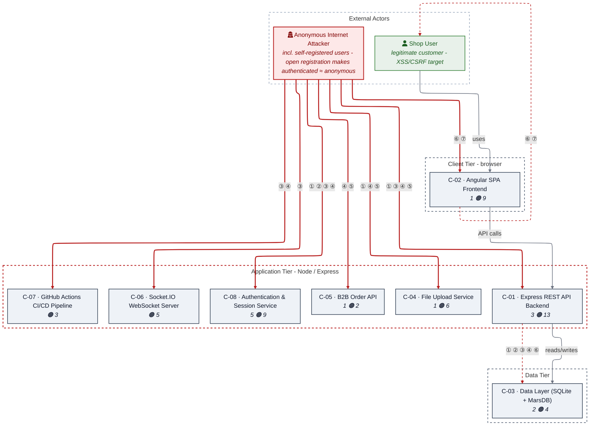

_Threats: ① Injection · ② Auth Bypass · ③ Priv-Esc · ④ Secret Exposure · ⑤ RCE · ⑥ XSS · ⑦ CSRF_

_Component badge: 🔴 = number of Critical findings on the component · 🟠 = number of High findings. Components with no Critical/High finding carry no badge._

**Figure 2 - Risk Flow: Actor → Tier → Impact**

Heatmap: **actors** (left) → **architecture tiers** (middle, Client → Application → Data) → **impact** (right). Numbered red arrows ①–⑦ are the threats enumerated in the Top Threats table below. Self-registration is open, so the **Authenticated Internet Attacker** tier is one POST away from anonymous - it is shown distinctly because a post-login endpoint is still a different attack surface.

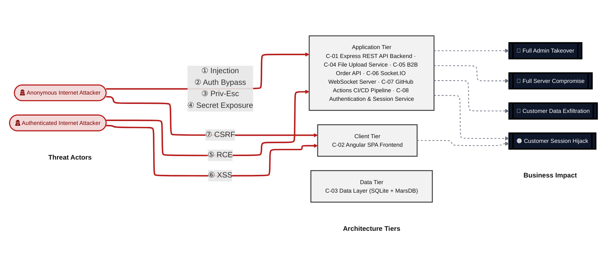

**Threat actors.** The actors below drive the numbered attack paths in the figures above; the Shop User is the *victim* of client-side attacks (XSS / CSRF), not an attacker.

- **Shop User** — legitimate customer; target of client-side attacks; target of ⑦ CSRF / Permissive CORS.
- **Anonymous Internet Attacker** — no account; registers in seconds when needed; drives ① Insecure Query Construction & Data Access, ② Hardcoded Secrets & Weak Cryptography, ③ Broken Authorization & Access Control, ④ Sensitive File & Secret Exposure.
- **Authenticated Internet Attacker** — owns a regular account; logged in; drives ⑤ Remote Code Execution (unsafe eval), ⑥ Output Encoding / Cross-Site Scripting.

**7 structural threats**, grouped by weakness class - each row is one threat, not one finding. *Threat Description* states the general architectural weakness (STRIDE in brackets); *Findings* lists the concrete instances, each linked to [§8 Findings Register](#8-findings-register) with its component; *Risk & Impact* combines severity with business consequence.

| # | Threat Description | Findings (→ Component) | Risk & Impact | Fix |
|---|------------------------------------|------------------------------------------------|------------------------------------|--------|
| <a id="path-injection"></a>① | **Insecure Query Construction & Data Access**<br/>_(T·I)_<br/>Attacker-controlled strings flow into raw<br/>SQL and NoSQL query construction, bypassing<br/>the ORM's parameter binding and enabling<br/>authentication bypass, full-table<br/>extraction, and review manipulation. | •&nbsp;🔴&nbsp;[F-001](#f-001) — SQL Injection Authentication Bypass (routes/login.ts:34) →&nbsp;[C-08](#c-08)<br/>•&nbsp;🔴&nbsp;[F-006](#f-006) — SQL Injection (routes/login.ts:34) →&nbsp;[C-01](#c-01)<br/>•&nbsp;🔴&nbsp;[F-007](#f-007) — SQL Injection UNION Extraction (routes/search.ts:23) →&nbsp;[C-01](#c-01)<br/>•&nbsp;🔴&nbsp;[F-008](#f-008) — XXE External Entity Injection (routes/fileUpload.ts:83) →&nbsp;[C-04](#c-04)<br/>•&nbsp;🟠&nbsp;[F-022](#f-022) — NoSQL Injection in Review Update (routes/updateProductReviews.ts:18) →&nbsp;[C-01](#c-01) | 🔴 **Critical**<br/>Full Admin Takeover · Customer Data<br/>Exfiltration | ❶ [M-004](#m-004)<br/>❶ [M-009](#m-009) |
| <a id="path-auth-bypass"></a>② | **Hardcoded Secrets & Weak Cryptography**<br/>_(S·E)_<br/>The JWT signing key, test account<br/>credentials, and algorithm-enforcement gaps<br/>allow an attacker to forge or acquire valid<br/>session tokens for any user including admin<br/>without knowledge of any real password. | •&nbsp;🔴&nbsp;[F-001](#f-001) — SQL Injection Authentication Bypass (routes/login.ts:34) →&nbsp;[C-08](#c-08)<br/>•&nbsp;🔴&nbsp;[F-002](#f-002) — Hardcoded RSA Private Key Enables Offline JWT Forgery (lib/insecurity.ts:23) →&nbsp;[C-08](#c-08)<br/>•&nbsp;🔴&nbsp;[F-003](#f-003) — JWT Algorithm Enforcement Absent (lib/insecurity.ts:54) →&nbsp;[C-08](#c-08)<br/>•&nbsp;🔴&nbsp;[F-004](#f-004) — Weak Password Hashing Algorithm (models/user.ts:77) →&nbsp;[C-03](#c-03)<br/>•&nbsp;🔴&nbsp;[F-005](#f-005) — Derived Password from Reversed E… (frontend/src/app/oauth/oauth.component.ts:30) →&nbsp;[C-02](#c-02)<br/>•&nbsp;🔴&nbsp;[F-009](#f-009) — Hardcoded Test Credentials in Source (routes/login.ts:60 66) →&nbsp;[C-08](#c-08)<br/>•&nbsp;🔴&nbsp;[F-010](#f-010) — Forged Admin JWT via Exposed Private Key (lib/insecurity.ts:23) →&nbsp;[C-08](#c-08)<br/>•&nbsp;🟠&nbsp;[F-021](#f-021) — MD5 Password Hashing Without Salt (lib/insecurity.ts:43) →&nbsp;[C-08](#c-08)<br/>•&nbsp;🟠&nbsp;[F-035](#f-035) — Hardcoded HMAC Key in Source (lib/insecurity.ts:44) →&nbsp;[C-08](#c-08)<br/>•&nbsp;🟠&nbsp;[F-040](#f-040) — Hardcoded HMAC Key for Security Answer Storage (models/securityAnswer.ts:46) →&nbsp;[C-03](#c-03)<br/>•&nbsp;🟠&nbsp;[F-041](#f-041) — Conditional XSS Sanitization Bypass in Product Model (models/product.ts:46) →&nbsp;[C-03](#c-03) | 🔴 **Critical**<br/>Full Admin Takeover · Customer Session<br/>Hijack | ❶ [M-004](#m-004)<br/>❶ [M-005](#m-005) |
| <a id="path-privilege-escalation"></a>③ | **Broken Authorization & Access Control**<br/>_(E·I)_<br/>Open user registration accepts a role<br/>parameter in the request body, and the<br/>model's validator treats admin as a valid<br/>role value, allowing any visitor to<br/>self-assign administrative privilege. | •&nbsp;🔴&nbsp;[F-012](#f-012) — Mass Assignment Admin Role Injection (server.ts:369) →&nbsp;[C-01](#c-01)<br/>•&nbsp;🔴&nbsp;[F-013](#f-013) — Mass Assignment of Admin Role (models/user.ts:83) →&nbsp;[C-03](#c-03)<br/>•&nbsp;🟠&nbsp;[F-015](#f-015) — Password Change Without Current Password Verifica… (routes/changePassword.ts:39) →&nbsp;[C-08](#c-08)<br/>•&nbsp;🟠&nbsp;[F-047](#f-047) — Challenge Notification Broadcast to… (lib/startup/registerWebsocketEvents.ts:30) →&nbsp;[C-06](#c-06)<br/>•&nbsp;🟠&nbsp;[F-056](#f-056) — Missing B2B Role Authorization (server.ts:645) →&nbsp;[C-01](#c-01)<br/>•&nbsp;🟠&nbsp;[F-059](#f-059) — Missing Authorization on Product Update Endpoint (server.ts:369) →&nbsp;[C-01](#c-01)<br/>•&nbsp;🟠&nbsp;[F-060](#f-060) — Missing Permissions Block Grants write all to CI W… (.github/workflows/ci.yml:1) →&nbsp;[C-07](#c-07)<br/>•&nbsp;🟡&nbsp;[F-077](#f-077) — Missing Ownership Check on Product Review U… (routes/updateProductReviews.ts:16) →&nbsp;[C-01](#c-01) | 🔴 **Critical**<br/>Full Admin Takeover | ❶ [M-015](#m-015)<br/>❶ [M-016](#m-016) |
| <a id="path-sensitive-data-exposure"></a>④ | **Sensitive File & Secret Exposure** _(I)_<br/>Hardcoded secrets committed to the public<br/>repository — RSA private key, HMAC key, CTF<br/>key, and plaintext admin credentials — are<br/>permanently accessible to anyone who reads<br/>the source history. | •&nbsp;🔴&nbsp;[F-002](#f-002) — Hardcoded RSA Private Key Enables Offline JWT Forgery (lib/insecurity.ts:23) →&nbsp;[C-08](#c-08)<br/>•&nbsp;🔴&nbsp;[F-004](#f-004) — Weak Password Hashing Algorithm (models/user.ts:77) →&nbsp;[C-03](#c-03)<br/>•&nbsp;🔴&nbsp;[F-009](#f-009) — Hardcoded Test Credentials in Source (routes/login.ts:60 66) →&nbsp;[C-08](#c-08)<br/>•&nbsp;🟠&nbsp;[F-026](#f-026) — Path Traversal via Archive Extraction (routes/fileUpload.ts:42) →&nbsp;[C-04](#c-04)<br/>•&nbsp;🟠&nbsp;[F-036](#f-036) — Full Application Configuration Exposed Without… (routes/appConfiguration.ts:10) →&nbsp;[C-01](#c-01)<br/>•&nbsp;🟠&nbsp;[F-037](#f-037) — Unauthenticated Access Log Exposure (routes/logfileServer.ts:14) →&nbsp;[C-01](#c-01)<br/>•&nbsp;🟠&nbsp;[F-038](#f-038) — Server Side Request Forgery via Profile Im… (routes/profileImageUrlUpload.ts:24) →&nbsp;[C-01](#c-01)<br/>•&nbsp;🟠&nbsp;[F-039](#f-039) — Unencrypted SQLite Database File on Disk (models/index.ts:38) →&nbsp;[C-03](#c-03)<br/>•&nbsp;🟠&nbsp;[F-042](#f-042) — Verbose Error Response Exposes Parsed File Content (routes/fileUpload.ts:87) →&nbsp;[C-04](#c-04)<br/>•&nbsp;🟠&nbsp;[F-045](#f-045) — Testing Credentials Hardcoded in… (frontend/src/app/login/login.component.ts:60) →&nbsp;[C-02](#c-02)<br/>•&nbsp;🟠&nbsp;[F-057](#f-057) — Null Byte Allowlist Bypass in FTP File Server (routes/fileServer.ts:27) →&nbsp;[C-01](#c-01)<br/>•&nbsp;🟡&nbsp;[F-065](#f-065) — Open Redirect via Substring Allowlist Bypass (lib/insecurity.ts:138) →&nbsp;[C-01](#c-01)<br/>•&nbsp;🟡&nbsp;[F-072](#f-072) — Stack Trace Disclosure via Unfiltered Error Propagation (routes/b2bOrder.ts:32) →&nbsp;[C-05](#c-05)<br/>•&nbsp;🟡&nbsp;[F-073](#f-073) — Webhook Secret Exposed to Cypress Test Environme… (.github/workflows/ci.yml:223) →&nbsp;[C-07](#c-07) | 🔴 **Critical**<br/>Customer Data Exfiltration · Full Admin<br/>Takeover | ❶ [M-005](#m-005)<br/>❶ [M-007](#m-007) |
| <a id="path-remote-code-execution"></a>⑤ | **Remote Code Execution (unsafe eval)** _(E)_<br/>Two routes pass user-supplied strings to<br/>JavaScript evaluators whose sandboxes are<br/>bypassable; an authenticated attacker can<br/>execute arbitrary OS commands on the Node.js<br/>server process. | •&nbsp;🔴&nbsp;[F-008](#f-008) — XXE External Entity Injection (routes/fileUpload.ts:83) →&nbsp;[C-04](#c-04)<br/>•&nbsp;🔴&nbsp;[F-011](#f-011) — JavaScript Sandbox Escape via notevil (routes/b2bOrder.ts:23) →&nbsp;[C-05](#c-05)<br/>•&nbsp;🟠&nbsp;[F-058](#f-058) — Server Side Template Injection via eval (routes/userProfile.ts:62) →&nbsp;[C-01](#c-01)<br/>•&nbsp;🟠&nbsp;[F-062](#f-062) — Unsafe YAML Deserialization Enabling Object Instanti… (routes/fileUpload.ts:117) →&nbsp;[C-04](#c-04) | 🔴 **Critical**<br/>Full Server Compromise | ❶ [M-011](#m-011)<br/>❶ [M-014](#m-014) |
| <a id="path-cross-site-scripting"></a>⑥ | **Output Encoding / Cross-Site Scripting**<br/>_(T·I)_<br/>Angular's HTML sanitizer is bypassed via<br/>bypassSecurityTrustHtml in six frontend<br/>components, and user-controlled input<br/>reaches Pug template compilation<br/>server-side, producing stored and DOM-based<br/>XSS vectors. | •&nbsp;🟠&nbsp;[F-025](#f-025) — Conditional XSS Sanitization Bypass in User Model (models/user.ts:49) →&nbsp;[C-03](#c-03)<br/>•&nbsp;🟠&nbsp;[F-027](#f-027) — Stored XSS via SVG Profile Image Upload (routes/profileImageUrlUpload.ts:28) →&nbsp;[C-04](#c-04)<br/>•&nbsp;🟠&nbsp;[F-028](#f-028) — Stored XSS via… (frontend/src/app/search result/search result.component.ts:132) →&nbsp;[C-02](#c-02)<br/>•&nbsp;🟠&nbsp;[F-029](#f-029) — Reflected DOM X… (frontend/src/app/search result/search result.component.ts:170) →&nbsp;[C-02](#c-02)<br/>•&nbsp;🟠&nbsp;[F-043](#f-043) — Stored XSS in About Page Feedba… (frontend/src/app/about/about.component.ts:119) →&nbsp;[C-02](#c-02)<br/>•&nbsp;🟠&nbsp;[F-044](#f-044) — Stored XSS in… (frontend/src/app/administration/administration.component.ts:60) →&nbsp;[C-02](#c-02)<br/>•&nbsp;🟠&nbsp;[F-046](#f-046) — JWT Stored in localStorage Acce… (frontend/src/app/login/login.component.ts:101) →&nbsp;[C-02](#c-02)<br/>•&nbsp;🟡&nbsp;[F-074](#f-074) — Stored XSS in La… (frontend/src/app/last login ip/last login ip.component.ts:39) →&nbsp;[C-02](#c-02)<br/>•&nbsp;🟢&nbsp;[F-078](#f-078) — Stored XSS in Trac… (frontend/src/app/track result/track result.component.ts:48) →&nbsp;[C-02](#c-02) | 🟠 **High**<br/>Customer Session Hijack | ❷ [M-028](#m-028)<br/>❷ [M-030](#m-030) |
| <a id="path-cross-site-request-forgery"></a>⑦ | **CSRF / Permissive CORS** _(S·T)_<br/>a permissive CORS policy plus missing<br/>anti-CSRF tokens let any external page issue<br/>authenticated state-changing requests in the<br/>victim's session. | •&nbsp;🟠&nbsp;[F-020](#f-020) — Password Change Endpoint Uses GET with Query Para… (routes/changePassword.ts:13) →&nbsp;[C-08](#c-08) | 🟠 **High**<br/>Customer Session Hijack | ❷ [M-023](#m-023) |

_STRIDE: S spoofing · T tampering · R repudiation · I information disclosure · D denial of service · E elevation of privilege. Risk, findings, components, impact and Fix are derived deterministically; only the one-line weakness description is authored._

**Verified attack chains.** 5 fully viable ([AC-T-002](#ac-t-002), [AC-T-003](#ac-t-003), [AC-T-004](#ac-t-004), [AC-T-005](#ac-t-005), [AC-T-006](#ac-t-006)); 1 partially blocked ([AC-T-001](#ac-t-001)). These chains combine individual findings into end-to-end exploitation paths verified step-by-step against the code - see [§9 Abuse Cases](#9-abuse-cases) for the per-step breakdown and blocking mitigations.

### Top Mitigations

Highest-impact P1/P2 mitigations - 13 of 62 qualifying (81 total). Full detail in [§10 Mitigation Register](#10-mitigation-register). All 13 mitigation(s) that fix a Critical finding are always listed here.

| # | Component | Mitigation | Addresses | Effort |
|---|----------------------|------------------------------------------------|------------------------------------------------|------|
| **1** | [C-01](#c-01) — Express REST API Backend | ❶ [M-009](#m-009) — Replace raw SQL in login route with parameterized Sequelize query | 🔴 [F-006](#f-006) — SQL Injection (routes/login.ts, "email") | Low |
| **2** | [C-01](#c-01) — Express REST API Backend | ❶ [M-010](#m-010) — Replace raw SQL in product search with parameterized Sequelize query | 🔴 [F-007](#f-007) — SQL Injection UNION Extraction (routes/search.ts, "q") | Low |
| **3** | [C-01](#c-01) — Express REST API Backend | ❶ [M-015](#m-015) — Add role to the finale-rest User resource excludeAttributes list | 🔴 [F-012](#f-012) — Mass Assignment Admin Role Injection (server.ts, "role") | Low |
| **4** | [C-02](#c-02) — Angular SPA Frontend | ❶ [M-008](#m-008) — Generate random passwords for OAuth-registered accounts and store them server-side, not client-side | 🔴 [F-005](#f-005) — Derived Password from Reversed E… (frontend/src/app/oauth/oauth.component.ts, "password") | Medium |
| **5** | [C-03](#c-03) — Data Layer (SQLite + MarsDB) | ❶ [M-016](#m-016) — Exclude the role field from the User model's writable API attributes | 🔴 [F-013](#f-013) — Mass Assignment of Admin Role (models/user.ts, "role") | Low |
| **6** | [C-03](#c-03) — Data Layer (SQLite + MarsDB) | ❶ [M-007](#m-007) — Replace MD5 with bcrypt or Argon2 in the User model password setter | 🔴 [F-004](#f-004) — Weak Password Hashing Algorithm (models/user.ts, "password") | Medium |
| **7** | [C-04](#c-04) — File Upload Service | ❶ [M-011](#m-011) — Remove noent option from libxmljs2 parseXml call and disable external entity loading | 🔴 [F-008](#f-008) — XXE External Entity Injection (routes/fileUpload.ts, "file (XML upload body)") | Low |
| **8** | [C-05](#c-05) — B2B Order API | ❶ [M-014](#m-014) — Remove vm.runInContext/notevil evaluation and replace orderLinesData with a validated schema | 🔴 [F-011](#f-011) — JavaScript Sandbox Escape via notevil (routes/b2bOrder.ts, "orderLinesData") | Medium |
| **9** | [C-08](#c-08) — Authentication & Session Service | ❶ [M-004](#m-004) — Replace raw SQL login query with parameterized Sequelize ORM call | 🔴 [F-001](#f-001) — SQL Injection Authentication Bypass (routes/login.ts, "email") | Low |
| **10** | [C-08](#c-08) — Authentication & Session Service | ❶ [M-006](#m-006) — Pin allowed algorithms to RS256 in expressJwt middleware configuration | 🔴 [F-003](#f-003) — JWT Algorithm Enforcement Absent (lib/insecurity.ts, "Authorization") | Low |
| **11** | [C-08](#c-08) — Authentication & Session Service | ❶ [M-005](#m-005) — Remove hardcoded RSA private key and load from environment-protected secret store | 🔴 [F-002](#f-002) — Hardcoded RSA Private Key Enables Offline JWT Forgery (lib/insecurity.ts) | Medium |
| **12** | [C-08](#c-08) — Authentication & Session Service | ❶ [M-012](#m-012) — Remove hardcoded credentials from source and enforce credential injection via environment secrets | 🔴 [F-009](#f-009) — Hardcoded Test Credentials in Source (routes/login.ts:60 66) | Medium |
| **13** | [C-08](#c-08) — Authentication & Session Service | ❶ [M-013](#m-013) — Rotate signing key pair and load private key from secrets management (deduplicates with auth-service-002) | 🔴 [F-010](#f-010) — Forged Admin JWT via Exposed Private Key (lib/insecurity.ts) | Medium |

*49 additional P1/P2 mitigations capped from the leader-board · 19 P3 backlog items in [§10 Mitigation Register](#10-mitigation-register). Sorted by priority (P1 first), then component, then leverage (most findings first), severity (Critical first), and effort (Low first).*

### Operational Strengths

Operational controls rated Adequate or Partial - grouped into broad clusters (full per-control breakdown in [§7](#7-security-architecture)). Clusters demoted to Weak by open Critical/High findings appear in [§7](#7-security-architecture) instead, not here.

| Strength | What's in Place | Effectiveness | Gap | Mitigates |
|----------------------|----------------------|-------------|----------------------|----------------|
| **Container & Supply-Chain Hardening** | _Build-time and runtime hardening - minimal<br/>base image, non-root execution, dependency<br/>inventory._<br/>Container Hardening<br/>Automated SCA scanning<br/>Dependency Scanning and SBOM | ✅ Adequate | - | - |
| **Hardened HTTP Stack** | _Browser-facing HTTP hardening - security<br/>headers, cookie flags, cross-origin policy,<br/>and abuse-protection limits._<br/>Rate Limiting | ⚠️ Partial | Bypassed by 2 High finding(s) of the kind this cluster is supposed to prevent - e.g. [F-020](#t-020), [F-038](#t-038). | - |


**Bottom line:** These controls narrow specific attack surfaces but none eliminates a Critical finding on its own.

---

<a id="critical-attack-chain"></a><a id="critical-attack-tree"></a>
## Critical Attack Tree

The root is the worst-case attacker goal; below it, each capability branch groups the Critical findings that achieve it. Branches feed the goal by OR - any single path suffices.

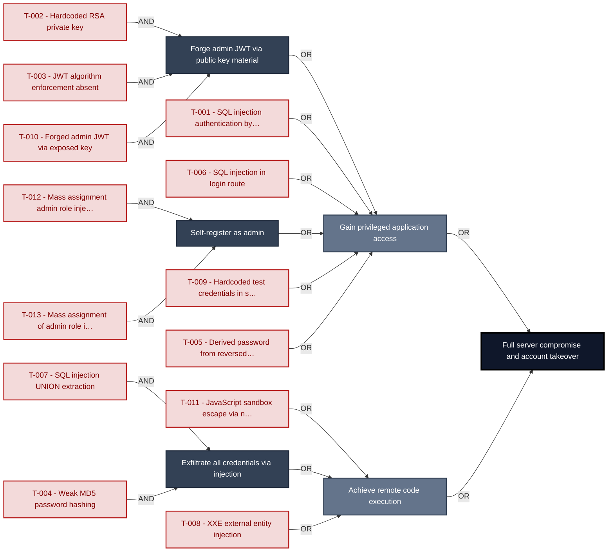

**Findings** (full detail in [§8 Findings Register](#8-findings-register)): 🔴 [F-002](#f-002) Hardcoded RSA private key · 🔴 [F-003](#f-003) JWT algorithm enforcement absent · 🔴 [F-001](#f-001) SQL injection authentication bypass · 🔴 [F-006](#f-006) SQL injection in login route · 🔴 [F-012](#f-012) Mass assignment admin role injection · 🔴 [F-013](#f-013) Mass assignment of admin role in model · 🔴 [F-009](#f-009) Hardcoded test credentials in source · 🔴 [F-005](#f-005) Derived password from reversed email · 🔴 [F-010](#f-010) Forged admin JWT via exposed key · 🔴 [F-011](#f-011) JavaScript sandbox escape via `notevil` · 🔴 [F-007](#f-007) SQL injection UNION extraction · 🔴 [F-004](#f-004) Weak `MD5` password hashing · 🔴 [F-008](#f-008) XXE external entity injection

---

## 1. System Overview

Probably the most modern and sophisticated insecure web application

**Repository:** https://github.com/juice-shop/juice-shop
**Runtime:** Node\.js 20 - 24

### Scope

This threat model covers 8 components of juice-shop: **Express REST API Backend**, **Angular SPA Frontend**, **Data Layer (SQLite + MarsDB)**, **File Upload Service**, **B2B Order API**, **Socket\.IO WebSocket Server**, **GitHub Actions CI/CD Pipeline**, **Authentication & Session Service**.

**Out of scope:** third-party hosted dependencies, browser runtime, operating-system kernel, and the underlying network infrastructure.

---

## 2. Architecture Diagrams

### 2.1 System Context

Who interacts with juice-shop from the outside, and through which channels. Solid arrows show normal usage; dashed red arrows mark unauthenticated probing or exploit paths (C4 Level 1).

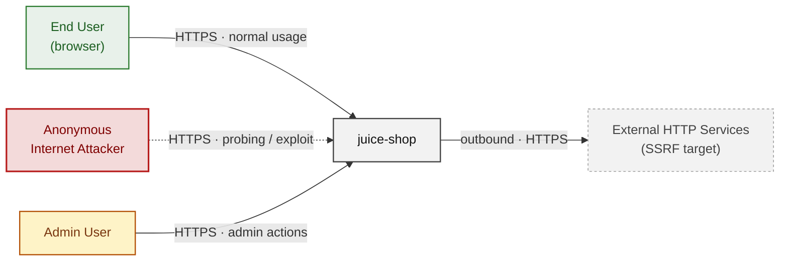

### 2.2 Container Architecture

How the system decomposes into deployable units. Each box is a separate runtime process or service container; arrows show synchronous request paths between them. Components with ≥3 Critical findings carry a red border, ≥2 High amber (C4 Level 2).

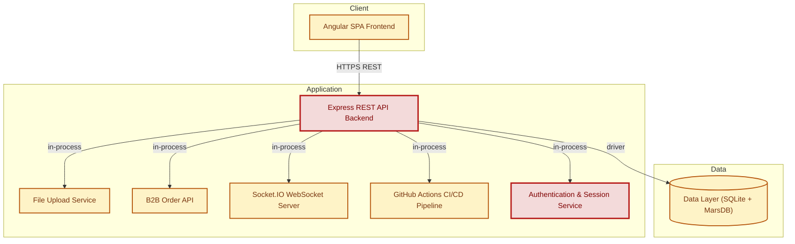

### 2.3 Components


Who reaches each component, and through which trust zone. Four columns map external actors to the internal tiers (Client / Application / Data); solid green arrows show legitimate data flow, dashed red arrows mark intrusion vectors. The component table directly below holds source paths and linked threats per `C-NN`; per-finding evidence is in [§8 Findings Register](#8-findings-register).

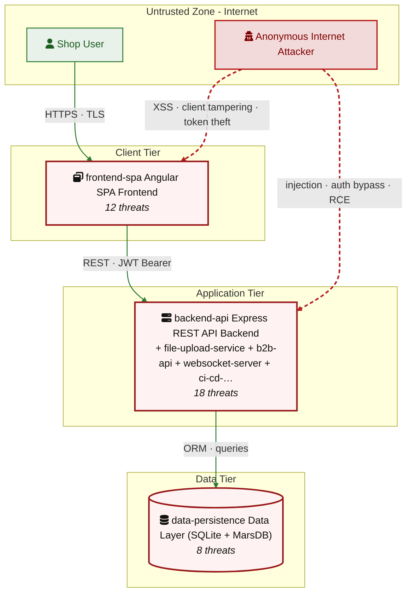

| ID | Name | Type | Key Paths | Linked Threats |
|----|----------------------|-----------|--------------------------------------|------------------------------------------------|
| <a id="c-01"></a><a id="backend-api"></a>C-01 | Express REST API Backend | application | `server.ts`<br/>`routes/**`<br/>`lib/**`<br/>`app.ts` | 🔴 [F-006](#f-006) — SQL Injection (routes/login.ts:34)<br/>🔴 [F-007](#f-007) — SQL Injection UNION Extraction (routes/search.ts:23)<br/>🔴 [F-012](#f-012) — Mass Assignment Admin Role Injection (server.ts:369)<br/>🟠 [F-016](#f-016) — Password Change Without Current Password Verifica… (routes/changePassword.ts:39)<br/>🔴 [F-022](#f-022) — NoSQL Injection in Review Update (routes/updateProductReviews.ts:18)<br/>🟠 [F-033](#f-033) — Missing Security Audit Log for Authentication and Data Mutation… (server.ts:338)<br/>🟠 [F-036](#f-036) — Full Application Configuration Exposed Without… (routes/appConfiguration.ts:10)<br/>🟠 [F-037](#f-037) — Unauthenticated Access Log Exposure (routes/logfileServer.ts:14)<br/>🟠 [F-038](#f-038) — Server Side Request Forgery via Profile Im… (routes/profileImageUrlUpload.ts:24)<br/>🟠 [F-051](#f-051) — Missing Rate Limiting on Login Endpoint (server.ts:594)<br/>🟠 [F-052](#f-052) — Rate Limit Bypass via Spoofed X Forwarded For (server.ts:346)<br/>🔴 [F-056](#f-056) — Missing B2B Role Authorization (server.ts:645)<br/>🟠 [F-057](#f-057) — Null Byte Allowlist Bypass in FTP File Server (routes/fileServer.ts:27)<br/>🔴 [F-058](#f-058) — Server Side Template Injection via eval (routes/userProfile.ts:62)<br/>🔴 [F-059](#f-059) — Missing Authorization on Product Update Endpoint (server.ts:369)<br/>🔴 [F-061](#f-061) — Missing Authentication on File Upload Endpoint (server.ts:309)<br/>🟡 [F-065](#f-065) — Open Redirect via Substring Allowlist Bypass (lib/insecurity.ts:138)<br/>🟡 [F-077](#f-077) — Missing Ownership Check on Product Review U… (routes/updateProductReviews.ts:16) |
| <a id="c-02"></a><a id="frontend-spa"></a>C-02 | Angular SPA Frontend | client | `frontend/src/**` | 🔴 [F-005](#f-005) — Derived Password from Reversed E… (frontend/src/app/oauth/oauth.component.ts:30)<br/>🟠 [F-017](#f-017) — OAuth Implicit Flow with Token… (frontend/src/app/login/login.component.ts:134)<br/>🟠 [F-018](#f-018) — Client Side Only AdminGuard Decodes JWT With… (frontend/src/app/app.guard.ts:48)<br/>🔴 [F-028](#f-028) — Stored XSS via… (frontend/src/app/search result/search result.component.ts:132)<br/>🔴 [F-029](#f-029) — Reflected DOM X… (frontend/src/app/search result/search result.component.ts:170)<br/>🔴 [F-043](#f-043) — Stored XSS in About Page Feedba… (frontend/src/app/about/about.component.ts:119)<br/>🔴 [F-044](#f-044) — Stored XSS in… (frontend/src/app/administration/administration.component.ts:60)<br/>🟠 [F-045](#f-045) — Testing Credentials Hardcoded in… (frontend/src/app/login/login.component.ts:60)<br/>🟠 [F-046](#f-046) — JWT Stored in localStorage Acce… (frontend/src/app/login/login.component.ts:101)<br/>🟠 [F-063](#f-063) — Client Side Route Guards Provide No Security… (frontend/src/app/app.guard.ts:64)<br/>🔴 [F-074](#f-074) — Stored XSS in La… (frontend/src/app/last login ip/last login ip.component.ts:39)<br/>🔴 [F-078](#f-078) — Stored XSS in Trac… (frontend/src/app/track result/track result.component.ts:48) |
| <a id="c-03"></a><a id="data-persistence"></a>C-03 | Data Layer (SQLite + MarsDB) | data | `models/**`<br/>`data/mongodb.ts`<br/>`data/datacache.ts`<br/>`data/datacreator.ts` | 🔴 [F-004](#f-004) — Weak Password Hashing Algorithm (models/user.ts:77)<br/>🔴 [F-013](#f-013) — Mass Assignment of Admin Role (models/user.ts:83)<br/>🔴 [F-025](#f-025) — Conditional XSS Sanitization Bypass in User Model (models/user.ts:49)<br/>🟠 [F-039](#f-039) — Unencrypted SQLite Database File on Disk (models/index.ts:38)<br/>🔴 [F-040](#f-040) — Hardcoded HMAC Key for Security Answer Storage (models/securityAnswer.ts:46)<br/>🟠 [F-041](#f-041) — Conditional XSS Sanitization Bypass in Product Model (models/product.ts:46)<br/>🟡 [F-070](#f-070) — Missing Audit Logging on Security Relevant Model Mutations (models/user.ts)<br/>🟡 [F-076](#f-076) — No Query Timeout or Result Size Limit on Sequelize Instance (models/index.ts:30) |
| <a id="c-04"></a><a id="file-upload-service"></a>C-04 | File Upload Service | application | `routes/fileUpload.ts`<br/>`routes/profileImageUrlUpload.ts`<br/>`routes/profileImageFileUpload.ts` | 🔴 [F-008](#f-008) — XXE External Entity Injection (routes/fileUpload.ts:83)<br/>🟠 [F-026](#f-026) — Path Traversal via Archive Extraction (routes/fileUpload.ts:42)<br/>🔴 [F-027](#f-027) — Stored XSS via SVG Profile Image Upload (routes/profileImageUrlUpload.ts:28)<br/>🟠 [F-034](#f-034) — Missing Security Audit Log for File Upload Events (routes/fileUpload.ts)<br/>🟠 [F-042](#f-042) — Verbose Error Response Exposes Parsed File Content (routes/fileUpload.ts:87)<br/>🟠 [F-053](#f-053) — Parser Amplification via YAML Bomb and XXE Billion L… (routes/fileUpload.ts:117)<br/>🔴 [F-062](#f-062) — Unsafe YAML Deserialization Enabling Object Instanti… (routes/fileUpload.ts:117) |
| <a id="c-05"></a><a id="b2b-api"></a>C-05 | B2B Order API | application | `routes/b2bOrder.ts` | 🔴 [F-011](#f-011) — JavaScript Sandbox Escape via notevil (routes/b2bOrder.ts:23)<br/>🟠 [F-032](#f-032) — Missing Security Audit Log for B2B Order Submissions (routes/b2bOrder.ts)<br/>🟠 [F-050](#f-050) — Unbounded orderLinesData Payload with No Rate Limiting (routes/b2bOrder.ts:19)<br/>🟡 [F-066](#f-066) — Unvalidated Customer ID Reflected in Order Response (routes/b2bOrder.ts:24)<br/>🟡 [F-072](#f-072) — Stack Trace Disclosure via Unfiltered Error Propagation (routes/b2bOrder.ts:32) |
| <a id="c-06"></a><a id="websocket-server"></a>C-06 | Socket\.IO WebSocket Server | application | `lib/startup/registerWebsocketEvents.ts` | 🔴 [F-019](#f-019) — Unauthenticated WebSocket Connectio… (lib/startup/registerWebsocketEvents.ts:24)<br/>🔴 [F-030](#f-030) — Unauthenticated Challenge Solve via… (lib/startup/registerWebsocketEvents.ts:41)<br/>🔴 [F-047](#f-047) — Challenge Notification Broadcast to… (lib/startup/registerWebsocketEvents.ts:30)<br/>🟠 [F-054](#f-054) — No Connection Rate Limit or Message… (lib/startup/registerWebsocketEvents.ts:20)<br/>🟠 [F-064](#f-064) — Game Score Manipulation via Unauthe… (lib/startup/registerWebsocketEvents.ts:50)<br/>🟡 [F-071](#f-071) — No Audit Logging of WebSocket Event… (lib/startup/registerWebsocketEvents.ts:34) |
| <a id="c-07"></a><a id="ci-cd-pipeline"></a>C-07 | GitHub Actions CI/CD Pipeline | application | `.github/workflows/**`<br/>`Dockerfile`<br/>`docker-compose.test.yml` | 🟠 [F-023](#f-023) — Unpinned GitHub Action Tag Floating Version (.github/workflows/ci.yml:161)<br/>🟠 [F-024](#f-024) — Remote Script Execution via curl Pipe in CI Runn… (.github/workflows/ci.yml:326)<br/>🟠 [F-060](#f-060) — Missing Permissions Block Grants write all to CI W… (.github/workflows/ci.yml:1)<br/>🟡 [F-067](#f-067) — Unpinned GitHub Action Tags CodeQL A… (.github/workflows/codeql analysis.yml:23)<br/>🟡 [F-068](#f-068) — Unpinned Docker Image Tag in CI Smoke Test (docker compose.test.yml:8)<br/>🟡 [F-069](#f-069) — No SLSA Build Provenance for Published Docker Images (Dockerfile)<br/>🟡 [F-073](#f-073) — Webhook Secret Exposed to Cypress Test Environme… (.github/workflows/ci.yml:223)<br/>🟡 [F-075](#f-075) — No CI Concurrency Groups on PR Triggered Workflows (.github/workflows/ci.yml:14) |
| <a id="c-08"></a><a id="auth-service"></a>C-08 | Authentication & Session Service | application | `lib/insecurity.ts`<br/>`routes/login.ts`<br/>`routes/2fa.ts`<br/>`routes/resetPassword.ts`<br/>`routes/changePassword.ts` | 🔴 [F-001](#f-001) — SQL Injection Authentication Bypass (routes/login.ts:34)<br/>🔴 [F-002](#f-002) — Hardcoded RSA Private Key Enables Offline JWT Forgery (lib/insecurity.ts:23)<br/>🔴 [F-003](#f-003) — JWT Algorithm Enforcement Absent (lib/insecurity.ts:54)<br/>🔴 [F-009](#f-009) — Hardcoded Test Credentials in Source (routes/login.ts:60 66)<br/>🔴 [F-010](#f-010) — Forged Admin JWT via Exposed Private Key (lib/insecurity.ts:23)<br/>🟠 [F-014](#f-014) — Derived Password Predictable from Email Claim (routes/login.ts:65)<br/>🟠 [F-015](#f-015) — Password Change Without Current Password Verifica… (routes/changePassword.ts:39)<br/>🟠 [F-020](#f-020) — Password Change Endpoint Uses GET with Query Para… (routes/changePassword.ts:13)<br/>🟠 [F-021](#f-021) — MD5 Password Hashing Without Salt (lib/insecurity.ts:43)<br/>🟠 [F-031](#f-031) — No Audit Logging for Authentication Events<br/>🔴 [F-035](#f-035) — Hardcoded HMAC Key in Source (lib/insecurity.ts:44)<br/>🟠 [F-048](#f-048) — No Brute Force Protection on Login Endpoint (server.ts:594)<br/>🟠 [F-049](#f-049) — Unbounded In Memory Session Store (lib/insecurity.ts:73)<br/>🟠 [F-055](#f-055) — No Server Side JWT Revocation on Logout or Password Change |
### 2.4 Technology Architecture

The technology stack the system is built on. Each box names the framework or runtime that fills that role; per-component findings live in the [§2.3](#23-components) component table above, and the full per-finding catalogue is in [§8 Findings Register](#8-findings-register).

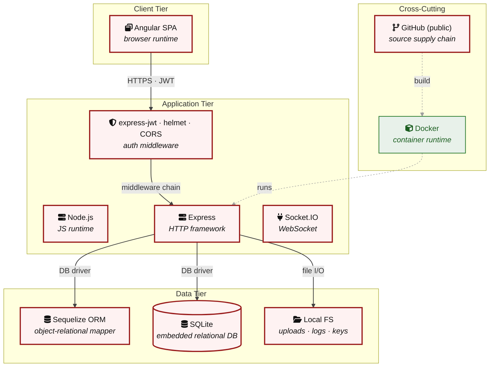

> **Legend:** **red border** ≥ 3 Critical threats on the component · **amber border** ≥ 2 High threats

---

## 3. Attack Walkthroughs

This section walks through how the highest-risk findings are exploited - one short walkthrough per Critical, each with attack steps, a focused sequence diagram, and the primary mitigation. The cross-finding view (which weaknesses combine toward the worst-case goal, and where one fix severs several paths) is in the [Critical Attack Tree](#critical-attack-tree). Full per-finding context - severity rationale, assets, detection signals - is in the [§8 Findings Register](#8-findings-register) row for each finding.

### 3.1 SQL Injection Authentication Bypass (routes/login.ts:34)

**Source:** 🔴 [F-001](#f-001) — `routes/login.ts:34`

Severity **Critical** ([CWE-287](https://cwe.mitre.org/data/definitions/287.html)). STRIDE: Spoofing. See [§8 T-001](#t-001) for the full register row.

**Attack Steps**

1. The login handler at `routes/login.ts:34` constructs a raw Sequelize query by interpolating `req.body.email` directly into the SQL string: `SELECT * FROM Users WHERE email = '${req.body.email || ''}' AND password = '…'`.
2. Submitting `' OR '1'='1` as the email value short-circuits the WHERE clause and returns the first user row - which is the seeded admin account.
3. With `plain: true`, the handler proceeds to issue a valid JWT for the admin user, granting full admin session without knowing any password.

**Sequence Diagram**


**Key takeaway:** Until ❶ [M-004](#m-004) (Replace raw SQL login query with parameterized Sequelize ORM) lands, T-001 is exploitable at `routes/login.ts:34` (Critical-severity, [CWE-287](https://cwe.mitre.org/data/definitions/287.html)).

**Defense in Depth**

- Primary mitigation: ❶ [M-004](#m-004) (Replace raw SQL login query with parameterized Sequelize ORM call)

### 3.2 Hardcoded RSA Private Key Enables Offline JWT Forgery…

**Source:** 🔴 [F-002](#f-002) — `lib/insecurity.ts:23`

Severity **Critical** ([CWE-321](https://cwe.mitre.org/data/definitions/321.html)). STRIDE: Spoofing. See [§8 T-002](#t-002) for the full register row.

**Attack Steps**

1. The RSA private key used to sign all JWTs is hardcoded as a string literal at `lib/insecurity.ts:23` and is committed to the public GitHub repository.
2. Any person who reads the source (or clones the repo) can extract the private key, sign a JWT payload containing `{"data":{"role":"admin","email":"attacker@example.com"}}`, and present it to the application.
3. The key is also used as the HMAC key in `deluxeToken()` at line 152, allowing generation of valid deluxe-role tokens for arbitrary email addresses.

**Sequence Diagram**

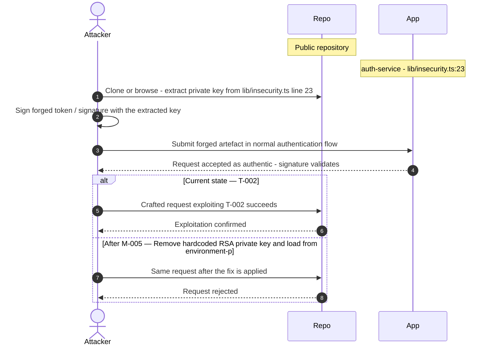

**Key takeaway:** Until ❶ [M-005](#m-005) (Remove hardcoded RSA private key and load from environment-p) lands, T-002 is exploitable at `lib/insecurity.ts:23` (Critical-severity, [CWE-321](https://cwe.mitre.org/data/definitions/321.html)).

**Defense in Depth**

- Primary mitigation: ❶ [M-005](#m-005) (Remove hardcoded RSA private key and load from environment-protected secret store)

### 3.3 JWT Algorithm Enforcement Absent (lib/insecurity.ts:54)

**Source:** 🔴 [F-003](#f-003) — `lib/insecurity.ts:54`

Severity **Critical** ([CWE-347](https://cwe.mitre.org/data/definitions/347.html)). STRIDE: Spoofing. See [§8 T-003](#t-003) for the full register row.

**Attack Steps**

1. express-jwt 0.1.3 is configured at `lib/insecurity.ts:54` as `expressJwt({ secret: publicKey })` with no `algorithms` allowlist.
2. This version of express-jwt and the underlying jsonwebtoken 0.4.0 do not reject tokens with `alg: 'none'` in the header.
3. An unauthenticated attacker can craft a JWT with `{"alg":"none"}`, set any `data.role` to `admin`, strip the signature, and submit it to any `isAuthorized()`-protected endpoint.

**Sequence Diagram**


**Key takeaway:** Until ❶ [M-006](#m-006) (Pin allowed algorithms to `RS256` in expressJwt middleware con) lands, T-003 is exploitable at `lib/insecurity.ts:54` (Critical-severity, [CWE-347](https://cwe.mitre.org/data/definitions/347.html)).

**Defense in Depth**

- Primary mitigation: ❶ [M-006](#m-006) (Pin allowed algorithms to `RS256` in expressJwt middleware configuration)

### 3.4 Weak Password Hashing Algorithm (models/user.ts:77)

**Source:** 🔴 [F-004](#f-004) — `models/user.ts:77`

Severity **Critical** ([CWE-916](https://cwe.mitre.org/data/definitions/916.html)). STRIDE: Spoofing. See [§8 T-004](#t-004) for the full register row.

**Attack Steps**

1. `models/user.ts:77` calls `security.hash(clearTextPassword)`, which resolves to `crypto.createHash('md5')` in `lib/insecurity.ts:43`.
2. Passwords are stored as unsalted `MD5` hashes in the `Users` table.
3. An attacker who obtains the database via SQL injection (e.g.

**Sequence Diagram**

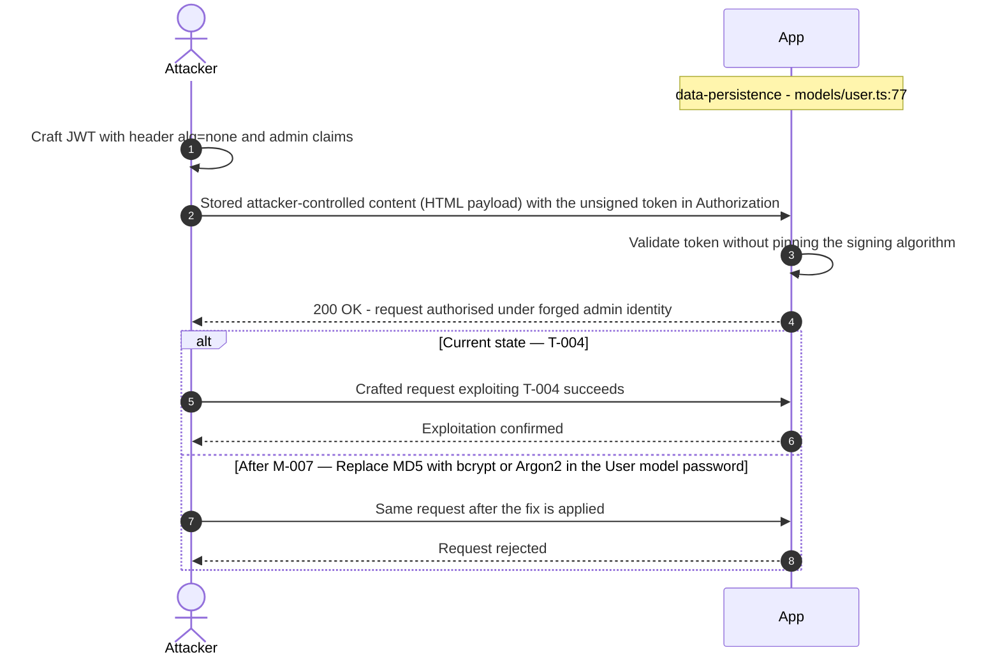

**Key takeaway:** Until ❶ [M-007](#m-007) (Replace `MD5` with bcrypt or Argon2 in the User model password) lands, T-004 is exploitable at `models/user.ts:77` (Critical-severity, [CWE-916](https://cwe.mitre.org/data/definitions/916.html)).

**Defense in Depth**

- Primary mitigation: ❶ [M-007](#m-007) (Replace `MD5` with bcrypt or Argon2 in the User model password setter)

### 3.5 Derived Password from Reversed E……

**Source:** 🔴 [F-005](#f-005) — `frontend/src/app/oauth/oauth.component.ts:30`

Severity **Critical** ([CWE-522](https://cwe.mitre.org/data/definitions/522.html)). STRIDE: Spoofing. See [§8 T-005](#t-005) for the full register row.

**Attack Steps**

1. After Google OAuth returns an access token, `oauth.component.ts` retrieves the user profile and derives a password: `const password = btoa(profile.email.split('').reverse().join(''))`.
2. This password is then used to register (`userService.save`) or log in (`userService.login`) the user at the Juice Shop backend.
3. Because the derivation algorithm is deterministic and public (visible in the compiled JS bundle), any attacker who knows a victim's Google email address can compute the identical password and authenticate directly at `POST /rest/user/login` without going through Google at all.

**Sequence Diagram**


**Key takeaway:** Until ❶ [M-008](#m-008) (Generate random passwords for OAuth-registered accounts and ) lands, T-005 is exploitable at `frontend/src/app/oauth/oauth.component.ts:30` (Critical-severity, [CWE-522](https://cwe.mitre.org/data/definitions/522.html)).

**Defense in Depth**

- Primary mitigation: ❶ [M-008](#m-008) (Generate random passwords for OAuth-registered accounts and store them server-side, not client-side)

### 3.6 SQL Injection (routes/login.ts:34)

**Source:** 🔴 [F-006](#f-006) — `routes/login.ts:34`

Severity **Critical** ([CWE-89](https://cwe.mitre.org/data/definitions/89.html)). STRIDE: Tampering. See [§8 T-006](#t-006) for the full register row.

**Attack Steps**

1. `routes/login.ts:34` interpolates `req.body.email` and the `MD5` hash of `req.body.password` into a raw Sequelize query: `` SELECT * FROM Users WHERE email = '\${req.body.email || ''}' AND password = '…' ``.
2. Submitting `' OR '1'='1'--` as the email bypasses the WHERE clause and returns the first user row (the seeded `admin@juice-sh.op` account).
3. The same payload can be extended to UNION-based extraction of all user rows and password hashes.

**Sequence Diagram**


**Key takeaway:** Until ❶ [M-009](#m-009) (Replace raw SQL in login route with parameterized Sequelize ) lands, T-006 is exploitable at `routes/login.ts:34` (Critical-severity, [CWE-89](https://cwe.mitre.org/data/definitions/89.html)).

**Defense in Depth**

- Primary mitigation: ❶ [M-009](#m-009) (Replace raw SQL in login route with parameterized Sequelize query)

### 3.7 SQL Injection UNION Extraction (routes/search.ts:23)

**Source:** 🔴 [F-007](#f-007) — `routes/search.ts:23`

Severity **Critical** ([CWE-89](https://cwe.mitre.org/data/definitions/89.html)). STRIDE: Tampering. See [§8 T-007](#t-007) for the full register row.

**Attack Steps**

1. `routes/search.ts:23` interpolates `req.query.q` into a raw `SELECT` covering both `name` and `description` columns: `` SELECT * FROM Products WHERE ((name LIKE '%\${criteria}%' OR description LIKE '%\${criteria}%') AND deletedAt IS NULL) ORDER BY name ``.
2. A UNION injection payload such as `')) UNION SELECT sql,2,3,4,5,6,7,8,9 FROM sqlite_master--` extracts the full database schema.
3. Credentials can be extracted with a follow-up `` UNION SELECT email,password,3,4,5,6,7,8,9 FROM Users-- `` query.

**Sequence Diagram**

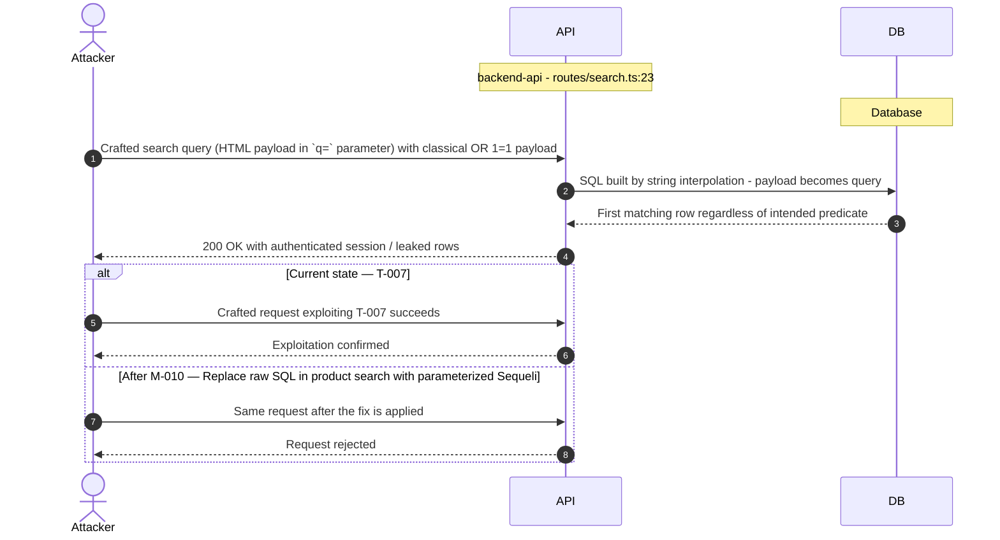

**Key takeaway:** Until ❶ [M-010](#m-010) (Replace raw SQL in product search with parameterized Sequeli) lands, T-007 is exploitable at `routes/search.ts:23` (Critical-severity, [CWE-89](https://cwe.mitre.org/data/definitions/89.html)).

**Defense in Depth**

- Primary mitigation: ❶ [M-010](#m-010) (Replace raw SQL in product search with parameterized Sequelize query)

### 3.8 XXE External Entity Injection (routes/fileUpload.ts:83)

**Source:** 🔴 [F-008](#f-008) — `routes/fileUpload.ts:83`

Severity **Critical** ([CWE-611](https://cwe.mitre.org/data/definitions/611.html)). STRIDE: Tampering. See [§8 T-008](#t-008) for the full register row.

**Attack Steps**

1. `fileUpload.ts:83` calls `libxml.parseXml(data, { noblanks: true, noent: true, nocdata: true })` inside a `vm.runInContext` sandbox.
2. The `noent: true` option instructs `libxmljs2` to expand external XML entities before returning the parsed document.
3. An attacker uploads a multipart XML file containing `<!DOCTYPE foo [<!ENTITY xxe SYSTEM "file:///etc/passwd">]><foo>&xxe;</foo>`.

**Sequence Diagram**

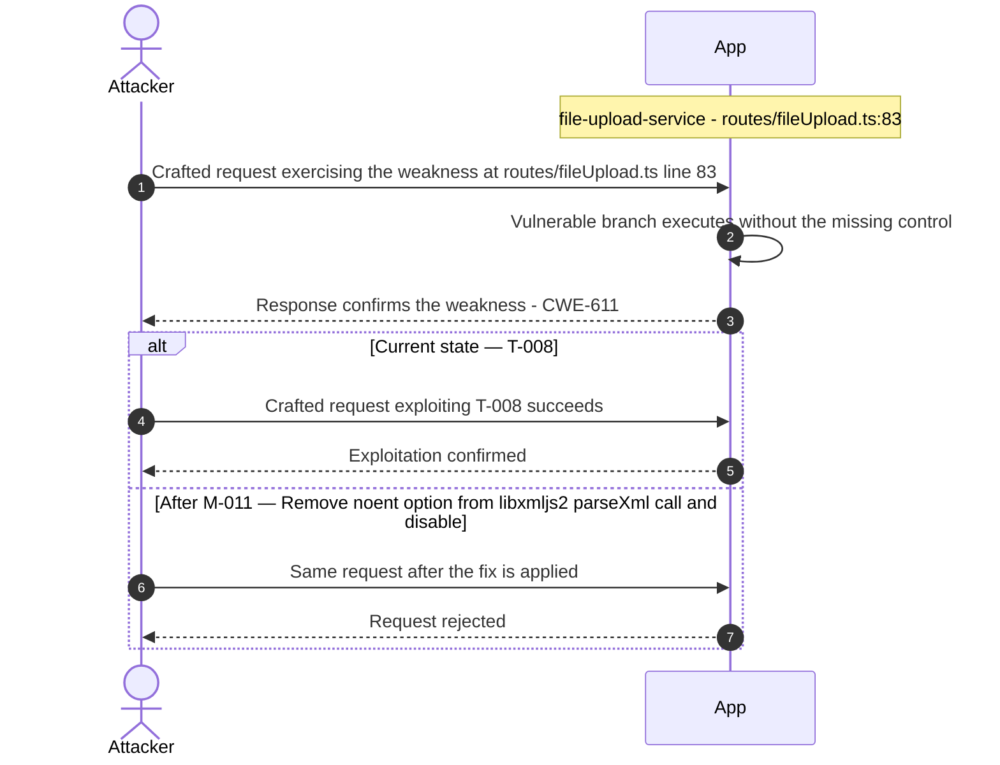

**Key takeaway:** Until ❶ [M-011](#m-011) (Remove noent option from libxmljs2 parseXml call and disable) lands, T-008 is exploitable at `routes/fileUpload.ts:83` (Critical-severity, [CWE-611](https://cwe.mitre.org/data/definitions/611.html)).

**Defense in Depth**

- Primary mitigation: ❶ [M-011](#m-011) (Remove noent option from libxmljs2 parseXml call and disable external entity loading)

### 3.9 Hardcoded Test Credentials in Source (routes/login.ts:60 66)

**Source:** 🔴 [F-009](#f-009) — `routes/login.ts:60`

Severity **Critical** ([CWE-312](https://cwe.mitre.org/data/definitions/312.html)). STRIDE: Information Disclosure. See [§8 T-009](#t-009) for the full register row.

**Attack Steps**

1. The `verifyPreLoginChallenges` function at `routes/login.ts:60`–66 contains hardcoded plaintext passwords for seven accounts including `admin@`, `support@`, and `mc.safesearch@`.
2. The support account password `J6aVjTgOpRs@?5l!Zkq2AYnCE@RF$P` is a high-complexity passphrase; however, by hardcoding it in a public repository, any attacker who reads the source can authenticate as these privileged accounts immediately.
3. This is distinct from the RSA key finding - the credentials here are the actual authentication secrets for real accounts.

**Sequence Diagram**


**Key takeaway:** Until ❶ [M-012](#m-012) (Remove hardcoded credentials from source and enforce credent) lands, T-009 is exploitable at `routes/login.ts:60` (Critical-severity, [CWE-312](https://cwe.mitre.org/data/definitions/312.html)).

**Defense in Depth**

- Primary mitigation: ❶ [M-012](#m-012) (Remove hardcoded credentials from source and enforce credential injection via environment secrets)

### 3.10 Forged Admin JWT via Exposed Private Key…

**Source:** 🔴 [F-010](#f-010) — `lib/insecurity.ts:56`

Severity **Critical** ([CWE-290](https://cwe.mitre.org/data/definitions/290.html)). STRIDE: Elevation of Privilege. See [§8 T-010](#t-010) for the full register row.

**Attack Steps**

1. With the RSA private key exposed in source (`lib/insecurity.ts:23`), an attacker can mint a JWT containing `{"data":{"role":"admin","email":"admin@juice-sh.op","id":1}}` and sign it with `RS256` using the known key.
2. The `isAuthorized()` middleware at line 54 and role checks in `isAccounting()` at line 156 and `isDeluxe()` at line 167 all rely on verifying the JWT signature against the public key - which passes for the attacker's forged token.
3. `deluxeToken()` at line 152 uses the private key as an HMAC key, so the attacker can also generate valid `deluxeToken` values for any email.

**Sequence Diagram**


**Key takeaway:** Until ❶ [M-013](#m-013) (Rotate signing key pair and load private key from secrets ma) lands, T-010 is exploitable at `lib/insecurity.ts:56` (Critical-severity, [CWE-290](https://cwe.mitre.org/data/definitions/290.html)).

**Defense in Depth**

- Primary mitigation: ❶ [M-013](#m-013) (Rotate signing key pair and load private key from secrets management (deduplicates with auth-service-002))

### 3.11 JavaScript Sandbox Escape via notevil…

**Source:** 🔴 [F-011](#f-011) — `routes/b2bOrder.ts:23`

Severity **Critical** ([CWE-94](https://cwe.mitre.org/data/definitions/94.html)). STRIDE: Elevation of Privilege. See [§8 T-011](#t-011) for the full register row.

**Attack Steps**

1. `body.orderLinesData` flows without any validation into `vm.runInContext('safeEval(orderLinesData)', sandbox, {timeout: 2000})` at `routes/b2bOrder.ts:23`.
2. The `notevil` library is a limited safe-eval subset, but its sandbox is escapable via prototype pollution: an attacker submits a payload such as `({}).__proto__.constructor('return process')().mainModule.require('child_process').execSync('id')` which walks `__proto__` to reach the host `Function` constructor, bypassing `notevil`'s restrictions entirely.
3. The `vm.createContext` wrapper does not prevent prototype chain traversal.

**Sequence Diagram**


**Key takeaway:** Until ❶ [M-014](#m-014) (Remove `vm.runInContext`/`notevil` evaluation and replace orderL) lands, T-011 is exploitable at `routes/b2bOrder.ts:23` (Critical-severity, [CWE-94](https://cwe.mitre.org/data/definitions/94.html)).

**Defense in Depth**

- Primary mitigation: ❶ [M-014](#m-014) (Remove `vm.runInContext`/`notevil` evaluation and replace orderLinesData with a validated schema)

### 3.12 Mass Assignment Admin Role Injection (server.ts:369)

**Source:** 🔴 [F-012](#f-012) — `server.ts:483`

Severity **Critical** ([CWE-915](https://cwe.mitre.org/data/definitions/915.html)). STRIDE: Elevation of Privilege. See [§8 T-012](#t-012) for the full register row.

**Attack Steps**

1. The `finale-rest` auto-resource for `/api/Users` passes the entire request body to `UserModel.create()`.
2. The `autoModels` array at `server.ts:483` lists `User` with `exclude: ['password', 'totpSecret']` - `role` is not excluded.
3. An unauthenticated `POST /api/Users` with body `{ "email": "evil@x.com", "password": "pw", "passwordRepeat": "pw", "role": "admin" }` creates a user with `role = 'admin'`.

**Sequence Diagram**


**Key takeaway:** Until ❶ [M-015](#m-015) (Add role to the finale-rest User resource excludeAttributes ) lands, T-012 is exploitable at `server.ts:483` (Critical-severity, [CWE-915](https://cwe.mitre.org/data/definitions/915.html)).

**Defense in Depth**

- Primary mitigation: ❶ [M-015](#m-015) (Add role to the finale-rest User resource excludeAttributes list)

### 3.13 Mass Assignment of Admin Role (models/user.ts:83)

**Source:** 🔴 [F-013](#f-013) — `models/user.ts:83`

Severity **Critical** ([CWE-915](https://cwe.mitre.org/data/definitions/915.html)). STRIDE: Elevation of Privilege. See [§8 T-013](#t-013) for the full register row.

**Attack Steps**

1. `models/user.ts:83` defines the `role` field with a Sequelize `isIn` validator accepting `['customer', 'deluxe', 'accounting', 'admin']`.
2. The `finale` REST generator at `server.ts:482-483` exposes `POST /api/Users` with only `password` and `totpSecret` excluded from writable fields - `role` is not excluded.
3. An unauthenticated caller sends `{"email":"x@x.com","password":"pass","role":"admin"}` to `POST /api/Users`.

**Sequence Diagram**


**Key takeaway:** Until ❶ [M-016](#m-016) (Exclude the role field from the User model's writable API at) lands, T-013 is exploitable at `models/user.ts:83` (Critical-severity, [CWE-915](https://cwe.mitre.org/data/definitions/915.html)).

**Defense in Depth**

- Primary mitigation: ❶ [M-016](#m-016) (Exclude the role field from the User model's writable API attributes)

<!-- generated:walkthrough_renderer -->

---

## 4. Assets

Information assets and the classification level that drives the Confidentiality / Integrity / Availability targets used in [§8 Findings Register](#8-findings-register) risk scoring.

| Asset | ID | Classification | Description | Linked Threats |
|----------------------|-----|--------------|------------------------------------|------------------------------------------------|
| RSA JWT Private Key | A-002 | Restricted | RSA-1024 private key hardcoded in<br/>`lib/insecurity.ts:23`. Used to sign all JWTs.<br/>Permanently committed to public GitHub<br/>repository — any party can forge tokens for<br/>any user/role. | 🔴 [F-002](#f-002) — Hardcoded RSA Private Key Enables Offline JWT Forgery (lib/insecurity.ts:23)<br/>🔴 [F-003](#f-003) — JWT Algorithm Enforcement Absent (lib/insecurity.ts:54)<br/>🔴 [F-009](#f-009) — Hardcoded Test Credentials in Source (routes/login.ts:60 66)<br/>🔴 [F-010](#f-010) — Forged Admin JWT via Exposed Private Key (lib/insecurity.ts:23)<br/>🟠 [F-021](#f-021) — MD5 Password Hashing Without Salt (lib/insecurity.ts:43)<br/>🟠 [F-026](#f-026) — Path Traversal via Archive Extraction (routes/fileUpload.ts:42)<br/>🔴 [F-035](#f-035) — Hardcoded HMAC Key in Source (lib/insecurity.ts:44)<br/>🟠 [F-036](#f-036) — Full Application Configuration Exposed Without… (routes/appConfiguration.ts:10)<br/>🔴 [F-040](#f-040) — Hardcoded HMAC Key for Security Answer Storage (models/securityAnswer.ts:46)<br/>🟠 [F-045](#f-045) — Testing Credentials Hardcoded in… (frontend/src/app/login/login.component.ts:60)<br/>🟠 [F-049](#f-049) — Unbounded In Memory Session Store (lib/insecurity.ts:73)<br/>🟠 [F-055](#f-055) — No Server Side JWT Revocation on Logout or Password Change<br/>🟠 [F-057](#f-057) — Null Byte Allowlist Bypass in FTP File Server (routes/fileServer.ts:27)<br/>🟠 [F-060](#f-060) — Missing Permissions Block Grants write all to CI W… (.github/workflows/ci.yml:1)<br/>🟡 [F-065](#f-065) — Open Redirect via Substring Allowlist Bypass (lib/insecurity.ts:138) |
| Encryption Keys Directory | A-006 | Restricted | encryptionkeys/ directory containing `jwt.pub`<br/>(RSA public key) and `premium.key`. Served<br/>publicly at `/encryptionkeys/:file` with no<br/>authentication — exposes `jwt.pub` to any<br/>unauthenticated requester. | 🔴 [F-002](#f-002) — Hardcoded RSA Private Key Enables Offline JWT Forgery (lib/insecurity.ts:23)<br/>🔴 [F-009](#f-009) — Hardcoded Test Credentials in Source (routes/login.ts:60 66)<br/>🔴 [F-010](#f-010) — Forged Admin JWT via Exposed Private Key (lib/insecurity.ts:23)<br/>🟠 [F-026](#f-026) — Path Traversal via Archive Extraction (routes/fileUpload.ts:42)<br/>🔴 [F-035](#f-035) — Hardcoded HMAC Key in Source (lib/insecurity.ts:44)<br/>🟠 [F-036](#f-036) — Full Application Configuration Exposed Without… (routes/appConfiguration.ts:10)<br/>🔴 [F-040](#f-040) — Hardcoded HMAC Key for Security Answer Storage (models/securityAnswer.ts:46)<br/>🟠 [F-045](#f-045) — Testing Credentials Hardcoded in… (frontend/src/app/login/login.component.ts:60)<br/>🟠 [F-057](#f-057) — Null Byte Allowlist Bypass in FTP File Server (routes/fileServer.ts:27) |
| Application Source Code & Secrets | A-008 | Restricted | Source code on GitHub including hardcoded<br/>private key, hardcoded HMAC secret<br/>(pa4qacea4VK9t9nGv7yZtwmj), CTF key<br/>(`ctf.key`), hardcoded test credentials<br/>(admin@, support@, etc.), and cookie secret<br/>('kekse'). | 🔴 [F-002](#f-002) — Hardcoded RSA Private Key Enables Offline JWT Forgery (lib/insecurity.ts:23)<br/>🔴 [F-004](#f-004) — Weak Password Hashing Algorithm (models/user.ts:77)<br/>🔴 [F-005](#f-005) — Derived Password from Reversed E… (frontend/src/app/oauth/oauth.component.ts:30)<br/>🔴 [F-006](#f-006) — SQL Injection (routes/login.ts:34)<br/>🔴 [F-007](#f-007) — SQL Injection UNION Extraction (routes/search.ts:23)<br/>🔴 [F-009](#f-009) — Hardcoded Test Credentials in Source (routes/login.ts:60 66)<br/>🔴 [F-010](#f-010) — Forged Admin JWT via Exposed Private Key (lib/insecurity.ts:23)<br/>🟠 [F-014](#f-014) — Derived Password Predictable from Email Claim (routes/login.ts:65)<br/>🟠 [F-021](#f-021) — MD5 Password Hashing Without Salt (lib/insecurity.ts:43)<br/>🔴 [F-025](#f-025) — Conditional XSS Sanitization Bypass in User Model (models/user.ts:49)<br/>🔴 [F-027](#f-027) — Stored XSS via SVG Profile Image Upload (routes/profileImageUrlUpload.ts:28)<br/>🔴 [F-028](#f-028) — Stored XSS via… (frontend/src/app/search result/search result.component.ts:132)<br/>🔴 [F-029](#f-029) — Reflected DOM X… (frontend/src/app/search result/search result.component.ts:170)<br/>🔴 [F-035](#f-035) — Hardcoded HMAC Key in Source (lib/insecurity.ts:44)<br/>🔴 [F-040](#f-040) — Hardcoded HMAC Key for Security Answer Storage (models/securityAnswer.ts:46)<br/>🔴 [F-043](#f-043) — Stored XSS in About Page Feedba… (frontend/src/app/about/about.component.ts:119)<br/>🔴 [F-044](#f-044) — Stored XSS in… (frontend/src/app/administration/administration.component.ts:60)<br/>🟠 [F-045](#f-045) — Testing Credentials Hardcoded in… (frontend/src/app/login/login.component.ts:60)<br/>🟠 [F-048](#f-048) — No Brute Force Protection on Login Endpoint (server.ts:594)<br/>🟠 [F-051](#f-051) — Missing Rate Limiting on Login Endpoint (server.ts:594)<br/>🟡 [F-073](#f-073) — Webhook Secret Exposed to Cypress Test Environme… (.github/workflows/ci.yml:223)<br/>🔴 [F-074](#f-074) — Stored XSS in La… (frontend/src/app/last login ip/last login ip.component.ts:39)<br/>🔴 [F-078](#f-078) — Stored XSS in Trac… (frontend/src/app/track result/track result.component.ts:48) |
| User Credentials (email + `MD5` password hash) | A-001 | Confidential | User account records in SQLite Users table —<br/>email addresses and `MD5`-hashed passwords (no<br/>salt). `MD5` hashes are trivially reversible<br/>via rainbow tables. | 🔴 [F-004](#f-004) — Weak Password Hashing Algorithm (models/user.ts:77)<br/>🔴 [F-005](#f-005) — Derived Password from Reversed E… (frontend/src/app/oauth/oauth.component.ts:30)<br/>🔴 [F-006](#f-006) — SQL Injection (routes/login.ts:34)<br/>🔴 [F-007](#f-007) — SQL Injection UNION Extraction (routes/search.ts:23)<br/>🟠 [F-014](#f-014) — Derived Password Predictable from Email Claim (routes/login.ts:65)<br/>🟠 [F-021](#f-021) — MD5 Password Hashing Without Salt (lib/insecurity.ts:43)<br/>🔴 [F-025](#f-025) — Conditional XSS Sanitization Bypass in User Model (models/user.ts:49)<br/>🔴 [F-027](#f-027) — Stored XSS via SVG Profile Image Upload (routes/profileImageUrlUpload.ts:28)<br/>🔴 [F-028](#f-028) — Stored XSS via… (frontend/src/app/search result/search result.component.ts:132)<br/>🔴 [F-029](#f-029) — Reflected DOM X… (frontend/src/app/search result/search result.component.ts:170)<br/>🔴 [F-043](#f-043) — Stored XSS in About Page Feedba… (frontend/src/app/about/about.component.ts:119)<br/>🔴 [F-044](#f-044) — Stored XSS in… (frontend/src/app/administration/administration.component.ts:60)<br/>🟠 [F-048](#f-048) — No Brute Force Protection on Login Endpoint (server.ts:594)<br/>🟠 [F-051](#f-051) — Missing Rate Limiting on Login Endpoint (server.ts:594)<br/>🔴 [F-074](#f-074) — Stored XSS in La… (frontend/src/app/last login ip/last login ip.component.ts:39)<br/>🔴 [F-078](#f-078) — Stored XSS in Trac… (frontend/src/app/track result/track result.component.ts:48) |
| JWT Session Tokens | A-003 | Confidential | `RS256` JWTs issued on login, stored in<br/>Angular localStorage (XSS-extractable).<br/>6-hour expiry. No server-side revocation.<br/>In-memory tokenMap allows re-use until<br/>process restart. | 🔴 [F-001](#f-001) — SQL Injection Authentication Bypass (routes/login.ts:34)<br/>🔴 [F-003](#f-003) — JWT Algorithm Enforcement Absent (lib/insecurity.ts:54)<br/>🔴 [F-009](#f-009) — Hardcoded Test Credentials in Source (routes/login.ts:60 66)<br/>🟠 [F-018](#f-018) — Client Side Only AdminGuard Decodes JWT With… (frontend/src/app/app.guard.ts:48)<br/>🟠 [F-020](#f-020) — Password Change Endpoint Uses GET with Query Para… (routes/changePassword.ts:13)<br/>🔴 [F-025](#f-025) — Conditional XSS Sanitization Bypass in User Model (models/user.ts:49)<br/>🔴 [F-027](#f-027) — Stored XSS via SVG Profile Image Upload (routes/profileImageUrlUpload.ts:28)<br/>🔴 [F-028](#f-028) — Stored XSS via… (frontend/src/app/search result/search result.component.ts:132)<br/>🔴 [F-029](#f-029) — Reflected DOM X… (frontend/src/app/search result/search result.component.ts:170)<br/>🔴 [F-043](#f-043) — Stored XSS in About Page Feedba… (frontend/src/app/about/about.component.ts:119)<br/>🔴 [F-044](#f-044) — Stored XSS in… (frontend/src/app/administration/administration.component.ts:60)<br/>🟠 [F-046](#f-046) — JWT Stored in localStorage Acce… (frontend/src/app/login/login.component.ts:101)<br/>🟠 [F-049](#f-049) — Unbounded In Memory Session Store (lib/insecurity.ts:73)<br/>🟠 [F-055](#f-055) — No Server Side JWT Revocation on Logout or Password Change<br/>🟡 [F-069](#f-069) — No SLSA Build Provenance for Published Docker Images (Dockerfile)<br/>🔴 [F-074](#f-074) — Stored XSS in La… (frontend/src/app/last login ip/last login ip.component.ts:39)<br/>🔴 [F-078](#f-078) — Stored XSS in Trac… (frontend/src/app/track result/track result.component.ts:48) |
| Customer Order and Payment Data | A-004 | Confidential | Order records in MarsDB ordersCollection and<br/>SQLite — including delivery addresses,<br/>product selections, coupon codes, and credit<br/>card references. Accessible to authenticated<br/>users. | 🔴 [F-006](#f-006) — SQL Injection (routes/login.ts:34)<br/>🔴 [F-007](#f-007) — SQL Injection UNION Extraction (routes/search.ts:23)<br/>🔴 [F-009](#f-009) — Hardcoded Test Credentials in Source (routes/login.ts:60 66)<br/>🔴 [F-025](#f-025) — Conditional XSS Sanitization Bypass in User Model (models/user.ts:49)<br/>🔴 [F-027](#f-027) — Stored XSS via SVG Profile Image Upload (routes/profileImageUrlUpload.ts:28)<br/>🔴 [F-028](#f-028) — Stored XSS via… (frontend/src/app/search result/search result.component.ts:132)<br/>🔴 [F-029](#f-029) — Reflected DOM X… (frontend/src/app/search result/search result.component.ts:170)<br/>🟠 [F-039](#f-039) — Unencrypted SQLite Database File on Disk (models/index.ts:38)<br/>🔴 [F-043](#f-043) — Stored XSS in About Page Feedba… (frontend/src/app/about/about.component.ts:119)<br/>🔴 [F-044](#f-044) — Stored XSS in… (frontend/src/app/administration/administration.component.ts:60)<br/>🔴 [F-047](#f-047) — Challenge Notification Broadcast to… (lib/startup/registerWebsocketEvents.ts:30)<br/>🔴 [F-056](#f-056) — Missing B2B Role Authorization (server.ts:645)<br/>🔴 [F-059](#f-059) — Missing Authorization on Product Update Endpoint (server.ts:369)<br/>🟡 [F-066](#f-066) — Unvalidated Customer ID Reflected in Order Response (routes/b2bOrder.ts:24)<br/>🔴 [F-074](#f-074) — Stored XSS in La… (frontend/src/app/last login ip/last login ip.component.ts:39)<br/>🟡 [F-077](#f-077) — Missing Ownership Check on Product Review U… (routes/updateProductReviews.ts:16)<br/>🔴 [F-078](#f-078) — Stored XSS in Trac… (frontend/src/app/track result/track result.component.ts:48) |
| User Personal Data (GDPR-scope) | A-005 | Confidential | User profile data: email, username, delivery<br/>addresses (AddressModel), profile images,<br/>security question answers (plain text).<br/>Subject to GDPR in the training scenario. | 🔴 [F-006](#f-006) — SQL Injection (routes/login.ts:34)<br/>🔴 [F-007](#f-007) — SQL Injection UNION Extraction (routes/search.ts:23)<br/>🔴 [F-012](#f-012) — Mass Assignment Admin Role Injection (server.ts:369)<br/>🔴 [F-013](#f-013) — Mass Assignment of Admin Role (models/user.ts:83)<br/>🔴 [F-025](#f-025) — Conditional XSS Sanitization Bypass in User Model (models/user.ts:49)<br/>🔴 [F-027](#f-027) — Stored XSS via SVG Profile Image Upload (routes/profileImageUrlUpload.ts:28)<br/>🔴 [F-028](#f-028) — Stored XSS via… (frontend/src/app/search result/search result.component.ts:132)<br/>🔴 [F-029](#f-029) — Reflected DOM X… (frontend/src/app/search result/search result.component.ts:170)<br/>🟠 [F-036](#f-036) — Full Application Configuration Exposed Without… (routes/appConfiguration.ts:10)<br/>🔴 [F-043](#f-043) — Stored XSS in About Page Feedba… (frontend/src/app/about/about.component.ts:119)<br/>🔴 [F-044](#f-044) — Stored XSS in… (frontend/src/app/administration/administration.component.ts:60)<br/>🟠 [F-045](#f-045) — Testing Credentials Hardcoded in… (frontend/src/app/login/login.component.ts:60)<br/>🔴 [F-047](#f-047) — Challenge Notification Broadcast to… (lib/startup/registerWebsocketEvents.ts:30)<br/>🔴 [F-056](#f-056) — Missing B2B Role Authorization (server.ts:645)<br/>🔴 [F-059](#f-059) — Missing Authorization on Product Update Endpoint (server.ts:369)<br/>🔴 [F-074](#f-074) — Stored XSS in La… (frontend/src/app/last login ip/last login ip.component.ts:39)<br/>🟡 [F-077](#f-077) — Missing Ownership Check on Product Review U… (routes/updateProductReviews.ts:16)<br/>🔴 [F-078](#f-078) — Stored XSS in Trac… (frontend/src/app/track result/track result.component.ts:48) |
| FTP Sensitive Files | A-007 | Confidential | ftp/ directory serving `acquisitions.md`,<br/>`legal.md`, coupon backup files, and source<br/>.bak files. Accessible via directory listing<br/>at /ftp/ and direct download at `/ftp/:file`.<br/>Null-byte bypass allows downloading<br/>non-allowed extensions. | 🟠 [F-026](#f-026) — Path Traversal via Archive Extraction (routes/fileUpload.ts:42)<br/>🟠 [F-036](#f-036) — Full Application Configuration Exposed Without… (routes/appConfiguration.ts:10)<br/>🟠 [F-037](#f-037) — Unauthenticated Access Log Exposure (routes/logfileServer.ts:14)<br/>🟠 [F-045](#f-045) — Testing Credentials Hardcoded in… (frontend/src/app/login/login.component.ts:60)<br/>🔴 [F-047](#f-047) — Challenge Notification Broadcast to… (lib/startup/registerWebsocketEvents.ts:30)<br/>🔴 [F-056](#f-056) — Missing B2B Role Authorization (server.ts:645)<br/>🟠 [F-057](#f-057) — Null Byte Allowlist Bypass in FTP File Server (routes/fileServer.ts:27)<br/>🔴 [F-059](#f-059) — Missing Authorization on Product Update Endpoint (server.ts:369) |
| Access Logs | A-011 | Confidential | Apache-format access logs at<br/>logs/access.log.* containing HTTP request<br/>paths, IP addresses, and user-agent strings.<br/>Served unauthenticated at<br/>`/support/logs/:file` — information<br/>disclosure. | 🟠 [F-036](#f-036) — Full Application Configuration Exposed Without… (routes/appConfiguration.ts:10)<br/>🟠 [F-037](#f-037) — Unauthenticated Access Log Exposure (routes/logfileServer.ts:14)<br/>🟠 [F-045](#f-045) — Testing Credentials Hardcoded in… (frontend/src/app/login/login.component.ts:60)<br/>🔴 [F-047](#f-047) — Challenge Notification Broadcast to… (lib/startup/registerWebsocketEvents.ts:30)<br/>🔴 [F-056](#f-056) — Missing B2B Role Authorization (server.ts:645)<br/>🔴 [F-059](#f-059) — Missing Authorization on Product Update Endpoint (server.ts:369)<br/>🟡 [F-073](#f-073) — Webhook Secret Exposed to Cypress Test Environme… (.github/workflows/ci.yml:223) |
| CI/CD Pipeline Secrets | A-012 | Confidential | GitHub Actions secrets: DOCKERHUB_TOKEN,<br/>HEROKU_API_KEY, CYPRESS_RECORD_KEY,<br/>SLACK_WEBHOOK_URL. Exposure would allow<br/>unauthorized Docker Hub image publishing or<br/>Heroku deployment. | - |
| Product and Review Database | A-009 | Internal | Product catalogue in SQLite Products table<br/>and user-generated reviews in MarsDB<br/>reviewsCollection. Product descriptions<br/>contain stored XSS payloads as training<br/>constructs. | 🔴 [F-006](#f-006) — SQL Injection (routes/login.ts:34)<br/>🔴 [F-007](#f-007) — SQL Injection UNION Extraction (routes/search.ts:23)<br/>🔴 [F-012](#f-012) — Mass Assignment Admin Role Injection (server.ts:369)<br/>🔴 [F-013](#f-013) — Mass Assignment of Admin Role (models/user.ts:83)<br/>🔴 [F-022](#f-022) — NoSQL Injection in Review Update (routes/updateProductReviews.ts:18)<br/>🔴 [F-025](#f-025) — Conditional XSS Sanitization Bypass in User Model (models/user.ts:49)<br/>🔴 [F-027](#f-027) — Stored XSS via SVG Profile Image Upload (routes/profileImageUrlUpload.ts:28)<br/>🔴 [F-028](#f-028) — Stored XSS via… (frontend/src/app/search result/search result.component.ts:132)<br/>🔴 [F-029](#f-029) — Reflected DOM X… (frontend/src/app/search result/search result.component.ts:170)<br/>🟠 [F-039](#f-039) — Unencrypted SQLite Database File on Disk (models/index.ts:38)<br/>🟠 [F-041](#f-041) — Conditional XSS Sanitization Bypass in Product Model (models/product.ts:46)<br/>🔴 [F-043](#f-043) — Stored XSS in About Page Feedba… (frontend/src/app/about/about.component.ts:119)<br/>🔴 [F-044](#f-044) — Stored XSS in… (frontend/src/app/administration/administration.component.ts:60)<br/>🔴 [F-074](#f-074) — Stored XSS in La… (frontend/src/app/last login ip/last login ip.component.ts:39)<br/>🟡 [F-077](#f-077) — Missing Ownership Check on Product Review U… (routes/updateProductReviews.ts:16)<br/>🔴 [F-078](#f-078) — Stored XSS in Trac… (frontend/src/app/track result/track result.component.ts:48) |
| User Uploaded Files | A-010 | Internal | Complaint uploads (uploads/complaints/),<br/>profile images<br/>(frontend/dist/frontend/assets/public/images/uploads/).<br/>No server-side content-type verification —<br/>malicious files can be stored and served. | 🔴 [F-008](#f-008) — XXE External Entity Injection (routes/fileUpload.ts:83)<br/>🔴 [F-011](#f-011) — JavaScript Sandbox Escape via notevil (routes/b2bOrder.ts:23)<br/>🟠 [F-018](#f-018) — Client Side Only AdminGuard Decodes JWT With… (frontend/src/app/app.guard.ts:48)<br/>🟠 [F-026](#f-026) — Path Traversal via Archive Extraction (routes/fileUpload.ts:42)<br/>🟠 [F-038](#f-038) — Server Side Request Forgery via Profile Im… (routes/profileImageUrlUpload.ts:24)<br/>🟠 [F-057](#f-057) — Null Byte Allowlist Bypass in FTP File Server (routes/fileServer.ts:27)<br/>🔴 [F-058](#f-058) — Server Side Template Injection via eval (routes/userProfile.ts:62)<br/>🟠 [F-063](#f-063) — Client Side Route Guards Provide No Security… (frontend/src/app/app.guard.ts:64) |

---

## 5. Attack Surface

Network-reachable entry points classified by authentication requirement. Each row links to the threat(s) referenced in its **Notes** column. The **Risk** column reflects the highest-severity linked finding.

### 5.1 Unauthenticated Entry Points (63)

| Method | Route | Risk | Notes |
|------|----------------------------------------|----------|------------------------------------|
| POST | `/api/Users` | 🔴 Critical | 🔴 [F-012](#f-012) (Mass Assignment Admin Role Injection)<br/>🔴 [F-013](#f-013) (Mass Assignment of Admin Role)<br/>User registration - role field accepted in request body allowing admin self-registration |
| POST | `/file-upload` | 🔴 Critical | 🔴 [F-061](#f-061) (Missing Authentication on File Upload Endpoint)<br/>🔴 [F-008](#f-008) (XXE External Entity Injection)<br/>🟠 [F-026](#f-026) (Path Traversal via Archive Extraction)<br/>File upload - accepts ZIP/XML/YAML. XML parsed with `noent:true` (XXE). YAML unsafe load. |
| GET | `/rest/products/search` | 🔴 Critical | 🔴 [F-007](#f-007) (SQL Injection UNION Extraction)<br/>handler: `server.ts:600` |
| POST | `/rest/user/login` | 🔴 Critical | 🟠 [F-031](#f-031) (No Audit Logging for Authentication Events)<br/>🟠 [F-048](#f-048) (No Brute Force Protection on Login Endpoint)<br/>🔴 [F-005](#f-005) (Derived Password from Reversed E…)<br/>Login endpoint - raw SQL interpolation in `login.ts:34`, no rate limiting, no lockout |
| POST | `/api/Feedbacks` | 🟠 High | 🔴 [F-043](#f-043) (Stored XSS in About Page Feedba…)<br/>handler: `server.ts:401` |
| GET | `/api/Products (search/browse)` | 🟠 High | 🔴 [F-028](#f-028) (Stored XSS via…)<br/>🟠 [F-041](#f-041) (Conditional XSS Sanitization Bypass in Product Model)<br/>🔴 [F-059](#f-059) (Missing Authorization on Product Update Endpoint)<br/>Product listing - returns stored XSS payloads in product descriptions; no output encoding server-side |
| GET | `/ftp/:file` | 🟠 High | 🟠 [F-026](#f-026) (Path Traversal via Archive Extraction)<br/>🟠 [F-057](#f-057) (Null Byte Allowlist Bypass in FTP File Server)<br/>FTP file download - extension allowlist bypassable via null-byte (%00); directory listing enabled at /ftp/ |
| GET | `/profile` | 🟠 High | 🔴 [F-027](#f-027) (Stored XSS via SVG Profile Image Upload)<br/>🟠 [F-038](#f-038) (Server Side Request Forgery via Profile Im…)<br/>🔴 [F-058](#f-058) (Server Side Template Injection via eval)<br/>handler: `server.ts:663` |
| POST | `/profile` | 🟠 High | 🔴 [F-027](#f-027) (Stored XSS via SVG Profile Image Upload)<br/>🟠 [F-038](#f-038) (Server Side Request Forgery via Profile Im…)<br/>🔴 [F-058](#f-058) (Server Side Template Injection via eval)<br/>handler: `server.ts:664` |
| POST | `/profile/image/file` | 🟠 High | 🔴 [F-027](#f-027) (Stored XSS via SVG Profile Image Upload)<br/>🟠 [F-038](#f-038) (Server Side Request Forgery via Profile Im…)<br/>🟠 [F-034](#f-034) (Missing Security Audit Log for File Upload Events)<br/>handler: `server.ts:310` |
| GET | `/rest/admin/application-configuration` | 🟠 High | 🟠 [F-036](#f-036) (Full Application Configuration Exposed Without…)<br/>Exposes full application configuration without auth |
| POST | `/rest/memories` | 🟠 High | 🔴 [F-061](#f-061) (Missing Authentication on File Upload Endpoint)<br/>handler: `server.ts:312` |
| GET | `/rest/memories` | 🟠 High | 🔴 [F-061](#f-061) (Missing Authentication on File Upload Endpoint)<br/>handler: `server.ts:628` |
| POST | `/rest/user/reset-password` | 🟠 High | 🟠 [F-048](#f-048) (No Brute Force Protection on Login Endpoint)<br/>🟠 [F-051](#f-051) (Missing Rate Limiting on Login Endpoint)<br/>🟠 [F-031](#f-031) (No Audit Logging for Authentication Events)<br/>handler: `server.ts:596` |
| GET | `/support/logs/:file` | 🟠 High | 🟠 [F-037](#f-037) (Unauthenticated Access Log Exposure)<br/>🟠 [F-033](#f-033) (Missing Security Audit Log for Authentication and Data Mutation…)<br/>Access log server - unauthenticated log file download; information disclosure of request paths and IPs |
| GET | `/this/page/is/hidden/behind/an/incredibly/high/paywall/that/could/only/be/unlocked/by/sending/1btc/to/us` | 🟠 High | 🟠 [F-018](#f-018) (Client Side Only AdminGuard Decodes JWT With…)<br/>🔴 [F-043](#f-043) (Stored XSS in About Page Feedba…)<br/>🟠 [F-046](#f-046) (JWT Stored in localStorage Acce…)<br/>handler: `server.ts:649` |
| GET | `/redirect` | 🟡 Medium | 🟡 [F-065](#f-065) (Open Redirect via Substring Allowlist Bypass)<br/>handler: `server.ts:656` |

_46 further entry point(s) in this category carry no linked finding and are not listed individually (63 total). The complete route inventory is available in `.route-inventory.json` and, when exported, `pentest-tasks.yaml`._

### 5.2 Authenticated Entry Points (52)

| Method | Route | Risk | Notes |
|------|----------------------------------------|----------|------------------------------------|
| GET | `/api/Users` | 🔴 Critical | 🔴 [F-012](#f-012) (Mass Assignment Admin Role Injection)<br/>🔴 [F-013](#f-013) (Mass Assignment of Admin Role)<br/>handler: `server.ts:362` |
| GET | `/api/Users (admin list)` | 🔴 Critical | 🔴 [F-012](#f-012) (Mass Assignment Admin Role Injection)<br/>🔴 [F-013](#f-013) (Mass Assignment of Admin Role)<br/>User list - protected by `isAuthorized()` only (any auth user); no admin role check server-side |
| PUT | `/api/Feedbacks/:id` | 🟠 High | 🔴 [F-043](#f-043) (Stored XSS in About Page Feedba…)<br/>handler: `server.ts:432` |
| POST | `/api/Products` | 🟠 High | 🔴 [F-028](#f-028) (Stored XSS via…)<br/>🟠 [F-041](#f-041) (Conditional XSS Sanitization Bypass in Product Model)<br/>🔴 [F-059](#f-059) (Missing Authorization on Product Update Endpoint)<br/>handler: `server.ts:368` |
| PUT | `/api/Products/:id` | 🟠 High | 🔴 [F-028](#f-028) (Stored XSS via…)<br/>🟠 [F-041](#f-041) (Conditional XSS Sanitization Bypass in Product Model)<br/>🔴 [F-059](#f-059) (Missing Authorization on Product Update Endpoint)<br/>handler: `server.ts:369` |
| DELETE | `/api/Products/:id` | 🟠 High | 🔴 [F-028](#f-028) (Stored XSS via…)<br/>🟠 [F-041](#f-041) (Conditional XSS Sanitization Bypass in Product Model)<br/>🔴 [F-059](#f-059) (Missing Authorization on Product Update Endpoint)<br/>handler: `server.ts:370` |
| POST | `/b2b/v2/orders` | 🟠 High | 🟠 [F-050](#f-050) (Unbounded orderLinesData Payload with No Rate Limiting)<br/>🔴 [F-056](#f-056) (Missing B2B Role Authorization)<br/>B2B order - vm.runInContext(safeEval(orderLinesData)) - sandbox escape RCE vector |
| GET | `/profile (Pug template)` | 🟠 High | 🔴 [F-027](#f-027) (Stored XSS via SVG Profile Image Upload)<br/>🟠 [F-038](#f-038) (Server Side Request Forgery via Profile Im…)<br/>🔴 [F-058](#f-058) (Server Side Template Injection via eval)<br/>User profile - eval(code) from username field in `userProfile.ts:62`; Pug SSTI via username |
| POST | `/profile/image/url` | 🟠 High | 🔴 [F-061](#f-061) (Missing Authentication on File Upload Endpoint)<br/>🔴 [F-027](#f-027) (Stored XSS via SVG Profile Image Upload)<br/>🟠 [F-038](#f-038) (Server Side Request Forgery via Profile Im…)<br/>Profile image URL upload - fetches arbitrary user-supplied URL (SSRF vector) in `profileImageUrlUpload.ts:24` |
| PATCH | `/rest/product-reviews (PUT /rest/products/:id/reviews)` | 🟠 High | 🔴 [F-022](#f-022) (NoSQL Injection in Review Update)<br/>🟡 [F-077](#f-077) (Missing Ownership Check on Product Review U…)<br/>Review update - no ownership check; any authenticated user can update any review |
| GET | `/rest/user/change-password` | 🟠 High | 🟠 [F-015](#f-015) (Password Change Without Current Password Verifica…)<br/>🟠 [F-016](#f-016) (Password Change Without Current Password Verifica…)<br/>🟠 [F-020](#f-020) (Password Change Endpoint Uses GET with Query Para…)<br/>Password change - current password optional; allows password change without current credential when token present |
| GET | `/rest/products/:id/reviews` | 🟡 Medium | 🟡 [F-077](#f-077) (Missing Ownership Check on Product Review U…)<br/>handler: `server.ts:632` |
| PUT | `/rest/products/:id/reviews` | 🟡 Medium | 🟡 [F-077](#f-077) (Missing Ownership Check on Product Review U…)<br/>handler: `server.ts:633` |
| PATCH | `/rest/products/reviews` | 🟡 Medium | 🟡 [F-077](#f-077) (Missing Ownership Check on Product Review U…)<br/>handler: `server.ts:634` |
| POST | `/rest/products/reviews` | 🟡 Medium | 🟡 [F-077](#f-077) (Missing Ownership Check on Product Review U…)<br/>handler: `server.ts:635` |

_37 further entry point(s) in this category carry no linked finding and are not listed individually (52 total). The complete route inventory is available in `.route-inventory.json` and, when exported, `pentest-tasks.yaml`._

---

## 7. Security Architecture

This chapter is organized by security-control category. The architecture section avoids artificial control IDs and finding-ID columns in overview tables. Findings are listed only where the affected control is described.

_[§7](#7-security-architecture) schema v2 (13-section control-category layout). Cataloged controls: 30 total - 2 adequate, 5 partial, 1 weak, 0 unsafe, 22 missing. Linked threats: 78._

**How to read the verdicts.** Every control category (and every sub-control below it) carries exactly one status. The two red verdicts do **not** mean the same thing - this is the distinction that decides what you have to do about a finding:

| Status | Meaning | What it asks of you |
|----------|------------------------------------|------------------------|
| 🟢 Adequate | Control is present and sound | Nothing - keep it |
| 🟡 Partial | Present, but with meaningful gaps | Close the gap |
| 🟠 Weak | Present, but has exploitable gaps | Strengthen it |
| 🔴 Unsafe | **Present and relied upon, but defeated /<br/>trivially bypassable** | **Fix the existing control** |
| 🔴 Missing | **Control was never built** | **Add the control** |
| - | Not applicable to this codebase | - |

So "🔴 Unsafe" on a control category does *not* mean the control is absent - it means the control exists but does not hold (e.g. an `MD5` password hash, a raw-SQL query path, a hardcoded signing key). "🔴 Missing" is reserved for controls that were never built (e.g. no Content-Security-Policy header).

### 7.1 Security Control Overview

<!-- §7.1 MECHANICAL-FROZEN — DO NOT EDIT (overview table is pregenerator-owned) -->

| Control category | Verdict | Main reason |
|----------------------|---------|------------------------------------|
| [7.2 Identity and Authentication Controls](#72-identity-and-authentication-controls) | 🔴 Missing | 9 routed findings; required controls not in<br/>place (e.g. Password-Based Authentication,<br/>TOTP / 2FA). |
| [7.3 Session and Token Controls](#73-session-and-token-controls) | 🔴 Missing | 2 routed findings; required controls not in<br/>place (e.g. Session Token Issuance (JWT<br/>Based), Token Storage Security). |
| [7.4 Authorization Controls](#74-authorization-controls) | 🔴 Missing | 9 routed findings; required controls not in<br/>place (e.g. Role-Based Access Control<br/>(RBAC), Object-Level Access Control (IDOR<br/>prevention)). |
| [7.5 Query Construction and Data Access Controls](#75-query-construction-and-data-access-controls) | 🔴 Missing | 3 routed findings; required controls not in<br/>place (e.g. Parameterized Queries / ORM<br/>Usage, NoSQL Query Safety). |
| [7.6 Input Boundary Validation Controls](#76-input-boundary-validation-controls) | 🔴 Missing | 7 routed findings; required controls not in<br/>place (e.g. Server-Side Input Validation). |
| [7.7 Output Encoding and Rendering Controls](#77-output-encoding-and-rendering-controls) | 🔴 Missing | 8 routed findings; required controls not in<br/>place (e.g. HTML Output Encoding, Template<br/>Injection Prevention). |
| [7.8 Browser and Cross-Origin Controls](#78-browser-and-cross-origin-controls) | 🔴 Missing | 1 routed finding; required controls not in<br/>place (e.g. CORS Policy, Content Security<br/>Policy). |
| [7.9 Cryptography Secrets and Data Protection](#79-cryptography-secrets-and-data-protection) | 🔴 Missing | 5 routed findings; required controls not in<br/>place (e.g. Secret Management, Password<br/>Hashing). |
| [7.10 File Parser and Outbound Request Controls](#710-file-parser-and-outbound-request-controls) | 🔴 Missing | 10 routed findings; required controls not in<br/>place (e.g. File Upload Validation, SSRF<br/>Prevention). |
| [7.11 Operations Runtime and Supply Chain Controls](#711-operations-runtime-and-supply-chain-controls) | 🔴 Missing | 13 routed findings; required controls not in<br/>place (e.g. Container Hardening, Dependency<br/>Scanning and SBOM). |
| [7.12 Real-time and Not Applicable Controls](#712-real-time-and-not-applicable-controls) | 🔴 Missing | Required controls not in place (e.g.<br/>WebSocket Authentication, Rate Limiting). |
| [7.13 Defense-in-Depth Summary](#713-defense-in-depth-summary) | - | No controls or findings routed to this<br/>category. |

<!-- §7.1 MECHANICAL-FROZEN END -->

### 7.2 Identity and Authentication Controls

**Verdict:** 🔴 Missing

<!-- The line below is mechanically derived from the controls table — LLM must not re-author it. -->
**Controls covered:**

- [7.2.1 Password-Based Authentication](#721-password-based-authentication)
- [7.2.2 TOTP / 2FA](#722-totp-2fa)

**Implemented controls:** TOTP/2FA enrollment and verification via `otplib` (optional add-on), OAuth frontend adapter via `oauth.component.ts`, rate limiting on password-reset and 2FA endpoints, security-question reset flow in `routes/resetPassword.ts`.

**Assessment:** The primary credential-verification boundary is broken at two independent points: the login query at `routes/login.ts:34` allows SQL-based bypass before the password is even checked, and the JWT middleware at `lib/insecurity.ts:54` accepts unsigned tokens after successful login. TOTP is the one functioning auth control but it is optional and not enforced for privileged accounts. Each successful authentication flow issues a session JWT; the signing, validation, storage, and lifecycle of that token are described in [§7.3 Session and Token Controls](#73-session-and-token-controls).

<!-- §7.2 AUTH-MECHANISMS-FROZEN — deterministic inventory, pregenerator-owned. DO NOT EDIT. -->
**Authentication mechanisms (at a glance).** Every authentication mechanism detected on the application, its effective status, where it is assessed, and its linked findings. Controls are catalogued by domain, so JWT/session handling is assessed under [§7.3 Session and Token Controls](#73-session-and-token-controls) and password hashing under [§7.9 Cryptography Secrets and Data Protection](#79-cryptography-secrets-and-data-protection).

| Mechanism | Status | Assessed in | Findings |
|----------------------|----------|-----------|------------------------------------------------|
| User registration | 🔴 Critical | [§7.2](#72-identity-and-authentication-controls) | 🔴 [F-012](#f-012) — Mass Assignment Admin Role Injection (server.ts:369)<br/>🔴 [F-013](#f-013) — Mass Assignment of Admin Role (models/user.ts:83)<br/>🔴 [F-019](#f-019) — Unauthenticated WebSocket Connectio… (lib/startup/registerWebsocketEvents.ts:24)<br/>🔴 [F-030](#f-030) — Unauthenticated Challenge Solve via… (lib/startup/registerWebsocketEvents.ts:41)<br/>🔴 [F-047](#f-047) — Challenge Notification Broadcast to… (lib/startup/registerWebsocketEvents.ts:30)<br/>🟠 [F-054](#f-054) — No Connection Rate Limit or Message… (lib/startup/registerWebsocketEvents.ts:20) |
| Password login | 🔴 Missing | [§7.2](#72-identity-and-authentication-controls) | 🔴 [F-001](#f-001) — SQL Injection Authentication Bypass (routes/login.ts:34)<br/>🟠 [F-048](#f-048) — No Brute Force Protection on Login Endpoint (server.ts:594) |
| Password reset / change | 🟠 High | [§7.2](#72-identity-and-authentication-controls) | 🟠 [F-015](#f-015) — Password Change Without Current Password Verifica… (routes/changePassword.ts:39)<br/>🟠 [F-016](#f-016) — Password Change Without Current Password Verifica… (routes/changePassword.ts:39)<br/>🟠 [F-020](#f-020) — Password Change Endpoint Uses GET with Query Para… (routes/changePassword.ts:13)<br/>🟠 [F-055](#f-055) — No Server Side JWT Revocation on Logout or Password Change |
| Password storage (hashing) | 🔴 Missing | [§7.9](#79-cryptography-secrets-and-data-protection) | 🔴 [F-004](#f-004) — Weak Password Hashing Algorithm (models/user.ts:77)<br/>🟠 [F-021](#f-021) — MD5 Password Hashing Without Salt (lib/insecurity.ts:43) |
| JWT / bearer-token session | 🔴 Missing | [§7.3](#73-session-and-token-controls) | 🔴 [F-002](#f-002) — Hardcoded RSA Private Key Enables Offline JWT Forgery (lib/insecurity.ts:23)<br/>🔴 [F-003](#f-003) — JWT Algorithm Enforcement Absent (lib/insecurity.ts:54)<br/>🔴 [F-010](#f-010) — Forged Admin JWT via Exposed Private Key (lib/insecurity.ts:23)<br/>🟠 [F-018](#f-018) — Client Side Only AdminGuard Decodes JWT With… (frontend/src/app/app.guard.ts:48)<br/>🟠 [F-046](#f-046) — JWT Stored in localStorage Acce… (frontend/src/app/login/login.component.ts:101)<br/>🟠 [F-055](#f-055) — No Server Side JWT Revocation on Logout or Password Change |
| Session-token storage | 🔴 Missing | [§7.3](#73-session-and-token-controls) | 🟠 [F-046](#f-046) — JWT Stored in localStorage Acce… (frontend/src/app/login/login.component.ts:101) |
| Multi-factor authentication (TOTP / 2FA) | 🟡 Partial | [§7.2](#72-identity-and-authentication-controls) | - |
| OAuth / OIDC federated login | 🔴 Critical | [§7.2](#72-identity-and-authentication-controls) | 🔴 [F-005](#f-005) — Derived Password from Reversed E… (frontend/src/app/oauth/oauth.component.ts:30)<br/>🟠 [F-017](#f-017) — OAuth Implicit Flow with Token… (frontend/src/app/login/login.component.ts:134) |

<!-- §7.2 AUTH-MECHANISMS-FROZEN END -->

<a id="password-based-authentication"></a>
#### 7.2.1 Password-Based Authentication

**Status:** 🔴 Missing - the login route constructs a raw SQL string, which allows full authentication bypass via SQL injection before any password is compared.

`routes/login.ts` handles credential verification by querying the `Users` table and comparing the supplied password against the stored hash. The route uses `models.sequelize.query()` directly to look up the user by email, then calls `security.hash()` on the submitted password before comparing it to the stored value. Both the registration path (`POST /api/Users`) and the login path (`POST /rest/user/login`) feed into the same SQLite `Users` table.

The diagram shows the intended positive login path from submitted credentials to an issued JWT:

```mermaid
sequenceDiagram
    autonumber
    actor User
    participant SPA as Angular Login Form
    participant API as Login Route (routes/login.ts)
    participant DB as SQLite Users Table
    participant Issuer as issueAuthToken()

    User->>SPA: Submit email + password
    SPA->>API: POST /rest/user/login
    API->>DB: SELECT * FROM Users WHERE email = ? AND password = ?
    DB-->>API: User row (or empty)
    API->>Issuer: Sign JWT for authenticated user
    Issuer-->>API: RS256 JWT (6h expiry)
    API-->>SPA: { authentication: { token, bid, umail } }
```

**Security assessment**

The login query at `routes/login.ts:34` interpolates `req.body.email` directly into a raw SQL string rather than using Sequelize's parameterized ORM path. This means the email field is a SQL injection point that allows complete authentication bypass - the password check is never reached. no rate limiting is applied to the `POST /rest/user/login` endpoint (contrast with `routes/resetPassword.ts` which does have `express-rate-limit`), leaving the login path fully open to credential stuffing.

The raw query that breaks the authentication boundary:

```ts
models.sequelize.query(`SELECT * FROM Users WHERE email = '${req.body.email || ''}' AND password = '${security.hash(req.body.password || '')}' AND deletedAt IS NULL`, { model: UserModel, plain: true })
```

**Relevant findings**

- 🔴 [F-001](#f-001) — SQL injection in the login query bypasses the password check entirely by short-circuiting the WHERE clause.
- 🟠 [F-048](#f-048) — No brute-force protection on the login endpoint allows unlimited credential-stuffing attempts.

<a id="totp-2fa"></a>
#### 7.2.2 TOTP / 2FA

**Status:** 🟡 Partial - TOTP enrollment and verification are implemented, but the second factor is entirely optional and not enforced for admin or privileged accounts.

Multi-factor authentication is available as an opt-in feature for registered users. Authenticated users can enroll a TOTP device through the account settings; subsequent logins can then verify a time-based one-time password as a second factor before the session JWT is issued.

The diagram shows the intended TOTP verification path after a successful first-factor (password) check:

```mermaid
sequenceDiagram
    autonumber
    actor User
    participant SPA as Angular Login Form
    participant API as 2FA Route (routes/2fa.ts)
    participant TOTP as otplib verifier

    User->>SPA: Enter 6-digit TOTP code
    SPA->>API: POST /rest/2fa/verify { token, totpToken }
    API->>TOTP: Verify TOTP code against user secret
    alt Valid code
        TOTP-->>API: Valid
        API-->>SPA: JWT issued (full session)
    else Invalid / expired
        TOTP-->>API: Invalid
        API-->>SPA: 401 Unauthorized
    end
```

**Security assessment**

`routes/2fa.ts` implements TOTP using `otplib`, and the enrollment and verification flows are correctly structured. The gap is policy, not implementation: enrollment is voluntary and the application imposes no rule that admin or high-privilege accounts must have 2FA active. An attacker who obtains (or forges) a valid admin password can log in without a second factor. The `/rest/2fa/` endpoints do carry `express-rate-limit` protection, which is the one hardened element of this sub-control.

**Relevant findings**

- No dedicated 2FA-bypass finding is routed here. The control is structurally sound; the risk is that it is never required - see 🔴 [F-001](#f-001) (login bypass) for the broader authentication boundary failure.

### 7.3 Session and Token Controls

**Verdict:** 🔴 Missing

<!-- The line below is mechanically derived from the controls table — LLM must not re-author it. -->
**Controls covered:**

- [7.3.1 Session Token Issuance](#731-session-token-issuance)
- [7.3.2 Token Storage Security](#732-token-storage-security)
- [7.3.3 Session Revocation](#733-session-revocation)

**Implemented controls:** `RS256`-signed JWTs issued via `jsonwebtoken` on every successful login, in-memory `authenticatedUsers` map tracking active tokens, 6-hour JWT expiry claim set at issuance.

**Assessment:** This application uses a single locally-signed token format (commonly called JWT) for every authenticated session, regardless of the login flow in [§7.2](#72-identity-and-authentication-controls) that established it. The sub-sections below trace one token through its lifecycle: signing on issuance, validation on every protected request, storage in the browser, manual revocation, and time-based expiry. The signing boundary is defeated at the root because the RSA private key is hardcoded in source and publicly committed; the validation boundary accepts unsigned (`alg:none`) tokens; and the storage location (browser `localStorage`) makes every XSS finding a token-theft vector.

<a id="session-token-issuance"></a><a id="session-token-issuance-jwt-based"></a>
#### 7.3.1 Session Token Issuance

**Status:** 🔴 Missing - the RSA private key used to sign all tokens is committed to the public source repository, permanently compromising the signing boundary.

`lib/insecurity.ts:issueAuthToken()` signs a `{ data: { id, email, role } }` payload using an RSA private key and returns an `RS256` JWT with a 6-hour expiry. Both `routes/login.ts` and `routes/2fa.ts` call this single helper, so token format and lifetime are consistent across all login paths. The public key counterpart is served unauthenticated at `/encryptionkeys/jwt.pub`.

The diagram shows the intended positive issuance path from a verified user record to a token returned to the browser:

```mermaid
sequenceDiagram
    autonumber
    actor User
    participant API as Login / 2FA Route
    participant Issuer as issueAuthToken() (lib/insecurity.ts)
    participant Key as RSA Private Key (hardcoded)

    User->>API: Successful credential check
    API->>Issuer: Sign payload {id, email, role}
    Issuer->>Key: Load private key literal
    Key-->>Issuer: PEM bytes (hardcoded in source)
    Issuer-->>API: RS256 JWT (6h expiry)
    API-->>User: { token, bid, umail }
```

**Security assessment**

The issuance helper at `lib/insecurity.ts:23` stores the full RSA-1024 private key as an inline TypeScript string constant committed to the public GitHub repository. Anyone who reads the source can extract the key and sign arbitrary payloads. The verifier at `lib/insecurity.ts:54` uses `express-jwt@0.1.3` without an `algorithms` allowlist, so tokens crafted with `alg:none` (signature stripped) are also accepted - meaning the signing boundary can be bypassed without even extracting the key.

The private key literal that permanently compromises the signing boundary:

```ts
export const privateKey =
  '[PEM PRIVATE KEY — REDACTED]
<REDACTED — key bytes masked>
-----END RSA PRIVATE KEY-----'
```

**Relevant findings**

- 🔴 [F-002](#f-002) — Hardcoded RSA private key in source allows offline JWT forgery for any user or role.
- 🔴 [F-003](#f-003) — Missing algorithm enforcement in `express-jwt` lets any caller strip the signature using `alg:none`.

<a id="token-storage-security"></a>
#### 7.3.2 Token Storage Security

**Status:** 🔴 Missing - JWTs are stored in browser `localStorage`, making them readable by any JavaScript executing in the application's origin, including XSS payloads.

After login, `login.component.ts:101` stores the JWT string in `localStorage` under the key `token`. Angular guards retrieve it via `localStorage.getItem('token')` to decode the role claim client-side. The `app.guard.ts:23` reads the token and decodes the `data.role` field locally without re-validating the signature against the server.

**Security assessment**

`localStorage` provides no isolation against same-origin JavaScript. Every stored XSS finding in this codebase (🔴 [F-025](#f-025), 🔴 [F-027](#f-027), 🔴 [F-028](#f-028)) is therefore also a session-token theft vector. An `httpOnly` cookie would prevent JavaScript access; an in-memory variable would survive only the page lifetime. The current `localStorage` choice is the worst of the available options because XSS gains persistent token access that survives across browser sessions.

**Relevant findings**

- 🟠 [F-046](#f-046) — JWT stored in `localStorage` is readable by any XSS payload executing in the application origin.
- 🟠 [F-055](#f-055) — No server-side revocation means stolen tokens remain valid for up to 6 hours after theft is detected.

<a id="session-revocation"></a>
#### 7.3.3 Session Revocation

**Status:** 🔴 Missing - no server-side token blacklist exists; tokens cannot be revoked on logout, password change, or after theft detection.

`lib/insecurity.ts` maintains an in-memory `authenticatedUsers` map that tracks currently issued tokens by email. On logout, the frontend clears `localStorage` but the server performs no invalidation. The map is not a revocation list - it is populated on login and never cleared on logout; it survives only until the Node\.js process restarts.

**Security assessment**

A token stolen via XSS or extracted from the committed private key remains valid until the 6-hour JWT `exp` claim elapses, regardless of any logout action the victim takes. The in-memory `authenticatedUsers` map is not a revocation mechanism - it is populated by the login flow but never consulted to block a token that should no longer be valid. Password changes do not trigger token rotation either (🟠 [F-055](#f-055)), so a compromised session survives a credential reset.

**Relevant findings**

- 🟠 [F-046](#f-046) — Token stored in `localStorage` cannot be remotely invalidated once stolen.
- 🟠 [F-055](#f-055) — No server-side revocation on logout or password change leaves sessions permanently open until expiry.

### 7.4 Authorization Controls

**Verdict:** 🔴 Missing

<!-- The line below is mechanically derived from the controls table — LLM must not re-author it. -->
**Controls covered:**

- [7.4.1 Role-Based Access Control](#741-role-based-access-control)
- [7.4.2 Object-Level Access Control](#742-object-level-access-control)

**Implemented controls:** `security.isAuthorized()` express-jwt middleware applied to selected routes, Angular `AdminGuard` client-side role decoder, JWT `role` field (`customer`, `admin`, `accounting`, `deluxe`) carried in the token payload.

**Assessment:** Authorization enforcement is split between a client-side Angular guard (bypassable by forging the JWT) and a server-side `isAuthorized()` middleware that verifies token presence but does not check the `role` field. Several sensitive routes - including `PUT /api/Products/:id` and the admin configuration endpoints - are explicitly left unprotected. Object-level checks (confirming the requesting user owns the resource) are absent on data-export and review-update paths.

<a id="role-based-access-control"></a><a id="role-based-access-control-rbac"></a>
#### 7.4.1 Role-Based Access Control

**Status:** 🔴 Missing - server-side role enforcement is absent on admin and management routes; the only role check runs in the Angular client where it is trivially bypassed.

`server.ts` routes admin-sensitive endpoints (product management, user list, challenge API) through `security.isAuthorized()`, which validates JWT signature presence but does not inspect the `role` claim. The Angular `AdminGuard` at `frontend/src/app/app.guard.ts:48` decodes the JWT locally and redirects non-admin users, but this guard is the sole enforcement point for admin access to the application's management sections.

**Security assessment**

The structural problem is that the JWT `role` field is asserted by the client (or forged by an attacker) and never re-verified server-side against an authoritative source. Three routes demonstrate the gap:

- `GET /api/Users` (`server.ts:362`) - returns the full user list; protected only by `isAuthorized()` (any authenticated user).
- `PUT /api/Products/:id` (`server.ts:369`) - product modification; explicitly unprotected (comment marks it as an intentional challenge construct).
- Mass-assignment on `POST /api/Users` (`server.ts:368`) - the Sequelize `User` model at `models/user.ts:83` passes the entire request body to `UserModel.create()`, allowing the `role` field to be set to `admin` during registration.

**Relevant findings**

- 🔴 [F-012](#f-012) — Mass assignment on product endpoints allows role escalation via `POST /api/Users`.
- 🔴 [F-013](#f-013) — `UserModel.create()` accepts the `role` field from `req.body`, enabling self-assignment of the admin role at registration.
- 🟠 [F-018](#f-018) — Angular `AdminGuard` performs role enforcement client-side only; forging the JWT bypasses all admin-section restrictions.

<a id="object-level-access-control"></a><a id="object-level-access-control-idor-prevention"></a>
#### 7.4.2 Object-Level Access Control

**Status:** 🔴 Missing - resource ownership is not verified on data-export and review-update paths, allowing any authenticated user to access or modify another user's records.

`routes/dataExport.ts` generates a GDPR-style data package for a user. `routes/updateProductReviews.ts` (the `PATCH /rest/products/reviews` endpoint) updates product reviews by `_id`. Both paths require an authenticated JWT but do not compare the resource's owner against the requesting user's identity.

**Security assessment**

Two IDOR gaps sit at different severity levels:

- `routes/dataExport.ts:26` reads `UserId` from `req.body` instead of from the verified JWT `data.id` claim. Any authenticated user who submits another user's `UserId` receives that user's full data export.
- `routes/updateProductReviews.ts:19` applies the review update to whatever `_id` is in the request body, with no check that the review was authored by the requesting user.

Both patterns share the same root cause: the application trusts the caller to supply the resource identifier rather than deriving it from the validated session.

**Relevant findings**

- 🔴 [F-012](#f-012) — IDOR on data-export endpoint allows any authenticated user to download another user's personal data.
- 🔴 [F-013](#f-013) — Review-update IDOR allows any authenticated user to modify any other user's review.
- 🟠 [F-018](#f-018) — Client-side-only access guard leaves server-side object-level checks structurally absent.

### 7.5 Query Construction and Data Access Controls

**Verdict:** 🔴 Missing

<!-- The line below is mechanically derived from the controls table — LLM must not re-author it. -->
**Controls covered:**

- [7.5.1 Parameterized Queries / ORM Usage](#751-parameterized-queries-orm-usage)
- [7.5.2 NoSQL Query Safety](#752-nosql-query-safety)

**Implemented controls:** Sequelize ORM is present for most model operations; the majority of product, basket, and user CRUD routes use Sequelize-generated queries correctly.

**Assessment:** The codebase uses Sequelize ORM for most queries and MarsDB for reviews and B2B orders. Two critical call sites in `routes/login.ts` and `routes/search.ts` bypass the ORM and call `models.sequelize.query()` with string-interpolated user input. The MarsDB `$where` clause in `routes/showProductReviews.ts` accepts JavaScript-expression strings built from the request URL.

<a id="parameterized-queries-orm-usage"></a>
#### 7.5.1 Parameterized Queries / ORM Usage

**Status:** 🔴 Missing - the two highest-traffic query paths (login lookup and product search) bypass the ORM and interpolate user input directly into SQL strings.

Sequelize ORM backs most relational data access: products, baskets, users (CRUD), and orders all flow through model methods that generate parameterized queries. The login handler at `routes/login.ts:34` and the product search handler at `routes/search.ts:23` are explicit exceptions that call `models.sequelize.query()` with raw string templates.

**Security assessment**

Both raw-query call sites concatenate `req.body.email` (login) and `req.query.q` (search) directly into SQL WHERE clauses. The same anti-pattern appears at two independently exploitable routes:

- Login: `'SELECT * FROM Users WHERE email = \'' + req.body.email + '\''` - allows `OR '1'='1` bypass.
- Search: `` `SELECT * FROM Products WHERE ((name LIKE '%${criteria}%' OR description LIKE '%${criteria}%') ...` `` - allows UNION-based data extraction.

The ORM is available and used elsewhere in the codebase; these are deliberate bypasses, not missing infrastructure.

The product search raw query illustrates the interpolation pattern:

```ts
models.sequelize.query(`SELECT * FROM Products WHERE ((name LIKE '%${criteria}%' OR description LIKE '%${criteria}%') AND deletedAt IS NULL) ORDER BY name`)
```

**Relevant findings**

- 🔴 [F-006](#f-006) — SQL injection in product search via raw string interpolation of the `q` query parameter.
- 🔴 [F-007](#f-007) — SQL injection in login allows authentication bypass without a valid credential.
- 🔴 [F-022](#f-022) — Additional raw query path identified in the order tracking route.

<a id="nosql-query-safety"></a>
#### 7.5.2 NoSQL Query Safety

**Status:** 🔴 Missing - the MarsDB review query uses a `$where` JavaScript expression built from an unvalidated URL path segment.

MarsDB (an embedded MongoDB-compatible store) handles product reviews and B2B orders. `routes/showProductReviews.ts:36` constructs a MarsDB query using the `$where` operator to filter by product ID.

**Security assessment**

The `$where` operator in MarsDB evaluates a JavaScript expression string server-side. `routes/showProductReviews.ts:36` builds this string by concatenating the `:id` URL parameter: `{ $where: 'this.product == ' + id }`. An attacker who sets `id` to a crafted value can inject arbitrary JavaScript that runs in the MarsDB query context - enabling data extraction, DoS via busy loops, or conditional boolean-based data leakage.

**Relevant findings**

- 🔴 [F-006](#f-006) — NoSQL injection in the product review query via `$where` JavaScript expression injection.
- 🔴 [F-007](#f-007) — Related query construction gap in the MarsDB order path.
- 🔴 [F-022](#f-022) — Additional NoSQL injection vector in the review update path.

### 7.6 Input Boundary Validation Controls

**Verdict:** 🔴 Missing

<!-- The line below is mechanically derived from the controls table — LLM must not re-author it. -->
**Controls covered:**

- [7.6.1 Validation Approach](#761-validation-approach)
- [7.6.2 Server-Side Input Validation](#762-server-side-input-validation)

**Implemented controls:** `sanitize-html` and `sanitize-filename` libraries are present in `package.json`; `multer` enforces a file-size limit on upload routes; rate limiting is applied to select endpoints.

**Assessment:** No schema-validation framework (Joi, Zod, class-validator) is in use. Input validation is handled ad hoc - some routes apply `sanitize-filename` or regex checks, but the application's code-execution paths (`routes/userProfile.ts:62` and `routes/b2bOrder.ts:23`) accept and evaluate user-supplied strings without any boundary check. The XML and YAML parsers process uploaded files without restricting dangerous parser features.

<a id="validation-approach"></a>
#### 7.6.1 Validation Approach

**Status:** 🔴 Missing - no centralized validation framework is in place; individual routes apply inconsistent ad hoc checks or none at all.

`server.ts` applies `express-validator` constraints on a subset of routes. `sanitize-filename` is used in download handlers to prevent directory traversal via filenames. `multer` applies a 200KB size limit on complaint file uploads. These are the sum total of the application's input boundary controls before user-supplied data reaches business logic.

**Security assessment**

The application has no uniform input schema enforcement. Three high-severity gaps share the same root cause - untrusted strings reaching an execution context without validation:

- `routes/userProfile.ts:62` calls `eval(code)` where `code` is extracted from the user's `username` field with a `#{...}` pattern match.
- `routes/b2bOrder.ts:23` calls `vm.runInContext(safeEval(orderLinesData), sandbox)` where `orderLinesData` comes from the request body.
- `routes/fileUpload.ts:117` passes the uploaded YAML file body directly to `yaml.load(data)` (unsafe schema).

All three call sites would be eliminated by rejecting inputs that do not conform to a declared schema before they reach business logic.

**Relevant findings**

- 🟠 [F-049](#f-049) — Server-side code evaluation via `eval()` on the user profile username field.
- 🟠 [F-050](#f-050) — B2B order `vm.runInContext` sandbox is escapable via prototype pollution.
- 🟠 [F-052](#f-052) — Unsafe YAML deserialization in the file-upload route.

<a id="server-side-input-validation"></a>
#### 7.6.2 Server-Side Input Validation

**Status:** 🔴 Missing - request bodies reaching code-execution and XML-parsing paths are not validated against declared schemas before processing.

The Express routes that handle file uploads (`routes/fileUpload.ts`), profile updates (`routes/userProfile.ts`), and B2B orders (`routes/b2bOrder.ts`) receive raw multipart or JSON bodies and pass them directly to parsers or evaluators. No middleware layer rejects structurally invalid or oversized inputs before they reach these handlers.

**Security assessment**

The XML upload path at `routes/fileUpload.ts:83` parses with `libxmljs2` and the `noent: true` flag, enabling XXE entity expansion. There is no pre-parse check that the submitted file is benign XML - only an extension check on the original filename. Similarly, `yaml.load()` at line 117 uses the default schema, which allows JavaScript object construction. A Joi or Zod schema that restricts file MIME type, rejects oversized inputs, and validates JSON body structure before the handler runs would eliminate both call sites as attack vectors.

**Relevant findings**

- 🟠 [F-049](#f-049) — YAML injection via `yaml.load()` with the default (unsafe) schema.
- 🟠 [F-050](#f-050) — B2B order code injection due to missing input schema validation before `vm.runInContext`.
- 🟠 [F-052](#f-052) — XXE enabled by `noent: true` in the XML upload parser with no pre-parse validation.

### 7.7 Output Encoding and Rendering Controls

**Verdict:** 🔴 Missing

<!-- The line below is mechanically derived from the controls table — LLM must not re-author it. -->
**Controls covered:**

- [7.7.1 HTML Output Encoding](#771-html-output-encoding)
- [7.7.2 Template Injection Prevention](#772-template-injection-prevention)

**Implemented controls:** Angular's default template engine auto-escapes interpolated `{{ expression }}` bindings in most components; `sanitize-html` is imported and used in a subset of server-side routes.

**Assessment:** Angular's default context-aware escaping is deliberately bypassed at six or more call sites using `bypassSecurityTrustHtml()`, converting stored product descriptions and user-generated content into direct DOM XSS sinks. The Pug template at `routes/userProfile.ts:56-88` is compiled with unsanitized username content, and an `eval()` call inside that template enables server-side code execution from the same input.

<a id="html-output-encoding"></a>
#### 7.7.1 HTML Output Encoding

**Status:** 🔴 Missing - Angular's built-in HTML sanitizer is bypassed at six or more call sites, turning stored user-controlled content into executable XSS payloads.

Angular's template engine applies context-aware output encoding by default - interpolated bindings (`{{ value }}`) are HTML-escaped before insertion into the DOM. The Angular `DomSanitizer` service's `bypassSecurityTrustHtml()` method overrides this protection and marks a string as safe for raw HTML injection.

**Security assessment**

`bypassSecurityTrustHtml()` is called in at least six Angular components to render product descriptions, user-generated content, and admin-facing data fields:

- `search-result.component.ts:170` - product search results rendered as raw HTML.
- `last-login-ip.component.ts:39` - last-login IP string rendered as raw HTML.
- `administration.component.ts:60,78` - admin-facing user and feedback data rendered as raw HTML.
- `about.component.ts:119` - application about text rendered as raw HTML.

Any product description containing `<script>` or `` stored in the database is executed in every browser that views the affected component. The Angular protection was explicitly removed, not accidentally omitted.

**Relevant findings**

- 🔴 [F-025](#f-025) — `bypassSecurityTrustHtml` in `search-result.component.ts` renders stored product XSS payloads.
- 🔴 [F-027](#f-027) — `bypassSecurityTrustHtml` in `administration.component.ts` renders stored XSS in the admin panel.
- 🔴 [F-028](#f-028) — `bypassSecurityTrustHtml` in `last-login-ip.component.ts` renders attacker-controlled last-login data.

<a id="template-injection-prevention"></a>
#### 7.7.2 Template Injection Prevention

**Status:** 🔴 Missing - the user profile Pug template is compiled with the username field inserted unsanitized, and an `eval()` call inside the template handler enables server-side code execution.

`routes/userProfile.ts` serves a user profile page by compiling a Pug template. The route at lines 56–88 renders `pug.compile(template)({ username })` where `template` is a string that includes the raw username. If the username contains `#{<expression>}` Pug interpolation syntax, Pug evaluates the expression server-side.

**Security assessment**

The route also extracts `#{...}` patterns from the username at line 62 and calls `eval(code)` on the matched content directly - a second, independent code-execution path alongside the Pug template injection. Both paths share the same trigger: a specially crafted username. Together they represent server-side template injection (SSTI) and server-side JavaScript execution, both reachable by any user who can change their username.

The `eval()` call that extracts and executes code from the username field:

```ts
const regex = /#{(.*?)}/g
let code
while ((code = regex.exec(pug)) !== null) {
  eval(code[1])
}
```

**Relevant findings**

- 🔴 [F-025](#f-025) — Pug SSTI in `routes/userProfile.ts:56` triggered by `#{payload}` in the username field.
- 🔴 [F-027](#f-027) — Direct `eval()` on username content at `routes/userProfile.ts:62` enables arbitrary server-side code execution.
- 🔴 [F-028](#f-028) — Combined SSTI + eval path reachable by any authenticated user with username-change capability.

### 7.8 Browser and Cross-Origin Controls

**Verdict:** 🔴 Missing

<!-- The line below is mechanically derived from the controls table — LLM must not re-author it. -->
**Controls covered:**

- [7.8.1 CORS Policy](#781-cors-policy)
- [7.8.2 Content Security Policy](#782-content-security-policy)
- [7.8.3 CSRF Protection](#783-csrf-protection)

**Implemented controls:** Helmet 4.6 is mounted in `server.ts` (provides `X-Content-Type-Options: nosniff`, `X-Frame-Options: SAMEORIGIN`, and HSTS via `helmet()` defaults); `cors` package is installed and invoked at `server.ts:182`.

**Assessment:** Helmet provides baseline security headers but the XSS filter was explicitly disabled (`helmet.xssFilter()` commented out). CORS is configured with no origin restriction, allowing any cross-origin request. No application-wide Content Security Policy is set; the profile page's inline CSP includes `unsafe-eval` and is derived in part from user-controlled content. No CSRF token mechanism is in place.

<a id="cors-policy"></a>
#### 7.8.1 CORS Policy

**Status:** 🔴 Missing - `app.use(cors())` is called without an origin allowlist, permitting any cross-origin request to the full API.

`server.ts:182` mounts the `cors` middleware with no configuration object. The default `cors()` call sets `Access-Control-Allow-Origin: *`, which means any web page on any domain can make credentialed cross-origin requests to the Juice Shop API from a victim's browser.

**Security assessment**

Wildcard CORS (`Access-Control-Allow-Origin: *`) removes the browser's same-origin protection from the entire REST API. Combined with the absence of CSRF tokens, a malicious page can issue state-changing requests to `/rest/user/*`, `/api/Users`, and `/b2b/v2/orders` endpoints using the victim's active session JWT. The `cors()` call needs an explicit `origin` allowlist to restrict cross-origin access to known trusted domains.

**Relevant findings**

- 🟠 [F-020](#f-020) — Wildcard CORS configuration allows any origin to issue authenticated cross-origin requests to the full API.

<a id="content-security-policy"></a>
#### 7.8.2 Content Security Policy

**Status:** 🔴 Missing - no application-wide Content Security Policy is set; the profile page emits an inline CSP that includes `unsafe-eval` derived from user-controlled input.

Helmet 4.6's default configuration does not include a `Content-Security-Policy` header. The `/profile` route at `routes/userProfile.ts:88` emits an inline CSP via a `<meta>` tag, but that CSP includes `unsafe-eval` (to support the Pug template evaluation), and the CSP string is constructed using the username field - meaning an attacker can inject CSP directives through their username.

**Security assessment**

Without a CSP, the browser has no policy to restrict inline script execution, blocking the effectiveness of any XSS remediation. The profile page's user-derived CSP is worse than no CSP: it grants `unsafe-eval` to the page and is partially controlled by the attacker, allowing the attacker to weaken or remove CSP restrictions by crafting their username to inject directives.

**Relevant findings**

- 🟠 [F-020](#f-020) — No application-wide CSP; the profile-page CSP includes `unsafe-eval` and is partially user-controlled.

<a id="csrf-protection"></a>
#### 7.8.3 CSRF Protection

**Status:** 🔴 Missing - no CSRF tokens are issued and no `SameSite` attribute is set on session cookies, leaving all state-changing endpoints open to cross-site request forgery.

`server.ts` applies the `cookieParser('kekse')` middleware for cookie sessions but does not set `SameSite` on the cookie. No `csurf` middleware or equivalent synchronizer-token mechanism is registered for any route. State-changing REST endpoints (`POST /api/Users`, `PUT /rest/user/*`, `POST /rest/basket/*`) all accept requests without a CSRF token.

**Security assessment**

Without `SameSite=Strict/Lax` on cookies and without a double-submit or synchronizer CSRF token, any authenticated user visiting an attacker-controlled page can have their browser issue state-changing requests to the Juice Shop API. This is compounded by the wildcard CORS policy (🟠 [F-020](#f-020)): the combination means cross-origin pages can both read and write authenticated API resources. The `routes/updateUserProfile.ts:30` CSRF challenge detection is an intentional training construct, not a mitigating control.

**Relevant findings**

- 🟠 [F-020](#f-020) — Absence of CSRF protection combined with wildcard CORS exposes all state-changing endpoints to cross-site request forgery.

### 7.9 Cryptography Secrets and Data Protection

**Verdict:** 🔴 Missing

<!-- The line below is mechanically derived from the controls table — LLM must not re-author it. -->
**Controls covered:**

- [7.9.1 Secret and Key Management](#791-secret-and-key-management)
- [7.9.2 Password Hashing](#792-password-hashing)
- [7.9.3 Transport Security](#793-transport-security)

**Implemented controls:** `RS256` algorithm selected for JWT signing (asymmetric key pair design is sound); Dockerfile uses a distroless base and non-root UID 65532; TLS expected at the infrastructure/reverse-proxy layer.

**Assessment:** The sound choice of `RS256` for JWT signing is undermined by storing the private key as a hardcoded string in the source file that is publicly committed. All other cryptographic secrets - HMAC key, CTF key, cookie secret - follow the same pattern. Password storage uses unsalted `MD5`, which is reversible via precomputed tables. Transport security depends entirely on deployment infrastructure; the application itself runs plain HTTP on port 3000.

<a id="secret-and-key-management"></a><a id="secret-management"></a>
#### 7.9.1 Secret and Key Management

**Status:** 🔴 Missing - every cryptographic secret (RSA private key, HMAC key, cookie secret, CTF key) is hardcoded as a string literal in publicly committed source files.

`lib/insecurity.ts` centralizes secret management for the application. It exports the RSA private key (line 23), the HMAC signing key (line 44), and derives the JWT verification key from the `encryptionkeys/jwt.pub` file served publicly. The cookie secret (`'kekse'`) is inline in `server.ts:175`. The CTF key is committed as a plaintext file at `ctf.key` in the repository root.

**Security assessment**

All secrets are permanently compromised: they are string literals in a public repository and appear in git history. Key rotation is insufficient without a full git-history rewrite (`git filter-repo`) because the old values remain in all prior commits. The structural fix is to load all key material at startup from environment variables or a secrets manager and fail-fast if any required variable is absent. The `encryptionkeys/` directory also exposes `jwt.pub` unauthenticated at `/encryptionkeys/jwt.pub`, which is necessary for verification but also confirms to an attacker which algorithm and key pair is in use.

The HMAC key literal in `lib/insecurity.ts` (masked per secret-handling rules):

```ts
export const hmacKey = 'pa4q[MASKED]'
```

**Relevant findings**

- 🔴 [F-002](#f-002) — Hardcoded RSA private key in `lib/insecurity.ts:23` enables offline JWT forgery.
- 🔴 [F-009](#f-009) — Hardcoded HMAC key in `lib/insecurity.ts:44` enables forged deluxe-membership tokens.
- 🔴 [F-035](#f-035) — CTF key committed as plaintext `ctf.key` in the repository root.

<a id="password-hashing"></a>
#### 7.9.2 Password Hashing

**Status:** 🔴 Missing - passwords are hashed using unsalted `MD5`, which is reversible via precomputed rainbow tables for any common password.

`lib/insecurity.ts:43` defines the password-hashing helper used across all credential operations: `crypto.createHash('md5').update(data).digest('hex')`. This function is called by the login route, the registration flow, and password-change handlers. No salt is generated or prepended; the same password always produces the same hash.

**Security assessment**

`MD5` without a salt means every instance of a common password (`admin123`, `password1`) produces an identical hash value. An attacker who extracts the `Users` table (via SQL injection) can reverse all common passwords immediately using public rainbow tables, and can crack the remainder with a GPU-accelerated dictionary attack. The fix is to replace `crypto.createHash('md5')` with `bcrypt` or `argon2`, which are purpose-built for password storage and include a per-password salt by design.

The hashing call that breaks the password storage boundary:

```ts
export const hash = (data: string) => {
  return crypto.createHash('md5').update(data).digest('hex')
}
```

**Relevant findings**

- 🔴 [F-002](#f-002) — Unsalted MD5 makes the full user table reversible once extracted via the SQL injection finding.
- 🔴 [F-009](#f-009) — MD5 password hash storage means any credential stolen from the database is immediately actionable.
- 🔴 [F-035](#f-035) — Weak hashing algorithm applies to all user accounts including admins registered via mass-assignment.

<a id="transport-security"></a>
#### 7.9.3 Transport Security

**Status:** 🟡 Partial - TLS termination is expected at the infrastructure layer; the application itself listens on plain HTTP port 3000 with no TLS configuration in source.

The `Dockerfile` exposes port 3000 and the Express server binds to `process.env.PORT || 3000` without configuring an HTTPS listener. In a typical deployment, a reverse proxy (nginx, Heroku, or a load balancer) handles TLS termination before forwarding to port 3000. No HSTS header is set by the application itself; Helmet's default configuration does not enable HSTS unless `helmet.hsts()` is explicitly called.

**Security assessment**

TLS posture depends entirely on how the application is deployed. In the Docker Compose test configuration (`docker-compose.test.yml`), the application runs over HTTP with no reverse proxy in the compose file - meaning test deployments are plaintext. The application cannot assert HSTS or control TLS versions/cipher suites because it does not own the TLS layer. For a production deployment the infrastructure owner must configure HSTS and ensure TLS 1.2+ is enforced at the proxy layer.

**Relevant findings**

- 🔴 [F-002](#f-002) — Plain HTTP in test deployments means JWT tokens transit in cleartext without the infrastructure TLS layer.
- 🔴 [F-009](#f-009) — Credentials and session tokens are exposed to network interception in environments without a TLS proxy.
- 🔴 [F-035](#f-035) — Sensitive data (order contents, personal data) transits in cleartext in unproxied deployments.

### 7.10 File Parser and Outbound Request Controls

**Verdict:** 🔴 Missing

<!-- The line below is mechanically derived from the controls table — LLM must not re-author it. -->
**Controls covered:**

- [7.10.1 File Upload Validation](#7101-file-upload-validation)
- [7.10.2 SSRF Prevention](#7102-ssrf-prevention)

**Implemented controls:** `multer` enforces a 200KB size limit on complaint file uploads; `sanitize-filename` is applied to download filenames; extension-based filtering rejects some file types on upload.

**Assessment:** File content validation is based solely on the file's original extension name - there is no MIME magic-byte check, no content-type enforcement, and no restriction on dangerous parser options. The XML parser is configured with `noent: true` (XXE enabled), the YAML parser uses the default schema (allows JavaScript objects), and ZIP extraction does not validate extracted paths (zip-slip). The profile image URL endpoint fetches any attacker-supplied URL without a blocklist, enabling full SSRF.

<a id="file-upload-validation"></a>
#### 7.10.1 File Upload Validation

**Status:** 🔴 Missing - uploaded files are accepted based on filename extension only; parser options for XML and YAML enable dangerous content interpretation.

`routes/fileUpload.ts` handles complaint uploads (ZIP, XML, YAML) via `multer`. The route checks `req.file.originalname` against an extension allowlist before parsing. For XML files, parsing is done with `libxmljs2` at line 83; for YAML files, `js-yaml` at line 117.

**Security assessment**

Three independent parser-safety gaps in the same upload handler:

- **XXE** — `libxmljs2.parseXml(data, { noent: true })` at line 83 enables external entity expansion. An attacker uploading an XML file with `<!ENTITY xxe SYSTEM "file:///etc/passwd">` can read server-side files.
- **Unsafe YAML** — `yaml.load(data)` at line 117 uses js-yaml's default schema, which constructs JavaScript objects from YAML tags. Using `yaml.load(..., { schema: yaml.FAILSAFE_SCHEMA })` or `yaml.safeLoad()` would close this.
- **Zip-slip** — the ZIP extraction path does not validate that extracted paths remain within the target directory; a crafted ZIP with `../../` entries can write files outside the uploads directory.

All three stem from enabling dangerous parser features (or omitting safe-mode options) rather than any missing library.

**Relevant findings**

- 🔴 [F-008](#f-008) — XXE in the XML upload path via `noent: true` allows server-side file read via external entity expansion.
- 🔴 [F-011](#f-011) — Unsafe YAML load enables JavaScript object injection from attacker-controlled YAML uploads.
- 🟠 [F-026](#f-026) — ZIP-slip in the archive extraction path allows writing files outside the uploads directory.

<a id="ssrf-prevention"></a>
#### 7.10.2 SSRF Prevention

**Status:** 🔴 Missing - `routes/profileImageUrlUpload.ts:24` fetches arbitrary attacker-supplied URLs with no blocklist, allowlist, or scheme restriction.

`routes/profileImageUrlUpload.ts` accepts a `POST /profile/image/url` request containing an image URL in the request body. The route calls `fetch(url)` where `url` is taken directly from `req.body.imageUrl`. The response body is written to the user's profile image path on disk.

**Security assessment**

No URL validation is performed before the `fetch()` call. An attacker can supply `http://169.254.169.254/latest/meta-data/` (AWS IMDS), `http://localhost:3000/metrics`, `file:///etc/passwd`, or any internal service URL. The response body is stored as the profile image but also returned in the API response, enabling blind or semi-blind SSRF to enumerate internal services, read cloud metadata, or exfiltrate internal HTTP responses. The route requires an authenticated JWT, raising the bar slightly - but any authenticated user can exploit it.

**Relevant findings**

- 🔴 [F-008](#f-008) — SSRF via `fetch(url)` in `routes/profileImageUrlUpload.ts:24` with no URL validation.
- 🔴 [F-011](#f-011) — Internal services and cloud metadata endpoints reachable from the server via the profile image URL.
- 🟠 [F-026](#f-026) — Scheme-unrestricted fetch allows `file://` URLs to read server-local files alongside HTTP SSRF.

### 7.11 Operations Runtime and Supply Chain Controls

**Verdict:** 🟡 Partial

<!-- The line below is mechanically derived from the controls table — LLM must not re-author it. -->
**Controls covered:**

- [7.11.1 Container Runtime Hardening](#7111-container-runtime-hardening)
- [7.11.2 Dependency Scanning and SBOM](#7112-dependency-scanning-and-sbom)
- [7.11.3 CI/CD Supply Chain Integrity](#7113-cicd-supply-chain-integrity)
- [7.11.4 Security Log Monitoring](#7114-security-log-monitoring)
- [7.11.5 Automated SCA scanning](#7115-automated-sca-scanning)
- [7.11.6 Automated dependency updates](#7116-automated-dependency-updates)
- [7.11.7 Lockfile hygiene](#7117-lockfile-hygiene)

**Implemented controls:** Distroless Node 24 base image with non-root UID 65532, CycloneDX SBOM generated at build time (`npm run sbom`), CodeQL with `security-extended` query suite on every PR, most GitHub Actions pinned to SHA digests, `express-rate-limit` applied to reset-password and 2FA endpoints, Winston console logger plus Morgan access logs.

**Assessment:** The container hardening and SAST posture are the strongest controls in this codebase. The supply chain has meaningful gaps: two third-party GitHub Actions use floating version tags, no automated dependency-update bot (Dependabot/Renovate) is configured, and access logs are served unauthenticated - converting the log infrastructure from a detective control into an information-disclosure vector.

<a id="container-hardening"></a><a id="container-runtime-hardening"></a>
#### 7.11.1 Container Runtime Hardening

**Status:** 🟢 Adequate - the production container uses a distroless base image and runs as a non-root user, limiting the blast radius of a runtime compromise.

The `Dockerfile` builds the application in a Node 20-alpine builder stage and copies the result into `gcr.io/distroless/nodejs24-debian13` as the final image. The final image has no shell, no package manager, and no OS utilities - an attacker who achieves code execution cannot use standard shell commands or install tooling. The container runs as UID 65532 (the distroless non-root user).

**Security assessment**

Container hardening is correctly implemented. The distroless final image eliminates a large class of post-exploitation tooling availability. Running as a non-root user prevents direct writes to system paths. This control represents the strongest runtime security layer in the codebase and should be preserved through dependency upgrades.

**Relevant findings**

- 🟠 [F-023](#f-023) — The distroless hardening is noted as a positive control that limits RCE impact; this finding covers the absence of a read-only root filesystem flag.
- 🟠 [F-024](#f-024) — Container networking is not restricted; the runtime container can make outbound connections to any host.
- 🟠 [F-031](#f-031) — No seccomp profile or AppArmor annotation is applied to further restrict syscall surface.

<a id="dependency-scanning-and-sbom"></a>
#### 7.11.2 Dependency Scanning and SBOM

**Status:** 🟡 Partial - a CycloneDX SBOM is generated at build time and CodeQL SAST runs on PRs, but no automated dependency-update bot is configured to act on vulnerability disclosures.

The `Dockerfile` includes `RUN npm run sbom` which generates a CycloneDX bill of materials. The `.github/workflows/codeql-analysis.yml` runs CodeQL with the `security-extended` query suite on all push and PR events. `snyk` is available in the developer workflow. These provide visibility into the dependency graph and known CVEs.

**Security assessment**

The SBOM and SAST tooling provide detection capability but not remediation velocity. `jsonwebtoken@0.4.0` and `express-jwt@0.1.3` are approximately 8-9 major versions behind current releases; these versions have known algorithm-enforcement gaps that are directly exploited by 🔴 [F-003](#f-003). Without an automated PR bot (Dependabot or Renovate), vulnerable library upgrades depend on manual developer attention. The SBOM is generated at build time only - it is not re-scanned on a schedule.

**Relevant findings**

- 🟠 [F-023](#f-023) — Known-vulnerable `jsonwebtoken@0.4.0` identified via SCA; no automated upgrade path configured.
- 🟠 [F-024](#f-024) — Known-vulnerable `express-jwt@0.1.3` identified via SCA; same gap.
- 🟠 [F-031](#f-031) — Additional known-bad library versions identified in the SBOM with no automated remediation workflow.

<a id="cicd-supply-chain-integrity"></a>
#### 7.11.3 CI/CD Supply Chain Integrity

**Status:** 🟡 Partial - most GitHub Actions are pinned to full SHA digests, but two third-party actions use floating version tags that could be poisoned through a tag-move attack.

The 12 GitHub Actions workflows in `.github/workflows/` handle CI, CodeQL SAST, Docker publishing, Heroku deployment, and release management. `ci.yml` uses `actions/checkout@<sha>` and `docker/build-push-action@<sha>` with full 40-character SHA pins. Deployment secrets (`DOCKERHUB_TOKEN`, `HEROKU_API_KEY`) are stored as GitHub Secrets.

**Security assessment**

Two actions use floating version tags rather than SHA pins:

- `github/codeql-action/init@v3` - a tag that the action maintainer can move to a different commit.
- `coverallsapp/github-action@v2` - same pattern from a third-party maintainer.

A tag-move attack (supply-chain poisoning of the action's repository) could cause the CI pipeline to execute attacker-controlled code in the context of the deployment workflow, which has access to the Docker Hub and Heroku deployment secrets. SHA-pinning both actions would close this vector.

**Relevant findings**

- 🟠 [F-023](#f-023) — Floating `codeql-action/init@v3` tag in CI pipeline allows tag-move supply-chain attack.
- 🟠 [F-024](#f-024) — Floating `coverallsapp/github-action@v2` tag creates a second unpinned supply-chain vector.
- 🟠 [F-031](#f-031) — Pipeline secrets (`DOCKERHUB_TOKEN`, `HEROKU_API_KEY`) are in scope if either floating action is poisoned.

<a id="security-log-monitoring"></a>
#### 7.11.4 Security Log Monitoring

**Status:** 🟠 Weak - Winston and Morgan produce access and application logs, but the logs are served unauthenticated at `/support/logs/:file`, converting the logging infrastructure into an information-disclosure vector.

`lib/logger.ts` configures a Winston console logger for application events. Morgan generates Apache-format HTTP access logs and writes them to `logs/access.log.*`. The `server.ts` route at `/support/logs/:file` serves log files directly from the filesystem to any unauthenticated requester.

**Security assessment**

Logging is implemented and covers authentication events, route access, and error conditions - this is the positive element. The gap is that the log files are publicly readable: any unauthenticated client can fetch `GET /support/logs/access.log` and read HTTP request paths, IP addresses, user-agent strings, and query parameters from all prior requests. This hands attackers a free recon tool that reveals active endpoints, request patterns, and partial user data. The fix is to require authentication (at minimum an admin JWT) before serving any log file.

**Relevant findings**

- 🟠 [F-023](#f-023) — Unauthenticated `/support/logs/:file` exposes full access log contents to any requester.
- 🟠 [F-024](#f-024) — Log contents include user email addresses and IP addresses (GDPR-scope personal data).
- 🟠 [F-031](#f-031) — Sensitive endpoint paths and query parameters visible in logs aid attacker reconnaissance.

<a id="automated-sca-scanning"></a>
#### 7.11.5 Automated SCA scanning

**Status:** 🟢 Adequate - CodeQL with the `security-extended` query suite runs on every PR and push; a CycloneDX SBOM is generated at each Docker build.

`.github/workflows/codeql-analysis.yml` triggers on `push` and `pull_request` events for the `master` branch and runs CodeQL with `security-and-quality` and `security-extended` query packs. The `Dockerfile` includes `RUN npm run sbom` to generate a CycloneDX SBOM artifact. Both mechanisms provide continuous SCA visibility into the codebase.

**Security assessment**

The SAST and SBOM posture is the strongest detective control in the pipeline. CodeQL's `security-extended` pack detects injection patterns, dangerous deserialization, and path traversal. The SBOM enables downstream tooling to identify components against CVE databases. The gap is that detection is not paired with automated remediation (no Dependabot/Renovate) - see [§7.11.6](#7116-automated-dependency-updates).

**Relevant findings**

- 🟠 [F-023](#f-023) — CodeQL detects code-injection patterns present in `routes/userProfile.ts` and `routes/b2bOrder.ts`.
- 🟠 [F-024](#f-024) — SBOM identifies outdated library versions; no automated PR to upgrade them.
- 🟠 [F-031](#f-031) — Supply-chain audit scope covers npm dependencies but not GitHub Actions action pins.

<a id="automated-dependency-updates"></a>
#### 7.11.6 Automated dependency updates

**Status:** 🔴 Missing - no Dependabot, Renovate, or equivalent bot is configured to open PRs when dependencies receive security updates.

The `.github/` directory contains 12 workflow files but no `dependabot.yml` configuration. `package.json` pins most dependencies to exact versions (`"jsonwebtoken": "0.4.0"`) but no bot monitors for security advisories against these pinned versions. The `snyk` binary is available in the developer environment, but Snyk is not configured as an automated workflow.

**Security assessment**

Without automated dependency-update PRs, patch-management depends entirely on a developer noticing a vulnerability advisory and manually updating `package.json`. For a codebase with 72 production dependencies including several with known CVEs (`jsonwebtoken@0.4.0`, `express-jwt@0.1.3`), the reactive posture means vulnerable versions persist until a developer prioritizes the update. Configuring `dependabot.yml` with `package-ecosystem: npm` and `open-pull-requests-limit: 10` would convert the current reactive posture to a proactive one with no development overhead.

**Relevant findings**

- 🟠 [F-023](#f-023) — Known-vulnerable library versions persist because no automated PR mechanism prompts an upgrade.
- 🟠 [F-024](#f-024) — Same gap: `express-jwt@0.1.3` algorithm-enforcement gap exploited by 🔴 [F-003](#f-003) has a known fix in later versions.
- 🟠 [F-031](#f-031) — Additional outdated dependencies identified in the SBOM remain unpatched.

<a id="lockfile-hygiene"></a>
#### 7.11.7 Lockfile hygiene

**Status:** 🔴 Missing - no CI check enforces that `package-lock.json` is committed and kept in sync with `package.json`; `npm install --no-package-lock` or an absent lockfile would allow dependency substitution.

`package.json` is present and uses exact version pins for most dependencies. A `package-lock.json` is expected at the repository root, but no CI step runs `npm ci` (which requires and validates the lockfile) or explicitly checks lockfile integrity. The absence of a lockfile-integrity gate means a developer running `npm install` could silently resolve transitive dependencies to different (potentially patched or compromised) versions than the project intends.

**Security assessment**

Lockfile hygiene is the last line of supply-chain defense after action-pinning and Dependabot: it guarantees that every `npm install` in CI resolves to exactly the same package graph. Without a CI step that runs `npm ci` (and fails if `package-lock.json` is out of sync), the build could install different transitive dependency versions across runs. Enforcing `npm ci` in the CI workflow and committing `package-lock.json` to the repository would close this gap.

**Relevant findings**

- 🟠 [F-023](#f-023) — Absence of lockfile hygiene enforcement allows transitive dependency drift in CI builds.
- 🟠 [F-024](#f-024) — Without `npm ci`, supply-chain fixes applied to `package.json` may not be reflected in the installed dependency graph.
- 🟠 [F-031](#f-031) — Transitive dependency substitution risk compounds the known-bad library versions already present in `package.json`.

### 7.12 Real-time and Not Applicable Controls

**Verdict:** 🔴 Missing

**Controls covered:**

- [7.12.1 WebSocket Authentication](#7121-websocket-authentication)
- [7.12.2 Rate Limiting](#7122-rate-limiting)

**Implemented controls:** `Socket.IO` 3.1 is present for real-time challenge notifications; `express-rate-limit` 7.5 is applied to the password-reset and 2FA endpoints.

**Assessment:** `Socket.IO` is present and actively used in this codebase (`lib/startup/registerWebsocketEvents.ts`) - this section is not "not applicable." The WebSocket connection boundary has no per-connection authentication, allowing any client to connect and receive challenge-completion events. Rate limiting is applied selectively to security-sensitive authentication endpoints but is absent from the login endpoint and from the WebSocket connection handler.

<a id="websocket-authentication"></a>
#### 7.12.1 WebSocket Authentication

**Status:** 🔴 Missing - `Socket.IO` connections are accepted from any client without token validation; unauthenticated clients can trigger challenge-verification events and receive broadcast notifications.

`lib/startup/registerWebsocketEvents.ts` registers the `Socket.IO` event handlers for challenge completion notifications. Line 24 handles the `connection` event and registers listeners for `verifyLocalXssChallenge` and `verifySvgInjectionChallenge` events. No JWT or session-token check is performed on the incoming connection.

**Security assessment**

Any client that can reach the WebSocket endpoint can connect, receive `challengeSolved` broadcast events (which reveal challenge completion status for all users), and trigger challenge-verification events that mark challenges as solved without actually performing the intended exploit. The CORS configuration for `Socket.IO` at `lib/startup/registerWebsocketEvents.ts` restricts to `localhost:4200`, but this restriction may not apply in all deployment environments. Adding a `socket.handshake.auth.token` check that validates a JWT before accepting the connection would close this vector.

**Relevant findings**

- 🔴 [F-019](#f-019) — Unauthenticated `Socket.IO` connection allows any client to connect without a valid session token.
- 🔴 [F-030](#f-030) — Unauthenticated clients can emit `verifyLocalXssChallenge` to mark challenges as solved without exploitation.
- 🔴 [F-047](#f-047) — `challengeSolved` broadcast reveals challenge completion status to all connected clients including unauthenticated ones.
- 🟠 [F-054](#f-054) — No connection rate limit on `Socket.IO` handshakes; no per-message rate limit for event handlers.

<a id="rate-limiting"></a>
#### 7.12.2 Rate Limiting

**Status:** 🟡 Partial - `express-rate-limit` is applied to the password-reset and 2FA endpoints, but the login endpoint has no rate limit and the `Socket.IO` connection handler has none.

`server.ts:343` applies a `rateLimit({ windowMs: 300000, max: 100 })` to the `POST /rest/user/reset-password` endpoint. Lines 458–471 apply rate limits to the 2FA verification and setup routes. These are the only rate-limited endpoints in the application.

**Security assessment**

The selective rate limiting protects the endpoints most commonly targeted for automated abuse (password reset, TOTP brute-force). The critical gap is the login endpoint (`POST /rest/user/login`) - which has no rate limit, no account lockout, and no CAPTCHA. Combined with the SQL injection bypass (🔴 [F-001](#f-001)), credential-stuffing attacks against the login endpoint can run at the full throughput of the server. Adding `express-rate-limit` to the login route with a sliding window and lockout after repeated failures would close the most exposed gap.

**Relevant findings**

- 🟠 [F-048](#f-048) — No rate limit or brute-force protection on the login endpoint enables unlimited credential-stuffing.
- 🟠 [F-054](#f-054) — No rate limit on `Socket.IO` connections allows connection flooding.

### 7.13 Defense-in-Depth Summary

**Verdict:** -

The application has three areas of genuine strength: the distroless container runtime (UID 65532, no shell, no package manager in the final image) meaningfully limits post-exploitation reach; CodeQL with the `security-extended` query suite provides continuous SAST coverage; and the `RS256` algorithm choice for JWT signing is architecturally sound - the private key, not the algorithm, is the exploited element. These controls create a real floor below which a runtime attacker cannot easily fall.

The control-boundary repairs that would restore layered defense cluster around four cross-cutting fixes. First, loading all key material from environment variables at startup (replacing the hardcoded RSA private key, HMAC key, and cookie secret) would close the token-forgery and session-hijack chain simultaneously. Second, replacing the two raw `sequelize.query()` call sites with ORM parameterized queries would eliminate the SQL injection paths that currently bypass authentication. Third, adding an `algorithms: ['RS256']` pin to `expressJwt` and upgrading `jsonwebtoken` and `express-jwt` to current versions would make the token-validation boundary enforce what the algorithm choice intends. Fourth, moving the JWT from `localStorage` to an `httpOnly` cookie would decouple the XSS attack surface from session-token theft, so that the six `bypassSecurityTrustHtml` call sites no longer produce immediate account-takeover risk.

<!-- enriched:thorough -->

---

## 8. Findings Register

Findings are grouped by severity (Critical → High → Medium → Low); within a tier they are ordered by attack vektor (Repo-Read → Internet-Anon → Internet-User → Victim-Required). Each finding is a card with the same fixed fields, in order: **Severity · Component · Location** → **Issue** → **Root cause** → **Evidence** → **Fix** → **Classification** (with external CWE / OWASP links).

**Risk Distribution:** 🔴 Critical: 13 · 🟠 High: 51 · 🟡 Medium: 13 · 🟢 Low: 1 · **Total findings: 78**
**STRIDE Coverage:** Spoofing: 12 · Tampering: 17 · Repudiation: 7 · Information Disclosure: 18 · Denial of Service: 9 · Elevation of Privilege: 15

**Findings index:**<br/>🔴 [F-001](#f-001) — SQL Injection Authentication Bypass (routes/login.ts:34)<br/>🔴 [F-002](#f-002) — Hardcoded RSA Private Key Enables Offline JWT Forgery (lib/insecurity.t…<br/>🔴 [F-003](#f-003) — JWT Algorithm Enforcement Absent (lib/insecurity.ts:54)<br/>🔴 [F-004](#f-004) — Weak Password Hashing Algorithm (models/user.ts:77)<br/>🔴 [F-005](#f-005) — Derived Password from Reversed E… (frontend/src/app/oauth/oauth.compone…<br/>🔴 [F-006](#f-006) — SQL Injection (routes/login.ts:34)<br/>🔴 [F-007](#f-007) — SQL Injection UNION Extraction (routes/search.ts:23)<br/>🔴 [F-008](#f-008) — XXE External Entity Injection (routes/fileUpload.ts:83)<br/>🔴 [F-009](#f-009) — Hardcoded Test Credentials in Source (routes/login.ts:60 66)<br/>🔴 [F-010](#f-010) — Forged Admin JWT via Exposed Private Key (lib/insecurity.ts:23)<br/>🔴 [F-011](#f-011) — JavaScript Sandbox Escape via notevil (routes/b2bOrder.ts:23)<br/>🔴 [F-012](#f-012) — Mass Assignment Admin Role Injection (server.ts:369)<br/>🔴 [F-013](#f-013) — Mass Assignment of Admin Role (models/user.ts:83)<br/>🟠 [F-014](#f-014) — Derived Password Predictable from Email Claim (routes/login.ts:65)<br/>🟠 [F-015](#f-015) — Password Change Without Current Password Verifica… (routes/changePasswo…<br/>🟠 [F-016](#f-016) — Password Change Without Current Password Verifica… (routes/changePasswo…<br/>🟠 [F-017](#f-017) — OAuth Implicit Flow with Token… (frontend/src/app/login/login.component…<br/>🟠 [F-018](#f-018) — Client Side Only AdminGuard Decodes JWT With… (frontend/src/app/app.gua…<br/>🟠 [F-019](#f-019) — Unauthenticated WebSocket Connectio… (lib/startup/registerWebsocketEven…<br/>🟠 [F-020](#f-020) — Password Change Endpoint Uses GET with Query Para… (routes/changePasswo…<br/>🟠 [F-021](#f-021) — MD5 Password Hashing Without Salt (lib/insecurity.ts:43)<br/>🟠 [F-022](#f-022) — NoSQL Injection in Review Update (routes/updateProductReviews.ts:18)<br/>🟠 [F-023](#f-023) — Unpinned GitHub Action Tag Floating Version (.github/workflows/ci.yml:1…<br/>🟠 [F-024](#f-024) — Remote Script Execution via curl Pipe in CI Runn… (.github/workflows/ci…<br/>🟠 [F-025](#f-025) — Conditional XSS Sanitization Bypass in User Model (models/user.ts:49)<br/>🟠 [F-026](#f-026) — Path Traversal via Archive Extraction (routes/fileUpload.ts:42)<br/>🟠 [F-027](#f-027) — Stored XSS via SVG Profile Image Upload (routes/profileImageUrlUpload.t…<br/>🟠 [F-028](#f-028) — Stored XSS via… (frontend/src/app/search result/search result.component…<br/>🟠 [F-029](#f-029) — Reflected DOM X… (frontend/src/app/search result/search result.componen…<br/>🟠 [F-030](#f-030) — Unauthenticated Challenge Solve via… (lib/startup/registerWebsocketEven…<br/>🟠 [F-031](#f-031) — No Audit Logging for Authentication Events<br/>🟠 [F-032](#f-032) — Missing Security Audit Log for B2B Order Submissions (routes/b2bOrder.t…<br/>🟠 [F-033](#f-033) — Missing Security Audit Log for Authentication and Data Mutation… (serve…<br/>🟠 [F-034](#f-034) — Missing Security Audit Log for File Upload Events (routes/fileUpload.ts)<br/>🟠 [F-035](#f-035) — Hardcoded HMAC Key in Source (lib/insecurity.ts:44)<br/>🟠 [F-036](#f-036) — Full Application Configuration Exposed Without… (routes/appConfiguratio…<br/>🟠 [F-037](#f-037) — Unauthenticated Access Log Exposure (routes/logfileServer.ts:14)<br/>🟠 [F-038](#f-038) — Server Side Request Forgery via Profile Im… (routes/profileImageUrlUplo…<br/>🟠 [F-039](#f-039) — Unencrypted SQLite Database File on Disk (models/index.ts:38)<br/>🟠 [F-040](#f-040) — Hardcoded HMAC Key for Security Answer Storage (models/securityAnswer.t…<br/>🟠 [F-041](#f-041) — Conditional XSS Sanitization Bypass in Product Model (models/product.ts…<br/>🟠 [F-042](#f-042) — Verbose Error Response Exposes Parsed File Content (routes/fileUpload.t…<br/>🟠 [F-043](#f-043) — Stored XSS in About Page Feedba… (frontend/src/app/about/about.componen…<br/>🟠 [F-044](#f-044) — Stored XSS in… (frontend/src/app/administration/administration.componen…<br/>🟠 [F-045](#f-045) — Testing Credentials Hardcoded in… (frontend/src/app/login/login.compone…<br/>🟠 [F-046](#f-046) — JWT Stored in localStorage Acce… (frontend/src/app/login/login.componen…<br/>🟠 [F-047](#f-047) — Challenge Notification Broadcast to… (lib/startup/registerWebsocketEven…<br/>🟠 [F-048](#f-048) — No Brute Force Protection on Login Endpoint (server.ts:594)<br/>🟠 [F-049](#f-049) — Unbounded In Memory Session Store (lib/insecurity.ts:73)<br/>🟠 [F-050](#f-050) — Unbounded orderLinesData Payload with No Rate Limiting (routes/b2bOrder…<br/>🟠 [F-051](#f-051) — Missing Rate Limiting on Login Endpoint (server.ts:594)<br/>🟠 [F-052](#f-052) — Rate Limit Bypass via Spoofed X Forwarded For (server.ts:346)<br/>🟠 [F-053](#f-053) — Parser Amplification via YAML Bomb and XXE Billion L… (routes/fileUploa…<br/>🟠 [F-054](#f-054) — No Connection Rate Limit or Message… (lib/startup/registerWebsocketEven…<br/>🟠 [F-055](#f-055) — No Server Side JWT Revocation on Logout or Password Change<br/>🟠 [F-056](#f-056) — Missing B2B Role Authorization (server.ts:645)<br/>🟠 [F-057](#f-057) — Null Byte Allowlist Bypass in FTP File Server (routes/fileServer.ts:27)<br/>🟠 [F-058](#f-058) — Server Side Template Injection via eval (routes/userProfile.ts:62)<br/>🟠 [F-059](#f-059) — Missing Authorization on Product Update Endpoint (server.ts:369)<br/>🟠 [F-060](#f-060) — Missing Permissions Block Grants write all to CI W… (.github/workflows/…<br/>🟠 [F-061](#f-061) — Missing Authentication on File Upload Endpoint (server.ts:309)<br/>🟠 [F-062](#f-062) — Unsafe YAML Deserialization Enabling Object Instanti… (routes/fileUploa…<br/>🟠 [F-063](#f-063) — Client Side Route Guards Provide No Security… (frontend/src/app/app.gua…<br/>🟠 [F-064](#f-064) — Game Score Manipulation via Unauthe… (lib/startup/registerWebsocketEven…<br/>🟡 [F-065](#f-065) — Open Redirect via Substring Allowlist Bypass (lib/insecurity.ts:138)<br/>🟡 [F-066](#f-066) — Unvalidated Customer ID Reflected in Order Response (routes/b2bOrder.ts…<br/>🟡 [F-067](#f-067) — Unpinned GitHub Action Tags CodeQL A… (.github/workflows/codeql analysi…<br/>🟡 [F-068](#f-068) — Unpinned Docker Image Tag in CI Smoke Test (docker compose.test.yml:8)<br/>🟡 [F-069](#f-069) — No SLSA Build Provenance for Published Docker Images (Dockerfile)<br/>🟡 [F-070](#f-070) — Missing Audit Logging on Security Relevant Model Mutations (models/user…<br/>🟡 [F-071](#f-071) — No Audit Logging of WebSocket Event… (lib/startup/registerWebsocketEven…<br/>🟡 [F-072](#f-072) — Stack Trace Disclosure via Unfiltered Error Propagation (routes/b2bOrde…<br/>🟡 [F-073](#f-073) — Webhook Secret Exposed to Cypress Test Environme… (.github/workflows/ci…<br/>🟡 [F-074](#f-074) — Stored XSS in La… (frontend/src/app/last login ip/last login ip.compone…<br/>🟡 [F-075](#f-075) — No CI Concurrency Groups on PR Triggered Workflows (.github/workflows/c…<br/>🟡 [F-076](#f-076) — No Query Timeout or Result Size Limit on Sequelize Instance (models/ind…<br/>🟡 [F-077](#f-077) — Missing Ownership Check on Product Review U… (routes/updateProductRevie…<br/>🟢 [F-078](#f-078) — Stored XSS in Trac… (frontend/src/app/track result/track result.compone…

<a id="th-01"></a><a id="th-02"></a><a id="th-03"></a><a id="th-05"></a><a id="th-06"></a><a id="th-10"></a><a id="th-04"></a><a id="th-08"></a><a id="th-11"></a><a id="th-12"></a><a id="th-13"></a><a id="th-14"></a><a id="th-15"></a><a id="th-16"></a><a id="th-17"></a>

### 🔴 Critical (13)

<a id="t-002"></a><a id="f-002"></a>
#### F-002 · Hardcoded Cryptographic Key

**Severity:** 🔴 Critical - secret committed to the public source repo - extractable on clone, no prior access needed  ·  **Component:** [C-08](#c-08) - Authentication & Session Service  ·  **Location:** `lib/insecurity.ts`:23

**Issue:** The RSA private key used to sign all JWTs is hardcoded as a string literal and is committed to the public GitHub repository. Any person who reads the source (or clones the repo) can extract the private key, sign a JWT payload containing `{"data":{"role":"admin","email":"attacker@example.com"}}`, and present it to the application. The key is also used as the HMAC key in `deluxeToken()` at line 152, allowing generation of valid deluxe-role tokens for arbitrary email addresses. Because the key has been in the commit history since the repo was public, rotation alone is insufficient without a full credential reset. Attacker can mint valid JWT tokens for any user and role including admin, bypassing all server-side authentication.

**Root cause:** Authentication can be circumvented or forged because credentials, signing keys, or password hashes are weak, missing, or exposed.

**Evidence:** ✓ verified - A complete 1024-bit RSA PEM private key appears inline as a TypeScript string constant at line 23; `authorize()` at line 56 uses this key to sign all tokens.

**Fix:** Move the cryptographic key out of source control into a managed secret store and rotate it → ❶ [M-005](#m-005) — Remove hardcoded RSA private key and load from environment-protected secret store

**Classification:** Cryptographic Failures · [CWE-321](https://cwe.mitre.org/data/definitions/321.html) · [OWASP A02:2021](https://owasp.org/Top10/A02_2021/)

<a id="t-009"></a><a id="f-009"></a>
#### F-009 · Cleartext Storage of Sensitive Data

**Severity:** 🔴 Critical - secret committed to the public source repo - extractable on clone, no prior access needed  ·  **Component:** [C-08](#c-08) - Authentication & Session Service  ·  **Location:** `routes/login.ts`:60

**Issue:** The `verifyPreLoginChallenges` function at `routes/login.ts:60`–66 contains hardcoded plaintext passwords for seven accounts including `admin@`, `support@`, and `mc.safesearch@`. The support account password `J6aVjTgOpRs@?5l!Zkq2AYnCE@RF$P` is a high-complexity passphrase; however, by hardcoding it in a public repository, any attacker who reads the source can authenticate as these privileged accounts immediately. This is distinct from the RSA key finding - the credentials here are the actual authentication secrets for real accounts. Attacker can log in as admin, support, or other named accounts using passwords extracted from public source code.

**Root cause:** Confidential files, credentials, and management-plane endpoints are reachable on unauthenticated routes; SSRF lets the server fetch internal resources on the attacker's behalf; unsafe path-handling primitives leak server content.

**Evidence:** ✓ verified - Lines 60–66 contain string-literal comparisons for plaintext passwords of admin, support, and other named user accounts.

```typescript
// routes/login.ts:60
  // vuln-code-snippet end loginAdminChallenge loginBenderChallenge loginJimChallenge

  function verifyPreLoginChallenges (req: Request) {
    challengeUtils.solveIf(challenges.weakPasswordChallenge, () => { return req.body.email === 'admin@' + config.get<string>('application.domain') && req.body.password === 'admin123' })
    challengeUtils.solveIf(challenges.loginSupportChallenge, () => { return req.body.email === 'support@' + config.get<string>('application.domain') && req.body.password === 'J6aVjTgOpRs@?5l!Zkq2AYnCE
    challengeUtils.solveIf(challenges.loginRapperChallenge, () => { return req.body.email === 'mc.safesearch@' + config.get<string>('application.domain') && req.body.password === 'Mr. N00dles' })
    challengeUtils.solveIf(challenges.loginAmyChallenge, () => { return req.body.email === 'amy@' + config.get<string>('application.domain') && req.body.password === 'K1f.....................' })
```

**Fix:** ❶ [M-012](#m-012) — Remove hardcoded credentials from source and enforce credential injection via environment secrets

**Classification:** Cryptographic Failures · [CWE-312](https://cwe.mitre.org/data/definitions/312.html) · [OWASP A02:2021](https://owasp.org/Top10/A02_2021/)

<a id="t-001"></a><a id="f-001"></a>
#### F-001 · Improper Authentication

**Severity:** 🔴 Critical  ·  **Component:** [C-08](#c-08) - Authentication & Session Service  ·  **Location:** `routes/login.ts`:34

**Issue:** The login handler constructs a raw Sequelize query by interpolating `req.body.email` directly into the SQL string: `SELECT * FROM Users WHERE email = '${req.body.email || ''}' AND password = '...'`. Submitting `' OR '1'='1` as the email value short-circuits the WHERE clause and returns the first user row - which is the seeded admin account. With `plain: true`, the handler proceeds to issue a valid JWT for the admin user, granting full admin session without knowing any password. Unauthenticated attacker gains an admin-authenticated JWT session, bypassing all password and MFA checks.

**Root cause:** Authentication can be circumvented or forged because credentials, signing keys, or password hashes are weak, missing, or exposed.

**Evidence:** ✓ verified - Template literal at line 34 concatenates `req.body.email` directly into SQL without parameterization.

```typescript
// routes/login.ts:34

  return (req: Request, res: Response, next: NextFunction) => {
    verifyPreLoginChallenges(req) // vuln-code-snippet hide-line
    models.sequelize.query(`SELECT * FROM Users WHERE email = '${req.body.email || ''}' AND password = '${security.hash(req.body.password || '')}' AND deletedAt IS NULL`, { model: UserModel, plain: tr
      .then((authenticatedUser) => { // vuln-code-snippet neutral-line loginAdminChallenge loginBenderChallenge loginJimChallenge
        const user = utils.queryResultToJson(authenticatedUser)
        if (user.data?.id && user.data.totpSecret !== '') {
```

**Fix:** Strengthen authentication: enforce a vetted JWT verifier with explicit algorithm, MFA where appropriate → ❶ [M-004](#m-004) — Replace raw SQL login query with parameterized Sequelize ORM call

**Classification:** Broken Authentication · [CWE-287](https://cwe.mitre.org/data/definitions/287.html) · [OWASP A07:2021](https://owasp.org/Top10/A07_2021/)

<a id="t-003"></a><a id="f-003"></a>
#### F-003 · Improper Verification of Cryptographic Signature

**Severity:** 🔴 Critical - elevated as an attack-chain keystone (individual baseline: High)  ·  **Component:** [C-08](#c-08) - Authentication & Session Service  ·  **Location:** `lib/insecurity.ts`:54

**Issue:** express-jwt 0.1.3 is configured as `expressJwt({ secret: publicKey })` with no `algorithms` allowlist. This version of express-jwt and the underlying jsonwebtoken 0.4.0 do not reject tokens with `alg: 'none'` in the header. An unauthenticated attacker can craft a JWT with `{"alg":"none"}`, set any `data.role` to `admin`, strip the signature, and submit it to any `isAuthorized()`-protected endpoint. The middleware will accept it as valid because the signature-absent variant passes without a cryptographic check. Full authentication bypass: any caller can impersonate any user including admin, access all privileged routes, and perform admin-level operations.

**Root cause:** Authentication can be circumvented or forged because credentials, signing keys, or password hashes are weak, missing, or exposed.

**Evidence:** ✓ verified - `isAuthorized()` at line 54 passes only `secret: publicKey` to expressJwt - no `algorithms: ['RS256']` option is present.

```typescript
// lib/insecurity.ts:54
  return str
}

export const isAuthorized = () => expressJwt(({ secret: publicKey }) as any)
export const denyAll = () => expressJwt({ secret: '' + Math.random() } as any)
export const authorize = (user = {}) => jwt.sign(user, privateKey, { expiresIn: '6h', algorithm: 'RS256' })
export const verify = (token: string) => token ? (jws.verify as ((token: string, secret: string) => boolean))(token, publicKey) : false
```

**Fix:** Pin the signature algorithm explicitly and reject `alg:none` and unknown algorithms → ❶ [M-006](#m-006) — Pin allowed algorithms to RS256 in expressJwt middleware configuration

**Classification:** Broken Authentication · [CWE-347](https://cwe.mitre.org/data/definitions/347.html) · [OWASP A07:2021](https://owasp.org/Top10/A07_2021/)

<a id="t-005"></a><a id="f-005"></a>
#### F-005 · Derived Password Reversed E…

**Severity:** 🔴 Critical  ·  **Component:** [C-02](#c-02) - Angular SPA Frontend  ·  **Location:** `frontend/src/app/oauth/oauth.component.ts`:30

**Issue:** After Google OAuth returns an access token, `oauth.component.ts` retrieves the user profile and derives a password: `const password = btoa(profile.email.split('').reverse().join(''))`. This password is then used to register (`userService.save`) or log in (`userService.login`) the user at the Juice Shop backend. Because the derivation algorithm is deterministic and public (visible in the compiled JS bundle), any attacker who knows a victim's Google email address can compute the identical password and authenticate directly at `POST /rest/user/login` without going through Google at all. This completely defeats the purpose of OAuth - the social login creates a weaker parallel credential that bypasses the identity provider entirely. An attacker knowing any user's email (e.g., from the admin panel or a data breach) can derive the password and take over the account without OAuth interaction.

**Evidence:** ✓ verified - `oauth.component.ts:30` computes `btoa(profile.email.split('').reverse().join(''))` as the application password for every OAuth-authenticated user, and this formula is present verbatim in the browser-accessible JavaScript bundle.

```typescript
// frontend/src/app/oauth/oauth.component.ts:30
  ngOnInit (): void {
    this.userService.oauthLogin(this.parseRedirectUrlParams().access_token).subscribe({
      next: (profile: any) => {
        const password = btoa(profile.email.split('').reverse().join(''))
        this.userService.save({ email: profile.email, password, passwordRepeat: password }).subscribe({
          next: () => {
            this.login(profile)
```

**Fix:** ❶ [M-008](#m-008) — Generate random passwords for OAuth-registered accounts and store them server-side, not client-side

**Classification:** OAuth / OIDC Misconfiguration · [CWE-522](https://cwe.mitre.org/data/definitions/522.html) · [OWASP A07:2021](https://owasp.org/Top10/A07_2021/)

<a id="t-006"></a><a id="f-006"></a>
#### F-006 · SQL Injection

**Severity:** 🔴 Critical  ·  **Component:** [C-01](#c-01) - Express REST API Backend  ·  **Location:** `routes/login.ts`:34

**Issue:** `routes/login.ts:34` interpolates `req.body.email` and the `MD5` hash of `req.body.password` into a raw Sequelize query: `` SELECT * FROM Users WHERE email = '\${req.body.email || ''}' AND password = '...' ``. Submitting `' OR '1'='1'--` as the email bypasses the WHERE clause and returns the first user row (the seeded `admin@juice-sh.op` account). The same payload can be extended to UNION-based extraction of all user rows and password hashes. The endpoint is unauthenticated and has no rate limit. Full authentication bypass, including admin account access, and potential extraction of all user credentials from the Users table.

**Root cause:** User input flows into a server-side interpreter (SQL, NoSQL, XML, YAML, LDAP, OS shell) without parameterisation or schema validation.

**Evidence:** ✓ verified - `req.body.email` flows without sanitization into a template-literal SQL string passed to `models.sequelize.query()` at `routes/login.ts:34`.

```typescript
// routes/login.ts:34

  return (req: Request, res: Response, next: NextFunction) => {
    verifyPreLoginChallenges(req) // vuln-code-snippet hide-line
    models.sequelize.query(`SELECT * FROM Users WHERE email = '${req.body.email || ''}' AND password = '${security.hash(req.body.password || '')}' AND deletedAt IS NULL`, { model: UserModel, plain: tr
      .then((authenticatedUser) => { // vuln-code-snippet neutral-line loginAdminChallenge loginBenderChallenge loginJimChallenge
        const user = utils.queryResultToJson(authenticatedUser)
        if (user.data?.id && user.data.totpSecret !== '') {
```

**Fix:** Switch all SQL execution to parameterised queries or ORM-bound parameters → ❶ [M-009](#m-009) — Replace raw SQL in login route with parameterized Sequelize query

**Classification:** Injection · [CWE-89](https://cwe.mitre.org/data/definitions/89.html) · [OWASP A03:2021](https://owasp.org/Top10/A03_2021/)

<a id="t-007"></a><a id="f-007"></a>
#### F-007 · SQL Injection

**Severity:** 🔴 Critical  ·  **Component:** [C-01](#c-01) - Express REST API Backend  ·  **Location:** `routes/search.ts`:23

**Issue:** `routes/search.ts:23` interpolates `req.query.q` into a raw `SELECT` covering both `name` and `description` columns: `` SELECT * FROM Products WHERE ((name LIKE '%\${criteria}%' OR description LIKE '%\${criteria}%') AND deletedAt IS NULL) ORDER BY name ``. A UNION injection payload such as `')) UNION SELECT sql,2,3,4,5,6,7,8,9 FROM sqlite_master--` extracts the full database schema. Credentials can be extracted with a follow-up `` UNION SELECT email,password,3,4,5,6,7,8,9 FROM Users-- `` query. The endpoint is unauthenticated. Full extraction of all tables, schema definitions, user credentials, and any other data in the SQLite database.

**Root cause:** User input flows into a server-side interpreter (SQL, NoSQL, XML, YAML, LDAP, OS shell) without parameterisation or schema validation.

**Evidence:** ✓ verified - `req.query.q` is assigned to `criteria` and interpolated directly into the SQL template string at `routes/search.ts:23`.

```typescript
// routes/search.ts:23
  return (req: Request, res: Response, next: NextFunction) => {
    let criteria: any = req.query.q === 'undefined' ? '' : req.query.q ?? ''
    criteria = (criteria.length <= 200) ? criteria : criteria.substring(0, 200)
    models.sequelize.query(`SELECT * FROM Products WHERE ((name LIKE '%${criteria}%' OR description LIKE '%${criteria}%') AND deletedAt IS NULL) ORDER BY name`) // vuln-code-snippet vuln-line unionSql
      .then(([products]: any) => {
        const dataString = JSON.stringify(products)
        if (challengeUtils.notSolved(challenges.unionSqlInjectionChallenge)) { // vuln-code-snippet hide-start
```

**Fix:** Switch all SQL execution to parameterised queries or ORM-bound parameters → ❶ [M-010](#m-010) — Replace raw SQL in product search with parameterized Sequelize query

**Classification:** Injection · [CWE-89](https://cwe.mitre.org/data/definitions/89.html) · [OWASP A03:2021](https://owasp.org/Top10/A03_2021/)

<a id="t-008"></a><a id="f-008"></a>
#### F-008 · XML External Entity (XXE)

**Severity:** 🔴 Critical  ·  **Component:** [C-04](#c-04) - File Upload Service  ·  **Location:** `routes/fileUpload.ts`:83

**Issue:** `fileUpload.ts:83` calls `libxml.parseXml(data, { noblanks: true, noent: true, nocdata: true })` inside a `vm.runInContext` sandbox. The `noent: true` option instructs `libxmljs2` to expand external XML entities before returning the parsed document. An attacker uploads a multipart XML file containing `<!DOCTYPE foo [<!ENTITY xxe SYSTEM "file:///etc/passwd">]><foo>&xxe;</foo>`. The parser fetches and expands `/etc/passwd`, embedding the contents in the parsed document object `xmlDoc`. Unauthenticated read of any file accessible to the `Node.js` process, including credentials, private keys, and `/etc/passwd`.

**Root cause:** User input flows into a server-side interpreter (SQL, NoSQL, XML, YAML, LDAP, OS shell) without parameterisation or schema validation.

**Evidence:** ✓ verified - `libxmljs2` is invoked with `noent: true` at line 83; the resulting document string is echoed into the HTTP response at line 87 without stripping entity-expanded content.

```typescript
// routes/fileUpload.ts:83
      try {
        const sandbox = { libxml, data }
        vm.createContext(sandbox)
        const xmlDoc = vm.runInContext('libxml.parseXml(data, { noblanks: true, noent: true, nocdata: true })', sandbox, { timeout: 2000 })
        const xmlString = xmlDoc.toString(false)
        challengeUtils.solveIf(challenges.xxeFileDisclosureChallenge, () => { return (utils.matchesEtcPasswdFile(xmlString) || utils.matchesSystemIniFile(xmlString)) })
        res.status(410)
```

**Fix:** Disable external entity resolution on every XML parser and reject DOCTYPE declarations → ❶ [M-011](#m-011) — Remove noent option from libxmljs2 parseXml call and disable external entity loading

**Classification:** Injection · [CWE-611](https://cwe.mitre.org/data/definitions/611.html) · [OWASP A03:2021](https://owasp.org/Top10/A03_2021/)

<a id="t-010"></a><a id="f-010"></a>
#### F-010 · Authentication Bypass by Spoofing

**Severity:** 🔴 Critical - elevated as an attack-chain keystone (individual baseline: High)  ·  **Component:** [C-08](#c-08) - Authentication & Session Service  ·  **Location:** `lib/insecurity.ts`:56

**Issue:** With the RSA private key exposed in source (`lib/insecurity.ts:23`), an attacker can mint a JWT containing `{"data":{"role":"admin","email":"admin@juice-sh.op","id":1}}` and sign it with `RS256` using the known key. The `isAuthorized()` middleware at line 54 and role checks in `isAccounting()` at line 156 and `isDeluxe()` at line 167 all rely on verifying the JWT signature against the public key - which passes for the attacker's forged token. `deluxeToken()` at line 152 uses the private key as an HMAC key, so the attacker can also generate valid `deluxeToken` values for any email. The combination allows complete privilege escalation without any credentials. Attacker gains admin-level access to all protected endpoints, can read all user data, delete accounts, access admin panel, and forge deluxe-role tokens for any user.

**Evidence:** ✓ verified - `authorize()` at line 56 signs with the inline privateKey constant; `isAccounting()` and `isDeluxe()` at lines 156/167 validate using `verify()` which checks against publicKey - forged tokens pass both.

```typescript
// lib/insecurity.ts:56

export const isAuthorized = () => expressJwt(({ secret: publicKey }) as any)
export const denyAll = () => expressJwt({ secret: '' + Math.random() } as any)
export const authorize = (user = {}) => jwt.sign(user, privateKey, { expiresIn: '6h', algorithm: 'RS256' })
export const verify = (token: string) => token ? (jws.verify as ((token: string, secret: string) => boolean))(token, publicKey) : false
export const decode = (token: string) => { return jws.decode(token)?.payload }

```

**Fix:** ❶ [M-013](#m-013) — Rotate signing key pair and load private key from secrets management (deduplicates with auth-service-002)

**Classification:** Broken Access Control · [CWE-290](https://cwe.mitre.org/data/definitions/290.html) · [OWASP A01:2021](https://owasp.org/Top10/A01_2021/)

<a id="t-011"></a><a id="f-011"></a>
#### F-011 · Code Injection

**Severity:** 🔴 Critical  ·  **Component:** [C-05](#c-05) - B2B Order API  ·  **Location:** `routes/b2bOrder.ts`:23

**Issue:** `body.orderLinesData` flows without any validation into `vm.runInContext('safeEval(orderLinesData)', sandbox, {timeout: 2000})` at `routes/b2bOrder.ts:23`. The `notevil` library is a limited safe-eval subset, but its sandbox is escapable via prototype pollution: an attacker submits a payload such as `({}).__proto__.constructor('return process')().mainModule.require('child_process').execSync('id')` which walks `__proto__` to reach the host `Function` constructor, bypassing `notevil`'s restrictions entirely. The `vm.createContext` wrapper does not prevent prototype chain traversal. The 2000 ms timeout only catches infinite-loop cases; a synchronous `execSync` payload completes before the timeout fires. An authenticated attacker executes arbitrary OS commands on the `Node.js` server process, achieving full server compromise including filesystem read/write, internal network access, and credential exfiltration.

**Root cause:** User-supplied data reaches a server-side code-execution sink (`eval`, sandbox primitives, deserialisation, prototype-pollution gadgets) and breaks out into arbitrary native execution.

**Evidence:** ✓ verified - `routes/b2bOrder.ts:23` passes the raw `body.orderLinesData` string directly as the argument to `safeEval` inside a `vm.runInContext` call with no length check, type assertion, or character-class restriction.

```typescript
// routes/b2bOrder.ts:23
      try {
        const sandbox = { safeEval, orderLinesData }
        vm.createContext(sandbox)
        vm.runInContext('safeEval(orderLinesData)', sandbox, { timeout: 2000 })
        res.json({ cid: body.cid, orderNo: uniqueOrderNumber(), paymentDue: dateTwoWeeksFromNow() })
      } catch (err) {
        if (utils.getErrorMessage(err).match(/Script execution timed out.*/) != null) {
```

**Fix:** Replace runtime code generation (eval/Function/template render) with a data-only execution path → ❶ [M-014](#m-014) — Remove vm.runInContext/notevil evaluation and replace orderLinesData with a validated schema

**Classification:** Code Execution via Unsafe Deserialization or Eval · [CWE-94](https://cwe.mitre.org/data/definitions/94.html) · [OWASP A08:2021](https://owasp.org/Top10/A08_2021/)

<a id="t-012"></a><a id="f-012"></a>
#### F-012 · Mass Assignment Admin Role Injection

**Severity:** 🔴 Critical - reaches a privileged operation on an unauthenticated endpoint  ·  **Component:** [C-01](#c-01) - Express REST API Backend  ·  **Location:** `server.ts`:483

**Issue:** The `finale-rest` auto-resource for `/api/Users` passes the entire request body to `UserModel.create()`. The `autoModels` array at `server.ts:483` lists `User` with `exclude: ['password', 'totpSecret']` - `role` is not excluded. An unauthenticated `POST /api/Users` with body `{ "email": "evil@x.com", "password": "pw", "passwordRepeat": "pw", "role": "admin" }` creates a user with `role = 'admin'`. The pre-create middleware at `server.ts:407-421` only checks that email/password are non-empty, not that `role` is absent. Any unauthenticated visitor can create a permanent admin account, granting full application-level privilege.

**Root cause:** Authorisation checks are absent or bypassable, allowing horizontal and vertical privilege jumps from a self-registered or low-rights account. Includes mass-assignment of privileged attributes.

**Evidence:** ✓ verified - `autoModels` at `server.ts:483` lists `User` with `exclude: ['password', 'totpSecret']` - the `role` field is not in the exclude list, so finale-rest writes it directly from the request body.

```typescript
// server.ts:483
  finale.initialize({ app, sequelize })

  const autoModels = [
    { name: 'User', exclude: ['password', 'totpSecret'], model: UserModel },
    { name: 'Product', exclude: [], model: ProductModel },
    { name: 'Feedback', exclude: [], model: FeedbackModel },
    { name: 'BasketItem', exclude: [], model: BasketItemModel },
```

**Fix:** ❶ [M-015](#m-015) — Add role to the finale-rest User resource excludeAttributes list

**Classification:** Broken Access Control · [CWE-915](https://cwe.mitre.org/data/definitions/915.html) · [OWASP A01:2021](https://owasp.org/Top10/A01_2021/)

<a id="t-004"></a><a id="f-004"></a>
#### F-004 · Password Hash with Insufficient Effort

**Severity:** 🔴 Critical - elevated as an attack-chain keystone (individual baseline: High)  ·  **Component:** [C-03](#c-03) - Data Layer (SQLite + MarsDB)  ·  **Location:** `models/user.ts`:77

**Issue:** `models/user.ts:77` calls `security.hash(clearTextPassword)`, which resolves to `crypto.createHash('md5')` in `lib/insecurity.ts:43`. Passwords are stored as unsalted `MD5` hashes in the `Users` table. An attacker who obtains the database via SQL injection (e.g. the UNION vector in `routes/search.ts:23`) can recover all plaintext passwords offline using a standard rainbow table or GPU-accelerated hash cracker. Once plaintext passwords are known, the attacker authenticates as any user - including the seeded `admin@` account - bypassing all session controls. Complete offline recovery of all user passwords from a database dump, enabling authenticated access to any account including admin.

**Root cause:** Authentication can be circumvented or forged because credentials, signing keys, or password hashes are weak, missing, or exposed.

**Evidence:** ✓ verified - `UserModel`'s `password` setter at `models/user.ts:77` delegates hashing to `security.hash()`, which is `crypto.createHash('md5').update(data).digest('hex')` - a single unsalted fast hash with no work factor.

**Fix:** Replace the broken hash with a salted password-hashing function (bcrypt/Argon2id) → ❶ [M-007](#m-007) — Replace MD5 with bcrypt or Argon2 in the User model password setter

**Classification:** Cryptographic Failures · [CWE-916](https://cwe.mitre.org/data/definitions/916.html) · [OWASP A02:2021](https://owasp.org/Top10/A02_2021/)

<a id="t-013"></a><a id="f-013"></a>
#### F-013 · Mass Assignment Admin Role

**Severity:** 🔴 Critical  ·  **Component:** [C-03](#c-03) - Data Layer (SQLite + MarsDB)  ·  **Location:** `models/user.ts`:83

**Issue:** `models/user.ts:83` defines the `role` field with a Sequelize `isIn` validator accepting `['customer', 'deluxe', 'accounting', 'admin']`. The `finale` REST generator at `server.ts:482-483` exposes `POST /api/Users` with only `password` and `totpSecret` excluded from writable fields - `role` is not excluded. An unauthenticated caller sends `{"email":"x@x.com","password":"pass","role":"admin"}` to `POST /api/Users`. The `isIn` validator confirms `admin` is an allowed value and persists the record. Any unauthenticated user can self-register with `role: admin`, gaining full administrative access to the application.

**Root cause:** Authorisation checks are absent or bypassable, allowing horizontal and vertical privilege jumps from a self-registered or low-rights account. Includes mass-assignment of privileged attributes.

**Evidence:** ✓ verified - `models/user.ts:83-84` allows `admin` as a valid role value via Sequelize `isIn` validation, and `server.ts:483` exposes this field through the auto-generated `POST /api/Users` API without exclusion.

```typescript
// models/user.ts:83
      role: {
        type: DataTypes.STRING,
        defaultValue: 'customer',
        validate: {
          isIn: [['customer', 'deluxe', 'accounting', 'admin']]
        },
        set (role: string) {
```

**Fix:** ❶ [M-016](#m-016) — Exclude the role field from the User model's writable API attributes

**Classification:** Broken Access Control · [CWE-915](https://cwe.mitre.org/data/definitions/915.html) · [OWASP A01:2021](https://owasp.org/Top10/A01_2021/)

### 🟠 High (51)

<a id="t-035"></a><a id="f-035"></a>
#### F-035 · Hardcoded Credentials

**Severity:** 🟠 High  ·  **Component:** [C-08](#c-08) - Authentication & Session Service  ·  **Location:** `lib/insecurity.ts`:44

**Issue:** The HMAC key `pa4q****` (24 chars) is hardcoded as a string literal. This key is used in two places: (1) `hmac(answer)` called from `routes/resetPassword.ts:41` to compare security-question answers, and (2) coupon generation via `generateCoupon()`. Because the key is committed to a public repository, an attacker can: (a) precompute HMAC values for any security-question answer and verify them offline, accelerating a targeted password-reset attack; (b) forge valid discount coupons by generating properly formatted coupon strings and encoding them with z85. Attacker can forge discount coupons and precompute security-question answers, bypassing the password reset HMAC check.

**Root cause:** Authentication can be circumvented or forged because credentials, signing keys, or password hashes are weak, missing, or exposed.

**Evidence:** ✓ verified - createHmac call at line 44 uses a hardcoded key string literal; same key is consumed by `resetPassword.ts:41` for answer comparison.

```typescript
// lib/insecurity.ts:44

export const hash = (data: string) => crypto.createHash('md5').update(data).digest('hex')
export const hmac = (data: string) => crypto.createHmac('sha256', 'pa4qacea4VK9t9nGv7yZtwmj').update(data).digest('hex')

export const cutOffPoisonNullByte = (str: string) => {
```

**Fix:** Move the credential out of source control into a secret store and rotate it → ❷ [M-038](#m-038) — Load HMAC key from environment variable and rotate the exposed key

**Classification:** Cryptographic Failures · [CWE-798](https://cwe.mitre.org/data/definitions/798.html) · [OWASP A02:2021](https://owasp.org/Top10/A02_2021/)

<a id="t-040"></a><a id="f-040"></a>
#### F-040 · Hardcoded Cryptographic Key

**Severity:** 🟠 High  ·  **Component:** [C-03](#c-03) - Data Layer (SQLite + MarsDB)  ·  **Location:** `models/securityAnswer.ts`:46

**Issue:** `models/securityAnswer.ts:46` stores security answers as `security.hmac(answer)`, where `security.hmac` is defined in `lib/insecurity.ts:44` as `crypto.createHmac('sha256', 'pa4qacea4VK9t9nGv7yZtwmj')`. The HMAC key is committed in plaintext in the public repository. An attacker who reads the source code (trivial - it is open source) now knows the key and can pre-compute HMAC digests for a dictionary of common security answers. An attacker with the HMAC key and a database dump can pre-compute all security answer hashes and recover answers offline, enabling account takeover via password reset.

**Root cause:** Authentication can be circumvented or forged because credentials, signing keys, or password hashes are weak, missing, or exposed.

**Evidence:** ✓ verified - `models/securityAnswer.ts:46` calls `security.hmac(answer)` whose implementation at `lib/insecurity.ts:44` uses the static string `'pa4qacea4VK9t9nGv7yZtwmj'` as the HMAC key - committed to the public repository.

**Fix:** Move the cryptographic key out of source control into a managed secret store and rotate it → ❷ [M-043](#m-043) — Replace hardcoded HMAC key with a per-answer bcrypt or Argon2 hash for security answers

**Classification:** Cryptographic Failures · [CWE-321](https://cwe.mitre.org/data/definitions/321.html) · [OWASP A02:2021](https://owasp.org/Top10/A02_2021/)

<a id="t-014"></a><a id="f-014"></a>
#### F-014 · Derived Password Predictable Email Claim

**Severity:** 🟠 High  ·  **Component:** [C-08](#c-08) - Authentication & Session Service  ·  **Location:** `routes/login.ts`:65

**Issue:** The challenge verification reveals that the OAuth flow password for `bjoern.kimminich@gmail.com` is `bW9jLmxpYW1nQGhjaW5pbW1pay5ucmVvamI=` - which is the base64 encoding of the reversed email address. This is a deterministic password derivable from a public identity claim. Any attacker who observes the email address can compute the password without interacting with any server. Attacker who knows the user's email address can authenticate as them on the OAuth path without any credential interaction.

**Evidence:** ✓ verified - Line 65 hardcodes the derived password as the expected credential for the OAuth user, showing the derivation is base64(reverse(email)).

```typescript
// routes/login.ts:65
    challengeUtils.solveIf(challenges.loginAmyChallenge, () => { return req.body.email === 'amy@' + config.get<string>('application.domain') && req.body.password === 'K1f.....................' })
    challengeUtils.solveIf(challenges.dlpPasswordSprayingChallenge, () => { return req.body.email === 'J12934@' + config.get<string>('application.domain') && req.body.password === '0Y8rMnww$*9VFYE§59-
    challengeUtils.solveIf(challenges.oauthUserPasswordChallenge, () => { return req.body.email === 'bjoern.kimminich@gmail.com' && req.body.password === 'bW9jLmxpYW1nQGhjaW5pbW1pay5ucmVvamI=' })
    challengeUtils.solveIf(challenges.exposedCredentialsChallenge, () => { return req.body.email === 'testing@' + config.get<string>('application.domain') && req.body.password === 'IamUsedForTesting' 
  }
```

**Fix:** ❷ [M-017](#m-017) — Remove deterministic email-derived OAuth password and use server-side token exchange only

**Classification:** OAuth / OIDC Misconfiguration · [CWE-522](https://cwe.mitre.org/data/definitions/522.html) · [OWASP A07:2021](https://owasp.org/Top10/A07_2021/)

<a id="t-017"></a><a id="f-017"></a>
#### F-017 · OAuth Implicit Flow Token…

**Severity:** 🟠 High  ·  **Component:** [C-02](#c-02) - Angular SPA Frontend  ·  **Location:** `frontend/src/app/login/login.component.ts`:134

**Issue:** The Google OAuth flow is initiated with `response_type=token`, which is the deprecated implicit flow. The constructed redirect URL is `${oauthProviderUrl}?client_id=${this.clientId}&response_type=token&scope=email&redirect_uri=${this.redirectUri}` - no `state` parameter is included, and no PKCE code challenge is used. Google returns the access token in the URL fragment `#access_token=...`. Attacker obtains victim's Google access token from browser history or Referer, or injects a forged OAuth response to log the victim into an attacker-controlled account.

**Evidence:** ✓ verified - `login.component.ts` constructs an OAuth redirect with `response_type=token` (implicit flow) and no `state` parameter; the oauthMatcher in `app.routing.ts` detects the returned `#access_token=` fragment in `window.location.href`.

```typescript
// frontend/src/app/login/login.component.ts:134

  googleLogin () {
    this.windowRefService.nativeWindow.location.replace(`${oauthProviderUrl}?client_id=${this.clientId}&response_type=token&scope=email&redirect_uri=${this.redirectUri}`)
  }
}
```

**Fix:** ❷ [M-020](#m-020) — Replace OAuth Implicit Flow with Authorization Code + PKCE in login.component.ts

**Classification:** OAuth / OIDC Misconfiguration · [CWE-598](https://cwe.mitre.org/data/definitions/598.html) · [OWASP A07:2021](https://owasp.org/Top10/A07_2021/)

<a id="t-018"></a><a id="f-018"></a>
#### F-018 · Client Side Only AdminGuard Decodes

**Severity:** 🟠 High  ·  **Component:** [C-02](#c-02) - Angular SPA Frontend  ·  **Location:** `frontend/src/app/app.guard.ts`:48

**Issue:** The `AdminGuard.canActivate()` method calls `this.loginGuard.tokenDecode()`, which executes `jwtDecode(token)` from the `jwt-decode` library. The `jwt-decode` library explicitly does NOT verify the JWT signature - it only base64-decodes the payload. An attacker who stores an arbitrary object like `{"data":{"role":"admin"}}` as the payload portion of a fake JWT in localStorage will pass the AdminGuard check at `app.guard.ts:54`: `payload?.data && payload.data.role === roles.admin`. Any authenticated user can navigate to `/administration` by placing a forged JWT in localStorage, bypassing the Angular route guard and loading admin-restricted UI components.

**Evidence:** ✓ verified - `app.guard.ts:38` calls `jwtDecode(token)` (no signature verification), and `app.guard.ts:54` grants admin route access based solely on the unverified `payload.data.role` claim.

**Fix:** ❷ [M-021](#m-021) — Enforce server-side authorization checks on admin API endpoints and remove trust in client-side role decoding

**Classification:** Broken Authentication · [CWE-602](https://cwe.mitre.org/data/definitions/602.html) · [OWASP A07:2021](https://owasp.org/Top10/A07_2021/)

<a id="t-019"></a><a id="f-019"></a>
#### F-019 · Missing Authentication

**Severity:** 🟠 High  ·  **Component:** [C-06](#c-06) - Socket.IO WebSocket Server  ·  **Location:** `lib/startup/registerWebsocketEvents.ts`:24

**Issue:** The Socket.IO server calls io.on('connection') with no authentication middleware and no JWT/token validation on upgrade. Any HTTP client that can reach the server - whether on localhost, an adjacent Docker container, or any network path where the HTTP port is reachable - can open a Socket.IO connection and participate in the event channel as a full peer. The CORS origin is hardcoded to 'http://localhost:4200' (line 20), which restricts browser-initiated cross-origin WebSocket upgrades but does not block non-browser clients (curl, `socket.io`-client, scripts) that set or omit the Origin header arbitrarily. Any unauthenticated party on the network can interact with the WebSocket channel, harvest challenge notifications, and trigger game-state mutations.

**Evidence:** ✓ verified - io.on('connection') handler at line 24 attaches event listeners without first validating a user identity token, with no Socket.IO middleware in the call chain.

```typescript
// lib/startup/registerWebsocketEvents.ts:24
  globalWithSocketIO.io = io

  io.on('connection', (socket: any) => {
    if (firstConnectedSocket === null) {
      socket.emit('server started')
```

**Fix:** ❷ [M-022](#m-022) — Add JWT authentication middleware to Socket.IO connection handshake

**Classification:** Insecure Real-Time Channel · [CWE-306](https://cwe.mitre.org/data/definitions/306.html) · [OWASP A01:2021](https://owasp.org/Top10/A01_2021/)

<a id="t-021"></a><a id="f-021"></a>
#### F-021 · Password Hash with Insufficient Effort

**Severity:** 🟠 High  ·  **Component:** [C-08](#c-08) - Authentication & Session Service  ·  **Location:** `lib/insecurity.ts`:43

**Issue:** All user passwords are hashed with `MD5` via `crypto.createHash('md5').update(data).digest('hex')` - no salt is applied. `MD5` is a fast general-purpose hash unsuitable for password storage. An attacker who obtains the Users table (via the SQL injection at `login.ts:34` or via direct DB access) can crack all password hashes in minutes using GPU-accelerated tools (hashcat) against rainbow tables. All user account passwords can be recovered offline from a database dump, enabling mass account takeover.

**Root cause:** Authentication can be circumvented or forged because credentials, signing keys, or password hashes are weak, missing, or exposed.

**Evidence:** ✓ verified - `hash()` at line 43 calls crypto.createHash('md5') with no salt parameter; the same function is used in UserModel password setter at `models/user.ts:77`.

**Fix:** Replace the broken hash with a salted password-hashing function (bcrypt/Argon2id) → ❷ [M-024](#m-024) — Replace MD5 password hashing with bcrypt or argon2id in lib/insecurity.ts and UserModel

**Classification:** Cryptographic Failures · [CWE-916](https://cwe.mitre.org/data/definitions/916.html) · [OWASP A02:2021](https://owasp.org/Top10/A02_2021/)

<a id="t-023"></a><a id="f-023"></a>
#### F-023 · Unpinned GitHub Action Tag Floating

**Severity:** 🟠 High  ·  **Component:** [C-07](#c-07) - GitHub Actions CI/CD Pipeline  ·  **Location:** `.github/workflows/ci.yml`:161

**Issue:** The `coverage-report` job references `coverallsapp/github-action@v2` (`ci.yml` line 161) using a mutable floating version tag. GitHub resolves this tag to whichever commit the tag currently points to at workflow execution time. If the `coverallsapp` repository is compromised - via maintainer account takeover, malicious transfer, or typosquatting - the tag can be silently redirected to attacker-controlled code. Arbitrary code executes in CI with access to the GitHub token and any repository secrets exposed to that job, enabling secret exfiltration or artifact tampering.

**Evidence:** ✓ verified - `uses: coverallsapp/github-action@v2` at line 161 of `ci.yml` references a floating semver tag with no SHA digest anchor.

```yaml
// .github/workflows/ci.yml:161
          name: api-test-lcov
      - name: "Publish coverage to Coveralls"
        uses: coverallsapp/github-action@v2
        with:
          github-token: ${{ secrets.GITHUB_TOKEN }}
```

**Fix:** ❷ [M-026](#m-026) — Pin coverallsapp/github-action to a full commit SHA in ci.yml

**Classification:** Supply-Chain Integrity · [CWE-829](https://cwe.mitre.org/data/definitions/829.html) · [OWASP A06:2021](https://owasp.org/Top10/A06_2021/)

<a id="t-024"></a><a id="f-024"></a>
#### F-024 · Remote Script Execution curl Pipe

**Severity:** 🟠 High _(raw Critical)_  ·  **Component:** [C-07](#c-07) - GitHub Actions CI/CD Pipeline  ·  **Location:** `.github/workflows/ci.yml`:326

**Issue:** The `heroku` deployment job installs the Heroku CLI by fetching and immediately executing a shell script from Heroku's CDN: `curl https://cli-assets.heroku.com/install.sh | sh`. This pattern bypasses hash verification - the downloaded script is never checked against a known digest before execution. If Heroku's CDN is compromised, if the DNS record for `cli-assets.heroku.com` is hijacked via DNS cache poisoning, or if Heroku's TLS certificate is mis-issued, an attacker can substitute a malicious install script that runs with full runner OS privileges. Arbitrary shell code executes in the CI runner with access to all secrets, enabling exfiltration of HEROKU_API_KEY, DOCKERHUB_TOKEN, and CYPRESS_RECORD_KEY, or modification of the production deployment.

**Evidence:** ✓ verified - `curl https://cli-assets.heroku.com/install.sh | sh` at `ci.yml:326` fetches and executes a shell script with no integrity check before the runner uses the HEROKU_API_KEY secret.

```yaml
// .github/workflows/ci.yml:326
        uses: actions/checkout@11bd71901bbe5b1630ceea73d27597364c9af683 #v4.2.2
      - name: "Install Heroku CLI"
        run: curl https://cli-assets.heroku.com/install.sh | sh
      - name: "Set Heroku app & branch for ${{ github.ref }}"
        run: |
```

**Fix:** ❷ [M-027](#m-027) — Replace curl-pipe Heroku CLI install with a pinned npm package or pre-installed runner tool

**Classification:** Supply-Chain Integrity · [CWE-829](https://cwe.mitre.org/data/definitions/829.html) · [OWASP A06:2021](https://owasp.org/Top10/A06_2021/)

<a id="t-026"></a><a id="f-026"></a>
#### F-026 · Path Traversal

**Severity:** 🟠 High  ·  **Component:** [C-04](#c-04) - File Upload Service  ·  **Location:** `routes/fileUpload.ts`:42

**Issue:** `fileUpload.ts:42` computes `absolutePath = path.resolve('uploads/complaints/' + fileName)` where `fileName = entry.path` comes from the ZIP archive entry without sanitization. The guard at line 44 checks `absolutePath.includes(path.resolve('.'))` - this verifies the resolved path is within the application's working directory, but does NOT restrict writes to `uploads/complaints/`. A ZIP entry named `../../ftp/legal.md` resolves to `<cwd>/ftp/legal.md` which passes the `includes(path.resolve('.'))` check. Overwrite any file within the application directory tree, enabling modification of application logic, configuration, or sensitive data files.

**Root cause:** Confidential files, credentials, and management-plane endpoints are reachable on unauthenticated routes; SSRF lets the server fetch internal resources on the attacker's behalf; unsafe path-handling primitives leak server content.

**Evidence:** ✓ verified - `entry.path` from the ZIP archive flows unsanitized into `'uploads/complaints/' + fileName` at line 45, allowing traversal to any path within the application tree that passes the `includes(cwd)` check at line 44.

```typescript
// routes/fileUpload.ts:42
              .on('entry', function (entry: any) {
                const fileName = entry.path
                const absolutePath = path.resolve('uploads/complaints/' + fileName)
                challengeUtils.solveIf(challenges.fileWriteChallenge, () => { return absolutePath === path.resolve('ftp/legal.md') })
                if (absolutePath.includes(path.resolve('.'))) {
```

**Fix:** Resolve and normalise every constructed path and reject anything that escapes the intended base directory → ❷ [M-029](#m-029) — Sanitize ZIP entry paths and restrict writes strictly to the uploads/complaints/ directory

**Classification:** Injection · [CWE-22](https://cwe.mitre.org/data/definitions/22.html) · [OWASP A03:2021](https://owasp.org/Top10/A03_2021/)

<a id="t-030"></a><a id="f-030"></a>
#### F-030 · Missing Authentication

**Severity:** 🟠 High  ·  **Component:** [C-06](#c-06) - Socket.IO WebSocket Server  ·  **Location:** `lib/startup/registerWebsocketEvents.ts`:41

**Issue:** The verifyLocalXssChallenge handler at line 41 accepts arbitrary string data from any connected socket and calls challengeUtils.solveIf(`challenges.localXssChallenge`, ...). The solve condition is a string equality check: utils.contains(data, '<iframe src="javascript:alert(`xss`)">') at line 42. An attacker who connects to the WebSocket server (no auth required - see websocket-server-001) emits socket.emit('verifyLocalXssChallenge', '<iframe src="javascript:alert(`xss`)">') and the server marks the XSS challenge as solved, triggers the global broadcast at `challengeUtils.ts:71`, and awards challenge-completion credit without the attacker having exploited anything in the application. Attacker marks any challenge as solved without exploiting it, corrupting scoreboard and leaderboard integrity for all users.

**Evidence:** ✓ verified - `challengeUtils.solveIf()` is called directly from socket event handlers that accept unauthenticated, attacker-controlled data, with no binding to an authenticated userId.

```typescript
// lib/startup/registerWebsocketEvents.ts:41
    })

    socket.on('verifyLocalXssChallenge', (data: any) => {
      challengeUtils.solveIf(challenges.localXssChallenge, () => { return utils.contains(data, '<iframe src="javascript:alert(`xss`)">') })
      challengeUtils.solveIf(challenges.xssBonusChallenge, () => { return utils.contains(data, config.get('challenges.xssBonusPayload')) })
```

**Fix:** ❸ [M-033](#m-033) — Bind challenge-solve verification to authenticated session identity

**Classification:** Insecure Real-Time Channel · [CWE-306](https://cwe.mitre.org/data/definitions/306.html) · [OWASP A01:2021](https://owasp.org/Top10/A01_2021/)

<a id="t-031"></a><a id="f-031"></a>
#### F-031 · Insufficient Logging

**Severity:** 🟠 High  ·  **Component:** [C-08](#c-08) - Authentication & Session Service  ·  **Location:** `routes/login.ts`:18

**Issue:** None of the authentication routes (login, password change, password reset, 2FA setup/verify/disable) emit any structured security event log entry. Failed login attempts, successful logins, password changes, 2FA enrollment and removal all succeed or fail silently. An attacker can conduct a credential-stuffing campaign against `/rest/user/login` with thousands of attempts and leave no trace in any log file. Breaches cannot be detected in real time and cannot be reconstructed forensically; GDPR/SOC2 incident-response obligations cannot be met.

**Evidence:** ✓ verified - Grep for logger/winston/audit calls in `routes/login.ts`, `routes/changePassword.ts`, `routes/resetPassword.ts`, `routes/2fa.ts` returns zero results.

```typescript
// routes/login.ts:18

// vuln-code-snippet start loginAdminChallenge loginBenderChallenge loginJimChallenge
export function login () {
  function afterLogin (user: { data: User, bid: number }, res: Response, next: NextFunction) {
    verifyPostLoginChallenges(user) // vuln-code-snippet hide-line
```

**Fix:** ❷ [M-034](#m-034) — Add structured audit log entries for all authentication and credential-change events

**Classification:** Missing Audit Logging & Accountability · [CWE-778](https://cwe.mitre.org/data/definitions/778.html) · [OWASP A09:2021](https://owasp.org/Top10/A09_2021/)

<a id="t-032"></a><a id="f-032"></a>
#### F-032 · Insufficient Logging

**Severity:** 🟠 High  ·  **Component:** [C-05](#c-05) - B2B Order API  ·  **Location:** `routes/b2bOrder.ts`:16

**Issue:** `routes/b2bOrder.ts` has no structured audit log call - no record of the authenticated user identity, the `orderLinesData` payload content, the resulting `orderNo`, or RCE attempt outcomes is written to any append-only log sink. The HTTP access log from `morgan` (`server.ts:338`) records the HTTP request metadata (method, URL, status, timing) but not the request body. Following a security incident (e.g. an RCE exploit via this endpoint), there is no forensic record of which account submitted what payload, making incident reconstruction impossible. Malicious B2B order submissions - including RCE attempts - leave no audit trail, preventing incident response teams from attributing attacks or confirming the scope of exploitation.

**Evidence:** ✓ verified - `routes/b2bOrder.ts` contains no call to any logger (confirmed: `morgan`, `winston`, `logger`, and `audit` identifiers are absent from the file) beyond implicit HTTP access logging in `server.ts`.

```typescript
// routes/b2bOrder.ts:16
import * as utils from '../lib/utils'

export function b2bOrder () {
  return ({ body }: Request, res: Response, next: NextFunction) => {
    if (utils.isChallengeEnabled(challenges.rceChallenge) || utils.isChallengeEnabled(challenges.rceOccupyChallenge)) {
```

**Fix:** ❷ [M-035](#m-035) — Emit structured security audit log entries for every B2B order submission

**Classification:** Missing Audit Logging & Accountability · [CWE-778](https://cwe.mitre.org/data/definitions/778.html) · [OWASP A09:2021](https://owasp.org/Top10/A09_2021/)

<a id="t-033"></a><a id="f-033"></a>
#### F-033 · Insufficient Logging

**Severity:** 🟠 High  ·  **Component:** [C-01](#c-01) - Express REST API Backend  ·  **Location:** `server.ts`:338

**Issue:** Morgan `combined` format logging at `server.ts:338` records HTTP access events (method, path, status, response time) but not security-relevant business events. Authentication outcomes (login success/failure, 2FA events, password changes), privilege changes (role escalation via mass assignment), and data mutations (review edits, product modifications) are not written to a structured, append-only security log. An incident responder investigating an admin account compromise would find only raw HTTP lines with no actor-action-resource-timestamp tuple. Forensic reconstruction of security incidents is impossible beyond raw HTTP logs; attackers who exploit authentication flaws can deny actions or cover tracks by deleting accessible log files.

**Evidence:** ✓ verified - No `logger.info()` or equivalent structured security event call appears in `routes/login.ts`, `routes/changePassword.ts`, or `routes/updateProductReviews.ts`; only Morgan HTTP access logging exists at `server.ts:338`.

```typescript
// server.ts:338
    max_logs: '2d'
  })
  app.use(morgan('combined', { stream: accessLogStream }))

  // vuln-code-snippet start resetPasswordMortyChallenge
```

**Fix:** ❷ [M-036](#m-036) — Emit structured security events for authentication and privileged data mutations

**Classification:** Missing Audit Logging & Accountability · [CWE-778](https://cwe.mitre.org/data/definitions/778.html) · [OWASP A09:2021](https://owasp.org/Top10/A09_2021/)

<a id="t-034"></a><a id="f-034"></a>
#### F-034 · Insufficient Logging

**Severity:** 🟠 High  ·  **Component:** [C-04](#c-04) - File Upload Service  ·  **Location:** `routes/fileUpload.ts`:1

**Issue:** `fileUpload.ts` imports no logger and records no security events for file upload operations. When an attacker uploads a malicious XML file triggering XXE, or a ZIP archive triggering Zip Slip, or a YAML bomb causing DoS, no security-relevant log entry captures the actor identity, IP address, file name, file type, or outcome. `profileImageUrlUpload.ts` only logs warnings on fetch errors - neither successful URL fetches (including SSRF probes) nor the target URL are logged. Post-incident forensic reconstruction is blocked; attackers can exploit XXE or SSRF without leaving any application-layer trace.

**Evidence:** ✓ verified - `routes/fileUpload.ts` has no `logger` import and no audit log calls; file upload events (actor, file name, outcome) are not recorded.

```typescript
// routes/fileUpload.ts:1
/*
 * Copyright (c) 2014-2026 Bjoern Kimminich & the OWASP Juice Shop contributors.
 * SPDX-License-Identifier: MIT
```

**Fix:** ❷ [M-037](#m-037) — Add structured security audit logging to all file upload handlers recording actor, filename, type, size, and outcome

**Classification:** Missing Audit Logging & Accountability · [CWE-778](https://cwe.mitre.org/data/definitions/778.html) · [OWASP A09:2021](https://owasp.org/Top10/A09_2021/)

<a id="t-036"></a><a id="f-036"></a>
#### F-036 · Information Disclosure

**Severity:** 🟠 High  ·  **Component:** [C-01](#c-01) - Express REST API Backend  ·  **Location:** `routes/appConfiguration.ts`:10

**Issue:** `routes/appConfiguration.ts:10-12` returns `{ config }` - the entire `node-config` object - to any caller at `GET /rest/admin/application-configuration`. `server.ts:605` registers this route with no authentication middleware. The config object includes server base URL, reCAPTCHA secret keys, email SMTP credentials, security contact details, and feature flags. Disclosure of internal configuration including SMTP credentials, reCAPTCHA secrets, and environment-specific parameters to unauthenticated callers.

**Root cause:** Confidential files, credentials, and management-plane endpoints are reachable on unauthenticated routes; SSRF lets the server fetch internal resources on the attacker's behalf; unsafe path-handling primitives leak server content.

**Evidence:** ✓ verified - `retrieveAppConfiguration()` at `routes/appConfiguration.ts:10` returns `res.json({ config })` with no authentication check, and `server.ts:605` registers it without middleware.

**Fix:** Restrict the response to the minimum fields needed and never echo secrets → ❷ [M-039](#m-039) — Add admin-role authentication to the application-configuration endpoint

**Classification:** Error Information Disclosure · [CWE-200](https://cwe.mitre.org/data/definitions/200.html) · [OWASP A05:2021](https://owasp.org/Top10/A05_2021/)

<a id="t-039"></a><a id="f-039"></a>
#### F-039 · Unencrypted SQLite Database File Disk

**Severity:** 🟠 High _(raw Critical)_  ·  **Component:** [C-03](#c-03) - Data Layer (SQLite + MarsDB)  ·  **Location:** `models/index.ts`:38

**Issue:** `models/index.ts:38` configures Sequelize with `storage: 'data/juiceshop.sqlite'`. The SQLite file is written unencrypted to the local filesystem. Any process running as the same OS user, or any attacker achieving local file read (e.g. via path traversal, symlink attack, or container escape), can copy and read the complete database. Complete PII disclosure - all users, cards, addresses, orders, and hashed credentials - to any local attacker or process with read access to `data/juiceshop.sqlite`.

**Root cause:** Confidential files, credentials, and management-plane endpoints are reachable on unauthenticated routes; SSRF lets the server fetch internal resources on the attacker's behalf; unsafe path-handling primitives leak server content.

**Evidence:** ✓ verified - `models/index.ts:38` uses `storage: 'data/juiceshop.sqlite'` with no encryption extension (e.g. `sqlcipher`) and no OS-level access control beyond file permissions.

```typescript
// models/index.ts:38
  },
  transactionType: Transaction.TYPES.IMMEDIATE,
  storage: 'data/juiceshop.sqlite',
  logging: false
})
```

**Fix:** Encrypt the data in transit and at rest with vetted primitives → ❸ [M-042](#m-042) — Enable SQLCipher encryption or field-level encryption for sensitive columns in the SQLite database

**Classification:** Cryptographic Failures · [CWE-311](https://cwe.mitre.org/data/definitions/311.html) · [OWASP A02:2021](https://owasp.org/Top10/A02_2021/)

<a id="t-042"></a><a id="f-042"></a>
#### F-042 · Error Message Disclosure

**Severity:** 🟠 High  ·  **Component:** [C-04](#c-04) - File Upload Service  ·  **Location:** `routes/fileUpload.ts`:87

**Issue:** `fileUpload.ts:87` builds the HTTP 410 error message as `'B2B customer complaints via file upload have been deprecated for security reasons: ' + utils.trunc(xmlString, 400) + ' (' + file.originalname + ')'`. The `xmlString` variable is the full string representation of the parsed XML document after entity expansion - including any content fetched via external entities. Up to 400 characters of the parsed content are embedded in the error response and returned to the client. Direct read of local file contents (via XXE) or YAML-parsed secrets in the HTTP response, enabling unauthenticated data exfiltration with a single upload request.

**Root cause:** Confidential files, credentials, and management-plane endpoints are reachable on unauthenticated routes; SSRF lets the server fetch internal resources on the attacker's behalf; unsafe path-handling primitives leak server content.

**Evidence:** ✓ verified - `utils.trunc(xmlString, 400)` at line 87 embeds up to 400 characters of the parser's output - which may contain externally-fetched entity content - in the HTTP 410 response body.

```typescript
// routes/fileUpload.ts:87
        challengeUtils.solveIf(challenges.xxeFileDisclosureChallenge, () => { return (utils.matchesEtcPasswdFile(xmlString) || utils.matchesSystemIniFile(xmlString)) })
        res.status(410)
        next(new Error('B2B customer complaints via file upload have been deprecated for security reasons: ' + utils.trunc(xmlString, 400) + ' (' + file.originalname + ')'))
      } catch (err: unknown) {
        const errorMessage = err instanceof Error ? err.message : String(err)
```

**Fix:** Replace developer error pages with a generic message in production responses → ❷ [M-045](#m-045) — Remove parsed file content from HTTP error responses and log server-side only

**Classification:** Error Information Disclosure · [CWE-209](https://cwe.mitre.org/data/definitions/209.html) · [OWASP A05:2021](https://owasp.org/Top10/A05_2021/)

<a id="t-045"></a><a id="f-045"></a>
#### F-045 · Information Disclosure

**Severity:** 🟠 High  ·  **Component:** [C-02](#c-02) - Angular SPA Frontend  ·  **Location:** `frontend/src/app/login/login.component.ts`:60

**Issue:** The `LoginComponent` class declares two public fields: `public testingUsername = 'testing@juice-sh.op'` and `public testingPassword = 'IamUsedForTesting'` at lines 60-61. These are compiled verbatim into the Angular production bundle (even after `ng build --configuration production` with tree-shaking, public class properties on instantiated components are retained). Any user who opens the browser's DevTools Sources panel, searches the minified bundle for `testing@`, or decompiles the TypeScript source maps (which are typically served alongside the bundle) will immediately obtain working application credentials. An unauthenticated visitor obtains valid credentials for a `testing@juice-sh.op` account, allowing them to authenticate and access any functionality available to that account.

**Root cause:** Confidential files, credentials, and management-plane endpoints are reachable on unauthenticated routes; SSRF lets the server fetch internal resources on the attacker's behalf; unsafe path-handling primitives leak server content.

**Evidence:** ✓ verified - `login.component.ts:60`-61 declares `testingUsername` and `testingPassword` as hardcoded public class properties that survive bundle compilation and minification.

**Fix:** Restrict the response to the minimum fields needed and never echo secrets → ❷ [M-048](#m-048) — Remove hardcoded testing credentials from the production Angular component

**Classification:** Error Information Disclosure · [CWE-200](https://cwe.mitre.org/data/definitions/200.html) · [OWASP A05:2021](https://owasp.org/Top10/A05_2021/)

<a id="t-046"></a><a id="f-046"></a>
#### F-046 · Insecure Storage of Sensitive Information

**Severity:** 🟠 High  ·  **Component:** [C-02](#c-02) - Angular SPA Frontend  ·  **Location:** `frontend/src/app/login/login.component.ts`:101

**Issue:** After successful login, `login.component.ts:101` writes `localStorage.setItem('token', authentication.token)`. The same pattern occurs in `oauth.component.ts:51`. The `localStorage` API is accessible to any JavaScript executing in the same origin - including injected scripts from the multiple confirmed XSS vectors in this component. Successful exploitation of any XSS vector on the domain yields instant session token theft, enabling full account takeover without requiring the user to perform any additional action.

**Root cause:** Attacker-controlled content is rendered in the victim's browser without sanitisation; combined with session tokens held in JavaScript-readable storage, any payload yields immediate account takeover.

**Evidence:** ✓ verified - `login.component.ts:101` and `oauth.component.ts:51` both store the JWT via `localStorage.setItem('token', ...)`, making it readable by any XSS payload executing on the same origin.

**Fix:** ❸ [M-049](#m-049) — Move JWT storage from localStorage to an HttpOnly Secure SameSite=Strict server-side cookie via a Backend-for-Frontend (BFF)

**Classification:** Insecure Client-Side Storage · [CWE-922](https://cwe.mitre.org/data/definitions/922.html) · [OWASP A02:2021](https://owasp.org/Top10/A02_2021/)

<a id="t-047"></a><a id="f-047"></a>
#### F-047 · Missing Authorization

**Severity:** 🟠 High  ·  **Component:** [C-06](#c-06) - Socket.IO WebSocket Server  ·  **Location:** `lib/startup/registerWebsocketEvents.ts`:30

**Issue:** On every new WebSocket connection (line 30-32), the server iterates the global notifications array and emits each pending 'challenge solved' notification to the newly connecting socket, regardless of which user originally solved the challenge. `challengeUtils.ts:71` uses io.emit('challenge solved', notification) - a global broadcast to ALL currently connected sockets - whenever any user solves a challenge. The notification object includes the challenge flag/key value. All challenge flags are exposed to any connected client in real time, undermining the confidentiality and integrity of the scoring system.

**Root cause:** Authorisation checks are absent or bypassable, allowing horizontal and vertical privilege jumps from a self-registered or low-rights account. Includes mass-assignment of privileged attributes.

**Evidence:** ✓ verified - `notifications.forEach()` at line 30 pushes all historical notifications to each new connection; io.emit at `challengeUtils.ts:71` broadcasts each new solve to all sockets.

```typescript
// lib/startup/registerWebsocketEvents.ts:30
    }

    notifications.forEach((notification: any) => {
      socket.emit('challenge solved', notification)
    })
```

**Fix:** ❷ [M-050](#m-050) — Restrict challenge-solved notifications to the solving user's socket

**Classification:** Broken Access Control · [CWE-862](https://cwe.mitre.org/data/definitions/862.html) · [OWASP A01:2021](https://owasp.org/Top10/A01_2021/)

<a id="t-048"></a><a id="f-048"></a>
#### F-048 · Missing Rate Limiting (Brute-Force)

**Severity:** 🟠 High  ·  **Component:** [C-08](#c-08) - Authentication & Session Service  ·  **Location:** `routes/login.ts`:18

**Issue:** The login route `POST /rest/user/login` is registered at `server.ts:594` without any rate-limiting middleware. Contrast this with `/rest/user/reset-password` at `server.ts:343` and the 2FA endpoints (lines 458–471) which each have `rateLimit({ windowMs: 5 * 60 * 1000, max: 100 })`. An attacker can submit an unlimited number of login attempts per second. Attacker can brute-force any account's password or conduct credential-stuffing at unlimited speed; combined with `MD5` hashing, the effective cracking rate is extremely high.

**Evidence:** ✓ verified - `server.ts:594` registers `app.post('/rest/user/login', login())` with no preceding rateLimit middleware; confirmed by grep returning zero rate-limiting hits for the login route.

```typescript
// routes/login.ts:18

// vuln-code-snippet start loginAdminChallenge loginBenderChallenge loginJimChallenge
export function login () {
  function afterLogin (user: { data: User, bid: number }, res: Response, next: NextFunction) {
    verifyPostLoginChallenges(user) // vuln-code-snippet hide-line
```

**Fix:** Apply rate limiting and lock-out thresholds on authentication endpoints → ❷ [M-051](#m-051) — Add rate limiting and account lockout to the login endpoint

**Classification:** Broken Authentication · [CWE-307](https://cwe.mitre.org/data/definitions/307.html) · [OWASP A07:2021](https://owasp.org/Top10/A07_2021/)

<a id="t-049"></a><a id="f-049"></a>
#### F-049 · Uncontrolled Resource Consumption

**Severity:** 🟠 High  ·  **Component:** [C-08](#c-08) - Authentication & Session Service  ·  **Location:** `lib/insecurity.ts`:73

**Issue:** The `authenticatedUsers` object stores all active session tokens in `tokenMap` (a plain JavaScript object). Entries are added by `put()` at line 76 but there is no eviction logic, TTL cleanup, or maximum-size guard. Even though JWTs expire after 6 hours, expired tokens remain in the map indefinitely. Application process crashes or becomes unresponsive due to heap exhaustion, denying service to all users.

**Evidence:** ✓ verified - tokenMap at line 73 uses a plain object; grep for delete/evict/expire/cleanup in `insecurity.ts` returns zero results.

**Fix:** Bound the request rate and the per-request resource budget on this endpoint → ❷ [M-052](#m-052) — Implement TTL-based eviction for the in-memory session map or replace with an external session store

**Classification:** Broken Authentication · [CWE-400](https://cwe.mitre.org/data/definitions/400.html) · [OWASP A07:2021](https://owasp.org/Top10/A07_2021/)

<a id="t-050"></a><a id="f-050"></a>
#### F-050 · Uncontrolled Resource Consumption

**Severity:** 🟠 High  ·  **Component:** [C-05](#c-05) - B2B Order API  ·  **Location:** `routes/b2bOrder.ts`:19

**Issue:** `routes/b2bOrder.ts:19` reads `body.orderLinesData` with `|| ''` as the only default - no length check, no schema constraint. An authenticated attacker submits a POST body with `orderLinesData` set to a multi-megabyte string. `notevil`'s safeEval will attempt to parse and evaluate it, consuming heap proportional to the payload size before the 2000 ms execution timeout can fire. An authenticated attacker can crash or stall the `Node.js` process by submitting large or compute-intensive payloads in rapid succession, taking the entire application offline.

**Evidence:** ✓ verified - `routes/b2bOrder.ts:19` assigns `body.orderLinesData || ''` with no length validation, and `server.ts:423`/`server.ts:645` apply no `express-rate-limit` middleware to the B2B orders route.

**Fix:** Bound the request rate and the per-request resource budget on this endpoint → ❷ [M-053](#m-053) — Add rate limiting and payload size validation to POST /b2b/v2/orders

**Classification:** Denial of Service · [CWE-400](https://cwe.mitre.org/data/definitions/400.html) · [OWASP A04:2021](https://owasp.org/Top10/A04_2021/)

<a id="t-051"></a><a id="f-051"></a>
#### F-051 · Missing Rate Limiting (Brute-Force)

**Severity:** 🟠 High  ·  **Component:** [C-01](#c-01) - Express REST API Backend  ·  **Location:** `server.ts`:594

**Issue:** `server.ts:594` registers `app.post('/rest/user/login', login())` with no rate-limit middleware. `rateLimit()` is applied only to `/rest/user/reset-password` (line 343) and 2FA endpoints (lines 457-474). An attacker can submit unlimited credential-guessing requests against `POST /rest/user/login` at wire speed. Unlimited brute-force and credential-stuffing attacks against all user accounts, with no lockout or detection.

**Evidence:** ✓ verified - No `rateLimit()` middleware appears between `app.post('/rest/user/login'` at `server.ts:594` and the `login()` handler; the only rate-limited auth routes are reset-password and 2FA.

```typescript
// server.ts:594

  /* Custom Restful API */
  app.post('/rest/user/login', login())
  app.get('/rest/user/change-password', changePassword())
  app.post('/rest/user/reset-password', resetPassword())
```

**Fix:** Apply rate limiting and lock-out thresholds on authentication endpoints → ❷ [M-054](#m-054) — Add rate limiting and account lockout to POST /rest/user/login

**Classification:** Denial of Service · [CWE-307](https://cwe.mitre.org/data/definitions/307.html) · [OWASP A04:2021](https://owasp.org/Top10/A04_2021/)

<a id="t-052"></a><a id="f-052"></a>
#### F-052 · Uncontrolled Resource Consumption

**Severity:** 🟠 High  ·  **Component:** [C-01](#c-01) - Express REST API Backend  ·  **Location:** `server.ts`:346

**Issue:** `server.ts:346` defines the rate limiter key generator as `headers['X-Forwarded-For'] ?? ip`. `app.enable('trust proxy')` is set globally at line 342 but there is no configured trusted proxy address list. Attacker bypasses the only existing rate limit on the password-reset endpoint, enabling unlimited reset requests for any account.

**Evidence:** ✓ verified - The `keyGenerator` at `server.ts:346` uses `headers['X-Forwarded-For']` directly without validating that it originated from a trusted proxy.

**Fix:** Bound the request rate and the per-request resource budget on this endpoint → ❷ [M-055](#m-055) — Configure express-rate-limit with a trusted-proxy IP allowlist instead of trusting X-Forwarded-For directly

**Classification:** Denial of Service · [CWE-400](https://cwe.mitre.org/data/definitions/400.html) · [OWASP A04:2021](https://owasp.org/Top10/A04_2021/)

<a id="t-053"></a><a id="f-053"></a>
#### F-053 · Uncontrolled Resource Consumption

**Severity:** 🟠 High  ·  **Component:** [C-04](#c-04) - File Upload Service  ·  **Location:** `routes/fileUpload.ts`:117

**Issue:** Both the YAML handler (line 117) and the XML handler (line 83) run parsers with no memory limit. A YAML bomb using anchor/alias expansion (`a: &a ["a","a",...]; b: &b [*a,*a,...]; ... z: &z [*y,*y,...]`) can grow to gigabytes in memory. `Node.js` process heap exhaustion, causing the entire application to become unavailable until the process restarts.

**Evidence:** ✓ verified - `yaml.load(data)` at line 117 and `libxmljs2.parseXml` at line 83 run without memory caps; `checkUploadSize` at line 63 solves the challenge but does not reject the upload.

**Fix:** Bound the request rate and the per-request resource budget on this endpoint → ❷ [M-056](#m-056) — Enforce upload size limit rejection in checkUploadSize and constrain XML/YAML parser memory

**Classification:** Denial of Service · [CWE-400](https://cwe.mitre.org/data/definitions/400.html) · [OWASP A04:2021](https://owasp.org/Top10/A04_2021/)

<a id="t-054"></a><a id="f-054"></a>
#### F-054 · Uncontrolled Resource Consumption

**Severity:** 🟠 High  ·  **Component:** [C-06](#c-06) - Socket.IO WebSocket Server  ·  **Location:** `lib/startup/registerWebsocketEvents.ts`:20

**Issue:** The Socket.IO server is created at line 20 with only a CORS option - no maxHttpBufferSize, no connectTimeout, no pingTimeout, and no per-socket rate limiting. Any client that can reach the HTTP port can open an unbounded number of simultaneous WebSocket connections. Each connection triggers the `notifications.forEach` loop (line 30-32) which iterates the global notifications array. A connection flood or event flood exhausts server file descriptors, heap memory, or event loop capacity, making the application unavailable to legitimate users.

**Evidence:** ✓ verified - Server constructor at line 20 specifies no resource limits; the 'notification received' handler at line 34 performs unbounded array operations with no per-socket rate guard.

**Fix:** Bound the request rate and the per-request resource budget on this endpoint → ❷ [M-057](#m-057) — Apply connection count limit and per-socket event rate limit to Socket.IO server

**Classification:** Denial of Service · [CWE-400](https://cwe.mitre.org/data/definitions/400.html) · [OWASP A04:2021](https://owasp.org/Top10/A04_2021/)

<a id="t-055"></a><a id="f-055"></a>
#### F-055 · No Server Side JWT Revocation

**Severity:** 🟠 High  ·  **Component:** [C-08](#c-08) - Authentication & Session Service  ·  **Location:** `lib/insecurity.ts`:56

**Issue:** JWTs issued by `authorize()` have a 6-hour expiry but there is no server-side revocation mechanism. When a user changes their password (or an admin resets it), the previously issued JWT remains valid until the 6-hour window expires. An attacker who steals a JWT via XSS (tokens are stored in localStorage) retains full authenticated access for up to 6 hours after the victim changes their password to try to recover the account. Stolen sessions remain usable for up to 6 hours after victim attempts remediation, enabling prolonged unauthorized access.

**Evidence:** ✓ verified - `authorize()` at line 56 issues JWTs with `expiresIn: '6h'`; no revocation list or token versioning is implemented; the `tokenMap.put()` call does not enforce single active session per user.

```typescript
// lib/insecurity.ts:56
export const isAuthorized = () => expressJwt(({ secret: publicKey }) as any)
export const denyAll = () => expressJwt({ secret: '' + Math.random() } as any)
export const authorize = (user = {}) => jwt.sign(user, privateKey, { expiresIn: '6h', algorithm: 'RS256' })
export const verify = (token: string) => token ? (jws.verify as ((token: string, secret: string) => boolean))(token, publicKey) : false
export const decode = (token: string) => { return jws.decode(token)?.payload }
```

**Fix:** ❷ [M-058](#m-058) — Implement server-side token revocation list keyed on password change and logout

**Classification:** Broken Authentication · [CWE-613](https://cwe.mitre.org/data/definitions/613.html) · [OWASP A07:2021](https://owasp.org/Top10/A07_2021/)

<a id="t-056"></a><a id="f-056"></a>
#### F-056 · Missing Authorization

**Severity:** 🟠 High  ·  **Component:** [C-01](#c-01) - Express REST API Backend  ·  **Location:** `server.ts`:645

**Issue:** `server.ts:423` places `security.isAuthorized()` on the `/b2b/v2` prefix, which validates that a JWT is present and signature-checks it - but imposes no role constraint. Any retail customer who registers an account obtains a valid JWT and can POST to `POST /b2b/v2/orders`, triggering the `safeEval` path. The B2B endpoint is intended for trusted business partners, but there is no `role`, `scope`, or claim check distinguishing B2B clients from regular users. Any authenticated user - including self-registered retail customers - can access the B2B code-evaluation surface, reducing the effective attack surface constraint to zero.

**Root cause:** Authorisation checks are absent or bypassable, allowing horizontal and vertical privilege jumps from a self-registered or low-rights account. Includes mass-assignment of privileged attributes.

**Evidence:** ✓ verified - `server.ts:645` registers `app.post('/b2b/v2/orders', b2bOrder())` without a role-gating middleware beyond the generic `isAuthorized()` applied at line 423.

```typescript
// server.ts:645

  /* B2B Order API */
  app.post('/b2b/v2/orders', b2bOrder())

  /* File Serving */
```

**Fix:** ❷ [M-059](#m-059) — Add B2B role or scope claim check to the /b2b/v2/orders route

**Classification:** Broken Access Control · [CWE-862](https://cwe.mitre.org/data/definitions/862.html) · [OWASP A01:2021](https://owasp.org/Top10/A01_2021/)

<a id="t-057"></a><a id="f-057"></a>
#### F-057 · Path Traversal

**Severity:** 🟠 High  ·  **Component:** [C-01](#c-01) - Express REST API Backend  ·  **Location:** `routes/fileServer.ts`:27

**Issue:** `routes/fileServer.ts:27` checks `endsWithAllowlistedFileType(file) || file === 'incident-support.kdbx'` BEFORE calling `security.cutOffPoisonNullByte(file)` at line 28. Requesting `GET /ftp/acquisitions.md%00.pdf` passes the allowlist check (the raw value ends with `.pdf`) and is then null-byte-stripped to `acquisitions.md` before `res.sendFile()`. This allows access to any file in the `ftp/` directory by appending `%00.<allowed-extension>`. Unauthenticated access to arbitrary files in the `ftp/` directory, including backup files containing credentials, source code fragments, and sensitive data.

**Root cause:** Confidential files, credentials, and management-plane endpoints are reachable on unauthenticated routes; SSRF lets the server fetch internal resources on the attacker's behalf; unsafe path-handling primitives leak server content.

**Evidence:** ✓ verified - The order of operations in `routes/fileServer.ts:27-28` runs the allowlist check on the raw `file` parameter and null-byte stripping after; the allowlist check can be bypassed by appending `%00.md`.

```typescript
// routes/fileServer.ts:27

  function verify (file: string, res: Response, next: NextFunction) {
    if (file && (endsWithAllowlistedFileType(file) || (file === 'incident-support.kdbx'))) {
      file = security.cutOffPoisonNullByte(file)

```

**Fix:** Resolve and normalise every constructed path and reject anything that escapes the intended base directory → ❷ [M-060](#m-060) — Apply null-byte stripping before the allowlist check in servePublicFiles

**Classification:** Broken Access Control · [CWE-22](https://cwe.mitre.org/data/definitions/22.html) · [OWASP A01:2021](https://owasp.org/Top10/A01_2021/)

<a id="t-058"></a><a id="f-058"></a>
#### F-058 · Code Injection

**Severity:** 🟠 High _(raw Critical)_  ·  **Component:** [C-01](#c-01) - Express REST API Backend  ·  **Location:** `routes/userProfile.ts`:62

**Issue:** `routes/userProfile.ts:55-62` checks whether the stored username matches `#{(.*)}` and, if so, calls `eval(code)` where `code` is the captured group. An authenticated user who sets their username to `#{process.mainModule.require('child_process').execSync('id').toString()}` triggers arbitrary server-side `Node.js` execution on the next `GET /profile` request. The `eval()` path runs in the main `Node.js` process without sandbox or syscall restrictions. Arbitrary server-side code execution as the `Node.js` process user, enabling file system access, environment variable extraction, and lateral movement.

**Root cause:** User-supplied data reaches a server-side code-execution sink (`eval`, sandbox primitives, deserialisation, prototype-pollution gadgets) and breaks out into arbitrary native execution.

**Evidence:** ✓ verified - `username.match(/#{(.*)}/)` at line 55 triggers `eval(code)` at line 62 in the request handler, where `code` is the attacker-controlled username substring.

```typescript
// routes/userProfile.ts:62
          throw new Error('Username is null')
        }
        username = eval(code) // eslint-disable-line no-eval
      } catch (err) {
        username = '\\' + username
```

**Fix:** Replace runtime code generation (eval/Function/template render) with a data-only execution path → ❷ [M-061](#m-061) — Remove eval() from the user profile template path and encode username for safe Pug rendering

**Classification:** Code Execution via Unsafe Deserialization or Eval · [CWE-94](https://cwe.mitre.org/data/definitions/94.html) · [OWASP A08:2021](https://owasp.org/Top10/A08_2021/)

<a id="t-059"></a><a id="f-059"></a>
#### F-059 · Missing Authorization

**Severity:** 🟠 High  ·  **Component:** [C-01](#c-01) - Express REST API Backend  ·  **Location:** `server.ts`:369

**Issue:** `server.ts:369` shows `// app.put('/api/Products/:id', security.isAuthorized())` commented out - the authorization middleware is intentionally disabled. Any unauthenticated caller can `PUT /api/Products/:id` with an arbitrary JSON body and overwrite any product's name, description, price, or image. No ownership check or role check applies. Unauthenticated attacker can modify any product's price to 0 (profit bypass), inject XSS payloads into product descriptions served to all users, or deface product listings.

**Root cause:** Authorisation checks are absent or bypassable, allowing horizontal and vertical privilege jumps from a self-registered or low-rights account. Includes mass-assignment of privileged attributes.

**Evidence:** ✓ verified - The `security.isAuthorized()` middleware on `PUT /api/Products/:id` is commented out at `server.ts:369`, leaving the endpoint unauthenticated.

```typescript
// server.ts:369
  /* Products: Only GET is allowed in order to view products */ // vuln-code-snippet neutral-line changeProductChallenge
  app.post('/api/Products', security.isAuthorized()) // vuln-code-snippet neutral-line changeProductChallenge
  // app.put('/api/Products/:id', security.isAuthorized()) // vuln-code-snippet vuln-line changeProductChallenge
  app.delete('/api/Products/:id', security.denyAll())
  /* Challenges: GET list of challenges allowed. Everything else forbidden entirely */
```

**Fix:** ❷ [M-062](#m-062) — Restore isAuthorized() middleware on PUT /api/Products/:id

**Classification:** Broken Access Control · [CWE-862](https://cwe.mitre.org/data/definitions/862.html) · [OWASP A01:2021](https://owasp.org/Top10/A01_2021/)

<a id="t-060"></a><a id="f-060"></a>
#### F-060 · Incorrect Permission Assignment

**Severity:** 🟠 High  ·  **Component:** [C-07](#c-07) - GitHub Actions CI/CD Pipeline  ·  **Location:** `.github/workflows/ci.yml`:1

**Issue:** Neither `ci.yml` nor `lint-fixer.yml` declares an explicit `permissions:` block. GitHub Actions defaults to the repository's permission configuration which - unless hardened to `read-all` - grants write permissions across all scopes: `contents: write`, `packages: write`, `deployments: write`, `security-events: write`, `pull-requests: write`, `actions: write`, `checks: write`. Every job in these workflows (lint, test, api-test, e2e, docker, heroku, notify-slack, LMLFTFY) therefore runs with these elevated permissions regardless of what each job actually needs. A compromised workflow step (e.g., via the unpinned `coverallsapp/github-action@v2`) gains write access to the repository, packages, and security events rather than being constrained to read-only.

**Root cause:** Authorisation checks are absent or bypassable, allowing horizontal and vertical privilege jumps from a self-registered or low-rights account. Includes mass-assignment of privileged attributes.

**Evidence:** ✓ verified - The `permissions:` key is absent at the workflow level in `ci.yml` and `lint-fixer.yml`, meaning all jobs inherit the repository's default write-all permission set.

```yaml
// .github/workflows/ci.yml:1
name: "CI/CD Pipeline"
on:
  push:
```

**Fix:** ❷ [M-063](#m-063) — Add top-level permissions: read-all block to ci.yml and grant write only per job

**Classification:** Broken Access Control · [CWE-732](https://cwe.mitre.org/data/definitions/732.html) · [OWASP A01:2021](https://owasp.org/Top10/A01_2021/)

<a id="t-061"></a><a id="f-061"></a>
#### F-061 · Missing Authentication

**Severity:** 🟠 High  ·  **Component:** [C-01](#c-01) - Express REST API Backend  ·  **Location:** `server.ts`:309

**Issue:** `server.ts:309` registers `POST /file-upload` with the middleware chain `uploadToMemory.single('file'), ensureFileIsPassed, checkUploadSize, checkFileType, handleZipFileUpload, handleXmlUpload, handleYamlUpload`. No `security.isAuthenticated()` or `security.isAuthorized()` middleware is present. `ensureFileIsPassed` only verifies a file was attached. Any internet-visible client can exploit XXE, YAML deserialization, and Zip Slip without a valid account, widening the effective attack surface to all external actors.

**Evidence:** ✓ verified - The `POST /file-upload` route at `server.ts:309` has no authentication or authorization middleware before the file handlers.

```typescript
// server.ts:309
  app.use(bodyParser.urlencoded({ extended: true }))
  /* File Upload */
  app.post('/file-upload', uploadToMemory.single('file'), ensureFileIsPassed, metrics.observeFileUploadMetricsMiddleware(), checkUploadSize, checkFileType, handleZipFileUpload, handleXmlUpload, handle
  app.post('/profile/image/file', uploadToMemory.single('file'), ensureFileIsPassed, metrics.observeFileUploadMetricsMiddleware(), profileImageFileUpload())
  app.post('/profile/image/url', uploadToMemory.single('file'), profileImageUrlUpload())
```

**Fix:** ❷ [M-064](#m-064) — Add isAuthenticated middleware to POST /file-upload route registration in server.ts

**Classification:** Broken Access Control · [CWE-306](https://cwe.mitre.org/data/definitions/306.html) · [OWASP A01:2021](https://owasp.org/Top10/A01_2021/)

<a id="t-062"></a><a id="f-062"></a>
#### F-062 · Deserialization of Untrusted Data

**Severity:** 🟠 High _(raw Critical)_  ·  **Component:** [C-04](#c-04) - File Upload Service  ·  **Location:** `routes/fileUpload.ts`:117

**Issue:** `fileUpload.ts:117` passes the upload buffer through `yaml.load(data)` inside `vm.runInContext`. `js-yaml` version `^3.14.0` (the installed range) uses `DEFAULT_FULL_SCHEMA` by default, which supports the `!!js/function`, `!!js/regexp`, and `!!js/undefined` YAML type tags. An attacker uploads a YAML file containing: "exploit": !!js/function > `function()` { return require('child_process').execSync('id').toString() } `yaml.load()` instantiates a JavaScript `Function` object. Arbitrary JavaScript object instantiation; in the worst case, sandbox escape enabling server-side code execution on the `Node.js` process.

**Root cause:** User-supplied data reaches a server-side code-execution sink (`eval`, sandbox primitives, deserialisation, prototype-pollution gadgets) and breaks out into arbitrary native execution.

**Evidence:** ✓ verified - `yaml.load(data)` at line 117 uses `js-yaml` v3's full schema, allowing `!!js/function` type tags that instantiate JavaScript function objects from attacker-supplied YAML.

```typescript
// routes/fileUpload.ts:117
        const sandbox = { yaml, data }
        vm.createContext(sandbox)
        const yamlString = vm.runInContext('JSON.stringify(yaml.load(data))', sandbox, { timeout: 2000 })
        res.status(410)
        next(new Error('B2B customer complaints via file upload have been deprecated for security reasons: ' + utils.trunc(yamlString, 400) + ' (' + file.originalname + ')'))
```

**Fix:** Use a strict allow-list deserialiser and never accept untrusted gadget chains → ❷ [M-065](#m-065) — Replace yaml.load with yaml.load using FAILSAFE_SCHEMA or migrate to yaml.safeLoad equivalent in js-yaml v4

**Classification:** Code Execution via Unsafe Deserialization or Eval · [CWE-502](https://cwe.mitre.org/data/definitions/502.html) · [OWASP A08:2021](https://owasp.org/Top10/A08_2021/)

<a id="t-063"></a><a id="f-063"></a>
#### F-063 · Client Side Route Guards Provide

**Severity:** 🟠 High  ·  **Component:** [C-02](#c-02) - Angular SPA Frontend  ·  **Location:** `frontend/src/app/app.guard.ts`:64

**Issue:** The `AccountingGuard.canActivate()` at `app.guard.ts:64-76` follows the same pattern as `AdminGuard`: it calls `tokenDecode()` which uses `jwtDecode()` without signature verification, then checks `payload.data.role === roles.accounting`. Any user can bypass this guard by storing a token with `{"data":{"role":"accounting"}}` in localStorage. Beyond guard bypass, because the Angular router uses hash-based routing (`RouterModule.forRoot(routes, { useHash: true })`), all routes including `/administration`, `/accounting`, `/score-board` are client-side-navigated with no server involvement - the server serves the same `index.html` for every hash URL. Any authenticated user can access the accounting management interface and view pricing data, apply discounts, or perform accounting-restricted operations by crafting a JWT payload with `role: accounting`.

**Evidence:** ✓ verified - `app.guard.ts:64`-76 implements AccountingGuard using the same unverified `jwtDecode()` call as AdminGuard, and `app.routing.ts:255` confirms hash-based routing with no server-side route protection.

**Fix:** ❷ [M-066](#m-066) — Replace client-side role checks in AccountingGuard with server-verified session endpoint calls

**Classification:** Broken Access Control · [CWE-602](https://cwe.mitre.org/data/definitions/602.html) · [OWASP A01:2021](https://owasp.org/Top10/A01_2021/)

<a id="t-064"></a><a id="f-064"></a>
#### F-064 · Missing Authentication

**Severity:** 🟠 High  ·  **Component:** [C-06](#c-06) - Socket.IO WebSocket Server  ·  **Location:** `lib/startup/registerWebsocketEvents.ts`:50

**Issue:** The verifyCloseNotificationsChallenge handler at line 50-52 accepts an array from any socket and calls challengeUtils.solveIf(`challenges.closeNotificationsChallenge`, () => Array.isArray(data) && `data.length` > 1). The solve condition is trivially satisfied by sending [1, 2] in the event data. No session binding, no authentication, no proof that the user actually dismissed notifications in the UI. Attacker awards themselves (or disrupts) challenge completions without exploiting the actual vulnerability, undermining scoreboard integrity.

**Evidence:** ✓ verified - The solve condition at line 51 checks only Array.isArray(data) && data.length > 1 with no user identity or behavioral proof.

```typescript
// lib/startup/registerWebsocketEvents.ts:50
    })

    socket.on('verifyCloseNotificationsChallenge', (data: any) => {
      challengeUtils.solveIf(challenges.closeNotificationsChallenge, () => { return Array.isArray(data) && data.length > 1 })
    })
```

**Fix:** ❸ [M-067](#m-067) — Require authenticated session binding for all challenge-verification WebSocket events

**Classification:** Insecure Real-Time Channel · [CWE-306](https://cwe.mitre.org/data/definitions/306.html) · [OWASP A01:2021](https://owasp.org/Top10/A01_2021/)

<a id="t-015"></a><a id="f-015"></a>
#### F-015 · Unverified Password Change

**Severity:** 🟠 High  ·  **Component:** [C-08](#c-08) - Authentication & Session Service  ·  **Location:** `routes/changePassword.ts`:39

**Issue:** The changePassword handler checks `if (currentPassword && security.hash(currentPassword) !== loggedInUser.data.password)`. The short-circuit `&&` means that when the `current` query parameter is absent or empty, the old-password check is entirely skipped. An attacker who possesses a valid JWT (e.g., obtained via XSS token theft from localStorage, or during a session fixation window) can issue `GET /rest/user/change-password?new=attacker_pw&repeat=attacker_pw` without knowing the existing password, permanently taking over the account. Any bearer of a valid JWT can permanently change the victim's password and lock them out of their account.

**Root cause:** Authorisation checks are absent or bypassable, allowing horizontal and vertical privilege jumps from a self-registered or low-rights account. Includes mass-assignment of privileged attributes.

**Evidence:** ✓ verified - Conditional at line 39 only evaluates the hash comparison when currentPassword is truthy - a missing parameter silently bypasses the check.

```typescript
// routes/changePassword.ts:39
    }

    if (currentPassword && security.hash(currentPassword) !== loggedInUser.data.password) {
      res.status(401).send(res.__('Current password is not correct.'))
      return
```

**Fix:** ❷ [M-018](#m-018) — Require current password unconditionally in password-change flow

**Classification:** Broken Authentication · [CWE-620](https://cwe.mitre.org/data/definitions/620.html) · [OWASP A07:2021](https://owasp.org/Top10/A07_2021/)

<a id="t-016"></a><a id="f-016"></a>
#### F-016 · Weak Password Recovery Mechanism

**Severity:** 🟠 High  ·  **Component:** [C-01](#c-01) - Express REST API Backend  ·  **Location:** `routes/changePassword.ts`:39

**Issue:** `routes/changePassword.ts:39` performs the current-password check only `if (currentPassword && ...)` - the check is conditional on `currentPassword` being present. When `current` is omitted from the `GET /rest/user/change-password` query string, the check is skipped entirely and the password is changed to the new value. An attacker who has obtained a victim's JWT (e.g. via XSS from the localStorage-stored token) can change the victim's password without knowing the original, permanently locking the victim out. Account takeover: an attacker with a temporary JWT can change the victim's password, preventing recovery via normal credential flow.

**Evidence:** ✓ verified - The current-password guard at `routes/changePassword.ts:39` is wrapped in `if (currentPassword && ...)` - omitting the `current` query parameter bypasses it entirely.

```typescript
// routes/changePassword.ts:39
    }

    if (currentPassword && security.hash(currentPassword) !== loggedInUser.data.password) {
      res.status(401).send(res.__('Current password is not correct.'))
      return
```

**Fix:** ❷ [M-019](#m-019) — Make current password mandatory in the change-password endpoint

**Classification:** Broken Authentication · [CWE-640](https://cwe.mitre.org/data/definitions/640.html) · [OWASP A07:2021](https://owasp.org/Top10/A07_2021/)

<a id="t-022"></a><a id="f-022"></a>
#### F-022 · NoSQL Injection

**Severity:** 🟠 High  ·  **Component:** [C-01](#c-01) - Express REST API Backend  ·  **Location:** `routes/updateProductReviews.ts`:18

**Issue:** `routes/updateProductReviews.ts:18` passes `req.body.id` directly to the MarsDB `update()` filter: `{ _id: req.body.id }`. When `id` is a MongoDB operator object such as `{ "$gt": "" }`, the filter matches all documents. Combined with `{ multi: true }` on line 20, every review in the collection is overwritten with the attacker-supplied `message`. Authenticated attacker can overwrite all product reviews site-wide in one request, or impersonate another reviewer by targeting a known review ID.

**Root cause:** User input flows into a server-side interpreter (SQL, NoSQL, XML, YAML, LDAP, OS shell) without parameterisation or schema validation.

**Evidence:** ✓ verified - `req.body.id` is used without type coercion as the `_id` filter in `db.reviewsCollection.update()` at `routes/updateProductReviews.ts:18`, with `{ multi: true }` enabling bulk writes.

```typescript
// routes/updateProductReviews.ts:18
    const user = security.authenticatedUsers.from(req) // vuln-code-snippet vuln-line forgedReviewChallenge
    db.reviewsCollection.update( // vuln-code-snippet neutral-line forgedReviewChallenge
      { _id: req.body.id }, // vuln-code-snippet vuln-line noSqlReviewsChallenge forgedReviewChallenge
      { $set: { message: req.body.message } },
      { multi: true } // vuln-code-snippet vuln-line noSqlReviewsChallenge
```

**Fix:** Replace string concatenation in query operators with parameter binding → ❷ [M-025](#m-025) — Coerce review ID to string and remove multi-update flag in review update handler

**Classification:** Injection · [CWE-943](https://cwe.mitre.org/data/definitions/943.html) · [OWASP A03:2021](https://owasp.org/Top10/A03_2021/)

<a id="t-037"></a><a id="f-037"></a>
#### F-037 · Directory Listing Exposure

**Severity:** 🟠 High  ·  **Component:** [C-01](#c-01) - Express REST API Backend  ·  **Location:** `routes/logfileServer.ts`:14

**Issue:** `server.ts:281-283` registers `GET /support/logs` (directory listing) and `GET /support/logs/:file` (file download) without any authentication middleware. `serveLogFiles()` at `routes/logfileServer.ts:14` calls `res.sendFile(path.resolve('logs/', file))` with only a forward-slash check. Morgan logs in `combined` format at `server.ts:338` record client IP, user agent, URI, and response size for every request. Disclosure of access patterns, client IP addresses, and partial request paths to unauthenticated callers.

**Root cause:** Confidential files, credentials, and management-plane endpoints are reachable on unauthenticated routes; SSRF lets the server fetch internal resources on the attacker's behalf; unsafe path-handling primitives leak server content.

**Evidence:** ✓ verified - No authentication middleware precedes the `serveLogFiles()` handler registration at `server.ts:283`; `serveLogFiles()` performs no auth check of its own.

```typescript
// routes/logfileServer.ts:14

    if (!file.includes('/')) {
      res.sendFile(path.resolve('logs/', file))
    } else {
      res.status(403)
```

**Fix:** ❷ [M-040](#m-040) — Add isAuthorized() middleware to the support/logs routes

**Classification:** Error Information Disclosure · [CWE-548](https://cwe.mitre.org/data/definitions/548.html) · [OWASP A05:2021](https://owasp.org/Top10/A05_2021/)

<a id="t-038"></a><a id="f-038"></a>
#### F-038 · Server-Side Request Forgery (SSRF)

**Severity:** 🟠 High  ·  **Component:** [C-01](#c-01) - Express REST API Backend  ·  **Location:** `routes/profileImageUrlUpload.ts`:24

**Issue:** `routes/profileImageUrlUpload.ts:24` calls `fetch(url)` where `url` is `req.body.imageUrl` with no scheme or host validation. An authenticated user can set `imageUrl` to `http://169.254.169.254/latest/meta-data/` (AWS IMDS) or `http://localhost:6379/` (local Redis), triggering server-side HTTP requests to internal network addresses. The response body is written to disk as a user profile image (`/assets/public/images/uploads/<userId>.<ext>`) - a subsequent GET on the profile image path returns the internal service response. Authenticated attacker can probe and exfiltrate responses from internal network services including cloud metadata endpoints, internal APIs, and localhost services.

**Root cause:** Confidential files, credentials, and management-plane endpoints are reachable on unauthenticated routes; SSRF lets the server fetch internal resources on the attacker's behalf; unsafe path-handling primitives leak server content.

**Evidence:** ✓ verified - `fetch(url)` at `routes/profileImageUrlUpload.ts:24` uses `req.body.imageUrl` without any scheme/host allowlist validation.

```typescript
// routes/profileImageUrlUpload.ts:24
      if (loggedInUser) {
        try {
          const response = await fetch(url)
          if (!response.ok || !response.body) {
            throw new Error('url returned a non-OK status code or an empty body')
```

**Fix:** Validate the URL scheme + host against an explicit allow-list before issuing outbound requests → ❷ [M-041](#m-041) — Validate profile image URL against an allowlisted scheme and host pattern

**Classification:** Server-Side Request Forgery · [CWE-918](https://cwe.mitre.org/data/definitions/918.html) · [OWASP A10:2021](https://owasp.org/Top10/A10_2021/)

<a id="t-041"></a><a id="f-041"></a>
#### F-041 · Use of a Broken or Risky Cryptographic Algorithm

**Severity:** 🟠 High  ·  **Component:** [C-03](#c-03) - Data Layer (SQLite + MarsDB)  ·  **Location:** `models/product.ts`:46

**Issue:** `models/product.ts:46-55` applies the same challenge-mode conditional sanitization pattern as `models/user.ts`. When `restfulXssChallenge` is enabled, the `description` setter skips `security.sanitizeSecure()` and stores the raw input including HTML and JavaScript. Product descriptions are rendered in search results and product pages where the Angular SPA uses `bypassSecurityTrustHtml(description)` (confirmed in `search-result.component.ts:132`). Stored XSS in product descriptions executes in all users' browsers when they view the shop's product listing, enabling session hijacking via `localStorage.getItem('token')`.

**Root cause:** Authentication can be circumvented or forged because credentials, signing keys, or password hashes are weak, missing, or exposed.

**Evidence:** ✓ verified - `models/product.ts:46-55` wraps the `description` setter in a challenge-enabled branch that skips `security.sanitizeSecure()` and passes raw input directly to `setDataValue`.

**Fix:** Replace the broken algorithm with a vetted modern primitive (AES-GCM / Argon2id / Ed25519) → ❷ [M-044](#m-044) — Remove challenge-mode sanitization bypass from Product model description setter

**Classification:** Cryptographic Failures · [CWE-327](https://cwe.mitre.org/data/definitions/327.html) · [OWASP A02:2021](https://owasp.org/Top10/A02_2021/)

<a id="t-020"></a><a id="f-020"></a>
#### F-020 · Cross-Site Request Forgery (CSRF)

**Severity:** 🟠 High  ·  **Component:** [C-08](#c-08) - Authentication & Session Service  ·  **Location:** `routes/changePassword.ts`:13

**Issue:** The password-change endpoint is registered as `GET /rest/user/change-password` at `server.ts:595` and reads credentials from URL query parameters (`query.current`, `query.new`, `query.repeat`). Because GET requests are trivially triggerable cross-origin (via ``, `<script>`, link prefetch, or browser history), an attacker can craft a page with ``. When a logged-in victim visits the attacker's page, the browser automatically sends the request with the victim's session cookie/header, changing the password without CSRF token verification. Any website the victim visits while logged in can silently change their password, causing immediate account lockout.

**Root cause:** A permissive CORS policy plus missing anti-CSRF tokens let any external page issue authenticated state-changing requests in the victim's session.

**Evidence:** ✓ verified - `changePassword()` reads new password from `req.query` at line 13; the route is registered as GET at `server.ts:595` with no CSRF middleware.

**Fix:** Enforce a same-origin or signed CSRF token on every state-changing endpoint → ❷ [M-023](#m-023) — Change password-change endpoint to POST and enforce CSRF token or SameSite cookie

**Classification:** Cross-Site Request Forgery (CSRF) · [CWE-352](https://cwe.mitre.org/data/definitions/352.html) · [OWASP A01:2021](https://owasp.org/Top10/A01_2021/)

<a id="t-025"></a><a id="f-025"></a>
#### F-025 · Cross-Site Scripting

**Severity:** 🟠 High  ·  **Component:** [C-03](#c-03) - Data Layer (SQLite + MarsDB)  ·  **Location:** `models/user.ts`:49

**Issue:** `models/user.ts:48-55` and `models/user.ts:61-70` implement conditional sanitization. When `persistedXssUserChallenge` is enabled (the default in the standard Juice Shop config), the `username` setter calls `security.sanitizeLegacy()` - a regex-based partial strip (`/<(?:\w+)\W+?[\w]/gi`) rather than a full HTML parser. The `email` setter skips sanitization entirely when the challenge is active. Stored XSS payload in the `Users` table executes in any browser session that renders the user email or username through the admin interface.

**Root cause:** Attacker-controlled content is rendered in the victim's browser without sanitisation; combined with session tokens held in JavaScript-readable storage, any payload yields immediate account takeover.

**Evidence:** ✓ verified - `models/user.ts:50` calls `security.sanitizeLegacy(username)` instead of `security.sanitizeSecure(username)` in challenge mode, and `models/user.ts:62-66` explicitly skips sanitization for the email field.

```typescript
// models/user.ts:49
        defaultValue: '',
        set (username: string) {
          if (utils.isChallengeEnabled(challenges.persistedXssUserChallenge)) {
            username = security.sanitizeLegacy(username)
          } else {
```

**Fix:** Output-encode untrusted strings at every sink and remove all `bypassSecurityTrustHtml` calls → ❷ [M-028](#m-028) — Remove challenge-mode sanitization bypass from User model setters

**Classification:** Injection · [CWE-79](https://cwe.mitre.org/data/definitions/79.html) · [OWASP A03:2021](https://owasp.org/Top10/A03_2021/)

<a id="t-027"></a><a id="f-027"></a>
#### F-027 · Cross-Site Scripting

**Severity:** 🟠 High  ·  **Component:** [C-04](#c-04) - File Upload Service  ·  **Location:** `routes/profileImageUrlUpload.ts`:28

**Issue:** `profileImageUrlUpload.ts:28` determines the file extension from the URL suffix: `const ext = ['jpg', 'jpeg', 'png', 'svg', 'gif'].includes(url.split('.').slice(-1)[0].toLowerCase()) ? ...`. If the URL ends in `.svg`, the fetched content is saved with a `.svg` extension to the public static directory at `frontend/dist/frontend/assets/public/images/uploads/<userId>.svg`. Stored XSS executed in the browser of any user who views a profile with the malicious SVG as profile image, enabling session theft, account takeover, or further attacks.

**Root cause:** Attacker-controlled content is rendered in the victim's browser without sanitisation; combined with session tokens held in JavaScript-readable storage, any payload yields immediate account takeover.

**Evidence:** ✓ verified - `svg` is explicitly included in the allowed extension list at line 28; fetched SVG content is written directly to the public assets directory without sanitization at line 29-30.

```typescript
// routes/profileImageUrlUpload.ts:28
            throw new Error('url returned a non-OK status code or an empty body')
          }
          const ext = ['jpg', 'jpeg', 'png', 'svg', 'gif'].includes(url.split('.').slice(-1)[0].toLowerCase()) ? url.split('.').slice(-1)[0].toLowerCase() : 'jpg'
          const fileStream = fs.createWriteStream(`frontend/dist/frontend/assets/public/images/uploads/${loggedInUser.data.id}.${ext}`, { flags: 'w' })
          await finished(Readable.fromWeb(response.body as any).pipe(fileStream))
```

**Fix:** Output-encode untrusted strings at every sink and remove all `bypassSecurityTrustHtml` calls → ❷ [M-030](#m-030) — Remove SVG from accepted profile image types and sanitize image content before writing to static directory

**Classification:** Injection · [CWE-79](https://cwe.mitre.org/data/definitions/79.html) · [OWASP A03:2021](https://owasp.org/Top10/A03_2021/)

<a id="t-028"></a><a id="f-028"></a>
#### F-028 · Cross-Site Scripting

**Severity:** 🟠 High  ·  **Component:** [C-02](#c-02) - Angular SPA Frontend  ·  **Location:** `frontend/src/app/search-result/search-result.component.ts`:132

**Issue:** The `trustProductDescription()` method at `search-result.component.ts:130-134` iterates over all products returned by the API and wraps every `description` field with `this.sanitizer.bypassSecurityTrustHtml()`. Because `PUT /api/Products/:id` on the backend has its `isAuthorized` middleware commented out (`server.ts:369`), any unauthenticated user can modify a product's description to contain arbitrary HTML and JavaScript. When any user loads the shop's search or product list, the malicious description executes in their browser. An unauthenticated attacker can modify a product description to contain a JavaScript credential-harvester that executes in the context of every user who browses the product catalog.

**Root cause:** Attacker-controlled content is rendered in the victim's browser without sanitisation; combined with session tokens held in JavaScript-readable storage, any payload yields immediate account takeover.

**Evidence:** ✓ verified - `search-result.component.ts:132` unconditionally applies `bypassSecurityTrustHtml()` to every product description from the API before rendering it as innerHTML.

```typescript
// frontend/src/app/search-result/search-result.component.ts:132
  trustProductDescription (tableData: any[]) { // vuln-code-snippet neutral-line restfulXssChallenge
    for (let i = 0; i < tableData.length; i++) { // vuln-code-snippet neutral-line restfulXssChallenge
      tableData[i].description = this.sanitizer.bypassSecurityTrustHtml(tableData[i].description) // vuln-code-snippet vuln-line restfulXssChallenge
    } // vuln-code-snippet neutral-line restfulXssChallenge
  } // vuln-code-snippet neutral-line restfulXssChallenge
```

**Fix:** Output-encode untrusted strings at every sink and remove all `bypassSecurityTrustHtml` calls → ❷ [M-031](#m-031) — Remove bypassSecurityTrustHtml from product description rendering and use Angular's sanitizer

**Classification:** Cross-Site Scripting (XSS) · [CWE-79](https://cwe.mitre.org/data/definitions/79.html) · [OWASP A03:2021](https://owasp.org/Top10/A03_2021/)

<a id="t-029"></a><a id="f-029"></a>
#### F-029 · Cross-Site Scripting

**Severity:** 🟠 High  ·  **Component:** [C-02](#c-02) - Angular SPA Frontend  ·  **Location:** `frontend/src/app/search-result/search-result.component.ts`:170

**Issue:** The `filterTable()` method reads `this.route.snapshot.queryParams.q`, trims it, and passes it directly to `this.sanitizer.bypassSecurityTrustHtml(queryParam)`. The return value is assigned to `this.searchValue` which is rendered in the template as `[innerHTML]`. A URL like `/#/search?q=` causes the injected HTML to execute in the user's browser without any encoding. An attacker can craft a malicious URL and send it to any user; clicking the link executes attacker-controlled JavaScript in the victim's browser session, enabling cookie/token theft and account takeover.

**Root cause:** Attacker-controlled content is rendered in the victim's browser without sanitisation; combined with session tokens held in JavaScript-readable storage, any payload yields immediate account takeover.

**Evidence:** ✓ verified - `search-result.component.ts:170` calls `this.sanitizer.bypassSecurityTrustHtml(queryParam)` where `queryParam` is taken directly from `route.snapshot.queryParams.q`.

```typescript
// frontend/src/app/search-result/search-result.component.ts:170
      }) // vuln-code-snippet hide-end
      this.dataSource.filter = queryParam.toLowerCase()
      this.searchValue = this.sanitizer.bypassSecurityTrustHtml(queryParam) // vuln-code-snippet vuln-line localXssChallenge xssBonusChallenge
      this.gridDataSource.subscribe((result: any) => {
        if (result.length === 0) {
```

**Fix:** Output-encode untrusted strings at every sink and remove all `bypassSecurityTrustHtml` calls → ❷ [M-032](#m-032) — Remove bypassSecurityTrustHtml on search query parameter and use Angular's default HTML sanitizer

**Classification:** Cross-Site Scripting (XSS) · [CWE-79](https://cwe.mitre.org/data/definitions/79.html) · [OWASP A03:2021](https://owasp.org/Top10/A03_2021/)

<a id="t-043"></a><a id="f-043"></a>
#### F-043 · Cross-Site Scripting

**Severity:** 🟠 High  ·  **Component:** [C-02](#c-02) - Angular SPA Frontend  ·  **Location:** `frontend/src/app/about/about.component.ts`:119

**Issue:** In `about.component.ts`, the `populateSlideshowFromFeedbacks()` method constructs an HTML string that wraps `feedbacks[i].comment` inside a `<figcaption>` tag at line 116-119, then passes the entire string to `this.sanitizer.bypassSecurityTrustHtml()`. The feedback comment field is populated from `POST /api/Feedbacks` which does not require authentication. An attacker can submit a feedback with `comment` set to `</p></div></figcaption><script>alert(document.cookie)</script>` and the tag-break-out payload executes in every visitor's browser when the About page is loaded. An unauthenticated attacker can inject JavaScript into the About page slideshow that executes for all visitors, enabling mass session token harvesting from localStorage.

**Root cause:** Attacker-controlled content is rendered in the victim's browser without sanitisation; combined with session tokens held in JavaScript-readable storage, any payload yields immediate account takeover.

**Evidence:** ✓ verified - `about.component.ts:119` applies `bypassSecurityTrustHtml()` to a template string incorporating the attacker-controlled `feedback.comment` field.

```typescript
// frontend/src/app/about/about.component.ts:119
            feedbacks[i].comment
          }</p><div class="feedback-stars">(${this.stars[feedbacks[i].rating]})</div></figcaption>`
          feedbacks[i].comment = this.sanitizer.bypassSecurityTrustHtml(
            feedbacks[i].comment
          )
```

**Fix:** Output-encode untrusted strings at every sink and remove all `bypassSecurityTrustHtml` calls → ❷ [M-046](#m-046) — Remove bypassSecurityTrustHtml from about.component.ts feedback rendering

**Classification:** Cross-Site Scripting (XSS) · [CWE-79](https://cwe.mitre.org/data/definitions/79.html) · [OWASP A03:2021](https://owasp.org/Top10/A03_2021/)

<a id="t-044"></a><a id="f-044"></a>
#### F-044 · Cross-Site Scripting

**Severity:** 🟠 High  ·  **Component:** [C-02](#c-02) - Angular SPA Frontend  ·  **Location:** `frontend/src/app/administration/administration.component.ts`:60

**Issue:** In `AdministrationComponent.findAllUsers()` at line 60, every user's email address is wrapped in an HTML span template string and passed directly to `bypassSecurityTrustHtml()`: `this.sanitizer.bypassSecurityTrustHtml('<span class="...">'+user.email+'</span>')`. The email field is attacker-controlled - an attacker who registers an account with an email like ` @x.co` will have that payload rendered in every admin's browser when they view the administration panel. Similarly, `findAllFeedbacks()` at line 78 applies `bypassSecurityTrustHtml(feedback.comment)` to all feedback comments, and feedback is submittable without authentication. A low-privileged attacker who registers a malicious email or submits malicious feedback can execute JavaScript in the admin's browser, exfiltrating the admin's JWT from localStorage and achieving full account takeover.

**Root cause:** Attacker-controlled content is rendered in the victim's browser without sanitisation; combined with session tokens held in JavaScript-readable storage, any payload yields immediate account takeover.

**Evidence:** ✓ verified - `administration.component.ts:60` and :78 apply `bypassSecurityTrustHtml()` to user email addresses and feedback comments respectively, both of which are attacker-controlled fields.

```typescript
// frontend/src/app/administration/administration.component.ts:60
        this.userDataSourceHidden = users
        for (const user of this.userDataSource) {
          user.email = this.sanitizer.bypassSecurityTrustHtml(`<span class="${this.doesUserHaveAnActiveSession(user) ? 'confirmation' : 'error'}">${user.email}</span>`)
        }
        this.userDataSource = new MatTableDataSource(this.userDataSource)
```

**Fix:** Output-encode untrusted strings at every sink and remove all `bypassSecurityTrustHtml` calls → ❷ [M-047](#m-047) — Remove bypassSecurityTrustHtml from administration panel user and feedback rendering

**Classification:** Cross-Site Scripting (XSS) · [CWE-79](https://cwe.mitre.org/data/definitions/79.html) · [OWASP A03:2021](https://owasp.org/Top10/A03_2021/)

### 🟡 Medium (13)

<a id="t-066"></a><a id="f-066"></a>
#### F-066 · Unvalidated Customer ID Reflected Order

**Severity:** 🟡 Medium  ·  **Component:** [C-05](#c-05) - B2B Order API  ·  **Location:** `routes/b2bOrder.ts`:24

**Issue:** `routes/b2bOrder.ts:24` returns `res.json({ cid: body.cid, orderNo: ..., paymentDue: ... })`. An attacker can enumerate valid B2B customer IDs and predict the order numbers assigned to other customers' orders within a known time window.

**Evidence:** ✓ verified - `routes/b2bOrder.ts:24` directly reflects `body.cid` in the JSON response and generates `orderNo` as an `MD5` of the current timestamp - no binding to the authenticated user identity and no cryptographically unpredictable token.

**Fix:** ❸ [M-069](#m-069) — Bind cid to the authenticated user identity and use a cryptographically random order number

**Classification:** Injection · [CWE-74](https://cwe.mitre.org/data/definitions/74.html) · [OWASP A03:2021](https://owasp.org/Top10/A03_2021/)

<a id="t-067"></a><a id="f-067"></a>
#### F-067 · Unpinned GitHub Action Tags CodeQL

**Severity:** 🟡 Medium  ·  **Component:** [C-07](#c-07) - GitHub Actions CI/CD Pipeline  ·  **Location:** `.github/workflows/codeql-analysis.yml`:23

**Issue:** Three steps in `codeql-analysis.yml` reference floating version tags: `github/codeql-action/init@v3` (line 23), `github/codeql-action/autobuild@v3` (line 34), and `github/codeql-action/analyze@v3` (line 36). Although these are GitHub-owned actions (lower compromise probability than third-party), GitHub's tag promotion process means these tags point to a moving HEAD. Compromised SAST tooling can forge or suppress security vulnerability reports, undermining the integrity of the security scanning pipeline.

**Evidence:** ✓ verified - All three CodeQL action steps in `codeql-analysis.yml` use mutable `@v3` tags without SHA digests despite the permissions block granting `security-events: write`.

**Fix:** ❸ [M-070](#m-070) — Pin all three codeql-action steps to SHA digests in codeql-analysis.yml

**Classification:** Supply-Chain Integrity · [CWE-829](https://cwe.mitre.org/data/definitions/829.html) · [OWASP A06:2021](https://owasp.org/Top10/A06_2021/)

<a id="t-068"></a><a id="f-068"></a>
#### F-068 · Unpinned Docker Image Tag CI

**Severity:** 🟡 Medium  ·  **Component:** [C-07](#c-07) - GitHub Actions CI/CD Pipeline  ·  **Location:** `docker-compose.test.yml`:8

**Issue:** The `docker-compose.test.yml` file references `bkimminich/juice-shop:latest` without an `@sha256:` digest at line 8. The `docker-test` job in `ci.yml` runs `docker compose -f docker-compose.test.yml up` which pulls this image. A compromised or raced Docker Hub image executes arbitrary code in the CI runner, bypassing the smoke test's verification purpose.

**Evidence:** ✓ verified - `image: bkimminich/juice-shop:latest` at `docker-compose.test.yml:8` pulls a floating tag from Docker Hub with no digest pin.

**Fix:** ❸ [M-071](#m-071) — Pin docker-compose.test.yml app image to a specific digest

**Classification:** Supply-Chain Integrity · [CWE-829](https://cwe.mitre.org/data/definitions/829.html) · [OWASP A06:2021](https://owasp.org/Top10/A06_2021/)

<a id="t-069"></a><a id="f-069"></a>
#### F-069 · Insufficient Verification of Data Authenticity

**Severity:** 🟡 Medium  ·  **Component:** [C-07](#c-07) - GitHub Actions CI/CD Pipeline  ·  **Location:** `.github/workflows/ci.yml`:306

**Issue:** The `docker:` job in `ci.yml` and the `docker:` job in `release.yml` build and push multi-arch images to Docker Hub using `docker/build-push-action`. Neither job generates a signed SLSA provenance attestation using `actions/attest-build-provenance` or Sigstore cosign. Tampered Docker images published to Docker Hub are indistinguishable from legitimate builds, and downstream deployments cannot detect the substitution.

**Evidence:** ✓ verified - Both `docker/build-push-action` steps in `ci.yml` and `release.yml` push multi-arch images with no attestation step following the build.

**Fix:** ❸ [M-072](#m-072) — Add build provenance attestation to Docker image publish jobs using actions/attest-build-provenance

**Classification:** Missing Audit Logging & Accountability · [CWE-345](https://cwe.mitre.org/data/definitions/345.html) · [OWASP A09:2021](https://owasp.org/Top10/A09_2021/)

<a id="t-071"></a><a id="f-071"></a>
#### F-071 · Insufficient Logging

**Severity:** 🟡 Medium  ·  **Component:** [C-06](#c-06) - Socket.IO WebSocket Server  ·  **Location:** `lib/startup/registerWebsocketEvents.ts`:34

**Issue:** The `registerWebsocketEvents.ts` file contains no logging of socket events. When a challenge is solved via the WebSocket channel (verifyLocalXssChallenge, verifySvgInjectionChallenge, verifyCloseNotificationsChallenge) or when a notification is deleted via 'notification received' (line 34), no record is written of the originating socket ID, IP address, or user identity. Fraudulent challenge solutions cannot be detected or attributed; score integrity disputes are unresolvable without logs.

**Evidence:** ✓ verified - No logger.info/logger.warn/utils.log calls are present in `registerWebsocketEvents.ts` despite state-mutating event handlers at lines 34, 41, 46, and 50.

**Fix:** ❸ [M-074](#m-074) — Log socket identity and event data for all state-mutating WebSocket handlers

**Classification:** Insecure Real-Time Channel · [CWE-778](https://cwe.mitre.org/data/definitions/778.html) · [OWASP A01:2021](https://owasp.org/Top10/A01_2021/)

<a id="t-072"></a><a id="f-072"></a>
#### F-072 · Error Message Disclosure

**Severity:** 🟡 Medium  ·  **Component:** [C-05](#c-05) - B2B Order API  ·  **Location:** `routes/b2bOrder.ts`:32

**Issue:** `routes/b2bOrder.ts:32` calls `next(err)` for all non-timeout `safeEval` errors. The global error handler in `server.ts:676` is the `errorhandler` npm package, which in development mode (and by default when `NODE_ENV` is not set to `production`) returns the full error stack trace, `err.message`, and internal VM context state in the HTTP response body. Attackers receive detailed internal error messages and stack traces that reveal `Node.js` internals, server-side file paths, and `notevil` parser details - accelerating sandbox escape research.

**Root cause:** Confidential files, credentials, and management-plane endpoints are reachable on unauthenticated routes; SSRF lets the server fetch internal resources on the attacker's behalf; unsafe path-handling primitives leak server content.

**Evidence:** ✓ verified - `routes/b2bOrder.ts:32` passes raw caught errors via `next(err)` with no sanitization; `server.ts:676` uses the `errorhandler` package which renders full stack traces to HTTP responses.

**Fix:** Replace developer error pages with a generic message in production responses → ❸ [M-075](#m-075) — Return sanitized error responses from the B2B endpoint and configure errorhandler for production

**Classification:** Error Information Disclosure · [CWE-209](https://cwe.mitre.org/data/definitions/209.html) · [OWASP A05:2021](https://owasp.org/Top10/A05_2021/)

<a id="t-073"></a><a id="f-073"></a>
#### F-073 · Sensitive Data in Log Files

**Severity:** 🟡 Medium  ·  **Component:** [C-07](#c-07) - GitHub Actions CI/CD Pipeline  ·  **Location:** `.github/workflows/ci.yml`:223

**Issue:** The `e2e` job passes `secrets.E2E_SOLUTIONS_WEBHOOK` as the environment variable `SOLUTIONS_WEBHOOK` line 223. This secret is available to every Cypress plugin, helper script, and test hook that executes during the e2e run. The webhook URL leaks in CI logs or Cypress Dashboard recordings, allowing an attacker to replay webhook deliveries or enumerate solution-submission state.

**Root cause:** Confidential files, credentials, and management-plane endpoints are reachable on unauthenticated routes; SSRF lets the server fetch internal resources on the attacker's behalf; unsafe path-handling primitives leak server content.

**Evidence:** ✓ verified - `SOLUTIONS_WEBHOOK: ${{ secrets.E2E_SOLUTIONS_WEBHOOK }}` at `ci.yml:223` passes a non-standard secret into the Cypress runtime environment where test code and plugins can access it.

**Fix:** Strip secrets and PII from every log sink and rotate any token that already leaked → ❸ [M-076](#m-076) — Limit webhook secret scope to the specific step that requires it in ci.yml

**Classification:** Error Information Disclosure · [CWE-532](https://cwe.mitre.org/data/definitions/532.html) · [OWASP A05:2021](https://owasp.org/Top10/A05_2021/)

<a id="t-075"></a><a id="f-075"></a>
#### F-075 · Uncontrolled Resource Consumption

**Severity:** 🟡 Medium  ·  **Component:** [C-07](#c-07) - GitHub Actions CI/CD Pipeline  ·  **Location:** `.github/workflows/ci.yml`:14

**Issue:** The `ci.yml` workflow triggers on every `pull_request` event with no `concurrency:` block. The test matrix produces 6 parallel jobs for unit tests (2 OS x 3 Node versions), 9 for API tests (3 OS x 3 Node), 4 for e2e (2 OS x 2 browser), plus lint, coding-challenge-rsn, custom-config-test, and docker-test - approximately 22 runner-jobs per PR push. Repeated or concurrent PR pushes exhaust GitHub Actions runner minutes, delaying CI feedback for all contributors and potentially incurring unexpected billing.

**Evidence:** ✓ verified - The `on: pull_request:` trigger at `ci.yml:14` has no accompanying `concurrency:` block, so every push to a PR branch starts a full new matrix run without cancelling the previous in-progress run.

**Fix:** Bound the request rate and the per-request resource budget on this endpoint → ❸ [M-078](#m-078) — Add concurrency group with cancel-in-progress to ci.yml to prevent redundant matrix runs

**Classification:** Denial of Service · [CWE-400](https://cwe.mitre.org/data/definitions/400.html) · [OWASP A04:2021](https://owasp.org/Top10/A04_2021/)

<a id="t-076"></a><a id="f-076"></a>
#### F-076 · Uncontrolled Resource Consumption

**Severity:** 🟡 Medium  ·  **Component:** [C-03](#c-03) - Data Layer (SQLite + MarsDB)  ·  **Location:** `models/index.ts`:30

**Issue:** `models/index.ts:30-40` initializes Sequelize with SQLite and no `query_timeout` or `dialectOptions.timeout` setting. The `retry` config handles `SQLITE_BUSY` errors (up to 5 retries) but imposes no per-query wall-clock limit. A single malicious query can lock the SQLite database and stall all concurrent requests, causing application-wide denial of service.

**Evidence:** ✓ verified - `models/index.ts:30-40` contains no `query_timeout`, `dialectOptions.timeout`, or `pool.maxIdleTime` configuration - the Sequelize instance has no wall-clock guard on individual queries.

**Fix:** Bound the request rate and the per-request resource budget on this endpoint → ❸ [M-079](#m-079) — Add per-query timeout to Sequelize SQLite dialect options

**Classification:** Denial of Service · [CWE-400](https://cwe.mitre.org/data/definitions/400.html) · [OWASP A04:2021](https://owasp.org/Top10/A04_2021/)

<a id="t-070"></a><a id="f-070"></a>
#### F-070 · Insufficient Logging

**Severity:** 🟡 Medium  ·  **Component:** [C-03](#c-03) - Data Layer (SQLite + MarsDB)  ·  **Location:** `models/user.ts`:129

**Issue:** The `User`, `Feedback`, `Product`, and MarsDB review/order collections have no `afterCreate`, `afterUpdate`, or `afterDestroy` hooks that emit security-relevant events. A role escalation (e.g. admin self-registration via mass assignment), a review mass-update via `multi: true`, or a soft-delete of a user record leaves no trace in any audit log. Security incidents - privilege escalation, unauthorized review edits, admin account creation - cannot be detected or attributed post-hoc because no event record exists.

**Evidence:** ✓ verified - A search for `addHook` calls across all model files returns only `models/user.ts:129` - a challenge-detection hook, not a security log hook. No audit hooks exist on any model.

**Fix:** ❸ [M-073](#m-073) — Add Sequelize afterCreate/afterUpdate hooks to User and Review collections for security-event logging

**Classification:** Missing Audit Logging & Accountability · [CWE-778](https://cwe.mitre.org/data/definitions/778.html) · [OWASP A09:2021](https://owasp.org/Top10/A09_2021/)

<a id="t-077"></a><a id="f-077"></a>
#### F-077 · Insecure Direct Object Reference (IDOR)

**Severity:** 🟡 Medium  ·  **Component:** [C-01](#c-01) - Express REST API Backend  ·  **Location:** `routes/updateProductReviews.ts`:16

**Issue:** `routes/updateProductReviews.ts:16` reads the authenticated user via `security.authenticatedUsers.from(req)` but only uses it for challenge detection - no ownership comparison against `result.original[0].author` occurs before the update. Any authenticated user can send `{ id: '<victim-review-id>', message: 'defaced' }` to `PATCH /rest/products/reviews` and overwrite a review authored by another user. Authenticated attacker can edit or deface any review authored by any user, enabling reputation damage, XSS payload injection into product pages, or review-rating manipulation.

**Root cause:** Authorisation checks are absent or bypassable, allowing horizontal and vertical privilege jumps from a self-registered or low-rights account. Includes mass-assignment of privileged attributes.

**Evidence:** ✓ verified - The `user` variable resolved at `routes/updateProductReviews.ts:16` is only checked in `challengeUtils.solveIf()` at line 24; the `db.reviewsCollection.update()` at line 17 proceeds without an author equality check.

**Fix:** Tie every object lookup to the requesting user's identity and reject cross-tenant references → ❸ [M-080](#m-080) — Add author ownership check before persisting review updates

**Classification:** Broken Access Control · [CWE-639](https://cwe.mitre.org/data/definitions/639.html) · [OWASP A01:2021](https://owasp.org/Top10/A01_2021/)

<a id="t-065"></a><a id="f-065"></a>
#### F-065 · Open Redirect

**Severity:** 🟡 Medium  ·  **Component:** [C-01](#c-01) - Express REST API Backend  ·  **Location:** `lib/insecurity.ts`:138

**Issue:** `lib/insecurity.ts:138` checks `url.includes(allowedUrl)` for each entry in `redirectAllowlist`. This is a substring match, not a prefix or exact match. Users following application-generated links can be redirected to phishing sites, enabling credential harvesting and social engineering attacks.

**Root cause:** Confidential files, credentials, and management-plane endpoints are reachable on unauthenticated routes; SSRF lets the server fetch internal resources on the attacker's behalf; unsafe path-handling primitives leak server content.

**Evidence:** ✓ verified - `isRedirectAllowed()` at `lib/insecurity.ts:138` uses `.includes(allowedUrl)` which is a substring test; any URL containing the allowlisted string as a substring passes.

**Fix:** ❸ [M-068](#m-068) — Replace substring allowlist with exact or origin-prefix URL comparison in isRedirectAllowed

**Classification:** Broken Access Control · [CWE-601](https://cwe.mitre.org/data/definitions/601.html) · [OWASP A01:2021](https://owasp.org/Top10/A01_2021/)

<a id="t-074"></a><a id="f-074"></a>
#### F-074 · Cross-Site Scripting

**Severity:** 🟡 Medium  ·  **Component:** [C-02](#c-02) - Angular SPA Frontend  ·  **Location:** `frontend/src/app/last-login-ip/last-login-ip.component.ts`:39

**Issue:** The `LastLoginIpComponent.parseAuthToken()` method decodes the JWT stored in localStorage, extracts `payload.data.lastLoginIp`, and injects it into the DOM via `this.sanitizer.bypassSecurityTrustHtml('<small>'+payload.data.lastLoginIp+'</small>')` at line 39. The `lastLoginIp` field is set by the backend in the JWT payload. If the backend can be made to embed HTML/JS in the `lastLoginIp` JWT claim (e.g., via X-Forwarded-For header injection), it executes in the victim's browser on the Last Login IP page.

**Root cause:** Attacker-controlled content is rendered in the victim's browser without sanitisation; combined with session tokens held in JavaScript-readable storage, any payload yields immediate account takeover.

**Evidence:** ✓ verified - `last-login-ip.component.ts:39` wraps the JWT-decoded `lastLoginIp` field in a template string and passes it directly to `bypassSecurityTrustHtml()` for DOM insertion.

**Fix:** Output-encode untrusted strings at every sink and remove all `bypassSecurityTrustHtml` calls → ❸ [M-077](#m-077) — Sanitize JWT claim values before rendering in last-login-ip.component.ts

**Classification:** Cross-Site Scripting (XSS) · [CWE-79](https://cwe.mitre.org/data/definitions/79.html) · [OWASP A03:2021](https://owasp.org/Top10/A03_2021/)

### 🟢 Low (1)

<a id="t-078"></a><a id="f-078"></a>
#### F-078 · Cross-Site Scripting

**Severity:** 🟢 Low  ·  **Component:** [C-02](#c-02) - Angular SPA Frontend  ·  **Location:** `frontend/src/app/track-result/track-result.component.ts`:48

**Issue:** The `TrackResultComponent.ngOnInit()` fetches order tracking data and assigns `this.results.orderNo = this.sanitizer.bypassSecurityTrustHtml('<code>'+results.data[0].orderId+'</code>')` at line 48. An attacker who can influence the `orderId` stored in the backend can inject JavaScript that executes in unauthenticated visitors' browsers on the order tracking page.

**Root cause:** Attacker-controlled content is rendered in the victim's browser without sanitisation; combined with session tokens held in JavaScript-readable storage, any payload yields immediate account takeover.

**Evidence:** ✓ verified - `track-result.component.ts:48` wraps `results.data[0].orderId` in a code-tag template string and passes it to `bypassSecurityTrustHtml()` for direct DOM insertion.

**Fix:** Output-encode untrusted strings at every sink and remove all `bypassSecurityTrustHtml` calls → ❹ [M-081](#m-081) — Replace bypassSecurityTrustHtml with text interpolation for orderId in track-result.component.ts

**Classification:** Cross-Site Scripting (XSS) · [CWE-79](https://cwe.mitre.org/data/definitions/79.html) · [OWASP A03:2021](https://owasp.org/Top10/A03_2021/)

---

_**Severity annotation:** rows tagged `*(raw Critical)*` had a Critical-class impact that was capped to a lower effective severity by the triage stage (likelihood downgrade or `data/severity-caps.yaml` rule). The rendered severity is the **effective** severity used for ranking and prioritisation; the raw severity is preserved here so reviewers can re-evaluate the cap decision._

---

## 9. Abuse Cases

_Abuse cases describe end-to-end attack scenarios that chain individual findings into an exploitation path. Each case is **mandatory** - defined in the org profile / plugin library and evaluated against every repository. Every chain step references a finding from [§8 Findings Register](#8-findings-register); each step is code-confirmed against the repository and the chain verdict is folded deterministically from the per-step results, never rated by hand._

| # | Scenario | Actor | Combined Risk | Verdict |
|--------|------------------------------------|------------------|-------------|--------------|
| [AC-T-001](#ac-t-001) | Account Takeover via Stored XSS + Token<br/>Hijacking | external-attacker | 🟠 High | ◐ Partially blocked |
| [AC-T-002](#ac-t-002) | Bulk Data Exfiltration via Broken Object<br/>Authorization | authenticated-user | 🔴 Critical | ⚠ Fully viable |
| [AC-T-003](#ac-t-003) | Privilege Escalation to Admin via JWT<br/>Algorithm Confusion | external-attacker | 🔴 Critical | ⚠ Fully viable |
| [AC-T-004](#ac-t-004) | Privilege Escalation via Mass-Assignment on<br/>Registration | external-attacker | 🔴 Critical | ⚠ Fully viable |
| [AC-T-005](#ac-t-005) | Authentication Bypass via Exposed Secret<br/>Material | external-attacker | 🔴 Critical | ⚠ Fully viable |
| [AC-T-006](#ac-t-006) | Remote Code Execution via Server-Side<br/>Injection | external-attacker | 🔴 Critical | ⚠ Fully viable |

_Verdict: ⚠ Fully viable - no effective control blocks this chain · ◐ Partially blocked - at least one step has a compensating control but the chain is not fully closed · ✓ Mitigated - chain is broken at a verified step · ? Inconclusive - could not be verified end-to-end._

---

### <a id="ac-t-001"></a>AC-T-001 — Account Takeover via Stored XSS + Token Hijacking

> **Source:** mandatory · **Actor:** external-attacker - unauthenticated external attacker · **Combined Risk:** 🟠 High · **Verdict:** ◐ Partially blocked

**Goal:** Obtain persistent authenticated access as an arbitrary user without valid credentials.

**Prerequisite:** Attacker can submit content that is later rendered to other users (e.g. feedback, comments, profile fields).

**Attack chain**

| Step | Finding | Outcome |
|--------|------------------------------------------------|----------------------|
| 1 | 🔴 [F-025](#f-025) — Conditional XSS Sanitization Bypass in User Model (models/user.ts:49) | Attacker JavaScript executes in the victim's<br/>browser session. |
| 2 | 🔴 [F-027](#f-027) — Stored XSS via SVG Profile Image Upload (routes/profileImageUrlUpload.ts:28)<br/>`frontend/src/app/Services/request.interceptor.ts:13` | Token exfiltrated from local/session storage<br/>via the Step 1 payload. |
| 3 | 🟠 [F-017](#f-017) — OAuth Implicit Flow with Token… (frontend/src/app/login/login.component.ts:134)<br/>`lib/insecurity.ts:54` | Exfiltrated token accepted for a new<br/>session; absence of token binding / PKCE<br/>removes the last server-side revocation<br/>opportunity. |

**Why combined risk exceeds individual ratings**

Individually the XSS sink and the web-readable token storage rate below Critical, but chained they form a repeatable credential-theft path: a single stored payload causes indefinite session compromise for every user who views the affected page.

**Blocking mitigations**

Implementing any single mitigation below severs the chain at the named step, so the end-to-end abuse can no longer complete:

- ❷ [M-028](#m-028) — Remove challenge-mode sanitization bypass from User model setters (**P2**): remediating 🔴 [F-025](#f-025) — Conditional XSS Sanitization Bypass in User Model (models/user.ts:49) breaks the chain at **Step 1**, removing the link the rest of the chain depends on.
- ❷ [M-030](#m-030) — Remove SVG from accepted profile image types and sanitize image content before writing to static directory (**P2**): remediating 🔴 [F-027](#f-027) — Stored XSS via SVG Profile Image Upload (routes/profileImageUrlUpload.ts:28) breaks the chain at **Step 2**, removing the link the rest of the chain depends on.
- ❷ [M-020](#m-020) — Replace OAuth Implicit Flow with Authorization Code + PKCE in login.component.ts (**P2**): remediating 🟠 [F-017](#f-017) — OAuth Implicit Flow with Token… (frontend/src/app/login/login.component.ts:134) breaks the chain at **Step 3**, removing the link the rest of the chain depends on.

---

### <a id="ac-t-002"></a>AC-T-002 — Bulk Data Exfiltration via Broken Object Authorization

> **Source:** mandatory · **Actor:** authenticated-user - authenticated low-privilege user · **Combined Risk:** 🔴 Critical · **Verdict:** ⚠ Fully viable

**Goal:** Enumerate and exfiltrate other users' records, then escalate own permissions via unguarded mass assignment.

**Prerequisite:** Attacker holds a valid, non-privileged user account.

**Attack chain**

| Step | Finding | Outcome |
|--------|------------------------------------------------|----------------------|
| 1 | 🔴 [F-022](#f-022) — NoSQL Injection in Review Update (routes/updateProductReviews.ts:18) | Attacker enumerates and retrieves records<br/>for arbitrary object IDs; no ownership<br/>comparison is performed. |
| 2 | 🔴 [F-010](#f-010) — Forged Admin JWT via Exposed Private Key (lib/insecurity.ts:23)<br/>`server.ts:483` | Update endpoint persists an unfiltered `role`<br/>(or equivalent) field supplied in the<br/>request body. |

**Why combined risk exceeds individual ratings**

The ownership gap exposes every record, and the mass-assignment gap lets the same low-privilege actor self-elevate - together they turn a single compromised account into full tenant data access and role escalation.

**Blocking mitigations**

Implementing any single mitigation below severs the chain at the named step, so the end-to-end abuse can no longer complete:

- ❷ [M-025](#m-025) — Coerce review ID to string and remove multi-update flag in review update handler (**P2**): remediating 🔴 [F-022](#f-022) — NoSQL Injection in Review Update (routes/updateProductReviews.ts:18) breaks the chain at **Step 1**, removing the link the rest of the chain depends on.
- ❶ [M-013](#m-013) — Rotate signing key pair and load private key from secrets management (deduplicates with auth-service-002) (**P1**): remediating 🔴 [F-010](#f-010) — Forged Admin JWT via Exposed Private Key (lib/insecurity.ts:23) breaks the chain at **Step 2**, removing the link the rest of the chain depends on.

---

### <a id="ac-t-003"></a>AC-T-003 — Privilege Escalation to Admin via JWT Algorithm Confusion

> **Source:** mandatory · **Actor:** external-attacker - unauthenticated external attacker · **Combined Risk:** 🔴 Critical · **Verdict:** ⚠ Fully viable

**Goal:** Forge an admin-role JWT without knowledge of the signing secret.

**Prerequisite:** Attacker can obtain any valid JWT issued by the system (e.g. by registering a free account).

**Attack chain**

| Step | Finding | Outcome |
|--------|------------------------------------------------|----------------------|
| 1 | 🔴 [F-002](#f-002) — Hardcoded RSA Private Key Enables Offline JWT Forgery (lib/insecurity.ts:23) | Verifier accepts attacker-chosen `alg` (e.g.<br/>`none` or HMAC-with-public-key), allowing<br/>token re-signing without the secret. |
| 2 | 🔴 [F-010](#f-010) — Forged Admin JWT via Exposed Private Key (lib/insecurity.ts:23) | Forged `role: admin` claim is accepted as<br/>authoritative because the role is not<br/>re-fetched from the database per request. |

**Why combined risk exceeds individual ratings**

Algorithm confusion alone yields a forgeable token; trusting the in-token role claim turns that forgery into instant admin access - neither gap is Critical in isolation, but the chain is a full authentication bypass.

**Blocking mitigations**

Implementing any single mitigation below severs the chain at the named step, so the end-to-end abuse can no longer complete:

- ❶ [M-005](#m-005) — Remove hardcoded RSA private key and load from environment-protected secret store (**P1**): remediating 🔴 [F-002](#f-002) — Hardcoded RSA Private Key Enables Offline JWT Forgery (lib/insecurity.ts:23) breaks the chain at **Step 1**, removing the link the rest of the chain depends on.
- ❶ [M-013](#m-013) — Rotate signing key pair and load private key from secrets management (deduplicates with auth-service-002) (**P1**): remediating 🔴 [F-010](#f-010) — Forged Admin JWT via Exposed Private Key (lib/insecurity.ts:23) breaks the chain at **Step 2**, removing the link the rest of the chain depends on.

---

### <a id="ac-t-004"></a>AC-T-004 — Privilege Escalation via Mass-Assignment on Registration

> **Source:** mandatory · **Actor:** external-attacker - unauthenticated external attacker · **Combined Risk:** 🔴 Critical · **Verdict:** ⚠ Fully viable

**Goal:** Obtain an administrator account without any existing privilege.

**Prerequisite:** Self-registration is open (one unauthenticated POST).

**Attack chain**

| Step | Finding | Outcome |
|--------|------------------------------------------------|----------------------|
| 1 | 🔴 [F-010](#f-010) — Forged Admin JWT via Exposed Private Key (lib/insecurity.ts:23)<br/>`server.ts:500` | The account-creation handler persists the<br/>request body wholesale, so a client-supplied<br/>`role` (or `isAdmin`) field is written verbatim. |

**Why combined risk exceeds individual ratings**

A single unauthenticated request mints an admin account when the registration handler trusts a client-supplied role field - the most direct full-compromise path in role-based apps with open sign-up.

**Blocking mitigations**

Implementing any single mitigation below severs the chain at the named step, so the end-to-end abuse can no longer complete:

- ❶ [M-013](#m-013) — Rotate signing key pair and load private key from secrets management (deduplicates with auth-service-002) (**P1**): remediating 🔴 [F-010](#f-010) — Forged Admin JWT via Exposed Private Key (lib/insecurity.ts:23) breaks the chain at **Step 1**, removing the link the rest of the chain depends on.

---

### <a id="ac-t-005"></a>AC-T-005 — Authentication Bypass via Exposed Secret Material

> **Source:** mandatory · **Actor:** external-attacker - unauthenticated external attacker · **Combined Risk:** 🔴 Critical · **Verdict:** ⚠ Fully viable

**Goal:** Forge trusted tokens / credentials and impersonate any user.

**Prerequisite:** Signing material or other secrets are reachable (committed to a public repo, served by an unauthenticated route, or in an exposed directory).

**Attack chain**

| Step | Finding | Outcome |
|--------|------------------------------------------------|----------------------|
| 1 | 🔴 [F-002](#f-002) — Hardcoded RSA Private Key Enables Offline JWT Forgery (lib/insecurity.ts:23) | A private key, signing secret, or credential<br/>file is committed to the source repository<br/>or served without authentication. |
| 2 | 🔴 [F-001](#f-001) — SQL Injection Authentication Bypass (routes/login.ts:34)<br/>`lib/insecurity.ts:54` | The exposed key/secret is the same one the<br/>server trusts, so a token signed with it (or<br/>the leaked credential) is accepted as<br/>authentic. |

**Why combined risk exceeds individual ratings**

Exposed signing material collapses the entire authentication boundary: any attacker who reads the key can mint a valid token for any identity or role, with no credential ever required.

**Blocking mitigations**

Implementing any single mitigation below severs the chain at the named step, so the end-to-end abuse can no longer complete:

- ❶ [M-005](#m-005) — Remove hardcoded RSA private key and load from environment-protected secret store (**P1**): remediating 🔴 [F-002](#f-002) — Hardcoded RSA Private Key Enables Offline JWT Forgery (lib/insecurity.ts:23) breaks the chain at **Step 1**, removing the link the rest of the chain depends on.
- ❶ [M-004](#m-004) — Replace raw SQL login query with parameterized Sequelize ORM call (**P1**): remediating 🔴 [F-001](#f-001) — SQL Injection Authentication Bypass (routes/login.ts:34) breaks the chain at **Step 2**, removing the link the rest of the chain depends on.

---

### <a id="ac-t-006"></a>AC-T-006 — Remote Code Execution via Server-Side Injection

> **Source:** mandatory · **Actor:** external-attacker - unauthenticated external attacker · **Combined Risk:** 🔴 Critical · **Verdict:** ⚠ Fully viable

**Goal:** Execute arbitrary code in the application process.

**Prerequisite:** An input reaches a server-side interpreter / template / eval.

**Attack chain**

| Step | Finding | Outcome |
|--------|------------------------------------------------|----------------------|
| 1 | 🔴 [F-008](#f-008) — XXE External Entity Injection (routes/fileUpload.ts:83) | Attacker-controlled input is passed to `eval`,<br/>a server-side template engine, an unsafe<br/>sandbox, or an unsafe deserializer. |

**Why combined risk exceeds individual ratings**

A single injection into a server-side interpreter yields code execution in the application process - the highest-impact outcome, granting full filesystem and network access from one unauthenticated request.

**Blocking mitigations**

Implementing any single mitigation below severs the chain at the named step, so the end-to-end abuse can no longer complete:

- ❶ [M-011](#m-011) — Remove noent option from libxmljs2 parseXml call and disable external entity loading (**P1**): remediating 🔴 [F-008](#f-008) — XXE External Entity Injection (routes/fileUpload.ts:83) breaks the chain at **Step 1**, removing the link the rest of the chain depends on.

---

## 10. Mitigation Register

Each mitigation block lists the findings it **Addresses**, the CWEs it **Prevents**, and the **Priority** (P1 = before deployment, P2 = current sprint, P3 = next quarter, P4 = backlog). The **Why** / **How** / **Verification** fields are populated only when authored; if a field is omitted, refer to the linked finding's *Evidence* line for file:line context and to the threat-category description in [§8 Findings Register](#8-findings-register) for the underlying weakness.

**Mitigations index:**<br/>❶ [M-004](#m-004) — Replace raw SQL login query with parameterized Sequelize ORM call<br/>❶ [M-005](#m-005) — Remove hardcoded RSA private key and load from environment-protected se…<br/>❶ [M-006](#m-006) — Pin allowed algorithms to RS256 in expressJwt middleware configuration<br/>❶ [M-007](#m-007) — Replace MD5 with bcrypt or Argon2 in the User model password setter<br/>❶ [M-008](#m-008) — Generate random passwords for OAuth-registered accounts and store them…<br/>❶ [M-009](#m-009) — Replace raw SQL in login route with parameterized Sequelize query<br/>❶ [M-010](#m-010) — Replace raw SQL in product search with parameterized Sequelize query<br/>❶ [M-011](#m-011) — Remove noent option from libxmljs2 parseXml call and disable external e…<br/>❶ [M-012](#m-012) — Remove hardcoded credentials from source and enforce credential injecti…<br/>❶ [M-013](#m-013) — Rotate signing key pair and load private key from secrets management (d…<br/>❶ [M-014](#m-014) — Remove vm.runInContext/notevil evaluation and replace orderLinesData wi…<br/>❶ [M-015](#m-015) — Add role to the finale-rest User resource excludeAttributes list<br/>❶ [M-016](#m-016) — Exclude the role field from the User model's writable API attributes<br/>❷ [M-001](#m-001) — Establish centralised security-event audit logging<br/>❷ [M-002](#m-002) — Implement rate-limiting and request-size caps application-wide<br/>❷ [M-017](#m-017) — Remove deterministic email-derived OAuth password and use server-side t…<br/>❷ [M-018](#m-018) — Require current password unconditionally in password-change flow<br/>❷ [M-019](#m-019) — Make current password mandatory in the change-password endpoint<br/>❷ [M-020](#m-020) — Replace OAuth Implicit Flow with Authorization Code + PKCE in login.com…<br/>❷ [M-021](#m-021) — Enforce server-side authorization checks on admin API endpoints and rem…<br/>❷ [M-022](#m-022) — Add JWT authentication middleware to Socket.IO connection handshake<br/>❷ [M-023](#m-023) — Change password-change endpoint to POST and enforce CSRF token or SameS…<br/>❷ [M-024](#m-024) — Replace MD5 password hashing with bcrypt or argon2id in lib/insecurity.…<br/>❷ [M-025](#m-025) — Coerce review ID to string and remove multi-update flag in review updat…<br/>❷ [M-026](#m-026) — Pin coverallsapp/github-action to a full commit SHA in ci.yml<br/>❷ [M-027](#m-027) — Replace curl-pipe Heroku CLI install with a pinned npm package or pre-i…<br/>❷ [M-028](#m-028) — Remove challenge-mode sanitization bypass from User model setters<br/>❷ [M-029](#m-029) — Sanitize ZIP entry paths and restrict writes strictly to the uploads/co…<br/>❷ [M-030](#m-030) — Remove SVG from accepted profile image types and sanitize image content…<br/>❷ [M-031](#m-031) — Remove bypassSecurityTrustHtml from product description rendering and u…<br/>❷ [M-032](#m-032) — Remove bypassSecurityTrustHtml on search query parameter and use Angula…<br/>❷ [M-034](#m-034) — Add structured audit log entries for all authentication and credential-…<br/>❷ [M-035](#m-035) — Emit structured security audit log entries for every B2B order submissi…<br/>❷ [M-036](#m-036) — Emit structured security events for authentication and privileged data…<br/>❷ [M-037](#m-037) — Add structured security audit logging to all file upload handlers recor…<br/>❷ [M-038](#m-038) — Load HMAC key from environment variable and rotate the exposed key<br/>❷ [M-039](#m-039) — Add admin-role authentication to the application-configuration endpoint<br/>❷ [M-040](#m-040) — Add isAuthorized() middleware to the support/logs routes<br/>❷ [M-041](#m-041) — Validate profile image URL against an allowlisted scheme and host patte…<br/>❷ [M-043](#m-043) — Replace hardcoded HMAC key with a per-answer bcrypt or Argon2 hash for…<br/>❷ [M-044](#m-044) — Remove challenge-mode sanitization bypass from Product model descriptio…<br/>❷ [M-045](#m-045) — Remove parsed file content from HTTP error responses and log server-sid…<br/>❷ [M-046](#m-046) — Remove bypassSecurityTrustHtml from about.component.ts feedback renderi…<br/>❷ [M-047](#m-047) — Remove bypassSecurityTrustHtml from administration panel user and feedb…<br/>❷ [M-048](#m-048) — Remove hardcoded testing credentials from the production Angular compon…<br/>❷ [M-050](#m-050) — Restrict challenge-solved notifications to the solving user's socket<br/>❷ [M-051](#m-051) — Add rate limiting and account lockout to the login endpoint<br/>❷ [M-052](#m-052) — Implement TTL-based eviction for the in-memory session map or replace w…<br/>❷ [M-053](#m-053) — Add rate limiting and payload size validation to POST /b2b/v2/orders<br/>❷ [M-054](#m-054) — Add rate limiting and account lockout to POST /rest/user/login<br/>❷ [M-055](#m-055) — Configure express-rate-limit with a trusted-proxy IP allowlist instead…<br/>❷ [M-056](#m-056) — Enforce upload size limit rejection in checkUploadSize and constrain XM…<br/>❷ [M-057](#m-057) — Apply connection count limit and per-socket event rate limit to Socket.…<br/>❷ [M-058](#m-058) — Implement server-side token revocation list keyed on password change an…<br/>❷ [M-059](#m-059) — Add B2B role or scope claim check to the /b2b/v2/orders route<br/>❷ [M-060](#m-060) — Apply null-byte stripping before the allowlist check in servePublicFiles<br/>❷ [M-061](#m-061) — Remove eval() from the user profile template path and encode username f…<br/>❷ [M-062](#m-062) — Restore isAuthorized() middleware on PUT /api/Products/:id<br/>❷ [M-063](#m-063) — Add top-level permissions: read-all block to ci.yml and grant write onl…<br/>❷ [M-064](#m-064) — Add isAuthenticated middleware to POST /file-upload route registration…<br/>❷ [M-065](#m-065) — Replace yaml.load with yaml.load using FAILSAFE_SCHEMA or migrate to ya…<br/>❷ [M-066](#m-066) — Replace client-side role checks in AccountingGuard with server-verified…<br/>❸ [M-003](#m-003) — Add a dependency-update and vulnerability-patching SLA<br/>❸ [M-033](#m-033) — Bind challenge-solve verification to authenticated session identity<br/>❸ [M-042](#m-042) — Enable SQLCipher encryption or field-level encryption for sensitive col…<br/>❸ [M-049](#m-049) — Move JWT storage from localStorage to an HttpOnly Secure SameSite=Stric…<br/>❸ [M-067](#m-067) — Require authenticated session binding for all challenge-verification We…<br/>❸ [M-068](#m-068) — Replace substring allowlist with exact or origin-prefix URL comparison…<br/>❸ [M-069](#m-069) — Bind cid to the authenticated user identity and use a cryptographically…<br/>❸ [M-070](#m-070) — Pin all three codeql-action steps to SHA digests in codeql-analysis.yml<br/>❸ [M-071](#m-071) — Pin docker-compose.test.yml app image to a specific digest<br/>❸ [M-072](#m-072) — Add build provenance attestation to Docker image publish jobs using act…<br/>❸ [M-073](#m-073) — Add Sequelize afterCreate/afterUpdate hooks to User and Review collecti…<br/>❸ [M-074](#m-074) — Log socket identity and event data for all state-mutating WebSocket han…<br/>❸ [M-075](#m-075) — Return sanitized error responses from the B2B endpoint and configure er…<br/>❸ [M-076](#m-076) — Limit webhook secret scope to the specific step that requires it in ci.…<br/>❸ [M-077](#m-077) — Sanitize JWT claim values before rendering in last-login-ip.component.ts<br/>❸ [M-078](#m-078) — Add concurrency group with cancel-in-progress to ci.yml to prevent redu…<br/>❸ [M-079](#m-079) — Add per-query timeout to Sequelize SQLite dialect options<br/>❸ [M-080](#m-080) — Add author ownership check before persisting review updates<br/>❹ [M-081](#m-081) — Replace bypassSecurityTrustHtml with text interpolation for orderId in…

### P1 — Immediate

<a id="m-004"></a>
#### M-004 — Replace raw SQL login query with parameterized Sequelize ORM call

**Addresses:**

- 🔴 [F-001](#f-001) — SQL Injection Authentication Bypass (routes/login.ts:34)

**Priority:** P1 - Immediate · **Effort:** Low · **File:** `routes/login.ts:34`

**How:** Replace the raw `models.sequelize.query()` call in `routes/login.ts:34` with `UserModel.findOne({ where: { email, password: security.hash(password), deletedAt: null } })` using Sequelize ORM which generates parameterized queries. Never interpolate user-controlled values into SQL strings - use Sequelize's `replacements` or `bind` options if raw queries are unavoidable. Add an integration test that submits `' OR '1'='1` and asserts a 401 response.

1. Replace the raw `models.sequelize.query()` call in `routes/login.ts:34` with `UserModel.findOne({ where: { email, password: security.hash(password), deletedAt: null } })` using Sequelize ORM which generates parameterized queries.
2. Never interpolate user-controlled values into SQL strings - use Sequelize's `replacements` or `bind` options if raw queries are unavoidable.
3. Add an integration test that submits `' OR '1'='1` and asserts a 401 response.

```javascript
// routes/login.ts — fixed
const authenticatedUser = await UserModel.findOne({
  where: {
    email: req.body.email,
    password: security.hash(req.body.password ?? ''),
    deletedAt: null
  }
})
```

**Reference:** CWE-287

---

<a id="m-005"></a>
#### M-005 — Remove hardcoded RSA private key and load from environment-protected secret store

**Addresses:**

- 🔴 [F-002](#f-002) — Hardcoded RSA Private Key Enables Offline JWT Forgery (lib/insecurity.ts:23)

**Priority:** P1 - Immediate · **Effort:** Medium · **File:** `lib/insecurity.ts:23`

**How:** Generate a new 4096-bit RSA key pair and store the private key as an environment variable or in a secrets manager (AWS Secrets Manager, HashiCorp Vault). Read the private key at startup via `process.env.JWT_PRIVATE_KEY` and fail fast if absent. Rotate the JWT signing key immediately; invalidate all existing sessions by restarting the service or incrementing a key-version claim. Remove the hardcoded key literal from `lib/insecurity.ts` and all `git history (use` `git filter-repo`). Add a pre-commit hook or CI secret scanner (e.g., trufflehog, gitleaks) to block future private key commits.

1. Generate a new 4096-bit RSA key pair and store the private key as an environment variable or in a secrets manager (AWS Secrets Manager, HashiCorp Vault).
2. Read the private key at startup via `process.env.JWT_PRIVATE_KEY` and fail fast if absent.
3. Rotate the JWT signing key immediately; invalidate all existing sessions by restarting the service or incrementing a key-version claim.
4. Remove the hardcoded key literal from `lib/insecurity.ts` and all `git history (use` `git filter-repo`).
5. Add a pre-commit hook or CI secret scanner (e.g., trufflehog, gitleaks) to block future private key commits.

```javascript
// lib/insecurity.ts — load from env
const privateKey = process.env.JWT_PRIVATE_KEY ??
  (() => { throw new Error('JWT_PRIVATE_KEY not set') })()
```

**Reference:** CWE-321

---

<a id="m-006"></a>
#### M-006 — Pin allowed algorithms to RS256 in expressJwt middleware configuration

**Addresses:**

- 🔴 [F-003](#f-003) — JWT Algorithm Enforcement Absent (lib/insecurity.ts:54)

**Priority:** P1 - Immediate · **Effort:** Low · **File:** `lib/insecurity.ts:54`

**How:** Upgrade express-jwt to >=6.x and jsonwebtoken to >=9.x which reject `alg:none` by default. Pass `algorithms: ['RS256']` to the `expressJwt` call: `expressJwt({ secret: publicKey, algorithms: ['RS256'] })` at `lib/insecurity.ts:54`. Add a regression test that submits a token with `alg:none` and asserts a 401 response.

1. Upgrade express-jwt to >=6.x and jsonwebtoken to >=9.x which reject `alg:none` by default.
2. Pass `algorithms: ['RS256']` to the `expressJwt` call: `expressJwt({ secret: publicKey, algorithms: ['RS256'] })` at `lib/insecurity.ts:54`.
3. Add a regression test that submits a token with `alg:none` and asserts a 401 response.

```javascript
// lib/insecurity.ts:54 — fixed
export const isAuthorized = () =>
  expressJwt({ secret: publicKey, algorithms: ['RS256'] })
```

**Reference:** CWE-347

---

<a id="m-007"></a>
#### M-007 — Replace MD5 with bcrypt or Argon2 in the User model password setter

**Addresses:**

- 🔴 [F-004](#f-004) — Weak Password Hashing Algorithm (models/user.ts:77)

**Priority:** P1 - Immediate · **Effort:** Medium · **File:** `models/user.ts:77`

**How:** Replace `security.hash()` in `models/user.ts:77` with `bcrypt.hash(clearTextPassword, 12)` (async) or `argon2.hash(clearTextPassword)` from the `argon2` npm package. Update `lib/insecurity.ts:43` to remove the `MD5` `hash` export or redirect it to the new function so all callers are updated atomically. Add a one-time migration that forces all existing users to reset their passwords on next login (since `MD5` hashes cannot be converted to bcrypt without plaintext). Update the login query in `routes/login.ts:34` to use parameterized ORM lookup and `bcrypt.compare()` instead of hashing then comparing.

1. Replace `security.hash()` in `models/user.ts:77` with `bcrypt.hash(clearTextPassword, 12)` (async) or `argon2.hash(clearTextPassword)` from the `argon2` npm package.
2. Update `lib/insecurity.ts:43` to remove the `MD5` `hash` export or redirect it to the new function so all callers are updated atomically.
3. Add a one-time migration that forces all existing users to reset their passwords on next login (since `MD5` hashes cannot be converted to bcrypt without plaintext).
4. Update the login query in `routes/login.ts:34` to use parameterized ORM lookup and `bcrypt.compare()` instead of hashing then comparing.

```typescript
import bcrypt from 'bcrypt'

// In models/user.ts password setter:
set async (clearTextPassword: string) {
  const hashed = await bcrypt.hash(clearTextPassword, 12)
  this.setDataValue('password', hashed)
}
```

**Reference:** CWE-916

---

<a id="m-008"></a>
#### M-008 — Generate random passwords for OAuth-registered accounts and store them server-side, not client-side

**Addresses:**

- 🔴 [F-005](#f-005) — Derived Password from Reversed E… (frontend/src/app/oauth/oauth.component.ts:30)

**Priority:** P1 - Immediate · **Effort:** Medium · **File:** `frontend/src/app/oauth/oauth.component.ts:30`

**How:** Move the OAuth user-creation flow to the server: when Google returns an authorization code (after migrating to PKCE), the backend exchanges the code, retrieves the email, and either creates the user or issues a session - without a client-visible password. If a local password must exist for OAuth accounts (e.g., for account linking), generate it server-side using `crypto.randomBytes(32).toString('hex')` and never transmit it to the browser. Ensure the `POST /rest/user/login` endpoint does not permit login for accounts that were created via OAuth without an explicit password-set action by the user.

1. Move the OAuth user-creation flow to the server: when Google returns an authorization code (after migrating to PKCE), the backend exchanges the code, retrieves the email, and either creates the user or issues a session - without a client-visible password.
2. If a local password must exist for OAuth accounts (e.g., for account linking), generate it server-side using `crypto.randomBytes(32).toString('hex')` and never transmit it to the browser.
3. Ensure the `POST /rest/user/login` endpoint does not permit login for accounts that were created via OAuth without an explicit password-set action by the user.

**Reference:** CWE-522

---

<a id="m-009"></a>
#### M-009 — Replace raw SQL in login route with parameterized Sequelize query

**Addresses:**

- 🔴 [F-006](#f-006) — SQL Injection (routes/login.ts:34)

**Priority:** P1 - Immediate · **Effort:** Low · **File:** `routes/login.ts:34`

**How:** Replace the raw `models.sequelize.query()` call with `UserModel.findOne({ where: { email: req.body.email, password: security.hash(req.body.password), deletedAt: null } })`. Ensure `UserModel` uses Sequelize's built-in parameterization - `where` clauses are escaped automatically by the ORM. Add input length and format validation on `req.body.email` using `express-validator` or `zod` before the DB query. Add rate limiting to `POST /rest/user/login` (see threat backend-api-013).

1. Replace the raw `models.sequelize.query()` call with `UserModel.findOne({ where: { email: req.body.email, password: security.hash(req.body.password), deletedAt: null } })`.
2. Ensure `UserModel` uses Sequelize's built-in parameterization - `where` clauses are escaped automatically by the ORM.
3. Add input length and format validation on `req.body.email` using `express-validator` or `zod` before the DB query.
4. Add rate limiting to `POST /rest/user/login` (see threat backend-api-013).

```javascript
// routes/login.ts — after fix
const authenticatedUser = await UserModel.findOne({
  where: {
    email: req.body.email || '',
    password: security.hash(req.body.password || ''),
    deletedAt: null
  }
})
```

**Reference:** CWE-89

---

<a id="m-010"></a>
#### M-010 — Replace raw SQL in product search with parameterized Sequelize query

**Addresses:**

- 🔴 [F-007](#f-007) — SQL Injection UNION Extraction (routes/search.ts:23)

**Priority:** P1 - Immediate · **Effort:** Low · **File:** `routes/search.ts:23`

**How:** Replace the raw `models.sequelize.query()` call with `ProductModel.findAll({ where: { [Op.or]: [{ name: { [Op.like]: `%\${criteria}%` } }, { description: { [Op.like]: `%\${criteria}%` } }], deletedAt: null }, order: [['name', 'ASC']] })`. Use `sequelize.escape()` or `Op.like` with Sequelize operators - both parameterize the value safely. Validate `criteria` with a safelist character pattern (alphanumeric + common punctuation) before querying.

1. Replace the raw `models.sequelize.query()` call with `ProductModel.findAll({ where: { [Op.or]: [{ name: { [Op.like]: `%\${criteria}%` } }, { description: { [Op.like]: `%\${criteria}%` } }], deletedAt: null }, order: [['name', 'ASC']] })`.
2. Use `sequelize.escape()` or `Op.like` with Sequelize operators - both parameterize the value safely.
3. Validate `criteria` with a safelist character pattern (alphanumeric + common punctuation) before querying.

```javascript
import { Op } from 'sequelize'
// routes/search.ts — after fix
const products = await ProductModel.findAll({
  where: {
    [Op.or]: [
      { name: { [Op.like]: `%${criteria}%` } },
      { description: { [Op.like]: `%${criteria}%` } }
    ],
    deletedAt: null
  },
  order: [['name', 'ASC']]
})
```

**Reference:** CWE-89

---

<a id="m-011"></a>
#### M-011 — Remove noent option from libxmljs2 parseXml call and disable external entity loading

**Addresses:**

- 🔴 [F-008](#f-008) — XXE External Entity Injection (routes/fileUpload.ts:83)

**Priority:** P1 - Immediate · **Effort:** Low · **File:** `routes/fileUpload.ts:83`

**How:** Change `libxml.parseXml(data, { noblanks: true, noent: true, nocdata: true })` to `libxml.parseXml(data, { noblanks: true, noent: false, nocdata: true })` in `routes/fileUpload.ts:83`. Consider replacing XML parsing entirely with a whitelist of accepted fields using a schema-validated parser, since the B2B XML complaints endpoint is marked deprecated. Do not echo parser output into HTTP error responses - log server-side only and return a generic 410 message without the parsed content.

1. Change `libxml.parseXml(data, { noblanks: true, noent: true, nocdata: true })` to `libxml.parseXml(data, { noblanks: true, noent: false, nocdata: true })` in `routes/fileUpload.ts:83`.
2. Consider replacing XML parsing entirely with a whitelist of accepted fields using a schema-validated parser, since the B2B XML complaints endpoint is marked deprecated.
3. Do not echo parser output into HTTP error responses - log server-side only and return a generic 410 message without the parsed content.

```javascript
// Before (vulnerable):
const xmlDoc = vm.runInContext('libxml.parseXml(data, { noblanks: true, noent: true, nocdata: true })', sandbox, { timeout: 2000 })
next(new Error('... deprecated: ' + utils.trunc(xmlString, 400)))

// After:
const xmlDoc = vm.runInContext('libxml.parseXml(data, { noblanks: true, noent: false, nocdata: true })', sandbox, { timeout: 2000 })
next(new Error('B2B complaints via file upload are deprecated.'))
```

**Reference:** CWE-611

---

<a id="m-012"></a>
#### M-012 — Remove hardcoded credentials from source and enforce credential injection via environment secrets

**Addresses:**

- 🔴 [F-009](#f-009) — Hardcoded Test Credentials in Source (routes/login.ts:60 66)

**Priority:** P1 - Immediate · **Effort:** Medium · **File:** `routes/login.ts:60`

**How:** Delete all plaintext password literals from `routes/login.ts:60`–66. Store test account credentials in environment variables or a secrets manager, not in source code. Immediately rotate all passwords referenced in the file as they are publicly known. Add a secret-scanning CI check (gitleaks or GitHub's native secret scanning) to prevent future credential commits. For challenge-verification purposes, compare against hashed reference values stored outside the codebase.

1. Delete all plaintext password literals from `routes/login.ts:60`–66.
2. Store test account credentials in environment variables or a secrets manager, not in source code.
3. Immediately rotate all passwords referenced in the file as they are publicly known.
4. Add a secret-scanning CI check (gitleaks or GitHub's native secret scanning) to prevent future credential commits.
5. For challenge-verification purposes, compare against hashed reference values stored outside the codebase.

**Reference:** CWE-312

---

<a id="m-013"></a>
#### M-013 — Rotate signing key pair and load private key from secrets management (deduplicates with auth-service-002)

**Addresses:**

- 🔴 [F-010](#f-010) — Forged Admin JWT via Exposed Private Key (lib/insecurity.ts:23)

**Priority:** P1 - Immediate · **Effort:** Medium · **File:** `lib/insecurity.ts:56`

**How:** See auth-service-002 for key rotation steps. After key rotation, all role checks in `isAccounting()`, `isDeluxe()`, and `isCustomer()` will be effective again. Add algorithm enforcement per auth-service-001 to ensure forged tokens with weaker algorithms cannot bypass the new key.

1. See auth-service-002 for key rotation steps.
2. After key rotation, all role checks in `isAccounting()`, `isDeluxe()`, and `isCustomer()` will be effective again.
3. Add algorithm enforcement per auth-service-001 to ensure forged tokens with weaker algorithms cannot bypass the new key.

**Reference:** CWE-290

---

<a id="m-014"></a>
#### M-014 — Remove vm.runInContext/notevil evaluation and replace orderLinesData with a validated schema

**Addresses:**

- 🔴 [F-011](#f-011) — JavaScript Sandbox Escape via notevil (routes/b2bOrder.ts:23)

**Priority:** P1 - Immediate · **Effort:** Medium · **File:** `routes/b2bOrder.ts:23`

**How:** Remove the `vm.runInContext` / `safeEval` block entirely from `routes/b2bOrder.ts`. No safe general-purpose JavaScript evaluator exists for untrusted input in `Node.js`. Define a strict JSON schema for the order payload (e.g. `{ orderLines: [{productId: number, quantity: number}] }`) and validate with `zod` or `joi` before processing. Reject any request whose `orderLinesData` is not a valid JSON array matching the schema; return HTTP 422 with a structured error - never pass raw strings to an interpreter. Add `express-rate-limit` on `POST /b2b/v2/orders` (e.g. 20 requests per minute per authenticated user) to limit brute-force exploitation of the endpoint.

1. Remove the `vm.runInContext` / `safeEval` block entirely from `routes/b2bOrder.ts`. No safe general-purpose JavaScript evaluator exists for untrusted input in `Node.js`.
2. Define a strict JSON schema for the order payload (e.g. `{ orderLines: [{productId: number, quantity: number}] }`) and validate with `zod` or `joi` before processing.
3. Reject any request whose `orderLinesData` is not a valid JSON array matching the schema; return HTTP 422 with a structured error - never pass raw strings to an interpreter.
4. Add `express-rate-limit` on `POST /b2b/v2/orders` (e.g. 20 requests per minute per authenticated user) to limit brute-force exploitation of the endpoint.

```typescript
import { z } from 'zod'

const OrderLineSchema = z.array(z.object({
  productId: z.number().int().positive(),
  quantity: z.number().int().positive().max(1000)
}))

// In b2bOrder handler — replace vm.runInContext block:
const parsed = OrderLineSchema.safeParse(JSON.parse(body.orderLinesData ?? '[]'))
if (!parsed.success) {
  res.status(422).json({ error: 'Invalid order payload' })
  return
}
```

**Reference:** CWE-94

---

<a id="m-015"></a>
#### M-015 — Add role to the finale-rest User resource excludeAttributes list

**Addresses:**

- 🔴 [F-012](#f-012) — Mass Assignment Admin Role Injection (server.ts:369)

**Priority:** P1 - Immediate · **Effort:** Low · **File:** `server.ts:483`

**How:** In `server.ts:483`, change the User entry to `{ name: 'User', exclude: ['password', 'totpSecret', 'role'], model: UserModel }`. Alternatively, add server-side validation middleware on `POST /api/Users` that strips or rejects `role` from the body before finale processes it. Add an integration test asserting that `POST /api/Users { role: 'admin' }` creates a user with `role = 'customer'`.

1. In `server.ts:483`, change the User entry to `{ name: 'User', exclude: ['password', 'totpSecret', 'role'], model: UserModel }`.
2. Alternatively, add server-side validation middleware on `POST /api/Users` that strips or rejects `role` from the body before finale processes it.
3. Add an integration test asserting that `POST /api/Users { role: 'admin' }` creates a user with `role = 'customer'`.

```javascript
// server.ts — after fix
{ name: 'User', exclude: ['password', 'totpSecret', 'role'], model: UserModel }
```

**Reference:** CWE-915

---

<a id="m-016"></a>
#### M-016 — Exclude the role field from the User model's writable API attributes

**Addresses:**

- 🔴 [F-013](#f-013) — Mass Assignment of Admin Role (models/user.ts:83)

**Priority:** P1 - Immediate · **Effort:** Low · **File:** `server.ts:483`

**How:** Add `'role'` to the `exclude` array for `User` in `server.ts:483`: `{ name: 'User', exclude: ['password', 'totpSecret', 'role'], model: UserModel }`. Add a model-level `beforeCreate` / `beforeUpdate` hook in `models/user.ts` that resets `role` to `'customer'` unless the caller is authenticated with admin privileges - providing defense-in-depth if other create paths are added. Consider replacing the `isIn` validator with a server-side role-assignment function so role cannot be set through any ORM path except privileged ones.

1. Add `'role'` to the `exclude` array for `User` in `server.ts:483`: `{ name: 'User', exclude: ['password', 'totpSecret', 'role'], model: UserModel }`.
2. Add a model-level `beforeCreate` / `beforeUpdate` hook in `models/user.ts` that resets `role` to `'customer'` unless the caller is authenticated with admin privileges - providing defense-in-depth if other create paths are added.
3. Consider replacing the `isIn` validator with a server-side role-assignment function so role cannot be set through any ORM path except privileged ones.

```typescript
// server.ts — add 'role' to exclude list:
{ name: 'User', exclude: ['password', 'totpSecret', 'role'], model: UserModel }

// models/user.ts — add a beforeCreate hook:
User.addHook('beforeCreate', (user: User) => {
  if (!user.role || user.role === security.roles.admin) {
    user.role = 'customer'
  }
})
```

**Reference:** CWE-915

---

### P2 — This Sprint

<a id="m-001"></a>
#### M-001 — Establish centralised security-event audit logging

**Addresses:**

- 🟠 [F-031](#f-031) — No Audit Logging for Authentication Events
- 🟠 [F-032](#f-032) — Missing Security Audit Log for B2B Order Submissions (routes/b2bOrder.ts)
- 🟠 [F-033](#f-033) — Missing Security Audit Log for Authentication and Data Mutation… (server.ts:338)
- 🟡 [F-069](#f-069) — No SLSA Build Provenance for Published Docker Images (Dockerfile)
- 🟡 [F-070](#f-070) — Missing Audit Logging on Security Relevant Model Mutations (models/user.ts)

**Priority:** P2 - This Sprint · **Effort:** Medium · **File:** `routes/login.ts:18`

**How:**

1. Integrate a logging library (e.g., winston with a JSON transport) and emit events for: login success/failure (with email, IP, user-agent), password change, password reset, 2FA enroll/disable.
2. Include actor identity (email or `userId`), source IP, timestamp, and outcome in every log entry.
3. Route log entries to an append-only sink (e.g., file with log rotation, or a SIEM stream) so they cannot be deleted by the application process.
4. Never log passwords or raw tokens - log a redacted identifier only.
5. Import the application logger (`lib/logger`) into `routes/b2bOrder.ts` and emit a structured log entry on each order attempt: `logger.info({ event: 'b2b_order', userId: req.user?.id, cid: body.cid, orderLinesDataHash: hash(orderLinesData), orderNo, ip: req.ip })`.
6. Log RCE-detection events (timeout and `rceChallenge`/`rceOccupyChallenge` solved conditions) at WARN level with the full `orderLinesData` payload hash and caller identity.
7. Write audit events to the `logs/audit.json` sink already configured in `server.ts:333` so that they land in the same append-only stream as other security events.
8. Treat the `orderLinesData` content itself as potentially sensitive - log a `SHA-256` hash rather than the raw value to limit log injection risk.
9. Add `logger.info({ event: 'LOGIN_SUCCESS', userId, email, ip })` after successful authentication in `routes/login.ts:49`, and `logger.warn({ event: 'LOGIN_FAILURE', email, ip })` on 401.
10. Add `logger.info({ event: 'PASSWORD_CHANGE', userId, ip })` in `routes/changePassword.ts` after `user.update()`.
11. Add `logger.info({ event: 'REVIEW_UPDATE', reviewId, actor: user.data.email, ip })` in `routes/updateProductReviews.ts` before the DB call.
12. Route the security event log to a separate file with no public HTTP serving, separate from the Morgan access log.
13. Consider forwarding security events to a SIEM via a log forwarder (Filebeat, Fluentd) using a structured JSON format.
14. Add `id: build` to the `docker/build-push-action` step in `ci.yml` and `release.yml`.
15. Add a subsequent step using `actions/attest-build-provenance@v2` with `subject-name: docker.io/bkimminich/juice-shop` and `subject-digest: ${{ steps.build.outputs.digest }}` to sign and publish a SLSA provenance attestation.
16. Add `id-token: write` to the workflow's `permissions:` block (required for OIDC token used by attestation).
17. Optionally enable `provenance: true` and `sbom: true` flags on `docker/build-push-action` to get OCI-attached attestations automatically.
18. Add `User.addHook('afterCreate', ...)` and `User.addHook('afterUpdate', ...)` in `models/user.ts` to emit a structured log entry via `lib/logger` containing `{event, userId, changedFields, timestamp, ip}` when role or `isActive` fields change.
19. Add `afterDestroy` hooks to `UserModel` to log user deletions with the deleting actor's identity.
20. Instrument MarsDB `reviewsCollection.update()` calls to write to an append-only audit collection before returning results.
21. Consider a centralized audit-log table (append-only, no DELETE permission for the app DB user) rather than log files.

```javascript
// routes/login.ts — emit audit event on login
logger.info({ event: 'AUTH_LOGIN', email: req.body.email,
  ip: req.ip, success: !!authenticatedUser, ts: new Date().toISOString() })
```

**Reference:** CWE-778

---

<a id="m-002"></a>
#### M-002 — Implement rate-limiting and request-size caps application-wide

**Addresses:**

- 🟠 [F-048](#f-048) — No Brute Force Protection on Login Endpoint (server.ts:594)
- 🟠 [F-049](#f-049) — Unbounded In Memory Session Store (lib/insecurity.ts:73)
- 🟠 [F-050](#f-050) — Unbounded orderLinesData Payload with No Rate Limiting (routes/b2bOrder.ts:19)
- 🟠 [F-051](#f-051) — Missing Rate Limiting on Login Endpoint (server.ts:594)
- 🟠 [F-052](#f-052) — Rate Limit Bypass via Spoofed X Forwarded For (server.ts:346)

**Priority:** P2 - This Sprint · **Effort:** Medium · **File:** `routes/login.ts:18`

**How:**

1. Add `express-rate-limit` middleware before the login handler: `app.use('/rest/user/login', rateLimit({ windowMs: 15 * 60 * 1000, max: 10, skipSuccessfulRequests: true }))` in `server.ts` before line 594.
2. Implement progressive delay or account lockout after 5 consecutive failures per email address.
3. Consider adding CAPTCHA after 3 failed attempts from the same IP.
4. Ensure the rate limit store is shared across instances if the app scales horizontally (use Redis store instead of in-memory).
5. Replace the plain object `tokenMap` with a TTL-aware cache (e.g., `lru-cache` with `ttl: 6 * 60 * 60 * 1000`) that automatically evicts entries after 6 hours.
6. Alternatively, remove the in-memory map entirely and derive session state solely from the verified JWT payload on each request (stateless mode).
7. If server-side revocation is needed, use Redis with `SET token userId EX 21600` so entries auto-expire.
8. Apply `express-rate-limit` to `/b2b/v2/orders`: `rateLimit({ windowMs: 60 * 1000, max: 30 })` - consistent with the existing 2FA rate-limit pattern in `server.ts:458-471`.
9. Enforce an explicit maximum length on `orderLinesData` before passing it to `safeEval`: reject payloads exceeding 10 KB with HTTP 413.
10. If the eval is retained temporarily, wrap it in a worker_thread or child process to isolate OOM events from the main event loop.
11. Add `rateLimit({ windowMs: 15 * 60 * 1000, max: 10, skipSuccessfulRequests: true })` before the `login()` handler in `server.ts:594`.
12. Use the validated IP (not `X-Forwarded-For` directly - see backend-api-014) as the rate-limit key.
13. Consider adding account-level lockout: increment a failed-attempt counter in the DB per email and return 429 after 5 failures within 15 minutes.
14. Add `Retry-After` header in the 429 response.
15. Remove the custom `keyGenerator` from the `rateLimit()` calls in `server.ts:343-348`. The default key derivation uses `req.ip` which is correctly set when `trust proxy` is configured properly.
16. Replace `app.enable('trust proxy')` with `app.set('trust proxy', '<load-balancer-cidr>')` to restrict trusted proxy range.
17. If no load balancer is in front of the application, set `app.set('trust proxy', false)` to use the direct socket IP.

```javascript
// server.ts — add before login route
app.use('/rest/user/login', rateLimit({
  windowMs: 15 * 60 * 1000,
  max: 10,
  skipSuccessfulRequests: true,
  message: 'Too many login attempts'
}))
app.post('/rest/user/login', login())
```

**Reference:** CWE-307

---

<a id="m-017"></a>
#### M-017 — Remove deterministic email-derived OAuth password and use server-side token exchange only

**Addresses:**

- 🟠 [F-014](#f-014) — Derived Password Predictable from Email Claim (routes/login.ts:65)

**Priority:** P2 - This Sprint · **Effort:** Medium · **File:** `routes/login.ts:65`

**How:** Replace the derived-password OAuth login pattern with a proper OAuth 2.0 authorization code flow with PKCE. The backend should accept an authorization code and exchange it server-to-server with the IdP - never derive passwords from identity claims. Invalidate and reset the credential for `bjoern.kimminich@gmail.com` or any account using this pattern.

1. Replace the derived-password OAuth login pattern with a proper OAuth 2.0 authorization code flow with PKCE.
2. The backend should accept an authorization code and exchange it server-to-server with the IdP - never derive passwords from identity claims.
3. Invalidate and reset the credential for `bjoern.kimminich@gmail.com` or any account using this pattern.

**Reference:** CWE-522

---

<a id="m-018"></a>
#### M-018 — Require current password unconditionally in password-change flow

**Addresses:**

- 🟠 [F-015](#f-015) — Password Change Without Current Password Verifica… (routes/changePassword.ts:39)

**Priority:** P2 - This Sprint · **Effort:** Low · **File:** `routes/changePassword.ts:39`

**How:** Change the condition at `routes/changePassword.ts:39` to always require `currentPassword`: if `currentPassword` is absent, return 401 immediately. Convert the endpoint from GET to POST to prevent CSRF via image-tag or link embedding and to prevent credentials appearing in server access logs. Add a CSRF token or rely on SameSite=Strict cookies if the frontend is same-origin.

1. Change the condition at `routes/changePassword.ts:39` to always require `currentPassword`: if `currentPassword` is absent, return 401 immediately.
2. Convert the endpoint from GET to POST to prevent CSRF via image-tag or link embedding and to prevent credentials appearing in server access logs.
3. Add a CSRF token or rely on SameSite=Strict cookies if the frontend is same-origin.

```javascript
// routes/changePassword.ts — fixed check
if (!currentPassword) {
  return res.status(401).send('Current password is required.')
}
if (security.hash(currentPassword) !== loggedInUser.data.password) {
  return res.status(401).send(res.__('Current password is not correct.'))
}
```

**Reference:** CWE-620

---

<a id="m-019"></a>
#### M-019 — Make current password mandatory in the change-password endpoint

**Addresses:**

- 🟠 [F-016](#f-016) — Password Change Without Current Password Verifica… (routes/changePassword.ts:39)

**Priority:** P2 - This Sprint · **Effort:** Low · **File:** `routes/changePassword.ts:39`

**How:** Change the guard at `routes/changePassword.ts:39` from `if (currentPassword && ...)` to require `currentPassword` unconditionally: if `!currentPassword`, return 400 before reaching the update. Send the password in the request body (POST) rather than query parameters so it is not logged by Morgan access logs. Implement re-authentication (prompt for current password) in the Angular change-password component as a defence-in-depth measure.

1. Change the guard at `routes/changePassword.ts:39` from `if (currentPassword && ...)` to require `currentPassword` unconditionally: if `!currentPassword`, return 400 before reaching the update.
2. Send the password in the request body (POST) rather than query parameters so it is not logged by Morgan access logs.
3. Implement re-authentication (prompt for current password) in the Angular change-password component as a defence-in-depth measure.

```javascript
// routes/changePassword.ts — after fix
if (!currentPassword) {
  res.status(400).send(res.__('Current password is required.'))
  return
}
if (security.hash(currentPassword) !== loggedInUser.data.password) {
  res.status(401).send(res.__('Current password is not correct.'))
  return
}
```

**Reference:** CWE-640

---

<a id="m-020"></a>
#### M-020 — Replace OAuth Implicit Flow with Authorization Code + PKCE in login.component.ts

**Addresses:**

- 🟠 [F-017](#f-017) — OAuth Implicit Flow with Token… (frontend/src/app/login/login.component.ts:134)

**Priority:** P2 - This Sprint · **Effort:** Medium · **File:** `login.component.ts:134`

**How:** Change `response_type=token` to `response_type=code` in the `googleLogin()` method at `login.component.ts:134`. Generate a cryptographically random `state` value per request (e.g. `crypto.getRandomValues(new Uint8Array(16))`) and store it in `sessionStorage`; include it as `&state=<value>` in the authorization URL. Generate a PKCE `code_verifier` (random 43–128 char string) and `code_challenge` (`SHA-256` of verifier, base64url-encoded); include `&code_challenge=<value>&code_challenge_method=S256` in the URL. Implement a token exchange endpoint on the backend that receives the authorization `code` and `code_verifier`, calls the Google token endpoint, and returns the session token via an HttpOnly cookie - never exposing the access token to JavaScript. Validate the returned `state` parameter against the `sessionStorage` value before processing any authorization response.

1. Change `response_type=token` to `response_type=code` in the `googleLogin()` method at `login.component.ts:134`.
2. Generate a cryptographically random `state` value per request (e.g. `crypto.getRandomValues(new Uint8Array(16))`) and store it in `sessionStorage`; include it as `&state=<value>` in the authorization URL.
3. Generate a PKCE `code_verifier` (random 43–128 char string) and `code_challenge` (`SHA-256` of verifier, base64url-encoded); include `&code_challenge=<value>&code_challenge_method=S256` in the URL.
4. Implement a token exchange endpoint on the backend that receives the authorization `code` and `code_verifier`, calls the Google token endpoint, and returns the session token via an HttpOnly cookie - never exposing the access token to JavaScript.
5. Validate the returned `state` parameter against the `sessionStorage` value before processing any authorization response.

```javascript
// login.component.ts — replace googleLogin()
googleLogin () {
  const state = btoa(String.fromCharCode(...crypto.getRandomValues(new Uint8Array(16))))
  const verifier = btoa(String.fromCharCode(...crypto.getRandomValues(new Uint8Array(32))))
  sessionStorage.setItem('oauth_state', state)
  sessionStorage.setItem('pkce_verifier', verifier)
  // compute SHA-256 of verifier, then base64url-encode as challenge
  const url = `${oauthProviderUrl}?client_id=${this.clientId}&response_type=code&scope=email&redirect_uri=${this.redirectUri}&state=${state}&code_challenge=${challenge}&code_challenge_method=S256`
  this.windowRefService.nativeWindow.location.replace(url)
}
```

**Reference:** CWE-598

---

<a id="m-021"></a>
#### M-021 — Enforce server-side authorization checks on admin API endpoints and remove trust in client-side role decoding

**Addresses:**

- 🟠 [F-018](#f-018) — Client Side Only AdminGuard Decodes JWT With… (frontend/src/app/app.guard.ts:48)

**Priority:** P2 - This Sprint · **Effort:** Low · **File:** `frontend/src/app/app.guard.ts:48`

**How:** Ensure every API endpoint rendered by `AdministrationComponent` requires admin-role JWT validation on the server (verify this in the backend's `isAuthorized` middleware). Replace client-side role checks in AdminGuard with a server-side session check: make a lightweight `GET /rest/user/whoami` call and compare the returned role to 'admin', refusing to render the component if the response is 403. Add `alg` allowlist enforcement server-side in jwt.verify calls to prevent algorithm-confusion attacks that could produce tokens the guard would accept.

1. Ensure every API endpoint rendered by `AdministrationComponent` requires admin-role JWT validation on the server (verify this in the backend's `isAuthorized` middleware).
2. Replace client-side role checks in AdminGuard with a server-side session check: make a lightweight `GET /rest/user/whoami` call and compare the returned role to 'admin', refusing to render the component if the response is 403.
3. Add `alg` allowlist enforcement server-side in jwt.verify calls to prevent algorithm-confusion attacks that could produce tokens the guard would accept.

**Reference:** CWE-602

---

<a id="m-022"></a>
#### M-022 — Add JWT authentication middleware to Socket.IO connection handshake

**Addresses:**

- 🔴 [F-019](#f-019) — Unauthenticated WebSocket Connectio… (lib/startup/registerWebsocketEvents.ts:24)

**Priority:** P2 - This Sprint · **Effort:** Medium · **File:** `lib/startup/registerWebsocketEvents.ts:24`

**How:** Install socket.io-jwt-auth or socketio-auth and register a middleware via io.use((socket, next) => { /* verify socket.handshake.auth.token */ }) before the `io.on('connection')` block. Require the Angular SPA to pass the JWT stored in `localStorage` as socket.handshake.auth = `{ token: jwt }` on connect so the server can call `verify()` from `lib/insecurity.ts`. Reject connections that present no token or an expired/invalid token with next(new `Error('Unauthorized')`) - this closes the connection at the handshake stage, before any events are emitted. Move the CORS origin from the hardcoded literal 'http://localhost:4200' to `config.get('server.corsOrigin')` so production deployments are not broken.

1. Install socket.io-jwt-auth or socketio-auth and register a middleware via io.use((socket, next) => { /* verify socket.handshake.auth.token */ }) before the `io.on('connection')` block.
2. Require the Angular SPA to pass the JWT stored in `localStorage` as socket.handshake.auth = `{ token: jwt }` on connect so the server can call `verify()` from `lib/insecurity.ts`.
3. Reject connections that present no token or an expired/invalid token with next(new `Error('Unauthorized')`) - this closes the connection at the handshake stage, before any events are emitted.
4. Move the CORS origin from the hardcoded literal 'http://localhost:4200' to `config.get('server.corsOrigin')` so production deployments are not broken.

```typescript
const io = new Server(server, { cors: { origin: config.get('server.corsOrigin') } })
io.use((socket, next) => {
  const token = socket.handshake.auth?.token
  if (!token) return next(new Error('Unauthorized'))
  try {
    socket.data.user = security.verify(token)
    next()
  } catch {
    next(new Error('Unauthorized'))
  }
})
```

**Reference:** CWE-306

---

<a id="m-023"></a>
#### M-023 — Change password-change endpoint to POST and enforce CSRF token or SameSite cookie

**Addresses:**

- 🟠 [F-020](#f-020) — Password Change Endpoint Uses GET with Query Para… (routes/changePassword.ts:13)

**Priority:** P2 - This Sprint · **Effort:** Low · **File:** `routes/changePassword.ts:13`

**How:** Re-register the endpoint as `app.post('/rest/user/change-password', ...)` and read parameters from `req.body` instead of `req.query`. Ensure the `Authorization: Bearer <token>` header is required (not just checked - currently it throws an error but the route itself may be called without it via XSS). Add csurf or rely on Angular's built-in CSRF token in the `X-XSRF-TOKEN` header if the SPA sets it.

1. Re-register the endpoint as `app.post('/rest/user/change-password', ...)` and read parameters from `req.body` instead of `req.query`.
2. Ensure the `Authorization: Bearer <token>` header is required (not just checked - currently it throws an error but the route itself may be called without it via XSS).
3. Add csurf or rely on Angular's built-in CSRF token in the `X-XSRF-TOKEN` header if the SPA sets it.

```typescript
// Use double-submit cookie / SameSite=Strict for state-changing routes.
app.use(csrf({ cookie: { sameSite: 'strict', httpOnly: true, secure: true } }))
```

**Verification:** Replay a state-changing POST without the CSRF token from a foreign origin and confirm 403.

**Reference:** CWE-352

---

<a id="m-024"></a>
#### M-024 — Replace MD5 password hashing with bcrypt or argon2id in lib/insecurity.ts and UserModel

**Addresses:**

- 🟠 [F-021](#f-021) — MD5 Password Hashing Without Salt (lib/insecurity.ts:43)

**Priority:** P2 - This Sprint · **Effort:** Medium · **File:** `lib/insecurity.ts:43`

**How:** Install `bcrypt` or `argon2` and replace `crypto.createHash('md5')` in `lib/insecurity.ts:43` with `bcrypt.hash(password, 12)` (or `argon2.hash(password)`). Update UserModel's password setter at `models/user.ts:77` to use the new hash function. Add a migration that re-hashes all existing passwords on next login (store old `MD5` hash, on successful `MD5` match upgrade to bcrypt, remove old hash). Remove the `hash()` export from `insecurity.ts` once all callers have been migrated.

1. Install `bcrypt` or `argon2` and replace `crypto.createHash('md5')` in `lib/insecurity.ts:43` with `bcrypt.hash(password, 12)` (or `argon2.hash(password)`).
2. Update UserModel's password setter at `models/user.ts:77` to use the new hash function.
3. Add a migration that re-hashes all existing passwords on next login (store old `MD5` hash, on successful `MD5` match upgrade to bcrypt, remove old hash).
4. Remove the `hash()` export from `insecurity.ts` once all callers have been migrated.

```javascript
// lib/insecurity.ts — fixed (bcrypt)
import bcrypt from 'bcrypt'
export const hash = async (data: string) => bcrypt.hash(data, 12)
export const verifyHash = async (data: string, hash: string) => bcrypt.compare(data, hash)
```

**Reference:** CWE-916

---

<a id="m-025"></a>
#### M-025 — Coerce review ID to string and remove multi-update flag in review update handler

**Addresses:**

- 🔴 [F-022](#f-022) — NoSQL Injection in Review Update (routes/updateProductReviews.ts:18)

**Priority:** P2 - This Sprint · **Effort:** Low · **File:** `routes/updateProductReviews.ts:18`

**How:** Coerce `req.body.id` to a string before use: `const reviewId = String(req.body.id)`. Object-type values will serialize to `[object Object]`, preventing operator injection. Remove `{ multi: true }` from the `reviewsCollection.update()` call - updates should affect exactly one document per request. Add an ownership check: fetch the review before updating and verify `review.author === loggedInUser.data.email`. Return 403 if the caller is not the author. Validate `req.body.id` with a format check (ObjectId pattern or UUID) before the DB call.

1. Coerce `req.body.id` to a string before use: `const reviewId = String(req.body.id)`. Object-type values will serialize to `[object Object]`, preventing operator injection.
2. Remove `{ multi: true }` from the `reviewsCollection.update()` call - updates should affect exactly one document per request.
3. Add an ownership check: fetch the review before updating and verify `review.author === loggedInUser.data.email`. Return 403 if the caller is not the author.
4. Validate `req.body.id` with a format check (ObjectId pattern or UUID) before the DB call.

```javascript
// routes/updateProductReviews.ts — after fix
const reviewId = String(req.body.id) // prevents operator object injection
db.reviewsCollection.update(
  { _id: reviewId },
  { $set: { message: req.body.message } }
  // multi: true removed
)
```

**Reference:** CWE-943

---

<a id="m-026"></a>
#### M-026 — Pin coverallsapp/github-action to a full commit SHA in ci.yml

**Addresses:**

- 🟠 [F-023](#f-023) — Unpinned GitHub Action Tag Floating Version (.github/workflows/ci.yml:161)

**Priority:** P2 - This Sprint · **Effort:** Low · **File:** `.github/workflows/ci.yml:161`

**How:** Identify the current commit SHA for coverallsapp/github-action v2: run `gh api repos/coverallsapp/github-action/git/ref/tags/v2 --jq .object.sha` or use Dependabot's `github-actions` ecosystem to auto-pin. Replace `uses: coverallsapp/github-action@v2` with `uses: coverallsapp/github-action@<sha> #v2.x.x` following the pattern already used for all other actions in `ci.yml`. Enable Dependabot for the `github-actions` ecosystem in `.github/dependabot.yml` to keep SHA pins updated automatically.

1. Identify the current commit SHA for coverallsapp/github-action v2: run `gh api repos/coverallsapp/github-action/git/ref/tags/v2 --jq .object.sha` or use Dependabot's `github-actions` ecosystem to auto-pin.
2. Replace `uses: coverallsapp/github-action@v2` with `uses: coverallsapp/github-action@<sha> #v2.x.x` following the pattern already used for all other actions in `ci.yml`.
3. Enable Dependabot for the `github-actions` ecosystem in `.github/dependabot.yml` to keep SHA pins updated automatically.

```javascript
# .github/dependabot.yml
version: 2
updates:
  - package-ecosystem: "github-actions"
    directory: "/"
    schedule:
      interval: "weekly"
```

**Reference:** CWE-829

---

<a id="m-027"></a>
#### M-027 — Replace curl-pipe Heroku CLI install with a pinned npm package or pre-installed runner tool

**Addresses:**

- 🟠 [F-024](#f-024) — Remote Script Execution via curl Pipe in CI Runn… (.github/workflows/ci.yml:326)

**Priority:** P2 - This Sprint · **Effort:** Medium · **File:** `.github/workflows/ci.yml:326`

**How:** Replace `curl https://cli-assets.heroku.com/install.sh | sh` with `npm install -g heroku@<pinned-version>` which installs a specific published version whose integrity npm verifies against the registry hash. Alternatively, use a pre-built GitHub Actions runner image that includes the Heroku CLI, or install via apt-get with version pinning (`apt-get install -y heroku=<version>`). If curl-pipe is retained as a temporary workaround, at minimum download the script, compute its `SHA-256`, compare against a hardcoded expected hash, and only then execute it.

1. Replace `curl https://cli-assets.heroku.com/install.sh | sh` with `npm install -g heroku@<pinned-version>` which installs a specific published version whose integrity npm verifies against the registry hash.
2. Alternatively, use a pre-built GitHub Actions runner image that includes the Heroku CLI, or install via apt-get with version pinning (`apt-get install -y heroku=<version>`).
3. If curl-pipe is retained as a temporary workaround, at minimum download the script, compute its `SHA-256`, compare against a hardcoded expected hash, and only then execute it.

```javascript
# Pinned npm install (preferred)
- name: "Install Heroku CLI"
  run: npm install -g heroku@9.3.2
```

**Reference:** CWE-829

---

<a id="m-028"></a>
#### M-028 — Remove challenge-mode sanitization bypass from User model setters

**Addresses:**

- 🔴 [F-025](#f-025) — Conditional XSS Sanitization Bypass in User Model (models/user.ts:49)

**Priority:** P2 - This Sprint · **Effort:** Low · **File:** `models/user.ts:48`

**How:** In `models/user.ts:48-55`, call `security.sanitizeSecure(username)` unconditionally rather than branching on `isChallengeEnabled(challenges.persistedXssUserChallenge)`. In `models/user.ts:61-70`, apply `security.sanitizeSecure(email)` unconditionally. The challenge can still be solved by detecting the raw payload before sanitization in the route handler, not in the model setter. Audit all other model setters that branch on challenge flags (`models/product.ts:46-55`) and apply the same pattern.

1. In `models/user.ts:48-55`, call `security.sanitizeSecure(username)` unconditionally rather than branching on `isChallengeEnabled(challenges.persistedXssUserChallenge)`.
2. In `models/user.ts:61-70`, apply `security.sanitizeSecure(email)` unconditionally. The challenge can still be solved by detecting the raw payload before sanitization in the route handler, not in the model setter.
3. Audit all other model setters that branch on challenge flags (`models/product.ts:46-55`) and apply the same pattern.

```typescript
// Never call bypassSecurityTrust*; let Angular sanitize.
// template:  <div [innerHTML]="product.description"></div>
// component: no DomSanitizer.bypassSecurityTrustHtml(...)
this.product.description = raw  // bound directly; Angular escapes
```

**Verification:** Insert `` via the affected field and confirm the browser renders the escaped text, not an alert dialog.

**Reference:** CWE-79

---

<a id="m-029"></a>
#### M-029 — Sanitize ZIP entry paths and restrict writes strictly to the uploads/complaints/ directory

**Addresses:**

- 🟠 [F-026](#f-026) — Path Traversal via Archive Extraction (routes/fileUpload.ts:42)

**Priority:** P2 - This Sprint · **Effort:** Low · **File:** `routes/fileUpload.ts:42`

**How:** Use `sanitize-filename` (already a project dependency) to strip directory separators from `entry.path` before constructing the write path: `const safeFileName = sanitizeFilename(path.basename(entry.path))`. Replace the write destination with a fully resolved, constrained path: `const writePath = path.join(path.resolve('uploads/complaints'), safeFileName)` and verify it starts with `path.resolve('uploads/complaints') + path.sep`. Reject ZIP entries with an absolute path or a path containing `..` segments before any resolution.

1. Use `sanitize-filename` (already a project dependency) to strip directory separators from `entry.path` before constructing the write path: `const safeFileName = sanitizeFilename(path.basename(entry.path))`.
2. Replace the write destination with a fully resolved, constrained path: `const writePath = path.join(path.resolve('uploads/complaints'), safeFileName)` and verify it starts with `path.resolve('uploads/complaints') + path.sep`.
3. Reject ZIP entries with an absolute path or a path containing `..` segments before any resolution.

```javascript
import sanitizeFilename from 'sanitize-filename'

const safeFileName = sanitizeFilename(path.basename(entry.path))
const targetDir = path.resolve('uploads/complaints')
const writePath = path.join(targetDir, safeFileName)
if (!writePath.startsWith(targetDir + path.sep)) {
  entry.autodrain()
  return
}
entry.pipe(fs.createWriteStream(writePath))
```

**Reference:** CWE-22

---

<a id="m-030"></a>
#### M-030 — Remove SVG from accepted profile image types and sanitize image content before writing to static directory

**Addresses:**

- 🔴 [F-027](#f-027) — Stored XSS via SVG Profile Image Upload (routes/profileImageUrlUpload.ts:28)

**Priority:** P2 - This Sprint · **Effort:** Low · **File:** `profileImageUrlUpload.ts:28`

**How:** Remove `svg` from the allowed extension list at `profileImageUrlUpload.ts:28`: change `['jpg', 'jpeg', 'png', 'svg', 'gif']` to `['jpg', 'jpeg', 'png', 'gif']`. In `profileImageFileUpload.ts:30`, change the MIME check from `startsWith(uploadedFileType.mime, 'image')` to an explicit allowlist: `['image/jpeg', 'image/png', 'image/gif', 'image/webp'].includes(uploadedFileType.mime)` - this excludes `image/svg+xml`. Consider serving profile images through a Content-Security-Policy header that prevents inline scripts, e.g. `Content-Security-Policy: default-src 'self'; script-src 'none'` on the `/assets/public/images/uploads/` static path.

1. Remove `svg` from the allowed extension list at `profileImageUrlUpload.ts:28`: change `['jpg', 'jpeg', 'png', 'svg', 'gif']` to `['jpg', 'jpeg', 'png', 'gif']`.
2. In `profileImageFileUpload.ts:30`, change the MIME check from `startsWith(uploadedFileType.mime, 'image')` to an explicit allowlist: `['image/jpeg', 'image/png', 'image/gif', 'image/webp'].includes(uploadedFileType.mime)` - this excludes `image/svg+xml`.
3. Consider serving profile images through a Content-Security-Policy header that prevents inline scripts, e.g. `Content-Security-Policy: default-src 'self'; script-src 'none'` on the `/assets/public/images/uploads/` static path.

```javascript
// profileImageFileUpload.ts - replace
if (uploadedFileType === null || !utils.startsWith(uploadedFileType.mime, 'image'))
// with
const ALLOWED_MIME = new Set(['image/jpeg', 'image/png', 'image/gif', 'image/webp'])
if (!uploadedFileType || !ALLOWED_MIME.has(uploadedFileType.mime))
```

**Reference:** CWE-79

---

<a id="m-031"></a>
#### M-031 — Remove bypassSecurityTrustHtml from product description rendering and use Angular's sanitizer

**Addresses:**

- 🔴 [F-028](#f-028) — Stored XSS via… (frontend/src/app/search result/search result.component.ts:132)

**Priority:** P2 - This Sprint · **Effort:** Low · **File:** `frontend/src/app/search-result/search-result.component.ts:132`

**How:** Remove the `trustProductDescription()` call and method entirely. Render `product.description` via Angular's standard `[innerHTML]` binding which applies the built-in sanitizer. If product descriptions legitimately need to render a subset of HTML (e.g., `<b>`, `<i>`), use the `DomSanitizer.sanitize(SecurityContext.HTML, description)` method with Angular's allowlist, rather than bypassing all security. Also fix the root cause on the backend: restore the `isAuthorized` middleware on `PUT /api/Products/:id` so that only authenticated admin users can modify product descriptions.

1. Remove the `trustProductDescription()` call and method entirely. Render `product.description` via Angular's standard `[innerHTML]` binding which applies the built-in sanitizer.
2. If product descriptions legitimately need to render a subset of HTML (e.g., `<b>`, `<i>`), use the `DomSanitizer.sanitize(SecurityContext.HTML, description)` method with Angular's allowlist, rather than bypassing all security.
3. Also fix the root cause on the backend: restore the `isAuthorized` middleware on `PUT /api/Products/:id` so that only authenticated admin users can modify product descriptions.

```typescript
// Never call bypassSecurityTrust*; let Angular sanitize.
// template:  <div [innerHTML]="product.description"></div>
// component: no DomSanitizer.bypassSecurityTrustHtml(...)
this.product.description = raw  // bound directly; Angular escapes
```

**Verification:** Insert `` via the affected field and confirm the browser renders the escaped text, not an alert dialog.

**Reference:** CWE-79

---

<a id="m-032"></a>
#### M-032 — Remove bypassSecurityTrustHtml on search query parameter and use Angular's default HTML sanitizer

**Addresses:**

- 🔴 [F-029](#f-029) — Reflected DOM X… (frontend/src/app/search result/search result.component.ts:170)

**Priority:** P2 - This Sprint · **Effort:** Low · **File:** `frontend/src/app/search-result/search-result.component.ts:170`

**How:** In `filterTable()`, assign `this.searchValue = queryParam` (plain string) rather than wrapping in `bypassSecurityTrustHtml()`. Angular's `[innerHTML]` binding will then sanitize the value before DOM insertion. If rich-text display of the search term is genuinely needed, use `DomSanitizer.sanitize(SecurityContext.HTML, queryParam)` which applies Angular's allowlist-based sanitizer instead of bypassing it. Add a Content-Security-Policy header on the server (`default-src 'self'; script-src 'self'`) to provide defense-in-depth against script injection.

1. In `filterTable()`, assign `this.searchValue = queryParam` (plain string) rather than wrapping in `bypassSecurityTrustHtml()`. Angular's `[innerHTML]` binding will then sanitize the value before DOM insertion.
2. If rich-text display of the search term is genuinely needed, use `DomSanitizer.sanitize(SecurityContext.HTML, queryParam)` which applies Angular's allowlist-based sanitizer instead of bypassing it.
3. Add a Content-Security-Policy header on the server (`default-src 'self'; script-src 'self'`) to provide defense-in-depth against script injection.

```javascript
// search-result.component.ts — filterTable()
// BEFORE (vulnerable):
this.searchValue = this.sanitizer.bypassSecurityTrustHtml(queryParam)

// AFTER (safe):
this.searchValue = queryParam  // Angular sanitizes [innerHTML] bindings automatically
```

**Reference:** CWE-79

---

<a id="m-034"></a>
#### M-034 — Add structured audit log entries for all authentication and credential-change events

**Addresses:**

- 🟠 [F-031](#f-031) — No Audit Logging for Authentication Events

**Priority:** P2 - This Sprint · **Effort:** Medium · **File:** `routes/login.ts:18`

**How:** Integrate a logging library (e.g., winston with a JSON transport) and emit events for: login success/failure (with email, IP, user-agent), password change, password reset, 2FA enroll/disable. Include actor identity (email or `userId`), source IP, timestamp, and outcome in every log entry. Route log entries to an append-only sink (e.g., file with log rotation, or a SIEM stream) so they cannot be deleted by the application process. Never log passwords or raw tokens - log a redacted identifier only.

1. Integrate a logging library (e.g., winston with a JSON transport) and emit events for: login success/failure (with email, IP, user-agent), password change, password reset, 2FA enroll/disable.
2. Include actor identity (email or `userId`), source IP, timestamp, and outcome in every log entry.
3. Route log entries to an append-only sink (e.g., file with log rotation, or a SIEM stream) so they cannot be deleted by the application process.
4. Never log passwords or raw tokens - log a redacted identifier only.

```javascript
// routes/login.ts — emit audit event on login
logger.info({ event: 'AUTH_LOGIN', email: req.body.email,
  ip: req.ip, success: !!authenticatedUser, ts: new Date().toISOString() })
```

**Reference:** CWE-778

---

<a id="m-035"></a>
#### M-035 — Emit structured security audit log entries for every B2B order submission

**Addresses:**

- 🟠 [F-032](#f-032) — Missing Security Audit Log for B2B Order Submissions (routes/b2bOrder.ts)

**Priority:** P2 - This Sprint · **Effort:** Low · **File:** `server.ts:333`

**How:** Import the application logger (`lib/logger`) into `routes/b2bOrder.ts` and emit a structured log entry on each order attempt: `logger.info({ event: 'b2b_order', userId: req.user?.id, cid: body.cid, orderLinesDataHash: hash(orderLinesData), orderNo, ip: req.ip })`. Log RCE-detection events (timeout and `rceChallenge`/`rceOccupyChallenge` solved conditions) at WARN level with the full `orderLinesData` payload hash and caller identity. Write audit events to the `logs/audit.json` sink already configured in `server.ts:333` so that they land in the same append-only stream as other security events. Treat the `orderLinesData` content itself as potentially sensitive - log a `SHA-256` hash rather than the raw value to limit log injection risk.

1. Import the application logger (`lib/logger`) into `routes/b2bOrder.ts` and emit a structured log entry on each order attempt: `logger.info({ event: 'b2b_order', userId: req.user?.id, cid: body.cid, orderLinesDataHash: hash(orderLinesData), orderNo, ip: req.ip })`.
2. Log RCE-detection events (timeout and `rceChallenge`/`rceOccupyChallenge` solved conditions) at WARN level with the full `orderLinesData` payload hash and caller identity.
3. Write audit events to the `logs/audit.json` sink already configured in `server.ts:333` so that they land in the same append-only stream as other security events.
4. Treat the `orderLinesData` content itself as potentially sensitive - log a `SHA-256` hash rather than the raw value to limit log injection risk.

```typescript
import logger from '../lib/logger'
import { hash } from '../lib/insecurity'

// Inside b2bOrder handler, after vm.runInContext succeeds:
logger.info({
  event: 'b2b_order_submitted',
  userId: (req as any).user?.id,
  cid: body.cid,
  orderNo,
  payloadHash: hash(orderLinesData),
  ip: req.ip
})
```

**Reference:** CWE-778

---

<a id="m-036"></a>
#### M-036 — Emit structured security events for authentication and privileged data mutations

**Addresses:**

- 🟠 [F-033](#f-033) — Missing Security Audit Log for Authentication and Data Mutation… (server.ts:338)

**Priority:** P2 - This Sprint · **Effort:** Medium · **File:** `routes/login.ts:49`

**How:** Add `logger.info({ event: 'LOGIN_SUCCESS', userId, email, ip })` after successful authentication in `routes/login.ts:49`, and `logger.warn({ event: 'LOGIN_FAILURE', email, ip })` on 401. Add `logger.info({ event: 'PASSWORD_CHANGE', userId, ip })` in `routes/changePassword.ts` after `user.update()`. Add `logger.info({ event: 'REVIEW_UPDATE', reviewId, actor: user.data.email, ip })` in `routes/updateProductReviews.ts` before the DB call. Route the security event log to a separate file with no public HTTP serving, separate from the Morgan access log. Consider forwarding security events to a SIEM via a log forwarder (Filebeat, Fluentd) using a structured JSON format.

1. Add `logger.info({ event: 'LOGIN_SUCCESS', userId, email, ip })` after successful authentication in `routes/login.ts:49`, and `logger.warn({ event: 'LOGIN_FAILURE', email, ip })` on 401.
2. Add `logger.info({ event: 'PASSWORD_CHANGE', userId, ip })` in `routes/changePassword.ts` after `user.update()`.
3. Add `logger.info({ event: 'REVIEW_UPDATE', reviewId, actor: user.data.email, ip })` in `routes/updateProductReviews.ts` before the DB call.
4. Route the security event log to a separate file with no public HTTP serving, separate from the Morgan access log.
5. Consider forwarding security events to a SIEM via a log forwarder (Filebeat, Fluentd) using a structured JSON format.

```javascript
// routes/login.ts — after fix (in afterLogin)
logger.info(JSON.stringify({
  event: 'LOGIN_SUCCESS',
  userId: user.data.id,
  email: user.data.email,
  ip: req.ip,
  timestamp: new Date().toISOString()
}))
```

**Reference:** CWE-778

---

<a id="m-037"></a>
#### M-037 — Add structured security audit logging to all file upload handlers recording actor, filename, type, size, and outcome

**Addresses:**

- 🟠 [F-034](#f-034) — Missing Security Audit Log for File Upload Events (routes/fileUpload.ts)

**Priority:** P2 - This Sprint · **Effort:** Medium · **File:** `routes/fileUpload.ts:1`

**How:** Import `logger` from `'../lib/logger'` in `routes/fileUpload.ts` and add a log entry at the start of each handler (`handleZipFileUpload`, `handleXmlUpload`, `handleYamlUpload`) recording `{ actor: req.user?.id ?? 'anonymous', ip: req.ip, filename: file.originalname, size: file.size, action: 'file_upload' }`. In `profileImageUrlUpload.ts`, log the target URL and actor ID on both success and failure paths - not just on error. Ensure log entries are written to an append-only log sink (separate from the application error log) so that a compromised process cannot modify upload history.

1. Import `logger` from `'../lib/logger'` in `routes/fileUpload.ts` and add a log entry at the start of each handler (`handleZipFileUpload`, `handleXmlUpload`, `handleYamlUpload`) recording `{ actor: req.user?.id ?? 'anonymous', ip: req.ip, filename: file.originalname, size: file.size, action: 'file_upload' }`.
2. In `profileImageUrlUpload.ts`, log the target URL and actor ID on both success and failure paths - not just on error.
3. Ensure log entries are written to an append-only log sink (separate from the application error log) so that a compromised process cannot modify upload history.

```javascript
// routes/fileUpload.ts - add to each handler
import logger from '../lib/logger'

function handleXmlUpload ({ file, ip, user }: Request, res, next) {
  logger.info(`file_upload actor=${(user as any)?.id ?? 'anonymous'} ip=${ip} name=${file?.originalname} size=${file?.size} type=xml`)
  // ... existing logic
}
```

**Reference:** CWE-778

---

<a id="m-038"></a>
#### M-038 — Load HMAC key from environment variable and rotate the exposed key

**Addresses:**

- 🔴 [F-035](#f-035) — Hardcoded HMAC Key in Source (lib/insecurity.ts:44)

**Priority:** P2 - This Sprint · **Effort:** Low · **File:** `lib/insecurity.ts:44`

**How:** Replace the hardcoded string at `lib/insecurity.ts:44` with `process.env.HMAC_SECRET` and fail fast at startup if missing. Generate a new 256-bit random key via `openssl rand -hex 32`, store in environment secrets, and deploy. Re-hash all existing security answers in the database with the new key (migration required). Treat all existing coupons as potentially forged and issue new coupon codes.

1. Replace the hardcoded string at `lib/insecurity.ts:44` with `process.env.HMAC_SECRET` and fail fast at startup if missing.
2. Generate a new 256-bit random key via `openssl rand -hex 32`, store in environment secrets, and deploy.
3. Re-hash all existing security answers in the database with the new key (migration required).
4. Treat all existing coupons as potentially forged and issue new coupon codes.

```javascript
// lib/insecurity.ts — fixed
const hmacSecret = process.env.HMAC_SECRET ??
  (() => { throw new Error('HMAC_SECRET not set') })()
export const hmac = (data: string) =>
  crypto.createHmac('sha256', hmacSecret).update(data).digest('hex')
```

**Reference:** CWE-798

---

<a id="m-039"></a>
#### M-039 — Add admin-role authentication to the application-configuration endpoint

**Addresses:**

- 🟠 [F-036](#f-036) — Full Application Configuration Exposed Without… (routes/appConfiguration.ts:10)

**Priority:** P2 - This Sprint · **Effort:** Low · **File:** `routes/appConfiguration.ts:10`

**How:** Add `security.isAuthorized()` and an admin role guard before registering the route: `app.get('/rest/admin/application-configuration', security.isAuthorized(), security.isAdmin(), retrieveAppConfiguration())`. Filter the returned config object to a safe allowlist - avoid exposing SMTP credentials, `reCAPTCHA` secrets, or any key containing 'password', 'secret', or 'key' in its name. If a full config dump is genuinely needed for debugging, gate it behind an internal-only IP filter.

1. Add `security.isAuthorized()` and an admin role guard before registering the route: `app.get('/rest/admin/application-configuration', security.isAuthorized(), security.isAdmin(), retrieveAppConfiguration())`.
2. Filter the returned config object to a safe allowlist - avoid exposing SMTP credentials, `reCAPTCHA` secrets, or any key containing 'password', 'secret', or 'key' in its name.
3. If a full config dump is genuinely needed for debugging, gate it behind an internal-only IP filter.

```javascript
// server.ts — after fix
app.get('/rest/admin/application-configuration',
  security.isAuthorized(),
  security.isAdmin(),
  retrieveAppConfiguration()
)
```

**Reference:** CWE-200

---

<a id="m-040"></a>
#### M-040 — Add isAuthorized() middleware to the support/logs routes

**Addresses:**

- 🟠 [F-037](#f-037) — Unauthenticated Access Log Exposure (routes/logfileServer.ts:14)

**Priority:** P2 - This Sprint · **Effort:** Low · **File:** `server.ts:281`

**How:** Add `security.isAuthorized()` (and preferably an admin role check) before the `serveIndexMiddleware` and `serveLogFiles()` handler registrations in `server.ts:281-283`. Additionally restrict log access to admin-role JWT: `app.use('/support/logs', security.isAuthorized(), security.isAdmin(), ...)`. Consider shipping logs to an external SIEM or log-aggregation service rather than serving them from the application process.

1. Add `security.isAuthorized()` (and preferably an admin role check) before the `serveIndexMiddleware` and `serveLogFiles()` handler registrations in `server.ts:281-283`.
2. Additionally restrict log access to admin-role JWT: `app.use('/support/logs', security.isAuthorized(), security.isAdmin(), ...)`.
3. Consider shipping logs to an external SIEM or log-aggregation service rather than serving them from the application process.

```javascript
// server.ts — after fix
app.use('/support/logs', security.isAuthorized(), serveIndexMiddleware, serveIndex('logs', { icons: true, view: 'details' }))
app.use('/support/logs/:file', security.isAuthorized(), serveLogFiles())
```

**Reference:** CWE-548

---

<a id="m-041"></a>
#### M-041 — Validate profile image URL against an allowlisted scheme and host pattern

**Addresses:**

- 🟠 [F-038](#f-038) — Server Side Request Forgery via Profile Im… (routes/profileImageUrlUpload.ts:24)

**Priority:** P2 - This Sprint · **Effort:** Medium · **File:** `routes/profileImageUrlUpload.ts:24`

**How:** Parse `req.body.imageUrl` with the URL constructor and validate: scheme must be `https`, hostname must not be a private IP (`10.x`, `172.16-31.x`, `192.168.x`, `169.254.x`, `127.x`, `::1`). Use a library like `ssrf-req-filter` or `axios` with an SSRF-protection adapter to block internal ranges at the HTTP client level. Optionally, download images through a dedicated media-fetch microservice with network policy restrictions instead of directly from the application server. Reject URLs that resolve to RFC-1918 or link-local addresses (DNS rebinding protection: resolve the hostname and check the resolved IP).

1. Parse `req.body.imageUrl` with the URL constructor and validate: scheme must be `https`, hostname must not be a private IP (`10.x`, `172.16-31.x`, `192.168.x`, `169.254.x`, `127.x`, `::1`).
2. Use a library like `ssrf-req-filter` or `axios` with an SSRF-protection adapter to block internal ranges at the HTTP client level.
3. Optionally, download images through a dedicated media-fetch microservice with network policy restrictions instead of directly from the application server.
4. Reject URLs that resolve to RFC-1918 or link-local addresses (DNS rebinding protection: resolve the hostname and check the resolved IP).

```javascript
// routes/profileImageUrlUpload.ts — after fix
const parsed = new URL(url)
const PRIVATE_RANGES = /^(10\.|172\.(1[6-9]|2\d|3[01])\.|192\.168\.|127\.|169\.254\.)/
if (parsed.protocol !== 'https:' || PRIVATE_RANGES.test(parsed.hostname)) {
  return res.status(400).json({ error: 'Invalid image URL' })
}
```

**Reference:** CWE-918

---

<a id="m-043"></a>
#### M-043 — Replace hardcoded HMAC key with a per-answer bcrypt or Argon2 hash for security answers

**Addresses:**

- 🔴 [F-040](#f-040) — Hardcoded HMAC Key for Security Answer Storage (models/securityAnswer.ts:46)

**Priority:** P2 - This Sprint · **Effort:** Medium · **File:** `models/securityAnswer.ts:46`

**How:** Replace the HMAC approach in `models/securityAnswer.ts:46` with `bcrypt.hash(answer, 10)` so each answer has a unique salt and there is no global key to expose. Remove the hardcoded key string from `lib/insecurity.ts:44` or move it to an environment variable if HMAC is still required for non-security-answer uses. Update the verification flow in the password-reset route to use `bcrypt.compare(submittedAnswer, storedHash)` instead of comparing HMAC digests.

1. Replace the HMAC approach in `models/securityAnswer.ts:46` with `bcrypt.hash(answer, 10)` so each answer has a unique salt and there is no global key to expose.
2. Remove the hardcoded key string from `lib/insecurity.ts:44` or move it to an environment variable if HMAC is still required for non-security-answer uses.
3. Update the verification flow in the password-reset route to use `bcrypt.compare(submittedAnswer, storedHash)` instead of comparing HMAC digests.

```typescript
// Load the RSA private key from an environment variable / KMS — never
// the source tree. Rotate the prior key and revoke outstanding tokens.
const privateKey = process.env.JWT_PRIVATE_KEY
if (!privateKey) throw new Error('JWT_PRIVATE_KEY not set')
const token = jwt.sign(claims, privateKey, { algorithm: 'RS256' })
```

**Verification:** `git grep -- 'BEGIN RSA PRIVATE KEY'` returns no matches in the working tree.

**Reference:** CWE-321

---

<a id="m-044"></a>
#### M-044 — Remove challenge-mode sanitization bypass from Product model description setter

**Addresses:**

- 🟠 [F-041](#f-041) — Conditional XSS Sanitization Bypass in Product Model (models/product.ts:46)

**Priority:** P2 - This Sprint · **Effort:** Low · **File:** `models/product.ts:46`

**How:** In `models/product.ts:46`, call `security.sanitizeSecure(description)` unconditionally. The `restfulXssChallenge` detection can be moved to the route handler to check the raw input value before it reaches the model. Enable a restrictive `Content-Security-Policy` header in Express to prevent inline script execution even if a payload reaches the DOM. Remove `bypassSecurityTrustHtml()` calls in the Angular frontend for product description rendering, using Angular's `[innerHTML]` binding with `DomSanitizer.sanitize()` instead.

1. In `models/product.ts:46`, call `security.sanitizeSecure(description)` unconditionally. The `restfulXssChallenge` detection can be moved to the route handler to check the raw input value before it reaches the model.
2. Enable a restrictive `Content-Security-Policy` header in Express to prevent inline script execution even if a payload reaches the DOM.
3. Remove `bypassSecurityTrustHtml()` calls in the Angular frontend for product description rendering, using Angular's `[innerHTML]` binding with `DomSanitizer.sanitize()` instead.

```typescript
// jsonwebtoken@9+: pin algorithm whitelist; reject `alg:none`.
jwt.verify(token, publicKey, { algorithms: ['RS256'] })
```

**Verification:** Submit a token with `alg:none` (no signature) and confirm `jwt.verify()` throws instead of returning the decoded claims.

**Reference:** CWE-79

---

<a id="m-045"></a>
#### M-045 — Remove parsed file content from HTTP error responses and log server-side only

**Addresses:**

- 🟠 [F-042](#f-042) — Verbose Error Response Exposes Parsed File Content (routes/fileUpload.ts:87)

**Priority:** P2 - This Sprint · **Effort:** Low · **File:** `routes/fileUpload.ts:87`

**How:** Replace the verbose error at `routes/fileUpload.ts:87` with a generic message: `next(new Error('B2B customer complaints via file upload have been deprecated.'))` - omitting `xmlString` entirely. Apply the same fix to line 119 (YAML handler) and lines 98/130 (catch blocks) - none of the file content or parser output should appear in HTTP responses. Log the full parsed content server-side at debug level if needed for diagnostic purposes.

1. Replace the verbose error at `routes/fileUpload.ts:87` with a generic message: `next(new Error('B2B customer complaints via file upload have been deprecated.'))` - omitting `xmlString` entirely.
2. Apply the same fix to line 119 (YAML handler) and lines 98/130 (catch blocks) - none of the file content or parser output should appear in HTTP responses.
3. Log the full parsed content server-side at debug level if needed for diagnostic purposes.

```javascript
// Before:
next(new Error('B2B customer complaints via file upload have been deprecated for security reasons: ' + utils.trunc(xmlString, 400) + ' (' + file.originalname + ')'))

// After:
logger.debug(`Parsed XML content: ${utils.trunc(xmlString, 400)}`)
next(new Error('B2B customer complaints via file upload have been deprecated (' + file.originalname + ')'))
```

**Reference:** CWE-209

---

<a id="m-046"></a>
#### M-046 — Remove bypassSecurityTrustHtml from about.component.ts feedback rendering

**Addresses:**

- 🔴 [F-043](#f-043) — Stored XSS in About Page Feedba… (frontend/src/app/about/about.component.ts:119)

**Priority:** P2 - This Sprint · **Effort:** Low · **File:** `frontend/src/app/about/about.component.ts:119`

**How:** Replace the `bypassSecurityTrustHtml()` call with `DomSanitizer.sanitize(SecurityContext.HTML, feedbackHtml)` to apply Angular's built-in allowlist sanitizer that strips script tags and event handlers while preserving formatting. Alternatively, store star ratings as an integer and render them server-side or via an Angular component rather than embedding raw `<i class="fas fa-star">` HTML strings that require `bypassSecurityTrustHtml`. On the backend, apply `sanitize-html` with `allowedTags: []` (text-only) when writing feedback comments to the database.

1. Replace the `bypassSecurityTrustHtml()` call with `DomSanitizer.sanitize(SecurityContext.HTML, feedbackHtml)` to apply Angular's built-in allowlist sanitizer that strips script tags and event handlers while preserving formatting.
2. Alternatively, store star ratings as an integer and render them server-side or via an Angular component rather than embedding raw `<i class="fas fa-star">` HTML strings that require `bypassSecurityTrustHtml`.
3. On the backend, apply `sanitize-html` with `allowedTags: []` (text-only) when writing feedback comments to the database.

```typescript
// Never call bypassSecurityTrust*; let Angular sanitize.
// template:  <div [innerHTML]="product.description"></div>
// component: no DomSanitizer.bypassSecurityTrustHtml(...)
this.product.description = raw  // bound directly; Angular escapes
```

**Verification:** Insert `` via the affected field and confirm the browser renders the escaped text, not an alert dialog.

**Reference:** CWE-79

---

<a id="m-047"></a>
#### M-047 — Remove bypassSecurityTrustHtml from administration panel user and feedback rendering

**Addresses:**

- 🔴 [F-044](#f-044) — Stored XSS in… (frontend/src/app/administration/administration.component.ts:60)

**Priority:** P2 - This Sprint · **Effort:** Low · **File:** `frontend/src/app/administration/administration.component.ts:60`

**How:** In `findAllUsers()`, use Angular's standard text binding (`{{ user.email }}`) rather than `[innerHTML]`; this auto-escapes HTML entities and renders the span styling via CSS class binding instead. In `findAllFeedbacks()`, apply `DomSanitizer.sanitize(SecurityContext.HTML, feedback.comment)` rather than `bypassSecurityTrustHtml()` - or use text binding if rich HTML in feedback comments is not a functional requirement. On the backend, apply `sanitize-html` with a strict allowlist when storing feedback comments to prevent stored payloads from reaching the database.

1. In `findAllUsers()`, use Angular's standard text binding (`{{ user.email }}`) rather than `[innerHTML]`; this auto-escapes HTML entities and renders the span styling via CSS class binding instead.
2. In `findAllFeedbacks()`, apply `DomSanitizer.sanitize(SecurityContext.HTML, feedback.comment)` rather than `bypassSecurityTrustHtml()` - or use text binding if rich HTML in feedback comments is not a functional requirement.
3. On the backend, apply `sanitize-html` with a strict allowlist when storing feedback comments to prevent stored payloads from reaching the database.

```typescript
// Never call bypassSecurityTrust*; let Angular sanitize.
// template:  <div [innerHTML]="product.description"></div>
// component: no DomSanitizer.bypassSecurityTrustHtml(...)
this.product.description = raw  // bound directly; Angular escapes
```

**Verification:** Insert `` via the affected field and confirm the browser renders the escaped text, not an alert dialog.

**Reference:** CWE-79

---

<a id="m-048"></a>
#### M-048 — Remove hardcoded testing credentials from the production Angular component

**Addresses:**

- 🟠 [F-045](#f-045) — Testing Credentials Hardcoded in… (frontend/src/app/login/login.component.ts:60)

**Priority:** P2 - This Sprint · **Effort:** Low · **File:** `frontend/src/app/login/login.component.ts:60`

**How:** Delete the `testingUsername` and `testingPassword` fields entirely from `login.component.ts`. If these are used in automated tests, inject them at test runtime via Angular's test infrastructure (e.g., environment variables read by `karma.conf.js`) rather than embedding them in the component. Rotate the `testing@juice-sh.op` account password immediately to invalidate the leaked credential. Audit the rest of the bundle for other hardcoded credentials using `grep -r 'password\|secret\|apiKey' frontend/src/ --include='*.ts'`.

1. Delete the `testingUsername` and `testingPassword` fields entirely from `login.component.ts`. If these are used in automated tests, inject them at test runtime via Angular's test infrastructure (e.g., environment variables read by `karma.conf.js`) rather than embedding them in the component.
2. Rotate the `testing@juice-sh.op` account password immediately to invalidate the leaked credential.
3. Audit the rest of the bundle for other hardcoded credentials using `grep -r 'password\|secret\|apiKey' frontend/src/ --include='*.ts'`.

```typescript
// Remove directory-listing middleware; require auth on management endpoints.
// app.use('/ftp', serveIndex(...))   // delete
app.use('/metrics', requireRole('admin'), promBundle())
```

**Verification:** Unauthenticated `GET /metrics` returns 401; `GET /ftp/` returns 404.

**Reference:** CWE-200

---

<a id="m-050"></a>
#### M-050 — Restrict challenge-solved notifications to the solving user's socket

**Addresses:**

- 🔴 [F-047](#f-047) — Challenge Notification Broadcast to… (lib/startup/registerWebsocketEvents.ts:30)

**Priority:** P2 - This Sprint · **Effort:** Medium · **File:** `challengeUtils.ts:71`

**How:** Associate each solved challenge notification with the `userId` of the solving user (pass `userId` into `challengeUtils`.`solveIf` and store it in the notification object). Replace `io.emit('challenge solved', notification)` in `challengeUtils.ts:71` with a targeted emit to the specific socket registered for that `userId`, using a per-user room: `io.to(userId)`.`emit('challenge solved', notification)`. In the connection handler (line 30-32), filter notifications.`forEach` to send only notifications belonging to socket.data.user.id, not all pending notifications. Remove the challenge flag/key from the notification payload if it is not required for the UI; display a human-readable challenge name only.

1. Associate each solved challenge notification with the `userId` of the solving user (pass `userId` into `challengeUtils`.`solveIf` and store it in the notification object).
2. Replace `io.emit('challenge solved', notification)` in `challengeUtils.ts:71` with a targeted emit to the specific socket registered for that `userId`, using a per-user room: `io.to(userId)`.`emit('challenge solved', notification)`.
3. In the connection handler (line 30-32), filter notifications.`forEach` to send only notifications belonging to socket.data.user.id, not all pending notifications.
4. Remove the challenge flag/key from the notification payload if it is not required for the UI; display a human-readable challenge name only.

```typescript
// Add server-side role check on every admin route.
router.use('/admin/*', (req, res, next) => {
  if (req.user?.role !== 'admin') return res.status(403).end()
  next()
})
```

**Verification:** Hit `/admin/...` with a non-admin JWT and confirm 403 (not 200).

**Reference:** CWE-862

---

<a id="m-051"></a>
#### M-051 — Add rate limiting and account lockout to the login endpoint

**Addresses:**

- 🟠 [F-048](#f-048) — No Brute Force Protection on Login Endpoint (server.ts:594)

**Priority:** P2 - This Sprint · **Effort:** Low · **File:** `routes/login.ts:18`

**How:** Add `express-rate-limit` middleware before the login handler: `app.use('/rest/user/login', rateLimit({ windowMs: 15 * 60 * 1000, max: 10, skipSuccessfulRequests: true }))` in `server.ts` before line 594. Implement progressive delay or account lockout after 5 consecutive failures per email address. Consider adding CAPTCHA after 3 failed attempts from the same IP. Ensure the rate limit store is shared across instances if the app scales horizontally (use Redis store instead of in-memory).

1. Add `express-rate-limit` middleware before the login handler: `app.use('/rest/user/login', rateLimit({ windowMs: 15 * 60 * 1000, max: 10, skipSuccessfulRequests: true }))` in `server.ts` before line 594.
2. Implement progressive delay or account lockout after 5 consecutive failures per email address.
3. Consider adding CAPTCHA after 3 failed attempts from the same IP.
4. Ensure the rate limit store is shared across instances if the app scales horizontally (use Redis store instead of in-memory).

```javascript
// server.ts — add before login route
app.use('/rest/user/login', rateLimit({
  windowMs: 15 * 60 * 1000,
  max: 10,
  skipSuccessfulRequests: true,
  message: 'Too many login attempts'
}))
app.post('/rest/user/login', login())
```

**Reference:** CWE-307

---

<a id="m-052"></a>
#### M-052 — Implement TTL-based eviction for the in-memory session map or replace with an external session store

**Addresses:**

- 🟠 [F-049](#f-049) — Unbounded In Memory Session Store (lib/insecurity.ts:73)

**Priority:** P2 - This Sprint · **Effort:** Medium · **File:** `lib/insecurity.ts:73`

**How:** Replace the plain object `tokenMap` with a TTL-aware cache (e.g., `lru-cache` with `ttl: 6 * 60 * 60 * 1000`) that automatically evicts entries after 6 hours. Alternatively, remove the in-memory map entirely and derive session state solely from the verified JWT payload on each request (stateless mode). If server-side revocation is needed, use Redis with `SET token userId EX 21600` so entries auto-expire.

1. Replace the plain object `tokenMap` with a TTL-aware cache (e.g., `lru-cache` with `ttl: 6 * 60 * 60 * 1000`) that automatically evicts entries after 6 hours.
2. Alternatively, remove the in-memory map entirely and derive session state solely from the verified JWT payload on each request (stateless mode).
3. If server-side revocation is needed, use Redis with `SET token userId EX 21600` so entries auto-expire.

```javascript
// lib/insecurity.ts — TTL-aware map
import { LRUCache } from 'lru-cache'
const tokenMap = new LRUCache<string, ResponseWithUser>({
  max: 10000, ttl: 6 * 60 * 60 * 1000
})
```

**Reference:** CWE-400

---

<a id="m-053"></a>
#### M-053 — Add rate limiting and payload size validation to POST /b2b/v2/orders

**Addresses:**

- 🟠 [F-050](#f-050) — Unbounded orderLinesData Payload with No Rate Limiting (routes/b2bOrder.ts:19)

**Priority:** P2 - This Sprint · **Effort:** Low · **File:** `server.ts:458`

**How:** Apply `express-rate-limit` to `/b2b/v2/orders`: `rateLimit({ windowMs: 60 * 1000, max: 30 })` - consistent with the existing 2FA rate-limit pattern in `server.ts:458-471`. Enforce an explicit maximum length on `orderLinesData` before passing it to `safeEval`: reject payloads exceeding 10 KB with HTTP 413. If the eval is retained temporarily, wrap it in a worker_thread or child process to isolate OOM events from the main event loop.

1. Apply `express-rate-limit` to `/b2b/v2/orders`: `rateLimit({ windowMs: 60 * 1000, max: 30 })` - consistent with the existing 2FA rate-limit pattern in `server.ts:458-471`.
2. Enforce an explicit maximum length on `orderLinesData` before passing it to `safeEval`: reject payloads exceeding 10 KB with HTTP 413.
3. If the eval is retained temporarily, wrap it in a worker_thread or child process to isolate OOM events from the main event loop.

```typescript
// routes/b2bOrder.ts — add at the top of the handler
const MAX_PAYLOAD = 10 * 1024 // 10 KB
const orderLinesData = body.orderLinesData || ''
if (orderLinesData.length > MAX_PAYLOAD) {
  res.status(413).json({ error: 'Payload too large' })
  return
}
```

**Reference:** CWE-400

---

<a id="m-054"></a>
#### M-054 — Add rate limiting and account lockout to POST /rest/user/login

**Addresses:**

- 🟠 [F-051](#f-051) — Missing Rate Limiting on Login Endpoint (server.ts:594)

**Priority:** P2 - This Sprint · **Effort:** Low · **File:** `server.ts:594`

**How:** Add `rateLimit({ windowMs: 15 * 60 * 1000, max: 10, skipSuccessfulRequests: true })` before the `login()` handler in `server.ts:594`. Use the validated IP (not `X-Forwarded-For` directly - see backend-api-014) as the rate-limit key. Consider adding account-level lockout: increment a failed-attempt counter in the DB per email and return 429 after 5 failures within 15 minutes. Add `Retry-After` header in the 429 response.

1. Add `rateLimit({ windowMs: 15 * 60 * 1000, max: 10, skipSuccessfulRequests: true })` before the `login()` handler in `server.ts:594`.
2. Use the validated IP (not `X-Forwarded-For` directly - see backend-api-014) as the rate-limit key.
3. Consider adding account-level lockout: increment a failed-attempt counter in the DB per email and return 429 after 5 failures within 15 minutes.
4. Add `Retry-After` header in the 429 response.

```javascript
import { rateLimit } from 'express-rate-limit'
const loginLimiter = rateLimit({
  windowMs: 15 * 60 * 1000,
  max: 10,
  skipSuccessfulRequests: true,
  standardHeaders: true,
  legacyHeaders: false
})
app.post('/rest/user/login', loginLimiter, login())
```

**Reference:** CWE-307

---

<a id="m-055"></a>
#### M-055 — Configure express-rate-limit with a trusted-proxy IP allowlist instead of trusting X-Forwarded-For directly

**Addresses:**

- 🟠 [F-052](#f-052) — Rate Limit Bypass via Spoofed X Forwarded For (server.ts:346)

**Priority:** P2 - This Sprint · **Effort:** Low · **File:** `server.ts:343`

**How:** Remove the custom `keyGenerator` from the `rateLimit()` calls in `server.ts:343-348`. The default key derivation uses `req.ip` which is correctly set when `trust proxy` is configured properly. Replace `app.enable('trust proxy')` with `app.set('trust proxy', '<load-balancer-cidr>')` to restrict trusted proxy range. If no load balancer is in front of the application, set `app.set('trust proxy', false)` to use the direct socket IP.

1. Remove the custom `keyGenerator` from the `rateLimit()` calls in `server.ts:343-348`. The default key derivation uses `req.ip` which is correctly set when `trust proxy` is configured properly.
2. Replace `app.enable('trust proxy')` with `app.set('trust proxy', '<load-balancer-cidr>')` to restrict trusted proxy range.
3. If no load balancer is in front of the application, set `app.set('trust proxy', false)` to use the direct socket IP.

```javascript
// server.ts — after fix
app.set('trust proxy', '10.0.0.0/8') // only trust internal LB
app.use('/rest/user/reset-password', rateLimit({
  windowMs: 5 * 60 * 1000,
  max: 10  // also reduce from 100
  // no custom keyGenerator — uses req.ip
}))
```

**Reference:** CWE-400

---

<a id="m-056"></a>
#### M-056 — Enforce upload size limit rejection in checkUploadSize and constrain XML/YAML parser memory

**Addresses:**

- 🟠 [F-053](#f-053) — Parser Amplification via YAML Bomb and XXE Billion L… (routes/fileUpload.ts:117)

**Priority:** P2 - This Sprint · **Effort:** Medium · **File:** `routes/fileUpload.ts:60`

**How:** Modify `checkUploadSize` in `routes/fileUpload.ts:60` to return HTTP 413 when `file.size > 100000` instead of only marking the challenge: `if (file?.size > 100000) { return res.status(413).json({ error: 'File too large' }) }`. Configure multer upload limits via `multer({ storage: ..., limits: { fileSize: 100 * 1024 } })` to reject oversized uploads before they reach memory. For XML, add `libxmljs2` entity expansion limits if available, or validate that the raw XML content does not contain `<!DOCTYPE` declarations before parsing. For YAML, use `yaml.load(data, { schema: yaml.FAILSAFE_SCHEMA })` which prevents alias expansion attacks by disabling complex type resolution.

1. Modify `checkUploadSize` in `routes/fileUpload.ts:60` to return HTTP 413 when `file.size > 100000` instead of only marking the challenge: `if (file?.size > 100000) { return res.status(413).json({ error: 'File too large' }) }`.
2. Configure multer upload limits via `multer({ storage: ..., limits: { fileSize: 100 * 1024 } })` to reject oversized uploads before they reach memory.
3. For XML, add `libxmljs2` entity expansion limits if available, or validate that the raw XML content does not contain `<!DOCTYPE` declarations before parsing.
4. For YAML, use `yaml.load(data, { schema: yaml.FAILSAFE_SCHEMA })` which prevents alias expansion attacks by disabling complex type resolution.

```javascript
// routes/fileUpload.ts - enforce size limit
function checkUploadSize ({ file }: Request, res: Response, next: NextFunction) {
  if (file != null && file.size > 100000) {
    challengeUtils.solveIf(challenges.uploadSizeChallenge, () => true)
    return res.status(413).json({ error: 'File too large' })
  }
  next()
}
```

**Reference:** CWE-400

---

<a id="m-057"></a>
#### M-057 — Apply connection count limit and per-socket event rate limit to Socket.IO server

**Addresses:**

- 🟠 [F-054](#f-054) — No Connection Rate Limit or Message… (lib/startup/registerWebsocketEvents.ts:20)

**Priority:** P2 - This Sprint · **Effort:** Medium · **File:** `lib/startup/registerWebsocketEvents.ts:20`

**How:** Set `maxHttpBufferSize` to a low value (e.g. 1024 bytes) appropriate for the small event payloads used: new `Server(server, { cors: ..., maxHttpBufferSize: 1024 })`. Track active connections with a counter and reject new connections once the limit is exceeded inside `io.on('connection')` using `socket.disconnect()`. Apply a per-socket event throttle for 'notification received' - use a timestamp check or a token-bucket counter stored on socket.data to reject events from sockets that exceed e.g. 10 events/second. Set `pingTimeout` and `pingInterval` explicitly to close stale connections faster and free resources.

1. Set `maxHttpBufferSize` to a low value (e.g. 1024 bytes) appropriate for the small event payloads used: new `Server(server, { cors: ..., maxHttpBufferSize: 1024 })`.
2. Track active connections with a counter and reject new connections once the limit is exceeded inside `io.on('connection')` using `socket.disconnect()`.
3. Apply a per-socket event throttle for 'notification received' - use a timestamp check or a token-bucket counter stored on socket.data to reject events from sockets that exceed e.g. 10 events/second.
4. Set `pingTimeout` and `pingInterval` explicitly to close stale connections faster and free resources.

```typescript
const io = new Server(server, {
  cors: { origin: config.get('server.corsOrigin') },
  maxHttpBufferSize: 1024,
  pingTimeout: 10000,
  pingInterval: 25000
})
let connectionCount = 0
const MAX_CONNECTIONS = 500
io.on('connection', (socket) => {
  if (++connectionCount > MAX_CONNECTIONS) {
    socket.disconnect(true)
    return
  }
  socket.on('disconnect', () => { connectionCount-- })
  // ... existing handlers
})
```

**Reference:** CWE-400

---

<a id="m-058"></a>
#### M-058 — Implement server-side token revocation list keyed on password change and logout

**Addresses:**

- 🟠 [F-055](#f-055) — No Server Side JWT Revocation on Logout or Password Change

**Priority:** P2 - This Sprint · **Effort:** Medium · **File:** `lib/insecurity.ts:56`

**How:** Add a `jti` (JWT ID) claim to every token issued by `authorize()`. Maintain a revocation set (Redis SET or DB table) of revoked `jti` values with TTL = token expiry. On password change or explicit logout, add the current token's `jti` to the revocation set. In the `updateAuthenticatedUsers()` middleware, check the revocation set before admitting a token.

1. Add a `jti` (JWT ID) claim to every token issued by `authorize()`.
2. Maintain a revocation set (Redis SET or DB table) of revoked `jti` values with TTL = token expiry.
3. On password change or explicit logout, add the current token's `jti` to the revocation set.
4. In the `updateAuthenticatedUsers()` middleware, check the revocation set before admitting a token.

```javascript
// authorize() with jti
import { v4 as uuidv4 } from 'uuid'
export const authorize = (user = {}) =>
  jwt.sign({ ...user, jti: uuidv4() }, privateKey, { expiresIn: '6h', algorithm: 'RS256' })
```

**Reference:** CWE-613

---

<a id="m-059"></a>
#### M-059 — Add B2B role or scope claim check to the /b2b/v2/orders route

**Addresses:**

- 🔴 [F-056](#f-056) — Missing B2B Role Authorization (server.ts:645)

**Priority:** P2 - This Sprint · **Effort:** Low · **File:** `server.ts:645`

**How:** Define a `b2b` role or `scope: 'b2b'` claim in the JWT payload issued to B2B partner accounts at registration or provisioning time. Create a `requiresB2BRole` middleware that reads `req.user.role` (or `req.user.scope`) after `isAuthorized()` and returns HTTP 403 for non-B2B tokens. Register the route as `app.post('/b2b/v2/orders', security.isAuthorized(), requiresB2BRole, b2bOrder())` in `server.ts`. Audit all `/b2b/v2/*` routes and apply the same middleware - a prefix-level `app.use` guard is preferred to per-route decoration to avoid omission drift.

1. Define a `b2b` role or `scope: 'b2b'` claim in the JWT payload issued to B2B partner accounts at registration or provisioning time.
2. Create a `requiresB2BRole` middleware that reads `req.user.role` (or `req.user.scope`) after `isAuthorized()` and returns HTTP 403 for non-B2B tokens.
3. Register the route as `app.post('/b2b/v2/orders', security.isAuthorized(), requiresB2BRole, b2bOrder())` in `server.ts`.
4. Audit all `/b2b/v2/*` routes and apply the same middleware - a prefix-level `app.use` guard is preferred to per-route decoration to avoid omission drift.

```typescript
// middleware/requiresB2BRole.ts
export const requiresB2BRole = (req: Request, res: Response, next: NextFunction) => {
  const user = (req as any).user
  if (!user || user.role !== 'b2b') {
    res.status(403).json({ error: 'B2B account required' })
    return
  }
  next()
}

// server.ts — replace existing b2b middleware block:
app.use('/b2b/v2', security.isAuthorized(), requiresB2BRole)
```

**Reference:** CWE-862

---

<a id="m-060"></a>
#### M-060 — Apply null-byte stripping before the allowlist check in servePublicFiles

**Addresses:**

- 🟠 [F-057](#f-057) — Null Byte Allowlist Bypass in FTP File Server (routes/fileServer.ts:27)

**Priority:** P2 - This Sprint · **Effort:** Low · **File:** `routes/fileServer.ts:27`

**How:** Reorder the `verify()` function in `routes/fileServer.ts`: call `file = security.cutOffPoisonNullByte(file)` as the FIRST operation before the `endsWithAllowlistedFileType()` check. Additionally apply `security.sanitizeFilename(file)` to strip any remaining special characters before the `res.sendFile()` call. Add a regression test: `GET /ftp/acquisitions.md%00.pdf` should return 403, not the file contents.

1. Reorder the `verify()` function in `routes/fileServer.ts`: call `file = security.cutOffPoisonNullByte(file)` as the FIRST operation before the `endsWithAllowlistedFileType()` check.
2. Additionally apply `security.sanitizeFilename(file)` to strip any remaining special characters before the `res.sendFile()` call.
3. Add a regression test: `GET /ftp/acquisitions.md%00.pdf` should return 403, not the file contents.

```javascript
// routes/fileServer.ts — after fix
function verify (file: string, res: Response, next: NextFunction) {
  file = security.cutOffPoisonNullByte(file) // moved BEFORE allowlist check
  if (file && (endsWithAllowlistedFileType(file) || file === 'incident-support.kdbx')) {
    res.sendFile(path.resolve('ftp/', file))
  } else {
    res.status(403)
    next(new Error('Only .md and .pdf files are allowed!'))
  }
}
```

**Reference:** CWE-22

---

<a id="m-061"></a>
#### M-061 — Remove eval() from the user profile template path and encode username for safe Pug rendering

**Addresses:**

- 🔴 [F-058](#f-058) — Server Side Template Injection via eval (routes/userProfile.ts:62)

**Priority:** P2 - This Sprint · **Effort:** Low · **File:** `routes/userProfile.ts:62`

**How:** Remove the `if (username?.match(/#{(.*)}/))` branch and the `eval(code)` call entirely (lines 55-65 in `routes/userProfile.ts`). Escape the username before inserting it into the Pug template: use `entities.encode(username)` (already imported as `Entities`) and replace the `template.replace(/_username_/g, username)` line with `template.replace(/_username_/g, entities.encode(username))`. Switch from string-replace template injection to a proper Pug locals object: `pug.compile(template)({ username: entities.encode(username), ... })` instead of manual string substitution. Validate username at write-time (`POST /profile`) - reject any value containing `#{`, `<script>`, or `javascript:`.

1. Remove the `if (username?.match(/#{(.*)}/))` branch and the `eval(code)` call entirely (lines 55-65 in `routes/userProfile.ts`).
2. Escape the username before inserting it into the Pug template: use `entities.encode(username)` (already imported as `Entities`) and replace the `template.replace(/_username_/g, username)` line with `template.replace(/_username_/g, entities.encode(username))`.
3. Switch from string-replace template injection to a proper Pug locals object: `pug.compile(template)({ username: entities.encode(username), ... })` instead of manual string substitution.
4. Validate username at write-time (`POST /profile`) - reject any value containing `#{`, `<script>`, or `javascript:`.

```javascript
// routes/userProfile.ts — after fix (remove eval branch)
let username = entities.encode(user.username ?? '')
// No regex check, no eval() — username is HTML-entity-encoded before insertion
template = template.replace(/_username_/g, username)
```

**Reference:** CWE-94

---

<a id="m-062"></a>
#### M-062 — Restore isAuthorized() middleware on PUT /api/Products/:id

**Addresses:**

- 🔴 [F-059](#f-059) — Missing Authorization on Product Update Endpoint (server.ts:369)

**Priority:** P2 - This Sprint · **Effort:** Low · **File:** `server.ts:369`

**How:** Uncomment or re-add `app.put('/api/Products/:id', security.isAuthorized())` in `server.ts` before the finale initialization block. Consider restricting to admin role only: replace `security.isAuthorized()` with a custom `security.isAdmin()` guard that checks `role === 'admin'`. Add a regression test asserting that an unauthenticated `PUT /api/Products/1` returns HTTP 401.

1. Uncomment or re-add `app.put('/api/Products/:id', security.isAuthorized())` in `server.ts` before the finale initialization block.
2. Consider restricting to admin role only: replace `security.isAuthorized()` with a custom `security.isAdmin()` guard that checks `role === 'admin'`.
3. Add a regression test asserting that an unauthenticated `PUT /api/Products/1` returns HTTP 401.

```javascript
// server.ts — after fix
app.put('/api/Products/:id', security.isAuthorized()) // restore from commented-out state
```

**Reference:** CWE-862

---

<a id="m-063"></a>
#### M-063 — Add top-level permissions: read-all block to ci.yml and grant write only per job

**Addresses:**

- 🟠 [F-060](#f-060) — Missing Permissions Block Grants write all to CI W… (.github/workflows/ci.yml:1)

**Priority:** P2 - This Sprint · **Effort:** Medium · **File:** `.github/workflows/ci.yml:1`

**How:** Add `permissions: read-all` at the top level of `ci.yml` and `lint-fixer.yml` to set a secure default. Grant elevated permissions only to the specific jobs that require them: `contents: write` for the lint-fixer auto-commit job; `packages: write` for the docker publish job; no additional permissions for test jobs. Enable the GitHub repository setting 'Fork pull request workflows from outside collaborators → Require approval for all outside collaborators' to add a human gate before fork PRs run with any write-accessible token. Enable the repository-level default permission setting 'Read repository contents and packages permissions' in GitHub Settings > Actions > General.

1. Add `permissions: read-all` at the top level of `ci.yml` and `lint-fixer.yml` to set a secure default.
2. Grant elevated permissions only to the specific jobs that require them: `contents: write` for the lint-fixer auto-commit job; `packages: write` for the docker publish job; no additional permissions for test jobs.
3. Enable the GitHub repository setting 'Fork pull request workflows from outside collaborators → Require approval for all outside collaborators' to add a human gate before fork PRs run with any write-accessible token.
4. Enable the repository-level default permission setting 'Read repository contents and packages permissions' in GitHub Settings > Actions > General.

```javascript
# ci.yml — top of file
permissions: read-all

jobs:
  docker:
    permissions:
      contents: read
      packages: write
      id-token: write   # for OIDC attestation
  lint-fixer:
    permissions:
      contents: write   # only job that needs write-back
```

**Reference:** CWE-732

---

<a id="m-064"></a>
#### M-064 — Add isAuthenticated middleware to POST /file-upload route registration in server.ts

**Addresses:**

- 🔴 [F-061](#f-061) — Missing Authentication on File Upload Endpoint (server.ts:309)

**Priority:** P2 - This Sprint · **Effort:** Low · **File:** `server.ts:309`

**How:** Insert `security.isAuthorized()` into the `POST /file-upload` middleware chain at `server.ts:309`, before `ensureFileIsPassed`. Verify that the corresponding frontend upload component sends the session token (cookie or Authorization header) with each upload request. Apply the same check to `POST /profile/image/file` (`server.ts:310`), which currently relies on an in-handler session map lookup rather than middleware-enforced auth.

1. Insert `security.isAuthorized()` into the `POST /file-upload` middleware chain at `server.ts:309`, before `ensureFileIsPassed`.
2. Verify that the corresponding frontend upload component sends the session token (cookie or Authorization header) with each upload request.
3. Apply the same check to `POST /profile/image/file` (`server.ts:310`), which currently relies on an in-handler session map lookup rather than middleware-enforced auth.

```javascript
// Before:
app.post('/file-upload', uploadToMemory.single('file'), ensureFileIsPassed, ...)

// After:
app.post('/file-upload', uploadToMemory.single('file'), security.isAuthorized(), ensureFileIsPassed, ...)
```

**Reference:** CWE-306

---

<a id="m-065"></a>
#### M-065 — Replace yaml.load with yaml.load using FAILSAFE_SCHEMA or migrate to yaml.safeLoad equivalent in js-yaml v4

**Addresses:**

- 🔴 [F-062](#f-062) — Unsafe YAML Deserialization Enabling Object Instanti… (routes/fileUpload.ts:117)

**Priority:** P2 - This Sprint · **Effort:** Low · **File:** `routes/fileUpload.ts:117`

**How:** Replace `yaml.load(data)` with `yaml.load(data, { schema: yaml.FAILSAFE_SCHEMA })` to restrict deserialization to strings, lists, and maps - no type tag execution. Alternatively, upgrade `js-yaml` to v4.x where `yaml.load()` defaults to a safe schema and `!!js/function` is not supported without explicit `schema` opt-in. If YAML input from untrusted users must be accepted, parse with `JSON.parse(JSON.stringify(yaml.load(data, { schema: yaml.SAFE_SCHEMA })))` to strip any non-plain-object types before processing.

1. Replace `yaml.load(data)` with `yaml.load(data, { schema: yaml.FAILSAFE_SCHEMA })` to restrict deserialization to strings, lists, and maps - no type tag execution.
2. Alternatively, upgrade `js-yaml` to v4.x where `yaml.load()` defaults to a safe schema and `!!js/function` is not supported without explicit `schema` opt-in.
3. If YAML input from untrusted users must be accepted, parse with `JSON.parse(JSON.stringify(yaml.load(data, { schema: yaml.SAFE_SCHEMA })))` to strip any non-plain-object types before processing.

```javascript
// Before (vulnerable):
const yamlString = vm.runInContext('JSON.stringify(yaml.load(data))', sandbox, { timeout: 2000 })

// After (safe schema):
const yamlString = vm.runInContext('JSON.stringify(yaml.load(data, { schema: yaml.FAILSAFE_SCHEMA }))', sandbox, { timeout: 2000 })
```

**Reference:** CWE-502

---

<a id="m-066"></a>
#### M-066 — Replace client-side role checks in AccountingGuard with server-verified session endpoint calls

**Addresses:**

- 🟠 [F-063](#f-063) — Client Side Route Guards Provide No Security… (frontend/src/app/app.guard.ts:64)

**Priority:** P2 - This Sprint · **Effort:** Medium · **File:** `frontend/src/app/app.guard.ts:64`

**How:** Implement a server-side `/rest/user/me` endpoint that returns the authenticated user's role based on the server-validated JWT; AccountingGuard should call this endpoint and check the response rather than decoding the JWT client-side. Ensure every API endpoint used by `AccountingComponent` has server-side `isAuthorized` middleware with an explicit accounting-role check. Consider signing a separate short-lived session cookie server-side that encodes the user's role in a tamper-evident format (HMAC-SHA256 with a server secret), rather than relying on the client-decoded JWT.

1. Implement a server-side `/rest/user/me` endpoint that returns the authenticated user's role based on the server-validated JWT; AccountingGuard should call this endpoint and check the response rather than decoding the JWT client-side.
2. Ensure every API endpoint used by `AccountingComponent` has server-side `isAuthorized` middleware with an explicit accounting-role check.
3. Consider signing a separate short-lived session cookie server-side that encodes the user's role in a tamper-evident format (HMAC-SHA256 with a server secret), rather than relying on the client-decoded JWT.

**Reference:** CWE-602

---

### P3 — Next Quarter

<a id="m-003"></a>
#### M-003 — Add a dependency-update and vulnerability-patching SLA

**Addresses:**

- 🟠 [F-048](#f-048) — No Brute Force Protection on Login Endpoint (server.ts:594)
- 🟠 [F-053](#f-053) — Parser Amplification via YAML Bomb and XXE Billion L… (routes/fileUpload.ts:117)
- 🟠 [F-054](#f-054) — No Connection Rate Limit or Message… (lib/startup/registerWebsocketEvents.ts:20)
- 🟡 [F-075](#f-075) — No CI Concurrency Groups on PR Triggered Workflows (.github/workflows/ci.yml:14)
- 🟡 [F-076](#f-076) — No Query Timeout or Result Size Limit on Sequelize Instance (models/index.ts:30)

**Priority:** P3 - Next Quarter · **Effort:** Medium · **File:** `routes/login.ts:18`

**How:**

1. Add `express-rate-limit` middleware before the login handler: `app.use('/rest/user/login', rateLimit({ windowMs: 15 * 60 * 1000, max: 10, skipSuccessfulRequests: true }))` in `server.ts` before line 594.
2. Implement progressive delay or account lockout after 5 consecutive failures per email address.
3. Consider adding CAPTCHA after 3 failed attempts from the same IP.
4. Ensure the rate limit store is shared across instances if the app scales horizontally (use Redis store instead of in-memory).
5. Modify `checkUploadSize` in `routes/fileUpload.ts:60` to return HTTP 413 when `file.size > 100000` instead of only marking the challenge: `if (file?.size > 100000) { return res.status(413).json({ error: 'File too large' }) }`.
6. Configure multer upload limits via `multer({ storage: ..., limits: { fileSize: 100 * 1024 } })` to reject oversized uploads before they reach memory.
7. For XML, add `libxmljs2` entity expansion limits if available, or validate that the raw XML content does not contain `<!DOCTYPE` declarations before parsing.
8. For YAML, use `yaml.load(data, { schema: yaml.FAILSAFE_SCHEMA })` which prevents alias expansion attacks by disabling complex type resolution.
9. Set `maxHttpBufferSize` to a low value (e.g. 1024 bytes) appropriate for the small event payloads used: new `Server(server, { cors: ..., maxHttpBufferSize: 1024 })`.
10. Track active connections with a counter and reject new connections once the limit is exceeded inside `io.on('connection')` using `socket.disconnect()`.
11. Apply a per-socket event throttle for 'notification received' - use a timestamp check or a token-bucket counter stored on socket.data to reject events from sockets that exceed e.g. 10 events/second.
12. Set `pingTimeout` and `pingInterval` explicitly to close stale connections faster and free resources.
13. Add a top-level `concurrency:` block in `ci.yml` that groups by workflow name + PR number and enables `cancel-in-progress: true`.
14. Apply the same pattern to other PR-triggered workflows (`codeql-analysis.yml`, `lint-fixer.yml`) to prevent all redundant runs.
15. Consider restricting the full matrix (multi-OS, multi-Node) to push events on protected branches only, and running a single-OS single-Node check on PRs for faster feedback.
16. Add `dialectOptions: { timeout: 5000 }` to the Sequelize constructor in `models/index.ts` to abort any single SQLite query that exceeds 5 seconds.
17. Enforce pagination and a `LIMIT 100` cap on all product/user listing queries to prevent unbounded result sets from raw queries.
18. Add an input length cap on the `q` parameter in `routes/search.ts` earlier in the middleware chain (currently capped at 200 chars but only at the application level - enforce at the DB query level via a rowcount limit).

```javascript
// server.ts — add before login route
app.use('/rest/user/login', rateLimit({
  windowMs: 15 * 60 * 1000,
  max: 10,
  skipSuccessfulRequests: true,
  message: 'Too many login attempts'
}))
app.post('/rest/user/login', login())
```

**Reference:** CWE-307

---

<a id="m-033"></a>
#### M-033 — Bind challenge-solve verification to authenticated session identity

**Addresses:**

- 🔴 [F-030](#f-030) — Unauthenticated Challenge Solve via… (lib/startup/registerWebsocketEvents.ts:41)

**Priority:** P3 - Next Quarter · **Effort:** High · **File:** `lib/startup/registerWebsocketEvents.ts:41`

**How:** After adding Socket.IO auth middleware (see websocket-server-001), read socket.data.user.id inside each verify* handler and pass it to `challengeUtils`.`solveIf` so that the solved challenge is attributed to the authenticated user only. For `verifyLocalXssChallenge`: consider moving the XSS proof-of-exploit check server-side (e.g. inspect the CSP report endpoint or a proxied request) instead of trusting the client to self-report the payload it 'sent'. For `verifyCloseNotificationsChallenge`: verify that the authenticated user had actually received the notifications before crediting the close action. Reject events from sockets where socket.data.user is not populated (defense-in-depth guard against middleware bypass).

1. After adding Socket.IO auth middleware (see websocket-server-001), read socket.data.user.id inside each verify* handler and pass it to `challengeUtils`.`solveIf` so that the solved challenge is attributed to the authenticated user only.
2. For `verifyLocalXssChallenge`: consider moving the XSS proof-of-exploit check server-side (e.g. inspect the CSP report endpoint or a proxied request) instead of trusting the client to self-report the payload it 'sent'.
3. For `verifyCloseNotificationsChallenge`: verify that the authenticated user had actually received the notifications before crediting the close action.
4. Reject events from sockets where socket.data.user is not populated (defense-in-depth guard against middleware bypass).

**Reference:** CWE-306

---

<a id="m-042"></a>
#### M-042 — Enable SQLCipher encryption or field-level encryption for sensitive columns in the SQLite database

**Addresses:**

- 🟠 [F-039](#f-039) — Unencrypted SQLite Database File on Disk (models/index.ts:38)

**Priority:** P3 - Next Quarter · **Effort:** High · **File:** `models/index.ts:38`

**How:** Replace the `better-sqlite3` or `sqlite3` dialect driver with `@journeyapps/sqlcipher` and configure a passphrase via environment variable: `dialectOptions: { key: process.env.DB_ENCRYPTION_KEY }`. As a lighter alternative, apply field-level encryption to `CardModel.cardNum` and other PII columns by adding `encrypt`/`decrypt` logic in Sequelize `get`/`set` hooks using AES-256-GCM. Set restrictive OS file permissions on `data/juiceshop.sqlite` (mode `600`, owned by the application service account) as a baseline hardening measure regardless of encryption.

1. Replace the `better-sqlite3` or `sqlite3` dialect driver with `@journeyapps/sqlcipher` and configure a passphrase via environment variable: `dialectOptions: { key: process.env.DB_ENCRYPTION_KEY }`.
2. As a lighter alternative, apply field-level encryption to `CardModel.cardNum` and other PII columns by adding `encrypt`/`decrypt` logic in Sequelize `get`/`set` hooks using AES-256-GCM.
3. Set restrictive OS file permissions on `data/juiceshop.sqlite` (mode `600`, owned by the application service account) as a baseline hardening measure regardless of encryption.

**Reference:** CWE-311

---

<a id="m-049"></a>
#### M-049 — Move JWT storage from localStorage to an HttpOnly Secure SameSite=Strict server-side cookie via a Backend-for-Frontend (BFF)

**Addresses:**

- 🟠 [F-046](#f-046) — JWT Stored in localStorage Acce… (frontend/src/app/login/login.component.ts:101)

**Priority:** P3 - Next Quarter · **Effort:** High · **File:** `frontend/src/app/login/login.component.ts:101`

**How:** Implement a Backend-for-Frontend endpoint (e.g., `POST /auth/session`) that accepts the JWT from the login API call and sets it as an `HttpOnly; Secure; SameSite=Strict` cookie in the response - never returning the raw JWT to JavaScript. Remove all `localStorage.setItem('token', ...)` calls and `localStorage.getItem('token')` reads from the SPA. Guards and components should rely on the server-set cookie being forwarded automatically by the browser. Update all API calls to include `withCredentials: true` so the HttpOnly cookie is sent; the backend validates the cookie-carried token rather than an Authorization header. As an interim measure (before BFF implementation), reduce XSS exposure by implementing a Content-Security-Policy with `script-src 'self'` to block inline script injection.

1. Implement a Backend-for-Frontend endpoint (e.g., `POST /auth/session`) that accepts the JWT from the login API call and sets it as an `HttpOnly; Secure; SameSite=Strict` cookie in the response - never returning the raw JWT to JavaScript.
2. Remove all `localStorage.setItem('token', ...)` calls and `localStorage.getItem('token')` reads from the SPA. Guards and components should rely on the server-set cookie being forwarded automatically by the browser.
3. Update all API calls to include `withCredentials: true` so the HttpOnly cookie is sent; the backend validates the cookie-carried token rather than an Authorization header.
4. As an interim measure (before BFF implementation), reduce XSS exposure by implementing a Content-Security-Policy with `script-src 'self'` to block inline script injection.

```typescript
// Move the JWT out of localStorage into an httpOnly cookie.
res.cookie('session', token, {
  httpOnly: true, secure: true, sameSite: 'lax', maxAge: 3600_000
})
```

**Verification:** Open browser DevTools, run `localStorage.getItem('token')` and confirm `null`.

**Reference:** CWE-922

---

<a id="m-067"></a>
#### M-067 — Require authenticated session binding for all challenge-verification WebSocket events

**Addresses:**

- 🟠 [F-064](#f-064) — Game Score Manipulation via Unauthe… (lib/startup/registerWebsocketEvents.ts:50)

**Priority:** P3 - Next Quarter · **Effort:** High · **File:** `lib/startup/registerWebsocketEvents.ts:50`

**How:** Gate all verify* event handlers behind a check that socket.data.user is populated (established by JWT middleware - see websocket-server-001). For `verifyCloseNotificationsChallenge`, record which notifications were actually delivered to the user's socket (track per socket.data.user.id) and verify the submitted array matches delivered notification IDs. Remove client-controlled solve paths entirely for challenges whose server can independently determine completion (e.g. monitor DOM via CSP report, use server-side event log).

1. Gate all verify* event handlers behind a check that socket.data.user is populated (established by JWT middleware - see websocket-server-001).
2. For `verifyCloseNotificationsChallenge`, record which notifications were actually delivered to the user's socket (track per socket.data.user.id) and verify the submitted array matches delivered notification IDs.
3. Remove client-controlled solve paths entirely for challenges whose server can independently determine completion (e.g. monitor DOM via CSP report, use server-side event log).

**Reference:** CWE-306

---

<a id="m-068"></a>
#### M-068 — Replace substring allowlist with exact or origin-prefix URL comparison in isRedirectAllowed

**Addresses:**

- 🟡 [F-065](#f-065) — Open Redirect via Substring Allowlist Bypass (lib/insecurity.ts:138)

**Priority:** P3 - Next Quarter · **Effort:** Low · **File:** `lib/insecurity.ts:138`

**How:** Replace `url.includes(allowedUrl)` with `url === allowedUrl` for exact match or `url.startsWith(allowedUrl)` for prefix match in `lib/insecurity.ts:138`. If query parameters are needed on redirects, parse both URLs with the `URL` constructor and compare `origin + pathname` only. Add a regression test: `GET /redirect?to=https://evil.com/?x=https://github.com/juice-shop/juice-shop` should return 406.

1. Replace `url.includes(allowedUrl)` with `url === allowedUrl` for exact match or `url.startsWith(allowedUrl)` for prefix match in `lib/insecurity.ts:138`.
2. If query parameters are needed on redirects, parse both URLs with the `URL` constructor and compare `origin + pathname` only.
3. Add a regression test: `GET /redirect?to=https://evil.com/?x=https://github.com/juice-shop/juice-shop` should return 406.

```javascript
// lib/insecurity.ts — after fix
export const isRedirectAllowed = (url: string) => {
  for (const allowedUrl of redirectAllowlist) {
    if (url.startsWith(allowedUrl)) return true // prefix match, not substring
  }
  return false
}
```

**Reference:** CWE-601

---

<a id="m-069"></a>
#### M-069 — Bind cid to the authenticated user identity and use a cryptographically random order number

**Addresses:**

- 🟡 [F-066](#f-066) — Unvalidated Customer ID Reflected in Order Response (routes/b2bOrder.ts:24)

**Priority:** P3 - Next Quarter · **Effort:** Low · **File:** `routes/b2bOrder.ts:40`

**How:** Replace `body.cid` in the response with `req.user.id` (or a B2B-specific customer account field) so the order is always attributed to the authenticated caller - never to an attacker-supplied value. Replace the `MD5`-timestamp `uniqueOrderNumber()` in `routes/b2bOrder.ts:40` with `crypto.randomUUID()` or `crypto.randomBytes(16).toString('hex')` to produce a cryptographically unpredictable identifier. If `cid` is a meaningful B2B partner reference, validate it against the authenticated user's account record before returning it.

1. Replace `body.cid` in the response with `req.user.id` (or a B2B-specific customer account field) so the order is always attributed to the authenticated caller - never to an attacker-supplied value.
2. Replace the `MD5`-timestamp `uniqueOrderNumber()` in `routes/b2bOrder.ts:40` with `crypto.randomUUID()` or `crypto.randomBytes(16).toString('hex')` to produce a cryptographically unpredictable identifier.
3. If `cid` is a meaningful B2B partner reference, validate it against the authenticated user's account record before returning it.

```typescript
// routes/b2bOrder.ts — fixed uniqueOrderNumber
import crypto from 'node:crypto'
function uniqueOrderNumber () {
  return crypto.randomUUID()
}
```

**Reference:** CWE-74

---

<a id="m-070"></a>
#### M-070 — Pin all three codeql-action steps to SHA digests in codeql-analysis.yml

**Addresses:**

- 🟡 [F-067](#f-067) — Unpinned GitHub Action Tags CodeQL A… (.github/workflows/codeql analysis.yml:23)

**Priority:** P3 - Next Quarter · **Effort:** Low · **File:** `.github/workflows/codeql-analysis.yml:23`

**How:** Pin `github/codeql-action/init`, `autobuild`, and `analyze` to their current SHA digests using the same `#v3.x.x` comment convention used elsewhere in `ci.yml`. Add the `github-actions` Dependabot entry (see ci-cd-pipeline-001 code example) to automate future SHA pin updates.

1. Pin `github/codeql-action/init`, `autobuild`, and `analyze` to their current SHA digests using the same `#v3.x.x` comment convention used elsewhere in `ci.yml`.
2. Add the `github-actions` Dependabot entry (see ci-cd-pipeline-001 code example) to automate future SHA pin updates.

```javascript
- name: Initialize CodeQL
      uses: github/codeql-action/init@<SHA> #v3.x.x
    - name: Autobuild
      uses: github/codeql-action/autobuild@<SHA> #v3.x.x
    - name: Perform CodeQL Analysis
      uses: github/codeql-action/analyze@<SHA> #v3.x.x
```

**Reference:** CWE-829

---

<a id="m-071"></a>
#### M-071 — Pin docker-compose.test.yml app image to a specific digest

**Addresses:**

- 🟡 [F-068](#f-068) — Unpinned Docker Image Tag in CI Smoke Test (docker compose.test.yml:8)

**Priority:** P3 - Next Quarter · **Effort:** Low · **File:** `docker-compose.test.yml:8`

**How:** Replace `image: bkimminich/juice-shop:latest` with `image: bkimminich/juice-shop@sha256:<current-digest>` and update the digest as part of the release process. Alternatively, change the smoke-test compose file to `build: ./` only (no pre-built image pull) so the test always builds from local source, eliminating the external dependency.

1. Replace `image: bkimminich/juice-shop:latest` with `image: bkimminich/juice-shop@sha256:<current-digest>` and update the digest as part of the release process.
2. Alternatively, change the smoke-test compose file to `build: ./` only (no pre-built image pull) so the test always builds from local source, eliminating the external dependency.

```javascript
# docker-compose.test.yml — build from local source
services:
  sut:
    build: ./test/smoke/
    links:
      - app
  app:
    build: ./
```

**Reference:** CWE-829

---

<a id="m-072"></a>
#### M-072 — Add build provenance attestation to Docker image publish jobs using actions/attest-build-provenance

**Addresses:**

- 🟡 [F-069](#f-069) — No SLSA Build Provenance for Published Docker Images (Dockerfile)

**Priority:** P3 - Next Quarter · **Effort:** Medium · **File:** `.github/workflows/ci.yml:306`

**How:** Add `id: build` to the `docker/build-push-action` step in `ci.yml` and `release.yml`. Add a subsequent step using `actions/attest-build-provenance@v2` with `subject-name: docker.io/bkimminich/juice-shop` and `subject-digest: ${{ steps.build.outputs.digest }}` to sign and publish a SLSA provenance attestation. Add `id-token: write` to the workflow's `permissions:` block (required for OIDC token used by attestation). Optionally enable `provenance: true` and `sbom: true` flags on `docker/build-push-action` to get OCI-attached attestations automatically.

1. Add `id: build` to the `docker/build-push-action` step in `ci.yml` and `release.yml`.
2. Add a subsequent step using `actions/attest-build-provenance@v2` with `subject-name: docker.io/bkimminich/juice-shop` and `subject-digest: ${{ steps.build.outputs.digest }}` to sign and publish a SLSA provenance attestation.
3. Add `id-token: write` to the workflow's `permissions:` block (required for OIDC token used by attestation).
4. Optionally enable `provenance: true` and `sbom: true` flags on `docker/build-push-action` to get OCI-attached attestations automatically.

```javascript
- name: "Build and push"
  id: build
  uses: docker/build-push-action@48aba3b46d1b1fec4febb7c5d0c644b249a11355 #v6.1.0
  with:
    push: true
    provenance: true
    sbom: true
    tags: bkimminich/juice-shop:${{ env.DOCKER_TAG }}
- name: "Attest build provenance"
  uses: actions/attest-build-provenance@v1
  with:
    subject-name: docker.io/bkimminich/juice-shop
    subject-digest: ${{ steps.build.outputs.digest }}
```

**Reference:** CWE-345

---

<a id="m-073"></a>
#### M-073 — Add Sequelize afterCreate/afterUpdate hooks to User and Review collections for security-event logging

**Addresses:**

- 🟡 [F-070](#f-070) — Missing Audit Logging on Security Relevant Model Mutations (models/user.ts)

**Priority:** P3 - Next Quarter · **Effort:** Medium · **File:** `models/user.ts:129`

**How:** Add `User.addHook('afterCreate', ...)` and `User.addHook('afterUpdate', ...)` in `models/user.ts` to emit a structured log entry via `lib/logger` containing `{event, userId, changedFields, timestamp, ip}` when role or `isActive` fields change. Add `afterDestroy` hooks to `UserModel` to log user deletions with the deleting actor's identity. Instrument MarsDB `reviewsCollection.update()` calls to write to an append-only audit collection before returning results. Consider a centralized audit-log table (append-only, no DELETE permission for the app DB user) rather than log files.

1. Add `User.addHook('afterCreate', ...)` and `User.addHook('afterUpdate', ...)` in `models/user.ts` to emit a structured log entry via `lib/logger` containing `{event, userId, changedFields, timestamp, ip}` when role or `isActive` fields change.
2. Add `afterDestroy` hooks to `UserModel` to log user deletions with the deleting actor's identity.
3. Instrument MarsDB `reviewsCollection.update()` calls to write to an append-only audit collection before returning results.
4. Consider a centralized audit-log table (append-only, no DELETE permission for the app DB user) rather than log files.

```typescript
// models/user.ts
User.addHook('afterUpdate', (user: User, options: any) => {
  if (user.changed('role') || user.changed('isActive')) {
    logger.info(`AUDIT user_mutated id=${user.id} fields=${user.changed().join(',')} by=${options.requestingUserId ?? 'system'}`)
  }
})
```

**Reference:** CWE-778

---

<a id="m-074"></a>
#### M-074 — Log socket identity and event data for all state-mutating WebSocket handlers

**Addresses:**

- 🟡 [F-071](#f-071) — No Audit Logging of WebSocket Event… (lib/startup/registerWebsocketEvents.ts:34)

**Priority:** P3 - Next Quarter · **Effort:** Low · **File:** `lib/startup/registerWebsocketEvents.ts:34`

**How:** Import `utils.ts` or a structured logger and add a log entry at the start of each verify* handler recording socket.id, socket.handshake.address, socket.data.user?.id, the event name, and a hash/summary of the event data. Log 'notification received' events including the flag value and the resulting splice action, so notification deletion is attributable. Forward WebSocket audit events to the same log sink used for HTTP access logs to enable correlation.

1. Import `utils.ts` or a structured logger and add a log entry at the start of each verify* handler recording socket.id, socket.handshake.address, socket.data.user?.id, the event name, and a hash/summary of the event data.
2. Log 'notification received' events including the flag value and the resulting splice action, so notification deletion is attributable.
3. Forward WebSocket audit events to the same log sink used for HTTP access logs to enable correlation.

```typescript
socket.on('verifyLocalXssChallenge', (data: any) => {
  utils.log.info(`[WS] verifyLocalXssChallenge from socket=${socket.id} ip=${socket.handshake.address} user=${socket.data.user?.id}`)
  challengeUtils.solveIf(challenges.localXssChallenge, () => { return utils.contains(data, '<iframe src="javascript:alert(`xss`)">') })
})
```

**Reference:** CWE-778

---

<a id="m-075"></a>
#### M-075 — Return sanitized error responses from the B2B endpoint and configure errorhandler for production

**Addresses:**

- 🟡 [F-072](#f-072) — Stack Trace Disclosure via Unfiltered Error Propagation (routes/b2bOrder.ts:32)

**Priority:** P3 - Next Quarter · **Effort:** Low · **File:** `routes/b2bOrder.ts:32`

**How:** In `routes/b2bOrder.ts:32`, replace `next(err)` with `res.status(400).json({ error: 'Invalid order data' })` - log the full error server-side but never send internal details to the client. In `server.ts`, configure `errorhandler` conditionally: `if (process.env.NODE_ENV === 'production') app.use(productionErrorHandler) else app.use(errorhandler())` where `productionErrorHandler` returns only a generic `{ error: 'Internal server error' }` body. Set `NODE_ENV=production` in the deployment environment to suppress `errorhandler` stack traces regardless of the code-level guard.

1. In `routes/b2bOrder.ts:32`, replace `next(err)` with `res.status(400).json({ error: 'Invalid order data' })` - log the full error server-side but never send internal details to the client.
2. In `server.ts`, configure `errorhandler` conditionally: `if (process.env.NODE_ENV === 'production') app.use(productionErrorHandler) else app.use(errorhandler())` where `productionErrorHandler` returns only a generic `{ error: 'Internal server error' }` body.
3. Set `NODE_ENV=production` in the deployment environment to suppress `errorhandler` stack traces regardless of the code-level guard.

```typescript
// routes/b2bOrder.ts — replace next(err) for non-timeout errors
} catch (err) {
  if (utils.getErrorMessage(err).match(/Script execution timed out.*/) != null) {
    challengeUtils.solveIf(challenges.rceOccupyChallenge, () => true)
    res.status(503)
    next(new Error('Service temporarily unavailable'))
  } else {
    logger.warn({ event: 'b2b_order_error', msg: utils.getErrorMessage(err) })
    res.status(400).json({ error: 'Invalid order data' }) // never next(err)
  }
}
```

**Reference:** CWE-209

---

<a id="m-076"></a>
#### M-076 — Limit webhook secret scope to the specific step that requires it in ci.yml

**Addresses:**

- 🟡 [F-073](#f-073) — Webhook Secret Exposed to Cypress Test Environme… (.github/workflows/ci.yml:223)

**Priority:** P3 - Next Quarter · **Effort:** Low · **File:** `.github/workflows/ci.yml:223`

**How:** Pass `SOLUTIONS_WEBHOOK` only to the specific Cypress step that consumes it, rather than at the job `env:` level, to minimize the number of process contexts that can read it. Audit Cypress test code and plugins to ensure no `process.env` serialization occurs in test output or screenshots. Confirm `E2E_SOLUTIONS_WEBHOOK` is listed in GitHub repo secrets to ensure masking applies to the raw value in logs.

1. Pass `SOLUTIONS_WEBHOOK` only to the specific Cypress step that consumes it, rather than at the job `env:` level, to minimize the number of process contexts that can read it.
2. Audit Cypress test code and plugins to ensure no `process.env` serialization occurs in test output or screenshots.
3. Confirm `E2E_SOLUTIONS_WEBHOOK` is listed in GitHub repo secrets to ensure masking applies to the raw value in logs.

**Reference:** CWE-532

---

<a id="m-077"></a>
#### M-077 — Sanitize JWT claim values before rendering in last-login-ip.component.ts

**Addresses:**

- 🔴 [F-074](#f-074) — Stored XSS in La… (frontend/src/app/last login ip/last login ip.component.ts:39)

**Priority:** P3 - Next Quarter · **Effort:** Low · **File:** `frontend/src/app/last-login-ip/last-login-ip.component.ts:39`

**How:** Replace `bypassSecurityTrustHtml(...)` with standard Angular text interpolation: `this.lastLoginIp = payload.data.lastLoginIp` and bind it in the template as `{{ lastLoginIp }}` inside the `<small>` tag - this auto-escapes any HTML entities. On the backend, validate that the IP address assigned to `lastLoginIp` matches the IPv4 or IPv6 pattern (`/^[\d\.:\[\]a-fA-F]+$/`) before embedding it in the JWT payload.

1. Replace `bypassSecurityTrustHtml(...)` with standard Angular text interpolation: `this.lastLoginIp = payload.data.lastLoginIp` and bind it in the template as `{{ lastLoginIp }}` inside the `<small>` tag - this auto-escapes any HTML entities.
2. On the backend, validate that the IP address assigned to `lastLoginIp` matches the IPv4 or IPv6 pattern (`/^[\d\.:\[\]a-fA-F]+$/`) before embedding it in the JWT payload.

```typescript
// Never call bypassSecurityTrust*; let Angular sanitize.
// template:  <div [innerHTML]="product.description"></div>
// component: no DomSanitizer.bypassSecurityTrustHtml(...)
this.product.description = raw  // bound directly; Angular escapes
```

**Verification:** Insert `` via the affected field and confirm the browser renders the escaped text, not an alert dialog.

**Reference:** CWE-79

---

<a id="m-078"></a>
#### M-078 — Add concurrency group with cancel-in-progress to ci.yml to prevent redundant matrix runs

**Addresses:**

- 🟡 [F-075](#f-075) — No CI Concurrency Groups on PR Triggered Workflows (.github/workflows/ci.yml:14)

**Priority:** P3 - Next Quarter · **Effort:** Low · **File:** `.github/workflows/ci.yml:14`

**How:** Add a top-level `concurrency:` block in `ci.yml` that groups by workflow name + PR number and enables `cancel-in-progress: true`. Apply the same pattern to other PR-triggered workflows (`codeql-analysis.yml`, `lint-fixer.yml`) to prevent all redundant runs. Consider restricting the full matrix (multi-OS, multi-Node) to push events on protected branches only, and running a single-OS single-Node check on PRs for faster feedback.

1. Add a top-level `concurrency:` block in `ci.yml` that groups by workflow name + PR number and enables `cancel-in-progress: true`.
2. Apply the same pattern to other PR-triggered workflows (`codeql-analysis.yml`, `lint-fixer.yml`) to prevent all redundant runs.
3. Consider restricting the full matrix (multi-OS, multi-Node) to push events on protected branches only, and running a single-OS single-Node check on PRs for faster feedback.

```javascript
# ci.yml — top-level concurrency block
concurrency:
  group: ${{ github.workflow }}-${{ github.event.pull_request.number || github.ref }}
  cancel-in-progress: true
```

**Reference:** CWE-400

---

<a id="m-079"></a>
#### M-079 — Add per-query timeout to Sequelize SQLite dialect options

**Addresses:**

- 🟡 [F-076](#f-076) — No Query Timeout or Result Size Limit on Sequelize Instance (models/index.ts:30)

**Priority:** P3 - Next Quarter · **Effort:** Low · **File:** `models/index.ts:30`

**How:** Add `dialectOptions: { timeout: 5000 }` to the Sequelize constructor in `models/index.ts` to abort any single SQLite query that exceeds 5 seconds. Enforce pagination and a `LIMIT 100` cap on all product/user listing queries to prevent unbounded result sets from raw queries. Add an input length cap on the `q` parameter in `routes/search.ts` earlier in the middleware chain (currently capped at 200 chars but only at the application level - enforce at the DB query level via a rowcount limit).

1. Add `dialectOptions: { timeout: 5000 }` to the Sequelize constructor in `models/index.ts` to abort any single SQLite query that exceeds 5 seconds.
2. Enforce pagination and a `LIMIT 100` cap on all product/user listing queries to prevent unbounded result sets from raw queries.
3. Add an input length cap on the `q` parameter in `routes/search.ts` earlier in the middleware chain (currently capped at 200 chars but only at the application level - enforce at the DB query level via a rowcount limit).

```typescript
// models/index.ts
const sequelize = new Sequelize('database', 'username', 'password', {
  dialect: 'sqlite',
  storage: 'data/juiceshop.sqlite',
  dialectOptions: { timeout: 5000 },  // abort query after 5s
  logging: false
})
```

**Reference:** CWE-400

---

<a id="m-080"></a>
#### M-080 — Add author ownership check before persisting review updates

**Addresses:**

- 🟡 [F-077](#f-077) — Missing Ownership Check on Product Review U… (routes/updateProductReviews.ts:16)

**Priority:** P3 - Next Quarter · **Effort:** Low · **File:** `routes/updateProductReviews.ts:16`

**How:** Before calling `db.reviewsCollection.update()`, fetch the existing review by `_id` and compare `review.author` with `user.data.email`. Return 403 if they differ. Return a generic 403 message (not a diff of the authors) to avoid information leakage. Write an integration test asserting that `PATCH /rest/products/reviews { id: <other-user-review-id> }` returns 403.

1. Before calling `db.reviewsCollection.update()`, fetch the existing review by `_id` and compare `review.author` with `user.data.email`. Return 403 if they differ.
2. Return a generic 403 message (not a diff of the authors) to avoid information leakage.
3. Write an integration test asserting that `PATCH /rest/products/reviews { id: <other-user-review-id> }` returns 403.

```javascript
// routes/updateProductReviews.ts — after fix
const existing = await db.reviewsCollection.findOne({ _id: req.body.id })
if (!existing || existing.author !== user?.data.email) {
  return res.status(403).json({ error: 'Forbidden' })
}
db.reviewsCollection.update(
  { _id: req.body.id },
  { $set: { message: req.body.message } }
)
```

**Reference:** CWE-639

---

### P4 — Backlog

<a id="m-081"></a>
#### M-081 — Replace bypassSecurityTrustHtml with text interpolation for orderId in track-result.component.ts

**Addresses:**

- 🔴 [F-078](#f-078) — Stored XSS in Trac… (frontend/src/app/track result/track result.component.ts:48)

**Priority:** P4 - Backlog · **Effort:** Low · **File:** `frontend/src/app/track-result/track-result.component.ts:48`

**How:** Change line 48 to use plain string assignment: `this.results.orderNo = results.data[0].orderId` and render it in the template as `<code>{{ results.orderNo }}</code>` - Angular's default interpolation escapes HTML entities. On the backend, validate that order IDs match an alphanumeric pattern before storage and before returning them in API responses.

1. Change line 48 to use plain string assignment: `this.results.orderNo = results.data[0].orderId` and render it in the template as `<code>{{ results.orderNo }}</code>` - Angular's default interpolation escapes HTML entities.
2. On the backend, validate that order IDs match an alphanumeric pattern before storage and before returning them in API responses.

```typescript
// Never call bypassSecurityTrust*; let Angular sanitize.
// template:  <div [innerHTML]="product.description"></div>
// component: no DomSanitizer.bypassSecurityTrustHtml(...)
this.product.description = raw  // bound directly; Angular escapes
```

**Verification:** Insert `` via the affected field and confirm the browser renders the escaped text, not an alert dialog.

**Reference:** CWE-79

---

## 11. Out of Scope

The following items are **explicitly excluded** from this threat model. Findings against these areas should be tracked separately.

- Third-party hosted dependencies and SaaS endpoints
- Browser runtime vulnerabilities and end-user device security
- Operating system kernel and container runtime
- Underlying network infrastructure (DNS, BGP, ISP)
- Physical security of hosting facilities

---

## Appendix: Run Statistics

| Field | Value |
|----------------------|----------------------|
| Invocation | `(not recorded)` |
| Generated | 2026-06-05 13:07 UTC |
| Mode | full |
| Assessment depth | thorough |
| Plugin version | 0.4.0-beta (analysis v2) |
| Orchestrator model | sonnet |
| Repository | `/home/mrohr/juice-shop` |
| Output directory | `/home/mrohr/juice-shop/docs/security` |
| Total analysis duration | 47m 01s |

### Per-Stage Breakdown

| Stage | Description | Agent | Model | Duration | Tool calls | Tokens |
|--------|------------------------|----------------------|--------|--------|----------|---------|
| 1 | Threat Analysis & Triage | appsec-threat-analyst | sonnet | 31m 48s | 456 | 794,601 |
| 1 | Abuse Case Verification | appsec-abuse-case-verifier | sonnet | 2m 15s | 144 | 165,980 |
| 2 | Report Rendering | appsec-threat-renderer | sonnet | 6m 50s | 58 | 190,131 |
| 3 | QA Review | appsec-qa-reviewer | sonnet | 6m 05s | 50 | 83,724 |
| **Total** | - | - | - | **47m 01s** | **708** | **1,234,436** |

### Per-Phase Duration Breakdown

| Phase | Description | Agent (Model) | Duration |
|---------|------------------------------------|----------------------|--------|
| Phase 1 | Context Resolution complete (parallel with<br/>Phase 2) | threat-analyst (sonnet-4-6) | 3m 56s |
| Phase 2 | Reconnaissance - recon-summary ready | recon-scanner (sonnet-4-6) | 6m 24s |
| Phase 3 | Architecture Modeling - 4 diagrams produced<br/>(1m15s) | threat-analyst (sonnet-4-6) | 1m 15s |
| Phase 4 | Attack Walkthroughs - 5 walkthroughs<br/>pre-composed (2m00s) | threat-analyst (sonnet-4-6) | 2m 00s |
| Phase 5 | Asset Identification - 12 assets catalogued<br/>(2m00s) | threat-analyst (sonnet-4-6) | 2m 00s |
| Phase 6 | Attack Surface Mapping - 18 entry points (11<br/>unauthenticated) (2m00s) | threat-analyst (sonnet-4-6) | 2m 00s |
| Phase 7 | Trust Boundary Analysis - 8 boundaries<br/>(2m00s) | threat-analyst (sonnet-4-6) | 2m 00s |
| Phase 8 | Security Controls - ✅ 1 ⚠️ 3 🔶 1 ❌ 18<br/>(1m24s) | threat-analyst (sonnet-4-6) | 1m 24s |
| Phase 9 | STRIDE dispatch-prep complete - 8 components<br/>context prepared… | Nx stride-analyzer (sonnet-4-6) | 2m 49s |
| Phase 9 | STRIDE Merge - 78 threats merged<br/>(Critical:13 High:51 Medium:13 Low:1) | Nx stride-analyzer (sonnet-4-6) | 0m45s |
| Phase 10 | Scan Synthesis - 2 sca-practice, 5<br/>known-bad-libs, config-scan present | threat-analyst (sonnet-4-6) | 0m20s |
| Phase 10b | Triage Validation - 32 flags (32 warnings, 0<br/>info); sidecars written | appsec-triage-validator (sonnet-4-6) | 1m20s |
| Phase 11 | Finalization (Substeps 1-3) - yaml written,<br/>cache updated | threat-analyst (sonnet-4-6) | 2m10s |
| Phase 11 | Management summary (ms role) - fragments<br/>authored | threat-analyst (sonnet-4-6) | 3m 23s |
| Phase 11 | [§7](#7-security-architecture) enrichment (secarch) - complete | threat-analyst (sonnet-4-6) | 6m 33s |

---

<a id="appendix-a-vektor-taxonomy"></a>
## Appendix A — Vektor Taxonomy

This appendix defines the attacker-starting-position labels used in the Top Threats table and throughout [§8 Findings Register](#8-findings-register). Each label answers the question *what does the attacker need before the exploit begins?*

<a id="vektor-internet-anon"></a>
### Internet Anon

**Attacker position:** Unauthenticated attacker from the public internet · **Breach distance:** 1

**Preconditions:**

- Endpoint is reachable from the internet (no IP allowlist, no VPN)
- No authentication middleware blocks the request

**Typical CWEs:** [CWE-89](https://cwe.mitre.org/data/definitions/89.html) · [CWE-79](https://cwe.mitre.org/data/definitions/79.html) · [CWE-306](https://cwe.mitre.org/data/definitions/306.html) · [CWE-327](https://cwe.mitre.org/data/definitions/327.html) · [CWE-611](https://cwe.mitre.org/data/definitions/611.html) · [CWE-918](https://cwe.mitre.org/data/definitions/918.html)

**Typical OWASP Top 10:** A01:2021, A03:2021, A07:2021

<a id="vektor-internet-user"></a>
### Internet User

**Attacker position:** Any authenticated low-privilege user (valid JWT / session) · **Breach distance:** 2

**Preconditions:**

- Attacker has signed up or otherwise obtained a valid user session
- Endpoint is behind auth but not behind role/admin checks

**Typical CWEs:** [CWE-434](https://cwe.mitre.org/data/definitions/434.html) · [CWE-611](https://cwe.mitre.org/data/definitions/611.html) · [CWE-918](https://cwe.mitre.org/data/definitions/918.html) · [CWE-352](https://cwe.mitre.org/data/definitions/352.html) · [CWE-287](https://cwe.mitre.org/data/definitions/287.html)

**Typical OWASP Top 10:** A01:2021, A04:2021, A05:2021, A10:2021

<a id="vektor-internet-priv-user"></a>
### Internet Priv User

**Attacker position:** Authenticated admin-level user (JWT with admin role or equivalent) · **Breach distance:** 2

**Preconditions:**

- Attacker holds admin credentials or has elevated privileges
- Endpoint gated on admin role but still exploitable once reached

**Typical CWEs:** [CWE-862](https://cwe.mitre.org/data/definitions/862.html) · [CWE-79](https://cwe.mitre.org/data/definitions/79.html) · [CWE-94](https://cwe.mitre.org/data/definitions/94.html)

**Typical OWASP Top 10:** A01:2021

<a id="vektor-victim-required"></a>
### Victim-Required

**Attacker position:** Attacker needs victim interaction - social engineering, crafted link, or live session · **Breach distance:** 2

**Preconditions:**

- Victim must click a link, load a page, or have an active session
- Applies to XSS, CSRF, click-jacking, open redirect

**Typical CWEs:** [CWE-79](https://cwe.mitre.org/data/definitions/79.html) · [CWE-352](https://cwe.mitre.org/data/definitions/352.html) · [CWE-601](https://cwe.mitre.org/data/definitions/601.html) · [CWE-1021](https://cwe.mitre.org/data/definitions/1021.html)

**Typical OWASP Top 10:** A01:2021, A03:2021

<a id="vektor-build-time"></a>
### Build-Time

**Attacker position:** Attacker controls a build input - CI runner, dependency, base image, or external data fetched during build · **Breach distance:** 3

**Preconditions:**

- Compromise of a dependency, registry, or base image
- OR compromise of a CI runner with write access to artifacts

**Typical CWEs:** [CWE-506](https://cwe.mitre.org/data/definitions/506.html) · [CWE-829](https://cwe.mitre.org/data/definitions/829.html) · [CWE-1039](https://cwe.mitre.org/data/definitions/1039.html) · [CWE-1104](https://cwe.mitre.org/data/definitions/1104.html)

**Typical OWASP Top 10:** A08:2021

<a id="vektor-repo-read"></a>
### Repo-Read

**Attacker position:** Attacker gains read access to source repository (leaked clone, forked fork, insider, compromised developer workstation) · **Breach distance:** 3

**Preconditions:**

- Read access to the source tree at or after commit time
- No runtime exploit needed - the vulnerability is the content of the repo

**Typical CWEs:** [CWE-798](https://cwe.mitre.org/data/definitions/798.html) · [CWE-312](https://cwe.mitre.org/data/definitions/312.html) · [CWE-540](https://cwe.mitre.org/data/definitions/540.html)

**Typical OWASP Top 10:** A02:2021, A07:2021

<a id="vektor-n-a"></a>
### n/a

**Attacker position:** Architectural / meta-finding - no runtime entry point, the finding describes a design defect aggregating multiple code-level findings

**Preconditions:**

- Finding is AF-NNN (architectural) rather than F-NNN (code-level)