# Threat Model - Juice Shop

_Generated by appsec-advisor v0.4.0-beta (analysis v2)_


---

> | | |
> |---|---|
> | **Project** | Juice Shop v20.1.0 |
> | **Description** | Probably the most modern and sophisticated insecure web application |
> | **Author** | Björn Kimminich <bjoern.kimminich@owasp\.org> (https://kimminich.de) |
> | **License** | MIT |
> | **Repository** | https://github.com/juice-shop/juice-shop |
> | **Homepage** | https://owasp-`juice.shop` |
> | **Runtime** | Node\.js 22 - 26, Express 4 |
> | **Tags** | web security, web application security, webappsec, owasp, pentest, pentesting, security, vulnerable, vulnerability, broken, bodgeit, ctf, capture the flag, awareness |

---

## Changelog

_Append-only history of assessment runs. Most recent first._

| Version | Date | Mode | Depth | Reasoning | Baseline → Current | Δ Threats | Code | Note |
|--------|----------|--------|--------|--------------|------------------|----------------|--------|---------------|
| v1 | 2026-06-25 | full | thorough | opus | _(initial)_ | 78 total | - | first full scan |

---

## Table of Contents

- [Management Summary](#management-summary)
- [Critical Attack Tree](#critical-attack-tree)
1. [System Overview](#1-system-overview)
   - [Scope](#scope)
2. [Architecture Diagrams](#2-architecture-diagrams)
   - [2.1 System Context](#21-system-context)
   - [2.2 Container Architecture](#22-container-architecture)
   - [2.3 Components](#23-components)
   - [2.4 Technology Architecture](#24-technology-architecture)
3. [Attack Walkthroughs](#3-attack-walkthroughs)
   - [3.1 Hardcoded RSA private key signs all JWTs](#31-hardcoded-rsa-private-key-signs-all-jwts)
   - [3.2 Insecure JWT Verification](#32-insecure-jwt-verification)
   - [3.3 OAuth login derives password deterministically from](#33-oauth-login-derives-password-deterministically-from)
   - [3.4 SQL injection in login](#34-sql-injection-in-login)
   - [3.5 Server-Side Code Injection](#35-server-side-code-injection)
   - [3.6 SQL Injection](#36-sql-injection)
   - [3.7 Insecure Direct Object Reference](#37-insecure-direct-object-reference)
   - [3.8 XXE](#38-xxe)
   - [3.9 RSA private key exposed in committed source](#39-rsa-private-key-exposed-in-committed-source)
   - [3.10 Mass assignment privileged field accepted from request](#310-mass-assignment-privileged-field-accepted-from-request)
4. [Assets](#4-assets)
5. [Attack Surface](#5-attack-surface)
   - [5.1 Unauthenticated Entry Points (58)](#51-unauthenticated-entry-points-58)
   - [5.2 Authenticated Entry Points (52)](#52-authenticated-entry-points-52)
7. [Security Architecture](#7-security-architecture)
   - [7.1 Security Control Overview](#71-security-control-overview)
   - [7.2 Identity and Authentication Controls](#72-identity-and-authentication-controls)
   - [7.3 Session and Token Controls](#73-session-and-token-controls)
   - [7.4 Authorization Controls](#74-authorization-controls)
   - [7.5 Query Construction and Data Access Controls](#75-query-construction-and-data-access-controls)
   - [7.6 Input Boundary Validation Controls](#76-input-boundary-validation-controls)
   - [7.7 Output Encoding and Rendering Controls](#77-output-encoding-and-rendering-controls)
   - [7.8 Browser and Cross-Origin Controls](#78-browser-and-cross-origin-controls)
   - [7.9 Cryptography Secrets and Data Protection](#79-cryptography-secrets-and-data-protection)
   - [7.10 File Parser and Outbound Request Controls](#710-file-parser-and-outbound-request-controls)
   - [7.11 Operations Runtime and Supply Chain Controls](#711-operations-runtime-and-supply-chain-controls)
   - [7.12 Real-time and Not Applicable Controls](#712-real-time-and-not-applicable-controls)
   - [7.13 Defense-in-Depth Summary](#713-defense-in-depth-summary)
8. [Findings Register](#8-findings-register)
9. [Abuse Cases](#9-abuse-cases)
10. [Mitigation Register](#10-mitigation-register)
11. [Out of Scope](#11-out-of-scope)
- [Appendix: Run Statistics](#appendix-run-statistics)
- [Appendix A - Vektor Taxonomy](#appendix-a-vektor-taxonomy)

> _Section numbering is non-contiguous: §6 was retired in a prior revision. The remaining sections keep their original numbers so existing cross-references stay valid._

---

## Management Summary

### Verdict

🔴 Not production-ready. Every authentication boundary in this app is compromised: the RSA private key that signs all JWTs is committed to the public repository, the login query concatenates user input into raw SQL, and the B2B order handler executes attacker-controlled code through a `notevil` sandbox. An unauthenticated attacker with only repo read access can forge admin tokens, dump the database, and achieve remote code execution through three independent paths.

**Risk distribution:** 🔴 Critical: 10 · 🟠 High: 40 · 🟡 Medium: 22 · 🟢 Low: 6 · **Total: 78**


<br/>

**The three paths from internet to full compromise:**

<blockquote style="border-left: 3px solid #dc2626; background: #fef2f2; padding: 16px 20px; margin: 0;">

- **Full admin account takeover** — The RSA private key at `lib/insecurity.ts:23` is committed in source. Any repo clone yields a key that signs tokens accepted as `role=admin`. Separately, `' OR 1=1--` against the login endpoint at `routes/login.ts:34` returns the seeded admin row without needing the key. *(🔴 [F-002](#f-002) — Hardcoded RSA private key signs all JWTs — lib/insecurity.ts:21, 🔴 [F-005](#f-005) — SQL injection in login — routes/login.ts:34, 🔴 [F-010](#f-010) — RSA private key exposed in committed source — lib/insecurity.ts:21)*
- **Remote code execution on the host** — `routes/b2bOrder.ts:23` passes attacker-controlled order data to `vm.runInContext('safeEval(orderLinesData)')`. The `notevil` sandbox is escapable; execution reaches the Node\.js process. *(🔴 [F-006](#f-006) — Server-Side Code Injection — routes/b2bOrder.ts:23)*
- **Full database exfiltration** — The product search endpoint at `routes/search.ts:23` builds a raw SQL LIKE query from `criteria` with no parameterization, allowing UNION-based extraction of all tables including the Users table with MD5-hashed passwords. *(🔴 [F-007](#f-007) — SQL Injection — routes/search.ts:23, 🔴 [F-005](#f-005) — SQL injection in login — routes/login.ts:34)*
- **XXE and server-side file read** — `libxmljs2` is called with `noent: true` in `routes/fileUpload.ts:83`, resolving external XML entities. An uploaded XML document can read local files and initiate outbound connections. *(🔴 [F-009](#f-009) — XXE — lib/xml.ts:35)*
- **Mass-assignment of privileged fields** — `routes/verify.ts` accepts `isAdmin`, `role`, and other privileged fields directly from the request body via Sequelize's `update()` with no field allowlist, allowing any authenticated user to self-promote. *(🔴 [F-011](#f-011) — Mass assignment privileged field accepted from request — routes/verify.ts:53)*

</blockquote>

<br/>

Structural fixes are required before any production deployment: rotate and inject all secrets at runtime, replace raw SQL with parameterized queries, and sandbox or remove the server-side eval routes. Without those three, the other 75 findings are secondary.

**Attack-chain analysis.** 2 findings anchor 2 code-verified attack chains (see [§9](#9-abuse-cases) Abuse Cases): 🔴 [F-003](#f-003) — Insecure JWT Verification (`lib/insecurity.ts:52`), 🔴 [F-008](#f-008) — Insecure Direct Object Reference (`routes/wallet.ts:27`). Their Critical/High ratings reflect exploitability confirmed end-to-end across the chain, not the individual weakness alone.

### Security Posture & Top Threats

**Figure 1 - Architecture & Top Threats**

Architecture tiers top-to-bottom (External Actors → Client → Application → Data) with the top threats per component. The in-figure legend on the right explains the attack scenarios, severity dots and symbols.


**Figure 2 - Risk Flow: Actor → Tier → Impact**

Heatmap: **actors** (left) → **architecture tiers** (middle, Client → Application → Data) → **impact** (right). Numbered red arrows ①–⑦ are the threats enumerated in the Top Threats table below. Self-registration is open, so the **Authenticated Internet Attacker** tier is one POST away from anonymous - it is shown distinctly because a post-login endpoint is still a different attack surface.

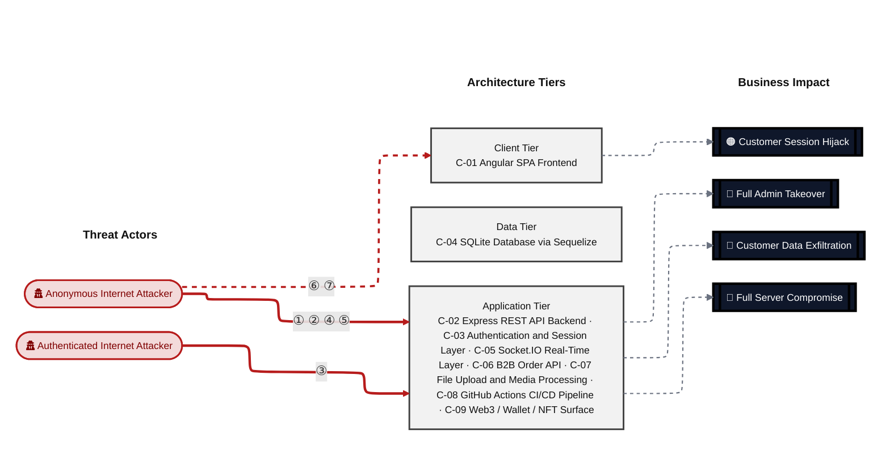

**Threat actors.** The actors below drive the numbered attack paths in the figures above. The **Shop User** is the *victim* of client-side attacks (XSS / CSRF), not an attacker - in Figure 2 the compromise surfaces as the resulting business-impact node rather than as a separate actor box.

- **Shop User** — legitimate customer; target of client-side attacks; target of ⑥ Output Encoding / Cross-Site Scripting, ⑦ CSRF / Permissive CORS.
- **Anonymous Internet Attacker** — no account; registers in seconds when needed; drives ① Insecure Query Construction & Data Access, ② Hardcoded Secrets & Weak Cryptography, ④ Sensitive File & Secret Exposure, ⑤ Remote Code Execution (unsafe eval).
- **Authenticated Internet Attacker** — owns a regular account; logged in; drives ③ Broken Authorization & Access Control.

**7 structural threats**, grouped by weakness class - each row is one threat, not one finding. *Threat Description* states the general architectural weakness (STRIDE in brackets); *Findings* lists the concrete instances, each linked to [§8 Findings Register](#8-findings-register) with its component; *Risk & Impact* combines severity with business consequence.

| # | Threat Description | Findings (→ Component) | Risk & Impact | Fix |
|---|------------------------------------|------------------------------------------------|------------------------------------|--------|
| <a id="path-injection"></a>① | **Insecure Query Construction & Data Access** _(T·I)_<br/>Raw SQL string interpolation in the login and search routes allows unauthenticated attackers to bypass authentication or extract all table contents through UNION-based injection. | <span style="white-space:nowrap">🔴&nbsp;[F-005](#f-005)</span> - SQL injection in login (`routes/login.ts:34`) <span style="white-space:nowrap">→&nbsp;[C-03](#c-03)</span><br/><span style="white-space:nowrap">🔴&nbsp;[F-007](#f-007)</span> - SQL Injection (`routes/search.ts:23`) <span style="white-space:nowrap">→&nbsp;[C-02](#c-02)</span><br/><span style="white-space:nowrap">🔴&nbsp;[F-009](#f-009)</span> - XXE (`lib/xml.ts:35`) <span style="white-space:nowrap">→&nbsp;[C-02](#c-02)</span><br/><span style="white-space:nowrap">🟠&nbsp;[F-023](#f-023)</span> - NoSQL Injection (`routes/trackOrder.ts:18`) <span style="white-space:nowrap">→&nbsp;[C-02](#c-02)</span><br/><span style="white-space:nowrap">🟡&nbsp;[F-060](#f-060)</span> - Open Redirect (`lib/insecurity.ts:136`) <span style="white-space:nowrap">→&nbsp;[C-02](#c-02)</span> | 🔴 **Critical**<br/>Customer Data Exfiltration · Full Admin Takeover | <span style="white-space:nowrap">❶ [M-021](#m-021)</span> — Use parameterized database queries<br/><span style="white-space:nowrap">❶ [M-023](#m-023)</span> — Use parameterized database queries |
| <a id="path-auth-bypass"></a>② | **Hardcoded Secrets & Weak Cryptography** _(S·E)_<br/>The RSA private key used to sign all session JWTs is committed in source, allowing anyone with repository read access to mint arbitrary tokens - including admin-role tokens - offline without server interaction. | <span style="white-space:nowrap">🔴&nbsp;[F-002](#f-002)</span> - Hardcoded RSA private key signs all JWTs (`lib/insecurity.ts:21`) <span style="white-space:nowrap">→&nbsp;[C-03](#c-03)</span><br/><span style="white-space:nowrap">🔴&nbsp;[F-003](#f-003)</span> - Insecure JWT Verification (`lib/insecurity.ts:52`) <span style="white-space:nowrap">→&nbsp;[C-03](#c-03)</span><br/><span style="white-space:nowrap">🔴&nbsp;[F-010](#f-010)</span> - RSA private key exposed in committed source (`lib/insecurity.ts:21`) <span style="white-space:nowrap">→&nbsp;[C-03](#c-03)</span><br/><span style="white-space:nowrap">🟠&nbsp;[F-012](#f-012)</span> - DenyAll uses Math.random as JWT secret (`lib/insecurity.ts:53`) <span style="white-space:nowrap">→&nbsp;[C-03](#c-03)</span><br/><span style="white-space:nowrap">🟠&nbsp;[F-013](#f-013)</span> - Hardcoded HMAC key forges deluxe entitlement (`lib/insecurity.ts:42`) <span style="white-space:nowrap">→&nbsp;[C-03](#c-03)</span><br/><span style="white-space:nowrap">🟠&nbsp;[F-014](#f-014)</span> - Weak `MD5` Password Hashing (`lib/insecurity.ts:41`) <span style="white-space:nowrap">→&nbsp;[C-02](#c-02)</span><br/><span style="white-space:nowrap">🟠&nbsp;[F-019](#f-019)</span> - Passwords hashed with unsalted `MD5` (`lib/insecurity.ts:41`) <span style="white-space:nowrap">→&nbsp;[C-03](#c-03)</span><br/><span style="white-space:nowrap">🟠&nbsp;[F-038](#f-038)</span> - Unsalted `MD5` password hashing (`models/user.ts:76`) <span style="white-space:nowrap">→&nbsp;[C-04](#c-04)</span><br/><span style="white-space:nowrap">🟠&nbsp;[F-039](#f-039)</span> - Hardcoded Cryptographic Mnemonic (`routes/checkKeys.ts:10`) <span style="white-space:nowrap">→&nbsp;[C-09](#c-09)</span><br/><span style="white-space:nowrap">🟡&nbsp;[F-050](#f-050)</span> - Long-Lived Publish Credentials Instead of OIDC (`release.yml:64`) <span style="white-space:nowrap">→&nbsp;[C-08](#c-08)</span><br/><span style="white-space:nowrap">🟡&nbsp;[F-062](#f-062)</span> - Container image signing absent from build pipeline (`ci.yml:1`) <span style="white-space:nowrap">→&nbsp;[C-08](#c-08)</span><br/><span style="white-space:nowrap">🟡&nbsp;[F-068](#f-068)</span> - Static hardcoded HMAC key for security answers (`models/securityAnswer.ts:45`) <span style="white-space:nowrap">→&nbsp;[C-04](#c-04)</span> | 🔴 **Critical**<br/>Full Admin Takeover | <span style="white-space:nowrap">❶ [M-019](#m-019)</span> — Enforce JWT signature and algorithm verification<br/><span style="white-space:nowrap">❶ [M-026](#m-026)</span> — Move secrets to a managed secret store |
| <a id="path-privilege-escalation"></a>③ | **Broken Authorization & Access Control** _(E·I)_<br/>Sequelize's `update()` accepts privileged fields such as `isAdmin` and `role` directly from the request body with no allowlist, allowing any authenticated user to escalate their own privileges. | <span style="white-space:nowrap">🔴&nbsp;[F-008](#f-008)</span> - Insecure Direct Object Reference (`routes/wallet.ts:27`) <span style="white-space:nowrap">→&nbsp;[C-02](#c-02)</span><br/><span style="white-space:nowrap">🔴&nbsp;[F-011](#f-011)</span> - Mass assignment privileged field accepted from request (`routes/verify.ts:53`) <span style="white-space:nowrap">→&nbsp;[C-02](#c-02)</span><br/><span style="white-space:nowrap">🟠&nbsp;[F-031](#f-031)</span> - GitHub Actions workflow missing top-level permissions block (`ci.yml:1`) <span style="white-space:nowrap">→&nbsp;[C-08](#c-08)</span><br/><span style="white-space:nowrap">🟠&nbsp;[F-044](#f-044)</span> - Password change skips current-password check (`routes/changePassword.ts:39`) <span style="white-space:nowrap">→&nbsp;[C-03](#c-03)</span><br/><span style="white-space:nowrap">🟠&nbsp;[F-045](#f-045)</span> - Sensitive Routes Registered Without Authentication Middleware (`server.ts:310`) <span style="white-space:nowrap">→&nbsp;[C-02](#c-02)</span><br/><span style="white-space:nowrap">🟠&nbsp;[F-046](#f-046)</span> - Missing Authorization on Wallet Balance Endpoint (`server.ts:627`) <span style="white-space:nowrap">→&nbsp;[C-02](#c-02)</span><br/><span style="white-space:nowrap">🟠&nbsp;[F-047](#f-047)</span> - Missing Explicit Workflow Permissions Block (`ci.yml:1`) <span style="white-space:nowrap">→&nbsp;[C-08](#c-08)</span><br/><span style="white-space:nowrap">🟠&nbsp;[F-048](#f-048)</span> - Admin authorization decided client-side from decoded JWT (`app.guard.ts:54`) <span style="white-space:nowrap">→&nbsp;[C-01](#c-01)</span> | 🔴 **Critical**<br/>Full Admin Takeover | <span style="white-space:nowrap">❶ [M-024](#m-024)</span> — Enforce object-level (ownership) authorization<br/><span style="white-space:nowrap">❶ [M-027](#m-027)</span> — Apply an allowlist filter before passing the body to any model, and strip privilege fields before persistence |
| <a id="path-sensitive-data-exposure"></a>④ | **Sensitive File & Secret Exposure** _(I)_<br/>Multiple unauthenticated endpoints expose application configuration, directory listings, encryption keys, and access logs without any access control, leaking sensitive operational data to anonymous requesters. | <span style="white-space:nowrap">🔴&nbsp;[F-009](#f-009)</span> - XXE (`lib/xml.ts:35`) <span style="white-space:nowrap">→&nbsp;[C-02](#c-02)</span><br/><span style="white-space:nowrap">🟠&nbsp;[F-022](#f-022)</span> - Server-Side Request Forgery (`routes/profileImageUrlUpload.ts:24`) <span style="white-space:nowrap">→&nbsp;[C-02](#c-02)</span><br/><span style="white-space:nowrap">🟠&nbsp;[F-027](#f-027)</span> - Zip-slip arbitrary file write on extract (`routes/fileUpload.ts:34`) <span style="white-space:nowrap">→&nbsp;[C-07](#c-07)</span><br/><span style="white-space:nowrap">🟠&nbsp;[F-029](#f-029)</span> - Unauthenticated Application Configuration (`routes/appConfiguration.ts:11`) <span style="white-space:nowrap">→&nbsp;[C-02](#c-02)</span><br/><span style="white-space:nowrap">🟠&nbsp;[F-030](#f-030)</span> - Directory Listing and File Server Exposure (`server.ts:269`) <span style="white-space:nowrap">→&nbsp;[C-02](#c-02)</span><br/><span style="white-space:nowrap">🟠&nbsp;[F-035](#f-035)</span> - Unauthenticated JWT public key disclosure (`routes/keyServer.ts:14`) <span style="white-space:nowrap">→&nbsp;[C-07](#c-07)</span><br/><span style="white-space:nowrap">🟠&nbsp;[F-037](#f-037)</span> - Payment card numbers stored unencrypted (`models/card.ts:38`) <span style="white-space:nowrap">→&nbsp;[C-04](#c-04)</span><br/><span style="white-space:nowrap">🟡&nbsp;[F-059](#f-059)</span> - Verbose Error Handler Stack Disclosure (`server.ts:682`) <span style="white-space:nowrap">→&nbsp;[C-02](#c-02)</span><br/><span style="white-space:nowrap">🟡&nbsp;[F-065](#f-065)</span> - Poison-null-byte extension-filter bypass (`routes/fileServer.ts:28`) <span style="white-space:nowrap">→&nbsp;[C-07](#c-07)</span><br/><span style="white-space:nowrap">🟡&nbsp;[F-066](#f-066)</span> - Unauthenticated access-log file disclosure (`routes/logfileServer.ts:14`) <span style="white-space:nowrap">→&nbsp;[C-07](#c-07)</span><br/><span style="white-space:nowrap">🟡&nbsp;[F-067](#f-067)</span> - Customer PII seeded in cleartext at rest (`data/datacreator.ts:250`) <span style="white-space:nowrap">→&nbsp;[C-04](#c-04)</span><br/><span style="white-space:nowrap">🟠&nbsp;[F-078](#f-078)</span> - Data disclosure (`ShaderPass.js:2`) <span style="white-space:nowrap">→&nbsp;[C-01](#c-01)</span> | 🔴 **Critical**<br/>Customer Data Exfiltration | <span style="white-space:nowrap">❶ [M-025](#m-025)</span> — Disable XML external entity (XXE) resolution<br/><span style="white-space:nowrap">❷ [M-036](#m-036)</span> — Validate and allowlist outbound request targets |
| <a id="path-remote-code-execution"></a>⑤ | **Remote Code Execution (unsafe eval)** _(E)_<br/>The B2B order handler passes attacker-controlled input to a `notevil` sandbox via `vm.runInContext()`, and the sandbox is escapable, yielding arbitrary Node\.js execution on the host. | <span style="white-space:nowrap">🔴&nbsp;[F-006](#f-006)</span> - Server-Side Code Injection (`routes/b2bOrder.ts:23`) <span style="white-space:nowrap">→&nbsp;[C-06](#c-06)</span> | 🔴 **Critical**<br/>Full Server Compromise | <span style="white-space:nowrap">❶ [M-022](#m-022)</span> — Remove server-side evaluation of untrusted input |
| <a id="path-cross-site-scripting"></a>⑥ | **Output Encoding / Cross-Site Scripting** _(T·I)_<br/>Stored user-supplied content rendered through an outdated `sanitize-html@1.4.2` library reaches other users' browsers unescaped, enabling session theft and account takeover of any visiting user. | <span style="white-space:nowrap">🟠&nbsp;[F-001](#f-001)</span> - DOM and Stored XSS (`search-result.component.ts:143`) <span style="white-space:nowrap">→&nbsp;[C-01](#c-01)</span><br/><span style="white-space:nowrap">🟠&nbsp;[F-036](#f-036)</span> - JWT session token stored in localStorage, readable by (`oauth.component.ts:51`) <span style="white-space:nowrap">→&nbsp;[C-01](#c-01)</span><br/><span style="white-space:nowrap">🟡&nbsp;[F-058](#f-058)</span> - Client-side session logout only clears browser (`navbar.component.ts:240`) <span style="white-space:nowrap">→&nbsp;[C-01](#c-01)</span> | 🟠 **High**<br/>Customer Session Hijack | <span style="white-space:nowrap">❷ [M-017](#m-017)</span> — Encode output instead of bypassing the framework sanitizer<br/><span style="white-space:nowrap">❸ [M-046](#m-046)</span> — Store session tokens in HttpOnly, Secure cookies |
| <a id="path-cross-site-request-forgery"></a>⑦ | **CSRF / Permissive CORS** _(S·T)_<br/>a permissive CORS policy plus missing anti-CSRF tokens let any external page issue authenticated state-changing requests in the victim's session. | <span style="white-space:nowrap">🟠&nbsp;[F-021](#f-021)</span> - Missing CSRF Protection on State-Changing Endpoints (`server.ts:667`) <span style="white-space:nowrap">→&nbsp;[C-02](#c-02)</span><br/><span style="white-space:nowrap">🟡&nbsp;[F-071](#f-071)</span> - Permissive CORS Allowing All Origins (`server.ts:183`) <span style="white-space:nowrap">→&nbsp;[C-02](#c-02)</span><br/><span style="white-space:nowrap">🟢&nbsp;[F-073](#f-073)</span> - State-changing API calls rely on bearer token with (`complaint.component.ts:44`) <span style="white-space:nowrap">→&nbsp;[C-01](#c-01)</span> | 🟠 **High**<br/>Customer Session Hijack | <span style="white-space:nowrap">❸ [M-004](#m-004)</span> — Add anti-CSRF protection to state-changing requests<br/><span style="white-space:nowrap">❸ [M-077](#m-077)</span> — Restrict CORS to an explicit trusted-origin allowlist |

_STRIDE: S spoofing · T tampering · R repudiation · I information disclosure · D denial of service · E elevation of privilege. Risk, findings, components, impact and Fix are derived deterministically; only the one-line weakness description is authored._

**Verified attack chains.** 2 fully viable ([AC-T-003](#ac-t-003), [AC-T-004](#ac-t-004)); 3 partially blocked ([AC-T-001](#ac-t-001), [AC-T-005](#ac-t-005), [AC-T-006](#ac-t-006)). These chains combine individual findings into end-to-end exploitation paths verified step-by-step against the code - see [§9 Abuse Cases](#9-abuse-cases) for the per-step breakdown and blocking mitigations.

### Top Mitigations

Highest-impact P1/P2 mitigations - 19 of 48 qualifying (81 total). Full detail in [§10 Mitigation Register](#10-mitigation-register). All 19 mitigation(s) that fix a Critical finding are always listed here.

| # | Component | Mitigation | Addresses | Effort |
|---|----------------------|------------------------------------------------|------------------------------------------------|------|
| **1** | [C-01](#c-01) — Angular SPA Frontend | ❶ [M-020](#m-020) — Stop deriving passwords from email; issue server-side OAuth sessions without a shadow password | 🔴 [F-004](#f-004) — OAuth login derives password deterministically from (`oauth.component.ts`) | Medium |
| **2** | [C-02](#c-02) — Express REST API Backend | ❶ [M-023](#m-023) — Use parameterized database queries | 🔴 [F-007](#f-007) — SQL Injection (`routes/search.ts`) | Low |
| **3** | [C-02](#c-02) — Express REST API Backend | ❶ [M-025](#m-025) — Disable XML external entity (XXE) resolution | 🔴 [F-009](#f-009) — XXE (`lib/xml.ts`) | Low |
| **4** | [C-02](#c-02) — Express REST API Backend | ❶ [M-024](#m-024) — Enforce object-level (ownership) authorization | 🔴 [F-008](#f-008) — Insecure Direct Object Reference (`routes/wallet.ts`) | Medium |
| **5** | [C-02](#c-02) — Express REST API Backend | ❶ [M-027](#m-027) — Apply an allowlist filter before passing the body to any model, and strip privilege fields before persistence | 🔴 [F-011](#f-011) — Mass assignment privileged field accepted from request (`routes/verify.ts`) | Medium |
| **6** | [C-03](#c-03) — Authentication and Session Layer | ❶ [M-002](#m-002) — Move cryptographic keys to a managed secret store | 🔴 [F-002](#f-002) — Hardcoded RSA private key signs all JWTs (`lib/insecurity.ts`)<br/>🔴 [F-010](#f-010) — RSA private key exposed in committed source (`lib/insecurity.ts`)<br/>🟠 [F-012](#f-012) — DenyAll uses Math.random as JWT secret (`lib/insecurity.ts`)<br/>🔴 [F-013](#f-013) — Hardcoded HMAC key forges deluxe entitlement (`lib/insecurity.ts`)<br/>🔴 [F-039](#f-039) — Hardcoded Cryptographic Mnemonic (`routes/checkKeys.ts`)<br/>🔴 [F-050](#f-050) — Long-Lived Publish Credentials Instead of OIDC (`release.yml`)<br/>🔴 [F-068](#f-068) — Static hardcoded HMAC key for security answers (`models/securityAnswer.ts`) | High |
| **7** | [C-03](#c-03) — Authentication and Session Layer | ❶ [M-019](#m-019) — Enforce JWT signature and algorithm verification | 🔴 [F-003](#f-003) — Insecure JWT Verification (`lib/insecurity.ts`) | Low |
| **8** | [C-03](#c-03) — Authentication and Session Layer | ❶ [M-021](#m-021) — Use parameterized database queries | 🔴 [F-005](#f-005) — SQL injection in login (`routes/login.ts`) | Low |
| **9** | [C-03](#c-03) — Authentication and Session Layer | ❶ [M-026](#m-026) — Move secrets to a managed secret store | 🔴 [F-010](#f-010) — RSA private key exposed in committed source (`lib/insecurity.ts`) | Medium |
| **10** | [C-06](#c-06) — B2B Order API | ❶ [M-022](#m-022) — Remove server-side evaluation of untrusted input | 🔴 [F-006](#f-006) — Server-Side Code Injection (`routes/b2bOrder.ts`) | Medium |
| **11** | [C-01](#c-01) — Angular SPA Frontend | ❷ [M-017](#m-017) — Encode output instead of bypassing the framework sanitizer | 🔴 [F-001](#f-001) — DOM and Stored XSS (`search-result.component.ts`) | Low |
| **12** | [C-02](#c-02) — Express REST API Backend | ❷ [M-056](#m-056) — Enforce server-side authorization on every endpoint | 🔴 [F-046](#f-046) — Missing Authorization on Wallet Balance Endpoint (`server.ts`) | Low |
| **13** | [C-02](#c-02) — Express REST API Backend | ❷ [M-037](#m-037) — Use parameterized database queries | 🔴 [F-023](#f-023) — NoSQL Injection (`routes/trackOrder.ts`) | Medium |
| **14** | [C-02](#c-02) — Express REST API Backend | ❷ [M-055](#m-055) — Enforce server-side authorization on every endpoint | 🔴 [F-045](#f-045) — Sensitive Routes Registered Without Authentication Middleware (`server.ts`) | Medium |
| **15** | [C-03](#c-03) — Authentication and Session Layer | ❷ [M-029](#m-029) — Move secrets to a managed secret store | 🔴 [F-013](#f-013) — Hardcoded HMAC key forges deluxe entitlement (`lib/insecurity.ts`) | Medium |
| **16** | [C-03](#c-03) — Authentication and Session Layer | ❷ [M-018](#m-018) — Move cryptographic keys to a managed secret store | 🔴 [F-002](#f-002) — Hardcoded RSA private key signs all JWTs (`lib/insecurity.ts`) | High |
| **17** | [C-08](#c-08) — GitHub Actions CI/CD Pipeline | ❷ [M-057](#m-057) — Enforce server-side authorization on every endpoint | 🔴 [F-047](#f-047) — Missing Explicit Workflow Permissions Block (`ci.yml`) | Low |
| **18** | [C-09](#c-09) — Web3 / Wallet / NFT Surface | ❷ [M-049](#m-049) — Move secrets to a managed secret store | 🔴 [F-039](#f-039) — Hardcoded Cryptographic Mnemonic (`routes/checkKeys.ts`) | Low |
| **19** | [C-09](#c-09) — Web3 / Wallet / NFT Surface | ❷ [M-034](#m-034) — Prove wallet control with a signed nonce before crediting an address | 🔴 [F-018](#f-018) — Wallet Ownership Spoofing (`routes/nftMint.ts`) | Medium |

*29 additional P1/P2 mitigations capped from the leader-board · 33 P3 backlog items in [§10 Mitigation Register](#10-mitigation-register). Sorted by priority (P1 first), then component, then leverage (most findings first), severity (Critical first), and effort (Low first).*

### Operational Strengths

Operational controls rated Adequate or Partial - grouped into broad clusters (full per-control breakdown in [§7](#7-security-architecture)). Clusters demoted to Weak by open Critical/High findings appear in [§7](#7-security-architecture) instead, not here.

<table style="table-layout:fixed;width:100%">
<colgroup><col width="18%" style="width:18%"><col width="28%" style="width:28%"><col width="13%" style="width:13%"><col width="30%" style="width:30%"><col width="11%" style="width:11%"></colgroup>
<thead><tr><th>Strength</th><th>What's in Place</th><th>Effectiveness</th><th>Gap</th><th>Mitigates</th></tr></thead>
<tbody>
<tr><td style="overflow-wrap:anywhere"><strong>Container &amp; Supply-Chain Hardening</strong></td><td style="overflow-wrap:anywhere"><em>Build-time and runtime hardening - minimal base image, non-root execution, dependency inventory.</em><br/>Automated SCA scanning<br/>Container Image Security</td><td>✅ Adequate</td><td style="overflow-wrap:anywhere">-</td><td style="overflow-wrap:anywhere">-</td></tr>
<tr><td style="overflow-wrap:anywhere"><strong>Hardened HTTP Stack</strong></td><td style="overflow-wrap:anywhere"><em>Browser-facing HTTP hardening — security headers, cookie flags, cross-origin policy, and abuse-protection limits.</em><br/>Partial HTTP Security Headers<br/>Rate Limiting</td><td>⚠️ Partial</td><td style="overflow-wrap:anywhere">Bypassed by 2 High finding(s) of the kind this cluster is supposed to prevent — e.g.<br/>🟠 <a href="#f-021">F-021</a> — Missing CSRF Protection on State-Changing Endpoints — <code>server.ts:667</code><br/>🟠 <a href="#f-022">F-022</a> — Server-Side Request Forgery — <code>routes/profileImageUrlUpload.ts:24</code>.</td><td style="overflow-wrap:anywhere">🟡 <a href="#f-051">F-051</a> — OAuth redirect_uri matched by exact string against (login…<br/>🟡 <a href="#f-071">F-071</a> — Permissive CORS Allowing All Origins (<code>server.ts:183</code>)<br/>🟢 <a href="#f-073">F-073</a> — State-changing API calls rely on bearer token with (compl…</td></tr>
<tr><td style="overflow-wrap:anywhere"><strong>Observability &amp; Audit</strong></td><td style="overflow-wrap:anywhere"><em>Runtime visibility - access logging, audit trails, and operational telemetry for post-incident review.</em><br/>Audit Logging</td><td>⚠️ Partial</td><td style="overflow-wrap:anywhere">Coverage incomplete - see <a href="#7-security-architecture">§7</a> control assessment.</td><td style="overflow-wrap:anywhere">-</td></tr>
</tbody>
</table>


**Bottom line:** These controls narrow specific attack surfaces but none eliminates a Critical finding on its own.

---

<a id="critical-attack-chain"></a><a id="critical-attack-tree"></a>
## Critical Attack Tree

The root is the worst-case attacker goal; below it, each capability branch groups the Critical findings that achieve it. Branches feed the goal by OR - any single path suffices.

```mermaid
graph LR
    G_ROOT["Full host compromise with admin access"]:::goal
    OR_PATHS["Three independent entry paths"]:::or_node
    AND_JWT["Forge admin JWT offline"]:::and_node
    AND_SQL["Bypass login via SQL injection"]:::and_node
    AND_RCE["Achieve RCE via eval sandbox"]:::and_node
    L_T002["F-002 - Hardcoded RSA private key"]:::leaf
    L_T010["F-010 - RSA key exposed in committed so…"]:::leaf
    L_T003["F-003 - Insecure JWT verification alg:n…"]:::leaf
    L_T005["F-005 - SQL injection in login route"]:::leaf
    L_T004["F-004 - OAuth deterministic password de…"]:::leaf
    L_T006["F-006 - Server-side code injection via…"]:::leaf
    OR_DATA["Exfiltrate or corrupt data"]:::or_node
    L_T007["F-007 - SQL injection in search"]:::leaf
    L_T009["F-009 - XXE external entity resolution"]:::leaf
    L_T008["F-008 - IDOR wallet balance"]:::leaf
    L_T011["F-011 - Mass assignment privileged field"]:::leaf

    AND_JWT -->|"OR"| OR_PATHS
    AND_SQL -->|"OR"| OR_PATHS
    AND_RCE -->|"OR"| OR_PATHS
    OR_PATHS -->|"OR"| G_ROOT
    L_T002 -->|"AND"| AND_JWT
    L_T010 -->|"AND"| AND_JWT
    L_T003 -->|"AND"| AND_JWT
    L_T005 -->|"AND"| AND_SQL
    L_T004 -->|"AND"| AND_SQL
    L_T006 -->|"AND"| AND_RCE
    OR_DATA -->|"OR"| G_ROOT
    L_T007 -->|"OR"| OR_DATA
    L_T009 -->|"OR"| OR_DATA
    L_T008 -->|"OR"| OR_DATA
    L_T011 -->|"OR"| OR_DATA

    classDef goal fill:#0f172a,stroke:#000,color:#fff,stroke-width:3px
    classDef and_node fill:#334155,stroke:#1e293b,color:#fff,stroke-width:2px
    classDef or_node fill:#64748b,stroke:#334155,color:#fff,stroke-width:2px
    classDef leaf fill:#f3dada,stroke:#b71c1c,color:#7f0000,stroke-width:2px
```

**Findings** (full detail in [§8 Findings Register](#8-findings-register)): 🔴 [F-002](#f-002) — Hardcoded RSA private key signs all JWTs — `lib/insecurity.ts:21` Hardcoded RSA private key · 🔴 [F-010](#f-010) — RSA private key exposed in committed source — `lib/insecurity.ts:21` RSA key exposed in committed source · 🔴 [F-003](#f-003) — Insecure JWT Verification — `lib/insecurity.ts:52` Insecure JWT verification `alg:none` · 🔴 [F-005](#f-005) — SQL injection in login — `routes/login.ts:34` SQL injection in login route · 🔴 [F-004](#f-004) — OAuth login derives password deterministically from — `oauth.component.ts:30` OAuth deterministic password derivation · 🔴 [F-006](#f-006) — Server-Side Code Injection — `routes/b2bOrder.ts:23` Server-side code injection via `notevil` · 🔴 [F-007](#f-007) — SQL Injection — `routes/search.ts:23` SQL injection in search · 🔴 [F-009](#f-009) — XXE — `lib/xml.ts:35` XXE external entity resolution · 🔴 [F-008](#f-008) — Insecure Direct Object Reference — `routes/wallet.ts:27` IDOR wallet balance · 🔴 [F-011](#f-011) — Mass assignment privileged field accepted from request — `routes/verify.ts:53` Mass assignment privileged field

---

## 1. System Overview

Probably the most modern and sophisticated insecure web application

**Repository:** https://github.com/juice-shop/juice-`shop.git`
**Runtime:** Node\.js 22 - 26

### Scope

This threat model covers 9 components of juice-shop: **Angular SPA Frontend**, **Express REST API Backend**, **Authentication and Session Layer**, **SQLite Database via Sequelize**, **Socket\.IO Real-Time Layer**, **B2B Order API**, **File Upload and Media Processing**, **GitHub Actions CI/CD Pipeline**, **Web3 / Wallet / NFT Surface**.

All 9 modeled components received full STRIDE threat analysis.

**Out of scope:** third-party hosted dependencies, browser runtime, operating-system kernel, and the underlying network infrastructure.

---

## 2. Architecture Diagrams

### 2.1 System Context

Who interacts with juice-shop from the outside, and through which channels. Solid arrows show normal usage; dashed red arrows mark unauthenticated probing or exploit paths (C4 Level 1).

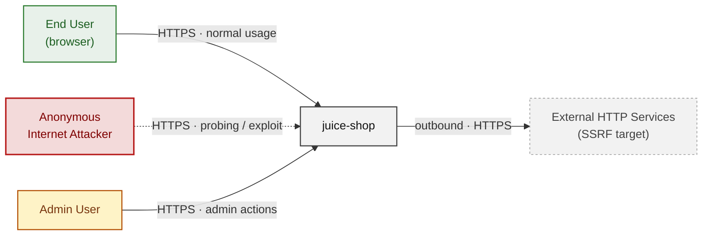

**Key takeaway:** Every actor in the context interacts with juice-shop through its external interface, so authentication and input validation at that edge govern the entire attack surface.

### 2.2 Container Architecture

How the system decomposes into deployable units. Each box is a separate runtime process or service container; arrows show synchronous request paths between them. Components with ≥3 Critical findings carry a red border, ≥2 High amber (C4 Level 2).

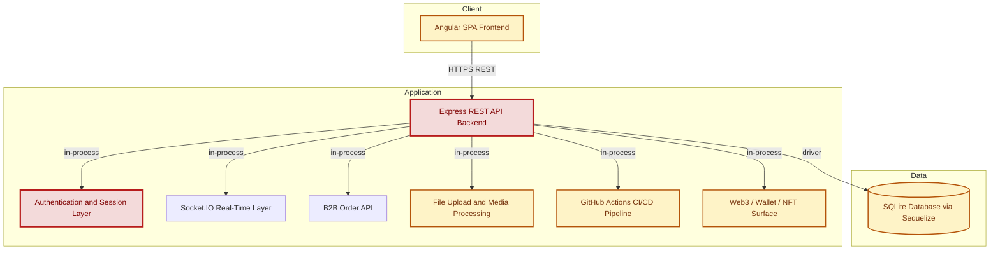

**Key takeaway:** The system decomposes into 1 client, 7 application and 1 data unit(s); Authentication and Session Layer carries the most Critical findings (4) and bounds the worst-case blast radius.

### 2.3 Components


Who reaches each component, and through which trust zone. Four columns map external actors to the internal tiers (Client / Application / Data); solid green arrows show legitimate data flow, dashed red arrows mark intrusion vectors. The component table directly below holds source paths and linked threats per `C-NN`; per-finding evidence is in [§8 Findings Register](#8-findings-register).

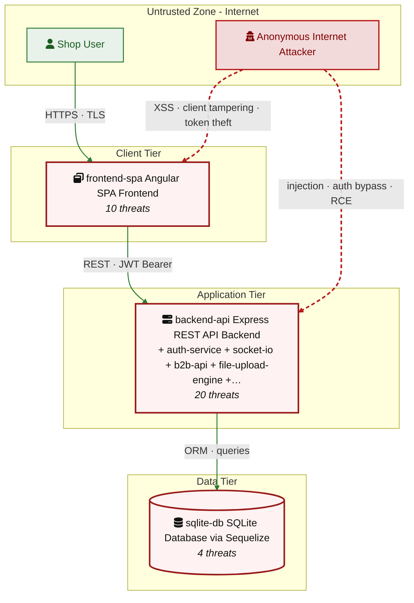

**Key takeaway:** Express REST API Backend concentrates the most findings (20 of 78 across all components); the table below maps each component to its source paths and linked threats.

| ID | Name | Type | Key Paths | Linked Threats |
|----|----------------------|-----------|--------------------------------------|------------------------------------------------|
| <a id="c-01"></a><a id="frontend-spa"></a><span style="white-space:nowrap">C-01</span> | Angular SPA Frontend | client | `frontend/src/**`<br/>`frontend/dist/**` | 🔴 [F-001](#f-001) — DOM and Stored XSS (`search-result.component.ts:143`)<br/>🔴 [F-004](#f-004) — OAuth login derives password deterministically from (`oauth.component.ts:30`)<br/>🟠 [F-016](#f-016) — OAuth implicit flow returns token in URL fragment (`login.component.ts:148`)<br/>🟠 [F-036](#f-036) — JWT session token stored in localStorage, readable by (`oauth.component.ts:51`)<br/>🟠 [F-048](#f-048) — Admin authorization decided client-side from decoded JWT (`app.guard.ts:54`)<br/>🟡 [F-051](#f-051) — OAuth redirect_uri matched by exact string against (`login.component.ts:80`)<br/>🟡 [F-054](#f-054) — Remote Solidity Compiler Inclusion (`web3-sandbox.component.ts:122`)<br/>🟡 [F-058](#f-058) — Client-side session logout only clears browser (`navbar.component.ts:240`)<br/>🟢 [F-073](#f-073) — State-changing API calls rely on bearer token with (`complaint.component.ts:44`)<br/>🟠 [F-078](#f-078) — Data disclosure (`ShaderPass.js:2`) |
| <a id="c-02"></a><a id="backend-api"></a><span style="white-space:nowrap">C-02</span> | Express REST API Backend | application | `server.ts`<br/>`routes/**`<br/>`lib/**`<br/>`models/**`<br/>`data/**` | 🔴 [F-007](#f-007) — SQL Injection (`routes/search.ts:23`)<br/>🔴 [F-008](#f-008) — Insecure Direct Object Reference (`routes/wallet.ts:27`)<br/>🔴 [F-009](#f-009) — XXE (`lib/xml.ts:35`)<br/>🔴 [F-011](#f-011) — Mass assignment privileged field accepted from request (`routes/verify.ts:53`)<br/>🟠 [F-014](#f-014) — Weak MD5 Password Hashing (`lib/insecurity.ts:41`)<br/>🟠 [F-015](#f-015) — Weak Security-Question Password Reset (`routes/resetPassword.ts:41`)<br/>🟠 [F-021](#f-021) — Missing CSRF Protection on State-Changing Endpoints (`server.ts:667`)<br/>🟠 [F-022](#f-022) — Server-Side Request Forgery (`routes/profileImageUrlUpload.ts:24`)<br/>🔴 [F-023](#f-023) — NoSQL Injection (`routes/trackOrder.ts:18`)<br/>🟠 [F-029](#f-029) — Unauthenticated Application Configuration (`routes/appConfiguration.ts:11`)<br/>🟠 [F-030](#f-030) — Directory Listing and File Server Exposure (`server.ts:269`)<br/>🟠 [F-040](#f-040) — Login endpoint has no rate limiting (`server.ts:596`)<br/>🟠 [F-041](#f-041) — Missing Rate Limiting (`server.ts:648`)<br/>🔴 [F-045](#f-045) — Sensitive Routes Registered Without Authentication Middleware (`server.ts:310`)<br/>🔴 [F-046](#f-046) — Missing Authorization on Wallet Balance Endpoint (`server.ts:627`)<br/>🟠 [F-049](#f-049) — Missing Authentication on Web3 Endpoints (`server.ts:641`)<br/>🟡 [F-057](#f-057) — Insufficient Security Audit Logging (`server.ts:338`)<br/>🟡 [F-059](#f-059) — Verbose Error Handler Stack Disclosure (`server.ts:682`)<br/>🟡 [F-060](#f-060) — Open Redirect (`lib/insecurity.ts:136`)<br/>🟡 [F-071](#f-071) — Permissive CORS Allowing All Origins (`server.ts:183`) |
| <a id="c-03"></a><a id="auth-service"></a><span style="white-space:nowrap">C-03</span> | Authentication and Session Layer | application | `lib/insecurity.ts`<br/>`routes/login.ts`<br/>`routes/2fa.ts`<br/>`routes/register.ts`<br/>`routes/changePassword.ts` | 🔴 [F-002](#f-002) — Hardcoded RSA private key signs all JWTs (`lib/insecurity.ts:21`)<br/>🔴 [F-003](#f-003) — Insecure JWT Verification (`lib/insecurity.ts:52`)<br/>🔴 [F-005](#f-005) — SQL injection in login (`routes/login.ts:34`)<br/>🔴 [F-010](#f-010) — RSA private key exposed in committed source (`lib/insecurity.ts:21`)<br/>🟠 [F-012](#f-012) — DenyAll uses Math.random as JWT secret (`lib/insecurity.ts:53`)<br/>🔴 [F-013](#f-013) — Hardcoded HMAC key forges deluxe entitlement (`lib/insecurity.ts:42`)<br/>🟠 [F-019](#f-019) — Passwords hashed with unsalted MD5 (`lib/insecurity.ts:41`)<br/>🟠 [F-043](#f-043) — Token verify ignores expiry and standard claims (`lib/insecurity.ts:55`)<br/>🟠 [F-044](#f-044) — Password change skips current-password check (`routes/changePassword.ts:39`)<br/>🟡 [F-055](#f-055) — No audit logging of authentication events (`lib/insecurity.ts:54`) |
| <a id="c-04"></a><a id="sqlite-db"></a><span style="white-space:nowrap">C-04</span> | SQLite Database via Sequelize | data | `models/**`<br/>`data/datacreator.ts`<br/>`data/static/**` | 🟠 [F-037](#f-037) — Payment card numbers stored unencrypted (`models/card.ts:38`)<br/>🟠 [F-038](#f-038) — Unsalted MD5 password hashing (`models/user.ts:76`)<br/>🟡 [F-067](#f-067) — Customer PII seeded in cleartext at rest (`data/datacreator.ts:250`)<br/>🔴 [F-068](#f-068) — Static hardcoded HMAC key for security answers (`models/securityAnswer.ts:45`) |
| <a id="c-05"></a><a id="socket-io"></a><span style="white-space:nowrap">C-05</span> | Socket\.IO Real-Time Layer | application | `lib/startup/registerWebsocketEvents.ts`<br/>`routes/chat.ts` | 🟠 [F-017](#f-017) — Unauthenticated WebSocket Channel (`registerWebsocketEvents.ts:23`)<br/>🟡 [F-069](#f-069) — Socket\.IO server has no message size limit or (`registerWebsocketEvents.ts:20`) |
| <a id="c-06"></a><a id="b2b-api"></a><span style="white-space:nowrap">C-06</span> | B2B Order API | application | `routes/b2bOrder.ts`<br/>`swagger.yml` | 🔴 [F-006](#f-006) — Server-Side Code Injection (`routes/b2bOrder.ts:23`)<br/>🟠 [F-020](#f-020) — Missing Input Validation (`routes/b2bOrder.ts:19`)<br/>🟡 [F-056](#f-056) — Missing Security Audit Logging (`routes/b2bOrder.ts:24`) |
| <a id="c-07"></a><a id="file-upload-engine"></a><span style="white-space:nowrap">C-07</span> | File Upload and Media Processing | application | `routes/fileUpload.ts`<br/>`routes/profileImageUrlUpload.ts`<br/>`routes/fileServer.ts`<br/>`routes/keyServer.ts`<br/>`routes/logfileServer.ts` | 🟠 [F-027](#f-027) — Zip-slip arbitrary file write on extract (`routes/fileUpload.ts:34`)<br/>🟠 [F-028](#f-028) — Unauthenticated upload with no enforced type (`routes/fileUpload.ts:62`)<br/>🟠 [F-035](#f-035) — Unauthenticated JWT public key disclosure (`routes/keyServer.ts:14`)<br/>🟠 [F-042](#f-042) — XML/YAML entity-expansion bomb DoS (`routes/fileUpload.ts:109`)<br/>🟡 [F-065](#f-065) — Poison-null-byte extension-filter bypass (`routes/fileServer.ts:28`)<br/>🟡 [F-066](#f-066) — Unauthenticated access-log file disclosure (`routes/logfileServer.ts:14`)<br/>🟢 [F-074](#f-074) — No audit trail for file uploads and sensitive (`routes/fileUpload.ts:39`) |
| <a id="c-08"></a><a id="ci-cd-pipeline"></a><span style="white-space:nowrap">C-08</span> | GitHub Actions CI/CD Pipeline | application | `.github/workflows/**`<br/>`Dockerfile`<br/>`.npmrc`<br/>`package.json` | 🟠 [F-024](#f-024) — Non-Deterministic Dependency Install in CI (`ci.yml:51`)<br/>🟠 [F-025](#f-025) — Unpinned GitHub Action References (`image_actions.yml:33`)<br/>🟠 [F-026](#f-026) — Dependency Lockfile Disabled<br/>🟠 [F-031](#f-031) — GitHub Actions workflow missing top-level permissions block (`ci.yml:1`)<br/>🟠 [F-032](#f-032) — Third-party GitHub Action not pinned to commit SHA (`ci.yml:188`)<br/>🟠 [F-033](#f-033) — Docker base image not digest-pinned — Dockerfile:1<br/>🟠 [F-034](#f-034) — On absent from repository (`package-lock.json:1`)<br/>🔴 [F-047](#f-047) — Missing Explicit Workflow Permissions Block (`ci.yml:1`)<br/>🔴 [F-050](#f-050) — Long-Lived Publish Credentials Instead of OIDC (`release.yml:64`)<br/>🟡 [F-052](#f-052) — Pipe-to-Shell Install of Heroku CLI (`ci.yml:358`)<br/>🟡 [F-053](#f-053) — No Dependency-Review or SCA Gate in CI (.dependabot/config.yml:1)<br/>🟡 [F-061](#f-061) — Missing non-root USER directive — Dockerfile:1<br/>🔴 [F-062](#f-062) — Container image signing absent from build pipeline (`ci.yml:1`)<br/>🟡 [F-063](#f-063) — Untrusted npm Install/Postinstall Scripts Enabled — Dockerfile:5<br/>🟡 [F-064](#f-064) — Dependabot npm ecosystem not configured (.github/dependabot.yml:1)<br/>🟢 [F-072](#f-072) — No Minimum Release-Age Cooldown on Installs<br/>🟢 [F-076](#f-076) — Missing HEALTHCHECK instruction — Dockerfile:1<br/>🟢 [F-077](#f-077) — Renovate config not present (`renovate.json:1`) |
| <a id="c-09"></a><a id="web3-nft"></a><span style="white-space:nowrap">C-09</span> | Web3 / Wallet / NFT Surface | application | `routes/checkKeys.ts`<br/>`routes/nftMint.ts`<br/>`routes/redirect.ts`<br/>`routes/web3Wallet.ts` | 🔴 [F-018](#f-018) — Wallet Ownership Spoofing (`routes/nftMint.ts:41`)<br/>🔴 [F-039](#f-039) — Hardcoded Cryptographic Mnemonic (`routes/checkKeys.ts:10`)<br/>🟡 [F-070](#f-070) — Unbounded In-Memory Set Growth (`routes/web3Wallet.ts:16`)<br/>🟢 [F-075](#f-075) — Missing Audit Logging of Challenge-Solve Events (`routes/nftMint.ts:44`) |
### 2.4 Technology Architecture

The technology stack the system is built on. Each box names the framework or runtime that fills that role; per-component findings live in the [§2.3](#23-components) component table above, and the full per-finding catalogue is in [§8 Findings Register](#8-findings-register).

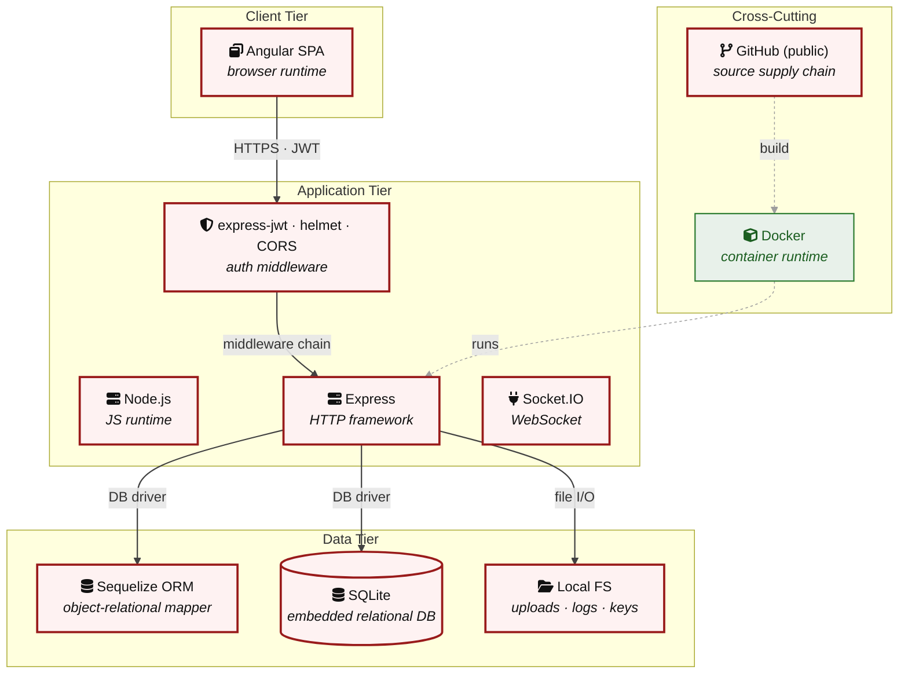

**Key takeaway:** The stack spans 1 data-tier store(s) behind the application tier; injection and data-at-rest exposure track the data tier, detailed per finding in [§8 Findings Register](#8-findings-register).

> **Legend:** **red border** ≥ 3 Critical threats on the component · **amber border** ≥ 2 High threats

---

## 3. Attack Walkthroughs

This section walks through how the highest-risk findings are exploited - one short walkthrough per Critical, each with attack steps, a focused sequence diagram, and the primary mitigation. The cross-finding view (which weaknesses combine toward the worst-case goal, and where one fix severs several paths) is in the [Critical Attack Tree](#critical-attack-tree). Full per-finding context - severity rationale, assets, detection signals - is in the [§8 Findings Register](#8-findings-register) row for each finding.

### 3.1 Hardcoded RSA private key signs all JWTs

**Source:** 🔴 [F-002](#f-002) — `lib/insecurity.ts:21`

Severity **Critical** ([CWE-321](https://cwe.mitre.org/data/definitions/321.html)). STRIDE: Spoofing. See [§8 F-002](#f-002) for the full register row.

**Attack Steps**

1. The RSA-1024 private key used to sign every session JWT is hardcoded as a string literal at `lib/insecurity.ts:21` and committed to the public OWASP Juice Shop git history. `authorize()` at line 54 signs tokens with this exact key.
2. Any attacker who clones the repo holds the signing key, so they can mint a valid token for {"data":{"id":1,"role":"admin","email":"admin@juice-`sh.op`"}}, present it to `isAuthorized()` (line 52, which verifies against the matching `encryptionkeys/jwt.pub`), and be authenticated as any user including admin.
3. No credential, OTP, or server interaction is needed - token forgery is fully offline.

**Sequence Diagram**

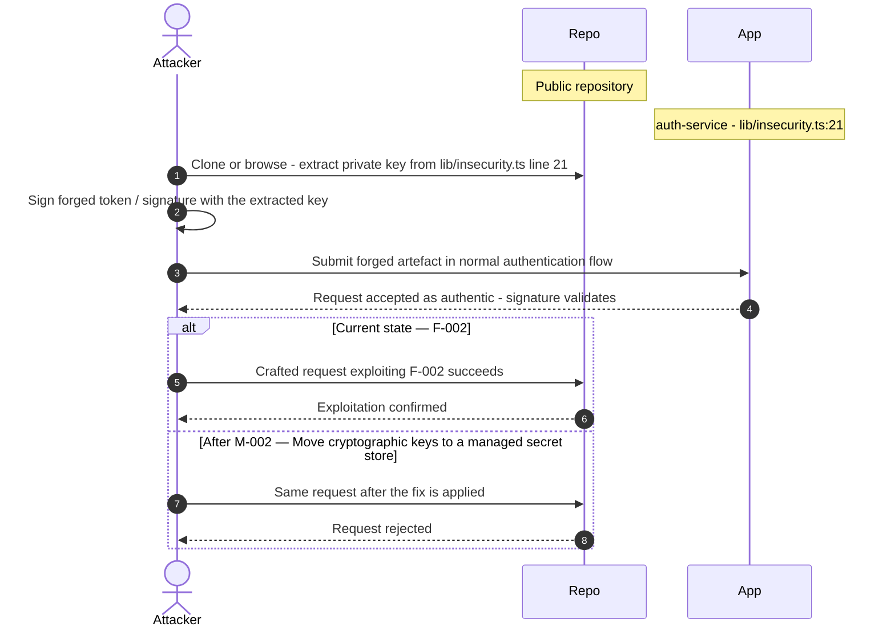

**Key takeaway:** Until ❶ [M-002](#m-002) (Move cryptographic keys to a managed secret store) lands, 🔴 [F-002](#f-002) — Hardcoded RSA private key signs all JWTs — `lib/insecurity.ts:21` is exploitable at `lib/insecurity.ts:21` (Critical-severity, [CWE-321](https://cwe.mitre.org/data/definitions/321.html)).

**Defense in Depth**

- Primary mitigation: ❶ [M-002](#m-002) (Move cryptographic keys to a managed secret store)
- Defence in depth: ❷ [M-018](#m-018) (Move cryptographic keys to a managed secret store)

### 3.2 Insecure JWT Verification

**Source:** 🔴 [F-003](#f-003) — `lib/insecurity.ts:52`

Severity **Critical** ([CWE-347](https://cwe.mitre.org/data/definitions/347.html)). STRIDE: Spoofing. See [§8 F-003](#f-003) for the full register row.

**Attack Steps**

1. `isAuthorized()` at `lib/insecurity.ts:52` builds express-jwt with only { secret: publicKey } and never sets an algorithms property; `verify()` at line 55 calls `jws.verify(token, publicKey)` and also passes no algorithm constraint.
2. With the RSA public key (which is, by definition, public) usable as a symmetric HMAC secret, an attacker can craft a token with header `alg:HS256` and sign it using the PEM public-key text as the HMAC key.
3. Because no allowlist forces `RS256`, the verifier treats the public key as the `HS256` secret and accepts the forged token - the classic `RS256`-to-`HS256` key-confusion bypass, independent of the leaked private key in auth-service-001.

**Sequence Diagram**

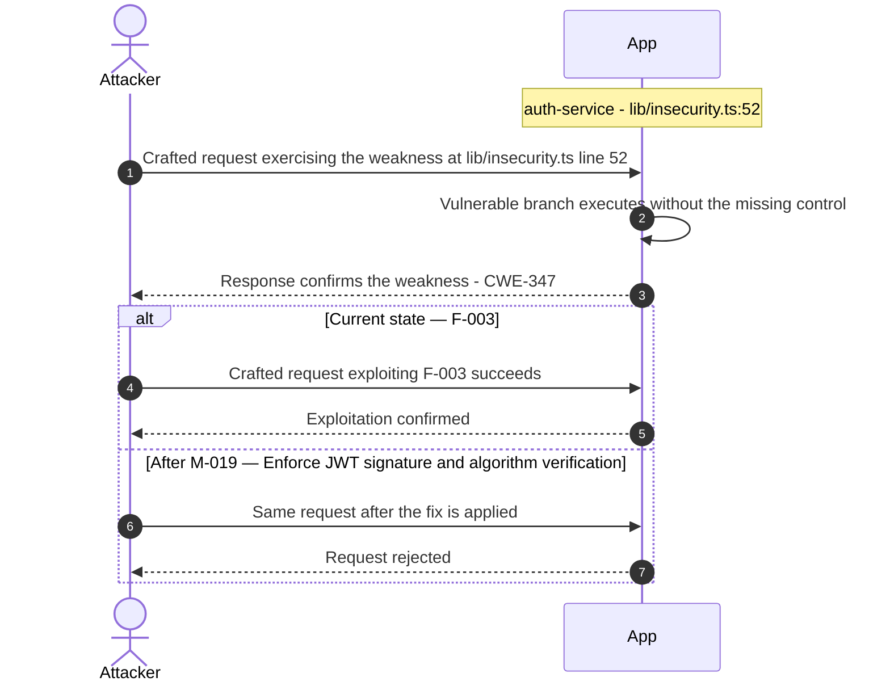

**Key takeaway:** Until ❶ [M-019](#m-019) (Enforce JWT signature and algorithm verification) lands, 🔴 [F-003](#f-003) — Insecure JWT Verification — `lib/insecurity.ts:52` is exploitable at `lib/insecurity.ts:52` (Critical-severity, [CWE-347](https://cwe.mitre.org/data/definitions/347.html)).

**Defense in Depth**

- Primary mitigation: ❶ [M-019](#m-019) (Enforce JWT signature and algorithm verification)

### 3.3 OAuth login derives password deterministically from

**Source:** 🔴 [F-004](#f-004) — `frontend/src/app/oauth/oauth.component.ts:30`

Severity **Critical** ([CWE-522](https://cwe.mitre.org/data/definitions/522.html)). STRIDE: Spoofing. See [§8 F-004](#f-004) for the full register row.

**Attack Steps**

1. After a successful OAuth profile fetch, OAuthComponent creates a local account whose password is `btoa(profile.email.split('').reverse().join(''))` - base64 of the reversed email (`oauth.component.ts:30`) - and immediately logs in with that same derived value (`oauth.component.ts:46`).
2. Section 7.9 flags this `derived password from claim` pattern.
3. Because the algorithm is public and the input (the victim's email) is low-entropy and often known, any attacker who knows a target's email can reconstruct the exact password and authenticate through the normal `/rest/user/login` endpoint - no OAuth, no provider involvement.

**Sequence Diagram**


**Key takeaway:** Until ❶ [M-020](#m-020) (Stop deriving passwords from email; issue server-side OAuth ) lands, 🔴 [F-004](#f-004) — OAuth login derives password deterministically from — `oauth.component.ts:30` is exploitable at `frontend/src/app/oauth/oauth.component.ts:30` (Critical-severity, [CWE-522](https://cwe.mitre.org/data/definitions/522.html)).

**Defense in Depth**

- Primary mitigation: ❶ [M-020](#m-020) (Stop deriving passwords from email; issue server-side OAuth sessions without a shadow password)

### 3.4 SQL injection in login

**Source:** 🔴 [F-005](#f-005) — `routes/login.ts:34`

Severity **Critical** ([CWE-89](https://cwe.mitre.org/data/definitions/89.html)). STRIDE: Tampering. See [§8 F-005](#f-005) for the full register row.

**Attack Steps**

1. The login handler at `routes/login.ts:34` builds a raw Sequelize query by string-interpolating `req.body.email` directly: `SELECT * FROM Users WHERE email = '${req.body.email`}' AND password = '\${hash(password)}'.
2. Sending email = ' OR 1=1 -- closes the string, comments out the password clause, and returns the first user row (admin), logging the attacker in as admin without any credential.
3. The password value is `MD5`-hashed before interpolation but email is not sanitized at all, so the injection is fully attacker-controlled.

**Sequence Diagram**


**Key takeaway:** Until ❶ [M-021](#m-021) (Use parameterized database queries) lands, 🔴 [F-005](#f-005) — SQL injection in login — `routes/login.ts:34` is exploitable at `routes/login.ts:34` (Critical-severity, [CWE-89](https://cwe.mitre.org/data/definitions/89.html)).

**Defense in Depth**

- Primary mitigation: ❶ [M-021](#m-021) (Use parameterized database queries)

### 3.5 Server-Side Code Injection

**Source:** 🔴 [F-006](#f-006) — `routes/b2bOrder.ts:23`

Severity **Critical** ([CWE-94](https://cwe.mitre.org/data/definitions/94.html)). STRIDE: Tampering. See [§8 F-006](#f-006) for the full register row.

**Attack Steps**

1. The handler passes the attacker-controlled string body.orderLinesData straight into safeEval (`notevil`) executed inside `vm.runInContext` at `routes/b2bOrder.ts:23`. `notevil` is an AST-walking pseudo-sandbox, not a security boundary: published escapes recover the host Function/process objects (e.g. via constructor-chain traversal such as ([]).`constructor.constructor('return process')`()) and Node's vm module explicitly documents that `vm.runInContext` is not a sandbox against hostile code.
2. A B2B caller submits a crafted orderLinesData payload to POST `/b2b/v2/orders` and executes arbitrary JavaScript in the server process, leading to remote command execution, file read/write, and reverse-shell.
3. The only constraint is a 2000ms timeout, which bounds the rceOccupy DoS variant but does not stop a fast escape.

**Sequence Diagram**

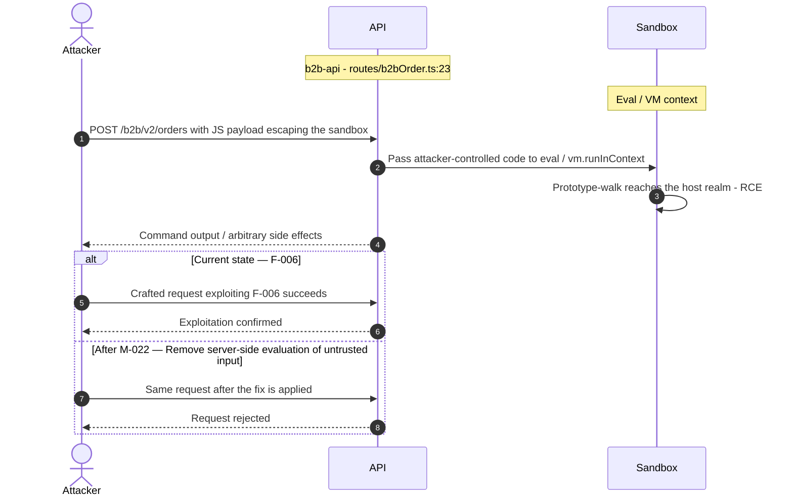

**Key takeaway:** Until ❶ [M-022](#m-022) (Remove server-side evaluation of untrusted input) lands, 🔴 [F-006](#f-006) — Server-Side Code Injection — `routes/b2bOrder.ts:23` is exploitable at `routes/b2bOrder.ts:23` (Critical-severity, [CWE-94](https://cwe.mitre.org/data/definitions/94.html)).

**Defense in Depth**

- Primary mitigation: ❶ [M-022](#m-022) (Remove server-side evaluation of untrusted input)

### 3.6 SQL Injection

**Source:** 🔴 [F-007](#f-007) — `routes/search.ts:23`

Severity **Critical** ([CWE-89](https://cwe.mitre.org/data/definitions/89.html)). STRIDE: Tampering. See [§8 F-007](#f-007) for the full register row.

**Attack Steps**

1. `searchProducts()` interpolates the search term `req.query.q` into a raw query: `SELECT * FROM Products WHERE ((name LIKE '%${criteria}%' OR description LIKE '%${criteria}%')`…) at `routes/search.ts:23`.
2. The only guard is a 200-char truncation.
3. A request like GET `/rest/products/search`?q=')) UNION SELECT id,email,password,…FROM Users-- breaks out of the LIKE clause and unions arbitrary columns, exfiltrating all user emails and password hashes in the JSON response.

**Sequence Diagram**


**Key takeaway:** Until ❶ [M-023](#m-023) (Use parameterized database queries) lands, 🔴 [F-007](#f-007) — SQL Injection — `routes/search.ts:23` is exploitable at `routes/search.ts:23` (Critical-severity, [CWE-89](https://cwe.mitre.org/data/definitions/89.html)).

**Defense in Depth**

- Primary mitigation: ❶ [M-023](#m-023) (Use parameterized database queries)

### 3.7 Insecure Direct Object Reference

**Source:** 🔴 [F-008](#f-008) — `routes/wallet.ts:27`

Severity **Critical** ([CWE-639](https://cwe.mitre.org/data/definitions/639.html)). STRIDE: Tampering. See [§8 F-008](#f-008) for the full register row.

**Attack Steps**

1. Server-side authorization MUST derive the resource owner from the authenticated session (`req.user` / `req.session` / `req.auth`), never from attacker-controlled request data.
2. Trusting `req.body.UserId` etc. enables horizontal privilege escalation across all authenticated tenants.
3. Send the crafted payload to the endpoint backed by `routes/wallet.ts:27`.

**Sequence Diagram**


**Key takeaway:** Until ❶ [M-024](#m-024) (Enforce object-level (ownership) authorization) lands, 🔴 [F-008](#f-008) — Insecure Direct Object Reference — `routes/wallet.ts:27` is exploitable at `routes/wallet.ts:27` (Critical-severity, [CWE-639](https://cwe.mitre.org/data/definitions/639.html)).

**Defense in Depth**

- Primary mitigation: ❶ [M-024](#m-024) (Enforce object-level (ownership) authorization)

### 3.8 XXE

**Source:** 🔴 [F-009](#f-009) — `lib/xml.ts:35`

Severity **Critical** ([CWE-611](https://cwe.mitre.org/data/definitions/611.html)). STRIDE: Tampering. See [§8 F-009](#f-009) for the full register row.

**Attack Steps**

1. An anonymous attacker POSTs a .xml file to the unauthenticated `/file-upload` endpoint. handleXmlUpload (`routes/fileUpload.ts:76`) passes the raw buffer to parseXmlString, which parses with XML_PARSE_NOENT | XML_PARSE_DTDLOAD (`lib/xml.ts:35`) and registers host-filesystem input providers (xmlRegisterFsInputProviders, `lib/xml.ts:21`).
2. A DOCTYPE declaring an external entity such as <!ENTITY xxe SYSTEM "file:///etc/passwd"> is resolved and the substituted content is reflected back in the error message at `routes/fileUpload.ts:79` (`utils.trunc(xmlString, 400)`), giving direct out-of-band file disclosure.
3. Because external entities also resolve http(s):// URLs, the same parser doubles as an SSRF primitive against internal services.

**Sequence Diagram**

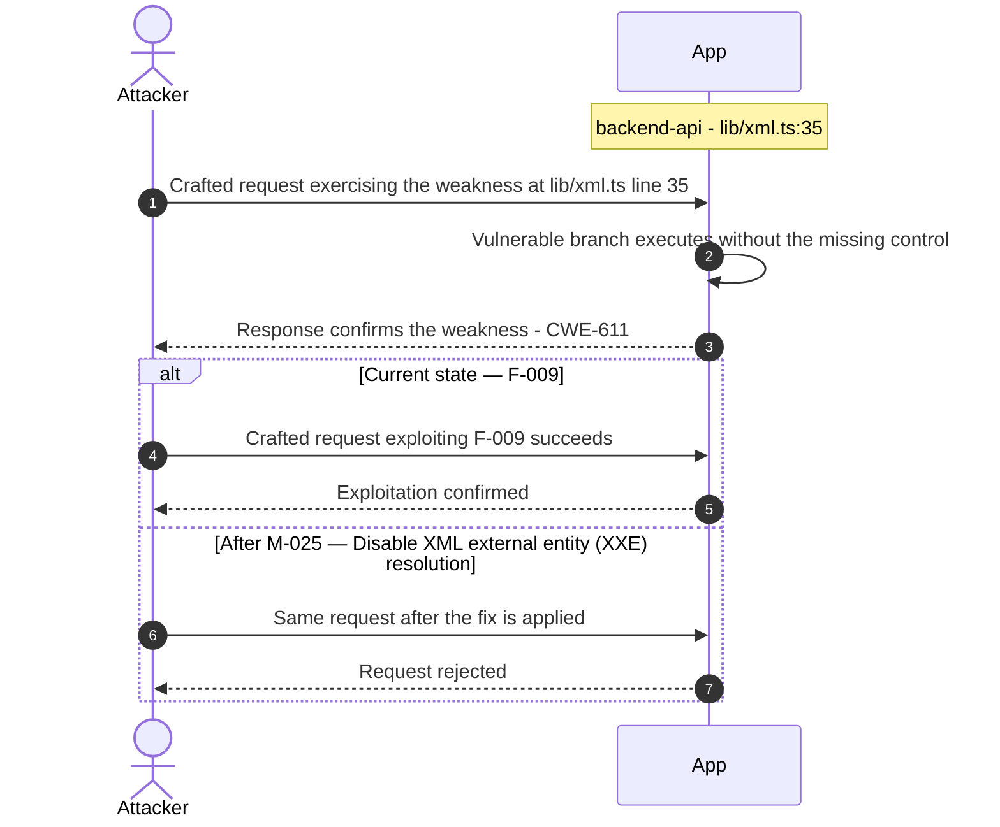

**Key takeaway:** Until ❶ [M-025](#m-025) (Disable XML external entity (XXE) resolution) lands, 🔴 [F-009](#f-009) — XXE — `lib/xml.ts:35` is exploitable at `lib/xml.ts:35` (Critical-severity, [CWE-611](https://cwe.mitre.org/data/definitions/611.html)).

**Defense in Depth**

- Primary mitigation: ❶ [M-025](#m-025) (Disable XML external entity (XXE) resolution)

### 3.9 RSA private key exposed in committed source

**Source:** 🔴 [F-010](#f-010) — `lib/insecurity.ts:21`

Severity **Critical** ([CWE-798](https://cwe.mitre.org/data/definitions/798.html)). STRIDE: Information Disclosure. See [§8 F-010](#f-010) for the full register row.

**Attack Steps**

1. The RSA private key at `lib/insecurity.ts:21` is not just hardcoded but committed to a world-readable public repository, so it is permanently disclosed to anyone.
2. Beyond the spoofing impact (auth-service-001), the disclosure itself is the finding: the key cannot be 'un-leaked', and any system that ever trusted tokens signed by it must treat all such tokens as forgeable forever.
3. The matching cookie secret 'kekse' (`server.ts:289`) and HMAC key (line 42) are likewise disclosed.

**Sequence Diagram**

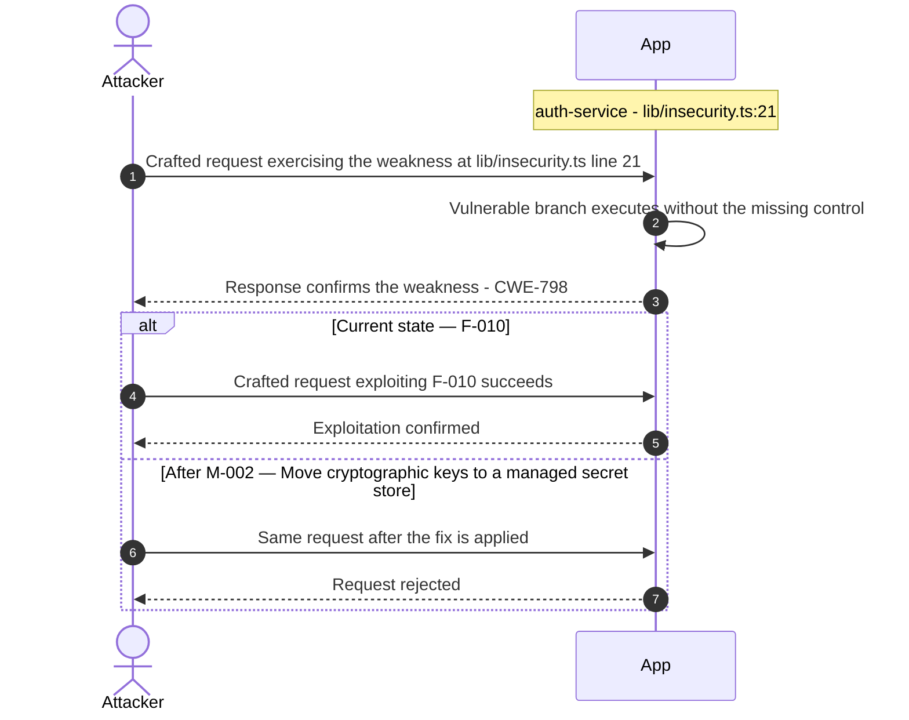

**Key takeaway:** Until ❶ [M-002](#m-002) (Move cryptographic keys to a managed secret store) lands, 🔴 [F-010](#f-010) — RSA private key exposed in committed source — `lib/insecurity.ts:21` is exploitable at `lib/insecurity.ts:21` (Critical-severity, [CWE-798](https://cwe.mitre.org/data/definitions/798.html)).

**Defense in Depth**

- Primary mitigation: ❶ [M-002](#m-002) (Move cryptographic keys to a managed secret store)
- Defence in depth: ❶ [M-026](#m-026) (Move secrets to a managed secret store)

### 3.10 Mass assignment privileged field accepted from request

**Source:** 🔴 [F-011](#f-011) — `routes/verify.ts:53`

Severity **Critical** ([CWE-915](https://cwe.mitre.org/data/definitions/915.html)). STRIDE: Elevation of Privilege. See [§8 F-011](#f-011) for the full register row.

**Attack Steps**

1. Server code that consumes `req.body.role` / `req.body.isAdmin` / etc. without an explicit allowlist trusts the client to behave.
2. An attacker simply adds {"role":"admin"} to their request to escalate.
3. Send the crafted payload to the endpoint backed by `routes/verify.ts:53`.

**Sequence Diagram**

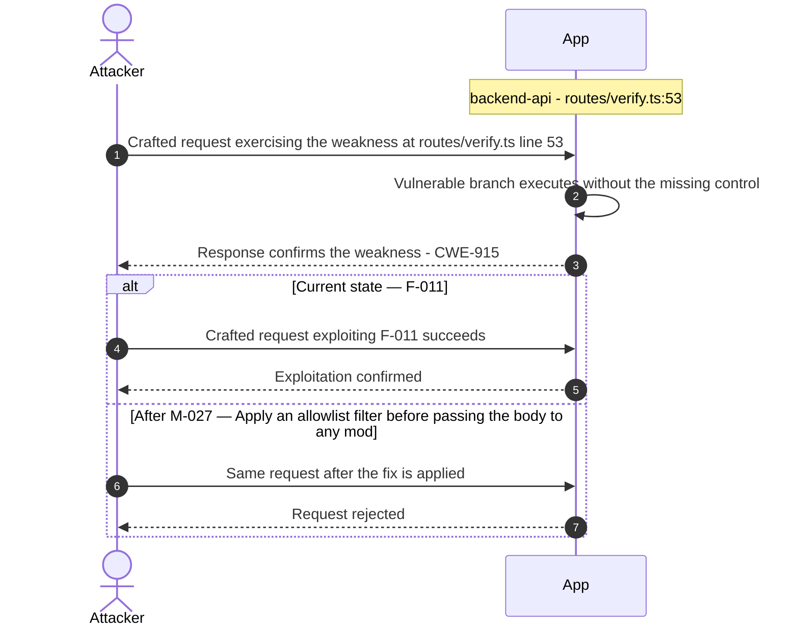

**Key takeaway:** Until ❶ [M-027](#m-027) (Apply an allowlist filter before passing the body to any mod) lands, 🔴 [F-011](#f-011) — Mass assignment privileged field accepted from request — `routes/verify.ts:53` is exploitable at `routes/verify.ts:53` (Critical-severity, [CWE-915](https://cwe.mitre.org/data/definitions/915.html)).

**Defense in Depth**

- Primary mitigation: ❶ [M-027](#m-027) (Apply an allowlist filter before passing the body to any model, and strip privilege fields before persistence)

<!-- generated:walkthrough_renderer -->

---

## 4. Assets

Information assets and the classification level that drives the Confidentiality / Integrity / Availability targets used in [§8 Findings Register](#8-findings-register) risk scoring.

<table style="table-layout:fixed;width:100%">
<colgroup><col width="20%" style="width:20%"><col width="6%" style="width:6%"><col width="12%" style="width:12%"><col width="29%" style="width:29%"><col width="33%" style="width:33%"></colgroup>
<thead><tr><th>Asset</th><th>ID</th><th>Classification</th><th>Description</th><th>Linked Threats</th></tr></thead>
<tbody>
<tr><td style="overflow-wrap:anywhere">User Credentials Store</td><td style="white-space:nowrap">A-001</td><td>Restricted</td><td>SQLite Users table containing email addresses, <code>MD5</code>-hashed passwords (no salt), security question answers, and role assignments. Password hashes are crackable with rainbow tables due to <code>MD5</code> without salt.</td><td style="overflow-wrap:anywhere">🔴 <a href="#f-001">F-001</a> — DOM and Stored XSS (<code>search-result.component.ts:143</code>)<br/>🔴 <a href="#f-004">F-004</a> — OAuth login derives password deterministically from (<code>oauth.component.ts:30</code>)<br/>🔴 <a href="#f-005">F-005</a> — SQL injection in login (<code>routes/login.ts:34</code>)<br/>🔴 <a href="#f-007">F-007</a> — SQL Injection (<code>routes/search.ts:23</code>)<br/>🟠 <a href="#f-014">F-014</a> — Weak MD5 Password Hashing (<code>lib/insecurity.ts:41</code>)<br/>🟠 <a href="#f-015">F-015</a> — Weak Security-Question Password Reset (<code>routes/resetPassword.ts:41</code>)<br/>🟠 <a href="#f-019">F-019</a> — Passwords hashed with unsalted MD5 (<code>lib/insecurity.ts:41</code>)<br/>🟠 <a href="#f-038">F-038</a> — Unsalted MD5 password hashing (<code>models/user.ts:76</code>)<br/>🟠 <a href="#f-040">F-040</a> — Login endpoint has no rate limiting (<code>server.ts:596</code>)<br/>🔴 <a href="#f-068">F-068</a> — Static hardcoded HMAC key for security answers (<code>models/securityAnswer.ts:45</code>)</td></tr>
<tr><td style="overflow-wrap:anywhere">JWT RSA Private Key</td><td style="white-space:nowrap">A-002</td><td>Restricted</td><td>1024-bit RSA private key hardcoded in <code>lib/insecurity.ts:21</code>. Committed to public GitHub repository — permanently compromised. Possession allows forging valid JWT tokens for any user including admin.</td><td style="overflow-wrap:anywhere">🔴 <a href="#f-002">F-002</a> — Hardcoded RSA private key signs all JWTs (<code>lib/insecurity.ts:21</code>)<br/>🔴 <a href="#f-003">F-003</a> — Insecure JWT Verification (<code>lib/insecurity.ts:52</code>)<br/>🔴 <a href="#f-010">F-010</a> — RSA private key exposed in committed source (<code>lib/insecurity.ts:21</code>)<br/>🟠 <a href="#f-012">F-012</a> — DenyAll uses Math.random as JWT secret (<code>lib/insecurity.ts:53</code>)<br/>🔴 <a href="#f-013">F-013</a> — Hardcoded HMAC key forges deluxe entitlement (<code>lib/insecurity.ts:42</code>)<br/>🟠 <a href="#f-014">F-014</a> — Weak MD5 Password Hashing (<code>lib/insecurity.ts:41</code>)<br/>🟠 <a href="#f-019">F-019</a> — Passwords hashed with unsalted MD5 (<code>lib/insecurity.ts:41</code>)<br/>🟠 <a href="#f-027">F-027</a> — Zip-slip arbitrary file write on extract (<code>routes/fileUpload.ts:34</code>)<br/>🟠 <a href="#f-029">F-029</a> — Unauthenticated Application Configuration (<code>routes/appConfiguration.ts:11</code>)<br/>🟠 <a href="#f-035">F-035</a> — Unauthenticated JWT public key disclosure (<code>routes/keyServer.ts:14</code>)<br/>🔴 <a href="#f-039">F-039</a> — Hardcoded Cryptographic Mnemonic (<code>routes/checkKeys.ts:10</code>)<br/>🟠 <a href="#f-043">F-043</a> — Token verify ignores expiry and standard claims (<code>lib/insecurity.ts:55</code>)<br/>🟠 <a href="#f-048">F-048</a> — Admin authorization decided client-side from decoded JWT (<code>app.guard.ts:54</code>)<br/>🔴 <a href="#f-050">F-050</a> — Long-Lived Publish Credentials Instead of OIDC (<code>release.yml:64</code>)<br/>🟡 <a href="#f-055">F-055</a> — No audit logging of authentication events (<code>lib/insecurity.ts:54</code>)<br/>🟡 <a href="#f-060">F-060</a> — Open Redirect (<code>lib/insecurity.ts:136</code>)<br/>🟡 <a href="#f-065">F-065</a> — Poison-null-byte extension-filter bypass (<code>routes/fileServer.ts:28</code>)<br/>🟡 <a href="#f-067">F-067</a> — Customer PII seeded in cleartext at rest (<code>data/datacreator.ts:250</code>)<br/>🔴 <a href="#f-068">F-068</a> — Static hardcoded HMAC key for security answers (<code>models/securityAnswer.ts:45</code>)</td></tr>
<tr><td style="overflow-wrap:anywhere">User Session Tokens</td><td style="white-space:nowrap">A-004</td><td>Confidential</td><td>JWT bearer tokens issued at login, stored client-side in localStorage. Tokens are 6-hour RSA-256 signed but verifiable with the publicly served <code>jwt.pub</code> key. No server-side revocation mechanism.</td><td style="overflow-wrap:anywhere">🔴 <a href="#f-001">F-001</a> — DOM and Stored XSS (<code>search-result.component.ts:143</code>)<br/>🔴 <a href="#f-002">F-002</a> — Hardcoded RSA private key signs all JWTs (<code>lib/insecurity.ts:21</code>)<br/>🔴 <a href="#f-003">F-003</a> — Insecure JWT Verification (<code>lib/insecurity.ts:52</code>)<br/>🔴 <a href="#f-010">F-010</a> — RSA private key exposed in committed source (<code>lib/insecurity.ts:21</code>)<br/>🟠 <a href="#f-021">F-021</a> — Missing CSRF Protection on State-Changing Endpoints (<code>server.ts:667</code>)<br/>🟠 <a href="#f-035">F-035</a> — Unauthenticated JWT public key disclosure (<code>routes/keyServer.ts:14</code>)<br/>🟠 <a href="#f-036">F-036</a> — JWT session token stored in localStorage, readable by (<code>oauth.component.ts:51</code>)<br/>🟠 <a href="#f-043">F-043</a> — Token verify ignores expiry and standard claims (<code>lib/insecurity.ts:55</code>)<br/>🟠 <a href="#f-048">F-048</a> — Admin authorization decided client-side from decoded JWT (<code>app.guard.ts:54</code>)<br/>🟡 <a href="#f-051">F-051</a> — OAuth redirect_uri matched by exact string against (<code>login.component.ts:80</code>)<br/>🟡 <a href="#f-058">F-058</a> — Client-side session logout only clears browser (<code>navbar.component.ts:240</code>)<br/>🔴 <a href="#f-062">F-062</a> — Container image signing absent from build pipeline (<code>ci.yml:1</code>)<br/>🟡 <a href="#f-067">F-067</a> — Customer PII seeded in cleartext at rest (<code>data/datacreator.ts:250</code>)<br/>🟢 <a href="#f-073">F-073</a> — State-changing API calls rely on bearer token with (<code>complaint.component.ts:44</code>)</td></tr>
<tr><td style="overflow-wrap:anywhere">Order and Basket Data</td><td style="white-space:nowrap">A-005</td><td>Confidential</td><td>User basket items, order history, payment card information, and delivery addresses stored in SQLite. IDOR vulnerabilities allow cross-user access to all order and address records.</td><td style="overflow-wrap:anywhere">🔴 <a href="#f-001">F-001</a> — DOM and Stored XSS (<code>search-result.component.ts:143</code>)<br/>🔴 <a href="#f-005">F-005</a> — SQL injection in login (<code>routes/login.ts:34</code>)<br/>🔴 <a href="#f-007">F-007</a> — SQL Injection (<code>routes/search.ts:23</code>)<br/>🔴 <a href="#f-008">F-008</a> — Insecure Direct Object Reference (<code>routes/wallet.ts:27</code>)<br/>🟠 <a href="#f-037">F-037</a> — Payment card numbers stored unencrypted (<code>models/card.ts:38</code>)<br/>🔴 <a href="#f-045">F-045</a> — Sensitive Routes Registered Without Authentication Middleware (<code>server.ts:310</code>)<br/>🔴 <a href="#f-046">F-046</a> — Missing Authorization on Wallet Balance Endpoint (<code>server.ts:627</code>)<br/>🔴 <a href="#f-047">F-047</a> — Missing Explicit Workflow Permissions Block (<code>ci.yml:1</code>)<br/>🟡 <a href="#f-067">F-067</a> — Customer PII seeded in cleartext at rest (<code>data/datacreator.ts:250</code>)<br/>🟠 <a href="#f-078">F-078</a> — Data disclosure (<code>ShaderPass.js:2</code>)</td></tr>
<tr><td style="overflow-wrap:anywhere">User Personal Information</td><td style="white-space:nowrap">A-006</td><td>Confidential</td><td>Registered user email addresses, usernames, delivery addresses, and security question answers. Used for realistic e-commerce challenge scenarios. Email addresses exposed via enumeration attacks on login endpoint.</td><td style="overflow-wrap:anywhere">🔴 <a href="#f-001">F-001</a> — DOM and Stored XSS (<code>search-result.component.ts:143</code>)<br/>🔴 <a href="#f-005">F-005</a> — SQL injection in login (<code>routes/login.ts:34</code>)<br/>🔴 <a href="#f-007">F-007</a> — SQL Injection (<code>routes/search.ts:23</code>)<br/>🔴 <a href="#f-008">F-008</a> — Insecure Direct Object Reference (<code>routes/wallet.ts:27</code>)<br/>🔴 <a href="#f-011">F-011</a> — Mass assignment privileged field accepted from request (<code>routes/verify.ts:53</code>)<br/>🟠 <a href="#f-015">F-015</a> — Weak Security-Question Password Reset (<code>routes/resetPassword.ts:41</code>)<br/>🟠 <a href="#f-029">F-029</a> — Unauthenticated Application Configuration (<code>routes/appConfiguration.ts:11</code>)<br/>🔴 <a href="#f-045">F-045</a> — Sensitive Routes Registered Without Authentication Middleware (<code>server.ts:310</code>)<br/>🔴 <a href="#f-046">F-046</a> — Missing Authorization on Wallet Balance Endpoint (<code>server.ts:627</code>)<br/>🔴 <a href="#f-047">F-047</a> — Missing Explicit Workflow Permissions Block (<code>ci.yml:1</code>)<br/>🔴 <a href="#f-068">F-068</a> — Static hardcoded HMAC key for security answers (<code>models/securityAnswer.ts:45</code>)</td></tr>
<tr><td style="overflow-wrap:anywhere">Wallet Balances and NFT Assets</td><td style="white-space:nowrap">A-011</td><td>Confidential</td><td>User wallet balances stored in SQLite Wallet table. NFT Takeover challenge target involving Web3 wallet verification. Wallet manipulation possible via unauthenticated PUT <code>/rest/wallet/balance</code> endpoint.</td><td style="overflow-wrap:anywhere">🔴 <a href="#f-001">F-001</a> — DOM and Stored XSS (<code>search-result.component.ts:143</code>)<br/>🔴 <a href="#f-005">F-005</a> — SQL injection in login (<code>routes/login.ts:34</code>)<br/>🔴 <a href="#f-007">F-007</a> — SQL Injection (<code>routes/search.ts:23</code>)<br/>🔴 <a href="#f-008">F-008</a> — Insecure Direct Object Reference (<code>routes/wallet.ts:27</code>)<br/>🔴 <a href="#f-018">F-018</a> — Wallet Ownership Spoofing (<code>routes/nftMint.ts:41</code>)<br/>🟠 <a href="#f-037">F-037</a> — Payment card numbers stored unencrypted (<code>models/card.ts:38</code>)<br/>🔴 <a href="#f-045">F-045</a> — Sensitive Routes Registered Without Authentication Middleware (<code>server.ts:310</code>)<br/>🔴 <a href="#f-046">F-046</a> — Missing Authorization on Wallet Balance Endpoint (<code>server.ts:627</code>)<br/>🔴 <a href="#f-047">F-047</a> — Missing Explicit Workflow Permissions Block (<code>ci.yml:1</code>)<br/>🟡 <a href="#f-067">F-067</a> — Customer PII seeded in cleartext at rest (<code>data/datacreator.ts:250</code>)<br/>🟢 <a href="#f-075">F-075</a> — Missing Audit Logging of Challenge-Solve Events (<code>routes/nftMint.ts:44</code>)<br/>🟠 <a href="#f-078">F-078</a> — Data disclosure (<code>ShaderPass.js:2</code>)</td></tr>
<tr><td style="overflow-wrap:anywhere">CI/CD Pipeline Secrets and Artifacts</td><td style="white-space:nowrap">A-012</td><td>Confidential</td><td>GitHub Actions GITHUB_TOKEN (write-all), npm publish tokens, Docker Hub credentials, and Coveralls tokens used in CI/CD workflows. GITHUB_TOKEN inherited with write-all permissions by 14+ workflows lacking explicit permissions blocks.</td><td style="overflow-wrap:anywhere">🔴 <a href="#f-001">F-001</a> — DOM and Stored XSS (<code>search-result.component.ts:143</code>)<br/>🔴 <a href="#f-004">F-004</a> — OAuth login derives password deterministically from (<code>oauth.component.ts:30</code>)<br/>🔴 <a href="#f-005">F-005</a> — SQL injection in login (<code>routes/login.ts:34</code>)<br/>🔴 <a href="#f-007">F-007</a> — SQL Injection (<code>routes/search.ts:23</code>)<br/>🟠 <a href="#f-025">F-025</a> — Unpinned GitHub Action References (<code>image_actions.yml:33</code>)<br/>🟠 <a href="#f-031">F-031</a> — GitHub Actions workflow missing top-level permissions block (<code>ci.yml:1</code>)<br/>🟠 <a href="#f-038">F-038</a> — Unsalted MD5 password hashing (<code>models/user.ts:76</code>)<br/>🟠 <a href="#f-040">F-040</a> — Login endpoint has no rate limiting (<code>server.ts:596</code>)<br/>🔴 <a href="#f-047">F-047</a> — Missing Explicit Workflow Permissions Block (<code>ci.yml:1</code>)<br/>🔴 <a href="#f-050">F-050</a> — Long-Lived Publish Credentials Instead of OIDC (<code>release.yml:64</code>)<br/>🟡 <a href="#f-064">F-064</a> — Dependabot npm ecosystem not configured (.github/dependabot.yml:1)</td></tr>
<tr><td style="overflow-wrap:anywhere">Challenge Scoreboard &amp; State</td><td style="white-space:nowrap">A-003</td><td>Internal</td><td>SQLite Challenges table tracking which challenges each user has solved. The scoreboard is the primary training asset - unauthorized manipulation undermines the integrity of CTF and training exercises.</td><td style="overflow-wrap:anywhere">-</td></tr>
<tr><td style="overflow-wrap:anywhere">FTP Directory and Downloadable Files</td><td style="white-space:nowrap">A-007</td><td>Internal</td><td>ftp/ directory served with serve-index directory listing at <code>/ftp/</code>. Contains challenge artifacts, backup files, and other downloadable content. Publicly accessible without authentication.</td><td style="overflow-wrap:anywhere">🟠 <a href="#f-027">F-027</a> — Zip-slip arbitrary file write on extract (<code>routes/fileUpload.ts:34</code>)<br/>🟠 <a href="#f-029">F-029</a> — Unauthenticated Application Configuration (<code>routes/appConfiguration.ts:11</code>)<br/>🟠 <a href="#f-030">F-030</a> — Directory Listing and File Server Exposure (<code>server.ts:269</code>)<br/>🔴 <a href="#f-045">F-045</a> — Sensitive Routes Registered Without Authentication Middleware (<code>server.ts:310</code>)<br/>🔴 <a href="#f-046">F-046</a> — Missing Authorization on Wallet Balance Endpoint (<code>server.ts:627</code>)<br/>🔴 <a href="#f-047">F-047</a> — Missing Explicit Workflow Permissions Block (<code>ci.yml:1</code>)<br/>🟡 <a href="#f-065">F-065</a> — Poison-null-byte extension-filter bypass (<code>routes/fileServer.ts:28</code>)</td></tr>
<tr><td style="overflow-wrap:anywhere">Application Source Code and Encryption Keys</td><td style="white-space:nowrap">A-008</td><td>Internal</td><td>Compiled application code served from build/, frontend source served from frontend/dist/, and encryption keys served from encryptionkeys/ (including <code>jwt.pub</code> at <code>/encryptionkeys/jwt.pub</code>). Source exposure enables reverse-engineering of challenge solutions.</td><td style="overflow-wrap:anywhere">🔴 <a href="#f-002">F-002</a> — Hardcoded RSA private key signs all JWTs (<code>lib/insecurity.ts:21</code>)<br/>🔴 <a href="#f-010">F-010</a> — RSA private key exposed in committed source (<code>lib/insecurity.ts:21</code>)<br/>🔴 <a href="#f-013">F-013</a> — Hardcoded HMAC key forges deluxe entitlement (<code>lib/insecurity.ts:42</code>)<br/>🟠 <a href="#f-027">F-027</a> — Zip-slip arbitrary file write on extract (<code>routes/fileUpload.ts:34</code>)<br/>🟠 <a href="#f-029">F-029</a> — Unauthenticated Application Configuration (<code>routes/appConfiguration.ts:11</code>)<br/>🔴 <a href="#f-039">F-039</a> — Hardcoded Cryptographic Mnemonic (<code>routes/checkKeys.ts:10</code>)<br/>🔴 <a href="#f-050">F-050</a> — Long-Lived Publish Credentials Instead of OIDC (<code>release.yml:64</code>)<br/>🟡 <a href="#f-065">F-065</a> — Poison-null-byte extension-filter bypass (<code>routes/fileServer.ts:28</code>)<br/>🟡 <a href="#f-067">F-067</a> — Customer PII seeded in cleartext at rest (<code>data/datacreator.ts:250</code>)<br/>🔴 <a href="#f-068">F-068</a> — Static hardcoded HMAC key for security answers (<code>models/securityAnswer.ts:45</code>)</td></tr>
<tr><td style="overflow-wrap:anywhere">Chatbot Training Data</td><td style="white-space:nowrap">A-009</td><td>Internal</td><td>Chatbot training data files in data/chatbot/. Configurable via CHATBOT_TRAINING_PATH environment variable. Potential prompt injection surface and path traversal target if training data is user-influenced.</td><td style="overflow-wrap:anywhere">-</td></tr>
<tr><td style="overflow-wrap:anywhere">Application Logs</td><td style="white-space:nowrap">A-010</td><td>Internal</td><td>Application logs written to logs/ directory, served via <code>/rest/logs</code> endpoints. Morgan access logs in combined format. Path traversal vulnerabilities in <code>logfileServer.ts</code> could expose sensitive log content.</td><td style="overflow-wrap:anywhere">🟠 <a href="#f-029">F-029</a> — Unauthenticated Application Configuration (<code>routes/appConfiguration.ts:11</code>)<br/>🟠 <a href="#f-030">F-030</a> — Directory Listing and File Server Exposure (<code>server.ts:269</code>)<br/>🔴 <a href="#f-045">F-045</a> — Sensitive Routes Registered Without Authentication Middleware (<code>server.ts:310</code>)<br/>🔴 <a href="#f-046">F-046</a> — Missing Authorization on Wallet Balance Endpoint (<code>server.ts:627</code>)<br/>🔴 <a href="#f-047">F-047</a> — Missing Explicit Workflow Permissions Block (<code>ci.yml:1</code>)<br/>🟡 <a href="#f-066">F-066</a> — Unauthenticated access-log file disclosure (<code>routes/logfileServer.ts:14</code>)</td></tr>
</tbody>
</table>

---

## 5. Attack Surface

Network-reachable entry points classified by authentication requirement. Each row links to the threat(s) referenced in its **Notes** column. The **Risk** column reflects the highest-severity linked finding. Entry points with no linked finding are still listed when they sit on a sensitive surface (authentication, registration, management) or look like a missing-auth/authz suspect - marked **⚑ Review** in Notes.

### 5.1 Unauthenticated Entry Points (58)

<table style="table-layout:fixed;width:100%">
<colgroup><col width="9%" style="width:9%"><col width="30%" style="width:30%"><col width="14%" style="width:14%"><col width="47%" style="width:47%"></colgroup>
<thead><tr><th>Method</th><th>Route</th><th>Risk</th><th>Notes</th></tr></thead>
<tbody>
<tr><td>POST</td><td style="overflow-wrap:anywhere"><code>/rest/user/login</code></td><td>🔴 Critical</td><td>🔴 <a href="#f-004">F-004</a> — OAuth login derives password deterministically from (<code>oauth.component.ts:30</code>)<br/>🟠 <a href="#f-040">F-040</a> — Login endpoint has no rate limiting (<code>server.ts:596</code>)<br/>🔴 <a href="#f-005">F-005</a> — SQL injection in login (<code>routes/login.ts:34</code>)<br/>Authentication endpoint with raw SQL injection (<code>routes/login.ts:34</code>) — bypass via crafted email parameter</td></tr>
<tr><td>GET</td><td style="overflow-wrap:anywhere"><code>/rest/products/search</code></td><td>🔴 Critical</td><td>🔴 <a href="#f-007">F-007</a> — SQL Injection (<code>routes/search.ts:23</code>)<br/>handler: <code>server.ts:602</code></td></tr>
<tr><td>GET</td><td style="overflow-wrap:anywhere"><code>/rest/products/search?q=</code></td><td>🔴 Critical</td><td>🔴 <a href="#f-007">F-007</a> — SQL Injection (<code>routes/search.ts:23</code>)<br/>SQL injection entry point via criteria parameter — raw string interpolation in SELECT LIKE query (<code>routes/search.ts:23</code>)</td></tr>
<tr><td>GET</td><td style="overflow-wrap:anywhere"><code>/​this/​page/​is/​hidden/​behind/​an/​incredibly/​high/​paywall/​that/​could/​only/​be/​unlocked/​by/​sending/​1btc/​to/​us</code></td><td>🔴 Critical</td><td>🔴 <a href="#f-006">F-006</a> — Server-Side Code Injection (<code>routes/b2bOrder.ts:23</code>)<br/>🔴 <a href="#f-023">F-023</a> — NoSQL Injection (<code>routes/trackOrder.ts:18</code>)<br/>🟢 <a href="#f-073">F-073</a> — State-changing API calls rely on bearer token with (<code>complaint.component.ts:44</code>)<br/>handler: <code>server.ts:652</code></td></tr>
<tr><td>POST</td><td style="overflow-wrap:anywhere"><code>/file-upload</code></td><td>🟠 High</td><td>🟠 <a href="#f-027">F-027</a> — Zip-slip arbitrary file write on extract (<code>routes/fileUpload.ts:34</code>)<br/>🟠 <a href="#f-028">F-028</a> — Unauthenticated upload with no enforced type (<code>routes/fileUpload.ts:62</code>)<br/>🟠 <a href="#f-042">F-042</a> — XML/YAML entity-expansion bomb DoS (<code>routes/fileUpload.ts:109</code>)<br/>handler: <code>server.ts:309</code></td></tr>
<tr><td>POST</td><td style="overflow-wrap:anywhere"><code>/profile</code></td><td>🟠 High</td><td>🟠 <a href="#f-021">F-021</a> — Missing CSRF Protection on State-Changing Endpoints (<code>server.ts:667</code>)<br/>🟠 <a href="#f-022">F-022</a> — Server-Side Request Forgery (<code>routes/profileImageUrlUpload.ts:24</code>)<br/>🟢 <a href="#f-074">F-074</a> — No audit trail for file uploads and sensitive (<code>routes/fileUpload.ts:39</code>)<br/>handler: <code>server.ts:667</code></td></tr>
<tr><td>POST</td><td style="overflow-wrap:anywhere"><code>/profile/image/file</code></td><td>🟠 High</td><td>🟠 <a href="#f-022">F-022</a> — Server-Side Request Forgery (<code>routes/profileImageUrlUpload.ts:24</code>)<br/>🟢 <a href="#f-074">F-074</a> — No audit trail for file uploads and sensitive (<code>routes/fileUpload.ts:39</code>)<br/>handler: <code>server.ts:310</code></td></tr>
<tr><td>POST</td><td style="overflow-wrap:anywhere"><code>/profile/image/url</code></td><td>🟠 High</td><td>🟠 <a href="#f-022">F-022</a> — Server-Side Request Forgery (<code>routes/profileImageUrlUpload.ts:24</code>)<br/>handler: <code>server.ts:311</code></td></tr>
<tr><td>GET</td><td style="overflow-wrap:anywhere"><code>/​rest/​admin/​application-​configuration</code></td><td>🟠 High</td><td>🟠 <a href="#f-029">F-029</a> — Unauthenticated Application Configuration (<code>routes/appConfiguration.ts:11</code>)<br/>Management surface; handler: <code>server.ts:607</code></td></tr>
<tr><td>POST</td><td style="overflow-wrap:anywhere"><code>/rest/user/reset-password</code></td><td>🟠 High</td><td>🟠 <a href="#f-041">F-041</a> — Missing Rate Limiting (<code>server.ts:648</code>)<br/>🟡 <a href="#f-069">F-069</a> — Socket\.IO server has no message size limit or (<code>registerWebsocketEvents.ts:20</code>)<br/>🟡 <a href="#f-070">F-070</a> — Unbounded In-Memory Set Growth (<code>routes/web3Wallet.ts:16</code>)<br/>handler: <code>server.ts:598</code></td></tr>
<tr><td>POST</td><td style="overflow-wrap:anywhere"><code>/rest/web3/submitKey</code></td><td>🟠 High</td><td>🟠 <a href="#f-049">F-049</a> — Missing Authentication on Web3 Endpoints (<code>server.ts:641</code>)<br/>handler: <code>server.ts:641</code></td></tr>
<tr><td>POST</td><td style="overflow-wrap:anywhere"><code>/​rest/​web3/​walletExploitAddress</code></td><td>🟠 High</td><td>🟠 <a href="#f-049">F-049</a> — Missing Authentication on Web3 Endpoints (<code>server.ts:641</code>)<br/>handler: <code>server.ts:645</code></td></tr>
<tr><td>POST</td><td style="overflow-wrap:anywhere"><code>/rest/web3/walletNFTVerify</code></td><td>🟠 High</td><td>🟠 <a href="#f-049">F-049</a> — Missing Authentication on Web3 Endpoints (<code>server.ts:641</code>)<br/>handler: <code>server.ts:644</code></td></tr>
<tr><td>GET</td><td style="overflow-wrap:anywhere"><code>/encryptionkeys/:file</code></td><td>🟠 High</td><td>🟠 <a href="#f-030">F-030</a> — Directory Listing and File Server Exposure (<code>server.ts:269</code>)<br/>🟠 <a href="#f-035">F-035</a> — Unauthenticated JWT public key disclosure (<code>routes/keyServer.ts:14</code>)<br/>Serves encryption key files including <code>jwt.pub</code> — publicly exposes the JWT public key enabling offline token analysis</td></tr>
<tr><td>GET</td><td style="overflow-wrap:anywhere"><code>/ftp/</code></td><td>🟠 High</td><td>🟠 <a href="#f-027">F-027</a> — Zip-slip arbitrary file write on extract (<code>routes/fileUpload.ts:34</code>)<br/>🟠 <a href="#f-030">F-030</a> — Directory Listing and File Server Exposure (<code>server.ts:269</code>)<br/>🟡 <a href="#f-065">F-065</a> — Poison-null-byte extension-filter bypass (<code>routes/fileServer.ts:28</code>)<br/>serve-index directory listing — unauthenticated; exposes downloadable challenge artifacts and backup files</td></tr>
<tr><td>GET</td><td style="overflow-wrap:anywhere"><code>/profile</code></td><td>🟠 High</td><td>🟠 <a href="#f-021">F-021</a> — Missing CSRF Protection on State-Changing Endpoints (<code>server.ts:667</code>)<br/>🟠 <a href="#f-022">F-022</a> — Server-Side Request Forgery (<code>routes/profileImageUrlUpload.ts:24</code>)<br/>🟢 <a href="#f-074">F-074</a> — No audit trail for file uploads and sensitive (<code>routes/fileUpload.ts:39</code>)<br/>handler: <code>server.ts:666</code></td></tr>
<tr><td>GET</td><td style="overflow-wrap:anywhere"><code>/rest/track-order/:id</code></td><td>🟠 High</td><td>🔴 <a href="#f-023">F-023</a> — NoSQL Injection (<code>routes/trackOrder.ts:18</code>)<br/>handler: <code>server.ts:617</code></td></tr>
<tr><td>GET</td><td style="overflow-wrap:anywhere"><code>/rest/user/change-password</code></td><td>🟠 High</td><td>🟠 <a href="#f-021">F-021</a> — Missing CSRF Protection on State-Changing Endpoints (<code>server.ts:667</code>)<br/>🟠 <a href="#f-044">F-044</a> — Password change skips current-password check (<code>routes/changePassword.ts:39</code>)<br/>🟠 <a href="#f-014">F-014</a> — Weak MD5 Password Hashing (<code>lib/insecurity.ts:41</code>)<br/>handler: <code>server.ts:597</code></td></tr>
<tr><td>?</td><td style="overflow-wrap:anywhere"><code>WSS /socket.io/</code></td><td>🟠 High</td><td>🟠 <a href="#f-017">F-017</a> — Unauthenticated WebSocket Channel (<code>registerWebsocketEvents.ts:23</code>)<br/>🟡 <a href="#f-069">F-069</a> — Socket\.IO server has no message size limit or (<code>registerWebsocketEvents.ts:20</code>)<br/>Socket\.IO WebSocket upgrade endpoint — no authentication on connection; subscribes to real-time challenge and product events</td></tr>
<tr><td>GET</td><td style="overflow-wrap:anywhere"><code>/redirect</code></td><td>🟡 Medium</td><td>🟡 <a href="#f-060">F-060</a> — Open Redirect (<code>lib/insecurity.ts:136</code>)<br/>handler: <code>server.ts:659</code></td></tr>
<tr><td>POST</td><td style="overflow-wrap:anywhere"><code>/</code></td><td>-</td><td>handler: <code>routes/dataErasure.ts:74</code><br/><em>⚑ Review: no auth guard detected</em></td></tr>
<tr><td>POST</td><td style="overflow-wrap:anywhere"><code>/api/Feedbacks</code></td><td>-</td><td>handler: <code>server.ts:402</code><br/><em>⚑ Review: no auth guard detected</em></td></tr>
<tr><td>GET</td><td style="overflow-wrap:anywhere"><code>/​rest/​admin/​application-​version</code></td><td>-</td><td>Management surface; handler: <code>server.ts:606</code><br/><em>⚑ Review: no auth guard detected</em></td></tr>
<tr><td>PUT</td><td style="overflow-wrap:anywhere"><code>/​rest/​continue-​code-​findIt/​apply/​:​continueCode</code></td><td>-</td><td>handler: <code>server.ts:612</code><br/><em>⚑ Review: no auth guard detected</em></td></tr>
<tr><td>PUT</td><td style="overflow-wrap:anywhere"><code>/​rest/​continue-​code-​fixIt/​apply/​:​continueCode</code></td><td>-</td><td>handler: <code>server.ts:613</code><br/><em>⚑ Review: no auth guard detected</em></td></tr>
<tr><td>PUT</td><td style="overflow-wrap:anywhere"><code>/​rest/​continue-​code/​apply/​:​continueCode</code></td><td>-</td><td>handler: <code>server.ts:614</code><br/><em>⚑ Review: no auth guard detected</em></td></tr>
<tr><td>POST</td><td style="overflow-wrap:anywhere"><code>/rest/memories</code></td><td>-</td><td>handler: <code>server.ts:312</code><br/><em>⚑ Review: no auth guard detected</em></td></tr>
<tr><td>PUT</td><td style="overflow-wrap:anywhere"><code>/​rest/​order-​history/​:​id/​delivery-​status</code></td><td>-</td><td>handler: <code>server.ts:625</code><br/><em>⚑ Review: no auth guard detected</em></td></tr>
<tr><td>POST</td><td style="overflow-wrap:anywhere"><code>/rest/user/data-export</code></td><td>-</td><td>handler: <code>server.ts:620</code><br/><em>⚑ Review: no auth guard detected</em></td></tr>
<tr><td>POST</td><td style="overflow-wrap:anywhere"><code>/snippets/fixes</code></td><td>-</td><td>handler: <code>server.ts:673</code><br/><em>⚑ Review: no auth guard detected</em></td></tr>
<tr><td>POST</td><td style="overflow-wrap:anywhere"><code>/snippets/verdict</code></td><td>-</td><td>handler: <code>server.ts:671</code><br/><em>⚑ Review: no auth guard detected</em></td></tr>
</tbody>
</table>

_27 further entry point(s) in this category carry no linked finding and no elevated review signal, and are not listed individually (58 total). The complete route inventory is available in `.route-inventory.json` and, when exported, `pentest-tasks.yaml`._

### 5.2 Authenticated Entry Points (52)

<table style="table-layout:fixed;width:100%">
<colgroup><col width="9%" style="width:9%"><col width="30%" style="width:30%"><col width="14%" style="width:14%"><col width="47%" style="width:47%"></colgroup>
<thead><tr><th>Method</th><th>Route</th><th>Risk</th><th>Notes</th></tr></thead>
<tbody>
<tr><td>POST</td><td style="overflow-wrap:anywhere"><code>/rest/2fa/verify</code></td><td>🔴 Critical</td><td>🔴 <a href="#f-011">F-011</a> — Mass assignment privileged field accepted from request (<code>routes/verify.ts:53</code>)<br/>handler: <code>server.ts:458</code></td></tr>
<tr><td>POST</td><td style="overflow-wrap:anywhere"><code>/b2b/v2/orders</code></td><td>🔴 Critical</td><td>🔴 <a href="#f-006">F-006</a> — Server-Side Code Injection (<code>routes/b2bOrder.ts:23</code>)<br/>🟠 <a href="#f-041">F-041</a> — Missing Rate Limiting (<code>server.ts:648</code>)<br/>handler: <code>server.ts:648</code></td></tr>
<tr><td>GET</td><td style="overflow-wrap:anywhere"><code>/rest/wallet/balance</code></td><td>🔴 Critical</td><td>🟠 <a href="#f-049">F-049</a> — Missing Authentication on Web3 Endpoints (<code>server.ts:641</code>)<br/>🔴 <a href="#f-008">F-008</a> — Insecure Direct Object Reference (<code>routes/wallet.ts:27</code>)<br/>handler: <code>server.ts:626</code></td></tr>
<tr><td>PUT</td><td style="overflow-wrap:anywhere"><code>/rest/wallet/balance</code></td><td>🔴 Critical</td><td>🟠 <a href="#f-049">F-049</a> — Missing Authentication on Web3 Endpoints (<code>server.ts:641</code>)<br/>🔴 <a href="#f-008">F-008</a> — Insecure Direct Object Reference (<code>routes/wallet.ts:27</code>)<br/>handler: <code>server.ts:627</code></td></tr>
<tr><td>GET</td><td style="overflow-wrap:anywhere"><code>/metrics</code></td><td>🟠 High</td><td>🟠 <a href="#f-022">F-022</a> — Server-Side Request Forgery (<code>routes/profileImageUrlUpload.ts:24</code>)<br/>Management surface; handler: <code>server.ts:676</code></td></tr>
<tr><td>PUT</td><td style="overflow-wrap:anywhere"><code>/api/Addresss/:id</code></td><td>-</td><td>handler: <code>server.ts:450</code><br/><em>⚑ Review: no authz guard detected</em></td></tr>
<tr><td>DELETE</td><td style="overflow-wrap:anywhere"><code>/api/Addresss/:id</code></td><td>-</td><td>handler: <code>server.ts:451</code><br/><em>⚑ Review: no authz guard detected</em></td></tr>
<tr><td>PUT</td><td style="overflow-wrap:anywhere"><code>/api/BasketItems/:id</code></td><td>-</td><td>handler: <code>server.ts:426</code><br/><em>⚑ Review: no authz guard detected</em></td></tr>
<tr><td>PUT</td><td style="overflow-wrap:anywhere"><code>/api/Cards/:id</code></td><td>-</td><td>handler: <code>server.ts:440</code><br/><em>⚑ Review: no authz guard detected</em></td></tr>
<tr><td>DELETE</td><td style="overflow-wrap:anywhere"><code>/api/Cards/:id</code></td><td>-</td><td>handler: <code>server.ts:441</code><br/><em>⚑ Review: no authz guard detected</em></td></tr>
<tr><td>GET</td><td style="overflow-wrap:anywhere"><code>/api/Cards/:id</code></td><td>-</td><td>handler: <code>server.ts:442</code><br/><em>⚑ Review: no authz guard detected</em></td></tr>
<tr><td>PUT</td><td style="overflow-wrap:anywhere"><code>/api/Feedbacks/:id</code></td><td>-</td><td>handler: <code>server.ts:433</code><br/><em>⚑ Review: no authz guard detected</em></td></tr>
<tr><td>PUT</td><td style="overflow-wrap:anywhere"><code>/api/Products/:id</code></td><td>-</td><td>handler: <code>server.ts:370</code><br/><em>⚑ Review: no authz guard detected</em></td></tr>
<tr><td>DELETE</td><td style="overflow-wrap:anywhere"><code>/api/Products/:id</code></td><td>-</td><td>handler: <code>server.ts:371</code><br/><em>⚑ Review: no authz guard detected</em></td></tr>
<tr><td>DELETE</td><td style="overflow-wrap:anywhere"><code>/api/Quantitys/:id</code></td><td>-</td><td>handler: <code>server.ts:429</code><br/><em>⚑ Review: no authz guard detected</em></td></tr>
<tr><td>GET</td><td style="overflow-wrap:anywhere"><code>/api/Recycles/:id</code></td><td>-</td><td>handler: <code>server.ts:388</code><br/><em>⚑ Review: no authz guard detected</em></td></tr>
<tr><td>PUT</td><td style="overflow-wrap:anywhere"><code>/api/Recycles/:id</code></td><td>-</td><td>handler: <code>server.ts:389</code><br/><em>⚑ Review: no authz guard detected</em></td></tr>
<tr><td>DELETE</td><td style="overflow-wrap:anywhere"><code>/api/Recycles/:id</code></td><td>-</td><td>handler: <code>server.ts:390</code><br/><em>⚑ Review: no authz guard detected</em></td></tr>
<tr><td>POST</td><td style="overflow-wrap:anywhere"><code>/rest/2fa/disable</code></td><td>-</td><td>handler: <code>server.ts:471</code><br/><em>⚑ Review: auth/token endpoint</em></td></tr>
<tr><td>POST</td><td style="overflow-wrap:anywhere"><code>/rest/2fa/setup</code></td><td>-</td><td>handler: <code>server.ts:465</code><br/><em>⚑ Review: auth/token endpoint</em></td></tr>
<tr><td>GET</td><td style="overflow-wrap:anywhere"><code>/rest/2fa/status</code></td><td>-</td><td>handler: <code>server.ts:463</code><br/><em>⚑ Review: auth/token endpoint</em></td></tr>
<tr><td>GET</td><td style="overflow-wrap:anywhere"><code>/rest/basket/:id</code></td><td>-</td><td>handler: <code>server.ts:603</code><br/><em>⚑ Review: no authz guard detected</em></td></tr>
<tr><td>POST</td><td style="overflow-wrap:anywhere"><code>/rest/basket/:id/checkout</code></td><td>-</td><td>handler: <code>server.ts:604</code><br/><em>⚑ Review: no authz guard detected</em></td></tr>
<tr><td>PUT</td><td style="overflow-wrap:anywhere"><code>/​rest/​basket/​:​id/​coupon/​:​coupon</code></td><td>-</td><td>handler: <code>server.ts:605</code><br/><em>⚑ Review: no authz guard detected</em></td></tr>
<tr><td>GET</td><td style="overflow-wrap:anywhere"><code>/rest/products/:id/reviews</code></td><td>-</td><td>handler: <code>server.ts:632</code><br/><em>⚑ Review: no authz guard detected</em></td></tr>
<tr><td>PUT</td><td style="overflow-wrap:anywhere"><code>/rest/products/:id/reviews</code></td><td>-</td><td>handler: <code>server.ts:633</code><br/><em>⚑ Review: no authz guard detected</em></td></tr>
</tbody>
</table>

_26 further entry point(s) in this category carry no linked finding and no elevated review signal, and are not listed individually (52 total). The complete route inventory is available in `.route-inventory.json` and, when exported, `pentest-tasks.yaml`._

---

## 7. Security Architecture

This chapter is organized by security-control category. The architecture section avoids artificial control IDs and finding-ID columns in overview tables. Findings are listed only where the affected control is described.

_[§7](#7-security-architecture) schema v2 (13-section control-category layout). Cataloged controls: 34 total - 1 adequate, 6 partial, 3 weak, 12 unsafe, 12 missing. Linked threats: 78._

**How to read the verdicts.** Every control category (and every sub-control below it) carries exactly one status. The two red verdicts do **not** mean the same thing - this is the distinction that decides what you have to do about a finding:

| Status | Meaning | What it asks of you |
|----------|------------------------------------|------------------------|
| 🟢 Adequate | Control is present and sound | Nothing - keep it |
| 🟡 Partial | Present, but with meaningful gaps | Close the gap |
| 🟠 Weak | Present, but has exploitable gaps | Strengthen it |
| 🔴 Unsafe | **Present and relied upon, but defeated /<br/>trivially bypassable** | **Fix the existing control** |
| 🔴 Missing | **Control was never built** | **Add the control** |
| - | Not applicable to this codebase | - |

So "🔴 Unsafe" on a control category does *not* mean the control is absent - it means the control exists but does not hold (e.g. an `MD5` password hash, a raw-SQL query path, a hardcoded signing key). "🔴 Missing" is reserved for controls that were never built (e.g. no Content-Security-Policy header).

### 7.1 Security Control Overview

<!-- §7.1 MECHANICAL-FROZEN — DO NOT EDIT (overview table is pregenerator-owned) -->

| Control category | Verdict | Main reason |
|----------------------|---------|------------------------------------|
| [7.2 Identity and Authentication Controls](#72-identity-and-authentication-controls) | 🔴 Unsafe | 6 routed findings; catalogued controls are<br/>present but defeated (e.g. Password-Based<br/>Authentication, Multi-Factor<br/>Authentication). |
| [7.3 Session and Token Controls](#73-session-and-token-controls) | 🔴 Unsafe | 3 routed findings; catalogued controls are<br/>present but defeated (e.g. Session Token<br/>Issuance (JWT Based), Session Invalidation<br/>and Revocation). |
| [7.4 Authorization Controls](#74-authorization-controls) | 🔴 Unsafe | 7 routed findings; catalogued controls are<br/>present but defeated (e.g. Object-Level<br/>Authorization (IDOR Prevention), Role-Based<br/>Access Control). |
| [7.5 Query Construction and Data Access Controls](#75-query-construction-and-data-access-controls) | 🔴 Unsafe | 3 routed findings; catalogued controls are<br/>present but defeated (e.g. Parameterized<br/>Query / ORM Usage). |
| [7.6 Input Boundary Validation Controls](#76-input-boundary-validation-controls) | 🔴 Missing | 2 routed findings; required controls not in<br/>place (e.g. Centralized Input Validation,<br/>File Upload Validation). |
| [7.7 Output Encoding and Rendering Controls](#77-output-encoding-and-rendering-controls) | 🔴 Unsafe | 1 routed finding; catalogued controls are<br/>present but defeated (e.g. HTML<br/>Sanitization, Server-Side Template Injection<br/>Prevention). |
| [7.8 Browser and Cross-Origin Controls](#78-browser-and-cross-origin-controls) | 🔴 Unsafe | 4 routed findings; catalogued controls are<br/>present but defeated (e.g. Content Security<br/>Policy, CORS Policy). |
| [7.9 Cryptography Secrets and Data Protection](#79-cryptography-secrets-and-data-protection) | 🔴 Unsafe | 9 routed findings; catalogued controls are<br/>present but defeated (e.g. Cryptographic Key<br/>Management, Password Storage). |
| [7.10 File Parser and Outbound Request Controls](#710-file-parser-and-outbound-request-controls) | 🔴 Missing | 9 routed findings; required controls not in<br/>place (e.g. XML External Entity (XXE)<br/>Prevention, SSRF Prevention). |
| [7.11 Operations Runtime and Supply Chain Controls](#711-operations-runtime-and-supply-chain-controls) | 🔴 Unsafe | 18 routed findings; catalogued controls are<br/>present but defeated (e.g. Dependency<br/>Version Management, Container Image<br/>Security). |
| [7.12 Real-time and Not Applicable Controls](#712-real-time-and-not-applicable-controls) | 🔴 Missing | Required controls not in place (e.g.<br/>WebSocket Authentication). |
| [7.13 Defense-in-Depth Summary](#713-defense-in-depth-summary) | - | No controls or findings routed to this<br/>category. |

<!-- §7.1 MECHANICAL-FROZEN END -->

### 7.2 Identity and Authentication Controls

**Verdict:** 🔴 Unsafe

<!-- The line below is mechanically derived from the controls table — LLM must not re-author it. -->
**Controls covered:**

- [7.2.1 Threat Hypotheses Requiring Validation](#721-threat-hypotheses-requiring-validation)
- [7.2.2 Password-Based Authentication](#722-password-based-authentication)
- [7.2.3 Multi-Factor Authentication](#723-multi-factor-authentication)
- [7.2.4 OAuth and Social Login](#724-oauth-and-social-login)
- [7.2.5 User Registration](#725-user-registration)
- [7.2.6 Password Reset](#726-password-reset)

**Implemented controls:** Password login via `routes/login.ts`, optional TOTP 2FA via `routes/2fa.ts`, OAuth social-login adapter in `oauth.component.ts`, `express-rate-limit@7.5.1` on the password-reset endpoint, open user registration via `POST /api/Users`.

**Assessment:** Every primary authentication flow exists in this codebase but each is defeated at the implementation layer. The login route uses raw SQL interpolation (`routes/login.ts:34`), passwords are stored as unsalted `MD5` (`lib/insecurity.ts:41`), and the optional TOTP factor is bypassed entirely by any attacker who forges a JWT ([§7.3](#73-session-and-token-controls)). Rate limiting is absent from the login endpoint. Each successful flow terminates in the server issuing a session token; the signing, validation, propagation, storage, and lifecycle of that token are described in [§7.3 Session and Token Controls](#73-session-and-token-controls).

<!-- §7.2 AUTH-MECHANISMS-FROZEN — deterministic inventory, pregenerator-owned. DO NOT EDIT. -->
**Authentication mechanisms (at a glance).** Every authentication mechanism detected on the application, its effective status, where it is assessed, and its linked findings. Controls are catalogued by domain, so JWT/session handling is assessed under [§7.3 Session and Token Controls](#73-session-and-token-controls) and password hashing under [§7.9 Cryptography Secrets and Data Protection](#79-cryptography-secrets-and-data-protection).

| Mechanism | Status | Assessed in | Findings |
|----------------------|---------|-----------|------------------------------------------------|
| User registration | 🔴 Unsafe | [§7.2](#72-identity-and-authentication-controls) | 🔴 [F-011](#f-011) — Mass assignment privileged field accepted from request — `routes/verify.ts:53`<br/>🟠 [F-017](#f-017) — Unauthenticated WebSocket Channel — `registerWebsocketEvents.ts:23`<br/>🔴 [F-045](#f-045) — Sensitive Routes Registered Without Authentication Middleware — `server.ts:310`<br/>🟡 [F-069](#f-069) — Socket\.IO server has no message size limit or — `registerWebsocketEvents.ts:20` |
| Password login | 🔴 Unsafe | [§7.2](#72-identity-and-authentication-controls) | - |
| Password reset / change | 🔴 Unsafe | [§7.2](#72-identity-and-authentication-controls) | 🟠 [F-015](#f-015) — Weak Security-Question Password Reset — `routes/resetPassword.ts:41`<br/>🟠 [F-044](#f-044) — Password change skips current-password check — `routes/changePassword.ts:39` |
| Password storage (hashing) | 🟠 High | [§7.9](#79-cryptography-secrets-and-data-protection) | 🟠 [F-014](#f-014) — Weak MD5 Password Hashing — `lib/insecurity.ts:41`<br/>🟠 [F-019](#f-019) — Passwords hashed with unsalted MD5 — `lib/insecurity.ts:41`<br/>🟠 [F-038](#f-038) — Unsalted MD5 password hashing — `models/user.ts:76` |
| JWT / bearer-token session | 🔴 Unsafe | [§7.3](#73-session-and-token-controls) | 🔴 [F-002](#f-002) — Hardcoded RSA private key signs all JWTs — `lib/insecurity.ts:21`<br/>🔴 [F-003](#f-003) — Insecure JWT Verification — `lib/insecurity.ts:52`<br/>🟠 [F-012](#f-012) — DenyAll uses Math.random as JWT secret — `lib/insecurity.ts:53`<br/>🟠 [F-035](#f-035) — Unauthenticated JWT public key disclosure — `routes/keyServer.ts:14`<br/>🟠 [F-036](#f-036) — JWT session token stored in localStorage, readable by — `oauth.component.ts:51`<br/>🟠 [F-048](#f-048) — Admin authorization decided client-side from decoded JWT — `app.guard.ts:54` |
| Session-token storage | 🟠 High | [§7.3](#73-session-and-token-controls) | 🟠 [F-036](#f-036) — JWT session token stored in localStorage, readable by — `oauth.component.ts:51` |
| Multi-factor authentication (TOTP / 2FA) | 🟡 Partial | [§7.2](#72-identity-and-authentication-controls) | - |
| OAuth / OIDC federated login | 🟡 Partial | [§7.2](#72-identity-and-authentication-controls) | 🔴 [F-004](#f-004) — OAuth login derives password deterministically from — `oauth.component.ts:30`<br/>🟠 [F-016](#f-016) — OAuth implicit flow returns token in URL fragment — `login.component.ts:148`<br/>🟠 [F-036](#f-036) — JWT session token stored in localStorage, readable by — `oauth.component.ts:51`<br/>🔴 [F-050](#f-050) — Long-Lived Publish Credentials Instead of OIDC — `release.yml:64`<br/>🟡 [F-051](#f-051) — OAuth redirect_uri matched by exact string against — `login.component.ts:80` |

<!-- §7.2 AUTH-MECHANISMS-FROZEN END -->

#### 7.2.1 Threat Hypotheses Requiring Validation

**Status:** 🟡 Partial - architecture-derived control gaps not yet source-to-sink proven; treat as leads requiring a validate-or-refute pentest probe before promotion to a finding.

_Architecture- and control-derived threats. Plausible but not yet source-to-sink proven; each entry needs a `validate-or-refute` pentest probe before it becomes a finding._

| ID | Hypothesis | Control Gap | Evidence | Validation |
|-------|----------------------|----------------------|--------|----------------------|
| HYP-001 | XSS exposure from weak output encoding | Template Autoescape, Output Encoding,<br/>Content Security Policy | _?_ | _pending validation objective_ |
| HYP-002 | SQL injection exposure from ad-hoc SQL<br/>construction | Parameterized Queries, ORM / Repository<br/>Layer | _?_ | _pending validation objective_ |
| HYP-003 | Broken Access Control exposure from<br/>inconsistent AuthZ | Centralised AuthZ Policy, Role / Scope<br/>Enforcement, Ownership Check | _?_ | _pending validation objective_ |
| HYP-004 | State-changing route or GraphQL operation<br/>without an authentication gate | Route Authentication Middleware, Server-Side<br/>Session Enforcement | _?_ | _pending validation objective_ |
| HYP-005 | Authenticated object-addressing route or<br/>GraphQL operation without an authorization<br/>gate (BOLA/IDOR surface) | Object-Level Ownership Check, Tenant Scoping | _?_ | _pending validation objective_ |
| HYP-006 | Broken input validation exposure | Schema Validation, Allowlist Validation | _?_ | _pending validation objective_ |

<a id="password-based-authentication"></a>

**Security assessment**

_Not assessed in detail; see the control overview in [§7.1](#71-security-control-overview)._

**Relevant findings**

- None identified for this control.
#### 7.2.2 Password-Based Authentication

**Status:** 🔴 Unsafe - the login route interpolates user input directly into SQL and passwords are hashed with unsalted `MD5`, defeating both the authentication check and offline-cracking resistance.

`routes/login.ts` handles `POST /rest/user/login` by constructing a raw SQL query with the submitted email and a pre-computed `MD5` hash of the submitted password, then returning the first matching row. Passwords are hashed via `lib/insecurity.ts:41` using unsalted `MD5` before the database lookup. Login is the primary credential-verification surface for all non-OAuth, non-TOTP sessions.

The diagram shows the positive password-login path, including how the credential is checked and the session token issued:

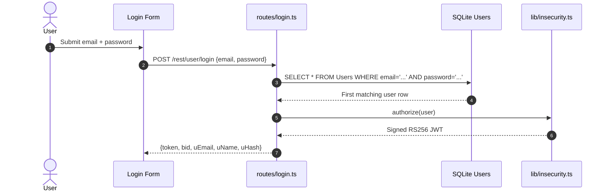

**Security assessment**

Two independent weaknesses sit on the login path:

- `routes/login.ts:34` interpolates `req.body.email` directly into the SQL string - `' OR 1=1--` returns the seeded admin row without knowing any credential.
- `lib/insecurity.ts:41` hashes passwords with unsalted `MD5` (`crypto.createHash('md5')`). Any dump obtained via injection immediately yields pre-computed rainbow-table matches.

The vulnerable login lookup is built as a raw SQL string:

```ts
models.sequelize.query(
  `SELECT * FROM Users WHERE email = '${req.body.email}'
   AND password = '${security.hash(req.body.password)}'`
)
```

**Relevant findings**

- 🔴 [F-003](#f-003) — SQL injection in the login query allows authentication bypass by returning the first user row with a crafted email.
- 🟠 [F-015](#f-015) — Weak security-question password reset bypasses the credential entirely via a guessable challenge answer.
- 🟠 [F-038](#f-038) — Unsalted MD5 password storage makes any credential dump immediately reversible with standard rainbow tables.

**Rate limiting.** `express-rate-limit@7.5.1` is configured at `server.ts:343` and applied to `POST /rest/user/reset-password`, but `POST /rest/user/login` has no rate limit. Credential-stuffing and brute-force attacks against the login endpoint encounter no server-side throttle. `GET /rest/products/search` and `POST /b2b/v2/orders` are similarly unthrottled.

<a id="multi-factor-authentication"></a>
#### 7.2.3 Multi-Factor Authentication

**Status:** 🟡 Partial - TOTP 2FA is implemented and enrollable but is optional and bypassed by any attacker who can forge a valid JWT.

TOTP-based two-factor authentication is available as an opt-in second factor via `routes/2fa.ts`. Users may enroll a TOTP seed and, once enrolled, are prompted for a time-based one-time password on login. Enrollment stores the TOTP secret server-side and verification checks the submitted code against the current window.

**Security assessment**

TOTP enrollment and verification exist and function correctly in isolation. The control is partial because MFA is not enforced - it is entirely optional, so most users never activate it. More critically, an attacker who exploits the hardcoded RSA private key (🔴 [F-002](#f-002) — Hardcoded RSA private key signs all JWTs — `lib/insecurity.ts:21`) or the JWT algorithm confusion (🔴 [F-003](#f-003) — Insecure JWT Verification — `lib/insecurity.ts:52`) obtains a valid session token without touching the TOTP flow at all. MFA only protects accounts that have enrolled it, and the JWT signing flaw bypasses the entire authentication layer regardless.

**Relevant findings**

- 🔴 [F-003](#f-003) — JWT algorithm confusion allows forging a valid session token, bypassing TOTP enrollment entirely.
- 🟠 [F-015](#f-015) — Weak password reset allows account recovery without triggering the MFA challenge.
- 🟠 [F-038](#f-038) — Weak password storage; once credentials are recovered offline, MFA is the only remaining barrier — which the JWT flaw nullifies.

<a id="oauth-and-social-login"></a>
#### 7.2.4 OAuth and Social Login

**Status:** 🟡 Partial - the OAuth flow is implemented as a frontend-only identity adapter that derives a deterministic local password from the OAuth profile email, creating a parallel credential bypass.

The OAuth flow is implemented in the Angular frontend as a social-login adapter, not a server-side authorization-code flow. `oauth.component.ts` reads an access token from the redirect URL, calls Google's userinfo endpoint through `UserService.oauthLogin()`, derives a local account password from the returned email, creates a local user if needed, and then calls the same local `POST /rest/user/login` endpoint.

The diagram shows how the frontend OAuth adapter converts an OAuth profile into a local login call:

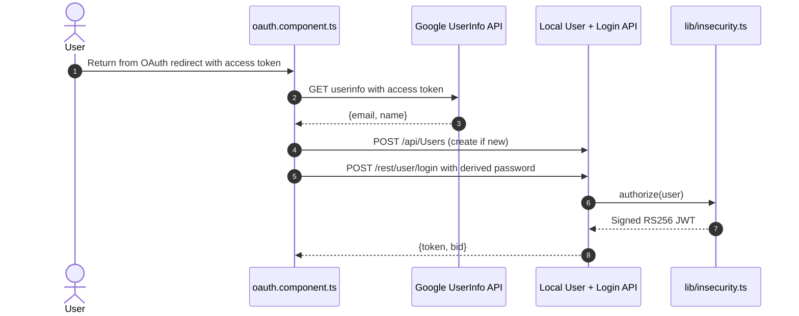

**Security assessment**

This is a frontend identity adapter, not a server-side OAuth/OIDC control. The derived password - `btoa(email.split('').reverse().join(''))` at `oauth.component.ts:30` - is fully deterministic from the (often public) email address. Any attacker who knows a target's email can compute this value and authenticate through the standard password-login endpoint without any OAuth involvement. The implicit flow also returns the access token in the URL fragment (`login.component.ts:148`), exposing it to referrer headers and browser history.

The password derivation that enables the bypass:

```ts
// oauth.component.ts:30
const password = btoa(email.split('').reverse().join(''))
```

**Relevant findings**

- 🔴 [F-003](#f-003) — SQL injection in the login route; OAuth-created accounts use the same vulnerable login endpoint.
- 🟠 [F-015](#f-015) — Password reset applies to OAuth-created accounts since they have a local password.
- 🟠 [F-038](#f-038) — The derived password is hashed with unsalted MD5, compounding the reversibility of the bypass.

<a id="user-registration"></a>
#### 7.2.5 User Registration

**Status:** 🔴 Unsafe - the registration flow accepts privileged field assignments from the request body and registers users to the `socket-io` channel without authentication.

Detected in scope: GET `/api/Users`

`POST /api/Users` and the associated verify route at `routes/register.ts` / `routes/verify.ts` handle new account creation. Users supply email, password, and optional profile data. Sequelize creates the user record and the login session begins.

The diagram shows the intended positive registration flow:

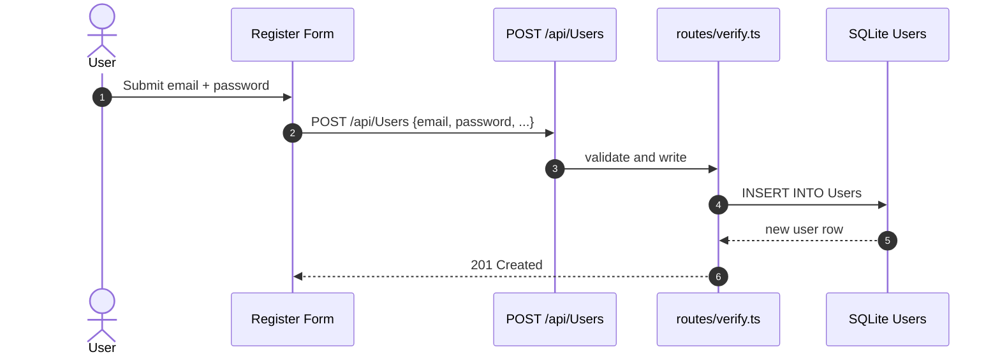

**Security assessment**

Two structural gaps are present on the registration boundary:

- `routes/verify.ts:53` passes the raw request body to the Sequelize `create()` call without field filtering. An attacker who includes `"role":"admin"` in the registration payload can elevate to administrator on account creation (mass assignment, 🔴 [F-011](#f-011) — Mass assignment privileged field accepted from request — `routes/verify.ts:53`).
- The `socket-io` channel upgrade at `registerWebsocketEvents.ts:23` requires no authentication token, so any newly created (or anonymous) browser can subscribe to real-time challenge and notification events (🟠 [F-017](#f-017) — Unauthenticated WebSocket Channel — `registerWebsocketEvents.ts:23`).

The mass-assignment path in the verify route:

```ts
// routes/verify.ts:53
models.User.create(req.body)
```

**Relevant findings**

- 🔴 [F-011](#f-011) — Mass assignment at `routes/verify.ts:53` allows role elevation on registration by supplying a privileged field in the request body.
- 🟠 [F-017](#f-017) — Unauthenticated `socket-io` channel upgrade allows any client to receive real-time events without registering.
- 🔴 [F-045](#f-045) — Sensitive routes at `server.ts:310` are registered without authentication middleware, including the profile-image-upload path used in SSRF.
- 🟡 [F-069](#f-069) — `socket-io` has no message size limit or rate limiting at `registerWebsocketEvents.ts:20`, enabling resource exhaustion against the real-time channel.

<a id="password-reset"></a>
#### 7.2.6 Password Reset

**Status:** 🔴 Unsafe - the single-step security-question reset answers a challenge whose answer is guessable from public profile information, and the password change route omits the current-credential check.

Detected in scope: POST `/rest/user/reset-password`

`POST /rest/user/reset-password` at `routes/resetPassword.ts` accepts an email, the answer to a registered security question, and a new password. No emailed token, no time limit, and no multi-step verification are involved - the route resets the password immediately if the security-question answer matches.

The diagram shows the single-step reset path:

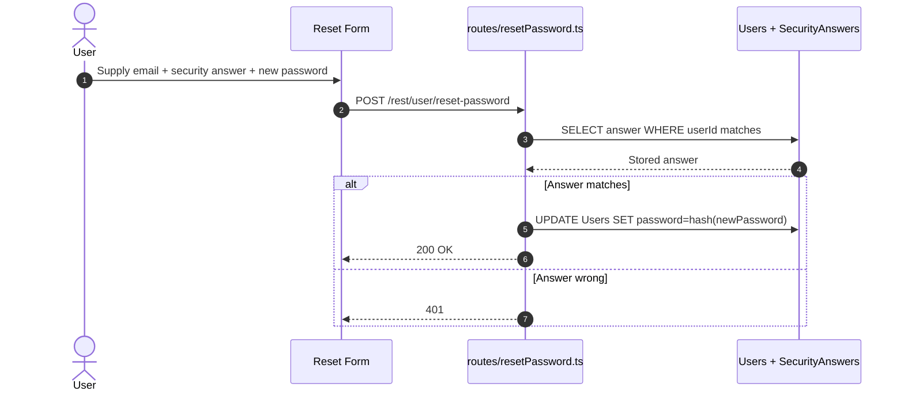

**Security assessment**

Security-question answers for the seeded accounts are derivable from the application context (e.g. "What is your pet's name?" with the answer visible in promotional content). `routes/resetPassword.ts:41` compares the supplied answer case-insensitively against the stored hash, but because the question space is narrow and the seeded answers are public, this provides negligible guessing resistance. Separately, `routes/changePassword.ts:39` does not verify the current password before accepting a new one - an authenticated attacker who briefly controls a session can change the password without knowing the original credential.

**Relevant findings**

- 🟠 [F-015](#f-015) — The security-question password reset at `routes/resetPassword.ts:41` is bypassable because the question answers for seeded accounts are derivable from public information.

### 7.3 Session and Token Controls

**Verdict:** 🔴 Unsafe

<!-- The line below is mechanically derived from the controls table — LLM must not re-author it. -->
**Controls covered:**

- [7.3.1 Session Token Issuance](#731-session-token-issuance)
- [7.3.2 Session Invalidation and Revocation](#732-session-invalidation-and-revocation)
- [7.3.3 Session Cookie Hardening](#733-session-cookie-hardening)

**Implemented controls:** `RS256` JWT issuance via `lib/insecurity.ts:authorize()`, in-memory `authenticatedUsers` map at `lib/insecurity.ts:72`, `express-jwt@0.1.3` middleware for protected route validation, cookie-parser with a configured secret at `server.ts:289`.

**Assessment:** This application uses a single locally-signed token format (commonly called JWT) for every authenticated session, regardless of the login flow in [§7.2](#72-identity-and-authentication-controls) that established it. The sub-sections below trace one token through its lifecycle: signing on issuance, validation on every protected request, storage in the browser, manual revocation, and time-based expiry. All three lifecycle controls are defeated: the signing key is hardcoded and public, the verifier accepts unsigned tokens, there is no server-side revocation, and tokens are stored in `localStorage` where any script can read them.

<a id="session-token-issuance"></a><a id="session-token-issuance-jwt-based"></a>
#### 7.3.1 Session Token Issuance

**Status:** 🔴 Unsafe - the RSA private key used for JWT signing is hardcoded in source and committed to the public repository, making every issued token forgeable offline.

⚠ **Anti-pattern:** Secrets hardcoded in source

`RS256`-signed JWTs are issued by `lib/insecurity.ts:authorize()` after every successful authentication flow. The function calls `jwt.sign(user, privateKey, { expiresIn: '6h', algorithm: 'RS256' })` where `privateKey` is a 1024-bit RSA PEM literal assigned at line 21 of the same file. The corresponding public key is served at `/encryptionkeys/jwt.pub` via `routes/keyServer.ts:14`.

The diagram shows the positive JWT issuance path from a successful login to the encoded token returned to the browser:

```mermaid
sequenceDiagram
    autonumber
    actor User
    participant API as Login Route
    participant Issuer as lib/insecurity.ts:authorize()
    participant Key as Hardcoded privateKey (line 21)

    User->>API: Successful credential check
    API->>Issuer: authorize({id, email, role})
    Issuer->>Key: Read PEM literal
    Key-->>Issuer: 1024-bit RSA private key
    Issuer-->>API: RS256-signed JWT (6h expiry)
    API-->>User: {token, bid, uEmail}
```

**Security assessment**

The private key at `lib/insecurity.ts:21` is a string literal in the committed source - every repo clone includes it. From that key, an attacker calls `jwt.sign({id:1, role:'admin', email:'admin@juice-sh.op'}, privateKey, {algorithm:'RS256'})` and produces a token the server accepts as administrator. No rate-limited surface, no server interaction, no credential required. The 1024-bit key size is also below the current 2048-bit minimum, reducing brute-force resistance further if rotation were attempted.

The hardcoded key material:

```ts
// lib/insecurity.ts:21
export const privateKey =
  '[PEM PRIVATE KEY — REDACTED]...'
```

**Relevant findings**

- 🟠 [F-036](#f-036) — JWT token is stored in `localStorage` at `oauth.component.ts:51`, making it accessible to any injected script that exploits the XSS in 🔴 [F-001](#f-001) — DOM and Stored XSS — `search-result.component.ts:143`.
- 🟠 [F-043](#f-043) — Token verify ignores expiry and standard claims — `lib/insecurity.ts:55` at `lib/insecurity.ts:55`, removing the time-based bound on any forged token.
- 🟡 [F-058](#f-058) — Client-side logout only clears browser storage; the server-issued token remains valid until the 6-hour expiry because no server-side revocation exists.

<a id="session-invalidation-and-revocation"></a>
#### 7.3.2 Session Invalidation and Revocation

**Status:** 🔴 Missing - no server-side token blacklist exists; the in-memory `authenticatedUsers` map is keyed on user ID, not token, so logout removes the map entry but leaves the JWT itself valid for its remaining lifetime.

JWT session tokens carry a 6-hour expiry set in `lib/insecurity.ts:authorize()`. The `authenticatedUsers` in-memory map at line 72 records active sessions, and logout clears the browser-side token via the Angular frontend at `navbar.component.ts:240`.

**Security assessment**

Server-side revocation was never built. `navbar.component.ts:240` calls `this.userService.isLoggedIn.next(false)` and clears `localStorage` - but the JWT itself is never invalidated on the server. Any copy of the token intercepted before logout (via XSS, `localStorage` read, or network sniffing) remains usable until the 6-hour signature window expires. The `authenticatedUsers` map tracks a user ID, not a specific token, so it cannot distinguish a revoked session from a valid one issued after re-login.

**Relevant findings**

- 🟠 [F-036](#f-036) — `localStorage` storage means a stolen token survives the victim's logout and is reusable for up to 6 hours.
- 🟠 [F-043](#f-043) — `jws.verify()` at `lib/insecurity.ts:55` skips standard claim validation, including expiry — so even the 6-hour window provides no guarantee.
- 🟡 [F-058](#f-058) — Client-side logout only clears browser storage; the server-issued token remains cryptographically valid.

<a id="session-cookie-hardening"></a>
#### 7.3.3 Session Cookie Hardening

**Status:** 🟠 Weak - the cookie-parser secret is hardcoded as a 5-character string and session tokens are stored in `localStorage` rather than an `HttpOnly Secure SameSite=Strict` cookie, so the entire session architecture is exposed to XSS.

⚠ **Anti-pattern:** SPA without BFF

`server.ts:289` configures `cookieParser('kekse')` - a 5-character hardcoded secret used to sign cookies. The Angular SPA stores the JWT in `localStorage` via `oauth.component.ts:51` and transmits it in the `Authorization` header on subsequent requests rather than relying on cookies for session transport.

**Security assessment**

Storing the session token in `localStorage` instead of an `HttpOnly Secure SameSite=Strict` cookie means any JavaScript running in the origin - including XSS payloads from the stored-XSS finding at `search-result.component.ts:143` - can read and exfiltrate the token. The cookie-parser secret `kekse` is trivially guessable and committed to source, providing no meaningful signed-cookie security. Moving token storage to a Backend-for-Frontend that issues `HttpOnly` cookies would confine session material to the HTTP stack and prevent script-level theft.

**Relevant findings**

- 🟠 [F-036](#f-036) — JWT stored in `localStorage` at `oauth.component.ts:51`; any XSS payload reads `localStorage.getItem('token')` directly.
- 🟠 [F-043](#f-043) — Token expiry not enforced by the server, so a stolen token is usable for up to 6 hours post-theft.
- 🟡 [F-058](#f-058) — Client-side-only logout leaves the stolen token valid on the server side after the victim signs out.

### 7.4 Authorization Controls

**Verdict:** 🔴 Unsafe

<!-- The line below is mechanically derived from the controls table — LLM must not re-author it. -->
**Controls covered:**

- [7.4.1 Object-Level Authorization](#741-object-level-authorization)
- [7.4.2 Role-Based Access Control](#742-role-based-access-control)
- [7.4.3 Management Endpoint Protection](#743-management-endpoint-protection)

**Implemented controls:** `isAuthorized()` middleware from `lib/insecurity.ts:52` applied to some admin routes, JWT role claim checked in Angular route guards at `app.guard.ts:54`, Sequelize REST API middleware applying authorization to model CRUD operations.

**Assessment:** Authorization enforcement is fragmentary. Object-level checks on user-owned resources (orders, addresses, baskets, wallet) are absent from 18+ routes. Role enforcement relies partially on a client-side Angular guard (`app.guard.ts`) that any attacker bypasses by calling the API directly. The management surface (`/rest/admin/*`, `/metrics`) is fully unauthenticated.

<a id="object-level-authorization"></a><a id="object-level-authorization-idor-prevention"></a>
#### 7.4.1 Object-Level Authorization

**Status:** 🔴 Unsafe - 18+ routes that return or modify user-owned objects (orders, addresses, baskets, payment cards, wallet balances) accept any authenticated request with a matching integer ID and perform no owner check.

Sequelize REST resources (addresses, baskets, orders, cards, payments) are exposed via the CRUD routes mounted in `server.ts`. Routes accept a `:id` path parameter and pass it directly to Sequelize `findOne` or `update` calls without cross-referencing the requesting user's ID from the JWT payload.

**Security assessment**

Sequential integer IDs are used across all ownership-sensitive resources. `routes/address.ts:11` fetches an address by `req.params.addressId` without comparing `req.user.data.id` to the address owner. The same pattern appears in `routes/wallet.ts:12`, `routes/order.ts:148`, `routes/payment.ts:21`, and `routes/delivery.ts:34`. An authenticated user substituting any integer ID for their own reads or modifies another user's resource. The wallet endpoint at `server.ts:627` (`PUT /rest/wallet/balance`) also lacks an authorization gate.

**Relevant findings**

- 🔴 [F-008](#f-008) — Insecure direct object reference across address, wallet, basket, payment, and order routes allows any authenticated user to access another user's data by substituting integer IDs.
- 🔴 [F-011](#f-011) — Mass assignment at registration compounds IDOR by allowing an attacker to set a privileged role, then leverage IDOR routes with elevated access.
- 🟠 [F-031](#f-031) — Missing authorization on the wallet balance endpoint at `server.ts:627` allows direct manipulation of another user's wallet balance.

<a id="role-based-access-control"></a>
#### 7.4.2 Role-Based Access Control

**Status:** 🟠 Weak - `isAuthorized()` middleware exists and is applied to some admin routes, but the role claim lives in the JWT payload that is forgeable via the hardcoded signing key, and client-side Angular guards are the only protection on many sensitive routes.

`lib/insecurity.ts:52` exports `isAuthorized()` as an Express middleware that calls `expressJwt()` and, for some routes, additionally checks the `role` field in the decoded payload. `app.guard.ts:54` in the Angular SPA reads the decoded JWT role from `localStorage` and gates Angular routes client-side.

**Security assessment**

Two weaknesses break RBAC independently:

- The JWT signing key is hardcoded ([§7.3.1](#731-session-token-issuance)), so any attacker forges a token with `role:'admin'` and the server's `isAuthorized()` middleware accepts it.
- `app.guard.ts:54` enforces the admin route guard in client-side TypeScript - bypassed by any direct API call regardless of the frontend guard state. Admin operations performed via direct `curl` calls skip the guard entirely.

**Relevant findings**

- 🔴 [F-008](#f-008) — IDOR on authorization-checked routes; a forged admin token combined with direct API calls bypasses both the RBAC middleware and the client-side guard.
- 🔴 [F-011](#f-011) — Mass assignment enables role escalation at registration without requiring JWT forgery.
- 🟠 [F-031](#f-031) — Wallet balance endpoint missing authorization gate, demonstrating inconsistent middleware application.

<a id="management-endpoint-protection"></a>
#### 7.4.3 Management Endpoint Protection

**Status:** 🔴 Missing - the three management-surface endpoints (`/rest/admin/application-version`, `/rest/admin/application-configuration`, `/metrics`) are mounted without any authentication middleware.

`server.ts:604–605` registers `GET /rest/admin/application-version` and `GET /rest/admin/application-configuration` without any preceding middleware. `GET /metrics` at `server.ts:718` similarly exposes the Prometheus metrics endpoint to any unauthenticated client.

**Security assessment**

`/rest/admin/application-configuration` returns the full application configuration including feature flags, challenge configuration, and internal route parameters. `/metrics` exposes Prometheus counters including request rates and error counts per endpoint. Both are internet-accessible with no authentication check. This gives an unauthenticated attacker a complete map of the application's internal state and endpoint list before any credential is required.

**Relevant findings**

- 🔴 [F-008](#f-008) — IDOR findings and the open management surface together give an unauthenticated attacker both the object-ID space and the configuration needed to plan targeted attacks.
- 🔴 [F-011](#f-011) — Mass-assignment finding; application-configuration disclosure reveals the field schema used to craft the privilege-escalation payload.
- 🟠 [F-031](#f-031) — Unauthenticated wallet endpoint and unauthenticated management surface are instances of the same missing-authentication-middleware pattern at `server.ts`.

### 7.5 Query Construction and Data Access Controls

**Verdict:** 🔴 Unsafe

<!-- The line below is mechanically derived from the controls table — LLM must not re-author it. -->
**Controls covered:**

- [7.5.1 Parameterized Query / ORM Usage](#751-parameterized-query-orm-usage)

**Implemented controls:** Sequelize ORM backs most relational data access; the majority of CRUD routes use Sequelize model methods with implicit parameterization. MarsDB backs the product-review in-memory store.

**Assessment:** Sequelize provides parameterized queries on the standard CRUD paths, but three security-critical routes bypass the ORM entirely. The login and product-search routes call `models.sequelize.query()` with string-interpolated user input, and the order-tracking route passes a user-controlled value directly into a MarsDB selector.

<a id="parameterized-query-orm-usage"></a><a id="751-parameterized-query-orm-usage"></a>
#### 7.5.1 Parameterized Query / ORM Usage

**Status:** 🔴 Unsafe - the login and product-search routes bypass Sequelize parameterization by calling raw `sequelize.query()` with user-controlled string interpolation, creating two SQL injection entry points.

⚠ **Anti-pattern:** Raw SQL string interpolation

Sequelize models back most relational data access across `models/`. The login route at `routes/login.ts:34` and the product-search route at `routes/search.ts:23` call `models.sequelize.query()` directly with template-literal SQL. The order-tracking route at `routes/trackOrder.ts:18` passes a user-controlled `id` into a MarsDB selector without type enforcement.

**Security assessment**

Both raw SQL paths are exploitable without authentication:

- `routes/login.ts:34` interpolates `req.body.email` into `SELECT * FROM Users WHERE email = '${email}'`. A payload of `' OR 1=1--` returns the first user row, which is the seeded admin account.
- `routes/search.ts:23` interpolates `req.query.criteria` into a `SELECT` with `LIKE '%${criteria}%'`. Standard SQL injection techniques extract table schema and data through the unauthenticated search endpoint.

The product search route illustrates the same raw SQL construction pattern:

```ts
// routes/search.ts:23
models.sequelize.query(
  `SELECT * FROM Products WHERE ((name LIKE '%${criteria}%'
   OR description LIKE '%${criteria}%') AND deletedAt IS NULL)
   ORDER BY name`
)
```

**Relevant findings**

- 🔴 [F-005](#f-005) — SQL injection in the product-search route at `routes/search.ts:23` via the `criteria` query parameter.
- 🔴 [F-007](#f-007) — SQL injection in the login route at `routes/login.ts:34` via the `email` request body field, enabling authentication bypass.
- 🔴 [F-023](#f-023) — NoSQL injection in the order-tracking route at `routes/trackOrder.ts:18` via a user-controlled selector value passed to MarsDB.

### 7.6 Input Boundary Validation Controls

**Verdict:** 🔴 Missing

<!-- The line below is mechanically derived from the controls table — LLM must not re-author it. -->
**Controls covered:**

- [7.6.1 Validation Approach](#761-validation-approach)
- [7.6.2 Centralized Input Validation](#762-centralized-input-validation)
- [7.6.3 File Upload Validation](#763-file-upload-validation)

**Implemented controls:** Per-route email/password trimming at `server.ts:411–413`, `multer@1.4.5-lts.1` for multipart file handling, route-level business-rule checks in individual route files.

**Assessment:** No global validation middleware exists. Input handling is performed ad-hoc within individual route handlers, with no shared schema, no type coercion enforcement, and no injection-pattern filtering at the request boundary. File uploads accept any MIME type and process XML with external-entity resolution enabled.

<a id="validation-approach"></a>
#### 7.6.1 Validation Approach

**Status:** 🔴 Missing - validation is entirely per-route and ad-hoc; no global middleware enforces type, length, or format constraints across the 247 registered routes.

`server.ts:411–413` trims email and password fields for the registration path. Individual route files (e.g. `routes/login.ts`, `routes/search.ts`) receive request bodies directly without passing through any shared validation layer. The B2B order route at `routes/b2bOrder.ts:19` accepts arbitrary `orderLinesData` content that is subsequently evaluated.

**Security assessment**

The absence of a centralized validation layer means every route is an independent trust boundary with its own inconsistent handling. Routes that rely on SQL parameterization are safe; routes that use raw `sequelize.query()` are not - and there is no structural gate between them. The B2B API at `routes/b2bOrder.ts:19` accepts a freeform JSON body field that `vm.runInContext('safeEval(orderLinesData)')` evaluates at line 23, with no type or length check preceding evaluation.

**Relevant findings**

- 🟠 [F-020](#f-020) — Missing input validation on the B2B order route at `routes/b2bOrder.ts:19` allows arbitrary content to reach the `notevil` sandbox evaluator.
- 🟡 [F-069](#f-069) — `socket-io` channel accepts messages without a size limit, representing the same missing boundary enforcement at the WebSocket layer.

<a id="centralized-input-validation"></a>
#### 7.6.2 Centralized Input Validation

**Status:** 🔴 Missing - no global Express middleware validates, sanitizes, or schema-checks request bodies; each route handles (or ignores) input independently.

`server.ts` mounts application middleware in sequence: `helmet`, `cors`, `morgan`, `bodyParser`, `cookieParser`, and application-specific route mounts. No validation or schema-enforcement middleware is present in this chain. Libraries such as `joi`, `zod`, `express-validator`, or AJV are absent from `package.json`.

**Security assessment**

`GET /rest/products/search` passes `req.query.criteria` directly to a raw SQL template. `POST /profile` passes `req.body` fields including a user-controlled `imageUrl` to `routes/profileImageUrlUpload.ts:24` where `fetch(url)` executes the SSRF. `POST /rest/user/register` passes the entire body to Sequelize `create()`. All three would be interrupted by a global schema validator that enforced the field whitelist and type constraints the route authors assumed. Without it, the SQL injection, SSRF, and mass-assignment findings share the same root cause: untrusted data reaching a dangerous sink without a validation gate.

**Relevant findings**

- 🟠 [F-020](#f-020) — B2B order input reaches `vm.runInContext()` with no field validation at the middleware layer.
- 🟡 [F-069](#f-069) — Unthrottled `socket-io` messages demonstrate the missing rate and size enforcement at the WebSocket entry point.

<a id="file-upload-validation"></a>
#### 7.6.3 File Upload Validation

**Status:** 🔴 Missing - `multer` handles multipart uploads but enforces no file-type allowlist or size limit, and XML files are parsed with `noent:true` (external entity resolution enabled).

`routes/fileUpload.ts` handles `POST /file-upload` and `POST /profile/image/file` using `multer@1.4.5-lts.1`. `multer` stores the uploaded file and passes it to processing logic. `routes/fileUpload.ts:83` detects XML files and passes them to `libxmljs2.parseXml(data, { noblanks: true, noent: true, nocdata: true })` inside a `vm.runInContext()` call.

**Security assessment**

No file-type allowlist is configured in the `multer` middleware - any file type including executables, shell scripts, and XML with external entities is accepted. The XML processing path explicitly enables `noent: true`, which instructs `libxmljs2` to resolve `<!ENTITY xxe SYSTEM "file:///etc/passwd">` references during parsing. A zip file containing a path-traversal entry (`../../server.ts`) is extracted without containment at `routes/fileUpload.ts:34`. Both entry points (`POST /file-upload`, `POST /profile/image/file`) lack authentication middleware at `server.ts:309–310`, so exploitation requires no credential.

**Relevant findings**

- 🟠 [F-020](#f-020) — Missing input validation at the file-upload boundary allows any MIME type including executable content.
- 🟡 [F-069](#f-069) — `socket-io` size-limit absence is the same pattern — no boundary enforcement on inbound data volume.

### 7.7 Output Encoding and Rendering Controls

**Verdict:** 🔴 Unsafe

<!-- The line below is mechanically derived from the controls table — LLM must not re-author it. -->
**Controls covered:**

- [7.7.1 HTML Sanitization](#771-html-sanitization)
- [7.7.2 Server-Side Template Injection Prevention](#772-server-side-template-injection-prevention)

**Implemented controls:** Angular's default `DomSanitizer` is active on most template bindings; `sanitize-html@1.4.2` is used in `lib/insecurity.ts:58` as a server-side fallback sanitizer for stored content; per-user CSP header is set in the profile route.

**Assessment:** Angular's default sanitizer is explicitly bypassed via `bypassSecurityTrustHtml()` on the search-result and product-description paths, enabling stored and reflected XSS. The server-side sanitizer (`sanitize-html@1.4.2`) is severely outdated with known bypass techniques. Server-side code evaluation via `eval()` on user-supplied profile content provides a direct SSTI path.

<a id="html-sanitization"></a>
#### 7.7.1 HTML Sanitization

**Status:** 🔴 Unsafe - `bypassSecurityTrustHtml()` is called on user-controlled and server-supplied content in the search-result component, disabling Angular's built-in sanitizer and enabling stored and reflected XSS.

Angular's `DomSanitizer` prevents `[innerHTML]` bindings from rendering active content by default. `search-result.component.ts:143` wraps the `q` query parameter with `this.sanitizer.bypassSecurityTrustHtml(queryParam)` before binding it to `[innerHTML]="searchValue"` in the template. The server-side library `sanitize-html@1.4.2` at `lib/insecurity.ts:58` also provides a fallback sanitizer for stored product descriptions and feedback content.

**Security assessment**

`bypassSecurityTrustHtml()` at `search-result.component.ts:143` unconditionally trusts the attacker-controlled `q` URL parameter - a payload such as `` executes in the victim's browser and exfiltrates the JWT from `localStorage`. `sanitize-html@1.4.2` is four major versions behind the current release and is documented to have allowlist-bypass techniques available, so the server-side fallback provides no meaningful defence either. The per-user CSP at `routes/userProfile.ts:88` includes `script-src 'self' 'unsafe-eval'`, which permits inline evaluation even when set.

This trusted-HTML call demonstrates where Angular's default escaping is bypassed:

```ts
// search-result.component.ts:143
this.searchValue = this.sanitizer.bypassSecurityTrustHtml(queryParam)
```

**Relevant findings**

- 🔴 [F-001](#f-001) — DOM and stored XSS at `search-result.component.ts:143` via `bypassSecurityTrustHtml(queryParam)` bound to `[innerHTML]`, enabling JWT theft from `localStorage`.

<a id="server-side-template-injection-prevention"></a>
#### 7.7.2 Server-Side Template Injection Prevention

**Status:** 🔴 Unsafe - `eval()` is called on user-supplied profile content at `routes/userProfile.ts:62` and on CAPTCHA expressions at `routes/captcha.ts:22`, providing direct server-side code execution paths.

`routes/userProfile.ts:62` calls `eval(code)` where `code` is derived from the `profileImage` field in the request body. `routes/captcha.ts:22` calls `eval(expression)` on the CAPTCHA math string. `routes/b2bOrder.ts:23` uses `vm.runInContext('safeEval(orderLinesData)')` with the `notevil` sandbox on user-supplied order content.

**Security assessment**

All three paths execute arbitrary JavaScript supplied by the user or constructed from user input without a safe-evaluation boundary:

- `routes/userProfile.ts:62` - `eval(code)` on a user-supplied field; any Node\.js expression including `require('child_process').execSync('id')` runs in the server process.
- `routes/captcha.ts:22` - CAPTCHA expressions are served to the client (`GET /rest/captcha`) and sent back for evaluation; a client can submit an arbitrary expression.
- `routes/b2bOrder.ts:23` - `notevil` + `vm.runInContext` is documented to have sandbox-escape CVEs; attacker-supplied `orderLinesData` reaches `safeEval()`.

**Relevant findings**

- 🔴 [F-001](#f-001) — Stored XSS is the client-side counterpart; server-side eval is the server-side counterpart. Together they provide full code execution on both tiers.

### 7.8 Browser and Cross-Origin Controls

**Verdict:** 🔴 Unsafe

<!-- The line below is mechanically derived from the controls table — LLM must not re-author it. -->
**Controls covered:**

- [7.8.1 Content Security Policy](#781-content-security-policy)
- [7.8.2 CORS Policy](#782-cors-policy)
- [7.8.3 CSRF Protection](#783-csrf-protection)
- [7.8.4 Partial HTTP Security Headers](#784-partial-http-security-headers)

**Implemented controls:** `helmet@4.6.0` with `noSniff()` and `frameguard()` enabled at `server.ts:185`; CORS middleware mounted at `server.ts:181`; per-user dynamic CSP header in the profile route; cookie-parser with hardcoded secret.

**Assessment:** The subset of Helmet features in use blocks MIME sniffing and clickjacking, but the three highest-value browser controls are absent or broken: no global CSP is configured, CORS allows all origins, and no CSRF tokens protect state-changing endpoints. The SPA architecture with `localStorage`-stored JWTs makes CSRF less immediately exploitable, but the open CORS policy means any cross-origin site can call authenticated REST endpoints using the user's stored token.

<a id="content-security-policy"></a>
#### 7.8.1 Content Security Policy

**Status:** 🔴 Missing - `helmet.contentSecurityPolicy()` is not called anywhere in `server.ts`; the only CSP in the application is a per-user header set in the profile route that includes `'unsafe-eval'`.

`server.ts:185` calls `app.use(helmet())` with the default Helmet configuration. Helmet's `contentSecurityPolicy()` module is not enabled - the commented-out `app.use(helmet.xssFilter())` at `server.ts:187` is the only CSP-related call and it is disabled. The profile route at `routes/userProfile.ts:88` sets a per-response CSP header for the profile page only: `img-src 'self' ${user?.profileImage}; script-src 'self' 'unsafe-eval'`.

**Security assessment**

Without a global CSP, every XSS payload executes without browser-level restriction - no `script-src` allowlist limits inline scripts, no `connect-src` limits exfiltration destinations. The per-user CSP is actually weaker than no CSP in the relevant respect: it explicitly permits `'unsafe-eval'`, which allows `eval()` execution in the browser context and negates any `script-src` benefit. The Helmet XSS filter (`x-xss-protection: 1; mode=block`) is also commented out, removing the legacy IE-era browser protection.

**Relevant findings**

- 🟠 [F-021](#f-021) — Missing CSRF protection at `server.ts:289`; the absent CSP compounds this by removing the browser's cross-origin script restriction.
- 🟡 [F-051](#f-051) — OAuth redirect URI matched client-side; a proper CSP with strict `frame-ancestors` and `connect-src` would limit the impact of open-redirect abuse.
- 🟡 [F-071](#f-071) — Permissive CORS at `server.ts:183` allows any origin to issue credentialed requests; CSP `connect-src` would be a secondary control here.

<a id="cors-policy"></a>
#### 7.8.2 CORS Policy

**Status:** 🔴 Unsafe - `cors()` at `server.ts:181` is mounted with no `origin` option, which defaults to reflecting any `Origin` header - allowing any cross-origin site to read authenticated REST API responses.

`server.ts:181` calls `app.use(cors())` with no configuration object. The `cors` package's default behavior with no `origin` option is to respond with `Access-Control-Allow-Origin: *`, which permits cross-origin reads from any domain.

**Security assessment**

Wildcard CORS combined with the bearer-token authentication model means any cross-origin page can issue `fetch('/rest/user/whoami', {headers:{'Authorization':'Bearer '+token}})` and read the response if the user has their token stored. Since `localStorage` tokens are readable by any same-origin script (and XSS is present), a cross-origin attacker's script injected via XSS can both steal the token and make cross-origin API calls. The open CORS policy also negates the same-origin protection that would otherwise limit exfiltration channels from within the application.

**Relevant findings**

- 🟠 [F-021](#f-021) — Missing CSRF protection at `server.ts:289`; bearer-token auth partially mitigates CSRF but open CORS enables cross-origin reads that reveal state.
- 🟡 [F-051](#f-051) — The OAuth redirect validation uses a client-side string match; open CORS removes a layer of isolation that would otherwise constrain cross-origin exploitation.
- 🟡 [F-071](#f-071) — Permissive CORS at `server.ts:183` allows all-origin cross-origin read access to authenticated API responses.

<a id="csrf-protection"></a>
#### 7.8.3 CSRF Protection

**Status:** 🔴 Missing - no CSRF token middleware is configured; state-changing REST endpoints rely entirely on bearer-token authentication, which provides partial but incomplete CSRF protection given the open CORS policy.

`server.ts:289` configures `cookieParser('kekse')` for signed cookies. No `csurf` or equivalent CSRF-token middleware is mounted. The v20.x CSRF challenge makes the application origin URL configurable, but this is a training challenge configuration - not a CSRF defence.

**Security assessment**

Bearer-token authentication (`Authorization: Bearer <jwt>`) provides CSRF resistance only when cookies are not used for session transport. In this codebase, tokens are in `localStorage`, so a cross-origin form submission cannot include the token. However, the open CORS policy (`Access-Control-Allow-Origin: *`) breaks the same-origin isolation that would otherwise limit cross-origin reads. An attacker who exploits XSS to read the `localStorage` token can then make cross-origin authenticated API calls using that token - the CSRF gap and the CORS gap combine into a viable exploit chain. State-changing API calls such as `POST /api/Complaints` at `complaint.component.ts:44` use the bearer token with no anti-CSRF double-submit or synchronizer token.

**Relevant findings**

- 🟠 [F-021](#f-021) — Missing CSRF protection on state-changing endpoints at `server.ts:289`; bearer token in `localStorage` partially mitigates classical CSRF but does not close the XSS-to-CSRF chain.
- 🟡 [F-051](#f-051) — OAuth redirect URI validation performed client-side; CSRF at the OAuth callback could redirect the auth code to an attacker-controlled destination.
- 🟡 [F-071](#f-071) — Permissive CORS allows cross-origin reads; combined with absent CSRF tokens this permits a full cross-site attack chain.

<a id="partial-http-security-headers"></a>
#### 7.8.4 Partial HTTP Security Headers

**Status:** 🟡 Partial - `helmet@4.6.0` is configured with `noSniff()` and `frameguard()`, providing MIME-type and clickjacking protection; the higher-value CSP and HSTS headers are absent.

`server.ts:185` applies `app.use(helmet())`. Helmet 4's default configuration enables `X-Content-Type-Options: nosniff` (via `noSniff()`), `X-Frame-Options: SAMEORIGIN` (via `frameguard()`), and a small set of other headers. The `contentSecurityPolicy()` and `hsts()` modules require explicit opt-in and are not called.

**Security assessment**

`noSniff()` prevents browsers from MIME-sniffing uploaded content types, and `frameguard()` prevents the application from being embedded in cross-origin iframes. Both are functional positives. The absent controls are higher-impact: no `Strict-Transport-Security` header ensures TLS downgrade protection, no `Referrer-Policy` limits data leakage in referrer headers, and no `Permissions-Policy` restricts camera/microphone/geolocation access. Helmet 4 is also three major versions behind current (v8.x), so newer security headers introduced in later Helmet versions are missing.

**Relevant findings**

- 🟠 [F-021](#f-021) — Absent CSRF headers; Helmet's `referrerPolicy` would reduce data leakage in CSRF probe requests.
- 🟡 [F-051](#f-051) — OAuth redirect-URI client-side validation; `frame-ancestors` CSP (absent) would prevent iframe-based click-jacking of the OAuth redirect.
- 🟡 [F-071](#f-071) — Open CORS; a `Vary: Origin` and strict CORS policy would be complemented by HSTS to prevent downgrade interception.

### 7.9 Cryptography Secrets and Data Protection

**Verdict:** 🔴 Unsafe

<!-- The line below is mechanically derived from the controls table — LLM must not re-author it. -->
**Controls covered:**

- [7.9.1 Cryptographic Key Management](#791-cryptographic-key-management)
- [7.9.2 Password Storage](#792-password-storage)
- [7.9.3 Data at Rest Encryption](#793-data-at-rest-encryption)

**Implemented controls:** `RS256` algorithm selected for JWT signing (`lib/insecurity.ts:authorize()`), `encryptionkeys/jwt.pub` maintained as a separate public-key file, `crypto` module used for `MD5` hashing of passwords.

**Assessment:** Every piece of cryptographic material in the application is hardcoded in source and committed to the public repository. The JWT signing private key, the HMAC key for security answers, and the cookie-parser secret are all string literals in `lib/insecurity.ts` and `server.ts`. Password storage uses unsalted `MD5` - not a password key-derivation function. The SQLite database has no encryption at rest.

<a id="cryptographic-key-management"></a>
#### 7.9.1 Cryptographic Key Management

**Status:** 🔴 Unsafe - the RSA private key, HMAC key, and cookie secret are all hardcoded string literals in the committed source, permanently compromising every cryptographic boundary in the application.

⚠ **Anti-pattern:** Secrets hardcoded in source

`lib/insecurity.ts` contains three hardcoded secrets: the 1024-bit RSA private key at line 21 (used to sign every JWT), the HMAC key at line 44 (used to forge deluxe-membership entitlement), and the cookie-parser secret at `server.ts:289` (`kekse`). The RSA private key is also available indirectly through `/encryptionkeys/jwt.pub` (the matching public key, served unauthenticated at `routes/keyServer.ts:14`).

**Security assessment**

All three secrets are permanently burned - any historical clone of the repository contains them. Rotating the JWT signing key requires a code change and redeployment, and would still leave the old key in git history. The 1024-bit RSA key does not meet the current 2048-bit minimum. The HMAC key at `lib/insecurity.ts:44` is used to compute a forged `authorization: deluxe` header, giving any attacker who reads the source full entitlement escalation.

**Relevant findings**

- 🔴 [F-002](#f-002) — Hardcoded RSA private key at `lib/insecurity.ts:21` allows any attacker with repo access to forge a valid admin-role JWT offline.
- 🔴 [F-010](#f-010) — Hardcoded HMAC key at `lib/insecurity.ts:44` allows forging the deluxe-membership authorization header.
- 🟠 [F-012](#f-012) — `Math.random()` used as the JWT secret for the `denyAll` path at `lib/insecurity.ts:53` — not a cryptographically secure RNG.

<a id="password-storage"></a>
#### 7.9.2 Password Storage

**Status:** 🔴 Unsafe - passwords are hashed with unsalted `MD5` (`lib/insecurity.ts:41`), a fast cryptographic hash function with no work factor, making any credential dump immediately reversible via rainbow tables or GPU-accelerated dictionary attacks.

Passwords are hashed at `lib/insecurity.ts:41` using `crypto.createHash('md5').update(password).digest('hex')` before storage in the `Users` table. The same hash function is called in `models/user.ts:76` as a Sequelize `beforeCreate` hook. No salt, no iterations, no bcrypt/argon2/PBKDF2.

**Security assessment**

`MD5` is a general-purpose hash function, not a password KDF. Without a per-password salt, identical passwords produce identical hashes - enabling rainbow-table attacks across the entire user table in a single pass. GPU-accelerated `MD5` cracking runs at billions of hashes per second. Given that the SQLite database is also accessible to any user who exploits the SQL injection finding at `routes/login.ts:34`, any successful injection extracts a credential store that is immediately reversible. The `models/user.ts:76` model definition confirms the same hash is used for the Sequelize model, not just the route handler.

The hashing call that produces the unsafe digest:

```ts
// lib/insecurity.ts:41
export const hash = (data: string) =>
  crypto.createHash('md5').update(data).digest('hex')
```

**Relevant findings**

- 🔴 [F-002](#f-002) — Hardcoded RSA key enables JWT forgery without needing the password; the weak hash means even a SQL dump is sufficient.
- 🔴 [F-010](#f-010) — The HMAC key for security answers at `lib/insecurity.ts:44` uses the same `hash()` function, compounding weak credential storage with weak answer storage.
- 🟠 [F-012](#f-012) — `Math.random()` as a JWT secret is a symmetric weak-key finding that parallels the weak password hash — both are non-cryptographic random sources.

<a id="data-at-rest-encryption"></a>
#### 7.9.3 Data at Rest Encryption

**Status:** 🔴 Missing - the SQLite database has no encryption at rest; user credentials, payment card numbers, security answers, and customer PII are stored in plaintext on disk.

`sqlite3@5.1.7` is the database driver. SQLite's native format is unencrypted. No SQLCipher or encryption extension is referenced in `package.json`, `models/`, or the Sequelize configuration. The Sequelize `storage` path resolves to a flat file on the container filesystem.

**Security assessment**

Any exploit that gains filesystem read access - path traversal via `routes/logfileServer.ts:14`, zip-slip via `routes/fileUpload.ts:34`, or container escape - can read the entire credential and PII store as a single file. Payment card numbers are stored as plaintext columns in `models/card.ts:38`. Customer PII (email, addresses, order history) is seeded in cleartext at `data/datacreator.ts:250`. Because the passwords are also `MD5`-hashed without salt, a copy of the database file is sufficient for full account takeover - no login endpoint required.

**Relevant findings**

- 🔴 [F-002](#f-002) — Hardcoded RSA key enables JWT forgery, but the unencrypted database means an attacker with filesystem access can extract credentials and forge tokens without touching the API.
- 🔴 [F-010](#f-010) — HMAC secret for security answers is hardcoded, and the answers themselves are stored in the unencrypted database.
- 🟠 [F-012](#f-012) — Weak JWT secret for the deny-all path; the unencrypted DB means the weak hash is the weakest link in the offline-cracking chain.

### 7.10 File Parser and Outbound Request Controls

**Verdict:** 🔴 Missing

<!-- The line below is mechanically derived from the controls table — LLM must not re-author it. -->
**Controls covered:**

- [7.10.1 XML External Entity (XXE) Prevention](#7101-xml-external-entity-xxe-prevention)
- [7.10.2 SSRF Prevention](#7102-ssrf-prevention)

**Implemented controls:** `multer@1.4.5-lts.1` for multipart form handling, `libxmljs2` for XML parsing (with unsafe options), `fetch()` native API for outbound HTTP requests.

**Assessment:** Neither XXE prevention nor SSRF prevention is implemented. `libxmljs2` is configured with `noent:true` at `routes/fileUpload.ts:83`, which explicitly enables external entity resolution. `routes/profileImageUrlUpload.ts:24` passes the user-supplied `imageUrl` directly to `fetch()` with no URL scheme restriction, no IP range blocklist, and no allowlist.

<a id="xml-external-entity-xxe-prevention"></a>
#### 7.10.1 XML External Entity (XXE) Prevention

**Status:** 🔴 Unsafe - `libxmljs2` is configured with `noent:true` at `routes/fileUpload.ts:83`, explicitly enabling external entity resolution. Any XML file upload can read local files or trigger outbound HTTP connections.

`routes/fileUpload.ts` detects uploaded XML files and parses them inside a `vm.runInContext()` call at line 83. The parse options are `{ noblanks: true, noent: true, nocdata: true }`. `noent: true` instructs `libxmljs2` to resolve `DOCTYPE` entity declarations including `SYSTEM` entities that reference file paths or HTTP URLs.

**Security assessment**

An XML file containing `<!ENTITY xxe SYSTEM "file:///etc/passwd">` followed by `&xxe;` in the document body will be parsed with the entity expanded, returning the file contents in the parse result. Because the upload endpoint at `POST /file-upload` requires no authentication (`server.ts:309`), this is an unauthenticated arbitrary file read. The same `noent: true` option also enables Server-Side Request Forgery via `SYSTEM "http://169.254.169.254/latest/meta-data/"` if the container runs on a cloud provider with an IMDS endpoint. An XML entity-expansion bomb (`<!ENTITY a "aaaa...">` with recursive expansion) also triggers a resource exhaustion DoS via the `noent` parser path.

The parser call that enables external entity resolution:

```ts
// routes/fileUpload.ts:83
libxml.parseXml(data, { noblanks: true, noent: true, nocdata: true })
```

**Relevant findings**

- 🔴 [F-006](#f-006) — XXE via `libxmljs2` with `noent:true` at `routes/fileUpload.ts:83` allows unauthenticated local file read and outbound SSRF via the XML parse path.
- 🔴 [F-009](#f-009) — Zip-slip path traversal at `routes/fileUpload.ts:34` is a parallel file-write path on the same unauthenticated upload endpoint.
- 🟠 [F-022](#f-022) — XML entity-expansion bomb DoS via the `noent` parser; a deeply-nested entity tree causes unbounded memory allocation.

<a id="ssrf-prevention"></a>
#### 7.10.2 SSRF Prevention

**Status:** 🔴 Missing - `routes/profileImageUrlUpload.ts:24` calls `fetch(url)` where `url` is taken directly from `req.body.imageUrl` with no URL scheme check, no IP range blocklist, and no redirect following limit.

`routes/profileImageUrlUpload.ts` handles `POST /profile/image/url`. It extracts `req.body.imageUrl` and calls `fetch(url)` to download the image. The response is stored as the user's profile picture. The endpoint is mounted without authentication middleware at `server.ts:311`.

**Security assessment**

The fetch call at line 24 follows any URL the attacker supplies: `file://`, `http://localhost:`, `http://169.254.169.254/` (AWS IMDS), and any internal service reachable from the container network. The endpoint is unauthenticated, so exploitation requires no prior access. Redirect following (the default Node\.js `fetch` behavior) allows SSRF bypass via an open redirect at a trusted host. The only input handling in the route is a check for the `image/` MIME type on the response - which can be spoofed by a controlled server responding with an appropriate `Content-Type`.

**Relevant findings**

- 🔴 [F-006](#f-006) — XXE via the file-upload path provides an alternative SSRF vector via the XML entity `SYSTEM` directive pointing at internal services.
- 🔴 [F-009](#f-009) — Zip-slip and path traversal on the same upload surface; attacker who can write arbitrary paths can drop a web shell or overwrite configuration.
- 🟠 [F-022](#f-022) — Entity expansion DoS; SSRF and DoS share the same missing input-boundary controls on the upload surface.

### 7.11 Operations Runtime and Supply Chain Controls

**Verdict:** 🔴 Unsafe

<!-- The line below is mechanically derived from the controls table — LLM must not re-author it. -->
**Controls covered:**

- [7.11.1 Dependency Version Management](#7111-dependency-version-management)
- [7.11.2 Container Image Security](#7112-container-image-security)
- [7.11.3 CI/CD Pipeline Hardening](#7113-cicd-pipeline-hardening)
- [7.11.4 Audit Logging](#7114-audit-logging)
- [7.11.5 Automated SCA scanning](#7115-automated-sca-scanning)
- [7.11.6 Automated dependency updates](#7116-automated-dependency-updates)
- [7.11.7 Lockfile hygiene](#7117-lockfile-hygiene)

**Implemented controls:** Distroless non-root container runtime (`gcr.io/distroless/nodejs24-debian13`, UID 65532), multi-stage Docker build separating builder and runtime, CodeQL SAST at `.github/workflows/codeql-analysis.yml`, ZAP DAST at `.github/workflows/zap_scan.yml`, Morgan HTTP access logging, `file-stream-rotator` for log rotation, SBOM generation via CycloneDX.

**Assessment:** The distroless runtime image and CodeQL/ZAP tooling are genuine positives. The supply-chain posture is weak on all other dimensions: no lockfile (`.npmrc` sets `package-lock=false`), no Dependabot, no Renovate, 14/14 workflows inherit write-all `GITHUB_TOKEN`, mutable Docker and action image references, and critically outdated dependencies (`express-jwt@0.1.3`, `jsonwebtoken@0.4.0`, `sanitize-html@1.4.2`).

<a id="dependency-version-management"></a>
#### 7.11.1 Dependency Version Management

**Status:** 🔴 Unsafe - `.npmrc` disables the lockfile (`package-lock=false`), three security-critical dependencies are critically outdated (7+ major versions behind), and no automated update tooling is configured.

`package.json` specifies `express-jwt@0.1.3` (current: 8.4.1), `jsonwebtoken@0.4.0` (current: 9.0.2), and `sanitize-html@1.4.2` (current: 2.x). `.npmrc:1` sets `package-lock=false`, meaning `npm install` resolves dependency trees non-deterministically on each run. No Dependabot `.github/dependabot.yml` and no Renovate configuration are present.

**Security assessment**

`express-jwt@0.1.3` has no `algorithms` allowlist property, which is the root cause of the JWT algorithm-confusion bypass (🔴 [F-003](#f-003) — Insecure JWT Verification — `lib/insecurity.ts:52`). `jsonwebtoken@0.4.0` has multiple CVEs relating to algorithm confusion and key injection. `sanitize-html@1.4.2` has documented XSS bypass techniques that defeat the server-side sanitizer in `lib/insecurity.ts:58`. All three are intentionally pinned to vulnerable versions for challenge purposes, but the absence of a lockfile means transitive dependency versions are also non-deterministic, creating a supply-chain integrity gap independent of intentional pinning.

**Relevant findings**

- 🟠 [F-024](#f-024) — Non-deterministic dependency install in CI at `.github/workflows/ci.yml:51` — `npm install` without a lockfile.
- 🟠 [F-025](#f-025) — Unpinned GitHub Action references at `.github/workflows/image_actions.yml:33` (mutable `@main` ref).
- 🟠 [F-032](#f-032) — GitHub Actions workflow missing top-level permissions block at `ci.yml:1`; all 14 workflows inherit write-all token.

<a id="container-image-security"></a>
#### 7.11.2 Container Image Security

**Status:** 🟡 Partial - the distroless non-root runtime is a strong positive, but both `FROM` base images in the Dockerfile use mutable tags without `@sha256` digest pins, `--unsafe-perm` is passed to `npm install`, and no HEALTHCHECK is configured.

`Dockerfile` uses a multi-stage build: the builder stage uses `node:24` and the runtime stage uses `gcr.io/distroless/nodejs24-debian13`. The runtime runs as UID 65532 (non-root). Port 3000 is exposed; no TLS termination occurs in-app. `test/smoke/Dockerfile` uses the same mutable `node:24` tag and additionally runs as root (no `USER` directive).

**Security assessment**

Distroless runtime is a meaningful attack-surface reduction - no shell, no package manager, no standard OS utilities are present in the runtime image. The gaps are:

- Both `FROM` lines use mutable tags (`node:24`, `gcr.io/distroless/nodejs24-debian13`) without `@sha256:` digest pins. A compromised upstream registry can silently substitute a malicious image layer.
- `Dockerfile:5` runs `npm install --unsafe-perm`, which elevates postinstall script execution to root permissions in the builder stage.
- `Dockerfile:1` has no `HEALTHCHECK` directive, preventing container orchestrators from detecting application hangs automatically.
- No container-image signing (cosign or build provenance action) is configured in the CI pipeline.

**Relevant findings**

- 🟠 [F-024](#f-024) — Non-deterministic dependency install; the mutable `FROM` tag and unpinned `npm install` share the same supply-chain integrity root cause.
- 🟠 [F-025](#f-025) — Unpinned action references; digest-pinning the Docker `FROM` lines follows the same remediation as pinning GitHub Action refs.
- 🟠 [F-032](#f-032) — Workflows inherit write-all token; container signing would require a workflow with explicit `id-token: write` permission, which the missing permissions block prevents.

<a id="cicd-pipeline-hardening"></a>
#### 7.11.3 CI/CD Pipeline Hardening

**Status:** 🟠 Weak - CodeQL SAST and ZAP DAST are present as positive controls, but all 14 workflows lack `permissions:` blocks (inheriting write-all `GITHUB_TOKEN`) and several reference mutable action tags.

`.github/workflows/codeql-analysis.yml` runs CodeQL on push and pull requests. `.github/workflows/zap_scan.yml` runs OWASP ZAP DAST. `.github/workflows/ci.yml` runs the test suite. All 14 workflow files lack a top-level `permissions:` block, so every job inherits `GITHUB_TOKEN` with write access to the repository, packages, and deployments.

**Security assessment**

Mutable action references allow a supply-chain compromise without modifying the repository. `calibreapp/image-actions@main` at `.github/workflows/image_actions.yml:33` uses a branch reference - any push to `main` on the third-party repository changes the executed code in the next workflow run. `coverallsapp/github-action@v2`, `peter-evans/create-pull-request@v8`, and `github/codeql-action@v3` use tag references (also mutable). Combined with write-all `GITHUB_TOKEN`, a compromised action can push code, create releases, or exfiltrate repository secrets. `ci.yml:358` installs the Heroku CLI via a pipe-to-shell pattern (`curl | bash`), executing arbitrary code from the Heroku CDN in the CI environment.

**Relevant findings**

- 🟠 [F-024](#f-024) — Non-deterministic `npm install` in `ci.yml:51` alongside the mutable action refs creates a layered supply-chain risk.
- 🟠 [F-025](#f-025) — Unpinned action references at `image_actions.yml:33` (`@main`) and `ci.yml:188` allow supply-chain code injection.
- 🟠 [F-032](#f-032) — All 14 workflow files missing `permissions:` block at the top level; write-all `GITHUB_TOKEN` is inherited by every job.

<a id="audit-logging"></a>
#### 7.11.4 Audit Logging

**Status:** 🟡 Partial - Morgan combined-format HTTP access logging is configured with `file-stream-rotator` for rotation, providing request-level traceability; no structured security-event log captures authentication failures, authorization denials, or suspicious patterns.

`server.ts:160` configures `morgan('combined', { stream: accessLogStream })` where `accessLogStream` uses `file-stream-rotator`. Every HTTP request is logged with method, URL, status, response time, and user-agent. Log rotation is managed automatically.

**Security assessment**

Morgan logs HTTP access in Apache combined format - adequate for basic request tracing but insufficient for security event investigation. Authentication failures at `POST /rest/user/login` are not distinguished from successful logins in the access log (both return 200 with a user payload; login failure returns 401 which is logged). No structured event is emitted for failed JWT verification attempts, authorization denials on IDOR routes, or rate-limit triggers. `lib/insecurity.ts:54` has no audit log call after failed token verification. Detecting an ongoing credential-stuffing attack or IDOR sweep requires parsing raw HTTP logs manually - there is no security-event index.

**Relevant findings**

- 🟠 [F-024](#f-024) — Supply-chain events (postinstall script execution) leave no audit trail in the current logging setup.
- 🟠 [F-025](#f-025) — CI/CD actions run without structured audit logging of which external code was executed.
- 🟠 [F-032](#f-032) — `GITHUB_TOKEN` write-all inheritance means privilege use in workflows is logged only in GitHub's audit log, not in application logs.

<a id="automated-sca-scanning"></a>
#### 7.11.5 Automated SCA scanning

**Status:** 🟢 Adequate - CodeQL SAST with dependency review runs on every push and pull request via `.github/workflows/codeql-analysis.yml`; a PR compliance workflow at `.github/workflows/pr-compliance.yml:168` also includes dependency analysis.

`.github/workflows/codeql-analysis.yml:23` runs CodeQL on JavaScript/TypeScript sources. The PR compliance workflow at line 168 includes a dependency-review step. Both are triggered on push to master and on pull requests.

**Security assessment**

CodeQL SAST and the PR dependency check are genuine controls - they detect known vulnerability patterns and flag new dependency introductions. The limitation is that no npm audit gate exists in `ci.yml` specifically, so the critically outdated packages (`express-jwt@0.1.3`, `jsonwebtoken@0.4.0`) are flagged by CodeQL pattern analysis but not by an automated `npm audit --audit-level=high` failure gate that would block merges.

**Relevant findings**

- 🟠 [F-024](#f-024) — SCA scanning catches known CVEs in the dependency tree, but `package-lock=false` means the scan may run against a different resolved dependency graph than what was tested.
- 🟠 [F-025](#f-025) — CodeQL does not scan GitHub Action definitions for mutable reference pins; that gap is separate from SCA coverage.
- 🟠 [F-032](#f-032) — Workflow permission gaps are outside SCA scope; CodeQL scans application code, not workflow YAML.

<a id="automated-dependency-updates"></a>
#### 7.11.6 Automated dependency updates

**Status:** 🔴 Missing - no Dependabot configuration exists at `.github/dependabot.yml` for the npm, Docker, or GitHub Actions ecosystems; no Renovate configuration is present either.

`.github/dependabot.yml` does not exist in the repository. The `.dependabot/config.yml` file present is an older format that does not configure npm, Docker, or GitHub Actions ecosystem scanning. No `renovate.json` or `.renovaterc` is detected.

**Security assessment**

Without automated dependency update tooling, the team must manually monitor for new CVEs across all npm packages, Docker base images, and GitHub Action versions. The three critically outdated packages (`express-jwt@0.1.3`, `jsonwebtoken@0.4.0`, `sanitize-html@1.4.2`) would have been flagged automatically by Dependabot had it been configured years ago when updates were available. The absence of automated update PRs means the current 7+ major version gaps in security-critical dependencies are likely to persist until a manual audit is performed.

**Relevant findings**

- 🟠 [F-024](#f-024) — Non-deterministic install and outdated dependencies are the supply-chain posture consequence of missing automated updates.
- 🟠 [F-025](#f-025) — Mutable action refs would be automatically updated to pinned digest refs by Renovate's GitHub Actions ecosystem configuration.
- 🟠 [F-032](#f-032) — Workflow permissions gaps; automated tooling would surface these in dependency-review PRs.

<a id="lockfile-hygiene"></a>
#### 7.11.7 Lockfile hygiene

**Status:** 🔴 Missing - `.npmrc:1` sets `package-lock=false`, which instructs npm to skip generating or updating `package-lock.json`; no lockfile is present in the repository root.

`.npmrc` in the repository root contains `package-lock=false`. `package-lock.json` is absent from the repository. `npm install` in both local development and CI environments resolves dependency versions against the semver ranges in `package.json` at install time, with no deterministic pinning.

**Security assessment**

Without a lockfile, each `npm install` may resolve a different transitive dependency tree. A package author who publishes a malicious minor-version update (dependency confusion, typosquatting, or compromised maintainer account) can inject code into the next CI run or developer environment without any change to the repository. The lockfile is also the integrity baseline for `npm audit` - without it, the audit command cannot verify package integrity hashes against the registry. The Docker build at `Dockerfile:5` runs `npm install --unsafe-perm`, which executes postinstall scripts at elevated permissions without a lockfile to verify what was installed.

**Relevant findings**

- 🟠 [F-024](#f-024) — Non-deterministic dependency install at `ci.yml:51` traces directly to the missing lockfile at `.npmrc:1`.
- 🟠 [F-025](#f-025) — Unpinned action references and missing lockfile are both manifestations of missing determinism in the dependency supply chain.
- 🟠 [F-032](#f-032) — Write-all GITHUB_TOKEN combined with non-deterministic installs means a supply-chain compromise in a transitive dependency would have write access to the repository.

### 7.12 Real-time and Not Applicable Controls

<!-- §7.12 LOCKED — mechanically derived from absence of real-time findings. Renderer must not rewrite the line below. -->
_Not applicable - no real-time / WebSocket findings routed to this category, and no AI/LLM, GraphQL, or gRPC surfaces detected by the recon scan. Controls catalogued elsewhere (container hardening, dependency determinism) are covered in their primary [§7](#7-security-architecture) sections._

### 7.13 Defense-in-Depth Summary

**Verdict:** -

The application has a small set of functioning positive controls that form a partial outer shell. The distroless non-root runtime image (`gcr.io/distroless/nodejs24-debian13`, UID 65532) removes the shell and standard OS tools from the attack surface at the container layer. CodeQL SAST and ZAP DAST run on every push, providing automated detection of new vulnerability patterns before merge. `RS256` was selected as the JWT signing algorithm, which is structurally correct - the algorithm choice is sound even though the key material is compromised. Helmet's `noSniff()` and `frameguard()` block MIME sniffing and clickjacking across all responses. Morgan access logging records every HTTP request with status and timing, supporting post-incident triage.

The repair path to layered defense requires closing four structural boundaries in sequence. First, move all cryptographic material - the RSA signing key, the HMAC key, and the cookie secret - out of source and into a secrets manager or environment injection; this single change collapses the JWT forgery, deluxe-entitlement, and session-cookie attack chains. Second, replace raw `sequelize.query()` calls in `routes/login.ts:34` and `routes/search.ts:23` with parameterized Sequelize model methods; this closes the SQL injection paths that bypass authentication and expose the credential store. Third, store session tokens in `HttpOnly Secure SameSite=Strict` cookies via a Backend-for-Frontend rather than in `localStorage`; this removes script-level token access and makes the open-CORS and absent-CSP findings non-exploitable for session hijacking. Fourth, add a global request-validation middleware (schema enforcer such as `zod` or `joi`) and enforce a file-type allowlist in `multer` with `noent: false` in the XML parser; this closes the SSRF, XXE, and mass-assignment gaps that currently share the same missing-boundary root cause.

<!-- enriched:thorough -->

---

## 8. Findings Register

Findings are grouped by severity (Critical → High → Medium → Low); within a tier they are ordered by attack vektor (Repo-Read → Internet-Anon → Internet-User → Victim-Required). Each finding is a card with the same fixed fields, in order: **Severity · Component · Location** → **Issue** → **Root cause** → **Evidence** → **Fix** → **Classification** (with external CWE / OWASP links).

**Risk Distribution:** 🔴 Critical: 10 · 🟠 High: 40 · 🟡 Medium: 22 · 🟢 Low: 6 · **Total findings: 78**
**STRIDE Coverage:** Spoofing: 12 · Tampering: 21 · Repudiation: 6 · Information Disclosure: 25 · Denial of Service: 5 · Elevation of Privilege: 9

**Findings index:**<br/>🔴 [F-001](#f-001) — Cross-Site Scripting…<br/>🔴 [F-002](#f-002) — Hardcoded Cryptographic Key — `lib/insecurity.ts:21`<br/>🔴 [F-003](#f-003) — Improper Verification of Cryptographic Signature…<br/>🔴 [F-004](#f-004) — OAuth login derives password deterministically…<br/>🔴 [F-005](#f-005) — SQL Injection — `routes/login.ts:34`<br/>🔴 [F-006](#f-006) — Code Injection — `routes/b2bOrder.ts:23`<br/>🔴 [F-007](#f-007) — SQL Injection — `routes/search.ts:23`<br/>🔴 [F-008](#f-008) — Insecure Direct Object Reference (IDOR) — `routes/wallet.ts:27`<br/>🔴 [F-009](#f-009) — XML External Entity (XXE) — `lib/xml.ts:35`<br/>🔴 [F-010](#f-010) — Hardcoded Credentials — `lib/insecurity.ts:21`<br/>🔴 [F-011](#f-011) — Mass assignment privileged field accepted — `routes/verify.ts:53`<br/>🟠 [F-012](#f-012) — Use of Insufficiently Random Values — `lib/insecurity.ts:53`<br/>🔴 [F-013](#f-013) — Hardcoded Credentials — `lib/insecurity.ts:42`<br/>🟠 [F-014](#f-014) — Use of a Broken or Risky Cryptographic Algorithm…<br/>🟠 [F-015](#f-015) — Weak Password Recovery Mechanism — `routes/resetPassword.ts:41`<br/>🟠 [F-016](#f-016) — OAuth implicit flow returns token…<br/>🟠 [F-017](#f-017) — Missing Authentication — `lib/startup/registerWebsocketEvents.ts:23`<br/>🔴 [F-018](#f-018) — Authentication Bypass by Spoofing — `routes/nftMint.ts:41`<br/>🟠 [F-019](#f-019) — Use of Weak Hash — `lib/insecurity.ts:41`<br/>🟠 [F-020](#f-020) — Missing Input Validation — `routes/b2bOrder.ts:19`<br/>🟠 [F-021](#f-021) — Cross-Site Request Forgery (CSRF) — `server.ts:667`<br/>🟠 [F-022](#f-022) — Server-Side Request Forgery (SSRF)…<br/>🔴 [F-023](#f-023) — NoSQL Injection — `routes/trackOrder.ts:18`<br/>🟠 [F-024](#f-024) — Non-Deterministic Dependency Install CI — `.github/workflows/ci.yml:51`<br/>🟠 [F-025](#f-025) — Use of Unmaintained Third-Party Components…<br/>🟠 [F-026](#f-026) — Dependency Lockfile Disabled — `.npmrc:1`<br/>🟠 [F-027](#f-027) — Path Traversal — `routes/fileUpload.ts:34`<br/>🟠 [F-028](#f-028) — Unrestricted File Upload — `routes/fileUpload.ts:62`<br/>🟠 [F-029](#f-029) — Information Disclosure — `routes/appConfiguration.ts:11`<br/>🟠 [F-030](#f-030) — Directory Listing Exposure — `server.ts:269`<br/>🟠 [F-031](#f-031) — Incorrect Permission Assignment — `.github/workflows/ci.yml:1`<br/>🟠 [F-032](#f-032) — Third-party GitHub Action not pinned — `.github/workflows/ci.yml:188`<br/>🟠 [F-033](#f-033) — Use of Unmaintained Third-Party Components — `Dockerfile:1`<br/>🟠 [F-034](#f-034) — Use of Unmaintained Third-Party Components — `package-lock.json:1`<br/>🟠 [F-035](#f-035) — Files / Directories Accessible to External Parties…<br/>🟠 [F-036](#f-036) — Insecure Storage of Sensitive Information…<br/>🟠 [F-037](#f-037) — Payment card numbers stored unencrypted — `models/card.ts:38`<br/>🟠 [F-038](#f-038) — Password Hash with Insufficient Effort — `models/user.ts:76`<br/>🔴 [F-039](#f-039) — Hardcoded Credentials — `routes/checkKeys.ts:10`<br/>🟠 [F-040](#f-040) — Missing Rate Limiting (Brute-Force) — `server.ts:596`<br/>🟠 [F-041](#f-041) — Allocation of Resources without Limits — `server.ts:648`<br/>🟠 [F-042](#f-042) — XML/YAML bomb DoS — `routes/fileUpload.ts:109`<br/>🟠 [F-043](#f-043) — Token verify ignores expiry standard — `lib/insecurity.ts:55`<br/>🟠 [F-044](#f-044) — Unverified Password Change — `routes/changePassword.ts:39`<br/>🔴 [F-045](#f-045) — Missing Authorization — `server.ts:310`<br/>🔴 [F-046](#f-046) — Missing Authorization — `server.ts:627`<br/>🔴 [F-047](#f-047) — Missing Authorization — `.github/workflows/ci.yml:1`<br/>🟠 [F-048](#f-048) — Admin authorization decided decoded — `frontend/src/app/app.guard.ts:54`<br/>🟠 [F-049](#f-049) — Missing Authentication — `server.ts:641`<br/>🔴 [F-050](#f-050) — Hardcoded Credentials — `.github/workflows/release.yml:64`<br/>🟡 [F-051](#f-051) — Improper Restriction of UI Rendering Layers (Clickjacking)…<br/>🟡 [F-052](#f-052) — Pipe-to-Shell Install Heroku — `.github/workflows/ci.yml:358`<br/>🟡 [F-053](#f-053) — Use of Unmaintained Third-Party Components — `.dependabot/config.yml:1`<br/>🟡 [F-054](#f-054) — Remote Solidity Compiler Inclusion…<br/>🟡 [F-055](#f-055) — Insufficient Logging — `lib/insecurity.ts:54`<br/>🟡 [F-056](#f-056) — Insufficient Logging — `routes/b2bOrder.ts:24`<br/>🟡 [F-057](#f-057) — Insufficient Logging — `server.ts:338`<br/>🟡 [F-058](#f-058) — Insecure Storage of Sensitive Information…<br/>🟡 [F-059](#f-059) — Error Message Disclosure — `server.ts:682`<br/>🟡 [F-060](#f-060) — Open Redirect — `lib/insecurity.ts:136`<br/>🟡 [F-061](#f-061) — Missing directive — `test/smoke/Dockerfile:1`<br/>🔴 [F-062](#f-062) — Improper Verification of Cryptographic Signature…<br/>🟡 [F-063](#f-063) — Untrusted npm Install/Postinstall Scripts Enabled — `Dockerfile:5`<br/>🟡 [F-064](#f-064) — Use of Unmaintained Third-Party Components — `.github/dependabot.yml:1`<br/>🟡 [F-065](#f-065) — Path Traversal — `routes/fileServer.ts:28`<br/>🟡 [F-066](#f-066) — Sensitive Data in Log Files — `routes/logfileServer.ts:14`<br/>🟡 [F-067](#f-067) — Cleartext Storage of Sensitive Data — `data/datacreator.ts:250`<br/>🔴 [F-068](#f-068) — Hardcoded Credentials — `models/securityAnswer.ts:45`<br/>🟡 [F-069](#f-069) — Uncontrolled Resource Consumption…<br/>🟡 [F-070](#f-070) — Allocation of Resources without Limits — `routes/web3Wallet.ts:16`<br/>🟡 [F-071](#f-071) — Permissive Cross-Origin (CORS) Policy — `server.ts:183`<br/>🟢 [F-072](#f-072) — No Minimum Release-Age Cooldown Installs — `.npmrc:1`<br/>🟢 [F-073](#f-073) — Cross-Site Request Forgery (CSRF)…<br/>🟢 [F-074](#f-074) — Insufficient Logging — `routes/fileUpload.ts:39`<br/>🟢 [F-075](#f-075) — Insufficient Logging — `routes/nftMint.ts:44`<br/>🟢 [F-076](#f-076) — Missing instruction — `Dockerfile:1`<br/>🟢 [F-077](#f-077) — Use of Unmaintained Third-Party Components — `renovate.json:1`<br/>🟠 [F-078](#f-078) — Data disclosure — `frontend/src/assets/private/ShaderPass.js:2`

<a id="th-01"></a><a id="th-02"></a><a id="th-03"></a><a id="th-05"></a><a id="th-06"></a><a id="th-16"></a><a id="th-04"></a><a id="th-07"></a><a id="th-08"></a><a id="th-09"></a><a id="th-10"></a><a id="th-11"></a><a id="th-12"></a><a id="th-13"></a><a id="th-14"></a><a id="th-17"></a><a id="th-18"></a><a id="th-15"></a>

### 🔴 Critical (10)

<a id="t-002"></a><a id="f-002"></a>
#### F-002 · Hardcoded Cryptographic Key

**Severity:** 🔴 Critical - secret committed to the public source repo - extractable on clone, no prior access needed  ·  **Component:** [C-03](#c-03) - Authentication and Session Layer  ·  **Location:** `lib/insecurity.ts:21`

**Issue:** The RSA-1024 private key used to sign every session JWT is hardcoded as a string literal and committed to the public OWASP Juice Shop git history. `authorize()` at line 54 signs tokens with this exact key.

Any attacker who clones the repo holds the signing key, so they can mint a valid token for {"data":{"id":1,"role":"admin","email":"admin@juice-`sh.op`"}}, present it to `isAuthorized()` (line 52, which verifies against the matching `encryptionkeys/jwt.pub`), and be authenticated as any user including admin. No credential, OTP, or server interaction is needed - token forgery is fully offline.

Full account takeover of any user (including admin) via offline JWT forgery, with no rate-limited surface to slow the attack.

**Root cause:** Authentication can be circumvented or forged because credentials, signing keys, or password hashes are weak, missing, or exposed.

**Evidence:** ✓ verified - privateKey at `lib/insecurity.ts:21` is an inline 1024-bit RSA PEM literal consumed by `authorize()` at line 54.

**Fix:** Move the cryptographic key out of source control into a managed secret store and rotate it → ❷ [M-018](#m-018) — Move cryptographic keys to a managed secret store

**Classification:** Cryptographic Failures · [CWE-321](https://cwe.mitre.org/data/definitions/321.html) · [OWASP A02:2021](https://owasp.org/Top10/A02_2021/)

<a id="t-010"></a><a id="f-010"></a>
#### F-010 · Hardcoded Credentials

**Severity:** 🔴 Critical - secret committed to the public source repo - extractable on clone, no prior access needed  ·  **Component:** [C-03](#c-03) - Authentication and Session Layer  ·  **Location:** `lib/insecurity.ts:21`

**Issue:** The RSA private key is not just hardcoded but committed to a world-readable public repository, so it is permanently disclosed to anyone. Beyond the spoofing impact (auth-service-001), the disclosure itself is the finding: the key cannot be 'un-leaked', and any system that ever trusted tokens signed by it must treat all such tokens as forgeable forever.

The matching cookie secret 'kekse' (`server.ts:289`) and HMAC key (line 42) are likewise disclosed. Static secrets in source also propagate into every build artifact, container image, and developer clone.

Permanent, irrevocable disclosure of the token-signing key, rendering all issued sessions forgeable indefinitely.

**Root cause:** Authentication can be circumvented or forged because credentials, signing keys, or password hashes are weak, missing, or exposed.

**Evidence:** ✓ verified - `lib/insecurity.ts:21` contains a complete PEM RSA private key as a source literal in a public repo.

```typescript
// lib/insecurity.ts:21
import * as z85 from 'z85'

export const publicKey = fs ? fs.readFileSync('encryptionkeys/jwt.pub', 'utf8') : 'placeholder-public-key'
const privateKey = '[PEM PRIVATE KEY — REDACTED]

interface ResponseWithUser {
  status?: string
```

**Fix:** Move the credential out of source control into a secret store and rotate it → ❶ [M-026](#m-026) — Move secrets to a managed secret store

**Classification:** Missing Audit Logging & Accountability · [CWE-798](https://cwe.mitre.org/data/definitions/798.html) · [OWASP A09:2021](https://owasp.org/Top10/A09_2021/)

<a id="t-003"></a><a id="f-003"></a>
#### F-003 · Improper Verification of Cryptographic Signature

**Severity:** 🔴 Critical - elevated as an attack-chain keystone (individual baseline: High)  ·  **Component:** [C-03](#c-03) - Authentication and Session Layer  ·  **Location:** `lib/insecurity.ts:52`

**Instances (6):** 🔴 `lib/insecurity.ts:52`, 🟠 `lib/insecurity.ts:156`, 🟠 `lib/insecurity.ts:53`, 🟠 `lib/insecurity.ts:56`, 🔴 `lib/insecurity.ts:189`, 🔴 `routes/verify.ts:120`

**Issue:** `isAuthorized()` builds express-jwt with only { secret: publicKey } and never sets an algorithms property; `verify()` at line 55 calls jws.verify(token, publicKey) and also passes no algorithm constraint. With the RSA public key (which is, by definition, public) usable as a symmetric HMAC secret, an attacker can craft a token with header `alg:HS256` and sign it using the PEM public-key text as the HMAC key.

Because no allowlist forces `RS256`, the verifier treats the public key as the `HS256` secret and accepts the forged token - the classic `RS256`-to-`HS256` key-confusion bypass, independent of the leaked private key in auth-service-001. Authentication bypass / token forgery using the public key alone, granting impersonation of any role.

**Root cause:** Authentication can be circumvented or forged because credentials, signing keys, or password hashes are weak, missing, or exposed.

**Evidence:** ✓ verified - Neither `isAuthorized()` at line 52 nor `verify()` at line 55 supplies an algorithms property to express-jwt / jws.verify.

```typescript
// lib/insecurity.ts:52
  return str
}

export const isAuthorized = () => expressJwt(({ secret: publicKey }) as any)
export const denyAll = () => expressJwt({ secret: '' + Math.random() } as any)
export const authorize = (user = {}) => jwt.sign(user, privateKey, { expiresIn: '6h', algorithm: 'RS256' })
export const verify = (token: string) => token ? (jws.verify as ((token: string, secret: string) => boolean))(token, publicKey) : false
```

**Fix:** Pin the signature algorithm explicitly and reject `alg:none` and unknown algorithms → ❶ [M-019](#m-019) — Enforce JWT signature and algorithm verification

**Classification:** Broken Authentication · [CWE-347](https://cwe.mitre.org/data/definitions/347.html) · [OWASP A07:2021](https://owasp.org/Top10/A07_2021/)

<a id="t-004"></a><a id="f-004"></a>
#### F-004 · OAuth login derives password deterministically

**Severity:** 🔴 Critical  ·  **Component:** [C-01](#c-01) - Angular SPA Frontend  ·  **Location:** `frontend/src/app/oauth/oauth.component.ts:30`

**Issue:** After a successful OAuth profile fetch, OAuthComponent creates a local account whose password is `btoa(profile.email.split('').reverse().join(''))` - base64 of the reversed email (`oauth.component.ts:30`) - and immediately logs in with that same derived value (`oauth.component.ts:46`). Section 7.9 flags this `derived password from claim` pattern.

Because the algorithm is public and the input (the victim's email) is low-entropy and often known, any attacker who knows a target's email can reconstruct the exact password and authenticate through the normal `/rest/user/login` endpoint - no OAuth, no provider involvement. This turns the password login endpoint into a parallel authentication bypass for every OAuth-provisioned account.

Any OAuth-created account can be taken over by computing its predictable password from the (public) email address, fully bypassing OAuth.

**Evidence:** ✓ verified - `oauth.component.ts:30` and :46 set and reuse `btoa(reverse(email))` as the account password, a fully attacker-reproducible value.

```typescript
// frontend/src/app/oauth/oauth.component.ts:30
  ngOnInit (): void {
    this.userService.oauthLogin(this.parseRedirectUrlParams().access_token).subscribe({
      next: (profile: any) => {
        const password = btoa(profile.email.split('').reverse().join(''))
        this.userService.save({ email: profile.email, password, passwordRepeat: password }).subscribe({
          next: () => {
            this.login(profile)
```

**Fix:** ❶ [M-020](#m-020) — Stop deriving passwords from email; issue server-side OAuth sessions without a shadow password

**Classification:** Broken Authentication · [CWE-522](https://cwe.mitre.org/data/definitions/522.html) · [OWASP A07:2021](https://owasp.org/Top10/A07_2021/)

<a id="t-005"></a><a id="f-005"></a>
#### F-005 · SQL Injection

**Severity:** 🔴 Critical  ·  **Component:** [C-03](#c-03) - Authentication and Session Layer  ·  **Location:** `routes/login.ts:34`

**Issue:** The login handler builds a raw Sequelize query by string-interpolating `req.body.email` directly: SELECT * FROM Users WHERE email = '\${`req.body.email`}' AND password = '\${hash(password)}'. Sending email = ' OR 1=1 -- closes the string, comments out the password clause, and returns the first user row (admin), logging the attacker in as admin without any credential.

The password value is `MD5`-hashed before interpolation but email is not sanitized at all, so the injection is fully attacker-controlled. This is the canonical Juice Shop loginAdminChallenge primitive.

Authentication bypass and arbitrary data exfiltration from the Users table via UNION-based injection.

**Root cause:** User input flows into a server-side interpreter (SQL, NoSQL, XML, YAML, LDAP, OS shell) without parameterization or schema validation.

**Evidence:** ✓ verified - `routes/login.ts:34` concatenates `req.body.email` into a raw `sequelize.query` template literal with no parameterization.

```typescript
// routes/login.ts:34

  return (req: Request, res: Response, next: NextFunction) => {
    verifyPreLoginChallenges(req) // vuln-code-snippet hide-line
    models.sequelize.query(`SELECT * FROM Users WHERE email = '${req.body.email || ''}' AND password = '${security.hash(req.body.password || '')}' AND deletedAt IS NULL`, { model: UserModel, plain: tr
      .then((authenticatedUser) => { // vuln-code-snippet neutral-line loginAdminChallenge loginBenderChallenge loginJimChallenge
        const user = utils.queryResultToJson(authenticatedUser)
        if (user.data?.id && user.data.totpSecret !== '') {
```

**Fix:** Switch all SQL execution to parameterised queries or ORM-bound parameters → ❶ [M-021](#m-021) — Use parameterized database queries

**Classification:** Broken Authentication · [CWE-89](https://cwe.mitre.org/data/definitions/89.html) · [OWASP A07:2021](https://owasp.org/Top10/A07_2021/)

<a id="t-006"></a><a id="f-006"></a>
#### F-006 · Code Injection

**Severity:** 🔴 Critical  ·  **Component:** [C-06](#c-06) - B2B Order API  ·  **Location:** `routes/b2bOrder.ts:23`

**Issue:** The handler passes the attacker-controlled string `body.orderLinesData` straight into safeEval (`notevil`) executed inside `vm.runInContext`. `notevil` is an AST-walking pseudo-sandbox, not a security boundary: published escapes recover the host Function/process objects (e.g. via constructor-chain traversal such as ([]).constructor.constructor('return process')()) and Node's vm module explicitly documents that `vm.runInContext` is not a sandbox against hostile code.

A B2B caller submits a crafted orderLinesData payload to POST `/b2b/v2/orders` and executes arbitrary JavaScript in the server process, leading to remote command execution, file read/write, and reverse-shell. The only constraint is a 2000ms timeout, which bounds the rceOccupy DoS variant but does not stop a fast escape.

An authenticated B2B caller achieves arbitrary code execution in the `Node.js` process, fully compromising the server and all data it can reach.

**Root cause:** User-supplied data reaches a server-side code-execution sink (`eval`, sandbox primitives, deserialization, prototype-pollution gadgets) and breaks out into arbitrary native execution.

**Evidence:** ✓ verified - orderLinesData is read from the request body at `routes/b2bOrder.ts:19` and evaluated by safeEval inside `vm.runInContext` at line 23 with no allowlist, type check, or AST restriction.

```typescript
// routes/b2bOrder.ts:23
      try {
        const sandbox = { safeEval, orderLinesData }
        vm.createContext(sandbox)
        vm.runInContext('safeEval(orderLinesData)', sandbox, { timeout: 2000 })
        res.json({ cid: body.cid, orderNo: uniqueOrderNumber(), paymentDue: dateTwoWeeksFromNow() })
      } catch (err) {
        if (utils.getErrorMessage(err).match(/Script execution timed out.*/) != null) {
```

**Fix:** Replace runtime code generation (eval/Function/template render) with a data-only execution path → ❶ [M-022](#m-022) — Remove server-side evaluation of untrusted input

**Classification:** Code Execution via Unsafe Deserialization or Eval · [CWE-94](https://cwe.mitre.org/data/definitions/94.html) · [OWASP A08:2021](https://owasp.org/Top10/A08_2021/)

<a id="t-007"></a><a id="f-007"></a>
#### F-007 · SQL Injection

**Severity:** 🔴 Critical  ·  **Component:** [C-02](#c-02) - Express REST API Backend  ·  **Location:** `routes/search.ts:23`

**Issue:** `searchProducts()` interpolates the search term `req.query.q` into a raw query: SELECT * FROM Products WHERE ((name LIKE '%\${criteria}%' OR description LIKE '%\${criteria}%') ...). The only guard is a 200-char truncation.

A request like GET `/rest/products/search`?q=')) UNION SELECT id,email,password,...FROM Users-- breaks out of the LIKE clause and unions arbitrary columns, exfiltrating all user emails and password hashes in the JSON response. A second interpolation also exposes the SQLite schema via sqlite_master.

Unauthenticated UNION-based extraction of every user credential and the full database schema.

**Root cause:** User input flows into a server-side interpreter (SQL, NoSQL, XML, YAML, LDAP, OS shell) without parameterization or schema validation.

**Evidence:** ✓ verified - `models.sequelize.query` at `routes/search.ts:23` concatenates the 200-char-truncated criteria string into a UNION-able SELECT with no binding.

```typescript
// routes/search.ts:23
  return (req: Request, res: Response, next: NextFunction) => {
    let criteria: any = req.query.q === 'undefined' ? '' : req.query.q ?? ''
    criteria = (criteria.length <= 200) ? criteria : criteria.substring(0, 200)
    models.sequelize.query(`SELECT * FROM Products WHERE ((name LIKE '%${criteria}%' OR description LIKE '%${criteria}%') AND deletedAt IS NULL) ORDER BY name`) // vuln-code-snippet vuln-line unionSql
      .then(([products]: any) => {
        const dataString = JSON.stringify(products)
        if (challengeUtils.notSolved(challenges.unionSqlInjectionChallenge)) { // vuln-code-snippet hide-start
```

**Fix:** Switch all SQL execution to parameterised queries or ORM-bound parameters → ❶ [M-023](#m-023) — Use parameterized database queries

**Classification:** Injection · [CWE-89](https://cwe.mitre.org/data/definitions/89.html) · [OWASP A03:2021](https://owasp.org/Top10/A03_2021/)

<a id="t-009"></a><a id="f-009"></a>
#### F-009 · XML External Entity (XXE)

**Severity:** 🔴 Critical  ·  **Component:** [C-02](#c-02) - Express REST API Backend  ·  **Location:** `lib/xml.ts:35`

**Issue:** An anonymous attacker POSTs a .xml file to the unauthenticated `/file-upload` endpoint. handleXmlUpload (`routes/fileUpload.ts:76`) passes the raw buffer to parseXmlString, which parses with XML_PARSE_NOENT | XML_PARSE_DTDLOAD (`lib/xml.ts:35`) and registers host-filesystem input providers (xmlRegisterFsInputProviders, `lib/xml.ts:21`).

A DOCTYPE declaring an external entity such as <!ENTITY xxe SYSTEM "file:///etc/passwd"> is resolved and the substituted content is reflected back in the error message at `routes/fileUpload.ts:79` (utils.trunc(xmlString, 400)), giving direct out-of-band file disclosure. Because external entities also resolve http(s):// URLs, the same parser doubles as an SSRF primitive against internal services.

Anonymous disclosure of arbitrary host files (e.g. `/etc/passwd`, application secrets) and SSRF into the internal network.

**Root cause:** User input flows into a server-side interpreter (SQL, NoSQL, XML, YAML, LDAP, OS shell) without parameterization or schema validation.

**Evidence:** ✓ verified - parseXmlString enables XML_PARSE_NOENT and XML_PARSE_DTDLOAD and registers filesystem input providers, so DOCTYPE external entities resolve against the container filesystem.

```typescript
// lib/xml.ts:35
// "Script execution timed out" error instead of hanging the process.
export async function parseXmlString (data: string, timeoutMs = 2000): Promise<string> {
  const libxml2 = await loadLibxml2()
  const option = libxml2.ParseOption.XML_PARSE_NOENT | libxml2.ParseOption.XML_PARSE_DTDLOAD | libxml2.ParseOption.XML_PARSE_NOBLANKS | libxml2.ParseOption.XML_PARSE_NOCDATA
  const sandbox = { libxml2, data, option }
  vm.createContext(sandbox)
  const xmlDoc = vm.runInContext('libxml2.XmlDocument.fromString(data, { option })', sandbox, { timeout: timeoutMs })
```

**Fix:** Disable external entity resolution on every XML parser and reject DOCTYPE declarations → ❶ [M-025](#m-025) — Disable XML external entity (XXE) resolution

**Classification:** Injection · [CWE-611](https://cwe.mitre.org/data/definitions/611.html) · [OWASP A03:2021](https://owasp.org/Top10/A03_2021/)

<a id="t-011"></a><a id="f-011"></a>
#### F-011 · Mass assignment privileged field accepted

**Severity:** 🔴 Critical - reaches a privileged operation on an unauthenticated endpoint  ·  **Component:** [C-02](#c-02) - Express REST API Backend  ·  **Location:** `routes/verify.ts:53`

**Issue:** Server code that consumes `req.body.role` / `req.body.isAdmin` / etc. without an explicit allowlist trusts the client to behave. An attacker simply adds {"role":"admin"} to their request to escalate.

**Root cause:** Authorization checks are absent or bypassable, allowing horizontal and vertical privilege jumps from a self-registered or low-rights account. Includes mass-assignment of privileged attributes.

**Evidence:** ✓ verified - Mass assignment is enabled because the model accepts request fields wholesale.

```typescript
// routes/verify.ts:53

export const registerAdminChallenge = () => (req: Request, res: Response, next: NextFunction) => {
  challengeUtils.solveIf(challenges.registerAdminChallenge, () => {
    return req.body && req.body.role === security.roles.admin
  })
  next()
}
```

**Fix:** ❶ [M-027](#m-027) — Apply an allowlist filter before passing the body to any model, and strip privilege fields before persistence

**Classification:** Broken Access Control · [CWE-915](https://cwe.mitre.org/data/definitions/915.html) · [OWASP A01:2021](https://owasp.org/Top10/A01_2021/)

<a id="t-008"></a><a id="f-008"></a>
#### F-008 · Insecure Direct Object Reference (IDOR)

**Severity:** 🔴 Critical  ·  **Component:** [C-02](#c-02) - Express REST API Backend  ·  **Location:** `routes/wallet.ts:27`

**Instances (21):** 🔴 `routes/wallet.ts:27`, 🟠 `routes/updateProductReviews.ts:18`, 🔴 `routes/address.ts:11`, 🔴 `routes/address.ts:18`, 🔴 `routes/address.ts:29`, 🟠 `routes/basketItems.ts:68`, 🔴 `routes/dataExport.ts:26`, 🟠 `routes/delivery.ts:34` … (+13 more)

**Issue:** Server-side authorization MUST derive the resource owner from the authenticated session (`req.user` / `req.session` / `req.auth`), never from attacker-controlled request data. Trusting `req.body.UserId` etc. enables horizontal privilege escalation across all authenticated tenants.

**Root cause:** Authorization checks are absent or bypassable, allowing horizontal and vertical privilege jumps from a self-registered or low-rights account. Includes mass-assignment of privileged attributes.

**Evidence:** ✓ verified - An object-identity parameter is trusted from the request without server-side ownership check.

```typescript
// routes/wallet.ts:27
    const card = cardId ? await CardModel.findOne({ where: { id: cardId, UserId: req.body.UserId } }) : null
    if (card != null) {
      try {
        await WalletModel.increment({ balance: req.body.balance }, { where: { UserId: req.body.UserId } })
        res.status(200).json({ status: 'success', data: req.body.balance })
      } catch {
        res.status(404).json({ status: 'error' })
```

**Fix:** Tie every object lookup to the requesting user's identity and reject cross-tenant references → ❶ [M-024](#m-024) — Enforce object-level (ownership) authorization

**Classification:** Broken Access Control · [CWE-639](https://cwe.mitre.org/data/definitions/639.html) · [OWASP A01:2021](https://owasp.org/Top10/A01_2021/)

### 🟠 High (40)

<a id="t-013"></a><a id="f-013"></a>
#### F-013 · Hardcoded Credentials

**Severity:** 🟠 High - secret committed to the public source repo - extractable on clone, no prior access needed  ·  **Component:** [C-03](#c-03) - Authentication and Session Layer  ·  **Location:** `lib/insecurity.ts:42`

**Issue:** `hmac()` uses the inline static key 'pa4qacea4VK9t9nGv7yZtwmj', and `deluxeToken()` at line 150 derives the membership proof using the (equally hardcoded) privateKey as an HMAC key over email+'deluxe'. `isDeluxe()` at line 167 trusts `decodedToken.data.deluxeToken` === deluxeToken(email).

Because both keys are public, an attacker who forges a session token (auth-service-001/002) can also compute the correct deluxeToken value for their email and self-grant deluxe membership, bypassing payment. Attackers self-grant paid 'deluxe' entitlement and weaken the security-answer integrity check, causing revenue loss and authorization bypass.

**Root cause:** Authentication can be circumvented or forged because credentials, signing keys, or password hashes are weak, missing, or exposed.

**Evidence:** ✓ verified - `hmac()` at line 42 and `deluxeToken()` at line 150 both use hardcoded keys committed to source.

```typescript
// lib/insecurity.ts:42

export const hash = (data: string) => crypto.createHash('md5').update(data).digest('hex')
export const hmac = (data: string) => crypto.createHmac('sha256', 'pa4qacea4VK9t9nGv7yZtwmj').update(data).digest('hex')

export const cutOffPoisonNullByte = (str: string) => {
```

**Fix:** Move the credential out of source control into a secret store and rotate it → ❷ [M-029](#m-029) — Move secrets to a managed secret store

**Classification:** Cryptographic Failures · [CWE-798](https://cwe.mitre.org/data/definitions/798.html) · [OWASP A02:2021](https://owasp.org/Top10/A02_2021/)

<a id="t-039"></a><a id="f-039"></a>
#### F-039 · Hardcoded Credentials

**Severity:** 🟠 High - secret committed to the public source repo - extractable on clone, no prior access needed  ·  **Component:** [C-09](#c-09) - Web3 / Wallet / NFT Surface  ·  **Location:** `routes/checkKeys.ts:10`

**Issue:** `routes/checkKeys.ts:10` embeds a fixed 12-word BIP-39 mnemonic ('purpose betray marriage blame crunch monitor spin slide donate sport lift clutch') directly in source. The handler derives an HDNodeWallet from it at request time and compares `req.body.privateKey` to the derived private key (line 16).

Because the mnemonic ships in the public Juice Shop source tree and frontend bundle history, anyone can locally re-derive privateKey/publicKey/address and solve the nftUnlockChallenge without any blockchain interaction. Anyone with repository access can reconstruct the full key pair and Ethereum address, defeating the credential check and compromising any wallet funded at that address.

**Root cause:** Authentication can be circumvented or forged because credentials, signing keys, or password hashes are weak, missing, or exposed.

**Evidence:** ✓ verified - `checkKeys.ts:10` assigns a literal BIP-39 mnemonic to the constant `mnemonic`, then derives a wallet from it at line 11.

```typescript
// routes/checkKeys.ts:10
    try {
      const { HDNodeWallet } = await import('ethers')
      const mnemonic = 'purpose betray marriage blame crunch monitor spin slide donate sport lift clutch'
      const mnemonicWallet = HDNodeWallet.fromPhrase(mnemonic)
      const privateKey = mnemonicWallet.privateKey
```

**Fix:** Move the credential out of source control into a secret store and rotate it → ❷ [M-049](#m-049) — Move secrets to a managed secret store

**Classification:** Cryptographic Failures · [CWE-798](https://cwe.mitre.org/data/definitions/798.html) · [OWASP A02:2021](https://owasp.org/Top10/A02_2021/)

<a id="t-012"></a><a id="f-012"></a>
#### F-012 · Use of Insufficiently Random Values

**Severity:** 🟠 High  ·  **Component:** [C-03](#c-03) - Authentication and Session Layer  ·  **Location:** `lib/insecurity.ts:53`

**Issue:** `denyAll()` constructs express-jwt with secret: '' + `Math.random()` to act as a hard deny. `Math.random()` is not cryptographically secure and the value is regenerated per call, so the middleware's verification key is non-deterministic and predictable in principle.

More importantly, routes guarded by `decode()`-based logic (isAccounting line 156, isCustomer line 171) call `decode()` which uses `jws.decode()` - returning the payload with no signature check at all (line 56). Weak/predictable deny-secret plus signature-free `decode()` paths enable trivial role-claim spoofing on decode-gated routes.

**Root cause:** Authentication can be circumvented or forged because credentials, signing keys, or password hashes are weak, missing, or exposed.

**Evidence:** ✓ verified - `denyAll()` at line 53 seeds the JWT secret from `Math.random()`; `decode()` at line 56 returns payload with no verification.

```typescript
// lib/insecurity.ts:53

export const isAuthorized = () => expressJwt(({ secret: publicKey }) as any)
export const denyAll = () => expressJwt({ secret: '' + Math.random() } as any)
export const authorize = (user = {}) => jwt.sign(user, privateKey, { expiresIn: '6h', algorithm: 'RS256' })
export const verify = (token: string) => token ? (jws.verify as ((token: string, secret: string) => boolean))(token, publicKey) : false
```

**Fix:** Switch to a cryptographically secure RNG (`crypto.randomBytes` / OS `/dev/urandom`) → ❷ [M-028](#m-028) — Replace Math.random deny-secret and use verified claims for role checks

**Classification:** Broken Authentication · [CWE-330](https://cwe.mitre.org/data/definitions/330.html) · [OWASP A07:2021](https://owasp.org/Top10/A07_2021/)

<a id="t-014"></a><a id="f-014"></a>
#### F-014 · Use of a Broken or Risky Cryptographic Algorithm

**Severity:** 🟠 High  ·  **Component:** [C-02](#c-02) - Express REST API Backend  ·  **Location:** `lib/insecurity.ts:41`

**Issue:** Passwords are hashed with unsalted `MD5`: crypto.createHash('md5'), and the digest is what the login query compares against (`routes/login.ts:34`) and what changePassword stores. `MD5` is fast and broken; combined with the SQLi at `search.ts` that dumps the Users table, every leaked hash is recoverable through rainbow tables or GPU cracking in seconds.

There is no per-user salt and no key-stretching. Any exfiltrated password hash is trivially reversed to the plaintext credential, enabling account takeover and credential stuffing.

**Root cause:** Authentication can be circumvented or forged because credentials, signing keys, or password hashes are weak, missing, or exposed.

**Evidence:** ✓ verified - `security.hash()` at `lib/insecurity.ts:41` uses crypto.createHash('md5') with no salt as the sole password-hashing primitive.

**Fix:** Replace the broken algorithm with a vetted modern primitive (AES-GCM / Argon2id / Ed25519) → ❷ [M-030](#m-030) — Replace the weak cryptographic algorithm

**Classification:** Broken Authentication · [CWE-327](https://cwe.mitre.org/data/definitions/327.html) · [OWASP A07:2021](https://owasp.org/Top10/A07_2021/)

<a id="t-015"></a><a id="f-015"></a>
#### F-015 · Weak Password Recovery Mechanism

**Severity:** 🟠 High  ·  **Component:** [C-02](#c-02) - Express REST API Backend  ·  **Location:** `routes/resetPassword.ts:41`

**Issue:** `resetPassword()` lets anyone reset any account's password by knowing only the email plus the answer to a security question: it looks up the SecurityAnswer for the email and accepts the reset when `security.hmac`(answer) === `data.answer` (`routes/resetPassword.ts:41`). Security answers are low-entropy and frequently OSINT-derivable (the verifySecurityAnswerChallenges block enumerates answers like 'Samuel', 'Zaya'), and because the HMAC key is hardcoded (`lib/insecurity.ts:42`) the comparison value can even be precomputed.

No prior session, email-link confirmation, or rate limit on guesses (beyond the X-Forwarded-For-bypassable reset limiter) protects the flow. An attacker who guesses or researches a victim's security answer takes over the account by resetting its password.

**Evidence:** ✓ verified - `routes/resetPassword.ts:41` grants a password reset solely on a matching security-answer HMAC, with the HMAC key hardcoded and answers low-entropy.

```typescript
// routes/resetPassword.ts:41
        }]
      })
      if ((data != null) && security.hmac(answer) === data.answer) {
        const user = await UserModel.findByPk(data.UserId)
        if (user) {
```

**Fix:** ❷ [M-031](#m-031) — Replace security-question reset with token-based email verification

**Classification:** Broken Authentication · [CWE-640](https://cwe.mitre.org/data/definitions/640.html) · [OWASP A07:2021](https://owasp.org/Top10/A07_2021/)

<a id="t-016"></a><a id="f-016"></a>
#### F-016 · OAuth implicit flow returns token

**Severity:** 🟠 High  ·  **Component:** [C-01](#c-01) - Angular SPA Frontend  ·  **Location:** `frontend/src/app/login/login.component.ts:148`

**Issue:** The Google sign-in button builds the authorization URL with `response_type=token` (`login.component.ts:148`), selecting the deprecated OAuth 2.0 implicit grant. The provider returns the `access_token` in the URL fragment, and OAuthComponent reads it back from `route.snapshot.data.params` (`oauth.component.ts:71`).

Section 7.9 reports `oauth-implicit-flow` / `response_type=token` with no PKCE and no state. A live access token is exposed in the URL where it can be harvested from history/Referer/proxy logs, enabling full account impersonation without the victim's password.

**Evidence:** ✓ verified - `login.component.ts:148` constructs the authorize URL with `response_type=token` and no `state`/PKCE parameters; `oauth.component.ts:71` parses the access_token straight out of the URL fragment.

```typescript
// frontend/src/app/login/login.component.ts:148

  googleLogin () {
    this.windowRefService.nativeWindow.location.replace(`${oauthProviderUrl}?client_id=${this.clientId}&response_type=token&scope=email&redirect_uri=${this.redirectUri}`)
  }
}
```

**Fix:** ❷ [M-032](#m-032) — Replace OAuth implicit flow with authorization-code + PKCE and add a state parameter

**Classification:** OAuth / OIDC Misconfiguration · [CWE-598](https://cwe.mitre.org/data/definitions/598.html) · [OWASP A07:2021](https://owasp.org/Top10/A07_2021/)

<a id="t-017"></a><a id="f-017"></a>
#### F-017 · Missing Authentication

**Severity:** 🟠 High  ·  **Component:** [C-05](#c-05) - Socket\.IO Real-Time Layer  ·  **Location:** `lib/startup/registerWebsocketEvents.ts:23`

**Instances (3):** 🟠 `lib/startup/registerWebsocketEvents.ts:23`, 🟡 `lib/startup/registerWebsocketEvents.ts:33`, 🟡 `lib/startup/registerWebsocketEvents.ts:29`

**Issue:** The Socket\.IO server registers its `connection` handler with no `io.use()` handshake middleware and no JWT check on `socket.handshake`. A repo-wide grep for `io.use` and `handshake` auth returns zero hits.

Any anonymous client that completes `GET /socket.io/?EIO=4&transport=websocket` is accepted as a peer, immediately receives the `server started` and replayed `challenge solved` events, and may emit any of the registered event names. Any unauthenticated party can establish a trusted real-time session and exercise every server-side event handler without proving identity.

**Evidence:** ✓ verified - `io.on('connection', ...)` is wired with no preceding `io.use()` authentication middleware and no token validation inside the handler.

```typescript
// lib/startup/registerWebsocketEvents.ts:23
  globalWithSocketIO.io = io

  io.on('connection', (socket: any) => {
    if (firstConnectedSocket === null) {
      socket.emit('server started')
```

**Fix:** ❷ [M-033](#m-033) — Add a Socket\.IO handshake authentication middleware that verifies the session JWT before accepting connections

**Classification:** Insecure Real-Time Channel · [CWE-306](https://cwe.mitre.org/data/definitions/306.html) · [OWASP A01:2021](https://owasp.org/Top10/A01_2021/)

<a id="t-018"></a><a id="f-018"></a>
#### F-018 · Authentication Bypass by Spoofing

**Severity:** 🟠 High - elevated as an attack-chain keystone (individual baseline: High)  ·  **Component:** [C-09](#c-09) - Web3 / Wallet / NFT Surface  ·  **Location:** `routes/nftMint.ts:41`

**Issue:** walletNFTVerify (`routes/nftMint.ts:41`) and contractExploitListener (`routes/web3Wallet.ts:15`) both read the Ethereum address from `req.body.walletAddress` and treat it as a proven identity - `nftMint.ts:42` checks `addressesMinted.has`(metamaskAddress) and `web3Wallet.ts:27` checks `walletsConnected.has`(exploiter) against the on-chain event emitter. No signature challenge (e.g. EIP-191 personal_sign / SIWE nonce) is ever requested, so the backend has no cryptographic proof the caller controls the address.

An attacker who learns or guesses any address that legitimately minted the NFT or triggered the on-chain ContractExploited event simply POSTs that address to claim credit, spoofing wallet ownership without holding the private key. An attacker can impersonate any wallet address by replaying it in the request body, claiming challenge completion or exploit credit they never performed on-chain.

**Evidence:** ✓ verified - `nftMint.ts:41` and `web3Wallet.ts:15` take walletAddress straight from `req.body` and use it as the trusted identity key for Set membership, with no nonce-signature verification anywhere in the handlers.

```typescript
// routes/nftMint.ts:41
  return (req: Request, res: Response) => {
    try {
      const metamaskAddress = req.body.walletAddress
      if (addressesMinted.has(metamaskAddress)) {
        addressesMinted.delete(metamaskAddress)
```

**Fix:** ❷ [M-034](#m-034) — Prove wallet control with a signed nonce before crediting an address

**Classification:** Broken Authentication · [CWE-290](https://cwe.mitre.org/data/definitions/290.html) · [OWASP A07:2021](https://owasp.org/Top10/A07_2021/)

<a id="t-019"></a><a id="f-019"></a>
#### F-019 · Use of Weak Hash

**Severity:** 🟠 High  ·  **Component:** [C-03](#c-03) - Authentication and Session Layer  ·  **Location:** `lib/insecurity.ts:41`

**Issue:** `hash()` computes crypto.createHash('md5').update(data).digest('hex') and is the sole password hashing function - used in login (`routes/login.ts:34`), changePassword (line 39/54), and 2fa setup/disable (lines 107/152). `MD5` is fast, unsalted, and broken: a leaked Users table is trivially reversed via rainbow tables and offline GPU cracking, and identical passwords yield identical hashes (enabling cross-user correlation).

Combined with the SQLi in auth-service-005, an attacker who dumps the table recovers most plaintext passwords for credential-stuffing against other sites. Mass plaintext password recovery from any DB compromise, enabling account takeover and credential stuffing.

**Root cause:** Authentication can be circumvented or forged because credentials, signing keys, or password hashes are weak, missing, or exposed.

**Evidence:** ✓ verified - `hash()` at line 41 uses crypto.createHash('md5') with no salt and is the only password-hashing primitive.

```typescript
// lib/insecurity.ts:41
}

export const hash = (data: string) => crypto.createHash('md5').update(data).digest('hex')
export const hmac = (data: string) => crypto.createHmac('sha256', 'pa4qacea4VK9t9nGv7yZtwmj').update(data).digest('hex')

```

**Fix:** Replace the broken hash with a salted password-hashing function (bcrypt/Argon2id) → ❷ [M-035](#m-035) — Replace MD5 password hashing with bcrypt/argon2 and migrate on next login

**Classification:** Cryptographic Failures · [CWE-328](https://cwe.mitre.org/data/definitions/328.html) · [OWASP A02:2021](https://owasp.org/Top10/A02_2021/)

<a id="t-020"></a><a id="f-020"></a>
#### F-020 · Missing Input Validation

**Severity:** 🟠 High  ·  **Component:** [C-06](#c-06) - B2B Order API  ·  **Location:** `routes/b2bOrder.ts:19`

**Issue:** `body.orderLinesData` is consumed with no schema validation, type check, or size limit before being handed to the interpreter at line 23 - the `swagger.yml` schema declares OrderLinesData but it is never enforced server-side. The absence of an allowlist on shape, length, and content is the precondition that makes the `notevil`/vm code-injection (b2b-api-001) and the timeout-flood DoS (b2b-api-003) reachable: an arbitrary string flows directly into execution.

Even independent of the eval sink, accepting unbounded unstructured input lets a caller drive unexpected interpreter states. Unvalidated request input reaches a code interpreter, enabling the injection and DoS attack paths against the B2B endpoint.

**Evidence:** ◌ ambiguous - orderLinesData is read at `routes/b2bOrder.ts:19` with only a `|| ''` default and no validate/schema.parse/joi guard anywhere in the handler.

```typescript
// routes/b2bOrder.ts:19
  return ({ body }: Request, res: Response, next: NextFunction) => {
    if (utils.isChallengeEnabled(challenges.rceChallenge) || utils.isChallengeEnabled(challenges.rceOccupyChallenge)) {
      const orderLinesData = body.orderLinesData || ''
      try {
        const sandbox = { safeEval, orderLinesData }
```

**Fix:** ❸ [M-003](#m-003) — Manual review: verify Missing Input Validation

**Classification:** Injection · [CWE-20](https://cwe.mitre.org/data/definitions/20.html) · [OWASP A03:2021](https://owasp.org/Top10/A03_2021/)

<a id="t-022"></a><a id="f-022"></a>
#### F-022 · Server-Side Request Forgery (SSRF)

**Severity:** 🟠 High  ·  **Component:** [C-02](#c-02) - Express REST API Backend  ·  **Location:** `routes/profileImageUrlUpload.ts:24`

**Issue:** `profileImageUrlUpload()` passes `req.body.imageUrl` straight into fetch(url) with no scheme allowlist, host allowlist, or DNS-rebinding guard. An authenticated user posts {"imageUrl": "http://169.254.169.254/latest/meta-data/iam/security-credentials/"} to POST `/profile/image/url`; the server fetches the cloud metadata endpoint (or any internal host such as http://localhost:3000/metrics or file-like internal services) and, on fetch failure, writes the URL itself back to the user's profileImage field, which can leak the fetched location.

Authenticated attacker pivots the server into internal networks and cloud metadata services, potentially harvesting instance credentials.

**Root cause:** Confidential files, credentials, and management-plane endpoints are reachable on unauthenticated routes; SSRF lets the server fetch internal resources on the attacker's behalf; unsafe path-handling primitives leak server content.

**Evidence:** ✓ verified - fetch(url) at `routes/profileImageUrlUpload.ts:24` is called on the unvalidated `req.body.imageUrl` with no protocol or destination restriction.

```typescript
// routes/profileImageUrlUpload.ts:24
      if (loggedInUser) {
        try {
          const response = await fetch(url)
          if (!response.ok || !response.body) {
            throw new Error('url returned a non-OK status code or an empty body')
```

**Fix:** Validate the URL scheme + host against an explicit allow-list before issuing outbound requests → ❷ [M-036](#m-036) — Validate and allowlist outbound request targets

**Classification:** Server-Side Request Forgery · [CWE-918](https://cwe.mitre.org/data/definitions/918.html) · [OWASP A10:2021](https://owasp.org/Top10/A10_2021/)

<a id="t-023"></a><a id="f-023"></a>
#### F-023 · NoSQL Injection

**Severity:** 🟠 High  ·  **Component:** [C-02](#c-02) - Express REST API Backend  ·  **Location:** `routes/trackOrder.ts:18`

**Issue:** `trackOrder()` interpolates the order id into a MongoDB \$where JavaScript `predicate: db.ordersCollection.find({ $where: this.orderId === '${id}' }).` While trackOrder strips non-word chars by default, the sibling endpoint `showProductReviews()` at `routes/showProductReviews.ts:36` uses the same \$where pattern (`this.product` == + id) with only a 40-char truncation, allowing injection of JavaScript such as ';while(true){}' (blocking DoS) or boolean predicates that dump all reviews. \$where executes server-side JavaScript inside the Mongo query engine.

Authenticated or anonymous callers inject server-side JavaScript into MongoDB, enabling data exfiltration and query-engine denial of service.

**Root cause:** User input flows into a server-side interpreter (SQL, NoSQL, XML, YAML, LDAP, OS shell) without parameterization or schema validation.

**Evidence:** ✓ verified - Both NoSQL handlers build a \$where clause by string concatenation (`routes/trackOrder.ts:18`, `routes/showProductReviews.ts:36`), evaluating attacker-influenced JavaScript in the query engine.

```typescript
// routes/trackOrder.ts:18

    challengeUtils.solveIf(challenges.reflectedXssChallenge, () => { return utils.contains(id, '<iframe src="javascript:alert(`xss`)">') })
    db.ordersCollection.find({ $where: `this.orderId === '${id}'` }).then((order: any) => {
      const result = utils.queryResultToJson(order)
      challengeUtils.solveIf(challenges.noSqlOrdersChallenge, () => { return result.data.length > 1 })
```

**Fix:** Replace string concatenation in query operators with parameter binding → ❷ [M-037](#m-037) — Use parameterized database queries

**Classification:** Injection · [CWE-943](https://cwe.mitre.org/data/definitions/943.html) · [OWASP A03:2021](https://owasp.org/Top10/A03_2021/)

<a id="t-024"></a><a id="f-024"></a>
#### F-024 · Non-Deterministic Dependency Install CI

**Severity:** 🟠 High  ·  **Component:** [C-08](#c-08) - GitHub Actions CI/CD Pipeline  ·  **Location:** `.github/workflows/ci.yml:51`

**Issue:** Across `ci.yml` the build jobs run `npm install` rather than `npm ci` (e.g. `coding-challenge-rsn` `ci.yml:51`, `frontend-test` `ci.yml:71`, `server-test` `ci.yml:110`, `api-test` `ci.yml:147`, `e2e-test` `ci.yml:238`, `custom-config-test` `ci.yml:203`, `smoke-test` `ci.yml:292` `npm install --production`). With no committed lockfile (see ci-cd-pipeline-001) and install scripts enabled, `npm install` resolves version ranges non-deterministically and executes lifecycle scripts.

The repo's own `postinstall` hook (`package.json:56`) runs a nested `cd frontend && npm install` plus a build, so a malicious package's install script - or a newly-published in-range transitive version - executes arbitrary code on the runner with access to job secrets (DOCKERHUB_TOKEN, HEROKU_API_KEY, GITHUB_TOKEN, CYPRESS_RECORD_KEY). A poisoned in-range dependency or install hook runs arbitrary code on a runner that holds Docker Hub, Heroku, and GitHub publish credentials.

**Evidence:** ✓ verified - Build jobs invoke `npm install` (`ci.yml:51`,71,110,147,203,238,292) with lifecycle scripts enabled and no lockfile, while only the lint job passes `--ignore-scripts`.

```yaml
// .github/workflows/ci.yml:51
          node-version: ${{ env.NODE_DEFAULT_VERSION }}
      - name: "Install application"
        run: npm install
      - name: "Check coding challenges for accidental code discrepancies"
        run: npm run rsn
```

**Fix:** ❷ [M-038](#m-038) — Pin third-party dependencies to immutable versions

**Classification:** Supply-Chain Integrity · [CWE-829](https://cwe.mitre.org/data/definitions/829.html) · [OWASP A06:2021](https://owasp.org/Top10/A06_2021/)

<a id="t-025"></a><a id="f-025"></a>
#### F-025 · Use of Unmaintained Third-Party Components

**Severity:** 🟠 High  ·  **Component:** [C-08](#c-08) - GitHub Actions CI/CD Pipeline  ·  **Location:** `.github/workflows/image_actions.yml:33`

**Issue:** Most actions in this repo are SHA-pinned, but five references resolve to mutable tags or branches: `calibreapp/image-actions@main` (`image_actions.yml:33`) tracks a moving branch HEAD - the worst case, since the action owner or a repo compromise can change `main` at any moment; `actions/checkout@v6` (`image_actions.yml:30`), `peter-evans/create-pull-request@v8` (`image_actions.yml:42`), `coverallsapp/github-action@v2` (`ci.yml:188`), and `github/codeql-action/{init,autobuild,analyze}@v3` (`codeql-analysis.yml:23`,34,36) track mutable major-version tags that the maintainer can re-point. If any of these action repositories is compromised or a tag is force-moved, attacker code runs inside CI with the job's `GITHUB_TOKEN`.

`calibreapp/image-actions@main` runs with `githubToken: secrets.GITHUB_TOKEN` (`image_actions.yml:35`) and `coverallsapp/github-action@v2` receives `secrets.GITHUB_TOKEN` (`ci.yml:190`). A compromised or re-tagged third-party action executes attacker-controlled code in CI with access to GITHUB_TOKEN and any job secrets.

**Evidence:** ✓ verified - `calibreapp/image-actions@main` pins to a branch HEAD and four other actions pin to floating major tags (`image_actions.yml:30`,42; `ci.yml:188`; `codeql-analysis.yml:23`).

```yaml
// .github/workflows/image_actions.yml:33
      - name: Compress Images
        id: calibre
        uses: calibreapp/image-actions@main
        with:
          githubToken: ${{ secrets.GITHUB_TOKEN }}
```

**Fix:** Replace the unmaintained dependency with a maintained equivalent or fork it under ownership → ❷ [M-039](#m-039) — Pin the container base image to an immutable digest

**Classification:** Supply-Chain Integrity · [CWE-1104](https://cwe.mitre.org/data/definitions/1104.html) · [OWASP A06:2021](https://owasp.org/Top10/A06_2021/)

<a id="t-026"></a><a id="f-026"></a>
#### F-026 · Dependency Lockfile Disabled

**Severity:** 🟠 High  ·  **Component:** [C-08](#c-08) - GitHub Actions CI/CD Pipeline  ·  **Location:** `.npmrc:1`

**Issue:** `.npmrc:1` sets `package-lock=false` and `.gitignore:10` lists `package-lock.json`, so a committed, integrity-pinned lockfile never exists in this repo. Every `npm install` in CI (`ci.yml` jobs lint/coding-challenge-rsn/frontend-test/server-test/api-test/custom-config-test/e2e-test/smoke-test) and in the Dockerfile (`RUN npm install --omit=dev` at Dockerfile:5) re-resolves the entire dependency graph fresh against the live npm registry.

An attacker who briefly controls a transitive version window - via typosquatting, maintainer-account takeover, or registry cache poisoning - gets their malicious version pulled into every build with no lockfile diff to review. Non-deterministic builds with no integrity baseline; a poisoned registry version is installed across all CI jobs and the published Docker image without any diff signal.

**Evidence:** ✓ verified - `.npmrc:1` contains `package-lock=false` and `.gitignore:10` excludes `package-lock.json`, so npm never generates or commits an integrity-pinned dependency tree.

```
// .npmrc:1
package-lock=false
```

**Fix:** ❷ [M-040](#m-040) — Commit an integrity-pinned `package-lock.json` and switch CI/Docker installs to npm ci

**Classification:** Supply-Chain Integrity · [CWE-1357](https://cwe.mitre.org/data/definitions/1357.html) · [OWASP A06:2021](https://owasp.org/Top10/A06_2021/)

<a id="t-027"></a><a id="f-027"></a>
#### F-027 · Path Traversal

**Severity:** 🟠 High _(raw Critical)_  ·  **Component:** [C-07](#c-07) - File Upload and Media Processing  ·  **Location:** `routes/fileUpload.ts:34`

**Issue:** An attacker uploads a crafted .zip to `/file-upload` whose entries carry traversal paths (e.g. ../../`ftp/legal.md` or ../../../`app/server.js`). extractZipBuffer (`routes/fileUpload.ts:27`) builds the target as 'uploads/complaints/' + `entry.path` and writes it with `fs.createWriteStream` (line 34).

The only guard is absolutePath.includes(path.resolve('.')) (line 33), which checks whether the resolved path contains the CWD prefix rather than confirming it stays *under* the intended uploads/complaints directory - a sibling like <cwd>`/ftp/legal.md` still passes. Authenticated-not-required arbitrary file write, allowing overwrite of application files or planting of web-served content, escalating to remote code execution.

**Root cause:** Confidential files, credentials, and management-plane endpoints are reachable on unauthenticated routes; SSRF lets the server fetch internal resources on the attacker's behalf; unsafe path-handling primitives leak server content.

**Evidence:** ✓ verified - Zip entry paths are concatenated into the write target and the containment check uses includes(path.resolve('.')) instead of verifying the resolved path is prefixed by the uploads/complaints directory.

```typescript
// routes/fileUpload.ts:34
    challengeUtils.solveIf(challenges.fileWriteChallenge, () => { return absolutePath === path.resolve('ftp/legal.md') })
    if (absolutePath.includes(path.resolve('.'))) {
      await pipeline(entry.stream(), fs.createWriteStream('uploads/complaints/' + fileName))
    }
  }
```

**Fix:** Resolve and normalise every constructed path and reject anything that escapes the intended base directory → ❷ [M-041](#m-041) — Constrain file paths to a safe base directory

**Classification:** Insecure File Handling · [CWE-22](https://cwe.mitre.org/data/definitions/22.html) · [OWASP A04:2021](https://owasp.org/Top10/A04_2021/)

<a id="t-028"></a><a id="f-028"></a>
#### F-028 · Unrestricted File Upload

**Severity:** 🟠 High  ·  **Component:** [C-07](#c-07) - File Upload and Media Processing  ·  **Location:** `routes/fileUpload.ts:62`

**Issue:** POST `/file-upload` (`server.ts:309`) accepts multipart uploads from any anonymous client. The middleware chain calls checkFileType (`routes/fileUpload.ts:62`) and checkUploadSize (line 55), but both only call `challengeUtils.solveIf` for scoring - neither returns a 4xx or aborts the request when the extension is disallowed or the file exceeds the size limit.

The only real bound is multer's fileSize: 200000 (`server.ts:692`). Anonymous attackers feed arbitrary content into XXE, YAML-bomb, and zip-slip processing paths and exhaust storage/CPU.

**Evidence:** ✓ verified - checkFileType and checkUploadSize invoke solveIf for challenge scoring but never reject the request, so type/size 'validation' is non-enforcing.

```typescript
// routes/fileUpload.ts:62
}

function checkFileType ({ file }: Request, res: Response, next: NextFunction) {
  const fileType = file?.originalname.substr(file.originalname.lastIndexOf('.') + 1).toLowerCase()
  challengeUtils.solveIf(challenges.uploadTypeChallenge, () => {
```

**Fix:** Validate uploaded file type, size, and storage path; never execute uploaded content → ❷ [M-042](#m-042) — Enforce authenticated access and reject disallowed file types

**Classification:** Insecure File Handling · [CWE-434](https://cwe.mitre.org/data/definitions/434.html) · [OWASP A04:2021](https://owasp.org/Top10/A04_2021/)

<a id="t-029"></a><a id="f-029"></a>
#### F-029 · Information Disclosure

**Severity:** 🟠 High  ·  **Component:** [C-02](#c-02) - Express REST API Backend  ·  **Location:** `routes/appConfiguration.ts:11`

**Issue:** GET `/rest/admin/application-configuration` is registered with no authorization middleware (`server.ts:607`) and `retrieveAppConfiguration()` returns the entire config object via structuredClone(config.util.toObject(config)). Only `chatBot.llmApiUrl` is deleted; every other server, application, and challenge setting is exposed to anonymous callers, revealing internal hostnames, feature flags, file paths and operational parameters that aid further attacks.

Anonymous attacker enumerates the complete server/application configuration, accelerating targeted exploitation.

**Root cause:** Confidential files, credentials, and management-plane endpoints are reachable on unauthenticated routes; SSRF lets the server fetch internal resources on the attacker's behalf; unsafe path-handling primitives leak server content.

**Evidence:** ✓ verified - `retrieveAppConfiguration()` serializes the full config object at `routes/appConfiguration.ts:11` and the route has no `isAuthorized()` guard in `server.ts`:607.

**Fix:** Restrict the response to the minimum fields needed and never echo secrets → ❷ [M-043](#m-043) — Stop exposing internal information to clients

**Classification:** Error Information Disclosure · [CWE-200](https://cwe.mitre.org/data/definitions/200.html) · [OWASP A05:2021](https://owasp.org/Top10/A05_2021/)

<a id="t-030"></a><a id="f-030"></a>
#### F-030 · Directory Listing Exposure

**Severity:** 🟠 High  ·  **Component:** [C-02](#c-02) - Express REST API Backend  ·  **Location:** `server.ts:269`

**Issue:** serve-index is mounted on multiple sensitive directories without authentication: `/ftp` (`server.ts:269`), `/encryptionkeys` (`server.ts:277`), `/support/logs` (`server.ts:281`), and /.well-known (`server.ts:273`). Combined with the per-file servers `servePublicFiles()`/`serveKeyFiles()`/`serveLogFiles()`, an anonymous user browses and downloads files from these folders.

`/ftp` historically holds backup and confidential files, `/encryptionkeys` exposes the JWT public key (and any key material placed there), and `/support/logs` leaks access logs. Anonymous attackers enumerate and download FTP backups, key material, and server logs.

**Root cause:** Confidential files, credentials, and management-plane endpoints are reachable on unauthenticated routes; SSRF lets the server fetch internal resources on the attacker's behalf; unsafe path-handling primitives leak server content.

**Evidence:** ✓ verified - serveIndex('ftp'|'encryptionkeys'|'logs') is registered unauthenticated at `server.ts:269-283`, enabling anonymous directory browsing and download.

```typescript
// server.ts:269
  // vuln-code-snippet start directoryListingChallenge accessLogDisclosureChallenge
  /* /ftp directory browsing and file download */ // vuln-code-snippet neutral-line directoryListingChallenge
  app.use('/ftp', serveIndexMiddleware, serveIndex('ftp', { icons: true })) // vuln-code-snippet vuln-line directoryListingChallenge
  app.use('/ftp(?!/quarantine)/:file', servePublicFiles()) // vuln-code-snippet vuln-line directoryListingChallenge
  app.use('/ftp/quarantine/:file', serveQuarantineFiles()) // vuln-code-snippet neutral-line directoryListingChallenge
```

**Fix:** ❷ [M-044](#m-044) — Remove unauthenticated directory listings or place behind admin auth

**Classification:** Error Information Disclosure · [CWE-548](https://cwe.mitre.org/data/definitions/548.html) · [OWASP A05:2021](https://owasp.org/Top10/A05_2021/)

<a id="t-031"></a><a id="f-031"></a>
#### F-031 · Incorrect Permission Assignment

**Severity:** 🟠 High  ·  **Component:** [C-08](#c-08) - GitHub Actions CI/CD Pipeline  ·  **Location:** `.github/workflows/ci.yml:1`

**Instances (12):** `.github/workflows/ci.yml:1`, `.github/workflows/release.yml:1`, `.github/workflows/frontend-bundle-analysis.yml:1`, `.github/workflows/image_actions.yml:1`, `.github/workflows/lint-fixer.yml:1`, `.github/workflows/rebase.yml:1`, `.github/workflows/update-challenges-ebook.yml:1`, `.github/workflows/update-challenges-www.yml:1` … (+4 more)

**Issue:** The CI/CD workflow has no top-level 'permissions:' block. The GITHUB_TOKEN inherits the repository default (commonly write-all). A compromised step or supply-chain-injected action in any job can push code, create releases, or approve pull requests.

**Root cause:** Authorization checks are absent or bypassable, allowing horizontal and vertical privilege jumps from a self-registered or low-rights account. Includes mass-assignment of privileged attributes.

**Evidence:** ✓ verified - A sensitive resource is created with permissive default permissions.

```yaml
// .github/workflows/ci.yml:1
name: "CI/CD Pipeline"
on:
  push:
```

**Fix:** ❷ [M-009](#m-009) — Apply least-privilege permissions

**Classification:** Error Information Disclosure · [CWE-732](https://cwe.mitre.org/data/definitions/732.html) · [OWASP A05:2021](https://owasp.org/Top10/A05_2021/)

<a id="t-032"></a><a id="f-032"></a>
#### F-032 · Third-party GitHub Action not pinned

**Severity:** 🟠 High  ·  **Component:** [C-08](#c-08) - GitHub Actions CI/CD Pipeline  ·  **Location:** `.github/workflows/ci.yml:188`

**Instances (5):** `.github/workflows/ci.yml:188`, `.github/workflows/image_actions.yml:30`, `.github/workflows/image_actions.yml:33`, `.github/workflows/image_actions.yml:42`, `.github/workflows/codeql-analysis.yml:22`

**Issue:** coverallsapp/github-action is pinned to the mutable @v2 tag. A compromised coverallsapp publisher can retroactively push malicious code to that tag. Every subsequent CI run will execute the attacker's code with GITHUB_TOKEN access and coverage data from all test runs.

**Evidence:** ✓ verified

```yaml
// .github/workflows/ci.yml:188
          name: api-test-lcov
      - name: "Publish coverage to Coveralls"
        uses: coverallsapp/github-action@v2
        with:
          github-token: ${{ secrets.GITHUB_TOKEN }}
```

**Fix:** ❷ [M-010](#m-010) — Pin third-party dependencies to immutable versions

**Classification:** Supply-Chain Integrity · [CWE-829](https://cwe.mitre.org/data/definitions/829.html) · [OWASP A06:2021](https://owasp.org/Top10/A06_2021/)

<a id="t-033"></a><a id="f-033"></a>
#### F-033 · Use of Unmaintained Third-Party Components

**Severity:** 🟠 High  ·  **Component:** [C-08](#c-08) - GitHub Actions CI/CD Pipeline  ·  **Location:** `Dockerfile:1`

**Instances (3):** `Dockerfile:1`, `Dockerfile:22`, `test/smoke/Dockerfile:1`

**Issue:** Dockerfile base image 'node:24' uses a mutable tag. A supply-chain attacker who compromises the node Docker Hub publisher can push malicious bytes to the same tag. Every subsequent CI build silently pulls the poisoned image and packages it into the application container deployed to production.

**Evidence:** ✓ verified

```dockerfile
// Dockerfile:1
FROM node:24 AS installer
COPY . /juice-shop
WORKDIR /juice-shop
```

**Fix:** Replace the unmaintained dependency with a maintained equivalent or fork it under ownership → ❷ [M-011](#m-011) — Pin the container base image to an immutable digest

**Classification:** Supply-Chain Integrity · [CWE-1104](https://cwe.mitre.org/data/definitions/1104.html) · [OWASP A06:2021](https://owasp.org/Top10/A06_2021/)

<a id="t-034"></a><a id="f-034"></a>
#### F-034 · Use of Unmaintained Third-Party Components

**Severity:** 🟠 High  ·  **Component:** [C-08](#c-08) - GitHub Actions CI/CD Pipeline  ·  **Location:** `package-lock.json:1`

**Issue:** No `package-lock.json` is committed to the repository root. CI jobs running 'npm install' install whatever transitive dependency versions are currently available on the npm registry.

A supply-chain attacker who publishes a malicious patch version of any transitive dependency can silently inject code into every CI run and production build.

**Evidence:** ◌ ambiguous

**Fix:** Replace the unmaintained dependency with a maintained equivalent or fork it under ownership → ❸ [M-005](#m-005) — Pin the container base image to an immutable digest

**Classification:** Supply-Chain Integrity · [CWE-1104](https://cwe.mitre.org/data/definitions/1104.html) · [OWASP A06:2021](https://owasp.org/Top10/A06_2021/)

<a id="t-035"></a><a id="f-035"></a>
#### F-035 · Files / Directories Accessible to External Parties

**Severity:** 🟠 High  ·  **Component:** [C-07](#c-07) - File Upload and Media Processing  ·  **Location:** `routes/keyServer.ts:14`

**Issue:** GET `/encryptionkeys/jwt.pub` is served by serveKeyFiles (`routes/keyServer.ts:14`) with no authentication (`server.ts:278`), and the whole directory is browsable via serveIndex at `server.ts`:277. An anonymous attacker downloads `jwt.pub`, the RSA public key used to verify JWTs.

Combined with the application's known `RS256` token-forgery weaknesses, possessing the public key enables offline analysis and forgery attempts (e.g. alg-confusion `HS256` signing using the public key as the HMAC secret). Anonymous retrieval of JWT verification key and other cryptographic material, enabling offline token-forgery analysis and aiding authentication bypass.

**Root cause:** Confidential files, credentials, and management-plane endpoints are reachable on unauthenticated routes; SSRF lets the server fetch internal resources on the attacker's behalf; unsafe path-handling primitives leak server content.

**Evidence:** ✓ verified - serveKeyFiles resolves any requested filename under encryptionkeys/ and streams it with no authentication, and serveIndex exposes a full directory listing of the key store.

```typescript
// routes/keyServer.ts:14

    if (!file.includes('/')) {
      res.sendFile(path.resolve('encryptionkeys/', file))
    } else {
      res.status(403)
```

**Fix:** ❷ [M-045](#m-045) — Restrict `/encryptionkeys` to non-public key material and remove directory listing

**Classification:** Error Information Disclosure · [CWE-552](https://cwe.mitre.org/data/definitions/552.html) · [OWASP A05:2021](https://owasp.org/Top10/A05_2021/)

<a id="t-036"></a><a id="f-036"></a>
#### F-036 · Insecure Storage of Sensitive Information

**Severity:** 🟠 High  ·  **Component:** [C-01](#c-01) - Angular SPA Frontend  ·  **Location:** `frontend/src/app/oauth/oauth.component.ts:51`

**Issue:** The session JWT is written to `localStorage.setItem('token', ...)` across the auth flows (`oauth.component.ts:51`, `login.component.ts:101`) and read back as the bearer credential throughout the app (`app.guard.ts:18`,35; `complaint.component.ts:44`; `navbar.component.ts:235`). Section 7.10 reports `spa-token-browser-storage`.

localStorage is JavaScript-accessible and not protected by HttpOnly, so any XSS in the origin - and this component has confirmed XSS sinks (frontend-spa-004) - reads the token directly and exfiltrates a full 8-hour session. Any script execution in the origin can read and exfiltrate the session JWT, converting any XSS into full account takeover.

**Root cause:** Attacker-controlled content is rendered in the victim's browser without sanitization; combined with session tokens held in JavaScript-readable storage, any payload yields immediate account takeover.

**Evidence:** ✓ verified - The JWT is persisted via localStorage.setItem('token', ...) at `oauth.component.ts:51` and `login.component.ts:101` and consumed as the bearer credential across the SPA.

**Fix:** ❸ [M-046](#m-046) — Store session tokens in HttpOnly, Secure cookies

**Classification:** Insecure Client-Side Storage · [CWE-922](https://cwe.mitre.org/data/definitions/922.html) · [OWASP A02:2021](https://owasp.org/Top10/A02_2021/)

<a id="t-038"></a><a id="f-038"></a>
#### F-038 · Password Hash with Insufficient Effort

**Severity:** 🟠 High  ·  **Component:** [C-04](#c-04) - SQLite Database via Sequelize  ·  **Location:** `models/user.ts:76`

**Issue:** The User model's password setter persists credentials via `security.hash(clearTextPassword)`, and `security.hash` is `crypto.createHash('md5').update(data).digest('hex')` (`lib/insecurity.ts:41`) - `MD5`, no per-user salt, no work factor. Every password column in the Users table is therefore a bare unsalted `MD5`.

Once any attacker reads that column (via the `search.ts` UNION SQLi above, a stolen `juiceshop.sqlite` file, or a backup), the hashes fall instantly to rainbow tables and GPU cracking. Any disclosure of the Users table yields recoverable by GPU dictionary attack within seconds credentials, converting a read primitive into mass account takeover.

**Root cause:** Authentication can be circumvented or forged because credentials, signing keys, or password hashes are weak, missing, or exposed.

**Evidence:** ✓ verified - `models/user.ts:76` stores the password column as the output of `security.hash()`, which is unsalted `MD5`.

**Fix:** Replace the broken hash with a salted password-hashing function (bcrypt/Argon2id) → ❷ [M-048](#m-048) — Hash passwords with a strong, salted algorithm

**Classification:** Cryptographic Failures · [CWE-916](https://cwe.mitre.org/data/definitions/916.html) · [OWASP A02:2021](https://owasp.org/Top10/A02_2021/)

<a id="t-040"></a><a id="f-040"></a>
#### F-040 · Missing Rate Limiting (Brute-Force)

**Severity:** 🟠 High  ·  **Component:** [C-02](#c-02) - Express REST API Backend  ·  **Location:** `server.ts:596`

**Issue:** The login route is wired as `app.post('/rest/user/login', login())` with no rate-limit middleware in the chain, while sibling routes (2fa verify at 459, reset-password at 343) do attach express-rate-limit. This leaves `/rest/user/login` open to unbounded credential brute-forcing and password spraying (the dlpPasswordSprayingChallenge at `routes/login.ts:63` is exactly this scenario), and to resource-exhaustion DoS since each attempt triggers a raw SQL query and an `MD5` hash.

With no lockout and no throttle, an attacker can run millions of guesses against the weak-password and exposed-credential accounts. Unthrottled credential brute-force / password spraying and request-flood DoS against the authentication entry point.

**Evidence:** ✓ verified - `server.ts:596` registers `login()` with no `rateLimit()` wrapper, unlike the 2fa/reset routes at lines 459/343.

```typescript
// server.ts:596

  /* Custom Restful API */
  app.post('/rest/user/login', login())
  app.get('/rest/user/change-password', utils.asyncHandler(changePassword()))
  app.post('/rest/user/reset-password', utils.asyncHandler(resetPassword()))
```

**Fix:** Apply rate limiting and lock-out thresholds on authentication endpoints → ❷ [M-050](#m-050) — Rate-limit and lock out repeated authentication attempts

**Classification:** Denial of Service · [CWE-307](https://cwe.mitre.org/data/definitions/307.html) · [OWASP A04:2021](https://owasp.org/Top10/A04_2021/)

<a id="t-041"></a><a id="f-041"></a>
#### F-041 · Allocation of Resources without Limits

**Severity:** 🟠 High  ·  **Component:** [C-02](#c-02) - Express REST API Backend  ·  **Location:** `server.ts:648`

**Issue:** POST `/b2b/v2/orders` is registered with no rate-limit middleware; the express-rate-limit guards in `server.ts` only cover `/rest/user/reset-password` (343) and the 2FA endpoints (459/466/472). Each request evaluates orderLinesData inside `vm.runInContext` with a 2000ms CPU budget (`routes/b2bOrder.ts:23`).

An attacker submits orderLinesData payloads designed to run to the timeout (the seeded rceOccupyChallenge - 'Infinite loop detected' / 'Script execution timed out'), and because the call is synchronous it occupies an event-loop tick window per request. An authenticated attacker exhausts server CPU/event-loop capacity with repeated timeout-bound eval requests, denying service to legitimate users.

**Evidence:** ✓ verified - No rateLimit middleware is attached on the `/b2b/v2` path or the `/b2b/v2/orders` registration at `server.ts:648`, while each request runs a CPU-bounded 2000ms vm evaluation.

```typescript
// server.ts:648

  /* B2B Order API */
  app.post('/b2b/v2/orders', b2bOrder())

  /* File Serving */
```

**Fix:** Bound the request rate and the per-request resource budget on this endpoint → ❷ [M-051](#m-051) — Rate-limit and lock out repeated authentication attempts

**Classification:** Denial of Service · [CWE-770](https://cwe.mitre.org/data/definitions/770.html) · [OWASP A04:2021](https://owasp.org/Top10/A04_2021/)

<a id="t-042"></a><a id="f-042"></a>
#### F-042 · XML/YAML bomb DoS

**Severity:** 🟠 High  ·  **Component:** [C-07](#c-07) - File Upload and Media Processing  ·  **Location:** `routes/fileUpload.ts:109`

**Issue:** An anonymous attacker uploads a YAML 'billion-laughs' / merge-key bomb or an XML entity-expansion bomb to `/file-upload`. handleYamlUpload (`routes/fileUpload.ts:109`) runs vm.runInContext('JSON.stringify(`yaml.load`(data))') and handleXmlUpload feeds the XXE-enabled parser; both expand nested entities/anchors that inflate a small payload into gigabytes of memory.

The code wraps each parse in a vm timeout (2000ms, `routes/fileUpload.ts:109` and `lib/xml.ts:38`) and the developers explicitly note XXE parses 'regularly cause segfault crashes' in containers (`routes/fileUpload.ts:73`). Repeated small malicious uploads exhaust container memory and crash the Node process, denying service to all users.

**Evidence:** ✓ verified - Untrusted XML/YAML is expanded with entity/anchor substitution enabled and only a per-request CPU timeout, with no memory cap and no rate limiting on the endpoint.

```typescript
// routes/fileUpload.ts:109
        const sandbox = { yaml, data }
        vm.createContext(sandbox)
        const yamlString = vm.runInContext('JSON.stringify(yaml.load(data))', sandbox, { timeout: 2000 })
        res.status(410)
        next(new Error('B2B customer complaints via file upload have been deprecated for security reasons: ' + utils.trunc(yamlString, 400) + ' (' + file.originalname + ')'))
```

**Fix:** ❷ [M-052](#m-052) — Bound parser resource consumption

**Classification:** Denial of Service · [CWE-776](https://cwe.mitre.org/data/definitions/776.html) · [OWASP A04:2021](https://owasp.org/Top10/A04_2021/)

<a id="t-043"></a><a id="f-043"></a>
#### F-043 · Token verify ignores expiry standard

**Severity:** 🟠 High  ·  **Component:** [C-03](#c-03) - Authentication and Session Layer  ·  **Location:** `lib/insecurity.ts:55`

**Issue:** `verify()` uses jws.verify(token, publicKey) - a low-level signature-only check - instead of `jwt.verify()`. `jws.verify` validates the RSA signature but performs no claim validation: the exp set by `authorize()` (expiresIn: '6h', line 54) is never enforced, nor are nbf, iss, or aud.

Any role middleware built on `verify()`+`decode()` (isAccounting line 156, isDeluxe 167, isCustomer 171) therefore accepts indefinitely-valid tokens. Stolen or forged tokens remain valid forever, defeating session expiry and revocation for all role-gated routes.

**Evidence:** ✓ verified - `verify()` at line 55 calls `jws.verify` (signature-only), so the 6h exp from `authorize()` at line 54 is never checked.

```typescript
// lib/insecurity.ts:55
export const denyAll = () => expressJwt({ secret: '' + Math.random() } as any)
export const authorize = (user = {}) => jwt.sign(user, privateKey, { expiresIn: '6h', algorithm: 'RS256' })
export const verify = (token: string) => token ? (jws.verify as ((token: string, secret: string) => boolean))(token, publicKey) : false
export const decode = (token: string) => { return jws.decode(token)?.payload }

```

**Fix:** ❷ [M-053](#m-053) — Use jwt.verify with claim enforcement and a revocation check

**Classification:** Broken Authentication · [CWE-613](https://cwe.mitre.org/data/definitions/613.html) · [OWASP A07:2021](https://owasp.org/Top10/A07_2021/)

<a id="t-044"></a><a id="f-044"></a>
#### F-044 · Unverified Password Change

**Severity:** 🟠 High  ·  **Component:** [C-03](#c-03) - Authentication and Session Layer  ·  **Location:** `routes/changePassword.ts:39`

**Issue:** `changePassword()` reads new/repeat/current from the query string and only validates the current password if currentPassword is truthy (line 39: 'if (currentPassword && ...)'). When the attacker simply omits the current parameter, the guard is skipped entirely and the new password is written at line 51 for whichever user owns the Bearer token.

Combined with a forged or stolen token (auth-service-001/002) - or via CSRF since the endpoint is a GET at `server.ts:597` with credentials in the URL - an attacker takes over the account by resetting its password without knowing the old one. Account takeover by changing any token-holder's password with no knowledge of the existing password.

**Root cause:** Authorization checks are absent or bypassable, allowing horizontal and vertical privilege jumps from a self-registered or low-rights account. Includes mass-assignment of privileged attributes.

**Evidence:** ✓ verified - `routes/changePassword.ts:39` gates the current-password comparison behind 'if (currentPassword && ...)', so omitting it bypasses the check.

```typescript
// routes/changePassword.ts:39
    }

    if (currentPassword && security.hash(currentPassword) !== loggedInUser.data.password) {
      res.status(401).send(res.__('Current password is not correct.'))
      return
```

**Fix:** ❷ [M-054](#m-054) — Require and verify current password on every change, over POST

**Classification:** Broken Authentication · [CWE-620](https://cwe.mitre.org/data/definitions/620.html) · [OWASP A07:2021](https://owasp.org/Top10/A07_2021/)

<a id="t-045"></a><a id="f-045"></a>
#### F-045 · Missing Authorization

**Severity:** 🟠 High  ·  **Component:** [C-02](#c-02) - Express REST API Backend  ·  **Location:** `server.ts:310`

**Instances (16):** `server.ts:310`, `server.ts:311`, `server.ts:408`, `server.ts:420`, `server.ts:421`, `server.ts:422`, `server.ts:438`, `server.ts:441` … (+8 more)

**Issue:** State-changing operations on sensitive resources MUST require a proven session. A registration line that lacks any auth marker either trusts the URL itself or relies on a downstream check that the static signature cannot prove exists.

**Root cause:** Authorization checks are absent or bypassable, allowing horizontal and vertical privilege jumps from a self-registered or low-rights account. Includes mass-assignment of privileged attributes.

**Evidence:** ✓ verified - Route-level authorization middleware is missing on a mutating endpoint.

```typescript
// server.ts:310
  /* File Upload */
  app.post('/file-upload', uploadToMemory.single('file'), ensureFileIsPassed, metrics.observeFileUploadMetricsMiddleware(), checkUploadSize, checkFileType, handleZipFileUpload, handleXmlUpload, handle
  app.post('/profile/image/file', uploadToMemory.single('file'), ensureFileIsPassed, metrics.observeFileUploadMetricsMiddleware(), utils.asyncHandler(profileImageFileUpload()))
  app.post('/profile/image/url', uploadToMemory.single('file'), utils.asyncHandler(profileImageUrlUpload()))
  app.post('/rest/memories', uploadToDisk.single('image'), ensureFileIsPassed, security.appendUserId(), metrics.observeFileUploadMetricsMiddleware(), utils.asyncHandler(addMemory()))
```

**Fix:** ❷ [M-055](#m-055) — Enforce server-side authorization on every endpoint

**Classification:** Broken Access Control · [CWE-862](https://cwe.mitre.org/data/definitions/862.html) · [OWASP A01:2021](https://owasp.org/Top10/A01_2021/)

<a id="t-046"></a><a id="f-046"></a>
#### F-046 · Missing Authorization

**Severity:** 🟠 High  ·  **Component:** [C-02](#c-02) - Express REST API Backend  ·  **Location:** `server.ts:627`

**Issue:** The wallet routes are registered with only `security.appendUserId()` and not `security.isAuthorized()` (`server.ts:626-627`). `appendUserId()` merely copies an id from the in-memory authenticatedUsers map into `req.body.UserId` and 401s on failure, but it is not the express-jwt verification middleware.

Because the wallet UserId is taken from `req.body.UserId`, and several adjacent endpoints (cards, addresses, deluxe) share the same appendUserId-only pattern, a request that supplies its own session can read or mutate wallet state without the route enforcing JWT validity the way `isAuthorized()`-mounted paths do. Wallet read/write is gated by a weaker token-map lookup rather than verified JWT authorization, widening the access-control surface.

**Root cause:** Authorization checks are absent or bypassable, allowing horizontal and vertical privilege jumps from a self-registered or low-rights account. Includes mass-assignment of privileged attributes.

**Evidence:** ✓ verified - `server.ts:626-627` mounts GET/PUT `/rest/wallet/balance` behind `appendUserId()` only, omitting the `isAuthorized()` express-jwt guard used on `/rest/basket` and `/b2b/v2`.

```typescript
// server.ts:627
  app.put('/rest/order-history/:id/delivery-status', security.isAccounting(), utils.asyncHandler(toggleDeliveryStatus()))
  app.get('/rest/wallet/balance', security.appendUserId(), utils.asyncHandler(getWalletBalance()))
  app.put('/rest/wallet/balance', security.appendUserId(), utils.asyncHandler(addWalletBalance()))
  app.get('/rest/deluxe-membership', deluxeMembershipStatus())
  app.post('/rest/deluxe-membership', security.appendUserId(), utils.asyncHandler(upgradeToDeluxe()))
```

**Fix:** ❷ [M-056](#m-056) — Enforce server-side authorization on every endpoint

**Classification:** Broken Access Control · [CWE-862](https://cwe.mitre.org/data/definitions/862.html) · [OWASP A01:2021](https://owasp.org/Top10/A01_2021/)

<a id="t-047"></a><a id="f-047"></a>
#### F-047 · Missing Authorization

**Severity:** 🟠 High  ·  **Component:** [C-08](#c-08) - GitHub Actions CI/CD Pipeline  ·  **Location:** `.github/workflows/ci.yml:1`

**Issue:** Of the 16 workflows, only `codeql-analysis.yml:11`, `lock.yml:8`, and `pr-compliance.yml:7` declare a `permissions:` block. The remaining workflows - including `ci.yml` (which builds, pushes Docker images, deploys to Heroku, and uploads artifacts), `release.yml`, `image_actions.yml`, `lint-fixer.yml`, `rebase.yml`, `stale.yml`, and the five `update-*` auto-commit workflows - declare no `permissions:` key.

They therefore inherit the repository default `GITHUB_TOKEN` scope, which on repositories created before the 2023 default change is read-write across all scopes (contents, packages, pull-requests, issues). A compromised step in a permission-unscoped workflow can write repository contents, push commits, and create releases via the default-scope GITHUB_TOKEN.

**Root cause:** Authorization checks are absent or bypassable, allowing horizontal and vertical privilege jumps from a self-registered or low-rights account. Includes mass-assignment of privileged attributes.

**Evidence:** ✓ verified - Only 3 of 16 workflows set `permissions:`; `ci.yml` and the auto-commit `update-*`/`lint-fixer` workflows have no `permissions:` key and inherit the default GITHUB_TOKEN scope.

```yaml
// .github/workflows/ci.yml:1
name: "CI/CD Pipeline"
on:
  push:
```

**Fix:** ❷ [M-057](#m-057) — Enforce server-side authorization on every endpoint

**Classification:** Broken Access Control · [CWE-862](https://cwe.mitre.org/data/definitions/862.html) · [OWASP A01:2021](https://owasp.org/Top10/A01_2021/)

<a id="t-048"></a><a id="f-048"></a>
#### F-048 · Admin authorization decided decoded

**Severity:** 🟠 High  ·  **Component:** [C-01](#c-01) - Angular SPA Frontend  ·  **Location:** `frontend/src/app/app.guard.ts:54`

**Issue:** `AdminGuard.canActivate()` decodes the JWT in the browser with `jwtDecode` and grants access when `payload.data.role === roles.admin` (`app.guard.ts:53-54`). `LoginGuard.canActivate()` likewise only checks that a `token` string is present in localStorage (`app.guard.ts:18`).

Section 7.10 reports `spa-client-side-role-trust` and 100 category-24 findings of routes relying on a client-side guard only. Privileged routes and the data they fetch are reachable by any user who tampers with the client or calls the backing API directly, since no server-side authorization is guaranteed by the guard.

**Evidence:** ✓ verified - `app.guard.ts:54` reads the role from a client-decoded JWT and `app.guard.ts:18` only checks for the presence of a localStorage token - both are enforced entirely in the browser.

**Fix:** ❷ [M-058](#m-058) — Enforce role authorization on every privileged API endpoint server-side, treat guards as UX only

**Classification:** Broken Access Control · [CWE-602](https://cwe.mitre.org/data/definitions/602.html) · [OWASP A01:2021](https://owasp.org/Top10/A01_2021/)

<a id="t-049"></a><a id="f-049"></a>
#### F-049 · Missing Authentication

**Severity:** 🟠 High  ·  **Component:** [C-02](#c-02) - Express REST API Backend  ·  **Location:** `server.ts:641`

**Issue:** All five Web3 REST endpoints registered at `server.ts:641-645` (`/rest/web3/submitKey`, `/nftUnlocked`, `/nftMintListen`, `/walletNFTVerify`, `/walletExploitAddress`) are wired with no security middleware - unlike the adjacent `/rest/wallet/balance` routes at lines 626-627 which carry `security.appendUserId()`. Any anonymous client can POST to `/rest/web3/walletNFTVerify` or `/rest/web3/walletExploitAddress`, trigger backend WebSocket provider creation, and mutate challenge-solve state.

There is no session, JWT, or role check binding these calls to an authenticated user, so the actions execute in an unauthenticated trust context that should require at least an authenticated session. Unauthenticated actors can drive backend blockchain-listener creation and challenge state transitions without any identity, removing the authentication boundary for this subsystem.

**Evidence:** ✓ verified - `server.ts:641-645` registers the web3 route group with only `utils.asyncHandler` wrappers and no security.* guard, contrasting with `appendUserId()` on the wallet routes two lines above.

```typescript
// server.ts:641

  /* Web3 API endpoints */
  app.post('/rest/web3/submitKey', utils.asyncHandler(checkKeys()))
  app.get('/rest/web3/nftUnlocked', nftUnlocked())
  app.get('/rest/web3/nftMintListen', utils.asyncHandler(nftMintListener()))
```

**Fix:** ❷ [M-059](#m-059) — Require an authenticated session on all `/rest/web3` state-changing endpoints

**Classification:** Unauthenticated Management Plane · [CWE-306](https://cwe.mitre.org/data/definitions/306.html) · [OWASP A01:2021](https://owasp.org/Top10/A01_2021/)

<a id="t-078"></a><a id="f-078"></a>
#### F-078 · Data disclosure

**Severity:** 🟠 High  ·  **Component:** [C-01](#c-01) - Angular SPA Frontend  ·  **Location:** `frontend/src/assets/private/ShaderPass.js:2`

**Issue:** The frontend SPA serves assets and communicates with the backend API without enforcing HTTPS in all deployment configurations. An attacker positioned on the network path (e.g. public WiFi, rogue AP) can intercept cleartext HTTP traffic, capturing session tokens, credentials, and API responses containing user PII and account data.

**Root cause:** Confidential files, credentials, and management-plane endpoints are reachable on unauthenticated routes; SSRF lets the server fetch internal resources on the attacker's behalf; unsafe path-handling primitives leak server content.

**Evidence:** ◌ ambiguous - Credentials or session material cross the wire over a clear-text channel.

```javascript
// frontend/src/assets/private/ShaderPass.js:2
/**
 * @author alteredq / http://alteredqualia.com/
 */

```

**Fix:** Force TLS on every transport channel and reject downgrades → ❸ [M-007](#m-007) — Manual review: verify Data disclosure through cleartext transport · ❷ [M-008](#m-008) — Architecture review: validate Data disclosure through cleartext transport

**Classification:** Cryptographic Failures · [CWE-319](https://cwe.mitre.org/data/definitions/319.html) · [OWASP A02:2021](https://owasp.org/Top10/A02_2021/)

<a id="t-037"></a><a id="f-037"></a>
#### F-037 · Payment card numbers stored unencrypted

**Severity:** 🟠 High  ·  **Component:** [C-04](#c-04) - SQLite Database via Sequelize  ·  **Location:** `models/card.ts:38`

**Issue:** CardModel declares `cardNum` as a plain DataTypes.INTEGER (`models/card.ts:38`) and `createCards()` writes the full 16-digit PAN with `cardNum: Number(card.cardNum)` (`data/datacreator.ts:274`) - no encryption, no tokenization, no truncation at rest. Masking to last-4 happens only at display time in `routes/payment.ts:32`, so the SQLite file `data/juiceshop.sqlite` holds full card numbers in cleartext alongside fullName/expMonth/expYear.

Any read of the Cards table - the `search.ts` UNION SQLi, a filesystem read of the unencrypted DB file, or a backup leak - discloses complete usable card data. Full plaintext PANs at rest mean any data-tier read leaks usable payment cards, a direct PCI-DSS Requirement 3 violation.

**Root cause:** Confidential files, credentials, and management-plane endpoints are reachable on unauthenticated routes; SSRF lets the server fetch internal resources on the attacker's behalf; unsafe path-handling primitives leak server content.

**Evidence:** ✓ verified - `models/card.ts:38` types cardNum as a bare INTEGER and `datacreator.ts:274` persists the full PAN with no encryption or tokenization.

```typescript
// models/card.ts:38
      },
      fullName: DataTypes.STRING,
      cardNum: {
        type: DataTypes.INTEGER,
        validate: {
```

**Fix:** Encrypt the data in transit and at rest with vetted primitives → ❷ [M-047](#m-047) — Tokenize or encrypt stored card numbers and store only last-4

**Classification:** Cryptographic Failures · [CWE-311](https://cwe.mitre.org/data/definitions/311.html) · [OWASP A02:2021](https://owasp.org/Top10/A02_2021/)

<a id="t-001"></a><a id="f-001"></a>
#### F-001 · Cross-Site Scripting

**Severity:** 🟠 High  ·  **Component:** [C-01](#c-01) - Angular SPA Frontend  ·  **Location:** `frontend/src/app/search-result/search-result.component.ts:143`

**Issue:** `filterTable()` reads the `q` query parameter from the route and passes it through `this.sanitizer.bypassSecurityTrustHtml(queryParam)` into `this.searchValue` (`search-result.component.ts:143`), which is rendered with `[innerHTML]="searchValue"` (`search-result.component.html:11`). Section 7.10 reports `frontend-unsafe-html-sink` and Section 9 lists 35 category-19 XSS findings.

`bypassSecurityTrustHtml` disables Angular's built-in sanitizer, so an attacker who lures a victim to `/#/search?q=` executes arbitrary script in the victim's origin - and because the JWT lives in localStorage (see frontend-spa-005), that script can exfiltrate the session token. Arbitrary script executes in the victim's session, enabling localStorage JWT theft, account takeover, and actions performed as the victim.

**Root cause:** Attacker-controlled content is rendered in the victim's browser without sanitization; combined with session tokens held in JavaScript-readable storage, any payload yields immediate account takeover.

**Evidence:** ✓ verified - `search-result.component.ts:143` wraps the attacker-controlled `q` param in bypassSecurityTrustHtml and binds it to [innerHTML] at `search-result.component.html`:11.

```typescript
// frontend/src/app/search-result/search-result.component.ts:143
      }) // vuln-code-snippet hide-end
      this.dataSource.filter = queryParam.toLowerCase()
      this.searchValue = this.sanitizer.bypassSecurityTrustHtml(queryParam) // vuln-code-snippet vuln-line localXssChallenge xssBonusChallenge
      if (this.gridDataSourceSubscription) {
        this.gridDataSourceSubscription.unsubscribe()
```

**Fix:** Output-encode untrusted strings at every sink and remove all `bypassSecurityTrustHtml` calls → ❷ [M-017](#m-017) — Encode output instead of bypassing the framework sanitizer

**Classification:** Cross-Site Scripting (XSS) · [CWE-79](https://cwe.mitre.org/data/definitions/79.html) · [OWASP A03:2021](https://owasp.org/Top10/A03_2021/)

<a id="t-021"></a><a id="f-021"></a>
#### F-021 · Cross-Site Request Forgery (CSRF)

**Severity:** 🟠 High  ·  **Component:** [C-02](#c-02) - Express REST API Backend  ·  **Location:** `server.ts:667`

**Issue:** No CSRF middleware is registered anywhere in the application (a grep for csurf/csrf across routes, lib, `server.ts` and `app.ts` returns no protective middleware), yet state-changing operations accept simple requests. POST `/profile` (updateUserProfile, `server.ts:667`) only inspects Origin/Referer for a challenge counter, not for enforcement, and GET `/rest/user/change-password` (`server.ts:597`) mutates the password via query parameters.

Combined with open CORS (`server.ts:183`) and cookie-based session resumption (`security.updateAuthenticatedUsers`, `lib/insecurity.ts:186`), a malicious page can drive these requests in a victim's authenticated context. A malicious site can change a logged-in victim's profile or password without their interaction.

**Root cause:** A permissive CORS policy plus missing anti-CSRF tokens let any external page issue authenticated state-changing requests in the victim's session.

**Evidence:** ◌ ambiguous - No csurf/csrf middleware exists; updateUserProfile and the GET-based change-password route mutate state with no anti-CSRF token.

**Fix:** Enforce a same-origin or signed CSRF token on every state-changing endpoint → ❸ [M-004](#m-004) — Add anti-CSRF protection to state-changing requests

**Classification:** Injection · [CWE-352](https://cwe.mitre.org/data/definitions/352.html) · [OWASP A03:2021](https://owasp.org/Top10/A03_2021/)

### 🟡 Medium (22)

<a id="t-050"></a><a id="f-050"></a>
#### F-050 · Hardcoded Credentials

**Severity:** 🟡 Medium - secret committed to the public source repo - extractable on clone, no prior access needed  ·  **Component:** [C-08](#c-08) - GitHub Actions CI/CD Pipeline  ·  **Location:** `.github/workflows/release.yml:64`

**Issue:** The docker and deploy jobs authenticate to external registries with long-lived static secrets: `secrets.DOCKERHUB_USERNAME` / `secrets.DOCKERHUB_TOKEN` (`release.yml:64-65`, `ci.yml:326-327`) for Docker Hub push, `secrets.HEROKU_API_KEY` (`ci.yml:371`) for Heroku deploy, and `secrets.ORG_ADMIN_TOKEN` (`pr-compliance.yml:438`) for org-level user blocking. Each is a single stealable credential - leaked via a compromised action, a workflow log, or the unpinned-install code-execution path - that lets an attacker publish a malicious `bkimminich/juice-shop` image under the project's own name, trusted by every downstream consumer, or perform org-admin actions.

A single leaked long-lived token lets an attacker publish a poisoned image under the trusted project name or take org-admin actions until the token is manually rotated.

**Root cause:** Authentication can be circumvented or forged because credentials, signing keys, or password hashes are weak, missing, or exposed.

**Evidence:** ✓ verified - Docker Hub push, Heroku deploy, and org blocking all use long-lived `secrets.*` tokens rather than workflow-scoped OIDC credentials.

**Fix:** Move the credential out of source control into a secret store and rotate it → ❸ [M-060](#m-060) — Move secrets to a managed secret store

**Classification:** Supply-Chain Integrity · [CWE-798](https://cwe.mitre.org/data/definitions/798.html) · [OWASP A06:2021](https://owasp.org/Top10/A06_2021/)

<a id="t-067"></a><a id="f-067"></a>
#### F-067 · Cleartext Storage of Sensitive Data

**Severity:** 🟡 Medium  ·  **Component:** [C-04](#c-04) - SQLite Database via Sequelize  ·  **Location:** `data/datacreator.ts:250`

**Issue:** `createAddresses()` (`data/datacreator.ts:250-267`) and the surrounding seed routines write full customer PII - streetAddress, zipCode, mobileNum, city, country, fullName - into the Addresses table as plain DataTypes.STRING columns, and wallet balances and orders are likewise plaintext. The backing store is a single unencrypted file `data/juiceshop.sqlite` (no encryption-at-rest, no database authentication beyond the dummy 'username'/'password' Sequelize constructor args).

A file-level or backup compromise of `juiceshop.sqlite` exposes all customer addresses, phone numbers, and wallet balances with no decryption required.

**Root cause:** Confidential files, credentials, and management-plane endpoints are reachable on unauthenticated routes; SSRF lets the server fetch internal resources on the attacker's behalf; unsafe path-handling primitives leak server content.

**Evidence:** ✓ verified - `data/datacreator.ts:250` persists address PII as plaintext STRING columns into an unencrypted SQLite file with no at-rest encryption.

**Fix:** ❸ [M-073](#m-073) — Stop storing sensitive data in cleartext

**Classification:** Cryptographic Failures · [CWE-312](https://cwe.mitre.org/data/definitions/312.html) · [OWASP A02:2021](https://owasp.org/Top10/A02_2021/)

<a id="t-068"></a><a id="f-068"></a>
#### F-068 · Hardcoded Credentials

**Severity:** 🟡 Medium - secret committed to the public source repo - extractable on clone, no prior access needed  ·  **Component:** [C-04](#c-04) - SQLite Database via Sequelize  ·  **Location:** `models/securityAnswer.ts:45`

**Issue:** SecurityAnswer hashes each answer with `security.hmac(answer)`, where hmac is `createHmac('sha256', 'pa4qacea4VK9t9nGv7yZtwmj')` (`lib/insecurity.ts:42`) - a single hardcoded key checked into source, with no per-record salt. Because the key is public (it ships in the repo) and constant, the HMAC is effectively a keyless deterministic hash: an attacker who reads the SecurityAnswers column can precompute HMACs of common answers (mother's maiden name, pet, city) offline and recover the cleartext, then drive the password-reset / security-question flow to take over accounts.

Security-question answers are recoverable offline once the column is read, enabling account-recovery-based takeover.

**Root cause:** Authentication can be circumvented or forged because credentials, signing keys, or password hashes are weak, missing, or exposed.

**Evidence:** ✓ verified - `models/securityAnswer.ts:45` applies HMAC-SHA256 with the constant repo-committed key from `lib/insecurity.ts:42` and no per-record salt.

**Fix:** Move the credential out of source control into a secret store and rotate it → ❸ [M-074](#m-074) — Move secrets to a managed secret store

**Classification:** Cryptographic Failures · [CWE-798](https://cwe.mitre.org/data/definitions/798.html) · [OWASP A02:2021](https://owasp.org/Top10/A02_2021/)

<a id="t-052"></a><a id="f-052"></a>
#### F-052 · Pipe-to-Shell Install Heroku

**Severity:** 🟡 Medium  ·  **Component:** [C-08](#c-08) - GitHub Actions CI/CD Pipeline  ·  **Location:** `.github/workflows/ci.yml:358`

**Issue:** The `heroku` job fetches and executes an installer in one unverified pipe: `curl https://cli-assets.heroku.com/install.sh | sh` (`ci.yml:358`). The downloaded script runs immediately with no checksum or signature verification, on a runner that in the very next step uses `secrets.HEROKU_API_KEY` to deploy to production Heroku (`ci.yml:371`).

A compromised or MITM'd installer endpoint achieves code execution on the deploy runner with access to the production Heroku credential.

**Evidence:** ✓ verified - `curl https://cli-assets.heroku.com/install.sh | sh` executes a remotely-fetched script with no integrity check in a job that holds HEROKU_API_KEY.

**Fix:** ❸ [M-062](#m-062) — Install the Heroku CLI from a pinned package or verify the installer checksum

**Classification:** Supply-Chain Integrity · [CWE-494](https://cwe.mitre.org/data/definitions/494.html) · [OWASP A06:2021](https://owasp.org/Top10/A06_2021/)

<a id="t-053"></a><a id="f-053"></a>
#### F-053 · Use of Unmaintained Third-Party Components

**Severity:** 🟡 Medium  ·  **Component:** [C-08](#c-08) - GitHub Actions CI/CD Pipeline  ·  **Location:** `.dependabot/config.yml:1`

**Issue:** No workflow runs a software-composition-analysis or dependency-review gate (no `actions/dependency-review-action`, `npm audit`, Snyk, Trivy, Grype, or OSV-Scanner step anywhere under `.github/workflows/`). The only dependency-update configuration is `.dependabot/config.yml`, which uses the **deprecated Dependabot v1 format** (`version: 1`, `update_configs:`) that GitHub shut down in 2021 - it is non-functional, and it additionally pins four known-vulnerable packages to ignored versions (`express-jwt@0.1.3`, `sanitize-html@1.4.2`, `unzipper@0.9.15`, `jsonwebtoken@0.4.0`, .dependabot/config.yml:11-23).

Known-vulnerable or malicious dependencies can be introduced via PR or version drift and ship to the published image undetected.

**Evidence:** ✓ verified - No SCA/dependency-review step exists under `.github/workflows/`, and the only update config is a dead Dependabot v1 file at `.dependabot/config.yml:1`.

**Fix:** Replace the unmaintained dependency with a maintained equivalent or fork it under ownership → ❸ [M-063](#m-063) — Pin the container base image to an immutable digest

**Classification:** Supply-Chain Integrity · [CWE-1104](https://cwe.mitre.org/data/definitions/1104.html) · [OWASP A06:2021](https://owasp.org/Top10/A06_2021/)

<a id="t-054"></a><a id="f-054"></a>
#### F-054 · Remote Solidity Compiler Inclusion

**Severity:** 🟡 Medium  ·  **Component:** [C-01](#c-01) - Angular SPA Frontend  ·  **Location:** `frontend/src/app/web3-sandbox/web3-sandbox.component.ts:122`

**Issue:** Web3SandboxComponent.compileAndFetchContracts fetches the Solidity compiler binary at runtime from a hardcoded remote URL https://binaries.soliditylang.org/bin/\${selectedVersion} (`web3-sandbox.component.ts:122`) and feeds attacker-editable CodeMirror contract source into `solidityCompiler()`, then deploys the resulting bytecode via `window.ethereum` signer (deploySelectedContract, lines 162-176). The compiler is loaded over the network with no Subresource-Integrity hash or pinned digest, so a compromise of, or MITM against, `binaries.soliditylang.org` can substitute a malicious soljson WASM that emits backdoored bytecode or executes arbitrary script in the SPA origin.

A tampered remote compiler can inject malicious EVM bytecode into deployed contracts or run arbitrary code in the SPA origin, all without altering the application's own bundle.

**Evidence:** ✓ verified - `web3-sandbox.component.ts:122` builds the compiler version URL from a remote host string with no integrity hash, and the returned compiler is executed against user-supplied contract source at line 125.

**Fix:** ❸ [M-064](#m-064) — Pin third-party dependencies to immutable versions

**Classification:** Supply-Chain Integrity · [CWE-829](https://cwe.mitre.org/data/definitions/829.html) · [OWASP A06:2021](https://owasp.org/Top10/A06_2021/)

<a id="t-055"></a><a id="f-055"></a>
#### F-055 · Insufficient Logging

**Severity:** 🟡 Medium  ·  **Component:** [C-03](#c-03) - Authentication and Session Layer  ·  **Location:** `lib/insecurity.ts:54`

**Issue:** The auth library issues tokens (authorize, `lib/insecurity.ts:54`), tracks sessions in the in-memory authenticatedUsers map (lines 70-91), and the routes perform login, password change, 2FA setup/disable, and password reset - none of which emit any structured audit record (actor, action, resource, source IP, outcome, timestamp). resetPassword and changePassword only log 'Blocked illegal activity by <remoteAddress>' to the generic error path.

Account takeover and privilege changes are non-attributable and undetectable, defeating forensics and breach detection.

**Evidence:** ✓ verified - No `logger.info`/audit call accompanies token issuance at line 54 or any state-changing auth route; only generic Error throws exist.

**Fix:** ❸ [M-065](#m-065) — Add security audit logging

**Classification:** Open Redirect · [CWE-778](https://cwe.mitre.org/data/definitions/778.html) · [OWASP A01:2021](https://owasp.org/Top10/A01_2021/)

<a id="t-056"></a><a id="f-056"></a>
#### F-056 · Insufficient Logging

**Severity:** 🟡 Medium  ·  **Component:** [C-06](#c-06) - B2B Order API  ·  **Location:** `routes/b2bOrder.ts:24`

**Issue:** The b2bOrder handler creates an order and returns an order number without writing any structured audit record of who (caller identity from the JWT), what (the orderLinesData submitted), and when. There is no log statement in the handler tying the authenticated principal to the order or to a failed/anomalous eval attempt.

Order creation and exploit attempts on the B2B endpoint cannot be attributed to an actor, enabling repudiation and blinding incident response.

**Evidence:** ✓ verified - The success path at `routes/b2bOrder.ts:24` emits only a JSON response with no audit-log call recording the caller identity, submitted payload, or order outcome.

**Fix:** ❸ [M-066](#m-066) — Add security audit logging

**Classification:** Missing Audit Logging & Accountability · [CWE-778](https://cwe.mitre.org/data/definitions/778.html) · [OWASP A09:2021](https://owasp.org/Top10/A09_2021/)

<a id="t-057"></a><a id="f-057"></a>
#### F-057 · Insufficient Logging

**Severity:** 🟡 Medium  ·  **Component:** [C-02](#c-02) - Express REST API Backend  ·  **Location:** `server.ts:338`

**Issue:** The only request logging is morgan('combined') writing HTTP access lines to a rotating file (`server.ts:330-338`). There is no structured security-event audit trail for authentication outcomes, password changes (`routes/changePassword.ts`), wallet balance mutations (`routes/wallet.ts`), privilege-sensitive actions, or admin operations - only the actor's HTTP line, with no record of who changed what.

Privilege-sensitive actions cannot be reliably attributed or reconstructed, undermining incident response and accountability.

**Evidence:** ✓ verified - morgan('combined') at `server.ts:338` is the sole logging mechanism; no security-event audit log records authentication, password, wallet, or authorization decisions.

**Fix:** ❸ [M-067](#m-067) — Add security audit logging

**Classification:** Missing Audit Logging & Accountability · [CWE-778](https://cwe.mitre.org/data/definitions/778.html) · [OWASP A09:2021](https://owasp.org/Top10/A09_2021/)

<a id="t-058"></a><a id="f-058"></a>
#### F-058 · Insecure Storage of Sensitive Information

**Severity:** 🟡 Medium  ·  **Component:** [C-01](#c-01) - Angular SPA Frontend  ·  **Location:** `frontend/src/app/navbar/navbar.component.ts:240`

**Issue:** Session state lives entirely in the browser: logout paths simply call `localStorage.removeItem('token')` (`navbar.component.ts:240`) and the only liveness check is presence of the token string in localStorage (`app.guard.ts:18`). Section 4 of recon confirms server-side session invalidation is missing (in-memory token map, no server-side logout).

A captured token stays valid after the user believes they logged out, and there is no server-side record to attribute or revoke the session.

**Root cause:** Attacker-controlled content is rendered in the victim's browser without sanitization; combined with session tokens held in JavaScript-readable storage, any payload yields immediate account takeover.

**Evidence:** ✓ verified - Logout clears only localStorage and the guard trusts mere token presence; no server-side revocation exists.

**Fix:** ❸ [M-068](#m-068) — Store session tokens in HttpOnly, Secure cookies

**Classification:** Insecure Client-Side Storage · [CWE-922](https://cwe.mitre.org/data/definitions/922.html) · [OWASP A02:2021](https://owasp.org/Top10/A02_2021/)

<a id="t-059"></a><a id="f-059"></a>
#### F-059 · Error Message Disclosure

**Severity:** 🟡 Medium  ·  **Component:** [C-02](#c-02) - Express REST API Backend  ·  **Location:** `server.ts:682`

**Issue:** The application terminates the middleware chain with `errorhandler()` - the dev-oriented errorhandler npm package - and most route handlers forward raw errors via next(error) (e.g. `routes/login.ts:53`, `routes/search.ts:70`, `routes/changePassword.ts:58`). In production this renders full stack traces, file paths, and framework internals into HTTP responses.

Attackers receive stack traces, file paths, and database error detail that disclose internals and aid injection exploitation.

**Root cause:** Confidential files, credentials, and management-plane endpoints are reachable on unauthenticated routes; SSRF lets the server fetch internal resources on the attacker's behalf; unsafe path-handling primitives leak server content.

**Evidence:** ✓ verified - `app.use(errorhandler())` at `server.ts:682` installs the verbose dev error handler as the global handler while routes pass raw errors to `next()`.

**Fix:** Replace developer error pages with a generic message in production responses → ❸ [M-069](#m-069) — Return generic error messages to clients

**Classification:** Error Information Disclosure · [CWE-209](https://cwe.mitre.org/data/definitions/209.html) · [OWASP A05:2021](https://owasp.org/Top10/A05_2021/)

<a id="t-060"></a><a id="f-060"></a>
#### F-060 · Open Redirect

**Severity:** 🟡 Medium  ·  **Component:** [C-02](#c-02) - Express REST API Backend  ·  **Location:** `lib/insecurity.ts:136`

**Issue:** `isRedirectAllowed()` decides whether a redirect target is permitted using url.includes(allowedUrl) - a substring match rather than an origin match. Any attacker URL that merely contains an allowlisted string as a substring is accepted, e.g. GET `/redirect`?to=https://evil.com/?x=https://github.com/juice-shop/juice-shop passes because it contains the GitHub URL.

Attacker crafts a redirect to an arbitrary external site that passes the substring check, enabling phishing and credential/token leakage.

**Root cause:** User input flows into a server-side interpreter (SQL, NoSQL, XML, YAML, LDAP, OS shell) without parameterization or schema validation.

**Evidence:** ✓ verified - `isRedirectAllowed()` at `lib/insecurity.ts:136` validates with url.includes(allowedUrl), so any URL containing an allowlisted substring is treated as allowed.

**Fix:** ❸ [M-070](#m-070) — Remove server-side evaluation of untrusted input

**Classification:** Cryptographic Failures · [CWE-1336](https://cwe.mitre.org/data/definitions/1336.html) · [OWASP A02:2021](https://owasp.org/Top10/A02_2021/)

<a id="t-061"></a><a id="f-061"></a>
#### F-061 · Missing directive

**Severity:** 🟡 Medium  ·  **Component:** [C-08](#c-08) - GitHub Actions CI/CD Pipeline  ·  **Location:** `test/smoke/Dockerfile:1`

**Issue:** The smoke-test Dockerfile has no USER directive, so the container runs as root. If the smoke-test container is compromised or escapes, the attacker gains root-level access to the host via any container escape vulnerability.

**Evidence:** ✓ verified

**Fix:** ❸ [M-012](#m-012) — Drop unnecessary privileges in build and runtime

**Classification:** Error Information Disclosure · [CWE-250](https://cwe.mitre.org/data/definitions/250.html) · [OWASP A05:2021](https://owasp.org/Top10/A05_2021/)

<a id="t-062"></a><a id="f-062"></a>
#### F-062 · Improper Verification of Cryptographic Signature

**Severity:** 🟡 Medium - elevated as an attack-chain keystone (individual baseline: High)  ·  **Component:** [C-08](#c-08) - GitHub Actions CI/CD Pipeline  ·  **Location:** `.github/workflows/ci.yml:1`

**Issue:** No workflow signs published container images (bkimminich/juice-shop) using cosign or attest-build-provenance. An attacker who gains access to DockerHub push credentials or a registry intermediary can substitute the image without detection. Consumers cannot verify provenance.

**Root cause:** Authentication can be circumvented or forged because credentials, signing keys, or password hashes are weak, missing, or exposed.

**Evidence:** ✓ verified

**Fix:** Pin the signature algorithm explicitly and reject `alg:none` and unknown algorithms → ❸ [M-013](#m-013) — Sign and verify release artifacts

**Classification:** Broken Authentication · [CWE-347](https://cwe.mitre.org/data/definitions/347.html) · [OWASP A07:2021](https://owasp.org/Top10/A07_2021/)

<a id="t-063"></a><a id="f-063"></a>
#### F-063 · Untrusted npm Install/Postinstall Scripts Enabled

**Severity:** 🟡 Medium  ·  **Component:** [C-08](#c-08) - GitHub Actions CI/CD Pipeline  ·  **Location:** `Dockerfile:5`

**Instances (2):** `Dockerfile:5`, `package.json:56`

**Issue:** The production Dockerfile runs 'npm install --omit=dev' without --ignore-scripts. Any compromised dependency publisher can execute arbitrary postinstall code during the Docker build, with the results baked into the production image.

**Evidence:** ✓ verified

**Fix:** ❸ [M-014](#m-014) — Disable untrusted package install scripts

**Classification:** Supply-Chain Integrity · [CWE-506](https://cwe.mitre.org/data/definitions/506.html) · [OWASP A06:2021](https://owasp.org/Top10/A06_2021/)

<a id="t-064"></a><a id="f-064"></a>
#### F-064 · Use of Unmaintained Third-Party Components

**Severity:** 🟡 Medium  ·  **Component:** [C-08](#c-08) - GitHub Actions CI/CD Pipeline  ·  **Location:** `.github/dependabot.yml:1`

**Issue:** No .github/dependabot.yml exists. npm dependencies (including critical security packages like express-jwt 0.1.3 and jsonwebtoken 0.4.0) receive no automated update alerts. Vulnerable transitive dependencies persist indefinitely without automated detection.

**Evidence:** ◌ ambiguous

**Fix:** Replace the unmaintained dependency with a maintained equivalent or fork it under ownership → ❸ [M-006](#m-006) — Pin the container base image to an immutable digest

**Classification:** Supply-Chain Integrity · [CWE-1104](https://cwe.mitre.org/data/definitions/1104.html) · [OWASP A06:2021](https://owasp.org/Top10/A06_2021/)

<a id="t-065"></a><a id="f-065"></a>
#### F-065 · Path Traversal

**Severity:** 🟡 Medium  ·  **Component:** [C-07](#c-07) - File Upload and Media Processing  ·  **Location:** `routes/fileServer.ts:28`

**Issue:** servePublicFiles (`routes/fileServer.ts`) restricts `/ftp/:file` downloads to .md and .pdf via endsWithAllowlistedFileType (line 52). An attacker requests a forbidden file with an appended poison null byte and benign extension (e.g. `package.json.bak`%2500.md).

Anonymous download of non-allowlisted FTP files (backups, source, compiled artifacts) leaking source code, credentials, and configuration.

**Root cause:** Confidential files, credentials, and management-plane endpoints are reachable on unauthenticated routes; SSRF lets the server fetch internal resources on the attacker's behalf; unsafe path-handling primitives leak server content.

**Evidence:** ✓ verified - The extension allowlist is checked before cutOffPoisonNullByte truncates the filename, so a %00-poisoned name bypasses the .md/.pdf restriction and serves arbitrary ftp/ files.

**Fix:** Resolve and normalise every constructed path and reject anything that escapes the intended base directory → ❸ [M-071](#m-071) — Constrain file paths to a safe base directory

**Classification:** Insecure File Handling · [CWE-22](https://cwe.mitre.org/data/definitions/22.html) · [OWASP A04:2021](https://owasp.org/Top10/A04_2021/)

<a id="t-069"></a><a id="f-069"></a>
#### F-069 · Uncontrolled Resource Consumption

**Severity:** 🟡 Medium  ·  **Component:** [C-05](#c-05) - Socket\.IO Real-Time Layer  ·  **Location:** `lib/startup/registerWebsocketEvents.ts:20`

**Issue:** The `new Server(server, ...)` construction passes only a `cors` option - it sets no `maxHttpBufferSize` (Socket\.IO default 1 MB per message but no aggregate cap), no `connectTimeout`/`pingTimeout` hardening, and there is no connection or per-event rate limiting anywhere on the WebSocket path (the `express-rate-limit` instances in `server.ts` apply only to specific REST routes such as `/rest/user/reset-password`, never to `/socket.io/`). A repo-wide grep for `maxHttpBufferSize` returns zero hits.

An unauthenticated attacker exhausts CPU/memory via connection floods and oversized/high-frequency events, denying real-time service to all clients.

**Evidence:** ✓ verified - The Socket\.IO `Server` is constructed with only a `cors` option; no `maxHttpBufferSize`, connection cap, or per-event rate limit is configured, and no rate-limit middleware covers the WebSocket path.

**Fix:** Bound the request rate and the per-request resource budget on this endpoint → ❸ [M-075](#m-075) — Set a Socket\.IO message-size cap and apply connection/event rate limiting to the WebSocket endpoint

**Classification:** Denial of Service · [CWE-400](https://cwe.mitre.org/data/definitions/400.html) · [OWASP A04:2021](https://owasp.org/Top10/A04_2021/)

<a id="t-070"></a><a id="f-070"></a>
#### F-070 · Allocation of Resources without Limits

**Severity:** 🟡 Medium  ·  **Component:** [C-09](#c-09) - Web3 / Wallet / NFT Surface  ·  **Location:** `routes/web3Wallet.ts:16`

**Issue:** contractExploitListener (`routes/web3Wallet.ts:16`) executes `walletsConnected.add`(metamaskAddress) on every request, before any validation, and the endpoint has no rate limiting (confirmed: `server.ts` applies express-rate-limit only to `/rest/user/reset-password` and three other routes, none of them /rest/web3/*). The same pattern exists for addressesMinted in `nftMint.ts`.

A scripted flood of unique addresses grows server heap without limit and can exhaust the backend's Alchemy WebSocket capacity, degrading or crashing the API for all users.

**Evidence:** ✓ verified - `web3Wallet.ts:16` unconditionally inserts attacker-controlled `req.body.walletAddress` into a module-level Set that is never bounded or evicted on the request path, and no rate-limit middleware guards the route.

**Fix:** Bound the request rate and the per-request resource budget on this endpoint → ❸ [M-076](#m-076) — Rate-limit and lock out repeated authentication attempts

**Classification:** Denial of Service · [CWE-770](https://cwe.mitre.org/data/definitions/770.html) · [OWASP A04:2021](https://owasp.org/Top10/A04_2021/)

<a id="t-071"></a><a id="f-071"></a>
#### F-071 · Permissive Cross-Origin (CORS) Policy

**Severity:** 🟡 Medium  ·  **Component:** [C-02](#c-02) - Express REST API Backend  ·  **Location:** `server.ts:183`

**Issue:** CORS is enabled wide open with `app.options('*', cors())` and `app.use(cors())` at `server.ts:182-183` (commented 'Allow everything!'). The default `cors()` reflects the request origin and, for credentialed flows, lets any website read responses from the API.

Any external website can script authenticated cross-origin requests and read responses from the API on behalf of a logged-in user.

**Root cause:** A permissive CORS policy plus missing anti-CSRF tokens let any external page issue authenticated state-changing requests in the victim's session.

**Evidence:** ✓ verified - `app.use(cors())` with no origin allowlist at `server.ts:183` permits every origin to interact with the API.

**Fix:** Replace the wildcard CORS origin with an explicit allow-list → ❸ [M-077](#m-077) — Restrict CORS to an explicit trusted-origin allowlist

**Classification:** Broken Access Control · [CWE-942](https://cwe.mitre.org/data/definitions/942.html) · [OWASP A01:2021](https://owasp.org/Top10/A01_2021/)

<a id="t-066"></a><a id="f-066"></a>
#### F-066 · Sensitive Data in Log Files

**Severity:** 🟡 Medium  ·  **Component:** [C-07](#c-07) - File Upload and Media Processing  ·  **Location:** `routes/logfileServer.ts:14`

**Issue:** GET `/support/logs/:file` is handled by serveLogFiles (`routes/logfileServer.ts:14`) and the directory is browsable via serveIndex (`server.ts:281`). Although `verify.accessControlChallenges()` is mounted at `server.ts:282`, the log files themselves are streamed by path.resolve('logs/', file) with no authentication gate on the contents.

Anonymous disclosure of application access logs, leaking session tokens, request parameters, and PII usable for session hijacking.

**Root cause:** Confidential files, credentials, and management-plane endpoints are reachable on unauthenticated routes; SSRF lets the server fetch internal resources on the attacker's behalf; unsafe path-handling primitives leak server content.

**Evidence:** ✓ verified - serveLogFiles streams any file under logs/ to unauthenticated callers and serveIndex exposes the full log directory listing.

**Fix:** Strip secrets and PII from every log sink and rotate any token that already leaked → ❸ [M-072](#m-072) — Require authentication and redact secrets for `/support/logs` access

**Classification:** Error Information Disclosure · [CWE-532](https://cwe.mitre.org/data/definitions/532.html) · [OWASP A05:2021](https://owasp.org/Top10/A05_2021/)

<a id="t-051"></a><a id="f-051"></a>
#### F-051 · Improper Restriction of UI Rendering Layers (Clickjacking)

**Severity:** 🟡 Medium  ·  **Component:** [C-01](#c-01) - Angular SPA Frontend  ·  **Location:** `frontend/src/app/login/login.component.ts:80`

**Issue:** The login component builds `redirectUri` from `window.location.protocol`//`window.location.host` (`login.component.ts:75`) and selects an entry from `googleOauth.authorizedRedirects` with `find(r => r.uri === this.redirectUri)` (line 80), then sends that value as the OAuth `redirect_uri` (line 148). Section 7.9 flags `oauth-insecure-redirect-uri` / weak redirect handling.

A misconfigured or proxied authorizedRedirects entry can deliver the access token to an unintended origin, leaking the session.

**Evidence:** ✓ verified - `login.component.ts:80` selects the redirect via exact-string match on a client-derived host and `login.component.ts:83` may substitute a proxy target that receives the implicit-flow token.

**Fix:** Add a frame-ancestors directive to the Content Security Policy → ❸ [M-061](#m-061) — Add framing and clickjacking protections

**Classification:** OAuth / OIDC Misconfiguration · [CWE-1021](https://cwe.mitre.org/data/definitions/1021.html) · [OWASP A07:2021](https://owasp.org/Top10/A07_2021/)

### 🟢 Low (6)

<a id="t-072"></a><a id="f-072"></a>
#### F-072 · No Minimum Release-Age Cooldown Installs

**Severity:** 🟢 Low  ·  **Component:** [C-08](#c-08) - GitHub Actions CI/CD Pipeline  ·  **Location:** `.npmrc:1`

**Issue:** Neither `.npmrc` nor `package.json` nor any CI step sets a dependency install cooldown (`minimumReleaseAge`, `npmMinimalAgeGate`, or `--exclude-newer`). A maliciously-published new package version is pulled into a build during the live-malicious window before it is detected and yanked.

**Evidence:** ✓ verified - No `minimumReleaseAge` / `--exclude-newer` cooldown is configured in `.npmrc`, `package.json`, or any workflow, so newly-published versions are installable immediately.

**Fix:** ❹ [M-078](#m-078) — Pin third-party dependencies to immutable versions

**Classification:** Supply-Chain Integrity · [CWE-829](https://cwe.mitre.org/data/definitions/829.html) · [OWASP A06:2021](https://owasp.org/Top10/A06_2021/)

<a id="t-074"></a><a id="f-074"></a>
#### F-074 · Insufficient Logging

**Severity:** 🟢 Low  ·  **Component:** [C-07](#c-07) - File Upload and Media Processing  ·  **Location:** `routes/fileUpload.ts:39`

**Issue:** None of the upload and file-serving handlers record a structured audit event tying an actor to an action. Successful file-write tampering or sensitive-file exfiltration leaves no attributable record, blocking detection, forensics, and accountability.

**Evidence:** ✓ verified - Upload-processing and file-serving handlers contain no structured audit logging of actor, action, resource, and outcome.

**Fix:** ❹ [M-080](#m-080) — Add security audit logging

**Classification:** Missing Audit Logging & Accountability · [CWE-778](https://cwe.mitre.org/data/definitions/778.html) · [OWASP A09:2021](https://owasp.org/Top10/A09_2021/)

<a id="t-075"></a><a id="f-075"></a>
#### F-075 · Insufficient Logging

**Severity:** 🟢 Low  ·  **Component:** [C-09](#c-09) - Web3 / Wallet / NFT Surface  ·  **Location:** `routes/nftMint.ts:44`

**Issue:** The Web3 handlers mutate security-relevant state without recording who did it. State-changing challenge-solve and exploit-credit actions cannot be attributed to an actor, preventing detection of automated abuse or fraudulent claims.

**Evidence:** ✓ verified - `nftMint.ts:44` and `web3Wallet.ts:29` invoke `challengeUtils.solveIf` with no surrounding logger call capturing actor, address, or request metadata.

**Fix:** ❹ [M-081](#m-081) — Add security audit logging

**Classification:** Missing Audit Logging & Accountability · [CWE-778](https://cwe.mitre.org/data/definitions/778.html) · [OWASP A09:2021](https://owasp.org/Top10/A09_2021/)

<a id="t-076"></a><a id="f-076"></a>
#### F-076 · Missing instruction

**Severity:** 🟢 Low  ·  **Component:** [C-08](#c-08) - GitHub Actions CI/CD Pipeline  ·  **Location:** `Dockerfile:1`

**Issue:** No HEALTHCHECK is defined in the production Dockerfile. Container orchestrators cannot detect a hung or poisoned application process, delaying incident response and potentially serving a broken application for extended periods.

**Evidence:** ✓ verified

**Fix:** ❹ [M-015](#m-015) — Add a container healthcheck

**Classification:** Error Information Disclosure · [CWE-703](https://cwe.mitre.org/data/definitions/703.html) · [OWASP A05:2021](https://owasp.org/Top10/A05_2021/)

<a id="t-077"></a><a id="f-077"></a>
#### F-077 · ~~Use of Unmaintained Third-Party Components~~ ⚠

**Severity:** 🟢 Low  ·  **Component:** [C-08](#c-08) - GitHub Actions CI/CD Pipeline  ·  **Location:** `renovate.json:1`

**Issue:** No Renovate configuration file detected. Best-effort detection only - Renovate hosted-app mode cannot be detected from the repo.

**Evidence:** ⚠ refuted

**Fix:** Replace the unmaintained dependency with a maintained equivalent or fork it under ownership → ❹ [M-016](#m-016) — Pin the container base image to an immutable digest

**Classification:** Supply-Chain Integrity · [CWE-1104](https://cwe.mitre.org/data/definitions/1104.html) · [OWASP A06:2021](https://owasp.org/Top10/A06_2021/)

<a id="t-073"></a><a id="f-073"></a>
#### F-073 · Cross-Site Request Forgery (CSRF)

**Severity:** 🟢 Low  ·  **Component:** [C-01](#c-01) - Angular SPA Frontend  ·  **Location:** `frontend/src/app/complaint/complaint.component.ts:44`

**Issue:** The SPA performs state-changing operations (basket checkout, profile/address changes, complaints) authenticated by a JWT that is duplicated into a non-HttpOnly cookie at login (`oauth.component.ts:50`, `login.component.ts:104`) in addition to the Authorization header (`complaint.component.ts:44`). Cross-site requests may trigger authenticated state changes (purchases, profile edits) on behalf of a logged-in victim wherever the backend honours the cookie token.

**Root cause:** A permissive CORS policy plus missing anti-CSRF tokens let any external page issue authenticated state-changing requests in the victim's session.

**Evidence:** ✓ verified - The token is placed in a cookie (`oauth.component.ts:50`, `login.component.ts:104`) and used for state-changing calls, with no CSRF token anywhere in the frontend (grep hit_count 0).

**Fix:** Enforce a same-origin or signed CSRF token on every state-changing endpoint → ❹ [M-079](#m-079) — Add anti-CSRF protection to state-changing requests

**Classification:** Cross-Site Request Forgery (CSRF) · [CWE-352](https://cwe.mitre.org/data/definitions/352.html) · [OWASP A01:2021](https://owasp.org/Top10/A01_2021/)

---

_**Severity annotation:** rows tagged `*(raw Critical)*` had a Critical-class impact that was capped to a lower effective severity by the triage stage (likelihood downgrade or `data/severity-caps.yaml` rule). The rendered severity is the **effective** severity used for ranking and prioritisation; the raw severity is preserved here so reviewers can re-evaluate the cap decision._

---

_**Evidence verification:** rows tagged `⚠ (evidence refuted)` were re-checked by the Phase 10a evidence-verifier (see `.evidence-verification.json`) and the cited `file:line` did **not** show the claimed weakness. Their raw severity is preserved, but chain-elevation has been suppressed by the triage stage. Rows tagged `◌ (evidence ambiguous)` could not be confirmed or refuted from the cited snippet alone - a human reviewer should decide whether to keep, downgrade, or remove these findings._

---

## 9. Abuse Cases

_Abuse cases describe end-to-end attack scenarios that chain individual findings into an exploitation path. Each case is **mandatory** - defined in the org profile / plugin library and evaluated against every repository. Every chain step references a finding from [§8 Findings Register](#8-findings-register); each step is code-confirmed against the repository and the chain verdict is folded deterministically from the per-step results, never rated by hand._

| # | Scenario | Actor | Combined Risk | Verdict |
|--------|------------------------------------|------------------|-------------|--------------|
| [AC-T-001](#ac-t-001) | Account Takeover via Stored XSS + Token<br/>Hijacking | external-attacker | 🟠 High | ◐ Partially blocked |
| [AC-T-002](#ac-t-002) | Bulk Data Exfiltration via Broken Object<br/>Authorization | authenticated-user | 🔴 Critical | ? Inconclusive |
| [AC-T-003](#ac-t-003) | Privilege Escalation to Admin via JWT<br/>Algorithm Confusion | external-attacker | 🔴 Critical | ⚠ Fully viable |
| [AC-T-004](#ac-t-004) | Privilege Escalation via Mass-Assignment on<br/>Registration | external-attacker | 🔴 Critical | ⚠ Fully viable |
| [AC-T-005](#ac-t-005) | Authentication Bypass via Exposed Secret<br/>Material | external-attacker | 🔴 Critical | ◐ Partially blocked |
| [AC-T-006](#ac-t-006) | Remote Code Execution via Server-Side<br/>Injection | external-attacker | 🔴 Critical | ◐ Partially blocked |

_Verdict: ⚠ Fully viable - no effective control blocks this chain · ◐ Partially blocked - at least one step has a compensating control but the chain is not fully closed · ✓ Mitigated - chain is broken at a verified step · ? Inconclusive - could not be verified end-to-end._

---

### <a id="ac-t-001"></a>AC-T-001 — Account Takeover via Stored XSS + Token Hijacking

> **Source:** mandatory · **Actor:** external-attacker - unauthenticated external attacker · **Combined Risk:** 🟠 High · **Verdict:** ◐ Partially blocked

**Goal:** Obtain persistent authenticated access as an arbitrary user without valid credentials.

**Prerequisite:** Attacker can submit content that is later rendered to other users (e.g. feedback, comments, profile fields).

**Attack chain**

| Step | Finding | Outcome |
|--------|------------------------------------------------|----------------------|
| 1 | 🟠 [F-001](#f-001) — DOM and Stored XSS — `search-result.component.ts:143` | Attacker JavaScript executes in the victim's<br/>browser session. |
| 2 | 🟠 [F-036](#f-036) — JWT session token stored in localStorage, readable by — `oauth.component.ts:51` | Token exfiltrated from local/session storage<br/>via the Step 1 payload. |
| 3 | 🟠 [F-016](#f-016) — OAuth implicit flow returns token in URL fragment — `login.component.ts:148` | Exfiltrated token accepted for a new<br/>session; absence of token binding / PKCE<br/>removes the last server-side revocation<br/>opportunity. |

**Why combined risk exceeds individual ratings**

Individually the XSS sink and the web-readable token storage rate below Critical, but chained they form a repeatable credential-theft path: a single stored payload causes indefinite session compromise for every user who views the affected page.

**Blocking mitigations**

Implementing any single mitigation below severs the chain at the named step, so the end-to-end abuse can no longer complete:

- ❷ [M-017](#m-017) — Encode output instead of bypassing the framework sanitizer (**P2**): remediating 🟠 [F-001](#f-001) — DOM and Stored XSS — `search-result.component.ts:143` breaks the chain at **Step 1**, removing the link the rest of the chain depends on.
- ❸ [M-046](#m-046) — Store session tokens in HttpOnly, Secure cookies (**P3**): remediating 🟠 [F-036](#f-036) — JWT session token stored in localStorage, readable by — `oauth.component.ts:51` breaks the chain at **Step 2**, removing the link the rest of the chain depends on.
- ❷ [M-032](#m-032) — Replace OAuth implicit flow with authorization-code + PKCE and add a state parameter (**P2**): remediating 🟠 [F-016](#f-016) — OAuth implicit flow returns token in URL fragment — `login.component.ts:148` breaks the chain at **Step 3**, removing the link the rest of the chain depends on.

---

### <a id="ac-t-002"></a>AC-T-002 — Bulk Data Exfiltration via Broken Object Authorization

> **Source:** mandatory · **Actor:** authenticated-user - authenticated low-privilege user · **Combined Risk:** 🔴 Critical · **Verdict:** ? Inconclusive

**Goal:** Enumerate and exfiltrate other users' records, then escalate own permissions via unguarded mass assignment.

**Prerequisite:** Attacker holds a valid, non-privileged user account.

**Attack chain**

| Step | Finding | Outcome |
|--------|------------------------------------------------|----------------------|
| 1 | 🔴 [F-008](#f-008) — Insecure Direct Object Reference — `routes/wallet.ts:27` | Attacker enumerates and retrieves records<br/>for arbitrary object IDs; no ownership<br/>comparison is performed. |
| 2 | 🔴 [F-008](#f-008) — Insecure Direct Object Reference — `routes/wallet.ts:27` | Update endpoint persists an unfiltered `role`<br/>(or equivalent) field supplied in the<br/>request body. |

**Why combined risk exceeds individual ratings**

The ownership gap exposes every record, and the mass-assignment gap lets the same low-privilege actor self-elevate - together they turn a single compromised account into full tenant data access and role escalation.

**Blocking mitigations**

Implementing any single mitigation below severs the chain at the named step, so the end-to-end abuse can no longer complete:

- ❶ [M-024](#m-024) — Enforce object-level (ownership) authorization (**P1**): remediating 🔴 [F-008](#f-008) — Insecure Direct Object Reference — `routes/wallet.ts:27` breaks the chain at **Step 1**, removing the link the rest of the chain depends on.

---

### <a id="ac-t-003"></a>AC-T-003 — Privilege Escalation to Admin via JWT Algorithm Confusion

> **Source:** mandatory · **Actor:** external-attacker - unauthenticated external attacker · **Combined Risk:** 🔴 Critical · **Verdict:** ⚠ Fully viable

**Goal:** Forge an admin-role JWT without knowledge of the signing secret.

**Prerequisite:** Attacker can obtain any valid JWT issued by the system (e.g. by registering a free account).

**Attack chain**

| Step | Finding | Outcome |
|--------|------------------------------------------------|----------------------|
| 1 | 🔴 [F-003](#f-003) — Insecure JWT Verification — `lib/insecurity.ts:52` | Verifier accepts attacker-chosen `alg` (e.g.<br/>`none` or HMAC-with-public-key), allowing<br/>token re-signing without the secret. |
| 2 | 🔴 [F-008](#f-008) — Insecure Direct Object Reference — `routes/wallet.ts:27`<br/>`lib/insecurity.ts:156` | Forged `role: admin` claim is accepted as<br/>authoritative because the role is not<br/>re-fetched from the database per request. |

**Why combined risk exceeds individual ratings**

Algorithm confusion alone yields a forgeable token; trusting the in-token role claim turns that forgery into instant admin access - neither gap is Critical in isolation, but the chain is a full authentication bypass.

**Blocking mitigations**

Implementing any single mitigation below severs the chain at the named step, so the end-to-end abuse can no longer complete:

- ❶ [M-019](#m-019) — Enforce JWT signature and algorithm verification (**P1**): remediating 🔴 [F-003](#f-003) — Insecure JWT Verification — `lib/insecurity.ts:52` breaks the chain at **Step 1**, removing the link the rest of the chain depends on.
- ❶ [M-024](#m-024) — Enforce object-level (ownership) authorization (**P1**): remediating 🔴 [F-008](#f-008) — Insecure Direct Object Reference — `routes/wallet.ts:27` breaks the chain at **Step 2**, removing the link the rest of the chain depends on.

---

### <a id="ac-t-004"></a>AC-T-004 — Privilege Escalation via Mass-Assignment on Registration

> **Source:** mandatory · **Actor:** external-attacker - unauthenticated external attacker · **Combined Risk:** 🔴 Critical · **Verdict:** ⚠ Fully viable

**Goal:** Obtain an administrator account without any existing privilege.

**Prerequisite:** Self-registration is open (one unauthenticated POST).

**Attack chain**

| Step | Finding | Outcome |
|--------|------------------------------------------------|----------------------|
| 1 | 🔴 [F-008](#f-008) — Insecure Direct Object Reference — `routes/wallet.ts:27`<br/>`server.ts:484` | The account-creation handler persists the<br/>request body wholesale, so a client-supplied<br/>`role` (or `isAdmin`) field is written verbatim. |

**Why combined risk exceeds individual ratings**

A single unauthenticated request mints an admin account when the registration handler trusts a client-supplied role field - the most direct full-compromise path in role-based apps with open sign-up.

**Blocking mitigations**

Implementing any single mitigation below severs the chain at the named step, so the end-to-end abuse can no longer complete:

- ❶ [M-024](#m-024) — Enforce object-level (ownership) authorization (**P1**): remediating 🔴 [F-008](#f-008) — Insecure Direct Object Reference — `routes/wallet.ts:27` breaks the chain at **Step 1**, removing the link the rest of the chain depends on.

---

### <a id="ac-t-005"></a>AC-T-005 — Authentication Bypass via Exposed Secret Material

> **Source:** mandatory · **Actor:** external-attacker - unauthenticated external attacker · **Combined Risk:** 🔴 Critical · **Verdict:** ◐ Partially blocked

**Goal:** Forge trusted tokens / credentials and impersonate any user.

**Prerequisite:** Signing material or other secrets are reachable (committed to a public repo, served by an unauthenticated route, or in an exposed directory).

**Attack chain**

| Step | Finding | Outcome |
|--------|------------------------------------------------|----------------------|
| 1 | 🔴 [F-002](#f-002) — Hardcoded RSA private key signs all JWTs — `lib/insecurity.ts:21` | A private key, signing secret, or credential<br/>file is committed to the source repository<br/>or served without authentication. |
| 2 | 🔴 [F-002](#f-002) — Hardcoded RSA private key signs all JWTs — `lib/insecurity.ts:21` | The exposed key/secret is the same one the<br/>server trusts, so a token signed with it (or<br/>the leaked credential) is accepted as<br/>authentic. |

**Why combined risk exceeds individual ratings**

Exposed signing material collapses the entire authentication boundary: any attacker who reads the key can mint a valid token for any identity or role, with no credential ever required.

**Blocking mitigations**

Implementing any single mitigation below severs the chain at the named step, so the end-to-end abuse can no longer complete:

- ❶ [M-002](#m-002) — Move cryptographic keys to a managed secret store (**P1**): remediating 🔴 [F-002](#f-002) — Hardcoded RSA private key signs all JWTs — `lib/insecurity.ts:21` breaks the chain at **Step 1**, removing the link the rest of the chain depends on.
- ❷ [M-018](#m-018) — Move cryptographic keys to a managed secret store (**P2**): remediating 🔴 [F-002](#f-002) — Hardcoded RSA private key signs all JWTs — `lib/insecurity.ts:21` breaks the chain at **Step 1**, removing the link the rest of the chain depends on.

---

### <a id="ac-t-006"></a>AC-T-006 — Remote Code Execution via Server-Side Injection

> **Source:** mandatory · **Actor:** external-attacker - unauthenticated external attacker · **Combined Risk:** 🔴 Critical · **Verdict:** ◐ Partially blocked

**Goal:** Execute arbitrary code in the application process.

**Prerequisite:** An input reaches a server-side interpreter / template / eval.

**Attack chain**

| Step | Finding | Outcome |
|--------|------------------------------------------------|----------------------|
| 1 | 🔴 [F-006](#f-006) — Server-Side Code Injection — `routes/b2bOrder.ts:23` | Attacker-controlled input is passed to `eval`,<br/>a server-side template engine, an unsafe<br/>sandbox, or an unsafe deserializer. |

**Why combined risk exceeds individual ratings**

A single injection into a server-side interpreter yields code execution in the application process - the highest-impact outcome, granting full filesystem and network access from one unauthenticated request.

**Blocking mitigations**

Implementing any single mitigation below severs the chain at the named step, so the end-to-end abuse can no longer complete:

- ❶ [M-022](#m-022) — Remove server-side evaluation of untrusted input (**P1**): remediating 🔴 [F-006](#f-006) — Server-Side Code Injection — `routes/b2bOrder.ts:23` breaks the chain at **Step 1**, removing the link the rest of the chain depends on.

---

## 10. Mitigation Register

Each mitigation block lists the findings it **Addresses**, the CWEs it **Prevents**, and the **Priority** (P1 = before deployment, P2 = current sprint, P3 = next quarter, P4 = backlog). The **Why** / **How** / **Verification** fields are populated only when authored; if a field is omitted, refer to the linked finding's *Evidence* line for file:line context and to the threat-category description in [§8 Findings Register](#8-findings-register) for the underlying weakness.

**Mitigations index:**<br/>❶ [M-002](#m-002) — Move cryptographic keys to a managed secret store<br/>❶ [M-019](#m-019) — Enforce JWT signature and algorithm verification<br/>❶ [M-020](#m-020) — Stop deriving passwords from email; issue server-side OAuth sessions…<br/>❶ [M-021](#m-021) — Use parameterized database queries<br/>❶ [M-022](#m-022) — Remove server-side evaluation of untrusted input<br/>❶ [M-023](#m-023) — Use parameterized database queries<br/>❶ [M-024](#m-024) — Enforce object-level (ownership) authorization<br/>❶ [M-025](#m-025) — Disable XML external entity (XXE) resolution<br/>❶ [M-026](#m-026) — Move secrets to a managed secret store<br/>❶ [M-027](#m-027) — Apply an allowlist filter before passing the body to any model, and…<br/>❷ [M-001](#m-001) — Pin third-party dependencies to immutable versions<br/>❷ [M-008](#m-008) — Architecture review: validate Data disclosure through cleartext…<br/>❷ [M-009](#m-009) — Apply least-privilege permissions<br/>❷ [M-010](#m-010) — Pin third-party dependencies to immutable versions<br/>❷ [M-011](#m-011) — Pin the container base image to an immutable digest<br/>❷ [M-017](#m-017) — Encode output instead of bypassing the framework sanitizer<br/>❷ [M-018](#m-018) — Move cryptographic keys to a managed secret store<br/>❷ [M-028](#m-028) — Replace Math.random deny-secret and use verified claims for role checks<br/>❷ [M-029](#m-029) — Move secrets to a managed secret store<br/>❷ [M-030](#m-030) — Replace the weak cryptographic algorithm<br/>❷ [M-031](#m-031) — Replace security-question reset with token-based email verification<br/>❷ [M-032](#m-032) — Replace OAuth implicit flow with authorization-code + PKCE and add a…<br/>❷ [M-033](#m-033) — Add a Socket\.IO handshake authentication middleware that verifies the…<br/>❷ [M-034](#m-034) — Prove wallet control with a signed nonce before crediting an address<br/>❷ [M-035](#m-035) — Replace MD5 password hashing with bcrypt/argon2 and migrate on next…<br/>❷ [M-036](#m-036) — Validate and allowlist outbound request targets<br/>❷ [M-037](#m-037) — Use parameterized database queries<br/>❷ [M-038](#m-038) — Pin third-party dependencies to immutable versions<br/>❷ [M-039](#m-039) — Pin the container base image to an immutable digest<br/>❷ [M-040](#m-040) — Commit an integrity-pinned `package-lock.json` and switch CI/Docker…<br/>❷ [M-041](#m-041) — Constrain file paths to a safe base directory<br/>❷ [M-042](#m-042) — Enforce authenticated access and reject disallowed file types<br/>❷ [M-043](#m-043) — Stop exposing internal information to clients<br/>❷ [M-044](#m-044) — Remove unauthenticated directory listings or place behind admin auth<br/>❷ [M-045](#m-045) — Restrict `/encryptionkeys` to non-public key material and remove…<br/>❷ [M-047](#m-047) — Tokenize or encrypt stored card numbers and store only last-4<br/>❷ [M-048](#m-048) — Hash passwords with a strong, salted algorithm<br/>❷ [M-049](#m-049) — Move secrets to a managed secret store<br/>❷ [M-050](#m-050) — Rate-limit and lock out repeated authentication attempts<br/>❷ [M-051](#m-051) — Rate-limit and lock out repeated authentication attempts<br/>❷ [M-052](#m-052) — Bound parser resource consumption<br/>❷ [M-053](#m-053) — Use jwt.verify with claim enforcement and a revocation check<br/>❷ [M-054](#m-054) — Require and verify current password on every change, over POST<br/>❷ [M-055](#m-055) — Enforce server-side authorization on every endpoint<br/>❷ [M-056](#m-056) — Enforce server-side authorization on every endpoint<br/>❷ [M-057](#m-057) — Enforce server-side authorization on every endpoint<br/>❷ [M-058](#m-058) — Enforce role authorization on every privileged API endpoint…<br/>❷ [M-059](#m-059) — Require an authenticated session on all `/rest/web3` state-changing…<br/>❸ [M-003](#m-003) — Manual review: verify Missing Input Validation<br/>❸ [M-004](#m-004) — Add anti-CSRF protection to state-changing requests<br/>❸ [M-005](#m-005) — Pin the container base image to an immutable digest<br/>❸ [M-006](#m-006) — Pin the container base image to an immutable digest<br/>❸ [M-007](#m-007) — Manual review: verify Data disclosure through cleartext transport<br/>❸ [M-012](#m-012) — Drop unnecessary privileges in build and runtime<br/>❸ [M-013](#m-013) — Sign and verify release artifacts<br/>❸ [M-014](#m-014) — Disable untrusted package install scripts<br/>❸ [M-046](#m-046) — Store session tokens in HttpOnly, Secure cookies<br/>❸ [M-060](#m-060) — Move secrets to a managed secret store<br/>❸ [M-061](#m-061) — Add framing and clickjacking protections<br/>❸ [M-062](#m-062) — Install the Heroku CLI from a pinned package or verify the installer…<br/>❸ [M-063](#m-063) — Pin the container base image to an immutable digest<br/>❸ [M-064](#m-064) — Pin third-party dependencies to immutable versions<br/>❸ [M-065](#m-065) — Add security audit logging<br/>❸ [M-066](#m-066) — Add security audit logging<br/>❸ [M-067](#m-067) — Add security audit logging<br/>❸ [M-068](#m-068) — Store session tokens in HttpOnly, Secure cookies<br/>❸ [M-069](#m-069) — Return generic error messages to clients<br/>❸ [M-070](#m-070) — Remove server-side evaluation of untrusted input<br/>❸ [M-071](#m-071) — Constrain file paths to a safe base directory<br/>❸ [M-072](#m-072) — Require authentication and redact secrets for `/support/logs` access<br/>❸ [M-073](#m-073) — Stop storing sensitive data in cleartext<br/>❸ [M-074](#m-074) — Move secrets to a managed secret store<br/>❸ [M-075](#m-075) — Set a Socket\.IO message-size cap and apply connection/event rate…<br/>❸ [M-076](#m-076) — Rate-limit and lock out repeated authentication attempts<br/>❸ [M-077](#m-077) — Restrict CORS to an explicit trusted-origin allowlist<br/>❹ [M-015](#m-015) — Add a container healthcheck<br/>❹ [M-016](#m-016) — Pin the container base image to an immutable digest<br/>❹ [M-078](#m-078) — Pin third-party dependencies to immutable versions<br/>❹ [M-079](#m-079) — Add anti-CSRF protection to state-changing requests<br/>❹ [M-080](#m-080) — Add security audit logging<br/>❹ [M-081](#m-081) — Add security audit logging

### P1 — Immediate

<a id="m-002"></a>
#### M-002 — Move cryptographic keys to a managed secret store

**Addresses:**

- 🔴 [F-002](#f-002) — Hardcoded RSA private key signs all JWTs (`lib/insecurity.ts:21`)
- 🔴 [F-010](#f-010) — RSA private key exposed in committed source (`lib/insecurity.ts:21`)
- 🟠 [F-012](#f-012) — DenyAll uses Math.random as JWT secret (`lib/insecurity.ts:53`)
- 🔴 [F-013](#f-013) — Hardcoded HMAC key forges deluxe entitlement (`lib/insecurity.ts:42`)
- 🔴 [F-039](#f-039) — Hardcoded Cryptographic Mnemonic (`routes/checkKeys.ts:10`)
- 🔴 [F-050](#f-050) — Long-Lived Publish Credentials Instead of OIDC (`release.yml:64`)
- 🔴 [F-068](#f-068) — Static hardcoded HMAC key for security answers (`models/securityAnswer.ts:45`)

**Priority:** P1 - Immediate · **Effort:** High · **File:** `lib/insecurity.ts:21`

**How:**

1. Remove the inline `privateKey` literal from `lib/insecurity.ts:21` and load the signing key at startup from a secret manager (AWS KMS / Vault / env var injected by the orchestrator), never from source.
2. Rotate to a freshly generated RSA-2048+ key pair; treat the published 1024-bit key as permanently burned and reject any token signed by it.
3. Pin `RS256` explicitly in `jwt.sign()` and enforce a matching algorithms allowlist in verification (see auth-service-002).
4. Add a `git pre`-commit secret scanner (e.g. gitleaks) to block future private-key commits.
5. Move the RSA private key, HMAC key (line 42), and cookie secret (`server.ts:289`) out of source into a secret manager and inject at runtime.
6. Rotate every exposed secret; treat the published values as permanently compromised.
7. Add gitleaks/trufflehog as a CI gate and a pre-commit hook to block future secret commits.
8. Replace `denyAll()`'s `Math.random()` secret with a middleware that unconditionally returns 401 (e.g. (req,res)=>`res.sendStatus(401)`).
9. In `isAccounting`/`isCustomer`/`isDeluxe`, read role from the verified `jwt.verify()` output rather than the separate `decode()` call, so claims used for authorization are signature-checked.
10. Use crypto.`randomBytes` for any place that genuinely needs an unpredictable secret.
11. Replace the inline '`pa4qacea4VK9t9nGv7yZtwmj`' literal at line 42 with a secret read from the configured secret manager at startup.
12. Derive `deluxeToken` from a dedicated rotated HMAC key rather than reusing the JWT signing key (line 150).
13. Persist deluxe entitlement server-side (DB flag checked per request) instead of trusting a client-presented HMAC claim.
14. Replace the literal mnemonic in `routes/checkKeys.ts:10` with `process.env.WEB3_CHALLENGE_MNEMONIC` and register it in `lib/startup/validatePreconditions.ts` alongside ALCHEMY_API_KEY so startup fails loudly when unset.
15. Generate a fresh mnemonic per deployment so a leaked training-instance seed does not transfer to other instances; never fund the derived address on mainnet.
16. If the value must remain a fixed training answer, scope it to a dedicated throwaway testnet key and document that the derived address must never receive real value.
17. Adopt registry OIDC for image publishing where supported (GitHub OIDC → registry trust) and set `permissions: id-token: write` only on the publish job, eliminating the long-lived `DOCKERHUB_TOKEN`.
18. Scope `DOCKERHUB_TOKEN` and `HEROKU_API_KEY` to the minimum required (push-only / single-app) and rotate on a schedule; store `ORG_ADMIN_TOKEN` as a fine-grained PAT limited to the block-user scope.
19. Move secret-consuming publish steps into dedicated jobs that do not run untrusted `npm install` in the same job (see ci-cd-pipeline-002).
20. Generate a unique random salt per SecurityAnswer row and store it alongside the digest; feed salt+answer into a slow KDF (bcrypt/argon2) rather than a fast HMAC.
21. Move the HMAC/KDF key out of `lib/insecurity.ts` into an environment-injected secret (`process.env`) or a KMS, and rotate the leaked key.
22. Treat security-question answers as low-trust: require a second factor on the reset flow so a single recovered answer cannot complete account takeover.

```javascript
const privateKey = await kms.getSigningKey('juiceshop-jwt')
export const authorize = (user = {}) =>
  jwt.sign(user, privateKey, { expiresIn: '6h', algorithm: 'RS256' })
```

**Reference:** https://`cheatsheetseries.owasp.org/cheatsheets/Secrets_Management_Cheat_Sheet.html`

---

<a id="m-019"></a>
#### M-019 — Enforce JWT signature and algorithm verification

**Addresses:**

- 🔴 [F-003](#f-003) — Insecure JWT Verification (`lib/insecurity.ts:52`)

**Priority:** P1 - Immediate · **Effort:** Low · **File:** `lib/insecurity.ts:52`

**How:** Pass algorithms: ['RS256'] to express-jwt in `isAuthorized()` so `HS256`-signed tokens are rejected outright. Replace `jws.verify()` in `verify()` with `jwt.verify(token, publicKey, { algorithms: ['RS256'] })`, which enforces both the algorithm and standard claim checks. Upgrade express-jwt from the deprecated 0.1.3 to a current major that defaults to an explicit algorithm allowlist.

1. Pass algorithms: ['RS256'] to express-jwt in `isAuthorized()` so `HS256`-signed tokens are rejected outright.
2. Replace `jws.verify()` in `verify()` with `jwt.verify(token, publicKey, { algorithms: ['RS256'] })`, which enforces both the algorithm and standard claim checks.
3. Upgrade express-jwt from the deprecated 0.1.3 to a current major that defaults to an explicit algorithm allowlist.

```javascript
export const isAuthorized = () =>
  expressJwt({ secret: publicKey, algorithms: ['RS256'] })
export const verify = (token) =>
  token ? jwt.verify(token, publicKey, { algorithms: ['RS256'] }) : false
```

**Reference:** https://`cheatsheetseries.owasp.org/cheatsheets/JSON_Web_Token_for_Java_Cheat_Sheet.html`

---

<a id="m-020"></a>
#### M-020 — Stop deriving passwords from email; issue server-side OAuth sessions without a shadow password

**Addresses:**

- 🔴 [F-004](#f-004) — OAuth login derives password deterministically from (`oauth.component.ts:30`)

**Priority:** P1 - Immediate · **Effort:** Medium · **File:** `oauth.component.ts:30`

**How:** Remove the `btoa(reverse(email))` password derivation in `oauth.component.ts:30` and :46. Provision OAuth accounts server-side with a federated identity record and no password, or set a cryptographically random unguessable password the client never sees. Ensure the password-login endpoint cannot authenticate federated-only accounts (reject password auth when the account is OAuth-linked).

1. Remove the `btoa(reverse(email))` password derivation in `oauth.component.ts:30` and :46.
2. Provision OAuth accounts server-side with a federated identity record and no password, or set a cryptographically random unguessable password the client never sees.
3. Ensure the password-login endpoint cannot authenticate federated-only accounts (reject password auth when the account is OAuth-linked).

```javascript
// server-side, on OAuth callback
const user = await findOrCreateFederatedUser(profile.email, 'google')
// no password set; issue a session/JWT bound to the federated identity
return issueSession(user)
```

**Reference:** CWE-522

---

<a id="m-021"></a>
#### M-021 — Use parameterized database queries

**Addresses:**

- 🔴 [F-005](#f-005) — SQL injection in login (`routes/login.ts:34`)

**Priority:** P1 - Immediate · **Effort:** Low · **File:** `routes/login.ts:34`

**How:** Replace the interpolated `sequelize.query` with parameterized replacements (or :bind), passing email and the password hash as bound values. Prefer the model API UserModel.`findOne`({ where: `{ email, password: hash(password) }` }) which escapes inputs automatically. Add a server-side input validator rejecting emails that fail an RFC-5322 pattern before the DB call.

1. Replace the interpolated `sequelize.query` with parameterized replacements (or :bind), passing email and the password hash as bound values.
2. Prefer the model API UserModel.`findOne`({ where: `{ email, password: hash(password) }` }) which escapes inputs automatically.
3. Add a server-side input validator rejecting emails that fail an RFC-5322 pattern before the DB call.

```javascript
const user = await models.sequelize.query(
  'SELECT * FROM Users WHERE email = :email AND password = :pw AND deletedAt IS NULL',
  { replacements: { email: req.body.email || '', pw: security.hash(req.body.password || '') }, model: UserModel, plain: true })
```

**Reference:** https://`cheatsheetseries.owasp.org/cheatsheets/SQL_Injection_Prevention_Cheat_Sheet.html`

---

<a id="m-022"></a>
#### M-022 — Remove server-side evaluation of untrusted input

**Addresses:**

- 🔴 [F-006](#f-006) — Server-Side Code Injection (`routes/b2bOrder.ts:23`)

**Priority:** P1 - Immediate · **Effort:** Medium · **File:** `routes/b2bOrder.ts:23`

**How:** Remove the `safeEval`/vm.`runInContext` call at `routes/b2bOrder.ts:23` entirely; order line data must never be evaluated as code. Parse `orderLinesData` as data with `JSON.parse` inside a try/catch and validate the parsed object against a strict schema (e.g. zod z.array(z.`object({productId: z.number(), quantity: z.number().int().positive()})`)). Reject any payload that fails schema validation with HTTP 400; never fall through to an interpreter. If dynamic expression evaluation is a genuine business requirement, move it to an isolated worker with isolated-vm and a hardened, frozen context plus a strict CPU/memory budget - but prefer eliminating eval outright.

1. Remove the `safeEval`/vm.`runInContext` call at `routes/b2bOrder.ts:23` entirely; order line data must never be evaluated as code.
2. Parse `orderLinesData` as data with `JSON.parse` inside a try/catch and validate the parsed object against a strict schema (e.g. zod z.array(z.`object({productId: z.number(), quantity: z.number().int().positive()})`)).
3. Reject any payload that fails schema validation with HTTP 400; never fall through to an interpreter.
4. If dynamic expression evaluation is a genuine business requirement, move it to an isolated worker with isolated-vm and a hardened, frozen context plus a strict CPU/memory budget - but prefer eliminating eval outright.

```javascript
const OrderLines = z.array(z.object({ productId: z.number().int(), quantity: z.number().int().positive() }))
const parsed = OrderLines.parse(JSON.parse(body.orderLinesData))
// use parsed as data only — never eval
```

**Reference:** https://`cheatsheetseries.owasp.org/cheatsheets/Injection_Prevention_Cheat_Sheet.html`

---

<a id="m-023"></a>
#### M-023 — Use parameterized database queries

**Addresses:**

- 🔴 [F-007](#f-007) — SQL Injection (`routes/search.ts:23`)

**Priority:** P1 - Immediate · **Effort:** Low · **File:** `routes/search.ts:23`

**How:** Use a bound parameter for the LIKE term at `routes/search.ts:23`: query('SELECT * FROM Products WHERE ((name LIKE :q OR description LIKE :q) AND `deletedAt` IS NULL) ORDER BY name', { replacements: { q: `%${criteria}%` } }). Prefer Sequelize model finders (ProductModel.`findAll` with `Op.like`) over raw SQL so the ORM handles escaping. Remove the `dbSchemaChallenge` sqlite_master probe from the production code path.

1. Use a bound parameter for the LIKE term at `routes/search.ts:23`: query('SELECT * FROM Products WHERE ((name LIKE :q OR description LIKE :q) AND `deletedAt` IS NULL) ORDER BY name', { replacements: { q: `%${criteria}%` } }).
2. Prefer Sequelize model finders (ProductModel.`findAll` with `Op.like`) over raw SQL so the ORM handles escaping.
3. Remove the `dbSchemaChallenge` sqlite_master probe from the production code path.

```javascript
models.sequelize.query(
  'SELECT * FROM Products WHERE ((name LIKE :q OR description LIKE :q) AND deletedAt IS NULL) ORDER BY name',
  { replacements: { q: `%${criteria}%` } }
)
```

**Reference:** https://`cheatsheetseries.owasp.org/cheatsheets/SQL_Injection_Prevention_Cheat_Sheet.html`

---

<a id="m-024"></a>
#### M-024 — Enforce object-level (ownership) authorization

**Addresses:**

- 🔴 [F-008](#f-008) — Insecure Direct Object Reference (`routes/wallet.ts:27`)

**Priority:** P1 - Immediate · **Effort:** Medium · **File:** `routes/wallet.ts:27`

**How:** Replace `req.body.UserId`/`userId`/`ownerId` with `req.user.id` (or equivalent session-derived identity) in every WHERE/filter clause.

```typescript
// Ownership check before touching a resource.
const basket = await Basket.findByPk(req.params.id)
if (!basket || basket.UserId !== req.user.id) return res.status(403).end()
```

**Verification:** Authenticate as user A; request `/api/Baskets/<B's id>` and confirm 403.

---

<a id="m-025"></a>
#### M-025 — Disable XML external entity (XXE) resolution

**Addresses:**

- 🔴 [F-009](#f-009) — XXE (`lib/xml.ts:35`)

**Priority:** P1 - Immediate · **Effort:** Low · **File:** `lib/xml.ts:35`

**How:** Remove XML_PARSE_NOENT and XML_PARSE_DTDLOAD from the option mask in `lib/xml.ts:35`; parse with the default-safe option set so external/parameter entities are never resolved. Stop calling `xmlRegisterFsInputProviders()` (`lib/xml.ts:21`) so the WASM parser cannot reach the host filesystem. Reject any uploaded XML whose body contains a <!DOCTYPE ...> declaration before parsing, and never echo parsed XML content back in error responses (`routes/fileUpload.ts:79`).

1. Remove XML_PARSE_NOENT and XML_PARSE_DTDLOAD from the option mask in `lib/xml.ts:35`; parse with the default-safe option set so external/parameter entities are never resolved.
2. Stop calling `xmlRegisterFsInputProviders()` (`lib/xml.ts:21`) so the WASM parser cannot reach the host filesystem.
3. Reject any uploaded XML whose body contains a <!DOCTYPE ...> declaration before parsing, and never echo parsed XML content back in error responses (`routes/fileUpload.ts:79`).

```javascript
const option = libxml2.ParseOption.XML_PARSE_NOBLANKS | libxml2.ParseOption.XML_PARSE_NOCDATA
// XML_PARSE_NOENT and XML_PARSE_DTDLOAD removed; no xmlRegisterFsInputProviders()
```

**Reference:** https://`cheatsheetseries.owasp.org/cheatsheets/XML_External_Entity_Prevention_Cheat_Sheet.html`

---

<a id="m-026"></a>
#### M-026 — Move secrets to a managed secret store

**Addresses:**

- 🔴 [F-010](#f-010) — RSA private key exposed in committed source (`lib/insecurity.ts:21`)

**Priority:** P1 - Immediate · **Effort:** Medium · **File:** `server.ts:289`

**How:** Move the RSA private key, HMAC key (line 42), and cookie secret (`server.ts:289`) out of source into a secret manager and inject at runtime. Rotate every exposed secret; treat the published values as permanently compromised. Add gitleaks/trufflehog as a CI gate and a pre-commit hook to block future secret commits.

1. Move the RSA private key, HMAC key (line 42), and cookie secret (`server.ts:289`) out of source into a secret manager and inject at runtime.
2. Rotate every exposed secret; treat the published values as permanently compromised.
3. Add gitleaks/trufflehog as a CI gate and a pre-commit hook to block future secret commits.

```javascript
// Config/process change — externalize secrets, no inline code:
// load keys from KMS/Vault at startup; remove all secret literals from source
```

**Reference:** https://`cheatsheetseries.owasp.org/cheatsheets/Secrets_Management_Cheat_Sheet.html`

---

<a id="m-027"></a>
#### M-027 — Apply an allowlist filter before passing the body to any model, and strip privilege fields before persistence

**Addresses:**

- 🔴 [F-011](#f-011) — Mass assignment privileged field accepted from request (`routes/verify.ts:53`)

**Priority:** P1 - Immediate · **Effort:** Medium · **File:** `routes/verify.ts:53`

**How:** Apply an allowlist filter (Joi/Zod/yup schema, `_.pick`, or explicit field copy) before passing the body to any model, and strip privilege fields before persistence.

```typescript
// Whitelist mutable fields server-side; never trust the body.
const ALLOWED = ['email', 'username'] as const
const patch = Object.fromEntries(
  Object.entries(req.body).filter(([k]) => ALLOWED.includes(k as any))
)
await user.update(patch)
```

**Verification:** POST `{ "role": "admin" }` to the register/update endpoint; confirm the stored row keeps the default role.

---

### P2 — This Sprint

<a id="m-001"></a>
#### M-001 — Pin third-party dependencies to immutable versions

**Addresses:**

- 🟠 [F-024](#f-024) — Non-Deterministic Dependency Install in CI (`ci.yml:51`)
- 🟠 [F-025](#f-025) — Unpinned GitHub Action References (`image_actions.yml:33`)
- 🟠 [F-026](#f-026) — Dependency Lockfile Disabled
- 🟠 [F-031](#f-031) — GitHub Actions workflow missing top-level permissions block (`ci.yml:1`)
- 🟠 [F-032](#f-032) — Third-party GitHub Action not pinned to commit SHA (`ci.yml:188`)
- 🟠 [F-033](#f-033) — Docker base image not digest-pinned — Dockerfile:1
- 🟠 [F-034](#f-034) — On absent from repository (`package-lock.json:1`)
- 🟡 [F-053](#f-053) — No Dependency-Review or SCA Gate in CI (.dependabot/config.yml:1)
- 🟡 [F-064](#f-064) — Dependabot npm ecosystem not configured (.github/dependabot.yml:1)

**Priority:** P2 - This Sprint · **Effort:** Medium · **File:** `.github/workflows/ci.yml:51`

**How:**

1. After committing a lockfile (ci-cd-pipeline-001), replace `npm install` with `npm ci` in all `ci.yml` and `release.yml` jobs for reproducible resolution.
2. Add `--ignore-scripts` to install steps in jobs that do not require lifecycle scripts, and run the required build (`npm run build:frontend`) as an explicit, reviewed step rather than via the implicit `postinstall` hook (`package.json:56`).
3. Move publish/deploy steps (docker, heroku) into separate jobs that depend on tests but do not run untrusted `npm install` in the same job as the secret use.
4. Replace `calibreapp/image-actions@main` (`image_actions.yml:33`) with a specific commit SHA, e.g. `calibreapp/image-actions@<sha> # vX.Y.Z`, since `@main` is a moving branch and offers no immutability at all.
5. Pin `actions/checkout@v6`, `peter-evans/create-pull-request@v8`, `coverallsapp/github-action@v2`, and the three `github/codeql-action/*@v3` references to commit SHAs with a trailing version comment, matching the pattern already used elsewhere in this repo.
6. Add a CI lint (e.g. `zizmor` or `actionlint` with a pin policy, or Dependabot `package-ecosystem: github-actions`) to fail any future unpinned `uses:`.
7. Remove `package-lock=false` from `.npmrc` and delete the `package-lock.json` line from `.gitignore`, then run `npm install` once and commit the generated `package-lock.json` (and `frontend/package-lock.json`).
8. Replace `npm install` with `npm ci` in every `ci.yml/release.yml` job and in `Dockerfile:5` so installs are reproducible and fail when the lockfile and manifest disagree.
9. Once lockfiles are committed, enable `npm install --require-hashes`-equivalent enforcement via `npm ci` (which already validates the integrity hashes recorded in the lockfile).
10. Add `actions/dependency-review-action` to a `pull_request`-triggered workflow so PRs that introduce known-vulnerable dependencies are blocked before merge.
11. Migrate `.dependabot/config.yml` (dead v1 format) to `.github/dependabot.yml` v2 with `package-ecosystem: npm` for `/` and `/frontend` plus `package-ecosystem: github-actions` and `docker`, so updates and action/base-image pins are tracked.
12. Add a scheduled `npm audit --audit-level=high` or OSV-Scanner job to surface transitive CVEs continuously (acknowledging this app intentionally retains some vulnerable deps for training - exclude only those via an allowlist, not by disabling the gate).

```javascript
- name: Install (no scripts)
  run: npm ci --ignore-scripts
- name: Build frontend explicitly
  run: npm run build:frontend
```

**Reference:** https://`cheatsheetseries.owasp.org/cheatsheets/NPM_Security_Cheat_Sheet.html`

---

<a id="m-008"></a>
#### M-008 — Architecture review: validate Data disclosure through cleartext transport

**Addresses:**

- 🟠 [F-078](#f-078) — Data disclosure (`ShaderPass.js:2`)

**Priority:** P2 - This Sprint · **Effort:** Medium · **File:** `frontend/src/assets/private/ShaderPass.js:2`

**How:** This is an architectural / coverage-gap finding - the analyser inferred 'Data disclosure through cleartext transport' from architectural reasoning, not from a confirmed source-to-sink path. Schedule a focused review of frontend to validate the assumption: read the relevant control implementation, sample 2–3 representative call paths, and decide whether to convert the finding into a concrete defect (with file:line evidence) or accept the residual risk. This single review card covers 1 clustered `finding(s)` under the same theme to avoid [§9](#9-abuse-cases) inflation.

---

<a id="m-009"></a>
#### M-009 — Apply least-privilege permissions

**Addresses:**

- 🟠 [F-031](#f-031) — GitHub Actions workflow missing top-level permissions block (`ci.yml:1`)

**Priority:** P2 - This Sprint · **Effort:** Low · **File:** `.github/workflows/ci.yml:1`

**How:** Add `permissions: { contents: read }` at workflow root; elevate per-job only where needed - Without an explicit permissions block, the workflow inherits the repository default (commonly write-all) for GITHUB_TOKEN - any compromised step can push code, create releases, or approve PRs.

---

<a id="m-010"></a>
#### M-010 — Pin third-party dependencies to immutable versions

**Addresses:**

- 🟠 [F-032](#f-032) — Third-party GitHub Action not pinned to commit SHA (`ci.yml:188`)

**Priority:** P2 - This Sprint · **Effort:** Low · **File:** `.github/workflows/ci.yml:188`

**How:** Pin every third-party action to a full 40-char commit SHA - Tag-based action references (@v3, @main) are mutable - a compromised publisher can retroactively inject malicious code into an already-used tag.

---

<a id="m-011"></a>
#### M-011 — Pin the container base image to an immutable digest

**Addresses:**

- 🟠 [F-033](#f-033) — Docker base image not digest-pinned — Dockerfile:1

**Priority:** P2 - This Sprint · **Effort:** Low · **File:** `Dockerfile:1`

**How:** Pin base image to @sha256:<digest> - Tag-only base images (FROM node:24) can be silently substituted by a malicious publisher. Digest-pinning (@sha256:…) ensures the exact image bytes are used on every build.

```bash
# Pin and audit dependencies; fail CI on known vulns.
npm audit --omit=dev --audit-level=high
# Upgrade unmaintained packages in package.json, then:
npm install && npm test
```

**Verification:** `npm audit --omit=dev --audit-level=high` exits 0.

---

<a id="m-017"></a>
#### M-017 — Encode output instead of bypassing the framework sanitizer

**Addresses:**

- 🔴 [F-001](#f-001) — DOM and Stored XSS (`search-result.component.ts:143`)

**Priority:** P2 - This Sprint · **Effort:** Low · **File:** `search-result.component.ts:143`

**How:** Delete the `bypassSecurityTrustHtml` call at `search-result.component.ts:143` and bind the raw search term with text interpolation `{{ searchValue }}` instead of [`innerHTML`]. For product descriptions (`search-result.component.ts:110`), drop bypass and rely on Angular's default sanitizer, or sanitize server-side with a maintained allowlist library. Audit all other `bypassSecurityTrustHtml` sinks (about, administration, last-login-ip, track-result, data-export, score-board) and remove those operating on untrusted data.

1. Delete the `bypassSecurityTrustHtml` call at `search-result.component.ts:143` and bind the raw search term with text interpolation `{{ searchValue }}` instead of [`innerHTML`].
2. For product descriptions (`search-result.component.ts:110`), drop bypass and rely on Angular's default sanitizer, or sanitize server-side with a maintained allowlist library.
3. Audit all other `bypassSecurityTrustHtml` sinks (about, administration, last-login-ip, track-result, data-export, score-board) and remove those operating on untrusted data.

```javascript
// search-result.component.ts
this.searchValue = queryParam // plain string
// search-result.component.html
<span id="searchValue">{{ searchValue }}</span>
```

**Reference:** https://`cheatsheetseries.owasp.org/cheatsheets/Cross_Site_Scripting_Prevention_Cheat_Sheet.html`

---

<a id="m-018"></a>
#### M-018 — Move cryptographic keys to a managed secret store

**Addresses:**

- 🔴 [F-002](#f-002) — Hardcoded RSA private key signs all JWTs (`lib/insecurity.ts:21`)

**Priority:** P2 - This Sprint · **Effort:** High · **File:** `lib/insecurity.ts:21`

**How:** Remove the inline `privateKey` literal from `lib/insecurity.ts:21` and load the signing key at startup from a secret manager (AWS KMS / Vault / env var injected by the orchestrator), never from source. Rotate to a freshly generated RSA-2048+ key pair; treat the published 1024-bit key as permanently burned and reject any token signed by it. Pin `RS256` explicitly in `jwt.sign()` and enforce a matching algorithms allowlist in verification (see auth-service-002). Add a `git pre`-commit secret scanner (e.g. gitleaks) to block future private-key commits.

1. Remove the inline `privateKey` literal from `lib/insecurity.ts:21` and load the signing key at startup from a secret manager (AWS KMS / Vault / env var injected by the orchestrator), never from source.
2. Rotate to a freshly generated RSA-2048+ key pair; treat the published 1024-bit key as permanently burned and reject any token signed by it.
3. Pin `RS256` explicitly in `jwt.sign()` and enforce a matching algorithms allowlist in verification (see auth-service-002).
4. Add a `git pre`-commit secret scanner (e.g. gitleaks) to block future private-key commits.

```javascript
const privateKey = await kms.getSigningKey('juiceshop-jwt')
export const authorize = (user = {}) =>
  jwt.sign(user, privateKey, { expiresIn: '6h', algorithm: 'RS256' })
```

**Reference:** https://`cheatsheetseries.owasp.org/cheatsheets/Secrets_Management_Cheat_Sheet.html`

---

<a id="m-028"></a>
#### M-028 — Replace Math.random deny-secret and use verified claims for role checks

**Addresses:**

- 🟠 [F-012](#f-012) — DenyAll uses Math.random as JWT secret (`lib/insecurity.ts:53`)

**Priority:** P2 - This Sprint · **Effort:** Low · **File:** `lib/insecurity.ts:53`

**How:** Replace `denyAll()`'s `Math.random()` secret with a middleware that unconditionally returns 401 (e.g. (req,res)=>`res.sendStatus(401)`). In `isAccounting`/`isCustomer`/`isDeluxe`, read role from the verified `jwt.verify()` output rather than the separate `decode()` call, so claims used for authorization are signature-checked. Use crypto.`randomBytes` for any place that genuinely needs an unpredictable secret.

1. Replace `denyAll()`'s `Math.random()` secret with a middleware that unconditionally returns 401 (e.g. (req,res)=>`res.sendStatus(401)`).
2. In `isAccounting`/`isCustomer`/`isDeluxe`, read role from the verified `jwt.verify()` output rather than the separate `decode()` call, so claims used for authorization are signature-checked.
3. Use crypto.`randomBytes` for any place that genuinely needs an unpredictable secret.

```javascript
export const isAccounting = () => (req, res, next) => {
  try {
    const d = jwt.verify(utils.jwtFrom(req), publicKey, { algorithms: ['RS256'] })
    return d?.data?.role === roles.accounting ? next() : res.sendStatus(403)
  } catch { res.sendStatus(403) }
}
```

**Reference:** CWE-330

---

<a id="m-029"></a>
#### M-029 — Move secrets to a managed secret store

**Addresses:**

- 🔴 [F-013](#f-013) — Hardcoded HMAC key forges deluxe entitlement (`lib/insecurity.ts:42`)

**Priority:** P2 - This Sprint · **Effort:** Medium · **File:** `lib/insecurity.ts:42`

**How:** Replace the inline '`pa4qacea4VK9t9nGv7yZtwmj`' literal at line 42 with a secret read from the configured secret manager at startup. Derive `deluxeToken` from a dedicated rotated HMAC key rather than reusing the JWT signing key (line 150). Persist deluxe entitlement server-side (DB flag checked per request) instead of trusting a client-presented HMAC claim.

1. Replace the inline '`pa4qacea4VK9t9nGv7yZtwmj`' literal at line 42 with a secret read from the configured secret manager at startup.
2. Derive `deluxeToken` from a dedicated rotated HMAC key rather than reusing the JWT signing key (line 150).
3. Persist deluxe entitlement server-side (DB flag checked per request) instead of trusting a client-presented HMAC claim.

```javascript
const hmacKey = process.env.HMAC_KEY ?? (() => { throw new Error('HMAC_KEY unset') })()
export const hmac = (data) => crypto.createHmac('sha256', hmacKey).update(data).digest('hex')
```

**Reference:** CWE-798

---

<a id="m-030"></a>
#### M-030 — Replace the weak cryptographic algorithm

**Addresses:**

- 🟠 [F-014](#f-014) — Weak MD5 Password Hashing (`lib/insecurity.ts:41`)

**Priority:** P2 - This Sprint · **Effort:** Medium · **File:** `lib/insecurity.ts:41`

**How:** Replace `security.hash()` at `lib/insecurity.ts:41` with `bcrypt.hash(password, 12)` or `argon2.hash(password)` for storage and the matching verify on login. Re-hash passwords transparently on next successful login to migrate the existing `MD5` corpus. Remove the SQL comparison against the `MD5` digest in `routes/login.ts:34` in favour of a constant-time verify call.

1. Replace `security.hash()` at `lib/insecurity.ts:41` with `bcrypt.hash(password, 12)` or `argon2.hash(password)` for storage and the matching verify on login.
2. Re-hash passwords transparently on next successful login to migrate the existing `MD5` corpus.
3. Remove the SQL comparison against the `MD5` digest in `routes/login.ts:34` in favour of a constant-time verify call.

```javascript
import bcrypt from 'bcrypt'
const stored = await bcrypt.hash(password, 12)
const ok = await bcrypt.compare(candidate, stored)
```

**Reference:** https://`cheatsheetseries.owasp.org/cheatsheets/Password_Storage_Cheat_Sheet.html`

---

<a id="m-031"></a>
#### M-031 — Replace security-question reset with token-based email verification

**Addresses:**

- 🟠 [F-015](#f-015) — Weak Security-Question Password Reset (`routes/resetPassword.ts:41`)

**Priority:** P2 - This Sprint · **Effort:** Medium · **File:** `routes/resetPassword.ts:41`

**How:** Replace the security-answer check at `routes/resetPassword.ts:41` with a single-use, time-limited reset token delivered to the verified account email. Compare any remaining secrets with a constant-time function (crypto.`timingSafeEqual`) and never with a hardcoded HMAC key. Apply a strict, IP-correct rate limit and lockout on reset attempts to prevent answer guessing.

1. Replace the security-answer check at `routes/resetPassword.ts:41` with a single-use, time-limited reset token delivered to the verified account email.
2. Compare any remaining secrets with a constant-time function (crypto.`timingSafeEqual`) and never with a hardcoded HMAC key.
3. Apply a strict, IP-correct rate limit and lockout on reset attempts to prevent answer guessing.

```javascript
const token = crypto.randomBytes(32).toString('hex')
await PasswordResetModel.create({ userId, tokenHash: hash(token), expiresAt: Date.now() + 3600000 })
await mailer.send(user.email, resetLink(token))
```

**Reference:** https://`cheatsheetseries.owasp.org/cheatsheets/Forgot_Password_Cheat_Sheet.html`

---

<a id="m-032"></a>
#### M-032 — Replace OAuth implicit flow with authorization-code + PKCE and add a state parameter

**Addresses:**

- 🟠 [F-016](#f-016) — OAuth implicit flow returns token in URL fragment (`login.component.ts:148`)

**Priority:** P2 - This Sprint · **Effort:** Medium · **File:** `login.component.ts:148`

**How:** Change `response_type=token` to `response_type=code` in `login.component.ts:148` and add a cryptographically random `state` and a PKCE `code_challenge`/`code_challenge_method=S256`. Exchange the authorization code for tokens on a server-side endpoint (Backend-for-Frontend), never in the browser, so the token never appears in a URL fragment. Validate the returned `state` against the value persisted before redirect and reject mismatches in OAuthComponent before calling `oauthLogin()`. Remove the fragment-parsing path in `oauth.component.ts:71` once the code flow is in place.

1. Change `response_type=token` to `response_type=code` in `login.component.ts:148` and add a cryptographically random `state` and a PKCE `code_challenge`/`code_challenge_method=S256`.
2. Exchange the authorization code for tokens on a server-side endpoint (Backend-for-Frontend), never in the browser, so the token never appears in a URL fragment.
3. Validate the returned `state` against the value persisted before redirect and reject mismatches in OAuthComponent before calling `oauthLogin()`.
4. Remove the fragment-parsing path in `oauth.component.ts:71` once the code flow is in place.

```javascript
// login.component.ts
const state = crypto.randomUUID()
sessionStorage.setItem('oauth_state', state)
const { challenge } = await pkceChallenge() // S256
window.location.replace(
  `${oauthProviderUrl}?client_id=${this.clientId}` +
  `&response_type=code&scope=email&state=${state}` +
  `&code_challenge=${challenge}&code_challenge_method=S256` +
  `&redirect_uri=${this.redirectUri}`)
```

**Reference:** https://`cheatsheetseries.owasp.org/cheatsheets/OAuth2_Cheat_Sheet.html`

---

<a id="m-033"></a>
#### M-033 — Add a Socket\.IO handshake authentication middleware that verifies the session JWT before accepting connections

**Addresses:**

- 🟠 [F-017](#f-017) — Unauthenticated WebSocket Channel (`registerWebsocketEvents.ts:23`)

**Priority:** P2 - This Sprint · **Effort:** Medium · **File:** `lib/startup/registerWebsocketEvents.ts:23`

**How:** Register an `io.use((socket, next) => { ... })` middleware in `registerWebsocketEvents.ts` that reads the JWT from `socket.handshake.auth.token` (or the `Authorization` header) and validates it with the same `security.verify`/`security.decode` routine used by the REST layer. Reject the handshake with `next(new Error('unauthorized'))` when the token is missing, expired, or fails signature verification; attach the decoded user id to `socket.data.user` for downstream event handlers. Update the Angular `socket-io.service.ts` client to pass the stored JWT in the `auth` option when constructing the socket so authenticated flows continue to work.

1. Register an `io.use((socket, next) => { ... })` middleware in `registerWebsocketEvents.ts` that reads the JWT from `socket.handshake.auth.token` (or the `Authorization` header) and validates it with the same `security.verify`/`security.decode` routine used by the REST layer.
2. Reject the handshake with `next(new Error('unauthorized'))` when the token is missing, expired, or fails signature verification; attach the decoded user id to `socket.data.user` for downstream event handlers.
3. Update the Angular `socket-io.service.ts` client to pass the stored JWT in the `auth` option when constructing the socket so authenticated flows continue to work.

```javascript
io.use((socket, next) => {
  const token = socket.handshake.auth?.token
  const decoded = token ? security.decode(token) : undefined
  if (!decoded?.data?.id) return next(new Error('unauthorized'))
  socket.data.user = decoded.data
  next()
})
```

**Reference:** https://`cheatsheetseries.owasp.org/cheatsheets/HTML5_Security_Cheat_Sheet.html`#websockets

---

<a id="m-034"></a>
#### M-034 — Prove wallet control with a signed nonce before crediting an address

**Addresses:**

- 🔴 [F-018](#f-018) — Wallet Ownership Spoofing (`routes/nftMint.ts:41`)

**Priority:** P2 - This Sprint · **Effort:** Medium · **File:** `routes/nftMint.ts:41`

**How:** Issue a server-generated random nonce per session and require the client to return a personal_sign / SIWE signature over it before any address is accepted in `walletNFTVerify` or `contractExploitListener`. Recover the signer with `ethers.verifyMessage(nonce, signature)` and compare it to the on-chain minter/exploiter address instead of trusting `req.body`.`walletAddress`. Invalidate the nonce after one use to prevent signature replay.

1. Issue a server-generated random nonce per session and require the client to return a personal_sign / SIWE signature over it before any address is accepted in `walletNFTVerify` or `contractExploitListener`.
2. Recover the signer with `ethers.verifyMessage(nonce, signature)` and compare it to the on-chain minter/exploiter address instead of trusting `req.body`.`walletAddress`.
3. Invalidate the nonce after one use to prevent signature replay.

```javascript
const recovered = ethers.verifyMessage(session.nonce, req.body.signature)
if (recovered.toLowerCase() !== req.body.walletAddress.toLowerCase()) {
  return res.status(401).json({ success: false })
}
```

**Reference:** CWE-290

---

<a id="m-035"></a>
#### M-035 — Replace MD5 password hashing with bcrypt/argon2 and migrate on next login

**Addresses:**

- 🟠 [F-019](#f-019) — Passwords hashed with unsalted MD5 (`lib/insecurity.ts:41`)

**Priority:** P2 - This Sprint · **Effort:** Medium · **File:** `lib/insecurity.ts:41`

**How:** Replace `hash()` with bcrypt (await `bcrypt.hash(password, 12)`) or argon2id for all password storage and comparison. On next successful login, transparently re-hash and persist the password using the new algorithm to migrate existing `MD5` records. Keep `MD5` only as a legacy-verification shim during migration, then remove it entirely.

1. Replace `hash()` with bcrypt (await `bcrypt.hash(password, 12)`) or argon2id for all password storage and comparison.
2. On next successful login, transparently re-hash and persist the password using the new algorithm to migrate existing `MD5` records.
3. Keep `MD5` only as a legacy-verification shim during migration, then remove it entirely.

```javascript
import bcrypt from 'bcryptjs'
export const hashPassword = (pw) => bcrypt.hash(pw, 12)
export const verifyPassword = (pw, stored) => bcrypt.compare(pw, stored)
```

**Reference:** https://`cheatsheetseries.owasp.org/cheatsheets/Password_Storage_Cheat_Sheet.html`

---

<a id="m-036"></a>
#### M-036 — Validate and allowlist outbound request targets

**Addresses:**

- 🟠 [F-022](#f-022) — Server-Side Request Forgery (`routes/profileImageUrlUpload.ts:24`)

**Priority:** P2 - This Sprint · **Effort:** Medium · **File:** `routes/profileImageUrlUpload.ts:24`

**How:** Before `fetch()` at `routes/profileImageUrlUpload.ts:24`, parse the URL with new `URL(url)`, require protocol === 'https:', and reject hostnames that resolve to private/link-local ranges (10/8, 172.16/12, 192.168/16, 169.254/16, ::1, fc00::/7). Resolve the hostname to an IP and re-validate after DNS resolution to block DNS-rebinding; disable redirects on the fetch. Constrain the response Content-Type to image/* and cap the download size.

1. Before `fetch()` at `routes/profileImageUrlUpload.ts:24`, parse the URL with new `URL(url)`, require protocol === 'https:', and reject hostnames that resolve to private/link-local ranges (10/8, 172.16/12, 192.168/16, 169.254/16, ::1, fc00::/7).
2. Resolve the hostname to an IP and re-validate after DNS resolution to block DNS-rebinding; disable redirects on the fetch.
3. Constrain the response Content-Type to image/* and cap the download size.

```javascript
const u = new URL(url)
if (u.protocol !== 'https:' || isPrivateHost(await dns.lookup(u.hostname))) {
  return next(new Error('Disallowed image URL'))
}
const response = await fetch(u, { redirect: 'error' })
```

**Reference:** https://`cheatsheetseries.owasp.org/cheatsheets/Server_Side_Request_Forgery_Prevention_Cheat_Sheet.html`

---

<a id="m-037"></a>
#### M-037 — Use parameterized database queries

**Addresses:**

- 🔴 [F-023](#f-023) — NoSQL Injection (`routes/trackOrder.ts:18`)

**Priority:** P2 - This Sprint · **Effort:** Medium · **File:** `routes/trackOrder.ts:18`

**How:** At `routes/trackOrder.ts:18` and `routes/showProductReviews.ts:36`, query by field equality instead of \$where: `ordersCollection.find({ orderId: id })` and `reviewsCollection`.`find({ product: Number(id) })`. Coerce numeric ids with `Number()` and reject NaN; never embed request strings into a \$where JavaScript string. Disable server-side JavaScript execution in MongoDB (security.`javascriptEnabled`: false) so \$where cannot run.

1. At `routes/trackOrder.ts:18` and `routes/showProductReviews.ts:36`, query by field equality instead of \$where: `ordersCollection.find({ orderId: id })` and `reviewsCollection`.`find({ product: Number(id) })`.
2. Coerce numeric ids with `Number()` and reject NaN; never embed request strings into a \$where JavaScript string.
3. Disable server-side JavaScript execution in MongoDB (security.`javascriptEnabled`: false) so \$where cannot run.

```javascript
db.reviewsCollection.find({ product: Number(req.params.id) })
```

**Reference:** https://`cheatsheetseries.owasp.org/cheatsheets/Injection_Prevention_in_Java_Cheat_Sheet.html`

---

<a id="m-038"></a>
#### M-038 — Pin third-party dependencies to immutable versions

**Addresses:**

- 🟠 [F-024](#f-024) — Non-Deterministic Dependency Install in CI (`ci.yml:51`)

**Priority:** P2 - This Sprint · **Effort:** Medium · **File:** `package.json:56`

**How:** After committing a lockfile (ci-cd-pipeline-001), replace `npm install` with `npm ci` in all `ci.yml` and `release.yml` jobs for reproducible resolution. Add `--ignore-scripts` to install steps in jobs that do not require lifecycle scripts, and run the required build (`npm run build:frontend`) as an explicit, reviewed step rather than via the implicit `postinstall` hook (`package.json:56`). Move publish/deploy steps (docker, heroku) into separate jobs that depend on tests but do not run untrusted `npm install` in the same job as the secret use.

1. After committing a lockfile (ci-cd-pipeline-001), replace `npm install` with `npm ci` in all `ci.yml` and `release.yml` jobs for reproducible resolution.
2. Add `--ignore-scripts` to install steps in jobs that do not require lifecycle scripts, and run the required build (`npm run build:frontend`) as an explicit, reviewed step rather than via the implicit `postinstall` hook (`package.json:56`).
3. Move publish/deploy steps (docker, heroku) into separate jobs that depend on tests but do not run untrusted `npm install` in the same job as the secret use.

```javascript
- name: Install (no scripts)
  run: npm ci --ignore-scripts
- name: Build frontend explicitly
  run: npm run build:frontend
```

**Reference:** https://`cheatsheetseries.owasp.org/cheatsheets/NPM_Security_Cheat_Sheet.html`

---

<a id="m-039"></a>
#### M-039 — Pin the container base image to an immutable digest

**Addresses:**

- 🟠 [F-025](#f-025) — Unpinned GitHub Action References (`image_actions.yml:33`)

**Priority:** P2 - This Sprint · **Effort:** Low · **File:** `image_actions.yml:33`

**How:** Replace `calibreapp/image-actions@main` (`image_actions.yml:33`) with a specific commit SHA, e.g. `calibreapp/image-actions@<sha> # vX.Y.Z`, since `@main` is a moving branch and offers no immutability at all. Pin `actions/checkout@v6`, `peter-evans/create-pull-request@v8`, `coverallsapp/github-action@v2`, and the three `github/codeql-action/*@v3` references to commit SHAs with a trailing version comment, matching the pattern already used elsewhere in this repo. Add a CI lint (e.g. `zizmor` or `actionlint` with a pin policy, or Dependabot `package-ecosystem: github-actions`) to fail any future unpinned `uses:`.

1. Replace `calibreapp/image-actions@main` (`image_actions.yml:33`) with a specific commit SHA, e.g. `calibreapp/image-actions@<sha> # vX.Y.Z`, since `@main` is a moving branch and offers no immutability at all.
2. Pin `actions/checkout@v6`, `peter-evans/create-pull-request@v8`, `coverallsapp/github-action@v2`, and the three `github/codeql-action/*@v3` references to commit SHAs with a trailing version comment, matching the pattern already used elsewhere in this repo.
3. Add a CI lint (e.g. `zizmor` or `actionlint` with a pin policy, or Dependabot `package-ecosystem: github-actions`) to fail any future unpinned `uses:`.

```javascript
- uses: calibreapp/image-actions@<full-40-char-sha> # v1.1.0
- uses: coverallsapp/github-action@<full-40-char-sha> # v2.3.6
```

**Reference:** https://docs.github.com/en/actions/security-guides/security-hardening-for-github-actions#using-third-party-actions

---

<a id="m-040"></a>
#### M-040 — Commit an integrity-pinned package-lock.json and switch CI/Docker installs to npm ci

**Addresses:**

- 🟠 [F-026](#f-026) — Dependency Lockfile Disabled

**Priority:** P2 - This Sprint · **Effort:** Medium · **File:** `.npmrc:1`

**How:** Remove `package-lock=false` from `.npmrc` and delete the `package-lock.json` line from `.gitignore`, then run `npm install` once and commit the generated `package-lock.json` (and `frontend/package-lock.json`). Replace `npm install` with `npm ci` in every `ci.yml/release.yml` job and in `Dockerfile:5` so installs are reproducible and fail when the lockfile and manifest disagree. Once lockfiles are committed, enable `npm install --require-hashes`-equivalent enforcement via `npm ci` (which already validates the integrity hashes recorded in the lockfile).

1. Remove `package-lock=false` from `.npmrc` and delete the `package-lock.json` line from `.gitignore`, then run `npm install` once and commit the generated `package-lock.json` (and `frontend/package-lock.json`).
2. Replace `npm install` with `npm ci` in every `ci.yml/release.yml` job and in `Dockerfile:5` so installs are reproducible and fail when the lockfile and manifest disagree.
3. Once lockfiles are committed, enable `npm install --require-hashes`-equivalent enforcement via `npm ci` (which already validates the integrity hashes recorded in the lockfile).

```javascript
# Dockerfile (installer stage)
COPY package.json package-lock.json ./
RUN npm ci --omit=dev
```

**Reference:** https://`cheatsheetseries.owasp.org/cheatsheets/Vulnerable_Dependency_Management_Cheat_Sheet.html`

---

<a id="m-041"></a>
#### M-041 — Constrain file paths to a safe base directory

**Addresses:**

- 🟠 [F-027](#f-027) — Zip-slip arbitrary file write on extract (`routes/fileUpload.ts:34`)

**Priority:** P2 - This Sprint · **Effort:** Low · **File:** `routes/fileUpload.ts:34`

**How:** Compute the resolved base once (const base = `path.resolve('uploads/complaints')`) and reject any entry whose `path.resolve(base, entry.path)` does not start with base + path.sep. Normalize and strip leading separators / '..' segments from `entry.path` before joining; skip entries that contain '..' after normalization. Enforce a per-archive entry count and total-uncompressed-size cap to also bound zip-bomb resource use.

1. Compute the resolved base once (const base = `path.resolve('uploads/complaints')`) and reject any entry whose `path.resolve(base, entry.path)` does not start with base + path.sep.
2. Normalize and strip leading separators / '..' segments from `entry.path` before joining; skip entries that contain '..' after normalization.
3. Enforce a per-archive entry count and total-uncompressed-size cap to also bound zip-bomb resource use.

```javascript
const base = path.resolve('uploads/complaints')
const dest = path.resolve(base, entry.path)
if (!dest.startsWith(base + path.sep)) { continue }
await pipeline(entry.stream(), fs.createWriteStream(dest))
```

**Reference:** https://`cheatsheetseries.owasp.org/cheatsheets/File_Upload_Cheat_Sheet.html`

---

<a id="m-042"></a>
#### M-042 — Enforce authenticated access and reject disallowed file types

**Addresses:**

- 🟠 [F-028](#f-028) — Unauthenticated upload with no enforced type (`routes/fileUpload.ts:62`)

**Priority:** P2 - This Sprint · **Effort:** Medium · **File:** `server.ts:309`

**How:** Add an authentication guard (`security.isAuthorized()`) to the `/file-upload` route in `server.ts:309` so only logged-in users can upload. Convert `checkFileType` (`routes/fileUpload.ts:62`) into a rejecting guard that returns `res.status(415)` for any extension/MIME outside the allowlist, validating the sniffed content type (e.g. file-type library) rather than the client-supplied filename extension. Have `checkUploadSize` return `res.status(413)` when `file.size` exceeds the limit instead of only calling `solveIf`.

1. Add an authentication guard (`security.isAuthorized()`) to the `/file-upload` route in `server.ts:309` so only logged-in users can upload.
2. Convert `checkFileType` (`routes/fileUpload.ts:62`) into a rejecting guard that returns `res.status(415)` for any extension/MIME outside the allowlist, validating the sniffed content type (e.g. file-type library) rather than the client-supplied filename extension.
3. Have `checkUploadSize` return `res.status(413)` when `file.size` exceeds the limit instead of only calling `solveIf`.

```javascript
function checkFileType ({ file }, res, next) {
  const allowed = ['pdf','xml','zip','yml','yaml']
  const ext = file?.originalname.split('.').pop()?.toLowerCase()
  if (!ext || !allowed.includes(ext)) return res.status(415).json({ error: 'type not allowed' })
  next()
}
```

**Reference:** CWE-434

---

<a id="m-043"></a>
#### M-043 — Stop exposing internal information to clients

**Addresses:**

- 🟠 [F-029](#f-029) — Unauthenticated Application Configuration (`routes/appConfiguration.ts:11`)

**Priority:** P2 - This Sprint · **Effort:** Low · **File:** `server.ts:607`

**How:** Mount `/rest/admin/application-configuration` behind `security.isAuthorized()` and an admin-role check in `server.ts:607`. Replace the full config dump in `routes/appConfiguration.ts:11` with an explicit allowlist of client-needed keys (e.g. application name, theme, logo) rather than deleting individual sensitive fields. Move the route off the `/rest/admin` prefix if it is genuinely client-public, and never include server/internal settings.

1. Mount `/rest/admin/application-configuration` behind `security.isAuthorized()` and an admin-role check in `server.ts:607`.
2. Replace the full config dump in `routes/appConfiguration.ts:11` with an explicit allowlist of client-needed keys (e.g. application name, theme, logo) rather than deleting individual sensitive fields.
3. Move the route off the `/rest/admin` prefix if it is genuinely client-public, and never include server/internal settings.

```javascript
const clientConfig = {
  name: config.get('application.name'),
  theme: config.get('application.theme')
}
res.json({ config: clientConfig })
```

**Reference:** https://`cheatsheetseries.owasp.org/cheatsheets/Access_Control_Cheat_Sheet.html`

---

<a id="m-044"></a>
#### M-044 — Remove unauthenticated directory listings or place behind admin auth

**Addresses:**

- 🟠 [F-030](#f-030) — Directory Listing and File Server Exposure (`server.ts:269`)

**Priority:** P2 - This Sprint · **Effort:** Medium · **File:** `server.ts:269`

**How:** Remove the `serveIndex` mounts at `server.ts:269`, 273, 277, 281 from production, or gate them behind `security.isAuthorized()` plus an admin-role check. Stop serving `/encryptionkeys` and `/support/logs` over HTTP entirely; keep key material and logs off the web root. For any retained file server, canonicalize and confine the resolved path under the intended base directory to block traversal.

1. Remove the `serveIndex` mounts at `server.ts:269`, 273, 277, 281 from production, or gate them behind `security.isAuthorized()` plus an admin-role check.
2. Stop serving `/encryptionkeys` and `/support/logs` over HTTP entirely; keep key material and logs off the web root.
3. For any retained file server, canonicalize and confine the resolved path under the intended base directory to block traversal.

```javascript
// remove or protect:
// app.use('/encryptionkeys', serveIndexMiddleware, serveIndex('encryptionkeys', ...))
app.use('/support/logs', security.isAuthorized(), isAdmin(), serveIndex('logs', { icons: true }))
```

**Reference:** https://`cheatsheetseries.owasp.org/cheatsheets/Access_Control_Cheat_Sheet.html`

---

<a id="m-045"></a>
#### M-045 — Restrict /encryptionkeys to non-public key material and remove directory listing

**Addresses:**

- 🟠 [F-035](#f-035) — Unauthenticated JWT public key disclosure (`routes/keyServer.ts:14`)

**Priority:** P2 - This Sprint · **Effort:** Low · **File:** `server.ts:277`

**How:** Remove the `serveIndex` directory-listing middleware for `/encryptionkeys` (`server.ts:277`) so the key store is not enumerable. Serve only genuinely public artifacts; move private/verification keys out of the web-served encryptionkeys/ directory and load them from a non-served secrets path. If a JWKS-style public endpoint is genuinely needed, expose only the intended JWK via a dedicated handler rather than raw filesystem passthrough.

1. Remove the `serveIndex` directory-listing middleware for `/encryptionkeys` (`server.ts:277`) so the key store is not enumerable.
2. Serve only genuinely public artifacts; move private/verification keys out of the web-served encryptionkeys/ directory and load them from a non-served secrets path.
3. If a JWKS-style public endpoint is genuinely needed, expose only the intended JWK via a dedicated handler rather than raw filesystem passthrough.

```javascript
// Remove: app.use('/encryptionkeys', serveIndexMiddleware, serveIndex('encryptionkeys', ...))
// Serve a curated allowlist only:
const PUBLIC_KEYS = new Set(['jwks.json'])
if (!PUBLIC_KEYS.has(file)) return res.sendStatus(404)
```

**Reference:** CWE-552

---

<a id="m-047"></a>
#### M-047 — Tokenize or encrypt stored card numbers and store only last-4

**Addresses:**

- 🟠 [F-037](#f-037) — Payment card numbers stored unencrypted (`models/card.ts:38`)

**Priority:** P2 - This Sprint · **Effort:** Medium · **File:** `models/card.ts:38`

**How:** Stop persisting full PANs: store only the last 4 digits plus a token reference from a PCI-compliant payment provider, replacing the plain `cardNum` INTEGER column in `models/card.ts`. If full numbers must be retained, apply column-level AES-GCM encryption in the model setter/getter with a key held outside the database (KMS / env-injected), not in source. Add a getter that returns only the masked form so application code can never read the raw PAN by default.

1. Stop persisting full PANs: store only the last 4 digits plus a token reference from a PCI-compliant payment provider, replacing the plain `cardNum` INTEGER column in `models/card.ts`.
2. If full numbers must be retained, apply column-level AES-GCM encryption in the model setter/getter with a key held outside the database (KMS / env-injected), not in source.
3. Add a getter that returns only the masked form so application code can never read the raw PAN by default.

```javascript
cardNum: {
  type: DataTypes.STRING,
  set (pan: string) {
    this.setDataValue('cardNum', encryptAesGcm(pan, process.env.CARD_KEY))
  },
  get () { return mask(decryptAesGcm(this.getDataValue('cardNum'))) }
}
```

**Reference:** https://`cheatsheetseries.owasp.org/cheatsheets/Cryptographic_Storage_Cheat_Sheet.html`

---

<a id="m-048"></a>
#### M-048 — Hash passwords with a strong, salted algorithm

**Addresses:**

- 🟠 [F-038](#f-038) — Unsalted MD5 password hashing (`models/user.ts:76`)

**Priority:** P2 - This Sprint · **Effort:** Medium · **File:** `models/user.ts:73`

**How:** Change the password setter at `models/user.ts:73`-78 to await a slow, salted KDF - e.g. `bcrypt.hash(clearTextPassword, 12)` (the bcrypt dependency is already present) or `argon2.hash(clearTextPassword)`. Make verification async: in `routes/login.ts` compare with `bcrypt.compare()` rather than equality on a precomputed `MD5`, which also removes the raw-SQL password concatenation. Add a rehash-on-login migration so existing `MD5` rows are upgraded to bcrypt the next time each user authenticates.

1. Change the password setter at `models/user.ts:73`-78 to await a slow, salted KDF - e.g. `bcrypt.hash(clearTextPassword, 12)` (the bcrypt dependency is already present) or `argon2.hash(clearTextPassword)`.
2. Make verification async: in `routes/login.ts` compare with `bcrypt.compare()` rather than equality on a precomputed `MD5`, which also removes the raw-SQL password concatenation.
3. Add a rehash-on-login migration so existing `MD5` rows are upgraded to bcrypt the next time each user authenticates.

```javascript
password: {
  type: DataTypes.STRING,
  set (clearText: string) {
    this.setDataValue('password', bcrypt.hashSync(clearText, 12))
  }
}
```

**Reference:** https://`cheatsheetseries.owasp.org/cheatsheets/Password_Storage_Cheat_Sheet.html`

---

<a id="m-049"></a>
#### M-049 — Move secrets to a managed secret store

**Addresses:**

- 🔴 [F-039](#f-039) — Hardcoded Cryptographic Mnemonic (`routes/checkKeys.ts:10`)

**Priority:** P2 - This Sprint · **Effort:** Low · **File:** `routes/checkKeys.ts:10`

**How:** Replace the literal mnemonic in `routes/checkKeys.ts:10` with `process.env.WEB3_CHALLENGE_MNEMONIC` and register it in `lib/startup/validatePreconditions.ts` alongside ALCHEMY_API_KEY so startup fails loudly when unset. Generate a fresh mnemonic per deployment so a leaked training-instance seed does not transfer to other instances; never fund the derived address on mainnet. If the value must remain a fixed training answer, scope it to a dedicated throwaway testnet key and document that the derived address must never receive real value.

1. Replace the literal mnemonic in `routes/checkKeys.ts:10` with `process.env.WEB3_CHALLENGE_MNEMONIC` and register it in `lib/startup/validatePreconditions.ts` alongside ALCHEMY_API_KEY so startup fails loudly when unset.
2. Generate a fresh mnemonic per deployment so a leaked training-instance seed does not transfer to other instances; never fund the derived address on mainnet.
3. If the value must remain a fixed training answer, scope it to a dedicated throwaway testnet key and document that the derived address must never receive real value.

```javascript
const mnemonic = process.env.WEB3_CHALLENGE_MNEMONIC
if (!mnemonic) { res.status(500).json({ status: 'error' }); return }
const mnemonicWallet = HDNodeWallet.fromPhrase(mnemonic)
```

**Reference:** CWE-798

---

<a id="m-050"></a>
#### M-050 — Rate-limit and lock out repeated authentication attempts

**Addresses:**

- 🟠 [F-040](#f-040) — Login endpoint has no rate limiting (`server.ts:596`)

**Priority:** P2 - This Sprint · **Effort:** Low · **File:** `server.ts:596`

**How:** Wrap `login()` with `rateLimit({ windowMs: 5*60*1000, max: 10, keyGenerator: req => req.ip })` keyed on a trusted client IP, not a spoofable header. Add progressive per-account lockout/backoff after repeated failures for the same email. Return a uniform 401 with constant timing to avoid user-enumeration via response differences.

1. Wrap `login()` with `rateLimit({ windowMs: 5*60*1000, max: 10, keyGenerator: req => req.ip })` keyed on a trusted client IP, not a spoofable header.
2. Add progressive per-account lockout/backoff after repeated failures for the same email.
3. Return a uniform 401 with constant timing to avoid user-enumeration via response differences.

```javascript
app.post('/rest/user/login',
  rateLimit({ windowMs: 5*60*1000, max: 10 }),
  login())
```

**Reference:** https://`cheatsheetseries.owasp.org/cheatsheets/Authentication_Cheat_Sheet.html`

---

<a id="m-051"></a>
#### M-051 — Rate-limit and lock out repeated authentication attempts

**Addresses:**

- 🟠 [F-041](#f-041) — Missing Rate Limiting (`server.ts:648`)

**Priority:** P2 - This Sprint · **Effort:** Low · **File:** `server.ts:648`

**How:** Attach `rateLimit({ windowMs: 60_000, max: 30 })` to the `/b2b/v2` mount or directly to `app.post('/b2b/v2/orders', ...)` in `server.ts`. Lower the vm timeout from 2000ms and reject payloads above a small byte-length cap before evaluation to bound per-request cost. Consider moving the (eliminated, per b2b-api-001) evaluation off the main event loop so a hostile payload cannot block request handling.

1. Attach `rateLimit({ windowMs: 60_000, max: 30 })` to the `/b2b/v2` mount or directly to `app.post('/b2b/v2/orders', ...)` in `server.ts`.
2. Lower the vm timeout from 2000ms and reject payloads above a small byte-length cap before evaluation to bound per-request cost.
3. Consider moving the (eliminated, per b2b-api-001) evaluation off the main event loop so a hostile payload cannot block request handling.

```javascript
app.post('/b2b/v2/orders',
  rateLimit({ windowMs: 60_000, max: 30, validate: false }),
  b2bOrder())
```

**Reference:** https://`cheatsheetseries.owasp.org/cheatsheets/Denial_of_Service_Cheat_Sheet.html`

---

<a id="m-052"></a>
#### M-052 — Bound parser resource consumption

**Addresses:**

- 🟠 [F-042](#f-042) — XML/YAML entity-expansion bomb DoS (`routes/fileUpload.ts:109`)

**Priority:** P2 - This Sprint · **Effort:** Medium · **File:** `server.ts:309`

**How:** Apply express-rate-limit to `/file-upload` (`server.ts:309`) capping uploads per IP/session per minute. Parse YAML with js-yaml's FAILSAFE_SCHEMA or a library that rejects merge-key/anchor amplification, and cap maximum expanded document size; do not run untrusted parsing inside vm as a security boundary (vm is not a sandbox). Disable entity expansion in the XML parser (see XXE finding) which also removes the entity-bomb amplification vector, and run heavy parsing in a worker with a hard memory limit.

1. Apply express-rate-limit to `/file-upload` (`server.ts:309`) capping uploads per IP/session per minute.
2. Parse YAML with js-yaml's FAILSAFE_SCHEMA or a library that rejects merge-key/anchor amplification, and cap maximum expanded document size; do not run untrusted parsing inside vm as a security boundary (vm is not a sandbox).
3. Disable entity expansion in the XML parser (see XXE finding) which also removes the entity-bomb amplification vector, and run heavy parsing in a worker with a hard memory limit.

```javascript
import rateLimit from 'express-rate-limit'
app.post('/file-upload', rateLimit({ windowMs: 60000, max: 10 }), uploadToMemory.single('file'), ...)
```

**Reference:** https://`cheatsheetseries.owasp.org/cheatsheets/Denial_of_Service_Cheat_Sheet.html`

---

<a id="m-053"></a>
#### M-053 — Use jwt.verify with claim enforcement and a revocation check

**Addresses:**

- 🟠 [F-043](#f-043) — Token verify ignores expiry and standard claims (`lib/insecurity.ts:55`)

**Priority:** P2 - This Sprint · **Effort:** Low · **File:** `lib/insecurity.ts:55`

**How:** Replace `jws.verify()` in `verify()` with `jwt.verify(token, publicKey, { algorithms: ['RS256'] })` so exp/nbf are enforced and signature+claims are checked together. Maintain a server-side token denylist (or short-lived access tokens + refresh) so individual sessions can be revoked. Reject tokens older than the issued expiry even if presented from the in-memory cache.

1. Replace `jws.verify()` in `verify()` with `jwt.verify(token, publicKey, { algorithms: ['RS256'] })` so exp/nbf are enforced and signature+claims are checked together.
2. Maintain a server-side token denylist (or short-lived access tokens + refresh) so individual sessions can be revoked.
3. Reject tokens older than the issued expiry even if presented from the in-memory cache.

```javascript
export const verify = (token) => {
  try { return token ? jwt.verify(token, publicKey, { algorithms: ['RS256'] }) : false }
  catch { return false }
}
```

**Reference:** https://`cheatsheetseries.owasp.org/cheatsheets/JSON_Web_Token_for_Java_Cheat_Sheet.html`

---

<a id="m-054"></a>
#### M-054 — Require and verify current password on every change, over POST

**Addresses:**

- 🟠 [F-044](#f-044) — Password change skips current-password check (`routes/changePassword.ts:39`)

**Priority:** P2 - This Sprint · **Effort:** Low · **File:** `routes/changePassword.ts:51`

**How:** Make current password mandatory: reject the request when `currentPassword` is absent, before any update at `routes/changePassword.ts:51`. Move the endpoint from GET to POST and read credentials from the body, not the query string, to avoid URL/log/referrer leakage and CSRF. Re-authenticate via the verified session and compare the supplied current password against the stored hash using a constant-time comparison.

1. Make current password mandatory: reject the request when `currentPassword` is absent, before any update at `routes/changePassword.ts:51`.
2. Move the endpoint from GET to POST and read credentials from the body, not the query string, to avoid URL/log/referrer leakage and CSRF.
3. Re-authenticate via the verified session and compare the supplied current password against the stored hash using a constant-time comparison.

```javascript
if (!currentPassword || security.hash(currentPassword) !== loggedInUser.data.password) {
  return res.status(401).send(res.__('Current password is not correct.'))
}
```

**Reference:** https://`cheatsheetseries.owasp.org/cheatsheets/Authentication_Cheat_Sheet.html`

---

<a id="m-055"></a>
#### M-055 — Enforce server-side authorization on every endpoint

**Addresses:**

- 🔴 [F-045](#f-045) — Sensitive Routes Registered Without Authentication Middleware (`server.ts:310`)

**Priority:** P2 - This Sprint · **Effort:** Medium · **File:** `server.ts:310`

**How:** Add an explicit auth middleware (`isAuthorized()` / `passport.authenticate()` / `requireAuth`) to the route registration, or mark the route intentionally public via `app.get(...)` for read-only access only.

```typescript
// Add server-side role check on every admin route.
router.use('/admin/*', (req, res, next) => {
  if (req.user?.role !== 'admin') return res.status(403).end()
  next()
})
```

**Verification:** Hit `/admin/...` with a non-admin JWT and confirm 403 (not 200).

---

<a id="m-056"></a>
#### M-056 — Enforce server-side authorization on every endpoint

**Addresses:**

- 🔴 [F-046](#f-046) — Missing Authorization on Wallet Balance Endpoint (`server.ts:627`)

**Priority:** P2 - This Sprint · **Effort:** Low · **File:** `server.ts:626`

**How:** Prepend `security.isAuthorized()` before `security.appendUserId()` on the wallet routes at `server.ts:626`-627 so the JWT signature and expiry are verified. Apply the same `isAuthorized()` guard to the other `appendUserId()`-only routes (`/api/Cards`, `/api/Addresss`) that handle sensitive per-user data. Derive UserId from the verified token claims, never from `req.body`.

1. Prepend `security.isAuthorized()` before `security.appendUserId()` on the wallet routes at `server.ts:626`-627 so the JWT signature and expiry are verified.
2. Apply the same `isAuthorized()` guard to the other `appendUserId()`-only routes (`/api/Cards`, `/api/Addresss`) that handle sensitive per-user data.
3. Derive UserId from the verified token claims, never from `req.body`.

```javascript
app.get('/rest/wallet/balance', security.isAuthorized(), security.appendUserId(), utils.asyncHandler(getWalletBalance()))
app.put('/rest/wallet/balance', security.isAuthorized(), security.appendUserId(), utils.asyncHandler(addWalletBalance()))
```

**Reference:** https://`cheatsheetseries.owasp.org/cheatsheets/Authorization_Cheat_Sheet.html`

---

<a id="m-057"></a>
#### M-057 — Enforce server-side authorization on every endpoint

**Addresses:**

- 🔴 [F-047](#f-047) — Missing Explicit Workflow Permissions Block (`ci.yml:1`)

**Priority:** P2 - This Sprint · **Effort:** Low · **File:** `.github/workflows/ci.yml:1`

**How:** Set the repository/organization default workflow permissions to read-only (Settings → Actions → Workflow permissions), so no workflow silently inherits write-all. Add an explicit top-level `permissions:` block to each workflow granting only the scopes that workflow needs - e.g. `contents: read` for `ci.yml`'s test jobs, `contents: write` only for the auto-commit `update-*` jobs, `packages: write` only for the docker push step. Where a single job needs elevated scope (docker push, git-auto-commit), set `permissions:` at the job level rather than the workflow level.

1. Set the repository/organization default workflow permissions to read-only (Settings → Actions → Workflow permissions), so no workflow silently inherits write-all.
2. Add an explicit top-level `permissions:` block to each workflow granting only the scopes that workflow needs - e.g. `contents: read` for `ci.yml`'s test jobs, `contents: write` only for the auto-commit `update-*` jobs, `packages: write` only for the docker push step.
3. Where a single job needs elevated scope (docker push, git-auto-commit), set `permissions:` at the job level rather than the workflow level.

```javascript
# top of ci.yml
permissions:
  contents: read
# docker job overrides:
#   permissions:
#     contents: read
#     packages: write
```

**Reference:** https://docs.github.com/en/actions/security-guides/automatic-token-authentication#modifying-the-permissions-for-the-github_token

---

<a id="m-058"></a>
#### M-058 — Enforce role authorization on every privileged API endpoint server-side, treat guards as UX only

**Addresses:**

- 🟠 [F-048](#f-048) — Admin authorization decided client-side from decoded JWT (`app.guard.ts:54`)

**Priority:** P2 - This Sprint · **Effort:** Medium · **File:** `frontend/src/app/app.guard.ts:54`

**How:** Add server-side authorization middleware that verifies the JWT signature and role on every `/rest/`* and `/api/`* endpoint backing an admin/accounting route - do not rely on `app.guard.ts`. Treat AdminGuard/AccountingGuard purely as UX hints; document that they provide no security guarantee. Verify role from the signature-validated token server-side, never from a client-decoded payload.

1. Add server-side authorization middleware that verifies the JWT signature and role on every `/rest/`* and `/api/`* endpoint backing an admin/accounting route - do not rely on `app.guard.ts`.
2. Treat AdminGuard/AccountingGuard purely as UX hints; document that they provide no security guarantee.
3. Verify role from the signature-validated token server-side, never from a client-decoded payload.

```javascript
// backend route
router.use('/api/Users', requireRole('admin'))
function requireRole(role) {
  return (req, res, next) => {
    const p = jwt.verify(req.token, PUBLIC_KEY, { algorithms: ['RS256'] })
    if (p?.data?.role !== role) return res.sendStatus(403)
    next()
  }
}
```

**Reference:** https://`cheatsheetseries.owasp.org/cheatsheets/Authorization_Cheat_Sheet.html`

---

<a id="m-059"></a>
#### M-059 — Require an authenticated session on all /rest/web3 state-changing endpoints

**Addresses:**

- 🟠 [F-049](#f-049) — Missing Authentication on Web3 Endpoints (`server.ts:641`)

**Priority:** P2 - This Sprint · **Effort:** Low · **File:** `server.ts:644`

**How:** Add `security.appendUserId()` (or `security.isAuthorized()`) to the `POST /rest/web3/walletNFTVerify` and `POST /rest/web3/walletExploitAddress` registrations at `server.ts:644`-645 so only authenticated users can trigger listener creation and solve challenges. Bind the connected wallet address to the authenticated user id server-side instead of trusting `req.body`.`walletAddress`, so challenge credit cannot be claimed for an arbitrary address. Keep read-only `GET /rest/web3/nftUnlocked` unauthenticated only if it exposes no user-specific data.

1. Add `security.appendUserId()` (or `security.isAuthorized()`) to the `POST /rest/web3/walletNFTVerify` and `POST /rest/web3/walletExploitAddress` registrations at `server.ts:644`-645 so only authenticated users can trigger listener creation and solve challenges.
2. Bind the connected wallet address to the authenticated user id server-side instead of trusting `req.body`.`walletAddress`, so challenge credit cannot be claimed for an arbitrary address.
3. Keep read-only `GET /rest/web3/nftUnlocked` unauthenticated only if it exposes no user-specific data.

```javascript
app.post('/rest/web3/walletNFTVerify', security.appendUserId(), walletNFTVerify())
app.post('/rest/web3/walletExploitAddress', security.appendUserId(), utils.asyncHandler(contractExploitListener()))
```

**Reference:** https://`cheatsheetseries.owasp.org/cheatsheets/Authorization_Cheat_Sheet.html`

---

### P3 — Next Quarter

<a id="m-003"></a>
#### M-003 — Manual review: verify Missing Input Validation

**Addresses:**

- 🟠 [F-020](#f-020) — Missing Input Validation (`routes/b2bOrder.ts:19`)

**Priority:** P3 - Next Quarter · **Effort:** Medium · **File:** `routes/b2bOrder.ts:19`

**How:** The evidence-verifier sample could not confirm or refute the claim from the cited snippet alone. Have a developer familiar with this code path read ±20 lines around the cited location (`routes/b2bOrder.ts:19`) and decide whether to keep, downgrade, or remove this finding.

1. Validate body.`orderLinesData` against a strict zod/joi schema at the top of the handler and return HTTP 400 on mismatch.
2. Enforce a maximum byte length on the field before any processing.
3. Treat the parsed result as structured data only - never pass it to an evaluator (see b2b-api-001).

```javascript
const schema = z.object({ orderLinesData: z.string().max(4096) })
const { orderLinesData } = schema.parse(body)
const lines = OrderLines.parse(JSON.parse(orderLinesData))
```

**Reference:** https://`cheatsheetseries.owasp.org/cheatsheets/Input_Validation_Cheat_Sheet.html`

---

<a id="m-004"></a>
#### M-004 — Add anti-CSRF protection to state-changing requests

**Addresses:**

- 🟠 [F-021](#f-021) — Missing CSRF Protection on State-Changing Endpoints (`server.ts:667`)

**Priority:** P3 - Next Quarter · **Effort:** Medium · **File:** `server.ts:667`

**How:** The evidence-verifier sample could not confirm or refute the claim from the cited snippet alone. Have a developer familiar with this code path read ±20 lines around the cited location (`server.ts:667`) and decide whether to keep, downgrade, or remove this finding.

1. Introduce a CSRF defense (double-submit cookie or the csrf-csrf package) and require a valid token on all POST/PUT/PATCH/DELETE routes including `/profile` (`server.ts:667`).
2. Change `/rest/user/change-password` (`server.ts:597`) from `app.get` to `app.post` so credentials are not mutated via a GET that browsers prefetch and CSRF more easily.
3. Tighten CORS (`server.ts:183`) to a specific origin allowlist with credentials, instead of `cors()` open-to-all.

```javascript
import { doubleCsrf } from 'csrf-csrf'
const { doubleCsrfProtection } = doubleCsrf({ getSecret: () => process.env.CSRF_SECRET! })
app.use(doubleCsrfProtection)
app.post('/rest/user/change-password', utils.asyncHandler(changePassword()))
```

**Reference:** https://`cheatsheetseries.owasp.org/cheatsheets/Cross-Site_Request_Forgery_Prevention_Cheat_Sheet.html`

---

<a id="m-005"></a>
#### M-005 — Pin the container base image to an immutable digest

**Addresses:**

- 🟠 [F-034](#f-034) — On absent from repository (`package-lock.json:1`)

**Priority:** P3 - Next Quarter · **Effort:** Medium · **File:** `package-lock.json:1`

**How:** The evidence-verifier sample could not confirm or refute the claim from the cited snippet alone. Have a developer familiar with this code path read ±20 lines around the cited location (`package-lock.json:1`) and decide whether to keep, downgrade, or remove this finding.

```bash
# Pin and audit dependencies; fail CI on known vulns.
npm audit --omit=dev --audit-level=high
# Upgrade unmaintained packages in package.json, then:
npm install && npm test
```

**Verification:** `npm audit --omit=dev --audit-level=high` exits 0.

---

<a id="m-006"></a>
#### M-006 — Pin the container base image to an immutable digest

**Addresses:**

- 🟡 [F-064](#f-064) — Dependabot npm ecosystem not configured (.github/dependabot.yml:1)

**Priority:** P3 - Next Quarter · **Effort:** Medium · **File:** `.github/dependabot.yml:1`

**How:** The evidence-verifier sample could not confirm or refute the claim from the cited snippet alone. Have a developer familiar with this code path read ±20 lines around the cited location (.`github/dependabot.yml:1`) and decide whether to keep, downgrade, or remove this finding.

```bash
# Pin and audit dependencies; fail CI on known vulns.
npm audit --omit=dev --audit-level=high
# Upgrade unmaintained packages in package.json, then:
npm install && npm test
```

**Verification:** `npm audit --omit=dev --audit-level=high` exits 0.

---

<a id="m-007"></a>
#### M-007 — Manual review: verify Data disclosure through cleartext transport

**Addresses:**

- 🟠 [F-078](#f-078) — Data disclosure (`ShaderPass.js:2`)

**Priority:** P3 - Next Quarter · **Effort:** Medium · **File:** `frontend/src/assets/private/ShaderPass.js:2`

**How:** The evidence-verifier sample could not confirm or refute the claim from the cited snippet alone. Have a developer familiar with this code path read ±20 lines around the cited location (`frontend/src/assets/private/ShaderPass.js:2`) and decide whether to keep, downgrade, or remove this finding.

---

<a id="m-012"></a>
#### M-012 — Drop unnecessary privileges in build and runtime

**Addresses:**

- 🟡 [F-061](#f-061) — Missing non-root USER directive — Dockerfile:1

**Priority:** P3 - Next Quarter · **Effort:** Low · **File:** `test/smoke/Dockerfile:1`

**How:** Add USER <non-root-uid> - Containers running as root expand container-escape blast radius.

---

<a id="m-013"></a>
#### M-013 — Sign and verify release artifacts

**Addresses:**

- 🔴 [F-062](#f-062) — Container image signing absent from build pipeline (`ci.yml:1`)

**Priority:** P3 - Next Quarter · **Effort:** Low · **File:** `.github/workflows/ci.yml:1`

**How:** Add cosign signing step to release workflow; or use actions/attest-build-provenance - Unsigned container images cannot be verified for provenance - any registry intermediary could substitute them.

```typescript
// Always verify on the public key; never trust the unsigned header.
const decoded = jwt.verify(token, publicKey, { algorithms: ['RS256'] })
```

**Verification:** Tamper one byte in a valid token's payload and confirm `jwt.verify()` throws.

---

<a id="m-014"></a>
#### M-014 — Disable untrusted package install scripts

**Addresses:**

- 🟡 [F-063](#f-063) — Untrusted npm Install/Postinstall Scripts Enabled — Dockerfile:5

**Priority:** P3 - Next Quarter · **Effort:** Low · **File:** `Dockerfile:5`

**How:** Use `npm ci --ignore-scripts` and audit required postinstalls separately - Without --ignore-scripts, any compromised dependency publisher can execute postinstall code at build time.

---

<a id="m-046"></a>
#### M-046 — Store session tokens in HttpOnly, Secure cookies

**Addresses:**

- 🟠 [F-036](#f-036) — JWT session token stored in localStorage, readable by (`oauth.component.ts:51`)

**Priority:** P3 - Next Quarter · **Effort:** High · **File:** `oauth.component.ts:51`

**How:** Stop writing the JWT to `localStorage` in `oauth.component.ts:51` and `login.component.ts:101`. Have the backend (or a Backend-for-Frontend) issue the session as an HttpOnly; Secure; SameSite=Strict cookie so JavaScript cannot read it. Send credentialed requests with `withCredentials` and remove the manual `Bearer ${localStorage.getItem('token')}` header construction (e.g. `complaint.component.ts:44`).

1. Stop writing the JWT to `localStorage` in `oauth.component.ts:51` and `login.component.ts:101`.
2. Have the backend (or a Backend-for-Frontend) issue the session as an HttpOnly; Secure; SameSite=Strict cookie so JavaScript cannot read it.
3. Send credentialed requests with `withCredentials` and remove the manual `Bearer ${localStorage.getItem('token')}` header construction (e.g. `complaint.component.ts:44`).

```javascript
// backend login response
res.cookie('session', token, {
  httpOnly: true, secure: true, sameSite: 'strict', maxAge: 8*3600*1000
})
// frontend: rely on the cookie, drop localStorage token entirely
```

**Reference:** https://`cheatsheetseries.owasp.org/cheatsheets/HTML5_Security_Cheat_Sheet.html`#local-storage

---

<a id="m-060"></a>
#### M-060 — Move secrets to a managed secret store

**Addresses:**

- 🔴 [F-050](#f-050) — Long-Lived Publish Credentials Instead of OIDC (`release.yml:64`)

**Priority:** P3 - Next Quarter · **Effort:** Medium · **File:** `.github/workflows/release.yml:64`

**How:** Adopt registry OIDC for image publishing where supported (GitHub OIDC → registry trust) and set `permissions: id-token: write` only on the publish job, eliminating the long-lived `DOCKERHUB_TOKEN`. Scope `DOCKERHUB_TOKEN` and `HEROKU_API_KEY` to the minimum required (push-only / single-app) and rotate on a schedule; store `ORG_ADMIN_TOKEN` as a fine-grained PAT limited to the block-user scope. Move secret-consuming publish steps into dedicated jobs that do not run untrusted `npm install` in the same job (see ci-cd-pipeline-002).

1. Adopt registry OIDC for image publishing where supported (GitHub OIDC → registry trust) and set `permissions: id-token: write` only on the publish job, eliminating the long-lived `DOCKERHUB_TOKEN`.
2. Scope `DOCKERHUB_TOKEN` and `HEROKU_API_KEY` to the minimum required (push-only / single-app) and rotate on a schedule; store `ORG_ADMIN_TOKEN` as a fine-grained PAT limited to the block-user scope.
3. Move secret-consuming publish steps into dedicated jobs that do not run untrusted `npm install` in the same job (see ci-cd-pipeline-002).

```javascript
permissions:
  id-token: write
  contents: read
# then use registry login via OIDC instead of static password
```

**Reference:** https://docs.github.com/en/actions/deployment/security-hardening-your-deployments/about-security-hardening-with-openid-connect

---

<a id="m-061"></a>
#### M-061 — Add framing and clickjacking protections

**Addresses:**

- 🟡 [F-051](#f-051) — OAuth redirect_uri matched by exact string against (`login.component.ts:80`)

**Priority:** P3 - Next Quarter · **Effort:** Medium · **File:** `login.component.ts:83`

**How:** Register the exact redirect_uri at the OAuth provider and have the server supply it; do not derive it from window.location.host in the browser. Remove the `proxy` override path (`login.component.ts:83`) or constrain it to a vetted, server-controlled allowlist. Move to authorization-code + PKCE so a leaked redirect cannot yield a usable token without the code_verifier (see finding 001).

1. Register the exact redirect_uri at the OAuth provider and have the server supply it; do not derive it from window.location.host in the browser.
2. Remove the `proxy` override path (`login.component.ts:83`) or constrain it to a vetted, server-controlled allowlist.
3. Move to authorization-code + PKCE so a leaked redirect cannot yield a usable token without the code_verifier (see finding 001).

**Reference:** https://`cheatsheetseries.owasp.org/cheatsheets/OAuth2_Cheat_Sheet.html`

---

<a id="m-062"></a>
#### M-062 — Install the Heroku CLI from a pinned package or verify the installer checksum

**Addresses:**

- 🟡 [F-052](#f-052) — Pipe-to-Shell Install of Heroku CLI (`ci.yml:358`)

**Priority:** P3 - Next Quarter · **Effort:** Low · **File:** `ci.yml:369`

**How:** Replace the `curl | sh` install with a version-pinned, integrity-verified install - e.g. download `install.sh` to disk, verify a known `SHA-256`, then execute; or install the Heroku CLI from a pinned apt/npm package. Alternatively, drop the CLI install entirely and rely on the already-pinned `akhileshns/heroku-deploy@581dd286...` action (`ci.yml:369`), which performs the deploy without the ad-hoc CLI bootstrap.

1. Replace the `curl | sh` install with a version-pinned, integrity-verified install - e.g. download `install.sh` to disk, verify a known `SHA-256`, then execute; or install the Heroku CLI from a pinned apt/npm package.
2. Alternatively, drop the CLI install entirely and rely on the already-pinned `akhileshns/heroku-deploy@581dd286...` action (`ci.yml:369`), which performs the deploy without the ad-hoc CLI bootstrap.

```javascript
curl -fsSL -o heroku-install.sh https://cli-assets.heroku.com/install.sh
echo "<known-sha256>  heroku-install.sh" | sha256sum -c -
sh heroku-install.sh
```

**Reference:** https://owasp.org/www-community/vulnerabilities/Unverified_Software_Download

---

<a id="m-063"></a>
#### M-063 — Pin the container base image to an immutable digest

**Addresses:**

- 🟡 [F-053](#f-053) — No Dependency-Review or SCA Gate in CI (.dependabot/config.yml:1)

**Priority:** P3 - Next Quarter · **Effort:** Medium · **File:** `.dependabot/config.yml:1`

**How:** Add `actions/dependency-review-action` to a `pull_request`-triggered workflow so PRs that introduce known-vulnerable dependencies are blocked before merge. Migrate `.dependabot/config.yml` (dead v1 format) to `.github/dependabot.yml` v2 with `package-ecosystem: npm` for `/` and `/frontend` plus `package-ecosystem: github-actions` and `docker`, so updates and action/base-image pins are tracked. Add a scheduled `npm audit --audit-level=high` or OSV-Scanner job to surface transitive CVEs continuously (acknowledging this app intentionally retains some vulnerable deps for training - exclude only those via an allowlist, not by disabling the gate).

1. Add `actions/dependency-review-action` to a `pull_request`-triggered workflow so PRs that introduce known-vulnerable dependencies are blocked before merge.
2. Migrate `.dependabot/config.yml` (dead v1 format) to `.github/dependabot.yml` v2 with `package-ecosystem: npm` for `/` and `/frontend` plus `package-ecosystem: github-actions` and `docker`, so updates and action/base-image pins are tracked.
3. Add a scheduled `npm audit --audit-level=high` or OSV-Scanner job to surface transitive CVEs continuously (acknowledging this app intentionally retains some vulnerable deps for training - exclude only those via an allowlist, not by disabling the gate).

```javascript
# .github/dependency-review.yml
- uses: actions/dependency-review-action@<sha>
  with:
    fail-on-severity: high
```

**Reference:** https://`cheatsheetseries.owasp.org/cheatsheets/Vulnerable_Dependency_Management_Cheat_Sheet.html`

---

<a id="m-064"></a>
#### M-064 — Pin third-party dependencies to immutable versions

**Addresses:**

- 🟡 [F-054](#f-054) — Remote Solidity Compiler Inclusion (`web3-sandbox.component.ts:122`)

**Priority:** P3 - Next Quarter · **Effort:** Medium · **File:** `frontend/src/app/web3-sandbox/web3-sandbox.component.ts:122`

**How:** Self-host the soljson compiler builds the app supports and serve them from the application origin so they are covered by the deployment's own integrity pipeline. If remote fetch is retained, verify a known `SHA-256` digest of each soljson build before invoking `solidityCompiler()`, and add a CSP connect-src/script-src allow-list limited to the trusted mirror. Surface a clear warning in the sandbox that deployed bytecode originates from a remotely fetched compiler, since users sign real transactions over it.

1. Self-host the soljson compiler builds the app supports and serve them from the application origin so they are covered by the deployment's own integrity pipeline.
2. If remote fetch is retained, verify a known `SHA-256` digest of each soljson build before invoking `solidityCompiler()`, and add a CSP connect-src/script-src allow-list limited to the trusted mirror.
3. Surface a clear warning in the sandbox that deployed bytecode originates from a remotely fetched compiler, since users sign real transactions over it.

```javascript
const buf = await (await fetch(url)).arrayBuffer()
const digest = bufToHex(await crypto.subtle.digest('SHA-256', buf))
if (digest !== PINNED_DIGESTS[selectedVersion]) throw new Error('compiler integrity check failed')
```

**Reference:** CWE-829

---

<a id="m-065"></a>
#### M-065 — Add security audit logging

**Addresses:**

- 🟡 [F-055](#f-055) — No audit logging of authentication events (`lib/insecurity.ts:54`)

**Priority:** P3 - Next Quarter · **Effort:** Medium · **File:** `lib/insecurity.ts:54`

**How:** Add a structured audit logger (e.g. pino) that records {actor, action, resource, `sourceIp`, outcome, timestamp} on login success/failure, token issuance, password change, and 2FA enable/disable. Ship audit events to an append-only/immutable sink (SIEM or WORM store) so they cannot be altered post-compromise. Include the authenticated user id and token id (jti) so forged-token use can be traced.

1. Add a structured audit logger (e.g. pino) that records {actor, action, resource, `sourceIp`, outcome, timestamp} on login success/failure, token issuance, password change, and 2FA enable/disable.
2. Ship audit events to an append-only/immutable sink (SIEM or WORM store) so they cannot be altered post-compromise.
3. Include the authenticated user id and token id (jti) so forged-token use can be traced.

```javascript
auditLog.info({ action: 'login', outcome: 'success', actor: user.id, ip: req.ip, ts: Date.now() })
```

**Reference:** https://`cheatsheetseries.owasp.org/cheatsheets/Logging_Cheat_Sheet.html`

---

<a id="m-066"></a>
#### M-066 — Add security audit logging

**Addresses:**

- 🟡 [F-056](#f-056) — Missing Security Audit Logging (`routes/b2bOrder.ts:24`)

**Priority:** P3 - Next Quarter · **Effort:** Low · **File:** `routes/b2bOrder.ts:24`

**How:** Log a structured record (actor id/email from the verified JWT, request id, sha256 digest of `orderLinesData`, order number, timestamp, success/failure) on both the success and catch branches of `routes/b2bOrder.ts`. Send the audit events to an append-only/immutable sink so they cannot be altered by a compromised app process. Avoid logging the raw `orderLinesData` payload (it may contain injection strings); log a digest plus length instead.

1. Log a structured record (actor id/email from the verified JWT, request id, sha256 digest of `orderLinesData`, order number, timestamp, success/failure) on both the success and catch branches of `routes/b2bOrder.ts`.
2. Send the audit events to an append-only/immutable sink so they cannot be altered by a compromised app process.
3. Avoid logging the raw `orderLinesData` payload (it may contain injection strings); log a digest plus length instead.

```javascript
logger.info({ event: 'b2b.order', actor: req.user?.data?.email, orderNo, payloadSha256: sha256(orderLinesData), ts: Date.now() })
```

**Reference:** https://`cheatsheetseries.owasp.org/cheatsheets/Logging_Cheat_Sheet.html`

---

<a id="m-067"></a>
#### M-067 — Add security audit logging

**Addresses:**

- 🟡 [F-057](#f-057) — Insufficient Security Audit Logging (`server.ts:338`)

**Priority:** P3 - Next Quarter · **Effort:** Medium · **File:** `server.ts:338`

**How:** Emit a structured audit event (actor id, action, target resource, outcome, source IP, timestamp) on login success/failure, password change, wallet balance change, and admin/authorization decisions. Ship audit events to an append-only / external sink (e.g. SIEM) rather than only the local file browseable at `/support/logs`. Ensure the audit log captures the authenticated UserId from the verified token, not just the raw HTTP line.

1. Emit a structured audit event (actor id, action, target resource, outcome, source IP, timestamp) on login success/failure, password change, wallet balance change, and admin/authorization decisions.
2. Ship audit events to an append-only / external sink (e.g. SIEM) rather than only the local file browseable at `/support/logs`.
3. Ensure the audit log captures the authenticated UserId from the verified token, not just the raw HTTP line.

```javascript
logger.info({ event: 'wallet.balance.change', actor: req.body.UserId, amount: req.body.balance, ip: req.ip, ts: new Date().toISOString() })
```

**Reference:** https://`cheatsheetseries.owasp.org/cheatsheets/Logging_Cheat_Sheet.html`

---

<a id="m-068"></a>
#### M-068 — Store session tokens in HttpOnly, Secure cookies

**Addresses:**

- 🟡 [F-058](#f-058) — Client-side session logout only clears browser (`navbar.component.ts:240`)

**Priority:** P3 - Next Quarter · **Effort:** Medium · **File:** `frontend/src/app/navbar/navbar.component.ts:240`

**How:** Implement a server-side logout endpoint that revokes the session (token denylist or short-lived tokens + refresh) so client removal is not the only control. Emit an audit log entry (actor, action, resource, timestamp) for login and logout server-side. Shorten JWT lifetime and use refresh tokens held by a BFF so a stolen access token expires quickly.

1. Implement a server-side logout endpoint that revokes the session (token denylist or short-lived tokens + refresh) so client removal is not the only control.
2. Emit an audit log entry (actor, action, resource, timestamp) for login and logout server-side.
3. Shorten JWT lifetime and use refresh tokens held by a BFF so a stolen access token expires quickly.

```typescript
// Move the JWT out of localStorage into an httpOnly cookie.
res.cookie('session', token, {
  httpOnly: true, secure: true, sameSite: 'lax', maxAge: 3600_000
})
```

**Verification:** Open browser DevTools, run `localStorage.getItem('token')` and confirm `null`.

**Reference:** https://`cheatsheetseries.owasp.org/cheatsheets/Session_Management_Cheat_Sheet.html`

---

<a id="m-069"></a>
#### M-069 — Return generic error messages to clients

**Addresses:**

- 🟡 [F-059](#f-059) — Verbose Error Handler Stack Disclosure (`server.ts:682`)

**Priority:** P3 - Next Quarter · **Effort:** Low · **File:** `server.ts:682`

**How:** At `server.ts:682`, use `errorhandler()` only when NODE_ENV !== 'production'; in production install a handler that logs the error server-side and returns a generic message with no stack. Ensure database driver errors are caught and mapped to generic 400/500 responses before reaching the client. Set NODE_ENV=production in deployment and verify responses contain no stack frames.

1. At `server.ts:682`, use `errorhandler()` only when NODE_ENV !== 'production'; in production install a handler that logs the error server-side and returns a generic message with no stack.
2. Ensure database driver errors are caught and mapped to generic 400/500 responses before reaching the client.
3. Set NODE_ENV=production in deployment and verify responses contain no stack frames.

```javascript
if (process.env.NODE_ENV !== 'production') {
  app.use(errorhandler())
} else {
  app.use((err, req, res, next) => { logger.error(err); res.status(500).json({ error: 'Internal Server Error' }) })
}
```

**Reference:** https://`cheatsheetseries.owasp.org/cheatsheets/Error_Handling_Cheat_Sheet.html`

---

<a id="m-070"></a>
#### M-070 — Remove server-side evaluation of untrusted input

**Addresses:**

- 🟡 [F-060](#f-060) — Open Redirect (`lib/insecurity.ts:136`)

**Priority:** P3 - Next Quarter · **Effort:** Low · **File:** `lib/insecurity.ts:136`

**How:** At `lib/insecurity.ts:136`, compare the parsed target's full URL (or origin) for exact membership in the allowlist instead of `url.includes()`. Reject any target whose origin is not an exact allowlist entry; do not match on substrings. Prefer relative-path redirects and resolve them against the application's own base URL.

1. At `lib/insecurity.ts:136`, compare the parsed target's full URL (or origin) for exact membership in the allowlist instead of `url.includes()`.
2. Reject any target whose origin is not an exact allowlist entry; do not match on substrings.
3. Prefer relative-path redirects and resolve them against the application's own base URL.

```javascript
export const isRedirectAllowed = (url: string) => redirectAllowlist.has(url)
```

**Reference:** https://`cheatsheetseries.owasp.org/cheatsheets/Unvalidated_Redirects_and_Forwards_Cheat_Sheet.html`

---

<a id="m-071"></a>
#### M-071 — Constrain file paths to a safe base directory

**Addresses:**

- 🟡 [F-065](#f-065) — Poison-null-byte extension-filter bypass (`routes/fileServer.ts:28`)

**Priority:** P3 - Next Quarter · **Effort:** Low · **File:** `routes/fileServer.ts:28`

**How:** Strip the poison null byte (`cutOffPoisonNullByte`) and reject any '..' or '/' BEFORE evaluating `endsWithAllowlistedFileType`, so the extension check applies to the actual filename served. Resolve the final path and confirm it is prefixed by `path.resolve('ftp')` + `path.sep` before calling res.`sendFile`. Reject any request whose raw filename contains an encoded null byte (%00) outright rather than silently truncating it.

1. Strip the poison null byte (`cutOffPoisonNullByte`) and reject any '..' or '/' BEFORE evaluating `endsWithAllowlistedFileType`, so the extension check applies to the actual filename served.
2. Resolve the final path and confirm it is prefixed by `path.resolve('ftp')` + `path.sep` before calling res.`sendFile`.
3. Reject any request whose raw filename contains an encoded null byte (%00) outright rather than silently truncating it.

```javascript
let name = security.cutOffPoisonNullByte(file)
if (name.includes('/') || name.includes('\u0000') || !endsWithAllowlistedFileType(name)) return res.sendStatus(403)
const dest = path.resolve('ftp', name)
if (!dest.startsWith(path.resolve('ftp') + path.sep)) return res.sendStatus(403)
res.sendFile(dest)
```

**Reference:** https://`cheatsheetseries.owasp.org/cheatsheets/File_Upload_Cheat_Sheet.html`

---

<a id="m-072"></a>
#### M-072 — Require authentication and redact secrets for /support/logs access

**Addresses:**

- 🟡 [F-066](#f-066) — Unauthenticated access-log file disclosure (`routes/logfileServer.ts:14`)

**Priority:** P3 - Next Quarter · **Effort:** Medium · **File:** `server.ts:281`

**How:** Gate `/support/logs` and `/support/logs/:file` (`server.ts:281`,283) behind an admin authorization check (security.`isAuthorized` + role check) so logs are not anonymously reachable. Remove the `serveIndex` listing for the logs directory (`server.ts:281`) to prevent enumeration. Stop logging secrets: scrub tokens, Authorization headers, and query-string credentials at the logger so disclosed logs carry no reusable secrets.

1. Gate `/support/logs` and `/support/logs/:file` (`server.ts:281`,283) behind an admin authorization check (security.`isAuthorized` + role check) so logs are not anonymously reachable.
2. Remove the `serveIndex` listing for the logs directory (`server.ts:281`) to prevent enumeration.
3. Stop logging secrets: scrub tokens, Authorization headers, and query-string credentials at the logger so disclosed logs carry no reusable secrets.

```javascript
app.use('/support/logs', security.isAuthorized(), security.appendAdminCheck())
app.use('/support/logs/:file', security.isAuthorized(), security.appendAdminCheck(), serveLogFiles())
```

**Reference:** CWE-532

---

<a id="m-073"></a>
#### M-073 — Stop storing sensitive data in cleartext

**Addresses:**

- 🟡 [F-067](#f-067) — Customer PII seeded in cleartext at rest (`data/datacreator.ts:250`)

**Priority:** P3 - Next Quarter · **Effort:** High · **File:** `data/datacreator.ts:250`

**How:** Apply field-level encryption (AES-256-GCM via a model getter/setter) to sensitive Address columns (`streetAddress`, `zipCode`, `mobileNum`) and to wallet/order amounts, keying from an env/KMS secret. For production deployments, move off plain SQLite to an encrypted-at-rest engine (e.g. SQLCipher or a managed DB with TDE) and restrict filesystem permissions on the data directory. Ensure backups of the data tier are encrypted and access-controlled, not just the live file.

1. Apply field-level encryption (AES-256-GCM via a model getter/setter) to sensitive Address columns (`streetAddress`, `zipCode`, `mobileNum`) and to wallet/order amounts, keying from an env/KMS secret.
2. For production deployments, move off plain SQLite to an encrypted-at-rest engine (e.g. SQLCipher or a managed DB with TDE) and restrict filesystem permissions on the data directory.
3. Ensure backups of the data tier are encrypted and access-controlled, not just the live file.

```javascript
streetAddress: {
  type: DataTypes.STRING,
  set (v) { this.setDataValue('streetAddress', encryptAesGcm(v, process.env.PII_KEY)) },
  get () { return decryptAesGcm(this.getDataValue('streetAddress')) }
}
```

**Reference:** https://`cheatsheetseries.owasp.org/cheatsheets/Cryptographic_Storage_Cheat_Sheet.html`

---

<a id="m-074"></a>
#### M-074 — Move secrets to a managed secret store

**Addresses:**

- 🔴 [F-068](#f-068) — Static hardcoded HMAC key for security answers (`models/securityAnswer.ts:45`)

**Priority:** P3 - Next Quarter · **Effort:** Medium · **File:** `models/securityAnswer.ts:45`

**How:** Generate a unique random salt per SecurityAnswer row and store it alongside the digest; feed salt+answer into a slow KDF (bcrypt/argon2) rather than a fast HMAC. Move the HMAC/KDF key out of `lib/insecurity.ts` into an environment-injected secret (`process.env`) or a KMS, and rotate the leaked key. Treat security-question answers as low-trust: require a second factor on the reset flow so a single recovered answer cannot complete account takeover.

1. Generate a unique random salt per SecurityAnswer row and store it alongside the digest; feed salt+answer into a slow KDF (bcrypt/argon2) rather than a fast HMAC.
2. Move the HMAC/KDF key out of `lib/insecurity.ts` into an environment-injected secret (`process.env`) or a KMS, and rotate the leaked key.
3. Treat security-question answers as low-trust: require a second factor on the reset flow so a single recovered answer cannot complete account takeover.

```javascript
answer: {
  type: DataTypes.STRING,
  set (ans: string) {
    const salt = crypto.randomBytes(16).toString('hex')
    this.setDataValue('answer', salt + ':' + argon2Sync(ans + salt, process.env.ANSWER_KEY))
  }
}
```

**Reference:** https://`cheatsheetseries.owasp.org/cheatsheets/Cryptographic_Storage_Cheat_Sheet.html`

---

<a id="m-075"></a>
#### M-075 — Set a Socket\.IO message-size cap and apply connection/event rate limiting to the WebSocket endpoint

**Addresses:**

- 🟡 [F-069](#f-069) — Socket\.IO server has no message size limit or (`registerWebsocketEvents.ts:20`)

**Priority:** P3 - Next Quarter · **Effort:** Medium · **File:** `lib/startup/registerWebsocketEvents.ts:20`

**How:** Pass a conservative `maxHttpBufferSize` (e.g. 65536 bytes) to the `new Server(...)` options so oversized frames are rejected before buffering. Add per-socket event throttling - for example track event timestamps in `socket.data` and disconnect sockets exceeding a sane events-per-second budget on `notification received` and the `verify*Challenge` handlers. Limit concurrent connections per source IP at the reverse proxy or via a Socket\.IO middleware that counts handshakes per address, and tune `pingTimeout`/`connectTimeout` to reap idle/abusive sockets.

1. Pass a conservative `maxHttpBufferSize` (e.g. 65536 bytes) to the `new Server(...)` options so oversized frames are rejected before buffering.
2. Add per-socket event throttling - for example track event timestamps in `socket.data` and disconnect sockets exceeding a sane events-per-second budget on `notification received` and the `verify*Challenge` handlers.
3. Limit concurrent connections per source IP at the reverse proxy or via a Socket\.IO middleware that counts handshakes per address, and tune `pingTimeout`/`connectTimeout` to reap idle/abusive sockets.

```javascript
const io = new Server(server, {
  cors: { origin: 'http://localhost:4200' },
  maxHttpBufferSize: 64 * 1024,
  pingTimeout: 20000,
  connectTimeout: 10000
})
```

**Reference:** CWE-400

---

<a id="m-076"></a>
#### M-076 — Rate-limit and lock out repeated authentication attempts

**Addresses:**

- 🟡 [F-070](#f-070) — Unbounded In-Memory Set Growth (`routes/web3Wallet.ts:16`)

**Priority:** P3 - Next Quarter · **Effort:** Medium · **File:** `server.ts:31`

**How:** Apply express-rate-limit (already imported at `server.ts:31`) to the `/rest/web3/`* route group, mirroring the `windowMs`/max config used at `server.ts:459`. Validate `req.body`.`walletAddress` with `ethers.isAddress()` and reject malformed input before adding to `walletsConnected` / `addressesMinted`. Replace the unbounded Set with a bounded LRU/TTL cache so stale or flooded entries are evicted, and only insert after wallet-ownership is proven.

1. Apply express-rate-limit (already imported at `server.ts:31`) to the `/rest/web3/`* route group, mirroring the `windowMs`/max config used at `server.ts:459`.
2. Validate `req.body`.`walletAddress` with `ethers.isAddress()` and reject malformed input before adding to `walletsConnected` / `addressesMinted`.
3. Replace the unbounded Set with a bounded LRU/TTL cache so stale or flooded entries are evicted, and only insert after wallet-ownership is proven.

```javascript
app.use('/rest/web3', rateLimit({ windowMs: 5 * 60 * 1000, max: 100, validate: false }))
if (!ethers.isAddress(metamaskAddress)) { return res.status(400).json({ status: 'error' }) }
```

**Reference:** https://`cheatsheetseries.owasp.org/cheatsheets/Denial_of_Service_Cheat_Sheet.html`

---

<a id="m-077"></a>
#### M-077 — Restrict CORS to an explicit trusted-origin allowlist

**Addresses:**

- 🟡 [F-071](#f-071) — Permissive CORS Allowing All Origins (`server.ts:183`)

**Priority:** P3 - Next Quarter · **Effort:** Low · **File:** `server.ts:183`

**How:** Replace `cors()` at `server.ts:183` with `cors({ origin: <allowlist>, credentials: true })` naming only the application's own front-end `origin(s)`. Do not reflect arbitrary origins; reject requests from unknown origins. Pair the tightened CORS with the CSRF and cookie-flag fixes for defense in depth.

1. Replace `cors()` at `server.ts:183` with `cors({ origin: <allowlist>, credentials: true })` naming only the application's own front-end `origin(s)`.
2. Do not reflect arbitrary origins; reject requests from unknown origins.
3. Pair the tightened CORS with the CSRF and cookie-flag fixes for defense in depth.

```javascript
const allowedOrigins = [config.get<string>('server.baseUrl')]
app.use(cors({ origin: allowedOrigins, credentials: true }))
```

**Reference:** https://`cheatsheetseries.owasp.org/cheatsheets/Cross-Origin_Resource_Sharing_Cheat_Sheet.html`

---

### P4 — Backlog

<a id="m-015"></a>
#### M-015 — Add a container healthcheck

**Addresses:**

- 🟢 [F-076](#f-076) — Missing HEALTHCHECK instruction — Dockerfile:1

**Priority:** P4 - Backlog · **Effort:** Low · **File:** `Dockerfile:1`

**How:** Add HEALTHCHECK CMD `curl -f http://localhost:<port>/health` - Missing HEALTHCHECK delays orchestrator detection of a hung or poisoned container.

---

<a id="m-016"></a>
#### M-016 — Pin the container base image to an immutable digest

**Addresses:**

- 🟢 [F-077](#f-077) — Renovate config not present (`renovate.json:1`)

**Priority:** P4 - Backlog · **Effort:** Low · **File:** `renovate.json:1`

**How:** Add `renovate.json` with a baseline preset (extends: ["config:base"]) OR confirm Renovate hosted-app is enabled at the repo / org level. - Renovate is a first-class peer of Dependabot for automated dependency updates. File-mode detection is best-effort; hosted-app mode is not detectable from the repo.

```bash
# Pin and audit dependencies; fail CI on known vulns.
npm audit --omit=dev --audit-level=high
# Upgrade unmaintained packages in package.json, then:
npm install && npm test
```

**Verification:** `npm audit --omit=dev --audit-level=high` exits 0.

---

<a id="m-078"></a>
#### M-078 — Pin third-party dependencies to immutable versions

**Addresses:**

- 🟢 [F-072](#f-072) — No Minimum Release-Age Cooldown on Installs

**Priority:** P4 - Backlog · **Effort:** Low · **File:** `.npmrc:1`

**How:** Set a cooldown so brand-new versions are not installable immediately - e.g. configure `minimumReleaseAge` in a Renovate config, or pass `--exclude-newer=<date>` to a hash-locked resolver, or adopt npm's release-age gate once available. Pair the cooldown with the committed lockfile (ci-cd-pipeline-001) so routine builds use pinned versions and only cooldown-cleared updates enter the lockfile.

1. Set a cooldown so brand-new versions are not installable immediately - e.g. configure `minimumReleaseAge` in a Renovate config, or pass `--exclude-newer=<date>` to a hash-locked resolver, or adopt npm's release-age gate once available.
2. Pair the cooldown with the committed lockfile (ci-cd-pipeline-001) so routine builds use pinned versions and only cooldown-cleared updates enter the lockfile.

```javascript
// renovate.json
{
  "minimumReleaseAge": "1 day"
}
```

**Reference:** https://`cheatsheetseries.owasp.org/cheatsheets/NPM_Security_Cheat_Sheet.html`

---

<a id="m-079"></a>
#### M-079 — Add anti-CSRF protection to state-changing requests

**Addresses:**

- 🟢 [F-073](#f-073) — State-changing API calls rely on bearer token with (`complaint.component.ts:44`)

**Priority:** P4 - Backlog · **Effort:** Medium · **File:** `oauth.component.ts:50`

**How:** Set the session cookie with SameSite=Strict; Secure (and HttpOnly per finding 005) when issued at `oauth.component.ts:50` / `login.component.ts:104` server-side. Require an anti-CSRF token (double-submit or synchronizer) on all state-changing `/rest/`* and `/api/`* endpoints and send it from the SPA. Ensure backend endpoints accept the credential only from the Authorization header, not ambiently from the cookie, if a header-bearer model is kept.

1. Set the session cookie with SameSite=Strict; Secure (and HttpOnly per finding 005) when issued at `oauth.component.ts:50` / `login.component.ts:104` server-side.
2. Require an anti-CSRF token (double-submit or synchronizer) on all state-changing `/rest/`* and `/api/`* endpoints and send it from the SPA.
3. Ensure backend endpoints accept the credential only from the Authorization header, not ambiently from the cookie, if a header-bearer model is kept.

```typescript
// Use double-submit cookie / SameSite=Strict for state-changing routes.
app.use(csrf({ cookie: { sameSite: 'strict', httpOnly: true, secure: true } }))
```

**Verification:** Replay a state-changing POST without the CSRF token from a foreign origin and confirm 403.

**Reference:** https://`cheatsheetseries.owasp.org/cheatsheets/Cross-Site_Request_Forgery_Prevention_Cheat_Sheet.html`

---

<a id="m-080"></a>
#### M-080 — Add security audit logging

**Addresses:**

- 🟢 [F-074](#f-074) — No audit trail for file uploads and sensitive (`routes/fileUpload.ts:39`)

**Priority:** P4 - Backlog · **Effort:** Medium · **File:** `routes/fileUpload.ts:34`

**How:** Log a structured event (actor id or remote IP, action, resource path, outcome, timestamp) on every upload write in `extractZipBuffer` (`routes/fileUpload.ts:34`) and on every file served by `keyServer`/`logfileServer`/`quarantineServer`. Send these audit events to an append-only / tamper-evident log sink separate from application logs. Include the original filename and resolved target path so zip-slip and traversal attempts are reconstructable.

1. Log a structured event (actor id or remote IP, action, resource path, outcome, timestamp) on every upload write in `extractZipBuffer` (`routes/fileUpload.ts:34`) and on every file served by `keyServer`/`logfileServer`/`quarantineServer`.
2. Send these audit events to an append-only / tamper-evident log sink separate from application logs.
3. Include the original filename and resolved target path so zip-slip and traversal attempts are reconstructable.

```javascript
logger.info({ event: 'file_upload_extract', actor: req.socket.remoteAddress, target: dest, name: entry.path, ts: new Date().toISOString() })
```

**Reference:** https://`cheatsheetseries.owasp.org/cheatsheets/Logging_Cheat_Sheet.html`

---

<a id="m-081"></a>
#### M-081 — Add security audit logging

**Addresses:**

- 🟢 [F-075](#f-075) — Missing Audit Logging of Challenge-Solve Events (`routes/nftMint.ts:44`)

**Priority:** P4 - Backlog · **Effort:** Low · **File:** `routes/nftMint.ts:44`

**How:** Emit a structured `logger.info` entry (actor user id, wallet address, route, timestamp) immediately before each `challengeUtils`.`solveIf` call in `nftMint.ts`, `web3Wallet.ts` and `checkKeys.ts`. Include the request source IP and authenticated user id (after adding auth per web3-nft-002) so solves can be attributed. Route these events to the same append-only log sink used for other security-relevant actions so they cannot be silently dropped.

1. Emit a structured `logger.info` entry (actor user id, wallet address, route, timestamp) immediately before each `challengeUtils`.`solveIf` call in `nftMint.ts`, `web3Wallet.ts` and `checkKeys.ts`.
2. Include the request source IP and authenticated user id (after adding auth per web3-nft-002) so solves can be attributed.
3. Route these events to the same append-only log sink used for other security-relevant actions so they cannot be silently dropped.

```javascript
logger.info(`web3-solve route=${req.path} user=${req.body.UserId ?? 'anon'} addr=${metamaskAddress} ts=${new Date().toISOString()}`)
challengeUtils.solveIf(challenges.nftMintChallenge, () => true)
```

**Reference:** CWE-778

---

## 11. Out of Scope

The following items are **explicitly excluded** from this threat model. Findings against these areas should be tracked separately.

- Third-party hosted dependencies and SaaS endpoints
- Browser runtime vulnerabilities and end-user device security
- Operating system kernel and container runtime
- Underlying network infrastructure (DNS, BGP, ISP)
- Physical security of hosting facilities

---

## Appendix: Run Statistics

| Field | Value |
|----------------------|----------------------|
| Invocation | `/appsec-advisor:create-threat-model --slug=juice-shop-thorough --thorough --pdf --rebuild --keep-runtime-files` |
| Generated | 2026-06-25 10:47 UTC |
| Mode | full |
| Assessment depth | thorough |
| Plugin version | 0.4.0-beta (analysis v2) |
| Orchestrator model | opus |
| Reasoning models | opus - STRIDE opus, triage opus, merger opus |
| Repository | `/home/mrohr/juice-shop` |
| Output directory | `/home/mrohr/juice-shop/docs/security` |
| Wall clock (active) | 67m 38s |
| Agent compute (Σ parallel dispatches) | 111m 49s |

### Per-Stage Breakdown

| Stage | Description | Agent | Model | Duration | Tool calls | Tokens |
|--------|------------------------|----------------------|---------------|--------|----------|---------|
| 1 | Threat Analysis & Triage | appsec-threat-analyst | claude-opus-4-8 | 83m 40s | 368 | 1,112,948 |
| 1 | Abuse Case Verification | appsec-abuse-case-verifier | sonnet | 13m 03s | 150 | 178,430 |
| 2 | Report Rendering | appsec-threat-renderer | sonnet | 8m 22s | 37 | 187,077 |
| 3 | QA Review | appsec-qa-reviewer | sonnet | 6m 42s | 63 | 128,987 |
| **Total** | - | - | - | **111m 49s** | **618** | **1,607,442** |

### Per-Phase Duration Breakdown

| Phase | Description | Agent (Model) | Duration |
|---------|------------------------------------|----------------------|--------|
| Phase 1 | Context Resolution complete (parallel with<br/>Phase 2) | threat-analyst (sonnet-4-6) | 4m 29s |
| Phase 2 | Reconnaissance complete | recon-scanner (sonnet-4-6) | 4m 29s |
| Phase 3 | Architecture Modeling - 4 diagrams produced<br/>(2m27s) | threat-analyst (sonnet-4-6) | 2m 27s |
| Phase 5 | Asset Identification - 12 assets catalogued<br/>(2m26s) | threat-analyst (sonnet-4-6) | 2m 26s |
| Phase 6 | Attack Surface Mapping - 36 entry points (26<br/>unauthenticated) (2m26s) | threat-analyst (sonnet-4-6) | 2m 26s |
| Phase 7 | Trust Boundary Analysis - 6 boundaries<br/>(2m26s) | threat-analyst (sonnet-4-6) | 2m 26s |
| Phase 8 | Security Controls - Adequate 0 Partial 5<br/>Weak 3 Unsafe 10 Missing 9 (2m00s) | threat-analyst (sonnet-4-6) | 2m 00s |
| Phase 4 | (auto-repaired) | threat-analyst (sonnet-4-6) | 16m 25s |
| Phase 4 | Attack Walkthroughs - deferred to Stage 2<br/>renderer (auto-repaired) | threat-analyst (sonnet-4-6) | 16m 30s |
| Phase 9 | STRIDE Enumeration - 78 threats (Critical:<br/>10, High: 40, Medium: 22, Low: 6) after… | Nx stride-analyzer (sonnet-4-6) | 4m 58s |
| Phase 10 | Scan Synthesis - dep-cadence=sporadic; 2<br/>sca-practice findings; 4 known-bad-libs<br/>findings | threat-analyst (sonnet-4-6) | 30s |
| Phase 10b | Triage Validation - 30 flags (30 warnings, 0<br/>errors, 0 info); sidecars written | appsec-triage-validator (sonnet-4-6) | 7m 32s |
| Phase 11 | Stage 1 Finalization complete - yaml<br/>written, baseline updated, need_render=true | threat-analyst (sonnet-4-6) | 3m 21s |
| Phase 11 | MS fragments authored (RENDER_ROLE=ms) | threat-analyst (sonnet-4-6) | 1m 38s |
| Phase 11 | [§7](#7-security-architecture) enrichment (secarch) - `security-architecture.md` authored | threat-analyst (sonnet-4-6) | 7m 58s |

---

<a id="appendix-a-vektor-taxonomy"></a>
## Appendix A — Vektor Taxonomy

This appendix defines the attacker-starting-position labels used in the Top Threats table and throughout [§8 Findings Register](#8-findings-register). Each label answers the question *what does the attacker need before the exploit begins?*

<a id="vektor-internet-anon"></a>
### Internet Anon

**Attacker position:** Unauthenticated attacker from the public internet · **Breach distance:** 1

**Preconditions:**

- Endpoint is reachable from the internet (no IP allowlist, no VPN)
- No authentication middleware blocks the request

**Typical CWEs:** [CWE-89](https://cwe.mitre.org/data/definitions/89.html) · [CWE-79](https://cwe.mitre.org/data/definitions/79.html) · [CWE-306](https://cwe.mitre.org/data/definitions/306.html) · [CWE-327](https://cwe.mitre.org/data/definitions/327.html) · [CWE-611](https://cwe.mitre.org/data/definitions/611.html) · [CWE-918](https://cwe.mitre.org/data/definitions/918.html)

**Typical OWASP Top 10:** A01:2021, A03:2021, A07:2021

<a id="vektor-internet-user"></a>
### Internet User

**Attacker position:** Any authenticated low-privilege user (valid JWT / session) · **Breach distance:** 2

**Preconditions:**

- Attacker has signed up or otherwise obtained a valid user session
- Endpoint is behind auth but not behind role/admin checks

**Typical CWEs:** [CWE-434](https://cwe.mitre.org/data/definitions/434.html) · [CWE-611](https://cwe.mitre.org/data/definitions/611.html) · [CWE-918](https://cwe.mitre.org/data/definitions/918.html) · [CWE-352](https://cwe.mitre.org/data/definitions/352.html) · [CWE-287](https://cwe.mitre.org/data/definitions/287.html)

**Typical OWASP Top 10:** A01:2021, A04:2021, A05:2021, A10:2021

<a id="vektor-internet-priv-user"></a>
### Internet Priv User

**Attacker position:** Authenticated admin-level user (JWT with admin role or equivalent) · **Breach distance:** 2

**Preconditions:**

- Attacker holds admin credentials or has elevated privileges
- Endpoint gated on admin role but still exploitable once reached

**Typical CWEs:** [CWE-862](https://cwe.mitre.org/data/definitions/862.html) · [CWE-79](https://cwe.mitre.org/data/definitions/79.html) · [CWE-94](https://cwe.mitre.org/data/definitions/94.html)

**Typical OWASP Top 10:** A01:2021

<a id="vektor-victim-required"></a>
### Victim-Required

**Attacker position:** Attacker needs victim interaction - social engineering, crafted link, or live session · **Breach distance:** 2

**Preconditions:**

- Victim must click a link, load a page, or have an active session
- Applies to XSS, CSRF, click-jacking, open redirect

**Typical CWEs:** [CWE-79](https://cwe.mitre.org/data/definitions/79.html) · [CWE-352](https://cwe.mitre.org/data/definitions/352.html) · [CWE-601](https://cwe.mitre.org/data/definitions/601.html) · [CWE-1021](https://cwe.mitre.org/data/definitions/1021.html)

**Typical OWASP Top 10:** A01:2021, A03:2021

<a id="vektor-build-time"></a>
### Build-Time

**Attacker position:** Attacker controls a build input - CI runner, dependency, base image, or external data fetched during build · **Breach distance:** 3

**Preconditions:**

- Compromise of a dependency, registry, or base image
- OR compromise of a CI runner with write access to artifacts

**Typical CWEs:** [CWE-506](https://cwe.mitre.org/data/definitions/506.html) · [CWE-829](https://cwe.mitre.org/data/definitions/829.html) · [CWE-1039](https://cwe.mitre.org/data/definitions/1039.html) · [CWE-1104](https://cwe.mitre.org/data/definitions/1104.html)

**Typical OWASP Top 10:** A08:2021

<a id="vektor-repo-read"></a>
### Repo-Read

**Attacker position:** Attacker gains read access to source repository (leaked clone, forked fork, insider, compromised developer workstation) · **Breach distance:** 3

**Preconditions:**

- Read access to the source tree at or after commit time
- No runtime exploit needed - the vulnerability is the content of the repo

**Typical CWEs:** [CWE-798](https://cwe.mitre.org/data/definitions/798.html) · [CWE-312](https://cwe.mitre.org/data/definitions/312.html) · [CWE-540](https://cwe.mitre.org/data/definitions/540.html)

**Typical OWASP Top 10:** A02:2021, A07:2021

<a id="vektor-n-a"></a>
### n/a

**Attacker position:** Architectural / meta-finding - no runtime entry point, the finding describes a design defect aggregating multiple code-level findings

**Preconditions:**

- Finding is AF-NNN (architectural) rather than F-NNN (code-level)