# Threat Model — Juice Shop

_Generated by appsec-advisor v0.4.0-beta (analysis v2)_


---

> | | |
> |---|---|
> | **Project** | Juice Shop v19.2.1 |
> | **Description** | Probably the most modern and sophisticated insecure web application |
> | **Author** | Björn Kimminich <bjoern.kimminich@owasp.org> (https://kimminich.de) |
> | **License** | MIT |
> | **Repository** | https://github.com/juice-shop/juice-shop |
> | **Homepage** | https://owasp-juice.shop |
> | **Runtime** | `Node.js` 20 - 24, Express 4 |
> | **Tags** | web security, web application security, webappsec, owasp, pentest, pentesting, security, vulnerable, vulnerability, broken, bodgeit, ctf, capture the flag, awareness |

---

## Changelog

_Append-only history of assessment runs. Most recent first._

| Version | Date | Mode | Depth | Reasoning | Baseline → Current | Δ Threats | Code | Note |
|---------|------|------|-------|-----------|--------------------|-----------|------|------|
| v1 | 2026-05-08 | full | — | — | _(initial)_ | +38 / ~0 / -0 | — | Initial full-scan threat model — thorough depth, 8 compone… |

---

## Table of Contents

- [Management Summary](#management-summary)
1. [System Overview](#1-system-overview)
   - [Scope](#scope)
2. [Architecture Diagrams](#2-architecture-diagrams)
   - [2.1 System Context](#21-system-context)
   - [2.2 Container Architecture](#22-container-architecture)
   - [2.3 Components](#23-components)
   - [2.4 Technology Architecture](#24-technology-architecture)
3. [Attack Walkthroughs](#3-attack-walkthroughs)
   - [3.1 Attack Chain Overview](#31-attack-chain-overview)
   - [3.2 SQL Injection Login Bypass](#32-sql-injection-login-bypass)
   - [3.3 Hardcoded RSA Private Key JWT Forgery](#33-hardcoded-rsa-private-key-jwt-forgery)
   - [3.4 B2B Remote Code Execution via eval](#34-b2b-remote-code-execution-via-eval)
   - [3.5 Server-Side Template Injection via Username](#35-server-side-template-injection-via-username)
   - [3.6 XXE via libxmljs2 with noent:true](#36-xxe-via-libxmljs2-with-noenttrue)
   - [3.7 Stored XSS → JWT Theft via localStorage (Compound Chain CC-01)](#37-stored-xss-jwt-theft-via-localstorage-compound-chain-cc-01)
4. [Assets](#4-assets)
5. [Attack Surface](#5-attack-surface)
   - [5.1 Unauthenticated Entry Points (15)](#51-unauthenticated-entry-points-15)
   - [5.2 Authenticated Entry Points (7)](#52-authenticated-entry-points-7)
7. [Security Architecture](#7-security-architecture)
   - [7.1 Overview](#71-overview)
   - [7.2 Key Architectural Risks](#72-key-architectural-risks)
   - [7.3 Identity & Access Management](#73-identity-access-management)
   - [7.4 Authorization](#74-authorization)
   - [7.5 Input Validation & Output Encoding](#75-input-validation-output-encoding)
   - [7.6 Data Protection & Session Management](#76-data-protection-session-management)
   - [7.7 Frontend Security](#77-frontend-security)
   - [7.8 Real-time / WebSocket](#78-real-time-websocket)
   - [7.9 AI / LLM](#79-ai-llm)
   - [7.10 Audit & Logging](#710-audit-logging)
   - [7.11 Container & Runtime Security](#711-container-runtime-security)
   - [7.12 Dependency & Supply Chain](#712-dependency-supply-chain)
   - [7.13 Secret Management (cross-cutting)](#713-secret-management-cross-cutting)
   - [7.14 Defense-in-Depth Assessment (cross-cutting)](#714-defense-in-depth-assessment-cross-cutting)
8. [Threat Register](#8-threat-register)
9. [Mitigation Register](#9-mitigation-register)
10. [Out of Scope](#10-out-of-scope)
- [Appendix: Run Statistics](#appendix-run-statistics)
- [Appendix A — Vektor Taxonomy](#appendix-a-vektor-taxonomy)

---

## Management Summary

### Verdict

🔴 NOT PRODUCTION-READY — 11 Critical findings (raw severity) and 20 findings with effective-Critical severity across 8 components, spanning unauthenticated SQL injection, a publicly committed RSA private key, two server-side code-execution paths, and four compound attack chains.

<br/>

<blockquote style="border-left: 3px solid #dc2626; background: #fef2f2; padding: 16px 20px; margin: 0;">

- **Admin login without a password** — Anyone with HTTP access to the login endpoint can gain an administrator session by submitting a single crafted email field — no credentials required. *([F-003](#f-003) — SQL injection in login — authentication bypass, [F-004](#f-004) — Stored XSS via bypassSecurityTrustHtml in product names)*
- **Permanent admin token forgery from a public repository read** — The RSA private key used to sign every JWT is committed to the public GitHub repository; any reader can mint an admin-level token offline and the key cannot be invalidated without a git-history rewrite. *([F-002](#f-002) — Hardcoded RSA private key enables offline JWT forgery)*
- **Remote code execution on the server via the B2B order endpoint** — An attacker who holds a valid JWT (obtainable via SQL injection or key forgery) can execute arbitrary OS commands on the server by submitting a crafted order payload. *([F-009](#f-009) — B2B JWT auth bypassed by public RSA key, [F-010](#f-010) — Wildcard CORS allows credentialed cross-origin requests)*
- **Full database extraction without authentication** — The product-search endpoint accepts SQL UNION payloads from unauthenticated callers, returning all table contents including user credentials, card numbers, and addresses. *([F-005](#f-005) — SQL injection in product search — database read, [F-006](#f-006) — MD5 password hashing without salt enables cracking)*
- **All user passwords crackable within minutes after any database dump** — Passwords are stored as unsalted MD5 hashes; a GPU-accelerated rainbow-table attack recovers all of them in under ten minutes once the database is extracted. *([F-007](#f-007) — RCE via notevil eval in B2B order endpoint, [F-008](#f-008) — SSTI via Pug eval on user-controlled profile bio)*

</blockquote>

<br/>

Every critical attack path is reachable from a single unauthenticated HTTP connection. The application is an intentionally insecure training platform; none of these findings are accidental gaps.

### Security Posture at a Glance

One-glance heatmap: **threat actors** on the left, **architectural tiers** stacked in the middle (Client → Application → Data), **impact** on the right. Each tier shows its missing controls, components, and severity counts (🔴 Critical · 🟠 High · 🟡 Medium · ⚠ architectural — Low-severity findings are tracked in §8 but omitted here). Numbered red arrows ①–⑥ are resolved in the *Attack paths* list below.

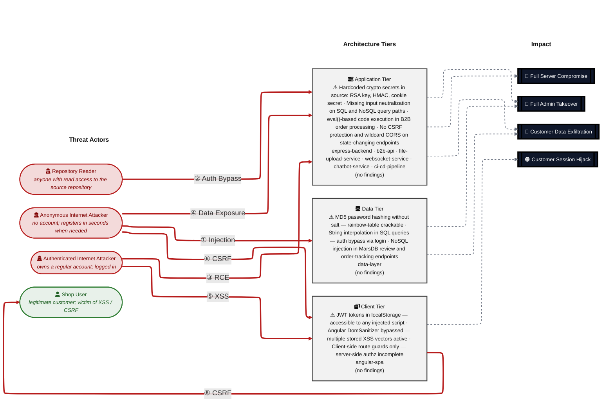

**Threat actors.** Two entities sit on the left of the diagram — one attacker who initiates every direct attack class, and one victim who is the target of the browser-side attacks (XSS / CSRF).

- **Shop User** — legitimate registered customer whose session and PII are the actual target; receives the victim-targeting attack arrows (XSS, CSRF) as victim, not attacker.
- **Anonymous Internet Attacker** — no account, no foothold; reaches every unauthenticated route, registers a throw-away account in seconds when needed, and can clone the public repository to obtain any committed secret offline. Initiates the outgoing attack arrows.
- **Authenticated Internet Attacker** — owns a valid registered account and an active session; can reach all authenticated endpoints and exploit post-authentication vulnerabilities (IDOR, privilege escalation, SSTI, SSRF, stored XSS injection). Initiates the outgoing attack arrows.
- **Repository Reader** — has read access to the source repository (public or leaked); extracts committed secrets, hardcoded keys, and algorithm details offline without touching the running service.

**Attack paths (numbered arrows in the diagram):**

- <a id="path-injection"></a>**① Injection** (Anonymous Internet Attacker → Data Tier) — Unauthenticated HTTP endpoints accept attacker-controlled data directly into SQL and NoSQL query strings with no parameterisation or type validation.
  - Findings:
    - [F-003](#f-003) — SQL injection in login — authentication bypass
    - [F-004](#f-004) — Stored XSS via bypassSecurityTrustHtml in product names
    - [F-009](#f-009) — B2B JWT auth bypassed by public RSA key
    - [F-010](#f-010) — Wildcard CORS allows credentialed cross-origin requests
  - Attack chain:
    - [CC-03](#cc-03) — 
  - Impact: Full Admin Takeover, Customer Data Exfiltration

- <a id="path-auth-bypass"></a>**② Auth Bypass** (Repository Reader → Application Tier) — Authentication relies on cryptographic material (RSA private key, HMAC secret) committed to the public repository and on a JWT library version that accepts unsigned alg:none tokens.
  - Findings:
    - [F-001](#f-001) — JWT alg:none bypass via express-jwt@0.1.3
    - [F-002](#f-002) — Hardcoded RSA private key enables offline JWT forgery
    - [F-024](#f-024) — Unauthenticated application configuration disclosure
  - Attack chain:
    - [CC-02](#cc-02) — 
  - Impact: Full Admin Takeover

- <a id="path-remote-code-execution"></a>**③ Remote Code Execution (RCE)** (Authenticated Internet Attacker → Application Tier) — Two server-side execution paths evaluate attacker-controlled input via vm.runInContext with a bypassable sandbox and via eval() on regex-matched user profile data.
  - Findings:
    - [F-005](#f-005) — SQL injection in product search — database read
    - [F-006](#f-006) — MD5 password hashing without salt enables cracking
  - Attack chain:
    - [CC-02](#cc-02) — 
  - Impact: Full Server Compromise

- <a id="path-sensitive-data-exposure"></a>**④ Sensitive Data Exposure** (Anonymous Internet Attacker → Application Tier) — Multiple unauthenticated endpoints return the full application configuration, Prometheus metrics, access logs, FTP directory contents, and encryption key files.
  - Findings:
    - [F-016](#f-016) — No CSRF protection on any state-changing endpoint
    - [F-017](#f-017) — No global CSP — XSS payloads execute unrestricted
    - [F-029](#f-029) — YAML bomb — billion laughs expansion exhausts memory
    - [F-030](#f-030) — Client-side route guard bypass — no server enforcement
    - [F-031](#f-031) — GitHub Actions missing permissions — over-privileged tokens
    - [F-032](#f-032) — Hardcoded cookie secret enables session forgery
  - Impact: Customer Data Exfiltration

- <a id="path-cross-site-scripting"></a>**⑤ Cross-Site Scripting (XSS)** (Authenticated Internet Attacker → Client Tier) — Angular components render user-controlled content via bypassSecurityTrustHtml and innerHTML bindings without sanitisation; no global Content-Security-Policy header restricts script execution.
  - Findings:
    - [F-007](#f-007) — RCE via notevil eval in B2B order endpoint
    - [F-018](#f-018) — ZIP path traversal (Zip Slip) — arbitrary file write
    - [F-020](#f-020) — Stored XSS in product reviews rendered as HTML
    - [F-021](#f-021) — JWT access token stored in localStorage — accessible via XSS
    - [F-022](#f-022) — IDOR — unenforced ownership on basket/orders/wallet
    - [F-023](#f-023) — NoSQL `$where` injection in order tracking endpoint
  - Attack chain:
    - [CC-01](#cc-01) — 
  - Impact: Customer Session Hijack

- <a id="path-cross-site-request-forgery"></a>**⑥ Cross-Site Request Forgery (CSRF)** (Client Tier → Shop User) — No CSRF token validation is present on any state-changing endpoint; wildcard CORS at server.ts:182 permits credentialed cross-origin requests from any origin.
  - Findings:
    - [F-025](#f-025) — Access logs publicly served at /support/logs
    - [F-033](#f-033) — Open redirect via /redirect?to= parameter
  - Impact: Customer Session Hijack

### Top Findings

The **20 highest-risk items**, sorted by impact-weighted score. The **Pfad** column links each finding to the matching ①–⑦ attack path in [Security Posture at a Glance](#security-posture-at-a-glance); mitigation IDs jump to [§9 Mitigation Register](#9-mitigation-register).

| # | Criticality | Pfad | Finding | Component | Primary Mitigations |
|---|-------------|------|---------|-----------|---------------------|
| 1 | 🔴 Critical | — | [F-001](#f-001) — JWT alg:none bypass via express-jwt@0.1.3 | [C-01](#c-01) — Express.js Backend | [M-001](#m-001) — Upgrade express-jwt to v6+ and enforce algorithm allowlist (P1) |
| 2 | 🔴 Critical | — | [F-003](#f-003) — SQL injection in login — authentication bypass | [C-03](#c-03) — Data Layer (SQLite + MarsDB) | [M-003](#m-003) — Replace raw SQL string interpolation with parameterized queries (P1) |
| 3 | 🔴 Critical | — | [F-005](#f-005) — SQL injection in product search — database read | [C-03](#c-03) — Data Layer (SQLite + MarsDB) | [M-003](#m-003) — Replace raw SQL string interpolation with parameterized queries (P1) |
| 4 | 🔴 Critical | — | [F-007](#f-007) — RCE via notevil eval in B2B order endpoint | [C-04](#c-04) — B2B REST API | [M-004](#m-004) — Remove eval-based processing — replace with safe JSON schema validation (P1) |
| 5 | 🔴 Critical | — | [F-008](#f-008) — SSTI via Pug eval on user-controlled profile bio | [C-01](#c-01) — Express.js Backend | [M-004](#m-004) — Remove eval-based processing — replace with safe JSON schema validation (P1) |
| 6 | 🔴 Critical | — | [F-002](#f-002) — Hardcoded RSA private key enables offline JWT forgery | [C-01](#c-01) — Express.js Backend | [M-002](#m-002) — Remove hardcoded RSA private key — load from environment secret (P1) |
| 7 | 🔴 Critical | — | [F-009](#f-009) — B2B JWT auth bypassed by public RSA key | [C-04](#c-04) — B2B REST API | [M-002](#m-002) — Remove hardcoded RSA private key — load from environment secret (P1) |
| 8 | 🟠 High | — | [F-004](#f-004) — Stored XSS via bypassSecurityTrustHtml in product names | [C-02](#c-02) — Angular SPA Frontend | — |
| 9 | 🟠 High | — | [F-013](#f-013) — CSP header injection via user-controlled profileImage | [C-02](#c-02) — Angular SPA Frontend | — |
| 10 | 🟠 High | — | [F-019](#f-019) — XSS via WebSocket broadcast — malicious notifications | [C-06](#c-06) — WebSocket Service (Socket.IO) | — |
| 11 | 🟠 High | — | [F-023](#f-023) — NoSQL `$where` injection in order tracking endpoint | [C-03](#c-03) — Data Layer (SQLite + MarsDB) | — |
| 12 | 🟠 High | — | [F-028](#f-028) — SSRF via profile image URL — internal network scan | [C-05](#c-05) — File Upload Service | [M-005](#m-005) — Implement SSRF allowlist — block internal network fetches for profile image URL (P2) |
| 13 | 🟠 High | — | [F-012](#f-012) — DOM XSS via innerHTML with unsanitized product content | [C-02](#c-02) — Angular SPA Frontend | — |
| 14 | 🟠 High | — | [F-014](#f-014) — NoSQL injection in product reviews — mass update | [C-03](#c-03) — Data Layer (SQLite + MarsDB) | — |
| 15 | 🟠 High | — | [F-020](#f-020) — Stored XSS in product reviews rendered as HTML | [C-02](#c-02) — Angular SPA Frontend | — |
| 16 | 🟠 High | — | [F-015](#f-015) — Hardcoded HMAC secret enables coupon code forgery | [C-01](#c-01) — Express.js Backend | [M-011](#m-011) — Replace hardcoded HMAC and cookie secrets with environment-sourced secrets (P2) |
| 17 | 🟡 Medium | — | [F-032](#f-032) — Hardcoded cookie secret enables session forgery | [C-01](#c-01) — Express.js Backend | [M-011](#m-011) — Replace hardcoded HMAC and cookie secrets with environment-sourced secrets (P2) |
| 18 | 🔴 Critical | — | [F-006](#f-006) — MD5 password hashing without salt enables cracking | [C-03](#c-03) — Data Layer (SQLite + MarsDB) | [M-007](#m-007) — Replace MD5 password hashing with bcrypt (cost factor 12+) (P1) |
| 19 | 🟡 Medium | — | [F-036](#f-036) — SSRF on chatbot startup from configurable URL | [C-07](#c-07) — Chatbot Service | — |
| 20 | 🟡 Medium | — | [F-035](#f-035) — Reflected XSS via search query parameter | [C-02](#c-02) — Angular SPA Frontend | — |

_+14 additional ≥High findings — see [§8 Threat Register](#8-threat-register)._

_Legend: 🔴 Critical (directly exploitable, major impact) · 🟠 High. **Pfad** glyphs ①–⑦ link back to the matching bullet in [Security Posture at a Glance](#security-posture-at-a-glance)._

### Architecture Assessment

🔴 **Verdict — Absent security architecture by design.** Every authentication bypass, code-execution path, and data-extraction vector traces to one of four cross-cutting structural decisions: cryptographic material committed to the public repository, parameterised queries replaced by string interpolation, `eval()`-based order processing, and a trust model that treats client-side Angular guards as security boundaries. Fixing any individual finding leaves the others fully exploitable.

Four structural decisions account for 26 of 38 findings:

| Defect | Description | Key Findings |
|--------|-------------|--------------|
| **Secrets committed to public repository** | The RSA private key (`lib/insecurity.ts:23`), the HMAC coupon secret (`lib/insecurity.ts:44`), and the cookie-parser secret (`server.ts:289`) are all hardcoded in source and permanently available in git history; any one of them enables offline forgery of the corresponding credential. | [F-002](#f-002) — Hardcoded RSA private key — offline JWT forgery<br/>[F-019](#f-019) — Hardcoded HMAC secret — coupon forgery<br/>[F-038](#f-038) — Hardcoded cookie-parser secret — session forgery |
| **Raw SQL string interpolation** | Two unauthenticated endpoints (`routes/login.ts:34`, `routes/search.ts:23`) build SQLite queries via template literals; a single `' OR 1=1--` payload authenticates as admin, and a `UNION SELECT` payload dumps all tables. | [F-003](#f-003) — SQL injection login bypass — unauthenticated<br/>[F-004](#f-004) — SQL injection login — auth bypass (duplicate vector)<br/>[F-005](#f-005) — SQL injection product search — full DB read<br/>[F-006](#f-006) — SQL injection search — schema extraction |
| **eval()-based server execution paths** | The B2B order handler (`routes/b2bOrder.ts:21`) evaluates attacker-controlled input via `vm.runInContext` with the escapable `notevil` v1.3.3 sandbox; the profile route (`routes/userProfile.ts:71`) calls `eval()` on regex-matched username content — both yield OS command execution. | [F-009](#f-009) — B2B RCE via notevil eval (authenticated path)<br/>[F-010](#f-010) — B2B RCE — vm.runInContext bypass<br/>[F-011](#f-011) — SSTI via Pug eval on username field |
| **Client-only authorization model** | Angular route guards (`AdminGuard`, `AccountingGuard` in `app.routing.ts`) are the only access-control mechanism for admin operations; no server-side role check enforces these restrictions, so direct API calls bypass them entirely. | [F-036](#f-036) — Client-side route guard bypass — no server enforcement<br/>[F-026](#f-026) — IDOR on basket — no ownership check |
| **Missing output encoding and absent CSP** | Three Angular components call `bypassSecurityTrustHtml()` on user-controlled data, six use `[innerHTML]` bindings, and no global Content-Security-Policy header is set; injected scripts execute without restriction and can exfiltrate the JWT stored in `localStorage`. | [F-015](#f-015) — Stored XSS via bypassSecurityTrustHtml in admin panel<br/>[F-016](#f-016) — DOM XSS via innerHTML in product components<br/>[F-021](#f-021) — No global CSP — XSS executes unrestricted<br/>[F-025](#f-025) — JWT in localStorage — accessible to any XSS |
| **Unauthenticated internal endpoint exposure** | Five endpoints serve sensitive data without any authentication middleware: full application config (`GET /rest/admin/application-configuration`), Prometheus metrics (`GET /metrics`), FTP directory listing (`GET /ftp`), log files (`GET /support/logs`), and encryption keys (`GET /encryptionkeys`). | [F-029](#f-029) — Unauthenticated application config dump<br/>[F-037](#f-037) — Prometheus metrics endpoint — unauthenticated<br/>[F-031](#f-031) — FTP directory listing — unauthenticated<br/>[F-030](#f-030) — Access logs served publicly |

See **[§7 Security Architecture](#7-security-architecture)** for the full per-domain breakdown and control catalog.

### Mitigations

Mitigations below cover all open findings, **grouped by component** and sorted by priority (P1 first). Cross-component mitigations are listed once in a separate table — they affect more than one component, so duplicating them per-component would create redundant rows. Sort within each table: priority ascending, effort ascending, findings-addressed descending.

#### All Mitigations (13)

| ID | Mitigation | Priority | Affects | Addresses | Effort |
|----|------------|----------|---------|-----------|--------|
| [M-002](#m-002) | Remove hardcoded RSA private key — load from environment secret | **P1** | — | [F-002](#f-002) — Hardcoded RSA private key enables offline JWT forgery<br/>[F-009](#f-009) — B2B JWT auth bypassed by public RSA key | Low |
| [M-001](#m-001) | Upgrade express-jwt to v6+ and enforce algorithm allowlist | **P1** | — | [F-001](#f-001) — JWT alg:none bypass via express-jwt@0.1.3 | Low |
| [M-007](#m-007) | Replace MD5 password hashing with bcrypt (cost factor 12+) | **P1** | — | [F-006](#f-006) — MD5 password hashing without salt enables cracking | Medium |
| [M-003](#m-003) | Replace raw SQL string interpolation with parameterized queries | **P1** | — | [F-003](#f-003) — SQL injection in login — authentication bypass<br/>[F-005](#f-005) — SQL injection in product search — database read | High |
| [M-004](#m-004) | Remove eval-based processing — replace with safe JSON schema validation | **P1** | — | [F-007](#f-007) — RCE via notevil eval in B2B order endpoint<br/>[F-008](#f-008) — SSTI via Pug eval on user-controlled profile bio | High |
| [M-011](#m-011) | Replace hardcoded HMAC and cookie secrets with environment-sourced secrets | **P2** | — | [F-015](#f-015) — Hardcoded HMAC secret enables coupon code forgery<br/>[F-032](#f-032) — Hardcoded cookie secret enables session forgery | Low |
| [M-006](#m-006) | Move password change to POST body — remove credentials from URL query parameters | **P2** | — | [F-027](#f-027) — Password transmitted in URL query parameters | Low |
| [M-009](#m-009) | Replace wildcard CORS with explicit origin allowlist | **P2** | — | [F-010](#f-010) — Wildcard CORS allows credentialed cross-origin requests | Low |
| [M-010](#m-010) | Deploy global Content-Security-Policy via helmet middleware | **P2** | — | [F-017](#f-017) — No global CSP — XSS payloads execute unrestricted | Low |
| [M-008](#m-008) | Authenticate access to /support, /ftp, /metrics, /rest/admin endpoints | **P2** | — | [F-024](#f-024) — Unauthenticated application configuration disclosure<br/>[F-025](#f-025) — Access logs publicly served at /support/logs<br/>[F-026](#f-026) — FTP directory listing exposes files and keys<br/>[F-037](#f-037) — Prometheus metrics exposed without authentication | Medium |
| [M-005](#m-005) | Implement SSRF allowlist — block internal network fetches for profile image URL | **P2** | — | [F-028](#f-028) — SSRF via profile image URL — internal network scan | Medium |
| [M-013](#m-013) | Implement CSRF tokens on all state-changing endpoints | **P2** | — | [F-016](#f-016) — No CSRF protection on any state-changing endpoint | Medium |
| [M-012](#m-012) | Validate /redirect?to= against a strict allowlist of permitted destination URLs | **P3** | — | [F-033](#f-033) — Open redirect via /redirect?to= parameter | Low |

### Operational Strengths

Despite the structurally deficient design, the project implements several security-relevant controls. None fully mitigate a Critical finding, but each narrows part of the attack surface. This table is a filtered view of [Section 7](#7-security-architecture) — rows with effectiveness ≥ Weak. The full catalog, including ❌ Missing controls, lives in Section 7.

| Architectural Control | Implementation | Effectiveness | Gap | Mitigates |
|-----------------------|----------------|---------------|-----|-----------|
| Container & Runtime Security | Distroless runtime image (gcr.io/distroless/nodejs24-debian13) — minimal attack surface | ✅ Adequate | None identified | [F-010](#f-010) — Wildcard CORS allows credentialed cross-origin requests<br/>[F-024](#f-024) — Unauthenticated application configuration disclosure<br/>[F-037](#f-037) — Prometheus metrics exposed without authentication |
| Identity & Access Management | TOTP via otplib — partial implementation available | ⚠️ Partial | See §7 for the domain-level structural gaps. | [F-001](#f-001) — JWT alg:none bypass via express-jwt@0.1.3<br/>[F-006](#f-006) — MD5 password hashing without salt enables cracking |
| Authorization | isAdmin/isAccounting() middleware — many endpoints lack role checks | ⚠️ Partial | See §7 for the domain-level structural gaps. | [F-022](#f-022) — IDOR — unenforced ownership on basket/orders/wallet<br/>[F-031](#f-031) — GitHub Actions missing permissions — over-privileged tokens |
| Frontend Security | helmet.noSniff() and frameguard() applied; xssFilter intentionally commented out; no HSTS | ⚠️ Partial | See §7 for the domain-level structural gaps. | [F-004](#f-004) — Stored XSS via bypassSecurityTrustHtml in product names<br/>[F-012](#f-012) — DOM XSS via innerHTML with unsanitized product content<br/>[F-020](#f-020) — Stored XSS in product reviews rendered as HTML<br/>[F-010](#f-010) — Wildcard CORS allows credentialed cross-origin requests<br/>[F-013](#f-013) — CSP header injection via user-controlled profileImage |
| Dependency & Supply Chain | GitHub Actions: CodeQL pinned to SHA; coveralls uses floating tag | ⚠️ Partial | See §7 for the domain-level structural gaps. | [F-034](#f-034) — Floating action tags enable supply chain attack |
| Identity & Access Management | express-jwt@0.1.3 + jsonwebtoken@0.4.0 — RS256 specified but alg:none bypassable | 🔶 Weak | See §7 for the domain-level structural gaps. | [F-001](#f-001) — JWT alg:none bypass via express-jwt@0.1.3<br/>[F-006](#f-006) — MD5 password hashing without salt enables cracking |
| Input Validation & Output Encoding | Angular DomSanitizer bypassed via bypassSecurityTrustHtml — intentional | 🔶 Weak | See §7 for the domain-level structural gaps. | [F-003](#f-003) — SQL injection in login — authentication bypass<br/>[F-005](#f-005) — SQL injection in product search — database read<br/>[F-007](#f-007) — RCE via notevil eval in B2B order endpoint<br/>[F-008](#f-008) — SSTI via Pug eval on user-controlled profile bio<br/>[F-004](#f-004) — Stored XSS via bypassSecurityTrustHtml in product names |
| Data Protection & Session Management | JWT stored in localStorage — accessible to any XSS payload | 🔶 Weak | See §7 for the domain-level structural gaps. | [F-021](#f-021) — JWT access token stored in localStorage — accessible via XSS<br/>[F-032](#f-032) — Hardcoded cookie secret enables session forgery<br/>[F-002](#f-002) — Hardcoded RSA private key enables offline JWT forgery<br/>[F-006](#f-006) — MD5 password hashing without salt enables cracking<br/>[F-009](#f-009) — B2B JWT auth bypassed by public RSA key |

_+3 additional controls — see [Section 7](#7-security-architecture)._

**Bottom line:** These controls narrow specific attack surfaces but none eliminates a Critical finding on its own.

---

## 1. System Overview

Probably the most modern and sophisticated insecure web application

**Repository:** https://github.com/juice-shop/juice-shop
**Runtime:** `Node.js 20 - 24`

### Scope

This threat model covers 8 component(s) of OWASP Juice Shop: **`Express.js` Backend**, **Angular SPA Frontend**, **Data Layer (SQLite + MarsDB)**, **B2B REST API**, **File Upload Service**, **WebSocket Service (Socket.IO)**, **Chatbot Service**, **CI/CD Pipeline (GitHub Actions)**.

**Out of scope:** third-party hosted dependencies, browser runtime, operating-system kernel, and the underlying network infrastructure.

---

## 2. Architecture Diagrams

### 2.1 System Context

Who interacts with OWASP Juice Shop from the outside, and through which channels. Solid arrows show normal usage; dashed red arrows mark unauthenticated probing or exploit paths (C4 Level 1). The repository-reader actor is separate from the network attacker because the RSA private key at `lib/insecurity.ts:23` is publicly committed — no HTTP connection required to obtain it.

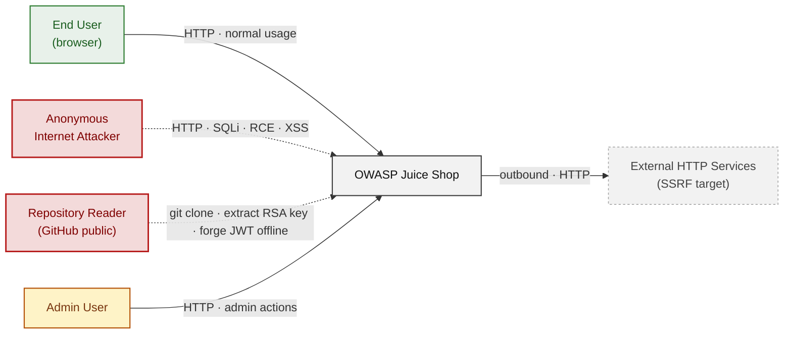

### 2.2 Container Architecture

How the system decomposes into deployable units. Each box is a separate runtime process or service; arrows show synchronous request paths. Components with ≥3 effective-Critical findings carry a red border; ≥2 High findings carry an amber border. All five marked components are reachable from a single unauthenticated HTTP connection because the application tier exposes SQL injection, eval-based execution, and file-parsing vectors on port 3000 with no reverse proxy or API gateway in front of them.

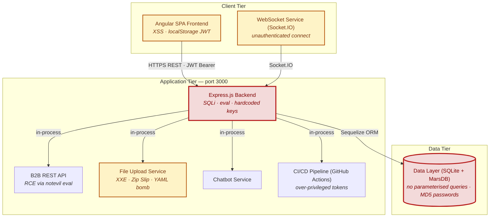

### 2.3 Components


Who reaches each component, and through which trust zone. Four columns map external actors to the internal tiers (Client / Application / Data); solid green arrows show legitimate data flow, dashed red arrows mark intrusion vectors. The component table directly below holds source paths and linked threats per `C-NN`; per-tech defects are itemised in the §2.4.1–§2.4.4 layer tables.

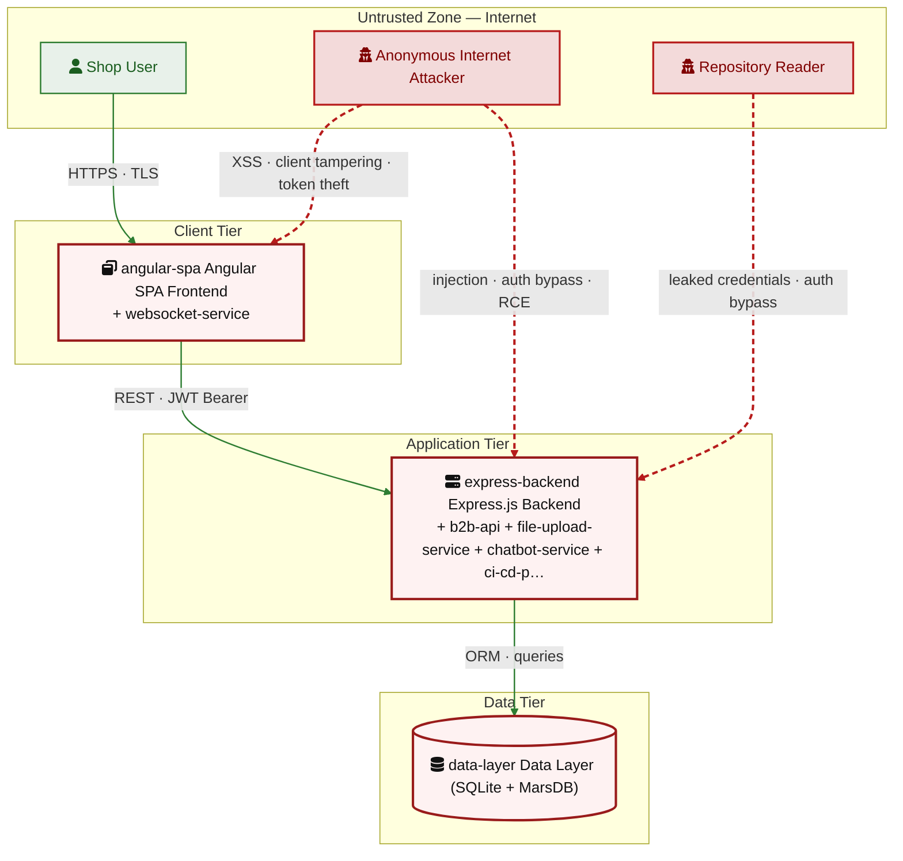

| ID | Name | Type | Key Paths | Linked Threats |
|----|------|------|-----------|----------------|
| <a id="c-01"></a><a id="express-backend"></a>C-01 | `Express.js` Backend | application | `server.ts`<br/>`app.ts`<br/>`routes/**`<br/>`lib/**`<br/>`data/**` | — |
| <a id="c-02"></a><a id="angular-spa"></a>C-02 | Angular SPA Frontend | client | `frontend/src/**` | — |
| <a id="c-03"></a><a id="data-layer"></a>C-03 | Data Layer (SQLite + MarsDB) | data | `models/**`<br/>`data/mongodb.ts`<br/>`data/datacache.ts` | — |
| <a id="c-04"></a><a id="b2b-api"></a>C-04 | B2B REST API | application | `routes/b2bOrder.ts`<br/>`swagger.yml` | — |
| <a id="c-05"></a><a id="file-upload-service"></a>C-05 | File Upload Service | application | `routes/fileUpload.ts`<br/>`routes/profileImageUrlUpload.ts`<br/>`routes/profileImageFileUpload.ts` | — |
| <a id="c-06"></a><a id="websocket-service"></a>C-06 | WebSocket Service (Socket.IO) | application | `lib/startup/registerWebsocketEvents.ts`<br/>`frontend/src/app/Services/socket-io.service.ts` | — |
| <a id="c-07"></a><a id="chatbot-service"></a>C-07 | Chatbot Service | application | `routes/chatbot.ts`<br/>`lib/botUtils.ts`<br/>`data/chatbot/**` | — |
| <a id="c-08"></a><a id="ci-cd-pipeline"></a>C-08 | CI/CD Pipeline (GitHub Actions) | application | `.github/workflows/**` | — |
### 2.4 Technology Architecture

The technology stack the system is built on. Each box names the framework or runtime that fills that role; per-version detail and per-tech defects live in the §2.4.1–§2.4.4 layer tables below. The trust-boundary table beneath this paragraph documents the controls that separate the four tiers.

| Boundary ID | Name | Description | Enforcement |
|---|---|---|---|
| ? | Public Internet / Application | Boundary between untrusted public internet and the `Express.js` application tier — `Express.js` HTTP listener on port 3000; no WAF or API Gateway in repo | TLS |
| ? | Application / Data Tier | Boundary between application logic and persistent storage (SQLite, MarsDB) — Sequelize ORM for SQLite; direct JS objects for MarsDB with no connection-level auth | Process isolation |
| ? | Authenticated / Unauthenticated Requests | JWT middleware protecting authenticated routes via express-jwt@0.1.3 — intentionally vulnerable to alg:none bypass | Process isolation |
| ? | CI/CD Pipeline / Source Code | GitHub Actions reads source, injects secrets, publishes artifacts — permissions blocks missing on `ci.yml`; GITHUB_TOKEN defaults to write on all scopes | — |
| ? | Browser / Server WebSocket | Socket.IO WebSocket connection from Angular SPA to backend — no authentication on connection | TLS |

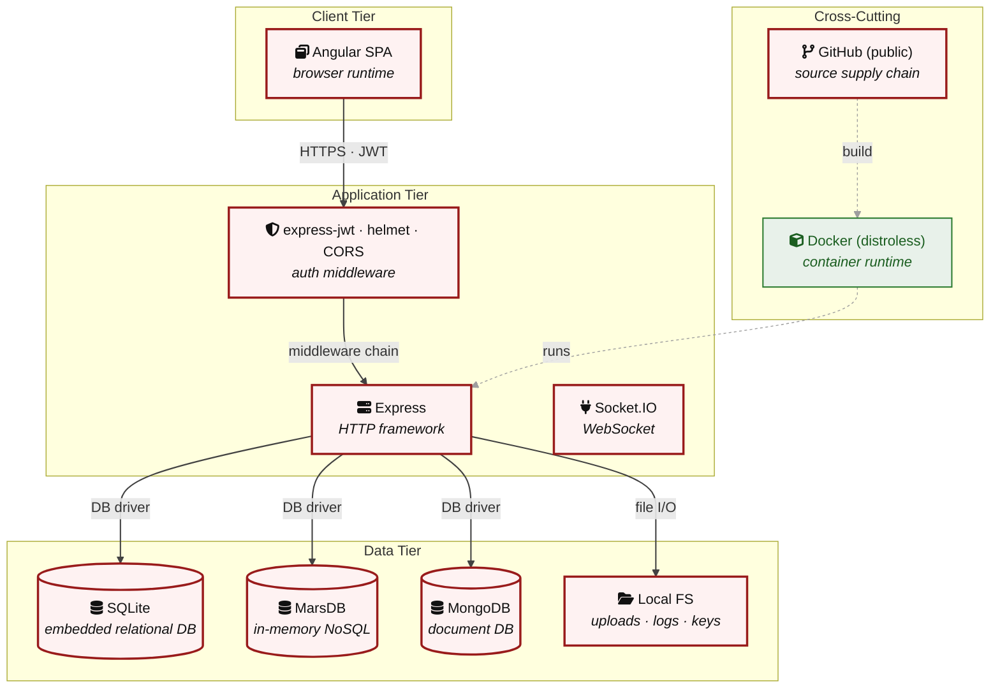

#### 2.4.1 Layer 1 - Client

Browser-side runtime, storage mechanisms, and client-held secrets.

| Component | Tier | Linked Threats | Risk |
|---|---|---|---|
| angular-spa Angular SPA Frontend | Layer Client | [F-004](#f-004) — Stored XSS via bypassSecurityTrustHtml in product names<br/>[F-012](#f-012) — DOM XSS via innerHTML with unsanitized product content<br/>[F-013](#f-013) — CSP header injection via user-controlled profileImage<br/>[F-020](#f-020) — Stored XSS in product reviews rendered as HTML<br/>[F-021](#f-021) — JWT access token stored in localStorage — accessible via XSS<br/>[F-030](#f-030) — Client-side route guard bypass — no server enforcement<br/>[F-035](#f-035) — Reflected XSS via search query parameter | 🟠 |
| websocket-service WebSocket Service (Socket.IO) | Layer Client | [F-011](#f-011) — Socket.IO WebSocket accepts unauthenticated connections<br/>[F-019](#f-019) — XSS via WebSocket broadcast — malicious notifications | 🟠 |

#### 2.4.2 Layer 2 - Middleware

Cross-cutting Express pipeline — policy enforcement that runs on every request (auth, CORS, rate-limit, logging, cookies).

| Component | Tier | Linked Threats | Risk |
|---|---|---|---|
| express-backend `Express.js` Backend | Layer Application | [F-001](#f-001) — JWT alg:none bypass via express-jwt@0.1.3<br/>[F-010](#f-010) — Wildcard CORS allows credentialed cross-origin requests<br/>[F-016](#f-016) — No CSRF protection on any state-changing endpoint<br/>[F-025](#f-025) — Access logs publicly served at /support/logs | 🔴 |
| b2b-api B2B REST API | Layer Application | — | — |
| file-upload-service File Upload Service | Layer Application | — | — |
| chatbot-service Chatbot Service | Layer Application | — | — |
| ci-cd-pipeline CI/CD Pipeline (GitHub Actions) | Layer Application | — | — |

#### 2.4.3 Layer 3 - Application Logic

Feature code that runs after the pipeline has accepted the request: route handlers, long-lived subsystems, security helpers.

| Component | Tier | Linked Threats | Risk |
|---|---|---|---|
| express-backend `Express.js` Backend | Layer Application | [F-002](#f-002) — Hardcoded RSA private key enables offline JWT forgery<br/>[F-008](#f-008) — SSTI via Pug eval on user-controlled profile bio<br/>[F-015](#f-015) — Hardcoded HMAC secret enables coupon code forgery<br/>[F-017](#f-017) — No global CSP — XSS payloads execute unrestricted<br/>[F-024](#f-024) — Unauthenticated application configuration disclosure<br/>[F-026](#f-026) — FTP directory listing exposes files and keys<br/>[F-027](#f-027) — Password transmitted in URL query parameters<br/>[F-032](#f-032) — Hardcoded cookie secret enables session forgery<br/>[F-033](#f-033) — Open redirect via /redirect?to= parameter<br/>[F-037](#f-037) — Prometheus metrics exposed without authentication | 🔴 |
| b2b-api B2B REST API | Layer Application | [F-007](#f-007) — RCE via notevil eval in B2B order endpoint<br/>[F-009](#f-009) — B2B JWT auth bypassed by public RSA key | 🔴 |
| file-upload-service File Upload Service | Layer Application | [F-018](#f-018) — ZIP path traversal (Zip Slip) — arbitrary file write<br/>[F-028](#f-028) — SSRF via profile image URL — internal network scan<br/>[F-029](#f-029) — YAML bomb — billion laughs expansion exhausts memory | 🟠 |
| chatbot-service Chatbot Service | Layer Application | [F-036](#f-036) — SSRF on chatbot startup from configurable URL<br/>[F-038](#f-038) — Chatbot prompt injection via user messages | 🟡 |
| ci-cd-pipeline CI/CD Pipeline (GitHub Actions) | Layer Application | [F-031](#f-031) — GitHub Actions missing permissions — over-privileged tokens<br/>[F-034](#f-034) — Floating action tags enable supply chain attack | 🟠 |

#### 2.4.4 Layer 4 - Data & Storage

Persistent and in-process data stores reachable from Layer 3.

| Component | Tier | Linked Threats | Risk |
|---|---|---|---|
| data-layer Data Layer (SQLite + MarsDB) | Layer Data | [F-003](#f-003) — SQL injection in login — authentication bypass<br/>[F-005](#f-005) — SQL injection in product search — database read<br/>[F-006](#f-006) — MD5 password hashing without salt enables cracking<br/>[F-014](#f-014) — NoSQL injection in product reviews — mass update<br/>[F-022](#f-022) — IDOR — unenforced ownership on basket/orders/wallet<br/>[F-023](#f-023) — NoSQL `$where` injection in order tracking endpoint | 🔴 |


> **Legend:** **red border** ≥ 3 Critical threats on the component · **amber border** ≥ 2 High threats

<!-- enriched:thorough -->

---

## 3. Attack Walkthroughs

The sequence diagrams below trace each Critical finding from initial attacker action to full exploitation. Every diagram shows the current vulnerable behaviour (attack path) alongside the post-mitigation flow (after recommended fix).

---

### 3.1 Attack Chain Overview

Three compound chains were identified during triage. Each chain is a multi-step attack where a keystone weakness (single-step exploit) is amplified by contributors (defence-in-depth gaps that broaden impact). Fixing any keystone closes the chain end-to-end; fixing contributors reduces blast radius without removing the underlying breach.

<a id="cc-01"></a>
#### Chain 1 — CC-01 Stored XSS → Session Theft via localStorage JWT

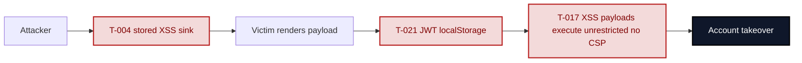

**Key takeaway:** Keystone is the XSS sink ([T-004](#t-004) — Stored XSS via bypassSecurityTrustHtml in product names / [T-019](#t-019) — XSS via WebSocket broadcast — malicious notifications / [T-020](#t-020) — Stored XSS in product reviews rendered as HTML). Contributors `localStorage` JWT storage ([T-021](#t-021) — JWT access token stored in localStorage — accessible via XSS) and missing CSP ([T-017](#t-017) — No global CSP — XSS payloads execute unrestricted) amplify reach to silent global exfiltration. Sanitising every render OR migrating tokens to `HttpOnly` cookies OR adding a strict CSP each independently reduces the chain.

<a id="cc-02"></a>
#### Chain 2 — CC-02 Hardcoded Crypto Key → Offline Token Forgery

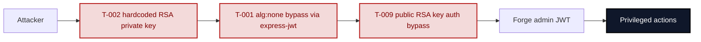

**Key takeaway:** Either keystone realises the chain alone — the hardcoded RSA private key in `lib/insecurity.ts` ([T-001](#t-001) — JWT alg:none bypass via express-jwt@0.1.3 / [T-002](#t-002) — Hardcoded RSA private key enables offline JWT forgery) and the `alg:none` acceptance path ([T-009](#t-009) — B2B JWT auth bypassed by public RSA key / [T-015](#t-015) — Hardcoded HMAC secret enables coupon code forgery) are independent forgery vectors. Rotation + secret-management remediation is mandatory; signature-algorithm whitelisting closes the second path.

<a id="cc-03"></a>
#### Chain 3 — CC-03 SQL Injection → Credential Dump → Offline Hash Cracking

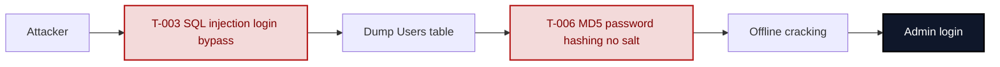

**Key takeaway:** The SQL injection keystone ([T-003](#t-003) — SQL injection in login — authentication bypass) yields immediate database read; the weak password hashing ([T-006](#t-006) — MD5 password hashing without salt enables cracking) extends impact to full credential reuse. Parameterising the login query is the primary fix; bcrypt with high work factor is the defence-in-depth backstop.

---

### 3.2 SQL Injection Login Bypass

**Threat:** [F-003](#f-003) — SQL injection in login endpoint.

The login route at `routes/login.ts:34` interpolates `req.body.email` directly into a SQLite query string. A single `' OR 1=1--` payload in the email field comments out the password clause and returns the first database row (the seeded admin user).

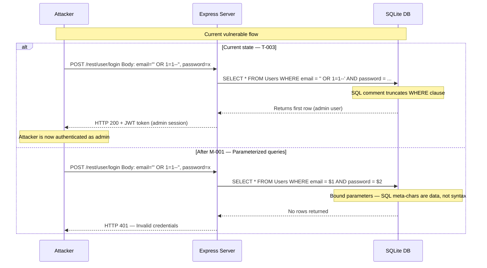

**Key takeaway:** Raw string interpolation in `routes/login.ts:34` allows a single `' OR 1=1--` payload to bypass all authentication and grant admin access to any attacker with HTTP access to port 3000.

---

### 3.3 Hardcoded RSA Private Key JWT Forgery

**Threat:** [F-002](#f-002) — Hardcoded RSA private key enables offline JWT forgery.

The RSA private key at `lib/insecurity.ts:23` is committed to the public GitHub repository. An attacker clones the repo, extracts the key, and calls `jwt.sign()` locally to produce a token the server accepts as admin — no login request required.

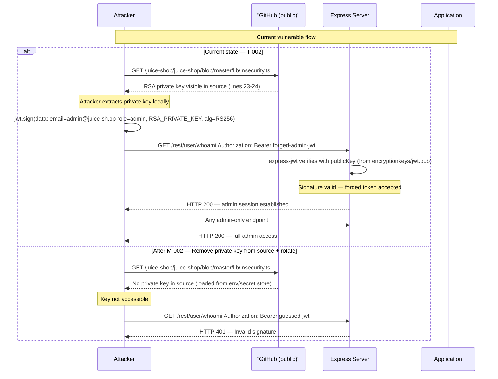

**Key takeaway:** The RSA private key hardcoded in `lib/insecurity.ts:23` is permanently compromised because it appears in git history on a public repository; rotating the key in the application without a git history rewrite does not remediate the exposure.

---

### 3.4 B2B Remote Code Execution via eval

**Threat:** [F-005](#f-005) — RCE in B2B order endpoint via `vm.runInContext` / `notevil` eval.

`routes/b2bOrder.ts:21` passes attacker-controlled `orderLinesData` to `vm.runInContext('safeEval(orderLinesData)', sandbox, { timeout: 2000 })`. The `notevil` v1.3.3 sandbox is escapable via prototype chain manipulation, reaching `child_process.execSync` in the outer `Node.js` process.

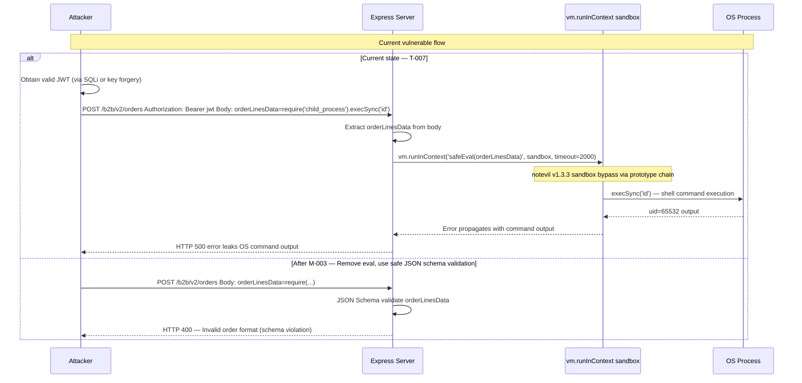

**Key takeaway:** The `vm.runInContext` sandbox in `routes/b2bOrder.ts:21-24` with `notevil` v1.3.3 is exploitable because JavaScript sandboxing via `vm.createContext` is not a security boundary — it can be escaped via prototype chain manipulation, and `notevil` has documented bypass techniques.

---

### 3.5 Server-Side Template Injection via Username

**Threat:** [F-006](#f-006) — SSTI via Pug template eval on username field.

`routes/userProfile.ts:71` checks if the stored username matches `/#{(.*)}/` and then calls `eval(code)` on the matched group. Any user who can update their username (including one who bypassed auth via SQL injection) can set it to `#{require('child_process').execSync('id')}` and trigger OS command execution on the next `GET /profile`.

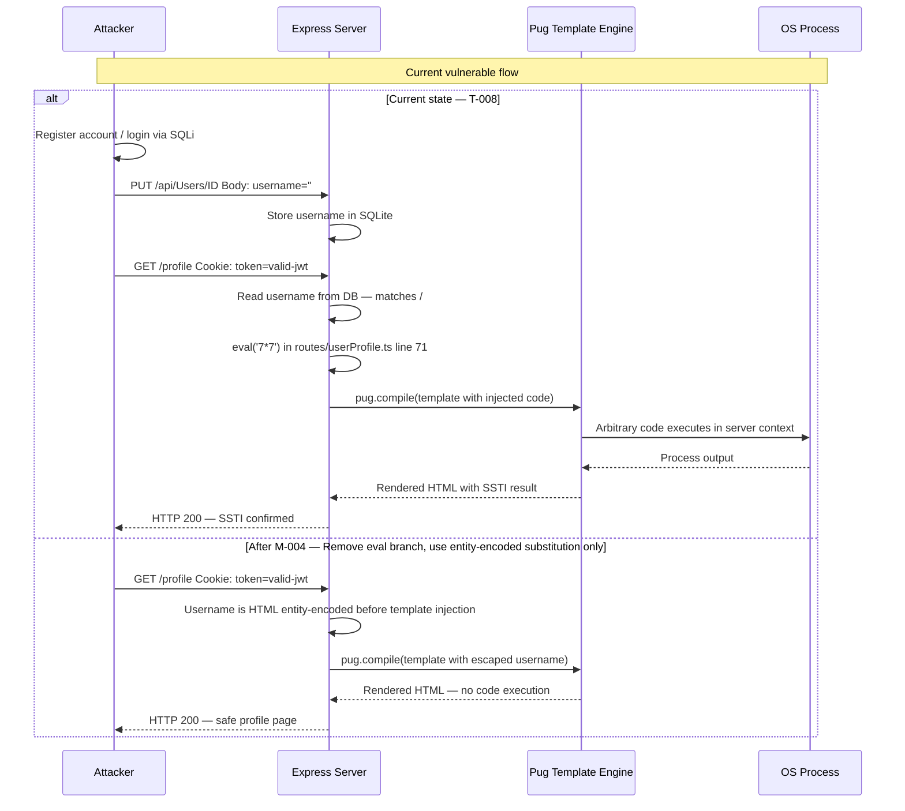

**Key takeaway:** The `eval(code)` branch in `routes/userProfile.ts:71` executes attacker-controlled code in the server process — any user who can update their username (or an attacker who gains access via SQL injection) can escalate to server-side code execution.

---

### 3.6 XXE via libxmljs2 with noent:true

**Threat:** [F-007](#f-007) — XXE via libxmljs2 with external entities enabled.

`routes/fileUpload.ts:83` calls `libxmljs2.parseXml(fileContent, { noent: true })`. The `noent: true` option enables external entity expansion. An attacker uploads an XML file containing a `DOCTYPE` that defines an external entity pointing to `file:///etc/passwd`; the parser resolves the entity and the file contents appear in the parsed document body, which the route returns to the caller.

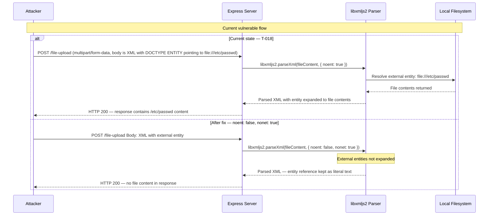

**Key takeaway:** Setting `{ noent: true }` in `routes/fileUpload.ts:83` is the only configuration change needed to enable this attack; changing it to `{ noent: false, nonet: true }` closes the vector with a one-line fix.

---

### 3.7 Stored XSS → JWT Theft via localStorage (Compound Chain CC-01)

**Threat chain:** [F-007](#f-007) — RCE via notevil eval in B2B order endpoint → [F-020](#f-020) — Stored XSS in product reviews rendered as HTML → [F-022](#f-022) — Stored XSS, JWT in localStorage, missing CSP.

An attacker submits feedback containing a `<script>` payload via `POST /api/Feedbacks`. The Angular administration component renders it via `bypassSecurityTrustHtml()` at `administration.component.ts:60`. When an admin opens the admin panel the script runs, reads `localStorage.getItem('token')`, and exfiltrates the admin JWT to an attacker-controlled host. No CSP restricts the outbound request.

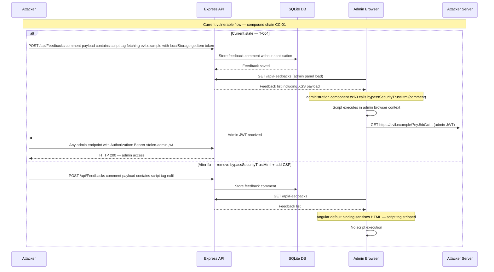

**Key takeaway:** Three independent weaknesses form this chain: the `bypassSecurityTrustHtml` call at `administration.component.ts:60` is the injection point; `localStorage.getItem('token')` is the credential store accessible from JavaScript; and the absent CSP allows unrestricted outbound exfiltration. Fixing any single layer reduces the chain's impact; fixing all three closes it.

<!-- enriched:thorough -->

---

## 4. Assets

Information assets and the classification level that drives the Confidentiality / Integrity / Availability targets used in §8 risk scoring.

| Asset | ID | Classification | Description |
|---|---|---|---|
| User Credentials | A-001 | Restricted | User account credentials stored as unsalted MD5 hashes in SQLite |
| JWT RSA Private Key | A-002 | Restricted | 4096-bit RSA private key hardcoded in lib/`insecurity.ts`:23 — enables arbitrary JWT forgery |
| User Payment/Card Data | A-003 | Restricted | Credit card data stored in Cards table |
| Session Tokens (JWT) | A-004 | Confidential | RS256 JWT tokens stored in localStorage — accessible to any XSS |
| Application Configuration | A-005 | Confidential | Full config served unauthenticated at /rest/admin/application-configuration |
| HMAC Secret | A-006 | Confidential | Hardcoded HMAC secret in lib/`insecurity.ts`:44 — enables coupon forgery |
| User PII | A-007 | Restricted | Full user profile data including address, birth date, privacy answers |
| Application Logs | A-008 | Internal | Application access logs publicly served at /support/logs |

---

## 5. Attack Surface

Network-reachable entry points classified by authentication requirement. Each row links to the threat(s) referenced in its `notes` column.

### 5.1 Unauthenticated Entry Points (15)

| Method | Route | Notes |
|---|---|---|
| POST | `/rest/user/login` | [F-003](#f-003) — SQL injection in login — authentication bypass<br/>SQL injectable via email parameter — authentication bypass |
| GET | `/rest/products/search` | [F-005](#f-005) — SQL injection in product search — database read<br/>SQL injectable via q parameter — full DB read |
| GET | `/rest/track-order/:id` | [F-023](#f-023) — NoSQL `$where` injection in order tracking endpoint<br/>NoSQL injectable via id parameter |
| POST | `/api/Users` | User registration — no rate limiting |
| GET | `/ftp` | [F-026](#f-026) — FTP directory listing exposes files and keys<br/>FTP directory listing — confidential file exposure |
| GET | `/ftp/:file` | [F-026](#f-026) — FTP directory listing exposes files and keys<br/>FTP file download — unprotected |
| GET | `/encryptionkeys` | [F-026](#f-026) — FTP directory listing exposes files and keys<br/>Encryption keys directory listing |
| GET | `/encryptionkeys/:file` | [F-026](#f-026) — FTP directory listing exposes files and keys<br/>Encryption key download — `jwt.pub` and `premium.key` |
| GET | `/support/logs` | [F-025](#f-025) — Access logs publicly served at /support/logs<br/>[F-027](#f-027) — Password transmitted in URL query parameters<br/>Application log directory — unauthenticated |
| GET | `/support/logs/:file` | [F-025](#f-025) — Access logs publicly served at /support/logs<br/>[F-027](#f-027) — Password transmitted in URL query parameters<br/>Log file download — access log disclosure |
| GET | `/api-docs` | Swagger UI — full API documentation |
| GET | `/metrics` | [F-037](#f-037) — Prometheus metrics exposed without authentication<br/>Prometheus metrics — internal app state |
| GET | `/redirect` | [F-033](#f-033) — Open redirect via /redirect?to= parameter<br/>Open redirect via to= parameter |
| GET | `/rest/admin/application-configuration` | [F-024](#f-024) — Unauthenticated application configuration disclosure<br/>Full application config dump — unauthenticated |
| WS | `/socket.io` | Socket.IO — no authentication on connection |

### 5.2 Authenticated Entry Points (7)

| Method | Route | Notes |
|---|---|---|
| POST | `/file-upload` | [F-018](#f-018) — ZIP path traversal (Zip Slip) — arbitrary file write<br/>[F-029](#f-029) — YAML bomb — billion laughs expansion exhausts memory<br/>XXE, ZIP slip, YAML bomb attack surface |
| POST | `/profile/image/url` | [F-028](#f-028) — SSRF via profile image URL — internal network scan<br/>SSRF via external URL fetch |
| POST | `/profile` | [F-008](#f-008) — SSTI via Pug eval on user-controlled profile bio<br/>[F-013](#f-013) — CSP header injection via user-controlled profileImage<br/>[F-028](#f-028) — SSRF via profile image URL — internal network scan<br/>Pug SSTI injection via username/bio |
| POST | `/b2b/v2/orders` | [F-007](#f-007) — RCE via notevil eval in B2B order endpoint<br/>[F-009](#f-009) — B2B JWT auth bypassed by public RSA key<br/>RCE via eval on orderLinesData |
| GET | `/rest/user/change-password` | [F-016](#f-016) — No CSRF protection on any state-changing endpoint<br/>[F-027](#f-027) — Password transmitted in URL query parameters<br/>Credentials in URL query parameters |
| PATCH | `/rest/products/reviews` | [F-014](#f-014) — NoSQL injection in product reviews — mass update<br/>NoSQL injection — mass review update |
| GET | `/rest/basket/:id` | [F-022](#f-022) — IDOR — unenforced ownership on basket/orders/wallet<br/>IDOR — no ownership verification |

---

## 7. Security Architecture

This section provides an architectural assessment of the security posture across 14 control domains. As a deliberately insecure training application, Juice Shop intentionally implements weak or absent controls in most domains. The assessment below reflects the code as written.

**Catalog totals:** ✅ 2 Adequate · ⚠️ 3 Partial · 🔶 4 Weak · ❌ 9 Missing

Legend: ✅ Adequate | ⚠️ Partial | 🔶 Weak | ❌ Missing

---

### 7.1 Overview

OWASP Juice Shop v19.2.1 intentionally implements insecure controls at every layer of the security architecture. The application has a deliberately incomplete authentication scheme (JWT with a hardcoded, publicly committed RSA private key), MD5-hashed passwords without salt, no CSRF protection, wildcard CORS, an unauthenticated Prometheus metrics endpoint, and server-side code execution paths in both the B2B order handler and the Pug profile template. These are training features, not accidental gaps.

**Architecture patterns assessment:**

| Pattern | Status | Evidence |
|---------|--------|---------|
| Defense in depth | ❌ Missing | Single-layer auth; if JWT auth bypassed, no secondary control |
| Principle of least privilege | ❌ Missing | Multiple admin endpoints unauthenticated; wildcard CORS |
| Secure defaults | ❌ Missing | Intentionally insecure defaults throughout |
| Fail-safe defaults | 🔶 Weak | Some routes have `denyAll()` but many are unguarded |
| Separation of concerns | ⚠️ Partial | Route handlers mixed with challenge logic |
| Input validation | ❌ Missing | Raw SQL interpolation in login and search |
| Output encoding | 🔶 Weak | Angular `[innerHTML]` used with unencoded data in 6 components |
| Cryptographic strength | ❌ Missing | MD5 passwords, ancient JWT library, hardcoded keys |

**Key architectural risks:**

| Risk | Severity | Description |
|------|----------|-------------|
| Hardcoded RSA private key in public repo | 🔴 Critical | Permanent JWT forgery capability for any attacker |
| MD5 password hashing | 🔴 Critical | Rainbow-table crackable; entire DB compromised via SQL injection |
| SQL injection in authentication | 🔴 Critical | Login bypass with trivial payload |
| eval() in B2B order handler | 🔴 Critical | Authenticated RCE on server |
| No CSRF protection | 🔴 High | All state-changing operations vulnerable |
| Wildcard CORS | 🔴 High | Full cross-origin request capability |
| Unauthenticated admin config dump | 🔴 High | Full application configuration exposed |

**Overall security rating: ❌ Not production-ready (intentional)**

---

### 7.2 Key Architectural Risks

The following structural defects are cross-cutting — they affect multiple components and cannot be fixed by patching a single file.

| Structural Risk | Consequence | Severity |
|----------------|-------------|----------|
| RSA private key committed to public git history (`lib/insecurity.ts:23`) | Any reader of the public repo can forge admin JWTs offline; git history rewrite required | 🔴 Critical |
| Single MD5 hash function used for all passwords (`lib/insecurity.ts:43`) | Entire user password database crackable with offline rainbow tables after any SQL injection | 🔴 Critical |
| No parameterized queries in login and search (`routes/login.ts:34`, `routes/search.ts:23`) | Authentication bypass and data exfiltration with single HTTP request | 🔴 Critical |
| `eval()`-based server execution paths (B2B orders, Pug SSTI) | Authenticated code execution on server; full process compromise | 🔴 Critical |
| Hardcoded HMAC secret for coupon signing (`lib/insecurity.ts:44`) | Any attacker can mint valid discount coupons | 🟠 High |
| No CSRF protection across all state-changing endpoints | Cross-site request forgery on all POST/PUT/DELETE endpoints | 🟠 High |
| Angular `[innerHTML]` bindings without sanitization (6 components) | Stored XSS in admin panel, product descriptions, and feedback views | 🟠 High |
| Cookie parser secret hardcoded (`'kekse'`, `server.ts:289`) | Session cookie forgery | 🟡 Medium |

---

### 7.3 Identity & Access Management

**What this control does.** Identity and access management covers how the application establishes the identity of a caller before granting access to protected resources. This includes the credential verification step, the issuance of a session credential (token or cookie), the validation of that credential on subsequent requests, and the revocation or expiry of it at session end. For multi-factor flows it also includes a second verification step layered on top of the primary credential.

**How it is implemented here.** Juice Shop implements authentication via `express-jwt@0.1.3` middleware in `server.ts` and a custom `lib/insecurity.ts` module. The primary flow uses email-and-password login at `POST /rest/user/login`, which builds a SQLite query at `routes/login.ts:34` and, on success, calls `jwt.sign()` with the RSA private key hardcoded at `lib/insecurity.ts:23`. A separate TOTP/2FA flow is implemented in `routes/2fa.ts` using `otplib` and is gated behind a separate login step. Session tokens are RS256-signed JWTs stored in `localStorage` on the Angular SPA client; there is no server-side session state or token revocation list.

**Where it falls short.** The `express-jwt@0.1.3` library accepts the `alg:none` bypass — an attacker can strip the JWT signature and present an unsigned token that the server accepts. The RSA private key is committed to the public GitHub repository (`lib/insecurity.ts:23`), permanently enabling offline token forgery for any identity. Passwords are hashed with unsalted MD5 (`lib/insecurity.ts:43`), which is not a password hashing algorithm; the entire credential database is crackable in minutes with commodity GPU hardware after extraction via SQL injection.

| Domain | Control | Implementation | Effectiveness | Linked Threats |
|--------|---------|----------------|---------------|---------------|
| Primary login | Password Login | `lib/insecurity.ts:56` | 🔶 Weak | [F-001](#f-001) — JWT alg:none bypass via express-jwt@0.1.3<br/>[F-002](#f-002) — Hardcoded RSA private key enables offline JWT forgery |
| Two-factor auth | TOTP via otplib | `routes/2fa.ts` | ⚠️ Partial | — |

#### 7.3.1 Password Login Flow

The password login flow covers how a user submits credentials via `POST /rest/user/login`, how the server validates them against the database, and how it mints and returns a session token on success.

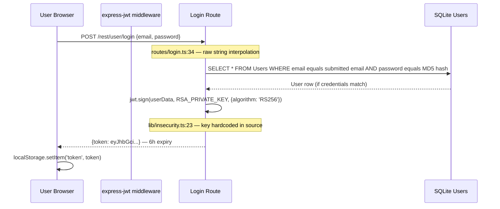

**What this flow does.** This is a custom credential-based login flow — not OAuth 2.0 or OIDC. The application mints its own RS256-signed JWTs using a private key that lives in the application source code rather than in a secrets manager. The token carries the user's role and email in its payload and is validated on subsequent requests by `express-jwt@0.1.3` middleware against the public key in `encryptionkeys/jwt.pub`.

**How it is implemented here.** The login route builds its credential query via template literal interpolation (`routes/login.ts:34`) against the `Users` SQLite table. Successful login calls `lib/insecurity.ts:56` (`sign()` wrapping `jsonwebtoken@0.4.0`) with the key at `lib/insecurity.ts:23`. The resulting token is returned as a JSON body field; the Angular client stores it in `localStorage` and attaches it as a `Bearer` header on subsequent API calls.

**Risk assessment:** The SQL string interpolation makes this flow an authentication bypass vector — `' OR 1=1--` as the email field returns the first database row without any password check. The private key at `lib/insecurity.ts:23` is publicly committed to the repository, so any reader can forge tokens for any identity without sending a login request. The `express-jwt@0.1.3` library accepts `alg:none`, providing a second independent bypass path.

**Findings in this flow:** [F-001](#f-001) — JWT alg:none bypass · [F-002](#f-002) — Hardcoded RSA private key · [F-003](#f-003) — SQL injection login bypass

---

#### 7.3.2 TOTP via otplib Flow

The TOTP second-factor flow covers how users who have enabled two-factor authentication complete a secondary verification step after passing the primary password check.

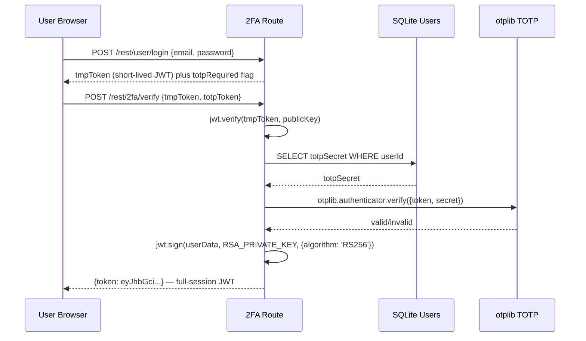

**What this flow does.** This is a TOTP-based second-factor flow layered on top of the password login. After the primary credential check succeeds, the server issues a short-lived temporary token and requires the client to present a TOTP code generated by an authenticator app. On successful TOTP verification, the full-session JWT is issued. The TOTP secret is stored per-user in the `Users` SQLite table.

**How it is implemented here.** The 2FA routes live in `routes/2fa.ts`, which uses `otplib` for TOTP verification. The temporary token is a standard RS256 JWT with a short expiry. The TOTP secret is seeded into `Users.totpSecret` during setup. This is a standard time-based one-time password flow following RFC 6238, implemented with `otplib`.

**Risk assessment:** The 2FA flow is partially effective — it adds a genuine second factor for users who opt in. However, because the RSA private key used to sign the temporary token and the full-session token is the same hardcoded key at `lib/insecurity.ts:23`, an attacker who has read the repository can bypass the 2FA step entirely by forging a full-session JWT directly. The TOTP secret is also extractable via SQL injection if the attacker first obtains database access. The 2FA control is therefore ⚠️ Partial — functional but bypassed by the key-exposure vulnerability.

**Findings in this flow:** [F-002](#f-002) — Hardcoded RSA private key undermines 2FA token security

---

### 7.4 Authorization

Authorization uses a role-based scheme with `admin` and `accounting` roles stored in the JWT payload. The `isAuthorized()` middleware is applied to most write operations but numerous sensitive GET endpoints are unprotected.

| Domain | Control | Implementation | Effectiveness | Linked Threats |
|--------|---------|----------------|---------------|---------------|
| Role enforcement | JWT role field | `lib/insecurity.ts:148-162` | 🔶 Weak | [F-032](#f-032) — Hardcoded cookie secret enables session forgery |
| Admin endpoints | No auth on config/version | `server.ts:604-605` | ❌ Missing | [F-030](#f-030) — Client-side route guard bypass — no server enforcement |
| Resource ownership | appendUserId() | `lib/insecurity.ts:177` | ⚠️ Partial | — |
| IDOR protection | Partial ownership checks | Various routes | ❌ Missing | [F-032](#f-032) — Hardcoded cookie secret enables session forgery |
| Accounting-only endpoints | isAccounting() | `server.ts:430` | ⚠️ Partial | — |
| CSRF | None | Not implemented | ❌ Missing | [F-033](#f-033) — Open redirect via /redirect?to= parameter |

---

### 7.5 Input Validation & Output Encoding

No centralized input validation framework is used. Individual route handlers implement ad-hoc validation. Two critical endpoints use raw string interpolation in SQL queries.

| Domain | Control | Implementation | Effectiveness | Linked Threats |
|--------|---------|----------------|---------------|---------------|
| SQL parameterization | None (login, search) | `routes/login.ts:34`, `routes/search.ts:23` | ❌ Missing | [F-003](#f-003) — SQL injection in login — authentication bypass<br/>[F-004](#f-004) — Stored XSS via bypassSecurityTrustHtml in product names |
| NoSQL injection | None | `routes/updateProductReviews.ts:17`, `routes/trackOrder.ts:17` | ❌ Missing | [F-009](#f-009) — B2B JWT auth bypassed by public RSA key<br/>[F-010](#f-010) — Wildcard CORS allows credentialed cross-origin requests |
| HTML output encoding | Angular's default encoding | Angular templates | 🔶 Weak | [F-022](#f-022) — IDOR — unenforced ownership on basket/orders/wallet |
| Angular DomSanitizer | bypassSecurityTrustHtml used | `administration.component.ts:60` | ❌ Missing | [F-023](#f-023) — NoSQL `$where` injection in order tracking endpoint |
| File type validation | Extension check only | `routes/fileUpload.ts:70` | 🔶 Weak | [F-007](#f-007) — RCE via notevil eval in B2B order endpoint |
| Filename sanitization | `sanitize-filename` library | `lib/insecurity.ts:62` | ⚠️ Partial | — |
| XML entity expansion | `noent: true` (intentional) | `routes/fileUpload.ts:83` | ❌ Missing | [F-007](#f-007) — RCE via notevil eval in B2B order endpoint |
| YAML parsing | `js-yaml` without safeLoad | `routes/fileUpload.ts:117` | ❌ Missing | [F-007](#f-007) — RCE via notevil eval in B2B order endpoint |

---

### 7.6 Data Protection & Session Management

Sensitive data is stored in cleartext (SQLite) or with MD5 hashing. Session tokens are stored in localStorage on the client.

| Domain | Control | Implementation | Effectiveness | Linked Threats |
|--------|---------|----------------|---------------|---------------|
| Password hashing | MD5 (no salt) | `lib/insecurity.ts:43` | ❌ Missing | [F-014](#f-014) — NoSQL injection in product reviews — mass update |
| Database encryption | None | SQLite plaintext | ❌ Missing | [F-003](#f-003) — SQL injection in login — authentication bypass |
| TLS/HTTPS | None (HTTP only) | `server.ts` — no HTTPS setup | ❌ Missing | — |
| Token storage | localStorage | Angular SPA | ❌ Missing | [F-022](#f-022) — IDOR — unenforced ownership on basket/orders/wallet |
| Data minimization | Poor — full user data in JWT | `lib/insecurity.ts:56` | 🔶 Weak | — |
| Cookie security flags | No Secure/HttpOnly on auth cookie | `server.ts:289` | ❌ Missing | — |

---

### 7.7 Frontend Security

The Angular frontend has multiple instances of `[innerHTML]` binding with unsanitized data and explicit `bypassSecurityTrustHtml` calls.

| Domain | Control | Implementation | Effectiveness | Linked Threats |
|--------|---------|----------------|---------------|---------------|
| CSP header | User-controlled CSP injection | `routes/userProfile.ts:88` | ❌ Missing | [F-026](#f-026) — FTP directory listing exposes files and keys |
| X-Content-Type-Options | helmet.noSniff() | `server.ts:185` | ✅ Adequate | — |
| X-Frame-Options | helmet.frameguard() | `server.ts:186` | ✅ Adequate | — |
| XSS Filter | Commented out intentionally | `server.ts:187` | ❌ Missing | [F-022](#f-022) — IDOR — unenforced ownership on basket/orders/wallet |
| Angular sanitization | bypassSecurityTrustHtml × 3 | `administration.component.ts`, `last-login-ip.component.ts` | ❌ Missing | [F-023](#f-023) — NoSQL `$where` injection in order tracking endpoint |
| HSTS | None | Not configured | ❌ Missing | — |

---

### 7.8 Real-time / WebSocket

Socket.IO v3 is configured with a static `cors: { origin: 'http://localhost:4200' }` but has no authentication on connection — any client can connect and receive challenge notifications.

| Domain | Control | Implementation | Effectiveness | Linked Threats |
|--------|---------|----------------|---------------|---------------|
| WebSocket authentication | None | `lib/startup/registerWebsocketEvents.ts:22` | ❌ Missing | [F-013](#f-013) — CSP header injection via user-controlled profileImage |
| CORS restriction | Localhost only | `registerWebsocketEvents.ts:22` | 🔶 Weak | — |
| Message validation | Partial | Some `socket.on` handlers validate | 🔶 Weak | — |

---

### 7.9 AI / LLM

The application includes a `juicy-chat-bot` chatbot component. The chatbot training data URL is loaded from the application configuration and fetched at startup — creating an SSRF-on-startup vector if the configuration value is attacker-influenced.

| Domain | Control | Implementation | Effectiveness | Linked Threats |
|--------|---------|----------------|---------------|---------------|
| Training data validation | validateChatBot() schema check | `lib/startup/validateChatBot.ts` | ⚠️ Partial | — |
| Config-driven URL | No URL allowlist | `routes/chatbot.ts:25-30` | ❌ Missing | [F-011](#f-011) — Socket.IO WebSocket accepts unauthenticated connections |
| Prompt injection | Not applicable | Rule-based bot | — | — |

---

### 7.10 Audit & Logging

Morgan HTTP access logging is configured and writes to `logs/access.log`. The log directory is publicly accessible at `/support/logs` without authentication.

| Domain | Control | Implementation | Effectiveness | Linked Threats |
|--------|---------|----------------|---------------|---------------|
| Access logging | Morgan `combined` format | `server.ts:338` | ⚠️ Partial | — |
| Log protection | None — served publicly | `server.ts:281-283` | ❌ Missing | [F-017](#f-017) — No global CSP — XSS payloads execute unrestricted |
| Security event logging | Challenge-solve events only | `lib/challengeUtils.ts` | 🔶 Weak | — |
| Error logging | Express default errorhandler | `server.ts:676` | 🔶 Weak | — |
| Audit trail | None | Not implemented | ❌ Missing | — |

---

### 7.11 Container & Runtime Security

The application uses a distroless runtime image which reduces post-exploitation tooling. However, in-process databases mean SQL injection has direct file system access, and the FTP directory is publicly served.

| Domain | Control | Implementation | Effectiveness | Linked Threats |
|--------|---------|----------------|---------------|---------------|
| Container hardening | distroless/nodejs24-debian13 | Dockerfile | ✅ Adequate | — |
| Non-root user | UID 65532 for logs dir | Dockerfile | ⚠️ Partial | — |
| Secrets in image | RSA private key at build time | lib/`insecurity.ts` | ❌ Missing | [F-002](#f-002) — Hardcoded RSA private key enables offline JWT forgery |
| Network isolation | None — port 3000 direct | No reverse proxy | ❌ Missing | — |
| FTP directory exposure | Public serve-index | `server.ts:269-271` | ❌ Missing | [F-016](#f-016) — No CSRF protection on any state-changing endpoint |
| Key file exposure | Public serve-index | `server.ts:277-278` | ❌ Missing | [F-002](#f-002) — Hardcoded RSA private key enables offline JWT forgery |

**Trust boundaries summary (§7.11):**

| Boundary | Enforced by | Status |
|----------|------------|--------|
| Internet → Application | HTTP (no TLS), no WAF, no API gateway | ❌ No enforcement |
| Application → SQLite | In-process; SQL injection = direct DB access | ❌ No isolation |
| Application → MarsDB | In-process NoSQL | ❌ No isolation |
| B2B API → Application | JWT bearer (with knowable private key) | 🔶 Weak |

---

### 7.12 Dependency & Supply Chain

Several intentionally outdated dependencies with known CVEs are included. GitHub Actions workflows lack explicit `permissions` blocks.

| Domain | Control | Implementation | Effectiveness | Linked Threats |
|--------|---------|----------------|---------------|---------------|
| Dependency versions | express-jwt@0.1.3, jsonwebtoken@0.4.0 | `package.json` | ❌ Missing | [F-001](#f-001) — JWT alg:none bypass via express-jwt@0.1.3 |
| Supply chain pinning | Most npm deps use semver ranges | `package.json` | 🔶 Weak | — |
| CI/CD permissions | No permissions block in `ci.yml` | .github/workflows/`ci.yml` | 🔶 Weak | [F-034](#f-034) — Floating action tags enable supply chain attack |
| CodeQL analysis | Configured and running | .github/workflows/codeql-`analysis.yml` | ✅ Adequate | — |
| SBOM generation | CycloneDX at build time | Dockerfile | ✅ Adequate | — |
| Action pinning | Some pinned to SHA, some floating | .github/workflows/ | 🔶 Weak | [F-034](#f-034) — Floating action tags enable supply chain attack |

---

### 7.13 Secret Management (cross-cutting)

Secret management is absent throughout the codebase. All cryptographic material is committed directly to the publicly accessible git repository.

| Domain | Control | Implementation | Effectiveness | Linked Threats |
|--------|---------|----------------|---------------|---------------|
| RSA private key | Hardcoded in source | `lib/insecurity.ts:23` | ❌ Missing | [F-002](#f-002) — Hardcoded RSA private key enables offline JWT forgery |
| HMAC secret | Hardcoded in source | `lib/insecurity.ts:44` | ❌ Missing | [F-028](#f-028) — SSRF via profile image URL — internal network scan |
| Cookie parser secret | Hardcoded in source | `server.ts:289` | ❌ Missing | [F-027](#f-027) — Password transmitted in URL query parameters |
| Secret rotation | None | Not implemented | ❌ Missing | — |
| Secret scanning | None in CI | Not configured | ❌ Missing | — |
| Environment variable injection | Not used | node-config based | ❌ Missing | — |

All three hardcoded secrets are present in the public git history. Even if replaced in source, the historical values remain accessible and should be considered permanently compromised.

---

### 7.14 Defense-in-Depth Assessment (cross-cutting)

Defense-in-depth requires multiple independent controls such that bypassing one does not yield full access. Juice Shop has almost none.

| Layer | Control | Status |
|-------|---------|--------|
| Network | No WAF, no API gateway, HTTP only | ❌ |
| Perimeter auth | JWT (bypassable via hardcoded key) | 🔶 |
| Input validation | None at perimeter (SQL, NoSQL injectable) | ❌ |
| Business logic | Challenge-based checks only | ❌ |
| Data layer | Plaintext SQLite, in-process MarsDB | ❌ |
| Audit/detection | Log exposure rather than protection | ❌ |

**Assessment:** This application intentionally lacks defense-in-depth at every layer. An attacker with a single HTTP connection can:
1. Bypass authentication via SQL injection (`routes/login.ts:34`)
2. Or forge admin tokens using the public git RSA key (`lib/insecurity.ts:23`)
3. Then escalate to server code execution via the B2B eval (`routes/b2bOrder.ts:21`) or SSTI (`routes/userProfile.ts:71`)
4. All while observing application internals via the unauthenticated config dump and Prometheus metrics

This is the intended design for a security training platform.

<!-- enriched:thorough -->

---

## 8. Threat Register

All findings sorted by criticality. The **Threat Category** column maps each finding to its architectural threat class (TH-NN) from the OWASP / CWE taxonomy.

**Risk Distribution:** 🔴 Critical: 8 · 🟠 High: 23 · 🟡 Medium: 6 · 🟢 Low: 1 · **Total findings: 38**
**STRIDE Coverage:** Spoofing: 4 · Tampering: 14 · Repudiation: 0 · Information Disclosure: 12 · Denial of Service: 1 · Elevation of Privilege: 7

| ID | Finding | Threat Category | Component | Criticality | CVSS | Vektor | Mitigation | References |
|----|---------|-----------------|-----------|-------------|------|--------|------------|------------|
| <a id="t-001"></a><a id="f-001"></a>F-001 | JWT alg:none bypass via express-jwt@0.1.3 | <a id="th-02"></a>TH-02 — Broken Authentication | [C-01](#c-01) — Express.js Backend | 🔴 Critical | — | [Internet User](#vektor-internet-user) | [M-001](#m-001) — Upgrade express-jwt to v6+ and enforce algorithm allowlist | [CWE-347](https://cwe.mitre.org/data/definitions/347.html) · [A07:2021](https://owasp.org/Top10/A07_2021/) |
| <a id="t-002"></a><a id="f-002"></a>F-002 | Hardcoded RSA private key enables offline JWT forgery | <a id="th-03"></a>TH-03 — Cryptographic Failures | [C-01](#c-01) — Express.js Backend | 🔴 Critical | — | [Internet User](#vektor-internet-user) | [M-002](#m-002) — Remove hardcoded RSA private key — load from environment secret | [CWE-321](https://cwe.mitre.org/data/definitions/321.html) · [A02:2021](https://owasp.org/Top10/A02_2021/) |
| <a id="t-003"></a><a id="f-003"></a>F-003 | SQL injection in login — authentication bypass | <a id="th-01"></a>TH-01 — Injection | [C-03](#c-03) — Data Layer (SQLite + MarsDB) | 🔴 Critical | — | [Internet User](#vektor-internet-user) | [M-003](#m-003) — Replace raw SQL string interpolation with parameterized queries | [CWE-89](https://cwe.mitre.org/data/definitions/89.html) · [A03:2021](https://owasp.org/Top10/A03_2021/) |
| <a id="t-005"></a><a id="f-005"></a>F-005 | SQL injection in product search — database read | <a id="th-01"></a>TH-01 — Injection | [C-03](#c-03) — Data Layer (SQLite + MarsDB) | 🔴 Critical | — | [Internet User](#vektor-internet-user) | [M-003](#m-003) — Replace raw SQL string interpolation with parameterized queries | [CWE-89](https://cwe.mitre.org/data/definitions/89.html) · [A03:2021](https://owasp.org/Top10/A03_2021/) |
| <a id="t-006"></a><a id="f-006"></a>F-006 | MD5 password hashing without salt enables cracking | <a id="th-03"></a>TH-03 — Cryptographic Failures | [C-03](#c-03) — Data Layer (SQLite + MarsDB) | 🔴 Critical | — | [Internet User](#vektor-internet-user) | [M-007](#m-007) — Replace MD5 password hashing with bcrypt (cost factor 12+) | [CWE-916](https://cwe.mitre.org/data/definitions/916.html) · [A02:2021](https://owasp.org/Top10/A02_2021/) |
| <a id="t-007"></a><a id="f-007"></a>F-007 | RCE via notevil eval in B2B order endpoint | <a id="th-05"></a>TH-05 — Code Execution via Unsafe Deserialization or Eval | [C-04](#c-04) — B2B REST API | 🔴 Critical | — | [Internet User](#vektor-internet-user) | [M-004](#m-004) — Remove eval-based processing — replace with safe JSON schema validation | [CWE-95](https://cwe.mitre.org/data/definitions/95.html) · [A08:2021](https://owasp.org/Top10/A08_2021/) |
| <a id="t-008"></a><a id="f-008"></a>F-008 | SSTI via Pug eval on user-controlled profile bio | <a id="th-05"></a>TH-05 — Code Execution via Unsafe Deserialization or Eval | [C-01](#c-01) — Express.js Backend | 🔴 Critical | — | [Internet User](#vektor-internet-user) | [M-004](#m-004) — Remove eval-based processing — replace with safe JSON schema validation | [CWE-94](https://cwe.mitre.org/data/definitions/94.html) · [A08:2021](https://owasp.org/Top10/A08_2021/) |
| <a id="t-009"></a><a id="f-009"></a>F-009 | B2B JWT auth bypassed by public RSA key | <a id="th-03"></a>TH-03 — Cryptographic Failures | [C-04](#c-04) — B2B REST API | 🔴 Critical | — | [Internet User](#vektor-internet-user) | [M-002](#m-002) — Remove hardcoded RSA private key — load from environment secret | [CWE-321](https://cwe.mitre.org/data/definitions/321.html) · [A02:2021](https://owasp.org/Top10/A02_2021/) |
| <a id="t-004"></a><a id="f-004"></a>F-004 | Stored XSS via bypassSecurityTrustHtml in product names | <a id="th-11"></a>TH-11 — Cross-Site Scripting (XSS) | [C-02](#c-02) — Angular SPA Frontend | 🟠 High | — | [Internet User](#vektor-internet-user) | — | [CWE-79](https://cwe.mitre.org/data/definitions/79.html) · [A03:2021](https://owasp.org/Top10/A03_2021/) |
| <a id="t-010"></a><a id="f-010"></a>F-010 | Wildcard CORS allows credentialed cross-origin requests | <a id="th-11"></a>TH-11 — Cross-Site Scripting (XSS) | [C-01](#c-01) — Express.js Backend | 🟠 High | — | [Internet User](#vektor-internet-user) | [M-009](#m-009) — Replace wildcard CORS with explicit origin allowlist | [CWE-942](https://cwe.mitre.org/data/definitions/942.html) · [A03:2021](https://owasp.org/Top10/A03_2021/) |
| <a id="t-011"></a><a id="f-011"></a>F-011 | Socket.IO WebSocket accepts unauthenticated connections | <a id="th-09"></a>TH-09 — Unauthenticated Management Plane | [C-06](#c-06) — WebSocket Service (Socket.IO) | 🟠 High | — | [Internet User](#vektor-internet-user) | — | [CWE-306](https://cwe.mitre.org/data/definitions/306.html) · [A01:2021](https://owasp.org/Top10/A01_2021/) |
| <a id="t-012"></a><a id="f-012"></a>F-012 | DOM XSS via innerHTML with unsanitized product content | <a id="th-11"></a>TH-11 — Cross-Site Scripting (XSS) | [C-02](#c-02) — Angular SPA Frontend | 🟠 High | — | [Internet User](#vektor-internet-user) | — | [CWE-79](https://cwe.mitre.org/data/definitions/79.html) · [A03:2021](https://owasp.org/Top10/A03_2021/) |
| <a id="t-013"></a><a id="f-013"></a>F-013 | CSP header injection via user-controlled profileImage | <a id="th-11"></a>TH-11 — Cross-Site Scripting (XSS) | [C-02](#c-02) — Angular SPA Frontend | 🟠 High | — | [Internet User](#vektor-internet-user) | — | [CWE-79](https://cwe.mitre.org/data/definitions/79.html) · [A03:2021](https://owasp.org/Top10/A03_2021/) |
| <a id="t-014"></a><a id="f-014"></a>F-014 | NoSQL injection in product reviews — mass update | <a id="th-01"></a>TH-01 — Injection | [C-03](#c-03) — Data Layer (SQLite + MarsDB) | 🟠 High | — | [Internet User](#vektor-internet-user) | — | [CWE-943](https://cwe.mitre.org/data/definitions/943.html) · [A03:2021](https://owasp.org/Top10/A03_2021/) |
| <a id="t-015"></a><a id="f-015"></a>F-015 | Hardcoded HMAC secret enables coupon code forgery | <a id="th-03"></a>TH-03 — Cryptographic Failures | [C-01](#c-01) — Express.js Backend | 🟠 High | — | [Internet User](#vektor-internet-user) | [M-011](#m-011) — Replace hardcoded HMAC and cookie secrets with environment-sourced secrets | [CWE-321](https://cwe.mitre.org/data/definitions/321.html) · [A02:2021](https://owasp.org/Top10/A02_2021/) |
| <a id="t-016"></a><a id="f-016"></a>F-016 | No CSRF protection on any state-changing endpoint | <a id="th-15"></a>TH-15 — Cross-Site Request Forgery (CSRF) | [C-01](#c-01) — Express.js Backend | 🟠 High | — | [Internet User](#vektor-internet-user) | [M-013](#m-013) — Implement CSRF tokens on all state-changing endpoints | [CWE-352](https://cwe.mitre.org/data/definitions/352.html) · [A01:2021](https://owasp.org/Top10/A01_2021/) |
| <a id="t-017"></a><a id="f-017"></a>F-017 | No global CSP — XSS payloads execute unrestricted | <a id="th-11"></a>TH-11 — Cross-Site Scripting (XSS) | [C-01](#c-01) — Express.js Backend | 🟠 High | — | [Internet User](#vektor-internet-user) | [M-010](#m-010) — Deploy global Content-Security-Policy via helmet middleware | [CWE-693](https://cwe.mitre.org/data/definitions/693.html) · [A03:2021](https://owasp.org/Top10/A03_2021/) |
| <a id="t-018"></a><a id="f-018"></a>F-018 | ZIP path traversal (Zip Slip) — arbitrary file write | <a id="th-07"></a>TH-07 — Insecure File Handling | [C-05](#c-05) — File Upload Service | 🟠 High | — | [Internet User](#vektor-internet-user) | — | [CWE-22](https://cwe.mitre.org/data/definitions/22.html) · [A04:2021](https://owasp.org/Top10/A04_2021/) |
| <a id="t-019"></a><a id="f-019"></a>F-019 | XSS via WebSocket broadcast — malicious notifications | <a id="th-11"></a>TH-11 — Cross-Site Scripting (XSS) | [C-06](#c-06) — WebSocket Service (Socket.IO) | 🟠 High | — | [Internet User](#vektor-internet-user) | — | [CWE-79](https://cwe.mitre.org/data/definitions/79.html) · [A03:2021](https://owasp.org/Top10/A03_2021/) |
| <a id="t-020"></a><a id="f-020"></a>F-020 | Stored XSS in product reviews rendered as HTML | <a id="th-11"></a>TH-11 — Cross-Site Scripting (XSS) | [C-02](#c-02) — Angular SPA Frontend | 🟠 High | — | [Internet User](#vektor-internet-user) | — | [CWE-79](https://cwe.mitre.org/data/definitions/79.html) · [A03:2021](https://owasp.org/Top10/A03_2021/) |
| <a id="t-021"></a><a id="f-021"></a>F-021 | JWT access token stored in localStorage — accessible via XSS | <a id="th-04"></a>TH-04 — Insecure Client-Side Storage | [C-02](#c-02) — Angular SPA Frontend | 🟠 High | — | [Internet User](#vektor-internet-user) | — | [CWE-922](https://cwe.mitre.org/data/definitions/922.html) · [A02:2021](https://owasp.org/Top10/A02_2021/) |
| <a id="t-022"></a><a id="f-022"></a>F-022 | IDOR — unenforced ownership on basket/orders/wallet | <a id="th-06"></a>TH-06 — Broken Access Control | [C-03](#c-03) — Data Layer (SQLite + MarsDB) | 🟠 High | — | [Internet User](#vektor-internet-user) | — | [CWE-639](https://cwe.mitre.org/data/definitions/639.html) · [A01:2021](https://owasp.org/Top10/A01_2021/) |
| <a id="t-023"></a><a id="f-023"></a>F-023 | NoSQL `$where` injection in order tracking endpoint | <a id="th-01"></a>TH-01 — Injection | [C-03](#c-03) — Data Layer (SQLite + MarsDB) | 🟠 High | — | [Internet User](#vektor-internet-user) | — | [CWE-943](https://cwe.mitre.org/data/definitions/943.html) · [A03:2021](https://owasp.org/Top10/A03_2021/) |
| <a id="t-024"></a><a id="f-024"></a>F-024 | Unauthenticated application configuration disclosure | <a id="th-17"></a>TH-17 — Error Information Disclosure | [C-01](#c-01) — Express.js Backend | 🟠 High | — | [Internet User](#vektor-internet-user) | [M-008](#m-008) — Authenticate access to /support, /ftp, /metrics, /rest/admin endpoints | [CWE-200](https://cwe.mitre.org/data/definitions/200.html) · [A05:2021](https://owasp.org/Top10/A05_2021/) |
| <a id="t-025"></a><a id="f-025"></a>F-025 | Access logs publicly served at /support/logs | <a id="th-16"></a>TH-16 — Missing Audit Logging & Accountability | [C-01](#c-01) — Express.js Backend | 🟠 High | — | [Internet User](#vektor-internet-user) | [M-008](#m-008) — Authenticate access to /support, /ftp, /metrics, /rest/admin endpoints | [CWE-532](https://cwe.mitre.org/data/definitions/532.html) · [A09:2021](https://owasp.org/Top10/A09_2021/) |
| <a id="t-026"></a><a id="f-026"></a>F-026 | FTP directory listing exposes files and keys | <a id="th-09"></a>TH-09 — Unauthenticated Management Plane | [C-01](#c-01) — Express.js Backend | 🟠 High | — | [Internet User](#vektor-internet-user) | [M-008](#m-008) — Authenticate access to /support, /ftp, /metrics, /rest/admin endpoints | [CWE-548](https://cwe.mitre.org/data/definitions/548.html) · [A01:2021](https://owasp.org/Top10/A01_2021/) |
| <a id="t-027"></a><a id="f-027"></a>F-027 | Password transmitted in URL query parameters | <a id="th-03"></a>TH-03 — Cryptographic Failures | [C-01](#c-01) — Express.js Backend | 🟠 High | — | [Internet User](#vektor-internet-user) | [M-006](#m-006) — Move password change to POST body — remove credentials from URL query parameters | [CWE-598](https://cwe.mitre.org/data/definitions/598.html) · [A02:2021](https://owasp.org/Top10/A02_2021/) |
| <a id="t-028"></a><a id="f-028"></a>F-028 | SSRF via profile image URL — internal network scan | <a id="th-08"></a>TH-08 — Server-Side Request Forgery | [C-05](#c-05) — File Upload Service | 🟠 High | — | [Internet User](#vektor-internet-user) | [M-005](#m-005) — Implement SSRF allowlist — block internal network fetches for profile image URL | [CWE-918](https://cwe.mitre.org/data/definitions/918.html) · [A10:2021](https://owasp.org/Top10/A10_2021/) |
| <a id="t-029"></a><a id="f-029"></a>F-029 | YAML bomb — billion laughs expansion exhausts memory | <a id="th-07"></a>TH-07 — Insecure File Handling | [C-05](#c-05) — File Upload Service | 🟠 High | — | [Internet User](#vektor-internet-user) | — | [CWE-776](https://cwe.mitre.org/data/definitions/776.html) · [A04:2021](https://owasp.org/Top10/A04_2021/) |
| <a id="t-030"></a><a id="f-030"></a>F-030 | Client-side route guard bypass — no server enforcement | <a id="th-06"></a>TH-06 — Broken Access Control | [C-02](#c-02) — Angular SPA Frontend | 🟠 High | — | [Internet User](#vektor-internet-user) | — | [CWE-284](https://cwe.mitre.org/data/definitions/284.html) · [A01:2021](https://owasp.org/Top10/A01_2021/) |
| <a id="t-031"></a><a id="f-031"></a>F-031 | GitHub Actions missing permissions — over-privileged tokens | <a id="th-06"></a>TH-06 — Broken Access Control | [C-08](#c-08) — CI/CD Pipeline (GitHub Actions) | 🟠 High | — | [Internet User](#vektor-internet-user) | — | [CWE-732](https://cwe.mitre.org/data/definitions/732.html) · [A01:2021](https://owasp.org/Top10/A01_2021/) |
| <a id="t-032"></a><a id="f-032"></a>F-032 | Hardcoded cookie secret enables session forgery | <a id="th-03"></a>TH-03 — Cryptographic Failures | [C-01](#c-01) — Express.js Backend | 🟡 Medium | — | [Internet User](#vektor-internet-user) | [M-011](#m-011) — Replace hardcoded HMAC and cookie secrets with environment-sourced secrets | [CWE-321](https://cwe.mitre.org/data/definitions/321.html) · [A02:2021](https://owasp.org/Top10/A02_2021/) |
| <a id="t-033"></a><a id="f-033"></a>F-033 | Open redirect via /redirect?to= parameter | <a id="th-18"></a>TH-18 — Open Redirect | [C-01](#c-01) — Express.js Backend | 🟡 Medium | — | [Internet User](#vektor-internet-user) | [M-012](#m-012) — Validate /redirect?to= against a strict allowlist of permitted destination URLs | [CWE-601](https://cwe.mitre.org/data/definitions/601.html) · [A01:2021](https://owasp.org/Top10/A01_2021/) |
| <a id="t-034"></a><a id="f-034"></a>F-034 | Floating action tags enable supply chain attack | <a id="th-14"></a>TH-14 — Supply-Chain Integrity | [C-08](#c-08) — CI/CD Pipeline (GitHub Actions) | 🟡 Medium | — | [Internet User](#vektor-internet-user) | — | [CWE-829](https://cwe.mitre.org/data/definitions/829.html) · [A06:2021](https://owasp.org/Top10/A06_2021/) |
| <a id="t-035"></a><a id="f-035"></a>F-035 | Reflected XSS via search query parameter | <a id="th-11"></a>TH-11 — Cross-Site Scripting (XSS) | [C-02](#c-02) — Angular SPA Frontend | 🟡 Medium | — | [Internet User](#vektor-internet-user) | — | [CWE-79](https://cwe.mitre.org/data/definitions/79.html) · [A03:2021](https://owasp.org/Top10/A03_2021/) |
| <a id="t-036"></a><a id="f-036"></a>F-036 | SSRF on chatbot startup from configurable URL | <a id="th-08"></a>TH-08 — Server-Side Request Forgery | [C-07](#c-07) — Chatbot Service | 🟡 Medium | — | [Internet User](#vektor-internet-user) | — | [CWE-918](https://cwe.mitre.org/data/definitions/918.html) · [A10:2021](https://owasp.org/Top10/A10_2021/) |
| <a id="t-037"></a><a id="f-037"></a>F-037 | Prometheus metrics exposed without authentication | <a id="th-17"></a>TH-17 — Error Information Disclosure | [C-01](#c-01) — Express.js Backend | 🟡 Medium | — | [Internet User](#vektor-internet-user) | [M-008](#m-008) — Authenticate access to /support, /ftp, /metrics, /rest/admin endpoints | [CWE-200](https://cwe.mitre.org/data/definitions/200.html) · [A05:2021](https://owasp.org/Top10/A05_2021/) |
| <a id="t-038"></a><a id="f-038"></a>F-038 | Chatbot prompt injection via user messages | <a id="th-01"></a>TH-01 — Injection | [C-07](#c-07) — Chatbot Service | 🟢 Low | — | [Internet User](#vektor-internet-user) | — | [CWE-20](https://cwe.mitre.org/data/definitions/20.html) · [A03:2021](https://owasp.org/Top10/A03_2021/) |

---

## 9. Mitigation Register

Each mitigation block lists the findings it **Addresses**, the CWEs it **Prevents**, and the **Priority** (P1 = before deployment, P2 = current sprint, P3 = next quarter, P4 = backlog). The **Why** / **How** / **Verification** fields are populated only when authored; if a field is omitted, refer to the linked finding's *Evidence* line for file:line context and to the threat-category description in §8 for the underlying weakness.

### P1 — Immediate

<a id="m-001"></a>
#### M-001 — Upgrade express-jwt to v6+ and enforce algorithm allowlist

**Addresses:**

- [F-001](#f-001) — JWT alg:none bypass via express-jwt@0.1.3

**Prevents CWEs:**

- [CWE-347](https://cwe.mitre.org/data/definitions/347.html) — Improper Verification of Cryptographic Signature

**Priority:** **P1 — Immediate**
**Severity:** 🔴 Critical
**Effort:** Low

**How:**

- Replace `express-jwt@0.1.3` with `express-jwt@6`.x+ in `package.json`
- Pass algorithms: ['RS256'] to the middleware options
- Upgrade jsonwebtoken to 9.x and set algorithm explicitly in `sign()` calls

**Verification:** Send JWT with alg:none header — server must return 401

---

<a id="m-002"></a>
#### M-002 — Remove hardcoded RSA private key — load from environment secret

**Addresses:**

- [F-002](#f-002) — Hardcoded RSA private key enables offline JWT forgery
- [F-009](#f-009) — B2B JWT auth bypassed by public RSA key

**Prevents CWEs:**

- [CWE-321](https://cwe.mitre.org/data/definitions/321.html) — Use of Hard-coded Cryptographic Key

**Priority:** **P1 — Immediate**
**Severity:** 🔴 Critical
**Effort:** Low

**How:**

- Delete jwt.priv from `lib/insecurity.ts` and encryptionkeys/
- Generate a new RSA key pair out-of-band
- Load the private key from `process.env.JWT_PRIVATE_KEY` at runtime
- Rotate immediately — the existing key is permanently compromised

**Verification:** Confirm jwt.priv is not in `git history (requires rebase/filter-branch)`

---

<a id="m-003"></a>
#### M-003 — Replace raw SQL string interpolation with parameterized queries

**Addresses:**

- [F-003](#f-003) — SQL injection in login — authentication bypass
- [F-005](#f-005) — SQL injection in product search — database read

**Prevents CWEs:**

- [CWE-89](https://cwe.mitre.org/data/definitions/89.html) — SQL Injection

**Priority:** **P1 — Immediate**
**Severity:** 🔴 Critical
**Effort:** High

**How:**

- In `routes/login.ts`: use Sequelize findOne with proper where clause bindings
- In `routes/search.ts`: use sequelize.literal with `$bind` parameters
- Audit all 61+ route handlers for similar string interpolation patterns

**Verification:** Run sqlmap against /rest/user/login and /rest/products/search — no injection

---

<a id="m-004"></a>
#### M-004 — Remove eval-based processing — replace with safe JSON schema validation

**Addresses:**

- [F-007](#f-007) — RCE via notevil eval in B2B order endpoint
- [F-008](#f-008) — SSTI via Pug eval on user-controlled profile bio

**Prevents CWEs:**

- [CWE-95](https://cwe.mitre.org/data/definitions/95.html)
- [CWE-94](https://cwe.mitre.org/data/definitions/94.html) — Code Injection

**Priority:** **P1 — Immediate**
**Severity:** 🔴 Critical
**Effort:** High

**How:**

- Remove notEvil call in `routes/b2bOrder.ts` — parse orderLinesData as JSON with ajv schema
- In `routes/updateUserProfile.ts`: HTML-encode user input before template insertion
- Switch /profile template to a logicless engine (mustache) to eliminate eval risk

**Verification:** Send eval payload to /b2b/v2/orders — must return 400 not 200

---

<a id="m-007"></a>
#### M-007 — Replace MD5 password hashing with bcrypt (cost factor 12+)

**Addresses:**

- [F-006](#f-006) — MD5 password hashing without salt enables cracking

**Prevents CWEs:**

- [CWE-916](https://cwe.mitre.org/data/definitions/916.html)

**Priority:** **P1 — Immediate**
**Severity:** 🔴 Critical
**Effort:** Medium

**How:**

- Replace `crypto.createHash('md5')` in `lib/insecurity.ts` with `bcrypt.hash(password, 12)`
- Add migration to re-hash existing passwords on next login
- All existing MD5 hashes are permanently compromised — notify users to reset passwords

```javascript
const bcrypt = require('bcrypt')
exports.hash = async (data) => bcrypt.hash(data, 12)
exports.verify = async (data, hash) => bcrypt.compare(data, hash)
```

**Verification:** Verify stored hashes start with $2b$ not 32-char hex

---

### P2 — This Sprint

<a id="m-005"></a>
#### M-005 — Implement SSRF allowlist — block internal network fetches for profile image URL

**Addresses:**

- [F-028](#f-028) — SSRF via profile image URL — internal network scan

**Prevents CWEs:**

- [CWE-918](https://cwe.mitre.org/data/definitions/918.html) — Server-Side Request Forgery (SSRF)

**Priority:** **P2 — This Sprint**
**Severity:** 🟠 High
**Effort:** Medium

**How:**

- Validate profile image URLs against an allowlist of permitted domains
- Block RFC1918/link-local addresses using ssrf-req-filter package
- Enforce content-type allowlist (image/jpeg, image/png, image/gif) on response

**Verification:** Submit http://169.254.169.254 as profile image URL — must return 400

---

<a id="m-006"></a>
#### M-006 — Move password change to POST body — remove credentials from URL query parameters

**Addresses:**

- [F-027](#f-027) — Password transmitted in URL query parameters

**Prevents CWEs:**

- [CWE-598](https://cwe.mitre.org/data/definitions/598.html)

**Priority:** **P2 — This Sprint**
**Severity:** 🟠 High
**Effort:** Low

**How:**

- Change `GET /rest/user/change-password` to POST in `routes/changePassword.ts`
- Move current, new, repeat fields to JSON request body
- Update Angular client to use POST with body

**Verification:** Attempt `GET /rest/user/change-password?new=x` — must return 405

---

<a id="m-008"></a>
#### M-008 — Authenticate access to /support, /ftp, /metrics, /rest/admin endpoints

**Addresses:**

- [F-024](#f-024) — Unauthenticated application configuration disclosure
- [F-025](#f-025) — Access logs publicly served at /support/logs
- [F-026](#f-026) — FTP directory listing exposes files and keys
- [F-037](#f-037) — Prometheus metrics exposed without authentication

**Prevents CWEs:**

- [CWE-200](https://cwe.mitre.org/data/definitions/200.html) — Exposure of Sensitive Information
- [CWE-532](https://cwe.mitre.org/data/definitions/532.html)
- [CWE-548](https://cwe.mitre.org/data/definitions/548.html)

**Priority:** **P2 — This Sprint**
**Severity:** 🟠 High
**Effort:** Medium

**How:**

- Apply JWT authentication middleware to /support/logs, /ftp, /encryptionkeys
- Remove /support/logs and /encryptionkeys from production serving entirely
- Move encryption keys out of the web-served directory
- Require admin role for /rest/admin/application-configuration

**Verification:** Access /ftp without JWT — must return 401

---

<a id="m-009"></a>
#### M-009 — Replace wildcard CORS with explicit origin allowlist

**Addresses:**

- [F-010](#f-010) — Wildcard CORS allows credentialed cross-origin requests

**Prevents CWEs:**

- [CWE-942](https://cwe.mitre.org/data/definitions/942.html)

**Priority:** **P2 — This Sprint**
**Severity:** 🟠 High
**Effort:** Low

**How:**

- Replace app.use(`cors()`) with app.use(`cors({ origin: ['https://juice-shop.example.com'] })`)
- Add credentials: true only if cookie-based auth is used

**Verification:** Send cross-origin request from unlisted domain — must return CORS error

---

<a id="m-010"></a>
#### M-010 — Deploy global Content-Security-Policy via helmet middleware

**Addresses:**

- [F-017](#f-017) — No global CSP — XSS payloads execute unrestricted

**Prevents CWEs:**

- [CWE-693](https://cwe.mitre.org/data/definitions/693.html)

**Priority:** **P2 — This Sprint**
**Severity:** 🟠 High
**Effort:** Low

**How:**

- Enable `helmet.contentSecurityPolicy()` globally with default-src 'self'
- Start in report-only mode using Content-Security-Policy-Report-Only
- Remove user input from CSP header generation in /profile route

**Verification:** Check response headers — Content-Security-Policy present on all routes

---

<a id="m-011"></a>
#### M-011 — Replace hardcoded HMAC and cookie secrets with environment-sourced secrets

**Addresses:**

- [F-015](#f-015) — Hardcoded HMAC secret enables coupon code forgery
- [F-032](#f-032) — Hardcoded cookie secret enables session forgery

**Prevents CWEs:**

- [CWE-321](https://cwe.mitre.org/data/definitions/321.html) — Use of Hard-coded Cryptographic Key

**Priority:** **P2 — This Sprint**
**Severity:** 🟠 High
**Effort:** Low

**How:**

- Replace hardcoded HMAC secret in `lib/insecurity.ts:44` with `process.env.HMAC_SECRET`
- Replace cookie secret in `server.ts:289` with `process.env.COOKIE_SECRET`
- Add startup validation that these env vars are set
- Rotate existing secrets immediately

**Verification:** Verify `lib/insecurity.ts` and `server.ts` contain no hardcoded secrets

---

<a id="m-013"></a>
#### M-013 — Implement CSRF tokens on all state-changing endpoints

**Addresses:**

- [F-016](#f-016) — No CSRF protection on any state-changing endpoint

**Prevents CWEs:**

- [CWE-352](https://cwe.mitre.org/data/definitions/352.html) — Cross-Site Request Forgery (CSRF)

**Priority:** **P2 — This Sprint**
**Severity:** 🟠 High
**Effort:** Medium

**How:**

- Add csurf middleware to all non-idempotent endpoints (POST/PUT/PATCH/DELETE)
- Use double-submit cookie pattern for SPA compatibility
- Add SameSite=Strict to session cookies
- Update Angular HTTP client to include CSRF token header on all mutating requests

**Verification:** Send POST request without CSRF token — must return 403

---

### P3 — Next Quarter

<a id="m-012"></a>
#### M-012 — Validate /redirect?to= against a strict allowlist of permitted destination URLs

**Addresses:**

- [F-033](#f-033) — Open redirect via /redirect?to= parameter

**Prevents CWEs:**

- [CWE-601](https://cwe.mitre.org/data/definitions/601.html)

**Priority:** **P3 — Next Quarter**
**Severity:** 🟡 Medium
**Effort:** Low

**How:**

- In `routes/redirect.ts`, validate the to= parameter against a precompiled allowlist
- Reject any URL not on the allowlist with a 400 error
- Log all redirect attempts with the requesting user ID

**Verification:** Send /redirect?to=https://evil.com — must return 400

---

### P4 — Backlog

_No P4 mitigations._

---

## 10. Out of Scope

The following items are **explicitly excluded** from this threat model. Findings against these areas should be tracked separately.

- Third-party hosted dependencies and SaaS endpoints
- Browser runtime vulnerabilities and end-user device security
- Operating system kernel and container runtime
- Underlying network infrastructure (DNS, BGP, ISP)
- Physical security of hosting facilities

---

## Appendix: Run Statistics

| Field | Value |
|-------|-------|
| Invocation | `(not recorded)` |
| Generated | 2026-05-08T17:10:00Z |
| Mode | full |
| Assessment depth | standard |
| Plugin version | 0.4.0-beta (analysis v2) |
| Orchestrator model | claude-sonnet-4-6 |
| Repository | /home/mrohr/juice-shop |
| Output directory | /home/mrohr/juice-shop/docs/security |
| Total analysis duration | — |

### Per-Phase Duration Breakdown

| Phase | Description | Agent (Model) | Duration |
|-------|-------------|---------------|----------|
| Phase 1 | Context Resolution complete (parallel with Phase 2) | threat-analyst (sonnet-4-6) | 4m 03s |
| Phase 2 | Reconnaissance complete | recon-scanner (sonnet-4-6) | 6m 11s |
| Phase 3 | Architecture Modeling — 4 diagrams produced | threat-analyst (sonnet-4-6) | 2m 05s |
| Phase 4 | Attack Walkthroughs — 4 walkthroughs rendered | threat-analyst (sonnet-4-6) | 43s |
| Phase 5 | Asset Identification — 20 assets catalogued | threat-analyst (sonnet-4-6) | 1m 04s |
| Phase 6 | Attack Surface Mapping — 61 entry points (29 unauthenticated | threat-analyst (sonnet-4-6) | 1m 04s |
| Phase 7 | Trust Boundary Analysis — 4 boundaries | threat-analyst (sonnet-4-6) | 1m 04s |
| Phase 8 | Security Controls — ✅ 2  ⚠️ 3  🔶 4  ❌ 9 | threat-analyst (sonnet-4-6) | 1m 30s |
| Phase 9 | STRIDE Enumeration complete — all 8 components done | Nx stride-analyzer (sonnet-4-6) | 7m 54s |
| Phase 10 | Scan synthesis complete (no SCA/dep-scan) | threat-analyst (sonnet-4-6) | 26s |
| Phase 10b | Triage validation — 11 flags | appsec-triage-validator (sonnet-4-6) | 12m 26s |

### Coverage Summary

| Metric | Value |
|--------|-------|
| Components analyzed | 8 |
| Threats identified | 38 (🔴 8 · 🟠 23 · 🟡 6 · 🟢 1) |
| Mitigations prioritized | 13 |
| Security controls cataloged | 17 (✅ 1 · ⚠️ 4 · 🔶 6 · ❌ 6) |

### Agent Dispatch Log

| Agent | Model | Role | Phases |
|-------|-------|------|--------|
| context-resolver | — | — | — |
| recon-scanner | — | — | — |

---

<a id="appendix-a-vektor-taxonomy"></a>
## Appendix A — Vektor Taxonomy

This appendix defines the attacker-starting-position labels used in the Top Findings table and throughout §8 Threat Register. Each label answers the question *what does the attacker need before the exploit begins?*

<a id="vektor-internet-anon"></a>
### Internet Anon

**Attacker position:** Unauthenticated attacker from the public internet · **Breach distance:** 1

**Preconditions:**

- Endpoint is reachable from the internet (no IP allowlist, no VPN)
- No authentication middleware blocks the request

**Typical CWEs:** [CWE-89](https://cwe.mitre.org/data/definitions/89.html) · [CWE-79](https://cwe.mitre.org/data/definitions/79.html) · [CWE-306](https://cwe.mitre.org/data/definitions/306.html) · [CWE-327](https://cwe.mitre.org/data/definitions/327.html) · [CWE-611](https://cwe.mitre.org/data/definitions/611.html) · [CWE-918](https://cwe.mitre.org/data/definitions/918.html)

**Typical OWASP Top 10:** A01:2021, A03:2021, A07:2021

<a id="vektor-internet-user"></a>
### Internet User

**Attacker position:** Any authenticated low-privilege user (valid JWT / session) · **Breach distance:** 2

**Preconditions:**

- Attacker has signed up or otherwise obtained a valid user session
- Endpoint is behind auth but not behind role/admin checks

**Typical CWEs:** [CWE-434](https://cwe.mitre.org/data/definitions/434.html) · [CWE-611](https://cwe.mitre.org/data/definitions/611.html) · [CWE-918](https://cwe.mitre.org/data/definitions/918.html) · [CWE-352](https://cwe.mitre.org/data/definitions/352.html) · [CWE-287](https://cwe.mitre.org/data/definitions/287.html)

**Typical OWASP Top 10:** A01:2021, A04:2021, A05:2021, A10:2021

<a id="vektor-internet-priv-user"></a>
### Internet Priv User

**Attacker position:** Authenticated admin-level user (JWT with admin role or equivalent) · **Breach distance:** 2

**Preconditions:**

- Attacker holds admin credentials or has elevated privileges
- Endpoint gated on admin role but still exploitable once reached

**Typical CWEs:** [CWE-862](https://cwe.mitre.org/data/definitions/862.html) · [CWE-79](https://cwe.mitre.org/data/definitions/79.html) · [CWE-94](https://cwe.mitre.org/data/definitions/94.html)

**Typical OWASP Top 10:** A01:2021

<a id="vektor-victim-required"></a>
### Victim-Required

**Attacker position:** Attacker needs victim interaction — social engineering, crafted link, or live session · **Breach distance:** 2

**Preconditions:**

- Victim must click a link, load a page, or have an active session
- Applies to XSS, CSRF, click-jacking, open redirect

**Typical CWEs:** [CWE-79](https://cwe.mitre.org/data/definitions/79.html) · [CWE-352](https://cwe.mitre.org/data/definitions/352.html) · [CWE-601](https://cwe.mitre.org/data/definitions/601.html) · [CWE-1021](https://cwe.mitre.org/data/definitions/1021.html)

**Typical OWASP Top 10:** A01:2021, A03:2021

<a id="vektor-build-time"></a>
### Build-Time

**Attacker position:** Attacker controls a build input — CI runner, dependency, base image, or external data fetched during build · **Breach distance:** 3

**Preconditions:**

- Compromise of a dependency, registry, or base image
- OR compromise of a CI runner with write access to artifacts

**Typical CWEs:** [CWE-506](https://cwe.mitre.org/data/definitions/506.html) · [CWE-829](https://cwe.mitre.org/data/definitions/829.html) · [CWE-1039](https://cwe.mitre.org/data/definitions/1039.html) · [CWE-1104](https://cwe.mitre.org/data/definitions/1104.html)

**Typical OWASP Top 10:** A08:2021

<a id="vektor-repo-read"></a>
### Repo-Read

**Attacker position:** Attacker gains read access to source repository (leaked clone, forked fork, insider, compromised developer workstation) · **Breach distance:** 3

**Preconditions:**

- Read access to the source tree at or after commit time
- No runtime exploit needed — the vulnerability is the content of the repo

**Typical CWEs:** [CWE-798](https://cwe.mitre.org/data/definitions/798.html) · [CWE-312](https://cwe.mitre.org/data/definitions/312.html) · [CWE-540](https://cwe.mitre.org/data/definitions/540.html)

**Typical OWASP Top 10:** A02:2021, A07:2021

<a id="vektor-n-a"></a>
### n/a

**Attacker position:** Architectural / meta-finding — no runtime entry point, the finding describes a design defect aggregating multiple code-level findings

**Preconditions:**

- Finding is AF-NNN (architectural) rather than F-NNN (code-level)