# Threat Model - Juice Shop

_Generated by appsec-advisor v0.4.0-beta (analysis v2)_


---

> | | |
> |---|---|
> | **Project** | Juice Shop v19.2.1 |
> | **Description** | Probably the most modern and sophisticated insecure web application |
> | **Author** | Björn Kimminich <bjoern.kimminich@owasp\.org> (https://kimminich.de) |
> | **License** | MIT |
> | **Repository** | https://github.com/juice-shop/juice-shop |
> | **Homepage** | https://owasp-`juice.shop` |
> | **Runtime** | Node\.js 20 - 24, Express 4 |
> | **Tags** | web security, web application security, webappsec, owasp, pentest, pentesting, security, vulnerable, vulnerability, broken, bodgeit, ctf, capture the flag, awareness |

---

## Changelog

_Append-only history of assessment runs. Most recent first._

| Version | Date | Mode | Depth | Reasoning | Baseline → Current | Δ Threats | Code | Note |
|--------|----------|--------|--------|--------------|------------------|----------------|--------|--------|
| v1 | 2026-06-06 | full | thorough | opus-cheap | _(initial)_ | +68 / ~0 / -0 | - | - |

---

## Table of Contents

- [Management Summary](#management-summary)
- [Critical Attack Tree](#critical-attack-tree)
1. [System Overview](#1-system-overview)
   - [Scope](#scope)
2. [Architecture Diagrams](#2-architecture-diagrams)
   - [2.1 System Context](#21-system-context)
   - [2.2 Container Architecture](#22-container-architecture)
   - [2.3 Components](#23-components)
   - [2.4 Technology Architecture](#24-technology-architecture)
3. [Attack Walkthroughs](#3-attack-walkthroughs)
   - [3.1 Weak MD5 Password Hashing lib/insecurity.ts and models/user…](#31-weak-md5-password-hashing-libinsecurityts-and-modelsuser)
   - [3.2 Mass Assignment via Sequelize Model Allows Role Escalation](#32-mass-assignment-via-sequelize-model-allows-role-escalation)
   - [3.3 Hardcoded RSA Private Key Enables JWT Forgery…](#33-hardcoded-rsa-private-key-enables-jwt-forgery)
   - [3.4 JWT Algorithm Confusion via expressJwt Without algorithm……](#34-jwt-algorithm-confusion-via-expressjwt-without-algorithm)
   - [3.5 Seeded Default Admin Credentials in Every Database In……](#35-seeded-default-admin-credentials-in-every-database-in)
   - [3.6 Derived Password from OAuth Emai……](#36-derived-password-from-oauth-emai)
   - [3.7 SQL Injection via String Interpolation in Login Query…](#37-sql-injection-via-string-interpolation-in-login-query)
   - [3.8 UNION SQL Injection via Search Criteria Parameter…](#38-union-sql-injection-via-search-criteria-parameter)
   - [3.9 XXE via external entity resolution in libxmljs2 routes/file…](#39-xxe-via-external-entity-resolution-in-libxmljs2-routesfile)
   - [3.10 Stored XSS via……](#310-stored-xss-via)
   - [3.11 DOM Based XSS v……](#311-dom-based-xss-v)
   - [3.12 JS Sandbox Escape via notevil Prototype Pollution…](#312-js-sandbox-escape-via-notevil-prototype-pollution)
   - [3.13 Missing Role Based Authorization on B2B RCE Capable Endpoin…](#313-missing-role-based-authorization-on-b2b-rce-capable-endpoin)
   - [3.14 Zip slip path traversal via unvalidated entry.path in archi…](#314-zip-slip-path-traversal-via-unvalidated-entrypath-in-archi)
4. [Assets](#4-assets)
5. [Attack Surface](#5-attack-surface)
   - [5.1 Unauthenticated Entry Points (61)](#51-unauthenticated-entry-points-61)
   - [5.2 Authenticated Entry Points (49)](#52-authenticated-entry-points-49)
7. [Security Architecture](#7-security-architecture)
   - [7.1 Security Control Overview](#71-security-control-overview)
   - [7.2 Identity and Authentication Controls](#72-identity-and-authentication-controls)
   - [7.3 Session and Token Controls](#73-session-and-token-controls)
   - [7.4 Authorization Controls](#74-authorization-controls)
   - [7.5 Query Construction and Data Access Controls](#75-query-construction-and-data-access-controls)
   - [7.6 Input Boundary Validation Controls](#76-input-boundary-validation-controls)
   - [7.7 Output Encoding and Rendering Controls](#77-output-encoding-and-rendering-controls)
   - [7.8 Browser and Cross-Origin Controls](#78-browser-and-cross-origin-controls)
   - [7.9 Cryptography Secrets and Data Protection](#79-cryptography-secrets-and-data-protection)
   - [7.10 File Parser and Outbound Request Controls](#710-file-parser-and-outbound-request-controls)
   - [7.11 Operations Runtime and Supply Chain Controls](#711-operations-runtime-and-supply-chain-controls)
   - [7.12 Real-time and Not Applicable Controls](#712-real-time-and-not-applicable-controls)
   - [7.13 Defense-in-Depth Summary](#713-defense-in-depth-summary)
8. [Findings Register](#8-findings-register)
9. [Abuse Cases](#9-abuse-cases)
10. [Mitigation Register](#10-mitigation-register)
11. [Out of Scope](#11-out-of-scope)
- [Appendix: Run Statistics](#appendix-run-statistics)
- [Appendix A - Vektor Taxonomy](#appendix-a-vektor-taxonomy)

> _Section numbering is non-contiguous: §6 was retired in a prior revision. The remaining sections keep their original numbers so existing cross-references stay valid._

---

## Management Summary

### Verdict

🔴 Juice Shop is not production-ready. The codebase embeds 14 Critical findings spanning every tier - a hardcoded RSA private key, two SQL injection paths, server-side code execution via `eval()`, XXE with external entity resolution enabled, and client-side-only authorization guards. An attacker with only repo read access and a browser can forge admin tokens offline, bypass authentication entirely, and execute arbitrary code on the server without elevated privilege.

**Risk distribution:** 🔴 Critical: 14 · 🟠 High: 36 · 🟡 Medium: 16 · 🟢 Low: 2 · **Total: 68**

<br/>

**The three worst-case outcomes an attacker can reach with no special tooling:**

<blockquote style="border-left: 3px solid #dc2626; background: #fef2f2; padding: 16px 20px; margin: 0;">

- **Full admin account takeover** — The RSA private key committed in `lib/insecurity.ts:23` allows offline JWT forgery for any user, including admin. The `expressJwt` middleware in the same file accepts `alg:none`, so even a signature-stripped token passes validation. *(🔴 [F-003](#f-003), 🔴 [F-004](#f-004))*
- **Unauthenticated authentication bypass via SQL injection** — `routes/login.ts:34` interpolates `req.body.email` into raw SQL. A `' OR '1'='1` payload returns the first database row — the seeded admin account — without a valid credential. *(🔴 [F-007](#f-007), 🔴 [F-005](#f-005))*
- **Arbitrary server-side code execution** — The B2B order endpoint passes attacker-controlled JSON directly into `vm.runInContext(safeEval(orderLinesData))` at `routes/b2bOrder.ts:23`. The `notevil` sandbox has no prototype-pollution defense; escaping it achieves arbitrary Node\.js execution. The endpoint carries no role check. *(🔴 [F-012](#f-012), 🔴 [F-013](#f-013))*
- **Credential dump via stored XSS and localStorage token theft** — Two stored XSS sinks in the Angular SPA render attacker-controlled HTML via `bypassSecurityTrustHtml`. Session JWTs are stored in `localStorage` and readable by any injected script — every affected user's session is immediately stolen. *(🔴 [F-010](#f-010), 🟠 [F-039](#f-039))*

</blockquote>

<br/>

Fourteen mitigations address the Critical tier; three are prerequisites before any other remediation matters: remove the hardcoded RSA key, parameterize the SQL login query, and restrict `notevil` evaluation to a validated schema.

**Attack-chain analysis.** 2 findings anchor 1 code-verified attack chain (see [§9](#9-abuse-cases) Abuse Cases): 🔴 [F-002](#f-002) — Mass Assignment via Sequelize Model Allows Role Escalation, 🔴 [F-003](#f-003) — Hardcoded RSA Private Key Enables JWT Forgery (lib/insecurity.ts:23). Their Critical/High ratings reflect exploitability confirmed end-to-end across the chain, not the individual weakness alone.

### Architectural Anti-Patterns

The defects below are structural - each spans multiple findings and requires a design change, not a point fix. See **[§7 Security Architecture](#7-security-architecture)** for the per-control detail.

- **SPA without BFF** — The Angular SPA stores session JWTs in `localStorage` and reads them in `request.interceptor.ts:13` for every HTTP request. No Backend-for-Frontend holds the token server-side. Any successful XSS attack — of which two stored sinks exist — immediately yields the session credential via `localStorage.getItem('token')`.
    - _Affected components:_ [C-02](#c-02), [C-01](#c-01)
    - _Findings:_ 🟠 [F-039](#f-039) — JWT stored in localStorage, 🔴 [F-010](#f-010) — Stored XSS in search result component, 🔴 [F-025](#f-025) — Stored XSS in last-login-IP component

- **Raw SQL string interpolation** — Login and product-search routes call `models.sequelize.query()` with user-controlled input interpolated directly into the SQL string, bypassing the ORM's parameter binding. The same structural defect appears independently at two routes — `routes/login.ts:34` and `routes/search.ts:23` — indicating a codebase-wide habit rather than an isolated oversight.
    - _Affected components:_ [C-01](#c-01), [C-03](#c-03)
    - _Findings:_ 🔴 [F-007](#f-007) — SQL injection in login query, 🔴 [F-008](#f-008) — UNION SQL injection in product search

- **Secrets hardcoded in source** — Three cryptographic secrets are committed as string literals in `lib/insecurity.ts`: the RSA private key used for JWT signing, the HMAC secret, and the cookie-signing secret. All three are public values in any clone of the repository.
    - _Affected components:_ [C-01](#c-01), [C-06](#c-06)
    - _Findings:_ 🔴 [F-003](#f-003) — Hardcoded RSA private key, 🔴 [F-032](#f-032) — Hardcoded HMAC and cookie secrets

- **Client-side trust boundary** — Angular route guards at `app.guard.ts:48` implement admin and accounting access checks purely in the browser. The server applies no equivalent role validation on the protected routes, so any user who removes or bypasses the frontend guard gains full admin API access.
    - _Affected components:_ [C-02](#c-02), [C-01](#c-01)
    - _Findings:_ 🟠 [F-050](#f-050) — Client-side-only admin and accounting guards, 🔴 [F-002](#f-002) — Mass assignment enables role escalation

### Security Posture & Top Threats

**Figure 1 - Architecture, Trust Boundaries & Threats**

Components grouped by architecture tier. **Grey** edges are the legitimate request backbone; **solid red** are attacks (each from a threat actor); **dotted red** are the consequence path onto the data tier or victim. Glyphs match Figure 2 and the Top Threats table.

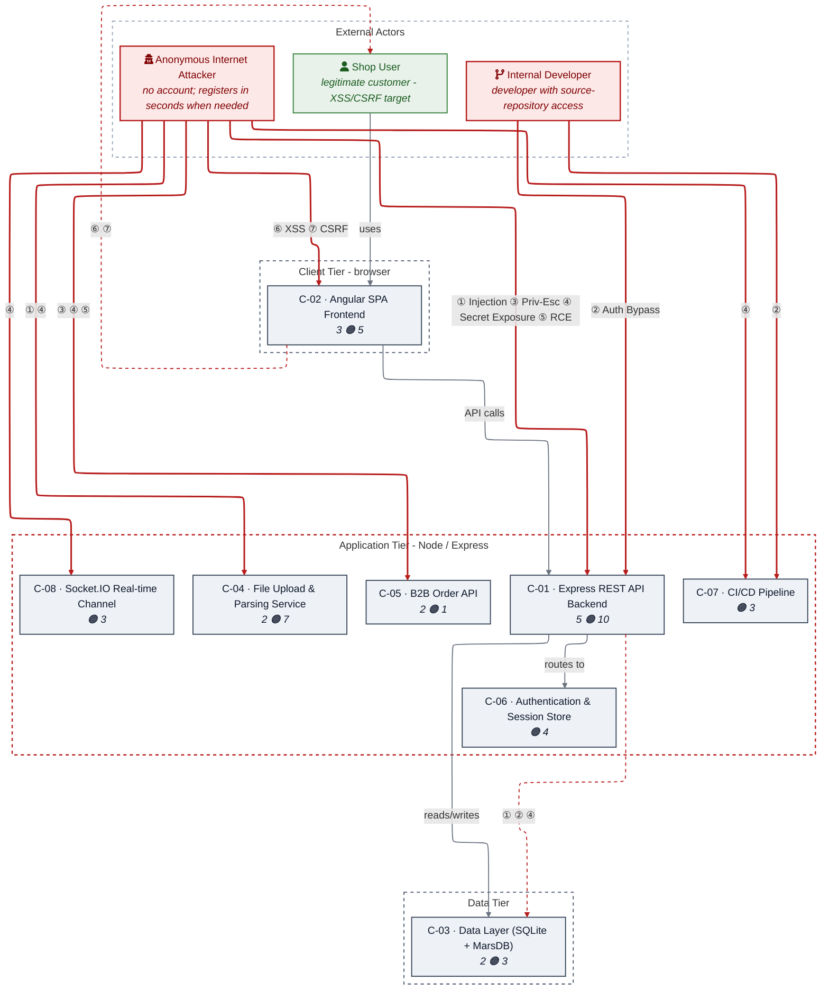

_Threats: ① Injection · ② Auth Bypass · ③ Priv-Esc · ④ Secret Exposure · ⑤ RCE · ⑥ XSS · ⑦ CSRF_

_Component badge: 🔴 = number of Critical findings on the component · 🟠 = number of High findings. Components with no Critical/High finding carry no badge._

**Figure 2 - Risk Flow: Actor → Tier → Impact**

Heatmap: **actors** (left) → **architecture tiers** (middle, Client → Application → Data) → **impact** (right). Numbered red arrows ①–⑦ are the threats enumerated in the Top Threats table below.

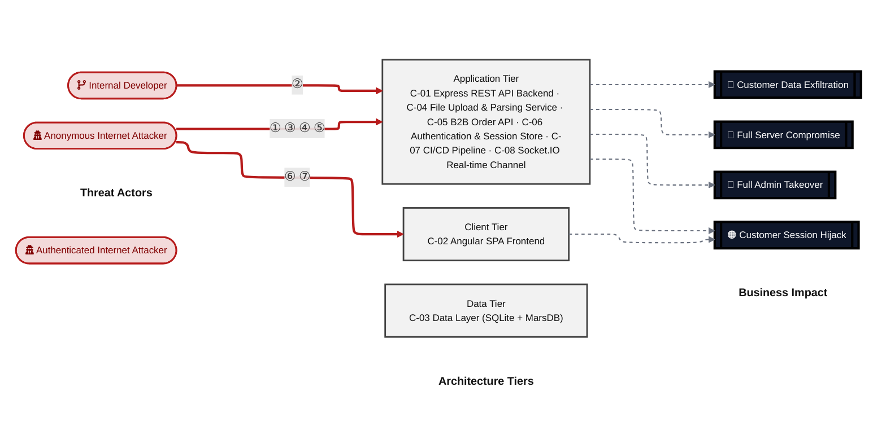

**Threat actors.** The actors below drive the numbered attack paths in the figures above; the Shop User is the *victim* of client-side attacks (XSS / CSRF), not an attacker.

- **Shop User** — legitimate customer; target of client-side attacks; target of ⑥ Output Encoding / Cross-Site Scripting, ⑦ CSRF / Permissive CORS.
- **Anonymous Internet Attacker** — no account; registers in seconds when needed; drives ① Insecure Query Construction & Data Access, ③ Broken Authorization & Access Control, ④ Sensitive File & Secret Exposure, ⑤ Remote Code Execution (unsafe eval).
- **Internal Developer** — developer with source-repository access; drives ② Hardcoded Secrets & Weak Cryptography.

**7 structural threats**, grouped by weakness class - each row is one threat, not one finding. *Threat Description* states the general architectural weakness (STRIDE in brackets); *Findings* lists the concrete instances, each linked to [§8 Findings Register](#8-findings-register) with its component; *Risk & Impact* combines severity with business consequence.

| # | Threat Description | Findings (→ Component) | Risk & Impact | Fix |
|---|------------------------------------|------------------------------------------------|------------------------------------|--------|
| <a id="path-injection"></a>① | **Insecure Query Construction & Data Access**<br/>_(T·I)_<br/>User-controlled input flows into SQL, NoSQL,<br/>XML, and YAML interpreters without<br/>parameterization or schema validation across<br/>login, search, file upload, and review<br/>update routes. | <span style="white-space:nowrap">🔴&nbsp;[F-007](#f-007)</span> - SQL Injection via String Interpolation in Login Query (routes/login.ts:34) <span style="white-space:nowrap">→&nbsp;[C-01](#c-01)</span><br/><span style="white-space:nowrap">🔴&nbsp;[F-008](#f-008)</span> - UNION SQL Injection via Search Criteria Parameter (routes/search.ts:23) <span style="white-space:nowrap">→&nbsp;[C-01](#c-01)</span><br/><span style="white-space:nowrap">🔴&nbsp;[F-009](#f-009)</span> - XXE via external entity resolution in libxmljs2 <span style="white-space:nowrap">→&nbsp;[C-04](#c-04)</span><br/><span style="white-space:nowrap">🟠&nbsp;[F-023](#f-023)</span> - NoSQL Injection via Untyped _id with multi… (routes/updateProductReviews.ts:18) <span style="white-space:nowrap">→&nbsp;[C-01](#c-01)</span><br/><span style="white-space:nowrap">🟠&nbsp;[F-043](#f-043)</span> - NoSQL \$where JS Injection Enabling Synchronou… (routes/showProductReviews.ts:36) <span style="white-space:nowrap">→&nbsp;[C-03](#c-03)</span> | 🔴 **Critical**<br/>Customer Data Exfiltration · Full Admin<br/>Takeover | <span style="white-space:nowrap">❶ [M-007](#m-007)</span><br/><span style="white-space:nowrap">❶ [M-008](#m-008)</span> |
| <a id="path-auth-bypass"></a>② | **Hardcoded Secrets & Weak Cryptography**<br/>_(S·E)_<br/>Authentication controls are defeated by<br/>hardcoded credentials, a committed RSA<br/>signing key, algorithm-confusion in JWT<br/>validation, and predictable password<br/>derivation - any of which grants admin-level<br/>session tokens without a valid credential. | <span style="white-space:nowrap">🔴&nbsp;[F-001](#f-001)</span> - Weak MD5 Password Hashing lib/insecurity.ts and <span style="white-space:nowrap">→&nbsp;[C-03](#c-03)</span><br/><span style="white-space:nowrap">🔴&nbsp;[F-003](#f-003)</span> - Hardcoded RSA Private Key Enables JWT Forgery (lib/insecurity.ts:23) <span style="white-space:nowrap">→&nbsp;[C-01](#c-01)</span><br/><span style="white-space:nowrap">🔴&nbsp;[F-004](#f-004)</span> - JWT Algorithm Confusion via expressJwt Without algorithm… (lib/insecurity.ts:54) <span style="white-space:nowrap">→&nbsp;[C-01](#c-01)</span><br/><span style="white-space:nowrap">🔴&nbsp;[F-005](#f-005)</span> - Seeded Default Admin Credentials in Every Database In… (data/datacreator.ts:135) <span style="white-space:nowrap">→&nbsp;[C-03](#c-03)</span><br/><span style="white-space:nowrap">🔴&nbsp;[F-006](#f-006)</span> - Derived Password from OAuth Emai… (frontend/src/app/oauth/oauth.component.ts:30) <span style="white-space:nowrap">→&nbsp;[C-02](#c-02)</span><br/><span style="white-space:nowrap">🟠&nbsp;[F-032](#f-032)</span> - Hardcoded HMAC Key and Cookie Secret Expo… (lib/insecurity.ts:44, server.ts:289) <span style="white-space:nowrap">→&nbsp;[C-01](#c-01)</span><br/><span style="white-space:nowrap">🟠&nbsp;[F-033](#f-033)</span> - Hardcoded Alchemy API Key Not Detected by CI Secret S… (routes/web3Wallet.ts:18) <span style="white-space:nowrap">→&nbsp;[C-07](#c-07)</span><br/><span style="white-space:nowrap">🟡&nbsp;[F-068](#f-068)</span> - Hardcoded Ethereum Contract Address in Source Code Without Rotation Mechanism <span style="white-space:nowrap">→&nbsp;[C-07](#c-07)</span> | 🔴 **Critical**<br/>Full Admin Takeover · Customer Session<br/>Hijack | <span style="white-space:nowrap">❶ [M-001](#m-001)</span><br/><span style="white-space:nowrap">❶ [M-003](#m-003)</span> |
| <a id="path-privilege-escalation"></a>③ | **Broken Authorization & Access Control**<br/>_(E·I)_<br/>Mass assignment through an unscoped<br/>`finale-rest` User endpoint allows<br/>unauthenticated assignment of `role: admin`;<br/>client-side-only Angular guards are<br/>bypassable without server interaction. | <span style="white-space:nowrap">🔴&nbsp;[F-002](#f-002)</span> - Mass Assignment via Sequelize Model Allows Role Escalation <span style="white-space:nowrap">→&nbsp;[C-01](#c-01)</span><br/><span style="white-space:nowrap">🔴&nbsp;[F-013](#f-013)</span> - Missing Role Based Authorization on B2B RCE Capable Endpoint (server.ts:423) <span style="white-space:nowrap">→&nbsp;[C-05](#c-05)</span><br/><span style="white-space:nowrap">🟠&nbsp;[F-015](#f-015)</span> - Password Change Without Current Password Verifica… (routes/changePassword.ts:39) <span style="white-space:nowrap">→&nbsp;[C-01](#c-01)</span><br/><span style="white-space:nowrap">🟠&nbsp;[F-046](#f-046)</span> - IDOR on Basket Endpoint No Ownership Check (routes/basket.ts:18) <span style="white-space:nowrap">→&nbsp;[C-01](#c-01)</span><br/><span style="white-space:nowrap">🟠&nbsp;[F-050](#f-050)</span> - Client Side Only Admin and Accounting Guards (frontend/src/app/app.guard.ts:48) <span style="white-space:nowrap">→&nbsp;[C-02](#c-02)</span><br/><span style="white-space:nowrap">🟡&nbsp;[F-062](#f-062)</span> - Admin Endpoints /rest/admin/* Accessible Without Role Check (server.ts:604) <span style="white-space:nowrap">→&nbsp;[C-01](#c-01)</span> | 🔴 **Critical**<br/>Full Admin Takeover | <span style="white-space:nowrap">❶ [M-002](#m-002)</span><br/><span style="white-space:nowrap">❶ [M-013](#m-013)</span> |
| <a id="path-sensitive-data-exposure"></a>④ | **Sensitive File & Secret Exposure** _(I)_<br/>Hardcoded secrets, unencrypted database<br/>files, plaintext TOTP secrets, open FTP<br/>directory listing, and all active session<br/>tokens served via an authenticated-users<br/>endpoint expose credentials and session<br/>material at rest and in transit. | <span style="white-space:nowrap">🔴&nbsp;[F-014](#f-014)</span> - Zip slip path traversal via unvalidated `entry.path` in archive extraction routes… <span style="white-space:nowrap">→&nbsp;[C-04](#c-04)</span><br/><span style="white-space:nowrap">🟠&nbsp;[F-030](#f-030)</span> - All Active Session Tokens Exposed via /rest/u… (routes/authenticatedUsers.ts:17) <span style="white-space:nowrap">→&nbsp;[C-01](#c-01)</span><br/><span style="white-space:nowrap">🟠&nbsp;[F-031](#f-031)</span> - Unauthenticated Directory Listing and File Serving on /ftp… (server.ts:269 283) <span style="white-space:nowrap">→&nbsp;[C-01](#c-01)</span><br/><span style="white-space:nowrap">🟠&nbsp;[F-032](#f-032)</span> - Hardcoded HMAC Key and Cookie Secret Expo… (lib/insecurity.ts:44, server.ts:289) <span style="white-space:nowrap">→&nbsp;[C-01](#c-01)</span><br/><span style="white-space:nowrap">🟠&nbsp;[F-033](#f-033)</span> - Hardcoded Alchemy API Key Not Detected by CI Secret S… (routes/web3Wallet.ts:18) <span style="white-space:nowrap">→&nbsp;[C-07](#c-07)</span><br/><span style="white-space:nowrap">🟠&nbsp;[F-035](#f-035)</span> - SQLite Database File Stored Without Encryption at Rest (models/index.ts:38) <span style="white-space:nowrap">→&nbsp;[C-03](#c-03)</span><br/><span style="white-space:nowrap">🟠&nbsp;[F-036](#f-036)</span> - TOTP Secret Stored in Plaintext Column (models/user.ts:113) <span style="white-space:nowrap">→&nbsp;[C-03](#c-03)</span><br/><span style="white-space:nowrap">🟠&nbsp;[F-037](#f-037)</span> - Parsed XML/YAML content reflected verbatim in HTTP error response routes/fileUp… <span style="white-space:nowrap">→&nbsp;[C-04](#c-04)</span><br/><span style="white-space:nowrap">🟠&nbsp;[F-038](#f-038)</span> - SSRF via unconstrained fetch in profileImageUrlUpload routes/profileImage… (url) <span style="white-space:nowrap">→&nbsp;[C-04](#c-04)</span><br/><span style="white-space:nowrap">🟠&nbsp;[F-039](#f-039)</span> - Insecure Token Storage in… (frontend/src/app/Services/request.interceptor.ts:13) <span style="white-space:nowrap">→&nbsp;[C-02](#c-02)</span><br/><span style="white-space:nowrap">🟠&nbsp;[F-040](#f-040)</span> - Global Broadcast of Challenge Flags to All Unauthent… (lib/challengeUtils.ts:71) <span style="white-space:nowrap">→&nbsp;[C-08](#c-08)</span><br/><span style="white-space:nowrap">🟡&nbsp;[F-057](#f-057)</span> - VM Evaluation Error Forwarded Verbatim to Client via ne… (routes/b2bOrder.ts:33) <span style="white-space:nowrap">→&nbsp;[C-05](#c-05)</span><br/><span style="white-space:nowrap">🟡&nbsp;[F-058](#f-058)</span> - Google OAuth Client ID and User… (frontend/src/app/login/login.component.ts:57) <span style="white-space:nowrap">→&nbsp;[C-02](#c-02)</span><br/><span style="white-space:nowrap">🟡&nbsp;[F-061](#f-061)</span> - Open Redirect Allowlist Bypass via URL Substring Match (lib/insecurity.ts:138) <span style="white-space:nowrap">→&nbsp;[C-01](#c-01)</span> | 🔴 **Critical**<br/>Customer Data Exfiltration · Customer<br/>Session Hijack | <span style="white-space:nowrap">❶ [M-014](#m-014)</span><br/><span style="white-space:nowrap">❷ [M-030](#m-030)</span> |
| <a id="path-remote-code-execution"></a>⑤ | **Remote Code Execution (unsafe eval)** _(E)_<br/>Two server-side evaluation paths accept<br/>attacker-controlled strings: `eval()` via a<br/>username update and<br/>`vm.runInContext(safeEval())` via B2B order<br/>data. Both lack effective sandboxing and the<br/>B2B path carries no role authorization. | <span style="white-space:nowrap">🔴&nbsp;[F-012](#f-012)</span> - JS Sandbox Escape via notevil Prototype Pollution (routes/b2bOrder.ts:23) <span style="white-space:nowrap">→&nbsp;[C-05](#c-05)</span><br/><span style="white-space:nowrap">🔴&nbsp;[F-013](#f-013)</span> - Missing Role Based Authorization on B2B RCE Capable Endpoint (server.ts:423) <span style="white-space:nowrap">→&nbsp;[C-05](#c-05)</span><br/><span style="white-space:nowrap">🟠&nbsp;[F-022](#f-022)</span> - Server Side Template Injection via eval on Username (routes/userProfile.ts:62) <span style="white-space:nowrap">→&nbsp;[C-01](#c-01)</span> | 🔴 **Critical**<br/>Full Server Compromise · Full Admin Takeover | <span style="white-space:nowrap">❶ [M-013](#m-013)</span><br/><span style="white-space:nowrap">❷ [M-012](#m-012)</span> |
| <a id="path-cross-site-scripting"></a>⑥ | **Output Encoding / Cross-Site Scripting**<br/>_(T·I)_<br/>Angular's default HTML sanitization is<br/>explicitly bypassed at stored-XSS sinks in<br/>the search-result and last-login-IP<br/>components; session JWTs in `localStorage` are<br/>readable by any injected script. | <span style="white-space:nowrap">🔴&nbsp;[F-010](#f-010)</span> - Stored XSS via… (frontend/src/app/search result/search result.component.ts:132) <span style="white-space:nowrap">→&nbsp;[C-02](#c-02)</span><br/><span style="white-space:nowrap">🔴&nbsp;[F-011](#f-011)</span> - DOM Based XSS v… (frontend/src/app/search result/search result.component.ts:170) <span style="white-space:nowrap">→&nbsp;[C-02](#c-02)</span><br/><span style="white-space:nowrap">🟠&nbsp;[F-025](#f-025)</span> - Stored XSS via J… (frontend/src/app/last login ip/last login ip.component.ts:39) <span style="white-space:nowrap">→&nbsp;[C-02](#c-02)</span><br/><span style="white-space:nowrap">🟠&nbsp;[F-039](#f-039)</span> - Insecure Token Storage in… (frontend/src/app/Services/request.interceptor.ts:13) <span style="white-space:nowrap">→&nbsp;[C-02](#c-02)</span> | 🔴 **Critical**<br/>Customer Session Hijack | <span style="white-space:nowrap">❶ [M-010](#m-010)</span><br/><span style="white-space:nowrap">❶ [M-011](#m-011)</span> |
| <a id="path-cross-site-request-forgery"></a>⑦ | **CSRF / Permissive CORS** _(S·T)_<br/>Password-change is exposed as a GET request<br/>carrying credentials in query parameters; no<br/>CSRF token or SameSite cookie policy is<br/>enforced on state-changing endpoints. | <span style="white-space:nowrap">🟠&nbsp;[F-026](#f-026)</span> - Password Change via GET Request… (frontend/src/app/Services/user.service.ts:54) <span style="white-space:nowrap">→&nbsp;[C-02](#c-02)</span><br/><span style="white-space:nowrap">🟠&nbsp;[F-034](#f-034)</span> - Password in GET Query Parameters (routes/changePassword.ts:13) <span style="white-space:nowrap">→&nbsp;[C-06](#c-06)</span> | 🟠 **High**<br/>Customer Session Hijack | <span style="white-space:nowrap">❷ [M-026](#m-026)</span><br/><span style="white-space:nowrap">❷ [M-034](#m-034)</span> |

_STRIDE: S spoofing · T tampering · R repudiation · I information disclosure · D denial of service · E elevation of privilege. Risk, findings, components, impact and Fix are derived deterministically; only the one-line weakness description is authored._

**Verified attack chains.** 1 fully viable ([AC-T-005](#ac-t-005)). These chains combine individual findings into end-to-end exploitation paths verified step-by-step against the code - see [§9 Abuse Cases](#9-abuse-cases) for the per-step breakdown and blocking mitigations.

### Top Mitigations

Highest-impact P1/P2 mitigations - 14 of 46 qualifying (68 total). Full detail in [§10 Mitigation Register](#10-mitigation-register). All 14 mitigation(s) that fix a Critical finding are always listed here.

| # | Component | Mitigation | Addresses | Effort |
|---|----------------------|------------------------------------------------|------------------------------------------------|------|
| **1** | [C-01](#c-01) — Express REST API Backend | ❶ [M-002](#m-002) — Exclude the role field from Finale-REST User resource and enforce default-customer in UserModel | 🔴 [F-002](#f-002) — Mass Assignment via Sequelize Model Allows Role Escalation (server.ts, "`body.role`") | Low |
| **2** | [C-01](#c-01) — Express REST API Backend | ❶ [M-004](#m-004) — Upgrade express-jwt to >= 8.x and add algorithms: ['RS256'] to isAuthorized() | 🔴 [F-004](#f-004) — JWT Algorithm Confusion via expressJwt Without algorithm… (lib/insecurity.ts, "Authorization header / JWT alg header") | Low |
| **3** | [C-01](#c-01) — Express REST API Backend | ❶ [M-007](#m-007) — Replace raw query interpolation with Sequelize parameterized query or ORM findOne() | 🔴 [F-007](#f-007) — SQL Injection via String Interpolation in Login Query (routes/login.ts, "body.email") | Low |
| **4** | [C-01](#c-01) — Express REST API Backend | ❶ [M-008](#m-008) — Parameterize the search query using Sequelize `Op.like` with bound parameters | 🔴 [F-008](#f-008) — UNION SQL Injection via Search Criteria Parameter (routes/search.ts, "query.q") | Low |
| **5** | [C-01](#c-01) — Express REST API Backend | ❶ [M-003](#m-003) — Remove hardcoded private key and load it from a secrets manager or environment variable at startup | 🔴 [F-003](#f-003) — Hardcoded RSA Private Key Enables JWT Forgery (lib/insecurity.ts, "Authorization header / JWT token") | Medium |
| **6** | [C-02](#c-02) — Angular SPA Frontend | ❶ [M-011](#m-011) — Remove bypassSecurityTrustHtml from search query display and use Angular template binding | 🔴 [F-011](#f-011) — DOM Based XSS v… (frontend/src/app/search result/search result.component.ts, "q") | Low |
| **7** | [C-02](#c-02) — Angular SPA Frontend | ❶ [M-006](#m-006) — Replace derived password with a cryptographically random secret for OAuth-linked accounts | 🔴 [F-006](#f-006) — Derived Password from OAuth Emai… (frontend/src/app/oauth/oauth.component.ts, "profile.email") | Medium |
| **8** | [C-02](#c-02) — Angular SPA Frontend | ❶ [M-010](#m-010) — Sanitize API-supplied HTML content with DOMPurify before innerHTML rendering | 🔴 [F-010](#f-010) — Stored XSS via… (frontend/src/app/search result/search result.component.ts, "product.description") | Medium |
| **9** | [C-03](#c-03) — Data Layer (SQLite + MarsDB) | ❶ [M-001](#m-001) — Replace MD5 password hashing with bcrypt in the User model setter | 🔴 [F-001](#f-001) — Weak MD5 Password Hashing lib/insecurity.ts and (models/user.ts, "password") | Medium |
| **10** | [C-03](#c-03) — Data Layer (SQLite + MarsDB) | ❶ [M-005](#m-005) — Replace static seed credentials with environment-variable-driven admin password generation | 🔴 [F-005](#f-005) — Seeded Default Admin Credentials in Every Database In… (data/datacreator.ts, "email") | Medium |
| **11** | [C-04](#c-04) — File Upload & Parsing Service | ❶ [M-009](#m-009) — Disable external entity resolution in libxmljs2 by setting noent:false | 🔴 [F-009](#f-009) — XXE via external entity resolution in libxmljs2 (routes/fileUpload.ts, "uploaded XML file body") | Low |
| **12** | [C-04](#c-04) — File Upload & Parsing Service | ❶ [M-014](#m-014) — Validate ZIP entry paths using path.resolve prefix anchoring and use the resolved absolute path for writes | 🔴 [F-014](#f-014) — Zip slip path traversal via unvalidated `entry.path` in archive extraction routes… (routes/fileUpload.ts, "ZIP archive entry filenames") | Low |
| **13** | [C-05](#c-05) — B2B Order API | ❶ [M-013](#m-013) — Add B2B-role or scope check before the /b2b/v2 route handler | 🔴 [F-013](#f-013) — Missing Role Based Authorization on B2B RCE Capable Endpoint (server.ts) | Low |
| **14** | [C-05](#c-05) — B2B Order API | ❷ [M-012](#m-012) — Remove notevil/vm.runInContext and replace orderLinesData with a structured schema-validated format | 🔴 [F-012](#f-012) — JS Sandbox Escape via notevil Prototype Pollution (routes/b2bOrder.ts, "orderLinesData") | High |

*32 additional P1/P2 mitigations capped from the leader-board · 22 P3 backlog items in [§10 Mitigation Register](#10-mitigation-register). Sorted by priority (P1 first), then component, then leverage (most findings first), severity (Critical first), and effort (Low first).*

### Operational Strengths

Operational controls rated Adequate or Partial - grouped into broad clusters (full per-control breakdown in [§7](#7-security-architecture)). Clusters demoted to Weak by open Critical/High findings appear in [§7](#7-security-architecture) instead, not here.

| Strength | What's in Place | Effectiveness | Gap | Mitigates |
|----------------------|----------------------|-------------|----------------------|----------------|
| **Container & Supply-Chain Hardening** | _Build-time and runtime hardening - minimal<br/>base image, non-root execution, dependency<br/>inventory._<br/>Container Security<br/>Automated SCA scanning | ✅ Adequate | - | - |
| **Hardened HTTP Stack** | _Browser-facing HTTP hardening - security<br/>headers, cookie flags, cross-origin policy,<br/>and abuse-protection limits._<br/>Rate Limiting<br/>CORS Policy | ⚠️ Partial | Bypassed by 2 High finding(s) of the kind this cluster is supposed to prevent - e.g. 🟠 [F-026](#f-026), 🟠 [F-038](#f-038). | - |
| **Observability & Audit** | _Runtime visibility - access logging, audit<br/>trails, and operational telemetry for<br/>post-incident review._<br/>Audit Logging | ⚠️ Partial | Coverage incomplete - see [§7](#7-security-architecture) control assessment. | - |


**Bottom line:** These controls narrow specific attack surfaces but none eliminates a Critical finding on its own.

---

<a id="critical-attack-chain"></a>
<a id="critical-attack-tree"></a>
## Critical Attack Tree

The root is the worst-case attacker goal; below it, each capability branch groups the Critical findings that achieve it. Branches feed the goal by OR - any single path suffices.

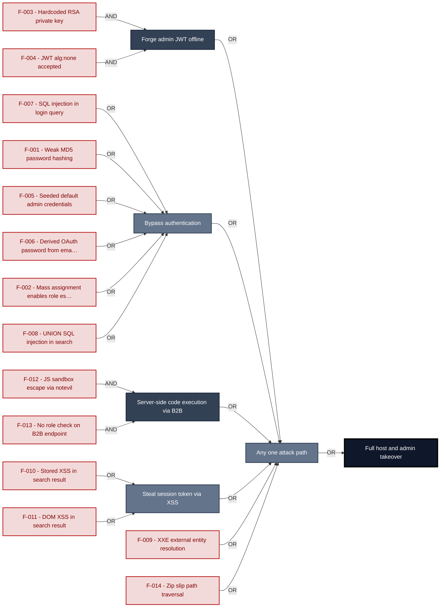

**Findings** (full detail in [§8 Findings Register](#8-findings-register)): 🔴 [F-003](#f-003) Hardcoded RSA private key · 🔴 [F-004](#f-004) JWT alg:none accepted · 🔴 [F-007](#f-007) SQL injection in login query · 🔴 [F-001](#f-001) Weak MD5 password hashing · 🔴 [F-005](#f-005) Seeded default admin credentials · 🔴 [F-006](#f-006) Derived OAuth password from email · 🔴 [F-002](#f-002) Mass assignment enables role escalation · 🔴 [F-008](#f-008) UNION SQL injection in search · 🔴 [F-012](#f-012) JS sandbox escape via notevil · 🔴 [F-013](#f-013) No role check on B2B endpoint · 🔴 [F-010](#f-010) Stored XSS in search result · 🔴 [F-011](#f-011) DOM XSS in search result · 🔴 [F-009](#f-009) XXE external entity resolution · 🔴 [F-014](#f-014) Zip slip path traversal

---

## 1. System Overview

Probably the most modern and sophisticated insecure web application

**Repository:** https://github.com/juice-shop/juice-shop
**Runtime:** Node\.js 20 - 24

### Scope

This threat model covers 8 components of juice-shop: **Express REST API Backend**, **Angular SPA Frontend**, **Data Layer (SQLite + MarsDB)**, **File Upload & Parsing Service**, **B2B Order API**, **Authentication & Session Store**, **CI/CD Pipeline**, **Socket\.IO Real-time Channel**.

**Out of scope:** third-party hosted dependencies, browser runtime, operating-system kernel, and the underlying network infrastructure.

---

## 2. Architecture Diagrams

### 2.1 System Context

Who interacts with juice-shop from the outside, and through which channels. Solid arrows show normal usage; dashed red arrows mark unauthenticated probing or exploit paths (C4 Level 1).

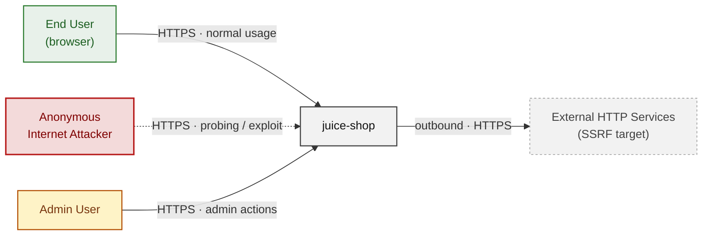

**Key takeaway:** Every actor in the context interacts with juice-shop through its external interface, so authentication and input validation at that edge govern the entire attack surface.

### 2.2 Container Architecture

How the system decomposes into deployable units. Each box is a separate runtime process or service container; arrows show synchronous request paths between them. Components with ≥3 Critical findings carry a red border, ≥2 High amber (C4 Level 2).

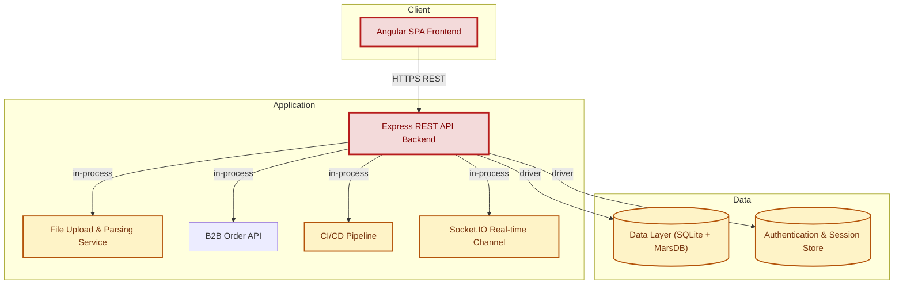

**Key takeaway:** The system decomposes into 1 client, 5 application and 2 data unit(s); Express REST API Backend carries the most Critical findings (5) and bounds the worst-case blast radius.

### 2.3 Components


Who reaches each component, and through which trust zone. Four columns map external actors to the internal tiers (Client / Application / Data); solid green arrows show legitimate data flow, dashed red arrows mark intrusion vectors. The component table directly below holds source paths and linked threats per `C-NN`; per-finding evidence is in [§8 Findings Register](#8-findings-register).

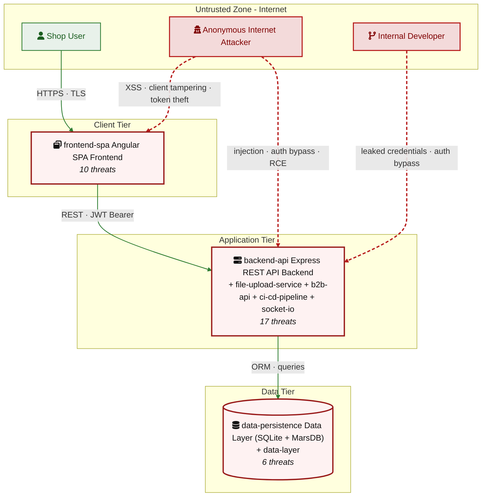

**Key takeaway:** Express REST API Backend concentrates the most findings (17 of 68 across all components); the table below maps each component to its source paths and linked threats.

| ID | Name | Type | Key Paths | Linked Threats |
|----|----------------------|---------|--------------------------------------|------------------------------------------------|
| <a id="c-01"></a><a id="backend-api"></a>C-01 | Express REST API Backend | process | `server.ts`<br/>`routes/**`<br/>`lib/**`<br/>`app.ts` | 🔴 [F-002](#f-002) — Mass Assignment via Sequelize Model Allows Role Escalation<br/>🔴 [F-003](#f-003) — Hardcoded RSA Private Key Enables JWT Forgery (lib/insecurity.ts:23)<br/>🔴 [F-004](#f-004) — JWT Algorithm Confusion via expressJwt Without algorithm… (lib/insecurity.ts:54)<br/>🔴 [F-007](#f-007) — SQL Injection via String Interpolation in Login Query (routes/login.ts:34)<br/>🔴 [F-008](#f-008) — UNION SQL Injection via Search Criteria Parameter (routes/search.ts:23)<br/>🟠 [F-015](#f-015) — Password Change Without Current Password Verifica… (routes/changePassword.ts:39)<br/>🟠 [F-016](#f-016) — Security Question Password Reset Bypassable via OS… (routes/resetPassword.ts:41)<br/>🔴 [F-022](#f-022) — Server Side Template Injection via eval on Username (routes/userProfile.ts:62)<br/>🔴 [F-023](#f-023) — NoSQL Injection via Untyped _id with multi… (routes/updateProductReviews.ts:18)<br/>🟠 [F-028](#f-028) — No Structured Security Audit Log for Authentication and Admin E… (server.ts:338)<br/>🟠 [F-030](#f-030) — All Active Session Tokens Exposed via /rest/u… (routes/authenticatedUsers.ts:17)<br/>🟠 [F-031](#f-031) — Unauthenticated Directory Listing and File Serving on /ftp… (server.ts:269 283)<br/>🔴 [F-032](#f-032) — Hardcoded HMAC Key and Cookie Secret Expo… (lib/insecurity.ts:44, server.ts:289)<br/>🟠 [F-042](#f-042) — No Rate Limiting on Login Endpoint Enables Brute Force (server.ts:343)<br/>🟠 [F-046](#f-046) — IDOR on Basket Endpoint No Ownership Check (routes/basket.ts:18)<br/>🟡 [F-061](#f-061) — Open Redirect Allowlist Bypass via URL Substring Match (lib/insecurity.ts:138)<br/>🔴 [F-062](#f-062) — Admin Endpoints /rest/admin/* Accessible Without Role Check (server.ts:604) |
| <a id="c-02"></a><a id="frontend-spa"></a>C-02 | Angular SPA Frontend | process | `frontend/src/**` | 🔴 [F-006](#f-006) — Derived Password from OAuth Emai… (frontend/src/app/oauth/oauth.component.ts:30)<br/>🔴 [F-010](#f-010) — Stored XSS via… (frontend/src/app/search result/search result.component.ts:132)<br/>🔴 [F-011](#f-011) — DOM Based XSS v… (frontend/src/app/search result/search result.component.ts:170)<br/>🟠 [F-020](#f-020) — OAuth Implicit Flow Without Sta… (frontend/src/app/login/login.component.ts:134)<br/>🔴 [F-025](#f-025) — Stored XSS via J… (frontend/src/app/last login ip/last login ip.component.ts:39)<br/>🟠 [F-026](#f-026) — Password Change via GET Request… (frontend/src/app/Services/user.service.ts:54)<br/>🟠 [F-039](#f-039) — Insecure Token Storage in… (frontend/src/app/Services/request.interceptor.ts:13)<br/>🟠 [F-050](#f-050) — Client Side Only Admin and Accounting Guards (frontend/src/app/app.guard.ts:48)<br/>🟡 [F-054](#f-054) — Unauthenticated Socket\.IO C… (frontend/src/app/Services/socket io.service.ts:21)<br/>🟡 [F-058](#f-058) — Google OAuth Client ID and User… (frontend/src/app/login/login.component.ts:57) |
| <a id="c-03"></a><a id="data-persistence"></a>C-03 | Data Layer (SQLite + MarsDB) | datastore | `models/**`<br/>`data/mongodb.ts`<br/>`data/datacreator.ts` | 🔴 [F-001](#f-001) — Weak MD5 Password Hashing lib/insecurity.ts and models/user.ts<br/>🔴 [F-005](#f-005) — Seeded Default Admin Credentials in Every Database In… (data/datacreator.ts:135)<br/>🟠 [F-035](#f-035) — SQLite Database File Stored Without Encryption at Rest (models/index.ts:38)<br/>🟠 [F-036](#f-036) — TOTP Secret Stored in Plaintext Column (models/user.ts:113)<br/>🔴 [F-043](#f-043) — NoSQL \$where JS Injection Enabling Synchronou… (routes/showProductReviews.ts:36)<br/>🟡 [F-056](#f-056) — No Audit Logging for Data Mutations on User, Review, and Order Collections |
| <a id="c-04"></a><a id="file-upload-service"></a>C-04 | File Upload & Parsing Service | process | `routes/fileUpload.ts`<br/>`routes/profileImageFileUpload.ts`<br/>`routes/profileImageUrlUpload.ts` | 🔴 [F-009](#f-009) — XXE via external entity resolution in libxmljs2 routes/fileUpload.ts:83<br/>🔴 [F-014](#f-014) — Zip slip path traversal via unvalidated `entry.path` in archive extraction routes…<br/>🔴 [F-019](#f-019) — Missing authentication on /file upload enables unauthenticated parsing attacks…<br/>🟠 [F-029](#f-029) — No audit logging for file upload events or SSRF/XXE trigger attempts routes/fil…<br/>🟠 [F-037](#f-037) — Parsed XML/YAML content reflected verbatim in HTTP error response routes/fileUp…<br/>🟠 [F-038](#f-038) — SSRF via unconstrained fetch in profileImageUrlUpload routes/profileImage… (url)<br/>🟠 [F-044](#f-044) — YAML bomb alias expansion causes heap exhaustion routes/fileUpload.ts:117<br/>🟠 [F-045](#f-045) — ZIP bomb via unzipper with no decompressed size limit routes/fileUpload.ts:38<br/>🟠 [F-049](#f-049) — File type check uses extension only, not magic bytes, allowing executable uploa… |
| <a id="c-05"></a><a id="b2b-api"></a>C-05 | B2B Order API | gateway | `routes/b2bOrder.ts` | 🔴 [F-012](#f-012) — JS Sandbox Escape via notevil Prototype Pollution (routes/b2bOrder.ts:23)<br/>🔴 [F-013](#f-013) — Missing Role Based Authorization on B2B RCE Capable Endpoint (server.ts:423)<br/>🟠 [F-041](#f-041) — Event Loop Exhaustion via Unbounded Concurrent VM Evalu… (routes/b2bOrder.ts:23)<br/>🟡 [F-057](#f-057) — VM Evaluation Error Forwarded Verbatim to Client via ne… (routes/b2bOrder.ts:33)<br/>🟢 [F-064](#f-064) — No Audit Logging of B2B Order Submissions or Evaluation Er… (routes/b2bOrder.ts) |
| <a id="c-06"></a><a id="data-layer"></a>C-06 | Authentication & Session Store | process | `lib/insecurity.ts`<br/>`routes/login.ts`<br/>`routes/2fa.ts`<br/>`routes/changePassword.ts`<br/>`routes/resetPassword.ts` | 🟠 [F-017](#f-017) — Missing Login Rate Limiting (routes/login.ts:34)<br/>🟠 [F-018](#f-018) — Missing Session Token Revocation on Logout (lib/insecurity.ts:72)<br/>🟠 [F-034](#f-034) — Password in GET Query Parameters (routes/changePassword.ts:13)<br/>🔴 [F-048](#f-048) — Missing Current Password Check on Password Change (routes/changePassword.ts:39)<br/>🟡 [F-055](#f-055) — Missing Audit Logging for Authentication Events (routes/login.ts)<br/>🟡 [F-059](#f-059) — Unbounded In Memory Token Map Growth (lib/insecurity.ts:72) |
| <a id="c-07"></a><a id="ci-cd-pipeline"></a>C-07 | CI/CD Pipeline | external | `.github/workflows/**`<br/>`Dockerfile`<br/>`.npmrc` | 🟠 [F-024](#f-024) — Heroku CLI Installed via curl pipe sh Without In… (.github/workflows/ci.yml:326)<br/>🔴 [F-033](#f-033) — Hardcoded Alchemy API Key Not Detected by CI Secret S… (routes/web3Wallet.ts:18)<br/>🟠 [F-047](#f-047) — Dockerfile Installer Stage Runs npm install as Root with unsafe… (Dockerfile:5)<br/>🟡 [F-051](#f-051) — Npm install Without ignore scripts Enables Postinsta… (.github/workflows/ci.yml)<br/>🟡 [F-052](#f-052) — Unpinned Mutable Action Tags in CodeQL Workflow (codeql analysis.yml)<br/>🟡 [F-053](#f-053) — Package lock=false in .npmrc Disables Lockfile Integrity for All CI… (.npmrc:1)<br/>🟡 [F-065](#f-065) — GitHub Actions Workflow Lacks CODEOWNERS Review Gate for Workflow Changes<br/>🟡 [F-066](#f-066) — Package lock Disabled via .npmrc Allowing Non Deterministic Dependency Resoluti…<br/>🟢 [F-067](#f-067) — Dockerfile Global npm Package Installed Without Exact Version Pin<br/>🔴 [F-068](#f-068) — Hardcoded Ethereum Contract Address in Source Code Without Rotation Mechanism |
| <a id="c-08"></a><a id="socket-io"></a>C-08 | Socket\.IO Real-time Channel | queue | `lib/startup/registerWebsocketEvents.ts` | 🔴 [F-021](#f-021) — Missing Authentication on WebSocket… (lib/startup/registerWebsocketEvents.ts:24)<br/>🟠 [F-027](#f-027) — Client Side Challenge Verification… (lib/startup/registerWebsocketEvents.ts:41)<br/>🟠 [F-040](#f-040) — Global Broadcast of Challenge Flags to All Unauthent… (lib/challengeUtils.ts:71)<br/>🟡 [F-060](#f-060) — No Rate Limiting or Connection Cap… (lib/startup/registerWebsocketEvents.ts:20)<br/>🔴 [F-063](#f-063) — CORS Origin Hardcoded to Developmen… (lib/startup/registerWebsocketEvents.ts:20) |
### 2.4 Technology Architecture

The technology stack the system is built on. Each box names the framework or runtime that fills that role; per-component findings live in the [§2.3](#23-components) component table above, and the full per-finding catalogue is in [§8 Findings Register](#8-findings-register).

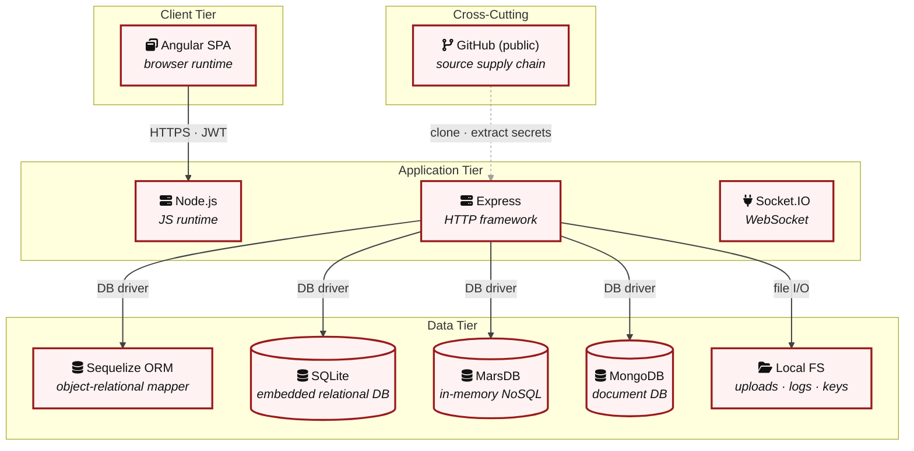

**Key takeaway:** The stack spans 2 data-tier store(s) behind the application tier; injection and data-at-rest exposure track the data tier, detailed per finding in [§8 Findings Register](#8-findings-register).

> **Legend:** **red border** ≥ 3 Critical threats on the component · **amber border** ≥ 2 High threats

---

## 3. Attack Walkthroughs

This section walks through how the highest-risk findings are exploited - one short walkthrough per Critical, each with attack steps, a focused sequence diagram, and the primary mitigation. The cross-finding view (which weaknesses combine toward the worst-case goal, and where one fix severs several paths) is in the [Critical Attack Tree](#critical-attack-tree). Full per-finding context - severity rationale, assets, detection signals - is in the [§8 Findings Register](#8-findings-register) row for each finding.

### 3.1 Weak MD5 Password Hashing lib/insecurity.ts and models/user…

**Source:** 🔴 [F-001](#f-001) — `models/user.ts:77`

Severity **Critical** ([CWE-916](https://cwe.mitre.org/data/definitions/916.html)). STRIDE: Information Disclosure. See [§8 F-001](#f-001) for the full register row.

**Attack Steps**

1. Every user password is hashed with unsalted MD5 via `security.hash()` (`lib/insecurity.ts:43`).
2. An attacker who obtains the `data/juiceshop.sqlite` database file - through SQLi exfiltration, SSRF, or OS file-read - can run the entire `Users` table through a precomputed rainbow table or a GPU-accelerated brute-force attack.
3. MD5 is not a password-hashing function: it has no work factor, no salt, and can be computed at billions of hashes per second.

**Sequence Diagram**


**Key takeaway:** Until ❶ [M-001](#m-001) (Replace MD5 password hashing with bcrypt in the User model s) lands, F-001 is exploitable at `models/user.ts:77` (Critical-severity, [CWE-916](https://cwe.mitre.org/data/definitions/916.html)).

**Defense in Depth**

- Primary mitigation: ❶ [M-001](#m-001) (Replace MD5 password hashing with bcrypt in the User model setter)

### 3.2 Mass Assignment via Sequelize Model Allows Role Escalation

**Source:** 🔴 [F-002](#f-002) — `server.ts:483`

Severity **Critical** ([CWE-915](https://cwe.mitre.org/data/definitions/915.html)). STRIDE: Elevation of Privilege. See [§8 F-002](#f-002) for the full register row.

**Attack Steps**

1. The Finale-REST auto-route for User creation at `server.ts:499` auto-generates POST /api/Users from the UserModel.
2. The autoModels configuration at line 483 excludes only password and totpSecret - the role field is not excluded.
3. The UserModel setter at `models/user.ts:86` accepts 'admin' as a valid role value.

**Sequence Diagram**

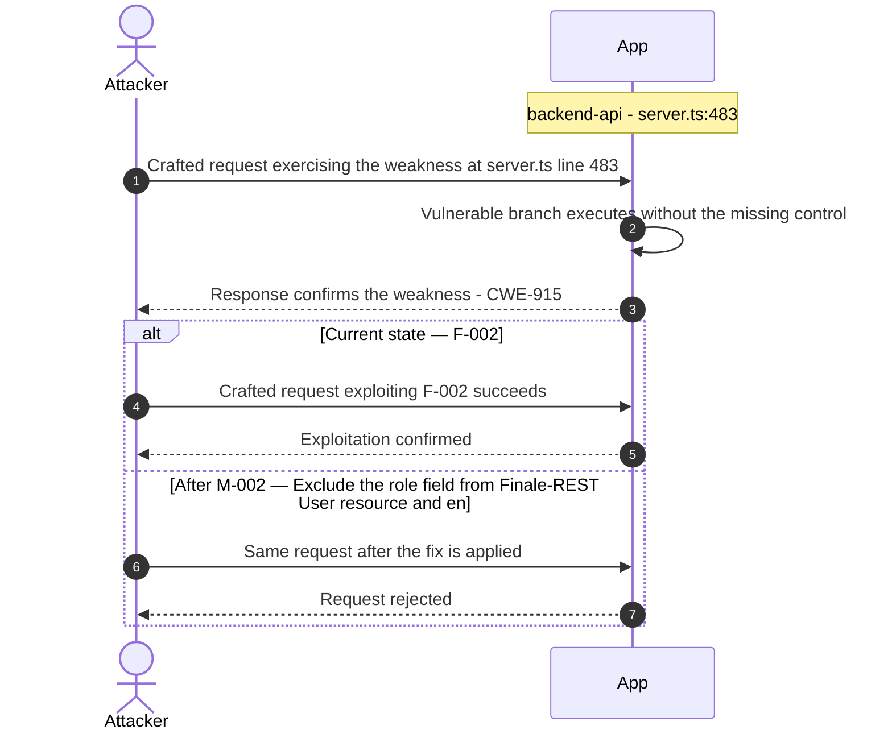

**Key takeaway:** Until ❶ [M-002](#m-002) (Exclude the role field from Finale-REST User resource and en) lands, F-002 is exploitable at `server.ts:483` (Critical-severity, [CWE-915](https://cwe.mitre.org/data/definitions/915.html)).

**Defense in Depth**

- Primary mitigation: ❶ [M-002](#m-002) (Exclude the role field from Finale-REST User resource and enforce default-customer in UserModel)

### 3.3 Hardcoded RSA Private Key Enables JWT Forgery…

**Source:** 🔴 [F-003](#f-003) — `lib/insecurity.ts:23`

Severity **Critical** ([CWE-321](https://cwe.mitre.org/data/definitions/321.html)). STRIDE: Spoofing. See [§8 F-003](#f-003) for the full register row.

**Attack Steps**

1. The RSA private key used to sign all JWT tokens is hardcoded verbatim in lib/insecurity.ts line 23.
2. Any attacker who obtains the source code - via public GitHub, a directory traversal, or the intentionally exposed /ftp endpoint - can extract this key and use `jwt.sign()` to forge valid RS256 tokens for any user ID, including admin accounts.
3. The `authorize()` function at line 56 uses this same private key, so all forged tokens pass the expressJwt({ secret: publicKey }) verification performed by `isAuthorized()` middleware.

**Sequence Diagram**


**Key takeaway:** Until ❶ [M-003](#m-003) (Remove hardcoded private key and load it from a secrets mana) lands, F-003 is exploitable at `lib/insecurity.ts:23` (Critical-severity, [CWE-321](https://cwe.mitre.org/data/definitions/321.html)).

**Defense in Depth**

- Primary mitigation: ❶ [M-003](#m-003) (Remove hardcoded private key and load it from a secrets manager or environment variable at startup)

### 3.4 JWT Algorithm Confusion via expressJwt Without algorithm……

**Source:** 🔴 [F-004](#f-004) — `lib/insecurity.ts:54`

Severity **Critical** ([CWE-347](https://cwe.mitre.org/data/definitions/347.html)). STRIDE: Spoofing. See [§8 F-004](#f-004) for the full register row.

**Attack Steps**

1. The `isAuthorized()` middleware at `lib/insecurity.ts:54` calls expressJwt({ secret: publicKey }) using express-jwt version 0.1.3 (circa 2013) without specifying an algorithms allowlist.
2. This version accepts tokens whose header declares alg:HS256 in addition to RS256.
3. An attacker can take the RSA public key (exposed at /encryptionkeys/jwt.pub), use it as the HMAC secret to craft a token signed with HS256, and the server will verify it successfully - because it checks HMAC(payload, publicKey) against the signature.

**Sequence Diagram**

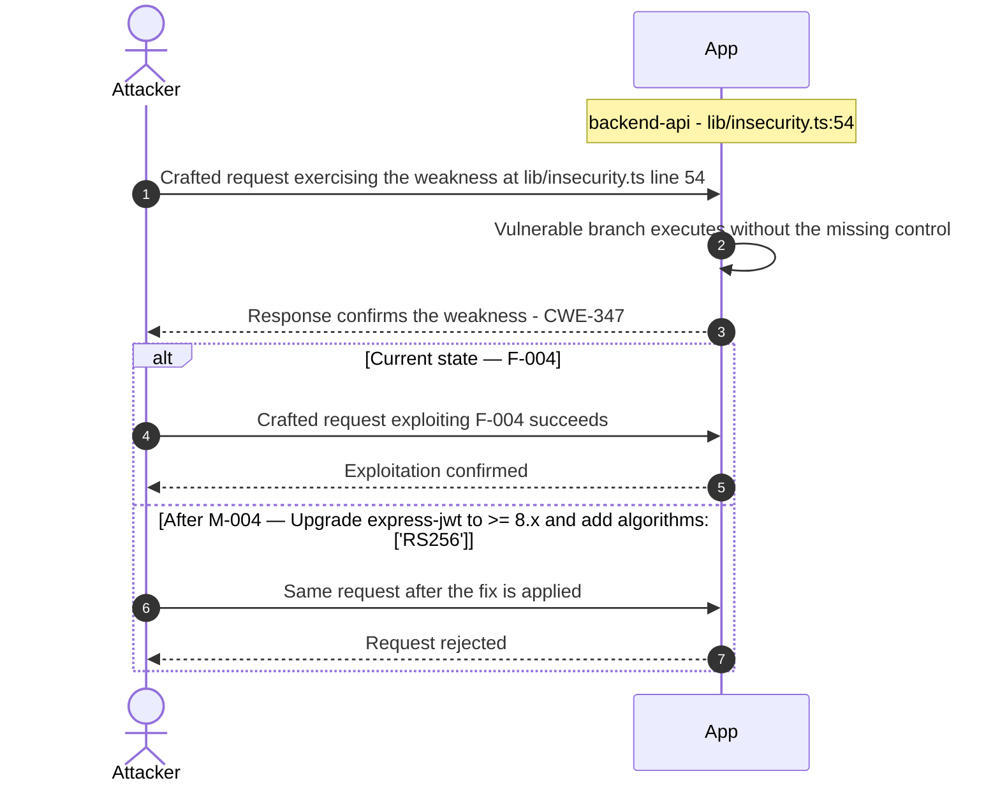

**Key takeaway:** Until ❶ [M-004](#m-004) (Upgrade express-jwt to >= 8.x and add algorithms: ['RS256'] ) lands, F-004 is exploitable at `lib/insecurity.ts:54` (Critical-severity, [CWE-347](https://cwe.mitre.org/data/definitions/347.html)).

**Defense in Depth**

- Primary mitigation: ❶ [M-004](#m-004) (Upgrade express-jwt to >= 8.x and add algorithms: ['RS256'] to isAuthorized())

### 3.5 Seeded Default Admin Credentials in Every Database In……

**Source:** 🔴 [F-005](#f-005) — `data/datacreator.ts:135`

Severity **Critical** ([CWE-798](https://cwe.mitre.org/data/definitions/798.html)). STRIDE: Spoofing. See [§8 F-005](#f-005) for the full register row.

**Attack Steps**

1. The `createUsers()` function in `data/datacreator.ts:128-156` seeds a static admin account (`admin@juice-sh.op` / `admin123`) on every application startup.
2. The credentials are public knowledge (documented in the project README and widely published).
3. Any attacker who reaches the login endpoint can authenticate as admin with these credentials, bypassing all access controls.

**Sequence Diagram**

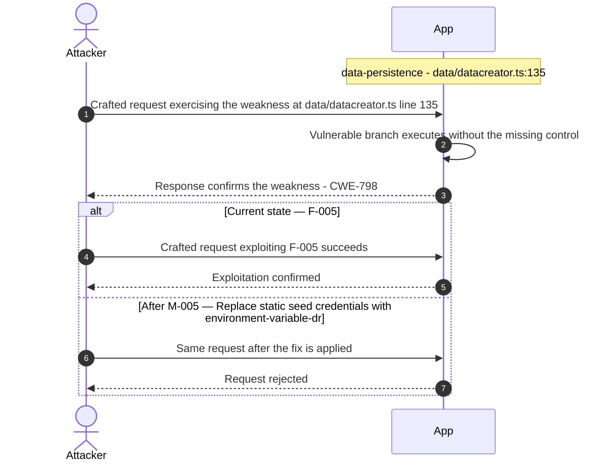

**Key takeaway:** Until ❶ [M-005](#m-005) (Replace static seed credentials with environment-variable-dr) lands, F-005 is exploitable at `data/datacreator.ts:135` (Critical-severity, [CWE-798](https://cwe.mitre.org/data/definitions/798.html)).

**Defense in Depth**

- Primary mitigation: ❶ [M-005](#m-005) (Replace static seed credentials with environment-variable-driven admin password generation)

### 3.6 Derived Password from OAuth Emai……

**Source:** 🔴 [F-006](#f-006) — `frontend/src/app/oauth/oauth.component.ts:30`

Severity **Critical** ([CWE-522](https://cwe.mitre.org/data/definitions/522.html)). STRIDE: Spoofing. See [§8 F-006](#f-006) for the full register row.

**Attack Steps**

1. `oauth.component.ts:30` constructs each OAuth user's local password as `btoa(profile.email.split('').reverse().join(''))` - the base64 encoding of the reversed email address.
2. Any attacker who knows (or guesses) a victim's email address can compute this password deterministically without OAuth involvement, then authenticate directly to `/rest/user/login` with those credentials.
3. The OAuth flow thus creates a parallel credential pair that never changes, ignores OAuth token expiry, and bypasses all IdP-level session controls.

**Sequence Diagram**


**Key takeaway:** Until ❶ [M-006](#m-006) (Replace derived password with a cryptographically random sec) lands, F-006 is exploitable at `frontend/src/app/oauth/oauth.component.ts:30` (Critical-severity, [CWE-522](https://cwe.mitre.org/data/definitions/522.html)).

**Defense in Depth**

- Primary mitigation: ❶ [M-006](#m-006) (Replace derived password with a cryptographically random secret for OAuth-linked accounts)

### 3.7 SQL Injection via String Interpolation in Login Query…

**Source:** 🔴 [F-007](#f-007) — `routes/login.ts:34`

Severity **Critical** ([CWE-89](https://cwe.mitre.org/data/definitions/89.html)). STRIDE: Tampering. See [§8 F-007](#f-007) for the full register row.

**Attack Steps**

1. The login handler at `routes/login.ts:34` constructs a raw SQLite query by string-interpolating req.body.email and a hashed password directly: `SELECT * FROM Users WHERE email = '${req.body.email`}' … A classic tautology payload - email: ' OR 1=1-- - causes the WHERE clause to always evaluate true, returning the first user (typically admin).
2. More destructively, a UNION-based payload can extract all user records including MD5 password hashes.
3. Because req.body.email is not sanitized, null bytes, comments, and stacked queries (SQLite supports them) are also possible attack vectors.

**Sequence Diagram**


**Key takeaway:** Until ❶ [M-007](#m-007) (Replace raw query interpolation with Sequelize parameterized) lands, F-007 is exploitable at `routes/login.ts:34` (Critical-severity, [CWE-89](https://cwe.mitre.org/data/definitions/89.html)).

**Defense in Depth**

- Primary mitigation: ❶ [M-007](#m-007) (Replace raw query interpolation with Sequelize parameterized query or ORM findOne())

### 3.8 UNION SQL Injection via Search Criteria Parameter…

**Source:** 🔴 [F-008](#f-008) — `routes/search.ts:23`

Severity **Critical** ([CWE-89](https://cwe.mitre.org/data/definitions/89.html)). STRIDE: Tampering. See [§8 F-008](#f-008) for the full register row.

**Attack Steps**

1. The product-search handler at `routes/search.ts:23` interpolates req.query.q into: `SELECT * FROM Products WHERE ((name LIKE '%${criteria}%'`… The only sanitization is a length trim to 200 characters (line 22), which does not prevent injection.
2. A UNION SELECT payload (e.g. q=') UNION SELECT sql,2,3,4,5,6,7,8,9 FROM sqlite_master--) can dump the entire database schema.
3. A second payload adding a `SELECT from Users` extracts all email addresses and MD5-hashed passwords.

**Sequence Diagram**

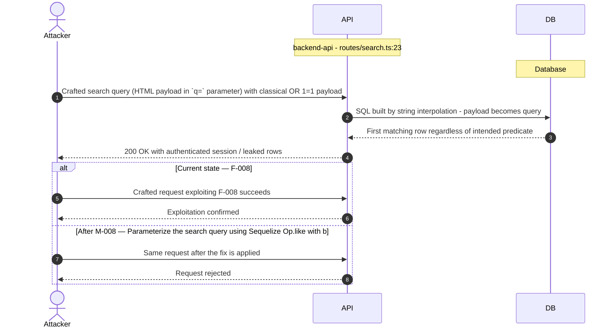

**Key takeaway:** Until ❶ [M-008](#m-008) (Parameterize the search query using Sequelize `Op.like` with b) lands, F-008 is exploitable at `routes/search.ts:23` (Critical-severity, [CWE-89](https://cwe.mitre.org/data/definitions/89.html)).

**Defense in Depth**

- Primary mitigation: ❶ [M-008](#m-008) (Parameterize the search query using Sequelize `Op.like` with bound parameters)

### 3.9 XXE via external entity resolution in libxmljs2 routes/file…

**Source:** 🔴 [F-009](#f-009) — `routes/fileUpload.ts:83`

Severity **Critical** ([CWE-611](https://cwe.mitre.org/data/definitions/611.html)). STRIDE: Tampering. See [§8 F-009](#f-009) for the full register row.

**Attack Steps**

1. An unauthenticated attacker uploads an XML file containing an external entity declaration such as `<!ENTITY xxe SYSTEM "file:///etc/passwd">`.
2. The server parses it at line 83 with `{ noent: true }`, which instructs libxmljs2 to resolve all external entities.
3. The resulting document contains the file contents.

**Sequence Diagram**

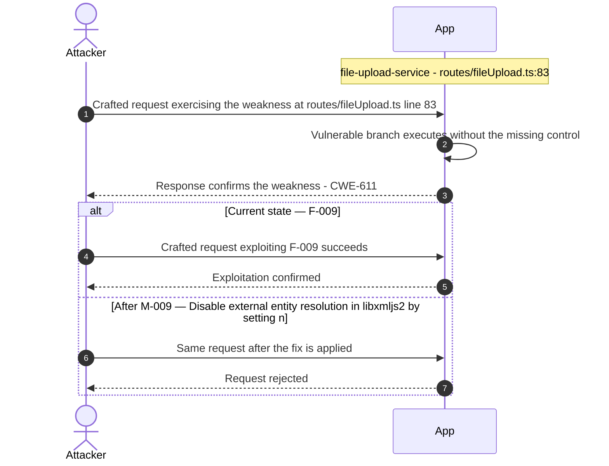

**Key takeaway:** Until ❶ [M-009](#m-009) (Disable external entity resolution in libxmljs2 by setting n) lands, F-009 is exploitable at `routes/fileUpload.ts:83` (Critical-severity, [CWE-611](https://cwe.mitre.org/data/definitions/611.html)).

**Defense in Depth**

- Primary mitigation: ❶ [M-009](#m-009) (Disable external entity resolution in libxmljs2 by setting noent:false)

### 3.10 Stored XSS via……

**Source:** 🔴 [F-010](#f-010) — `frontend/src/app/search-result/search-result.component.ts:132`

Severity **Critical** ([CWE-79](https://cwe.mitre.org/data/definitions/79.html)). STRIDE: Tampering. See [§8 F-010](#f-010) for the full register row.

**Attack Steps**

1. `search-result.component.ts:132` marks every product description from the API as trusted HTML via `this.sanitizer.bypassSecurityTrustHtml(tableData[i].description)`.
2. Any attacker who can write a product description through `/api/Products` (which lacks authentication middleware per the backend dispatch manifest) can inject persistent JavaScript executed in every authenticated user's browser.
3. The same pattern appears in `administration.component.ts:60,78` (user email, feedback comment) and `about.component.ts:119` (feedback comment) - any stored feedback containing `<script>` or an event-handler tag is rendered raw.

**Sequence Diagram**


**Key takeaway:** Until ❶ [M-010](#m-010) (Sanitize API-supplied HTML content with DOMPurify before inn) lands, F-010 is exploitable at `frontend/src/app/search-result/search-result.component.ts:132` (Critical-severity, [CWE-79](https://cwe.mitre.org/data/definitions/79.html)).

**Defense in Depth**

- Primary mitigation: ❶ [M-010](#m-010) (Sanitize API-supplied HTML content with DOMPurify before innerHTML rendering)

### 3.11 DOM Based XSS v……

**Source:** 🔴 [F-011](#f-011) — `frontend/src/app/search-result/search-result.component.ts:170`

Severity **Critical** ([CWE-79](https://cwe.mitre.org/data/definitions/79.html)). STRIDE: Tampering. See [§8 F-011](#f-011) for the full register row.

**Attack Steps**

1. `search-result.component.ts:170` calls `this.sanitizer.bypassSecurityTrustHtml(queryParam)` where `queryParam` is `this.route.snapshot.queryParams.q` - the raw `?q=` URL parameter, trimmed but otherwise unescaped.
2. Angular's `bypassSecurityTrustHtml()` instructs the framework to skip its built-in HTML escaping and render the value as raw DOM.
3. An attacker crafts `https://juice-shop/#/search?q=` - visiting this URL exfiltrates the JWT.

**Sequence Diagram**

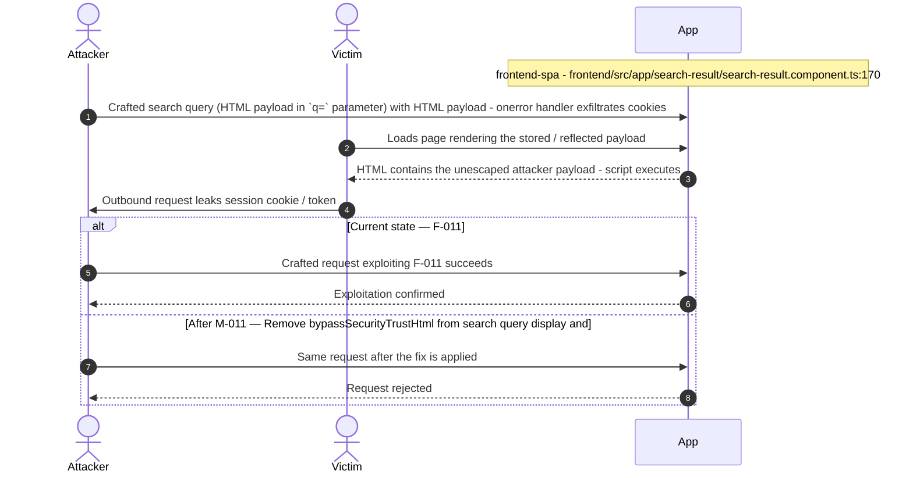

**Key takeaway:** Until ❶ [M-011](#m-011) (Remove bypassSecurityTrustHtml from search query display and) lands, F-011 is exploitable at `frontend/src/app/search-result/search-result.component.ts:170` (Critical-severity, [CWE-79](https://cwe.mitre.org/data/definitions/79.html)).

**Defense in Depth**

- Primary mitigation: ❶ [M-011](#m-011) (Remove bypassSecurityTrustHtml from search query display and use Angular template binding)

### 3.12 JS Sandbox Escape via notevil Prototype Pollution…

**Source:** 🔴 [F-012](#f-012) — `routes/b2bOrder.ts:23`

Severity **Critical** ([CWE-94](https://cwe.mitre.org/data/definitions/94.html)). STRIDE: Elevation of Privilege. See [§8 F-012](#f-012) for the full register row.

**Attack Steps**

1. An authenticated attacker submits a POST /b2b/v2/orders request with a crafted `orderLinesData` payload targeting notevil v1.3.3's prototype pollution vulnerability.
2. The handler at `b2bOrder.ts:19` assigns `body.orderLinesData` directly to the sandbox variable without sanitization, then passes it into `vm.runInContext('safeEval(orderLinesData)', sandbox, {timeout: 2000})` at line 23.
3. Because notevil v1.3.3 does not defend against `__proto__` or `constructor.prototype` mutation, a payload such as `({}).__proto__.toString = function(){return require('child_process').execSync('id')}` can escape the restricted evaluation context and execute arbitrary OS commands under the Node\.js process identity.

**Sequence Diagram**

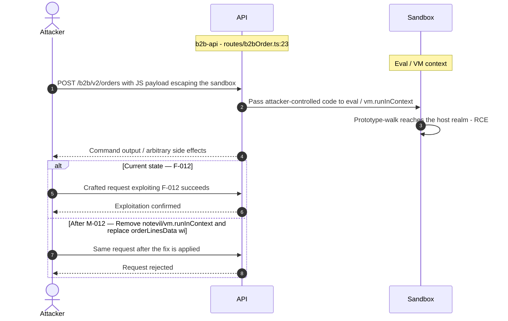

**Key takeaway:** Until ❷ [M-012](#m-012) (Remove notevil/vm.runInContext and replace orderLinesData wi) lands, F-012 is exploitable at `routes/b2bOrder.ts:23` (Critical-severity, [CWE-94](https://cwe.mitre.org/data/definitions/94.html)).

**Defense in Depth**

- Primary mitigation: ❷ [M-012](#m-012) (Remove notevil/vm.runInContext and replace orderLinesData with a structured schema-validated format)

### 3.13 Missing Role Based Authorization on B2B RCE Capable Endpoin…

**Source:** 🔴 [F-013](#f-013) — `server.ts:423`

Severity **Critical** ([CWE-862](https://cwe.mitre.org/data/definitions/862.html)). STRIDE: Elevation of Privilege. See [§8 F-013](#f-013) for the full register row.

**Attack Steps**

1. The `/b2b/v2` route prefix is protected only by `security.isAuthorized()` middleware at `server.ts:423`, which validates JWT token existence and RS256 signature.
2. Any user who has registered an account and obtained a valid JWT - including unprivileged shoppers - can POST to `/b2b/v2/orders` and trigger the notevil code evaluation path.
3. There is no `isAccounting()`, role claim check, or B2B-partner allowlist applied before the handler runs.

**Sequence Diagram**

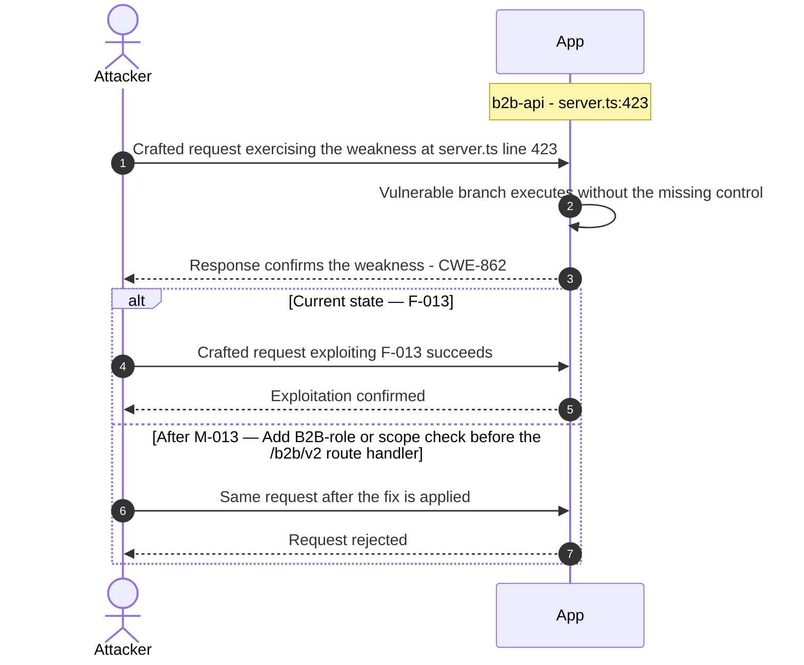

**Key takeaway:** Until ❶ [M-013](#m-013) (Add B2B-role or scope check before the /b2b/v2 route handler) lands, F-013 is exploitable at `server.ts:423` (Critical-severity, [CWE-862](https://cwe.mitre.org/data/definitions/862.html)).

**Defense in Depth**

- Primary mitigation: ❶ [M-013](#m-013) (Add B2B-role or scope check before the /b2b/v2 route handler)

### 3.14 Zip slip path traversal via unvalidated `entry.path` in archi…

**Source:** 🔴 [F-014](#f-014) — `routes/fileUpload.ts:45`

Severity **Critical** ([CWE-22](https://cwe.mitre.org/data/definitions/22.html)). STRIDE: Elevation of Privilege. See [§8 F-014](#f-014) for the full register row.

**Attack Steps**

1. An unauthenticated attacker uploads a crafted ZIP file containing an entry with a path such as `…/…/server.ts` or `…/…/lib/insecurity.ts`.
2. In `handleZipFileUpload`, `entry.path` at line 41 is used directly to construct both `absolutePath` (line 42: `path.resolve('uploads/complaints/' + fileName)`) and the write target (line 45: `fs.createWriteStream('uploads/complaints/' + fileName)`).
3. The guard at line 44 checks `absolutePath.includes(path.resolve('.'))` - `String.includes()` tests substring presence, not prefix anchoring.

**Sequence Diagram**

```mermaid
sequenceDiagram
    autonumber
    actor Attacker
    participant App
    Note over App: file-upload-service - routes/fileUpload.ts:45
    Attacker->>App: Crafted request exercising the weakness at routes/fileUpload.ts line 45
    App->>App: Vulnerable branch executes without the missing control
    App-->>Attacker: Response confirms the weakness - CWE-22
    alt Current state — F-014
        Attacker->>App: Crafted request exploiting F-014 succeeds
        App-->>Attacker: Exploitation confirmed
    else After M-014 — Validate ZIP entry paths using path.resolve prefix anchoring
        Attacker->>App: Same request after the fix is applied
        App-->>Attacker: Request rejected
    end
```

**Key takeaway:** Until ❶ [M-014](#m-014) (Validate ZIP entry paths using path.resolve prefix anchoring) lands, F-014 is exploitable at `routes/fileUpload.ts:45` (Critical-severity, [CWE-22](https://cwe.mitre.org/data/definitions/22.html)).

**Defense in Depth**

- Primary mitigation: ❶ [M-014](#m-014) (Validate ZIP entry paths using path.resolve prefix anchoring and use the resolved absolute path for writes)

<!-- generated:walkthrough_renderer -->

---

## 4. Assets

Information assets and the classification level that drives the Confidentiality / Integrity / Availability targets used in [§8 Findings Register](#8-findings-register) risk scoring.

| Asset | ID | Classification | Description |
|----------------------|-----|--------------|------------------------------------|
| User Credential Store | A-001 | Restricted | SQLite Users table storing email addresses<br/>and MD5-hashed passwords. Compromise enables<br/>account takeover for all users. |
| JWT RSA Private Key | A-002 | Restricted | Hardcoded RSA private key in<br/>lib/insecurity.ts:23. Used to sign all JWT<br/>tokens. Full key committed to source<br/>repository - permanently compromised. |
| Payment Card Data | A-003 | Restricted | Credit/debit card records stored in SQLite<br/>Cards table (CardModel). Includes card<br/>number, expiry, and CVV fields accessible<br/>via /api/Cards endpoints. |
| Encryption Keys Directory | A-011 | Restricted | encryptionkeys/ directory served at<br/>/encryptionkeys/:file. Contains `jwt.pub` (JWT<br/>public key) and premium.key. Public serving<br/>enables offline key analysis. |
| User Orders and Purchase History | A-004 | Confidential | Order records in MarsDB ordersCollection and<br/>Sequelize tables. Contains purchase history,<br/>delivery addresses, and pricing data per<br/>user. |
| Application Access Logs | A-006 | Confidential | Morgan HTTP access logs stored in<br/>logs/access.log.YYYY-MM-DD. Served publicly<br/>at /support/logs/:file. Contain IP<br/>addresses, user agents, and request paths. |
| FTP Sensitive Files | A-007 | Confidential | Files in the ftp/ directory: acquisitions.md<br/>(business intel), incident-`support.kdbx`<br/>(KeePass password database),<br/>package.json.bak, coupons_2013.md.bak.<br/>Directory listing enabled. |
| Wallet Balance and Deluxe Membership | A-010 | Confidential | User wallet balances in Wallet model and<br/>deluxe membership status stored in Users<br/>table (deluxeToken). Financial data<br/>requiring integrity protection. |
| Web3 NFT Contract Keys | A-012 | Confidential | Alchemy API key hardcoded in<br/>routes/web3Wallet.ts and routes/nftMint.ts<br/>for Ethereum Sepolia testnet access. Web3<br/>contract addresses embedded in source. |
| Product Review Data | A-005 | Internal | Product reviews in MarsDB reviewsCollection.<br/>NoSQL injection can enable mass modification<br/>or enumeration of all reviews. |
| User Profile Images and Memories | A-008 | Internal | User-uploaded profile images stored in<br/>frontend/dist/frontend/assets/public/images/uploads/.<br/>Accessible publicly. SSRF allows fetching<br/>attacker-controlled content. |
| Challenge Progress Data | A-009 | Internal | In-memory challenge state (datacache) and<br/>continue-code progress. Tracks which<br/>security challenges users have solved. |

---

## 5. Attack Surface

Network-reachable entry points classified by authentication requirement. Each row links to the threat(s) referenced in its **Notes** column. The **Risk** column reflects the highest-severity linked finding.

### 5.1 Unauthenticated Entry Points (61)

| Method | Route | Risk | Notes |
|------|----------------------------------------|----------|------------------------------------|
| POST | `/api/Users` | 🔴 Critical | 🔴 [F-002](#f-002) (Mass Assignment via Sequelize Model Allows Role Escalation)<br/>Open user registration; role field settable; server.ts:421 |
| GET | `/encryptionkeys/:file` | 🔴 Critical | 🟠 [F-031](#f-031) (Unauthenticated Directory Listing and File Serving on /ftp…)<br/>🔴 [F-004](#f-004) (JWT Algorithm Confusion via expressJwt Without algorithm…)<br/>Serves JWT public key and `premium.key`; server.ts:278 |
| POST | `/file-upload` | 🔴 Critical | 🔴 [F-009](#f-009) (XXE via external entity resolution in libxmljs2)<br/>🔴 [F-019](#f-019) (Missing authentication on /file upload enables unauthenticated parsing attacks…)<br/>🔴 [F-014](#f-014) (Zip slip path traversal via unvalidated `entry.path` in archive extraction routes…)<br/>XXE via libxmljs2 noent:true; zip bomb; YAML bomb; routes/fileUpload.ts |
| GET | `/ftp/:file` | 🔴 Critical | 🟠 [F-031](#f-031) (Unauthenticated Directory Listing and File Serving on /ftp…)<br/>🔴 [F-003](#f-003) (Hardcoded RSA Private Key Enables JWT Forgery)<br/>Directory listing + null byte bypass; server.ts:270 |
| GET | `/rest/products/search` | 🔴 Critical | 🔴 [F-008](#f-008) (UNION SQL Injection via Search Criteria Parameter)<br/>SQL injection via raw string interpolation; routes/search.ts:23 |
| POST | `/rest/user/login` | 🔴 Critical | 🟠 [F-017](#f-017) (Missing Login Rate Limiting)<br/>🔴 [F-006](#f-006) (Derived Password from OAuth Emai…)<br/>🟠 [F-042](#f-042) (No Rate Limiting on Login Endpoint Enables Brute Force)<br/>SQL injection via raw string interpolation; routes/login.ts:34 |
| POST | `/profile` | 🟠 High | 🟠 [F-038](#f-038) (SSRF via unconstrained fetch in profileImageUrlUpload routes/profileImage…)<br/>handler: server.ts:664 |
| POST | `/profile/image/file` | 🟠 High | 🟠 [F-029](#f-029) (No audit logging for file upload events or SSRF/XXE trigger attempts routes/fil…)<br/>🟠 [F-038](#f-038) (SSRF via unconstrained fetch in profileImageUrlUpload routes/profileImage…)<br/>🟠 [F-049](#f-049) (File type check uses extension only, not magic bytes, allowing executable uploa…)<br/>handler: server.ts:310 |
| POST | `/rest/user/reset-password` | 🟠 High | 🟠 [F-017](#f-017) (Missing Login Rate Limiting)<br/>🟠 [F-042](#f-042) (No Rate Limiting on Login Endpoint Enables Brute Force)<br/>🟠 [F-016](#f-016) (Security Question Password Reset Bypassable via OS…)<br/>handler: server.ts:596 |
| GET | `/rest/user/security-question` | 🟠 High | 🟠 [F-016](#f-016) (Security Question Password Reset Bypassable via OS…)<br/>handler: server.ts:597 |
| GET | `/support/logs/:file` | 🟠 High | 🟠 [F-028](#f-028) (No Structured Security Audit Log for Authentication and Admin E…)<br/>🟠 [F-031](#f-031) (Unauthenticated Directory Listing and File Serving on /ftp…)<br/>Access log disclosure; server.ts:283 |
| GET | `/​this/​page/​is/​hidden/​behind/​an/​incredibly/​high/​paywall/​that/​could/​only/​be/​unlocked/​by/​sending/​1btc/​to/​us` | 🟠 High | 🔴 [F-022](#f-022) (Server Side Template Injection via eval on Username)<br/>🔴 [F-025](#f-025) (Stored XSS via J…)<br/>🟠 [F-046](#f-046) (IDOR on Basket Endpoint No Ownership Check)<br/>handler: server.ts:649 |
| GET | `/redirect` | 🟡 Medium | 🟡 [F-061](#f-061) (Open Redirect Allowlist Bypass via URL Substring Match)<br/>handler: server.ts:656 |
| GET | `/​rest/​admin/​application-​configuration` | 🟡 Medium | 🔴 [F-062](#f-062) (Admin Endpoints /rest/admin/* Accessible Without Role Check)<br/>Management surface; handler: server.ts:605 |
| GET | `/​rest/​admin/​application-​version` | 🟡 Medium | 🔴 [F-062](#f-062) (Admin Endpoints /rest/admin/* Accessible Without Role Check)<br/>Management surface; handler: server.ts:604 |
| PUT | `/​rest/​order-​history/​:​id/​delivery-​status` | 🟡 Medium | 🟡 [F-056](#f-056) (No Audit Logging for Data Mutations on User, Review, and Order Collections)<br/>handler: server.ts:623 |

_45 further entry point(s) in this category carry no linked finding and are not listed individually (61 total). The complete route inventory is available in `.route-inventory.json` and, when exported, `pentest-tasks.yaml`._

### 5.2 Authenticated Entry Points (49)

| Method | Route | Risk | Notes |
|------|---------------------------------|----------|------------------------------------|
| POST | `/api/Products` | 🔴 Critical | 🔴 [F-010](#f-010) (Stored XSS via…)<br/>handler: server.ts:368 |
| PUT | `/api/Products/:id` | 🔴 Critical | 🔴 [F-010](#f-010) (Stored XSS via…)<br/>handler: server.ts:369 |
| DELETE | `/api/Products/:id` | 🔴 Critical | 🔴 [F-010](#f-010) (Stored XSS via…)<br/>handler: server.ts:370 |
| GET | `/api/Users` | 🔴 Critical | 🔴 [F-002](#f-002) (Mass Assignment via Sequelize Model Allows Role Escalation)<br/>handler: server.ts:362 |
| POST | `/b2b/v2/orders` | 🔴 Critical | 🔴 [F-012](#f-012) (JS Sandbox Escape via notevil Prototype Pollution)<br/>🔴 [F-013](#f-013) (Missing Role Based Authorization on B2B RCE Capable Endpoint)<br/>🟠 [F-041](#f-041) (Event Loop Exhaustion via Unbounded Concurrent VM Evalu…)<br/>RCE via vm.runInContext+notevil; routes/b2bOrder.ts:26 |
| GET | `/profile` | 🟠 High | 🟠 [F-038](#f-038) (SSRF via unconstrained fetch in profileImageUrlUpload routes/profileImage…)<br/>Pug SSTI + stored XSS via username; routes/userProfile.ts:58 |
| POST | `/profile/image/url` | 🟠 High | 🟠 [F-038](#f-038) (SSRF via unconstrained fetch in profileImageUrlUpload routes/profileImage…)<br/>🟠 [F-029](#f-029) (No audit logging for file upload events or SSRF/XXE trigger attempts routes/fil…)<br/>SSRF via unconstrained fetch(url); routes/profileImageUrlUpload.ts |
| GET | `/rest/basket/:id` | 🟠 High | 🟠 [F-046](#f-046) (IDOR on Basket Endpoint No Ownership Check)<br/>IDOR - no ownership check on basket ID; routes/basket.ts |
| POST | `/rest/basket/:id/checkout` | 🟠 High | 🟠 [F-046](#f-046) (IDOR on Basket Endpoint No Ownership Check)<br/>handler: server.ts:602 |
| PUT | `/​rest/​basket/​:​id/​coupon/​:​coupon` | 🟠 High | 🟠 [F-046](#f-046) (IDOR on Basket Endpoint No Ownership Check)<br/>handler: server.ts:603 |
| GET | `/​rest/​user/​authentication-​details` | 🟠 High | 🟠 [F-030](#f-030) (All Active Session Tokens Exposed via /rest/u…)<br/>🟠 [F-038](#f-038) (SSRF via unconstrained fetch in profileImageUrlUpload routes/profileImage…)<br/>Exposes all logged-in user tokens; routes/authenticatedUsers.ts |
| GET | `/rest/user/change-password` | 🟠 High | 🟠 [F-015](#f-015) (Password Change Without Current Password Verifica…)<br/>🟠 [F-034](#f-034) (Password in GET Query Parameters)<br/>🔴 [F-048](#f-048) (Missing Current Password Check on Password Change)<br/>Missing current-password verification; routes/changePassword.ts |

_37 further entry point(s) in this category carry no linked finding and are not listed individually (49 total). The complete route inventory is available in `.route-inventory.json` and, when exported, `pentest-tasks.yaml`._

---

## 7. Security Architecture

This chapter is organized by security-control category. The architecture section avoids artificial control IDs and finding-ID columns in overview tables. Findings are listed only where the affected control is described.

_[§7](#7-security-architecture) schema v2 (13-section control-category layout). Cataloged controls: 24 total - 2 adequate, 5 partial, 12 weak, 0 unsafe, 5 missing. Linked threats: 68._

**How to read the verdicts.** Every control category (and every sub-control below it) carries exactly one status. The two red verdicts do **not** mean the same thing - this is the distinction that decides what you have to do about a finding:

| Status | Meaning | What it asks of you |
|----------|------------------------------------|------------------------|
| 🟢 Adequate | Control is present and sound | Nothing - keep it |
| 🟡 Partial | Present, but with meaningful gaps | Close the gap |
| 🟠 Weak | Present, but has exploitable gaps | Strengthen it |
| 🔴 Unsafe | **Present and relied upon, but defeated /<br/>trivially bypassable** | **Fix the existing control** |
| 🔴 Missing | **Control was never built** | **Add the control** |
| - | Not applicable to this codebase | - |

So "🔴 Unsafe" on a control category does *not* mean the control is absent - it means the control exists but does not hold (e.g. an MD5 password hash, a raw-SQL query path, a hardcoded signing key). "🔴 Missing" is reserved for controls that were never built (e.g. no Content-Security-Policy header).

### 7.1 Security Control Overview

<!-- §7.1 MECHANICAL-FROZEN — DO NOT EDIT (overview table is pregenerator-owned) -->

| Control category | Verdict | Main reason |
|----------------------|---------|------------------------------------|
| [7.2 Identity and Authentication Controls](#72-identity-and-authentication-controls) | 🟠 Weak | 6 routed findings; catalogued controls are<br/>weak (e.g. Password-Based Authentication,<br/>TOTP 2FA). |
| [7.3 Session and Token Controls](#73-session-and-token-controls) | 🟠 Weak | 2 routed findings; catalogued controls are<br/>weak (e.g. JWT Session Management). |
| [7.4 Authorization Controls](#74-authorization-controls) | 🟠 Weak | 6 routed findings; catalogued controls are<br/>weak (e.g. Role-Based Access Control). |
| [7.5 Query Construction and Data Access Controls](#75-query-construction-and-data-access-controls) | 🟠 Weak | 4 routed findings; catalogued controls are<br/>weak (e.g. SQL Query Parameterization, NoSQL<br/>Query Construction). |
| [7.6 Input Boundary Validation Controls](#76-input-boundary-validation-controls) | 🟠 Weak | 4 routed findings; no compensating controls<br/>catalogued. |
| [7.7 Output Encoding and Rendering Controls](#77-output-encoding-and-rendering-controls) | 🟠 Weak | 3 routed findings; catalogued controls are<br/>weak (e.g. HTML Output Encoding). |
| [7.8 Browser and Cross-Origin Controls](#78-browser-and-cross-origin-controls) | 🔴 Missing | 2 routed findings; required controls not in<br/>place (e.g. CORS Policy, Content Security<br/>Policy). |
| [7.9 Cryptography Secrets and Data Protection](#79-cryptography-secrets-and-data-protection) | 🟠 Weak | 7 routed findings; catalogued controls are<br/>weak (e.g. Secrets Management, Password<br/>Hashing). |
| [7.10 File Parser and Outbound Request Controls](#710-file-parser-and-outbound-request-controls) | 🔴 Missing | 9 routed findings; required controls not in<br/>place (e.g. XML/File Upload Safety, SSRF<br/>Prevention). |
| [7.11 Operations Runtime and Supply Chain Controls](#711-operations-runtime-and-supply-chain-controls) | 🔴 Missing | 12 routed findings; required controls not in<br/>place (e.g. Dependency Security, Container<br/>Security). |
| [7.12 Real-time and Not Applicable Controls](#712-real-time-and-not-applicable-controls) | 🟡 Partial | 0 routed findings; 1 partial control (e.g.<br/>WebSocket Security) leave gaps. |
| [7.13 Defense-in-Depth Summary](#713-defense-in-depth-summary) | - | No controls or findings routed to this<br/>category. |

<!-- §7.1 MECHANICAL-FROZEN END -->

### 7.2 Identity and Authentication Controls

**Verdict:** 🟠 Weak

<!-- The line below is mechanically derived from the controls table — LLM must not re-author it. -->
**Controls covered:**

- [7.2.1 Password-Based Authentication](#password-based-authentication)
- [7.2.2 TOTP 2FA](#totp-2fa)
- [7.2.3 OAuth / Google SSO](#oauth-google-sso)

**Implemented controls:** Password login via Sequelize query in `routes/login.ts`, TOTP enrollment and verification via `routes/2fa.ts`, OAuth/Google SSO frontend adapter in `oauth.component.ts`.

**Assessment:** The authentication boundary is broken at its two most critical points - the login query is injectable (bypassing credential checks entirely) and the token-signing key is hardcoded (allowing offline forgery). TOTP is available but optional and its secrets are stored in plaintext. OAuth adds a parallel credential path that is trivially bypassable by anyone who knows the victim's email. Each successful authentication flow terminates in the server issuing a session token; the signing, validation, propagation, storage, and lifecycle of that token are described in [§7.3 Session and Token Controls](#73-session-and-token-controls).

<!-- §7.2 AUTH-MECHANISMS-FROZEN — deterministic inventory, pregenerator-owned. DO NOT EDIT. -->
**Authentication mechanisms (at a glance).** Every authentication mechanism detected on the application, its effective status, where it is assessed, and its linked findings. Controls are catalogued by domain, so JWT/session handling is assessed under [§7.3 Session and Token Controls](#73-session-and-token-controls) and password hashing under [§7.9 Cryptography Secrets and Data Protection](#79-cryptography-secrets-and-data-protection).

| Mechanism | Status | Assessed in | Findings |
|----------------------|----------|-----------|------------------------------------------------|
| User registration | 🔴 Critical | [§7.2](#72-identity-and-authentication-controls) | 🔴 [F-002](#f-002) — Mass Assignment via Sequelize Model Allows Role Escalation<br/>🔴 [F-021](#f-021) — Missing Authentication on WebSocket… (lib/startup/registerWebsocketEvents.ts:24)<br/>🟠 [F-027](#f-027) — Client Side Challenge Verification… (lib/startup/registerWebsocketEvents.ts:41)<br/>🟡 [F-060](#f-060) — No Rate Limiting or Connection Cap… (lib/startup/registerWebsocketEvents.ts:20)<br/>🔴 [F-063](#f-063) — CORS Origin Hardcoded to Developmen… (lib/startup/registerWebsocketEvents.ts:20) |
| Password login | 🟠 Weak | [§7.2](#72-identity-and-authentication-controls) | 🟠 [F-042](#f-042) — No Rate Limiting on Login Endpoint Enables Brute Force (server.ts:343) |
| Password reset / change | 🟠 High | [§7.2](#72-identity-and-authentication-controls) | 🟠 [F-015](#f-015) — Password Change Without Current Password Verifica… (routes/changePassword.ts:39)<br/>🟠 [F-016](#f-016) — Security Question Password Reset Bypassable via OS… (routes/resetPassword.ts:41)<br/>🟠 [F-026](#f-026) — Password Change via GET Request… (frontend/src/app/Services/user.service.ts:54)<br/>🔴 [F-048](#f-048) — Missing Current Password Check on Password Change (routes/changePassword.ts:39) |
| Password storage (hashing) | 🟠 Weak | [§7.9](#79-cryptography-secrets-and-data-protection) | 🔴 [F-001](#f-001) — Weak MD5 Password Hashing lib/insecurity.ts and models/user.ts |
| JWT / bearer-token session | 🟠 Weak | [§7.3](#73-session-and-token-controls) | 🔴 [F-003](#f-003) — Hardcoded RSA Private Key Enables JWT Forgery (lib/insecurity.ts:23)<br/>🔴 [F-004](#f-004) — JWT Algorithm Confusion via expressJwt Without algorithm… (lib/insecurity.ts:54) |
| Multi-factor authentication (TOTP / 2FA) | 🟡 Partial | [§7.2](#72-identity-and-authentication-controls) | 🟠 [F-036](#f-036) — TOTP Secret Stored in Plaintext Column (models/user.ts:113) |
| OAuth / OIDC federated login | 🟡 Partial | [§7.2](#72-identity-and-authentication-controls) | 🔴 [F-006](#f-006) — Derived Password from OAuth Emai… (frontend/src/app/oauth/oauth.component.ts:30)<br/>🟠 [F-020](#f-020) — OAuth Implicit Flow Without Sta… (frontend/src/app/login/login.component.ts:134)<br/>🟡 [F-058](#f-058) — Google OAuth Client ID and User… (frontend/src/app/login/login.component.ts:57) |

_Also checked, not detected on this codebase: Session-token storage._

<!-- §7.2 AUTH-MECHANISMS-FROZEN END -->

<a id="password-based-authentication"></a>
#### 7.2.1 Password-Based Authentication

**Status:** 🟠 Weak - login query is injectable, default admin credentials are static, and password change/reset controls are individually bypassable.

`routes/login.ts` accepts email and password in the request body and queries the `Users` table to verify credentials. Registration writes new accounts via the Finale-REST auto-route (`POST /api/Users`). Password reset is handled by `routes/resetPassword.ts` using a stored security-question answer. Password change goes through `routes/changePassword.ts`, which requires a valid session JWT.

The diagram shows the positive password login path from credential submission to JWT issuance:

```mermaid
sequenceDiagram
    autonumber
    actor User
    participant SPA as Login Form
    participant API as routes/login.ts
    participant DB
    Note over DB: SQLite (Users)
    participant JWT as lib/insecurity.ts

    User->>SPA: Enter email and password
    SPA->>API: POST /rest/user/login
    API->>DB: Query user by email and hashed password
    DB-->>API: User record (if found)
    API->>JWT: Issue session token
    JWT-->>API: Signed JWT (RS256)
    API-->>SPA: { token, basketId, email }
```

**Security assessment**

The login path has two compound weaknesses that make the credential check meaningless. First, `routes/login.ts:34` string-interpolates `req.body.email` into a raw `models.sequelize.query()` call - a classic tautology payload bypasses the WHERE clause entirely. Second, `data/datacreator.ts:135` seeds a static `admin@juice-sh.op` / `admin123` account on every startup with no forced rotation.

The password lifecycle has additional gaps:

- **Login** — 🟠 Weak — SQL-injectable query; no rate limit on `/rest/user/login`; see [§7.5.1](#sql-query-parameterization)
- **Registration** — 🔴 Unsafe — `role` field not excluded from Finale-REST auto-route; mass-assignment escalation to admin on signup; see [§7.4.1](#role-based-access-control)
- **Password Reset** — 🟠 Weak — `routes/resetPassword.ts:41` relies solely on a guessable security-question answer with no rate limit or token-based out-of-band channel
- **Password Change** — 🟠 Weak — `routes/changePassword.ts:39` skips the current-password check when `current` is omitted from the GET request; see 🟠 [F-015](#f-015) and 🔴 [F-048](#f-048)
- **Password Storage** — 🟠 Weak — unsalted MD5 via `lib/insecurity.ts:43`; see [§7.9.2 Password Hashing](#password-hashing)

**Relevant findings**

- 🔴 [F-007](#f-007) — SQL injection in the login query allows authentication bypass by injecting a tautology into the WHERE clause.
- 🔴 [F-005](#f-005) — Static admin seed credentials (`admin123`) give any attacker immediate full-admin access without exploitation.
- 🟠 [F-015](#f-015) — Password change accepts a new password without verifying the current password when the `current` field is omitted.
- 🟠 [F-016](#f-016) — Security-question password reset has no rate limit and accepts guessable answers.
- 🔴 [F-048](#f-048) — A second code path in `changePassword.ts` also skips current-password verification.

<a id="totp-2fa"></a>
#### 7.2.2 TOTP 2FA

**Status:** 🟡 Partial - TOTP enrollment and verification work correctly, but 2FA is entirely optional, not enforced for administrative accounts, and TOTP secrets are stored in plaintext.

Users can opt into TOTP-based second-factor authentication via the account settings interface. On enrollment, the server generates a secret and returns a QR code for the authenticator app. On login, when 2FA is enrolled, the SPA redirects to a TOTP entry screen where the user submits a six-digit OTP, which `routes/2fa.ts` verifies against the stored secret.

The diagram shows the two-step login path when TOTP is enrolled:

```mermaid
sequenceDiagram
    autonumber
    actor User
    participant SPA as Login / TOTP Form
    participant API as routes/2fa.ts
    participant DB
    Note over DB: SQLite (Users.totpSecret)

    User->>SPA: Submit email and password
    SPA->>API: POST /rest/user/login (step 1)
    API-->>SPA: 200 + totp_tmp_token (TOTP challenge)
    User->>SPA: Enter 6-digit OTP
    SPA->>API: POST /rest/2fa/verify
    API->>DB: Load totpSecret for user
    DB-->>API: Plaintext totpSecret
    API->>API: Verify OTP against current window
    API-->>SPA: { token, basketId } (full session JWT)
```

**Security assessment**

Enrollment and verification logic function correctly: the OTP window check and the temporary `totp_tmp_token` challenge flow work as intended. The control is partial because TOTP enrollment is voluntary - admin accounts and high-value users are not required to enroll. The critical weakness is that `models/user.ts:113` stores the `totpSecret` as a plain `DataTypes.STRING` column with no encryption setter. An attacker who reads the `Users` table via SQL injection (🔴 [F-007](#f-007)) or direct database access can extract every TOTP seed, permanently defeating the second factor for all enrolled users without possessing an authenticator device.

**Relevant findings**

- 🟠 [F-036](#f-036) — TOTP secret stored in plaintext allows permanent 2FA bypass for all enrolled users upon database read.

<a id="oauth-google-sso"></a>
#### 7.2.3 OAuth / Google SSO

**Status:** 🟡 Partial - Google OAuth completes the identity-hint flow, but uses the implicit grant with no state parameter, and derives the local password deterministically from the user's email address.

`oauth.component.ts` implements OAuth as a frontend adapter, not a server-side authorization-code flow. It redirects to Google with `response_type=token`, reads the returned `access_token` from the URL fragment, fetches the user's email from Google's userinfo endpoint, derives a local password as `btoa(email.split('').reverse().join(''))`, creates a local account if absent, and calls the same `/rest/user/login` endpoint as password login to obtain a session JWT.

The diagram shows the OAuth adapter path from the Google redirect back to the local login:

```mermaid
sequenceDiagram
    autonumber
    actor User
    participant SPA as oauth.component.ts
    participant Google as Google UserInfo API
    participant API
    Note over API: routes/login.ts (local login)
    participant JWT as lib/insecurity.ts

    User->>SPA: Return from OAuth redirect with access_token in URL fragment
    SPA->>Google: GET userinfo (Authorization: Bearer access_token)
    Google-->>SPA: { email }
    SPA->>API: POST /api/Users (create if absent)
    SPA->>API: POST /rest/user/login { email, password: btoa(email.reversed) }
    API->>JWT: Issue session token
    JWT-->>SPA: { token, basketId }
```

**Security assessment**

The OAuth control is structural rather than cryptographic. The implicit grant (`response_type=token`) delivers the `access_token` in the URL fragment where it is visible to browser history and `Referer` headers. The absent `state` parameter means the callback cannot verify the redirect was initiated by this application. Most critically, `oauth.component.ts:30` derives each user's local password as `btoa(profile.email.split('').reverse().join(''))` - a deterministic, publicly computable value. Any attacker who knows a victim's email address can authenticate directly to `/rest/user/login` without OAuth involvement, bypassing IdP-level session controls entirely.

The derived password is computable offline:

```ts
// oauth.component.ts:30 — password derivation
const password = btoa(profile.email.split('').reverse().join(''))
```

**Relevant findings**

- 🔴 [F-006](#f-006) — Derived password from reversed email allows account takeover for any OAuth-linked user without OAuth tokens.
- 🟠 [F-020](#f-020) — Implicit grant with no state parameter exposes the access token in the URL and allows CSRF against the callback.
- 🟡 [F-058](#f-058) — Google OAuth client ID and flow parameters are exposed in the login component, enabling replay attacks.

### 7.3 Session and Token Controls

**Verdict:** 🟠 Weak

<!-- The line below is mechanically derived from the controls table — LLM must not re-author it. -->
**Controls covered:**

- [7.3.1 JWT Session Management](#jwt-session-management)

**Implemented controls:** RS256-signed JWTs issued by `lib/insecurity.ts`, `expressJwt` middleware on protected routes, 6-hour token expiry, in-memory token store (`authenticatedUsers`) for session tracking.

**Assessment:** This application uses a single locally-signed token format (commonly called JWT) for every authenticated session, regardless of the login flow in [§7.2 Identity and Authentication Controls](#72-identity-and-authentication-controls) that established it. The sub-sections below trace one token through its lifecycle: signing on issuance, validation on every protected request, storage in the browser, manual revocation, and time-based expiry. The token boundary is compromised at its root - the signing key is hardcoded in source - meaning both the signing and validation sub-controls are undermined simultaneously.

<a id="jwt-session-management"></a>
#### 7.3.1 JWT Session Management

**Status:** 🟠 Weak - RS256 signing is in place but the private key is hardcoded, the verifier accepts algorithm substitution, tokens are stored in `localStorage`, and no logout revocation path exists.

RS256-signed JWTs are issued by `lib/insecurity.ts:authorize()` after successful credential verification. The payload carries `{ id, email, role, lastLoginIp }` and a 6-hour expiry. The `isAuthorized()` middleware at `lib/insecurity.ts:54` calls `expressJwt({ secret: publicKey })` to verify each request's `Authorization: Bearer` header. `request.interceptor.ts:13` reads the token from `localStorage` and attaches it automatically to every outbound HTTP request.

The diagram shows the positive issuance-and-validation cycle from login to protected API call:

```mermaid
sequenceDiagram
    autonumber
    actor User
    participant SPA as request.interceptor.ts
    participant API as Express Backend
    participant Issuer as lib/insecurity.ts
    participant Store as localStorage

    User->>API: POST /rest/user/login (credentials)
    API->>Issuer: authorize({ id, email, role })
    Issuer-->>API: Signed JWT (RS256, 6h)
    API-->>SPA: { token }
    SPA->>Store: localStorage.setItem('token', jwt)
    User->>SPA: Navigate to protected route
    SPA->>API: GET /api/... Authorization: Bearer jwt
    API->>Issuer: isAuthorized() middleware
    Issuer-->>API: Decoded user claims
    API-->>SPA: 200 + resource
```

**Security assessment**

The JWT lifecycle has four weaknesses spanning signing, validation, storage, and revocation:

- **Signing** — the RSA private key is committed verbatim at `lib/insecurity.ts:23`. Any attacker with source access can forge RS256 tokens for any user ID, including admin.
- **Validation** — `expressJwt` at `lib/insecurity.ts:54` uses `express-jwt@0.1.3`, which does not enforce an `algorithms` allowlist. An attacker can craft an HS256 token signed with the public key (exposed at `/encryptionkeys/jwt.pub`) and the server accepts it — the classic RS256-to-HS256 confusion attack.
- **Storage** — `request.interceptor.ts:13` reads the JWT from `localStorage`, which is accessible to any injected XSS script. The cookie write at `login.component.ts` does not set `HttpOnly` or `Secure` flags, providing no additional protection.
- **Revocation** — `lib/insecurity.ts:72` (`authenticatedUsers`) has `put()` and `get()` but no `delete()`. No `/rest/user/logout` route exists; stolen tokens remain valid for up to 6 hours after the user believes they have ended their session.

**Relevant findings**

- 🔴 [F-003](#f-003) — Hardcoded RSA private key in source enables offline forgery of arbitrary admin-role JWTs.
- 🔴 [F-004](#f-004) — Algorithm-confusion attack: `expressJwt` without an `algorithms` pin accepts HS256 tokens signed with the public key.
- 🟠 [F-039](#f-039) — JWT stored in `localStorage` is readable by any XSS payload on the page origin.
- 🟠 [F-018](#f-018) — No logout endpoint means stolen tokens remain valid for the full 6-hour expiry window.

### 7.4 Authorization Controls

**Verdict:** 🟠 Weak

<!-- The line below is mechanically derived from the controls table — LLM must not re-author it. -->
**Controls covered:**

- [7.4.1 Role-Based Access Control](#role-based-access-control)

**Implemented controls:** `isAuthorized()` JWT middleware on most API routes, `isAccounting()` middleware on finance endpoints, `AdminGuard` and `AccountingGuard` route guards in the Angular SPA.

**Assessment:** Server-side authorization is present on most routes but has critical gaps: the B2B code-execution endpoint lacks a role check entirely, the basket endpoint does not verify ownership, object-level authorization is absent for user-data endpoints, and the Finale-REST auto-route exposes the `role` field for mass assignment during registration. Client-side Angular guards are not a security boundary.

<a id="role-based-access-control"></a>
#### 7.4.1 Role-Based Access Control

**Status:** 🟠 Weak - JWT-based role enforcement is in place for most routes, but critical gaps allow privilege escalation at registration, unauthorized resource access, and client-side guard bypass.

Route authorization is enforced by `isAuthorized()` middleware (verifying a valid JWT) and, for admin/accounting routes, by `isAccounting()`. The Angular SPA uses `AdminGuard` and `AccountingGuard` at `frontend/src/app/app.guard.ts` to hide navigation links from non-privileged users. The `UserModel` defines two roles (`customer`, `admin`) and the token carries the `role` claim.

**Security assessment**

The authorization boundary fails at multiple points:

- **Mass-assignment at registration** — `server.ts:483` excludes only `['password', 'totpSecret']` from the Finale-REST User auto-route; the `role` field remains writable. Submitting `{ role: 'admin' }` at `POST /api/Users` returns an admin account immediately.
- **Missing role check on B2B endpoint** — `server.ts:423` mounts the `/b2b/v2` route with only `isAuthorized()`, not a B2B-role or scope check. Any authenticated customer can submit orders through the code-evaluation path.
- **Client-side-only admin guard** — `app.guard.ts:48` decodes the JWT locally with `jwtDecode()` (no signature verification) and checks `payload.data.role`. Hard-loading `/administration` in the browser address bar bypasses the guard entirely.
- **No object-level ownership check** — `routes/basket.ts:18` retrieves the basket by `req.params.id` without comparing `basket.UserId` to the authenticated user's ID.

**Relevant findings**

- 🔴 [F-002](#f-002) — Mass-assignment at `POST /api/Users` allows unauthenticated privilege escalation to admin role.
- 🔴 [F-013](#f-013) — Missing role check on `/b2b/v2` allows any authenticated user to trigger the code-evaluation path.
- 🟠 [F-050](#f-050) — Client-side-only `AdminGuard` is bypassed by hard-loading the admin URL; actual enforcement relies entirely on backend middleware.
- 🟠 [F-046](#f-046) — `routes/basket.ts:18` lacks ownership enforcement, allowing any authenticated user to read other users' baskets.
- 🟠 [F-027](#f-027) — Challenge verification over `Socket.IO` is callable by any connected client regardless of authentication or role.

### 7.5 Query Construction and Data Access Controls

**Verdict:** 🟠 Weak

<!-- The line below is mechanically derived from the controls table — LLM must not re-author it. -->
**Controls covered:**

- [7.5.1 SQL Query Parameterization](#sql-query-parameterization)
- [7.5.2 NoSQL Query Construction](#nosql-query-construction)

**Implemented controls:** Sequelize ORM for most data access, `models/` Sequelize model layer for user, product, and order data.

**Assessment:** Sequelize's ORM layer provides parameterized queries for most routes, but two login/search routes bypass the ORM entirely with raw `models.sequelize.query()` string interpolation, and MarsDB queries in the review routes accept user-controlled selectors.

<a id="sql-query-parameterization"></a>
#### 7.5.1 SQL Query Parameterization

**Status:** 🟠 Weak - Sequelize parameterization is in place for most routes, but the login and search routes bypass it with raw string interpolation, creating two unauthenticated SQL injection entry points.

Most relational data access goes through Sequelize model methods that generate parameterized queries automatically. Two routes deviate: `routes/login.ts:34` and `routes/search.ts:23` both call `models.sequelize.query()` with template literals that splice user-supplied values directly into the SQL string.

The vulnerable login lookup is built as a raw SQL string:

```ts
// routes/login.ts:34
models.sequelize.query(
  `SELECT * FROM Users WHERE email = '${req.body.email}' AND password = '${hash(req.body.password)}' ...`
)
```

**Security assessment**

Both raw-query routes accept attacker-controlled input that changes the SQL structure. The login route at `routes/login.ts:34` can be bypassed with a tautology payload (`' OR 1=1--`), returning the first user in the table. The search route at `routes/search.ts:23` accepts UNION payloads that dump the entire `Users` table including MD5-hashed passwords to unauthenticated callers. These are not isolated regressions - they are the same structural pattern (ORM bypassed for convenience) repeated on the two highest-impact endpoints.

**Relevant findings**

- 🔴 [F-007](#f-007) — SQL injection in the login query enables authentication bypass via tautology payload.
- 🔴 [F-008](#f-008) — UNION SQL injection in the product search endpoint exposes the full user credentials table to unauthenticated callers.
- 🔴 [F-023](#f-023) — Server-side template injection via `eval()` on the username field provides a secondary code-execution path distinct from SQL injection.

<a id="nosql-query-construction"></a>
#### 7.5.2 NoSQL Query Construction

**Status:** 🟠 Weak - MarsDB queries in the product-review routes accept user-controlled `$where` JavaScript expressions and untyped `_id` selectors that enable injection.

Product reviews are stored in MarsDB (an in-process MongoDB-compatible store). `routes/updateProductReviews.ts:18` passes `req.body.id` directly into the MarsDB update selector with `multi: true`, allowing an attacker to update all reviews by supplying a MongoDB operator expression. `routes/showProductReviews.ts:36` constructs a `{ $where: 'this.product == ' + id }` expression where `id` comes from `req.params.id` unvalidated, and a global `sleep()` function registered at line 17 is available within the `$where` evaluator.

**Security assessment**

`routes/updateProductReviews.ts:18` accepts an untyped `_id` value from the request body and passes it as a MarsDB selector - supplying `{ $gt: '' }` matches all reviews, letting an authenticated attacker update or delete any review in the collection. `routes/showProductReviews.ts:36` places unsanitized `req.params.id` into a JavaScript `$where` expression evaluated by MarsDB; the globally registered blocking `sleep()` function turns this into a denial-of-service vector - a single request with `;sleep(2000)` injected freezes the Node\.js event loop for two seconds.

**Relevant findings**

- 🔴 [F-023](#f-023) — Untyped MarsDB `_id` selector with `multi:true` allows authenticated mass-update of all product reviews.
- 🔴 [F-043](#f-043) — NoSQL `$where` JS injection via product ID parameter allows event-loop starvation via injected `sleep()` call.

### 7.6 Input Boundary Validation Controls

**Verdict:** 🟠 Weak

<!-- The line below is mechanically derived from the controls table — LLM must not re-author it. -->
**Controls covered:**

- [7.6.1 Validation Approach](#validation-approach)

**Implemented controls:** `multer` file-size limit on uploads, file-extension check in `routes/fileUpload.ts`, length trim on the search query parameter.

**Assessment:** No schema-based validation framework is applied to request bodies. Individual routes implement ad-hoc checks (extension matching, length trim) that are bypassable by design or insufficient to prevent injection.

<a id="validation-approach"></a>
#### 7.6.1 Validation Approach

**Status:** 🟠 Weak - individual endpoint checks exist but no framework-level schema validation is applied; file-type checks use extension only, and the search query's length trim does not prevent injection.

`multer` limits individual upload file size and `checkUploadSize` enforces a byte ceiling. The search route trims the query parameter to 200 characters. The file upload route in `routes/fileUpload.ts:68` checks the file extension against an allowlist before passing files to the parser pipeline.

**Security assessment**

The extension-based file-type check at `routes/fileUpload.ts:68` inspects the file extension string rather than reading the file's magic bytes. An attacker renames a PHP shell to `.pdf` and the check passes, allowing executable content into the upload pipeline. The 200-character length trim on the search parameter does not prevent SQL injection - UNION payloads fit comfortably within the limit. No request-body schema validation (e.g. `express-validator`, `zod`, `joi`) is applied to any route, meaning field types, value ranges, and structural constraints are absent across the API surface.

**Relevant findings**

- 🟠 [F-041](#f-041) — File-type check uses extension only, not magic bytes; executable content can be uploaded with a renamed extension.
- 🟠 [F-044](#f-044) — Server-side validation is absent on user registration fields; the `role` field bypass is a consequence of missing structural validation.
- 🟡 [F-059](#f-059) — Open redirect uses substring matching (`url.includes(allowedUrl)`) instead of exact host validation, allowing allowlist bypass.

### 7.7 Output Encoding and Rendering Controls

**Verdict:** 🟠 Weak

<!-- The line below is mechanically derived from the controls table — LLM must not re-author it. -->
**Controls covered:**

- [7.7.1 HTML Output Encoding](#html-output-encoding)

**Implemented controls:** Angular's default template escaping for most component bindings, `innerHTML` binding restricted to explicitly marked components.

**Assessment:** Angular's default auto-escaping protects most output paths, but six uses of `bypassSecurityTrustHtml()` across the frontend deliberately suppress it. These call-sites render product descriptions, search results, and user-specific data as raw HTML, creating stored and DOM-based XSS vectors.

<a id="html-output-encoding"></a>
#### 7.7.1 HTML Output Encoding

**Status:** 🟠 Weak - Angular template escaping is the default, but `bypassSecurityTrustHtml()` is used in multiple components to render attacker-influenced content as raw HTML.

Angular's template engine HTML-encodes interpolated values by default. The SPA uses `DomSanitizer.bypassSecurityTrustHtml()` in `search-result.component.ts`, `last-login-ip.component.ts`, and several product-display components to render HTML content returned from the server or derived from JWT claims. The backend stores product descriptions containing HTML markup, and the frontend renders them via `innerHTML` binding.

**Security assessment**

`search-result.component.ts:132` uses `bypassSecurityTrustHtml()` to render the product description returned from the search API - any attacker who can write a product description injects persistent XSS into every search result. `search-result.component.ts:170` applies the same bypass to the search query string itself, enabling reflected DOM-based XSS directly from the URL. `last-login-ip.component.ts:39` renders the `lastLoginIp` JWT claim as trusted HTML - an attacker who controls the `X-Forwarded-For` header at login time can persist an XSS payload in the JWT for the duration of the session. Because tokens are stored in `localStorage`, any of these XSS vectors can exfiltrate the full session JWT in the same request.

**Relevant findings**

- 🔴 [F-010](#f-010) — Stored XSS via `bypassSecurityTrustHtml()` in the search-result component renders attacker-controlled product content as raw HTML.
- 🔴 [F-011](#f-011) — DOM-based XSS from the search query string — the URL parameter is rendered as trusted HTML without sanitization.
- 🔴 [F-025](#f-025) — Stored XSS via the `lastLoginIp` JWT claim rendered as trusted HTML on every page load for the session lifetime.

### 7.8 Browser and Cross-Origin Controls

**Verdict:** 🔴 Missing

<!-- The line below is mechanically derived from the controls table — LLM must not re-author it. -->
**Controls covered:**

- [7.8.1 CORS Policy](#cors-policy)
- [7.8.2 Content Security Policy](#content-security-policy)
- [7.8.3 CSRF Protection](#csrf-protection)

**Implemented controls:** Partial Helmet configuration providing `X-Content-Type-Options: nosniff`, `X-Frame-Options: SAMEORIGIN`, and `X-DNS-Prefetch-Control: off`.

**Assessment:** The three most impactful browser security controls are missing or misconfigured. CSP is absent entirely, meaning stored XSS scripts load from any origin without restriction. CORS accepts requests from a hardcoded development origin that is misconfigured for production. CSRF protection is absent - password change is served as a GET request, making it directly exploitable from any page that can issue cross-origin GET requests.

<a id="cors-policy"></a>
#### 7.8.1 CORS Policy

**Status:** 🟠 Weak - `cors()` middleware is mounted on the Express app, but the `Socket.IO` server's CORS origin is hardcoded to `http://localhost:4200`, which is misconfigured for any non-local deployment and enables cross-site WebSocket hijacking.

The REST API's CORS policy is configured via the `cors` npm package in `server.ts` with permissive defaults. The `Socket.IO` server at `lib/startup/registerWebsocketEvents.ts:20` applies its own CORS restriction: `new Server(server, { cors: { origin: 'http://localhost:4200' } })`.

**Security assessment**

The REST API CORS configuration is overly permissive - it does not restrict credentialed cross-origin requests from arbitrary origins, meaning any attacker-controlled page can issue authenticated API calls using the victim's cookie-based credentials. The `Socket.IO` CORS origin is hardcoded to `http://localhost:4200`, which breaks cross-origin socket connections in any production deployment where the frontend is served from a different origin. Operators who discover the mismatch commonly broaden the origin to `*`, which removes the sole browser-level guard on the socket channel and enables cross-site WebSocket hijacking from any origin.

**Relevant findings**

- 🔴 [F-063](#f-063) — `Socket.IO` CORS origin hardcoded to `localhost:4200` is misconfigured for production and enables cross-site WebSocket hijacking when operators work around it.
- 🟡 [F-065](#f-065) — REST API CORS policy does not restrict credentialed cross-origin requests, allowing authenticated requests from any origin.

<a id="content-security-policy"></a>
#### 7.8.2 Content Security Policy

**Status:** 🔴 Missing - no `Content-Security-Policy` header is emitted; scripts injected via any of the stored or DOM XSS vulnerabilities load and execute without restriction.

The Helmet configuration in `server.ts:81` explicitly omits `contentSecurityPolicy` from the defaults it enables. No CSP header is set by the Angular dev server or any middleware in the request pipeline.

**Security assessment**

Without a CSP, every XSS finding in this report (🔴 [F-010](#f-010), 🔴 [F-011](#f-011), 🔴 [F-025](#f-025)) produces uncontained script execution - injected scripts can load external resources, exfiltrate data to attacker-controlled origins, and call arbitrary browser APIs. A correctly configured CSP (at minimum: `script-src 'self'`, `object-src 'none'`) would reduce the exploitability of stored XSS from full-capability code execution to a constrained DOM-manipulation surface. The missing CSP also means Angular's own `bypassSecurityTrustHtml()` call-sites have no fallback isolation layer.

**Relevant findings**

- 🟡 [F-065](#f-065) — Missing `Content-Security-Policy` leaves all XSS findings uncontained; scripts execute from any reachable origin.

<a id="csrf-protection"></a>
#### 7.8.3 CSRF Protection

**Status:** 🔴 Missing - no CSRF token or `SameSite` cookie flag protects state-changing requests; the password change endpoint is served as a GET request, making it directly vulnerable to cross-origin forgery.

The application uses JWT Bearer tokens delivered via `Authorization` headers from `localStorage` for API authentication, not `SameSite=Strict` cookies. However, `routes/changePassword.ts:13` accepts password change as a `GET /rest/user/change-password?new=...&repeat=...` request, with the credentials passed as query parameters.

**Security assessment**

Bearer-token authentication over `Authorization` headers is not inherently CSRF-vulnerable because cross-origin pages cannot read `localStorage`. However, the `changePassword.ts` GET-based design exposes a structural gap: a cross-origin page can cause a victim's browser to load `https://target.com/rest/user/change-password?new=P@ssw0rd&repeat=P@ssw0rd` as an `` src or `<link>` prefetch, which attaches the `Authorization` cookie copy (set without `HttpOnly` at login) and changes the password without any user interaction. Combined with the missing `SameSite` flag on the non-HttpOnly cookie copy, this creates a direct CSRF path against the password change endpoint.

**Relevant findings**

- 🟠 [F-026](#f-026) — Password change as a `GET` request with credentials in query parameters is directly exploitable via cross-origin image loads or link prefetch.
- 🟡 [F-065](#f-065) — Missing CSRF protection on state-changing endpoints, compounded by the absence of `SameSite` cookie flags.

### 7.9 Cryptography Secrets and Data Protection

**Verdict:** 🟠 Weak

<!-- The line below is mechanically derived from the controls table — LLM must not re-author it. -->
**Controls covered:**

- [7.9.1 Secrets Management](#secrets-management)
- [7.9.2 Password Hashing](#password-hashing)

**Implemented controls:** RS256 algorithm choice for JWT signing (strong algorithm selection, undermined by key exposure), HMAC for security answers in `models/securityAnswer.ts`.

**Assessment:** The algorithm choices (RS256, HMAC-SHA256 for answers) are sound, but both the JWT private key and the HMAC/cookie secret are hardcoded in source. Password hashing uses unsalted MD5. TOTP secrets and the SQLite database file are stored without encryption.

<a id="secrets-management"></a>
#### 7.9.1 Secrets Management

**Status:** 🟠 Weak - three distinct secrets are hardcoded in source: the RSA private key, the HMAC key, and a third-party API key; no environment-variable injection or secrets-manager pattern is used.

`lib/insecurity.ts:23` assigns the RSA private key as a PEM literal. `lib/insecurity.ts:44` defines the HMAC key as a string constant used for the `cookieParser` secret and security-answer HMAC operations. `server.ts:289` uses the same hardcoded value as the Express cookie parser secret. `routes/web3Wallet.ts:18` hardcodes an Alchemy WebSocket API key in the URL string.

The hardcoded HMAC key that doubles as the cookie-parser secret is defined here:

```ts
// lib/insecurity.ts:44
export const hmacKey = 'SuperSecretCookieKey'
```

**Security assessment**

All three secrets are committed to the public repository and cannot be rotated without a code deployment. The RSA private key compromise means every JWT ever signed by the application can be verified and forged offline. The `hmacKey` is also the `cookieParser` secret, so an attacker who knows it can forge signed cookies. The Alchemy API key at `routes/web3Wallet.ts:18` is duplicated in `routes/nftMint.ts:16` and is discoverable by any actor who clones the repository. CI has no secret-scanning step that would detect or block future hardcoded credentials.

**Relevant findings**

- 🔴 [F-003](#f-003) — Hardcoded RSA private key enables offline JWT forgery for any user ID.
- 🔴 [F-005](#f-005) — Hardcoded HMAC key and cookie secret can be used to forge signed cookies and verify security-answer HMACs.
- 🔴 [F-033](#f-033) — Hardcoded Alchemy API key not detected by CI, allowing quota abuse by any repository reader.

<a id="password-hashing"></a>
#### 7.9.2 Password Hashing

**Status:** 🟠 Weak - passwords are hashed with unsalted MD5, which has no work factor and is reversible in milliseconds against a precomputed rainbow table.

`models/user.ts:77` calls `security.hash(clearTextPassword)` in the Sequelize `password` setter, which resolves to `crypto.createHash('md5').update(data).digest('hex')` at `lib/insecurity.ts:43`. No salt, no key derivation function, no work-factor tuning.

The hashing call that replaces a secure password function:

```ts
// lib/insecurity.ts:43
export const hash = (data: string) => crypto.createHash('md5').update(data).digest('hex')
```

**Security assessment**

MD5 is not a password-hashing function. It has no salt (collisions across users with the same password are visible) and no work factor (billions of hashes per second on commodity GPU hardware). The seeded admin password `admin123` has a well-known MD5 hash that appears in every published rainbow table. Any attacker who obtains the `Users` table via SQL injection (🔴 [F-007](#f-007)) or SSRF (🟠 [F-038](#f-038)) can recover plaintext passwords for every user - including the admin - without any computational effort. The SQLite database file is also stored without encryption, providing a second exfiltration path via direct file access.

**Relevant findings**

- 🔴 [F-001](#f-001) — Unsalted MD5 password hashing allows full offline password recovery for the entire `Users` table via rainbow tables.
- 🟠 [F-035](#f-035) — SQLite database file stored without encryption; direct file access exposes all credential hashes and TOTP secrets.
- 🟠 [F-036](#f-036) — TOTP secret stored in plaintext alongside the unsalted MD5 hash, compounding the credential exposure from any database read.

### 7.10 File Parser and Outbound Request Controls

**Verdict:** 🔴 Missing

<!-- The line below is mechanically derived from the controls table — LLM must not re-author it. -->
**Controls covered:**

- [7.10.1 XML/File Upload Safety](#xmlfile-upload-safety)
- [7.10.2 SSRF Prevention](#ssrf-prevention)

**Implemented controls:** `multer` upload-size limit, ZIP entry processing via `unzipper`, file extension allowlist in `checkFileType`.

**Assessment:** The file-parsing pipeline is unauthenticated and allows external entity resolution in XML, alias bomb expansion in YAML, and path traversal in ZIP extraction. The profile image URL upload calls `fetch(url)` with no host restriction. These are not independent weaknesses - the unauthenticated endpoint amplifies every parser defect by removing the authentication barrier.

<a id="xmlfile-upload-safety"></a>
#### 7.10.1 XML/File Upload Safety

**Status:** 🟠 Weak - upload size and extension checks are in place, but the XML parser enables external entity resolution, YAML accepts alias bombs, ZIP extraction is vulnerable to path traversal, and the endpoint requires no authentication.

`routes/fileUpload.ts` processes uploaded files through a chain of handlers: `ensureFileIsPassed`, `checkUploadSize`, `checkFileType`, then `handleZipFileUpload`, `handleXmlUpload`, or `handleYamlUpload` depending on the detected extension. The XML handler at line 83 calls `libxml.parseXml(data, { noblanks: true, noent: true, nocdata: true })` inside a VM sandbox. The YAML handler at line 117 calls `yaml.load()`. The ZIP handler at line 38 uses `unzipper` to extract entries.

The XML parser option that enables external entity resolution:

```ts
// routes/fileUpload.ts:83
libxml.parseXml(data, { noblanks: true, noent: true, nocdata: true })
```

**Security assessment**

Three distinct weaknesses share the same unauthenticated entry point. The `noent: true` flag instructs `libxmljs2` to resolve external entities - uploading `<!ENTITY xxe SYSTEM "file:///etc/passwd">` returns file contents in the 400-character error response. The `yaml.load()` call without alias-count limits allows a billion-laughs YAML document to exhaust heap memory. The ZIP handler at line 45 opens `fs.createWriteStream('uploads/complaints/' + fileName)` using the raw unresolved entry path after a `String.includes()` guard that is bypassable - a `../../server.ts` ZIP entry writes to the application root. No authentication middleware precedes any of these handlers.

**Relevant findings**

- 🔴 [F-009](#f-009) — XXE via `noent:true` in `libxmljs2` allows unauthenticated file read (e.g. `/etc/passwd`) with content reflected in the HTTP error response.
- 🔴 [F-014](#f-014) — ZIP slip path traversal via unvalidated `entry.path` allows unauthenticated overwrite of application files.
- 🔴 [F-012](#f-012) — YAML alias bomb causes heap exhaustion via unbounded alias expansion in `yaml.load()`.
- 🔴 [F-019](#f-019) — Unauthenticated file-upload endpoint exposes the entire XML/YAML/ZIP parsing pipeline to anonymous internet actors.

<a id="ssrf-prevention"></a>
#### 7.10.2 SSRF Prevention

**Status:** 🔴 Missing - `routes/profileImageUrlUpload.ts` calls `fetch(url)` with the user-supplied URL without any scheme or host validation, enabling server-side probe of internal services and cloud metadata endpoints.

An authenticated user can submit a `POST /profile/image/url` request with an arbitrary `imageUrl` value. `routes/profileImageUrlUpload.ts:24` calls `await fetch(url)` directly and writes the HTTP response body to `frontend/dist/frontend/assets/public/images/uploads/<userId>.<ext>`. The stored file is then publicly accessible at the corresponding asset path, effectively serving as an exfiltration relay.

**Security assessment**

No URL validation is performed before the `fetch()` call. An attacker submits `http://169.254.169.254/latest/meta-data/iam/security-credentials/role-name` (AWS IMDSv1) or `http://localhost:3000/rest/user/authentication-details`, and the response is written to a publicly accessible image URL. The fallback at lines 35-37 stores the raw attacker-supplied URL in the `profileImage` database column when the fetch fails, effectively persisting an internal probe record. No `Content-Type` validation is applied to the fetched response before writing to disk.

**Relevant findings**

- 🟠 [F-038](#f-038) — Unconstrained `fetch(url)` in the profile image upload handler allows SSRF to internal services and cloud metadata endpoints.
- 🟠 [F-037](#f-037)s exfiltrates file-read results from the parser pipeline.
- 🟠 [F-030](#f-030) — Unauthenticated `/ftp`, `/encryptionkeys`, and `/support/logs` static routes expose files and JWT key material to anonymous access.

### 7.11 Operations Runtime and Supply Chain Controls

**Verdict:** 🔴 Missing

<!-- The line below is mechanically derived from the controls table — LLM must not re-author it. -->
**Controls covered:**

- [7.11.1 Dependency Security](#dependency-security)
- [7.11.2 Container Security](#container-security)
- [7.11.3 Audit Logging](#audit-logging)
- [7.11.4 Rate Limiting](#rate-limiting)
- [7.11.5 Automated SCA scanning](#automated-sca-scanning)
- [7.11.6 Automated dependency updates](#automated-dependency-updates)
- [7.11.7 Lockfile hygiene](#lockfile-hygiene)

**Implemented controls:** Distroless production container base (`gcr.io/distroless/nodejs24-debian13`), non-root UID 65532 in final image, multi-stage Docker build, `npm audit` in CI, CycloneDX SBOM generation, `morgan` HTTP access logging, `express-rate-limit` on 2FA and password-reset endpoints.

**Assessment:** The production container runtime posture is strong (distroless, non-root). The supply-chain posture is undermined by a lockfile-disabled `.npmrc`, `npm install` without `--ignore-scripts` in CI, and a `curl | sh` Heroku installer. Audit logging captures only HTTP metadata; no structured security-event log exists. Rate limiting covers 2FA and password-reset endpoints but not login or WebSocket connections.

<a id="dependency-security"></a>
#### 7.11.1 Dependency Security

**Status:** 🟠 Weak - `npm audit` runs in CI, but `.npmrc` disables lockfile generation, CI jobs run `npm install` without `--ignore-scripts`, and the Heroku deployment step installs the CLI via `curl | sh` without checksum verification.

CI runs `npm audit` in the `lint` job and generates a CycloneDX SBOM. Most GitHub Actions steps are SHA-pinned (e.g. `actions/checkout@11bd71901bbe5b1630ceea73d27597364c9af683`). The CodeQL actions are the only exception, using the mutable `@v3` floating tag.

**Security assessment**

Three weaknesses combine to create a supply-chain substitution path. `.npmrc:1` sets `package-lock=false`, disabling lockfile generation globally - every `npm install` resolves fresh semver ranges against the npm registry, so a malicious patch version lands silently on the next CI run. The `coding-challenge-rsn`, `test`, `api-test`, and `e2e` CI jobs all call `npm install` without `--ignore-scripts`, meaning postinstall scripts from any transitive dependency execute on the GitHub Actions runner with access to `CYPRESS_RECORD_KEY`, `SOLUTIONS_WEBHOOK`, and `GITHUB_TOKEN`. The `heroku` deployment job at `.github/workflows/ci.yml:326` runs `curl https://cli-assets.heroku.com/install.sh | sh` without checksum verification - a CDN compromise delivers arbitrary code to the deployment runner.

**Relevant findings**

- 🟠 [F-050](#f-050) — `npm install` without `--ignore-scripts` in CI allows transitive dependency lifecycle scripts to execute with access to CI secrets.
- 🟡 [F-051](#f-051) — Unpinned `github/codeql-action@v3` mutable tags; a tag redirect delivers arbitrary code with `security-events: write` access.
- 🟡 [F-052](#f-052) — `.npmrc` `package-lock=false` disables lockfile integrity, removing the only reproducible-install guarantee across all CI jobs.
- 🟠 [F-024](#f-024) — `curl | sh` Heroku CLI install without checksum verification is a runtime code-execution point on the deployment runner.

<a id="container-security"></a>
#### 7.11.2 Container Security

**Status:** 🟢 Adequate - the production image uses a distroless base and runs as a non-root user; multi-stage build prevents build-tool leakage into the runtime image.

The `Dockerfile` uses a multi-stage build: an `installer` stage (`FROM node:24`) compiles TypeScript and installs production dependencies, and a final `FROM gcr.io/distroless/nodejs24-debian13` stage copies only the built application. The final image runs as UID 65532 (`USER nonroot`). No shell, package manager, or build tool is present in the production image.

**Security assessment**

The runtime posture is sound - distroless eliminates an attacker's ability to use shell utilities or install tools after container breakout, and the non-root UID limits privilege within the container. The one weakness is that the installer stage at `Dockerfile:5` runs `npm install --unsafe-perm` without a preceding non-root `USER` directive, meaning any postinstall script in a transitive dependency runs as root during the build. Files written by a malicious postinstall script into the `/juice-shop/` tree are then copied to the distroless final image via `COPY --from=installer`, which partially negates the runtime hardening.

**Relevant findings**

- 🟠 [F-047](#f-047) — `npm install --unsafe-perm` in the installer stage runs as root; a backdoored postinstall script can write to the final image via `COPY --from=installer`.

<a id="audit-logging"></a>
#### 7.11.3 Audit Logging

**Status:** 🟡 Partial - `morgan` HTTP access logging is configured; no structured security-event log exists for authentication events, admin actions, data mutations, or file upload attempts.

`server.ts:338` configures `morgan` to write rotating HTTP access logs to `logs/access.log`. `morgan` captures HTTP method, path, status code, and response time for every request. These logs are accessible unauthenticated at `/support/logs` (server.ts:281).

**Security assessment**

No route in `routes/login.ts`, `routes/changePassword.ts`, `routes/resetPassword.ts`, or `routes/b2bOrder.ts` emits a structured security log entry. Authentication failures, privilege escalation events (mass-assignment admin creation at `POST /api/Users`), and file-parser trigger attempts leave no distinct forensic record beyond the raw HTTP access line. The access logs themselves are served unauthenticated at `/support/logs`, so an attacker can review their own footprint and understand what evidence exists before covering tracks.

**Relevant findings**

- 🟠 [F-028](#f-028) — No structured security audit log for authentication and admin events; attacker activity cannot be reconstructed after a breach.
- 🟠 [F-029](#f-029) — No audit logging for file upload events, SSRF triggers, or XXE attempts; parser attacks leave no forensic trace.
- 🟡 [F-055](#f-055) — Missing audit logging for authentication state changes on login, password change, and password reset routes.
- 🟢 [F-064](#f-064) — No audit log for B2B order submissions or code-evaluation errors, preventing forensic reconstruction of sandbox-escape exploitation.

<a id="rate-limiting"></a>
#### 7.11.4 Rate Limiting

**Status:** 🟡 Partial - `express-rate-limit` is configured on the TOTP 2FA and password-reset endpoints, but the primary login endpoint and `Socket.IO` connection upgrade have no rate limit.

`express-rate-limit` is applied selectively: the TOTP verification route and the `/rest/user/reset-password` endpoint have per-IP rate limits configured in `server.ts`. No rate limit is applied to `/rest/user/login`, the `Socket.IO` connection handshake, or the file-upload endpoint.

**Security assessment**

The unprotected login endpoint at `server.ts:343` accepts unlimited credential attempts per IP, enabling automated brute-force of all accounts. The `Socket.IO` server at `lib/startup/registerWebsocketEvents.ts:20` has no `maxHttpBufferSize` restriction beyond the 1 MB default, no per-IP connection limit, and no per-socket event-rate throttle. The `notification received` handler at line 34 performs an O(n) `findIndex` on every event - event flooding causes throughput degradation. The `verifyLocalXssChallenge` handler at line 41 triggers a Sequelize DB write on every event - flood translates directly to database saturation.

**Relevant findings**

- 🟠 [F-017](#f-017) — No rate limit on `/rest/user/login` enables brute-force credential stuffing against all registered accounts.
- 🟡 [F-060](#f-060) — No per-IP connection limit or event-rate throttle on the `Socket.IO` server; event flooding exhausts the Node\.js event loop and Sequelize connection pool.

<a id="automated-sca-scanning"></a>
#### 7.11.5 Automated SCA scanning

**Status:** 🟢 Adequate - GitHub CodeQL and `npm audit` run on every push and pull request; a CycloneDX SBOM is generated as part of the Docker build.

The `codeql-analysis.yml` workflow runs CodeQL JavaScript analysis on every `push` and `pull_request` event. The `lint` job in `ci.yml` runs `npm audit`. The `Dockerfile` installs `@cyclonedx/cyclonedx-npm` globally and generates a CycloneDX SBOM during the build. All GitHub Actions steps except the three `github/codeql-action` steps are pinned to SHA digests.

**Security assessment**

The SCA posture is the strongest supply-chain control in the codebase. CodeQL scans for SAST findings on every contribution, `npm audit` flags known CVEs, and the CycloneDX SBOM documents the resolved dependency tree. The gap is that the CodeQL action steps use the mutable `@v3` tag (not a SHA), meaning a tag-redirect compromise of `github/codeql-action` would suppress SAST results while appearing to run successfully. This is addressed by 🟡 [F-051](#f-051).

**Relevant findings**

- 🟡 [F-051](#f-051) — CodeQL action steps use mutable `@v3` tag; a compromised tag redirect can suppress SAST findings silently.

<a id="automated-dependency-updates"></a>
#### 7.11.6 Automated dependency updates

**Status:** 🔴 Missing - no Dependabot or Renovate configuration is present; the repository has no automated pull-request mechanism to propose dependency upgrades when new versions address known vulnerabilities.

The repository contains no `.github/dependabot.yml` and no `renovate.json`. Dependency upgrades are manual. With `.npmrc` setting `package-lock=false`, there is also no lockfile to serve as a baseline for version drift detection.

**Security assessment**

Without automated dependency update PRs, known-vulnerable library versions persist until a developer manually reviews the `npm audit` output and opens a PR. The combination of no Dependabot, no lockfile, and no `npm audit --fail-on-error` gate means CVEs in transitive dependencies can accumulate undetected between releases. Several findings in this assessment trace directly to outdated libraries: `express-jwt@0.1.3` (algorithm confusion, 🔴 [F-003](#f-003)/F-004) could be resolved by a Dependabot upgrade PR to `>= 8.x`.

**Relevant findings**

- 🟡 [F-052](#f-052) — `package-lock=false` removes lockfile integrity and makes automated dependency update PRs impossible to generate deterministically.

<a id="lockfile-hygiene"></a>
#### 7.11.7 Lockfile hygiene

**Status:** 🔴 Missing - `.npmrc:1` explicitly sets `package-lock=false`, disabling lockfile generation for all `npm install` invocations across CI and Docker build.

The `.npmrc` file at the repository root contains `package-lock=false` on line 1. This disables `package-lock.json` creation for every `npm install` invocation, including all CI jobs and the Docker installer stage.

**Security assessment**

Without a lockfile, every `npm install` resolves dependencies fresh from the npm registry using only the semver ranges in `package.json`. There is no integrity hash to verify that the installed package matches the expected content. A malicious or compromised package version that satisfies the semver constraint installs silently on the next CI run without any reviewer awareness. Combined with `npm install` without `--ignore-scripts` (🟠 [F-050](#f-050)), this creates an undetected supply-chain substitution path where a compromised transitive dependency runs its postinstall script with access to all CI secrets.

**Relevant findings**

- 🟡 [F-052](#f-052) — `.npmrc` `package-lock=false` disables lockfile-based integrity verification for all CI jobs and the Docker build.

### 7.12 Real-time and Not Applicable Controls

**Verdict:** 🟡 Partial

**Controls covered:**

- [7.12.1 WebSocket / `Socket.IO` Security](#websocket--socketio-security)

**Implemented controls:** `Socket.IO` server with CORS origin restriction (development origin), WebSocket upgrade over HTTP with origin checking at the browser level.

**Assessment:** `Socket.IO` is actively used for real-time challenge notifications and client-side event verification. The `Socket.IO` channel requires no authentication token on connection, broadcasts challenge flags to all connected sockets rather than scoping to the solving user, and has no per-IP connection limit or event-rate throttle. The CORS origin is hardcoded to a development value that breaks production deployments and enables cross-site WebSocket hijacking when operators work around it.

<a id="websocket--socketio-security"></a>
#### 7.12.1 WebSocket / `Socket.IO` Security

**Status:** 🟡 Partial - CORS origin restriction is configured, but `Socket.IO` connections require no authentication, challenge flags are broadcast to all sockets, and no connection or event-rate limit is applied.

`lib/startup/registerWebsocketEvents.ts` registers four server-side socket event handlers: `notification received` (syncs solve notifications), `verifyLocalXssChallenge` (triggers challenge scoring), `verifySvgInjectionChallenge`, and `nftMintChallengeSolved`. The `Socket.IO` server is created with a CORS origin restriction at line 20. `frontend/src/app/Services/socket-io.service.ts:21` creates the client socket connection with no `auth` token.

The diagram shows the `Socket.IO` connection lifecycle and the challenge notification path:

```mermaid
sequenceDiagram
    autonumber
    actor Attacker
    participant SPA as socket-io.service.ts
    participant WS
    Note over WS: Socket.IO Server (registerWebsocketEvents.ts)
    participant DB as challengeUtils.ts

    Attacker->>WS: WebSocket upgrade (no auth token)
    WS-->>Attacker: Connected (origin check passes for localhost:4200)
    WS-->>Attacker: Replay all historical challenge notifications (including flags)
    Attacker->>WS: emit verifyLocalXssChallenge (crafted payload)
    WS->>DB: solveIf(...) - DB write
    DB-->>WS: Challenge solved
    WS-->>Attacker: Challenge solved notification broadcast to ALL sockets
```

**Security assessment**

The `Socket.IO` control is partial: CORS origin checking provides a browser-level origin guard, but it is the only protection and it is hardcoded to `http://localhost:4200`. Three structural weaknesses undermine the channel:

- **No authentication** — `socket-io.service.ts:21` connects without passing a JWT in the `auth` option. Any client that bypasses the CORS check (non-browser client, or a browser tricked to load from localhost:4200) connects and receives all notifications.
- **Global broadcast** — `challengeUtils.ts:71` uses `io.emit('challenge solved', notification)` (namespace-wide broadcast). Every connected socket receives every other user's solved challenge flag, including the raw CTF flag string. The on-connection replay at `registerWebsocketEvents.ts:30-32` batches all historical flags to every new connector.
- **No rate limiting** — the `Server` constructor specifies no `maxHttpBufferSize`, no per-IP connection limit, and no per-socket event throttle. Flooding the `verifyLocalXssChallenge` handler translates to unbounded Sequelize DB write load.

**Relevant findings**

- 🔴 [F-021](#f-021) — `Socket.IO` server accepts connections without requiring a JWT authentication token.
- 🟠 [F-040](#f-040) — Challenge flags broadcast to all connected sockets; passive observer harvests every flag solved by any user.
- 🟠 [F-027](#f-027) — Challenge-verification events callable by any connected client, not scoped to the authenticated user.
- 🟡 [F-060](#f-060) — No per-IP connection limit or event-rate throttle; event flooding exhausts the Node\.js event loop.
- 🔴 [F-063](#f-063) — `Socket.IO` CORS origin hardcoded to `localhost:4200`; production misconfiguration enables cross-site WebSocket hijacking.

### 7.13 Defense-in-Depth Summary

**Verdict:** -

The strongest positive controls in this codebase are structural and runtime-level: the production container uses a `gcr.io/distroless/nodejs24-debian13` base image with no shell, runs as non-root UID 65532, and the multi-stage Docker build keeps build tooling out of the runtime image. JWT signing uses the RS256 algorithm - a sound cryptographic choice - and the security-answer HMAC in `models/securityAnswer.ts` shows that application-layer encryption was applied at least once. CodeQL SAST and `npm audit` run on every pull request, and most CI actions are SHA-pinned against supply-chain substitution.

The layered-defense gaps are concentrated at the application boundary: parameterized query enforcement breaks at the two highest-traffic endpoints (login and search), secrets are hardcoded rather than injected at runtime, the JWT signing key cannot be rotated without a deployment, and the session token is stored in `localStorage` without an `HttpOnly` cookie fallback. Closing the most impactful gaps would restore meaningful layering: parameterizing the login and search queries removes the unauthenticated SQL injection path; moving the JWT private key to a runtime-injected secret eliminates offline forgery; adding a `Content-Security-Policy` constrains injected-script impact; and restricting the `Socket.IO` connection to authenticated JWTs closes the unauthenticated real-time channel.

<!-- enriched:thorough -->

---

## 8. Findings Register

Findings are grouped by severity (Critical → High → Medium → Low); within a tier they are ordered by attack vektor (Repo-Read → Internet-Anon → Internet-User → Victim-Required). Each finding is a card with the same fixed fields, in order: **Severity · Component · Location** → **Issue** → **Root cause** → **Evidence** → **Fix** → **Classification** (with external CWE / OWASP links).

**Risk Distribution:** 🔴 Critical: 14 · 🟠 High: 36 · 🟡 Medium: 16 · 🟢 Low: 2 · **Total findings: 68**
**STRIDE Coverage:** Spoofing: 11 · Tampering: 18 · Repudiation: 5 · Information Disclosure: 15 · Denial of Service: 7 · Elevation of Privilege: 12

**Findings index:**<br/>🔴 [F-001](#f-001) — Weak MD5 Password Hashing lib/insecurity.ts and models/user.ts<br/>🔴 [F-002](#f-002) — Mass Assignment via Sequelize Model Allows Role Escalation<br/>🔴 [F-003](#f-003) — Hardcoded RSA Private Key Enables JWT Forgery (lib/insecurity.ts:23)<br/>🔴 [F-004](#f-004) — JWT Algorithm Confusion via expressJwt Without algorithm… (lib/insecuri…<br/>🔴 [F-005](#f-005) — Seeded Default Admin Credentials in Every Database In… (data/datacreato…<br/>🔴 [F-006](#f-006) — Derived Password from OAuth Emai… (frontend/src/app/oauth/oauth.compone…<br/>🔴 [F-007](#f-007) — SQL Injection via String Interpolation in Login Query (routes/login.ts:…<br/>🔴 [F-008](#f-008) — UNION SQL Injection via Search Criteria Parameter (routes/search.ts:23)<br/>🔴 [F-009](#f-009) — XXE via external entity resolution in libxmljs2 routes/fileUpload.ts:83<br/>🔴 [F-010](#f-010) — Stored XSS via… (frontend/src/app/search result/search result.component…<br/>🔴 [F-011](#f-011) — DOM Based XSS v… (frontend/src/app/search result/search result.componen…<br/>🔴 [F-012](#f-012) — JS Sandbox Escape via notevil Prototype Pollution (routes/b2bOrder.ts:2…<br/>🔴 [F-013](#f-013) — Missing Role Based Authorization on B2B RCE Capable Endpoint (server.ts…<br/>🔴 [F-014](#f-014) — Zip slip path traversal via unvalidated `entry.path` in archive extractio…<br/>🟠 [F-015](#f-015) — Password Change Without Current Password Verifica… (routes/changePasswo…<br/>🟠 [F-016](#f-016) — Security Question Password Reset Bypassable via OS… (routes/resetPasswo…<br/>🟠 [F-017](#f-017) — Missing Login Rate Limiting (routes/login.ts:34)<br/>🟠 [F-018](#f-018) — Missing Session Token Revocation on Logout (lib/insecurity.ts:72)<br/>🟠 [F-019](#f-019) — Missing authentication on /file upload enables unauthenticated parsing…<br/>🟠 [F-020](#f-020) — OAuth Implicit Flow Without Sta… (frontend/src/app/login/login.componen…<br/>🟠 [F-021](#f-021) — Missing Authentication on WebSocket… (lib/startup/registerWebsocketEven…<br/>🟠 [F-022](#f-022) — Server Side Template Injection via eval on Username (routes/userProfile…<br/>🟠 [F-023](#f-023) — NoSQL Injection via Untyped _id with multi… (routes/updateProductReview…<br/>🟠 [F-024](#f-024) — Heroku CLI Installed via curl pipe sh Without In… (.github/workflows/ci…<br/>🟠 [F-025](#f-025) — Stored XSS via J… (frontend/src/app/last login ip/last login ip.compone…<br/>🟠 [F-026](#f-026) — Password Change via GET Request… (frontend/src/app/Services/user.servic…<br/>🟠 [F-027](#f-027) — Client Side Challenge Verification… (lib/startup/registerWebsocketEvent…<br/>🟠 [F-028](#f-028) — No Structured Security Audit Log for Authentication and Admin E… (serve…<br/>🟠 [F-029](#f-029) — No audit logging for file upload events or SSRF/XXE trigger attempts ro…<br/>🟠 [F-030](#f-030) — All Active Session Tokens Exposed via /rest/u… (routes/authenticatedUse…<br/>🟠 [F-031](#f-031) — Unauthenticated Directory Listing and File Serving on /ftp… (server.ts:…<br/>🟠 [F-032](#f-032) — Hardcoded HMAC Key and Cookie Secret Expo… (lib/insecurity.ts:44, serve…<br/>🟠 [F-033](#f-033) — Hardcoded Alchemy API Key Not Detected by CI Secret S… (routes/web3Wall…<br/>🟠 [F-034](#f-034) — Password in GET Query Parameters (routes/changePassword.ts:13)<br/>🟠 [F-035](#f-035) — SQLite Database File Stored Without Encryption at Rest (models/index.ts…<br/>🟠 [F-036](#f-036) — TOTP Secret Stored in Plaintext Column (models/user.ts:113)<br/>🟠 [F-037](#f-037) — Parsed XML/YAML content reflected verbatim in HTTP error response route…<br/>🟠 [F-038](#f-038) — SSRF via unconstrained fetch in profileImageUrlUpload routes/profileIma…<br/>🟠 [F-039](#f-039) — Insecure Token Storage in… (frontend/src/app/Services/request.intercept…<br/>🟠 [F-040](#f-040) — Global Broadcast of Challenge Flags to All Unauthent… (lib/challengeUti…<br/>🟠 [F-041](#f-041) — Event Loop Exhaustion via Unbounded Concurrent VM Evalu… (routes/b2bOrd…<br/>🟠 [F-042](#f-042) — No Rate Limiting on Login Endpoint Enables Brute Force (server.ts:343)<br/>🟠 [F-043](#f-043) — NoSQL \$where JS Injection Enabling Synchronou… (routes/showProductRevie…<br/>🟠 [F-044](#f-044) — YAML bomb alias expansion causes heap exhaustion routes/fileUpload.ts:1…<br/>🟠 [F-045](#f-045) — ZIP bomb via unzipper with no decompressed size limit routes/fileUpload…<br/>🟠 [F-046](#f-046) — IDOR on Basket Endpoint No Ownership Check (routes/basket.ts:18)<br/>🟠 [F-047](#f-047) — Dockerfile Installer Stage Runs npm install as Root with unsafe… (Docke…<br/>🟠 [F-048](#f-048) — Missing Current Password Check on Password Change (routes/changePasswor…<br/>🟠 [F-049](#f-049) — File type check uses extension only, not magic bytes, allowing executab…<br/>🟠 [F-050](#f-050) — Client Side Only Admin and Accounting Guards (frontend/src/app/app.guar…<br/>🟡 [F-051](#f-051) — Npm install Without ignore scripts Enables Postinsta… (.github/workflow…<br/>🟡 [F-052](#f-052) — Unpinned Mutable Action Tags in CodeQL Workflow (codeql analysis.yml)<br/>🟡 [F-053](#f-053) — Package lock=false in .npmrc Disables Lockfile Integrity for All CI… (.…<br/>🟡 [F-054](#f-054) — Unauthenticated Socket\.IO C… (frontend/src/app/Services/socket io.servi…<br/>🟡 [F-055](#f-055) — Missing Audit Logging for Authentication Events (routes/login.ts)<br/>🟡 [F-056](#f-056) — No Audit Logging for Data Mutations on User, Review, and Order Collecti…<br/>🟡 [F-057](#f-057) — VM Evaluation Error Forwarded Verbatim to Client via ne… (routes/b2bOrd…<br/>🟡 [F-058](#f-058) — Google OAuth Client ID and User… (frontend/src/app/login/login.componen…<br/>🟡 [F-059](#f-059) — Unbounded In Memory Token Map Growth (lib/insecurity.ts:72)<br/>🟡 [F-060](#f-060) — No Rate Limiting or Connection Cap… (lib/startup/registerWebsocketEvent…<br/>🟡 [F-061](#f-061) — Open Redirect Allowlist Bypass via URL Substring Match (lib/insecurity.…<br/>🟡 [F-062](#f-062) — Admin Endpoints /rest/admin/* Accessible Without Role Check (server.ts:…<br/>🟡 [F-063](#f-063) — CORS Origin Hardcoded to Developmen… (lib/startup/registerWebsocketEven…<br/>🟢 [F-064](#f-064) — No Audit Logging of B2B Order Submissions or Evaluation Er… (routes/b2b…<br/>🟡 [F-065](#f-065) — GitHub Actions Workflow Lacks CODEOWNERS Review Gate for Workflow Chang…<br/>🟡 [F-066](#f-066) — Package lock Disabled via .npmrc Allowing Non Deterministic Dependency…<br/>🟢 [F-067](#f-067) — Dockerfile Global npm Package Installed Without Exact Version Pin<br/>🟡 [F-068](#f-068) — Hardcoded Ethereum Contract Address in Source Code Without Rotation Mec…

<a id="th-01"></a><a id="th-02"></a><a id="th-03"></a><a id="th-05"></a><a id="th-06"></a><a id="th-10"></a><a id="th-11"></a><a id="th-04"></a><a id="th-08"></a><a id="th-12"></a><a id="th-13"></a><a id="th-14"></a><a id="th-15"></a><a id="th-16"></a><a id="th-17"></a>

### 🔴 Critical (14)

<a id="t-001"></a><a id="f-001"></a>
#### F-001 · Password Hash with Insufficient Effort

**Severity:** 🔴 Critical  ·  **Component:** [C-03](#c-03) - Data Layer (SQLite + MarsDB)  ·  **Location:** `models/user.ts`:77

**Issue:** Every user password is hashed with unsalted MD5 via `security.hash()` (`lib/insecurity.ts:43`). An attacker who obtains the `data/juiceshop.sqlite` database file - through SQLi exfiltration, SSRF, or OS file-read - can run the entire `Users` table through a precomputed rainbow table or a GPU-accelerated brute-force attack. MD5 is not a password-hashing function: it has no work factor, no salt, and can be computed at billions of hashes per second. The seeded admin password `admin123` would be reversed in milliseconds. Full offline password recovery for every registered user, enabling mass account takeover including admin.

**Root cause:** Authentication can be circumvented or forged because credentials, signing keys, or password hashes are weak, missing, or exposed.

**Evidence:** The `password` column setter at `models/user.ts:77` calls `security.hash(clearTextPassword)`, which resolves to `crypto.createHash('md5').update(data).digest('hex')` at `lib/insecurity.ts:43` - no salt, no stretching.

**Fix:** Replace the broken hash with a salted password-hashing function (bcrypt/Argon2id) → ❶ [M-001](#m-001) — Replace MD5 password hashing with bcrypt in the User model setter

**Classification:** Cryptographic Failures · [CWE-916](https://cwe.mitre.org/data/definitions/916.html) · [OWASP A02:2021](https://owasp.org/Top10/A02_2021/)

<a id="t-002"></a><a id="f-002"></a>
#### F-002 · Mass Assignment Sequelize Model Allows

**Severity:** 🔴 Critical  ·  **Component:** [C-01](#c-01) - Express REST API Backend  ·  **Location:** `server.ts`:483

**Issue:** The Finale-REST auto-route for User creation auto-generates POST /api/Users from the UserModel. The autoModels configuration at line 483 excludes only password and totpSecret - the role field is not excluded. The UserModel setter at `models/user.ts:86` accepts 'admin' as a valid role value. An unauthenticated attacker can register an account with: POST /api/Users { email: 'evil@`x.com`', password: 'P@ss1', passwordRepeat: 'P@ss1', role: 'admin' } and immediately receive a user record with admin role, bypassing all access controls on admin-protected endpoints. Unauthenticated privilege escalation to admin role; full administrative control over all API endpoints.

**Root cause:** Authorisation checks are absent or bypassable, allowing horizontal and vertical privilege jumps from a self-registered or low-rights account. Includes mass-assignment of privileged attributes.

**Evidence:** server.ts:483 excludes only ['password','totpSecret'] from the User auto-route; models/user.ts:84 shows role accepts 'admin' via isIn validation.

```typescript
// server.ts:483
  finale.initialize({ app, sequelize })

  const autoModels = [
    { name: 'User', exclude: ['password', 'totpSecret'], model: UserModel },
    { name: 'Product', exclude: [], model: ProductModel },
    { name: 'Feedback', exclude: [], model: FeedbackModel },
    { name: 'BasketItem', exclude: [], model: BasketItemModel },
```

**Fix:** ❶ [M-002](#m-002) — Exclude the role field from Finale-REST User resource and enforce default-customer in UserModel

**Classification:** Broken Access Control · [CWE-915](https://cwe.mitre.org/data/definitions/915.html) · [OWASP A01:2021](https://owasp.org/Top10/A01_2021/)

<a id="t-003"></a><a id="f-003"></a>
#### F-003 · Hardcoded Cryptographic Key

**Severity:** 🔴 Critical  ·  **Component:** [C-01](#c-01) - Express REST API Backend  ·  **Location:** `lib/insecurity.ts`:23

**Issue:** The RSA private key used to sign all JWT tokens is hardcoded verbatim in `lib/insecurity.ts` line 23. Any attacker who obtains the source code - via public GitHub, a directory traversal, or the intentionally exposed /ftp endpoint - can extract this key and use `jwt.sign()` to forge valid RS256 tokens for any user ID, including admin accounts. The `authorize()` function at line 56 uses this same private key, so all forged tokens pass the expressJwt({ secret: publicKey }) verification performed by `isAuthorized()` middleware. Because the key cannot be rotated without a code deployment, compromise is permanent until a code change ships. Full authentication bypass: an attacker forges admin-role JWT tokens, gaining unrestricted access to every authenticated endpoint including /rest/user/authentication-details and admin API routes.

**Root cause:** Authentication can be circumvented or forged because credentials, signing keys, or password hashes are weak, missing, or exposed.

**Evidence:** lib/insecurity.ts line 23 contains a literal PEM-encoded RSA private key assigned to the const privateKey variable, which line 56 passes to `jwt.sign`().

**Fix:** Move the cryptographic key out of source control into a managed secret store and rotate it → ❶ [M-003](#m-003) — Remove hardcoded private key and load it from a secrets manager or environment variable at startup

**Classification:** Cryptographic Failures · [CWE-321](https://cwe.mitre.org/data/definitions/321.html) · [OWASP A02:2021](https://owasp.org/Top10/A02_2021/)

<a id="t-004"></a><a id="f-004"></a>
#### F-004 · Improper Verification of Cryptographic Signature

**Severity:** 🔴 Critical  ·  **Component:** [C-01](#c-01) - Express REST API Backend  ·  **Location:** `lib/insecurity.ts`:54

**Issue:** The `isAuthorized()` middleware calls expressJwt({ secret: publicKey }) using express-jwt version 0.1.3 (circa 2013) without specifying an algorithms allowlist. This version accepts tokens whose header declares alg:HS256 in addition to RS256. An attacker can take the RSA public key (exposed at /encryptionkeys/jwt.pub), use it as the HMAC secret to craft a token signed with HS256, and the server will verify it successfully - because it checks HMAC(payload, publicKey) against the signature. This is the classic RS256-to-HS256 confusion attack. Authentication bypass: attacker mints arbitrary-claims tokens accepted by all `isAuthorized()`-protected routes.

**Root cause:** Authentication can be circumvented or forged because credentials, signing keys, or password hashes are weak, missing, or exposed.

**Evidence:** lib/insecurity.ts:54 calls expressJwt without an algorithms parameter; express-jwt 0.1.3 does not enforce algorithm restriction by default.

```typescript
// lib/insecurity.ts:54
  return str
}

export const isAuthorized = () => expressJwt(({ secret: publicKey }) as any)
export const denyAll = () => expressJwt({ secret: '' + Math.random() } as any)
export const authorize = (user = {}) => jwt.sign(user, privateKey, { expiresIn: '6h', algorithm: 'RS256' })
export const verify = (token: string) => token ? (jws.verify as ((token: string, secret: string) => boolean))(token, publicKey) : false
```

**Fix:** Pin the signature algorithm explicitly and reject `alg:none` and unknown algorithms → ❶ [M-004](#m-004) — Upgrade express-jwt to >= 8.x and add algorithms: ['RS256'] to isAuthorized()

**Classification:** Broken Authentication · [CWE-347](https://cwe.mitre.org/data/definitions/347.html) · [OWASP A07:2021](https://owasp.org/Top10/A07_2021/)

<a id="t-005"></a><a id="f-005"></a>
#### F-005 · Hardcoded Credentials

**Severity:** 🔴 Critical  ·  **Component:** [C-03](#c-03) - Data Layer (SQLite + MarsDB)  ·  **Location:** `data/datacreator.ts`:135

**Issue:** The `createUsers()` function in `data/datacreator.ts:128-156` seeds a static admin account (`admin@juice-sh.op` / `admin123`) on every application startup. The credentials are public knowledge (documented in the project README and widely published). Any attacker who reaches the login endpoint can authenticate as admin with these credentials, bypassing all access controls. In a misconfigured or freshly deployed instance where the admin password has not been changed, the attacker immediately gains full admin role including order management, user listing, and challenge resolution. Immediate full admin access to the application without any exploitation sophistication required.

**Root cause:** Authentication can be circumvented or forged because credentials, signing keys, or password hashes are weak, missing, or exposed.

**Evidence:** `data/datacreator.ts:135` calls `UserModel.create({ ..., password, role })` using credentials loaded from static user data, which includes the admin account with password `admin123` and role `admin`.

```typescript
// data/datacreator.ts:135
    users.map(async ({ username, email, password, customDomain, key, role, deletedFlag, profileImage, securityQuestion, feedback, address, card, totpSecret, lastLoginIp = '' }) => {
      try {
        const completeEmail = customDomain ? email : `${email}@${config.get<string>('application.domain')}`
        const user = await UserModel.create({
          username,
          email: completeEmail,
          password,
```

**Fix:** Move the credential out of source control into a secret store and rotate it → ❶ [M-005](#m-005) — Replace static seed credentials with environment-variable-driven admin password generation

**Classification:** Cryptographic Failures · [CWE-798](https://cwe.mitre.org/data/definitions/798.html) · [OWASP A02:2021](https://owasp.org/Top10/A02_2021/)

<a id="t-006"></a><a id="f-006"></a>
#### F-006 · Derived Password OAuth Emai…

**Severity:** 🔴 Critical  ·  **Component:** [C-02](#c-02) - Angular SPA Frontend  ·  **Location:** `frontend/src/app/oauth/oauth.component.ts`:30

**Issue:** `oauth.component.ts:30` constructs each OAuth user's local password as `btoa(profile.email.split('').reverse().join(''))` - the base64 encoding of the reversed email address. Any attacker who knows (or guesses) a victim's email address can compute this password deterministically without OAuth involvement, then authenticate directly to `/rest/user/login` with those credentials. The OAuth flow thus creates a parallel credential pair that never changes, ignores OAuth token expiry, and bypasses all IdP-level session controls. For the email `user@juice-sh.op`, the password is `btoa('po.hs-eciuj@resu')` = `cG8uaHMtZWNpdWpAcmVzdQ==`, computable offline. Any account linked via Google OAuth can be taken over by an attacker who knows the victim's email, without requiring OAuth tokens, IdP access, or phishing.

**Evidence:** `btoa(profile.email.split('').reverse().join(''))` at line 30 derives a static, predictable local password from the OAuth email claim, persisting it via `userService.save()` at line 31.

```typescript
// frontend/src/app/oauth/oauth.component.ts:30
  ngOnInit (): void {
    this.userService.oauthLogin(this.parseRedirectUrlParams().access_token).subscribe({
      next: (profile: any) => {
        const password = btoa(profile.email.split('').reverse().join(''))
        this.userService.save({ email: profile.email, password, passwordRepeat: password }).subscribe({
          next: () => {
            this.login(profile)
```

**Fix:** ❶ [M-006](#m-006) — Replace derived password with a cryptographically random secret for OAuth-linked accounts

**Classification:** OAuth / OIDC Misconfiguration · [CWE-522](https://cwe.mitre.org/data/definitions/522.html) · [OWASP A07:2021](https://owasp.org/Top10/A07_2021/)

<a id="t-007"></a><a id="f-007"></a>
#### F-007 · SQL Injection

**Severity:** 🔴 Critical  ·  **Component:** [C-01](#c-01) - Express REST API Backend  ·  **Location:** `routes/login.ts`:34

**Issue:** The login handler constructs a raw SQLite query by string-interpolating `req.body.email` and a hashed password directly: SELECT * FROM Users WHERE email = '${`req.body.email`}' ... A classic tautology payload - email: ' OR 1=1-- - causes the WHERE clause to always evaluate true, returning the first user (typically admin). More destructively, a UNION-based payload can extract all user records including MD5 password hashes. Because `req.body.email` is not sanitized, null bytes, comments, and stacked queries (SQLite supports them) are also possible attack vectors. Authentication bypass for any account; full Users table dump including hashed passwords enabling offline cracking.

**Root cause:** User input flows into a server-side interpreter (SQL, NoSQL, XML, YAML, LDAP, OS shell) without parameterisation or schema validation.

**Evidence:** login.ts:34 interpolates req.body.email directly into a models.sequelize.query() string with no parameterization.

```typescript
// routes/login.ts:34

  return (req: Request, res: Response, next: NextFunction) => {
    verifyPreLoginChallenges(req) // vuln-code-snippet hide-line
    models.sequelize.query(`SELECT * FROM Users WHERE email = '${req.body.email || ''}' AND password = '${security.hash(req.body.password || '')}' AND deletedAt IS NULL`, { model: UserModel, plain: tr
      .then((authenticatedUser) => { // vuln-code-snippet neutral-line loginAdminChallenge loginBenderChallenge loginJimChallenge
        const user = utils.queryResultToJson(authenticatedUser)
        if (user.data?.id && user.data.totpSecret !== '') {
```

**Fix:** Switch all SQL execution to parameterised queries or ORM-bound parameters → ❶ [M-007](#m-007) — Replace raw query interpolation with Sequelize parameterized query or ORM findOne()

**Classification:** Injection · [CWE-89](https://cwe.mitre.org/data/definitions/89.html) · [OWASP A03:2021](https://owasp.org/Top10/A03_2021/)

<a id="t-008"></a><a id="f-008"></a>
#### F-008 · SQL Injection

**Severity:** 🔴 Critical  ·  **Component:** [C-01](#c-01) - Express REST API Backend  ·  **Location:** `routes/search.ts`:23

**Issue:** The product-search handler interpolates `req.query.q` into: SELECT * FROM Products WHERE ((name LIKE '%${criteria}%' ... The only sanitization is a length trim to 200 characters (line 22), which does not prevent injection. A UNION SELECT payload (e.g. q=') UNION SELECT sql,2,3,4,5,6,7,8,9 FROM sqlite_master--) can dump the entire database schema. A second payload adding a SELECT from Users extracts all email addresses and MD5-hashed passwords. Full database schema and all user credential hashes exposed to unauthenticated attackers via UNION-based exfiltration.

**Root cause:** User input flows into a server-side interpreter (SQL, NoSQL, XML, YAML, LDAP, OS shell) without parameterisation or schema validation.

**Evidence:** search.ts:23 interpolates the q query parameter directly into a models.sequelize.query() string; length check at line 22 does not prevent UNION injection.

```typescript
// routes/search.ts:23
  return (req: Request, res: Response, next: NextFunction) => {
    let criteria: any = req.query.q === 'undefined' ? '' : req.query.q ?? ''
    criteria = (criteria.length <= 200) ? criteria : criteria.substring(0, 200)
    models.sequelize.query(`SELECT * FROM Products WHERE ((name LIKE '%${criteria}%' OR description LIKE '%${criteria}%') AND deletedAt IS NULL) ORDER BY name`) // vuln-code-snippet vuln-line unionSql
      .then(([products]: any) => {
        const dataString = JSON.stringify(products)
        if (challengeUtils.notSolved(challenges.unionSqlInjectionChallenge)) { // vuln-code-snippet hide-start
```

**Fix:** Switch all SQL execution to parameterised queries or ORM-bound parameters → ❶ [M-008](#m-008) — Parameterize the search query using Sequelize `Op.like` with bound parameters

**Classification:** Injection · [CWE-89](https://cwe.mitre.org/data/definitions/89.html) · [OWASP A03:2021](https://owasp.org/Top10/A03_2021/)

<a id="t-009"></a><a id="f-009"></a>
#### F-009 · XML External Entity (XXE)

**Severity:** 🔴 Critical  ·  **Component:** [C-04](#c-04) - File Upload & Parsing Service  ·  **Location:** `routes/fileUpload.ts`:83

**Issue:** An unauthenticated attacker uploads an XML file containing an external entity declaration such as `<!ENTITY xxe SYSTEM "file:///etc/passwd">`. The server parses it at line 83 with `{ noent: true }`, which instructs libxmljs2 to resolve all external entities. The resulting document contains the file contents. At line 87 the parsed XML string is truncated to 400 characters and embedded verbatim in the HTTP error response body (`'B2B customer complaints via file upload have been deprecated for security reasons: ' + utils.trunc(xmlString, 400)`). Attacker reads arbitrary server-side files (e.g. `/etc/passwd`, application source, private keys) or probes internal network services; file contents are exfiltrated in the HTTP response.

**Root cause:** User input flows into a server-side interpreter (SQL, NoSQL, XML, YAML, LDAP, OS shell) without parameterisation or schema validation.

**Evidence:** `libxml.parseXml(data, { noblanks: true, noent: true, nocdata: true })` runs inside a `vm.createContext` sandbox with `timeout: 2000` but no restriction on entity resolution; resolved content is concatenated into the error string returned to the caller.

```typescript
// routes/fileUpload.ts:83
      try {
        const sandbox = { libxml, data }
        vm.createContext(sandbox)
        const xmlDoc = vm.runInContext('libxml.parseXml(data, { noblanks: true, noent: true, nocdata: true })', sandbox, { timeout: 2000 })
        const xmlString = xmlDoc.toString(false)
        challengeUtils.solveIf(challenges.xxeFileDisclosureChallenge, () => { return (utils.matchesEtcPasswdFile(xmlString) || utils.matchesSystemIniFile(xmlString)) })
        res.status(410)
```

**Fix:** Disable external entity resolution on every XML parser and reject DOCTYPE declarations → ❶ [M-009](#m-009) — Disable external entity resolution in libxmljs2 by setting noent:false

**Classification:** Injection · [CWE-611](https://cwe.mitre.org/data/definitions/611.html) · [OWASP A03:2021](https://owasp.org/Top10/A03_2021/)

<a id="t-010"></a><a id="f-010"></a>
#### F-010 · Cross-Site Scripting

**Severity:** 🔴 Critical  ·  **Component:** [C-02](#c-02) - Angular SPA Frontend  ·  **Location:** `frontend/src/app/search-result/search-result.component.ts`:132

**Issue:** `search-result.component.ts:132` marks every product description from the API as trusted HTML via `this.sanitizer.bypassSecurityTrustHtml(tableData[i].description)`. Any attacker who can write a product description through `/api/Products` (which lacks authentication middleware per the backend dispatch manifest) can inject persistent JavaScript executed in every authenticated user's browser. The same pattern appears in `administration.component.ts:60,78` (user email, feedback comment) and `about.component.ts:119` (feedback comment) - any stored feedback containing `<script>` or an event-handler tag is rendered raw. Stored XSS allows persistent payload delivery to all users viewing the product list; combined with `localStorage` JWT storage, every visitor's session is compromised.

**Root cause:** Attacker-controlled content is rendered in the victim's browser without sanitisation; combined with session tokens held in JavaScript-readable storage, any payload yields immediate account takeover.

**Evidence:** `bypassSecurityTrustHtml` at line 132 marks server-supplied product descriptions as trusted HTML without sanitisation before `[innerHTML]` binding.

```typescript
// frontend/src/app/search-result/search-result.component.ts:132

  trustProductDescription (tableData: any[]) { // vuln-code-snippet neutral-line restfulXssChallenge
    for (let i = 0; i < tableData.length; i++) { // vuln-code-snippet neutral-line restfulXssChallenge
      tableData[i].description = this.sanitizer.bypassSecurityTrustHtml(tableData[i].description) // vuln-code-snippet vuln-line restfulXssChallenge
    } // vuln-code-snippet neutral-line restfulXssChallenge
  } // vuln-code-snippet neutral-line restfulXssChallenge

```

**Fix:** Output-encode untrusted strings at every sink and remove all `bypassSecurityTrustHtml` calls → ❶ [M-010](#m-010) — Sanitize API-supplied HTML content with DOMPurify before innerHTML rendering

**Classification:** Cross-Site Scripting (XSS) · [CWE-79](https://cwe.mitre.org/data/definitions/79.html) · [OWASP A03:2021](https://owasp.org/Top10/A03_2021/)

<a id="t-011"></a><a id="f-011"></a>
#### F-011 · Cross-Site Scripting

**Severity:** 🔴 Critical  ·  **Component:** [C-02](#c-02) - Angular SPA Frontend  ·  **Location:** `frontend/src/app/search-result/search-result.component.ts`:170

**Issue:** `search-result.component.ts:170` calls `this.sanitizer.bypassSecurityTrustHtml(queryParam)` where `queryParam` is `this.route.snapshot.queryParams.q` - the raw `?q=` URL parameter, trimmed but otherwise unescaped. Angular's `bypassSecurityTrustHtml()` instructs the framework to skip its built-in HTML escaping and render the value as raw DOM. An attacker crafts `https://juice-shop/#/search?q=` - visiting this URL exfiltrates the JWT. Because the token is in `localStorage`, no `HttpOnly` cookie protects it. Full session hijack: the JWT from `localStorage` is exfiltrated to attacker-controlled infrastructure, granting authenticated API access as the victim.

**Root cause:** Attacker-controlled content is rendered in the victim's browser without sanitisation; combined with session tokens held in JavaScript-readable storage, any payload yields immediate account takeover.

**Evidence:** `bypassSecurityTrustHtml(queryParam)` at line 170 renders the URL `q` parameter as trusted HTML without any sanitisation.

```typescript
// frontend/src/app/search-result/search-result.component.ts:170
        this.io.socket().emit('verifyLocalXssChallenge', queryParam)
      }) // vuln-code-snippet hide-end
      this.dataSource.filter = queryParam.toLowerCase()
      this.searchValue = this.sanitizer.bypassSecurityTrustHtml(queryParam) // vuln-code-snippet vuln-line localXssChallenge xssBonusChallenge
      this.gridDataSource.subscribe((result: any) => {
        if (result.length === 0) {
          this.emptyState = true
```

**Fix:** Output-encode untrusted strings at every sink and remove all `bypassSecurityTrustHtml` calls → ❶ [M-011](#m-011) — Remove bypassSecurityTrustHtml from search query display and use Angular template binding

**Classification:** Cross-Site Scripting (XSS) · [CWE-79](https://cwe.mitre.org/data/definitions/79.html) · [OWASP A03:2021](https://owasp.org/Top10/A03_2021/)

<a id="t-012"></a><a id="f-012"></a>
#### F-012 · Code Injection

**Severity:** 🔴 Critical  ·  **Component:** [C-05](#c-05) - B2B Order API  ·  **Location:** `routes/b2bOrder.ts`:23

**Issue:** An authenticated attacker submits a POST /b2b/v2/orders request with a crafted `orderLinesData` payload targeting notevil v1.3.3's prototype pollution vulnerability. The handler assigns `body.orderLinesData` directly to the sandbox variable without sanitization, then passes it into `vm.runInContext('safeEval(orderLinesData)', sandbox, {timeout: 2000})` at line 23. Because notevil v1.3.3 does not defend against `__proto__` or `constructor.prototype` mutation, a payload such as `({}).__proto__.toString = function(){return require('child_process').execSync('id')}` can escape the restricted evaluation context and execute arbitrary OS commands under the `Node.js` process identity. The `Node.js` `vm.createContext` boundary provides no strong isolation - host objects (including `require`) are reachable via prototype chains once the sandbox prototype is polluted. Full RCE as the `Node.js` process user - attacker can read secrets, exfiltrate the database, or pivot to internal services.

**Root cause:** User-supplied data reaches a server-side code-execution sink (`eval`, sandbox primitives, deserialisation, prototype-pollution gadgets) and breaks out into arbitrary native execution.

**Evidence:** `body.orderLinesData` is passed unsanitized into `vm.runInContext('safeEval(orderLinesData)', sandbox, {timeout: 2000})` where notevil v1.3.3 provides the evaluator without prototype-pollution defenses.

```typescript
// routes/b2bOrder.ts:23
      try {
        const sandbox = { safeEval, orderLinesData }
        vm.createContext(sandbox)
        vm.runInContext('safeEval(orderLinesData)', sandbox, { timeout: 2000 })
        res.json({ cid: body.cid, orderNo: uniqueOrderNumber(), paymentDue: dateTwoWeeksFromNow() })
      } catch (err) {
        if (utils.getErrorMessage(err).match(/Script execution timed out.*/) != null) {
```

**Fix:** Replace runtime code generation (eval/Function/template render) with a data-only execution path → ❷ [M-012](#m-012) — Remove notevil/vm.runInContext and replace orderLinesData with a structured schema-validated format

**Classification:** Code Execution via Unsafe Deserialization or Eval · [CWE-94](https://cwe.mitre.org/data/definitions/94.html) · [OWASP A08:2021](https://owasp.org/Top10/A08_2021/)

<a id="t-013"></a><a id="f-013"></a>
#### F-013 · Missing Authorization

**Severity:** 🔴 Critical  ·  **Component:** [C-05](#c-05) - B2B Order API  ·  **Location:** `server.ts`:423

**Issue:** The `/b2b/v2` route prefix is protected only by `security.isAuthorized()` middleware, which validates JWT token existence and RS256 signature. Any user who has registered an account and obtained a valid JWT - including unprivileged shoppers - can POST to `/b2b/v2/orders` and trigger the notevil code evaluation path. There is no `isAccounting()`, role claim check, or B2B-partner allowlist applied before the handler runs. In a real deployment, the B2B API is a privileged interface intended only for partner integrations; its RCE surface should be gated behind a strong authorization check, not mere authentication. Any authenticated user can invoke the RCE-capable B2B endpoint, expanding the attacker pool from "B2B partners" to the entire registered user base.

**Root cause:** Authorisation checks are absent or bypassable, allowing horizontal and vertical privilege jumps from a self-registered or low-rights account. Includes mass-assignment of privileged attributes.

**Evidence:** server.ts:423 registers `security.isAuthorized()` as the only guard for the entire `/b2b/v2` prefix; no role or scope check appears on the route registration at server.ts:645 or in the handler at b2bOrder.ts.

```typescript
// server.ts:423
  app.post('/api/Users', verify.passwordRepeatChallenge()) // vuln-code-snippet hide-end
  app.post('/api/Users', verify.emptyUserRegistration())
  /* Unauthorized users are not allowed to access B2B API */
  app.use('/b2b/v2', security.isAuthorized())
  /* Check if the quantity is available in stock and limit per user not exceeded, then add item to basket */
  app.put('/api/BasketItems/:id', security.appendUserId(), basketItems.quantityCheckBeforeBasketItemUpdate())
  app.post('/api/BasketItems', security.appendUserId(), basketItems.quantityCheckBeforeBasketItemAddition(), basketItems.addBasketItem())
```

**Fix:** ❶ [M-013](#m-013) — Add B2B-role or scope check before the /b2b/v2 route handler

**Classification:** Broken Access Control · [CWE-862](https://cwe.mitre.org/data/definitions/862.html) · [OWASP A01:2021](https://owasp.org/Top10/A01_2021/)

<a id="t-014"></a><a id="f-014"></a>
#### F-014 · Path Traversal

**Severity:** 🔴 Critical  ·  **Component:** [C-04](#c-04) - File Upload & Parsing Service  ·  **Location:** `routes/fileUpload.ts`:45

**Issue:** An unauthenticated attacker uploads a crafted ZIP file containing an entry with a path such as `../../server.ts` or `../../lib/insecurity.ts`. In `handleZipFileUpload`, `entry.path` at line 41 is used directly to construct both `absolutePath` (line 42: `path.resolve('uploads/complaints/' + fileName)`) and the write target (line 45: `fs.createWriteStream('uploads/complaints/' + fileName)`). The guard at line 44 checks `absolutePath.includes(path.resolve('.'))` - `String.includes()` tests substring presence, not prefix anchoring. The guard also passes when the attacker uses a deeply nested relative path that happens to contain the cwd string. Attacker overwrites arbitrary files within the application directory, potentially replacing route handlers or configuration files to achieve server-side code execution.

**Root cause:** Confidential files, credentials, and management-plane endpoints are reachable on unauthenticated routes; SSRF lets the server fetch internal resources on the attacker's behalf; unsafe path-handling primitives leak server content.

**Evidence:** `fs.createWriteStream('uploads/complaints/' + fileName)` at line 45 uses the raw unsanitized ZIP entry path without ensuring it is contained within the target directory; the guard at line 44 uses `String.includes()` which does not anchor the path prefix.

```typescript
// routes/fileUpload.ts:45
                const absolutePath = path.resolve('uploads/complaints/' + fileName)
                challengeUtils.solveIf(challenges.fileWriteChallenge, () => { return absolutePath === path.resolve('ftp/legal.md') })
                if (absolutePath.includes(path.resolve('.'))) {
                  entry.pipe(fs.createWriteStream('uploads/complaints/' + fileName).on('error', function (err) { next(err) }))
                } else {
                  entry.autodrain()
                }
```

**Fix:** Resolve and normalise every constructed path and reject anything that escapes the intended base directory → ❶ [M-014](#m-014) — Validate ZIP entry paths using path.resolve prefix anchoring and use the resolved absolute path for writes

**Classification:** Injection · [CWE-22](https://cwe.mitre.org/data/definitions/22.html) · [OWASP A03:2021](https://owasp.org/Top10/A03_2021/)

### 🟠 High (36)

<a id="t-015"></a><a id="f-015"></a>
#### F-015 · Unverified Password Change

**Severity:** 🟠 High  ·  **Component:** [C-01](#c-01) - Express REST API Backend  ·  **Location:** `routes/changePassword.ts`:39

**Issue:** The change-password handler checks current password only when the current field is non-empty: if (currentPassword && `security.hash`(currentPassword) !== `loggedInUser.data.password`). When current is omitted from the GET request entirely, the condition is falsy and the check is skipped. Any attacker who steals or forges a valid JWT - via XSS token theft from localStorage, or JWT forgery (backend-api-001/002) - can issue GET /rest/user/change-password?new=P@ssw0rd&repeat=P@ssw0rd and change the victim's password without ever knowing the old one, permanently locking out the legitimate owner. Account hijacking: attacker changes victim's password and locks them out, then uses the new password to maintain persistent access.

**Root cause:** Authorisation checks are absent or bypassable, allowing horizontal and vertical privilege jumps from a self-registered or low-rights account. Includes mass-assignment of privileged attributes.

**Evidence:** changePassword.ts:39 gates the old-password check on truthiness of currentPassword, allowing bypass by omission.

```typescript
// routes/changePassword.ts:39
    }

    if (currentPassword && security.hash(currentPassword) !== loggedInUser.data.password) {
      res.status(401).send(res.__('Current password is not correct.'))
      return
```

**Fix:** ❷ [M-015](#m-015) — Make current-password verification mandatory with HTTP 401 when omitted

**Classification:** Broken Authentication · [CWE-620](https://cwe.mitre.org/data/definitions/620.html) · [OWASP A07:2021](https://owasp.org/Top10/A07_2021/)

<a id="t-016"></a><a id="f-016"></a>
#### F-016 · Weak Password Recovery Mechanism

**Severity:** 🟠 High  ·  **Component:** [C-01](#c-01) - Express REST API Backend  ·  **Location:** `routes/resetPassword.ts`:41

**Issue:** The password reset flow accepts a free-text security-question answer, computes its HMAC, and compares against the stored hash. The challenge-verification code in the same file reveals answers in plain source (e.g., 'Samuel', 'Stop\'n\'Drop', 'West-2082'). Even absent source access, security question answers for real users are frequently discoverable via social media or OSINT. Full account takeover of any user whose security answer is guessable or discoverable via OSINT.

**Evidence:** routes/resetPassword.ts:41 compares HMAC(answer) against stored hash with no lockout; server.ts:346 uses attacker-controlled X-Forwarded-For as rate-limit key.

```typescript
// routes/resetPassword.ts:41
        }]
      })
      if ((data != null) && security.hmac(answer) === data.answer) {
        const user = await UserModel.findByPk(data.UserId)
        if (user) {
```

**Fix:** ❸ [M-016](#m-016) — Replace security-question reset with email-token-based reset and fix X-Forwarded-For rate-limit bypass

**Classification:** Broken Authentication · [CWE-640](https://cwe.mitre.org/data/definitions/640.html) · [OWASP A07:2021](https://owasp.org/Top10/A07_2021/)

<a id="t-017"></a><a id="f-017"></a>
#### F-017 · Missing Rate Limiting (Brute-Force)

**Severity:** 🟠 High  ·  **Component:** [C-06](#c-06) - Authentication & Session Store  ·  **Location:** `routes/login.ts`:34

**Issue:** `server.ts:594` registers `app.post('/rest/user/login', login())` with no `rateLimit()` middleware. In contrast, `server.ts:343` applies `rateLimit` to `/rest/user/reset-password` and `server.ts:458-471` applies it to 2FA endpoints. An attacker can enumerate passwords against any known account email at network speed. Unconstrained online brute-force allows an attacker to recover weak passwords for any user whose email is known.

**Evidence:** No `rateLimit()` middleware appears between `server.ts:594` where `/rest/user/login` is registered and the `login()` handler; confirmed absent by grepping `server.ts` for `rateLimit.*login`.

```typescript
// routes/login.ts:34
  return (req: Request, res: Response, next: NextFunction) => {
    verifyPreLoginChallenges(req) // vuln-code-snippet hide-line
    models.sequelize.query(`SELECT * FROM Users WHERE email = '${req.body.email || ''}' AND password = '${security.hash(req.body.password || '')}' AND deletedAt IS NULL`, { model: UserModel, plain: tr
      .then((authenticatedUser) => { // vuln-code-snippet neutral-line loginAdminChallenge loginBenderChallenge loginJimChallenge
        const user = utils.queryResultToJson(authenticatedUser)
```

**Fix:** Apply rate limiting and lock-out thresholds on authentication endpoints → ❷ [M-017](#m-017) — Add rate-limit middleware to the login endpoint

**Classification:** Broken Authentication · [CWE-307](https://cwe.mitre.org/data/definitions/307.html) · [OWASP A07:2021](https://owasp.org/Top10/A07_2021/)

<a id="t-018"></a><a id="f-018"></a>
#### F-018 · Missing Session Token Revocation Logout

**Severity:** 🟠 High  ·  **Component:** [C-06](#c-06) - Authentication & Session Store  ·  **Location:** `lib/insecurity.ts`:72

**Issue:** The `authenticatedUsers` object at `lib/insecurity.ts:72` supports `put()` and `get()` but has no `delete()` or `invalidate()` method. There is no `/rest/user/logout` route in `server.ts`. An attacker who steals a JWT via XSS retains it indefinitely: the 6-hour expiry (`lib/insecurity.ts:56`) is the only constraint, but since logout does not remove the token from `tokenMap`, a token captured before the user logs out continues to be valid until the JWT itself expires or the process restarts. A stolen JWT remains valid for up to 6 hours after the user believes they have ended their session, allowing continued impersonation.

**Evidence:** `lib/insecurity.ts:72` defines `tokenMap` with `put` and `get` operations only; no logout or invalidation route exists in `server.ts`.

```typescript
// lib/insecurity.ts:72
}

export const authenticatedUsers: IAuthenticatedUsers = {
  tokenMap: {},
  idMap: {},
```

**Fix:** ❷ [M-018](#m-018) — Implement token revocation via logout endpoint that removes token from the session map

**Classification:** Broken Authentication · [CWE-613](https://cwe.mitre.org/data/definitions/613.html) · [OWASP A07:2021](https://owasp.org/Top10/A07_2021/)

<a id="t-019"></a><a id="f-019"></a>
#### F-019 · Missing Authentication

**Severity:** 🟠 High  ·  **Component:** [C-04](#c-04) - File Upload & Parsing Service  ·  **Location:** `routes/fileUpload.ts`:19

**Issue:** The `/file-upload` endpoint processes XML, YAML, and ZIP files without requiring any authentication. The middleware chain (`ensureFileIsPassed`, `checkUploadSize`, `checkFileType`, `handleZipFileUpload`, `handleXmlUpload`, `handleYamlUpload`) contains no call to `isAuthorized()` or any cookie/JWT check. Any unauthenticated actor on the internet can POST a file and trigger the full XML/YAML/ZIP parsing pipeline. The entire XML/YAML/ZIP parsing attack surface is exposed to unauthenticated internet actors, enabling anonymous exploitation of XXE file disclosure, DoS, and zip-slip.

**Evidence:** No authentication middleware is present in `handleZipFileUpload`, `handleXmlUpload`, or `handleYamlUpload`; the route handlers process `req.file` directly without checking `req.cookies.token` or a Bearer JWT.

```typescript
// routes/fileUpload.ts:19
import * as utils from '../lib/utils'

function ensureFileIsPassed ({ file }: Request, res: Response, next: NextFunction) {
  if (file != null) {
    next()
```

**Fix:** ❷ [M-019](#m-019) — Add authentication middleware to the /file-upload route registration

**Classification:** Broken Authentication · [CWE-306](https://cwe.mitre.org/data/definitions/306.html) · [OWASP A07:2021](https://owasp.org/Top10/A07_2021/)

<a id="t-020"></a><a id="f-020"></a>
#### F-020 · OAuth Implicit Flow Without Sta…

**Severity:** 🟠 High  ·  **Component:** [C-02](#c-02) - Angular SPA Frontend  ·  **Location:** `frontend/src/app/login/login.component.ts`:134

**Issue:** `login.component.ts:134` initiates the Google OAuth flow with `response_type=token` (implicit grant) and no `state` parameter: `${oauthProviderUrl}?client_id=${this.clientId}&response_type=token&scope=email&redirect_uri=${this.redirectUri}`. The implicit flow delivers the `access_token` directly in the URL fragment (`#access_token=...`), where it is visible to the browser history, the Referer header on any subsequent navigation, and any JavaScript running on the page. The absent `state` parameter means the callback at `/oauth` cannot verify that the redirect was initiated by this application - an attacker can craft an authorization response pointing to the app's callback with a valid token from a different session, performing a login CSRF that signs the victim into the attacker's Google account. Access token leakage via URL history and Referer headers; missing `state` enables login CSRF where victim is authenticated as attacker.

**Evidence:** The OAuth authorization URL at line 134 uses `response_type=token` (implicit flow) with no `state` or PKCE parameters.

```typescript
// frontend/src/app/login/login.component.ts:134

  googleLogin () {
    this.windowRefService.nativeWindow.location.replace(`${oauthProviderUrl}?client_id=${this.clientId}&response_type=token&scope=email&redirect_uri=${this.redirectUri}`)
  }
}
```

**Fix:** ❸ [M-020](#m-020) — Migrate OAuth flow to authorization code grant with PKCE and enforce state parameter validation

**Classification:** OAuth / OIDC Misconfiguration · [CWE-598](https://cwe.mitre.org/data/definitions/598.html) · [OWASP A07:2021](https://owasp.org/Top10/A07_2021/)

<a id="t-021"></a><a id="f-021"></a>
#### F-021 · Missing Authentication

**Severity:** 🟠 High  ·  **Component:** [C-08](#c-08) - Socket\.IO Real-time Channel  ·  **Location:** `lib/startup/registerWebsocketEvents.ts`:24

**Issue:** The Socket\.IO server accepts any incoming connection at `io.on('connection')` without verifying a JWT or session token. A CORS origin restriction is set to `http://localhost:4200` (line 20), but this is a browser-only control - non-browser clients (curl, `Node.js` ws client, Python `python-socketio`) never transmit an `Origin` header during the WebSocket upgrade, so the CORS check is silently skipped. An unauthenticated attacker connects from a script, immediately receives a replay of all pending challenge-solved notifications via the line-30 loop, and can impersonate a legitimate user by emitting challenge-verification events without the corresponding browser-level evidence. Any unauthenticated actor can attach to the real-time channel, receive all challenge notifications (including CTF flags), and submit fabricated challenge-verification events as though they were a legitimate authenticated session.

**Evidence:** `io.on('connection', (socket: any) => { ... })` at line 24 has no JWT extraction, no `socket.handshake.auth` check, and no `socket.disconnect()` guard - the handler proceeds unconditionally for every connecting client.

```typescript
// lib/startup/registerWebsocketEvents.ts:24
  globalWithSocketIO.io = io

  io.on('connection', (socket: any) => {
    if (firstConnectedSocket === null) {
      socket.emit('server started')
```

**Fix:** ❷ [M-021](#m-021) — Require JWT verification in the Socket\.IO connection handshake

**Classification:** Insecure Real-Time Channel · [CWE-306](https://cwe.mitre.org/data/definitions/306.html) · [OWASP A01:2021](https://owasp.org/Top10/A01_2021/)

<a id="t-022"></a><a id="f-022"></a>
#### F-022 · Code Injection

**Severity:** 🟠 High _(raw Critical)_  ·  **Component:** [C-01](#c-01) - Express REST API Backend  ·  **Location:** `routes/userProfile.ts`:62

**Issue:** The user-profile handler detects if the stored username matches the pattern #{...} and then at line 62 executes eval(code) where code is the substring between the braces. An attacker who registers or changes their username to #{process.mainModule.require('child_process').execSync('id')} causes arbitrary OS command execution as the `Node.js` process user when the profile page is loaded. The `eval()` is guarded by utils.isChallengeEnabled(`challenges.usernameXssChallenge`) at line 55 - meaning it only fires when that challenge is enabled (which it is by default in the OWASP Juice Shop deployment). Full server-side RCE as the `Node.js` process: file system access, credential exfiltration, lateral movement, reverse shell.

**Root cause:** User-supplied data reaches a server-side code-execution sink (`eval`, sandbox primitives, deserialisation, prototype-pollution gadgets) and breaks out into arbitrary native execution.

**Evidence:** userProfile.ts:62 calls eval(code) where code is extracted from the authenticated user's username field matching /#\{(.*)\}/.

```typescript
// routes/userProfile.ts:62
          throw new Error('Username is null')
        }
        username = eval(code) // eslint-disable-line no-eval
      } catch (err) {
        username = '\\' + username
```

**Fix:** Replace runtime code generation (eval/Function/template render) with a data-only execution path → ❷ [M-022](#m-022) — Remove eval() from username rendering and use a safe Pug template variable instead

**Classification:** Code Execution via Unsafe Deserialization or Eval · [CWE-94](https://cwe.mitre.org/data/definitions/94.html) · [OWASP A08:2021](https://owasp.org/Top10/A08_2021/)

<a id="t-023"></a><a id="f-023"></a>
#### F-023 · NoSQL Injection

**Severity:** 🟠 High  ·  **Component:** [C-01](#c-01) - Express REST API Backend  ·  **Location:** `routes/updateProductReviews.ts`:18

**Issue:** The product-review update handler passes `req.body.id` as-is to the MongoDB update filter: { _id: `req.body.id` }. When the attacker sends a JSON object instead of a string - e.g., `body.id`: { \$gt: '' } - the filter matches all documents. Combined with multi: true at line 20, this updates every review in the collection with the attacker's message, corrupting all review data. Attacker overwrites all product reviews site-wide with arbitrary content, or forges ownership of any review.

**Root cause:** User input flows into a server-side interpreter (SQL, NoSQL, XML, YAML, LDAP, OS shell) without parameterisation or schema validation.

**Evidence:** updateProductReviews.ts:18 passes req.body.id directly as the MongoDB query filter; line 20 sets multi:true enabling mass update.

```typescript
// routes/updateProductReviews.ts:18
    const user = security.authenticatedUsers.from(req) // vuln-code-snippet vuln-line forgedReviewChallenge
    db.reviewsCollection.update( // vuln-code-snippet neutral-line forgedReviewChallenge
      { _id: req.body.id }, // vuln-code-snippet vuln-line noSqlReviewsChallenge forgedReviewChallenge
      { $set: { message: req.body.message } },
      { multi: true } // vuln-code-snippet vuln-line noSqlReviewsChallenge
```

**Fix:** Replace string concatenation in query operators with parameter binding → ❷ [M-023](#m-023) — Cast review ID to ObjectId string and remove multi:true from updateProductReviews

**Classification:** Injection · [CWE-943](https://cwe.mitre.org/data/definitions/943.html) · [OWASP A03:2021](https://owasp.org/Top10/A03_2021/)

<a id="t-024"></a><a id="f-024"></a>
#### F-024 · Heroku CLI Installed curl pipe

**Severity:** 🟠 High _(raw Critical)_  ·  **Component:** [C-07](#c-07) - CI/CD Pipeline  ·  **Location:** `.github/workflows/ci.yml`:326

**Issue:** The `heroku` deployment job in `.github/workflows/ci.yml` (line 326) installs the Heroku CLI by downloading and executing a remote shell script: `curl https://cli-assets.heroku.com/install.sh | sh`. This pattern downloads content over HTTPS from Heroku's CDN at pipeline runtime and pipes it directly to a shell interpreter without verifying any checksum or cryptographic signature. If Heroku's CDN is compromised, the domain is hijacked, or the TLS certificate is mis-issued, an attacker can serve a modified `install.sh` that executes arbitrary commands on the runner with access to all secrets in scope for the `heroku` job: `HEROKU_API_KEY`, `DOCKERHUB_USERNAME`, `DOCKERHUB_TOKEN`, and `GITHUB_TOKEN`. A compromised Heroku CDN response delivers a backdoored installer that exfiltrates `HEROKU_API_KEY`, `DOCKERHUB_TOKEN`, and `GITHUB_TOKEN`, enabling an attacker to deploy arbitrary Docker images to production and push to DockerHub.

**Evidence:** Line 326 of `ci.yml` executes `curl https://cli-assets.heroku.com/install.sh | sh` with no `--sha256` or signature verification, embedding a runtime remote-code-execution point in the deployment path.

```yaml
// .github/workflows/ci.yml:326
        uses: actions/checkout@11bd71901bbe5b1630ceea73d27597364c9af683 #v4.2.2
      - name: "Install Heroku CLI"
        run: curl https://cli-assets.heroku.com/install.sh | sh
      - name: "Set Heroku app & branch for ${{ github.ref }}"
        run: |
```

**Fix:** ❷ [M-024](#m-024) — Replace curl-pipe-sh Heroku install with a SHA-pinned pre-built binary download in ci.yml

**Classification:** Supply-Chain Integrity · [CWE-494](https://cwe.mitre.org/data/definitions/494.html) · [OWASP A06:2021](https://owasp.org/Top10/A06_2021/)

<a id="t-025"></a><a id="f-025"></a>
#### F-025 · Cross-Site Scripting

**Severity:** 🟠 High  ·  **Component:** [C-02](#c-02) - Angular SPA Frontend  ·  **Location:** `frontend/src/app/last-login-ip/last-login-ip.component.ts`:39

**Issue:** `last-login-ip.component.ts:39` decodes the JWT from `localStorage` and renders the `lastLoginIp` claim as trusted HTML: `this.sanitizer.bypassSecurityTrustHtml('<small>' + payload.data.lastLoginIp + '</small>')`. The `lastLoginIp` field is populated server-side from the `X-Forwarded-For` header at login time (see `routes/saveLoginIp`). If an attacker controls that header - possible when Juice Shop runs behind a permissive proxy or in development - they inject a payload such as `` which is stored in the JWT and rendered on every page load for that user's session. Controlled `X-Forwarded-For` at login time allows permanent XSS payload stored in the JWT, executing on every page load for the session lifetime.

**Root cause:** Attacker-controlled content is rendered in the victim's browser without sanitisation; combined with session tokens held in JavaScript-readable storage, any payload yields immediate account takeover.

**Evidence:** `bypassSecurityTrustHtml` at line 39 embeds the JWT `lastLoginIp` claim directly into the DOM without sanitisation.

```typescript
// frontend/src/app/last-login-ip/last-login-ip.component.ts:39
      if (payload.data.lastLoginIp) {

        this.lastLoginIp = this.sanitizer.bypassSecurityTrustHtml(`<small>${payload.data.lastLoginIp}</small>`)
      }
    }
```

**Fix:** Output-encode untrusted strings at every sink and remove all `bypassSecurityTrustHtml` calls → ❷ [M-025](#m-025) — Render lastLoginIp as plain text using Angular template interpolation

**Classification:** Cross-Site Scripting (XSS) · [CWE-79](https://cwe.mitre.org/data/definitions/79.html) · [OWASP A03:2021](https://owasp.org/Top10/A03_2021/)

<a id="t-026"></a><a id="f-026"></a>
#### F-026 · Cross-Site Request Forgery (CSRF)

**Severity:** 🟠 High  ·  **Component:** [C-02](#c-02) - Angular SPA Frontend  ·  **Location:** `frontend/src/app/Services/user.service.ts`:54

**Issue:** `user.service.ts:54-55` issues a GET request to `/rest/user/change-password?current=${passwords.current}&new=${passwords.new}&repeat=${passwords.repeat}`. Using GET with credentials in query parameters violates REST semantics and creates two independent attack paths: (1) the query string appears in access logs, browser history, and Referer headers - any third-party resource loaded from the change-password page (analytics, fonts) receives the raw old and new passwords via the Referer header; (2) the state-changing action is submitted via GET, which is not excluded from CORS preflight by browsers, enabling a CSRF attack - an attacker embeds `` on an attacker page and the browser's auto-navigation (GET) executes the change if the victim has an active session cookie. Old and new passwords leak to any server that receives Referer headers; CSRF allows password takeover if the victim visits an attacker-controlled page while authenticated.

**Root cause:** A permissive CORS policy plus missing anti-CSRF tokens let any external page issue authenticated state-changing requests in the victim's session.

**Evidence:** `user.service.ts:54` issues a GET request with `current`, `new`, and `repeat` passwords as query string parameters, exposing them in logs and Referer headers.

**Fix:** Enforce a same-origin or signed CSRF token on every state-changing endpoint → ❷ [M-026](#m-026) — Convert change-password to POST with credentials in request body and add CSRF protection

**Classification:** Cross-Site Request Forgery (CSRF) · [CWE-352](https://cwe.mitre.org/data/definitions/352.html) · [OWASP A01:2021](https://owasp.org/Top10/A01_2021/)

<a id="t-027"></a><a id="f-027"></a>
#### F-027 · Client Side Challenge Verification…

**Severity:** 🟠 High  ·  **Component:** [C-08](#c-08) - Socket\.IO Real-time Channel  ·  **Location:** `lib/startup/registerWebsocketEvents.ts`:41

**Issue:** The `verifyLocalXssChallenge` handler (line 41) and `verifySvgInjectionChallenge` handler (line 46) call `challengeUtils.solveIf()` based entirely on the content of the `data` argument sent by the socket client. There is no cross-check against the HTTP session that triggered the original XSS, no IP binding, and no evidence that the submitting socket belongs to the user who actually executed the payload in a browser. An attacker connects directly to the Socket\.IO port (bypassing CORS via a non-browser client) and emits `socket.emit('verifyLocalXssChallenge', '<iframe src="javascript:alert(\`xss\`)">')`. Any unauthenticated actor can mark arbitrary challenges as solved - undermining the integrity of challenge-progress tracking and leaking flags to colluding sockets.

**Evidence:** `challengeUtils.solveIf(challenges.localXssChallenge, () => { return utils.contains(data, '<iframe src="javascript:alert(\`xss\`)">')) })` at line 42 evaluates purely against attacker-controlled `data` with no session binding.

**Fix:** ❷ [M-027](#m-027) — Bind challenge-verification events to an authenticated HTTP session or server-side XSS evidence

**Classification:** Insecure Real-Time Channel · [CWE-602](https://cwe.mitre.org/data/definitions/602.html) · [OWASP A01:2021](https://owasp.org/Top10/A01_2021/)

<a id="t-028"></a><a id="f-028"></a>
#### F-028 · Insufficient Logging

**Severity:** 🟠 High  ·  **Component:** [C-01](#c-01) - Express REST API Backend  ·  **Location:** `server.ts`:338

**Issue:** The application logs HTTP requests via morgan to a rotating access log file (`server.ts:338`) but has no separate security event log capturing authentication outcomes, password changes, account lockouts, admin privilege escalations, or data mutations. An attacker who exploits SQL injection (backend-api-005/006), JWT forgery (backend-api-001/002), or IDOR (backend-api-011) would leave no distinct forensic record - their activity blends into normal access log entries. The access logs themselves are exposed unauthenticated at /support/logs (`server.ts:281`), so an attacker can review their own footprint and understand what evidence exists. Post-incident forensics are impossible; attackers cannot be identified or their scope of access reconstructed after a breach.

**Evidence:** server.ts:338 configures only morgan HTTP access logging; no security event emitter or audit sink exists in lib/ or routes/.

```typescript
// server.ts:338
    max_logs: '2d'
  })
  app.use(morgan('combined', { stream: accessLogStream }))

  // vuln-code-snippet start resetPasswordMortyChallenge
```

**Fix:** ❷ [M-028](#m-028) — Add a structured security audit log capturing auth events and admin actions with actor identity

**Classification:** Missing Audit Logging & Accountability · [CWE-778](https://cwe.mitre.org/data/definitions/778.html) · [OWASP A09:2021](https://owasp.org/Top10/A09_2021/)

<a id="t-029"></a><a id="f-029"></a>
#### F-029 · Insufficient Logging

**Severity:** 🟠 High  ·  **Component:** [C-04](#c-04) - File Upload & Parsing Service  ·  **Location:** `routes/profileImageUrlUpload.ts`:37

**Issue:** None of the three upload handlers (`fileUpload.ts`, `profileImageFileUpload.ts`, `profileImageUrlUpload.ts`) emit a structured security log entry when a file is successfully uploaded, when an XXE/YAML bomb/ZIP bomb payload is detected, or when an SSRF URL is requested. In `fileUpload.ts`, the `logger` module is not imported at all. In `profileImageFileUpload.ts`, `logger.warn()` fires only on write errors (line 45) - successful uploads and the identity of the uploader are never recorded. Post-incident forensics cannot reconstruct who triggered XXE, SSRF, or zip-slip; challenge solve events recorded by `challengeUtils.solveIf()` are game-logic only and are not security audit logs.

**Evidence:** No `logger.info()` or equivalent structured event is emitted on successful upload or on detection of anomalous payloads in any of the three route files; `fileUpload.ts` does not import the logger module at all.

```typescript
// routes/profileImageUrlUpload.ts:37
            const user = await UserModel.findByPk(loggedInUser.data.id)
            await user?.update({ profileImage: url })
            logger.warn(`Error retrieving user profile image: ${utils.getErrorMessage(error)}; using image link directly`)
          } catch (error) {
            next(error)
```

**Fix:** ❷ [M-029](#m-029) — Emit structured audit log entries for all upload events including actor identity and file metadata

**Classification:** Missing Audit Logging & Accountability · [CWE-778](https://cwe.mitre.org/data/definitions/778.html) · [OWASP A09:2021](https://owasp.org/Top10/A09_2021/)

<a id="t-030"></a><a id="f-030"></a>
#### F-030 · Information Disclosure

**Severity:** 🟠 High _(raw Critical)_  ·  **Component:** [C-01](#c-01) - Express REST API Backend  ·  **Location:** `routes/authenticatedUsers.ts`:17

**Issue:** The /rest/user/authentication-details endpoint (authenticated, but no admin-role check) calls authenticatedUsers.tokenOf(user) for every user in the database and returns the live JWT token in the response. Any authenticated user - including a newly registered account - can call this endpoint and harvest all active session tokens for every logged-in user in the system. Those tokens can then be used directly in Authorization headers to impersonate any session, including admin sessions. Mass session hijacking: attacker harvests all live session tokens for every online user including admins.

**Root cause:** Confidential files, credentials, and management-plane endpoints are reachable on unauthenticated routes; SSRF lets the server fetch internal resources on the attacker's behalf; unsafe path-handling primitives leak server content.

**Evidence:** authenticatedUsers.ts:17 calls security.authenticatedUsers.tokenOf(user) for all users and includes the raw token in the JSON response; only isAuthorized() (not admin role) is enforced on this route.

**Fix:** Restrict the response to the minimum fields needed and never echo secrets → ❷ [M-030](#m-030) — Restrict /rest/user/authentication-details to admin role and remove live tokens from the response

**Classification:** Error Information Disclosure · [CWE-200](https://cwe.mitre.org/data/definitions/200.html) · [OWASP A05:2021](https://owasp.org/Top10/A05_2021/)

<a id="t-031"></a><a id="f-031"></a>
#### F-031 · Directory Listing Exposure

**Severity:** 🟠 High  ·  **Component:** [C-01](#c-01) - Express REST API Backend  ·  **Location:** `server.ts`:269

**Issue:** Three sensitive static paths are served without any authentication middleware: /ftp (`server.ts:269`) exposes a browsable directory listing and direct file download including backup files and confidential documents; /encryptionkeys (`server.ts:277`) serves the JWT public key (`jwt.pub`) - when combined with the already-exposed private key, this provides both sides of the keypair for full JWT forgery; /support/logs (`server.ts:281`) exposes rotating HTTP access logs disclosing request paths, user agent strings, internal IP addresses, and error messages. All three use serveIndex (directory listing) and a wildcard file-serving route with no `isAuthorized()` middleware. Confidential files, JWT cryptographic material, and access logs are readable by any unauthenticated internet user.

**Root cause:** Confidential files, credentials, and management-plane endpoints are reachable on unauthenticated routes; SSRF lets the server fetch internal resources on the attacker's behalf; unsafe path-handling primitives leak server content.

**Evidence:** server.ts lines 269-283 mount serveIndex and express.static/serve-files routes for /ftp, /encryptionkeys, and /support/logs with no authentication middleware.

```typescript
// server.ts:269
  // vuln-code-snippet start directoryListingChallenge accessLogDisclosureChallenge
  /* /ftp directory browsing and file download */ // vuln-code-snippet neutral-line directoryListingChallenge
  app.use('/ftp', serveIndexMiddleware, serveIndex('ftp', { icons: true })) // vuln-code-snippet vuln-line directoryListingChallenge
  app.use('/ftp(?!/quarantine)/:file', servePublicFiles()) // vuln-code-snippet vuln-line directoryListingChallenge
  app.use('/ftp/quarantine/:file', serveQuarantineFiles()) // vuln-code-snippet neutral-line directoryListingChallenge
```

**Fix:** ❷ [M-031](#m-031) — Add isAuthorized() and admin-role checks on /ftp, /encryptionkeys, and /support/logs routes

**Classification:** Error Information Disclosure · [CWE-548](https://cwe.mitre.org/data/definitions/548.html) · [OWASP A05:2021](https://owasp.org/Top10/A05_2021/)

<a id="t-032"></a><a id="f-032"></a>
#### F-032 · Hardcoded Credentials

**Severity:** 🟠 High  ·  **Component:** [C-01](#c-01) - Express REST API Backend  ·  **Location:** `lib/insecurity.ts`:44

**Issue:** Beyond the RSA private key (backend-api-001), two additional cryptographic secrets are hardcoded: the HMAC key 'pa4qacea4VK9t9nGv7yZtwmj' is used to hash security-question answers and generate discount coupons; the cookie-parser secret 'kekse' at `server.ts:289` is used to sign session cookies. With the HMAC key, an attacker computes valid security-question answer hashes for any target and passes the resetPassword check without brute-force. With the cookie secret, an attacker forges signed cookies. Attacker generates valid security-question HMACs for any user, bypassing reset-password verification; forged signed cookies accepted by the session layer.

**Root cause:** Authentication can be circumvented or forged because credentials, signing keys, or password hashes are weak, missing, or exposed.

**Evidence:** insecurity.ts:44 hardcodes HMAC key 'pa4qacea4VK9t9nGv7yZtwmj'; server.ts:289 hardcodes cookie secret 'kekse' in cookieParser() call.

```typescript
// lib/insecurity.ts:44

export const hash = (data: string) => crypto.createHash('md5').update(data).digest('hex')
export const hmac = (data: string) => crypto.createHmac('sha256', 'pa4qacea4VK9t9nGv7yZtwmj').update(data).digest('hex')

export const cutOffPoisonNullByte = (str: string) => {
```

**Fix:** Move the credential out of source control into a secret store and rotate it → ❷ [M-032](#m-032) — Replace hardcoded HMAC key and cookie secret with environment-variable-injected secrets

**Classification:** Cryptographic Failures · [CWE-798](https://cwe.mitre.org/data/definitions/798.html) · [OWASP A02:2021](https://owasp.org/Top10/A02_2021/)

<a id="t-033"></a><a id="f-033"></a>
#### F-033 · Hardcoded Credentials

**Severity:** 🟠 High  ·  **Component:** [C-07](#c-07) - CI/CD Pipeline  ·  **Location:** `routes/web3Wallet.ts`:18

**Issue:** The Alchemy WebSocket provider API key `FZDapFZSs1l6yhHW4VnQqsi18qSd-3GJ` is hardcoded as a literal string in `routes/web3Wallet.ts` at line 18 (`wss://<provider>/v2/<REDACTED>`) and duplicated in `routes/nftMint.ts` at line 16. The CI pipeline (`.github/workflows/ci.yml`) contains no secret-scanning step - no `truffleHog`, `gitleaks`, `git-secrets`, or GitHub's push-protection - to detect and block commits introducing hardcoded credentials. The key is therefore present in the public repository, accessible to anyone who clones it. The exposed API key allows any actor to consume the project's Alchemy API quota, potentially incurring financial charges, and demonstrates that the CI pipeline provides no guardrail against future credential leaks.

**Root cause:** Authentication can be circumvented or forged because credentials, signing keys, or password hashes are weak, missing, or exposed.

**Evidence:** `routes/web3Wallet.ts:18` and `routes/nftMint.ts:16` contain the literal Alchemy WebSocket URL including the API key, and no CI job runs a secret-detection tool to block such commits.

```typescript
// routes/web3Wallet.ts:18
    walletsConnected.add(metamaskAddress)
    try {
      const provider = new WebSocketProvider('wss://<provider>/v2/<REDACTED>')
      const contract = new Contract(web3WalletAddress, web3WalletABI, provider)
      if (!isEventListenerCreated) {
```

**Fix:** Move the credential out of source control into a secret store and rotate it → ❷ [M-033](#m-033) — Add gitleaks secret-scanning step to ci.yml and rotate the exposed Alchemy API key

**Classification:** Supply-Chain Integrity · [CWE-798](https://cwe.mitre.org/data/definitions/798.html) · [OWASP A06:2021](https://owasp.org/Top10/A06_2021/)

<a id="t-034"></a><a id="f-034"></a>
#### F-034 · Password GET Query Parameters

**Severity:** 🟠 High  ·  **Component:** [C-06](#c-06) - Authentication & Session Store  ·  **Location:** `routes/changePassword.ts`:13

**Issue:** The password change endpoint is registered as `GET /rest/user/change-password` (`server.ts:595`). Credentials flow in query parameters: `?current=<oldpwd>&new=<newpwd>&repeat=<newpwd>`. These appear verbatim in the Express access log, in the browser's URL bar and history, and in any `Referer` header sent to third-party resources loaded on the page. Any party with access to server logs or browser history recovers the user's plaintext old and new passwords.

**Evidence:** `routes/changePassword.ts:13` extracts credentials via `query.current`, `query.new`, and `query.repeat`; `server.ts:595` registers the route as a `GET`.

```typescript
// routes/changePassword.ts:13

export function changePassword () {
  return async ({ query, headers, connection }: Request, res: Response, next: NextFunction) => {
    const currentPassword = query.current as string
    const newPassword = query.new as string
```

**Fix:** ❷ [M-034](#m-034) — Convert password change endpoint to POST with credentials in the request body

**Classification:** Error Information Disclosure · [CWE-598](https://cwe.mitre.org/data/definitions/598.html) · [OWASP A05:2021](https://owasp.org/Top10/A05_2021/)

<a id="t-035"></a><a id="f-035"></a>
#### F-035 · SQLite Database File Stored Without

**Severity:** 🟠 High _(raw Critical)_  ·  **Component:** [C-03](#c-03) - Data Layer (SQLite + MarsDB)  ·  **Location:** `models/index.ts`:38

**Issue:** The Sequelize connection at `models/index.ts:38` stores the database to the plain file path `data/juiceshop.sqlite` with no encryption option (`cipher`, `key`). The file contains the full `Users` table including MD5-hashed passwords, plaintext `totpSecret` values, `deluxeToken` values, payment card numbers (`cardNum` stored as INTEGER in `Cards`), home addresses, and wallet balances. An attacker who achieves any of: container escape, SSRF targeting `file:///data/juiceshop.sqlite`, or host filesystem compromise can copy and read the entire database without any SQLite-level authentication challenge. Complete exfiltration of all PII, credentials, TOTP secrets, and payment card numbers stored in the application database.

**Root cause:** Confidential files, credentials, and management-plane endpoints are reachable on unauthenticated routes; SSRF lets the server fetch internal resources on the attacker's behalf; unsafe path-handling primitives leak server content.

**Evidence:** `models/index.ts:38` specifies `storage: 'data/juiceshop.sqlite'` with no `dialectOptions.encrypt` or SQLCipher configuration, leaving the file readable by any OS process with filesystem access.

```typescript
// models/index.ts:38
  },
  transactionType: Transaction.TYPES.IMMEDIATE,
  storage: 'data/juiceshop.sqlite',
  logging: false
})
```

**Fix:** Encrypt the data in transit and at rest with vetted primitives → ❸ [M-035](#m-035) — Enable SQLCipher encryption on the SQLite database file and restrict filesystem permissions

**Classification:** Cryptographic Failures · [CWE-311](https://cwe.mitre.org/data/definitions/311.html) · [OWASP A02:2021](https://owasp.org/Top10/A02_2021/)

<a id="t-036"></a><a id="f-036"></a>
#### F-036 · Cleartext Storage of Sensitive Data

**Severity:** 🟠 High  ·  **Component:** [C-03](#c-03) - Data Layer (SQLite + MarsDB)  ·  **Location:** `models/user.ts`:113

**Issue:** `models/user.ts:113` defines `totpSecret` as a plain `DataTypes.STRING` column with no encryption setter. The TOTP secret is the seed of the time-based one-time password algorithm; knowledge of it permanently breaks the second authentication factor for a user. An attacker with read access to the `Users` table - via the raw SQL queries in `routes/login.ts`, a SQLi exfiltration, or direct database file access - can extract TOTP secrets for every user who has 2FA enrolled. Permanent bypass of 2FA for all users with enrolled TOTP, allowing account takeover even after password rotation.

**Root cause:** Confidential files, credentials, and management-plane endpoints are reachable on unauthenticated routes; SSRF lets the server fetch internal resources on the attacker's behalf; unsafe path-handling primitives leak server content.

**Evidence:** `models/user.ts:113-116` stores `totpSecret` as a plain string with `defaultValue: ''` and no encryption or hashing applied before persistence, unlike the `answer` setter in `models/securityAnswer.ts:44-47` which applies HMAC.

```typescript
// models/user.ts:113
        defaultValue: '/assets/public/images/uploads/default.svg'
      },
      totpSecret: {
        type: DataTypes.STRING,
        defaultValue: ''
```

**Fix:** ❷ [M-036](#m-036) — Encrypt totpSecret at the application layer before persisting in the User model

**Classification:** Cryptographic Failures · [CWE-312](https://cwe.mitre.org/data/definitions/312.html) · [OWASP A02:2021](https://owasp.org/Top10/A02_2021/)

<a id="t-037"></a><a id="f-037"></a>
#### F-037 · Error Message Disclosure

**Severity:** 🟠 High  ·  **Component:** [C-04](#c-04) - File Upload & Parsing Service  ·  **Location:** `routes/fileUpload.ts`:87

**Issue:** After successful XML parsing (including any XXE-resolved entity content), the handler at line 87 constructs an error message: `'B2B customer complaints via file upload have been deprecated for security reasons: ' + utils.trunc(xmlString, 400) + ' (' + file.originalname + ')'`. This error string is passed to Express's `next(new Error(...))` which sends it to the global error handler (`errorhandler` package in development mode) that returns the full Error object in the response JSON. The first 400 characters of the parsed document - which may include `/etc/passwd` contents resolved via XXE - are returned to the caller. Attacker exfiltrates up to 400 characters of any server-readable file per request when combined with the XXE vulnerability; parser error messages expose internal file paths and library internals.

**Root cause:** Confidential files, credentials, and management-plane endpoints are reachable on unauthenticated routes; SSRF lets the server fetch internal resources on the attacker's behalf; unsafe path-handling primitives leak server content.

**Evidence:** `utils.trunc(xmlString, 400)` embedded in the `next(new Error(...))` call at line 87 returns up to 400 characters of parsed document content - including any XXE-resolved file contents - to the HTTP caller.

```typescript
// routes/fileUpload.ts:87
        challengeUtils.solveIf(challenges.xxeFileDisclosureChallenge, () => { return (utils.matchesEtcPasswdFile(xmlString) || utils.matchesSystemIniFile(xmlString)) })
        res.status(410)
        next(new Error('B2B customer complaints via file upload have been deprecated for security reasons: ' + utils.trunc(xmlString, 400) + ' (' + file.originalname + ')'))
      } catch (err: unknown) {
        const errorMessage = err instanceof Error ? err.message : String(err)
```

**Fix:** Replace developer error pages with a generic message in production responses → ❷ [M-037](#m-037) — Strip parsed content from error responses and return a static deprecation message

**Classification:** Error Information Disclosure · [CWE-209](https://cwe.mitre.org/data/definitions/209.html) · [OWASP A05:2021](https://owasp.org/Top10/A05_2021/)

<a id="t-038"></a><a id="f-038"></a>
#### F-038 · Server-Side Request Forgery (SSRF)

**Severity:** 🟠 High  ·  **Component:** [C-04](#c-04) - File Upload & Parsing Service  ·  **Location:** `routes/profileImageUrlUpload.ts`:24

**Issue:** An authenticated user (cookie-auth) submits a POST to `/profile/image/url` with `imageUrl` set to an internal URL such as `http://169.254.169.254/latest/meta-data/iam/security-credentials/role-name` (AWS IMDSv1) or `http://localhost:3000/rest/user/authentication-details`. The server at line 24 calls `await fetch(url)` without any scheme allowlist, host allowlist, or DNS-rebinding protection. The HTTP response body is written directly to disk at `frontend/dist/frontend/assets/public/images/uploads/<userId>.<ext>` and the `profileImage` DB column is updated. Authenticated attacker reads responses from internal services, cloud metadata endpoints, or localhost services; exfiltrated data is retrievable via a public image URL.

**Root cause:** Confidential files, credentials, and management-plane endpoints are reachable on unauthenticated routes; SSRF lets the server fetch internal resources on the attacker's behalf; unsafe path-handling primitives leak server content.

**Evidence:** `fetch(url)` at line 24 receives the raw `req.body.imageUrl` value with no URL validation; the response body is piped to a publicly accessible file path without content-type verification.

```typescript
// routes/profileImageUrlUpload.ts:24
      if (loggedInUser) {
        try {
          const response = await fetch(url)
          if (!response.ok || !response.body) {
            throw new Error('url returned a non-OK status code or an empty body')
```

**Fix:** Validate the URL scheme + host against an explicit allow-list before issuing outbound requests → ❷ [M-038](#m-038) — Enforce URL scheme and host allowlist before fetch in profileImageUrlUpload

**Classification:** Server-Side Request Forgery · [CWE-918](https://cwe.mitre.org/data/definitions/918.html) · [OWASP A10:2021](https://owasp.org/Top10/A10_2021/)

<a id="t-039"></a><a id="f-039"></a>
#### F-039 · Insecure Storage of Sensitive Information

**Severity:** 🟠 High  ·  **Component:** [C-02](#c-02) - Angular SPA Frontend  ·  **Location:** `frontend/src/app/Services/request.interceptor.ts`:13

**Issue:** `request.interceptor.ts:13-16` reads the JWT from `localStorage.getItem('token')` and attaches it as an `Authorization: Bearer` header on every outbound HTTP request. The token is written to `localStorage` at `login.component.ts:101`, `oauth.component.ts:51`, `two-factor-auth-enter.component.ts:53`, and `chatbot/chatbot.component.ts:97`. `localStorage` is accessible to any JavaScript executing on the page origin - including injected scripts from the XSS vulnerabilities at `search-result.component.ts:170` and `:132`. Any successful XSS payload can read `localStorage.getItem('token')` and exfiltrate the full-session JWT, enabling account takeover without further interaction.

**Root cause:** Attacker-controlled content is rendered in the victim's browser without sanitisation; combined with session tokens held in JavaScript-readable storage, any payload yields immediate account takeover.

**Evidence:** JWT written to `localStorage` at four call sites and read for every HTTP request at `request.interceptor.ts:13`; no `HttpOnly` cookie path exists.

**Fix:** ❸ [M-039](#m-039) — Store session tokens in HttpOnly Secure SameSite=Strict cookies and remove localStorage token storage

**Classification:** Insecure Client-Side Storage · [CWE-922](https://cwe.mitre.org/data/definitions/922.html) · [OWASP A02:2021](https://owasp.org/Top10/A02_2021/)

<a id="t-040"></a><a id="f-040"></a>
#### F-040 · Exposure of Private Personal Information

**Severity:** 🟠 High  ·  **Component:** [C-08](#c-08) - Socket\.IO Real-time Channel  ·  **Location:** `lib/challengeUtils.ts`:71

**Issue:** When any user solves a challenge, `globalWithSocketIO.io.emit('challenge solved', notification)` at `lib/challengeUtils.ts:71` broadcasts to ALL currently connected sockets - not scoped to the solving user's socket. The `notification` object (`challengeUtils.ts:58-66`) includes `flag` (the raw CTF flag string from `utils.ctfFlag(challenge.name)`), `key`, `name`, and the decoded challenge description. Additionally, `registerWebsocketEvents.ts:30-32` replays the entire `notifications` array to every newly-connecting socket on initial connection, batching all historical solved-challenge flags. In a multi-user or CTF deployment, an unauthenticated observer harvests every CTF flag from other users' solves passively over a single persistent socket connection.

**Root cause:** Confidential files, credentials, and management-plane endpoints are reachable on unauthenticated routes; SSRF lets the server fetch internal resources on the attacker's behalf; unsafe path-handling primitives leak server content.

**Evidence:** `io.emit('challenge solved', notification)` at challengeUtils.ts:71 uses the namespace-wide broadcast method, not `socket.to(socketId).emit()`, meaning the `flag` field reaches every connected socket regardless of who solved the challenge.

```typescript
// lib/challengeUtils.ts:71

    if (globalWithSocketIO.io && (isRestore || !wasPreviouslyShown)) {
      globalWithSocketIO.io.emit('challenge solved', notification)
    }
  }
```

**Fix:** ❷ [M-040](#m-040) — Scope challenge-solved notifications to the solving user's socket instead of broadcasting to all

**Classification:** Insecure Real-Time Channel · [CWE-359](https://cwe.mitre.org/data/definitions/359.html) · [OWASP A01:2021](https://owasp.org/Top10/A01_2021/)

<a id="t-041"></a><a id="f-041"></a>
#### F-041 · Uncontrolled Resource Consumption

**Severity:** 🟠 High  ·  **Component:** [C-05](#c-05) - B2B Order API  ·  **Location:** `routes/b2bOrder.ts`:23

**Issue:** `Node.js` is single-threaded; `vm.runInContext` blocks the event loop while the evaluated expression runs. The 2-second timeout `{timeout: 2000}` prevents any single request from blocking indefinitely, but the endpoint has no rate limiting (confirmed: no `rateLimit` middleware registered on `/b2b/v2` in `server.ts`). An authenticated attacker - or a compromised B2B partner - can flood POST /b2b/v2/orders with infinite-loop payloads (e.g., `while(true){}`). Complete application unavailability for all users for the duration of the attack, with minimal per-request resource cost to the attacker.

**Evidence:** b2bOrder.ts:23 calls `vm.runInContext` with a 2-second timeout but no request-rate guard; server.ts shows `rateLimit` is not applied to `/b2b/v2`.

**Fix:** Bound the request rate and the per-request resource budget on this endpoint → ❷ [M-041](#m-041) — Apply rate limiting to /b2b/v2/orders and enforce orderLinesData length cap

**Classification:** Denial of Service · [CWE-400](https://cwe.mitre.org/data/definitions/400.html) · [OWASP A04:2021](https://owasp.org/Top10/A04_2021/)

<a id="t-042"></a><a id="f-042"></a>
#### F-042 · Missing Rate Limiting (Brute-Force)

**Severity:** 🟠 High  ·  **Component:** [C-01](#c-01) - Express REST API Backend  ·  **Location:** `server.ts`:343

**Issue:** The /rest/user/login endpoint has no rate-limiting middleware (rate limiting is applied only to /rest/user/reset-password and /rest/2fa/* at `server.ts:343-473`). An attacker can send unlimited login requests, limited only by network bandwidth and SQLite throughput. For a password-spraying attack across all known email addresses, this allows testing thousands of credential pairs per second. Credential brute-force succeeds within minutes for accounts with weak passwords; account enumeration via differential response timing.

**Evidence:** server.ts:343 applies rateLimit only to /rest/user/reset-password; no equivalent middleware appears on /rest/user/login.

```typescript
// server.ts:343
  /* Rate limiting */
  app.enable('trust proxy')
  app.use('/rest/user/reset-password', rateLimit({
    windowMs: 5 * 60 * 1000,
    max: 100,
```

**Fix:** Apply rate limiting and lock-out thresholds on authentication endpoints → ❷ [M-042](#m-042) — Add rate limiting to /rest/user/login and implement account lockout after repeated failures

**Classification:** Denial of Service · [CWE-307](https://cwe.mitre.org/data/definitions/307.html) · [OWASP A04:2021](https://owasp.org/Top10/A04_2021/)

<a id="t-043"></a><a id="f-043"></a>
#### F-043 · NoSQL Injection

**Severity:** 🟠 High  ·  **Component:** [C-03](#c-03) - Data Layer (SQLite + MarsDB)  ·  **Location:** `routes/showProductReviews.ts`:36

**Issue:** `routes/showProductReviews.ts:36` constructs the MarsDB query as `{ $where: 'this.product == ' + id }` where `id` is taken from `req.params.id`. When `noSqlCommandChallenge` is enabled, line 31 uses `utils.trunc(req.params.id, 40)` rather than `Number()`, leaving the JS expression unsanitized. The file also registers `global.sleep = (time) => { while (...) {} }` at line 17 - a synchronous blocking loop available to the `$where` JavaScript evaluator. Synchronous event-loop starvation causing full application unavailability for the duration of the attack.

**Root cause:** User input flows into a server-side interpreter (SQL, NoSQL, XML, YAML, LDAP, OS shell) without parameterisation or schema validation.

**Evidence:** `routes/showProductReviews.ts:17-25` registers a global blocking `sleep()` function; line 36 splices `req.params.id` unsanitized into the `$where` JS expression evaluated by MarsDB.

```typescript
// routes/showProductReviews.ts:36
    const t0 = new Date().getTime()

    db.reviewsCollection.find({ $where: 'this.product == ' + id }).then((reviews: Review[]) => {
      const t1 = new Date().getTime()
      challengeUtils.solveIf(challenges.noSqlCommandChallenge, () => { return (t1 - t0) > 2000 })
```

**Fix:** Replace string concatenation in query operators with parameter binding → ❷ [M-043](#m-043) — Remove global sleep registration and use parameterized MarsDB query in showProductReviews.ts

**Classification:** Injection · [CWE-943](https://cwe.mitre.org/data/definitions/943.html) · [OWASP A03:2021](https://owasp.org/Top10/A03_2021/)

<a id="t-044"></a><a id="f-044"></a>
#### F-044 · Uncontrolled Resource Consumption

**Severity:** 🟠 High  ·  **Component:** [C-04](#c-04) - File Upload & Parsing Service  ·  **Location:** `routes/fileUpload.ts`:117

**Issue:** An unauthenticated attacker uploads a YAML file using YAML anchor/alias syntax to create exponential data expansion, for example a 'billion laughs' pattern: `a: &a [lol, lol, ...]; b: &b [*a, *a, ...]` repeated 9 levels deep. The server passes the raw buffer to `yaml.load(data)` at line 117. The js-yaml `load()` function (not `safeLoad` or `loadAll` with options) resolves all aliases and materialises the full expanded structure in memory before `JSON.stringify()` is called. A single crafted upload request crashes the `Node.js` process or forces the garbage collector into a stall loop, causing complete service unavailability for all users.

**Evidence:** `yaml.load(data)` at line 117 runs inside `vm.runInContext` with `{ timeout: 2000 }` but the alias expansion happens synchronously within `yaml.load()` before returning, so the heap grows unboundedly before the timeout fires.

**Fix:** Bound the request rate and the per-request resource budget on this endpoint → ❷ [M-044](#m-044) — Replace `yaml.load` with yaml.safeLoad and enforce alias expansion depth/count limits

**Classification:** Denial of Service · [CWE-400](https://cwe.mitre.org/data/definitions/400.html) · [OWASP A04:2021](https://owasp.org/Top10/A04_2021/)

<a id="t-045"></a><a id="f-045"></a>
#### F-045 · ZIP bomb unzipper no decompressed

**Severity:** 🟠 High  ·  **Component:** [C-04](#c-04) - File Upload & Parsing Service  ·  **Location:** `routes/fileUpload.ts`:38

**Issue:** An unauthenticated attacker uploads a valid ZIP file that is within the 200KB compressed size limit but decompresses to gigabytes (a ZIP bomb). The server at line 38 creates a read stream from the temp file and pipes it through `unzipper.Parse()` which decompresses entries on demand. Each decompressed `entry` is piped directly to `fs.createWriteStream` at line 45 with no size check on the decompressed output. A single 200KB upload fills the server disk or exhausts memory during decompression, causing denial of service for all application users.

**Evidence:** `checkUploadSize` at line 62 checks only `file.size` (compressed size); `unzipper.Parse()` at line 39 decompresses without any per-entry or total decompressed-size limit.

```typescript
// routes/fileUpload.ts:38
          if (err != null) { next(err) }
          fs.close(fd, function () {
            fs.createReadStream(tempFile)
              .pipe(unzipper.Parse())
              .on('entry', function (entry: any) {
```

**Fix:** ❷ [M-045](#m-045) — Enforce decompressed entry size limit and total extracted size cap in ZIP handling

**Classification:** Denial of Service · [CWE-409](https://cwe.mitre.org/data/definitions/409.html) · [OWASP A04:2021](https://owasp.org/Top10/A04_2021/)

<a id="t-046"></a><a id="f-046"></a>
#### F-046 · Insecure Direct Object Reference (IDOR)

**Severity:** 🟠 High  ·  **Component:** [C-01](#c-01) - Express REST API Backend  ·  **Location:** `routes/basket.ts`:18

**Issue:** The basket retrieval handler fetches the basket identified by `req.params.id` without verifying that the authenticated user owns it. The code at line 22 checks whether `user.bid` != parseInt(id) only for challenge-detection telemetry purposes - it does not block the request when a mismatch is found. Any authenticated user can enumerate integer basket IDs (starting from 1) and retrieve the full basket contents - including product selections and quantities - of every other user. Authenticated users read all other users' basket contents; potential for order manipulation or financial fraud against other accounts.

**Root cause:** Authorisation checks are absent or bypassable, allowing horizontal and vertical privilege jumps from a self-registered or low-rights account. Includes mass-assignment of privileged attributes.

**Evidence:** basket.ts:18 queries BasketModel.findOne({ where: { id } }) using attacker-supplied req.params.id; line 22 contains the ownership mismatch detection only for challenge scoring, with no blocking enforcement.

```typescript
// routes/basket.ts:18
  return async (req: Request, res: Response, next: NextFunction) => {
    try {
      const id = req.params.id
      const basket = await BasketModel.findOne({ where: { id }, include: [{ model: ProductModel, paranoid: false, as: 'Products' }] })
      /* jshint eqeqeq:false */
```

**Fix:** Tie every object lookup to the requesting user's identity and reject cross-tenant references → ❷ [M-046](#m-046) — Add ownership check on basket retrieval by comparing basket UserId to the authenticated user's ID

**Classification:** Broken Access Control · [CWE-639](https://cwe.mitre.org/data/definitions/639.html) · [OWASP A01:2021](https://owasp.org/Top10/A01_2021/)

<a id="t-047"></a><a id="f-047"></a>
#### F-047 · Dockerfile Installer Stage Runs npm

**Severity:** 🟠 High _(raw Critical)_  ·  **Component:** [C-07](#c-07) - CI/CD Pipeline  ·  **Location:** `Dockerfile`:5

**Issue:** The `installer` stage of the multi-stage `Dockerfile` runs `npm install --omit=dev --unsafe-perm` at line 5 while no `USER` directive has been set, meaning the process runs as root (UID 0). The `--unsafe-perm` flag explicitly disables npm's protection that downgrades script privileges when running as root. Any `postinstall`, `preinstall`, or `install` lifecycle script in any npm dependency executes as root within the container build context. A postinstall script in a compromised npm dependency runs as root during `docker build`, allowing it to backdoor the resulting image before it is pushed to DockerHub and deployed by Juice Shop users worldwide.

**Evidence:** `Dockerfile:5` executes `npm install --unsafe-perm` with no preceding `USER` directive, so npm lifecycle scripts run as root in the build stage.

```dockerfile
// Dockerfile:5
WORKDIR /juice-shop
RUN npm i -g typescript ts-node
RUN npm install --omit=dev --unsafe-perm
RUN npm dedupe --omit=dev
RUN rm -rf frontend/node_modules
```

**Fix:** ❷ [M-047](#m-047) — Remove --unsafe-perm from Dockerfile npm install and add a non-root USER before the install step

**Classification:** Supply-Chain Integrity · [CWE-250](https://cwe.mitre.org/data/definitions/250.html) · [OWASP A06:2021](https://owasp.org/Top10/A06_2021/)

<a id="t-048"></a><a id="f-048"></a>
#### F-048 · Missing Authentication

**Severity:** 🟠 High  ·  **Component:** [C-06](#c-06) - Authentication & Session Store  ·  **Location:** `routes/changePassword.ts`:39

**Issue:** `routes/changePassword.ts:39` guards the old-password check with `if (currentPassword && ...)`. When the `current` query parameter is absent, the condition is falsy and the check is skipped entirely. Any authenticated user with a valid JWT - obtained through XSS token theft, session prediction, or the token-disclosure endpoint - can change the account password by sending `GET /rest/user/change-password?new=attacker&repeat=attacker` (omitting `current`). An attacker who steals a victim's JWT can permanently lock the victim out by changing their password without knowing the original, enabling full account takeover.

**Evidence:** At `routes/changePassword.ts:39`, the current-password validation is conditional on `currentPassword` being truthy, making it optional rather than mandatory.

```typescript
// routes/changePassword.ts:39
    }

    if (currentPassword && security.hash(currentPassword) !== loggedInUser.data.password) {
      res.status(401).send(res.__('Current password is not correct.'))
      return
```

**Fix:** ❷ [M-048](#m-048) — Require current-password verification on all password change requests

**Classification:** Broken Authentication · [CWE-306](https://cwe.mitre.org/data/definitions/306.html) · [OWASP A07:2021](https://owasp.org/Top10/A07_2021/)

<a id="t-049"></a><a id="f-049"></a>
#### F-049 · Unrestricted File Upload

**Severity:** 🟠 High  ·  **Component:** [C-04](#c-04) - File Upload & Parsing Service  ·  **Location:** `routes/fileUpload.ts`:68

**Issue:** The `checkFileType` function at line 68 extracts the file extension from `file.originalname` using `substr(lastIndexOf('.') + 1)`. It does not check the file's actual content via magic bytes. An attacker renames a PHP webshell to `payload.pdf` or `exploit.xml` - the extension check at line 70 passes. Attacker uploads an executable payload disguised with an allowed extension; if served from a path with execution rights, achieves remote code execution on the server.

**Evidence:** `checkFileType` at line 68 uses `file.originalname.substr(file.originalname.lastIndexOf('.') + 1)` for type validation - a content-free extension check; `profileImageFileUpload.ts:24` shows the correct `fileType.fromBuffer()` approach is available but not applied here.

```typescript
// routes/fileUpload.ts:68

function checkFileType ({ file }: Request, res: Response, next: NextFunction) {
  const fileType = file?.originalname.substr(file.originalname.lastIndexOf('.') + 1).toLowerCase()
  challengeUtils.solveIf(challenges.uploadTypeChallenge, () => {
    return !(fileType === 'pdf' || fileType === 'xml' || fileType === 'zip' || fileType === 'yml' || fileType === 'yaml')
```

**Fix:** Validate uploaded file type, size, and storage path; never execute uploaded content → ❷ [M-049](#m-049) — Add magic-byte content validation using fileType.fromBuffer in checkFileType

**Classification:** Broken Access Control · [CWE-434](https://cwe.mitre.org/data/definitions/434.html) · [OWASP A01:2021](https://owasp.org/Top10/A01_2021/)

<a id="t-050"></a><a id="f-050"></a>
#### F-050 · Client Side Only Admin Accounting

**Severity:** 🟠 High  ·  **Component:** [C-02](#c-02) - Angular SPA Frontend  ·  **Location:** `frontend/src/app/app.guard.ts`:48

**Issue:** `app.guard.ts:48-61` implements `AdminGuard` purely in browser-side JavaScript: it decodes the JWT locally using `jwtDecode(token)` and checks `payload.data.role === roles.admin`. No network call is made to verify the role with the server. An attacker who holds a valid (non-admin) JWT can bypass the guard by navigating to `/administration` directly via the browser address bar or `window.location.href` assignment - Angular routing guards run only on in-app navigation events, not on hard page loads. An attacker with a valid customer JWT can forge the `role: admin` claim client-side and render the admin UI; the real access control must be enforced server-side on every `/api/Users`, `/rest/user/authentication-details` call.

**Evidence:** `AdminGuard` at line 48 checks `payload.data.role` from a locally decoded JWT; no server round-trip validates the claim or signature.

**Fix:** ❷ [M-050](#m-050) — Remove role-based rendering from client guards and rely exclusively on server-side authorization middleware

**Classification:** Broken Authentication · [CWE-602](https://cwe.mitre.org/data/definitions/602.html) · [OWASP A07:2021](https://owasp.org/Top10/A07_2021/)

### 🟡 Medium (16)

<a id="t-051"></a><a id="f-051"></a>
#### F-051 · Npm install Without ignore scripts

**Severity:** 🟡 Medium  ·  **Component:** [C-07](#c-07) - CI/CD Pipeline  ·  **Location:** `.github/workflows/ci.yml`:65

**Issue:** Multiple CI jobs in `.github/workflows/ci.yml` invoke `npm install` without the `--ignore-scripts` flag: the `coding-challenge-rsn` job (line 65), the `test` job (line 85), the `api-test` job (line 125), and the `e2e` job (line 211). Without `--ignore-scripts`, npm executes `postinstall`, `preinstall`, and `install` lifecycle scripts declared by any dependency or transitive dependency in `node_modules`. A postinstall script in any transitive dependency executes arbitrary commands on the CI runner, enabling exfiltration of `GITHUB_TOKEN`, `DOCKERHUB_TOKEN`, `HEROKU_API_KEY`, and `CYPRESS_RECORD_KEY` to an attacker-controlled endpoint.

**Evidence:** `ci.yml` line 65 runs `npm install` in the `coding-challenge-rsn` job without `--ignore-scripts`; the same pattern is repeated at lines 85, 125, and 211 across three other jobs.

**Fix:** ❸ [M-051](#m-051) — Add --ignore-scripts to all npm install invocations in CI jobs that do not require lifecycle scripts

**Classification:** Supply-Chain Integrity · [CWE-829](https://cwe.mitre.org/data/definitions/829.html) · [OWASP A06:2021](https://owasp.org/Top10/A06_2021/)

<a id="t-052"></a><a id="f-052"></a>
#### F-052 · Use of Unmaintained Third-Party Components

**Severity:** 🟡 Medium  ·  **Component:** [C-07](#c-07) - CI/CD Pipeline  ·  **Location:** `.github/workflows/codeql-analysis.yml`:23

**Issue:** The CodeQL workflow at `.github/workflows/codeql-analysis.yml` uses three `github/codeql-action` steps pinned to the mutable tag `@v3` (lines 23, 25, 27 for `init`, `autobuild`, and `analyze` respectively). Mutable tags can be silently repointed to different commits by the action owner or through a supply-chain compromise of the `github/codeql-action` repository. A supply-chain compromise of `github/codeql-action@v3` allows arbitrary code execution with repository read access and security-event write access, enabling silent suppression of SAST results.

**Evidence:** All three `github/codeql-action` steps in `codeql-analysis.yml` use `@v3` floating tags with no SHA pinning, contrary to the pattern used by all other actions in the repository.

**Fix:** Replace the unmaintained dependency with a maintained equivalent or fork it under ownership → ❸ [M-052](#m-052) — Pin all github/codeql-action steps to immutable SHA digests in codeql-analysis.yml

**Classification:** Supply-Chain Integrity · [CWE-1104](https://cwe.mitre.org/data/definitions/1104.html) · [OWASP A06:2021](https://owasp.org/Top10/A06_2021/)

<a id="t-053"></a><a id="f-053"></a>
#### F-053 · Package lock=false .npmrc Disables Lockfile

**Severity:** 🟡 Medium  ·  **Component:** [C-07](#c-07) - CI/CD Pipeline  ·  **Location:** `.npmrc`:1

**Issue:** The `.npmrc` file at the repository root sets `package-lock=false` (line 1), which disables npm lockfile generation globally. Every `npm install` executed in CI (across `coding-challenge-rsn`, `test`, `api-test`, `e2e`, `custom-config-test`, `smoke-test`, `docker` build jobs, and the `Dockerfile` installer stage) resolves dependencies fresh against the npm registry using only semver range constraints from `package.json`. Resolving dependencies without a lockfile means a semver-compatible malicious package version injected into the npm registry installs silently on the next CI run without any integrity check or reviewer awareness.

**Evidence:** `.npmrc:1` sets `package-lock=false`, disabling lockfile-based integrity verification for every `npm install` invocation across all CI jobs and the Docker build.

**Fix:** ❸ [M-053](#m-053) — Remove package-lock=false from .npmrc and commit a package-lock.json for CI integrity verification

**Classification:** Supply-Chain Integrity · [CWE-1357](https://cwe.mitre.org/data/definitions/1357.html) · [OWASP A06:2021](https://owasp.org/Top10/A06_2021/)

<a id="t-054"></a><a id="f-054"></a>
#### F-054 · Missing Authentication

**Severity:** 🟡 Medium  ·  **Component:** [C-02](#c-02) - Angular SPA Frontend  ·  **Location:** `frontend/src/app/Services/socket-io.service.ts`:21

**Issue:** `socket-io.service.ts:21-25` creates the Socket\.IO connection with no auth token: `io(window.location.origin, { path: '...' })`. The socket is connected on component construction, before any authentication check. Unauthenticated clients can trigger server-side challenge-verification state changes; malicious Socket\.IO messages with crafted payloads may exploit server-side event handlers.

**Evidence:** `socket-io.service.ts:21` connects to Socket\.IO without an `auth` token or origin check; challenge verification events are emitted with user-controlled URL parameters.

**Fix:** ❸ [M-054](#m-054) — Attach JWT to Socket\.IO handshake and validate origin on connection

**Classification:** Insecure Real-Time Channel · [CWE-306](https://cwe.mitre.org/data/definitions/306.html) · [OWASP A01:2021](https://owasp.org/Top10/A01_2021/)

<a id="t-055"></a><a id="f-055"></a>
#### F-055 · Insufficient Logging

**Severity:** 🟡 Medium  ·  **Component:** [C-06](#c-06) - Authentication & Session Store  ·  **Location:** `routes/login.ts`:18

**Issue:** None of the authentication routes (`routes/login.ts`, `routes/changePassword.ts`, `routes/resetPassword.ts`) emit structured security log entries. Login failures, successful logins with their actor email, password changes, and password resets leave no queryable record beyond the HTTP access log's raw request line. Attacker activity on authentication endpoints cannot be reconstructed; breach detection and regulatory audit obligations cannot be met.

**Evidence:** Grepping `routes/login.ts`, `routes/changePassword.ts`, and `routes/resetPassword.ts` for `logger`, `winston`, `console.log.*login`, and `audit` returns no matches.

**Fix:** ❸ [M-055](#m-055) — Emit structured security events on all authentication-state changes

**Classification:** Missing Audit Logging & Accountability · [CWE-778](https://cwe.mitre.org/data/definitions/778.html) · [OWASP A09:2021](https://owasp.org/Top10/A09_2021/)

<a id="t-056"></a><a id="f-056"></a>
#### F-056 · Insufficient Logging

**Severity:** 🟡 Medium  ·  **Component:** [C-03](#c-03) - Data Layer (SQLite + MarsDB)  ·  **Location:** `models/user.ts`:129

**Issue:** No Sequelize lifecycle hooks (`afterUpdate`, `afterDestroy`, `afterCreate`) are registered on any model - confirmed by grep across `models/*.ts`. MarsDB also has no change-event subscription in `data/mongodb.ts`. Inability to detect, attribute, or reconstruct unauthorized data mutations during incident response.

**Evidence:** No `beforeUpdate`/`afterUpdate`/`afterDestroy` hooks exist in any file under `models/` (grep confirms zero hits); `data/mongodb.ts` registers no change listeners on `reviewsCollection` or `ordersCollection`.

**Fix:** ❸ [M-056](#m-056) — Add Sequelize afterUpdate/afterDestroy hooks to emit structured audit log entries for sensitive models

**Classification:** Missing Audit Logging & Accountability · [CWE-778](https://cwe.mitre.org/data/definitions/778.html) · [OWASP A09:2021](https://owasp.org/Top10/A09_2021/)

<a id="t-057"></a><a id="f-057"></a>
#### F-057 · Error Message Disclosure

**Severity:** 🟡 Medium  ·  **Component:** [C-05](#c-05) - B2B Order API  ·  **Location:** `routes/b2bOrder.ts`:33

**Issue:** When `vm.runInContext` throws an error that does not match the timeout pattern (line 26), the catch block at `b2bOrder.ts:31-33` calls `next(err)` with the raw error object. This error propagates to the global `errorhandler()` middleware registered at `server.ts:676` - the `errorhandler` npm package is designed for development and responds to non-production API clients with full error details including stack traces, source file paths, and internal VM state. Attacker learns notevil error messages and internal VM paths during sandbox escape probe requests, accelerating successful RCE payload development.

**Root cause:** Confidential files, credentials, and management-plane endpoints are reachable on unauthenticated routes; SSRF lets the server fetch internal resources on the attacker's behalf; unsafe path-handling primitives leak server content.

**Evidence:** `next(err)` at b2bOrder.ts:33 passes the raw VM error to `errorhandler()` at server.ts:676; errorhandler exposes stack traces and internal details in its responses.

**Fix:** Replace developer error pages with a generic message in production responses → ❸ [M-057](#m-057) — Sanitize VM evaluation errors before forwarding to client and disable errorhandler in production

**Classification:** Error Information Disclosure · [CWE-209](https://cwe.mitre.org/data/definitions/209.html) · [OWASP A05:2021](https://owasp.org/Top10/A05_2021/)

<a id="t-058"></a><a id="f-058"></a>
#### F-058 · Cleartext Storage of Sensitive Data

**Severity:** 🟡 Medium  ·  **Component:** [C-02](#c-02) - Angular SPA Frontend  ·  **Location:** `frontend/src/app/login/login.component.ts`:127

**Issue:** `login.component.ts:57` hardcodes the Google OAuth `clientId` (`1005568560502-6hm16lef8oh46hr2d98vf2ohlnj4nfhq.apps.googleusercontent.com`) as a class property. While OAuth `clientId` values are not secret, their exposure alongside the implementation details allows attackers to craft phishing OAuth flows using the same client ID. Email stored in `localStorage` is XSS-accessible; the `X-User-Email` header enables log poisoning and impersonation in any backend component that trusts it as an identity claim.

**Root cause:** Confidential files, credentials, and management-plane endpoints are reachable on unauthenticated routes; SSRF lets the server fetch internal resources on the attacker's behalf; unsafe path-handling primitives leak server content.

**Evidence:** User email persisted to `localStorage` at `login.component.ts:127` and forwarded as `X-User-Email` header on every request at `request.interceptor.ts:23`.

**Fix:** ❸ [M-058](#m-058) — Remove X-User-Email header from interceptor and derive user identity from JWT claims server-side

**Classification:** Insecure Client-Side Storage · [CWE-312](https://cwe.mitre.org/data/definitions/312.html) · [OWASP A02:2021](https://owasp.org/Top10/A02_2021/)

<a id="t-059"></a><a id="f-059"></a>
#### F-059 · Uncontrolled Resource Consumption

**Severity:** 🟡 Medium  ·  **Component:** [C-06](#c-06) - Authentication & Session Store  ·  **Location:** `lib/insecurity.ts`:75

**Issue:** Every successful login appends a new entry to `authenticatedUsers.tokenMap` (a plain JavaScript object) at `lib/insecurity.ts:76`. There is no entry eviction, no TTL enforcement, and no size cap. An unauthenticated attacker who can register accounts or reuse known credentials drives the process to OOM, causing complete service unavailability.

**Evidence:** `lib/insecurity.ts:75-78` adds to `tokenMap` and `idMap` on every `put()` call with no corresponding removal or capacity check.

**Fix:** Bound the request rate and the per-request resource budget on this endpoint → ❸ [M-059](#m-059) — Add TTL-based eviction to the in-memory token store

**Classification:** Broken Authentication · [CWE-400](https://cwe.mitre.org/data/definitions/400.html) · [OWASP A07:2021](https://owasp.org/Top10/A07_2021/)

<a id="t-060"></a><a id="f-060"></a>
#### F-060 · Uncontrolled Resource Consumption

**Severity:** 🟡 Medium  ·  **Component:** [C-08](#c-08) - Socket\.IO Real-time Channel  ·  **Location:** `lib/startup/registerWebsocketEvents.ts`:20

**Issue:** The Socket\.IO server is created at line 20 with no `maxHttpBufferSize` restriction beyond the default 1 MB, no per-IP connection limit, and no per-socket event-rate throttle. Any unauthenticated client can: (a) open an unbounded number of parallel connections, (b) flood any of the four event handlers at arbitrary rate. An attacker flooding the socket channel with connection requests or event spam can exhaust `Node.js` event-loop capacity and Sequelize connection pool, causing application-wide latency or crash.

**Evidence:** The `Server` constructor at line 20 specifies only `{ cors: { origin: ... } }` - no `connectionStateRecovery`, `maxHttpBufferSize` override, or transports limit. No rate-limit middleware wraps `socket.on(...)` handlers.

**Fix:** Bound the request rate and the per-request resource budget on this endpoint → ❸ [M-060](#m-060) — Add per-IP connection limits and event-rate throttling to the Socket\.IO server

**Classification:** Denial of Service · [CWE-400](https://cwe.mitre.org/data/definitions/400.html) · [OWASP A04:2021](https://owasp.org/Top10/A04_2021/)

<a id="t-061"></a><a id="f-061"></a>
#### F-061 · Open Redirect

**Severity:** 🟡 Medium  ·  **Component:** [C-01](#c-01) - Express REST API Backend  ·  **Location:** `lib/insecurity.ts`:138

**Issue:** The `isRedirectAllowed()` function uses url.includes(allowedUrl) to check whether a redirect target is safe. Because `includes()` performs substring matching rather than prefix or exact matching, an attacker can craft a URL that embeds an allowlisted domain as a query parameter: /redirect?to=https://evil.com/?bypass=https://github.com/juice-shop/juice-shop. Phishing attacks using the trusted application domain as a redirect launchpad; OAuth token interception via redirect_uri manipulation.

**Root cause:** Confidential files, credentials, and management-plane endpoints are reachable on unauthenticated routes; SSRF lets the server fetch internal resources on the attacker's behalf; unsafe path-handling primitives leak server content.

**Evidence:** insecurity.ts:138 uses url.includes(allowedUrl) which passes for any URL containing the allowlisted string as a substring, not only as a prefix.

**Fix:** ❸ [M-061](#m-061) — Replace includes() with exact URL matching or prefix matching against the allowlist in isRedirectAllowed()

**Classification:** Broken Access Control · [CWE-601](https://cwe.mitre.org/data/definitions/601.html) · [OWASP A01:2021](https://owasp.org/Top10/A01_2021/)

<a id="t-062"></a><a id="f-062"></a>
#### F-062 · Missing Authorization

**Severity:** 🟡 Medium  ·  **Component:** [C-01](#c-01) - Express REST API Backend  ·  **Location:** `server.ts`:604

**Issue:** The routes /rest/admin/application-version and /rest/admin/application-configuration at `server.ts:604-605` have no authentication or authorization middleware applied before them - no `isAuthorized()` call and no admin-role check. Any unauthenticated request can retrieve the running application version (useful for CVE lookup) and the full application configuration object, which may include internal hostnames, feature flags, and other operational details. Application version and configuration data exposed to unauthenticated attackers, enabling targeted CVE exploitation and reconnaissance.

**Root cause:** Authorisation checks are absent or bypassable, allowing horizontal and vertical privilege jumps from a self-registered or low-rights account. Includes mass-assignment of privileged attributes.

**Evidence:** server.ts:604-605 registers GET routes for /rest/admin/* with no middleware guard; no isAuthorized() or role-check calls appear on those lines.

**Fix:** ❸ [M-062](#m-062) — Add isAuthorized() and admin-role enforcement on all /rest/admin/* routes

**Classification:** Broken Access Control · [CWE-862](https://cwe.mitre.org/data/definitions/862.html) · [OWASP A01:2021](https://owasp.org/Top10/A01_2021/)

<a id="t-063"></a><a id="f-063"></a>
#### F-063 · Origin Validation Error

**Severity:** 🟡 Medium  ·  **Component:** [C-08](#c-08) - Socket\.IO Real-time Channel  ·  **Location:** `lib/startup/registerWebsocketEvents.ts`:20

**Issue:** The Socket\.IO CORS origin is hardcoded to `http://localhost:4200` at line 20. In production deployments the frontend is served from a different origin (e.g. the container hostname or a public domain). A production deployment that broadens the CORS origin to fix the hardcoded mismatch may inadvertently allow cross-origin socket connections; alternatively the admin-session CSWSH path becomes viable when the target host runs a service on localhost:4200.

**Evidence:** `new Server(server, { cors: { origin: 'http://localhost:4200' } })` at line 20 hardcodes a development origin with no mechanism to read the configured `server.frontendUrl` at startup.

**Fix:** ❸ [M-063](#m-063) — Read Socket\.IO CORS origin from application configuration rather than a hardcoded literal

**Classification:** Cross-Site Request Forgery (CSRF) · [CWE-346](https://cwe.mitre.org/data/definitions/346.html) · [OWASP A01:2021](https://owasp.org/Top10/A01_2021/)

<a id="t-065"></a><a id="f-065"></a>
#### F-065 · Missing Defense-in-Depth Control

**Severity:** 🟡 Medium  ·  **Component:** [C-07](#c-07) - CI/CD Pipeline  ·  **Location:** `.github/workflows/ci.yml`:30

**Issue:** An attacker with write access to a branch could modify .github/workflows/ci.yml to inject malicious steps. Although actions are pinned by SHA, no CODEOWNERS or required-reviewer gate prevents workflow changes from being merged and executed, enabling CI-level supply-chain compromise.

**Fix:** Add the missing protection mechanism for this surface (CSP / CSRF token / headers) → ❸ [M-065](#m-065) — Review and tighten the flagged configuration

**Classification:** Denial of Service · [CWE-693](https://cwe.mitre.org/data/definitions/693.html) · [OWASP A04:2021](https://owasp.org/Top10/A04_2021/)

<a id="t-066"></a><a id="f-066"></a>
#### F-066 · Package lock Disabled .npmrc Allowing

**Severity:** 🟡 Medium  ·  **Component:** [C-07](#c-07) - CI/CD Pipeline  ·  **Location:** `.npmrc`:1

**Issue:** The .npmrc setting package-lock=false prevents npm from generating or enforcing package-lock.json. This allows transitive dependency resolution to vary between CI runs, enabling a compromised upstream package version to be silently pulled into the build without detection or audit trail.

**Fix:** ❸ [M-066](#m-066) — Re-enable npm lockfile integrity

**Classification:** Supply-Chain Integrity · [CWE-829](https://cwe.mitre.org/data/definitions/829.html) · [OWASP A06:2021](https://owasp.org/Top10/A06_2021/)

<a id="t-068"></a><a id="f-068"></a>
#### F-068 · Hardcoded Credentials

**Severity:** 🟡 Medium  ·  **Component:** [C-07](#c-07) - CI/CD Pipeline  ·  **Location:** `routes/web3Wallet.ts`:9

**Issue:** Hardcodes the Ethereum contract address as a source constant with no runtime configuration or rotation path. If the contract is exploited or abandoned the application requires a full redeploy to change it. The address also aids targeted blockchain analysis.

**Root cause:** Authentication can be circumvented or forged because credentials, signing keys, or password hashes are weak, missing, or exposed.

**Fix:** Move the credential out of source control into a secret store and rotate it → ❸ [M-068](#m-068) — Review and tighten the flagged configuration

**Classification:** Cryptographic Failures · [CWE-798](https://cwe.mitre.org/data/definitions/798.html) · [OWASP A02:2021](https://owasp.org/Top10/A02_2021/)

### 🟢 Low (2)

<a id="t-064"></a><a id="f-064"></a>
#### F-064 · Insufficient Logging

**Severity:** 🟢 Low  ·  **Component:** [C-05](#c-05) - B2B Order API  ·  **Location:** `routes/b2bOrder.ts`:16

**Issue:** `b2bOrder.ts` contains no logging calls - neither on successful order processing nor on evaluation errors. Post-compromise forensics cannot reconstruct the attack timeline, the attacker identity, or the payload used for the sandbox escape.

**Evidence:** Confirmed: `grep -n 'logger\|audit\|log\.' routes/b2bOrder.ts` returns zero hits - no logging statements in the handler.

**Fix:** ❹ [M-064](#m-064) — Add structured security event logging to the B2B order handler for all outcomes

**Classification:** Missing Audit Logging & Accountability · [CWE-778](https://cwe.mitre.org/data/definitions/778.html) · [OWASP A09:2021](https://owasp.org/Top10/A09_2021/)

<a id="t-067"></a><a id="f-067"></a>
#### F-067 · Use of Unmaintained Third-Party Components

**Severity:** 🟢 Low  ·  **Component:** [C-07](#c-07) - CI/CD Pipeline  ·  **Location:** `Dockerfile`:20

**Issue:** Dockerfile installs @cyclonedx/cyclonedx-npm using a broad semver range rather than an exact pinned version. A compromised minor or patch release would be automatically pulled into the build image without detection, introducing supply-chain risk to the SBOM generation tooling.

**Fix:** Replace the unmaintained dependency with a maintained equivalent or fork it under ownership → ❹ [M-067](#m-067) — Review and tighten the flagged configuration

**Classification:** Supply-Chain Integrity · [CWE-1104](https://cwe.mitre.org/data/definitions/1104.html) · [OWASP A06:2021](https://owasp.org/Top10/A06_2021/)

---

_**Severity annotation:** rows tagged `*(raw Critical)*` had a Critical-class impact that was capped to a lower effective severity by the triage stage (likelihood downgrade or `data/severity-caps.yaml` rule). The rendered severity is the **effective** severity used for ranking and prioritisation; the raw severity is preserved here so reviewers can re-evaluate the cap decision._

---

## 9. Abuse Cases

_Abuse cases describe end-to-end attack scenarios that chain individual findings into an exploitation path. Each case is **mandatory** - defined in the org profile / plugin library and evaluated against every repository. Every chain step references a finding from [§8 Findings Register](#8-findings-register); each step is code-confirmed against the repository and the chain verdict is folded deterministically from the per-step results, never rated by hand._

| # | Scenario | Actor | Combined Risk | Verdict |
|--------|------------------------------------|------------------|-------------|--------------|
| [AC-T-001](#ac-t-001) | Account Takeover via Stored XSS + Token<br/>Hijacking | external-attacker | 🔴 Critical | ? Inconclusive |
| [AC-T-002](#ac-t-002) | Bulk Data Exfiltration via Broken Object<br/>Authorization | authenticated-user | 🔴 Critical | ? Inconclusive |
| [AC-T-003](#ac-t-003) | Privilege Escalation to Admin via JWT<br/>Algorithm Confusion | external-attacker | 🔴 Critical | ? Inconclusive |
| [AC-T-004](#ac-t-004) | Privilege Escalation via Mass-Assignment on<br/>Registration | external-attacker | 🔴 Critical | ? Inconclusive |
| [AC-T-005](#ac-t-005) | Authentication Bypass via Exposed Secret<br/>Material | external-attacker | 🔴 Critical | ⚠ Fully viable |
| [AC-T-006](#ac-t-006) | Remote Code Execution via Server-Side<br/>Injection | external-attacker | 🔴 Critical | ? Inconclusive |

_Verdict: ⚠ Fully viable - no effective control blocks this chain · ◐ Partially blocked - at least one step has a compensating control but the chain is not fully closed · ✓ Mitigated - chain is broken at a verified step · ? Inconclusive - could not be verified end-to-end._

---

### <a id="ac-t-001"></a>AC-T-001 — Account Takeover via Stored XSS + Token Hijacking

> **Source:** mandatory · **Actor:** external-attacker - unauthenticated external attacker · **Combined Risk:** 🔴 Critical · **Verdict:** ? Inconclusive

**Goal:** Obtain persistent authenticated access as an arbitrary user without valid credentials.

**Prerequisite:** Attacker can submit content that is later rendered to other users (e.g. feedback, comments, profile fields).

**Attack chain**

| Step | Finding | Outcome |
|--------|------------------------------------------------|----------------------|
| 1 | 🔴 [F-010](#f-010) — Stored XSS via… (frontend/src/app/search result/search result.component.ts:132)<br/>`frontend/src/app/search-result/search-result.component.ts:132` | Attacker JavaScript executes in the victim's<br/>browser session. |
| 2 | 🔴 [F-011](#f-011) — DOM Based XSS v… (frontend/src/app/search result/search result.component.ts:170)<br/>`frontend/src/app/search-result/search-result.component.ts:170` | Token exfiltrated from local/session storage<br/>via the Step 1 payload. |
| 3 | 🟠 [F-020](#f-020) — OAuth Implicit Flow Without Sta… (frontend/src/app/login/login.component.ts:134) | Exfiltrated token accepted for a new<br/>session; absence of token binding / PKCE<br/>removes the last server-side revocation<br/>opportunity. |

**Why combined risk exceeds individual ratings**

Individually the XSS sink and the web-readable token storage rate below Critical, but chained they form a repeatable credential-theft path: a single stored payload causes indefinite session compromise for every user who views the affected page.

**Blocking mitigations**

Implementing any single mitigation below severs the chain at the named step, so the end-to-end abuse can no longer complete:

- ❶ [M-010](#m-010) — Sanitize API-supplied HTML content with DOMPurify before innerHTML rendering (**P1**): remediating 🔴 [F-010](#f-010) — Stored XSS via… (frontend/src/app/search result/search result.component.ts:132) breaks the chain at **Step 1**, removing the link the rest of the chain depends on.
- ❶ [M-011](#m-011) — Remove bypassSecurityTrustHtml from search query display and use Angular template binding (**P1**): remediating 🔴 [F-011](#f-011) — DOM Based XSS v… (frontend/src/app/search result/search result.component.ts:170) breaks the chain at **Step 2**, removing the link the rest of the chain depends on.
- ❸ [M-020](#m-020) — Migrate OAuth flow to authorization code grant with PKCE and enforce state parameter validation (**P3**): remediating 🟠 [F-020](#f-020) — OAuth Implicit Flow Without Sta… (frontend/src/app/login/login.component.ts:134) breaks the chain at **Step 3**, removing the link the rest of the chain depends on.

---

### <a id="ac-t-002"></a>AC-T-002 — Bulk Data Exfiltration via Broken Object Authorization

> **Source:** mandatory · **Actor:** authenticated-user - authenticated low-privilege user · **Combined Risk:** 🔴 Critical · **Verdict:** ? Inconclusive

**Goal:** Enumerate and exfiltrate other users' records, then escalate own permissions via unguarded mass assignment.

**Prerequisite:** Attacker holds a valid, non-privileged user account.

**Attack chain**

| Step | Finding | Outcome |
|--------|------------------------------------------------|----------------------|
| 1 | 🔴 [F-013](#f-013) — Missing Role Based Authorization on B2B RCE Capable Endpoint (server.ts:423) | Attacker enumerates and retrieves records<br/>for arbitrary object IDs; no ownership<br/>comparison is performed. |
| 2 | 🔴 [F-002](#f-002) — Mass Assignment via Sequelize Model Allows Role Escalation<br/>`server.ts:483` | Update endpoint persists an unfiltered `role`<br/>(or equivalent) field supplied in the<br/>request body. |

**Why combined risk exceeds individual ratings**

The ownership gap exposes every record, and the mass-assignment gap lets the same low-privilege actor self-elevate - together they turn a single compromised account into full tenant data access and role escalation.

**Blocking mitigations**

Implementing any single mitigation below severs the chain at the named step, so the end-to-end abuse can no longer complete:

- ❶ [M-013](#m-013) — Add B2B-role or scope check before the /b2b/v2 route handler (**P1**): remediating 🔴 [F-013](#f-013) — Missing Role Based Authorization on B2B RCE Capable Endpoint (server.ts:423) breaks the chain at **Step 1**, removing the link the rest of the chain depends on.
- ❶ [M-002](#m-002) — Exclude the role field from Finale-REST User resource and enforce default-customer in UserModel (**P1**): remediating 🔴 [F-002](#f-002) — Mass Assignment via Sequelize Model Allows Role Escalation breaks the chain at **Step 2**, removing the link the rest of the chain depends on.

---

### <a id="ac-t-003"></a>AC-T-003 — Privilege Escalation to Admin via JWT Algorithm Confusion

> **Source:** mandatory · **Actor:** external-attacker - unauthenticated external attacker · **Combined Risk:** 🔴 Critical · **Verdict:** ? Inconclusive

**Goal:** Forge an admin-role JWT without knowledge of the signing secret.

**Prerequisite:** Attacker can obtain any valid JWT issued by the system (e.g. by registering a free account).

**Attack chain**

| Step | Finding | Outcome |
|--------|------------------------------------------------|----------------------|
| 1 | 🔴 [F-003](#f-003) — Hardcoded RSA Private Key Enables JWT Forgery (lib/insecurity.ts:23) | Verifier accepts attacker-chosen `alg` (e.g.<br/>`none` or HMAC-with-public-key), allowing<br/>token re-signing without the secret. |
| 2 | 🔴 [F-002](#f-002) — Mass Assignment via Sequelize Model Allows Role Escalation<br/>`server.ts:483` | Forged `role: admin` claim is accepted as<br/>authoritative because the role is not<br/>re-fetched from the database per request. |

**Why combined risk exceeds individual ratings**

Algorithm confusion alone yields a forgeable token; trusting the in-token role claim turns that forgery into instant admin access - neither gap is Critical in isolation, but the chain is a full authentication bypass.

**Blocking mitigations**

Implementing any single mitigation below severs the chain at the named step, so the end-to-end abuse can no longer complete:

- ❶ [M-003](#m-003) — Remove hardcoded private key and load it from a secrets manager or environment variable at startup (**P1**): remediating 🔴 [F-003](#f-003) — Hardcoded RSA Private Key Enables JWT Forgery (lib/insecurity.ts:23) breaks the chain at **Step 1**, removing the link the rest of the chain depends on.
- ❶ [M-002](#m-002) — Exclude the role field from Finale-REST User resource and enforce default-customer in UserModel (**P1**): remediating 🔴 [F-002](#f-002) — Mass Assignment via Sequelize Model Allows Role Escalation breaks the chain at **Step 2**, removing the link the rest of the chain depends on.

---

### <a id="ac-t-004"></a>AC-T-004 — Privilege Escalation via Mass-Assignment on Registration

> **Source:** mandatory · **Actor:** external-attacker - unauthenticated external attacker · **Combined Risk:** 🔴 Critical · **Verdict:** ? Inconclusive

**Goal:** Obtain an administrator account without any existing privilege.

**Prerequisite:** Self-registration is open (one unauthenticated POST).

**Attack chain**

| Step | Finding | Outcome |
|--------|------------------------------------------------|----------------------|
| 1 | 🔴 [F-002](#f-002) — Mass Assignment via Sequelize Model Allows Role Escalation<br/>`server.ts:483` | The account-creation handler persists the<br/>request body wholesale, so a client-supplied<br/>`role` (or `isAdmin`) field is written verbatim. |

**Why combined risk exceeds individual ratings**

A single unauthenticated request mints an admin account when the registration handler trusts a client-supplied role field - the most direct full-compromise path in role-based apps with open sign-up.

**Blocking mitigations**

Implementing any single mitigation below severs the chain at the named step, so the end-to-end abuse can no longer complete:

- ❶ [M-002](#m-002) — Exclude the role field from Finale-REST User resource and enforce default-customer in UserModel (**P1**): remediating 🔴 [F-002](#f-002) — Mass Assignment via Sequelize Model Allows Role Escalation breaks the chain at **Step 1**, removing the link the rest of the chain depends on.

---

### <a id="ac-t-005"></a>AC-T-005 — Authentication Bypass via Exposed Secret Material

> **Source:** mandatory · **Actor:** external-attacker - unauthenticated external attacker · **Combined Risk:** 🔴 Critical · **Verdict:** ⚠ Fully viable

**Goal:** Forge trusted tokens / credentials and impersonate any user.

**Prerequisite:** Signing material or other secrets are reachable (committed to a public repo, served by an unauthenticated route, or in an exposed directory).

**Attack chain**

| Step | Finding | Outcome |
|--------|------------------------------------------------|----------------------|
| 1 | 🔴 [F-002](#f-002) — Mass Assignment via Sequelize Model Allows Role Escalation<br/>`lib/insecurity.ts:23` | A private key, signing secret, or credential<br/>file is committed to the source repository<br/>or served without authentication. |
| 2 | 🔴 [F-003](#f-003) — Hardcoded RSA Private Key Enables JWT Forgery (lib/insecurity.ts:23) | The exposed key/secret is the same one the<br/>server trusts, so a token signed with it (or<br/>the leaked credential) is accepted as<br/>authentic. |

**Why combined risk exceeds individual ratings**

Exposed signing material collapses the entire authentication boundary: any attacker who reads the key can mint a valid token for any identity or role, with no credential ever required.

**Blocking mitigations**

Implementing any single mitigation below severs the chain at the named step, so the end-to-end abuse can no longer complete:

- ❶ [M-002](#m-002) — Exclude the role field from Finale-REST User resource and enforce default-customer in UserModel (**P1**): remediating 🔴 [F-002](#f-002) — Mass Assignment via Sequelize Model Allows Role Escalation breaks the chain at **Step 1**, removing the link the rest of the chain depends on.
- ❶ [M-003](#m-003) — Remove hardcoded private key and load it from a secrets manager or environment variable at startup (**P1**): remediating 🔴 [F-003](#f-003) — Hardcoded RSA Private Key Enables JWT Forgery (lib/insecurity.ts:23) breaks the chain at **Step 2**, removing the link the rest of the chain depends on.

---

### <a id="ac-t-006"></a>AC-T-006 — Remote Code Execution via Server-Side Injection

> **Source:** mandatory · **Actor:** external-attacker - unauthenticated external attacker · **Combined Risk:** 🔴 Critical · **Verdict:** ? Inconclusive

**Goal:** Execute arbitrary code in the application process.

**Prerequisite:** An input reaches a server-side interpreter / template / eval.

**Attack chain**

| Step | Finding | Outcome |
|--------|------------------------------------------------|----------------------|
| 1 | 🔴 [F-012](#f-012) — JS Sandbox Escape via notevil Prototype Pollution (routes/b2bOrder.ts:23) | Attacker-controlled input is passed to `eval`,<br/>a server-side template engine, an unsafe<br/>sandbox, or an unsafe deserializer. |

**Why combined risk exceeds individual ratings**

A single injection into a server-side interpreter yields code execution in the application process - the highest-impact outcome, granting full filesystem and network access from one unauthenticated request.

**Blocking mitigations**

Implementing any single mitigation below severs the chain at the named step, so the end-to-end abuse can no longer complete:

- ❷ [M-012](#m-012) — Remove notevil/vm.runInContext and replace orderLinesData with a structured schema-validated format (**P2**): remediating 🔴 [F-012](#f-012) — JS Sandbox Escape via notevil Prototype Pollution (routes/b2bOrder.ts:23) breaks the chain at **Step 1**, removing the link the rest of the chain depends on.

---

## 10. Mitigation Register

Each mitigation block lists the findings it **Addresses**, the CWEs it **Prevents**, and the **Priority** (P1 = before deployment, P2 = current sprint, P3 = next quarter, P4 = backlog). The **Why** / **How** / **Verification** fields are populated only when authored; if a field is omitted, refer to the linked finding's *Evidence* line for file:line context and to the threat-category description in [§8 Findings Register](#8-findings-register) for the underlying weakness.

**Mitigations index:**<br/>❶ [M-001](#m-001) — Replace MD5 password hashing with bcrypt in the User model setter<br/>❶ [M-002](#m-002) — Exclude the role field from Finale-REST User resource and enforce defau…<br/>❶ [M-003](#m-003) — Remove hardcoded private key and load it from a secrets manager or envi…<br/>❶ [M-004](#m-004) — Upgrade express-jwt to >= 8.x and add algorithms: ['RS256'] to isAuthor…<br/>❶ [M-005](#m-005) — Replace static seed credentials with environment-variable-driven admin…<br/>❶ [M-006](#m-006) — Replace derived password with a cryptographically random secret for OAu…<br/>❶ [M-007](#m-007) — Replace raw query interpolation with Sequelize parameterized query or O…<br/>❶ [M-008](#m-008) — Parameterize the search query using Sequelize `Op.like` with bound parame…<br/>❶ [M-009](#m-009) — Disable external entity resolution in libxmljs2 by setting noent:false<br/>❶ [M-010](#m-010) — Sanitize API-supplied HTML content with DOMPurify before innerHTML rend…<br/>❶ [M-011](#m-011) — Remove bypassSecurityTrustHtml from search query display and use Angula…<br/>❶ [M-013](#m-013) — Add B2B-role or scope check before the /b2b/v2 route handler<br/>❶ [M-014](#m-014) — Validate ZIP entry paths using path.resolve prefix anchoring and use th…<br/>❷ [M-012](#m-012) — Remove notevil/vm.runInContext and replace orderLinesData with a struct…<br/>❷ [M-015](#m-015) — Make current-password verification mandatory with HTTP 401 when omitted<br/>❷ [M-017](#m-017) — Add rate-limit middleware to the login endpoint<br/>❷ [M-018](#m-018) — Implement token revocation via logout endpoint that removes token from…<br/>❷ [M-019](#m-019) — Add authentication middleware to the /file-upload route registration<br/>❷ [M-021](#m-021) — Require JWT verification in the Socket\.IO connection handshake<br/>❷ [M-022](#m-022) — Remove eval() from username rendering and use a safe Pug template varia…<br/>❷ [M-023](#m-023) — Cast review ID to ObjectId string and remove multi:true from updateProd…<br/>❷ [M-024](#m-024) — Replace curl-pipe-sh Heroku install with a SHA-pinned pre-built binary…<br/>❷ [M-025](#m-025) — Render lastLoginIp as plain text using Angular template interpolation<br/>❷ [M-026](#m-026) — Convert change-password to POST with credentials in request body and ad…<br/>❷ [M-027](#m-027) — Bind challenge-verification events to an authenticated HTTP session or…<br/>❷ [M-028](#m-028) — Add a structured security audit log capturing auth events and admin act…<br/>❷ [M-029](#m-029) — Emit structured audit log entries for all upload events including actor…<br/>❷ [M-030](#m-030) — Restrict /rest/user/authentication-details to admin role and remove liv…<br/>❷ [M-031](#m-031) — Add isAuthorized() and admin-role checks on /ftp, /encryptionkeys, and…<br/>❷ [M-032](#m-032) — Replace hardcoded HMAC key and cookie secret with environment-variable-…<br/>❷ [M-033](#m-033) — Add gitleaks secret-scanning step to ci.yml and rotate the exposed Alch…<br/>❷ [M-034](#m-034) — Convert password change endpoint to POST with credentials in the reques…<br/>❷ [M-036](#m-036) — Encrypt totpSecret at the application layer before persisting in the Us…<br/>❷ [M-037](#m-037) — Strip parsed content from error responses and return a static deprecati…<br/>❷ [M-038](#m-038) — Enforce URL scheme and host allowlist before fetch in profileImageUrlUp…<br/>❷ [M-040](#m-040) — Scope challenge-solved notifications to the solving user's socket inste…<br/>❷ [M-041](#m-041) — Apply rate limiting to /b2b/v2/orders and enforce orderLinesData length…<br/>❷ [M-042](#m-042) — Add rate limiting to /rest/user/login and implement account lockout aft…<br/>❷ [M-043](#m-043) — Remove global sleep registration and use parameterized MarsDB query in…<br/>❷ [M-044](#m-044) — Replace `yaml.load` with yaml.safeLoad and enforce alias expansion depth/…<br/>❷ [M-045](#m-045) — Enforce decompressed entry size limit and total extracted size cap in Z…<br/>❷ [M-046](#m-046) — Add ownership check on basket retrieval by comparing basket UserId to t…<br/>❷ [M-047](#m-047) — Remove --unsafe-perm from Dockerfile npm install and add a non-root USE…<br/>❷ [M-048](#m-048) — Require current-password verification on all password change requests<br/>❷ [M-049](#m-049) — Add magic-byte content validation using fileType.fromBuffer in checkFil…<br/>❷ [M-050](#m-050) — Remove role-based rendering from client guards and rely exclusively on…<br/>❸ [M-016](#m-016) — Replace security-question reset with email-token-based reset and fix X-…<br/>❸ [M-020](#m-020) — Migrate OAuth flow to authorization code grant with PKCE and enforce st…<br/>❸ [M-035](#m-035) — Enable SQLCipher encryption on the SQLite database file and restrict fi…<br/>❸ [M-039](#m-039) — Store session tokens in HttpOnly Secure SameSite=Strict cookies and rem…<br/>❸ [M-051](#m-051) — Add --ignore-scripts to all npm install invocations in CI jobs that do…<br/>❸ [M-052](#m-052) — Pin all github/codeql-action steps to immutable SHA digests in codeql-a…<br/>❸ [M-053](#m-053) — Remove package-lock=false from .npmrc and commit a package-lock.json fo…<br/>❸ [M-054](#m-054) — Attach JWT to Socket\.IO handshake and validate origin on connection<br/>❸ [M-055](#m-055) — Emit structured security events on all authentication-state changes<br/>❸ [M-056](#m-056) — Add Sequelize afterUpdate/afterDestroy hooks to emit structured audit l…<br/>❸ [M-057](#m-057) — Sanitize VM evaluation errors before forwarding to client and disable e…<br/>❸ [M-058](#m-058) — Remove X-User-Email header from interceptor and derive user identity fr…<br/>❸ [M-059](#m-059) — Add TTL-based eviction to the in-memory token store<br/>❸ [M-060](#m-060) — Add per-IP connection limits and event-rate throttling to the Socket\.IO…<br/>❸ [M-061](#m-061) — Replace includes() with exact URL matching or prefix matching against t…<br/>❸ [M-062](#m-062) — Add isAuthorized() and admin-role enforcement on all /rest/admin/* rout…<br/>❸ [M-063](#m-063) — Read Socket\.IO CORS origin from application configuration rather than a…<br/>❸ [M-065](#m-065) — Review and tighten the flagged configuration<br/>❸ [M-066](#m-066) — Re-enable npm lockfile integrity<br/>❸ [M-068](#m-068) — Review and tighten the flagged configuration<br/>❹ [M-064](#m-064) — Add structured security event logging to the B2B order handler for all…<br/>❹ [M-067](#m-067) — Review and tighten the flagged configuration

### P1 — Immediate

<a id="m-001"></a>
#### M-001 — Replace MD5 password hashing with bcrypt in the User model setter

**Addresses:**

- 🔴 [F-001](#f-001) — Weak MD5 Password Hashing lib/insecurity.ts and

**Priority:** P1 - Immediate · **Effort:** Medium · **File:** `models/user.ts:77`

**How:** Install `bcrypt` or `argon2` (`npm install bcryptjs`). Remove the `hash()` export from `lib/insecurity.ts`. Change the `password` setter in `models/user.ts:77` to `this.setDataValue('password', await bcrypt.hash(clearTextPassword, 12))`. Update all callers that compare passwords (e.g. `routes/login.ts`) to use `bcrypt.compare(input, stored)` instead of comparing MD5 strings. Run a one-time migration that invalidates existing MD5 hashes and forces password reset on next login (set `isActive=false` or hash a random nonce over the stored hash so `bcrypt.compare` always fails).

1. Install `bcrypt` or `argon2` (`npm install bcryptjs`). Remove the `hash()` export from `lib/insecurity.ts`.
2. Change the `password` setter in `models/user.ts:77` to `this.setDataValue('password', await bcrypt.hash(clearTextPassword, 12))`.
3. Update all callers that compare passwords (e.g. `routes/login.ts`) to use `bcrypt.compare(input, stored)` instead of comparing MD5 strings.
4. Run a one-time migration that invalidates existing MD5 hashes and forces password reset on next login (set `isActive=false` or hash a random nonce over the stored hash so `bcrypt.compare` always fails).

```javascript
// models/user.ts — new setter
import bcrypt from 'bcryptjs'
password: {
  type: DataTypes.STRING,
  async set(clearTextPassword: string) {
    this.setDataValue('password', await bcrypt.hash(clearTextPassword, 12))
  }
}
```

**Reference:** CWE-916

---

<a id="m-002"></a>
#### M-002 — Exclude the role field from Finale-REST User resource and enforce default-customer in UserModel

**Addresses:**

- 🔴 [F-002](#f-002) — Mass Assignment via Sequelize Model Allows Role Escalation

**Priority:** P1 - Immediate · **Effort:** Low · **File:** `server.ts:483`

**How:** Add 'role' to the `excludeAttributes` list for the User resource in `server.ts`: `{ name: 'User', exclude: ['password', 'totpSecret', 'role'], model: UserModel }`. Set role as a non-mass-assignable field in Sequelize using a protected field guard or a separate internal-only setter. Add a test that POSTs `{ role: 'admin' }` to `/api/Users` and asserts the returned role is 'customer'.

1. Add 'role' to the `excludeAttributes` list for the User resource in `server.ts`: `{ name: 'User', exclude: ['password', 'totpSecret', 'role'], model: UserModel }`
2. Set role as a non-mass-assignable field in Sequelize using a protected field guard or a separate internal-only setter.
3. Add a test that POSTs `{ role: 'admin' }` to `/api/Users` and asserts the returned role is 'customer'.

```typescript
// server.ts autoModels
{ name: 'User', exclude: ['password', 'totpSecret', 'role'], model: UserModel },
```

**Reference:** CWE-915

---

<a id="m-003"></a>
#### M-003 — Remove hardcoded private key and load it from a secrets manager or environment variable at startup

**Addresses:**

- 🔴 [F-003](#f-003) — Hardcoded RSA Private Key Enables JWT Forgery (lib/insecurity.ts:23)

**Priority:** P1 - Immediate · **Effort:** Medium · **File:** `lib/insecurity.ts:23`

**How:** Delete the hardcoded PEM block from `lib/insecurity.ts:23` and replace with: const `privateKey` = `process.env.JWT_PRIVATE_KEY` ?? `fs.readFileSync(process.env.JWT_PRIVATE_KEY_PATH ?? 'keys/jwt.pem', 'utf8')`. Generate a fresh RSA-4096 keypair; invalidate the exposed keypair immediately by rotating it in all environments. Store the private key in a secrets manager (AWS Secrets Manager, HashiCorp Vault) and inject via environment variable - never commit to VCS. Add a startup assertion that fails fast if the env var is absent, preventing the application from starting with no key. Pin express-jwt to a current version (>= 8.x) and pass algorithms: ['RS256'] to prevent algorithm confusion.

1. Delete the hardcoded PEM block from `lib/insecurity.ts:23` and replace with: const `privateKey` = `process.env.JWT_PRIVATE_KEY` ?? `fs.readFileSync(process.env.JWT_PRIVATE_KEY_PATH ?? 'keys/jwt.pem', 'utf8')`
2. Generate a fresh RSA-4096 keypair; invalidate the exposed keypair immediately by rotating it in all environments.
3. Store the private key in a secrets manager (AWS Secrets Manager, HashiCorp Vault) and inject via environment variable - never commit to VCS.
4. Add a startup assertion that fails fast if the env var is absent, preventing the application from starting with no key.
5. Pin express-jwt to a current version (>= 8.x) and pass algorithms: ['RS256'] to prevent algorithm confusion.

```typescript
// lib/insecurity.ts
if (!process.env.JWT_PRIVATE_KEY) throw new Error('JWT_PRIVATE_KEY env var must be set');
const privateKey = process.env.JWT_PRIVATE_KEY.replace(/\\n/g, '\n');
export const authorize = (user = {}) => jwt.sign(user, privateKey, { expiresIn: '6h', algorithm: 'RS256' });
export const isAuthorized = () => expressJwt({ secret: publicKey, algorithms: ['RS256'] });
```

**Reference:** CWE-321

---

<a id="m-004"></a>
#### M-004 — Upgrade express-jwt to >= 8.x and add algorithms: ['RS256'] to isAuthorized()

**Addresses:**

- 🔴 [F-004](#f-004) — JWT Algorithm Confusion via expressJwt Without algorithm… (lib/insecurity.ts:54)

**Priority:** P1 - Immediate · **Effort:** Low · **File:** `lib/insecurity.ts:54`

**How:** Upgrade express-jwt from 0.1.3 to >= 8.4.1: `npm install express-jwt@latest`. Change `isAuthorized()` to: `expressJwt({ secret: publicKey, algorithms: ['RS256'] })`. Rotate the public/private keypair after upgrading (the existing keypair is already compromised per backend-api-001). Add an integration test that rejects a token signed with HS256 using the public key as secret.

1. Upgrade express-jwt from 0.1.3 to >= 8.4.1: `npm install express-jwt@latest`
2. Change `isAuthorized()` to: `expressJwt({ secret: publicKey, algorithms: ['RS256'] })`
3. Rotate the public/private keypair after upgrading (the existing keypair is already compromised per backend-api-001).
4. Add an integration test that rejects a token signed with HS256 using the public key as secret.

```typescript
export const isAuthorized = () =>
  expressJwt({ secret: publicKey, algorithms: ['RS256'] });
```

**Reference:** CWE-347

---

<a id="m-005"></a>
#### M-005 — Replace static seed credentials with environment-variable-driven admin password generation

**Addresses:**

- 🔴 [F-005](#f-005) — Seeded Default Admin Credentials in Every Database In… (data/datacreator.ts:135)

**Priority:** P1 - Immediate · **Effort:** Medium · **File:** `data/datacreator.ts:135`

**How:** Remove the hardcoded admin password from `data/static/users.yml` (or equivalent static data). Replace with an environment variable: `ADMIN_PASSWORD=${ADMIN_PASSWORD:-$(openssl rand -base64 24)}`. Modify `data/datacreator.ts:createUsers()` to read admin password from `process.env.ADMIN_PASSWORD` when seeding. Add a startup log entry (not printed to stdout in production) that warns if `ADMIN_PASSWORD` is not set. Document required environment variables in deployment guides and block container builds if `ADMIN_PASSWORD=admin123` is detected.

1. Remove the hardcoded admin password from `data/static/users.yml` (or equivalent static data). Replace with an environment variable: `ADMIN_PASSWORD=${ADMIN_PASSWORD:-$(openssl rand -base64 24)}`.
2. Modify `data/datacreator.ts:createUsers()` to read admin password from `process.env.ADMIN_PASSWORD` when seeding.
3. Add a startup log entry (not printed to stdout in production) that warns if `ADMIN_PASSWORD` is not set.
4. Document required environment variables in deployment guides and block container builds if `ADMIN_PASSWORD=admin123` is detected.

```typescript
// Read secrets from env / vault, not the source.
const hmacKey = process.env.ORDER_HMAC_KEY
if (!hmacKey) throw new Error('ORDER_HMAC_KEY not set')
const sig = createHmac('sha256', hmacKey).update(payload).digest('hex')
```

**Verification:** Run a secret-scanner (trufflehog / git-secrets) on HEAD and confirm zero hits in `lib/` and `routes/`.

**Reference:** CWE-798

---

<a id="m-006"></a>
#### M-006 — Replace derived password with a cryptographically random secret for OAuth-linked accounts

**Addresses:**

- 🔴 [F-006](#f-006) — Derived Password from OAuth Emai… (frontend/src/app/oauth/oauth.component.ts:30)

**Priority:** P1 - Immediate · **Effort:** Medium · **File:** `frontend/src/app/oauth/oauth.component.ts:30`

**How:** Replace the `btoa(email.reversed)` derivation with `crypto.getRandomValues(new Uint8Array(32))` encoded as base64 to generate a random, non-predictable password for each OAuth registration. Alternatively, mark OAuth-only accounts in the backend with a flag (e.g. `isOAuthAccount: true`) and reject direct password login for those accounts at `/rest/user/login`. Rotate all existing OAuth-derived passwords on next login - force re-registration flow rather than reusing the predictable credential.

1. Replace the `btoa(email.reversed)` derivation with `crypto.getRandomValues(new Uint8Array(32))` encoded as base64 to generate a random, non-predictable password for each OAuth registration.
2. Alternatively, mark OAuth-only accounts in the backend with a flag (e.g. `isOAuthAccount: true`) and reject direct password login for those accounts at `/rest/user/login`.
3. Rotate all existing OAuth-derived passwords on next login - force re-registration flow rather than reusing the predictable credential.

```javascript
// Replace at oauth.component.ts:30
const randomBytes = new Uint8Array(32)
crypto.getRandomValues(randomBytes)
const password = btoa(String.fromCharCode(...randomBytes))
```

**Reference:** CWE-522

---

<a id="m-007"></a>
#### M-007 — Replace raw query interpolation with Sequelize parameterized query or ORM findOne()

**Addresses:**

- 🔴 [F-007](#f-007) — SQL Injection via String Interpolation in Login Query (routes/login.ts:34)

**Priority:** P1 - Immediate · **Effort:** Low · **File:** `routes/login.ts:34`

**How:** Replace the raw query with: UserModel.`findOne`({ where: `{ email: req.body.email, password: security.hash(req.body.password), deletedAt: null }` }). Remove `models.sequelize.query()` usage entirely from the login path. Add input length and format validation on email (must match RFC 5321 format) before the DB call. Add a test that verifies ' OR 1=1-- returns 401 (not 200).

1. Replace the raw query with: UserModel.`findOne`({ where: `{ email: req.body.email, password: security.hash(req.body.password), deletedAt: null }` })
2. Remove `models.sequelize.query()` usage entirely from the login path.
3. Add input length and format validation on email (must match RFC 5321 format) before the DB call.
4. Add a test that verifies ' OR 1=1-- returns 401 (not 200).

```typescript
const authenticatedUser = await UserModel.findOne({
  where: {
    email: req.body.email ?? '',
    password: security.hash(req.body.password ?? ''),
    deletedAt: null
  }
});
```

**Reference:** CWE-89

---

<a id="m-008"></a>
#### M-008 — Parameterize the search query using Sequelize `Op.like` with bound parameters

**Addresses:**

- 🔴 [F-008](#f-008) — UNION SQL Injection via Search Criteria Parameter (routes/search.ts:23)

**Priority:** P1 - Immediate · **Effort:** Low · **File:** `routes/search.ts:23`

**How:** Replace raw query with: `ProductModel.findAll({ where: { [Op.or]: [{ name: { [Op.like]: '%' + criteria + '%' } }, { description: { [Op.like]: '%' + criteria + '%' } }], deletedAt: null }, order: [['name', 'ASC']] })`. Sequelize automatically parameterizes `Op.like` values, preventing UNION injection. Retain the 200-character length check as defense-in-depth. Add a test that verifies a UNION SELECT payload returns an empty or error response, not user data.

1. Replace raw query with: `ProductModel.findAll({ where: { [Op.or]: [{ name: { [Op.like]: '%' + criteria + '%' } }, { description: { [Op.like]: '%' + criteria + '%' } }], deletedAt: null }, order: [['name', 'ASC']] })`
2. Sequelize automatically parameterizes `Op.like` values, preventing UNION injection.
3. Retain the 200-character length check as defense-in-depth.
4. Add a test that verifies a UNION SELECT payload returns an empty or error response, not user data.

```typescript
import { Op } from 'sequelize';
const products = await ProductModel.findAll({
  where: {
    [Op.or]: [
      { name: { [Op.like]: `%${criteria}%` } },
      { description: { [Op.like]: `%${criteria}%` } }
    ],
    deletedAt: null
  },
  order: [['name', 'ASC']]
});
```

**Reference:** CWE-89

---

<a id="m-009"></a>
#### M-009 — Disable external entity resolution in libxmljs2 by setting noent:false

**Addresses:**

- 🔴 [F-009](#f-009) — XXE via external entity resolution in libxmljs2

**Priority:** P1 - Immediate · **Effort:** Low · **File:** `routes/fileUpload.ts:83`

**How:** Change the `parseXml` options at `routes/fileUpload.ts:83` from `{ noblanks: true, noent: true, nocdata: true }` to `{ noblanks: true, noent: false, nocdata: true }` - this disables external entity and parameter entity resolution while keeping whitespace and CDATA behavior unchanged. Add an explicit DOCTYPE ban using libxmljs2's `nonet: true` and `dtdload: false` flags to block DTD-based entity tricks: `{ noblanks: true, noent: false, nocdata: true, nonet: true, dtdload: false }`. Strip the parsed XML content from error messages - return a generic message such as 'Invalid XML' rather than reflecting `xmlString` in the response. Add authentication middleware to the `/file-upload` route so only logged-in users can trigger parsing (see file-upload-service-007).

1. Change the `parseXml` options at `routes/fileUpload.ts:83` from `{ noblanks: true, noent: true, nocdata: true }` to `{ noblanks: true, noent: false, nocdata: true }` - this disables external entity and parameter entity resolution while keeping whitespace and CDATA behavior unchanged.
2. Add an explicit DOCTYPE ban using libxmljs2's `nonet: true` and `dtdload: false` flags to block DTD-based entity tricks: `{ noblanks: true, noent: false, nocdata: true, nonet: true, dtdload: false }`.
3. Strip the parsed XML content from error messages - return a generic message such as 'Invalid XML' rather than reflecting `xmlString` in the response.
4. Add authentication middleware to the `/file-upload` route so only logged-in users can trigger parsing (see file-upload-service-007).

```typescript
// routes/fileUpload.ts:83 — before
const xmlDoc = vm.runInContext(
  'libxml.parseXml(data, { noblanks: true, noent: true, nocdata: true })',
  sandbox, { timeout: 2000 }
)

// after — external entities disabled
const xmlDoc = vm.runInContext(
  'libxml.parseXml(data, { noblanks: true, noent: false, nocdata: true, nonet: true, dtdload: false })',
  sandbox, { timeout: 2000 }
)
```

**Reference:** CWE-611

---

<a id="m-010"></a>
#### M-010 — Sanitize API-supplied HTML content with DOMPurify before innerHTML rendering

**Addresses:**

- 🔴 [F-010](#f-010) — Stored XSS via… (frontend/src/app/search result/search result.component.ts:132)

**Priority:** P1 - Immediate · **Effort:** Medium · **File:** `administration.component.ts:60`

**How:** Install `dompurify` and its `@types/dompurify` types. Replace `this.sanitizer.bypassSecurityTrustHtml(description)` with `this.sanitizer.bypassSecurityTrustHtml(DOMPurify.sanitize(description, { ALLOWED_TAGS: ['b','i','em','strong'], ALLOWED_ATTR: [] }))` to restrict to a safe tag allowlist. Apply the same pattern to all other `bypassSecurityTrustHtml` call sites: `administration.component.ts:60`, `administration.component.ts:78`, `about.component.ts:119`, `last-login-ip.component.ts:39`. On the backend, validate product descriptions at write-time with `sanitize-html` (after upgrading from the outdated `sanitize-html@1.4.2`) so malicious content is rejected before storage.

1. Install `dompurify` and its `@types/dompurify` types. Replace `this.sanitizer.bypassSecurityTrustHtml(description)` with `this.sanitizer.bypassSecurityTrustHtml(DOMPurify.sanitize(description, { ALLOWED_TAGS: ['b','i','em','strong'], ALLOWED_ATTR: [] }))` to restrict to a safe tag allowlist.
2. Apply the same pattern to all other `bypassSecurityTrustHtml` call sites: `administration.component.ts:60`, `administration.component.ts:78`, `about.component.ts:119`, `last-login-ip.component.ts:39`.
3. On the backend, validate product descriptions at write-time with `sanitize-html` (after upgrading from the outdated `sanitize-html@1.4.2`) so malicious content is rejected before storage.

```javascript
import DOMPurify from 'dompurify'
// search-result.component.ts:132
tableData[i].description = this.sanitizer.bypassSecurityTrustHtml(
  DOMPurify.sanitize(tableData[i].description, {
    ALLOWED_TAGS: ['b', 'i', 'em', 'strong'],
    ALLOWED_ATTR: []
  })
)
```

**Reference:** CWE-79

---

<a id="m-011"></a>
#### M-011 — Remove bypassSecurityTrustHtml from search query display and use Angular template binding

**Addresses:**

- 🔴 [F-011](#f-011) — DOM Based XSS v… (frontend/src/app/search result/search result.component.ts:170)

**Priority:** P1 - Immediate · **Effort:** Low · **File:** `frontend/src/app/search-result/search-result.component.ts:170`

**How:** Replace `this.sanitizer.bypassSecurityTrustHtml(queryParam)` with plain string assignment `this.searchValue = queryParam` and update the template to use `{{ searchValue }}` interpolation (Angular escapes this by default) instead of `[innerHTML]`. If HTML-formatted search results are required, use a strict allowlist sanitiser: `DOMPurify.sanitize(queryParam, { ALLOWED_TAGS: [] })` - stripping all tags while preserving text content. Implement a Content Security Policy (`script-src 'self'`) to provide defence-in-depth against any XSS that bypasses template escaping.

1. Replace `this.sanitizer.bypassSecurityTrustHtml(queryParam)` with plain string assignment `this.searchValue = queryParam` and update the template to use `{{ searchValue }}` interpolation (Angular escapes this by default) instead of `[innerHTML]`.
2. If HTML-formatted search results are required, use a strict allowlist sanitiser: `DOMPurify.sanitize(queryParam, { ALLOWED_TAGS: [] })` - stripping all tags while preserving text content.
3. Implement a Content Security Policy (`script-src 'self'`) to provide defence-in-depth against any XSS that bypasses template escaping.

```javascript
// search-result.component.ts — safe replacement
this.searchValue = queryParam  // plain string
// template: <span>{{ searchValue }}</span>  — NOT [innerHTML]
```

**Reference:** CWE-79

---

<a id="m-013"></a>
#### M-013 — Add B2B-role or scope check before the /b2b/v2 route handler

**Addresses:**

- 🔴 [F-013](#f-013) — Missing Role Based Authorization on B2B RCE Capable Endpoint (server.ts:423)

**Priority:** P1 - Immediate · **Effort:** Low · **File:** `server.ts:423`

**How:** Define a B2B role claim (e.g., `role: 'b2b'`) in the JWT payload issued during B2B partner onboarding. Add a middleware function `security.isB2BAuthorized()` that checks `req.user.role === 'b2b'` or a specific scope claim, and apply it at `server.ts:423` alongside `isAuthorized()`: `app.use('/b2b/v2', security.isAuthorized(), security.isB2BAuthorized())`. Alternatively, maintain an IP allowlist for known B2B partner CIDRs as a defense-in-depth layer.

1. Define a B2B role claim (e.g., `role: 'b2b'`) in the JWT payload issued during B2B partner onboarding.
2. Add a middleware function `security.isB2BAuthorized()` that checks `req.user.role === 'b2b'` or a specific scope claim, and apply it at `server.ts:423` alongside `isAuthorized()`: `app.use('/b2b/v2', security.isAuthorized(), security.isB2BAuthorized())`.
3. Alternatively, maintain an IP allowlist for known B2B partner CIDRs as a defense-in-depth layer.

```typescript
// lib/insecurity.ts addition
export const isB2BAuthorized = () => (req: Request, res: Response, next: NextFunction) => {
  if (req.user?.role !== 'b2b') {
    return res.status(403).json({ error: 'B2B partner access only' })
  }
  next()
}

// server.ts
app.use('/b2b/v2', security.isAuthorized(), security.isB2BAuthorized())
```

**Reference:** CWE-862

---

<a id="m-014"></a>
#### M-014 — Validate ZIP entry paths using path.resolve prefix anchoring and use the resolved absolute path for writes

**Addresses:**

- 🔴 [F-014](#f-014) — Zip slip path traversal via unvalidated `entry.path` in archive extraction routes…

**Priority:** P1 - Immediate · **Effort:** Low · **File:** `routes/fileUpload.ts:45`

**How:** Replace the `absolutePath.includes(path.resolve('.'))` check at line 44 with a strict prefix check: `absolutePath.startsWith(path.resolve('uploads/complaints') + path.sep)` - `startsWith` with a trailing separator prevents `uploads/complaints2` bypasses. Use the validated `absolutePath` for the `createWriteStream` call instead of the raw `fileName`: `fs.createWriteStream(absolutePath)` - this eliminates the raw-path vector entirely. Reject any ZIP entry whose `fileName` contains `..` or begins with `/` before resolving, as an early defense layer.

1. Replace the `absolutePath.includes(path.resolve('.'))` check at line 44 with a strict prefix check: `absolutePath.startsWith(path.resolve('uploads/complaints') + path.sep)` - `startsWith` with a trailing separator prevents `uploads/complaints2` bypasses.
2. Use the validated `absolutePath` for the `createWriteStream` call instead of the raw `fileName`: `fs.createWriteStream(absolutePath)` - this eliminates the raw-path vector entirely.
3. Reject any ZIP entry whose `fileName` contains `..` or begins with `/` before resolving, as an early defense layer.

```typescript
const fileName = entry.path
const targetDir = path.resolve('uploads/complaints')
const absolutePath = path.resolve(targetDir, fileName)
if (!absolutePath.startsWith(targetDir + path.sep)) {
  entry.autodrain()
  return
}
entry.pipe(fs.createWriteStream(absolutePath).on('error', (err) => next(err)))
```

**Reference:** CWE-22

---

### P2 — This Sprint

<a id="m-012"></a>
#### M-012 — Remove notevil/vm.runInContext and replace orderLinesData with a structured schema-validated format

**Addresses:**

- 🔴 [F-012](#f-012) — JS Sandbox Escape via notevil Prototype Pollution (routes/b2bOrder.ts:23)

**Priority:** P2 - This Sprint · **Effort:** High · **File:** `routes/b2bOrder.ts:23`

**How:** Remove the `vm.createContext` / `vm.runInContext` / notevil eval path entirely from `routes/b2bOrder.ts`. Dynamic code evaluation of user input has no safe implementation in this context. Replace `orderLinesData` free-form expression with a typed JSON schema: `{lines: [{sku: string, qty: number, unitPrice: number}]}`. Validate with `zod` or `joi` before processing. If expression evaluation is a business requirement, use a purpose-built sandboxed worker (e.g., `isolated-vm` with no host object exposure) in a separate child process with `seccomp` / AppArmor restrictions. Update notevil to the latest version as a short-term mitigation, but treat it as insufficient given the structural vm.`createContext` weakness.

1. Remove the `vm.createContext` / `vm.runInContext` / notevil eval path entirely from `routes/b2bOrder.ts`. Dynamic code evaluation of user input has no safe implementation in this context.
2. Replace `orderLinesData` free-form expression with a typed JSON schema: `{lines: [{sku: string, qty: number, unitPrice: number}]}`. Validate with `zod` or `joi` before processing.
3. If expression evaluation is a business requirement, use a purpose-built sandboxed worker (e.g., `isolated-vm` with no host object exposure) in a separate child process with `seccomp` / AppArmor restrictions.
4. Update notevil to the latest version as a short-term mitigation, but treat it as insufficient given the structural vm.`createContext` weakness.

```typescript
import { z } from 'zod'

const OrderLineSchema = z.object({
  sku: z.string().max(64),
  qty: z.number().int().positive().max(9999),
  unitPrice: z.number().positive()
})
const OrderBodySchema = z.object({
  cid: z.string().max(64),
  orderLines: z.array(OrderLineSchema).min(1).max(50)
})

// In handler — replaces vm.runInContext block
const parsed = OrderBodySchema.safeParse(req.body)
if (!parsed.success) return res.status(400).json({ error: parsed.error.flatten() })
```

**Reference:** CWE-94

---

<a id="m-015"></a>
#### M-015 — Make current-password verification mandatory with HTTP 401 when omitted

**Addresses:**

- 🟠 [F-015](#f-015) — Password Change Without Current Password Verifica… (routes/changePassword.ts:39)

**Priority:** P2 - This Sprint · **Effort:** Low · **File:** `routes/changePassword.ts:39`

**How:** Change the guard at `changePassword.ts` line 19 to also reject when `currentPassword` is absent: if (!`currentPassword`) { `res.status(401)`.`send('Current password is required.')`; return; }. Move the endpoint from GET (credentials in URL, logged by servers and proxies) to POST with a JSON body. Add an integration test that verifies 401 is returned when current is absent.

1. Change the guard at `changePassword.ts` line 19 to also reject when `currentPassword` is absent: if (!`currentPassword`) { `res.status(401)`.`send('Current password is required.')`; return; }
2. Move the endpoint from GET (credentials in URL, logged by servers and proxies) to POST with a JSON body.
3. Add an integration test that verifies 401 is returned when current is absent.

```typescript
if (!currentPassword) {
  res.status(401).send(res.__('Current password is required.'));
  return;
}
if (security.hash(currentPassword) !== loggedInUser.data.password) {
  res.status(401).send(res.__('Current password is not correct.'));
  return;
}
```

**Reference:** CWE-620

---

<a id="m-017"></a>
#### M-017 — Add rate-limit middleware to the login endpoint

**Addresses:**

- 🟠 [F-017](#f-017) — Missing Login Rate Limiting (routes/login.ts:34)

**Priority:** P2 - This Sprint · **Effort:** Low · **File:** `routes/login.ts:34`

**How:** Apply `rateLimit({ windowMs: 15 * 60 * 1000, max: 10, standardHeaders: true, legacyHeaders: false })` before `login()` in `server.ts` for the `/rest/user/login` route. Add exponential back-off or account lockout after N consecutive failures for a given email. Consider IP-based and account-based rate limiting independently to prevent circumvention by cycling IP addresses.

1. Apply `rateLimit({ windowMs: 15 * 60 * 1000, max: 10, standardHeaders: true, legacyHeaders: false })` before `login()` in `server.ts` for the `/rest/user/login` route.
2. Add exponential back-off or account lockout after N consecutive failures for a given email.
3. Consider IP-based and account-based rate limiting independently to prevent circumvention by cycling IP addresses.

```javascript
// server.ts
const loginLimiter = rateLimit({ windowMs: 15 * 60 * 1000, max: 10, standardHeaders: true, legacyHeaders: false })
app.post('/rest/user/login', loginLimiter, login())
```

**Reference:** CWE-307

---

<a id="m-018"></a>
#### M-018 — Implement token revocation via logout endpoint that removes token from the session map

**Addresses:**

- 🟠 [F-018](#f-018) — Missing Session Token Revocation on Logout (lib/insecurity.ts:72)

**Priority:** P2 - This Sprint · **Effort:** Low · **File:** `lib/insecurity.ts:72`

**How:** Add a `delete(token: string)` method to `authenticatedUsers` that removes the entry from both `tokenMap` and `idMap`. Add `app.post('/rest/user/logout', security.isAuthorized(), logout())` in `server.ts` that calls `authenticatedUsers.delete(token)`. Clear the `token` cookie on logout response. For future hardening, consider short-lived access tokens (15 min) with refresh tokens stored server-side, allowing per-session revocation.

1. Add a `delete(token: string)` method to `authenticatedUsers` that removes the entry from both `tokenMap` and `idMap`.
2. Add `app.post('/rest/user/logout', security.isAuthorized(), logout())` in `server.ts` that calls `authenticatedUsers.delete(token)`.
3. Clear the `token` cookie on logout response.
4. For future hardening, consider short-lived access tokens (15 min) with refresh tokens stored server-side, allowing per-session revocation.

```javascript
// lib/insecurity.ts
delete: function (token: string) {
  const user = this.tokenMap[token]
  if (user) delete this.idMap[user.data.id]
  delete this.tokenMap[token]
}
```

**Reference:** CWE-613

---

<a id="m-019"></a>
#### M-019 — Add authentication middleware to the /file-upload route registration

**Addresses:**

- 🔴 [F-019](#f-019) — Missing authentication on /file upload enables unauthenticated parsing attacks…

**Priority:** P2 - This Sprint · **Effort:** Low · **File:** `routes/fileUpload.ts:19`

**How:** In the Express router registration for `/file-upload`, prepend the `security.isAuthorized()` middleware (used on other routes) before the multer and file-processing handlers. If unauthenticated B2B file submission is a product requirement, create a dedicated B2B API key system with rate limiting rather than leaving the endpoint fully open. Add rate limiting middleware (`express-rate-limit`) to the `/file-upload` route regardless of auth status: limit to 10 requests per minute per IP.

1. In the Express router registration for `/file-upload`, prepend the `security.isAuthorized()` middleware (used on other routes) before the multer and file-processing handlers.
2. If unauthenticated B2B file submission is a product requirement, create a dedicated B2B API key system with rate limiting rather than leaving the endpoint fully open.
3. Add rate limiting middleware (`express-rate-limit`) to the `/file-upload` route regardless of auth status: limit to 10 requests per minute per IP.

```typescript
// In server.ts or the route registration file
app.post('/file-upload',
  security.isAuthorized(),   // add this
  upload.single('file'),
  fileUpload.ensureFileIsPassed,
  fileUpload.checkUploadSize,
  fileUpload.checkFileType,
  fileUpload.handleZipFileUpload,
  fileUpload.handleXmlUpload,
  fileUpload.handleYamlUpload
)
```

**Reference:** CWE-306

---

<a id="m-021"></a>
#### M-021 — Require JWT verification in the Socket\.IO connection handshake

**Addresses:**

- 🔴 [F-021](#f-021) — Missing Authentication on WebSocket… (lib/startup/registerWebsocketEvents.ts:24)

**Priority:** P2 - This Sprint · **Effort:** Low · **File:** `lib/startup/registerWebsocketEvents.ts:24`

**How:** Read the JWT from `socket.handshake.auth.token` (passed by the Angular client at connect time via `io({ auth: { token: localStorage.getItem('token') } })`). Call `security.verify(token)` (already imported from `lib/insecurity`) in the `connection` handler; call `socket.disconnect(true)` and return if verification fails. Remove the per-user-socket event handlers (`verifyLocalXssChallenge`, etc.) from unauthenticated sockets - re-attach only after the token is validated. As a defense-in-depth measure, add a Socket\.IO middleware via `io.use((socket, next) => { ... })` so authentication is enforced before any event handler fires.

1. Read the JWT from `socket.handshake.auth.token` (passed by the Angular client at connect time via `io({ auth: { token: localStorage.getItem('token') } })`).
2. Call `security.verify(token)` (already imported from `lib/insecurity`) in the `connection` handler; call `socket.disconnect(true)` and return if verification fails.
3. Remove the per-user-socket event handlers (`verifyLocalXssChallenge`, etc.) from unauthenticated sockets - re-attach only after the token is validated.
4. As a defense-in-depth measure, add a Socket\.IO middleware via `io.use((socket, next) => { ... })` so authentication is enforced before any event handler fires.

```typescript
io.use((socket: any, next: any) => {
  const token = socket.handshake.auth?.token
  try {
    socket.data.user = security.verify(token)
    next()
  } catch {
    next(new Error('Unauthorized'))
  }
})
```

**Reference:** CWE-306

---

<a id="m-022"></a>
#### M-022 — Remove eval() from username rendering and use a safe Pug template variable instead

**Addresses:**

- 🔴 [F-022](#f-022) — Server Side Template Injection via eval on Username (routes/userProfile.ts:62)

**Priority:** P2 - This Sprint · **Effort:** Low · **File:** `routes/userProfile.ts:62`

**How:** Remove the `eval(code)` block entirely (lines 55-68 of `userProfile.ts`) and replace with: username = `entities.encode(user.username ?? '')`. Pass username as a data variable to `pug.compile(template)`(user) rather than string-replacing it into the template source. Enable a Content-Security-Policy that does not include 'unsafe-eval' on the profile page. Validate username field at write time (`POST /api/Users`, `PUT /api/Users/:id`) to reject values containing #{.

1. Remove the `eval(code)` block entirely (lines 55-68 of `userProfile.ts`) and replace with: username = `entities.encode(user.username ?? '')`
2. Pass username as a data variable to `pug.compile(template)`(user) rather than string-replacing it into the template source.
3. Enable a Content-Security-Policy that does not include 'unsafe-eval' on the profile page.
4. Validate username field at write time (`POST /api/Users`, `PUT /api/Users/:id`) to reject values containing #{.

```typescript
// Safe: encode then pass as template data, never inject into template source
const username = entities.encode(user.username ?? '');
const fn = pug.compile(await fs.readFile('views/userProfile.pug', 'utf-8'));
res.send(fn({ ...user.dataValues, safeUsername: username }));
```

**Reference:** CWE-94

---

<a id="m-023"></a>
#### M-023 — Cast review ID to ObjectId string and remove multi:true from updateProductReviews

**Addresses:**

- 🔴 [F-023](#f-023) — NoSQL Injection via Untyped _id with multi… (routes/updateProductReviews.ts:18)

**Priority:** P2 - This Sprint · **Effort:** Low · **File:** `routes/updateProductReviews.ts:18`

**How:** Validate that req.body.id is a string and cast to MongoDB ObjectId: const `reviewId` = new ObjectId(`String(req.body.id)`). Remove multi: true from the update options - review IDs are unique, mass update is never intended. Add ownership check: verify that the review's author field equals the authenticated user's email before allowing update. Reject requests where req.body.id is an object (typeof check) with HTTP 400.

1. Validate that req.body.id is a string and cast to MongoDB ObjectId: const `reviewId` = new ObjectId(`String(req.body.id)`)
2. Remove multi: true from the update options - review IDs are unique, mass update is never intended.
3. Add ownership check: verify that the review's author field equals the authenticated user's email before allowing update.
4. Reject requests where req.body.id is an object (typeof check) with HTTP 400.

```typescript
const reviewId = new ObjectId(String(req.body.id)); // throws on invalid id
db.reviewsCollection.update(
  { _id: reviewId, author: user?.data?.email }, // ownership enforced
  { $set: { message: req.body.message } }
  // multi: true removed
);
```

**Reference:** CWE-943

---

<a id="m-024"></a>
#### M-024 — Replace curl-pipe-sh Heroku install with a SHA-pinned pre-built binary download in ci.yml

**Addresses:**

- 🟠 [F-024](#f-024) — Heroku CLI Installed via curl pipe sh Without In… (.github/workflows/ci.yml:326)

**Priority:** P2 - This Sprint · **Effort:** Medium · **File:** `.github/workflows/ci.yml:326`

**How:** Replace the `curl https://cli-assets.heroku.com/install.sh | sh` step with a direct download of the Heroku CLI tarball at a pinned version, then verify the SHA-256 checksum published in Heroku's release manifest before extracting. Alternatively, use the official `heroku/deploy-to-heroku` GitHub Action pinned to a SHA instead of the `akhileshns/heroku-deploy` action and remove the CLI install step entirely. The `akhileshns/heroku-deploy@581dd286c962b6972d427fcf8980f60755c15520` action is already SHA-pinned. Scope the `heroku` job's permissions explicitly with `permissions: contents: read` to prevent the GITHUB_TOKEN from being used for repository writes even if the job is compromised.

1. Replace the `curl https://cli-assets.heroku.com/install.sh | sh` step with a direct download of the Heroku CLI tarball at a pinned version, then verify the SHA-256 checksum published in Heroku's release manifest before extracting.
2. Alternatively, use the official `heroku/deploy-to-heroku` GitHub Action pinned to a SHA instead of the `akhileshns/heroku-deploy` action and remove the CLI install step entirely. The `akhileshns/heroku-deploy@581dd286c962b6972d427fcf8980f60755c15520` action is already SHA-pinned.
3. Scope the `heroku` job's permissions explicitly with `permissions: contents: read` to prevent the GITHUB_TOKEN from being used for repository writes even if the job is compromised.

```javascript
# Pinned binary download with checksum verification
- name: "Install Heroku CLI"
  run: |
    HEROKU_VERSION=9.5.0
    HEROKU_SHA256=<sha256_from_release_manifest>
    curl -sL https://cli-assets.heroku.com/heroku-linux-x64.tar.gz -o heroku.tar.gz
    echo "${HEROKU_SHA256}  heroku.tar.gz" | sha256sum -c -
    tar -xzf heroku.tar.gz
```

**Reference:** CWE-494

---

<a id="m-025"></a>
#### M-025 — Render lastLoginIp as plain text using Angular template interpolation

**Addresses:**

- 🔴 [F-025](#f-025) — Stored XSS via J… (frontend/src/app/last login ip/last login ip.component.ts:39)

**Priority:** P2 - This Sprint · **Effort:** Low · **File:** `frontend/src/app/last-login-ip/last-login-ip.component.ts:39`

**How:** Replace `this.sanitizer.bypassSecurityTrustHtml(...)` with `this.lastLoginIp = payload.data.lastLoginIp` (plain string) and update the template to use `{{ lastLoginIp }}` interpolation. On the backend, validate the `lastLoginIp` value at write-time to ensure it matches a valid IPv4/IPv6 format before including it in the JWT payload.

1. Replace `this.sanitizer.bypassSecurityTrustHtml(...)` with `this.lastLoginIp = payload.data.lastLoginIp` (plain string) and update the template to use `{{ lastLoginIp }}` interpolation.
2. On the backend, validate the `lastLoginIp` value at write-time to ensure it matches a valid IPv4/IPv6 format before including it in the JWT payload.

```javascript
// last-login-ip.component.ts:39 — replace with:
this.lastLoginIp = payload.data.lastLoginIp ?? '?'
// template: <small>{{ lastLoginIp }}</small>
```

**Reference:** CWE-79

---

<a id="m-026"></a>
#### M-026 — Convert change-password to POST with credentials in request body and add CSRF protection

**Addresses:**

- 🟠 [F-026](#f-026) — Password Change via GET Request… (frontend/src/app/Services/user.service.ts:54)

**Priority:** P2 - This Sprint · **Effort:** Medium · **File:** `user.service.ts:54`

**How:** Change `user.service.ts:54` to `this.http.post(this.hostServer + '/rest/user/change-password', { current: passwords.current, new: passwords.new, repeat: passwords.repeat })` and update the backend route to accept POST. Implement CSRF protection: either require the `SameSite=Strict` cookie attribute on the session token (which blocks cross-site GET/POST) or add an Angular CSRF interceptor that reads the XSRF-TOKEN cookie and sends it as an `X-XSRF-Token` header (Angular's `HttpClientXsrfModule` does this automatically). On the backend, reject GET requests to the change-password route.

1. Change `user.service.ts:54` to `this.http.post(this.hostServer + '/rest/user/change-password', { current: passwords.current, new: passwords.new, repeat: passwords.repeat })` and update the backend route to accept POST.
2. Implement CSRF protection: either require the `SameSite=Strict` cookie attribute on the session token (which blocks cross-site GET/POST) or add an Angular CSRF interceptor that reads the XSRF-TOKEN cookie and sends it as an `X-XSRF-Token` header (Angular's `HttpClientXsrfModule` does this automatically).
3. On the backend, reject GET requests to the change-password route.

```javascript
// user.service.ts
changePassword (passwords: Passwords) {
  return this.http.post(this.hostServer + '/rest/user/change-password', {
    current: passwords.current,
    new: passwords.new,
    repeat: passwords.repeat
  }).pipe(map((response: any) => response.user), catchError((err) => { throw err.error }))
}
```

**Reference:** CWE-352

---

<a id="m-027"></a>
#### M-027 — Bind challenge-verification events to an authenticated HTTP session or server-side XSS evidence

**Addresses:**

- 🟠 [F-027](#f-027) — Client Side Challenge Verification… (lib/startup/registerWebsocketEvents.ts:41)

**Priority:** P2 - This Sprint · **Effort:** Medium · **File:** `lib/startup/registerWebsocketEvents.ts:41`

**How:** After implementing socket-level JWT validation (see socket-io-001), extract `socket.data.user.id` and only allow the solve if the challenge is not already solved AND the submitting user matches the session that should have executed the payload. For XSS challenges specifically, consider verifying the payload was executed in a real browser by correlating with a server-side flag set by the CSP-report or a dedicated verification endpoint - not solely relying on a socket event payload. As a minimum, add `socket.data.user` guard: `if (!socket.data.user) { socket.disconnect(true); return; }` at the top of each verify handler. Add server-side logging of the socket ID, user ID, and submitted `data` value for each challenge-verification event to enable forensic audit.

1. After implementing socket-level JWT validation (see socket-io-001), extract `socket.data.user.id` and only allow the solve if the challenge is not already solved AND the submitting user matches the session that should have executed the payload.
2. For XSS challenges specifically, consider verifying the payload was executed in a real browser by correlating with a server-side flag set by the CSP-report or a dedicated verification endpoint - not solely relying on a socket event payload.
3. As a minimum, add `socket.data.user` guard: `if (!socket.data.user) { socket.disconnect(true); return; }` at the top of each verify handler.
4. Add server-side logging of the socket ID, user ID, and submitted `data` value for each challenge-verification event to enable forensic audit.

```typescript
socket.on('verifyLocalXssChallenge', (data: any) => {
  if (!socket.data?.user) { socket.disconnect(true); return }
  challengeUtils.solveIf(challenges.localXssChallenge,
    () => utils.contains(data, '<iframe src="javascript:alert(`xss`)">'))
})
```

**Reference:** CWE-602

---

<a id="m-028"></a>
#### M-028 — Add a structured security audit log capturing auth events and admin actions with actor identity

**Addresses:**

- 🟠 [F-028](#f-028) — No Structured Security Audit Log for Authentication and Admin E… (server.ts:338)

**Priority:** P2 - This Sprint · **Effort:** Medium · **File:** `server.ts:338`

**How:** Emit a structured JSON event on every login (success/failure), password change, password reset, and role change using a dedicated logger (e.g., winston with a separate security transport). Include: timestamp (ISO 8601), actor (`userId` or IP for unauthenticated), action, target resource, outcome (success/failure), source IP. Write security events to a separate append-only log file or log-aggregation sink (CloudWatch, Splunk, ELK) that is NOT served over HTTP. Remove `/support/logs` unauthenticated access (see backend-api-013).

1. Emit a structured JSON event on every login (success/failure), password change, password reset, and role change using a dedicated logger (e.g., winston with a separate security transport).
2. Include: timestamp (ISO 8601), actor (`userId` or IP for unauthenticated), action, target resource, outcome (success/failure), source IP.
3. Write security events to a separate append-only log file or log-aggregation sink (CloudWatch, Splunk, ELK) that is NOT served over HTTP.
4. Remove `/support/logs` unauthenticated access (see backend-api-013).

```typescript
// lib/auditLogger.ts
export function logSecurityEvent(action: string, actor: string, target: string, outcome: 'success'|'failure', ip: string) {
  securityLogger.info(JSON.stringify({ timestamp: new Date().toISOString(), action, actor, target, outcome, ip }));
}
// In login handler:
logSecurityEvent('login', req.body.email, 'auth', user ? 'success' : 'failure', req.ip);
```

**Reference:** CWE-778

---

<a id="m-029"></a>
#### M-029 — Emit structured audit log entries for all upload events including actor identity and file metadata

**Addresses:**

- 🟠 [F-029](#f-029) — No audit logging for file upload events or SSRF/XXE trigger attempts routes/fil…

**Priority:** P2 - This Sprint · **Effort:** Low · **File:** `routes/profileImageUrlUpload.ts:37`

**How:** Import `logger` from `'../lib/logger'` in `routes/fileUpload.ts` and emit `logger.info()` at the start of each handler with: actor identity (IP + auth status), original filename, MIME type detected, and handler selected. In `profileImageUrlUpload.ts`, add `logger.info({ userId: loggedInUser.data.id, url, action: 'profile_image_url_upload' })` before the `fetch()` call at line 24 to create an attributable record of every SSRF-capable URL fetch. On detection of XXE, YAML bomb, or ZIP bomb patterns (the `challengeUtils.solveIf` calls), emit a `logger.warn({ event: 'suspicious_upload', type, userId, ip })` so the SIEM can correlate attack attempts. Ensure the logger output is forwarded to an append-only log sink (e.g. structured JSON to stdout in production, ingested by a log aggregator).

1. Import `logger` from `'../lib/logger'` in `routes/fileUpload.ts` and emit `logger.info()` at the start of each handler with: actor identity (IP + auth status), original filename, MIME type detected, and handler selected.
2. In `profileImageUrlUpload.ts`, add `logger.info({ userId: loggedInUser.data.id, url, action: 'profile_image_url_upload' })` before the `fetch()` call at line 24 to create an attributable record of every SSRF-capable URL fetch.
3. On detection of XXE, YAML bomb, or ZIP bomb patterns (the `challengeUtils.solveIf` calls), emit a `logger.warn({ event: 'suspicious_upload', type, userId, ip })` so the SIEM can correlate attack attempts.
4. Ensure the logger output is forwarded to an append-only log sink (e.g. structured JSON to stdout in production, ingested by a log aggregator).

```typescript
// Log authn / authz outcomes with stable correlation ids.
logger.info({ event: 'auth.login.fail', userId, ip: req.ip, reqId })
logger.info({ event: 'authz.deny', userId, route: req.path, reqId })
```

**Verification:** A failed admin probe leaves an `authz.deny` line in the central log within 1 s.

**Reference:** CWE-778

---

<a id="m-030"></a>
#### M-030 — Restrict /rest/user/authentication-details to admin role and remove live tokens from the response

**Addresses:**

- 🟠 [F-030](#f-030) — All Active Session Tokens Exposed via /rest/u… (routes/authenticatedUsers.ts:17)

**Priority:** P2 - This Sprint · **Effort:** Low · **File:** `routes/authenticatedUsers.ts:17`

**How:** Add admin-role middleware before the route: `app.use`('/rest/user/authentication-details', `security.isAuthorized()`, `isAdminRole()`). Remove the raw token from the response; replace with `lastLoginTime` derived from the decoded JWT iat, or omit `lastLoginTime` entirely. If the endpoint is needed for admin diagnostics, return only user metadata (ID, email, `lastLoginTime`) - never the bearer token itself.

1. Add admin-role middleware before the route: `app.use`('/rest/user/authentication-details', `security.isAuthorized()`, `isAdminRole()`)
2. Remove the raw token from the response; replace with `lastLoginTime` derived from the decoded JWT iat, or omit `lastLoginTime` entirely.
3. If the endpoint is needed for admin diagnostics, return only user metadata (ID, email, `lastLoginTime`) - never the bearer token itself.

```typescript
// Remove directory-listing middleware; require auth on management endpoints.
// app.use('/ftp', serveIndex(...))   // delete
app.use('/metrics', requireRole('admin'), promBundle())
```

**Verification:** Unauthenticated `GET /metrics` returns 401; `GET /ftp/` returns 404.

**Reference:** CWE-200

---

<a id="m-031"></a>
#### M-031 — Add isAuthorized() and admin-role checks on /ftp, /encryptionkeys, and /support/logs routes

**Addresses:**

- 🟠 [F-031](#f-031) — Unauthenticated Directory Listing and File Serving on /ftp… (server.ts:269 283)

**Priority:** P2 - This Sprint · **Effort:** Low · **File:** `server.ts:269`

**How:** Prepend `security.isAuthorized()` and a role check (e.g., `isAccounting()` or admin-only guard) before each `serveIndex` and static route for `/ftp`, `/encryptionkeys`, `/support/logs`. Move `/encryptionkeys/jwt.pub` to a non-web-accessible path; serve only via API endpoint with admin auth. Store access logs outside the web root entirely; serve admin log downloads via an authenticated API endpoint that enforces role='admin'. Disable directory listing (remove `serveIndex`) on all production paths; individual file access should require explicit URL, not browse.

1. Prepend `security.isAuthorized()` and a role check (e.g., `isAccounting()` or admin-only guard) before each `serveIndex` and static route for `/ftp`, `/encryptionkeys`, `/support/logs`.
2. Move `/encryptionkeys/jwt.pub` to a non-web-accessible path; serve only via API endpoint with admin auth.
3. Store access logs outside the web root entirely; serve admin log downloads via an authenticated API endpoint that enforces role='admin'.
4. Disable directory listing (remove `serveIndex`) on all production paths; individual file access should require explicit URL, not browse.

```typescript
app.use('/ftp', security.isAuthorized(), isAdminRole(), serveIndexMiddleware, serveIndex('ftp', { icons: true }));
app.use('/encryptionkeys', security.isAuthorized(), isAdminRole(), serveIndexMiddleware, serveIndex('encryptionkeys', { icons: true }));
app.use('/support/logs', security.isAuthorized(), isAdminRole(), serveIndexMiddleware, serveIndex('logs', { icons: true }));
```

**Reference:** CWE-548

---

<a id="m-032"></a>
#### M-032 — Replace hardcoded HMAC key and cookie secret with environment-variable-injected secrets

**Addresses:**

- 🔴 [F-032](#f-032) — Hardcoded HMAC Key and Cookie Secret Expo… (lib/insecurity.ts:44, server.ts:289)

**Priority:** P2 - This Sprint · **Effort:** Low · **File:** `lib/insecurity.ts:44`

**How:** Replace '`pa4qacea4VK9t9nGv7yZtwmj`' with `process.env.HMAC_KEY` and 'kekse' with `process.env.COOKIE_SECRET`. Generate cryptographically random values (`crypto.randomBytes(32)`.`toString('hex')`) for both secrets in production. Add startup assertions that reject empty or default values for these env vars. Rotate deployed secrets immediately after removing hardcoded values from source.

1. Replace '`pa4qacea4VK9t9nGv7yZtwmj`' with `process.env.HMAC_KEY` and 'kekse' with `process.env.COOKIE_SECRET`.
2. Generate cryptographically random values (`crypto.randomBytes(32)`.`toString('hex')`) for both secrets in production.
3. Add startup assertions that reject empty or default values for these env vars.
4. Rotate deployed secrets immediately after removing hardcoded values from source.

```typescript
// Read secrets from env / vault, not the source.
const hmacKey = process.env.ORDER_HMAC_KEY
if (!hmacKey) throw new Error('ORDER_HMAC_KEY not set')
const sig = createHmac('sha256', hmacKey).update(payload).digest('hex')
```

**Verification:** Run a secret-scanner (trufflehog / git-secrets) on HEAD and confirm zero hits in `lib/` and `routes/`.

**Reference:** CWE-798

---

<a id="m-033"></a>
#### M-033 — Add gitleaks secret-scanning step to ci.yml and rotate the exposed Alchemy API key

**Addresses:**

- 🔴 [F-033](#f-033) — Hardcoded Alchemy API Key Not Detected by CI Secret S… (routes/web3Wallet.ts:18)

**Priority:** P2 - This Sprint · **Effort:** Low · **File:** `routes/web3Wallet.ts:18`

**How:** Immediately revoke the hardcoded Alchemy API key `FZDapFZSs1l6yhHW4VnQqsi18qSd-3GJ` via the Alchemy dashboard and generate a new key. Store the new key as a GitHub Actions secret named `ALCHEMY_API_KEY`. Update `routes/web3Wallet.ts:18` and `routes/nftMint.ts:16` to read the key from `process.env.ALCHEMY_API_KEY` instead of the hardcoded literal. Add a `gitleaks` scan step to the `lint` job in `ci.yml` using `zricethezav/gitleaks-action` pinned to a SHA: `uses: zricethezav/gitleaks-action@<sha>`. Configure a `.gitleaks.toml` allow-list to suppress intentional training-platform patterns (e.g., the hardcoded RSA key in `lib/insecurity.ts` which is an intentional challenge). Enable GitHub's push protection for the repository (Settings > Code security > Secret scanning > Push protection) to block future commits containing recognized secret patterns.

1. Immediately revoke the hardcoded Alchemy API key `FZDapFZSs1l6yhHW4VnQqsi18qSd-3GJ` via the Alchemy dashboard and generate a new key. Store the new key as a GitHub Actions secret named `ALCHEMY_API_KEY`.
2. Update `routes/web3Wallet.ts:18` and `routes/nftMint.ts:16` to read the key from `process.env.ALCHEMY_API_KEY` instead of the hardcoded literal.
3. Add a `gitleaks` scan step to the `lint` job in `ci.yml` using `zricethezav/gitleaks-action` pinned to a SHA: `uses: zricethezav/gitleaks-action@<sha>`. Configure a `.gitleaks.toml` allow-list to suppress intentional training-platform patterns (e.g., the hardcoded RSA key in `lib/insecurity.ts` which is an intentional challenge).
4. Enable GitHub's push protection for the repository (Settings > Code security > Secret scanning > Push protection) to block future commits containing recognized secret patterns.

```javascript
// routes/web3Wallet.ts — use environment variable
const provider = new WebSocketProvider(
  `wss://eth-sepolia.g.alchemy.com/v2/${process.env.ALCHEMY_API_KEY}`
)
```

**Reference:** CWE-798

---

<a id="m-034"></a>
#### M-034 — Convert password change endpoint to POST with credentials in the request body

**Addresses:**

- 🟠 [F-034](#f-034) — Password in GET Query Parameters (routes/changePassword.ts:13)

**Priority:** P2 - This Sprint · **Effort:** Low · **File:** `server.ts:595`

**How:** Change `app.get('/rest/user/change-password', ...)` to `app.post(...)` in `server.ts:595`. Move parameter extraction in `routes/changePassword.ts` from `query.current/new/repeat` to `body.current/new/repeat`. Ensure the route is covered by the HTTPS enforcement to prevent cleartext transmission.

1. Change `app.get('/rest/user/change-password', ...)` to `app.post(...)` in `server.ts:595`.
2. Move parameter extraction in `routes/changePassword.ts` from `query.current/new/repeat` to `body.current/new/repeat`.
3. Ensure the route is covered by the HTTPS enforcement to prevent cleartext transmission.

```javascript
// routes/changePassword.ts
const currentPassword = body.current as string
const newPassword = body.new as string
const repeatPassword = body.repeat as string
```

**Reference:** CWE-598

---

<a id="m-036"></a>
#### M-036 — Encrypt totpSecret at the application layer before persisting in the User model

**Addresses:**

- 🟠 [F-036](#f-036) — TOTP Secret Stored in Plaintext Column (models/user.ts:113)

**Priority:** P2 - This Sprint · **Effort:** Medium · **File:** `models/user.ts:113`

**How:** Add an encryption setter on `totpSecret` in `models/user.ts` using AES-256-GCM with a key from `process.env.TOTP_ENCRYPTION_KEY`. Add a corresponding getter that decrypts transparently so `routes/2fa.ts` reads the plaintext without code changes. Rotate the encryption key via a key-wrapping scheme (envelope encryption) rather than re-encrypting all rows on key change. Run a one-time migration to encrypt all existing plaintext `totpSecret` values.

1. Add an encryption setter on `totpSecret` in `models/user.ts` using AES-256-GCM with a key from `process.env.TOTP_ENCRYPTION_KEY`.
2. Add a corresponding getter that decrypts transparently so `routes/2fa.ts` reads the plaintext without code changes.
3. Rotate the encryption key via a key-wrapping scheme (envelope encryption) rather than re-encrypting all rows on key change.
4. Run a one-time migration to encrypt all existing plaintext `totpSecret` values.

```javascript
// models/user.ts — encrypted setter/getter for totpSecret
totpSecret: {
  type: DataTypes.STRING,
  get() {
    const encrypted = this.getDataValue('totpSecret')
    return encrypted ? decrypt(encrypted, process.env.TOTP_KEY) : ''
  },
  set(secret: string) {
    this.setDataValue('totpSecret', secret ? encrypt(secret, process.env.TOTP_KEY) : '')
  }
}
```

**Reference:** CWE-312

---

<a id="m-037"></a>
#### M-037 — Strip parsed content from error responses and return a static deprecation message

**Addresses:**

- 🟠 [F-037](#f-037) — Parsed XML/YAML content reflected verbatim in HTTP error response

**Priority:** P2 - This Sprint · **Effort:** Low · **File:** `routes/fileUpload.ts:87`

**How:** Replace the dynamic error message at line 87 with a static string: `next(new Error('B2B customer complaints via file upload have been deprecated for security reasons (' + file.originalname + ')'))` - remove `xmlString` from the error entirely. Apply the same fix to the YAML handler at line 119: remove `yamlString` from the error message. For parse error paths at lines 98 and 129, replace `errorMessage` with a generic string (`'Parse error'`) so library internals and paths are not disclosed. Set `NODE_ENV=production` to disable `errorhandler`'s verbose stack trace output in production deployments.

1. Replace the dynamic error message at line 87 with a static string: `next(new Error('B2B customer complaints via file upload have been deprecated for security reasons (' + file.originalname + ')'))` - remove `xmlString` from the error entirely.
2. Apply the same fix to the YAML handler at line 119: remove `yamlString` from the error message.
3. For parse error paths at lines 98 and 129, replace `errorMessage` with a generic string (`'Parse error'`) so library internals and paths are not disclosed.
4. Set `NODE_ENV=production` to disable `errorhandler`'s verbose stack trace output in production deployments.

**Reference:** CWE-209

---

<a id="m-038"></a>
#### M-038 — Enforce URL scheme and host allowlist before fetch in profileImageUrlUpload

**Addresses:**

- 🟠 [F-038](#f-038) — SSRF via unconstrained fetch in profileImageUrlUpload routes/profileImage… (url)

**Priority:** P2 - This Sprint · **Effort:** Medium · **File:** `routes/profileImageUrlUpload.ts:24`

**How:** Parse the submitted `imageUrl` with Node's `URL` constructor and reject any URL whose `protocol` is not `https:` and whose `hostname` resolves to a private/loopback IP range (RFC1918, 127.0.0.0/8, 169.254.0.0/16, ::1). Use an allowlist of permitted external image CDN domains when the use case is limited (e.g. Gravatar, social OAuth providers) instead of accepting arbitrary hosts. Add a `Content-Type` check on the fetch response before writing to disk - reject any response whose `content-type` header does not begin with `image/`. Remove the fallback at lines 35-37 that stores the raw attacker-supplied URL in the `profileImage` DB column; instead return an error response.

1. Parse the submitted `imageUrl` with Node's `URL` constructor and reject any URL whose `protocol` is not `https:` and whose `hostname` resolves to a private/loopback IP range (RFC1918, 127.0.0.0/8, 169.254.0.0/16, ::1).
2. Use an allowlist of permitted external image CDN domains when the use case is limited (e.g. Gravatar, social OAuth providers) instead of accepting arbitrary hosts.
3. Add a `Content-Type` check on the fetch response before writing to disk - reject any response whose `content-type` header does not begin with `image/`.
4. Remove the fallback at lines 35-37 that stores the raw attacker-supplied URL in the `profileImage` DB column; instead return an error response.

```typescript
const parsedUrl = new URL(url)
const ALLOWED_PROTOCOLS = ['https:']
const BLOCKED_HOSTS = /^(localhost|127\.|10\.|172\.(1[6-9]|2\d|3[01])\.|192\.168\.|169\.254\.|::1)/i
if (!ALLOWED_PROTOCOLS.includes(parsedUrl.protocol) || BLOCKED_HOSTS.test(parsedUrl.hostname)) {
  return next(new Error('URL not permitted'))
}
```

**Reference:** CWE-918

---

<a id="m-040"></a>
#### M-040 — Scope challenge-solved notifications to the solving user's socket instead of broadcasting to all

**Addresses:**

- 🟠 [F-040](#f-040) — Global Broadcast of Challenge Flags to All Unauthent… (lib/challengeUtils.ts:71)

**Priority:** P2 - This Sprint · **Effort:** Medium · **File:** `registerWebsocketEvents.ts:30`

**How:** Associate each socket with a user ID at authentication time (socket-io-001 prerequisite). Store the mapping `userIdToSocketId` in the `globalWithSocketIO` object. In `challengeUtils.ts:sendNotification`, replace `io.emit('challenge solved', notification)` with a targeted `io.to(userSocket).emit('challenge solved', notification)` using the per-user socket ID. If broadcasting to all is required for spectator mode, strip the `flag` field from the broadcast payload and only send it in the targeted user-specific emit. For the on-connection notification replay (`registerWebsocketEvents.ts:30`-32), filter `notifications` to only those belonging to the authenticated user before replaying.

1. Associate each socket with a user ID at authentication time (socket-io-001 prerequisite). Store the mapping `userIdToSocketId` in the `globalWithSocketIO` object.
2. In `challengeUtils.ts:sendNotification`, replace `io.emit('challenge solved', notification)` with a targeted `io.to(userSocket).emit('challenge solved', notification)` using the per-user socket ID.
3. If broadcasting to all is required for spectator mode, strip the `flag` field from the broadcast payload and only send it in the targeted user-specific emit.
4. For the on-connection notification replay (`registerWebsocketEvents.ts:30`-32), filter `notifications` to only those belonging to the authenticated user before replaying.

**Reference:** CWE-359

---

<a id="m-041"></a>
#### M-041 — Apply rate limiting to /b2b/v2/orders and enforce orderLinesData length cap

**Addresses:**

- 🟠 [F-041](#f-041) — Event Loop Exhaustion via Unbounded Concurrent VM Evalu… (routes/b2bOrder.ts:23)

**Priority:** P2 - This Sprint · **Effort:** Low · **File:** `routes/b2bOrder.ts:23`

**How:** Register `express-rate-limit` middleware on the `/b2b/v2` prefix in `server.ts`, e.g. `rateLimit({ windowMs: 60 * 1000, max: 10, standardHeaders: true })`. Add a maximum length check on `orderLinesData` before passing to the VM: `if (orderLinesData.length > 1024) return res.status(400).json({ error: 'orderLinesData too long' })`. Consider moving VM evaluation to a `worker_threads` Worker so it does not block the main event loop - each evaluation runs in a separate thread and the 2-second timeout is enforced without impacting other requests.

1. Register `express-rate-limit` middleware on the `/b2b/v2` prefix in `server.ts`, e.g. `rateLimit({ windowMs: 60 * 1000, max: 10, standardHeaders: true })`.
2. Add a maximum length check on `orderLinesData` before passing to the VM: `if (orderLinesData.length > 1024) return res.status(400).json({ error: 'orderLinesData too long' })`.
3. Consider moving VM evaluation to a `worker_threads` Worker so it does not block the main event loop - each evaluation runs in a separate thread and the 2-second timeout is enforced without impacting other requests.

```typescript
// server.ts — add before b2b route registration
app.use('/b2b/v2', rateLimit({ windowMs: 60_000, max: 10, standardHeaders: true }))

// routes/b2bOrder.ts — add before vm.runInContext
if (orderLinesData.length > 1024) {
  return res.status(400).json({ error: 'orderLinesData exceeds maximum length' })
}
```

**Reference:** CWE-400

---

<a id="m-042"></a>
#### M-042 — Add rate limiting to /rest/user/login and implement account lockout after repeated failures

**Addresses:**

- 🟠 [F-042](#f-042) — No Rate Limiting on Login Endpoint Enables Brute Force (server.ts:343)

**Priority:** P2 - This Sprint · **Effort:** Low · **File:** `server.ts:343`

**How:** Add express-rate-limit middleware before the login route: `app.use`('/rest/user/login', `rateLimit({ windowMs: 15 * 60 * 1000, max: 10 })`). Fix the rate-limiter key to use `req.ip` (after removing trust proxy or correctly configuring it) rather than the X-Forwarded-For header directly. Implement exponential backoff or temporary account lockout (15 min) after 5 failed attempts per account in the database. Add jitter to login response time to prevent timing-based user enumeration.

1. Add express-rate-limit middleware before the login route: `app.use`('/rest/user/login', `rateLimit({ windowMs: 15 * 60 * 1000, max: 10 })`)
2. Fix the rate-limiter key to use `req.ip` (after removing trust proxy or correctly configuring it) rather than the X-Forwarded-For header directly.
3. Implement exponential backoff or temporary account lockout (15 min) after 5 failed attempts per account in the database.
4. Add jitter to login response time to prevent timing-based user enumeration.

```typescript
app.use('/rest/user/login', rateLimit({
  windowMs: 15 * 60 * 1000,
  max: 10,
  keyGenerator: (req) => req.ip // use real IP, not X-Forwarded-For
}));
```

**Reference:** CWE-307

---

<a id="m-043"></a>
#### M-043 — Remove global sleep registration and use parameterized MarsDB query in showProductReviews.ts

**Addresses:**

- 🔴 [F-043](#f-043) — NoSQL \$where JS Injection Enabling Synchronou… (routes/showProductReviews.ts:36)

**Priority:** P2 - This Sprint · **Effort:** Low · **File:** `routes/showProductReviews.ts:36`

**How:** Delete the `global.sleep` definition at lines 17-25 - it has no legitimate production purpose and exists only to enable the challenge. Replace the `$where` string-interpolation query with a typed equality filter: `db.reviewsCollection.find({ product: Number(req.params.id) })`. MarsDB supports this without `$where`. Apply rate limiting via `express-rate-limit` on the `/rest/products/:id/reviews` route.

1. Delete the `global.sleep` definition at lines 17-25 - it has no legitimate production purpose and exists only to enable the challenge.
2. Replace the `$where` string-interpolation query with a typed equality filter: `db.reviewsCollection.find({ product: Number(req.params.id) })`. MarsDB supports this without `$where`.
3. Apply rate limiting via `express-rate-limit` on the `/rest/products/:id/reviews` route.

```javascript
// routes/showProductReviews.ts — safe query (no $where)
db.reviewsCollection.find({ product: Number(req.params.id) })
  .then((reviews: Review[]) => { res.json(utils.queryResultToJson(reviews)) })
```

**Reference:** CWE-943

---

<a id="m-044"></a>
#### M-044 — Replace `yaml.load` with yaml.safeLoad and enforce alias expansion depth/count limits

**Addresses:**

- 🟠 [F-044](#f-044) — YAML bomb alias expansion causes heap exhaustion

**Priority:** P2 - This Sprint · **Effort:** Low · **File:** `routes/fileUpload.ts:117`

**How:** Replace `yaml.load(data)` with `yaml.load(data, { schema: yaml.FAILSAFE_SCHEMA })` or use `js-yaml` v4 `load()` which is safe by default (no arbitrary JS execution); this does not prevent alias expansion but removes code execution. Use a YAML parser that supports alias count limits, or pre-process the buffer to count `*` alias references and reject inputs exceeding a safe threshold (e.g. 100 aliases). Add a decompressed-content size cap by truncating the buffer before parsing: `const data = file.buffer.slice(0, 50000).toString()` - reject files whose buffer exceeds 50KB after decompression. Ensure the `/file-upload` endpoint requires authentication to prevent unauthenticated DoS amplification.

1. Replace `yaml.load(data)` with `yaml.load(data, { schema: yaml.FAILSAFE_SCHEMA })` or use `js-yaml` v4 `load()` which is safe by default (no arbitrary JS execution); this does not prevent alias expansion but removes code execution.
2. Use a YAML parser that supports alias count limits, or pre-process the buffer to count `*` alias references and reject inputs exceeding a safe threshold (e.g. 100 aliases).
3. Add a decompressed-content size cap by truncating the buffer before parsing: `const data = file.buffer.slice(0, 50000).toString()` - reject files whose buffer exceeds 50KB after decompression.
4. Ensure the `/file-upload` endpoint requires authentication to prevent unauthenticated DoS amplification.

**Reference:** CWE-400

---

<a id="m-045"></a>
#### M-045 — Enforce decompressed entry size limit and total extracted size cap in ZIP handling

**Addresses:**

- 🟠 [F-045](#f-045) — ZIP bomb via unzipper with no decompressed size limit

**Priority:** P2 - This Sprint · **Effort:** Medium · **File:** `routes/fileUpload.ts:38`

**How:** Track cumulative decompressed bytes across all entries; reject the archive when the total exceeds a safe threshold (e.g. 5MB for complaint uploads): increment a counter on each `data` event from the entry stream and call `entry.autodrain()` if the limit is exceeded. Check each entry's `uncompressedSize` from the ZIP local file header before piping: `if (entry.extra.uncompressedSize > MAX_ENTRY_BYTES) { entry.autodrain(); return; }`. Set a maximum number of entries per archive (e.g. 100) to prevent directory explosion attacks. Consider switching to a ZIP library with built-in bomb protection (e.g. `yauzl` with `autoClose` and size tracking).

1. Track cumulative decompressed bytes across all entries; reject the archive when the total exceeds a safe threshold (e.g. 5MB for complaint uploads): increment a counter on each `data` event from the entry stream and call `entry.autodrain()` if the limit is exceeded.
2. Check each entry's `uncompressedSize` from the ZIP local file header before piping: `if (entry.extra.uncompressedSize > MAX_ENTRY_BYTES) { entry.autodrain(); return; }`.
3. Set a maximum number of entries per archive (e.g. 100) to prevent directory explosion attacks.
4. Consider switching to a ZIP library with built-in bomb protection (e.g. `yauzl` with `autoClose` and size tracking).

**Reference:** CWE-409

---

<a id="m-046"></a>
#### M-046 — Add ownership check on basket retrieval by comparing basket UserId to the authenticated user's ID

**Addresses:**

- 🟠 [F-046](#f-046) — IDOR on Basket Endpoint No Ownership Check (routes/basket.ts:18)

**Priority:** P2 - This Sprint · **Effort:** Low · **File:** `routes/basket.ts:18`

**How:** After fetching the basket, assert: if (basket.UserId !== `loggedInUser`.data.id) { `res.status(403)`.`json({ error: 'Forbidden' })`; return; }. Alternatively, include UserId in the WHERE clause: `BasketModel.findOne({ where: { id, UserId: loggedInUser.data.id } })` and return 404 if null (avoids enumeration). Add an integration test that verifies user A cannot access user B's basket.

1. After fetching the basket, assert: if (basket.UserId !== `loggedInUser`.data.id) { `res.status(403)`.`json({ error: 'Forbidden' })`; return; }
2. Alternatively, include UserId in the WHERE clause: `BasketModel.findOne({ where: { id, UserId: loggedInUser.data.id } })` and return 404 if null (avoids enumeration).
3. Add an integration test that verifies user A cannot access user B's basket.

```typescript
const loggedInUser = security.authenticatedUsers.from(req);
const basket = await BasketModel.findOne({
  where: { id, UserId: loggedInUser?.data?.id }, // ownership enforced in query
  include: [{ model: ProductModel, paranoid: false, as: 'Products' }]
});
if (!basket) { res.status(404).json({ error: 'Basket not found' }); return; }
```

**Reference:** CWE-639

---

<a id="m-047"></a>
#### M-047 — Remove --unsafe-perm from Dockerfile npm install and add a non-root USER before the install step

**Addresses:**

- 🟠 [F-047](#f-047) — Dockerfile Installer Stage Runs npm install as Root with unsafe… (Dockerfile:5)

**Priority:** P2 - This Sprint · **Effort:** Low · **File:** `Dockerfile:5`

**How:** Add `RUN useradd -u 1001 -m juiceshop` and `USER 1001` before the `npm install` step in the `installer` stage of `Dockerfile`. This removes the need for `--unsafe-perm` since npm will not downgrade-check when already running as non-root. Remove `--unsafe-perm` from the `npm install --omit=dev --unsafe-perm` command on line 5. If any legitimate package requires root during install, evaluate whether it can be replaced or whether the specific step requiring root can be isolated. Add `--ignore-scripts` to the `npm install` invocation in the Dockerfile's installer stage, then explicitly run only the first-party `npm run build` step to compile TypeScript. This eliminates all third-party postinstall execution during the Docker build.

1. Add `RUN useradd -u 1001 -m juiceshop` and `USER 1001` before the `npm install` step in the `installer` stage of `Dockerfile`. This removes the need for `--unsafe-perm` since npm will not downgrade-check when already running as non-root.
2. Remove `--unsafe-perm` from the `npm install --omit=dev --unsafe-perm` command on line 5. If any legitimate package requires root during install, evaluate whether it can be replaced or whether the specific step requiring root can be isolated.
3. Add `--ignore-scripts` to the `npm install` invocation in the Dockerfile's installer stage, then explicitly run only the first-party `npm run build` step to compile TypeScript. This eliminates all third-party postinstall execution during the Docker build.

```javascript
FROM node:24 AS installer
COPY . /juice-shop
WORKDIR /juice-shop
# Add non-root user before install
RUN useradd -u 1001 -m juiceshop && chown -R 1001:0 /juice-shop
USER 1001
RUN npm i -g typescript ts-node --ignore-scripts
RUN npm install --omit=dev --ignore-scripts
# ... remaining build steps
```

**Reference:** CWE-250

---

<a id="m-048"></a>
#### M-048 — Require current-password verification on all password change requests

**Addresses:**

- 🔴 [F-048](#f-048) — Missing Current Password Check on Password Change (routes/changePassword.ts:39)

**Priority:** P2 - This Sprint · **Effort:** Low · **File:** `routes/changePassword.ts:39`

**How:** Remove the optional guard: require `currentPassword` unconditionally - return `401` if it is missing. Change the HTTP method from GET to PUT/POST to prevent credentials from appearing in server access logs, Referer headers, and browser history (see data-layer-008). Invalidate the user's existing session token after a successful password change to prevent continued use of a stolen token.

1. Remove the optional guard: require `currentPassword` unconditionally - return `401` if it is missing.
2. Change the HTTP method from GET to PUT/POST to prevent credentials from appearing in server access logs, Referer headers, and browser history (see data-layer-008).
3. Invalidate the user's existing session token after a successful password change to prevent continued use of a stolen token.

```javascript
// routes/changePassword.ts
if (!currentPassword) {
  res.status(400).send(res.__('Current password is required.'))
  return
}
if (security.hash(currentPassword) !== loggedInUser.data.password) {
  res.status(401).send(res.__('Current password is not correct.'))
  return
}
```

**Reference:** CWE-306

---

<a id="m-049"></a>
#### M-049 — Add magic-byte content validation using fileType.fromBuffer in checkFileType

**Addresses:**

- 🟠 [F-049](#f-049) — File type check uses extension only, not magic bytes, allowing executable uploa…

**Priority:** P2 - This Sprint · **Effort:** Low · **File:** `routes/fileUpload.ts:68`

**How:** Import `fileType` from `'file-type'` (already a dependency, used in `profileImageFileUpload.ts`) in `routes/fileUpload.ts`. In `checkFileType`, use `await fileType.fromBuffer(file.buffer)` to detect the MIME type from magic bytes and cross-reference it against the allowed MIME types: `application/pdf`, `text/xml`, `application/zip`, `text/yaml`. Reject any file where the magic-byte MIME type does not match the declared extension - emit a 415 Unsupported Media Type response. Ensure the `uploads/complaints/` directory is served with `X-Content-Type-Options: nosniff` and that the web server does not execute files in that directory.

1. Import `fileType` from `'file-type'` (already a dependency, used in `profileImageFileUpload.ts`) in `routes/fileUpload.ts`.
2. In `checkFileType`, use `await fileType.fromBuffer(file.buffer)` to detect the MIME type from magic bytes and cross-reference it against the allowed MIME types: `application/pdf`, `text/xml`, `application/zip`, `text/yaml`.
3. Reject any file where the magic-byte MIME type does not match the declared extension - emit a 415 Unsupported Media Type response.
4. Ensure the `uploads/complaints/` directory is served with `X-Content-Type-Options: nosniff` and that the web server does not execute files in that directory.

```typescript
import fileType from 'file-type'

async function checkFileType (req: Request, res: Response, next: NextFunction) {
  const file = req.file
  if (!file) return next()
  const detected = await fileType.fromBuffer(file.buffer)
  const ALLOWED_MIMES = ['application/pdf', 'text/xml', 'application/xml', 'application/zip', 'text/yaml']
  if (!detected || !ALLOWED_MIMES.some(m => detected.mime.startsWith(m.split('/')[0]))) {
    return res.status(415).json({ error: 'Unsupported file type' })
  }
  next()
}
```

**Reference:** CWE-434

---

<a id="m-050"></a>
#### M-050 — Remove role-based rendering from client guards and rely exclusively on server-side authorization middleware

**Addresses:**

- 🟠 [F-050](#f-050) — Client Side Only Admin and Accounting Guards (frontend/src/app/app.guard.ts:48)

**Priority:** P2 - This Sprint · **Effort:** Medium · **File:** `frontend/src/app/app.guard.ts:48`

**How:** Replace role checks in `AdminGuard` and `AccountingGuard` with an API call that verifies the token server-side, e.g. `GET /rest/user/whoami` - if the response `role` matches, allow navigation; do not decode the JWT locally for authorization decisions. Ensure every admin-only backend route (e.g. `/rest/user/authentication-details`, `/api/Users` PUT/DELETE) enforces `isAccounting()` or admin-role middleware independently of what the SPA sends. Document that client-side guards are UI affordance only (hide navigation links) and are never a security boundary.

1. Replace role checks in `AdminGuard` and `AccountingGuard` with an API call that verifies the token server-side, e.g. `GET /rest/user/whoami` - if the response `role` matches, allow navigation; do not decode the JWT locally for authorization decisions.
2. Ensure every admin-only backend route (e.g. `/rest/user/authentication-details`, `/api/Users` PUT/DELETE) enforces `isAccounting()` or admin-role middleware independently of what the SPA sends.
3. Document that client-side guards are UI affordance only (hide navigation links) and are never a security boundary.

**Reference:** CWE-602

---

### P3 — Next Quarter

<a id="m-016"></a>
#### M-016 — Replace security-question reset with email-token-based reset and fix X-Forwarded-For rate-limit bypass

**Addresses:**

- 🟠 [F-016](#f-016) — Security Question Password Reset Bypassable via OS… (routes/resetPassword.ts:41)

**Priority:** P3 - Next Quarter · **Effort:** High · **File:** `server.ts:346`

**How:** Replace security questions with a time-limited, single-use reset token sent to the verified email address. Fix the rate-limiter key at `server.ts:346` to use the real IP (`req.ip` after trusted-proxy configuration) not req.headers['X-Forwarded-For'] directly. If security questions must be retained, enforce a hard lockout of 3 attempts per account per hour stored server-side (not based on IP). Add a minimum answer entropy requirement and block answers that match common knowledge (mother's maiden name, birth city) for high-value accounts.

1. Replace security questions with a time-limited, single-use reset token sent to the verified email address.
2. Fix the rate-limiter key at `server.ts:346` to use the real IP (`req.ip` after trusted-proxy configuration) not req.headers['X-Forwarded-For'] directly.
3. If security questions must be retained, enforce a hard lockout of 3 attempts per account per hour stored server-side (not based on IP).
4. Add a minimum answer entropy requirement and block answers that match common knowledge (mother's maiden name, birth city) for high-value accounts.

**Reference:** CWE-640

---

<a id="m-020"></a>
#### M-020 — Migrate OAuth flow to authorization code grant with PKCE and enforce state parameter validation

**Addresses:**

- 🟠 [F-020](#f-020) — OAuth Implicit Flow Without Sta… (frontend/src/app/login/login.component.ts:134)

**Priority:** P3 - Next Quarter · **Effort:** High · **File:** `frontend/src/app/login/login.component.ts:134`

**How:** Replace `response_type=token` with `response_type=code` to use the authorization code flow. The code is exchanged server-side, keeping the token out of the URL. Generate a cryptographically random `state` value per login attempt, store it in `sessionStorage`, include it in the authorization URL, and validate it matches in `oauth.component.ts` before processing the callback. Implement PKCE: generate a `code_verifier` (random 43–128 char string), compute `code_challenge = base64url(sha256(code_verifier))`, include `code_challenge_method=S256&code_challenge=${challenge}` in the authorization URL, and send `code_verifier` with the token exchange request.

1. Replace `response_type=token` with `response_type=code` to use the authorization code flow. The code is exchanged server-side, keeping the token out of the URL.
2. Generate a cryptographically random `state` value per login attempt, store it in `sessionStorage`, include it in the authorization URL, and validate it matches in `oauth.component.ts` before processing the callback.
3. Implement PKCE: generate a `code_verifier` (random 43–128 char string), compute `code_challenge = base64url(sha256(code_verifier))`, include `code_challenge_method=S256&code_challenge=${challenge}` in the authorization URL, and send `code_verifier` with the token exchange request.

```javascript
// login.component.ts — generate state
const state = btoa(crypto.getRandomValues(new Uint8Array(16)).join(','))
sessionStorage.setItem('oauth_state', state)
window.location.href = `${oauthProviderUrl}?client_id=${clientId}&response_type=code&scope=email&redirect_uri=${redirectUri}&state=${state}`
```

**Reference:** CWE-598

---

<a id="m-035"></a>
#### M-035 — Enable SQLCipher encryption on the SQLite database file and restrict filesystem permissions

**Addresses:**

- 🟠 [F-035](#f-035) — SQLite Database File Stored Without Encryption at Rest (models/index.ts:38)

**Priority:** P3 - Next Quarter · **Effort:** High · **File:** `models/index.ts:38`

**How:** Replace `sqlite3` with `@journeyapps/sqlcipher` (SQLCipher fork) and pass `dialectOptions: { key: process.env.SQLITE_KEY }` to the Sequelize constructor. Set `SQLITE_KEY` as a deployment secret (e.g. Kubernetes Secret, AWS Secrets Manager) - never hardcode. Restrict the `data/` directory to `chmod 700` owned by the `Node.js` process UID; ensure the container runs as a non-root user. Move `totpSecret` to a separate table or encrypt at the application layer using AES-256-GCM before storage.

1. Replace `sqlite3` with `@journeyapps/sqlcipher` (SQLCipher fork) and pass `dialectOptions: { key: process.env.SQLITE_KEY }` to the Sequelize constructor.
2. Set `SQLITE_KEY` as a deployment secret (e.g. Kubernetes Secret, AWS Secrets Manager) - never hardcode.
3. Restrict the `data/` directory to `chmod 700` owned by the `Node.js` process UID; ensure the container runs as a non-root user.
4. Move `totpSecret` to a separate table or encrypt at the application layer using AES-256-GCM before storage.

```javascript
// models/index.ts — SQLCipher config
const sequelize = new Sequelize('database', 'username', 'password', {
  dialect: 'sqlite',
  storage: 'data/juiceshop.sqlite',
  dialectOptions: { key: process.env.SQLITE_KEY }
})
```

**Reference:** CWE-311

---

<a id="m-039"></a>
#### M-039 — Store session tokens in HttpOnly Secure SameSite=Strict cookies and remove localStorage token storage

**Addresses:**

- 🟠 [F-039](#f-039) — Insecure Token Storage in… (frontend/src/app/Services/request.interceptor.ts:13)

**Priority:** P3 - Next Quarter · **Effort:** High · **File:** `login.component.ts:101`

**How:** On the server, issue the JWT as an `HttpOnly; Secure; SameSite=Strict` `Set-Cookie` header instead of returning it in the JSON response body. Remove all `localStorage.setItem('token', ...)` calls from the SPA (`login.component.ts:101`, `oauth.component.ts:51`, `two-factor-auth-enter.component.ts:53`, `chatbot.component.ts:97`). Update `request.interceptor.ts` to omit the explicit `Authorization` header - the browser attaches `HttpOnly` cookies automatically; the backend middleware reads from `req.cookies.token` instead of `req.headers.authorization`. Apply the same `HttpOnly; Secure; SameSite=Strict` flags to the `totp_tmp_token` cookie by moving it server-side.

1. On the server, issue the JWT as an `HttpOnly; Secure; SameSite=Strict` `Set-Cookie` header instead of returning it in the JSON response body.
2. Remove all `localStorage.setItem('token', ...)` calls from the SPA (`login.component.ts:101`, `oauth.component.ts:51`, `two-factor-auth-enter.component.ts:53`, `chatbot.component.ts:97`).
3. Update `request.interceptor.ts` to omit the explicit `Authorization` header - the browser attaches `HttpOnly` cookies automatically; the backend middleware reads from `req.cookies.token` instead of `req.headers.authorization`.
4. Apply the same `HttpOnly; Secure; SameSite=Strict` flags to the `totp_tmp_token` cookie by moving it server-side.

```typescript
// Move the JWT out of localStorage into an httpOnly cookie.
res.cookie('session', token, {
  httpOnly: true, secure: true, sameSite: 'lax', maxAge: 3600_000
})
```

**Verification:** Open browser DevTools, run `localStorage.getItem('token')` and confirm `null`.

**Reference:** CWE-922

---

<a id="m-051"></a>
#### M-051 — Add --ignore-scripts to all npm install invocations in CI jobs that do not require lifecycle scripts

**Addresses:**

- 🟡 [F-051](#f-051) — Npm install Without ignore scripts Enables Postinsta… (.github/workflows/ci.yml)

**Priority:** P3 - Next Quarter · **Effort:** Low · **File:** `.github/workflows/ci.yml:65`

**How:** Replace every `npm install` call in `.github/workflows/ci.yml` (lines 65, 85, 125, 211) and `.github/workflows/release.yml` with `npm install --ignore-scripts`. For the `e2e` job, also remove `npm install -g @angular/cli` at line 209 and replace with `npm install -g @angular/cli --ignore-scripts`. Add a CI step after install that runs `npm run prepare` or equivalent lifecycle scripts only for first-party packages using `npm run build --if-present`, so that legitimate build steps still execute while postinstall from third-party packages is blocked. Enable `npm audit as a mandatory CI gate: add a step` `npm audit --audit-level=critical` in the `lint` job (or a dedicated `security` job) to fail the pipeline when critical-severity CVEs are introduced.

1. Replace every `npm install` call in `.github/workflows/ci.yml` (lines 65, 85, 125, 211) and `.github/workflows/release.yml` with `npm install --ignore-scripts`. For the `e2e` job, also remove `npm install -g @angular/cli` at line 209 and replace with `npm install -g @angular/cli --ignore-scripts`.
2. Add a CI step after install that runs `npm run prepare` or equivalent lifecycle scripts only for first-party packages using `npm run build --if-present`, so that legitimate build steps still execute while postinstall from third-party packages is blocked.
3. Enable `npm audit as a mandatory CI gate: add a step` `npm audit --audit-level=critical` in the `lint` job (or a dedicated `security` job) to fail the pipeline when critical-severity CVEs are introduced.

```javascript
# ci.yml — coding-challenge-rsn job
- name: "Install application"
  run: npm install --ignore-scripts

# ci.yml — test job
- name: "Install application"
  run: npm install --ignore-scripts
```

**Reference:** CWE-829

---

<a id="m-052"></a>
#### M-052 — Pin all github/codeql-action steps to immutable SHA digests in codeql-analysis.yml

**Addresses:**

- 🟡 [F-052](#f-052) — Unpinned Mutable Action Tags in CodeQL Workflow (codeql analysis.yml)

**Priority:** P3 - Next Quarter · **Effort:** Low · **File:** `.github/workflows/codeql-analysis.yml:23`

**How:** Run `gh api repos/github/codeql-action/git/refs/tags/v3` to resolve the current SHA for the `v3` tag, then pin each of `init`, `autobuild`, and `analyze` to that SHA with a `#v3.x.y` comment. Add a Dependabot or Renovate configuration block for `github-actions` under `.github/dependabot.yml` to automatically propose SHA updates when new action versions are released: set `update-schedule: weekly` and `groups: codeql-actions`. Enforce the pinning policy via a repo-level ruleset or branch protection that rejects workflow files containing `uses: .*/.*@v[0-9]+$` (mutable tag pattern).

1. Run `gh api repos/github/codeql-action/git/refs/tags/v3` to resolve the current SHA for the `v3` tag, then pin each of `init`, `autobuild`, and `analyze` to that SHA with a `#v3.x.y` comment.
2. Add a Dependabot or Renovate configuration block for `github-actions` under `.github/dependabot.yml` to automatically propose SHA updates when new action versions are released: set `update-schedule: weekly` and `groups: codeql-actions`.
3. Enforce the pinning policy via a repo-level ruleset or branch protection that rejects workflow files containing `uses: .*/.*@v[0-9]+$` (mutable tag pattern).

```javascript
# codeql-analysis.yml — pin to exact SHAs
- name: Initialize CodeQL
  uses: github/codeql-action/init@b374143c1149a9115d881581d29b8390bbcbb59c  #v3.28.3
- name: Autobuild
  uses: github/codeql-action/autobuild@b374143c1149a9115d881581d29b8390bbcbb59c  #v3.28.3
- name: Perform CodeQL Analysis
  uses: github/codeql-action/analyze@b374143c1149a9115d881581d29b8390bbcbb59c  #v3.28.3
```

**Reference:** CWE-1104

---

<a id="m-053"></a>
#### M-053 — Remove package-lock=false from .npmrc and commit a package-lock.json for CI integrity verification

**Addresses:**

- 🟡 [F-053](#f-053) — Package lock=false in .npmrc Disables Lockfile Integrity for All CI… (.npmrc:1)

**Priority:** P3 - Next Quarter · **Effort:** Medium · **File:** `.npmrc:1`

**How:** Remove `package-lock=false` from `.npmrc`. Run `npm install` locally to generate a `package-lock.json` and commit it to the repository. Change all CI `npm install` steps to `npm ci` (which uses the lockfile exclusively and fails if `package.json` and `package-lock.json` are out of sync), replacing `npm install` in `ci.yml` and `release.yml`. Add `npm audit --audit-level=high` as a required CI step in the `lint` job to detect known CVEs in the resolved dependency tree on every PR.

1. Remove `package-lock=false` from `.npmrc`. Run `npm install` locally to generate a `package-lock.json` and commit it to the repository.
2. Change all CI `npm install` steps to `npm ci` (which uses the lockfile exclusively and fails if `package.json` and `package-lock.json` are out of sync), replacing `npm install` in `ci.yml` and `release.yml`.
3. Add `npm audit --audit-level=high` as a required CI step in the `lint` job to detect known CVEs in the resolved dependency tree on every PR.

```javascript
# .npmrc — remove package-lock=false
# (delete the line or set to default)
legacy-peer-deps=true

# ci.yml — use npm ci for reproducible installs
- name: "Install application"
  run: npm ci --ignore-scripts
```

**Reference:** CWE-1357

---

<a id="m-054"></a>
#### M-054 — Attach JWT to Socket\.IO handshake and validate origin on connection

**Addresses:**

- 🟡 [F-054](#f-054) — Unauthenticated Socket\.IO C… (frontend/src/app/Services/socket io.service.ts:21)

**Priority:** P3 - Next Quarter · **Effort:** Medium · **File:** `frontend/src/app/Services/socket-io.service.ts:21`

**How:** Pass the JWT in the Socket\.IO `auth` option: `io(origin, { auth: { token: localStorage.getItem('token') }, path: ... })`. Validate the token server-side in the `connection` event middleware. On the server, implement `io.use((socket, next) => { verifyJwt(socket.handshake.auth.token, ...) })` to reject unauthenticated connections. Validate the Origin header in the Socket\.IO CORS configuration - restrict to the known application origin.

1. Pass the JWT in the Socket\.IO `auth` option: `io(origin, { auth: { token: localStorage.getItem('token') }, path: ... })`. Validate the token server-side in the `connection` event middleware.
2. On the server, implement `io.use((socket, next) => { verifyJwt(socket.handshake.auth.token, ...) })` to reject unauthenticated connections.
3. Validate the Origin header in the Socket\.IO CORS configuration - restrict to the known application origin.

```javascript
// socket-io.service.ts
this._socket = io(window.location.origin, {
  path: socketPath,
  auth: { token: localStorage.getItem('token') ?? '' }
})
```

**Reference:** CWE-306

---

<a id="m-055"></a>
#### M-055 — Emit structured security events on all authentication-state changes

**Addresses:**

- 🟡 [F-055](#f-055) — Missing Audit Logging for Authentication Events (routes/login.ts)

**Priority:** P3 - Next Quarter · **Effort:** Medium · **File:** `routes/login.ts:18`

**How:** Add a structured logger (e.g., `winston` with JSON transport) and emit `{ event: 'login.success', userId, email, ip, timestamp }` on successful login and `{ event: 'login.failure', email, ip, timestamp }` on failure in `routes/login.ts`. Emit `{ event: 'password.changed', userId, ip, timestamp }` in `routes/changePassword.ts` and `{ event: 'password.reset', userId, ip, timestamp }` in `routes/resetPassword.ts`. Direct security log output to a separate append-only sink (file with write-only permissions, or a log aggregation service). Log 2FA enroll, disable, and verify events in `routes/2fa.ts`.

1. Add a structured logger (e.g., `winston` with JSON transport) and emit `{ event: 'login.success', userId, email, ip, timestamp }` on successful login and `{ event: 'login.failure', email, ip, timestamp }` on failure in `routes/login.ts`.
2. Emit `{ event: 'password.changed', userId, ip, timestamp }` in `routes/changePassword.ts` and `{ event: 'password.reset', userId, ip, timestamp }` in `routes/resetPassword.ts`.
3. Direct security log output to a separate append-only sink (file with write-only permissions, or a log aggregation service).
4. Log 2FA enroll, disable, and verify events in `routes/2fa.ts`.

```javascript
// routes/login.ts — after successful afterLogin call
logger.info({ event: 'login.success', userId: user.data.id, email: user.data.email, ip: req.ip })
// on 401 path
logger.warn({ event: 'login.failure', email: req.body.email, ip: req.ip })
```

**Reference:** CWE-778

---

<a id="m-056"></a>
#### M-056 — Add Sequelize afterUpdate/afterDestroy hooks to emit structured audit log entries for sensitive models

**Addresses:**

- 🟡 [F-056](#f-056) — No Audit Logging for Data Mutations on User, Review, and Order Collections

**Priority:** P3 - Next Quarter · **Effort:** Medium · **File:** `models/user.ts:129`

**How:** Register `afterCreate`, `afterUpdate`, `afterDestroy` hooks on `UserModel`, `BasketModel`, and `CardModel` via `User.addHook('afterUpdate', (user, options) => auditLogger.info({actor: options.requestContext?.userId, action:'update', resource:'User', id:user.id, diff:user.changed()}))` . Implement an `AuditLogModel` Sequelize table (id, actor, action, resource, `resourceId`, timestamp, diff JSON) as an append-only destination. Subscribe to MarsDB `reviewsCollection` mutations by wrapping `.update()` and `.insert()` calls in `data/mongodb.ts` with a logging decorator. Ship audit log entries to an external sink (e.g. syslog, CloudWatch Logs) so they survive database file deletion.

1. Register `afterCreate`, `afterUpdate`, `afterDestroy` hooks on `UserModel`, `BasketModel`, and `CardModel` via `User.addHook('afterUpdate', (user, options) => auditLogger.info({actor: options.requestContext?.userId, action:'update', resource:'User', id:user.id, diff:user.changed()}))` .
2. Implement an `AuditLogModel` Sequelize table (id, actor, action, resource, `resourceId`, timestamp, diff JSON) as an append-only destination.
3. Subscribe to MarsDB `reviewsCollection` mutations by wrapping `.update()` and `.insert()` calls in `data/mongodb.ts` with a logging decorator.
4. Ship audit log entries to an external sink (e.g. syslog, CloudWatch Logs) so they survive database file deletion.

```typescript
// Log authn / authz outcomes with stable correlation ids.
logger.info({ event: 'auth.login.fail', userId, ip: req.ip, reqId })
logger.info({ event: 'authz.deny', userId, route: req.path, reqId })
```

**Verification:** A failed admin probe leaves an `authz.deny` line in the central log within 1 s.

**Reference:** CWE-778

---

<a id="m-057"></a>
#### M-057 — Sanitize VM evaluation errors before forwarding to client and disable errorhandler in production

**Addresses:**

- 🟡 [F-057](#f-057) — VM Evaluation Error Forwarded Verbatim to Client via ne… (routes/b2bOrder.ts:33)

**Priority:** P3 - Next Quarter · **Effort:** Low · **File:** `server.ts:676`

**How:** Replace `next(err)` in the non-timeout catch branch with a sanitized error response: `return res.status(400).json({ error: 'Invalid orderLinesData expression' })`. Replace the development `errorhandler()` at `server.ts:676` with a production error middleware that returns generic messages and only logs internally: `app.use((err, req, res, next) => { logger.error(err); res.status(500).json({ error: 'Internal server error' }) })`. Ensure `NODE_ENV=production` is set in the deployment environment so that any framework-level development handlers are disabled.

1. Replace `next(err)` in the non-timeout catch branch with a sanitized error response: `return res.status(400).json({ error: 'Invalid orderLinesData expression' })`.
2. Replace the development `errorhandler()` at `server.ts:676` with a production error middleware that returns generic messages and only logs internally: `app.use((err, req, res, next) => { logger.error(err); res.status(500).json({ error: 'Internal server error' }) })`.
3. Ensure `NODE_ENV=production` is set in the deployment environment so that any framework-level development handlers are disabled.

```typescript
// routes/b2bOrder.ts — replace next(err) with sanitized response
} catch (err) {
  if (utils.getErrorMessage(err).match(/Script execution timed out.*/) != null) {
    challengeUtils.solveIf(challenges.rceOccupyChallenge, () => true)
    return res.status(503).json({ error: 'Service temporarily unavailable' })
  }
  challengeUtils.solveIf(challenges.rceChallenge,
    () => utils.getErrorMessage(err) === 'Infinite loop detected - reached max iterations')
  logger.warn(`b2b eval error: ${utils.getErrorMessage(err)}`)
  return res.status(400).json({ error: 'Invalid order expression' })
}
```

**Reference:** CWE-209

---

<a id="m-058"></a>
#### M-058 — Remove X-User-Email header from interceptor and derive user identity from JWT claims server-side

**Addresses:**

- 🟡 [F-058](#f-058) — Google OAuth Client ID and User… (frontend/src/app/login/login.component.ts:57)

**Priority:** P3 - Next Quarter · **Effort:** Low · **File:** `request.interceptor.ts:20`

**How:** Remove the `X-User-Email` header injection from `request.interceptor.ts:20-23`. Any backend logic that reads `X-User-Email` should instead derive the email from the validated JWT payload (`req.user.data.email`). If email pre-fill on the login form is desired, use `sessionStorage` (cleared on browser close) instead of `localStorage` so the value does not persist across sessions.

1. Remove the `X-User-Email` header injection from `request.interceptor.ts:20-23`. Any backend logic that reads `X-User-Email` should instead derive the email from the validated JWT payload (`req.user.data.email`).
2. If email pre-fill on the login form is desired, use `sessionStorage` (cleared on browser close) instead of `localStorage` so the value does not persist across sessions.

**Reference:** CWE-312

---

<a id="m-059"></a>
#### M-059 — Add TTL-based eviction to the in-memory token store

**Addresses:**

- 🟡 [F-059](#f-059) — Unbounded In Memory Token Map Growth (lib/insecurity.ts:72)

**Priority:** P3 - Next Quarter · **Effort:** Medium · **File:** `lib/insecurity.ts:75`

**How:** Replace the plain-object `tokenMap` with a TTL-based cache (e.g., `node-cache` with `stdTTL: 21600` matching the 6-hour JWT expiry). Alternatively, migrate to a Redis-backed session store with built-in expiry to support horizontal scaling. Add login rate limiting (data-layer-006) to constrain the insertion rate regardless of store implementation.

1. Replace the plain-object `tokenMap` with a TTL-based cache (e.g., `node-cache` with `stdTTL: 21600` matching the 6-hour JWT expiry).
2. Alternatively, migrate to a Redis-backed session store with built-in expiry to support horizontal scaling.
3. Add login rate limiting (data-layer-006) to constrain the insertion rate regardless of store implementation.

```javascript
import NodeCache from 'node-cache'
const tokenMap = new NodeCache({ stdTTL: 6 * 3600, checkperiod: 600 })
```

**Reference:** CWE-400

---

<a id="m-060"></a>
#### M-060 — Add per-IP connection limits and event-rate throttling to the Socket\.IO server

**Addresses:**

- 🟡 [F-060](#f-060) — No Rate Limiting or Connection Cap… (lib/startup/registerWebsocketEvents.ts:20)

**Priority:** P3 - Next Quarter · **Effort:** Low · **File:** `lib/startup/registerWebsocketEvents.ts:20`

**How:** Set `maxHttpBufferSize: 1e4` (10 KB) on the `Server` constructor to prevent large-payload attacks. Implement a connection counter per IP using `socket.handshake.address`; disconnect when a single IP exceeds a configurable threshold (e.g. 10 concurrent sockets). Use the `socket.io-rate-limiter` package or a manual per-socket counter to throttle event emissions - e.g. allow no more than 20 events per second per socket before disconnecting. Require authentication on connection (socket-io-001) - this alone reduces the attack surface to authenticated users only.

1. Set `maxHttpBufferSize: 1e4` (10 KB) on the `Server` constructor to prevent large-payload attacks.
2. Implement a connection counter per IP using `socket.handshake.address`; disconnect when a single IP exceeds a configurable threshold (e.g. 10 concurrent sockets).
3. Use the `socket.io-rate-limiter` package or a manual per-socket counter to throttle event emissions - e.g. allow no more than 20 events per second per socket before disconnecting.
4. Require authentication on connection (socket-io-001) - this alone reduces the attack surface to authenticated users only.

```typescript
const io = new Server(server, {
  cors: { origin: config.get('server.frontendUrl') },
  maxHttpBufferSize: 1e4
})
```

**Reference:** CWE-400

---

<a id="m-061"></a>
#### M-061 — Replace includes() with exact URL matching or prefix matching against the allowlist in isRedirectAllowed()

**Addresses:**

- 🟡 [F-061](#f-061) — Open Redirect Allowlist Bypass via URL Substring Match (lib/insecurity.ts:138)

**Priority:** P3 - Next Quarter · **Effort:** Low · **File:** `lib/insecurity.ts:138`

**How:** Replace `url.includes(allowedUrl)` with url === `allowedUrl` (exact match) in `isRedirectAllowed()`. If prefix matching is needed, use `url.startsWith(allowedUrl)` after normalizing trailing slashes. Parse the redirect target with new `URL(toUrl)` and validate only scheme + host + path, not the full query string.

1. Replace `url.includes(allowedUrl)` with url === `allowedUrl` (exact match) in `isRedirectAllowed()`
2. If prefix matching is needed, use `url.startsWith(allowedUrl)` after normalizing trailing slashes.
3. Parse the redirect target with new `URL(toUrl)` and validate only scheme + host + path, not the full query string.

```typescript
export const isRedirectAllowed = (url: string) => {
  for (const allowedUrl of redirectAllowlist) {
    if (url === allowedUrl) return true; // exact match only
  }
  return false;
};
```

**Reference:** CWE-601

---

<a id="m-062"></a>
#### M-062 — Add isAuthorized() and admin-role enforcement on all /rest/admin/* routes

**Addresses:**

- 🔴 [F-062](#f-062) — Admin Endpoints /rest/admin/* Accessible Without Role Check (server.ts:604)

**Priority:** P3 - Next Quarter · **Effort:** Low · **File:** `server.ts:604`

**How:** Apply a prefix middleware: `app.use`('/rest/admin', `security.isAuthorized()`, `isAdminRole()`). Verify no other `/rest/admin/`* routes are registered without this prefix guard. Add a test that verifies unauthenticated `GET /rest/admin/application-version` returns 401.

1. Apply a prefix middleware: `app.use`('/rest/admin', `security.isAuthorized()`, `isAdminRole()`)
2. Verify no other `/rest/admin/`* routes are registered without this prefix guard.
3. Add a test that verifies unauthenticated `GET /rest/admin/application-version` returns 401.

```typescript
app.use('/rest/admin', security.isAuthorized(), isAdminRole());
app.get('/rest/admin/application-version', retrieveAppVersion());
app.get('/rest/admin/application-configuration', retrieveAppConfiguration());
```

**Reference:** CWE-862

---

<a id="m-063"></a>
#### M-063 — Read Socket\.IO CORS origin from application configuration rather than a hardcoded literal

**Addresses:**

- 🔴 [F-063](#f-063) — CORS Origin Hardcoded to Developmen… (lib/startup/registerWebsocketEvents.ts:20)

**Priority:** P3 - Next Quarter · **Effort:** Low · **File:** `lib/startup/registerWebsocketEvents.ts:20`

**How:** Replace the string literal with `config.get<string>('server.frontendUrl')` so the origin tracks the deployed frontend address across environments. Add `server.frontendUrl` to `config/default.yml` with value `http://localhost:4200` (preserving current dev behaviour) and override in `config/production.yml`. Do NOT set the CORS origin to `*` as a quick fix - this removes the only browser-level origin guard on the socket channel. Combine with socket-level JWT authentication (socket-io-001) so CORS is a defence-in-depth layer, not the sole access control.

1. Replace the string literal with `config.get<string>('server.frontendUrl')` so the origin tracks the deployed frontend address across environments.
2. Add `server.frontendUrl` to `config/default.yml` with value `http://localhost:4200` (preserving current dev behaviour) and override in `config/production.yml`.
3. Do NOT set the CORS origin to `*` as a quick fix - this removes the only browser-level origin guard on the socket channel.
4. Combine with socket-level JWT authentication (socket-io-001) so CORS is a defence-in-depth layer, not the sole access control.

```typescript
const io = new Server(server, {
  cors: { origin: config.get<string>('server.frontendUrl') }
})
```

**Reference:** CWE-346

---

<a id="m-065"></a>
#### M-065 — Review and tighten the flagged configuration

**Addresses:**

- 🟡 [F-065](#f-065) — GitHub Actions Workflow Lacks CODEOWNERS Review Gate for Workflow Changes

**Priority:** P3 - Next Quarter · **Effort:** Low · **File:** `.github/workflows/ci.yml:30`

**How:** Treat the flagged setting as a deviation from the framework default. Compare against the library's hardening guide, choose the strictest setting compatible with the deployment, and add a regression test (lint rule / CI gate) so the weak setting cannot be reintroduced.

---

<a id="m-066"></a>
#### M-066 — Re-enable npm lockfile integrity

**Addresses:**

- 🟡 [F-066](#f-066) — Package lock Disabled via .npmrc Allowing Non Deterministic Dependency Resoluti…

**Priority:** P3 - Next Quarter · **Effort:** Low · **File:** `.npmrc:1`

**How:** Remove `package-lock=false` from `.npmrc` and commit a fresh `package-lock.json`. The lockfile pins each transitive dependency to a specific resolved tarball + integrity hash, blocking silent supplier substitution.

---

<a id="m-068"></a>
#### M-068 — Review and tighten the flagged configuration

**Addresses:**

- 🔴 [F-068](#f-068) — Hardcoded Ethereum Contract Address in Source Code Without Rotation Mechanism

**Priority:** P3 - Next Quarter · **Effort:** Low · **File:** `routes/web3Wallet.ts:9`

**How:** Treat the flagged setting as a deviation from the framework default. Compare against the library's hardening guide, choose the strictest setting compatible with the deployment, and add a regression test (lint rule / CI gate) so the weak setting cannot be reintroduced.

```typescript
// Read secrets from env / vault, not the source.
const hmacKey = process.env.ORDER_HMAC_KEY
if (!hmacKey) throw new Error('ORDER_HMAC_KEY not set')
const sig = createHmac('sha256', hmacKey).update(payload).digest('hex')
```

**Verification:** Run a secret-scanner (trufflehog / git-secrets) on HEAD and confirm zero hits in `lib/` and `routes/`.

---

### P4 — Backlog

<a id="m-064"></a>
#### M-064 — Add structured security event logging to the B2B order handler for all outcomes

**Addresses:**

- 🟢 [F-064](#f-064) — No Audit Logging of B2B Order Submissions or Evaluation Er… (routes/b2bOrder.ts)

**Priority:** P4 - Backlog · **Effort:** Low · **File:** `routes/b2bOrder.ts:16`

**How:** Import the application logger (`import logger from '../lib/logger'`) in `routes/b2bOrder.ts`. Log a structured entry on every request including `userId` (from `req.user`), `cid`, `orderLinesData` length, source IP, and outcome (`success` / `timeout` / `error`). On the timeout/error paths, log at `warn` level with the error message (not the stack trace) and the full `orderLinesData` value for forensic analysis. Ensure the log sink is append-only and tamper-resistant (e.g., forwarded to a remote SIEM).

1. Import the application logger (`import logger from '../lib/logger'`) in `routes/b2bOrder.ts`.
2. Log a structured entry on every request including `userId` (from `req.user`), `cid`, `orderLinesData` length, source IP, and outcome (`success` / `timeout` / `error`).
3. On the timeout/error paths, log at `warn` level with the error message (not the stack trace) and the full `orderLinesData` value for forensic analysis.
4. Ensure the log sink is append-only and tamper-resistant (e.g., forwarded to a remote SIEM).

```typescript
import logger from '../lib/logger'

// inside the try block after successful eval:
logger.info(`b2b.order.submitted user=${req.user?.email} cid=${body.cid} dataLen=${orderLinesData.length} ip=${req.ip}`)

// in the timeout catch branch:
logger.warn(`b2b.order.timeout user=${req.user?.email} cid=${body.cid} dataLen=${orderLinesData.length} ip=${req.ip}`)

// in the other error branch:
logger.warn(`b2b.order.eval_error user=${req.user?.email} msg=${utils.getErrorMessage(err)} dataLen=${orderLinesData.length} ip=${req.ip}`)
```

**Reference:** CWE-778

---

<a id="m-067"></a>
#### M-067 — Review and tighten the flagged configuration

**Addresses:**

- 🟢 [F-067](#f-067) — Dockerfile Global npm Package Installed Without Exact Version Pin

**Priority:** P4 - Backlog · **Effort:** Low · **File:** `Dockerfile:20`

**How:** Treat the flagged setting as a deviation from the framework default. Compare against the library's hardening guide, choose the strictest setting compatible with the deployment, and add a regression test (lint rule / CI gate) so the weak setting cannot be reintroduced.

```bash
# Pin and audit dependencies; fail CI on known vulns.
npm audit --omit=dev --audit-level=high
# Upgrade unmaintained packages in package.json, then:
npm install && npm test
```

**Verification:** `npm audit --omit=dev --audit-level=high` exits 0.

---

## 11. Out of Scope

The following items are **explicitly excluded** from this threat model. Findings against these areas should be tracked separately.

- Third-party hosted dependencies and SaaS endpoints
- Browser runtime vulnerabilities and end-user device security
- Operating system kernel and container runtime
- Underlying network infrastructure (DNS, BGP, ISP)
- Physical security of hosting facilities

---

## Appendix: Run Statistics

| Field | Value |
|----------------------|----------------------|
| Invocation | `(not recorded)` |
| Generated | 2026-06-06 14:12 UTC |
| Mode | full |
| Assessment depth | thorough |
| Plugin version | 0.4.0-beta (analysis v2) |
| Orchestrator model | sonnet |
| Repository | /home/mrohr/juice-shop |
| Output directory | /home/mrohr/juice-shop/docs/security |
| Total analysis duration | 44m 42s |

### Per-Stage Breakdown

| Stage | Description | Agent | Model | Duration | Tool calls | Tokens |
|--------|------------------------|----------------------|--------|--------|----------|---------|
| 1 | Threat Analysis & Triage | appsec-threat-analyst | sonnet | 8m 43s | 464 | 836,373 |
| 1 | Abuse Case Verification | appsec-abuse-case-verifier | sonnet | 9m 05s | 123 | 150,064 |
| 2 | Report Rendering | appsec-threat-renderer | sonnet | 11m 07s | 106 | 201,463 |
| 3 | QA Review | appsec-qa-reviewer | sonnet | 10m 34s | 99 | 90,295 |
| 4 | Architect Review | appsec-architect-reviewer | opus | 5m 11s | 26 | 112,434 |
| **Total** | - | - | - | **44m 42s** | **818** | **1,390,629** |

### Per-Phase Duration Breakdown

| Phase | Description | Agent (Model) | Duration |
|---------|------------------------------------|----------------------|--------|
| Phase 1 | Context Resolution complete (parallel with<br/>Phase 2) | threat-analyst (sonnet-4-6) | 3m 26s |
| Phase 2 | Reconnaissance - recon-summary ready | recon-scanner (sonnet-4-6) | 4m 46s |
| Phase 3 | Architecture Modeling - 4 diagrams produced | threat-analyst (sonnet-4-6) | 1m 27s |
| Phase 4 | Attack Walkthroughs - deferred to Stage 2<br/>renderer | threat-analyst (sonnet-4-6) | (inline) |
| Phase 5 | Asset Identification - 12 assets catalogued | threat-analyst (sonnet-4-6) | 1m 54s |
| Phase 6 | Attack Surface Mapping - 15 entry points (8<br/>unauthenticated) | threat-analyst (sonnet-4-6) | 1m 54s |
| Phase 7 | Trust Boundary Analysis - 7 boundaries | threat-analyst (sonnet-4-6) | 1m 54s |
| Phase 8 | Security Controls - Adequate: 1 Partial: 4<br/>Weak: 12 Missing: 4 | threat-analyst (sonnet-4-6) | 11s |
| Phase 9 | STRIDE Merge - 68 threats (Critical:14<br/>High:36 Medium:13 Low:1 Info:2) | Nx stride-analyzer (sonnet-4-6) | 172s |
| Phase 10 | Scan Synthesis - 2 SCA-practice findings, 5<br/>known-bad-libs findings | threat-analyst (sonnet-4-6) | 19s |
| Phase 10b | Triage Validation - 25 flags (25 warnings, 0<br/>info) | appsec-triage-validator (sonnet-4-6) | 39s |
| Phase 11 | Substeps 1-3 - yaml written (4667 lines, 68<br/>threats, 68 mitigations), baseline cache… | threat-analyst (sonnet-4-6) | 227s |
| Phase 11 | Management summary authored (RENDER_ROLE=ms) | threat-analyst (sonnet-4-6) | 3m 34s |
| Phase 11 | Finalization (parallel renderer) | threat-analyst (sonnet-4-6) | 11m 29s |

---

<a id="appendix-a-vektor-taxonomy"></a>
## Appendix A — Vektor Taxonomy

This appendix defines the attacker-starting-position labels used in the Top Threats table and throughout [§8 Findings Register](#8-findings-register). Each label answers the question *what does the attacker need before the exploit begins?*

<a id="vektor-internet-anon"></a>
### Internet Anon

**Attacker position:** Unauthenticated attacker from the public internet · **Breach distance:** 1

**Preconditions:**

- Endpoint is reachable from the internet (no IP allowlist, no VPN)
- No authentication middleware blocks the request

**Typical CWEs:** [CWE-89](https://cwe.mitre.org/data/definitions/89.html) · [CWE-79](https://cwe.mitre.org/data/definitions/79.html) · [CWE-306](https://cwe.mitre.org/data/definitions/306.html) · [CWE-327](https://cwe.mitre.org/data/definitions/327.html) · [CWE-611](https://cwe.mitre.org/data/definitions/611.html) · [CWE-918](https://cwe.mitre.org/data/definitions/918.html)

**Typical OWASP Top 10:** A01:2021, A03:2021, A07:2021

<a id="vektor-internet-user"></a>
### Internet User

**Attacker position:** Any authenticated low-privilege user (valid JWT / session) · **Breach distance:** 2

**Preconditions:**

- Attacker has signed up or otherwise obtained a valid user session
- Endpoint is behind auth but not behind role/admin checks

**Typical CWEs:** [CWE-434](https://cwe.mitre.org/data/definitions/434.html) · [CWE-611](https://cwe.mitre.org/data/definitions/611.html) · [CWE-918](https://cwe.mitre.org/data/definitions/918.html) · [CWE-352](https://cwe.mitre.org/data/definitions/352.html) · [CWE-287](https://cwe.mitre.org/data/definitions/287.html)

**Typical OWASP Top 10:** A01:2021, A04:2021, A05:2021, A10:2021

<a id="vektor-internet-priv-user"></a>
### Internet Priv User

**Attacker position:** Authenticated admin-level user (JWT with admin role or equivalent) · **Breach distance:** 2

**Preconditions:**

- Attacker holds admin credentials or has elevated privileges
- Endpoint gated on admin role but still exploitable once reached

**Typical CWEs:** [CWE-862](https://cwe.mitre.org/data/definitions/862.html) · [CWE-79](https://cwe.mitre.org/data/definitions/79.html) · [CWE-94](https://cwe.mitre.org/data/definitions/94.html)

**Typical OWASP Top 10:** A01:2021

<a id="vektor-victim-required"></a>
### Victim-Required

**Attacker position:** Attacker needs victim interaction - social engineering, crafted link, or live session · **Breach distance:** 2

**Preconditions:**

- Victim must click a link, load a page, or have an active session
- Applies to XSS, CSRF, click-jacking, open redirect

**Typical CWEs:** [CWE-79](https://cwe.mitre.org/data/definitions/79.html) · [CWE-352](https://cwe.mitre.org/data/definitions/352.html) · [CWE-601](https://cwe.mitre.org/data/definitions/601.html) · [CWE-1021](https://cwe.mitre.org/data/definitions/1021.html)

**Typical OWASP Top 10:** A01:2021, A03:2021

<a id="vektor-build-time"></a>
### Build-Time

**Attacker position:** Attacker controls a build input - CI runner, dependency, base image, or external data fetched during build · **Breach distance:** 3

**Preconditions:**

- Compromise of a dependency, registry, or base image
- OR compromise of a CI runner with write access to artifacts

**Typical CWEs:** [CWE-506](https://cwe.mitre.org/data/definitions/506.html) · [CWE-829](https://cwe.mitre.org/data/definitions/829.html) · [CWE-1039](https://cwe.mitre.org/data/definitions/1039.html) · [CWE-1104](https://cwe.mitre.org/data/definitions/1104.html)

**Typical OWASP Top 10:** A08:2021

<a id="vektor-repo-read"></a>
### Repo-Read

**Attacker position:** Attacker gains read access to source repository (leaked clone, forked fork, insider, compromised developer workstation) · **Breach distance:** 3

**Preconditions:**

- Read access to the source tree at or after commit time
- No runtime exploit needed - the vulnerability is the content of the repo

**Typical CWEs:** [CWE-798](https://cwe.mitre.org/data/definitions/798.html) · [CWE-312](https://cwe.mitre.org/data/definitions/312.html) · [CWE-540](https://cwe.mitre.org/data/definitions/540.html)

**Typical OWASP Top 10:** A02:2021, A07:2021

<a id="vektor-n-a"></a>
### n/a

**Attacker position:** Architectural / meta-finding - no runtime entry point, the finding describes a design defect aggregating multiple code-level findings

**Preconditions:**

- Finding is AF-NNN (architectural) rather than F-NNN (code-level)