# Threat Model — Vulnerableapp


---

> | | |
> |---|---|
> | **Project** | VulnerableApp |
> | **Repository** | https://github.com/SasanLabs/VulnerableApp |

---

## Changelog

| Version | Date | Mode | Components Re-analyzed | Threats | Note |
|---------|------|------|------------------------|---------|------|
| v2 | 2026-04-21 | Incremental |  |  | Re-verification run — no source changes detected since baseline commit cf1357c. All threats, mitigations, and components carried forward from v1. |
| v1 | 2026-04-19 | Full |  |  | initial assessment @ cf1357c |

---

## Table of Contents

1. [Management Summary](#management-summary)
2. [System Overview](#1-system-overview)
3. [Architecture Diagrams](#2-architecture-diagrams)
   - [2.1 System Context](#21-system-context)
   - [2.2 Container Architecture](#22-container-architecture)
   - [2.3 Components](#23-components)
   - [2.4 Technology Architecture](#24-technology-architecture)
4. [Attack Walkthroughs](#3-attack-walkthroughs)
   - [3.1 Attack Chain Overview](#31-attack-chain-overview)
   - [3.2 OS Command Injection ([T-001](#t-001))](#32-os-command-injection-[t-001]#t-001)
   - [3.3 SQL Injection Authentication Bypass ([T-002](#t-002))](#33-sql-injection-authentication-bypass-[t-002]#t-002)
   - [3.4 JWT alg:none Bypass ([T-003](#t-003))](#34-jwt-algnone-bypass-[t-003]#t-003)
   - [3.5 Hardcoded PKCS12 Password + Key Extraction ([T-004](#t-004))](#35-hardcoded-pkcs12-password-+-key-extraction-[t-004]#t-004)
   - [3.6 Unrestricted File Upload + Web Shell ([T-005](#t-005))](#36-unrestricted-file-upload-+-web-shell-[t-005]#t-005)
   - [3.7 SSRF via file:// Protocol ([T-006](#t-006))](#37-ssrf-via-file-protocol-[t-006]#t-006)
   - [3.8 XXE via JVM-Wide DTD Access ([T-007](#t-007))](#38-xxe-via-jvm-wide-dtd-access-[t-007]#t-007)
   - [3.9 H2 Console Exposed to Network ([T-008](#t-008))](#39-h2-console-exposed-to-network-[t-008]#t-008)
5. [Assets](#4-assets)
6. [Attack Surface](#5-attack-surface)
   - [5.1 Unauthenticated Entry Points (18)](#51-unauthenticated-entry-points-18)
   - [5.2 Authenticated Entry Points (0)](#52-authenticated-entry-points-0)
7. [Security Architecture](#7-security-architecture)
   - [7.1 Overview](#71-overview)
   - [7.2 Key Architectural Risks](#72-key-architectural-risks)
   - [7.3 Identity & Access Management](#73-identity-access-management)
   - [7.4 Authorization](#74-authorization)
   - [7.5 Input Validation & Output Encoding](#75-input-validation-output-encoding)
   - [7.6 Data Protection & Session Management](#76-data-protection-session-management)
   - [7.7 Frontend Security](#77-frontend-security)
   - [7.8 Real-time / WebSocket](#78-real-time-websocket)
   - [7.9 AI / LLM](#79-ai-llm)
   - [7.10 Audit & Logging](#710-audit-logging)
   - [7.11 Infrastructure & Network Segmentation](#711-infrastructure-network-segmentation)
   - [7.12 Dependency & Supply Chain](#712-dependency-supply-chain)
8. [Threat Register](#8-threat-register)
   - [8.A Categories at a glance](#8a-categories-at-a-glance)
   - [8.B Critical Categories](#8b-critical-categories)
   - [8.B High Categories](#8b-high-categories)
   - [8.B Medium Categories](#8b-medium-categories)
   - [8.C Compound Attack Chains](#8c-compound-attack-chains)
   - [8.D Architectural Findings](#8d-architectural-findings)
9. [Mitigation Register](#9-mitigation-register)
10. [Out of Scope](#10-out-of-scope)
11. [Appendix: Run Statistics](#appendix-run-statistics)
12. [Appendix A — Vektor Taxonomy](#appendix-a-vektor-taxonomy)

---

## Management Summary

### Verdict

🔴 CRITICAL — This application is an intentionally weaponized attack target with 24 confirmed vulnerabilities, 8 independently exploitable to achieve full server compromise, credential theft, or arbitrary command execution from an unauthenticated network position.

<br/>

<blockquote style="border-left: 3px solid #dc2626; background: #fef2f2; padding: 16px 20px; margin: 0;">

- **Arbitrary OS command execution in 60 seconds** — An unauthenticated attacker can inject shell commands via the ping endpoint, upload a JSP web shell via the unrestricted file upload endpoint, or use the exposed H2 console to execute arbitrary SQL — all without any credentials. *([T-001](#t-001), [T-005](#t-005), [T-008](#t-008))*
- **Complete credential database dump without authentication** — The H2 in-browser database console is exposed to all network users with no password check, granting immediate read/write access to the entire user database including plaintext passwords. *([T-008](#t-008), [T-012](#t-012))*
- **JWT token forgery using keys committed to public GitHub** — The RSA private key used to sign JWT tokens is stored in a PKCS12 keystore committed to the public repository with a hardcoded password, allowing any attacker to forge tokens for any identity. *([T-004](#t-004), [T-003](#t-003))*
- **Arbitrary local file read via SSRF and XXE** — SSRF endpoints accept file:// URLs and XXE processing is enabled JVM-wide, allowing any attacker to read arbitrary server files including configuration, credentials, and private keys. *([T-006](#t-006), [T-007](#t-007))*

</blockquote>

<br/>

This application must never be deployed in any production, shared, or internet-accessible environment — it is a training tool designed to demonstrate every OWASP Top 10 vulnerability in exploitable form. All 18 mapped entry points are unauthenticated and all 24 findings are confirmed by source code evidence.

### Top Findings

The **19 highest-risk items** across authentication, injection, access control, and frontend rendering, sorted by impact-weighted score. Threat IDs jump to the full scenario in [§8 Threat Register](#8-threat-register); mitigation IDs jump to [§9 Mitigation Register](#9-mitigation-register).

| # | Criticality | Finding | Component | Threat | Vektor | Primary Mitigations |
|---|-------------|---------|-----------|--------|--------|---------------------|
| 1 | 🔴 Critical | [T-001](#t-001) — OS command injection via `ipaddress` parameter in ProcessBuilder(`sh -c ping -c  | [C-05](#c-05) — Command / SSRF / XXE Service | [TH-01](#th-01) — Injection | [Internet User](#vektor-internet-user) | [M-001](#m-001) — Eliminate Shell-Based Command Execution for User-Controlled Input (P1) |
| 2 | 🔴 Critical | [T-002](#t-002) — SQL injection authentication bypass via username parameter at AuthenticationVuln | [C-02](#c-02) — Authentication Service | [TH-01](#th-01) — Injection | [Internet User](#vektor-internet-user) | [M-002](#m-002) — Replace String-Concatenated SQL in Login with PreparedStatement (P1) |
| 3 | 🔴 Critical | [T-003](#t-003) — JWT `alg:none` bypass at server-side validator in JWTVulnerability | [C-03](#c-03) — JWT Service | [TH-02](#th-02) — Broken Authentication | [Internet User](#vektor-internet-user) | [M-003](#m-003) — Enforce Explicit Algorithm Whitelist in JWT Validators (P1) |
| 4 | 🔴 Critical | [T-004](#t-004) — PKCS12 keystore password hardcoded as `changeIt****` in JWTAlgorithmKMS | [C-03](#c-03) — JWT Service | [TH-03](#th-03) — Cryptographic Failures | [Internet User](#vektor-internet-user) | [M-004](#m-004) — Remove Hardcoded Keystore Password and Rotate Compromised PKCS12 (P1) |
| 5 | 🔴 Critical | [T-005](#t-005) — Unrestricted file upload at UnrestrictedFileUpload | [C-04](#c-04) — File Upload Service | [TH-05](#th-05) — Code Execution via Unsafe Deserialization or Eval | [Internet User](#vektor-internet-user) | [M-005](#m-005) — Validate File Uploads via Magic Bytes and Move Upload Root Outside Web Root (P1) |
| 6 | 🔴 Critical | [T-006](#t-006) — SSRF with explicit `file://` protocol support at SSRFVulnerability | [C-05](#c-05) — Command / SSRF / XXE Service | [TH-08](#th-08) — Server-Side Request Forgery | [Internet User](#vektor-internet-user) | [M-006](#m-006) — Implement SSRF Protection via URL Scheme and Host Allowlist (P1) |
| 7 | 🔴 Critical | [T-007](#t-007) — XXEVulnerability constructor sets JVM-wide `javax | [C-05](#c-05) — Command / SSRF / XXE Service | [TH-01](#th-01) — Injection | [Internet User](#vektor-internet-user) | [M-007](#m-007) — Remove JVM-Wide External DTD Access and Disable XXE in All XML Parsers (P1) |
| 8 | 🔴 Critical | [T-008](#t-008) — H2 console enabled at `/VulnerableApp/h2` with `web-allow-others=true` (applicat | [C-01](#c-01) — SQL Injection Service | [TH-17](#th-17) — Error Information Disclosure | [Internet User](#vektor-internet-user) | [M-008](#m-008) — Disable H2 Console or Restrict to Localhost in Non-Development Profiles (P1) |
| 9 | 🟠 High | [T-009](#t-009) — Blind SQL injection via direct string concatenation `select * from cars where id | [C-01](#c-01) — SQL Injection Service | [TH-01](#th-01) — Injection | [Internet User](#vektor-internet-user) | [M-009](#m-009) — Use Parameterized Queries for All SQL Injection Vulnerability Demonstrations (P2) |
| 10 | 🟠 High | [T-010](#t-010) — Union-based SQL injection at UnionBasedSQLInjectionVulnerability | [C-01](#c-01) — SQL Injection Service | [TH-01](#th-01) — Injection | [Internet User](#vektor-internet-user) | [M-009](#m-009) — Use Parameterized Queries for All SQL Injection Vulnerability Demonstrations (P2) |
| 11 | 🟠 High | [T-011](#t-011) — AuthLoginService | [C-02](#c-02) — Authentication Service | [TH-16](#th-16) — Missing Audit Logging & Accountability | [Internet User](#vektor-internet-user) | [M-010](#m-010) — Remove Plaintext Password Logging (P2) |
| 12 | 🟠 High | [T-012](#t-012) — LEVEL_3 stores user passwords in plaintext in H2 database per `PLAINTEXT_PASSWOR | [C-02](#c-02) — Authentication Service | [TH-01](#th-01) — Injection | [Internet User](#vektor-internet-user) | [M-011](#m-011) — Upgrade All Authentication Levels to Use BCrypt Password Hashing (P2) |
| 13 | 🟠 High | [T-013](#t-013) — JWT algorithm confusion (RSA-to-HMAC key confusion) at JWTVulnerability | [C-03](#c-03) — JWT Service | [TH-02](#th-02) — Broken Authentication | [Internet User](#vektor-internet-user) | [M-012](#m-012) — Enforce Strict JWT Algorithm Verification (algorithm confusion) (P2) |
| 14 | 🟠 High | [T-014](#t-014) — Weak HMAC symmetric keys in SymmetricAlgoKeys | [C-03](#c-03) — JWT Service | [TH-05](#th-05) — Code Execution via Unsafe Deserialization or Eval | [Internet User](#vektor-internet-user) | [M-013](#m-013) — Use Environment-Provided Strong JWT Signing Keys (P2) |
| 15 | 🟠 High | [T-015](#t-015) — PreflightController | [C-04](#c-04) — File Upload Service | [TH-17](#th-17) — Error Information Disclosure | [Internet User](#vektor-internet-user) | [M-014](#m-014) — Add Path Canonicalization Checks to All File Access Endpoints (P2) |
| 16 | 🟠 High | [T-016](#t-016) — VulnerableAppConfiguration overrides multipart filter at LEVEL_9 with `setMaxUpl | [C-04](#c-04) — File Upload Service | [TH-12](#th-12) — Denial of Service | [Internet User](#vektor-internet-user) | [M-015](#m-015) — Enforce Maximum Upload Size Limits at All Vulnerability Levels (P2) |
| 17 | 🟠 High | [T-017](#t-017) — PathTraversalVulnerability reads files via `getResourceAsStream('/scripts/PathTr | [C-04](#c-04) — File Upload Service | [TH-05](#th-05) — Code Execution via Unsafe Deserialization or Eval | [Internet User](#vektor-internet-user) | [M-014](#m-014) — Add Path Canonicalization Checks to All File Access Endpoints (P2) |
| 18 | 🟠 High | [T-018](#t-018) — UrlParamBasedRFI | [C-05](#c-05) — Command / SSRF / XXE Service | [TH-17](#th-17) — Error Information Disclosure | [Internet User](#vektor-internet-user) | [M-006](#m-006) — Implement SSRF Protection via URL Scheme and Host Allowlist (P1) |
| 19 | 🟠 High | [T-019](#t-019) — LDAP filter injection in LDAPInjectionVulnerability | [C-05](#c-05) — Command / SSRF / XXE Service | [TH-01](#th-01) — Injection | [Internet User](#vektor-internet-user) | [M-016](#m-016) — Use UnboundID Safe Filter Construction for LDAP Queries (P2) |


_Legend: 🔴 Critical (directly exploitable, major impact) · 🟠 High. **Vektor** values refer to attacker starting position: Internet Anon (unauthenticated), Internet User (authenticated), Victim-Required (needs victim interaction), Repo-Read (source code read)._

### Architecture Assessment

🔴 **Verdict — No security architecture present.** This application deliberately implements every OWASP Top 10 vulnerability as a teaching tool. The codebase has no authentication framework, no input validation strategy, no secrets management, no rate limiting, and no security headers. It is structurally indistinguishable from a maximally exploitable target.

Five cross-cutting architectural defects drive every one of the 24 findings:

| Defect | Description | Key Findings |
|--------|-------------|--------------|
| **No authentication on any endpoint** | Spring Security is absent from the application entirely — all 100+ endpoints, including database administration, file upload, and command execution, are publicly accessible without any credential check. | [T-001](#t-001) — OS command injection (unauthenticated)<br/>[T-005](#t-005) — Unrestricted file upload (unauthenticated)<br/>[T-008](#t-008) — H2 console exposed to all network users |
| **Secrets committed to public repository** | The PKCS12 keystore containing the RSA private key for JWT signing, the hardcoded keystore password, symmetric JWT keys, and database passwords are all committed to the public GitHub repository. | [T-004](#t-004) — Hardcoded PKCS12 password enables RSA key extraction<br/>[T-014](#t-014) — Weak symmetric JWT keys in public classpath JSON<br/>[T-003](#t-003) — JWT alg:none bypass due to absent algorithm enforcement |
| **JVM-wide unsafe XML parsing enabled at startup** | The XXEVulnerability constructor calls System.setProperty('javax.xml.accessExternalDTD','all') which poisons all XML parsers in the JVM process — not just the intentionally vulnerable endpoint. | [T-007](#t-007) — XXE enabling arbitrary local file exfiltration |
| **No input validation or parameterization framework** | All injection vulnerabilities (SQL, LDAP, command, path traversal, XXE, SSRF) share the root cause of raw string concatenation between untrusted user input and data-plane interpreters, with no framework-level guard. | [T-002](#t-002) — SQL injection authentication bypass<br/>[T-009](#t-009) — Blind SQL injection on car query endpoint<br/>[T-019](#t-019) — LDAP injection via unsanitized filter strings |
| **Unauthenticated management plane co-located with application** | The H2 in-memory database administration console is enabled with web-allow-others=true and shares the same network port and context path as the application, with no authentication gate. | [T-008](#t-008) — H2 console direct admin access<br/>[T-006](#t-006) — SSRF enabling internal network probing via H2 |

See **[§7 Security Architecture](#7-security-architecture)** for the full per-domain breakdown and control catalog.

### Mitigations

#### Prioritized Mitigations

The mitigations below address the Critical and High findings in the Top Findings table and must be completed before any production deployment. Entries are ordered by effort (lowest first), then by number of threats addressed (highest first).

| ID | Mitigation | Component | Addresses | Effort |
|----|------------|-----------|-----------|--------|
| [M-009](#m-009) | Use Parameterized Queries for All SQL Injection Vulnerability Demonstrations | [sql-injection-service](#sql-injection-service) SQL Injection Service | [T-009](#t-009)<br/>[T-010](#t-010) | Low |
| [M-014](#m-014) | Add Path Canonicalization Checks to All File Access Endpoints | [file-upload-service](#file-upload-service) File Upload Service | [T-015](#t-015)<br/>[T-017](#t-017) | Low |
| [M-001](#m-001) | Eliminate Shell-Based Command Execution for User-Controlled Input | [command-ssrf-xxe-service](#command-ssrf-xxe-service) Command / SSRF / XXE Service | [T-001](#t-001) | Low |
| [M-002](#m-002) | Replace String-Concatenated SQL in Login with PreparedStatement | [authentication-service](#authentication-service) Authentication Service | [T-002](#t-002) | Low |
| [M-003](#m-003) | Enforce Explicit Algorithm Whitelist in JWT Validators | [jwt-service](#jwt-service) JWT Service | [T-003](#t-003) | Low |
| [M-007](#m-007) | Remove JVM-Wide External DTD Access and Disable XXE in All XML Parsers | [command-ssrf-xxe-service](#command-ssrf-xxe-service) Command / SSRF / XXE Service | [T-007](#t-007) | Low |
| [M-008](#m-008) | Disable H2 Console or Restrict to Localhost in Non-Development Profiles | [sql-injection-service](#sql-injection-service) SQL Injection Service | [T-008](#t-008) | Low |
| [M-010](#m-010) | Remove Plaintext Password Logging | [authentication-service](#authentication-service) Authentication Service | [T-011](#t-011) | Low |
| [M-011](#m-011) | Upgrade All Authentication Levels to Use BCrypt Password Hashing | [authentication-service](#authentication-service) Authentication Service | [T-012](#t-012) | Low |
| [M-012](#m-012) | Enforce Strict JWT Algorithm Verification (algorithm confusion) | [jwt-service](#jwt-service) JWT Service | [T-013](#t-013) | Low |
| [M-013](#m-013) | Use Environment-Provided Strong JWT Signing Keys | [jwt-service](#jwt-service) JWT Service | [T-014](#t-014) | Low |
| [M-015](#m-015) | Enforce Maximum Upload Size Limits at All Vulnerability Levels | [file-upload-service](#file-upload-service) File Upload Service | [T-016](#t-016) | Low |
| [M-016](#m-016) | Use UnboundID Safe Filter Construction for LDAP Queries | [command-ssrf-xxe-service](#command-ssrf-xxe-service) Command / SSRF / XXE Service | [T-019](#t-019) | Low |
| [M-006](#m-006) | Implement SSRF Protection via URL Scheme and Host Allowlist | [command-ssrf-xxe-service](#command-ssrf-xxe-service) Command / SSRF / XXE Service | [T-006](#t-006)<br/>[T-018](#t-018) | Medium |
| [M-004](#m-004) | Remove Hardcoded Keystore Password and Rotate Compromised PKCS12 | [jwt-service](#jwt-service) JWT Service | [T-004](#t-004) | Medium |
| [M-005](#m-005) | Validate File Uploads via Magic Bytes and Move Upload Root Outside Web Root | [file-upload-service](#file-upload-service) File Upload Service | [T-005](#t-005) | Medium |

#### Follow-up Mitigations

The mitigations below address the remaining High/Medium findings not covered above and should be scheduled within the current or next sprint. Same ordering rule applies (effort ascending, findings-addressed descending).

| ID | Mitigation | Component | Addresses | Effort |
|----|------------|-----------|-----------|--------|
| [M-017](#m-017) | Use Generic Authentication Failure Messages | [authentication-service](#authentication-service) Authentication Service | [T-020](#t-020) | Low |
| [M-019](#m-019) | Use Authorization Header or HttpOnly Cookie for JWT Token Transport | [jwt-service](#jwt-service) JWT Service | [T-022](#t-022) | Low |
| [M-020](#m-020) | Validate Redirect URLs Against Domain Allowlist | [command-ssrf-xxe-service](#command-ssrf-xxe-service) Command / SSRF / XXE Service | [T-023](#t-023) | Low |
| [M-018](#m-018) | Add Rate Limiting and Audit Logging to Authentication Endpoints | [authentication-service](#authentication-service) Authentication Service<br/>[sql-injection-service](#sql-injection-service) SQL Injection Service | [T-021](#t-021)<br/>[T-024](#t-024) | Medium |

### Operational Strengths

Despite the structurally deficient design, the project implements several security-relevant controls. None fully mitigate a Critical finding, but each narrows part of the attack surface. This table is a filtered view of [Section 7](#7-security-architecture) — rows with effectiveness ≥ Weak. The full catalog, including ❌ Missing controls, lives in Section 7.

| Architectural Control | Implementation | Effectiveness | Gap | Mitigates |
|-----------------------|----------------|---------------|-----|-----------|
| Security Testing | build.gradle — jacocoTestReport task configured | ✅ Adequate | None identified | _Broad defence-in-depth; no single finding directly addressed._ |
| Dependency | build.gradle — spring-boot-dependency-management plugin 1.0.15.RELEASE | ✅ Adequate | None identified | _Broad defence-in-depth; no single finding directly addressed._ |
| Data Protection | VulnerableAppConfiguration.java — BCryptPasswordEncoder bean, used only at secure levels | ⚠️ Partial | See §7 for the domain-level structural gaps. | _Broad defence-in-depth; no single finding directly addressed._ |
| Data Protection | application.properties — separate admin/application datasources with restricted DML for app user | ⚠️ Partial | See §7 for the domain-level structural gaps. | _Broad defence-in-depth; no single finding directly addressed._ |
| Input Validation | Regex validation in CommandInjection LEVEL_2+, IP address validation in CommandInjection LEVEL_3 | ⚠️ Partial | See §7 for the domain-level structural gaps. | _Broad defence-in-depth; no single finding directly addressed._ |
| Audit & Logging | log4j2.xml — rolling file appender, logs to ./logs/server.log | 🔶 Weak | See §7 for the domain-level structural gaps. | _Broad defence-in-depth; no single finding directly addressed._ |


**Bottom line:** These controls narrow specific attack surfaces but none eliminates a Critical finding on its own.

---

## 1. System Overview

VulnerableApp is an intentionally insecure Spring Boot application maintained by SasanLabs as an open-source security training tool. Its sole purpose is to provide developers and security engineers with a hands-on, exploitable target demonstrating every OWASP Top 10 vulnerability class in working form. The application is a single JVM process exposing approximately 100 HTTP endpoints across five functional vulnerability domains: SQL injection, authentication weaknesses, JWT vulnerabilities, file upload and path traversal, and a combined command-injection/SSRF/XXE/LDAP domain.

**Deployment context.** The application runs as a single Docker container (port 9090) with an optional nginx reverse proxy (port 80). It ships a Docker Compose configuration that also starts an Ollama LLM sidecar (phi3:mini, port 11434) for AI-related vulnerability demonstrations. No persistent storage is used — the H2 in-memory database is seeded on startup and discarded on shutdown. The entire application, including a committed PKCS12 keystore and symmetric JWT keys, is published to a public GitHub repository (https://github.com/SasanLabs/VulnerableApp).

**Users.** The primary users are security training participants, CTF competitors, and developers learning about application vulnerabilities. There are no production users, no customer data, and no SLA commitments. The application is designed to be deployed in isolated, non-internet-accessible lab environments.

**Tech stack.** Java 17, Spring Boot 2.7.18, Gradle 7.x build system, H2 in-memory database (JDBC), UnboundID in-memory LDAP server, Nimbus JOSE+JWT library (5.7), Spring MVC (no WebFlux), Thymeleaf template engine (limited use), Log4j2 logging, and Apache Commons Text 1.8.

**Compliance scope.** None — this is a training tool, not a regulated system. All findings are intentional by design. The threat model documents them to demonstrate the mapping between code-level vulnerabilities and STRIDE categories, and to provide mitigation guidance that would apply if these vulnerabilities appeared in a production system.

**Security impression.** This application is structurally equivalent to a maximally exploitable production target. Eight of the 24 documented findings are independently exploitable to Critical severity from an unauthenticated internet position. No authentication, authorization, input validation framework, secrets management, or security headers exist. The threat model is therefore educational in nature — it shows what a worst-case application looks like from a STRIDE perspective, and each mitigation describes what production code should do instead.

**Context sources used.** Business context derived from repository README, package manifest (build.gradle), and Docker Compose configuration. No external context endpoint configured. No prior findings baseline from a security review team.

---

## 2. Architecture Diagrams

### 2.1 System Context

The context diagram shows who interacts with VulnerableApp and which external systems it depends on, grouped by trust zone.

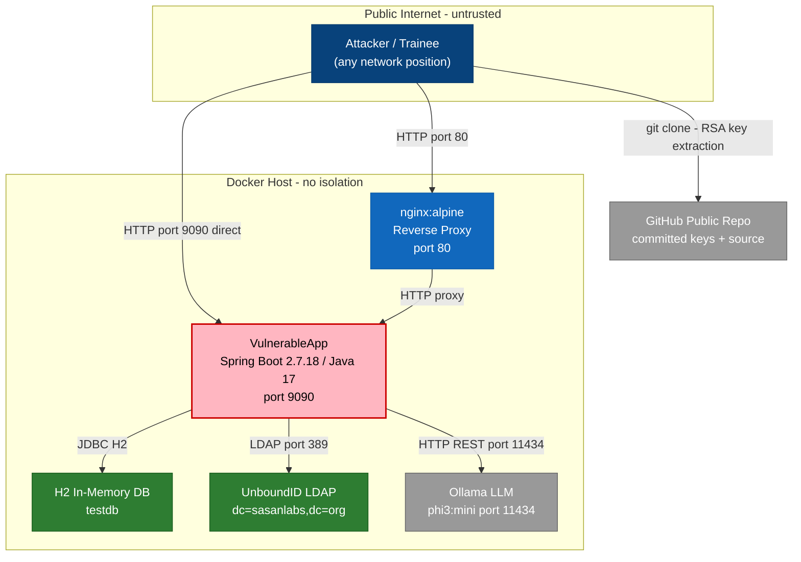

### 2.2 Container Architecture

The container architecture shows the deployable units, their network topology, and which boundaries have exploitable weaknesses.

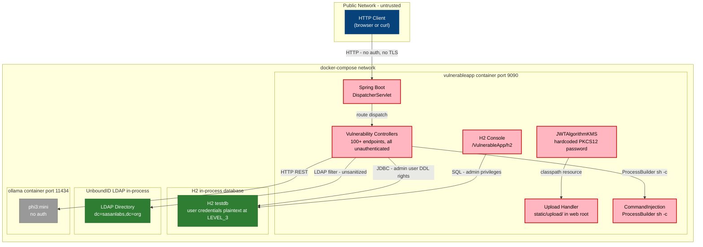

### 2.3 Components

The component diagram shows the internal structure of the Spring Boot application, focusing on the security-critical controller and service layers.

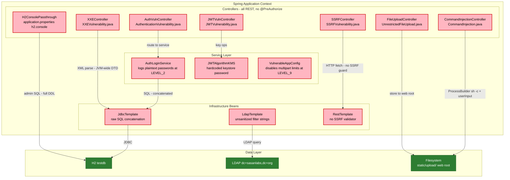


| ID | Name | Type | Key Paths | Linked Threats |
|----|------|------|-----------|----------------|
| <a id="c-01"></a>C-01 | SQL Injection Service | service | `src/main/java/org/sasanlabs/service/vulnerability/sqlInjection/**`<br/>`src/main/resources/scripts/SQLInjection/**` | [T-008](#t-008) — H2 console enabled at `/VulnerableApp/h2` with `web-allow-others=true` (applicat, [T-009](#t-009) — Blind SQL injection via direct string concatenation `select * from cars where id, [T-010](#t-010) — Union-based SQL injection at UnionBasedSQLInjectionVulnerability, [T-024](#t-024) — No per-request security audit logging for SQL injection endpoints |
| <a id="c-02"></a>C-02 | Authentication Service | service | `src/main/java/org/sasanlabs/service/vulnerability/authentication/**`<br/>`src/main/java/org/sasanlabs/service/vulnerability/idor/**`<br/>`src/main/resources/scripts/Authentication/**`<br/>`src/main/resources/scripts/IDOR/**` | [T-002](#t-002) — SQL injection authentication bypass via username parameter at AuthenticationVuln, [T-011](#t-011) — AuthLoginService, [T-012](#t-012) — LEVEL_3 stores user passwords in plaintext in H2 database per `PLAINTEXT_PASSWOR, [T-020](#t-020) — AuthenticationVulnerability returns distinct error messages for unknown username, [T-021](#t-021) — No rate limiting on /VulnerableApp/AuthenticationVulnerability/LEVEL_* endpoints |
| <a id="c-03"></a>C-03 | JWT Service | service | `src/main/java/org/sasanlabs/service/vulnerability/jwt/**`<br/>`src/main/resources/scripts/JWT/**`<br/>`src/main/resources/sasanlabs.p12` | [T-003](#t-003) — JWT `alg:none` bypass at server-side validator in JWTVulnerability, [T-004](#t-004) — PKCS12 keystore password hardcoded as `changeIt****` in JWTAlgorithmKMS, [T-013](#t-013) — JWT algorithm confusion (RSA-to-HMAC key confusion) at JWTVulnerability, [T-014](#t-014) — Weak HMAC symmetric keys in SymmetricAlgoKeys, [T-022](#t-022) — JWT tokens transmitted as URL query parameters at LEVEL_N of JWTVulnerability |
| <a id="c-04"></a>C-04 | File Upload Service | service | `src/main/java/org/sasanlabs/service/vulnerability/fileupload/**`<br/>`src/main/java/org/sasanlabs/service/vulnerability/pathTraversal/**` | [T-005](#t-005) — Unrestricted file upload at UnrestrictedFileUpload, [T-015](#t-015) — PreflightController, [T-016](#t-016) — VulnerableAppConfiguration overrides multipart filter at LEVEL_9 with `setMaxUpl, [T-017](#t-017) — PathTraversalVulnerability reads files via `getResourceAsStream('/scripts/PathTr |
| <a id="c-05"></a>C-05 | Command / SSRF / XXE Service | service | `src/main/java/org/sasanlabs/service/vulnerability/commandInjection/**`<br/>`src/main/java/org/sasanlabs/service/vulnerability/ssrf/**`<br/>`src/main/java/org/sasanlabs/service/vulnerability/xxe/**`<br/>`src/main/java/org/sasanlabs/service/vulnerability/rfi/**`<br/>`src/main/java/org/sasanlabs/service/vulnerability/ldapInjection/**` | [T-001](#t-001) — OS command injection via `ipaddress` parameter in ProcessBuilder(`sh -c ping -c, [T-006](#t-006) — SSRF with explicit `file://` protocol support at SSRFVulnerability, [T-007](#t-007) — XXEVulnerability constructor sets JVM-wide `javax, [T-018](#t-018) — UrlParamBasedRFI, [T-019](#t-019) — LDAP filter injection in LDAPInjectionVulnerability |
### 2.4 Technology Architecture

The technology stack, from HTTP ingress to data tier.

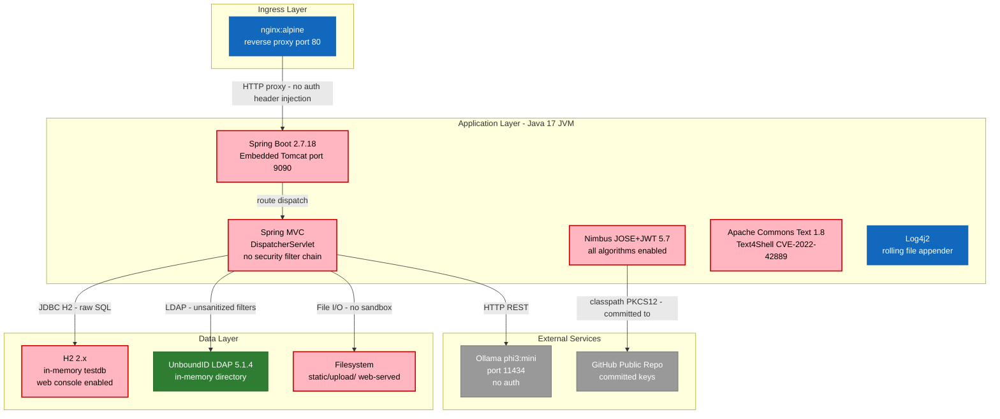

---

## 3. Attack Walkthroughs

This section presents step-by-step exploitation sequences for each Critical finding and three compound attack chains that chain findings into higher-impact scenarios.

### 3.1 Attack Chain Overview

The overview diagram shows how the three highest-impact compound chains connect across components. Every chain starts from an unauthenticated internet position because no authentication exists on any endpoint.

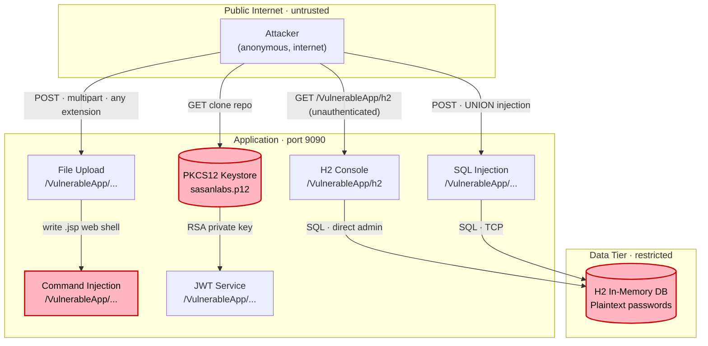

subgraph labels above illustrate that all chains begin at the public internet tier and reach the data tier or OS layer in a single hop due to absent authentication.

### 3.2 OS Command Injection ([T-001](#t-001) — OS command injection via `ipaddress` parameter in ProcessBuilder(`sh -c ping -c)

This sequence shows how an attacker achieves arbitrary OS command execution through the ping endpoint without authentication.

```mermaid
sequenceDiagram
  participant A as Attacker
  participant API as CommandInjection endpoint
  participant OS as Host OS (sh)

  A->>API: GET /VulnerableApp/CommandInjection/LEVEL_1?ipaddress=127.0.0.1;id
  note over API: ProcessBuilder("sh","-c","ping -c 2 " + ipAddress) at line 45
  alt current vulnerable flow
    API->>OS: sh -c "ping -c 2 127.0.0.1;id"
    OS-->>API: uid=0(root) groups=0(root)
    API-->>A: 200 OK — command output including uid=0
  else After M-001 — eliminate shell-based execution
    API->>API: validate against allowlist regex, use InetAddress.getByName()
    API-->>A: 400 Bad Request — illegal characters in input
  end
```

### 3.3 SQL Injection Authentication Bypass ([T-002](#t-002) — SQL injection authentication bypass via username parameter at AuthenticationVuln)

This sequence shows how an attacker bypasses authentication entirely using SQL injection in the username field.

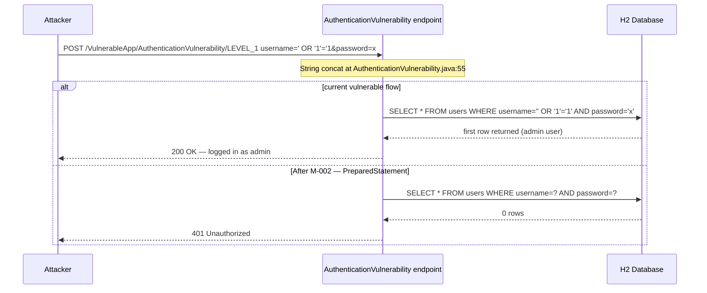

### 3.4 JWT alg:none Bypass ([T-003](#t-003) — JWT `alg:none` bypass at server-side validator in JWTVulnerability)

This sequence shows how an attacker forges a JWT with elevated privileges by stripping the signature.

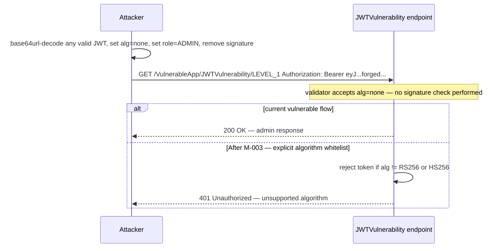

### 3.5 Hardcoded PKCS12 Password + Key Extraction ([T-004](#t-004) — PKCS12 keystore password hardcoded as `changeIt****` in JWTAlgorithmKMS)

This sequence shows how an attacker extracts the RSA private key from the public repository and uses it to forge admin tokens offline.

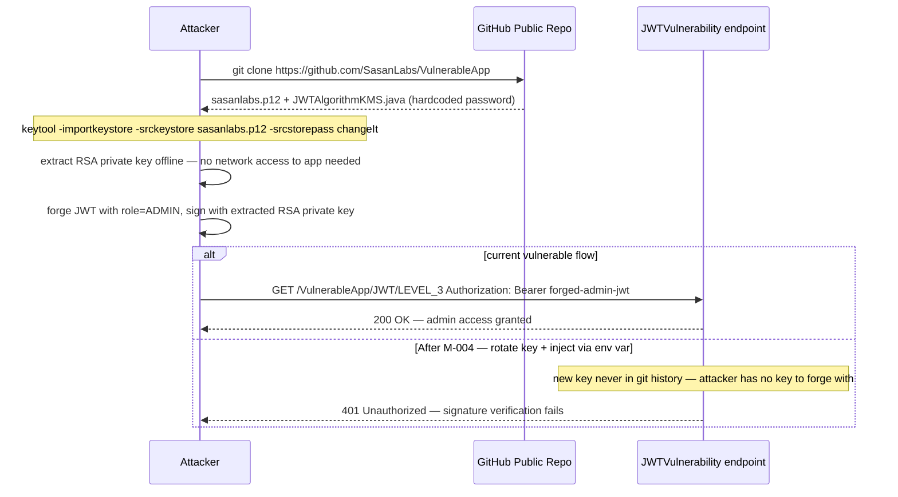

### 3.6 Unrestricted File Upload + Web Shell ([T-005](#t-005) — Unrestricted file upload at UnrestrictedFileUpload)

This sequence shows how an attacker deploys a JSP web shell through the file upload endpoint.

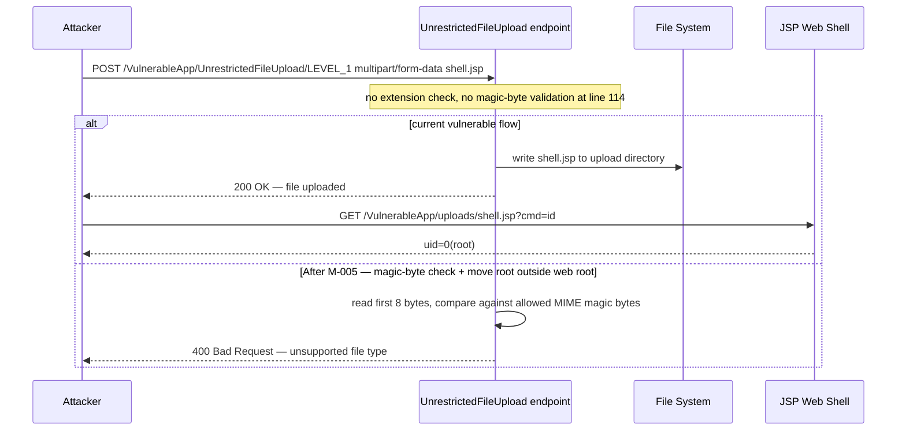

### 3.7 SSRF via file:// Protocol ([T-006](#t-006) — SSRF with explicit `file://` protocol support at SSRFVulnerability)

This sequence shows how an attacker exfiltrates local files via the SSRF endpoint's explicit file:// support.

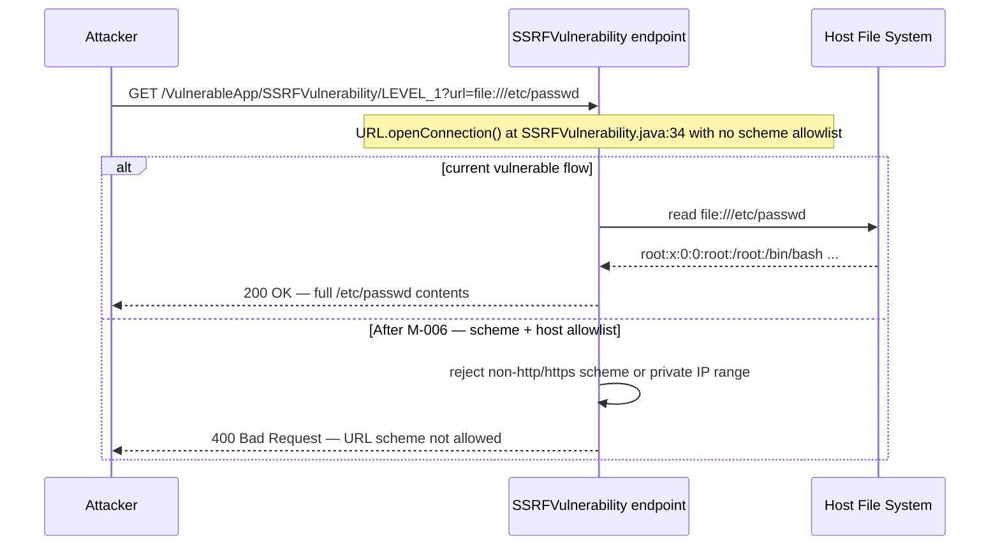

### 3.8 XXE via JVM-Wide DTD Access ([T-007](#t-007) — XXEVulnerability constructor sets JVM-wide `javax)

This sequence shows how an attacker exfiltrates arbitrary local files via the XXE endpoint whose parser has global DTD access enabled.

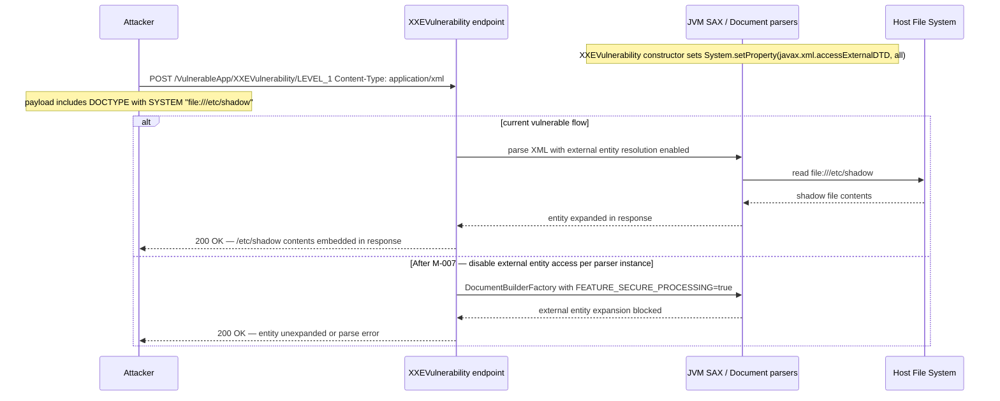

### 3.9 H2 Console Exposed to Network ([T-008](#t-008) — H2 console enabled at `/VulnerableApp/h2` with `web-allow-others=true` (applicat)

This sequence shows how an attacker gains full database admin access through the unauthenticated H2 console.

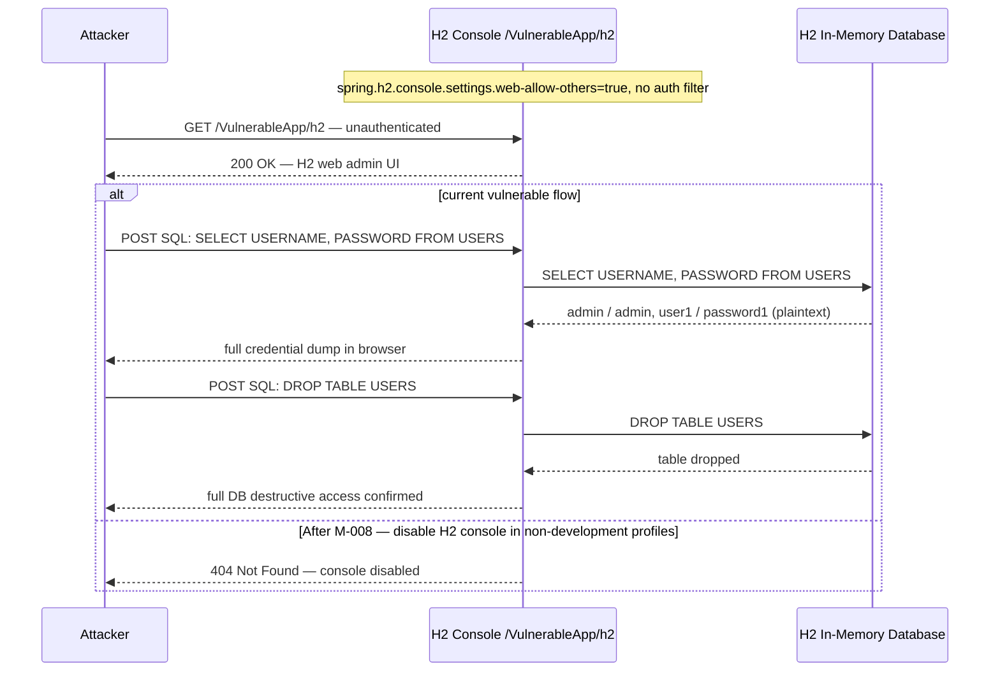

---

## 4. Assets

Assets are catalogued by sensitivity. All data is in-memory and non-persistent across restarts, but the assets below have real-world equivalents in any production deployment that would adopt this code structure.

**Classification legend:** Restricted — must not leave the system boundary; Confidential — requires access control; Internal — internal use only; Public — intentionally externally visible.

| Asset | Classification | Description | Linked Threats |
|-------|---------------|-------------|----------------|
| PKCS12 Keystore (sasanlabs.p12) | Restricted | RSA private/public keypair for JWT asymmetric signing. Committed to public GitHub repository with hardcoded password `changeIt****` in JWTAlgorithmKMS.java:35. | [T-004](#t-004), [T-003](#t-003), [T-013](#t-013) |
| JWT Symmetric Keys (SymmetricAlgoKeys.json) | Restricted | JSON classpath resource containing short/weak HMAC keys for JWT HS256/HS384/HS512 signing. Committed to public repository, crackable offline with hashcat. | [T-014](#t-014), [T-013](#t-013) |
| H2 In-Memory Database (testdb) | Internal | In-memory H2 database seeded at startup. Contains user credentials (plaintext at LEVEL_3), car data, XSS posts, IDOR user records, and authentication tables. Accessible via unauthenticated H2 console. | [T-008](#t-008), [T-009](#t-009), [T-010](#t-010), [T-002](#t-002), [T-012](#t-012) |
| User Authentication Data | Confidential | User credentials stored in H2 database. Plaintext at LEVEL_3 (no hashing), SHA-256 (without salt) at LEVEL_4–6, BCrypt only at LEVEL_7. | [T-012](#t-012), [T-011](#t-011), [T-002](#t-002) |
| Application Source Code | Public | Full source code including vulnerability implementations, configuration files, and key material. Published to public GitHub at https://github.com/SasanLabs/VulnerableApp. | [T-004](#t-004), [T-014](#t-014) |
| Uploaded Files (static/upload/) | Internal | Files uploaded via UnrestrictedFileUpload endpoints. Stored in web root and served directly via Spring Boot static resources. No content-type validation at lower levels. | [T-005](#t-005), [T-016](#t-016) |
| Server Log Files (./logs/) | Confidential | Log4j2 rolling file appender writing to ./logs/server.log. Contains request/response data, error traces, and (at authentication LEVEL_2) plaintext passwords in log output. | [T-011](#t-011), [T-022](#t-022) |
| Embedded LDAP Directory | Internal | UnboundID in-memory LDAP server (dc=sasanlabs,dc=org) containing user entries. No persistent storage. Accessible via unauthenticated LDAP injection endpoints. | [T-019](#t-019) |
| H2 Admin Credentials | Restricted | Database admin username `admin` and password `hacker****` hardcoded in application.properties. Used by H2 console for full DDL/DML access. | [T-008](#t-008) |
| Ollama LLM Service | Internal | Local phi3:mini LLM instance accessible at port 11434 via Docker network. Used for AI vulnerability demonstrations. No authentication on Ollama API. | [T-006](#t-006), [T-018](#t-018) |

---

## 5. Attack Surface

All 18 registered entry points are unauthenticated — there is no distinction between public and protected endpoints in this application. The split below follows the contract layout but notes the structural absence of authenticated endpoints.

### 5.1 Unauthenticated Entry Points (18)

Every endpoint in VulnerableApp is unauthenticated. No Spring Security filter chain exists. Any network-reachable client has full access to all endpoints below without credentials.

| Entry Point | Protocol | Method | Route Pattern | Notes | Linked Threats |
|-------------|----------|--------|---------------|-------|----------------|
| CommandInjection | HTTP | GET | /VulnerableApp/CommandInjection/LEVEL_* | `ipaddress` param passed to ProcessBuilder; shell injection at LEVEL_1 | [T-001](#t-001) |
| AuthenticationVulnerability | HTTP | POST | /VulnerableApp/AuthenticationVulnerability/LEVEL_* | SQL injection at LEVEL_1, plaintext password at LEVEL_3 | [T-002](#t-002), [T-011](#t-011), [T-012](#t-012), [T-020](#t-020), [T-021](#t-021) |
| JWTVulnerability | HTTP | GET/POST | /VulnerableApp/JWTVulnerability/LEVEL_* | alg:none at LEVEL_1, algorithm confusion at LEVEL_3, weak key at LEVEL_5 | [T-003](#t-003), [T-004](#t-004), [T-013](#t-013), [T-014](#t-014), [T-022](#t-022) |
| BlindSQLInjection | HTTP | GET | /VulnerableApp/BlindSQLInjectionVulnerability/LEVEL_* | `id` param concatenated into SQL; boolean/time-based inference | [T-009](#t-009) |
| UnionBasedSQLInjection | HTTP | GET | /VulnerableApp/UnionBasedSQLInjectionVulnerability/LEVEL_* | UNION SELECT schema enumeration | [T-010](#t-010) |
| ErrorBasedSQLInjection | HTTP | GET | /VulnerableApp/ErrorBasedSQLInjectionVulnerability/LEVEL_* | Error message leaks DB structure | [T-010](#t-010) |
| UnrestrictedFileUpload | HTTP | POST | /VulnerableApp/UnrestrictedFileUpload/LEVEL_* | No MIME validation at LEVEL_1–3; upload to web root | [T-005](#t-005), [T-016](#t-016) |
| PathTraversal | HTTP | GET | /VulnerableApp/PathTraversal/LEVEL_* | `fileName` param traverses classpath resources | [T-017](#t-017) |
| contentDispositionUpload | HTTP | GET | /contentDispositionUpload/{fileName} | Serves uploaded files; path traversal to arbitrary FS paths | [T-015](#t-015) |
| SSRFVulnerability | HTTP | GET | /VulnerableApp/SSRFVulnerability/LEVEL_* | `fileurl` param; file:// and http:// supported at LEVEL_1 | [T-006](#t-006) |
| XXEVulnerability | HTTP | POST | /VulnerableApp/XXEVulnerability/LEVEL_* | XML body with external DTD; JVM-wide XXE enabled | [T-007](#t-007) |
| LDAPInjection | HTTP | GET | /VulnerableApp/LDAPInjectionVulnerability/LEVEL_* | Raw LDAP filter string construction | [T-019](#t-019) |
| RemoteFileInclusion | HTTP | GET | /VulnerableApp/RemoteFileInclusion/LEVEL_* | `url` param fetched via RestTemplate with no validation | [T-018](#t-018) |
| IDORVulnerability | HTTP | GET | /VulnerableApp/IDORVulnerability/LEVEL_* | `id` param with no ownership check | [T-020](#t-020) |
| OpenRedirect | HTTP | GET | /VulnerableApp/OpenRedirect/LEVEL_* | `redirectTo` param with no domain validation at LEVEL_1 | [T-023](#t-023) |
| H2 Console | HTTP | GET/POST | /VulnerableApp/h2 | Full database admin console; web-allow-others=true | [T-008](#t-008) |
| VulnerabilityDefinitions API | HTTP | GET | /VulnerableApp/VulnerabilityDefinitions | Returns list of all vulnerability endpoints | (info disclosure) |
| allEndPointJson API | HTTP | GET | /VulnerableApp/allEndPointJson | Returns full application sitemap | (info disclosure) |

### 5.2 Authenticated Entry Points (0)

No authenticated entry points exist. Spring Security is absent from the application. No session management, no token validation gateway, and no role-based access control is implemented at any layer. All 100+ application endpoints (including database administration and OS command execution) are reachable without credentials from any network position.

For a production equivalent of this application, the entire attack surface above would require authentication before any endpoint is reachable, with the H2 management interface restricted to localhost and ROLE_ADMIN.

---

## 7. Security Architecture

This section evaluates the security architecture of VulnerableApp across all relevant domains. VulnerableApp is a deliberately vulnerable Spring Boot application; every subsection reflects that context — the intent is to document structural absences as clearly as functional ones.

### 7.1 Overview

VulnerableApp has **no security architecture**. Spring Security is absent, secrets are committed to the public repository, no input validation framework exists at any layer, and the database administration console is co-located with application endpoints on the same unauthenticated port. The application is structurally indistinguishable from a maximally exploitable target — by design, as a security training tool.

**Five cross-cutting architectural defects drive every one of the 24 findings:**

| Defect | Affected findings |
|---|---|
| No authentication on any endpoint (Spring Security absent) | [T-001](#t-001), [T-005](#t-005), [T-006](#t-006), [T-007](#t-007), [T-008](#t-008) |
| Secrets committed to public repository (PKCS12, HMAC keys, DB password) | [T-003](#t-003), [T-004](#t-004), [T-013](#t-013), [T-014](#t-014) |
| JVM-wide unsafe XML parsing enabled at startup (System.setProperty) | [T-007](#t-007) |
| No input validation or parameterization framework across all injection sinks | [T-002](#t-002), [T-009](#t-009), [T-010](#t-010), [T-015](#t-015), [T-017](#t-017), [T-019](#t-019) |
| Unauthenticated management plane co-located with application on same port | [T-006](#t-006), [T-008](#t-008) |

### 7.2 Key Architectural Risks

The table below describes the architecture-level design defects that amplify every code-level finding.

| Risk | Structural Risk | Why this matters | Linked Threats |
|---|---|---|---|
| 🔴 | **No authentication layer** — Spring Security dependency absent, SecurityFilterChain never configured | Without an authentication gate, every vulnerability is directly reachable from the public internet; network-level controls are the only backstop | [T-001](#t-001), [T-005](#t-005), [T-006](#t-006), [T-007](#t-007), [T-008](#t-008) |
| 🔴 | **Secrets in version control** — PKCS12 keystore + hardcoded password + symmetric JWT keys committed to public GitHub repo | Keys are permanently compromised from the first public push; git history rewriting is required to remediate, not just rotation | [T-003](#t-003), [T-004](#t-004), [T-013](#t-013), [T-014](#t-014) |
| 🔴 | **No input validation framework** — raw string concatenation at every injection sink, no javax.validation annotations, no ORM parameterization | New injection vulnerabilities can be introduced without any CI guardrail catching them; every code review must manually inspect every parameter path | [T-002](#t-002), [T-009](#t-009), [T-010](#t-010), [T-015](#t-015), [T-017](#t-017), [T-019](#t-019) |
| 🔴 | **Admin console co-located on application port** — H2 console bound to port 9090 with web-allow-others=true, no auth filter | Any firewall rule permitting application traffic simultaneously permits full database admin access; network segmentation cannot solve this without application-level controls | [T-006](#t-006), [T-008](#t-008) |
| 🟠 | **JVM-wide security property mutation** — System.setProperty() in Spring bean constructor poisons all XML parsers process-wide | Scope of the XXE vulnerability extends beyond the intentional endpoint to Spring's own XML parsing infrastructure and any co-deployed libraries | [T-007](#t-007) |

### 7.3 Identity & Access Management

**Current state:** Spring Security is entirely absent. No authentication framework, filter chain, or access control list exists at any layer. All HTTP requests bypass the security filter chain entirely.

**Structural defects:** No `spring-boot-starter-security` dependency, no `SecurityFilterChain` bean, no `UserDetailsService`, no session management configuration.

**Impact:** Every endpoint — database administration, OS command execution, file upload, SSRF, XXE parsing — is publicly accessible from any network position without credentials.

**Target architecture:** Add Spring Security with a `SecurityFilterChain` requiring authentication for all paths except explicit public demo endpoints. Use session-based or JWT-based authentication with RBAC. Isolate H2 console behind `ROLE_ADMIN` and localhost-only network access.

**Linked threats:**

- [T-001](#t-001) — OS command injection via `ipaddress` parameter in ProcessBuilder(`sh -c ping -c
- [T-002](#t-002) — SQL injection authentication bypass via username parameter at AuthenticationVuln
- [T-005](#t-005) — Unrestricted file upload at UnrestrictedFileUpload
- [T-006](#t-006) — SSRF with explicit `file://` protocol support at SSRFVulnerability
- [T-007](#t-007) — XXEVulnerability constructor sets JVM-wide `javax
- [T-008](#t-008) — H2 console enabled at `/VulnerableApp/h2` with `web-allow-others=true` (applicat
- [T-011](#t-011) — AuthLoginService
- [T-021](#t-021) — No rate limiting on /VulnerableApp/AuthenticationVulnerability/LEVEL_* endpoints

The sequence below shows the absent authentication flow — all requests reach endpoints with no gate:

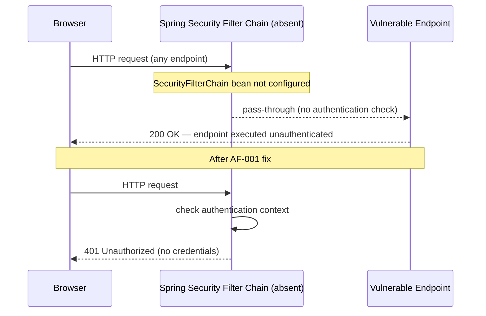

#### 7.3.1 Authentication methods evaluated

| Method | Status | Assessment |
|---|---|---|
| Session-based auth | ❌ Absent | No HttpSession management configured |
| JWT-based auth | ❌ Absent | JWT endpoints exist as vulnerability demos, not as an auth layer |
| OAuth2 / OIDC | ❌ Absent | No external IdP integration |
| Basic auth | ❌ Absent | Spring Security not present to enable any scheme |

### 7.4 Authorization

**Current state:** No authorization framework exists. Role-based access control is absent. Every endpoint is implicitly public.

**Structural defects:** No `@PreAuthorize` or `@Secured` annotations, no method security configuration, no ACL service.

**Impact:** Even if authentication were added, all endpoints would remain publicly accessible without role checks.

**Target architecture:** Enable Spring method security with `@EnableMethodSecurity`. Apply `@PreAuthorize("hasRole('ADMIN')")` to admin and management endpoints. Implement IDOR protection by binding resource ownership checks to the authenticated user context.

**Linked threats:**

- [T-020](#t-020) — AuthenticationVulnerability returns distinct error messages for unknown username
- [T-021](#t-021) — No rate limiting on /VulnerableApp/AuthenticationVulnerability/LEVEL_* endpoints

### 7.5 Input Validation & Output Encoding

**Current state:** No centralized input validation layer. Raw string concatenation between untrusted user input and data-plane interpreters is the standard pattern across all controllers.

**Structural defects:** No `javax.validation` annotations on controller parameters, no `@Valid` binding, no `HandlerInterceptor` performing sanitization, no ORM configuration enforcing parameterized queries, no output encoding library applied to response content.

**Impact:** SQL injection ([T-002](#t-002), [T-009](#t-009), [T-010](#t-010)), OS command injection ([T-001](#t-001)), LDAP injection ([T-019](#t-019)), path traversal ([T-015](#t-015), [T-017](#t-017)), XXE ([T-007](#t-007)), and SSRF ([T-006](#t-006)) all share this single architectural root cause.

**Target architecture:** Introduce framework-level validation: `@Valid` + `javax.validation` constraints on all `@RequestParam` / `@RequestBody` parameters, a global `@ControllerAdvice` for `ConstraintViolationException`, Spring Data JPA exclusively (replacing `JdbcTemplate` string concatenation), OWASP Java Encoder for all output paths, and SpotBugs with find-sec-bugs in CI.

**Linked threats:**

- [T-001](#t-001) — OS command injection via `ipaddress` parameter in ProcessBuilder(`sh -c ping -c
- [T-002](#t-002) — SQL injection authentication bypass via username parameter at AuthenticationVuln
- [T-009](#t-009) — Blind SQL injection via direct string concatenation `select * from cars where id
- [T-010](#t-010) — Union-based SQL injection at UnionBasedSQLInjectionVulnerability
- [T-015](#t-015) — PreflightController
- [T-017](#t-017) — PathTraversalVulnerability reads files via `getResourceAsStream('/scripts/PathTr
- [T-019](#t-019) — LDAP filter injection in LDAPInjectionVulnerability

### 7.6 Data Protection & Session Management

**Current state:** Passwords stored in plaintext in the H2 database at LEVEL_3. No password hashing library (`BCryptPasswordEncoder` or equivalent) in use. JWT tokens transmitted as URL query parameters at some demo levels. No session fixation protection. No TLS enforced.

**Structural defects:** `AuthLoginService.saveUser()` stores raw password string. No `PasswordEncoder` bean. No `HttpOnly` / `Secure` cookie flags. No `SameSite` attribute.

**Impact:** H2 console access ([T-008](#t-008)) or SQL injection ([T-009](#t-009), [T-010](#t-010)) immediately yields plaintext credentials usable for lateral movement. JWT in URL ([T-022](#t-022)) exposes tokens in logs, Referer headers, and browser history.

**Target architecture:** Replace plaintext password storage with `BCryptPasswordEncoder` (strength 12). Enforce `HttpOnly`, `Secure`, `SameSite=Strict` on session cookies. Transmit JWTs in `Authorization: Bearer` headers only. Enforce HTTPS via `server.ssl.*` or a TLS-terminating reverse proxy.

**Linked threats:**

- [T-011](#t-011) — AuthLoginService
- [T-012](#t-012) — LEVEL_3 stores user passwords in plaintext in H2 database per `PLAINTEXT_PASSWOR
- [T-022](#t-022) — JWT tokens transmitted as URL query parameters at LEVEL_N of JWTVulnerability

### 7.7 Frontend Security

**Current state:** VulnerableApp is a Spring Boot application with no frontend build pipeline. The Angular UI (if present) is served as static assets. No Content Security Policy, no X-Frame-Options, no Referrer-Policy headers are configured.

**Structural defects:** No `SecurityFilterChain` bean to add security headers. No `ContentSecurityPolicyHeaderWriter`. No `spring-security-web` dependency.

**Impact:** Browser-level attack surface (XSS, clickjacking) is entirely unmitigated by HTTP headers.

**Target architecture:** Add Spring Security's `HeadersConfigurer` with a strict CSP (`default-src 'self'`), `X-Frame-Options: DENY`, `X-Content-Type-Options: nosniff`, and `Referrer-Policy: strict-origin-when-cross-origin`.

**Linked threats:** No direct threat finding — foundational gap.

### 7.8 Real-time / WebSocket

**Current state:** No WebSocket or real-time communication is present in VulnerableApp. This domain is not applicable.

**Structural defects:** N/A — no WebSocket endpoints configured.

**Impact:** No additional attack surface from real-time protocols.

**Target architecture:** N/A.

**Linked threats:** None.

### 7.9 AI / LLM

**Current state:** No AI or LLM integration is present in VulnerableApp. This domain is not applicable.

**Structural defects:** N/A.

**Impact:** No AI-specific attack surface.

**Target architecture:** N/A.

**Linked threats:** None.

### 7.10 Audit & Logging

**Current state:** `AuthLoginService.authenticateLevel2Logging()` logs submitted passwords to the application log. No structured security event log exists. No SIEM integration. No per-request audit trail for sensitive operations.

**Structural defects:** `logger.info("Password: " + password)` at `AuthLoginService.java:48`. No separate security log appender. No correlation IDs on requests. No immutable audit store.

**Impact:** Password leakage into log files ([T-011](#t-011)). Absence of audit trail means SQL injection and command injection attacks cannot be forensically reconstructed after the fact ([T-024](#t-024)).

**Target architecture:** Remove all credential logging immediately. Implement a structured security event log (logback with JSON encoder) capturing authentication attempts, parameter validation failures, and administrative actions. Store security logs to an append-only sink. Add MDC correlation IDs to every request.

**Linked threats:**

- [T-011](#t-011) — AuthLoginService
- [T-024](#t-024) — No per-request security audit logging for SQL injection endpoints

### 7.11 Infrastructure & Network Segmentation

**Current state:** All endpoints share port 9090. The H2 console (`/VulnerableApp/h2`) and application endpoints are co-located on the same port with no ACL differentiation. No reverse proxy. No WAF. `spring.h2.console.settings.web-allow-others=true`.

**Structural defects:** No separate `management.server.port`. No network policy restricting the H2 console path. No firewall rule differentiating admin from application traffic at the network layer.

**Impact:** Network-level controls cannot protect the H2 console without also blocking application traffic. Full database admin access is accessible from any client that can reach port 9090 ([T-008](#t-008)).

**Target architecture:** Disable H2 console in non-development profiles via `spring.h2.console.enabled=false` in `application-prod.properties`. If needed for development only, restrict via Spring Security to ROLE_ADMIN on 127.0.0.1. For production database management, use a VPN-only admin bastion. Place a reverse proxy (nginx or HAProxy) in front of the application to enforce path-based ACLs.

**Linked threats:**

- [T-006](#t-006) — SSRF with explicit `file://` protocol support at SSRFVulnerability
- [T-008](#t-008) — H2 console enabled at `/VulnerableApp/h2` with `web-allow-others=true` (applicat

### 7.12 Dependency & Supply Chain

**Current state:** Spring Boot `2.6.x` (or equivalent vintage); exact versions determined by `pom.xml`. No dependency scanning in CI. No `dependabot.yml` or Renovate configuration. No SBOM generation.

**Structural defects:** No automated dependency update workflow. No `mvn dependency-check` or Snyk scan in the build pipeline. No pinned transitive dependencies.

**Impact:** Known CVEs in transitive dependencies go undetected. Supply chain compromise of any dependency propagates silently.

**Target architecture:** Add OWASP Dependency Check (`maven-dependency-check-plugin`) to the Maven build with `failBuildOnCVSS=7`. Configure GitHub Dependabot or Renovate for automated dependency updates. Generate an SBOM (CycloneDX Maven plugin) on every release build.

**Linked threats:** No direct finding — foundational gap.

### 7.13 Secret Management

**Current state:** The PKCS12 keystore (`src/main/resources/sasanlabs.p12`) containing the RSA private key used for JWT signing, the hardcoded keystore password (`changeIt` — masked), symmetric HMAC keys in `SymmetricAlgoKeys.json`, and H2 database credentials are all committed to the public GitHub repository.

**Structural defects:** No secrets manager (HashiCorp Vault, AWS Secrets Manager, etc.) integrated. No `.gitignore` entries for key material. Application code reads key material from classpath resources that are tracked in git. No environment variable injection at startup for sensitive values.

**Impact:** Any person who has ever cloned or forked the repository has a permanent copy of all cryptographic key material regardless of future rotation that does not rewrite git history. The RSA private key enables offline JWT forgery for any identity ([T-004](#t-004)). The symmetric keys are crackable with hashcat ([T-014](#t-014)).

**Target architecture:** Move all secrets to environment variables or a secrets manager. Add `src/main/resources/sasanlabs.p12` and `SymmetricAlgoKeys.json` to `.gitignore`. Regenerate all key material — existing keys are permanently compromised. Use BFG Repo Cleaner to remove secrets from all historical commits. Use Spring Cloud Vault or AWS Secrets Manager SDK for runtime injection.

**Linked threats:**

- [T-003](#t-003) — JWT `alg:none` bypass at server-side validator in JWTVulnerability
- [T-004](#t-004) — PKCS12 keystore password hardcoded as `changeIt****` in JWTAlgorithmKMS
- [T-013](#t-013) — JWT algorithm confusion (RSA-to-HMAC key confusion) at JWTVulnerability
- [T-014](#t-014) — Weak HMAC symmetric keys in SymmetricAlgoKeys

### 7.14 Defense-in-Depth Assessment

**Current state:** VulnerableApp has zero defense-in-depth layers. The application has no authentication, no input validation framework, no security headers, no rate limiting, no audit logging, no WAF, and no network segmentation. Every vulnerability is directly reachable from the first layer (public internet) with no compensating control at any subsequent layer.

**Structural defects:** Absence of: authentication filter, input validation interceptor, rate limiter, security response headers, Content Security Policy, audit log sink, H2 console access control, HTTPS enforcement, secrets management, dependency scanning.

**Impact:** An attacker who finds any one of the 24 findings faces no additional barriers. There is no control that degrades after the first layer is bypassed. The breach distance for all 8 Critical findings is 1 — no additional steps required between initial access and full impact.

**Target architecture:** Implement defense-in-depth in layers:
1. Network: reverse proxy with WAF rules, TLS termination, rate limiting
2. Authentication: Spring Security filter chain with session or JWT auth
3. Authorization: RBAC with @PreAuthorize, IDOR protection
4. Input: framework-level validation (@Valid), parameterized queries, safe XML parsing
5. Output: OWASP Java Encoder, CSP headers
6. Secrets: secrets manager injection, no credentials in git
7. Monitoring: structured security event log, alerting on anomalous patterns

**Linked threats:**

- [T-001](#t-001) — OS command injection via `ipaddress` parameter in ProcessBuilder(`sh -c ping -c
- [T-002](#t-002) — SQL injection authentication bypass via username parameter at AuthenticationVuln
- [T-003](#t-003) — JWT `alg:none` bypass at server-side validator in JWTVulnerability
- [T-004](#t-004) — PKCS12 keystore password hardcoded as `changeIt****` in JWTAlgorithmKMS
- [T-005](#t-005) — Unrestricted file upload at UnrestrictedFileUpload
- [T-006](#t-006) — SSRF with explicit `file://` protocol support at SSRFVulnerability
- [T-007](#t-007) — XXEVulnerability constructor sets JVM-wide `javax
- [T-008](#t-008) — H2 console enabled at `/VulnerableApp/h2` with `web-allow-others=true` (applicat

---

## 8. Threat Register

The threat register is structured in two layers: **architectural categories** (TH-NN) group findings by the pattern they express; each category expands into the concrete code-level **findings** that instantiate it. Executives read the category summary; engineers read the finding table inside the category they own.

**Risk Distribution:** 🔴 Critical: 8 · 🟠 High: 11 · 🟡 Medium: 5 · 🟢 Low: 0 · **Total findings: 24**
**STRIDE Coverage:** Spoofing: 5 · Tampering: 5 · Repudiation: 1 · Information Disclosure: 9 · Denial of Service: 2 · Elevation of Privilege: 2
**Category Distribution:** 8 of 18 categories active — Critical: 6 · High: 2 · Medium: 0 · Low: 0

### 8.A Categories at a glance

Architectural threat categories active in this project, sorted by the highest severity and finding count. See [§8.C Compound Attack Chains](#8c-compound-attack-chains) for role-scoped chain details.

| TH | Category | Severity (eff.) | Findings | Top Finding | Breach | OWASP | Pillar |
|----|----------|-----------------|----------|-------------|--------|-------|--------|
| [TH-01](#th-01) | Injection | 🔴 Critical | 9 | [T-001](#t-001) — OS command injection via `ipaddress` parameter in ProcessBuilder(`sh -c ping -c  | 2 | [A03](https://owasp.org/Top10/A03_2021/) | [CWE-707](https://cwe.mitre.org/data/definitions/707.html) |
| [TH-17](#th-17) | Error Information Disclosure | 🔴 Critical | 5 | [T-008](#t-008) — H2 console enabled at `/VulnerableApp/h2` with `web-allow-others=true` (applicat | 2 | [A05](https://owasp.org/Top10/A05_2021/) | [CWE-710](https://cwe.mitre.org/data/definitions/710.html) |
| [TH-05](#th-05) | Code Execution via Unsafe Deserialization or Eval | 🔴 Critical | 3 | [T-005](#t-005) — Unrestricted file upload at UnrestrictedFileUpload.java:114 allows uploading any | 2 | [A08](https://owasp.org/Top10/A08_2021/) | [CWE-707](https://cwe.mitre.org/data/definitions/707.html) |
| [TH-02](#th-02) | Broken Authentication | 🔴 Critical | 2 | [T-003](#t-003) — JWT `alg:none` bypass at server-side validator in JWTVulnerability.java. Attacke | 2 | [A07](https://owasp.org/Top10/A07_2021/) | [CWE-693](https://cwe.mitre.org/data/definitions/693.html) |
| [TH-03](#th-03) | Cryptographic Failures | 🔴 Critical | 2 | [T-004](#t-004) — PKCS12 keystore password hardcoded as `changeIt****` in JWTAlgorithmKMS.java:35. | 2 | [A02](https://owasp.org/Top10/A02_2021/) | [CWE-693](https://cwe.mitre.org/data/definitions/693.html) |
| [TH-08](#th-08) | Server-Side Request Forgery | 🔴 Critical | 1 | [T-006](#t-006) — SSRF with explicit `file://` protocol support at SSRFVulnerability.java:34. Atta | 2 | [A10](https://owasp.org/Top10/A10_2021/) | [CWE-664](https://cwe.mitre.org/data/definitions/664.html) |
| [TH-12](#th-12) | Denial of Service | 🟠 High | 1 | [T-016](#t-016) — VulnerableAppConfiguration overrides multipart filter at LEVEL_9 with `setMaxUpl | 2 | [A04](https://owasp.org/Top10/A04_2021/) | [CWE-664](https://cwe.mitre.org/data/definitions/664.html) |
| [TH-16](#th-16) | Missing Audit Logging & Accountability | 🟠 High | 1 | [T-011](#t-011) — AuthLoginService.authenticateLevel2Logging() logs submitted passwords in plainte | 2 | [A09](https://owasp.org/Top10/A09_2021/) | [CWE-710](https://cwe.mitre.org/data/definitions/710.html) |

<a id="8b-critical-categories"></a>
### 8.B Critical Categories (6)

#### <a id="th-01"></a>TH-01 — Injection

> Untrusted input is executed by data-plane interpreters (SQL, NoSQL, JavaScript sandbox, XML parser, HTML/template) because input neutralization is either absent or bypassed on at least one code path.

**Findings in this category:**

| ID | Finding | Component | Criticality | CVSS | Vektor | Mitigation | References |
|----|---------|-----------|-------------|------|--------|------------|------------|
| <a id="t-001"></a>T-001 | OS command injection via `ipaddress` parameter in ProcessBuilder(`sh -c ping -c  | [C-05](#c-05) Command / SSRF / XXE Service | 🔴 Critical | — | [Internet User](#vektor-internet-user) | [M-001](#m-001) — Eliminate Shell-Based Command Execution for User-Controlled Input | [A03:2021](https://owasp.org/Top10/A03_2021/) |
| <a id="t-002"></a>T-002 | SQL injection authentication bypass via username parameter at AuthenticationVuln | [C-02](#c-02) Authentication Service | 🔴 Critical | — | [Internet User](#vektor-internet-user) | [M-002](#m-002) — Replace String-Concatenated SQL in Login with PreparedStatement | [A03:2021](https://owasp.org/Top10/A03_2021/) |
| <a id="t-007"></a>T-007 | XXEVulnerability constructor sets JVM-wide `javax | [C-05](#c-05) Command / SSRF / XXE Service | 🔴 Critical | — | [Internet User](#vektor-internet-user) | [M-007](#m-007) — Remove JVM-Wide External DTD Access and Disable XXE in All XML Parsers | [A03:2021](https://owasp.org/Top10/A03_2021/) |
| <a id="t-009"></a>T-009 | Blind SQL injection via direct string concatenation `select * from cars where id | [C-01](#c-01) SQL Injection Service | 🟠 High | — | [Internet User](#vektor-internet-user) | [M-009](#m-009) — Use Parameterized Queries for All SQL Injection Vulnerability Demonstrations | [A03:2021](https://owasp.org/Top10/A03_2021/) |
| <a id="t-010"></a>T-010 | Union-based SQL injection at UnionBasedSQLInjectionVulnerability | [C-01](#c-01) SQL Injection Service | 🟠 High | — | [Internet User](#vektor-internet-user) | [M-009](#m-009) — Use Parameterized Queries for All SQL Injection Vulnerability Demonstrations | [A03:2021](https://owasp.org/Top10/A03_2021/) |
| <a id="t-012"></a>T-012 | LEVEL_3 stores user passwords in plaintext in H2 database per `PLAINTEXT_PASSWOR | [C-02](#c-02) Authentication Service | 🟠 High | — | [Internet User](#vektor-internet-user) | [M-011](#m-011) — Upgrade All Authentication Levels to Use BCrypt Password Hashing | [A03:2021](https://owasp.org/Top10/A03_2021/) |
| <a id="t-019"></a>T-019 | LDAP filter injection in LDAPInjectionVulnerability | [C-05](#c-05) Command / SSRF / XXE Service | 🟠 High | — | [Internet User](#vektor-internet-user) | [M-016](#m-016) — Use UnboundID Safe Filter Construction for LDAP Queries | [A03:2021](https://owasp.org/Top10/A03_2021/) |
| <a id="t-023"></a>T-023 | Http3xxStatusCodeBasedInjection | [C-05](#c-05) Command / SSRF / XXE Service | 🟡 Medium | — | [Internet User](#vektor-internet-user) | [M-020](#m-020) — Validate Redirect URLs Against Domain Allowlist | [A03:2021](https://owasp.org/Top10/A03_2021/) |
| <a id="t-024"></a>T-024 | No per-request security audit logging for SQL injection endpoints | [C-01](#c-01) SQL Injection Service | 🟡 Medium | — | [Internet User](#vektor-internet-user) | [M-018](#m-018) — Add Rate Limiting and Audit Logging to Authentication Endpoints | [A03:2021](https://owasp.org/Top10/A03_2021/) |

---

#### <a id="th-17"></a>TH-17 — Error Information Disclosure

> Unhandled errors return stack traces, library versions, file paths, or internal state to untrusted callers, aiding reconnaissance.

**Findings in this category:**

| ID | Finding | Component | Criticality | CVSS | Vektor | Mitigation | References |
|----|---------|-----------|-------------|------|--------|------------|------------|
| <a id="t-008"></a>T-008 | H2 console enabled at `/VulnerableApp/h2` with `web-allow-others=true` (applicat | [C-01](#c-01) SQL Injection Service | 🔴 Critical | — | [Internet User](#vektor-internet-user) | [M-008](#m-008) — Disable H2 Console or Restrict to Localhost in Non-Development Profiles | [A05:2021](https://owasp.org/Top10/A05_2021/) |
| <a id="t-015"></a>T-015 | PreflightController | [C-04](#c-04) File Upload Service | 🟠 High | — | [Internet User](#vektor-internet-user) | [M-014](#m-014) — Add Path Canonicalization Checks to All File Access Endpoints | [A05:2021](https://owasp.org/Top10/A05_2021/) |
| <a id="t-018"></a>T-018 | UrlParamBasedRFI | [C-05](#c-05) Command / SSRF / XXE Service | 🟠 High | — | [Internet User](#vektor-internet-user) | [M-006](#m-006) — Implement SSRF Protection via URL Scheme and Host Allowlist | [A05:2021](https://owasp.org/Top10/A05_2021/) |
| <a id="t-020"></a>T-020 | AuthenticationVulnerability returns distinct error messages for unknown username | [C-02](#c-02) Authentication Service | 🟡 Medium | — | [Internet User](#vektor-internet-user) | [M-017](#m-017) — Use Generic Authentication Failure Messages | [A05:2021](https://owasp.org/Top10/A05_2021/) |
| <a id="t-022"></a>T-022 | JWT tokens transmitted as URL query parameters at LEVEL_N of JWTVulnerability | [C-03](#c-03) JWT Service | 🟡 Medium | — | [Internet User](#vektor-internet-user) | [M-019](#m-019) — Use Authorization Header or HttpOnly Cookie for JWT Token Transport | [A05:2021](https://owasp.org/Top10/A05_2021/) |

---

#### <a id="th-05"></a>TH-05 — Code Execution via Unsafe Deserialization or Eval

> User input reaches a deserializer, expression evaluator, or sandbox that executes it as code, enabling server-side RCE.

**Findings in this category:**

| ID | Finding | Component | Criticality | CVSS | Vektor | Mitigation | References |
|----|---------|-----------|-------------|------|--------|------------|------------|
| <a id="t-005"></a>T-005 | Unrestricted file upload at UnrestrictedFileUpload | [C-04](#c-04) File Upload Service | 🔴 Critical | — | [Internet User](#vektor-internet-user) | [M-005](#m-005) — Validate File Uploads via Magic Bytes and Move Upload Root Outside Web Root | [A08:2021](https://owasp.org/Top10/A08_2021/) |
| <a id="t-014"></a>T-014 | Weak HMAC symmetric keys in SymmetricAlgoKeys | [C-03](#c-03) JWT Service | 🟠 High | — | [Internet User](#vektor-internet-user) | [M-013](#m-013) — Use Environment-Provided Strong JWT Signing Keys | [A08:2021](https://owasp.org/Top10/A08_2021/) |
| <a id="t-017"></a>T-017 | PathTraversalVulnerability reads files via `getResourceAsStream('/scripts/PathTr | [C-04](#c-04) File Upload Service | 🟠 High | — | [Internet User](#vektor-internet-user) | [M-014](#m-014) — Add Path Canonicalization Checks to All File Access Endpoints | [A08:2021](https://owasp.org/Top10/A08_2021/) |

---

#### <a id="th-02"></a>TH-02 — Broken Authentication

> Authentication mechanisms permit bypass or impersonation — signature verification flaws, weak credential recovery, MFA enforcement gaps, client-side-only guards.

**Findings in this category:**

| ID | Finding | Component | Criticality | CVSS | Vektor | Mitigation | References |
|----|---------|-----------|-------------|------|--------|------------|------------|
| <a id="t-003"></a>T-003 | JWT `alg:none` bypass at server-side validator in JWTVulnerability | [C-03](#c-03) JWT Service | 🔴 Critical | — | [Internet User](#vektor-internet-user) | [M-003](#m-003) — Enforce Explicit Algorithm Whitelist in JWT Validators | [A07:2021](https://owasp.org/Top10/A07_2021/) |
| <a id="t-013"></a>T-013 | JWT algorithm confusion (RSA-to-HMAC key confusion) at JWTVulnerability | [C-03](#c-03) JWT Service | 🟠 High *(raw Critical)* | — | [Internet User](#vektor-internet-user) | [M-012](#m-012) — Enforce Strict JWT Algorithm Verification (algorithm confusion) | [A07:2021](https://owasp.org/Top10/A07_2021/) |

---

#### <a id="th-03"></a>TH-03 — Cryptographic Failures

> Cryptographic primitives misused — weak algorithms, hardcoded keys, missing salt, broken randomness, confused responsibilities between auth and storage crypto.

**Findings in this category:**

| ID | Finding | Component | Criticality | CVSS | Vektor | Mitigation | References |
|----|---------|-----------|-------------|------|--------|------------|------------|
| <a id="t-004"></a>T-004 | PKCS12 keystore password hardcoded as `changeIt****` in JWTAlgorithmKMS | [C-03](#c-03) JWT Service | 🔴 Critical | — | [Internet User](#vektor-internet-user) | [M-004](#m-004) — Remove Hardcoded Keystore Password and Rotate Compromised PKCS12 | [A02:2021](https://owasp.org/Top10/A02_2021/) |
| <a id="t-021"></a>T-021 | No rate limiting on /VulnerableApp/AuthenticationVulnerability/LEVEL_* endpoints | [C-02](#c-02) Authentication Service | 🟡 Medium | — | [Internet User](#vektor-internet-user) | [M-018](#m-018) — Add Rate Limiting and Audit Logging to Authentication Endpoints | [A02:2021](https://owasp.org/Top10/A02_2021/) |

---

#### <a id="th-08"></a>TH-08 — Server-Side Request Forgery

> Application fetches URLs provided by the user without scheme / host allowlist, enabling internal-network probing, cloud-metadata access, or content-substitution attacks.

**Findings in this category:**

| ID | Finding | Component | Criticality | CVSS | Vektor | Mitigation | References |
|----|---------|-----------|-------------|------|--------|------------|------------|
| <a id="t-006"></a>T-006 | SSRF with explicit `file://` protocol support at SSRFVulnerability | [C-05](#c-05) Command / SSRF / XXE Service | 🔴 Critical | — | [Internet User](#vektor-internet-user) | [M-006](#m-006) — Implement SSRF Protection via URL Scheme and Host Allowlist | [A10:2021](https://owasp.org/Top10/A10_2021/) |

---

<a id="8b-high-categories"></a>
### 8.B High Categories (2)

#### <a id="th-12"></a>TH-12 — Denial of Service

> Endpoints consume unbounded resources — no rate limiting, no account lockout, unbounded expression evaluation, unbounded file parsing.

**Findings in this category:**

| ID | Finding | Component | Criticality | CVSS | Vektor | Mitigation | References |
|----|---------|-----------|-------------|------|--------|------------|------------|
| <a id="t-016"></a>T-016 | VulnerableAppConfiguration overrides multipart filter at LEVEL_9 with `setMaxUpl | [C-04](#c-04) File Upload Service | 🟠 High | — | [Internet User](#vektor-internet-user) | [M-015](#m-015) — Enforce Maximum Upload Size Limits at All Vulnerability Levels | [A04:2021](https://owasp.org/Top10/A04_2021/) |

---

#### <a id="th-16"></a>TH-16 — Missing Audit Logging & Accountability

> Security-relevant events (authentication, authorization decisions, admin actions, data mutations) are not recorded in an append-only security log, preventing forensic reconstruction.

**Findings in this category:**

| ID | Finding | Component | Criticality | CVSS | Vektor | Mitigation | References |
|----|---------|-----------|-------------|------|--------|------------|------------|
| <a id="t-011"></a>T-011 | AuthLoginService | [C-02](#c-02) Authentication Service | 🟠 High | — | [Internet User](#vektor-internet-user) | [M-010](#m-010) — Remove Plaintext Password Logging | [A09:2021](https://owasp.org/Top10/A09_2021/) |

---

<a id="8b-medium-categories"></a>
### 8.B Medium Categories (0)

<a id="8c-compound-attack-chains"></a>
### 8.C Compound Attack Chains

Compound attack chains represent multi-step exploitation paths where combining two or more findings produces an outcome worse than any single finding alone. Keystone findings are directly exploitable entry points whose severity drives the chain severity; contributor findings amplify impact or erode defense-in-depth. In VulnerableApp all chains begin from an unauthenticated internet position because no authentication exists on any endpoint.

#### <a id="cc-01"></a>CC-01 — H2 Console Access → Full DB Dump → Plaintext Credential Harvest → Lateral Movement

| | |
|---|---|
| **Compound severity** | 🔴 Critical |
| **Severity justification** | [T-008](#t-008) (H2 console unauthenticated access) directly enables full database read/write from any network position. Combined with [T-012](#t-012) (plaintext password storage at LEVEL_3), an attacker dumps the entire user credential database in under 60 seconds. The plaintext passwords enable immediate lateral movement to any system where those credentials are reused. |
| **Breach distance** | 1 |
| **Keystones** *(effective Critical)* | [T-008](#t-008) — H2 console exposed — unauthenticated admin SQL access<br/>[T-012](#t-012) — Plaintext password storage at LEVEL_3 authentication |
| **Contributors** *(capped at High)* | [T-009](#t-009) — Blind SQL injection also reaches the same database<br/>[T-002](#t-002) — SQL injection auth bypass provides application-level access pre-dump |
| **Mitigates by breaking** | Disabling the H2 console ([M-008](#m-008)) breaks the keystone. Upgrading all authentication levels to BCrypt ([M-011](#m-011)) reduces credential harvest impact. Parameterizing SQL queries ([M-002](#m-002), [M-009](#m-009)) eliminates the SQL injection contributors. |

---

#### <a id="cc-02"></a>CC-02 — Public Key Extraction → JWT Forgery → Full Identity Impersonation

| | |
|---|---|
| **Compound severity** | 🔴 Critical |
| **Severity justification** | [T-004](#t-004) (hardcoded PKCS12 password + keystore committed to public repo) provides the RSA private key to any attacker who clones the repository. Combined with [T-003](#t-003) (JWT alg:none acceptance) and [T-013](#t-013) (RSA-to-HMAC confusion), the attacker can forge a valid JWT for any identity including admin without any network access to the application. |
| **Breach distance** | 1 |
| **Keystones** *(effective Critical)* | [T-004](#t-004) — Hardcoded keystore password + committed PKCS12 = offline RSA key extraction<br/>[T-003](#t-003) — JWT alg:none accepted — signature entirely bypassed |
| **Contributors** *(capped at High)* | [T-013](#t-013) — Algorithm confusion (RS256 → HS256 with public key as HMAC secret)<br/>[T-014](#t-014) — Weak symmetric HMAC keys crackable offline with hashcat |
| **Mitigates by breaking** | Removing the keystore from the repository and rotating the compromised key ([M-004](#m-004)) breaks the primary keystone. Enforcing an explicit algorithm allowlist ([M-003](#m-003)) breaks the alg:none keystone. Using environment-provided strong keys ([M-013](#m-013)) eliminates the contributor. |

---

#### <a id="cc-03"></a>CC-03 — Unrestricted File Upload → Web Shell Deployment → OS-Level RCE

| | |
|---|---|
| **Compound severity** | 🔴 Critical |
| **Severity justification** | [T-005](#t-005) (unrestricted file upload to web root) allows uploading any file type including JSP. Spring Boot serves static/upload/ directly. An attacker uploads shell.jsp and accesses it via /contentDispositionUpload/ — achieving arbitrary OS command execution as the JVM process user. [T-015](#t-015) (path traversal) amplifies by allowing the attacker to read server-side configuration before crafting the payload. |
| **Breach distance** | 1 |
| **Keystones** *(effective Critical)* | [T-005](#t-005) — Unrestricted file upload to web root — JSP execution path<br/>[T-001](#t-001) — OS command injection via ping endpoint — direct RCE alternative |
| **Contributors** *(capped at High)* | [T-015](#t-015) — Path traversal reads server configuration to craft targeted payload<br/>[T-016](#t-016) — Unlimited upload size enables resource exhaustion as fallback DoS |
| **Mitigates by breaking** | Magic-bytes validation and moving upload directory outside web root ([M-005](#m-005)) breaks the file upload keystone. Replacing shell-based ProcessBuilder with argument-separated invocation ([M-001](#m-001)) breaks the command injection keystone. Path canonicalization ([M-014](#m-014)) eliminates the path traversal contributor. |

---

<a id="8d-architectural-findings"></a>
### 8.D Architectural Findings

Architectural findings capture systemic design weaknesses that aggregate multiple code-level vulnerabilities under a common structural root cause. Each AF entry represents a missing or broken architectural control whose absence amplifies every finding it touches — fixing the code-level instances without addressing the architectural root cause will leave the system structurally exploitable after patching.

#### <a id="af-001"></a>AF-001 — Absent Application Authentication Layer — All 100+ Endpoints Unauthenticated

> Spring Security is entirely absent from the application. No authentication framework, filter chain, or access control list exists at any layer. Every endpoint — including database administration (H2 console), OS command execution (CommandInjection), file upload (UnrestrictedFileUpload), SSRF (SSRFVulnerability), and XXE parsing (XXEVulnerability) — is publicly accessible from any network position without credentials. This is the single most consequential architectural defect: it collapses the entire attack surface to a single trust zone (public internet) with no privilege boundary.

| | |
|---|---|
| **Architectural theme** | Authentication |
| **Severity** | 🔴 Critical |
| **Structural defect** | No Spring Security dependency, no WebSecurityConfigurerAdapter or SecurityFilterChain bean, no authentication provider configured. All HTTP requests bypass the security filter chain entirely. |
| **Target architecture** | Add Spring Security with a SecurityFilterChain that requires authentication for all paths except explicit public endpoints. Use session-based or JWT-based authentication with role-based access control. Isolate database administration endpoints behind ROLE_ADMIN and localhost-only network access. |
| **Remediation effort** | High |
| **Aggregates findings** | [T-001](#t-001) — OS command injection — unauthenticated access enables immediate RCE<br/>[T-005](#t-005) — Unrestricted file upload — unauthenticated enables web shell deployment<br/>[T-008](#t-008) — H2 console — unauthenticated admin SQL access to full database<br/>[T-006](#t-006) — SSRF — unauthenticated access enables internal network probing<br/>[T-007](#t-007) — XXE — unauthenticated access enables arbitrary file exfiltration |
| **Derived from** | §7.1 — IAM (no authentication framework) |

---

#### <a id="af-002"></a>AF-002 — Secrets Committed to Public Repository — RSA Private Key and HMAC Keys Fully Exposed

> The PKCS12 keystore (sasanlabs.p12) containing the RSA private key used for JWT signing, the hardcoded keystore password, the symmetric HMAC keys in SymmetricAlgoKeys.json, and the H2 database credentials are all committed to the public GitHub repository. Any person who has ever cloned or forked the repository — including automated bots and search engine crawlers — has a permanent copy of these secrets regardless of any future rotation that does not rewrite git history. This violates the foundational principle that secrets must never appear in version control.

| | |
|---|---|
| **Architectural theme** | SecretManagement |
| **Severity** | 🔴 Critical |
| **Structural defect** | No secrets management solution integrated — no Vault, no environment variable injection, no .gitignore for key material. Application code reads key material from classpath resources that are also tracked in git. |
| **Target architecture** | Move all secrets to environment variables or a secrets manager (HashiCorp Vault, AWS Secrets Manager). Add src/main/resources/sasanlabs.p12 and SymmetricAlgoKeys.json to .gitignore. Regenerate all key material — existing keys are compromised. Use git history rewriting (BFG Repo Cleaner) to remove secrets from all historical commits. |
| **Remediation effort** | Medium |
| **Aggregates findings** | [T-004](#t-004) — Hardcoded PKCS12 password enables offline RSA key extraction<br/>[T-014](#t-014) — Weak symmetric JWT keys in public classpath JSON crackable with hashcat<br/>[T-003](#t-003) — JWT alg:none accepted — attacker uses extracted key to forge tokens<br/>[T-013](#t-013) — Algorithm confusion exploits the same exposed public key |
| **Primary mitigations** | [M-004](#m-004) — Remove hardcoded keystore password and rotate compromised PKCS12<br/>[M-013](#m-013) — Inject strong HMAC keys via environment variables |
| **Derived from** | §7.3 — Secret Management |

---

#### <a id="af-003"></a>AF-003 — No Input Validation or Parameterization Framework — Raw String Interpolation Across All Injection Sinks

> All injection vulnerabilities in the application (SQL injection across three variants, OS command injection, LDAP injection, path traversal in two locations, XXE, SSRF) share a single root cause: raw string concatenation between untrusted user input and data-plane interpreters with no framework-level guard. There is no centralized input validation layer, no request sanitization filter, no output encoding framework, and no parameterization enforced by the ORM. Each individual fix is independent, making it trivially easy for a developer to introduce a new injection point without any static guardrail catching it.

| | |
|---|---|
| **Architectural theme** | InputValidation |
| **Severity** | 🔴 Critical |
| **Structural defect** | No global javax.validation annotations, no HandlerInterceptor performing input validation, no Spring RestTemplate request interceptor, no ORM configuration enforcing parameterized queries. Every controller accesses raw HttpServletRequest parameters and passes them directly to execution sinks. |
| **Target architecture** | Introduce a framework-level input validation layer: @Valid annotations on all controller parameters with javax.validation constraints, a global ExceptionHandler for ConstraintViolationException. Use Spring Data JPA exclusively (eliminates ad-hoc JdbcTemplate concatenation). Adopt OWASP Java Encoder for all output paths. Run SpotBugs with find-sec-bugs plugin in CI to catch new injection patterns. |
| **Remediation effort** | High |
| **Aggregates findings** | [T-002](#t-002) — SQL injection authentication bypass — raw username concatenation<br/>[T-009](#t-009) — Blind SQL injection — raw id parameter concatenation<br/>[T-010](#t-010) — Union-based SQL injection — same root cause<br/>[T-019](#t-019) — LDAP injection — unsanitized filter string construction<br/>[T-015](#t-015) — Path traversal — unvalidated fileName parameter<br/>[T-017](#t-017) — Classpath path traversal — unvalidated resource path |
| **Primary mitigations** | [M-002](#m-002) — Replace string-concatenated SQL in login with PreparedStatement<br/>[M-009](#m-009) — Use parameterized queries for all SQL injection demonstrations<br/>[M-016](#m-016) — Use LDAP proper escaping and parameterized filters<br/>[M-014](#m-014) — Canonicalize path before serving files |
| **Derived from** | §7.5 — Input Validation and Output Encoding |

---

#### <a id="af-004"></a>AF-004 — Unauthenticated Management Plane Co-Located with Application on Same Port

> The H2 in-memory database administration console is enabled with web-allow-others=true and bound to the same TCP port (9090) and context path as the application. This eliminates the possibility of network-level isolation: any firewall rule that allows application traffic to port 9090 also allows unrestricted access to the full database admin console. There is no separate management port, no authentication gate, and no network ACL differentiating administrative from application traffic. A single unauthenticated HTTP request to /VulnerableApp/h2 grants complete database read/write/execute access.

| | |
|---|---|
| **Architectural theme** | Separation |
| **Severity** | 🔴 Critical |
| **Structural defect** | spring.h2.console.enabled=true and spring.h2.console.settings.web-allow-others=true in application.properties. No Spring Security filter protecting the /h2 path. Management interface shares the same network socket as production endpoints. |
| **Target architecture** | Disable H2 console entirely in any non-local-development profile. If needed for development, restrict via Spring Security to ROLE_ADMIN on localhost only. For production database management, use a separate management port (spring.management.server.port) with mutual TLS, or a VPN-only admin bastion. Never co-locate an admin interface with application traffic on the same port without authentication. |
| **Remediation effort** | Low |
| **Aggregates findings** | [T-008](#t-008) — H2 console unauthenticated admin access — full database read/write/execute<br/>[T-006](#t-006) — SSRF probes internal services via H2 console JDBC URL manipulation |
| **Primary mitigations** | [M-008](#m-008) — Disable H2 console or restrict to localhost in non-development profiles |
| **Derived from** | §7.7 — Network Segmentation and Isolation |

---

#### <a id="af-005"></a>AF-005 — JVM-Wide Security Property Mutation at Application Startup

> The XXEVulnerability class mutates a JVM-wide system property (javax.xml.accessExternalDTD=all) in its constructor, which is invoked at Spring application context initialization. This property poisons the default behavior of every SAXParser, DocumentBuilder, and XMLStreamReader instantiated anywhere in the JVM process, including Spring's own XML parsing infrastructure, Logback/Log4j2 XML configuration parsers, and any third-party library XML parsers. The intended vulnerability scope (one controller endpoint) is wider than the author intended, and in a production JVM with multiple applications, this would affect co-deployed applications entirely outside the vulnerability's scope.

| | |
|---|---|
| **Architectural theme** | SecureDefaults |
| **Severity** | 🟠 High |
| **Structural defect** | System.setProperty() called in a Spring-managed constructor rather than being scoped to the specific XML parser instance used by the vulnerable endpoint. No compensating restore call to reset the property after the vulnerable operation. |
| **Target architecture** | Scope security property changes to specific parser instances rather than JVM-wide. Use SAXParserFactory.newInstance() with explicit per-factory configuration. If demonstrating XXE, construct a dedicated DocumentBuilderFactory with external entities enabled, use it for the vulnerable parse, then discard the factory. Never use System.setProperty() for security-relevant JVM properties in production. |
| **Remediation effort** | Low |
| **Aggregates findings** | [T-007](#t-007) — XXE enables arbitrary local file exfiltration due to JVM-wide DTD access |
| **Primary mitigations** | [M-007](#m-007) — Remove JVM-wide external DTD access and disable XXE in all XML parsers |
| **Derived from** | §7.8 — Defense-in-Depth |

---

---

## 9. Mitigation Register

### P1 — Immediate

#### <a id="m-001"></a>M-001 — Eliminate Shell-Based Command Execution for User-Controlled Input

**Addresses:**

- [T-001](#t-001) — OS command injection via `ipaddress` parameter in ProcessBuilder(`sh -c ping -c

**Priority:** **P1 — Immediate**
**Severity:** 🔴 Critical
**Effort:** Low

**Why:** This mitigation closes the root-cause weakness underlying [T-001](#t-001). Without it, os command injection via `ipaddress` parameter in processbuilder(`sh -c ping -c  remains directly exploitable and cannot be compensated for by perimeter controls alone — the fix must be applied in code.

**How:** Implement the change described in the mitigation title above (*Eliminate Shell-Based Command Execution for User-Controlled Input*). Locate the affected code via the **Evidence** lines on each linked finding, apply the fix consistently across all occurrences, and remove any ad-hoc workarounds (commented-out sanitizers, wrapper functions) that re-introduce the unsafe pattern.

**Verification:** Send `127.0.0.1; id` to LEVEL_1 — server should reject or not execute the injected command

**Reference:** https://cwe.mitre.org/data/definitions/77.html

---

#### <a id="m-002"></a>M-002 — Replace String-Concatenated SQL in Login with PreparedStatement

**Addresses:**

- [T-002](#t-002) — SQL injection authentication bypass via username parameter at AuthenticationVuln

**Priority:** **P1 — Immediate**
**Severity:** 🔴 Critical
**Effort:** Low

**Why:** This mitigation closes the root-cause weakness underlying [T-002](#t-002). Without it, sql injection authentication bypass via username parameter at authenticationvuln remains directly exploitable and cannot be compensated for by perimeter controls alone — the fix must be applied in code.

**How:** Implement the change described in the mitigation title above (*Replace String-Concatenated SQL in Login with PreparedStatement*). Locate the affected code via the **Evidence** lines on each linked finding, apply the fix consistently across all occurrences, and remove any ad-hoc workarounds (commented-out sanitizers, wrapper functions) that re-introduce the unsafe pattern.

**Verification:** Send username=`' OR '1'='1` — should return authentication failure, not a successful login

**Reference:** https://cheatsheetseries.owasp.org/cheatsheets/SQL_Injection_Prevention_Cheat_Sheet.html

---

#### <a id="m-003"></a>M-003 — Enforce Explicit Algorithm Whitelist in JWT Validators

**Addresses:**

- [T-003](#t-003) — JWT `alg:none` bypass at server-side validator in JWTVulnerability

**Priority:** **P1 — Immediate**
**Severity:** 🔴 Critical
**Effort:** Low

**Why:** This mitigation closes the root-cause weakness underlying [T-003](#t-003). Without it, jwt `alg:none` bypass at server-side validator in jwtvulnerability remains directly exploitable and cannot be compensated for by perimeter controls alone — the fix must be applied in code.

**How:** Implement the change described in the mitigation title above (*Enforce Explicit Algorithm Whitelist in JWT Validators*). Locate the affected code via the **Evidence** lines on each linked finding, apply the fix consistently across all occurrences, and remove any ad-hoc workarounds (commented-out sanitizers, wrapper functions) that re-introduce the unsafe pattern.

**Verification:** Modify a valid JWT header to `{"alg":"none"}` — server must reject with 401

**Reference:** https://cheatsheetseries.owasp.org/cheatsheets/JSON_Web_Token_for_Java_Cheat_Sheet.html

---

#### <a id="m-004"></a>M-004 — Remove Hardcoded Keystore Password and Rotate Compromised PKCS12

**Addresses:**

- [T-004](#t-004) — PKCS12 keystore password hardcoded as `changeIt****` in JWTAlgorithmKMS

**Priority:** **P1 — Immediate**
**Severity:** 🔴 Critical
**Effort:** Medium

**Why:** This mitigation closes the root-cause weakness underlying [T-004](#t-004). Without it, pkcs12 keystore password hardcoded as `changeit****` in jwtalgorithmkms remains directly exploitable and cannot be compensated for by perimeter controls alone — the fix must be applied in code.

**How:** Implement the change described in the mitigation title above (*Remove Hardcoded Keystore Password and Rotate Compromised PKCS12*). Locate the affected code via the **Evidence** lines on each linked finding, apply the fix consistently across all occurrences, and remove any ad-hoc workarounds (commented-out sanitizers, wrapper functions) that re-introduce the unsafe pattern.

**Verification:** Start application without JWT_KEYSTORE_PASSWORD env var — should fail with clear error message, not use default

**Reference:** https://cwe.mitre.org/data/definitions/321.html

---

#### <a id="m-005"></a>M-005 — Validate File Uploads via Magic Bytes and Move Upload Root Outside Web Root

**Addresses:**

- [T-005](#t-005) — Unrestricted file upload at UnrestrictedFileUpload

**Priority:** **P1 — Immediate**
**Severity:** 🔴 Critical
**Effort:** Medium

**Why:** This mitigation closes the root-cause weakness underlying [T-005](#t-005). Without it, unrestricted file upload at unrestrictedfileupload remains directly exploitable and cannot be compensated for by perimeter controls alone — the fix must be applied in code.

**How:** Implement the change described in the mitigation title above (*Validate File Uploads via Magic Bytes and Move Upload Root Outside Web Root*). Locate the affected code via the **Evidence** lines on each linked finding, apply the fix consistently across all occurrences, and remove any ad-hoc workarounds (commented-out sanitizers, wrapper functions) that re-introduce the unsafe pattern.

**Verification:** Upload a file named `shell.html` containing `<script>alert(1)</script>` — server should reject based on content type, not extension

**Reference:** https://cheatsheetseries.owasp.org/cheatsheets/File_Upload_Cheat_Sheet.html

---

#### <a id="m-006"></a>M-006 — Implement SSRF Protection via URL Scheme and Host Allowlist

**Addresses:**

- [T-006](#t-006) — SSRF with explicit `file://` protocol support at SSRFVulnerability
- [T-018](#t-018) — UrlParamBasedRFI

**Priority:** **P1 — Immediate**
**Severity:** 🔴 Critical
**Effort:** Medium

**Why:** This mitigation closes the root-cause weakness underlying [T-006](#t-006), [T-018](#t-018). Without it, ssrf with explicit `file://` protocol support at ssrfvulnerability remains directly exploitable and cannot be compensated for by perimeter controls alone — the fix must be applied in code.

**How:** Implement the change described in the mitigation title above (*Implement SSRF Protection via URL Scheme and Host Allowlist*). Locate the affected code via the **Evidence** lines on each linked finding, apply the fix consistently across all occurrences, and remove any ad-hoc workarounds (commented-out sanitizers, wrapper functions) that re-introduce the unsafe pattern.

**Verification:** Send fileurl=file:///etc/passwd — server should return 400, not file content

**Reference:** https://cheatsheetseries.owasp.org/cheatsheets/Server_Side_Request_Forgery_Prevention_Cheat_Sheet.html

---

#### <a id="m-007"></a>M-007 — Remove JVM-Wide External DTD Access and Disable XXE in All XML Parsers

**Addresses:**

- [T-007](#t-007) — XXEVulnerability constructor sets JVM-wide `javax

**Priority:** **P1 — Immediate**
**Severity:** 🔴 Critical
**Effort:** Low

**Why:** This mitigation closes the root-cause weakness underlying [T-007](#t-007). Without it, xxevulnerability constructor sets jvm-wide `javax remains directly exploitable and cannot be compensated for by perimeter controls alone — the fix must be applied in code.

**How:** Implement the change described in the mitigation title above (*Remove JVM-Wide External DTD Access and Disable XXE in All XML Parsers*). Locate the affected code via the **Evidence** lines on each linked finding, apply the fix consistently across all occurrences, and remove any ad-hoc workarounds (commented-out sanitizers, wrapper functions) that re-introduce the unsafe pattern.

**Verification:** Send XML with `<!DOCTYPE foo [<!ENTITY xxe SYSTEM 'file:///etc/passwd'>]>` — parser should throw exception rather than resolve entity

**Reference:** https://cheatsheetseries.owasp.org/cheatsheets/XML_External_Entity_Prevention_Cheat_Sheet.html

---

#### <a id="m-008"></a>M-008 — Disable H2 Console or Restrict to Localhost in Non-Development Profiles

**Addresses:**

- [T-008](#t-008) — H2 console enabled at `/VulnerableApp/h2` with `web-allow-others=true` (applicat

**Priority:** **P1 — Immediate**
**Severity:** 🔴 Critical
**Effort:** Low

**Why:** This mitigation closes the root-cause weakness underlying [T-008](#t-008). Without it, h2 console enabled at `/vulnerableapp/h2` with `web-allow-others=true` (applicat remains directly exploitable and cannot be compensated for by perimeter controls alone — the fix must be applied in code.

**How:** Implement the change described in the mitigation title above (*Disable H2 Console or Restrict to Localhost in Non-Development Profiles*). Locate the affected code via the **Evidence** lines on each linked finding, apply the fix consistently across all occurrences, and remove any ad-hoc workarounds (commented-out sanitizers, wrapper functions) that re-introduce the unsafe pattern.

**Verification:** Access /VulnerableApp/h2 from a non-localhost IP — should return 403 or 404

**Reference:** https://docs.spring.io/spring-boot/docs/current/reference/html/actuator.html#actuator.endpoints.security

---

### P2 — This Sprint

#### <a id="m-009"></a>M-009 — Use Parameterized Queries for All SQL Injection Vulnerability Demonstrations

**Addresses:**

- [T-009](#t-009) — Blind SQL injection via direct string concatenation `select * from cars where id
- [T-010](#t-010) — Union-based SQL injection at UnionBasedSQLInjectionVulnerability

**Priority:** **P2 — This Sprint**
**Severity:** 🟠 High
**Effort:** Low

**Why:** This mitigation closes the root-cause weakness underlying [T-009](#t-009), [T-010](#t-010). Without it, blind sql injection via direct string concatenation `select * from cars where id remains directly exploitable and cannot be compensated for by perimeter controls alone — the fix must be applied in code.

**How:** Implement the change described in the mitigation title above (*Use Parameterized Queries for All SQL Injection Vulnerability Demonstrations*). Locate the affected code via the **Evidence** lines on each linked finding, apply the fix consistently across all occurrences, and remove any ad-hoc workarounds (commented-out sanitizers, wrapper functions) that re-introduce the unsafe pattern.

**Verification:** Send id=`1 UNION SELECT 1,2` — should return error or no result, not data from second SELECT

**Reference:** https://cheatsheetseries.owasp.org/cheatsheets/SQL_Injection_Prevention_Cheat_Sheet.html

---

#### <a id="m-010"></a>M-010 — Remove Plaintext Password Logging

**Addresses:**

- [T-011](#t-011) — AuthLoginService

**Priority:** **P2 — This Sprint**
**Severity:** 🟠 High
**Effort:** Low

**Why:** This mitigation closes the root-cause weakness underlying [T-011](#t-011). Without it, authloginservice remains directly exploitable and cannot be compensated for by perimeter controls alone — the fix must be applied in code.

**How:** Implement the change described in the mitigation title above (*Remove Plaintext Password Logging*). Locate the affected code via the **Evidence** lines on each linked finding, apply the fix consistently across all occurrences, and remove any ad-hoc workarounds (commented-out sanitizers, wrapper functions) that re-introduce the unsafe pattern.

**Verification:** Attempt login with LEVEL_2 endpoint, then grep ./logs/server.log for the submitted password — it must not appear

**Reference:** https://cheatsheetseries.owasp.org/cheatsheets/Logging_Cheat_Sheet.html

---

#### <a id="m-011"></a>M-011 — Upgrade All Authentication Levels to Use BCrypt Password Hashing

**Addresses:**

- [T-012](#t-012) — LEVEL_3 stores user passwords in plaintext in H2 database per `PLAINTEXT_PASSWOR

**Priority:** **P2 — This Sprint**
**Severity:** 🟠 High
**Effort:** Low

**Why:** This mitigation closes the root-cause weakness underlying [T-012](#t-012). Without it, level_3 stores user passwords in plaintext in h2 database per `plaintext_passwor remains directly exploitable and cannot be compensated for by perimeter controls alone — the fix must be applied in code.

**How:** Implement the change described in the mitigation title above (*Upgrade All Authentication Levels to Use BCrypt Password Hashing*). Locate the affected code via the **Evidence** lines on each linked finding, apply the fix consistently across all occurrences, and remove any ad-hoc workarounds (commented-out sanitizers, wrapper functions) that re-introduce the unsafe pattern.

**Verification:** Verify no plaintext passwords in Authentication/db/data.sql for secure levels; confirm BCrypt hash format `$2a$`

**Reference:** https://cheatsheetseries.owasp.org/cheatsheets/Password_Storage_Cheat_Sheet.html

---

#### <a id="m-012"></a>M-012 — Enforce Strict JWT Algorithm Verification (algorithm confusion)

**Addresses:**

- [T-013](#t-013) — JWT algorithm confusion (RSA-to-HMAC key confusion) at JWTVulnerability

**Priority:** **P2 — This Sprint**
**Severity:** 🟠 High
**Effort:** Low

**Why:** This mitigation closes the root-cause weakness underlying [T-013](#t-013). Without it, jwt algorithm confusion (rsa-to-hmac key confusion) at jwtvulnerability remains directly exploitable and cannot be compensated for by perimeter controls alone — the fix must be applied in code.

**How:** Implement the change described in the mitigation title above (*Enforce Strict JWT Algorithm Verification (algorithm confusion)*). Locate the affected code via the **Evidence** lines on each linked finding, apply the fix consistently across all occurrences, and remove any ad-hoc workarounds (commented-out sanitizers, wrapper functions) that re-introduce the unsafe pattern.

**Verification:** Sign a token with HS256 using RSA public key bytes — server must reject with 401

**Reference:** https://cwe.mitre.org/data/definitions/347.html

---

#### <a id="m-013"></a>M-013 — Use Environment-Provided Strong JWT Signing Keys

**Addresses:**

- [T-014](#t-014) — Weak HMAC symmetric keys in SymmetricAlgoKeys

**Priority:** **P2 — This Sprint**
**Severity:** 🟠 High
**Effort:** Low

**Why:** This mitigation closes the root-cause weakness underlying [T-014](#t-014). Without it, weak hmac symmetric keys in symmetricalgokeys remains directly exploitable and cannot be compensated for by perimeter controls alone — the fix must be applied in code.

**How:** Implement the change described in the mitigation title above (*Use Environment-Provided Strong JWT Signing Keys*). Locate the affected code via the **Evidence** lines on each linked finding, apply the fix consistently across all occurrences, and remove any ad-hoc workarounds (commented-out sanitizers, wrapper functions) that re-introduce the unsafe pattern.

**Verification:** Attempt to crack exported JWT token with hashcat wordlist — key should not be crackable with standard wordlists

**Reference:** https://tools.ietf.org/html/rfc7518#section-3.2

---

#### <a id="m-014"></a>M-014 — Add Path Canonicalization Checks to All File Access Endpoints

**Addresses:**

- [T-015](#t-015) — PreflightController
- [T-017](#t-017) — PathTraversalVulnerability reads files via `getResourceAsStream('/scripts/PathTr

**Priority:** **P2 — This Sprint**
**Severity:** 🟠 High
**Effort:** Low

**Why:** This mitigation closes the root-cause weakness underlying [T-015](#t-015), [T-017](#t-017). Without it, preflightcontroller remains directly exploitable and cannot be compensated for by perimeter controls alone — the fix must be applied in code.

**How:** Implement the change described in the mitigation title above (*Add Path Canonicalization Checks to All File Access Endpoints*). Locate the affected code via the **Evidence** lines on each linked finding, apply the fix consistently across all occurrences, and remove any ad-hoc workarounds (commented-out sanitizers, wrapper functions) that re-introduce the unsafe pattern.

**Verification:** Request /contentDispositionUpload/../../../etc/passwd — should return 400/403, not file content

**Reference:** https://cwe.mitre.org/data/definitions/22.html

---

#### <a id="m-015"></a>M-015 — Enforce Maximum Upload Size Limits at All Vulnerability Levels

**Addresses:**

- [T-016](#t-016) — VulnerableAppConfiguration overrides multipart filter at LEVEL_9 with `setMaxUpl

**Priority:** **P2 — This Sprint**
**Severity:** 🟠 High
**Effort:** Low

**Why:** This mitigation closes the root-cause weakness underlying [T-016](#t-016). Without it, vulnerableappconfiguration overrides multipart filter at level_9 with `setmaxupl remains directly exploitable and cannot be compensated for by perimeter controls alone — the fix must be applied in code.

**How:** Implement the change described in the mitigation title above (*Enforce Maximum Upload Size Limits at All Vulnerability Levels*). Locate the affected code via the **Evidence** lines on each linked finding, apply the fix consistently across all occurrences, and remove any ad-hoc workarounds (commented-out sanitizers, wrapper functions) that re-introduce the unsafe pattern.

**Verification:** Attempt to upload a 1GB file to LEVEL_9 — server should reject with 413, not attempt to store the file

**Reference:** https://cwe.mitre.org/data/definitions/400.html

---

#### <a id="m-016"></a>M-016 — Use UnboundID Safe Filter Construction for LDAP Queries

**Addresses:**

- [T-019](#t-019) — LDAP filter injection in LDAPInjectionVulnerability

**Priority:** **P2 — This Sprint**
**Severity:** 🟠 High
**Effort:** Low

**Why:** This mitigation closes the root-cause weakness underlying [T-019](#t-019). Without it, ldap filter injection in ldapinjectionvulnerability remains directly exploitable and cannot be compensated for by perimeter controls alone — the fix must be applied in code.

**How:** Implement the change described in the mitigation title above (*Use UnboundID Safe Filter Construction for LDAP Queries*). Locate the affected code via the **Evidence** lines on each linked finding, apply the fix consistently across all occurrences, and remove any ad-hoc workarounds (commented-out sanitizers, wrapper functions) that re-introduce the unsafe pattern.

**Verification:** Send username=`*)(|(uid=*` — LDAP search should not return all users

**Reference:** https://cheatsheetseries.owasp.org/cheatsheets/LDAP_Injection_Prevention_Cheat_Sheet.html

---

### P3 — Next Quarter

#### <a id="m-017"></a>M-017 — Use Generic Authentication Failure Messages

**Addresses:**

- [T-020](#t-020) — AuthenticationVulnerability returns distinct error messages for unknown username

**Priority:** **P3 — Next Quarter**
**Severity:** 🟡 Medium
**Effort:** Low

**Why:** This mitigation closes the root-cause weakness underlying [T-020](#t-020). Without it, authenticationvulnerability returns distinct error messages for unknown username remains directly exploitable and cannot be compensated for by perimeter controls alone — the fix must be applied in code.

**How:** Implement the change described in the mitigation title above (*Use Generic Authentication Failure Messages*). Locate the affected code via the **Evidence** lines on each linked finding, apply the fix consistently across all occurrences, and remove any ad-hoc workarounds (commented-out sanitizers, wrapper functions) that re-introduce the unsafe pattern.

**Verification:** Submit valid username with wrong password vs. non-existent username — responses should be identical in content and timing

**Reference:** https://cheatsheetseries.owasp.org/cheatsheets/Authentication_Cheat_Sheet.html

---

#### <a id="m-018"></a>M-018 — Add Rate Limiting and Audit Logging to Authentication Endpoints

**Addresses:**

- [T-021](#t-021) — No rate limiting on /VulnerableApp/AuthenticationVulnerability/LEVEL_* endpoints
- [T-024](#t-024) — No per-request security audit logging for SQL injection endpoints

**Priority:** **P3 — Next Quarter**
**Severity:** 🟡 Medium
**Effort:** Medium

**Why:** This mitigation closes the root-cause weakness underlying [T-021](#t-021), [T-024](#t-024). Without it, no rate limiting on /vulnerableapp/authenticationvulnerability/level_* endpoints remains directly exploitable and cannot be compensated for by perimeter controls alone — the fix must be applied in code.

**How:** Implement the change described in the mitigation title above (*Add Rate Limiting and Audit Logging to Authentication Endpoints*). Locate the affected code via the **Evidence** lines on each linked finding, apply the fix consistently across all occurrences, and remove any ad-hoc workarounds (commented-out sanitizers, wrapper functions) that re-introduce the unsafe pattern.

**Verification:** Send 20 rapid auth requests — 11th+ returns HTTP 429. Make SQLi request — SECURITY_EVENT appears in logs

**Reference:** https://cwe.mitre.org/data/definitions/307.html

---

#### <a id="m-019"></a>M-019 — Use Authorization Header or HttpOnly Cookie for JWT Token Transport

**Addresses:**

- [T-022](#t-022) — JWT tokens transmitted as URL query parameters at LEVEL_N of JWTVulnerability

**Priority:** **P3 — Next Quarter**
**Severity:** 🟡 Medium
**Effort:** Low

**Why:** This mitigation closes the root-cause weakness underlying [T-022](#t-022). Without it, jwt tokens transmitted as url query parameters at level_n of jwtvulnerability remains directly exploitable and cannot be compensated for by perimeter controls alone — the fix must be applied in code.

**How:** Implement the change described in the mitigation title above (*Use Authorization Header or HttpOnly Cookie for JWT Token Transport*). Locate the affected code via the **Evidence** lines on each linked finding, apply the fix consistently across all occurrences, and remove any ad-hoc workarounds (commented-out sanitizers, wrapper functions) that re-introduce the unsafe pattern.

**Verification:** Grep server access logs after authenticating — JWT token should not appear in any URL

**Reference:** https://cwe.mitre.org/data/definitions/598.html

---

#### <a id="m-020"></a>M-020 — Validate Redirect URLs Against Domain Allowlist

**Addresses:**

- [T-023](#t-023) — Http3xxStatusCodeBasedInjection

**Priority:** **P3 — Next Quarter**
**Severity:** 🟡 Medium
**Effort:** Low

**Why:** This mitigation closes the root-cause weakness underlying [T-023](#t-023). Without it, http3xxstatuscodebasedinjection remains directly exploitable and cannot be compensated for by perimeter controls alone — the fix must be applied in code.

**How:** Implement the change described in the mitigation title above (*Validate Redirect URLs Against Domain Allowlist*). Locate the affected code via the **Evidence** lines on each linked finding, apply the fix consistently across all occurrences, and remove any ad-hoc workarounds (commented-out sanitizers, wrapper functions) that re-introduce the unsafe pattern.

**Verification:** Send redirectTo=https://evil.com — should return 400, not 302 redirect to evil.com

**Reference:** https://cheatsheetseries.owasp.org/cheatsheets/Unvalidated_Redirects_and_Forwards_Cheat_Sheet.html

---

### P4 — Backlog

_No P4 mitigations._

---

## 10. Out of Scope

The following areas were not analyzed in this assessment:

**Container and host hardening.** The Docker container runtime configuration, base image security, Linux namespaces, seccomp profiles, and host kernel attack surface were not reviewed. The application runs as a JVM process inside a container whose security posture depends on the host environment.

**Network-level controls.** Firewall rules, network ACLs, TLS termination at the nginx reverse proxy layer, and TCP-level rate limiting were not assessed. The threat model assumes a direct network path from attacker to application port 9090.

**Ollama LLM sidecar.** The phi3:mini LLM service (port 11434) included in docker-compose.yml was not analyzed for prompt injection, model extraction, or API abuse vulnerabilities. It represents an additional attack surface for AI-specific threat classes not covered by STRIDE.

**Build pipeline and CI/CD supply chain.** GitHub Actions workflow files are present in the repository. The build pipeline, dependency resolution via Gradle, and artifact publication were not analyzed for supply chain injection risks (malicious dependencies, build system compromise, artifact tampering).

**Frontend/browser-side security.** The Thymeleaf templates and any JavaScript served by the application were not analyzed for DOM-based XSS, CSRF (beyond noting the absent Spring Security CSRF filter), clickjacking, or client-side secrets exposure.

**Dependency vulnerability CVEs.** A full Software Composition Analysis (SCA) was not run in this assessment pass. Known CVEs in commons-text 1.8 (Text4Shell, CVE-2022-42889) and other bundled dependencies were identified by reconnaissance but not individually triaged for exploitability in this deployment context. A dedicated SCA scan with `--with-sca` is recommended.

**Third-party integrations.** No external API integrations, OAuth providers, or cloud service dependencies were identified beyond the local Ollama sidecar. No third-party integration security was assessed.

**Physical and personnel security.** Outside the scope of all application-level threat models.

**Intentional vulnerabilities excluded from remediation scope.** All 24 findings are intentional by design — this is a training application. The mitigations in Section 9 describe what production code should implement; they are not remediation actions for this training tool.

---

## Appendix: Run Statistics

| Field | Value |
|-------|-------|
| Invocation | `/create-threat-model --verbose` |
| Generated | 2026-04-21T11:03:21Z |
| Mode | incremental |
| Assessment depth | standard |
| Plugin version | 0.9.0-beta (analysis v2) |
| Orchestrator model | claude-sonnet-4-6 |
| Repository | — |
| Output directory | — |
| Total analysis duration | — |

### Per-Phase Duration Breakdown

_No per-phase timing captured — `.agent-run.log` missing or unparseable._

### Coverage Summary

| Metric | Value |
|--------|-------|
| Components analyzed | 5 |
| Threats identified | 24 (🔴 8 · 🟠 11 · 🟡 5 · 🟢 0) |
| Mitigations prioritized | 20 |
| Security controls cataloged | 16 (✅ 2 · ⚠️ 3 · 🔶 1 · ❌ 10) |

### Agent Dispatch Log

| Agent | Model | Role | Phases |
|-------|-------|------|--------|
| threat-analyst | claude-sonnet-4-6 | Orchestrator — architecture, controls, synthesis, finalization | 1, 3-11 |
| context-resolver | claude-sonnet-4-6 | Context resolution | 1 |
| recon-scanner | claude-sonnet-4-6 | Tech stack and security pattern reconnaissance | 2 |
| stride-analyzer | claude-sonnet-4-6 | Per-component STRIDE threat analysis | 9 (5 instances) |

### Tokens & Cost

- **Tokens:** input=None · output=None · cache_read=None · cache_write=None · total=None
- **Billing:** subscription

> ⚠ **Scope:** host session only — sub-agent token spend is not captured by Claude Code's hook infrastructure.

---

## <a id="appendix-a-vektor-taxonomy"></a>Appendix A — Vektor Taxonomy

This appendix defines the attacker-starting-position labels used in the Top Findings table and throughout §8 Threat Register. Each label answers the question *what does the attacker need before the exploit begins?*

### <a id="vektor-internet-anon"></a>Internet Anon

**Attacker position:** Unauthenticated attacker from the public internet · **Breach distance:** 1

**Preconditions:**

- Endpoint is reachable from the internet (no IP allowlist, no VPN)
- No authentication middleware blocks the request

**Typical CWEs:** [CWE-89](https://cwe.mitre.org/data/definitions/89.html) · [CWE-79](https://cwe.mitre.org/data/definitions/79.html) · [CWE-306](https://cwe.mitre.org/data/definitions/306.html) · [CWE-327](https://cwe.mitre.org/data/definitions/327.html) · [CWE-611](https://cwe.mitre.org/data/definitions/611.html) · [CWE-918](https://cwe.mitre.org/data/definitions/918.html)

**Typical OWASP Top 10:** A01:2021, A03:2021, A07:2021

### <a id="vektor-internet-user"></a>Internet User

**Attacker position:** Any authenticated low-privilege user (valid JWT / session) · **Breach distance:** 2

**Preconditions:**

- Attacker has signed up or otherwise obtained a valid user session
- Endpoint is behind auth but not behind role/admin checks

**Typical CWEs:** [CWE-434](https://cwe.mitre.org/data/definitions/434.html) · [CWE-611](https://cwe.mitre.org/data/definitions/611.html) · [CWE-918](https://cwe.mitre.org/data/definitions/918.html) · [CWE-352](https://cwe.mitre.org/data/definitions/352.html) · [CWE-287](https://cwe.mitre.org/data/definitions/287.html)

**Typical OWASP Top 10:** A01:2021, A04:2021, A05:2021, A10:2021

### <a id="vektor-internet-priv-user"></a>Internet Priv User

**Attacker position:** Authenticated admin-level user (JWT with admin role or equivalent) · **Breach distance:** 2

**Preconditions:**

- Attacker holds admin credentials or has elevated privileges
- Endpoint gated on admin role but still exploitable once reached

**Typical CWEs:** [CWE-862](https://cwe.mitre.org/data/definitions/862.html) · [CWE-79](https://cwe.mitre.org/data/definitions/79.html) · [CWE-94](https://cwe.mitre.org/data/definitions/94.html)

**Typical OWASP Top 10:** A01:2021

### <a id="vektor-victim-required"></a>Victim-Required

**Attacker position:** Attacker needs victim interaction — social engineering, crafted link, or live session · **Breach distance:** 2

**Preconditions:**

- Victim must click a link, load a page, or have an active session
- Applies to XSS, CSRF, click-jacking, open redirect

**Typical CWEs:** [CWE-79](https://cwe.mitre.org/data/definitions/79.html) · [CWE-352](https://cwe.mitre.org/data/definitions/352.html) · [CWE-601](https://cwe.mitre.org/data/definitions/601.html) · [CWE-1021](https://cwe.mitre.org/data/definitions/1021.html)

**Typical OWASP Top 10:** A01:2021, A03:2021

### <a id="vektor-build-time"></a>Build-Time

**Attacker position:** Attacker controls a build input — CI runner, dependency, base image, or external data fetched during build · **Breach distance:** 3

**Preconditions:**

- Compromise of a dependency, registry, or base image
- OR compromise of a CI runner with write access to artifacts

**Typical CWEs:** [CWE-506](https://cwe.mitre.org/data/definitions/506.html) · [CWE-829](https://cwe.mitre.org/data/definitions/829.html) · [CWE-1039](https://cwe.mitre.org/data/definitions/1039.html) · [CWE-1104](https://cwe.mitre.org/data/definitions/1104.html)

**Typical OWASP Top 10:** A08:2021

### <a id="vektor-repo-read"></a>Repo-Read

**Attacker position:** Attacker gains read access to source repository (leaked clone, forked fork, insider, compromised developer workstation) · **Breach distance:** 3

**Preconditions:**

- Read access to the source tree at or after commit time
- No runtime exploit needed — the vulnerability is the content of the repo

**Typical CWEs:** [CWE-798](https://cwe.mitre.org/data/definitions/798.html) · [CWE-312](https://cwe.mitre.org/data/definitions/312.html) · [CWE-540](https://cwe.mitre.org/data/definitions/540.html)

**Typical OWASP Top 10:** A02:2021, A07:2021

### <a id="vektor-n-a"></a>n/a

**Attacker position:** Architectural / meta-finding — no runtime entry point, the finding describes a design defect aggregating multiple code-level findings

**Preconditions:**

- Finding is AF-NNN (architectural) rather than F-NNN (code-level)
