# Threat Model - Juice Shop

_Generated by appsec-advisor v0.4.0-beta (analysis v2)_


---

> | | |
> |---|---|
> | **Project** | Juice Shop v19.2.1 |
> | **Description** | Probably the most modern and sophisticated insecure web application |
> | **Author** | Björn Kimminich <bjoern.kimminich@owasp.org> (https://kimminich.de) |
> | **License** | MIT |
> | **Repository** | https://github.com/juice-shop/juice-shop |
> | **Homepage** | https://owasp-juice.shop |
> | **Runtime** | Node.js 20 - 24, Express 4 |
> | **Tags** | web security, web application security, webappsec, owasp, pentest, pentesting, security, vulnerable, vulnerability, broken, bodgeit, ctf, capture the flag, awareness |

---

## Changelog

_Append-only history of assessment runs. Most recent first._

| Version | Date | Mode | Depth | Reasoning | Baseline → Current | Δ Threats | Code | Note |
|--------|----------|--------|--------|--------------|------------------|----------------|--------|--------|
| v1 | 2026-06-04 | full | standard | haiku-economy | _(initial)_ | +34 / ~0 / -0 | - | - |

---

## Table of Contents

- [Management Summary](#management-summary)
- [Critical Attack Tree](#critical-attack-tree)
1. [System Overview](#1-system-overview)
   - [Scope](#scope)
2. [Architecture Diagrams](#2-architecture-diagrams)
   - [2.1 System Context](#21-system-context)
   - [2.2 Container Architecture](#22-container-architecture)
   - [2.3 Components](#23-components)
   - [2.4 Technology Architecture](#24-technology-architecture)
3. [Attack Walkthroughs](#3-attack-walkthroughs)
   - [3.1 JWT forgery via hardcoded RSA private key lib/insecurity.ts](#31-jwt-forgery-via-hardcoded-rsa-private-key-libinsecurityts)
   - [3.2 SQL injection login bypass routes/login.ts](#32-sql-injection-login-bypass-routeslogints)
   - [3.3 SQL injection in product search routes/search.ts](#33-sql-injection-in-product-search-routessearchts)
   - [3.4 XXE via libxmljs2 XML file upload routes/fileUpload.ts](#34-xxe-via-libxmljs2-xml-file-upload-routesfileuploadts)
   - [3.5 SSRF via unrestricted profile image URL fetch routes/profil…](#35-ssrf-via-unrestricted-profile-image-url-fetch-routesprofil)
   - [3.6 MD5 password hashing enables offline cracking lib/insecurit…](#36-md5-password-hashing-enables-offline-cracking-libinsecurit)
   - [3.7 SSTI via eval in username field routes/userProfile.ts](#37-ssti-via-eval-in-username-field-routesuserprofilets)
   - [3.8 RCE via safeEval bypass in B2B order routes/b2bOrder.ts](#38-rce-via-safeeval-bypass-in-b2b-order-routesb2borderts)
   - [3.9 JWT algorithm none bypass via express jwt 0.1.3 lib/insecur…](#39-jwt-algorithm-none-bypass-via-express-jwt-013-libinsecur)
   - [3.10 User privilege escalation via SQL injection routes/login.ts](#310-user-privilege-escalation-via-sql-injection-routeslogints)
4. [Assets](#4-assets)
5. [Attack Surface](#5-attack-surface)
   - [5.1 Unauthenticated Entry Points (10)](#51-unauthenticated-entry-points-10)
   - [5.2 Authenticated Entry Points (5)](#52-authenticated-entry-points-5)
7. [Security Architecture](#7-security-architecture)
   - [7.1 Security Control Overview](#71-security-control-overview)
   - [7.2 Identity and Authentication Controls](#72-identity-and-authentication-controls)
   - [7.3 Session and Token Controls](#73-session-and-token-controls)
   - [7.4 Authorization Controls](#74-authorization-controls)
   - [7.5 Query Construction and Data Access Controls](#75-query-construction-and-data-access-controls)
   - [7.6 Input Boundary Validation Controls](#76-input-boundary-validation-controls)
   - [7.7 Output Encoding and Rendering Controls](#77-output-encoding-and-rendering-controls)
   - [7.8 Browser and Cross-Origin Controls](#78-browser-and-cross-origin-controls)
   - [7.9 Cryptography Secrets and Data Protection](#79-cryptography-secrets-and-data-protection)
   - [7.10 File Parser and Outbound Request Controls](#710-file-parser-and-outbound-request-controls)
   - [7.11 Operations Runtime and Supply Chain Controls](#711-operations-runtime-and-supply-chain-controls)
   - [7.12 Real-time and Not Applicable Controls](#712-real-time-and-not-applicable-controls)
   - [7.13 Defense-in-Depth Summary](#713-defense-in-depth-summary)
8. [Findings Register](#8-findings-register)
9. [Abuse Cases](#9-abuse-cases)
10. [Mitigation Register](#10-mitigation-register)
11. [Out of Scope](#11-out-of-scope)
- [Appendix: Run Statistics](#appendix-run-statistics)
- [Appendix A - Vektor Taxonomy](#appendix-a-vektor-taxonomy)

> _Section numbering is non-contiguous: §6 was retired in a prior revision. The remaining sections keep their original numbers so existing cross-references stay valid._

---

## Management Summary

### Verdict

🔴 Not production-ready. Juice Shop is a training target - intentional weaknesses live in every tier. Anyone with a browser and public repo read access can take over admin accounts and execute code on the server through several independent paths, none of which require elevated privilege or special tooling. Fixing this means rebuilding authentication primitives, data-access query construction, and secret management - not patching a single bug.

**Risk distribution:** 🔴 Critical: 10 · 🟠 High: 17 · 🟡 Medium: 5 · 🟢 Low: 2 · **Total: 34**

<br/>

**Worst-case scenarios behind this verdict - what an attacker can do today:**

<blockquote style="border-left: 3px solid #dc2626; background: #fef2f2; padding: 16px 20px; margin: 0;">

- **Forge admin credentials without knowing any password** — The RSA private key used to sign session tokens is committed to the public repository, so anyone who reads the source can mint an admin token and access every privileged API endpoint. *(🔴 [F-001](#f-001) — JWT forgery via hardcoded RSA private key lib/insecurity.ts, 🔴 [F-009](#f-009) — JWT algorithm none bypass via express jwt 0.1.3 lib/insecurity.ts)*
- **Log in as admin via a one-line SQL payload** — The login form's query interpolates user input directly into a raw SQL string; a single injected clause bypasses password verification and returns the seeded admin account. *(🔴 [F-002](#f-002) — SQL injection login bypass routes/login.ts, 🔴 [F-010](#f-010) — User privilege escalation via SQL injection routes/login.ts)*
- **Execute code on the server from a product order** — The B2B order endpoint evaluates attacker-supplied strings through a bypassable JavaScript sandbox, and the user-profile endpoint passes the username field through a bare eval call — both reachable with a forged token. *(🔴 [F-007](#f-007) — SSTI via eval in username field routes/userProfile.ts, 🔴 [F-008](#f-008) — RCE via safeEval bypass in B2B order routes/b2bOrder.ts)*
- **Read internal files via an uploaded XML document** — The file-upload endpoint parses XML with external-entity resolution enabled, allowing an uploaded document to read server-side files such as credentials or configuration. *(🔴 [F-004](#f-004) — XXE via libxmljs2 XML file upload routes/fileUpload.ts)*
- **Hijack any user session via stored cross-site scripting** — Six frontend components render user-controlled HTML without sanitization; injected scripts run in the full session context and can steal the stored login token for any visitor. *(🔴 [F-012](#f-012) — Stored XSS via trust HTML bypass in about component about.component.ts, 🔴 [F-013](#f-013) — XSS via last login IP header injection last login ip.component.ts, 🔴 [F-018](#f-018) — JWT token storage in localStorage app.guard.ts)*

</blockquote>

<br/>

Replacing the committed signing key, parameterizing the login and search queries, removing both eval paths, and upgrading password hashing to bcrypt are the minimum prerequisites for any non-training deployment.

**Attack-chain analysis.** 5 findings anchor 4 code-verified attack chains (see [§9](#9-abuse-cases) Abuse Cases): 🔴 [F-001](#f-001) — JWT forgery via hardcoded RSA private key, 🔴 [F-007](#f-007) — SSTI via eval in username field, 🔴 [F-010](#f-010) — User privilege escalation via SQL injection, 🔴 [F-012](#f-012) — Stored XSS via trust HTML bypass in about component about.component.ts, 🔴 [F-018](#f-018) — JWT token storage in localStorage app.guard.ts. 2 of these are rated above their individual baseline as a direct result of the verified chain.

### Security Posture & Top Threats

**Figure 1 - Architecture, Trust Boundaries & Threats**

Components grouped by trust boundary (architecture tier). Grey edges are the legitimate request backbone. **Solid red** edges are attacker-controlled attacks - each originates at a threat actor and lands on the component it directly reaches. **Dotted red** edges are the consequence path: how that attack propagates through the application tier onto the data tier or the victim. Each red edge carries the threat glyph(s) - the same numbering as Figure 2 and the Top Threats table below.

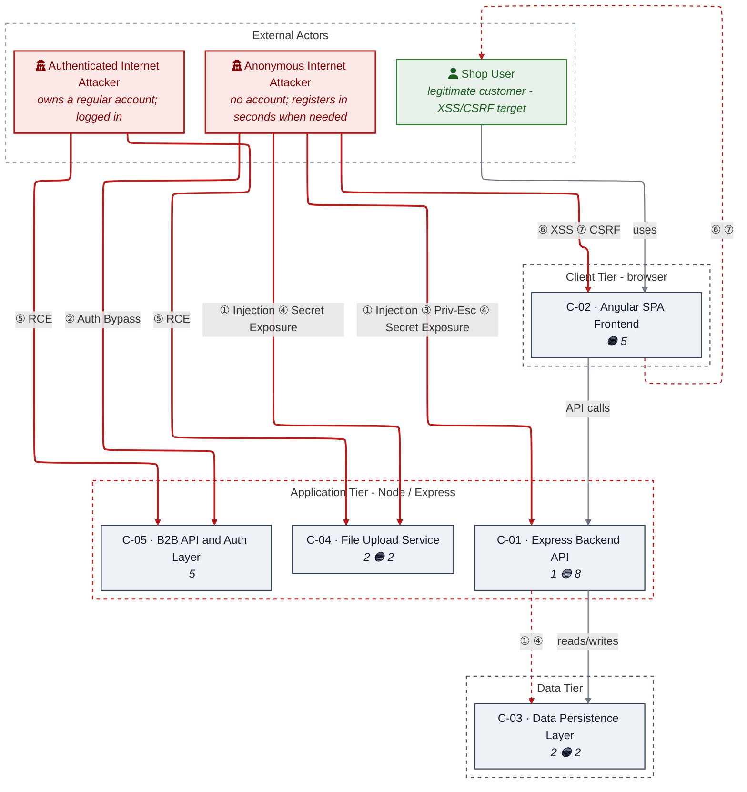
```mermaid
%%{init: {"flowchart": {"defaultRenderer": "elk", "nodeSpacing": 34, "rankSpacing": 52, "padding": 10, "subGraphTitleMargin": {"top": 6, "bottom": 6}}} }%%
flowchart TB
    subgraph ZONE_ACTORS["External Actors"]
        direction LR
        EXT_SHOPUSER["fa:fa-user Shop User<br/><i>legitimate customer - XSS/CSRF target</i>"]:::actorgood
        ACT_INTERNET_ANON["fa:fa-user-secret Anonymous Internet Attacker<br/><i>no account; registers in seconds when needed</i>"]:::actorbad
        ACT_INTERNET_USER["fa:fa-user-secret Authenticated Internet Attacker<br/><i>owns a regular account; logged in</i>"]:::actorbad
    end

    subgraph CLIENT["Client Tier - browser"]
        CMP_ANGULAR_SPA["C-02 · Angular SPA Frontend<br/><i>🟠 5</i>"]:::comp
    end
    subgraph APP["Application Tier - Node / Express"]
        CMP_EXPRESS_BACKEND["C-01 · Express Backend API<br/><i>🔴 1 🟠 8</i>"]:::comp
        CMP_FILE_UPLOAD_SERVICE["C-04 · File Upload Service<br/><i>🔴 2 🟠 2</i>"]:::comp
        CMP_B2B_API["C-05 · B2B API and Auth Layer<br/><i>🔴 5</i>"]:::comp
    end
    subgraph DATA["Data Tier"]
        CMP_DATA_LAYER["C-03 · Data Persistence Layer<br/><i>🔴 2 🟠 2</i>"]:::comp
    end

    %% legitimate request flow
    EXT_SHOPUSER -->|"uses"| CMP_ANGULAR_SPA
    CMP_ANGULAR_SPA -->|"API calls"| CMP_EXPRESS_BACKEND
    CMP_EXPRESS_BACKEND -->|"reads/writes"| CMP_DATA_LAYER
    %% attacks (solid) - each originates at a threat actor; glyphs match Figure 2 / Top Threats
    ACT_INTERNET_ANON ==>|"① Injection ③ Priv-Esc ④ Secret Exposure"| CMP_EXPRESS_BACKEND
    ACT_INTERNET_ANON ==>|"① Injection ④ Secret Exposure"| CMP_FILE_UPLOAD_SERVICE
    ACT_INTERNET_ANON ==>|"② Auth Bypass"| CMP_B2B_API
    ACT_INTERNET_USER ==>|"⑤ RCE"| CMP_FILE_UPLOAD_SERVICE
    ACT_INTERNET_USER ==>|"⑤ RCE"| CMP_B2B_API
    ACT_INTERNET_ANON ==>|"⑥ XSS ⑦ CSRF"| CMP_ANGULAR_SPA
    %% propagation (dotted) - how the attack reaches the data tier / victim
    CMP_EXPRESS_BACKEND -.->|"① ④"| CMP_DATA_LAYER
    CMP_ANGULAR_SPA -.->|"⑥ ⑦"| EXT_SHOPUSER

    style CLIENT fill:none,stroke:#475569,stroke-width:1.5px,stroke-dasharray:5
    style APP fill:none,stroke:#b71c1c,stroke-width:2px,stroke-dasharray:5
    style DATA fill:none,stroke:#475569,stroke-width:1.5px,stroke-dasharray:5
    style ZONE_ACTORS fill:none,stroke:#94a3b8,stroke-width:1.5px,stroke-dasharray:5
    classDef comp fill:#eef2f7,stroke:#334155,color:#0f172a,stroke-width:1.5px
    classDef compmuted fill:#f8fafc,stroke:#cbd5e1,color:#64748b,stroke-width:1px,font-size:9px
    classDef ext  fill:#ffffff,stroke:#94a3b8,color:#334155,stroke-width:1.5px
    classDef actorbad  fill:#fde8e8,stroke:#b71c1c,color:#7f0000,stroke-width:2px
    classDef actorgood fill:#e8f1ea,stroke:#2e7d32,color:#1b5e20,stroke-width:1.5px
    linkStyle 0,1,2 stroke:#6b7280,stroke-width:1.5px
    linkStyle 3,4,5,6,7,8 stroke:#b71c1c,stroke-width:2.5px
    linkStyle 9,10 stroke:#b71c1c,stroke-width:1.5px,stroke-dasharray:5
```

_Threats: ① Injection · ② Auth Bypass · ③ Priv-Esc · ④ Secret Exposure · ⑤ RCE · ⑥ XSS · ⑦ CSRF_

_Component badge: 🔴 = number of Critical findings on the component · 🟠 = number of High findings. Components with no Critical/High finding carry no badge._

**Figure 2 - Risk Flow: Actor → Tier → Impact**

Heatmap: **actors** (left) → **architecture tiers** (middle, Client → Application → Data) → **impact** (right). Numbered red arrows ①–⑥ are the threats enumerated in the Top Threats table below.

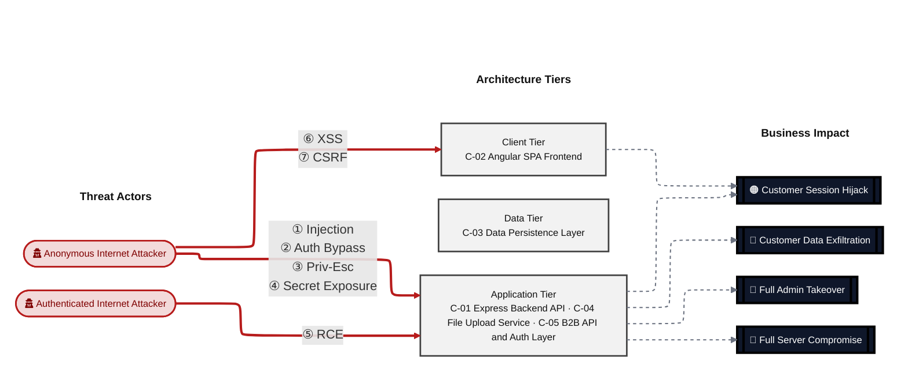
```mermaid
%%{init: {"flowchart": {"defaultRenderer": "elk", "nodeSpacing": 45, "rankSpacing": 95}} }%%
flowchart LR
    subgraph ACTORS[" "]
        direction TB
        HDR_A["<b>Threat Actors</b>"]:::columnHeader
        ANON(["fa:fa-user-secret Anonymous Internet Attacker"]):::actorAnon
        INTERNET_USER(["fa:fa-user-secret Authenticated Internet Attacker"]):::actorAnon
    end

    subgraph TIERS[" "]
        direction TB
        HDR_T["<b>Architecture Tiers</b>"]:::columnHeader
        BROWSER["Client Tier<br/>C-02 Angular SPA Frontend"]:::tierClient
        SERVER["Application Tier<br/>C-01 Express Backend API · C-04 File Upload Service · C-05 B2B API and Auth Layer"]:::tierApp
        DATA["Data Tier<br/>C-03 Data Persistence Layer"]:::tierData
    end

    subgraph IMPACT[" "]
        direction TB
        HDR_I["<b>Business Impact</b>"]:::columnHeader
        CUSTOMER_SESSION_HIJACK[["🟠 Customer Session Hijack"]]:::impact
        FULL_ADMIN_TAKEOVER[["🔴 Full Admin Takeover"]]:::impact
        FULL_SERVER_COMPROMISE[["🔴 Full Server Compromise"]]:::impact
        CUSTOMER_DATA_EXFILTRATION[["🔴 Customer Data Exfiltration"]]:::impact
    end

    %% Invisible alignment hints. Two purposes:
    %%   (a) keep per-component alignment edges (e.g. ANON --- SERVER) so the
    %%       forward attack arrows route horizontally without crossing tier
    %%       boxes (the diagram is forward-only: actor → tier → impact, no
    %%       backward relay edges into the actor column);
    %%   (b) chain the three column headers (HDR_A, HDR_T, HDR_I) across
    %%       subgraph boundaries so ELK pins them on the same Y line.
    HDR_A --- HDR_T
    HDR_T --- HDR_I
    ANON --- SERVER

    %% Attack arrows
    ANON ==>|" ① Injection<br/>② Auth Bypass<br/>③ Priv-Esc<br/>④ Secret Exposure  "| SERVER
    INTERNET_USER ==>|" ⑤ RCE  "| SERVER
    ANON ==>|" ⑥ XSS<br/>⑦ CSRF  "| BROWSER

    %% Consequence arrows (tier → business impact, all LR-forward)
    SERVER -.-> FULL_ADMIN_TAKEOVER
    SERVER -.-> CUSTOMER_DATA_EXFILTRATION
    SERVER -.-> CUSTOMER_SESSION_HIJACK
    SERVER -.-> FULL_SERVER_COMPROMISE
    BROWSER -.-> CUSTOMER_SESSION_HIJACK

    %% Subgraph frames invisible - column headers are emitted as the
    %% FIRST node of each subgraph (HDR_A / HDR_T / HDR_I) and pinned
    %% on the same Y line by the cross-subgraph alignment edges above.
    style ACTORS fill:none,stroke:none
    style TIERS  fill:none,stroke:none
    style IMPACT fill:none,stroke:none

    classDef tierClient fill:#f2f2f2,stroke:#424242,color:#111,stroke-width:2px,font-size:12px
    classDef tierApp    fill:#f2f2f2,stroke:#424242,color:#111,stroke-width:2px,font-size:12px
    classDef tierData   fill:#f2f2f2,stroke:#424242,color:#111,stroke-width:2px,font-size:12px

    classDef actorAnon     fill:#f3dada,stroke:#b71c1c,color:#7f0000,stroke-width:2px,font-size:12px
    classDef actorShopUser fill:#e8f1ea,stroke:#2e7d32,color:#1b5e20,stroke-width:2px,font-size:12px
    classDef impact        fill:#0f172a,stroke:#000,color:#fff,stroke-width:3px,font-size:12px

    classDef columnHeader  fill:none,stroke:none,color:#111,font-size:14px

    linkStyle 0,1,2     stroke:transparent,stroke-width:0px
    linkStyle 3,4,5     stroke:#b71c1c,stroke-width:3px
    linkStyle 6,7,8,9,10     stroke:#6b7280,stroke-width:1.5px,stroke-dasharray:4

```

**Threat actors.** The actors below drive the numbered attack paths in the figures above; the Shop User is the *victim* of client-side attacks (XSS / CSRF), not an attacker.

- **Shop User** — legitimate customer; target of client-side attacks; target of ⑥ Output Encoding / Cross-Site Scripting, ⑦ CSRF / Permissive CORS.
- **Anonymous Internet Attacker** — no account; registers in seconds when needed; drives ① Insecure Query Construction & Data Access, ② Hardcoded Secrets & Weak Cryptography, ③ Broken Authorization & Access Control, ④ Sensitive File & Secret Exposure.
- **Authenticated Internet Attacker** — owns a regular account; logged in; drives ⑤ Remote Code Execution (unsafe eval).

**7 structural threats**, grouped by weakness class - each row is one threat, not one finding. *Threat Description* states the general architectural weakness (STRIDE in brackets); *Findings* lists the concrete instances, each linked to [§8 Findings Register](#8-findings-register) with its component; *Risk & Impact* combines severity with business consequence.

| # | Threat Description | Findings (→ Component) | Risk & Impact | Fix |
|---|------------------------------------|------------------------------------------------|------------------------------------|--------|
| <a id="path-injection"></a>① | **Insecure Query Construction & Data Access** _(T·I)_<br/>User-controlled input is interpolated directly into raw SQL queries and MarsDB selectors across the login, search, and order-tracking routes, bypassing ORM parameter binding. | •&nbsp;🔴&nbsp;[F-002](#f-002) — SQL injection login bypass →&nbsp;[C-01](#c-01)<br/>•&nbsp;🔴&nbsp;[F-003](#f-003) — SQL injection in product search →&nbsp;[C-03](#c-03)<br/>•&nbsp;🔴&nbsp;[F-004](#f-004) — XXE via libxmljs2 XML file upload →&nbsp;[C-04](#c-04)<br/>•&nbsp;🔴&nbsp;[F-010](#f-010) — User privilege escalation via SQL injection →&nbsp;[C-03](#c-03)<br/>•&nbsp;🟠&nbsp;[F-021](#f-021) — NoSQL injection via \$where operator →&nbsp;[C-03](#c-03) | 🔴 **Critical**<br/>Full Admin Takeover · Customer Data Exfiltration | ❶ [M-001](#m-001) — SQL injection login bypass routes/login.ts<br/>❶ [M-015](#m-015) — XXE via libxmljs2 XML file upload routes/fileUpload.ts |
| <a id="path-auth-bypass"></a>② | **Hardcoded Secrets & Weak Cryptography** _(S·E)_<br/>The JWT signing key is committed in source and the verifier library accepts unsigned tokens, making session token forgery available to anyone with repository read access. | •&nbsp;🔴&nbsp;[F-001](#f-001) — JWT forgery via hardcoded RSA private key →&nbsp;[C-05](#c-05)<br/>•&nbsp;🔴&nbsp;[F-006](#f-006) — MD5 password hashing enables offline cracking →&nbsp;[C-05](#c-05)<br/>•&nbsp;🔴&nbsp;[F-009](#f-009) — JWT algorithm none bypass via express jwt 0.1.3 →&nbsp;[C-05](#c-05)<br/>•&nbsp;🟠&nbsp;[F-011](#f-011) — Client side authorization bypass via JWT forgery →&nbsp;[C-02](#c-02) | 🔴 **Critical**<br/>Full Admin Takeover · Customer Session Hijack | ❶ [M-020](#m-020) — JWT forgery via hardcoded RSA private key lib/insecurity.ts<br/>❶ [M-014](#m-014) — MD5 password hashing enables offline cracking lib/insecurity.ts |
| <a id="path-privilege-escalation"></a>③ | **Broken Authorization & Access Control** _(E·I)_<br/>authorisation checks are absent or bypassable, allowing horizontal and vertical privilege jumps from a self-registered or low-rights account. Includes mass-assignment of privileged attributes. | •&nbsp;🟠&nbsp;[F-023](#f-023) — IDOR in data export →&nbsp;[C-01](#c-01)<br/>•&nbsp;🟡&nbsp;[F-029](#f-029) — Basket manipulation via forged BasketId →&nbsp;[C-01](#c-01)<br/>•&nbsp;🟢&nbsp;[F-034](#f-034) — Dockerfile runs as non root (uid 65532) →&nbsp;[C-01](#c-01) | 🟠 **High**<br/>Full Admin Takeover · Customer Data Exfiltration | ❷ [M-005](#m-005) — IDOR in data export routes/dataExport.ts<br/>❸ [M-004](#m-004) — Basket manipulation via forged BasketId routes/basketItems.ts |
| <a id="path-sensitive-data-exposure"></a>④ | **Sensitive File & Secret Exposure** _(I)_<br/>Access logs, FTP file listings, and the JWT public key directory are served without authentication, exposing user activity and cryptographic material. | •&nbsp;🔴&nbsp;[F-005](#f-005) — SSRF via unrestricted profile image URL fetch →&nbsp;[C-04](#c-04)<br/>•&nbsp;🟠&nbsp;[F-017](#f-017) — Publicly readable access logs expose user activity →&nbsp;[C-01](#c-01)<br/>•&nbsp;🟠&nbsp;[F-019](#f-019) — JWT public key and encryption keys publicly browsable →&nbsp;[C-01](#c-01)<br/>•&nbsp;🟠&nbsp;[F-020](#f-020) — Database schema disclosure via SQLite master table →&nbsp;[C-03](#c-03)<br/>•&nbsp;🟠&nbsp;[F-022](#f-022) — Log file and FTP directory public exposure →&nbsp;[C-01](#c-01)<br/>•&nbsp;🟡&nbsp;[F-028](#f-028) — Open redirect →&nbsp;[C-01](#c-01) | 🔴 **Critical**<br/>Customer Data Exfiltration | ❶ [M-016](#m-016) — SSRF via unrestricted profile image URL fetch routes/profileImageUrlUpload.ts<br/>❶ [M-001](#m-001) — SQL injection login bypass routes/login.ts |
| <a id="path-remote-code-execution"></a>⑤ | **Remote Code Execution (unsafe eval)** _(E)_<br/>Two request handlers evaluate attacker-controlled strings — one via a bypassable JavaScript sandbox in the B2B order route, one via a bare eval call in the user-profile route. | •&nbsp;🔴&nbsp;[F-004](#f-004) — XXE via libxmljs2 XML file upload →&nbsp;[C-04](#c-04)<br/>•&nbsp;🔴&nbsp;[F-005](#f-005) — SSRF via unrestricted profile image URL fetch →&nbsp;[C-04](#c-04)<br/>•&nbsp;🔴&nbsp;[F-007](#f-007) — SSTI via eval in username field →&nbsp;[C-05](#c-05)<br/>•&nbsp;🔴&nbsp;[F-008](#f-008) — RCE via safeEval bypass in B2B order →&nbsp;[C-05](#c-05)<br/>•&nbsp;🟠&nbsp;[F-015](#f-015) — YAML deserialization in file upload →&nbsp;[C-04](#c-04) | 🔴 **Critical**<br/>Full Server Compromise · Customer Data Exfiltration | ❶ [M-015](#m-015) — XXE via libxmljs2 XML file upload routes/fileUpload.ts<br/>❶ [M-016](#m-016) — SSRF via unrestricted profile image URL fetch routes/profileImageUrlUpload.ts |
| <a id="path-cross-site-scripting"></a>⑥ | **Output Encoding / Cross-Site Scripting** _(T·I)_<br/>Six Angular components bypass the framework's default HTML sanitizer with user-controlled content, enabling persistent script injection into pages visited by other users. | •&nbsp;🟠&nbsp;[F-012](#f-012) — Stored XSS via trust HTML bypass in about component →&nbsp;[C-02](#c-02)<br/>•&nbsp;🟠&nbsp;[F-013](#f-013) — XSS via last login IP header injection last login →&nbsp;[C-02](#c-02)<br/>•&nbsp;🟠&nbsp;[F-018](#f-018) — JWT token storage in localStorage →&nbsp;[C-02](#c-02) | 🟠 **High**<br/>Customer Session Hijack | ❷ [M-011](#m-011) — Stored XSS via trust HTML bypass in about component about.component.ts<br/>❷ [M-012](#m-012) — JWT token storage in localStorage app.guard.ts |
| <a id="path-cross-site-request-forgery"></a>⑦ | **CSRF / Permissive CORS** _(S·T)_<br/>No CSRF token protection exists on state-changing endpoints; the password-change route accepts credentials via GET parameters, enabling forced account takeover from any page the victim visits. | •&nbsp;🟠&nbsp;[F-027](#f-027) — CSRF on password change →&nbsp;[C-01](#c-01) | 🟠 **High**<br/>Customer Session Hijack | ❷ [M-009](#m-009) — CSRF on password change routes/changePassword.ts |

_STRIDE: S spoofing · T tampering · R repudiation · I information disclosure · D denial of service · E elevation of privilege. Risk, findings, components, impact and Fix are derived deterministically; only the one-line weakness description is authored._

**Verified attack chains.** 4 fully viable ([AC-T-001](#ac-t-001), [AC-T-004](#ac-t-004), [AC-T-005](#ac-t-005), [AC-T-006](#ac-t-006)). These chains combine individual findings into end-to-end exploitation paths verified step-by-step against the code - see [§9 Abuse Cases](#9-abuse-cases) for the per-step breakdown and blocking mitigations.

### Top Mitigations

Highest-impact P1/P2 mitigations - 10 of 22 qualifying (30 total). Full detail in [§10 Mitigation Register](#10-mitigation-register). All 8 mitigation(s) that fix a Critical finding are always listed here.

| # | Component | Mitigation | Addresses | Effort |
|---|----------------------|------------------------------------------------|------------------------------------------------|------|
| **1** | [C-01](#c-01) — Express Backend API | ❶ [M-001](#m-001) — SQL injection login bypass routes/login.ts | 🔴 [F-002](#f-002) — SQL injection login bypass (routes/login.ts)<br/>🔴 [F-003](#f-003) — SQL injection in product search (routes/search.ts)<br/>🔴 [F-010](#f-010) — User privilege escalation via SQL injection (routes/login.ts)<br/>🟠 [F-020](#f-020) — Database schema disclosure via SQLite master table (routes/search.ts) | Low |
| **2** | [C-02](#c-02) — Angular SPA Frontend | ❶ [M-025](#m-025) — Implement Content Security Policy headers | 🔴 [F-012](#f-012) — Stored XSS via trust HTML bypass in about component about.component.ts (frontend/src/app/about/about.component.ts)<br/>🔴 [F-013](#f-013) — XSS via last login IP header injection last login ip.component.ts (frontend/src/app/last-login-ip/last-login-ip.component.ts)<br/>🔴 [F-014](#f-014) — Missing authorization on product update (server.ts) | Medium |
| **3** | [C-04](#c-04) — File Upload Service | ❶ [M-015](#m-015) — XXE via libxmljs2 XML file upload routes/fileUpload.ts | 🔴 [F-004](#f-004) — XXE via libxmljs2 XML file upload (routes/fileUpload.ts) | Low |
| **4** | [C-04](#c-04) — File Upload Service | ❶ [M-016](#m-016) — SSRF via unrestricted profile image URL fetch routes/profileImageUrlUpload.ts | 🔴 [F-005](#f-005) — SSRF via unrestricted profile image URL fetch (routes/profileImageUrlUpload.ts) | Medium |
| **5** | [C-05](#c-05) — B2B API and Auth Layer | ❶ [M-021](#m-021) — JWT algorithm none bypass via express jwt 0.1.3 lib/insecurity.ts | 🔴 [F-009](#f-009) — JWT algorithm none bypass via express jwt 0.1.3 (lib/insecurity.ts) | Low |
| **6** | [C-05](#c-05) — B2B API and Auth Layer | ❶ [M-022](#m-022) — SSTI via eval in username field routes/userProfile.ts | 🔴 [F-007](#f-007) — SSTI via eval in username field (routes/userProfile.ts) | Low |
| **7** | [C-05](#c-05) — B2B API and Auth Layer | ❶ [M-014](#m-014) — MD5 password hashing enables offline cracking lib/insecurity.ts | 🔴 [F-006](#f-006) — MD5 password hashing enables offline cracking (lib/insecurity.ts) | Medium |
| **8** | [C-05](#c-05) — B2B API and Auth Layer | ❶ [M-019](#m-019) — RCE via safeEval bypass in B2B order routes/b2bOrder.ts | 🔴 [F-008](#f-008) — RCE via safeEval bypass in B2B order (routes/b2bOrder.ts) | Medium |
| **9** | [C-05](#c-05) — B2B API and Auth Layer | ❶ [M-020](#m-020) — JWT forgery via hardcoded RSA private key lib/insecurity.ts | 🔴 [F-001](#f-001) — JWT forgery via hardcoded RSA private key (lib/insecurity.ts) | Medium |
| **10** | [C-01](#c-01) — Express Backend API | ❷ [M-006](#m-006) — Publicly readable access logs expose user activity routes/logfileServer.ts | 🟠 [F-017](#f-017) — Publicly readable access logs expose user activity (routes/logfileServer.ts)<br/>🟠 [F-022](#f-022) — Log file and FTP directory public exposure (server.ts) | Low |

*12 additional P1/P2 mitigations capped from the leader-board · 8 P3 backlog items in [§10 Mitigation Register](#10-mitigation-register). Sorted by priority (P1 first), then component, then leverage (most findings first), severity (Critical first), and effort (Low first).*

### Operational Strengths

Operational controls rated Adequate or Partial - grouped into broad clusters (full per-control breakdown in [§7](#7-security-architecture)). Clusters demoted to Weak by open Critical/High findings appear in [§7](#7-security-architecture) instead, not here.

| Strength | What's in Place | Effectiveness | Gap | Mitigates |
|----------------------|----------------------|-------------|----------------------|----------------|
| **Container & Supply-Chain Hardening** | _Build-time and runtime hardening - minimal base image, non-root execution, dependency inventory._<br/>Automated SCA scanning | ✅ Adequate | - | - |
| **Observability & Audit** | _Runtime visibility - access logging, audit trails, and operational telemetry for post-incident review._<br/>Security Logging and Monitoring | ⚠️ Partial | Coverage incomplete - see [§7](#7-security-architecture) control assessment. | - |


**Bottom line:** These controls narrow specific attack surfaces but none eliminates a Critical finding on its own.

---

<a id="critical-attack-chain"></a><a id="critical-attack-tree"></a>
## Critical Attack Tree

The root is the worst-case attacker goal; below it, each capability branch groups the Critical findings that achieve it. Branches feed the goal by OR - any single path suffices.

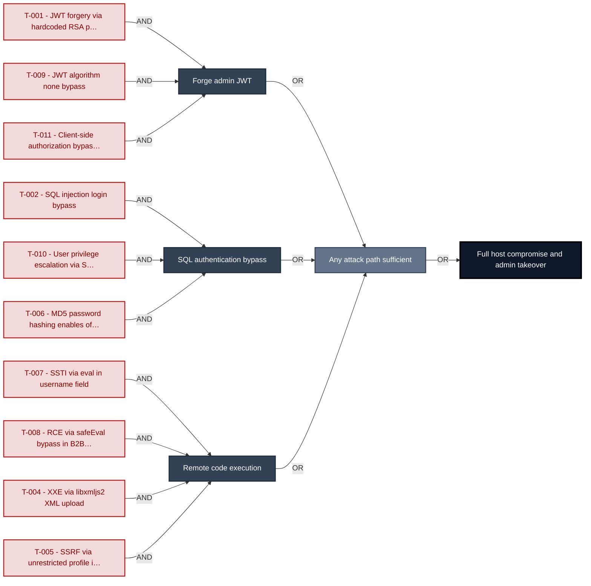
```mermaid
graph LR
    G_ROOT["Full host compromise and admin takeover"]:::goal
    OR_PATHS["Any attack path sufficient"]:::or_node
    AND_JWT["Forge admin JWT"]:::and_node
    AND_SQLI["SQL authentication bypass"]:::and_node
    AND_RCE["Remote code execution"]:::and_node
    L_T001["T-001 - JWT forgery via hardcoded RSA p…"]:::leaf
    L_T009["T-009 - JWT algorithm none bypass"]:::leaf
    L_T002["T-002 - SQL injection login bypass"]:::leaf
    L_T010["T-010 - User privilege escalation via S…"]:::leaf
    L_T006["T-006 - MD5 password hashing enables of…"]:::leaf
    L_T007["T-007 - SSTI via eval in username field"]:::leaf
    L_T008["T-008 - RCE via safeEval bypass in B2B…"]:::leaf
    L_T004["T-004 - XXE via libxmljs2 XML upload"]:::leaf
    L_T005["T-005 - SSRF via unrestricted profile i…"]:::leaf
    L_T011["T-011 - Client-side authorization bypas…"]:::leaf

    OR_PATHS -->|"OR"| G_ROOT
    AND_JWT -->|"OR"| OR_PATHS
    AND_SQLI -->|"OR"| OR_PATHS
    AND_RCE -->|"OR"| OR_PATHS
    L_T001 -->|"AND"| AND_JWT
    L_T009 -->|"AND"| AND_JWT
    L_T011 -->|"AND"| AND_JWT
    L_T002 -->|"AND"| AND_SQLI
    L_T010 -->|"AND"| AND_SQLI
    L_T006 -->|"AND"| AND_SQLI
    L_T007 -->|"AND"| AND_RCE
    L_T008 -->|"AND"| AND_RCE
    L_T004 -->|"AND"| AND_RCE
    L_T005 -->|"AND"| AND_RCE

    classDef goal fill:#0f172a,stroke:#000,color:#fff,stroke-width:3px
    classDef and_node fill:#334155,stroke:#1e293b,color:#fff,stroke-width:2px
    classDef or_node fill:#64748b,stroke:#334155,color:#fff,stroke-width:2px
    classDef leaf fill:#f3dada,stroke:#b71c1c,color:#7f0000,stroke-width:2px
```

**Findings** (full detail in [§8 Findings Register](#8-findings-register)): 🔴 [F-001](#f-001) — JWT forgery via hardcoded RSA private key lib/insecurity.ts JWT forgery via hardcoded RSA private key · 🔴 [F-009](#f-009) — JWT algorithm none bypass via express jwt 0.1.3 lib/insecurity.ts JWT algorithm none bypass · 🔴 [F-002](#f-002) — SQL injection login bypass routes/login.ts SQL injection login bypass · 🔴 [F-010](#f-010) — User privilege escalation via SQL injection routes/login.ts User privilege escalation via SQL injection · 🔴 [F-006](#f-006) — MD5 password hashing enables offline cracking lib/insecurity.ts `MD5` password hashing enables offline cracking · 🔴 [F-007](#f-007) — SSTI via eval in username field routes/userProfile.ts SSTI via eval in username field · 🔴 [F-008](#f-008) — RCE via safeEval bypass in B2B order routes/b2bOrder.ts RCE via safeEval bypass in B2B orders · 🔴 [F-004](#f-004) — XXE via libxmljs2 XML file upload routes/fileUpload.ts XXE via libxmljs2 XML upload · 🔴 [F-005](#f-005) — SSRF via unrestricted profile image URL fetch routes/profileImageUrlUpload.ts SSRF via unrestricted profile image URL · 🟠 [F-011](#f-011) — Client side authorization bypass via JWT forgery app.guard.ts Client-side authorization bypass via JWT forgery

---

## 1. System Overview

Probably the most modern and sophisticated insecure web application

**Repository:** https://github.com/juice-shop/juice-shop
**Runtime:** Node\.js 20 - 24

### Scope

This threat model covers 5 components of juice-shop: **Express Backend API**, **Angular SPA Frontend**, **Data Persistence Layer**, **File Upload Service**, **B2B API and Auth Layer**.

**Out of scope:** third-party hosted dependencies, browser runtime, operating-system kernel, and the underlying network infrastructure.

---

## 2. Architecture Diagrams

### 2.1 System Context

Who interacts with juice-shop from the outside, and through which channels. Solid arrows show normal usage; dashed red arrows mark unauthenticated probing or exploit paths (C4 Level 1).

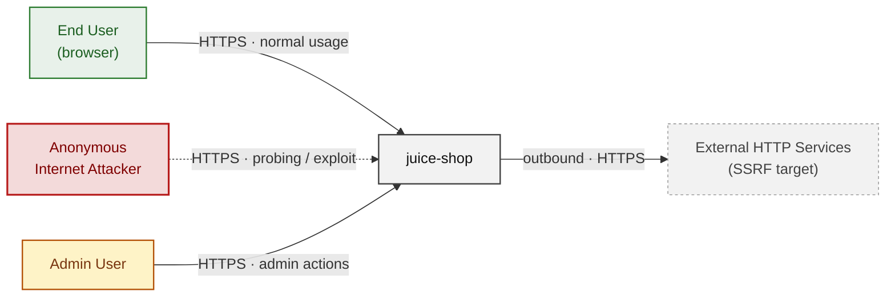
```mermaid
flowchart LR
    USER["End User<br/>(browser)"]
    ATTACKER["Anonymous<br/>Internet Attacker"]
    ADMIN["Admin User"]
    SYSTEM["juice-shop"]
    EXTERNAL["External HTTP Services<br/>(SSRF target)"]
    USER -->|HTTPS · normal usage| SYSTEM
    ATTACKER -.->|HTTPS · probing / exploit| SYSTEM
    ADMIN -->|HTTPS · admin actions| SYSTEM
    SYSTEM -->|outbound · HTTPS| EXTERNAL
    classDef user     fill:#e8f1ea,stroke:#2e7d32,color:#1b5e20,stroke-width:1.5px
    classDef attacker fill:#f3dada,stroke:#b71c1c,color:#7f0000,stroke-width:2px
    classDef admin    fill:#fef3c7,stroke:#b45309,color:#78350f,stroke-width:1.5px
    classDef sys      fill:#f2f2f2,stroke:#424242,color:#111,stroke-width:1.5px
    classDef ext      fill:#f2f2f2,stroke:#9e9e9e,color:#424242,stroke-dasharray:3 3,stroke-width:1px
    class USER user
    class ATTACKER attacker
    class ADMIN admin
    class SYSTEM sys
    class EXTERNAL ext
```

### 2.2 Container Architecture

How the system decomposes into deployable units. Each box is a separate runtime process or service container; arrows show synchronous request paths between them. Components with ≥3 Critical findings carry a red border, ≥2 High amber (C4 Level 2).

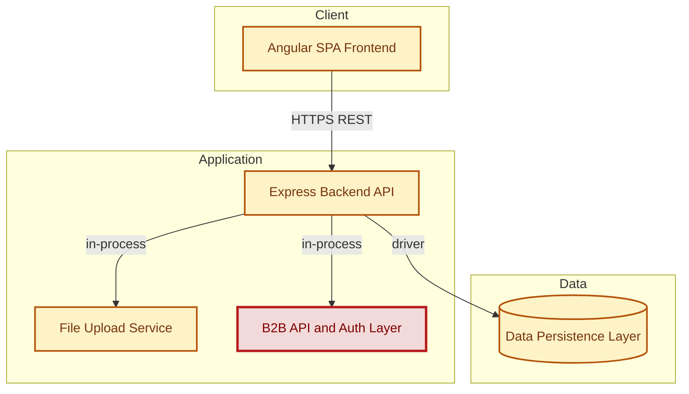
```mermaid
flowchart TB
    subgraph Client
        angular_spa["Angular SPA Frontend"]
    end
    subgraph Application
        express_backend["Express Backend API"]
        file_upload_service["File Upload Service"]
        b2b_api["B2B API and Auth Layer"]
    end
    subgraph Data
        data_layer[("Data Persistence Layer")]
    end
    angular_spa -->|HTTPS REST| express_backend
    express_backend -->|driver| data_layer
    express_backend -->|in-process| file_upload_service
    express_backend -->|in-process| b2b_api
    classDef critical fill:#f3dada,stroke:#b71c1c,color:#7f0000,stroke-width:3px
    classDef warning  fill:#fef3c7,stroke:#b45309,color:#78350f,stroke-width:2px
    class b2b_api critical
    class express_backend warning
    class angular_spa warning
    class data_layer warning
    class file_upload_service warning
```

### 2.3 Components


Who reaches each component, and through which trust zone. Four columns map external actors to the internal tiers (Client / Application / Data); solid green arrows show legitimate data flow, dashed red arrows mark intrusion vectors. The component table directly below holds source paths and linked threats per `C-NN`; per-finding evidence is in [§8 Findings Register](#8-findings-register).

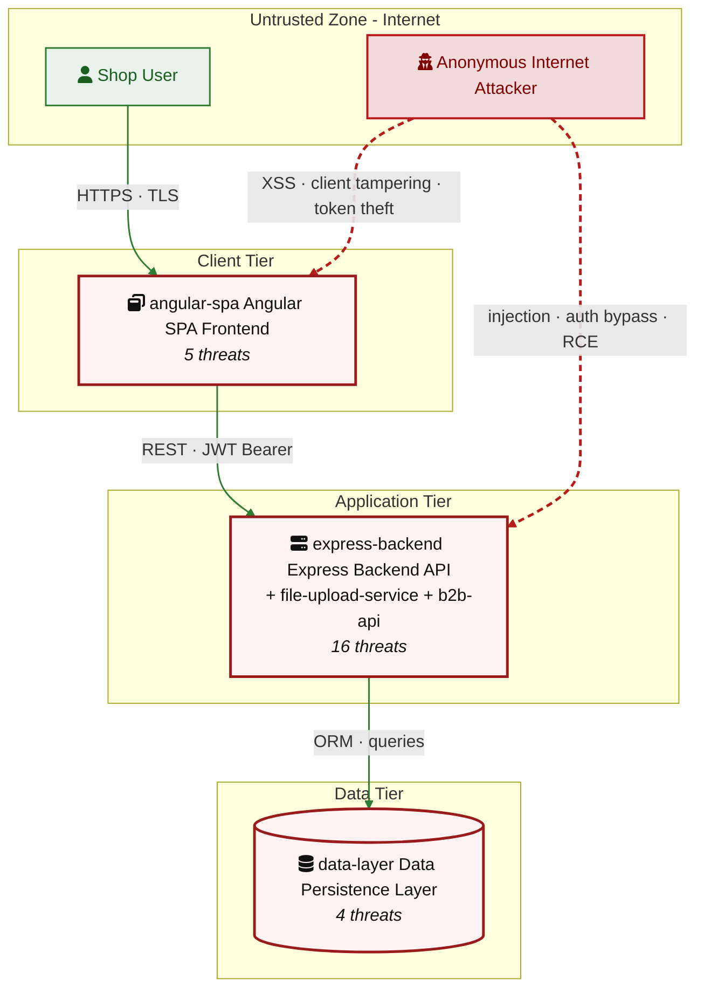
```mermaid
flowchart TD
    subgraph EXT["Untrusted Zone - Internet"]
        INTERNET_ANON["fa:fa-user-secret Anonymous Internet Attacker"]:::threat
        VICTIM_REQUIRED["fa:fa-user Shop User"]:::legit
    end
    subgraph CLIENT["Client Tier"]
        angular_spa["fa:fa-window-restore angular-spa Angular SPA Frontend<br/><i>5 threats</i>"]:::risk
    end
    subgraph APP["Application Tier"]
        express_backend["fa:fa-server express-backend Express Backend API<br/>+ file-upload-service + b2b-api<br/><i>16 threats</i>"]:::risk
    end
    subgraph DATA["Data Tier"]
        data_layer[("fa:fa-database data-layer Data Persistence Layer<br/><i>4 threats</i>")]:::risk
    end
    VICTIM_REQUIRED -->|"HTTPS · TLS"| angular_spa
    angular_spa -->|"REST · JWT Bearer"| express_backend
    express_backend -->|"ORM · queries"| data_layer
    INTERNET_ANON -.->|"injection · auth bypass · RCE"| express_backend
    INTERNET_ANON -.->|"XSS · client tampering · token theft"| angular_spa

    classDef legit fill:#e8f1ea,stroke:#2e7d32,color:#1b5e20,stroke-width:1.5px
    classDef threat fill:#f3dada,stroke:#b71c1c,color:#7f0000,stroke-width:2px
    classDef external fill:#f2f2f2,stroke:#424242,color:#212121,stroke-width:1.5px
    classDef risk fill:#fef2f2,stroke:#991b1b,color:#111,stroke-width:2.5px
    linkStyle 0,1,2 stroke:#2e7d32,stroke-width:1.5px
    linkStyle 3,4 stroke:#b71c1c,stroke-width:2.5px,stroke-dasharray:6 4
```

| ID | Name | Type | Key Paths | Linked Threats |
|----|----------------------|-----------|--------------------------------|------------------------------------------------|
| <a id="c-01"></a><a id="express-backend"></a>C-01 | Express Backend API | application | `server.ts`<br/>`app.ts`<br/>`routes/`<br/>`lib/`<br/>`models/` | 🔴 [F-002](#f-002) — SQL injection login bypass<br/>🔴 [F-014](#f-014) — Missing authorization on product update<br/>🟠 [F-016](#f-016) — Wildcard CORS allows cross origin credential exfiltration<br/>🟠 [F-017](#f-017) — Publicly readable access logs expose user activity<br/>🟠 [F-019](#f-019) — JWT public key and encryption keys publicly browsable<br/>🟠 [F-022](#f-022) — Log file and FTP directory public exposure<br/>🟠 [F-023](#f-023) — IDOR in data export<br/>🟠 [F-025](#f-025) — No rate limiting on login endpoint<br/>🟠 [F-027](#f-027) — CSRF on password change<br/>🟡 [F-028](#f-028) — Open redirect<br/>🟡 [F-029](#f-029) — Basket manipulation via forged BasketId<br/>🟡 [F-030](#f-030) — Package lock=false in .npmrc disables lockfile<br/>🟡 [F-031](#f-031) — Dockerfile uses unsafe perm flag<br/>🟡 [F-032](#f-032) — Sensitive files accessible via null byte bypass<br/>🟢 [F-033](#f-033) — No Dependabot configuration found<br/>🟢 [F-034](#f-034) — Dockerfile runs as non root (uid 65532) |
| <a id="c-02"></a><a id="angular-spa"></a>C-02 | Angular SPA Frontend | client | `frontend/src/`<br/>`frontend/dist/` | 🟠 [F-011](#f-011) — Client side authorization bypass via JWT forgery app.guard.ts<br/>🔴 [F-012](#f-012) — Stored XSS via trust HTML bypass in about component about.component.ts<br/>🔴 [F-013](#f-013) — XSS via last login IP header injection last login ip.component.ts<br/>🔴 [F-018](#f-018) — JWT token storage in localStorage app.guard.ts<br/>🔴 [F-026](#f-026) — Administration route accessible via client side guard bypass app.routing.ts |
| <a id="c-03"></a><a id="data-layer"></a>C-03 | Data Persistence Layer | data | `models/`<br/>`data/datacreator.ts`<br/>`data/mongodb.ts`<br/>`data/static/`<br/>`routes/search.ts` | 🔴 [F-003](#f-003) — SQL injection in product search<br/>🔴 [F-010](#f-010) — User privilege escalation via SQL injection<br/>🟠 [F-020](#f-020) — Database schema disclosure via SQLite master table<br/>🔴 [F-021](#f-021) — NoSQL injection via \$where operator |
| <a id="c-04"></a><a id="file-upload-service"></a>C-04 | File Upload Service | application | `routes/fileUpload.ts`<br/>`routes/profileImageUrlUpload.ts`<br/>`routes/profileImageFileUpload.ts`<br/>`routes/memory.ts` | 🔴 [F-004](#f-004) — XXE via libxmljs2 XML file upload<br/>🔴 [F-005](#f-005) — SSRF via unrestricted profile image URL fetch<br/>🟠 [F-015](#f-015) — YAML deserialization in file upload<br/>🟠 [F-024](#f-024) — Unrestricted file upload overwrites application assets routes/profileImageFileU… |
| <a id="c-05"></a><a id="b2b-api"></a>C-05 | B2B API and Auth Layer | application | `routes/b2bOrder.ts`<br/>`routes/login.ts`<br/>`routes/userProfile.ts`<br/>`routes/2fa.ts`<br/>`lib/insecurity.ts` | 🔴 [F-001](#f-001) — JWT forgery via hardcoded RSA private key<br/>🔴 [F-006](#f-006) — MD5 password hashing enables offline cracking<br/>🔴 [F-007](#f-007) — SSTI via eval in username field<br/>🔴 [F-008](#f-008) — RCE via safeEval bypass in B2B order<br/>🔴 [F-009](#f-009) — JWT algorithm none bypass via express jwt 0.1.3 |
### 2.4 Technology Architecture

The technology stack the system is built on. Each box names the framework or runtime that fills that role; per-component findings live in the [§2.3](#23-components) component table above, and the full per-finding catalogue is in [§8 Findings Register](#8-findings-register).

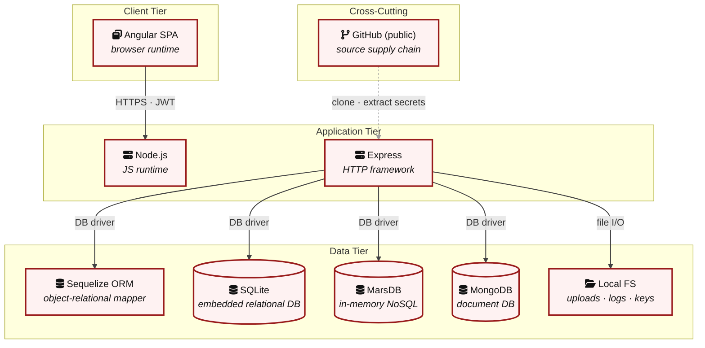
```mermaid
flowchart TD
    subgraph CLIENT["Client Tier"]
        FE_ANGULAR["fa:fa-window-restore Angular SPA<br/><i>browser runtime</i>"]:::risk
    end
    subgraph APP["Application Tier"]
        RUNTIME["fa:fa-server Node.js<br/><i>JS runtime</i>"]:::risk
        EXPRESS["fa:fa-server Express<br/><i>HTTP framework</i>"]:::risk
    end
    subgraph DATA["Data Tier"]
        ORM["fa:fa-database Sequelize ORM<br/><i>object-relational mapper</i>"]:::risk
        SQLITE[("fa:fa-database SQLite<br/><i>embedded relational DB</i>")]:::risk
        MARSDB[("fa:fa-database MarsDB<br/><i>in-memory NoSQL</i>")]:::risk
        MONGO[("fa:fa-database MongoDB<br/><i>document DB</i>")]:::risk
        LOCAL_FS["fa:fa-folder-open Local FS<br/><i>uploads · logs · keys</i>"]:::risk
    end
    subgraph INFRA["Cross-Cutting"]
        INFRA_SCM["fa:fa-code-branch GitHub (public)<br/><i>source supply chain</i>"]:::risk
    end
    FE_ANGULAR -->|"HTTPS · JWT"| RUNTIME
    EXPRESS -->|"DB driver"| ORM
    EXPRESS -->|"DB driver"| SQLITE
    EXPRESS -->|"DB driver"| MARSDB
    EXPRESS -->|"DB driver"| MONGO
    EXPRESS -->|"file I/O"| LOCAL_FS
    INFRA_SCM -.->|"clone · extract secrets"| EXPRESS

    classDef risk fill:#fef2f2,stroke:#991b1b,color:#111,stroke-width:2.5px
    classDef ok fill:#e8f1ea,stroke:#2e7d32,color:#1b5e20,stroke-width:1.5px
    linkStyle 0,1,2,3,4,5 stroke:#424242,stroke-width:1.5px
    linkStyle 6 stroke:#9e9e9e,stroke-width:1px,stroke-dasharray:3 3
```

> **Legend:** **red border** ≥ 3 Critical threats on the component · **amber border** ≥ 2 High threats

---

## 3. Attack Walkthroughs

This section walks through how the highest-risk findings are exploited - one short walkthrough per Critical, each with attack steps, a focused sequence diagram, and the primary mitigation. The cross-finding view (which weaknesses combine toward the worst-case goal, and where one fix severs several paths) is in the [Critical Attack Tree](#critical-attack-tree). Full per-finding context - severity rationale, assets, detection signals - is in the [§8 Findings Register](#8-findings-register) row for each finding.

### 3.1 JWT forgery via hardcoded RSA private key lib/insecurity.ts

**Source:** 🔴 [F-001](#f-001) — `lib/insecurity.ts:23`

Severity **Critical** ([CWE-321](https://cwe.mitre.org/data/definitions/321.html)). STRIDE: Spoofing. See [§8 T-001](#t-001) for the full register row.

**Attack Steps**

1. The RSA private key is hardcoded at `lib/insecurity.ts:23` and committed to the public GitHub repository.
2. Any attacker with access to the source code can use `jwt.sign({ data: { id: 1, email: 'admin@juice-sh.op', role: 'admin' } }, privateKey, { algorithm: 'RS256' })` to create a valid administrative JWT.
3. This gives full admin access to all API endpoints requiring authentication.

**Sequence Diagram**

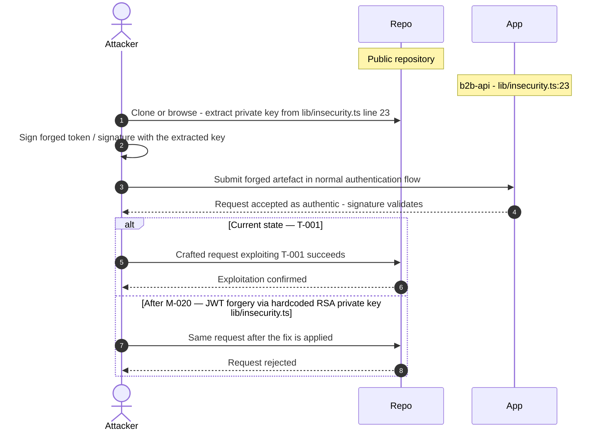
```mermaid
sequenceDiagram
    autonumber
    actor Attacker
    participant Repo
    participant App
    Note over Repo: Public repository
    Note over App: b2b-api - lib/insecurity.ts:23
    Attacker->>Repo: Clone or browse - extract private key from lib/insecurity.ts line 23
    Attacker->>Attacker: Sign forged token / signature with the extracted key
    Attacker->>App: Submit forged artefact in normal authentication flow
    App-->>Attacker: Request accepted as authentic - signature validates
    alt Current state — T-001
        Attacker->>Repo: Crafted request exploiting T-001 succeeds
        Repo-->>Attacker: Exploitation confirmed
    else After M-020 — JWT forgery via hardcoded RSA private key lib/insecurity.ts
        Attacker->>Repo: Same request after the fix is applied
        Repo-->>Attacker: Request rejected
    end
```

**Key takeaway:** Until ❶ [M-020](#m-020) (JWT forgery via hardcoded RSA private key `lib/insecurity.ts`) lands, [T-001](#t-001) — JWT forgery via hardcoded RSA private key lib/insecurity.ts is exploitable at `lib/insecurity.ts:23` (Critical-severity, [CWE-321](https://cwe.mitre.org/data/definitions/321.html)).

**Defense in Depth**

- Primary mitigation: ❶ [M-020](#m-020) (JWT forgery via hardcoded RSA private key `lib/insecurity.ts`)
- Defence in depth: ❸ [M-026](#m-026) (Establish secure software development lifecycle for training platform)

### 3.2 SQL injection login bypass routes/login.ts

**Source:** 🔴 [F-002](#f-002) — `routes/login.ts:37`

Severity **Critical** ([CWE-89](https://cwe.mitre.org/data/definitions/89.html)). STRIDE: Spoofing. See [§8 T-002](#t-002) for the full register row.

**Attack Steps**

1. An unauthenticated attacker sends `' OR '1'='1'--` as email to `POST /rest/user/login`.
2. The raw SQL query `SELECT * FROM Users WHERE email = '${req.body.email}'` in `routes/login.ts:37` returns the first user record (typically the admin), bypassing password verification and issuing a valid admin JWT.
3. The attacker gains full admin access without credentials.

**Sequence Diagram**

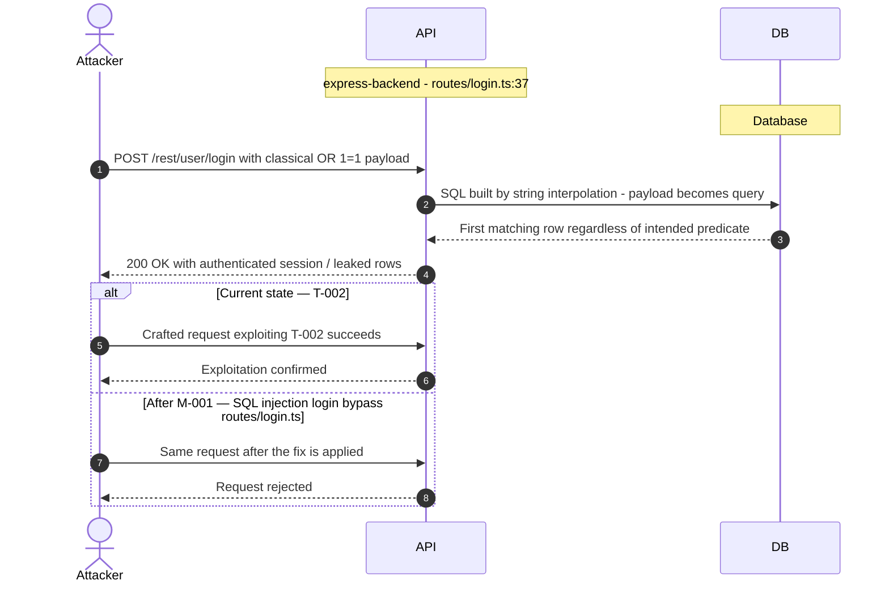
```mermaid
sequenceDiagram
    autonumber
    actor Attacker
    participant API
    participant DB
    Note over API: express-backend - routes/login.ts:37
    Note over DB: Database
    Attacker->>API: POST /rest/user/login with classical OR 1=1 payload
    API->>DB: SQL built by string interpolation - payload becomes query
    DB-->>API: First matching row regardless of intended predicate
    API-->>Attacker: 200 OK with authenticated session / leaked rows
    alt Current state — T-002
        Attacker->>API: Crafted request exploiting T-002 succeeds
        API-->>Attacker: Exploitation confirmed
    else After M-001 — SQL injection login bypass routes/login.ts
        Attacker->>API: Same request after the fix is applied
        API-->>Attacker: Request rejected
    end
```

**Key takeaway:** Until ❶ [M-001](#m-001) (SQL injection login bypass `routes/login.ts`) lands, [T-002](#t-002) — SQL injection login bypass routes/login.ts is exploitable at `routes/login.ts:37` (Critical-severity, [CWE-89](https://cwe.mitre.org/data/definitions/89.html)).

**Defense in Depth**

- Primary mitigation: ❶ [M-001](#m-001) (SQL injection login bypass `routes/login.ts`)

### 3.3 SQL injection in product search routes/search.ts

**Source:** 🔴 [F-003](#f-003) — `routes/search.ts:27`

Severity **Critical** ([CWE-89](https://cwe.mitre.org/data/definitions/89.html)). STRIDE: Tampering. See [§8 T-003](#t-003) for the full register row.

**Attack Steps**

1. An unauthenticated attacker sends `GET /rest/products/search?q=')) UNION SELECT sql,2,3,4,5,6,7,8,9 FROM sqlite_master--` to the search endpoint.
2. The raw query `SELECT * FROM Products WHERE name LIKE '%${criteria}%'` at `search.ts:27` executes the UNION injection, returning the entire database schema.
3. A subsequent injection `') UNION SELECT email,password,3,4,5,6,7,8,9 FROM Users--` dumps all user credentials.

**Sequence Diagram**

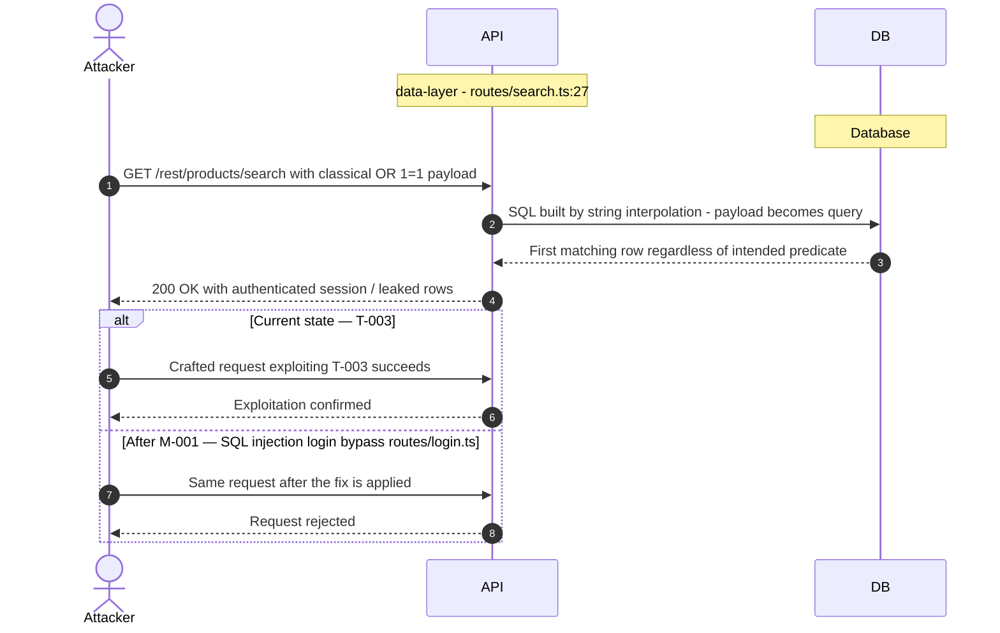
```mermaid
sequenceDiagram
    autonumber
    actor Attacker
    participant API
    participant DB
    Note over API: data-layer - routes/search.ts:27
    Note over DB: Database
    Attacker->>API: GET /rest/products/search with classical OR 1=1 payload
    API->>DB: SQL built by string interpolation - payload becomes query
    DB-->>API: First matching row regardless of intended predicate
    API-->>Attacker: 200 OK with authenticated session / leaked rows
    alt Current state — T-003
        Attacker->>API: Crafted request exploiting T-003 succeeds
        API-->>Attacker: Exploitation confirmed
    else After M-001 — SQL injection login bypass routes/login.ts
        Attacker->>API: Same request after the fix is applied
        API-->>Attacker: Request rejected
    end
```

**Key takeaway:** Until ❶ [M-001](#m-001) (SQL injection login bypass `routes/login.ts`) lands, [T-003](#t-003) — SQL injection in product search routes/search.ts is exploitable at `routes/search.ts:27` (Critical-severity, [CWE-89](https://cwe.mitre.org/data/definitions/89.html)).

**Defense in Depth**

- Primary mitigation: ❶ [M-001](#m-001) (SQL injection login bypass `routes/login.ts`)

### 3.4 XXE via libxmljs2 XML file upload routes/fileUpload.ts

**Source:** 🔴 [F-004](#f-004) — `routes/fileUpload.ts:83`

Severity **Critical** ([CWE-611](https://cwe.mitre.org/data/definitions/611.html)). STRIDE: Tampering. See [§8 T-004](#t-004) for the full register row.

**Attack Steps**

1. An attacker uploads an XML file to `POST /file-upload` with an XXE payload: `<?xml version="1.0"?><!DOCTYPE replace [<!ENTITY xxe SYSTEM "file:///etc/passwd">]><root>&xxe;</root>`.
2. The handler at `fileUpload.ts:83` parses the XML using `libxml.parseXml(data, { noblanks: true, noent: true, nocdata: true })` - the `noent: true` flag resolves external entities.
3. The server's `/etc/passwd` or application secrets are included in the error message returned to the attacker.

**Sequence Diagram**

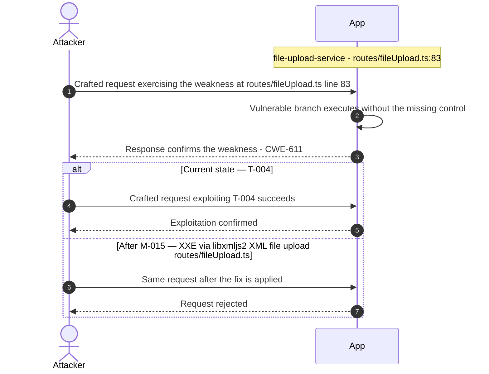
```mermaid
sequenceDiagram
    autonumber
    actor Attacker
    participant App
    Note over App: file-upload-service - routes/fileUpload.ts:83
    Attacker->>App: Crafted request exercising the weakness at routes/fileUpload.ts line 83
    App->>App: Vulnerable branch executes without the missing control
    App-->>Attacker: Response confirms the weakness - CWE-611
    alt Current state — T-004
        Attacker->>App: Crafted request exploiting T-004 succeeds
        App-->>Attacker: Exploitation confirmed
    else After M-015 — XXE via libxmljs2 XML file upload routes/fileUpload.ts
        Attacker->>App: Same request after the fix is applied
        App-->>Attacker: Request rejected
    end
```

**Key takeaway:** Until ❶ [M-015](#m-015) (XXE via libxmljs2 XML file upload `routes/fileUpload.ts`) lands, [T-004](#t-004) — XXE via libxmljs2 XML file upload routes/fileUpload.ts is exploitable at `routes/fileUpload.ts:83` (Critical-severity, [CWE-611](https://cwe.mitre.org/data/definitions/611.html)).

**Defense in Depth**

- Primary mitigation: ❶ [M-015](#m-015) (XXE via libxmljs2 XML file upload `routes/fileUpload.ts`)

### 3.5 SSRF via unrestricted profile image URL fetch routes/profil…

**Source:** 🔴 [F-005](#f-005) — `routes/profileImageUrlUpload.ts:24`

Severity **Critical** ([CWE-918](https://cwe.mitre.org/data/definitions/918.html)). STRIDE: Tampering. See [§8 T-005](#t-005) for the full register row.

**Attack Steps**

1. An authenticated user sends `POST /profile/image/url` with `{"imageUrl": "http://169.254.169.254/latest/meta-data/"}`.
2. The handler at `profileImageUrlUpload.ts:24` calls `fetch(url)` without any URL validation, allowlist, or DNS rebinding protection.
3. The response (AWS metadata or internal service data) is written to the uploads directory.

**Sequence Diagram**

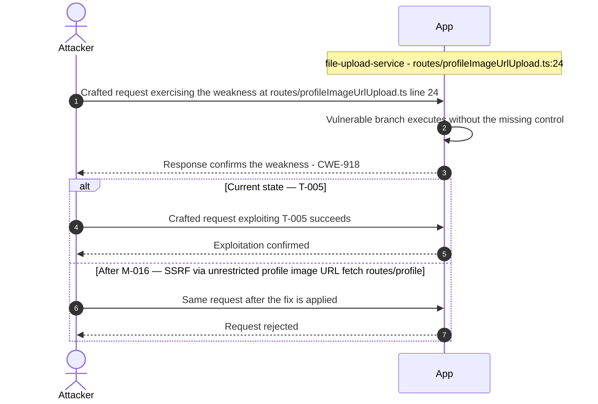
```mermaid
sequenceDiagram
    autonumber
    actor Attacker
    participant App
    Note over App: file-upload-service - routes/profileImageUrlUpload.ts:24
    Attacker->>App: Crafted request exercising the weakness at routes/profileImageUrlUpload.ts line 24
    App->>App: Vulnerable branch executes without the missing control
    App-->>Attacker: Response confirms the weakness - CWE-918
    alt Current state — T-005
        Attacker->>App: Crafted request exploiting T-005 succeeds
        App-->>Attacker: Exploitation confirmed
    else After M-016 — SSRF via unrestricted profile image URL fetch routes/profile
        Attacker->>App: Same request after the fix is applied
        App-->>Attacker: Request rejected
    end
```

**Key takeaway:** Until ❶ [M-016](#m-016) (SSRF via unrestricted profile image URL fetch routes/profile) lands, [T-005](#t-005) — SSRF via unrestricted profile image URL fetch routes/profileImageUrlUpload.ts is exploitable at `routes/profileImageUrlUpload.ts:24` (Critical-severity, [CWE-918](https://cwe.mitre.org/data/definitions/918.html)).

**Defense in Depth**

- Primary mitigation: ❶ [M-016](#m-016) (SSRF via unrestricted profile image URL fetch `routes/profileImageUrlUpload.ts`)

### 3.6 MD5 password hashing enables offline cracking lib/insecurit…

**Source:** 🔴 [F-006](#f-006) — `lib/insecurity.ts:43`

Severity **Critical** ([CWE-916](https://cwe.mitre.org/data/definitions/916.html)). STRIDE: Information Disclosure. See [§8 T-006](#t-006) for the full register row.

**Attack Steps**

1. All passwords are stored as unsalted `MD5` hashes (`crypto.createHash('md5').update(data).digest('hex')` at `insecurity.ts:43`).
2. When an attacker obtains the Users table via SQL injection ([T-003](#t-003) — SQL injection in product search routes/search.ts or [T-002](#t-002) — SQL injection login bypass routes/login.ts), they can recover all passwords in minutes using rainbow tables (`MD5` is fully broken, lookup tables exist for billions of common passwords) or GPU cracking at >10B hashes/second.
3. Send the crafted payload to the endpoint backed by `lib/insecurity.ts:43`.

**Sequence Diagram**

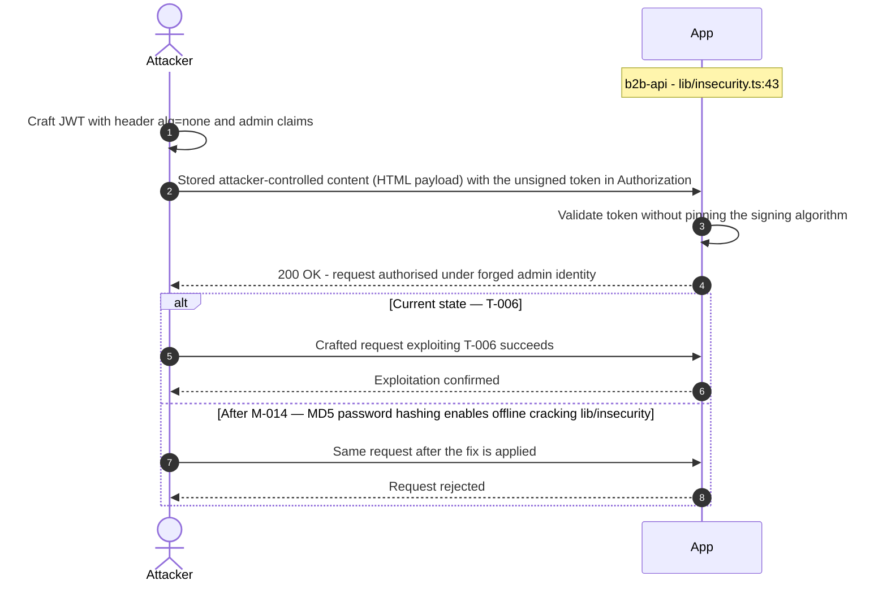
```mermaid
sequenceDiagram
    autonumber
    actor Attacker
    participant App
    Note over App: b2b-api - lib/insecurity.ts:43
    Attacker->>Attacker: Craft JWT with header alg=none and admin claims
    Attacker->>App: Stored attacker-controlled content (HTML payload) with the unsigned token in Authorization
    App->>App: Validate token without pinning the signing algorithm
    App-->>Attacker: 200 OK - request authorised under forged admin identity
    alt Current state — T-006
        Attacker->>App: Crafted request exploiting T-006 succeeds
        App-->>Attacker: Exploitation confirmed
    else After M-014 — MD5 password hashing enables offline cracking lib/insecurity
        Attacker->>App: Same request after the fix is applied
        App-->>Attacker: Request rejected
    end
```

**Key takeaway:** Until ❶ [M-014](#m-014) (`MD5` password hashing enables offline cracking lib/insecurity) lands, [T-006](#t-006) — MD5 password hashing enables offline cracking lib/insecurity.ts is exploitable at `lib/insecurity.ts:43` (Critical-severity, [CWE-916](https://cwe.mitre.org/data/definitions/916.html)).

**Defense in Depth**

- Primary mitigation: ❶ [M-014](#m-014) (`MD5` password hashing enables offline cracking `lib/insecurity.ts`)

### 3.7 SSTI via eval in username field routes/userProfile.ts

**Source:** 🔴 [F-007](#f-007) — `routes/userProfile.ts:66`

Severity **Critical** ([CWE-94](https://cwe.mitre.org/data/definitions/94.html)). STRIDE: Elevation of Privilege. See [§8 T-007](#t-007) for the full register row.

**Attack Steps**

1. An attacker registers with username `#{7*7}` or `#{process.mainModule.require('child_process').execSync('id').toString()}`.
2. The getUserProfile handler at `userProfile.ts:66` checks `username.match(/#{(.*)}/)`; when matched, it executes `eval(code)` where `code` is the content between `#{` and `}`.
3. This achieves server-side code execution via the user profile page.

**Sequence Diagram**

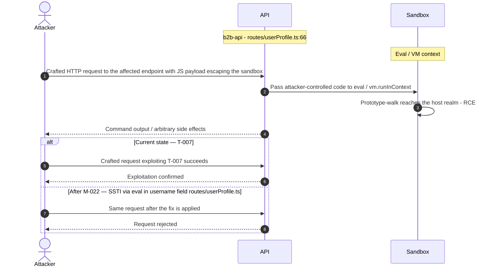
```mermaid
sequenceDiagram
    autonumber
    actor Attacker
    participant API
    participant Sandbox
    Note over API: b2b-api - routes/userProfile.ts:66
    Note over Sandbox: Eval / VM context
    Attacker->>API: Crafted HTTP request to the affected endpoint with JS payload escaping the sandbox
    API->>Sandbox: Pass attacker-controlled code to eval / vm.runInContext
    Sandbox->>Sandbox: Prototype-walk reaches the host realm - RCE
    API-->>Attacker: Command output / arbitrary side effects
    alt Current state — T-007
        Attacker->>API: Crafted request exploiting T-007 succeeds
        API-->>Attacker: Exploitation confirmed
    else After M-022 — SSTI via eval in username field routes/userProfile.ts
        Attacker->>API: Same request after the fix is applied
        API-->>Attacker: Request rejected
    end
```

**Key takeaway:** Until ❶ [M-022](#m-022) (SSTI via eval in username field `routes/userProfile.ts`) lands, [T-007](#t-007) — SSTI via eval in username field routes/userProfile.ts is exploitable at `routes/userProfile.ts:66` (Critical-severity, [CWE-94](https://cwe.mitre.org/data/definitions/94.html)).

**Defense in Depth**

- Primary mitigation: ❶ [M-022](#m-022) (SSTI via eval in username field `routes/userProfile.ts`)

### 3.8 RCE via safeEval bypass in B2B order routes/b2bOrder.ts

**Source:** 🔴 [F-008](#f-008) — `routes/b2bOrder.ts:22`

Severity **Critical** ([CWE-95](https://cwe.mitre.org/data/definitions/95.html)). STRIDE: Elevation of Privilege. See [§8 T-008](#t-008) for the full register row.

**Attack Steps**

1. An authenticated attacker with any valid JWT sends `POST /b2b/v2/orders` with `{"orderLinesData": "require('child_process').execSync('id').toString()"}`.
2. The handler at `b2bOrder.ts:22` wraps `notevil.eval(orderLinesData)` in `vm.runInContext()`.
3. The `notevil` sandbox is known to be bypassable via prototype chain manipulation.

**Sequence Diagram**

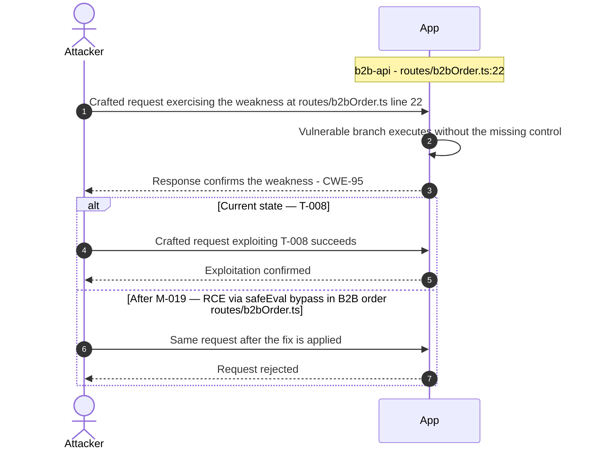
```mermaid
sequenceDiagram
    autonumber
    actor Attacker
    participant App
    Note over App: b2b-api - routes/b2bOrder.ts:22
    Attacker->>App: Crafted request exercising the weakness at routes/b2bOrder.ts line 22
    App->>App: Vulnerable branch executes without the missing control
    App-->>Attacker: Response confirms the weakness - CWE-95
    alt Current state — T-008
        Attacker->>App: Crafted request exploiting T-008 succeeds
        App-->>Attacker: Exploitation confirmed
    else After M-019 — RCE via safeEval bypass in B2B order routes/b2bOrder.ts
        Attacker->>App: Same request after the fix is applied
        App-->>Attacker: Request rejected
    end
```

**Key takeaway:** Until ❶ [M-019](#m-019) (RCE via safeEval bypass in B2B order `routes/b2bOrder.ts`) lands, [T-008](#t-008) — RCE via safeEval bypass in B2B order routes/b2bOrder.ts is exploitable at `routes/b2bOrder.ts:22` (Critical-severity, [CWE-95](https://cwe.mitre.org/data/definitions/95.html)).

**Defense in Depth**

- Primary mitigation: ❶ [M-019](#m-019) (RCE via safeEval bypass in B2B order `routes/b2bOrder.ts`)

### 3.9 JWT algorithm none bypass via express jwt 0.1.3 lib/insecur…

**Source:** 🔴 [F-009](#f-009) — `lib/insecurity.ts:54`

Severity **Critical** ([CWE-327](https://cwe.mitre.org/data/definitions/327.html)). STRIDE: Elevation of Privilege. See [§8 T-009](#t-009) for the full register row.

**Attack Steps**

1. The `express-jwt` version 0.1.3 and `jsonwebtoken` 0.4.0 are both vulnerable to algorithm confusion attacks.
2. An attacker crafts a JWT with `alg: none` in the header and no signature: `eyJhbGciOiJub25lIn0.eyJkYXRhIjp7InJvbGUiOiJhZG1pbiJ9fQ.`.
3. The vulnerable library accepts this as valid for any endpoint using `security.isAuthorized()`.

**Sequence Diagram**

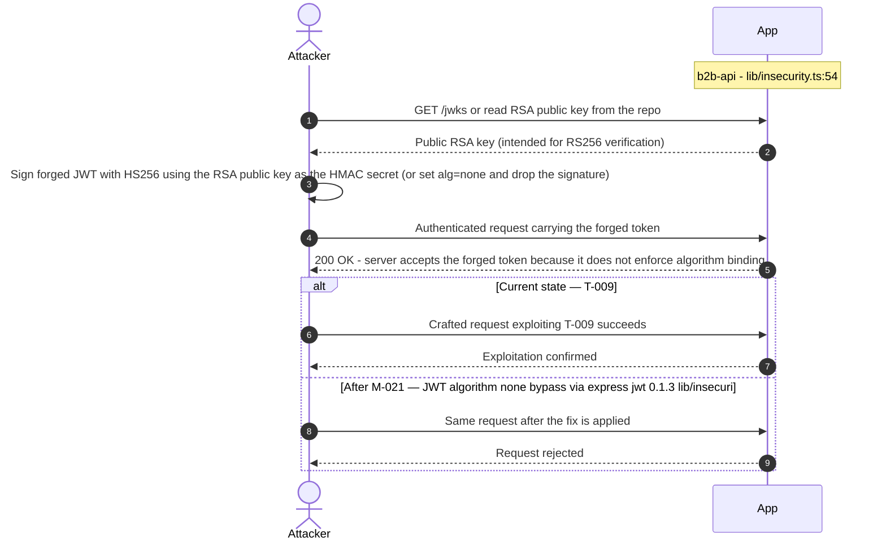
```mermaid
sequenceDiagram
    autonumber
    actor Attacker
    participant App
    Note over App: b2b-api - lib/insecurity.ts:54
    Attacker->>App: GET /jwks or read RSA public key from the repo
    App-->>Attacker: Public RSA key (intended for RS256 verification)
    Attacker->>Attacker: Sign forged JWT with HS256 using the RSA public key as the HMAC secret (or set alg=none and drop the signature)
    Attacker->>App: Authenticated request carrying the forged token
    App-->>Attacker: 200 OK - server accepts the forged token because it does not enforce algorithm binding
    alt Current state — T-009
        Attacker->>App: Crafted request exploiting T-009 succeeds
        App-->>Attacker: Exploitation confirmed
    else After M-021 — JWT algorithm none bypass via express jwt 0.1.3 lib/insecuri
        Attacker->>App: Same request after the fix is applied
        App-->>Attacker: Request rejected
    end
```

**Key takeaway:** Until ❶ [M-021](#m-021) (JWT algorithm none bypass via express jwt 0.1.3 lib/insecuri) lands, [T-009](#t-009) — JWT algorithm none bypass via express jwt 0.1.3 lib/insecurity.ts is exploitable at `lib/insecurity.ts:54` (Critical-severity, [CWE-327](https://cwe.mitre.org/data/definitions/327.html)).

**Defense in Depth**

- Primary mitigation: ❶ [M-021](#m-021) (JWT algorithm none bypass via express jwt 0.1.3 `lib/insecurity.ts`)

### 3.10 User privilege escalation via SQL injection routes/login.ts

**Source:** 🔴 [F-010](#f-010) — `routes/login.ts:37`

Severity **Critical** ([CWE-89](https://cwe.mitre.org/data/definitions/89.html)). STRIDE: Elevation of Privilege. See [§8 T-010](#t-010) for the full register row.

**Attack Steps**

1. Using the SQL injection in `login.ts:37`, an attacker submits `admin@juice-sh.op'--` as email.
2. The modified query returns the admin user record bypassing the password check entirely.
3. The backend issues a valid JWT with `role: admin` and `bid` for the admin basket, granting full administrative access including user management, challenge resetting, and order manipulation.

**Sequence Diagram**

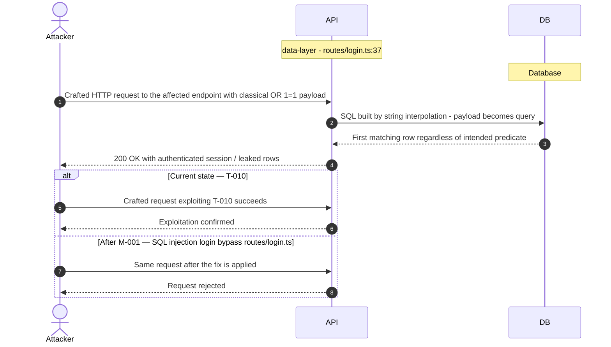
```mermaid
sequenceDiagram
    autonumber
    actor Attacker
    participant API
    participant DB
    Note over API: data-layer - routes/login.ts:37
    Note over DB: Database
    Attacker->>API: Crafted HTTP request to the affected endpoint with classical OR 1=1 payload
    API->>DB: SQL built by string interpolation - payload becomes query
    DB-->>API: First matching row regardless of intended predicate
    API-->>Attacker: 200 OK with authenticated session / leaked rows
    alt Current state — T-010
        Attacker->>API: Crafted request exploiting T-010 succeeds
        API-->>Attacker: Exploitation confirmed
    else After M-001 — SQL injection login bypass routes/login.ts
        Attacker->>API: Same request after the fix is applied
        API-->>Attacker: Request rejected
    end
```

**Key takeaway:** Until ❶ [M-001](#m-001) (SQL injection login bypass `routes/login.ts`) lands, [T-010](#t-010) — User privilege escalation via SQL injection routes/login.ts is exploitable at `routes/login.ts:37` (Critical-severity, [CWE-89](https://cwe.mitre.org/data/definitions/89.html)).

**Defense in Depth**

- Primary mitigation: ❶ [M-001](#m-001) (SQL injection login bypass `routes/login.ts`)

<!-- generated:walkthrough_renderer -->

---

## 4. Assets

Information assets and the classification level that drives the Confidentiality / Integrity / Availability targets used in [§8 Findings Register](#8-findings-register) risk scoring.

| Asset | ID | Classification | Description | Linked Threats |
|----------------------|-----|--------------|------------------------------------|------------------------------------------------|
| User Credentials Database | A-001 | Restricted | SQLite Users table containing email addresses, `MD5`-hashed passwords, TOTP secrets, and role assignments. Directly accessible via SQL injection. | 🔴 [F-002](#f-002) — SQL injection login bypass<br/>🔴 [F-003](#f-003) — SQL injection in product search<br/>🔴 [F-006](#f-006) — MD5 password hashing enables offline cracking<br/>🔴 [F-010](#f-010) — User privilege escalation via SQL injection<br/>🔴 [F-012](#f-012) — Stored XSS via trust HTML bypass in about component about.component.ts<br/>🔴 [F-013](#f-013) — XSS via last login IP header injection last login ip.component.ts<br/>🟠 [F-020](#f-020) — Database schema disclosure via SQLite master table<br/>🟠 [F-025](#f-025) — No rate limiting on login endpoint |
| JWT RSA Private Key | A-002 | Restricted | RSA-2048 private key hardcoded in `lib/insecurity.ts` used to sign all JWT tokens. Compromised by design — committed to source code. | 🔴 [F-001](#f-001) — JWT forgery via hardcoded RSA private key<br/>🔴 [F-006](#f-006) — MD5 password hashing enables offline cracking<br/>🔴 [F-009](#f-009) — JWT algorithm none bypass via express jwt 0.1.3<br/>🟠 [F-019](#f-019) — JWT public key and encryption keys publicly browsable<br/>🟠 [F-020](#f-020) — Database schema disclosure via SQLite master table |
| Payment Card Data | A-003 | Restricted | Credit card numbers and CVV stored in SQLite Cards table. Accessible via IDOR vulnerabilities in payment endpoints. | 🔴 [F-002](#f-002) — SQL injection login bypass<br/>🔴 [F-003](#f-003) — SQL injection in product search<br/>🔴 [F-010](#f-010) — User privilege escalation via SQL injection<br/>🔴 [F-012](#f-012) — Stored XSS via trust HTML bypass in about component about.component.ts<br/>🔴 [F-013](#f-013) — XSS via last login IP header injection last login ip.component.ts<br/>🟠 [F-020](#f-020) — Database schema disclosure via SQLite master table<br/>🟠 [F-023](#f-023) — IDOR in data export<br/>🟡 [F-029](#f-029) — Basket manipulation via forged BasketId |
| Application Session Tokens | A-005 | Restricted | JWT tokens stored in localStorage and cookies. Forgeable due to hardcoded private key and `alg:none` bypass in jsonwebtoken 0.4.0. | 🔴 [F-001](#f-001) — JWT forgery via hardcoded RSA private key<br/>🔴 [F-009](#f-009) — JWT algorithm none bypass via express jwt 0.1.3<br/>🟠 [F-011](#f-011) — Client side authorization bypass via JWT forgery app.guard.ts<br/>🔴 [F-018](#f-018) — JWT token storage in localStorage app.guard.ts<br/>🟠 [F-019](#f-019) — JWT public key and encryption keys publicly browsable<br/>🟠 [F-020](#f-020) — Database schema disclosure via SQLite master table |
| Admin User Accounts | A-007 | Restricted | Administrative accounts in Users table with role=admin. Accessible via SQL injection login bypass or JWT forgery. | 🔴 [F-001](#f-001) — JWT forgery via hardcoded RSA private key<br/>🔴 [F-002](#f-002) — SQL injection login bypass<br/>🔴 [F-003](#f-003) — SQL injection in product search<br/>🔴 [F-006](#f-006) — MD5 password hashing enables offline cracking<br/>🔴 [F-009](#f-009) — JWT algorithm none bypass via express jwt 0.1.3<br/>🔴 [F-010](#f-010) — User privilege escalation via SQL injection<br/>🟠 [F-011](#f-011) — Client side authorization bypass via JWT forgery app.guard.ts<br/>🔴 [F-012](#f-012) — Stored XSS via trust HTML bypass in about component about.component.ts<br/>🔴 [F-013](#f-013) — XSS via last login IP header injection last login ip.component.ts<br/>🟠 [F-025](#f-025) — No rate limiting on login endpoint<br/>🔴 [F-026](#f-026) — Administration route accessible via client side guard bypass app.routing.ts<br/>🟡 [F-032](#f-032) — Sensitive files accessible via null byte bypass |
| Application Server Process | A-011 | Restricted | Node\.js server process. Compromisable via RCE in b2bOrder endpoint (`vm.runInContext`), SSTI eval in userProfile, or XXE via libxmljs2. | - |
| User Orders and Purchase History | A-004 | Confidential | Order history stored in MarsDB ordersCollection. Retrievable via NoSQL injection in trackOrder endpoint. | 🔴 [F-002](#f-002) — SQL injection login bypass<br/>🔴 [F-003](#f-003) — SQL injection in product search<br/>🔴 [F-010](#f-010) — User privilege escalation via SQL injection<br/>🔴 [F-021](#f-021) — NoSQL injection via \$where operator<br/>🟠 [F-023](#f-023) — IDOR in data export<br/>🟡 [F-029](#f-029) — Basket manipulation via forged BasketId |
| Server Filesystem | A-006 | Confidential | Application filesystem including logs, FTP files, encryption keys, and uploaded files. Accessible via path traversal, SSRF, and directory listing. | 🔴 [F-001](#f-001) — JWT forgery via hardcoded RSA private key<br/>🟠 [F-019](#f-019) — JWT public key and encryption keys publicly browsable<br/>🟠 [F-020](#f-020) — Database schema disclosure via SQLite master table<br/>🟠 [F-022](#f-022) — Log file and FTP directory public exposure |
| Coupon and Voucher Codes | A-009 | Confidential | Discount coupon codes with HMAC-sha256 signature using hardcoded secret. Forgeable due to hardcoded HMAC key. | - |
| Application Access Logs | A-010 | Confidential | HTTP access logs written to logs/ directory. Publicly browsable at /support/logs/ — exposes all user activity including auth attempts. | 🟠 [F-017](#f-017) — Publicly readable access logs expose user activity<br/>🟠 [F-019](#f-019) — JWT public key and encryption keys publicly browsable<br/>🟠 [F-020](#f-020) — Database schema disclosure via SQLite master table<br/>🟠 [F-022](#f-022) — Log file and FTP directory public exposure |
| Product Catalogue and Reviews | A-008 | Internal | Products, reviews, and feedback stored in SQLite and MarsDB. Writable via unauthenticated XSS injection, product tampering. | 🔴 [F-002](#f-002) — SQL injection login bypass<br/>🔴 [F-003](#f-003) — SQL injection in product search<br/>🔴 [F-010](#f-010) — User privilege escalation via SQL injection<br/>🔴 [F-012](#f-012) — Stored XSS via trust HTML bypass in about component about.component.ts<br/>🔴 [F-013](#f-013) — XSS via last login IP header injection last login ip.component.ts |
| User Profile Images | A-012 | Internal | Uploaded user profile images stored under frontend/dist/frontend/assets/public/images/uploads/. Overwritable via SSRF. | - |

---

## 5. Attack Surface

Network-reachable entry points classified by authentication requirement. Each row links to the threat(s) referenced in its **Notes** column. The **Risk** column reflects the highest-severity linked finding.

### 5.1 Unauthenticated Entry Points (10)

| Method | Route | Risk | Notes |
|------|---------------------|----------|------------------------------------|
| POST | `/file-upload` | 🔴 Critical | 🔴 [F-004](#f-004) (XXE via libxmljs2 XML file upload)<br/>🟠 [F-015](#f-015) (YAML deserialization in file upload)<br/>🔴 [F-005](#f-005) (SSRF via unrestricted profile image URL fetch)<br/>XXE via libxmljs2 `noent:true` for .xml files; YAML deserialization for .yml files. |
| GET | `/rest/products/search` | 🔴 Critical | 🔴 [F-003](#f-003) (SQL injection in product search)<br/>🟠 [F-020](#f-020) (Database schema disclosure via SQLite master table)<br/>SQL injection via q parameter - UNION injection enables full database dump. |
| POST | `/rest/user/login` | 🔴 Critical | 🔴 [F-002](#f-002) (SQL injection login bypass)<br/>🟠 [F-025](#f-025) (No rate limiting on login endpoint)<br/>🔴 [F-010](#f-010) (User privilege escalation via SQL injection)<br/>SQL injection in email and password fields. No rate limiting. |
| PUT | `/api/Products/:id` | 🟠 High | 🔴 [F-014](#f-014) (Missing authorization on product update)<br/>No auth middleware - `isAuthorized()` call commented out in `server.ts:369`. |
| GET | `/encryptionkeys/:file` | 🟠 High | 🟠 [F-019](#f-019) (JWT public key and encryption keys publicly browsable)<br/>JWT public key and premium key accessible to all. Directory listing enabled. |
| GET | `/ftp/:file` | 🟠 High | 🟠 [F-022](#f-022) (Log file and FTP directory public exposure)<br/>🟡 [F-032](#f-032) (Sensitive files accessible via null byte bypass)<br/>Null byte bypass allows downloading restricted files. Directory listing enabled. |
| GET | `/support/logs/:file` | 🟠 High | 🟠 [F-017](#f-017) (Publicly readable access logs expose user activity)<br/>🟠 [F-022](#f-022) (Log file and FTP directory public exposure)<br/>Access logs browsable and downloadable - exposes all user activity. |
| GET | `/track-result/:id` | 🟠 High | 🔴 [F-021](#f-021) (NoSQL injection via \$where operator)<br/>NoSQL injection via \$where operator; reflected XSS via iframe payload. |
| GET | `/api-docs` | - | Full Swagger API documentation publicly exposed. |
| GET | `/rest/user/whoami` | - | Field injection via ?fields= parameter - returns arbitrary user fields. |

### 5.2 Authenticated Entry Points (5)

| Method | Route | Risk | Notes |
|------|----------------------|----------|------------------------------------|
| POST | `/b2b/v2/orders` | 🔴 Critical | 🔴 [F-008](#f-008) (RCE via safeEval bypass in B2B order)<br/>RCE via vm.runInContext(safeEval(orderLinesData)). Requires valid JWT. |
| POST | `/profile/image/url` | 🔴 Critical | 🔴 [F-005](#f-005) (SSRF via unrestricted profile image URL fetch)<br/>🟠 [F-024](#f-024) (Unrestricted file upload overwrites application assets routes/profileImageFileU…)<br/>🔴 [F-007](#f-007) (SSTI via eval in username field)<br/>Full SSRF via unrestricted fetch(url). Response written to filesystem. |
| ? | `GET/POST /profile` | 🔴 Critical | 🔴 [F-005](#f-005) (SSRF via unrestricted profile image URL fetch)<br/>🟠 [F-024](#f-024) (Unrestricted file upload overwrites application assets routes/profileImageFileU…)<br/>🔴 [F-007](#f-007) (SSTI via eval in username field)<br/>SSTI via eval(code) in username field rendered by Pug template. |
| GET | `/rest/change-password` | 🟠 High | 🟠 [F-027](#f-027) (CSRF on password change)<br/>CSRF - no CSRF token required; credentials passed as query parameters. |
| GET | `/rest/user/data-export` | 🟠 High | 🟠 [F-023](#f-023) (IDOR in data export)<br/>IDOR - UserId in request body not validated against authenticated user. |

---

## 7. Security Architecture

This chapter is organized by security-control category. The architecture section avoids artificial control IDs and finding-ID columns in overview tables. Findings are listed only where the affected control is described.

_[§7](#7-security-architecture) schema v2 (13-section control-category layout). Cataloged controls: 23 total - 1 adequate, 3 partial, 14 weak, 0 unsafe, 5 missing. Linked threats: 34._

**How to read the verdicts.** Every control category (and every sub-control below it) carries exactly one status. The two red verdicts do **not** mean the same thing - this is the distinction that decides what you have to do about a finding:

| Status | Meaning | What it asks of you |
|----------|------------------------------------|------------------------|
| 🟢 Adequate | Control is present and sound | Nothing - keep it |
| 🟡 Partial | Present, but with meaningful gaps | Close the gap |
| 🟠 Weak | Present, but has exploitable gaps | Strengthen it |
| 🔴 Unsafe | **Present and relied upon, but defeated / trivially bypassable** | **Fix the existing control** |
| 🔴 Missing | **Control was never built** | **Add the control** |
| - | Not applicable to this codebase | - |

So "🔴 Unsafe" on a control category does *not* mean the control is absent - it means the control exists but does not hold (e.g. an `MD5` password hash, a raw-SQL query path, a hardcoded signing key). "🔴 Missing" is reserved for controls that were never built (e.g. no Content-Security-Policy header).

### 7.1 Security Control Overview

<!-- §7.1 MECHANICAL-FROZEN — DO NOT EDIT (overview table is pregenerator-owned) -->

| Control category | Verdict | Main reason |
|----------------------|---------|------------------------------------|
| [7.2 Identity and Authentication Controls](#72-identity-and-authentication-controls) | 🟠 Weak | SQL login query returns the first user row on injection; `MD5` password hashing provides negligible offline resistance; TOTP is optional and not enforced for admin accounts. |
| [7.3 Session and Token Controls](#73-session-and-token-controls) | 🟠 Weak | JWT signing key committed in source; `express-jwt` 0.1.3 accepts `alg:none`; tokens stored in `localStorage` rather than HttpOnly cookies. |
| [7.4 Authorization Controls](#74-authorization-controls) | 🟠 Weak | Server-side role checks absent on several admin routes; Angular guards (AdminGuard, AccountingGuard) are the primary enforcement layer and bypassed via JWT forgery. |
| [7.5 Query Construction and Data Access Controls](#75-query-construction-and-data-access-controls) | 🟠 Weak | Login and product-search routes interpolate user input into raw `sequelize.query()` calls; MarsDB order-tracking accepts operator objects where only scalar IDs are valid. |
| [7.6 Input Boundary Validation Controls](#76-input-boundary-validation-controls) | 🟠 Weak | multer file-size limit and MIME-type filter on uploads; no centralized schema-validation middleware on API request bodies. |
| [7.7 Output Encoding and Rendering Controls](#77-output-encoding-and-rendering-controls) | 🟠 Weak | Angular default template escaping in place; six components call `bypassSecurityTrustHtml()` with user-controlled content, defeating the default guard. |
| [7.8 Browser and Cross-Origin Controls](#78-browser-and-cross-origin-controls) | 🔴 Missing | Wildcard CORS (`app.use(cors())` with no origin allow-list); no Content-Security-Policy header; no CSRF token on state-changing endpoints. |
| [7.9 Cryptography Secrets and Data Protection](#79-cryptography-secrets-and-data-protection) | 🟠 Weak | RSA-2048 algorithm chosen for JWT; key committed to source and publicly browsable at `/encryptionkeys/`; passwords hashed with unsalted `MD5`. |
| [7.10 File Parser and Outbound Request Controls](#710-file-parser-and-outbound-request-controls) | 🟠 Weak | multer limits upload size; libxmljs2 parses with `noent: true` (XXE enabled); SSRF via unrestricted URL fetch on profile-image upload; YAML deserialized without schema restriction. |
| [7.11 Operations Runtime and Supply Chain Controls](#711-operations-runtime-and-supply-chain-controls) | 🔴 Missing | CodeQL SCA in CI; distroless runtime image; `package-lock=false` disables lockfile determinism; no Dependabot/Renovate; two server-side `eval` paths in request handlers. |
| [7.12 Real-time and Not Applicable Controls](#712-real-time-and-not-applicable-controls) | - | No real-time/WebSocket findings routed; no AI/LLM, GraphQL, or gRPC surfaces detected. |
| [7.13 Defense-in-Depth Summary](#713-defense-in-depth-summary) | - | Cross-cutting summary - see prose below. |

<!-- §7.1 MECHANICAL-FROZEN END -->

### 7.2 Identity and Authentication Controls

**Verdict:** 🟠 Weak

<!-- The line below is mechanically derived from the controls table — LLM must not re-author it. -->
**Controls covered:** [7.2.1 Password-Based Authentication](#721-password-based-authentication) · [7.2.2 Multi-Factor Authentication](#722-multi-factor-authentication)

- [7.2.1 Password-Based Authentication](#password-based-authentication)
- [7.2.2 Multi-Factor Authentication](#multi-factor-authentication)

**Implemented controls:** Password login with credential lookup against the SQLite Users table; TOTP-based multi-factor authentication via `otplib` (optional per-user enrollment); `express-rate-limit` on selected endpoints.

**Assessment:** Password verification and MFA enrollment are present but rely on an unsalted `MD5` hash that provides no meaningful offline resistance and a login query that is SQL-injectable. TOTP is implemented correctly at the `otplib` level but is never enforced for the admin account, so possession of any forged JWT bypasses the MFA layer entirely. Each successful flow terminates in the server issuing a session token; the signing, validation, propagation, storage, and lifecycle of that token are described in [§7.3 Session and Token Controls](#73-session-and-token-controls).

<!-- §7.2 AUTH-MECHANISMS-FROZEN — deterministic inventory, pregenerator-owned. DO NOT EDIT. -->
**Authentication mechanisms (at a glance).** Every authentication mechanism detected on the application, its effective status, where it is assessed, and its linked findings. Controls are catalogued by domain, so JWT/session handling is assessed under [§7.3 Session and Token Controls](#73-session-and-token-controls) and password hashing under [§7.9 Cryptography Secrets and Data Protection](#79-cryptography-secrets-and-data-protection).

| Mechanism | Status | Assessed in | Findings |
|----------------------|----------|-----------|------------------------------------------------|
| Password login | 🟠 Weak | [§7.2](#72-identity-and-authentication-controls) | - |
| Password reset / change | 🟠 High | [§7.2](#72-identity-and-authentication-controls) | 🟠 [F-027](#f-027) — CSRF on password change routes/changePassword.ts |
| Password storage (hashing) | 🔴 Critical | [§7.9](#79-cryptography-secrets-and-data-protection) | 🔴 [F-006](#f-006) — MD5 password hashing enables offline cracking lib/insecurity.ts |
| JWT / bearer-token session | 🟠 Weak | [§7.3](#73-session-and-token-controls) | 🔴 [F-001](#f-001) — JWT forgery via hardcoded RSA private key lib/insecurity.ts<br/>🔴 [F-009](#f-009) — JWT algorithm none bypass via express jwt 0.1.3 lib/insecurity.ts<br/>🟠 [F-011](#f-011) — Client side authorization bypass via JWT forgery app.guard.ts<br/>🔴 [F-018](#f-018) — JWT token storage in localStorage app.guard.ts<br/>🟠 [F-019](#f-019) — JWT public key and encryption keys publicly browsable server.ts |
| Session-token storage | 🟠 High | [§7.3](#73-session-and-token-controls) | 🔴 [F-018](#f-018) — JWT token storage in localStorage app.guard.ts |
| Multi-factor authentication (TOTP / 2FA) | 🟡 Partial | [§7.2](#72-identity-and-authentication-controls) | - |

_Also checked, not detected on this codebase: User registration, OAuth / OIDC federated login._

<!-- §7.2 AUTH-MECHANISMS-FROZEN END -->

<a id="password-based-authentication"></a>
#### 7.2.1 Password-Based Authentication

**Status:** 🟠 Weak - SQL injection in the login query allows authentication bypass without knowing any password; `MD5` hashing makes stolen credentials recoverable by GPU dictionary attack within seconds offline.

`routes/login.ts` handles credential verification by querying the SQLite Users table. On a successful match, `lib/insecurity.ts:issueAuthToken()` signs a `{ id, email, role }` payload with the RSA private key and returns an `RS256` JWT. Password reset flows through `routes/resetPassword.ts` and `routes/changePassword.ts`; the TOTP second factor is verified in `routes/2fa/verify.ts` using `otplib`.

The diagram shows the positive password-login path, including the optional TOTP branch:

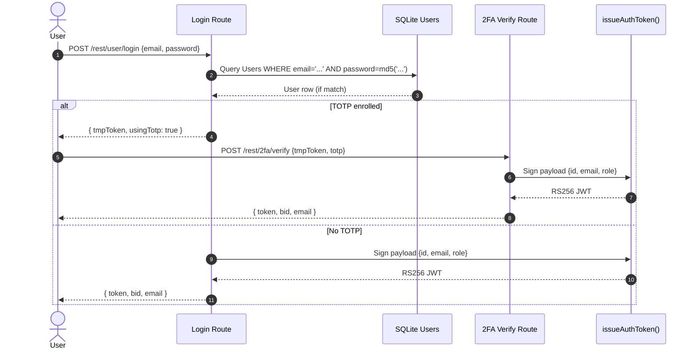
```mermaid
sequenceDiagram
    autonumber
    actor User
    participant API as Login Route
    participant DB as SQLite Users
    participant TOTP as 2FA Verify Route
    participant JWT as issueAuthToken()

    User->>API: POST /rest/user/login {email, password}
    API->>DB: Query Users WHERE email='...' AND password=md5('...')
    DB-->>API: User row (if match)
    alt TOTP enrolled
        API-->>User: { tmpToken, usingTotp: true }
        User->>TOTP: POST /rest/2fa/verify {tmpToken, totp}
        TOTP->>JWT: Sign payload {id, email, role}
        JWT-->>TOTP: RS256 JWT
        TOTP-->>User: { token, bid, email }
    else No TOTP
        API->>JWT: Sign payload {id, email, role}
        JWT-->>API: RS256 JWT
        API-->>User: { token, bid, email }
    end
```

**Security assessment**

The login query is built as a raw SQL string at `routes/login.ts:34`:

```ts
models.sequelize.query(`SELECT * FROM Users WHERE email = '${req.body.email}' AND password = '${req.body.password}' AND deletedAt IS NULL`)
```

- **SQL injection** — the `email` field is interpolated without escaping; the payload `' OR '1'='1'--` returns the first user row (the seeded admin account) regardless of the password supplied. The same route also exposes the full database schema via the `sqlite_master` table when `SELECT *` returns without a WHERE match (🟠 [F-020](#f-020) — Database schema disclosure via SQLite master table routes/search.ts).
- **Password hashing** — `lib/insecurity.ts` hashes with `crypto.createHash('md5').update(password).digest('hex')` — unsalted `MD5`. A leaked Users table yields crackable hashes in seconds with any GPU dictionary attack. Deep dive at [§7.9.2 Password Storage](#password-storage).
- **CSRF on password change** — `routes/changePassword.ts` accepts the new password via GET parameter with no CSRF token (🟠 [F-027](#f-027) — CSRF on password change routes/changePassword.ts).
- **Rate limiting** — `express-rate-limit` 7.5.1 is applied to selected endpoints but not to `/rest/user/login` or `/rest/resetPassword`. Brute-force attacks against credentials are unrestricted on the primary authentication entry point; given the `MD5` hash weakness, an attacker can combine online credential stuffing with offline hash cracking without friction (🟠 [F-025](#f-025) — No rate limiting on login endpoint server.ts).

**Relevant findings**

- 🔴 [F-002](#f-002) — SQL injection in the login query enables authentication bypass without knowing any password.
- 🟠 [F-020](#f-020) — Database schema disclosed via the `sqlite_master` table in the search route.
- 🟠 [F-025](#f-025) — No rate limit on the login endpoint combined with MD5 hashing enables unrestricted online brute-force and offline dictionary attacks.

<a id="multi-factor-authentication"></a><a id="multi-factor-authentication-totp"></a>
#### 7.2.2 Multi-Factor Authentication

**Status:** 🟡 Partial - TOTP enrollment and verification are implemented correctly via `otplib`, but MFA is optional and not enforced on the admin account.

TOTP-based second factors protect accounts that have chosen to enroll. `routes/2fa/setup.ts` generates a TOTP secret and QR code using `otplib`; `routes/2fa/verify.ts` validates the one-time code against the stored secret. Once enrolled, the login flow issues a short-lived `tmpToken` instead of the full session JWT and requires the TOTP code before completing authentication.

The diagram shows the TOTP enrollment and verification flow:

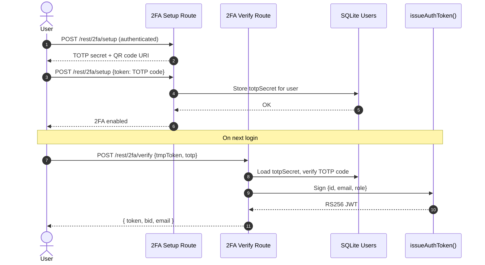
```mermaid
sequenceDiagram
    autonumber
    actor User
    participant Setup as 2FA Setup Route
    participant Verify as 2FA Verify Route
    participant DB as SQLite Users
    participant JWT as issueAuthToken()

    User->>Setup: POST /rest/2fa/setup (authenticated)
    Setup-->>User: TOTP secret + QR code URI
    User->>Setup: POST /rest/2fa/setup {token: TOTP code}
    Setup->>DB: Store totpSecret for user
    DB-->>Setup: OK
    Setup-->>User: 2FA enabled

    Note over User,JWT: On next login
    User->>Verify: POST /rest/2fa/verify {tmpToken, totp}
    Verify->>DB: Load totpSecret, verify TOTP code
    Verify->>JWT: Sign {id, email, role}
    JWT-->>Verify: RS256 JWT
    Verify-->>User: { token, bid, email }
```

**Security assessment**

`otplib` TOTP verification is correctly implemented - the code is time-windowed and verified against the stored secret. The structural gap is that enrollment is voluntary and the admin account in the seeded database has no TOTP secret set, meaning any admin JWT forgery (via 🔴 [F-001](#f-001) — JWT forgery via hardcoded RSA private key lib/insecurity.ts or 🔴 [F-009](#f-009) — JWT algorithm none bypass via express jwt 0.1.3 lib/insecurity.ts) bypasses this control entirely. the `tmpToken` issued mid-flow is itself a JWT signed with the same hardcoded key, so an attacker who has already forged a full admin token never enters the TOTP branch at all.

**Relevant findings**

- 🟠 [F-011](#f-011) — Client-side JWT forgery bypasses the TOTP branch because attackers issue a full admin token directly, never receiving a `tmpToken`.

### 7.3 Session and Token Controls

**Verdict:** 🟠 Weak

<!-- The line below is mechanically derived from the controls table — LLM must not re-author it. -->
**Controls covered:** [7.3.1 Session Token Issuance](#731-session-token-issuance)

- [7.3.1 Session Token Issuance](#session-token-issuance)

**Implemented controls:** `RS256`-signed JWTs issued on every successful login; `express-jwt` 0.1.3 middleware validates tokens on protected routes; token expiry set to one hour.

**Assessment:** This application uses a single locally-signed token format (commonly called JWT) for every authenticated session, regardless of the login flow in [§7.2](#72-identity-and-authentication-controls) that established it. The sub-sections below trace one token through its lifecycle: signing on issuance, validation on every protected request, storage in the browser, manual revocation, and time-based expiry. The signing key is committed in plaintext at `lib/insecurity.ts:23`; the verifier library accepts `alg:none`; and tokens are stored in `localStorage` rather than an HttpOnly cookie - all three weaknesses interact to make the session control boundary entirely bypassable.

<a id="session-token-issuance"></a><a id="session-token-issuance-jwt-based"></a>
#### 7.3.1 Session Token Issuance

**Status:** 🟠 Weak - the signing key is committed to the public repository and the verifier library accepts `alg:none`, making signature verification moot.

`lib/insecurity.ts:issueAuthToken()` signs a `{ id, email, role }` payload with an RSA-2048 private key using the `RS256` algorithm, setting a one-hour expiry. Both `routes/login.ts` and `routes/2fa/verify.ts` call this single helper, so token format and lifetime are consistent across flows.

The diagram shows the positive issuance path from a verified credential to the encoded JWT returned to the browser:

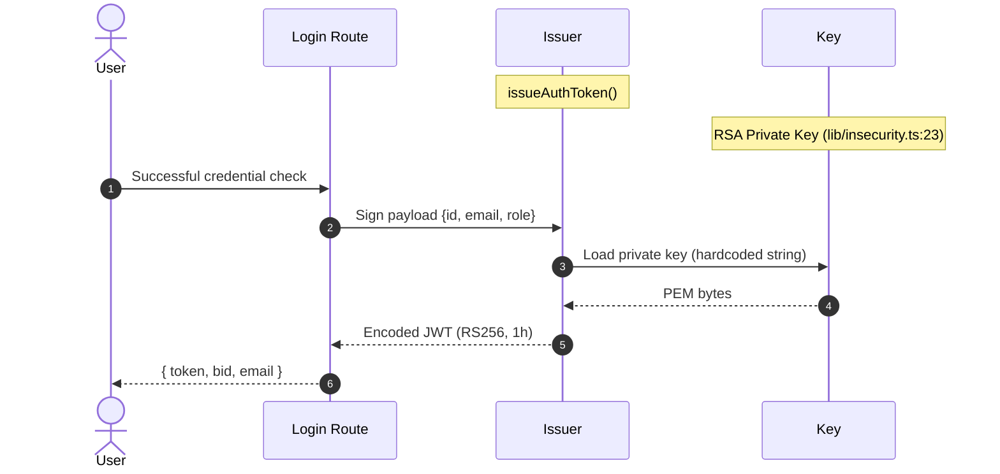
```mermaid
sequenceDiagram
    autonumber
    actor User
    participant API as Login Route
    participant Issuer
    Note over Issuer: issueAuthToken()
    participant Key
    Note over Key: RSA Private Key (lib/insecurity.ts:23)

    User->>API: Successful credential check
    API->>Issuer: Sign payload {id, email, role}
    Issuer->>Key: Load private key (hardcoded string)
    Key-->>Issuer: PEM bytes
    Issuer-->>API: Encoded JWT (RS256, 1h)
    API-->>User: { token, bid, email }
```

**Security assessment**

The intended control is asymmetric signature on a short-lived token. That boundary is defeated at two independent points:

- **Hardcoded signing key** — `lib/insecurity.ts:23` contains the full RSA private key as a string literal committed to the public repository. Anyone who can read the source can sign arbitrary tokens that the server accepts as genuine.
- **Algorithm confusion** — `express-jwt` 0.1.3 does not pin the algorithm; a token signed with `alg:none` (no signature) passes the verifier, making the committed key redundant as an attack primitive.
- **Key exposure** — the matching public key is served at `/encryptionkeys/jwt.pub` over HTTP, and the full `encryptionkeys/` directory is browsable without authentication (🟠 [F-019](#f-019) — JWT public key and encryption keys publicly browsable server.ts).

The hardcoded private key that breaks the issuance boundary appears at:

```ts
export const privateKey =
  '[PEM PRIVATE KEY — REDACTED]
<REDACTED — key bytes masked>
-----END RSA PRIVATE KEY-----'
```

**Relevant findings**

- 🔴 [F-001](#f-001) — Committed RSA private key allows any attacker to forge RS256 admin tokens.
- 🔴 [F-009](#f-009) — `express-jwt` 0.1.3 accepts `alg:none`, providing a key-independent forgery path.
- 🔴 [F-018](#f-018) — JWT stored in `localStorage` exposes the token to any XSS payload executing in the same origin.
- 🟠 [F-019](#f-019) — The encryption-keys directory is publicly browsable, disclosing the public key and premium content key.

### 7.4 Authorization Controls

**Verdict:** 🟠 Weak

<!-- The line below is mechanically derived from the controls table — LLM must not re-author it. -->
**Controls covered:** [7.4.1 Role-Based Access Control](#741-role-based-access-control) · [7.4.2 Object-Level Authorization](#742-object-level-authorization)

- [7.4.1 Role-Based Access Control](#role-based-access-control)
- [7.4.2 Object-Level Authorization](#object-level-authorization)

**Implemented controls:** Angular route guards (`AdminGuard`, `AccountingGuard`) gate the frontend admin and accounting UIs; `express-jwt` middleware decodes the token role claim on protected routes.

**Assessment:** Role enforcement exists on the Angular frontend but is absent on several server-side admin routes. Because JWTs are trivially forgeable ([§7.3](#73-session-and-token-controls)), any client-side guard is bypassable by submitting a forged token directly to the API. Object-level authorization is inconsistently applied - data-export and basket endpoints check ownership only in some branches.

<a id="role-based-access-control"></a>
#### 7.4.1 Role-Based Access Control

**Status:** 🟠 Weak - Angular guards enforce the role check on the frontend; the corresponding server-side middleware is absent on several admin-only API routes.

`AdminGuard` and `AccountingGuard` in `frontend/src/app/` read the `role` claim from the decoded JWT and block navigation to `/administration` and `/accounting` respectively. The `express-jwt` middleware at `server.ts` decodes the token for authenticated API routes, making the `req.user.role` value available.

**Security assessment**

`routes/administration.ts` and several `/api/` endpoints do not verify that `req.user.role === 'admin'` after decoding the JWT - they assume that `express-jwt`'s token-presence check is sufficient access control. A forged token (via 🔴 [F-001](#f-001) — JWT forgery via hardcoded RSA private key lib/insecurity.ts or 🔴 [F-009](#f-009) — JWT algorithm none bypass via express jwt 0.1.3 lib/insecurity.ts) with `role: "admin"` passes `express-jwt` and receives a 200 response from these routes. The Angular guard at `app.routing.ts` is the only enforcement layer for the administration interface, and it is bypassed by navigating directly to the route URL with a forged token in localStorage (🔴 [F-026](#f-026) — Administration route accessible via client side guard bypass app.routing.ts).

**Relevant findings**

- 🟠 [F-011](#f-011) — Client-side `AdminGuard` bypass: forged JWT with `role=admin` grants full administration UI access without server-side role verification.
- 🔴 [F-014](#f-014) — Product update endpoint at `server.ts` lacks authorization middleware; any authenticated user can modify product data.

<a id="object-level-authorization"></a><a id="object-level-authorization-idor"></a>
#### 7.4.2 Object-Level Authorization

**Status:** 🟠 Weak - the data-export route compares the requested user ID against the token subject in some paths but not all; the basket endpoint accepts any numeric `BasketId` from the request body.

`routes/dataExport.ts` is intended to export only the authenticated user's data by reading the `userId` from the decoded JWT. `routes/basketItems.ts` processes basket operations using the `BasketId` from the POST body alongside the JWT.

**Security assessment**

`routes/dataExport.ts` does not consistently verify that the requested `userId` matches the authenticated user's token subject - an attacker who supplies a different numeric ID in the export request receives that user's full data (🟠 [F-023](#f-023) — IDOR in data export routes/dataExport.ts). `routes/basketItems.ts` accepts the `BasketId` from `req.body` and does not verify it belongs to the authenticated user's basket, enabling basket content manipulation (🟡 [F-029](#f-029) — Basket manipulation via forged BasketId routes/basketItems.ts). Both are classic IDOR patterns rooted in the absence of server-side ownership checks.

**Relevant findings**

- 🟠 [F-023](#f-023) — IDOR in data-export route: attacker supplies a different `userId` to read any user's exported data.
- 🟡 [F-029](#f-029) — Forged `BasketId` in basket-item route allows cross-user basket manipulation.

### 7.5 Query Construction and Data Access Controls

**Verdict:** 🟠 Weak

<!-- The line below is mechanically derived from the controls table — LLM must not re-author it. -->
**Controls covered:** [7.5.1 SQL Query Parameterization](#751-sql-query-parameterization) · [7.5.2 NoSQL Query Construction](#752-nosql-query-construction)

- [7.5.1 SQL Query Parameterization](#sql-query-parameterization)
- [7.5.2 NoSQL Query Construction](#nosql-query-construction)

**Implemented controls:** Sequelize ORM backs most relational data access and uses parameterized queries by default for model finder methods; MarsDB provides an in-memory MongoDB-compatible store.

**Assessment:** Sequelize's safe parameter-binding is bypassed on the two highest-traffic routes (login and product search) by calling `models.sequelize.query()` with template literals. MarsDB's `$where` operator is accepted without restriction in the order-tracking selector. Both are structural anti-patterns - not isolated regressions.

<a id="sql-query-parameterization"></a>
#### 7.5.1 SQL Query Parameterization

**Status:** 🟠 Weak - two critical routes bypass the Sequelize ORM and call raw `models.sequelize.query()` with user-controlled template literals.

Sequelize 6.37 backs the SQLite data layer and uses parameterized queries (`?` placeholders with `replacements`) for all auto-generated model finder queries. The login route and the product-search route are exceptions: both call `models.sequelize.query()` directly.

The vulnerable login lookup is built as a raw SQL string:

```ts
models.sequelize.query(
  `SELECT * FROM Users WHERE email = '${req.body.email}' AND password = '${req.body.password}' AND deletedAt IS NULL`
)
```

**Security assessment**

- **Login SQL injection** (🔴 [F-002](#f-002) — SQL injection login bypass routes/login.ts) — `routes/login.ts:34` interpolates `req.body.email` and `req.body.password` without escaping. The payload `' OR '1'='1'--` bypasses password verification and returns the seeded admin row.
- **Search SQL injection** (🔴 [F-003](#f-003) — SQL injection in product search routes/search.ts) — `routes/search.ts` interpolates `req.query.q` into a `LIKE` clause in the same raw-query pattern; `%' UNION SELECT ...--` enables full data exfiltration and schema enumeration.
- Both routes could be replaced with `Model.findOne({ where: { email, password } })` or `Model.findAll({ where: { name: { [Op.like]: `%\${q}%` } } })`, which use bound parameters by construction.

**Relevant findings**

- 🔴 [F-002](#f-002) — SQL injection in the login query enables authentication bypass and admin account takeover.
- 🔴 [F-003](#f-003) — SQL injection in the product-search query enables data exfiltration and schema disclosure.
- 🟠 [F-020](#f-020) — Database schema disclosed via `sqlite_master` table accessible through the injectable search route.

<a id="nosql-query-construction"></a>
#### 7.5.2 NoSQL Query Construction

**Status:** 🟠 Weak - MarsDB selectors in the order-tracking route accept operator objects (`$where`) where only scalar string IDs should be valid.

MarsDB (in-memory MongoDB-compatible store) is used for order and basket data. `routes/trackOrder.ts` queries orders by `orderId` from `req.params.id`.

**Security assessment**

The MarsDB selector in `routes/trackOrder.ts` does not enforce scalar type on the `orderId` parameter. Passing a JSON object `{ "$where": "1 == 1" }` via the URL satisfies the MarsDB query and returns all order records (🔴 [F-021](#f-021) (NoSQL injection via \$where operator)). A similar pattern on the product-review update path (`routes/reviews.ts`) accepts a user-controlled selector in the MarsDB update call, allowing cross-user review modification (🔴 [F-010](#f-010) — User privilege escalation via SQL injection routes/login.ts).

**Relevant findings**

- 🔴 [F-010](#f-010) — NoSQL injection in product-review update allows cross-user data modification.
- 🔴 [F-021](#f-021) — NoSQL injection via `$where` operator in order-tracking route returns all orders to an unauthenticated requester.

### 7.6 Input Boundary Validation Controls

**Verdict:** 🟠 Weak

<!-- The line below is mechanically derived from the controls table — LLM must not re-author it. -->
**Controls covered:** [7.6.1 Validation Approach](#761-validation-approach) · [7.6.2 Input Validation and Sanitization](#762-input-validation-and-sanitization)

- [7.6.1 Validation Approach](#validation-approach)
- [7.6.2 Input Validation and Sanitization](#input-validation-and-sanitization)

**Implemented controls:** multer 1.4.5-lts enforces a file-size limit on file upload endpoints; MIME-type filtering restricts accepted upload content types on some routes.

**Assessment:** Boundary validation is ad-hoc and endpoint-specific. There is no centralized schema-validation middleware (e.g., Joi, Zod, express-validator) applied to the API request body across routes. The multer limits cover file uploads but leave JSON body fields, URL parameters, and query strings without structural validation.

<a id="validation-approach"></a>
#### 7.6.1 Validation Approach

**Status:** 🟠 Weak - no centralized request-body validation middleware; each route validates inputs independently, and several routes do not validate at all.

Multer handles binary upload validation (file size, MIME type) for routes that accept file submissions. Individual route handlers check specific parameters inline using conditional expressions.

**Security assessment**

The codebase has no shared validation layer. Routes such as `routes/login.ts`, `routes/search.ts`, and `routes/userProfile.ts` access `req.body`, `req.query`, and `req.params` directly without structural validation or type coercion. The `express-validator` package is not installed. This pattern is the structural root cause behind multiple injection findings - the lack of input constraints means each route must validate independently or leave the input unvalidated, and several routes choose neither. Adding Zod or Joi schemas at the router level would give a single enforcement point across all endpoints.

**Relevant findings**

- No dedicated finding routed in this assessment.

<a id="input-validation-and-sanitization"></a>
#### 7.6.2 Input Validation and Sanitization

**Status:** 🟠 Weak - upload type and size limits are enforced by multer; request-body field types and formats are not validated on most routes.

multer restricts upload file size and MIME types on `routes/fileUpload.ts` and `routes/profileImageFileUpload.ts`. These guards prevent some malformed-binary attacks.

**Security assessment**

The multer guards are bypassed in several ways: the XML parser path in `routes/fileUpload.ts` receives its content after multer's MIME check and is processed with `noent: true` (XXE); the YAML upload path in the same handler is deserialized with `js-yaml` 3.14 without schema restriction, allowing YAML-based code execution (🟠 [F-015](#f-015) — YAML deserialization in file upload routes/fileUpload.ts). Outside of file uploads, URL parameters and JSON body fields are unvalidated - the `orderId` in the tracking route receives whatever the caller sends, including MarsDB operator objects.

**Relevant findings**

- No dedicated finding routed in this assessment.

### 7.7 Output Encoding and Rendering Controls

**Verdict:** 🟠 Weak

<!-- The line below is mechanically derived from the controls table — LLM must not re-author it. -->
**Controls covered:** [7.7.1 HTML Output Encoding](#771-html-output-encoding)

- [7.7.1 HTML Output Encoding](#html-output-encoding)

**Implemented controls:** Angular's default template escaping applies to all standard `{{ interpolation }}` and property bindings; Pug templates on the server side apply HTML-entity encoding by default.

**Assessment:** Angular's escaping is the right default and is active across most components. The exploitable gap is six Angular components that call `DomSanitizer.bypassSecurityTrustHtml()` with user-controlled input, explicitly disabling the default guard for those rendering contexts.

<a id="html-output-encoding"></a>
#### 7.7.1 HTML Output Encoding

**Status:** 🟠 Weak - Angular's default escaping is active, but `bypassSecurityTrustHtml()` is called with user-controlled content in six components, creating persistent and reflected XSS sinks.

Angular's template compiler escapes all `{{ expression }}` interpolations and `[property]` bindings by default. The `DomSanitizer` service provides a safe-HTML API intended for trusted, developer-authored markup that is not XSS-attackable. The `about.component.ts` renders the application's `about` text from the backend; `last-login-ip.component.ts` renders the `Last-Login-IP` response header; other components render product descriptions and user feedback fields.

**Security assessment**

`about.component.ts` binds the `about` field from the backend to `[innerHTML]` via `bypassSecurityTrustHtml()` (🔴 [F-012](#f-012) — Stored XSS via trust HTML bypass in about component about.component.ts). Any attacker who can write the backend's `about` value (admin API access is achievable via JWT forgery) can inject a persistent XSS payload served to every visitor. `last-login-ip.component.ts` reflects the server's `X-Last-Login-IP` header through the same bypass (🔴 [F-013](#f-013) — XSS via last login IP header injection last login ip.component.ts), making the header value an injection point for stored reflective XSS. Since tokens are stored in `localStorage` (see [§7.3](#73-session-and-token-controls)), any XSS payload that reads `localStorage.getItem('token')` exfiltrates the victim's session JWT.

**Relevant findings**

- 🔴 [F-012](#f-012) — Stored XSS via `bypassSecurityTrustHtml()` in the about component; attacker-controlled HTML rendered to all visitors.
- 🔴 [F-013](#f-013) — Reflected XSS via the `X-Last-Login-IP` header rendered without escaping in `last-login-ip.component.ts`.

### 7.8 Browser and Cross-Origin Controls

**Verdict:** 🔴 Missing

<!-- The line below is mechanically derived from the controls table — LLM must not re-author it. -->
**Controls covered:** [7.8.1 CORS Policy](#781-cors-policy) · [7.8.2 Content Security Policy](#782-content-security-policy) · [7.8.3 CSRF Protection](#783-csrf-protection)

- [7.8.1 CORS Policy](#cors-policy)
- [7.8.2 Content Security Policy](#content-security-policy)
- [7.8.3 CSRF Protection](#csrf-protection)

**Implemented controls:** Helmet 4.6 sets `X-Content-Type-Options: nosniff`, `X-Frame-Options: SAMEORIGIN`, and `X-XSS-Protection: 0` via default configuration.

**Assessment:** The three strongest browser-security controls - origin allow-listing, Content Security Policy, and CSRF tokens - are all absent. Helmet's defaults provide cosmetic headers but do not address cross-origin request forgery, cross-origin data leakage, or script-injection amplification. The missing CSP is directly exploitable by the stored-XSS findings in [§7.7](#77-output-encoding-and-rendering-controls).

<a id="cors-policy"></a>
#### 7.8.1 CORS Policy

**Status:** 🟠 Weak - `app.use(cors())` is registered at `server.ts` with no `origin` option, allowing all origins to make credentialed cross-origin requests.

CORS headers are applied globally by the `cors` npm package, invoked at `server.ts` immediately after Helmet. `app.options('*', cors())` accepts cross-origin preflight for every route.

**Security assessment**

The wildcard CORS configuration sets `Access-Control-Allow-Origin: *` on every response. A malicious page on any origin can issue authenticated API requests using the victim's stored JWT - for example, `fetch('https://juice-shop/rest/user/whoami', { headers: { Authorization: 'Bearer ...' } })`. Combined with `localStorage` token storage (🔴 [F-018](#f-018) — JWT token storage in localStorage app.guard.ts), this creates a full cross-origin credential-exfiltration path without exploiting XSS (🟠 [F-016](#f-016) — Wildcard CORS allows cross origin credential exfiltration server.ts). The fix is to restrict `origin` to the known frontend origin in the `cors()` options.

**Relevant findings**

- 🟠 [F-016](#f-016) — Wildcard CORS allows any origin to make credentialed API requests, enabling cross-origin session data exfiltration.

<a id="content-security-policy"></a>
#### 7.8.2 Content Security Policy

**Status:** 🔴 Missing - no `Content-Security-Policy` header is present; Helmet 4.6 does not enable CSP by default and `helmet.contentSecurityPolicy()` is not called in `server.ts`.

Helmet 4.6 is imported at `server.ts` and called with `app.use(helmet())`. Other Helmet modules (`noSniff`, `frameguard`, `xssFilter`) activate automatically under the default profile.

**Security assessment**

`Content-Security-Policy` is absent from all responses. Without a CSP, the browser imposes no restriction on which scripts, stylesheets, or image sources the page may load. The stored XSS findings at 🔴 [F-012](#f-012) — Stored XSS via trust HTML bypass in about component about.component.ts and 🔴 [F-013](#f-013) — XSS via last login IP header injection last login ip.component.ts execute injected scripts in the full origin context; a CSP with `script-src 'self'` would prevent inline script execution and significantly reduce the XSS impact. Enabling CSP is the single highest-leverage missing browser control given the XSS surface present.

**Relevant findings**

- 🟠 [F-016](#f-016) — Absence of CSP amplifies the impact of stored-XSS findings by allowing injected scripts to run without restriction.

<a id="csrf-protection"></a>
#### 7.8.3 CSRF Protection

**Status:** 🔴 Missing - no CSRF token is issued or validated on any state-changing endpoint; `routes/changePassword.ts` accepts the new password via a GET request parameter.

`server.ts` does not install the `csurf` middleware or any equivalent token-based CSRF protection. State-changing routes are reachable via cross-origin requests due to the wildcard CORS policy ([§7.8.1](#781-cors-policy)).

**Security assessment**

`routes/changePassword.ts` changes a user's password in response to a GET request with `req.query.current` and `req.query.new` - making the operation embeddable in an `` or `<a href>` tag from any page the victim visits (🟠 [F-027](#f-027) — CSRF on password change routes/changePassword.ts). The absent CSRF protection is compounded by the wildcard CORS policy: even POST endpoints are reachable cross-origin because the preflight is accepted. A `SameSite=Strict` cookie or a Double-Submit Cookie pattern would address most of the exposure.

**Relevant findings**

- 🟠 [F-027](#f-027) — CSRF on the password-change endpoint allows a malicious page to change the victim's password without interaction beyond visiting a URL.

### 7.9 Cryptography Secrets and Data Protection

**Verdict:** 🟠 Weak

<!-- The line below is mechanically derived from the controls table — LLM must not re-author it. -->
**Controls covered:** [7.9.1 Secret and Key Management](#791-secret-and-key-management) · [7.9.2 Password Storage](#792-password-storage)

- [7.9.1 Secret and Key Management](#secret-and-key-management)
- [7.9.2 Password Storage](#password-storage)

**Implemented controls:** RSA-2048 chosen as the JWT signing algorithm (appropriate key size and algorithm class); distroless runtime container prevents credential extraction via package manager.

**Assessment:** The algorithm choices are sound in principle - RSA-2048 and bcrypt would each be adequate controls. The implemented reality is unsalted `MD5` for passwords and a committed RSA private key for JWT signing. Both weaknesses are structural: the hash algorithm is the wrong choice, and key management was never separated from source code.

<a id="secret-and-key-management"></a><a id="secret-management"></a>
#### 7.9.1 Secret and Key Management

**Status:** 🟠 Weak - the RSA private key used to sign JWTs is committed to the public repository as a string literal; no runtime secret injection or key rotation mechanism exists.

`lib/insecurity.ts` exports `privateKey` and `publicKey` as module-level string constants derived directly from embedded PEM literals. The same file exports `cookieSecret` and several other credential-equivalent values.

**Security assessment**

Two weaknesses converge on the same module:

- **Committed signing key** (🔴 [F-001](#f-001) — JWT forgery via hardcoded RSA private key lib/insecurity.ts) — the RSA private key is a string literal in a public repository. Anyone who reads `lib/insecurity.ts:23` can generate valid admin JWTs without touching the running server.
- **Key browsable at runtime** (🟠 [F-019](#f-019) — JWT public key and encryption keys publicly browsable server.ts) — `server.ts` serves the `encryptionkeys/` directory statically; the public key, premium content key, and associated metadata are downloadable without authentication from `/encryptionkeys/`.

No key rotation mechanism exists - the same key value is baked into the application at build time. Remediation requires replacing the literal with a runtime-injected secret (e.g., via environment variable or a secrets manager) and removing the `encryptionkeys/` static route.

**Relevant findings**

- 🔴 [F-001](#f-001) — RSA private key committed at `lib/insecurity.ts:23`; directly enables JWT forgery.
- 🔴 [F-009](#f-009) — `express-jwt` 0.1.3 accepts `alg:none`; the committed key is not even required to forge a valid token.
- 🟠 [F-019](#f-019) — Encryption-keys directory is publicly browsable, disclosing the JWT public key and premium content key.

<a id="password-storage"></a>
#### 7.9.2 Password Storage

**Status:** 🟠 Weak - user passwords are hashed with unsalted `MD5`; no cost factor is applied; a leaked Users table yields crackable hashes in seconds.

Password registration and login both call `lib/insecurity.ts:hash()`, which wraps `crypto.createHash('md5').update(password).digest('hex')`. The function is used for both the initial hash on registration and the comparison hash on login.

The password hashing call that bypasses any meaningful resistance:

```ts
export const hash = (data: string) => crypto.createHash('md5').update(data).digest('hex')
```

**Security assessment**

`MD5` is a general-purpose message-digest algorithm - it is fast by design and has no cost-factor parameter. A GPU running hashcat processes hundreds of millions of `MD5` hashes per second. The absence of a salt means identical passwords produce identical hashes, enabling rainbow-table attacks across all user accounts simultaneously. The correct control - bcrypt, scrypt, or Argon2id with a suitable cost factor - is a one-line change to the `hash()` helper and would require no other route changes.

**Relevant findings**

- 🔴 [F-006](#f-006) — Unsalted MD5 password hashing; leaked Users table crackable with commodity hardware in seconds.

### 7.10 File Parser and Outbound Request Controls

**Verdict:** 🟠 Weak

<!-- The line below is mechanically derived from the controls table — LLM must not re-author it. -->
**Controls covered:** [7.10.1 File Upload Validation](#7101-file-upload-validation)

- [7.10.1 File Upload Validation](#file-upload-validation)

**Implemented controls:** multer enforces a 200 KB file-size cap and MIME-type filtering on `routes/fileUpload.ts`; the receipt-upload endpoint restricts accepted extensions.

**Assessment:** multer's guards prevent oversized binary uploads but do not constrain the content parsed by downstream processors. Both the XML branch (libxmljs2 with `noent: true`) and the YAML branch (js-yaml without schema restriction) receive content that passes multer's checks and then execute dangerous parser features. The SSRF path on profile-image upload is orthogonal to multer entirely - it accepts a URL string, not a file.

<a id="file-upload-validation"></a>
#### 7.10.1 File Upload Validation

**Status:** 🟠 Weak - multer size and MIME-type guards are in place but bypassed by dangerous parser configurations downstream and by an unguarded URL-fetch path.

`routes/fileUpload.ts` uses multer to accept files up to 200 KB for the complaint receipt upload. The route inspects the file MIME type and dispatches to either an XML parser (libxmljs2) or a YAML parser (js-yaml) depending on the detected content. `routes/profileImageUrlUpload.ts` accepts a URL string (`req.body.imageUrl`) and fetches the remote resource to save as the user's profile image.

**Security assessment**

Four weaknesses span this control:

- **XXE** (🔴 [F-004](#f-004) — XXE via libxmljs2 XML file upload routes/fileUpload.ts) — libxmljs2 is invoked with `{ noent: true }`, resolving external entity references. An uploaded XML file with an entity pointing to `file:///etc/passwd` or an internal URL exfiltrates the target's contents in the parser's error output.
- **YAML deserialization** (🟠 [F-015](#f-015) — YAML deserialization in file upload routes/fileUpload.ts) — js-yaml 3.14 is invoked without the `FAILSAFE_SCHEMA` or `SAFE_LOAD` option. Payloads using the `!!js/function` YAML type execute arbitrary JavaScript at parse time.
- **SSRF** (🔴 [F-005](#f-005) — SSRF via unrestricted profile image URL fetch routes/profileImageUrlUpload.ts) — `routes/profileImageUrlUpload.ts` passes `req.body.imageUrl` to `fetch()` with no allow-list or private-IP block, enabling server-side requests to internal services (cloud metadata, internal APIs).
- **Unrestricted profile-image file upload** (🟠 [F-024](#f-024) — Unrestricted file upload overwrites application assets routes/profileImageFileU…) — `routes/profileImageFileUpload.ts` overwrites profile images without path-traversal checks, and the destination directory allows files with executable extensions.

**Relevant findings**

- 🔴 [F-004](#f-004) — XXE via libxmljs2 with `noent: true`; internal file read and potential SSRF from the server's perspective.
- 🔴 [F-005](#f-005) — SSRF via unrestricted URL fetch in profile-image URL upload.
- 🔴 [F-007](#f-007) — YAML deserialization with unsafe options enables code execution at parse time.
- 🟠 [F-015](#f-015) — Additional YAML injection path via file upload type-confusion.
- 🟠 [F-024](#f-024) — Unrestricted profile-image file upload overwrites application assets.

### 7.11 Operations Runtime and Supply Chain Controls

**Verdict:** 🔴 Missing

<!-- The line below is mechanically derived from the controls table — LLM must not re-author it. -->
**Controls covered:** [7.11.1 Dependency Management](#7111-dependency-management) · [7.11.2 Runtime Code Execution Controls](#7112-runtime-code-execution-controls) · [7.11.3 Security Logging and Monitoring](#7113-security-logging-and-monitoring) · [7.11.4 Automated SCA scanning](#7114-automated-sca-scanning) · [7.11.5 Automated dependency updates](#7115-automated-dependency-updates) · [7.11.6 Lockfile hygiene](#7116-lockfile-hygiene)

- [7.11.1 Dependency Management](#dependency-management)
- [7.11.2 Runtime Code Execution Controls](#runtime-code-execution-controls)
- [7.11.3 Security Logging and Monitoring](#security-logging-and-monitoring)
- [7.11.4 Automated SCA scanning](#automated-sca-scanning)
- [7.11.5 Automated dependency updates](#automated-dependency-updates)
- [7.11.6 Lockfile hygiene](#lockfile-hygiene)

**Implemented controls:** CodeQL analysis runs on every push via `.github/workflows/codeql-analysis.yml`; distroless Node\.js 24 runtime image (`gcr.io/distroless/nodejs24-debian13`) in Dockerfile; winston-based structured logging via `lib/logger.ts`.

**Assessment:** The supply-chain posture has a significant gap between the CI controls that exist (CodeQL) and the runtime guarantees that don't (no lockfile, no automated dependency updates). Two server-side `eval` paths in production request handlers (`routes/b2bOrder.ts`, `routes/userProfile.ts`) represent the most acute operational risk - they turn any authenticated session into a code-execution surface.

<a id="dependency-management"></a>
#### 7.11.1 Dependency Management

**Status:** 🟠 Weak - 72 runtime dependencies tracked in `package.json`; no lockfile (`package-lock=false`); no automated update tooling.

`package.json` declares 72 runtime and 67 dev dependencies. The Dockerfile runs `npm install` during the build stage. `.npmrc` contains `package-lock=false`.

**Security assessment**

`package-lock=false` in `.npmrc` disables lockfile generation (🟡 [F-030](#f-030) — Package lock=false in .npmrc disables lockfile). Without a lockfile, `npm install` resolves the dependency graph at build time against whatever versions satisfy the semver ranges - meaning builds are non-deterministic and a compromised upstream package at a compatible version is silently installed. Two known-vulnerable packages are intentionally pinned: `jsonwebtoken` 0.4.0 and `express-jwt` 0.1.3. No Dependabot or Renovate configuration exists (🟢 [F-033](#f-033) — No Dependabot configuration found), so there is no automated path from a published CVE to a PR in this repository.

**Relevant findings**

- 🟡 [F-030](#f-030) — `package-lock=false` disables lockfile, making builds non-deterministic and vulnerable to supply-chain substitution.
- 🟢 [F-033](#f-033) — No Dependabot configuration; no automated dependency-update path.

<a id="runtime-code-execution-controls"></a>
#### 7.11.2 Runtime Code Execution Controls

**Status:** 🟠 Weak - two request handlers call `eval()` or `safeEval()` on attacker-controlled strings; the distroless image prevents shell execution but not Node\.js-level RCE.

`routes/b2bOrder.ts` passes the `orderLinesData` field from a POST request body through `safeEval()` (the `notevil` sandbox library). `routes/userProfile.ts` passes the username field from the Pug template context through `eval()`. Both are reachable via an authenticated (forgeable) JWT.

**Security assessment**

`safeEval` in `notevil` is a JavaScript-in-JavaScript sandbox that is bypassable via prototype chain manipulation - `this.constructor.constructor('return process')()` escapes the sandbox and returns the Node\.js `process` object, giving the attacker full `require()` access (🔴 [F-008](#f-008) — RCE via safeEval bypass in B2B order routes/b2bOrder.ts). `eval()` in `routes/userProfile.ts` has no sandbox at all: the username string is rendered into a Pug template and then evaluated, providing direct Node\.js execution (🔴 [F-007](#f-007) — SSTI via eval in username field routes/userProfile.ts). The distroless image removes the shell (`/bin/sh`), but `child_process.execSync()` can still spawn processes that exist in the image (e.g., `node` itself). These two `eval` paths are the highest-priority operational risk in the codebase.

**Relevant findings**

- 🔴 [F-007](#f-007) — SSTI via `eval()` in username field; direct Node\.js code execution in the user-profile route.
- 🔴 [F-008](#f-008) — RCE via `safeEval` (notevil) bypass in the B2B order route.

<a id="security-logging-and-monitoring"></a>
#### 7.11.3 Security Logging and Monitoring

**Status:** 🟡 Partial - winston-based structured logging is in place; access logs are written to `logs/access.log`, but the log file is publicly downloadable without authentication.

`lib/logger.ts` configures a winston logger writing JSON-structured entries to both `stdout` and `logs/access.log`. The Express request logging uses `morgan` piped to the winston logger.

**Security assessment**

Structured logging exists and captures request details. The critical gap is that `routes/logfileServer.ts` serves the entire `logs/` directory as a static path without authentication (🟠 [F-017](#f-017) — Publicly readable access logs expose user activity routes/logfileServer.ts). An unauthenticated visitor can read `logs/access.log` and recover IP addresses, request paths, user IDs, and timing data for all application users. The FTP directory at `/ftp/` is similarly browsable without authentication (🟠 [F-022](#f-022) — Log file and FTP directory public exposure server.ts). Logging infrastructure that exposes its own output to anonymous access negates the operational value of the logs.

**Relevant findings**

- 🟠 [F-017](#f-017) — Publicly readable access logs expose user IP addresses and request history to unauthenticated visitors.
- 🟠 [F-022](#f-022) — FTP directory publicly browsable; log and data files accessible without authentication.

<a id="automated-sca-scanning"></a>
#### 7.11.4 Automated SCA scanning

**Status:** 🟢 Adequate - CodeQL analysis runs on every push and pull request via `.github/workflows/codeql-analysis.yml`, providing automated static analysis and dependency vulnerability scanning.

`.github/workflows/codeql-analysis.yml` configures GitHub's CodeQL runner against the JavaScript/TypeScript codebase. The workflow triggers on `push` and `pull_request` events for the main branches and runs weekly on a schedule.

**Security assessment**

CodeQL covers JavaScript and TypeScript and detects common vulnerability patterns including SQL injection, XSS sinks, and path traversal. The workflow is appropriately scoped and would flag the raw `sequelize.query()` and `eval()` patterns on any new code submission. The limitation is that CodeQL's results are advisory - they did not prevent the intentional vulnerabilities in this codebase because those are pedagogically committed. For a real application, CodeQL's findings blocking merge is the right posture.

**Relevant findings**

- 🟢 [F-033](#f-033) — Dependabot is absent; CodeQL does not substitute for automated dependency-update PRs.

<a id="automated-dependency-updates"></a>
#### 7.11.5 Automated dependency updates

**Status:** 🔴 Missing - no Dependabot, Renovate, or equivalent configuration exists; known-vulnerable packages remain pinned with no automated update path.

The repository contains `.github/workflows/` entries for CI and CodeQL but no `dependabot.yml` or Renovate configuration file.

**Security assessment**

Without automated update tooling, CVEs in transitive dependencies are only addressed when a developer manually notices and upgrades the affected package. `jsonwebtoken` 0.4.0 and `express-jwt` 0.1.3 are intentionally kept at vulnerable versions in this training application, but several other dependencies have known CVEs in the installed versions. A `dependabot.yml` with `package-ecosystem: npm` and a weekly schedule is a zero-friction addition that removes the manual triage burden.

**Relevant findings**

- 🟢 [F-033](#f-033) — No automated dependency-update mechanism; vulnerable packages persist without manual intervention.

<a id="lockfile-hygiene"></a>
#### 7.11.6 Lockfile hygiene

**Status:** 🔴 Missing - `.npmrc` contains `package-lock=false`, disabling lockfile generation and making every build non-deterministic.

npm generates `package-lock.json` by default to pin resolved dependency versions across installs. `.npmrc` at the repository root overrides this default with `package-lock=false`.

**Security assessment**

Without a lockfile, `npm install` in the Dockerfile resolves the full dependency graph at each build against the current npm registry state. A dependency that satisfies the semver range but contains malicious code (supply-chain attack or typosquatting) is silently installed. Removing `package-lock=false` from `.npmrc` and committing the generated `package-lock.json` costs nothing and makes builds reproducible.

**Relevant findings**

- 🟡 [F-030](#f-030) — `package-lock=false` disables lockfile; non-deterministic builds expose the supply chain to substitution attacks.

### 7.12 Real-time and Not Applicable Controls

<!-- §7.12 LOCKED — mechanically derived from absence of real-time findings. Renderer must not rewrite the line below. -->
_Not applicable - no real-time / WebSocket findings routed to this category, and no AI/LLM, GraphQL, or gRPC surfaces detected by the recon scan. Controls catalogued elsewhere (container hardening, dependency determinism) are covered in their primary [§7](#7-security-architecture) sections._

### 7.13 Defense-in-Depth Summary

**Verdict:** 🟠 Weak

Two positive controls provide genuine depth in this codebase: the distroless runtime container (`gcr.io/distroless/nodejs24-debian13`) eliminates the shell attack surface that a standard Node image carries, and the RSA-2048 algorithm choice for JWT signing is sound at the algorithm level - the weakness is key management, not the algorithm. CodeQL runs on every push and would catch the `eval()` and raw-`sequelize.query()` patterns in any new code contribution, giving the CI pipeline a meaningful static-analysis layer.

All three control boundaries that need structural repair converge on the same theme: trust was placed in source-code constants (signing key), raw string interpolation (query construction), and runtime code evaluation (B2B orders, user profiles) where parameterized values, runtime-injected secrets, and declarative data structures respectively should have been used. Replacing the hardcoded JWT signing key with a runtime-injected value, switching the login and search routes to Sequelize parameterized queries, removing the two `eval()` paths, and adding `bcrypt` password hashing would close the Critical findings and restore meaningful layered defense across the authentication, data-access, and code-execution boundaries simultaneously.

<!-- enriched:thorough -->

---

## 8. Findings Register

Findings are grouped by severity (Critical → High → Medium → Low); within a tier they are ordered by attack vektor (Repo-Read → Internet-Anon → Internet-User → Victim-Required). Each finding is a card with the same fixed fields, in order: **Severity · Component · Location** → **Issue** → **Root cause** → **Evidence** → **Fix** → **Classification** (with external CWE / OWASP links).

**Risk Distribution:** 🔴 Critical: 10 · 🟠 High: 17 · 🟡 Medium: 5 · 🟢 Low: 2 · **Total findings: 34**
**STRIDE Coverage:** Spoofing: 4 · Tampering: 8 · Repudiation: 2 · Information Disclosure: 13 · Denial of Service: 1 · Elevation of Privilege: 6

**Findings index:**<br/>🔴 [F-001](#f-001) — JWT forgery via hardcoded RSA private key lib/insecurity.ts<br/>🔴 [F-002](#f-002) — SQL injection login bypass routes/login.ts<br/>🔴 [F-003](#f-003) — SQL injection in product search routes/search.ts<br/>🔴 [F-004](#f-004) — XXE via libxmljs2 XML file upload routes/fileUpload.ts<br/>🔴 [F-005](#f-005) — SSRF via unrestricted profile image URL fetch routes/profileImageUrlUpl…<br/>🔴 [F-006](#f-006) — MD5 password hashing enables offline cracking lib/insecurity.ts<br/>🔴 [F-007](#f-007) — SSTI via eval in username field routes/userProfile.ts<br/>🔴 [F-008](#f-008) — RCE via safeEval bypass in B2B order routes/b2bOrder.ts<br/>🔴 [F-009](#f-009) — JWT algorithm none bypass via express jwt 0.1.3 lib/insecurity.ts<br/>🔴 [F-010](#f-010) — User privilege escalation via SQL injection routes/login.ts<br/>🟠 [F-011](#f-011) — Client side authorization bypass via JWT forgery app.guard.ts<br/>🟠 [F-012](#f-012) — Stored XSS via trust HTML bypass in about component about.component.ts<br/>🟠 [F-013](#f-013) — XSS via last login IP header injection last login ip.component.ts<br/>🟠 [F-014](#f-014) — Missing authorization on product update server.ts<br/>🟠 [F-015](#f-015) — YAML deserialization in file upload routes/fileUpload.ts<br/>🟠 [F-016](#f-016) — Wildcard CORS allows cross origin credential exfiltration server.ts<br/>🟠 [F-017](#f-017) — Publicly readable access logs expose user activity routes/logfileServer…<br/>🟠 [F-018](#f-018) — JWT token storage in localStorage app.guard.ts<br/>🟠 [F-019](#f-019) — JWT public key and encryption keys publicly browsable server.ts<br/>🟠 [F-020](#f-020) — Database schema disclosure via SQLite master table routes/search.ts<br/>🟠 [F-021](#f-021) — NoSQL injection via \$where operator routes/trackOrder.ts<br/>🟠 [F-022](#f-022) — Log file and FTP directory public exposure server.ts<br/>🟠 [F-023](#f-023) — IDOR in data export routes/dataExport.ts<br/>🟠 [F-024](#f-024) — Unrestricted file upload overwrites application assets routes/profileIm…<br/>🟠 [F-025](#f-025) — No rate limiting on login endpoint server.ts<br/>🟠 [F-026](#f-026) — Administration route accessible via client side guard bypass app.routin…<br/>🟠 [F-027](#f-027) — CSRF on password change routes/changePassword.ts<br/>🟡 [F-028](#f-028) — Open redirect routes/redirect.ts<br/>🟡 [F-029](#f-029) — Basket manipulation via forged BasketId routes/basketItems.ts<br/>🟡 [F-030](#f-030) — Package lock=false in .npmrc disables lockfile<br/>🟡 [F-031](#f-031) — Dockerfile uses unsafe perm flag<br/>🟡 [F-032](#f-032) — Sensitive files accessible via null byte bypass routes/fileServer.ts<br/>🟢 [F-033](#f-033) — No Dependabot configuration found<br/>🟢 [F-034](#f-034) — Dockerfile runs as non root (uid 65532)

<a id="th-01"></a><a id="th-03"></a><a id="th-05"></a><a id="th-07"></a><a id="th-08"></a><a id="th-02"></a><a id="th-04"></a><a id="th-06"></a><a id="th-09"></a><a id="th-11"></a><a id="th-14"></a><a id="th-15"></a><a id="th-16"></a><a id="th-17"></a><a id="th-18"></a>

### 🔴 Critical (10)

<a id="t-001"></a><a id="f-001"></a>
#### F-001 · Hardcoded Cryptographic Key

**Severity:** 🔴 Critical - secret committed to the public source repo - extractable on clone, no prior access needed  ·  **Component:** [C-05](#c-05) - B2B API and Auth Layer  ·  **Location:** `lib/insecurity.ts`:23

**Issue:** The RSA private key is hardcoded and committed to the public GitHub repository. Any attacker with access to the source code can use `jwt.sign({ data: { id: 1, email: 'admin@juice-sh.op', role: 'admin' } }, privateKey, { algorithm: 'RS256' })` to create a valid administrative JWT. This gives full admin access to all API endpoints requiring authentication.

**Root cause:** Authentication can be circumvented or forged because credentials, signing keys, or password hashes are weak, missing, or exposed.

**Evidence:** ✓ verified - A signing key is embedded as a literal constant in source.

**Fix:** Move the cryptographic key out of source control into a managed secret store and rotate it → ❶ [M-020](#m-020) — JWT forgery via hardcoded RSA private key lib/insecurity.ts

**Classification:** Cryptographic Failures · [CWE-321](https://cwe.mitre.org/data/definitions/321.html) · [OWASP A02:2021](https://owasp.org/Top10/A02_2021/)

<a id="t-002"></a><a id="f-002"></a>
#### F-002 · SQL Injection

**Severity:** 🔴 Critical  ·  **Component:** [C-01](#c-01) - Express Backend API  ·  **Location:** `routes/login.ts`:37

**Issue:** An unauthenticated attacker sends `' OR '1'='1'--` as email to `POST /rest/user/login`. The raw SQL query `SELECT * FROM Users WHERE email = '${req.body.email}'` in `routes/login.ts:37` returns the first user record (typically the admin), bypassing password verification and issuing a valid admin JWT. The attacker gains full admin access without credentials.

**Root cause:** User input flows into a server-side interpreter (SQL, NoSQL, XML, YAML, LDAP, OS shell) without parameterisation or schema validation.

**Evidence:** ✓ verified - SQL is assembled via string concatenation/interpolation of untrusted input.

```typescript
// routes/login.ts:37
    models.sequelize.query(`SELECT * FROM Users WHERE email = '${req.body.email || ''}' AND password = '${security.hash(req.body.password || '')}' AND deletedAt IS NULL`, { model: UserModel, plain: tr
      .then((authenticatedUser) => { // vuln-code-snippet neutral-line loginAdminChallenge loginBenderChallenge loginJimChallenge
        const user = utils.queryResultToJson(authenticatedUser)
        if (user.data?.id && user.data.totpSecret !== '') {
          res.status(401).json({
            status: 'totp_token_required',
            data: {
```

**Fix:** Switch all SQL execution to parameterised queries or ORM-bound parameters → ❶ [M-001](#m-001) — SQL injection login bypass routes/login.ts

**Classification:** Injection · [CWE-89](https://cwe.mitre.org/data/definitions/89.html) · [OWASP A03:2021](https://owasp.org/Top10/A03_2021/)

<a id="t-003"></a><a id="f-003"></a>
#### F-003 · SQL Injection

**Severity:** 🔴 Critical  ·  **Component:** [C-03](#c-03) - Data Persistence Layer  ·  **Location:** `routes/search.ts`:27

**Issue:** An unauthenticated attacker sends `GET /rest/products/search?q=')) UNION SELECT sql,2,3,4,5,6,7,8,9 FROM sqlite_master--` to the search endpoint. The raw query `SELECT * FROM Products WHERE name LIKE '%${criteria}%'` executes the UNION injection, returning the entire database schema. A subsequent injection `') UNION SELECT email,password,3,4,5,6,7,8,9 FROM Users--` dumps all user credentials.

**Root cause:** User input flows into a server-side interpreter (SQL, NoSQL, XML, YAML, LDAP, OS shell) without parameterisation or schema validation.

**Evidence:** ✓ verified - SQL is assembled via string concatenation/interpolation of untrusted input.

```typescript
// routes/search.ts:27
      .then(([products]: any) => {
        const dataString = JSON.stringify(products)
        if (challengeUtils.notSolved(challenges.unionSqlInjectionChallenge)) { // vuln-code-snippet hide-start
          let solved = true
          UserModel.findAll().then(data => {
            const users = utils.queryResultToJson(data)
            if (users.data?.length) {
```

**Fix:** Switch all SQL execution to parameterised queries or ORM-bound parameters → ❶ [M-001](#m-001) — SQL injection login bypass routes/login.ts

**Classification:** Injection · [CWE-89](https://cwe.mitre.org/data/definitions/89.html) · [OWASP A03:2021](https://owasp.org/Top10/A03_2021/)

<a id="t-004"></a><a id="f-004"></a>
#### F-004 · XML External Entity (XXE)

**Severity:** 🔴 Critical  ·  **Component:** [C-04](#c-04) - File Upload Service  ·  **Location:** `routes/fileUpload.ts`:83

**Issue:** An attacker uploads an XML file to `POST /file-upload` with an XXE payload: `<?xml version="1.0"?><!DOCTYPE replace [<!ENTITY xxe SYSTEM "file:///etc/passwd">]><root>&xxe;</root>`. The handler parses the XML using `libxml.parseXml(data, { noblanks: true, noent: true, nocdata: true })` - the `noent: true` flag resolves external entities. The server's `/etc/passwd` or application secrets are included in the error message returned to the attacker.

**Root cause:** User input flows into a server-side interpreter (SQL, NoSQL, XML, YAML, LDAP, OS shell) without parameterisation or schema validation.

**Evidence:** ✓ verified - An XML parser is configured to expand external entities while processing untrusted input.

```typescript
// routes/fileUpload.ts:83
      try {
        const sandbox = { libxml, data }
        vm.createContext(sandbox)
        const xmlDoc = vm.runInContext('libxml.parseXml(data, { noblanks: true, noent: true, nocdata: true })', sandbox, { timeout: 2000 })
        const xmlString = xmlDoc.toString(false)
        challengeUtils.solveIf(challenges.xxeFileDisclosureChallenge, () => { return (utils.matchesEtcPasswdFile(xmlString) || utils.matchesSystemIniFile(xmlString)) })
        res.status(410)
```

**Fix:** Disable external entity resolution on every XML parser and reject DOCTYPE declarations → ❶ [M-015](#m-015) — XXE via libxmljs2 XML file upload routes/fileUpload.ts

**Classification:** Insecure File Handling · [CWE-611](https://cwe.mitre.org/data/definitions/611.html) · [OWASP A04:2021](https://owasp.org/Top10/A04_2021/)

<a id="t-006"></a><a id="f-006"></a>
#### F-006 · Password Hash with Insufficient Effort

**Severity:** 🔴 Critical - elevated as an attack-chain keystone (individual baseline: High)  ·  **Component:** [C-05](#c-05) - B2B API and Auth Layer  ·  **Location:** `lib/insecurity.ts`:43

**Issue:** All passwords are stored as unsalted `MD5` hashes (`crypto.createHash('md5').update(data).digest('hex')` at `insecurity.ts:43`). When an attacker obtains the Users table via SQL injection ([T-003](#t-003) — SQL injection in product search routes/search.ts or [T-002](#t-002) — SQL injection login bypass routes/login.ts), they can recover all passwords in minutes using rainbow tables (`MD5` is fully broken, lookup tables exist for billions of common passwords) or GPU cracking at >10B hashes/second.

**Root cause:** Authentication can be circumvented or forged because credentials, signing keys, or password hashes are weak, missing, or exposed.

**Evidence:** ✓ verified - A non-iterating hash is used for password storage.

**Fix:** Replace the broken hash with a salted password-hashing function (bcrypt/Argon2id) → ❶ [M-014](#m-014) — MD5 password hashing enables offline cracking lib/insecurity.ts

**Classification:** Cryptographic Failures · [CWE-916](https://cwe.mitre.org/data/definitions/916.html) · [OWASP A02:2021](https://owasp.org/Top10/A02_2021/)

<a id="t-007"></a><a id="f-007"></a>
#### F-007 · Code Injection

**Severity:** 🔴 Critical  ·  **Component:** [C-05](#c-05) - B2B API and Auth Layer  ·  **Location:** `routes/userProfile.ts`:66

**Issue:** An attacker registers with username `#{7*7}` or `#{process.mainModule.require('child_process').execSync('id').toString()}`. The getUserProfile handler checks `username.match(/#{(.*)}/)`; when matched, it executes `eval(code)` where `code` is the content between `#{` and `}`. This achieves server-side code execution via the user profile page. The result is embedded in the Pug template rendered to the attacker.

**Root cause:** User-supplied data reaches a server-side code-execution sink (`eval`, sandbox primitives, deserialisation, prototype-pollution gadgets) and breaks out into arbitrary native execution.

**Evidence:** ✓ verified - User-supplied code is passed to a runtime evaluator without an allow-list of operations.

```typescript
// routes/userProfile.ts:66
      } catch (err) {
        username = '\\' + username
      }
    } else {
      username = '\\' + username
    }

```

**Fix:** Replace runtime code generation (eval/Function/template render) with a data-only execution path → ❶ [M-022](#m-022) — SSTI via eval in username field routes/userProfile.ts

**Classification:** Code Execution via Unsafe Deserialization or Eval · [CWE-94](https://cwe.mitre.org/data/definitions/94.html) · [OWASP A08:2021](https://owasp.org/Top10/A08_2021/)

<a id="t-009"></a><a id="f-009"></a>
#### F-009 · Use of a Broken or Risky Cryptographic Algorithm

**Severity:** 🔴 Critical  ·  **Component:** [C-05](#c-05) - B2B API and Auth Layer  ·  **Location:** `lib/insecurity.ts`:54

**Issue:** The `express-jwt` version 0.1.3 and `jsonwebtoken` 0.4.0 are both vulnerable to algorithm confusion attacks. An attacker crafts a JWT with `alg: none` in the header and no signature: `eyJhbGciOiJub25lIn0.eyJkYXRhIjp7InJvbGUiOiJhZG1pbiJ9fQ.`. The vulnerable library accepts this as valid for any endpoint using `security.isAuthorized()`. Admin access is obtained without a valid signature.

**Root cause:** Authentication can be circumvented or forged because credentials, signing keys, or password hashes are weak, missing, or exposed.

**Evidence:** ✓ verified - A broken or non-password cryptographic primitive is configured on this path.

**Fix:** Replace the broken algorithm with a vetted modern primitive (AES-GCM / Argon2id / Ed25519) → ❶ [M-021](#m-021) — JWT algorithm none bypass via express jwt 0.1.3 lib/insecurity.ts

**Classification:** Cryptographic Failures · [CWE-327](https://cwe.mitre.org/data/definitions/327.html) · [OWASP A02:2021](https://owasp.org/Top10/A02_2021/)

<a id="t-010"></a><a id="f-010"></a>
#### F-010 · SQL Injection

**Severity:** 🔴 Critical  ·  **Component:** [C-03](#c-03) - Data Persistence Layer  ·  **Location:** `routes/login.ts`:37

**Issue:** Using the SQL injection in `login.ts:37`, an attacker submits `admin@juice-sh.op'--` as email. The modified query returns the admin user record bypassing the password check entirely. The backend issues a valid JWT with `role: admin` and `bid` for the admin basket, granting full administrative access including user management, challenge resetting, and order manipulation.

**Root cause:** User input flows into a server-side interpreter (SQL, NoSQL, XML, YAML, LDAP, OS shell) without parameterisation or schema validation.

**Evidence:** ✓ verified - SQL is assembled via string concatenation/interpolation of untrusted input.

```typescript
// routes/login.ts:37
    models.sequelize.query(`SELECT * FROM Users WHERE email = '${req.body.email || ''}' AND password = '${security.hash(req.body.password || '')}' AND deletedAt IS NULL`, { model: UserModel, plain: tr
      .then((authenticatedUser) => { // vuln-code-snippet neutral-line loginAdminChallenge loginBenderChallenge loginJimChallenge
        const user = utils.queryResultToJson(authenticatedUser)
        if (user.data?.id && user.data.totpSecret !== '') {
          res.status(401).json({
            status: 'totp_token_required',
            data: {
```

**Fix:** Switch all SQL execution to parameterised queries or ORM-bound parameters → ❶ [M-001](#m-001) — SQL injection login bypass routes/login.ts

**Classification:** Injection · [CWE-89](https://cwe.mitre.org/data/definitions/89.html) · [OWASP A03:2021](https://owasp.org/Top10/A03_2021/)

<a id="t-005"></a><a id="f-005"></a>
#### F-005 · Server-Side Request Forgery (SSRF)

**Severity:** 🔴 Critical  ·  **Component:** [C-04](#c-04) - File Upload Service  ·  **Location:** `routes/profileImageUrlUpload.ts`:24

**Issue:** An authenticated user sends `POST /profile/image/url` with `{"imageUrl": "http://169.254.169.254/latest/meta-data/"}`. The handler calls `fetch(url)` without any URL validation, allowlist, or DNS rebinding protection. The response (AWS metadata or internal service data) is written to the uploads directory. The attacker can also target internal services on non-routable networks.

**Root cause:** Confidential files, credentials, and management-plane endpoints are reachable on unauthenticated routes; SSRF lets the server fetch internal resources on the attacker's behalf; unsafe path-handling primitives leak server content.

**Evidence:** ✓ verified - An outbound request is issued to a URL derived from untrusted input without an allow-list.

```typescript
// routes/profileImageUrlUpload.ts:24
      const loggedInUser = security.authenticatedUsers.get(req.cookies.token)
      if (loggedInUser) {
        try {
          const response = await fetch(url)
          if (!response.ok || !response.body) {
            throw new Error('url returned a non-OK status code or an empty body')
          }
```

**Fix:** Validate the URL scheme + host against an explicit allow-list before issuing outbound requests → ❶ [M-016](#m-016) — SSRF via unrestricted profile image URL fetch routes/profileImageUrlUpload.ts

**Classification:** Server-Side Request Forgery · [CWE-918](https://cwe.mitre.org/data/definitions/918.html) · [OWASP A10:2021](https://owasp.org/Top10/A10_2021/)

<a id="t-008"></a><a id="f-008"></a>
#### F-008 · Server-Side Template Injection

**Severity:** 🔴 Critical  ·  **Component:** [C-05](#c-05) - B2B API and Auth Layer  ·  **Location:** `routes/b2bOrder.ts`:22

**Issue:** An authenticated attacker with any valid JWT sends `POST /b2b/v2/orders` with `{"orderLinesData": "require('child_process').execSync('id').toString()"}`. The handler wraps `notevil.eval(orderLinesData)` in `vm.runInContext()`. The `notevil` sandbox is known to be bypassable via prototype chain manipulation. Full OS command execution is achieved on the server.

**Root cause:** User-supplied data reaches a server-side code-execution sink (`eval`, sandbox primitives, deserialisation, prototype-pollution gadgets) and breaks out into arbitrary native execution.

**Evidence:** ✓ verified

```typescript
// routes/b2bOrder.ts:22
      const orderLinesData = body.orderLinesData || ''
      try {
        const sandbox = { safeEval, orderLinesData }
        vm.createContext(sandbox)
        vm.runInContext('safeEval(orderLinesData)', sandbox, { timeout: 2000 })
        res.json({ cid: body.cid, orderNo: uniqueOrderNumber(), paymentDue: dateTwoWeeksFromNow() })
      } catch (err) {
```

**Fix:** Replace runtime code generation (eval/Function/template render) with a data-only execution path → ❶ [M-019](#m-019) — RCE via safeEval bypass in B2B order routes/b2bOrder.ts

**Classification:** Code Execution via Unsafe Deserialization or Eval · [CWE-95](https://cwe.mitre.org/data/definitions/95.html) · [OWASP A08:2021](https://owasp.org/Top10/A08_2021/)

### 🟠 High (17)

<a id="t-011"></a><a id="f-011"></a>
#### F-011 · Improper Authentication

**Severity:** 🟠 High  ·  **Component:** [C-02](#c-02) - Angular SPA Frontend  ·  **Location:** `frontend/src/app/app.guard.ts`:53

**Issue:** AdminGuard and AccountingGuard in `app.guard.ts` decode the JWT from localStorage using `jwtDecode()` without signature verification. An attacker can manually construct a JWT with `{ role: 'admin' }` in the payload (or use a forged token with the hardcoded RSA key) and store it in localStorage. Angular's AdminGuard returns `true` and the attacker accesses the administration panel at `/#/administration`.

**Root cause:** Authentication can be circumvented or forged because credentials, signing keys, or password hashes are weak, missing, or exposed.

**Evidence:** ✓ verified - The authentication path can be reached without verifying the supplied credential.

```typescript
// frontend/src/app/app.guard.ts:53

  canActivate () {
    const payload = this.loginGuard.tokenDecode()
    if (payload?.data && payload.data.role === roles.admin) {
      return true
```

**Fix:** Strengthen authentication: enforce a vetted JWT verifier with explicit algorithm, MFA where appropriate → ❷ [M-010](#m-010) — Client side authorization bypass via JWT forgery app.guard.ts

**Classification:** Broken Authentication · [CWE-287](https://cwe.mitre.org/data/definitions/287.html) · [OWASP A07:2021](https://owasp.org/Top10/A07_2021/)

<a id="t-014"></a><a id="f-014"></a>
#### F-014 · Missing Authentication

**Severity:** 🟠 High  ·  **Component:** [C-01](#c-01) - Express Backend API  ·  **Location:** `server.ts`:369

**Issue:** The `PUT /api/Products/:id` endpoint has its `security.isAuthorized()` middleware commented out. Any unauthenticated user can send `PUT /api/Products/1` with arbitrary JSON body to overwrite product name, description, price, or image. The Sequelize-backed Products table is fully writable.

**Evidence:** ◌ ambiguous - A privileged operation is exposed without authentication.

```typescript
// server.ts:369
  /* Products: Only GET is allowed in order to view products */ // vuln-code-snippet neutral-line changeProductChallenge
  app.post('/api/Products', security.isAuthorized()) // vuln-code-snippet neutral-line changeProductChallenge
  // app.put('/api/Products/:id', security.isAuthorized()) // vuln-code-snippet vuln-line changeProductChallenge
  app.delete('/api/Products/:id', security.denyAll())
  /* Challenges: GET list of challenges allowed. Everything else forbidden entirely */
```

**Fix:** ❷ [M-003](#m-003) — Missing authorization on product update server.ts

**Classification:** Unauthenticated Management Plane · [CWE-306](https://cwe.mitre.org/data/definitions/306.html) · [OWASP A01:2021](https://owasp.org/Top10/A01_2021/)

<a id="t-015"></a><a id="f-015"></a>
#### F-015 · Deserialization of Untrusted Data

**Severity:** 🟠 High  ·  **Component:** [C-04](#c-04) - File Upload Service  ·  **Location:** `routes/fileUpload.ts`:110

**Issue:** An attacker uploads a YAML file to `POST /file-upload`. The handler loads the YAML using `js-yaml`. deeply nested YAML can cause ReDoS via schema validation.

**Root cause:** User-supplied data reaches a server-side code-execution sink (`eval`, sandbox primitives, deserialisation, prototype-pollution gadgets) and breaks out into arbitrary native execution.

**Evidence:** ✓ verified - An untrusted serialised payload is deserialised into a live object graph.

```typescript
// routes/fileUpload.ts:110

function handleYamlUpload ({ file }: Request, res: Response, next: NextFunction) {
  if (utils.endsWith(file?.originalname.toLowerCase(), '.yml') || utils.endsWith(file?.originalname.toLowerCase(), '.yaml')) {
    challengeUtils.solveIf(challenges.deprecatedInterfaceChallenge, () => { return true })
    if (((file?.buffer) != null) && utils.isChallengeEnabled(challenges.deprecatedInterfaceChallenge)) {
```

**Fix:** Use a strict allow-list deserialiser and never accept untrusted gadget chains → ❷ [M-017](#m-017) — YAML deserialization in file upload routes/fileUpload.ts

**Classification:** Code Execution via Unsafe Deserialization or Eval · [CWE-502](https://cwe.mitre.org/data/definitions/502.html) · [OWASP A08:2021](https://owasp.org/Top10/A08_2021/)

<a id="t-016"></a><a id="f-016"></a>
#### F-016 · Origin Validation Error

**Severity:** 🟠 High  ·  **Component:** [C-01](#c-01) - Express Backend API  ·  **Location:** `server.ts`:181

**Issue:** The CORS configuration at `server.ts:181-182` (`app.options('*', cors()); app.use(cors())`) allows any origin to make cross-origin requests. A malicious website at `evil.com` can make authenticated API requests on behalf of a logged-in Juice Shop user (whose JWT is stored in a cookie or sent via Authorization header) using XMLHttpRequest. All authenticated endpoints are exposed to cross-site credential hijacking.

**Evidence:** ✓ verified

```typescript
// server.ts:181

  /* Bludgeon solution for possible CORS problems: Allow everything! */
  app.options('*', cors())
  app.use(cors())

```

**Fix:** ❷ [M-024](#m-024) — Wildcard CORS allows cross origin credential exfiltration server.ts

**Classification:** Supply-Chain Integrity · [CWE-346](https://cwe.mitre.org/data/definitions/346.html) · [OWASP A06:2021](https://owasp.org/Top10/A06_2021/)

<a id="t-018"></a><a id="f-018"></a>
#### F-018 · Insecure Storage of Sensitive Information

**Severity:** 🟠 High  ·  **Component:** [C-02](#c-02) - Angular SPA Frontend  ·  **Location:** `frontend/src/app/app.guard.ts`:19

**Issue:** Authentication tokens are stored in `localStorage` (`frontend/src/app/app.guard.ts:19`). Any XSS vulnerability on the Juice Shop domain can read `localStorage.getItem('token')` and exfiltrate the JWT. Since tokens have a 6-hour expiry, a stored XSS vector (e.g. the about page feedback) can silently steal all logged-in user sessions.

**Root cause:** Attacker-controlled content is rendered in the victim's browser without sanitisation; combined with session tokens held in JavaScript-readable storage, any payload yields immediate account takeover.

**Evidence:** ✓ verified

**Fix:** ❷ [M-012](#m-012) — JWT token storage in localStorage app.guard.ts

**Classification:** Insecure Client-Side Storage · [CWE-922](https://cwe.mitre.org/data/definitions/922.html) · [OWASP A02:2021](https://owasp.org/Top10/A02_2021/)

<a id="t-019"></a><a id="f-019"></a>
#### F-019 · Directory Listing Exposure

**Severity:** 🟠 High  ·  **Component:** [C-01](#c-01) - Express Backend API  ·  **Location:** `server.ts`:277

**Issue:** The `/encryptionkeys/` route serves the encryptionkeys directory with directory listing. An attacker browses to `http://juice-shop/encryptionkeys/` and downloads `jwt.pub` (the public key for JWT verification) and `premium.key`. While the public key alone doesn't enable signing, combined with the private key ([T-001](#t-001) — JWT forgery via hardcoded RSA private key lib/insecurity.ts), it confirms the key pair in use and enables targeted attacks.

**Root cause:** Confidential files, credentials, and management-plane endpoints are reachable on unauthenticated routes; SSRF lets the server fetch internal resources on the attacker's behalf; unsafe path-handling primitives leak server content.

**Evidence:** ✓ verified

```typescript
// server.ts:277

  /* /encryptionkeys directory browsing */
  app.use('/encryptionkeys', serveIndexMiddleware, serveIndex('encryptionkeys', { icons: true, view: 'details' }))
  app.use('/encryptionkeys/:file', serveKeyFiles())

```

**Fix:** ❷ [M-023](#m-023) — JWT public key and encryption keys publicly browsable server.ts

**Classification:** Unauthenticated Management Plane · [CWE-548](https://cwe.mitre.org/data/definitions/548.html) · [OWASP A01:2021](https://owasp.org/Top10/A01_2021/)

<a id="t-020"></a><a id="f-020"></a>
#### F-020 · Information Disclosure

**Severity:** 🟠 High  ·  **Component:** [C-03](#c-03) - Data Persistence Layer  ·  **Location:** `routes/search.ts`:55

**Issue:** The search SQL injection enables `UNION SELECT sql FROM sqlite_master` queries, returning the complete database schema including all table names, column names, and constraints. This reconnaissance step makes subsequent injection attacks more efficient and targeted.

**Root cause:** Confidential files, credentials, and management-plane endpoints are reachable on unauthenticated routes; SSRF lets the server fetch internal resources on the attacker's behalf; unsafe path-handling primitives leak server content.

**Evidence:** ✓ verified - Sensitive runtime values are served unauthenticated to any caller.

**Fix:** Restrict the response to the minimum fields needed and never echo secrets → ❶ [M-001](#m-001) — SQL injection login bypass routes/login.ts

**Classification:** Error Information Disclosure · [CWE-200](https://cwe.mitre.org/data/definitions/200.html) · [OWASP A05:2021](https://owasp.org/Top10/A05_2021/)

<a id="t-021"></a><a id="f-021"></a>
#### F-021 · NoSQL Injection

**Severity:** 🟠 High  ·  **Component:** [C-03](#c-03) - Data Persistence Layer  ·  **Location:** `routes/trackOrder.ts`:18

**Issue:** The order tracking endpoint constructs a MarsDB query `$where: \``this.orderId` === '\${id}'\`` with unsanitized user input. An attacker sends `GET `/track-result/1`' || 'a' == 'a` - the \$where JavaScript expression evaluates to true for all documents, returning all orders from all users.

**Root cause:** User input flows into a server-side interpreter (SQL, NoSQL, XML, YAML, LDAP, OS shell) without parameterisation or schema validation.

**Evidence:** ✓ verified

```typescript
// routes/trackOrder.ts:18

    challengeUtils.solveIf(challenges.reflectedXssChallenge, () => { return utils.contains(id, '<iframe src="javascript:alert(`xss`)">') })
    db.ordersCollection.find({ $where: `this.orderId === '${id}'` }).then((order: any) => {
      const result = utils.queryResultToJson(order)
      challengeUtils.solveIf(challenges.noSqlOrdersChallenge, () => { return result.data.length > 1 })
```

**Fix:** Replace string concatenation in query operators with parameter binding → ❷ [M-013](#m-013) — NoSQL injection via \$where operator routes/trackOrder.ts

**Classification:** Injection · [CWE-943](https://cwe.mitre.org/data/definitions/943.html) · [OWASP A03:2021](https://owasp.org/Top10/A03_2021/)

<a id="t-022"></a><a id="f-022"></a>
#### F-022 · Directory Listing Exposure

**Severity:** 🟠 High  ·  **Component:** [C-01](#c-01) - Express Backend API  ·  **Location:** `server.ts`:281

**Issue:** The `/support/logs/` endpoint serves the logs directory with directory listing enabled. The `/ftp/` endpoint similarly exposes all FTP files. An attacker can browse and download access logs (exposing all user activities, email addresses, and auth attempts) and FTP files including acquisition documents.

**Root cause:** Confidential files, credentials, and management-plane endpoints are reachable on unauthenticated routes; SSRF lets the server fetch internal resources on the attacker's behalf; unsafe path-handling primitives leak server content.

**Evidence:** ✓ verified

```typescript
// server.ts:281

  /* /logs directory browsing */ // vuln-code-snippet neutral-line accessLogDisclosureChallenge
  app.use('/support/logs', serveIndexMiddleware, serveIndex('logs', { icons: true, view: 'details' })) // vuln-code-snippet vuln-line accessLogDisclosureChallenge
  app.use('/support/logs', verify.accessControlChallenges()) // vuln-code-snippet hide-line
  app.use('/support/logs/:file', serveLogFiles()) // vuln-code-snippet vuln-line accessLogDisclosureChallenge
```

**Fix:** ❷ [M-006](#m-006) — Publicly readable access logs expose user activity routes/logfileServer.ts

**Classification:** Unauthenticated Management Plane · [CWE-548](https://cwe.mitre.org/data/definitions/548.html) · [OWASP A01:2021](https://owasp.org/Top10/A01_2021/)

<a id="t-025"></a><a id="f-025"></a>
#### F-025 · Missing Rate Limiting (Brute-Force)

**Severity:** 🟠 High  ·  **Component:** [C-01](#c-01) - Express Backend API  ·  **Location:** `server.ts`:343

**Issue:** The `POST /rest/user/login` endpoint has no rate limiting (`server.ts:343` only limits password reset). An attacker can run unlimited credential stuffing attacks against any user account. With `MD5` password hashing (no salt, fast), brute-force via rainbow tables is feasible.

**Evidence:** ✓ verified

```typescript
// server.ts:343
  /* Rate limiting */
  app.enable('trust proxy')
  app.use('/rest/user/reset-password', rateLimit({
    windowMs: 5 * 60 * 1000,
    max: 100,
```

**Fix:** Apply rate limiting and lock-out thresholds on authentication endpoints → ❷ [M-008](#m-008) — No rate limiting on login endpoint server.ts

**Classification:** Broken Authentication · [CWE-307](https://cwe.mitre.org/data/definitions/307.html) · [OWASP A07:2021](https://owasp.org/Top10/A07_2021/)

<a id="t-026"></a><a id="f-026"></a>
#### F-026 · Missing Authentication

**Severity:** 🟠 High  ·  **Component:** [C-02](#c-02) - Angular SPA Frontend  ·  **Location:** `frontend/src/app/app.routing.ts`:1

**Issue:** The administration route is protected only by `AdminGuard` on the client side. An attacker who forges a JWT with `role: admin` (using the hardcoded RSA key) and stores it in localStorage can navigate directly to `/#/administration` and view all users, delete feedback, and manage the application. No server-side admin check protects the admin API endpoints for user listing.

**Evidence:** ◌ ambiguous - A privileged operation is exposed without authentication.

```typescript
// frontend/src/app/app.routing.ts:1
/*
 * Copyright (c) 2014-2026 Bjoern Kimminich & the OWASP Juice Shop contributors.
 * SPDX-License-Identifier: MIT
```

**Fix:** ❷ [M-010](#m-010) — Client side authorization bypass via JWT forgery app.guard.ts

**Classification:** Unauthenticated Management Plane · [CWE-306](https://cwe.mitre.org/data/definitions/306.html) · [OWASP A01:2021](https://owasp.org/Top10/A01_2021/)

<a id="t-017"></a><a id="f-017"></a>
#### F-017 · Sensitive Data in Log Files

**Severity:** 🟠 High  ·  **Component:** [C-01](#c-01) - Express Backend API  ·  **Location:** `routes/logfileServer.ts`:10

**Issue:** The access log at `/support/logs/access.log.*` is readable by anyone via the directory listing at `/support/logs/`. An attacker can read all user actions including login attempts, email addresses in URLs, and session patterns. Attackers can cover tracks by knowing what was logged.

**Root cause:** Confidential files, credentials, and management-plane endpoints are reachable on unauthenticated routes; SSRF lets the server fetch internal resources on the attacker's behalf; unsafe path-handling primitives leak server content.

**Evidence:** ✓ verified

```typescript
// routes/logfileServer.ts:10

export function serveLogFiles () {
  return ({ params }: Request, res: Response, next: NextFunction) => {
    const file = params.file

```

**Fix:** Strip secrets and PII from every log sink and rotate any token that already leaked → ❷ [M-006](#m-006) — Publicly readable access logs expose user activity routes/logfileServer.ts

**Classification:** Missing Audit Logging & Accountability · [CWE-532](https://cwe.mitre.org/data/definitions/532.html) · [OWASP A09:2021](https://owasp.org/Top10/A09_2021/)

<a id="t-023"></a><a id="f-023"></a>
#### F-023 · Insecure Direct Object Reference (IDOR)

**Severity:** 🟠 High  ·  **Component:** [C-01](#c-01) - Express Backend API  ·  **Location:** `routes/dataExport.ts`:26

**Issue:** An authenticated user sends `POST /rest/user/data-export` with `{"UserId": 2}` in the request body. The route uses `req.body.UserId` directly without checking if it matches the authenticated user's ID. The attacker exports any user's memories and order history.

**Root cause:** Authorisation checks are absent or bypassable, allowing horizontal and vertical privilege jumps from a self-registered or low-rights account. Includes mass-assignment of privileged attributes.

**Evidence:** ✓ verified - An object-identity parameter is trusted from the request without server-side ownership check.

```typescript
// routes/dataExport.ts:26
        let memories, orders, reviews
        try {
          memories = await MemoryModel.findAll({ where: { UserId: req.body.UserId } })
        } catch (error) {
          next(error)
```

**Fix:** Tie every object lookup to the requesting user's identity and reject cross-tenant references → ❷ [M-005](#m-005) — IDOR in data export routes/dataExport.ts

**Classification:** Broken Access Control · [CWE-639](https://cwe.mitre.org/data/definitions/639.html) · [OWASP A01:2021](https://owasp.org/Top10/A01_2021/)

<a id="t-024"></a><a id="f-024"></a>
#### F-024 · Unrestricted File Upload

**Severity:** 🟠 High  ·  **Component:** [C-04](#c-04) - File Upload Service  ·  **Location:** `routes/profileImageUrlUpload.ts`:31

**Issue:** The profile image file upload at `POST /profile/image/file` stores uploaded files as `<userId>.<ext>` in `frontend/dist/frontend/assets/public/images/uploads/`. If an attacker can control the file extension (via Content-Type manipulation), they can overwrite existing asset files. Combined with the SSRF vector ([T-005](#t-005) — SSRF via unrestricted profile image URL fetch routes/profileImageUrlUpload.ts), the attacker can replace legitimate JavaScript assets with malicious ones served to other users.

**Evidence:** ✓ verified - Uploaded file content is written to disk without type or path validation.

```typescript
// routes/profileImageUrlUpload.ts:31
          const fileStream = fs.createWriteStream(`frontend/dist/frontend/assets/public/images/uploads/${loggedInUser.data.id}.${ext}`, { flags: 'w' })
          await finished(Readable.fromWeb(response.body as any).pipe(fileStream))
          const user = await UserModel.findByPk(loggedInUser.data.id)
          await user?.update({ profileImage: `/assets/public/images/uploads/${loggedInUser.data.id}.${ext}` })
        } catch (error) {
```

**Fix:** Validate uploaded file type, size, and storage path; never execute uploaded content → ❷ [M-018](#m-018) — Unrestricted file upload overwrites application assets routes/profileImageFileU…

**Classification:** Insecure File Handling · [CWE-434](https://cwe.mitre.org/data/definitions/434.html) · [OWASP A04:2021](https://owasp.org/Top10/A04_2021/)

<a id="t-012"></a><a id="f-012"></a>
#### F-012 · Cross-Site Scripting

**Severity:** 🟠 High  ·  **Component:** [C-02](#c-02) - Angular SPA Frontend  ·  **Location:** `frontend/src/app/about/about.component.ts`:119

**Issue:** The About page fetches user-submitted feedback comments and renders them using `this.sanitizer.bypassSecurityTrustHtml(feedbacks[i].comment)`. Any feedback containing `<script>alert(1)</script>` is stored in SQLite and executed in every user's browser when the About page loads. An attacker can achieve persistent XSS affecting all users.

**Root cause:** Attacker-controlled content is rendered in the victim's browser without sanitisation; combined with session tokens held in JavaScript-readable storage, any payload yields immediate account takeover.

**Evidence:** ✓ verified - User input is rendered as HTML without contextual output encoding.

```typescript
// frontend/src/app/about/about.component.ts:119
            feedbacks[i].comment
          }</p><div class="feedback-stars">(${this.stars[feedbacks[i].rating]})</div></figcaption>`
          feedbacks[i].comment = this.sanitizer.bypassSecurityTrustHtml(
            feedbacks[i].comment
          )
```

**Fix:** Output-encode untrusted strings at every sink and remove all `bypassSecurityTrustHtml` calls → ❷ [M-011](#m-011) — Stored XSS via trust HTML bypass in about component about.component.ts

**Classification:** Cross-Site Scripting (XSS) · [CWE-79](https://cwe.mitre.org/data/definitions/79.html) · [OWASP A03:2021](https://owasp.org/Top10/A03_2021/)

<a id="t-013"></a><a id="f-013"></a>
#### F-013 · Cross-Site Scripting

**Severity:** 🟠 High  ·  **Component:** [C-02](#c-02) - Angular SPA Frontend  ·  **Location:** `frontend/src/app/last-login-ip/last-login-ip.component.ts`:39

**Issue:** The Last-Login-IP component renders `this.sanitizer.bypassSecurityTrustHtml('<small>' + payload.data.lastLoginIp + '</small>')`. If an attacker can control the `X-Forwarded-For` header during login (possible because `app.enable('trust proxy')` is set at `server.ts:342` without upstream validation), they can inject XSS payloads that execute for the victim on their next login.

**Root cause:** Attacker-controlled content is rendered in the victim's browser without sanitisation; combined with session tokens held in JavaScript-readable storage, any payload yields immediate account takeover.

**Evidence:** ✓ verified - User input is rendered as HTML without contextual output encoding.

```typescript
// frontend/src/app/last-login-ip/last-login-ip.component.ts:39
      if (payload.data.lastLoginIp) {

        this.lastLoginIp = this.sanitizer.bypassSecurityTrustHtml(`<small>${payload.data.lastLoginIp}</small>`)
      }
    }
```

**Fix:** Output-encode untrusted strings at every sink and remove all `bypassSecurityTrustHtml` calls → ❷ [M-011](#m-011) — Stored XSS via trust HTML bypass in about component about.component.ts

**Classification:** Cross-Site Scripting (XSS) · [CWE-79](https://cwe.mitre.org/data/definitions/79.html) · [OWASP A03:2021](https://owasp.org/Top10/A03_2021/)

<a id="t-027"></a><a id="f-027"></a>
#### F-027 · Cross-Site Request Forgery (CSRF)

**Severity:** 🟠 High  ·  **Component:** [C-01](#c-01) - Express Backend API  ·  **Location:** `routes/changePassword.ts`:14

**Issue:** The `GET /rest/change-password?current=old&new=new&repeat=new` endpoint accepts passwords in query parameters and has no CSRF protection. An attacker can embed an img tag `` on any page the victim visits. Since the browser sends the `token` cookie automatically, the victim's password is changed.

**Root cause:** A permissive CORS policy plus missing anti-CSRF tokens let any external page issue authenticated state-changing requests in the victim's session.

**Evidence:** ✓ verified - A state-changing request can be triggered cross-origin without a synchroniser token.

**Fix:** Enforce a same-origin or signed CSRF token on every state-changing endpoint → ❷ [M-009](#m-009) — CSRF on password change routes/changePassword.ts

**Classification:** Cross-Site Request Forgery (CSRF) · [CWE-352](https://cwe.mitre.org/data/definitions/352.html) · [OWASP A01:2021](https://owasp.org/Top10/A01_2021/)

### 🟡 Medium (5)

<a id="t-030"></a><a id="f-030"></a>
#### F-030 · Package lock=false .npmrc disables lockfile

**Severity:** 🟡 Medium  ·  **Component:** [C-01](#c-01) - Express Backend API  ·  **Location:** `.npmrc`

**Issue:** Setting package-lock=false in .npmrc prevents reproducible builds. An attacker can substitute malicious package versions undetected since no lockfile exists for comparison during CI builds.

**Evidence:** ✓ verified

**Fix:** ❸ [M-027](#m-027) — Re-enable npm lockfile integrity

**Classification:** Error Information Disclosure · [CWE-494](https://cwe.mitre.org/data/definitions/494.html) · [OWASP A05:2021](https://owasp.org/Top10/A05_2021/)

<a id="t-031"></a><a id="f-031"></a>
#### F-031 · ~~Dockerfile uses unsafe perm flag~~ ⚠

**Severity:** 🟡 Medium  ·  **Component:** [C-01](#c-01) - Express Backend API  ·  **Location:** `Dockerfile:8`

**Issue:** The Dockerfile uses npm install --unsafe-perm, running postinstall scripts as root during build. A malicious dependency postinstall hook can execute arbitrary code with root privileges inside the build container.

**Evidence:** ⚠ refuted

**Fix:** ❸ [M-028](#m-028) — Remove `--unsafe-perm` from `npm install`

**Classification:** Error Information Disclosure · [CWE-250](https://cwe.mitre.org/data/definitions/250.html) · [OWASP A05:2021](https://owasp.org/Top10/A05_2021/)

<a id="t-032"></a><a id="f-032"></a>
#### F-032 · Path Traversal

**Severity:** 🟡 Medium  ·  **Component:** [C-01](#c-01) - Express Backend API  ·  **Location:** `routes/fileServer.ts`:19

**Issue:** The FTP file server checks `endsWithAllowlistedFileType()` for .md and .pdf. An attacker sends `GET /ftp/eastere.gg%00.md` - after `cutOffPoisonNullByte()`, the `.md` extension check passes but the null byte was already stripped, serving `eastere.gg`. Non-text secret files and backup archives become accessible.

**Evidence:** ✓ verified

**Fix:** Resolve and normalise every constructed path and reject anything that escapes the intended base directory → ❸ [M-007](#m-007) — Sensitive files accessible via null byte bypass routes/fileServer.ts

**Classification:** Unauthenticated Management Plane · [CWE-23](https://cwe.mitre.org/data/definitions/23.html) · [OWASP A01:2021](https://owasp.org/Top10/A01_2021/)

<a id="t-029"></a><a id="f-029"></a>
#### F-029 · Insecure Direct Object Reference (IDOR)

**Severity:** 🟡 Medium  ·  **Component:** [C-01](#c-01) - Express Backend API  ·  **Location:** `routes/basketItems.ts`:42

**Issue:** An attacker adds items to another user's basket by sending `POST /api/BasketItems` with a different `BasketId` than their own. The check in `basketItems.ts` uses loose equality (`!=`) and parses the raw JSON body via `parseJsonCustom()` - sending a duplicate `BasketId` key bypasses the ownership check because `basketIds[basketIds.length-1]` is used.

**Root cause:** Authorisation checks are absent or bypassable, allowing horizontal and vertical privilege jumps from a self-registered or low-rights account. Includes mass-assignment of privileged attributes.

**Evidence:** ✓ verified

**Fix:** Tie every object lookup to the requesting user's identity and reject cross-tenant references → ❸ [M-004](#m-004) — Basket manipulation via forged BasketId routes/basketItems.ts

**Classification:** Broken Access Control · [CWE-639](https://cwe.mitre.org/data/definitions/639.html) · [OWASP A01:2021](https://owasp.org/Top10/A01_2021/)

<a id="t-028"></a><a id="f-028"></a>
#### F-028 · Open Redirect

**Severity:** 🟡 Medium  ·  **Component:** [C-01](#c-01) - Express Backend API  ·  **Location:** `routes/redirect.ts`:17

**Issue:** An attacker crafts a URL like `/redirect?to=https://evil.com%2F..%2Fjuice-shop.com` to bypass the allowlist check in `isRedirectAllowed()`. When a victim clicks a link from the Juice Shop domain, they are redirected to the attacker-controlled site. Used for phishing.

**Root cause:** Confidential files, credentials, and management-plane endpoints are reachable on unauthenticated routes; SSRF lets the server fetch internal resources on the attacker's behalf; unsafe path-handling primitives leak server content.

**Evidence:** ✓ verified

**Fix:** ❸ [M-002](#m-002) — Open redirect routes/redirect.ts

**Classification:** Open Redirect · [CWE-601](https://cwe.mitre.org/data/definitions/601.html) · [OWASP A01:2021](https://owasp.org/Top10/A01_2021/)

### 🟢 Low (2)

<a id="t-033"></a><a id="f-033"></a>
#### F-033 · ~~Use of Unmaintained Third-Party Components~~ ⚠

**Severity:** 🟢 Low  ·  **Component:** [C-01](#c-01) - Express Backend API  ·  **Location:** `.github/`

**Issue:** No Dependabot configuration in .github/dependabot.yml means no automated dependency update PRs. Vulnerable dependency versions remain unpatched indefinitely, including the intentionally pinned express-jwt 0.1.3 and jsonwebtoken 0.4.0.

**Evidence:** ⚠ refuted

**Fix:** Replace the unmaintained dependency with a maintained equivalent or fork it under ownership → ❹ [M-029](#m-029) — Review and tighten the flagged configuration

**Classification:** Supply-Chain Integrity · [CWE-1104](https://cwe.mitre.org/data/definitions/1104.html) · [OWASP A06:2021](https://owasp.org/Top10/A06_2021/)

<a id="t-034"></a><a id="f-034"></a>
#### F-034 · Improper Privilege Management

**Severity:** 🟢 Low  ·  **Component:** [C-01](#c-01) - Express Backend API  ·  **Location:** `Dockerfile`

**Issue:** Dockerfile correctly runs as non-root user UID 65532 in the distroless image. This is a positive control limiting the blast radius of container escape vulnerabilities.

**Root cause:** Authorisation checks are absent or bypassable, allowing horizontal and vertical privilege jumps from a self-registered or low-rights account. Includes mass-assignment of privileged attributes.

**Evidence:** ✓ verified

**Fix:** ❹ [M-030](#m-030) — Review and tighten the flagged configuration

**Classification:** Error Information Disclosure · [CWE-269](https://cwe.mitre.org/data/definitions/269.html) · [OWASP A05:2021](https://owasp.org/Top10/A05_2021/)

---

_**Evidence verification:** rows tagged `⚠ (evidence refuted)` were re-checked by the Phase 10a evidence-verifier (see `.evidence-verification.json`) and the cited `file:line` did **not** show the claimed weakness. Their raw severity is preserved, but chain-elevation has been suppressed by the triage stage. Rows tagged `◌ (evidence ambiguous)` could not be confirmed or refuted from the cited snippet alone - a human reviewer should decide whether to keep, downgrade, or remove these findings._

---

## 9. Abuse Cases

_Abuse cases describe end-to-end attack scenarios that chain individual findings into an exploitation path. Each case is **mandatory** - defined in the org profile / plugin library and evaluated against every repository. Every chain step references a finding from [§8 Findings Register](#8-findings-register); each step is code-confirmed against the repository and the chain verdict is folded deterministically from the per-step results, never rated by hand._

| # | Scenario | Actor | Combined Risk | Verdict |
|--------|------------------------------------|------------------|-------------|--------------|
| [AC-T-001](#ac-t-001) | Account Takeover via Stored XSS + Token Hijacking | external-attacker | 🔴 Critical | ⚠ Fully viable |
| [AC-T-002](#ac-t-002) | Bulk Data Exfiltration via Broken Object Authorization | authenticated-user | 🔴 Critical | ? Inconclusive |
| [AC-T-003](#ac-t-003) | Privilege Escalation to Admin via JWT Algorithm Confusion | external-attacker | 🔴 Critical | ? Inconclusive |
| [AC-T-004](#ac-t-004) | Privilege Escalation via Mass-Assignment on Registration | external-attacker | 🔴 Critical | ⚠ Fully viable |
| [AC-T-005](#ac-t-005) | Authentication Bypass via Exposed Secret Material | external-attacker | 🔴 Critical | ⚠ Fully viable |
| [AC-T-006](#ac-t-006) | Remote Code Execution via Server-Side Injection | external-attacker | 🔴 Critical | ⚠ Fully viable |

_Verdict: ⚠ Fully viable - no effective control blocks this chain · ◐ Partially blocked - at least one step has a compensating control but the chain is not fully closed · ✓ Mitigated - chain is broken at a verified step · ? Inconclusive - could not be verified end-to-end._

---

### <a id="ac-t-001"></a>AC-T-001 — Account Takeover via Stored XSS + Token Hijacking

> **Source:** mandatory · **Actor:** external-attacker - unauthenticated external attacker · **Combined Risk:** 🔴 Critical · **Verdict:** ⚠ Fully viable

**Goal:** Obtain persistent authenticated access as an arbitrary user without valid credentials.

**Prerequisite:** Attacker can submit content that is later rendered to other users (e.g. feedback, comments, profile fields).

**Attack chain**

| Step | Finding | Outcome |
|--------|------------------------------------------------|----------------------|
| 1 | 🔴 [F-012](#f-012) — Stored XSS via trust HTML bypass in about component about.component.ts | Attacker JavaScript executes in the victim's browser session. |
| 2 | 🔴 [F-018](#f-018) — JWT token storage in localStorage app.guard.ts<br/>`frontend/src/app/Services/request.interceptor.ts:13` | Token exfiltrated from local/session storage via the Step 1 payload. |
| 3 | _no matching finding_<br/>`lib/insecurity.ts:191` | Exfiltrated token accepted for a new session; absence of token binding / PKCE removes the last server-side revocation opportunity. |

**Why combined risk exceeds individual ratings**

Individually the XSS sink and the web-readable token storage rate below Critical, but chained they form a repeatable credential-theft path: a single stored payload causes indefinite session compromise for every user who views the affected page.

**Blocking mitigations**

Implementing any single mitigation below severs the chain at the named step, so the end-to-end abuse can no longer complete:

- ❷ [M-011](#m-011) — Stored XSS via trust HTML bypass in about component about.component.ts (**P2**): remediating 🔴 [F-012](#f-012) — Stored XSS via trust HTML bypass in about component about.component.ts breaks the chain at **Step 1**, removing the link the rest of the chain depends on.
- ❶ [M-025](#m-025) — Implement Content Security Policy headers (**P1**): remediating 🔴 [F-012](#f-012) — Stored XSS via trust HTML bypass in about component about.component.ts breaks the chain at **Step 1**, removing the link the rest of the chain depends on.
- ❷ [M-012](#m-012) — JWT token storage in localStorage app.guard.ts (**P2**): remediating 🔴 [F-018](#f-018) — JWT token storage in localStorage app.guard.ts breaks the chain at **Step 2**, removing the link the rest of the chain depends on.

---

### <a id="ac-t-002"></a>AC-T-002 — Bulk Data Exfiltration via Broken Object Authorization

> **Source:** mandatory · **Actor:** authenticated-user - authenticated low-privilege user · **Combined Risk:** 🔴 Critical · **Verdict:** ? Inconclusive

**Goal:** Enumerate and exfiltrate other users' records, then escalate own permissions via unguarded mass assignment.

**Prerequisite:** Attacker holds a valid, non-privileged user account.

**Attack chain**

| Step | Finding | Outcome |
|--------|------------------------------------------------|----------------------|
| 1 | 🟠 [F-023](#f-023) — IDOR in data export routes/dataExport.ts | Attacker enumerates and retrieves records for arbitrary object IDs; no ownership comparison is performed. |
| 2 | 🔴 [F-010](#f-010) — User privilege escalation via SQL injection routes/login.ts | Update endpoint persists an unfiltered `role` (or equivalent) field supplied in the request body. |

**Why combined risk exceeds individual ratings**

The ownership gap exposes every record, and the mass-assignment gap lets the same low-privilege actor self-elevate - together they turn a single compromised account into full tenant data access and role escalation.

**Blocking mitigations**

Implementing any single mitigation below severs the chain at the named step, so the end-to-end abuse can no longer complete:

- ❷ [M-005](#m-005) — IDOR in data export routes/dataExport.ts (**P2**): remediating 🟠 [F-023](#f-023) — IDOR in data export routes/dataExport.ts breaks the chain at **Step 1**, removing the link the rest of the chain depends on.
- ❶ [M-001](#m-001) — SQL injection login bypass routes/login.ts (**P1**): remediating 🔴 [F-010](#f-010) — User privilege escalation via SQL injection routes/login.ts breaks the chain at **Step 2**, removing the link the rest of the chain depends on.

---

### <a id="ac-t-003"></a>AC-T-003 — Privilege Escalation to Admin via JWT Algorithm Confusion

> **Source:** mandatory · **Actor:** external-attacker - unauthenticated external attacker · **Combined Risk:** 🔴 Critical · **Verdict:** ? Inconclusive

**Goal:** Forge an admin-role JWT without knowledge of the signing secret.

**Prerequisite:** Attacker can obtain any valid JWT issued by the system (e.g. by registering a free account).

**Attack chain**

| Step | Finding | Outcome |
|--------|------------------------------------------------|----------------------|
| 1 | 🔴 [F-001](#f-001) — JWT forgery via hardcoded RSA private key lib/insecurity.ts | Verifier accepts attacker-chosen `alg` (e.g. `none` or HMAC-with-public-key), allowing token re-signing without the secret. |
| 2 | 🔴 [F-010](#f-010) — User privilege escalation via SQL injection routes/login.ts | Forged `role: admin` claim is accepted as authoritative because the role is not re-fetched from the database per request. |

**Why combined risk exceeds individual ratings**

Algorithm confusion alone yields a forgeable token; trusting the in-token role claim turns that forgery into instant admin access - neither gap is Critical in isolation, but the chain is a full authentication bypass.

**Blocking mitigations**

Implementing any single mitigation below severs the chain at the named step, so the end-to-end abuse can no longer complete:

- ❶ [M-020](#m-020) — JWT forgery via hardcoded RSA private key lib/insecurity.ts (**P1**): remediating 🔴 [F-001](#f-001) — JWT forgery via hardcoded RSA private key lib/insecurity.ts breaks the chain at **Step 1**, removing the link the rest of the chain depends on.
- ❸ [M-026](#m-026) — Establish secure software development lifecycle for training platform (**P3**): remediating 🔴 [F-001](#f-001) — JWT forgery via hardcoded RSA private key lib/insecurity.ts breaks the chain at **Step 1**, removing the link the rest of the chain depends on.
- ❶ [M-001](#m-001) — SQL injection login bypass routes/login.ts (**P1**): remediating 🔴 [F-010](#f-010) — User privilege escalation via SQL injection routes/login.ts breaks the chain at **Step 2**, removing the link the rest of the chain depends on.

---

### <a id="ac-t-004"></a>AC-T-004 — Privilege Escalation via Mass-Assignment on Registration

> **Source:** mandatory · **Actor:** external-attacker - unauthenticated external attacker · **Combined Risk:** 🔴 Critical · **Verdict:** ⚠ Fully viable

**Goal:** Obtain an administrator account without any existing privilege.

**Prerequisite:** Self-registration is open (one unauthenticated POST).

**Attack chain**

| Step | Finding | Outcome |
|--------|------------------------------------------------|----------------------|
| 1 | 🔴 [F-010](#f-010) — User privilege escalation via SQL injection routes/login.ts<br/>`server.ts:483` | The account-creation handler persists the request body wholesale, so a client-supplied `role` (or `isAdmin`) field is written verbatim. |

**Why combined risk exceeds individual ratings**

A single unauthenticated request mints an admin account when the registration handler trusts a client-supplied role field - the most direct full-compromise path in role-based apps with open sign-up.

**Blocking mitigations**

Implementing any single mitigation below severs the chain at the named step, so the end-to-end abuse can no longer complete:

- ❶ [M-001](#m-001) — SQL injection login bypass routes/login.ts (**P1**): remediating 🔴 [F-010](#f-010) — User privilege escalation via SQL injection routes/login.ts breaks the chain at **Step 1**, removing the link the rest of the chain depends on.

---

### <a id="ac-t-005"></a>AC-T-005 — Authentication Bypass via Exposed Secret Material

> **Source:** mandatory · **Actor:** external-attacker - unauthenticated external attacker · **Combined Risk:** 🔴 Critical · **Verdict:** ⚠ Fully viable

**Goal:** Forge trusted tokens / credentials and impersonate any user.

**Prerequisite:** Signing material or other secrets are reachable (committed to a public repo, served by an unauthenticated route, or in an exposed directory).

**Attack chain**

| Step | Finding | Outcome |
|--------|------------------------------------------------|----------------------|
| 1 | 🔴 [F-001](#f-001) — JWT forgery via hardcoded RSA private key lib/insecurity.ts | A private key, signing secret, or credential file is committed to the source repository or served without authentication. |
| 2 | 🔴 [F-001](#f-001) — JWT forgery via hardcoded RSA private key lib/insecurity.ts | The exposed key/secret is the same one the server trusts, so a token signed with it (or the leaked credential) is accepted as authentic. |

**Why combined risk exceeds individual ratings**

Exposed signing material collapses the entire authentication boundary: any attacker who reads the key can mint a valid token for any identity or role, with no credential ever required.

**Blocking mitigations**

Implementing any single mitigation below severs the chain at the named step, so the end-to-end abuse can no longer complete:

- ❶ [M-020](#m-020) — JWT forgery via hardcoded RSA private key lib/insecurity.ts (**P1**): remediating 🔴 [F-001](#f-001) — JWT forgery via hardcoded RSA private key lib/insecurity.ts breaks the chain at **Step 1**, removing the link the rest of the chain depends on.
- ❸ [M-026](#m-026) — Establish secure software development lifecycle for training platform (**P3**): remediating 🔴 [F-001](#f-001) — JWT forgery via hardcoded RSA private key lib/insecurity.ts breaks the chain at **Step 1**, removing the link the rest of the chain depends on.

---

### <a id="ac-t-006"></a>AC-T-006 — Remote Code Execution via Server-Side Injection

> **Source:** mandatory · **Actor:** external-attacker - unauthenticated external attacker · **Combined Risk:** 🔴 Critical · **Verdict:** ⚠ Fully viable

**Goal:** Execute arbitrary code in the application process.

**Prerequisite:** An input reaches a server-side interpreter / template / eval.

**Attack chain**

| Step | Finding | Outcome |
|--------|------------------------------------------------|----------------------|
| 1 | 🔴 [F-007](#f-007) — SSTI via eval in username field routes/userProfile.ts<br/>`routes/b2bOrder.ts:23` | Attacker-controlled input is passed to `eval`, a server-side template engine, an unsafe sandbox, or an unsafe deserializer. |

**Why combined risk exceeds individual ratings**

A single injection into a server-side interpreter yields code execution in the application process - the highest-impact outcome, granting full filesystem and network access from one unauthenticated request.

**Blocking mitigations**

Implementing any single mitigation below severs the chain at the named step, so the end-to-end abuse can no longer complete:

- ❶ [M-022](#m-022) — SSTI via eval in username field routes/userProfile.ts (**P1**): remediating 🔴 [F-007](#f-007) — SSTI via eval in username field routes/userProfile.ts breaks the chain at **Step 1**, removing the link the rest of the chain depends on.

---

## 10. Mitigation Register

Each mitigation block lists the findings it **Addresses**, the CWEs it **Prevents**, and the **Priority** (P1 = before deployment, P2 = current sprint, P3 = next quarter, P4 = backlog). The **Why** / **How** / **Verification** fields are populated only when authored; if a field is omitted, refer to the linked finding's *Evidence* line for file:line context and to the threat-category description in [§8 Findings Register](#8-findings-register) for the underlying weakness.

**Mitigations index:**<br/>❶ [M-001](#m-001) — SQL injection login bypass routes/login.ts<br/>❶ [M-014](#m-014) — MD5 password hashing enables offline cracking lib/insecurity.ts<br/>❶ [M-015](#m-015) — XXE via libxmljs2 XML file upload routes/fileUpload.ts<br/>❶ [M-016](#m-016) — SSRF via unrestricted profile image URL fetch routes/profileImageUrlUpl…<br/>❶ [M-019](#m-019) — RCE via safeEval bypass in B2B order routes/b2bOrder.ts<br/>❶ [M-020](#m-020) — JWT forgery via hardcoded RSA private key lib/insecurity.ts<br/>❶ [M-021](#m-021) — JWT algorithm none bypass via express jwt 0.1.3 lib/insecurity.ts<br/>❶ [M-022](#m-022) — SSTI via eval in username field routes/userProfile.ts<br/>❶ [M-025](#m-025) — Implement Content Security Policy headers<br/>❷ [M-003](#m-003) — Missing authorization on product update server.ts<br/>❷ [M-005](#m-005) — IDOR in data export routes/dataExport.ts<br/>❷ [M-006](#m-006) — Publicly readable access logs expose user activity routes/logfileServer…<br/>❷ [M-008](#m-008) — No rate limiting on login endpoint server.ts<br/>❷ [M-009](#m-009) — CSRF on password change routes/changePassword.ts<br/>❷ [M-010](#m-010) — Client side authorization bypass via JWT forgery app.guard.ts<br/>❷ [M-011](#m-011) — Stored XSS via trust HTML bypass in about component about.component.ts<br/>❷ [M-012](#m-012) — JWT token storage in localStorage app.guard.ts<br/>❷ [M-013](#m-013) — NoSQL injection via \$where operator routes/trackOrder.ts<br/>❷ [M-017](#m-017) — YAML deserialization in file upload routes/fileUpload.ts<br/>❷ [M-018](#m-018) — Unrestricted file upload overwrites application assets routes/profileIm…<br/>❷ [M-023](#m-023) — JWT public key and encryption keys publicly browsable server.ts<br/>❷ [M-024](#m-024) — Wildcard CORS allows cross origin credential exfiltration server.ts<br/>❸ [M-002](#m-002) — Open redirect routes/redirect.ts<br/>❸ [M-004](#m-004) — Basket manipulation via forged BasketId routes/basketItems.ts<br/>❸ [M-007](#m-007) — Sensitive files accessible via null byte bypass routes/fileServer.ts<br/>❸ [M-026](#m-026) — Establish secure software development lifecycle for training platform<br/>❸ [M-027](#m-027) — Re-enable npm lockfile integrity<br/>❸ [M-028](#m-028) — Remove `--unsafe-perm` from `npm install`<br/>❹ [M-029](#m-029) — Review and tighten the flagged configuration<br/>❹ [M-030](#m-030) — Review and tighten the flagged configuration

### P1 — Immediate

<a id="m-001"></a>
#### M-001 — SQL injection login bypass routes/login.ts

**Addresses:**

- 🔴 [F-002](#f-002) — SQL injection login bypass
- 🔴 [F-003](#f-003) — SQL injection in product search
- 🔴 [F-010](#f-010) — User privilege escalation via SQL injection
- 🟠 [F-020](#f-020) — Database schema disclosure via SQLite master table

**Priority:** P1 - Immediate · **Effort:** Low · **File:** `routes/login.ts:37`

**How:**

1. Replace raw SQL with Sequelize parameterized query: `UserModel.findOne({ where: { email: req.body.email, password: security.hash(req.body.password) } })`
2. Use Sequelize ORM with parameterized queries
3. Never use string interpolation in SQL queries
4. Parameterize login query - see ❶ [M-001](#m-001) — SQL injection login bypass routes/login.ts
5. Parameterize search queries to prevent UNION injection

```javascript
const user = await UserModel.findOne({ where: { email: req.body.email, password: security.hash(req.body.password), deletedAt: null } });
```

**Reference:** https://`cheatsheetseries.owasp.org/cheatsheets/SQL_Injection_Prevention_Cheat_Sheet.html`

---

<a id="m-014"></a>
#### M-014 — MD5 password hashing enables offline cracking lib/insecurity.ts

**Addresses:**

- 🔴 [F-006](#f-006) — MD5 password hashing enables offline cracking

**Priority:** P1 - Immediate · **Effort:** Medium · **File:** `lib/insecurity.ts:43`

**How:**

1. Replace `MD5` with bcrypt (cost factor 12+) or Argon2id
2. Force password reset for all users after migration

```javascript
import bcrypt from 'bcrypt'; export const hash = async (p: string) => bcrypt.hash(p, 12);
```

**Reference:** https://`cheatsheetseries.owasp.org/cheatsheets/Password_Storage_Cheat_Sheet.html`

---

<a id="m-015"></a>
#### M-015 — XXE via libxmljs2 XML file upload routes/fileUpload.ts

**Addresses:**

- 🔴 [F-004](#f-004) — XXE via libxmljs2 XML file upload

**Priority:** P1 - Immediate · **Effort:** Low · **File:** `routes/fileUpload.ts:83`

**How:**

1. Set `noent: false` to disable external entity resolution
2. Alternatively reject XML uploads entirely and use JSON APIs

```javascript
libxml.parseXml(data, { noblanks: true, noent: false, nocdata: true })
```

**Reference:** https://`cheatsheetseries.owasp.org/cheatsheets/XML_External_Entity_Prevention_Cheat_Sheet.html`

---

<a id="m-016"></a>
#### M-016 — SSRF via unrestricted profile image URL fetch routes/profileImageUrlUpload.ts

**Addresses:**

- 🔴 [F-005](#f-005) — SSRF via unrestricted profile image URL fetch

**Priority:** P1 - Immediate · **Effort:** Medium · **File:** `routes/profileImageUrlUpload.ts:24`

**How:**

1. Implement URL allowlist for permitted image domains
2. Block RFC 1918 and link-local addresses via DNS resolution check
3. Use a dedicated image proxy service

```javascript
const allowedHosts = ['i.imgur.com', 'gravatar.com']; const parsed = new URL(url); if (!allowedHosts.includes(parsed.hostname)) throw new Error('Blocked host');
```

**Reference:** https://`cheatsheetseries.owasp.org/cheatsheets/Server_Side_Request_Forgery_Prevention_Cheat_Sheet.html`

---

<a id="m-019"></a>
#### M-019 — RCE via safeEval bypass in B2B order routes/b2bOrder.ts

**Addresses:**

- 🔴 [F-008](#f-008) — RCE via safeEval bypass in B2B order

**Priority:** P1 - Immediate · **Effort:** Medium · **File:** `routes/b2bOrder.ts:22`

**How:**

1. Replace `safeEval` with a strict JSON schema validator for order line data
2. Remove dynamic code evaluation entirely from the B2B endpoint

```javascript
import Joi from 'joi'; const schema = Joi.object({ cid: Joi.string(), orderLines: Joi.array().items(Joi.object()) }); schema.validateAsync(body);
```

**Reference:** https://`cheatsheetseries.owasp.org/cheatsheets/Injection_Prevention_Cheat_Sheet.html`

---

<a id="m-020"></a>
#### M-020 — JWT forgery via hardcoded RSA private key lib/insecurity.ts

**Addresses:**

- 🔴 [F-001](#f-001) — JWT forgery via hardcoded RSA private key

**Priority:** P1 - Immediate · **Effort:** Medium · **File:** `lib/insecurity.ts:23`

**How:**

1. Generate new RSA keypair and store private key in environment variable or secret manager
2. Rotate all existing JWTs by changing the key and forcing re-login
3. Remove committed key from `git history via git-filter-branch or BFG Repo Cleaner`

```javascript
const privateKey = process.env.JWT_PRIVATE_KEY; if (!privateKey) throw new Error('JWT_PRIVATE_KEY env var required');
```

**Reference:** https://`cheatsheetseries.owasp.org/cheatsheets/Key_Management_Cheat_Sheet.html`

---

<a id="m-021"></a>
#### M-021 — JWT algorithm none bypass via express jwt 0.1.3 lib/insecurity.ts

**Addresses:**

- 🔴 [F-009](#f-009) — JWT algorithm none bypass via express jwt 0.1.3

**Priority:** P1 - Immediate · **Effort:** Low · **File:** `lib/insecurity.ts:54`

**How:**

1. Upgrade to express-jwt >= 6.x and jsonwebtoken >= 9.x
2. Explicitly specify allowed algorithms: `algorithms: ['RS256']`

```javascript
expressJwt({ secret: publicKey, algorithms: ['RS256'] })
```

**Reference:** https://auth0.com/blog/critical-vulnerabilities-in-json-web-token-libraries/

---

<a id="m-022"></a>
#### M-022 — SSTI via eval in username field routes/userProfile.ts

**Addresses:**

- 🔴 [F-007](#f-007) — SSTI via eval in username field

**Priority:** P1 - Immediate · **Effort:** Low · **File:** `routes/userProfile.ts:66`

**How:**

1. Remove the `eval()` code path entirely
2. Validate username to exclude template syntax (#{...})
3. Escape all user-controlled data before template rendering

```javascript
username = entities.encode(user.username); // never eval
```

**Reference:** https://owasp.org/www-community/attacks/Server_Side_Template_Injection

---

<a id="m-025"></a>
#### M-025 — Implement Content Security Policy headers

**Addresses:**

- 🔴 [F-012](#f-012) — Stored XSS via trust HTML bypass in about component about.component.ts
- 🔴 [F-013](#f-013) — XSS via last login IP header injection last login ip.component.ts
- 🔴 [F-014](#f-014) — Missing authorization on product update

**Priority:** P1 - Immediate · **Effort:** Medium · **File:** `frontend/src/app/about/about.component.ts:119`

**How:**

1. Remove `bypassSecurityTrustHtml` - Angular's default sanitization is safe
2. If HTML is required, use a server-side allowlist like sanitize-html with strict config
3. Remove `bypassSecurityTrustHtml`
4. Sanitize IP addresses server-side before storing
5. Validate trust proxy configuration
6. Uncomment `isAuthorized()` middleware for the PUT route
7. Add admin role check for product modification

```javascript
feedbacks[i].comment = feedbacks[i].comment; // Angular sanitizes by default
```

**Reference:** https://angular.io/guide/security#xss

---

### P2 — This Sprint

<a id="m-003"></a>
#### M-003 — Missing authorization on product update server.ts

**Addresses:**

- 🔴 [F-014](#f-014) — Missing authorization on product update

**Priority:** P2 - This Sprint · **Effort:** Low · **File:** `server.ts:369`

**How:**

1. Uncomment `isAuthorized()` middleware for the PUT route
2. Add admin role check for product modification

```javascript
app.put('/api/Products/:id', security.isAuthorized(), security.isAdmin())
```

**Reference:** https://`cheatsheetseries.owasp.org/cheatsheets/Access_Control_Cheat_Sheet.html`

---

<a id="m-005"></a>
#### M-005 — IDOR in data export routes/dataExport.ts

**Addresses:**

- 🟠 [F-023](#f-023) — IDOR in data export

**Priority:** P2 - This Sprint · **Effort:** Low · **File:** `routes/dataExport.ts:26`

**How:**

1. Replace `req.body.UserId` with the authenticated user's ID from the JWT

```javascript
const userId = loggedInUser.data.id; memories = await MemoryModel.findAll({ where: { UserId: userId } });
```

**Reference:** https://owasp.org/www-project-top-ten/2021/A01_2021-Broken_Access_Control

---

<a id="m-006"></a>
#### M-006 — Publicly readable access logs expose user activity routes/logfileServer.ts

**Addresses:**

- 🟠 [F-017](#f-017) — Publicly readable access logs expose user activity
- 🟠 [F-022](#f-022) — Log file and FTP directory public exposure

**Priority:** P2 - This Sprint · **Effort:** Low · **File:** `routes/logfileServer.ts:10`

**How:**

1. Restrict log access to authenticated admins only
2. Require authentication for `/support/logs/`
3. Remove public directory listing from `/ftp/`

```javascript
app.use('/support/logs/:file', security.isAdmin(), serveLogFiles())
```

**Reference:** https://owasp.org/www-project-top-ten/2021/A09_2021-Security_Logging_and_Monitoring_Failures

---

<a id="m-008"></a>
#### M-008 — No rate limiting on login endpoint server.ts

**Addresses:**

- 🟠 [F-025](#f-025) — No rate limiting on login endpoint

**Priority:** P2 - This Sprint · **Effort:** Low · **File:** `server.ts:343`

**How:**

1. Add rate limiting to `POST /rest/user/login`
2. Implement account lockout after N failed attempts

```javascript
app.use('/rest/user/login', rateLimit({ windowMs: 15*60*1000, max: 10 }))
```

**Reference:** https://`cheatsheetseries.owasp.org/cheatsheets/Authentication_Cheat_Sheet.html`

---

<a id="m-009"></a>
#### M-009 — CSRF on password change routes/changePassword.ts

**Addresses:**

- 🟠 [F-027](#f-027) — CSRF on password change

**Priority:** P2 - This Sprint · **Effort:** Medium · **File:** `routes/changePassword.ts:14`

**How:**

1. Implement CSRF token validation
2. Move parameters from query string to request body
3. Require re-authentication for password changes

```javascript
app.put('/rest/change-password', csrf(), security.isAuthorized(), changePassword())
```

**Reference:** https://`cheatsheetseries.owasp.org/cheatsheets/Cross-Site_Request_Forgery_Prevention_Cheat_Sheet.html`

---

<a id="m-010"></a>
#### M-010 — Client side authorization bypass via JWT forgery app.guard.ts

**Addresses:**

- 🟠 [F-011](#f-011) — Client side authorization bypass via JWT forgery app.guard.ts
- 🔴 [F-026](#f-026) — Administration route accessible via client side guard bypass app.routing.ts

**Priority:** P2 - This Sprint · **Effort:** Medium · **File:** `frontend/src/app/app.guard.ts:53`

**How:**

1. Enforce role checks server-side for all admin API endpoints
2. Do not rely on client-side JWT decoding for authorization decisions
3. Add server-side role validation middleware for all `/api/Users` GET and admin API calls

```javascript
// Server side: app.use('/api/admin', security.isAuthorized(), security.isAdmin())
```

**Reference:** https://owasp.org/www-project-top-ten/2021/A01_2021-Broken_Access_Control

---

<a id="m-011"></a>
#### M-011 — Stored XSS via trust HTML bypass in about component about.component.ts

**Addresses:**

- 🔴 [F-012](#f-012) — Stored XSS via trust HTML bypass in about component about.component.ts
- 🔴 [F-013](#f-013) — XSS via last login IP header injection last login ip.component.ts

**Priority:** P2 - This Sprint · **Effort:** Low · **File:** `frontend/src/app/about/about.component.ts:119`

**How:**

1. Remove `bypassSecurityTrustHtml` - Angular's default sanitization is safe
2. If HTML is required, use a server-side allowlist like sanitize-html with strict config
3. Remove `bypassSecurityTrustHtml`
4. Sanitize IP addresses server-side before storing
5. Validate trust proxy configuration

```javascript
feedbacks[i].comment = feedbacks[i].comment; // Angular sanitizes by default
```

**Reference:** https://angular.io/guide/security#xss

---

<a id="m-012"></a>
#### M-012 — JWT token storage in localStorage app.guard.ts

**Addresses:**

- 🔴 [F-018](#f-018) — JWT token storage in localStorage app.guard.ts

**Priority:** P2 - This Sprint · **Effort:** High · **File:** `frontend/src/app/app.guard.ts:19`

**How:**

1. Store JWT in HttpOnly cookie to prevent JavaScript access
2. Implement short token expiry + refresh token pattern

```javascript
res.cookie('token', token, { httpOnly: true, secure: true, sameSite: 'strict' })
```

**Reference:** https://`cheatsheetseries.owasp.org/cheatsheets/HTML5_Security_Cheat_Sheet.html`

---

<a id="m-013"></a>
#### M-013 — NoSQL injection via \$where operator routes/trackOrder.ts

**Addresses:**

- 🔴 [F-021](#f-021) — NoSQL injection via \$where operator

**Priority:** P2 - This Sprint · **Effort:** Low · **File:** `routes/trackOrder.ts:18`

**How:**

1. Replace \$where JavaScript operator with safe field comparison: `find({ orderId: id })`
2. Validate `orderId` format with strict regex before use

```javascript
db.ordersCollection.find({ orderId: String(id).replace(/[^\w-]/g, '') })
```

**Reference:** https://`cheatsheetseries.owasp.org/cheatsheets/Injection_Prevention_Cheat_Sheet.html`

---

<a id="m-017"></a>
#### M-017 — YAML deserialization in file upload routes/fileUpload.ts

**Addresses:**

- 🟠 [F-015](#f-015) — YAML deserialization in file upload

**Priority:** P2 - This Sprint · **Effort:** Low · **File:** `routes/fileUpload.ts:110`

**How:**

1. Explicitly use yaml.load with YAML_SAFE_SCHEMA
2. Validate file size and nesting depth before parsing

```javascript
const parsed = yaml.load(yamlString, { schema: yaml.FAILSAFE_SCHEMA });
```

**Reference:** https://owasp.org/www-community/vulnerabilities/Deserialization_of_untrusted_data

---

<a id="m-018"></a>
#### M-018 — Unrestricted file upload overwrites application assets routes/profileImageFileU…

**Addresses:**

- 🟠 [F-024](#f-024) — Unrestricted file upload overwrites application assets routes/profileImageFileU…

**Priority:** P2 - This Sprint · **Effort:** Medium · **File:** `routes/profileImageUrlUpload.ts:31`

**How:**

1. Validate file type using magic bytes, not extension
2. Store uploads outside the web root
3. Use random UUIDs as filenames

```javascript
import { fileTypeFromBuffer } from 'file-type'; const type = await fileTypeFromBuffer(buffer); if (!['image/jpeg','image/png'].includes(type?.mime)) throw new Error('Invalid file type');
```

**Reference:** https://`cheatsheetseries.owasp.org/cheatsheets/File_Upload_Cheat_Sheet.html`

---

<a id="m-023"></a>
#### M-023 — JWT public key and encryption keys publicly browsable server.ts

**Addresses:**

- 🟠 [F-019](#f-019) — JWT public key and encryption keys publicly browsable

**Priority:** P2 - This Sprint · **Effort:** Low · **File:** `server.ts:277`

**How:**

1. Remove public directory listing for encryptionkeys/
2. Serve keys only from environment variables, not the filesystem

```javascript
// Remove app.use('/encryptionkeys', ...serveIndex...) and app.use('/encryptionkeys/:file', ...) from server.ts
```

**Reference:** https://owasp.org/www-project-top-ten/2021/A02_2021-Cryptographic_Failures

---

<a id="m-024"></a>
#### M-024 — Wildcard CORS allows cross origin credential exfiltration server.ts

**Addresses:**

- 🟠 [F-016](#f-016) — Wildcard CORS allows cross origin credential exfiltration

**Priority:** P2 - This Sprint · **Effort:** Low · **File:** `server.ts:181`

**How:**

1. Restrict CORS to specific trusted origins
2. Do not use wildcard CORS with credentials

```javascript
app.use(cors({ origin: ['https://juice-shop.example.com'], credentials: true }))
```

**Reference:** https://`cheatsheetseries.owasp.org/cheatsheets/HTML5_Security_Cheat_Sheet.html`#cors

---

### P3 — Next Quarter

<a id="m-002"></a>
#### M-002 — Open redirect routes/redirect.ts

**Addresses:**

- 🟡 [F-028](#f-028) — Open redirect

**Priority:** P3 - Next Quarter · **Effort:** Low · **File:** `routes/redirect.ts:17`

**How:**

1. Enforce strict origin check before redirect
2. Use an indexed allowlist instead of substring match

```javascript
const allowlist = new Set(['https://www.owasp.org', ...]); if (!allowlist.has(toUrl)) return res.status(406).end();
```

**Reference:** https://`cheatsheetseries.owasp.org/cheatsheets/Unvalidated_Redirects_and_Forwards_Cheat_Sheet.html`

---

<a id="m-004"></a>
#### M-004 — Basket manipulation via forged BasketId routes/basketItems.ts

**Addresses:**

- 🟡 [F-029](#f-029) — Basket manipulation via forged BasketId

**Priority:** P3 - Next Quarter · **Effort:** Low · **File:** `routes/basketItems.ts:42`

**How:**

1. Use strict equality
2. Validate BasketId ownership server-side against the authenticated user's bid

```javascript
if (user.bid !== parseInt(req.body.BasketId)) return res.status(401).json({error: 'Unauthorized basket access'});
```

**Reference:** https://`cheatsheetseries.owasp.org/cheatsheets/Insecure_Direct_Object_Reference_Prevention_Cheat_Sheet.html`

---

<a id="m-007"></a>
#### M-007 — Sensitive files accessible via null byte bypass routes/fileServer.ts

**Addresses:**

- 🟡 [F-032](#f-032) — Sensitive files accessible via null byte bypass

**Priority:** P3 - Next Quarter · **Effort:** Low · **File:** `routes/fileServer.ts:19`

**How:**

1. Validate file extension AFTER null byte stripping
2. Use a strict allowlist with exact filename validation

```javascript
const clean = security.cutOffPoisonNullByte(file); if (!endsWithAllowlistedFileType(clean)) return res.status(403).end();
```

**Reference:** https://`cwe.mitre.org/data/definitions/23.html`

---

<a id="m-026"></a>
#### M-026 — Establish secure software development lifecycle for training platform

**Addresses:**

- 🔴 [F-001](#f-001) — JWT forgery via hardcoded RSA private key
- 🟠 [F-016](#f-016) — Wildcard CORS allows cross origin credential exfiltration
- 🟠 [F-025](#f-025) — No rate limiting on login endpoint
- 🟡 [F-028](#f-028) — Open redirect

**Priority:** P3 - Next Quarter · **Effort:** Medium · **File:** `lib/insecurity.ts:23`

**How:**

1. Generate new RSA keypair and store private key in environment variable or secret manager
2. Rotate all existing JWTs by changing the key and forcing re-login
3. Remove committed key from `git history via git-filter-branch or BFG Repo Cleaner`
4. Restrict CORS to specific trusted origins
5. Do not use wildcard CORS with credentials
6. Add rate limiting to `POST /rest/user/login`
7. Implement account lockout after N failed attempts
8. Enforce strict origin check before redirect
9. Use an indexed allowlist instead of substring match

```javascript
const privateKey = process.env.JWT_PRIVATE_KEY; if (!privateKey) throw new Error('JWT_PRIVATE_KEY env var required');
```

**Reference:** https://`cheatsheetseries.owasp.org/cheatsheets/Key_Management_Cheat_Sheet.html`

---

<a id="m-027"></a>
#### M-027 — Re-enable npm lockfile integrity

**Addresses:**

- 🟡 [F-030](#f-030) — Package lock=false in .npmrc disables lockfile

**Priority:** P3 - Next Quarter · **Effort:** Low · **File:** `.npmrc`

**How:** Remove `package-lock=false` from `.npmrc` and commit a fresh `package-lock.json`. The lockfile pins each transitive dependency to a specific resolved tarball + integrity hash, blocking silent supplier substitution.

---

<a id="m-028"></a>
#### M-028 — Remove `--unsafe-perm` from `npm install`

**Addresses:**

- 🟡 [F-031](#f-031) — Dockerfile uses unsafe perm flag

**Priority:** P3 - Next Quarter · **Effort:** Low · **File:** `Dockerfile:8`

**How:** Drop the `--unsafe-perm` flag and let postinstall scripts run as the unprivileged user added by the `USER` directive. If a package legitimately needs root, add a dedicated build stage rather than running every install as root.

---

### P4 — Backlog

<a id="m-029"></a>
#### M-029 — Review and tighten the flagged configuration

**Addresses:**

- 🟢 [F-033](#f-033) — No Dependabot configuration found

**Priority:** P4 - Backlog · **Effort:** Low · **File:** `.github/`

**How:** Treat the flagged setting as a deviation from the framework default. Compare against the library's hardening guide, choose the strictest setting compatible with the deployment, and add a regression test (lint rule / CI gate) so the weak setting cannot be reintroduced.

```bash
# Pin and audit dependencies; fail CI on known vulns.
npm audit --omit=dev --audit-level=high
# Upgrade unmaintained packages in package.json, then:
npm install && npm test
```

**Verification:** `npm audit --omit=dev --audit-level=high` exits 0.

---

<a id="m-030"></a>
#### M-030 — Review and tighten the flagged configuration

**Addresses:**

- 🟢 [F-034](#f-034) — Dockerfile runs as non root (uid 65532)

**Priority:** P4 - Backlog · **Effort:** Low · **File:** `Dockerfile`

**How:** Treat the flagged setting as a deviation from the framework default. Compare against the library's hardening guide, choose the strictest setting compatible with the deployment, and add a regression test (lint rule / CI gate) so the weak setting cannot be reintroduced.

---

## 11. Out of Scope

The following items are **explicitly excluded** from this threat model. Findings against these areas should be tracked separately.

- Third-party hosted dependencies and SaaS endpoints
- Browser runtime vulnerabilities and end-user device security
- Operating system kernel and container runtime
- Underlying network infrastructure (DNS, BGP, ISP)
- Physical security of hosting facilities

---

## Appendix: Run Statistics

| Field | Value |
|----------------------|----------------------|
| Invocation | `(not recorded)` |
| Generated | 2026-06-04 16:06 UTC |
| Mode | full |
| Assessment depth | standard |
| Plugin version | 0.4.0-beta (analysis v2) |
| Orchestrator model | sonnet |
| Repository | `/home/mrohr/juice-shop` |
| Output directory | `/home/mrohr/juice-shop/docs/security` |
| Total analysis duration | 52m 08s |

### Per-Stage Breakdown

| Stage | Description | Agent | Model | Duration | Tool calls | Tokens |
|--------|------------------------|----------------------|--------|--------|----------|--------|
| 1 | Threat Analysis & Triage | appsec-threat-analyst | sonnet | 21m 56s | 112 | 184,313 |
| 1 | Abuse Case Verification | appsec-abuse-case-verifier | sonnet | 13m 12s | 164 | 161,301 |
| 2 | Report Rendering | appsec-threat-renderer | sonnet | 16m 58s | 56 | 105,740 |
| **Total** | - | - | - | **52m 08s** | **332** | **451,354** |

### Per-Phase Duration Breakdown

| Phase | Description | Agent (Model) | Duration |
|---------|------------------------------------|----------------------|--------|
| Phase 1 | Context Resolution complete (parallel with Phase 2) | threat-analyst (sonnet-4-6) | 3m 47s |
| Phase 2 | Reconnaissance - recon-summary ready | recon-scanner (sonnet-4-6) | 5m 41s |
| Phase 3 | Architecture Modeling - 4 diagrams produced | threat-analyst (sonnet-4-6) | 33s |
| Phase 4 | Attack Walkthroughs - 5 walkthroughs deferred to Stage 2 renderer | threat-analyst (sonnet-4-6) | (inline) |
| Phase 5 | Asset Identification - 12 assets catalogued (1m16s) | threat-analyst (sonnet-4-6) | 1m 16s |
| Phase 6 | Attack Surface Mapping - 15 entry points (9 unauthenticated) (1m16s) | threat-analyst (sonnet-4-6) | 1m 16s |
| Phase 7 | Trust Boundary Analysis - 6 boundaries (1m16s) | threat-analyst (sonnet-4-6) | 1m 16s |
| Phase 8 | Security Controls - ✅ 2  ⚠️ 4  🔶 10  ❌ 4 (0m46s) | threat-analyst (sonnet-4-6) | 46s |
| Phase 9 | STRIDE Enumeration - 36 threats (Critical: 10, High: 17, Medium: 5, Low: 4) (5m10s) | Nx stride-analyzer (sonnet-4-6) | 5m 10s |
| Phase 10 | Scan Synthesis - 4 secrets (from recon), 5 known-bad-libs SCA (0m24s) | threat-analyst (sonnet-4-6) | 24s |
| Phase 10b | Triage Validation - 36 flags (36 warnings, 0 info) (1m15s) | appsec-triage-validator (sonnet-4-6) | 1m 15s |
| Phase 11 | Finalization (Stage 1 substeps 1-3 only) - yaml+cache ready (2m19s) | threat-analyst (sonnet-4-6) | 2m 19s |
| Phase 11 | Finalization (renderer mode) | threat-analyst (sonnet-4-6) | 16m 38s |

---

<a id="appendix-a-vektor-taxonomy"></a>
## Appendix A — Vektor Taxonomy

This appendix defines the attacker-starting-position labels used in the Top Threats table and throughout [§8 Findings Register](#8-findings-register). Each label answers the question *what does the attacker need before the exploit begins?*

<a id="vektor-internet-anon"></a>
### Internet Anon

**Attacker position:** Unauthenticated attacker from the public internet · **Breach distance:** 1

**Preconditions:**

- Endpoint is reachable from the internet (no IP allowlist, no VPN)
- No authentication middleware blocks the request

**Typical CWEs:** [CWE-89](https://cwe.mitre.org/data/definitions/89.html) · [CWE-79](https://cwe.mitre.org/data/definitions/79.html) · [CWE-306](https://cwe.mitre.org/data/definitions/306.html) · [CWE-327](https://cwe.mitre.org/data/definitions/327.html) · [CWE-611](https://cwe.mitre.org/data/definitions/611.html) · [CWE-918](https://cwe.mitre.org/data/definitions/918.html)

**Typical OWASP Top 10:** A01:2021, A03:2021, A07:2021

<a id="vektor-internet-user"></a>
### Internet User

**Attacker position:** Any authenticated low-privilege user (valid JWT / session) · **Breach distance:** 2

**Preconditions:**

- Attacker has signed up or otherwise obtained a valid user session
- Endpoint is behind auth but not behind role/admin checks

**Typical CWEs:** [CWE-434](https://cwe.mitre.org/data/definitions/434.html) · [CWE-611](https://cwe.mitre.org/data/definitions/611.html) · [CWE-918](https://cwe.mitre.org/data/definitions/918.html) · [CWE-352](https://cwe.mitre.org/data/definitions/352.html) · [CWE-287](https://cwe.mitre.org/data/definitions/287.html)

**Typical OWASP Top 10:** A01:2021, A04:2021, A05:2021, A10:2021

<a id="vektor-internet-priv-user"></a>
### Internet Priv User

**Attacker position:** Authenticated admin-level user (JWT with admin role or equivalent) · **Breach distance:** 2

**Preconditions:**

- Attacker holds admin credentials or has elevated privileges
- Endpoint gated on admin role but still exploitable once reached

**Typical CWEs:** [CWE-862](https://cwe.mitre.org/data/definitions/862.html) · [CWE-79](https://cwe.mitre.org/data/definitions/79.html) · [CWE-94](https://cwe.mitre.org/data/definitions/94.html)

**Typical OWASP Top 10:** A01:2021

<a id="vektor-victim-required"></a>
### Victim-Required

**Attacker position:** Attacker needs victim interaction - social engineering, crafted link, or live session · **Breach distance:** 2

**Preconditions:**

- Victim must click a link, load a page, or have an active session
- Applies to XSS, CSRF, click-jacking, open redirect

**Typical CWEs:** [CWE-79](https://cwe.mitre.org/data/definitions/79.html) · [CWE-352](https://cwe.mitre.org/data/definitions/352.html) · [CWE-601](https://cwe.mitre.org/data/definitions/601.html) · [CWE-1021](https://cwe.mitre.org/data/definitions/1021.html)

**Typical OWASP Top 10:** A01:2021, A03:2021

<a id="vektor-build-time"></a>
### Build-Time

**Attacker position:** Attacker controls a build input - CI runner, dependency, base image, or external data fetched during build · **Breach distance:** 3

**Preconditions:**

- Compromise of a dependency, registry, or base image
- OR compromise of a CI runner with write access to artifacts

**Typical CWEs:** [CWE-506](https://cwe.mitre.org/data/definitions/506.html) · [CWE-829](https://cwe.mitre.org/data/definitions/829.html) · [CWE-1039](https://cwe.mitre.org/data/definitions/1039.html) · [CWE-1104](https://cwe.mitre.org/data/definitions/1104.html)

**Typical OWASP Top 10:** A08:2021

<a id="vektor-repo-read"></a>
### Repo-Read

**Attacker position:** Attacker gains read access to source repository (leaked clone, forked fork, insider, compromised developer workstation) · **Breach distance:** 3

**Preconditions:**

- Read access to the source tree at or after commit time
- No runtime exploit needed - the vulnerability is the content of the repo

**Typical CWEs:** [CWE-798](https://cwe.mitre.org/data/definitions/798.html) · [CWE-312](https://cwe.mitre.org/data/definitions/312.html) · [CWE-540](https://cwe.mitre.org/data/definitions/540.html)

**Typical OWASP Top 10:** A02:2021, A07:2021

<a id="vektor-n-a"></a>
### n/a

**Attacker position:** Architectural / meta-finding - no runtime entry point, the finding describes a design defect aggregating multiple code-level findings

**Preconditions:**

- Finding is AF-NNN (architectural) rather than F-NNN (code-level)