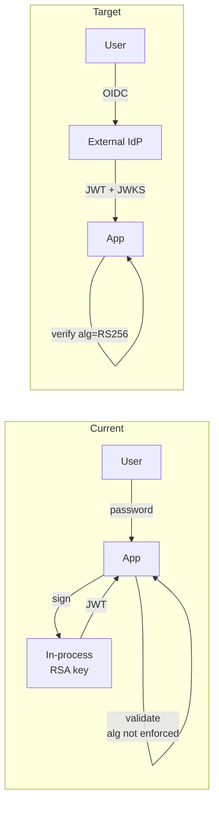

# Phase Group: Architecture & Analysis (Phases 3–8)

This file is read by the orchestrator at runtime to load phase instructions.

## ⚠ MANDATORY PHASE LOGGING CONTRACT (Phases 3–8)

Every phase in this file MUST emit exactly one `PHASE_START` log line at the start and exactly one `PHASE_END` log line at the end, in the same format used by Phase 1/2/9/10. Production runs have repeatedly shown Phases 3–7 going *unlogged* entirely, leaving a black hole in `.agent-run.log` between Phase 2 END and Phase 8 END, which makes timing profiling impossible. This is not a stylistic preference — it is a hard requirement enforced by the log-completeness QA check in the finalization phase.

**Phase-start Bash template (copy-paste literally, one batch per phase):**

```bash
date +%s > "$OUTPUT_DIR/.phase-epoch"
echo "$(date -u +%Y-%m-%dT%H:%M:%SZ)  [--------]  INFO   threat-analyst  PHASE_START   <phase line>" >> "$OUTPUT_DIR/.agent-run.log"
```

**Phase-end Bash template:**

```bash
PE=$(cat "$OUTPUT_DIR/.phase-epoch" 2>/dev/null || date +%s) && DUR=$(( $(date +%s) - PE )) && ES=$(printf "%dm%02ds" $((DUR/60)) $((DUR%60)))
echo "$(date -u +%Y-%m-%dT%H:%M:%SZ)  [--------]  INFO   threat-analyst  PHASE_END     <phase line> (${ES})" >> "$OUTPUT_DIR/.agent-run.log"
```

**Exact phase lines to use** (must match verbatim — these are parsed by `render_threat_model.py` and by the assessment summary aggregator):

| Phase | START line | END line |
|-------|-----------|----------|
| 3 | `[Phase 3/11] ▶ Architecture Modeling — complexity tier: <Simple\|Moderate\|Complex>` | `[Phase 3/11] ✓ Architecture Modeling — <n> diagrams produced` |
| 4 | `[Phase 4/11] ▶ Attack Walkthroughs — rendering Section 9…` | `[Phase 4/11] ✓ Attack Walkthroughs — <n> walkthroughs rendered` |
| 5 | `[Phase 5/11] ▶ Asset Identification…` | `[Phase 5/11] ✓ Asset Identification — <n> assets catalogued` |
| 6 | `[Phase 6/11] ▶ Attack Surface Mapping…` | `[Phase 6/11] ✓ Attack Surface Mapping — <n> entry points (<n> unauthenticated)` |
| 7 | `[Phase 7/11] ▶ Trust Boundary Analysis…` | `[Phase 7/11] ✓ Trust Boundary Analysis — <n> boundaries` |
| 8 | `[Phase 8/11] ▶ Security Controls Catalog…` | `[Phase 8/11] ✓ Security Controls — ✅ <n>  ⚠️ <n>  🔶 <n>  ❌ <n>` |

**For the combined single-pass execution of Phases 5–7** (see "Phases 5–7 combined" below), emit all three `PHASE_START` lines together at the start of the combined pass and all three `PHASE_END` lines together at the end. Do **not** collapse them into a single entry — timing analysis requires per-phase markers.

**Self-check before leaving this file:** After Phase 8 END, the orchestrator MUST run this one-line validator (cheap, never skipped):

```bash
for p in 3 4 5 6 7 8; do grep -q "PHASE_START.*Phase $p/11" "$OUTPUT_DIR/.agent-run.log" || echo "MISSING PHASE_START: $p"; grep -q "PHASE_END.*Phase $p/11" "$OUTPUT_DIR/.agent-run.log" || echo "MISSING PHASE_END: $p"; done
```

Any line printed by this validator is a defect. If output is non-empty, emit a `BASH_WARN` and continue — but the QA reviewer will flag the run as structurally incomplete.

---

## Phase 3: Architecture Modeling

### Section and sub-section introductory sentences (mandatory)

The reader of a static threat-model report cannot zoom into diagrams or click around to discover what they are looking at. **Every top-level section, every sub-section, and every diagram MUST be introduced by at least one sentence of prose before the first table, code block, or diagram.** This is a hard requirement, not a stylistic suggestion.

**1. Top-level sections (`## N. Title`)** — open with 1–3 sentences explaining *what* this section contains and *why* it matters for the security assessment. Write the intro before any subsection heading, table, or diagram. Examples:

- **Section 2 (Architecture Diagrams):** "The following diagrams model the system architecture at different abstraction levels using the C4 model. Security-relevant aspects are highlighted in red."
- **Section 3 (Assets):** "The table below identifies all assets requiring protection, classified by sensitivity, with cross-references to the threats that target them."
- **Section 4 (Attack Surface):** "All identified entry points through which an attacker can interact with the system, split by whether authentication is required."
- **Section 5 (Trust Boundaries):** "Trust boundaries mark transitions between different trust levels. Weaknesses at these boundaries are primary sources of security risk."
- **Section 6 (Identified Security Controls):** Start with a paragraph prefixed `**Gap summary:**` listing the 3–5 most critical control gaps before the controls table.
- **Section 7 (Threat Register):** Start with risk methodology note and Risk Distribution block (see Phase 9 — Section 8 layout).
- **Section 8 (Attack Walkthroughs):** "The sequence diagrams below trace each Critical finding from initial attacker action to full exploitation. Every diagram is anchored to its `T-NNN` in the Threat Register and shows the current vulnerable behaviour alongside the post-mitigation flow." (See phase-group-architecture.md → "Phase 4: Attack Walkthroughs" for the full rendering contract.)
- **Section 9 (Mitigation Register):** "Prioritised measures to address identified threats. Each mitigation lists the threats it addresses, the requirements it fulfils, the relevant Blueprint section, its rollout priority (P1–P4) and concrete implementation guidance."
- **Section 10 (Out of Scope):** "Areas deliberately excluded from this assessment, including accepted risks and items requiring separate analysis."

### Section 3 — formerly "Security-Relevant Use Cases" (REMOVED)

Section 3 ("Security-Relevant Use Cases") has been removed entirely. It was a stub pointing to Section 9 (Attack Walkthroughs) and added no value. All sections after Section 2 have been renumbered down by one:

| Old number | New number | Section |
|------------|-----------|---------|
| 3 | *(removed)* | Security-Relevant Use Cases |
| 4 | 3 | Assets |
| 5 | 4 | Attack Surface |
| 6 | 5 | Trust Boundaries |
| 7 | 6 | Identified Security Controls |
| 8 | 7 | Threat Register |
| 9 | 8 | Attack Walkthroughs |
| 10 | 9 | Mitigation Register |
| 11 | 10 | Out of Scope |

All internal anchors (`#3-assets`, `#4-attack-surface`, etc.) and cross-references must use the new numbering.

**2. Section 2 sub-sections (`### 2.x Title`)** — every C4 sub-section (2.1 System Context, 2.2 Containers, 2.3/2.4 Technology Architecture, 2.x Security Architecture Assessment) MUST open with at least one sentence telling the reader what the diagram shows and at which abstraction level. Examples:

- **2.1 System Context:** "The Context view shows who interacts with the system, which external services it depends on, and which trust zones each actor sits in. Red boxes mark components that expose attack surface."
- **2.2 Containers:** "The Container view zooms into the deployable units. The critical observation here: <one-sentence security takeaway specific to this system>."
- **2.x Technology Architecture:** "This diagram shows the runtime middleware stack from top to bottom. Nodes coloured red carry at least one Medium-or-higher threat from the register."
- **2.x Security Architecture Assessment:** "The assessment below evaluates structural patterns rather than individual code defects. Each pattern is rated as present, partial, or absent."

**3. Section 9 sub-sections (`### 9.x — T-NNN title`)** — every attack walkthrough in Section 9 MUST open with at least one sentence telling the reader which Critical finding is being walked through, which component is attacked, and which attacker position is required (unauthenticated / authenticated / internal). The T-NNN in the sub-section heading must link to the Threat Register row. Examples:

- "**T-002 · SQL Injection in Login.** Unauthenticated attacker, Auth Service component. This walkthrough shows how a single crafted email parameter bypasses authentication and yields an admin session."
- "**T-006 · RCE via safeEval in B2B Order.** Authenticated B2B customer, Order Service component. This walkthrough shows how a crafted `orderLinesData` payload escapes the `notevil` sandbox via prototype pollution."

**4. Key takeaway after every diagram (Sections 2 and 9)** — directly below each Mermaid block (after the closing ` ``` `) the orchestrator MUST add a single bold-prefixed sentence:

```
**Key takeaway:** <one sentence — what is the reader supposed to remember about this diagram?>
```

The takeaway is not a caption — it is a security observation. Examples:

- "**Key takeaway:** Every external request — including the attacker — reaches the monolith directly on port 3000, with no API gateway and no WAF in front."
- "**Key takeaway:** The BFF pattern is absent — the SPA holds JWT tokens in localStorage, so any XSS anywhere on the page steals the session."
- "**Key takeaway:** The XML upload endpoint is the only path that touches the file system; disabling `noent` here closes the file disclosure vector entirely."

**Rules:**

- Adapt every sentence to the specific system — do not use the examples verbatim
- Never put two diagrams back-to-back without an intro sentence and a Key takeaway between them
- The intro sentence and the Key takeaway are *separate* — the intro tells the reader *what they are about to see*, the takeaway tells them *what to remember after they have seen it*
- A diagram with no Key takeaway is treated by the QA reviewer as incomplete and will be flagged

### Architecture modeling

**⚠ Batched-diagram rule (mandatory):** All C4 diagrams for a given complexity tier MUST be composed in a **single pass** after reading `.recon-summary.md` once. Do not re-read the recon summary between diagrams. Compose the full set (Context, Containers if Moderate+, Components if Complex, Technology Architecture, Security Architecture Assessment) in working memory, then write them as one contiguous block into Section 2 of `threat-model.md`. The per-diagram STEP_START log entries still fire in sequence (so users see progress), but the underlying data fetches happen exactly once.

Derive the system's architecture from code and config. Determine complexity:

- **Simple** (monolith, single service): one architecture diagram
- **Moderate** (multiple services, clear layers): Context + Container diagrams
- **Complex** (microservices, many bounded contexts): Context + Container + Component diagrams

**DIAGRAM_DEPTH override:** The `DIAGRAM_DEPTH` variable (from `--assessment-depth`) can restrict diagram output regardless of detected complexity:

| DIAGRAM_DEPTH | C4 diagrams produced | Attack walkthroughs (Phase 4 → Section 9) |
|---------------|---------------------|--------------------------------------------|
| `minimal` | Context + Technology Architecture only (skip Containers/Components even if Complex) | Up to 3 — top 3 Critical findings only, no walkthroughs for High/Medium/Low |
| `standard` | By detected complexity tier (default behavior) | Up to 5 — one per Critical finding, ordered to match `## Critical Attack Chain` nodes |
| `extended` | By detected complexity tier + additional drill-down for security-critical services | Up to 5 — full curation + `Note over` mitigation commentary in each `else` branch |

Section numbering by complexity tier (no gaps):

| Complexity | Sections | Numbers |
|------------|----------|---------|
| Simple | Context · Tech Arch · Security Assessment | 2.1 · 2.2 · 2.3 |
| Moderate | Context · Containers · Tech Arch · Assessment | 2.1 · 2.2 · 2.3 · 2.4 |
| Complex | Context · Containers · Components · Tech Arch · Assessment | 2.1 · 2.2 · 2.3 · 2.4 · 2.5 |

Use C4 model conventions. Every node must include concrete technology details:
```
"<Component Name>\n<Framework + Version>\n<Runtime / Language>\n<Deployment: platform/env>"
```

All diagrams: Mermaid `graph TD`, max 4–5 nodes per subgraph, edges with protocol/route labels, trust boundaries as subgraphs with **plain text labels** — no emoji prefix (`🌐` / `🔶` / `🔒` / `🔐`). The label text is sufficient; the emoji adds no information and degrades accessibility.

### Cross-repository dependency nodes in C4 diagrams

When `.threat-modeling-context.md` contains a **Cross-Repository Dependency Threat Models** section with entries, and `.recon-summary.md` Section 7.25 lists SCM sibling projects or SaaS integrations, represent them in the Context diagram (and Container diagram if applicable) as external nodes with threat model coverage annotations:

**SCM sibling projects** — use rounded-rect shape `(...)` with a coverage label:
```
%% cross-repo: auth-service
AuthSvc("auth-service<br/>TM: ✓ 14 threats, 3 open")
```
Or when the sibling has no threat model:
```
%% cross-repo: notification-svc
NotifSvc("notification-svc<br/>TM: ✗ missing")
```

**SaaS services** — use stadium shape `([...])` with the provider name:
```
Stripe(["Stripe<br/>Payment API<br/>SaaS"])
Auth0(["Auth0<br/>Identity Provider<br/>SaaS"])
```

**Styling rules:**
- SCM siblings with a threat model: `classDef crossRepoOk fill:#c8e6c9,stroke:#388e3c` (green)
- SCM siblings without a threat model: `classDef crossRepoMissing fill:#ffcdd2,stroke:#d32f2f` (red)
- SaaS services: `classDef saas fill:#e1bee7,stroke:#7b1fa2` (purple)
- Apply the appropriate class to each external node at the end of the diagram

**Edge labels** for cross-repo/SaaS nodes MUST include the protocol or interface type discovered by the recon scanner (e.g. `REST API`, `gRPC`, `SDK`, `WebSocket`).

**Do NOT annotate** these nodes with `%% component:` — they are not STRIDE-analyzed. Use `%% cross-repo:` or leave SaaS nodes unannotated. The `%% cross-repo:` comment is informational only (not consumed by the annotator).

### Component-ID annotation contract (mandatory for annotator)

Every Mermaid node that represents an **inventoried component** — i.e. a component that will be analysed by a STRIDE analyzer in Phase 9 — MUST carry a stable ID annotation so the post-Phase-9 diagram annotator can attach threat badges, severity classes, and click links. The rules are:

1. **Label form is fixed.** Write the node as square-bracketed, double-quoted label: `NodeId["<label text with <br/> separators>"]`. Other shapes (`(...)`, `((...))`, `{...}`, `[/.../]`) are allowed for non-component decoration only (actors, external systems, trust-zone labels) — the annotator will skip them.
2. **Comment on the line directly above.** Prefix each inventoried-component node line with a Mermaid comment on its own line:
   ```
   %% component: <stable-component-id>
   RestApi["REST API<br/>Express 4<br/>Node 20"]
   ```
3. **The `<stable-component-id>` MUST match** the `component_id` that the STRIDE analyzer will use for this component — the same ID that becomes the filename suffix in `$OUTPUT_DIR/.stride-<id>.json`. Consistency across Phase 3 (architecture) and Phase 9 (STRIDE dispatch) is mandatory; mismatch means the annotator silently skips the node.
4. **One comment per node.** Do not share a comment across multiple nodes and do not annotate nodes that are actors (`Attacker`, `User`) or externals (`Auth0`, `Stripe`) — those do not have STRIDE analysis and therefore have no threats to surface.
5. **Same component, multiple diagrams.** When the same component appears in Context, Containers, and Components views, emit the `%% component: <id>` comment above every occurrence. The annotator then annotates each view consistently.
6. **Trust zones and subgraph labels** are not components — never annotate them.

Example (Containers view, moderate complexity):

```
graph TD
    subgraph Internet
        Attacker["Attacker"]
    end
    subgraph DMZ
        %% component: rest-api
        RestApi["REST API<br/>Express 4<br/>Node 20<br/>Docker"]
    end
    subgraph Private
        %% component: auth-service
        Auth["Auth Service<br/>Passport.js<br/>Node 20<br/>Docker"]
        %% component: db
        DB[("PostgreSQL 15<br/>Managed RDS")]
    end
    Attacker -->|HTTPS| RestApi
    RestApi -->|REST| Auth
    Auth -->|SQL| DB
```

The annotator runs after Phase 9 and will transform the annotated nodes (`RestApi`, `Auth`, `DB`) by appending a severity badge, assigning a severity class, and attaching a click link to the first Critical/High threat row in Section 8. Nodes without the `%% component:` comment (`Attacker`) remain untouched.

### Section 2.4 — Security Architecture Assessment layout (numbered, flat)

The Security Architecture Assessment is written last. It replaces the old six-block layout (Architecture Patterns / Trust Model Evaluation / Auth & Authz Architecture / Key Architectural Risks / Cross-Cutting Architecture Findings / Overall Rating) with a **flat numbered layout**. Every sub-section gets a `####` H4 heading with a `2.4.x` number, so the reader sees exactly where they are in the outline and the QA reviewer can check for presence by number, not by heading text.

**Canonical layout (mandatory, in this order):**

```
### 2.4 Security Architecture Assessment

<one intro sentence — what this sub-section evaluates vs. what Section 8 covers>

#### 2.4.1 Architecture Patterns              (table — see format below)
#### 2.4.2 Key Architectural Risks            (table — see format below)
#### 2.4.3 Secret Management                  (theme — bullets + optional diagram)
#### 2.4.4 Authentication                     (theme — bullets + MANDATORY diagram)
#### 2.4.5 Authorization & Access Control     (theme — bullets + optional diagram)
#### 2.4.6 Input Validation & Output Encoding (theme — bullets, diagram forbidden)
#### 2.4.7 Separation & Isolation             (theme — bullets + optional diagram)
#### 2.4.8 Defense-in-Depth                   (theme — bullets, diagram forbidden)
#### 2.4.9 Overall Architecture Security Rating
```

**Removed from the old layout:**

- `#### Trust Model Evaluation` — the content now lives inside 2.4.4 Authentication (trust chain bullet) and 2.4.5 Authorization (ownership-check bullet). Writing it as a separate prose block produced duplication.
- `#### Authentication and Authorization Architecture` — same reason, the content is distributed into 2.4.4 and 2.4.5.
- `#### Cross-Cutting Architecture Findings` as an H4 wrapper — the six themes are now H4 sub-sections of 2.4 directly, which removes one nesting level and makes numbering flat.

**Numbering rules (enforced by QA reviewer):**

- Every H4 under `### 2.4` MUST start with `#### 2.4.<n> ` where `<n>` is the sequence position (2.4.1 through 2.4.9). Gaps or out-of-order numbers are flagged.
- No H5 headings are used inside 2.4 — the old `##### 1. Secret Management` style is legacy and flagged.
- No non-numbered H4 (e.g. `#### Cross-Cutting Architecture Findings`) is allowed inside 2.4.

### 2.4.1 — Architecture Patterns table format

The Architecture Patterns table evaluates whether standard security architecture patterns are implemented. An intro sentence MUST precede the table explaining what it shows and providing context (e.g. "A well-secured application would show most patterns as present; this application fails on nearly all of them.").

The first column uses implementation-status symbols (NOT severity emojis — those are reserved for risk tables):
- **❌** = not implemented (Absent)
- **◐** = partially implemented (Partial)
- **✅** = fully implemented (Present)

Each row MUST include a "What it means" column explaining the pattern in one sentence for non-security readers.

```markdown
| | Pattern | What it means | Finding |
|-|---------|---------------|---------|
| ❌ | Secrets management | Keys and credentials loaded at runtime from a vault, never committed to source. | <what was found> |
| ◐ | Separation of concerns | Logic divided into modules with clear boundaries and separate failure domains. | <what was found> |
```

Legend after the table: `> ❌ = not implemented · ◐ = partially implemented · ✅ = fully implemented`

### 2.4.2 — Key Architectural Risks table format

The Key Architectural Risks table documents structural decisions that create systemic risk. An intro sentence MUST precede the table explaining that these are architectural decisions requiring structural redesign, not individual code bugs fixable with a single patch.

The first column uses severity emojis indicating the risk level of each architectural decision:
- **🔴 Critical** = architectural root cause of Critical findings; requires structural redesign
- **🟠 High** = amplifies attack surface or exposes sensitive data; fixable with configuration changes

Each row MUST include a "Why it matters" column and a "Linked Threats" column with clickable T-NNN references. Sorted by severity (🔴 first).

```markdown
| Risk | Structural Decision | Why it matters | Linked Threats |
|------|---------------------|----------------|----------------|
| 🔴 Critical | <decision description> | <why it's dangerous — one sentence> | [T-NNN](#t-NNN), [T-NNN](#t-NNN) |
| 🟠 High | <decision description> | <why it matters> | [T-NNN](#t-NNN) |
```

Legend after the table: `> 🔴 Critical = architectural root cause of Critical findings; requires structural redesign` / `> 🟠 High = amplifies attack surface or exposes sensitive data; fixable with configuration changes`

### 2.4 — The six architecture themes (2.4.3 to 2.4.8)

The six architecture themes replace the old "Cross-Cutting Architecture Findings" prose block. They are mandatory — all six are always emitted, even when one is "no systemic finding". The themes cover:

1. **Secret Management** (2.4.3) — hardcoded vs env-var vs vault-backed secrets; rotation capability; leakage via logs/metrics/artifacts.
2. **Authentication** (2.4.4) — trust chain (who issues, who validates); token lifecycle (create → transmit → store → validate → revoke); MFA / OIDC integration.
3. **Authorization & Access Control** (2.4.5) — RBAC/ABAC pattern; centralized policy decision point vs per-route checks; ownership verification coverage.
4. **Input Validation & Output Encoding** (2.4.6) — where validation happens (gateway/middleware/per-route); parameterization gaps, eval sinks, parser hardening.
5. **Separation & Isolation** (2.4.7) — process/container/network boundaries; data-tier separation; frontend/backend separation.
6. **Defense-in-Depth** (2.4.8) — WAF/API gateway/rate limiting in front; observability/anomaly detection behind; missing layers.

**Writing rules — strict, enforced by QA:**

The old template required 200–300 words of prose per theme. That produced dense, code-heavy paragraphs that buried the architectural point. The new rule is the opposite: **the body of each theme is bullets, not prose**. Every theme follows the exact same micro-template so the reader can scan six themes at uniform cost.

**Per-theme template:**

```markdown
#### 2.4.<n> <Theme Name>

<Optional or mandatory Mermaid `graph LR` / `graph TB` block — see the diagram matrix below. When present, followed immediately by a single-sentence **Key takeaway:**.>

**Current state.** <Exactly one sentence describing what the architecture does today. Plain business-language summary — no code syntax, no library version strings, no file paths, no line numbers.>

**Structural defects:**

- <short phrase — one architectural weakness>
- <short phrase>
- <3 to 5 bullets maximum; each bullet is a sub-sentence fragment, not a full paragraph>

**Impact.** <Exactly one sentence describing what capability this gives an attacker — business-language, not STRIDE.>

**Target architecture.** <One or two sentences describing the fix at the architectural level. Never an implementation detail like "use bcrypt with cost 12" — instead "replace in-process custom JWT implementation with an external IdP that enforces algorithm and publishes a JWKS endpoint".>

**Linked threats:** [T-NNN](#t-NNN), [T-NNN](#t-NNN)
```

**Hard constraints the QA reviewer enforces on every theme body:**

- **No prose paragraphs longer than one sentence.** Prior templates required 200–300 words of prose; the new cap is one sentence per labelled block (`Current state.`, `Impact.`, `Target architecture.`). The `Structural defects:` section is bullets only, never prose.
- **No file references inside theme bodies.** Absolute or relative file paths, `vscode://` links, line numbers and function names are all forbidden inside 2.4.3 through 2.4.8. The architectural statement stands or falls on its own; a reader who wants the concrete code line clicks the `[T-NNN](#t-NNN)` link at the bottom and lands on the threat register row, which has the file link.
- **No library names or version strings.** "jsonwebtoken 0.4.0", "express-jwt 0.1.3", "libxmljs2", "sanitize-html 1.4.2" — all forbidden inside theme bodies. Library-version facts live in Section 7 (Controls) and in the recon summary. The architectural theme discusses patterns, not package versions.
- **No STRIDE category names** inside theme bodies — the themes are *architectural*, not STRIDE-category summaries.
- **Linked threats line is mandatory** when any T-NNN participates in the systemic finding. When a theme genuinely has no finding, emit the single-sentence sound-architecture summary instead and omit the `Linked threats` line.
- **Total theme length: 10 to 20 rendered lines.** Anything longer is over budget and must be compressed before submission.

**Sound-architecture short form** — when a theme genuinely has no systemic finding, the entire body is a single sentence:

```markdown
#### 2.4.3 Secret Management

**Current state.** All application secrets are loaded from HashiCorp Vault at startup with a 90-day rotation policy; recon found no hardcoded secrets, no secrets in logs and no secrets in container environment variables. No systemic finding.
```

### Per-theme Mermaid diagrams — new mandatory matrix

The old template called per-theme diagrams "optional" for all four allowed themes, and the model treated that as "skip them all". The new rule promotes two of them to **mandatory at standard depth or higher**, so the reader reliably sees the visual-first themes — Authentication and Secret Management — as diagrams rather than as prose.

**Diagram matrix by theme and depth:**

| Theme (2.4.x) | `quick` | `standard` | `thorough` |
|---|---|---|---|
| 2.4.3 Secret Management | — (prose-only) | **recommended** | **mandatory** |
| 2.4.4 Authentication | — (prose-only) | **mandatory** | **mandatory** |
| 2.4.5 Authorization & Access Control | — | optional | optional |
| 2.4.6 Input Validation & Output Encoding | — | **forbidden** | **forbidden** |
| 2.4.7 Separation & Isolation | — | optional | optional |
| 2.4.8 Defense-in-Depth | — | **forbidden** | **forbidden** |

**Forbidden-theme reasoning:**

- **Input Validation & Output Encoding** is a *code-level* concern. A Mermaid `graph LR` of "untrusted input → validation → sink" is a truism. Keep the architectural statement in the bullets.
- **Defense-in-Depth** duplicates the Technology Architecture diagram in Section 2.x. The Defense-in-Depth theme instead **references** the Section 2.x stack by internal link and discusses which layers are missing.

**Mandatory-theme requirement at `standard`:** 2.4.4 Authentication MUST include a `graph LR` / `graph TB` diagram showing the trust-establishment chain — where identity is issued, where it is validated, where the signing material lives. The QA reviewer flags the absence of a diagram in 2.4.4 at standard depth. At `thorough`, 2.4.3 Secret Management additionally MUST include a diagram (current-state vs target-state of secret storage).

**Diagram size and type — strict budget:**

- **Type:** `graph LR` or `graph TB` only. Never `sequenceDiagram`, never `flowchart`, never C4.
- **Nodes:** 3 to 7 maximum.
- **Edge labels:** ≤ 5 words.
- **Subgraphs:** at most one level of grouping (e.g. `subgraph Current` / `subgraph Target`).
- **Node labels:** no file paths, no line numbers, no library versions. `User`, `IdP`, `API`, `DB`, `Vault` — yes. `lib/insecurity.ts:27` — no.
- **Key takeaway sentence** directly below the closing fence, always, one sentence.

**Example — 2.4.4 Authentication with mandatory diagram (standard depth):**

```markdown
#### 2.4.4 Authentication



**Key takeaway:** The signer, the verifier and the signing key all live in the same process today; moving the issuer to an external IdP and enforcing the algorithm makes it architecturally impossible to forge tokens offline.

**Current state.** The application issues and validates its own JWTs in-process using an embedded RSA key and a legacy validation library that does not enforce the algorithm claim.

**Structural defects:**

- Issuer and verifier collapsed into one process — no trust boundary between them
- Signing material co-located with the code that signs and verifies — no key isolation
- Algorithm not enforced on verification — attacker can bypass signature entirely
- No token revocation mechanism — a compromised token is valid until it expires

**Impact.** Anyone with repository read access can forge a valid administrator session offline, with no detection and no way to revoke the forged token.

**Target architecture.** Delegate authentication to an external identity provider using OIDC; the application verifies signatures via the IdP's published JWKS endpoint and enforces the expected algorithm on every validation. The signing key never enters the application process.

**Linked threats:** [T-001](#t-001), [T-003](#t-003), [T-005](#t-005)
```

## Phase 4: Attack Walkthroughs (renders Section 9)

> **⚠ Section assignment changed.** Phase 4 used to render its diagrams into the old Section 3 ("Security-Relevant Use Cases"), between the architecture and the assets. That section has been removed entirely (see "Section 3 — formerly Security-Relevant Use Cases" above). Phase 4 now renders into `## 8. Attack Walkthroughs`, positioned directly after the Threat Register and before the Mitigation Register. The Phase number stays 4 for orchestrator-ordering reasons — Phase 4 still runs between Phase 3 (architecture) and Phase 5 (assets) because it needs the architectural context — but its **output target** is Section 8.

**⚠ Batched-diagram rule (mandatory):** Phase 4 composes all applicable sequence diagrams in a **single pass** using the data already in working memory from Phase 2 (recon) and Phase 3 (architecture), plus the pre-estimate of Critical threats from Phase 9 (see "Curation — Critical only" below). Do not re-read source files per diagram — the recon scanner's Section 7.1 (auth), 7.2 (authz), 7.4 (input handling), 7.9 (OAuth), and 7.10 (SPA/BFF) provide the flow-relevant file:line references. Write all sequence diagrams as one contiguous Section 9 block.

> **⚠ Phase-ordering caveat:** Phase 4 runs before Phase 9, so Critical T-IDs do not exist yet at Phase 4 time. Resolve this with **deferred rendering**: Phase 4 composes placeholder walkthroughs keyed by a stable internal slug (e.g. `sqli-login-bypass`, `xxe-upload`, `b2b-eval-rce`) from recon evidence, and Phase 11 (Finalization) swaps placeholder keys for the real `T-NNN` assigned in Phase 9. If the stable slug never maps to a Critical finding in Phase 9 (because the STRIDE analyzer rated it High instead), the walkthrough is dropped entirely during Phase 11. This avoids producing walkthroughs for findings that did not reach Critical severity.

### Content and diagram type

Each walkthrough is a Mermaid `sequenceDiagram` block that traces one Critical finding from attacker action to exploitation outcome. The diagram MUST use the `alt`/`else` structure — but the two branches now carry fixed semantics:

- **`alt` branch** = current vulnerable behaviour (`Current state — T-NNN`). This is the attack path.
- **`else` branch** = post-mitigation behaviour (`After M-NNN — <short mitigation name>`). This is the fix.

The "normal vs attack" pattern from the old spec is **deleted**. Section 9 is about how critical findings are exploited and fixed, not about showing legitimate happy paths for unrelated flows.

Annotate arrows with actual HTTP methods/routes. Use component IDs in `participant … as` lines that match the STRIDE component IDs.

### Curation — Critical only, max 5

The previous spec emitted one diagram per recon category (auth, authz, input validation, …) regardless of how many findings existed. That produced bloated Section 3 content even for systems with only 1–2 real Critical threats. The new rule is:

- **Count Critical findings after Phase 9 merge.** Call that `CRIT_COUNT`.
- **`CRIT_COUNT == 0`** → Section 9 is a 2-line stub: `_No critical-severity attack walkthroughs — the highest-severity findings are documented in [Section 8](#7-threat-register)._`. No Mermaid, no sub-sections. Section 3 stub still points here.
- **`CRIT_COUNT == 1`** → Section 9 has exactly one walkthrough, for the single Critical finding.
- **`CRIT_COUNT >= 2`** → One walkthrough per Critical finding, in the **same order as the nodes of the `## Critical Attack Chain` Mermaid diagram** (after the Management Summary). This lets a reader jump from a chain node to the detailed walkthrough. Cap at **5** — if there are more than 5 Criticals, keep the 5 that appear as nodes in the chain diagram; document the skipped ones with a trailing footnote `_N additional Critical findings (T-NNN, T-NNN, …) are documented in Section 8.1 without a dedicated walkthrough._`

**Phase 4 does not add walkthroughs for High-, Medium-, or Low-severity findings.** Non-Critical findings are surfaced via the Section 8 table only. If a reviewer wants to understand a High finding in detail, they follow the link from Section 8.2 into the per-threat row; no sequenceDiagram is generated automatically.

### DIAGRAM_DEPTH interaction

| DIAGRAM_DEPTH | Phase 4 behaviour |
|---------------|-------------------|
| `minimal` (quick) | Max 3 walkthroughs — take the top 3 Criticals by severity+order |
| `standard` | Max 5 walkthroughs — full curation rule above |
| `extended` | Max 5 walkthroughs — full curation rule, plus every `else` branch carries an explicit `Note over` describing exactly which code change implements the mitigation (one sentence, tied to the M-NNN in Section 10) |

### `alt`/`else` — fixed semantics

Every sequence diagram in Section 9 MUST include an `alt`/`else` block with both branches populated. The labels and content are constrained:

- **`alt` branch label:** `Current state — T-NNN` (where `T-NNN` is the Critical finding's ID after Phase 11 placeholder swap)
- **`else` branch label:** `After M-NNN — <short mitigation title>` (where `M-NNN` is the primary mitigation from Section 10)
- Both branches must contain at least one message arrow. Empty branches are flagged by the QA reviewer.
- The `alt` branch is the attack path. The `else` branch is the fix. This assignment is **not** interchangeable — the QA reviewer checks this ordering because the annotator relies on the attack branch being `alt`.

Example (placeholder → `T-002` after Phase 11 swap):

```
sequenceDiagram
    %% components: rest-api, auth-service
    %% stride: S, T
    participant A as Attacker
    participant API as Express API
    participant DB as PostgreSQL
    A->>API: POST /rest/user/login (email=' OR 1=1--)
    alt Current state — T-002 %% attack-path
        API->>DB: SELECT * FROM Users WHERE email='...' (raw concat)
        DB-->>API: returns admin row
        API-->>A: 200 + JWT for admin
    else After M-002 — parameterized query
        API->>DB: SELECT * FROM Users WHERE email=$1 (bound)
        DB-->>API: no match
        API-->>A: 401 Unauthorized
    end
```

### Sequence diagram annotation contract (mandatory for annotator)

The Phase-10 sequence annotator (`plugin/scripts/annotate_sequences.py`) injects a `Note over` line into the attack branch of every sequence diagram, listing the top 3 matching threats by severity (format: `T-NNN (CWE-X)`, comma-separated; overflow shown as `+N more → §8`). For that to work, Phase 4 MUST emit three metadata comments on every `sequenceDiagram`:

1. **`%% components: <id>, <id>, …`** — placed on its own line directly after the `sequenceDiagram` keyword. Lists the stable component IDs involved in the flow. These IDs must match the `component_id` values used by the STRIDE analyzer (same as `%% component:` in Phase 3 and `.stride-<id>.json` filenames). The annotator filters threats by this list — components not listed here are excluded from the diagram's Note.
2. **`%% stride: <letters>`** — on the next line. A comma-separated list of single-letter STRIDE codes that define which threat categories this flow addresses. The mapping is fixed:
   - `S` → Spoofing
   - `T` → Tampering
   - `R` → Repudiation
   - `I` → Information Disclosure
   - `D` → Denial of Service
   - `E` → Elevation of Privilege

   A login flow is typically `S, T` (credential forgery, auth bypass). An input-validation flow is typically `T, I` (injection, leakage). An authorization flow is typically `E` (privilege escalation). Pick every letter that honestly applies — threats outside the declared categories are filtered out of this diagram's Note, so narrow lists mean narrow annotations.
3. **`%% attack-path`** — a trailing comment on the `alt` or `else` line whose branch represents the attack/vulnerable flow. Exactly one branch per `alt` block must carry this marker. Without it, the annotator cannot tell which branch is the attack path and will skip the diagram with a warning.

**Example with all three markers:**

```
sequenceDiagram
    %% components: rest-api, auth-service
    %% stride: S, T
    participant A as Attacker
    participant API as Express API
    participant DB as PostgreSQL
    A->>API: POST /rest/user/login (email=' OR 1=1--)
    alt Current state — T-002 %% attack-path
        API->>DB: SELECT * FROM Users WHERE email='...' (raw concat)
        DB-->>API: returns admin row
        API-->>A: 200 + JWT for admin
    else After M-002 — parameterized query
        API->>DB: SELECT * FROM Users WHERE email=$1 (bound)
        DB-->>API: no match
        API-->>A: 401 Unauthorized
    end
```

After Phase 10 annotation this becomes:

```
    alt Current state — T-002 %% attack-path
        %% anno-seq-start
        Note over A,DB: T-002 (CWE-89), T-001 (CWE-321)
        %% anno-seq-end
        API->>DB: SELECT * FROM Users WHERE email='...' (raw concat)
        ...
```

**Rules:**

- The three metadata comments are **mandatory** on every sequence diagram the orchestrator expects to be annotated. Missing markers do not break the pipeline — the annotator logs a warning and leaves the diagram unchanged.
- The `%% components:` list must not contain actor labels (`Attacker`, `User`) or externals (`Auth0`, `Stripe`) — only STRIDE-analyzed components.
- Do not hand-write `%% anno-seq-start` / `%% anno-seq-end` fences — they are annotator-owned and will be overwritten on re-run.
- A diagram whose flow touches components that end up with zero matching threats still passes annotation — it simply receives no Note injection (the `anno-seq-*` fence is empty and the attack branch is untouched).

## Phases 5–7: Combined single-pass execution (mandatory)

**⚠ Token-saving rule: Phases 5, 6, and 7 MUST run as a single combined pass, not three separate phases.** All three phases read the same recon baseline (`$OUTPUT_DIR/.recon-summary.md` Sections 5, 7, 9, 10) and produce sections that reference each other. Running them serially triples the recon re-read cost without adding information.

**Combined execution protocol:**

1. **Read `.recon-summary.md` once** at the start of Phase 5 and keep the parsed content in working memory for Phases 5, 6, and 7.
2. **Log all three `PHASE_START` entries** in a single batched Bash call (Phase 5, 6, 7) so the log reflects the combined execution. Same for the three `PHASE_END` entries at the end.
3. **Iterate the recon data once**, emitting rows into three in-memory tables simultaneously:
   - Phase 5 assets (Data/Code/Infra/Availability) derived from recon Section 10
   - Phase 6 entry points (split by auth requirement) derived from recon Section 7.11 + 7.1 + Section 9
   - Phase 7 trust boundaries derived from recon Section 5 (deployment) + Section 9 (components) + browser↔server when a frontend is present
4. **Issue at most one combined route grep** (see Phase 6 — single combined grep) if recon Section 7.11 is insufficient. This grep covers Phase 6 entirely; do not issue additional greps during Phase 5 or Phase 7.
5. **Emit the three sections in the final report in their canonical order** (Section 4 Assets, Section 5 Attack Surface, Section 6 Trust Boundaries) — the combined execution only changes *how* they are computed, not *how* they are rendered.

**Rules:**
- Never re-read `.recon-summary.md` between Phases 5, 6, and 7 — one read at the top, reused throughout
- Do not dispatch sub-agents during the combined pass
- Progress substep counters continue to show `[k/2]`, `[k/3]`, `[k/N]` per phase in the log so users still see per-phase progress
- If the orchestrator runs Phase 5 in isolation (e.g. incremental mode where only one phase is being refreshed), the combined-pass rule does not apply — read recon data once for that single phase

---

## Phase 5: Asset Identification

**⚠ Token-saving rule: Enrich the pre-populated list from recon — do NOT re-discover assets from source files.**

Read **Section 10 (Preliminary Asset Candidates)** of `$OUTPUT_DIR/.recon-summary.md`. The recon-scanner has already derived a first-pass inventory from schemas, manifests, deployment artifacts, and config files. Start from that table and enrich it:

1. Promote every `_none detected_` placeholder to a real row only if Phase 2/3/4 surfaced concrete evidence the recon-scanner missed (rare — document the evidence file:line inline).
2. Confirm every `(preliminary)` classification. If the Phase 2 evidence supports it, drop the suffix. If not, read **one** referenced file to verify and then re-classify.
3. Merge near-duplicate rows (e.g., "User PII" + "User profile" → one row) and split overly coarse rows (e.g., "Database" → "Postgres primary" + "Redis session store") when the Phase 2 deployment section shows distinct tiers.
4. Populate `Linked Threats` after Phase 9 — leave empty at the end of Phase 5.

**Do not re-grep** for PII patterns, schema files, or config files — the recon-scanner ran those greps in Phase 2 and the results are in Section 10 with file:line evidence. If the recon Section 10 is empty (thin proxy, no data layer) the Phase 5 table may be empty aside from infrastructure and availability assets.

Categories to cover (always emit all four, even if one is empty): Data (PII, credentials, financial), Code/IP, Infrastructure, Availability.

### Section 4 (Assets) layout — sensitivity legend mandatory

Section 4 in `threat-model.md` MUST start with a one-sentence intro followed by a sensitivity legend before the table. The legend explains what each `Classification` value means so the reader can interpret the column without leaving the document.

```markdown
## 4. Assets

The table below catalogues every asset that requires protection, classified by sensitivity, with cross-references to the threats that target it.

**Classification legend:** **Public** = no protection required · **Internal** = restricted to authenticated users · **Confidential** = restricted to specific roles or owners · **Restricted** = highest sensitivity, regulated or business-critical (passwords, signing keys, payment data).

| Asset | Classification | Description | Linked Threats |
|-------|---------------|-------------|----------------|
| ... |
```

If your project uses different classification labels, adapt the legend wording but keep the four-tier structure. Never omit the legend.

## Phase 6: Attack Surface Mapping

Enumerate all entry points. Use the route data already captured by recon Section 7.11 (exposed routes) and Section 7.1 (auth patterns) as the baseline — do not re-grep what recon has already found.

**Route discovery — single combined grep (mandatory).** When you need to supplement the recon baseline with route handler locations across the detected frameworks, run **one** combined Grep instead of per-framework calls. The pattern below matches Express, Koa, Fastify, Hapi, Spring, JAX-RS, FastAPI, Flask, Django REST, Gin, Echo, Rails, Laravel, ASP.NET Core, and generic annotations in a single pass:

```
pattern: (?:(?:app|router|server)\.(?:get|post|put|patch|delete|options|head|use)\s*\(|@(?:Get|Post|Put|Patch|Delete|Request)Mapping|@Path\(|@(?:app|router)\.(?:get|post|put|patch|delete)|@(?:GET|POST|PUT|DELETE|PATCH)|FastAPI\(|APIRouter\(|@api_view|path\(|url\(|gin\.(?:GET|POST|PUT|DELETE|PATCH)|echo\.(?:GET|POST|PUT|DELETE|PATCH)|resources\s+:|Route::|MapGet|MapPost|MapPut|MapDelete)
glob: "!{node_modules,vendor,dist,build,.git,__pycache__,target,out}/**"
```

Run this grep **once**. Then:
1. Review the results, group by framework (obvious from the file extensions and top-of-file imports)
2. Confirm auth middleware coverage by reading the **top-of-file** of each framework cluster (one Read per framework, not per route)
3. Reuse recon Section 7.11 for accidentally exposed routes (actuator, debug, API docs, admin, metrics) — do not re-grep these
4. OAuth/OIDC callback and redirect_uri audit uses recon Section 7.9 as baseline; only grep further if Section 7.9 is empty but OAuth libraries are present in the manifest

**If recon Section 7.11 already lists route files with match counts**, skip the combined grep entirely — the recon baseline is sufficient for Phase 6. Only run the combined grep when recon missed framework-specific patterns (e.g., a framework not in the recon scanner's 24-category list).

### Section 5 (Attack Surface) layout — split by authentication

The unauthenticated attack surface is the single most important number a security stakeholder reads in the report. Section 5 MUST therefore split entry points into two sub-sections — one for unauthenticated entry points, one for authenticated — and start each with a one-sentence intro.

```markdown
## 5. Attack Surface

Every identified entry point through which an attacker can interact with the system, split by authentication requirement so the unauthenticated surface (the most exposed) is visible at a glance.

### 5.1 Unauthenticated entry points (<N>)

These endpoints can be reached without any credentials and form the primary attack surface from the public internet.

| Entry Point | Protocol/Method | Notes | Linked Threats |
|-------------|----------------|-------|----------------|
| ... |

### 5.2 Authenticated entry points (<N>)

These endpoints require at least a valid session, JWT, or API key. They still represent attack surface for authenticated attackers and account-takeover follow-up.

| Entry Point | Protocol/Method | Required role | Notes | Linked Threats |
|-------------|----------------|---------------|-------|----------------|
| ... |
```

Rules:

- The count `<N>` in each H3 must match the row count of the table directly below it
- An endpoint that is reachable both unauthenticated and authenticated (e.g. cookie token optional) belongs in the unauthenticated table — most-permissive wins
- Sort each table by linked-threat severity descending, then alphabetically by path
- If a sub-section has zero entry points, still emit the H3 with `_None — every entry point on this surface requires authentication._` and skip the table — never omit the heading

## Phase 7: Trust Boundary Analysis

Identify trust level changes: External vs authenticated vs admin, public vs internal vs data tier, container boundaries, third-party integrations.

**Mandatory browser↔server boundary:** If a frontend SPA or client-side application is present, the browser↔server boundary MUST be explicitly identified as a primary trust boundary. The browser is an untrusted execution environment — all data originating from the client (URL parameters, form data, localStorage, postMessage, WebSocket messages) must be treated as attacker-controlled. This boundary shapes STRIDE analysis for the frontend component in Phase 9.

**Cross-repository trust boundaries:** When `.threat-modeling-context.md` contains a **Cross-Repository Dependency Threat Models** section or `.recon-summary.md` Section 7.25 lists SCM sibling projects or SaaS integrations, each cross-repo/SaaS interface MUST be modeled as an explicit trust boundary in Section 5 (Trust Boundaries). For each:

1. **Boundary name:** `<this-repo> ↔ <dependency-name>` (e.g. `payment-api ↔ auth-service`, `checkout ↔ Stripe`)
2. **Trust transition:** describe what trust level changes at this boundary (e.g. "internal service-to-service mTLS" vs "internet-facing SaaS API with API key")
3. **Threat model coverage column:** add a column to the trust boundary table:
   - `✓ TM available (<n> open threats)` — the sibling has a threat model; link count of open threats at their exposed interfaces
   - `✗ TM missing` — the sibling has no threat model; flag as elevated risk (threats on the other side of this boundary are unanalyzed)
   - `SaaS` — external SaaS service; threat model not applicable but shared-responsibility model applies
4. **Risk implication:** when a sibling's threat model is missing, add a note: "Threats originating from `<dependency>` cannot be correlated — treat all data crossing this boundary as partially untrusted until a threat model exists for that service."

## Phase 8: Identified Security Controls

**⚠ Token-saving rule: Reuse Phase 2 findings — do NOT re-grep what the recon-scanner already found.**

**Single-read rule (mandatory):** Read Section 7 of `$OUTPUT_DIR/.recon-summary.md` **exactly once** at the start of this phase and keep the parsed content in working memory. Iterate the 14 control domains in a single pass against that snapshot — do not re-read `.recon-summary.md` per domain. The recon-scanner has already scanned 24 security categories with file:line references and observations and that data is authoritative for Phase 8.

**When `DIAGRAM_DEPTH=minimal` (quick mode):** Use recon-summary findings as-is for all domains. **Zero active greps are permitted** — rate controls purely from the recon baseline. Any "⚠️ Partial vs ✅ Adequate" judgement call resolves to ⚠️ Partial in quick mode; do not attempt to disambiguate by re-grepping. This saves 7+ turns. Mark the Section 7 heading with `<!-- Controls rated from recon baseline only (quick mode) -->`.

**Otherwise (standard/extended):**

1. For each domain below, find the matching recon-summary subsection (7.1–7.24) in the single parsed snapshot
2. If the recon summary provides file references and observations → **use them as-is** to rate the control. Do NOT re-grep these patterns.
3. **Active greps are restricted to two narrow cases** (cap: at most 2 targeted greps across all domains in standard; at most 4 in extended):
   - The recon summary says "No matches found" for a domain and you need one confirmation grep for the ❌ Missing rating
   - A specific sub-aspect is genuinely not covered by any of the 24 recon patterns (e.g., OAuth PKCE enforcement details) — document which sub-aspect in a one-line comment next to the grep
4. **Disambiguation by grep is forbidden.** A ⚠️ Partial vs ✅ Adequate judgement call is resolved downward to ⚠️ Partial, never upward via a new grep. The recon baseline is the single source of truth for observable presence.

Domains: IAM, Authorization, Data Protection, Secret Management, Frontend Security (framework config, sanitizer usage, DOM sink exposure — use recon 7.8, 7.19), Output Encoding, CSP (Content-Security-Policy presence and restrictiveness — use recon 7.18; rate ❌ if no CSP header found), CORS (origin allowlist and credential handling — use recon 7.18; rate ❌ if `Access-Control-Allow-Origin: *` with credentials), Audit & Logging, Infrastructure & Network, Dependency & Supply Chain, Security Testing, OAuth/OIDC Implementation, SPA/BFF Architecture (token storage, cookie flags, auth guards — use recon 7.10, 7.24).

Rate each: ✅ Adequate | ⚠️ Partial | 🔶 Weak | ❌ Missing

**Linked Threats column:** The controls table MUST include a "Linked Threats" column. For controls rated ⚠️ Partial, 🔶 Weak, or ❌ Missing, reference the T-NNN IDs of threats exploiting that control gap as clickable links (`[T-NNN](#t-NNN)`). For ✅ Adequate controls, use `—`.

### Dependency & Supply Chain — sub-controls

This domain requires checking **all** of the following sub-controls. Use recon-summary sections 7.14–7.17 as baseline (same token-saving rule as other domains).

| Sub-control | ✅ Adequate | ⚠️ Partial | ❌ Missing |
|-------------|-----------|------------|-----------|
| **CVE scanning** | SCA tool in CI (`npm audit`, `pip-audit`, Snyk, etc.) with blocking on Critical/High | SCA runs but only advisory / not blocking | No SCA in CI or manifests |
| **Lockfile pinning** | Lockfile present, committed, and CI validates integrity (`npm ci` / `pip install --require-hashes`) | Lockfile present but no integrity validation in CI | No lockfile or lockfile in `.gitignore` |
| **CI/CD action pinning** | All GitHub Actions / GitLab images pinned to commit SHA or digest | Mix of SHA-pinned and tag-only references | Actions pinned to mutable tags (`@v3`, `@latest`) or no pinning |
| **Container image hygiene** | Base images pinned to digest (`@sha256:`), official/verified images, no `latest` | Images pinned to version tags but no digest | `FROM <image>:latest` or no tag |
| **Dependency confusion** | Private registry configured, scoped packages (`@org/`), no dual-source `--extra-index-url` | Partial scoping or private registry for some ecosystems | Unscoped internal package names without private registry |
| **Postinstall scripts** | No install hooks, or hooks are audited and `ignore-scripts` configured where appropriate | Install hooks present but limited to build tasks (compilation) | Hooks run network requests or arbitrary commands without audit |

**Overall domain rating:** Derive from the sub-control ratings. If any sub-control is ❌, the domain is at most 🔶 Weak. If all are ✅, rate ✅ Adequate.

## Phase 8b: Requirements Compliance (conditional)

**Only when `CHECK_REQUIREMENTS=true`.** Read `.requirements.yaml`, verify each requirement via Grep+Read, assign PASS/PARTIAL/FAIL/UNVERIFIABLE. Generate threat candidates from FAILs for Phase 9.

### Priority-aware risk escalation

The requirement's `priority` field directly influences the risk rating of the generated threat candidate:

| Requirement priority | FAIL → minimum risk | PARTIAL → minimum risk | Rationale |
|---------------------|--------------------|-----------------------|-----------|
| `MUST` | High | Medium | Mandatory requirements — violation is a policy breach |
| `SHOULD` | Medium | Low | Recommended — violation is a gap, not a breach |
| `MAY` | Low | Low | Optional — informational only |

When computing the final risk for a requirement-sourced threat, use the higher of: (a) the priority-derived minimum from the table above, or (b) the risk derived from the standard Likelihood × Impact matrix. This ensures that a violated `MUST` requirement never appears as Low risk, even if exploitation seems unlikely.

### Architectural requirements — elevated handling

Some requirements represent **architectural decisions** rather than implementation details. Violating these has systemic impact — it means the system is built on a fundamentally weaker foundation, not just missing a control.

**Detection:** A requirement is architectural if any of the following apply:
- It mandates a specific architectural pattern (BFF, standard auth service, SSO, API gateway)
- It mandates using a standard/centralized service instead of a custom implementation
- It appears in a blueprint section whose title contains "architecture", "pattern", or "blueprint"
- Its `text` contains terms like "standard", "centralized", "approved", "must use" followed by a service or pattern name

**Examples from the baseline:**
- `SSLM-AUTN`: "Only use one of the standardized KN authentication services for SSO" — architectural (mandates standard auth)
- `SEC-USER-AUTH`: "Users MUST be authenticated using standard KN authentication mechanisms with mandatory MFA" — architectural (standard auth + MFA)
- `SEC-API-AUTH`: "APIs must mutually authenticate using a secure and standard mechanism" — architectural (standard API auth)
- BFF blueprint pattern: "Implement a Backend-for-Frontend (BFF) for user-context API access in your SPA" — architectural (mandates BFF for SPAs)

**When an architectural requirement is violated:**
1. Set `architectural_violation: true` in the threat candidate metadata
2. Escalate the risk by one level (Medium → High, High → Critical) — architectural violations have cascading impact
3. The scenario text must explain **why** this is architectural: what systemic risk the custom/missing pattern creates (e.g., "Custom auth implementation instead of standard SSO increases attack surface and loses centralized security controls")
4. These violations are surfaced prominently in the management summary (see below)

### Architectural anti-pattern detection

Beyond explicit requirements, Phase 8b should check for common architectural anti-patterns when a relevant blueprint exists in `.requirements.yaml`. These are checked regardless of whether a matching requirement exists:

| Anti-pattern | Detection signal | Why it matters |
|-------------|-----------------|---------------|
| **SPA without BFF** | Frontend framework detected (recon 7.19) + tokens in localStorage (recon 7.10) + no BFF proxy pattern (recon 7.10 shows no `bff` or `backend.for.frontend` match) | Tokens exposed to XSS in browser; no server-side session control |
| **Custom auth instead of standard SSO** | Auth mechanism is custom JWT/session (recon 7.1) + no SSO/OIDC provider detected (recon 7.9 shows no OIDC issuer, `/.well-known/`, or known SSO SDK) | Loses centralized auth management, audit trail, MFA enforcement |
| **Direct database access from frontend** | API routes that proxy raw SQL or expose ORM queries directly to client-controlled parameters without an intermediate service layer | No separation of concerns; SQL injection risk multiplied |
| **Secrets in environment variables without vault** | Secrets loaded from env vars (recon 7.6) + no vault/secrets-manager integration detected | No rotation, no access audit, no encryption at rest |

For each detected anti-pattern:
1. Generate a threat candidate with `source: "architectural-anti-pattern"`, `architectural_violation: true`
2. Set minimum risk to High (these are systemic)
3. If a matching blueprint section exists, set `remediation.blueprint` to the relevant blueprint URL
4. Add to the Section 7b table with status `❌ ANTI-PATTERN` (distinct from FAIL — indicates missing architectural pattern, not a specific requirement violation)

### Requirement metadata for Phase 9 integration

For each FAIL, PARTIAL, or ANTI-PATTERN requirement, emit a **threat candidate** that carries requirement metadata:

- `source`: `"requirements-compliance"` or `"architectural-anti-pattern"`
- `requirement_id`: the requirement's ID (e.g. `"SEC-AUTH-1"`) — for anti-patterns, use the closest matching requirement ID or `ARCH-<slug>` if no requirement matches
- `requirement_url`: the requirement's `url` from the YAML (may be null)
- `requirement_priority`: `MUST` / `SHOULD` / `MAY` (from YAML)
- `architectural_violation`: `true` / `false`
- `stride`: inferred STRIDE category
- `scenario`: derived from the FAIL evidence
- `component`: component where violation was found

This metadata is consumed by Phase 9 (Merge) to populate **Violated Requirements** fields in Sections 8, 9 and **Fulfills Requirements** fields in Section 10.

### Section 7b output format

When `CHECK_REQUIREMENTS=true`, write a **Section 7b — Requirements Compliance** in `threat-model.md` directly after Section 7. Add `- [7b. Requirements Compliance](#7b-requirements-compliance)` to the Table of Contents (after Section 7).

```markdown
## 7b. Requirements Compliance

This section summarizes the compliance status of each requirement from the [<requirements source name>](<url>) baseline. Requirements marked ❌ FAIL or ❌ ANTI-PATTERN have generated threat entries in the [Threat Register](#7-threat-register).

### Architectural Violations

<ONLY when architectural violations or anti-patterns were detected. Omit if none.>

These findings represent **systemic architectural gaps** — missing patterns or standard services that have cascading security impact beyond individual controls.

| Violation | Priority | Evidence | Risk | Linked Threats |
|-----------|----------|----------|------|----------------|
| [<ID>](<url>) — <title> | MUST | <what's missing and why it's architectural> | <High/Critical> | [T-NNN](#t-NNN) |

### Full Compliance Table

| Requirement | Priority | Title | Status | Evidence | Linked Threats |
|-------------|----------|-------|--------|----------|----------------|
| [<ID>](<url>) | MUST | <title> | ❌ ANTI-PATTERN | <architectural pattern missing> | [T-NNN](#t-NNN) |
| [<ID>](<url>) | MUST | <title> | ❌ FAIL | <brief evidence of violation> | [T-NNN](#t-NNN) |
| [<ID>](<url>) | SHOULD | <title> | ⚠️ PARTIAL | <what's present, what's missing> | [T-NNN](#t-NNN) |
| [<ID>](<url>) | MUST | <title> | ✅ PASS | <brief evidence of compliance> | — |

**Summary:** <N> requirements checked — ✅ <N> PASS · ❌ <N> FAIL · ❌ <N> ANTI-PATTERN · ⚠️ <N> PARTIAL
```

**Rules:**
- Order rows by: ❌ ANTI-PATTERN first, then ❌ FAIL, then ⚠️ PARTIAL, then ✅ PASS. Within each status group, order by priority: MUST first, then SHOULD, then MAY
- The "Priority" column shows the requirement's priority from the YAML
- The "Linked Threats" column links to threats generated from FAIL/PARTIAL/ANTI-PATTERN requirements in Phase 9
- Each requirement ID is a clickable link using the `url` from the requirements YAML. If no URL, render as plain text
- The "Evidence" column is brief (one line) — cite the file:line or config that proves compliance or violation
- The "Architectural Violations" subsection provides executive visibility into systemic gaps — keep each row to 1-2 sentences
