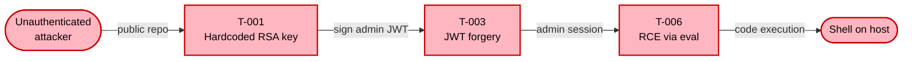
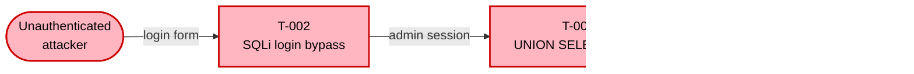

# Phase Group: Threat Enumeration & Synthesis (Phases 9–10)

This file is read by the orchestrator at runtime to load phase instructions.

## Phase 9: STRIDE Threat Enumeration — via sub-agents

**⚠ SEQUENCING: STRIDE analyzers MUST NOT be dispatched before Phase 9.** They require outputs from Phases 6 (INTERFACES), 7 (TRUST_BOUNDARIES), and 8 (CONTROLS).

### Incremental Mode — Per-Component Dispatch Decision

When `INCREMENTAL=true`, the orchestrator does **not** dispatch a STRIDE analyzer for every selected component. Instead, for each component from the baseline `threat-model.yaml.components[]`, decide between four paths:

1. **Re-dispatch** — if `component ∈ SECURITY_RELEVANT_COMPONENTS` (changed files map to this component AND the security relevance filter classified at least one of those files as security-relevant), re-run the STRIDE analyzer as for a full scan. Overwrite `.stride-<component-id>.json`. **New threats get fresh T-IDs** from `.appsec-cache/baseline.json.id_counters.next_threat_id`; **existing threats keep their T-IDs** if the analyzer produces the same finding (match on `component_id` + `cwe` + `title` fingerprint).
2. **Carry forward** — if no changed file maps to this component, **reuse** the existing `.stride-<component-id>.json`. Verify its integrity first:
   ```bash
   # Pseudocode — the orchestrator inlines this as a Bash call
   EXPECTED=$(python3 -c "import json; print(json.load(open('$OUTPUT_DIR/.appsec-cache/baseline.json'))['stride_files'].get('$COMPONENT_ID', {}).get('sha256', ''))")
   ACTUAL="sha256:$(sha256sum "$OUTPUT_DIR/.stride-$COMPONENT_ID.json" | awk '{print $1}')"
   [ "$EXPECTED" = "$ACTUAL" ] && echo "CARRY_FORWARD_OK" || echo "CARRY_FORWARD_HASH_MISMATCH"
   ```
   On `CARRY_FORWARD_OK`, read the file directly. On `CARRY_FORWARD_HASH_MISMATCH` (someone hand-edited the file, or the baseline cache is out of sync), fall back to re-dispatch.
3. **Carry forward (low-risk delta)** — if `changed_files ∩ component.paths ≠ ∅` BUT the security relevance filter classified ALL of those files as non-security-relevant (only cosmetic/documentation/styling changes), carry forward the existing `.stride-<component-id>.json` using the same integrity check as path 2. Track as `LOW_RISK_SKIPPED_COMPONENTS` with `skip_reason: "non-security changes only"`. This avoids expensive STRIDE re-analysis for changes like comment edits, CSS fixes, or logging updates within a component's directory.
4. **Fresh analysis for new components** — if the diff contains a new Dockerfile, service directory, or otherwise introduces a component that was not in baseline `components[]`, dispatch a fresh STRIDE analyzer with new T-IDs pulled from the counter.

**Removed components** — if a component from baseline `components[]` has all its `paths` gone from the repo (directory deleted, Dockerfile removed), mark every one of its threats as `status: resolved` with `resolution_reason: "component removed"` and add them to the new changelog entry's `resolved.threats`. Do not delete the yaml entries — the out-of-scope / resolved records stay as historical context.

**Security relevance filter** — the filter runs as part of the delta detection in the orchestrator (see `appsec-threat-analyst.md` → "Security Relevance Filter" section). By Phase 9, `SECURITY_RELEVANT_COMPONENTS` and `LOW_RISK_SKIPPED_COMPONENTS` are already computed. The filter is a Python script (`scripts/security_relevance_filter.py`) that uses path/extension heuristics and diff content pattern matching — no LLM calls.

**Dirty-set computation — run ONCE at the start of Phase 9:**

```bash
# Assumes BASELINE_SHA was resolved in the Incremental Mode section of appsec-threat-analyst.md
if [ "$INCREMENTAL" = "true" ]; then
  CHANGED_FILES=$(git -C "$REPO_ROOT" diff --name-only "$BASELINE_SHA"..HEAD 2>/dev/null; git -C "$REPO_ROOT" diff --name-only 2>/dev/null)
  CHANGED_FILES=$(echo "$CHANGED_FILES" | sort -u | sed '/^$/d')
  echo "CHANGED_FILES ($(echo "$CHANGED_FILES" | wc -l)):"
  echo "$CHANGED_FILES"
fi
```

For each `component` in `threat-model.yaml.components[]`, use its `paths[]` globs to decide membership. A component is **dirty** if any `changed_file` matches any `path` glob. Store the dirty set as `DIRTY_COMPONENTS` (space-separated component IDs) for reference by the dispatch loop below.

**Changelog accounting** — track these lists during Phase 9 so Phase 11 can write the changelog entry:

- `REANALYZED_COMPONENTS` — components re-dispatched (security-relevant dirty set + new components)
- `CARRIED_FORWARD_COMPONENTS` — components whose `.stride-<id>.json` was reused (no changed files)
- `LOW_RISK_SKIPPED_COMPONENTS` — dirty components skipped because the security relevance filter classified all their changes as non-security-relevant
- `REMOVED_COMPONENTS` — baseline components with no surviving paths
- `ADDED_THREATS` — T-IDs minted in this run
- `CHANGED_THREATS` — T-IDs that existed before but whose fingerprint changed
- `RESOLVED_THREATS` — T-IDs from removed or re-analyzed components that were not re-produced

When `INCREMENTAL=false`, skip this whole decision tree and select components as described under "Component Selection" below.

### Component Selection

Always include: Auth/identity, Authorization, components handling PII/payments, Admin panel, Public API gateway. For Moderate/Complex: each backend service, frontend SPA, queue consumers, CI/CD pipeline. **Cap at `MAX_STRIDE_COMPONENTS`** (default 5, set by `--assessment-depth`).

**Frontend SPA override:** If the recon scanner detected a frontend framework (Section 7.19) or client-side code patterns (Sections 7.10, 7.20–7.24), the frontend SPA MUST be included as a STRIDE component at **all** depth levels, including `quick`. The browser is a large, distinct attack surface that cannot be skipped. This overrides the component cap — if adding the frontend exceeds `MAX_STRIDE_COMPONENTS`, drop the lowest-risk non-auth component instead.

| ASSESSMENT_DEPTH | MAX_STRIDE_COMPONENTS | Selection strategy |
|-----------------|----------------------|-------------------|
| `quick` | 3 | Auth + highest-risk component + public API (+ frontend SPA if detected, see override above) |
| `standard` | 5 | Auth, AuthZ, PII/payment, Admin, public API, frontend SPA |
| `thorough` | 8 | All mandatory + backend services, frontend, queues, CI/CD pipeline |

### CI/CD Pipeline as STRIDE component

**When `ASSESSMENT_DEPTH=standard` or `thorough`** and CI/CD workflow files were found by the recon scanner (Section 5): include the CI/CD pipeline as a STRIDE component if it fits within `MAX_STRIDE_COMPONENTS`. Use component ID `ci-cd-pipeline`.

Pass these additional context fields in the STRIDE analyzer prompt:
- `COMPONENT_DESCRIPTION`: "CI/CD pipeline — build, test, and deployment automation. Includes workflow definitions, secret handling, artifact publishing, and deployment triggers."
- `INTERFACES`: workflow trigger events (push, PR, schedule, workflow_dispatch), artifact registries, deployment targets
- `TRUST_BOUNDARIES`: external Actions/images crossing into build environment, secrets injected at runtime, artifact publish boundary
- `SUPPLY_CHAIN_FINDINGS`: recon-summary sections 7.14–7.17, 7.26, 7.27, and 7.28 (unpinned Actions, container images, dependency confusion, postinstall hooks, ecosystem CI install integrity, dependency management tooling, SCA tooling, `pull_request_target` misuse, `permissions:` hardening, self-hosted runner exposure, AI coding assistant & IDE agent configurations)

The STRIDE analyzer will use `SUPPLY_CHAIN_FINDINGS` to generate evidence-backed threats for the pipeline component (see STRIDE analyzer supply chain patterns).

### Dispatch

For each component, use Agent tool:
- `subagent_type`: `appsec-plugin:appsec-stride-analyzer`
- `description`: `STRIDE analysis for <COMPONENT_NAME>`
- `run_in_background`: `true`
- `prompt`: include COMPONENT_ID, COMPONENT_NAME, COMPONENT_DESCRIPTION, COMPONENT_COMPLEXITY, MAX_TURNS, INTERFACES, TRUST_BOUNDARIES, CONTROLS, KNOWN_SECRETS, KNOWN_VULNS, KNOWN_LLM_PATTERNS, SUPPLY_CHAIN_FINDINGS (for ci-cd-pipeline component only, from recon-summary 7.14–7.17 and 7.26), COMPLIANCE_SCOPE, ASSET_TIER, PRIOR_FINDINGS_INDEX (inline JSON slice for this component from `.prior-findings-index.json`, or `none`), KNOWN_THREATS_INDEX (inline JSON slice for this component, or `none`), CROSS_REPO_CONTEXT (see below), ESTIMATED_THREAT_COUNT (orchestrator's pre-estimate — see "Dynamic turn budget" below), REPO_ROOT, OUTPUT_DIR

**Prior-findings index propagation (mandatory):** The orchestrator passes a component-scoped JSON slice of `$OUTPUT_DIR/.prior-findings-index.json` as the `PRIOR_FINDINGS_INDEX` parameter. The STRIDE analyzer uses this instead of reading `.threat-modeling-context.md` — Phase 1 has already extracted file/line/excerpt for every prior finding. Do **not** pass `CONTEXT_FILE` as a parameter; the STRIDE analyzer no longer needs it when the index is populated. Only pass `CONTEXT_FILE` when a prior finding indicates deeper context (e.g. a known-threat row with cross-component dependencies) and the JSON index is insufficient.

**Cross-repo context propagation:** When `.threat-modeling-context.md` contains a **Cross-Repository Dependency Threat Models** section with entries, the orchestrator extracts a component-scoped slice as `CROSS_REPO_CONTEXT`. For each STRIDE component, include only the cross-repo dependencies that the component directly communicates with (match via interfaces/trust boundaries). Format as inline JSON:

```json
CROSS_REPO_CONTEXT=[
  {"name":"auth-service","type":"scm-sibling","threat_model":"found","threats_open":3,"threats_critical":1,"interface":"REST API"},
  {"name":"Stripe","type":"saas","threat_model":"n/a","interface":"SDK"}
]
```

If the component has no cross-repo interfaces, pass `CROSS_REPO_CONTEXT=none`. The STRIDE analyzer uses this to:
- **Elevate risk** at trust boundaries where the sibling has no threat model (`threat_model: missing`) — add a note to affected threats: "Upstream service `<name>` has no threat model; threats at this boundary may be underestimated."
- **Cross-reference** open threats from siblings with a threat model — if the sibling has Critical/High open threats at the shared interface, consider how those threats propagate into this component.
- **SaaS shared responsibility** — for SaaS dependencies, consider the shared responsibility boundary: the SaaS provider secures their infrastructure, but API key management, webhook validation, and data handling remain the consumer's responsibility.

**Dynamic turn budget:** Pass `MAX_TURNS=<N>` in the prompt, using the depth-adjusted values from the skill:
- Simple components: `MAX_TURNS=STRIDE_TURNS_SIMPLE` (quick: 10, standard: 15, thorough: 20)
- Moderate components: `MAX_TURNS=STRIDE_TURNS_MODERATE` (quick: 15, standard: 22, thorough: 28)
- Complex components: `MAX_TURNS=STRIDE_TURNS_COMPLEX` (quick: 20, standard: 31, thorough: 35)

If the `STRIDE_TURNS_*` variables are not set, use the standard defaults (15/22/31).

**Thin-component cap (mandatory):** Before dispatching, inspect the component's pre-estimate using the recon data already in working memory. If **all** the following hold, cap the turn budget at **8** instead of the depth-based default:

1. The component has fewer than 3 interfaces in `INTERFACES`
2. Recon Section 9 lists fewer than 5 source files tied to this component's entry points
3. Recon Section 7.8 (dangerous sinks) lists **zero** matches for this component's files
4. Recon Section 7.12 (hardcoded secrets) lists **zero** matches for this component's files

Pass `MAX_TURNS=8` and `ESTIMATED_THREAT_COUNT=low` in this case — the analyzer uses the low estimate to skip coverage reruns and cut short after the six STRIDE passes.

**Moderate pre-estimate:** If the component has 3–6 interfaces and ≤2 dangerous sink matches, pass `ESTIMATED_THREAT_COUNT=moderate` and the standard `STRIDE_TURNS_MODERATE` budget.

**Complex pre-estimate:** Pass `ESTIMATED_THREAT_COUNT=high` and `STRIDE_TURNS_COMPLEX` when the component has ≥7 interfaces, or ≥3 dangerous sink matches, or is explicitly called out as high-risk (auth service, payment processor, admin panel with privileged operations).

The `ESTIMATED_THREAT_COUNT` parameter lets the analyzer decide whether it can afford expensive verification grepping or should stay lean. It is advisory — the analyzer may still record more threats than estimated if evidence warrants it.

Dispatch all simultaneously with `run_in_background: true`. **Each component MUST be dispatched as a separate Agent tool call** using `subagent_type: "appsec-plugin:appsec-stride-analyzer"` and `model: $STRIDE_MODEL` (the reasoning-model-resolved ID — overrides the agent's frontmatter default). Issue all Agent calls in a single orchestrator turn (parallel tool calls). Do NOT perform STRIDE analysis inline in the orchestrator — the orchestrator does not have the STRIDE prompt and cannot produce the structured `.stride-<id>.json` output format. Then enter the progress-polling loop described below.

**⚠ MANDATORY per-component dispatch log (since M2.7):** Background agents spawned via `run_in_background: true` do **not** reliably emit `AGENT_INVOKE` log lines through the hook logger — production runs showed only 1 of 5 dispatched STRIDE analyzers logged. The orchestrator MUST therefore emit its own `AGENT_INVOKE` and `AGENT_DONE` lines explicitly, one per component, so `.agent-run.log` shows which components were analyzed and how long each one took. Emit the lines in a single batched Bash call **immediately before** the Agent tool dispatch block and **immediately after** the Validation & Retry step (once each `.stride-<id>.json` is present):

```bash
# Before dispatch — one line per component (batch all into one Bash call):
TS=$(date -u +%Y-%m-%dT%H:%M:%SZ)
for cid in <comp-id-1> <comp-id-2> <comp-id-n>; do
  echo "$TS  [--------]  INFO   stride-analyzer  AGENT_INVOKE   STRIDE analysis for $cid (model: $STRIDE_MODEL, MAX_TURNS=$TURNS)" >> "$OUTPUT_DIR/.agent-run.log"
done
```

```bash
# After Validation & Retry — one line per component with file size as a proxy for work done:
TS=$(date -u +%Y-%m-%dT%H:%M:%SZ)
for f in "$OUTPUT_DIR"/.stride-*.json; do
  cid=$(basename "$f" .json | sed 's/^\.stride-//')
  sz=$(wc -c < "$f" 2>/dev/null || echo 0)
  echo "$TS  [--------]  INFO   stride-analyzer  AGENT_DONE     STRIDE analysis for $cid complete (${sz} bytes)" >> "$OUTPUT_DIR/.agent-run.log"
done
```

Both templates run in one Bash turn each — no per-component turn overhead. The `AGENT_INVOKE` lines must be emitted **before** the `Agent` tool dispatches so they appear before the long polling loop in chronological order. The `AGENT_DONE` lines must be emitted **after** Validation & Retry so a missing stride file does not get a false "done" entry.

### Progress polling loop (mandatory — replaces the old "poll for output files" step)

Each dispatched `appsec-stride-analyzer` writes `$OUTPUT_DIR/.progress/<component-id>.json` at the start of each of its 9 substeps (Loading context, Reading source files, the six STRIDE letters, Writing output). The orchestrator polls these files so the user sees real sub-agent progress instead of a silent wait.

**Per-poll Bash call (one orchestrator turn per round):**

```bash
sleep 20 && PE=$(cat "$OUTPUT_DIR/.phase-epoch" 2>/dev/null || date +%s) && EL=$(( $(date +%s) - PE )) && ES=$(printf "%dm%02ds" $((EL/60)) $((EL%60))) && python3 "$CLAUDE_PLUGIN_ROOT/scripts/stride_progress.py" "$OUTPUT_DIR" <EXPECTED> 2>&1 | sed "s/^/  ↳ (+${ES}) /"; echo "exit=$?"
```

Skip the leading `sleep 20 && ` on the **first** poll so the user sees the initial state immediately after dispatch.

**Control flow:**

1. Print `  ↳ [<k>/<N>] Polling <EXPECTED> STRIDE analyzers…` and fire the first poll call (no sleep)
2. Read `exit=` at the end of the Bash output
3. If `exit=0` — every `.stride-<id>.json` output file exists → exit the loop and proceed to **Validation & Retry**
4. If `exit=1` — not ready yet → issue the next poll Bash call (with the leading `sleep 20 &&`)
5. Cap the loop at **12 rounds** (≈ 4 minutes of waiting). On the 12th round still returning `exit=1`, log a `BASH_WARN` line like `STRIDE poll cap reached — proceeding with <ready>/<EXPECTED> outputs present` and fall through to Validation & Retry. Missing components get the normal "skip if still invalid" handling.

The script prints one line of the form:

```
[stride] 3/5 ready  —  Auth Service [4/9 Tampering] · REST API [2/9 reading sources] · Frontend SPA ✓ · Admin ✓ · Public API [1/9 starting]
```

A trailing `⧗` marker on a component means its progress file has not been updated for more than 3 minutes — typically a hint that the sub-agent is stuck on a long tool call or has exhausted its turn budget. If the same component shows `⧗` for three consecutive rounds, the orchestrator may break out of the loop early and rely on Validation & Retry to recover.

### Validation & Retry

Validate each `$OUTPUT_DIR/.stride-<id>.json`. On failure: retry once synchronously, skip if still invalid.

### Hybrid merger (optional — activated by MERGER_MODEL)

When `$MERGER_MODEL` is set to an Opus identifier (opt-in via `--reasoning-model opus-cheap` or `opus`, default at `--assessment-depth thorough`), the orchestrator may delegate the dedup-judgment portion of the merge to `appsec-threat-merger`. The inline "Merge" section below remains the authoritative specification — the hybrid path is a drop-in replacement for Steps 4–5 (dedup + systemic consolidation) that offloads those judgments to a focused Opus call.

Pipeline:

1. **Collect** — `python3 "$CLAUDE_PLUGIN_ROOT/scripts/merge_threats.py" collect --output-dir "$OUTPUT_DIR"`
   - Reads all `.stride-*.json`, runs mechanical exact-dedup (same CWE + STRIDE + evidence.file + line), groups near-duplicate candidates (shared CWE + STRIDE letter with ≥2 members), writes `$OUTPUT_DIR/.merge-candidates.json`.
   - If the resulting `candidate_group_count` is `0`, **skip the merger dispatch entirely** — no ambiguous groups means nothing for LLM judgment.

2. **Dispatch `appsec-threat-merger`** (only when candidates exist):
   ```
   subagent_type: "appsec-plugin:appsec-threat-merger"
   description: "Dedup / consolidate candidate threat groups"
   model: $MERGER_MODEL
   run_in_background: false
   prompt: |
     REPO_ROOT=<REPO_ROOT>
     OUTPUT_DIR=<OUTPUT_DIR>
     MODEL_ID=<MERGER_MODEL>
     CANDIDATES_FILE=<OUTPUT_DIR>/.merge-candidates.json
     COMPONENT_MAP=<inline JSON of {component_id: {name, trust_boundaries}}>
   ```
   Log `AGENT_INVOKE` / `AGENT_DONE` in the same style as the triage-validator dispatch above, using `$MERGER_MODEL` in the message.

3. **Finalize** — `python3 "$CLAUDE_PLUGIN_ROOT/scripts/merge_threats.py" finalize --output-dir "$OUTPUT_DIR"`
   - Reads `.merge-candidates.json` + (if present) `.merge-decisions.json`, applies decisions, performs the deterministic 8-field sort, assigns `T-001`..`T-NNN`, writes `.threats-merged.json`.
   - If `.merge-decisions.json` is missing (merger failed or was skipped), every candidate group is treated as "keep all" — no dedup, but no data loss.

The hybrid path produces a `.threats-merged.json` whose schema is byte-compatible with the inline merge output — downstream steps (coverage checks, Phase 10 SCA synthesis, Phase 10b triage validation) do not need to know which path produced the file.

**Fallback rule:** if the hybrid path fails at any step (non-zero exit from `merge_threats.py`, missing output, or merger dispatch error), the orchestrator logs `BASH_WARN` and falls back to the inline Merge section below for this run.

### Merge

0. **Build the `known_vulns_seen` set** for Phase 10 pre-filtering. While iterating the raw STRIDE outputs, collect every `(component_id, cve_id, evidence.file)` tuple from threats whose source is `KNOWN_VULNS`. Keep the set in working memory — Phase 10 Step 2 uses it to deduplicate SCA findings in O(1) per candidate.
1. Merge all threat lists + Phase 8b threat candidates (if requirements enabled)
2. **Priority-aware risk for requirement threats:** For threats sourced from `requirements-compliance` or `architectural-anti-pattern`, apply the priority-derived minimum risk from Phase 8b (MUST FAIL ≥ High, architectural violations escalated by one level). If the standard Likelihood × Impact risk is already higher, keep the higher value.
3. **Assign global IDs deterministically.** Apply the full lexicographic sort key below to the merged threat list, then iterate once and assign `T-001`, `T-002`, … in order. Every field must be evaluated — no tie-breaker is optional. Two runs on an unchanged codebase MUST produce the same T-NNN for the same underlying threat.

   Sort key (compare left-to-right, first non-equal field wins):

   1. `architectural_violation` — `true` before `false` (systemic issues lead their risk tier)
   2. `risk` — Critical → High → Medium → Low
   3. `stride` — S → T → R → I → D → E (fixed category order, never alphabetical)
   4. `component_id` — alphabetical (case-insensitive)
   5. `cwe` — numeric ascending, parsing the integer after `CWE-` (threats without a CWE sort last within this field)
   6. `evidence.file` — alphabetical (repo-relative path)
   7. `evidence.line` — numeric ascending (threats with `null` line sort last)
   8. `title` — alphabetical (final tie-break; should not be reached when fields 1–7 are populated)

   Do not reorder after assignment. The sort is the single source of truth for T-NNN ordering — any later per-section display sort MUST derive from the same key (see §8 split-by-severity rule).
4. Deduplicate same root cause across components
5. **Systemic-threat consolidation (mandatory).** When three or more threats share the **same root cause** but appear on different endpoints or components, consolidate them into a single *systemic* entry. The most common patterns:
   - **IDOR / Missing ownership checks** on multiple resource endpoints (wallet, order-history, user-data, memories) — consolidate into one threat titled e.g. "Systemic IDOR — missing ownership checks across authenticated resource endpoints" with the individual endpoints listed as sub-items in the Threat Scenario cell
   - **Raw SQL string interpolation** across multiple route handlers — consolidate into one threat when the defect is the same pattern
   - **Unauthenticated management endpoints** (/metrics, /ftp, /logs, /api-docs) — consolidate when the root cause is "missing auth middleware on management routes"
   - **bypassSecurityTrustHtml / disabled sanitization** across multiple frontend components — consolidate when the root cause is "sanitizer bypass"
   
   Consolidated threats use the highest severity among the merged items and list every affected endpoint in the Scenario cell as a bullet list. Individual endpoint rows are removed from the register. The consolidated threat links to the Cross-Cutting Architecture Finding (Section 2.x) that explains the systemic pattern.
   
   **Do not consolidate** when the root causes differ (e.g. SQL injection and NoSQL injection are different defects even though both are injection). **Do not consolidate** when only two threats share a root cause — the overhead of a systemic entry is only justified at three or more.
6. Cross-reference prior findings from `$OUTPUT_DIR/.threat-modeling-context.md`
7. Known threats integration (open → verify, accepted → Section 10, mitigated → verify, false-positive → skip)
8. **Normalize component names:** Each unique component in the merged threat list must use a single consistent name. If the same component has different names from different analyzers (e.g., "Auth Service" vs "Auth Module"), unify to one name — use the name from the STRIDE analyzer dispatch prompt (`COMPONENT_NAME`). Do not use variant names like "Auth Service / API" alongside "Auth Module" for the same component.

### Coverage Checks

**When `ASSESSMENT_DEPTH=quick`:** Skip all coverage checks — the STRIDE analysis itself is sufficient at quick depth. Proceed directly to Merge.

**When `ASSESSMENT_DEPTH=standard` or `thorough`:**

**A — OWASP Top 10:** Verify at least one threat per OWASP 2021 category. Add gap threats for missing.

**B — Business logic:** Check workflow bypass, privilege abuse, mass enumeration, economic abuse, state manipulation.

**C — OWASP LLM Top 10 (conditional):** If AI/LLM integration was detected in recon (Section 7.13), verify coverage for each applicable LLM threat category. Add gap threats for missing. Skip if no LLM detected.

**D — Cross-repository boundary coverage (conditional):** If `.threat-modeling-context.md` contains cross-repo dependencies with `threat_model: missing`, verify that at least one threat exists at each trust boundary where the upstream/downstream service has no threat model. If missing, add an Information Disclosure or Spoofing gap threat per uncovered boundary with the note: "Data from `<dependency>` crosses an unanalyzed trust boundary — no threat model exists for the upstream service to validate its security posture." Severity: at minimum Medium when the interface handles authentication tokens or PII; Low otherwise.

### Merged Threats JSON Dump

After Merge (steps 0–8) and Coverage Checks complete — and **before** emitting the Section 7 markdown tables — write the full merged threat list to `$OUTPUT_DIR/.threats-merged.json`. This file is the canonical structured source consumed by downstream deterministic tooling (diagram annotator, YAML export, SARIF export, changelog writer); downstream steps read this file instead of re-parsing the rendered Section 7 markdown.

**Mandatory.** If this step is skipped, the diagram annotator has no structured input and the fragments remain unannotated.

**Schema (`$OUTPUT_DIR/.threats-merged.json`):**

```json
{
  "version": 1,
  "generated_at": "<ISO 8601 UTC timestamp>",
  "threats": [
    {
      "t_id": "T-001",
      "component_id": "auth-service",
      "component_name": "Auth Service",
      "stride": "Tampering",
      "risk": "Critical",
      "likelihood": "High",
      "impact": "Critical",
      "title": "Hardcoded RSA Private Key",
      "cwe": "CWE-321",
      "evidence": {"file": "lib/insecurity.ts", "line": 22},
      "source": "stride",
      "architectural_violation": false
    }
  ]
}
```

**Field rules:**

- `t_id` — global ID exactly as written in Section 7; one-for-one with the `### 8.x` sub-tables
- `component_id` — stable ID from the STRIDE analyzer (same as `.stride-<id>.json` filename)
- `component_name` — canonical name after step 8 normalization
- `stride` — full word (`Spoofing`, `Tampering`, `Repudiation`, `Information Disclosure`, `Denial of Service`, `Elevation of Privilege`); never single-letter
- `risk`, `likelihood`, `impact` — one of `Critical`, `High`, `Medium`, `Low`
- `title` — 2–6 word human-readable title. For Critical threats, use the identical text that appears in the `## Critical Attack Chain` Quick-reference Title column. For non-Critical threats, derive by converting the remediation title from imperative to noun phrase (e.g. "Remove hardcoded RSA key" → "Hardcoded RSA Private Key")
- `cwe` — mandatory, must match the CWE reference in the Section 7 Scenario cell
- `evidence` — `{file, line}`; `file` repo-relative, `line` integer or `null`
- `source` — one of `stride`, `requirements-compliance`, `architectural-anti-pattern`, `known-vuln`, `dep-scan`, `coverage-gap`
- `architectural_violation` — `true` when the Phase 9 escalation rule was applied, else `false`

**Ordering:** rows MUST appear in the same order as the global T-NNN assignment from Merge step 3 (`T-001` first, `T-NNN` last). Two runs on an unchanged codebase MUST produce byte-identical output modulo the `generated_at` timestamp.

**Write protocol:** Invoke a single `python3 -c` Bash call that takes the merged list on stdin and writes the file with `json.dump(..., indent=2, ensure_ascii=False, sort_keys=False)`. Do not hand-write this file via Edit / Write — it must be a deterministic dump of the in-memory merged state so downstream tools can trust it.

### Section 8 layout — architectural categories at the top, findings grouped underneath (Phase 3, analysis_version ≥ 2)

**Schema change (analysis_version 2, Phase 3).** The old flat `threats[]` list is replaced by a two-level structure in `threat-model.yaml`:

```yaml
threat_categories:          # 18 architectural patterns (TH-01 .. TH-18)
  - id: TH-01
    title: Injection
    cwe_pillar: CWE-707
    cwe_primary: CWE-74
    owasp_top10_2021: A03
    aggregated:
      max_risk: Critical
      max_cvss: 10.0
      finding_count: 7
      stride_present: [Tampering, Elevation of Privilege]
    mitigation_ids: [M-007, M-008, M-005, M-009]
    finding_ids: [F-006, F-009, F-010, F-011, F-014, F-019, F-024, F-025]

findings:                   # ~50 concrete code-level findings (F-001 .. F-NNN)
  - id: F-009
    threat_category_id: TH-01         # primary category (REQUIRED, FK)
    additional_categories: []         # optional, when a finding spans multiple
    legacy_id: T-009                  # retained for traceability to v1 baselines
    component: rest-api
    stride: Information Disclosure
    title: SQL injection in product search
    scenario: "…file:line…"
    evidence: [{path, lines}]
    likelihood: High
    impact: Critical
    risk: Critical
    cvss_v3_1: {score, vector}
    cwe: [CWE-89]
    cwe_top25_rank: 3
    mitigation_ids: [M-007]
```

**Category IDs** come from `$CLAUDE_PLUGIN_ROOT/data/threat-category-taxonomy.yaml` — **never invent a new `TH-NN` outside that file**. The STRIDE-analyzer and merger agents read the taxonomy at startup and must assign every finding to exactly one primary category; they may record up to two `additional_categories` when a finding legitimately spans patterns (e.g. T-010 notevil RCE belongs primarily to TH-05 Code Execution but is also an instance of TH-01 Injection).

**Finding IDs.** `F-NNN` (zero-padded, starts at 001) — stable across incremental runs via the same baseline fingerprinting used for old `T-NNN` IDs. A newly-discovered finding gets the next unused `F-NNN` in the baseline. Retired findings leave holes in the sequence. IDs are **per-project**, not global across plugin runs.

**Legacy-ID mapping.** Every finding carries `legacy_id: T-NNN` when migrated from a v1 baseline. The top of `threat-model.yaml` additionally carries a `legacy_id_map:` block for bulk lookups:

```yaml
legacy_id_map:
  T-001: F-001
  T-002: F-002
  T-003: F-008          # consolidated — two legacy IDs point to one finding
  T-004: F-004
```

External systems (SARIF export, Jira tickets, SIEM rules) that referenced `T-NNN` keep working — the migration script writes an id_map alongside. New runs report both `F-NNN` (primary) and `T-NNN` (legacy) on every finding row; after two full-run cycles the legacy column can be dropped per-project.

**Section 8 rendering layout.** Section 8 opens with methodology + distribution blocks (same as v1), then splits into **two rendered halves**:

1. `### 8.A Categories at a glance` — a compact executive table of all 18 THs with aggregated counts, max risk, and linked mitigations. Categories with zero findings in this project are omitted.
2. `### 8.B <severity> Categories (<N>)` — one sub-section per severity (Critical / High / Medium / Low), where each severity groups **categories** (not individual findings). Inside each category block, a nested findings table lists the concrete F-NNN rows.

```markdown
## 8. Threat Register

<methodology paragraphs + Risk Matrix + CVSS v4 note — unchanged>

**Risk Distribution:** Critical: <N> · High: <N> · Medium: <N> · Low: <N> · **Total findings: <N>**
**STRIDE Coverage:** Spoofing: <N> · Tampering: <N> · …
**Category Distribution:** <M> of 18 categories active — Critical: <n> · High: <n> · Medium: <n> · Low: <n>

### 8.A Categories at a glance

| TH | Category | Max Risk | Findings | Top Finding | OWASP | Pillar | Mitigated by |
|----|----------|---------|----------|-------------|-------|--------|--------------|
| [TH-01](#th-01) | Injection | 🔴 Critical (CVSS 10.0) | 7 (4🔴 3🟠) | [F-011](#f-011) Mass assignment | [A03](url) | [CWE-707](url) | M-007, M-008, M-005, M-009 |
| [TH-02](#th-02) | Broken Authentication | 🔴 Critical (CVSS 10.0) | 6 | [F-005](#f-005) JWT admin forgery | [A07](url) | [CWE-693](url) | M-001, M-003, M-004 |
| … |

Sort: max-CVSS desc → finding_count desc → TH-ID asc.

### 8.B Critical Categories (<n>)

#### <a id="th-01"></a>TH-01 — Injection

> <One-sentence category description from the taxonomy + one-sentence codebase-specific observation.>

| Property | Value |
|---|---|
| **Max Risk** | 🔴 Critical (CVSS 10.0) |
| **CWE Pillar** | [CWE-707](…) — Improper Neutralization |
| **Canonical CWE** | [CWE-74](…) — Improper Neutralization of Special Elements |
| **OWASP** | [A03:2021](…) — Injection |
| **CWE Top 25** | 🏆 contains CWE-79 (#2), CWE-89 (#3), CWE-94 (#11) |
| **Findings** | 7 (4 Critical, 3 High, 0 Medium, 0 Low) |
| **Mitigated by** | [M-007](…) — Parameterize SQL queries · [M-008](…) — Replace notevil · [M-005](…) — Disable XXE · [M-009](…) — Field allowlist |

**Findings in this category:**

| ID | Legacy | Finding | Component | Risk | CVSS | CWE | Evidence | Mitigation |
|----|--------|---------|-----------|------|------|-----|----------|------------|
| [F-009](#f-009) | T-009 | SQL injection in product search | REST API | 🔴 Critical | 9.1 | [CWE-89](…) 🏆#3 | `routes/search.ts:42` | [M-007](#m-007) |
| [F-014](#f-014) | T-014 | SQL injection in login | Auth Service | 🔴 Critical | 9.1 | [CWE-89](…) 🏆#3 | `routes/login.ts:23` | [M-007](#m-007) |
| [F-019](#f-019) | T-019 | NoSQL `$where` injection | Product Reviews | 🟠 High | 8.3 | [CWE-943](…) | `routes/showProductReviews.ts:18` | [M-015](#m-015) |
| … |

---

#### <a id="th-02"></a>TH-02 — Broken Authentication

<similar block>

### 8.B High Categories (<n>)

<same layout — categories whose max_risk is High>

### 8.B Medium Categories (<n>)

<same>

### 8.B Low Categories (<n>)

<same — usually omitted>
```

**Sort order within a severity sub-section:** max-CVSS desc → finding_count desc → TH-ID asc.

**Within each category block, findings table sort:** Risk desc → CVSS desc → F-ID asc.

**Category omission rule:** Categories with zero findings in this project are omitted from 8.A AND 8.B — the category framework is universal, but the report shows only the categories actually present. The "Category Distribution" line above states `M of 18 categories active` so the reader knows what was evaluated but not found.

---

### Legacy (v1) section 7 layout — methodology, distribution, then split-by-severity

*Retained for `analysis_version=1` baselines and migration paths.* New runs use the two-level layout above.

Section 7 (Threat Register) opens with a one-sentence reader-orientation, the methodology note including the explicit Risk Matrix, the Risk Distribution / STRIDE Coverage summary, and is then split into four sub-sections — one per severity level. A single 30-row table is unreadable in rendered Markdown, so the orchestrator MUST emit four separate tables.

```markdown
## 8. Threat Register

The threat register lists every confirmed STRIDE finding with its evidence, current state, and the mitigation that addresses it. Threats are split into four sub-sections by severity so the reader can see at a glance what is critical and what is hardening work.

**Risk methodology:** Risk = Likelihood × Impact. Likelihood considers exploitability, attack complexity, and required privileges. Impact considers confidentiality, integrity, and availability effects on the identified assets. The table below is the single source of truth for converting (Likelihood, Impact) to a final Risk rating — every threat row in this section must be consistent with it.

| Likelihood \ Impact | Low | Medium | High | Critical |
|---|---|---|---|---|
| **Critical** | Medium | High | Critical | Critical |
| **High** | Low | Medium | High | Critical |
| **Medium** | Low | Medium | Medium | High |
| **Low** | Low | Low | Medium | High |

**Escalation rule (architectural violations):** When a threat is tagged `architectural_violation: true`, the Risk is escalated by exactly one level compared to the value in the matrix above (Medium → High, High → Critical). This rule makes architectural violations visible without bending the Likelihood/Impact scoring.

**CVSS v4.0 column (conditional).** When at least one threat in the register carries a `cvss_v4` vector, add a `CVSS v4` column as the column immediately **after** `Risk` in each sub-section table. Cell format: `<base_score> (<severity>)` linked to the FIRST.org calculator, e.g. `[9.3 (Critical)](https://www.first.org/cvss/calculator/4-0#<url-encoded-vector>)`. Threats without a vector show `—` (em dash). If the register has **zero** CVSS vectors, omit the column entirely — do not render a column of em dashes. Append a single-line note below the methodology paragraph: *"CVSS v4.0 scores are attached only to threats with concrete, exploitable evidence (injection, auth bypass, crypto misuse, dependency CVEs). Design-, policy-, and coverage-sourced threats are scored qualitatively via the Likelihood × Impact matrix."*

**Risk Distribution:** Critical: <N> · High: <N> · Medium: <N> · Low: <N> · **Total: <N>**
**STRIDE Coverage:** Spoofing: <N> · Tampering: <N> · Repudiation: <N> · Information Disclosure: <N> · Denial of Service: <N> · Elevation of Privilege: <N>

**Consistency invariants (QA-enforced):**

1. Every Risk cell in the sub-section tables MUST match the Likelihood/Impact matrix above — no exceptions without an explicit `architectural_violation: true` escalation note in the threat row
2. The counts in the "Risk Distribution" line MUST sum to the **Total** and MUST equal the row counts in the four sub-section headings (`### 7.1 Critical (<N>)` …)
3. The counts in the "STRIDE Coverage" line MUST sum to the **Total** — one threat has exactly one primary STRIDE category; never split a threat across two categories

### 7.1 Critical (<N>)

These findings combine high exploitability with maximum impact. Every entry here is referenced by T-NNN from the `## Critical Attack Chain` block (placed directly after the Management Summary) and is the source of the P1 rollout actions in the Management Summary's Immediate Actions table. Section 7.1 is the authoritative per-finding source — the Attack Chain block links back here, never duplicates this content.

| ID | Component | STRIDE | Threat Scenario | Likelihood | Impact | Risk | Controls in Place | Mitigations |
|----|-----------|--------|-----------------|------------|--------|------|-------------------|-------------|
| ... |

### 8.2 High (<N>)

High-rated threats require remediation in the current sprint or quarter. They typically gate the next release.

| ID | Component | STRIDE | Threat Scenario | Likelihood | Impact | Risk | Controls in Place | Mitigations |
|----|-----------|--------|-----------------|------------|--------|------|-------------------|-------------|
| ... |

### 8.3 Medium (<N>)

Medium-rated threats represent meaningful gaps with either reduced exploitability or contained impact. They should be tracked and remediated as part of normal hardening work.

| ID | Component | STRIDE | Threat Scenario | Likelihood | Impact | Risk | Controls in Place | Mitigations |
|----|-----------|--------|-----------------|------------|--------|------|-------------------|-------------|
| ... |

### 8.4 Low (<N>)

Low-rated threats document residual risk and minor hygiene issues. They are typically addressed opportunistically as part of related work.

| ID | Component | STRIDE | Threat Scenario | Likelihood | Impact | Risk | Controls in Place | Mitigations |
|----|-----------|--------|-----------------|------------|--------|------|-------------------|-------------|
| ... |
```

**Rules for the split:**

- Each sub-section is its own H3 heading and its own table — never collapse two severity tiers into one table
- The count in parentheses (`Critical (6)`) must match the number of rows in the sub-section
- Sort within each sub-section using the **same deterministic sort key defined in the Merge step (fields 1–8)**, skipping field 2 (`risk`) since every row in a sub-section already shares the same risk. This guarantees that Section 7 sub-tables are presented in the same order as the global T-NNN assignment — a reader scanning 8.1 top-to-bottom sees T-001, T-002, … in sequence without gaps
- If a severity tier has zero threats, still emit the H3 with a single line: `_No threats at this severity level._` and skip the table — do not omit the heading entirely (it preserves consistent navigation anchors)
- **Severity encoding rule — Risk column only.** The `Likelihood` and `Impact` cells use **plain words** (`Critical`, `High`, `Medium`, `Low`) — no emoji markers. Only the final `Risk` cell carries an emoji severity badge (`🔴 Critical`, `🟠 High`, `🟡 Medium`, `🟢 Low`). This reduces emoji density from three per row to one and keeps the emoji meaningful (it highlights the conclusion, not the intermediate scores). Inline HTML `<span>` badges remain forbidden everywhere
- The Risk Distribution and STRIDE Coverage lines come **once** at the top of Section 7, not repeated in each sub-section

### CWE References in Threat Register

Each threat row in the Threat Register table **MUST** include a CWE reference in the Threat Scenario cell as a **clickable link** to the MITRE CWE entry. Format: `[CWE-NNN](https://cwe.mitre.org/data/definitions/NNN.html)`. Append at the end of the scenario text, e.g.: `... allowing full database extraction. [CWE-89](https://cwe.mitre.org/data/definitions/89.html).` For threats with multiple CWEs, comma-separate: `[CWE-94](https://cwe.mitre.org/data/definitions/94.html), [CWE-74](https://cwe.mitre.org/data/definitions/74.html).` Use the most specific applicable CWE — every threat has an applicable CWE. **Never use bare `CWE-NNN` text** — always link it.

**Mandatory classification tag (Phase 1E and later).** Immediately after the CWE link(s) in every scenario cell, append a compact three-part classification tag sourced from `$CLAUDE_PLUGIN_ROOT/data/cwe-taxonomy.yaml`:

```
[CWE-NNN](cwe-url) 🏆 Top 25 #R · Pillar [CWE-PPP](pillar-url) · OWASP [A0X:2021](owasp-url)
```

Segments:

| Segment | When emitted | Format | Source |
|---|---|---|---|
| 🏆 Top 25 #R | CWE has `cwe_top25_2024` rank set in taxonomy | `🏆 Top 25 #<rank>` | `cwes.CWE-NNN.cwe_top25_2024` |
| Pillar | CWE has `pillar` field ≠ null (i.e. CWE is not itself a pillar) | `Pillar [CWE-PPP](url)` | `cwes.CWE-NNN.pillar` + `pillars.CWE-PPP.url` |
| OWASP | CWE has `owasp_top10_2021` mapping | `OWASP [A0X:2021](url)` | `cwes.CWE-NNN.owasp_top10_2021` + `owasp_top10_2021_urls.A0X` |

The three segments are separated by ` · ` (middle-dot with spaces). If a segment is unavailable, skip it — do not emit empty placeholders. The tag is **in addition to** the CWE link, on the same line, same cell.

Example row in Threat Register for T-009 (SQL injection in product search):

```markdown
| <a id="t-009"></a>T-009 | REST API | Information Disclosure | SQL injection in product search: … [CWE-89](https://cwe.mitre.org/data/definitions/89.html) 🏆 Top 25 #3 · Pillar [CWE-707](https://cwe.mitre.org/data/definitions/707.html) · OWASP [A03:2021](https://owasp.org/Top10/A03_2021-Injection/) | High | Critical | 🔴 Critical | … | [M-007](#m-007) — Parameterize raw queries |
```

**When an LLM-related OWASP code is used** (`LLM03`, `LLM04`, etc. from `cwe-taxonomy.yaml → owasp_llm_top10`), emit it alongside the OWASP Top 10 tag with the same formatting, e.g. `OWASP [A10:2021](…) · LLM [LLM03](…)`. Only LLM-integrated components trigger this — the STRIDE analyzer decides.

**Never invent taxonomy data** — if a CWE is not in `cwe-taxonomy.yaml`, leave only the CWE link and add an inline HTML comment `<!-- QA: CWE-NNN not in cwe-taxonomy.yaml -->` so the QA reviewer's Check 3g flags it for taxonomy maintenance.

### Requirements Integration in Sections 8, 9, and 10

**When `CHECK_REQUIREMENTS=true` and requirement metadata is available from Phase 8b:**

**Section 7 — Threat Register: Violated Requirements**

For **every** threat row that has associated requirement IDs from Phase 8b (not just Critical threats), append a `Violated: [ID](url), …` note inside the Threat Scenario cell, after the CWE reference. This ensures requirement violations are visible at all severity levels — not just for Critical threats surfaced in the `## Critical Attack Chain` block. Format example: `... file read. [CWE-611](https://cwe.mitre.org/data/definitions/611.html). Violated: [IV-002](url)`.

**Critical Attack Chain layout (mandatory) — rendered directly after the Management Summary:**

The Critical Attack Chain is a **thin, promoted section** placed **immediately after the Management Summary, before Section 1**. It is **unnumbered** (heading: `## Critical Attack Chain`, anchor `#critical-attack-chain`) because it serves as the visual extension of the Management Summary's `### Worst Case Scenarios` bullet list — the bullets describe *what* happens in prose, this section shows *how* it happens as a diagram.

Its job is to show the *chain(s)* — how Critical (and optionally High) findings combine into attacker workflows — and to link back to the detailed rows in Section 8.1 and the step-by-step walkthroughs in Section 3. Full narrative detail (Scenario, Current state, Violated Requirements) lives in Section 8.1; detailed sequenceDiagrams per Critical finding live in Section 3 (Attack Walkthroughs), rendered by Phase 4 of the orchestrator.

**Multiple chains are allowed and encouraged when they exist.** The old template rendered exactly one diagram. The new template renders **1 to 3 chains**, one per distinct end-to-end attack path identified in the Management Summary's Worst Case Scenarios. If two scenarios share the same root (e.g. both start from unauthenticated SQL injection on the login form) but diverge at the second step, they count as two distinct chains and MUST be rendered as two separate `graph LR` blocks — do not merge them into one mega-diagram with branching subgraphs, which is unreadable.

**Section 3 (Attack Walkthroughs)** holds the detailed `sequenceDiagram` blocks — one per Critical finding, rendered by Phase 4 of the orchestrator. The `## Critical Attack Chain` block remains the thin executive-level overview, and Section 3 remains distinct from it: the Attack Chain shows *how Criticals chain together* (one `graph LR` per scenario, max 3), Section 3 shows *each Critical in detail* (one `sequenceDiagram` per finding). Do not duplicate the Mermaid chain diagram or the quick-reference table in Section 3 — they live **only** in `## Critical Attack Chain`.

When there are 0 or 1 Critical findings, skip the `## Critical Attack Chain` section entirely — a single Critical cannot form a "chain" with itself. Section 3 still renders in that case: if `CRIT_COUNT == 1` it contains one attack walkthrough for that single Critical finding; if `CRIT_COUNT == 0` it contains the empty-state stub documented in Phase 4.

```markdown
## Critical Attack Chain

The diagrams below show how Critical findings combine into distinct attacker workflows. Each chain corresponds to one bullet under *Worst Case Scenarios* in the Management Summary. Nodes link directly to their full detail row in Section 7.1 — no finding is re-described here.

### Chain 1 — Unauthenticated RCE



**Key takeaway:** <one sentence — e.g. "A single HTTP request with a self-signed administrator JWT is enough to land a shell on the server, because every step of the chain sits on the public attack surface.">

### Chain 2 — Mass data exfiltration



**Key takeaway:** <one sentence — e.g. "Unauthenticated SQL injection on the login endpoint yields the complete customer database including weakly-hashed passwords in under a minute.">

<Optional Chain 3 — render only when a third distinct end-to-end path exists (e.g. supply-chain, stored XSS → session theft, SSRF → cloud metadata). Never pad — if fewer than 3 distinct chains exist, stop after the last real one.>

### Quick reference — Critical findings

| ID | Title | Component | Violated Requirements | Mitigation |
|----|-------|-----------|------------------------|------------|
| [T-001](#t-001) | Hardcoded RSA Private Key | Auth Service | [DP-005](url), [AC-005](url) | [M-001](#m-001) · P1 |
| [T-002](#t-002) | SQL Injection in Login | Auth Service | [IV-004](url) | [M-002](#m-002) · P1 |
| … | | | | |
```

**Rules for `## Critical Attack Chain`:**

- **No per-finding prose blocks — ever.** The old template had a `### 🔴 T-NNN — Title` heading with a Scenario / Current state / Violated Requirements / Mitigation block for each finding. Do **not** emit those blocks — they duplicate Section 7.1. The Quick-reference table is the only per-finding presentation allowed.
- **Heading is unnumbered.** Render as `## Critical Attack Chain` (anchor `#critical-attack-chain`), not `## 9. Critical Attack Chain` and not `## 1.5 …`. The absence of a number is deliberate and tells the reader this is part of the executive summary, not a numbered finding section.
- **Position is non-negotiable.** Immediately after the Management Summary, immediately before Section 1. Never after Section 7.
- The intro sentence is mandatory and must come before the first chain heading.
- **Render between 1 and 3 chains** — one per distinct end-to-end attack path. Each chain is a `### Chain <N> — <Scenario name>` heading followed by exactly one `graph LR` block followed by exactly one `**Key takeaway:**` sentence. The chain headings match the Scenario names used in the Management Summary's `### Worst Case Scenarios` bullet list, one-to-one, so the reader can map the textual bullet to its visual diagram without guessing.
- **Chain count rules:** emit 0 chains (skip the whole section) when `CRIT_COUNT <= 1`. Emit exactly 1 chain when `CRIT_COUNT == 2` (one linear path). Emit 2 or 3 chains when distinct end-to-end paths exist. Never merge two distinct chains into one branching diagram.
- The chain diagrams use `graph LR` (the only place where LR is allowed — chains read like sequences) and the `crit` classDef shown above.
- Each chain node is one Critical finding labeled with its T-NNN and a 2–3 word summary; edges describe the attacker capability gained at each step.
- Each chain MUST have exactly one `**Key takeaway:**` sentence immediately under its diagram — this is what the QA reviewer looks for, not a single shared takeaway at the section level.
- The Quick-reference table is rendered **once**, at the end of the section (after the last chain) — not per chain. It lists every Critical finding that appears in any of the chains. Columns: ID, Title, Component, Mitigation. Word severity only (no emoji) — severity is implicit. Include `Violated Requirements` as comma-separated clickable IDs *only when* `CHECK_REQUIREMENTS=true`; otherwise drop the column.
- **Mitigation column MUST include a short explanation** after the M-NNN link: `[M-NNN](#m-NNN) — <short action>` (e.g. `[M-001](#m-001) — Parameterized queries`). Bare M-NNN links without an explanation are a format defect.
- Section 8.1 remains the authoritative per-finding source — any reader clicking a T-NNN link in the Quick-reference table or in a chain node lands on the full row with Scenario, Likelihood, Impact, Risk, Controls in Place, and Mitigation.

**Section 3 — Attack Walkthroughs:**

Section 3 is rendered by **Phase 4** of the orchestrator — see `phase-group-architecture.md` → "Phase 4: Attack Walkthroughs (renders Section 3)" for the full rendering contract. Phase 9's job is to verify the heading exists; Phase 4 fills the content.

```markdown
## 3. Attack Walkthroughs

<body — either the Phase-4-rendered sequenceDiagram blocks, or the stub below when CRIT_COUNT == 0>
```

**Empty-state stub (when CRIT_COUNT == 0):**

```markdown
## 3. Attack Walkthroughs

_No critical-severity attack walkthroughs — the highest-severity findings are documented in [Section 8 — Threat Register](#8-threat-register). This section renders step-by-step attack flows for Critical findings only; other severities are catalogued in the threat register tables._
```

**Three roles, three places:**

| Where | What | For whom |
|---|---|---|
| `## Critical Attack Chain` (after Mgmt Summary) | 1 high-level `graph LR` showing how Critical findings chain together | Executive — 30 seconds |
| Section 8.1 Critical | Tabular per-finding rows with Evidence, CWE, Mitigation | Engineer — 5 minutes |
| **Section 3 Attack Walkthroughs** | 1 detailed `sequenceDiagram` per Critical finding, alt=current / else=post-mitigation | Reviewer walking through the exploit — 15 minutes |

**Section 9 — Mitigation Register template (canonical, applies to every mitigation):**

When a mitigation addresses **two or more** threats, the `**Addresses:**` block MUST be a bullet list — one `[T-NNN](#t-NNN) — <short title>` per line. When a mitigation addresses exactly one threat, a single inline `[T-NNN](#t-NNN) — <short title>` is acceptable. **Never** emit a comma-separated inline list outside of tables, and **never** emit a bare `T-NNN` without both the `(#t-NNN)` anchor and the short title.

```markdown
### <a id="m-NNN"></a>M-NNN — <Mitigation title>

**Addresses:**
- [T-001](#t-001) — <short threat title, ≤60 chars>
- [T-002](#t-002) — <short threat title, ≤60 chars>

**Fulfills Requirements:**
- [SEC-AUTH-1](url) — <title>
- [SEC-AUTH-3](url) — <title>

**Blueprint guidance:** [BP-XYZ](url) — <Blueprint title> · <section title>

**Priority:** P1 — Immediate · **Severity:** 🔴 Critical · **Effort:** Low

**Why:** ...

**How:**
1. <numbered step — first step quotes the Blueprint section verbatim when one applies>
2. <next step>

```<lang>
// Before
...

// After
...
```

**Verification:** <one or two sentences describing how to confirm the fix works — e.g. a curl command, a test name, a specific log line, or a configuration check>
```

**Field rules — every mitigation MUST follow this exact order and contain every field unless explicitly marked optional:**

| Field | Required? | Notes |
|-------|-----------|-------|
| `**Addresses:**` | always | Bullet list (`- [T-NNN](#t-NNN) — <title>`) when ≥2 addressed threats; single inline `[T-NNN](#t-NNN) — <title>` when exactly 1. **Never** bare IDs, **never** comma-separated unless inside a markdown table row. |
| `**Fulfills Requirements:**` | only when CHECK_REQUIREMENTS=true and the mitigation addresses at least one requirement-linked threat | Derived from requirement IDs propagated by Phase 8b — never invent IDs |
| `**Blueprint guidance:**` | only when a matching blueprint section was attached by the STRIDE analyzer (`remediation.blueprint`) **and** the requirements YAML loaded a `blueprints[]` section | See Blueprint propagation rule below |
| `**Priority:**` | always | One of `P1 — Immediate`, `P2 — This Sprint`, `P3 — Next Quarter`, `P4 — Backlog`. See P1–P4 rollout priority section below |
| `**Severity:**` | always | One of 🔴 Critical · 🟠 High · 🟡 Medium · 🟢 Low — derived from the highest risk among addressed threats. Use the emoji-only badge — never inline HTML `<span>` |
| `**Effort:**` | always | `Low` (< 2h, single file) · `Medium` (half-day, multi-file) · `High` (multi-day, architectural) |
| `**Why:**` | always | 1–3 sentences. **When a Blueprint applies, quote the Blueprint rationale verbatim** before adding any custom commentary |
| `**How:**` | always | Numbered steps. **When a Blueprint applies, the first step MUST come from the Blueprint section** — do not invent your own first step |
| Code block | when fix involves code or config | Language-tagged before/after snippet (3–10 lines). Omit only when the fix is purely operational (e.g. "rotate the secret in vault") |
| `**Verification:**` | always | Concrete check the developer can run after the fix — never "verify the fix works" |

The **Fulfills Requirements** line lists all requirement IDs that are satisfied when this mitigation is implemented. Derive this by collecting the requirement IDs from all threats this mitigation addresses. Only present when requirements are enabled and the mitigation addresses at least one requirement-linked threat.

**Consistency rule — Fulfills Requirements is non-optional when any linked threat has one.** When `CHECK_REQUIREMENTS=true` and *any* of the addressed threats carry a `Violated Requirements` list, the mitigation MUST emit a `**Fulfills Requirements:**` line. The only legitimate case for omitting the line is when every addressed threat has zero violated requirements. The QA reviewer flags any mitigation that addresses a requirement-linked threat but silently drops the line.

**Compliance-count consistency rule (QA-enforced).** When `CHECK_REQUIREMENTS=true`, the Requirements Compliance sub-section of the Management Summary and Section 7b MUST report the **exact same** four numbers: `<N> requirements checked — <N_pass> PASS · <N_fail> FAIL · <N_antipattern> ANTI-PATTERN · <N_partial> PARTIAL`. Both locations derive from the same Phase 8b output — a drift between the two is a bug the QA reviewer fails the report on. Do not re-count in either location; both sub-sections read from the same set of totals.

### Blueprint propagation rule (mandatory when blueprints are loaded)

The STRIDE analyzers attach a `remediation.blueprint` field to threats whenever a matching blueprint section was found in `.requirements.yaml`. The orchestrator MUST propagate this into the Mitigation Register according to the following rule:

1. **Collect blueprints from addressed threats.** When building an `M-NNN` entry, gather the `remediation.blueprint` value from every threat this mitigation addresses.
2. **Pick the most relevant single blueprint.** If multiple addressed threats reference different blueprints, choose the blueprint that covers the largest share of addressed threats. If a tie, pick the blueprint section whose title best matches the mitigation title. Never list more than one blueprint per mitigation — pick one.
3. **Render as `**Blueprint guidance:**` line** in the format produced by the STRIDE analyzer (`[BP-ID](section-url) — Blueprint title · Section title`).
4. **When a Blueprint applies, the Blueprint section URL becomes the canonical reference.** Do not add a separate `**Reference:**` line with an OWASP cheatsheet — the Blueprint section already links to the cheatsheet internally.
5. **Why/How content.** The `**Why:**` line MUST quote one to two sentences from the Blueprint section verbatim before adding any commentary. The `**How:**` first step MUST be the action mandated by the Blueprint section. Subsequent How steps may add codebase-specific detail.
6. **Fallback rule** — if no blueprint was matched for any addressed threat, omit the `**Blueprint guidance:**` line entirely and use the `remediation.reference` (OWASP cheatsheet or CWE) as the canonical source instead. The `**Why:**` and `**How:**` then come from the cheatsheet, not invented prose.

**Never invent a blueprint reference** — only use blueprint IDs that exist verbatim in the loaded `.requirements.yaml` `blueprints[]` section. If the requirements YAML has no `blueprints[]` section, this rule does not apply and the `**Blueprint guidance:**` field is omitted from every mitigation.

### P1–P4 rollout priority (mandatory on every mitigation)

Severity (Critical/High/Medium/Low) describes *how bad* a threat is. Rollout priority (P1–P4) describes *how soon* the team must act. They are independent — a Critical threat with a complex fix can still be P2 if the immediate fix is impractical, and a High-effort architectural change addressing a Medium threat can still be P3.

Assign each mitigation exactly one of:

| Tag | Meaning | Time horizon | Assignment criteria (any one matches) |
|-----|---------|--------------|---------------------------------------|
| **P1 — Immediate** | Production deployment must not happen until this is fixed | 0–48 hours | Critical severity AND (unauthenticated exploit OR Effort=Low) · OR a hardcoded production secret · OR an active exploit chain |
| **P2 — This Sprint** | Must land in the current sprint, before the next release | ≤ 2 weeks | Critical severity with auth gate or Medium effort · OR High severity with Low/Medium effort · OR a P1 follow-up that depends on it |
| **P3 — Next Quarter** | Planned architectural work, scheduled but not blocking | 1–3 months | High severity with High effort · OR Medium severity with Low/Medium effort · OR architectural refactor (BFF, OIDC migration) |
| **P4 — Backlog / Hardening** | Defense-in-depth, no acute exploit | Opportunistic | Medium/Low severity with no exploit chain · OR Low effort hardening that adds redundancy |

**Resolution algorithm — apply in order, stop at first match:**

1. Mitigation addresses any **Critical**-rated threat AND `effort = Low` → **P1**
2. Mitigation addresses any **Critical**-rated threat that is exploitable without authentication → **P1**
3. Mitigation addresses any threat tagged `architectural_violation: true` AND `effort != High` → **P1**
4. Mitigation addresses any **Critical**-rated threat (any other case) → **P2**
5. Mitigation addresses any **High**-rated threat AND `effort != High` → **P2**
6. Mitigation addresses any **High**-rated threat AND `effort = High` → **P3**
7. Mitigation is an architectural refactor (e.g. BFF migration, OIDC adoption, secret manager rollout) → **P3**
8. All addressed threats are **Medium** → **P3** if `effort = Low`, otherwise **P4**
9. Otherwise → **P4**

The chosen priority determines the order in Section 10. Group entries by priority — `## P1 — Immediate`, then `## P2 — This Sprint`, then `## P3 — Next Quarter`, then `## P4 — Backlog`. Inside each priority group, order by lowest effort first, then by addressed-threat count descending.

### Build Mitigation Register

Assign M-NNN IDs. Merge mitigations when they produce the same physical change. Update threat records with mitigation_ids.

For each merged M-NNN entry:

1. **Aggregate addressed threats** — collect every T-NNN this mitigation resolves, plus their severity and `architectural_violation` metadata.
2. **Severity badge** — set `**Severity:**` to the highest severity among addressed threats, using the emoji-only badge (🔴/🟠/🟡/🟢).
3. **Compute P1–P4 rollout priority** — apply the resolution algorithm in the "P1–P4 rollout priority" section above. Record the chosen priority on the mitigation.
4. **Propagate requirement IDs** — when CHECK_REQUIREMENTS is true, collect all requirement IDs from the addressed threats' `Violated Requirements` and emit them on the `**Fulfills Requirements:**` line. **Only propagate requirement IDs that actually appear as "Violated Requirements" on the addressed threats — do NOT invent or add requirement IDs that were not generated by Phase 8b.**
5. **Propagate Blueprint** — apply the "Blueprint propagation rule" above. Pick at most one blueprint per mitigation. When the requirements YAML has no `blueprints[]` section, skip this step entirely.
6. **Compose Why/How from authoritative source** — when a Blueprint applies, the `**Why:**` quotes the Blueprint section verbatim and the `**How:**` first step is the Blueprint-mandated action. Otherwise, fall back to the OWASP cheatsheet referenced in `remediation.reference`. Never invent fix prose without an authoritative source.
7. **Verification line** — every mitigation MUST end with a one-or-two sentence `**Verification:**` line describing how to confirm the fix. Derive it from the threat scenario (e.g. for SQLi: "Send `' OR 1=1--` as the email field; the server must respond 401 instead of 200").

### Cross-reference linking rule (all sections)

When writing `threat-model.md`, every T-NNN and M-NNN that appears in the report falls into exactly one of two categories:

### 1. As an ID (no label)

When T-NNN or M-NNN appears in a column named **"ID"** in a table, it is an **identifier** — just the bare link, no description. The adjacent column (Title, Description, Summary, Threat Scenario) already describes the item.

```
| ID | Title | ...
|----|-------|
| [T-001](#t-001) | SQL injection — authentication bypass | ...
```

This applies to: Top Threats table (ID column), Critical Attack Chain quick-reference table (ID column), Attack Walkthrough summary table (ID column), Threat Register (ID column).

Also no label on: anchor definition sites (`<a id="t-001"></a>T-001`), inside Mermaid diagram blocks (node labels carry their own text), Mitigation Register headings (`### M-001 — <full title>`).

### 2. As a reference (always with label)

When T-NNN or M-NNN appears in **any other column** (Mitigation, Addresses, Enables, Linked Threats, Controls in Place) or **in prose**, it is a **reference** — always with a short description.

**Format (uniform reference schema):** `[X-NNN](#x-nnn) — <short label>` — applies identically to every linked entity with an anchor: findings (`F-NNN`), architectural findings (`AF-NNN`), threats (`T-NNN`), threat categories (`TH-NN`), mitigations (`M-NNN`), and components (`C-NN`). One em-dash, one space on each side, short label ≤50 chars. No legacy variants (bare space, colon, `>`, `<br/><small>`) — these are auto-repaired by QA Check 3f.

**In prose:** `...the hardcoded RSA private key ([T-005](#t-005) — Hardcoded RSA key) enables...`

**In table cells with a single reference:**
```
| ... | Mitigations |
|-----|-------------|
| ... | [M-001](#m-001) — Parameterized queries |
```

**In table cells with multiple references — use `<br/>` line breaks:**
```
| ... | Linked Threats |
|-----|---------------|
| ... | [T-001](#t-001) — SQL injection login<br/>[T-002](#t-002) — SQL injection search |
```

Use `<br/>` to separate multiple references in table cells — not comma-separated (too long to scan), and not `<ul><li>` (renders poorly in some Markdown table implementations).

**In prose / outside tables — use Markdown bullet lists:**

When listing linked threats outside of table cells (e.g. after `**Linked threats:**` headings in Section 2.5 Security Architecture Assessment themes), render each reference as a Markdown bullet point:

```markdown
**Linked threats:**

- [T-001](#t-001) — SQL injection login
- [T-002](#t-002) — SQL injection search
- [T-006](#t-006) — MD5 password hashing
```

This applies to all `**Linked threats:**` blocks in the architecture assessment themes (2.5.3–2.5.9). The label is on its own line preceded by `**Linked threats:**` as a standalone paragraph, followed by a blank line, then the bullet list.

**Consistency rule:** Each T-NNN or M-NNN MUST use the **same short label everywhere** it appears in the report. The label is a 2–5 word summary of the threat or mitigation title. Decide the label once (during Phase 9 when composing the Threat Register) and reuse it verbatim in every subsequent reference — Management Summary, Critical Attack Chain, Architecture Assessment, Assets, Attack Surface, Trust Boundaries, Controls, Threat Register (Mitigations column), and Mitigation Register (Addresses field).

**Mitigation Register `**Addresses:**` field — special case.** The Mitigation Register lives under `## 9.` (prose/list context, not inside a table). The `**Addresses:**` line therefore MUST follow the "outside tables" rule — render every addressed threat as a Markdown bullet on its own line, each shaped `- [T-NNN](#t-NNN) — <short label>`. When exactly one threat is addressed, a single inline form `[T-NNN](#t-NNN) — <short label>` on the same line as `**Addresses:**` is acceptable. **Never** emit bare `T-NNN`, **never** emit comma-separated prose lists. The QA reviewer's Check 3c enforces this and auto-repairs violations.

**Prose references — rendering exception.** When a short-label reference is embedded inside a sentence (e.g. "…the hardcoded RSA private key ([T-005](#t-005) — Hardcoded RSA key) enables…"), wrap the reference in parentheses so the reading flow is preserved. This is the only place where the "bullet list outside tables" rule is relaxed — a parenthetical short-label reference in a sentence is treated as inline.

### Build Management Summary — MANDATORY at all depth levels

After the Threat Register and Mitigation Register are complete, generate a **Management Summary** section. This section is placed **after the Table of Contents and before Section 1** in the final output. **The Management Summary MUST be generated at every `ASSESSMENT_DEPTH` level — including `quick`.** It is the single most important section for stakeholders. Skipping it due to turn budget pressure is never acceptable — if turns are tight, reduce other sections (e.g., skip Architecture Assessment themes at quick depth) but always emit the Management Summary.

**Purpose:** Executives and architects who do not read the full report must walk away from the first ninety seconds knowing four things — *how bad it is*, *what the top risks are*, *what the worst case looks like end-to-end*, and *what must happen first*. The summary answers those four questions and nothing else. Per-threat details, file references, CWE numbers, severity counts and effort estimates belong in Sections 8, 9 and 10 — **not** here.

**Presentation rules (load-bearing):**

- **Scannability beats completeness.** When a choice must be made between "one more sentence" and "one fewer line", cut the sentence. The reader has 90 seconds.
- **Every T-NNN and M-NNN in this section must be a clickable link** — never bare text.
- **Zero severity-count noise.** The Management Summary does not render Risk Distribution tables, STRIDE Coverage tables, or severity totals (e.g. "5 Critical and 14 High…"). Those live in the Threat Register alone.
- **Tables over bullets for structured data.** Top Threats, Mitigations (Prioritized + Follow-up), and Operational Strengths use tables — they are easier to scan than bullet lists and align columns for comparison.
- **Worst Case Scenarios get a red HTML box** to visually separate them from the surrounding tables. The box uses `<blockquote style="border-left: 3px solid #dc2626; background: #fef2f2; padding: 16px 20px; margin: 0;">`.

```markdown
## Management Summary

### Verdict

<Verdict — structured as: opening sentence + bullet points + closing assessment. The opening sentence MUST begin with a severity cue — 🟢 ready / 🟡 acceptable with caveats / 🔴 not production-ready — followed by a one-sentence plain-language verdict stating the worst-case attacker capability. Then 2–4 bullet points, each naming one critical attack path in bold followed by a short plain-language explanation. Then 1–2 closing sentences with the overall assessment. No T-NNN / M-NNN / CWE / file links, no threat counts — those belong in the Top Threats table.>

<Example:>

🔴 **Not production-ready.** An unauthenticated attacker can achieve full system compromise within minutes through multiple independent paths:

- **Authentication bypass** — SQL injection in the login endpoint grants access without credentials
- **Token forgery** — A publicly committed RSA private key enables offline JWT forgery for any identity
- **Remote code execution** — A sandbox escape in the B2B order endpoint executes arbitrary OS commands

No meaningful security boundary exists between the internet-facing attack surface and complete administrative control. The seven Critical findings each independently warrant an immediate deployment stop; in combination they represent total exposure of all user data, credentials, and server resources.

<End example. Adapt the bullet points and closing sentences to the actual findings. For 🟡 verdicts, the bullets describe the caveats. For 🟢 verdicts, bullets are optional — a short paragraph suffices.>

### Top Findings

<Intro sentence: "The 15 findings below are the highest-risk items across all layers (architecture, code, deployment) sorted by impact-weighted score. F-IDs are clickable — they jump to the full finding detail in Section 8.B. The Category column shows the architectural pattern each finding instantiates; multiple rows under the same category indicate a systemic problem.">

<⚠ MANDATORY single-table layout (Phase-5, replaces the legacy two-table form). The table lists findings DIRECTLY — no separate Top Threats category table. The Category column carries the architectural pattern signal; a category-level overview remains in §8.A for reference but is NOT rendered in the Management Summary.>

**Sort order (mandatory, enforced by QA Check 3h):**

1. **Primary — triage-supplied `findings_ranked[]`** from `.triage-flags.json → ranking.views.top_findings`. Phase 11 reads this view and renders the table in exactly that order. The triage-validator computes the ranking using impact-weighted-v2 scoring (severity 150× + impact 40× + breach 15× + likelihood 3× + top25 5× + cvss 1×; contributor −50; ranking-cap −100).
2. **Fallback** (only when `.triage-flags.json` is absent or v1): sort by `effective_severity` desc → `breach_distance` asc → `cvss` desc → F-ID asc.

**Threshold:** include findings with `effective_severity ∈ {Critical, High}` (detective-capped findings like CWE-778 fall under High and may or may not make the cut). Limit to **15 rows** — when more than 15 findings qualify, truncate after the 15th and append a footnote `_+N additional ≥High findings — see [Section 8.B](#8b-critical-categories-7)._`

**Never sort by F-ID alone.** The table's job is to give executives and engineers the highest-leverage fixes first — numeric ID order contradicts that.

| # | Finding | Component | Type | Criticality | Breach | Primary Mitigations |
|---|---------|-----------|------|-------------|--------|---------------------|
| 1 | [F-NNN](#f-NNN) — <short finding title, ≤50 chars> | [C-NN](#c-NN) — <Component name> | <Finding Type from finding-types.yaml, e.g. "SQL Injection"> | 🔴 Critical | 1 (internet) | [M-NNN](#m-NNN) — <short action, ≤30 chars> · [M-NNN](#m-NNN) — <short action> |
| 2 | [AF-NNN](#af-NNN) — <architectural weakness title> | Architecture | Architecture — <theme> | 🟠 High | n/a | [M-NNN](#m-NNN) — <short action> |

**Primary Mitigations column — title required.** Every `[M-NNN](#m-nnn)` link MUST be followed by a short action label (≤30 characters, e.g. `[M-007](#m-007) Parameterize raw SQL queries`). Bare M-NNN links without labels are a format defect that QA Check 3h auto-repairs using the M-NNN title from the YAML Mitigation Register. When two mitigations are shown, separate with ` · `. When the finding has ≥3 mitigations, truncate to top-2 and append ` +N more`.

**Column semantics:**

| Column | Width | Content |
|---|---|---|
| `#` | narrow | 1-based rank from the triage view |
| `Finding` | wide | `[F-NNN](#f-NNN) — <short title>` — **uniform reference schema** (em-dash separator, same as mitigations and threats). Title is the first clause of the finding's scenario, truncated at the first `:` / `.` outside backticks, max 50 chars. **Do not inline the component reference here** — it belongs in the dedicated `Component` column |
| `Component` | narrow | `[C-NN](#c-NN) — <Component name>` — **uniform reference schema** (em-dash separator, same as findings and mitigations). Single linked cell, no `<br/><small>` wrapper. Resolved from `threat-model.yaml → findings[].component` (the canonical component id) and rendered with the component's canonical name. For AF-NNN entries whose scope is the whole architecture (no single component), render the literal string `Architecture` |
| `Category` | medium | `[TH-NN](#th-NN) <Category name>` — the architectural pattern (enables scanning for systemic clusters) |
| `Criticality` | narrow | Emoji + word. When `effective_severity > raw risk`, append ` *(effektiv)*` and keep rendering the effective value |
| `Breach` | narrow | `1 (internet)` / `2 (auth)` / `3 (privileged)` from `breach_distance` |
| `Primary Mitigations` | medium | Up to 2 M-IDs, separated by ` · `. When the finding has ≥3 mitigations, append ` +N more` |

**Clickability rule:** every F-NNN, TH-NN, M-NNN in this table MUST be a live anchor link. The F-NNN links are the **canonical cross-reference mechanism** throughout the document — every architecture-assessment paragraph, trust-boundary row, and control-catalog entry references findings by `[F-NNN](#f-NNN)`. This single table is the primary landing page for every F-ID link in the report.

> 🔴 = Critical · 🟠 = High. **"(effektiv)"** = Severity elevated via keystone role in a compound chain. See [Section 8.C Compound Attack Chains](#8c-compound-attack-chains) for the role-scoped chain breakdown.

<Worst Case Scenarios — rendered as a red HTML blockquote box, visually separated from the tables. Contains 2–4 scenarios written in business language for product owners, NOT for security engineers. Each scenario names the business outcome (e.g. "Complete system compromise"), explains how it happens in one sentence without jargon, and references threat IDs in parentheses. The last line links to the Critical Attack Chain section for the visual diagram.>

<br/>

<blockquote style="border-left: 3px solid #dc2626; background: #fef2f2; padding: 16px 20px; margin: 0;">

### ⚠ Worst Case Scenarios

**<Business outcome>** — <One sentence explaining how this happens in plain language, what the attacker gains.> Multiple paths lead here:
- <Vector 1 in plain language> ([T-NNN](#t-NNN)) → <escalation> ([T-NNN](#t-NNN))
- <Vector 2> ([T-NNN](#t-NNN)) → <escalation> ([T-NNN](#t-NNN))

**<Business outcome>** — <One sentence, no jargon.> ([T-NNN](#t-NNN), [T-NNN](#t-NNN))

**<Business outcome>** — <One sentence.> ([T-NNN](#t-NNN) → [T-NNN](#t-NNN))

See [Critical Attack Chain](#critical-attack-chain) for a visual diagram of how these risks interconnect.

</blockquote>

<br/>

Rules for Worst Case Scenarios:
- Between 2 and 4 scenarios. Focus on the most impactful business outcomes, not on individual vulnerabilities.
- Scenario names are business outcomes (e.g. "Complete system compromise", "Full customer data breach", "Mass account takeover"), NOT technical descriptions (NOT "SQL injection chain", "XXE exploit").
- Written for product owners — no STRIDE categories, no CWE numbers, no technical jargon. Describe what is stolen/broken/compromised.
- Threat IDs are referenced in parentheses after the relevant clause, not on a separate Chain line.
- If no High-or-Critical threats combine into a meaningful chain, emit one scenario: "**No end-to-end scenario identified** — the assessment did not find an attack chain reaching business-critical impact."

### Architecture Assessment

<2–4 sentences of prose assessing the architecture as a *design*, separate from individual findings. No T-NNN / M-NNN references, no file references.>

<Table with the key structural defects. First column is a severity emoji (🔴/🟠) indicating the risk that the defect enables. Columns: Severity, Layer, Defect, Consequence, Enables (linked T-NNN with short labels). Sorted by severity.>

| Severity | Layer | Defect | Consequence | Enables |
|----------|-------|--------|-------------|---------|
| 🔴 | **<layer>** | <defect description> | <what it allows> | [T-NNN](#t-NNN) — <short label> |
| 🟠 | **<layer>** | <defect description> | <what it allows> | [T-NNN](#t-NNN) — <short label> |

<The Enables column MUST include a short explanation after each T-NNN link: `[T-NNN](#t-NNN) — <short label>` (e.g. `[T-001](#t-001) — SQL injection login`). Multiple threats are comma-separated. Bare T-NNN links without a label are a format defect.>

> 🔴 = directly enables Critical findings · 🟠 = directly enables High findings

### Mitigations

This section presents all mitigations in two tiers: prioritized (P1 — fix immediately) and follow-up (P2/P3 — next cycles).

#### Prioritized Mitigations

<One intro sentence: these address the Critical findings from the Top Threats table above. All are P1 — fix immediately.>

| Priority | Mitigation | Addresses | Effort |
|----------|-----------|-----------|--------|
| P1 | [M-NNN](#m-NNN) <title> | [T-NNN](#t-NNN) — <short label>, [T-NNN](#t-NNN) — <short label> | Low/Medium/High |

<One row per P1 mitigation. The Addresses column links back to the threat IDs from the Top Threats table. Every threat reference MUST include a short explanation after the T-NNN link (e.g. `[T-001](#t-001) — SQL injection login`). This gives readers immediate context without having to look up the Threat Register. Every Critical finding in Top Threats MUST have at least one P1 mitigation row here.>

#### Follow-up Mitigations

<One intro sentence: these address High and Medium findings not covered by the prioritized mitigations above.>

| Priority | Mitigation | Addresses | Effort |
|----------|-----------|-----------|--------|
| P2 | [M-NNN](#m-NNN) <title> | [T-NNN](#t-NNN) — <short label> | Low/Medium/High |
| P3 | [M-NNN](#m-NNN) <title> | [T-NNN](#t-NNN) — <short label> | Low/Medium/High |

<Both tables use the same four columns (Priority, Mitigation, Addresses, Effort) for visual consistency. The Addresses column uses the same format as the Prioritized table: `[T-NNN](#t-NNN) — <short label>` for each referenced threat.>

### Requirements Compliance

<ONLY when CHECK_REQUIREMENTS=true. Omit this entire subsection otherwise.>

**Baseline:** [<requirements source name or URL>](<url>)
**Result:** <N> requirements checked — <N_pass> PASS · <N_fail> FAIL · <N_antipattern> ANTI-PATTERN · <N_partial> PARTIAL

<Up to 3 bullets — only architectural violations. The full list lives in Section 7b.>

→ *Full compliance details in [Section 7b — Requirements Compliance](#7b-requirements-compliance).*

### Operational Strengths

<When the overall verdict is 🟡 or 🔴, open with: "Despite the <intentionally vulnerable / structurally deficient> design, the project implements several security-relevant controls. None fully mitigate Critical findings, but each reduces part of the attack surface.">

<⚠ MANDATORY 5-column table. The columns are `Architectural Control`, `Implementation`, `Effectiveness`, `Gap`, `Mitigates`. Legacy 3-column form (`Control / What it provides / Limitation`) is deprecated and auto-rewritten by QA Check 3i. Every row MUST use a **canonical architectural control name** from `$CLAUDE_PLUGIN_ROOT/data/architectural-controls.yaml` (not a library name). List 5–8 rows minimum, drawn from the rows in Section 7 (Identified Security Controls) where effectiveness ∈ {Adequate, Partial}. Missing controls do NOT appear in Operational Strengths — they live only in Section 7.>

| Architectural Control | Implementation | Effectiveness | Gap | Mitigates |
|-----------------------|----------------|---------------|-----|-----------|
| Multi-Factor Authentication | TOTP via `otplib` on std login | ⚠️ Partial | Not enforced on OAuth or API-token paths | [T-016](#t-016) — 2FA bypass |
| HTTP Security Headers | `helmet` (X-CTO, X-FO) | ⚠️ Partial | CSP absent; HSTS absent | [T-024](#t-024) — XSS via DomSanitizer, [T-039](#t-039) — Missing CSP |
| Parameterized Database Access | Sequelize ORM default | ⚠️ Partial | Raw string interpolation in search+login | [T-009](#t-009) — SQL injection product search |
| Authentication Rate Limiting | `express-rate-limit` on reset+2FA | 🔶 Weak | Not on /login; spoofable X-Forwarded-For key | [T-036](#t-036), [T-038](#t-038) |
| <... 5–8 rows total, one per existing control with effectiveness ≥ Weak ...> | | | | |

**Bottom line:** <One sentence summarizing that these controls narrow specific attack surfaces but none eliminates a Critical finding on its own.>

→ *Full details: [Section 2](#2-architecture-diagrams) · [Critical Attack Chain](#critical-attack-chain) · [Section 7](#7-threat-register) · [Section 9](#9-mitigation-register).*
```

**Column semantics:**

| Column | Content | Source |
|---|---|---|
| `Architectural Control` | Canonical tech-agnostic name | `architectural-controls.yaml → controls[].name` |
| `Implementation` | One-line how it's realised here (library + entry point or file) | Free text |
| `Effectiveness` | One of ✅ Adequate · ⚠️ Partial · 🔶 Weak (never Missing in this table) | Shared scale with Section 7 |
| `Gap` | Concrete shortcoming, one sentence | Derived from Section 7 "Limitation" |
| `Mitigates` | Linked threats this control is intended to affect | `[T-NNN](#t-NNN) — <short label>` format, `<br/>`-separated when ≥2 |

**Relationship to Section 7 (Identified Security Controls).** Operational Strengths is a **filtered view** of Section 7 — rows with `effectiveness ∈ {adequate, partial, weak}`. `❌ Missing` controls live only in Section 7. The QA reviewer Check 3i validates that every control name in Operational Strengths appears verbatim in Section 7 (same canonical name) and that no Missing control appears here.

**Rules — the hard constraints the QA reviewer enforces:**

- **`### Verdict` heading first.** The first sub-section after `## Management Summary` MUST be `### Verdict`. Structure: (1) opening sentence with 🟢/🟡/🔴 severity cue + one-sentence verdict, (2) 2–4 bold bullet points naming the critical attack paths with short plain-language explanations, (3) 1–2 closing sentences with the overall assessment. No T-NNN/M-NNN links, no CWE numbers, no file paths, no threat counts. The bullet points give the reader scannable reasons *why* the verdict is what it is.
- **Required sub-sections** (presence only — order is enforced by the template): `### Verdict`, `### Top Threats`, `### ⚠ Worst Case Scenarios` (inside HTML blockquote), `### Architecture Assessment`, `### Mitigations` (with `#### Prioritized Mitigations` and `#### Follow-up Mitigations` sub-tables), `### Operational Strengths`. The `### Requirements Compliance` sub-section is mandatory **only** when `CHECK_REQUIREMENTS=true`.
- **Top Threats is a table, not a bullet list.** The table MUST have columns: Severity (emoji), ID, Description, Impact, Mitigation, Effort. Include ALL Critical findings and the top 5 High findings. Severity emojis: 🔴 for Critical, 🟠 for High. Every Mitigation cell MUST include a short action label: `[M-NNN](#m-NNN) — <short action>`. A legend line MUST follow the table.
- **Worst Case Scenarios use a red HTML blockquote.** The block MUST use `<blockquote style="border-left: 3px solid #dc2626; background: #fef2f2; padding: 16px 20px; margin: 0;">` with `<br/>` spacing above and below. The `### ⚠ Worst Case Scenarios` heading goes **inside** the `<blockquote>` — **never** emit a separate `###` heading above the `<blockquote>`. A duplicate heading outside the blockquote is a common generation defect and will be auto-stripped by the QA reviewer. Scenarios are written in business language for product owners — no jargon. Between 2 and 4 scenarios. The last line links to `[Critical Attack Chain](#critical-attack-chain)`.
- **Architecture Assessment uses a table** with columns: Severity (emoji), Layer, Defect, Consequence, Enables. Sorted by severity. Every T-NNN link in the Enables column MUST include a short label: `[T-NNN](#t-NNN) — <short label>`. A legend line follows.
- **Mitigations section contains two sub-tables with identical column structure.** Both use columns: Priority, Mitigation, Addresses, Effort. `#### Prioritized Mitigations` lists P1 mitigations for Critical findings. `#### Follow-up Mitigations` lists P2/P3 mitigations for High/Medium findings not already covered. Every threat reference in the Addresses column MUST include a short explanation: `[T-NNN](#t-NNN) — <short label>` (e.g. `[T-001](#t-001) — SQL injection login`). Every Critical finding in Top Threats MUST have at least one P1 row in the Prioritized table.
- **Operational Strengths MUST be a 5-column table** with columns: `Architectural Control`, `Implementation`, `Effectiveness`, `Gap`, `Mitigates`. The legacy 3-column form (`Control / What it provides / Limitation`) is deprecated — QA Check 3i auto-rewrites detected legacy tables. A 2-column table is FORBIDDEN. The table MUST have 5–8 rows minimum. Every control name MUST match a canonical name from `architectural-controls.yaml`. Ends with a `**Bottom line:**` sentence. The introductory paragraph before the table is mandatory when verdict is 🟡 or 🔴.
- **Forbidden sub-sections — the QA reviewer strips them on sight:**
  - `### Risk Distribution` / `### STRIDE Coverage` → lives in the Threat Register alone.
  - `### Worst Case Scenario` (singular) → auto-rewrite to plural form.
  - `### Top Findings` / `### Top Critical Findings` / `### Critical Findings` → use `### Top Threats` table.
  - `### Recommended Priority Actions` / `### Immediate Actions` → merged into `### Mitigations` (Prioritized Mitigations sub-table).
  - `### Follow-up Actions` (legacy name) → auto-rewrite to `### Mitigations` with two sub-tables.
  - `### Key Strengths` → auto-rewrite to `### Operational Strengths`.
  - `### Overall Security Rating` → the Verdict heading already carries the rating.
  - `#### Structural Defects` → merged into the Architecture Assessment table (Layer/Defect/Consequence columns).
- **No file paths or vscode:// links anywhere in the Management Summary.** T-NNN / M-NNN links are allowed in Top Threats, Worst Case Scenarios, Architecture Assessment (Enables column), and Mitigations. File references live in the Threat Register and Mitigation Register only.
- **No duplication — three roles, three places:** Management Summary = verdict / top risks table / worst-case scenarios (business language) / architecture defects table. `## Critical Attack Chain` = attack-chain diagrams (visual). Threat Register = full per-finding detail (tabular).

### Persist Management Summary draft — MANDATORY before Phase 9 PHASE_END

**⚠ Before logging PHASE_END for Phase 9**, write the fully composed Management Summary to `$OUTPUT_DIR/.management-summary-draft.md`. This file is the handoff mechanism between Phase 9 (which has all threats, mitigations, and architecture data in working memory) and Phase 11 (which composes the final report). Phase 11 Part A MUST read this file and embed its contents verbatim as the `## Management Summary` section.

The draft file must contain the complete `## Management Summary` section with all six required sub-sections (`### Verdict`, `### Top Threats`, `### ⚠ Worst Case Scenarios`, `### Architecture Assessment`, `### Mitigations` with `#### Prioritized Mitigations` and `#### Follow-up Mitigations`, `### Operational Strengths`) formatted exactly as specified in the "Build Management Summary" section above. Write it using a single Write tool call.

**Why this intermediate file exists:** In prior runs, the Management Summary was composed in-memory during Phase 9 but then lost when the LLM transitioned through Phase 10 and into Phase 11's multi-turn composition. Writing it to disk eliminates this failure mode — Phase 11 reads the file instead of relying on working memory.

### Phase 9 completion — log PHASE_END immediately

**⚠ MANDATORY — emit PHASE_END for Phase 9 here, directly after all merge/coverage steps complete AND after the Management Summary draft is written, NOT deferred to Phase 11.** Batch this with the threat count computation so no turn is wasted on logging alone:

```bash
TOTAL_9=$(( ${CRIT:-0} + ${HIGH:-0} + ${MED:-0} + ${LOW:-0} ))
echo "$(date -u +%Y-%m-%dT%H:%M:%SZ)  [--------]  INFO   threat-analyst  PHASE_END   [Phase 9/11] STRIDE — ${TOTAL_9} threats (Critical: ${CRIT:-0}, High: ${HIGH:-0}, Medium: ${MED:-0}, Low: ${LOW:-0})" >> "$OUTPUT_DIR/.agent-run.log" 2>/dev/null
```

If `CRIT`/`HIGH`/`MED`/`LOW` are not yet in scope, substitute the actual counts inline. Do not defer this log entry to Phase 11 — retroactive PHASE_END entries make the timing data useless.

---

## Phase 10: Secret & Dependency Scan Synthesis

**Step 1 — Hardcoded Secrets (always):** Read Section 7.12 and Section 7 from `$OUTPUT_DIR/.recon-summary.md`. Incorporate Critical/High secrets as threats (Information Disclosure / Spoofing). Use only file:line references and redacted snippets.

**Step 2 — SCA Results (only when `WITH_SCA=true`):** The dep-scan is now produced by the deterministic Python script `scripts/dep_scan.py` (launched in Phase 2 Step 2 as a background process), not by an agent. Wait for it to finish, then read `.dep-scan.json`:

```bash
if [ -f "$OUTPUT_DIR/.dep-scan.pid" ]; then
  DEP_SCAN_PID=$(cat "$OUTPUT_DIR/.dep-scan.pid")
  # Bound the wait at 120s — dep_scan.py has its own per-tool 90s timeout,
  # so a clean run finishes well within this window even on slow networks.
  for _ in $(seq 1 120); do
    kill -0 "$DEP_SCAN_PID" 2>/dev/null || break
    sleep 1
  done
  rm -f "$OUTPUT_DIR/.dep-scan.pid"
fi
```

Then validate `.dep-scan.json` against the schema (same `validate_intermediate.py --schema dep_scan` path as before). Incorporate:
- `vulnerable_dependencies` → Tampering/Supply Chain threats

Log `AGENT_DONE` for the dep-scan after the wait completes (parity with the legacy agent's logging contract):

```bash
echo "$(date -u +%Y-%m-%dT%H:%M:%SZ)  [--------]  INFO   dep-scan  AGENT_DONE     SCA dependency scan complete" >> "$OUTPUT_DIR/.agent-run.log" 2>/dev/null
```

**Pre-built dedup index (mandatory, built during STRIDE Merge):** During the Phase 9 Merge step, the orchestrator MUST build a `known_vulns_seen` set while iterating the merged threat list — a set of `(component_id, cve_id, evidence.file)` tuples for every threat that originated from the STRIDE analyzers' `KNOWN_VULNS` input. Keep this set in working memory. In Phase 10 Step 2, iterate `vulnerable_dependencies` once and drop any entry whose `(component, cve, manifest)` tuple is already in the set. Do not re-compare threat-by-threat — the pre-built set makes dedup O(1) per candidate.

If the `known_vulns_seen` set was not built (e.g. no STRIDE analyzers used KNOWN_VULNS), fall back to a linear scan but log a `BASH_WARN` that the pre-filter was skipped.

If `WITH_SCA` is not set: skip SCA incorporation entirely.

### Phase 10 completion — refresh merged dump, annotate diagrams, log PHASE_END

**Step A — refresh `.threats-merged.json` (mandatory when Phase 10 added threats).**
If Phase 10 added any hardcoded-secret or SCA threats to the register, re-write `$OUTPUT_DIR/.threats-merged.json` so the file reflects the **final** threat list including the new T-NNN entries. Use the same deterministic dump protocol as the Phase 9 dump step. If Phase 10 added no threats (pure STRIDE run with SCA disabled and no hardcoded secrets), leave the file as-is.

**Step B — annotate diagrams (mandatory, non-fatal).**
Invoke both diagram annotators against the rendered `threat-model.md`. They read the merged JSON and rewrite Mermaid blocks in place:

- `annotate_architecture.py` — for every ``graph`` block with `%% component: <id>` comments, injects severity badge, classDef, click link, and one-line legend.
- `annotate_sequences.py` — for every ``sequenceDiagram`` with `%% components:`, `%% stride:`, and `%% attack-path` markers, injects a `Note over` line into the attack branch listing the top-3 matching threats.

Both scripts are idempotent; rerunning is safe.

```bash
python3 "$CLAUDE_PLUGIN_ROOT/scripts/annotate_architecture.py" \
  --markdown "$OUTPUT_DIR/threat-model.md" \
  --threats  "$OUTPUT_DIR/.threats-merged.json" \
  >> "$OUTPUT_DIR/.agent-run.log" 2>&1 \
  || echo "$(date -u +%Y-%m-%dT%H:%M:%SZ)  [--------]  WARN   threat-analyst  annotate_architecture failed — C4 diagrams remain unannotated" >> "$OUTPUT_DIR/.agent-run.log"

python3 "$CLAUDE_PLUGIN_ROOT/scripts/annotate_sequences.py" \
  --markdown "$OUTPUT_DIR/threat-model.md" \
  --threats  "$OUTPUT_DIR/.threats-merged.json" \
  >> "$OUTPUT_DIR/.agent-run.log" 2>&1 \
  || echo "$(date -u +%Y-%m-%dT%H:%M:%SZ)  [--------]  WARN   threat-analyst  annotate_sequences failed — sequence diagrams remain unannotated" >> "$OUTPUT_DIR/.agent-run.log"
```

A non-zero exit code from either script is **logged as a warning, not treated as a fatal error** — unannotated diagrams are better than a broken pipeline. The most common cause of failure is a Phase-3/Phase-4 agent skipping the `%% component:` / `%% components:` / `%% stride:` / `%% attack-path` comment contract; in that case Section 7 is still correct and the human reader still gets clean (uncolored, unannotated) diagrams.

**Step C — log PHASE_END (⚠ MANDATORY — emit for Phase 10 here, after synthesis completes, NOT deferred to Phase 11):**

```bash
SCA_STATUS="${WITH_SCA:-false}"
if [ "$SCA_STATUS" = "true" ]; then SCA_MSG="SCA incorporated"; else SCA_MSG="SCA skipped"; fi
SECRET_COUNT=$(grep -c "HARDCODED_SECRET\|hardcoded" "$OUTPUT_DIR/.recon-summary.md" 2>/dev/null || echo 0)
echo "$(date -u +%Y-%m-%dT%H:%M:%SZ)  [--------]  INFO   threat-analyst  PHASE_END   [Phase 10/11] Scan Synthesis — ${SECRET_COUNT} secrets from recon, ${SCA_MSG}" >> "$OUTPUT_DIR/.agent-run.log" 2>/dev/null
```

## Phase 10b: Triage Validation — via sub-agent

**Sequencing:** Phase 10b runs **after** Phase 10 Step C completes and **before** Phase 11 begins. It validates the final `.threats-merged.json` for rating consistency and plausibility.

### Dispatch

Invoke `appsec-triage-validator` as a **blocking** (not background) sub-agent. It must complete before Phase 11 starts because Phase 11 reads `.threats-merged.json` (which Phase 10b may annotate with `triage_flags` arrays).

**Print before dispatch:**
```
[Phase 10b/11] ▶ Triage Validation…
  ↳ Validating <THREAT_COUNT> threats across <COMPONENT_COUNT> components
```

**Agent tool parameters:**

```
subagent_type: "appsec-plugin:appsec-triage-validator"
description: "Triage validation of threat ratings"
model: $TRIAGE_MODEL
run_in_background: false
prompt: |
  REPO_ROOT=<REPO_ROOT>
  OUTPUT_DIR=<OUTPUT_DIR>
  ASSESSMENT_DEPTH=<ASSESSMENT_DEPTH>
  MODEL_ID=<TRIAGE_MODEL>
```

Pass `$TRIAGE_MODEL` (resolved from `--reasoning-model` by the skill) as the Agent tool's `model` parameter — overrides the agent's frontmatter `model: sonnet` default.

**Log before dispatch:**
```bash
echo "$(date -u +%Y-%m-%dT%H:%M:%SZ)  [--------]  INFO   threat-analyst  AGENT_INVOKE   Triage validation (model: $TRIAGE_MODEL)" >> "$OUTPUT_DIR/.agent-run.log" 2>/dev/null
```

### Post-dispatch

After the agent returns, verify that `$OUTPUT_DIR/.triage-flags.json` exists. Read its `summary` block.

**Log after completion:**
```bash
TRIAGE_FLAGS=$(python3 -c "import json; d=json.load(open('$OUTPUT_DIR/.triage-flags.json')); print(f\"{d['summary']['total_flags']} flags ({d['summary']['warnings']} warnings, {d['summary']['info']} info)\")" 2>/dev/null || echo "0 flags (read error)")
echo "$(date -u +%Y-%m-%dT%H:%M:%SZ)  [--------]  INFO   threat-analyst  AGENT_DONE     Triage validation complete — $TRIAGE_FLAGS" >> "$OUTPUT_DIR/.agent-run.log" 2>/dev/null
```

**Print after completion:**
```
[Phase 10b/11] ✓ Triage Validation — <n> flags (<w> warnings, <i> info)
```

### Error handling

If `appsec-triage-validator` fails (no `.triage-flags.json` written, or the file is invalid JSON), log a warning and continue to Phase 11 without triage annotations. Triage validation is **non-fatal** — a missing triage report does not block finalization.

```bash
if [ ! -f "$OUTPUT_DIR/.triage-flags.json" ]; then
  echo "$(date -u +%Y-%m-%dT%H:%M:%SZ)  [--------]  WARN   threat-analyst  AGENT_ERROR   Triage validator did not produce .triage-flags.json — continuing without triage flags" >> "$OUTPUT_DIR/.agent-run.log" 2>/dev/null
fi
```
