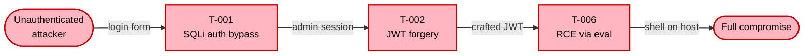

# Phase Group: Threat Enumeration & Synthesis (Phases 9–10)

This file is read by the orchestrator at runtime to load phase instructions.

## Phase 9: STRIDE Threat Enumeration — via sub-agents

**⚠ SEQUENCING: STRIDE analyzers MUST NOT be dispatched before Phase 9.** They require outputs from Phases 6 (INTERFACES), 7 (TRUST_BOUNDARIES), and 8 (CONTROLS).

### Component Selection

Always include: Auth/identity, Authorization, components handling PII/payments, Admin panel, Public API gateway. For Moderate/Complex: each backend service, frontend SPA, queue consumers, CI/CD pipeline. **Cap at `MAX_STRIDE_COMPONENTS`** (default 5, set by `--assessment-depth`).

**Frontend SPA override:** If the recon scanner detected a frontend framework (Section 7.19) or client-side code patterns (Sections 7.10, 7.20–7.24), the frontend SPA MUST be included as a STRIDE component at **all** depth levels, including `quick`. The browser is a large, distinct attack surface that cannot be skipped. This overrides the component cap — if adding the frontend exceeds `MAX_STRIDE_COMPONENTS`, drop the lowest-risk non-auth component instead.

| ASSESSMENT_DEPTH | MAX_STRIDE_COMPONENTS | Selection strategy |
|-----------------|----------------------|-------------------|
| `quick` | 3 | Auth + highest-risk component + public API (+ frontend SPA if detected, see override above) |
| `standard` | 5 | Auth, AuthZ, PII/payment, Admin, public API, frontend SPA |
| `thorough` | 8 | All mandatory + backend services, frontend, queues, CI/CD pipeline |

### CI/CD Pipeline as STRIDE component

**When `ASSESSMENT_DEPTH=standard` or `thorough`** and CI/CD workflow files were found by the recon scanner (Section 5): include the CI/CD pipeline as a STRIDE component if it fits within `MAX_STRIDE_COMPONENTS`. Use component ID `ci-cd-pipeline`.

Pass these additional context fields in the STRIDE analyzer prompt:
- `COMPONENT_DESCRIPTION`: "CI/CD pipeline — build, test, and deployment automation. Includes workflow definitions, secret handling, artifact publishing, and deployment triggers."
- `INTERFACES`: workflow trigger events (push, PR, schedule, workflow_dispatch), artifact registries, deployment targets
- `TRUST_BOUNDARIES`: external Actions/images crossing into build environment, secrets injected at runtime, artifact publish boundary
- `SUPPLY_CHAIN_FINDINGS`: recon-summary sections 7.14–7.17 (unpinned Actions, container images, dependency confusion, postinstall hooks)

The STRIDE analyzer will use `SUPPLY_CHAIN_FINDINGS` to generate evidence-backed threats for the pipeline component (see STRIDE analyzer supply chain patterns).

### Dispatch

For each component, use Agent tool:
- `subagent_type`: `appsec-plugin:appsec-stride-analyzer`
- `description`: `STRIDE analysis for <COMPONENT_NAME>`
- `run_in_background`: `true`
- `prompt`: include COMPONENT_ID, COMPONENT_NAME, COMPONENT_DESCRIPTION, COMPONENT_COMPLEXITY, MAX_TURNS, INTERFACES, TRUST_BOUNDARIES, CONTROLS, KNOWN_SECRETS, KNOWN_VULNS, KNOWN_LLM_PATTERNS, SUPPLY_CHAIN_FINDINGS (for ci-cd-pipeline component only, from recon-summary 7.14–7.17), COMPLIANCE_SCOPE, ASSET_TIER, PRIOR_FINDINGS (for this component), KNOWN_THREATS (for this component), REPO_ROOT, OUTPUT_DIR, CONTEXT_FILE

**Dynamic turn budget:** Pass `MAX_TURNS=<N>` in the prompt, using the depth-adjusted values from the skill:
- Simple components: `MAX_TURNS=STRIDE_TURNS_SIMPLE` (quick: 10, standard: 15, thorough: 20)
- Moderate components: `MAX_TURNS=STRIDE_TURNS_MODERATE` (quick: 15, standard: 22, thorough: 28)
- Complex components: `MAX_TURNS=STRIDE_TURNS_COMPLEX` (quick: 20, standard: 31, thorough: 35)

If the `STRIDE_TURNS_*` variables are not set, use the standard defaults (15/22/31).

Dispatch all simultaneously with `run_in_background: true`. Then poll for output files.

### Validation & Retry

Validate each `$OUTPUT_DIR/.stride-<id>.json`. On failure: retry once synchronously, skip if still invalid.

### Merge

1. Merge all threat lists + Phase 8b threat candidates (if requirements enabled)
2. **Priority-aware risk for requirement threats:** For threats sourced from `requirements-compliance` or `architectural-anti-pattern`, apply the priority-derived minimum risk from Phase 8b (MUST FAIL ≥ High, architectural violations escalated by one level). If the standard Likelihood × Impact risk is already higher, keep the higher value.
3. Assign global IDs: T-001, T-002, … (by risk descending). Architectural violation threats sort first within their risk tier.
4. Deduplicate same root cause across components
5. Cross-reference prior findings from `$OUTPUT_DIR/.threat-modeling-context.md`
6. Known threats integration (open → verify, accepted → Section 11, mitigated → verify, false-positive → skip)
7. **Normalize component names:** Each unique component in the merged threat list must use a single consistent name. If the same component has different names from different analyzers (e.g., "Auth Service" vs "Auth Module"), unify to one name — use the name from the STRIDE analyzer dispatch prompt (`COMPONENT_NAME`). Do not use variant names like "Auth Service / API" alongside "Auth Module" for the same component.

### Coverage Checks

**When `ASSESSMENT_DEPTH=quick`:** Skip all coverage checks — the STRIDE analysis itself is sufficient at quick depth. Proceed directly to Merge.

**When `ASSESSMENT_DEPTH=standard` or `thorough`:**

**A — OWASP Top 10:** Verify at least one threat per OWASP 2021 category. Add gap threats for missing.

**B — Business logic:** Check workflow bypass, privilege abuse, mass enumeration, economic abuse, state manipulation.

**C — OWASP LLM Top 10 (conditional):** If AI/LLM integration was detected in recon (Section 7.13), verify coverage for each applicable LLM threat category. Add gap threats for missing. Skip if no LLM detected.

### Section 8 layout — methodology, distribution, then split-by-severity

Section 8 (Threat Register) opens with a one-sentence reader-orientation, the methodology note, the Risk Distribution / STRIDE Coverage summary, and is then split into four sub-sections — one per severity level. A single 30-row table is unreadable in rendered Markdown, so the orchestrator MUST emit four separate tables.

```markdown
## 8. Threat Register

The threat register lists every confirmed STRIDE finding with its evidence, current state, and the mitigation that addresses it. Threats are split into four sub-sections by severity so the reader can see at a glance what is critical and what is hardening work.

**Risk methodology:** Risk = Likelihood × Impact. Likelihood considers exploitability, attack complexity, and required privileges. Impact considers confidentiality, integrity, and availability effects on the identified assets. Ratings: Critical, High, Medium, Low.

**Risk Distribution:** Critical: <N> · High: <N> · Medium: <N> · Low: <N> · **Total: <N>**
**STRIDE Coverage:** Spoofing: <N> · Tampering: <N> · Repudiation: <N> · Information Disclosure: <N> · Denial of Service: <N> · Elevation of Privilege: <N>

### 8.1 Critical (<N>)

These findings combine high exploitability with maximum impact. Every entry here must also appear in Section 9 (Critical Findings) and is the source of the P1 rollout actions in the Management Summary.

| ID | Component | STRIDE | Threat Scenario | Likelihood | Impact | Risk | Controls in Place | Mitigations |
|----|-----------|--------|-----------------|------------|--------|------|-------------------|-------------|
| ... |

### 8.2 High (<N>)

High-rated threats require remediation in the current sprint or quarter. They typically gate the next release.

| ID | Component | STRIDE | Threat Scenario | Likelihood | Impact | Risk | Controls in Place | Mitigations |
|----|-----------|--------|-----------------|------------|--------|------|-------------------|-------------|
| ... |

### 8.3 Medium (<N>)

Medium-rated threats represent meaningful gaps with either reduced exploitability or contained impact. They should be tracked and remediated as part of normal hardening work.

| ID | Component | STRIDE | Threat Scenario | Likelihood | Impact | Risk | Controls in Place | Mitigations |
|----|-----------|--------|-----------------|------------|--------|------|-------------------|-------------|
| ... |

### 8.4 Low (<N>)

Low-rated threats document residual risk and minor hygiene issues. They are typically addressed opportunistically as part of related work.

| ID | Component | STRIDE | Threat Scenario | Likelihood | Impact | Risk | Controls in Place | Mitigations |
|----|-----------|--------|-----------------|------------|--------|------|-------------------|-------------|
| ... |
```

**Rules for the split:**

- Each sub-section is its own H3 heading and its own table — never collapse two severity tiers into one table
- The count in parentheses (`Critical (6)`) must match the number of rows in the sub-section
- Sort within each sub-section by `architectural_violation: true` first (so systemic issues sort top), then by component name alphabetically
- If a severity tier has zero threats, still emit the H3 with a single line: `_No threats at this severity level._` and skip the table — do not omit the heading entirely (it preserves consistent navigation anchors)
- Use emoji severity badges (🔴/🟠/🟡/🟢) in the Likelihood/Impact/Risk cells — never inline HTML `<span>`
- The Risk Distribution and STRIDE Coverage lines come **once** at the top of Section 8, not repeated in each sub-section

### CWE References in Threat Register

Each threat row in the Threat Register table **MUST** include a CWE reference in the Threat Scenario cell. Append the CWE ID at the end of the scenario text in parentheses, e.g.: `... allowing full database extraction. (CWE-89)`. Use the most specific applicable CWE — every threat has an applicable CWE.

### Requirements Integration in Sections 8, 9, and 10

**When `CHECK_REQUIREMENTS=true` and requirement metadata is available from Phase 8b:**

**Section 8 — Threat Register: Violated Requirements**

For **every** threat row that has associated requirement IDs from Phase 8b (not just Critical threats), append a `Violated: [ID](url), …` note inside the Threat Scenario cell, after the CWE reference. This ensures requirement violations are visible at all severity levels — not just for Critical threats expanded in Section 9. Format example: `... file read. (CWE-611) Violated: [IV-002](url)`.

**Section 9 — Critical Findings layout (mandatory):**

Section 9 starts with a one-sentence intro, then — when there are at least two Critical findings — a small Mermaid attack-chain diagram showing how the criticals chain into a full compromise, then the per-finding entries.

```markdown
## 9. Critical Findings

The following findings require immediate attention. Each entry links to the mitigation that addresses it. When multiple critical findings exist they typically chain together into a single attacker workflow — the diagram below shows how.

<Only when there are ≥ 2 Critical findings — emit this Mermaid attack chain. Explain it in one sentence first, draw the diagram, then add a one-sentence "Key takeaway" line below.>

The diagram below traces how an unauthenticated attacker can chain the Critical findings into a full compromise of the system. Each node is a Critical finding linked to its detail entry.



**Key takeaway:** <one sentence — e.g. "A single unauthenticated request to the login endpoint is sufficient to land a shell on the server, because every Critical finding sits on the same path from public internet to host."> 

<Then per-finding entries below.>

### <severity-badge> T-NNN — Title

**Scenario:** <threat scenario text>

**Current state:** <what is present or absent>

**Violated Requirements:** [SEC-AUTH-1](url) — <requirement title>, [SEC-CRYPTO-2](url) — <requirement title>

**Blueprint guidance:** [BP-XYZ](url) — <Blueprint title> · <section title>

→ **Mitigation:** [M-NNN — Mitigation Title](#m-NNN) · **P1**

---
```

**Rules for Section 9:**

- The intro sentence is mandatory and must come before the attack-chain diagram or the first finding
- The attack-chain diagram is mandatory **only when there are 2 or more Critical findings**. With 0 or 1 Critical findings, omit the diagram and the chain intro entirely
- The chain diagram is `graph LR` (the only place where LR is allowed — the chain reads like a sequence) and uses the `crit` classDef shown above
- Each chain node is one Critical finding labeled with its T-NNN and a 2–3 word summary; the chain edges describe the attacker capability gained at each step
- Add a "Key takeaway" sentence directly below the diagram so the reader is told what the diagram is supposed to demonstrate
- The **Violated Requirements** line is only present when the threat has associated requirement IDs from Phase 8b. List each violated requirement as a clickable link (using the URL from the requirements YAML) followed by the requirement title. If the requirement has no URL, render as plain `[SEC-AUTH-1]` without a link
- The **Blueprint guidance** line is only present when the threat carries a `remediation.blueprint` value. Omit the line entirely otherwise — never write a placeholder
- The `→ **Mitigation:**` line MUST end with the rollout priority tag (`· P1`, `· P2`, `· P3`, `· P4`) so the reader knows the urgency without scrolling to Section 10
- Use emoji severity badges (🔴) in the heading — never inline HTML `<span>`

**Section 10 — Mitigation Register template (canonical, applies to every mitigation):**
```markdown
### <a id="m-NNN"></a>M-NNN · Title

**Addresses:** [T-001](#t-001), [T-002](#t-002)
**Fulfills Requirements:** [SEC-AUTH-1](url) — <title>, [SEC-AUTH-3](url) — <title>
**Blueprint guidance:** [BP-XYZ](url) — <Blueprint title> · <section title>
**Priority:** P1 — Immediate · **Severity:** 🔴 Critical · **Effort:** Low

**Why:** ...

**How:**
1. <numbered step — first step quotes the Blueprint section verbatim when one applies>
2. <next step>

```<lang>
// Before
...

// After
...
```

**Verification:** <one or two sentences describing how to confirm the fix works — e.g. a curl command, a test name, a specific log line, or a configuration check>
```

**Field rules — every mitigation MUST follow this exact order and contain every field unless explicitly marked optional:**

| Field | Required? | Notes |
|-------|-----------|-------|
| `**Addresses:**` | always | Comma-separated `[T-NNN](#t-NNN)` links |
| `**Fulfills Requirements:**` | only when CHECK_REQUIREMENTS=true and the mitigation addresses at least one requirement-linked threat | Derived from requirement IDs propagated by Phase 8b — never invent IDs |
| `**Blueprint guidance:**` | only when a matching blueprint section was attached by the STRIDE analyzer (`remediation.blueprint`) **and** the requirements YAML loaded a `blueprints[]` section | See Blueprint propagation rule below |
| `**Priority:**` | always | One of `P1 — Immediate`, `P2 — This Sprint`, `P3 — Next Quarter`, `P4 — Backlog`. See P1–P4 rollout priority section below |
| `**Severity:**` | always | One of 🔴 Critical · 🟠 High · 🟡 Medium · 🟢 Low — derived from the highest risk among addressed threats. Use the emoji-only badge — never inline HTML `<span>` |
| `**Effort:**` | always | `Low` (< 2h, single file) · `Medium` (half-day, multi-file) · `High` (multi-day, architectural) |
| `**Why:**` | always | 1–3 sentences. **When a Blueprint applies, quote the Blueprint rationale verbatim** before adding any custom commentary |
| `**How:**` | always | Numbered steps. **When a Blueprint applies, the first step MUST come from the Blueprint section** — do not invent your own first step |
| Code block | when fix involves code or config | Language-tagged before/after snippet (3–10 lines). Omit only when the fix is purely operational (e.g. "rotate the secret in vault") |
| `**Verification:**` | always | Concrete check the developer can run after the fix — never "verify the fix works" |

The **Fulfills Requirements** line lists all requirement IDs that are satisfied when this mitigation is implemented. Derive this by collecting the requirement IDs from all threats this mitigation addresses. Only present when requirements are enabled and the mitigation addresses at least one requirement-linked threat.

### Blueprint propagation rule (mandatory when blueprints are loaded)

The STRIDE analyzers attach a `remediation.blueprint` field to threats whenever a matching blueprint section was found in `.requirements.yaml`. The orchestrator MUST propagate this into the Mitigation Register according to the following rule:

1. **Collect blueprints from addressed threats.** When building an `M-NNN` entry, gather the `remediation.blueprint` value from every threat this mitigation addresses.
2. **Pick the most relevant single blueprint.** If multiple addressed threats reference different blueprints, choose the blueprint that covers the largest share of addressed threats. If a tie, pick the blueprint section whose title best matches the mitigation title. Never list more than one blueprint per mitigation — pick one.
3. **Render as `**Blueprint guidance:**` line** in the format produced by the STRIDE analyzer (`[BP-ID](section-url) — Blueprint title · Section title`).
4. **When a Blueprint applies, the Blueprint section URL becomes the canonical reference.** Do not add a separate `**Reference:**` line with an OWASP cheatsheet — the Blueprint section already links to the cheatsheet internally.
5. **Why/How content.** The `**Why:**` line MUST quote one to two sentences from the Blueprint section verbatim before adding any commentary. The `**How:**` first step MUST be the action mandated by the Blueprint section. Subsequent How steps may add codebase-specific detail.
6. **Fallback rule** — if no blueprint was matched for any addressed threat, omit the `**Blueprint guidance:**` line entirely and use the `remediation.reference` (OWASP cheatsheet or CWE) as the canonical source instead. The `**Why:**` and `**How:**` then come from the cheatsheet, not invented prose.

**Never invent a blueprint reference** — only use blueprint IDs that exist verbatim in the loaded `.requirements.yaml` `blueprints[]` section. If the requirements YAML has no `blueprints[]` section, this rule does not apply and the `**Blueprint guidance:**` field is omitted from every mitigation.

### P1–P4 rollout priority (mandatory on every mitigation)

Severity (Critical/High/Medium/Low) describes *how bad* a threat is. Rollout priority (P1–P4) describes *how soon* the team must act. They are independent — a Critical threat with a complex fix can still be P2 if the immediate fix is impractical, and a High-effort architectural change addressing a Medium threat can still be P3.

Assign each mitigation exactly one of:

| Tag | Meaning | Time horizon | Assignment criteria (any one matches) |
|-----|---------|--------------|---------------------------------------|
| **P1 — Immediate** | Production deployment must not happen until this is fixed | 0–48 hours | Critical severity AND (unauthenticated exploit OR Effort=Low) · OR a hardcoded production secret · OR an active exploit chain |
| **P2 — This Sprint** | Must land in the current sprint, before the next release | ≤ 2 weeks | Critical severity with auth gate or Medium effort · OR High severity with Low/Medium effort · OR a P1 follow-up that depends on it |
| **P3 — Next Quarter** | Planned architectural work, scheduled but not blocking | 1–3 months | High severity with High effort · OR Medium severity with Low/Medium effort · OR architectural refactor (BFF, OIDC migration) |
| **P4 — Backlog / Hardening** | Defense-in-depth, no acute exploit | Opportunistic | Medium/Low severity with no exploit chain · OR Low effort hardening that adds redundancy |

**Resolution algorithm — apply in order, stop at first match:**

1. Mitigation addresses any **Critical**-rated threat AND `effort = Low` → **P1**
2. Mitigation addresses any **Critical**-rated threat that is exploitable without authentication → **P1**
3. Mitigation addresses any threat tagged `architectural_violation: true` AND `effort != High` → **P1**
4. Mitigation addresses any **Critical**-rated threat (any other case) → **P2**
5. Mitigation addresses any **High**-rated threat AND `effort != High` → **P2**
6. Mitigation addresses any **High**-rated threat AND `effort = High` → **P3**
7. Mitigation is an architectural refactor (e.g. BFF migration, OIDC adoption, secret manager rollout) → **P3**
8. All addressed threats are **Medium** → **P3** if `effort = Low`, otherwise **P4**
9. Otherwise → **P4**

The chosen priority determines the order in Section 10. Group entries by priority — `## P1 — Immediate`, then `## P2 — This Sprint`, then `## P3 — Next Quarter`, then `## P4 — Backlog`. Inside each priority group, order by lowest effort first, then by addressed-threat count descending.

### Build Mitigation Register

Assign M-NNN IDs. Merge mitigations when they produce the same physical change. Update threat records with mitigation_ids.

For each merged M-NNN entry:

1. **Aggregate addressed threats** — collect every T-NNN this mitigation resolves, plus their severity and `architectural_violation` metadata.
2. **Severity badge** — set `**Severity:**` to the highest severity among addressed threats, using the emoji-only badge (🔴/🟠/🟡/🟢).
3. **Compute P1–P4 rollout priority** — apply the resolution algorithm in the "P1–P4 rollout priority" section above. Record the chosen priority on the mitigation.
4. **Propagate requirement IDs** — when CHECK_REQUIREMENTS is true, collect all requirement IDs from the addressed threats' `Violated Requirements` and emit them on the `**Fulfills Requirements:**` line. **Only propagate requirement IDs that actually appear as "Violated Requirements" on the addressed threats — do NOT invent or add requirement IDs that were not generated by Phase 8b.**
5. **Propagate Blueprint** — apply the "Blueprint propagation rule" above. Pick at most one blueprint per mitigation. When the requirements YAML has no `blueprints[]` section, skip this step entirely.
6. **Compose Why/How from authoritative source** — when a Blueprint applies, the `**Why:**` quotes the Blueprint section verbatim and the `**How:**` first step is the Blueprint-mandated action. Otherwise, fall back to the OWASP cheatsheet referenced in `remediation.reference`. Never invent fix prose without an authoritative source.
7. **Verification line** — every mitigation MUST end with a one-or-two sentence `**Verification:**` line describing how to confirm the fix. Derive it from the threat scenario (e.g. for SQLi: "Send `' OR 1=1--` as the email field; the server must respond 401 instead of 200").

### Cross-reference linking rule (all sections)

When writing `threat-model.md`, ALL T-NNN and M-NNN references in ALL sections MUST be written as clickable Markdown links from the start — do not rely on the QA reviewer to linkify them afterward:

- In table cells: `[T-001](#t-001)` not bare `T-001`
- Comma-separated: `[T-001](#t-001), [T-002](#t-002)` not `T-001, T-002`
- In prose: `[M-003](#m-003)` not bare `M-003`

This applies to: Section 2 (Key Architectural Risks — Linked Threats), Section 4 (Assets — Linked Threats), Section 5 (Attack Surface — Linked Threats), Section 6 (Trust Boundaries — Linked Threats), Section 7 (Controls — Linked Threats), Section 8 (Threat Register — Mitigations column), Section 9 (Critical Findings), and Section 10 (Mitigation Register — Addresses field).

### Build Management Summary

After the Threat Register and Mitigation Register are complete, generate a **Management Summary** section. This section is placed **after the Table of Contents and before Section 1** in the final output.

```markdown
## Management Summary

This threat model identified **<N> threats** across <N> components of <System Name>. The following table summarises how the risk is distributed across severity levels and which subject areas dominate each level — read it top-to-bottom to see where the work concentrates.

| Risk Level | Count | Key Areas |
|------------|-------|-----------|
| 🔴 Critical | <N> | <1-2 word summary per critical threat area, e.g. "JWT forgery, SQL injection"> |
| 🟠 High | <N> | <summary> |
| 🟡 Medium | <N> | <summary> |
| 🟢 Low | <N> | <summary> |

### Immediate Actions (P1) — within 48 hours, before any production deployment

The following mitigations are flagged P1 by the rollout-priority algorithm. They eliminate the unauthenticated and trivially-exploitable attack paths and block the most dangerous critical findings. Every entry links into Section 10 for the full implementation guidance.

| # | Mitigation | Severity | Requirement | Blueprint | Threats | Effort |
|---|-----------|----------|-------------|-----------|---------|--------|
| 1 | [M-NNN — <title>](#m-NNN) | 🔴 Critical | [REQ-ID](url) | [BP-ID](url) | [T-NNN](#t-NNN), [T-NNN](#t-NNN) | Low |
| 2 | … | … | … | … | … | … |

<If no mitigation is rated P1, replace this table with: "**No P1 actions** — the assessment did not identify any change that must happen within 48 hours. The next-most-urgent actions are listed under *Recommended Priority Actions* below.">

### Key Strengths

The following existing controls are working as intended and SHOULD NOT be regressed by future changes. Each entry cites the file evidence so a reviewer can verify it before relying on it.

<2-4 bullet points highlighting existing adequate controls (✅ from Section 7) or positive architectural decisions. Be specific — cite the actual control with file reference, not generic praise. When a Blueprint covers the topic, append " — fulfils [BP-ID](url)" to the bullet.>
- <e.g., "Container runs as non-root (UID 65532) on a distroless base image — limits post-exploitation impact — fulfils [BP-CONTAINER-SECURITY](url)">
- <e.g., "SBOM generation integrated into Docker build — enables supply chain visibility">

### Requirements Compliance

<ONLY when CHECK_REQUIREMENTS=true. Omit this entire subsection otherwise.>

The application was checked against the following requirements baseline; the headline numbers below summarise how many requirements pass, partially pass, fail outright, or represent missing architectural patterns.

**Baseline:** [<requirements source name or URL>](<url>)
**Result:** <N> requirements checked — ✅ <N> PASS · ❌ <N> FAIL · ❌ <N> ANTI-PATTERN · ⚠️ <N> PARTIAL

<If any architectural violations or anti-patterns were detected, show them first:>

**⚠ Architectural violations:**
- **[<REQ-ID>](<url>) — <title>:** <one sentence describing the systemic risk — e.g., "SPA stores tokens in localStorage instead of using a BFF pattern, exposing all sessions to XSS token theft">
- ...

Top violated MUST requirements:
- **[<REQ-ID>](<url>) — <title>:** <one sentence why it fails>
- ...

→ *Full compliance details in [Section 7b — Requirements Compliance](#7b-requirements-compliance).*

### Top Findings

The following Critical-rated threats represent the highest-impact attack paths in this assessment. Each line carries the violated requirement and (when one exists) the relevant Blueprint so the reader sees not just *what* is wrong but *which standard it breaks*.

<For each Critical finding (max 5), one bullet point:>
- **[T-NNN — <Title>](#t-NNN)** — verletzt `[REQ-ID](url)` · `[BP-ID](url)` · **P1** — <One sentence summary of risk and business impact>

<When no Blueprint applies for a finding, omit the BP tag. When CHECK_REQUIREMENTS is false, omit both the REQ tag and the BP tag for every finding.>

### Recommended Priority Actions

This is the prioritised punch-list for the team. P1 entries repeat from the *Immediate Actions* table above for completeness; P2 entries land in the current sprint, P3 are scheduled architectural work for the next quarter, and P4 entries are defense-in-depth backlog items.

<Up to 8 mitigations, ordered P1 → P2 → P3 → P4, then by lowest Effort within each priority:>
1. **P1 · [M-NNN — <Title>](#m-NNN)** — fulfils `[REQ-ID](url)` · `[BP-ID](url)` · addresses <N> threats · Effort: <level> — <One sentence describing the fix>
2. **P1 · [M-NNN — <Title>](#m-NNN)** — …
3. **P2 · [M-NNN — <Title>](#m-NNN)** — …
4. **P3 · [M-NNN — <Title>](#m-NNN)** — …
5. **P4 · [M-NNN — <Title>](#m-NNN)** — …

### Overall Security Rating

<🔴/🟡/🟢> **<Rating text>** — <One sentence justification from Section 2.x Security Architecture Assessment>

→ *Full details in [Threat Register](#8-threat-register) and [Mitigation Register](#10-mitigation-register).*
```

**Rules:**
- All T-NNN, M-NNN, REQ-ID, and BP-ID references must be clickable links to their anchors / requirement URLs / blueprint URLs
- Keep the summary concise — max ~70 lines. Executives read this, not the full report
- The "Key Areas" column uses short phrases, not full sentences
- **Immediate Actions table** — list every mitigation whose `Priority = P1`, ordered by lowest effort first then by highest threat-count. Include both the Severity badge (🔴/🟠) and the Effort. Always emoji badges, never inline HTML
- **Severity badges** — always use the emoji-only badges (🔴/🟠/🟡/🟢). The Management Summary MUST NOT contain `<span style=...>` HTML — that style is forbidden in this report
- "Key Strengths" lists 2-4 genuine positive controls from Section 7 (only ✅ Adequate items), with specific file references. When a Blueprint covers the topic, suffix the bullet with " — fulfils [BP-ID](url)". If no controls are ✅ Adequate, omit the subsection entirely
- "Requirements Compliance" subsection is only present when `CHECK_REQUIREMENTS=true` and requirement data was processed. Architectural violations/anti-patterns are always listed first (all of them — these are systemic). Then list up to 3 top violated `MUST` requirements (non-architectural). The baseline source must identify which requirements YAML was used (URL, "cached", or "plugin fallback")
- "Top Findings" lists only Critical threats; if fewer than 3 Critical, include the highest-risk High threats to reach 3-5 items. Each entry MUST carry the violated requirement tag (when CHECK_REQUIREMENTS is enabled) and the Blueprint tag (when the addressed threat has a `remediation.blueprint`) and the rollout priority (P1–P4)
- "Recommended Priority Actions" lists mitigations ordered first by rollout Priority (P1 → P2 → P3 → P4), then by lowest Effort within the same priority level. Include the count of threats each mitigation addresses, the requirement tag, and the Blueprint tag (when present)
- "Key Areas" in the risk table must be derived from actual threat titles — do not list areas that have no corresponding threat in the register

## Phase 10: Secret & Dependency Scan Synthesis

**Step 1 — Hardcoded Secrets (always):** Read Section 7.12 and Section 8 from `$OUTPUT_DIR/.recon-summary.md`. Incorporate Critical/High secrets as threats (Information Disclosure / Spoofing). Use only file:line references and redacted snippets.

**Step 2 — SCA Results (only when `WITH_SCA=true`):** Poll for `$OUTPUT_DIR/.dep-scan.json`. Validate, retry once if invalid. Incorporate:
- `vulnerable_dependencies` → Tampering/Supply Chain threats (deduplicate against STRIDE analyzer findings that already used `KNOWN_VULNS`)

If `WITH_SCA` is not set: skip SCA incorporation entirely.
