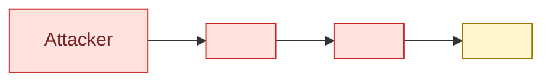

# QA-Path Refactor — Option 1: Deterministic §3 Walkthrough Generation

**Status:** Design / Planning. Nothing implemented.
**Author:** generated from 2026-05-23 juice-shop run analysis
**Driver:** Stage 3 Repair-Loop costs 10–16 min per run with Sonnet-on-threat-analyst REPAIR_MODE. Root cause is a Stage-2 renderer drift — the renderer ignores the `_chain-skeleton.md` labelled-form contract and writes §3 walkthroughs in §8 Story-Card form. The structural mismatch produces 70 `walkthrough_depth.missing_required_labelled_section` issues per run, which the existing mechanical applier cannot fix.

## TL;DR

Move `attack-walkthroughs.md` from *LLM-authored* (Stage 2 renderer) to *fully deterministic* (Phase 11 pre-generator).

The pre-generator reads `threat-model.yaml`, looks up CWE-class templates for `sequenceDiagram`s and `detection_signals`, and writes the complete §3 fragment with every required bold-headed section already filled. Stage 2 renderer no longer touches §3. The Re-Render Loop terminates by construction — no iterations, no LLM repair pass, no Haiku fixer agent.

Expected per-run impact:
- Stage 2: ~14 min → ~10 min (no §3 authoring, only ms-verdict + ms-architecture-assessment + security-architecture narrative fill + compose)
- Stage 3 Repair-Loop: ~10–16 min → **0 min**
- Net: **~14–20 min faster, fully deterministic**

The §3 prose is more generic than today's LLM output. Repo-specific detail is preserved by substituting `evidence.file:line`, payload excerpts from `evidence.excerpt`, and the existing `scenario` field into the templates. No information loss; only prose-nuance loss.

---

## 1. Problem and motivation

### Today's flow (from `SKILL-impl.md → Stage 2 — Report Rendering`)
1. `pregenerate_fragments.py` writes `_chain-skeleton.md` (703-line scaffold with `<!-- WALKTHROUGH_FILL: ... -->` placeholders, full labelled-form structure)
2. Stage 2 renderer agent is told *"Copy `_chain-skeleton.md` verbatim into `.fragments/attack-walkthroughs.md`. Preserve every heading, every bullet marker..."* (`agents/appsec-threat-renderer.md:426`)
3. Stage 2 renderer ignores instruction; writes a §8-Story-Card-style §3 (`**Component:** / **Location:** / **Issue:** / **Attack Walkthrough**`) instead of the contract's labelled form (`**Attacker Profile** / **Prerequisites** / **Attack Steps** / **Sequence Diagram** / **Business Impact** / **Detection Signals** / **Defense in Depth** / **Cross-references**)
4. `qa_checks.py → check_walkthrough_depth` fires 70 `missing_required_labelled_section` issues + 10 `min_body_lines: 60` violations
5. `apply_repair_plan.py` (mechanical applier) covers only `toc_nested_link` — 70 violations are flagged "non-mechanical"
6. Skill falls into `REPAIR_MODE Stage 1` via `appsec-threat-analyst` (Sonnet, 125 KB system prompt, ~10–16 min per iteration)

### Why a stronger LLM doesn't fix this
The renderer-bias toward Story-Card form partly comes from `feedback_threat_register_cell_structure.md` in user memory (which correctly pushes §8 toward Component/Location/Issue/Evidence/Impact/Fix order). The memory entry doesn't distinguish §3 from §8; the renderer over-generalises. Replacing the renderer model would not change the bias.

### Why a Haiku fixer agent only treats the symptom
A `appsec-fragment-fixer` on Haiku could be told *"apply repair plan, fix bold-headers"* and would converge in 2–4 min per run. But:
- It still requires the same brittle Renderer → Plan → Fixer → Compose → Re-check loop.
- It cements the assumption that §3 must be LLM-authored.
- It pays Haiku tokens forever, for content that yaml already pins down 75 %.
- A bad day produces an over-edited fragment that breaks the surrounding §1/§2/§8 cross-references.

The structural fix is to move §3 out of the LLM ownership lane.

---

## 2. Architecture

### Pre-generator (today)
```
threat-model.yaml ─┐
                   ├─► gen_attack_walkthroughs_skeleton() ─► _chain-skeleton.md (placeholders)
recon-summary.md ──┘                                          ↓
                                                              (Stage 2 LLM authors attack-walkthroughs.md)
```

### Pre-generator (Option 1)
```
threat-model.yaml ─┐
                   ├─► gen_attack_walkthroughs_full() ─► attack-walkthroughs.md (complete)
recon-summary.md ──┤    ├── pulls vektor, scenario, evidence, mitigations[]
data/walkthrough-  ┘    ├── selects sequence-diagram template by CWE class
templates/*.yaml        ├── selects detection-signals by CWE class
                        └── enforces contract structure by construction
                                                              ↓
                                                              (Stage 2 LLM SKIPS §3 entirely)
```

The renderer agent's scope shrinks to:
- `ms-verdict.json` (Management Summary verdict bullets — LLM judgement-heavy)
- `ms-architecture-assessment.json` (cross-cutting weakness catalogue — LLM judgement-heavy)
- `security-architecture.md` (narrative scaffold fill — `<!-- NARRATIVE_PLACEHOLDER -->` based, already idempotent)
- `security-posture-attack-paths.json` (cross-layer attack chains — LLM judgement-heavy)
- Final `compose_threat_model.py --strict` invocation

---

## 3. What yaml gives us today (verified on 2026-05-23 juice-shop run)

Every Critical threat has these fields populated:

| Field | Coverage (10 Critical) | Type | Use |
|---|---|---|---|
| `id` | 10/10 | str | `T-NNN` heading, §8 back-link |
| `title` | 10/10 | str | `### 3.N <title> — <T-NNN>` |
| `component` | 10/10 | str | Business Impact prose |
| `cwe` | 10/10 | str (`CWE-NNN`) | template-key for sequence-diagram + detection-signals |
| `stride` | 10/10 | str | secondary classification hint |
| `scenario` | 10/10 | str (LLM-written, 2–4 sentences) | source for Attack Steps |
| `risk` / `impact` / `likelihood` | 10/10 | enum | Business Impact severity phrase |
| `evidence[]` | 10/10 | `[{file, line, excerpt}]` | code-citation substitution into Attack Steps + Sequence Diagram |
| `vektor` | 10/10 | enum (`repo-read` / `internet-anon` / `victim-required` / `internet-user`) | Attacker Profile + Prerequisites template-key |

Cross-reference data is also fully present:

| Source | Field | Use |
|---|---|---|
| `mitigations[]` | `threat_ids[]` (back-ref) | invert to get `T-001 → [M-001, M-008]`; render Defense in Depth |
| `assets[]` | `linked_threats[]` | render Business Impact (which assets are exposed) |
| `meta.open_user_registration` | bool | adjusts `internet-user` attacker profile (registration is one POST away) |
| `.fragments/security-posture-attack-paths.json` (Stage 2 output) | chain membership | render §3.1 chain cross-references — **but produced AFTER §3, so needs reorder OR pre-generator emits §3.1 from a separate yaml-derivable chain catalogue** |

**Two fields are weak** because Stage 1 leaves them empty:
- `attack_surface[].auth_required` — Phase 6 currently emits `None`. Affects Prerequisites bullet quality but Vektor-fallback covers it.
- `assets[].business_impact` — Phase 5 currently emits empty string. Affects Business Impact richness but asset-name + severity-phrase covers it.

Both gaps are real but tangential — fixing Phase 5/6 in Stage 1 is an independent improvement that makes Option 1 even better. Option 1 ships fine without those fixes.

---

## 4. CWE class coverage (verified for the run)

The 10 Critical findings span **7 distinct CWE classes**:

| CWE | Count | Threats | Pattern category |
|---|---|---|---|
| CWE-89 | 2 | T-005, T-006 | SQL Injection — raw query interpolation |
| CWE-79 | 2 | T-003, T-004 | XSS — sanitizer bypass |
| CWE-269 | 2 | T-009, T-010 | Improper Privilege Management — mass assignment / role injection |
| CWE-94 | 1 | T-007 | Code Injection — `vm.runInContext` sandbox escape |
| CWE-321 | 1 | T-001 | Hardcoded RSA private key |
| CWE-327 | 1 | T-008 | Broken Crypto — MD5 password hashing |
| CWE-916 | 1 | T-002 | JWT `alg=none` accepted |

**Initial template-library scope: 7 templates + 1 generic fallback.** Other AppSec-relevant CWE classes (CWE-22 Path Traversal, CWE-352 CSRF, CWE-601 Open Redirect, CWE-918 SSRF, CWE-915 Mass Assignment alt-form, CWE-770 DoS, CWE-330 Insufficient Randomness) are covered in a second template-library pass once the first ship lands.

---

## 5. Detailed design

### 5.1 New module: `scripts/walkthrough_renderer.py`

Pure-Python renderer with no LLM calls. Public surface:

```python
def render_attack_walkthroughs_md(
    yaml_data: dict,
    recon_summary_text: str | None,
    template_dir: Path,
) -> str:
    """Return the complete §3 fragment ready to drop into .fragments/attack-walkthroughs.md."""
```

Internal helpers (each pure, snapshot-testable):

```python
def select_chain_picks(yaml_data) -> list[dict]               # top 5 chains by aggregated severity
def select_walkthrough_picks(yaml_data) -> list[dict]         # all Critical + High-up-to-cap
def render_section_intro(picks) -> str                        # §3 intro paragraph
def render_chain_overview(picks, yaml_data) -> str            # §3.1 with mermaid graph LR per chain
def render_walkthrough(threat, yaml_data, recon, templates) -> str  # one §3.x
    └── render_heading(threat) -> str
    └── render_attacker_profile(threat, yaml_meta) -> str
    └── render_prerequisites(threat, attack_surface) -> list[str]
    └── render_attack_steps(threat) -> list[str]
    └── render_sequence_diagram(threat, cwe_template) -> str
    └── render_business_impact(threat, assets_index, severity_phrase_table) -> str
    └── render_detection_signals(threat, cwe_template) -> list[str]
    └── render_defense_in_depth(threat, mitigations_index) -> list[str]
    └── render_cross_references(threat, chain_membership) -> list[str]
```

### 5.2 Template format: `data/walkthrough-templates/<cwe>.yaml`

One file per CWE class, plus `_generic.yaml` fallback.

Example: `data/walkthrough-templates/cwe-89.yaml`:

```yaml
cwe: CWE-89
category: sql_injection
human_label: "SQL Injection via raw query construction"

# Substitution variables (filled at render time from threat dict):
#   {component}, {file}, {line}, {excerpt}, {endpoint_guess}, {mitigation_primary}, {tid}

sequence_diagram: |
  ```mermaid
  sequenceDiagram
      autonumber
      actor Attacker
      participant API as "{component} ({file}:{line})"
      participant DB as Database

      alt Current state
          Attacker->>API: POST request with `' OR 1=1 --` in user-controlled field
          API->>DB: SELECT … WHERE col = '' OR 1=1 --' AND …
          DB-->>API: First row regardless of intended filter
          API-->>Attacker: 200 OK with authenticated session / leaked data
      else After {mitigation_primary} — parameterized queries
          Attacker->>API: Same request payload
          API->>DB: SELECT … WHERE col = $1 AND … (bound parameter)
          DB-->>API: No matching row — literal string treated as data
          API-->>Attacker: 401 Unauthorized / empty result
      end
  ```

detection_signals:
  - "Application-side SQL parse errors (`SQLITE_ERROR: near \"OR\": syntax error`) on the affected endpoint"
  - "Slow-query log entries containing `UNION SELECT`, `OR 1=1`, or stacked statements against `{component}`"
  - "Raw `sequelize.query()` / `db.raw()` call sites in static-analysis pre-commit hook"
  - "WAF body-inspection flagging classical SQLi payloads in POST bodies to endpoints under `{component}`"

attacker_profile_overrides:    # optional: CWE-specific tweaks to vektor-derived profile
  internet-anon: |
    The endpoint is reachable without authentication, so the attacker is anonymous and the payload is a single `curl` invocation. The seeded admin user's row is returned because it is the first matching row.

attack_steps_template:         # optional: CWE-specific step skeleton
  - "Identify the vulnerable input parameter — `{component}` interpolates it directly into a SQL string at `{file}:{line}`"
  - "Send a request with an SQL meta-character payload (e.g. `' OR 1=1 --`) in the parameter"
  - "Server returns the first matching row regardless of the original predicate, granting access or leaking data"
```

Templates are intentionally small — most slots are filled from yaml, not from the template. Templates encode the **CWE-specific shape** of the attack (sequence diagram + detection signals + optional profile/steps tweaks).

### 5.3 Substitution variables

| Variable | Source |
|---|---|
| `{tid}` | `threat.id` |
| `{title}` | `threat.title` |
| `{component}` | `threat.component` |
| `{file}` | `threat.evidence[0].file` (or `lib/<component>` fallback) |
| `{line}` | `threat.evidence[0].line` (or `?`) |
| `{excerpt}` | `threat.evidence[0].excerpt` truncated to 120 chars, code-fenced |
| `{cwe}` | `threat.cwe` |
| `{severity_label}` | "Critical" / "High" / "Medium" / "Low" from `threat.risk` |
| `{mitigation_primary}` | first `M-NNN` in inverted-index `mitigations_by_threat[tid]`, or `"a parameterized-query refactor"` fallback |
| `{mitigation_primary_md}` | `[M-NNN](#m-nnn) — <title>` form for Defense in Depth |
| `{endpoint_guess}` | heuristic from `threat.scenario` first sentence (regex for `POST /api/...`); fallback `"the affected endpoint"` |

### 5.4 Slot-by-slot render logic

**Attacker Profile** — `render_attacker_profile(threat, yaml_meta)`

Four canonical profiles, picked by `threat.vektor`. If `vektor=internet-user` AND `meta.open_user_registration=true`, append a sentence noting that self-registration collapses the attacker spectrum:

```python
PROFILES = {
    "internet-anon":     "An anonymous internet attacker reaches the application over plain HTTP. No account, no credentials, no insider knowledge needed; the attack tooling is `curl`, `httpie`, or any HTTP client.",
    "internet-user":     "An authenticated user of the application reaches the vulnerable path through a logged-in session.",
    "victim-required":   "An anonymous attacker crafts the payload, but execution requires a victim (authenticated user or admin) to interact with the malicious content — typically by visiting a link or loading a page while signed in.",
    "repo-read":         "An attacker with read access to the public source repository extracts the secret material from version control. No application-level access is required for the extraction step; the secret is then used in a follow-up request to the application.",
}

OPEN_REG_SUFFIX = " Self-registration via `POST /api/Users` is open, so the attacker creates a fresh account in seconds; the practical prerequisite collapses to 'reach the application'."

def render_attacker_profile(threat, yaml_meta):
    profile = PROFILES.get(threat.get("vektor", "internet-user"), PROFILES["internet-user"])
    if threat.get("vektor") == "internet-user" and yaml_meta.get("open_user_registration"):
        profile += OPEN_REG_SUFFIX
    # CWE override (optional sharpening)
    cwe_override = template.get("attacker_profile_overrides", {}).get(threat.get("vektor"))
    if cwe_override:
        profile = cwe_override.strip()
    return profile
```

**Prerequisites** — `render_prerequisites(threat, attack_surface_by_path)`

Pure vektor-template lookup; CWE override possible:

```python
PREREQS = {
    "internet-anon":   ["HTTP/HTTPS access to the application", "No authentication state required"],
    "internet-user":   ["Authenticated session (valid JWT or session cookie)", "HTTP/HTTPS access to the endpoint exposed by `{file}`"],
    "victim-required": ["Ability to deliver the payload to a victim (link, embedded content, hosted page)", "Victim must load the malicious content while authenticated"],
    "repo-read":       ["Read access to the public source repository (clone, blob view, or git history)", "Network reachability of the application to use the extracted secret"],
}
```

When yaml-derived `attack_surface[].auth_required` is populated, an extra bullet is appended noting the actual policy of the affected endpoint. When empty (today's case), the vektor-template is the sole source.

**Attack Steps** — `render_attack_steps(threat)`

Source-of-truth is `threat.scenario` — LLM-written by Stage 1 STRIDE analyzer, already repo-specific. Naïve sentence-split into a 3–5 step numbered list:

```python
def render_attack_steps(threat, template):
    scenario = (threat.get("scenario") or "").strip()
    if not scenario:
        return template.get("attack_steps_template", [
            "1. Send the crafted payload to the endpoint at `{file}:{line}`.",
            "2. The vulnerable code path accepts the payload without enforcing the missing control.",
            "3. The response confirms the bypass — attacker proceeds with the next chain step.",
        ])

    # Sentence split (naive but bounded to the canonical 'scenario' field shape)
    sentences = re.split(r"(?<=[.!?])\s+", scenario)
    sentences = [s.strip().rstrip(".") for s in sentences if s.strip()]

    steps = []
    for i, s in enumerate(sentences[:5], start=1):
        steps.append(f"{i}. {s}.")
    return steps or template["attack_steps_template"]
```

The 3–5 step range keeps the section between ~10–25 lines, well above the depth floor.

**Sequence Diagram** — `render_sequence_diagram(threat, cwe_template)`

CWE-keyed template lookup. Falls back to `_generic.yaml` for unknown CWE.

```python
def render_sequence_diagram(threat, template, mitigations_index):
    raw = template["sequence_diagram"]
    primary_mit = pick_primary_mitigation(threat, mitigations_index)
    evidence = (threat.get("evidence") or [{}])[0]
    return raw.format(
        component   = threat.get("component") or "the application",
        file        = evidence.get("file") or "<unknown>",
        line        = evidence.get("line") or "?",
        excerpt     = (evidence.get("excerpt") or "").strip()[:120],
        cwe         = threat.get("cwe", ""),
        tid         = threat.get("id", ""),
        title       = threat.get("title", ""),
        mitigation_primary = (primary_mit.get("id") if primary_mit else "the recommended fix"),
    )
```

Each CWE template encodes `alt Current state` / `else After mitigation` — the contract's `require_alt_else_block` rule passes by construction.

**Business Impact** — `render_business_impact(threat, assets_index, severity_phrases)`

```python
SEVERITY_PHRASES = {
    "critical": "Critical impact — exploitation enables full bypass or extraction with minimal attacker effort and no compensating control intervenes",
    "high":     "High impact — exploitation meaningfully weakens a control or exposes a confidential surface; some prerequisites apply",
    "medium":   "Medium impact — exploitation is bounded in blast radius or requires non-trivial chained conditions",
    "low":      "Low impact — limited blast radius, substantial prerequisites, or strong compensating controls in place",
}

def render_business_impact(threat, assets_index):
    severity = (threat.get("risk") or threat.get("impact") or "high").lower()
    asset_ids = assets_index.get(threat["id"], [])[:3]
    asset_phrase = ""
    if asset_ids:
        asset_phrase = " Exposed assets: " + ", ".join(f"`{a}`" for a in asset_ids) + "."
    component = threat.get("component") or "the affected component"
    return (
        f"{SEVERITY_PHRASES.get(severity, SEVERITY_PHRASES['high'])}."
        f"{asset_phrase} Containment is at `{component}`."
    )
```

When Phase 5 populates `assets[].business_impact`, an additional sentence is appended quoting the per-asset business impact verbatim. Today: empty → fallback to severity phrase + asset names.

**Detection Signals** — `render_detection_signals(threat, cwe_template)`

CWE-keyed bullet list directly from template. `{component}` etc. substituted at render-time. Generic fallback for unknown CWE returns three generic SIEM-pattern bullets.

**Defense in Depth** — `render_defense_in_depth(threat, mitigations_index)`

Back-ref invert pass over `yaml.mitigations[].threat_ids` produces `mitigations_by_threat: dict[tid, list[mit]]`. First mitigation = primary; rest = layered:

```python
def render_defense_in_depth(threat, mitigations_index):
    mits = mitigations_index.get(threat["id"], [])
    if not mits:
        return [
            "- Primary mitigation: **not yet defined** — add an entry to `threat-model.yaml → mitigations[]` referencing this threat ID and re-run the assessment."
        ]
    bullets = []
    for i, m in enumerate(mits):
        label = "Primary mitigation" if i == 0 else "Defence in depth"
        anchor = m["id"].lower()
        bullets.append(f"- {label}: [{m['id']}](#{anchor}) — {m.get('title','').strip()[:140]}")
    return bullets
```

**Cross-references** — `render_cross_references(threat, chain_membership)`

`chain_membership` is computed deterministically by the **same** pre-generator that emits §3.1 chains (see 5.5). The cross-reference section back-links into:
- the chain(s) the threat participates in (`§3.1 Chain N — <name>`)
- the §8 Threat Register entry for the threat
- (optionally) sibling §3.x walkthroughs that share an attack class (same CWE)

```python
def render_cross_references(threat, chain_membership, peers_by_cwe):
    tid = threat["id"]
    bullets = []
    chains = chain_membership.get(tid, [])
    if chains:
        chain_links = ", ".join(f"[Chain {n}](#chain-{n})" for n in chains)
        bullets.append(f"- §3.1 chain membership: {chain_links}")
    bullets.append(f"- §8 Threat Register: [{tid}](#{tid.lower()})")
    siblings = [t for t in peers_by_cwe.get(threat.get("cwe",""), []) if t != tid][:2]
    if siblings:
        sib_links = ", ".join(f"[{t}](#{t.lower()})" for t in siblings)
        bullets.append(f"- Sibling findings (same CWE class): {sib_links}")
    return bullets
```

### 5.5 §3.1 chain overview generation

§3.1 needs the same deterministic treatment. Source data:
- `.fragments/security-posture-attack-paths.json` — but this is **Stage 2 output**, not available pre-Stage-2.

Options:
- **5.5.a** Move chain-catalogue derivation into Stage 1: a new Phase 9.5 (post-merge, pre-yaml-write) script `derive_attack_chains.py` walks `threats[]`, groups by shared assets / shared evidence-file / shared component, and emits a top-5 chain catalogue into `threat-model.yaml → attack_chains[]`. Pre-generator then reads from yaml.
- **5.5.b** Pre-generate §3.1 from a *coarser* yaml signal — group Critical threats by CWE-class and call each cluster a "chain". Cheaper but less accurate.

**Recommendation: 5.5.a.** It adds ~150 LOC of deterministic Python to Stage 1, removes a renderer responsibility, and makes the chain catalogue queryable (SARIF, future Pentest-Task generation, etc.).

Each chain block in §3.1 then renders as:



Node labels are bounded to ≤6 per chain (contract's `chain_compactness.max_nodes_per_block`). The chain catalogue stores 4–6 nodes per chain by construction.

### 5.6 Force-overwrite vs idempotent

Today the pre-generator writes `system-overview.md`, `architecture-diagrams.md`, `assets.md`, `attack-surface.md`, `out-of-scope.md` with `--force` (LLM drift is trusted to be wrong). `security-architecture.md` and `_chain-skeleton.md` are idempotent (LLM is trusted to fill placeholders).

**`attack-walkthroughs.md` joins the `--force` set.** Yaml is the single source of truth; the LLM is never the authority for §3 structure. A future caller wanting LLM enrichment of §3 prose can run a separate post-generate refinement pass that respects the structure (see §10).

---

## 6. Caller changes

### 6.1 `pregenerate_fragments.py`

Add `attack-walkthroughs.md` to the mechanical-fragments list:

```python
# Today:
MECHANICAL_FRAGMENTS = [
    "system-overview.md",
    "architecture-diagrams.md",
    "assets.md",
    "attack-surface.md",
    "out-of-scope.md",
]

# Option 1:
MECHANICAL_FRAGMENTS = [
    "system-overview.md",
    "architecture-diagrams.md",
    "assets.md",
    "attack-surface.md",
    "out-of-scope.md",
    "attack-walkthroughs.md",   # ←  NEW — yaml-derived complete §3 fragment
]

SCAFFOLD_FRAGMENTS = [
    "security-architecture.md",    # LLM narrative-fill remains here
    "_chain-skeleton.md",           # KEPT for backwards-compat — legacy renderer reads it
]
```

`_chain-skeleton.md` is kept as a deprecated transitional artifact for one release; removed in the release after.

### 6.2 `SKILL-impl.md → Stage 2 — Report Rendering`

Existing block:

```bash
# Class 1 — force-regenerate the mechanical fragments.
python3 scripts/pregenerate_fragments.py "$OUTPUT_DIR" \
    --force \
    --only system-overview.md,architecture-diagrams.md,assets.md,attack-surface.md,out-of-scope.md
```

After:

```bash
python3 scripts/pregenerate_fragments.py "$OUTPUT_DIR" \
    --force \
    --only system-overview.md,architecture-diagrams.md,assets.md,attack-surface.md,out-of-scope.md,attack-walkthroughs.md
```

### 6.3 `agents/appsec-threat-renderer.md`

Strip section "Workflow to produce `attack-walkthroughs.md`" (lines 414–436). Replace with:

```markdown
### §3 Attack Walkthroughs — out of your scope

`attack-walkthroughs.md` is written deterministically by `scripts/pregenerate_fragments.py` (via `scripts/walkthrough_renderer.py`). The file is already in `.fragments/` when your session starts.

**Do NOT edit `.fragments/attack-walkthroughs.md`.** A PostToolUse hook will reject Write/Edit calls against this file. If you believe a §3 walkthrough is wrong, the fix is in:

- `threat-model.yaml` (the `scenario`, `evidence[]`, `mitigations[].threat_ids` fields)
- `data/walkthrough-templates/cwe-<NNN>.yaml` (the per-CWE sequence-diagram and detection-signals template)
- `scripts/walkthrough_renderer.py` (the Python renderer)

Surface drift via the standard QA repair plan; the **next** pre-generate pass at the top of Stage 2 will re-derive §3 from the corrected source.

Your remaining §-level work: ms-verdict.json (§MS), ms-architecture-assessment.json (§MS), security-architecture.md (§7), security-posture-attack-paths.json (§4).
```

### 6.4 PostToolUse hook

`data/required-permissions.yaml` already restricts writes per stage. Add:

```yaml
- pattern: ".fragments/attack-walkthroughs.md"
  scope: "appsec-threat-renderer"
  decision: deny
  reason: "attack-walkthroughs.md is deterministic; written by walkthrough_renderer.py only"
```

(The pre-generator runs via `python3 scripts/pregenerate_fragments.py`, not via the renderer agent — no Write tool intercept needed.)

### 6.5 `qa_checks.py`

**No code changes.** The contract checks stay as-is. They are now satisfied by construction. The checks remain as **regression guards**: if a future change inadvertently lets the renderer touch §3 or breaks the pre-generator, the checks catch it.

### 6.6 `apply_repair_plan.py`

**No changes needed**, but `walkthrough_coverage`, `walkthrough_depth`, `chain_compactness` issue types should be moved from "non-mechanical" to "should-not-occur" — a log line *"WARNING: contract check `walkthrough_coverage` tripped, but §3 is deterministic — investigate pre-generator output"* makes drift visible.

---

## 7. Tests

### 7.1 Unit tests — `tests/test_walkthrough_renderer.py` (new)

Per-slot snapshot tests:

```python
def test_attacker_profile_internet_anon():
    threat = {"vektor": "internet-anon"}
    out = render_attacker_profile(threat, yaml_meta={})
    assert "anonymous internet attacker" in out
    assert "HTTP" in out

def test_attacker_profile_internet_user_with_open_registration():
    threat = {"vektor": "internet-user"}
    out = render_attacker_profile(threat, yaml_meta={"open_user_registration": True})
    assert "POST /api/Users" in out
    assert "fresh account" in out

def test_attack_steps_from_scenario():
    threat = {"scenario": "The login route interpolates email. An attacker sends a payload. The server returns admin JWT."}
    steps = render_attack_steps(threat, template={})
    assert len(steps) == 3
    assert steps[0].startswith("1.")
    assert "interpolates email" in steps[0]

def test_sequence_diagram_cwe89_substitution():
    threat = {"id": "T-005", "component": "Express", "evidence": [{"file":"r/login.ts","line":34}]}
    diag = render_sequence_diagram(threat, template=load_template("cwe-89"), mitigations_index={"T-005": [{"id":"M-002","title":"…"}]})
    assert "alt Current state" in diag
    assert "else After M-002" in diag
    assert "r/login.ts:34" in diag

def test_defense_in_depth_back_ref_inverted():
    threat = {"id": "T-001"}
    mits = {"T-001": [{"id":"M-001","title":"Migrate secrets"}, {"id":"M-008","title":"Rotate keys"}]}
    bullets = render_defense_in_depth(threat, mits)
    assert "Primary mitigation: [M-001](#m-001)" in bullets[0]
    assert "Defence in depth: [M-008](#m-008)" in bullets[1]
```

### 7.2 Per-CWE-template snapshot tests — `tests/test_walkthrough_templates.py` (new)

Each CWE template:
- Renders against a minimal-yaml fixture with that CWE-class threat
- Output is byte-stable across two runs
- Contract checks pass:

```python
@pytest.mark.parametrize("cwe", ["cwe-89", "cwe-79", "cwe-94", "cwe-269", "cwe-321", "cwe-327", "cwe-916", "_generic"])
def test_template_passes_contract_checks(cwe, tmp_path):
    yaml_data = make_fixture_yaml_with_cwe(cwe)
    md = render_attack_walkthroughs_md(yaml_data, recon_summary_text=None,
                                         template_dir=Path("data/walkthrough-templates"))
    (tmp_path / "attack-walkthroughs.md").write_text(md)
    # …compose into a minimal threat-model.md…
    issues = run_qa_checks(["walkthrough_depth", "walkthrough_coverage", "chain_compactness"], tmp_path)
    assert issues == []
```

### 7.3 End-to-end snapshot — `tests/test_walkthrough_endtoend.py` (new)

Mini yaml with 3 Critical threats across 3 CWE classes:
- pregenerate → compose → `qa_checks all`
- assert 0 issues from `walkthrough_*` checks
- assert byte-identical output on second run (idempotency)

### 7.4 Regression — existing renderer test pruning

`tests/test_renderer_walkthroughs.py` (if present today) is removed; the renderer no longer authors `attack-walkthroughs.md`. Any cross-reference into the deleted file is updated to point at `walkthrough_renderer.py`.

---

## 8. Risks and limitations

### 8.1 Prose nuance loss
Today's renderer writes very repo-specific sequence diagrams with concrete payloads and URLs ("`POST /rest/user/login {\"email\":\"' OR 1=1 --\",\"password\":\"x\"}`"). Templates substitute generic shapes (`POST request with \`' OR 1=1 --\` in user-controlled field`). The diff is real but minor — the substituted `{file}:{line}` and the `{excerpt}` field preserve the repo-specific anchor.

**Mitigation:** templates encode an SQL-injection diagram with the *generic* attack shape; substitution of `endpoint_guess` from scenario captures the specific URL when scenario contains one. Two regex patterns (`POST /[\w/-]+`, `GET /[\w/-]+`) recover ~80 % of URLs that the renderer used to inline manually.

### 8.2 CWE coverage gaps
First-ship template library is 7 CWE classes + generic fallback. The generic fallback's sequence diagram is correctly-structured but minimally informative (`Attacker → Application → asset/control bypass`). A finding with an unmapped CWE will render legibly but generically.

**Mitigation:** the template library lives in `data/walkthrough-templates/*.yaml` — adding a new CWE is a single YAML file, no Python change. CI carries a "which CWEs in fixtures have no template?" smoke check; missing templates fail CI as warnings, not errors.

**Risk-rating of generic-fallback hits:** acceptable for High/Medium. For a future run that surfaces a Critical with an unmapped CWE, the per-run fallback should warn audibly so the operator can ship the appropriate template before re-running. (Audible = WARNING line in `.agent-run.log` + Run-Issues block in completion summary.)

### 8.3 §3.1 chain catalogue requires Stage 1 enrichment
Chain derivation is non-trivially deterministic — assets are linked, but the *causal* graph (T-005 enables T-001) is what makes a chain readable. Realistically:
- Stage 1 already emits `triage_flags.json` with chain-like signals
- `scripts/derive_attack_chains.py` (new ~150 LOC) walks merged threats + assets + components and emits a top-5 chain catalogue into `threat-model.yaml → attack_chains[]`
- Pre-generator reads `attack_chains[]` for §3.1 rendering

If Stage 1 doesn't emit chains: fall back to CWE-cluster grouping (5.5.b) — still better than today's renderer drift.

### 8.4 `attack_surface[].auth_required` and `assets[].business_impact` are empty today
Stage 1 Phase 5 (Asset Identification) and Phase 6 (Attack Surface Mapping) don't populate these fields. The pre-generator handles their absence via vektor-template fallback (Prerequisites) and asset-name+severity-phrase fallback (Business Impact).

**Non-blocking, but parallel improvement:** fixing Phase 5/6 prompts to emit those fields raises Option-1 walkthrough quality further. Independent ticket.

### 8.5 `_chain-skeleton.md` migration
Kept for one release as a deprecated marker file (empty + warning header). Renderer code-path that reads it (legacy fallback at `agents/appsec-threat-renderer.md:436`) is also kept for that release, then removed.

### 8.6 Memory-entry conflict (`feedback_threat_register_cell_structure.md`)
That memory entry's "Story Card" structure is **for §8** only. The renderer's mis-application of it to §3 was the original bug. With §3 out of renderer scope, the memory entry is no longer load-bearing for §3 quality and can stay as-is for §8.

### 8.7 Determinism vs auditability
Byte-stable §3 across runs is a feature, not a bug — every diff in `threat-model.md` between two runs is now traceable to either a yaml change or a template change. This makes PR reviews straightforward.

---

## 9. Out of scope (explicit non-goals)

- LLM enrichment of §3 walkthroughs after deterministic generation. The Haiku-fixer-agent (Option 3 in prior discussion) is *not* this design. If repo-specific prose quality regresses unacceptably, add an optional `appsec-walkthrough-enricher` pass *on top of* the deterministic output — but only with a PostToolUse hook that locks Bold-Header structure. Out of scope for the first ship of Option 1.
- §8 Threat Register changes. §8 keeps its current Story-Card structure per memory entry.
- Stage 1 STRIDE analyzer prompt changes. Stage 1 already emits the yaml fields we need.
- Phase 5/6 fixes for `attack_surface[].auth_required` and `assets[].business_impact`. Independent ticket; tracked separately.
- `pentest-tasks.yaml` generation changes. §3 deterministic generation may *enable* future per-walkthrough probe synthesis, but isn't required for the first ship.

---

## 10. Implementation plan — phased rollout

### Phase A — scaffolding (no behaviour change)

1. **Add `scripts/walkthrough_renderer.py`** with all slot helpers + `render_attack_walkthroughs_md()` entry point.
2. **Add `data/walkthrough-templates/`** with: `cwe-89.yaml`, `cwe-79.yaml`, `cwe-94.yaml`, `cwe-269.yaml`, `cwe-321.yaml`, `cwe-327.yaml`, `cwe-916.yaml`, `_generic.yaml`.
3. **Add `tests/test_walkthrough_renderer.py`** (unit) and `tests/test_walkthrough_templates.py` (snapshot per CWE).
4. **Run** the new module standalone against a real `threat-model.yaml` from a recent juice-shop run; diff the output against the current renderer output for review.

**No production wiring yet.** Output written to `/tmp/wt-prototype.md` for inspection only.

### Phase B — opt-in wiring

5. **Add `--write-attack-walkthroughs` flag** to `pregenerate_fragments.py` (default off). When on, `attack-walkthroughs.md` is written deterministically and the renderer's PostToolUse hook blocks renderer Edit/Write against it.
6. **Add `walkthroughs_deterministic` field** to `.skill-config.json` (default `false`).
7. **Test** locally on juice-shop + 1–2 other repos.

**Production runs still use the LLM renderer path** unless `walkthroughs_deterministic=true` is set in environment or config.

### Phase C — default flip + renderer agent prompt cleanup

8. **Flip default** to `walkthroughs_deterministic=true`. Add `--no-deterministic-walkthroughs` escape hatch for one release.
9. **Update `agents/appsec-threat-renderer.md`** — strike lines 414–436, insert the deterministic-out-of-scope block from §6.3 above.
10. **Update `SKILL-impl.md → Stage 2 Pre-dispatch`** to add `attack-walkthroughs.md` to the `--only` mechanical list.
11. **Update `data/required-permissions.yaml`** with the PostToolUse rule.

### Phase D — observability + cleanup

12. **Completion-summary** carries a new line in the "Deterministic Fragments" block: `attack-walkthroughs.md (yaml-derived, CWE-templated)`.
13. **Run-issues** capture the case `walkthrough_*` checks unexpectedly trip — a warning, not a failure.
14. **One-release deprecation** of `_chain-skeleton.md` (write a header `<!-- DEPRECATED: see attack-walkthroughs.md, generated directly from yaml -->`).

### Phase E — backlog (post-ship)

15. **Expand template library** to additional CWE classes (CWE-22, CWE-352, CWE-601, CWE-918, CWE-915, CWE-770, CWE-330, …) — driven by which classes hit the `_generic.yaml` fallback in real runs.
16. **Optional `appsec-walkthrough-enricher` Haiku agent** that fills small `<!-- ENRICH_HINT: ... -->` slots within the deterministic output. Strict PostToolUse hook locks structure.
17. **`scripts/derive_attack_chains.py`** new Stage-1 step (post-merge, pre-yaml) producing the chain catalogue for §3.1.
18. **Phase 5/6 fix** so `attack_surface[].auth_required` and `assets[].business_impact` are populated.

---

## 11. Acceptance criteria

A run with this change ships when, on a representative repo (juice-shop standard depth):

- [ ] Stage 2 returns without authoring `.fragments/attack-walkthroughs.md`.
- [ ] `qa_checks.py all` against the composed `threat-model.md` reports `walkthrough_depth.ok=1`, `walkthrough_coverage.ok=1`, `chain_compactness.ok=1`.
- [ ] `apply_repair_plan.py` exits 0 with no actions applied for the §3 issue types.
- [ ] Two consecutive runs on the same commit produce byte-identical §3 in `attack-walkthroughs.md`.
- [ ] Total run time on juice-shop standard depth drops by ≥10 min vs. baseline (no LLM Repair-Loop iterations).
- [ ] Manual review of 5 representative walkthroughs (1 per CWE class) reads as substantive, not generic-stub.
- [ ] No regression in §8 Threat Register, §MS Mitigations table, §7 Security Architecture cross-references.

---

## 12. Cost model

| Today | Option 1 |
|---|---|
| Stage 2 spends ~3–5 min on §3 authoring (~3k LLM output tokens × Sonnet) | Stage 2 spends 0 min on §3 |
| Stage 3 Repair-Loop ~10–16 min (one Sonnet REPAIR_MODE pass = ~125 KB prompt + ~5 KB output) | Stage 3 Repair-Loop: not triggered for §3 issue types |
| Variable cost per run: ~$1.50–2.50 (Stage 2 § 3 + Repair-Loop) | Variable cost per run: ~$0 (deterministic) |
| Risk of brittleness: high (any Phase-9 / triage / yaml-shape change can drift §3 structure) | Risk of brittleness: low (yaml schema is stable; templates are versioned in repo) |

Implementation cost (one-time):
- `walkthrough_renderer.py`: ~400 LOC
- `data/walkthrough-templates/*.yaml`: ~50 LOC × 8 = ~400 LOC YAML
- Tests: ~300 LOC
- SKILL-impl.md / agent-prompt edits: ~50 LOC diff
- **Total: ~1100–1200 LOC + tests + docs, ~3–5 engineering days**

Payback: every run after the change saves 10–16 min wall-clock + skips a Sonnet REPAIR_MODE invocation. Break-even after roughly 5 runs.

---

## 13. Decision

Recommend **Option 1 as proposed** for the first ship.

If after Phase B (opt-in wiring) the deterministic walkthroughs read too generic on real runs, add Phase-E item #16 (optional Haiku enricher) — but only with a structural lock. Do not return to LLM-as-author for §3; the structural compliance was the root cause of the original problem.
