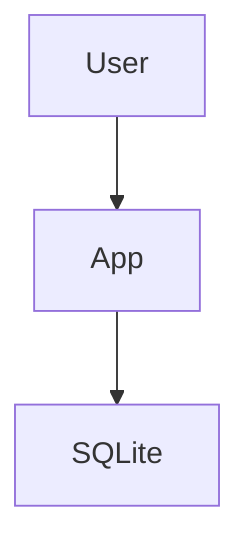
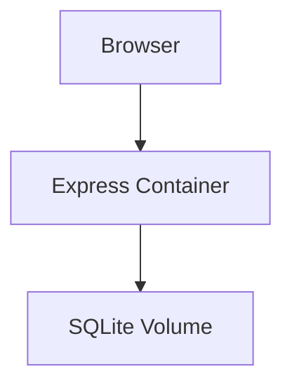
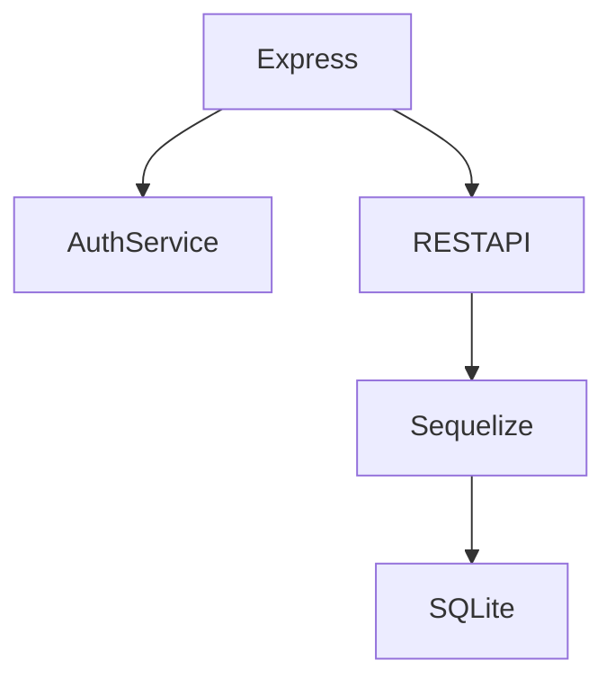
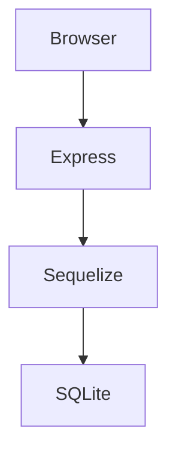

## 2. Architecture Diagrams

### 2.1 System Context

```mermaid
graph TD
    User --> App
    App --> DB[SQLite]
```

### 2.2 Container Architecture

```mermaid
graph TD
    Browser --> ExpressContainer[Express Container]
    ExpressContainer --> SQLiteVolume[SQLite Volume]
```

### 2.3 Components

```mermaid
graph TD
    Express --> AuthService
    Express --> RESTAPI
    RESTAPI --> Sequelize
    Sequelize --> SQLite
```

### 2.4 Technology Architecture

```mermaid
graph TD
    Browser --> Express
    Express --> Sequelize
    Sequelize --> SQLite
```
