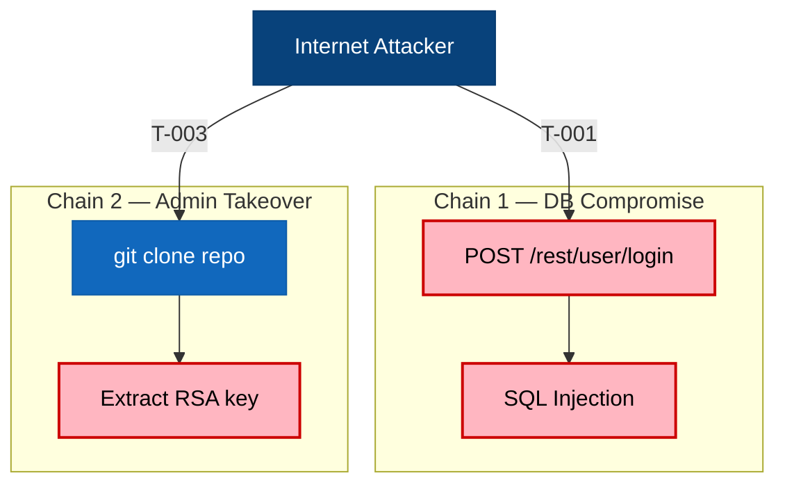
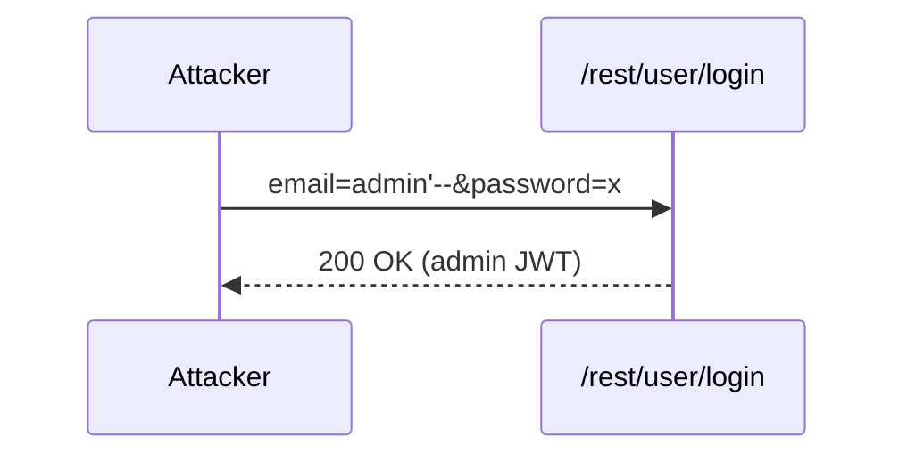

## 3. Attack Walkthroughs

### 3.1 Attack Chain Overview

The diagram below shows how Critical findings combine into two attacker workflows.

**Key takeaway:** A single fix does not break the chain — parameterized queries plus secret rotation must both land simultaneously.

### 3.2 SQL Injection Authentication Bypass

