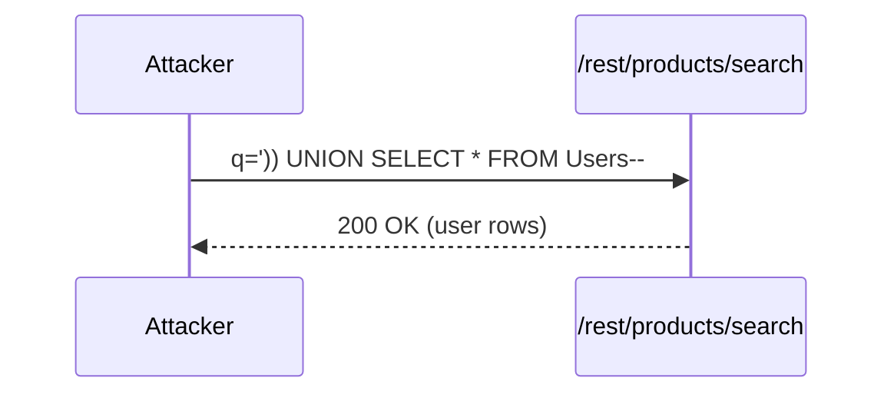
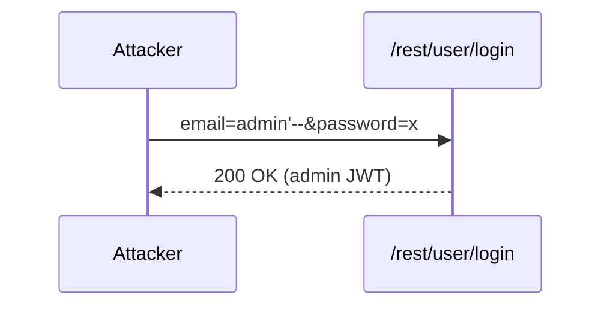
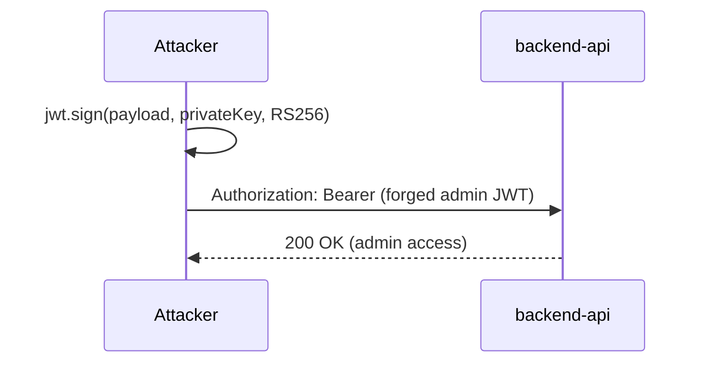

## 3. Attack Walkthroughs

This section walks through how each Critical finding would be exploited. The cross-finding view is the [Critical Attack Tree](#critical-attack-tree) above §1.

### 3.1 SQL Injection in Product Search

**Source:** [T-001](#t-001) — `routes/search.ts:23`

Severity **Critical** (CWE-89). STRIDE: Tampering. See [§8 T-001](#t-001) for the full register row.

**Attack Steps**

- Submit a crafted `q` parameter to the product search endpoint.
- Break out of the string literal with a UNION SELECT.
- Read the Users table from the response body.

**Sequence Diagram**

**Defense in Depth**

- [M-001](#m-001) — switch the search query to parameterized binding.

### 3.2 SQL Injection Authentication Bypass

**Source:** [T-002](#t-002) — `routes/login.ts:34`

Severity **Critical** (CWE-89). STRIDE: Tampering. See [§8 T-002](#t-002) for the full register row.

**Attack Steps**

- Send `email=admin'--` with any password to the login endpoint.
- The injected comment truncates the password check.
- Receive an admin session JWT.

**Sequence Diagram**

**Defense in Depth**

- [M-002](#m-002) — parameterize the login query.

### 3.3 Hardcoded RSA Private Key

**Source:** [T-003](#t-003) — `lib/insecurity.ts:23`

Severity **Critical** (CWE-321). STRIDE: Spoofing. See [§8 T-003](#t-003) for the full register row.

**Attack Steps**

- Clone the public repository and read the committed private key.
- Sign a JWT with `role: admin` offline.
- Present the forged token to any authenticated endpoint.

**Sequence Diagram**

**Defense in Depth**

- [M-003](#m-003) — rotate the signing key out of source control.
