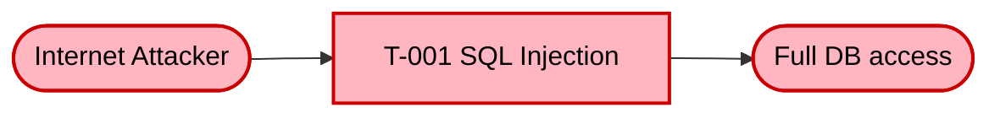
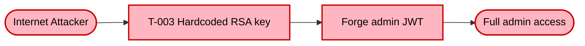
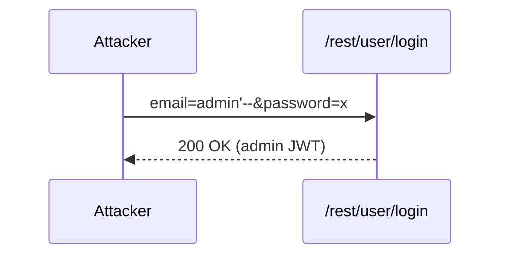

## 3. Attack Walkthroughs

### 3.1 Attack Chain Overview

The diagrams below show how Critical findings combine into distinct attacker workflows.

#### Chain 1 — DB Compromise

**Key takeaway:** SQL injection on the login endpoint gives the attacker direct read access to the full user database.

#### Chain 2 — Admin Takeover

**Key takeaway:** A single fix does not break the chain — parameterized queries plus secret rotation must both land simultaneously.

### 3.2 SQL Injection Authentication Bypass

