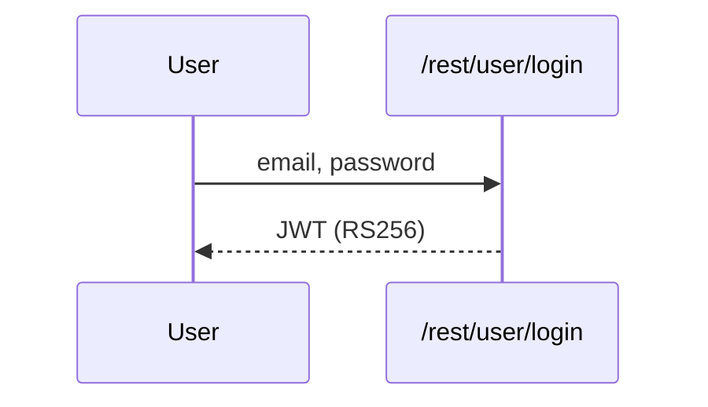
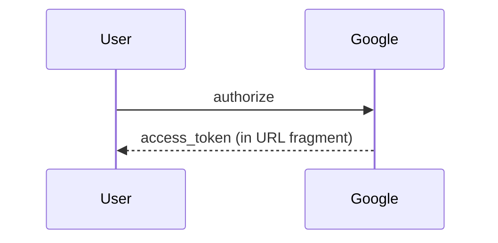

## 7. Security Architecture

### 7.1 Overview

Juice Shop fixture runs as a single Express process; all auth + data access is co-located.

### 7.2 Key Architectural Risks

| Risk | Description | Linked |
|------|-------------|--------|
| 🔴 Secrets in source | RSA key committed | T-003 |

### 7.3 Identity & Access Management

Juice Shop uses two authentication methods: password login and OAuth implicit flow.

#### Password Login

**Current state:** RS256 JWT signed with hardcoded RSA-1024 key.
**Linked threats:** T-003

#### OAuth Implicit Flow

**Current state:** Legacy implicit flow, token leaked via Referer header.
**Linked threats:** T-001

### 7.4 Authorization

- **Current state:** Client-side Angular route guard only.

### 7.5 Input Validation & Output Encoding

- **Current state:** Sequelize ORM used for most queries; raw SQL in login + search.

### 7.6 Data Protection & Session Management

- **Current state:** JWT stored in localStorage.

### 7.7 Frontend Security

- **Current state:** bypassSecurityTrustHtml used in 6 components.

### 7.8 Real-time / WebSocket

- **Current state:** Not used in this fixture.

### 7.9 AI / LLM

- **Current state:** Not used in this fixture.

### 7.10 Audit & Logging

- **Current state:** Winston logger; no security event audit trail.

### 7.11 Infrastructure & Network Segmentation

- **Current state:** Single Node process; SQLite co-located.

### 7.12 Dependency & Supply Chain

- **Current state:** Dependabot enabled; critically outdated deps remain.

### 7.13 Secret Management   _(cross-cutting)_

- **Current state:** All secrets hardcoded in source.

### 7.14 Defense-in-Depth Assessment   _(cross-cutting)_

- **Current state:** Single layer of control — no backstops.
