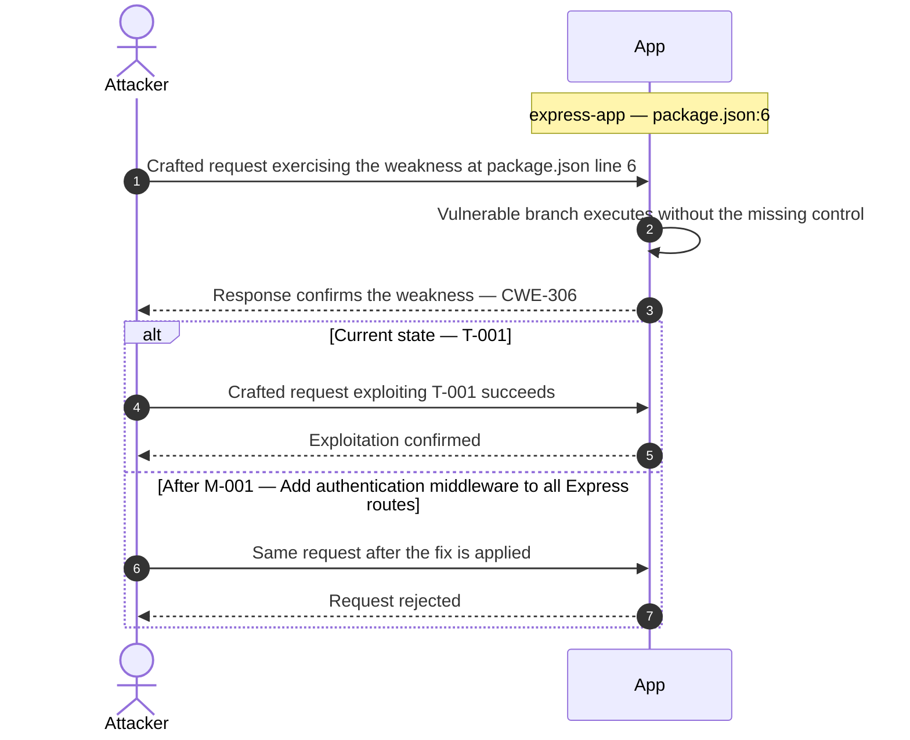
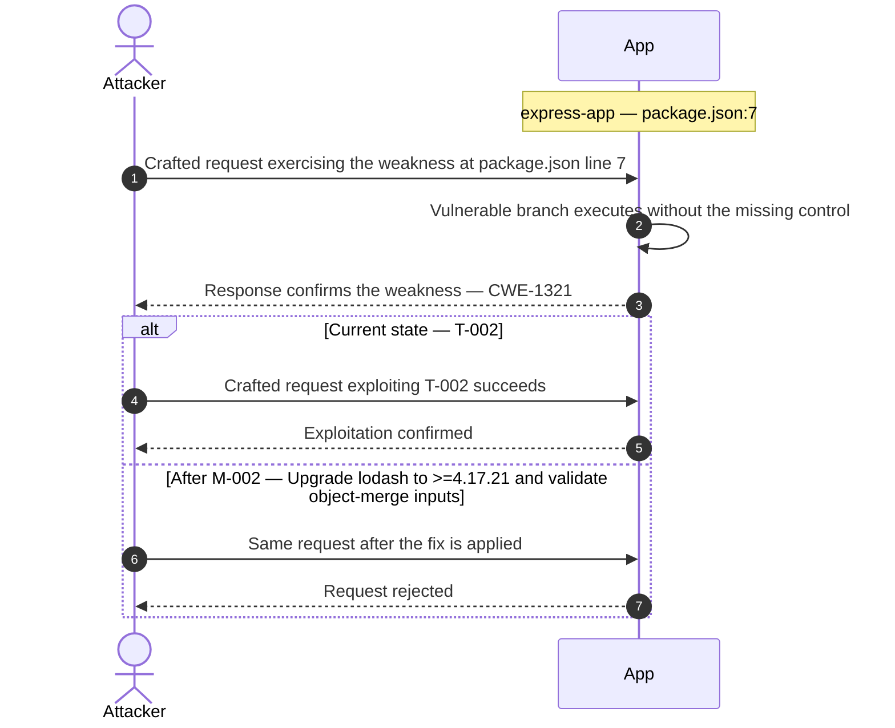

## 3. Attack Walkthroughs

This section walks through how the highest-risk findings are exploited — one short walkthrough per Critical, each with attack steps, a focused sequence diagram, and the primary mitigation. The cross-finding view (which weaknesses combine toward the worst-case goal, and where one fix severs several paths) is in the [Critical Attack Tree](#critical-attack-tree). Full per-finding context — severity rationale, assets, detection signals — is in the [§8 Findings Register](#8-findings-register) row for each finding.

### 3.1 Missing Authentication on All HTTP Endpoints (package.json)

**Source:** 🔴 [T-001](#t-001) — `package.json:6`

Severity **Critical** (CWE-306). STRIDE: Spoofing. See [§8 T-001](#t-001) for the full register row.

**Attack Steps**

1. The Express application declares no authentication library (no passport, jsonwebtoken, express-session, or equivalent) in package.json.
2. Every HTTP endpoint on port 3000 is reachable by any caller without identity verification.
3. An unauthenticated attacker can invoke administrative operations, read other users' data, or modify records by sending direct HTTP requests — no credentials required.

**Sequence Diagram**

**Key takeaway:** Until [M-001](#m-001) (Add authentication middleware to all Express routes) lands, T-001 is exploitable at `package.json:6` (Critical-severity, CWE-306).

**Defense in Depth**

- Primary mitigation: ❶ [M-001](#m-001) (Add authentication middleware to all Express routes)

### 3.2 Prototype Pollution via lodash _.merge on Untrusted Input…

**Source:** 🔴 [T-002](#t-002) — `package.json:7`

Severity **Critical** (CWE-1321). STRIDE: Tampering. See [§8 T-002](#t-002) for the full register row.

**Attack Steps**

1. lodash version 4.17.10 is vulnerable to prototype pollution via `_.merge` (CVE-2019-10744, CVSS 9.8) and `_.zipObjectDeep` (CVE-2020-8203).
2. When attacker-controlled JSON such as `{"__proto__": {"isAdmin": true}}` is passed to any code path that calls `_.merge(target, userInput)`, `Object.prototype` is modified globally for the Node.js process lifetime.
3. All subsequently created plain objects inherit the injected property, silently bypassing authorization checks that test `obj.isAdmin` or similar role flags.

**Sequence Diagram**

**Key takeaway:** Until [M-002](#m-002) (Upgrade lodash to >=4.17.21 and validate object-merge inputs) lands, T-002 is exploitable at `package.json:7` (Critical-severity, CWE-1321).

**Defense in Depth**

- Primary mitigation: ❶ [M-002](#m-002) (Upgrade lodash to >=4.17.21 and validate object-merge inputs)

<!-- generated:walkthrough_renderer -->
