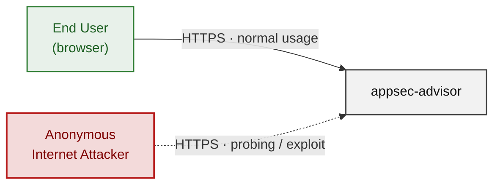
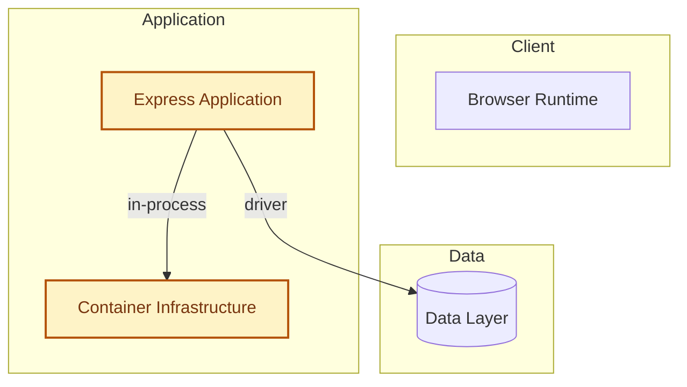
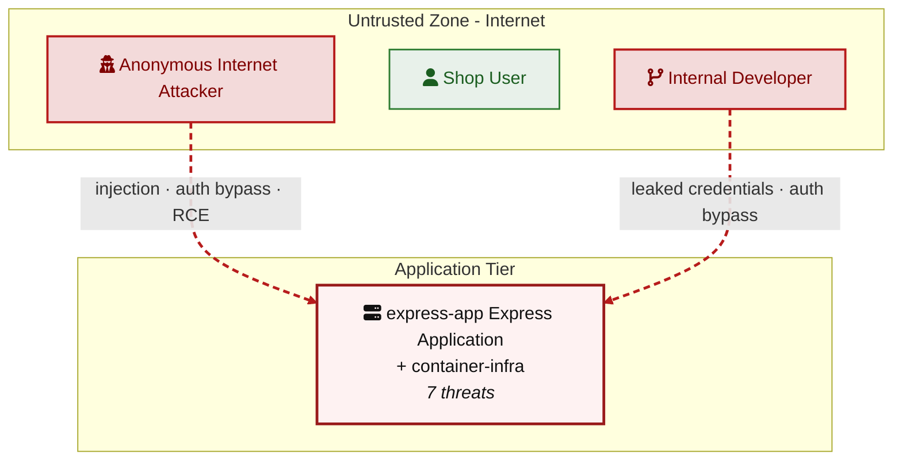
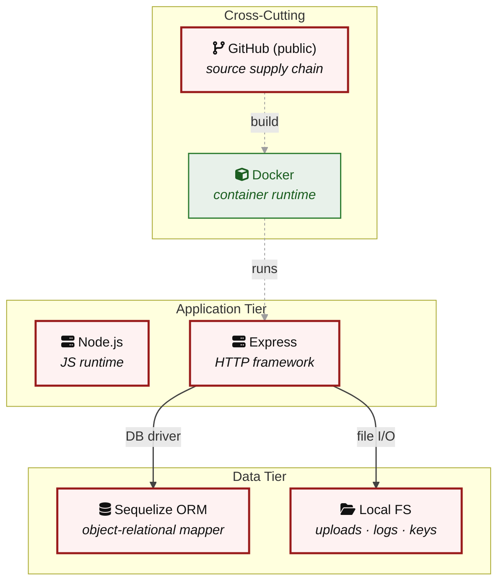

## 2. Architecture Diagrams

### 2.1 System Context

Who interacts with appsec-advisor from the outside, and through which channels. Solid arrows show normal usage; dashed red arrows mark unauthenticated probing or exploit paths (C4 Level 1).

### 2.2 Container Architecture

How the system decomposes into deployable units. Each box is a separate runtime process or service container; arrows show synchronous request paths between them. Components with ≥3 Critical findings carry a red border, ≥2 High amber (C4 Level 2).

### 2.3 Components

Who reaches each component, and through which trust zone. Four columns map external actors to the internal tiers (Client / Application / Data); solid green arrows show legitimate data flow, dashed red arrows mark intrusion vectors. The component table directly below holds source paths and linked threats per `C-NN`; per-finding evidence is in [§8 Findings Register](#8-findings-register).

| Component ID | Name | Tier | Source paths | Threats |
|---|---|---|---|---|
| express-app | Express Application | Application | `**/*.js`, `**/*.ts`, `server.js`, `routes/**`, `middleware/**`, `controllers/**`, `package.json`, `package-lock.json` | 7 |
| container-infra | Container Infrastructure | Application | `Dockerfile`, `docker-compose*.yml`, `docker-compose*.yaml` | 6 |

### 2.4 Technology Architecture

The technology stack the system is built on. Each box names the framework or runtime that fills that role; per-component findings live in the §2.3 component table above, and the full per-finding catalogue is in [§8 Findings Register](#8-findings-register).

> **Legend:** **red border** ≥ 3 Critical threats on the component · **amber border** ≥ 2 High threats
