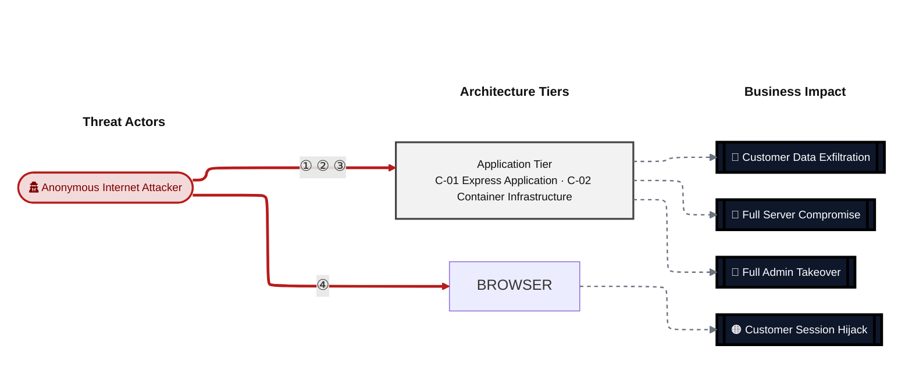
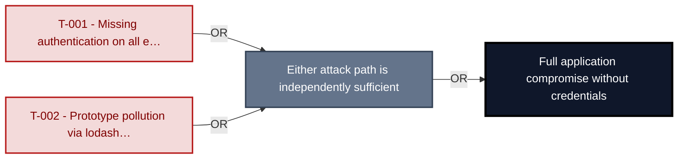
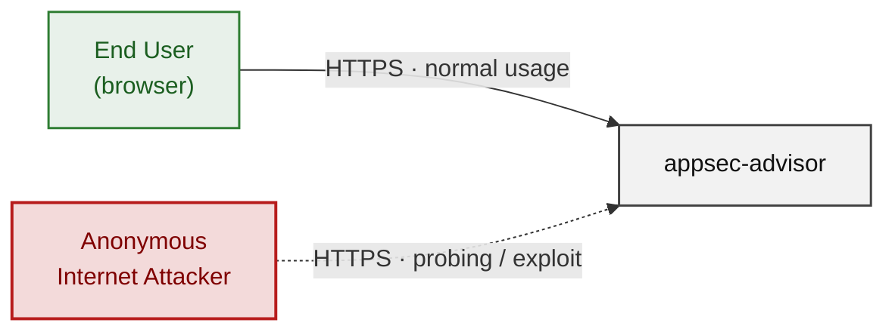
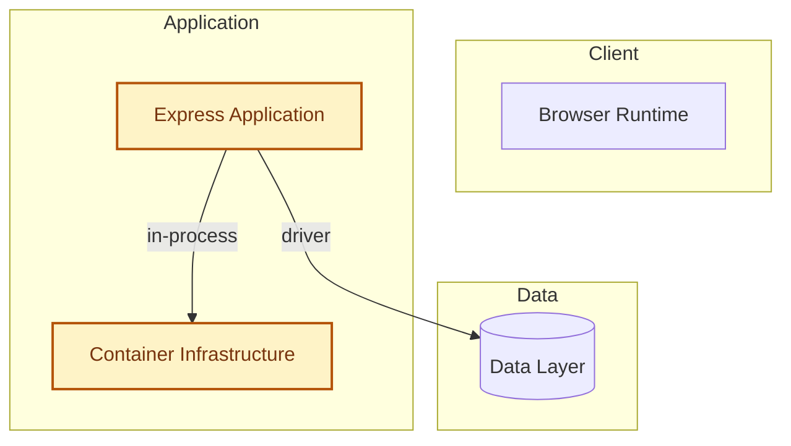
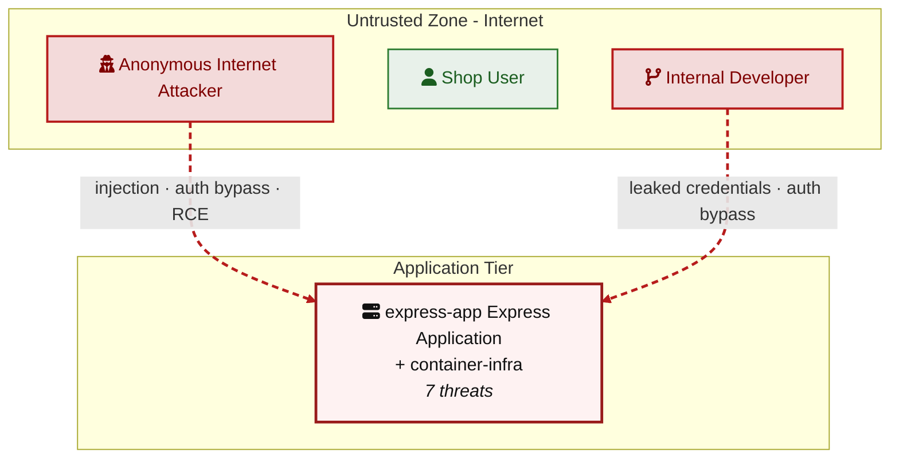
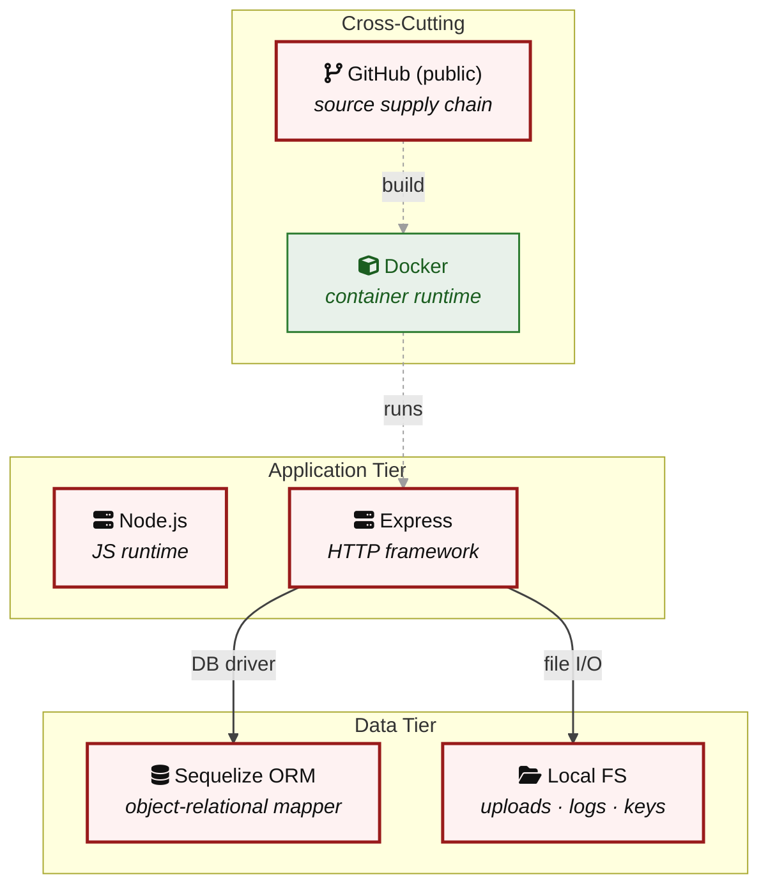

# Threat Model - e2e

_Generated by appsec-advisor v0.4.0-beta (analysis v2)_

---

> | | |
> |---|---|
> | **Project** | e2e |
> | **Description** | A frozen run-directory that exercises the plugin pipeline without invoking an LLM. |

---

## Changelog

_Append-only history of assessment runs. Most recent first._

| Version | Date | Mode | Depth | Reasoning | Baseline → Current | Δ Threats | Code | Note |
|--------|----------|--------|--------|--------------|------------------|----------------|--------|--------|
| v1 | 2026-06-05 | full | quick | sonnet-economy | _(initial)_ | +13 / ~0 / -0 | - | - |

---

> ⚠ **Quick depth - reduced-scope assessment.**
> 
> This report ran with intentionally narrower depth to keep wall-time short:
> 
> - **3/8 components** under full STRIDE analysis (top-priority components only)
> - **Max 2 threats per STRIDE category** per component (vs. unlimited at standard/thorough)
> - **No CVSS vectors**, no per-finding evidence excerpts
> - **No §3 Attack Walkthroughs** (entirely skipped at `--quick`)
> - **No LLM-enriched §7 architecture narrative** (scaffold + control tables only)
> - **No QA reviewer pass**, no architect-level review
> 
> Re-run with `--standard` (≈ +30 min) for full STRIDE coverage and QA, or
> `--thorough` (≈ +90 min) for architect review and enriched architecture sections.

---

## Table of Contents

- [Management Summary](#management-summary)
- [Critical Attack Tree](#critical-attack-tree)
1. [System Overview](#1-system-overview)
   - [Scope](#scope)
2. [Architecture Diagrams](#2-architecture-diagrams)
   - [2.1 System Context](#21-system-context)
   - [2.2 Container Architecture](#22-container-architecture)
   - [2.3 Components](#23-components)
   - [2.4 Technology Architecture](#24-technology-architecture)
4. [Assets](#4-assets)
5. [Attack Surface](#5-attack-surface)
   - [5.1 Unauthenticated Entry Points (2)](#51-unauthenticated-entry-points-2)
   - [5.2 Authenticated Entry Points (0)](#52-authenticated-entry-points-0)
8. [Findings Register](#8-findings-register)
9. [Abuse Cases](#9-abuse-cases)
10. [Mitigation Register](#10-mitigation-register)
11. [Out of Scope](#11-out-of-scope)
- [Appendix: Run Statistics](#appendix-run-statistics)
- [Appendix A - Vektor Taxonomy](#appendix-a-vektor-taxonomy)

> _Section numbering is non-contiguous: §3, §6, §7 were retired in a prior revision. The remaining sections keep their original numbers so existing cross-references stay valid._

---

## Management Summary

### Verdict

🔴 NOT PRODUCTION-READY. The Express application and its container have no authentication, no authorization, no input validation, no security headers, and no TLS - every HTTP endpoint on port 3000 is open to any anonymous caller. Two Critical findings (prototype pollution via `lodash@4.17.10` and completely missing authentication middleware) are independently exploitable without credentials or special tooling.

**Risk distribution:** 🔴 Critical: 2 · 🟠 High: 8 · 🟡 Medium: 3 · 🟢 Low: 0 · **Total: 13**

<br/>

**The dominant attack paths in priority order:**

<blockquote style="border-left: 3px solid #dc2626; background: #fef2f2; padding: 16px 20px; margin: 0;">

- **Full application takeover — no credentials required** — Every route is unauthenticated. An anonymous attacker reads, writes, and deletes any record by sending plain HTTP requests to port 3000 — no login bypass needed because no login exists. *(🔴 [F-001](#f-001) — Missing Authentication on All HTTP Endpoints (package.json), 🟠 [F-013](#f-013) — No Role Based Access Control on Any Route (package.json))*
- **Privilege escalation via prototype pollution** — `lodash@4.17.10` is vulnerable to CVE-2019-10744 (CVSS 9.8). A request body containing `{"__proto__":{"isAdmin":true}}` passed through any `_.merge` call poisons `Object.prototype` for the entire Node.js process lifetime, silently granting admin-level flags to all subsequent requests. *(🔴 [F-002](#f-002) — Prototype Pollution via lodash _.merge on Untrusted Input (package.json))*
- **Supply-chain backdoor baked into every image** — `Dockerfile:4` runs `npm install --production` without `--ignore-scripts` and with no `package-lock.json`. Any malicious or compromised npm dependency executes arbitrary shell code during `docker build`, embedding a backdoor in every published image layer. *(🟠 [F-003](#f-003) — Supply Chain Code Execution via Unguarded npm Lifecycle Hooks (Dockerfile:4))*
- **Credential and session token interception** — All traffic runs over plaintext HTTP (port 3000, no TLS). Any on-path observer captures credentials and session tokens in transit. HSTS cannot be enforced. *(🟠 [F-010](#f-010) — Plaintext HTTP Exposure on Port 3000 No TLS (Dockerfile))*
- **Container root escalation after any RCE** — The Dockerfile has no `USER` directive; the Node.js process runs as UID 0. Any code execution vulnerability immediately grants container-root access and enables container escape attempts. *(🟠 [F-012](#f-012) — Container Process Runs as Root Without USER Directive (Dockerfile))*

</blockquote>

<br/>

Thirteen mitigations follow. The two Critical items - adding authentication middleware and upgrading `lodash` - unblock all other work and should land before any other deployment activity.

### Security Posture & Top Threats

**Figure 2 - Risk Flow: Actor → Tier → Impact**

Heatmap: **actors** (left) → **architecture tiers** (middle, Client → Application → Data) → **impact** (right). Numbered red arrows ①–④ are the threats enumerated in the Top Threats table below.



**Threat actors.** The actors below drive the numbered attack paths in the figures above; the Shop User is the *victim* of client-side attacks (XSS / CSRF), not an attacker.

- **Shop User** — legitimate customer; target of client-side attacks; target of ④ CSRF / Permissive CORS.
- **Anonymous Internet Attacker** — no account; registers in seconds when needed; drives ① Broken Authorization & Access Control, ② Sensitive File & Secret Exposure, ③ Remote Code Execution (unsafe eval).

**4 structural threats**, grouped by weakness class - each row is one threat, not one finding. *Threat Description* states the general architectural weakness (STRIDE in brackets); *Findings* lists the concrete instances, each linked to [§8 Findings Register](#8-findings-register) with its component; *Risk & Impact* combines severity with business consequence.

| # | Threat Description | Findings (→ Component) | Risk & Impact | Fix |
|---|------------------------------------|------------------------------------------------|------------------------------------|--------|
| <a id="path-privilege-escalation"></a>① | **Broken Authorization & Access Control**<br/>_(E·I)_<br/>authorisation checks are absent or<br/>bypassable, allowing horizontal and vertical<br/>privilege jumps from a self-registered or<br/>low-rights account. Includes mass-assignment<br/>of privileged attributes. | •&nbsp;🟠&nbsp;[F-012](#f-012) — Container Process Runs as Root Without USER Directive (Dockerfile) →&nbsp;[C-02](#c-02)<br/>•&nbsp;🟠&nbsp;[F-013](#f-013) — No Role Based Access Control on Any Route (package.json) →&nbsp;[C-01](#c-01) | 🟠 **High**<br/>Full Admin Takeover · Customer Data<br/>Exfiltration | ❷ [M-009](#m-009) — Add USER directive to run container process as non-root in Dockerfile<br/>❷ [M-010](#m-010) — Implement role-based authorization middleware on all protected Express routes |
| <a id="path-sensitive-data-exposure"></a>② | **Sensitive File & Secret Exposure** _(I)_<br/>confidential files, credentials, and<br/>management-plane endpoints are reachable on<br/>unauthenticated routes; SSRF lets the server<br/>fetch internal resources on the attacker's<br/>behalf; unsafe path-handling primitives leak<br/>server content. | •&nbsp;🟠&nbsp;[F-009](#f-009) — Build Context Leaks Sensitive Files Into Image Layer (Dockerfile:5) →&nbsp;[C-02](#c-02)<br/>•&nbsp;🟠&nbsp;[F-010](#f-010) — Plaintext HTTP Exposure on Port 3000 No TLS (Dockerfile) →&nbsp;[C-02](#c-02) | 🟠 **High**<br/>Customer Data Exfiltration | ❷ [M-006](#m-006) — Add .dockerignore to exclude sensitive files from the Docker build context<br/>❷ [M-007](#m-007) — Terminate TLS at the container ingress or reverse proxy |
| <a id="path-remote-code-execution"></a>③ | **Remote Code Execution (unsafe eval)** _(E)_<br/>user-supplied data reaches a server-side<br/>code-execution sink (`eval`, sandbox<br/>primitives, deserialisation,<br/>prototype-pollution gadgets) and breaks out<br/>into arbitrary native execution. | •&nbsp;🔴&nbsp;[F-002](#f-002) — Prototype Pollution via lodash _.merge on Untrusted Input (package.json) →&nbsp;[C-01](#c-01) | 🔴 **Critical**<br/>Full Server Compromise · Customer Data<br/>Exfiltration · Full Admin Takeover | ❶ [M-002](#m-002) — Upgrade lodash to >=4.17.21 and validate object-merge inputs |
| <a id="path-cross-site-request-forgery"></a>④ | **CSRF / Permissive CORS** _(S·T)_<br/>a permissive CORS policy plus missing<br/>anti-CSRF tokens let any external page issue<br/>authenticated state-changing requests in the<br/>victim's session. | •&nbsp;🟠&nbsp;[F-004](#f-004) — No CSRF Protection on State Changing Endpoints (package.json) →&nbsp;[C-01](#c-01) | 🟠 **High**<br/>Customer Session Hijack | ❷ [M-004](#m-004) — Add CSRF token middleware to all state-changing Express routes |

_STRIDE: S spoofing · T tampering · R repudiation · I information disclosure · D denial of service · E elevation of privilege. Risk, findings, components, impact and Fix are derived deterministically; only the one-line weakness description is authored._

### Top Mitigations

Highest-impact P1/P2 mitigations - 10 of 10 qualifying (13 total). Full detail in [§10 Mitigation Register](#10-mitigation-register). All 2 mitigation(s) that fix a Critical finding are always listed here.

| # | Component | Mitigation | Addresses | Effort |
|---|----------------------|------------------------------------------------|------------------------------------------------|------|
| **1** | [C-01](#c-01) — Express Application | ❶ [M-002](#m-002) — Upgrade lodash to >=4.17.21 and validate object-merge inputs | 🔴 [F-002](#f-002) — Prototype Pollution via lodash _.merge on Untrusted Input (package.json) | Low |
| **2** | [C-01](#c-01) — Express Application | ❶ [M-001](#m-001) — Add authentication middleware to all Express routes | 🔴 [F-001](#f-001) — Missing Authentication on All HTTP Endpoints (package.json) | High |
| **3** | [C-01](#c-01) — Express Application | ❷ [M-005](#m-005) — Integrate structured request and security-event logging via pino or winston | 🟠 [F-005](#f-005) — No Security Event Logging All Operations Leave Zero Forensic Tra… (package.json) | Low |
| **4** | [C-01](#c-01) — Express Application | ❷ [M-008](#m-008) — Add express-rate-limit middleware to all externally reachable endpoints | 🟠 [F-011](#f-011) — No Rate Limiting on Any HTTP Endpoint (package.json) | Low |
| **5** | [C-01](#c-01) — Express Application | ❷ [M-004](#m-004) — Add CSRF token middleware to all state-changing Express routes | 🟠 [F-004](#f-004) — No CSRF Protection on State Changing Endpoints (package.json) | Medium |
| **6** | [C-01](#c-01) — Express Application | ❷ [M-010](#m-010) — Implement role-based authorization middleware on all protected Express routes | 🟠 [F-013](#f-013) — No Role Based Access Control on Any Route (package.json) | High |
| **7** | [C-02](#c-02) — Container Infrastructure | ❷ [M-003](#m-003) — Add --ignore-scripts to npm install and commit a package-lock.json in Dockerfile | 🟠 [F-003](#f-003) — Supply Chain Code Execution via Unguarded npm Lifecycle Hooks (Dockerfile, "Dockerfile:4") | Low |
| **8** | [C-02](#c-02) — Container Infrastructure | ❷ [M-006](#m-006) — Add .dockerignore to exclude sensitive files from the Docker build context | 🟠 [F-009](#f-009) — Build Context Leaks Sensitive Files Into Image Layer (Dockerfile, "Dockerfile:5") | Low |
| **9** | [C-02](#c-02) — Container Infrastructure | ❷ [M-009](#m-009) — Add USER directive to run container process as non-root in Dockerfile | 🟠 [F-012](#f-012) — Container Process Runs as Root Without USER Directive (Dockerfile, "Dockerfile") | Low |
| **10** | [C-02](#c-02) — Container Infrastructure | ❷ [M-007](#m-007) — Terminate TLS at the container ingress or reverse proxy | 🟠 [F-010](#f-010) — Plaintext HTTP Exposure on Port 3000 No TLS (Dockerfile, "Dockerfile") | Medium |

*3 P3 backlog items in [§10 Mitigation Register](#10-mitigation-register). Sorted by priority (P1 first), then component, then leverage (most findings first), severity (Critical first), and effort (Low first).*

### Operational Strengths

Operational controls rated Adequate or Partial - grouped into broad clusters (full per-control breakdown in [§7](#7-security-architecture)). Clusters demoted to Weak by open Critical/High findings appear in [§7](#7-security-architecture) instead, not here.

| Strength | What's in Place | Effectiveness | Gap | Mitigates |
|----------------------|----------------------|-------------|----------------------|----------------|
| **Input Handling & Output Encoding** | _Boundary validation of untrusted input and<br/>consistent output encoding before<br/>persistence or rendering._<br/>Parameterized Queries / ORM | ⚠️ Partial | Coverage incomplete - see §7 control<br/>assessment. | - |

**Bottom line:** These controls narrow specific attack surfaces but none eliminates a Critical finding on its own.

---

<a id="critical-attack-chain"></a><a id="critical-attack-tree"></a>
## Critical Attack Tree

The root is the worst-case attacker goal; below it, each capability branch groups the Critical findings that achieve it. Branches feed the goal by OR - any single path suffices.



**Findings** (full detail in [§8 Findings Register](#8-findings-register)): 🔴 [F-001](#f-001) — Missing Authentication on All HTTP Endpoints (package.json) Missing authentication on all endpoints · 🔴 [F-002](#f-002) — Prototype Pollution via lodash _.merge on Untrusted Input (package.json) Prototype pollution via lodash _.merge

---

## 1. System Overview

**Repository:** git@github\.com:matthiasrohr/appsec-`advisor.git`

### Scope

This threat model covers 2 components of appsec-advisor: **Express Application**, **Container Infrastructure**.

**Out of scope:** third-party hosted dependencies, browser runtime, operating-system kernel, and the underlying network infrastructure.

---

## 2. Architecture Diagrams

### 2.1 System Context

Who interacts with appsec-advisor from the outside, and through which channels. Solid arrows show normal usage; dashed red arrows mark unauthenticated probing or exploit paths (C4 Level 1).



### 2.2 Container Architecture

How the system decomposes into deployable units. Each box is a separate runtime process or service container; arrows show synchronous request paths between them. Components with ≥3 Critical findings carry a red border, ≥2 High amber (C4 Level 2).



### 2.3 Components

Who reaches each component, and through which trust zone. Four columns map external actors to the internal tiers (Client / Application / Data); solid green arrows show legitimate data flow, dashed red arrows mark intrusion vectors. The component table directly below holds source paths and linked threats per `C-NN`; per-finding evidence is in [§8 Findings Register](#8-findings-register).



| ID | Name | Type | Key Paths | Linked Threats |
|----|----------------------|-----------|-------------------|------------------------------------------------|
| <a id="c-01"></a><a id="express-app"></a>C-01 | Express Application | application | `**/*.js`<br/>`**/*.ts`<br/>`server.js`<br/>`routes/**`<br/>`middleware/**` | 🔴 [F-001](#f-001) — Missing Authentication on All HTTP Endpoints (package\.json)<br/>🔴 [F-002](#f-002) — Prototype Pollution via lodash _.merge on Untrusted Input (package\.json)<br/>🟠 [F-004](#f-004) — No CSRF Protection on State Changing Endpoints (package\.json)<br/>🟠 [F-005](#f-005) — No Security Event Logging All Operations Leave Zero Forensic Tra… (package\.json)<br/>🟠 [F-011](#f-011) — No Rate Limiting on Any HTTP Endpoint (package\.json)<br/>🟠 [F-013](#f-013) — No Role Based Access Control on Any Route (package\.json)<br/>🟡 [F-015](#f-015) — Absent CORS Policy Allows Cross Origin State Changing Requests (package\.json) |
| <a id="c-02"></a><a id="container-infra"></a>C-02 | Container Infrastructure | application | `Dockerfile`<br/>`docker-compose*.yml`<br/>`docker-compose*.yaml` | 🟠 [F-003](#f-003) — Supply Chain Code Execution via Unguarded npm Lifecycle Hooks (Dockerfile:4)<br/>🟠 [F-009](#f-009) — Build Context Leaks Sensitive Files Into Image Layer (Dockerfile:5)<br/>🟠 [F-010](#f-010) — Plaintext HTTP Exposure on Port 3000 No TLS (Dockerfile)<br/>🟠 [F-012](#f-012) — Container Process Runs as Root Without USER Directive (Dockerfile)<br/>🟡 [F-014](#f-014) — Mutable Base Image Tag Allows Undetected Image Substitution (Dockerfile:1)<br/>🟡 [F-018](#f-018) — No Resource Limits Defined Container Can Exhaust Host Resources (Dockerfile) |
### 2.4 Technology Architecture

The technology stack the system is built on. Each box names the framework or runtime that fills that role; per-component findings live in the [§2.3](#23-components) component table above, and the full per-finding catalogue is in [§8 Findings Register](#8-findings-register).



> **Legend:** **red border** ≥ 3 Critical threats on the component · **amber border** ≥ 2 High threats

---

## 4. Assets

Information assets and the classification level that drives the Confidentiality / Integrity / Availability targets used in [§8 Findings Register](#8-findings-register) risk scoring.

| Asset | ID | Classification | Description |
|----------------------|-----|--------------|------------------------------------|
| Application Data (Database) | A-003 | Confidential | Application data managed via Sequelize ORM.<br/>Classification assumed Confidential as<br/>typical web application data store. |
| Application Container (Docker) | A-001 | Internal | Docker container running the Node\.js<br/>application as root user. Compromise gives<br/>root-level container access. |
| npm Dependencies | A-002 | Internal | Third-party packages: `express@4.19.2`,<br/>`lodash@4.17.10` (`CVE-2019-10744`),<br/>`sequelize@6.37.1`. No lockfile means versions<br/>may drift. Lodash has known prototype<br/>pollution CVEs. |
| Container Image | A-004 | Internal | node:20-alpine base image (mutable tag, no<br/>digest pinning). Supply chain integrity<br/>depends on Docker Hub trust. |

---

## 5. Attack Surface

Network-reachable entry points classified by authentication requirement. Each row links to the threat(s) referenced in its **Notes** column. The **Risk** column reflects the highest-severity linked finding.

### 5.1 Unauthenticated Entry Points (2)

| Method | Route | Risk | Notes |
|------|---------------------------|-------|------------------------------------|
| ? | `Docker container entrypoint` | - | Container runs as root. If container escape<br/>occurs, attacker has host-level root access. |
| ? | `HTTP API (port 3000)` | - | Express app listening on port 3000. No TLS<br/>configured. Route inventory returned 0<br/>routes (`server.js` absent from repo). Assumed<br/>unauthenticated HTTP by default. |

### 5.2 Authenticated Entry Points (0)

_None enumerated._

---

_§6 Use Cases and §7 Security Architecture are omitted at `--quick` depth. Re-run with `--standard` (≈ +30 min) or `--thorough` (≈ +90 min) to render the per-domain analysis._

---

## 8. Findings Register

Findings are grouped by severity (Critical → High → Medium → Low); within a tier they are ordered by attack vektor (Repo-Read → Internet-Anon → Internet-User → Victim-Required). Each finding is a card with the same fixed fields, in order: **Severity · Component · Location** → **Issue** → **Root cause** → **Evidence** → **Fix** → **Classification** (with external CWE / OWASP links).

**Risk Distribution:** 🔴 Critical: 2 · 🟠 High: 8 · 🟡 Medium: 3 · 🟢 Low: 0 · **Total findings: 13**
**STRIDE Coverage:** Spoofing: 2 · Tampering: 4 · Repudiation: 1 · Information Disclosure: 2 · Denial of Service: 2 · Elevation of Privilege: 2

**Findings index:**<br/>🔴 [F-001](#f-001) — Missing Authentication on All HTTP Endpoints (package.json)<br/>🔴 [F-002](#f-002) — Prototype Pollution via lodash _.merge on Untrusted Input (package.json)<br/>🟠 [F-003](#f-003) — Supply Chain Code Execution via Unguarded npm Lifecycle Hooks (Dockerfi…<br/>🟠 [F-004](#f-004) — No CSRF Protection on State Changing Endpoints (package.json)<br/>🟠 [F-005](#f-005) — No Security Event Logging All Operations Leave Zero Forensic Tra… (pack…<br/>🟠 [F-009](#f-009) — Build Context Leaks Sensitive Files Into Image Layer (Dockerfile:5)<br/>🟠 [F-010](#f-010) — Plaintext HTTP Exposure on Port 3000 No TLS (Dockerfile)<br/>🟠 [F-011](#f-011) — No Rate Limiting on Any HTTP Endpoint (package.json)<br/>🟠 [F-012](#f-012) — Container Process Runs as Root Without USER Directive (Dockerfile)<br/>🟠 [F-013](#f-013) — No Role Based Access Control on Any Route (package.json)<br/>🟡 [F-014](#f-014) — Mutable Base Image Tag Allows Undetected Image Substitution (Dockerfile…<br/>🟡 [F-015](#f-015) — Absent CORS Policy Allows Cross Origin State Changing Requests (package…<br/>🟡 [F-018](#f-018) — No Resource Limits Defined Container Can Exhaust Host Resources (Docker…

<a id="th-05"></a><a id="th-09"></a><a id="th-03"></a><a id="th-06"></a><a id="th-12"></a><a id="th-14"></a><a id="th-15"></a><a id="th-16"></a><a id="th-17"></a>

### 🔴 Critical (2)

<a id="t-001"></a><a id="f-001"></a>
#### F-001 · Missing Authentication

**Severity:** 🔴 Critical - reaches a privileged operation on an unauthenticated endpoint  ·  **Component:** [C-01](#c-01) - Express Application  ·  **Location:** `package.json`:6

**Issue:** The Express application declares no authentication library (no passport, jsonwebtoken, express-session, or equivalent) in `package.json`. Every HTTP endpoint on port 3000 is reachable by any caller without identity verification. An unauthenticated attacker can invoke administrative operations, read other users' data, or modify records by sending direct HTTP requests - no credentials required. The trust boundary between Public Internet and the container is entirely uncontrolled. Any caller on the network can perform any operation the application supports, effectively making every user an administrator.

**Evidence:** ✓ verified - `package.json` lists only express, sequelize, and lodash - no authentication or session management package is present.

**Fix:** ❶ [M-001](#m-001) — Add authentication middleware to all Express routes

**Classification:** Unauthenticated Management Plane · [CWE-306](https://cwe.mitre.org/data/definitions/306.html) · [OWASP A01:2021](https://owasp.org/Top10/A01_2021/)

<a id="t-002"></a><a id="f-002"></a>
#### F-002 · Prototype Pollution

**Severity:** 🔴 Critical  ·  **Component:** [C-01](#c-01) - Express Application  ·  **Location:** `package.json`:7

**Issue:** lodash version 4.17.10 is vulnerable to prototype pollution via `_.merge` (`CVE-2019-10744`, CVSS 9.8) and `_.zipObjectDeep` (`CVE-2020-8203`). When attacker-controlled JSON such as `{"__proto__": {"isAdmin": true}}` is passed to any code path that calls `_.merge(target, userInput)`, `Object.prototype` is modified globally for the `Node.js` process lifetime. All subsequently created plain objects inherit the injected property, silently bypassing authorization checks that test `obj.isAdmin` or similar role flags. In a server that also lacks input validation (IV-001 FAIL) and authentication (AC-004 FAIL), every HTTP request body is a direct injection vector. Attacker can escalate to administrator-equivalent access or crash the `Node.js` process by corrupting shared prototype state.

**Root cause:** User-supplied data reaches a server-side code-execution sink (`eval`, sandbox primitives, deserialisation, prototype-pollution gadgets) and breaks out into arbitrary native execution.

**Evidence:** ✓ verified - `package.json` pins lodash at 4.17.10, which is below the patched floor of 4.17.21 for both CVEs.

**Fix:** ❶ [M-002](#m-002) — Upgrade lodash to >=4.17.21 and validate object-merge inputs

**Classification:** Code Execution via Unsafe Deserialization or Eval · [CWE-1321](https://cwe.mitre.org/data/definitions/1321.html) · [OWASP A08:2021](https://owasp.org/Top10/A08_2021/)

### 🟠 High (8)

<a id="t-003"></a><a id="f-003"></a>
#### F-003 · Supply Chain Code Execution Unguarded

**Severity:** 🟠 High  ·  **Component:** [C-02](#c-02) - Container Infrastructure  ·  **Location:** `Dockerfile`:4

**Issue:** `Dockerfile:4` runs `npm install --production` without `--ignore-scripts`. Any dependency (or transitive dependency) that includes a `preinstall`, `install`, or `postinstall` lifecycle hook executes arbitrary shell commands inside the build container. With no `package-lock.json` (SC-002 violation), the resolved dependency graph is non-deterministic across builds - a dependency-confusion attack or a malicious version bump can inject a hook that exfiltrates build secrets, adds backdoor binaries to the image layer, or overwrites `server.js` before `COPY . Attacker-controlled code runs inside the build environment and is baked into the published container image, affecting every downstream deployment.

**Evidence:** ✓ verified - `Dockerfile:4` calls `npm install --production` with no `--ignore-scripts` flag, and no `package-lock.json` is present in the repository to pin the resolved version graph.

**Fix:** ❷ [M-003](#m-003) — Add --ignore-scripts to npm install and commit a package-lock.json in Dockerfile

**Classification:** Supply-Chain Integrity · [CWE-506](https://cwe.mitre.org/data/definitions/506.html) · [OWASP A06:2021](https://owasp.org/Top10/A06_2021/)

<a id="t-005"></a><a id="f-005"></a>
#### F-005 · Insufficient Logging

**Severity:** 🟠 High  ·  **Component:** [C-01](#c-01) - Express Application  ·  **Location:** `package.json`:5

**Issue:** The application has no logging library in its dependencies (LM-001 FAIL - no morgan, winston, or pino). Express's built-in error handling writes nothing structured. Authentication failures, data modifications, and access control violations are never recorded. Breach investigation is impossible; attackers can exfiltrate data or escalate privilege with no evidence left behind.

**Evidence:** ✓ verified - `package.json` lists no logging dependency; requirements violation LM-001 confirms absence.

**Fix:** ❷ [M-005](#m-005) — Integrate structured request and security-event logging via pino or winston

**Classification:** Missing Audit Logging & Accountability · [CWE-778](https://cwe.mitre.org/data/definitions/778.html) · [OWASP A09:2021](https://owasp.org/Top10/A09_2021/)

<a id="t-009"></a><a id="f-009"></a>
#### F-009 · Information Disclosure

**Severity:** 🟠 High  ·  **Component:** [C-02](#c-02) - Container Infrastructure  ·  **Location:** `Dockerfile`:5

**Issue:** `Dockerfile:5` runs `COPY . .`, which copies the entire build context (the directory where `docker build` is invoked) into `/app`. No `.dockerignore` file exists in the repository. Secrets embedded in the image layer are recoverable by any party with registry read access, including CI runners, all developers, and external attackers if the registry is public.

**Root cause:** Confidential files, credentials, and management-plane endpoints are reachable on unauthenticated routes; SSRF lets the server fetch internal resources on the attacker's behalf; unsafe path-handling primitives leak server content.

**Evidence:** ✓ verified - No `.dockerignore` exists and `Dockerfile:5` copies the entire build context, exposing any local credential or configuration file present at build time as a permanent image layer.

**Fix:** Restrict the response to the minimum fields needed and never echo secrets → ❷ [M-006](#m-006) — Add .dockerignore to exclude sensitive files from the Docker build context

**Classification:** Error Information Disclosure · [CWE-200](https://cwe.mitre.org/data/definitions/200.html) · [OWASP A05:2021](https://owasp.org/Top10/A05_2021/)

<a id="t-010"></a><a id="f-010"></a>
#### F-010 · Plaintext HTTP Exposure Port 3000

**Severity:** 🟠 High  ·  **Component:** [C-02](#c-02) - Container Infrastructure  ·  **Location:** `Dockerfile`:6

**Issue:** The Dockerfile exposes port 3000 and starts the server with `node server.js` with no TLS termination in the application layer and no reference to an HTTPS proxy or load balancer. Requirements violations DP-006 and WEB-005 confirm that no TLS is configured. All HTTP traffic between clients and the container - including credentials, session tokens, and any sensitive data - is transmitted in cleartext and can be intercepted by any on-path observer (ISP, network switch, cloud MITM). Credentials and session tokens are exposed to passive network eavesdropping; HSTS cannot be enforced without HTTPS.

**Root cause:** Confidential files, credentials, and management-plane endpoints are reachable on unauthenticated routes; SSRF lets the server fetch internal resources on the attacker's behalf; unsafe path-handling primitives leak server content.

**Evidence:** ✓ verified - Dockerfile `EXPOSE 3000` with `CMD ["node", "server.js"]` and no TLS-related package in `package.json`.

**Fix:** Force TLS on every transport channel and reject downgrades → ❷ [M-007](#m-007) — Terminate TLS at the container ingress or reverse proxy

**Classification:** Cryptographic Failures · [CWE-319](https://cwe.mitre.org/data/definitions/319.html) · [OWASP A02:2021](https://owasp.org/Top10/A02_2021/)

<a id="t-011"></a><a id="f-011"></a>
#### F-011 · Uncontrolled Resource Consumption

**Severity:** 🟠 High  ·  **Component:** [C-01](#c-01) - Express Application  ·  **Location:** `package.json`:5

**Issue:** The application has no rate-limiting middleware (AC-003 FAIL - no `express-rate-limit` or equivalent in `package.json`). An attacker or automated scanner can send an unbounded number of requests per second to any endpoint. Combined with the absence of authentication, routes that perform database queries via Sequelize can be hammered to exhaust database connection pool limits or saturate the `Node.js` event loop. Attacker can render the application unavailable by flooding endpoints with requests, exhausting the DB connection pool or CPU.

**Evidence:** ✓ verified - `package.json` contains no rate-limiting package; requirements violation AC-003 confirms absence.

**Fix:** Bound the request rate and the per-request resource budget on this endpoint → ❷ [M-008](#m-008) — Add express-rate-limit middleware to all externally reachable endpoints

**Classification:** Denial of Service · [CWE-400](https://cwe.mitre.org/data/definitions/400.html) · [OWASP A04:2021](https://owasp.org/Top10/A04_2021/)

<a id="t-012"></a><a id="f-012"></a>
#### F-012 · Improper Privilege Management

**Severity:** 🟠 High  ·  **Component:** [C-02](#c-02) - Container Infrastructure  ·  **Location:** `Dockerfile`:7

**Issue:** The `Dockerfile` contains no `USER` directive, so the `Node.js` process started by `CMD ["node", "server.js"]` runs as UID 0 (root) inside the container. This violates requirement IF-002. If an attacker achieves code execution through an application vulnerability (e.g., RCE via `eval()` or path traversal), they operate as root within the container. Post-exploitation pivot from application RCE to container root, maximising the blast radius of any code execution vulnerability and enabling container escape attempts.

**Root cause:** Authorisation checks are absent or bypassable, allowing horizontal and vertical privilege jumps from a self-registered or low-rights account. Includes mass-assignment of privileged attributes.

**Evidence:** ✓ verified - `Dockerfile` has no `USER` instruction before `CMD`, confirmed by direct inspection; the requirements-violations index records this as IF-002 FAIL.

**Fix:** ❷ [M-009](#m-009) — Add USER directive to run container process as non-root in Dockerfile

**Classification:** Broken Access Control · [CWE-269](https://cwe.mitre.org/data/definitions/269.html) · [OWASP A01:2021](https://owasp.org/Top10/A01_2021/)

<a id="t-013"></a><a id="f-013"></a>
#### F-013 · Missing Authorization

**Severity:** 🟠 High  ·  **Component:** [C-01](#c-01) - Express Application  ·  **Location:** `package.json`:5

**Issue:** The application has no RBAC library and no authorization middleware in its dependency list (AC-002 FAIL). Even if authentication is added, there is no mechanism to prevent a low-privilege authenticated user from accessing administrative endpoints, executing privileged database operations, or reading records belonging to other users. Because `server.js` is absent from the repo, the absence of authorization guards cannot be confirmed at the code level - but no enabler library exists at all, making any route-level authorization impossible. Any authenticated user (once authentication is added) can access all application functions regardless of assigned role.

**Root cause:** Authorisation checks are absent or bypassable, allowing horizontal and vertical privilege jumps from a self-registered or low-rights account. Includes mass-assignment of privileged attributes.

**Evidence:** ✓ verified - `package.json` contains no authorization library (no `casl`, `accesscontrol`, `rbac`, or framework-level guard package).

**Fix:** ❷ [M-010](#m-010) — Implement role-based authorization middleware on all protected Express routes

**Classification:** Broken Access Control · [CWE-862](https://cwe.mitre.org/data/definitions/862.html) · [OWASP A01:2021](https://owasp.org/Top10/A01_2021/)

<a id="t-004"></a><a id="f-004"></a>
#### F-004 · Cross-Site Request Forgery (CSRF)

**Severity:** 🟠 High  ·  **Component:** [C-01](#c-01) - Express Application  ·  **Location:** `package.json`:5

**Issue:** The application ships with no CSRF protection (WEB-001 FAIL - no `csurf` or equivalent). Any state-changing POST/PUT/DELETE endpoint can be triggered by a third-party page via a forged form or AJAX request. Because there is also no SameSite cookie policy (no session library) and no CORS restriction, a malicious page visited by an authenticated user (once authentication is added) can issue cross-origin state-changing requests that the browser will relay with any ambient credentials. Attacker-controlled third-party page can silently perform any write operation on behalf of a logged-in user.

**Root cause:** A permissive CORS policy plus missing anti-CSRF tokens let any external page issue authenticated state-changing requests in the victim's session.

**Evidence:** ✓ verified - `package.json` contains no anti-CSRF library; requirements violation WEB-001 confirms absence.

**Fix:** Enforce a same-origin or signed CSRF token on every state-changing endpoint → ❷ [M-004](#m-004) — Add CSRF token middleware to all state-changing Express routes

**Classification:** Cross-Site Request Forgery (CSRF) · [CWE-352](https://cwe.mitre.org/data/definitions/352.html) · [OWASP A01:2021](https://owasp.org/Top10/A01_2021/)

### 🟡 Medium (3)

<a id="t-014"></a><a id="f-014"></a>
#### F-014 · Use of Unmaintained Third-Party Components

**Severity:** 🟡 Medium  ·  **Component:** [C-02](#c-02) - Container Infrastructure  ·  **Location:** `Dockerfile`:1

**Issue:** `Dockerfile:1` specifies `FROM node:20-alpine` using a mutable floating tag. Docker Hub resolves this tag at build time to whatever image is currently published under that name. A malicious base image is incorporated into the production container image without detection, providing persistent code execution in all deployments built after the substitution.

**Evidence:** ✓ verified - `Dockerfile:1` uses `FROM node:20-alpine` with no `@sha256:` digest, making the base image layer non-deterministic and unverifiable.

**Fix:** Replace the unmaintained dependency with a maintained equivalent or fork it under ownership → ❸ [M-011](#m-011) — Pin base image to immutable SHA256 digest in Dockerfile

**Classification:** Supply-Chain Integrity · [CWE-1104](https://cwe.mitre.org/data/definitions/1104.html) · [OWASP A06:2021](https://owasp.org/Top10/A06_2021/)

<a id="t-015"></a><a id="f-015"></a>
#### F-015 · Origin Validation Error

**Severity:** 🟡 Medium  ·  **Component:** [C-01](#c-01) - Express Application  ·  **Location:** `package.json`:5

**Issue:** The application has no CORS configuration (WEB-003 FAIL - no `cors` package in dependencies). Express by default does not set any `Access-Control-Allow-Origin` header, which means browsers will block cross-origin reads - but the absence of an explicit restrictive policy leaves the door open for server-side misconfigurations or future additions of wildcard CORS. Malicious third-party sites can issue simple cross-origin requests to state-changing endpoints; future wildcard CORS misconfiguration would fully open the API to cross-origin credential theft.

**Evidence:** ✓ verified - `package.json` lists no `cors` package; requirements violation WEB-003 confirms absence of CORS configuration.

**Fix:** ❸ [M-012](#m-012) — Configure restrictive CORS allowlist via the cors middleware

**Classification:** Supply-Chain Integrity · [CWE-346](https://cwe.mitre.org/data/definitions/346.html) · [OWASP A06:2021](https://owasp.org/Top10/A06_2021/)

<a id="t-018"></a><a id="f-018"></a>
#### F-018 · Uncontrolled Resource Consumption

**Severity:** 🟡 Medium  ·  **Component:** [C-02](#c-02) - Container Infrastructure  ·  **Location:** `Dockerfile`:6

**Issue:** The `Dockerfile` defines no memory or CPU limits. No `ulimit` instructions are present, and there is no `docker-compose.yml` to enforce `deploy.resources.limits`. A single compromised or misbehaving container instance can render the entire host and co-located services unavailable.

**Evidence:** ✓ verified - `Dockerfile` contains no `ulimit` or resource-limit directive; no `docker-compose.yml` was found in the repository to apply runtime constraints.

**Fix:** Bound the request rate and the per-request resource budget on this endpoint → ❸ [M-013](#m-013) — Define memory and CPU resource limits in docker-compose.yml or container runtime configuration

**Classification:** Supply-Chain Integrity · [CWE-400](https://cwe.mitre.org/data/definitions/400.html) · [OWASP A06:2021](https://owasp.org/Top10/A06_2021/)

---

## 9. Abuse Cases

_No abuse cases were identified or mandated for this assessment._

---

## 10. Mitigation Register

Each mitigation block lists the findings it **Addresses**, the CWEs it **Prevents**, and the **Priority** (P1 = before deployment, P2 = current sprint, P3 = next quarter, P4 = backlog). The **Why** / **How** / **Verification** fields are populated only when authored; if a field is omitted, refer to the linked finding's *Evidence* line for file:line context and to the threat-category description in [§8 Findings Register](#8-findings-register) for the underlying weakness.

**Mitigations index:**<br/>❶ [M-001](#m-001) — Add authentication middleware to all Express routes<br/>❶ [M-002](#m-002) — Upgrade lodash to >=4.17.21 and validate object-merge inputs<br/>❷ [M-003](#m-003) — Add --ignore-scripts to npm install and commit a package-lock.json in D…<br/>❷ [M-004](#m-004) — Add CSRF token middleware to all state-changing Express routes<br/>❷ [M-005](#m-005) — Integrate structured request and security-event logging via pino or win…<br/>❷ [M-006](#m-006) — Add .dockerignore to exclude sensitive files from the Docker build cont…<br/>❷ [M-007](#m-007) — Terminate TLS at the container ingress or reverse proxy<br/>❷ [M-008](#m-008) — Add express-rate-limit middleware to all externally reachable endpoints<br/>❷ [M-009](#m-009) — Add USER directive to run container process as non-root in Dockerfile<br/>❷ [M-010](#m-010) — Implement role-based authorization middleware on all protected Express…<br/>❸ [M-011](#m-011) — Pin base image to immutable SHA256 digest in Dockerfile<br/>❸ [M-012](#m-012) — Configure restrictive CORS allowlist via the cors middleware<br/>❸ [M-013](#m-013) — Define memory and CPU resource limits in docker-compose.yml or containe…

### P1 — Immediate

<a id="m-001"></a>
#### M-001 — Add authentication middleware to all Express routes

**Addresses:**

- 🔴 [F-001](#f-001) — Missing Authentication on All HTTP Endpoints (package.json)

**Priority:** P1 - Immediate · **Effort:** High · **File:** `package.json:6`

**How:**

1. Add `passport` + `passport-jwt` (or `jsonwebtoken` with a custom middleware) to `package.json` dependencies.
2. Create an `authenticate` middleware that validates the JWT on every request and attaches `req.user`; mount it globally via `app.use(authenticate)` before route registration.
3. For session-based flows add `express-session` with a strong secret from environment variables and set `cookie: { httpOnly: true, secure: true, sameSite: 'strict' }`.
4. Return HTTP 401 on missing/invalid credentials and HTTP 403 on insufficient privilege.

```js
const jwt = require('jsonwebtoken');
function authenticate(req, res, next) {
  const token = req.headers.authorization?.split(' ')[1];
  if (!token) return res.status(401).json({ error: 'Unauthorized' });
  try {
    req.user = jwt.verify(token, process.env.JWT_SECRET, { algorithms: ['RS256'] });
    next();
  } catch { res.status(401).json({ error: 'Invalid token' }); }
}
app.use(authenticate);
```

**Reference:** [AC-004]

---

<a id="m-002"></a>
#### M-002 — Upgrade lodash to >=4.17.21 and validate object-merge inputs

**Addresses:**

- 🔴 [F-002](#f-002) — Prototype Pollution via lodash _.merge on Untrusted Input (package.json)

**Priority:** P1 - Immediate · **Effort:** Low · **File:** `package.json:7`

**How:**

1. Upgrade lodash to `^4.17.21` in `package.json` immediately; run `npm install` to regenerate lockfile.
2. Add input validation with `zod` or `joi` on all request body handlers that feed object-merge operations; reject payloads containing `__proto__`, `constructor`, or `prototype` keys.
3. Replace `_.merge` with `Object.assign` or structured-clone where deep merge of untrusted data is required - these do not walk prototype chains.
4. Enable `--frozen-lockfile` (npm ci) in the Docker build to prevent silent dependency upgrades.

```js
// Sanitize before any merge
function sanitize(obj) {
  const banned = ['__proto__', 'constructor', 'prototype'];
  return JSON.parse(JSON.stringify(obj, (k, v) =>
    banned.includes(k) ? undefined : v));
}
const safe = sanitize(req.body);
_.merge(target, safe);
```

**Reference:** [SC-002]

---

### P2 — This Sprint

<a id="m-003"></a>
#### M-003 — Add --ignore-scripts to npm install and commit a package-lock.json in Dockerfile

**Addresses:**

- 🟠 [F-003](#f-003) — Supply Chain Code Execution via Unguarded npm Lifecycle Hooks (Dockerfile:4)

**Priority:** P2 - This Sprint · **Effort:** Low · **File:** `Dockerfile:4`

**How:**

1. Change `Dockerfile:4` to `RUN npm ci --omit=dev --ignore-scripts` (requires a committed `package-lock.json`).
2. Commit `package-lock.json` to the repository and add a CI step that fails the build when the lockfile is out of sync (`npm ci` exits non-zero when it is).
3. Add a `.npmrc` with `ignore-scripts=true` as defense-in-depth so `npm install` invocations elsewhere also skip hooks.

```javascript
# Dockerfile
FROM node:20-alpine@sha256:<digest>
WORKDIR /app
COPY package.json package-lock.json ./
RUN npm ci --omit=dev --ignore-scripts
COPY . .
EXPOSE 3000
CMD ["node", "server.js"]
```

**Reference:** CWE-506

---

<a id="m-004"></a>
#### M-004 — Add CSRF token middleware to all state-changing Express routes

**Addresses:**

- 🟠 [F-004](#f-004) — No CSRF Protection on State Changing Endpoints (package.json)

**Priority:** P2 - This Sprint · **Effort:** Medium · **File:** `package.json:5`

**How:**

1. Install `csrf` (replacement for deprecated `csurf`) and generate a per-session token; embed it in forms and validate it on every POST/PUT/PATCH/DELETE handler.
2. Set `SameSite=Strict` on session cookies to provide defense-in-depth against cross-origin request forgery.
3. For API-only endpoints that use `Authorization: Bearer` headers (not cookies), CSRF is mitigated by the custom header itself - document this as the mitigation for those routes and skip token checks.

```typescript
// Use double-submit cookie / SameSite=Strict for state-changing routes.
app.use(csrf({ cookie: { sameSite: 'strict', httpOnly: true, secure: true } }))
```

**Verification:** Replay a state-changing POST without the CSRF token from a foreign origin and confirm 403.

**Reference:** [WEB-001]

---

<a id="m-005"></a>
#### M-005 — Integrate structured request and security-event logging via pino or winston

**Addresses:**

- 🟠 [F-005](#f-005) — No Security Event Logging All Operations Leave Zero Forensic Tra… (package.json)

**Priority:** P2 - This Sprint · **Effort:** Low · **File:** `package.json:5`

**How:**

1. Add `pino` and `pino-http` to dependencies; mount `app.use(pinoHttp())` as the first middleware to capture every request, response status, latency, and caller IP.
2. Log security events (auth failures, permission denials, input validation rejections) at `warn` or `error` level with actor identity, action, resource, and timestamp.
3. Ship logs to an append-only sink (stdout captured by container runtime → forwarded to a SIEM) so they cannot be tampered with from within the application.

```js
const pino = require('pino');
const pinoHttp = require('pino-http');
const logger = pino({ level: 'info' });
app.use(pinoHttp({ logger }));
// Security event example:
logger.warn({ actor: req.user?.id, action: 'login_failure', ip: req.ip }, 'Auth failed');
```

**Reference:** [LM-001]

---

<a id="m-006"></a>
#### M-006 — Add .dockerignore to exclude sensitive files from the Docker build context

**Addresses:**

- 🟠 [F-009](#f-009) — Build Context Leaks Sensitive Files Into Image Layer (Dockerfile:5)

**Priority:** P2 - This Sprint · **Effort:** Low · **File:** `Dockerfile:5`

**How:**

1. Create a `.dockerignore` file at the repository root excluding: `.env*`, `*.pem`, `*.key`, `.git/`, `node_modules/`, and any credential files.
2. Convert to a multi-stage build so build-time secrets never touch the final image layer - use `--mount=type=secret` (BuildKit) to inject secrets at build time without persisting them.
3. Audit existing published images for leaked secrets using `docker history --no-trunc <image>` and revoke any credentials found.

```javascript
# .dockerignore
.env
.env.*
*.pem
*.key
.git
node_modules
.npmrc
```

**Reference:** CWE-200

---

<a id="m-007"></a>
#### M-007 — Terminate TLS at the container ingress or reverse proxy

**Addresses:**

- 🟠 [F-010](#f-010) — Plaintext HTTP Exposure on Port 3000 No TLS (Dockerfile)

**Priority:** P2 - This Sprint · **Effort:** Medium · **File:** `Dockerfile:6`

**How:**

1. Place a TLS-terminating reverse proxy (nginx, Caddy, or AWS ALB) in front of the Express container; configure it to redirect HTTP→HTTPS and set `Strict-Transport-Security: max-age=31536000; includeSubDomains`.
2. Alternatively, add the `https` `Node.js` built-in with a certificate (Let's Encrypt via `greenlock-express`) directly to `server.js` and update the Dockerfile to `EXPOSE 443`.
3. Ensure `helmet()` is added so the HSTS header is sent on every response: `app.use(helmet.hsts({ maxAge: 31536000 }))`.

**Reference:** [DP-006]

---

<a id="m-008"></a>
#### M-008 — Add express-rate-limit middleware to all externally reachable endpoints

**Addresses:**

- 🟠 [F-011](#f-011) — No Rate Limiting on Any HTTP Endpoint (package.json)

**Priority:** P2 - This Sprint · **Effort:** Low · **File:** `package.json:5`

**How:**

1. Install `express-rate-limit` and mount it globally: `app.use(rateLimit({ windowMs: 60_000, max: 100 }))` as the first middleware after logging.
2. Apply tighter per-route limits to sensitive endpoints (login, password reset, data export): `rateLimit({ windowMs: 15*60_000, max: 10 })`.
3. Back the rate-limiter with a shared Redis store (`rate-limit-redis`) when running multiple container replicas so the limit is enforced cluster-wide.

```js
const rateLimit = require('express-rate-limit');
app.use(rateLimit({
  windowMs: 60 * 1000,
  max: 100,
  standardHeaders: true,
  legacyHeaders: false
}));
```

**Reference:** [AC-003]

---

<a id="m-009"></a>
#### M-009 — Add USER directive to run container process as non-root in Dockerfile

**Addresses:**

- 🟠 [F-012](#f-012) — Container Process Runs as Root Without USER Directive (Dockerfile)

**Priority:** P2 - This Sprint · **Effort:** Low · **File:** `Dockerfile:7`

**How:**

1. Add `RUN addgroup -S appgroup && adduser -S appuser -G appgroup` (Alpine syntax) to the Dockerfile before the `COPY` instructions.
2. Add `USER appuser` before the final `CMD` instruction so the `Node.js` process starts as a non-root user.
3. Verify the application can bind port 3000 as a non-root user (ports > 1024 require no special capability on Linux); if a privileged port is needed, use `setcap cap_net_bind_service` on the `node binary instead of running as root`.

```javascript
# Dockerfile
FROM node:20-alpine
WORKDIR /app
RUN addgroup -S appgroup && adduser -S appuser -G appgroup
COPY package.json package-lock.json ./
RUN npm ci --omit=dev --ignore-scripts
COPY --chown=appuser:appgroup . .
USER appuser
EXPOSE 3000
CMD ["node", "server.js"]
```

**Reference:** IF-002

---

<a id="m-010"></a>
#### M-010 — Implement role-based authorization middleware on all protected Express routes

**Addresses:**

- 🟠 [F-013](#f-013) — No Role Based Access Control on Any Route (package.json)

**Priority:** P2 - This Sprint · **Effort:** High · **File:** `package.json:5`

**How:**

1. Add `casl` or a custom `requireRole(role)` middleware to `package.json`; define a permission matrix mapping roles to allowed actions/resources.
2. Mount `requireRole('admin')` on administrative endpoints and `requireOwnership(req.user.id, resource.ownerId)` on user-scoped data routes.
3. Return HTTP 403 with no details when the caller lacks the required role; never leak which roles exist in error messages.
4. Add integration tests that verify a low-privilege token receives 403 on each admin endpoint.

```js
function requireRole(...roles) {
  return (req, res, next) => {
    if (!req.user || !roles.includes(req.user.role))
      return res.status(403).json({ error: 'Forbidden' });
    next();
  };
}
app.delete('/admin/users/:id', authenticate, requireRole('admin'), handler);
```

**Reference:** [AC-002]

---

### P3 — Next Quarter

<a id="m-011"></a>
#### M-011 — Pin base image to immutable SHA256 digest in Dockerfile

**Addresses:**

- 🟡 [F-014](#f-014) — Mutable Base Image Tag Allows Undetected Image Substitution (Dockerfile:1)

**Priority:** P3 - Next Quarter · **Effort:** Low · **File:** `Dockerfile:1`

**How:**

1. Replace `FROM node:20-alpine` with `FROM node:20-alpine@sha256:<current-digest>` - obtain via `docker buildx imagetools inspect node:20-alpine`.
2. Add a Renovate or Dependabot `docker` datasource configuration to open PRs when a new Node 20 LTS Alpine image digest is published, keeping the pin current.
3. Optionally verify image signatures with `cosign verify node:20-alpine@sha256:<digest>` in CI before the build step.

```javascript
# Dockerfile
FROM node:20-alpine@sha256:<REDACTED — long hex>
```

**Reference:** IF-007

---

<a id="m-012"></a>
#### M-012 — Configure restrictive CORS allowlist via the cors middleware

**Addresses:**

- 🟡 [F-015](#f-015) — Absent CORS Policy Allows Cross Origin State Changing Requests (package.json)

**Priority:** P3 - Next Quarter · **Effort:** Low · **File:** `package.json:5`

**How:**

1. Install `cors` and configure it with an explicit `origin` allowlist from environment variables: `app.use(cors({ origin: process.env.ALLOWED_ORIGINS?.split(','), credentials: true }))`.
2. Never set `origin: '*'` when `credentials: true` - browsers block it and it is unsafe.
3. Restrict `methods` to only the HTTP verbs each endpoint actually uses.

```js
const cors = require('cors');
app.use(cors({
  origin: process.env.ALLOWED_ORIGINS.split(','),
  methods: ['GET','POST','PUT','DELETE'],
  credentials: true
}));
```

**Reference:** [WEB-003]

---

<a id="m-013"></a>
#### M-013 — Define memory and CPU resource limits in docker-compose.yml or container runtime configuration

**Addresses:**

- 🟡 [F-018](#f-018) — No Resource Limits Defined Container Can Exhaust Host Resources (Dockerfile)

**Priority:** P3 - Next Quarter · **Effort:** Low · **File:** `Dockerfile:6`

**How:**

1. Add a `docker-compose.yml` (or update deployment manifests) with `deploy.resources.limits.memory` and `deploy.resources.limits.cpus` set to values appropriate for the application's load profile.
2. Set `--memory-swap` equal to `--memory` to prevent swap exhaustion.
3. Add a health check (`HEALTHCHECK` in the Dockerfile) so the orchestrator can restart the container if it becomes unresponsive.

```javascript
# docker-compose.yml
services:
  app:
    build: .
    ports:
      - "3000:3000"
    deploy:
      resources:
        limits:
          cpus: '0.50'
          memory: 256M
```

**Reference:** CWE-400

---

### P4 — Backlog

_No P4 mitigations._

---

## 11. Out of Scope

The following items are **explicitly excluded** from this threat model. Findings against these areas should be tracked separately.

- Third-party hosted dependencies and SaaS endpoints
- Browser runtime vulnerabilities and end-user device security
- Operating system kernel and container runtime
- Underlying network infrastructure (DNS, BGP, ISP)
- Physical security of hosting facilities

---

## Appendix: Run Statistics

| Field | Value |
|----------------------|----------------------|
| Invocation | `(not recorded)` |
| Generated | 2026-06-05 20:30 UTC |
| Mode | full |
| Assessment depth | quick |
| Plugin version | 0.4.0-beta (analysis v2) |
| Orchestrator model | sonnet |
| Repository | `/home/mrohr/appsec-advisor` |
| Output directory | `/home/mrohr/appsec-advisor/tests/fixtures/e2e/_last-run-req` |
| Total analysis duration | 12m 15s |

### Per-Stage Breakdown

| Stage | Description | Agent | Model | Duration | Tool calls | Tokens |
|--------|------------------------|---------------------|--------|--------|----------|--------|
| 1 | Threat Analysis & Triage | appsec-threat-analyst | sonnet | 12m 15s | 172 | 319,023 |
| **Total** | - | - | - | **12m 15s** | **172** | **319,023** |

### Per-Phase Duration Breakdown

| Phase | Description | Agent (Model) | Duration |
|---------|------------------------------------|----------------------|--------|
| Phase 1 | Context Resolution complete (parallel with<br/>Phase 2) | threat-analyst (sonnet-4-6) | 1m 03s |
| Phase 2 | Reconnaissance - recon-summary ready<br/>(parallel with Phase 1) | recon-scanner (sonnet-4-6) | 2m 07s |
| Phase 3 | Architecture Modeling - 2 diagrams produced<br/>(17 0m17s) | threat-analyst (sonnet-4-6) | 17s |
| Phase 5 | Asset Identification - 4 assets catalogued<br/>(54 0m54s) | threat-analyst (sonnet-4-6) | 54s |
| Phase 6 | Attack Surface Mapping - 2 entry points (2<br/>unauthenticated) (54 0m54s) | threat-analyst (sonnet-4-6) | 54s |
| Phase 7 | Trust Boundary Analysis - 3 boundaries (54<br/>0m54s) | threat-analyst (sonnet-4-6) | 54s |
| Phase 8 | Security Controls - ✅ 0 ⚠️ 1 🔶 2 ❌ 10 (27<br/>0m27s) | threat-analyst (sonnet-4-6) | 27s |
| Phase 4 | (auto-repaired - inline within phase group) | threat-analyst (sonnet-4-6) | 5m 50s |
| Phase 9 | STRIDE Merge - 13 threats (express-app: 8,<br/>container-infra: 5, config-scan: 5) | Nx stride-analyzer (sonnet-4-6) | 2m 18s |
| Phase 10 | Scan Synthesis - 0 secrets (from recon),<br/>SCA: 3 sca-practice findings | threat-analyst (sonnet-4-6) | 9s |
| Phase 10b | Triage Validation - 6 flags (6 warnings, 0<br/>info) | appsec-triage-validator (sonnet-4-6) | 47s |
| Phase 11 | Substeps 1-3 complete - yaml built (13<br/>threats, 13 mitigations), cache updated… | threat-analyst (sonnet-4-6) | 1m 30s |

---

<a id="appendix-a-vektor-taxonomy"></a>
## Appendix A — Vektor Taxonomy

This appendix defines the attacker-starting-position labels used in the Top Threats table and throughout [§8 Findings Register](#8-findings-register). Each label answers the question *what does the attacker need before the exploit begins?*

<a id="vektor-internet-anon"></a>
### Internet Anon

**Attacker position:** Unauthenticated attacker from the public internet · **Breach distance:** 1

**Preconditions:**

- Endpoint is reachable from the internet (no IP allowlist, no VPN)
- No authentication middleware blocks the request

**Typical CWEs:** [CWE-89](https://cwe.mitre.org/data/definitions/89.html) · [CWE-79](https://cwe.mitre.org/data/definitions/79.html) · [CWE-306](https://cwe.mitre.org/data/definitions/306.html) · [CWE-327](https://cwe.mitre.org/data/definitions/327.html) · [CWE-611](https://cwe.mitre.org/data/definitions/611.html) · [CWE-918](https://cwe.mitre.org/data/definitions/918.html)

**Typical OWASP Top 10:** A01:2021, A03:2021, A07:2021

<a id="vektor-internet-user"></a>
### Internet User

**Attacker position:** Any authenticated low-privilege user (valid JWT / session) · **Breach distance:** 2

**Preconditions:**

- Attacker has signed up or otherwise obtained a valid user session
- Endpoint is behind auth but not behind role/admin checks

**Typical CWEs:** [CWE-434](https://cwe.mitre.org/data/definitions/434.html) · [CWE-611](https://cwe.mitre.org/data/definitions/611.html) · [CWE-918](https://cwe.mitre.org/data/definitions/918.html) · [CWE-352](https://cwe.mitre.org/data/definitions/352.html) · [CWE-287](https://cwe.mitre.org/data/definitions/287.html)

**Typical OWASP Top 10:** A01:2021, A04:2021, A05:2021, A10:2021

<a id="vektor-internet-priv-user"></a>
### Internet Priv User

**Attacker position:** Authenticated admin-level user (JWT with admin role or equivalent) · **Breach distance:** 2

**Preconditions:**

- Attacker holds admin credentials or has elevated privileges
- Endpoint gated on admin role but still exploitable once reached

**Typical CWEs:** [CWE-862](https://cwe.mitre.org/data/definitions/862.html) · [CWE-79](https://cwe.mitre.org/data/definitions/79.html) · [CWE-94](https://cwe.mitre.org/data/definitions/94.html)

**Typical OWASP Top 10:** A01:2021

<a id="vektor-victim-required"></a>
### Victim-Required

**Attacker position:** Attacker needs victim interaction - social engineering, crafted link, or live session · **Breach distance:** 2

**Preconditions:**

- Victim must click a link, load a page, or have an active session
- Applies to XSS, CSRF, click-jacking, open redirect

**Typical CWEs:** [CWE-79](https://cwe.mitre.org/data/definitions/79.html) · [CWE-352](https://cwe.mitre.org/data/definitions/352.html) · [CWE-601](https://cwe.mitre.org/data/definitions/601.html) · [CWE-1021](https://cwe.mitre.org/data/definitions/1021.html)

**Typical OWASP Top 10:** A01:2021, A03:2021

<a id="vektor-build-time"></a>
### Build-Time

**Attacker position:** Attacker controls a build input - CI runner, dependency, base image, or external data fetched during build · **Breach distance:** 3

**Preconditions:**

- Compromise of a dependency, registry, or base image
- OR compromise of a CI runner with write access to artifacts

**Typical CWEs:** [CWE-506](https://cwe.mitre.org/data/definitions/506.html) · [CWE-829](https://cwe.mitre.org/data/definitions/829.html) · [CWE-1039](https://cwe.mitre.org/data/definitions/1039.html) · [CWE-1104](https://cwe.mitre.org/data/definitions/1104.html)

**Typical OWASP Top 10:** A08:2021

<a id="vektor-repo-read"></a>
### Repo-Read

**Attacker position:** Attacker gains read access to source repository (leaked clone, forked fork, insider, compromised developer workstation) · **Breach distance:** 3

**Preconditions:**

- Read access to the source tree at or after commit time
- No runtime exploit needed - the vulnerability is the content of the repo

**Typical CWEs:** [CWE-798](https://cwe.mitre.org/data/definitions/798.html) · [CWE-312](https://cwe.mitre.org/data/definitions/312.html) · [CWE-540](https://cwe.mitre.org/data/definitions/540.html)

**Typical OWASP Top 10:** A02:2021, A07:2021

<a id="vektor-n-a"></a>
### n/a

**Attacker position:** Architectural / meta-finding - no runtime entry point, the finding describes a design defect aggregating multiple code-level findings

**Preconditions:**

- Finding is AF-NNN (architectural) rather than F-NNN (code-level)