## 3. Attack Walkthroughs

This section walks through how the highest-risk findings are exploited — one short walkthrough per Critical, each with attack steps, a focused sequence diagram, and the primary mitigation. The cross-finding view (which weaknesses combine toward the worst-case goal, and where one fix severs several paths) is in the [Critical Attack Tree](#critical-attack-tree). Full per-finding context — severity rationale, assets, detection signals — is in the [§8 Findings Register](#8-findings-register) row for each finding.

### 3.1 OAuth Derived Password from Email Enables Credential

**Source:** 🔴 [F-003](#f-003) — `frontend/src/app/oauth/oauth.component.ts:30`

Severity **Critical** (CWE-798). STRIDE: Spoofing. See [§8 F-003](#f-003) for the full register row.

**Attack Steps**

1. After Google OAuth login, `oauth.component.ts:30` computes the user's local password as `btoa(profile.email.split('').reverse().join(''))` and passes it to `userService.save()` and then `userService.login()` at line 46 with the same derivation.
2. Any attacker who knows a target user's email address (which Google profiles expose) can independently compute this password and authenticate via the standard `/rest/user/login` endpoint with `{ email: victim@email, password: btoa(victim@email.split('').reverse().join('')) }`, bypassing Google OAuth entirely.
3. When the target account is an admin, this becomes a complete privilege escalation.

**Sequence Diagram**

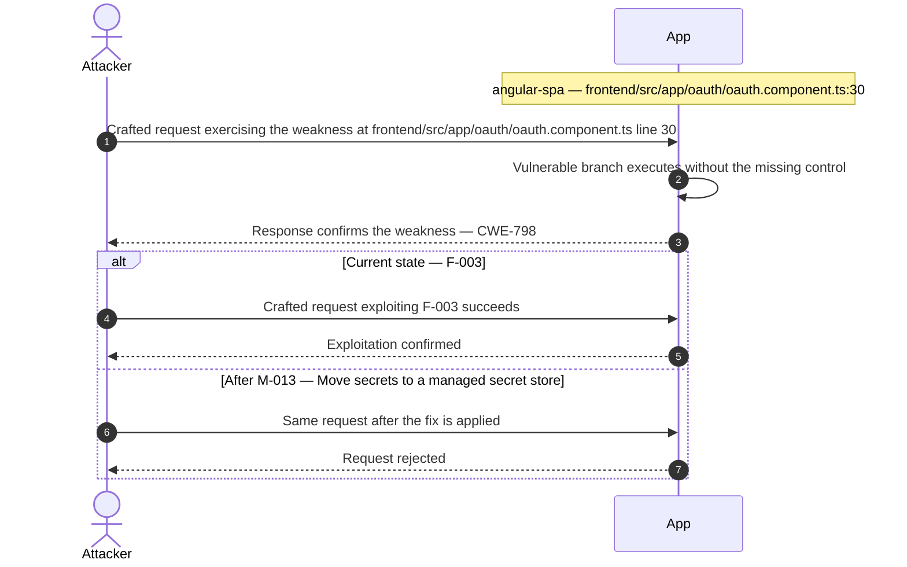

**Key takeaway:** Until [M-013](#m-013) (Move secrets to a managed secret store) lands, F-003 is exploitable at `frontend/src/app/oauth/oauth.component.ts:30` (Critical-severity, CWE-798).

**Defense in Depth**

- Primary mitigation: ❷ [M-013](#m-013) (Move secrets to a managed secret store)

### 3.2 SQL Injection Authentication Bypass

**Source:** 🔴 [F-004](#f-004) — `routes/login.ts:34`

Severity **Critical** (CWE-89). STRIDE: Spoofing. See [§8 F-004](#f-004) for the full register row.

**Attack Steps**

1. The login handler at `routes/login.ts:34` constructs a raw SQL query via string interpolation: `SELECT * FROM Users WHERE email = '${req.body.email}' AND password = '${security.hash(req.body.password)}'`.
2. An unauthenticated attacker submits `' OR '1'='1'--` as the email parameter.
3. The injected clause short-circuits the WHERE condition, matching all rows.

**Sequence Diagram**

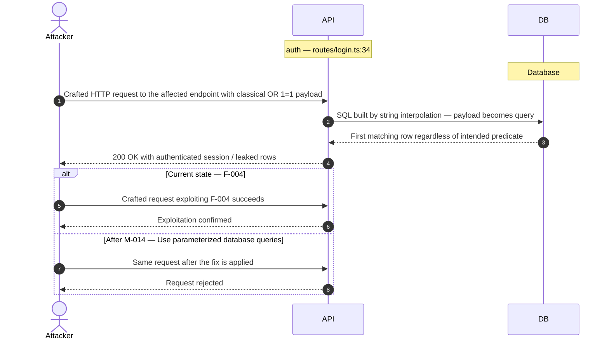

**Key takeaway:** Until [M-014](#m-014) (Use parameterized database queries) lands, F-004 is exploitable at `routes/login.ts:34` (Critical-severity, CWE-89).

**Defense in Depth**

- Primary mitigation: ❶ [M-014](#m-014) (Use parameterized database queries)

### 3.3 Hardcoded RSA Private Key Enables Universal JWT Forgery

**Source:** 🔴 [F-005](#f-005) — `lib/insecurity.ts:23`

Severity **Critical** (CWE-321). STRIDE: Spoofing. See [§8 F-005](#f-005) for the full register row.

**Attack Steps**

1. The RSA private key used to sign all application JWTs is embedded verbatim in lib/insecurity.ts at line 23.
2. The public GitHub repository makes this key available to anyone.
3. An attacker reads the private key from the source, crafts a JWT payload with `role: 'admin'` and any target `email`, signs it with the known private key using RS256, and submits it as a Bearer token.

**Sequence Diagram**

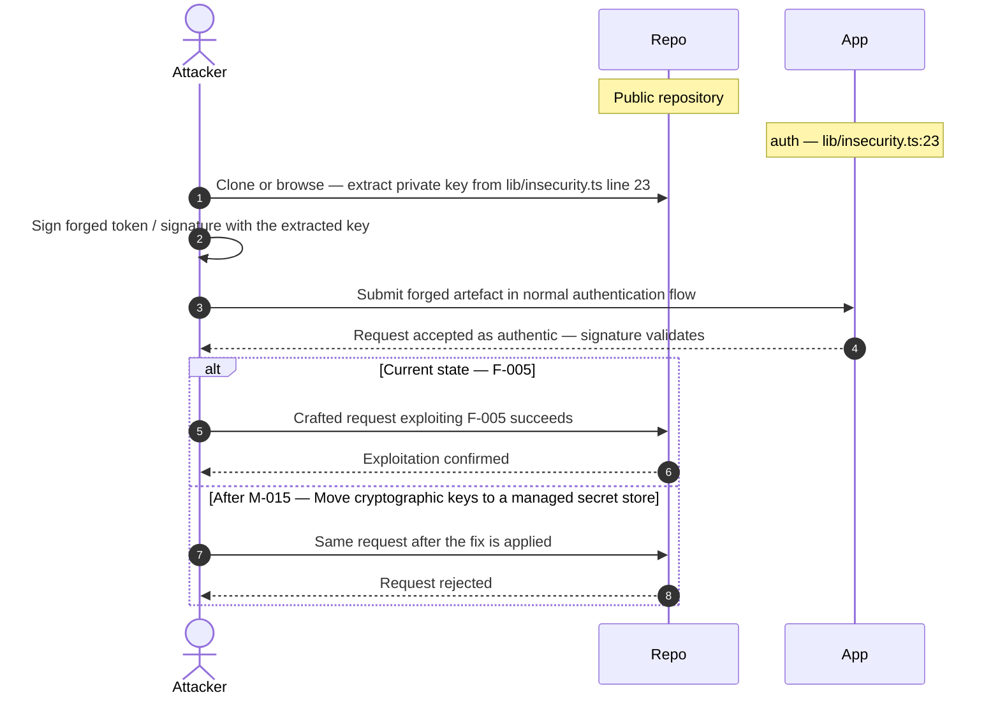

**Key takeaway:** Until [M-015](#m-015) (Move cryptographic keys to a managed secret store) lands, F-005 is exploitable at `lib/insecurity.ts:23` (Critical-severity, CWE-321).

**Defense in Depth**

- Primary mitigation: ❶ [M-015](#m-015) (Move cryptographic keys to a managed secret store)

### 3.4 Insecure JWT Verification

**Source:** 🔴 [F-006](#f-006) — `lib/insecurity.ts:54`

Severity **Critical** (CWE-347). STRIDE: Spoofing. See [§8 F-006](#f-006) for the full register row.

**Attack Steps**

1. The application uses express-jwt version 0.1.3 (package.json line 167) and jsonwebtoken version 0.4.0 (line 189).
2. These are pre-CVE-2015-9235 versions that do not enforce the expected algorithm and accept tokens with `alg: 'none'` in the header, treating the empty signature as valid.
3. An attacker takes any valid JWT, changes the `alg` header to `none`, strips the signature, and submits the token.

**Sequence Diagram**

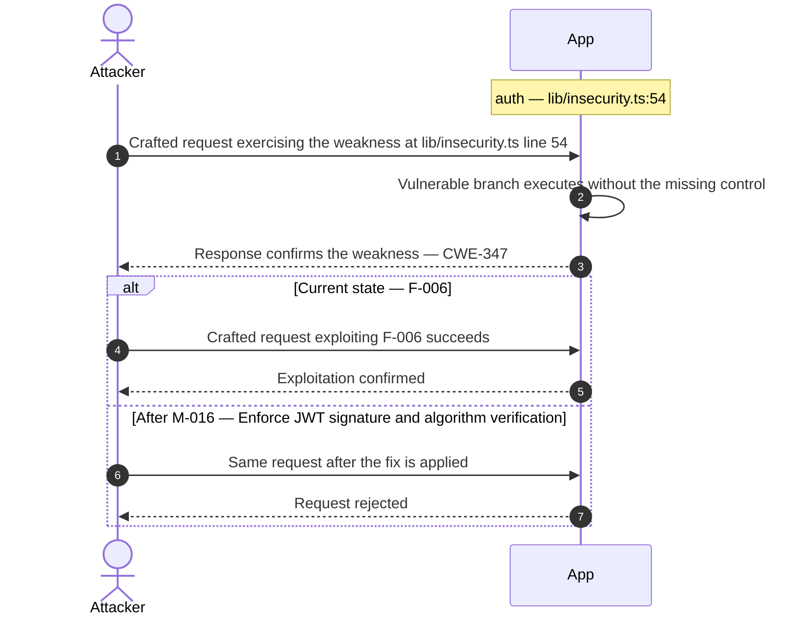

**Key takeaway:** Until [M-016](#m-016) (Enforce JWT signature and algorithm verification) lands, F-006 is exploitable at `lib/insecurity.ts:54` (Critical-severity, CWE-347).

**Defense in Depth**

- Primary mitigation: ❶ [M-016](#m-016) (Enforce JWT signature and algorithm verification)

### 3.5 Insecure Direct Object Reference

**Source:** 🔴 [F-007](#f-007) — `routes/address.ts:11`

Severity **Critical** (CWE-639). STRIDE: Tampering. See [§8 F-007](#f-007) for the full register row.

**Attack Steps**

1. Server-side authorization MUST derive the resource owner from the authenticated session (req.user / req.session / req.auth), never from attacker-controlled request data.
2. Trusting req.body.UserId etc. enables horizontal privilege escalation across all authenticated tenants.
3. Send the crafted payload to the endpoint backed by `routes/address.ts:11`.

**Sequence Diagram**

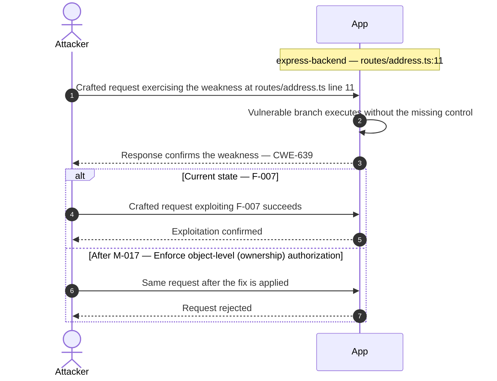

**Key takeaway:** Until [M-017](#m-017) (Enforce object-level (ownership) authorization) lands, F-007 is exploitable at `routes/address.ts:11` (Critical-severity, CWE-639).

**Defense in Depth**

- Primary mitigation: ❶ [M-017](#m-017) (Enforce object-level (ownership) authorization)

### 3.6 UNION SQL Injection

**Source:** 🔴 [F-008](#f-008) — `routes/search.ts:23`

Severity **Critical** (CWE-89). STRIDE: Tampering. See [§8 F-008](#f-008) for the full register row.

**Attack Steps**

1. The search route at `routes/search.ts:23` concatenates req.query.q directly into a SELECT statement: `SELECT * FROM Products WHERE ((name LIKE '%${criteria}%' OR description LIKE '%${criteria}%') AND deletedAt IS NULL) ORDER BY name`.
2. An attacker sends GET /rest/products/search?q=')) UNION SELECT sql,2,3,4,5,6,7,8,9 FROM sqlite_master-- to extract the full database schema.
3. A follow-up UNION SELECT id,email,password,role,4,5,6,7,8 FROM Users dumps all user credentials (MD5 hashes) and role assignments.

**Sequence Diagram**

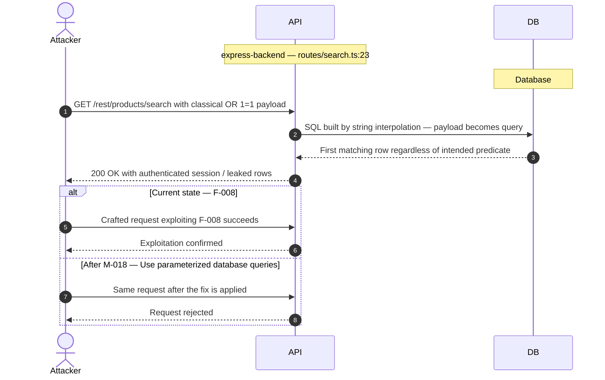

**Key takeaway:** Until [M-018](#m-018) (Use parameterized database queries) lands, F-008 is exploitable at `routes/search.ts:23` (Critical-severity, CWE-89).

**Defense in Depth**

- Primary mitigation: ❶ [M-018](#m-018) (Use parameterized database queries)

### 3.7 Mass Assignment: role Field Writable

**Source:** 🔴 [F-009](#f-009) — `server.ts:483`

Severity **Critical** (CWE-915). STRIDE: Tampering. See [§8 F-009](#f-009) for the full register row.

**Attack Steps**

1. The finale-rest auto-generated REST API registers UserModel with `exclude: ['password', 'totpSecret']` (`server.ts:483`), but does NOT exclude the `role` field.
2. Finale passes the entire request body to Sequelize's `create()` method.
3. An unauthenticated attacker sends `POST /api/Users` with body `{"email":"attacker@evil.com","password":"pass","role":"admin"}`.

**Sequence Diagram**

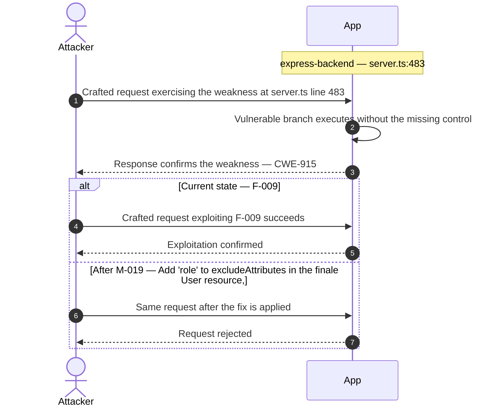

**Key takeaway:** Until [M-019](#m-019) (Add 'role' to excludeAttributes in the finale User resource,) lands, F-009 is exploitable at `server.ts:483` (Critical-severity, CWE-915).

**Defense in Depth**

- Primary mitigation: ❶ [M-019](#m-019) (Add 'role' to excludeAttributes in the finale User resource, and force server-side default)

### 3.8 XXE

**Source:** 🔴 [F-010](#f-010) — `routes/fileUpload.ts:83`

Severity **Critical** (CWE-611). STRIDE: Tampering. See [§8 F-010](#f-010) for the full register row.

**Attack Steps**

1. At `fileUpload.ts:83`, uploaded XML is parsed with `libxml.parseXml(data, { noblanks: true, noent: true, nocdata: true })` — the `noent: true` option instructs libxmljs2 to resolve external entity references declared in the DOCTYPE.
2. An attacker submitting an XML file containing `<!DOCTYPE foo [ <!ENTITY xxe SYSTEM "file:///etc/passwd"> ]><root>&xxe;</root>` causes the server to read the local file and embed its contents in `xmlString`.
3. The resolved string is then appended verbatim into the HTTP 410 error response at line 87: `'B2B customer complaints via file upload have been deprecated for security reasons: ' + utils.trunc(xmlString, 400)`.

**Sequence Diagram**

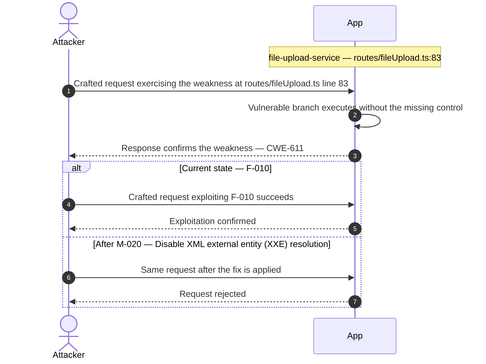

**Key takeaway:** Until [M-020](#m-020) (Disable XML external entity (XXE) resolution) lands, F-010 is exploitable at `routes/fileUpload.ts:83` (Critical-severity, CWE-611).

**Defense in Depth**

- Primary mitigation: ❶ [M-020](#m-020) (Disable XML external entity (XXE) resolution)

### 3.9 JavaScript Sandbox Escape

**Source:** 🔴 [F-011](#f-011) — `routes/b2bOrder.ts:23`

Severity **Critical** (CWE-94). STRIDE: Elevation of Privilege. See [§8 F-011](#f-011) for the full register row.

**Attack Steps**

1. An attacker with a valid (or forged) B2B JWT submits a crafted JavaScript expression as `orderLinesData` that exploits the notevil AST-evaluator's known sandbox escape vectors.
2. Because `notevil` is not hardened against adversarial inputs, a sufficiently crafted payload can break out of the `vm.createContext` sandbox and execute arbitrary code as the Node.js process.
3. This achieves full server-side RCE — reading environment secrets, pivoting to internal services, or installing persistence.

**Sequence Diagram**

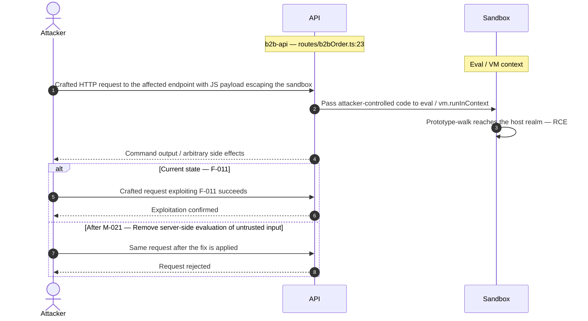

**Key takeaway:** Until [M-021](#m-021) (Remove server-side evaluation of untrusted input) lands, F-011 is exploitable at `routes/b2bOrder.ts:23` (Critical-severity, CWE-94).

**Defense in Depth**

- Primary mitigation: ❶ [M-021](#m-021) (Remove server-side evaluation of untrusted input)

### 3.10 Server-Side Template Injection

**Source:** 🔴 [F-012](#f-012) — `routes/userProfile.ts:62`

Severity **Critical** (CWE-94). STRIDE: Elevation of Privilege. See [§8 F-012](#f-012) for the full register row.

**Attack Steps**

1. `routes/userProfile.ts:62` executes `eval(code)` where `code = username.substring(2, username.length - 1)` when the username matches the pattern `/#\{(.*)\}/`.
2. A user sets their username to `#{process.mainModule.require('child_process').execSync('cat /etc/passwd').toString()}` via the profile update endpoint, then GETs `/profile`.
3. The `eval()` call runs arbitrary Node.js code in the server process context with full filesystem and network access.

**Sequence Diagram**

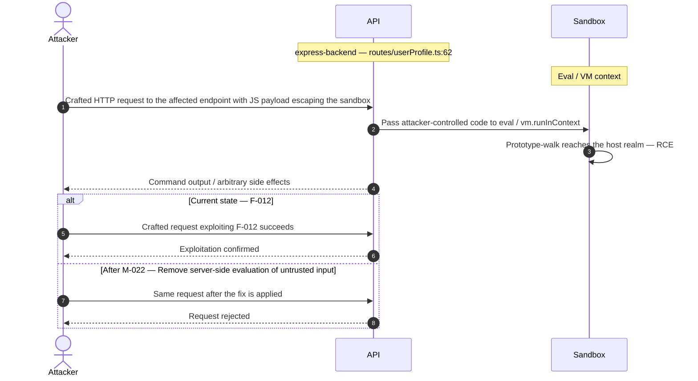

**Key takeaway:** Until [M-022](#m-022) (Remove server-side evaluation of untrusted input) lands, F-012 is exploitable at `routes/userProfile.ts:62` (Critical-severity, CWE-94).

**Defense in Depth**

- Primary mitigation: ❶ [M-022](#m-022) (Remove server-side evaluation of untrusted input)

### 3.11 Mass Assignment Admin Role

**Source:** 🔴 [F-013](#f-013) — `server.ts:499`

Severity **Critical** (CWE-915). STRIDE: Elevation of Privilege. See [§8 F-013](#f-013) for the full register row.

**Attack Steps**

1. `server.ts:479-515` uses `finale-rest` to auto-generate CRUD endpoints for all models, including `POST /api/Users`.
2. The `autoModels` array excludes `password` and `totpSecret` from responses (the `exclude` list) but does not restrict which fields are accepted on creation.
3. An attacker sends `POST /api/Users` with `{"email":"attacker@x.com","password":"P@ss1","role":"admin"}` and the `finale-rest` handler maps `role` directly to the `UserModel.create()` call, creating an admin-role account.

**Sequence Diagram**

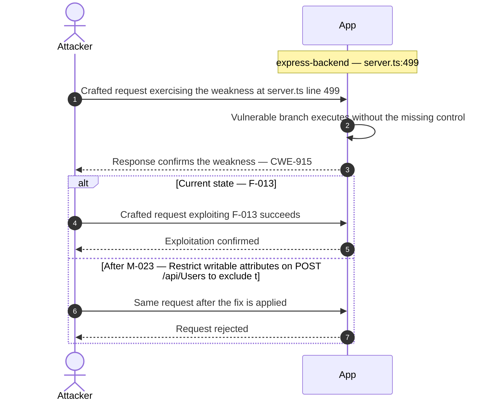

**Key takeaway:** Until [M-023](#m-023) (Restrict writable attributes on POST /api/Users to exclude t) lands, F-013 is exploitable at `server.ts:499` (Critical-severity, CWE-915).

**Defense in Depth**

- Primary mitigation: ❶ [M-023](#m-023) (Restrict writable attributes on POST /api/Users to exclude the role field)

### 3.12 Zip Slip Arbitrary File Write

**Source:** 🔴 [F-014](#f-014) — `routes/fileUpload.ts:45`

Severity **Critical** (CWE-22). STRIDE: Elevation of Privilege. See [§8 F-014](#f-014) for the full register row.

**Attack Steps**

1. In handleZipFileUpload (`fileUpload.ts:40-45`), entries from a ZIP archive are extracted and written to disk.
2. The check at line 44 evaluates `absolutePath.includes(path.resolve('.'))`.
3. While this check is designed to prevent writing outside the working directory, it is bypassed by the fact that `fs.createWriteStream` at line 45 receives the raw un-normalized `fileName` string: `fs.createWriteStream('uploads/complaints/' + fileName)`.

**Sequence Diagram**

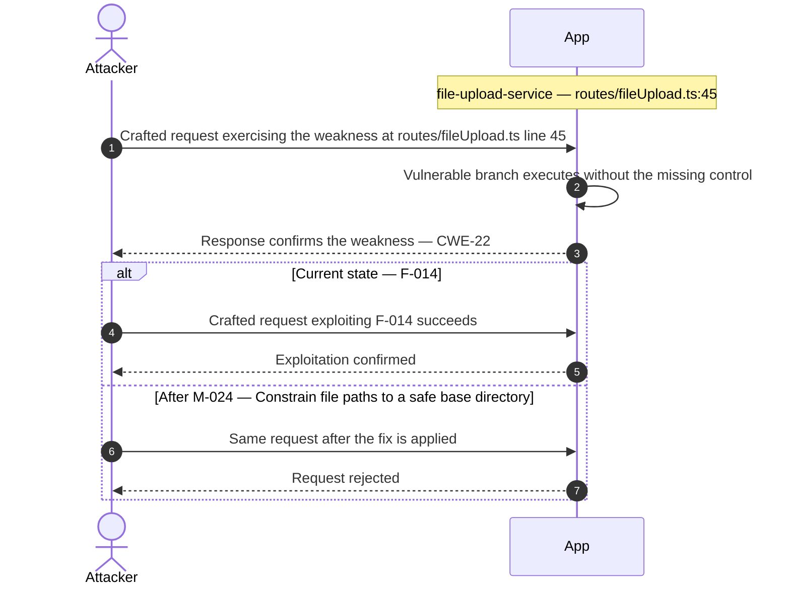

**Key takeaway:** Until [M-024](#m-024) (Constrain file paths to a safe base directory) lands, F-014 is exploitable at `routes/fileUpload.ts:45` (Critical-severity, CWE-22).

**Defense in Depth**

- Primary mitigation: ❶ [M-024](#m-024) (Constrain file paths to a safe base directory)

<!-- generated:walkthrough_renderer -->
