## 3. Attack Walkthroughs

This section walks through how the highest-risk findings are exploited — one short walkthrough per Critical, each with attack steps, a focused sequence diagram, and the primary mitigation. The cross-finding view (which weaknesses combine toward the worst-case goal, and where one fix severs several paths) is in the [Critical Attack Tree](#critical-attack-tree). Full per-finding context — severity rationale, assets, detection signals — is in the [§8 Findings Register](#8-findings-register) row for each finding.

### 3.1 SQL injection in login routes/login.ts

**Source:** [T-001](#t-001) — `routes/login.ts:37`

Severity **Critical** (CWE-89). STRIDE: Spoofing. See [§8 T-001](#t-001) for the full register row.

**Attack Steps**

1. The login handler constructs a raw SQL query using string interpolation of user-supplied email and password hash values.
2. An attacker can use SQL injection payloads (e.g.
3. `' OR '1'='1'--`) in the email field to bypass authentication entirely and gain access as any user, including admin.

**Sequence Diagram**

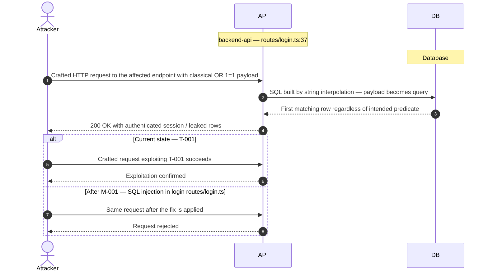

**Key takeaway:** Until M-001 (SQL injection in login routes/login.ts) lands, T-001 is exploitable at `routes/login.ts:37` (Critical-severity, CWE-89).

**Defense in Depth**

- Primary mitigation: [M-001](#m-001) (SQL injection in login routes/login.ts)

### 3.2 Hardcoded RSA private key enables JWT forgery lib/insecurit…

**Source:** [T-002](#t-002) — `lib/insecurity.ts:26`

Severity **Critical** (CWE-321). STRIDE: Spoofing. See [§8 T-002](#t-002) for the full register row.

**Attack Steps**

1. The RSA private key used to sign all JWT authentication tokens is hardcoded as a string literal in lib/insecurity.ts.
2. Anyone with access to the source code (public GitHub repository) can use this key to sign JWT tokens as any user, including admin, and authenticate without a valid password.
3. Clone the public repository and locate the cryptographic key at `lib/insecurity.ts:26`.

**Sequence Diagram**

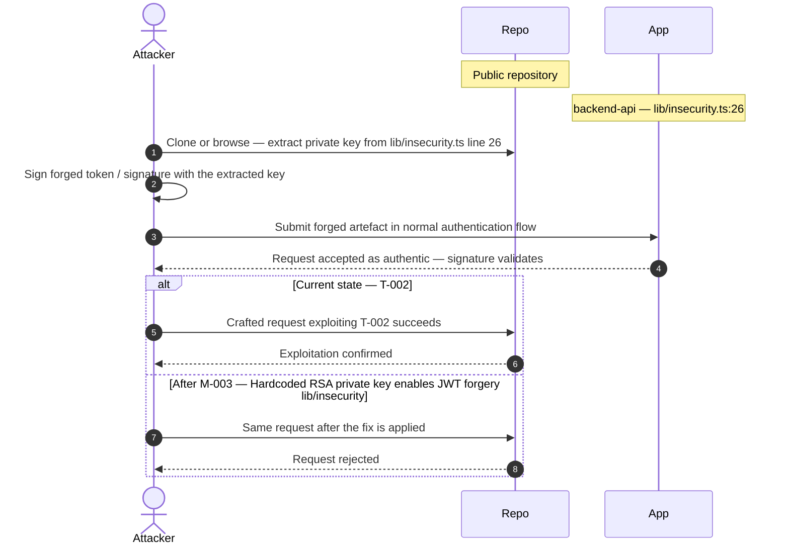

**Key takeaway:** Until M-003 (Hardcoded RSA private key enables JWT forgery lib/insecurity) lands, T-002 is exploitable at `lib/insecurity.ts:26` (Critical-severity, CWE-321).

**Defense in Depth**

- Primary mitigation: [M-003](#m-003) (Hardcoded RSA private key enables JWT forgery lib/insecurity.ts)

### 3.3 JWT algorithm none bypass via express jwt lib/insecurity.ts

**Source:** [T-003](#t-003) — `package.json:1`

Severity **Critical** (CWE-327). STRIDE: Spoofing. See [§8 T-003](#t-003) for the full register row.

**Attack Steps**

1. express-jwt version 0.1.3 is vulnerable to JWT algorithm confusion attacks (CVE-2015-9235 class).
2. An attacker can craft a JWT with `alg: none` and an empty signature, which will be accepted by express-jwt@0.1.3 without signature verification.
3. This bypasses authentication entirely.

**Sequence Diagram**

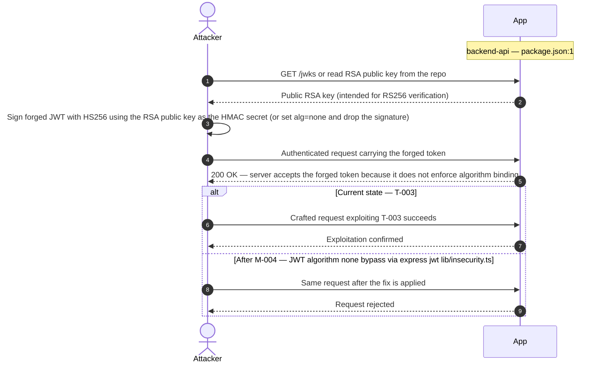

**Key takeaway:** Until M-004 (JWT algorithm none bypass via express jwt lib/insecurity.ts) lands, T-003 is exploitable at `package.json:1` (Critical-severity, CWE-327).

**Defense in Depth**

- Primary mitigation: [M-004](#m-004) (JWT algorithm none bypass via express jwt lib/insecurity.ts)

### 3.4 Hardcoded admin credentials in static user data data/static…

**Source:** [T-004](#t-004) — `data/static/users.yml:3`

Severity **Critical** (CWE-259). STRIDE: Spoofing. See [§8 T-004](#t-004) for the full register row.

**Attack Steps**

1. The application seeds the database with hardcoded user credentials from data/static/users.yml.
2. This includes admin@juice-sh.op:admin123, support admin credentials, and multiple customer accounts with passwords.
3. These credentials are in the public GitHub repository and represent permanently compromised accounts.

**Sequence Diagram**

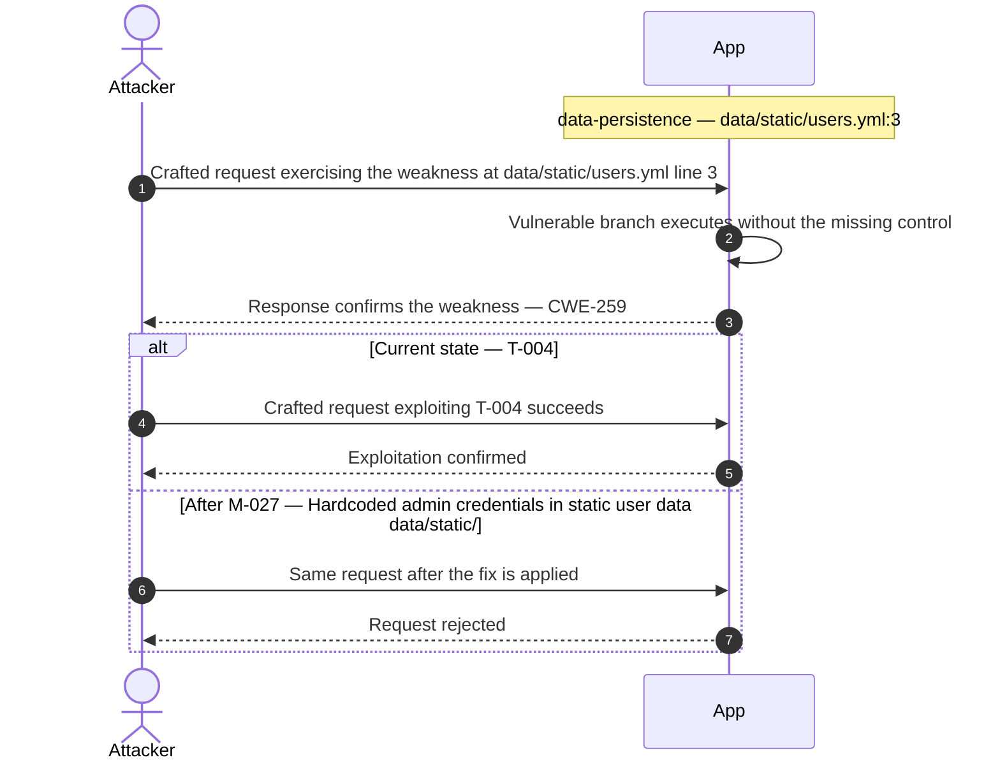

**Key takeaway:** Until M-027 (Hardcoded admin credentials in static user data data/static/) lands, T-004 is exploitable at `data/static/users.yml:3` (Critical-severity, CWE-259).

**Defense in Depth**

- Primary mitigation: [M-027](#m-027) (Hardcoded admin credentials in static user data data/static/users.yml)

### 3.5 SQL injection in product search routes/search.ts

**Source:** [T-005](#t-005) — `routes/search.ts:23`

Severity **Critical** (CWE-89). STRIDE: Information Disclosure. See [§8 T-005](#t-005) for the full register row.

**Attack Steps**

1. The search endpoint constructs a raw SQL LIKE query with unescaped user input.
2. An attacker can use UNION-based SQL injection to extract the full database schema and all user data from the SQLite database without authentication.
3. Identify the vulnerable input parameter — `backend-api` interpolates it directly into a SQL string at `routes/search.ts:23`.

**Sequence Diagram**

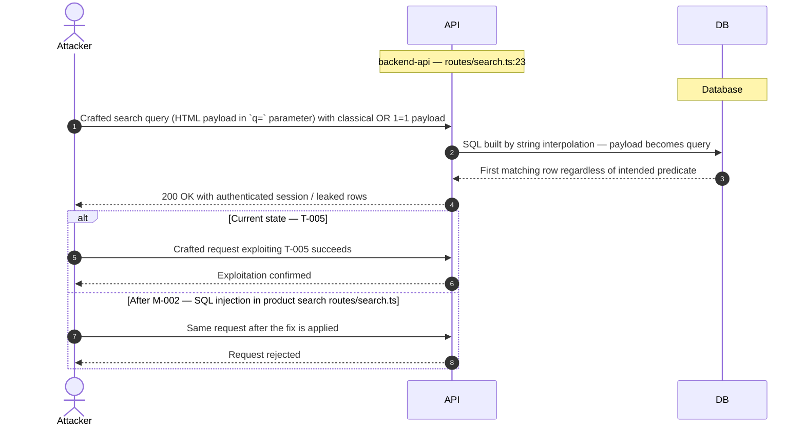

**Key takeaway:** Until M-002 (SQL injection in product search routes/search.ts) lands, T-005 is exploitable at `routes/search.ts:23` (Critical-severity, CWE-89).

**Defense in Depth**

- Primary mitigation: [M-002](#m-002) (SQL injection in product search routes/search.ts)

### 3.6 Confidential files exposed via /ftp directory listing serve…

**Source:** [T-006](#t-006) — `server.ts:270`

Severity **Critical** (CWE-548). STRIDE: Information Disclosure. See [§8 T-006](#t-006) for the full register row.

**Attack Steps**

1. The /ftp directory is served with full directory listing enabled.
2. It contains confidential business documents: acquisitions.md (M&A plans), incident-support.kdbx (KeePass password database), coupons_2013.md.bak, and package-lock.json.bak.
3. These files are publicly accessible without authentication.

**Sequence Diagram**

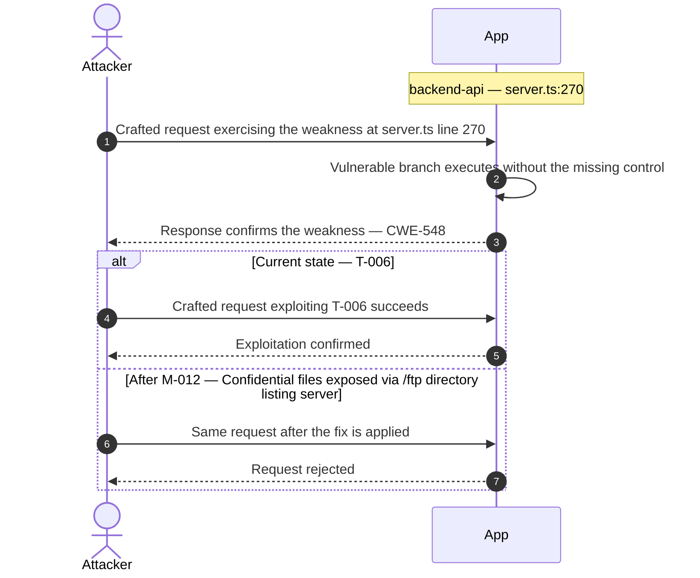

**Key takeaway:** Until M-012 (Confidential files exposed via /ftp directory listing server) lands, T-006 is exploitable at `server.ts:270` (Critical-severity, CWE-548).

**Defense in Depth**

- Primary mitigation: [M-012](#m-012) (Confidential files exposed via /ftp directory listing server.ts)

### 3.7 MD5 password hashing trivially reversible lib/insecurity.ts

**Source:** [T-007](#t-007) — `lib/insecurity.ts:43`

Severity **Critical** (CWE-916). STRIDE: Information Disclosure. See [§8 T-007](#t-007) for the full register row.

**Attack Steps**

1. All user passwords are hashed with unsalted MD5.
2. MD5 is cryptographically broken and password databases can be cracked entirely using rainbow tables within minutes.
3. Any attacker who obtains a copy of the database has immediate access to all plaintext passwords.

**Sequence Diagram**

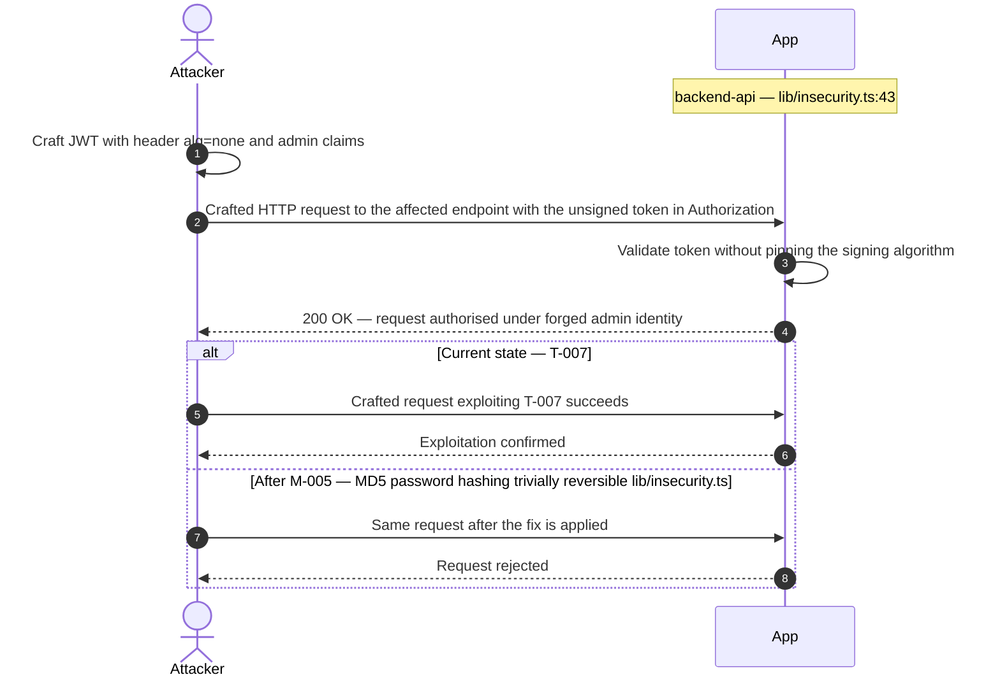

**Key takeaway:** Until M-005 (MD5 password hashing trivially reversible lib/insecurity.ts) lands, T-007 is exploitable at `lib/insecurity.ts:43` (Critical-severity, CWE-916).

**Defense in Depth**

- Primary mitigation: [M-005](#m-005) (MD5 password hashing trivially reversible lib/insecurity.ts)

### 3.8 User passwords stored as unsalted MD5 data at rest models/u…

**Source:** [T-009](#t-009) — `models/user.ts:1`

Severity **Critical** (CWE-916). STRIDE: Information Disclosure. See [§8 T-009](#t-009) for the full register row.

**Attack Steps**

1. The SQLite database stores user passwords as unsalted MD5 hashes.
2. If an attacker gains read access to the database file (via SQL injection, path traversal, or server compromise), all password hashes can be cracked using rainbow tables instantly.
3. Common passwords like 'admin123' would be recovered in milliseconds.

**Sequence Diagram**

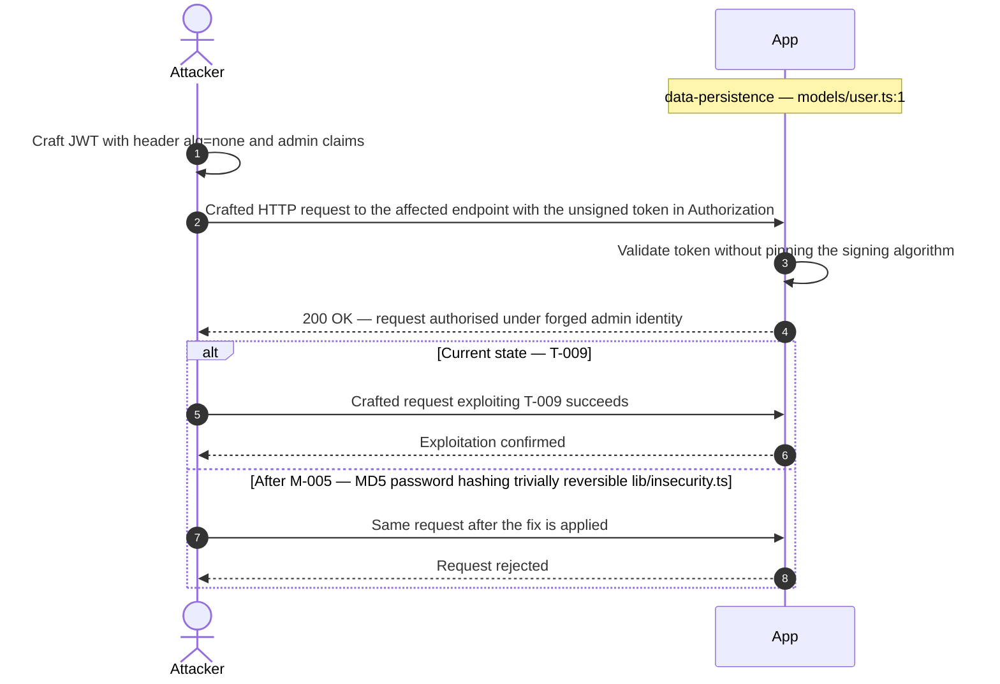

**Key takeaway:** Until M-005 (MD5 password hashing trivially reversible lib/insecurity.ts) lands, T-009 is exploitable at `models/user.ts:1` (Critical-severity, CWE-916).

**Defense in Depth**

- Primary mitigation: [M-005](#m-005) (MD5 password hashing trivially reversible lib/insecurity.ts)

### 3.9 XXE via XML upload with external entity resolution routes/f…

**Source:** [T-010](#t-010) — `routes/fileUpload.ts:45`

Severity **Critical** (CWE-611). STRIDE: Information Disclosure. See [§8 T-010](#t-010) for the full register row.

**Attack Steps**

1. The XML upload handler uses libxmljs2 with `noent: true`, which enables external entity processing.
2. An attacker can upload an XML file with an XXE payload pointing to file:///etc/passwd or internal network URLs, causing the server to disclose local file contents or SSRF to internal services.
3. Send the crafted payload to the endpoint backed by `routes/fileUpload.ts:45`.

**Sequence Diagram**

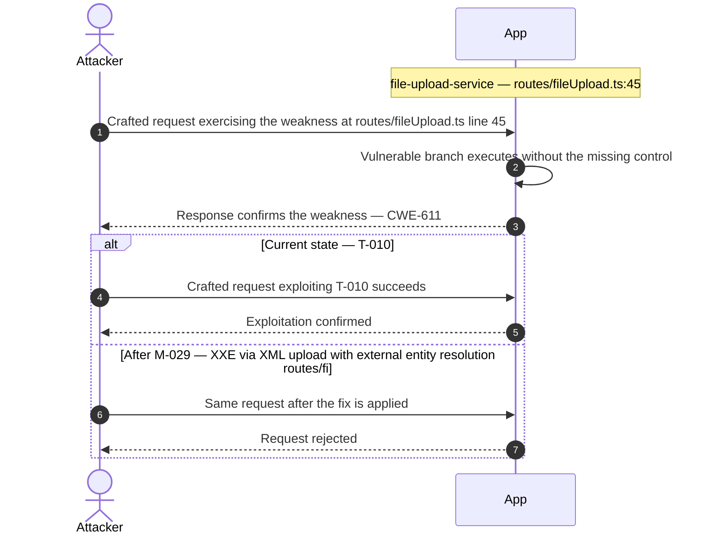

**Key takeaway:** Until M-029 (XXE via XML upload with external entity resolution routes/fi) lands, T-010 is exploitable at `routes/fileUpload.ts:45` (Critical-severity, CWE-611).

**Defense in Depth**

- Primary mitigation: [M-029](#m-029) (XXE via XML upload with external entity resolution routes/fileUpload.ts)

### 3.10 RCE via vm.runInContext sandbox escape in B2B order routes/…

**Source:** [T-011](#t-011) — `routes/b2bOrder.ts:22`

Severity **Critical** (CWE-94). STRIDE: Elevation of Privilege. See [§8 T-011](#t-011) for the full register row.

**Attack Steps**

1. The B2B order endpoint evaluates user-supplied `orderLinesData` using `notevil` sandboxed eval inside `vm.runInContext`.
2. The notevil library is not a true security sandbox — it can be escaped via prototype pollution or constructor access.
3. An attacker can achieve full server-side code execution by sending a crafted `orderLinesData` payload.

**Sequence Diagram**

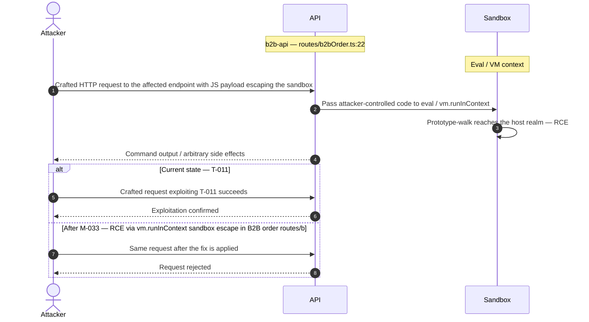

**Key takeaway:** Until M-033 (RCE via vm.runInContext sandbox escape in B2B order routes/b) lands, T-011 is exploitable at `routes/b2bOrder.ts:22` (Critical-severity, CWE-94).

**Defense in Depth**

- Primary mitigation: [M-033](#m-033) (RCE via vm.runInContext sandbox escape in B2B order routes/b2bOrder.ts)

### 3.11 SSTI + eval on user controlled username routes/userProfile.…

**Source:** [T-012](#t-012) — `routes/userProfile.ts:62`

Severity **Critical** (CWE-94). STRIDE: Elevation of Privilege. See [§8 T-012](#t-012) for the full register row.

**Attack Steps**

1. The user profile page uses eval() on a server-side template that includes the user's username.
2. If a username matches the pattern `#{(.*)}`, the captured group is passed to eval() in a Node.js context.
3. An attacker who can set their username to `#{process.mainModule.require('child_process').execSync('cat /etc/passwd')}` achieves server-side code execution.

**Sequence Diagram**

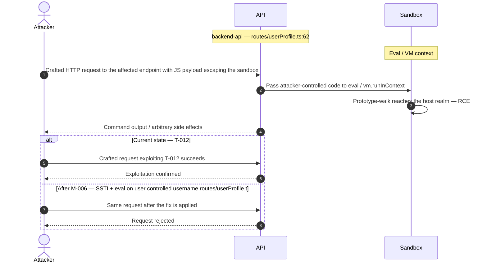

**Key takeaway:** Until M-006 (SSTI + eval on user controlled username routes/userProfile.t) lands, T-012 is exploitable at `routes/userProfile.ts:62` (Critical-severity, CWE-94).

**Defense in Depth**

- Primary mitigation: [M-006](#m-006) (SSTI + eval on user controlled username routes/userProfile.ts)

<!-- generated:walkthrough_renderer -->
