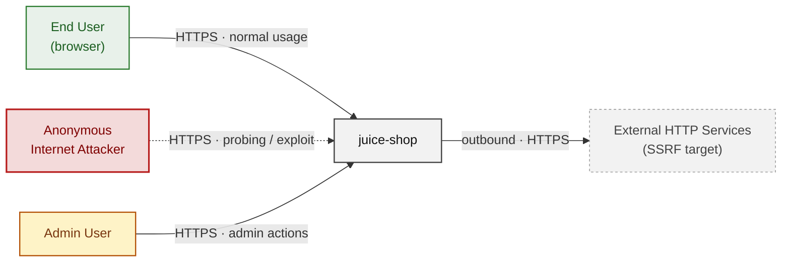
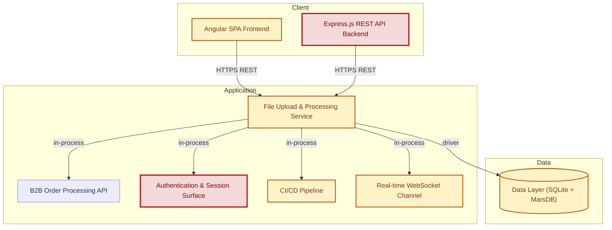
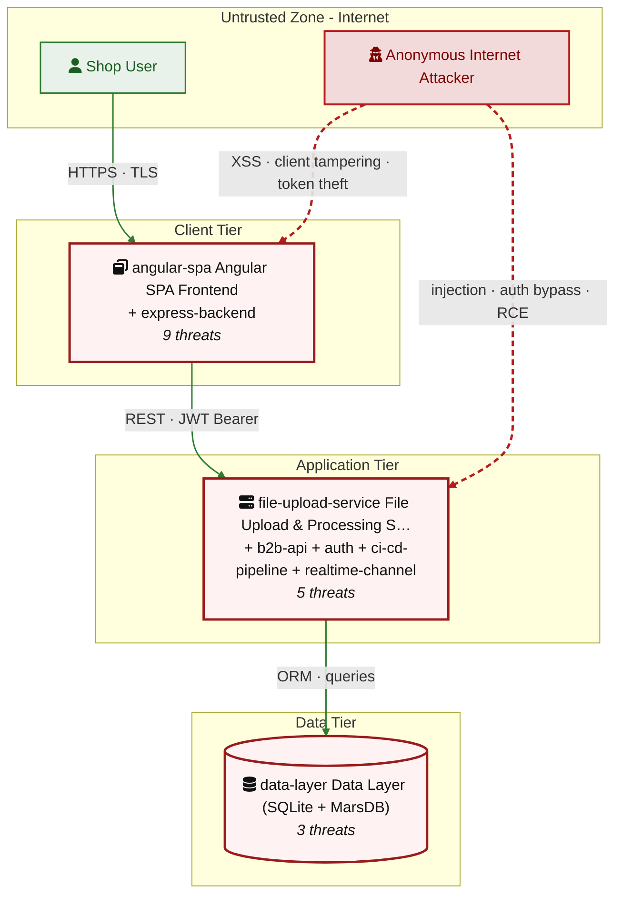
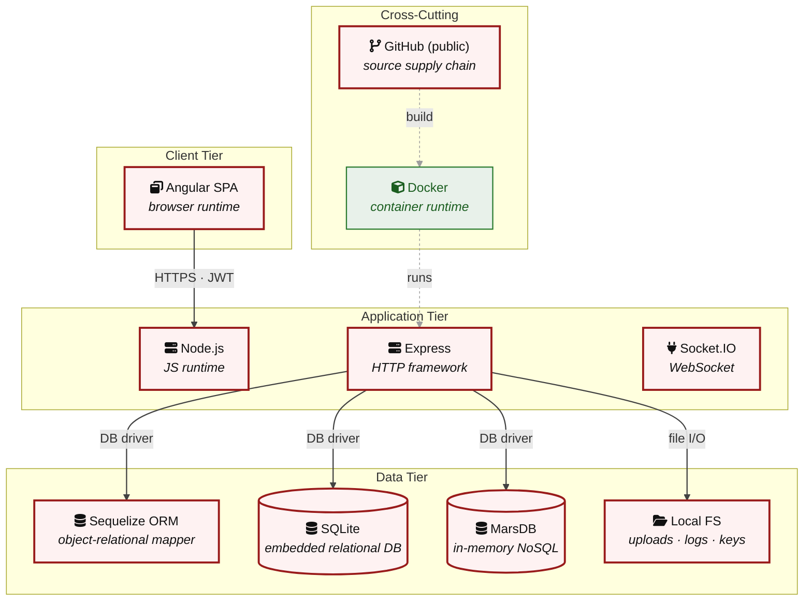

## 2. Architecture Diagrams

### 2.1 System Context

Who interacts with juice-shop from the outside, and through which channels. Solid arrows show normal usage; dashed red arrows mark unauthenticated probing or exploit paths (C4 Level 1).

**Key takeaway:** Every actor in the context interacts with juice-shop through its external interface, so authentication and input validation at that edge govern the entire attack surface.

### 2.2 Container Architecture

How the system decomposes into deployable units. Each box is a separate runtime process or service container; arrows show synchronous request paths between them. Components with ≥3 Critical findings carry a red border, ≥2 High amber (C4 Level 2).

**Key takeaway:** The system decomposes into 2 client, 5 application and 1 data unit(s); Express.js REST API Backend carries the most Critical findings (5) and bounds the worst-case blast radius.

### 2.3 Components

Who reaches each component, and through which trust zone. Four columns map external actors to the internal tiers (Client / Application / Data); solid green arrows show legitimate data flow, dashed red arrows mark intrusion vectors. The component table directly below holds source paths and linked threats per `C-NN`; per-finding evidence is in [§8 Findings Register](#8-findings-register).

**Key takeaway:** Express.js REST API Backend concentrates the most findings (19 of 65 across all components); the table below maps each component to its source paths and linked threats.

| Component ID | Name | Tier | Source paths | Threats |
|---|---|---|---|---|
| angular-spa | Angular SPA Frontend | Client | `frontend/src/**`, `frontend/dist/**`, `frontend/*.ts`, `frontend/*.json` | 9 |
| express-backend | Express.js REST API Backend | Client | `routes/**`, `server.ts`, `lib/**`, `app.ts`, `build/**` | 19 |
| file-upload-service | File Upload & Processing Service | Application | `routes/fileUpload.ts`, `routes/profileImageUrlUpload.ts`, `routes/profileImageFileUpload.ts`, `routes/logfileServer.ts`, `routes/keyServer.ts`, `routes/quarantineServer.ts`, `ftp/**`, `encryptionkeys/**`, `uploads/**` | 5 |
| b2b-api | B2B Order Processing API | Application | `routes/b2bOrder.ts`, `routes/checkKeys.ts` | 4 |
| data-layer | Data Layer (SQLite + MarsDB) | Data | `models/**`, `data/**`, `config/**`, `lib/mongodb.ts`, `ftp/**`, `encryptionkeys/**` | 3 |
| auth | Authentication & Session Surface | Application | `lib/insecurity.ts`, `lib/startup/registerWebsocketEvents.ts`, `routes/2fa.ts`, `routes/authenticatedUsers.ts`, `routes/login.ts`, `routes/resetPassword.ts`, `routes/saveLoginIp.ts` | 7 |
| ci-cd-pipeline | CI/CD Pipeline | Application | `.github/workflows/**`, `.gitlab-ci.yml`, `Dockerfile`, `Dockerfile.*`, `*.Dockerfile`, `docker-compose*.yml`, `docker-compose*.yaml`, `compose*.yml`, `compose*.yaml`, `.dockerignore`, `package.json`, `package-lock.json`, `npm-shrinkwrap.json`, `yarn.lock`, `pnpm-lock.yaml`, `.npmrc`, `.github/dependabot.yml`, `.github/dependabot.yaml`, `.github/renovate.json`, `renovate.json`, `.renovaterc`, `.renovaterc.json` | 14 |
| realtime-channel | Real-time WebSocket Channel | Application | `lib/challengeUtils.ts`, `lib/startup/registerWebsocketEvents.ts` | 4 |

### 2.4 Technology Architecture

The technology stack the system is built on. Each box names the framework or runtime that fills that role; per-component findings live in the §2.3 component table above, and the full per-finding catalogue is in [§8 Findings Register](#8-findings-register).

**Key takeaway:** The stack spans 1 data-tier store(s) behind the application tier; injection and data-at-rest exposure track the data tier, detailed per finding in [§8 Findings Register](#8-findings-register).

> **Legend:** **red border** ≥ 3 Critical threats on the component · **amber border** ≥ 2 High threats
