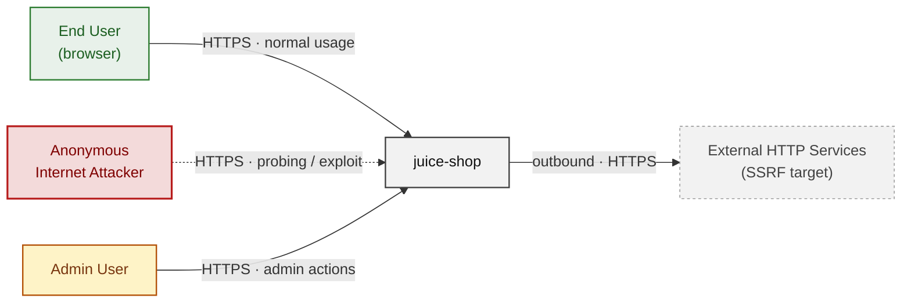
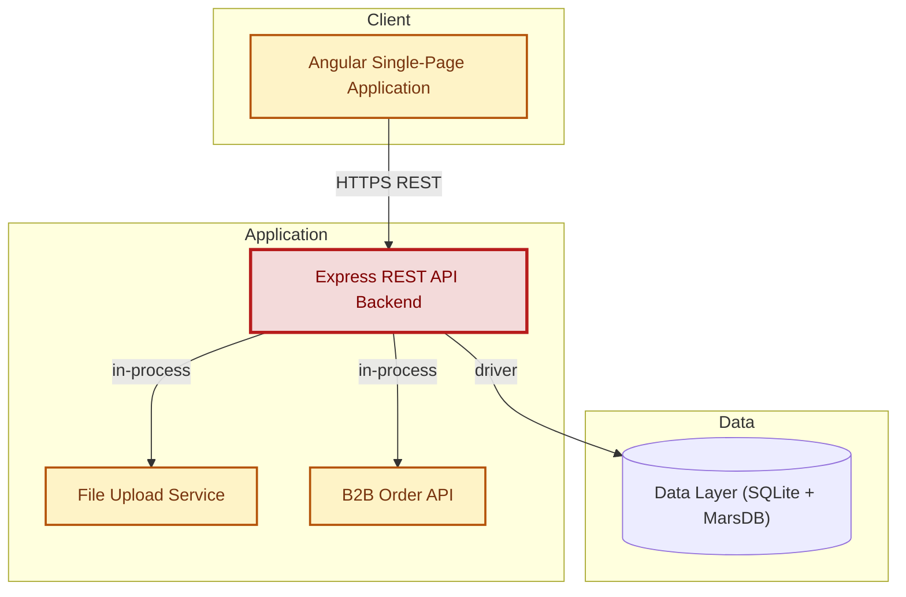
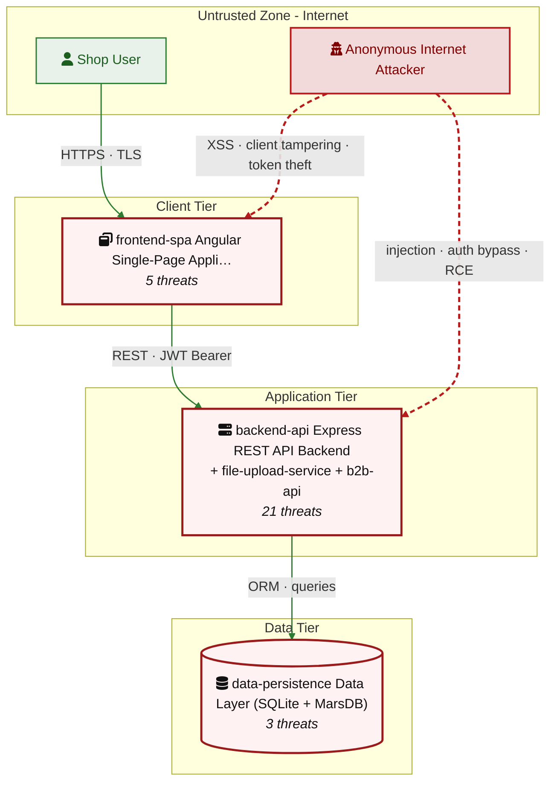
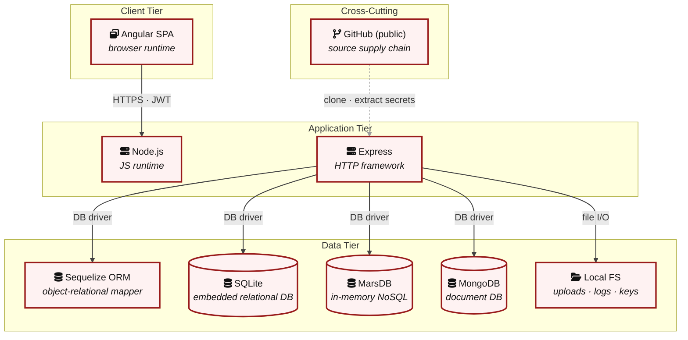

## 2. Architecture Diagrams

### 2.1 System Context

Who interacts with juice-shop from the outside, and through which channels. Solid arrows show normal usage; dashed red arrows mark unauthenticated probing or exploit paths (C4 Level 1).

### 2.2 Container Architecture

How the system decomposes into deployable units. Each box is a separate runtime process or service container; arrows show synchronous request paths between them. Components with ≥3 Critical findings carry a red border, ≥2 High amber (C4 Level 2).

### 2.3 Components

Who reaches each component, and through which trust zone. Four columns map external actors to the internal tiers (Client / Application / Data); solid green arrows show legitimate data flow, dashed red arrows mark intrusion vectors. The component table directly below holds source paths and linked threats per `C-NN`; per-finding evidence is in [§8 Findings Register](#8-findings-register).

| Component ID | Name | Tier | Source paths | Threats |
|---|---|---|---|---|
| backend-api | Express REST API Backend | Application | `server.ts`, `routes/**`, `lib/**`, `app.ts` | 21 |
| frontend-spa | Angular Single-Page Application | Client | `frontend/src/**` | 5 |
| data-persistence | Data Layer (SQLite + MarsDB) | Data | `models/**`, `data/mongodb.ts`, `data/datacreator.ts`, `data/static/users.yml` | 3 |
| file-upload-service | File Upload Service | Application | `routes/fileUpload.ts`, `routes/profileImageFileUpload.ts`, `routes/profileImageUrlUpload.ts`, `routes/fileServer.ts`, `routes/keyServer.ts` | 4 |
| b2b-api | B2B Order API | Application | `routes/b2bOrder.ts`, `routes/web3Wallet.ts`, `routes/nftMint.ts`, `routes/checkKeys.ts` | 5 |

### 2.4 Technology Architecture

The technology stack the system is built on. Each box names the framework or runtime that fills that role; per-component findings live in the §2.3 component table above, and the full per-finding catalogue is in [§8 Findings Register](#8-findings-register).

> **Legend:** **red border** ≥ 3 Critical threats on the component · **amber border** ≥ 2 High threats
