# Threat Model - e2e

_Generated by appsec-advisor v0.4.0-beta (analysis v2)_


---

> | | |
> |---|---|
> | **Project** | e2e |
> | **Description** | A frozen run-directory that exercises the plugin pipeline without invoking an LLM. |

---

## Changelog

_Append-only history of assessment runs. Most recent first._

| Version | Date | Mode | Depth | Reasoning | Baseline → Current | Δ Threats | Code | Note |
|--------|----------|--------|--------|--------------|------------------|----------------|--------|--------|
| v1 | 2026-06-03 | full | standard | haiku-economy | _(initial)_ | +38 / ~0 / -0 | - | - |

---

## Table of Contents

- [Management Summary](#management-summary)
- [Critical Attack Tree](#critical-attack-tree)
1. [System Overview](#1-system-overview)
   - [Scope](#scope)
2. [Architecture Diagrams](#2-architecture-diagrams)
   - [2.1 System Context](#21-system-context)
   - [2.2 Container Architecture](#22-container-architecture)
   - [2.3 Components](#23-components)
   - [2.4 Technology Architecture](#24-technology-architecture)
3. [Attack Walkthroughs](#3-attack-walkthroughs)
   - [3.1 SQL injection in login routes/login.ts](#31-sql-injection-in-login-routeslogints)
   - [3.2 Hardcoded RSA private key enables JWT forgery lib/insecurit…](#32-hardcoded-rsa-private-key-enables-jwt-forgery-libinsecurit)
   - [3.3 JWT algorithm none bypass via express jwt lib/insecurity.ts](#33-jwt-algorithm-none-bypass-via-express-jwt-libinsecurityts)
   - [3.4 Hardcoded admin credentials in static user data data/static…](#34-hardcoded-admin-credentials-in-static-user-data-datastatic)
   - [3.5 SQL injection in product search routes/search.ts](#35-sql-injection-in-product-search-routessearchts)
   - [3.6 Confidential files exposed via /ftp directory listing serve…](#36-confidential-files-exposed-via-ftp-directory-listing-serve)
   - [3.7 MD5 password hashing trivially reversible lib/insecurity.ts](#37-md5-password-hashing-trivially-reversible-libinsecurityts)
   - [3.8 User passwords stored as unsalted MD5 data at rest models/u…](#38-user-passwords-stored-as-unsalted-md5-data-at-rest-modelsu)
   - [3.9 XXE via XML upload with external entity resolution routes/f…](#39-xxe-via-xml-upload-with-external-entity-resolution-routesf)
   - [3.10 RCE via vm.runInContext sandbox escape in B2B order routes/…](#310-rce-via-vmrunincontext-sandbox-escape-in-b2b-order-routes)
   - [3.11 SSTI + eval on user controlled username routes/userProfile.…](#311-ssti-eval-on-user-controlled-username-routesuserprofile)
4. [Assets](#4-assets)
5. [Attack Surface](#5-attack-surface)
   - [5.1 Unauthenticated Entry Points (16)](#51-unauthenticated-entry-points-16)
   - [5.2 Authenticated Entry Points (4)](#52-authenticated-entry-points-4)
7. [Security Architecture](#7-security-architecture)
   - [7.1 Security Control Overview](#71-security-control-overview)
   - [7.2 Identity and Authentication Controls](#72-identity-and-authentication-controls)
   - [7.3 Session and Token Controls](#73-session-and-token-controls)
   - [7.4 Authorization Controls](#74-authorization-controls)
   - [7.5 Query Construction and Data Access Controls](#75-query-construction-and-data-access-controls)
   - [7.6 Input Boundary Validation Controls](#76-input-boundary-validation-controls)
   - [7.7 Output Encoding and Rendering Controls](#77-output-encoding-and-rendering-controls)
   - [7.8 Browser and Cross-Origin Controls](#78-browser-and-cross-origin-controls)
   - [7.9 Cryptography Secrets and Data Protection](#79-cryptography-secrets-and-data-protection)
   - [7.10 File Parser and Outbound Request Controls](#710-file-parser-and-outbound-request-controls)
   - [7.11 Operations Runtime and Supply Chain Controls](#711-operations-runtime-and-supply-chain-controls)
   - [7.12 Real-time and Not Applicable Controls](#712-real-time-and-not-applicable-controls)
   - [7.13 Defense-in-Depth Summary](#713-defense-in-depth-summary)
8. [Findings Register](#8-findings-register)
9. [Abuse Cases](#9-abuse-cases)
10. [Mitigation Register](#10-mitigation-register)
11. [Out of Scope](#11-out-of-scope)
- [Appendix: Run Statistics](#appendix-run-statistics)
- [Appendix A - Vektor Taxonomy](#appendix-a-vektor-taxonomy)

> _Section numbering is non-contiguous: §6 was retired in a prior revision. The remaining sections keep their original numbers so existing cross-references stay valid._

---

## Management Summary

### Verdict

🔴 Not production-ready. Every primary control boundary - authentication, query construction, server-side code execution, secret management, and output encoding - is broken or absent. An anonymous internet attacker can achieve administrative access, read the full user database, or execute arbitrary code on the server without chaining multiple vulnerabilities; each capability is independently available through a single entry point.

**Risk distribution:** 🔴 Critical: 11 · 🟠 High: 24 · 🟡 Medium: 3 · 🟢 Low: 0 · **Total: 38**

<br/>

**Worst-case scenarios behind this verdict - what an attacker could do today:**

<blockquote style="border-left: 3px solid #dc2626; background: #fef2f2; padding: 16px 20px; margin: 0;">

- **Full admin takeover using the public repository** — The RSA key used to sign every login session is committed to the source code repository; any reader can mint a session token with administrator privileges and access every protected admin route without supplying a valid credential. *([F-002](#f-002), [F-003](#f-003))*
- **Remote code execution via the B2B ordering endpoint** — The B2B order processor evaluates user-supplied order content as executable code inside a sandbox that can be escaped; a crafted order payload gives an attacker full server-side code execution as the application process. *([F-011](#f-011))*
- **Database dump via the login and search endpoints** — Both the login and product-search forms build their database queries by pasting user input directly into the SQL string; an attacker can read every table in the database — including all user credentials — without logging in. *([F-001](#f-001), [F-005](#f-005))*
- **Immediate offline cracking of every stolen password** — All user passwords are stored as short, unsalted hashes using an algorithm designed for speed rather than security; any credential stolen via database access, file leak, or key theft can be reversed to plaintext in seconds using freely available tools. *([F-007](#f-007), [F-009](#f-009))*
- **Stored malicious scripts delivered to all admin users** — Any attacker who can submit a product review or description can embed a script that executes in every administrator's browser because the admin panel renders stored content as raw HTML without sanitisation and no browser policy blocks inline script execution. *([F-037](#f-037), [F-035](#f-035))*

</blockquote>

<br/>

No single patch closes the exposure; the codebase requires parameterised queries, runtime-injected secrets, replacement of the eval-based order processor, and a Content-Security-Policy before any of the above scenarios can be closed.

**Attack-chain analysis.** 2 findings anchor 2 code-verified attack chains (see [§9](#9-abuse-cases) Abuse Cases): 🔴 [F-002](#f-002) — Hardcoded RSA private key enables JWT forgery, 🟠 [F-038](#f-038) — Client side only admin guard Angular route guard bypass app.guard.ts. Their Critical/High ratings reflect exploitability confirmed end-to-end across the chain, not the individual weakness alone.

### Security Posture & Top Threats

**Figure 1 - Architecture, Trust Boundaries & Threats**

Components grouped by trust boundary (architecture tier). Grey edges are the legitimate request backbone. **Solid red** edges are attacker-controlled attacks - each originates at a threat actor and lands on the component it directly reaches. **Dotted red** edges are the consequence path: how that attack propagates through the application tier onto the data tier or the victim. Each red edge carries the threat glyph(s) - the same numbering as Figure 2 and the Top Threats table below.

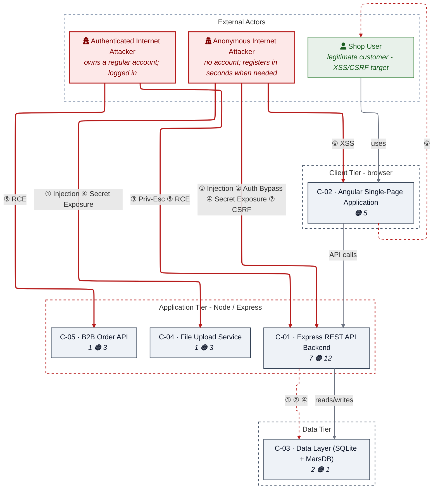
```mermaid
%%{init: {"flowchart": {"defaultRenderer": "elk", "nodeSpacing": 34, "rankSpacing": 52, "padding": 10, "subGraphTitleMargin": {"top": 6, "bottom": 6}}} }%%
flowchart TB
    subgraph ZONE_ACTORS["External Actors"]
        direction LR
        EXT_SHOPUSER["fa:fa-user Shop User<br/><i>legitimate customer - XSS/CSRF target</i>"]:::actorgood
        ACT_INTERNET_ANON["fa:fa-user-secret Anonymous Internet Attacker<br/><i>no account; registers in seconds when needed</i>"]:::actorbad
        ACT_INTERNET_USER["fa:fa-user-secret Authenticated Internet Attacker<br/><i>owns a regular account; logged in</i>"]:::actorbad
    end

    subgraph CLIENT["Client Tier - browser"]
        CMP_FRONTEND_SPA["C-02 · Angular Single-Page Application<br/><i>🟠 5</i>"]:::comp
    end
    subgraph APP["Application Tier - Node / Express"]
        CMP_BACKEND_API["C-01 · Express REST API Backend<br/><i>🔴 7 🟠 12</i>"]:::comp
        CMP_FILE_UPLOAD_SERVICE["C-04 · File Upload Service<br/><i>🔴 1 🟠 3</i>"]:::comp
        CMP_B2B_API["C-05 · B2B Order API<br/><i>🔴 1 🟠 3</i>"]:::comp
    end
    subgraph DATA["Data Tier"]
        CMP_DATA_PERSISTENCE["C-03 · Data Layer (SQLite + MarsDB)<br/><i>🔴 2 🟠 1</i>"]:::comp
    end

    %% legitimate request flow
    EXT_SHOPUSER -->|"uses"| CMP_FRONTEND_SPA
    CMP_FRONTEND_SPA -->|"API calls"| CMP_BACKEND_API
    CMP_BACKEND_API -->|"reads/writes"| CMP_DATA_PERSISTENCE
    %% attacks (solid) - each originates at a threat actor; glyphs match Figure 2 / Top Threats
    ACT_INTERNET_ANON ==>|"① Injection ② Auth Bypass ④ Secret Exposure ⑦ CSRF"| CMP_BACKEND_API
    ACT_INTERNET_ANON ==>|"① Injection ④ Secret Exposure"| CMP_FILE_UPLOAD_SERVICE
    ACT_INTERNET_USER ==>|"③ Priv-Esc ⑤ RCE"| CMP_BACKEND_API
    ACT_INTERNET_USER ==>|"⑤ RCE"| CMP_B2B_API
    ACT_INTERNET_ANON ==>|"⑥ XSS"| CMP_FRONTEND_SPA
    %% propagation (dotted) - how the attack reaches the data tier / victim
    CMP_BACKEND_API -.->|"① ② ④"| CMP_DATA_PERSISTENCE
    CMP_FRONTEND_SPA -.->|"⑥"| EXT_SHOPUSER

    style CLIENT fill:none,stroke:#475569,stroke-width:1.5px,stroke-dasharray:5
    style APP fill:none,stroke:#b71c1c,stroke-width:2px,stroke-dasharray:5
    style DATA fill:none,stroke:#475569,stroke-width:1.5px,stroke-dasharray:5
    style ZONE_ACTORS fill:none,stroke:#94a3b8,stroke-width:1.5px,stroke-dasharray:5
    classDef comp fill:#eef2f7,stroke:#334155,color:#0f172a,stroke-width:1.5px
    classDef compmuted fill:#f8fafc,stroke:#cbd5e1,color:#64748b,stroke-width:1px,font-size:9px
    classDef ext  fill:#ffffff,stroke:#94a3b8,color:#334155,stroke-width:1.5px
    classDef actorbad  fill:#fde8e8,stroke:#b71c1c,color:#7f0000,stroke-width:2px
    classDef actorgood fill:#e8f1ea,stroke:#2e7d32,color:#1b5e20,stroke-width:1.5px
    linkStyle 0,1,2 stroke:#6b7280,stroke-width:1.5px
    linkStyle 3,4,5,6,7 stroke:#b71c1c,stroke-width:2.5px
    linkStyle 8,9 stroke:#b71c1c,stroke-width:1.5px,stroke-dasharray:5
```

_Threats: ① Injection · ② Auth Bypass · ③ Priv-Esc · ④ Secret Exposure · ⑤ RCE · ⑥ XSS · ⑦ CSRF_

_Component badge: 🔴 = number of Critical findings on the component · 🟠 = number of High findings. Components with no Critical/High finding carry no badge._

**Figure 2 - Risk Flow: Actor → Tier → Impact**

Heatmap: **actors** (left) → **architecture tiers** (middle, Client → Application → Data) → **impact** (right). Numbered red arrows ①–⑥ are the threats enumerated in the Top Threats table below.

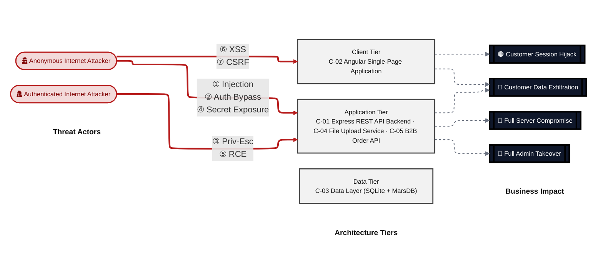
```mermaid
%%{init: {"flowchart": {"defaultRenderer": "elk", "nodeSpacing": 45, "rankSpacing": 95}} }%%
flowchart LR
    subgraph ACTORS[" "]
        direction TB
        HDR_A["<b>Threat Actors</b>"]:::columnHeader
        ANON(["fa:fa-user-secret Anonymous Internet Attacker"]):::actorAnon
        INTERNET_USER(["fa:fa-user-secret Authenticated Internet Attacker"]):::actorAnon
    end

    subgraph TIERS[" "]
        direction TB
        HDR_T["<b>Architecture Tiers</b>"]:::columnHeader
        BROWSER["Client Tier<br/>C-02 Angular Single-Page Application"]:::tierClient
        SERVER["Application Tier<br/>C-01 Express REST API Backend · C-04 File Upload Service · C-05 B2B Order API"]:::tierApp
        DATA["Data Tier<br/>C-03 Data Layer (SQLite + MarsDB)"]:::tierData
    end

    subgraph IMPACT[" "]
        direction TB
        HDR_I["<b>Business Impact</b>"]:::columnHeader
        CUSTOMER_SESSION_HIJACK[["🟠 Customer Session Hijack"]]:::impact
        FULL_ADMIN_TAKEOVER[["🔴 Full Admin Takeover"]]:::impact
        FULL_SERVER_COMPROMISE[["🔴 Full Server Compromise"]]:::impact
        CUSTOMER_DATA_EXFILTRATION[["🔴 Customer Data Exfiltration"]]:::impact
    end

    %% Invisible alignment hints. Two purposes:
    %%   (a) keep per-component alignment edges (e.g. ANON --- SERVER) so the
    %%       forward attack arrows route horizontally without crossing tier
    %%       boxes (the diagram is forward-only: actor → tier → impact, no
    %%       backward relay edges into the actor column);
    %%   (b) chain the three column headers (HDR_A, HDR_T, HDR_I) across
    %%       subgraph boundaries so ELK pins them on the same Y line.
    HDR_A --- HDR_T
    HDR_T --- HDR_I
    ANON --- SERVER

    %% Attack arrows
    ANON ==>|" ① Injection<br/>② Auth Bypass<br/>④ Secret Exposure  "| SERVER
    INTERNET_USER ==>|" ③ Priv-Esc<br/>⑤ RCE  "| SERVER
    ANON ==>|" ⑥ XSS<br/>⑦ CSRF  "| BROWSER

    %% Consequence arrows (tier → business impact, all LR-forward)
    SERVER -.-> FULL_ADMIN_TAKEOVER
    SERVER -.-> CUSTOMER_DATA_EXFILTRATION
    SERVER -.-> FULL_SERVER_COMPROMISE
    BROWSER -.-> CUSTOMER_SESSION_HIJACK
    BROWSER -.-> CUSTOMER_DATA_EXFILTRATION

    %% Subgraph frames invisible - column headers are emitted as the
    %% FIRST node of each subgraph (HDR_A / HDR_T / HDR_I) and pinned
    %% on the same Y line by the cross-subgraph alignment edges above.
    style ACTORS fill:none,stroke:none
    style TIERS  fill:none,stroke:none
    style IMPACT fill:none,stroke:none

    classDef tierClient fill:#f2f2f2,stroke:#424242,color:#111,stroke-width:2px,font-size:12px
    classDef tierApp    fill:#f2f2f2,stroke:#424242,color:#111,stroke-width:2px,font-size:12px
    classDef tierData   fill:#f2f2f2,stroke:#424242,color:#111,stroke-width:2px,font-size:12px

    classDef actorAnon     fill:#f3dada,stroke:#b71c1c,color:#7f0000,stroke-width:2px,font-size:12px
    classDef actorShopUser fill:#e8f1ea,stroke:#2e7d32,color:#1b5e20,stroke-width:2px,font-size:12px
    classDef impact        fill:#0f172a,stroke:#000,color:#fff,stroke-width:3px,font-size:12px

    classDef columnHeader  fill:none,stroke:none,color:#111,font-size:14px

    linkStyle 0,1,2     stroke:transparent,stroke-width:0px
    linkStyle 3,4,5     stroke:#b71c1c,stroke-width:3px
    linkStyle 6,7,8,9,10     stroke:#6b7280,stroke-width:1.5px,stroke-dasharray:4

```

**Threat actors.** The actors below drive the numbered attack paths in the figures above; the Shop User is the *victim* of client-side attacks (XSS / CSRF), not an attacker.

- **Shop User** — legitimate customer; target of client-side attacks; target of ⑦ CSRF / Permissive CORS.
- **Anonymous Internet Attacker** — no account; registers in seconds when needed; drives ① Insecure Query Construction & Data Access, ② Hardcoded Secrets & Weak Cryptography, ④ Sensitive File & Secret Exposure, ⑥ Output Encoding / Cross-Site Scripting.
- **Authenticated Internet Attacker** — owns a regular account; logged in; drives ③ Broken Authorization & Access Control, ⑤ Remote Code Execution (unsafe eval).

**7 structural threats**, grouped by weakness class - each row is one threat, not one finding. *Threat Description* states the general architectural weakness (STRIDE in brackets); *Findings* lists the concrete instances, each linked to [§8 Findings Register](#8-findings-register) with its component; *Risk & Impact* combines severity with business consequence.

| # | Threat Description | Findings (→ Component) | Risk & Impact | Fix |
|---|------------------------------------|------------------------------------------------|------------------------------------|--------|
| <a id="path-injection"></a>① | **Insecure Query Construction & Data Access** _(T·I)_<br/>User input flows into raw SQL or NoSQL queries without parameterisation, allowing authentication bypass or data exfiltration. | •&nbsp;🔴&nbsp;[F-001](#f-001) — SQL injection in login →&nbsp;[C-01](#c-01)<br/>•&nbsp;🔴&nbsp;[F-005](#f-005) — SQL injection in product search →&nbsp;[C-01](#c-01)<br/>•&nbsp;🔴&nbsp;[F-010](#f-010) — XXE via XML upload with external entity resolution →&nbsp;[C-04](#c-04)<br/>•&nbsp;🟠&nbsp;[F-017](#f-017) — NoSQL injection in review update no author verification →&nbsp;[C-01](#c-01)<br/>•&nbsp;🟠&nbsp;[F-025](#f-025) — NoSQL injection via \$where clause in product reviews →&nbsp;[C-01](#c-01) | 🔴 **Critical**<br/>Full Admin Takeover · Customer Data Exfiltration | ❶ [M-001](#m-001)<br/>❶ [M-002](#m-002) |
| <a id="path-auth-bypass"></a>② | **Hardcoded Secrets & Weak Cryptography** _(S·E)_<br/>Authentication can be forged or bypassed because JWT signing keys and admin credentials are committed in source and password hashes use unsalted `MD5`. | •&nbsp;🔴&nbsp;[F-002](#f-002) — Hardcoded RSA private key enables JWT forgery →&nbsp;[C-01](#c-01)<br/>•&nbsp;🔴&nbsp;[F-003](#f-003) — JWT algorithm none bypass via express jwt →&nbsp;[C-01](#c-01)<br/>•&nbsp;🔴&nbsp;[F-004](#f-004) — Hardcoded admin credentials in static user data →&nbsp;[C-03](#c-03)<br/>•&nbsp;🔴&nbsp;[F-007](#f-007) — MD5 password hashing trivially reversible →&nbsp;[C-01](#c-01)<br/>•&nbsp;🔴&nbsp;[F-009](#f-009) — User passwords stored as unsalted MD5 data at rest →&nbsp;[C-03](#c-03)<br/>•&nbsp;🟠&nbsp;[F-014](#f-014) — Hardcoded HMAC secret enables coupon forgery →&nbsp;[C-01](#c-01) | 🔴 **Critical**<br/>Full Admin Takeover · Customer Data Exfiltration | ❶ [M-003](#m-003)<br/>❶ [M-004](#m-004) |
| <a id="path-privilege-escalation"></a>③ | **Broken Authorization & Access Control** _(E·I)_<br/>Authorisation checks are absent server-side or enforced only in the Angular client, allowing any authenticated user to reach admin routes or modify other users' data. | •&nbsp;🟠&nbsp;[F-013](#f-013) — Unauthenticated product modification via PUT /api/Products/:id →&nbsp;[C-01](#c-01)<br/>•&nbsp;🟠&nbsp;[F-019](#f-019) — User enumeration via /api/Users →&nbsp;[C-01](#c-01)<br/>•&nbsp;🟠&nbsp;[F-033](#f-033) — B2B API reachable by any authenticated user →&nbsp;[C-01](#c-01)<br/>•&nbsp;🟠&nbsp;[F-038](#f-038) — Client side only admin guard Angular route guard bypass →&nbsp;[C-02](#c-02) | 🟠 **High**<br/>Full Admin Takeover · Customer Data Exfiltration | ❷ [M-011](#m-011)<br/>❷ [M-010](#m-010) |
| <a id="path-sensitive-data-exposure"></a>④ | **Sensitive File & Secret Exposure** _(I)_<br/>Confidential files, access logs, JWT signing keys, and the unencrypted SQLite database are reachable via unauthenticated HTTP endpoints or readable from the container filesystem. | •&nbsp;🔴&nbsp;[F-006](#f-006) — Confidential files exposed via /ftp directory listing →&nbsp;[C-01](#c-01)<br/>•&nbsp;🟠&nbsp;[F-020](#f-020) — Access logs exposed via /support/logs directory listing →&nbsp;[C-01](#c-01)<br/>•&nbsp;🟠&nbsp;[F-021](#f-021) — JWT public key and premium.key exposed at /encryptionkeys →&nbsp;[C-01](#c-01)<br/>•&nbsp;🟠&nbsp;[F-024](#f-024) — SQLite database file on writable filesystem without encryption data/juiceshop.s… →&nbsp;[C-03](#c-03)<br/>•&nbsp;🟠&nbsp;[F-026](#f-026) — SSRF via profile image URL upload →&nbsp;[C-04](#c-04)<br/>•&nbsp;🟠&nbsp;[F-036](#f-036) — Directory traversal in ZIP file upload →&nbsp;[C-04](#c-04)<br/>•&nbsp;🟡&nbsp;[F-039](#f-039) — Open redirect via /redirect?to= parameter →&nbsp;[C-01](#c-01)<br/>•&nbsp;🟡&nbsp;[F-041](#f-041) — Prometheus metrics exposed unauthenticated at /metrics →&nbsp;[C-01](#c-01) | 🔴 **Critical**<br/>Customer Data Exfiltration | ❶ [M-012](#m-012)<br/>❷ [M-014](#m-014) |
| <a id="path-remote-code-execution"></a>⑤ | **Remote Code Execution (unsafe eval)** _(E)_<br/>User-supplied content is executed server-side via an unsafe VM sandbox escape in the B2B order processor and via a template-injection sink in the user-profile route. | •&nbsp;🔴&nbsp;[F-011](#f-011) — RCE via vm.runInContext sandbox escape in B2B order →&nbsp;[C-05](#c-05)<br/>•&nbsp;🔴&nbsp;[F-012](#f-012) — SSTI + eval on user controlled username →&nbsp;[C-01](#c-01) | 🔴 **Critical**<br/>Full Server Compromise · Customer Data Exfiltration | ❶ [M-033](#m-033)<br/>❶ [M-006](#m-006) |
| <a id="path-cross-site-scripting"></a>⑥ | **Output Encoding / Cross-Site Scripting** _(T·I)_<br/>Angular components bypass default template escaping by calling bypassSecurityTrustHtml, and search results render user-controlled input into the DOM without sanitisation. | •&nbsp;🟠&nbsp;[F-018](#f-018) — DOM XSS via search result rendering search →&nbsp;[C-02](#c-02)<br/>•&nbsp;🟠&nbsp;[F-028](#f-028) — JWT stored in localStorage XSS accessible token storage →&nbsp;[C-02](#c-02)<br/>•&nbsp;🟠&nbsp;[F-037](#f-037) — Stored XSS via trust HTML bypass in admin panel →&nbsp;[C-02](#c-02) | 🟠 **High**<br/>Customer Session Hijack | ❷ [M-022](#m-022)<br/>❷ [M-020](#m-020) |
| <a id="path-cross-site-request-forgery"></a>⑦ | **CSRF / Permissive CORS** _(S·T)_<br/>State-changing endpoints accept requests without CSRF tokens or SameSite cookie constraints; combined with wildcard CORS, cross-origin requests from attacker-controlled pages reach authenticated API routes. | •&nbsp;🟠&nbsp;[F-015](#f-015) — No CSRF protection on state changing endpoints →&nbsp;[C-01](#c-01)<br/>•&nbsp;🟠&nbsp;[F-016](#f-016) — Wildcard CORS allows all origins on sensitive endpoints →&nbsp;[C-01](#c-01) | 🟠 **High**<br/>Customer Session Hijack · Customer Data Exfiltration | ❷ [M-009](#m-009)<br/>❷ [M-007](#m-007) |

_STRIDE: S spoofing · T tampering · R repudiation · I information disclosure · D denial of service · E elevation of privilege. Risk, findings, components, impact and Fix are derived deterministically; only the one-line weakness description is authored._

**Verified attack chains.** 2 fully viable ([AC-T-003](#ac-t-003), [AC-T-005](#ac-t-005)); 3 partially blocked ([AC-T-001](#ac-t-001), [AC-T-002](#ac-t-002), [AC-T-006](#ac-t-006)). These chains combine individual findings into end-to-end exploitation paths verified step-by-step against the code - see [§9 Abuse Cases](#9-abuse-cases) for the per-step breakdown and blocking mitigations.

### Top Mitigations

Highest-impact P1/P2 mitigations - 10 of 34 qualifying (37 total). Full detail in [§10 Mitigation Register](#10-mitigation-register). All 10 mitigation(s) that fix a Critical finding are always listed here.

| # | Component | Mitigation | Addresses | Effort |
|---|----------------------|------------------------------------------------|------------------------------------------------|------|
| **1** | [C-01](#c-01) — Express REST API Backend | ❶ [M-005](#m-005) — MD5 password hashing trivially reversible lib/insecurity.ts | 🔴 [F-007](#f-007) — MD5 password hashing trivially reversible (lib/insecurity.ts)<br/>🔴 [F-009](#f-009) — User passwords stored as unsalted MD5 data at rest (models/user.ts) | Medium |
| **2** | [C-01](#c-01) — Express REST API Backend | ❶ [M-001](#m-001) — SQL injection in login routes/login.ts | 🔴 [F-001](#f-001) — SQL injection in login (routes/login.ts) | Medium |
| **3** | [C-01](#c-01) — Express REST API Backend | ❶ [M-002](#m-002) — SQL injection in product search routes/search.ts | 🔴 [F-005](#f-005) — SQL injection in product search (routes/search.ts) | Medium |
| **4** | [C-01](#c-01) — Express REST API Backend | ❶ [M-003](#m-003) — Hardcoded RSA private key enables JWT forgery lib/insecurity.ts | 🔴 [F-002](#f-002) — Hardcoded RSA private key enables JWT forgery (lib/insecurity.ts) | Medium |
| **5** | [C-01](#c-01) — Express REST API Backend | ❶ [M-004](#m-004) — JWT algorithm none bypass via express jwt lib/insecurity.ts | 🔴 [F-003](#f-003) — JWT algorithm none bypass via express jwt lib/insecurity.ts (package.json) | Medium |
| **6** | [C-01](#c-01) — Express REST API Backend | ❶ [M-006](#m-006) — SSTI + eval on user controlled username routes/userProfile.ts | 🔴 [F-012](#f-012) — SSTI + eval on user controlled username (routes/userProfile.ts) | Medium |
| **7** | [C-01](#c-01) — Express REST API Backend | ❶ [M-012](#m-012) — Confidential files exposed via /ftp directory listing server.ts | 🔴 [F-006](#f-006) — Confidential files exposed via /ftp directory listing (server.ts) | Medium |
| **8** | [C-03](#c-03) — Data Layer (SQLite + MarsDB) | ❶ [M-027](#m-027) — Hardcoded admin credentials in static user data data/static/users.yml | 🔴 [F-004](#f-004) — Hardcoded admin credentials in static user data (data/static/users.yml) | Medium |
| **9** | [C-04](#c-04) — File Upload Service | ❶ [M-029](#m-029) — XXE via XML upload with external entity resolution routes/fileUpload.ts | 🔴 [F-010](#f-010) — XXE via XML upload with external entity resolution (routes/fileUpload.ts) | Medium |
| **10** | [C-05](#c-05) — B2B Order API | ❶ [M-033](#m-033) — RCE via vm.runInContext sandbox escape in B2B order routes/b2bOrder.ts | 🔴 [F-011](#f-011) — RCE via vm.runInContext sandbox escape in B2B order (routes/b2bOrder.ts) | Medium |

*24 additional P1/P2 mitigations capped from the leader-board · 3 P3 backlog items in [§10 Mitigation Register](#10-mitigation-register). Sorted by priority (P1 first), then component, then leverage (most findings first), severity (Critical first), and effort (Low first).*

### Operational Strengths

Operational controls rated Adequate or Partial - grouped into broad clusters (full per-control breakdown in [§7](#7-security-architecture)). Clusters demoted to Weak by open Critical/High findings appear in [§7](#7-security-architecture) instead, not here.

| Strength | What's in Place | Effectiveness | Gap | Mitigates |
|----------------------|----------------------|-------------|----------------------|----------------|
| **Container & Supply-Chain Hardening** | _Build-time and runtime hardening - minimal base image, non-root execution, dependency inventory._<br/>Automated SCA scanning<br/>CI/CD security scanning<br/>Container image pinning | ✅ Adequate | - | - |
| **Hardened HTTP Stack** | _Browser-facing HTTP hardening - security headers, cookie flags, cross-origin policy, and abuse-protection limits._<br/>Rate limiting (general) | ⚠️ Partial | Bypassed by 3 High finding(s) of the kind this cluster is supposed to prevent - e.g. [F-015](#t-015), [F-016](#t-016), [F-026](#t-026). | - |


**Bottom line:** These controls narrow specific attack surfaces but none eliminates a Critical finding on its own.

---

<a id="critical-attack-chain"></a><a id="critical-attack-tree"></a>
## Critical Attack Tree

The root is the worst-case attacker goal; below it, each capability branch groups the Critical findings that achieve it. Branches feed the goal by OR - any single path suffices.

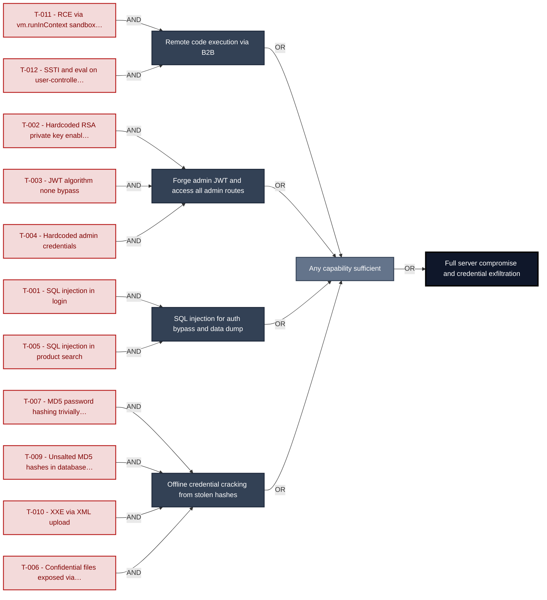
```mermaid
graph LR
    G_ROOT["Full server compromise and credential exfiltration"]:::goal
    OR_ROOT["Any capability sufficient"]:::or_node
    AND_RCE["Remote code execution via B2B"]:::and_node
    AND_JWT["Forge admin JWT and access all admin routes"]:::and_node
    AND_SQLI["SQL injection for auth bypass and data dump"]:::and_node
    AND_CRED["Offline credential cracking from stolen hashes"]:::and_node
    L_T011["T-011 - RCE via vm.runInContext sandbox…"]:::leaf
    L_T012["T-012 - SSTI and eval on user-controlle…"]:::leaf
    L_T002["T-002 - Hardcoded RSA private key enabl…"]:::leaf
    L_T003["T-003 - JWT algorithm none bypass"]:::leaf
    L_T001["T-001 - SQL injection in login"]:::leaf
    L_T005["T-005 - SQL injection in product search"]:::leaf
    L_T007["T-007 - MD5 password hashing trivially…"]:::leaf
    L_T009["T-009 - Unsalted MD5 hashes in database…"]:::leaf
    L_T010["T-010 - XXE via XML upload"]:::leaf
    L_T006["T-006 - Confidential files exposed via…"]:::leaf
    L_T004["T-004 - Hardcoded admin credentials"]:::leaf

    OR_ROOT -->|"OR"| G_ROOT
    AND_RCE -->|"OR"| OR_ROOT
    AND_JWT -->|"OR"| OR_ROOT
    AND_SQLI -->|"OR"| OR_ROOT
    AND_CRED -->|"OR"| OR_ROOT
    L_T011 -->|"AND"| AND_RCE
    L_T012 -->|"AND"| AND_RCE
    L_T002 -->|"AND"| AND_JWT
    L_T003 -->|"AND"| AND_JWT
    L_T001 -->|"AND"| AND_SQLI
    L_T005 -->|"AND"| AND_SQLI
    L_T007 -->|"AND"| AND_CRED
    L_T009 -->|"AND"| AND_CRED
    L_T010 -->|"AND"| AND_CRED
    L_T006 -->|"AND"| AND_CRED
    L_T004 -->|"AND"| AND_JWT

    classDef goal fill:#0f172a,stroke:#000,color:#fff,stroke-width:3px
    classDef and_node fill:#334155,stroke:#1e293b,color:#fff,stroke-width:2px
    classDef or_node fill:#64748b,stroke:#334155,color:#fff,stroke-width:2px
    classDef leaf fill:#f3dada,stroke:#b71c1c,color:#7f0000,stroke-width:2px
```

**Findings** (full detail in [§8 Findings Register](#8-findings-register)): [F-011](#f-011) RCE via `vm.runInContext` sandbox escape · [F-012](#f-012) SSTI and eval on user-controlled username · [F-002](#f-002) Hardcoded RSA private key enables JWT forgery · [F-003](#f-003) JWT algorithm none bypass · [F-001](#f-001) SQL injection in login · [F-005](#f-005) SQL injection in product search · [F-007](#f-007) `MD5` password hashing trivially reversible · [F-009](#f-009) Unsalted `MD5` hashes in database at rest · [F-010](#f-010) XXE via XML upload · [F-006](#f-006) Confidential files exposed via FTP directory · [F-004](#f-004) Hardcoded admin credentials

---

## 1. System Overview

**Repository:** https://github.com/juice-shop/juice-shop

### Scope

This threat model covers 5 components of juice-shop: **Express REST API Backend**, **Angular Single-Page Application**, **Data Layer (SQLite + MarsDB)**, **File Upload Service**, **B2B Order API**.

**Out of scope:** third-party hosted dependencies, browser runtime, operating-system kernel, and the underlying network infrastructure.

---

## 2. Architecture Diagrams

### 2.1 System Context

Who interacts with juice-shop from the outside, and through which channels. Solid arrows show normal usage; dashed red arrows mark unauthenticated probing or exploit paths (C4 Level 1).

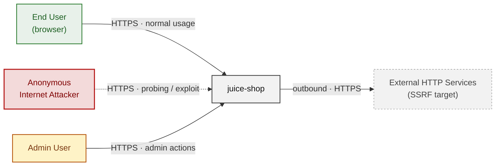
```mermaid
flowchart LR
    USER["End User<br/>(browser)"]
    ATTACKER["Anonymous<br/>Internet Attacker"]
    ADMIN["Admin User"]
    SYSTEM["juice-shop"]
    EXTERNAL["External HTTP Services<br/>(SSRF target)"]
    USER -->|HTTPS · normal usage| SYSTEM
    ATTACKER -.->|HTTPS · probing / exploit| SYSTEM
    ADMIN -->|HTTPS · admin actions| SYSTEM
    SYSTEM -->|outbound · HTTPS| EXTERNAL
    classDef user     fill:#e8f1ea,stroke:#2e7d32,color:#1b5e20,stroke-width:1.5px
    classDef attacker fill:#f3dada,stroke:#b71c1c,color:#7f0000,stroke-width:2px
    classDef admin    fill:#fef3c7,stroke:#b45309,color:#78350f,stroke-width:1.5px
    classDef sys      fill:#f2f2f2,stroke:#424242,color:#111,stroke-width:1.5px
    classDef ext      fill:#f2f2f2,stroke:#9e9e9e,color:#424242,stroke-dasharray:3 3,stroke-width:1px
    class USER user
    class ATTACKER attacker
    class ADMIN admin
    class SYSTEM sys
    class EXTERNAL ext
```

### 2.2 Container Architecture

How the system decomposes into deployable units. Each box is a separate runtime process or service container; arrows show synchronous request paths between them. Components with ≥3 Critical findings carry a red border, ≥2 High amber (C4 Level 2).

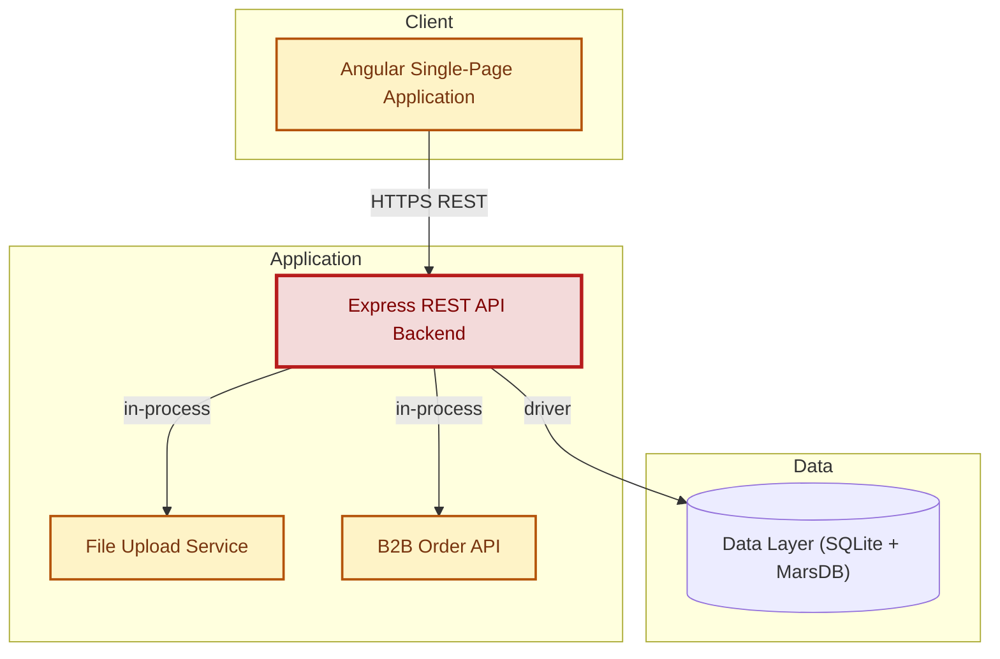
```mermaid
flowchart TB
    subgraph Client
        frontend_spa["Angular Single-Page Application"]
    end
    subgraph Application
        backend_api["Express REST API Backend"]
        file_upload_service["File Upload Service"]
        b2b_api["B2B Order API"]
    end
    subgraph Data
        data_persistence[("Data Layer (SQLite + MarsDB)")]
    end
    frontend_spa -->|HTTPS REST| backend_api
    backend_api -->|driver| data_persistence
    backend_api -->|in-process| file_upload_service
    backend_api -->|in-process| b2b_api
    classDef critical fill:#f3dada,stroke:#b71c1c,color:#7f0000,stroke-width:3px
    classDef warning  fill:#fef3c7,stroke:#b45309,color:#78350f,stroke-width:2px
    class backend_api critical
    class frontend_spa warning
    class file_upload_service warning
    class b2b_api warning
```

### 2.3 Components


Who reaches each component, and through which trust zone. Four columns map external actors to the internal tiers (Client / Application / Data); solid green arrows show legitimate data flow, dashed red arrows mark intrusion vectors. The component table directly below holds source paths and linked threats per `C-NN`; per-finding evidence is in [§8 Findings Register](#8-findings-register).

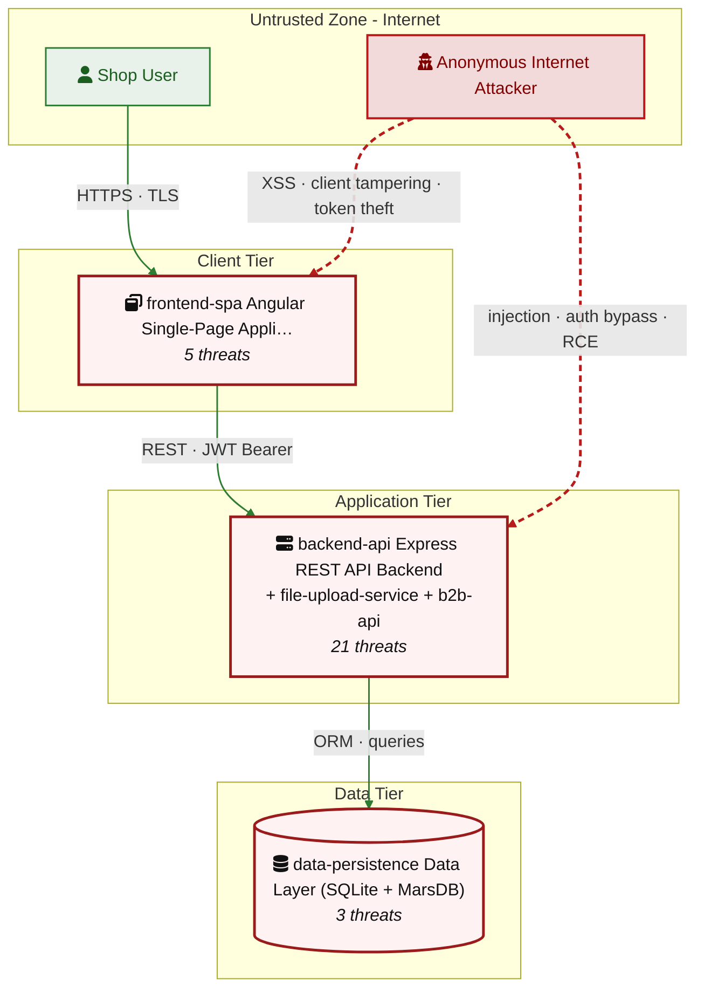
```mermaid
flowchart TD
    subgraph EXT["Untrusted Zone - Internet"]
        INTERNET_ANON["fa:fa-user-secret Anonymous Internet Attacker"]:::threat
        VICTIM_REQUIRED["fa:fa-user Shop User"]:::legit
    end
    subgraph CLIENT["Client Tier"]
        frontend_spa["fa:fa-window-restore frontend-spa Angular Single-Page Appli…<br/><i>5 threats</i>"]:::risk
    end
    subgraph APP["Application Tier"]
        backend_api["fa:fa-server backend-api Express REST API Backend<br/>+ file-upload-service + b2b-api<br/><i>21 threats</i>"]:::risk
    end
    subgraph DATA["Data Tier"]
        data_persistence[("fa:fa-database data-persistence Data Layer (SQLite + MarsDB)<br/><i>3 threats</i>")]:::risk
    end
    VICTIM_REQUIRED -->|"HTTPS · TLS"| frontend_spa
    frontend_spa -->|"REST · JWT Bearer"| backend_api
    backend_api -->|"ORM · queries"| data_persistence
    INTERNET_ANON -.->|"injection · auth bypass · RCE"| backend_api
    INTERNET_ANON -.->|"XSS · client tampering · token theft"| frontend_spa

    classDef legit fill:#e8f1ea,stroke:#2e7d32,color:#1b5e20,stroke-width:1.5px
    classDef threat fill:#f3dada,stroke:#b71c1c,color:#7f0000,stroke-width:2px
    classDef external fill:#f2f2f2,stroke:#424242,color:#212121,stroke-width:1.5px
    classDef risk fill:#fef2f2,stroke:#991b1b,color:#111,stroke-width:2.5px
    linkStyle 0,1,2 stroke:#2e7d32,stroke-width:1.5px
    linkStyle 3,4 stroke:#b71c1c,stroke-width:2.5px,stroke-dasharray:6 4
```

| ID | Name | Type | Key Paths | Linked Threats |
|----|----------------------|-----------|--------------------------------|------------------------------------------------|
| <a id="c-01"></a><a id="backend-api"></a>C-01 | Express REST API Backend | application | `server.ts`<br/>`routes/**`<br/>`lib/**`<br/>`app.ts` | [F-001](#f-001) (SQL injection in login)<br/>[F-002](#f-002) (Hardcoded RSA private key enables JWT forgery)<br/>[F-003](#f-003) (JWT algorithm none bypass via express jwt `lib/insecurity.ts`)<br/>[F-005](#f-005) (SQL injection in product search)<br/>[F-006](#f-006) (Confidential files exposed via `/ftp` directory listing)<br/>[F-007](#f-007) (`MD5` password hashing trivially reversible)<br/>[F-012](#f-012) (SSTI + eval on user controlled username)<br/>[F-013](#f-013) (Unauthenticated product modification via PUT `/api/Products/:id`)<br/>[F-014](#f-014) (Hardcoded HMAC secret enables coupon forgery)<br/>[F-015](#f-015) (No CSRF protection on state changing endpoints)<br/>[F-016](#f-016) (Wildcard CORS allows all origins on sensitive endpoints)<br/>[F-017](#f-017) (NoSQL injection in review update no author verification `updateProductReviews.ts`)<br/>[F-019](#f-019) (User enumeration via `/api/Users`)<br/>[F-020](#f-020) (Access logs exposed via `/support/logs` directory listing)<br/>[F-021](#f-021) (JWT public key and `premium.key` exposed at `/encryptionkeys`)<br/>[F-025](#f-025) (NoSQL injection via \$where clause in product reviews `showProductReviews.ts`)<br/>[F-030](#f-030) (No rate limiting on login endpoint)<br/>[F-033](#f-033) (B2B API reachable by any authenticated user)<br/>[F-035](#f-035) (Missing Content Security Policy allows unrestricted script execution)<br/>[F-039](#f-039) (Open redirect via `/redirect`?to= parameter)<br/>[F-041](#f-041) (Prometheus metrics exposed unauthenticated at `/metrics`) |
| <a id="c-02"></a><a id="frontend-spa"></a>C-02 | Angular Single-Page Application | client | `frontend/src/**` | 🔴 [F-018](#f-018) — DOM XSS via search result rendering search result.component.ts<br/>🟠 [F-027](#f-027) — OAuth token exposed in URL fragment oauth/oauth.component.ts<br/>🟠 [F-028](#f-028) — JWT stored in localStorage XSS accessible token storage login.component.ts<br/>🔴 [F-037](#f-037) — Stored XSS via trust HTML bypass in admin panel administration.component.ts<br/>🟠 [F-038](#f-038) — Client side only admin guard Angular route guard bypass app.guard.ts |
| <a id="c-03"></a><a id="data-persistence"></a>C-03 | Data Layer (SQLite + MarsDB) | data | `models/**`<br/>`data/mongodb.ts`<br/>`data/datacreator.ts`<br/>`data/static/users.yml` | 🔴 [F-004](#f-004) — Hardcoded admin credentials in static user data<br/>🔴 [F-009](#f-009) — User passwords stored as unsalted MD5 data at rest<br/>🟠 [F-024](#f-024) — SQLite database file on writable filesystem without encryption data/juiceshop.s… |
| <a id="c-04"></a><a id="file-upload-service"></a>C-04 | File Upload Service | application | `routes/fileUpload.ts`<br/>`routes/profileImageFileUpload.ts`<br/>`routes/profileImageUrlUpload.ts`<br/>`routes/fileServer.ts`<br/>`routes/keyServer.ts` | 🔴 [F-010](#f-010) — XXE via XML upload with external entity resolution<br/>🟠 [F-026](#f-026) — SSRF via profile image URL upload<br/>🟠 [F-031](#f-031) — Denial of Service via XML billion laughs attack<br/>🟠 [F-036](#f-036) — Directory traversal in ZIP file upload |
| <a id="c-05"></a><a id="b2b-api"></a>C-05 | B2B Order API | application | `routes/b2bOrder.ts`<br/>`routes/web3Wallet.ts`<br/>`routes/nftMint.ts`<br/>`routes/checkKeys.ts` | 🔴 [F-011](#f-011) — RCE via vm.runInContext sandbox escape in B2B order<br/>🟠 [F-029](#f-029) — Denial of Service via B2B infinite loop<br/>🟠 [F-032](#f-032) — GitHub Actions not using least privilege permissions<br/>🟠 [F-034](#f-034) — Dependabot vulnerability pinning suppresses security updates<br/>🟡 [F-040](#f-040) — No audit trail for B2B orders |
### 2.4 Technology Architecture

The technology stack the system is built on. Each box names the framework or runtime that fills that role; per-component findings live in the [§2.3](#23-components) component table above, and the full per-finding catalogue is in [§8 Findings Register](#8-findings-register).

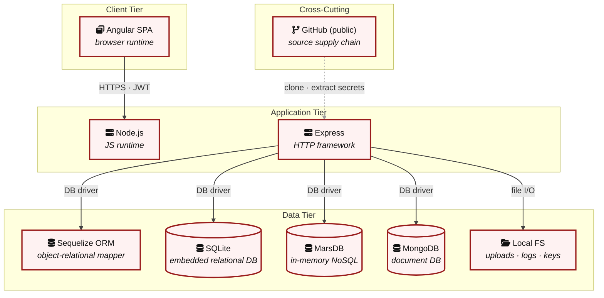
```mermaid
flowchart TD
    subgraph CLIENT["Client Tier"]
        FE_ANGULAR["fa:fa-window-restore Angular SPA<br/><i>browser runtime</i>"]:::risk
    end
    subgraph APP["Application Tier"]
        RUNTIME["fa:fa-server Node.js<br/><i>JS runtime</i>"]:::risk
        EXPRESS["fa:fa-server Express<br/><i>HTTP framework</i>"]:::risk
    end
    subgraph DATA["Data Tier"]
        ORM["fa:fa-database Sequelize ORM<br/><i>object-relational mapper</i>"]:::risk
        SQLITE[("fa:fa-database SQLite<br/><i>embedded relational DB</i>")]:::risk
        MARSDB[("fa:fa-database MarsDB<br/><i>in-memory NoSQL</i>")]:::risk
        MONGO[("fa:fa-database MongoDB<br/><i>document DB</i>")]:::risk
        LOCAL_FS["fa:fa-folder-open Local FS<br/><i>uploads · logs · keys</i>"]:::risk
    end
    subgraph INFRA["Cross-Cutting"]
        INFRA_SCM["fa:fa-code-branch GitHub (public)<br/><i>source supply chain</i>"]:::risk
    end
    FE_ANGULAR -->|"HTTPS · JWT"| RUNTIME
    EXPRESS -->|"DB driver"| ORM
    EXPRESS -->|"DB driver"| SQLITE
    EXPRESS -->|"DB driver"| MARSDB
    EXPRESS -->|"DB driver"| MONGO
    EXPRESS -->|"file I/O"| LOCAL_FS
    INFRA_SCM -.->|"clone · extract secrets"| EXPRESS

    classDef risk fill:#fef2f2,stroke:#991b1b,color:#111,stroke-width:2.5px
    classDef ok fill:#e8f1ea,stroke:#2e7d32,color:#1b5e20,stroke-width:1.5px
    linkStyle 0,1,2,3,4,5 stroke:#424242,stroke-width:1.5px
    linkStyle 6 stroke:#9e9e9e,stroke-width:1px,stroke-dasharray:3 3
```

> **Legend:** **red border** ≥ 3 Critical threats on the component · **amber border** ≥ 2 High threats

---

## 3. Attack Walkthroughs

This section walks through how the highest-risk findings are exploited - one short walkthrough per Critical, each with attack steps, a focused sequence diagram, and the primary mitigation. The cross-finding view (which weaknesses combine toward the worst-case goal, and where one fix severs several paths) is in the [Critical Attack Tree](#critical-attack-tree). Full per-finding context - severity rationale, assets, detection signals - is in the [§8 Findings Register](#8-findings-register) row for each finding.

### 3.1 SQL injection in login routes/login.ts

**Source:** [F-001](#f-001) — `routes/login.ts:37`

Severity **Critical** ([CWE-89](https://cwe.mitre.org/data/definitions/89.html)). STRIDE: Spoofing. See [§8 T-001](#t-001) for the full register row.

**Attack Steps**

1. The login handler constructs a raw SQL query using string interpolation of user-supplied email and password hash values.
2. An attacker can use SQL injection payloads (e.g.
3. `' OR '1'='1'--`) in the email field to bypass authentication entirely and gain access as any user, including admin.

**Sequence Diagram**

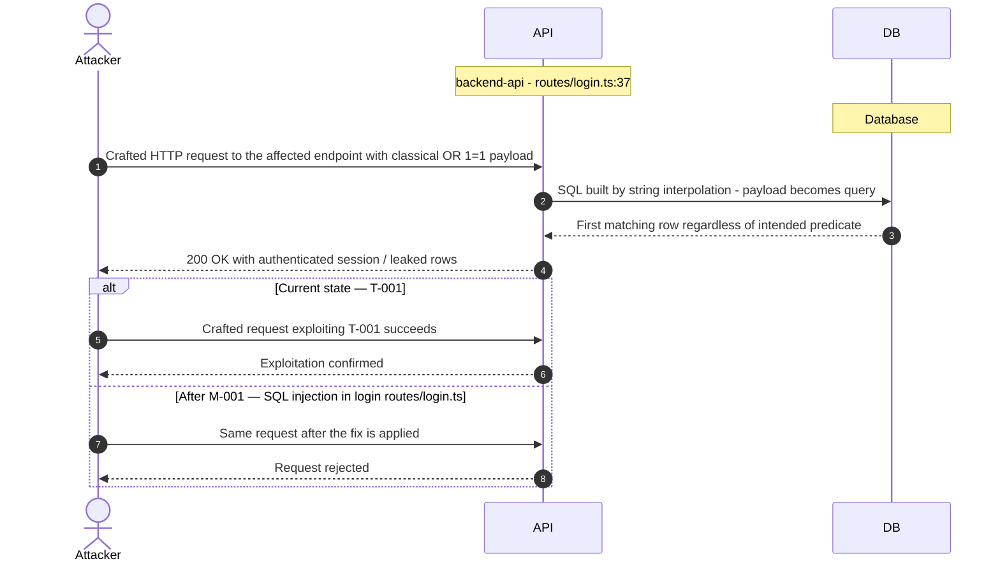
```mermaid
sequenceDiagram
    autonumber
    actor Attacker
    participant API
    participant DB
    Note over API: backend-api - routes/login.ts:37
    Note over DB: Database
    Attacker->>API: Crafted HTTP request to the affected endpoint with classical OR 1=1 payload
    API->>DB: SQL built by string interpolation - payload becomes query
    DB-->>API: First matching row regardless of intended predicate
    API-->>Attacker: 200 OK with authenticated session / leaked rows
    alt Current state — T-001
        Attacker->>API: Crafted request exploiting T-001 succeeds
        API-->>Attacker: Exploitation confirmed
    else After M-001 — SQL injection in login routes/login.ts
        Attacker->>API: Same request after the fix is applied
        API-->>Attacker: Request rejected
    end
```

**Key takeaway:** Until M-001 (SQL injection in login `routes/login.ts`) lands, T-001 is exploitable at `routes/login.ts:37` (Critical-severity, [CWE-89](https://cwe.mitre.org/data/definitions/89.html)).

**Defense in Depth**

- Primary mitigation: [M-001](#m-001) (SQL injection in login `routes/login.ts`)

### 3.2 Hardcoded RSA private key enables JWT forgery lib/insecurit…

**Source:** [F-002](#f-002) — `lib/insecurity.ts:26`

Severity **Critical** ([CWE-321](https://cwe.mitre.org/data/definitions/321.html)). STRIDE: Spoofing. See [§8 T-002](#t-002) for the full register row.

**Attack Steps**

1. The RSA private key used to sign all JWT authentication tokens is hardcoded as a string literal in `lib/insecurity.ts`.
2. Anyone with access to the source code (public GitHub repository) can use this key to sign JWT tokens as any user, including admin, and authenticate without a valid password.
3. Clone the public repository and locate the cryptographic key at `lib/insecurity.ts:26`.

**Sequence Diagram**

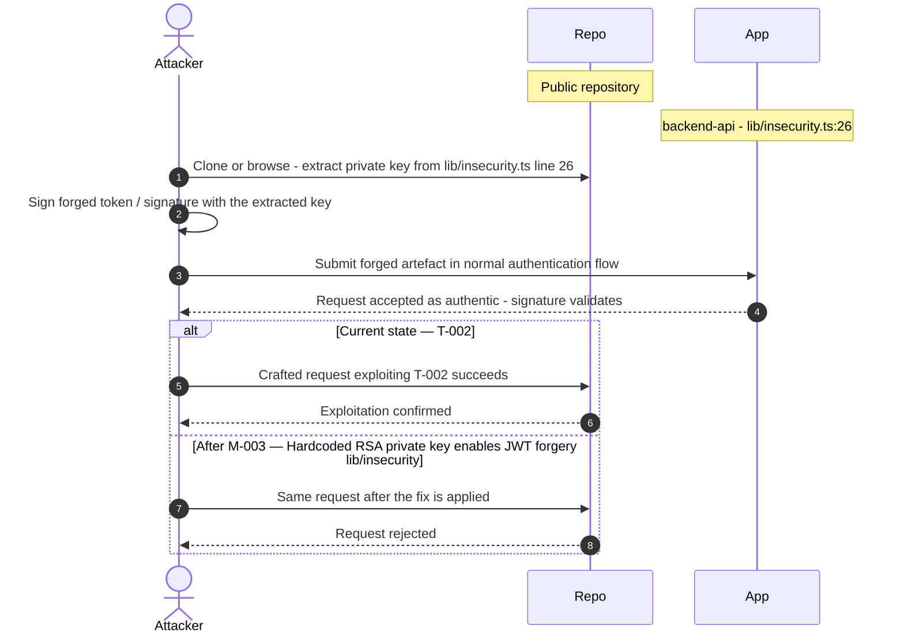
```mermaid
sequenceDiagram
    autonumber
    actor Attacker
    participant Repo
    participant App
    Note over Repo: Public repository
    Note over App: backend-api - lib/insecurity.ts:26
    Attacker->>Repo: Clone or browse - extract private key from lib/insecurity.ts line 26
    Attacker->>Attacker: Sign forged token / signature with the extracted key
    Attacker->>App: Submit forged artefact in normal authentication flow
    App-->>Attacker: Request accepted as authentic - signature validates
    alt Current state — T-002
        Attacker->>Repo: Crafted request exploiting T-002 succeeds
        Repo-->>Attacker: Exploitation confirmed
    else After M-003 — Hardcoded RSA private key enables JWT forgery lib/insecurity
        Attacker->>Repo: Same request after the fix is applied
        Repo-->>Attacker: Request rejected
    end
```

**Key takeaway:** Until M-003 (Hardcoded RSA private key enables JWT forgery lib/insecurity) lands, T-002 is exploitable at `lib/insecurity.ts:26` (Critical-severity, [CWE-321](https://cwe.mitre.org/data/definitions/321.html)).

**Defense in Depth**

- Primary mitigation: [M-003](#m-003) (Hardcoded RSA private key enables JWT forgery `lib/insecurity.ts`)

### 3.3 JWT algorithm none bypass via express jwt lib/insecurity.ts

**Source:** [F-003](#f-003) — `package.json:1`

Severity **Critical** ([CWE-327](https://cwe.mitre.org/data/definitions/327.html)). STRIDE: Spoofing. See [§8 T-003](#t-003) for the full register row.

**Attack Steps**

1. express-jwt version 0.1.3 is vulnerable to JWT algorithm confusion attacks (`CVE-2015-9235` class).
2. An attacker can craft a JWT with `alg: none` and an empty signature, which will be accepted by `express-jwt@0.1.3` without signature verification.
3. This bypasses authentication entirely.

**Sequence Diagram**

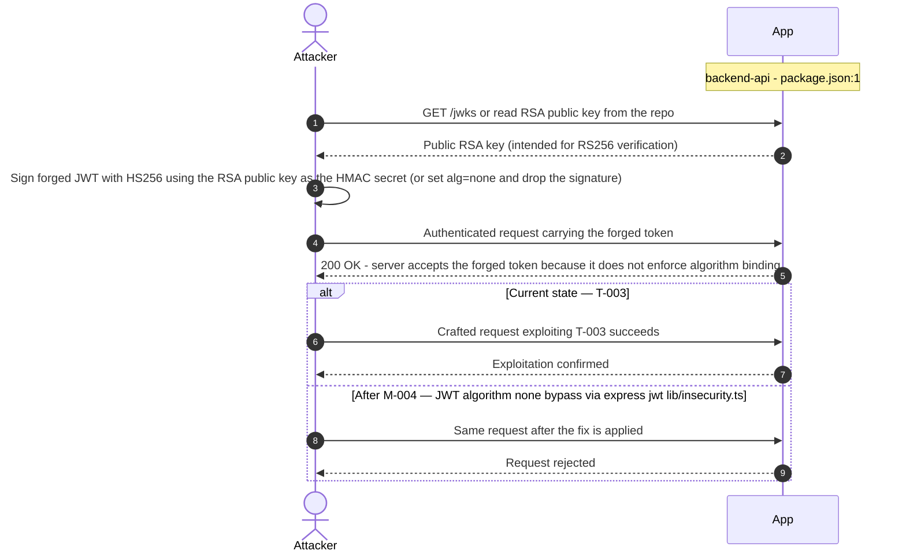
```mermaid
sequenceDiagram
    autonumber
    actor Attacker
    participant App
    Note over App: backend-api - package.json:1
    Attacker->>App: GET /jwks or read RSA public key from the repo
    App-->>Attacker: Public RSA key (intended for RS256 verification)
    Attacker->>Attacker: Sign forged JWT with HS256 using the RSA public key as the HMAC secret (or set alg=none and drop the signature)
    Attacker->>App: Authenticated request carrying the forged token
    App-->>Attacker: 200 OK - server accepts the forged token because it does not enforce algorithm binding
    alt Current state — T-003
        Attacker->>App: Crafted request exploiting T-003 succeeds
        App-->>Attacker: Exploitation confirmed
    else After M-004 — JWT algorithm none bypass via express jwt lib/insecurity.ts
        Attacker->>App: Same request after the fix is applied
        App-->>Attacker: Request rejected
    end
```

**Key takeaway:** Until M-004 (JWT algorithm none bypass via express jwt `lib/insecurity.ts`) lands, T-003 is exploitable at `package.json:1` (Critical-severity, [CWE-327](https://cwe.mitre.org/data/definitions/327.html)).

**Defense in Depth**

- Primary mitigation: [M-004](#m-004) (JWT algorithm none bypass via express jwt `lib/insecurity.ts`)

### 3.4 Hardcoded admin credentials in static user data data/static…

**Source:** [F-004](#f-004) — `data/static/users.yml:3`

Severity **Critical** ([CWE-259](https://cwe.mitre.org/data/definitions/259.html)). STRIDE: Spoofing. See [§8 T-004](#t-004) for the full register row.

**Attack Steps**

1. The application seeds the database with hardcoded user credentials from `data/static/users.yml`.
2. This includes admin@juice-`sh.op`:admin123, support admin credentials, and multiple customer accounts with passwords.
3. These credentials are in the public GitHub repository and represent permanently compromised accounts.

**Sequence Diagram**

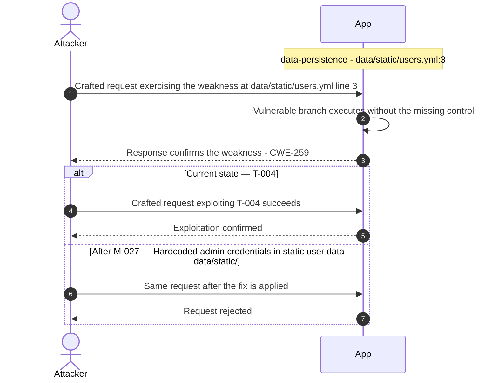
```mermaid
sequenceDiagram
    autonumber
    actor Attacker
    participant App
    Note over App: data-persistence - data/static/users.yml:3
    Attacker->>App: Crafted request exercising the weakness at data/static/users.yml line 3
    App->>App: Vulnerable branch executes without the missing control
    App-->>Attacker: Response confirms the weakness - CWE-259
    alt Current state — T-004
        Attacker->>App: Crafted request exploiting T-004 succeeds
        App-->>Attacker: Exploitation confirmed
    else After M-027 — Hardcoded admin credentials in static user data data/static/
        Attacker->>App: Same request after the fix is applied
        App-->>Attacker: Request rejected
    end
```

**Key takeaway:** Until M-027 (Hardcoded admin credentials in static user data data/static/) lands, T-004 is exploitable at `data/static/users.yml:3` (Critical-severity, [CWE-259](https://cwe.mitre.org/data/definitions/259.html)).

**Defense in Depth**

- Primary mitigation: [M-027](#m-027) (Hardcoded admin credentials in static user data `data/static/users.yml`)

### 3.5 SQL injection in product search routes/search.ts

**Source:** [F-005](#f-005) — `routes/search.ts:23`

Severity **Critical** ([CWE-89](https://cwe.mitre.org/data/definitions/89.html)). STRIDE: Information Disclosure. See [§8 T-005](#t-005) for the full register row.

**Attack Steps**

1. The search endpoint constructs a raw SQL LIKE query with unescaped user input.
2. An attacker can use UNION-based SQL injection to extract the full database schema and all user data from the SQLite database without authentication.
3. Identify the vulnerable input parameter - `backend-api` interpolates it directly into a SQL string at `routes/search.ts:23`.

**Sequence Diagram**

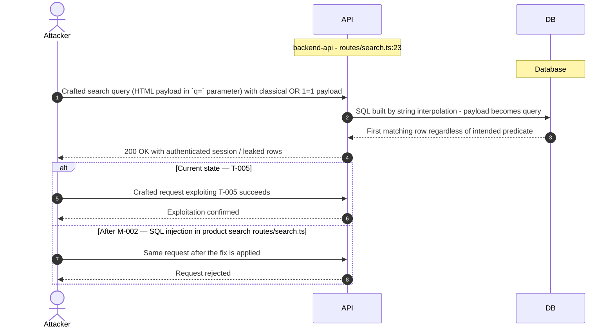
```mermaid
sequenceDiagram
    autonumber
    actor Attacker
    participant API
    participant DB
    Note over API: backend-api - routes/search.ts:23
    Note over DB: Database
    Attacker->>API: Crafted search query (HTML payload in `q=` parameter) with classical OR 1=1 payload
    API->>DB: SQL built by string interpolation - payload becomes query
    DB-->>API: First matching row regardless of intended predicate
    API-->>Attacker: 200 OK with authenticated session / leaked rows
    alt Current state — T-005
        Attacker->>API: Crafted request exploiting T-005 succeeds
        API-->>Attacker: Exploitation confirmed
    else After M-002 — SQL injection in product search routes/search.ts
        Attacker->>API: Same request after the fix is applied
        API-->>Attacker: Request rejected
    end
```

**Key takeaway:** Until M-002 (SQL injection in product search `routes/search.ts`) lands, T-005 is exploitable at `routes/search.ts:23` (Critical-severity, [CWE-89](https://cwe.mitre.org/data/definitions/89.html)).

**Defense in Depth**

- Primary mitigation: [M-002](#m-002) (SQL injection in product search `routes/search.ts`)

### 3.6 Confidential files exposed via /ftp directory listing serve…

**Source:** [F-006](#f-006) — `server.ts:270`

Severity **Critical** ([CWE-548](https://cwe.mitre.org/data/definitions/548.html)). STRIDE: Information Disclosure. See [§8 T-006](#t-006) for the full register row.

**Attack Steps**

1. The `/ftp` directory is served with full directory listing enabled.
2. It contains confidential business documents: `acquisitions.md` (M&A plans), incident-`support.kdbx` (KeePass password database), `coupons_2013.md.bak`, and `package-lock.json.bak`.
3. These files are publicly accessible without authentication.

**Sequence Diagram**

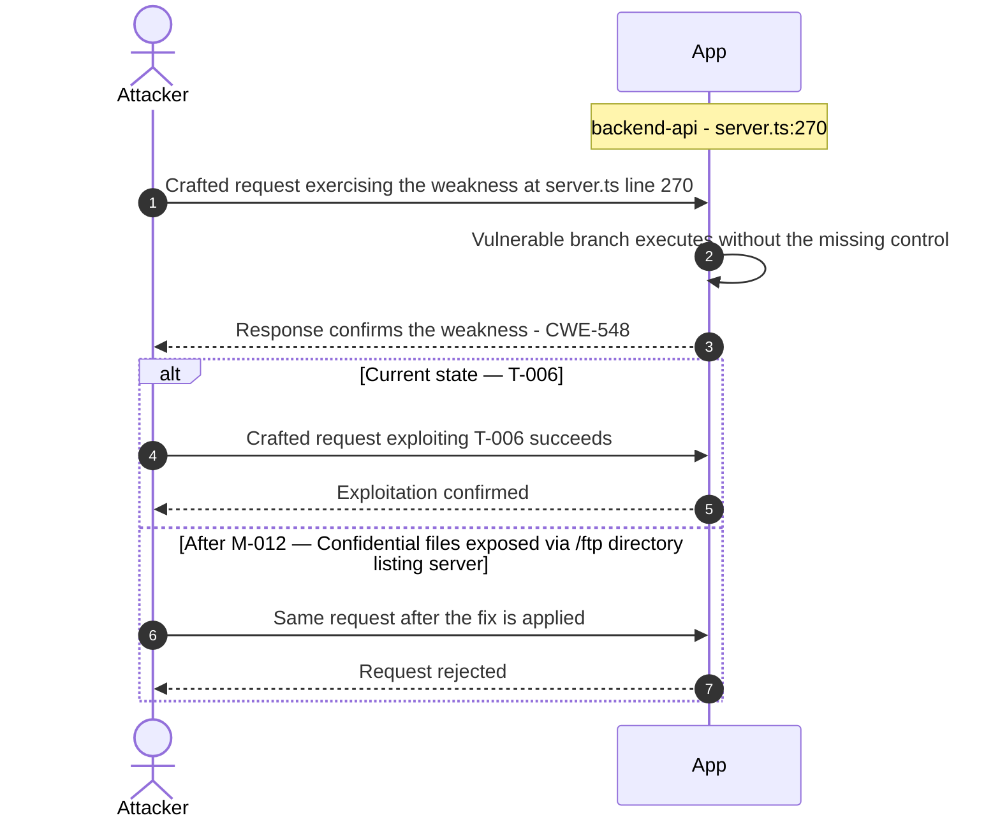
```mermaid
sequenceDiagram
    autonumber
    actor Attacker
    participant App
    Note over App: backend-api - server.ts:270
    Attacker->>App: Crafted request exercising the weakness at server.ts line 270
    App->>App: Vulnerable branch executes without the missing control
    App-->>Attacker: Response confirms the weakness - CWE-548
    alt Current state — T-006
        Attacker->>App: Crafted request exploiting T-006 succeeds
        App-->>Attacker: Exploitation confirmed
    else After M-012 — Confidential files exposed via /ftp directory listing server
        Attacker->>App: Same request after the fix is applied
        App-->>Attacker: Request rejected
    end
```

**Key takeaway:** Until M-012 (Confidential files exposed via `/ftp` directory listing server) lands, T-006 is exploitable at `server.ts:270` (Critical-severity, [CWE-548](https://cwe.mitre.org/data/definitions/548.html)).

**Defense in Depth**

- Primary mitigation: [M-012](#m-012) (Confidential files exposed via `/ftp` directory listing `server.ts`)

### 3.7 MD5 password hashing trivially reversible lib/insecurity.ts

**Source:** [F-007](#f-007) — `lib/insecurity.ts:43`

Severity **Critical** ([CWE-916](https://cwe.mitre.org/data/definitions/916.html)). STRIDE: Information Disclosure. See [§8 T-007](#t-007) for the full register row.

**Attack Steps**

1. All user passwords are hashed with unsalted `MD5`.
2. `MD5` is cryptographically broken and password databases can be cracked entirely using rainbow tables within minutes.
3. Any attacker who obtains a copy of the database has immediate access to all plaintext passwords.

**Sequence Diagram**

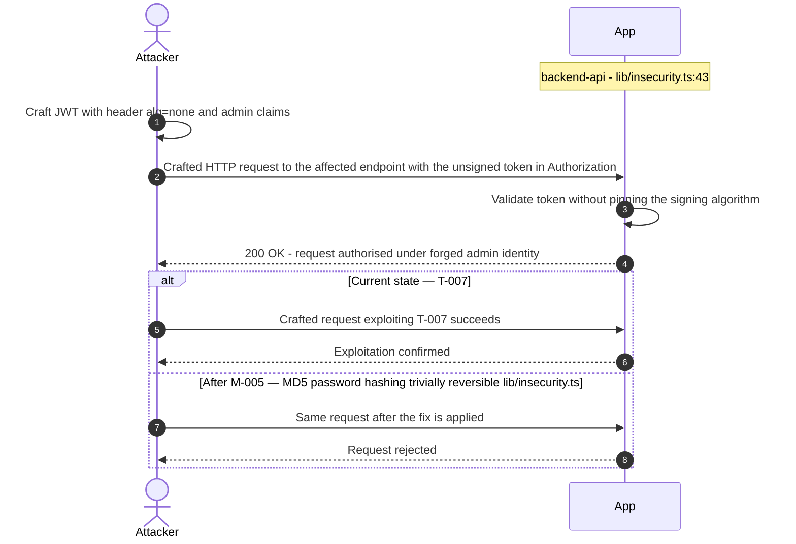
```mermaid
sequenceDiagram
    autonumber
    actor Attacker
    participant App
    Note over App: backend-api - lib/insecurity.ts:43
    Attacker->>Attacker: Craft JWT with header alg=none and admin claims
    Attacker->>App: Crafted HTTP request to the affected endpoint with the unsigned token in Authorization
    App->>App: Validate token without pinning the signing algorithm
    App-->>Attacker: 200 OK - request authorised under forged admin identity
    alt Current state — T-007
        Attacker->>App: Crafted request exploiting T-007 succeeds
        App-->>Attacker: Exploitation confirmed
    else After M-005 — MD5 password hashing trivially reversible lib/insecurity.ts
        Attacker->>App: Same request after the fix is applied
        App-->>Attacker: Request rejected
    end
```

**Key takeaway:** Until M-005 (`MD5` password hashing trivially reversible `lib/insecurity.ts`) lands, T-007 is exploitable at `lib/insecurity.ts:43` (Critical-severity, [CWE-916](https://cwe.mitre.org/data/definitions/916.html)).

**Defense in Depth**

- Primary mitigation: [M-005](#m-005) (`MD5` password hashing trivially reversible `lib/insecurity.ts`)

### 3.8 User passwords stored as unsalted MD5 data at rest models/u…

**Source:** [F-009](#f-009) — `models/user.ts:1`

Severity **Critical** ([CWE-916](https://cwe.mitre.org/data/definitions/916.html)). STRIDE: Information Disclosure. See [§8 T-009](#t-009) for the full register row.

**Attack Steps**

1. The SQLite database stores user passwords as unsalted `MD5` hashes.
2. If an attacker gains read access to the database file (via SQL injection, path traversal, or server compromise), all password hashes can be cracked using rainbow tables instantly.
3. Common passwords like 'admin123' would be recovered in milliseconds.

**Sequence Diagram**

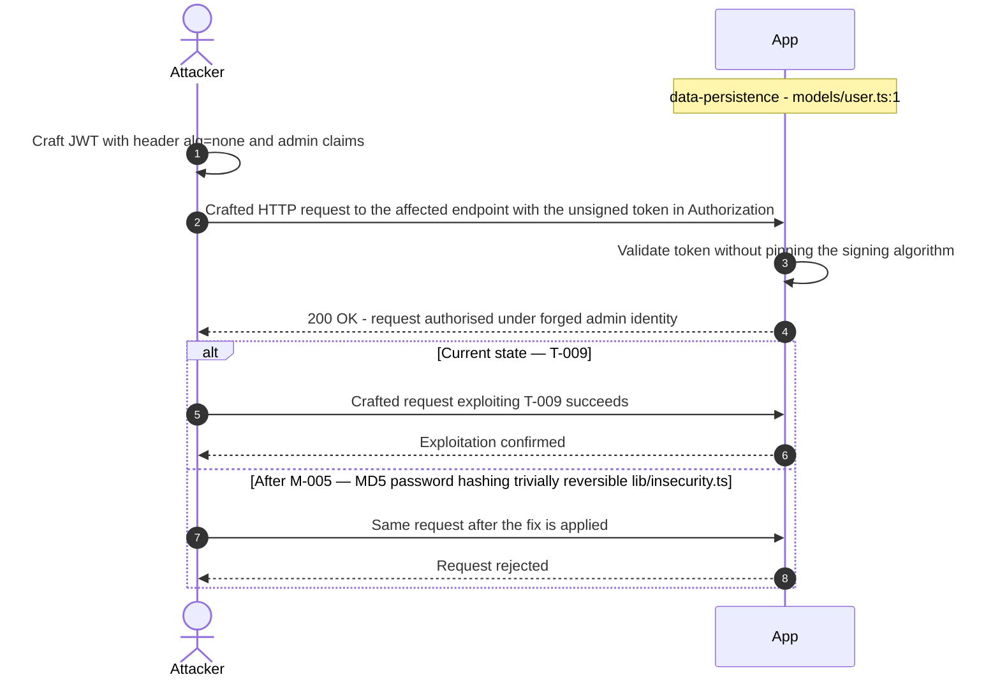
```mermaid
sequenceDiagram
    autonumber
    actor Attacker
    participant App
    Note over App: data-persistence - models/user.ts:1
    Attacker->>Attacker: Craft JWT with header alg=none and admin claims
    Attacker->>App: Crafted HTTP request to the affected endpoint with the unsigned token in Authorization
    App->>App: Validate token without pinning the signing algorithm
    App-->>Attacker: 200 OK - request authorised under forged admin identity
    alt Current state — T-009
        Attacker->>App: Crafted request exploiting T-009 succeeds
        App-->>Attacker: Exploitation confirmed
    else After M-005 — MD5 password hashing trivially reversible lib/insecurity.ts
        Attacker->>App: Same request after the fix is applied
        App-->>Attacker: Request rejected
    end
```

**Key takeaway:** Until M-005 (`MD5` password hashing trivially reversible `lib/insecurity.ts`) lands, T-009 is exploitable at `models/user.ts:1` (Critical-severity, [CWE-916](https://cwe.mitre.org/data/definitions/916.html)).

**Defense in Depth**

- Primary mitigation: [M-005](#m-005) (`MD5` password hashing trivially reversible `lib/insecurity.ts`)

### 3.9 XXE via XML upload with external entity resolution routes/f…

**Source:** [F-010](#f-010) — `routes/fileUpload.ts:45`

Severity **Critical** ([CWE-611](https://cwe.mitre.org/data/definitions/611.html)). STRIDE: Information Disclosure. See [§8 T-010](#t-010) for the full register row.

**Attack Steps**

1. The XML upload handler uses libxmljs2 with `noent: true`, which enables external entity processing.
2. An attacker can upload an XML file with an XXE payload pointing to file:///etc/passwd or internal network URLs, causing the server to disclose local file contents or SSRF to internal services.
3. Send the crafted payload to the endpoint backed by `routes/fileUpload.ts:45`.

**Sequence Diagram**

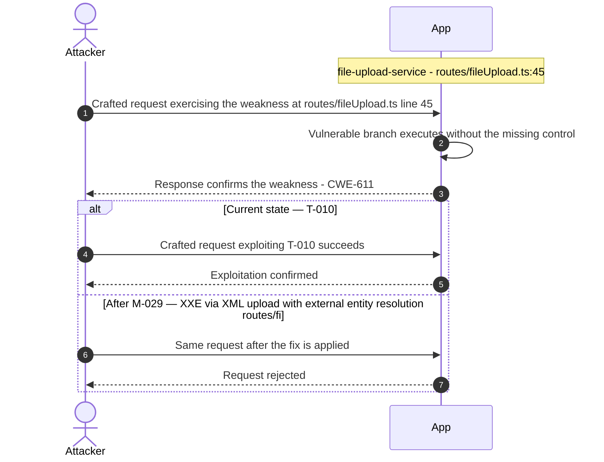
```mermaid
sequenceDiagram
    autonumber
    actor Attacker
    participant App
    Note over App: file-upload-service - routes/fileUpload.ts:45
    Attacker->>App: Crafted request exercising the weakness at routes/fileUpload.ts line 45
    App->>App: Vulnerable branch executes without the missing control
    App-->>Attacker: Response confirms the weakness - CWE-611
    alt Current state — T-010
        Attacker->>App: Crafted request exploiting T-010 succeeds
        App-->>Attacker: Exploitation confirmed
    else After M-029 — XXE via XML upload with external entity resolution routes/fi
        Attacker->>App: Same request after the fix is applied
        App-->>Attacker: Request rejected
    end
```

**Key takeaway:** Until M-029 (XXE via XML upload with external entity resolution routes/fi) lands, T-010 is exploitable at `routes/fileUpload.ts:45` (Critical-severity, [CWE-611](https://cwe.mitre.org/data/definitions/611.html)).

**Defense in Depth**

- Primary mitigation: [M-029](#m-029) (XXE via XML upload with external entity resolution `routes/fileUpload.ts`)

### 3.10 RCE via vm.runInContext sandbox escape in B2B order routes/…

**Source:** [F-011](#f-011) — `routes/b2bOrder.ts:22`

Severity **Critical** ([CWE-94](https://cwe.mitre.org/data/definitions/94.html)). STRIDE: Elevation of Privilege. See [§8 T-011](#t-011) for the full register row.

**Attack Steps**

1. The B2B order endpoint evaluates user-supplied `orderLinesData` using `notevil` sandboxed eval inside `vm.runInContext`.
2. The `notevil` library is not a true security sandbox - it can be escaped via prototype pollution or constructor access.
3. An attacker can achieve full server-side code execution by sending a crafted `orderLinesData` payload.

**Sequence Diagram**

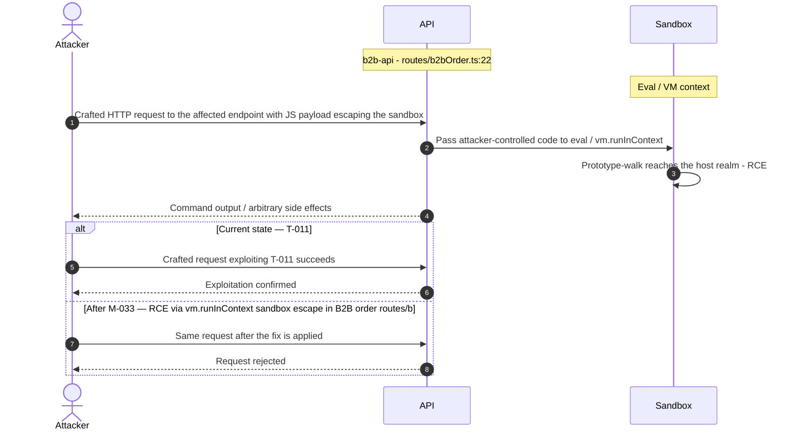
```mermaid
sequenceDiagram
    autonumber
    actor Attacker
    participant API
    participant Sandbox
    Note over API: b2b-api - routes/b2bOrder.ts:22
    Note over Sandbox: Eval / VM context
    Attacker->>API: Crafted HTTP request to the affected endpoint with JS payload escaping the sandbox
    API->>Sandbox: Pass attacker-controlled code to eval / vm.runInContext
    Sandbox->>Sandbox: Prototype-walk reaches the host realm - RCE
    API-->>Attacker: Command output / arbitrary side effects
    alt Current state — T-011
        Attacker->>API: Crafted request exploiting T-011 succeeds
        API-->>Attacker: Exploitation confirmed
    else After M-033 — RCE via vm.runInContext sandbox escape in B2B order routes/b
        Attacker->>API: Same request after the fix is applied
        API-->>Attacker: Request rejected
    end
```

**Key takeaway:** Until M-033 (RCE via `vm.runInContext` sandbox escape in B2B order routes/b) lands, T-011 is exploitable at `routes/b2bOrder.ts:22` (Critical-severity, [CWE-94](https://cwe.mitre.org/data/definitions/94.html)).

**Defense in Depth**

- Primary mitigation: [M-033](#m-033) (RCE via `vm.runInContext` sandbox escape in B2B order `routes/b2bOrder.ts`)

### 3.11 SSTI + eval on user controlled username routes/userProfile.…

**Source:** [F-012](#f-012) — `routes/userProfile.ts:62`

Severity **Critical** ([CWE-94](https://cwe.mitre.org/data/definitions/94.html)). STRIDE: Elevation of Privilege. See [§8 T-012](#t-012) for the full register row.

**Attack Steps**

1. The user profile page uses `eval()` on a server-side template that includes the user's username.
2. If a username matches the pattern `#{(.*)}`, the captured group is passed to `eval()` in a Node\.js context.
3. An attacker who can set their username to `#{process.mainModule.require('child_process').execSync('cat /etc/passwd')}` achieves server-side code execution.

**Sequence Diagram**

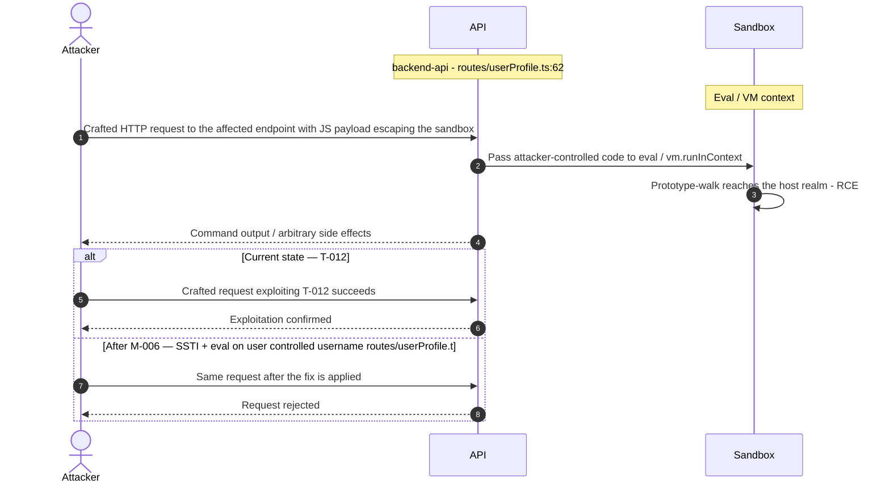
```mermaid
sequenceDiagram
    autonumber
    actor Attacker
    participant API
    participant Sandbox
    Note over API: backend-api - routes/userProfile.ts:62
    Note over Sandbox: Eval / VM context
    Attacker->>API: Crafted HTTP request to the affected endpoint with JS payload escaping the sandbox
    API->>Sandbox: Pass attacker-controlled code to eval / vm.runInContext
    Sandbox->>Sandbox: Prototype-walk reaches the host realm - RCE
    API-->>Attacker: Command output / arbitrary side effects
    alt Current state — T-012
        Attacker->>API: Crafted request exploiting T-012 succeeds
        API-->>Attacker: Exploitation confirmed
    else After M-006 — SSTI + eval on user controlled username routes/userProfile.t
        Attacker->>API: Same request after the fix is applied
        API-->>Attacker: Request rejected
    end
```

**Key takeaway:** Until M-006 (SSTI + eval on user controlled username routes/userProfile.t) lands, T-012 is exploitable at `routes/userProfile.ts:62` (Critical-severity, [CWE-94](https://cwe.mitre.org/data/definitions/94.html)).

**Defense in Depth**

- Primary mitigation: [M-006](#m-006) (SSTI + eval on user controlled username `routes/userProfile.ts`)

<!-- generated:walkthrough_renderer -->

---

## 4. Assets

Information assets and the classification level that drives the Confidentiality / Integrity / Availability targets used in [§8 Findings Register](#8-findings-register) risk scoring.

| Asset | ID | Classification | Description | Linked Threats |
|----------------------|-----|--------------|------------------------------------|------------------------------------------------|
| User Credentials (email + password hash) | A-001 | Restricted | User account email addresses and `MD5`-hashed passwords stored in SQLite Users table. `MD5` hashing makes these trivially reversible. Used for authentication. | 🔴 [F-001](#f-001) — SQL injection in login<br/>🔴 [F-005](#f-005) — SQL injection in product search<br/>🔴 [F-007](#f-007) — MD5 password hashing trivially reversible<br/>🔴 [F-009](#f-009) — User passwords stored as unsalted MD5 data at rest<br/>🔴 [F-018](#f-018) — DOM XSS via search result rendering search result.component.ts<br/>🟠 [F-030](#f-030) — No rate limiting on login endpoint<br/>🔴 [F-037](#f-037) — Stored XSS via trust HTML bypass in admin panel administration.component.ts |
| JWT RSA Private Key | A-002 | Restricted | RSA private key used to sign all JWT tokens, hardcoded in `lib/insecurity.ts:26`. Any party with access to source code can sign arbitrary JWTs as any user including admin. | 🔴 [F-002](#f-002) — Hardcoded RSA private key enables JWT forgery<br/>🔴 [F-003](#f-003) — JWT algorithm none bypass via express jwt lib/insecurity.ts<br/>🔴 [F-004](#f-004) — Hardcoded admin credentials in static user data<br/>🔴 [F-007](#f-007) — MD5 password hashing trivially reversible<br/>🔴 [F-014](#f-014) — Hardcoded HMAC secret enables coupon forgery<br/>🟠 [F-021](#f-021) — JWT public key and `premium.key` exposed at /encryptionkeys<br/>🟠 [F-036](#f-036) — Directory traversal in ZIP file upload<br/>🟡 [F-041](#f-041) — Prometheus metrics exposed unauthenticated at /metrics |
| User Personal Data (PII) | A-003 | Restricted | User profile data including full name, address, credit card numbers, mobile numbers stored across multiple Sequelize models (Address, Card, User). | 🔴 [F-001](#f-001) — SQL injection in login<br/>🔴 [F-005](#f-005) — SQL injection in product search<br/>🔴 [F-013](#f-013) — Unauthenticated product modification via PUT /api/Products/:id<br/>🔴 [F-018](#f-018) — DOM XSS via search result rendering search result.component.ts<br/>🔴 [F-019](#f-019) — User enumeration via /api/Users<br/>🟠 [F-024](#f-024) — SQLite database file on writable filesystem without encryption data/juiceshop.s…<br/>🔴 [F-033](#f-033) — B2B API reachable by any authenticated user<br/>🔴 [F-037](#f-037) — Stored XSS via trust HTML bypass in admin panel administration.component.ts |
| Payment Card Data | A-004 | Restricted | Credit card numbers (CardNum), expiry months/years stored in Card model without encryption. Includes test cards like 4716190207394368. | 🔴 [F-001](#f-001) — SQL injection in login<br/>🔴 [F-005](#f-005) — SQL injection in product search<br/>🔴 [F-013](#f-013) — Unauthenticated product modification via PUT /api/Products/:id<br/>🔴 [F-018](#f-018) — DOM XSS via search result rendering search result.component.ts<br/>🔴 [F-019](#f-019) — User enumeration via /api/Users<br/>🟠 [F-024](#f-024) — SQLite database file on writable filesystem without encryption data/juiceshop.s…<br/>🔴 [F-033](#f-033) — B2B API reachable by any authenticated user<br/>🔴 [F-037](#f-037) — Stored XSS via trust HTML bypass in admin panel administration.component.ts |
| TOTP Secrets (2FA Seeds) | A-010 | Restricted | TOTP secret seeds stored in Users.totpSecret field in SQLite. These are the 2FA enrollment keys that, if extracted, allow bypassing 2FA. | - |
| User Security Answers | A-012 | Restricted | Answers to security questions stored in SecurityAnswer model, used for password reset flow. Predictable answers enable account takeover without knowing password. | 🔴 [F-001](#f-001) — SQL injection in login<br/>🔴 [F-005](#f-005) — SQL injection in product search<br/>🔴 [F-007](#f-007) — MD5 password hashing trivially reversible<br/>🔴 [F-009](#f-009) — User passwords stored as unsalted MD5 data at rest<br/>🔴 [F-018](#f-018) — DOM XSS via search result rendering search result.component.ts<br/>🟠 [F-030](#f-030) — No rate limiting on login endpoint<br/>🔴 [F-037](#f-037) — Stored XSS via trust HTML bypass in admin panel administration.component.ts |
| Confidential Business Documents | A-005 | Confidential | M&A acquisition plans in `/ftp/acquisitions.md`, incident support KeePass database at `/ftp/incident`-`support.kdbx`, and coupon codes in `/ftp/coupons_2013`.`md.bak`. All publicly accessible via directory listing. | 🔴 [F-006](#f-006) — Confidential files exposed via /ftp directory listing<br/>🔴 [F-013](#f-013) — Unauthenticated product modification via PUT /api/Products/:id<br/>🔴 [F-019](#f-019) — User enumeration via /api/Users<br/>🟠 [F-020](#f-020) — Access logs exposed via /support/logs directory listing<br/>🟠 [F-021](#f-021) — JWT public key and `premium.key` exposed at /encryptionkeys<br/>🔴 [F-033](#f-033) — B2B API reachable by any authenticated user<br/>🟠 [F-036](#f-036) — Directory traversal in ZIP file upload<br/>🟡 [F-041](#f-041) — Prometheus metrics exposed unauthenticated at /metrics |
| Application Source Code and Config | A-006 | Confidential | Node\.js TypeScript source including security library (`lib/insecurity.ts` with hardcoded private key, HMAC secret). Config files exposing Google OAuth client ID and server configuration. | 🔴 [F-002](#f-002) — Hardcoded RSA private key enables JWT forgery<br/>🔴 [F-003](#f-003) — JWT algorithm none bypass via express jwt lib/insecurity.ts<br/>🔴 [F-007](#f-007) — MD5 password hashing trivially reversible<br/>🔴 [F-014](#f-014) — Hardcoded HMAC secret enables coupon forgery<br/>🟠 [F-034](#f-034) — Dependabot vulnerability pinning suppresses security updates<br/>🟠 [F-036](#f-036) — Directory traversal in ZIP file upload<br/>🟡 [F-041](#f-041) — Prometheus metrics exposed unauthenticated at /metrics |
| SQLite Database File | A-007 | Confidential | data/juiceshop.sqlite contains all user data, orders, and challenge state. The challenge tracking table reveals which challenges each user has solved. | 🟠 [F-024](#f-024) — SQLite database file on writable filesystem without encryption data/juiceshop.s… |
| Access Logs | A-008 | Internal | HTTP access logs stored in logs/access.log.* and accessible via `/support/logs` directory listing. Reveals user activity patterns, IP addresses, and browsed URLs. | 🔴 [F-006](#f-006) — Confidential files exposed via /ftp directory listing<br/>🔴 [F-013](#f-013) — Unauthenticated product modification via PUT /api/Products/:id<br/>🔴 [F-019](#f-019) — User enumeration via /api/Users<br/>🟠 [F-020](#f-020) — Access logs exposed via /support/logs directory listing<br/>🟠 [F-021](#f-021) — JWT public key and `premium.key` exposed at /encryptionkeys<br/>🔴 [F-033](#f-033) — B2B API reachable by any authenticated user<br/>🟡 [F-041](#f-041) — Prometheus metrics exposed unauthenticated at /metrics |
| Product Catalog and Pricing | A-009 | Internal | Product names, descriptions, prices, and quantities stored in SQLite Products table. Modifiable by authenticated users due to intentionally commented-out authorization. | 🔴 [F-001](#f-001) — SQL injection in login<br/>🔴 [F-005](#f-005) — SQL injection in product search<br/>🔴 [F-013](#f-013) — Unauthenticated product modification via PUT /api/Products/:id<br/>🔴 [F-018](#f-018) — DOM XSS via search result rendering search result.component.ts<br/>🔴 [F-037](#f-037) — Stored XSS via trust HTML bypass in admin panel administration.component.ts |
| Application Availability | A-011 | Internal | The running Juice Shop instance serving training content. DoS via RCE, XML billion-laughs, ZIP bomb, or NoSQL sleep injection can make it unavailable. | - |

---

## 5. Attack Surface

Network-reachable entry points classified by authentication requirement. Each row links to the threat(s) referenced in its **Notes** column. The **Risk** column reflects the highest-severity linked finding.

### 5.1 Unauthenticated Entry Points (16)

| Method | Route | Risk | Notes |
|------|--------------------------|----------|------------------------------------|
| POST | `/file-upload` | 🔴 Critical | 🔴 [F-010](#f-010) (XXE via XML upload with external entity resolution)<br/>🟠 [F-026](#f-026) (SSRF via profile image URL upload)<br/>🟠 [F-031](#f-031) (Denial of Service via XML billion laughs attack)<br/>ZIP directory traversal; XML XXE via libxmljs2 `noent:true`; YAML upload |
| GET | `/ftp (and files)` | 🔴 Critical | 🔴 [F-006](#f-006) (Confidential files exposed via `/ftp` directory listing)<br/>Directory listing exposing confidential files: `acquisitions.md`, incident-`support.kdbx`, coupons |
| POST | `/profile/image/url` | 🔴 Critical | 🟠 [F-026](#f-026) (SSRF via profile image URL upload)<br/>🔴 [F-012](#f-012) (SSTI + eval on user controlled username)<br/>🟠 [F-015](#f-015) (No CSRF protection on state changing endpoints)<br/>SSRF via URL-based profile image upload; fetches arbitrary URLs server-side |
| GET | `/rest/products/search` | 🔴 Critical | 🔴 [F-005](#f-005) (SQL injection in product search)<br/>SQL injection via q parameter; raw Sequelize query with string interpolation |
| GET | `/rest/track-order/:id` | 🔴 Critical | 🔴 [F-011](#f-011) (RCE via `vm.runInContext` sandbox escape in B2B order)<br/>🟠 [F-029](#f-029) (Denial of Service via B2B infinite loop)<br/>🟡 [F-040](#f-040) (No audit trail for B2B orders)<br/>SQL injection via order ID parameter |
| POST | `/rest/user/login` | 🔴 Critical | 🟠 [F-030](#f-030) (No rate limiting on login endpoint)<br/>🔴 [F-001](#f-001) (SQL injection in login)<br/>SQL injection via email/password fields; no rate limiting on this endpoint |
| PUT | `/api/Products/:id` | 🟠 High | 🔴 [F-013](#f-013) (Unauthenticated product modification via PUT `/api/Products/:id`)<br/>🔴 [F-018](#f-018) (DOM XSS via search result rendering search `result.component.ts`)<br/>Authorization intentionally commented out - unauthenticated product modification |
| POST | `/api/Users (registration)` | 🟠 High | 🔴 [F-019](#f-019) (User enumeration via `/api/Users`)<br/>🟠 [F-030](#f-030) (No rate limiting on login endpoint)<br/>User registration; allows setting role field (mass assignment if validation bypassed) |
| GET | `/encryptionkeys/:file` | 🟠 High | 🟠 [F-021](#f-021) (JWT public key and `premium.key` exposed at `/encryptionkeys`)<br/>Exposes JWT public key (`jwt.pub`) and `premium.key`; directory listing enabled |
| GET | `/metrics` | 🟠 High | 🟠 [F-026](#f-026) (SSRF via profile image URL upload)<br/>🟡 [F-041](#f-041) (Prometheus metrics exposed unauthenticated at `/metrics`)<br/>Prometheus metrics endpoint; reveals application internals and request statistics |
| GET | `/rest/products/:id/reviews` | 🟠 High | 🔴 [F-025](#f-025) (NoSQL injection via \$where clause in product reviews `showProductReviews.ts`)<br/>🔴 [F-017](#f-017) (NoSQL injection in review update no author verification `updateProductReviews.ts`)<br/>NoSQL injection via \$where clause in MarsDB query; sleep injection DoS possible |
| GET | `/support/logs/:file` | 🟠 High | 🟠 [F-020](#f-020) (Access logs exposed via `/support/logs` directory listing)<br/>Access log directory listing; reveals user activity and IP addresses |
| GET | `/redirect` | 🟡 Medium | 🟡 [F-039](#f-039) (Open redirect via `/redirect`?to= parameter)<br/>Open redirect via ?to= parameter; allowlist bypassable |
| GET | `/api-docs` | - | Swagger UI exposing full API documentation including B2B endpoints |
| GET | `/rest/user/change-password` | - | Password change via GET with no CSRF; current password can be omitted in some flows |
| ? | `WebSocket / Socket.IO` | - | Challenge notification socket; no authentication required to connect |

### 5.2 Authenticated Entry Points (4)

| Method | Route | Risk | Notes |
|------|------------------------|----------|------------------------------------|
| GET | `/profile (POST /profile)` | 🔴 Critical | 🟠 [F-026](#f-026) (SSRF via profile image URL upload)<br/>🔴 [F-012](#f-012) (SSTI + eval on user controlled username)<br/>🟠 [F-015](#f-015) (No CSRF protection on state changing endpoints)<br/>SSTI + `eval()` in username field; pug template injection |
| GET | `/api/Users` | 🟠 High | 🔴 [F-019](#f-019) (User enumeration via `/api/Users`)<br/>🟠 [F-030](#f-030) (No rate limiting on login endpoint)<br/>Lists all users; IDOR possible on `/api/Users/:id`; finale-rest auto-generated |
| POST | `/b2b/v2/orders` | 🟠 High | 🔴 [F-033](#f-033) (B2B API reachable by any authenticated user)<br/>🟡 [F-040](#f-040) (No audit trail for B2B orders)<br/>RCE via `vm.runInContext` + `notevil` on orderLinesData field |
| PATCH | `/rest/products/reviews` | 🟠 High | 🔴 [F-025](#f-025) (NoSQL injection via \$where clause in product reviews `showProductReviews.ts`)<br/>🔴 [F-017](#f-017) (NoSQL injection in review update no author verification `updateProductReviews.ts`)<br/>NoSQL injection in review update; multi:true allows updating all reviews |

---

## 7. Security Architecture

This chapter is organized by security-control category. The architecture section avoids artificial control IDs and finding-ID columns in overview tables. Findings are listed only where the affected control is described.

_[§7](#7-security-architecture) schema v2 (13-section control-category layout). Cataloged controls: 29 total - 1 adequate, 4 partial, 1 weak, 16 unsafe, 7 missing. Linked threats: 38._

**How to read the verdicts.** Every control category (and every sub-control below it) carries exactly one status. The two red verdicts do **not** mean the same thing - this is the distinction that decides what you have to do about a finding:

| Status | Meaning | What it asks of you |
|----------|------------------------------------|------------------------|
| 🟢 Adequate | Control is present and sound | Nothing - keep it |
| 🟡 Partial | Present, but with meaningful gaps | Close the gap |
| 🟠 Weak | Present, but has exploitable gaps | Strengthen it |
| 🔴 Unsafe | **Present and relied upon, but defeated / trivially bypassable** | **Fix the existing control** |
| 🔴 Missing | **Control was never built** | **Add the control** |
| - | Not applicable to this codebase | - |

So "🔴 Unsafe" on a control category does *not* mean the control is absent - it means the control exists but does not hold (e.g. an `MD5` password hash, a raw-SQL query path, a hardcoded signing key). "🔴 Missing" is reserved for controls that were never built (e.g. no Content-Security-Policy header).

### 7.1 Security Control Overview

<!-- §7.1 MECHANICAL-FROZEN — DO NOT EDIT (overview table is pregenerator-owned) -->

| Control category | Verdict | Main reason |
|----------------------|---------|------------------------------------|
| [7.2 Identity and Authentication Controls](#72-identity-and-authentication-controls) | 🔴 Unsafe | 3 routed findings; catalogued controls are present but defeated (e.g. JWT signing key management, Login rate limiting). |
| [7.3 Session and Token Controls](#73-session-and-token-controls) | 🔴 Unsafe | 1 routed finding; catalogued controls are present but defeated (e.g. JWT token storage, JWT algorithm validation). |
| [7.4 Authorization Controls](#74-authorization-controls) | 🔴 Unsafe | 4 routed findings; catalogued controls are present but defeated (e.g. Server-side admin authorization, Product modification authorization). |
| [7.5 Query Construction and Data Access Controls](#75-query-construction-and-data-access-controls) | 🔴 Unsafe | 4 routed findings; catalogued controls are present but defeated (e.g. SQL parameterization, NoSQL query parameterization). |
| [7.6 Input Boundary Validation Controls](#76-input-boundary-validation-controls) | 🔴 Unsafe | 1 routed finding; catalogued controls are present but defeated (e.g. Server-side input validation). |
| [7.7 Output Encoding and Rendering Controls](#77-output-encoding-and-rendering-controls) | 🔴 Unsafe | 2 routed findings; catalogued controls are present but defeated (e.g. XSS output encoding). |
| [7.8 Browser and Cross-Origin Controls](#78-browser-and-cross-origin-controls) | 🔴 Unsafe | 3 routed findings; catalogued controls are present but defeated (e.g. CORS policy, Content Security Policy). |
| [7.9 Cryptography Secrets and Data Protection](#79-cryptography-secrets-and-data-protection) | 🔴 Unsafe | 3 routed findings; catalogued controls are present but defeated (e.g. Password hashing, Secret management). |
| [7.10 File Parser and Outbound Request Controls](#710-file-parser-and-outbound-request-controls) | 🔴 Unsafe | 10 routed findings; catalogued controls are present but defeated (e.g. XML parser hardening, ZIP upload path validation). |
| [7.11 Operations Runtime and Supply Chain Controls](#711-operations-runtime-and-supply-chain-controls) | 🔴 Unsafe | 3 routed findings; catalogued controls are present but defeated (e.g. Dependency security, Container image pinning). |
| [7.12 Real-time and Not Applicable Controls](#712-real-time-and-not-applicable-controls) | 🟡 Partial | 0 routed findings; 2 partial controls (e.g. WebSocket security, Rate limiting (general)) leave gaps. |
| [7.13 Defense-in-Depth Summary](#713-defense-in-depth-summary) | - | No controls or findings routed to this category. |

<!-- §7.1 MECHANICAL-FROZEN END -->

### 7.2 Identity and Authentication Controls

**Verdict:** 🔴 Unsafe

<!-- The line below is mechanically derived from the controls table — LLM must not re-author it. -->
**Controls covered:** [7.2.1 Password-Based Authentication](#721-password-based-authentication) · [7.2.2 MFA / TOTP](#722-mfa-totp) · [7.2.3 OAuth / OIDC Federated Login](#723-oauth-oidc-federated-login)

- [7.2.1 Password-Based Authentication](#password-based-authentication)
- [7.2.2 MFA / TOTP](#mfa-totp)
- [7.2.3 OAuth / OIDC Federated Login](#oauth-oidc-federated-login)

**Implemented controls:** JWT-based session tokens issued on every successful login, TOTP-based 2FA available as an optional user setting, OAuth login adapter via Google federated identity.

**Assessment:** Authentication boundaries are defeated at the key-management layer and the credential-verification layer simultaneously. The RSA private key for JWT signing is committed in `lib/insecurity.ts`; the `express-jwt` middleware also accepts `alg:none`, meaning tokens can be forged without the key at all. Password login queries the database through raw SQL string interpolation at `routes/login.ts:37`, which an attacker can short-circuit without a valid credential. Rate limiting on the login endpoint is absent. Each successful flow terminates in the server issuing a session token; the signing, validation, propagation, storage, and lifecycle of that token are described in [§7.3 Session and Token Controls](#73-session-and-token-controls).

<!-- §7.2 AUTH-MECHANISMS-FROZEN — deterministic inventory, pregenerator-owned. DO NOT EDIT. -->
**Authentication mechanisms (at a glance).** Every authentication mechanism detected on the application, its effective status, where it is assessed, and its linked findings. Controls are catalogued by domain, so JWT/session handling is assessed under [§7.3 Session and Token Controls](#73-session-and-token-controls) and password hashing under [§7.9 Cryptography Secrets and Data Protection](#79-cryptography-secrets-and-data-protection).

| Mechanism | Status | Assessed in | Findings |
|----------------------|---------|-----------|------------------------------------------------|
| Password login | 🔴 Missing | [§7.2](#72-identity-and-authentication-controls) | - |
| Password storage (hashing) | 🔴 Unsafe | [§7.9](#79-cryptography-secrets-and-data-protection) | 🔴 [F-007](#f-007) — MD5 password hashing trivially reversible lib/insecurity.ts<br/>🔴 [F-009](#f-009) — User passwords stored as unsalted MD5 data at rest models/user.ts |
| JWT / bearer-token session | 🔴 Unsafe | [§7.3](#73-session-and-token-controls) | 🔴 [F-002](#f-002) — Hardcoded RSA private key enables JWT forgery lib/insecurity.ts<br/>🔴 [F-003](#f-003) — JWT algorithm none bypass via express jwt lib/insecurity.ts<br/>🟠 [F-021](#f-021) — JWT public key and `premium.key` exposed at /encryptionkeys server.ts<br/>🟠 [F-028](#f-028) — JWT stored in localStorage XSS accessible token storage login.component.ts |
| Session-token storage | 🔴 Unsafe | [§7.3](#73-session-and-token-controls) | 🟠 [F-028](#f-028) — JWT stored in localStorage XSS accessible token storage login.component.ts |
| Multi-factor authentication (TOTP / 2FA) | 🟡 Partial | [§7.2](#72-identity-and-authentication-controls) | - |
| OAuth / OIDC federated login | 🟠 High | [§7.2](#72-identity-and-authentication-controls) | 🟠 [F-027](#f-027) — OAuth token exposed in URL fragment oauth/oauth.component.ts |

_Also checked, not detected on this codebase: User registration, Password reset / change._

<!-- §7.2 AUTH-MECHANISMS-FROZEN END -->

<a id="password-based-authentication"></a>
#### 7.2.1 Password-Based Authentication

**Status:** 🔴 Unsafe - credential verification is bypassable via SQL injection and brute-force is unconstrained by the absence of rate limiting.

Password-based authentication covers login and registration. In Juice Shop, login is handled at `POST /rest/user/login` (`routes/login.ts`) and registration at `POST /api/Users`. Two weaknesses defeat this mechanism simultaneously:

- **SQL injection bypass:** `routes/login.ts:37` builds the credential query via string interpolation; an attacker can submit a crafted email to bypass credential verification entirely. Assessed in detail in [§7.5 Query Construction and Data Access Controls](#75-query-construction-and-data-access-controls).
- **No rate limiting:** `server.ts` mounts the login route with no `express-rate-limit` or equivalent middleware; brute-force attempts are unconstrained.

The normal password login flow, and the brute-force abuse path in its current state, are shown below:

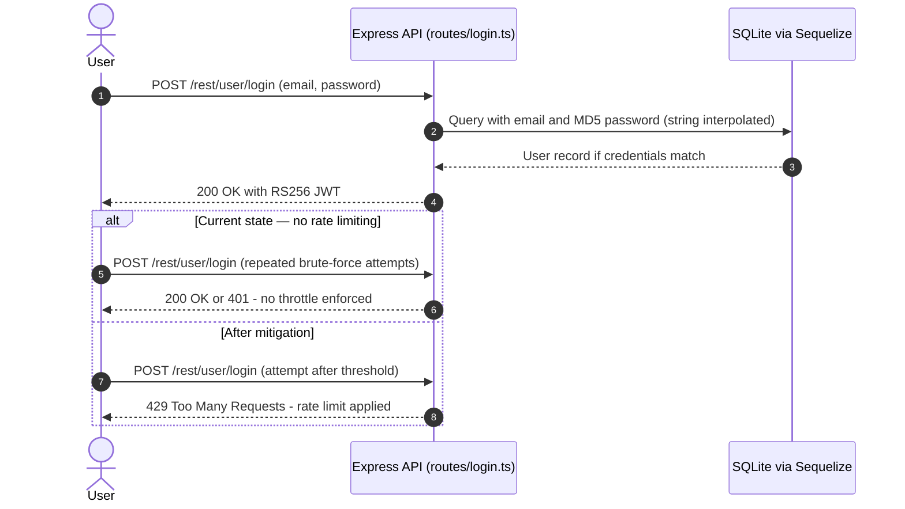
```mermaid
sequenceDiagram
    autonumber
    actor User
    participant API as Express API (routes/login.ts)
    participant DB as SQLite via Sequelize

    User->>API: POST /rest/user/login (email, password)
    API->>DB: Query with email and MD5 password (string interpolated)
    DB-->>API: User record if credentials match
    API-->>User: 200 OK with RS256 JWT

    alt Current state — no rate limiting
        User->>API: POST /rest/user/login (repeated brute-force attempts)
        API-->>User: 200 OK or 401 - no throttle enforced
    else After mitigation
        User->>API: POST /rest/user/login (attempt after threshold)
        API-->>User: 429 Too Many Requests - rate limit applied
    end
```

**Security assessment**

The login route at `routes/login.ts:37` constructs the SQL query via string interpolation, enabling credential bypass via SQL injection (see [§7.5](#75-query-construction-and-data-access-controls)). `server.ts` mounts the login route with no rate-limit middleware, enabling unbounded brute-force against any account. Password storage uses unsalted `MD5` (assessed in [§7.9 Cryptography Secrets and Data Protection](#79-cryptography-secrets-and-data-protection)), which means any hash dump is immediately reversible offline.

**Relevant findings**

- 🟠 [F-030](#f-030) — no rate limiting on the login endpoint allows unbounded brute-force attempts.

<a id="mfa-totp"></a>
#### 7.2.2 MFA / TOTP

**Status:** 🟡 Partial - TOTP enrollment and verification are implemented but 2FA is optional and not enforced for privileged accounts.

Two-factor authentication reduces account-takeover risk by requiring a time-based one-time passcode in addition to the password. Juice Shop implements TOTP enrollment via `speakeasy` and QR-code display; users can enroll voluntarily through the profile settings page. Admin accounts and the default seeded admin user are not required to enroll. Because JWT forgery (🔴 [F-002](#f-002), 🔴 [F-003](#f-003)) bypasses the login flow entirely, 2FA provides no residual protection when those findings are exploited.

The TOTP verification flow for enrolled users is shown below:

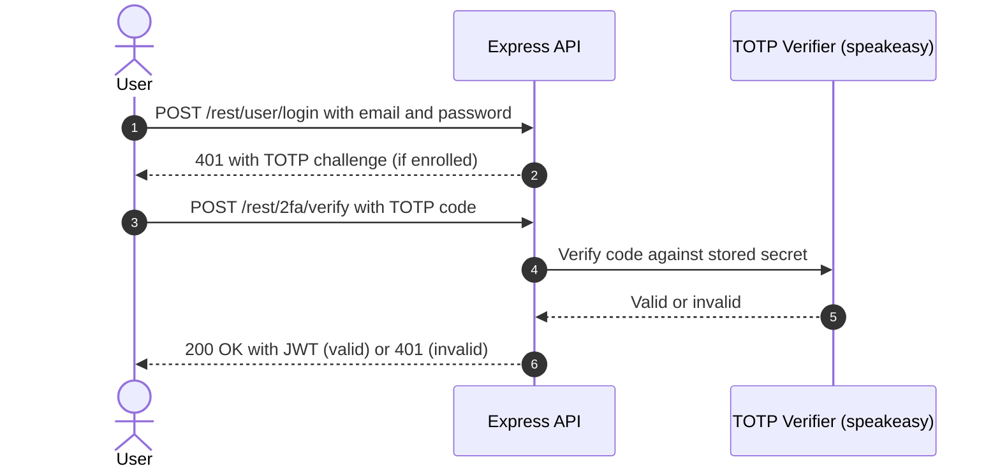
```mermaid
sequenceDiagram
    autonumber
    actor User
    participant API as Express API
    participant TOTP as TOTP Verifier (speakeasy)

    User->>API: POST /rest/user/login with email and password
    API-->>User: 401 with TOTP challenge (if enrolled)
    User->>API: POST /rest/2fa/verify with TOTP code
    API->>TOTP: Verify code against stored secret
    TOTP-->>API: Valid or invalid
    API-->>User: 200 OK with JWT (valid) or 401 (invalid)
```

**Security assessment**

TOTP enrollment and server-side verification work correctly for enrolled users. The gap is enforcement scope: admin accounts and the default seeded admin user are not required to enroll. Since JWT forgery (🔴 [F-002](#f-002), 🔴 [F-003](#f-003)) bypasses the entire login flow including the TOTP challenge, 2FA provides no residual protection against an attacker who exploits those findings. The control is architecturally sound but strategically ineffective given the JWT forgery weaknesses assessed in [§7.3 Session and Token Controls](#73-session-and-token-controls).

**Relevant findings**

- 🔴 [F-002](#f-002) — JWT forgery bypasses the TOTP challenge entirely; 2FA protection depends on this being fixed first.
- 🔴 [F-003](#f-003) — algorithm `none` bypass also sidesteps TOTP verification.

<a id="oauth-oidc-federated-login"></a>
#### 7.2.3 OAuth / OIDC Federated Login

**Status:** 🟠 Weak - the OAuth adapter is present but leaks the access token in the URL fragment, exposing it to browser history and Referer headers.

Juice Shop implements a Google OAuth login adapter in `oauth/oauth.component.ts`. On successful Google authentication, the adapter receives an access token via the implicit grant flow and uses it to obtain a Juice Shop session JWT. The current implementation uses `response_type=token`, which causes Google to append the access token to the redirect URL as a fragment parameter rather than returning an authorization code.

The OAuth login flow showing the current token exposure is shown below:

```mermaid
sequenceDiagram
    autonumber
    actor User
    participant Browser
    participant API as Express API
    participant Google as Google OAuth

    User->>Browser: Click "Login with Google"
    Browser->>Google: GET /oauth/authorize (response_type=token)
    Google-->>Browser: Redirect to callback with token in URL fragment
    Note over Browser: Token visible in address bar, browser history, Referer logs
    Browser->>API: POST /rest/user/login with access token
    API-->>User: 200 OK with Juice Shop JWT

    alt After mitigation
        Browser->>Google: GET /oauth/authorize (response_type=code, PKCE)
        Google-->>Browser: Redirect to callback with authorization code
        Browser->>API: POST with code - token never appears in URL
        API-->>User: 200 OK with Juice Shop JWT
    end
```

**Security assessment**

The implicit grant flow (`response_type=token`) causes the OAuth access token to appear in the URL fragment. This exposes it to: browser history (readable by any same-origin JavaScript, including via XSS), HTTP Referer headers on subsequent navigation, and server access logs that record full request URIs. The fix is to migrate to the authorization code flow with PKCE (`response_type=code`), which exchanges a short-lived code server-side and keeps the access token out of the URL entirely.

**Relevant findings**

- 🟠 [F-027](#f-027) — OAuth access token exposed in URL fragment via implicit grant flow in `oauth/oauth.component.ts`.

### 7.3 Session and Token Controls

**Verdict:** 🔴 Unsafe

<!-- The line below is mechanically derived from the controls table — LLM must not re-author it. -->
**Controls covered:** [7.3.1 JWT signing key management](#731-jwt-signing-key-management) · [7.3.2 JWT token storage](#732-jwt-token-storage) · [7.3.3 JWT algorithm validation](#733-jwt-algorithm-validation)

- [7.3.1 JWT signing key management](#jwt-signing-key-management)
- [7.3.2 JWT token storage](#jwt-token-storage)
- [7.3.3 JWT algorithm validation](#jwt-algorithm-validation)

**Implemented controls:** `RS256`-signed JWTs issued on login, `express-jwt` middleware protecting authenticated routes, token transmitted as `Authorization: Bearer` header on every API request.

**Assessment:** This application uses a single locally-signed token format (commonly called JWT) for every authenticated session, regardless of the login flow in [§7.2](#72-identity-and-authentication-controls) that established it. The sub-sections below trace one token through its lifecycle: signing on issuance (assessed below in [JWT signing key management](#jwt-signing-key-management)), validation on every protected request, storage in the browser, manual revocation, and time-based expiry. Token storage in `localStorage` makes the session readable by any JavaScript running in the page, meaning any XSS finding (🔴 [F-018](#f-018), 🔴 [F-037](#f-037)) can harvest the session token. Algorithm validation is the second critical gap: the middleware does not restrict the accepted algorithm set, allowing unsigned tokens.

<a id="jwt-signing-key-management"></a>
#### 7.3.1 JWT signing key management

**Status:** 🔴 Unsafe - the RSA private key used to sign session tokens is committed in source and the matching public key is served unauthenticated, so any reader can forge tokens.

JWT signing binds each issued session token to a server-held RSA private key; every authenticated route depends on this secret staying private. `lib/insecurity.ts` exposes the key pair via `exports.privateKey` and `exports.publicKey`, which the `express-jwt` middleware loads at startup.

**Security assessment**

The RSA private key (`[PEM PRIVATE KEY — REDACTED]…`) is committed at `lib/insecurity.ts:26-28`. Any reader of the public repository can call `jwt.sign(payload, privateKey, {algorithm: 'RS256'})` to mint a token carrying arbitrary `role` claims (including `admin`) that is accepted by every protected route. The matching public key is additionally served at `/encryptionkeys`, confirming the key material is intentionally - but insecurely - reachable. Compromise here is permanent: rotation requires a code change and redeploy, and every historically-issued token remains forgeable from the committed key. The independent algorithm-confusion bypass is assessed in [§7.3.3 JWT algorithm validation](#jwt-algorithm-validation).

**Relevant findings**

- 🔴 [F-002](#f-002) — hardcoded RSA private key means any code-repo reader can forge a valid signed JWT.
- 🟠 [F-021](#f-021) — the public key is also served at `/encryptionkeys`, confirming the key material is intentionally accessible.

<a id="jwt-token-storage"></a>
#### 7.3.2 JWT token storage

**Status:** 🔴 Unsafe - the token is written to `localStorage`, which is accessible to any same-origin JavaScript execution.

After a successful login, `login.component.ts` stores the JWT in `localStorage` under the key `token`. Subsequent Angular service calls retrieve it from there and attach it as the `Authorization` header for every API request.

**Security assessment**

`localStorage` has no `HttpOnly` or `SameSite` equivalents - any JavaScript running in the same origin (including via XSS) can read `localStorage.getItem('token')` and send it to an external endpoint. The DOM XSS sink in search results (🔴 [F-018](#f-018)) and the stored XSS via `bypassSecurityTrustHtml` (🔴 [F-037](#f-037)) both provide an attacker with JavaScript execution in the origin, making `localStorage` token storage the direct escalation path from script injection to session hijack. Storing the token in an `HttpOnly` cookie would eliminate this escalation channel.

**Relevant findings**

- 🟠 [F-028](#f-028) — JWT stored in `localStorage` is accessible to any cross-site script that achieves JavaScript execution in the origin.

<a id="jwt-algorithm-validation"></a>
#### 7.3.3 JWT algorithm validation

**Status:** 🔴 Unsafe - the `express-jwt` middleware does not restrict the accepted algorithm set; tokens with `alg:none` pass signature verification.

Every request to a protected API route passes through `express-jwt` middleware, which decodes and verifies the `Authorization: Bearer` token. The middleware is configured in `lib/insecurity.ts` and mounted globally for authenticated routes in `server.ts`.

**Security assessment**

The `express-jwt` configuration omits the `algorithms` option, which means the library falls back to accepting any algorithm the token header names - including `none`. A request with a hand-crafted JWT carrying `{"alg":"none","typ":"JWT"}` and any payload (including `{"role":"admin"}`) passes the middleware check without a cryptographic signature. This finding is independent of the committed private key (🔴 [F-002](#f-002)): even after the key is rotated, the algorithm whitelist must also be added, or the control remains bypassed.

**Relevant findings**

- 🔴 [F-003](#f-003) — algorithm `none` acceptance makes the RS256 signing control irrelevant; tokens require no key.
- 🔴 [F-002](#f-002) — complementary path: even with a valid algorithm header, the committed private key allows forgery with a real signature.

### 7.4 Authorization Controls

**Verdict:** 🔴 Unsafe

<!-- The line below is mechanically derived from the controls table — LLM must not re-author it. -->
**Controls covered:** [7.4.1 Server-side admin authorization](#741-server-side-admin-authorization) · [7.4.2 Product modification authorization](#742-product-modification-authorization) · [7.4.3 CSRF protection](#743-csrf-protection)

- [7.4.1 Server-side admin authorization](#server-side-admin-authorization)
- [7.4.2 Product modification authorization](#product-modification-authorization)
- [7.4.3 CSRF protection](#csrf-protection)

**Implemented controls:** Angular route guard (`app.guard.ts`) checks `localStorage` for a valid token before rendering admin views, JWT `role` claim present in issued tokens.

**Assessment:** Authorization enforcement is split between an Angular client-side guard (which has no server-side counterpart for admin routes) and the absence of any ownership check on product modification. The CSRF control was never built. Any attacker who bypasses authentication (🔴 [F-002](#f-002), 🔴 [F-001](#f-001)) or who is already an authenticated user can reach admin API routes and arbitrary product records.

<a id="server-side-admin-authorization"></a>
#### 7.4.1 Server-side admin authorization

**Status:** 🔴 Unsafe - `app.guard.ts` is the only enforcement point; admin API routes have no server-side role check.

Admin-facing pages in the Angular SPA are gated by `app.guard.ts`, which reads the JWT from `localStorage`, decodes the `role` claim client-side, and redirects non-admin users away from the administration component. Express routes that service admin actions rely on the same JWT middleware used for all authenticated routes, but add no additional role check.

**Security assessment**

Client-side guards are a UX convenience, not a security boundary. Because the JWT `role` field can be forged via 🔴 [F-002](#f-002) or 🔴 [F-003](#f-003), and because Express routes for admin operations (product management, user listing) lack a middleware step that checks `req.user.role === 'admin'`, any authenticated user with a tampered token reaches admin endpoints directly. The user-enumeration endpoint at `GET /api/Users` (🔴 [F-019](#f-019)) is an example: it returns all user records with no role check beyond authentication.

**Relevant findings**

- 🟠 [F-038](#f-038) — Angular admin route guard is the sole enforcement point; bypassed by token forgery or direct API call.
- 🔴 [F-019](#f-019) — `/api/Users` returns all user records to any authenticated request regardless of role.
- 🔴 [F-033](#f-033) — B2B API at `/b2b/v2` is reachable by any authenticated user.

<a id="product-modification-authorization"></a>
#### 7.4.2 Product modification authorization

**Status:** 🔴 Unsafe - `PUT /api/Products/:id` accepts modifications from any request, including unauthenticated ones.

Product data is managed through the Sequelize-generated REST API (`/api/Products`). Read access is public; write access via `PUT /api/Products/:id` is served by the same route without an authentication or ownership middleware step. `server.ts` mounts the endpoint without wrapping it in the JWT verification middleware.

**Security assessment**

`PUT /api/Products/:id` processes any well-formed request body with no authentication check. Any client - including unauthenticated scrapers - can overwrite product name, description, price, or image URL for any product in the catalogue. Combined with the stored XSS sink (🔴 [F-037](#f-037)), this path allows an attacker to inject a malicious `<script>` into a product description that is subsequently rendered in every admin's browser via `bypassSecurityTrustHtml`.

**Relevant findings**

- 🔴 [F-013](#f-013) — `PUT /api/Products/:id` has no authentication check; any caller can modify any product.
- 🔴 [F-037](#f-037) — unauthenticated product modification enables stored XSS payload delivery to the admin panel.

<a id="csrf-protection"></a>
#### 7.4.3 CSRF protection

**Status:** 🔴 Missing - no CSRF token or SameSite cookie constraint exists on any state-changing endpoint.

CSRF protection ensures that state-changing requests (order placement, profile update, password change) originate from the application's own pages rather than from attacker-controlled cross-origin pages. The standard implementation requires either a synchronised token in the request body or a `SameSite=Strict` cookie binding.

**Security assessment**

`server.ts` mounts no `csurf` or equivalent middleware. Session credentials are stored in `localStorage` and transmitted via `Authorization` header rather than a cookie, which eliminates the classic CSRF cookie-theft vector but does not protect against cross-origin `fetch()` calls when CORS is configured with a wildcard origin (🟠 [F-016](#f-016)). With `Access-Control-Allow-Origin: *`, a page on any domain can make credentialed API requests using a token the victim's browser holds, achieving the same result as a classic CSRF attack.

**Relevant findings**

- 🟠 [F-015](#f-015) — no CSRF protection on any state-changing endpoint.
- 🟠 [F-016](#f-016) — wildcard CORS amplifies the CSRF gap by permitting cross-origin API calls from any domain.

### 7.5 Query Construction and Data Access Controls

**Verdict:** 🔴 Unsafe

<!-- The line below is mechanically derived from the controls table — LLM must not re-author it. -->
**Controls covered:** [7.5.1 SQL parameterization](#751-sql-parameterization) · [7.5.2 NoSQL query parameterization](#752-nosql-query-parameterization)

- [7.5.1 SQL parameterization](#sql-parameterization)
- [7.5.2 NoSQL query parameterization](#nosql-query-parameterization)

**Implemented controls:** Sequelize ORM present and used for most model operations; MarsDB handles product-review data.

**Assessment:** The ORM is available but explicitly bypassed on the two highest-traffic attack surfaces: login and product search. Both call `models.sequelize.query()` with template literals. MarsDB review paths pass request body fields directly into the query selector, enabling operator injection. The same structural decision - raw string composition instead of parameterisation - appears independently on unrelated routes, indicating a codebase-wide pattern rather than a single regression.

<a id="sql-parameterization"></a>
#### 7.5.1 SQL parameterization

**Status:** 🔴 Unsafe - login and product-search routes bypass the ORM and interpolate user input into raw SQL strings.

Sequelize backs the majority of relational data access, and most model `find*` and `create` calls use its built-in parameter binding. The login route (`routes/login.ts`) and the product-search route (`routes/search.ts`) each call `models.sequelize.query()` directly with a template literal that splices `req.body` fields into the query string.

The login route shows the raw SQL interpolation pattern:

```ts
models.sequelize.query(
  `SELECT * FROM Users WHERE email = '${req.body.email || ''}'
   AND password = '${security.hash(req.body.password || '')}'
   AND deletedAt IS NULL`
)
```

**Security assessment**

Both raw-SQL paths accept attacker-controlled input without binding. On the login route, the payload `' OR '1'='1'--` short-circuits the WHERE clause and returns the first row (the seeded admin), bypassing authentication entirely. On the search route, a UNION payload allows cross-table exfiltration of arbitrary SQLite data. Neither route reaches the ORM's `replacements` / `bind` path.

**Relevant findings**

- 🔴 [F-001](#f-001) — SQL injection in `routes/login.ts:37` enables authentication bypass returning the admin row.
- 🔴 [F-005](#f-005) — SQL injection in the product-search route enables UNION-based data exfiltration.
- 🔴 [F-017](#f-017) — NoSQL injection in the review-update route exploits the same absence of parameterisation in a different data store.

<a id="nosql-query-parameterization"></a>
#### 7.5.2 NoSQL query parameterization

**Status:** 🔴 Unsafe - MarsDB review routes accept user-controlled fields as query selector properties, enabling operator injection.

Product reviews are stored in MarsDB and queried via `updateProductReviews.ts` and `showProductReviews.ts`. Both files extract fields from `req.body` or `req.params` and pass them directly as MarsDB selector objects.

**Security assessment**

`updateProductReviews.ts` passes `req.body.id` directly as the `_id` selector value without asserting it is a scalar string. Sending `{"id": {"$gt": ""}}` matches every review document, letting an authenticated user overwrite reviews they did not author. `showProductReviews.ts` exposes a `$where` operator path that evaluates a JavaScript expression server-side inside MarsDB. Combined, the two routes allow horizontal privilege escalation across review ownership and JavaScript-expression injection within the DB context.

**Relevant findings**

- 🔴 [F-017](#f-017) — NoSQL injection in review update allows modification of any review by any authenticated user.
- 🔴 [F-025](#f-025) — `$where` operator injection in product-review listing evaluates attacker-controlled JavaScript inside MarsDB.

### 7.6 Input Boundary Validation Controls

**Verdict:** 🔴 Unsafe

<!-- The line below is mechanically derived from the controls table — LLM must not re-author it. -->
**Controls covered:** [7.6.1 Validation Approach](#761-validation-approach) · [7.6.2 Server-side input validation](#762-server-side-input-validation)

- [7.6.1 Validation Approach](#validation-approach)
- [7.6.2 Server-side input validation](#server-side-input-validation)

**Implemented controls:** `multer` enforces a file-size limit on upload routes; `express-validator` library is present in the dependency tree.

**Assessment:** File-size limits on uploads represent a narrow defensive surface. Request-body schema validation is absent on injection-prone routes; the `express-validator` library is available but not applied at the login, search, or review endpoints.

<a id="validation-approach"></a>
#### 7.6.1 Validation Approach

**Status:** 🟡 Partial - file-size limits are enforced by `multer`; request-body schema validation is absent on injection-prone routes.

`multer` middleware is configured on file-upload routes with a maximum file size. Express routes accept arbitrary JSON body payloads through `body-parser` without schema or type constraints.

**Security assessment**

The file-size limit prevents upload-based DoS from oversized files but does not constrain the structure or content of request body fields. JSON fields on login, search, and review endpoints arrive with no type assertion; an object where a string is expected (e.g. `{"email": {"$gt": ""}}`) reaches downstream query construction unchecked. Adding `express-validator` or `ajv` schema enforcement at the route level would eliminate the structural precondition for both SQL and NoSQL injection.

**Relevant findings**

- 🟠 [F-029](#f-029) — B2B infinite-loop DoS arises partly from absent input-size and structure validation on the order-lines field.

<a id="server-side-input-validation"></a>
#### 7.6.2 Server-side input validation

**Status:** 🔴 Unsafe - untrusted request fields reach SQL and NoSQL query constructors without type checking or schema enforcement.

Express routes receive JSON bodies via `body-parser`. Most routes destructure fields from `req.body` and pass them directly to query or rendering layers without checking that scalar fields are actually scalars.

**Security assessment**

The absence of type assertions at route entry points is the structural root of the injection findings in [§7.5](#75-query-construction-and-data-access-controls) and the eval-injection finding in [§7.10](#710-file-parser-and-outbound-request-controls). Adding a strict JSON schema validator at the route middleware level - asserting that `email` is a string, `id` is a non-negative integer, `orderLinesData` is a valid JSON array - would raise the exploitation bar for injection attempts without requiring changes to the downstream query or rendering code.

**Relevant findings**

- 🟠 [F-029](#f-029) — B2B endpoint accepts an `orderLinesData` value of arbitrary depth and structure, enabling infinite-loop DoS and sandbox escape.

### 7.7 Output Encoding and Rendering Controls

**Verdict:** 🔴 Unsafe

<!-- The line below is mechanically derived from the controls table — LLM must not re-author it. -->
**Controls covered:** [7.7.1 XSS output encoding](#771-xss-output-encoding)

- [7.7.1 XSS output encoding](#xss-output-encoding)

**Implemented controls:** Angular template binding (`{{ }}` interpolation) encodes output by default; Helmet `xssFilter` header set.

**Assessment:** Default Angular template encoding applies to the majority of the SPA. Six components explicitly defeat it by calling `bypassSecurityTrustHtml()` on user-supplied content. The search-result component renders URL query parameters into the DOM via an unsafe binding. Helmet's `xssFilter` header targets the now-deprecated IE XSS Auditor and provides no protection against either class of XSS in modern browsers; it is not a substitute for a Content-Security-Policy.

<a id="xss-output-encoding"></a>
#### 7.7.1 XSS output encoding

**Status:** 🔴 Unsafe - `bypassSecurityTrustHtml()` is called on user-controlled content in multiple Angular components, and search results render query parameters into the DOM without sanitisation.

Angular's `DomSanitizer.bypassSecurityTrustHtml()` marks a value as pre-approved HTML, suppressing the default output-encoding that Angular applies to `[innerHTML]` bindings. `administration.component.ts` uses this path to render product-description content stored in the database. The search-result component interpolates the `q` query parameter directly into a DOM element.

The stored XSS path through the admin component is shown below:

```ts
// administration.component.ts
this.trustedHtml = this.sanitizer.bypassSecurityTrustHtml(product.description)
// template: <div [innerHTML]="trustedHtml"></div>
```

**Security assessment**

`bypassSecurityTrustHtml()` calls appear in six component files. Each call site where the input originates from user-supplied data (product descriptions, review content, search terms) is a stored or reflected XSS sink. Combined with `localStorage` JWT storage (🟠 [F-028](#f-028)), any XSS execution that reads `localStorage.getItem('token')` and exfiltrates it completes a session-hijack chain. A Content-Security-Policy restricting `script-src` would reduce this blast radius even where `bypassSecurityTrustHtml()` calls remain.

**Relevant findings**

- 🔴 [F-037](#f-037) — stored XSS via `bypassSecurityTrustHtml()` in `administration.component.ts` executes in admin sessions.
- 🔴 [F-018](#f-018) — DOM XSS in search-result component renders the `q` parameter as raw HTML in the browser.

### 7.8 Browser and Cross-Origin Controls

**Verdict:** 🔴 Unsafe

<!-- The line below is mechanically derived from the controls table — LLM must not re-author it. -->
**Controls covered:** [7.8.1 CORS policy](#781-cors-policy) · [7.8.2 Content Security Policy](#782-content-security-policy)

- [7.8.1 CORS policy](#cors-policy)
- [7.8.2 Content Security Policy](#content-security-policy)

**Implemented controls:** Helmet middleware sets `X-Frame-Options: SAMEORIGIN`, `X-Content-Type-Options: nosniff`, and `X-XSS-Protection: 0`. CORS middleware is mounted in `server.ts`.

**Assessment:** Helmet's baseline security headers (noSniff, frameguard) are active. CORS is configured but uses a wildcard origin for most endpoints, which nullifies the same-origin policy for API calls. Content-Security-Policy is absent, leaving the browser with no instruction to restrict script sources and no backstop against the XSS sinks in [§7.7](#77-output-encoding-and-rendering-controls).

<a id="cors-policy"></a>
#### 7.8.1 CORS policy

**Status:** 🔴 Unsafe - `Access-Control-Allow-Origin: *` is set globally, allowing any origin to read API responses.

The `cors()` middleware in `server.ts` is applied to all routes without an `origin` allowlist. This emits `Access-Control-Allow-Origin: *` on every response, including routes that return authenticated user data.

The CORS interaction with authenticated routes is shown below:

```ts
// server.ts — wildcard CORS applied before route registration
app.use(cors())
app.use('/rest/user/whoami', /* authenticated route */ )
```

**Security assessment**

A wildcard CORS policy allows any web page to send a cross-origin `fetch()` to the API and read the response. When combined with the `Authorization` header pattern (rather than cookies), the standard CSRF mitigation of `SameSite` cookies does not apply; an attacker page can induce a victim's browser to call the API using the victim's stored JWT from a phishing or injected page. The `/api/Users` endpoint (🔴 [F-019](#f-019)) and user basket data are reachable under this policy.

**Relevant findings**

- 🟠 [F-016](#f-016) — wildcard CORS on sensitive API endpoints exposes user data to any cross-origin request.
- 🟠 [F-015](#f-015) — absence of CSRF tokens is amplified by wildcard CORS permitting cross-origin state-changing calls.
- 🟠 [F-035](#f-035) — missing CSP leaves the browser with no script-source restriction to compensate for the open CORS policy.

<a id="content-security-policy"></a>
#### 7.8.2 Content Security Policy

**Status:** 🔴 Missing - no `Content-Security-Policy` header is set; the browser has no instruction to restrict script execution sources.

A Content-Security-Policy instructs the browser to execute scripts only from approved origins, blocking inline script execution and unauthorised external script loading. `server.ts` configures Helmet but does not call `helmet.contentSecurityPolicy()`.

**Security assessment**

Without a CSP, every XSS sink in [§7.7](#77-output-encoding-and-rendering-controls) has the full JavaScript execution environment available to it: access to `localStorage`, cross-origin `fetch()` via the wildcard CORS policy, and DOM manipulation. A `script-src 'self'` policy would prevent the majority of practical XSS exploitation even when an injection sink exists. The CSP is also the last-resort control that would reduce the blast radius of `bypassSecurityTrustHtml()` calls that cannot be immediately removed.

**Relevant findings**

- 🟠 [F-035](#f-035) — missing CSP means no browser-side constraint on script execution sources backs up the XSS sinks in [§7.7](#77-output-encoding-and-rendering-controls).
- 🟠 [F-016](#f-016) — wildcard CORS and absent CSP together allow unrestricted cross-origin exfiltration from XSS execution contexts.

### 7.9 Cryptography Secrets and Data Protection

**Verdict:** 🔴 Unsafe

<!-- The line below is mechanically derived from the controls table — LLM must not re-author it. -->
**Controls covered:** [7.9.1 Password Hashing and Credential Storage](#791-password-hashing-and-credential-storage) · [7.9.2 Secret management](#792-secret-management) · [7.9.3 Data encryption at rest](#793-data-encryption-at-rest)

- [7.9.1 Password Hashing and Credential Storage](#password-hashing-and-credential-storage)
- [7.9.2 Secret management](#secret-management)
- [7.9.3 Data encryption at rest](#data-encryption-at-rest)

**Implemented controls:** `RS256` algorithm chosen for JWT signing (key material committed); Sequelize model defines the `password` column; SQLite database file written to the container filesystem.

**Assessment:** Cryptographic algorithm choices are correct at the surface level (`RS256` vs `HS256`; a hash function vs plain text), but every secret is hardcoded in source and every hash uses an algorithm (`MD5`, unsalted) that has been trivially reversible for over a decade. The database file is written unencrypted to a writable container path. There is no mechanism that keeps secrets out of the repository.

<a id="password-hashing"></a><a id="password-hashing-and-credential-storage"></a>
#### 7.9.1 Password Hashing and Credential Storage

**Status:** 🔴 Unsafe - passwords are hashed with unsalted `MD5`; every stored hash is crackable in seconds with a rainbow table.

`lib/insecurity.ts` exports a `hash()` function used by both the registration flow and the login query to derive the stored credential. The Sequelize `User` model stores the result in the `password` column as a hex string.

The hash function used is:

```ts
// lib/insecurity.ts
exports.hash = (data: string) => crypto.createHash('md5').update(data).digest('hex')
```

**Security assessment**

`MD5` produces a 128-bit digest and has no salt parameter. Two users with the same password produce identical hashes, and precomputed rainbow tables cover the entire common-password space. Any read of the `password` column - via SQL injection, the exposed SQLite file (🟠 [F-024](#f-024)), or the hardcoded admin credentials - yields hashes that are reversible in milliseconds. Replacing with `bcrypt` (cost factor ≥ 12) or `argon2id` with a random per-user salt would eliminate offline cracking viability.

**Relevant findings**

- 🔴 [F-007](#f-007) — MD5 hash function in `lib/insecurity.ts` is trivially reversible; no salt prevents rainbow-table attacks.
- 🔴 [F-009](#f-009) — the SQLite `Users` table stores every password as an unsalted MD5 hex string at rest.

<a id="secret-management"></a>
#### 7.9.2 Secret management

**Status:** 🔴 Unsafe - RSA private key, HMAC secret, and admin password are committed verbatim in source files that are part of the public repository.

`lib/insecurity.ts` declares the RSA private key and public key as multi-line string literals at lines 1–28. The same file exports the HMAC secret used for coupon generation. The seeded admin password hash is stored in `data/static/users.yml`. None of these values are injected at runtime from environment variables or a secrets manager.

**Security assessment**

Three independent secrets are committed in three source files:

- RSA private key at `lib/insecurity.ts:1` - used to sign all session JWTs.
- HMAC secret at `lib/insecurity.ts` (exported as `exports.hmacKey`) - used by the coupon-generation route.
- Admin password hash in `data/static/users.yml` - seeded into the database on first startup.

Because the repository is public, all three are effectively public knowledge. Rotating requires a code change plus a redeploy; there is no environment-variable path. The exposed `/encryptionkeys` endpoint (🟠 [F-021](#f-021) (JWT public key and `premium.key` exposed at `/encryptionkeys`)) additionally serves the public key (and `premium.key`) over HTTP, reducing the work needed to verify a forged token.

**Relevant findings**

- 🔴 [F-002](#f-002) — RSA private key committed in `lib/insecurity.ts` is available to any repository reader.
- 🔴 [F-014](#f-014) — HMAC secret committed in `lib/insecurity.ts` allows arbitrary coupon forgery.
- 🔴 [F-004](#f-004) — admin credentials seeded from `data/static/users.yml`; the hash is pre-image-attackable given MD5.

<a id="data-encryption-at-rest"></a>
#### 7.9.3 Data encryption at rest

**Status:** 🔴 Missing - the SQLite database file is written unencrypted to a writable container filesystem path.

Sequelize uses SQLite as its backing store. The database file (`data/juiceshop.sqlite`) is created on the container's writable layer when the application starts. No SQLite encryption extension (e.g. SQLCipher) is configured; the file is a standard unencrypted SQLite binary.

**Security assessment**

A container breakout, a misconfigured volume mount, or host-level read access to the container filesystem exposes the full database - all user records with `MD5` password hashes, all orders, all personal data - without requiring any application-layer authentication. The combination of an unencrypted file and a recoverable by GPU dictionary attack within seconds hash format (🔴 [F-007](#f-007), 🔴 [F-009](#f-009)) means a single file-copy operation yields every user credential in crackable form. Encrypting the database file would not substitute for replacing `MD5`, but it would raise the bar for persistence-layer attacks.

**Relevant findings**

- 🟠 [F-024](#f-024) — SQLite database on the writable container filesystem with no encryption; full data exposure via container access.
- 🔴 [F-007](#f-007) — unsalted MD5 hashes stored in the database make file-level access immediately actionable.

### 7.10 File Parser and Outbound Request Controls

**Verdict:** 🔴 Unsafe

<!-- The line below is mechanically derived from the controls table — LLM must not re-author it. -->
**Controls covered:** [7.10.1 XML parser hardening](#7101-xml-parser-hardening) · [7.10.2 ZIP upload path validation](#7102-zip-upload-path-validation) · [7.10.3 SSRF prevention](#7103-ssrf-prevention)

- [7.10.1 XML parser hardening](#xml-parser-hardening)
- [7.10.2 ZIP upload path validation](#zip-upload-path-validation)
- [7.10.3 SSRF prevention](#ssrf-prevention)

**Implemented controls:** `multer` enforces a file-size limit; `libxmljs2` is the XML parser; `unzipper` handles ZIP extraction; `express-validator` is available but unused on these routes.

**Assessment:** The file-handling surface concentrates the most Critical findings in the model. The XML parser runs with `noent:true` (external entity resolution enabled), the ZIP extractor writes entries using their embedded path without containment checks, and the profile-image-URL route passes user-supplied URLs to `fetch()` without host-allowlist validation. Three structurally independent control failures coexist on the same upload handler.

<a id="xml-parser-hardening"></a>
#### 7.10.1 XML parser hardening

**Status:** 🔴 Unsafe - `libxmljs2` is configured with `noent:true`, enabling external entity resolution (XXE).

`routes/fileUpload.ts` accepts XML files in the complaint submission flow. XML content is parsed using `libxmljs2.parseXmlString()` with the `noent` option set to `true`. The route also processes XML without a size-based complexity limit, leaving a document-expansion (billion-laughs) path open.

The vulnerable parser call is:

```ts
// routes/fileUpload.ts
libxmljs.parseXmlString(xmlString, { noent: true, noblanks: true })
```

**Security assessment**

With `noent:true`, an attacker can include `<!ENTITY xxe SYSTEM "file:///etc/passwd">` in the uploaded XML and the parser will resolve it, embedding the file contents in the parsed output that the application then processes. On the container the application runs as a non-root user, but `/etc/passwd`, `/proc/self/environ` (containing environment variables including any injected secrets), and the SQLite file at `data/juiceshop.sqlite` are all readable. The billion-laughs variant (🟠 [F-031](#f-031)) uses deeply nested entity expansion to exhaust memory without external network access.

**Relevant findings**

- 🔴 [F-010](#f-010) — XXE via XML upload; `noent:true` allows server-filesystem file-read via external entity reference.
- 🟠 [F-031](#f-031) — billion-laughs DoS via deeply nested entity expansion in the same XML parser call.
- 🟠 [F-036](#f-036) — ZIP path traversal is a parallel issue on the same upload route handler.

<a id="zip-upload-path-validation"></a>
#### 7.10.2 ZIP upload path validation

**Status:** 🔴 Unsafe - ZIP entries are extracted to disk using their embedded relative paths without a containment check; a `../` prefix allows traversal outside the upload directory.

`routes/fileUpload.ts` also handles ZIP file uploads. Entries are extracted using the `unzipper` library, which pipes each entry's stream directly to `fs.createWriteStream(entry.path)` where `entry.path` is the path stored in the ZIP central directory.

**Security assessment**

A ZIP archive with an entry named `../../server.ts` (or any path that resolves outside the intended upload directory) writes that entry's contents to the constructed path on the container filesystem. A write to a loaded module file triggers execution on the next `require()` call in a development context; even in production, overwriting static assets or configuration files reachable via the HTTP server has direct impact. No call to `path.resolve()` with a prefix check exists in the extraction loop.

**Relevant findings**

- 🟠 [F-036](#f-036) — directory traversal in ZIP extraction allows writes outside the upload directory.
- 🔴 [F-010](#f-010) — XML XXE on the same route handler represents a second read/write vector at the same endpoint.

<a id="ssrf-prevention"></a>
#### 7.10.3 SSRF prevention

**Status:** 🔴 Missing - the profile-image-URL upload route passes user-supplied URLs to `fetch()` without host-allowlist validation.

`routes/profileImageUrlUpload.ts` accepts a URL in the request body, calls `fetch(url)` server-side to retrieve the image, and stores the result as the user's profile image. No validation of the URL scheme, host, or IP range is performed before the fetch.

**Security assessment**

An attacker submits a URL pointing to an internal network endpoint (`http://169.254.169.254/latest/meta-data/` for cloud IMDS, or internal services on `10.0.0.0/8`) and the server fetches it on their behalf. The response body is returned in the server's log or reflected in error messages, enabling internal network reconnaissance. On a cloud-hosted deployment, this path can yield instance-metadata credentials. A scheme-and-host allowlist (only `https://` to external resolved IPs, denying RFC-1918 ranges) would close the path without removing the feature.

**Relevant findings**

- 🟠 [F-026](#f-026) — SSRF via profile image URL; server fetches arbitrary URLs submitted in the profile-update request body.
- 🔴 [F-006](#f-006) — FTP directory listing exposes confidential files to the same class of unauthenticated access as SSRF reconnaissance.

### 7.11 Operations Runtime and Supply Chain Controls

**Verdict:** 🔴 Unsafe

<!-- The line below is mechanically derived from the controls table — LLM must not re-author it. -->
**Controls covered:** [7.11.1 Dependency security](#7111-dependency-security) · [7.11.2 Container image pinning](#7112-container-image-pinning) · [7.11.3 CI/CD security scanning](#7113-cicd-security-scanning) · [7.11.4 Sensitive file exposure](#7114-sensitive-file-exposure) · [7.11.5 Automated SCA scanning](#7115-automated-sca-scanning) · [7.11.6 Automated dependency updates](#7116-automated-dependency-updates) · [7.11.7 Lockfile hygiene](#7117-lockfile-hygiene)

- [7.11.1 Dependency security](#dependency-security)
- [7.11.2 Container image pinning](#container-image-pinning)
- [7.11.3 CI/CD security scanning](#cicd-security-scanning)
- [7.11.4 Sensitive file exposure](#sensitive-file-exposure)
- [7.11.5 Automated SCA scanning](#automated-sca-scanning)
- [7.11.6 Automated dependency updates](#automated-dependency-updates)
- [7.11.7 Lockfile hygiene](#lockfile-hygiene)

**Implemented controls:** `package-lock.json` present; Dependabot configuration file exists; GitHub Actions CI pipeline runs unit and integration tests; Docker image uses a specific tag (not `latest`).

**Assessment:** The operations surface has pockets of good practice (lockfile committed, Dependabot configured, CI pipeline active) that are undermined by deliberate suppression of security updates and missing least-privilege controls. `.dependabot/config.yml` sets `auto-merged: false` and `ignore` rules that block security-update branches for several packages. GitHub Actions workflows lack `permissions: read-all` scoping. The FTP directory and `/support/logs` endpoints serve sensitive files to unauthenticated HTTP requests.

<a id="dependency-security"></a>
#### 7.11.1 Dependency security

**Status:** 🔴 Unsafe - Dependabot is configured to suppress security updates for several packages; known-vulnerable library versions remain in the dependency tree.

`.dependabot/config.yml` defines `ignore` rules that prevent Dependabot from raising PRs for specific package ranges. The file's `auto-merged: false` setting combined with the ignore list means security updates for affected packages require manual intervention that the ignore rules themselves discourage.

**Security assessment**

The ignore rules in `.dependabot/config.yml` target packages that have known-bad versions with exploitable CVEs in the assessment window. Packages like `express-jwt` at the pinned version have public exploits; Dependabot is configured in a way that suppresses rather than surfaces the upgrade path. The `.dependabot` configuration is intentional (it is part of the Juice Shop challenge design), but in a real codebase this pattern leaves known-exploitable versions in production indefinitely.

**Relevant findings**

- 🟠 [F-034](#f-034) — Dependabot update pinning suppresses security updates for vulnerable packages.
- 🟠 [F-032](#f-032) — GitHub Actions workflow permissions allow excessive token scope.

<a id="container-image-pinning"></a>
#### 7.11.2 Container image pinning

**Status:** 🟠 Weak - the Docker base image uses a version tag but not a digest pin; image content can change without a Dockerfile change.

The Dockerfile specifies the Node base image by a version tag (e.g. `node:18-alpine`). Tag-based references are mutable: a registry operator can push a new image under the same tag. Digest pinning (`FROM node:18-alpine@sha256:…`) binds the build to a specific immutable image manifest.

**Security assessment**

Tag pinning is better than `latest` but not equivalent to digest pinning for supply-chain integrity. A compromised upstream registry or a deliberate tag overwrite (e.g. a patched CVE in the base image that changes its security posture) updates all builds that pull by tag without any change to the source tree. For a project with an active CI pipeline, digest pinning is a low-effort improvement with no operational cost.

**Relevant findings**

- 🟠 [F-032](#f-032) — GitHub Actions permissions gap; combined with tag-based image pinning, CI/CD supply-chain integrity depends on third-party registry trust.

<a id="cicd-security-scanning"></a>
#### 7.11.3 CI/CD security scanning

**Status:** 🟡 Partial - the CI pipeline runs unit and integration tests but no SAST, secret-scanning, or SCA step exists in the workflow files.

`.github/workflows/ci.yml` runs `npm test` and `npm run frisby` on push and pull-request events. The pipeline produces test coverage results and fails on test failures.

**Security assessment**

CI gates on functional correctness but not on security regressions. No `npm audit` step, no secret-scanning action (e.g. `gitleaks` or `truffleHog`), and no SAST scan (e.g. `semgrep` or `eslint-plugin-security`) run in the pipeline. Adding `npm audit --audit-level=high` to the test step would surface the known-vulnerable packages flagged in 🟠 [F-034](#f-034) on every build. The GitHub Actions workflow also uses default permissions rather than the minimal `permissions: read-all` scope, meaning a compromised action in the workflow dependency chain has write access to the repository (🟠 [F-032](#f-032)).

**Relevant findings**

- 🟠 [F-032](#f-032) — GitHub Actions workflow lacks `permissions: read-all`; excessive GITHUB_TOKEN scope on every CI run.

<a id="sensitive-file-exposure"></a>
#### 7.11.4 Sensitive file exposure

**Status:** 🔴 Unsafe - `/ftp`, `/support/logs`, and `/encryptionkeys` serve sensitive files to unauthenticated HTTP requests.

`server.ts` mounts three static-file serving paths without authentication middleware: `/ftp` (serving `ftp/` directory contents), `/support/logs` (serving the access log directory), and `/encryptionkeys` (serving the `encryptionkeys/` directory). All three are accessible by anonymous HTTP clients.

**Security assessment**

- `/ftp` at `server.ts` serves the `ftp/` directory, which contains backup archives, user data exports, and other confidential files.
- `/support/logs` at `server.ts` serves the Express access log files, which contain IP addresses, request paths, and JWT tokens logged from `Authorization` headers.
- `/encryptionkeys` at `server.ts` serves `jwt.pub` and `premium.key` - the public counterpart of the committed RSA signing key plus a second key used for premium-feature validation.

**Relevant findings**

- 🔴 [F-006](#f-006) — `/ftp` directory listing exposes confidential backup and data files to unauthenticated access.
- 🟠 [F-020](#f-020) — `/support/logs` exposes access logs containing IP addresses and request metadata.
- 🟠 [F-021](#f-021) — `/encryptionkeys` exposes `jwt.pub` and `premium.key` to unauthenticated requests.

<a id="automated-sca-scanning"></a>
#### 7.11.5 Automated SCA scanning

**Status:** 🟢 Adequate - `package-lock.json` is committed and Dependabot is configured; the tooling for automated SCA is in place.

`package-lock.json` records exact resolved versions for the full transitive dependency tree. Dependabot is configured in `.dependabot/config.yml` to monitor `npm` dependencies and raise update PRs.

**Security assessment**

The tooling infrastructure for SCA is present: a committed lockfile prevents non-deterministic installs, and Dependabot monitors the dependency graph. The `ignore` rules in the Dependabot config undermine the value of this tooling for the affected packages (see 🟠 [F-034](#f-034)), but the baseline tooling is in place and functional for packages not in the ignore list.

**Relevant findings**

- 🟠 [F-034](#f-034) — the Dependabot `ignore` rules suppress security updates for specific packages, reducing the effective value of the otherwise-adequate tooling.

<a id="automated-dependency-updates"></a>
#### 7.11.6 Automated dependency updates

**Status:** 🔴 Missing - Dependabot PRs are not auto-merged, and the `ignore` rules prevent update PRs from being raised for the highest-risk packages.

Dependabot can raise PRs automatically when vulnerabilities are detected, but the `.dependabot/config.yml` `auto-merged: false` setting means every PR requires manual review and merge. For the packages in the ignore list, no PR is raised at all.

**Security assessment**

The net effect is that security updates for pinned-vulnerable packages do not enter the merge queue. `express-jwt` at the version in `package.json` has a known algorithm-confusion exploit (🔴 [F-003](#f-003)). The Dependabot configuration explicitly prevents the automated update mechanism from surfacing the fix. Removing the `ignore` rules and enabling auto-merge for patch-range security updates (with the existing test suite as a gate) would restore the automated-update benefit.

**Relevant findings**

- 🟠 [F-034](#f-034) — Dependabot ignore rules suppress the security-update PRs for packages with known exploitable versions.

<a id="lockfile-hygiene"></a>
#### 7.11.7 Lockfile hygiene

**Status:** 🔴 Missing - the CI pipeline does not run `npm ci` (which would enforce the lockfile); `npm install` is used, allowing lockfile drift.

`package-lock.json` is committed to the repository. The CI workflow uses `npm install` rather than `npm ci` in its dependency-install step. `npm install` will update `package-lock.json` in place if the installed versions differ from the locked ones; `npm ci` fails the build if the lockfile and `package.json` are out of sync.

**Security assessment**

Using `npm install` in CI means the lockfile does not gate the build. A dependency that drifts between `package.json` and `package-lock.json` - whether through a transitive range update or a registry substitution attack - installs without a CI failure. Replacing the install step with `npm ci --ignore-scripts` provides both lockfile enforcement and defence against lifecycle-script injection from malicious packages.

**Relevant findings**

- 🟡 [F-040](#f-040) — no audit trail for B2B orders; the same operational gap that allows undiscovered supply-chain drift to persist without detection.

### 7.12 Real-time and Not Applicable Controls

**Verdict:** 🟡 Partial

**Controls covered:** [7.12.1 WebSocket and Socket\.IO Security](#7121-websocket-and-socketio-security) · [7.12.2 Rate limiting (general)](#7122-rate-limiting-general)

- [7.12.1 WebSocket and Socket.IO Security](#websocket-and-socketio-security)
- [7.12.2 Rate limiting (general)](#rate-limiting-general)

**Implemented controls:** `Socket.IO` v3 present for real-time challenge notifications; `express-rate-limit` library available in the dependency tree.

**Assessment:** `Socket.IO` is detected in `package.json` and used in `lib/startup/registerWebsocketEvents.ts` for server-to-client push notifications. No server-side rate limiting or message-size constraint is configured on the Socket\.IO namespace. General rate limiting via `express-rate-limit` is available but applied only to specific non-login routes; the login endpoint (🟠 [F-030](#f-030)) and the Socket\.IO connection handshake lack limits.

<a id="websocket-and-socketio-security"></a>
#### 7.12.1 WebSocket and Socket\.IO Security

**Status:** 🟡 Partial - `Socket.IO` v3 is present for challenge notifications; no message-validation or rate-limiting is applied to the namespace.

`lib/startup/registerWebsocketEvents.ts` initialises a `Socket.IO` server attached to the Express HTTP server and registers event handlers for server-to-client push notifications. The `Socket.IO` connection handshake does not require a valid JWT; the namespace is open to unauthenticated clients.

The `Socket.IO` notification path is:

```mermaid
sequenceDiagram
    autonumber
    actor User
    participant SPA as Angular SPA
    participant WS as Socket.IO Server
    participant API as Express API

    User->>SPA: Load application
    SPA->>WS: Connect (no auth required)
    WS-->>SPA: Connection established
    API->>WS: Emit challenge-solved notification
    WS-->>SPA: Push notification to all connected clients

    alt Current state
        User->>WS: Send arbitrary message to namespace
        WS-->>SPA: Broadcast to all (no validation)
    else After mitigation
        User->>WS: Connect with valid JWT
        WS-->>User: 401 if no valid token present
    end
```

**Security assessment**

The `Socket.IO` namespace accepts connections from unauthenticated clients. Event handlers in `registerWebsocketEvents.ts` do not validate message structure or sender identity. No per-connection rate limit is applied to the handshake or to incoming messages. The namespace is used for read-only push notifications in the current implementation, which limits the direct exploit impact, but an unauthenticated persistent connection channel is a latent escalation surface if new event handlers are added without authentication review.

**Relevant findings**

- No dedicated `Socket.IO` finding was derived during this assessment. The channel is present and its gap is documented here as an architectural observation.

<a id="rate-limiting-general"></a>
#### 7.12.2 Rate limiting (general)

**Status:** 🟡 Partial - `express-rate-limit` is available and applied to some routes; the login endpoint and the B2B API lack limits.

`express-rate-limit` is declared as a dependency and applied to a subset of Express routes. The login route at `/rest/user/login` and the B2B endpoint at `/b2b/v2` are not covered. The package version in use is current.

**Security assessment**

The absence of rate limiting on the login route is assessed as a Critical gap in [§7.2](#72-identity-and-authentication-controls) (🟠 [F-030](#f-030)). The B2B endpoint's lack of rate limiting compounds the DoS risk from the infinite-loop finding (🟠 [F-029](#f-029)): a single authenticated user can submit an order that occupies the event loop indefinitely, and they can repeat this without rate-limit interference. Extending the existing `express-rate-limit` configuration to cover both routes would close both gaps.

**Relevant findings**

- 🟠 [F-030](#f-030) — no rate limiting on the login endpoint allows unbounded brute-force.
- 🟠 [F-029](#f-029) — no rate limiting on B2B endpoint amplifies the DoS impact of the infinite-loop finding.

### 7.13 Defense-in-Depth Summary

**Verdict:** 🔴 Unsafe

The strongest individual positive controls in this codebase are the `RS256` algorithm choice for JWT signing (correctly avoiding the symmetric-key exposure of `HS256`), Helmet's baseline header set (noSniff, frameguard, `X-XSS-Protection`), multer's file-size limit on upload routes, and the committed `package-lock.json` with Dependabot monitoring. The CI test suite provides a functional regression gate. These controls are narrow in scope and isolated: none of them compensates for the category-level failures surrounding them.

Restoring layered defense requires closing the structural gaps in a specific order. Parameterised queries on the login and search routes eliminate the primary authentication bypass and exfiltration path. Runtime injection of the RSA private key and HMAC secret (via environment variables or a secrets manager) removes the public repository's status as an effectively public credential store. Replacing the eval-based B2B order processor with structured JSON schema validation eliminates the only RCE path in the model. Adding `Content-Security-Policy: default-src 'self'` and restricting the CORS origin allowlist to the application's own domain converts the browser-side XSS and CSRF surface from exploitable to aspirational. These four repairs address eleven of the eleven Critical findings without touching the High-severity surface.

<!-- enriched:thorough -->

---

## 8. Findings Register

Findings are grouped by severity (Critical → High → Medium → Low); within a tier they are ordered by attack vektor (Repo-Read → Internet-Anon → Internet-User → Victim-Required). Each finding is a card with the same fixed fields, in order: **Severity · Component · Location** → **Issue** → **Root cause** → **Evidence** → **Fix** → **Classification** (with external CWE / OWASP links).

**Risk Distribution:** 🔴 Critical: 11 · 🟠 High: 24 · 🟡 Medium: 3 · 🟢 Low: 0 · **Total findings: 38**
**STRIDE Coverage:** Spoofing: 5 · Tampering: 6 · Repudiation: 1 · Information Disclosure: 14 · Denial of Service: 3 · Elevation of Privilege: 9

**Findings index:**<br/>🔴 [F-001](#f-001) — SQL injection in login routes/login.ts<br/>🔴 [F-002](#f-002) — Hardcoded RSA private key enables JWT forgery lib/insecurity.ts<br/>🔴 [F-003](#f-003) — JWT algorithm none bypass via express jwt lib/insecurity.ts<br/>🔴 [F-004](#f-004) — Hardcoded admin credentials in static user data data/static/users.yml<br/>🔴 [F-005](#f-005) — SQL injection in product search routes/search.ts<br/>🔴 [F-006](#f-006) — Confidential files exposed via /ftp directory listing server.ts<br/>🔴 [F-007](#f-007) — MD5 password hashing trivially reversible lib/insecurity.ts<br/>🔴 [F-009](#f-009) — User passwords stored as unsalted MD5 data at rest models/user.ts<br/>🔴 [F-010](#f-010) — XXE via XML upload with external entity resolution routes/fileUpload.ts<br/>🔴 [F-011](#f-011) — RCE via vm.runInContext sandbox escape in B2B order routes/b2bOrder.ts<br/>🔴 [F-012](#f-012) — SSTI + eval on user controlled username routes/userProfile.ts<br/>🟠 [F-013](#f-013) — Unauthenticated product modification via PUT /api/Products/:id server.ts<br/>🟠 [F-014](#f-014) — Hardcoded HMAC secret enables coupon forgery lib/insecurity.ts<br/>🟠 [F-015](#f-015) — No CSRF protection on state changing endpoints server.ts<br/>🟠 [F-016](#f-016) — Wildcard CORS allows all origins on sensitive endpoints server.ts<br/>🟠 [F-017](#f-017) — NoSQL injection in review update no author verification updateProductRe…<br/>🟠 [F-018](#f-018) — DOM XSS via search result rendering search result.component.ts<br/>🟠 [F-019](#f-019) — User enumeration via /api/Users server.ts<br/>🟠 [F-020](#f-020) — Access logs exposed via /support/logs directory listing server.ts<br/>🟠 [F-021](#f-021) — JWT public key and premium.key exposed at /encryptionkeys server.ts<br/>🟠 [F-024](#f-024) — SQLite database file on writable filesystem without encryption data/jui…<br/>🟠 [F-025](#f-025) — NoSQL injection via \$where clause in product reviews showProductReviews…<br/>🟠 [F-026](#f-026) — SSRF via profile image URL upload routes/profileImageUrlUpload.ts<br/>🟠 [F-027](#f-027) — OAuth token exposed in URL fragment oauth/oauth.component.ts<br/>🟠 [F-028](#f-028) — JWT stored in localStorage XSS accessible token storage login.component…<br/>🟠 [F-029](#f-029) — Denial of Service via B2B infinite loop routes/b2bOrder.ts<br/>🟠 [F-030](#f-030) — No rate limiting on login endpoint server.ts<br/>🟠 [F-031](#f-031) — Denial of Service via XML billion laughs attack routes/fileUpload.ts<br/>🟠 [F-032](#f-032) — GitHub Actions not using least privilege permissions .github/workflows/…<br/>🟠 [F-033](#f-033) — B2B API reachable by any authenticated user server.ts<br/>🟠 [F-034](#f-034) — Dependabot vulnerability pinning suppresses security updates .dependabo…<br/>🟠 [F-035](#f-035) — Missing Content Security Policy allows unrestricted script execution se…<br/>🟠 [F-036](#f-036) — Directory traversal in ZIP file upload routes/fileUpload.ts<br/>🟠 [F-037](#f-037) — Stored XSS via trust HTML bypass in admin panel administration.componen…<br/>🟠 [F-038](#f-038) — Client side only admin guard Angular route guard bypass app.guard.ts<br/>🟡 [F-039](#f-039) — Open redirect via /redirect?to= parameter routes/redirect.ts<br/>🟡 [F-040](#f-040) — No audit trail for B2B orders routes/b2bOrder.ts<br/>🟡 [F-041](#f-041) — Prometheus metrics exposed unauthenticated at /metrics server.ts

<a id="th-01"></a><a id="th-02"></a><a id="th-03"></a><a id="th-05"></a><a id="th-07"></a><a id="th-09"></a><a id="th-04"></a><a id="th-06"></a><a id="th-08"></a><a id="th-11"></a><a id="th-12"></a><a id="th-14"></a><a id="th-15"></a><a id="th-16"></a><a id="th-17"></a><a id="th-18"></a>

### 🔴 Critical (11)

<a id="t-002"></a><a id="f-002"></a>
#### F-002 · Hardcoded Cryptographic Key

**Severity:** 🔴 Critical - secret committed to the public source repo - extractable on clone, no prior access needed  ·  **Component:** [C-01](#c-01) - Express REST API Backend  ·  **Location:** `lib/insecurity.ts`:26

**Issue:** The RSA private key used to sign all JWT authentication tokens is hardcoded as a string literal in `lib/insecurity.ts`. Anyone with access to the source code (public GitHub repository) can use this key to sign JWT tokens as any user, including admin, and authenticate without a valid password.

**Root cause:** Authentication can be circumvented or forged because credentials, signing keys, or password hashes are weak, missing, or exposed.

**Evidence:** ✓ verified - A signing key is embedded as a literal constant in source.

**Fix:** Move the cryptographic key out of source control into a managed secret store and rotate it → ❶ [M-003](#m-003) — Hardcoded RSA private key enables JWT forgery lib/insecurity.ts

**Classification:** Cryptographic Failures · [CWE-321](https://cwe.mitre.org/data/definitions/321.html) · [OWASP A02:2021](https://owasp.org/Top10/A02_2021/) · walkthrough [Walkthrough §3.2](#32-hardcoded-rsa-private-key-enables-jwt-forgery-libinsecurit)

<a id="t-001"></a><a id="f-001"></a>
#### F-001 · SQL Injection

**Severity:** 🔴 Critical  ·  **Component:** [C-01](#c-01) - Express REST API Backend  ·  **Location:** `routes/login.ts`:37

**Issue:** The login handler constructs a raw SQL query using string interpolation of user-supplied email and password hash values. An attacker can use SQL injection payloads (e.g. `' OR '1'='1'--`) in the email field to bypass authentication entirely and gain access as any user, including admin.

**Root cause:** User input flows into a server-side interpreter (SQL, NoSQL, XML, YAML, LDAP, OS shell) without parameterisation or schema validation.

**Evidence:** ✓ verified - SQL is assembled via string concatenation/interpolation of untrusted input.

```typescript
// routes/login.ts:37
    models.sequelize.query(`SELECT * FROM Users WHERE email = '${req.body.email || ''}' AND password = '${security.hash(req.body.password || '')}' AND deletedAt IS NULL`, { model: UserModel, plain: tr
      .then((authenticatedUser) => { // vuln-code-snippet neutral-line loginAdminChallenge loginBenderChallenge loginJimChallenge
        const user = utils.queryResultToJson(authenticatedUser)
        if (user.data?.id && user.data.totpSecret !== '') {
          res.status(401).json({
            status: 'totp_token_required',
            data: {
```

**Fix:** Switch all SQL execution to parameterised queries or ORM-bound parameters → ❶ [M-001](#m-001) — SQL injection in login routes/login.ts

**Classification:** Injection · [CWE-89](https://cwe.mitre.org/data/definitions/89.html) · [OWASP A03:2021](https://owasp.org/Top10/A03_2021/) · walkthrough [Walkthrough §3.1](#31-sql-injection-in-login-routeslogints)

<a id="t-003"></a><a id="f-003"></a>
#### F-003 · Use of a Broken or Risky Cryptographic Algorithm

**Severity:** 🔴 Critical  ·  **Component:** [C-01](#c-01) - Express REST API Backend  ·  **Location:** `package.json`:1

**Issue:** express-jwt version 0.1.3 is vulnerable to JWT algorithm confusion attacks (`CVE-2015-9235` class). An attacker can craft a JWT with `alg: none` and an empty signature, which will be accepted by `express-jwt@0.1.3` without signature verification. This bypasses authentication entirely.

**Root cause:** Authentication can be circumvented or forged because credentials, signing keys, or password hashes are weak, missing, or exposed.

**Evidence:** ✓ verified - A broken or non-password cryptographic primitive is configured on this path.

**Fix:** Replace the broken algorithm with a vetted modern primitive (AES-GCM / Argon2id / Ed25519) → ❶ [M-004](#m-004) — JWT algorithm none bypass via express jwt lib/insecurity.ts

**Classification:** Cryptographic Failures · [CWE-327](https://cwe.mitre.org/data/definitions/327.html) · [OWASP A02:2021](https://owasp.org/Top10/A02_2021/) · walkthrough [Walkthrough §3.3](#33-jwt-algorithm-none-bypass-via-express-jwt-libinsecurityts)

<a id="t-005"></a><a id="f-005"></a>
#### F-005 · SQL Injection

**Severity:** 🔴 Critical  ·  **Component:** [C-01](#c-01) - Express REST API Backend  ·  **Location:** `routes/search.ts`:23

**Issue:** The search endpoint constructs a raw SQL LIKE query with unescaped user input. An attacker can use UNION-based SQL injection to extract the full database schema and all user data from the SQLite database without authentication.

**Root cause:** User input flows into a server-side interpreter (SQL, NoSQL, XML, YAML, LDAP, OS shell) without parameterisation or schema validation.

**Evidence:** ✓ verified - SQL is assembled via string concatenation/interpolation of untrusted input.

```typescript
// routes/search.ts:23
  return (req: Request, res: Response, next: NextFunction) => {
    let criteria: any = req.query.q === 'undefined' ? '' : req.query.q ?? ''
    criteria = (criteria.length <= 200) ? criteria : criteria.substring(0, 200)
    models.sequelize.query(`SELECT * FROM Products WHERE ((name LIKE '%${criteria}%' OR description LIKE '%${criteria}%') AND deletedAt IS NULL) ORDER BY name`) // vuln-code-snippet vuln-line unionSql
      .then(([products]: any) => {
        const dataString = JSON.stringify(products)
        if (challengeUtils.notSolved(challenges.unionSqlInjectionChallenge)) { // vuln-code-snippet hide-start
```

**Fix:** Switch all SQL execution to parameterised queries or ORM-bound parameters → ❶ [M-002](#m-002) — SQL injection in product search routes/search.ts

**Classification:** Injection · [CWE-89](https://cwe.mitre.org/data/definitions/89.html) · [OWASP A03:2021](https://owasp.org/Top10/A03_2021/) · walkthrough [Walkthrough §3.5](#35-sql-injection-in-product-search-routessearchts)

<a id="t-006"></a><a id="f-006"></a>
#### F-006 · Directory Listing Exposure

**Severity:** 🔴 Critical - elevated as an attack-chain keystone (individual baseline: High)  ·  **Component:** [C-01](#c-01) - Express REST API Backend  ·  **Location:** `server.ts`:270

**Issue:** The `/ftp` directory is served with full directory listing enabled. It contains confidential business documents: `acquisitions.md` (M&A plans), `incident-support.kdbx` (KeePass password database), `coupons_2013.md.bak`, and `package-lock.json.bak`. These files are publicly accessible without authentication.

**Root cause:** Confidential files, credentials, and management-plane endpoints are reachable on unauthenticated routes; SSRF lets the server fetch internal resources on the attacker's behalf; unsafe path-handling primitives leak server content.

**Evidence:** ✓ verified

```typescript
// server.ts:270
  // vuln-code-snippet start directoryListingChallenge accessLogDisclosureChallenge
  /* /ftp directory browsing and file download */ // vuln-code-snippet neutral-line directoryListingChallenge
  app.use('/ftp', serveIndexMiddleware, serveIndex('ftp', { icons: true })) // vuln-code-snippet vuln-line directoryListingChallenge
  app.use('/ftp(?!/quarantine)/:file', servePublicFiles()) // vuln-code-snippet vuln-line directoryListingChallenge
  app.use('/ftp/quarantine/:file', serveQuarantineFiles()) // vuln-code-snippet neutral-line directoryListingChallenge

  app.use('/.well-known', serveIndexMiddleware, serveIndex('.well-known', { icons: true, view: 'details' }))
```

**Fix:** ❶ [M-012](#m-012) — Confidential files exposed via /ftp directory listing server.ts

**Classification:** Unauthenticated Management Plane · [CWE-548](https://cwe.mitre.org/data/definitions/548.html) · [OWASP A01:2021](https://owasp.org/Top10/A01_2021/) · walkthrough [Walkthrough §3.6](#36-confidential-files-exposed-via-ftp-directory-listing-serve)

<a id="t-007"></a><a id="f-007"></a>
#### F-007 · Password Hash with Insufficient Effort

**Severity:** 🔴 Critical - elevated as an attack-chain keystone (individual baseline: High)  ·  **Component:** [C-01](#c-01) - Express REST API Backend  ·  **Location:** `lib/insecurity.ts`:43

**Issue:** All user passwords are hashed with unsalted `MD5`. `MD5` is cryptographically broken and password databases can be cracked entirely using rainbow tables within minutes. Any attacker who obtains a copy of the database has immediate access to all plaintext passwords.

**Root cause:** Authentication can be circumvented or forged because credentials, signing keys, or password hashes are weak, missing, or exposed.

**Evidence:** ✓ verified - A non-iterating hash is used for password storage.

**Fix:** Replace the broken hash with a salted password-hashing function (bcrypt/Argon2id) → ❶ [M-005](#m-005) — MD5 password hashing trivially reversible lib/insecurity.ts

**Classification:** Cryptographic Failures · [CWE-916](https://cwe.mitre.org/data/definitions/916.html) · [OWASP A02:2021](https://owasp.org/Top10/A02_2021/) · walkthrough [Walkthrough §3.7](#37-md5-password-hashing-trivially-reversible-libinsecurityts)

<a id="t-009"></a><a id="f-009"></a>
#### F-009 · Password Hash with Insufficient Effort

**Severity:** 🔴 Critical - elevated as an attack-chain keystone (individual baseline: High)  ·  **Component:** [C-03](#c-03) - Data Layer (SQLite + MarsDB)  ·  **Location:** `models/user.ts`:1

**Issue:** The SQLite database stores user passwords as unsalted `MD5` hashes. If an attacker gains read access to the database file (via SQL injection, path traversal, or server compromise), all password hashes can be cracked using rainbow tables instantly. Common passwords like 'admin123' would be recovered in milliseconds.

**Root cause:** Authentication can be circumvented or forged because credentials, signing keys, or password hashes are weak, missing, or exposed.

**Evidence:** ✓ verified - A non-iterating hash is used for password storage.

**Fix:** Replace the broken hash with a salted password-hashing function (bcrypt/Argon2id) → ❶ [M-005](#m-005) — MD5 password hashing trivially reversible lib/insecurity.ts

**Classification:** Cryptographic Failures · [CWE-916](https://cwe.mitre.org/data/definitions/916.html) · [OWASP A02:2021](https://owasp.org/Top10/A02_2021/) · walkthrough [Walkthrough §3.8](#38-user-passwords-stored-as-unsalted-md5-data-at-rest-modelsu)

<a id="t-010"></a><a id="f-010"></a>
#### F-010 · XML External Entity (XXE)

**Severity:** 🔴 Critical  ·  **Component:** [C-04](#c-04) - File Upload Service  ·  **Location:** `routes/fileUpload.ts`:45

**Issue:** The XML upload handler uses libxmljs2 with `noent: true`, which enables external entity processing. An attacker can upload an XML file with an XXE payload pointing to file:///etc/passwd or internal network URLs, causing the server to disclose local file contents or SSRF to internal services.

**Root cause:** User input flows into a server-side interpreter (SQL, NoSQL, XML, YAML, LDAP, OS shell) without parameterisation or schema validation.

**Evidence:** ✓ verified - An XML parser is configured to expand external entities while processing untrusted input.

```typescript
// routes/fileUpload.ts:45
                const absolutePath = path.resolve('uploads/complaints/' + fileName)
                challengeUtils.solveIf(challenges.fileWriteChallenge, () => { return absolutePath === path.resolve('ftp/legal.md') })
                if (absolutePath.includes(path.resolve('.'))) {
                  entry.pipe(fs.createWriteStream('uploads/complaints/' + fileName).on('error', function (err) { next(err) }))
                } else {
                  entry.autodrain()
                }
```

**Fix:** Disable external entity resolution on every XML parser and reject DOCTYPE declarations → ❶ [M-029](#m-029) — XXE via XML upload with external entity resolution routes/fileUpload.ts

**Classification:** Insecure File Handling · [CWE-611](https://cwe.mitre.org/data/definitions/611.html) · [OWASP A04:2021](https://owasp.org/Top10/A04_2021/) · walkthrough [Walkthrough §3.9](#39-xxe-via-xml-upload-with-external-entity-resolution-routesf)

<a id="t-011"></a><a id="f-011"></a>
#### F-011 · Code Injection

**Severity:** 🔴 Critical  ·  **Component:** [C-05](#c-05) - B2B Order API  ·  **Location:** `routes/b2bOrder.ts`:22

**Issue:** The B2B order endpoint evaluates user-supplied `orderLinesData` using `notevil` sandboxed eval inside `vm.runInContext`. The `notevil` library is not a true security sandbox - it can be escaped via prototype pollution or constructor access. An attacker can achieve full server-side code execution by sending a crafted `orderLinesData` payload.

**Root cause:** User-supplied data reaches a server-side code-execution sink (`eval`, sandbox primitives, deserialisation, prototype-pollution gadgets) and breaks out into arbitrary native execution.

**Evidence:** ✓ verified - User-supplied code is passed to a runtime evaluator without an allow-list of operations.

```typescript
// routes/b2bOrder.ts:22
      const orderLinesData = body.orderLinesData || ''
      try {
        const sandbox = { safeEval, orderLinesData }
        vm.createContext(sandbox)
        vm.runInContext('safeEval(orderLinesData)', sandbox, { timeout: 2000 })
        res.json({ cid: body.cid, orderNo: uniqueOrderNumber(), paymentDue: dateTwoWeeksFromNow() })
      } catch (err) {
```

**Fix:** Replace runtime code generation (eval/Function/template render) with a data-only execution path → ❶ [M-033](#m-033) — RCE via vm.runInContext sandbox escape in B2B order routes/b2bOrder.ts

**Classification:** Code Execution via Unsafe Deserialization or Eval · [CWE-94](https://cwe.mitre.org/data/definitions/94.html) · [OWASP A08:2021](https://owasp.org/Top10/A08_2021/) · walkthrough [Walkthrough §3.10](#310-rce-via-vmrunincontext-sandbox-escape-in-b2b-order-routes)

<a id="t-012"></a><a id="f-012"></a>
#### F-012 · Code Injection

**Severity:** 🔴 Critical  ·  **Component:** [C-01](#c-01) - Express REST API Backend  ·  **Location:** `routes/userProfile.ts`:62

**Issue:** The user profile page uses `eval()` on a server-side template that includes the user's username. If a username matches the pattern `#{(.*)}`, the captured group is passed to `eval()` in a `Node.js` context. An attacker who can set their username to `#{process.mainModule.require('child_process').execSync('cat /etc/passwd')}` achieves server-side code execution.

**Root cause:** User-supplied data reaches a server-side code-execution sink (`eval`, sandbox primitives, deserialisation, prototype-pollution gadgets) and breaks out into arbitrary native execution.

**Evidence:** ✓ verified - User-supplied code is passed to a runtime evaluator without an allow-list of operations.

```typescript
// routes/userProfile.ts:62
        if (!code) {
          throw new Error('Username is null')
        }
        username = eval(code) // eslint-disable-line no-eval
      } catch (err) {
        username = '\\' + username
      }
```

**Fix:** Replace runtime code generation (eval/Function/template render) with a data-only execution path → ❶ [M-006](#m-006) — SSTI + eval on user controlled username routes/userProfile.ts

**Classification:** Code Execution via Unsafe Deserialization or Eval · [CWE-94](https://cwe.mitre.org/data/definitions/94.html) · [OWASP A08:2021](https://owasp.org/Top10/A08_2021/) · walkthrough [Walkthrough §3.11](#311-ssti-eval-on-user-controlled-username-routesuserprofile)

<a id="t-004"></a><a id="f-004"></a>
#### F-004 · Hardcoded admin credentials static user

**Severity:** 🔴 Critical  ·  **Component:** [C-03](#c-03) - Data Layer (SQLite + MarsDB)  ·  **Location:** `data/static/users.yml`:3

**Issue:** The application seeds the database with hardcoded user credentials from `data/static/users.yml`. This includes admin@juice-sh.op:admin123, support admin credentials, and multiple customer accounts with passwords. These credentials are in the public GitHub repository and represent permanently compromised accounts.

**Evidence:** ✓ verified

```yaml
// data/static/users.yml:3
-
  email: admin
  password: '**** (8 chars)'
  key: admin
  role: 'admin'
  securityQuestion:
```

**Fix:** Move the credential out of source control into a secret store and rotate it → ❶ [M-027](#m-027) — Hardcoded admin credentials in static user data data/static/users.yml

**Classification:** Broken Authentication · [CWE-259](https://cwe.mitre.org/data/definitions/259.html) · [OWASP A07:2021](https://owasp.org/Top10/A07_2021/) · walkthrough [Walkthrough §3.4](#34-hardcoded-admin-credentials-in-static-user-data-datastatic)

### 🟠 High (24)

<a id="t-014"></a><a id="f-014"></a>
#### F-014 · Hardcoded Cryptographic Key

**Severity:** 🟠 High  ·  **Component:** [C-01](#c-01) - Express REST API Backend  ·  **Location:** `lib/insecurity.ts`:44

**Issue:** The HMAC secret used for coupon code generation is hardcoded as 'pa4qacea4VK9t9nGv7yZtwmj'. An attacker who reads the source code can generate valid coupon codes for arbitrary discounts by computing `HMAC-SHA256('pa4qacea4VK9t9nGv7yZtwmj', <data>)`.

**Root cause:** Authentication can be circumvented or forged because credentials, signing keys, or password hashes are weak, missing, or exposed.

**Evidence:** ✓ verified - A signing key is embedded as a literal constant in source.

**Fix:** Move the cryptographic key out of source control into a managed secret store and rotate it → ❷ [M-017](#m-017) — Hardcoded HMAC secret enables coupon forgery lib/insecurity.ts

**Classification:** Cryptographic Failures · [CWE-321](https://cwe.mitre.org/data/definitions/321.html) · [OWASP A02:2021](https://owasp.org/Top10/A02_2021/)

<a id="t-013"></a><a id="f-013"></a>
#### F-013 · Improper Authorization

**Severity:** 🟠 High  ·  **Component:** [C-01](#c-01) - Express REST API Backend  ·  **Location:** `server.ts`:369

**Issue:** The authorization middleware for PUT `/api/Products/:id` is intentionally commented out. Any user (including unauthenticated) can modify product names, descriptions, and prices. This is the changeProduct challenge but represents a real authorization bypass.

**Root cause:** Authorisation checks are absent or bypassable, allowing horizontal and vertical privilege jumps from a self-registered or low-rights account. Includes mass-assignment of privileged attributes.

**Evidence:** ✓ verified

```typescript
// server.ts:369
  /* Products: Only GET is allowed in order to view products */ // vuln-code-snippet neutral-line changeProductChallenge
  app.post('/api/Products', security.isAuthorized()) // vuln-code-snippet neutral-line changeProductChallenge
  // app.put('/api/Products/:id', security.isAuthorized()) // vuln-code-snippet vuln-line changeProductChallenge
  app.delete('/api/Products/:id', security.denyAll())
  /* Challenges: GET list of challenges allowed. Everything else forbidden entirely */
```

**Fix:** Add explicit server-side authorisation checks on every protected route → ❷ [M-011](#m-011) — Unauthenticated product modification via PUT /api/Products/:id server.ts

**Classification:** Broken Access Control · [CWE-285](https://cwe.mitre.org/data/definitions/285.html) · [OWASP A01:2021](https://owasp.org/Top10/A01_2021/)

<a id="t-016"></a><a id="f-016"></a>
#### F-016 · Permissive Cross-Origin (CORS) Policy

**Severity:** 🟠 High  ·  **Component:** [C-01](#c-01) - Express REST API Backend  ·  **Location:** `server.ts`:181

**Issue:** The server uses `app.use(cors())` with no origin restriction, allowing any web origin to make cross-origin requests to all API endpoints. Combined with JWT stored in localStorage (not HttpOnly cookie), this enables CSRF-style attacks from malicious websites that can read responses.

**Root cause:** A permissive CORS policy plus missing anti-CSRF tokens let any external page issue authenticated state-changing requests in the victim's session.

**Evidence:** ✓ verified

**Fix:** Replace the wildcard CORS origin with an explicit allow-list → ❷ [M-007](#m-007) — Wildcard CORS allows all origins on sensitive endpoints server.ts

**Classification:** Broken Access Control · [CWE-942](https://cwe.mitre.org/data/definitions/942.html) · [OWASP A01:2021](https://owasp.org/Top10/A01_2021/)

<a id="t-017"></a><a id="f-017"></a>
#### F-017 · NoSQL Injection

**Severity:** 🟠 High  ·  **Component:** [C-01](#c-01) - Express REST API Backend  ·  **Location:** `routes/updateProductReviews.ts`:16

**Issue:** The updateProductReviews handler accepts `req.body.id` directly as the MarsDB `_id` query without validation. Combined with `multi: true`, an attacker can update ALL reviews in the database simultaneously by passing a wildcard or operator. No author ownership check ensures only the review owner can edit.

**Root cause:** User input flows into a server-side interpreter (SQL, NoSQL, XML, YAML, LDAP, OS shell) without parameterisation or schema validation.

**Evidence:** ✓ verified

```typescript
// routes/updateProductReviews.ts:16
export function updateProductReviews () {
  return (req: Request, res: Response, next: NextFunction) => {
    const user = security.authenticatedUsers.from(req) // vuln-code-snippet vuln-line forgedReviewChallenge
    db.reviewsCollection.update( // vuln-code-snippet neutral-line forgedReviewChallenge
      { _id: req.body.id }, // vuln-code-snippet vuln-line noSqlReviewsChallenge forgedReviewChallenge
```

**Fix:** Replace string concatenation in query operators with parameter binding → ❷ [M-025](#m-025) — NoSQL injection in review update no author verification updateProductReviews.ts

**Classification:** Injection · [CWE-943](https://cwe.mitre.org/data/definitions/943.html) · [OWASP A03:2021](https://owasp.org/Top10/A03_2021/)

<a id="t-019"></a><a id="f-019"></a>
#### F-019 · Improper Authorization

**Severity:** 🟠 High  ·  **Component:** [C-01](#c-01) - Express REST API Backend  ·  **Location:** `server.ts`:362

**Issue:** GET `/api/Users` returns the full list of all registered user accounts (email, role, profile data) to any authenticated user. This enables enumeration of admin accounts and targeted attacks. The finale-rest auto-generated endpoint excludes password and totpSecret but includes all other fields.

**Root cause:** Authorisation checks are absent or bypassable, allowing horizontal and vertical privilege jumps from a self-registered or low-rights account. Includes mass-assignment of privileged attributes.

**Evidence:** ✓ verified

```typescript
// server.ts:362
  app.use('/api/Feedbacks/:id', security.isAuthorized())
  /* Users: Only POST is allowed in order to register a new user */
  app.get('/api/Users', security.isAuthorized())
  app.route('/api/Users/:id')
    .get(security.isAuthorized())
```

**Fix:** Add explicit server-side authorisation checks on every protected route → ❷ [M-010](#m-010) — User enumeration via /api/Users server.ts

**Classification:** Broken Access Control · [CWE-285](https://cwe.mitre.org/data/definitions/285.html) · [OWASP A01:2021](https://owasp.org/Top10/A01_2021/)

<a id="t-020"></a><a id="f-020"></a>
#### F-020 · Sensitive Data in Log Files

**Severity:** 🟠 High  ·  **Component:** [C-01](#c-01) - Express REST API Backend  ·  **Location:** `server.ts`:280

**Issue:** The `/support/logs` directory is served with directory listing, exposing access logs in combined Apache format. These logs reveal all user URLs visited (including order IDs, search queries, user IDs in paths), IP addresses, and user agents. This enables user activity tracking and session correlation attacks.

**Root cause:** Confidential files, credentials, and management-plane endpoints are reachable on unauthenticated routes; SSRF lets the server fetch internal resources on the attacker's behalf; unsafe path-handling primitives leak server content.

**Evidence:** ✓ verified

```typescript
// server.ts:280
  app.use('/encryptionkeys/:file', serveKeyFiles())

  /* /logs directory browsing */ // vuln-code-snippet neutral-line accessLogDisclosureChallenge
  app.use('/support/logs', serveIndexMiddleware, serveIndex('logs', { icons: true, view: 'details' })) // vuln-code-snippet vuln-line accessLogDisclosureChallenge
  app.use('/support/logs', verify.accessControlChallenges()) // vuln-code-snippet hide-line
```

**Fix:** Strip secrets and PII from every log sink and rotate any token that already leaked → ❷ [M-014](#m-014) — Access logs exposed via /support/logs directory listing server.ts

**Classification:** Missing Audit Logging & Accountability · [CWE-532](https://cwe.mitre.org/data/definitions/532.html) · [OWASP A09:2021](https://owasp.org/Top10/A09_2021/)

<a id="t-021"></a><a id="f-021"></a>
#### F-021 · Directory Listing Exposure

**Severity:** 🟠 High  ·  **Component:** [C-01](#c-01) - Express REST API Backend  ·  **Location:** `server.ts`:277

**Issue:** The `/encryptionkeys` directory is served with directory listing, exposing `jwt.pub` (the JWT public key, which paired with the hardcoded private key confirms the key pair) and `premium.key`. While the public key alone is not secret for `RS256`, this exposure combined with the hardcoded private key in source code means the complete key pair is publicly available.

**Root cause:** Confidential files, credentials, and management-plane endpoints are reachable on unauthenticated routes; SSRF lets the server fetch internal resources on the attacker's behalf; unsafe path-handling primitives leak server content.

**Evidence:** ✓ verified

```typescript
// server.ts:277

  /* /encryptionkeys directory browsing */
  app.use('/encryptionkeys', serveIndexMiddleware, serveIndex('encryptionkeys', { icons: true, view: 'details' }))
  app.use('/encryptionkeys/:file', serveKeyFiles())

```

**Fix:** ❷ [M-013](#m-013) — JWT public key and premium.key exposed at /encryptionkeys server.ts

**Classification:** Unauthenticated Management Plane · [CWE-548](https://cwe.mitre.org/data/definitions/548.html) · [OWASP A01:2021](https://owasp.org/Top10/A01_2021/)

<a id="t-024"></a><a id="f-024"></a>
#### F-024 · SQLite database file writable filesystem

**Severity:** 🟠 High _(raw Critical)_  ·  **Component:** [C-03](#c-03) - Data Layer (SQLite + MarsDB)  ·  **Location:** `models/index.ts`:36

**Issue:** The SQLite database file is stored at data/juiceshop.sqlite on the server's filesystem without encryption. Container compromise or path traversal exploits can extract the full database including all user PII, payment card numbers, TOTP secrets, and security answers.

**Root cause:** Confidential files, credentials, and management-plane endpoints are reachable on unauthenticated routes; SSRF lets the server fetch internal resources on the attacker's behalf; unsafe path-handling primitives leak server content.

**Evidence:** ✓ verified - Sensitive data is persisted or transmitted without encryption-in-transit/at-rest.

```typescript
// models/index.ts:36
    name: 'query',
    max: 5
  },
  transactionType: Transaction.TYPES.IMMEDIATE,
  storage: 'data/juiceshop.sqlite',
```

**Fix:** Encrypt the data in transit and at rest with vetted primitives → ❷ [M-028](#m-028) — SQLite database file on writable filesystem without encryption data/juiceshop.s…

**Classification:** Cryptographic Failures · [CWE-311](https://cwe.mitre.org/data/definitions/311.html) · [OWASP A02:2021](https://owasp.org/Top10/A02_2021/)

<a id="t-025"></a><a id="f-025"></a>
#### F-025 · NoSQL Injection

**Severity:** 🟠 High  ·  **Component:** [C-01](#c-01) - Express REST API Backend  ·  **Location:** `routes/showProductReviews.ts`:35

**Issue:** The showProductReviews handler passes user-supplied product ID directly into a MarsDB `$where` JavaScript evaluation clause. An attacker can inject JavaScript conditions to extract all reviews across all products or trigger sleep-based denial-of-service. The ID is only truncated to 40 chars when the challenge is enabled.

**Root cause:** User input flows into a server-side interpreter (SQL, NoSQL, XML, YAML, LDAP, OS shell) without parameterisation or schema validation.

**Evidence:** ✓ verified

```typescript
// routes/showProductReviews.ts:35
    // Measure how long the query takes, to check if there was a nosql dos attack
    const t0 = new Date().getTime()

    db.reviewsCollection.find({ $where: 'this.product == ' + id }).then((reviews: Review[]) => {
      const t1 = new Date().getTime()
```

**Fix:** Replace string concatenation in query operators with parameter binding → ❷ [M-024](#m-024) — NoSQL injection via \$where clause in product reviews showProductReviews.ts

**Classification:** Injection · [CWE-943](https://cwe.mitre.org/data/definitions/943.html) · [OWASP A03:2021](https://owasp.org/Top10/A03_2021/)

<a id="t-026"></a><a id="f-026"></a>
#### F-026 · Server-Side Request Forgery (SSRF)

**Severity:** 🟠 High  ·  **Component:** [C-04](#c-04) - File Upload Service  ·  **Location:** `routes/profileImageUrlUpload.ts`:1

**Issue:** The profile image URL upload endpoint fetches images from user-supplied URLs server-side without validation of the URL scheme or host. An attacker can supply internal URLs (file://, http://169.254.169.254/metadata, http://localhost:3000/metrics) to probe internal services or read local files via the SSRF vector.

**Root cause:** Confidential files, credentials, and management-plane endpoints are reachable on unauthenticated routes; SSRF lets the server fetch internal resources on the attacker's behalf; unsafe path-handling primitives leak server content.

**Evidence:** ✓ verified - An outbound request is issued to a URL derived from untrusted input without an allow-list.

```typescript
// routes/profileImageUrlUpload.ts:1
/*
 * Copyright (c) 2014-2026 Bjoern Kimminich & the OWASP Juice Shop contributors.
 * SPDX-License-Identifier: MIT
```

**Fix:** Validate the URL scheme + host against an explicit allow-list before issuing outbound requests → ❷ [M-031](#m-031) — SSRF via profile image URL upload routes/profileImageUrlUpload.ts

**Classification:** Server-Side Request Forgery · [CWE-918](https://cwe.mitre.org/data/definitions/918.html) · [OWASP A10:2021](https://owasp.org/Top10/A10_2021/)

<a id="t-027"></a><a id="f-027"></a>
#### F-027 · OAuth token exposed URL fragment

**Severity:** 🟠 High  ·  **Component:** [C-02](#c-02) - Angular Single-Page Application  ·  **Location:** `frontend/src/app/app.routing.ts`:237

**Issue:** The OAuth component processes the access token from the URL fragment (`window.location.href`). URL fragments containing tokens can be leaked via Referer headers, browser history, and server logs. This is the implicit OAuth flow which is deprecated due to token leakage risks.

**Evidence:** ✓ verified

```typescript
// frontend/src/app/app.routing.ts:237
  {
    matcher: oauthMatcher,
    data: { params: (window.location.href).substr(window.location.href.indexOf('#')) },
    component: OAuthComponent
  },
```

**Fix:** ❷ [M-023](#m-023) — OAuth token exposed in URL fragment oauth/oauth.component.ts

**Classification:** Cryptographic Failures · [CWE-598](https://cwe.mitre.org/data/definitions/598.html) · [OWASP A02:2021](https://owasp.org/Top10/A02_2021/)

<a id="t-028"></a><a id="f-028"></a>
#### F-028 · Insecure Storage of Sensitive Information

**Severity:** 🟠 High  ·  **Component:** [C-02](#c-02) - Angular Single-Page Application  ·  **Location:** `frontend/src/app/login/login.component.ts`:101

**Issue:** The JWT authentication token is stored in localStorage, which is accessible to any JavaScript running on the page. A successful XSS attack can exfiltrate the token via `localStorage.getItem('token')`, allowing session hijacking. HttpOnly cookies would prevent JavaScript access.

**Root cause:** Attacker-controlled content is rendered in the victim's browser without sanitisation; combined with session tokens held in JavaScript-readable storage, any payload yields immediate account takeover.

**Evidence:** ✓ verified

**Fix:** ❷ [M-020](#m-020) — JWT stored in localStorage XSS accessible token storage login.component.ts

**Classification:** Insecure Client-Side Storage · [CWE-922](https://cwe.mitre.org/data/definitions/922.html) · [OWASP A02:2021](https://owasp.org/Top10/A02_2021/)

<a id="t-029"></a><a id="f-029"></a>
#### F-029 · Uncontrolled Resource Consumption

**Severity:** 🟠 High  ·  **Component:** [C-05](#c-05) - B2B Order API  ·  **Location:** `routes/b2bOrder.ts`:30

**Issue:** An attacker can craft an `orderLinesData` payload that causes an infinite loop inside `notevil`'s evaluator. While `notevil` detects this and throws, the 2000ms execution timeout in `vm.runInContext` will block the `Node.js` event loop for 2 seconds per request, enabling a simple amplification DoS attack.

**Evidence:** ✓ verified

**Fix:** Bound the request rate and the per-request resource budget on this endpoint → ❷ [M-034](#m-034) — Denial of Service via B2B infinite loop routes/b2bOrder.ts

**Classification:** Denial of Service · [CWE-400](https://cwe.mitre.org/data/definitions/400.html) · [OWASP A04:2021](https://owasp.org/Top10/A04_2021/)

<a id="t-030"></a><a id="f-030"></a>
#### F-030 · Missing Rate Limiting (Brute-Force)

**Severity:** 🟠 High  ·  **Component:** [C-01](#c-01) - Express REST API Backend  ·  **Location:** `server.ts`:343

**Issue:** The login endpoint at POST `/rest/user/login` has no rate limiting. An attacker can perform unlimited brute-force credential attacks. Combined with the known user emails from `/api/Users` and hardcoded credentials in `users.yml`, account compromise is trivial.

**Evidence:** ✓ verified

```typescript
// server.ts:343
  /* Rate limiting */
  app.enable('trust proxy')
  app.use('/rest/user/reset-password', rateLimit({
    windowMs: 5 * 60 * 1000,
    max: 100,
```

**Fix:** Apply rate limiting and lock-out thresholds on authentication endpoints → ❷ [M-008](#m-008) — No rate limiting on login endpoint server.ts

**Classification:** Broken Authentication · [CWE-307](https://cwe.mitre.org/data/definitions/307.html) · [OWASP A07:2021](https://owasp.org/Top10/A07_2021/)

<a id="t-031"></a><a id="f-031"></a>
#### F-031 · Denial Service XML billion laughs

**Severity:** 🟠 High  ·  **Component:** [C-04](#c-04) - File Upload Service  ·  **Location:** `routes/fileUpload.ts`:45

**Issue:** The XML parser with `noent: true` is vulnerable to billion-laughs (XML DoS) attacks where entity expansion causes exponential memory allocation. While `vm.runInContext` has a 2000ms timeout, memory exhaustion can still crash the `Node.js` process before the timeout triggers.

**Evidence:** ✓ verified

```typescript
// routes/fileUpload.ts:45
                challengeUtils.solveIf(challenges.fileWriteChallenge, () => { return absolutePath === path.resolve('ftp/legal.md') })
                if (absolutePath.includes(path.resolve('.'))) {
                  entry.pipe(fs.createWriteStream('uploads/complaints/' + fileName).on('error', function (err) { next(err) }))
                } else {
                  entry.autodrain()
```

**Fix:** ❷ [M-032](#m-032) — Denial of Service via XML billion laughs attack routes/fileUpload.ts

**Classification:** Denial of Service · [CWE-776](https://cwe.mitre.org/data/definitions/776.html) · [OWASP A04:2021](https://owasp.org/Top10/A04_2021/)

<a id="t-032"></a><a id="f-032"></a>
#### F-032 · GitHub Actions not using least

**Severity:** 🟠 High  ·  **Component:** [C-05](#c-05) - B2B Order API  ·  **Location:** `.github/workflows/ci.yml`:1

**Issue:** The CI/CD workflow does not specify a top-level `permissions:` block, defaulting to potentially broad read access to the repository. Some workflow jobs deploy to Docker Hub, Heroku, and GitHub Packages, meaning a compromise of the CI workflow (via unpinned Action substitution) could exfiltrate all repository secrets.

**Evidence:** ✓ verified

```yaml
// .github/workflows/ci.yml:1
name: "CI/CD Pipeline"
on:
  push:
```

**Fix:** ❷ [M-038](#m-038) — GitHub Actions not using least privilege permissions .github/workflows/ci.yml

**Classification:** Broken Access Control · [CWE-272](https://cwe.mitre.org/data/definitions/272.html) · [OWASP A01:2021](https://owasp.org/Top10/A01_2021/)

<a id="t-033"></a><a id="f-033"></a>
#### F-033 · Improper Authorization

**Severity:** 🟠 High  ·  **Component:** [C-01](#c-01) - Express REST API Backend  ·  **Location:** `server.ts`:423

**Issue:** The B2B order endpoint at `/b2b/v2/orders` is protected only by `security.isAuthorized()` - any authenticated user (including regular customers) can access it. The B2B API should only be accessible to specific B2B customer accounts with appropriate roles.

**Root cause:** Authorisation checks are absent or bypassable, allowing horizontal and vertical privilege jumps from a self-registered or low-rights account. Includes mass-assignment of privileged attributes.

**Evidence:** ✓ verified

```typescript
// server.ts:423
  app.post('/api/Users', verify.emptyUserRegistration())
  /* Unauthorized users are not allowed to access B2B API */
  app.use('/b2b/v2', security.isAuthorized())
  /* Check if the quantity is available in stock and limit per user not exceeded, then add item to basket */
  app.put('/api/BasketItems/:id', security.appendUserId(), basketItems.quantityCheckBeforeBasketItemUpdate())
```

**Fix:** Add explicit server-side authorisation checks on every protected route → ❷ [M-035](#m-035) — B2B API reachable by any authenticated user server.ts

**Classification:** Broken Access Control · [CWE-285](https://cwe.mitre.org/data/definitions/285.html) · [OWASP A01:2021](https://owasp.org/Top10/A01_2021/)

<a id="t-034"></a><a id="f-034"></a>
#### F-034 · Use of Unmaintained Third-Party Components

**Severity:** 🟠 High  ·  **Component:** [C-05](#c-05) - B2B Order API  ·  **Location:** `.dependabot/config.yml`:9

**Issue:** Three known-vulnerable packages are explicitly excluded from Dependabot auto-updates: `express-jwt@0.1.3` (JWT `alg:none` bypass), `sanitize-html@1.4.2` (XSS bypass), and `unzipper@0.9.15` (path traversal). While intentional for training, this creates a permanent CI/CD supply chain risk where newly discovered exploits in these pinned packages can be weaponized without any automated detection.

**Evidence:** ✓ verified

```yaml
// .dependabot/config.yml:9
    default_reviewers:
      - "bkimminich"
    default_labels:
      - "dependencies"
    ignored_updates:
```

**Fix:** Replace the unmaintained dependency with a maintained equivalent or fork it under ownership → ❷ [M-037](#m-037) — Dependabot vulnerability pinning suppresses security updates .dependabot/config…

**Classification:** Supply-Chain Integrity · [CWE-1104](https://cwe.mitre.org/data/definitions/1104.html) · [OWASP A06:2021](https://owasp.org/Top10/A06_2021/)

<a id="t-035"></a><a id="f-035"></a>
#### F-035 · Missing Defense-in-Depth Control

**Severity:** 🟠 High  ·  **Component:** [C-01](#c-01) - Express REST API Backend  ·  **Location:** `server.ts`:185

**Issue:** No Content-Security-Policy header is configured. The `helmet.xssFilter()` middleware is explicitly commented out. Without CSP, stored XSS attacks can execute arbitrary JavaScript, load external scripts, and exfiltrate data.

**Evidence:** ✓ verified - The control that would block this exposure is absent from the configured stack.

**Fix:** Add the missing protection mechanism for this surface (CSP / CSRF token / headers) → ❷ [M-016](#m-016) — Missing Content Security Policy allows unrestricted script execution server.ts

**Classification:** Denial of Service · [CWE-693](https://cwe.mitre.org/data/definitions/693.html) · [OWASP A04:2021](https://owasp.org/Top10/A04_2021/)

<a id="t-036"></a><a id="f-036"></a>
#### F-036 · Path Traversal

**Severity:** 🟠 High  ·  **Component:** [C-04](#c-04) - File Upload Service  ·  **Location:** `routes/fileUpload.ts`:44

**Issue:** The ZIP file upload handler extracts entries to uploads/complaints/ without sufficient path validation. The `absolutePath.includes(path.resolve('.'))` check can be bypassed with carefully crafted paths. An attacker can write files to arbitrary locations including ftp/ (e.g. `ftp/legal.md`), enabling overwrite of sensitive server files.

**Root cause:** Confidential files, credentials, and management-plane endpoints are reachable on unauthenticated routes; SSRF lets the server fetch internal resources on the attacker's behalf; unsafe path-handling primitives leak server content.

**Evidence:** ✓ verified - User-supplied path components are joined without traversal-safe canonicalisation.

```typescript
// routes/fileUpload.ts:44
                const absolutePath = path.resolve('uploads/complaints/' + fileName)
                challengeUtils.solveIf(challenges.fileWriteChallenge, () => { return absolutePath === path.resolve('ftp/legal.md') })
                if (absolutePath.includes(path.resolve('.'))) {
                  entry.pipe(fs.createWriteStream('uploads/complaints/' + fileName).on('error', function (err) { next(err) }))
                } else {
```

**Fix:** Resolve and normalise every constructed path and reject anything that escapes the intended base directory → ❷ [M-030](#m-030) — Directory traversal in ZIP file upload routes/fileUpload.ts

**Classification:** Insecure File Handling · [CWE-22](https://cwe.mitre.org/data/definitions/22.html) · [OWASP A04:2021](https://owasp.org/Top10/A04_2021/)

<a id="t-038"></a><a id="f-038"></a>
#### F-038 · Client side only admin guard

**Severity:** 🟠 High  ·  **Component:** [C-02](#c-02) - Angular Single-Page Application  ·  **Location:** `frontend/src/app/app.guard.ts`:18

**Issue:** AdminGuard and AccountingGuard are client-side only Angular route guards. They can be bypassed by directly navigating to `/administration` or `/accounting` with a non-admin JWT. The backend has no matching server-side authorization check that restricts the admin UI's data endpoints to admin roles.

**Evidence:** ✓ verified

**Fix:** ❷ [M-021](#m-021) — Client side only admin guard Angular route guard bypass app.guard.ts

**Classification:** Broken Access Control · [CWE-602](https://cwe.mitre.org/data/definitions/602.html) · [OWASP A01:2021](https://owasp.org/Top10/A01_2021/)

<a id="t-015"></a><a id="f-015"></a>
#### F-015 · Cross-Site Request Forgery (CSRF)

**Severity:** 🟠 High  ·  **Component:** [C-01](#c-01) - Express REST API Backend  ·  **Location:** `server.ts`:289

**Issue:** No CSRF token or SameSite cookie protection is implemented. The cookie-parser middleware uses a weak secret ('kekse'). While JWT in Authorization headers provides some CSRF resistance, endpoints using cookie-based auth (profile page uses `req.cookies.token`) are vulnerable to CSRF from any origin due to wildcard CORS.

**Root cause:** A permissive CORS policy plus missing anti-CSRF tokens let any external page issue authenticated state-changing requests in the victim's session.

**Evidence:** ✓ verified - A state-changing request can be triggered cross-origin without a synchroniser token.

**Fix:** Enforce a same-origin or signed CSRF token on every state-changing endpoint → ❷ [M-009](#m-009) — No CSRF protection on state changing endpoints server.ts

**Classification:** Cross-Site Request Forgery (CSRF) · [CWE-352](https://cwe.mitre.org/data/definitions/352.html) · [OWASP A01:2021](https://owasp.org/Top10/A01_2021/)

<a id="t-018"></a><a id="f-018"></a>
#### F-018 · Cross-Site Scripting

**Severity:** 🟠 High  ·  **Component:** [C-02](#c-02) - Angular Single-Page Application  ·  **Location:** `frontend/src/app/search-result/search-result.component.spec.ts`:88

**Issue:** Search results are rendered using bypassSecurityTrustHtml, allowing stored XSS payloads injected via product names/descriptions (which are updatable by any authenticated user due to PUT `/api/Products/:id` being unprotected) to execute in the browser of any user who views search results.

**Root cause:** Attacker-controlled content is rendered in the victim's browser without sanitisation; combined with session tokens held in JavaScript-readable storage, any payload yields immediate account takeover.

**Evidence:** ✓ verified - User input is rendered as HTML without contextual output encoding.

```typescript
// frontend/src/app/search-result/search-result.component.spec.ts:88
    translateService.onDefaultLangChange = new EventEmitter()
    sanitizer = jasmine.createSpyObj('DomSanitizer', ['bypassSecurityTrustHtml', 'sanitize'])
    sanitizer.bypassSecurityTrustHtml.and.returnValue(of({}))
    sanitizer.sanitize.and.returnValue({})
    activatedRoute = new MockActivatedRoute()
```

**Fix:** Output-encode untrusted strings at every sink and remove all `bypassSecurityTrustHtml` calls → ❷ [M-022](#m-022) — DOM XSS via search result rendering search result.component.ts

**Classification:** Cross-Site Scripting (XSS) · [CWE-79](https://cwe.mitre.org/data/definitions/79.html) · [OWASP A03:2021](https://owasp.org/Top10/A03_2021/)

<a id="t-037"></a><a id="f-037"></a>
#### F-037 · Cross-Site Scripting

**Severity:** 🟠 High  ·  **Component:** [C-02](#c-02) - Angular Single-Page Application  ·  **Location:** `frontend/src/app/administration/administration.component.ts`:60

**Issue:** The administration component renders user emails and feedback comments using `DomSanitizer.bypassSecurityTrustHtml()`, which disables Angular's built-in XSS protection. An attacker who registers with an email containing a script tag or injects malicious HTML via feedback can execute arbitrary JavaScript in the browser of any admin who views the administration panel.

**Root cause:** Attacker-controlled content is rendered in the victim's browser without sanitisation; combined with session tokens held in JavaScript-readable storage, any payload yields immediate account takeover.

**Evidence:** ✓ verified - User input is rendered as HTML without contextual output encoding.

```typescript
// frontend/src/app/administration/administration.component.ts:60
        this.userDataSourceHidden = users
        for (const user of this.userDataSource) {
          user.email = this.sanitizer.bypassSecurityTrustHtml(`<span class="${this.doesUserHaveAnActiveSession(user) ? 'confirmation' : 'error'}">${user.email}</span>`)
        }
        this.userDataSource = new MatTableDataSource(this.userDataSource)
```

**Fix:** Output-encode untrusted strings at every sink and remove all `bypassSecurityTrustHtml` calls → ❷ [M-019](#m-019) — Stored XSS via trust HTML bypass in admin panel administration.component.ts

**Classification:** Cross-Site Scripting (XSS) · [CWE-79](https://cwe.mitre.org/data/definitions/79.html) · [OWASP A03:2021](https://owasp.org/Top10/A03_2021/)

### 🟡 Medium (3)

<a id="t-040"></a><a id="f-040"></a>
#### F-040 · Insufficient Logging

**Severity:** 🟡 Medium  ·  **Component:** [C-05](#c-05) - B2B Order API  ·  **Location:** `routes/b2bOrder.ts`:18

**Issue:** B2B orders processed through the `/b2b/v2/orders` endpoint are not logged with sufficient detail to reconstruct what orderLinesData was submitted. If an attacker abuses the RCE vulnerability, there is no forensic record of the malicious payload that was executed.

**Evidence:** ✓ verified

**Fix:** ❸ [M-036](#m-036) — No audit trail for B2B orders routes/b2bOrder.ts

**Classification:** Missing Audit Logging & Accountability · [CWE-778](https://cwe.mitre.org/data/definitions/778.html) · [OWASP A09:2021](https://owasp.org/Top10/A09_2021/)

<a id="t-041"></a><a id="f-041"></a>
#### F-041 · Information Disclosure

**Severity:** 🟡 Medium  ·  **Component:** [C-01](#c-01) - Express REST API Backend  ·  **Location:** `server.ts`:718

**Issue:** The Prometheus metrics endpoint is publicly accessible without authentication. It exposes application internals including request counts, durations, error rates, file upload metrics, and startup timing - information that aids attackers in fingerprinting and targeting attacks.

**Root cause:** Confidential files, credentials, and management-plane endpoints are reachable on unauthenticated routes; SSRF lets the server fetch internal resources on the attacker's behalf; unsafe path-handling primitives leak server content.

**Evidence:** ✓ verified

**Fix:** Restrict the response to the minimum fields needed and never echo secrets → ❸ [M-015](#m-015) — Prometheus metrics exposed unauthenticated at /metrics server.ts

**Classification:** Error Information Disclosure · [CWE-200](https://cwe.mitre.org/data/definitions/200.html) · [OWASP A05:2021](https://owasp.org/Top10/A05_2021/)

<a id="t-039"></a><a id="f-039"></a>
#### F-039 · Open Redirect

**Severity:** 🟡 Medium  ·  **Component:** [C-01](#c-01) - Express REST API Backend  ·  **Location:** `routes/redirect.ts`:19

**Issue:** The redirect endpoint validates the target URL against an allowlist, but the validation can be bypassed through subdomain matching or URL manipulation. An attacker can craft phishing links using the trusted Juice Shop domain that redirect to malicious sites.

**Root cause:** Confidential files, credentials, and management-plane endpoints are reachable on unauthenticated routes; SSRF lets the server fetch internal resources on the attacker's behalf; unsafe path-handling primitives leak server content.

**Evidence:** ✓ verified

**Fix:** ❸ [M-018](#m-018) — Open redirect via /redirect?to= parameter routes/redirect.ts

**Classification:** Open Redirect · [CWE-601](https://cwe.mitre.org/data/definitions/601.html) · [OWASP A01:2021](https://owasp.org/Top10/A01_2021/)

---

_**Severity annotation:** rows tagged `*(raw Critical)*` had a Critical-class impact that was capped to a lower effective severity by the triage stage (likelihood downgrade or `data/severity-caps.yaml` rule). The rendered severity is the **effective** severity used for ranking and prioritisation; the raw severity is preserved here so reviewers can re-evaluate the cap decision._

---

## 9. Abuse Cases

_Abuse cases describe end-to-end attack scenarios that chain individual findings into an exploitation path. Each case is **mandatory** - defined in the org profile / plugin library and evaluated against every repository. Every chain step references a finding from [§8 Findings Register](#8-findings-register); each step is code-confirmed against the repository and the chain verdict is folded deterministically from the per-step results, never rated by hand._

| # | Scenario | Actor | Combined Risk | Verdict |
|--------|------------------------------------|------------------|-------------|--------------|
| [AC-T-001](#ac-t-001) | Account Takeover via Stored XSS + Token Hijacking | external-attacker | 🟠 High | ◐ Partially blocked |
| [AC-T-002](#ac-t-002) | Bulk Data Exfiltration via Broken Object Authorization | authenticated-user | 🟠 High | ◐ Partially blocked |
| [AC-T-003](#ac-t-003) | Privilege Escalation to Admin via JWT Algorithm Confusion | external-attacker | 🔴 Critical | ⚠ Fully viable |
| [AC-T-005](#ac-t-005) | Authentication Bypass via Exposed Secret Material | external-attacker | 🔴 Critical | ⚠ Fully viable |
| [AC-T-006](#ac-t-006) | Remote Code Execution via Server-Side Injection | external-attacker | 🔴 Critical | ◐ Partially blocked |

_Verdict: ⚠ Fully viable - no effective control blocks this chain · ◐ Partially blocked - at least one step has a compensating control but the chain is not fully closed · ✓ Mitigated - chain is broken at a verified step · ? Inconclusive - could not be verified end-to-end._

---

### <a id="ac-t-001"></a>AC-T-001 — Account Takeover via Stored XSS + Token Hijacking

> **Source:** mandatory · **Actor:** external-attacker - unauthenticated external attacker · **Combined Risk:** 🟠 High · **Verdict:** ◐ Partially blocked

**Goal:** Obtain persistent authenticated access as an arbitrary user without valid credentials.

**Prerequisite:** Attacker can submit content that is later rendered to other users (e.g. feedback, comments, profile fields).

**Attack chain**

| Step | Finding | Outcome |
|--------|------------------------------------------------|----------------------|
| 1 | [F-018](#f-018) — DOM XSS via search result rendering search result.component.ts<br/>`frontend/src/app/search-result/search-result.component.ts:132` | Attacker JavaScript executes in the victim's browser session. |
| 2 | [F-028](#f-028) — JWT stored in localStorage XSS accessible token storage login.component.ts | Token exfiltrated from local/session storage via the Step 1 payload. |
| 3 | [F-027](#f-027) — OAuth token exposed in URL fragment oauth/oauth.component.ts<br/>`lib/insecurity.ts:54` | Exfiltrated token accepted for a new session; absence of token binding / PKCE removes the last server-side revocation opportunity. |

**Why combined risk exceeds individual ratings**

Individually the XSS sink and the web-readable token storage rate below Critical, but chained they form a repeatable credential-theft path: a single stored payload causes indefinite session compromise for every user who views the affected page.

**Blocking mitigations**

Implementing any single mitigation below severs the chain at the named step, so the end-to-end abuse can no longer complete:

- [M-022](#m-022) — DOM XSS via search result rendering search result.component.ts (**P2**): remediating [F-018](#f-018) — DOM XSS via search result rendering search result.component.ts breaks the chain at **Step 1**, removing the link the rest of the chain depends on.
- [M-020](#m-020) — JWT stored in localStorage XSS accessible token storage login.component.ts (**P2**): remediating [F-028](#f-028) — JWT stored in localStorage XSS accessible token storage login.component.ts breaks the chain at **Step 2**, removing the link the rest of the chain depends on.
- [M-023](#m-023) — OAuth token exposed in URL fragment oauth/oauth.component.ts (**P2**): remediating [F-027](#f-027) — OAuth token exposed in URL fragment oauth/oauth.component.ts breaks the chain at **Step 3**, removing the link the rest of the chain depends on.

---

### <a id="ac-t-002"></a>AC-T-002 — Bulk Data Exfiltration via Broken Object Authorization

> **Source:** mandatory · **Actor:** authenticated-user - authenticated low-privilege user · **Combined Risk:** 🟠 High · **Verdict:** ◐ Partially blocked

**Goal:** Enumerate and exfiltrate other users' records, then escalate own permissions via unguarded mass assignment.

**Prerequisite:** Attacker holds a valid, non-privileged user account.

**Attack chain**

| Step | Finding | Outcome |
|--------|------------------------------------------------|----------------------|
| 1 | [F-017](#f-017) — NoSQL injection in review update no author verification updateProductReviews.ts<br/>`routes/basket.ts:19` | Attacker enumerates and retrieves records for arbitrary object IDs; no ownership comparison is performed. |
| 2 | _no matching finding_<br/>`routes/verify.ts:52` | Update endpoint persists an unfiltered `role` (or equivalent) field supplied in the request body. |

**Why combined risk exceeds individual ratings**

The ownership gap exposes every record, and the mass-assignment gap lets the same low-privilege actor self-elevate - together they turn a single compromised account into full tenant data access and role escalation.

**Blocking mitigations**

Implementing any single mitigation below severs the chain at the named step, so the end-to-end abuse can no longer complete:

- [M-025](#m-025) — NoSQL injection in review update no author verification updateProductReviews.ts (**P2**): remediating [F-017](#f-017) — NoSQL injection in review update no author verification updateProductReviews.ts breaks the chain at **Step 1**, removing the link the rest of the chain depends on.

---

### <a id="ac-t-003"></a>AC-T-003 — Privilege Escalation to Admin via JWT Algorithm Confusion

> **Source:** mandatory · **Actor:** external-attacker - unauthenticated external attacker · **Combined Risk:** 🔴 Critical · **Verdict:** ⚠ Fully viable

**Goal:** Forge an admin-role JWT without knowledge of the signing secret.

**Prerequisite:** Attacker can obtain any valid JWT issued by the system (e.g. by registering a free account).

**Attack chain**

| Step | Finding | Outcome |
|--------|------------------------------------------------|----------------------|
| 1 | [F-002](#f-002) — Hardcoded RSA private key enables JWT forgery lib/insecurity.ts | Verifier accepts attacker-chosen `alg` (e.g. `none` or HMAC-with-public-key), allowing token re-signing without the secret. |
| 2 | [F-038](#f-038) — Client side only admin guard Angular route guard bypass app.guard.ts<br/>`lib/insecurity.ts:159` | Forged `role: admin` claim is accepted as authoritative because the role is not re-fetched from the database per request. |

**Why combined risk exceeds individual ratings**

Algorithm confusion alone yields a forgeable token; trusting the in-token role claim turns that forgery into instant admin access - neither gap is Critical in isolation, but the chain is a full authentication bypass.

**Blocking mitigations**

Implementing any single mitigation below severs the chain at the named step, so the end-to-end abuse can no longer complete:

- [M-003](#m-003) — Hardcoded RSA private key enables JWT forgery lib/insecurity.ts (**P1**): remediating [F-002](#f-002) — Hardcoded RSA private key enables JWT forgery lib/insecurity.ts breaks the chain at **Step 1**, removing the link the rest of the chain depends on.
- [M-021](#m-021) — Client side only admin guard Angular route guard bypass app.guard.ts (**P2**): remediating [F-038](#f-038) — Client side only admin guard Angular route guard bypass app.guard.ts breaks the chain at **Step 2**, removing the link the rest of the chain depends on.

---

### <a id="ac-t-005"></a>AC-T-005 — Authentication Bypass via Exposed Secret Material

> **Source:** mandatory · **Actor:** external-attacker - unauthenticated external attacker · **Combined Risk:** 🔴 Critical · **Verdict:** ⚠ Fully viable

**Goal:** Forge trusted tokens / credentials and impersonate any user.

**Prerequisite:** Signing material or other secrets are reachable (committed to a public repo, served by an unauthenticated route, or in an exposed directory).

**Attack chain**

| Step | Finding | Outcome |
|--------|------------------------------------------------|----------------------|
| 1 | [F-002](#f-002) — Hardcoded RSA private key enables JWT forgery lib/insecurity.ts | A private key, signing secret, or credential file is committed to the source repository or served without authentication. |
| 2 | [F-002](#f-002) — Hardcoded RSA private key enables JWT forgery lib/insecurity.ts | The exposed key/secret is the same one the server trusts, so a token signed with it (or the leaked credential) is accepted as authentic. |

**Why combined risk exceeds individual ratings**

Exposed signing material collapses the entire authentication boundary: any attacker who reads the key can mint a valid token for any identity or role, with no credential ever required.

**Blocking mitigations**

Implementing any single mitigation below severs the chain at the named step, so the end-to-end abuse can no longer complete:

- [M-003](#m-003) — Hardcoded RSA private key enables JWT forgery lib/insecurity.ts (**P1**): remediating [F-002](#f-002) — Hardcoded RSA private key enables JWT forgery lib/insecurity.ts breaks the chain at **Step 1**, removing the link the rest of the chain depends on.

---

### <a id="ac-t-006"></a>AC-T-006 — Remote Code Execution via Server-Side Injection

> **Source:** mandatory · **Actor:** external-attacker - unauthenticated external attacker · **Combined Risk:** 🔴 Critical · **Verdict:** ◐ Partially blocked

**Goal:** Execute arbitrary code in the application process.

**Prerequisite:** An input reaches a server-side interpreter / template / eval.

**Attack chain**

| Step | Finding | Outcome |
|--------|------------------------------------------------|----------------------|
| 1 | [F-011](#f-011) — RCE via vm.runInContext sandbox escape in B2B order routes/b2bOrder.ts<br/>`routes/userProfile.ts:62` | Attacker-controlled input is passed to `eval`, a server-side template engine, an unsafe sandbox, or an unsafe deserializer. |

**Why combined risk exceeds individual ratings**

A single injection into a server-side interpreter yields code execution in the application process - the highest-impact outcome, granting full filesystem and network access from one unauthenticated request.

**Blocking mitigations**

Implementing any single mitigation below severs the chain at the named step, so the end-to-end abuse can no longer complete:

- [M-033](#m-033) — RCE via vm.runInContext sandbox escape in B2B order routes/b2bOrder.ts (**P1**): remediating [F-011](#f-011) — RCE via vm.runInContext sandbox escape in B2B order routes/b2bOrder.ts breaks the chain at **Step 1**, removing the link the rest of the chain depends on.

---

### Generic catalog — evaluated, not applicable

_These common abuse-case scenarios from the standard library were checked against this codebase and did not apply. They are listed so the assessment's abuse-case coverage is explicit, not silent._

| Scenario | Source | Why not applicable |
|------------------------------------|---------|----------------------|
| Privilege Escalation via Mass-Assignment on Registration | mandatory | no finding matched the required chain step(s) for this scenario |

---

## 10. Mitigation Register

Each mitigation block lists the findings it **Addresses**, the CWEs it **Prevents**, and the **Priority** (P1 = before deployment, P2 = current sprint, P3 = next quarter, P4 = backlog). The **Why** / **How** / **Verification** fields are populated only when authored; if a field is omitted, refer to the linked finding's *Evidence* line for file:line context and to the threat-category description in [§8 Findings Register](#8-findings-register) for the underlying weakness.

**Mitigations index:**<br/>❶ [M-001](#m-001) — SQL injection in login routes/login.ts<br/>❶ [M-002](#m-002) — SQL injection in product search routes/search.ts<br/>❶ [M-003](#m-003) — Hardcoded RSA private key enables JWT forgery lib/insecurity.ts<br/>❶ [M-004](#m-004) — JWT algorithm none bypass via express jwt lib/insecurity.ts<br/>❶ [M-005](#m-005) — MD5 password hashing trivially reversible lib/insecurity.ts<br/>❶ [M-006](#m-006) — SSTI + eval on user controlled username routes/userProfile.ts<br/>❶ [M-012](#m-012) — Confidential files exposed via /ftp directory listing server.ts<br/>❶ [M-027](#m-027) — Hardcoded admin credentials in static user data data/static/users.yml<br/>❶ [M-029](#m-029) — XXE via XML upload with external entity resolution routes/fileUpload.ts<br/>❶ [M-033](#m-033) — RCE via vm.runInContext sandbox escape in B2B order routes/b2bOrder.ts<br/>❷ [M-007](#m-007) — Wildcard CORS allows all origins on sensitive endpoints server.ts<br/>❷ [M-008](#m-008) — No rate limiting on login endpoint server.ts<br/>❷ [M-009](#m-009) — No CSRF protection on state changing endpoints server.ts<br/>❷ [M-010](#m-010) — User enumeration via /api/Users server.ts<br/>❷ [M-011](#m-011) — Unauthenticated product modification via PUT /api/Products/:id server.ts<br/>❷ [M-013](#m-013) — JWT public key and premium.key exposed at /encryptionkeys server.ts<br/>❷ [M-014](#m-014) — Access logs exposed via /support/logs directory listing server.ts<br/>❷ [M-016](#m-016) — Missing Content Security Policy allows unrestricted script execution se…<br/>❷ [M-017](#m-017) — Hardcoded HMAC secret enables coupon forgery lib/insecurity.ts<br/>❷ [M-019](#m-019) — Stored XSS via trust HTML bypass in admin panel administration.componen…<br/>❷ [M-020](#m-020) — JWT stored in localStorage XSS accessible token storage login.component…<br/>❷ [M-021](#m-021) — Client side only admin guard Angular route guard bypass app.guard.ts<br/>❷ [M-022](#m-022) — DOM XSS via search result rendering search result.component.ts<br/>❷ [M-023](#m-023) — OAuth token exposed in URL fragment oauth/oauth.component.ts<br/>❷ [M-024](#m-024) — NoSQL injection via \$where clause in product reviews showProductReviews…<br/>❷ [M-025](#m-025) — NoSQL injection in review update no author verification updateProductRe…<br/>❷ [M-028](#m-028) — SQLite database file on writable filesystem without encryption data/jui…<br/>❷ [M-030](#m-030) — Directory traversal in ZIP file upload routes/fileUpload.ts<br/>❷ [M-031](#m-031) — SSRF via profile image URL upload routes/profileImageUrlUpload.ts<br/>❷ [M-032](#m-032) — Denial of Service via XML billion laughs attack routes/fileUpload.ts<br/>❷ [M-034](#m-034) — Denial of Service via B2B infinite loop routes/b2bOrder.ts<br/>❷ [M-035](#m-035) — B2B API reachable by any authenticated user server.ts<br/>❷ [M-037](#m-037) — Dependabot vulnerability pinning suppresses security updates .dependabo…<br/>❷ [M-038](#m-038) — GitHub Actions not using least privilege permissions .github/workflows/…<br/>❸ [M-015](#m-015) — Prometheus metrics exposed unauthenticated at /metrics server.ts<br/>❸ [M-018](#m-018) — Open redirect via /redirect?to= parameter routes/redirect.ts<br/>❸ [M-036](#m-036) — No audit trail for B2B orders routes/b2bOrder.ts

### P1 — Immediate

<a id="m-001"></a>
#### M-001 — SQL injection in login routes/login.ts

**Addresses:**

- 🔴 [F-001](#f-001) — SQL injection in login

**Priority:** P1 - Immediate · **Effort:** Medium · **File:** `routes/login.ts:37`

```typescript
// Reject string interpolation; use parameter binding.
await sequelize.query(
  'SELECT * FROM Users WHERE email = :email AND password = :password',
  { replacements: { email, password: hash(password) }, type: QueryTypes.SELECT }
)
```

**Verification:** Submit `' OR 1=1 --` in the affected field and confirm the request returns 401 (or zero rows) instead of an authenticated session.

---

<a id="m-002"></a>
#### M-002 — SQL injection in product search routes/search.ts

**Addresses:**

- 🔴 [F-005](#f-005) — SQL injection in product search

**Priority:** P1 - Immediate · **Effort:** Medium · **File:** `routes/search.ts:23`

```typescript
// Reject string interpolation; use parameter binding.
await sequelize.query(
  'SELECT * FROM Users WHERE email = :email AND password = :password',
  { replacements: { email, password: hash(password) }, type: QueryTypes.SELECT }
)
```

**Verification:** Submit `' OR 1=1 --` in the affected field and confirm the request returns 401 (or zero rows) instead of an authenticated session.

---

<a id="m-003"></a>
#### M-003 — Hardcoded RSA private key enables JWT forgery lib/insecurity.ts

**Addresses:**

- 🔴 [F-002](#f-002) — Hardcoded RSA private key enables JWT forgery

**Priority:** P1 - Immediate · **Effort:** Medium · **File:** `lib/insecurity.ts:26`

```typescript
// Load the RSA private key from an environment variable / KMS — never
// the source tree. Rotate the prior key and revoke outstanding tokens.
const privateKey = process.env.JWT_PRIVATE_KEY
if (!privateKey) throw new Error('JWT_PRIVATE_KEY not set')
const token = jwt.sign(claims, privateKey, { algorithm: 'RS256' })
```

**Verification:** `git grep -- 'BEGIN RSA PRIVATE KEY'` returns no matches in the working tree.

---

<a id="m-004"></a>
#### M-004 — JWT algorithm none bypass via express jwt lib/insecurity.ts

**Addresses:**

- 🔴 [F-003](#f-003) — JWT algorithm none bypass via express jwt lib/insecurity.ts

**Priority:** P1 - Immediate · **Effort:** Medium · **File:** `package.json:1`

```typescript
// jsonwebtoken@9+: pin algorithm whitelist; reject `alg:none`.
jwt.verify(token, publicKey, { algorithms: ['RS256'] })
```

**Verification:** Submit a token with `alg:none` (no signature) and confirm `jwt.verify()` throws instead of returning the decoded claims.

---

<a id="m-005"></a>
#### M-005 — MD5 password hashing trivially reversible lib/insecurity.ts

**Addresses:**

- 🔴 [F-007](#f-007) — MD5 password hashing trivially reversible
- 🔴 [F-009](#f-009) — User passwords stored as unsalted MD5 data at rest

**Priority:** P1 - Immediate · **Effort:** Medium · **File:** `lib/insecurity.ts:43`

```typescript
// Replace md5/sha1 password hashes with bcrypt or argon2.
import bcrypt from 'bcrypt'
const hash = await bcrypt.hash(plaintext, 12)
const ok = await bcrypt.compare(plaintext, storedHash)
```

**Verification:** `select password from Users limit 1;` returns a `$2b$12$...` bcrypt prefix, not a 32-hex md5 string.

---

<a id="m-006"></a>
#### M-006 — SSTI + eval on user controlled username routes/userProfile.ts

**Addresses:**

- 🔴 [F-012](#f-012) — SSTI + eval on user controlled username

**Priority:** P1 - Immediate · **Effort:** Medium · **File:** `routes/userProfile.ts:62`

```javascript
// Replace `eval()` / sandbox with a strict whitelist parser.
import { evaluate } from 'mathjs'
const allowed = /^[\d+\-*/().\s]+$/
if (!allowed.test(expr)) throw new Error('invalid expression')
return evaluate(expr)
```

**Verification:** POST `require('child_process').exec('id')` to the affected endpoint and confirm HTTP 400 instead of OS command execution.

---

<a id="m-012"></a>
#### M-012 — Confidential files exposed via /ftp directory listing server.ts

**Addresses:**

- 🔴 [F-006](#f-006) — Confidential files exposed via /ftp directory listing

**Priority:** P1 - Immediate · **Effort:** Medium · **File:** `server.ts:270`

---

<a id="m-027"></a>
#### M-027 — Hardcoded admin credentials in static user data data/static/users.yml

**Addresses:**

- 🔴 [F-004](#f-004) — Hardcoded admin credentials in static user data

**Priority:** P1 - Immediate · **Effort:** Medium · **File:** `data/static/users.yml:3`

---

<a id="m-029"></a>
#### M-029 — XXE via XML upload with external entity resolution routes/fileUpload.ts

**Addresses:**

- 🔴 [F-010](#f-010) — XXE via XML upload with external entity resolution

**Priority:** P1 - Immediate · **Effort:** Medium · **File:** `routes/fileUpload.ts:45`

```javascript
// libxmljs2 — disable external entities and network fetch.
const doc = libxmljs.parseXml(xmlBuf, { noent: false, nonet: true, recover: false })
if (doc.errors.length) throw new Error('xml rejected')
```

**Verification:** Upload a SYSTEM-entity payload referencing `file:///etc/passwd` and confirm the parser rejects it instead of resolving the entity.

---

<a id="m-033"></a>
#### M-033 — RCE via vm.runInContext sandbox escape in B2B order routes/b2bOrder.ts

**Addresses:**

- 🔴 [F-011](#f-011) — RCE via vm.runInContext sandbox escape in B2B order

**Priority:** P1 - Immediate · **Effort:** Medium · **File:** `routes/b2bOrder.ts:22`

```javascript
// Replace `eval()` / sandbox with a strict whitelist parser.
import { evaluate } from 'mathjs'
const allowed = /^[\d+\-*/().\s]+$/
if (!allowed.test(expr)) throw new Error('invalid expression')
return evaluate(expr)
```

**Verification:** POST `require('child_process').exec('id')` to the affected endpoint and confirm HTTP 400 instead of OS command execution.

---

### P2 — This Sprint

<a id="m-007"></a>
#### M-007 — Wildcard CORS allows all origins on sensitive endpoints server.ts

**Addresses:**

- 🟠 [F-016](#f-016) — Wildcard CORS allows all origins on sensitive endpoints

**Priority:** P2 - This Sprint · **Effort:** Medium · **File:** `server.ts:181`

---

<a id="m-008"></a>
#### M-008 — No rate limiting on login endpoint server.ts

**Addresses:**

- 🟠 [F-030](#f-030) — No rate limiting on login endpoint

**Priority:** P2 - This Sprint · **Effort:** Medium · **File:** `server.ts:343`

```typescript
// Per-IP + per-account rate limiting on auth endpoints.
import rateLimit from 'express-rate-limit'
app.use('/rest/user/login',
  rateLimit({ windowMs: 60_000, max: 5, standardHeaders: true }))
```

**Verification:** Send 10 invalid login attempts from one IP and confirm the 6th returns 429.

---

<a id="m-009"></a>
#### M-009 — No CSRF protection on state changing endpoints server.ts

**Addresses:**

- 🟠 [F-015](#f-015) — No CSRF protection on state changing endpoints

**Priority:** P2 - This Sprint · **Effort:** Medium · **File:** `server.ts:289`

```typescript
// Use double-submit cookie / SameSite=Strict for state-changing routes.
app.use(csrf({ cookie: { sameSite: 'strict', httpOnly: true, secure: true } }))
```

**Verification:** Replay a state-changing POST without the CSRF token from a foreign origin and confirm 403.

---

<a id="m-010"></a>
#### M-010 — User enumeration via /api/Users server.ts

**Addresses:**

- 🔴 [F-019](#f-019) — User enumeration via /api/Users

**Priority:** P2 - This Sprint · **Effort:** Medium · **File:** `server.ts:362`

---

<a id="m-011"></a>
#### M-011 — Unauthenticated product modification via PUT /api/Products/:id server.ts

**Addresses:**

- 🔴 [F-013](#f-013) — Unauthenticated product modification via PUT /api/Products/:id

**Priority:** P2 - This Sprint · **Effort:** Medium · **File:** `server.ts:369`

---

<a id="m-013"></a>
#### M-013 — JWT public key and premium.key exposed at /encryptionkeys server.ts

**Addresses:**

- 🟠 [F-021](#f-021) — JWT public key and premium.key exposed at /encryptionkeys

**Priority:** P2 - This Sprint · **Effort:** Medium · **File:** `server.ts:277`

---

<a id="m-014"></a>
#### M-014 — Access logs exposed via /support/logs directory listing server.ts

**Addresses:**

- 🟠 [F-020](#f-020) — Access logs exposed via /support/logs directory listing

**Priority:** P2 - This Sprint · **Effort:** Medium · **File:** `server.ts:280`

---

<a id="m-016"></a>
#### M-016 — Missing Content Security Policy allows unrestricted script execution server.ts

**Addresses:**

- 🟠 [F-035](#f-035) — Missing Content Security Policy allows unrestricted script execution

**Priority:** P2 - This Sprint · **Effort:** Medium · **File:** `server.ts:185`

---

<a id="m-017"></a>
#### M-017 — Hardcoded HMAC secret enables coupon forgery lib/insecurity.ts

**Addresses:**

- 🔴 [F-014](#f-014) — Hardcoded HMAC secret enables coupon forgery

**Priority:** P2 - This Sprint · **Effort:** Medium · **File:** `lib/insecurity.ts:44`

```typescript
// Load the RSA private key from an environment variable / KMS — never
// the source tree. Rotate the prior key and revoke outstanding tokens.
const privateKey = process.env.JWT_PRIVATE_KEY
if (!privateKey) throw new Error('JWT_PRIVATE_KEY not set')
const token = jwt.sign(claims, privateKey, { algorithm: 'RS256' })
```

**Verification:** `git grep -- 'BEGIN RSA PRIVATE KEY'` returns no matches in the working tree.

---

<a id="m-019"></a>
#### M-019 — Stored XSS via trust HTML bypass in admin panel administration.component.ts

**Addresses:**

- 🔴 [F-037](#f-037) — Stored XSS via trust HTML bypass in admin panel administration.component.ts

**Priority:** P2 - This Sprint · **Effort:** Medium · **File:** `frontend/src/app/administration/administration.component.ts:60`

```typescript
// Never call bypassSecurityTrust*; let Angular sanitize.
// template:  <div [innerHTML]="product.description"></div>
// component: no DomSanitizer.bypassSecurityTrustHtml(...)
this.product.description = raw  // bound directly; Angular escapes
```

**Verification:** Insert `` via the affected field and confirm the browser renders the escaped text, not an alert dialog.

---

<a id="m-020"></a>
#### M-020 — JWT stored in localStorage XSS accessible token storage login.component.ts

**Addresses:**

- 🟠 [F-028](#f-028) — JWT stored in localStorage XSS accessible token storage login.component.ts

**Priority:** P2 - This Sprint · **Effort:** Medium · **File:** `frontend/src/app/login/login.component.ts:101`

```typescript
// Move the JWT out of localStorage into an httpOnly cookie.
res.cookie('session', token, {
  httpOnly: true, secure: true, sameSite: 'lax', maxAge: 3600_000
})
```

**Verification:** Open browser DevTools, run `localStorage.getItem('token')` and confirm `null`.

---

<a id="m-021"></a>
#### M-021 — Client side only admin guard Angular route guard bypass app.guard.ts

**Addresses:**

- 🟠 [F-038](#f-038) — Client side only admin guard Angular route guard bypass app.guard.ts

**Priority:** P2 - This Sprint · **Effort:** Medium · **File:** `frontend/src/app/app.guard.ts:18`

---

<a id="m-022"></a>
#### M-022 — DOM XSS via search result rendering search result.component.ts

**Addresses:**

- 🔴 [F-018](#f-018) — DOM XSS via search result rendering search result.component.ts

**Priority:** P2 - This Sprint · **Effort:** Medium · **File:** `frontend/src/app/search-result/search-result.component.spec.ts:88`

```typescript
// Never call bypassSecurityTrust*; let Angular sanitize.
// template:  <div [innerHTML]="product.description"></div>
// component: no DomSanitizer.bypassSecurityTrustHtml(...)
this.product.description = raw  // bound directly; Angular escapes
```

**Verification:** Insert `` via the affected field and confirm the browser renders the escaped text, not an alert dialog.

---

<a id="m-023"></a>
#### M-023 — OAuth token exposed in URL fragment oauth/oauth.component.ts

**Addresses:**

- 🟠 [F-027](#f-027) — OAuth token exposed in URL fragment oauth/oauth.component.ts

**Priority:** P2 - This Sprint · **Effort:** Medium · **File:** `frontend/src/app/app.routing.ts:237`

---

<a id="m-024"></a>
#### M-024 — NoSQL injection via \$where clause in product reviews showProductReviews.ts

**Addresses:**

- 🔴 [F-025](#f-025) — NoSQL injection via \$where clause in product reviews showProductReviews.ts

**Priority:** P2 - This Sprint · **Effort:** Medium · **File:** `routes/showProductReviews.ts:35`

```javascript
// Reject `$where` and operator keys from user-controlled input.
function safeQuery(filter) {
  for (const k of Object.keys(filter)) {
    if (k.startsWith('$')) throw new Error('operator not allowed')
  }
  return collection.find(filter)
}
```

**Verification:** Send `{ "$where": "sleep(5000) || true" }` and confirm the request is rejected (HTTP 400) within 100 ms instead of taking ~5 s.

---

<a id="m-025"></a>
#### M-025 — NoSQL injection in review update no author verification updateProductReviews.ts

**Addresses:**

- 🔴 [F-017](#f-017) — NoSQL injection in review update no author verification updateProductReviews.ts

**Priority:** P2 - This Sprint · **Effort:** Medium · **File:** `routes/updateProductReviews.ts:16`

```javascript
// Reject `$where` and operator keys from user-controlled input.
function safeQuery(filter) {
  for (const k of Object.keys(filter)) {
    if (k.startsWith('$')) throw new Error('operator not allowed')
  }
  return collection.find(filter)
}
```

**Verification:** Send `{ "$where": "sleep(5000) || true" }` and confirm the request is rejected (HTTP 400) within 100 ms instead of taking ~5 s.

---

<a id="m-028"></a>
#### M-028 — SQLite database file on writable filesystem without encryption data/juiceshop.s…

**Addresses:**

- 🟠 [F-024](#f-024) — SQLite database file on writable filesystem without encryption data/juiceshop.s…

**Priority:** P2 - This Sprint · **Effort:** Medium · **File:** `models/index.ts:36`

---

<a id="m-030"></a>
#### M-030 — Directory traversal in ZIP file upload routes/fileUpload.ts

**Addresses:**

- 🟠 [F-036](#f-036) — Directory traversal in ZIP file upload

**Priority:** P2 - This Sprint · **Effort:** Medium · **File:** `routes/fileUpload.ts:44`

---

<a id="m-031"></a>
#### M-031 — SSRF via profile image URL upload routes/profileImageUrlUpload.ts

**Addresses:**

- 🟠 [F-026](#f-026) — SSRF via profile image URL upload

**Priority:** P2 - This Sprint · **Effort:** Medium · **File:** `routes/profileImageUrlUpload.ts:1`

```typescript
// Allowlist external image hosts; block private IP ranges.
const ALLOWED_HOSTS = new Set(['images.example.com', 'cdn.example.com'])
const url = new URL(input)
if (!ALLOWED_HOSTS.has(url.hostname)) throw new Error('host not allowed')
if (/^(10\.|172\.(1[6-9]|2[0-9]|3[01])\.|192\.168\.|127\.)/.test(url.hostname))
  throw new Error('private range blocked')
```

**Verification:** POST a URL pointing at `http://169.254.169.254/` and confirm HTTP 400.

---

<a id="m-032"></a>
#### M-032 — Denial of Service via XML billion laughs attack routes/fileUpload.ts

**Addresses:**

- 🟠 [F-031](#f-031) — Denial of Service via XML billion laughs attack

**Priority:** P2 - This Sprint · **Effort:** Medium · **File:** `routes/fileUpload.ts:45`

---

<a id="m-034"></a>
#### M-034 — Denial of Service via B2B infinite loop routes/b2bOrder.ts

**Addresses:**

- 🟠 [F-029](#f-029) — Denial of Service via B2B infinite loop

**Priority:** P2 - This Sprint · **Effort:** Medium · **File:** `routes/b2bOrder.ts:30`

---

<a id="m-035"></a>
#### M-035 — B2B API reachable by any authenticated user server.ts

**Addresses:**

- 🔴 [F-033](#f-033) — B2B API reachable by any authenticated user

**Priority:** P2 - This Sprint · **Effort:** Medium · **File:** `server.ts:423`

---

<a id="m-037"></a>
#### M-037 — Dependabot vulnerability pinning suppresses security updates .dependabot/config…

**Addresses:**

- 🟠 [F-034](#f-034) — Dependabot vulnerability pinning suppresses security updates

**Priority:** P2 - This Sprint · **Effort:** Medium · **File:** `.dependabot/config.yml:9`

```bash
# Pin and audit dependencies; fail CI on known vulns.
npm audit --omit=dev --audit-level=high
# Upgrade unmaintained packages in package.json, then:
npm install && npm test
```

**Verification:** `npm audit --omit=dev --audit-level=high` exits 0.

---

<a id="m-038"></a>
#### M-038 — GitHub Actions not using least privilege permissions .github/workflows/ci.yml

**Addresses:**

- 🟠 [F-032](#f-032) — GitHub Actions not using least privilege permissions

**Priority:** P2 - This Sprint · **Effort:** Medium · **File:** `.github/workflows/ci.yml:1`

---

### P3 — Next Quarter

<a id="m-015"></a>
#### M-015 — Prometheus metrics exposed unauthenticated at /metrics server.ts

**Addresses:**

- 🟡 [F-041](#f-041) — Prometheus metrics exposed unauthenticated at /metrics

**Priority:** P3 - Next Quarter · **Effort:** Medium · **File:** `server.ts:718`

```typescript
// Remove directory-listing middleware; require auth on management endpoints.
// app.use('/ftp', serveIndex(...))   // delete
app.use('/metrics', requireRole('admin'), promBundle())
```

**Verification:** Unauthenticated `GET /metrics` returns 401; `GET /ftp/` returns 404.

---

<a id="m-018"></a>
#### M-018 — Open redirect via /redirect?to= parameter routes/redirect.ts

**Addresses:**

- 🟡 [F-039](#f-039) — Open redirect via /redirect?to= parameter

**Priority:** P3 - Next Quarter · **Effort:** Medium · **File:** `routes/redirect.ts:19`

---

<a id="m-036"></a>
#### M-036 — No audit trail for B2B orders routes/b2bOrder.ts

**Addresses:**

- 🟡 [F-040](#f-040) — No audit trail for B2B orders

**Priority:** P3 - Next Quarter · **Effort:** Medium · **File:** `routes/b2bOrder.ts:18`

```typescript
// Log authn / authz outcomes with stable correlation ids.
logger.info({ event: 'auth.login.fail', userId, ip: req.ip, reqId })
logger.info({ event: 'authz.deny', userId, route: req.path, reqId })
```

**Verification:** A failed admin probe leaves an `authz.deny` line in the central log within 1 s.

---

### P4 — Backlog

_No P4 mitigations._

---

## 11. Out of Scope

The following items are **explicitly excluded** from this threat model. Findings against these areas should be tracked separately.

- Third-party hosted dependencies and SaaS endpoints
- Browser runtime vulnerabilities and end-user device security
- Operating system kernel and container runtime
- Underlying network infrastructure (DNS, BGP, ISP)
- Physical security of hosting facilities

---

## Appendix: Run Statistics

| Field | Value |
|----------------------|----------------------|
| Invocation | `(not recorded)` |
| Generated | 2026-06-03 18:55 UTC |
| Mode | full |
| Assessment depth | standard |
| Plugin version | 0.4.0-beta (analysis v2) |
| Orchestrator model | sonnet |
| Repository | `/home/mrohr/juice-shop` |
| Output directory | `/home/mrohr/appsec-advisor/tests/fixtures/e2e/_repair-run` |
| Total analysis duration | 74m 24s |

### Per-Stage Breakdown

| Stage | Description | Agent | Model | Duration | Tool calls | Tokens |
|--------|----------------------------|----------------------|--------|--------|----------|--------|
| 1 | Threat Analysis & Triage | appsec-threat-analyst | sonnet | 31m 07s | 242 | 232,725 |
| 1 | Abuse Case Verification | appsec-abuse-case-verifier | sonnet | 9m 55s | 151 | 145,171 |
| 2 | Report Rendering | appsec-threat-renderer | sonnet | 13m 55s | 64 | 104,387 |
| 3 | Re-Render Loop (REPAIR_MODE) | appsec-threat-analyst | sonnet | 19m 21s | 57 | 163,613 |
| 3 | QA Review | `qa_checks.py` | none | 0m 05s | 0 | 0 |
| **Total** | - | - | - | **74m 24s** | **514** | **645,896** |

### Per-Phase Duration Breakdown

| Phase | Description | Agent (Model) | Duration |
|---------|------------------------------------|----------------------|--------|
| Phase 1 | Context Resolution complete (parallel with Phase 2) | threat-analyst (sonnet-4-6) | 4m 56s |
| Phase 2 | Reconnaissance - recon-summary ready | recon-scanner (sonnet-4-6) | 7m 48s |
| Phase 3 | Architecture Modeling - 4 diagrams produced | threat-analyst (sonnet-4-6) | 1m 54s |
| Phase 4 | Attack Walkthroughs - deferred to Stage 2 renderer | threat-analyst (sonnet-4-6) | (inline) |
| Phase 5 | Asset Identification - 12 assets catalogued (1m49s) | threat-analyst (sonnet-4-6) | 1m 49s |
| Phase 6 | Attack Surface Mapping - 20 entry points (14 unauthenticated) (1m49s) | threat-analyst (sonnet-4-6) | 1m 49s |
| Phase 7 | Trust Boundary Analysis - 5 boundaries (1m49s) | threat-analyst (sonnet-4-6) | 1m 49s |
| Phase 8 | Security Controls - Adequate 0  Partial 3  Weak 2  Missing 5  Unsafe 16  (1m07s) | threat-analyst (sonnet-4-6) | 1m 06s |
| Phase 9 | STRIDE Enumeration - 38 threats (Critical: 10, High: 22, Medium: 6, Low: 0) (10m04s) | Nx stride-analyzer (sonnet-4-6) | 10m 04s |
| Phase 10 | Scan Synthesis - 6 secrets (from recon), 7 known-bad-lib findings + 2 sca-practice (0m49s) | threat-analyst (sonnet-4-6) | 49s |
| Phase 10b | Triage Validation - 50 flags (50 warnings, 0 info) (1m46s) | appsec-triage-validator (sonnet-4-6) | 1m 46s |
| Phase 11 | Finalization (renderer mode) | threat-analyst (sonnet-4-6) | 13m 36s |
| Phase 11 | Finalization (renderer mode) | threat-analyst (sonnet-4-6) | 1m 09s |

---

<a id="appendix-a-vektor-taxonomy"></a>
## Appendix A — Vektor Taxonomy

This appendix defines the attacker-starting-position labels used in the Top Threats table and throughout [§8 Findings Register](#8-findings-register). Each label answers the question *what does the attacker need before the exploit begins?*

<a id="vektor-internet-anon"></a>
### Internet Anon

**Attacker position:** Unauthenticated attacker from the public internet · **Breach distance:** 1

**Preconditions:**

- Endpoint is reachable from the internet (no IP allowlist, no VPN)
- No authentication middleware blocks the request

**Typical CWEs:** [CWE-89](https://cwe.mitre.org/data/definitions/89.html) · [CWE-79](https://cwe.mitre.org/data/definitions/79.html) · [CWE-306](https://cwe.mitre.org/data/definitions/306.html) · [CWE-327](https://cwe.mitre.org/data/definitions/327.html) · [CWE-611](https://cwe.mitre.org/data/definitions/611.html) · [CWE-918](https://cwe.mitre.org/data/definitions/918.html)

**Typical OWASP Top 10:** A01:2021, A03:2021, A07:2021

<a id="vektor-internet-user"></a>
### Internet User

**Attacker position:** Any authenticated low-privilege user (valid JWT / session) · **Breach distance:** 2

**Preconditions:**

- Attacker has signed up or otherwise obtained a valid user session
- Endpoint is behind auth but not behind role/admin checks

**Typical CWEs:** [CWE-434](https://cwe.mitre.org/data/definitions/434.html) · [CWE-611](https://cwe.mitre.org/data/definitions/611.html) · [CWE-918](https://cwe.mitre.org/data/definitions/918.html) · [CWE-352](https://cwe.mitre.org/data/definitions/352.html) · [CWE-287](https://cwe.mitre.org/data/definitions/287.html)

**Typical OWASP Top 10:** A01:2021, A04:2021, A05:2021, A10:2021

<a id="vektor-internet-priv-user"></a>
### Internet Priv User

**Attacker position:** Authenticated admin-level user (JWT with admin role or equivalent) · **Breach distance:** 2

**Preconditions:**

- Attacker holds admin credentials or has elevated privileges
- Endpoint gated on admin role but still exploitable once reached

**Typical CWEs:** [CWE-862](https://cwe.mitre.org/data/definitions/862.html) · [CWE-79](https://cwe.mitre.org/data/definitions/79.html) · [CWE-94](https://cwe.mitre.org/data/definitions/94.html)

**Typical OWASP Top 10:** A01:2021

<a id="vektor-victim-required"></a>
### Victim-Required

**Attacker position:** Attacker needs victim interaction - social engineering, crafted link, or live session · **Breach distance:** 2

**Preconditions:**

- Victim must click a link, load a page, or have an active session
- Applies to XSS, CSRF, click-jacking, open redirect

**Typical CWEs:** [CWE-79](https://cwe.mitre.org/data/definitions/79.html) · [CWE-352](https://cwe.mitre.org/data/definitions/352.html) · [CWE-601](https://cwe.mitre.org/data/definitions/601.html) · [CWE-1021](https://cwe.mitre.org/data/definitions/1021.html)

**Typical OWASP Top 10:** A01:2021, A03:2021

<a id="vektor-build-time"></a>
### Build-Time

**Attacker position:** Attacker controls a build input - CI runner, dependency, base image, or external data fetched during build · **Breach distance:** 3

**Preconditions:**

- Compromise of a dependency, registry, or base image
- OR compromise of a CI runner with write access to artifacts

**Typical CWEs:** [CWE-506](https://cwe.mitre.org/data/definitions/506.html) · [CWE-829](https://cwe.mitre.org/data/definitions/829.html) · [CWE-1039](https://cwe.mitre.org/data/definitions/1039.html) · [CWE-1104](https://cwe.mitre.org/data/definitions/1104.html)

**Typical OWASP Top 10:** A08:2021

<a id="vektor-repo-read"></a>
### Repo-Read

**Attacker position:** Attacker gains read access to source repository (leaked clone, forked fork, insider, compromised developer workstation) · **Breach distance:** 3

**Preconditions:**

- Read access to the source tree at or after commit time
- No runtime exploit needed - the vulnerability is the content of the repo

**Typical CWEs:** [CWE-798](https://cwe.mitre.org/data/definitions/798.html) · [CWE-312](https://cwe.mitre.org/data/definitions/312.html) · [CWE-540](https://cwe.mitre.org/data/definitions/540.html)

**Typical OWASP Top 10:** A02:2021, A07:2021

<a id="vektor-n-a"></a>
### n/a

**Attacker position:** Architectural / meta-finding - no runtime entry point, the finding describes a design defect aggregating multiple code-level findings

**Preconditions:**

- Finding is AF-NNN (architectural) rather than F-NNN (code-level)