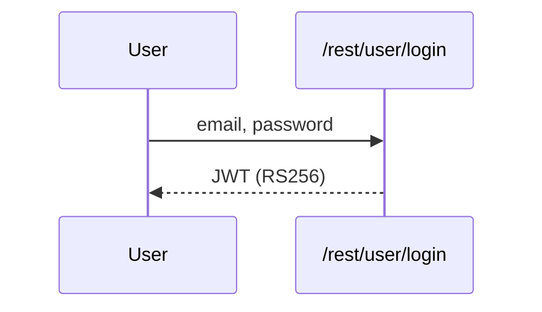
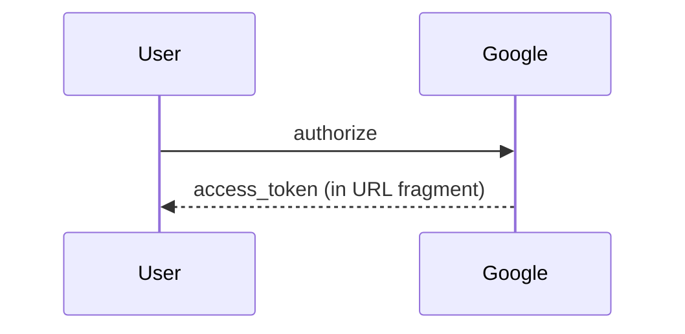
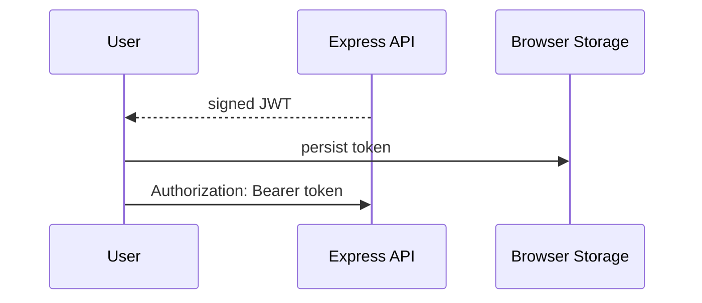

## 7. Security Architecture

This chapter is organized by security-control category. The frozen fixture keeps the prose compact so the deterministic replay exercises the current v2 contract without depending on legacy §7 headings.

### 7.1 Security Control Overview

| Control category | Verdict | Main reason |
|---|---|---|
| [7.2 Identity and Authentication Controls](#72-identity-and-authentication-controls) | Weak | Password login and OAuth exist, but token issuance depends on weak key handling. |
| [7.3 Session and Token Controls](#73-session-and-token-controls) | Weak | Browser-held JWTs lack strong lifecycle controls. |
| [7.4 Authorization Controls](#74-authorization-controls) | Weak | Client-side route behavior is not enough server-side authorization evidence. |
| [7.5 Query Construction and Data Access Controls](#75-query-construction-and-data-access-controls) | Unsafe | Raw SQL is reachable from login and search paths. |
| [7.6 Input Boundary Validation Controls](#76-input-boundary-validation-controls) | Partial | Validation is route-local rather than centralized. |
| [7.7 Output Encoding and Rendering Controls](#77-output-encoding-and-rendering-controls) | Weak | Angular escaping exists, but trusted-HTML bypasses remain. |
| [7.8 Browser and Cross-Origin Controls](#78-browser-and-cross-origin-controls) | Partial | Browser policy controls are limited. |
| [7.9 Cryptography Secrets and Data Protection](#79-cryptography-secrets-and-data-protection) | Unsafe | Signing keys are committed to source. |
| [7.10 File Parser and Outbound Request Controls](#710-file-parser-and-outbound-request-controls) | Not applicable | No parser or outbound-request finding is routed in this fixture. |
| [7.11 Operations Runtime and Supply Chain Controls](#711-operations-runtime-and-supply-chain-controls) | Partial | Dependency posture remains incomplete. |
| [7.12 Real-time and Not Applicable Controls](#712-real-time-and-not-applicable-controls) | Not applicable | No real-time, AI, GraphQL, or gRPC surface is represented. |
| [7.13 Defense-in-Depth Summary](#713-defense-in-depth-summary) | Weak | Controls are concentrated in one application layer. |

### 7.2 Identity and Authentication Controls

**Verdict:** Weak

**Controls covered:** [Password-Based Authentication](#password-based-authentication), [OAuth Login](#oauth-login).

**Implemented controls:** Password login and OAuth implicit flow are present.

**Assessment:** Identity establishment is centralized in the Express process, but the resulting session token inherits weak key handling and legacy OAuth behavior.

#### Password-Based Authentication

Password login accepts user credentials on `/rest/user/login` and returns the bearer token that the browser uses for later API calls.

**Security assessment**

The flow exists, but the issued token depends on committed RSA material, so repository read access can become token-forging capability.

**Relevant findings**

- T-003 hardcoded RSA signing material.

#### OAuth Login

The OAuth implicit flow hands an access token back through the browser and then relies on the same session-token boundary as password login.

**Security assessment**

The legacy implicit flow exposes bearer material to browser URL handling and does not provide a stronger server-side exchange boundary.

**Relevant findings**

- T-001 OAuth token exposure.

### 7.3 Session and Token Controls

**Verdict:** Weak

**Controls covered:** [JWT Session Lifecycle](#jwt-session-lifecycle).

**Implemented controls:** JWT bearer tokens are issued after login and sent back to protected API routes.

**Assessment:** The fixture has a token-based session model, but browser storage, revocation, and signing-key isolation are too thin to contain XSS or source-disclosure scenarios.

#### JWT Session Lifecycle

The browser keeps the JWT after authentication and presents it to API routes that require an authenticated session.

**Security assessment**

The session token remains valid without a clear revocation control, and local browser storage makes the token reachable to injected script.

**Relevant findings**

- T-003 signing-key exposure affects token trust.

### 7.4 Authorization Controls

**Verdict:** Weak

**Controls covered:** [Route Authorization](#route-authorization).

**Implemented controls:** Angular route guards and limited API role checks are represented in the fixture.

**Assessment:** Client-side navigation controls cannot prove authorization on server-side object access or privileged API behavior.

#### Route Authorization

Route authorization should enforce privileged access at the API boundary, independent of what the Angular client hides or shows.

**Security assessment**

The fixture keeps most authorization evidence close to the client and does not establish object-level authorization as a consistent server-side control.

**Relevant findings**

- No dedicated authorization finding routed in this assessment.

### 7.5 Query Construction and Data Access Controls

**Verdict:** Unsafe

**Controls covered:** [Parameterized Database Access](#parameterized-database-access).

**Implemented controls:** Sequelize is used for most CRUD queries.

**Assessment:** ORM coverage is not enough when login and search still build raw SQL on public-input paths.

#### Parameterized Database Access

Parameterized database access keeps attacker-controlled values out of SQL syntax.

**Security assessment**

The ORM is present, but raw SQL construction remains on authentication and product-search routes.

**Relevant findings**

- T-001 raw SQL injection path.

### 7.6 Input Boundary Validation Controls

**Verdict:** Partial

**Controls covered:** [Validation Approach](#validation-approach).

**Implemented controls:** Some route handlers validate expected fields before persistence.

**Assessment:** Validation is fragmented and does not consistently sit at the request boundary.

#### Validation Approach

The validation approach should reject malformed or unexpected user input before it reaches business logic or persistence.

**Security assessment**

The fixture shows per-route checks, but no centralized schema strategy that would make parser, request-size, and business-rule boundaries consistent.

**Relevant findings**

- No dedicated validation finding routed in this assessment.

### 7.7 Output Encoding and Rendering Controls

**Verdict:** Weak

**Controls covered:** [Output Encoding](#output-encoding).

**Implemented controls:** Angular template escaping protects standard interpolation paths.

**Assessment:** Direct sanitizer bypass calls keep exploitable rendering paths alive despite framework defaults.

#### Output Encoding

Output encoding prevents stored content from becoming executable browser content.

**Security assessment**

Framework escaping is present, but trusted-HTML bypasses undercut that protection.

**Relevant findings**

- T-002 stored content rendering path.

### 7.8 Browser and Cross-Origin Controls

**Verdict:** Partial

**Controls covered:** [Browser Security Headers](#browser-security-headers).

**Implemented controls:** Some browser-facing header behavior exists through the Node stack.

**Assessment:** The fixture does not establish a complete CSP, CORS, CSRF, and clickjacking posture.

#### Browser Security Headers

Browser headers constrain what the client can load, frame, and send cross-origin.

**Security assessment**

The browser policy is present only in limited form and does not compensate for rendering weaknesses.

**Relevant findings**

- No dedicated browser-policy finding routed in this assessment.

### 7.9 Cryptography Secrets and Data Protection

**Verdict:** Unsafe

**Controls covered:** [JWT Signing Key Management](#jwt-signing-key-management).

**Implemented controls:** RS256 is used for token signing.

**Assessment:** The cryptographic primitive is stronger than the way it is operated; a committed signing key collapses the trust boundary.

#### JWT Signing Key Management

JWT signing key management keeps token-forging capability out of the repository and runtime logs.

**Security assessment**

The RSA key material is part of the fixture source, so anyone with repository read access can mint tokens offline.

**Relevant findings**

- T-003 hardcoded RSA private key.

### 7.10 File Parser and Outbound Request Controls

**Verdict:** Not applicable

_Not applicable for this fixture - no file-parser or outbound-request finding is routed to this category._

### 7.11 Operations Runtime and Supply Chain Controls

**Verdict:** Partial

**Controls covered:** [Dependency Update Posture](#dependency-update-posture).

**Implemented controls:** Dependabot is represented in the fixture, but critically outdated packages remain.

**Assessment:** Dependency automation is present, but the remaining outdated dependency signal means patch management is not yet an adequate operational control.

#### Dependency Update Posture

Dependency update posture combines automated update creation with evidence that security-relevant updates are actually merged.

**Security assessment**

Dependabot coverage helps, but the fixture still carries critically outdated dependencies, so the process has not closed the supply-chain exposure.

**Relevant findings**

- T-010 outdated dependency posture.

### 7.12 Real-time and Not Applicable Controls

**Verdict:** Not applicable

_Not applicable - no real-time / WebSocket findings routed to this category, and no AI/LLM, GraphQL, or gRPC surface is represented in this fixture._

### 7.13 Defense-in-Depth Summary

**Verdict:** Weak

The fixture has several useful individual controls: framework output escaping, JWT signing, OAuth login support, ORM usage on common CRUD paths, Dependabot configuration, and a single Express runtime boundary. Those controls are not independent enough to stop the same public-input flaws from reaching authentication, query construction, and browser rendering paths.

Layered defense would improve most by fixing raw SQL construction, moving signing material out of source, enforcing server-side authorization, and removing trusted-HTML bypasses. Those repairs would give the existing controls room to act as backstops instead of single points of failure.
