# Threat Model - Juice Shop (fixture)

_Generated by appsec-advisor v0.4.0-beta (analysis v3)_

---

> | | |
> |---|---|
> | **Project** | Juice Shop (fixture) v19.2.1 |
> | **Description** | Fixture project for compose_threat_model deterministic tests |
> | **Author** | Test Fixture |
> | **License** | MIT |
> | **Repository** | https://github.com/example/fixture |
> | **Homepage** | https://github.com/juice-shop/juice-shop |

---

## Changelog

_Append-only history of assessment runs. Most recent first._

| Version | Date | Mode | Depth | Reasoning | Baseline → Current | Δ Threats | Code | Note |
|--------|----------|--------|--------|--------------|------------------|----------------|--------|------------------|
| v1 | 2026-04-19 | full | - | - | _(initial)_ | 0 total | - | Initial assessment |

---

## Table of Contents

- [Management Summary](#management-summary)
- [Critical Attack Tree](#critical-attack-tree)
1. [System Overview](#1-system-overview)
2. [Architecture Diagrams](#2-architecture-diagrams)
   - [2.1 System Context](#21-system-context)
   - [2.2 Container Architecture](#22-container-architecture)
   - [2.3 Components](#23-components)
   - [2.4 Technology Architecture](#24-technology-architecture)
3. [Attack Walkthroughs](#3-attack-walkthroughs)
   - [3.1 Attack Chain Overview](#31-attack-chain-overview)
   - [3.2 SQL Injection Authentication Bypass](#32-sql-injection-authentication-bypass)
4. [Assets](#4-assets)
5. [Attack Surface](#5-attack-surface)
   - [5.1 Unauthenticated Entry Points](#51-unauthenticated-entry-points)
   - [5.2 Authenticated Entry Points](#52-authenticated-entry-points)
7. [Security Architecture](#7-security-architecture)
   - [7.1 Security Control Overview](#71-security-control-overview)
   - [7.2 Identity and Authentication Controls](#72-identity-and-authentication-controls)
   - [7.3 Session and Token Controls](#73-session-and-token-controls)
   - [7.4 Authorization Controls](#74-authorization-controls)
   - [7.5 Query Construction and Data Access Controls](#75-query-construction-and-data-access-controls)
   - [7.6 Input Boundary Validation Controls](#76-input-boundary-validation-controls)
   - [7.7 Output Encoding and Rendering Controls](#77-output-encoding-and-rendering-controls)
   - [7.8 Browser and Cross-Origin Controls](#78-browser-and-cross-origin-controls)
   - [7.9 Cryptography Secrets and Data Protection](#79-cryptography-secrets-and-data-protection)
   - [7.10 File Parser and Outbound Request Controls](#710-file-parser-and-outbound-request-controls)
   - [7.11 Operations Runtime and Supply Chain Controls](#711-operations-runtime-and-supply-chain-controls)
   - [7.12 Real-time and Not Applicable Controls](#712-real-time-and-not-applicable-controls)
   - [7.13 Defense-in-Depth Summary](#713-defense-in-depth-summary)
8. [Findings Register](#8-findings-register)
9. [Abuse Cases](#9-abuse-cases)
10. [Mitigation Register](#10-mitigation-register)
11. [Out of Scope](#11-out-of-scope)
- [Appendix: Run Statistics](#appendix-run-statistics)
- [Appendix A - Vektor Taxonomy](#appendix-a-vektor-taxonomy)

> _Section numbering is non-contiguous: §6 was retired in a prior revision. The remaining sections keep their original numbers so existing cross-references stay valid._

---

## Management Summary

### Verdict

🔴 **CRITICAL SECURITY POSTURE** - the fixture project has severe exploitable vulnerabilities across authentication, injection, and access control. The assessment identified **3 Critical** and **1 High** findings.

**Risk distribution:** 🔴 Critical: 3 · 🟠 High: 1 · 🟡 Medium: 0 · 🟢 Low: 0 · **Total: 4**

 

**Worst-case scenarios behind this verdict - what an attacker could do today:**

<blockquote style="border-left: 3px solid #dc2626; background: #fef2f2; padding: 16px 20px; margin: 0;">

- **Admin login without a password** — SQL injection in the login endpoint lets any internet user log in as any account, including administrators, with no credentials. *(🔴 [F-002](#f-002))*
- **Full database theft without login** — SQL injection in product search returns the full Users and Orders tables in a single web request. *(🔴 [F-001](#f-001))*
- **Admin impersonation via a leaked source-code secret** — The RSA private key used to sign session tokens is committed to the public repository; an attacker issues valid admin tokens offline. *(🔴 [F-003](#f-003))*

</blockquote>

 

No meaningful security boundary exists between the internet-facing attack surface and complete administrative control. The deployment is not production-ready.

### Security Posture & Top Threats

**Figure 2 - Risk Flow: Actor → Tier → Impact**

Heatmap: **actors** (left) → **architecture tiers** (middle, Client → Application → Data) → **impact** (right). Numbered red arrows ① are the threats enumerated in the Top Threats table below.

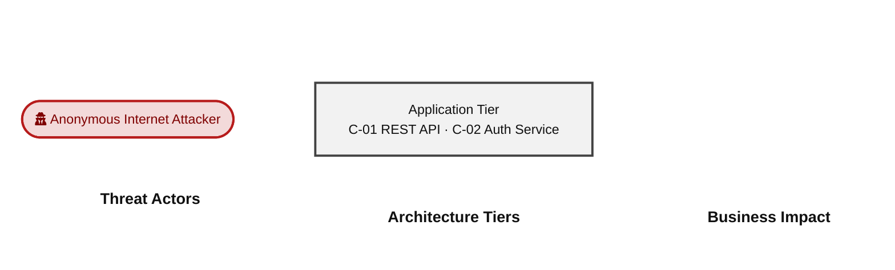

**0 structural threats**, grouped by weakness class - each row is one threat, not one finding. *Threat Description* states the general architectural weakness (STRIDE in brackets); *Findings* lists the concrete instances, each linked to [§8 Findings Register](#8-findings-register) with its component; *Risk & Impact* combines severity with business consequence.

| # | Threat Description | Findings (→ Component) | Risk & Impact | Fix |
|---|------------------|----------------------|--------------|--------|

_STRIDE: S spoofing · T tampering · R repudiation · I information disclosure · D denial of service · E elevation of privilege. Risk, findings, components, impact and Fix are derived deterministically; only the one-line weakness description is authored._

### Top Mitigations

Highest-impact P1/P2 mitigations - 3 of 3 qualifying (3 total). Full detail in [§10 Mitigation Register](#10-mitigation-register). All 2 mitigation(s) that fix a Critical finding are always listed here.

| # | Component | Mitigation | Addresses | Effort |
|---|-------------------|--------------------------------------|------------------------------------------------|------|
| **1** | [C-01](#c-01) — REST API | ❶ [M-001](#m-001) — Parameterize SQL queries | 🔴 [F-001](#f-001) — SQL injection in product search 🔴 [F-002](#f-002) — SQL injection in login | Medium |
| **2** | [C-02](#c-02) — Auth Service | ❶ [M-002](#m-002) — Externalize RSA key | 🔴 [F-003](#f-003) — Hardcoded RSA private key | Medium |
| **3** | [C-01](#c-01) — REST API | ❷ [M-003](#m-003) — Remove DomSanitizer bypasses | 🟠 [F-010](#f-010) — Persistent XSS via bypassSecurityTrustHtml | Medium |

### Operational Strengths

Operational controls rated Adequate or Partial - grouped into broad clusters (full per-control breakdown in [§7](#7-security-architecture)). Clusters demoted to Weak by open Critical/High findings appear in [§7](#7-security-architecture) instead, not here.

| Strength | What's in Place | Effectiveness | Gap | Mitigates |
|----------------------|----------------------|-------------|----------------------|----------------|
| **Container & Supply-Chain Hardening** | _Build-time and runtime hardening - minimal base image, non-root execution, dependency inventory._ Container Base Image | ✅ Adequate | - | - |
| **Authentication & Session Management** | _Identity issuance, route-level authorisation, and second-factor handling for this codebase._ TOTP Two-Factor Authentication JWT-based Authentication | ⚠️ Partial | Coverage incomplete - see [§7](#7-security-architecture) control assessment. | - |
| **Input Handling & Output Encoding** | _Boundary validation of untrusted input and consistent output encoding before persistence or rendering._ Parameterized Database Access | ⚠️ Partial | Coverage incomplete - see [§7](#7-security-architecture) control assessment. | - |

**Bottom line:** These controls narrow specific attack surfaces but none eliminates a Critical finding on its own - every remaining Critical path bypasses them.

---

## Critical Attack Tree

The root is the worst-case attacker goal; below it, each capability branch groups the Critical findings that achieve it. Branches feed the goal by OR - any single path suffices.

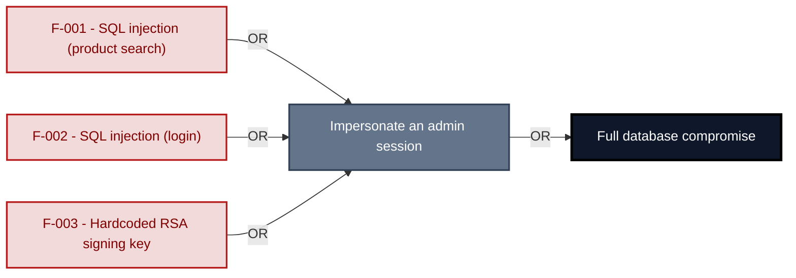

**Findings** (full detail in [§8 Findings Register](#8-findings-register)): 🔴 [F-001](#f-001) SQL injection (product search) · 🔴 [F-002](#f-002) SQL injection (login) · 🔴 [F-003](#f-003) Hardcoded RSA signing key

---

## 1. System Overview

The fixture project is a small Express/Angular monolith used in the compose_threat_model determinism tests. It intentionally implements every injection pattern that the contract must render correctly.

---

## 2. Architecture Diagrams

### 2.1 System Context

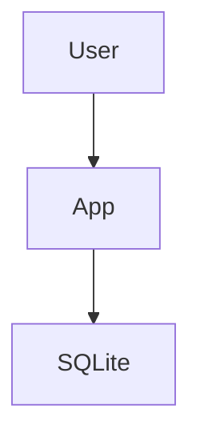

### 2.2 Container Architecture

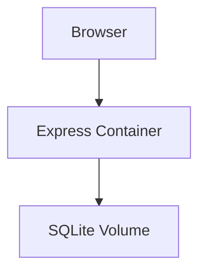

### 2.3 Components

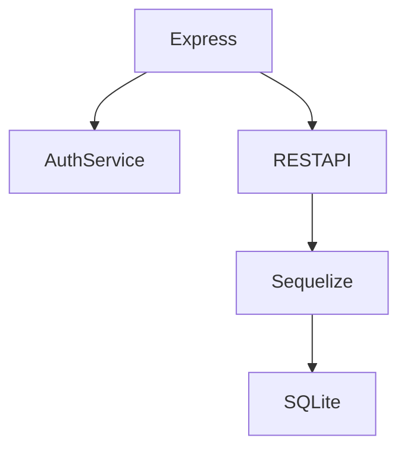

| ID | Name | Type | Key Paths | Linked Threats |
|----|------------|--------|-----------------|------------------------------------------------|
| C-01 | REST API | service | `routes/` | 🔴 [F-001](#f-001) — SQL injection in product search 🔴 [F-002](#f-002) — SQL injection in login 🟠 [F-010](#f-010) — Persistent XSS via bypassSecurityTrustHtml |
| C-02 | Auth Service | library | `lib/insecurity.ts` | 🔴 [F-003](#f-003) — Hardcoded RSA private key |
### 2.4 Technology Architecture

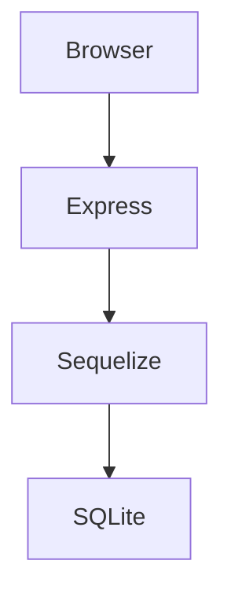

---

## 3. Attack Walkthroughs

This section reconstructs how each Critical finding would actually play out as an attack - one short walkthrough per finding, with attack steps and a sequence diagram contrasting current behaviour with the post-mitigation state. The cross-finding view (which weaknesses combine toward the worst-case goal, and where one fix severs several paths) is in the [Critical Attack Tree](#critical-attack-tree) above [§1](#1-system-overview). Medium- and Low-severity findings are not walked through here - they are documented in [§8 Findings Register](#8-findings-register).

### 3.1 Attack Chain Overview

The diagrams below show how Critical findings combine into distinct attacker workflows.

#### Chain 1 — DB Compromise

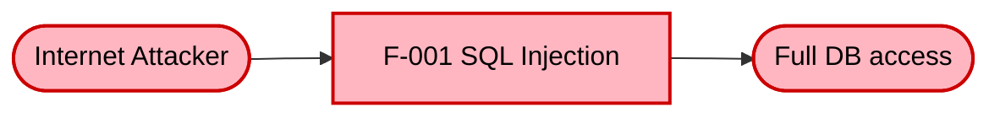

**Key takeaway:** SQL injection on the login endpoint gives the attacker direct read access to the full user database.

#### Chain 2 — Admin Takeover

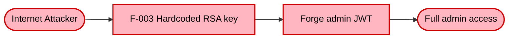

**Key takeaway:** A single fix does not break the chain - parameterized queries plus secret rotation must both land simultaneously.

### 3.2 SQL Injection Authentication Bypass

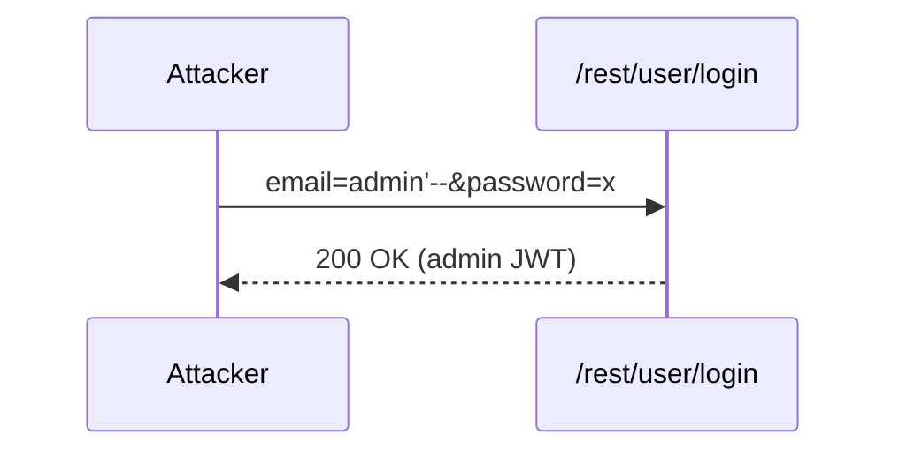

---

## 4. Assets

| Asset | Classification | Linked Threats |
|----------------|--------------|-----------------------------------------|
| User Credentials | Restricted | 🔴 [F-001](#f-001) — SQL injection in product search |
| RSA Private Key | Restricted | 🔴 [F-003](#f-003) — Hardcoded RSA private key |

---

## 5. Attack Surface

### 5.1 Unauthenticated Entry Points

| Entry Point | Protocol | Notes |
|---------------------|--------|--------------|
| POST /rest/user/login | HTTP | SQLi |

### 5.2 Authenticated Entry Points

| Entry Point | Protocol | Notes |
|--------------|--------|--------------|
| GET /api/Users | HTTP | Broken access |

---

## 7. Security Architecture

This chapter is organized by security-control category. The frozen fixture keeps the prose compact so the deterministic replay exercises the current v2 contract without depending on legacy [§7](#7-security-architecture) headings.

### 7.1 Security Control Overview

| Control category | Verdict | Main reason |
|----------------------|--------------|------------------------------------|
| [7.2 Identity and Authentication Controls](#72-identity-and-authentication-controls) | Weak | Password login and OAuth exist, but token issuance depends on weak key handling. |
| [7.3 Session and Token Controls](#73-session-and-token-controls) | Weak | Browser-held JWTs lack strong lifecycle controls. |
| [7.4 Authorization Controls](#74-authorization-controls) | Weak | Client-side route behavior is not enough server-side authorization evidence. |
| [7.5 Query Construction and Data Access Controls](#75-query-construction-and-data-access-controls) | Unsafe | Raw SQL is reachable from login and search paths. |
| [7.6 Input Boundary Validation Controls](#76-input-boundary-validation-controls) | Partial | Validation is route-local rather than centralized. |
| [7.7 Output Encoding and Rendering Controls](#77-output-encoding-and-rendering-controls) | Weak | Angular escaping exists, but trusted-HTML bypasses remain. |
| [7.8 Browser and Cross-Origin Controls](#78-browser-and-cross-origin-controls) | Partial | Browser policy controls are limited. |
| [7.9 Cryptography Secrets and Data Protection](#79-cryptography-secrets-and-data-protection) | Unsafe | Signing keys are committed to source. |
| [7.10 File Parser and Outbound Request Controls](#710-file-parser-and-outbound-request-controls) | Not applicable | No parser or outbound-request finding is routed in this fixture. |
| [7.11 Operations Runtime and Supply Chain Controls](#711-operations-runtime-and-supply-chain-controls) | Partial | Dependency posture remains incomplete. |
| [7.12 Real-time and Not Applicable Controls](#712-real-time-and-not-applicable-controls) | Not applicable | No real-time, AI, GraphQL, or gRPC surface is represented. |
| [7.13 Defense-in-Depth Summary](#713-defense-in-depth-summary) | Weak | Controls are concentrated in one application layer. |

### 7.2 Identity and Authentication Controls

**Verdict:** Weak

**Controls covered:**

- [7.2.1 Password-Based Authentication](#password-based-authentication)
- [7.2.2 OAuth Login](#oauth-login)

**Implemented controls:** Password login and OAuth implicit flow are present.

**Assessment:** Identity establishment is centralized in the Express process, but the resulting session token inherits weak key handling and legacy OAuth behavior.

#### 7.2.1 Password-Based Authentication

Password login accepts user credentials on `/rest/user/login` and returns the bearer token that the browser uses for later API calls.

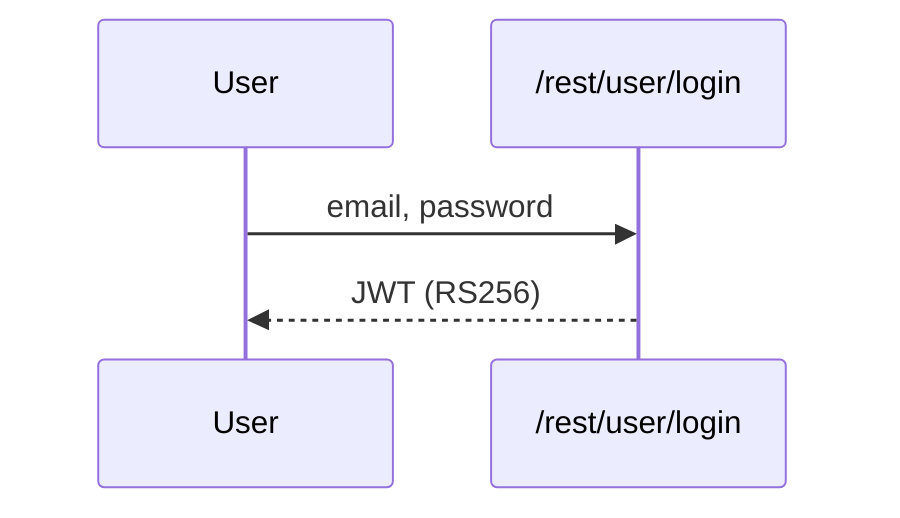

**Security assessment**

The flow exists, but the issued token depends on committed RSA material, so repository read access can become token-forging capability.

**Relevant findings**

- 🔴 [F-003](#f-003) hardcoded RSA signing material.

#### 7.2.2 OAuth Login

The OAuth implicit flow hands an access token back through the browser and then relies on the same session-token boundary as password login.

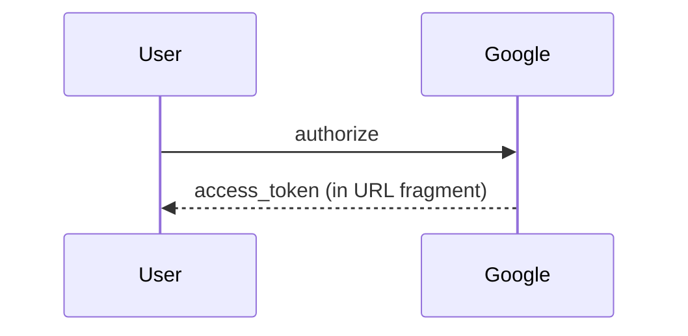

**Security assessment**

The legacy implicit flow exposes bearer material to browser URL handling and does not provide a stronger server-side exchange boundary.

**Relevant findings**

- 🔴 [F-001](#f-001) OAuth token exposure.

### 7.3 Session and Token Controls

**Verdict:** Weak

**Controls covered:**

- [7.3.1 JWT Session Lifecycle](#jwt-session-lifecycle)

**Implemented controls:** JWT bearer tokens are issued after login and sent back to protected API routes.

**Assessment:** The fixture has a token-based session model, but browser storage, revocation, and signing-key isolation are too thin to contain XSS or source-disclosure scenarios.

#### 7.3.1 JWT Session Lifecycle

The browser keeps the JWT after authentication and presents it to API routes that require an authenticated session.

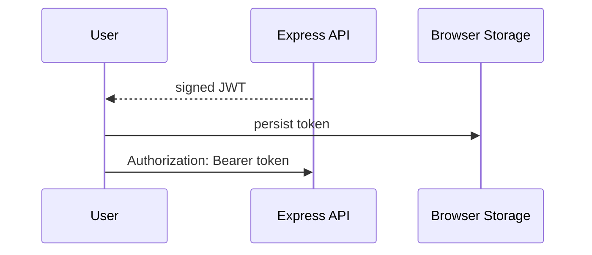

**Security assessment**

The session token remains valid without a clear revocation control, and local browser storage makes the token reachable to injected script.

**Relevant findings**

- 🔴 [F-003](#f-003) signing-key exposure affects token trust.

### 7.4 Authorization Controls

**Verdict:** Weak

**Controls covered:**

- [7.4.1 Route Authorization](#route-authorization)

**Implemented controls:** Angular route guards and limited API role checks are represented in the fixture.

**Assessment:** Client-side navigation controls cannot prove authorization on server-side object access or privileged API behavior.

#### 7.4.1 Route Authorization

Route authorization should enforce privileged access at the API boundary, independent of what the Angular client hides or shows.

**Security assessment**

The fixture keeps most authorization evidence close to the client and does not establish object-level authorization as a consistent server-side control.

**Relevant findings**

- No dedicated authorization finding routed in this assessment.

### 7.5 Query Construction and Data Access Controls

**Verdict:** Unsafe

**Controls covered:**

- [7.5.1 Parameterized Database Access](#parameterized-database-access)

**Implemented controls:** Sequelize is used for most CRUD queries.

**Assessment:** ORM coverage is not enough when login and search still build raw SQL on public-input paths.

#### 7.5.1 Parameterized Database Access

Parameterized database access keeps attacker-controlled values out of SQL syntax.

**Security assessment**

The ORM is present, but raw SQL construction remains on authentication and product-search routes.

**Relevant findings**

- 🔴 [F-001](#f-001) raw SQL injection path.

### 7.6 Input Boundary Validation Controls

**Verdict:** Partial

**Controls covered:**

- [7.6.1 Validation Approach](#validation-approach)

**Implemented controls:** Some route handlers validate expected fields before persistence.

**Assessment:** Validation is fragmented and does not consistently sit at the request boundary.

#### 7.6.1 Validation Approach

The validation approach should reject malformed or unexpected user input before it reaches business logic or persistence.

**Security assessment**

The fixture shows per-route checks, but no centralized schema strategy that would make parser, request-size, and business-rule boundaries consistent.

**Relevant findings**

- No dedicated validation finding routed in this assessment.

### 7.7 Output Encoding and Rendering Controls

**Verdict:** Weak

**Controls covered:**

- [7.7.1 Output Encoding](#output-encoding)

**Implemented controls:** Angular template escaping protects standard interpolation paths.

**Assessment:** Direct sanitizer bypass calls keep exploitable rendering paths alive despite framework defaults.

#### 7.7.1 Output Encoding

Output encoding prevents stored content from becoming executable browser content.

**Security assessment**

Framework escaping is present, but trusted-HTML bypasses undercut that protection.

**Relevant findings**

- 🔴 [F-002](#f-002) stored content rendering path.

### 7.8 Browser and Cross-Origin Controls

**Verdict:** Partial

**Controls covered:**

- [7.8.1 Browser Security Headers](#browser-security-headers)

**Implemented controls:** Some browser-facing header behavior exists through the Node stack.

**Assessment:** The fixture does not establish a complete CSP, CORS, CSRF, and clickjacking posture.

#### 7.8.1 Browser Security Headers

Browser headers constrain what the client can load, frame, and send cross-origin.

**Security assessment**

The browser policy is present only in limited form and does not compensate for rendering weaknesses.

**Relevant findings**

- No dedicated browser-policy finding routed in this assessment.

### 7.9 Cryptography Secrets and Data Protection

**Verdict:** Unsafe

**Controls covered:**

- [7.9.1 JWT Signing Key Management](#jwt-signing-key-management)

**Implemented controls:** RS256 is used for token signing.

**Assessment:** The cryptographic primitive is stronger than the way it is operated; a committed signing key collapses the trust boundary.

#### 7.9.1 JWT Signing Key Management

JWT signing key management keeps token-forging capability out of the repository and runtime logs.

**Security assessment**

The RSA key material is part of the fixture source, so anyone with repository read access can mint tokens offline.

**Relevant findings**

- 🔴 [F-003](#f-003) hardcoded RSA private key.

### 7.10 File Parser and Outbound Request Controls

**Verdict:** Not applicable

_Not applicable for this fixture - no file-parser or outbound-request finding is routed to this category._

### 7.11 Operations Runtime and Supply Chain Controls

**Verdict:** Partial

**Controls covered:**

- [7.11.1 Dependency Update Posture](#dependency-update-posture)

**Implemented controls:** Dependabot is represented in the fixture, but critically outdated packages remain.

**Assessment:** Dependency automation is present, but the remaining outdated dependency signal means patch management is not yet an adequate operational control.

#### 7.11.1 Dependency Update Posture

Dependency update posture combines automated update creation with evidence that security-relevant updates are actually merged.

**Security assessment**

Dependabot coverage helps, but the fixture still carries critically outdated dependencies, so the process has not closed the supply-chain exposure.

**Relevant findings**

- 🟠 [F-010](#f-010) outdated dependency posture.

### 7.12 Real-time and Not Applicable Controls

**Verdict:** Not applicable

_Not applicable - no real-time / WebSocket findings routed to this category, and no AI/LLM, GraphQL, or gRPC surface is represented in this fixture._

### 7.13 Defense-in-Depth Summary

**Verdict:** Weak

The fixture has several useful individual controls: framework output escaping, JWT signing, OAuth login support, ORM usage on common CRUD paths, Dependabot configuration, and a single Express runtime boundary. Those controls are not independent enough to stop the same public-input flaws from reaching authentication, query construction, and browser rendering paths.

Layered defense would improve most by fixing raw SQL construction, moving signing material out of source, enforcing server-side authorization, and removing trusted-HTML bypasses. Those repairs would give the existing controls room to act as backstops instead of single points of failure.

---

## 8. Findings Register

Findings are grouped by severity (Critical → High → Medium → Low); within a tier they are ordered by attack vektor (Repo-Read → Internet-Anon → Internet-User → Victim-Required). Each finding is a card with the same fixed fields, in order: **Severity · Component · Location** → **Issue** → **Root cause** → **Evidence** → **Fix** → **Classification** (with external CWE / OWASP links).

**Risk Distribution:** 🔴 Critical: 3 · 🟠 High: 1 · 🟡 Medium: 0 · 🟢 Low: 0 · **Total findings: 4**
**STRIDE Coverage:** Spoofing: 1 · Tampering: 3 · Repudiation: 0 · Information Disclosure: 0 · Denial of Service: 0 · Elevation of Privilege: 0

**Findings index:** 🔴 [F-001](#f-001) — SQL injection in product search 🔴 [F-002](#f-002) — SQL injection in login 🔴 [F-003](#f-003) — Hardcoded RSA private key 🟠 [F-010](#f-010) — Persistent XSS via bypassSecurityTrustHtml

### 🔴 Critical (3)

#### F-003 · Hardcoded RSA private key

**Severity:** 🔴 Critical  ·  **Component:** [C-02](#c-02) - Auth Service  ·  **Location:** -

**Issue:** RSA private key committed to public repo allows offline admin JWT forgery.

**Fix:** ❶ [M-002](#m-002) — Externalize RSA key

**Classification:** Cryptographic Failures · [OWASP A02:2021](https://owasp.org/Top10/A02_2021/)

#### F-001 · SQL injection in product search

**Severity:** 🔴 Critical  ·  **Component:** [C-01](#c-01) - REST API  ·  **Location:** -

**Issue:** Product search builds raw SQL via template literal, enabling UNION dump.

**Fix:** ❶ [M-001](#m-001) — Parameterize SQL queries

**Classification:** Injection · [OWASP A03:2021](https://owasp.org/Top10/A03_2021/)

#### F-002 · SQL injection in login

**Severity:** 🔴 Critical  ·  **Component:** [C-01](#c-01) - REST API  ·  **Location:** -

**Issue:** Login concatenates email/password into SQL; `--` comments bypass the password check.

**Fix:** ❶ [M-001](#m-001) — Parameterize SQL queries

**Classification:** Injection · [OWASP A03:2021](https://owasp.org/Top10/A03_2021/)

### 🟠 High (1)

#### F-010 · Persistent XSS via bypassSecurityTrustHtml

**Severity:** 🟠 High  ·  **Component:** [C-01](#c-01) - REST API  ·  **Location:** -

**Issue:** Angular component bypasses DomSanitizer, enabling stored XSS in reviews.

**Fix:** ❷ [M-003](#m-003) — Remove DomSanitizer bypasses

**Classification:** Cross-Site Scripting (XSS) · [OWASP A03:2021](https://owasp.org/Top10/A03_2021/)

---

## 9. Abuse Cases

_No abuse cases were identified or mandated for this assessment._

---

## 10. Mitigation Register

Each mitigation block lists the findings it **Addresses**, the CWEs it **Prevents**, and the **Priority** (P1 = before deployment, P2 = current sprint, P3 = next quarter, P4 = backlog). The **Why** / **How** / **Verification** fields are populated only when authored; if a field is omitted, refer to the linked finding's *Evidence* line for file:line context and to the threat-category description in [§8 Findings Register](#8-findings-register) for the underlying weakness.

**Mitigations index:** ❶ [M-001](#m-001) — Parameterize SQL queries ❶ [M-002](#m-002) — Externalize RSA key ❷ [M-003](#m-003) — Remove DomSanitizer bypasses

### P1 — Immediate

#### M-001 — Parameterize SQL queries

**Addresses:**

- 🔴 [F-001](#f-001) — SQL injection in product search
- 🔴 [F-002](#f-002) — SQL injection in login

**Priority:** P1 - Immediate · **Effort:** Medium

**Why:** Raw SQL enables injection.

**How:** Use Sequelize replacements.

**Verification:** sqlmap shows no injectable params.

---

#### M-002 — Externalize RSA key

**Addresses:**

- 🔴 [F-003](#f-003) — Hardcoded RSA private key

**Priority:** P1 - Immediate · **Effort:** Medium

**Why:** Key is committed to public repo.

**How:** Load from env var at startup.

**Verification:** Repo contains no BEGIN RSA PRIVATE KEY.

---

### P2 — This Sprint

#### M-003 — Remove DomSanitizer bypasses

**Addresses:**

- 🟠 [F-010](#f-010) — Persistent XSS via bypassSecurityTrustHtml

**Priority:** P2 - This Sprint · **Effort:** Medium

**Why:** Unsanitized HTML enables XSS.

**How:** Use `DomSanitizer.sanitize()`.

**Verification:** No `bypassSecurityTrustHtml` in codebase.

---

### P3 — Next Quarter

_No P3 mitigations._

### P4 — Backlog

_No P4 mitigations._

---

## 11. Out of Scope

- Physical security
- Social engineering

---

## Appendix: Run Statistics

| Field | Value |
|----------------------|----------------------|
| Invocation | `(not recorded)` |
| Generated | 2026-04-19 13:06 UTC |
| Mode | - |
| Assessment depth | standard |
| Plugin version | 0.4.0-beta (analysis v3) |
| Orchestrator model | claude-sonnet-4-6 |
| Repository | - |
| Output directory | - |
| Total analysis duration | - |

### Per-Phase Duration Breakdown

_No per-phase timing captured - `.agent-run.log` missing or unparseable._

---

## Appendix A — Vektor Taxonomy

This appendix defines the attacker-starting-position labels used in the Top Threats table and throughout [§8 Findings Register](#8-findings-register). Each label answers the question *what does the attacker need before the exploit begins?*

### Internet Anon

**Attacker position:** Unauthenticated attacker from the public internet · **Breach distance:** 1

**Preconditions:**

- Endpoint is reachable from the internet (no IP allowlist, no VPN)
- No authentication middleware blocks the request

**Typical CWEs:** [CWE-89](https://cwe.mitre.org/data/definitions/89.html) · [CWE-79](https://cwe.mitre.org/data/definitions/79.html) · [CWE-306](https://cwe.mitre.org/data/definitions/306.html) · [CWE-327](https://cwe.mitre.org/data/definitions/327.html) · [CWE-611](https://cwe.mitre.org/data/definitions/611.html) · [CWE-918](https://cwe.mitre.org/data/definitions/918.html)

**Typical OWASP Top 10:** A01:2021, A03:2021, A07:2021

### Internet User

**Attacker position:** Any authenticated low-privilege user (valid JWT / session) · **Breach distance:** 2

**Preconditions:**

- Attacker has signed up or otherwise obtained a valid user session
- Endpoint is behind auth but not behind role/admin checks

**Typical CWEs:** [CWE-434](https://cwe.mitre.org/data/definitions/434.html) · [CWE-611](https://cwe.mitre.org/data/definitions/611.html) · [CWE-918](https://cwe.mitre.org/data/definitions/918.html) · [CWE-352](https://cwe.mitre.org/data/definitions/352.html) · [CWE-287](https://cwe.mitre.org/data/definitions/287.html)

**Typical OWASP Top 10:** A01:2021, A04:2021, A05:2021, A10:2021

### Internet Priv User

**Attacker position:** Authenticated admin-level user (JWT with admin role or equivalent) · **Breach distance:** 2

**Preconditions:**

- Attacker holds admin credentials or has elevated privileges
- Endpoint gated on admin role but still exploitable once reached

**Typical CWEs:** [CWE-862](https://cwe.mitre.org/data/definitions/862.html) · [CWE-79](https://cwe.mitre.org/data/definitions/79.html) · [CWE-94](https://cwe.mitre.org/data/definitions/94.html)

**Typical OWASP Top 10:** A01:2021

### Victim-Required

**Attacker position:** Attacker needs victim interaction - social engineering, crafted link, or live session · **Breach distance:** 2

**Preconditions:**

- Victim must click a link, load a page, or have an active session
- Applies to XSS, CSRF, click-jacking, open redirect

**Typical CWEs:** [CWE-79](https://cwe.mitre.org/data/definitions/79.html) · [CWE-352](https://cwe.mitre.org/data/definitions/352.html) · [CWE-601](https://cwe.mitre.org/data/definitions/601.html) · [CWE-1021](https://cwe.mitre.org/data/definitions/1021.html)

**Typical OWASP Top 10:** A01:2021, A03:2021

### Build-Time

**Attacker position:** Attacker controls a build input - CI runner, dependency, base image, or external data fetched during build · **Breach distance:** 3

**Preconditions:**

- Compromise of a dependency, registry, or base image
- OR compromise of a CI runner with write access to artifacts

**Typical CWEs:** [CWE-506](https://cwe.mitre.org/data/definitions/506.html) · [CWE-829](https://cwe.mitre.org/data/definitions/829.html) · [CWE-1039](https://cwe.mitre.org/data/definitions/1039.html) · [CWE-1104](https://cwe.mitre.org/data/definitions/1104.html)

**Typical OWASP Top 10:** A08:2021

### Repo-Read

**Attacker position:** Attacker gains read access to source repository (leaked clone, forked fork, insider, compromised developer workstation) · **Breach distance:** 3

**Preconditions:**

- Read access to the source tree at or after commit time
- No runtime exploit needed - the vulnerability is the content of the repo

**Typical CWEs:** [CWE-798](https://cwe.mitre.org/data/definitions/798.html) · [CWE-312](https://cwe.mitre.org/data/definitions/312.html) · [CWE-540](https://cwe.mitre.org/data/definitions/540.html)

**Typical OWASP Top 10:** A02:2021, A07:2021

### n/a

**Attacker position:** Architectural / meta-finding - no runtime entry point, the finding describes a design defect aggregating multiple code-level findings

**Preconditions:**

- Finding is AF-NNN (architectural) rather than F-NNN (code-level)